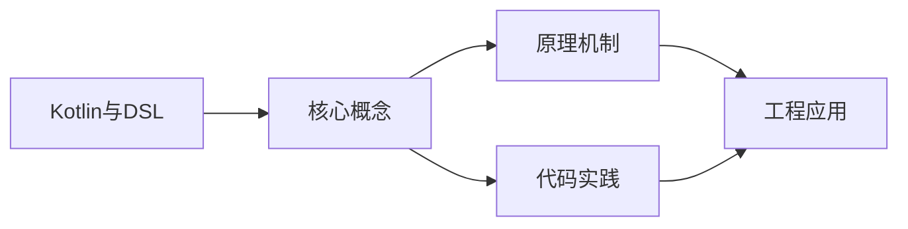

## 1. 学习目标（Bloom 分类）

本节按照布鲁姆教育目标分类学组织学习路径。本文主题为《Kotlin与DSL》，属于 Kotlin 模块，读者可以根据自身阶段选择阅读深度。

记忆层面：能够准确复述本文的核心概念、术语与基本语法或操作步骤，并能够在提问或检索时快速定位对应知识点。能够说出 val/var、空安全操作符与 when 表达式的语法。

理解层面：能够用自己的语言解释核心原理与工作机制，说明概念之间的因果关系，而不是机械记忆结论。能够解释 Kotlin 与 Java 互操作的机制与平台类型概念。

应用层面：能够在真实项目或练习场景中运用本文知识解决具体问题，写出正确且可维护的实现。能够编写数据类、扩展函数与协程代码。

分析层面：能够拆解复杂问题，比较本文主题与相邻概念的异同，识别边界条件与例外情况。能够分析空安全、智能转换与协程调度原理。

评价层面：能够根据约束条件（性能、可读性、安全、成本）评价不同方案的优劣，做出有依据的技术决策。能够评价 Kotlin 在 Android、服务端与多平台场景的适用性。

创造层面：能够把本文知识与其他模块知识组合，设计出新的解决方案或可复用的工程模式。能够组合 Compose 与协程设计跨平台应用。

通过本节学习，读者应当能够把《Kotlin与DSL》纳入自己的知识网络，并与 Kotlin 模块的其他主题（类型推断、空安全、协程、KMP）建立关联。

## 2. 历史动机与发展脉络

《Kotlin与DSL》是 Kotlin 领域的重要主题。要真正理解它，需要先了解它解决的问题与演进过程。

Kotlin 由 JetBrains 于 2010 年开始研发，2016 年发布 1.0，定位是“更现代的 JVM 语言”：减少样板代码、消灭空指针、增强函数式能力，同时与 Java 100% 互操作。
2017 年 Google 宣布 Kotlin 成为 Android 一级语言，2019 年确立 Kotlin-first 政策；2023 年 Kotlin 2.0 的 K2 编译器显著提升编译速度与类型推导。
Kotlin Multiplatform（KMP）支持 JVM、Android、iOS、WebAssembly 等目标，配合 Compose Multiplatform 实现共享 UI 与业务逻辑，是 JetBrains 的长期战略方向。

回到本文主题：Kotlin与DSL 的提出与成熟，正是上述技术背景下的必然产物。早期实现往往以简单可用为目标，随着工程规模扩大，社区逐渐沉淀出标准做法与最佳实践；理解这一脉络，可以帮助读者判断“为什么文档中的推荐写法是现在这个样子”，也能在遇到历史遗留代码时准确识别其设计年代与取舍。


## 3. 形式化定义与核心概念精讲

本节把《Kotlin与DSL》涉及的核心概念以“定义 + 讲解”的形式展开。读者应把定义当作工具，把讲解当作理解路径；两者结合才能形成可迁移的知识。

空安全：类型系统区分 `String` 与 `String?`，编译期强制处理可空值；`?.` 短路、`?:` 提供默认、`!!` 显式断言，三者覆盖所有空值处理模式。
智能转换：`is` 检查后在不可变上下文中自动转换类型，减少显式强转；`as?` 安全转换失败返回 null。
协程：挂起函数（suspend）与调度器（Dispatchers.Main/IO/Default）实现非阻塞并发，结构化并发保证作用域内任务可取消。

### 3.1 原文章节逐一精讲

原文档把主题拆分为 11 个小节，下面按顺序给出每一节的导读讲解，随后保留原文细节供精读。

#### 原文精读（完整保留）

# Kotlin DSL 构建器速查

> **符号约定**：`< >` 必填参数 | `[ ]` 可选参数

---

##### 类型安全构建器

```kotlin
// 用泛型和密封类确保类型安全
sealed class Node {
    data class Element(val tag: String, val children: List<Node>, val attrs: Map<String, String>) : Node()
    data class Text(val content: String) : Node()
}

class ElementBuilder(val tag: String) {
    private val children = mutableListOf<Node>()
    private val attrs = mutableMapOf<String, String>()

    operator fun String.unaryPlus() {
        children.add(Node.Text(this))
    }

    fun attr(name: String, value: String) {
        attrs[name] = value
    }

    fun element(tag: String, block: ElementBuilder.() -> Unit = {}) {
        val builder = ElementBuilder(tag)
        builder.block()
        children.add(Node.Element(tag, builder.children, builder.attrs))
    }

    fun build(): Node.Element = Node.Element(tag, children, attrs)
}

fun element(tag: String, block: ElementBuilder.() -> Unit = {}): Node.Element {
    val builder = ElementBuilder(tag)
    builder.block()
    return builder.build()
}

fun main() {
    val doc = element("div") {
        attr("class", "container")
        element("h1") { +"标题" }
        element("p") { +"段落内容" }
    }
    println(doc)
}
```
#### 概述

DSL（Domain-Specific Language，领域特定语言）是针对特定领域设计的专用语言。Kotlin 的扩展函数、带接收者的 lambda、中缀函数等特性，使得在 Kotlin 中构建类型安全的 DSL 非常方便。你已经在很多地方见过 Kotlin DSL：Gradle 构建脚本、Ktor 路由定义、Compose UI 声明等都是 DSL 的典型应用。

理解 DSL 的构建原理，不仅能让你更好地使用这些框架，还能让你为自己的业务领域创建专用的 DSL，提升代码的可读性和表达力。

#### 基础概念

- **带接收者的 lambda**：`Type.() -> Unit`，lambda 内部的 `this` 指向接收者对象
- **构建器模式（Builder Pattern）**：DSL 通常基于构建器模式，通过链式调用构建复杂对象
- **作用域控制**：通过不同的接收者类型，限制 lambda 内部可以调用的方法
- **中缀函数**：`infix` 关键字修饰的函数，调用时可以省略点号和括号

#### 快速上手

一个最简单的 DSL：

```kotlin
// 定义构建器
class HtmlBuilder {
    private val content = StringBuilder()

    fun body(block: BodyBuilder.() -> Unit) {
        val builder = BodyBuilder()
        builder.block()
        content.append("<body>${builder.build()}</body>")
    }

    fun build(): String = "<html>${content}</html>"
}

class BodyBuilder {
    private val content = StringBuilder()

    fun p(text: String) {
        content.append("<p>$text</p>")
    }

    fun h1(text: String) {
        content.append("<h1>$text</h1>")
    }

    fun build(): String = content.toString()
}

// 顶层函数，DSL 入口
fun html(block: HtmlBuilder.() -> Unit): String {
    val builder = HtmlBuilder()
    builder.block()
    return builder.build()
}

// 使用 DSL
fun main() {
    val result = html {
        body {
            h1("标题")
            p("段落内容")
        }
    }
    println(result)
    // <html><body><h1>标题</h1><p>段落内容</p></body></html>
}
```

#### 详细用法

##### 带接收者的 lambda

这是 DSL 的核心机制：

```kotlin
class TableBuilder {
    private val rows = mutableListOf<String>()

    // 带接收者的 lambda：在 lambda 内部 this 指向 RowBuilder
    fun row(block: RowBuilder.() -> Unit) {
        val builder = RowBuilder()
        builder.block()  // 执行 lambda，this 是 builder
        rows.add(builder.build())
    }

    fun build(): String = rows.joinToString("\n", "<table>\n", "\n</table>")
}

class RowBuilder {
    private val cells = mutableListOf<String>()

    fun cell(text: String) {
        cells.add("<td>$text</td>")
    }

    fun build(): String = cells.joinToString("", "<tr>", "</tr>")
}

fun table(block: TableBuilder.() -> Unit): String {
    val builder = TableBuilder()
    builder.block()
    return builder.build()
}

fun main() {
    val html = table {
        row {
            cell("姓名")
            cell("年龄")
        }
        row {
            cell("Alice")
            cell("25")
        }
    }
    println(html)
}
```

##### 中缀函数增强 DSL

```kotlin
class SqlBuilder {
    private val parts = mutableListOf<String>()

    fun select(vararg columns: String) {
        parts.add("SELECT ${columns.joinToString(", ")}")
    }

    // 中缀函数让语法更自然
    infix fun from(table: String) {
        parts.add("FROM $table")
    }

    infix fun where(condition: String) {
        parts.add("WHERE $condition")
    }

    infix fun orderBy(column: String) {
        parts.add("ORDER BY $column")
    }

    fun build(): String = parts.joinToString(" ")
}

fun sql(block: SqlBuilder.() -> Unit): String {
    val builder = SqlBuilder()
    builder.block()
    return builder.build()
}

fun main() {
    val query = sql {
        select("name", "age", "email")
        from "users"
        where "age > 18"
        orderBy "name"
    }
    println(query)
    // SELECT name, age, email FROM users WHERE age > 18 ORDER BY name
}
```

##### 作用域控制

通过不同的接收者类型，限制 lambda 内部可用的方法：

```kotlin
// 只在配置阶段可用的方法
@DslMarker
annotation class ConfigDsl

@ConfigDsl
class ServerConfig {
    var host: String = "localhost"
    var port: Int = 8080

    fun database(block: DatabaseConfig.() -> Unit) {
        val config = DatabaseConfig()
        config.block()
    }
}

@ConfigDsl
class DatabaseConfig {
    var url: String = ""
    var username: String = ""
    var password: String = ""
}

// 使用 @DslMarker 防止在嵌套 lambda 中意外调用外层方法
fun serverConfig(block: ServerConfig.() -> Unit): ServerConfig {
    val config = ServerConfig()
    config.block()
    return config
}

fun main() {
    val config = serverConfig {
        host = "0.0.0.0"
        port = 9090
        database {
            url = "jdbc:postgresql://localhost:5432/mydb"
            username = "admin"
            // 这里不能直接调用 host 或 port
            // 因为 @DslMarker 限制了作用域
        }
    }
}
```

##### 泛型 DSL

```kotlin
class TreeNode<T>(val value: T) {
    private val children = mutableListOf<TreeNode<T>>()

    fun child(value: T, block: TreeNode<T>.() -> Unit = {}) {
        val node = TreeNode(value)
        node.block()
        children.add(node)
    }

    fun print(indent: Int = 0) {
        println("  ".repeat(indent) + value.toString())
        children.forEach { it.print(indent + 1) }
    }
}

fun <T> tree(root: T, block: TreeNode<T>.() -> Unit = {}): TreeNode<T> {
    val node = TreeNode(root)
    node.block()
    return node
}

fun main() {
    val org = tree("CEO") {
        child("CTO") {
            child("开发经理")
            child("测试经理")
        }
        child("CFO") {
            child("财务经理")
        }
    }
    org.print()
    // CEO
    //   CTO
    //     开发经理
    //     测试经理
    //   CFO
    //     财务经理
}
```

#### 常见场景

##### 配置 DSL

```kotlin
class HttpClientConfig {
    var baseUrl: String = ""
    var timeout: Int = 30000
    var retryCount: Int = 0
    private val headers = mutableMapOf<String, String>()

    fun header(name: String, value: String) {
        headers[name] = value
    }

    fun headers(): Map<String, String> = headers.toMap()
}

fun httpClient(block: HttpClientConfig.() -> Unit): HttpClientConfig {
    val config = HttpClientConfig()
    config.block()
    return config
}

fun main() {
    val config = httpClient {
        baseUrl = "https://api.example.com"
        timeout = 10000
        retryCount = 3
        header("Authorization", "Bearer token123")
        header("Accept", "application/json")
    }
    println("连接 ${config.baseUrl}，超时 ${config.timeout}ms")
}
```

##### 测试 DSL

```kotlin
class TestCase(val name: String) {
    private val steps = mutableListOf<String>()
    private var setup: (() -> Unit)? = null
    private var teardown: (() -> Unit)? = null

    fun setup(block: () -> Unit) { setup = block }
    fun teardown(block: () -> Unit) { teardown = block }
    fun step(description: String, block: () -> Unit) {
        steps.add(description)
        block()
    }

    fun run() {
        println("测试: $name")
        setup?.invoke()
        steps.forEach { println("  - $it") }
        teardown?.invoke()
        println("通过")
    }
}

fun test(name: String, block: TestCase.() -> Unit) {
    val testCase = TestCase(name)
    testCase.block()
    testCase.run()
}

fun main() {
    test("用户登录") {
        setup { println("  准备测试数据") }
        step("打开登录页面") { /* ... */ }
        step("输入用户名和密码") { /* ... */ }
        step("点击登录按钮") { /* ... */ }
        step("验证跳转到首页") { /* ... */ }
        teardown { println("  清理测试数据") }
    }
}
```

##### 报告生成 DSL

````kotlin
class ReportBuilder {
    private val sections = mutableListOf<String>()
    var title: String = ""

    fun section(name: String, block: SectionBuilder.() -> Unit) {
        val builder = SectionBuilder(name)
        builder.block()
        sections.add(builder.build())
    }

    fun build(): String = "# $title\n\n${sections.joinToString("\n\n")}"
}

class SectionBuilder(val name: String) {
    private val items = mutableListOf<String>()

    fun item(text: String) { items.add("- $text") }
    fun code(text: String) { items.add("```\n$text\n```") }

    fun build(): String = "## $name\n${items.joinToString("\n")}"
}

fun report(block: ReportBuilder.() -> Unit): String {
    val builder = ReportBuilder()
    builder.block()
    return builder.build()
}

fun main() {
    val text = report {
        title = "项目周报"
        section("本周进展") {
            item("完成用户模块开发")
            item("修复3个线上Bug")
        }
        section("下周计划") {
            item("开始订单模块开发")
            item("性能优化")
        }
    }
    println(text)
}
````

#### 注意事项

- **使用 @DslMarker 防止作用域泄漏**：没有 @DslMarker，嵌套 lambda 中可以意外调用外层的方法
- **DSL 函数应该简洁**：每个 DSL 函数只做一件事，保持单一职责
- **避免在 DSL 中使用 return**：lambda 中的 return 会从外层函数返回，使用 return@label 或避免
- **DSL 不适合复杂逻辑**：DSL 用于声明式配置，复杂控制流应该用普通代码
- **保持不可变性**：构建完成后，结果应该是不可变的

#### 进阶用法

##### 动态属性

```kotlin
class AttributeBuilder {
    private val attrs = mutableMapOf<String, String>()

    // 支持动态属性名
    operator fun set(key: String, value: String) {
        attrs[key] = value
    }

    fun build(): String = attrs.entries
        .joinToString(" ") { """${it.key}="${it.value}"""" }
}

fun main() {
    val attrs = AttributeBuilder().apply {
        this["class"] = "container"
        this["id"] = "main"
        this["data-role"] = "content"
    }
    println(attrs.build())
    // class="container" id="main" data-role="content"
}
```

#### DSL 基础

**基本写法：带接收者的 Lambda**
`fun <函数名>(<参数>, <块>: <接收者类型>.() -> Unit)`
```kotlin
// 定义 DSL 入口函数
fun html(block: Html.() -> Unit): Html {
    return Html().apply(block)
}
```

---

**基本写法：构建器类**
`class <类名> { fun <方法>(<参数>, <块>: <类型>.() -> Unit) }`
```kotlin
// 构建器模式
class Html {
    private val elements = mutableListOf<String>()
    fun body(block: Body.() -> Unit) {
        elements.add(Body().apply(block).toString())
    }
}
```

---

**基本写法：@DslMarker 限制作用域**
`@DslMarker annotation class <名称>`
```kotlin
// 防止外部接收者访问
@DslMarker
annotation class HtmlDsl
@HtmlDsl
class Body { fun p(text: String) { } }
```

---

**基本写法：invoke 约定**
`operator fun <函数名>.invoke(<参数>): <返回类型>`
```kotlin
// 让对象像函数一样调用
class Config {
    operator fun invoke(name: String, value: String) {
        /* 设置配置 */
    }
}
```

---

#### 中缀调用

**基本写法：infix 中缀函数**
`infix fun <函数名>(<参数>): <返回类型>`
```kotlin
// 定义中缀函数
infix fun Int.toPower(exp: Int): Int = Math.pow(this.toDouble(), exp.toDouble()).toInt()
val result = 2 toPower 10
```

---

**基本写法：to 配对**
`<值1> to <值2>`
```kotlin
// 创建 Pair
val pair = "key" to "value"
```

---

**基本写法：区间操作**
`<开始> .. <结束>`
```kotlin
// 创建区间
for (i in 1..10) { }
val range = 1 until 100
```

---

#### 属性委托

**基本写法：lazy 懒加载**
`val <变量>: <类型> by lazy { <初始化> }`
```kotlin
// 懒加载属性
val expensive by lazy { computeExpensive() }
```

---

**基本写法：observable 可观察**
`var <变量>: <类型> by Delegates.observable(<初始值>) { <属性>, <旧值>, <新值> -> }`
```kotlin
// 监听属性变化
var name by Delegates.observable("") { _, old, new ->
    println("$old -> $new")
}
```

---

**基本写法：vetoable 可否决**
`var <变量>: <类型> by Delegates.vetoable(<初始值>) { <属性>, <旧值>, <新值> -> <是否允许> }`
```kotlin
// 可否决属性变化
var age by Delegates.vetoable(0) { _, _, new -> new >= 0 }
```

---

**基本写法：map 委托**
`val <变量>: <类型> by <map>`
```kotlin
// 从 Map 委托属性
class User(map: Map<String, Any?>) {
    val name: String by map
    val age: Int by map
}
```

---

#### 自定义委托

**基本写法：ReadOnlyProperty 只读委托**
`class <类名> : ReadOnlyProperty<<所有者>, <类型>> { override fun getValue(...) }`
```kotlin
// 自定义只读委托
class TrimDelegate : ReadOnlyProperty<Any?, String> {
    override fun getValue(thisRef: Any?, property: KProperty<*>): String {
        return property.name.trim()
    }
}
```

---

**基本写法：ReadWriteProperty 读写委托**
`class <类名> : ReadWriteProperty<<所有者>, <类型>> { ... }`
```kotlin
// 自定义读写委托
class Counter : ReadWriteProperty<Any?, Int> {
    private var value = 0
    override fun getValue(thisRef: Any?, property: KProperty<*>): Int = value
    override fun setValue(thisRef: Any?, property: KProperty<*>, value: Int) {
        this.value = value
    }
}
```


### 3.2 概念关系图

下面用 Mermaid 图表达本文核心概念之间的关系，帮助读者建立整体图景：



图中展示的是本文知识的结构化关系：核心概念是入口，原理机制解释“为什么”，代码实践演示“怎么做”，工程应用回答“何时用”。读者学习时可以把每个小节的内容挂接到对应节点上。

## 4. 理论推导与原理解析

本节深入《Kotlin与DSL》背后的原理。理论部分不求面面俱到，而是聚焦“能解释现象、能指导实践”的关键推导。

空安全：类型系统区分 `String` 与 `String?`，编译期强制处理可空值；`?.` 短路、`?:` 提供默认、`!!` 显式断言，三者覆盖所有空值处理模式。
智能转换：`is` 检查后在不可变上下文中自动转换类型，减少显式强转；`as?` 安全转换失败返回 null。
协程：挂起函数（suspend）与调度器（Dispatchers.Main/IO/Default）实现非阻塞并发，结构化并发保证作用域内任务可取消。
扩展函数与属性：在不修改原类的情况下为类添加行为，是 Kotlin 标准库（如集合操作）的基石。

需要强调的是，理论推导与工程实践之间存在翻译层：理论给出的是理想化模型与边界条件，工程代码则必须处理真实环境中的例外。读者在学习时应先掌握理论的“标准情形”，再通过陷阱章节了解“非标准情形”。

## 5. 代码示例与逐行讲解

本节把原文中的代码示例系统整理，并为每个示例补充用途说明与讲解。读者不应只浏览代码，而应逐段对照讲解理解设计意图。

### 5.1 示例：类型安全构建器

该示例来自原文《类型安全构建器》小节，用于演示Kotlin与DSL相关操作。阅读时请先看代码结构，再看其后的讲解。

```kotlin
// 用泛型和密封类确保类型安全
sealed class Node {
    data class Element(val tag: String, val children: List<Node>, val attrs: Map<String, String>) : Node()
    data class Text(val content: String) : Node()
}

class ElementBuilder(val tag: String) {
    private val children = mutableListOf<Node>()
    private val attrs = mutableMapOf<String, String>()

    operator fun String.unaryPlus() {
        children.add(Node.Text(this))
    }

    fun attr(name: String, value: String) {
        attrs[name] = value
    }

    fun element(tag: String, block: ElementBuilder.() -> Unit = {}) {
        val builder = ElementBuilder(tag)
        builder.block()
        children.add(Node.Element(tag, builder.children, builder.attrs))
    }

    fun build(): Node.Element = Node.Element(tag, children, attrs)
}

fun element(tag: String, block: ElementBuilder.() -> Unit = {}): Node.Element {
    val builder = ElementBuilder(tag)
    builder.block()
    return builder.build()
}

fun main() {
    val doc = element("div") {
        attr("class", "container")
        element("h1") { +"标题" }
        element("p") { +"段落内容" }
    }
    println(doc)
}
```

讲解：这段代码演示了本节核心知识点。代码中的关键操作可以归纳为三步：准备（定义或初始化）、执行（核心逻辑）、收尾（释放资源或返回结果）。实际项目中，这三步往往被封装为函数或类，以提升复用性与可测试性。

关键点分析：

该示例共 34 行有效代码，包含 2 类关键结构（class、return）。其中：

- 入口与初始化部分负责建立上下文，对应实际项目中的启动或装配逻辑；
- 核心逻辑部分体现本文主题的主要操作，是阅读时最需要对照讲解理解的部分；
- 输出或返回部分把结果交给调用方，注意其类型与边界条件。

进阶思考路径：先尝试修改参数观察行为变化，再把示例中的模式迁移到自己的项目中；每次修改都记录预期与实测差异，这是把示例转化为能力的最快方式。

### 5.2 示例：快速上手

该示例来自原文《快速上手》小节，用于演示Kotlin与DSL相关操作。阅读时请先看代码结构，再看其后的讲解。

```kotlin
// 定义构建器
class HtmlBuilder {
    private val content = StringBuilder()

    fun body(block: BodyBuilder.() -> Unit) {
        val builder = BodyBuilder()
        builder.block()
        content.append("<body>${builder.build()}</body>")
    }

    fun build(): String = "<html>${content}</html>"
}

class BodyBuilder {
    private val content = StringBuilder()

    fun p(text: String) {
        content.append("<p>$text</p>")
    }

    fun h1(text: String) {
        content.append("<h1>$text</h1>")
    }

    fun build(): String = content.toString()
}

// 顶层函数，DSL 入口
fun html(block: HtmlBuilder.() -> Unit): String {
    val builder = HtmlBuilder()
    builder.block()
    return builder.build()
}

// 使用 DSL
fun main() {
    val result = html {
        body {
            h1("标题")
            p("段落内容")
        }
    }
    println(result)
    // <html><body><h1>标题</h1><p>段落内容</p></body></html>
}
```

讲解：这段代码演示了本节核心知识点。代码中的关键操作可以归纳为三步：准备（定义或初始化）、执行（核心逻辑）、收尾（释放资源或返回结果）。实际项目中，这三步往往被封装为函数或类，以提升复用性与可测试性。

关键点分析：

该示例共 37 行有效代码，包含 2 类关键结构（class、return）。其中：

- 入口与初始化部分负责建立上下文，对应实际项目中的启动或装配逻辑；
- 核心逻辑部分体现本文主题的主要操作，是阅读时最需要对照讲解理解的部分；
- 输出或返回部分把结果交给调用方，注意其类型与边界条件。

进阶思考路径：先尝试修改参数观察行为变化，再把示例中的模式迁移到自己的项目中；每次修改都记录预期与实测差异，这是把示例转化为能力的最快方式。

### 5.3 示例：带接收者的 lambda

该示例来自原文《带接收者的 lambda》小节，用于演示Kotlin与DSL相关操作。阅读时请先看代码结构，再看其后的讲解。

```kotlin
class TableBuilder {
    private val rows = mutableListOf<String>()

    // 带接收者的 lambda：在 lambda 内部 this 指向 RowBuilder
    fun row(block: RowBuilder.() -> Unit) {
        val builder = RowBuilder()
        builder.block()  // 执行 lambda，this 是 builder
        rows.add(builder.build())
    }

    fun build(): String = rows.joinToString("\n", "<table>\n", "\n</table>")
}

class RowBuilder {
    private val cells = mutableListOf<String>()

    fun cell(text: String) {
        cells.add("<td>$text</td>")
    }

    fun build(): String = cells.joinToString("", "<tr>", "</tr>")
}

fun table(block: TableBuilder.() -> Unit): String {
    val builder = TableBuilder()
    builder.block()
    return builder.build()
}

fun main() {
    val html = table {
        row {
            cell("姓名")
            cell("年龄")
        }
        row {
            cell("Alice")
            cell("25")
        }
    }
    println(html)
}
```

讲解：这段代码演示了本节核心知识点。代码中的关键操作可以归纳为三步：准备（定义或初始化）、执行（核心逻辑）、收尾（释放资源或返回结果）。实际项目中，这三步往往被封装为函数或类，以提升复用性与可测试性。

关键点分析：

该示例共 35 行有效代码，包含 2 类关键结构（class、return）。其中：

- 入口与初始化部分负责建立上下文，对应实际项目中的启动或装配逻辑；
- 核心逻辑部分体现本文主题的主要操作，是阅读时最需要对照讲解理解的部分；
- 输出或返回部分把结果交给调用方，注意其类型与边界条件。

进阶思考路径：先尝试修改参数观察行为变化，再把示例中的模式迁移到自己的项目中；每次修改都记录预期与实测差异，这是把示例转化为能力的最快方式。

### 5.4 示例：中缀函数增强 DSL

该示例来自原文《中缀函数增强 DSL》小节，用于演示Kotlin与DSL相关操作。阅读时请先看代码结构，再看其后的讲解。

```kotlin
class SqlBuilder {
    private val parts = mutableListOf<String>()

    fun select(vararg columns: String) {
        parts.add("SELECT ${columns.joinToString(", ")}")
    }

    // 中缀函数让语法更自然
    infix fun from(table: String) {
        parts.add("FROM $table")
    }

    infix fun where(condition: String) {
        parts.add("WHERE $condition")
    }

    infix fun orderBy(column: String) {
        parts.add("ORDER BY $column")
    }

    fun build(): String = parts.joinToString(" ")
}

fun sql(block: SqlBuilder.() -> Unit): String {
    val builder = SqlBuilder()
    builder.block()
    return builder.build()
}

fun main() {
    val query = sql {
        select("name", "age", "email")
        from "users"
        where "age > 18"
        orderBy "name"
    }
    println(query)
    // SELECT name, age, email FROM users WHERE age > 18 ORDER BY name
}
```

讲解：这段代码演示了本节核心知识点。代码中的关键操作可以归纳为三步：准备（定义或初始化）、执行（核心逻辑）、收尾（释放资源或返回结果）。实际项目中，这三步往往被封装为函数或类，以提升复用性与可测试性。

关键点分析：

该示例共 32 行有效代码，包含 5 类关键结构（class、from、return、SELECT、FROM）。其中：

- 入口与初始化部分负责建立上下文，对应实际项目中的启动或装配逻辑；
- 核心逻辑部分体现本文主题的主要操作，是阅读时最需要对照讲解理解的部分；
- 输出或返回部分把结果交给调用方，注意其类型与边界条件。

进阶思考路径：先尝试修改参数观察行为变化，再把示例中的模式迁移到自己的项目中；每次修改都记录预期与实测差异，这是把示例转化为能力的最快方式。

### 5.5 示例：作用域控制

该示例来自原文《作用域控制》小节，用于演示Kotlin与DSL相关操作。阅读时请先看代码结构，再看其后的讲解。

```kotlin
// 只在配置阶段可用的方法
@DslMarker
annotation class ConfigDsl

@ConfigDsl
class ServerConfig {
    var host: String = "localhost"
    var port: Int = 8080

    fun database(block: DatabaseConfig.() -> Unit) {
        val config = DatabaseConfig()
        config.block()
    }
}

@ConfigDsl
class DatabaseConfig {
    var url: String = ""
    var username: String = ""
    var password: String = ""
}

// 使用 @DslMarker 防止在嵌套 lambda 中意外调用外层方法
fun serverConfig(block: ServerConfig.() -> Unit): ServerConfig {
    val config = ServerConfig()
    config.block()
    return config
}

fun main() {
    val config = serverConfig {
        host = "0.0.0.0"
        port = 9090
        database {
            url = "jdbc:postgresql://localhost:5432/mydb"
            username = "admin"
            // 这里不能直接调用 host 或 port
            // 因为 @DslMarker 限制了作用域
        }
    }
}
```

讲解：这段代码演示了本节核心知识点。代码中的关键操作可以归纳为三步：准备（定义或初始化）、执行（核心逻辑）、收尾（释放资源或返回结果）。实际项目中，这三步往往被封装为函数或类，以提升复用性与可测试性。

关键点分析：

该示例共 36 行有效代码，包含 2 类关键结构（class、return）。其中：

- 入口与初始化部分负责建立上下文，对应实际项目中的启动或装配逻辑；
- 核心逻辑部分体现本文主题的主要操作，是阅读时最需要对照讲解理解的部分；
- 输出或返回部分把结果交给调用方，注意其类型与边界条件。

进阶思考路径：先尝试修改参数观察行为变化，再把示例中的模式迁移到自己的项目中；每次修改都记录预期与实测差异，这是把示例转化为能力的最快方式。

### 5.6 示例：泛型 DSL

该示例来自原文《泛型 DSL》小节，用于演示Kotlin与DSL相关操作。阅读时请先看代码结构，再看其后的讲解。

```kotlin
class TreeNode<T>(val value: T) {
    private val children = mutableListOf<TreeNode<T>>()

    fun child(value: T, block: TreeNode<T>.() -> Unit = {}) {
        val node = TreeNode(value)
        node.block()
        children.add(node)
    }

    fun print(indent: Int = 0) {
        println("  ".repeat(indent) + value.toString())
        children.forEach { it.print(indent + 1) }
    }
}

fun <T> tree(root: T, block: TreeNode<T>.() -> Unit = {}): TreeNode<T> {
    val node = TreeNode(root)
    node.block()
    return node
}

fun main() {
    val org = tree("CEO") {
        child("CTO") {
            child("开发经理")
            child("测试经理")
        }
        child("CFO") {
            child("财务经理")
        }
    }
    org.print()
    // CEO
    //   CTO
    //     开发经理
    //     测试经理
    //   CFO
    //     财务经理
}
```

讲解：这段代码演示了本节核心知识点。代码中的关键操作可以归纳为三步：准备（定义或初始化）、执行（核心逻辑）、收尾（释放资源或返回结果）。实际项目中，这三步往往被封装为函数或类，以提升复用性与可测试性。

关键点分析：

该示例共 35 行有效代码，包含 2 类关键结构（class、return）。其中：

- 入口与初始化部分负责建立上下文，对应实际项目中的启动或装配逻辑；
- 核心逻辑部分体现本文主题的主要操作，是阅读时最需要对照讲解理解的部分；
- 输出或返回部分把结果交给调用方，注意其类型与边界条件。

进阶思考路径：先尝试修改参数观察行为变化，再把示例中的模式迁移到自己的项目中；每次修改都记录预期与实测差异，这是把示例转化为能力的最快方式。

### 5.7 示例：配置 DSL

该示例来自原文《配置 DSL》小节，用于演示Kotlin与DSL相关操作。阅读时请先看代码结构，再看其后的讲解。

```kotlin
class HttpClientConfig {
    var baseUrl: String = ""
    var timeout: Int = 30000
    var retryCount: Int = 0
    private val headers = mutableMapOf<String, String>()

    fun header(name: String, value: String) {
        headers[name] = value
    }

    fun headers(): Map<String, String> = headers.toMap()
}

fun httpClient(block: HttpClientConfig.() -> Unit): HttpClientConfig {
    val config = HttpClientConfig()
    config.block()
    return config
}

fun main() {
    val config = httpClient {
        baseUrl = "https://api.example.com"
        timeout = 10000
        retryCount = 3
        header("Authorization", "Bearer token123")
        header("Accept", "application/json")
    }
    println("连接 ${config.baseUrl}，超时 ${config.timeout}ms")
}
```

讲解：这段代码演示了本节核心知识点。代码中的关键操作可以归纳为三步：准备（定义或初始化）、执行（核心逻辑）、收尾（释放资源或返回结果）。实际项目中，这三步往往被封装为函数或类，以提升复用性与可测试性。

关键点分析：

该示例共 25 行有效代码，包含 2 类关键结构（class、return）。其中：

- 入口与初始化部分负责建立上下文，对应实际项目中的启动或装配逻辑；
- 核心逻辑部分体现本文主题的主要操作，是阅读时最需要对照讲解理解的部分；
- 输出或返回部分把结果交给调用方，注意其类型与边界条件。

进阶思考路径：先尝试修改参数观察行为变化，再把示例中的模式迁移到自己的项目中；每次修改都记录预期与实测差异，这是把示例转化为能力的最快方式。

### 5.8 示例：测试 DSL

该示例来自原文《测试 DSL》小节，用于演示Kotlin与DSL相关操作。阅读时请先看代码结构，再看其后的讲解。

```kotlin
class TestCase(val name: String) {
    private val steps = mutableListOf<String>()
    private var setup: (() -> Unit)? = null
    private var teardown: (() -> Unit)? = null

    fun setup(block: () -> Unit) { setup = block }
    fun teardown(block: () -> Unit) { teardown = block }
    fun step(description: String, block: () -> Unit) {
        steps.add(description)
        block()
    }

    fun run() {
        println("测试: $name")
        setup?.invoke()
        steps.forEach { println("  - $it") }
        teardown?.invoke()
        println("通过")
    }
}

fun test(name: String, block: TestCase.() -> Unit) {
    val testCase = TestCase(name)
    testCase.block()
    testCase.run()
}

fun main() {
    test("用户登录") {
        setup { println("  准备测试数据") }
        step("打开登录页面") { /* ... */ }
        step("输入用户名和密码") { /* ... */ }
        step("点击登录按钮") { /* ... */ }
        step("验证跳转到首页") { /* ... */ }
        teardown { println("  清理测试数据") }
    }
}
```

讲解：这段代码演示了本节核心知识点。代码中的关键操作可以归纳为三步：准备（定义或初始化）、执行（核心逻辑）、收尾（释放资源或返回结果）。实际项目中，这三步往往被封装为函数或类，以提升复用性与可测试性。

关键点分析：

该示例共 33 行有效代码，包含 1 类关键结构（class）。其中：

- 入口与初始化部分负责建立上下文，对应实际项目中的启动或装配逻辑；
- 核心逻辑部分体现本文主题的主要操作，是阅读时最需要对照讲解理解的部分；
- 输出或返回部分把结果交给调用方，注意其类型与边界条件。

进阶思考路径：先尝试修改参数观察行为变化，再把示例中的模式迁移到自己的项目中；每次修改都记录预期与实测差异，这是把示例转化为能力的最快方式。

### 5.9 示例：报告生成 DSL

该示例来自原文《报告生成 DSL》小节，用于演示Kotlin与DSL相关操作。阅读时请先看代码结构，再看其后的讲解。

````kotlin
class ReportBuilder {
    private val sections = mutableListOf<String>()
    var title: String = ""

    fun section(name: String, block: SectionBuilder.() -> Unit) {
        val builder = SectionBuilder(name)
        builder.block()
        sections.add(builder.build())
    }

    fun build(): String = "# $title\n\n${sections.joinToString("\n\n")}"
}

class SectionBuilder(val name: String) {
    private val items = mutableListOf<String>()

    fun item(text: String) { items.add("- $text") }
    fun code(text: String) { items.add("```\n$text\n```") }

    fun build(): String = "## $name\n${items.joinToString("\n")}"
}

fun report(block: ReportBuilder.() -> Unit): String {
    val builder = ReportBuilder()
    builder.block()
    return builder.build()
}

fun main() {
    val text = report {
        title = "项目周报"
        section("本周进展") {
            item("完成用户模块开发")
            item("修复3个线上Bug")
        }
        section("下周计划") {
            item("开始订单模块开发")
            item("性能优化")
        }
    }
    println(text)
}
```

讲解：这段代码演示了本节核心知识点。代码中的关键操作可以归纳为三步：准备（定义或初始化）、执行（核心逻辑）、收尾（释放资源或返回结果）。实际项目中，这三步往往被封装为函数或类，以提升复用性与可测试性。

关键点分析：

该示例共 35 行有效代码，包含 2 类关键结构（class、return）。其中：

- 入口与初始化部分负责建立上下文，对应实际项目中的启动或装配逻辑；
- 核心逻辑部分体现本文主题的主要操作，是阅读时最需要对照讲解理解的部分；
- 输出或返回部分把结果交给调用方，注意其类型与边界条件。

进阶思考路径：先尝试修改参数观察行为变化，再把示例中的模式迁移到自己的项目中；每次修改都记录预期与实测差异，这是把示例转化为能力的最快方式。

### 5.10 示例：动态属性

该示例来自原文《动态属性》小节，用于演示Kotlin与DSL相关操作。阅读时请先看代码结构，再看其后的讲解。

```kotlin
class AttributeBuilder {
    private val attrs = mutableMapOf<String, String>()

    // 支持动态属性名
    operator fun set(key: String, value: String) {
        attrs[key] = value
    }

    fun build(): String = attrs.entries
        .joinToString(" ") { """${it.key}="${it.value}"""" }
}

fun main() {
    val attrs = AttributeBuilder().apply {
        this["class"] = "container"
        this["id"] = "main"
        this["data-role"] = "content"
    }
    println(attrs.build())
    // class="container" id="main" data-role="content"
}
```

讲解：这段代码演示了本节核心知识点。代码中的关键操作可以归纳为三步：准备（定义或初始化）、执行（核心逻辑）、收尾（释放资源或返回结果）。实际项目中，这三步往往被封装为函数或类，以提升复用性与可测试性。

关键点分析：

该示例共 18 行有效代码，包含 1 类关键结构（class）。其中：

- 入口与初始化部分负责建立上下文，对应实际项目中的启动或装配逻辑；
- 核心逻辑部分体现本文主题的主要操作，是阅读时最需要对照讲解理解的部分；
- 输出或返回部分把结果交给调用方，注意其类型与边界条件。

进阶思考路径：先尝试修改参数观察行为变化，再把示例中的模式迁移到自己的项目中；每次修改都记录预期与实测差异，这是把示例转化为能力的最快方式。

### 5.11 示例：DSL 基础

该示例来自原文《DSL 基础》小节，用于演示Kotlin与DSL相关操作。阅读时请先看代码结构，再看其后的讲解。

```kotlin
// 定义 DSL 入口函数
fun html(block: Html.() -> Unit): Html {
    return Html().apply(block)
}
```

讲解：这段代码演示了本节核心知识点。代码中的关键操作可以归纳为三步：准备（定义或初始化）、执行（核心逻辑）、收尾（释放资源或返回结果）。实际项目中，这三步往往被封装为函数或类，以提升复用性与可测试性。

关键点分析：

该示例共 4 行有效代码，包含 1 类关键结构（return）。其中：

- 入口与初始化部分负责建立上下文，对应实际项目中的启动或装配逻辑；
- 核心逻辑部分体现本文主题的主要操作，是阅读时最需要对照讲解理解的部分；
- 输出或返回部分把结果交给调用方，注意其类型与边界条件。

进阶思考路径：先尝试修改参数观察行为变化，再把示例中的模式迁移到自己的项目中；每次修改都记录预期与实测差异，这是把示例转化为能力的最快方式。

### 5.12 示例：DSL 基础

该示例来自原文《DSL 基础》小节，用于演示Kotlin与DSL相关操作。阅读时请先看代码结构，再看其后的讲解。

```kotlin
// 构建器模式
class Html {
    private val elements = mutableListOf<String>()
    fun body(block: Body.() -> Unit) {
        elements.add(Body().apply(block).toString())
    }
}
```

讲解：这段代码演示了本节核心知识点。代码中的关键操作可以归纳为三步：准备（定义或初始化）、执行（核心逻辑）、收尾（释放资源或返回结果）。实际项目中，这三步往往被封装为函数或类，以提升复用性与可测试性。

关键点分析：

该示例共 7 行有效代码，包含 1 类关键结构（class）。其中：

- 入口与初始化部分负责建立上下文，对应实际项目中的启动或装配逻辑；
- 核心逻辑部分体现本文主题的主要操作，是阅读时最需要对照讲解理解的部分；
- 输出或返回部分把结果交给调用方，注意其类型与边界条件。

进阶思考路径：先尝试修改参数观察行为变化，再把示例中的模式迁移到自己的项目中；每次修改都记录预期与实测差异，这是把示例转化为能力的最快方式。

### 5.13 示例：DSL 基础

该示例来自原文《DSL 基础》小节，用于演示Kotlin与DSL相关操作。阅读时请先看代码结构，再看其后的讲解。

```kotlin
// 防止外部接收者访问
@DslMarker
annotation class HtmlDsl
@HtmlDsl
class Body { fun p(text: String) { } }
```

讲解：这段代码演示了本节核心知识点。代码中的关键操作可以归纳为三步：准备（定义或初始化）、执行（核心逻辑）、收尾（释放资源或返回结果）。实际项目中，这三步往往被封装为函数或类，以提升复用性与可测试性。

关键点分析：

该示例共 5 行有效代码，包含 1 类关键结构（class）。其中：

- 入口与初始化部分负责建立上下文，对应实际项目中的启动或装配逻辑；
- 核心逻辑部分体现本文主题的主要操作，是阅读时最需要对照讲解理解的部分；
- 输出或返回部分把结果交给调用方，注意其类型与边界条件。

进阶思考路径：先尝试修改参数观察行为变化，再把示例中的模式迁移到自己的项目中；每次修改都记录预期与实测差异，这是把示例转化为能力的最快方式。

### 5.14 示例：DSL 基础

该示例来自原文《DSL 基础》小节，用于演示Kotlin与DSL相关操作。阅读时请先看代码结构，再看其后的讲解。

```kotlin
// 让对象像函数一样调用
class Config {
    operator fun invoke(name: String, value: String) {
        /* 设置配置 */
    }
}
```

讲解：这段代码演示了本节核心知识点。代码中的关键操作可以归纳为三步：准备（定义或初始化）、执行（核心逻辑）、收尾（释放资源或返回结果）。实际项目中，这三步往往被封装为函数或类，以提升复用性与可测试性。

关键点分析：

该示例共 6 行有效代码，包含 1 类关键结构（class）。其中：

- 入口与初始化部分负责建立上下文，对应实际项目中的启动或装配逻辑；
- 核心逻辑部分体现本文主题的主要操作，是阅读时最需要对照讲解理解的部分；
- 输出或返回部分把结果交给调用方，注意其类型与边界条件。

进阶思考路径：先尝试修改参数观察行为变化，再把示例中的模式迁移到自己的项目中；每次修改都记录预期与实测差异，这是把示例转化为能力的最快方式。

### 5.15 示例：中缀调用

该示例来自原文《中缀调用》小节，用于演示Kotlin与DSL相关操作。阅读时请先看代码结构，再看其后的讲解。

```kotlin
// 定义中缀函数
infix fun Int.toPower(exp: Int): Int = Math.pow(this.toDouble(), exp.toDouble()).toInt()
val result = 2 toPower 10
```

讲解：这段代码演示了本节核心知识点。代码中的关键操作可以归纳为三步：准备（定义或初始化）、执行（核心逻辑）、收尾（释放资源或返回结果）。实际项目中，这三步往往被封装为函数或类，以提升复用性与可测试性。

关键点分析：

该示例共 3 行有效代码，结构以数据或配置为主。阅读时应关注：数据字段的含义、配置项的作用，以及它们与运行行为的对应关系。

进阶思考路径：先尝试修改参数观察行为变化，再把示例中的模式迁移到自己的项目中；每次修改都记录预期与实测差异，这是把示例转化为能力的最快方式。

### 5.16 示例：中缀调用

该示例来自原文《中缀调用》小节，用于演示Kotlin与DSL相关操作。阅读时请先看代码结构，再看其后的讲解。

```kotlin
// 创建 Pair
val pair = "key" to "value"
```

讲解：这段代码演示了本节核心知识点。代码中的关键操作可以归纳为三步：准备（定义或初始化）、执行（核心逻辑）、收尾（释放资源或返回结果）。实际项目中，这三步往往被封装为函数或类，以提升复用性与可测试性。

关键点分析：

该示例共 2 行有效代码，结构以数据或配置为主。阅读时应关注：数据字段的含义、配置项的作用，以及它们与运行行为的对应关系。

进阶思考路径：先尝试修改参数观察行为变化，再把示例中的模式迁移到自己的项目中；每次修改都记录预期与实测差异，这是把示例转化为能力的最快方式。

### 5.17 示例：中缀调用

该示例来自原文《中缀调用》小节，用于演示Kotlin与DSL相关操作。阅读时请先看代码结构，再看其后的讲解。

```kotlin
// 创建区间
for (i in 1..10) { }
val range = 1 until 100
```

讲解：这段代码演示了本节核心知识点。代码中的关键操作可以归纳为三步：准备（定义或初始化）、执行（核心逻辑）、收尾（释放资源或返回结果）。实际项目中，这三步往往被封装为函数或类，以提升复用性与可测试性。

关键点分析：

该示例共 3 行有效代码，包含 1 类关键结构（for）。其中：

- 入口与初始化部分负责建立上下文，对应实际项目中的启动或装配逻辑；
- 核心逻辑部分体现本文主题的主要操作，是阅读时最需要对照讲解理解的部分；
- 输出或返回部分把结果交给调用方，注意其类型与边界条件。

进阶思考路径：先尝试修改参数观察行为变化，再把示例中的模式迁移到自己的项目中；每次修改都记录预期与实测差异，这是把示例转化为能力的最快方式。

### 5.18 示例：属性委托

该示例来自原文《属性委托》小节，用于演示Kotlin与DSL相关操作。阅读时请先看代码结构，再看其后的讲解。

```kotlin
// 懒加载属性
val expensive by lazy { computeExpensive() }
```

讲解：这段代码演示了本节核心知识点。代码中的关键操作可以归纳为三步：准备（定义或初始化）、执行（核心逻辑）、收尾（释放资源或返回结果）。实际项目中，这三步往往被封装为函数或类，以提升复用性与可测试性。

关键点分析：

该示例共 2 行有效代码，结构以数据或配置为主。阅读时应关注：数据字段的含义、配置项的作用，以及它们与运行行为的对应关系。

进阶思考路径：先尝试修改参数观察行为变化，再把示例中的模式迁移到自己的项目中；每次修改都记录预期与实测差异，这是把示例转化为能力的最快方式。

### 5.19 示例：属性委托

该示例来自原文《属性委托》小节，用于演示Kotlin与DSL相关操作。阅读时请先看代码结构，再看其后的讲解。

```kotlin
// 监听属性变化
var name by Delegates.observable("") { _, old, new ->
    println("$old -> $new")
}
```

讲解：这段代码演示了本节核心知识点。代码中的关键操作可以归纳为三步：准备（定义或初始化）、执行（核心逻辑）、收尾（释放资源或返回结果）。实际项目中，这三步往往被封装为函数或类，以提升复用性与可测试性。

关键点分析：

该示例共 4 行有效代码，结构以数据或配置为主。阅读时应关注：数据字段的含义、配置项的作用，以及它们与运行行为的对应关系。

进阶思考路径：先尝试修改参数观察行为变化，再把示例中的模式迁移到自己的项目中；每次修改都记录预期与实测差异，这是把示例转化为能力的最快方式。

### 5.20 示例：属性委托

该示例来自原文《属性委托》小节，用于演示Kotlin与DSL相关操作。阅读时请先看代码结构，再看其后的讲解。

```kotlin
// 可否决属性变化
var age by Delegates.vetoable(0) { _, _, new -> new >= 0 }
```

讲解：这段代码演示了本节核心知识点。代码中的关键操作可以归纳为三步：准备（定义或初始化）、执行（核心逻辑）、收尾（释放资源或返回结果）。实际项目中，这三步往往被封装为函数或类，以提升复用性与可测试性。

关键点分析：

该示例共 2 行有效代码，结构以数据或配置为主。阅读时应关注：数据字段的含义、配置项的作用，以及它们与运行行为的对应关系。

进阶思考路径：先尝试修改参数观察行为变化，再把示例中的模式迁移到自己的项目中；每次修改都记录预期与实测差异，这是把示例转化为能力的最快方式。

### 5.21 示例：属性委托

该示例来自原文《属性委托》小节，用于演示Kotlin与DSL相关操作。阅读时请先看代码结构，再看其后的讲解。

```kotlin
// 从 Map 委托属性
class User(map: Map<String, Any?>) {
    val name: String by map
    val age: Int by map
}
```

讲解：这段代码演示了本节核心知识点。代码中的关键操作可以归纳为三步：准备（定义或初始化）、执行（核心逻辑）、收尾（释放资源或返回结果）。实际项目中，这三步往往被封装为函数或类，以提升复用性与可测试性。

关键点分析：

该示例共 5 行有效代码，包含 1 类关键结构（class）。其中：

- 入口与初始化部分负责建立上下文，对应实际项目中的启动或装配逻辑；
- 核心逻辑部分体现本文主题的主要操作，是阅读时最需要对照讲解理解的部分；
- 输出或返回部分把结果交给调用方，注意其类型与边界条件。

进阶思考路径：先尝试修改参数观察行为变化，再把示例中的模式迁移到自己的项目中；每次修改都记录预期与实测差异，这是把示例转化为能力的最快方式。

### 5.22 示例：自定义委托

该示例来自原文《自定义委托》小节，用于演示Kotlin与DSL相关操作。阅读时请先看代码结构，再看其后的讲解。

```kotlin
// 自定义只读委托
class TrimDelegate : ReadOnlyProperty<Any?, String> {
    override fun getValue(thisRef: Any?, property: KProperty<*>): String {
        return property.name.trim()
    }
}
```

讲解：这段代码演示了本节核心知识点。代码中的关键操作可以归纳为三步：准备（定义或初始化）、执行（核心逻辑）、收尾（释放资源或返回结果）。实际项目中，这三步往往被封装为函数或类，以提升复用性与可测试性。

关键点分析：

该示例共 6 行有效代码，包含 2 类关键结构（class、return）。其中：

- 入口与初始化部分负责建立上下文，对应实际项目中的启动或装配逻辑；
- 核心逻辑部分体现本文主题的主要操作，是阅读时最需要对照讲解理解的部分；
- 输出或返回部分把结果交给调用方，注意其类型与边界条件。

进阶思考路径：先尝试修改参数观察行为变化，再把示例中的模式迁移到自己的项目中；每次修改都记录预期与实测差异，这是把示例转化为能力的最快方式。

### 5.23 示例：自定义委托

该示例来自原文《自定义委托》小节，用于演示Kotlin与DSL相关操作。阅读时请先看代码结构，再看其后的讲解。

```kotlin
// 自定义读写委托
class Counter : ReadWriteProperty<Any?, Int> {
    private var value = 0
    override fun getValue(thisRef: Any?, property: KProperty<*>): Int = value
    override fun setValue(thisRef: Any?, property: KProperty<*>, value: Int) {
        this.value = value
    }
}
```

讲解：这段代码演示了本节核心知识点。代码中的关键操作可以归纳为三步：准备（定义或初始化）、执行（核心逻辑）、收尾（释放资源或返回结果）。实际项目中，这三步往往被封装为函数或类，以提升复用性与可测试性。

关键点分析：

该示例共 8 行有效代码，包含 1 类关键结构（class）。其中：

- 入口与初始化部分负责建立上下文，对应实际项目中的启动或装配逻辑；
- 核心逻辑部分体现本文主题的主要操作，是阅读时最需要对照讲解理解的部分；
- 输出或返回部分把结果交给调用方，注意其类型与边界条件。

进阶思考路径：先尝试修改参数观察行为变化，再把示例中的模式迁移到自己的项目中；每次修改都记录预期与实测差异，这是把示例转化为能力的最快方式。


综合以上示例，可以总结出本主题的代码实践要点：第一，先定义清晰的输入输出契约；第二，核心逻辑保持单一职责；第三，错误处理与边界条件不可省略；第四，命名与注释表达意图而非复述代码。

## 6. 对比分析

对比是理解《Kotlin与DSL》定位的最快路径。下面从多个维度与相邻方案进行对比。

Kotlin 与 Java：Kotlin 代码更短、空安全更强；Java 生态工具链更传统。两者互操作，可渐进迁移。
Kotlin 与 Swift：Kotlin 服务端/Android 与 Swift iOS 各自主导；KMP 让业务逻辑共享成为可能。
协程与线程：协程是用户态调度，数量可达百万级；线程是内核态，切换成本高。

对比的目的不是分出绝对优劣，而是建立选择依据：不同约束条件下，最优解不同。读者应把每个对比维度转化为决策检查清单。

## 7. 常见陷阱与最佳实践

本节整理该主题的高频错误与推荐做法。每个陷阱先描述现象，再解释原因，最后给出最佳实践。

### 7.1 val 误当不可变对象

val 只约束引用；对象内部仍可变。需要深层不可变时使用只读集合与 data class 副本。

深入讲解：该问题之所以被归类为“常见陷阱”，是因为它在初学者的代码中反复出现，而且往往不在第一时间暴露——错误通常隐藏在特定数据或特定时序下。

从成因上看，val 误当不可变对象 一般源于对 Kotlin 某个机制的理解偏差：要么误用了默认行为，要么忽略了边界条件，要么把其他语言的思维惯性带了过来。

从影响上看，val 误当不可变对象 轻则产生错误结果，重则导致资源泄漏、数据损坏或安全事故；这也是为什么工程评审中会把它列为检查项。

从修复策略上看，处理val 误当不可变对象的正确顺序是：先复现（构造最小用例），再定位（确认机制层面的根因），最后修复并补充回归测试。跳过复现直接改代码，往往治标不治本。

### 7.2 滥用 !!

非空断言重新引入 NPE。业务代码用 ?: 与 ?. 替代，!! 仅限互操作边界。

深入讲解：该问题之所以被归类为“常见陷阱”，是因为它在初学者的代码中反复出现，而且往往不在第一时间暴露——错误通常隐藏在特定数据或特定时序下。

从成因上看，滥用 !! 一般源于对 Kotlin 某个机制的理解偏差：要么误用了默认行为，要么忽略了边界条件，要么把其他语言的思维惯性带了过来。

从影响上看，滥用 !! 轻则产生错误结果，重则导致资源泄漏、数据损坏或安全事故；这也是为什么工程评审中会把它列为检查项。

从修复策略上看，处理滥用 !!的正确顺序是：先复现（构造最小用例），再定位（确认机制层面的根因），最后修复并补充回归测试。跳过复现直接改代码，往往治标不治本。

### 7.3 协程作用域泄漏

在 Activity/ViewModel 外启动协程导致任务悬挂。使用 viewModelScope 或 lifecycleScope。

深入讲解：该问题之所以被归类为“常见陷阱”，是因为它在初学者的代码中反复出现，而且往往不在第一时间暴露——错误通常隐藏在特定数据或特定时序下。

从成因上看，协程作用域泄漏 一般源于对 Kotlin 某个机制的理解偏差：要么误用了默认行为，要么忽略了边界条件，要么把其他语言的思维惯性带了过来。

从影响上看，协程作用域泄漏 轻则产生错误结果，重则导致资源泄漏、数据损坏或安全事故；这也是为什么工程评审中会把它列为检查项。

从修复策略上看，处理协程作用域泄漏的正确顺序是：先复现（构造最小用例），再定位（确认机制层面的根因），最后修复并补充回归测试。跳过复现直接改代码，往往治标不治本。

### 7.4 扩展函数命名冲突

同签名扩展函数按导入优先级解析，易混淆。使用明确包名与独特命名。

深入讲解：该问题之所以被归类为“常见陷阱”，是因为它在初学者的代码中反复出现，而且往往不在第一时间暴露——错误通常隐藏在特定数据或特定时序下。

从成因上看，扩展函数命名冲突 一般源于对 Kotlin 某个机制的理解偏差：要么误用了默认行为，要么忽略了边界条件，要么把其他语言的思维惯性带了过来。

从影响上看，扩展函数命名冲突 轻则产生错误结果，重则导致资源泄漏、数据损坏或安全事故；这也是为什么工程评审中会把它列为检查项。

从修复策略上看，处理扩展函数命名冲突的正确顺序是：先复现（构造最小用例），再定位（确认机制层面的根因），最后修复并补充回归测试。跳过复现直接改代码，往往治标不治本。

### 7.5 data class 相等性误判

相等性基于所有主构造属性；集合属性（List）使用引用相等。注意复制副本的共享引用。

深入讲解：该问题之所以被归类为“常见陷阱”，是因为它在初学者的代码中反复出现，而且往往不在第一时间暴露——错误通常隐藏在特定数据或特定时序下。

从成因上看，data class 相等性误判 一般源于对 Kotlin 某个机制的理解偏差：要么误用了默认行为，要么忽略了边界条件，要么把其他语言的思维惯性带了过来。

从影响上看，data class 相等性误判 轻则产生错误结果，重则导致资源泄漏、数据损坏或安全事故；这也是为什么工程评审中会把它列为检查项。

从修复策略上看，处理data class 相等性误判的正确顺序是：先复现（构造最小用例），再定位（确认机制层面的根因），最后修复并补充回归测试。跳过复现直接改代码，往往治标不治本。

### 7.6 挂起函数在非协程调用

suspend 函数只能在协程或其他挂起函数中调用；需要桥接时用 runBlocking（慎用）或回调封装。

深入讲解：该问题之所以被归类为“常见陷阱”，是因为它在初学者的代码中反复出现，而且往往不在第一时间暴露——错误通常隐藏在特定数据或特定时序下。

从成因上看，挂起函数在非协程调用 一般源于对 Kotlin 某个机制的理解偏差：要么误用了默认行为，要么忽略了边界条件，要么把其他语言的思维惯性带了过来。

从影响上看，挂起函数在非协程调用 轻则产生错误结果，重则导致资源泄漏、数据损坏或安全事故；这也是为什么工程评审中会把它列为检查项。

从修复策略上看，处理挂起函数在非协程调用的正确顺序是：先复现（构造最小用例），再定位（确认机制层面的根因），最后修复并补充回归测试。跳过复现直接改代码，往往治标不治本。

### 7.0 最佳实践总览

1. 优先 val 与不可变集合，减少可变状态面。
2. 用数据类表达数据，用密封类表达受限层级。
3. 协程遵循结构化并发，子任务随父作用域取消。
4. 接口默认实现与扩展函数分离“数据”与“行为”。
5. 使用 ktlint/detekt 保持风格一致。

把这些最佳实践固化为团队规范与代码评审检查项，是避免同类问题反复出现的关键。

## 8. 工程实践

本节把《Kotlin与DSL》放入真实工程场景，给出可复用的模式与组织方法。

Android 项目：Gradle Kotlin DSL 构建，Compose 声明式 UI，ViewModel + StateFlow 管理状态。
服务端：Ktor 轻量异步框架，或 Spring Boot 使用 Kotlin 语言特性。
多平台：共享模块（commonMain）放业务逻辑，平台模块（androidMain/iosMain）放平台 API。

### 8.1 工程实践的原则拆解

以上工程实践可以归纳为四条原则。第一，配置与代码分离：Kotlin 项目中环境差异应通过配置注入，而不是散落在代码分支中；这保证同一份代码可以在开发、测试、生产环境一致运行。

第二，接口稳定优先：对外接口（函数签名、协议、数据格式）一旦被消费方依赖，变更成本极高；设计时应预留扩展点并保持向后兼容。

第三，可观测性内置：日志、指标与追踪应该在功能开发时同步设计，而不是故障发生后补救；没有观测手段的模块等于黑盒。

第四，变更可回滚：任何发布都应有对应的回滚方案；数据库迁移、配置变更与代码发布一样需要版本管理与逆向路径。

### 8.2 实践落地的检查清单

- [ ] Android 项目：对照本节描述，检查当前项目是否已经落实；未落实的项列入技术债并排期处理。
- [ ] 服务端：对照本节描述，检查当前项目是否已经落实；未落实的项列入技术债并排期处理。
- [ ] 多平台：对照本节描述，检查当前项目是否已经落实；未落实的项列入技术债并排期处理。

工程实践的共性原则：配置与代码分离、接口稳定优先、可观测性内置、变更可回滚。这些原则适用于本主题的所有实现。

## 9. 案例研究

本节通过一个完整案例把《Kotlin与DSL》的知识串起来。案例按“需求分析、方案设计、实现、验证”四步展开。

需求：实现跨平台（Android/iOS）的待办事项应用核心逻辑。
方案：KMP 共享数据层与状态管理，平台层仅做 UI 渲染。
要点：Room/SQLDelight 做本地存储；协程处理异步；expect/actual 声明平台差异。
验证：共享模块单元测试 + 平台端集成测试。

### 9.1 案例的扩展讨论

把案例中的方案放大到真实规模，需要额外考虑三个问题：

第一，规模：当数据量或并发量上升一个数量级时，原方案中的数据结构、缓存策略与任务调度是否仍然成立？通常需要引入分层与异步。

第二，团队：多人协作时，模块边界、接口契约与代码所有权必须明确；案例中的实现应拆分为可独立测试的单元，并配合文档说明设计意图。

第三，演进：上线后的需求变化不可避免；方案设计时应预留扩展点（配置化、插件化、事件化），并定期用真实指标验证假设。


案例研究的学习方法：先独立阅读需求，尝试在脑中形成方案，再对照实现与讲解，最后思考“如果约束变化（数据量、并发、团队规模），方案应如何调整”。

## 10. 知识要点总结与深入讲解

本节以讲解形式汇总全文要点，替代传统的习题与自测，读者不需要答题，只需跟随解释建立完整的认知框架。

关于《Kotlin与DSL》的核心结论：

Kotlin 的价值在于“现代化而不割裂”：保留 JVM 生态，同时提供现代语言特性。
空安全与协程是 Kotlin 的两大支柱，工程代码应默认使用。
KMP 适合业务逻辑共享，UI 层按平台选择 Compose 或原生。

原文档各小节的要点回顾：

- 概述：该小节围绕Kotlin与DSL展开具体细节，阅读时应关注其与核心结论的对应关系；每个小节都是核心结论在某一个侧面的展开。
- 基础概念：该小节围绕Kotlin与DSL展开具体细节，阅读时应关注其与核心结论的对应关系；每个小节都是核心结论在某一个侧面的展开。
- 快速上手：该小节围绕Kotlin与DSL展开具体细节，阅读时应关注其与核心结论的对应关系；每个小节都是核心结论在某一个侧面的展开。
- 详细用法：该小节围绕Kotlin与DSL展开具体细节，阅读时应关注其与核心结论的对应关系；每个小节都是核心结论在某一个侧面的展开。
- 常见场景：该小节围绕Kotlin与DSL展开具体细节，阅读时应关注其与核心结论的对应关系；每个小节都是核心结论在某一个侧面的展开。
- 注意事项：该小节围绕Kotlin与DSL展开具体细节，阅读时应关注其与核心结论的对应关系；每个小节都是核心结论在某一个侧面的展开。
- 进阶用法：该小节围绕Kotlin与DSL展开具体细节，阅读时应关注其与核心结论的对应关系；每个小节都是核心结论在某一个侧面的展开。
- DSL 基础：该小节围绕Kotlin与DSL展开具体细节，阅读时应关注其与核心结论的对应关系；每个小节都是核心结论在某一个侧面的展开。
- 中缀调用：该小节围绕Kotlin与DSL展开具体细节，阅读时应关注其与核心结论的对应关系；每个小节都是核心结论在某一个侧面的展开。
- 属性委托：该小节围绕Kotlin与DSL展开具体细节，阅读时应关注其与核心结论的对应关系；每个小节都是核心结论在某一个侧面的展开。
- 自定义委托：该小节围绕Kotlin与DSL展开具体细节，阅读时应关注其与核心结论的对应关系；每个小节都是核心结论在某一个侧面的展开。

把以上要点与第 3-9 节的内容对照复习，即可完成对本文主题的闭环学习。

## 11. 参考文献


Kotlin 官方文档：https://kotlinlang.org/docs/home.html
Kotlin 协程指南：https://kotlinlang.org/docs/coroutines-guide.html
Compose Multiplatform：https://www.jetbrains.com/compose-multiplatform/
Ktor 框架：https://ktor.io/
Android 开发者文档：https://developer.android.com/kotlin

## 12. 延伸阅读


Kotlin 基础语法精讲，见 014-kotlin/002-KotlinBasicSyntax 文档。
协程与 Flow，见 014-kotlin 模块协程文档。
Android 与 HarmonyOS 应用开发，见 018-harmonyos 模块。
黑马程序员 Bilibili 空间（https://space.bilibili.com/37974444 ）提供 Kotlin 课程。

## 14. 模块知识图谱与学习路径

本文属于 Kotlin 模块。为了把《Kotlin与DSL》放入完整的知识网络，下面列出本模块的全部主题并给出相互关联的导读。学习时建议按模块内顺序推进，并在每个文档中留意交叉引用。

```mermaid
flowchart LR
    A["Kotlin与DSL"]
    N0["Kotlin 概述与环境配置"]
    N1["Kotlin 基础语法"]
    N0 --> N1
    N2["Kotlin 函数与 Lambda"]
    N1 --> N2
    N3["Kotlin 类与对象"]
    N2 --> N3
    N4["Kotlin 泛型与类型系统"]
    N3 --> N4
    N5["Kotlin 集合与协程"]
    N4 --> N5
    N6["Kotlin 协程进阶"]
    N5 --> N6
    N7["Kotlin 多平台"]
    N6 --> N7
    N8["Kotlin DSL 与领域特定语言"]
    N7 --> N8
    N9["Kotlin 测试与最佳实践"]
    N8 --> N9
    N10["Kotlin与协程Channel"]
    N9 --> N10
    N11["空安全详解"]
    N10 --> N11
    N12["密封类与代数数据类型"]
    N11 --> N12
    N13["委托属性"]
    N12 --> N13
```



上图为模块主题的推荐学习顺序示意图（仅展示前若干主题）。各主题之间存在三类关联：

第一，前置依赖关系：早期主题是后期主题的基础，例如环境与语法先行、进阶主题随后；

第二，横向并列关系：同一层级主题从不同角度覆盖模块能力，学习顺序可以按兴趣调整；

第三，工程组合关系：多个主题在真实项目中组合使用，例如配置、性能与安全主题往往出现在同一系统的不同层面。

### 14.1 模块主题速查表

| 文档 | 主题 | 与本文的关联 |
| --- | --- | --- |
| Kotlin 概述与环境配置 | 001-KotlinOverviewEnvSetup | 本文的前置基础 |
| Kotlin 基础语法 | 002-KotlinBasicSyntax | 本文的前置基础 |
| Kotlin 函数与 Lambda | 003-KotlinFunctionAndLambda | 本文的并列主题 |
| Kotlin 类与对象 | 004-KotlinClassObject | 本文的并列主题 |
| Kotlin 泛型与类型系统 | 005-KotlinGenericTypeSystem | 本文的并列主题 |
| Kotlin 集合与协程 | 006-KotlinCollectionCoroutine | 本文的并列主题 |
| Kotlin 协程进阶 | 007-KotlinCoroutineAdvanced | 本文的并列主题 |
| Kotlin 多平台 | 008-KotlinMultiplatform | 本文的并列主题 |
| Kotlin DSL 与领域特定语言 | 009-KotlinDSLDomainSpecificLanguage | 本文的并列主题 |
| Kotlin 测试与最佳实践 | 010-KotlinTestBestPractice | 本文的并列主题 |
| Kotlin与协程Channel | 011-KotlinCoroutineChannel | 本文的并列主题 |
| 空安全详解 | 012-NullSafetyDetailed | 本文的安全延伸 |
| 密封类与代数数据类型 | 013-SealedClassAlgebraicDataType | 本文的并列主题 |
| 委托属性 | 014-DelegateProperty | 本文的并列主题 |
| 扩展函数 | 015-ExtensionFunction | 本文的并列主题 |
| 协程基础 | 016-CoroutineBasics | 本文的前置基础 |
| Flow与响应式流 | 017-FlowReactiveStream | 本文的并列主题 |
| Kotlin作用域函数 | 018-KotlinScopeFunction | 本文的并列主题 |
| Kotlin集合操作 | 019-KotlinCollectionOperation | 本文的并列主题 |
| Kotlin内联类 | 020-KotlinInlineClass | 本文的并列主题 |
| Kotlin 契约（Contracts） | 021-KotlinContractContracts | 本文的并列主题 |
| Kotlin与DSL | 022-KotlinDSL | 本文自身 |
| Kotlin序列化 | 023-KotlinSerialization | 本文的并列主题 |
| Kotlin与Android | 024-KotlinAndroid | 本文的并列主题 |
| Kotlin与Spring | 025-KotlinSpring | 本文的并列主题 |
| Kotlin类型系统 | 026-KotlinTypeSystem | 本文的并列主题 |
| Kotlin与Compose | 027-KotlinCompose | 本文的并列主题 |
| Kotlin与Arrow | 028-KotlinArrow | 本文的并列主题 |
| Kotlin与Ktor | 029-KotlinKtor | 本文的并列主题 |
| Kotlin与Exposed | 030-KotlinExposed | 本文的并列主题 |
| Kotlin与Koin | 031-KotlinKoin | 本文的并列主题 |
| Kotlin与ktor-client | 032-KotlinKtorClient | 本文的并列主题 |
| Kotlin与测试 | 033-KotlinTest | 本文的并列主题 |
| Kotlin与编译器插件 | 034-KotlinCompilerPlugin | 本文的并列主题 |
| Kotlin与Gradle | 035-KotlinGradle | 本文的并列主题 |
| Kotlin与原子操作 | 036-KotlinAtomicOperation | 本文的并列主题 |
| Kotlin与Benchmark | 037-KotlinBenchmark | 本文的并列主题 |
| Kotlin与IO | 038-KotlinIO | 本文的并列主题 |
| Kotlin 与正则表达式 | 039-KotlinRegex | 本文的并列主题 |
| Kotlin与时间 | 040-KotlinTime | 本文的并列主题 |
| Kotlin与并发安全 | 041-KotlinConcurrencySafety | 本文的安全延伸 |
| Kotlin与WebSocket | 042-KotlinWebSocket | 本文的并列主题 |
| Kotlin与安全 | 043-KotlinSecurity | 本文的安全延伸 |
| 协程调度器与上下文 | 044-CoroutineDispatcherContext | 本文的并列主题 |
| Flow冷流与SharedFlow和StateFlow | 045-FlowColdSharedState | 本文的并列主题 |
| Channel与BroadcastChannel | 046-ChannelBroadcastChannel | 本文的并列主题 |
| 密封类与密封接口 | 047-SealedClassSealedInterface | 本文的并列主题 |
| 内联类 | 048-InlineClass | 本文的并列主题 |
| 扩展函数的编译原理 | 049-ExtensionFunctionCompilePrinciple | 本文的原理深化 |
| 作用域函数区别 | 050-ScopeFunctionDifference | 本文的并列主题 |
| 协程异常处理 | 051-CoroutineExceptionHandling | 本文的并列主题 |
| Kotlin跨平台 | 052-KotlinCrossPlatform | 本文的并列主题 |
| Kotlin Flow 进阶 | 053-FlowAdvanced | 本文的并列主题 |

速查表的作用是让读者快速判断：哪些文档应在阅读本文前掌握（前置基础），哪些文档应在阅读本文后继续（延伸主题）。本模块的交叉引用体系即以此表为基础。

## 15. 术语表

下表整理《Kotlin与DSL》及 Kotlin 模块中出现的高频术语，给出简明释义。术语按字母序或逻辑序排列，供查阅。

| 术语 | 释义 |
| --- | --- |
| 空安全 | 类型系统区分 `String` 与 `String?`，编译期强制处理可空值；`?.` 短路、`?:` 提供默认、`!!` 显式断言，三者覆盖所有空值处理模式。 |
| 智能转换 | `is` 检查后在不可变上下文中自动转换类型，减少显式强转；`as?` 安全转换失败返回 null。 |
| 协程 | 挂起函数（suspend）与调度器（Dispatchers.Main/IO/Default）实现非阻塞并发，结构化并发保证作用域内任务可取消。 |
| 扩展函数与属性 | 在不修改原类的情况下为类添加行为，是 Kotlin 标准库（如集合操作）的基石。 |
| val 误当不可变对象（易错点） | 参见常见陷阱章节的详细讲解 |
| 滥用 !!（易错点） | 参见常见陷阱章节的详细讲解 |
| 协程作用域泄漏（易错点） | 参见常见陷阱章节的详细讲解 |
| 扩展函数命名冲突（易错点） | 参见常见陷阱章节的详细讲解 |
| data class 相等性误判（易错点） | 参见常见陷阱章节的详细讲解 |
| 挂起函数在非协程调用（易错点） | 参见常见陷阱章节的详细讲解 |

术语表与正文配合使用：先通读正文，遇到模糊术语回查本表；长期使用后术语会自然进入工作记忆。
