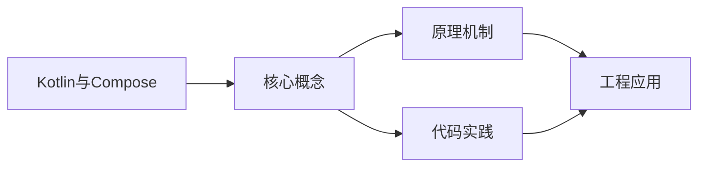

## 1. 学习目标（Bloom 分类）

本节按照布鲁姆教育目标分类学组织学习路径。本文主题为《Kotlin与Compose》，属于 Kotlin 模块，读者可以根据自身阶段选择阅读深度。

记忆层面：能够准确复述本文的核心概念、术语与基本语法或操作步骤，并能够在提问或检索时快速定位对应知识点。能够说出 val/var、空安全操作符与 when 表达式的语法。

理解层面：能够用自己的语言解释核心原理与工作机制，说明概念之间的因果关系，而不是机械记忆结论。能够解释 Kotlin 与 Java 互操作的机制与平台类型概念。

应用层面：能够在真实项目或练习场景中运用本文知识解决具体问题，写出正确且可维护的实现。能够编写数据类、扩展函数与协程代码。

分析层面：能够拆解复杂问题，比较本文主题与相邻概念的异同，识别边界条件与例外情况。能够分析空安全、智能转换与协程调度原理。

评价层面：能够根据约束条件（性能、可读性、安全、成本）评价不同方案的优劣，做出有依据的技术决策。能够评价 Kotlin 在 Android、服务端与多平台场景的适用性。

创造层面：能够把本文知识与其他模块知识组合，设计出新的解决方案或可复用的工程模式。能够组合 Compose 与协程设计跨平台应用。

通过本节学习，读者应当能够把《Kotlin与Compose》纳入自己的知识网络，并与 Kotlin 模块的其他主题（类型推断、空安全、协程、KMP）建立关联。

## 2. 历史动机与发展脉络

《Kotlin与Compose》是 Kotlin 领域的重要主题。要真正理解它，需要先了解它解决的问题与演进过程。

Kotlin 由 JetBrains 于 2010 年开始研发，2016 年发布 1.0，定位是“更现代的 JVM 语言”：减少样板代码、消灭空指针、增强函数式能力，同时与 Java 100% 互操作。
2017 年 Google 宣布 Kotlin 成为 Android 一级语言，2019 年确立 Kotlin-first 政策；2023 年 Kotlin 2.0 的 K2 编译器显著提升编译速度与类型推导。
Kotlin Multiplatform（KMP）支持 JVM、Android、iOS、WebAssembly 等目标，配合 Compose Multiplatform 实现共享 UI 与业务逻辑，是 JetBrains 的长期战略方向。

回到本文主题：Kotlin与Compose 的提出与成熟，正是上述技术背景下的必然产物。早期实现往往以简单可用为目标，随着工程规模扩大，社区逐渐沉淀出标准做法与最佳实践；理解这一脉络，可以帮助读者判断“为什么文档中的推荐写法是现在这个样子”，也能在遇到历史遗留代码时准确识别其设计年代与取舍。


## 3. 形式化定义与核心概念精讲

本节把《Kotlin与Compose》涉及的核心概念以“定义 + 讲解”的形式展开。读者应把定义当作工具，把讲解当作理解路径；两者结合才能形成可迁移的知识。

空安全：类型系统区分 `String` 与 `String?`，编译期强制处理可空值；`?.` 短路、`?:` 提供默认、`!!` 显式断言，三者覆盖所有空值处理模式。
智能转换：`is` 检查后在不可变上下文中自动转换类型，减少显式强转；`as?` 安全转换失败返回 null。
协程：挂起函数（suspend）与调度器（Dispatchers.Main/IO/Default）实现非阻塞并发，结构化并发保证作用域内任务可取消。

### 3.1 原文章节逐一精讲

原文档把主题拆分为 16 个小节，下面按顺序给出每一节的导读讲解，随后保留原文细节供精读。

#### 原文精读（完整保留）

# Kotlin kotlinc 编译命令速查手册

> **符号约定**：`< >` 必填参数 | `[ ]` 可选参数

---

#### 概述

Jetpack Compose 是 Google 推出的现代声明式 UI 工具包，用于构建 Android、桌面（Compose Desktop）和 Web（Compose for Web）应用。与传统的 XML 布局不同，Compose 用 Kotlin 代码直接描述 UI，通过状态驱动自动更新界面，大幅减少了模板代码。

Compose 的核心理念是：UI 是状态的函数。当状态变化时，Compose 会自动重新渲染受影响的部分，你不需要手动操作视图。

#### 基础概念

- **@Composable**：标记一个函数为可组合函数，这是 Compose 的基本构建单元
- **State（状态）**：驱动 UI 更新的数据，用 `mutableStateOf` 创建，状态变化时自动触发重组
- **Recomposition（重组）**：当状态变化时，Compose 重新执行相关的可组合函数来更新 UI
- **Remember**：在重组过程中保持数据不被重置，用 `remember` 缓存计算结果
- **Modifier（修饰符）**：用于调整组件的外观和行为，如大小、边距、点击事件等

#### 快速上手

添加依赖：

```kotlin
// build.gradle.kts (Android)
dependencies {
    implementation("androidx.compose.ui:ui:1.6.0")
    implementation("androidx.compose.material3:material3:1.2.0")
    implementation("androidx.compose.ui:ui-tooling-preview:1.6.0")
    implementation("androidx.activity:activity-compose:1.8.0")
}

// build.gradle.kts (Desktop)
plugins {
    id("org.jetbrains.compose") version "1.6.0"
}
```

最简单的 Compose 应用：

```kotlin
import androidx.compose.material3.*
import androidx.compose.runtime.*

fun main() = application {
    Window(onCloseRequest = ::exitApplication, title = "我的应用") {
        // 可组合函数
        MaterialTheme {
            Greeting("Compose")
        }
    }
}

// 用 @Composable 标记可组合函数
@Composable
fun Greeting(name: String) {
    // 定义状态，点击按钮时计数增加
    var count by remember { mutableStateOf(0) }

    Column {
        // 显示文本
        Text("Hello, $name! 点击次数: $count")
        // 按钮，点击时修改状态
        Button(onClick = { count++ }) {
            Text("点击我")
        }
    }
}
```

#### 详细用法

##### 状态管理

状态是 Compose 的核心，理解状态管理是掌握 Compose 的关键：

```kotlin
import androidx.compose.runtime.*

// 简单状态
@Composable
fun SimpleState() {
    // remember 保存状态，mutableStateOf 创建可观察的状态
    var name by remember { mutableStateOf("") }

    Column {
        TextField(
            value = name,
            onValueChange = { name = it },  // 输入时更新状态
            label = { Text("请输入姓名") }
        )
        Text("你好, $name")
    }
}

// 状态提升：将状态移到调用方
@Composable
fun StateHoisting() {
    // 状态在父组件中管理
    var text by remember { mutableStateOf("") }
    EditableText(
        text = text,
        onTextChange = { text = it }
    )
}

@Composable
fun EditableText(text: String, onTextChange: (String) -> Unit) {
    // 子组件不持有状态，通过参数接收和回调修改
    TextField(
        value = text,
        onValueChange = onTextChange,
        label = { Text("编辑") }
    )
}
```

##### 常用布局组件

```kotlin
@Composable
fun LayoutDemo() {
    // Column：垂直排列
    Column(modifier = Modifier.padding(16.dp)) {
        Text("第一行")
        Text("第二行")

        // Row：水平排列
        Row(modifier = Modifier.fillMaxWidth()) {
            Text("左", modifier = Modifier.weight(1f))
            Text("右", modifier = Modifier.weight(1f))
        }

        // Box：叠加布局
        Box {
            Text("底层内容")
            Text("上层内容", modifier = Modifier.align(Alignment.BottomEnd))
        }
    }
}
```

##### 列表

```kotlin
@Composable
fun ListDemo() {
    val items = listOf("苹果", "香蕉", "橘子", "葡萄", "西瓜")

    // LazyColumn：高效的长列表，只渲染可见项
    LazyColumn {
        items(items) { item ->
            ListItem(item)
        }
    }
}

@Composable
fun ListItem(name: String) {
    Row(
        modifier = Modifier
            .fillMaxWidth()
            .padding(8.dp),
        verticalAlignment = Alignment.CenterVertically
    ) {
        Text(name, modifier = Modifier.weight(1f))
        IconButton(onClick = { /* 删除操作 */ }) {
            Icon(Icons.Default.Delete, contentDescription = "删除")
        }
    }
}
```

##### Modifier 修饰符

```kotlin
@Composable
fun ModifierDemo() {
    Box(
        modifier = Modifier
            .fillMaxSize()                    // 填满父容器
            .background(Color.LightGray)     // 背景色
            .padding(16.dp)                  // 内边距
    ) {
        Text(
            "带修饰符的文本",
            modifier = Modifier
                .clickable { println("被点击") }  // 点击事件
                .background(Color.White)          // 背景色
                .padding(horizontal = 16.dp, vertical = 8.dp)  // 内边距
                .border(1.dp, Color.Gray, RoundedCornerShape(4.dp))  // 边框
        )
    }
}
```

##### 副作用

在 Compose 中执行副作用（如网络请求、数据库操作）需要使用 LaunchedEffect：

```kotlin
@Composable
fun SideEffectDemo(userId: String) {
    var user by remember { mutableStateOf<User?>(null) }
    var isLoading by remember { mutableStateOf(true) }

    // LaunchedEffect：当 key 变化时执行
    LaunchedEffect(userId) {
        isLoading = true
        user = fetchUser(userId)  // 挂起函数，自动在协程中执行
        isLoading = false
    }

    if (isLoading) {
        CircularProgressIndicator()
    } else {
        user?.let { Text("用户: ${it.name}") }
    }
}
```

#### 常见场景

##### 表单输入

```kotlin
@Composable
fun LoginForm() {
    var username by remember { mutableStateOf("") }
    var password by remember { mutableStateOf("") }
    var message by remember { mutableStateOf("") }

    Column(modifier = Modifier.padding(16.dp)) {
        TextField(
            value = username,
            onValueChange = { username = it },
            label = { Text("用户名") },
            modifier = Modifier.fillMaxWidth()
        )
        Spacer(modifier = Modifier.height(8.dp))
        TextField(
            value = password,
            onValueChange = { password = it },
            label = { Text("密码") },
            visualTransformation = PasswordVisualTransformation(),
            modifier = Modifier.fillMaxWidth()
        )
        Spacer(modifier = Modifier.height(16.dp))
        Button(
            onClick = {
                message = if (username.isNotEmpty() && password.isNotEmpty()) {
                    "登录成功"
                } else {
                    "请填写所有字段"
                }
            },
            modifier = Modifier.fillMaxWidth()
        ) {
            Text("登录")
        }
        if (message.isNotEmpty()) {
            Spacer(modifier = Modifier.height(8.dp))
            Text(message, color = if (message == "登录成功") Color.Green else Color.Red)
        }
    }
}
```

##### 导航

```kotlin
import androidx.navigation.compose.*

@Composable
fun NavDemo() {
    val navController = rememberNavController()

    NavHost(navController, startDestination = "home") {
        composable("home") {
            HomeScreen(
                onNavigateToDetail = { id ->
                    navController.navigate("detail/$id")
                }
            )
        }
        composable(
            "detail/{userId}",
            arguments = listOf(navArgument("userId") { type = NavType.StringType })
        ) { backStackEntry ->
            val userId = backStackEntry.arguments?.getString("userId") ?: ""
            DetailScreen(userId, onBack = { navController.popBackStack() })
        }
    }
}
```

#### 注意事项

- **可组合函数必须是幂等的**：同一个输入应该产生相同的输出，不要在可组合函数中直接修改外部状态
- **不要在 Composable 中执行耗时操作**：网络请求、数据库操作等应放在 ViewModel 或 LaunchedEffect 中
- **重组是局部的**：状态变化时，只有依赖该状态的部分会重组，不是整个界面
- **remember 不能替代 ViewModel**：remember 在配置变更（如旋转屏幕）时会丢失，持久状态应放在 ViewModel 中
- **Modifier 的顺序很重要**：`padding` 在 `clickable` 前面和后面效果不同，先应用的修饰符在外层

#### 进阶用法

##### 自定义可组合组件

```kotlin
@Composable
fun LoadingButton(
    text: String,
    onClick: () -> Unit,
    isLoading: Boolean = false,
    modifier: Modifier = Modifier
) {
    Button(
        onClick = onClick,
        modifier = modifier,
        enabled = !isLoading
    ) {
        if (isLoading) {
            CircularProgressIndicator(
                modifier = Modifier.size(20.dp),
                color = MaterialTheme.colorScheme.onPrimary,
                strokeWidth = 2.dp
            )
            Spacer(modifier = Modifier.width(8.dp))
        }
        Text(text)
    }
}

// 使用自定义组件
@Composable
fun MyScreen() {
    var loading by remember { mutableStateOf(false) }
    LoadingButton(
        text = "提交",
        onClick = {
            loading = true
            // 执行异步操作
        },
        isLoading = loading
    )
}
```

##### 动画

```kotlin
@Composable
fun AnimationDemo() {
    var expanded by remember { mutableStateOf(false) }
    // 动画大小
    val size by animateDpAsState(
        targetValue = if (expanded) 200.dp else 100.dp,
        animationSpec = spring(dampingRatio = Spring.DampingRatioMediumBouncy)
    )
    // 动画颜色
    val color by animateColorAsState(
        targetValue = if (expanded) Color.Red else Color.Blue
    )

    Box(
        modifier = Modifier
            .size(size)
            .background(color)
            .clickable { expanded = !expanded }
    )
}
```

##### Compose Desktop 应用

```kotlin
import androidx.compose.desktop.ui.tooling.preview.Preview
import androidx.compose.foundation.layout.*
import androidx.compose.material.*
import androidx.compose.runtime.*
import androidx.compose.ui.window.Window
import androidx.compose.ui.window.application

fun main() = application {
    Window(
        onCloseRequest = ::exitApplication,
        title = "桌面应用"
    ) {
        App()
    }
}

@Composable
fun App() {
    var text by remember { mutableStateOf("Hello, Desktop!") }
    MaterialTheme {
        Column(modifier = Modifier.padding(16.dp)) {
            TextField(
                value = text,
                onValueChange = { text = it }
            )
            Button(onClick = { text = "已点击" }) {
                Text("点击")
            }
        }
    }
}
```
#### 基本编译

**基本写法：编译单文件**
`kotlinc <源文件> -include-runtime -d <输出jar>`
```bash
# 编译并打包为可执行 jar，附带运行时
kotlinc Main.kt -include-runtime -d app.jar
```

---

**基本写法：运行 jar**
`java -jar <jar文件>`
```bash
# 运行上一步生成的 jar
java -jar app.jar
```

---

**基本写法：编译模块**
`kotlinc <模块名> -include-runtime -d <输出>`
```bash
# 编译整个模块目录
kotlinc src/main/kotlin -include-runtime -d app.jar
```

---

**基本写法：仅编译不打包**
`kotlinc <源> -d <输出目录>`
```bash
# 输出 .class 文件到目录
kotlinc Main.kt -d out
```

---

#### 输出目标

**基本写法：指定 JVM 版本**
`kotlinc -jvm-target <版本> -d <输出>`
```bash
# 指定生成的字节码版本
kotlinc Main.kt -jvm-target 21 -d app.jar
```

---

**基本写法：编译为 JavaScript**
`kotlinc -js <源文件> -output <输出js>`
```bash
# 编译为 JavaScript 文件
kotlinc -js Main.kt -output app.js
```

---

**基本写法：编译为 Native 二进制**
`kotlinc-native <源文件> -o <输出名>`
```bash
# 编译为 Kotlin/Native 可执行文件
kotlinc-native Main.kt -o app
```

---

**基本写法：生成 IR**
`kotlinc -js -ir <源> -output <输出>`
```bash
# 使用新 IR 编译器后端
kotlinc -js -ir Main.kt -output app.js
```

---

#### 脚本与 REPL

**基本写法：启动 REPL**
`kotlinc`
```bash
# 进入 Kotlin 交互式 REPL
kotlinc
```

---

**基本写法：执行脚本**
`kotlinc -script <脚本.kts> [参数]`
```bash
# 执行 .kts 脚本文件
kotlinc -script build.kts release
```

---

**基本写法：交互式求值**
`kotlinc -e "<代码>"`
```bash
# 直接执行单段代码
kotlinc -e "println(1 + 2)"
```

---

#### 依赖与类路径

**基本写法：指定类路径**
`kotlinc -cp <类路径> <源> -d <输出>`
```bash
# 引入 jar 依赖
kotlinc -cp "lib/*" Main.kt -d app.jar
```

---

**基本写法：模块路径**
`kotlinc -module-path <路径> <源>`
```bash
# Java 模块系统支持
kotlinc -module-path mods Main.kt -d out
```

---

**基本写法：生成 Java 模块**
`kotlinc --java-module-path <路径> -d <输出>`
```bash
# 输出 JPMS 兼容模块
kotlinc -module-path mods -java-module-name com.example -d out
```

---

#### 编译选项

**基本写法：开启严格可空性**
`kotlinc -Xjsr305=strict <源>`
```bash
# 严格 JSR-305 可空检查
kotlinc -Xjsr305=strict Main.kt -d out
```

---

**基本写法：启用 expect/actual**
`kotlinc -Xmulti-platform <源>`
```bash
# 多平台项目编译
kotlinc -Xmulti-platform commonMain -d out
```

---

**基本写法：开启进阶优化**
`kotlinc -Xopt=kotlin.classes.aligned <源>`
```bash
# 启用特定优化
kotlinc -Xopt=kotlin.classes.aligned Main.kt -d out
```

---

**基本写法：禁用内联**
`kotlinc -Xinline-classes=<模式>`
```bash
# 控制内联类生成
kotlinc -Xinline-classes=true Main.kt -d out
```

---

#### 反编译与文档

**基本写法：生成 Kotlin 文档**
`kotlinx-javadoc <源>`
```bash
# 使用 Dokka 生成文档（推荐）
./gradlew dokkaHtml
```

---

**基本写法：反编译查看字节码**
`javap -p -c <class文件>`
```bash
# 查看编译产物字节码
javap -p -c out/Main.class
```

---

#### Gradle Kotlin 编译任务

**基本写法：编译命令**
`./gradlew compileKotlin`
```bash
# 触发 Kotlin 编译任务
./gradlew compileKotlin
```

---

**基本写法：编译多平台**
`./gradlew compileKotlinJvm compileKotlinJs`
```bash
# 编译指定目标
./gradlew compileKotlinJvm
./gradlew compileKotlinWasmJs
```

---

**基本写法：增量编译**
`./gradlew compileKotlin -Pkotlin.incremental=true`
```bash
# 启用增量编译（默认开启）
./gradlew compileKotlin --info
```

---

**基本写法：守护进程编译**
`./gradlew compileKotlin --daemon`
```bash
# 使用 Gradle 守护进程加速
./gradlew compileKotlin --daemon
```

---

#### Maven Kotlin 编译

**基本写法：Maven 编译**
`mvn compile`
```bash
# 通过 kotlin-maven-plugin 编译
mvn compile
```

---

**基本写法：指定 Kotlin 版本**
`mvn -Dkotlin.version=2.1.0 compile`
```bash
# 覆盖 Kotlin 版本
mvn -Dkotlin.version=2.1.0 compile
```

---

#### 调试与诊断

**基本写法：输出编译时间**
`kotlinc --verbose <源>`
```bash
# 详细编译信息
kotlinc --verbose Main.kt -d out
```

---

**基本写法：输出 K2 警告**
`kotlinc -Xrender-internal-diagnostic-names <源>`
```bash
# 显示诊断内部名称
kotlinc -Xrender-internal-diagnostic-names Main.kt -d out
```

---

**基本写法：生成 .kotlin 缓存**
`-Pkotlin.incremental.useClasspathSnapshot=true`
```bash
# 启用类路径快照加速编译
./gradlew compileKotlin -Pkotlin.incremental.useClasspathSnapshot=true
```


### 3.2 概念关系图

下面用 Mermaid 图表达本文核心概念之间的关系，帮助读者建立整体图景：



图中展示的是本文知识的结构化关系：核心概念是入口，原理机制解释“为什么”，代码实践演示“怎么做”，工程应用回答“何时用”。读者学习时可以把每个小节的内容挂接到对应节点上。

## 4. 理论推导与原理解析

本节深入《Kotlin与Compose》背后的原理。理论部分不求面面俱到，而是聚焦“能解释现象、能指导实践”的关键推导。

空安全：类型系统区分 `String` 与 `String?`，编译期强制处理可空值；`?.` 短路、`?:` 提供默认、`!!` 显式断言，三者覆盖所有空值处理模式。
智能转换：`is` 检查后在不可变上下文中自动转换类型，减少显式强转；`as?` 安全转换失败返回 null。
协程：挂起函数（suspend）与调度器（Dispatchers.Main/IO/Default）实现非阻塞并发，结构化并发保证作用域内任务可取消。
扩展函数与属性：在不修改原类的情况下为类添加行为，是 Kotlin 标准库（如集合操作）的基石。

需要强调的是，理论推导与工程实践之间存在翻译层：理论给出的是理想化模型与边界条件，工程代码则必须处理真实环境中的例外。读者在学习时应先掌握理论的“标准情形”，再通过陷阱章节了解“非标准情形”。

## 5. 代码示例与逐行讲解

本节把原文中的代码示例系统整理，并为每个示例补充用途说明与讲解。读者不应只浏览代码，而应逐段对照讲解理解设计意图。

### 5.1 示例：快速上手

该示例来自原文《快速上手》小节，用于演示Kotlin与Compose相关操作。阅读时请先看代码结构，再看其后的讲解。

```kotlin
// build.gradle.kts (Android)
dependencies {
    implementation("androidx.compose.ui:ui:1.6.0")
    implementation("androidx.compose.material3:material3:1.2.0")
    implementation("androidx.compose.ui:ui-tooling-preview:1.6.0")
    implementation("androidx.activity:activity-compose:1.8.0")
}

// build.gradle.kts (Desktop)
plugins {
    id("org.jetbrains.compose") version "1.6.0"
}
```

讲解：这段代码演示了本节核心知识点。代码中的关键操作可以归纳为三步：准备（定义或初始化）、执行（核心逻辑）、收尾（释放资源或返回结果）。实际项目中，这三步往往被封装为函数或类，以提升复用性与可测试性。

关键点分析：

该示例共 11 行有效代码，结构以数据或配置为主。阅读时应关注：数据字段的含义、配置项的作用，以及它们与运行行为的对应关系。

进阶思考路径：先尝试修改参数观察行为变化，再把示例中的模式迁移到自己的项目中；每次修改都记录预期与实测差异，这是把示例转化为能力的最快方式。

### 5.2 示例：快速上手

该示例来自原文《快速上手》小节，用于演示Kotlin与Compose相关操作。阅读时请先看代码结构，再看其后的讲解。

```kotlin
import androidx.compose.material3.*
import androidx.compose.runtime.*

fun main() = application {
    Window(onCloseRequest = ::exitApplication, title = "我的应用") {
        // 可组合函数
        MaterialTheme {
            Greeting("Compose")
        }
    }
}

// 用 @Composable 标记可组合函数
@Composable
fun Greeting(name: String) {
    // 定义状态，点击按钮时计数增加
    var count by remember { mutableStateOf(0) }

    Column {
        // 显示文本
        Text("Hello, $name! 点击次数: $count")
        // 按钮，点击时修改状态
        Button(onClick = { count++ }) {
            Text("点击我")
        }
    }
}
```

讲解：这段代码演示了本节核心知识点。代码中的关键操作可以归纳为三步：准备（定义或初始化）、执行（核心逻辑）、收尾（释放资源或返回结果）。实际项目中，这三步往往被封装为函数或类，以提升复用性与可测试性。

关键点分析：

该示例共 24 行有效代码，包含 1 类关键结构（import）。其中：

- 入口与初始化部分负责建立上下文，对应实际项目中的启动或装配逻辑；
- 核心逻辑部分体现本文主题的主要操作，是阅读时最需要对照讲解理解的部分；
- 输出或返回部分把结果交给调用方，注意其类型与边界条件。

进阶思考路径：先尝试修改参数观察行为变化，再把示例中的模式迁移到自己的项目中；每次修改都记录预期与实测差异，这是把示例转化为能力的最快方式。

### 5.3 示例：状态管理

该示例来自原文《状态管理》小节，用于演示Kotlin与Compose相关操作。阅读时请先看代码结构，再看其后的讲解。

```kotlin
import androidx.compose.runtime.*

// 简单状态
@Composable
fun SimpleState() {
    // remember 保存状态，mutableStateOf 创建可观察的状态
    var name by remember { mutableStateOf("") }

    Column {
        TextField(
            value = name,
            onValueChange = { name = it },  // 输入时更新状态
            label = { Text("请输入姓名") }
        )
        Text("你好, $name")
    }
}

// 状态提升：将状态移到调用方
@Composable
fun StateHoisting() {
    // 状态在父组件中管理
    var text by remember { mutableStateOf("") }
    EditableText(
        text = text,
        onTextChange = { text = it }
    )
}

@Composable
fun EditableText(text: String, onTextChange: (String) -> Unit) {
    // 子组件不持有状态，通过参数接收和回调修改
    TextField(
        value = text,
        onValueChange = onTextChange,
        label = { Text("编辑") }
    )
}
```

讲解：这段代码演示了本节核心知识点。代码中的关键操作可以归纳为三步：准备（定义或初始化）、执行（核心逻辑）、收尾（释放资源或返回结果）。实际项目中，这三步往往被封装为函数或类，以提升复用性与可测试性。

关键点分析：

该示例共 34 行有效代码，包含 1 类关键结构（import）。其中：

- 入口与初始化部分负责建立上下文，对应实际项目中的启动或装配逻辑；
- 核心逻辑部分体现本文主题的主要操作，是阅读时最需要对照讲解理解的部分；
- 输出或返回部分把结果交给调用方，注意其类型与边界条件。

进阶思考路径：先尝试修改参数观察行为变化，再把示例中的模式迁移到自己的项目中；每次修改都记录预期与实测差异，这是把示例转化为能力的最快方式。

### 5.4 示例：常用布局组件

该示例来自原文《常用布局组件》小节，用于演示Kotlin与Compose相关操作。阅读时请先看代码结构，再看其后的讲解。

```kotlin
@Composable
fun LayoutDemo() {
    // Column：垂直排列
    Column(modifier = Modifier.padding(16.dp)) {
        Text("第一行")
        Text("第二行")

        // Row：水平排列
        Row(modifier = Modifier.fillMaxWidth()) {
            Text("左", modifier = Modifier.weight(1f))
            Text("右", modifier = Modifier.weight(1f))
        }

        // Box：叠加布局
        Box {
            Text("底层内容")
            Text("上层内容", modifier = Modifier.align(Alignment.BottomEnd))
        }
    }
}
```

讲解：这段代码演示了本节核心知识点。代码中的关键操作可以归纳为三步：准备（定义或初始化）、执行（核心逻辑）、收尾（释放资源或返回结果）。实际项目中，这三步往往被封装为函数或类，以提升复用性与可测试性。

关键点分析：

该示例共 18 行有效代码，结构以数据或配置为主。阅读时应关注：数据字段的含义、配置项的作用，以及它们与运行行为的对应关系。

进阶思考路径：先尝试修改参数观察行为变化，再把示例中的模式迁移到自己的项目中；每次修改都记录预期与实测差异，这是把示例转化为能力的最快方式。

### 5.5 示例：列表

该示例来自原文《列表》小节，用于演示Kotlin与Compose相关操作。阅读时请先看代码结构，再看其后的讲解。

```kotlin
@Composable
fun ListDemo() {
    val items = listOf("苹果", "香蕉", "橘子", "葡萄", "西瓜")

    // LazyColumn：高效的长列表，只渲染可见项
    LazyColumn {
        items(items) { item ->
            ListItem(item)
        }
    }
}

@Composable
fun ListItem(name: String) {
    Row(
        modifier = Modifier
            .fillMaxWidth()
            .padding(8.dp),
        verticalAlignment = Alignment.CenterVertically
    ) {
        Text(name, modifier = Modifier.weight(1f))
        IconButton(onClick = { /* 删除操作 */ }) {
            Icon(Icons.Default.Delete, contentDescription = "删除")
        }
    }
}
```

讲解：这段代码演示了本节核心知识点。代码中的关键操作可以归纳为三步：准备（定义或初始化）、执行（核心逻辑）、收尾（释放资源或返回结果）。实际项目中，这三步往往被封装为函数或类，以提升复用性与可测试性。

关键点分析：

该示例共 24 行有效代码，结构以数据或配置为主。阅读时应关注：数据字段的含义、配置项的作用，以及它们与运行行为的对应关系。

进阶思考路径：先尝试修改参数观察行为变化，再把示例中的模式迁移到自己的项目中；每次修改都记录预期与实测差异，这是把示例转化为能力的最快方式。

### 5.6 示例：Modifier 修饰符

该示例来自原文《Modifier 修饰符》小节，用于演示Kotlin与Compose相关操作。阅读时请先看代码结构，再看其后的讲解。

```kotlin
@Composable
fun ModifierDemo() {
    Box(
        modifier = Modifier
            .fillMaxSize()                    // 填满父容器
            .background(Color.LightGray)     // 背景色
            .padding(16.dp)                  // 内边距
    ) {
        Text(
            "带修饰符的文本",
            modifier = Modifier
                .clickable { println("被点击") }  // 点击事件
                .background(Color.White)          // 背景色
                .padding(horizontal = 16.dp, vertical = 8.dp)  // 内边距
                .border(1.dp, Color.Gray, RoundedCornerShape(4.dp))  // 边框
        )
    }
}
```

讲解：这段代码演示了本节核心知识点。代码中的关键操作可以归纳为三步：准备（定义或初始化）、执行（核心逻辑）、收尾（释放资源或返回结果）。实际项目中，这三步往往被封装为函数或类，以提升复用性与可测试性。

关键点分析：

该示例共 18 行有效代码，结构以数据或配置为主。阅读时应关注：数据字段的含义、配置项的作用，以及它们与运行行为的对应关系。

进阶思考路径：先尝试修改参数观察行为变化，再把示例中的模式迁移到自己的项目中；每次修改都记录预期与实测差异，这是把示例转化为能力的最快方式。

### 5.7 示例：副作用

该示例来自原文《副作用》小节，用于演示Kotlin与Compose相关操作。阅读时请先看代码结构，再看其后的讲解。

```kotlin
@Composable
fun SideEffectDemo(userId: String) {
    var user by remember { mutableStateOf<User?>(null) }
    var isLoading by remember { mutableStateOf(true) }

    // LaunchedEffect：当 key 变化时执行
    LaunchedEffect(userId) {
        isLoading = true
        user = fetchUser(userId)  // 挂起函数，自动在协程中执行
        isLoading = false
    }

    if (isLoading) {
        CircularProgressIndicator()
    } else {
        user?.let { Text("用户: ${it.name}") }
    }
}
```

讲解：这段代码演示了本节核心知识点。代码中的关键操作可以归纳为三步：准备（定义或初始化）、执行（核心逻辑）、收尾（释放资源或返回结果）。实际项目中，这三步往往被封装为函数或类，以提升复用性与可测试性。

关键点分析：

该示例共 16 行有效代码，包含 1 类关键结构（if）。其中：

- 入口与初始化部分负责建立上下文，对应实际项目中的启动或装配逻辑；
- 核心逻辑部分体现本文主题的主要操作，是阅读时最需要对照讲解理解的部分；
- 输出或返回部分把结果交给调用方，注意其类型与边界条件。

进阶思考路径：先尝试修改参数观察行为变化，再把示例中的模式迁移到自己的项目中；每次修改都记录预期与实测差异，这是把示例转化为能力的最快方式。

### 5.8 示例：表单输入

该示例来自原文《表单输入》小节，用于演示Kotlin与Compose相关操作。阅读时请先看代码结构，再看其后的讲解。

```kotlin
@Composable
fun LoginForm() {
    var username by remember { mutableStateOf("") }
    var password by remember { mutableStateOf("") }
    var message by remember { mutableStateOf("") }

    Column(modifier = Modifier.padding(16.dp)) {
        TextField(
            value = username,
            onValueChange = { username = it },
            label = { Text("用户名") },
            modifier = Modifier.fillMaxWidth()
        )
        Spacer(modifier = Modifier.height(8.dp))
        TextField(
            value = password,
            onValueChange = { password = it },
            label = { Text("密码") },
            visualTransformation = PasswordVisualTransformation(),
            modifier = Modifier.fillMaxWidth()
        )
        Spacer(modifier = Modifier.height(16.dp))
        Button(
            onClick = {
                message = if (username.isNotEmpty() && password.isNotEmpty()) {
                    "登录成功"
                } else {
                    "请填写所有字段"
                }
            },
            modifier = Modifier.fillMaxWidth()
        ) {
            Text("登录")
        }
        if (message.isNotEmpty()) {
            Spacer(modifier = Modifier.height(8.dp))
            Text(message, color = if (message == "登录成功") Color.Green else Color.Red)
        }
    }
}
```

讲解：这段代码演示了本节核心知识点。代码中的关键操作可以归纳为三步：准备（定义或初始化）、执行（核心逻辑）、收尾（释放资源或返回结果）。实际项目中，这三步往往被封装为函数或类，以提升复用性与可测试性。

关键点分析：

该示例共 39 行有效代码，包含 1 类关键结构（if）。其中：

- 入口与初始化部分负责建立上下文，对应实际项目中的启动或装配逻辑；
- 核心逻辑部分体现本文主题的主要操作，是阅读时最需要对照讲解理解的部分；
- 输出或返回部分把结果交给调用方，注意其类型与边界条件。

进阶思考路径：先尝试修改参数观察行为变化，再把示例中的模式迁移到自己的项目中；每次修改都记录预期与实测差异，这是把示例转化为能力的最快方式。

### 5.9 示例：导航

该示例来自原文《导航》小节，用于演示Kotlin与Compose相关操作。阅读时请先看代码结构，再看其后的讲解。

```kotlin
import androidx.navigation.compose.*

@Composable
fun NavDemo() {
    val navController = rememberNavController()

    NavHost(navController, startDestination = "home") {
        composable("home") {
            HomeScreen(
                onNavigateToDetail = { id ->
                    navController.navigate("detail/$id")
                }
            )
        }
        composable(
            "detail/{userId}",
            arguments = listOf(navArgument("userId") { type = NavType.StringType })
        ) { backStackEntry ->
            val userId = backStackEntry.arguments?.getString("userId") ?: ""
            DetailScreen(userId, onBack = { navController.popBackStack() })
        }
    }
}
```

讲解：这段代码演示了本节核心知识点。代码中的关键操作可以归纳为三步：准备（定义或初始化）、执行（核心逻辑）、收尾（释放资源或返回结果）。实际项目中，这三步往往被封装为函数或类，以提升复用性与可测试性。

关键点分析：

该示例共 21 行有效代码，包含 1 类关键结构（import）。其中：

- 入口与初始化部分负责建立上下文，对应实际项目中的启动或装配逻辑；
- 核心逻辑部分体现本文主题的主要操作，是阅读时最需要对照讲解理解的部分；
- 输出或返回部分把结果交给调用方，注意其类型与边界条件。

进阶思考路径：先尝试修改参数观察行为变化，再把示例中的模式迁移到自己的项目中；每次修改都记录预期与实测差异，这是把示例转化为能力的最快方式。

### 5.10 示例：自定义可组合组件

该示例来自原文《自定义可组合组件》小节，用于演示Kotlin与Compose相关操作。阅读时请先看代码结构，再看其后的讲解。

```kotlin
@Composable
fun LoadingButton(
    text: String,
    onClick: () -> Unit,
    isLoading: Boolean = false,
    modifier: Modifier = Modifier
) {
    Button(
        onClick = onClick,
        modifier = modifier,
        enabled = !isLoading
    ) {
        if (isLoading) {
            CircularProgressIndicator(
                modifier = Modifier.size(20.dp),
                color = MaterialTheme.colorScheme.onPrimary,
                strokeWidth = 2.dp
            )
            Spacer(modifier = Modifier.width(8.dp))
        }
        Text(text)
    }
}

// 使用自定义组件
@Composable
fun MyScreen() {
    var loading by remember { mutableStateOf(false) }
    LoadingButton(
        text = "提交",
        onClick = {
            loading = true
            // 执行异步操作
        },
        isLoading = loading
    )
}
```

讲解：这段代码演示了本节核心知识点。代码中的关键操作可以归纳为三步：准备（定义或初始化）、执行（核心逻辑）、收尾（释放资源或返回结果）。实际项目中，这三步往往被封装为函数或类，以提升复用性与可测试性。

关键点分析：

该示例共 36 行有效代码，包含 1 类关键结构（if）。其中：

- 入口与初始化部分负责建立上下文，对应实际项目中的启动或装配逻辑；
- 核心逻辑部分体现本文主题的主要操作，是阅读时最需要对照讲解理解的部分；
- 输出或返回部分把结果交给调用方，注意其类型与边界条件。

进阶思考路径：先尝试修改参数观察行为变化，再把示例中的模式迁移到自己的项目中；每次修改都记录预期与实测差异，这是把示例转化为能力的最快方式。

### 5.11 示例：动画

该示例来自原文《动画》小节，用于演示Kotlin与Compose相关操作。阅读时请先看代码结构，再看其后的讲解。

```kotlin
@Composable
fun AnimationDemo() {
    var expanded by remember { mutableStateOf(false) }
    // 动画大小
    val size by animateDpAsState(
        targetValue = if (expanded) 200.dp else 100.dp,
        animationSpec = spring(dampingRatio = Spring.DampingRatioMediumBouncy)
    )
    // 动画颜色
    val color by animateColorAsState(
        targetValue = if (expanded) Color.Red else Color.Blue
    )

    Box(
        modifier = Modifier
            .size(size)
            .background(color)
            .clickable { expanded = !expanded }
    )
}
```

讲解：这段代码演示了本节核心知识点。代码中的关键操作可以归纳为三步：准备（定义或初始化）、执行（核心逻辑）、收尾（释放资源或返回结果）。实际项目中，这三步往往被封装为函数或类，以提升复用性与可测试性。

关键点分析：

该示例共 19 行有效代码，包含 1 类关键结构（if）。其中：

- 入口与初始化部分负责建立上下文，对应实际项目中的启动或装配逻辑；
- 核心逻辑部分体现本文主题的主要操作，是阅读时最需要对照讲解理解的部分；
- 输出或返回部分把结果交给调用方，注意其类型与边界条件。

进阶思考路径：先尝试修改参数观察行为变化，再把示例中的模式迁移到自己的项目中；每次修改都记录预期与实测差异，这是把示例转化为能力的最快方式。

### 5.12 示例：Compose Desktop 应用

该示例来自原文《Compose Desktop 应用》小节，用于演示Kotlin与Compose相关操作。阅读时请先看代码结构，再看其后的讲解。

```kotlin
import androidx.compose.desktop.ui.tooling.preview.Preview
import androidx.compose.foundation.layout.*
import androidx.compose.material.*
import androidx.compose.runtime.*
import androidx.compose.ui.window.Window
import androidx.compose.ui.window.application

fun main() = application {
    Window(
        onCloseRequest = ::exitApplication,
        title = "桌面应用"
    ) {
        App()
    }
}

@Composable
fun App() {
    var text by remember { mutableStateOf("Hello, Desktop!") }
    MaterialTheme {
        Column(modifier = Modifier.padding(16.dp)) {
            TextField(
                value = text,
                onValueChange = { text = it }
            )
            Button(onClick = { text = "已点击" }) {
                Text("点击")
            }
        }
    }
}
```

讲解：这段代码演示了本节核心知识点。代码中的关键操作可以归纳为三步：准备（定义或初始化）、执行（核心逻辑）、收尾（释放资源或返回结果）。实际项目中，这三步往往被封装为函数或类，以提升复用性与可测试性。

关键点分析：

该示例共 29 行有效代码，包含 1 类关键结构（import）。其中：

- 入口与初始化部分负责建立上下文，对应实际项目中的启动或装配逻辑；
- 核心逻辑部分体现本文主题的主要操作，是阅读时最需要对照讲解理解的部分；
- 输出或返回部分把结果交给调用方，注意其类型与边界条件。

进阶思考路径：先尝试修改参数观察行为变化，再把示例中的模式迁移到自己的项目中；每次修改都记录预期与实测差异，这是把示例转化为能力的最快方式。

### 5.13 示例：基本编译

该示例来自原文《基本编译》小节，用于演示Kotlin与Compose相关操作。阅读时请先看代码结构，再看其后的讲解。

```bash
# 编译并打包为可执行 jar，附带运行时
kotlinc Main.kt -include-runtime -d app.jar
```

讲解：这段代码演示了本节核心知识点。代码中的关键操作可以归纳为三步：准备（定义或初始化）、执行（核心逻辑）、收尾（释放资源或返回结果）。实际项目中，这三步往往被封装为函数或类，以提升复用性与可测试性。

关键点分析：

该示例共 2 行有效代码，结构以数据或配置为主。阅读时应关注：数据字段的含义、配置项的作用，以及它们与运行行为的对应关系。

进阶思考路径：先尝试修改参数观察行为变化，再把示例中的模式迁移到自己的项目中；每次修改都记录预期与实测差异，这是把示例转化为能力的最快方式。

### 5.14 示例：基本编译

该示例来自原文《基本编译》小节，用于演示Kotlin与Compose相关操作。阅读时请先看代码结构，再看其后的讲解。

```bash
# 运行上一步生成的 jar
java -jar app.jar
```

讲解：这段代码演示了本节核心知识点。代码中的关键操作可以归纳为三步：准备（定义或初始化）、执行（核心逻辑）、收尾（释放资源或返回结果）。实际项目中，这三步往往被封装为函数或类，以提升复用性与可测试性。

关键点分析：

该示例共 2 行有效代码，结构以数据或配置为主。阅读时应关注：数据字段的含义、配置项的作用，以及它们与运行行为的对应关系。

进阶思考路径：先尝试修改参数观察行为变化，再把示例中的模式迁移到自己的项目中；每次修改都记录预期与实测差异，这是把示例转化为能力的最快方式。

### 5.15 示例：基本编译

该示例来自原文《基本编译》小节，用于演示Kotlin与Compose相关操作。阅读时请先看代码结构，再看其后的讲解。

```bash
# 编译整个模块目录
kotlinc src/main/kotlin -include-runtime -d app.jar
```

讲解：这段代码演示了本节核心知识点。代码中的关键操作可以归纳为三步：准备（定义或初始化）、执行（核心逻辑）、收尾（释放资源或返回结果）。实际项目中，这三步往往被封装为函数或类，以提升复用性与可测试性。

关键点分析：

该示例共 2 行有效代码，结构以数据或配置为主。阅读时应关注：数据字段的含义、配置项的作用，以及它们与运行行为的对应关系。

进阶思考路径：先尝试修改参数观察行为变化，再把示例中的模式迁移到自己的项目中；每次修改都记录预期与实测差异，这是把示例转化为能力的最快方式。

### 5.16 示例：基本编译

该示例来自原文《基本编译》小节，用于演示Kotlin与Compose相关操作。阅读时请先看代码结构，再看其后的讲解。

```bash
# 输出 .class 文件到目录
kotlinc Main.kt -d out
```

讲解：这段代码演示了本节核心知识点。代码中的关键操作可以归纳为三步：准备（定义或初始化）、执行（核心逻辑）、收尾（释放资源或返回结果）。实际项目中，这三步往往被封装为函数或类，以提升复用性与可测试性。

关键点分析：

该示例共 2 行有效代码，包含 1 类关键结构（class）。其中：

- 入口与初始化部分负责建立上下文，对应实际项目中的启动或装配逻辑；
- 核心逻辑部分体现本文主题的主要操作，是阅读时最需要对照讲解理解的部分；
- 输出或返回部分把结果交给调用方，注意其类型与边界条件。

进阶思考路径：先尝试修改参数观察行为变化，再把示例中的模式迁移到自己的项目中；每次修改都记录预期与实测差异，这是把示例转化为能力的最快方式。

### 5.17 示例：输出目标

该示例来自原文《输出目标》小节，用于演示Kotlin与Compose相关操作。阅读时请先看代码结构，再看其后的讲解。

```bash
# 指定生成的字节码版本
kotlinc Main.kt -jvm-target 21 -d app.jar
```

讲解：这段代码演示了本节核心知识点。代码中的关键操作可以归纳为三步：准备（定义或初始化）、执行（核心逻辑）、收尾（释放资源或返回结果）。实际项目中，这三步往往被封装为函数或类，以提升复用性与可测试性。

关键点分析：

该示例共 2 行有效代码，结构以数据或配置为主。阅读时应关注：数据字段的含义、配置项的作用，以及它们与运行行为的对应关系。

进阶思考路径：先尝试修改参数观察行为变化，再把示例中的模式迁移到自己的项目中；每次修改都记录预期与实测差异，这是把示例转化为能力的最快方式。

### 5.18 示例：输出目标

该示例来自原文《输出目标》小节，用于演示Kotlin与Compose相关操作。阅读时请先看代码结构，再看其后的讲解。

```bash
# 编译为 JavaScript 文件
kotlinc -js Main.kt -output app.js
```

讲解：这段代码演示了本节核心知识点。代码中的关键操作可以归纳为三步：准备（定义或初始化）、执行（核心逻辑）、收尾（释放资源或返回结果）。实际项目中，这三步往往被封装为函数或类，以提升复用性与可测试性。

关键点分析：

该示例共 2 行有效代码，结构以数据或配置为主。阅读时应关注：数据字段的含义、配置项的作用，以及它们与运行行为的对应关系。

进阶思考路径：先尝试修改参数观察行为变化，再把示例中的模式迁移到自己的项目中；每次修改都记录预期与实测差异，这是把示例转化为能力的最快方式。

### 5.19 示例：输出目标

该示例来自原文《输出目标》小节，用于演示Kotlin与Compose相关操作。阅读时请先看代码结构，再看其后的讲解。

```bash
# 编译为 Kotlin/Native 可执行文件
kotlinc-native Main.kt -o app
```

讲解：这段代码演示了本节核心知识点。代码中的关键操作可以归纳为三步：准备（定义或初始化）、执行（核心逻辑）、收尾（释放资源或返回结果）。实际项目中，这三步往往被封装为函数或类，以提升复用性与可测试性。

关键点分析：

该示例共 2 行有效代码，结构以数据或配置为主。阅读时应关注：数据字段的含义、配置项的作用，以及它们与运行行为的对应关系。

进阶思考路径：先尝试修改参数观察行为变化，再把示例中的模式迁移到自己的项目中；每次修改都记录预期与实测差异，这是把示例转化为能力的最快方式。

### 5.20 示例：输出目标

该示例来自原文《输出目标》小节，用于演示Kotlin与Compose相关操作。阅读时请先看代码结构，再看其后的讲解。

```bash
# 使用新 IR 编译器后端
kotlinc -js -ir Main.kt -output app.js
```

讲解：这段代码演示了本节核心知识点。代码中的关键操作可以归纳为三步：准备（定义或初始化）、执行（核心逻辑）、收尾（释放资源或返回结果）。实际项目中，这三步往往被封装为函数或类，以提升复用性与可测试性。

关键点分析：

该示例共 2 行有效代码，结构以数据或配置为主。阅读时应关注：数据字段的含义、配置项的作用，以及它们与运行行为的对应关系。

进阶思考路径：先尝试修改参数观察行为变化，再把示例中的模式迁移到自己的项目中；每次修改都记录预期与实测差异，这是把示例转化为能力的最快方式。

### 5.21 示例：脚本与 REPL

该示例来自原文《脚本与 REPL》小节，用于演示Kotlin与Compose相关操作。阅读时请先看代码结构，再看其后的讲解。

```bash
# 进入 Kotlin 交互式 REPL
kotlinc
```

讲解：这段代码演示了本节核心知识点。代码中的关键操作可以归纳为三步：准备（定义或初始化）、执行（核心逻辑）、收尾（释放资源或返回结果）。实际项目中，这三步往往被封装为函数或类，以提升复用性与可测试性。

关键点分析：

该示例共 2 行有效代码，结构以数据或配置为主。阅读时应关注：数据字段的含义、配置项的作用，以及它们与运行行为的对应关系。

进阶思考路径：先尝试修改参数观察行为变化，再把示例中的模式迁移到自己的项目中；每次修改都记录预期与实测差异，这是把示例转化为能力的最快方式。

### 5.22 示例：脚本与 REPL

该示例来自原文《脚本与 REPL》小节，用于演示Kotlin与Compose相关操作。阅读时请先看代码结构，再看其后的讲解。

```bash
# 执行 .kts 脚本文件
kotlinc -script build.kts release
```

讲解：这段代码演示了本节核心知识点。代码中的关键操作可以归纳为三步：准备（定义或初始化）、执行（核心逻辑）、收尾（释放资源或返回结果）。实际项目中，这三步往往被封装为函数或类，以提升复用性与可测试性。

关键点分析：

该示例共 2 行有效代码，结构以数据或配置为主。阅读时应关注：数据字段的含义、配置项的作用，以及它们与运行行为的对应关系。

进阶思考路径：先尝试修改参数观察行为变化，再把示例中的模式迁移到自己的项目中；每次修改都记录预期与实测差异，这是把示例转化为能力的最快方式。

### 5.23 示例：脚本与 REPL

该示例来自原文《脚本与 REPL》小节，用于演示Kotlin与Compose相关操作。阅读时请先看代码结构，再看其后的讲解。

```bash
# 直接执行单段代码
kotlinc -e "println(1 + 2)"
```

讲解：这段代码演示了本节核心知识点。代码中的关键操作可以归纳为三步：准备（定义或初始化）、执行（核心逻辑）、收尾（释放资源或返回结果）。实际项目中，这三步往往被封装为函数或类，以提升复用性与可测试性。

关键点分析：

该示例共 2 行有效代码，结构以数据或配置为主。阅读时应关注：数据字段的含义、配置项的作用，以及它们与运行行为的对应关系。

进阶思考路径：先尝试修改参数观察行为变化，再把示例中的模式迁移到自己的项目中；每次修改都记录预期与实测差异，这是把示例转化为能力的最快方式。

### 5.24 示例：依赖与类路径

该示例来自原文《依赖与类路径》小节，用于演示Kotlin与Compose相关操作。阅读时请先看代码结构，再看其后的讲解。

```bash
# 引入 jar 依赖
kotlinc -cp "lib/*" Main.kt -d app.jar
```

讲解：这段代码演示了本节核心知识点。代码中的关键操作可以归纳为三步：准备（定义或初始化）、执行（核心逻辑）、收尾（释放资源或返回结果）。实际项目中，这三步往往被封装为函数或类，以提升复用性与可测试性。

关键点分析：

该示例共 2 行有效代码，结构以数据或配置为主。阅读时应关注：数据字段的含义、配置项的作用，以及它们与运行行为的对应关系。

进阶思考路径：先尝试修改参数观察行为变化，再把示例中的模式迁移到自己的项目中；每次修改都记录预期与实测差异，这是把示例转化为能力的最快方式。

### 5.25 示例：依赖与类路径

该示例来自原文《依赖与类路径》小节，用于演示Kotlin与Compose相关操作。阅读时请先看代码结构，再看其后的讲解。

```bash
# Java 模块系统支持
kotlinc -module-path mods Main.kt -d out
```

讲解：这段代码演示了本节核心知识点。代码中的关键操作可以归纳为三步：准备（定义或初始化）、执行（核心逻辑）、收尾（释放资源或返回结果）。实际项目中，这三步往往被封装为函数或类，以提升复用性与可测试性。

关键点分析：

该示例共 2 行有效代码，结构以数据或配置为主。阅读时应关注：数据字段的含义、配置项的作用，以及它们与运行行为的对应关系。

进阶思考路径：先尝试修改参数观察行为变化，再把示例中的模式迁移到自己的项目中；每次修改都记录预期与实测差异，这是把示例转化为能力的最快方式。

### 5.26 示例：依赖与类路径

该示例来自原文《依赖与类路径》小节，用于演示Kotlin与Compose相关操作。阅读时请先看代码结构，再看其后的讲解。

```bash
# 输出 JPMS 兼容模块
kotlinc -module-path mods -java-module-name com.example -d out
```

讲解：这段代码演示了本节核心知识点。代码中的关键操作可以归纳为三步：准备（定义或初始化）、执行（核心逻辑）、收尾（释放资源或返回结果）。实际项目中，这三步往往被封装为函数或类，以提升复用性与可测试性。

关键点分析：

该示例共 2 行有效代码，结构以数据或配置为主。阅读时应关注：数据字段的含义、配置项的作用，以及它们与运行行为的对应关系。

进阶思考路径：先尝试修改参数观察行为变化，再把示例中的模式迁移到自己的项目中；每次修改都记录预期与实测差异，这是把示例转化为能力的最快方式。

### 5.27 示例：编译选项

该示例来自原文《编译选项》小节，用于演示Kotlin与Compose相关操作。阅读时请先看代码结构，再看其后的讲解。

```bash
# 严格 JSR-305 可空检查
kotlinc -Xjsr305=strict Main.kt -d out
```

讲解：这段代码演示了本节核心知识点。代码中的关键操作可以归纳为三步：准备（定义或初始化）、执行（核心逻辑）、收尾（释放资源或返回结果）。实际项目中，这三步往往被封装为函数或类，以提升复用性与可测试性。

关键点分析：

该示例共 2 行有效代码，结构以数据或配置为主。阅读时应关注：数据字段的含义、配置项的作用，以及它们与运行行为的对应关系。

进阶思考路径：先尝试修改参数观察行为变化，再把示例中的模式迁移到自己的项目中；每次修改都记录预期与实测差异，这是把示例转化为能力的最快方式。

### 5.28 示例：编译选项

该示例来自原文《编译选项》小节，用于演示Kotlin与Compose相关操作。阅读时请先看代码结构，再看其后的讲解。

```bash
# 多平台项目编译
kotlinc -Xmulti-platform commonMain -d out
```

讲解：这段代码演示了本节核心知识点。代码中的关键操作可以归纳为三步：准备（定义或初始化）、执行（核心逻辑）、收尾（释放资源或返回结果）。实际项目中，这三步往往被封装为函数或类，以提升复用性与可测试性。

关键点分析：

该示例共 2 行有效代码，结构以数据或配置为主。阅读时应关注：数据字段的含义、配置项的作用，以及它们与运行行为的对应关系。

进阶思考路径：先尝试修改参数观察行为变化，再把示例中的模式迁移到自己的项目中；每次修改都记录预期与实测差异，这是把示例转化为能力的最快方式。

### 5.29 示例：编译选项

该示例来自原文《编译选项》小节，用于演示Kotlin与Compose相关操作。阅读时请先看代码结构，再看其后的讲解。

```bash
# 启用特定优化
kotlinc -Xopt=kotlin.classes.aligned Main.kt -d out
```

讲解：这段代码演示了本节核心知识点。代码中的关键操作可以归纳为三步：准备（定义或初始化）、执行（核心逻辑）、收尾（释放资源或返回结果）。实际项目中，这三步往往被封装为函数或类，以提升复用性与可测试性。

关键点分析：

该示例共 2 行有效代码，包含 1 类关键结构（class）。其中：

- 入口与初始化部分负责建立上下文，对应实际项目中的启动或装配逻辑；
- 核心逻辑部分体现本文主题的主要操作，是阅读时最需要对照讲解理解的部分；
- 输出或返回部分把结果交给调用方，注意其类型与边界条件。

进阶思考路径：先尝试修改参数观察行为变化，再把示例中的模式迁移到自己的项目中；每次修改都记录预期与实测差异，这是把示例转化为能力的最快方式。

### 5.30 示例：编译选项

该示例来自原文《编译选项》小节，用于演示Kotlin与Compose相关操作。阅读时请先看代码结构，再看其后的讲解。

```bash
# 控制内联类生成
kotlinc -Xinline-classes=true Main.kt -d out
```

讲解：这段代码演示了本节核心知识点。代码中的关键操作可以归纳为三步：准备（定义或初始化）、执行（核心逻辑）、收尾（释放资源或返回结果）。实际项目中，这三步往往被封装为函数或类，以提升复用性与可测试性。

关键点分析：

该示例共 2 行有效代码，包含 1 类关键结构（class）。其中：

- 入口与初始化部分负责建立上下文，对应实际项目中的启动或装配逻辑；
- 核心逻辑部分体现本文主题的主要操作，是阅读时最需要对照讲解理解的部分；
- 输出或返回部分把结果交给调用方，注意其类型与边界条件。

进阶思考路径：先尝试修改参数观察行为变化，再把示例中的模式迁移到自己的项目中；每次修改都记录预期与实测差异，这是把示例转化为能力的最快方式。

### 5.31 示例：反编译与文档

该示例来自原文《反编译与文档》小节，用于演示Kotlin与Compose相关操作。阅读时请先看代码结构，再看其后的讲解。

```bash
# 使用 Dokka 生成文档（推荐）
./gradlew dokkaHtml
```

讲解：这段代码演示了本节核心知识点。代码中的关键操作可以归纳为三步：准备（定义或初始化）、执行（核心逻辑）、收尾（释放资源或返回结果）。实际项目中，这三步往往被封装为函数或类，以提升复用性与可测试性。

关键点分析：

该示例共 2 行有效代码，结构以数据或配置为主。阅读时应关注：数据字段的含义、配置项的作用，以及它们与运行行为的对应关系。

进阶思考路径：先尝试修改参数观察行为变化，再把示例中的模式迁移到自己的项目中；每次修改都记录预期与实测差异，这是把示例转化为能力的最快方式。

### 5.32 示例：反编译与文档

该示例来自原文《反编译与文档》小节，用于演示Kotlin与Compose相关操作。阅读时请先看代码结构，再看其后的讲解。

```bash
# 查看编译产物字节码
javap -p -c out/Main.class
```

讲解：这段代码演示了本节核心知识点。代码中的关键操作可以归纳为三步：准备（定义或初始化）、执行（核心逻辑）、收尾（释放资源或返回结果）。实际项目中，这三步往往被封装为函数或类，以提升复用性与可测试性。

关键点分析：

该示例共 2 行有效代码，包含 1 类关键结构（class）。其中：

- 入口与初始化部分负责建立上下文，对应实际项目中的启动或装配逻辑；
- 核心逻辑部分体现本文主题的主要操作，是阅读时最需要对照讲解理解的部分；
- 输出或返回部分把结果交给调用方，注意其类型与边界条件。

进阶思考路径：先尝试修改参数观察行为变化，再把示例中的模式迁移到自己的项目中；每次修改都记录预期与实测差异，这是把示例转化为能力的最快方式。

### 5.33 示例：Gradle Kotlin 编译任务

该示例来自原文《Gradle Kotlin 编译任务》小节，用于演示Kotlin与Compose相关操作。阅读时请先看代码结构，再看其后的讲解。

```bash
# 触发 Kotlin 编译任务
./gradlew compileKotlin
```

讲解：这段代码演示了本节核心知识点。代码中的关键操作可以归纳为三步：准备（定义或初始化）、执行（核心逻辑）、收尾（释放资源或返回结果）。实际项目中，这三步往往被封装为函数或类，以提升复用性与可测试性。

关键点分析：

该示例共 2 行有效代码，结构以数据或配置为主。阅读时应关注：数据字段的含义、配置项的作用，以及它们与运行行为的对应关系。

进阶思考路径：先尝试修改参数观察行为变化，再把示例中的模式迁移到自己的项目中；每次修改都记录预期与实测差异，这是把示例转化为能力的最快方式。

### 5.34 示例：Gradle Kotlin 编译任务

该示例来自原文《Gradle Kotlin 编译任务》小节，用于演示Kotlin与Compose相关操作。阅读时请先看代码结构，再看其后的讲解。

```bash
# 编译指定目标
./gradlew compileKotlinJvm
./gradlew compileKotlinWasmJs
```

讲解：这段代码演示了本节核心知识点。代码中的关键操作可以归纳为三步：准备（定义或初始化）、执行（核心逻辑）、收尾（释放资源或返回结果）。实际项目中，这三步往往被封装为函数或类，以提升复用性与可测试性。

关键点分析：

该示例共 3 行有效代码，结构以数据或配置为主。阅读时应关注：数据字段的含义、配置项的作用，以及它们与运行行为的对应关系。

进阶思考路径：先尝试修改参数观察行为变化，再把示例中的模式迁移到自己的项目中；每次修改都记录预期与实测差异，这是把示例转化为能力的最快方式。

### 5.35 示例：Gradle Kotlin 编译任务

该示例来自原文《Gradle Kotlin 编译任务》小节，用于演示Kotlin与Compose相关操作。阅读时请先看代码结构，再看其后的讲解。

```bash
# 启用增量编译（默认开启）
./gradlew compileKotlin --info
```

讲解：这段代码演示了本节核心知识点。代码中的关键操作可以归纳为三步：准备（定义或初始化）、执行（核心逻辑）、收尾（释放资源或返回结果）。实际项目中，这三步往往被封装为函数或类，以提升复用性与可测试性。

关键点分析：

该示例共 2 行有效代码，结构以数据或配置为主。阅读时应关注：数据字段的含义、配置项的作用，以及它们与运行行为的对应关系。

进阶思考路径：先尝试修改参数观察行为变化，再把示例中的模式迁移到自己的项目中；每次修改都记录预期与实测差异，这是把示例转化为能力的最快方式。

### 5.36 示例：Gradle Kotlin 编译任务

该示例来自原文《Gradle Kotlin 编译任务》小节，用于演示Kotlin与Compose相关操作。阅读时请先看代码结构，再看其后的讲解。

```bash
# 使用 Gradle 守护进程加速
./gradlew compileKotlin --daemon
```

讲解：这段代码演示了本节核心知识点。代码中的关键操作可以归纳为三步：准备（定义或初始化）、执行（核心逻辑）、收尾（释放资源或返回结果）。实际项目中，这三步往往被封装为函数或类，以提升复用性与可测试性。

关键点分析：

该示例共 2 行有效代码，结构以数据或配置为主。阅读时应关注：数据字段的含义、配置项的作用，以及它们与运行行为的对应关系。

进阶思考路径：先尝试修改参数观察行为变化，再把示例中的模式迁移到自己的项目中；每次修改都记录预期与实测差异，这是把示例转化为能力的最快方式。

### 5.37 示例：Maven Kotlin 编译

该示例来自原文《Maven Kotlin 编译》小节，用于演示Kotlin与Compose相关操作。阅读时请先看代码结构，再看其后的讲解。

```bash
# 通过 kotlin-maven-plugin 编译
mvn compile
```

讲解：这段代码演示了本节核心知识点。代码中的关键操作可以归纳为三步：准备（定义或初始化）、执行（核心逻辑）、收尾（释放资源或返回结果）。实际项目中，这三步往往被封装为函数或类，以提升复用性与可测试性。

关键点分析：

该示例共 2 行有效代码，结构以数据或配置为主。阅读时应关注：数据字段的含义、配置项的作用，以及它们与运行行为的对应关系。

进阶思考路径：先尝试修改参数观察行为变化，再把示例中的模式迁移到自己的项目中；每次修改都记录预期与实测差异，这是把示例转化为能力的最快方式。

### 5.38 示例：Maven Kotlin 编译

该示例来自原文《Maven Kotlin 编译》小节，用于演示Kotlin与Compose相关操作。阅读时请先看代码结构，再看其后的讲解。

```bash
# 覆盖 Kotlin 版本
mvn -Dkotlin.version=2.1.0 compile
```

讲解：这段代码演示了本节核心知识点。代码中的关键操作可以归纳为三步：准备（定义或初始化）、执行（核心逻辑）、收尾（释放资源或返回结果）。实际项目中，这三步往往被封装为函数或类，以提升复用性与可测试性。

关键点分析：

该示例共 2 行有效代码，结构以数据或配置为主。阅读时应关注：数据字段的含义、配置项的作用，以及它们与运行行为的对应关系。

进阶思考路径：先尝试修改参数观察行为变化，再把示例中的模式迁移到自己的项目中；每次修改都记录预期与实测差异，这是把示例转化为能力的最快方式。

### 5.39 示例：调试与诊断

该示例来自原文《调试与诊断》小节，用于演示Kotlin与Compose相关操作。阅读时请先看代码结构，再看其后的讲解。

```bash
# 详细编译信息
kotlinc --verbose Main.kt -d out
```

讲解：这段代码演示了本节核心知识点。代码中的关键操作可以归纳为三步：准备（定义或初始化）、执行（核心逻辑）、收尾（释放资源或返回结果）。实际项目中，这三步往往被封装为函数或类，以提升复用性与可测试性。

关键点分析：

该示例共 2 行有效代码，结构以数据或配置为主。阅读时应关注：数据字段的含义、配置项的作用，以及它们与运行行为的对应关系。

进阶思考路径：先尝试修改参数观察行为变化，再把示例中的模式迁移到自己的项目中；每次修改都记录预期与实测差异，这是把示例转化为能力的最快方式。

### 5.40 示例：调试与诊断

该示例来自原文《调试与诊断》小节，用于演示Kotlin与Compose相关操作。阅读时请先看代码结构，再看其后的讲解。

```bash
# 显示诊断内部名称
kotlinc -Xrender-internal-diagnostic-names Main.kt -d out
```

讲解：这段代码演示了本节核心知识点。代码中的关键操作可以归纳为三步：准备（定义或初始化）、执行（核心逻辑）、收尾（释放资源或返回结果）。实际项目中，这三步往往被封装为函数或类，以提升复用性与可测试性。

关键点分析：

该示例共 2 行有效代码，结构以数据或配置为主。阅读时应关注：数据字段的含义、配置项的作用，以及它们与运行行为的对应关系。

进阶思考路径：先尝试修改参数观察行为变化，再把示例中的模式迁移到自己的项目中；每次修改都记录预期与实测差异，这是把示例转化为能力的最快方式。

### 5.41 示例：调试与诊断

该示例来自原文《调试与诊断》小节，用于演示Kotlin与Compose相关操作。阅读时请先看代码结构，再看其后的讲解。

```bash
# 启用类路径快照加速编译
./gradlew compileKotlin -Pkotlin.incremental.useClasspathSnapshot=true
```

讲解：这段代码演示了本节核心知识点。代码中的关键操作可以归纳为三步：准备（定义或初始化）、执行（核心逻辑）、收尾（释放资源或返回结果）。实际项目中，这三步往往被封装为函数或类，以提升复用性与可测试性。

关键点分析：

该示例共 2 行有效代码，结构以数据或配置为主。阅读时应关注：数据字段的含义、配置项的作用，以及它们与运行行为的对应关系。

进阶思考路径：先尝试修改参数观察行为变化，再把示例中的模式迁移到自己的项目中；每次修改都记录预期与实测差异，这是把示例转化为能力的最快方式。


综合以上示例，可以总结出本主题的代码实践要点：第一，先定义清晰的输入输出契约；第二，核心逻辑保持单一职责；第三，错误处理与边界条件不可省略；第四，命名与注释表达意图而非复述代码。

## 6. 对比分析

对比是理解《Kotlin与Compose》定位的最快路径。下面从多个维度与相邻方案进行对比。

Kotlin 与 Java：Kotlin 代码更短、空安全更强；Java 生态工具链更传统。两者互操作，可渐进迁移。
Kotlin 与 Swift：Kotlin 服务端/Android 与 Swift iOS 各自主导；KMP 让业务逻辑共享成为可能。
协程与线程：协程是用户态调度，数量可达百万级；线程是内核态，切换成本高。

对比的目的不是分出绝对优劣，而是建立选择依据：不同约束条件下，最优解不同。读者应把每个对比维度转化为决策检查清单。

## 7. 常见陷阱与最佳实践

本节整理该主题的高频错误与推荐做法。每个陷阱先描述现象，再解释原因，最后给出最佳实践。

### 7.1 val 误当不可变对象

val 只约束引用；对象内部仍可变。需要深层不可变时使用只读集合与 data class 副本。

深入讲解：该问题之所以被归类为“常见陷阱”，是因为它在初学者的代码中反复出现，而且往往不在第一时间暴露——错误通常隐藏在特定数据或特定时序下。

从成因上看，val 误当不可变对象 一般源于对 Kotlin 某个机制的理解偏差：要么误用了默认行为，要么忽略了边界条件，要么把其他语言的思维惯性带了过来。

从影响上看，val 误当不可变对象 轻则产生错误结果，重则导致资源泄漏、数据损坏或安全事故；这也是为什么工程评审中会把它列为检查项。

从修复策略上看，处理val 误当不可变对象的正确顺序是：先复现（构造最小用例），再定位（确认机制层面的根因），最后修复并补充回归测试。跳过复现直接改代码，往往治标不治本。

### 7.2 滥用 !!

非空断言重新引入 NPE。业务代码用 ?: 与 ?. 替代，!! 仅限互操作边界。

深入讲解：该问题之所以被归类为“常见陷阱”，是因为它在初学者的代码中反复出现，而且往往不在第一时间暴露——错误通常隐藏在特定数据或特定时序下。

从成因上看，滥用 !! 一般源于对 Kotlin 某个机制的理解偏差：要么误用了默认行为，要么忽略了边界条件，要么把其他语言的思维惯性带了过来。

从影响上看，滥用 !! 轻则产生错误结果，重则导致资源泄漏、数据损坏或安全事故；这也是为什么工程评审中会把它列为检查项。

从修复策略上看，处理滥用 !!的正确顺序是：先复现（构造最小用例），再定位（确认机制层面的根因），最后修复并补充回归测试。跳过复现直接改代码，往往治标不治本。

### 7.3 协程作用域泄漏

在 Activity/ViewModel 外启动协程导致任务悬挂。使用 viewModelScope 或 lifecycleScope。

深入讲解：该问题之所以被归类为“常见陷阱”，是因为它在初学者的代码中反复出现，而且往往不在第一时间暴露——错误通常隐藏在特定数据或特定时序下。

从成因上看，协程作用域泄漏 一般源于对 Kotlin 某个机制的理解偏差：要么误用了默认行为，要么忽略了边界条件，要么把其他语言的思维惯性带了过来。

从影响上看，协程作用域泄漏 轻则产生错误结果，重则导致资源泄漏、数据损坏或安全事故；这也是为什么工程评审中会把它列为检查项。

从修复策略上看，处理协程作用域泄漏的正确顺序是：先复现（构造最小用例），再定位（确认机制层面的根因），最后修复并补充回归测试。跳过复现直接改代码，往往治标不治本。

### 7.4 扩展函数命名冲突

同签名扩展函数按导入优先级解析，易混淆。使用明确包名与独特命名。

深入讲解：该问题之所以被归类为“常见陷阱”，是因为它在初学者的代码中反复出现，而且往往不在第一时间暴露——错误通常隐藏在特定数据或特定时序下。

从成因上看，扩展函数命名冲突 一般源于对 Kotlin 某个机制的理解偏差：要么误用了默认行为，要么忽略了边界条件，要么把其他语言的思维惯性带了过来。

从影响上看，扩展函数命名冲突 轻则产生错误结果，重则导致资源泄漏、数据损坏或安全事故；这也是为什么工程评审中会把它列为检查项。

从修复策略上看，处理扩展函数命名冲突的正确顺序是：先复现（构造最小用例），再定位（确认机制层面的根因），最后修复并补充回归测试。跳过复现直接改代码，往往治标不治本。

### 7.5 data class 相等性误判

相等性基于所有主构造属性；集合属性（List）使用引用相等。注意复制副本的共享引用。

深入讲解：该问题之所以被归类为“常见陷阱”，是因为它在初学者的代码中反复出现，而且往往不在第一时间暴露——错误通常隐藏在特定数据或特定时序下。

从成因上看，data class 相等性误判 一般源于对 Kotlin 某个机制的理解偏差：要么误用了默认行为，要么忽略了边界条件，要么把其他语言的思维惯性带了过来。

从影响上看，data class 相等性误判 轻则产生错误结果，重则导致资源泄漏、数据损坏或安全事故；这也是为什么工程评审中会把它列为检查项。

从修复策略上看，处理data class 相等性误判的正确顺序是：先复现（构造最小用例），再定位（确认机制层面的根因），最后修复并补充回归测试。跳过复现直接改代码，往往治标不治本。

### 7.6 挂起函数在非协程调用

suspend 函数只能在协程或其他挂起函数中调用；需要桥接时用 runBlocking（慎用）或回调封装。

深入讲解：该问题之所以被归类为“常见陷阱”，是因为它在初学者的代码中反复出现，而且往往不在第一时间暴露——错误通常隐藏在特定数据或特定时序下。

从成因上看，挂起函数在非协程调用 一般源于对 Kotlin 某个机制的理解偏差：要么误用了默认行为，要么忽略了边界条件，要么把其他语言的思维惯性带了过来。

从影响上看，挂起函数在非协程调用 轻则产生错误结果，重则导致资源泄漏、数据损坏或安全事故；这也是为什么工程评审中会把它列为检查项。

从修复策略上看，处理挂起函数在非协程调用的正确顺序是：先复现（构造最小用例），再定位（确认机制层面的根因），最后修复并补充回归测试。跳过复现直接改代码，往往治标不治本。

### 7.0 最佳实践总览

1. 优先 val 与不可变集合，减少可变状态面。
2. 用数据类表达数据，用密封类表达受限层级。
3. 协程遵循结构化并发，子任务随父作用域取消。
4. 接口默认实现与扩展函数分离“数据”与“行为”。
5. 使用 ktlint/detekt 保持风格一致。

把这些最佳实践固化为团队规范与代码评审检查项，是避免同类问题反复出现的关键。

## 8. 工程实践

本节把《Kotlin与Compose》放入真实工程场景，给出可复用的模式与组织方法。

Android 项目：Gradle Kotlin DSL 构建，Compose 声明式 UI，ViewModel + StateFlow 管理状态。
服务端：Ktor 轻量异步框架，或 Spring Boot 使用 Kotlin 语言特性。
多平台：共享模块（commonMain）放业务逻辑，平台模块（androidMain/iosMain）放平台 API。

### 8.1 工程实践的原则拆解

以上工程实践可以归纳为四条原则。第一，配置与代码分离：Kotlin 项目中环境差异应通过配置注入，而不是散落在代码分支中；这保证同一份代码可以在开发、测试、生产环境一致运行。

第二，接口稳定优先：对外接口（函数签名、协议、数据格式）一旦被消费方依赖，变更成本极高；设计时应预留扩展点并保持向后兼容。

第三，可观测性内置：日志、指标与追踪应该在功能开发时同步设计，而不是故障发生后补救；没有观测手段的模块等于黑盒。

第四，变更可回滚：任何发布都应有对应的回滚方案；数据库迁移、配置变更与代码发布一样需要版本管理与逆向路径。

### 8.2 实践落地的检查清单

- [ ] Android 项目：对照本节描述，检查当前项目是否已经落实；未落实的项列入技术债并排期处理。
- [ ] 服务端：对照本节描述，检查当前项目是否已经落实；未落实的项列入技术债并排期处理。
- [ ] 多平台：对照本节描述，检查当前项目是否已经落实；未落实的项列入技术债并排期处理。

工程实践的共性原则：配置与代码分离、接口稳定优先、可观测性内置、变更可回滚。这些原则适用于本主题的所有实现。

## 9. 案例研究

本节通过一个完整案例把《Kotlin与Compose》的知识串起来。案例按“需求分析、方案设计、实现、验证”四步展开。

需求：实现跨平台（Android/iOS）的待办事项应用核心逻辑。
方案：KMP 共享数据层与状态管理，平台层仅做 UI 渲染。
要点：Room/SQLDelight 做本地存储；协程处理异步；expect/actual 声明平台差异。
验证：共享模块单元测试 + 平台端集成测试。

### 9.1 案例的扩展讨论

把案例中的方案放大到真实规模，需要额外考虑三个问题：

第一，规模：当数据量或并发量上升一个数量级时，原方案中的数据结构、缓存策略与任务调度是否仍然成立？通常需要引入分层与异步。

第二，团队：多人协作时，模块边界、接口契约与代码所有权必须明确；案例中的实现应拆分为可独立测试的单元，并配合文档说明设计意图。

第三，演进：上线后的需求变化不可避免；方案设计时应预留扩展点（配置化、插件化、事件化），并定期用真实指标验证假设。


案例研究的学习方法：先独立阅读需求，尝试在脑中形成方案，再对照实现与讲解，最后思考“如果约束变化（数据量、并发、团队规模），方案应如何调整”。

## 10. 知识要点总结与深入讲解

本节以讲解形式汇总全文要点，替代传统的习题与自测，读者不需要答题，只需跟随解释建立完整的认知框架。

关于《Kotlin与Compose》的核心结论：

Kotlin 的价值在于“现代化而不割裂”：保留 JVM 生态，同时提供现代语言特性。
空安全与协程是 Kotlin 的两大支柱，工程代码应默认使用。
KMP 适合业务逻辑共享，UI 层按平台选择 Compose 或原生。

原文档各小节的要点回顾：

- 概述：该小节围绕Kotlin与Compose展开具体细节，阅读时应关注其与核心结论的对应关系；每个小节都是核心结论在某一个侧面的展开。
- 基础概念：该小节围绕Kotlin与Compose展开具体细节，阅读时应关注其与核心结论的对应关系；每个小节都是核心结论在某一个侧面的展开。
- 快速上手：该小节围绕Kotlin与Compose展开具体细节，阅读时应关注其与核心结论的对应关系；每个小节都是核心结论在某一个侧面的展开。
- 详细用法：该小节围绕Kotlin与Compose展开具体细节，阅读时应关注其与核心结论的对应关系；每个小节都是核心结论在某一个侧面的展开。
- 常见场景：该小节围绕Kotlin与Compose展开具体细节，阅读时应关注其与核心结论的对应关系；每个小节都是核心结论在某一个侧面的展开。
- 注意事项：该小节围绕Kotlin与Compose展开具体细节，阅读时应关注其与核心结论的对应关系；每个小节都是核心结论在某一个侧面的展开。
- 进阶用法：该小节围绕Kotlin与Compose展开具体细节，阅读时应关注其与核心结论的对应关系；每个小节都是核心结论在某一个侧面的展开。
- 基本编译：该小节围绕Kotlin与Compose展开具体细节，阅读时应关注其与核心结论的对应关系；每个小节都是核心结论在某一个侧面的展开。
- 输出目标：该小节围绕Kotlin与Compose展开具体细节，阅读时应关注其与核心结论的对应关系；每个小节都是核心结论在某一个侧面的展开。
- 脚本与 REPL：该小节围绕Kotlin与Compose展开具体细节，阅读时应关注其与核心结论的对应关系；每个小节都是核心结论在某一个侧面的展开。
- 依赖与类路径：该小节围绕Kotlin与Compose展开具体细节，阅读时应关注其与核心结论的对应关系；每个小节都是核心结论在某一个侧面的展开。
- 编译选项：该小节围绕Kotlin与Compose展开具体细节，阅读时应关注其与核心结论的对应关系；每个小节都是核心结论在某一个侧面的展开。
- 反编译与文档：该小节围绕Kotlin与Compose展开具体细节，阅读时应关注其与核心结论的对应关系；每个小节都是核心结论在某一个侧面的展开。
- Gradle Kotlin 编译任务：该小节围绕Kotlin与Compose展开具体细节，阅读时应关注其与核心结论的对应关系；每个小节都是核心结论在某一个侧面的展开。
- Maven Kotlin 编译：该小节围绕Kotlin与Compose展开具体细节，阅读时应关注其与核心结论的对应关系；每个小节都是核心结论在某一个侧面的展开。
- 调试与诊断：该小节围绕Kotlin与Compose展开具体细节，阅读时应关注其与核心结论的对应关系；每个小节都是核心结论在某一个侧面的展开。

把以上要点与第 3-9 节的内容对照复习，即可完成对本文主题的闭环学习。

## 11. 参考文献


Kotlin 官方文档：https://kotlinlang.org/docs/home.html
Kotlin 协程指南：https://kotlinlang.org/docs/coroutines-guide.html
Compose Multiplatform：https://www.jetbrains.com/compose-multiplatform/
Ktor 框架：https://ktor.io/
Android 开发者文档：https://developer.android.com/kotlin

## 12. 延伸阅读


Kotlin 基础语法精讲，见 014-kotlin/002-KotlinBasicSyntax 文档。
协程与 Flow，见 014-kotlin 模块协程文档。
Android 与 HarmonyOS 应用开发，见 018-harmonyos 模块。
黑马程序员 Bilibili 空间（https://space.bilibili.com/37974444 ）提供 Kotlin 课程。

## 14. 模块知识图谱与学习路径

本文属于 Kotlin 模块。为了把《Kotlin与Compose》放入完整的知识网络，下面列出本模块的全部主题并给出相互关联的导读。学习时建议按模块内顺序推进，并在每个文档中留意交叉引用。

```mermaid
flowchart LR
    A["Kotlin与Compose"]
    N0["Kotlin 概述与环境配置"]
    N1["Kotlin 基础语法"]
    N0 --> N1
    N2["Kotlin 函数与 Lambda"]
    N1 --> N2
    N3["Kotlin 类与对象"]
    N2 --> N3
    N4["Kotlin 泛型与类型系统"]
    N3 --> N4
    N5["Kotlin 集合与协程"]
    N4 --> N5
    N6["Kotlin 协程进阶"]
    N5 --> N6
    N7["Kotlin 多平台"]
    N6 --> N7
    N8["Kotlin DSL 与领域特定语言"]
    N7 --> N8
    N9["Kotlin 测试与最佳实践"]
    N8 --> N9
    N10["Kotlin与协程Channel"]
    N9 --> N10
    N11["空安全详解"]
    N10 --> N11
    N12["密封类与代数数据类型"]
    N11 --> N12
    N13["委托属性"]
    N12 --> N13
```



上图为模块主题的推荐学习顺序示意图（仅展示前若干主题）。各主题之间存在三类关联：

第一，前置依赖关系：早期主题是后期主题的基础，例如环境与语法先行、进阶主题随后；

第二，横向并列关系：同一层级主题从不同角度覆盖模块能力，学习顺序可以按兴趣调整；

第三，工程组合关系：多个主题在真实项目中组合使用，例如配置、性能与安全主题往往出现在同一系统的不同层面。

### 14.1 模块主题速查表

| 文档 | 主题 | 与本文的关联 |
| --- | --- | --- |
| Kotlin 概述与环境配置 | 001-KotlinOverviewEnvSetup | 本文的前置基础 |
| Kotlin 基础语法 | 002-KotlinBasicSyntax | 本文的前置基础 |
| Kotlin 函数与 Lambda | 003-KotlinFunctionAndLambda | 本文的并列主题 |
| Kotlin 类与对象 | 004-KotlinClassObject | 本文的并列主题 |
| Kotlin 泛型与类型系统 | 005-KotlinGenericTypeSystem | 本文的并列主题 |
| Kotlin 集合与协程 | 006-KotlinCollectionCoroutine | 本文的并列主题 |
| Kotlin 协程进阶 | 007-KotlinCoroutineAdvanced | 本文的并列主题 |
| Kotlin 多平台 | 008-KotlinMultiplatform | 本文的并列主题 |
| Kotlin DSL 与领域特定语言 | 009-KotlinDSLDomainSpecificLanguage | 本文的并列主题 |
| Kotlin 测试与最佳实践 | 010-KotlinTestBestPractice | 本文的并列主题 |
| Kotlin与协程Channel | 011-KotlinCoroutineChannel | 本文的并列主题 |
| 空安全详解 | 012-NullSafetyDetailed | 本文的安全延伸 |
| 密封类与代数数据类型 | 013-SealedClassAlgebraicDataType | 本文的并列主题 |
| 委托属性 | 014-DelegateProperty | 本文的并列主题 |
| 扩展函数 | 015-ExtensionFunction | 本文的并列主题 |
| 协程基础 | 016-CoroutineBasics | 本文的前置基础 |
| Flow与响应式流 | 017-FlowReactiveStream | 本文的并列主题 |
| Kotlin作用域函数 | 018-KotlinScopeFunction | 本文的并列主题 |
| Kotlin集合操作 | 019-KotlinCollectionOperation | 本文的并列主题 |
| Kotlin内联类 | 020-KotlinInlineClass | 本文的并列主题 |
| Kotlin 契约（Contracts） | 021-KotlinContractContracts | 本文的并列主题 |
| Kotlin与DSL | 022-KotlinDSL | 本文的并列主题 |
| Kotlin序列化 | 023-KotlinSerialization | 本文的并列主题 |
| Kotlin与Android | 024-KotlinAndroid | 本文的并列主题 |
| Kotlin与Spring | 025-KotlinSpring | 本文的并列主题 |
| Kotlin类型系统 | 026-KotlinTypeSystem | 本文的并列主题 |
| Kotlin与Compose | 027-KotlinCompose | 本文自身 |
| Kotlin与Arrow | 028-KotlinArrow | 本文的并列主题 |
| Kotlin与Ktor | 029-KotlinKtor | 本文的并列主题 |
| Kotlin与Exposed | 030-KotlinExposed | 本文的并列主题 |
| Kotlin与Koin | 031-KotlinKoin | 本文的并列主题 |
| Kotlin与ktor-client | 032-KotlinKtorClient | 本文的并列主题 |
| Kotlin与测试 | 033-KotlinTest | 本文的并列主题 |
| Kotlin与编译器插件 | 034-KotlinCompilerPlugin | 本文的并列主题 |
| Kotlin与Gradle | 035-KotlinGradle | 本文的并列主题 |
| Kotlin与原子操作 | 036-KotlinAtomicOperation | 本文的并列主题 |
| Kotlin与Benchmark | 037-KotlinBenchmark | 本文的并列主题 |
| Kotlin与IO | 038-KotlinIO | 本文的并列主题 |
| Kotlin 与正则表达式 | 039-KotlinRegex | 本文的并列主题 |
| Kotlin与时间 | 040-KotlinTime | 本文的并列主题 |
| Kotlin与并发安全 | 041-KotlinConcurrencySafety | 本文的安全延伸 |
| Kotlin与WebSocket | 042-KotlinWebSocket | 本文的并列主题 |
| Kotlin与安全 | 043-KotlinSecurity | 本文的安全延伸 |
| 协程调度器与上下文 | 044-CoroutineDispatcherContext | 本文的并列主题 |
| Flow冷流与SharedFlow和StateFlow | 045-FlowColdSharedState | 本文的并列主题 |
| Channel与BroadcastChannel | 046-ChannelBroadcastChannel | 本文的并列主题 |
| 密封类与密封接口 | 047-SealedClassSealedInterface | 本文的并列主题 |
| 内联类 | 048-InlineClass | 本文的并列主题 |
| 扩展函数的编译原理 | 049-ExtensionFunctionCompilePrinciple | 本文的原理深化 |
| 作用域函数区别 | 050-ScopeFunctionDifference | 本文的并列主题 |
| 协程异常处理 | 051-CoroutineExceptionHandling | 本文的并列主题 |
| Kotlin跨平台 | 052-KotlinCrossPlatform | 本文的并列主题 |
| Kotlin Flow 进阶 | 053-FlowAdvanced | 本文的并列主题 |

速查表的作用是让读者快速判断：哪些文档应在阅读本文前掌握（前置基础），哪些文档应在阅读本文后继续（延伸主题）。本模块的交叉引用体系即以此表为基础。

## 15. 术语表

下表整理《Kotlin与Compose》及 Kotlin 模块中出现的高频术语，给出简明释义。术语按字母序或逻辑序排列，供查阅。

| 术语 | 释义 |
| --- | --- |
| 空安全 | 类型系统区分 `String` 与 `String?`，编译期强制处理可空值；`?.` 短路、`?:` 提供默认、`!!` 显式断言，三者覆盖所有空值处理模式。 |
| 智能转换 | `is` 检查后在不可变上下文中自动转换类型，减少显式强转；`as?` 安全转换失败返回 null。 |
| 协程 | 挂起函数（suspend）与调度器（Dispatchers.Main/IO/Default）实现非阻塞并发，结构化并发保证作用域内任务可取消。 |
| 扩展函数与属性 | 在不修改原类的情况下为类添加行为，是 Kotlin 标准库（如集合操作）的基石。 |
| val 误当不可变对象（易错点） | 参见常见陷阱章节的详细讲解 |
| 滥用 !!（易错点） | 参见常见陷阱章节的详细讲解 |
| 协程作用域泄漏（易错点） | 参见常见陷阱章节的详细讲解 |
| 扩展函数命名冲突（易错点） | 参见常见陷阱章节的详细讲解 |
| data class 相等性误判（易错点） | 参见常见陷阱章节的详细讲解 |
| 挂起函数在非协程调用（易错点） | 参见常见陷阱章节的详细讲解 |

术语表与正文配合使用：先通读正文，遇到模糊术语回查本表；长期使用后术语会自然进入工作记忆。
