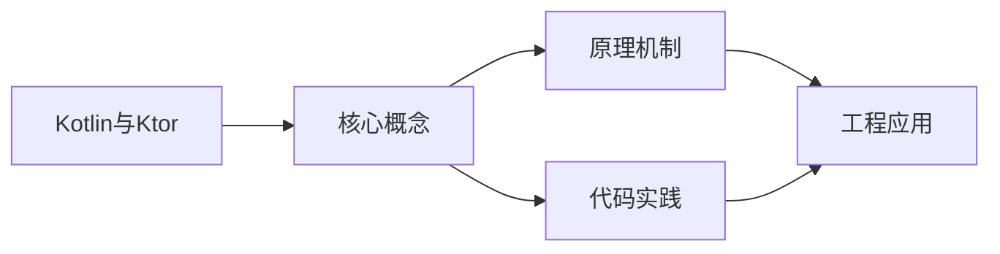

## 1. 学习目标（Bloom 分类）

本节按照布鲁姆教育目标分类学组织学习路径。本文主题为《Kotlin与Ktor》，属于 Kotlin 模块，读者可以根据自身阶段选择阅读深度。

记忆层面：能够准确复述本文的核心概念、术语与基本语法或操作步骤，并能够在提问或检索时快速定位对应知识点。能够说出 val/var、空安全操作符与 when 表达式的语法。

理解层面：能够用自己的语言解释核心原理与工作机制，说明概念之间的因果关系，而不是机械记忆结论。能够解释 Kotlin 与 Java 互操作的机制与平台类型概念。

应用层面：能够在真实项目或练习场景中运用本文知识解决具体问题，写出正确且可维护的实现。能够编写数据类、扩展函数与协程代码。

分析层面：能够拆解复杂问题，比较本文主题与相邻概念的异同，识别边界条件与例外情况。能够分析空安全、智能转换与协程调度原理。

评价层面：能够根据约束条件（性能、可读性、安全、成本）评价不同方案的优劣，做出有依据的技术决策。能够评价 Kotlin 在 Android、服务端与多平台场景的适用性。

创造层面：能够把本文知识与其他模块知识组合，设计出新的解决方案或可复用的工程模式。能够组合 Compose 与协程设计跨平台应用。

通过本节学习，读者应当能够把《Kotlin与Ktor》纳入自己的知识网络，并与 Kotlin 模块的其他主题（类型推断、空安全、协程、KMP）建立关联。

## 2. 历史动机与发展脉络

《Kotlin与Ktor》是 Kotlin 领域的重要主题。要真正理解它，需要先了解它解决的问题与演进过程。

Kotlin 由 JetBrains 于 2010 年开始研发，2016 年发布 1.0，定位是“更现代的 JVM 语言”：减少样板代码、消灭空指针、增强函数式能力，同时与 Java 100% 互操作。
2017 年 Google 宣布 Kotlin 成为 Android 一级语言，2019 年确立 Kotlin-first 政策；2023 年 Kotlin 2.0 的 K2 编译器显著提升编译速度与类型推导。
Kotlin Multiplatform（KMP）支持 JVM、Android、iOS、WebAssembly 等目标，配合 Compose Multiplatform 实现共享 UI 与业务逻辑，是 JetBrains 的长期战略方向。

回到本文主题：Kotlin与Ktor 的提出与成熟，正是上述技术背景下的必然产物。早期实现往往以简单可用为目标，随着工程规模扩大，社区逐渐沉淀出标准做法与最佳实践；理解这一脉络，可以帮助读者判断“为什么文档中的推荐写法是现在这个样子”，也能在遇到历史遗留代码时准确识别其设计年代与取舍。


## 3. 形式化定义与核心概念精讲

本节把《Kotlin与Ktor》涉及的核心概念以“定义 + 讲解”的形式展开。读者应把定义当作工具，把讲解当作理解路径；两者结合才能形成可迁移的知识。

空安全：类型系统区分 `String` 与 `String?`，编译期强制处理可空值；`?.` 短路、`?:` 提供默认、`!!` 显式断言，三者覆盖所有空值处理模式。
智能转换：`is` 检查后在不可变上下文中自动转换类型，减少显式强转；`as?` 安全转换失败返回 null。
协程：挂起函数（suspend）与调度器（Dispatchers.Main/IO/Default）实现非阻塞并发，结构化并发保证作用域内任务可取消。

### 3.1 原文章节逐一精讲

原文档把主题拆分为 18 个小节，下面按顺序给出每一节的导读讲解，随后保留原文细节供精读。

#### 原文精读（完整保留）

# Kotlin Ktor 服务端

> **符号约定**：`< >` 必填参数 | `[ ]` 可选参数

---

#### 概述

Ktor 是 JetBrains 开发的 Kotlin 服务端框架，基于协程构建，轻量、灵活、非阻塞。与 Spring Boot 等全功能框架不同，Ktor 采用插件化架构，你只引入需要的功能。它的 DSL 风格 API 让路由定义和配置非常直观。

Ktor 适合构建微服务、REST API、WebSocket 服务等。如果你喜欢轻量级框架，想要完全控制每个组件，Ktor 是一个很好的选择。

#### 基础概念

- **Application**：Ktor 应用的入口，配置路由、插件等
- **Routing**：定义 URL 路径与处理函数的映射
- **Plugin**：插件，扩展框架功能，如 ContentNegotiation、Authentication、CORS 等
- **Pipeline**：请求处理管道，插件在管道的各个阶段拦截请求
- **embeddedServer**：嵌入式服务器，不需要外部容器，直接在代码中启动

#### 快速上手

添加依赖：

```kotlin
// build.gradle.kts
dependencies {
    implementation("io.ktor:ktor-server-core:2.3.7")
    implementation("io.ktor:ktor-server-netty:2.3.7")    // Netty 引擎
    implementation("io.ktor:ktor-server-content-negotiation:2.3.7")
    implementation("io.ktor:ktor-serialization-kotlinx-json:2.3.7")
    implementation("ch.qos.logback:logback-classic:1.4.14")
}
```

最简单的 Ktor 服务器：

```kotlin
import io.ktor.server.engine.*
import io.ktor.server.netty.*
import io.ktor.server.application.*
import io.ktor.server.response.*
import io.ktor.server.routing.*

fun main() {
    embeddedServer(Netty, port = 8080) {
        routing {
            // 定义路由
            get("/") {
                call.respondText("Hello, Ktor!")
            }
            get("/hello/{name}") {
                val name = call.parameters["name"] ?: "World"
                call.respondText("Hello, $name!")
            }
        }
    }.start(wait = true)
}
```

运行后访问 `http://localhost:8080` 和 `http://localhost:8080/hello/Alice`。

#### 详细用法

##### 路由定义

```kotlin
import io.ktor.server.routing.*
import io.ktor.server.response.*
import io.ktor.server.request.*

fun Application.configureRouting() {
    routing {
        // GET 请求
        get("/users") {
            call.respondText("用户列表")
        }

        // 带路径参数
        get("/users/{id}") {
            val id = call.parameters["id"]
            call.respondText("用户ID: $id")
        }

        // 带查询参数
        get("/search") {
            val query = call.request.queryParameters["q"] ?: ""
            val page = call.request.queryParameters["page"]?.toInt() ?: 1
            call.respondText("搜索: $query, 第${page}页")
        }

        // POST 请求
        post("/users") {
            val body = call.receiveText()
            call.respondText("创建用户: $body")
        }

        // PUT 请求
        put("/users/{id}") {
            val id = call.parameters["id"]
            val body = call.receiveText()
            call.respondText("更新用户 $id: $body")
        }

        // DELETE 请求
        delete("/users/{id}") {
            val id = call.parameters["id"]
            call.respondText("删除用户: $id")
        }

        // 路由分组
        route("/api") {
            get("/v1/status") { call.respondText("OK") }
            route("/v1/users") {
                get { call.respondText("用户列表") }
                post { call.respondText("创建用户") }
            }
        }
    }
}
```

##### JSON 响应

```kotlin
import io.ktor.server.application.*
import io.ktor.server.plugins.contentnegotiation.*
import io.ktor.serialization.kotlinx.json.*
import io.ktor.server.response.*
import io.ktor.server.request.*
import io.ktor.server.routing.*
import kotlinx.serialization.Serializable
import kotlinx.serialization.json.Json

@Serializable
data class User(val id: Int, val name: String, val email: String)

fun Application.configureSerialization() {
    // 安装 ContentNegotiation 插件
    install(ContentNegotiation) {
        json(Json {
            prettyPrint = true
            ignoreUnknownKeys = true
        })
    }

    routing {
        // 返回 JSON
        get("/users/{id}") {
            val id = call.parameters["id"]?.toInt() ?: 0
            call.respond(User(id, "Alice", "alice@example.com"))
        }

        // 接收 JSON 请求体
        post("/users") {
            val user = call.receive<User>()
            println("收到: $user")
            call.respond(mapOf("status" to "created", "user" to user))
        }

        // 返回列表
        get("/users") {
            val users = listOf(
                User(1, "Alice", "alice@example.com"),
                User(2, "Bob", "bob@example.com")
            )
            call.respond(users)
        }
    }
}
```

##### 状态码和响应头

```kotlin
import io.ktor.http.*
import io.ktor.server.response.*
import io.ktor.server.routing.*

fun Application.configureResponses() {
    routing {
        get("/notfound") {
            call.respondText("资源不存在", status = HttpStatusCode.NotFound)
        }

        get("/created") {
            call.respondText("创建成功", status = HttpStatusCode.Created)
        }

        get("/headers") {
            call.response.headers.append("X-Custom-Header", "Hello")
            call.respondText("查看响应头")
        }

        // 重定向
        get("/old") {
            call.respondRedirect("/new")
        }

        get("/new") {
            call.respondText("新地址")
        }
    }
}
```

##### 静态文件

```kotlin
import io.ktor.server.http.content.*
import io.ktor.server.routing.*

fun Application.configureStatic() {
    routing {
        // 静态文件服务
        static("/static") {
            resources("static")  // 从 classpath 的 static 目录
        }

        // 或者从文件系统
        staticFiles("/files", java.io.File("uploads"))
    }
}
```

#### 常见场景

##### RESTful API

```kotlin
import io.ktor.server.application.*
import io.ktor.server.request.*
import io.ktor.server.response.*
import io.ktor.server.routing.*
import kotlinx.serialization.Serializable

@Serializable
data class CreateItemRequest(val name: String, val price: Double)

@Serializable
data class Item(val id: Int, val name: String, val price: Double)

// 模拟数据库
val items = mutableListOf<Item>()
var nextId = 1

fun Application.configureApi() {
    routing {
        route("/api/items") {
            // 获取所有
            get {
                call.respond(items)
            }

            // 获取单个
            get("/{id}") {
                val id = call.parameters["id"]?.toInt()
                val item = items.find { it.id == id }
                if (item != null) {
                    call.respond(item)
                } else {
                    call.respondText("未找到", status = HttpStatusCode.NotFound)
                }
            }

            // 创建
            post {
                val request = call.receive<CreateItemRequest>()
                val item = Item(nextId++, request.name, request.price)
                items.add(item)
                call.respond(item)
            }

            // 更新
            put("/{id}") {
                val id = call.parameters["id"]?.toInt()
                val request = call.receive<CreateItemRequest>()
                val index = items.indexOfFirst { it.id == id }
                if (index >= 0) {
                    items[index] = Item(id!!, request.name, request.price)
                    call.respond(items[index])
                } else {
                    call.respondText("未找到", status = HttpStatusCode.NotFound)
                }
            }

            // 删除
            delete("/{id}") {
                val id = call.parameters["id"]?.toInt()
                val removed = items.removeIf { it.id == id }
                if (removed) {
                    call.respondText("已删除")
                } else {
                    call.respondText("未找到", status = HttpStatusCode.NotFound)
                }
            }
        }
    }
}
```

##### CORS 配置

```kotlin
import io.ktor.server.plugins.cors.routing.*
import io.ktor.http.*

fun Application.configureCORS() {
    install(CORS) {
        anyHost()  // 开发环境允许所有来源
        // 生产环境应指定具体来源
        // allowHost("example.com")
        allowMethod(HttpMethod.Get)
        allowMethod(HttpMethod.Post)
        allowMethod(HttpMethod.Put)
        allowMethod(HttpMethod.Delete)
        allowHeader(HttpHeaders.ContentType)
        allowCredentials = true
    }
}
```

##### 请求日志

```kotlin
import io.ktor.server.plugins.calllogging.*
import io.ktor.server.application.*

fun Application.configureLogging() {
    install(CallLogging) {
        level = org.slf4j.event.Level.INFO
        // 只记录 API 请求
        filter { call -> call.request.path().startsWith("/api") }
        // 记录请求耗时
        format { call ->
            val status = call.response.status()
            val method = call.request.httpMethod.value
            val path = call.request.path()
            "[$method] $path -> $status"
        }
    }
}
```

#### 注意事项

- **所有处理函数都是挂起函数**：路由处理函数在协程中执行，可以调用 suspend 函数
- **安装插件的顺序**：某些插件的安装顺序会影响行为，如 CORS 应在路由之前安装
- **不要阻塞线程**：在路由处理中不要调用阻塞 IO，使用协程或 `Dispatchers.IO`
- **异常处理**：未捕获的异常会返回 500 错误，建议安装 StatusPages 插件统一处理
- **引擎选择**：Netty 性能最好，CIO 是纯 Kotlin 实现，Jetty 支持 Servlet

#### 进阶用法

##### 认证

```kotlin
import io.ktor.server.auth.*
import io.ktor.server.auth.jwt.*
import com.auth0.jwt.JWT
import com.auth0.jwt.algorithms.Algorithm

fun Application.configureAuth() {
    val secret = "my-secret-key"
    val algorithm = Algorithm.HMAC256(secret)

    install(Authentication) {
        jwt("auth-jwt") {
            verifier(JWT.require(algorithm).build())
            validate { credential ->
                if (credential.payload.getClaim("userId").asString().isNotEmpty()) {
                    JWTPrincipal(credential.payload)
                } else null
            }
        }
    }

    routing {
        // 不需要认证
        post("/login") {
            // 验证用户名密码后生成 Token
            val token = JWT.create()
                .withClaim("userId", "1")
                .sign(algorithm)
            call.respond(mapOf("token" to token))
        }

        // 需要认证
        authenticate("auth-jwt") {
            get("/protected") {
                val principal = call.principal<JWTPrincipal>()
                val userId = principal!!.payload.getClaim("userId").asString()
                call.respondText("欢迎, 用户$userId")
            }
        }
    }
}
```

##### 状态页面（错误处理）

```kotlin
import io.ktor.server.plugins.statuspages.*
import io.ktor.server.application.*
import io.ktor.server.response.*
import io.ktor.http.*

fun Application.configureStatusPages() {
    install(StatusPages) {
        // 处理特定状态码
        status(HttpStatusCode.NotFound) { call, status ->
            call.respondText("页面不存在", status = status)
        }

        // 处理异常
        exception<IllegalArgumentException> { call, cause ->
            call.respondText("参数错误: ${cause.message}", status = HttpStatusCode.BadRequest)
        }

        exception<NotFoundException> { call, _ ->
            call.respondText("资源不存在", status = HttpStatusCode.NotFound)
        }

        // 兜底异常处理
        exception<Exception> { call, cause ->
            call.respondText("服务器错误: ${cause.message}", status = HttpStatusCode.InternalServerError)
        }
    }
}
```

##### 应用配置文件

```kotlin
// application.conf (HOCON 格式)
// 放在 resources 目录下
/*
ktor {
    deployment {
        port = 8080
        host = 0.0.0.0
    }
    application {
        modules = [ com.example.ApplicationKt.module ]
    }
}
*/

// 在代码中读取配置
fun Application.module() {
    val port = environment.config.property("ktor.deployment.port").getString().toInt()
    val host = environment.config.property("ktor.deployment.host").getString()
    println("服务启动在 $host:$port")
}
```
#### 创建服务器

**基本写法：embeddedServer 启动**
`embeddedServer(Netty, port = <端口>) { }.start(wait = true)`
```kotlin
// 启动 Ktor Netty 服务器
embeddedServer(Netty, port = 8080) {
    routing { get("/") { call.respondText("hello") } }
}.start(wait = true)
```

---

**基本写法：指定 host**
`embeddedServer(Netty, port = <端口>, host = "<主机>") { }`
```kotlin
// 指定监听主机
embeddedServer(Netty, port = 8080, host = "0.0.0.0") { }
```

---

#### 路由配置

**基本写法：定义 GET 路由**
`get("<路径>") { }`
```kotlin
// 注册 GET 请求处理
get("/users") { call.respond(users) }
```

---

**基本写法：POST 路由**
`post("<路径>") { }`
```kotlin
// 注册 POST 请求处理
post("/users") { call.respond(create()) }
```

---

**基本写法：路径参数**
`get("<路径>/{<参数>}") { }`
```kotlin
// 获取路径参数
get("/users/{id}") {
    val id = call.parameters["id"]
}
```

---

**基本写法：route 分组**
`route("<前缀>") { }`
```kotlin
// 路由分组
routing {
    route("/api") {
        get("/v1") { }
        post("/v2") { }
    }
}
```

---

#### 请求处理

**基本写法：接收 JSON**
`call.receive<<类型>>()`
```kotlin
// 反序列化请求体
val user = call.receive<User>()
```

---

**基本写法：响应 JSON**
`call.respond(<对象>)`
```kotlin
// 序列化对象为 JSON 响应
call.respond(User("Alice"))
```

---

**基本写法：响应纯文本**
`call.respondText("<文本>")`
```kotlin
// 返回纯文本响应
call.respondText("hello", ContentType.Text.Plain)
```

---

**基本写法：查询参数**
`call.request.queryParameters["<名称>"]`
```kotlin
// 获取查询字符串参数
val q = call.request.queryParameters["q"]
```

---

#### ContentNegotiation 插件

**基本写法：安装 JSON 插件**
`install(ContentNegotiation) { json() }`
```kotlin
// 启用 JSON 序列化
install(ContentNegotiation) {
    json(Json { ignoreUnknownKeys = true })
}
```

---

#### StatusPages 异常处理

**基本写法：异常映射**
`install(StatusPages) { exception<异常> { } }`
```kotlin
// 异常转换为 HTTP 状态码
install(StatusPages) {
    exception<NotFoundException> { call, _ ->
        call.respond(HttpStatusCode.NotFound)
    }
}
```

---

#### Authentication 认证

**基本写法：Basic 认证**
`install(Authentication) { basic { } }`
```kotlin
// 启用 Basic 认证
install(Authentication) {
    basic("auth") {
        realm = "api"
        validate { cred -> if (check(cred)) UserIdPrincipal(cred.name) else null }
    }
}
```

---

**基本写法：路由应用认证**
`authenticate("<名称>") { }`
```kotlin
// 路由级应用认证
authenticate("auth") {
    get("/me") { call.respond(user) }
}
```

---

**基本写法：JWT 认证**
`install(Authentication) { jwt { } }`
```kotlin
// JWT 认证配置
install(Authentication) {
    jwt("jwt") {
        verifier(jwk)
        realm = "api"
        validate { cred -> UserIdPrincipal(cred.payload.subject) }
    }
}
```

---

#### Sessions 会话

**基本写法：启用会话**
`install(Sessions) { cookie<<类型>>("<名称>") }`
```kotlin
// Cookie 会话
install(Sessions) {
    cookie<UserSession>("SESSION")
}
```

---

**基本写法：设置会话**
`call.sessions.set(<实例>)`
```kotlin
// 写入会话数据
call.sessions.set(UserSession(id = "1"))
```

---

**基本写法：获取会话**
`call.sessions.get<<类型>>()`
```kotlin
// 读取会话数据
val s = call.sessions.get<UserSession>()
```

---

#### 静态资源

**基本写法：静态文件**
`staticFiles("<路径>", <文件对象>)`
```kotlin
// 提供静态文件服务
staticFiles("/static", File("public"))
```

---

**基本写法：静态默认资源**
`defaultResource("<文件>")`
```kotlin
// 从资源目录提供静态文件
staticResources("/static") {
    defaultResource("index.html")
}
```

---

#### WebSockets

**基本写法：启用 WebSocket**
`install(WebSockets)`
```kotlin
// 安装 WebSocket 插件
install(WebSockets)
```

---

**基本写法：定义 WebSocket 路由**
`webSocket("<路径>") { }`
```kotlin
// WebSocket 端点
webSocket("/chat") {
    for (frame in incoming) {
        val text = frame as Frame.Text
        send(Frame.Text(text.readText()))
    }
}
```

---

**基本写法：发送消息**
`send(Frame.Text("<消息>"))`
```kotlin
// 发送文本帧
send(Frame.Text("hello"))
```

---

**基本写法：接收消息**
`incoming.receive() as Frame.Text`
```kotlin
// 接收文本帧
val text = (incoming.receive() as Frame.Text).readText()
```

---

#### CORS 跨域

**基本写法：启用 CORS**
`install(CORS) { anyHost() }`
```kotlin
// 配置跨域
install(CORS) {
    anyHost()
    allowHeader(HttpHeaders.ContentType)
}
```

---

#### 部署命令

**基本写法：构建 FatJar**
`./gradlew buildFatJar`
```bash
# 构建包含所有依赖的 FatJar
./gradlew :app:buildFatJar
```

---

**基本写法：运行应用**
`java -jar <jar>`
```bash
# 运行打包后的应用
java -jar build/libs/app-all.jar
```

---

**基本写法：Docker 运行**
`docker build -t <名称> .`
```bash
# 构建 Docker 镜像
docker build -t ktor-app .
docker run -p 8080:8080 ktor-app
```


### 3.2 概念关系图

下面用 Mermaid 图表达本文核心概念之间的关系，帮助读者建立整体图景：



图中展示的是本文知识的结构化关系：核心概念是入口，原理机制解释“为什么”，代码实践演示“怎么做”，工程应用回答“何时用”。读者学习时可以把每个小节的内容挂接到对应节点上。

## 4. 理论推导与原理解析

本节深入《Kotlin与Ktor》背后的原理。理论部分不求面面俱到，而是聚焦“能解释现象、能指导实践”的关键推导。

空安全：类型系统区分 `String` 与 `String?`，编译期强制处理可空值；`?.` 短路、`?:` 提供默认、`!!` 显式断言，三者覆盖所有空值处理模式。
智能转换：`is` 检查后在不可变上下文中自动转换类型，减少显式强转；`as?` 安全转换失败返回 null。
协程：挂起函数（suspend）与调度器（Dispatchers.Main/IO/Default）实现非阻塞并发，结构化并发保证作用域内任务可取消。
扩展函数与属性：在不修改原类的情况下为类添加行为，是 Kotlin 标准库（如集合操作）的基石。

需要强调的是，理论推导与工程实践之间存在翻译层：理论给出的是理想化模型与边界条件，工程代码则必须处理真实环境中的例外。读者在学习时应先掌握理论的“标准情形”，再通过陷阱章节了解“非标准情形”。

## 5. 代码示例与逐行讲解

本节把原文中的代码示例系统整理，并为每个示例补充用途说明与讲解。读者不应只浏览代码，而应逐段对照讲解理解设计意图。

### 5.1 示例：快速上手

该示例来自原文《快速上手》小节，用于演示Kotlin与Ktor相关操作。阅读时请先看代码结构，再看其后的讲解。

```kotlin
// build.gradle.kts
dependencies {
    implementation("io.ktor:ktor-server-core:2.3.7")
    implementation("io.ktor:ktor-server-netty:2.3.7")    // Netty 引擎
    implementation("io.ktor:ktor-server-content-negotiation:2.3.7")
    implementation("io.ktor:ktor-serialization-kotlinx-json:2.3.7")
    implementation("ch.qos.logback:logback-classic:1.4.14")
}
```

讲解：这段代码演示了本节核心知识点。代码中的关键操作可以归纳为三步：准备（定义或初始化）、执行（核心逻辑）、收尾（释放资源或返回结果）。实际项目中，这三步往往被封装为函数或类，以提升复用性与可测试性。

关键点分析：

该示例共 8 行有效代码，包含 1 类关键结构（class）。其中：

- 入口与初始化部分负责建立上下文，对应实际项目中的启动或装配逻辑；
- 核心逻辑部分体现本文主题的主要操作，是阅读时最需要对照讲解理解的部分；
- 输出或返回部分把结果交给调用方，注意其类型与边界条件。

进阶思考路径：先尝试修改参数观察行为变化，再把示例中的模式迁移到自己的项目中；每次修改都记录预期与实测差异，这是把示例转化为能力的最快方式。

### 5.2 示例：快速上手

该示例来自原文《快速上手》小节，用于演示Kotlin与Ktor相关操作。阅读时请先看代码结构，再看其后的讲解。

```kotlin
import io.ktor.server.engine.*
import io.ktor.server.netty.*
import io.ktor.server.application.*
import io.ktor.server.response.*
import io.ktor.server.routing.*

fun main() {
    embeddedServer(Netty, port = 8080) {
        routing {
            // 定义路由
            get("/") {
                call.respondText("Hello, Ktor!")
            }
            get("/hello/{name}") {
                val name = call.parameters["name"] ?: "World"
                call.respondText("Hello, $name!")
            }
        }
    }.start(wait = true)
}
```

讲解：这段代码演示了本节核心知识点。代码中的关键操作可以归纳为三步：准备（定义或初始化）、执行（核心逻辑）、收尾（释放资源或返回结果）。实际项目中，这三步往往被封装为函数或类，以提升复用性与可测试性。

关键点分析：

该示例共 19 行有效代码，包含 1 类关键结构（import）。其中：

- 入口与初始化部分负责建立上下文，对应实际项目中的启动或装配逻辑；
- 核心逻辑部分体现本文主题的主要操作，是阅读时最需要对照讲解理解的部分；
- 输出或返回部分把结果交给调用方，注意其类型与边界条件。

进阶思考路径：先尝试修改参数观察行为变化，再把示例中的模式迁移到自己的项目中；每次修改都记录预期与实测差异，这是把示例转化为能力的最快方式。

### 5.3 示例：路由定义

该示例来自原文《路由定义》小节，用于演示Kotlin与Ktor相关操作。阅读时请先看代码结构，再看其后的讲解。

```kotlin
import io.ktor.server.routing.*
import io.ktor.server.response.*
import io.ktor.server.request.*

fun Application.configureRouting() {
    routing {
        // GET 请求
        get("/users") {
            call.respondText("用户列表")
        }

        // 带路径参数
        get("/users/{id}") {
            val id = call.parameters["id"]
            call.respondText("用户ID: $id")
        }

        // 带查询参数
        get("/search") {
            val query = call.request.queryParameters["q"] ?: ""
            val page = call.request.queryParameters["page"]?.toInt() ?: 1
            call.respondText("搜索: $query, 第${page}页")
        }

        // POST 请求
        post("/users") {
            val body = call.receiveText()
            call.respondText("创建用户: $body")
        }

        // PUT 请求
        put("/users/{id}") {
            val id = call.parameters["id"]
            val body = call.receiveText()
            call.respondText("更新用户 $id: $body")
        }

        // DELETE 请求
        delete("/users/{id}") {
            val id = call.parameters["id"]
            call.respondText("删除用户: $id")
        }

        // 路由分组
        route("/api") {
            get("/v1/status") { call.respondText("OK") }
            route("/v1/users") {
                get { call.respondText("用户列表") }
                post { call.respondText("创建用户") }
            }
        }
    }
}
```

讲解：这段代码演示了本节核心知识点。代码中的关键操作可以归纳为三步：准备（定义或初始化）、执行（核心逻辑）、收尾（释放资源或返回结果）。实际项目中，这三步往往被封装为函数或类，以提升复用性与可测试性。

关键点分析：

该示例共 46 行有效代码，包含 1 类关键结构（import）。其中：

- 入口与初始化部分负责建立上下文，对应实际项目中的启动或装配逻辑；
- 核心逻辑部分体现本文主题的主要操作，是阅读时最需要对照讲解理解的部分；
- 输出或返回部分把结果交给调用方，注意其类型与边界条件。

进阶思考路径：先尝试修改参数观察行为变化，再把示例中的模式迁移到自己的项目中；每次修改都记录预期与实测差异，这是把示例转化为能力的最快方式。

### 5.4 示例：JSON 响应

该示例来自原文《JSON 响应》小节，用于演示Kotlin与Ktor相关操作。阅读时请先看代码结构，再看其后的讲解。

```kotlin
import io.ktor.server.application.*
import io.ktor.server.plugins.contentnegotiation.*
import io.ktor.serialization.kotlinx.json.*
import io.ktor.server.response.*
import io.ktor.server.request.*
import io.ktor.server.routing.*
import kotlinx.serialization.Serializable
import kotlinx.serialization.json.Json

@Serializable
data class User(val id: Int, val name: String, val email: String)

fun Application.configureSerialization() {
    // 安装 ContentNegotiation 插件
    install(ContentNegotiation) {
        json(Json {
            prettyPrint = true
            ignoreUnknownKeys = true
        })
    }

    routing {
        // 返回 JSON
        get("/users/{id}") {
            val id = call.parameters["id"]?.toInt() ?: 0
            call.respond(User(id, "Alice", "alice@example.com"))
        }

        // 接收 JSON 请求体
        post("/users") {
            val user = call.receive<User>()
            println("收到: $user")
            call.respond(mapOf("status" to "created", "user" to user))
        }

        // 返回列表
        get("/users") {
            val users = listOf(
                User(1, "Alice", "alice@example.com"),
                User(2, "Bob", "bob@example.com")
            )
            call.respond(users)
        }
    }
}
```

讲解：这段代码演示了本节核心知识点。代码中的关键操作可以归纳为三步：准备（定义或初始化）、执行（核心逻辑）、收尾（释放资源或返回结果）。实际项目中，这三步往往被封装为函数或类，以提升复用性与可测试性。

关键点分析：

该示例共 40 行有效代码，包含 2 类关键结构（class、import）。其中：

- 入口与初始化部分负责建立上下文，对应实际项目中的启动或装配逻辑；
- 核心逻辑部分体现本文主题的主要操作，是阅读时最需要对照讲解理解的部分；
- 输出或返回部分把结果交给调用方，注意其类型与边界条件。

进阶思考路径：先尝试修改参数观察行为变化，再把示例中的模式迁移到自己的项目中；每次修改都记录预期与实测差异，这是把示例转化为能力的最快方式。

### 5.5 示例：状态码和响应头

该示例来自原文《状态码和响应头》小节，用于演示Kotlin与Ktor相关操作。阅读时请先看代码结构，再看其后的讲解。

```kotlin
import io.ktor.http.*
import io.ktor.server.response.*
import io.ktor.server.routing.*

fun Application.configureResponses() {
    routing {
        get("/notfound") {
            call.respondText("资源不存在", status = HttpStatusCode.NotFound)
        }

        get("/created") {
            call.respondText("创建成功", status = HttpStatusCode.Created)
        }

        get("/headers") {
            call.response.headers.append("X-Custom-Header", "Hello")
            call.respondText("查看响应头")
        }

        // 重定向
        get("/old") {
            call.respondRedirect("/new")
        }

        get("/new") {
            call.respondText("新地址")
        }
    }
}
```

讲解：这段代码演示了本节核心知识点。代码中的关键操作可以归纳为三步：准备（定义或初始化）、执行（核心逻辑）、收尾（释放资源或返回结果）。实际项目中，这三步往往被封装为函数或类，以提升复用性与可测试性。

关键点分析：

该示例共 24 行有效代码，包含 1 类关键结构（import）。其中：

- 入口与初始化部分负责建立上下文，对应实际项目中的启动或装配逻辑；
- 核心逻辑部分体现本文主题的主要操作，是阅读时最需要对照讲解理解的部分；
- 输出或返回部分把结果交给调用方，注意其类型与边界条件。

进阶思考路径：先尝试修改参数观察行为变化，再把示例中的模式迁移到自己的项目中；每次修改都记录预期与实测差异，这是把示例转化为能力的最快方式。

### 5.6 示例：静态文件

该示例来自原文《静态文件》小节，用于演示Kotlin与Ktor相关操作。阅读时请先看代码结构，再看其后的讲解。

```kotlin
import io.ktor.server.http.content.*
import io.ktor.server.routing.*

fun Application.configureStatic() {
    routing {
        // 静态文件服务
        static("/static") {
            resources("static")  // 从 classpath 的 static 目录
        }

        // 或者从文件系统
        staticFiles("/files", java.io.File("uploads"))
    }
}
```

讲解：这段代码演示了本节核心知识点。代码中的关键操作可以归纳为三步：准备（定义或初始化）、执行（核心逻辑）、收尾（释放资源或返回结果）。实际项目中，这三步往往被封装为函数或类，以提升复用性与可测试性。

关键点分析：

该示例共 12 行有效代码，包含 2 类关键结构（class、import）。其中：

- 入口与初始化部分负责建立上下文，对应实际项目中的启动或装配逻辑；
- 核心逻辑部分体现本文主题的主要操作，是阅读时最需要对照讲解理解的部分；
- 输出或返回部分把结果交给调用方，注意其类型与边界条件。

进阶思考路径：先尝试修改参数观察行为变化，再把示例中的模式迁移到自己的项目中；每次修改都记录预期与实测差异，这是把示例转化为能力的最快方式。

### 5.7 示例：RESTful API

该示例来自原文《RESTful API》小节，用于演示Kotlin与Ktor相关操作。阅读时请先看代码结构，再看其后的讲解。

```kotlin
import io.ktor.server.application.*
import io.ktor.server.request.*
import io.ktor.server.response.*
import io.ktor.server.routing.*
import kotlinx.serialization.Serializable

@Serializable
data class CreateItemRequest(val name: String, val price: Double)

@Serializable
data class Item(val id: Int, val name: String, val price: Double)

// 模拟数据库
val items = mutableListOf<Item>()
var nextId = 1

fun Application.configureApi() {
    routing {
        route("/api/items") {
            // 获取所有
            get {
                call.respond(items)
            }

            // 获取单个
            get("/{id}") {
                val id = call.parameters["id"]?.toInt()
                val item = items.find { it.id == id }
                if (item != null) {
                    call.respond(item)
                } else {
                    call.respondText("未找到", status = HttpStatusCode.NotFound)
                }
            }

            // 创建
            post {
                val request = call.receive<CreateItemRequest>()
                val item = Item(nextId++, request.name, request.price)
                items.add(item)
                call.respond(item)
            }

            // 更新
            put("/{id}") {
                val id = call.parameters["id"]?.toInt()
                val request = call.receive<CreateItemRequest>()
                val index = items.indexOfFirst { it.id == id }
                if (index >= 0) {
                    items[index] = Item(id!!, request.name, request.price)
                    call.respond(items[index])
                } else {
                    call.respondText("未找到", status = HttpStatusCode.NotFound)
                }
            }

            // 删除
            delete("/{id}") {
                val id = call.parameters["id"]?.toInt()
                val removed = items.removeIf { it.id == id }
                if (removed) {
                    call.respondText("已删除")
                } else {
                    call.respondText("未找到", status = HttpStatusCode.NotFound)
                }
            }
        }
    }
}
```

讲解：这段代码演示了本节核心知识点。代码中的关键操作可以归纳为三步：准备（定义或初始化）、执行（核心逻辑）、收尾（释放资源或返回结果）。实际项目中，这三步往往被封装为函数或类，以提升复用性与可测试性。

关键点分析：

该示例共 61 行有效代码，包含 3 类关键结构（class、import、if）。其中：

- 入口与初始化部分负责建立上下文，对应实际项目中的启动或装配逻辑；
- 核心逻辑部分体现本文主题的主要操作，是阅读时最需要对照讲解理解的部分；
- 输出或返回部分把结果交给调用方，注意其类型与边界条件。

进阶思考路径：先尝试修改参数观察行为变化，再把示例中的模式迁移到自己的项目中；每次修改都记录预期与实测差异，这是把示例转化为能力的最快方式。

### 5.8 示例：CORS 配置

该示例来自原文《CORS 配置》小节，用于演示Kotlin与Ktor相关操作。阅读时请先看代码结构，再看其后的讲解。

```kotlin
import io.ktor.server.plugins.cors.routing.*
import io.ktor.http.*

fun Application.configureCORS() {
    install(CORS) {
        anyHost()  // 开发环境允许所有来源
        // 生产环境应指定具体来源
        // allowHost("example.com")
        allowMethod(HttpMethod.Get)
        allowMethod(HttpMethod.Post)
        allowMethod(HttpMethod.Put)
        allowMethod(HttpMethod.Delete)
        allowHeader(HttpHeaders.ContentType)
        allowCredentials = true
    }
}
```

讲解：这段代码演示了本节核心知识点。代码中的关键操作可以归纳为三步：准备（定义或初始化）、执行（核心逻辑）、收尾（释放资源或返回结果）。实际项目中，这三步往往被封装为函数或类，以提升复用性与可测试性。

关键点分析：

该示例共 15 行有效代码，包含 1 类关键结构（import）。其中：

- 入口与初始化部分负责建立上下文，对应实际项目中的启动或装配逻辑；
- 核心逻辑部分体现本文主题的主要操作，是阅读时最需要对照讲解理解的部分；
- 输出或返回部分把结果交给调用方，注意其类型与边界条件。

进阶思考路径：先尝试修改参数观察行为变化，再把示例中的模式迁移到自己的项目中；每次修改都记录预期与实测差异，这是把示例转化为能力的最快方式。

### 5.9 示例：请求日志

该示例来自原文《请求日志》小节，用于演示Kotlin与Ktor相关操作。阅读时请先看代码结构，再看其后的讲解。

```kotlin
import io.ktor.server.plugins.calllogging.*
import io.ktor.server.application.*

fun Application.configureLogging() {
    install(CallLogging) {
        level = org.slf4j.event.Level.INFO
        // 只记录 API 请求
        filter { call -> call.request.path().startsWith("/api") }
        // 记录请求耗时
        format { call ->
            val status = call.response.status()
            val method = call.request.httpMethod.value
            val path = call.request.path()
            "[$method] $path -> $status"
        }
    }
}
```

讲解：这段代码演示了本节核心知识点。代码中的关键操作可以归纳为三步：准备（定义或初始化）、执行（核心逻辑）、收尾（释放资源或返回结果）。实际项目中，这三步往往被封装为函数或类，以提升复用性与可测试性。

关键点分析：

该示例共 16 行有效代码，包含 1 类关键结构（import）。其中：

- 入口与初始化部分负责建立上下文，对应实际项目中的启动或装配逻辑；
- 核心逻辑部分体现本文主题的主要操作，是阅读时最需要对照讲解理解的部分；
- 输出或返回部分把结果交给调用方，注意其类型与边界条件。

进阶思考路径：先尝试修改参数观察行为变化，再把示例中的模式迁移到自己的项目中；每次修改都记录预期与实测差异，这是把示例转化为能力的最快方式。

### 5.10 示例：认证

该示例来自原文《认证》小节，用于演示Kotlin与Ktor相关操作。阅读时请先看代码结构，再看其后的讲解。

```kotlin
import io.ktor.server.auth.*
import io.ktor.server.auth.jwt.*
import com.auth0.jwt.JWT
import com.auth0.jwt.algorithms.Algorithm

fun Application.configureAuth() {
    val secret = "my-secret-key"
    val algorithm = Algorithm.HMAC256(secret)

    install(Authentication) {
        jwt("auth-jwt") {
            verifier(JWT.require(algorithm).build())
            validate { credential ->
                if (credential.payload.getClaim("userId").asString().isNotEmpty()) {
                    JWTPrincipal(credential.payload)
                } else null
            }
        }
    }

    routing {
        // 不需要认证
        post("/login") {
            // 验证用户名密码后生成 Token
            val token = JWT.create()
                .withClaim("userId", "1")
                .sign(algorithm)
            call.respond(mapOf("token" to token))
        }

        // 需要认证
        authenticate("auth-jwt") {
            get("/protected") {
                val principal = call.principal<JWTPrincipal>()
                val userId = principal!!.payload.getClaim("userId").asString()
                call.respondText("欢迎, 用户$userId")
            }
        }
    }
}
```

讲解：这段代码演示了本节核心知识点。代码中的关键操作可以归纳为三步：准备（定义或初始化）、执行（核心逻辑）、收尾（释放资源或返回结果）。实际项目中，这三步往往被封装为函数或类，以提升复用性与可测试性。

关键点分析：

该示例共 36 行有效代码，包含 2 类关键结构（import、if）。其中：

- 入口与初始化部分负责建立上下文，对应实际项目中的启动或装配逻辑；
- 核心逻辑部分体现本文主题的主要操作，是阅读时最需要对照讲解理解的部分；
- 输出或返回部分把结果交给调用方，注意其类型与边界条件。

进阶思考路径：先尝试修改参数观察行为变化，再把示例中的模式迁移到自己的项目中；每次修改都记录预期与实测差异，这是把示例转化为能力的最快方式。

### 5.11 示例：状态页面（错误处理）

该示例来自原文《状态页面（错误处理）》小节，用于演示Kotlin与Ktor相关操作。阅读时请先看代码结构，再看其后的讲解。

```kotlin
import io.ktor.server.plugins.statuspages.*
import io.ktor.server.application.*
import io.ktor.server.response.*
import io.ktor.http.*

fun Application.configureStatusPages() {
    install(StatusPages) {
        // 处理特定状态码
        status(HttpStatusCode.NotFound) { call, status ->
            call.respondText("页面不存在", status = status)
        }

        // 处理异常
        exception<IllegalArgumentException> { call, cause ->
            call.respondText("参数错误: ${cause.message}", status = HttpStatusCode.BadRequest)
        }

        exception<NotFoundException> { call, _ ->
            call.respondText("资源不存在", status = HttpStatusCode.NotFound)
        }

        // 兜底异常处理
        exception<Exception> { call, cause ->
            call.respondText("服务器错误: ${cause.message}", status = HttpStatusCode.InternalServerError)
        }
    }
}
```

讲解：这段代码演示了本节核心知识点。代码中的关键操作可以归纳为三步：准备（定义或初始化）、执行（核心逻辑）、收尾（释放资源或返回结果）。实际项目中，这三步往往被封装为函数或类，以提升复用性与可测试性。

关键点分析：

该示例共 23 行有效代码，包含 1 类关键结构（import）。其中：

- 入口与初始化部分负责建立上下文，对应实际项目中的启动或装配逻辑；
- 核心逻辑部分体现本文主题的主要操作，是阅读时最需要对照讲解理解的部分；
- 输出或返回部分把结果交给调用方，注意其类型与边界条件。

进阶思考路径：先尝试修改参数观察行为变化，再把示例中的模式迁移到自己的项目中；每次修改都记录预期与实测差异，这是把示例转化为能力的最快方式。

### 5.12 示例：应用配置文件

该示例来自原文《应用配置文件》小节，用于演示Kotlin与Ktor相关操作。阅读时请先看代码结构，再看其后的讲解。

```kotlin
// application.conf (HOCON 格式)
// 放在 resources 目录下
/*
ktor {
    deployment {
        port = 8080
        host = 0.0.0.0
    }
    application {
        modules = [ com.example.ApplicationKt.module ]
    }
}
*/

// 在代码中读取配置
fun Application.module() {
    val port = environment.config.property("ktor.deployment.port").getString().toInt()
    val host = environment.config.property("ktor.deployment.host").getString()
    println("服务启动在 $host:$port")
}
```

讲解：这段代码演示了本节核心知识点。代码中的关键操作可以归纳为三步：准备（定义或初始化）、执行（核心逻辑）、收尾（释放资源或返回结果）。实际项目中，这三步往往被封装为函数或类，以提升复用性与可测试性。

关键点分析：

该示例共 19 行有效代码，结构以数据或配置为主。阅读时应关注：数据字段的含义、配置项的作用，以及它们与运行行为的对应关系。

进阶思考路径：先尝试修改参数观察行为变化，再把示例中的模式迁移到自己的项目中；每次修改都记录预期与实测差异，这是把示例转化为能力的最快方式。

### 5.13 示例：创建服务器

该示例来自原文《创建服务器》小节，用于演示Kotlin与Ktor相关操作。阅读时请先看代码结构，再看其后的讲解。

```kotlin
// 启动 Ktor Netty 服务器
embeddedServer(Netty, port = 8080) {
    routing { get("/") { call.respondText("hello") } }
}.start(wait = true)
```

讲解：这段代码演示了本节核心知识点。代码中的关键操作可以归纳为三步：准备（定义或初始化）、执行（核心逻辑）、收尾（释放资源或返回结果）。实际项目中，这三步往往被封装为函数或类，以提升复用性与可测试性。

关键点分析：

该示例共 4 行有效代码，结构以数据或配置为主。阅读时应关注：数据字段的含义、配置项的作用，以及它们与运行行为的对应关系。

进阶思考路径：先尝试修改参数观察行为变化，再把示例中的模式迁移到自己的项目中；每次修改都记录预期与实测差异，这是把示例转化为能力的最快方式。

### 5.14 示例：创建服务器

该示例来自原文《创建服务器》小节，用于演示Kotlin与Ktor相关操作。阅读时请先看代码结构，再看其后的讲解。

```kotlin
// 指定监听主机
embeddedServer(Netty, port = 8080, host = "0.0.0.0") { }
```

讲解：这段代码演示了本节核心知识点。代码中的关键操作可以归纳为三步：准备（定义或初始化）、执行（核心逻辑）、收尾（释放资源或返回结果）。实际项目中，这三步往往被封装为函数或类，以提升复用性与可测试性。

关键点分析：

该示例共 2 行有效代码，结构以数据或配置为主。阅读时应关注：数据字段的含义、配置项的作用，以及它们与运行行为的对应关系。

进阶思考路径：先尝试修改参数观察行为变化，再把示例中的模式迁移到自己的项目中；每次修改都记录预期与实测差异，这是把示例转化为能力的最快方式。

### 5.15 示例：路由配置

该示例来自原文《路由配置》小节，用于演示Kotlin与Ktor相关操作。阅读时请先看代码结构，再看其后的讲解。

```kotlin
// 注册 GET 请求处理
get("/users") { call.respond(users) }
```

讲解：这段代码演示了本节核心知识点。代码中的关键操作可以归纳为三步：准备（定义或初始化）、执行（核心逻辑）、收尾（释放资源或返回结果）。实际项目中，这三步往往被封装为函数或类，以提升复用性与可测试性。

关键点分析：

该示例共 2 行有效代码，结构以数据或配置为主。阅读时应关注：数据字段的含义、配置项的作用，以及它们与运行行为的对应关系。

进阶思考路径：先尝试修改参数观察行为变化，再把示例中的模式迁移到自己的项目中；每次修改都记录预期与实测差异，这是把示例转化为能力的最快方式。

### 5.16 示例：路由配置

该示例来自原文《路由配置》小节，用于演示Kotlin与Ktor相关操作。阅读时请先看代码结构，再看其后的讲解。

```kotlin
// 注册 POST 请求处理
post("/users") { call.respond(create()) }
```

讲解：这段代码演示了本节核心知识点。代码中的关键操作可以归纳为三步：准备（定义或初始化）、执行（核心逻辑）、收尾（释放资源或返回结果）。实际项目中，这三步往往被封装为函数或类，以提升复用性与可测试性。

关键点分析：

该示例共 2 行有效代码，结构以数据或配置为主。阅读时应关注：数据字段的含义、配置项的作用，以及它们与运行行为的对应关系。

进阶思考路径：先尝试修改参数观察行为变化，再把示例中的模式迁移到自己的项目中；每次修改都记录预期与实测差异，这是把示例转化为能力的最快方式。

### 5.17 示例：路由配置

该示例来自原文《路由配置》小节，用于演示Kotlin与Ktor相关操作。阅读时请先看代码结构，再看其后的讲解。

```kotlin
// 获取路径参数
get("/users/{id}") {
    val id = call.parameters["id"]
}
```

讲解：这段代码演示了本节核心知识点。代码中的关键操作可以归纳为三步：准备（定义或初始化）、执行（核心逻辑）、收尾（释放资源或返回结果）。实际项目中，这三步往往被封装为函数或类，以提升复用性与可测试性。

关键点分析：

该示例共 4 行有效代码，结构以数据或配置为主。阅读时应关注：数据字段的含义、配置项的作用，以及它们与运行行为的对应关系。

进阶思考路径：先尝试修改参数观察行为变化，再把示例中的模式迁移到自己的项目中；每次修改都记录预期与实测差异，这是把示例转化为能力的最快方式。

### 5.18 示例：路由配置

该示例来自原文《路由配置》小节，用于演示Kotlin与Ktor相关操作。阅读时请先看代码结构，再看其后的讲解。

```kotlin
// 路由分组
routing {
    route("/api") {
        get("/v1") { }
        post("/v2") { }
    }
}
```

讲解：这段代码演示了本节核心知识点。代码中的关键操作可以归纳为三步：准备（定义或初始化）、执行（核心逻辑）、收尾（释放资源或返回结果）。实际项目中，这三步往往被封装为函数或类，以提升复用性与可测试性。

关键点分析：

该示例共 7 行有效代码，结构以数据或配置为主。阅读时应关注：数据字段的含义、配置项的作用，以及它们与运行行为的对应关系。

进阶思考路径：先尝试修改参数观察行为变化，再把示例中的模式迁移到自己的项目中；每次修改都记录预期与实测差异，这是把示例转化为能力的最快方式。

### 5.19 示例：请求处理

该示例来自原文《请求处理》小节，用于演示Kotlin与Ktor相关操作。阅读时请先看代码结构，再看其后的讲解。

```kotlin
// 反序列化请求体
val user = call.receive<User>()
```

讲解：这段代码演示了本节核心知识点。代码中的关键操作可以归纳为三步：准备（定义或初始化）、执行（核心逻辑）、收尾（释放资源或返回结果）。实际项目中，这三步往往被封装为函数或类，以提升复用性与可测试性。

关键点分析：

该示例共 2 行有效代码，结构以数据或配置为主。阅读时应关注：数据字段的含义、配置项的作用，以及它们与运行行为的对应关系。

进阶思考路径：先尝试修改参数观察行为变化，再把示例中的模式迁移到自己的项目中；每次修改都记录预期与实测差异，这是把示例转化为能力的最快方式。

### 5.20 示例：请求处理

该示例来自原文《请求处理》小节，用于演示Kotlin与Ktor相关操作。阅读时请先看代码结构，再看其后的讲解。

```kotlin
// 序列化对象为 JSON 响应
call.respond(User("Alice"))
```

讲解：这段代码演示了本节核心知识点。代码中的关键操作可以归纳为三步：准备（定义或初始化）、执行（核心逻辑）、收尾（释放资源或返回结果）。实际项目中，这三步往往被封装为函数或类，以提升复用性与可测试性。

关键点分析：

该示例共 2 行有效代码，结构以数据或配置为主。阅读时应关注：数据字段的含义、配置项的作用，以及它们与运行行为的对应关系。

进阶思考路径：先尝试修改参数观察行为变化，再把示例中的模式迁移到自己的项目中；每次修改都记录预期与实测差异，这是把示例转化为能力的最快方式。

### 5.21 示例：请求处理

该示例来自原文《请求处理》小节，用于演示Kotlin与Ktor相关操作。阅读时请先看代码结构，再看其后的讲解。

```kotlin
// 返回纯文本响应
call.respondText("hello", ContentType.Text.Plain)
```

讲解：这段代码演示了本节核心知识点。代码中的关键操作可以归纳为三步：准备（定义或初始化）、执行（核心逻辑）、收尾（释放资源或返回结果）。实际项目中，这三步往往被封装为函数或类，以提升复用性与可测试性。

关键点分析：

该示例共 2 行有效代码，结构以数据或配置为主。阅读时应关注：数据字段的含义、配置项的作用，以及它们与运行行为的对应关系。

进阶思考路径：先尝试修改参数观察行为变化，再把示例中的模式迁移到自己的项目中；每次修改都记录预期与实测差异，这是把示例转化为能力的最快方式。

### 5.22 示例：请求处理

该示例来自原文《请求处理》小节，用于演示Kotlin与Ktor相关操作。阅读时请先看代码结构，再看其后的讲解。

```kotlin
// 获取查询字符串参数
val q = call.request.queryParameters["q"]
```

讲解：这段代码演示了本节核心知识点。代码中的关键操作可以归纳为三步：准备（定义或初始化）、执行（核心逻辑）、收尾（释放资源或返回结果）。实际项目中，这三步往往被封装为函数或类，以提升复用性与可测试性。

关键点分析：

该示例共 2 行有效代码，结构以数据或配置为主。阅读时应关注：数据字段的含义、配置项的作用，以及它们与运行行为的对应关系。

进阶思考路径：先尝试修改参数观察行为变化，再把示例中的模式迁移到自己的项目中；每次修改都记录预期与实测差异，这是把示例转化为能力的最快方式。

### 5.23 示例：ContentNegotiation 插件

该示例来自原文《ContentNegotiation 插件》小节，用于演示Kotlin与Ktor相关操作。阅读时请先看代码结构，再看其后的讲解。

```kotlin
// 启用 JSON 序列化
install(ContentNegotiation) {
    json(Json { ignoreUnknownKeys = true })
}
```

讲解：这段代码演示了本节核心知识点。代码中的关键操作可以归纳为三步：准备（定义或初始化）、执行（核心逻辑）、收尾（释放资源或返回结果）。实际项目中，这三步往往被封装为函数或类，以提升复用性与可测试性。

关键点分析：

该示例共 4 行有效代码，结构以数据或配置为主。阅读时应关注：数据字段的含义、配置项的作用，以及它们与运行行为的对应关系。

进阶思考路径：先尝试修改参数观察行为变化，再把示例中的模式迁移到自己的项目中；每次修改都记录预期与实测差异，这是把示例转化为能力的最快方式。

### 5.24 示例：StatusPages 异常处理

该示例来自原文《StatusPages 异常处理》小节，用于演示Kotlin与Ktor相关操作。阅读时请先看代码结构，再看其后的讲解。

```kotlin
// 异常转换为 HTTP 状态码
install(StatusPages) {
    exception<NotFoundException> { call, _ ->
        call.respond(HttpStatusCode.NotFound)
    }
}
```

讲解：这段代码演示了本节核心知识点。代码中的关键操作可以归纳为三步：准备（定义或初始化）、执行（核心逻辑）、收尾（释放资源或返回结果）。实际项目中，这三步往往被封装为函数或类，以提升复用性与可测试性。

关键点分析：

该示例共 6 行有效代码，结构以数据或配置为主。阅读时应关注：数据字段的含义、配置项的作用，以及它们与运行行为的对应关系。

进阶思考路径：先尝试修改参数观察行为变化，再把示例中的模式迁移到自己的项目中；每次修改都记录预期与实测差异，这是把示例转化为能力的最快方式。

### 5.25 示例：Authentication 认证

该示例来自原文《Authentication 认证》小节，用于演示Kotlin与Ktor相关操作。阅读时请先看代码结构，再看其后的讲解。

```kotlin
// 启用 Basic 认证
install(Authentication) {
    basic("auth") {
        realm = "api"
        validate { cred -> if (check(cred)) UserIdPrincipal(cred.name) else null }
    }
}
```

讲解：这段代码演示了本节核心知识点。代码中的关键操作可以归纳为三步：准备（定义或初始化）、执行（核心逻辑）、收尾（释放资源或返回结果）。实际项目中，这三步往往被封装为函数或类，以提升复用性与可测试性。

关键点分析：

该示例共 7 行有效代码，包含 1 类关键结构（if）。其中：

- 入口与初始化部分负责建立上下文，对应实际项目中的启动或装配逻辑；
- 核心逻辑部分体现本文主题的主要操作，是阅读时最需要对照讲解理解的部分；
- 输出或返回部分把结果交给调用方，注意其类型与边界条件。

进阶思考路径：先尝试修改参数观察行为变化，再把示例中的模式迁移到自己的项目中；每次修改都记录预期与实测差异，这是把示例转化为能力的最快方式。

### 5.26 示例：Authentication 认证

该示例来自原文《Authentication 认证》小节，用于演示Kotlin与Ktor相关操作。阅读时请先看代码结构，再看其后的讲解。

```kotlin
// 路由级应用认证
authenticate("auth") {
    get("/me") { call.respond(user) }
}
```

讲解：这段代码演示了本节核心知识点。代码中的关键操作可以归纳为三步：准备（定义或初始化）、执行（核心逻辑）、收尾（释放资源或返回结果）。实际项目中，这三步往往被封装为函数或类，以提升复用性与可测试性。

关键点分析：

该示例共 4 行有效代码，结构以数据或配置为主。阅读时应关注：数据字段的含义、配置项的作用，以及它们与运行行为的对应关系。

进阶思考路径：先尝试修改参数观察行为变化，再把示例中的模式迁移到自己的项目中；每次修改都记录预期与实测差异，这是把示例转化为能力的最快方式。

### 5.27 示例：Authentication 认证

该示例来自原文《Authentication 认证》小节，用于演示Kotlin与Ktor相关操作。阅读时请先看代码结构，再看其后的讲解。

```kotlin
// JWT 认证配置
install(Authentication) {
    jwt("jwt") {
        verifier(jwk)
        realm = "api"
        validate { cred -> UserIdPrincipal(cred.payload.subject) }
    }
}
```

讲解：这段代码演示了本节核心知识点。代码中的关键操作可以归纳为三步：准备（定义或初始化）、执行（核心逻辑）、收尾（释放资源或返回结果）。实际项目中，这三步往往被封装为函数或类，以提升复用性与可测试性。

关键点分析：

该示例共 8 行有效代码，结构以数据或配置为主。阅读时应关注：数据字段的含义、配置项的作用，以及它们与运行行为的对应关系。

进阶思考路径：先尝试修改参数观察行为变化，再把示例中的模式迁移到自己的项目中；每次修改都记录预期与实测差异，这是把示例转化为能力的最快方式。

### 5.28 示例：Sessions 会话

该示例来自原文《Sessions 会话》小节，用于演示Kotlin与Ktor相关操作。阅读时请先看代码结构，再看其后的讲解。

```kotlin
// Cookie 会话
install(Sessions) {
    cookie<UserSession>("SESSION")
}
```

讲解：这段代码演示了本节核心知识点。代码中的关键操作可以归纳为三步：准备（定义或初始化）、执行（核心逻辑）、收尾（释放资源或返回结果）。实际项目中，这三步往往被封装为函数或类，以提升复用性与可测试性。

关键点分析：

该示例共 4 行有效代码，结构以数据或配置为主。阅读时应关注：数据字段的含义、配置项的作用，以及它们与运行行为的对应关系。

进阶思考路径：先尝试修改参数观察行为变化，再把示例中的模式迁移到自己的项目中；每次修改都记录预期与实测差异，这是把示例转化为能力的最快方式。

### 5.29 示例：Sessions 会话

该示例来自原文《Sessions 会话》小节，用于演示Kotlin与Ktor相关操作。阅读时请先看代码结构，再看其后的讲解。

```kotlin
// 写入会话数据
call.sessions.set(UserSession(id = "1"))
```

讲解：这段代码演示了本节核心知识点。代码中的关键操作可以归纳为三步：准备（定义或初始化）、执行（核心逻辑）、收尾（释放资源或返回结果）。实际项目中，这三步往往被封装为函数或类，以提升复用性与可测试性。

关键点分析：

该示例共 2 行有效代码，结构以数据或配置为主。阅读时应关注：数据字段的含义、配置项的作用，以及它们与运行行为的对应关系。

进阶思考路径：先尝试修改参数观察行为变化，再把示例中的模式迁移到自己的项目中；每次修改都记录预期与实测差异，这是把示例转化为能力的最快方式。

### 5.30 示例：Sessions 会话

该示例来自原文《Sessions 会话》小节，用于演示Kotlin与Ktor相关操作。阅读时请先看代码结构，再看其后的讲解。

```kotlin
// 读取会话数据
val s = call.sessions.get<UserSession>()
```

讲解：这段代码演示了本节核心知识点。代码中的关键操作可以归纳为三步：准备（定义或初始化）、执行（核心逻辑）、收尾（释放资源或返回结果）。实际项目中，这三步往往被封装为函数或类，以提升复用性与可测试性。

关键点分析：

该示例共 2 行有效代码，结构以数据或配置为主。阅读时应关注：数据字段的含义、配置项的作用，以及它们与运行行为的对应关系。

进阶思考路径：先尝试修改参数观察行为变化，再把示例中的模式迁移到自己的项目中；每次修改都记录预期与实测差异，这是把示例转化为能力的最快方式。

### 5.31 示例：静态资源

该示例来自原文《静态资源》小节，用于演示Kotlin与Ktor相关操作。阅读时请先看代码结构，再看其后的讲解。

```kotlin
// 提供静态文件服务
staticFiles("/static", File("public"))
```

讲解：这段代码演示了本节核心知识点。代码中的关键操作可以归纳为三步：准备（定义或初始化）、执行（核心逻辑）、收尾（释放资源或返回结果）。实际项目中，这三步往往被封装为函数或类，以提升复用性与可测试性。

关键点分析：

该示例共 2 行有效代码，结构以数据或配置为主。阅读时应关注：数据字段的含义、配置项的作用，以及它们与运行行为的对应关系。

进阶思考路径：先尝试修改参数观察行为变化，再把示例中的模式迁移到自己的项目中；每次修改都记录预期与实测差异，这是把示例转化为能力的最快方式。

### 5.32 示例：静态资源

该示例来自原文《静态资源》小节，用于演示Kotlin与Ktor相关操作。阅读时请先看代码结构，再看其后的讲解。

```kotlin
// 从资源目录提供静态文件
staticResources("/static") {
    defaultResource("index.html")
}
```

讲解：这段代码演示了本节核心知识点。代码中的关键操作可以归纳为三步：准备（定义或初始化）、执行（核心逻辑）、收尾（释放资源或返回结果）。实际项目中，这三步往往被封装为函数或类，以提升复用性与可测试性。

关键点分析：

该示例共 4 行有效代码，结构以数据或配置为主。阅读时应关注：数据字段的含义、配置项的作用，以及它们与运行行为的对应关系。

进阶思考路径：先尝试修改参数观察行为变化，再把示例中的模式迁移到自己的项目中；每次修改都记录预期与实测差异，这是把示例转化为能力的最快方式。

### 5.33 示例：WebSockets

该示例来自原文《WebSockets》小节，用于演示Kotlin与Ktor相关操作。阅读时请先看代码结构，再看其后的讲解。

```kotlin
// 安装 WebSocket 插件
install(WebSockets)
```

讲解：这段代码演示了本节核心知识点。代码中的关键操作可以归纳为三步：准备（定义或初始化）、执行（核心逻辑）、收尾（释放资源或返回结果）。实际项目中，这三步往往被封装为函数或类，以提升复用性与可测试性。

关键点分析：

该示例共 2 行有效代码，结构以数据或配置为主。阅读时应关注：数据字段的含义、配置项的作用，以及它们与运行行为的对应关系。

进阶思考路径：先尝试修改参数观察行为变化，再把示例中的模式迁移到自己的项目中；每次修改都记录预期与实测差异，这是把示例转化为能力的最快方式。

### 5.34 示例：WebSockets

该示例来自原文《WebSockets》小节，用于演示Kotlin与Ktor相关操作。阅读时请先看代码结构，再看其后的讲解。

```kotlin
// WebSocket 端点
webSocket("/chat") {
    for (frame in incoming) {
        val text = frame as Frame.Text
        send(Frame.Text(text.readText()))
    }
}
```

讲解：这段代码演示了本节核心知识点。代码中的关键操作可以归纳为三步：准备（定义或初始化）、执行（核心逻辑）、收尾（释放资源或返回结果）。实际项目中，这三步往往被封装为函数或类，以提升复用性与可测试性。

关键点分析：

该示例共 7 行有效代码，包含 1 类关键结构（for）。其中：

- 入口与初始化部分负责建立上下文，对应实际项目中的启动或装配逻辑；
- 核心逻辑部分体现本文主题的主要操作，是阅读时最需要对照讲解理解的部分；
- 输出或返回部分把结果交给调用方，注意其类型与边界条件。

进阶思考路径：先尝试修改参数观察行为变化，再把示例中的模式迁移到自己的项目中；每次修改都记录预期与实测差异，这是把示例转化为能力的最快方式。

### 5.35 示例：WebSockets

该示例来自原文《WebSockets》小节，用于演示Kotlin与Ktor相关操作。阅读时请先看代码结构，再看其后的讲解。

```kotlin
// 发送文本帧
send(Frame.Text("hello"))
```

讲解：这段代码演示了本节核心知识点。代码中的关键操作可以归纳为三步：准备（定义或初始化）、执行（核心逻辑）、收尾（释放资源或返回结果）。实际项目中，这三步往往被封装为函数或类，以提升复用性与可测试性。

关键点分析：

该示例共 2 行有效代码，结构以数据或配置为主。阅读时应关注：数据字段的含义、配置项的作用，以及它们与运行行为的对应关系。

进阶思考路径：先尝试修改参数观察行为变化，再把示例中的模式迁移到自己的项目中；每次修改都记录预期与实测差异，这是把示例转化为能力的最快方式。

### 5.36 示例：WebSockets

该示例来自原文《WebSockets》小节，用于演示Kotlin与Ktor相关操作。阅读时请先看代码结构，再看其后的讲解。

```kotlin
// 接收文本帧
val text = (incoming.receive() as Frame.Text).readText()
```

讲解：这段代码演示了本节核心知识点。代码中的关键操作可以归纳为三步：准备（定义或初始化）、执行（核心逻辑）、收尾（释放资源或返回结果）。实际项目中，这三步往往被封装为函数或类，以提升复用性与可测试性。

关键点分析：

该示例共 2 行有效代码，结构以数据或配置为主。阅读时应关注：数据字段的含义、配置项的作用，以及它们与运行行为的对应关系。

进阶思考路径：先尝试修改参数观察行为变化，再把示例中的模式迁移到自己的项目中；每次修改都记录预期与实测差异，这是把示例转化为能力的最快方式。

### 5.37 示例：CORS 跨域

该示例来自原文《CORS 跨域》小节，用于演示Kotlin与Ktor相关操作。阅读时请先看代码结构，再看其后的讲解。

```kotlin
// 配置跨域
install(CORS) {
    anyHost()
    allowHeader(HttpHeaders.ContentType)
}
```

讲解：这段代码演示了本节核心知识点。代码中的关键操作可以归纳为三步：准备（定义或初始化）、执行（核心逻辑）、收尾（释放资源或返回结果）。实际项目中，这三步往往被封装为函数或类，以提升复用性与可测试性。

关键点分析：

该示例共 5 行有效代码，结构以数据或配置为主。阅读时应关注：数据字段的含义、配置项的作用，以及它们与运行行为的对应关系。

进阶思考路径：先尝试修改参数观察行为变化，再把示例中的模式迁移到自己的项目中；每次修改都记录预期与实测差异，这是把示例转化为能力的最快方式。

### 5.38 示例：部署命令

该示例来自原文《部署命令》小节，用于演示Kotlin与Ktor相关操作。阅读时请先看代码结构，再看其后的讲解。

```bash
# 构建包含所有依赖的 FatJar
./gradlew :app:buildFatJar
```

讲解：这段代码演示了本节核心知识点。代码中的关键操作可以归纳为三步：准备（定义或初始化）、执行（核心逻辑）、收尾（释放资源或返回结果）。实际项目中，这三步往往被封装为函数或类，以提升复用性与可测试性。

关键点分析：

该示例共 2 行有效代码，结构以数据或配置为主。阅读时应关注：数据字段的含义、配置项的作用，以及它们与运行行为的对应关系。

进阶思考路径：先尝试修改参数观察行为变化，再把示例中的模式迁移到自己的项目中；每次修改都记录预期与实测差异，这是把示例转化为能力的最快方式。

### 5.39 示例：部署命令

该示例来自原文《部署命令》小节，用于演示Kotlin与Ktor相关操作。阅读时请先看代码结构，再看其后的讲解。

```bash
# 运行打包后的应用
java -jar build/libs/app-all.jar
```

讲解：这段代码演示了本节核心知识点。代码中的关键操作可以归纳为三步：准备（定义或初始化）、执行（核心逻辑）、收尾（释放资源或返回结果）。实际项目中，这三步往往被封装为函数或类，以提升复用性与可测试性。

关键点分析：

该示例共 2 行有效代码，结构以数据或配置为主。阅读时应关注：数据字段的含义、配置项的作用，以及它们与运行行为的对应关系。

进阶思考路径：先尝试修改参数观察行为变化，再把示例中的模式迁移到自己的项目中；每次修改都记录预期与实测差异，这是把示例转化为能力的最快方式。

### 5.40 示例：部署命令

该示例来自原文《部署命令》小节，用于演示Kotlin与Ktor相关操作。阅读时请先看代码结构，再看其后的讲解。

```bash
# 构建 Docker 镜像
docker build -t ktor-app .
docker run -p 8080:8080 ktor-app
```

讲解：这段代码演示了本节核心知识点。代码中的关键操作可以归纳为三步：准备（定义或初始化）、执行（核心逻辑）、收尾（释放资源或返回结果）。实际项目中，这三步往往被封装为函数或类，以提升复用性与可测试性。

关键点分析：

该示例共 3 行有效代码，结构以数据或配置为主。阅读时应关注：数据字段的含义、配置项的作用，以及它们与运行行为的对应关系。

进阶思考路径：先尝试修改参数观察行为变化，再把示例中的模式迁移到自己的项目中；每次修改都记录预期与实测差异，这是把示例转化为能力的最快方式。


综合以上示例，可以总结出本主题的代码实践要点：第一，先定义清晰的输入输出契约；第二，核心逻辑保持单一职责；第三，错误处理与边界条件不可省略；第四，命名与注释表达意图而非复述代码。

## 6. 对比分析

对比是理解《Kotlin与Ktor》定位的最快路径。下面从多个维度与相邻方案进行对比。

Kotlin 与 Java：Kotlin 代码更短、空安全更强；Java 生态工具链更传统。两者互操作，可渐进迁移。
Kotlin 与 Swift：Kotlin 服务端/Android 与 Swift iOS 各自主导；KMP 让业务逻辑共享成为可能。
协程与线程：协程是用户态调度，数量可达百万级；线程是内核态，切换成本高。

对比的目的不是分出绝对优劣，而是建立选择依据：不同约束条件下，最优解不同。读者应把每个对比维度转化为决策检查清单。

## 7. 常见陷阱与最佳实践

本节整理该主题的高频错误与推荐做法。每个陷阱先描述现象，再解释原因，最后给出最佳实践。

### 7.1 val 误当不可变对象

val 只约束引用；对象内部仍可变。需要深层不可变时使用只读集合与 data class 副本。

深入讲解：该问题之所以被归类为“常见陷阱”，是因为它在初学者的代码中反复出现，而且往往不在第一时间暴露——错误通常隐藏在特定数据或特定时序下。

从成因上看，val 误当不可变对象 一般源于对 Kotlin 某个机制的理解偏差：要么误用了默认行为，要么忽略了边界条件，要么把其他语言的思维惯性带了过来。

从影响上看，val 误当不可变对象 轻则产生错误结果，重则导致资源泄漏、数据损坏或安全事故；这也是为什么工程评审中会把它列为检查项。

从修复策略上看，处理val 误当不可变对象的正确顺序是：先复现（构造最小用例），再定位（确认机制层面的根因），最后修复并补充回归测试。跳过复现直接改代码，往往治标不治本。

### 7.2 滥用 !!

非空断言重新引入 NPE。业务代码用 ?: 与 ?. 替代，!! 仅限互操作边界。

深入讲解：该问题之所以被归类为“常见陷阱”，是因为它在初学者的代码中反复出现，而且往往不在第一时间暴露——错误通常隐藏在特定数据或特定时序下。

从成因上看，滥用 !! 一般源于对 Kotlin 某个机制的理解偏差：要么误用了默认行为，要么忽略了边界条件，要么把其他语言的思维惯性带了过来。

从影响上看，滥用 !! 轻则产生错误结果，重则导致资源泄漏、数据损坏或安全事故；这也是为什么工程评审中会把它列为检查项。

从修复策略上看，处理滥用 !!的正确顺序是：先复现（构造最小用例），再定位（确认机制层面的根因），最后修复并补充回归测试。跳过复现直接改代码，往往治标不治本。

### 7.3 协程作用域泄漏

在 Activity/ViewModel 外启动协程导致任务悬挂。使用 viewModelScope 或 lifecycleScope。

深入讲解：该问题之所以被归类为“常见陷阱”，是因为它在初学者的代码中反复出现，而且往往不在第一时间暴露——错误通常隐藏在特定数据或特定时序下。

从成因上看，协程作用域泄漏 一般源于对 Kotlin 某个机制的理解偏差：要么误用了默认行为，要么忽略了边界条件，要么把其他语言的思维惯性带了过来。

从影响上看，协程作用域泄漏 轻则产生错误结果，重则导致资源泄漏、数据损坏或安全事故；这也是为什么工程评审中会把它列为检查项。

从修复策略上看，处理协程作用域泄漏的正确顺序是：先复现（构造最小用例），再定位（确认机制层面的根因），最后修复并补充回归测试。跳过复现直接改代码，往往治标不治本。

### 7.4 扩展函数命名冲突

同签名扩展函数按导入优先级解析，易混淆。使用明确包名与独特命名。

深入讲解：该问题之所以被归类为“常见陷阱”，是因为它在初学者的代码中反复出现，而且往往不在第一时间暴露——错误通常隐藏在特定数据或特定时序下。

从成因上看，扩展函数命名冲突 一般源于对 Kotlin 某个机制的理解偏差：要么误用了默认行为，要么忽略了边界条件，要么把其他语言的思维惯性带了过来。

从影响上看，扩展函数命名冲突 轻则产生错误结果，重则导致资源泄漏、数据损坏或安全事故；这也是为什么工程评审中会把它列为检查项。

从修复策略上看，处理扩展函数命名冲突的正确顺序是：先复现（构造最小用例），再定位（确认机制层面的根因），最后修复并补充回归测试。跳过复现直接改代码，往往治标不治本。

### 7.5 data class 相等性误判

相等性基于所有主构造属性；集合属性（List）使用引用相等。注意复制副本的共享引用。

深入讲解：该问题之所以被归类为“常见陷阱”，是因为它在初学者的代码中反复出现，而且往往不在第一时间暴露——错误通常隐藏在特定数据或特定时序下。

从成因上看，data class 相等性误判 一般源于对 Kotlin 某个机制的理解偏差：要么误用了默认行为，要么忽略了边界条件，要么把其他语言的思维惯性带了过来。

从影响上看，data class 相等性误判 轻则产生错误结果，重则导致资源泄漏、数据损坏或安全事故；这也是为什么工程评审中会把它列为检查项。

从修复策略上看，处理data class 相等性误判的正确顺序是：先复现（构造最小用例），再定位（确认机制层面的根因），最后修复并补充回归测试。跳过复现直接改代码，往往治标不治本。

### 7.6 挂起函数在非协程调用

suspend 函数只能在协程或其他挂起函数中调用；需要桥接时用 runBlocking（慎用）或回调封装。

深入讲解：该问题之所以被归类为“常见陷阱”，是因为它在初学者的代码中反复出现，而且往往不在第一时间暴露——错误通常隐藏在特定数据或特定时序下。

从成因上看，挂起函数在非协程调用 一般源于对 Kotlin 某个机制的理解偏差：要么误用了默认行为，要么忽略了边界条件，要么把其他语言的思维惯性带了过来。

从影响上看，挂起函数在非协程调用 轻则产生错误结果，重则导致资源泄漏、数据损坏或安全事故；这也是为什么工程评审中会把它列为检查项。

从修复策略上看，处理挂起函数在非协程调用的正确顺序是：先复现（构造最小用例），再定位（确认机制层面的根因），最后修复并补充回归测试。跳过复现直接改代码，往往治标不治本。

### 7.0 最佳实践总览

1. 优先 val 与不可变集合，减少可变状态面。
2. 用数据类表达数据，用密封类表达受限层级。
3. 协程遵循结构化并发，子任务随父作用域取消。
4. 接口默认实现与扩展函数分离“数据”与“行为”。
5. 使用 ktlint/detekt 保持风格一致。

把这些最佳实践固化为团队规范与代码评审检查项，是避免同类问题反复出现的关键。

## 8. 工程实践

本节把《Kotlin与Ktor》放入真实工程场景，给出可复用的模式与组织方法。

Android 项目：Gradle Kotlin DSL 构建，Compose 声明式 UI，ViewModel + StateFlow 管理状态。
服务端：Ktor 轻量异步框架，或 Spring Boot 使用 Kotlin 语言特性。
多平台：共享模块（commonMain）放业务逻辑，平台模块（androidMain/iosMain）放平台 API。

### 8.1 工程实践的原则拆解

以上工程实践可以归纳为四条原则。第一，配置与代码分离：Kotlin 项目中环境差异应通过配置注入，而不是散落在代码分支中；这保证同一份代码可以在开发、测试、生产环境一致运行。

第二，接口稳定优先：对外接口（函数签名、协议、数据格式）一旦被消费方依赖，变更成本极高；设计时应预留扩展点并保持向后兼容。

第三，可观测性内置：日志、指标与追踪应该在功能开发时同步设计，而不是故障发生后补救；没有观测手段的模块等于黑盒。

第四，变更可回滚：任何发布都应有对应的回滚方案；数据库迁移、配置变更与代码发布一样需要版本管理与逆向路径。

### 8.2 实践落地的检查清单

- [ ] Android 项目：对照本节描述，检查当前项目是否已经落实；未落实的项列入技术债并排期处理。
- [ ] 服务端：对照本节描述，检查当前项目是否已经落实；未落实的项列入技术债并排期处理。
- [ ] 多平台：对照本节描述，检查当前项目是否已经落实；未落实的项列入技术债并排期处理。

工程实践的共性原则：配置与代码分离、接口稳定优先、可观测性内置、变更可回滚。这些原则适用于本主题的所有实现。

## 9. 案例研究

本节通过一个完整案例把《Kotlin与Ktor》的知识串起来。案例按“需求分析、方案设计、实现、验证”四步展开。

需求：实现跨平台（Android/iOS）的待办事项应用核心逻辑。
方案：KMP 共享数据层与状态管理，平台层仅做 UI 渲染。
要点：Room/SQLDelight 做本地存储；协程处理异步；expect/actual 声明平台差异。
验证：共享模块单元测试 + 平台端集成测试。

### 9.1 案例的扩展讨论

把案例中的方案放大到真实规模，需要额外考虑三个问题：

第一，规模：当数据量或并发量上升一个数量级时，原方案中的数据结构、缓存策略与任务调度是否仍然成立？通常需要引入分层与异步。

第二，团队：多人协作时，模块边界、接口契约与代码所有权必须明确；案例中的实现应拆分为可独立测试的单元，并配合文档说明设计意图。

第三，演进：上线后的需求变化不可避免；方案设计时应预留扩展点（配置化、插件化、事件化），并定期用真实指标验证假设。


案例研究的学习方法：先独立阅读需求，尝试在脑中形成方案，再对照实现与讲解，最后思考“如果约束变化（数据量、并发、团队规模），方案应如何调整”。

## 10. 知识要点总结与深入讲解

本节以讲解形式汇总全文要点，替代传统的习题与自测，读者不需要答题，只需跟随解释建立完整的认知框架。

关于《Kotlin与Ktor》的核心结论：

Kotlin 的价值在于“现代化而不割裂”：保留 JVM 生态，同时提供现代语言特性。
空安全与协程是 Kotlin 的两大支柱，工程代码应默认使用。
KMP 适合业务逻辑共享，UI 层按平台选择 Compose 或原生。

原文档各小节的要点回顾：

- 概述：该小节围绕Kotlin与Ktor展开具体细节，阅读时应关注其与核心结论的对应关系；每个小节都是核心结论在某一个侧面的展开。
- 基础概念：该小节围绕Kotlin与Ktor展开具体细节，阅读时应关注其与核心结论的对应关系；每个小节都是核心结论在某一个侧面的展开。
- 快速上手：该小节围绕Kotlin与Ktor展开具体细节，阅读时应关注其与核心结论的对应关系；每个小节都是核心结论在某一个侧面的展开。
- 详细用法：该小节围绕Kotlin与Ktor展开具体细节，阅读时应关注其与核心结论的对应关系；每个小节都是核心结论在某一个侧面的展开。
- 常见场景：该小节围绕Kotlin与Ktor展开具体细节，阅读时应关注其与核心结论的对应关系；每个小节都是核心结论在某一个侧面的展开。
- 注意事项：该小节围绕Kotlin与Ktor展开具体细节，阅读时应关注其与核心结论的对应关系；每个小节都是核心结论在某一个侧面的展开。
- 进阶用法：该小节围绕Kotlin与Ktor展开具体细节，阅读时应关注其与核心结论的对应关系；每个小节都是核心结论在某一个侧面的展开。
- 创建服务器：该小节围绕Kotlin与Ktor展开具体细节，阅读时应关注其与核心结论的对应关系；每个小节都是核心结论在某一个侧面的展开。
- 路由配置：该小节围绕Kotlin与Ktor展开具体细节，阅读时应关注其与核心结论的对应关系；每个小节都是核心结论在某一个侧面的展开。
- 请求处理：该小节围绕Kotlin与Ktor展开具体细节，阅读时应关注其与核心结论的对应关系；每个小节都是核心结论在某一个侧面的展开。
- ContentNegotiation 插件：该小节围绕Kotlin与Ktor展开具体细节，阅读时应关注其与核心结论的对应关系；每个小节都是核心结论在某一个侧面的展开。
- StatusPages 异常处理：该小节围绕Kotlin与Ktor展开具体细节，阅读时应关注其与核心结论的对应关系；每个小节都是核心结论在某一个侧面的展开。
- Authentication 认证：该小节围绕Kotlin与Ktor展开具体细节，阅读时应关注其与核心结论的对应关系；每个小节都是核心结论在某一个侧面的展开。
- Sessions 会话：该小节围绕Kotlin与Ktor展开具体细节，阅读时应关注其与核心结论的对应关系；每个小节都是核心结论在某一个侧面的展开。
- 静态资源：该小节围绕Kotlin与Ktor展开具体细节，阅读时应关注其与核心结论的对应关系；每个小节都是核心结论在某一个侧面的展开。
- WebSockets：该小节围绕Kotlin与Ktor展开具体细节，阅读时应关注其与核心结论的对应关系；每个小节都是核心结论在某一个侧面的展开。
- CORS 跨域：该小节围绕Kotlin与Ktor展开具体细节，阅读时应关注其与核心结论的对应关系；每个小节都是核心结论在某一个侧面的展开。
- 部署命令：该小节围绕Kotlin与Ktor展开具体细节，阅读时应关注其与核心结论的对应关系；每个小节都是核心结论在某一个侧面的展开。

把以上要点与第 3-9 节的内容对照复习，即可完成对本文主题的闭环学习。

## 11. 参考文献


Kotlin 官方文档：https://kotlinlang.org/docs/home.html
Kotlin 协程指南：https://kotlinlang.org/docs/coroutines-guide.html
Compose Multiplatform：https://www.jetbrains.com/compose-multiplatform/
Ktor 框架：https://ktor.io/
Android 开发者文档：https://developer.android.com/kotlin

## 12. 延伸阅读


Kotlin 基础语法精讲，见 014-kotlin/002-KotlinBasicSyntax 文档。
协程与 Flow，见 014-kotlin 模块协程文档。
Android 与 HarmonyOS 应用开发，见 018-harmonyos 模块。
黑马程序员 Bilibili 空间（https://space.bilibili.com/37974444 ）提供 Kotlin 课程。

## 14. 模块知识图谱与学习路径

本文属于 Kotlin 模块。为了把《Kotlin与Ktor》放入完整的知识网络，下面列出本模块的全部主题并给出相互关联的导读。学习时建议按模块内顺序推进，并在每个文档中留意交叉引用。

```mermaid
flowchart LR
    A["Kotlin与Ktor"]
    N0["Kotlin 概述与环境配置"]
    N1["Kotlin 基础语法"]
    N0 --> N1
    N2["Kotlin 函数与 Lambda"]
    N1 --> N2
    N3["Kotlin 类与对象"]
    N2 --> N3
    N4["Kotlin 泛型与类型系统"]
    N3 --> N4
    N5["Kotlin 集合与协程"]
    N4 --> N5
    N6["Kotlin 协程进阶"]
    N5 --> N6
    N7["Kotlin 多平台"]
    N6 --> N7
    N8["Kotlin DSL 与领域特定语言"]
    N7 --> N8
    N9["Kotlin 测试与最佳实践"]
    N8 --> N9
    N10["Kotlin与协程Channel"]
    N9 --> N10
    N11["空安全详解"]
    N10 --> N11
    N12["密封类与代数数据类型"]
    N11 --> N12
    N13["委托属性"]
    N12 --> N13
```



上图为模块主题的推荐学习顺序示意图（仅展示前若干主题）。各主题之间存在三类关联：

第一，前置依赖关系：早期主题是后期主题的基础，例如环境与语法先行、进阶主题随后；

第二，横向并列关系：同一层级主题从不同角度覆盖模块能力，学习顺序可以按兴趣调整；

第三，工程组合关系：多个主题在真实项目中组合使用，例如配置、性能与安全主题往往出现在同一系统的不同层面。

### 14.1 模块主题速查表

| 文档 | 主题 | 与本文的关联 |
| --- | --- | --- |
| Kotlin 概述与环境配置 | 001-KotlinOverviewEnvSetup | 本文的前置基础 |
| Kotlin 基础语法 | 002-KotlinBasicSyntax | 本文的前置基础 |
| Kotlin 函数与 Lambda | 003-KotlinFunctionAndLambda | 本文的并列主题 |
| Kotlin 类与对象 | 004-KotlinClassObject | 本文的并列主题 |
| Kotlin 泛型与类型系统 | 005-KotlinGenericTypeSystem | 本文的并列主题 |
| Kotlin 集合与协程 | 006-KotlinCollectionCoroutine | 本文的并列主题 |
| Kotlin 协程进阶 | 007-KotlinCoroutineAdvanced | 本文的并列主题 |
| Kotlin 多平台 | 008-KotlinMultiplatform | 本文的并列主题 |
| Kotlin DSL 与领域特定语言 | 009-KotlinDSLDomainSpecificLanguage | 本文的并列主题 |
| Kotlin 测试与最佳实践 | 010-KotlinTestBestPractice | 本文的并列主题 |
| Kotlin与协程Channel | 011-KotlinCoroutineChannel | 本文的并列主题 |
| 空安全详解 | 012-NullSafetyDetailed | 本文的安全延伸 |
| 密封类与代数数据类型 | 013-SealedClassAlgebraicDataType | 本文的并列主题 |
| 委托属性 | 014-DelegateProperty | 本文的并列主题 |
| 扩展函数 | 015-ExtensionFunction | 本文的并列主题 |
| 协程基础 | 016-CoroutineBasics | 本文的前置基础 |
| Flow与响应式流 | 017-FlowReactiveStream | 本文的并列主题 |
| Kotlin作用域函数 | 018-KotlinScopeFunction | 本文的并列主题 |
| Kotlin集合操作 | 019-KotlinCollectionOperation | 本文的并列主题 |
| Kotlin内联类 | 020-KotlinInlineClass | 本文的并列主题 |
| Kotlin 契约（Contracts） | 021-KotlinContractContracts | 本文的并列主题 |
| Kotlin与DSL | 022-KotlinDSL | 本文的并列主题 |
| Kotlin序列化 | 023-KotlinSerialization | 本文的并列主题 |
| Kotlin与Android | 024-KotlinAndroid | 本文的并列主题 |
| Kotlin与Spring | 025-KotlinSpring | 本文的并列主题 |
| Kotlin类型系统 | 026-KotlinTypeSystem | 本文的并列主题 |
| Kotlin与Compose | 027-KotlinCompose | 本文的并列主题 |
| Kotlin与Arrow | 028-KotlinArrow | 本文的并列主题 |
| Kotlin与Ktor | 029-KotlinKtor | 本文自身 |
| Kotlin与Exposed | 030-KotlinExposed | 本文的并列主题 |
| Kotlin与Koin | 031-KotlinKoin | 本文的并列主题 |
| Kotlin与ktor-client | 032-KotlinKtorClient | 本文的并列主题 |
| Kotlin与测试 | 033-KotlinTest | 本文的并列主题 |
| Kotlin与编译器插件 | 034-KotlinCompilerPlugin | 本文的并列主题 |
| Kotlin与Gradle | 035-KotlinGradle | 本文的并列主题 |
| Kotlin与原子操作 | 036-KotlinAtomicOperation | 本文的并列主题 |
| Kotlin与Benchmark | 037-KotlinBenchmark | 本文的并列主题 |
| Kotlin与IO | 038-KotlinIO | 本文的并列主题 |
| Kotlin 与正则表达式 | 039-KotlinRegex | 本文的并列主题 |
| Kotlin与时间 | 040-KotlinTime | 本文的并列主题 |
| Kotlin与并发安全 | 041-KotlinConcurrencySafety | 本文的安全延伸 |
| Kotlin与WebSocket | 042-KotlinWebSocket | 本文的并列主题 |
| Kotlin与安全 | 043-KotlinSecurity | 本文的安全延伸 |
| 协程调度器与上下文 | 044-CoroutineDispatcherContext | 本文的并列主题 |
| Flow冷流与SharedFlow和StateFlow | 045-FlowColdSharedState | 本文的并列主题 |
| Channel与BroadcastChannel | 046-ChannelBroadcastChannel | 本文的并列主题 |
| 密封类与密封接口 | 047-SealedClassSealedInterface | 本文的并列主题 |
| 内联类 | 048-InlineClass | 本文的并列主题 |
| 扩展函数的编译原理 | 049-ExtensionFunctionCompilePrinciple | 本文的原理深化 |
| 作用域函数区别 | 050-ScopeFunctionDifference | 本文的并列主题 |
| 协程异常处理 | 051-CoroutineExceptionHandling | 本文的并列主题 |
| Kotlin跨平台 | 052-KotlinCrossPlatform | 本文的并列主题 |
| Kotlin Flow 进阶 | 053-FlowAdvanced | 本文的并列主题 |

速查表的作用是让读者快速判断：哪些文档应在阅读本文前掌握（前置基础），哪些文档应在阅读本文后继续（延伸主题）。本模块的交叉引用体系即以此表为基础。

## 15. 术语表

下表整理《Kotlin与Ktor》及 Kotlin 模块中出现的高频术语，给出简明释义。术语按字母序或逻辑序排列，供查阅。

| 术语 | 释义 |
| --- | --- |
| 空安全 | 类型系统区分 `String` 与 `String?`，编译期强制处理可空值；`?.` 短路、`?:` 提供默认、`!!` 显式断言，三者覆盖所有空值处理模式。 |
| 智能转换 | `is` 检查后在不可变上下文中自动转换类型，减少显式强转；`as?` 安全转换失败返回 null。 |
| 协程 | 挂起函数（suspend）与调度器（Dispatchers.Main/IO/Default）实现非阻塞并发，结构化并发保证作用域内任务可取消。 |
| 扩展函数与属性 | 在不修改原类的情况下为类添加行为，是 Kotlin 标准库（如集合操作）的基石。 |
| val 误当不可变对象（易错点） | 参见常见陷阱章节的详细讲解 |
| 滥用 !!（易错点） | 参见常见陷阱章节的详细讲解 |
| 协程作用域泄漏（易错点） | 参见常见陷阱章节的详细讲解 |
| 扩展函数命名冲突（易错点） | 参见常见陷阱章节的详细讲解 |
| data class 相等性误判（易错点） | 参见常见陷阱章节的详细讲解 |
| 挂起函数在非协程调用（易错点） | 参见常见陷阱章节的详细讲解 |

术语表与正文配合使用：先通读正文，遇到模糊术语回查本表；长期使用后术语会自然进入工作记忆。
