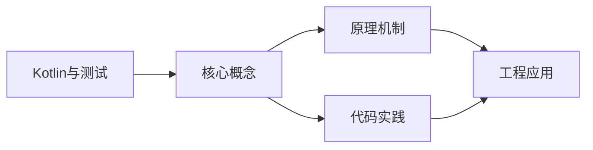

## 1. 学习目标（Bloom 分类）

本节按照布鲁姆教育目标分类学组织学习路径。本文主题为《Kotlin与测试》，属于 Kotlin 模块，读者可以根据自身阶段选择阅读深度。

记忆层面：能够准确复述本文的核心概念、术语与基本语法或操作步骤，并能够在提问或检索时快速定位对应知识点。能够说出 val/var、空安全操作符与 when 表达式的语法。

理解层面：能够用自己的语言解释核心原理与工作机制，说明概念之间的因果关系，而不是机械记忆结论。能够解释 Kotlin 与 Java 互操作的机制与平台类型概念。

应用层面：能够在真实项目或练习场景中运用本文知识解决具体问题，写出正确且可维护的实现。能够编写数据类、扩展函数与协程代码。

分析层面：能够拆解复杂问题，比较本文主题与相邻概念的异同，识别边界条件与例外情况。能够分析空安全、智能转换与协程调度原理。

评价层面：能够根据约束条件（性能、可读性、安全、成本）评价不同方案的优劣，做出有依据的技术决策。能够评价 Kotlin 在 Android、服务端与多平台场景的适用性。

创造层面：能够把本文知识与其他模块知识组合，设计出新的解决方案或可复用的工程模式。能够组合 Compose 与协程设计跨平台应用。

通过本节学习，读者应当能够把《Kotlin与测试》纳入自己的知识网络，并与 Kotlin 模块的其他主题（类型推断、空安全、协程、KMP）建立关联。

## 2. 历史动机与发展脉络

《Kotlin与测试》是 Kotlin 领域的重要主题。要真正理解它，需要先了解它解决的问题与演进过程。

Kotlin 由 JetBrains 于 2010 年开始研发，2016 年发布 1.0，定位是“更现代的 JVM 语言”：减少样板代码、消灭空指针、增强函数式能力，同时与 Java 100% 互操作。
2017 年 Google 宣布 Kotlin 成为 Android 一级语言，2019 年确立 Kotlin-first 政策；2023 年 Kotlin 2.0 的 K2 编译器显著提升编译速度与类型推导。
Kotlin Multiplatform（KMP）支持 JVM、Android、iOS、WebAssembly 等目标，配合 Compose Multiplatform 实现共享 UI 与业务逻辑，是 JetBrains 的长期战略方向。

回到本文主题：Kotlin与测试 的提出与成熟，正是上述技术背景下的必然产物。早期实现往往以简单可用为目标，随着工程规模扩大，社区逐渐沉淀出标准做法与最佳实践；理解这一脉络，可以帮助读者判断“为什么文档中的推荐写法是现在这个样子”，也能在遇到历史遗留代码时准确识别其设计年代与取舍。


## 3. 形式化定义与核心概念精讲

本节把《Kotlin与测试》涉及的核心概念以“定义 + 讲解”的形式展开。读者应把定义当作工具，把讲解当作理解路径；两者结合才能形成可迁移的知识。

空安全：类型系统区分 `String` 与 `String?`，编译期强制处理可空值；`?.` 短路、`?:` 提供默认、`!!` 显式断言，三者覆盖所有空值处理模式。
智能转换：`is` 检查后在不可变上下文中自动转换类型，减少显式强转；`as?` 安全转换失败返回 null。
协程：挂起函数（suspend）与调度器（Dispatchers.Main/IO/Default）实现非阻塞并发，结构化并发保证作用域内任务可取消。

### 3.1 原文章节逐一精讲

原文档把主题拆分为 15 个小节，下面按顺序给出每一节的导读讲解，随后保留原文细节供精读。

#### 原文精读（完整保留）

# Kotlin 测试

> **符号约定**：`< >` 必填参数 | `[ ]` 可选参数

---

#### 概述

测试是保证代码质量的关键手段。Kotlin 项目可以使用 JUnit 5、Kotest、MockK 等测试框架，结合 Kotlin 的语言特性（如扩展函数、协程、数据类），编写简洁而强大的测试代码。本文介绍 Kotlin 中常用的测试方法和最佳实践。

#### 基础概念

- **单元测试**：测试单个函数或类，不依赖外部资源（数据库、网络等）
- **集成测试**：测试多个组件协作是否正确
- **Mock（模拟）**：用模拟对象替代真实依赖，隔离被测代码
- **Assertion（断言）**：验证实际结果是否符合预期
- **Test Fixture**：测试的前置条件，如测试数据、环境配置等

#### 快速上手

添加测试依赖：

```kotlin
// build.gradle.kts
dependencies {
    testImplementation(kotlin("test"))           // Kotlin 测试库
    testImplementation("org.junit.jupiter:junit-jupiter:5.10.0")
    testImplementation("io.mockk:mockk:1.13.8")  // Mock 框架
    testImplementation("org.jetbrains.kotlinx:kotlinx-coroutines-test:1.8.0")
}

tasks.withType<Test> {
    useJUnitPlatform()  // 启用 JUnit 5
}
```

最简单的测试：

```kotlin
import kotlin.test.Test
import kotlin.test.assertEquals

// 被测类
class Calculator {
    fun add(a: Int, b: Int): Int = a + b
    fun divide(a: Int, b: Int): Double {
        require(b != 0) { "除数不能为零" }
        return a.toDouble() / b
    }
}

// 测试类
class CalculatorTest {
    private val calculator = Calculator()

    @Test
    fun `add should return sum of two numbers`() {
        val result = calculator.add(2, 3)
        assertEquals(5, result)
    }

    @Test
    fun `divide should throw exception when divisor is zero`() {
        org.junit.jupiter.api.assertThrows<IllegalArgumentException> {
            calculator.divide(10, 0)
        }
    }
}
```

#### 详细用法

##### JUnit 5 常用注解

```kotlin
import org.junit.jupiter.api.*
import org.junit.jupiter.api.Assertions.*

class UserServiceTest {
    private lateinit var service: UserService

    // 每个测试前执行
    @BeforeEach
    fun setUp() {
        service = UserService()
    }

    // 每个测试后执行
    @AfterEach
    fun tearDown() {
        // 清理资源
    }

    // 所有测试前执行一次
    @BeforeAll
    companion object {
        @JvmStatic
        fun initAll() {
            println("测试开始")
        }
    }

    @Test
    fun `should create user with valid data`() {
        val user = service.createUser("Alice", "alice@example.com")
        assertNotNull(user)
        assertEquals("Alice", user.name)
    }

    @Test
    fun `should throw exception for invalid email`() {
        assertThrows<IllegalArgumentException> {
            service.createUser("Alice", "invalid-email")
        }
    }

    // 参数化测试
    @ParameterizedTest
    @ValueSource(strings = ["test@example.com", "user@domain.org"])
    fun `should accept valid emails`(email: String) {
        assertDoesNotThrow {
            service.validateEmail(email)
        }
    }

    // 嵌套测试
    @Nested
    inner class ValidationTests {
        @Test
        fun `should reject empty name`() {
            assertThrows<IllegalArgumentException> {
                service.createUser("", "test@example.com")
            }
        }
    }

    // 禁用测试
    @Disabled("暂时跳过")
    @Test
    fun `todo test`() {
        // 暂时不执行
    }
}
```

##### 使用 MockK 模拟依赖

```kotlin
import io.mockk.*
import org.junit.jupiter.api.*

class OrderServiceTest {
    // 模拟依赖
    private val repository = mockk<OrderRepository>()
    private val emailService = mockk<EmailService>()
    private val service = OrderService(repository, emailService)

    @BeforeEach
    fun setUp() {
        // 每个测试前清除 mock 状态
        clearMocks(repository, emailService)
    }

    @Test
    fun `should create order and send email`() {
        // 准备测试数据
        val order = Order(id = "1", userId = "u1", amount = 100.0)

        // 设置 mock 行为
        every { repository.save(any()) } returns order
        every { emailService.sendOrderConfirmation(any()) } just Runs

        // 执行被测方法
        val result = service.createOrder("u1", 100.0)

        // 验证结果
        assertEquals("1", result.id)

        // 验证 mock 被正确调用
        verify(exactly = 1) { repository.save(any()) }
        verify(exactly = 1) { emailService.sendOrderConfirmation(order) }
    }

    @Test
    fun `should throw when repository fails`() {
        // 模拟异常
        every { repository.save(any()) } throws RuntimeException("数据库错误")

        assertThrows<RuntimeException> {
            service.createOrder("u1", 100.0)
        }

        // 验证邮件没有发送
        verify(exactly = 0) { emailService.sendOrderConfirmation(any()) }
    }

    @Test
    fun `should return order by id`() {
        val order = Order(id = "1", userId = "u1", amount = 100.0)
        every { repository.findById("1") } returns order
        every { repository.findById("999") } returns null

        val found = service.getOrder("1")
        assertEquals(order, found)

        val notFound = service.getOrder("999")
        assertNull(notFound)
    }
}
```

##### 测试协程

```kotlin
import kotlinx.coroutines.test.*
import org.junit.jupiter.api.*

class CoroutineServiceTest {
    private val repository = mockk<UserRepository>()
    private val service = UserService(repository)

    @Test
    fun `should load user asynchronously`() = runTest {
        // runTest 是协程测试的入口，自动跳过 delay
        val user = User(id = "1", name = "Alice")
        coEvery { repository.getUserAsync("1") } returns user

        val result = service.loadUserAsync("1")

        assertEquals(user, result)
        coVerify { repository.getUserAsync("1") }
    }

    @Test
    fun `should handle timeout`() = runTest {
        coEvery { repository.getUserAsync("1") } coAnswers {
            delay(5000)  // 模拟超时
            User("1", "Alice")
        }

        assertThrows<TimeoutCancellationException> {
            withTimeout(1000) {
                service.loadUserAsync("1")
            }
        }
    }
}
```

##### 测试数据类

```kotlin
data class User(val id: String, val name: String, val email: String, val age: Int)

class UserTest {
    @Test
    fun `data class equality is based on properties`() {
        val user1 = User("1", "Alice", "alice@test.com", 25)
        val user2 = User("1", "Alice", "alice@test.com", 25)
        // 数据类的 equals 基于属性值
        assertEquals(user1, user2)
    }

    @Test
    fun `copy creates new instance with modified properties`() {
        val user = User("1", "Alice", "alice@test.com", 25)
        val older = user.copy(age = 26)
        assertEquals(26, older.age)
        assertEquals(25, user.age)  // 原对象不变
    }

    @Test
    fun `destructuring works correctly`() {
        val user = User("1", "Alice", "alice@test.com", 25)
        val (id, name, email, age) = user
        assertEquals("1", id)
        assertEquals("Alice", name)
    }
}
```

#### 常见场景

##### 测试 ViewModel

```kotlin
import kotlinx.coroutines.test.*
import org.junit.jupiter.api.*

class UserViewModelTest {
    private val repository = mockk<UserRepository>()
    private lateinit var viewModel: UserViewModel

    @BeforeEach
    fun setUp() {
        viewModel = UserViewModel(repository)
    }

    @Test
    fun `loadUser should update uiState`() = runTest {
        val user = User("1", "Alice")
        coEvery { repository.getUser("1") } returns user

        viewModel.loadUser("1")

        // 验证状态更新
        val state = viewModel.uiState.value
        assertEquals(user, state.user)
        assertFalse(state.isLoading)
    }
}
```

##### 测试异常场景

```kotlin
class ErrorHandlingTest {
    @Test
    fun `should return failure for network error`() = runTest {
        val repository = mockk<UserRepository>()
        coEvery { repository.getUser("1") } throws IOException("网络错误")

        val service = UserService(repository)
        val result = service.safeGetUser("1")

        assertTrue(result.isFailure)
        assertTrue(result.exceptionOrNull() is IOException)
    }

    @Test
    fun `should return default value on error`() = runTest {
        val repository = mockk<UserRepository>()
        coEvery { repository.getUser("1") } throws IOException("网络错误")

        val service = UserService(repository)
        val result = service.getUserOrDefault("1", User("0", "默认用户"))

        assertEquals(User("0", "默认用户"), result)
    }
}
```

#### 注意事项

- **测试命名**：用反引号描述测试意图，如 `` `should return user by id` ``
- **每个测试独立**：测试之间不应有依赖，每个测试都应该能独立运行
- **不要测试私有方法**：通过公共接口测试行为，而不是实现细节
- **Mock 要适度**：过多的 Mock 说明代码耦合度高，考虑重构
- **协程测试用 runTest**：不要用 runBlocking，runTest 会自动处理虚拟时间

#### 进阶用法

##### Kotest 框架

```kotlin
import io.kotest.core.spec.style.StringSpec
import io.kotest.matchers.shouldBe
import io.kotest.matchers.shouldNotBe
import io.kotest.matchers.collections.shouldContain

class CalculatorTest : StringSpec({
    val calculator = Calculator()

    "add should return sum" {
        calculator.add(2, 3) shouldBe 5
    }

    "add should not return wrong result" {
        calculator.add(2, 3) shouldNotBe 6
    }

    "list should contain element" {
        listOf(1, 2, 3) shouldContain 2
    }
})
```

##### 测试覆盖率

```kotlin
// build.gradle.kts
plugins {
    jacoco
}

tasks.jacocoTestCoverageVerification {
    violationRules {
        rule {
            limit {
                minimum = "0.8".toBigDecimal()  // 80% 覆盖率要求
            }
        }
    }
}

tasks.jacocoTestReport {
    reports {
        xml.required = true
        html.required = true
    }
}
```
#### kotlin.test 基础

**基本写法：简单测试**
`@Test fun <方法名>() { }`
```kotlin
// 使用 @Test 注解标记测试
class MyTest {
    @Test fun sumWorks() = assertEquals(4, 2 + 2)
}
```

---

**基本写法：断言相等**
`assertEquals(<期望>, <实际>)`
```kotlin
// 断言两值相等
assertEquals(10, calc())
```

---

**基本写法：断言不相等**
`assertNotEquals(<值1>, <值2>)`
```kotlin
// 断言两值不等
assertNotEquals(0, count)
```

---

**基本写法：断言为真**
`assertTrue(<条件>)`
```kotlin
// 断言条件为真
assertTrue(list.isEmpty())
```

---

**基本写法：断言为假**
`assertFalse(<条件>)`
```kotlin
// 断言条件为假
assertFalse(list.isNotEmpty())
```

---

**基本写法：断言为 null**
`assertNull(<值>)`
```kotlin
// 断言值为 null
assertNull(findUser(-1))
```

---

**基本写法：断言非 null**
`assertNotNull(<值>)`
```kotlin
// 断言值非 null
assertNotNull(findUser(1))
```

---

**基本写法：断言抛异常**
`assertFailsWith<<异常类型>> { }`
```kotlin
// 断言代码块抛指定异常
assertFailsWith<IllegalArgumentException> { parse("") }
```

---

#### kotlin.test 框架适配

**基本写法：Test 注解导入**
`import kotlin.test.Test`
```kotlin
// 跨平台测试注解
import kotlin.test.Test
import kotlin.test.assertEquals
```

---

#### JUnit 5 注解

**基本写法：BeforeEach 初始化**
`@BeforeEach fun <方法>() { }`
```kotlin
// 每个测试前执行
class DbTest {
    @BeforeEach fun setup() { db = open() }
}
```

---

**基本写法：AfterEach 清理**
`@AfterEach fun <方法>() { }`
```kotlin
// 每个测试后执行
@AfterEach fun teardown() { db.close() }
```

---

**基本写法：BeforeAll 一次性初始化**
`@BeforeAll fun <方法>() { }`
```kotlin
// 所有测试前执行一次
companion object {
    @BeforeAll @JvmStatic fun init() { }
}
```

---

**基本写法：Disabled 禁用**
`@Disabled("<原因>") @Test fun <方法>() { }`
```kotlin
// 禁用测试用例
@Disabled("待实现")
@Test fun todo() { }
```

---

**基本写法：DisplayName**
`@DisplayName("<名称>") @Test fun <方法>() { }`
```kotlin
// 自定义测试显示名
@DisplayName("用户登录成功")
@Test fun login() { }
```

---

#### 参数化测试

**基本写法：ValueSource**
`@ParameterizedTest @ValueSource(strings = ["a", "b"])`
```kotlin
// 多组参数运行测试
@ParameterizedTest
@ValueSource(strings = ["a", "b"])
fun test(s: String) { }
```

---

**基本写法：CsvSource**
`@ParameterizedTest @CsvSource(["1,2,3"])`
```kotlin
// CSV 多参数
@ParameterizedTest
@CsvSource(["1,2,3", "4,5,9"])
fun sum(a: Int, b: Int, expected: Int) { assertEquals(expected, a + b) }
```

---

**基本写法：MethodSource**
`@ParameterizedTest @MethodSource("<方法>")`
```kotlin
// 从静态方法获取参数
@ParameterizedTest
@MethodSource("cases")
fun test(c: Case) { }
companion object {
    @JvmStatic fun cases() = listOf(Case(1, 2))
}
```

---

#### 协程测试

**基本写法：runTest 测试协程**
`runTest { }`
```kotlin
// 协程测试运行器
@Test fun test() = runTest {
    val r = fetch()
    assertEquals("ok", r)
}
```

---

**基本写法：测试延迟跳过**
`runTest { delay(1000) }`
```kotlin
// 虚拟时间跳过延迟
runTest {
    delay(1000) // 不实际等待
    launch { }
}
```

---

**基本写法：Turbine 测试 Flow**
`<flow>.test { }`
```kotlin
// 使用 Turbine 测试 Flow
nums().test {
    assertEquals(1, awaitItem())
    awaitComplete()
}
```

---

#### MockK 模拟

**基本写法：mockk 模拟对象**
`mockk<<类型>>()`
```kotlin
// 创建 mock 对象
val repo = mockk<UserRepository>()
```

---

**基本写法：mockk relax**
`mockk<<类型>>(relaxed = true)`
```kotlin
// 宽松 mock 自动返回默认值
val repo = mockk<UserRepository>(relaxed = true)
```

---

**基本写法：every 打桩**
`every { <调用> } returns <值>`
```kotlin
// 配置 mock 返回值
every { repo.find(1) } returns User("Alice")
```

---

**基本写法：verify 验证**
`verify { <调用> }`
```kotlin
// 验证方法被调用
verify { repo.find(1) }
```

---

**基本写法：验证调用次数**
`verify(exactly = <次数>) { }`
```kotlin
// 验证调用次数
verify(exactly = 2) { repo.find(any()) }
```

---

**基本写法：coEvery 协程打桩**
`coEvery { <挂起调用> } returns <值>`
```kotlin
// 协程方法打桩
coEvery { repo.fetch() } returns "ok"
```

---

**基本写法：coVerify 协程验证**
`coVerify { <挂起调用> }`
```kotlin
// 验证协程方法调用
coVerify { repo.fetch() }
```

---

#### kotest 风格

**基本写法：StringSpec**
`class <类> : StringSpec({ })`
```kotlin
// kotest 字符串风格
class MyTest : StringSpec({
    "sum should work" { 2 + 2 shouldBe 4 }
})
```

---

**基本写法：shouldBe 断言**
`<值> shouldBe <期望>`
```kotlin
// kotest 断言
result shouldBe "hello"
```

---

**基本写法：shouldThrow**
`shouldThrow<<异常>> { }`
```kotlin
// 断言抛异常
shouldThrow<IllegalArgumentException> { parse("") }
```

---

#### Gradle 配置

**基本写法：测试依赖**
`testImplementation("<坐标>")`
```kotlin
// build.gradle.kts 测试依赖
dependencies {
    testImplementation(kotlin("test"))
    testImplementation("io.mockk:mockk:1.13.12")
    testImplementation("org.jetbrains.kotlinx:kotlinx-coroutines-test:1.9.0")
}
```

---

**基本写法：运行测试**
`./gradlew test`
```bash
# 运行所有测试
./gradlew test
```

---

**基本写法：运行特定测试**
`./gradlew test --tests "<类>.<方法>"`
```bash
# 运行指定测试方法
./gradlew test --tests "com.example.MyTest.sumWorks"
```


### 3.2 概念关系图

下面用 Mermaid 图表达本文核心概念之间的关系，帮助读者建立整体图景：



图中展示的是本文知识的结构化关系：核心概念是入口，原理机制解释“为什么”，代码实践演示“怎么做”，工程应用回答“何时用”。读者学习时可以把每个小节的内容挂接到对应节点上。

## 4. 理论推导与原理解析

本节深入《Kotlin与测试》背后的原理。理论部分不求面面俱到，而是聚焦“能解释现象、能指导实践”的关键推导。

空安全：类型系统区分 `String` 与 `String?`，编译期强制处理可空值；`?.` 短路、`?:` 提供默认、`!!` 显式断言，三者覆盖所有空值处理模式。
智能转换：`is` 检查后在不可变上下文中自动转换类型，减少显式强转；`as?` 安全转换失败返回 null。
协程：挂起函数（suspend）与调度器（Dispatchers.Main/IO/Default）实现非阻塞并发，结构化并发保证作用域内任务可取消。
扩展函数与属性：在不修改原类的情况下为类添加行为，是 Kotlin 标准库（如集合操作）的基石。

需要强调的是，理论推导与工程实践之间存在翻译层：理论给出的是理想化模型与边界条件，工程代码则必须处理真实环境中的例外。读者在学习时应先掌握理论的“标准情形”，再通过陷阱章节了解“非标准情形”。

## 5. 代码示例与逐行讲解

本节把原文中的代码示例系统整理，并为每个示例补充用途说明与讲解。读者不应只浏览代码，而应逐段对照讲解理解设计意图。

### 5.1 示例：快速上手

该示例来自原文《快速上手》小节，用于演示Kotlin与测试相关操作。阅读时请先看代码结构，再看其后的讲解。

```kotlin
// build.gradle.kts
dependencies {
    testImplementation(kotlin("test"))           // Kotlin 测试库
    testImplementation("org.junit.jupiter:junit-jupiter:5.10.0")
    testImplementation("io.mockk:mockk:1.13.8")  // Mock 框架
    testImplementation("org.jetbrains.kotlinx:kotlinx-coroutines-test:1.8.0")
}

tasks.withType<Test> {
    useJUnitPlatform()  // 启用 JUnit 5
}
```

讲解：这段代码演示了本节核心知识点。代码中的关键操作可以归纳为三步：准备（定义或初始化）、执行（核心逻辑）、收尾（释放资源或返回结果）。实际项目中，这三步往往被封装为函数或类，以提升复用性与可测试性。

关键点分析：

该示例共 10 行有效代码，结构以数据或配置为主。阅读时应关注：数据字段的含义、配置项的作用，以及它们与运行行为的对应关系。

进阶思考路径：先尝试修改参数观察行为变化，再把示例中的模式迁移到自己的项目中；每次修改都记录预期与实测差异，这是把示例转化为能力的最快方式。

### 5.2 示例：快速上手

该示例来自原文《快速上手》小节，用于演示Kotlin与测试相关操作。阅读时请先看代码结构，再看其后的讲解。

```kotlin
import kotlin.test.Test
import kotlin.test.assertEquals

// 被测类
class Calculator {
    fun add(a: Int, b: Int): Int = a + b
    fun divide(a: Int, b: Int): Double {
        require(b != 0) { "除数不能为零" }
        return a.toDouble() / b
    }
}

// 测试类
class CalculatorTest {
    private val calculator = Calculator()

    @Test
    fun `add should return sum of two numbers`() {
        val result = calculator.add(2, 3)
        assertEquals(5, result)
    }

    @Test
    fun `divide should throw exception when divisor is zero`() {
        org.junit.jupiter.api.assertThrows<IllegalArgumentException> {
            calculator.divide(10, 0)
        }
    }
}
```

讲解：这段代码演示了本节核心知识点。代码中的关键操作可以归纳为三步：准备（定义或初始化）、执行（核心逻辑）、收尾（释放资源或返回结果）。实际项目中，这三步往往被封装为函数或类，以提升复用性与可测试性。

关键点分析：

该示例共 25 行有效代码，包含 3 类关键结构（class、import、return）。其中：

- 入口与初始化部分负责建立上下文，对应实际项目中的启动或装配逻辑；
- 核心逻辑部分体现本文主题的主要操作，是阅读时最需要对照讲解理解的部分；
- 输出或返回部分把结果交给调用方，注意其类型与边界条件。

进阶思考路径：先尝试修改参数观察行为变化，再把示例中的模式迁移到自己的项目中；每次修改都记录预期与实测差异，这是把示例转化为能力的最快方式。

### 5.3 示例：JUnit 5 常用注解

该示例来自原文《JUnit 5 常用注解》小节，用于演示Kotlin与测试相关操作。阅读时请先看代码结构，再看其后的讲解。

```kotlin
import org.junit.jupiter.api.*
import org.junit.jupiter.api.Assertions.*

class UserServiceTest {
    private lateinit var service: UserService

    // 每个测试前执行
    @BeforeEach
    fun setUp() {
        service = UserService()
    }

    // 每个测试后执行
    @AfterEach
    fun tearDown() {
        // 清理资源
    }

    // 所有测试前执行一次
    @BeforeAll
    companion object {
        @JvmStatic
        fun initAll() {
            println("测试开始")
        }
    }

    @Test
    fun `should create user with valid data`() {
        val user = service.createUser("Alice", "alice@example.com")
        assertNotNull(user)
        assertEquals("Alice", user.name)
    }

    @Test
    fun `should throw exception for invalid email`() {
        assertThrows<IllegalArgumentException> {
            service.createUser("Alice", "invalid-email")
        }
    }

    // 参数化测试
    @ParameterizedTest
    @ValueSource(strings = ["test@example.com", "user@domain.org"])
    fun `should accept valid emails`(email: String) {
        assertDoesNotThrow {
            service.validateEmail(email)
        }
    }

    // 嵌套测试
    @Nested
    inner class ValidationTests {
        @Test
        fun `should reject empty name`() {
            assertThrows<IllegalArgumentException> {
                service.createUser("", "test@example.com")
            }
        }
    }

    // 禁用测试
    @Disabled("暂时跳过")
    @Test
    fun `todo test`() {
        // 暂时不执行
    }
}
```

讲解：这段代码演示了本节核心知识点。代码中的关键操作可以归纳为三步：准备（定义或初始化）、执行（核心逻辑）、收尾（释放资源或返回结果）。实际项目中，这三步往往被封装为函数或类，以提升复用性与可测试性。

关键点分析：

该示例共 59 行有效代码，包含 3 类关键结构（class、import、for）。其中：

- 入口与初始化部分负责建立上下文，对应实际项目中的启动或装配逻辑；
- 核心逻辑部分体现本文主题的主要操作，是阅读时最需要对照讲解理解的部分；
- 输出或返回部分把结果交给调用方，注意其类型与边界条件。

进阶思考路径：先尝试修改参数观察行为变化，再把示例中的模式迁移到自己的项目中；每次修改都记录预期与实测差异，这是把示例转化为能力的最快方式。

### 5.4 示例：使用 MockK 模拟依赖

该示例来自原文《使用 MockK 模拟依赖》小节，用于演示Kotlin与测试相关操作。阅读时请先看代码结构，再看其后的讲解。

```kotlin
import io.mockk.*
import org.junit.jupiter.api.*

class OrderServiceTest {
    // 模拟依赖
    private val repository = mockk<OrderRepository>()
    private val emailService = mockk<EmailService>()
    private val service = OrderService(repository, emailService)

    @BeforeEach
    fun setUp() {
        // 每个测试前清除 mock 状态
        clearMocks(repository, emailService)
    }

    @Test
    fun `should create order and send email`() {
        // 准备测试数据
        val order = Order(id = "1", userId = "u1", amount = 100.0)

        // 设置 mock 行为
        every { repository.save(any()) } returns order
        every { emailService.sendOrderConfirmation(any()) } just Runs

        // 执行被测方法
        val result = service.createOrder("u1", 100.0)

        // 验证结果
        assertEquals("1", result.id)

        // 验证 mock 被正确调用
        verify(exactly = 1) { repository.save(any()) }
        verify(exactly = 1) { emailService.sendOrderConfirmation(order) }
    }

    @Test
    fun `should throw when repository fails`() {
        // 模拟异常
        every { repository.save(any()) } throws RuntimeException("数据库错误")

        assertThrows<RuntimeException> {
            service.createOrder("u1", 100.0)
        }

        // 验证邮件没有发送
        verify(exactly = 0) { emailService.sendOrderConfirmation(any()) }
    }

    @Test
    fun `should return order by id`() {
        val order = Order(id = "1", userId = "u1", amount = 100.0)
        every { repository.findById("1") } returns order
        every { repository.findById("999") } returns null

        val found = service.getOrder("1")
        assertEquals(order, found)

        val notFound = service.getOrder("999")
        assertNull(notFound)
    }
}
```

讲解：这段代码演示了本节核心知识点。代码中的关键操作可以归纳为三步：准备（定义或初始化）、执行（核心逻辑）、收尾（释放资源或返回结果）。实际项目中，这三步往往被封装为函数或类，以提升复用性与可测试性。

关键点分析：

该示例共 48 行有效代码，包含 3 类关键结构（class、import、return）。其中：

- 入口与初始化部分负责建立上下文，对应实际项目中的启动或装配逻辑；
- 核心逻辑部分体现本文主题的主要操作，是阅读时最需要对照讲解理解的部分；
- 输出或返回部分把结果交给调用方，注意其类型与边界条件。

进阶思考路径：先尝试修改参数观察行为变化，再把示例中的模式迁移到自己的项目中；每次修改都记录预期与实测差异，这是把示例转化为能力的最快方式。

### 5.5 示例：测试协程

该示例来自原文《测试协程》小节，用于演示Kotlin与测试相关操作。阅读时请先看代码结构，再看其后的讲解。

```kotlin
import kotlinx.coroutines.test.*
import org.junit.jupiter.api.*

class CoroutineServiceTest {
    private val repository = mockk<UserRepository>()
    private val service = UserService(repository)

    @Test
    fun `should load user asynchronously`() = runTest {
        // runTest 是协程测试的入口，自动跳过 delay
        val user = User(id = "1", name = "Alice")
        coEvery { repository.getUserAsync("1") } returns user

        val result = service.loadUserAsync("1")

        assertEquals(user, result)
        coVerify { repository.getUserAsync("1") }
    }

    @Test
    fun `should handle timeout`() = runTest {
        coEvery { repository.getUserAsync("1") } coAnswers {
            delay(5000)  // 模拟超时
            User("1", "Alice")
        }

        assertThrows<TimeoutCancellationException> {
            withTimeout(1000) {
                service.loadUserAsync("1")
            }
        }
    }
}
```

讲解：这段代码演示了本节核心知识点。代码中的关键操作可以归纳为三步：准备（定义或初始化）、执行（核心逻辑）、收尾（释放资源或返回结果）。实际项目中，这三步往往被封装为函数或类，以提升复用性与可测试性。

关键点分析：

该示例共 27 行有效代码，包含 3 类关键结构（class、import、return）。其中：

- 入口与初始化部分负责建立上下文，对应实际项目中的启动或装配逻辑；
- 核心逻辑部分体现本文主题的主要操作，是阅读时最需要对照讲解理解的部分；
- 输出或返回部分把结果交给调用方，注意其类型与边界条件。

进阶思考路径：先尝试修改参数观察行为变化，再把示例中的模式迁移到自己的项目中；每次修改都记录预期与实测差异，这是把示例转化为能力的最快方式。

### 5.6 示例：测试数据类

该示例来自原文《测试数据类》小节，用于演示Kotlin与测试相关操作。阅读时请先看代码结构，再看其后的讲解。

```kotlin
data class User(val id: String, val name: String, val email: String, val age: Int)

class UserTest {
    @Test
    fun `data class equality is based on properties`() {
        val user1 = User("1", "Alice", "alice@test.com", 25)
        val user2 = User("1", "Alice", "alice@test.com", 25)
        // 数据类的 equals 基于属性值
        assertEquals(user1, user2)
    }

    @Test
    fun `copy creates new instance with modified properties`() {
        val user = User("1", "Alice", "alice@test.com", 25)
        val older = user.copy(age = 26)
        assertEquals(26, older.age)
        assertEquals(25, user.age)  // 原对象不变
    }

    @Test
    fun `destructuring works correctly`() {
        val user = User("1", "Alice", "alice@test.com", 25)
        val (id, name, email, age) = user
        assertEquals("1", id)
        assertEquals("Alice", name)
    }
}
```

讲解：这段代码演示了本节核心知识点。代码中的关键操作可以归纳为三步：准备（定义或初始化）、执行（核心逻辑）、收尾（释放资源或返回结果）。实际项目中，这三步往往被封装为函数或类，以提升复用性与可测试性。

关键点分析：

该示例共 24 行有效代码，包含 1 类关键结构（class）。其中：

- 入口与初始化部分负责建立上下文，对应实际项目中的启动或装配逻辑；
- 核心逻辑部分体现本文主题的主要操作，是阅读时最需要对照讲解理解的部分；
- 输出或返回部分把结果交给调用方，注意其类型与边界条件。

进阶思考路径：先尝试修改参数观察行为变化，再把示例中的模式迁移到自己的项目中；每次修改都记录预期与实测差异，这是把示例转化为能力的最快方式。

### 5.7 示例：测试 ViewModel

该示例来自原文《测试 ViewModel》小节，用于演示Kotlin与测试相关操作。阅读时请先看代码结构，再看其后的讲解。

```kotlin
import kotlinx.coroutines.test.*
import org.junit.jupiter.api.*

class UserViewModelTest {
    private val repository = mockk<UserRepository>()
    private lateinit var viewModel: UserViewModel

    @BeforeEach
    fun setUp() {
        viewModel = UserViewModel(repository)
    }

    @Test
    fun `loadUser should update uiState`() = runTest {
        val user = User("1", "Alice")
        coEvery { repository.getUser("1") } returns user

        viewModel.loadUser("1")

        // 验证状态更新
        val state = viewModel.uiState.value
        assertEquals(user, state.user)
        assertFalse(state.isLoading)
    }
}
```

讲解：这段代码演示了本节核心知识点。代码中的关键操作可以归纳为三步：准备（定义或初始化）、执行（核心逻辑）、收尾（释放资源或返回结果）。实际项目中，这三步往往被封装为函数或类，以提升复用性与可测试性。

关键点分析：

该示例共 20 行有效代码，包含 3 类关键结构（class、import、return）。其中：

- 入口与初始化部分负责建立上下文，对应实际项目中的启动或装配逻辑；
- 核心逻辑部分体现本文主题的主要操作，是阅读时最需要对照讲解理解的部分；
- 输出或返回部分把结果交给调用方，注意其类型与边界条件。

进阶思考路径：先尝试修改参数观察行为变化，再把示例中的模式迁移到自己的项目中；每次修改都记录预期与实测差异，这是把示例转化为能力的最快方式。

### 5.8 示例：测试异常场景

该示例来自原文《测试异常场景》小节，用于演示Kotlin与测试相关操作。阅读时请先看代码结构，再看其后的讲解。

```kotlin
class ErrorHandlingTest {
    @Test
    fun `should return failure for network error`() = runTest {
        val repository = mockk<UserRepository>()
        coEvery { repository.getUser("1") } throws IOException("网络错误")

        val service = UserService(repository)
        val result = service.safeGetUser("1")

        assertTrue(result.isFailure)
        assertTrue(result.exceptionOrNull() is IOException)
    }

    @Test
    fun `should return default value on error`() = runTest {
        val repository = mockk<UserRepository>()
        coEvery { repository.getUser("1") } throws IOException("网络错误")

        val service = UserService(repository)
        val result = service.getUserOrDefault("1", User("0", "默认用户"))

        assertEquals(User("0", "默认用户"), result)
    }
}
```

讲解：这段代码演示了本节核心知识点。代码中的关键操作可以归纳为三步：准备（定义或初始化）、执行（核心逻辑）、收尾（释放资源或返回结果）。实际项目中，这三步往往被封装为函数或类，以提升复用性与可测试性。

关键点分析：

该示例共 19 行有效代码，包含 3 类关键结构（class、for、return）。其中：

- 入口与初始化部分负责建立上下文，对应实际项目中的启动或装配逻辑；
- 核心逻辑部分体现本文主题的主要操作，是阅读时最需要对照讲解理解的部分；
- 输出或返回部分把结果交给调用方，注意其类型与边界条件。

进阶思考路径：先尝试修改参数观察行为变化，再把示例中的模式迁移到自己的项目中；每次修改都记录预期与实测差异，这是把示例转化为能力的最快方式。

### 5.9 示例：Kotest 框架

该示例来自原文《Kotest 框架》小节，用于演示Kotlin与测试相关操作。阅读时请先看代码结构，再看其后的讲解。

```kotlin
import io.kotest.core.spec.style.StringSpec
import io.kotest.matchers.shouldBe
import io.kotest.matchers.shouldNotBe
import io.kotest.matchers.collections.shouldContain

class CalculatorTest : StringSpec({
    val calculator = Calculator()

    "add should return sum" {
        calculator.add(2, 3) shouldBe 5
    }

    "add should not return wrong result" {
        calculator.add(2, 3) shouldNotBe 6
    }

    "list should contain element" {
        listOf(1, 2, 3) shouldContain 2
    }
})
```

讲解：这段代码演示了本节核心知识点。代码中的关键操作可以归纳为三步：准备（定义或初始化）、执行（核心逻辑）、收尾（释放资源或返回结果）。实际项目中，这三步往往被封装为函数或类，以提升复用性与可测试性。

关键点分析：

该示例共 16 行有效代码，包含 3 类关键结构（class、import、return）。其中：

- 入口与初始化部分负责建立上下文，对应实际项目中的启动或装配逻辑；
- 核心逻辑部分体现本文主题的主要操作，是阅读时最需要对照讲解理解的部分；
- 输出或返回部分把结果交给调用方，注意其类型与边界条件。

进阶思考路径：先尝试修改参数观察行为变化，再把示例中的模式迁移到自己的项目中；每次修改都记录预期与实测差异，这是把示例转化为能力的最快方式。

### 5.10 示例：测试覆盖率

该示例来自原文《测试覆盖率》小节，用于演示Kotlin与测试相关操作。阅读时请先看代码结构，再看其后的讲解。

```kotlin
// build.gradle.kts
plugins {
    jacoco
}

tasks.jacocoTestCoverageVerification {
    violationRules {
        rule {
            limit {
                minimum = "0.8".toBigDecimal()  // 80% 覆盖率要求
            }
        }
    }
}

tasks.jacocoTestReport {
    reports {
        xml.required = true
        html.required = true
    }
}
```

讲解：这段代码演示了本节核心知识点。代码中的关键操作可以归纳为三步：准备（定义或初始化）、执行（核心逻辑）、收尾（释放资源或返回结果）。实际项目中，这三步往往被封装为函数或类，以提升复用性与可测试性。

关键点分析：

该示例共 19 行有效代码，结构以数据或配置为主。阅读时应关注：数据字段的含义、配置项的作用，以及它们与运行行为的对应关系。

进阶思考路径：先尝试修改参数观察行为变化，再把示例中的模式迁移到自己的项目中；每次修改都记录预期与实测差异，这是把示例转化为能力的最快方式。

### 5.11 示例：kotlin.test 基础

该示例来自原文《kotlin.test 基础》小节，用于演示Kotlin与测试相关操作。阅读时请先看代码结构，再看其后的讲解。

```kotlin
// 使用 @Test 注解标记测试
class MyTest {
    @Test fun sumWorks() = assertEquals(4, 2 + 2)
}
```

讲解：这段代码演示了本节核心知识点。代码中的关键操作可以归纳为三步：准备（定义或初始化）、执行（核心逻辑）、收尾（释放资源或返回结果）。实际项目中，这三步往往被封装为函数或类，以提升复用性与可测试性。

关键点分析：

该示例共 4 行有效代码，包含 1 类关键结构（class）。其中：

- 入口与初始化部分负责建立上下文，对应实际项目中的启动或装配逻辑；
- 核心逻辑部分体现本文主题的主要操作，是阅读时最需要对照讲解理解的部分；
- 输出或返回部分把结果交给调用方，注意其类型与边界条件。

进阶思考路径：先尝试修改参数观察行为变化，再把示例中的模式迁移到自己的项目中；每次修改都记录预期与实测差异，这是把示例转化为能力的最快方式。

### 5.12 示例：kotlin.test 基础

该示例来自原文《kotlin.test 基础》小节，用于演示Kotlin与测试相关操作。阅读时请先看代码结构，再看其后的讲解。

```kotlin
// 断言两值相等
assertEquals(10, calc())
```

讲解：这段代码演示了本节核心知识点。代码中的关键操作可以归纳为三步：准备（定义或初始化）、执行（核心逻辑）、收尾（释放资源或返回结果）。实际项目中，这三步往往被封装为函数或类，以提升复用性与可测试性。

关键点分析：

该示例共 2 行有效代码，结构以数据或配置为主。阅读时应关注：数据字段的含义、配置项的作用，以及它们与运行行为的对应关系。

进阶思考路径：先尝试修改参数观察行为变化，再把示例中的模式迁移到自己的项目中；每次修改都记录预期与实测差异，这是把示例转化为能力的最快方式。

### 5.13 示例：kotlin.test 基础

该示例来自原文《kotlin.test 基础》小节，用于演示Kotlin与测试相关操作。阅读时请先看代码结构，再看其后的讲解。

```kotlin
// 断言两值不等
assertNotEquals(0, count)
```

讲解：这段代码演示了本节核心知识点。代码中的关键操作可以归纳为三步：准备（定义或初始化）、执行（核心逻辑）、收尾（释放资源或返回结果）。实际项目中，这三步往往被封装为函数或类，以提升复用性与可测试性。

关键点分析：

该示例共 2 行有效代码，结构以数据或配置为主。阅读时应关注：数据字段的含义、配置项的作用，以及它们与运行行为的对应关系。

进阶思考路径：先尝试修改参数观察行为变化，再把示例中的模式迁移到自己的项目中；每次修改都记录预期与实测差异，这是把示例转化为能力的最快方式。

### 5.14 示例：kotlin.test 基础

该示例来自原文《kotlin.test 基础》小节，用于演示Kotlin与测试相关操作。阅读时请先看代码结构，再看其后的讲解。

```kotlin
// 断言条件为真
assertTrue(list.isEmpty())
```

讲解：这段代码演示了本节核心知识点。代码中的关键操作可以归纳为三步：准备（定义或初始化）、执行（核心逻辑）、收尾（释放资源或返回结果）。实际项目中，这三步往往被封装为函数或类，以提升复用性与可测试性。

关键点分析：

该示例共 2 行有效代码，结构以数据或配置为主。阅读时应关注：数据字段的含义、配置项的作用，以及它们与运行行为的对应关系。

进阶思考路径：先尝试修改参数观察行为变化，再把示例中的模式迁移到自己的项目中；每次修改都记录预期与实测差异，这是把示例转化为能力的最快方式。

### 5.15 示例：kotlin.test 基础

该示例来自原文《kotlin.test 基础》小节，用于演示Kotlin与测试相关操作。阅读时请先看代码结构，再看其后的讲解。

```kotlin
// 断言条件为假
assertFalse(list.isNotEmpty())
```

讲解：这段代码演示了本节核心知识点。代码中的关键操作可以归纳为三步：准备（定义或初始化）、执行（核心逻辑）、收尾（释放资源或返回结果）。实际项目中，这三步往往被封装为函数或类，以提升复用性与可测试性。

关键点分析：

该示例共 2 行有效代码，结构以数据或配置为主。阅读时应关注：数据字段的含义、配置项的作用，以及它们与运行行为的对应关系。

进阶思考路径：先尝试修改参数观察行为变化，再把示例中的模式迁移到自己的项目中；每次修改都记录预期与实测差异，这是把示例转化为能力的最快方式。

### 5.16 示例：kotlin.test 基础

该示例来自原文《kotlin.test 基础》小节，用于演示Kotlin与测试相关操作。阅读时请先看代码结构，再看其后的讲解。

```kotlin
// 断言值为 null
assertNull(findUser(-1))
```

讲解：这段代码演示了本节核心知识点。代码中的关键操作可以归纳为三步：准备（定义或初始化）、执行（核心逻辑）、收尾（释放资源或返回结果）。实际项目中，这三步往往被封装为函数或类，以提升复用性与可测试性。

关键点分析：

该示例共 2 行有效代码，结构以数据或配置为主。阅读时应关注：数据字段的含义、配置项的作用，以及它们与运行行为的对应关系。

进阶思考路径：先尝试修改参数观察行为变化，再把示例中的模式迁移到自己的项目中；每次修改都记录预期与实测差异，这是把示例转化为能力的最快方式。

### 5.17 示例：kotlin.test 基础

该示例来自原文《kotlin.test 基础》小节，用于演示Kotlin与测试相关操作。阅读时请先看代码结构，再看其后的讲解。

```kotlin
// 断言值非 null
assertNotNull(findUser(1))
```

讲解：这段代码演示了本节核心知识点。代码中的关键操作可以归纳为三步：准备（定义或初始化）、执行（核心逻辑）、收尾（释放资源或返回结果）。实际项目中，这三步往往被封装为函数或类，以提升复用性与可测试性。

关键点分析：

该示例共 2 行有效代码，结构以数据或配置为主。阅读时应关注：数据字段的含义、配置项的作用，以及它们与运行行为的对应关系。

进阶思考路径：先尝试修改参数观察行为变化，再把示例中的模式迁移到自己的项目中；每次修改都记录预期与实测差异，这是把示例转化为能力的最快方式。

### 5.18 示例：kotlin.test 基础

该示例来自原文《kotlin.test 基础》小节，用于演示Kotlin与测试相关操作。阅读时请先看代码结构，再看其后的讲解。

```kotlin
// 断言代码块抛指定异常
assertFailsWith<IllegalArgumentException> { parse("") }
```

讲解：这段代码演示了本节核心知识点。代码中的关键操作可以归纳为三步：准备（定义或初始化）、执行（核心逻辑）、收尾（释放资源或返回结果）。实际项目中，这三步往往被封装为函数或类，以提升复用性与可测试性。

关键点分析：

该示例共 2 行有效代码，结构以数据或配置为主。阅读时应关注：数据字段的含义、配置项的作用，以及它们与运行行为的对应关系。

进阶思考路径：先尝试修改参数观察行为变化，再把示例中的模式迁移到自己的项目中；每次修改都记录预期与实测差异，这是把示例转化为能力的最快方式。

### 5.19 示例：kotlin.test 框架适配

该示例来自原文《kotlin.test 框架适配》小节，用于演示Kotlin与测试相关操作。阅读时请先看代码结构，再看其后的讲解。

```kotlin
// 跨平台测试注解
import kotlin.test.Test
import kotlin.test.assertEquals
```

讲解：这段代码演示了本节核心知识点。代码中的关键操作可以归纳为三步：准备（定义或初始化）、执行（核心逻辑）、收尾（释放资源或返回结果）。实际项目中，这三步往往被封装为函数或类，以提升复用性与可测试性。

关键点分析：

该示例共 3 行有效代码，包含 1 类关键结构（import）。其中：

- 入口与初始化部分负责建立上下文，对应实际项目中的启动或装配逻辑；
- 核心逻辑部分体现本文主题的主要操作，是阅读时最需要对照讲解理解的部分；
- 输出或返回部分把结果交给调用方，注意其类型与边界条件。

进阶思考路径：先尝试修改参数观察行为变化，再把示例中的模式迁移到自己的项目中；每次修改都记录预期与实测差异，这是把示例转化为能力的最快方式。

### 5.20 示例：JUnit 5 注解

该示例来自原文《JUnit 5 注解》小节，用于演示Kotlin与测试相关操作。阅读时请先看代码结构，再看其后的讲解。

```kotlin
// 每个测试前执行
class DbTest {
    @BeforeEach fun setup() { db = open() }
}
```

讲解：这段代码演示了本节核心知识点。代码中的关键操作可以归纳为三步：准备（定义或初始化）、执行（核心逻辑）、收尾（释放资源或返回结果）。实际项目中，这三步往往被封装为函数或类，以提升复用性与可测试性。

关键点分析：

该示例共 4 行有效代码，包含 1 类关键结构（class）。其中：

- 入口与初始化部分负责建立上下文，对应实际项目中的启动或装配逻辑；
- 核心逻辑部分体现本文主题的主要操作，是阅读时最需要对照讲解理解的部分；
- 输出或返回部分把结果交给调用方，注意其类型与边界条件。

进阶思考路径：先尝试修改参数观察行为变化，再把示例中的模式迁移到自己的项目中；每次修改都记录预期与实测差异，这是把示例转化为能力的最快方式。

### 5.21 示例：JUnit 5 注解

该示例来自原文《JUnit 5 注解》小节，用于演示Kotlin与测试相关操作。阅读时请先看代码结构，再看其后的讲解。

```kotlin
// 每个测试后执行
@AfterEach fun teardown() { db.close() }
```

讲解：这段代码演示了本节核心知识点。代码中的关键操作可以归纳为三步：准备（定义或初始化）、执行（核心逻辑）、收尾（释放资源或返回结果）。实际项目中，这三步往往被封装为函数或类，以提升复用性与可测试性。

关键点分析：

该示例共 2 行有效代码，结构以数据或配置为主。阅读时应关注：数据字段的含义、配置项的作用，以及它们与运行行为的对应关系。

进阶思考路径：先尝试修改参数观察行为变化，再把示例中的模式迁移到自己的项目中；每次修改都记录预期与实测差异，这是把示例转化为能力的最快方式。

### 5.22 示例：JUnit 5 注解

该示例来自原文《JUnit 5 注解》小节，用于演示Kotlin与测试相关操作。阅读时请先看代码结构，再看其后的讲解。

```kotlin
// 所有测试前执行一次
companion object {
    @BeforeAll @JvmStatic fun init() { }
}
```

讲解：这段代码演示了本节核心知识点。代码中的关键操作可以归纳为三步：准备（定义或初始化）、执行（核心逻辑）、收尾（释放资源或返回结果）。实际项目中，这三步往往被封装为函数或类，以提升复用性与可测试性。

关键点分析：

该示例共 4 行有效代码，结构以数据或配置为主。阅读时应关注：数据字段的含义、配置项的作用，以及它们与运行行为的对应关系。

进阶思考路径：先尝试修改参数观察行为变化，再把示例中的模式迁移到自己的项目中；每次修改都记录预期与实测差异，这是把示例转化为能力的最快方式。

### 5.23 示例：JUnit 5 注解

该示例来自原文《JUnit 5 注解》小节，用于演示Kotlin与测试相关操作。阅读时请先看代码结构，再看其后的讲解。

```kotlin
// 禁用测试用例
@Disabled("待实现")
@Test fun todo() { }
```

讲解：这段代码演示了本节核心知识点。代码中的关键操作可以归纳为三步：准备（定义或初始化）、执行（核心逻辑）、收尾（释放资源或返回结果）。实际项目中，这三步往往被封装为函数或类，以提升复用性与可测试性。

关键点分析：

该示例共 3 行有效代码，结构以数据或配置为主。阅读时应关注：数据字段的含义、配置项的作用，以及它们与运行行为的对应关系。

进阶思考路径：先尝试修改参数观察行为变化，再把示例中的模式迁移到自己的项目中；每次修改都记录预期与实测差异，这是把示例转化为能力的最快方式。

### 5.24 示例：JUnit 5 注解

该示例来自原文《JUnit 5 注解》小节，用于演示Kotlin与测试相关操作。阅读时请先看代码结构，再看其后的讲解。

```kotlin
// 自定义测试显示名
@DisplayName("用户登录成功")
@Test fun login() { }
```

讲解：这段代码演示了本节核心知识点。代码中的关键操作可以归纳为三步：准备（定义或初始化）、执行（核心逻辑）、收尾（释放资源或返回结果）。实际项目中，这三步往往被封装为函数或类，以提升复用性与可测试性。

关键点分析：

该示例共 3 行有效代码，结构以数据或配置为主。阅读时应关注：数据字段的含义、配置项的作用，以及它们与运行行为的对应关系。

进阶思考路径：先尝试修改参数观察行为变化，再把示例中的模式迁移到自己的项目中；每次修改都记录预期与实测差异，这是把示例转化为能力的最快方式。

### 5.25 示例：参数化测试

该示例来自原文《参数化测试》小节，用于演示Kotlin与测试相关操作。阅读时请先看代码结构，再看其后的讲解。

```kotlin
// 多组参数运行测试
@ParameterizedTest
@ValueSource(strings = ["a", "b"])
fun test(s: String) { }
```

讲解：这段代码演示了本节核心知识点。代码中的关键操作可以归纳为三步：准备（定义或初始化）、执行（核心逻辑）、收尾（释放资源或返回结果）。实际项目中，这三步往往被封装为函数或类，以提升复用性与可测试性。

关键点分析：

该示例共 4 行有效代码，结构以数据或配置为主。阅读时应关注：数据字段的含义、配置项的作用，以及它们与运行行为的对应关系。

进阶思考路径：先尝试修改参数观察行为变化，再把示例中的模式迁移到自己的项目中；每次修改都记录预期与实测差异，这是把示例转化为能力的最快方式。

### 5.26 示例：参数化测试

该示例来自原文《参数化测试》小节，用于演示Kotlin与测试相关操作。阅读时请先看代码结构，再看其后的讲解。

```kotlin
// CSV 多参数
@ParameterizedTest
@CsvSource(["1,2,3", "4,5,9"])
fun sum(a: Int, b: Int, expected: Int) { assertEquals(expected, a + b) }
```

讲解：这段代码演示了本节核心知识点。代码中的关键操作可以归纳为三步：准备（定义或初始化）、执行（核心逻辑）、收尾（释放资源或返回结果）。实际项目中，这三步往往被封装为函数或类，以提升复用性与可测试性。

关键点分析：

该示例共 4 行有效代码，结构以数据或配置为主。阅读时应关注：数据字段的含义、配置项的作用，以及它们与运行行为的对应关系。

进阶思考路径：先尝试修改参数观察行为变化，再把示例中的模式迁移到自己的项目中；每次修改都记录预期与实测差异，这是把示例转化为能力的最快方式。

### 5.27 示例：参数化测试

该示例来自原文《参数化测试》小节，用于演示Kotlin与测试相关操作。阅读时请先看代码结构，再看其后的讲解。

```kotlin
// 从静态方法获取参数
@ParameterizedTest
@MethodSource("cases")
fun test(c: Case) { }
companion object {
    @JvmStatic fun cases() = listOf(Case(1, 2))
}
```

讲解：这段代码演示了本节核心知识点。代码中的关键操作可以归纳为三步：准备（定义或初始化）、执行（核心逻辑）、收尾（释放资源或返回结果）。实际项目中，这三步往往被封装为函数或类，以提升复用性与可测试性。

关键点分析：

该示例共 7 行有效代码，结构以数据或配置为主。阅读时应关注：数据字段的含义、配置项的作用，以及它们与运行行为的对应关系。

进阶思考路径：先尝试修改参数观察行为变化，再把示例中的模式迁移到自己的项目中；每次修改都记录预期与实测差异，这是把示例转化为能力的最快方式。

### 5.28 示例：协程测试

该示例来自原文《协程测试》小节，用于演示Kotlin与测试相关操作。阅读时请先看代码结构，再看其后的讲解。

```kotlin
// 协程测试运行器
@Test fun test() = runTest {
    val r = fetch()
    assertEquals("ok", r)
}
```

讲解：这段代码演示了本节核心知识点。代码中的关键操作可以归纳为三步：准备（定义或初始化）、执行（核心逻辑）、收尾（释放资源或返回结果）。实际项目中，这三步往往被封装为函数或类，以提升复用性与可测试性。

关键点分析：

该示例共 5 行有效代码，结构以数据或配置为主。阅读时应关注：数据字段的含义、配置项的作用，以及它们与运行行为的对应关系。

进阶思考路径：先尝试修改参数观察行为变化，再把示例中的模式迁移到自己的项目中；每次修改都记录预期与实测差异，这是把示例转化为能力的最快方式。

### 5.29 示例：协程测试

该示例来自原文《协程测试》小节，用于演示Kotlin与测试相关操作。阅读时请先看代码结构，再看其后的讲解。

```kotlin
// 虚拟时间跳过延迟
runTest {
    delay(1000) // 不实际等待
    launch { }
}
```

讲解：这段代码演示了本节核心知识点。代码中的关键操作可以归纳为三步：准备（定义或初始化）、执行（核心逻辑）、收尾（释放资源或返回结果）。实际项目中，这三步往往被封装为函数或类，以提升复用性与可测试性。

关键点分析：

该示例共 5 行有效代码，结构以数据或配置为主。阅读时应关注：数据字段的含义、配置项的作用，以及它们与运行行为的对应关系。

进阶思考路径：先尝试修改参数观察行为变化，再把示例中的模式迁移到自己的项目中；每次修改都记录预期与实测差异，这是把示例转化为能力的最快方式。

### 5.30 示例：协程测试

该示例来自原文《协程测试》小节，用于演示Kotlin与测试相关操作。阅读时请先看代码结构，再看其后的讲解。

```kotlin
// 使用 Turbine 测试 Flow
nums().test {
    assertEquals(1, awaitItem())
    awaitComplete()
}
```

讲解：这段代码演示了本节核心知识点。代码中的关键操作可以归纳为三步：准备（定义或初始化）、执行（核心逻辑）、收尾（释放资源或返回结果）。实际项目中，这三步往往被封装为函数或类，以提升复用性与可测试性。

关键点分析：

该示例共 5 行有效代码，结构以数据或配置为主。阅读时应关注：数据字段的含义、配置项的作用，以及它们与运行行为的对应关系。

进阶思考路径：先尝试修改参数观察行为变化，再把示例中的模式迁移到自己的项目中；每次修改都记录预期与实测差异，这是把示例转化为能力的最快方式。

### 5.31 示例：MockK 模拟

该示例来自原文《MockK 模拟》小节，用于演示Kotlin与测试相关操作。阅读时请先看代码结构，再看其后的讲解。

```kotlin
// 创建 mock 对象
val repo = mockk<UserRepository>()
```

讲解：这段代码演示了本节核心知识点。代码中的关键操作可以归纳为三步：准备（定义或初始化）、执行（核心逻辑）、收尾（释放资源或返回结果）。实际项目中，这三步往往被封装为函数或类，以提升复用性与可测试性。

关键点分析：

该示例共 2 行有效代码，结构以数据或配置为主。阅读时应关注：数据字段的含义、配置项的作用，以及它们与运行行为的对应关系。

进阶思考路径：先尝试修改参数观察行为变化，再把示例中的模式迁移到自己的项目中；每次修改都记录预期与实测差异，这是把示例转化为能力的最快方式。

### 5.32 示例：MockK 模拟

该示例来自原文《MockK 模拟》小节，用于演示Kotlin与测试相关操作。阅读时请先看代码结构，再看其后的讲解。

```kotlin
// 宽松 mock 自动返回默认值
val repo = mockk<UserRepository>(relaxed = true)
```

讲解：这段代码演示了本节核心知识点。代码中的关键操作可以归纳为三步：准备（定义或初始化）、执行（核心逻辑）、收尾（释放资源或返回结果）。实际项目中，这三步往往被封装为函数或类，以提升复用性与可测试性。

关键点分析：

该示例共 2 行有效代码，结构以数据或配置为主。阅读时应关注：数据字段的含义、配置项的作用，以及它们与运行行为的对应关系。

进阶思考路径：先尝试修改参数观察行为变化，再把示例中的模式迁移到自己的项目中；每次修改都记录预期与实测差异，这是把示例转化为能力的最快方式。

### 5.33 示例：MockK 模拟

该示例来自原文《MockK 模拟》小节，用于演示Kotlin与测试相关操作。阅读时请先看代码结构，再看其后的讲解。

```kotlin
// 配置 mock 返回值
every { repo.find(1) } returns User("Alice")
```

讲解：这段代码演示了本节核心知识点。代码中的关键操作可以归纳为三步：准备（定义或初始化）、执行（核心逻辑）、收尾（释放资源或返回结果）。实际项目中，这三步往往被封装为函数或类，以提升复用性与可测试性。

关键点分析：

该示例共 2 行有效代码，包含 1 类关键结构（return）。其中：

- 入口与初始化部分负责建立上下文，对应实际项目中的启动或装配逻辑；
- 核心逻辑部分体现本文主题的主要操作，是阅读时最需要对照讲解理解的部分；
- 输出或返回部分把结果交给调用方，注意其类型与边界条件。

进阶思考路径：先尝试修改参数观察行为变化，再把示例中的模式迁移到自己的项目中；每次修改都记录预期与实测差异，这是把示例转化为能力的最快方式。

### 5.34 示例：MockK 模拟

该示例来自原文《MockK 模拟》小节，用于演示Kotlin与测试相关操作。阅读时请先看代码结构，再看其后的讲解。

```kotlin
// 验证方法被调用
verify { repo.find(1) }
```

讲解：这段代码演示了本节核心知识点。代码中的关键操作可以归纳为三步：准备（定义或初始化）、执行（核心逻辑）、收尾（释放资源或返回结果）。实际项目中，这三步往往被封装为函数或类，以提升复用性与可测试性。

关键点分析：

该示例共 2 行有效代码，结构以数据或配置为主。阅读时应关注：数据字段的含义、配置项的作用，以及它们与运行行为的对应关系。

进阶思考路径：先尝试修改参数观察行为变化，再把示例中的模式迁移到自己的项目中；每次修改都记录预期与实测差异，这是把示例转化为能力的最快方式。

### 5.35 示例：MockK 模拟

该示例来自原文《MockK 模拟》小节，用于演示Kotlin与测试相关操作。阅读时请先看代码结构，再看其后的讲解。

```kotlin
// 验证调用次数
verify(exactly = 2) { repo.find(any()) }
```

讲解：这段代码演示了本节核心知识点。代码中的关键操作可以归纳为三步：准备（定义或初始化）、执行（核心逻辑）、收尾（释放资源或返回结果）。实际项目中，这三步往往被封装为函数或类，以提升复用性与可测试性。

关键点分析：

该示例共 2 行有效代码，结构以数据或配置为主。阅读时应关注：数据字段的含义、配置项的作用，以及它们与运行行为的对应关系。

进阶思考路径：先尝试修改参数观察行为变化，再把示例中的模式迁移到自己的项目中；每次修改都记录预期与实测差异，这是把示例转化为能力的最快方式。

### 5.36 示例：MockK 模拟

该示例来自原文《MockK 模拟》小节，用于演示Kotlin与测试相关操作。阅读时请先看代码结构，再看其后的讲解。

```kotlin
// 协程方法打桩
coEvery { repo.fetch() } returns "ok"
```

讲解：这段代码演示了本节核心知识点。代码中的关键操作可以归纳为三步：准备（定义或初始化）、执行（核心逻辑）、收尾（释放资源或返回结果）。实际项目中，这三步往往被封装为函数或类，以提升复用性与可测试性。

关键点分析：

该示例共 2 行有效代码，包含 1 类关键结构（return）。其中：

- 入口与初始化部分负责建立上下文，对应实际项目中的启动或装配逻辑；
- 核心逻辑部分体现本文主题的主要操作，是阅读时最需要对照讲解理解的部分；
- 输出或返回部分把结果交给调用方，注意其类型与边界条件。

进阶思考路径：先尝试修改参数观察行为变化，再把示例中的模式迁移到自己的项目中；每次修改都记录预期与实测差异，这是把示例转化为能力的最快方式。

### 5.37 示例：MockK 模拟

该示例来自原文《MockK 模拟》小节，用于演示Kotlin与测试相关操作。阅读时请先看代码结构，再看其后的讲解。

```kotlin
// 验证协程方法调用
coVerify { repo.fetch() }
```

讲解：这段代码演示了本节核心知识点。代码中的关键操作可以归纳为三步：准备（定义或初始化）、执行（核心逻辑）、收尾（释放资源或返回结果）。实际项目中，这三步往往被封装为函数或类，以提升复用性与可测试性。

关键点分析：

该示例共 2 行有效代码，结构以数据或配置为主。阅读时应关注：数据字段的含义、配置项的作用，以及它们与运行行为的对应关系。

进阶思考路径：先尝试修改参数观察行为变化，再把示例中的模式迁移到自己的项目中；每次修改都记录预期与实测差异，这是把示例转化为能力的最快方式。

### 5.38 示例：kotest 风格

该示例来自原文《kotest 风格》小节，用于演示Kotlin与测试相关操作。阅读时请先看代码结构，再看其后的讲解。

```kotlin
// kotest 字符串风格
class MyTest : StringSpec({
    "sum should work" { 2 + 2 shouldBe 4 }
})
```

讲解：这段代码演示了本节核心知识点。代码中的关键操作可以归纳为三步：准备（定义或初始化）、执行（核心逻辑）、收尾（释放资源或返回结果）。实际项目中，这三步往往被封装为函数或类，以提升复用性与可测试性。

关键点分析：

该示例共 4 行有效代码，包含 1 类关键结构（class）。其中：

- 入口与初始化部分负责建立上下文，对应实际项目中的启动或装配逻辑；
- 核心逻辑部分体现本文主题的主要操作，是阅读时最需要对照讲解理解的部分；
- 输出或返回部分把结果交给调用方，注意其类型与边界条件。

进阶思考路径：先尝试修改参数观察行为变化，再把示例中的模式迁移到自己的项目中；每次修改都记录预期与实测差异，这是把示例转化为能力的最快方式。

### 5.39 示例：kotest 风格

该示例来自原文《kotest 风格》小节，用于演示Kotlin与测试相关操作。阅读时请先看代码结构，再看其后的讲解。

```kotlin
// kotest 断言
result shouldBe "hello"
```

讲解：这段代码演示了本节核心知识点。代码中的关键操作可以归纳为三步：准备（定义或初始化）、执行（核心逻辑）、收尾（释放资源或返回结果）。实际项目中，这三步往往被封装为函数或类，以提升复用性与可测试性。

关键点分析：

该示例共 2 行有效代码，结构以数据或配置为主。阅读时应关注：数据字段的含义、配置项的作用，以及它们与运行行为的对应关系。

进阶思考路径：先尝试修改参数观察行为变化，再把示例中的模式迁移到自己的项目中；每次修改都记录预期与实测差异，这是把示例转化为能力的最快方式。

### 5.40 示例：kotest 风格

该示例来自原文《kotest 风格》小节，用于演示Kotlin与测试相关操作。阅读时请先看代码结构，再看其后的讲解。

```kotlin
// 断言抛异常
shouldThrow<IllegalArgumentException> { parse("") }
```

讲解：这段代码演示了本节核心知识点。代码中的关键操作可以归纳为三步：准备（定义或初始化）、执行（核心逻辑）、收尾（释放资源或返回结果）。实际项目中，这三步往往被封装为函数或类，以提升复用性与可测试性。

关键点分析：

该示例共 2 行有效代码，结构以数据或配置为主。阅读时应关注：数据字段的含义、配置项的作用，以及它们与运行行为的对应关系。

进阶思考路径：先尝试修改参数观察行为变化，再把示例中的模式迁移到自己的项目中；每次修改都记录预期与实测差异，这是把示例转化为能力的最快方式。

### 5.41 示例：Gradle 配置

该示例来自原文《Gradle 配置》小节，用于演示Kotlin与测试相关操作。阅读时请先看代码结构，再看其后的讲解。

```kotlin
// build.gradle.kts 测试依赖
dependencies {
    testImplementation(kotlin("test"))
    testImplementation("io.mockk:mockk:1.13.12")
    testImplementation("org.jetbrains.kotlinx:kotlinx-coroutines-test:1.9.0")
}
```

讲解：这段代码演示了本节核心知识点。代码中的关键操作可以归纳为三步：准备（定义或初始化）、执行（核心逻辑）、收尾（释放资源或返回结果）。实际项目中，这三步往往被封装为函数或类，以提升复用性与可测试性。

关键点分析：

该示例共 6 行有效代码，结构以数据或配置为主。阅读时应关注：数据字段的含义、配置项的作用，以及它们与运行行为的对应关系。

进阶思考路径：先尝试修改参数观察行为变化，再把示例中的模式迁移到自己的项目中；每次修改都记录预期与实测差异，这是把示例转化为能力的最快方式。

### 5.42 示例：Gradle 配置

该示例来自原文《Gradle 配置》小节，用于演示Kotlin与测试相关操作。阅读时请先看代码结构，再看其后的讲解。

```bash
# 运行所有测试
./gradlew test
```

讲解：这段代码演示了本节核心知识点。代码中的关键操作可以归纳为三步：准备（定义或初始化）、执行（核心逻辑）、收尾（释放资源或返回结果）。实际项目中，这三步往往被封装为函数或类，以提升复用性与可测试性。

关键点分析：

该示例共 2 行有效代码，结构以数据或配置为主。阅读时应关注：数据字段的含义、配置项的作用，以及它们与运行行为的对应关系。

进阶思考路径：先尝试修改参数观察行为变化，再把示例中的模式迁移到自己的项目中；每次修改都记录预期与实测差异，这是把示例转化为能力的最快方式。

### 5.43 示例：Gradle 配置

该示例来自原文《Gradle 配置》小节，用于演示Kotlin与测试相关操作。阅读时请先看代码结构，再看其后的讲解。

```bash
# 运行指定测试方法
./gradlew test --tests "com.example.MyTest.sumWorks"
```

讲解：这段代码演示了本节核心知识点。代码中的关键操作可以归纳为三步：准备（定义或初始化）、执行（核心逻辑）、收尾（释放资源或返回结果）。实际项目中，这三步往往被封装为函数或类，以提升复用性与可测试性。

关键点分析：

该示例共 2 行有效代码，结构以数据或配置为主。阅读时应关注：数据字段的含义、配置项的作用，以及它们与运行行为的对应关系。

进阶思考路径：先尝试修改参数观察行为变化，再把示例中的模式迁移到自己的项目中；每次修改都记录预期与实测差异，这是把示例转化为能力的最快方式。


综合以上示例，可以总结出本主题的代码实践要点：第一，先定义清晰的输入输出契约；第二，核心逻辑保持单一职责；第三，错误处理与边界条件不可省略；第四，命名与注释表达意图而非复述代码。

## 6. 对比分析

对比是理解《Kotlin与测试》定位的最快路径。下面从多个维度与相邻方案进行对比。

Kotlin 与 Java：Kotlin 代码更短、空安全更强；Java 生态工具链更传统。两者互操作，可渐进迁移。
Kotlin 与 Swift：Kotlin 服务端/Android 与 Swift iOS 各自主导；KMP 让业务逻辑共享成为可能。
协程与线程：协程是用户态调度，数量可达百万级；线程是内核态，切换成本高。

对比的目的不是分出绝对优劣，而是建立选择依据：不同约束条件下，最优解不同。读者应把每个对比维度转化为决策检查清单。

## 7. 常见陷阱与最佳实践

本节整理该主题的高频错误与推荐做法。每个陷阱先描述现象，再解释原因，最后给出最佳实践。

### 7.1 val 误当不可变对象

val 只约束引用；对象内部仍可变。需要深层不可变时使用只读集合与 data class 副本。

深入讲解：该问题之所以被归类为“常见陷阱”，是因为它在初学者的代码中反复出现，而且往往不在第一时间暴露——错误通常隐藏在特定数据或特定时序下。

从成因上看，val 误当不可变对象 一般源于对 Kotlin 某个机制的理解偏差：要么误用了默认行为，要么忽略了边界条件，要么把其他语言的思维惯性带了过来。

从影响上看，val 误当不可变对象 轻则产生错误结果，重则导致资源泄漏、数据损坏或安全事故；这也是为什么工程评审中会把它列为检查项。

从修复策略上看，处理val 误当不可变对象的正确顺序是：先复现（构造最小用例），再定位（确认机制层面的根因），最后修复并补充回归测试。跳过复现直接改代码，往往治标不治本。

### 7.2 滥用 !!

非空断言重新引入 NPE。业务代码用 ?: 与 ?. 替代，!! 仅限互操作边界。

深入讲解：该问题之所以被归类为“常见陷阱”，是因为它在初学者的代码中反复出现，而且往往不在第一时间暴露——错误通常隐藏在特定数据或特定时序下。

从成因上看，滥用 !! 一般源于对 Kotlin 某个机制的理解偏差：要么误用了默认行为，要么忽略了边界条件，要么把其他语言的思维惯性带了过来。

从影响上看，滥用 !! 轻则产生错误结果，重则导致资源泄漏、数据损坏或安全事故；这也是为什么工程评审中会把它列为检查项。

从修复策略上看，处理滥用 !!的正确顺序是：先复现（构造最小用例），再定位（确认机制层面的根因），最后修复并补充回归测试。跳过复现直接改代码，往往治标不治本。

### 7.3 协程作用域泄漏

在 Activity/ViewModel 外启动协程导致任务悬挂。使用 viewModelScope 或 lifecycleScope。

深入讲解：该问题之所以被归类为“常见陷阱”，是因为它在初学者的代码中反复出现，而且往往不在第一时间暴露——错误通常隐藏在特定数据或特定时序下。

从成因上看，协程作用域泄漏 一般源于对 Kotlin 某个机制的理解偏差：要么误用了默认行为，要么忽略了边界条件，要么把其他语言的思维惯性带了过来。

从影响上看，协程作用域泄漏 轻则产生错误结果，重则导致资源泄漏、数据损坏或安全事故；这也是为什么工程评审中会把它列为检查项。

从修复策略上看，处理协程作用域泄漏的正确顺序是：先复现（构造最小用例），再定位（确认机制层面的根因），最后修复并补充回归测试。跳过复现直接改代码，往往治标不治本。

### 7.4 扩展函数命名冲突

同签名扩展函数按导入优先级解析，易混淆。使用明确包名与独特命名。

深入讲解：该问题之所以被归类为“常见陷阱”，是因为它在初学者的代码中反复出现，而且往往不在第一时间暴露——错误通常隐藏在特定数据或特定时序下。

从成因上看，扩展函数命名冲突 一般源于对 Kotlin 某个机制的理解偏差：要么误用了默认行为，要么忽略了边界条件，要么把其他语言的思维惯性带了过来。

从影响上看，扩展函数命名冲突 轻则产生错误结果，重则导致资源泄漏、数据损坏或安全事故；这也是为什么工程评审中会把它列为检查项。

从修复策略上看，处理扩展函数命名冲突的正确顺序是：先复现（构造最小用例），再定位（确认机制层面的根因），最后修复并补充回归测试。跳过复现直接改代码，往往治标不治本。

### 7.5 data class 相等性误判

相等性基于所有主构造属性；集合属性（List）使用引用相等。注意复制副本的共享引用。

深入讲解：该问题之所以被归类为“常见陷阱”，是因为它在初学者的代码中反复出现，而且往往不在第一时间暴露——错误通常隐藏在特定数据或特定时序下。

从成因上看，data class 相等性误判 一般源于对 Kotlin 某个机制的理解偏差：要么误用了默认行为，要么忽略了边界条件，要么把其他语言的思维惯性带了过来。

从影响上看，data class 相等性误判 轻则产生错误结果，重则导致资源泄漏、数据损坏或安全事故；这也是为什么工程评审中会把它列为检查项。

从修复策略上看，处理data class 相等性误判的正确顺序是：先复现（构造最小用例），再定位（确认机制层面的根因），最后修复并补充回归测试。跳过复现直接改代码，往往治标不治本。

### 7.6 挂起函数在非协程调用

suspend 函数只能在协程或其他挂起函数中调用；需要桥接时用 runBlocking（慎用）或回调封装。

深入讲解：该问题之所以被归类为“常见陷阱”，是因为它在初学者的代码中反复出现，而且往往不在第一时间暴露——错误通常隐藏在特定数据或特定时序下。

从成因上看，挂起函数在非协程调用 一般源于对 Kotlin 某个机制的理解偏差：要么误用了默认行为，要么忽略了边界条件，要么把其他语言的思维惯性带了过来。

从影响上看，挂起函数在非协程调用 轻则产生错误结果，重则导致资源泄漏、数据损坏或安全事故；这也是为什么工程评审中会把它列为检查项。

从修复策略上看，处理挂起函数在非协程调用的正确顺序是：先复现（构造最小用例），再定位（确认机制层面的根因），最后修复并补充回归测试。跳过复现直接改代码，往往治标不治本。

### 7.0 最佳实践总览

1. 优先 val 与不可变集合，减少可变状态面。
2. 用数据类表达数据，用密封类表达受限层级。
3. 协程遵循结构化并发，子任务随父作用域取消。
4. 接口默认实现与扩展函数分离“数据”与“行为”。
5. 使用 ktlint/detekt 保持风格一致。

把这些最佳实践固化为团队规范与代码评审检查项，是避免同类问题反复出现的关键。

## 8. 工程实践

本节把《Kotlin与测试》放入真实工程场景，给出可复用的模式与组织方法。

Android 项目：Gradle Kotlin DSL 构建，Compose 声明式 UI，ViewModel + StateFlow 管理状态。
服务端：Ktor 轻量异步框架，或 Spring Boot 使用 Kotlin 语言特性。
多平台：共享模块（commonMain）放业务逻辑，平台模块（androidMain/iosMain）放平台 API。

### 8.1 工程实践的原则拆解

以上工程实践可以归纳为四条原则。第一，配置与代码分离：Kotlin 项目中环境差异应通过配置注入，而不是散落在代码分支中；这保证同一份代码可以在开发、测试、生产环境一致运行。

第二，接口稳定优先：对外接口（函数签名、协议、数据格式）一旦被消费方依赖，变更成本极高；设计时应预留扩展点并保持向后兼容。

第三，可观测性内置：日志、指标与追踪应该在功能开发时同步设计，而不是故障发生后补救；没有观测手段的模块等于黑盒。

第四，变更可回滚：任何发布都应有对应的回滚方案；数据库迁移、配置变更与代码发布一样需要版本管理与逆向路径。

### 8.2 实践落地的检查清单

- [ ] Android 项目：对照本节描述，检查当前项目是否已经落实；未落实的项列入技术债并排期处理。
- [ ] 服务端：对照本节描述，检查当前项目是否已经落实；未落实的项列入技术债并排期处理。
- [ ] 多平台：对照本节描述，检查当前项目是否已经落实；未落实的项列入技术债并排期处理。

工程实践的共性原则：配置与代码分离、接口稳定优先、可观测性内置、变更可回滚。这些原则适用于本主题的所有实现。

## 9. 案例研究

本节通过一个完整案例把《Kotlin与测试》的知识串起来。案例按“需求分析、方案设计、实现、验证”四步展开。

需求：实现跨平台（Android/iOS）的待办事项应用核心逻辑。
方案：KMP 共享数据层与状态管理，平台层仅做 UI 渲染。
要点：Room/SQLDelight 做本地存储；协程处理异步；expect/actual 声明平台差异。
验证：共享模块单元测试 + 平台端集成测试。

### 9.1 案例的扩展讨论

把案例中的方案放大到真实规模，需要额外考虑三个问题：

第一，规模：当数据量或并发量上升一个数量级时，原方案中的数据结构、缓存策略与任务调度是否仍然成立？通常需要引入分层与异步。

第二，团队：多人协作时，模块边界、接口契约与代码所有权必须明确；案例中的实现应拆分为可独立测试的单元，并配合文档说明设计意图。

第三，演进：上线后的需求变化不可避免；方案设计时应预留扩展点（配置化、插件化、事件化），并定期用真实指标验证假设。


案例研究的学习方法：先独立阅读需求，尝试在脑中形成方案，再对照实现与讲解，最后思考“如果约束变化（数据量、并发、团队规模），方案应如何调整”。

## 10. 知识要点总结与深入讲解

本节以讲解形式汇总全文要点，替代传统的习题与自测，读者不需要答题，只需跟随解释建立完整的认知框架。

关于《Kotlin与测试》的核心结论：

Kotlin 的价值在于“现代化而不割裂”：保留 JVM 生态，同时提供现代语言特性。
空安全与协程是 Kotlin 的两大支柱，工程代码应默认使用。
KMP 适合业务逻辑共享，UI 层按平台选择 Compose 或原生。

原文档各小节的要点回顾：

- 概述：该小节围绕Kotlin与测试展开具体细节，阅读时应关注其与核心结论的对应关系；每个小节都是核心结论在某一个侧面的展开。
- 基础概念：该小节围绕Kotlin与测试展开具体细节，阅读时应关注其与核心结论的对应关系；每个小节都是核心结论在某一个侧面的展开。
- 快速上手：该小节围绕Kotlin与测试展开具体细节，阅读时应关注其与核心结论的对应关系；每个小节都是核心结论在某一个侧面的展开。
- 详细用法：该小节围绕Kotlin与测试展开具体细节，阅读时应关注其与核心结论的对应关系；每个小节都是核心结论在某一个侧面的展开。
- 常见场景：该小节围绕Kotlin与测试展开具体细节，阅读时应关注其与核心结论的对应关系；每个小节都是核心结论在某一个侧面的展开。
- 注意事项：该小节围绕Kotlin与测试展开具体细节，阅读时应关注其与核心结论的对应关系；每个小节都是核心结论在某一个侧面的展开。
- 进阶用法：该小节围绕Kotlin与测试展开具体细节，阅读时应关注其与核心结论的对应关系；每个小节都是核心结论在某一个侧面的展开。
- kotlin.test 基础：该小节围绕Kotlin与测试展开具体细节，阅读时应关注其与核心结论的对应关系；每个小节都是核心结论在某一个侧面的展开。
- kotlin.test 框架适配：该小节围绕Kotlin与测试展开具体细节，阅读时应关注其与核心结论的对应关系；每个小节都是核心结论在某一个侧面的展开。
- JUnit 5 注解：该小节围绕Kotlin与测试展开具体细节，阅读时应关注其与核心结论的对应关系；每个小节都是核心结论在某一个侧面的展开。
- 参数化测试：该小节围绕Kotlin与测试展开具体细节，阅读时应关注其与核心结论的对应关系；每个小节都是核心结论在某一个侧面的展开。
- 协程测试：该小节围绕Kotlin与测试展开具体细节，阅读时应关注其与核心结论的对应关系；每个小节都是核心结论在某一个侧面的展开。
- MockK 模拟：该小节围绕Kotlin与测试展开具体细节，阅读时应关注其与核心结论的对应关系；每个小节都是核心结论在某一个侧面的展开。
- kotest 风格：该小节围绕Kotlin与测试展开具体细节，阅读时应关注其与核心结论的对应关系；每个小节都是核心结论在某一个侧面的展开。
- Gradle 配置：该小节围绕Kotlin与测试展开具体细节，阅读时应关注其与核心结论的对应关系；每个小节都是核心结论在某一个侧面的展开。

把以上要点与第 3-9 节的内容对照复习，即可完成对本文主题的闭环学习。

## 11. 参考文献


Kotlin 官方文档：https://kotlinlang.org/docs/home.html
Kotlin 协程指南：https://kotlinlang.org/docs/coroutines-guide.html
Compose Multiplatform：https://www.jetbrains.com/compose-multiplatform/
Ktor 框架：https://ktor.io/
Android 开发者文档：https://developer.android.com/kotlin

## 12. 延伸阅读


Kotlin 基础语法精讲，见 014-kotlin/002-KotlinBasicSyntax 文档。
协程与 Flow，见 014-kotlin 模块协程文档。
Android 与 HarmonyOS 应用开发，见 018-harmonyos 模块。
黑马程序员 Bilibili 空间（https://space.bilibili.com/37974444 ）提供 Kotlin 课程。

## 14. 模块知识图谱与学习路径

本文属于 Kotlin 模块。为了把《Kotlin与测试》放入完整的知识网络，下面列出本模块的全部主题并给出相互关联的导读。学习时建议按模块内顺序推进，并在每个文档中留意交叉引用。

```mermaid
flowchart LR
    A["Kotlin与测试"]
    N0["Kotlin 概述与环境配置"]
    N1["Kotlin 基础语法"]
    N0 --> N1
    N2["Kotlin 函数与 Lambda"]
    N1 --> N2
    N3["Kotlin 类与对象"]
    N2 --> N3
    N4["Kotlin 泛型与类型系统"]
    N3 --> N4
    N5["Kotlin 集合与协程"]
    N4 --> N5
    N6["Kotlin 协程进阶"]
    N5 --> N6
    N7["Kotlin 多平台"]
    N6 --> N7
    N8["Kotlin DSL 与领域特定语言"]
    N7 --> N8
    N9["Kotlin 测试与最佳实践"]
    N8 --> N9
    N10["Kotlin与协程Channel"]
    N9 --> N10
    N11["空安全详解"]
    N10 --> N11
    N12["密封类与代数数据类型"]
    N11 --> N12
    N13["委托属性"]
    N12 --> N13
```



上图为模块主题的推荐学习顺序示意图（仅展示前若干主题）。各主题之间存在三类关联：

第一，前置依赖关系：早期主题是后期主题的基础，例如环境与语法先行、进阶主题随后；

第二，横向并列关系：同一层级主题从不同角度覆盖模块能力，学习顺序可以按兴趣调整；

第三，工程组合关系：多个主题在真实项目中组合使用，例如配置、性能与安全主题往往出现在同一系统的不同层面。

### 14.1 模块主题速查表

| 文档 | 主题 | 与本文的关联 |
| --- | --- | --- |
| Kotlin 概述与环境配置 | 001-KotlinOverviewEnvSetup | 本文的前置基础 |
| Kotlin 基础语法 | 002-KotlinBasicSyntax | 本文的前置基础 |
| Kotlin 函数与 Lambda | 003-KotlinFunctionAndLambda | 本文的并列主题 |
| Kotlin 类与对象 | 004-KotlinClassObject | 本文的并列主题 |
| Kotlin 泛型与类型系统 | 005-KotlinGenericTypeSystem | 本文的并列主题 |
| Kotlin 集合与协程 | 006-KotlinCollectionCoroutine | 本文的并列主题 |
| Kotlin 协程进阶 | 007-KotlinCoroutineAdvanced | 本文的并列主题 |
| Kotlin 多平台 | 008-KotlinMultiplatform | 本文的并列主题 |
| Kotlin DSL 与领域特定语言 | 009-KotlinDSLDomainSpecificLanguage | 本文的并列主题 |
| Kotlin 测试与最佳实践 | 010-KotlinTestBestPractice | 本文的并列主题 |
| Kotlin与协程Channel | 011-KotlinCoroutineChannel | 本文的并列主题 |
| 空安全详解 | 012-NullSafetyDetailed | 本文的安全延伸 |
| 密封类与代数数据类型 | 013-SealedClassAlgebraicDataType | 本文的并列主题 |
| 委托属性 | 014-DelegateProperty | 本文的并列主题 |
| 扩展函数 | 015-ExtensionFunction | 本文的并列主题 |
| 协程基础 | 016-CoroutineBasics | 本文的前置基础 |
| Flow与响应式流 | 017-FlowReactiveStream | 本文的并列主题 |
| Kotlin作用域函数 | 018-KotlinScopeFunction | 本文的并列主题 |
| Kotlin集合操作 | 019-KotlinCollectionOperation | 本文的并列主题 |
| Kotlin内联类 | 020-KotlinInlineClass | 本文的并列主题 |
| Kotlin 契约（Contracts） | 021-KotlinContractContracts | 本文的并列主题 |
| Kotlin与DSL | 022-KotlinDSL | 本文的并列主题 |
| Kotlin序列化 | 023-KotlinSerialization | 本文的并列主题 |
| Kotlin与Android | 024-KotlinAndroid | 本文的并列主题 |
| Kotlin与Spring | 025-KotlinSpring | 本文的并列主题 |
| Kotlin类型系统 | 026-KotlinTypeSystem | 本文的并列主题 |
| Kotlin与Compose | 027-KotlinCompose | 本文的并列主题 |
| Kotlin与Arrow | 028-KotlinArrow | 本文的并列主题 |
| Kotlin与Ktor | 029-KotlinKtor | 本文的并列主题 |
| Kotlin与Exposed | 030-KotlinExposed | 本文的并列主题 |
| Kotlin与Koin | 031-KotlinKoin | 本文的并列主题 |
| Kotlin与ktor-client | 032-KotlinKtorClient | 本文的并列主题 |
| Kotlin与测试 | 033-KotlinTest | 本文自身 |
| Kotlin与编译器插件 | 034-KotlinCompilerPlugin | 本文的并列主题 |
| Kotlin与Gradle | 035-KotlinGradle | 本文的并列主题 |
| Kotlin与原子操作 | 036-KotlinAtomicOperation | 本文的并列主题 |
| Kotlin与Benchmark | 037-KotlinBenchmark | 本文的并列主题 |
| Kotlin与IO | 038-KotlinIO | 本文的并列主题 |
| Kotlin 与正则表达式 | 039-KotlinRegex | 本文的并列主题 |
| Kotlin与时间 | 040-KotlinTime | 本文的并列主题 |
| Kotlin与并发安全 | 041-KotlinConcurrencySafety | 本文的安全延伸 |
| Kotlin与WebSocket | 042-KotlinWebSocket | 本文的并列主题 |
| Kotlin与安全 | 043-KotlinSecurity | 本文的安全延伸 |
| 协程调度器与上下文 | 044-CoroutineDispatcherContext | 本文的并列主题 |
| Flow冷流与SharedFlow和StateFlow | 045-FlowColdSharedState | 本文的并列主题 |
| Channel与BroadcastChannel | 046-ChannelBroadcastChannel | 本文的并列主题 |
| 密封类与密封接口 | 047-SealedClassSealedInterface | 本文的并列主题 |
| 内联类 | 048-InlineClass | 本文的并列主题 |
| 扩展函数的编译原理 | 049-ExtensionFunctionCompilePrinciple | 本文的原理深化 |
| 作用域函数区别 | 050-ScopeFunctionDifference | 本文的并列主题 |
| 协程异常处理 | 051-CoroutineExceptionHandling | 本文的并列主题 |
| Kotlin跨平台 | 052-KotlinCrossPlatform | 本文的并列主题 |
| Kotlin Flow 进阶 | 053-FlowAdvanced | 本文的并列主题 |

速查表的作用是让读者快速判断：哪些文档应在阅读本文前掌握（前置基础），哪些文档应在阅读本文后继续（延伸主题）。本模块的交叉引用体系即以此表为基础。

## 15. 术语表

下表整理《Kotlin与测试》及 Kotlin 模块中出现的高频术语，给出简明释义。术语按字母序或逻辑序排列，供查阅。

| 术语 | 释义 |
| --- | --- |
| 空安全 | 类型系统区分 `String` 与 `String?`，编译期强制处理可空值；`?.` 短路、`?:` 提供默认、`!!` 显式断言，三者覆盖所有空值处理模式。 |
| 智能转换 | `is` 检查后在不可变上下文中自动转换类型，减少显式强转；`as?` 安全转换失败返回 null。 |
| 协程 | 挂起函数（suspend）与调度器（Dispatchers.Main/IO/Default）实现非阻塞并发，结构化并发保证作用域内任务可取消。 |
| 扩展函数与属性 | 在不修改原类的情况下为类添加行为，是 Kotlin 标准库（如集合操作）的基石。 |
| val 误当不可变对象（易错点） | 参见常见陷阱章节的详细讲解 |
| 滥用 !!（易错点） | 参见常见陷阱章节的详细讲解 |
| 协程作用域泄漏（易错点） | 参见常见陷阱章节的详细讲解 |
| 扩展函数命名冲突（易错点） | 参见常见陷阱章节的详细讲解 |
| data class 相等性误判（易错点） | 参见常见陷阱章节的详细讲解 |
| 挂起函数在非协程调用（易错点） | 参见常见陷阱章节的详细讲解 |

术语表与正文配合使用：先通读正文，遇到模糊术语回查本表；长期使用后术语会自然进入工作记忆。
