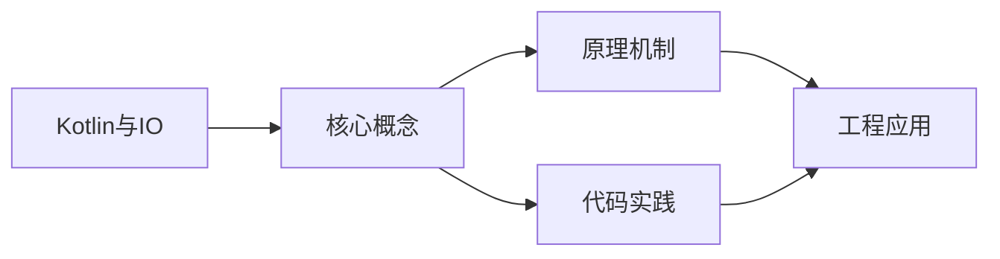

## 1. 学习目标（Bloom 分类）

本节按照布鲁姆教育目标分类学组织学习路径。本文主题为《Kotlin与IO》，属于 Kotlin 模块，读者可以根据自身阶段选择阅读深度。

记忆层面：能够准确复述本文的核心概念、术语与基本语法或操作步骤，并能够在提问或检索时快速定位对应知识点。能够说出 val/var、空安全操作符与 when 表达式的语法。

理解层面：能够用自己的语言解释核心原理与工作机制，说明概念之间的因果关系，而不是机械记忆结论。能够解释 Kotlin 与 Java 互操作的机制与平台类型概念。

应用层面：能够在真实项目或练习场景中运用本文知识解决具体问题，写出正确且可维护的实现。能够编写数据类、扩展函数与协程代码。

分析层面：能够拆解复杂问题，比较本文主题与相邻概念的异同，识别边界条件与例外情况。能够分析空安全、智能转换与协程调度原理。

评价层面：能够根据约束条件（性能、可读性、安全、成本）评价不同方案的优劣，做出有依据的技术决策。能够评价 Kotlin 在 Android、服务端与多平台场景的适用性。

创造层面：能够把本文知识与其他模块知识组合，设计出新的解决方案或可复用的工程模式。能够组合 Compose 与协程设计跨平台应用。

通过本节学习，读者应当能够把《Kotlin与IO》纳入自己的知识网络，并与 Kotlin 模块的其他主题（类型推断、空安全、协程、KMP）建立关联。

## 2. 历史动机与发展脉络

《Kotlin与IO》是 Kotlin 领域的重要主题。要真正理解它，需要先了解它解决的问题与演进过程。

Kotlin 由 JetBrains 于 2010 年开始研发，2016 年发布 1.0，定位是“更现代的 JVM 语言”：减少样板代码、消灭空指针、增强函数式能力，同时与 Java 100% 互操作。
2017 年 Google 宣布 Kotlin 成为 Android 一级语言，2019 年确立 Kotlin-first 政策；2023 年 Kotlin 2.0 的 K2 编译器显著提升编译速度与类型推导。
Kotlin Multiplatform（KMP）支持 JVM、Android、iOS、WebAssembly 等目标，配合 Compose Multiplatform 实现共享 UI 与业务逻辑，是 JetBrains 的长期战略方向。

回到本文主题：Kotlin与IO 的提出与成熟，正是上述技术背景下的必然产物。早期实现往往以简单可用为目标，随着工程规模扩大，社区逐渐沉淀出标准做法与最佳实践；理解这一脉络，可以帮助读者判断“为什么文档中的推荐写法是现在这个样子”，也能在遇到历史遗留代码时准确识别其设计年代与取舍。


## 3. 形式化定义与核心概念精讲

本节把《Kotlin与IO》涉及的核心概念以“定义 + 讲解”的形式展开。读者应把定义当作工具，把讲解当作理解路径；两者结合才能形成可迁移的知识。

空安全：类型系统区分 `String` 与 `String?`，编译期强制处理可空值；`?.` 短路、`?:` 提供默认、`!!` 显式断言，三者覆盖所有空值处理模式。
智能转换：`is` 检查后在不可变上下文中自动转换类型，减少显式强转；`as?` 安全转换失败返回 null。
协程：挂起函数（suspend）与调度器（Dispatchers.Main/IO/Default）实现非阻塞并发，结构化并发保证作用域内任务可取消。

### 3.1 原文章节逐一精讲

原文档把主题拆分为 16 个小节，下面按顺序给出每一节的导读讲解，随后保留原文细节供精读。

#### 原文精读（完整保留）

# Kotlin IO API

> **符号约定**：`< >` 必填参数 | `[ ]` 可选参数

---

#### 概述

IO（Input/Output）操作是程序与外部世界交互的方式，包括读写文件、网络通信、控制台输入输出等。Kotlin 运行在 JVM 上，可以直接使用 Java 的 IO 类，同时 Kotlin 也提供了一些扩展函数让 IO 操作更简洁。此外，kotlinx-io 是 Kotlin 官方的多平台 IO 库，提供了现代化的字节和字符处理 API。

本文主要介绍 Kotlin 中常用的文件操作和 IO 处理方式，涵盖从简单到复杂的场景。

#### 基础概念

- **File**：Java 的 `java.io.File` 类，表示文件系统中的文件或目录
- **InputStream/OutputStream**：字节流，用于读写二进制数据
- **Reader/Writer**：字符流，用于读写文本数据
- **kotlinx-io**：Kotlin 多平台 IO 库，提供 Buffer、Source、Sink 等抽象
- **use 函数**：Kotlin 的扩展函数，自动关闭资源（类似 Java 的 try-with-resources）

#### 快速上手

最简单的文件读写：

```kotlin
import java.io.File

fun main() {
    // 写入文本到文件
    File("output.txt").writeText("Hello, World!")

    // 读取文件全部内容
    val text = File("output.txt").readText()
    println(text)  // Hello, World!

    // 追加内容
    File("output.txt").appendText("\n第二行内容")

    // 按行读取
    val lines = File("output.txt").readLines()
    lines.forEach { println(it) }
}
```

#### 详细用法

##### 文件读取的多种方式

```kotlin
import java.io.File

fun fileReadDemo() {
    val file = File("data.txt")

    // 方式一：读取全部文本（适合小文件）
    val text = file.readText()
    println(text)

    // 方式二：读取全部字节（适合二进制文件）
    val bytes = file.readBytes()
    println("文件大小: ${bytes.size} 字节")

    // 方式三：按行读取（适合文本文件）
    val lines = file.readLines()
    lines.forEachIndexed { index, line ->
        println("第${index + 1}行: $line")
    }

    // 方式四：逐行处理（适合大文件，不会一次性加载到内存）
    file.forEachLine { line ->
        // 每次只加载一行到内存
        println(line)
    }

    // 方式五：使用 bufferedReader（需要更多控制时）
    file.bufferedReader().use { reader ->
        var line: String?
        while (reader.readLine().also { line = it } != null) {
            println(line)
        }
    }
}
```

##### 文件写入的多种方式

```kotlin
import java.io.File

fun fileWriteDemo() {
    val file = File("output.txt")

    // 方式一：写入全部文本（覆盖已有内容）
    file.writeText("第一行\n")

    // 方式二：追加文本
    file.appendText("第二行\n")

    // 方式三：写入字节数组
    file.writeBytes(byteArrayOf(72, 101, 108, 108, 111))  // "Hello"

    // 方式四：使用 bufferedWriter（需要更多控制时）
    file.bufferedWriter().use { writer ->
        writer.write("第一行")
        writer.newLine()
        writer.write("第二行")
    }

    // 方式五：写入多行
    file.writeLines(listOf("行1", "行2", "行3"))
}

// 扩展函数：写入多行
fun File.writeLines(lines: List<String>) {
    bufferedWriter().use { writer ->
        lines.forEach { line ->
            writer.write(line)
            writer.newLine()
        }
    }
}
```

##### 文件和目录操作

```kotlin
import java.io.File

fun fileOperationsDemo() {
    // 创建目录
    val dir = File("mydir")
    dir.mkdirs()  // 创建多级目录
    println("目录是否存在: ${dir.exists()}")

    // 创建文件
    val file = File("mydir/test.txt")
    file.createNewFile()

    // 检查文件属性
    println("是否存在: ${file.exists()}")
    println("是否是文件: ${file.isFile}")
    println("是否是目录: ${file.isDirectory}")
    println("文件大小: ${file.length()} 字节")
    println("绝对路径: ${file.absolutePath}")
    println("文件名: ${file.name}")
    println("扩展名: ${file.extension}")
    println("不含扩展名的名称: ${file.nameWithoutExtension}")

    // 重命名
    val renamed = File("mydir/renamed.txt")
    file.renameTo(renamed)

    // 删除文件
    renamed.delete()

    // 删除目录（必须为空）
    dir.delete()
}
```

##### 目录遍历

```kotlin
import java.io.File

fun dirTraversalDemo() {
    val dir = File(".")

    // 方式一：列出直接子文件
    val files = dir.listFiles()
    files?.forEach { println(it.name) }

    // 方式二：按扩展名过滤
    val ktFiles = dir.listFiles { _, name -> name.endsWith(".kt") }
    ktFiles?.forEach { println(it.name) }

    // 方式三：深度遍历（递归所有子目录）
    dir.walkTopDown()
        .filter { it.isFile }
        .filter { it.extension == "kt" }
        .forEach { println(it.absolutePath) }

    // 方式四：自底向上遍历（删除目录时有用）
    dir.walkBottomUp()
        .filter { it.isDirectory }
        .forEach { println("目录: ${it.path}") }

    // 方式五：使用 walk 的序列版本（懒加载）
    val sequence = dir.walkTopDown()
    val largeFiles = sequence
        .filter { it.isFile }
        .filter { it.length() > 1024 * 1024 }  // 大于 1MB
        .toList()
    println("大文件数量: ${largeFiles.size}")
}
```

##### 复制文件

```kotlin
import java.io.File

// 复制文件
fun copyFile(source: File, target: File) {
    source.inputStream().use { input ->
        target.outputStream().use { output ->
            input.copyTo(output)
        }
    }
}

// 复制文件（带缓冲区大小）
fun copyFileWithBuffer(source: File, target: File) {
    source.inputStream().buffered().use { input ->
        target.outputStream().buffered().use { output ->
            input.copyTo(output, bufferSize = 8192)
        }
    }
}

fun main() {
    val source = File("source.txt")
    val target = File("target.txt")
    copyFile(source, target)
    println("复制完成")
}
```

#### 常见场景

##### 读写 CSV 文件

```kotlin
import java.io.File

data class Person(val name: String, val age: Int, val city: String)

// 读取 CSV
fun readCsv(filePath: String): List<Person> {
    return File(filePath).readLines()
        .drop(1)  // 跳过标题行
        .map { line ->
            val parts = line.split(",")
            Person(parts[0], parts[1].toInt(), parts[2])
        }
}

// 写入 CSV
fun writeCsv(filePath: String, people: List<Person>) {
    File(filePath).bufferedWriter().use { writer ->
        writer.write("name,age,city")  // 标题行
        writer.newLine()
        people.forEach { person ->
            writer.write("${person.name},${person.age},${person.city}")
            writer.newLine()
        }
    }
}
```

##### 读写 JSON 配置文件

```kotlin
import java.io.File
import kotlinx.serialization.*
import kotlinx.serialization.json.*

@Serializable
data class AppConfig(
    val host: String = "localhost",
    val port: Int = 8080,
    val debug: Boolean = false
)

// 读取配置
fun loadConfig(filePath: String): AppConfig {
    val file = File(filePath)
    return if (file.exists()) {
        val text = file.readText()
        Json.decodeFromString(text)
    } else {
        // 文件不存在时使用默认配置
        val default = AppConfig()
        saveConfig(filePath, default)
        default
    }
}

// 保存配置
fun saveConfig(filePath: String, config: AppConfig) {
    val json = Json { prettyPrint = true }
    File(filePath).writeText(json.encodeToString(config))
}
```

##### 临时文件

```kotlin
import java.io.File

fun tempFileDemo() {
    // 创建临时文件
    val tempFile = File.createTempFile("prefix", ".tmp")
    tempFile.writeText("临时内容")
    println("临时文件路径: ${tempFile.absolutePath}")

    // 使用后删除
    tempFile.deleteOnExit()

    // 在指定目录下创建临时文件
    val tempDir = File(System.getProperty("java.io.tmpdir"))
    val customTemp = File.createTempFile("myapp", ".log", tempDir)
}
```

#### 注意事项

- **使用 use 自动关闭资源**：所有 IO 资源（流、读写器等）都应该用 `use` 包裹，确保异常时也能关闭
- **大文件不要用 readText**：`readText()` 会将整个文件加载到内存，大文件应使用 `forEachLine` 或 `bufferedReader`
- **文件编码**：`readText()` 和 `writeText()` 默认使用 UTF-8，如需其他编码请使用 `readText(Charsets.GBK)` 等
- **路径分隔符**：不要硬编码路径分隔符，使用 `File.separator` 或直接用 `/`（Kotlin/Java 会自动处理）
- **文件操作不是原子性的**：重命名、删除等操作可能失败，需要检查返回值或处理异常

#### 进阶用法

##### kotlinx-io 多平台 IO

```kotlin
// build.gradle.kts
dependencies {
    implementation("org.jetbrains.kotlinx:kotlinx-io-core:0.4.0")
}

import kotlinx.io.*

fun kotlinxIoDemo() {
    // 创建 Buffer
    val buffer = Buffer()

    // 写入数据
    buffer.writeString("Hello")
    buffer.writeInt(42)
    buffer.writeDouble(3.14)

    // 读取数据（按写入顺序）
    val text = buffer.readString(5)  // "Hello"
    val number = buffer.readInt()    // 42
    val pi = buffer.readDouble()     // 3.14
}
```

##### 监控文件变化

```kotlin
import java.nio.file.*
import java.nio.file.StandardWatchEventKinds.*

fun watchDirectory(dirPath: String) {
    val watchService = FileSystems.getDefault().newWatchService()
    val path = Paths.get(dirPath)

    // 注册监控事件
    path.register(watchService, ENTRY_CREATE, ENTRY_DELETE, ENTRY_MODIFY)

    println("开始监控目录: $dirPath")
    while (true) {
        val key = watchService.take()
        for (event in key.pollEvents()) {
            val fileName = event.context()
            when (event.kind()) {
                ENTRY_CREATE -> println("新建文件: $fileName")
                ENTRY_DELETE -> println("删除文件: $fileName")
                ENTRY_MODIFY -> println("修改文件: $fileName")
            }
        }
        if (!key.reset()) break
    }
}
```

##### 对文件内容进行流式处理

```kotlin
import java.io.File

// 处理大日志文件，提取错误信息
fun extractErrors(logFilePath: String, outputPath: String) {
    val inputFile = File(logFilePath)
    val outputFile = File(outputPath)

    inputFile.bufferedReader().use { reader ->
        outputFile.bufferedWriter().use { writer ->
            reader.lineSequence()  // 懒加载，不会一次性读入内存
                .filter { it.contains("ERROR") }
                .forEach { writer.write(it + "\n") }
        }
    }
}
```
#### 文件读取

**基本写法：读取全部文本**
`File("<路径>").readText()`
```kotlin
// 一次性读取文本文件
val text = File("a.txt").readText()
```

---

**基本写法：按行读取**
`File("<路径>").readLines()`
```kotlin
// 按行读取为 List
val lines = File("a.txt").readLines()
```

---

**基本写法：读取全部字节**
`File("<路径>").readBytes()`
```kotlin
// 读取为字节数组
val bytes = File("a.txt").readBytes()
```

---

**基本写法：逐行流式读取**
`File("<路径>").useLines { }`
```kotlin
// 流式逐行处理自动关闭
File("a.txt").useLines { lines -> lines.forEach { } }
```

---

#### 文件写入

**基本写法：写入文本**
`File("<路径>").writeText("<内容>")`
```kotlin
// 覆盖写入文本
File("out.txt").writeText("hello")
```

---

**基本写法：写入字节**
`File("<路径>").writeBytes(<字节数组>)`
```kotlin
// 覆盖写入字节
File("out.bin").writeBytes(bytes)
```

---

**基本写法：追加写入**
`File("<路径>").appendText("<内容>")`
```kotlin
// 追加文本到文件
File("log.txt").appendText("new line\n")
```

---

**基本写法：追加字节**
`File("<路径>").appendBytes(<字节数组>)`
```kotlin
// 追加字节数组
File("log.bin").appendBytes(bytes)
```

---

#### 文件流操作

**基本写法：写入流**
`File("<路径>").outputStream()`
```kotlin
// 获取文件输出流
File("out.txt").outputStream().use { it.write(bytes) }
```

---

**基本写法：读取流**
`File("<路径>").inputStream()`
```kotlin
// 获取文件输入流
File("a.txt").inputStream().use { it.readBytes() }
```

---

**基本写法：BufferedWriter**
`File("<路径>").bufferedWriter()`
```kotlin
// 缓冲写入器
File("out.txt").bufferedWriter().use { w -> w.write("hi") }
```

---

**基本写法：BufferedReader**
`File("<路径>").bufferedReader()`
```kotlin
// 缓冲读取器
File("a.txt").bufferedReader().use { r -> r.readLine() }
```

---

#### 文件与目录操作

**基本写法：创建文件**
`File("<路径>").createNewFile()`
```kotlin
// 创建新文件
File("a.txt").createNewFile()
```

---

**基本写法：创建目录**
`File("<路径>").mkdirs()`
```kotlin
// 递归创建目录
File("a/b/c").mkdirs()
```

---

**基本写法：删除文件**
`File("<路径>").delete()`
```kotlin
// 删除文件或空目录
File("a.txt").delete()
```

---

**基本写法：删除递归**
`File("<路径>").deleteRecursively()`
```kotlin
// 递归删除目录及内容
File("dir").deleteRecursively()
```

---

**基本写法：判断存在**
`File("<路径>").exists()`
```kotlin
// 判断文件是否存在
if (File("a.txt").exists()) { }
```

---

**基本写法：判断文件/目录**
`File("<路径>").isFile | isDirectory`
```kotlin
// 判断是文件还是目录
if (File("p").isDirectory) { }
```

---

**基本写法：列出文件**
`File("<路径>").listFiles()`
```kotlin
// 列出目录下文件
val files = File("dir").listFiles()
```

---

**基本写法：按扩展名过滤**
`File("<路径>").listFiles { _, name -> name.endsWith(".txt") }`
```kotlin
// 过滤特定扩展名
val txts = File("dir").listFiles { _, n -> n.endsWith(".txt") }
```

---

**基本写法：遍历目录树**
`File("<路径>").walk()`
```kotlin
// 深度遍历目录树
File("dir").walk().forEach { println(it) }
```

---

#### 文件复制与移动

**基本写法：复制到**
`File("<源>").copyTo(File("<目标>"))`
```kotlin
// 复制文件
File("a.txt").copyTo(File("b.txt"))
```

---

**基本写法：递归复制**
`File("<源>").copyRecursively(File("<目标>"))`
```kotlin
// 递归复制目录
File("src").copyRecursively(File("dst"))
```

---

**基本写法：移动**
`File("<源>").renameTo(File("<目标>"))`
```kotlin
// 重命名或移动文件
File("a.txt").renameTo(File("b.txt"))
```

---

#### 文件属性

**基本写法：文件大小**
`File("<路径>").length()`
```kotlin
// 获取文件字节数
val size = File("a.txt").length()
```

---

**基本写法：最后修改时间**
`File("<路径>").lastModified()`
```kotlin
// 获取最后修改时间戳
val t = File("a.txt").lastModified()
```

---

**基本写法：绝对路径**
`File("<路径>").absolutePath`
```kotlin
// 获取绝对路径
val abs = File("a.txt").absolutePath
```

---

#### Path（kotlin.io.path）

**基本写法：创建 Path**
`Path("<路径>")`
```kotlin
// 创建 Path 对象
val p = Path("a/b.txt")
```

---

**基本写法：读写 Path**
`<path>.readText() | <path>.writeText()`
```kotlin
// Path 扩展读写
val text = Path("a.txt").readText()
Path("out.txt").writeText("hi")
```

---

**基本写法：递归创建**
`<path>.createDirectories()`
```kotlin
// 递归创建目录
Path("a/b/c").createDirectories()
```

---

**基本写法：复制 Path**
`<path>.copyTo(<目标>)`
```kotlin
// Path 复制
Path("a.txt").copyTo(Path("b.txt"))
```

---

#### 标准流

**基本写法：标准输入**
`readLine()`
```kotlin
// 读取一行标准输入
val line = readLine()
```

---

**基本写法：标准输出**
`print(<值>) | println(<值>)`
```kotlin
// 标准输出
println("hello")
```

---

**基本写法：System.err**
`System.err.println(<值>)`
```kotlin
// 标准错误输出
System.err.println("error")
```

---

#### 跨平台 IO

**基本写法：KMP 使用 okio**
`FileSystem.SYSTEM.read(<path>) { }`
```kotlin
// okio 跨平台文件读取
FileSystem.SYSTEM.read(Path("a.txt")) {
    readUtf8()
}
```

---

**基本写法：KMP 写入**
`FileSystem.SYSTEM.write(<path>) { }`
```kotlin
// okio 跨平台文件写入
FileSystem.SYSTEM.write(Path("out.txt")) {
    writeUtf8("hi")
}
```


### 3.2 概念关系图

下面用 Mermaid 图表达本文核心概念之间的关系，帮助读者建立整体图景：



图中展示的是本文知识的结构化关系：核心概念是入口，原理机制解释“为什么”，代码实践演示“怎么做”，工程应用回答“何时用”。读者学习时可以把每个小节的内容挂接到对应节点上。

## 4. 理论推导与原理解析

本节深入《Kotlin与IO》背后的原理。理论部分不求面面俱到，而是聚焦“能解释现象、能指导实践”的关键推导。

空安全：类型系统区分 `String` 与 `String?`，编译期强制处理可空值；`?.` 短路、`?:` 提供默认、`!!` 显式断言，三者覆盖所有空值处理模式。
智能转换：`is` 检查后在不可变上下文中自动转换类型，减少显式强转；`as?` 安全转换失败返回 null。
协程：挂起函数（suspend）与调度器（Dispatchers.Main/IO/Default）实现非阻塞并发，结构化并发保证作用域内任务可取消。
扩展函数与属性：在不修改原类的情况下为类添加行为，是 Kotlin 标准库（如集合操作）的基石。

需要强调的是，理论推导与工程实践之间存在翻译层：理论给出的是理想化模型与边界条件，工程代码则必须处理真实环境中的例外。读者在学习时应先掌握理论的“标准情形”，再通过陷阱章节了解“非标准情形”。

## 5. 代码示例与逐行讲解

本节把原文中的代码示例系统整理，并为每个示例补充用途说明与讲解。读者不应只浏览代码，而应逐段对照讲解理解设计意图。

### 5.1 示例：快速上手

该示例来自原文《快速上手》小节，用于演示Kotlin与IO相关操作。阅读时请先看代码结构，再看其后的讲解。

```kotlin
import java.io.File

fun main() {
    // 写入文本到文件
    File("output.txt").writeText("Hello, World!")

    // 读取文件全部内容
    val text = File("output.txt").readText()
    println(text)  // Hello, World!

    // 追加内容
    File("output.txt").appendText("\n第二行内容")

    // 按行读取
    val lines = File("output.txt").readLines()
    lines.forEach { println(it) }
}
```

讲解：这段代码演示了本节核心知识点。代码中的关键操作可以归纳为三步：准备（定义或初始化）、执行（核心逻辑）、收尾（释放资源或返回结果）。实际项目中，这三步往往被封装为函数或类，以提升复用性与可测试性。

关键点分析：

该示例共 13 行有效代码，包含 1 类关键结构（import）。其中：

- 入口与初始化部分负责建立上下文，对应实际项目中的启动或装配逻辑；
- 核心逻辑部分体现本文主题的主要操作，是阅读时最需要对照讲解理解的部分；
- 输出或返回部分把结果交给调用方，注意其类型与边界条件。

进阶思考路径：先尝试修改参数观察行为变化，再把示例中的模式迁移到自己的项目中；每次修改都记录预期与实测差异，这是把示例转化为能力的最快方式。

### 5.2 示例：文件读取的多种方式

该示例来自原文《文件读取的多种方式》小节，用于演示Kotlin与IO相关操作。阅读时请先看代码结构，再看其后的讲解。

```kotlin
import java.io.File

fun fileReadDemo() {
    val file = File("data.txt")

    // 方式一：读取全部文本（适合小文件）
    val text = file.readText()
    println(text)

    // 方式二：读取全部字节（适合二进制文件）
    val bytes = file.readBytes()
    println("文件大小: ${bytes.size} 字节")

    // 方式三：按行读取（适合文本文件）
    val lines = file.readLines()
    lines.forEachIndexed { index, line ->
        println("第${index + 1}行: $line")
    }

    // 方式四：逐行处理（适合大文件，不会一次性加载到内存）
    file.forEachLine { line ->
        // 每次只加载一行到内存
        println(line)
    }

    // 方式五：使用 bufferedReader（需要更多控制时）
    file.bufferedReader().use { reader ->
        var line: String?
        while (reader.readLine().also { line = it } != null) {
            println(line)
        }
    }
}
```

讲解：这段代码演示了本节核心知识点。代码中的关键操作可以归纳为三步：准备（定义或初始化）、执行（核心逻辑）、收尾（释放资源或返回结果）。实际项目中，这三步往往被封装为函数或类，以提升复用性与可测试性。

关键点分析：

该示例共 27 行有效代码，包含 2 类关键结构（import、while）。其中：

- 入口与初始化部分负责建立上下文，对应实际项目中的启动或装配逻辑；
- 核心逻辑部分体现本文主题的主要操作，是阅读时最需要对照讲解理解的部分；
- 输出或返回部分把结果交给调用方，注意其类型与边界条件。

进阶思考路径：先尝试修改参数观察行为变化，再把示例中的模式迁移到自己的项目中；每次修改都记录预期与实测差异，这是把示例转化为能力的最快方式。

### 5.3 示例：文件写入的多种方式

该示例来自原文《文件写入的多种方式》小节，用于演示Kotlin与IO相关操作。阅读时请先看代码结构，再看其后的讲解。

```kotlin
import java.io.File

fun fileWriteDemo() {
    val file = File("output.txt")

    // 方式一：写入全部文本（覆盖已有内容）
    file.writeText("第一行\n")

    // 方式二：追加文本
    file.appendText("第二行\n")

    // 方式三：写入字节数组
    file.writeBytes(byteArrayOf(72, 101, 108, 108, 111))  // "Hello"

    // 方式四：使用 bufferedWriter（需要更多控制时）
    file.bufferedWriter().use { writer ->
        writer.write("第一行")
        writer.newLine()
        writer.write("第二行")
    }

    // 方式五：写入多行
    file.writeLines(listOf("行1", "行2", "行3"))
}

// 扩展函数：写入多行
fun File.writeLines(lines: List<String>) {
    bufferedWriter().use { writer ->
        lines.forEach { line ->
            writer.write(line)
            writer.newLine()
        }
    }
}
```

讲解：这段代码演示了本节核心知识点。代码中的关键操作可以归纳为三步：准备（定义或初始化）、执行（核心逻辑）、收尾（释放资源或返回结果）。实际项目中，这三步往往被封装为函数或类，以提升复用性与可测试性。

关键点分析：

该示例共 27 行有效代码，包含 1 类关键结构（import）。其中：

- 入口与初始化部分负责建立上下文，对应实际项目中的启动或装配逻辑；
- 核心逻辑部分体现本文主题的主要操作，是阅读时最需要对照讲解理解的部分；
- 输出或返回部分把结果交给调用方，注意其类型与边界条件。

进阶思考路径：先尝试修改参数观察行为变化，再把示例中的模式迁移到自己的项目中；每次修改都记录预期与实测差异，这是把示例转化为能力的最快方式。

### 5.4 示例：文件和目录操作

该示例来自原文《文件和目录操作》小节，用于演示Kotlin与IO相关操作。阅读时请先看代码结构，再看其后的讲解。

```kotlin
import java.io.File

fun fileOperationsDemo() {
    // 创建目录
    val dir = File("mydir")
    dir.mkdirs()  // 创建多级目录
    println("目录是否存在: ${dir.exists()}")

    // 创建文件
    val file = File("mydir/test.txt")
    file.createNewFile()

    // 检查文件属性
    println("是否存在: ${file.exists()}")
    println("是否是文件: ${file.isFile}")
    println("是否是目录: ${file.isDirectory}")
    println("文件大小: ${file.length()} 字节")
    println("绝对路径: ${file.absolutePath}")
    println("文件名: ${file.name}")
    println("扩展名: ${file.extension}")
    println("不含扩展名的名称: ${file.nameWithoutExtension}")

    // 重命名
    val renamed = File("mydir/renamed.txt")
    file.renameTo(renamed)

    // 删除文件
    renamed.delete()

    // 删除目录（必须为空）
    dir.delete()
}
```

讲解：这段代码演示了本节核心知识点。代码中的关键操作可以归纳为三步：准备（定义或初始化）、执行（核心逻辑）、收尾（释放资源或返回结果）。实际项目中，这三步往往被封装为函数或类，以提升复用性与可测试性。

关键点分析：

该示例共 26 行有效代码，包含 1 类关键结构（import）。其中：

- 入口与初始化部分负责建立上下文，对应实际项目中的启动或装配逻辑；
- 核心逻辑部分体现本文主题的主要操作，是阅读时最需要对照讲解理解的部分；
- 输出或返回部分把结果交给调用方，注意其类型与边界条件。

进阶思考路径：先尝试修改参数观察行为变化，再把示例中的模式迁移到自己的项目中；每次修改都记录预期与实测差异，这是把示例转化为能力的最快方式。

### 5.5 示例：目录遍历

该示例来自原文《目录遍历》小节，用于演示Kotlin与IO相关操作。阅读时请先看代码结构，再看其后的讲解。

```kotlin
import java.io.File

fun dirTraversalDemo() {
    val dir = File(".")

    // 方式一：列出直接子文件
    val files = dir.listFiles()
    files?.forEach { println(it.name) }

    // 方式二：按扩展名过滤
    val ktFiles = dir.listFiles { _, name -> name.endsWith(".kt") }
    ktFiles?.forEach { println(it.name) }

    // 方式三：深度遍历（递归所有子目录）
    dir.walkTopDown()
        .filter { it.isFile }
        .filter { it.extension == "kt" }
        .forEach { println(it.absolutePath) }

    // 方式四：自底向上遍历（删除目录时有用）
    dir.walkBottomUp()
        .filter { it.isDirectory }
        .forEach { println("目录: ${it.path}") }

    // 方式五：使用 walk 的序列版本（懒加载）
    val sequence = dir.walkTopDown()
    val largeFiles = sequence
        .filter { it.isFile }
        .filter { it.length() > 1024 * 1024 }  // 大于 1MB
        .toList()
    println("大文件数量: ${largeFiles.size}")
}
```

讲解：这段代码演示了本节核心知识点。代码中的关键操作可以归纳为三步：准备（定义或初始化）、执行（核心逻辑）、收尾（释放资源或返回结果）。实际项目中，这三步往往被封装为函数或类，以提升复用性与可测试性。

关键点分析：

该示例共 26 行有效代码，包含 1 类关键结构（import）。其中：

- 入口与初始化部分负责建立上下文，对应实际项目中的启动或装配逻辑；
- 核心逻辑部分体现本文主题的主要操作，是阅读时最需要对照讲解理解的部分；
- 输出或返回部分把结果交给调用方，注意其类型与边界条件。

进阶思考路径：先尝试修改参数观察行为变化，再把示例中的模式迁移到自己的项目中；每次修改都记录预期与实测差异，这是把示例转化为能力的最快方式。

### 5.6 示例：复制文件

该示例来自原文《复制文件》小节，用于演示Kotlin与IO相关操作。阅读时请先看代码结构，再看其后的讲解。

```kotlin
import java.io.File

// 复制文件
fun copyFile(source: File, target: File) {
    source.inputStream().use { input ->
        target.outputStream().use { output ->
            input.copyTo(output)
        }
    }
}

// 复制文件（带缓冲区大小）
fun copyFileWithBuffer(source: File, target: File) {
    source.inputStream().buffered().use { input ->
        target.outputStream().buffered().use { output ->
            input.copyTo(output, bufferSize = 8192)
        }
    }
}

fun main() {
    val source = File("source.txt")
    val target = File("target.txt")
    copyFile(source, target)
    println("复制完成")
}
```

讲解：这段代码演示了本节核心知识点。代码中的关键操作可以归纳为三步：准备（定义或初始化）、执行（核心逻辑）、收尾（释放资源或返回结果）。实际项目中，这三步往往被封装为函数或类，以提升复用性与可测试性。

关键点分析：

该示例共 23 行有效代码，包含 1 类关键结构（import）。其中：

- 入口与初始化部分负责建立上下文，对应实际项目中的启动或装配逻辑；
- 核心逻辑部分体现本文主题的主要操作，是阅读时最需要对照讲解理解的部分；
- 输出或返回部分把结果交给调用方，注意其类型与边界条件。

进阶思考路径：先尝试修改参数观察行为变化，再把示例中的模式迁移到自己的项目中；每次修改都记录预期与实测差异，这是把示例转化为能力的最快方式。

### 5.7 示例：读写 CSV 文件

该示例来自原文《读写 CSV 文件》小节，用于演示Kotlin与IO相关操作。阅读时请先看代码结构，再看其后的讲解。

```kotlin
import java.io.File

data class Person(val name: String, val age: Int, val city: String)

// 读取 CSV
fun readCsv(filePath: String): List<Person> {
    return File(filePath).readLines()
        .drop(1)  // 跳过标题行
        .map { line ->
            val parts = line.split(",")
            Person(parts[0], parts[1].toInt(), parts[2])
        }
}

// 写入 CSV
fun writeCsv(filePath: String, people: List<Person>) {
    File(filePath).bufferedWriter().use { writer ->
        writer.write("name,age,city")  // 标题行
        writer.newLine()
        people.forEach { person ->
            writer.write("${person.name},${person.age},${person.city}")
            writer.newLine()
        }
    }
}
```

讲解：这段代码演示了本节核心知识点。代码中的关键操作可以归纳为三步：准备（定义或初始化）、执行（核心逻辑）、收尾（释放资源或返回结果）。实际项目中，这三步往往被封装为函数或类，以提升复用性与可测试性。

关键点分析：

该示例共 22 行有效代码，包含 3 类关键结构（class、import、return）。其中：

- 入口与初始化部分负责建立上下文，对应实际项目中的启动或装配逻辑；
- 核心逻辑部分体现本文主题的主要操作，是阅读时最需要对照讲解理解的部分；
- 输出或返回部分把结果交给调用方，注意其类型与边界条件。

进阶思考路径：先尝试修改参数观察行为变化，再把示例中的模式迁移到自己的项目中；每次修改都记录预期与实测差异，这是把示例转化为能力的最快方式。

### 5.8 示例：读写 JSON 配置文件

该示例来自原文《读写 JSON 配置文件》小节，用于演示Kotlin与IO相关操作。阅读时请先看代码结构，再看其后的讲解。

```kotlin
import java.io.File
import kotlinx.serialization.*
import kotlinx.serialization.json.*

@Serializable
data class AppConfig(
    val host: String = "localhost",
    val port: Int = 8080,
    val debug: Boolean = false
)

// 读取配置
fun loadConfig(filePath: String): AppConfig {
    val file = File(filePath)
    return if (file.exists()) {
        val text = file.readText()
        Json.decodeFromString(text)
    } else {
        // 文件不存在时使用默认配置
        val default = AppConfig()
        saveConfig(filePath, default)
        default
    }
}

// 保存配置
fun saveConfig(filePath: String, config: AppConfig) {
    val json = Json { prettyPrint = true }
    File(filePath).writeText(json.encodeToString(config))
}
```

讲解：这段代码演示了本节核心知识点。代码中的关键操作可以归纳为三步：准备（定义或初始化）、执行（核心逻辑）、收尾（释放资源或返回结果）。实际项目中，这三步往往被封装为函数或类，以提升复用性与可测试性。

关键点分析：

该示例共 27 行有效代码，包含 4 类关键结构（class、import、if、return）。其中：

- 入口与初始化部分负责建立上下文，对应实际项目中的启动或装配逻辑；
- 核心逻辑部分体现本文主题的主要操作，是阅读时最需要对照讲解理解的部分；
- 输出或返回部分把结果交给调用方，注意其类型与边界条件。

进阶思考路径：先尝试修改参数观察行为变化，再把示例中的模式迁移到自己的项目中；每次修改都记录预期与实测差异，这是把示例转化为能力的最快方式。

### 5.9 示例：临时文件

该示例来自原文《临时文件》小节，用于演示Kotlin与IO相关操作。阅读时请先看代码结构，再看其后的讲解。

```kotlin
import java.io.File

fun tempFileDemo() {
    // 创建临时文件
    val tempFile = File.createTempFile("prefix", ".tmp")
    tempFile.writeText("临时内容")
    println("临时文件路径: ${tempFile.absolutePath}")

    // 使用后删除
    tempFile.deleteOnExit()

    // 在指定目录下创建临时文件
    val tempDir = File(System.getProperty("java.io.tmpdir"))
    val customTemp = File.createTempFile("myapp", ".log", tempDir)
}
```

讲解：这段代码演示了本节核心知识点。代码中的关键操作可以归纳为三步：准备（定义或初始化）、执行（核心逻辑）、收尾（释放资源或返回结果）。实际项目中，这三步往往被封装为函数或类，以提升复用性与可测试性。

关键点分析：

该示例共 12 行有效代码，包含 1 类关键结构（import）。其中：

- 入口与初始化部分负责建立上下文，对应实际项目中的启动或装配逻辑；
- 核心逻辑部分体现本文主题的主要操作，是阅读时最需要对照讲解理解的部分；
- 输出或返回部分把结果交给调用方，注意其类型与边界条件。

进阶思考路径：先尝试修改参数观察行为变化，再把示例中的模式迁移到自己的项目中；每次修改都记录预期与实测差异，这是把示例转化为能力的最快方式。

### 5.10 示例：kotlinx-io 多平台 IO

该示例来自原文《kotlinx-io 多平台 IO》小节，用于演示Kotlin与IO相关操作。阅读时请先看代码结构，再看其后的讲解。

```kotlin
// build.gradle.kts
dependencies {
    implementation("org.jetbrains.kotlinx:kotlinx-io-core:0.4.0")
}

import kotlinx.io.*

fun kotlinxIoDemo() {
    // 创建 Buffer
    val buffer = Buffer()

    // 写入数据
    buffer.writeString("Hello")
    buffer.writeInt(42)
    buffer.writeDouble(3.14)

    // 读取数据（按写入顺序）
    val text = buffer.readString(5)  // "Hello"
    val number = buffer.readInt()    // 42
    val pi = buffer.readDouble()     // 3.14
}
```

讲解：这段代码演示了本节核心知识点。代码中的关键操作可以归纳为三步：准备（定义或初始化）、执行（核心逻辑）、收尾（释放资源或返回结果）。实际项目中，这三步往往被封装为函数或类，以提升复用性与可测试性。

关键点分析：

该示例共 17 行有效代码，包含 1 类关键结构（import）。其中：

- 入口与初始化部分负责建立上下文，对应实际项目中的启动或装配逻辑；
- 核心逻辑部分体现本文主题的主要操作，是阅读时最需要对照讲解理解的部分；
- 输出或返回部分把结果交给调用方，注意其类型与边界条件。

进阶思考路径：先尝试修改参数观察行为变化，再把示例中的模式迁移到自己的项目中；每次修改都记录预期与实测差异，这是把示例转化为能力的最快方式。

### 5.11 示例：监控文件变化

该示例来自原文《监控文件变化》小节，用于演示Kotlin与IO相关操作。阅读时请先看代码结构，再看其后的讲解。

```kotlin
import java.nio.file.*
import java.nio.file.StandardWatchEventKinds.*

fun watchDirectory(dirPath: String) {
    val watchService = FileSystems.getDefault().newWatchService()
    val path = Paths.get(dirPath)

    // 注册监控事件
    path.register(watchService, ENTRY_CREATE, ENTRY_DELETE, ENTRY_MODIFY)

    println("开始监控目录: $dirPath")
    while (true) {
        val key = watchService.take()
        for (event in key.pollEvents()) {
            val fileName = event.context()
            when (event.kind()) {
                ENTRY_CREATE -> println("新建文件: $fileName")
                ENTRY_DELETE -> println("删除文件: $fileName")
                ENTRY_MODIFY -> println("修改文件: $fileName")
            }
        }
        if (!key.reset()) break
    }
}
```

讲解：这段代码演示了本节核心知识点。代码中的关键操作可以归纳为三步：准备（定义或初始化）、执行（核心逻辑）、收尾（释放资源或返回结果）。实际项目中，这三步往往被封装为函数或类，以提升复用性与可测试性。

关键点分析：

该示例共 21 行有效代码，包含 5 类关键结构（import、if、for、while、CREATE）。其中：

- 入口与初始化部分负责建立上下文，对应实际项目中的启动或装配逻辑；
- 核心逻辑部分体现本文主题的主要操作，是阅读时最需要对照讲解理解的部分；
- 输出或返回部分把结果交给调用方，注意其类型与边界条件。

进阶思考路径：先尝试修改参数观察行为变化，再把示例中的模式迁移到自己的项目中；每次修改都记录预期与实测差异，这是把示例转化为能力的最快方式。

### 5.12 示例：对文件内容进行流式处理

该示例来自原文《对文件内容进行流式处理》小节，用于演示Kotlin与IO相关操作。阅读时请先看代码结构，再看其后的讲解。

```kotlin
import java.io.File

// 处理大日志文件，提取错误信息
fun extractErrors(logFilePath: String, outputPath: String) {
    val inputFile = File(logFilePath)
    val outputFile = File(outputPath)

    inputFile.bufferedReader().use { reader ->
        outputFile.bufferedWriter().use { writer ->
            reader.lineSequence()  // 懒加载，不会一次性读入内存
                .filter { it.contains("ERROR") }
                .forEach { writer.write(it + "\n") }
        }
    }
}
```

讲解：这段代码演示了本节核心知识点。代码中的关键操作可以归纳为三步：准备（定义或初始化）、执行（核心逻辑）、收尾（释放资源或返回结果）。实际项目中，这三步往往被封装为函数或类，以提升复用性与可测试性。

关键点分析：

该示例共 13 行有效代码，包含 1 类关键结构（import）。其中：

- 入口与初始化部分负责建立上下文，对应实际项目中的启动或装配逻辑；
- 核心逻辑部分体现本文主题的主要操作，是阅读时最需要对照讲解理解的部分；
- 输出或返回部分把结果交给调用方，注意其类型与边界条件。

进阶思考路径：先尝试修改参数观察行为变化，再把示例中的模式迁移到自己的项目中；每次修改都记录预期与实测差异，这是把示例转化为能力的最快方式。

### 5.13 示例：文件读取

该示例来自原文《文件读取》小节，用于演示Kotlin与IO相关操作。阅读时请先看代码结构，再看其后的讲解。

```kotlin
// 一次性读取文本文件
val text = File("a.txt").readText()
```

讲解：这段代码演示了本节核心知识点。代码中的关键操作可以归纳为三步：准备（定义或初始化）、执行（核心逻辑）、收尾（释放资源或返回结果）。实际项目中，这三步往往被封装为函数或类，以提升复用性与可测试性。

关键点分析：

该示例共 2 行有效代码，结构以数据或配置为主。阅读时应关注：数据字段的含义、配置项的作用，以及它们与运行行为的对应关系。

进阶思考路径：先尝试修改参数观察行为变化，再把示例中的模式迁移到自己的项目中；每次修改都记录预期与实测差异，这是把示例转化为能力的最快方式。

### 5.14 示例：文件读取

该示例来自原文《文件读取》小节，用于演示Kotlin与IO相关操作。阅读时请先看代码结构，再看其后的讲解。

```kotlin
// 按行读取为 List
val lines = File("a.txt").readLines()
```

讲解：这段代码演示了本节核心知识点。代码中的关键操作可以归纳为三步：准备（定义或初始化）、执行（核心逻辑）、收尾（释放资源或返回结果）。实际项目中，这三步往往被封装为函数或类，以提升复用性与可测试性。

关键点分析：

该示例共 2 行有效代码，结构以数据或配置为主。阅读时应关注：数据字段的含义、配置项的作用，以及它们与运行行为的对应关系。

进阶思考路径：先尝试修改参数观察行为变化，再把示例中的模式迁移到自己的项目中；每次修改都记录预期与实测差异，这是把示例转化为能力的最快方式。

### 5.15 示例：文件读取

该示例来自原文《文件读取》小节，用于演示Kotlin与IO相关操作。阅读时请先看代码结构，再看其后的讲解。

```kotlin
// 读取为字节数组
val bytes = File("a.txt").readBytes()
```

讲解：这段代码演示了本节核心知识点。代码中的关键操作可以归纳为三步：准备（定义或初始化）、执行（核心逻辑）、收尾（释放资源或返回结果）。实际项目中，这三步往往被封装为函数或类，以提升复用性与可测试性。

关键点分析：

该示例共 2 行有效代码，结构以数据或配置为主。阅读时应关注：数据字段的含义、配置项的作用，以及它们与运行行为的对应关系。

进阶思考路径：先尝试修改参数观察行为变化，再把示例中的模式迁移到自己的项目中；每次修改都记录预期与实测差异，这是把示例转化为能力的最快方式。

### 5.16 示例：文件读取

该示例来自原文《文件读取》小节，用于演示Kotlin与IO相关操作。阅读时请先看代码结构，再看其后的讲解。

```kotlin
// 流式逐行处理自动关闭
File("a.txt").useLines { lines -> lines.forEach { } }
```

讲解：这段代码演示了本节核心知识点。代码中的关键操作可以归纳为三步：准备（定义或初始化）、执行（核心逻辑）、收尾（释放资源或返回结果）。实际项目中，这三步往往被封装为函数或类，以提升复用性与可测试性。

关键点分析：

该示例共 2 行有效代码，结构以数据或配置为主。阅读时应关注：数据字段的含义、配置项的作用，以及它们与运行行为的对应关系。

进阶思考路径：先尝试修改参数观察行为变化，再把示例中的模式迁移到自己的项目中；每次修改都记录预期与实测差异，这是把示例转化为能力的最快方式。

### 5.17 示例：文件写入

该示例来自原文《文件写入》小节，用于演示Kotlin与IO相关操作。阅读时请先看代码结构，再看其后的讲解。

```kotlin
// 覆盖写入文本
File("out.txt").writeText("hello")
```

讲解：这段代码演示了本节核心知识点。代码中的关键操作可以归纳为三步：准备（定义或初始化）、执行（核心逻辑）、收尾（释放资源或返回结果）。实际项目中，这三步往往被封装为函数或类，以提升复用性与可测试性。

关键点分析：

该示例共 2 行有效代码，结构以数据或配置为主。阅读时应关注：数据字段的含义、配置项的作用，以及它们与运行行为的对应关系。

进阶思考路径：先尝试修改参数观察行为变化，再把示例中的模式迁移到自己的项目中；每次修改都记录预期与实测差异，这是把示例转化为能力的最快方式。

### 5.18 示例：文件写入

该示例来自原文《文件写入》小节，用于演示Kotlin与IO相关操作。阅读时请先看代码结构，再看其后的讲解。

```kotlin
// 覆盖写入字节
File("out.bin").writeBytes(bytes)
```

讲解：这段代码演示了本节核心知识点。代码中的关键操作可以归纳为三步：准备（定义或初始化）、执行（核心逻辑）、收尾（释放资源或返回结果）。实际项目中，这三步往往被封装为函数或类，以提升复用性与可测试性。

关键点分析：

该示例共 2 行有效代码，结构以数据或配置为主。阅读时应关注：数据字段的含义、配置项的作用，以及它们与运行行为的对应关系。

进阶思考路径：先尝试修改参数观察行为变化，再把示例中的模式迁移到自己的项目中；每次修改都记录预期与实测差异，这是把示例转化为能力的最快方式。

### 5.19 示例：文件写入

该示例来自原文《文件写入》小节，用于演示Kotlin与IO相关操作。阅读时请先看代码结构，再看其后的讲解。

```kotlin
// 追加文本到文件
File("log.txt").appendText("new line\n")
```

讲解：这段代码演示了本节核心知识点。代码中的关键操作可以归纳为三步：准备（定义或初始化）、执行（核心逻辑）、收尾（释放资源或返回结果）。实际项目中，这三步往往被封装为函数或类，以提升复用性与可测试性。

关键点分析：

该示例共 2 行有效代码，结构以数据或配置为主。阅读时应关注：数据字段的含义、配置项的作用，以及它们与运行行为的对应关系。

进阶思考路径：先尝试修改参数观察行为变化，再把示例中的模式迁移到自己的项目中；每次修改都记录预期与实测差异，这是把示例转化为能力的最快方式。

### 5.20 示例：文件写入

该示例来自原文《文件写入》小节，用于演示Kotlin与IO相关操作。阅读时请先看代码结构，再看其后的讲解。

```kotlin
// 追加字节数组
File("log.bin").appendBytes(bytes)
```

讲解：这段代码演示了本节核心知识点。代码中的关键操作可以归纳为三步：准备（定义或初始化）、执行（核心逻辑）、收尾（释放资源或返回结果）。实际项目中，这三步往往被封装为函数或类，以提升复用性与可测试性。

关键点分析：

该示例共 2 行有效代码，结构以数据或配置为主。阅读时应关注：数据字段的含义、配置项的作用，以及它们与运行行为的对应关系。

进阶思考路径：先尝试修改参数观察行为变化，再把示例中的模式迁移到自己的项目中；每次修改都记录预期与实测差异，这是把示例转化为能力的最快方式。

### 5.21 示例：文件流操作

该示例来自原文《文件流操作》小节，用于演示Kotlin与IO相关操作。阅读时请先看代码结构，再看其后的讲解。

```kotlin
// 获取文件输出流
File("out.txt").outputStream().use { it.write(bytes) }
```

讲解：这段代码演示了本节核心知识点。代码中的关键操作可以归纳为三步：准备（定义或初始化）、执行（核心逻辑）、收尾（释放资源或返回结果）。实际项目中，这三步往往被封装为函数或类，以提升复用性与可测试性。

关键点分析：

该示例共 2 行有效代码，结构以数据或配置为主。阅读时应关注：数据字段的含义、配置项的作用，以及它们与运行行为的对应关系。

进阶思考路径：先尝试修改参数观察行为变化，再把示例中的模式迁移到自己的项目中；每次修改都记录预期与实测差异，这是把示例转化为能力的最快方式。

### 5.22 示例：文件流操作

该示例来自原文《文件流操作》小节，用于演示Kotlin与IO相关操作。阅读时请先看代码结构，再看其后的讲解。

```kotlin
// 获取文件输入流
File("a.txt").inputStream().use { it.readBytes() }
```

讲解：这段代码演示了本节核心知识点。代码中的关键操作可以归纳为三步：准备（定义或初始化）、执行（核心逻辑）、收尾（释放资源或返回结果）。实际项目中，这三步往往被封装为函数或类，以提升复用性与可测试性。

关键点分析：

该示例共 2 行有效代码，结构以数据或配置为主。阅读时应关注：数据字段的含义、配置项的作用，以及它们与运行行为的对应关系。

进阶思考路径：先尝试修改参数观察行为变化，再把示例中的模式迁移到自己的项目中；每次修改都记录预期与实测差异，这是把示例转化为能力的最快方式。

### 5.23 示例：文件流操作

该示例来自原文《文件流操作》小节，用于演示Kotlin与IO相关操作。阅读时请先看代码结构，再看其后的讲解。

```kotlin
// 缓冲写入器
File("out.txt").bufferedWriter().use { w -> w.write("hi") }
```

讲解：这段代码演示了本节核心知识点。代码中的关键操作可以归纳为三步：准备（定义或初始化）、执行（核心逻辑）、收尾（释放资源或返回结果）。实际项目中，这三步往往被封装为函数或类，以提升复用性与可测试性。

关键点分析：

该示例共 2 行有效代码，结构以数据或配置为主。阅读时应关注：数据字段的含义、配置项的作用，以及它们与运行行为的对应关系。

进阶思考路径：先尝试修改参数观察行为变化，再把示例中的模式迁移到自己的项目中；每次修改都记录预期与实测差异，这是把示例转化为能力的最快方式。

### 5.24 示例：文件流操作

该示例来自原文《文件流操作》小节，用于演示Kotlin与IO相关操作。阅读时请先看代码结构，再看其后的讲解。

```kotlin
// 缓冲读取器
File("a.txt").bufferedReader().use { r -> r.readLine() }
```

讲解：这段代码演示了本节核心知识点。代码中的关键操作可以归纳为三步：准备（定义或初始化）、执行（核心逻辑）、收尾（释放资源或返回结果）。实际项目中，这三步往往被封装为函数或类，以提升复用性与可测试性。

关键点分析：

该示例共 2 行有效代码，结构以数据或配置为主。阅读时应关注：数据字段的含义、配置项的作用，以及它们与运行行为的对应关系。

进阶思考路径：先尝试修改参数观察行为变化，再把示例中的模式迁移到自己的项目中；每次修改都记录预期与实测差异，这是把示例转化为能力的最快方式。

### 5.25 示例：文件与目录操作

该示例来自原文《文件与目录操作》小节，用于演示Kotlin与IO相关操作。阅读时请先看代码结构，再看其后的讲解。

```kotlin
// 创建新文件
File("a.txt").createNewFile()
```

讲解：这段代码演示了本节核心知识点。代码中的关键操作可以归纳为三步：准备（定义或初始化）、执行（核心逻辑）、收尾（释放资源或返回结果）。实际项目中，这三步往往被封装为函数或类，以提升复用性与可测试性。

关键点分析：

该示例共 2 行有效代码，结构以数据或配置为主。阅读时应关注：数据字段的含义、配置项的作用，以及它们与运行行为的对应关系。

进阶思考路径：先尝试修改参数观察行为变化，再把示例中的模式迁移到自己的项目中；每次修改都记录预期与实测差异，这是把示例转化为能力的最快方式。

### 5.26 示例：文件与目录操作

该示例来自原文《文件与目录操作》小节，用于演示Kotlin与IO相关操作。阅读时请先看代码结构，再看其后的讲解。

```kotlin
// 递归创建目录
File("a/b/c").mkdirs()
```

讲解：这段代码演示了本节核心知识点。代码中的关键操作可以归纳为三步：准备（定义或初始化）、执行（核心逻辑）、收尾（释放资源或返回结果）。实际项目中，这三步往往被封装为函数或类，以提升复用性与可测试性。

关键点分析：

该示例共 2 行有效代码，结构以数据或配置为主。阅读时应关注：数据字段的含义、配置项的作用，以及它们与运行行为的对应关系。

进阶思考路径：先尝试修改参数观察行为变化，再把示例中的模式迁移到自己的项目中；每次修改都记录预期与实测差异，这是把示例转化为能力的最快方式。

### 5.27 示例：文件与目录操作

该示例来自原文《文件与目录操作》小节，用于演示Kotlin与IO相关操作。阅读时请先看代码结构，再看其后的讲解。

```kotlin
// 删除文件或空目录
File("a.txt").delete()
```

讲解：这段代码演示了本节核心知识点。代码中的关键操作可以归纳为三步：准备（定义或初始化）、执行（核心逻辑）、收尾（释放资源或返回结果）。实际项目中，这三步往往被封装为函数或类，以提升复用性与可测试性。

关键点分析：

该示例共 2 行有效代码，结构以数据或配置为主。阅读时应关注：数据字段的含义、配置项的作用，以及它们与运行行为的对应关系。

进阶思考路径：先尝试修改参数观察行为变化，再把示例中的模式迁移到自己的项目中；每次修改都记录预期与实测差异，这是把示例转化为能力的最快方式。

### 5.28 示例：文件与目录操作

该示例来自原文《文件与目录操作》小节，用于演示Kotlin与IO相关操作。阅读时请先看代码结构，再看其后的讲解。

```kotlin
// 递归删除目录及内容
File("dir").deleteRecursively()
```

讲解：这段代码演示了本节核心知识点。代码中的关键操作可以归纳为三步：准备（定义或初始化）、执行（核心逻辑）、收尾（释放资源或返回结果）。实际项目中，这三步往往被封装为函数或类，以提升复用性与可测试性。

关键点分析：

该示例共 2 行有效代码，结构以数据或配置为主。阅读时应关注：数据字段的含义、配置项的作用，以及它们与运行行为的对应关系。

进阶思考路径：先尝试修改参数观察行为变化，再把示例中的模式迁移到自己的项目中；每次修改都记录预期与实测差异，这是把示例转化为能力的最快方式。

### 5.29 示例：文件与目录操作

该示例来自原文《文件与目录操作》小节，用于演示Kotlin与IO相关操作。阅读时请先看代码结构，再看其后的讲解。

```kotlin
// 判断文件是否存在
if (File("a.txt").exists()) { }
```

讲解：这段代码演示了本节核心知识点。代码中的关键操作可以归纳为三步：准备（定义或初始化）、执行（核心逻辑）、收尾（释放资源或返回结果）。实际项目中，这三步往往被封装为函数或类，以提升复用性与可测试性。

关键点分析：

该示例共 2 行有效代码，包含 1 类关键结构（if）。其中：

- 入口与初始化部分负责建立上下文，对应实际项目中的启动或装配逻辑；
- 核心逻辑部分体现本文主题的主要操作，是阅读时最需要对照讲解理解的部分；
- 输出或返回部分把结果交给调用方，注意其类型与边界条件。

进阶思考路径：先尝试修改参数观察行为变化，再把示例中的模式迁移到自己的项目中；每次修改都记录预期与实测差异，这是把示例转化为能力的最快方式。

### 5.30 示例：文件与目录操作

该示例来自原文《文件与目录操作》小节，用于演示Kotlin与IO相关操作。阅读时请先看代码结构，再看其后的讲解。

```kotlin
// 判断是文件还是目录
if (File("p").isDirectory) { }
```

讲解：这段代码演示了本节核心知识点。代码中的关键操作可以归纳为三步：准备（定义或初始化）、执行（核心逻辑）、收尾（释放资源或返回结果）。实际项目中，这三步往往被封装为函数或类，以提升复用性与可测试性。

关键点分析：

该示例共 2 行有效代码，包含 1 类关键结构（if）。其中：

- 入口与初始化部分负责建立上下文，对应实际项目中的启动或装配逻辑；
- 核心逻辑部分体现本文主题的主要操作，是阅读时最需要对照讲解理解的部分；
- 输出或返回部分把结果交给调用方，注意其类型与边界条件。

进阶思考路径：先尝试修改参数观察行为变化，再把示例中的模式迁移到自己的项目中；每次修改都记录预期与实测差异，这是把示例转化为能力的最快方式。

### 5.31 示例：文件与目录操作

该示例来自原文《文件与目录操作》小节，用于演示Kotlin与IO相关操作。阅读时请先看代码结构，再看其后的讲解。

```kotlin
// 列出目录下文件
val files = File("dir").listFiles()
```

讲解：这段代码演示了本节核心知识点。代码中的关键操作可以归纳为三步：准备（定义或初始化）、执行（核心逻辑）、收尾（释放资源或返回结果）。实际项目中，这三步往往被封装为函数或类，以提升复用性与可测试性。

关键点分析：

该示例共 2 行有效代码，结构以数据或配置为主。阅读时应关注：数据字段的含义、配置项的作用，以及它们与运行行为的对应关系。

进阶思考路径：先尝试修改参数观察行为变化，再把示例中的模式迁移到自己的项目中；每次修改都记录预期与实测差异，这是把示例转化为能力的最快方式。

### 5.32 示例：文件与目录操作

该示例来自原文《文件与目录操作》小节，用于演示Kotlin与IO相关操作。阅读时请先看代码结构，再看其后的讲解。

```kotlin
// 过滤特定扩展名
val txts = File("dir").listFiles { _, n -> n.endsWith(".txt") }
```

讲解：这段代码演示了本节核心知识点。代码中的关键操作可以归纳为三步：准备（定义或初始化）、执行（核心逻辑）、收尾（释放资源或返回结果）。实际项目中，这三步往往被封装为函数或类，以提升复用性与可测试性。

关键点分析：

该示例共 2 行有效代码，结构以数据或配置为主。阅读时应关注：数据字段的含义、配置项的作用，以及它们与运行行为的对应关系。

进阶思考路径：先尝试修改参数观察行为变化，再把示例中的模式迁移到自己的项目中；每次修改都记录预期与实测差异，这是把示例转化为能力的最快方式。

### 5.33 示例：文件与目录操作

该示例来自原文《文件与目录操作》小节，用于演示Kotlin与IO相关操作。阅读时请先看代码结构，再看其后的讲解。

```kotlin
// 深度遍历目录树
File("dir").walk().forEach { println(it) }
```

讲解：这段代码演示了本节核心知识点。代码中的关键操作可以归纳为三步：准备（定义或初始化）、执行（核心逻辑）、收尾（释放资源或返回结果）。实际项目中，这三步往往被封装为函数或类，以提升复用性与可测试性。

关键点分析：

该示例共 2 行有效代码，结构以数据或配置为主。阅读时应关注：数据字段的含义、配置项的作用，以及它们与运行行为的对应关系。

进阶思考路径：先尝试修改参数观察行为变化，再把示例中的模式迁移到自己的项目中；每次修改都记录预期与实测差异，这是把示例转化为能力的最快方式。

### 5.34 示例：文件复制与移动

该示例来自原文《文件复制与移动》小节，用于演示Kotlin与IO相关操作。阅读时请先看代码结构，再看其后的讲解。

```kotlin
// 复制文件
File("a.txt").copyTo(File("b.txt"))
```

讲解：这段代码演示了本节核心知识点。代码中的关键操作可以归纳为三步：准备（定义或初始化）、执行（核心逻辑）、收尾（释放资源或返回结果）。实际项目中，这三步往往被封装为函数或类，以提升复用性与可测试性。

关键点分析：

该示例共 2 行有效代码，结构以数据或配置为主。阅读时应关注：数据字段的含义、配置项的作用，以及它们与运行行为的对应关系。

进阶思考路径：先尝试修改参数观察行为变化，再把示例中的模式迁移到自己的项目中；每次修改都记录预期与实测差异，这是把示例转化为能力的最快方式。

### 5.35 示例：文件复制与移动

该示例来自原文《文件复制与移动》小节，用于演示Kotlin与IO相关操作。阅读时请先看代码结构，再看其后的讲解。

```kotlin
// 递归复制目录
File("src").copyRecursively(File("dst"))
```

讲解：这段代码演示了本节核心知识点。代码中的关键操作可以归纳为三步：准备（定义或初始化）、执行（核心逻辑）、收尾（释放资源或返回结果）。实际项目中，这三步往往被封装为函数或类，以提升复用性与可测试性。

关键点分析：

该示例共 2 行有效代码，结构以数据或配置为主。阅读时应关注：数据字段的含义、配置项的作用，以及它们与运行行为的对应关系。

进阶思考路径：先尝试修改参数观察行为变化，再把示例中的模式迁移到自己的项目中；每次修改都记录预期与实测差异，这是把示例转化为能力的最快方式。

### 5.36 示例：文件复制与移动

该示例来自原文《文件复制与移动》小节，用于演示Kotlin与IO相关操作。阅读时请先看代码结构，再看其后的讲解。

```kotlin
// 重命名或移动文件
File("a.txt").renameTo(File("b.txt"))
```

讲解：这段代码演示了本节核心知识点。代码中的关键操作可以归纳为三步：准备（定义或初始化）、执行（核心逻辑）、收尾（释放资源或返回结果）。实际项目中，这三步往往被封装为函数或类，以提升复用性与可测试性。

关键点分析：

该示例共 2 行有效代码，结构以数据或配置为主。阅读时应关注：数据字段的含义、配置项的作用，以及它们与运行行为的对应关系。

进阶思考路径：先尝试修改参数观察行为变化，再把示例中的模式迁移到自己的项目中；每次修改都记录预期与实测差异，这是把示例转化为能力的最快方式。

### 5.37 示例：文件属性

该示例来自原文《文件属性》小节，用于演示Kotlin与IO相关操作。阅读时请先看代码结构，再看其后的讲解。

```kotlin
// 获取文件字节数
val size = File("a.txt").length()
```

讲解：这段代码演示了本节核心知识点。代码中的关键操作可以归纳为三步：准备（定义或初始化）、执行（核心逻辑）、收尾（释放资源或返回结果）。实际项目中，这三步往往被封装为函数或类，以提升复用性与可测试性。

关键点分析：

该示例共 2 行有效代码，结构以数据或配置为主。阅读时应关注：数据字段的含义、配置项的作用，以及它们与运行行为的对应关系。

进阶思考路径：先尝试修改参数观察行为变化，再把示例中的模式迁移到自己的项目中；每次修改都记录预期与实测差异，这是把示例转化为能力的最快方式。

### 5.38 示例：文件属性

该示例来自原文《文件属性》小节，用于演示Kotlin与IO相关操作。阅读时请先看代码结构，再看其后的讲解。

```kotlin
// 获取最后修改时间戳
val t = File("a.txt").lastModified()
```

讲解：这段代码演示了本节核心知识点。代码中的关键操作可以归纳为三步：准备（定义或初始化）、执行（核心逻辑）、收尾（释放资源或返回结果）。实际项目中，这三步往往被封装为函数或类，以提升复用性与可测试性。

关键点分析：

该示例共 2 行有效代码，结构以数据或配置为主。阅读时应关注：数据字段的含义、配置项的作用，以及它们与运行行为的对应关系。

进阶思考路径：先尝试修改参数观察行为变化，再把示例中的模式迁移到自己的项目中；每次修改都记录预期与实测差异，这是把示例转化为能力的最快方式。

### 5.39 示例：文件属性

该示例来自原文《文件属性》小节，用于演示Kotlin与IO相关操作。阅读时请先看代码结构，再看其后的讲解。

```kotlin
// 获取绝对路径
val abs = File("a.txt").absolutePath
```

讲解：这段代码演示了本节核心知识点。代码中的关键操作可以归纳为三步：准备（定义或初始化）、执行（核心逻辑）、收尾（释放资源或返回结果）。实际项目中，这三步往往被封装为函数或类，以提升复用性与可测试性。

关键点分析：

该示例共 2 行有效代码，结构以数据或配置为主。阅读时应关注：数据字段的含义、配置项的作用，以及它们与运行行为的对应关系。

进阶思考路径：先尝试修改参数观察行为变化，再把示例中的模式迁移到自己的项目中；每次修改都记录预期与实测差异，这是把示例转化为能力的最快方式。

### 5.40 示例：Path（kotlin.io.path）

该示例来自原文《Path（kotlin.io.path）》小节，用于演示Kotlin与IO相关操作。阅读时请先看代码结构，再看其后的讲解。

```kotlin
// 创建 Path 对象
val p = Path("a/b.txt")
```

讲解：这段代码演示了本节核心知识点。代码中的关键操作可以归纳为三步：准备（定义或初始化）、执行（核心逻辑）、收尾（释放资源或返回结果）。实际项目中，这三步往往被封装为函数或类，以提升复用性与可测试性。

关键点分析：

该示例共 2 行有效代码，结构以数据或配置为主。阅读时应关注：数据字段的含义、配置项的作用，以及它们与运行行为的对应关系。

进阶思考路径：先尝试修改参数观察行为变化，再把示例中的模式迁移到自己的项目中；每次修改都记录预期与实测差异，这是把示例转化为能力的最快方式。

### 5.41 示例：Path（kotlin.io.path）

该示例来自原文《Path（kotlin.io.path）》小节，用于演示Kotlin与IO相关操作。阅读时请先看代码结构，再看其后的讲解。

```kotlin
// Path 扩展读写
val text = Path("a.txt").readText()
Path("out.txt").writeText("hi")
```

讲解：这段代码演示了本节核心知识点。代码中的关键操作可以归纳为三步：准备（定义或初始化）、执行（核心逻辑）、收尾（释放资源或返回结果）。实际项目中，这三步往往被封装为函数或类，以提升复用性与可测试性。

关键点分析：

该示例共 3 行有效代码，结构以数据或配置为主。阅读时应关注：数据字段的含义、配置项的作用，以及它们与运行行为的对应关系。

进阶思考路径：先尝试修改参数观察行为变化，再把示例中的模式迁移到自己的项目中；每次修改都记录预期与实测差异，这是把示例转化为能力的最快方式。

### 5.42 示例：Path（kotlin.io.path）

该示例来自原文《Path（kotlin.io.path）》小节，用于演示Kotlin与IO相关操作。阅读时请先看代码结构，再看其后的讲解。

```kotlin
// 递归创建目录
Path("a/b/c").createDirectories()
```

讲解：这段代码演示了本节核心知识点。代码中的关键操作可以归纳为三步：准备（定义或初始化）、执行（核心逻辑）、收尾（释放资源或返回结果）。实际项目中，这三步往往被封装为函数或类，以提升复用性与可测试性。

关键点分析：

该示例共 2 行有效代码，结构以数据或配置为主。阅读时应关注：数据字段的含义、配置项的作用，以及它们与运行行为的对应关系。

进阶思考路径：先尝试修改参数观察行为变化，再把示例中的模式迁移到自己的项目中；每次修改都记录预期与实测差异，这是把示例转化为能力的最快方式。

### 5.43 示例：Path（kotlin.io.path）

该示例来自原文《Path（kotlin.io.path）》小节，用于演示Kotlin与IO相关操作。阅读时请先看代码结构，再看其后的讲解。

```kotlin
// Path 复制
Path("a.txt").copyTo(Path("b.txt"))
```

讲解：这段代码演示了本节核心知识点。代码中的关键操作可以归纳为三步：准备（定义或初始化）、执行（核心逻辑）、收尾（释放资源或返回结果）。实际项目中，这三步往往被封装为函数或类，以提升复用性与可测试性。

关键点分析：

该示例共 2 行有效代码，结构以数据或配置为主。阅读时应关注：数据字段的含义、配置项的作用，以及它们与运行行为的对应关系。

进阶思考路径：先尝试修改参数观察行为变化，再把示例中的模式迁移到自己的项目中；每次修改都记录预期与实测差异，这是把示例转化为能力的最快方式。

### 5.44 示例：标准流

该示例来自原文《标准流》小节，用于演示Kotlin与IO相关操作。阅读时请先看代码结构，再看其后的讲解。

```kotlin
// 读取一行标准输入
val line = readLine()
```

讲解：这段代码演示了本节核心知识点。代码中的关键操作可以归纳为三步：准备（定义或初始化）、执行（核心逻辑）、收尾（释放资源或返回结果）。实际项目中，这三步往往被封装为函数或类，以提升复用性与可测试性。

关键点分析：

该示例共 2 行有效代码，结构以数据或配置为主。阅读时应关注：数据字段的含义、配置项的作用，以及它们与运行行为的对应关系。

进阶思考路径：先尝试修改参数观察行为变化，再把示例中的模式迁移到自己的项目中；每次修改都记录预期与实测差异，这是把示例转化为能力的最快方式。

### 5.45 示例：标准流

该示例来自原文《标准流》小节，用于演示Kotlin与IO相关操作。阅读时请先看代码结构，再看其后的讲解。

```kotlin
// 标准输出
println("hello")
```

讲解：这段代码演示了本节核心知识点。代码中的关键操作可以归纳为三步：准备（定义或初始化）、执行（核心逻辑）、收尾（释放资源或返回结果）。实际项目中，这三步往往被封装为函数或类，以提升复用性与可测试性。

关键点分析：

该示例共 2 行有效代码，结构以数据或配置为主。阅读时应关注：数据字段的含义、配置项的作用，以及它们与运行行为的对应关系。

进阶思考路径：先尝试修改参数观察行为变化，再把示例中的模式迁移到自己的项目中；每次修改都记录预期与实测差异，这是把示例转化为能力的最快方式。

### 5.46 示例：标准流

该示例来自原文《标准流》小节，用于演示Kotlin与IO相关操作。阅读时请先看代码结构，再看其后的讲解。

```kotlin
// 标准错误输出
System.err.println("error")
```

讲解：这段代码演示了本节核心知识点。代码中的关键操作可以归纳为三步：准备（定义或初始化）、执行（核心逻辑）、收尾（释放资源或返回结果）。实际项目中，这三步往往被封装为函数或类，以提升复用性与可测试性。

关键点分析：

该示例共 2 行有效代码，结构以数据或配置为主。阅读时应关注：数据字段的含义、配置项的作用，以及它们与运行行为的对应关系。

进阶思考路径：先尝试修改参数观察行为变化，再把示例中的模式迁移到自己的项目中；每次修改都记录预期与实测差异，这是把示例转化为能力的最快方式。

### 5.47 示例：跨平台 IO

该示例来自原文《跨平台 IO》小节，用于演示Kotlin与IO相关操作。阅读时请先看代码结构，再看其后的讲解。

```kotlin
// okio 跨平台文件读取
FileSystem.SYSTEM.read(Path("a.txt")) {
    readUtf8()
}
```

讲解：这段代码演示了本节核心知识点。代码中的关键操作可以归纳为三步：准备（定义或初始化）、执行（核心逻辑）、收尾（释放资源或返回结果）。实际项目中，这三步往往被封装为函数或类，以提升复用性与可测试性。

关键点分析：

该示例共 4 行有效代码，结构以数据或配置为主。阅读时应关注：数据字段的含义、配置项的作用，以及它们与运行行为的对应关系。

进阶思考路径：先尝试修改参数观察行为变化，再把示例中的模式迁移到自己的项目中；每次修改都记录预期与实测差异，这是把示例转化为能力的最快方式。

### 5.48 示例：跨平台 IO

该示例来自原文《跨平台 IO》小节，用于演示Kotlin与IO相关操作。阅读时请先看代码结构，再看其后的讲解。

```kotlin
// okio 跨平台文件写入
FileSystem.SYSTEM.write(Path("out.txt")) {
    writeUtf8("hi")
}
```

讲解：这段代码演示了本节核心知识点。代码中的关键操作可以归纳为三步：准备（定义或初始化）、执行（核心逻辑）、收尾（释放资源或返回结果）。实际项目中，这三步往往被封装为函数或类，以提升复用性与可测试性。

关键点分析：

该示例共 4 行有效代码，结构以数据或配置为主。阅读时应关注：数据字段的含义、配置项的作用，以及它们与运行行为的对应关系。

进阶思考路径：先尝试修改参数观察行为变化，再把示例中的模式迁移到自己的项目中；每次修改都记录预期与实测差异，这是把示例转化为能力的最快方式。


综合以上示例，可以总结出本主题的代码实践要点：第一，先定义清晰的输入输出契约；第二，核心逻辑保持单一职责；第三，错误处理与边界条件不可省略；第四，命名与注释表达意图而非复述代码。

## 6. 对比分析

对比是理解《Kotlin与IO》定位的最快路径。下面从多个维度与相邻方案进行对比。

Kotlin 与 Java：Kotlin 代码更短、空安全更强；Java 生态工具链更传统。两者互操作，可渐进迁移。
Kotlin 与 Swift：Kotlin 服务端/Android 与 Swift iOS 各自主导；KMP 让业务逻辑共享成为可能。
协程与线程：协程是用户态调度，数量可达百万级；线程是内核态，切换成本高。

对比的目的不是分出绝对优劣，而是建立选择依据：不同约束条件下，最优解不同。读者应把每个对比维度转化为决策检查清单。

## 7. 常见陷阱与最佳实践

本节整理该主题的高频错误与推荐做法。每个陷阱先描述现象，再解释原因，最后给出最佳实践。

### 7.1 val 误当不可变对象

val 只约束引用；对象内部仍可变。需要深层不可变时使用只读集合与 data class 副本。

深入讲解：该问题之所以被归类为“常见陷阱”，是因为它在初学者的代码中反复出现，而且往往不在第一时间暴露——错误通常隐藏在特定数据或特定时序下。

从成因上看，val 误当不可变对象 一般源于对 Kotlin 某个机制的理解偏差：要么误用了默认行为，要么忽略了边界条件，要么把其他语言的思维惯性带了过来。

从影响上看，val 误当不可变对象 轻则产生错误结果，重则导致资源泄漏、数据损坏或安全事故；这也是为什么工程评审中会把它列为检查项。

从修复策略上看，处理val 误当不可变对象的正确顺序是：先复现（构造最小用例），再定位（确认机制层面的根因），最后修复并补充回归测试。跳过复现直接改代码，往往治标不治本。

### 7.2 滥用 !!

非空断言重新引入 NPE。业务代码用 ?: 与 ?. 替代，!! 仅限互操作边界。

深入讲解：该问题之所以被归类为“常见陷阱”，是因为它在初学者的代码中反复出现，而且往往不在第一时间暴露——错误通常隐藏在特定数据或特定时序下。

从成因上看，滥用 !! 一般源于对 Kotlin 某个机制的理解偏差：要么误用了默认行为，要么忽略了边界条件，要么把其他语言的思维惯性带了过来。

从影响上看，滥用 !! 轻则产生错误结果，重则导致资源泄漏、数据损坏或安全事故；这也是为什么工程评审中会把它列为检查项。

从修复策略上看，处理滥用 !!的正确顺序是：先复现（构造最小用例），再定位（确认机制层面的根因），最后修复并补充回归测试。跳过复现直接改代码，往往治标不治本。

### 7.3 协程作用域泄漏

在 Activity/ViewModel 外启动协程导致任务悬挂。使用 viewModelScope 或 lifecycleScope。

深入讲解：该问题之所以被归类为“常见陷阱”，是因为它在初学者的代码中反复出现，而且往往不在第一时间暴露——错误通常隐藏在特定数据或特定时序下。

从成因上看，协程作用域泄漏 一般源于对 Kotlin 某个机制的理解偏差：要么误用了默认行为，要么忽略了边界条件，要么把其他语言的思维惯性带了过来。

从影响上看，协程作用域泄漏 轻则产生错误结果，重则导致资源泄漏、数据损坏或安全事故；这也是为什么工程评审中会把它列为检查项。

从修复策略上看，处理协程作用域泄漏的正确顺序是：先复现（构造最小用例），再定位（确认机制层面的根因），最后修复并补充回归测试。跳过复现直接改代码，往往治标不治本。

### 7.4 扩展函数命名冲突

同签名扩展函数按导入优先级解析，易混淆。使用明确包名与独特命名。

深入讲解：该问题之所以被归类为“常见陷阱”，是因为它在初学者的代码中反复出现，而且往往不在第一时间暴露——错误通常隐藏在特定数据或特定时序下。

从成因上看，扩展函数命名冲突 一般源于对 Kotlin 某个机制的理解偏差：要么误用了默认行为，要么忽略了边界条件，要么把其他语言的思维惯性带了过来。

从影响上看，扩展函数命名冲突 轻则产生错误结果，重则导致资源泄漏、数据损坏或安全事故；这也是为什么工程评审中会把它列为检查项。

从修复策略上看，处理扩展函数命名冲突的正确顺序是：先复现（构造最小用例），再定位（确认机制层面的根因），最后修复并补充回归测试。跳过复现直接改代码，往往治标不治本。

### 7.5 data class 相等性误判

相等性基于所有主构造属性；集合属性（List）使用引用相等。注意复制副本的共享引用。

深入讲解：该问题之所以被归类为“常见陷阱”，是因为它在初学者的代码中反复出现，而且往往不在第一时间暴露——错误通常隐藏在特定数据或特定时序下。

从成因上看，data class 相等性误判 一般源于对 Kotlin 某个机制的理解偏差：要么误用了默认行为，要么忽略了边界条件，要么把其他语言的思维惯性带了过来。

从影响上看，data class 相等性误判 轻则产生错误结果，重则导致资源泄漏、数据损坏或安全事故；这也是为什么工程评审中会把它列为检查项。

从修复策略上看，处理data class 相等性误判的正确顺序是：先复现（构造最小用例），再定位（确认机制层面的根因），最后修复并补充回归测试。跳过复现直接改代码，往往治标不治本。

### 7.6 挂起函数在非协程调用

suspend 函数只能在协程或其他挂起函数中调用；需要桥接时用 runBlocking（慎用）或回调封装。

深入讲解：该问题之所以被归类为“常见陷阱”，是因为它在初学者的代码中反复出现，而且往往不在第一时间暴露——错误通常隐藏在特定数据或特定时序下。

从成因上看，挂起函数在非协程调用 一般源于对 Kotlin 某个机制的理解偏差：要么误用了默认行为，要么忽略了边界条件，要么把其他语言的思维惯性带了过来。

从影响上看，挂起函数在非协程调用 轻则产生错误结果，重则导致资源泄漏、数据损坏或安全事故；这也是为什么工程评审中会把它列为检查项。

从修复策略上看，处理挂起函数在非协程调用的正确顺序是：先复现（构造最小用例），再定位（确认机制层面的根因），最后修复并补充回归测试。跳过复现直接改代码，往往治标不治本。

### 7.0 最佳实践总览

1. 优先 val 与不可变集合，减少可变状态面。
2. 用数据类表达数据，用密封类表达受限层级。
3. 协程遵循结构化并发，子任务随父作用域取消。
4. 接口默认实现与扩展函数分离“数据”与“行为”。
5. 使用 ktlint/detekt 保持风格一致。

把这些最佳实践固化为团队规范与代码评审检查项，是避免同类问题反复出现的关键。

## 8. 工程实践

本节把《Kotlin与IO》放入真实工程场景，给出可复用的模式与组织方法。

Android 项目：Gradle Kotlin DSL 构建，Compose 声明式 UI，ViewModel + StateFlow 管理状态。
服务端：Ktor 轻量异步框架，或 Spring Boot 使用 Kotlin 语言特性。
多平台：共享模块（commonMain）放业务逻辑，平台模块（androidMain/iosMain）放平台 API。

### 8.1 工程实践的原则拆解

以上工程实践可以归纳为四条原则。第一，配置与代码分离：Kotlin 项目中环境差异应通过配置注入，而不是散落在代码分支中；这保证同一份代码可以在开发、测试、生产环境一致运行。

第二，接口稳定优先：对外接口（函数签名、协议、数据格式）一旦被消费方依赖，变更成本极高；设计时应预留扩展点并保持向后兼容。

第三，可观测性内置：日志、指标与追踪应该在功能开发时同步设计，而不是故障发生后补救；没有观测手段的模块等于黑盒。

第四，变更可回滚：任何发布都应有对应的回滚方案；数据库迁移、配置变更与代码发布一样需要版本管理与逆向路径。

### 8.2 实践落地的检查清单

- [ ] Android 项目：对照本节描述，检查当前项目是否已经落实；未落实的项列入技术债并排期处理。
- [ ] 服务端：对照本节描述，检查当前项目是否已经落实；未落实的项列入技术债并排期处理。
- [ ] 多平台：对照本节描述，检查当前项目是否已经落实；未落实的项列入技术债并排期处理。

工程实践的共性原则：配置与代码分离、接口稳定优先、可观测性内置、变更可回滚。这些原则适用于本主题的所有实现。

## 9. 案例研究

本节通过一个完整案例把《Kotlin与IO》的知识串起来。案例按“需求分析、方案设计、实现、验证”四步展开。

需求：实现跨平台（Android/iOS）的待办事项应用核心逻辑。
方案：KMP 共享数据层与状态管理，平台层仅做 UI 渲染。
要点：Room/SQLDelight 做本地存储；协程处理异步；expect/actual 声明平台差异。
验证：共享模块单元测试 + 平台端集成测试。

### 9.1 案例的扩展讨论

把案例中的方案放大到真实规模，需要额外考虑三个问题：

第一，规模：当数据量或并发量上升一个数量级时，原方案中的数据结构、缓存策略与任务调度是否仍然成立？通常需要引入分层与异步。

第二，团队：多人协作时，模块边界、接口契约与代码所有权必须明确；案例中的实现应拆分为可独立测试的单元，并配合文档说明设计意图。

第三，演进：上线后的需求变化不可避免；方案设计时应预留扩展点（配置化、插件化、事件化），并定期用真实指标验证假设。


案例研究的学习方法：先独立阅读需求，尝试在脑中形成方案，再对照实现与讲解，最后思考“如果约束变化（数据量、并发、团队规模），方案应如何调整”。

## 10. 知识要点总结与深入讲解

本节以讲解形式汇总全文要点，替代传统的习题与自测，读者不需要答题，只需跟随解释建立完整的认知框架。

关于《Kotlin与IO》的核心结论：

Kotlin 的价值在于“现代化而不割裂”：保留 JVM 生态，同时提供现代语言特性。
空安全与协程是 Kotlin 的两大支柱，工程代码应默认使用。
KMP 适合业务逻辑共享，UI 层按平台选择 Compose 或原生。

原文档各小节的要点回顾：

- 概述：该小节围绕Kotlin与IO展开具体细节，阅读时应关注其与核心结论的对应关系；每个小节都是核心结论在某一个侧面的展开。
- 基础概念：该小节围绕Kotlin与IO展开具体细节，阅读时应关注其与核心结论的对应关系；每个小节都是核心结论在某一个侧面的展开。
- 快速上手：该小节围绕Kotlin与IO展开具体细节，阅读时应关注其与核心结论的对应关系；每个小节都是核心结论在某一个侧面的展开。
- 详细用法：该小节围绕Kotlin与IO展开具体细节，阅读时应关注其与核心结论的对应关系；每个小节都是核心结论在某一个侧面的展开。
- 常见场景：该小节围绕Kotlin与IO展开具体细节，阅读时应关注其与核心结论的对应关系；每个小节都是核心结论在某一个侧面的展开。
- 注意事项：该小节围绕Kotlin与IO展开具体细节，阅读时应关注其与核心结论的对应关系；每个小节都是核心结论在某一个侧面的展开。
- 进阶用法：该小节围绕Kotlin与IO展开具体细节，阅读时应关注其与核心结论的对应关系；每个小节都是核心结论在某一个侧面的展开。
- 文件读取：该小节围绕Kotlin与IO展开具体细节，阅读时应关注其与核心结论的对应关系；每个小节都是核心结论在某一个侧面的展开。
- 文件写入：该小节围绕Kotlin与IO展开具体细节，阅读时应关注其与核心结论的对应关系；每个小节都是核心结论在某一个侧面的展开。
- 文件流操作：该小节围绕Kotlin与IO展开具体细节，阅读时应关注其与核心结论的对应关系；每个小节都是核心结论在某一个侧面的展开。
- 文件与目录操作：该小节围绕Kotlin与IO展开具体细节，阅读时应关注其与核心结论的对应关系；每个小节都是核心结论在某一个侧面的展开。
- 文件复制与移动：该小节围绕Kotlin与IO展开具体细节，阅读时应关注其与核心结论的对应关系；每个小节都是核心结论在某一个侧面的展开。
- 文件属性：该小节围绕Kotlin与IO展开具体细节，阅读时应关注其与核心结论的对应关系；每个小节都是核心结论在某一个侧面的展开。
- Path（kotlin.io.path）：该小节围绕Kotlin与IO展开具体细节，阅读时应关注其与核心结论的对应关系；每个小节都是核心结论在某一个侧面的展开。
- 标准流：该小节围绕Kotlin与IO展开具体细节，阅读时应关注其与核心结论的对应关系；每个小节都是核心结论在某一个侧面的展开。
- 跨平台 IO：该小节围绕Kotlin与IO展开具体细节，阅读时应关注其与核心结论的对应关系；每个小节都是核心结论在某一个侧面的展开。

把以上要点与第 3-9 节的内容对照复习，即可完成对本文主题的闭环学习。

## 11. 参考文献


Kotlin 官方文档：https://kotlinlang.org/docs/home.html
Kotlin 协程指南：https://kotlinlang.org/docs/coroutines-guide.html
Compose Multiplatform：https://www.jetbrains.com/compose-multiplatform/
Ktor 框架：https://ktor.io/
Android 开发者文档：https://developer.android.com/kotlin

## 12. 延伸阅读


Kotlin 基础语法精讲，见 014-kotlin/002-KotlinBasicSyntax 文档。
协程与 Flow，见 014-kotlin 模块协程文档。
Android 与 HarmonyOS 应用开发，见 018-harmonyos 模块。
黑马程序员 Bilibili 空间（https://space.bilibili.com/37974444 ）提供 Kotlin 课程。

## 14. 模块知识图谱与学习路径

本文属于 Kotlin 模块。为了把《Kotlin与IO》放入完整的知识网络，下面列出本模块的全部主题并给出相互关联的导读。学习时建议按模块内顺序推进，并在每个文档中留意交叉引用。

```mermaid
flowchart LR
    A["Kotlin与IO"]
    N0["Kotlin 概述与环境配置"]
    N1["Kotlin 基础语法"]
    N0 --> N1
    N2["Kotlin 函数与 Lambda"]
    N1 --> N2
    N3["Kotlin 类与对象"]
    N2 --> N3
    N4["Kotlin 泛型与类型系统"]
    N3 --> N4
    N5["Kotlin 集合与协程"]
    N4 --> N5
    N6["Kotlin 协程进阶"]
    N5 --> N6
    N7["Kotlin 多平台"]
    N6 --> N7
    N8["Kotlin DSL 与领域特定语言"]
    N7 --> N8
    N9["Kotlin 测试与最佳实践"]
    N8 --> N9
    N10["Kotlin与协程Channel"]
    N9 --> N10
    N11["空安全详解"]
    N10 --> N11
    N12["密封类与代数数据类型"]
    N11 --> N12
    N13["委托属性"]
    N12 --> N13
```



上图为模块主题的推荐学习顺序示意图（仅展示前若干主题）。各主题之间存在三类关联：

第一，前置依赖关系：早期主题是后期主题的基础，例如环境与语法先行、进阶主题随后；

第二，横向并列关系：同一层级主题从不同角度覆盖模块能力，学习顺序可以按兴趣调整；

第三，工程组合关系：多个主题在真实项目中组合使用，例如配置、性能与安全主题往往出现在同一系统的不同层面。

### 14.1 模块主题速查表

| 文档 | 主题 | 与本文的关联 |
| --- | --- | --- |
| Kotlin 概述与环境配置 | 001-KotlinOverviewEnvSetup | 本文的前置基础 |
| Kotlin 基础语法 | 002-KotlinBasicSyntax | 本文的前置基础 |
| Kotlin 函数与 Lambda | 003-KotlinFunctionAndLambda | 本文的并列主题 |
| Kotlin 类与对象 | 004-KotlinClassObject | 本文的并列主题 |
| Kotlin 泛型与类型系统 | 005-KotlinGenericTypeSystem | 本文的并列主题 |
| Kotlin 集合与协程 | 006-KotlinCollectionCoroutine | 本文的并列主题 |
| Kotlin 协程进阶 | 007-KotlinCoroutineAdvanced | 本文的并列主题 |
| Kotlin 多平台 | 008-KotlinMultiplatform | 本文的并列主题 |
| Kotlin DSL 与领域特定语言 | 009-KotlinDSLDomainSpecificLanguage | 本文的并列主题 |
| Kotlin 测试与最佳实践 | 010-KotlinTestBestPractice | 本文的并列主题 |
| Kotlin与协程Channel | 011-KotlinCoroutineChannel | 本文的并列主题 |
| 空安全详解 | 012-NullSafetyDetailed | 本文的安全延伸 |
| 密封类与代数数据类型 | 013-SealedClassAlgebraicDataType | 本文的并列主题 |
| 委托属性 | 014-DelegateProperty | 本文的并列主题 |
| 扩展函数 | 015-ExtensionFunction | 本文的并列主题 |
| 协程基础 | 016-CoroutineBasics | 本文的前置基础 |
| Flow与响应式流 | 017-FlowReactiveStream | 本文的并列主题 |
| Kotlin作用域函数 | 018-KotlinScopeFunction | 本文的并列主题 |
| Kotlin集合操作 | 019-KotlinCollectionOperation | 本文的并列主题 |
| Kotlin内联类 | 020-KotlinInlineClass | 本文的并列主题 |
| Kotlin 契约（Contracts） | 021-KotlinContractContracts | 本文的并列主题 |
| Kotlin与DSL | 022-KotlinDSL | 本文的并列主题 |
| Kotlin序列化 | 023-KotlinSerialization | 本文的并列主题 |
| Kotlin与Android | 024-KotlinAndroid | 本文的并列主题 |
| Kotlin与Spring | 025-KotlinSpring | 本文的并列主题 |
| Kotlin类型系统 | 026-KotlinTypeSystem | 本文的并列主题 |
| Kotlin与Compose | 027-KotlinCompose | 本文的并列主题 |
| Kotlin与Arrow | 028-KotlinArrow | 本文的并列主题 |
| Kotlin与Ktor | 029-KotlinKtor | 本文的并列主题 |
| Kotlin与Exposed | 030-KotlinExposed | 本文的并列主题 |
| Kotlin与Koin | 031-KotlinKoin | 本文的并列主题 |
| Kotlin与ktor-client | 032-KotlinKtorClient | 本文的并列主题 |
| Kotlin与测试 | 033-KotlinTest | 本文的并列主题 |
| Kotlin与编译器插件 | 034-KotlinCompilerPlugin | 本文的并列主题 |
| Kotlin与Gradle | 035-KotlinGradle | 本文的并列主题 |
| Kotlin与原子操作 | 036-KotlinAtomicOperation | 本文的并列主题 |
| Kotlin与Benchmark | 037-KotlinBenchmark | 本文的并列主题 |
| Kotlin与IO | 038-KotlinIO | 本文自身 |
| Kotlin 与正则表达式 | 039-KotlinRegex | 本文的并列主题 |
| Kotlin与时间 | 040-KotlinTime | 本文的并列主题 |
| Kotlin与并发安全 | 041-KotlinConcurrencySafety | 本文的安全延伸 |
| Kotlin与WebSocket | 042-KotlinWebSocket | 本文的并列主题 |
| Kotlin与安全 | 043-KotlinSecurity | 本文的安全延伸 |
| 协程调度器与上下文 | 044-CoroutineDispatcherContext | 本文的并列主题 |
| Flow冷流与SharedFlow和StateFlow | 045-FlowColdSharedState | 本文的并列主题 |
| Channel与BroadcastChannel | 046-ChannelBroadcastChannel | 本文的并列主题 |
| 密封类与密封接口 | 047-SealedClassSealedInterface | 本文的并列主题 |
| 内联类 | 048-InlineClass | 本文的并列主题 |
| 扩展函数的编译原理 | 049-ExtensionFunctionCompilePrinciple | 本文的原理深化 |
| 作用域函数区别 | 050-ScopeFunctionDifference | 本文的并列主题 |
| 协程异常处理 | 051-CoroutineExceptionHandling | 本文的并列主题 |
| Kotlin跨平台 | 052-KotlinCrossPlatform | 本文的并列主题 |
| Kotlin Flow 进阶 | 053-FlowAdvanced | 本文的并列主题 |

速查表的作用是让读者快速判断：哪些文档应在阅读本文前掌握（前置基础），哪些文档应在阅读本文后继续（延伸主题）。本模块的交叉引用体系即以此表为基础。

## 15. 术语表

下表整理《Kotlin与IO》及 Kotlin 模块中出现的高频术语，给出简明释义。术语按字母序或逻辑序排列，供查阅。

| 术语 | 释义 |
| --- | --- |
| 空安全 | 类型系统区分 `String` 与 `String?`，编译期强制处理可空值；`?.` 短路、`?:` 提供默认、`!!` 显式断言，三者覆盖所有空值处理模式。 |
| 智能转换 | `is` 检查后在不可变上下文中自动转换类型，减少显式强转；`as?` 安全转换失败返回 null。 |
| 协程 | 挂起函数（suspend）与调度器（Dispatchers.Main/IO/Default）实现非阻塞并发，结构化并发保证作用域内任务可取消。 |
| 扩展函数与属性 | 在不修改原类的情况下为类添加行为，是 Kotlin 标准库（如集合操作）的基石。 |
| val 误当不可变对象（易错点） | 参见常见陷阱章节的详细讲解 |
| 滥用 !!（易错点） | 参见常见陷阱章节的详细讲解 |
| 协程作用域泄漏（易错点） | 参见常见陷阱章节的详细讲解 |
| 扩展函数命名冲突（易错点） | 参见常见陷阱章节的详细讲解 |
| data class 相等性误判（易错点） | 参见常见陷阱章节的详细讲解 |
| 挂起函数在非协程调用（易错点） | 参见常见陷阱章节的详细讲解 |

术语表与正文配合使用：先通读正文，遇到模糊术语回查本表；长期使用后术语会自然进入工作记忆。
