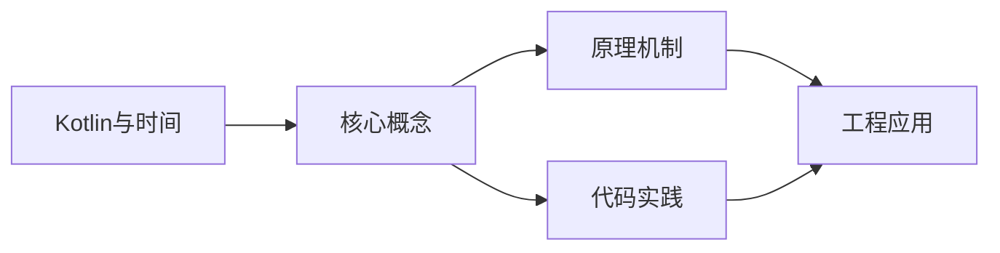

## 1. 学习目标（Bloom 分类）

本节按照布鲁姆教育目标分类学组织学习路径。本文主题为《Kotlin与时间》，属于 Kotlin 模块，读者可以根据自身阶段选择阅读深度。

记忆层面：能够准确复述本文的核心概念、术语与基本语法或操作步骤，并能够在提问或检索时快速定位对应知识点。能够说出 val/var、空安全操作符与 when 表达式的语法。

理解层面：能够用自己的语言解释核心原理与工作机制，说明概念之间的因果关系，而不是机械记忆结论。能够解释 Kotlin 与 Java 互操作的机制与平台类型概念。

应用层面：能够在真实项目或练习场景中运用本文知识解决具体问题，写出正确且可维护的实现。能够编写数据类、扩展函数与协程代码。

分析层面：能够拆解复杂问题，比较本文主题与相邻概念的异同，识别边界条件与例外情况。能够分析空安全、智能转换与协程调度原理。

评价层面：能够根据约束条件（性能、可读性、安全、成本）评价不同方案的优劣，做出有依据的技术决策。能够评价 Kotlin 在 Android、服务端与多平台场景的适用性。

创造层面：能够把本文知识与其他模块知识组合，设计出新的解决方案或可复用的工程模式。能够组合 Compose 与协程设计跨平台应用。

通过本节学习，读者应当能够把《Kotlin与时间》纳入自己的知识网络，并与 Kotlin 模块的其他主题（类型推断、空安全、协程、KMP）建立关联。

## 2. 历史动机与发展脉络

《Kotlin与时间》是 Kotlin 领域的重要主题。要真正理解它，需要先了解它解决的问题与演进过程。

Kotlin 由 JetBrains 于 2010 年开始研发，2016 年发布 1.0，定位是“更现代的 JVM 语言”：减少样板代码、消灭空指针、增强函数式能力，同时与 Java 100% 互操作。
2017 年 Google 宣布 Kotlin 成为 Android 一级语言，2019 年确立 Kotlin-first 政策；2023 年 Kotlin 2.0 的 K2 编译器显著提升编译速度与类型推导。
Kotlin Multiplatform（KMP）支持 JVM、Android、iOS、WebAssembly 等目标，配合 Compose Multiplatform 实现共享 UI 与业务逻辑，是 JetBrains 的长期战略方向。

回到本文主题：Kotlin与时间 的提出与成熟，正是上述技术背景下的必然产物。早期实现往往以简单可用为目标，随着工程规模扩大，社区逐渐沉淀出标准做法与最佳实践；理解这一脉络，可以帮助读者判断“为什么文档中的推荐写法是现在这个样子”，也能在遇到历史遗留代码时准确识别其设计年代与取舍。


## 3. 形式化定义与核心概念精讲

本节把《Kotlin与时间》涉及的核心概念以“定义 + 讲解”的形式展开。读者应把定义当作工具，把讲解当作理解路径；两者结合才能形成可迁移的知识。

空安全：类型系统区分 `String` 与 `String?`，编译期强制处理可空值；`?.` 短路、`?:` 提供默认、`!!` 显式断言，三者覆盖所有空值处理模式。
智能转换：`is` 检查后在不可变上下文中自动转换类型，减少显式强转；`as?` 安全转换失败返回 null。
协程：挂起函数（suspend）与调度器（Dispatchers.Main/IO/Default）实现非阻塞并发，结构化并发保证作用域内任务可取消。

### 3.1 原文章节逐一精讲

原文档把主题拆分为 18 个小节，下面按顺序给出每一节的导读讲解，随后保留原文细节供精读。

#### 原文精读（完整保留）

# Kotlin 时间 API

> **符号约定**：`< >` 必填参数 | `[ ]` 可选参数

---

#### 概述

kotlinx-datetime 是 Kotlin 官方的跨平台日期时间库。它基于 ISO 8601 标准，提供了统一的 API 来处理日期、时间、时区等概念。与 Java 的 `java.time` 不同，kotlinx-datetime 从一开始就为 Kotlin 多平台设计，可以在 JVM、JS、Native 等平台上使用。

如果你需要在项目中处理日期、时间计算、时区转换，kotlinx-datetime 是比 `java.util.Date` 或 `java.util.Calendar` 更现代、更安全的选择。

#### 基础概念

- **Instant**：时间线上的一个瞬时点，类似于时间戳，不关联任何时区
- **LocalDate**：不包含时间和时区的日期，如 2024-01-15
- **LocalTime**：不包含日期和时区的时间，如 14:30:00
- **LocalDateTime**：日期和时间的组合，但没有时区信息
- **TimeZone**：时区，用于在 Instant 和本地时间之间转换
- **Clock**：时钟抽象，用于获取当前时间，方便测试

#### 快速上手

添加依赖：

```kotlin
// build.gradle.kts
dependencies {
    implementation("org.jetbrains.kotlinx:kotlinx-datetime:0.6.0")
}
```

最基本的使用：

```kotlin
import kotlinx.datetime.*

fun main() {
    // 获取当前时间
    val now = Clock.System.now()
    println("当前时间戳: $now")

    // 获取当前日期（需要指定时区）
    val today = now.toLocalDateTime(TimeZone.currentSystemDefault()).date
    println("今天的日期: $today")

    // 创建指定日期
    val birthday = LocalDate(2000, Month.JANUARY, 15)
    println("生日: $birthday")

    // 日期计算
    val age = today.year - birthday.year
    println("年龄: $age")

    // 时长
    val duration = 30.minutes
    val future = now + duration
    println("30分钟后: $future")
}
```

#### 详细用法

##### Instant 时间戳操作

```kotlin
import kotlinx.datetime.*

fun instantDemo() {
    // 获取当前时刻
    val now = Clock.System.now()
    println("当前时刻: $now")

    // 从时间戳创建
    val fromEpoch = Instant.fromEpochSeconds(1700000000)
    println("从时间戳创建: $fromEpoch")

    // 获取时间戳的秒数和毫秒数
    println("秒: ${now.epochSeconds}")
    println("毫秒: ${now.toEpochMilliseconds()}")

    // 时间加减
    val tomorrow = now + 1.days
    val nextHour = now + 1.hours
    val nextMinute = now + 30.minutes

    // 时间差
    val duration = tomorrow - now
    println("差值: $duration")  // 1d

    // 比较时间
    println("明天在现在之后: ${tomorrow > now}")
}
```

##### LocalDate 日期操作

```kotlin
import kotlinx.datetime.*

fun localDateDemo() {
    // 创建日期
    val date = LocalDate(2024, Month.JUNE, 15)
    println("日期: $date")

    // 从字符串解析
    val parsed = LocalDate.parse("2024-06-15")
    println("解析: $parsed")

    // 获取日期的各个部分
    println("年: ${date.year}")
    println("月: ${date.month}")        // JUNE
    println("月份数字: ${date.monthNumber}")  // 6
    println("日: ${date.dayOfMonth}")
    println("星期: ${date.dayOfWeek}")  // SATURDAY

    // 日期加减
    val nextWeek = date + DatePeriod(days = 7)
    val nextMonth = date + DatePeriod(months = 1)
    val lastYear = date - DatePeriod(years = 1)

    // 日期差
    val start = LocalDate(2024, Month.JANUARY, 1)
    val end = LocalDate(2024, Month.DECEMBER, 31)
    val period = start.until(end)
    println("相差: ${period.years}年${period.months}月${period.days}日")
}
```

##### LocalTime 时间操作

```kotlin
import kotlinx.datetime.*

fun localTimeDemo() {
    // 创建时间
    val time = LocalTime(14, 30, 0)
    println("时间: $time")

    // 带纳秒
    val precise = LocalTime(14, 30, 0, 500000000)
    println("精确时间: $precise")

    // 获取时间的各个部分
    println("时: ${time.hour}")
    println("分: ${time.minute}")
    println("秒: ${time.second}")

    // 从字符串解析
    val parsed = LocalTime.parse("14:30:00")
    println("解析: $parsed")

    // 时间加减
    val later = time + 30.minutes
    val earlier = time - 1.hours
    println("30分钟后: $later")
    println("1小时前: $earlier")
}
```

##### 时区转换

```kotlin
import kotlinx.datetime.*

fun timeZoneDemo() {
    val now = Clock.System.now()

    // 获取系统默认时区
    val systemTz = TimeZone.currentSystemDefault()
    println("系统时区: $systemTz")

    // 指定时区
    val beijing = TimeZone.of("Asia/Shanghai")
    val tokyo = TimeZone.of("Asia/Tokyo")
    val newYork = TimeZone.of("America/New_York")
    val london = TimeZone.of("Europe/London")

    // 同一时刻在不同时区的本地时间
    val beijingTime = now.toLocalDateTime(beijing)
    val tokyoTime = now.toLocalDateTime(tokyo)
    val newYorkTime = now.toLocalDateTime(newYork)
    val londonTime = now.toLocalDateTime(london)

    println("北京时间: $beijingTime")
    println("东京时间: $tokyoTime")
    println("纽约时间: $newYorkTime")
    println("伦敦时间: $londonTime")

    // 从本地时间转换回 Instant
    val localDateTime = LocalDateTime(2024, 6, 15, 14, 30)
    val instant = localDateTime.toInstant(beijing)
    println("北京时间对应的时刻: $instant")
}
```

##### Duration 时长操作

```kotlin
import kotlinx.datetime.*

fun durationDemo() {
    // 创建时长
    val d1 = 30.minutes
    val d2 = 2.hours
    val d3 = 1.days
    val d4 = Duration.seconds(90)
    val d5 = Duration.milliseconds(1500)

    // 时长运算
    val total = d1 + d2
    println("总时长: $total")

    // 时长比较
    println("30分钟 < 2小时: ${d1 < d2}")

    // 时长转换
    println("${d1.inWholeSeconds} 秒")
    println("${d2.inWholeMinutes} 分钟")
    println("${d3.inWholeHours} 小时")

    // 时长乘以倍数
    val triple = d1 * 3
    println("30分钟的3倍: $triple")
}
```

#### 常见场景

##### 计算年龄

```kotlin
import kotlinx.datetime.*

fun calculateAge(birthday: LocalDate, today: LocalDate = Clock.System.now()
    .toLocalDateTime(TimeZone.currentSystemDefault()).date): Int {
    var age = today.year - birthday.year
    // 如果今年生日还没到，年龄减1
    if (today.monthNumber < birthday.monthNumber ||
        (today.monthNumber == birthday.monthNumber && today.dayOfMonth < birthday.dayOfMonth)) {
        age--
    }
    return age
}

fun main() {
    val birthday = LocalDate(1990, Month.MARCH, 15)
    println("年龄: ${calculateAge(birthday)}")
}
```

##### 定时任务的时间计算

```kotlin
import kotlinx.datetime.*

fun nextExecutionTime(intervalMinutes: Int): Instant {
    val now = Clock.System.now()
    return now + intervalMinutes.minutes
}

// 计算距离下一个整点的时间
fun timeToNextHour(): Duration {
    val now = Clock.System.now()
    val localNow = now.toLocalDateTime(TimeZone.currentSystemDefault())
    val nextHour = LocalDateTime(
        localNow.date,
        LocalTime(localNow.hour + 1, 0, 0)
    )
    return nextHour.toInstant(TimeZone.currentSystemDefault()) - now
}
```

##### 日期范围遍历

```kotlin
import kotlinx.datetime.*

// 遍历两个日期之间的所有日期
fun dateRange(start: LocalDate, end: LocalDate): List<LocalDate> {
    val dates = mutableListOf<LocalDate>()
    var current = start
    while (current <= end) {
        dates.add(current)
        current = current + DatePeriod(days = 1)
    }
    return dates
}

fun main() {
    val start = LocalDate(2024, Month.JANUARY, 1)
    val end = LocalDate(2024, Month.JANUARY, 7)
    dateRange(start, end).forEach { println(it) }
}
```

#### 注意事项

- **kotlinx-datetime 不是 java.time 的替代品**：在 JVM 项目中，两者可以共存。kotlinx-datetime 更适合多平台项目
- **Instant 不可变**：所有日期时间对象都是不可变的，修改操作会返回新对象
- **时区很重要**：在 Instant 和本地时间之间转换时，必须指定时区，否则结果不确定
- **月份从 1 开始**：与 Java 的 Calendar（月份从 0 开始）不同，kotlinx-datetime 的月份从 1 开始
- **Duration 精度**：Duration 的精度为纳秒，转换为整数值时使用 `inWholeSeconds`、`inWholeMinutes` 等方法

#### 进阶用法

##### 自定义 Clock 用于测试

```kotlin
import kotlinx.datetime.*

class FixedClock(private val fixedInstant: Instant) : Clock {
    override fun now(): Instant = fixedInstant
}

fun main() {
    // 固定时间，用于测试
    val testTime = Instant.parse("2024-06-15T12:00:00Z")
    val testClock = FixedClock(testTime)

    // 使用测试时钟
    val now = testClock.now()
    println("测试时间: $now")  // 始终返回固定时间

    // 在生产代码中注入 Clock，测试时替换为 FixedClock
}
```

##### 序列化与反序列化

```kotlin
import kotlinx.datetime.*
import kotlinx.serialization.*
import kotlinx.serialization.json.*

@Serializable
data class Event(
    val name: String,
    // kotlinx-datetime 自带序列化支持
    val startTime: Instant,
    val date: LocalDate,
    val duration: Duration
)

fun main() {
    val event = Event(
        name = "会议",
        startTime = Clock.System.now(),
        date = LocalDate(2024, Month.JUNE, 15),
        duration = 2.hours
    )

    // 序列化为 JSON
    val json = Json { prettyPrint = true }
    val jsonString = json.encodeToString(event)
    println(jsonString)

    // 从 JSON 反序列化
    val decoded = json.decodeFromString<Event>(jsonString)
    println(decoded)
}
```

##### 与 Java Time 互操作

```kotlin
import kotlinx.datetime.*
import java.time as jt

fun interoperability() {
    // kotlinx-datetime -> java.time
    val kInstant = Clock.System.now()
    val jInstant = kInstant.toJavaInstant()

    // java.time -> kotlinx-datetime
    val backToKotlin = jInstant.toKotlinInstant()

    // LocalDate 互转
    val kDate = LocalDate(2024, Month.JUNE, 15)
    val jDate = kDate.toJavaLocalDate()
    val backToDate = jDate.toKotlinLocalDate()
}
```
#### Duration 时长

**基本写法：创建时长**
`<数字>.<单位>()`
```kotlin
// 不同单位创建 Duration
val d1 = 5.seconds
val d2 = 100.milliseconds
val d3 = 2.hours
```

---

**基本写法：字面量时长**
`<数字>.<单位>`
```kotlin
// Duration 字面量扩展属性
val d = 30.minutes
```

---

**基本写法：时长运算**
`<时长> + <时长> | <时长> * <倍数>`
```kotlin
// 时长加减乘除
val sum = 1.hours + 30.minutes
val half = 1.hours / 2
```

---

**基本写法：转换为单位**
`<duration>.inWholeSeconds | inWholeMilliseconds`
```kotlin
// 转换为整型单位
val s = (1.5.hours).inWholeSeconds
val ms = (1.minutes).inWholeMilliseconds
```

---

**基本写法：比较时长**
`<d1> > <d2> | <d>.compareTo(<d2>)`
```kotlin
// 比较时长大小
if (d1 > d2) { }
```

---

#### TimeMark 与测量

**基本写法：获取时间标记**
`TimeSource.Monotonic.markNow()`
```kotlin
// 获取单调时钟标记
val mark = TimeSource.Monotonic.markNow()
```

---

**基本写法：测量经过时长**
`<mark>.elapsedNow()`
```kotlin
// 测量自标记以来的时长
val dur = mark.elapsedNow()
```

---

**基本写法：measureTime 测量代码**
`measureTime { <代码> }`
```kotlin
// 测量代码块耗时
val t = measureTime { doWork() }
println(t)
```

---

**基本写法：测量并返回结果**
`measureTimedValue { <代码> }`
```kotlin
// 同时返回结果与耗时
val (result, time) = measureTimedValue { compute() }
```

---

#### kotlinx-datetime 跨平台

**基本写法：获取当前时刻**
`Clock.System.now()`
```kotlin
// 获取当前 Instant
val now = Clock.System.now()
```

---

**基本写法：当前本地日期**
`Clock.System.todayIn(<时区>)`
```kotlin
// 获取指定时区当前日期
val today = Clock.System.todayIn(TimeZone.currentSystemDefault())
```

---

**基本写法：创建 LocalDate**
`LocalDate(<年>, <月>, <日>)`
```kotlin
// 创建指定日期
val d = LocalDate(2025, 7, 31)
```

---

**基本写法：创建 LocalDateTime**
`LocalDateTime(<日期>, <时间>)`
```kotlin
// 创建本地日期时间
val dt = LocalDateTime(LocalDate(2025,7,31), LocalTime(10,30))
```

---

**基本写法：解析日期**
`LocalDate.parse("<字符串>")`
```kotlin
// 解析 ISO 日期字符串
val d = LocalDate.parse("2025-07-31")
```

---

#### Instant 操作

**基本写法：加时长**
`<instant>.plus(<duration>)`
```kotlin
// Instant 加时长
val later = now.plus(1.hours)
```

---

**基本写法：计算差值**
`<i1>.minus(<i2>)`
```kotlin
// 两个 Instant 的时长差
val dur = i1.minus(i2)
```

---

**基本写法：转换为时区**
`<instant>.toLocalDateTime(<时区>)`
```kotlin
// 转为指定时区本地时间
val ldt = now.toLocalDateTime(TimeZone.of("Asia/Shanghai"))
```

---

#### Instant 与 epoch

**基本写法：从 epoch 秒创建**
`Instant.fromEpochSeconds(<秒>)`
```kotlin
// Unix 秒转 Instant
val i = Instant.fromEpochSeconds(1700000000)
```

---

**基本写法：获取 epoch 秒**
`<instant>.epochSeconds`
```kotlin
// 获取 Unix 秒数
val s = now.epochSeconds
```

---

#### DateTimePeriod 日期段

**基本写法：创建日期段**
`DateTimePeriod(years = <年>, months = <月>)`
```kotlin
// 创建年月日时段
val p = DateTimePeriod(years = 1, months = 2)
```

---

**基本写法：加日期段**
`<localDate>.plus(<period>, <时区>)`
```kotlin
// 日期加日期段
val next = d.plus(p, TimeZone.UTC)
```

---

#### TimeZone 时区

**基本写法：系统默认时区**
`TimeZone.currentSystemDefault()`
```kotlin
// 获取系统默认时区
val tz = TimeZone.currentSystemDefault()
```

---

**基本写法：指定时区**
`TimeZone.of("<时区ID>")`
```kotlin
// 按名称获取时区
val tz = TimeZone.of("Asia/Shanghai")
```

---

**基本写法：UTC 时区**
`TimeZone.UTC`
```kotlin
// 直接引用 UTC 时区
val utc = TimeZone.UTC
```

---

#### 格式化与解析

**基本写法：自定义格式化**
`LocalDate.Format { <配置> }`
```kotlin
// 自定义日期格式
val fmt = LocalDate.Format {
    year(); chars("-"); monthNumber(); chars("-"); dayOfMonth()
}
```

---

**基本写法：按格式解析**
`LocalDate.parse("<字符串>", <format>)`
```kotlin
// 按自定义格式解析
val d = LocalDate.parse("2025/07/31", fmt)
```

---

#### DayOfWeek 与 Month

**基本写法：获取星期**
`<localDate>.dayOfWeek`
```kotlin
// 获取星期枚举值
val dow = d.dayOfWeek
```

---

**基本写法：获取月份**
`<localDate>.month`
```kotlin
// 获取月份枚举值
val m = d.month
```

---

#### 协程中的延迟

**基本写法：Duration 延迟**
`delay(<duration>)`
```kotlin
// 协程中使用 Duration 延迟
delay(500.milliseconds)
```

---

#### 日期比较

**基本写法：判断前/后**
`<d1> < <d2> | <d1>.until(<d2>)`
```kotlin
// 日期前后判断
if (d1 < d2) { }
val until = d1.until(d2)
```


### 3.2 概念关系图

下面用 Mermaid 图表达本文核心概念之间的关系，帮助读者建立整体图景：



图中展示的是本文知识的结构化关系：核心概念是入口，原理机制解释“为什么”，代码实践演示“怎么做”，工程应用回答“何时用”。读者学习时可以把每个小节的内容挂接到对应节点上。

## 4. 理论推导与原理解析

本节深入《Kotlin与时间》背后的原理。理论部分不求面面俱到，而是聚焦“能解释现象、能指导实践”的关键推导。

空安全：类型系统区分 `String` 与 `String?`，编译期强制处理可空值；`?.` 短路、`?:` 提供默认、`!!` 显式断言，三者覆盖所有空值处理模式。
智能转换：`is` 检查后在不可变上下文中自动转换类型，减少显式强转；`as?` 安全转换失败返回 null。
协程：挂起函数（suspend）与调度器（Dispatchers.Main/IO/Default）实现非阻塞并发，结构化并发保证作用域内任务可取消。
扩展函数与属性：在不修改原类的情况下为类添加行为，是 Kotlin 标准库（如集合操作）的基石。

需要强调的是，理论推导与工程实践之间存在翻译层：理论给出的是理想化模型与边界条件，工程代码则必须处理真实环境中的例外。读者在学习时应先掌握理论的“标准情形”，再通过陷阱章节了解“非标准情形”。

## 5. 代码示例与逐行讲解

本节把原文中的代码示例系统整理，并为每个示例补充用途说明与讲解。读者不应只浏览代码，而应逐段对照讲解理解设计意图。

### 5.1 示例：快速上手

该示例来自原文《快速上手》小节，用于演示Kotlin与时间相关操作。阅读时请先看代码结构，再看其后的讲解。

```kotlin
// build.gradle.kts
dependencies {
    implementation("org.jetbrains.kotlinx:kotlinx-datetime:0.6.0")
}
```

讲解：这段代码演示了本节核心知识点。代码中的关键操作可以归纳为三步：准备（定义或初始化）、执行（核心逻辑）、收尾（释放资源或返回结果）。实际项目中，这三步往往被封装为函数或类，以提升复用性与可测试性。

关键点分析：

该示例共 4 行有效代码，结构以数据或配置为主。阅读时应关注：数据字段的含义、配置项的作用，以及它们与运行行为的对应关系。

进阶思考路径：先尝试修改参数观察行为变化，再把示例中的模式迁移到自己的项目中；每次修改都记录预期与实测差异，这是把示例转化为能力的最快方式。

### 5.2 示例：快速上手

该示例来自原文《快速上手》小节，用于演示Kotlin与时间相关操作。阅读时请先看代码结构，再看其后的讲解。

```kotlin
import kotlinx.datetime.*

fun main() {
    // 获取当前时间
    val now = Clock.System.now()
    println("当前时间戳: $now")

    // 获取当前日期（需要指定时区）
    val today = now.toLocalDateTime(TimeZone.currentSystemDefault()).date
    println("今天的日期: $today")

    // 创建指定日期
    val birthday = LocalDate(2000, Month.JANUARY, 15)
    println("生日: $birthday")

    // 日期计算
    val age = today.year - birthday.year
    println("年龄: $age")

    // 时长
    val duration = 30.minutes
    val future = now + duration
    println("30分钟后: $future")
}
```

讲解：这段代码演示了本节核心知识点。代码中的关键操作可以归纳为三步：准备（定义或初始化）、执行（核心逻辑）、收尾（释放资源或返回结果）。实际项目中，这三步往往被封装为函数或类，以提升复用性与可测试性。

关键点分析：

该示例共 19 行有效代码，包含 1 类关键结构（import）。其中：

- 入口与初始化部分负责建立上下文，对应实际项目中的启动或装配逻辑；
- 核心逻辑部分体现本文主题的主要操作，是阅读时最需要对照讲解理解的部分；
- 输出或返回部分把结果交给调用方，注意其类型与边界条件。

进阶思考路径：先尝试修改参数观察行为变化，再把示例中的模式迁移到自己的项目中；每次修改都记录预期与实测差异，这是把示例转化为能力的最快方式。

### 5.3 示例：Instant 时间戳操作

该示例来自原文《Instant 时间戳操作》小节，用于演示Kotlin与时间相关操作。阅读时请先看代码结构，再看其后的讲解。

```kotlin
import kotlinx.datetime.*

fun instantDemo() {
    // 获取当前时刻
    val now = Clock.System.now()
    println("当前时刻: $now")

    // 从时间戳创建
    val fromEpoch = Instant.fromEpochSeconds(1700000000)
    println("从时间戳创建: $fromEpoch")

    // 获取时间戳的秒数和毫秒数
    println("秒: ${now.epochSeconds}")
    println("毫秒: ${now.toEpochMilliseconds()}")

    // 时间加减
    val tomorrow = now + 1.days
    val nextHour = now + 1.hours
    val nextMinute = now + 30.minutes

    // 时间差
    val duration = tomorrow - now
    println("差值: $duration")  // 1d

    // 比较时间
    println("明天在现在之后: ${tomorrow > now}")
}
```

讲解：这段代码演示了本节核心知识点。代码中的关键操作可以归纳为三步：准备（定义或初始化）、执行（核心逻辑）、收尾（释放资源或返回结果）。实际项目中，这三步往往被封装为函数或类，以提升复用性与可测试性。

关键点分析：

该示例共 21 行有效代码，包含 1 类关键结构（import）。其中：

- 入口与初始化部分负责建立上下文，对应实际项目中的启动或装配逻辑；
- 核心逻辑部分体现本文主题的主要操作，是阅读时最需要对照讲解理解的部分；
- 输出或返回部分把结果交给调用方，注意其类型与边界条件。

进阶思考路径：先尝试修改参数观察行为变化，再把示例中的模式迁移到自己的项目中；每次修改都记录预期与实测差异，这是把示例转化为能力的最快方式。

### 5.4 示例：LocalDate 日期操作

该示例来自原文《LocalDate 日期操作》小节，用于演示Kotlin与时间相关操作。阅读时请先看代码结构，再看其后的讲解。

```kotlin
import kotlinx.datetime.*

fun localDateDemo() {
    // 创建日期
    val date = LocalDate(2024, Month.JUNE, 15)
    println("日期: $date")

    // 从字符串解析
    val parsed = LocalDate.parse("2024-06-15")
    println("解析: $parsed")

    // 获取日期的各个部分
    println("年: ${date.year}")
    println("月: ${date.month}")        // JUNE
    println("月份数字: ${date.monthNumber}")  // 6
    println("日: ${date.dayOfMonth}")
    println("星期: ${date.dayOfWeek}")  // SATURDAY

    // 日期加减
    val nextWeek = date + DatePeriod(days = 7)
    val nextMonth = date + DatePeriod(months = 1)
    val lastYear = date - DatePeriod(years = 1)

    // 日期差
    val start = LocalDate(2024, Month.JANUARY, 1)
    val end = LocalDate(2024, Month.DECEMBER, 31)
    val period = start.until(end)
    println("相差: ${period.years}年${period.months}月${period.days}日")
}
```

讲解：这段代码演示了本节核心知识点。代码中的关键操作可以归纳为三步：准备（定义或初始化）、执行（核心逻辑）、收尾（释放资源或返回结果）。实际项目中，这三步往往被封装为函数或类，以提升复用性与可测试性。

关键点分析：

该示例共 24 行有效代码，包含 1 类关键结构（import）。其中：

- 入口与初始化部分负责建立上下文，对应实际项目中的启动或装配逻辑；
- 核心逻辑部分体现本文主题的主要操作，是阅读时最需要对照讲解理解的部分；
- 输出或返回部分把结果交给调用方，注意其类型与边界条件。

进阶思考路径：先尝试修改参数观察行为变化，再把示例中的模式迁移到自己的项目中；每次修改都记录预期与实测差异，这是把示例转化为能力的最快方式。

### 5.5 示例：LocalTime 时间操作

该示例来自原文《LocalTime 时间操作》小节，用于演示Kotlin与时间相关操作。阅读时请先看代码结构，再看其后的讲解。

```kotlin
import kotlinx.datetime.*

fun localTimeDemo() {
    // 创建时间
    val time = LocalTime(14, 30, 0)
    println("时间: $time")

    // 带纳秒
    val precise = LocalTime(14, 30, 0, 500000000)
    println("精确时间: $precise")

    // 获取时间的各个部分
    println("时: ${time.hour}")
    println("分: ${time.minute}")
    println("秒: ${time.second}")

    // 从字符串解析
    val parsed = LocalTime.parse("14:30:00")
    println("解析: $parsed")

    // 时间加减
    val later = time + 30.minutes
    val earlier = time - 1.hours
    println("30分钟后: $later")
    println("1小时前: $earlier")
}
```

讲解：这段代码演示了本节核心知识点。代码中的关键操作可以归纳为三步：准备（定义或初始化）、执行（核心逻辑）、收尾（释放资源或返回结果）。实际项目中，这三步往往被封装为函数或类，以提升复用性与可测试性。

关键点分析：

该示例共 21 行有效代码，包含 1 类关键结构（import）。其中：

- 入口与初始化部分负责建立上下文，对应实际项目中的启动或装配逻辑；
- 核心逻辑部分体现本文主题的主要操作，是阅读时最需要对照讲解理解的部分；
- 输出或返回部分把结果交给调用方，注意其类型与边界条件。

进阶思考路径：先尝试修改参数观察行为变化，再把示例中的模式迁移到自己的项目中；每次修改都记录预期与实测差异，这是把示例转化为能力的最快方式。

### 5.6 示例：时区转换

该示例来自原文《时区转换》小节，用于演示Kotlin与时间相关操作。阅读时请先看代码结构，再看其后的讲解。

```kotlin
import kotlinx.datetime.*

fun timeZoneDemo() {
    val now = Clock.System.now()

    // 获取系统默认时区
    val systemTz = TimeZone.currentSystemDefault()
    println("系统时区: $systemTz")

    // 指定时区
    val beijing = TimeZone.of("Asia/Shanghai")
    val tokyo = TimeZone.of("Asia/Tokyo")
    val newYork = TimeZone.of("America/New_York")
    val london = TimeZone.of("Europe/London")

    // 同一时刻在不同时区的本地时间
    val beijingTime = now.toLocalDateTime(beijing)
    val tokyoTime = now.toLocalDateTime(tokyo)
    val newYorkTime = now.toLocalDateTime(newYork)
    val londonTime = now.toLocalDateTime(london)

    println("北京时间: $beijingTime")
    println("东京时间: $tokyoTime")
    println("纽约时间: $newYorkTime")
    println("伦敦时间: $londonTime")

    // 从本地时间转换回 Instant
    val localDateTime = LocalDateTime(2024, 6, 15, 14, 30)
    val instant = localDateTime.toInstant(beijing)
    println("北京时间对应的时刻: $instant")
}
```

讲解：这段代码演示了本节核心知识点。代码中的关键操作可以归纳为三步：准备（定义或初始化）、执行（核心逻辑）、收尾（释放资源或返回结果）。实际项目中，这三步往往被封装为函数或类，以提升复用性与可测试性。

关键点分析：

该示例共 25 行有效代码，包含 1 类关键结构（import）。其中：

- 入口与初始化部分负责建立上下文，对应实际项目中的启动或装配逻辑；
- 核心逻辑部分体现本文主题的主要操作，是阅读时最需要对照讲解理解的部分；
- 输出或返回部分把结果交给调用方，注意其类型与边界条件。

进阶思考路径：先尝试修改参数观察行为变化，再把示例中的模式迁移到自己的项目中；每次修改都记录预期与实测差异，这是把示例转化为能力的最快方式。

### 5.7 示例：Duration 时长操作

该示例来自原文《Duration 时长操作》小节，用于演示Kotlin与时间相关操作。阅读时请先看代码结构，再看其后的讲解。

```kotlin
import kotlinx.datetime.*

fun durationDemo() {
    // 创建时长
    val d1 = 30.minutes
    val d2 = 2.hours
    val d3 = 1.days
    val d4 = Duration.seconds(90)
    val d5 = Duration.milliseconds(1500)

    // 时长运算
    val total = d1 + d2
    println("总时长: $total")

    // 时长比较
    println("30分钟 < 2小时: ${d1 < d2}")

    // 时长转换
    println("${d1.inWholeSeconds} 秒")
    println("${d2.inWholeMinutes} 分钟")
    println("${d3.inWholeHours} 小时")

    // 时长乘以倍数
    val triple = d1 * 3
    println("30分钟的3倍: $triple")
}
```

讲解：这段代码演示了本节核心知识点。代码中的关键操作可以归纳为三步：准备（定义或初始化）、执行（核心逻辑）、收尾（释放资源或返回结果）。实际项目中，这三步往往被封装为函数或类，以提升复用性与可测试性。

关键点分析：

该示例共 21 行有效代码，包含 1 类关键结构（import）。其中：

- 入口与初始化部分负责建立上下文，对应实际项目中的启动或装配逻辑；
- 核心逻辑部分体现本文主题的主要操作，是阅读时最需要对照讲解理解的部分；
- 输出或返回部分把结果交给调用方，注意其类型与边界条件。

进阶思考路径：先尝试修改参数观察行为变化，再把示例中的模式迁移到自己的项目中；每次修改都记录预期与实测差异，这是把示例转化为能力的最快方式。

### 5.8 示例：计算年龄

该示例来自原文《计算年龄》小节，用于演示Kotlin与时间相关操作。阅读时请先看代码结构，再看其后的讲解。

```kotlin
import kotlinx.datetime.*

fun calculateAge(birthday: LocalDate, today: LocalDate = Clock.System.now()
    .toLocalDateTime(TimeZone.currentSystemDefault()).date): Int {
    var age = today.year - birthday.year
    // 如果今年生日还没到，年龄减1
    if (today.monthNumber < birthday.monthNumber ||
        (today.monthNumber == birthday.monthNumber && today.dayOfMonth < birthday.dayOfMonth)) {
        age--
    }
    return age
}

fun main() {
    val birthday = LocalDate(1990, Month.MARCH, 15)
    println("年龄: ${calculateAge(birthday)}")
}
```

讲解：这段代码演示了本节核心知识点。代码中的关键操作可以归纳为三步：准备（定义或初始化）、执行（核心逻辑）、收尾（释放资源或返回结果）。实际项目中，这三步往往被封装为函数或类，以提升复用性与可测试性。

关键点分析：

该示例共 15 行有效代码，包含 3 类关键结构（import、if、return）。其中：

- 入口与初始化部分负责建立上下文，对应实际项目中的启动或装配逻辑；
- 核心逻辑部分体现本文主题的主要操作，是阅读时最需要对照讲解理解的部分；
- 输出或返回部分把结果交给调用方，注意其类型与边界条件。

进阶思考路径：先尝试修改参数观察行为变化，再把示例中的模式迁移到自己的项目中；每次修改都记录预期与实测差异，这是把示例转化为能力的最快方式。

### 5.9 示例：定时任务的时间计算

该示例来自原文《定时任务的时间计算》小节，用于演示Kotlin与时间相关操作。阅读时请先看代码结构，再看其后的讲解。

```kotlin
import kotlinx.datetime.*

fun nextExecutionTime(intervalMinutes: Int): Instant {
    val now = Clock.System.now()
    return now + intervalMinutes.minutes
}

// 计算距离下一个整点的时间
fun timeToNextHour(): Duration {
    val now = Clock.System.now()
    val localNow = now.toLocalDateTime(TimeZone.currentSystemDefault())
    val nextHour = LocalDateTime(
        localNow.date,
        LocalTime(localNow.hour + 1, 0, 0)
    )
    return nextHour.toInstant(TimeZone.currentSystemDefault()) - now
}
```

讲解：这段代码演示了本节核心知识点。代码中的关键操作可以归纳为三步：准备（定义或初始化）、执行（核心逻辑）、收尾（释放资源或返回结果）。实际项目中，这三步往往被封装为函数或类，以提升复用性与可测试性。

关键点分析：

该示例共 15 行有效代码，包含 2 类关键结构（import、return）。其中：

- 入口与初始化部分负责建立上下文，对应实际项目中的启动或装配逻辑；
- 核心逻辑部分体现本文主题的主要操作，是阅读时最需要对照讲解理解的部分；
- 输出或返回部分把结果交给调用方，注意其类型与边界条件。

进阶思考路径：先尝试修改参数观察行为变化，再把示例中的模式迁移到自己的项目中；每次修改都记录预期与实测差异，这是把示例转化为能力的最快方式。

### 5.10 示例：日期范围遍历

该示例来自原文《日期范围遍历》小节，用于演示Kotlin与时间相关操作。阅读时请先看代码结构，再看其后的讲解。

```kotlin
import kotlinx.datetime.*

// 遍历两个日期之间的所有日期
fun dateRange(start: LocalDate, end: LocalDate): List<LocalDate> {
    val dates = mutableListOf<LocalDate>()
    var current = start
    while (current <= end) {
        dates.add(current)
        current = current + DatePeriod(days = 1)
    }
    return dates
}

fun main() {
    val start = LocalDate(2024, Month.JANUARY, 1)
    val end = LocalDate(2024, Month.JANUARY, 7)
    dateRange(start, end).forEach { println(it) }
}
```

讲解：这段代码演示了本节核心知识点。代码中的关键操作可以归纳为三步：准备（定义或初始化）、执行（核心逻辑）、收尾（释放资源或返回结果）。实际项目中，这三步往往被封装为函数或类，以提升复用性与可测试性。

关键点分析：

该示例共 16 行有效代码，包含 3 类关键结构（import、while、return）。其中：

- 入口与初始化部分负责建立上下文，对应实际项目中的启动或装配逻辑；
- 核心逻辑部分体现本文主题的主要操作，是阅读时最需要对照讲解理解的部分；
- 输出或返回部分把结果交给调用方，注意其类型与边界条件。

进阶思考路径：先尝试修改参数观察行为变化，再把示例中的模式迁移到自己的项目中；每次修改都记录预期与实测差异，这是把示例转化为能力的最快方式。

### 5.11 示例：自定义 Clock 用于测试

该示例来自原文《自定义 Clock 用于测试》小节，用于演示Kotlin与时间相关操作。阅读时请先看代码结构，再看其后的讲解。

```kotlin
import kotlinx.datetime.*

class FixedClock(private val fixedInstant: Instant) : Clock {
    override fun now(): Instant = fixedInstant
}

fun main() {
    // 固定时间，用于测试
    val testTime = Instant.parse("2024-06-15T12:00:00Z")
    val testClock = FixedClock(testTime)

    // 使用测试时钟
    val now = testClock.now()
    println("测试时间: $now")  // 始终返回固定时间

    // 在生产代码中注入 Clock，测试时替换为 FixedClock
}
```

讲解：这段代码演示了本节核心知识点。代码中的关键操作可以归纳为三步：准备（定义或初始化）、执行（核心逻辑）、收尾（释放资源或返回结果）。实际项目中，这三步往往被封装为函数或类，以提升复用性与可测试性。

关键点分析：

该示例共 13 行有效代码，包含 2 类关键结构（class、import）。其中：

- 入口与初始化部分负责建立上下文，对应实际项目中的启动或装配逻辑；
- 核心逻辑部分体现本文主题的主要操作，是阅读时最需要对照讲解理解的部分；
- 输出或返回部分把结果交给调用方，注意其类型与边界条件。

进阶思考路径：先尝试修改参数观察行为变化，再把示例中的模式迁移到自己的项目中；每次修改都记录预期与实测差异，这是把示例转化为能力的最快方式。

### 5.12 示例：序列化与反序列化

该示例来自原文《序列化与反序列化》小节，用于演示Kotlin与时间相关操作。阅读时请先看代码结构，再看其后的讲解。

```kotlin
import kotlinx.datetime.*
import kotlinx.serialization.*
import kotlinx.serialization.json.*

@Serializable
data class Event(
    val name: String,
    // kotlinx-datetime 自带序列化支持
    val startTime: Instant,
    val date: LocalDate,
    val duration: Duration
)

fun main() {
    val event = Event(
        name = "会议",
        startTime = Clock.System.now(),
        date = LocalDate(2024, Month.JUNE, 15),
        duration = 2.hours
    )

    // 序列化为 JSON
    val json = Json { prettyPrint = true }
    val jsonString = json.encodeToString(event)
    println(jsonString)

    // 从 JSON 反序列化
    val decoded = json.decodeFromString<Event>(jsonString)
    println(decoded)
}
```

讲解：这段代码演示了本节核心知识点。代码中的关键操作可以归纳为三步：准备（定义或初始化）、执行（核心逻辑）、收尾（释放资源或返回结果）。实际项目中，这三步往往被封装为函数或类，以提升复用性与可测试性。

关键点分析：

该示例共 26 行有效代码，包含 2 类关键结构（class、import）。其中：

- 入口与初始化部分负责建立上下文，对应实际项目中的启动或装配逻辑；
- 核心逻辑部分体现本文主题的主要操作，是阅读时最需要对照讲解理解的部分；
- 输出或返回部分把结果交给调用方，注意其类型与边界条件。

进阶思考路径：先尝试修改参数观察行为变化，再把示例中的模式迁移到自己的项目中；每次修改都记录预期与实测差异，这是把示例转化为能力的最快方式。

### 5.13 示例：与 Java Time 互操作

该示例来自原文《与 Java Time 互操作》小节，用于演示Kotlin与时间相关操作。阅读时请先看代码结构，再看其后的讲解。

```kotlin
import kotlinx.datetime.*
import java.time as jt

fun interoperability() {
    // kotlinx-datetime -> java.time
    val kInstant = Clock.System.now()
    val jInstant = kInstant.toJavaInstant()

    // java.time -> kotlinx-datetime
    val backToKotlin = jInstant.toKotlinInstant()

    // LocalDate 互转
    val kDate = LocalDate(2024, Month.JUNE, 15)
    val jDate = kDate.toJavaLocalDate()
    val backToDate = jDate.toKotlinLocalDate()
}
```

讲解：这段代码演示了本节核心知识点。代码中的关键操作可以归纳为三步：准备（定义或初始化）、执行（核心逻辑）、收尾（释放资源或返回结果）。实际项目中，这三步往往被封装为函数或类，以提升复用性与可测试性。

关键点分析：

该示例共 13 行有效代码，包含 1 类关键结构（import）。其中：

- 入口与初始化部分负责建立上下文，对应实际项目中的启动或装配逻辑；
- 核心逻辑部分体现本文主题的主要操作，是阅读时最需要对照讲解理解的部分；
- 输出或返回部分把结果交给调用方，注意其类型与边界条件。

进阶思考路径：先尝试修改参数观察行为变化，再把示例中的模式迁移到自己的项目中；每次修改都记录预期与实测差异，这是把示例转化为能力的最快方式。

### 5.14 示例：Duration 时长

该示例来自原文《Duration 时长》小节，用于演示Kotlin与时间相关操作。阅读时请先看代码结构，再看其后的讲解。

```kotlin
// 不同单位创建 Duration
val d1 = 5.seconds
val d2 = 100.milliseconds
val d3 = 2.hours
```

讲解：这段代码演示了本节核心知识点。代码中的关键操作可以归纳为三步：准备（定义或初始化）、执行（核心逻辑）、收尾（释放资源或返回结果）。实际项目中，这三步往往被封装为函数或类，以提升复用性与可测试性。

关键点分析：

该示例共 4 行有效代码，结构以数据或配置为主。阅读时应关注：数据字段的含义、配置项的作用，以及它们与运行行为的对应关系。

进阶思考路径：先尝试修改参数观察行为变化，再把示例中的模式迁移到自己的项目中；每次修改都记录预期与实测差异，这是把示例转化为能力的最快方式。

### 5.15 示例：Duration 时长

该示例来自原文《Duration 时长》小节，用于演示Kotlin与时间相关操作。阅读时请先看代码结构，再看其后的讲解。

```kotlin
// Duration 字面量扩展属性
val d = 30.minutes
```

讲解：这段代码演示了本节核心知识点。代码中的关键操作可以归纳为三步：准备（定义或初始化）、执行（核心逻辑）、收尾（释放资源或返回结果）。实际项目中，这三步往往被封装为函数或类，以提升复用性与可测试性。

关键点分析：

该示例共 2 行有效代码，结构以数据或配置为主。阅读时应关注：数据字段的含义、配置项的作用，以及它们与运行行为的对应关系。

进阶思考路径：先尝试修改参数观察行为变化，再把示例中的模式迁移到自己的项目中；每次修改都记录预期与实测差异，这是把示例转化为能力的最快方式。

### 5.16 示例：Duration 时长

该示例来自原文《Duration 时长》小节，用于演示Kotlin与时间相关操作。阅读时请先看代码结构，再看其后的讲解。

```kotlin
// 时长加减乘除
val sum = 1.hours + 30.minutes
val half = 1.hours / 2
```

讲解：这段代码演示了本节核心知识点。代码中的关键操作可以归纳为三步：准备（定义或初始化）、执行（核心逻辑）、收尾（释放资源或返回结果）。实际项目中，这三步往往被封装为函数或类，以提升复用性与可测试性。

关键点分析：

该示例共 3 行有效代码，结构以数据或配置为主。阅读时应关注：数据字段的含义、配置项的作用，以及它们与运行行为的对应关系。

进阶思考路径：先尝试修改参数观察行为变化，再把示例中的模式迁移到自己的项目中；每次修改都记录预期与实测差异，这是把示例转化为能力的最快方式。

### 5.17 示例：Duration 时长

该示例来自原文《Duration 时长》小节，用于演示Kotlin与时间相关操作。阅读时请先看代码结构，再看其后的讲解。

```kotlin
// 转换为整型单位
val s = (1.5.hours).inWholeSeconds
val ms = (1.minutes).inWholeMilliseconds
```

讲解：这段代码演示了本节核心知识点。代码中的关键操作可以归纳为三步：准备（定义或初始化）、执行（核心逻辑）、收尾（释放资源或返回结果）。实际项目中，这三步往往被封装为函数或类，以提升复用性与可测试性。

关键点分析：

该示例共 3 行有效代码，结构以数据或配置为主。阅读时应关注：数据字段的含义、配置项的作用，以及它们与运行行为的对应关系。

进阶思考路径：先尝试修改参数观察行为变化，再把示例中的模式迁移到自己的项目中；每次修改都记录预期与实测差异，这是把示例转化为能力的最快方式。

### 5.18 示例：Duration 时长

该示例来自原文《Duration 时长》小节，用于演示Kotlin与时间相关操作。阅读时请先看代码结构，再看其后的讲解。

```kotlin
// 比较时长大小
if (d1 > d2) { }
```

讲解：这段代码演示了本节核心知识点。代码中的关键操作可以归纳为三步：准备（定义或初始化）、执行（核心逻辑）、收尾（释放资源或返回结果）。实际项目中，这三步往往被封装为函数或类，以提升复用性与可测试性。

关键点分析：

该示例共 2 行有效代码，包含 1 类关键结构（if）。其中：

- 入口与初始化部分负责建立上下文，对应实际项目中的启动或装配逻辑；
- 核心逻辑部分体现本文主题的主要操作，是阅读时最需要对照讲解理解的部分；
- 输出或返回部分把结果交给调用方，注意其类型与边界条件。

进阶思考路径：先尝试修改参数观察行为变化，再把示例中的模式迁移到自己的项目中；每次修改都记录预期与实测差异，这是把示例转化为能力的最快方式。

### 5.19 示例：TimeMark 与测量

该示例来自原文《TimeMark 与测量》小节，用于演示Kotlin与时间相关操作。阅读时请先看代码结构，再看其后的讲解。

```kotlin
// 获取单调时钟标记
val mark = TimeSource.Monotonic.markNow()
```

讲解：这段代码演示了本节核心知识点。代码中的关键操作可以归纳为三步：准备（定义或初始化）、执行（核心逻辑）、收尾（释放资源或返回结果）。实际项目中，这三步往往被封装为函数或类，以提升复用性与可测试性。

关键点分析：

该示例共 2 行有效代码，结构以数据或配置为主。阅读时应关注：数据字段的含义、配置项的作用，以及它们与运行行为的对应关系。

进阶思考路径：先尝试修改参数观察行为变化，再把示例中的模式迁移到自己的项目中；每次修改都记录预期与实测差异，这是把示例转化为能力的最快方式。

### 5.20 示例：TimeMark 与测量

该示例来自原文《TimeMark 与测量》小节，用于演示Kotlin与时间相关操作。阅读时请先看代码结构，再看其后的讲解。

```kotlin
// 测量自标记以来的时长
val dur = mark.elapsedNow()
```

讲解：这段代码演示了本节核心知识点。代码中的关键操作可以归纳为三步：准备（定义或初始化）、执行（核心逻辑）、收尾（释放资源或返回结果）。实际项目中，这三步往往被封装为函数或类，以提升复用性与可测试性。

关键点分析：

该示例共 2 行有效代码，结构以数据或配置为主。阅读时应关注：数据字段的含义、配置项的作用，以及它们与运行行为的对应关系。

进阶思考路径：先尝试修改参数观察行为变化，再把示例中的模式迁移到自己的项目中；每次修改都记录预期与实测差异，这是把示例转化为能力的最快方式。

### 5.21 示例：TimeMark 与测量

该示例来自原文《TimeMark 与测量》小节，用于演示Kotlin与时间相关操作。阅读时请先看代码结构，再看其后的讲解。

```kotlin
// 测量代码块耗时
val t = measureTime { doWork() }
println(t)
```

讲解：这段代码演示了本节核心知识点。代码中的关键操作可以归纳为三步：准备（定义或初始化）、执行（核心逻辑）、收尾（释放资源或返回结果）。实际项目中，这三步往往被封装为函数或类，以提升复用性与可测试性。

关键点分析：

该示例共 3 行有效代码，结构以数据或配置为主。阅读时应关注：数据字段的含义、配置项的作用，以及它们与运行行为的对应关系。

进阶思考路径：先尝试修改参数观察行为变化，再把示例中的模式迁移到自己的项目中；每次修改都记录预期与实测差异，这是把示例转化为能力的最快方式。

### 5.22 示例：TimeMark 与测量

该示例来自原文《TimeMark 与测量》小节，用于演示Kotlin与时间相关操作。阅读时请先看代码结构，再看其后的讲解。

```kotlin
// 同时返回结果与耗时
val (result, time) = measureTimedValue { compute() }
```

讲解：这段代码演示了本节核心知识点。代码中的关键操作可以归纳为三步：准备（定义或初始化）、执行（核心逻辑）、收尾（释放资源或返回结果）。实际项目中，这三步往往被封装为函数或类，以提升复用性与可测试性。

关键点分析：

该示例共 2 行有效代码，结构以数据或配置为主。阅读时应关注：数据字段的含义、配置项的作用，以及它们与运行行为的对应关系。

进阶思考路径：先尝试修改参数观察行为变化，再把示例中的模式迁移到自己的项目中；每次修改都记录预期与实测差异，这是把示例转化为能力的最快方式。

### 5.23 示例：kotlinx-datetime 跨平台

该示例来自原文《kotlinx-datetime 跨平台》小节，用于演示Kotlin与时间相关操作。阅读时请先看代码结构，再看其后的讲解。

```kotlin
// 获取当前 Instant
val now = Clock.System.now()
```

讲解：这段代码演示了本节核心知识点。代码中的关键操作可以归纳为三步：准备（定义或初始化）、执行（核心逻辑）、收尾（释放资源或返回结果）。实际项目中，这三步往往被封装为函数或类，以提升复用性与可测试性。

关键点分析：

该示例共 2 行有效代码，结构以数据或配置为主。阅读时应关注：数据字段的含义、配置项的作用，以及它们与运行行为的对应关系。

进阶思考路径：先尝试修改参数观察行为变化，再把示例中的模式迁移到自己的项目中；每次修改都记录预期与实测差异，这是把示例转化为能力的最快方式。

### 5.24 示例：kotlinx-datetime 跨平台

该示例来自原文《kotlinx-datetime 跨平台》小节，用于演示Kotlin与时间相关操作。阅读时请先看代码结构，再看其后的讲解。

```kotlin
// 获取指定时区当前日期
val today = Clock.System.todayIn(TimeZone.currentSystemDefault())
```

讲解：这段代码演示了本节核心知识点。代码中的关键操作可以归纳为三步：准备（定义或初始化）、执行（核心逻辑）、收尾（释放资源或返回结果）。实际项目中，这三步往往被封装为函数或类，以提升复用性与可测试性。

关键点分析：

该示例共 2 行有效代码，结构以数据或配置为主。阅读时应关注：数据字段的含义、配置项的作用，以及它们与运行行为的对应关系。

进阶思考路径：先尝试修改参数观察行为变化，再把示例中的模式迁移到自己的项目中；每次修改都记录预期与实测差异，这是把示例转化为能力的最快方式。

### 5.25 示例：kotlinx-datetime 跨平台

该示例来自原文《kotlinx-datetime 跨平台》小节，用于演示Kotlin与时间相关操作。阅读时请先看代码结构，再看其后的讲解。

```kotlin
// 创建指定日期
val d = LocalDate(2025, 7, 31)
```

讲解：这段代码演示了本节核心知识点。代码中的关键操作可以归纳为三步：准备（定义或初始化）、执行（核心逻辑）、收尾（释放资源或返回结果）。实际项目中，这三步往往被封装为函数或类，以提升复用性与可测试性。

关键点分析：

该示例共 2 行有效代码，结构以数据或配置为主。阅读时应关注：数据字段的含义、配置项的作用，以及它们与运行行为的对应关系。

进阶思考路径：先尝试修改参数观察行为变化，再把示例中的模式迁移到自己的项目中；每次修改都记录预期与实测差异，这是把示例转化为能力的最快方式。

### 5.26 示例：kotlinx-datetime 跨平台

该示例来自原文《kotlinx-datetime 跨平台》小节，用于演示Kotlin与时间相关操作。阅读时请先看代码结构，再看其后的讲解。

```kotlin
// 创建本地日期时间
val dt = LocalDateTime(LocalDate(2025,7,31), LocalTime(10,30))
```

讲解：这段代码演示了本节核心知识点。代码中的关键操作可以归纳为三步：准备（定义或初始化）、执行（核心逻辑）、收尾（释放资源或返回结果）。实际项目中，这三步往往被封装为函数或类，以提升复用性与可测试性。

关键点分析：

该示例共 2 行有效代码，结构以数据或配置为主。阅读时应关注：数据字段的含义、配置项的作用，以及它们与运行行为的对应关系。

进阶思考路径：先尝试修改参数观察行为变化，再把示例中的模式迁移到自己的项目中；每次修改都记录预期与实测差异，这是把示例转化为能力的最快方式。

### 5.27 示例：kotlinx-datetime 跨平台

该示例来自原文《kotlinx-datetime 跨平台》小节，用于演示Kotlin与时间相关操作。阅读时请先看代码结构，再看其后的讲解。

```kotlin
// 解析 ISO 日期字符串
val d = LocalDate.parse("2025-07-31")
```

讲解：这段代码演示了本节核心知识点。代码中的关键操作可以归纳为三步：准备（定义或初始化）、执行（核心逻辑）、收尾（释放资源或返回结果）。实际项目中，这三步往往被封装为函数或类，以提升复用性与可测试性。

关键点分析：

该示例共 2 行有效代码，结构以数据或配置为主。阅读时应关注：数据字段的含义、配置项的作用，以及它们与运行行为的对应关系。

进阶思考路径：先尝试修改参数观察行为变化，再把示例中的模式迁移到自己的项目中；每次修改都记录预期与实测差异，这是把示例转化为能力的最快方式。

### 5.28 示例：Instant 操作

该示例来自原文《Instant 操作》小节，用于演示Kotlin与时间相关操作。阅读时请先看代码结构，再看其后的讲解。

```kotlin
// Instant 加时长
val later = now.plus(1.hours)
```

讲解：这段代码演示了本节核心知识点。代码中的关键操作可以归纳为三步：准备（定义或初始化）、执行（核心逻辑）、收尾（释放资源或返回结果）。实际项目中，这三步往往被封装为函数或类，以提升复用性与可测试性。

关键点分析：

该示例共 2 行有效代码，结构以数据或配置为主。阅读时应关注：数据字段的含义、配置项的作用，以及它们与运行行为的对应关系。

进阶思考路径：先尝试修改参数观察行为变化，再把示例中的模式迁移到自己的项目中；每次修改都记录预期与实测差异，这是把示例转化为能力的最快方式。

### 5.29 示例：Instant 操作

该示例来自原文《Instant 操作》小节，用于演示Kotlin与时间相关操作。阅读时请先看代码结构，再看其后的讲解。

```kotlin
// 两个 Instant 的时长差
val dur = i1.minus(i2)
```

讲解：这段代码演示了本节核心知识点。代码中的关键操作可以归纳为三步：准备（定义或初始化）、执行（核心逻辑）、收尾（释放资源或返回结果）。实际项目中，这三步往往被封装为函数或类，以提升复用性与可测试性。

关键点分析：

该示例共 2 行有效代码，结构以数据或配置为主。阅读时应关注：数据字段的含义、配置项的作用，以及它们与运行行为的对应关系。

进阶思考路径：先尝试修改参数观察行为变化，再把示例中的模式迁移到自己的项目中；每次修改都记录预期与实测差异，这是把示例转化为能力的最快方式。

### 5.30 示例：Instant 操作

该示例来自原文《Instant 操作》小节，用于演示Kotlin与时间相关操作。阅读时请先看代码结构，再看其后的讲解。

```kotlin
// 转为指定时区本地时间
val ldt = now.toLocalDateTime(TimeZone.of("Asia/Shanghai"))
```

讲解：这段代码演示了本节核心知识点。代码中的关键操作可以归纳为三步：准备（定义或初始化）、执行（核心逻辑）、收尾（释放资源或返回结果）。实际项目中，这三步往往被封装为函数或类，以提升复用性与可测试性。

关键点分析：

该示例共 2 行有效代码，结构以数据或配置为主。阅读时应关注：数据字段的含义、配置项的作用，以及它们与运行行为的对应关系。

进阶思考路径：先尝试修改参数观察行为变化，再把示例中的模式迁移到自己的项目中；每次修改都记录预期与实测差异，这是把示例转化为能力的最快方式。

### 5.31 示例：Instant 与 epoch

该示例来自原文《Instant 与 epoch》小节，用于演示Kotlin与时间相关操作。阅读时请先看代码结构，再看其后的讲解。

```kotlin
// Unix 秒转 Instant
val i = Instant.fromEpochSeconds(1700000000)
```

讲解：这段代码演示了本节核心知识点。代码中的关键操作可以归纳为三步：准备（定义或初始化）、执行（核心逻辑）、收尾（释放资源或返回结果）。实际项目中，这三步往往被封装为函数或类，以提升复用性与可测试性。

关键点分析：

该示例共 2 行有效代码，结构以数据或配置为主。阅读时应关注：数据字段的含义、配置项的作用，以及它们与运行行为的对应关系。

进阶思考路径：先尝试修改参数观察行为变化，再把示例中的模式迁移到自己的项目中；每次修改都记录预期与实测差异，这是把示例转化为能力的最快方式。

### 5.32 示例：Instant 与 epoch

该示例来自原文《Instant 与 epoch》小节，用于演示Kotlin与时间相关操作。阅读时请先看代码结构，再看其后的讲解。

```kotlin
// 获取 Unix 秒数
val s = now.epochSeconds
```

讲解：这段代码演示了本节核心知识点。代码中的关键操作可以归纳为三步：准备（定义或初始化）、执行（核心逻辑）、收尾（释放资源或返回结果）。实际项目中，这三步往往被封装为函数或类，以提升复用性与可测试性。

关键点分析：

该示例共 2 行有效代码，结构以数据或配置为主。阅读时应关注：数据字段的含义、配置项的作用，以及它们与运行行为的对应关系。

进阶思考路径：先尝试修改参数观察行为变化，再把示例中的模式迁移到自己的项目中；每次修改都记录预期与实测差异，这是把示例转化为能力的最快方式。

### 5.33 示例：DateTimePeriod 日期段

该示例来自原文《DateTimePeriod 日期段》小节，用于演示Kotlin与时间相关操作。阅读时请先看代码结构，再看其后的讲解。

```kotlin
// 创建年月日时段
val p = DateTimePeriod(years = 1, months = 2)
```

讲解：这段代码演示了本节核心知识点。代码中的关键操作可以归纳为三步：准备（定义或初始化）、执行（核心逻辑）、收尾（释放资源或返回结果）。实际项目中，这三步往往被封装为函数或类，以提升复用性与可测试性。

关键点分析：

该示例共 2 行有效代码，结构以数据或配置为主。阅读时应关注：数据字段的含义、配置项的作用，以及它们与运行行为的对应关系。

进阶思考路径：先尝试修改参数观察行为变化，再把示例中的模式迁移到自己的项目中；每次修改都记录预期与实测差异，这是把示例转化为能力的最快方式。

### 5.34 示例：DateTimePeriod 日期段

该示例来自原文《DateTimePeriod 日期段》小节，用于演示Kotlin与时间相关操作。阅读时请先看代码结构，再看其后的讲解。

```kotlin
// 日期加日期段
val next = d.plus(p, TimeZone.UTC)
```

讲解：这段代码演示了本节核心知识点。代码中的关键操作可以归纳为三步：准备（定义或初始化）、执行（核心逻辑）、收尾（释放资源或返回结果）。实际项目中，这三步往往被封装为函数或类，以提升复用性与可测试性。

关键点分析：

该示例共 2 行有效代码，结构以数据或配置为主。阅读时应关注：数据字段的含义、配置项的作用，以及它们与运行行为的对应关系。

进阶思考路径：先尝试修改参数观察行为变化，再把示例中的模式迁移到自己的项目中；每次修改都记录预期与实测差异，这是把示例转化为能力的最快方式。

### 5.35 示例：TimeZone 时区

该示例来自原文《TimeZone 时区》小节，用于演示Kotlin与时间相关操作。阅读时请先看代码结构，再看其后的讲解。

```kotlin
// 获取系统默认时区
val tz = TimeZone.currentSystemDefault()
```

讲解：这段代码演示了本节核心知识点。代码中的关键操作可以归纳为三步：准备（定义或初始化）、执行（核心逻辑）、收尾（释放资源或返回结果）。实际项目中，这三步往往被封装为函数或类，以提升复用性与可测试性。

关键点分析：

该示例共 2 行有效代码，结构以数据或配置为主。阅读时应关注：数据字段的含义、配置项的作用，以及它们与运行行为的对应关系。

进阶思考路径：先尝试修改参数观察行为变化，再把示例中的模式迁移到自己的项目中；每次修改都记录预期与实测差异，这是把示例转化为能力的最快方式。

### 5.36 示例：TimeZone 时区

该示例来自原文《TimeZone 时区》小节，用于演示Kotlin与时间相关操作。阅读时请先看代码结构，再看其后的讲解。

```kotlin
// 按名称获取时区
val tz = TimeZone.of("Asia/Shanghai")
```

讲解：这段代码演示了本节核心知识点。代码中的关键操作可以归纳为三步：准备（定义或初始化）、执行（核心逻辑）、收尾（释放资源或返回结果）。实际项目中，这三步往往被封装为函数或类，以提升复用性与可测试性。

关键点分析：

该示例共 2 行有效代码，结构以数据或配置为主。阅读时应关注：数据字段的含义、配置项的作用，以及它们与运行行为的对应关系。

进阶思考路径：先尝试修改参数观察行为变化，再把示例中的模式迁移到自己的项目中；每次修改都记录预期与实测差异，这是把示例转化为能力的最快方式。

### 5.37 示例：TimeZone 时区

该示例来自原文《TimeZone 时区》小节，用于演示Kotlin与时间相关操作。阅读时请先看代码结构，再看其后的讲解。

```kotlin
// 直接引用 UTC 时区
val utc = TimeZone.UTC
```

讲解：这段代码演示了本节核心知识点。代码中的关键操作可以归纳为三步：准备（定义或初始化）、执行（核心逻辑）、收尾（释放资源或返回结果）。实际项目中，这三步往往被封装为函数或类，以提升复用性与可测试性。

关键点分析：

该示例共 2 行有效代码，结构以数据或配置为主。阅读时应关注：数据字段的含义、配置项的作用，以及它们与运行行为的对应关系。

进阶思考路径：先尝试修改参数观察行为变化，再把示例中的模式迁移到自己的项目中；每次修改都记录预期与实测差异，这是把示例转化为能力的最快方式。

### 5.38 示例：格式化与解析

该示例来自原文《格式化与解析》小节，用于演示Kotlin与时间相关操作。阅读时请先看代码结构，再看其后的讲解。

```kotlin
// 自定义日期格式
val fmt = LocalDate.Format {
    year(); chars("-"); monthNumber(); chars("-"); dayOfMonth()
}
```

讲解：这段代码演示了本节核心知识点。代码中的关键操作可以归纳为三步：准备（定义或初始化）、执行（核心逻辑）、收尾（释放资源或返回结果）。实际项目中，这三步往往被封装为函数或类，以提升复用性与可测试性。

关键点分析：

该示例共 4 行有效代码，结构以数据或配置为主。阅读时应关注：数据字段的含义、配置项的作用，以及它们与运行行为的对应关系。

进阶思考路径：先尝试修改参数观察行为变化，再把示例中的模式迁移到自己的项目中；每次修改都记录预期与实测差异，这是把示例转化为能力的最快方式。

### 5.39 示例：格式化与解析

该示例来自原文《格式化与解析》小节，用于演示Kotlin与时间相关操作。阅读时请先看代码结构，再看其后的讲解。

```kotlin
// 按自定义格式解析
val d = LocalDate.parse("2025/07/31", fmt)
```

讲解：这段代码演示了本节核心知识点。代码中的关键操作可以归纳为三步：准备（定义或初始化）、执行（核心逻辑）、收尾（释放资源或返回结果）。实际项目中，这三步往往被封装为函数或类，以提升复用性与可测试性。

关键点分析：

该示例共 2 行有效代码，结构以数据或配置为主。阅读时应关注：数据字段的含义、配置项的作用，以及它们与运行行为的对应关系。

进阶思考路径：先尝试修改参数观察行为变化，再把示例中的模式迁移到自己的项目中；每次修改都记录预期与实测差异，这是把示例转化为能力的最快方式。

### 5.40 示例：DayOfWeek 与 Month

该示例来自原文《DayOfWeek 与 Month》小节，用于演示Kotlin与时间相关操作。阅读时请先看代码结构，再看其后的讲解。

```kotlin
// 获取星期枚举值
val dow = d.dayOfWeek
```

讲解：这段代码演示了本节核心知识点。代码中的关键操作可以归纳为三步：准备（定义或初始化）、执行（核心逻辑）、收尾（释放资源或返回结果）。实际项目中，这三步往往被封装为函数或类，以提升复用性与可测试性。

关键点分析：

该示例共 2 行有效代码，结构以数据或配置为主。阅读时应关注：数据字段的含义、配置项的作用，以及它们与运行行为的对应关系。

进阶思考路径：先尝试修改参数观察行为变化，再把示例中的模式迁移到自己的项目中；每次修改都记录预期与实测差异，这是把示例转化为能力的最快方式。

### 5.41 示例：DayOfWeek 与 Month

该示例来自原文《DayOfWeek 与 Month》小节，用于演示Kotlin与时间相关操作。阅读时请先看代码结构，再看其后的讲解。

```kotlin
// 获取月份枚举值
val m = d.month
```

讲解：这段代码演示了本节核心知识点。代码中的关键操作可以归纳为三步：准备（定义或初始化）、执行（核心逻辑）、收尾（释放资源或返回结果）。实际项目中，这三步往往被封装为函数或类，以提升复用性与可测试性。

关键点分析：

该示例共 2 行有效代码，结构以数据或配置为主。阅读时应关注：数据字段的含义、配置项的作用，以及它们与运行行为的对应关系。

进阶思考路径：先尝试修改参数观察行为变化，再把示例中的模式迁移到自己的项目中；每次修改都记录预期与实测差异，这是把示例转化为能力的最快方式。

### 5.42 示例：协程中的延迟

该示例来自原文《协程中的延迟》小节，用于演示Kotlin与时间相关操作。阅读时请先看代码结构，再看其后的讲解。

```kotlin
// 协程中使用 Duration 延迟
delay(500.milliseconds)
```

讲解：这段代码演示了本节核心知识点。代码中的关键操作可以归纳为三步：准备（定义或初始化）、执行（核心逻辑）、收尾（释放资源或返回结果）。实际项目中，这三步往往被封装为函数或类，以提升复用性与可测试性。

关键点分析：

该示例共 2 行有效代码，结构以数据或配置为主。阅读时应关注：数据字段的含义、配置项的作用，以及它们与运行行为的对应关系。

进阶思考路径：先尝试修改参数观察行为变化，再把示例中的模式迁移到自己的项目中；每次修改都记录预期与实测差异，这是把示例转化为能力的最快方式。

### 5.43 示例：日期比较

该示例来自原文《日期比较》小节，用于演示Kotlin与时间相关操作。阅读时请先看代码结构，再看其后的讲解。

```kotlin
// 日期前后判断
if (d1 < d2) { }
val until = d1.until(d2)
```

讲解：这段代码演示了本节核心知识点。代码中的关键操作可以归纳为三步：准备（定义或初始化）、执行（核心逻辑）、收尾（释放资源或返回结果）。实际项目中，这三步往往被封装为函数或类，以提升复用性与可测试性。

关键点分析：

该示例共 3 行有效代码，包含 1 类关键结构（if）。其中：

- 入口与初始化部分负责建立上下文，对应实际项目中的启动或装配逻辑；
- 核心逻辑部分体现本文主题的主要操作，是阅读时最需要对照讲解理解的部分；
- 输出或返回部分把结果交给调用方，注意其类型与边界条件。

进阶思考路径：先尝试修改参数观察行为变化，再把示例中的模式迁移到自己的项目中；每次修改都记录预期与实测差异，这是把示例转化为能力的最快方式。


综合以上示例，可以总结出本主题的代码实践要点：第一，先定义清晰的输入输出契约；第二，核心逻辑保持单一职责；第三，错误处理与边界条件不可省略；第四，命名与注释表达意图而非复述代码。

## 6. 对比分析

对比是理解《Kotlin与时间》定位的最快路径。下面从多个维度与相邻方案进行对比。

Kotlin 与 Java：Kotlin 代码更短、空安全更强；Java 生态工具链更传统。两者互操作，可渐进迁移。
Kotlin 与 Swift：Kotlin 服务端/Android 与 Swift iOS 各自主导；KMP 让业务逻辑共享成为可能。
协程与线程：协程是用户态调度，数量可达百万级；线程是内核态，切换成本高。

对比的目的不是分出绝对优劣，而是建立选择依据：不同约束条件下，最优解不同。读者应把每个对比维度转化为决策检查清单。

## 7. 常见陷阱与最佳实践

本节整理该主题的高频错误与推荐做法。每个陷阱先描述现象，再解释原因，最后给出最佳实践。

### 7.1 val 误当不可变对象

val 只约束引用；对象内部仍可变。需要深层不可变时使用只读集合与 data class 副本。

深入讲解：该问题之所以被归类为“常见陷阱”，是因为它在初学者的代码中反复出现，而且往往不在第一时间暴露——错误通常隐藏在特定数据或特定时序下。

从成因上看，val 误当不可变对象 一般源于对 Kotlin 某个机制的理解偏差：要么误用了默认行为，要么忽略了边界条件，要么把其他语言的思维惯性带了过来。

从影响上看，val 误当不可变对象 轻则产生错误结果，重则导致资源泄漏、数据损坏或安全事故；这也是为什么工程评审中会把它列为检查项。

从修复策略上看，处理val 误当不可变对象的正确顺序是：先复现（构造最小用例），再定位（确认机制层面的根因），最后修复并补充回归测试。跳过复现直接改代码，往往治标不治本。

### 7.2 滥用 !!

非空断言重新引入 NPE。业务代码用 ?: 与 ?. 替代，!! 仅限互操作边界。

深入讲解：该问题之所以被归类为“常见陷阱”，是因为它在初学者的代码中反复出现，而且往往不在第一时间暴露——错误通常隐藏在特定数据或特定时序下。

从成因上看，滥用 !! 一般源于对 Kotlin 某个机制的理解偏差：要么误用了默认行为，要么忽略了边界条件，要么把其他语言的思维惯性带了过来。

从影响上看，滥用 !! 轻则产生错误结果，重则导致资源泄漏、数据损坏或安全事故；这也是为什么工程评审中会把它列为检查项。

从修复策略上看，处理滥用 !!的正确顺序是：先复现（构造最小用例），再定位（确认机制层面的根因），最后修复并补充回归测试。跳过复现直接改代码，往往治标不治本。

### 7.3 协程作用域泄漏

在 Activity/ViewModel 外启动协程导致任务悬挂。使用 viewModelScope 或 lifecycleScope。

深入讲解：该问题之所以被归类为“常见陷阱”，是因为它在初学者的代码中反复出现，而且往往不在第一时间暴露——错误通常隐藏在特定数据或特定时序下。

从成因上看，协程作用域泄漏 一般源于对 Kotlin 某个机制的理解偏差：要么误用了默认行为，要么忽略了边界条件，要么把其他语言的思维惯性带了过来。

从影响上看，协程作用域泄漏 轻则产生错误结果，重则导致资源泄漏、数据损坏或安全事故；这也是为什么工程评审中会把它列为检查项。

从修复策略上看，处理协程作用域泄漏的正确顺序是：先复现（构造最小用例），再定位（确认机制层面的根因），最后修复并补充回归测试。跳过复现直接改代码，往往治标不治本。

### 7.4 扩展函数命名冲突

同签名扩展函数按导入优先级解析，易混淆。使用明确包名与独特命名。

深入讲解：该问题之所以被归类为“常见陷阱”，是因为它在初学者的代码中反复出现，而且往往不在第一时间暴露——错误通常隐藏在特定数据或特定时序下。

从成因上看，扩展函数命名冲突 一般源于对 Kotlin 某个机制的理解偏差：要么误用了默认行为，要么忽略了边界条件，要么把其他语言的思维惯性带了过来。

从影响上看，扩展函数命名冲突 轻则产生错误结果，重则导致资源泄漏、数据损坏或安全事故；这也是为什么工程评审中会把它列为检查项。

从修复策略上看，处理扩展函数命名冲突的正确顺序是：先复现（构造最小用例），再定位（确认机制层面的根因），最后修复并补充回归测试。跳过复现直接改代码，往往治标不治本。

### 7.5 data class 相等性误判

相等性基于所有主构造属性；集合属性（List）使用引用相等。注意复制副本的共享引用。

深入讲解：该问题之所以被归类为“常见陷阱”，是因为它在初学者的代码中反复出现，而且往往不在第一时间暴露——错误通常隐藏在特定数据或特定时序下。

从成因上看，data class 相等性误判 一般源于对 Kotlin 某个机制的理解偏差：要么误用了默认行为，要么忽略了边界条件，要么把其他语言的思维惯性带了过来。

从影响上看，data class 相等性误判 轻则产生错误结果，重则导致资源泄漏、数据损坏或安全事故；这也是为什么工程评审中会把它列为检查项。

从修复策略上看，处理data class 相等性误判的正确顺序是：先复现（构造最小用例），再定位（确认机制层面的根因），最后修复并补充回归测试。跳过复现直接改代码，往往治标不治本。

### 7.6 挂起函数在非协程调用

suspend 函数只能在协程或其他挂起函数中调用；需要桥接时用 runBlocking（慎用）或回调封装。

深入讲解：该问题之所以被归类为“常见陷阱”，是因为它在初学者的代码中反复出现，而且往往不在第一时间暴露——错误通常隐藏在特定数据或特定时序下。

从成因上看，挂起函数在非协程调用 一般源于对 Kotlin 某个机制的理解偏差：要么误用了默认行为，要么忽略了边界条件，要么把其他语言的思维惯性带了过来。

从影响上看，挂起函数在非协程调用 轻则产生错误结果，重则导致资源泄漏、数据损坏或安全事故；这也是为什么工程评审中会把它列为检查项。

从修复策略上看，处理挂起函数在非协程调用的正确顺序是：先复现（构造最小用例），再定位（确认机制层面的根因），最后修复并补充回归测试。跳过复现直接改代码，往往治标不治本。

### 7.0 最佳实践总览

1. 优先 val 与不可变集合，减少可变状态面。
2. 用数据类表达数据，用密封类表达受限层级。
3. 协程遵循结构化并发，子任务随父作用域取消。
4. 接口默认实现与扩展函数分离“数据”与“行为”。
5. 使用 ktlint/detekt 保持风格一致。

把这些最佳实践固化为团队规范与代码评审检查项，是避免同类问题反复出现的关键。

## 8. 工程实践

本节把《Kotlin与时间》放入真实工程场景，给出可复用的模式与组织方法。

Android 项目：Gradle Kotlin DSL 构建，Compose 声明式 UI，ViewModel + StateFlow 管理状态。
服务端：Ktor 轻量异步框架，或 Spring Boot 使用 Kotlin 语言特性。
多平台：共享模块（commonMain）放业务逻辑，平台模块（androidMain/iosMain）放平台 API。

### 8.1 工程实践的原则拆解

以上工程实践可以归纳为四条原则。第一，配置与代码分离：Kotlin 项目中环境差异应通过配置注入，而不是散落在代码分支中；这保证同一份代码可以在开发、测试、生产环境一致运行。

第二，接口稳定优先：对外接口（函数签名、协议、数据格式）一旦被消费方依赖，变更成本极高；设计时应预留扩展点并保持向后兼容。

第三，可观测性内置：日志、指标与追踪应该在功能开发时同步设计，而不是故障发生后补救；没有观测手段的模块等于黑盒。

第四，变更可回滚：任何发布都应有对应的回滚方案；数据库迁移、配置变更与代码发布一样需要版本管理与逆向路径。

### 8.2 实践落地的检查清单

- [ ] Android 项目：对照本节描述，检查当前项目是否已经落实；未落实的项列入技术债并排期处理。
- [ ] 服务端：对照本节描述，检查当前项目是否已经落实；未落实的项列入技术债并排期处理。
- [ ] 多平台：对照本节描述，检查当前项目是否已经落实；未落实的项列入技术债并排期处理。

工程实践的共性原则：配置与代码分离、接口稳定优先、可观测性内置、变更可回滚。这些原则适用于本主题的所有实现。

## 9. 案例研究

本节通过一个完整案例把《Kotlin与时间》的知识串起来。案例按“需求分析、方案设计、实现、验证”四步展开。

需求：实现跨平台（Android/iOS）的待办事项应用核心逻辑。
方案：KMP 共享数据层与状态管理，平台层仅做 UI 渲染。
要点：Room/SQLDelight 做本地存储；协程处理异步；expect/actual 声明平台差异。
验证：共享模块单元测试 + 平台端集成测试。

### 9.1 案例的扩展讨论

把案例中的方案放大到真实规模，需要额外考虑三个问题：

第一，规模：当数据量或并发量上升一个数量级时，原方案中的数据结构、缓存策略与任务调度是否仍然成立？通常需要引入分层与异步。

第二，团队：多人协作时，模块边界、接口契约与代码所有权必须明确；案例中的实现应拆分为可独立测试的单元，并配合文档说明设计意图。

第三，演进：上线后的需求变化不可避免；方案设计时应预留扩展点（配置化、插件化、事件化），并定期用真实指标验证假设。


案例研究的学习方法：先独立阅读需求，尝试在脑中形成方案，再对照实现与讲解，最后思考“如果约束变化（数据量、并发、团队规模），方案应如何调整”。

## 10. 知识要点总结与深入讲解

本节以讲解形式汇总全文要点，替代传统的习题与自测，读者不需要答题，只需跟随解释建立完整的认知框架。

关于《Kotlin与时间》的核心结论：

Kotlin 的价值在于“现代化而不割裂”：保留 JVM 生态，同时提供现代语言特性。
空安全与协程是 Kotlin 的两大支柱，工程代码应默认使用。
KMP 适合业务逻辑共享，UI 层按平台选择 Compose 或原生。

原文档各小节的要点回顾：

- 概述：该小节围绕Kotlin与时间展开具体细节，阅读时应关注其与核心结论的对应关系；每个小节都是核心结论在某一个侧面的展开。
- 基础概念：该小节围绕Kotlin与时间展开具体细节，阅读时应关注其与核心结论的对应关系；每个小节都是核心结论在某一个侧面的展开。
- 快速上手：该小节围绕Kotlin与时间展开具体细节，阅读时应关注其与核心结论的对应关系；每个小节都是核心结论在某一个侧面的展开。
- 详细用法：该小节围绕Kotlin与时间展开具体细节，阅读时应关注其与核心结论的对应关系；每个小节都是核心结论在某一个侧面的展开。
- 常见场景：该小节围绕Kotlin与时间展开具体细节，阅读时应关注其与核心结论的对应关系；每个小节都是核心结论在某一个侧面的展开。
- 注意事项：该小节围绕Kotlin与时间展开具体细节，阅读时应关注其与核心结论的对应关系；每个小节都是核心结论在某一个侧面的展开。
- 进阶用法：该小节围绕Kotlin与时间展开具体细节，阅读时应关注其与核心结论的对应关系；每个小节都是核心结论在某一个侧面的展开。
- Duration 时长：该小节围绕Kotlin与时间展开具体细节，阅读时应关注其与核心结论的对应关系；每个小节都是核心结论在某一个侧面的展开。
- TimeMark 与测量：该小节围绕Kotlin与时间展开具体细节，阅读时应关注其与核心结论的对应关系；每个小节都是核心结论在某一个侧面的展开。
- kotlinx-datetime 跨平台：该小节围绕Kotlin与时间展开具体细节，阅读时应关注其与核心结论的对应关系；每个小节都是核心结论在某一个侧面的展开。
- Instant 操作：该小节围绕Kotlin与时间展开具体细节，阅读时应关注其与核心结论的对应关系；每个小节都是核心结论在某一个侧面的展开。
- Instant 与 epoch：该小节围绕Kotlin与时间展开具体细节，阅读时应关注其与核心结论的对应关系；每个小节都是核心结论在某一个侧面的展开。
- DateTimePeriod 日期段：该小节围绕Kotlin与时间展开具体细节，阅读时应关注其与核心结论的对应关系；每个小节都是核心结论在某一个侧面的展开。
- TimeZone 时区：该小节围绕Kotlin与时间展开具体细节，阅读时应关注其与核心结论的对应关系；每个小节都是核心结论在某一个侧面的展开。
- 格式化与解析：该小节围绕Kotlin与时间展开具体细节，阅读时应关注其与核心结论的对应关系；每个小节都是核心结论在某一个侧面的展开。
- DayOfWeek 与 Month：该小节围绕Kotlin与时间展开具体细节，阅读时应关注其与核心结论的对应关系；每个小节都是核心结论在某一个侧面的展开。
- 协程中的延迟：该小节围绕Kotlin与时间展开具体细节，阅读时应关注其与核心结论的对应关系；每个小节都是核心结论在某一个侧面的展开。
- 日期比较：该小节围绕Kotlin与时间展开具体细节，阅读时应关注其与核心结论的对应关系；每个小节都是核心结论在某一个侧面的展开。

把以上要点与第 3-9 节的内容对照复习，即可完成对本文主题的闭环学习。

## 11. 参考文献


Kotlin 官方文档：https://kotlinlang.org/docs/home.html
Kotlin 协程指南：https://kotlinlang.org/docs/coroutines-guide.html
Compose Multiplatform：https://www.jetbrains.com/compose-multiplatform/
Ktor 框架：https://ktor.io/
Android 开发者文档：https://developer.android.com/kotlin

## 12. 延伸阅读


Kotlin 基础语法精讲，见 014-kotlin/002-KotlinBasicSyntax 文档。
协程与 Flow，见 014-kotlin 模块协程文档。
Android 与 HarmonyOS 应用开发，见 018-harmonyos 模块。
黑马程序员 Bilibili 空间（https://space.bilibili.com/37974444 ）提供 Kotlin 课程。

## 14. 模块知识图谱与学习路径

本文属于 Kotlin 模块。为了把《Kotlin与时间》放入完整的知识网络，下面列出本模块的全部主题并给出相互关联的导读。学习时建议按模块内顺序推进，并在每个文档中留意交叉引用。

```mermaid
flowchart LR
    A["Kotlin与时间"]
    N0["Kotlin 概述与环境配置"]
    N1["Kotlin 基础语法"]
    N0 --> N1
    N2["Kotlin 函数与 Lambda"]
    N1 --> N2
    N3["Kotlin 类与对象"]
    N2 --> N3
    N4["Kotlin 泛型与类型系统"]
    N3 --> N4
    N5["Kotlin 集合与协程"]
    N4 --> N5
    N6["Kotlin 协程进阶"]
    N5 --> N6
    N7["Kotlin 多平台"]
    N6 --> N7
    N8["Kotlin DSL 与领域特定语言"]
    N7 --> N8
    N9["Kotlin 测试与最佳实践"]
    N8 --> N9
    N10["Kotlin与协程Channel"]
    N9 --> N10
    N11["空安全详解"]
    N10 --> N11
    N12["密封类与代数数据类型"]
    N11 --> N12
    N13["委托属性"]
    N12 --> N13
```



上图为模块主题的推荐学习顺序示意图（仅展示前若干主题）。各主题之间存在三类关联：

第一，前置依赖关系：早期主题是后期主题的基础，例如环境与语法先行、进阶主题随后；

第二，横向并列关系：同一层级主题从不同角度覆盖模块能力，学习顺序可以按兴趣调整；

第三，工程组合关系：多个主题在真实项目中组合使用，例如配置、性能与安全主题往往出现在同一系统的不同层面。

### 14.1 模块主题速查表

| 文档 | 主题 | 与本文的关联 |
| --- | --- | --- |
| Kotlin 概述与环境配置 | 001-KotlinOverviewEnvSetup | 本文的前置基础 |
| Kotlin 基础语法 | 002-KotlinBasicSyntax | 本文的前置基础 |
| Kotlin 函数与 Lambda | 003-KotlinFunctionAndLambda | 本文的并列主题 |
| Kotlin 类与对象 | 004-KotlinClassObject | 本文的并列主题 |
| Kotlin 泛型与类型系统 | 005-KotlinGenericTypeSystem | 本文的并列主题 |
| Kotlin 集合与协程 | 006-KotlinCollectionCoroutine | 本文的并列主题 |
| Kotlin 协程进阶 | 007-KotlinCoroutineAdvanced | 本文的并列主题 |
| Kotlin 多平台 | 008-KotlinMultiplatform | 本文的并列主题 |
| Kotlin DSL 与领域特定语言 | 009-KotlinDSLDomainSpecificLanguage | 本文的并列主题 |
| Kotlin 测试与最佳实践 | 010-KotlinTestBestPractice | 本文的并列主题 |
| Kotlin与协程Channel | 011-KotlinCoroutineChannel | 本文的并列主题 |
| 空安全详解 | 012-NullSafetyDetailed | 本文的安全延伸 |
| 密封类与代数数据类型 | 013-SealedClassAlgebraicDataType | 本文的并列主题 |
| 委托属性 | 014-DelegateProperty | 本文的并列主题 |
| 扩展函数 | 015-ExtensionFunction | 本文的并列主题 |
| 协程基础 | 016-CoroutineBasics | 本文的前置基础 |
| Flow与响应式流 | 017-FlowReactiveStream | 本文的并列主题 |
| Kotlin作用域函数 | 018-KotlinScopeFunction | 本文的并列主题 |
| Kotlin集合操作 | 019-KotlinCollectionOperation | 本文的并列主题 |
| Kotlin内联类 | 020-KotlinInlineClass | 本文的并列主题 |
| Kotlin 契约（Contracts） | 021-KotlinContractContracts | 本文的并列主题 |
| Kotlin与DSL | 022-KotlinDSL | 本文的并列主题 |
| Kotlin序列化 | 023-KotlinSerialization | 本文的并列主题 |
| Kotlin与Android | 024-KotlinAndroid | 本文的并列主题 |
| Kotlin与Spring | 025-KotlinSpring | 本文的并列主题 |
| Kotlin类型系统 | 026-KotlinTypeSystem | 本文的并列主题 |
| Kotlin与Compose | 027-KotlinCompose | 本文的并列主题 |
| Kotlin与Arrow | 028-KotlinArrow | 本文的并列主题 |
| Kotlin与Ktor | 029-KotlinKtor | 本文的并列主题 |
| Kotlin与Exposed | 030-KotlinExposed | 本文的并列主题 |
| Kotlin与Koin | 031-KotlinKoin | 本文的并列主题 |
| Kotlin与ktor-client | 032-KotlinKtorClient | 本文的并列主题 |
| Kotlin与测试 | 033-KotlinTest | 本文的并列主题 |
| Kotlin与编译器插件 | 034-KotlinCompilerPlugin | 本文的并列主题 |
| Kotlin与Gradle | 035-KotlinGradle | 本文的并列主题 |
| Kotlin与原子操作 | 036-KotlinAtomicOperation | 本文的并列主题 |
| Kotlin与Benchmark | 037-KotlinBenchmark | 本文的并列主题 |
| Kotlin与IO | 038-KotlinIO | 本文的并列主题 |
| Kotlin 与正则表达式 | 039-KotlinRegex | 本文的并列主题 |
| Kotlin与时间 | 040-KotlinTime | 本文自身 |
| Kotlin与并发安全 | 041-KotlinConcurrencySafety | 本文的安全延伸 |
| Kotlin与WebSocket | 042-KotlinWebSocket | 本文的并列主题 |
| Kotlin与安全 | 043-KotlinSecurity | 本文的安全延伸 |
| 协程调度器与上下文 | 044-CoroutineDispatcherContext | 本文的并列主题 |
| Flow冷流与SharedFlow和StateFlow | 045-FlowColdSharedState | 本文的并列主题 |
| Channel与BroadcastChannel | 046-ChannelBroadcastChannel | 本文的并列主题 |
| 密封类与密封接口 | 047-SealedClassSealedInterface | 本文的并列主题 |
| 内联类 | 048-InlineClass | 本文的并列主题 |
| 扩展函数的编译原理 | 049-ExtensionFunctionCompilePrinciple | 本文的原理深化 |
| 作用域函数区别 | 050-ScopeFunctionDifference | 本文的并列主题 |
| 协程异常处理 | 051-CoroutineExceptionHandling | 本文的并列主题 |
| Kotlin跨平台 | 052-KotlinCrossPlatform | 本文的并列主题 |
| Kotlin Flow 进阶 | 053-FlowAdvanced | 本文的并列主题 |

速查表的作用是让读者快速判断：哪些文档应在阅读本文前掌握（前置基础），哪些文档应在阅读本文后继续（延伸主题）。本模块的交叉引用体系即以此表为基础。

## 15. 术语表

下表整理《Kotlin与时间》及 Kotlin 模块中出现的高频术语，给出简明释义。术语按字母序或逻辑序排列，供查阅。

| 术语 | 释义 |
| --- | --- |
| 空安全 | 类型系统区分 `String` 与 `String?`，编译期强制处理可空值；`?.` 短路、`?:` 提供默认、`!!` 显式断言，三者覆盖所有空值处理模式。 |
| 智能转换 | `is` 检查后在不可变上下文中自动转换类型，减少显式强转；`as?` 安全转换失败返回 null。 |
| 协程 | 挂起函数（suspend）与调度器（Dispatchers.Main/IO/Default）实现非阻塞并发，结构化并发保证作用域内任务可取消。 |
| 扩展函数与属性 | 在不修改原类的情况下为类添加行为，是 Kotlin 标准库（如集合操作）的基石。 |
| val 误当不可变对象（易错点） | 参见常见陷阱章节的详细讲解 |
| 滥用 !!（易错点） | 参见常见陷阱章节的详细讲解 |
| 协程作用域泄漏（易错点） | 参见常见陷阱章节的详细讲解 |
| 扩展函数命名冲突（易错点） | 参见常见陷阱章节的详细讲解 |
| data class 相等性误判（易错点） | 参见常见陷阱章节的详细讲解 |
| 挂起函数在非协程调用（易错点） | 参见常见陷阱章节的详细讲解 |

术语表与正文配合使用：先通读正文，遇到模糊术语回查本表；长期使用后术语会自然进入工作记忆。
