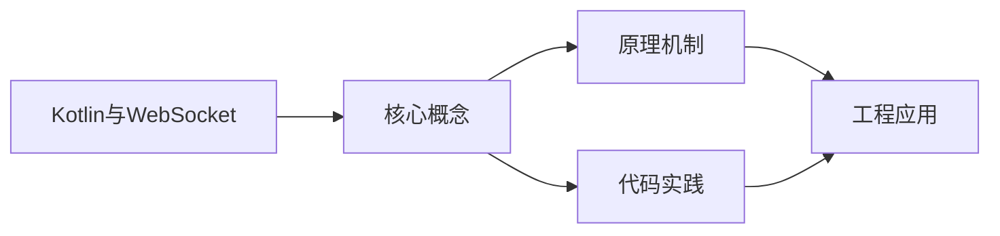

## 1. 学习目标（Bloom 分类）

本节按照布鲁姆教育目标分类学组织学习路径。本文主题为《Kotlin与WebSocket》，属于 Kotlin 模块，读者可以根据自身阶段选择阅读深度。

记忆层面：能够准确复述本文的核心概念、术语与基本语法或操作步骤，并能够在提问或检索时快速定位对应知识点。能够说出 val/var、空安全操作符与 when 表达式的语法。

理解层面：能够用自己的语言解释核心原理与工作机制，说明概念之间的因果关系，而不是机械记忆结论。能够解释 Kotlin 与 Java 互操作的机制与平台类型概念。

应用层面：能够在真实项目或练习场景中运用本文知识解决具体问题，写出正确且可维护的实现。能够编写数据类、扩展函数与协程代码。

分析层面：能够拆解复杂问题，比较本文主题与相邻概念的异同，识别边界条件与例外情况。能够分析空安全、智能转换与协程调度原理。

评价层面：能够根据约束条件（性能、可读性、安全、成本）评价不同方案的优劣，做出有依据的技术决策。能够评价 Kotlin 在 Android、服务端与多平台场景的适用性。

创造层面：能够把本文知识与其他模块知识组合，设计出新的解决方案或可复用的工程模式。能够组合 Compose 与协程设计跨平台应用。

通过本节学习，读者应当能够把《Kotlin与WebSocket》纳入自己的知识网络，并与 Kotlin 模块的其他主题（类型推断、空安全、协程、KMP）建立关联。

## 2. 历史动机与发展脉络

《Kotlin与WebSocket》是 Kotlin 领域的重要主题。要真正理解它，需要先了解它解决的问题与演进过程。

Kotlin 由 JetBrains 于 2010 年开始研发，2016 年发布 1.0，定位是“更现代的 JVM 语言”：减少样板代码、消灭空指针、增强函数式能力，同时与 Java 100% 互操作。
2017 年 Google 宣布 Kotlin 成为 Android 一级语言，2019 年确立 Kotlin-first 政策；2023 年 Kotlin 2.0 的 K2 编译器显著提升编译速度与类型推导。
Kotlin Multiplatform（KMP）支持 JVM、Android、iOS、WebAssembly 等目标，配合 Compose Multiplatform 实现共享 UI 与业务逻辑，是 JetBrains 的长期战略方向。

回到本文主题：Kotlin与WebSocket 的提出与成熟，正是上述技术背景下的必然产物。早期实现往往以简单可用为目标，随着工程规模扩大，社区逐渐沉淀出标准做法与最佳实践；理解这一脉络，可以帮助读者判断“为什么文档中的推荐写法是现在这个样子”，也能在遇到历史遗留代码时准确识别其设计年代与取舍。


## 3. 形式化定义与核心概念精讲

本节把《Kotlin与WebSocket》涉及的核心概念以“定义 + 讲解”的形式展开。读者应把定义当作工具，把讲解当作理解路径；两者结合才能形成可迁移的知识。

空安全：类型系统区分 `String` 与 `String?`，编译期强制处理可空值；`?.` 短路、`?:` 提供默认、`!!` 显式断言，三者覆盖所有空值处理模式。
智能转换：`is` 检查后在不可变上下文中自动转换类型，减少显式强转；`as?` 安全转换失败返回 null。
协程：挂起函数（suspend）与调度器（Dispatchers.Main/IO/Default）实现非阻塞并发，结构化并发保证作用域内任务可取消。

### 3.1 原文章节逐一精讲

原文档把主题拆分为 7 个小节，下面按顺序给出每一节的导读讲解，随后保留原文细节供精读。

#### 原文精读（完整保留）


#### 概述

WebSocket 是一种在客户端和服务器之间建立持久双向通信连接的协议。与 HTTP 请求-响应模式不同，WebSocket 连接建立后，双方可以随时发送数据，适合实时聊天、实时推送、在线协作等场景。

Ktor 提供了完整的 WebSocket 支持，包括服务端和客户端。基于 Kotlin 协程，Ktor 的 WebSocket API 是非阻塞的，使用起来简洁直观。

#### 基础概念

- **WebSocket 连接**：客户端通过 HTTP 升级请求建立 WebSocket 连接，之后双方可以自由发送消息
- **Frame（帧）**：WebSocket 消息的基本单位，有文本帧、二进制帧、关闭帧、Ping/Pong 帧等
- **incoming**：接收消息的通道，通过遍历它来接收客户端发来的消息
- **outgoing**：发送消息的通道，通过它向客户端推送消息
- **Session**：一个 WebSocket 连接对应一个会话对象

#### 快速上手

添加依赖：

```kotlin
// build.gradle.kts
dependencies {
    implementation("io.ktor:ktor-server-core:2.3.7")
    implementation("io.ktor:ktor-server-websockets:2.3.7")
    implementation("io.ktor:ktor-server-netty:2.3.7")
    // 客户端 WebSocket
    implementation("io.ktor:ktor-client-websockets:2.3.7")
    implementation("io.ktor:ktor-client-cio:2.3.7")
}
```

最简单的 WebSocket 服务器：

```kotlin
import io.ktor.server.application.*
import io.ktor.server.engine.*
import io.ktor.server.netty.*
import io.ktor.server.routing.*
import io.ktor.server.websocket.*
import io.ktor.websocket.*
import java.time.Duration

fun main() {
    embeddedServer(Netty, port = 8080) {
        // 安装 WebSocket 插件
        install(WebSockets) {
            pingPeriod = Duration.ofSeconds(15)   // Ping 间隔
            timeout = Duration.ofSeconds(30)      // 超时时间
            maxFrameSize = Long.MAX_VALUE          // 最大帧大小
            masking = false                         // 是否掩码
        }

        routing {
            // 定义 WebSocket 路由
            webSocket("/ws") {
                println("新连接建立")
                // 发送欢迎消息
                send(Frame.Text("欢迎连接!"))
                // 接收消息循环
                for (frame in incoming) {
                    if (frame is Frame.Text) {
                        val text = frame.readText()
                        println("收到: $text")
                        // 回显消息
                        send(Frame.Text("Echo: $text"))
                    }
                }
                println("连接关闭")
            }
        }
    }.start(wait = true)
}
```

#### 详细用法

##### 服务端 WebSocket 处理

```kotlin
import io.ktor.server.websocket.*
import io.ktor.websocket.*
import java.util.*

// 管理所有连接的客户端
val connections = Collections.synchronizedSet<WebSocketSession>(mutableSetOf())

fun Application.configureWebSockets() {
    install(WebSockets) {
        pingPeriod = Duration.ofSeconds(15)
        timeout = Duration.ofSeconds(30)
    }

    routing {
        webSocket("/chat") {
            // 新连接加入
            connections.add(this)
            println("当前在线: ${connections.size}")

            try {
                for (frame in incoming) {
                    when (frame) {
                        is Frame.Text -> {
                            val text = frame.readText()
                            // 广播给所有连接的客户端
                            connections.forEach { connection ->
                                connection.send(Frame.Text(text))
                            }
                        }
                        is Frame.Binary -> {
                            val bytes = frame.readBytes()
                            println("收到二进制数据: ${bytes.size} 字节")
                        }
                        is Frame.Close -> {
                            println("客户端请求关闭连接")
                            break
                        }
                        else -> {
                            // 忽略 Ping、Pong 等帧
                        }
                    }
                }
            } catch (e: Exception) {
                println("连接异常: ${e.message}")
            } finally {
                // 连接断开，从列表中移除
                connections.remove(this)
                println("连接断开，当前在线: ${connections.size}")
            }
        }
    }
}
```

##### 客户端 WebSocket

```kotlin
import io.ktor.client.*
import io.ktor.client.engine.cio.*
import io.ktor.client.plugins.websocket.*
import io.ktor.websocket.*
import kotlinx.coroutines.*

fun main() = runBlocking {
    // 创建支持 WebSocket 的客户端
    val client = HttpClient(CIO) {
        install(WebSockets)
    }

    // 连接到 WebSocket 服务器
    client.webSocket(host = "localhost", port = 8080, path = "/ws") {
        // 启动发送协程
        launch {
            while (true) {
                // 发送文本消息
                send(Frame.Text("Hello from client"))
                delay(1000)
            }
        }

        // 接收消息
        for (frame in incoming) {
            when (frame) {
                is Frame.Text -> {
                    val text = frame.readText()
                    println("收到: $text")
                }
                else -> {}
            }
        }
    }

    client.close()
}
```

##### 带认证的 WebSocket

```kotlin
import io.ktor.server.auth.*
import io.ktor.server.websocket.*

fun Application.authenticatedWebSocket() {
    install(WebSockets)
    install(Authentication) {
        basic {
            validate { credentials ->
                if (credentials.name == "admin" && credentials.password == "secret") {
                    UserIdPrincipal(credentials.name)
                } else null
            }
        }
    }

    routing {
        // WebSocket 路由需要认证
        webSocket("/secure-ws") {
            // 获取认证用户
            val principal = call.principal<UserIdPrincipal>()
            val username = principal?.name ?: "unknown"
            send(Frame.Text("欢迎, $username!"))

            for (frame in incoming) {
                if (frame is Frame.Text) {
                    val text = frame.readText()
                    send(Frame.Text("[$username] $text"))
                }
            }
        }
    }
}
```

##### 消息序列化

```kotlin
import kotlinx.serialization.*
import kotlinx.serialization.json.*

// 定义消息类型
@Serializable
sealed class ChatMessage {
    abstract val sender: String
    abstract val timestamp: Long

    @Serializable
    @SerialName("text")
    data class TextMessage(
        override val sender: String,
        override val timestamp: Long,
        val content: String
    ) : ChatMessage()

    @Serializable
    @SerialName("join")
    data class JoinMessage(
        override val sender: String,
        override val timestamp: Long
    ) : ChatMessage()

    @Serializable
    @SerialName("leave")
    data class LeaveMessage(
        override val sender: String,
        override val timestamp: Long
    ) : ChatMessage()
}

val json = Json { ignoreUnknownKeys = true }

// 发送序列化消息
suspend fun WebSocketSession.sendSerialized(message: ChatMessage) {
    val jsonString = json.encodeToString(message)
    send(Frame.Text(jsonString))
}

// 接收并反序列化消息
suspend fun WebSocketSession.receiveDeserialized(): ChatMessage? {
    for (frame in incoming) {
        if (frame is Frame.Text) {
            return json.decodeFromString<ChatMessage>(frame.readText())
        }
    }
    return null
}
```

#### 常见场景

##### 聊天室

```kotlin
import io.ktor.server.websocket.*
import io.ktor.websocket.*
import java.util.concurrent.*

class ChatRoom {
    // 房间内的所有成员
    private val members = ConcurrentHashMap<String, WebSocketSession>()

    // 加入房间
    suspend fun join(username: String, session: WebSocketSession) {
        // 如果同名用户已存在，踢出旧连接
        members[username]?.close(CloseReason(CloseReason.Codes.NORMAL, "被新连接替代"))
        members[username] = session
        // 广播加入消息
        broadcast("系统", "$username 加入了聊天室")
    }

    // 离开房间
    suspend fun leave(username: String) {
        members.remove(username)
        broadcast("系统", "$username 离开了聊天室")
    }

    // 发送消息
    suspend fun sendMessage(sender: String, content: String) {
        broadcast(sender, content)
    }

    // 广播给所有成员
    private suspend fun broadcast(sender: String, message: String) {
        val formatted = "[$sender] $message"
        members.values.forEach { session ->
            try {
                session.send(Frame.Text(formatted))
            } catch (e: Exception) {
                // 发送失败，移除断开的连接
            }
        }
    }

    fun memberCount(): Int = members.size
}

// 在路由中使用
val chatRoom = ChatRoom()

routing {
    webSocket("/chat/{username}") {
        val username = call.parameters["username"] ?: "匿名"
        chatRoom.join(username, this)

        try {
            for (frame in incoming) {
                if (frame is Frame.Text) {
                    chatRoom.sendMessage(username, frame.readText())
                }
            }
        } finally {
            chatRoom.leave(username)
        }
    }
}
```

##### 实时数据推送

```kotlin
import io.ktor.server.websocket.*
import io.ktor.websocket.*
import kotlinx.coroutines.*

fun Application.realTimePush() {
    install(WebSockets)

    routing {
        webSocket("/stock/{symbol}") {
            val symbol = call.parameters["symbol"] ?: "UNKNOWN"

            // 启动数据推送协程
            val pushJob = launch {
                while (true) {
                    val price = fetchStockPrice(symbol)
                    send(Frame.Text("""{"symbol":"$symbol","price":$price}"""))
                    delay(1000)  // 每秒推送一次
                }
            }

            try {
                // 接收客户端指令
                for (frame in incoming) {
                    if (frame is Frame.Text) {
                        val command = frame.readText()
                        if (command == "pause") {
                            pushJob.cancel()
                        }
                    }
                }
            } finally {
                pushJob.cancel()
            }
        }
    }
}

// 模拟获取股票价格
private fun fetchStockPrice(symbol: String): Double {
    return 100.0 + Math.random() * 10
}
```

#### 注意事项

- **必须安装 WebSockets 插件**：忘记安装会导致路由无法匹配
- **incoming 是冷流**：必须遍历 incoming 才能接收消息，不遍历消息会堆积
- **连接断开时清理资源**：在 finally 块中移除连接、取消协程等
- **并发安全**：多个协程可能同时操作共享状态（如连接列表），使用线程安全的集合
- **心跳机制**：配置 pingPeriod 保持连接活跃，防止被中间代理断开
- **帧大小限制**：默认最大帧大小有限制，传输大数据时需要调整 maxFrameSize

#### 进阶用法

##### 自动重连

```kotlin
import io.ktor.client.*
import io.ktor.client.plugins.websocket.*
import io.ktor.websocket.*
import kotlinx.coroutines.*

suspend fun connectWithRetry(
    host: String,
    port: Int,
    path: String,
    maxRetries: Int = 5
) {
    var retryCount = 0
    while (retryCount < maxRetries) {
        try {
            val client = HttpClient {
                install(WebSockets)
            }
            client.webSocket(host = host, port = port, path = path) {
                println("WebSocket 连接成功")
                retryCount = 0  // 重置重试计数

                for (frame in incoming) {
                    if (frame is Frame.Text) {
                        println("收到: ${frame.readText()}")
                    }
                }
            }
            client.close()
        } catch (e: Exception) {
            retryCount++
            val delaySeconds = minOf(30, retryCount * 2)
            println("连接失败，${delaySeconds}秒后重试 ($retryCount/$maxRetries)")
            delay(delaySeconds * 1000L)
        }
    }
}
```

##### 二进制数据传输

```kotlin
routing {
    webSocket("/binary") {
        for (frame in incoming) {
            when (frame) {
                is Frame.Binary -> {
                    val data = frame.readBytes()
                    // 处理二进制数据
                    println("收到 ${data.size} 字节")
                    // 回送处理结果
                    val result = processData(data)
                    send(Frame.Binary(true, result))
                }
                else -> {}
            }
        }
    }
}

private fun processData(data: ByteArray): ByteArray {
    // 示例：简单地将数据反转
    return data.reversedArray()
}
```


### 3.2 概念关系图

下面用 Mermaid 图表达本文核心概念之间的关系，帮助读者建立整体图景：



图中展示的是本文知识的结构化关系：核心概念是入口，原理机制解释“为什么”，代码实践演示“怎么做”，工程应用回答“何时用”。读者学习时可以把每个小节的内容挂接到对应节点上。

## 4. 理论推导与原理解析

本节深入《Kotlin与WebSocket》背后的原理。理论部分不求面面俱到，而是聚焦“能解释现象、能指导实践”的关键推导。

空安全：类型系统区分 `String` 与 `String?`，编译期强制处理可空值；`?.` 短路、`?:` 提供默认、`!!` 显式断言，三者覆盖所有空值处理模式。
智能转换：`is` 检查后在不可变上下文中自动转换类型，减少显式强转；`as?` 安全转换失败返回 null。
协程：挂起函数（suspend）与调度器（Dispatchers.Main/IO/Default）实现非阻塞并发，结构化并发保证作用域内任务可取消。
扩展函数与属性：在不修改原类的情况下为类添加行为，是 Kotlin 标准库（如集合操作）的基石。

需要强调的是，理论推导与工程实践之间存在翻译层：理论给出的是理想化模型与边界条件，工程代码则必须处理真实环境中的例外。读者在学习时应先掌握理论的“标准情形”，再通过陷阱章节了解“非标准情形”。

## 5. 代码示例与逐行讲解

本节把原文中的代码示例系统整理，并为每个示例补充用途说明与讲解。读者不应只浏览代码，而应逐段对照讲解理解设计意图。

### 5.1 示例：快速上手

该示例来自原文《快速上手》小节，用于演示Kotlin与WebSocket相关操作。阅读时请先看代码结构，再看其后的讲解。

```kotlin
// build.gradle.kts
dependencies {
    implementation("io.ktor:ktor-server-core:2.3.7")
    implementation("io.ktor:ktor-server-websockets:2.3.7")
    implementation("io.ktor:ktor-server-netty:2.3.7")
    // 客户端 WebSocket
    implementation("io.ktor:ktor-client-websockets:2.3.7")
    implementation("io.ktor:ktor-client-cio:2.3.7")
}
```

讲解：这段代码演示了本节核心知识点。代码中的关键操作可以归纳为三步：准备（定义或初始化）、执行（核心逻辑）、收尾（释放资源或返回结果）。实际项目中，这三步往往被封装为函数或类，以提升复用性与可测试性。

关键点分析：

该示例共 9 行有效代码，结构以数据或配置为主。阅读时应关注：数据字段的含义、配置项的作用，以及它们与运行行为的对应关系。

进阶思考路径：先尝试修改参数观察行为变化，再把示例中的模式迁移到自己的项目中；每次修改都记录预期与实测差异，这是把示例转化为能力的最快方式。

### 5.2 示例：快速上手

该示例来自原文《快速上手》小节，用于演示Kotlin与WebSocket相关操作。阅读时请先看代码结构，再看其后的讲解。

```kotlin
import io.ktor.server.application.*
import io.ktor.server.engine.*
import io.ktor.server.netty.*
import io.ktor.server.routing.*
import io.ktor.server.websocket.*
import io.ktor.websocket.*
import java.time.Duration

fun main() {
    embeddedServer(Netty, port = 8080) {
        // 安装 WebSocket 插件
        install(WebSockets) {
            pingPeriod = Duration.ofSeconds(15)   // Ping 间隔
            timeout = Duration.ofSeconds(30)      // 超时时间
            maxFrameSize = Long.MAX_VALUE          // 最大帧大小
            masking = false                         // 是否掩码
        }

        routing {
            // 定义 WebSocket 路由
            webSocket("/ws") {
                println("新连接建立")
                // 发送欢迎消息
                send(Frame.Text("欢迎连接!"))
                // 接收消息循环
                for (frame in incoming) {
                    if (frame is Frame.Text) {
                        val text = frame.readText()
                        println("收到: $text")
                        // 回显消息
                        send(Frame.Text("Echo: $text"))
                    }
                }
                println("连接关闭")
            }
        }
    }.start(wait = true)
}
```

讲解：这段代码演示了本节核心知识点。代码中的关键操作可以归纳为三步：准备（定义或初始化）、执行（核心逻辑）、收尾（释放资源或返回结果）。实际项目中，这三步往往被封装为函数或类，以提升复用性与可测试性。

关键点分析：

该示例共 36 行有效代码，包含 3 类关键结构（import、if、for）。其中：

- 入口与初始化部分负责建立上下文，对应实际项目中的启动或装配逻辑；
- 核心逻辑部分体现本文主题的主要操作，是阅读时最需要对照讲解理解的部分；
- 输出或返回部分把结果交给调用方，注意其类型与边界条件。

进阶思考路径：先尝试修改参数观察行为变化，再把示例中的模式迁移到自己的项目中；每次修改都记录预期与实测差异，这是把示例转化为能力的最快方式。

### 5.3 示例：服务端 WebSocket 处理

该示例来自原文《服务端 WebSocket 处理》小节，用于演示Kotlin与WebSocket相关操作。阅读时请先看代码结构，再看其后的讲解。

```kotlin
import io.ktor.server.websocket.*
import io.ktor.websocket.*
import java.util.*

// 管理所有连接的客户端
val connections = Collections.synchronizedSet<WebSocketSession>(mutableSetOf())

fun Application.configureWebSockets() {
    install(WebSockets) {
        pingPeriod = Duration.ofSeconds(15)
        timeout = Duration.ofSeconds(30)
    }

    routing {
        webSocket("/chat") {
            // 新连接加入
            connections.add(this)
            println("当前在线: ${connections.size}")

            try {
                for (frame in incoming) {
                    when (frame) {
                        is Frame.Text -> {
                            val text = frame.readText()
                            // 广播给所有连接的客户端
                            connections.forEach { connection ->
                                connection.send(Frame.Text(text))
                            }
                        }
                        is Frame.Binary -> {
                            val bytes = frame.readBytes()
                            println("收到二进制数据: ${bytes.size} 字节")
                        }
                        is Frame.Close -> {
                            println("客户端请求关闭连接")
                            break
                        }
                        else -> {
                            // 忽略 Ping、Pong 等帧
                        }
                    }
                }
            } catch (e: Exception) {
                println("连接异常: ${e.message}")
            } finally {
                // 连接断开，从列表中移除
                connections.remove(this)
                println("连接断开，当前在线: ${connections.size}")
            }
        }
    }
}
```

讲解：这段代码演示了本节核心知识点。代码中的关键操作可以归纳为三步：准备（定义或初始化）、执行（核心逻辑）、收尾（释放资源或返回结果）。实际项目中，这三步往往被封装为函数或类，以提升复用性与可测试性。

关键点分析：

该示例共 48 行有效代码，包含 2 类关键结构（import、for）。其中：

- 入口与初始化部分负责建立上下文，对应实际项目中的启动或装配逻辑；
- 核心逻辑部分体现本文主题的主要操作，是阅读时最需要对照讲解理解的部分；
- 输出或返回部分把结果交给调用方，注意其类型与边界条件。

进阶思考路径：先尝试修改参数观察行为变化，再把示例中的模式迁移到自己的项目中；每次修改都记录预期与实测差异，这是把示例转化为能力的最快方式。

### 5.4 示例：客户端 WebSocket

该示例来自原文《客户端 WebSocket》小节，用于演示Kotlin与WebSocket相关操作。阅读时请先看代码结构，再看其后的讲解。

```kotlin
import io.ktor.client.*
import io.ktor.client.engine.cio.*
import io.ktor.client.plugins.websocket.*
import io.ktor.websocket.*
import kotlinx.coroutines.*

fun main() = runBlocking {
    // 创建支持 WebSocket 的客户端
    val client = HttpClient(CIO) {
        install(WebSockets)
    }

    // 连接到 WebSocket 服务器
    client.webSocket(host = "localhost", port = 8080, path = "/ws") {
        // 启动发送协程
        launch {
            while (true) {
                // 发送文本消息
                send(Frame.Text("Hello from client"))
                delay(1000)
            }
        }

        // 接收消息
        for (frame in incoming) {
            when (frame) {
                is Frame.Text -> {
                    val text = frame.readText()
                    println("收到: $text")
                }
                else -> {}
            }
        }
    }

    client.close()
}
```

讲解：这段代码演示了本节核心知识点。代码中的关键操作可以归纳为三步：准备（定义或初始化）、执行（核心逻辑）、收尾（释放资源或返回结果）。实际项目中，这三步往往被封装为函数或类，以提升复用性与可测试性。

关键点分析：

该示例共 33 行有效代码，包含 4 类关键结构（import、from、for、while）。其中：

- 入口与初始化部分负责建立上下文，对应实际项目中的启动或装配逻辑；
- 核心逻辑部分体现本文主题的主要操作，是阅读时最需要对照讲解理解的部分；
- 输出或返回部分把结果交给调用方，注意其类型与边界条件。

进阶思考路径：先尝试修改参数观察行为变化，再把示例中的模式迁移到自己的项目中；每次修改都记录预期与实测差异，这是把示例转化为能力的最快方式。

### 5.5 示例：带认证的 WebSocket

该示例来自原文《带认证的 WebSocket》小节，用于演示Kotlin与WebSocket相关操作。阅读时请先看代码结构，再看其后的讲解。

```kotlin
import io.ktor.server.auth.*
import io.ktor.server.websocket.*

fun Application.authenticatedWebSocket() {
    install(WebSockets)
    install(Authentication) {
        basic {
            validate { credentials ->
                if (credentials.name == "admin" && credentials.password == "secret") {
                    UserIdPrincipal(credentials.name)
                } else null
            }
        }
    }

    routing {
        // WebSocket 路由需要认证
        webSocket("/secure-ws") {
            // 获取认证用户
            val principal = call.principal<UserIdPrincipal>()
            val username = principal?.name ?: "unknown"
            send(Frame.Text("欢迎, $username!"))

            for (frame in incoming) {
                if (frame is Frame.Text) {
                    val text = frame.readText()
                    send(Frame.Text("[$username] $text"))
                }
            }
        }
    }
}
```

讲解：这段代码演示了本节核心知识点。代码中的关键操作可以归纳为三步：准备（定义或初始化）、执行（核心逻辑）、收尾（释放资源或返回结果）。实际项目中，这三步往往被封装为函数或类，以提升复用性与可测试性。

关键点分析：

该示例共 29 行有效代码，包含 3 类关键结构（import、if、for）。其中：

- 入口与初始化部分负责建立上下文，对应实际项目中的启动或装配逻辑；
- 核心逻辑部分体现本文主题的主要操作，是阅读时最需要对照讲解理解的部分；
- 输出或返回部分把结果交给调用方，注意其类型与边界条件。

进阶思考路径：先尝试修改参数观察行为变化，再把示例中的模式迁移到自己的项目中；每次修改都记录预期与实测差异，这是把示例转化为能力的最快方式。

### 5.6 示例：消息序列化

该示例来自原文《消息序列化》小节，用于演示Kotlin与WebSocket相关操作。阅读时请先看代码结构，再看其后的讲解。

```kotlin
import kotlinx.serialization.*
import kotlinx.serialization.json.*

// 定义消息类型
@Serializable
sealed class ChatMessage {
    abstract val sender: String
    abstract val timestamp: Long

    @Serializable
    @SerialName("text")
    data class TextMessage(
        override val sender: String,
        override val timestamp: Long,
        val content: String
    ) : ChatMessage()

    @Serializable
    @SerialName("join")
    data class JoinMessage(
        override val sender: String,
        override val timestamp: Long
    ) : ChatMessage()

    @Serializable
    @SerialName("leave")
    data class LeaveMessage(
        override val sender: String,
        override val timestamp: Long
    ) : ChatMessage()
}

val json = Json { ignoreUnknownKeys = true }

// 发送序列化消息
suspend fun WebSocketSession.sendSerialized(message: ChatMessage) {
    val jsonString = json.encodeToString(message)
    send(Frame.Text(jsonString))
}

// 接收并反序列化消息
suspend fun WebSocketSession.receiveDeserialized(): ChatMessage? {
    for (frame in incoming) {
        if (frame is Frame.Text) {
            return json.decodeFromString<ChatMessage>(frame.readText())
        }
    }
    return null
}
```

讲解：这段代码演示了本节核心知识点。代码中的关键操作可以归纳为三步：准备（定义或初始化）、执行（核心逻辑）、收尾（释放资源或返回结果）。实际项目中，这三步往往被封装为函数或类，以提升复用性与可测试性。

关键点分析：

该示例共 42 行有效代码，包含 5 类关键结构（class、import、if、for、return）。其中：

- 入口与初始化部分负责建立上下文，对应实际项目中的启动或装配逻辑；
- 核心逻辑部分体现本文主题的主要操作，是阅读时最需要对照讲解理解的部分；
- 输出或返回部分把结果交给调用方，注意其类型与边界条件。

进阶思考路径：先尝试修改参数观察行为变化，再把示例中的模式迁移到自己的项目中；每次修改都记录预期与实测差异，这是把示例转化为能力的最快方式。

### 5.7 示例：聊天室

该示例来自原文《聊天室》小节，用于演示Kotlin与WebSocket相关操作。阅读时请先看代码结构，再看其后的讲解。

```kotlin
import io.ktor.server.websocket.*
import io.ktor.websocket.*
import java.util.concurrent.*

class ChatRoom {
    // 房间内的所有成员
    private val members = ConcurrentHashMap<String, WebSocketSession>()

    // 加入房间
    suspend fun join(username: String, session: WebSocketSession) {
        // 如果同名用户已存在，踢出旧连接
        members[username]?.close(CloseReason(CloseReason.Codes.NORMAL, "被新连接替代"))
        members[username] = session
        // 广播加入消息
        broadcast("系统", "$username 加入了聊天室")
    }

    // 离开房间
    suspend fun leave(username: String) {
        members.remove(username)
        broadcast("系统", "$username 离开了聊天室")
    }

    // 发送消息
    suspend fun sendMessage(sender: String, content: String) {
        broadcast(sender, content)
    }

    // 广播给所有成员
    private suspend fun broadcast(sender: String, message: String) {
        val formatted = "[$sender] $message"
        members.values.forEach { session ->
            try {
                session.send(Frame.Text(formatted))
            } catch (e: Exception) {
                // 发送失败，移除断开的连接
            }
        }
    }

    fun memberCount(): Int = members.size
}

// 在路由中使用
val chatRoom = ChatRoom()

routing {
    webSocket("/chat/{username}") {
        val username = call.parameters["username"] ?: "匿名"
        chatRoom.join(username, this)

        try {
            for (frame in incoming) {
                if (frame is Frame.Text) {
                    chatRoom.sendMessage(username, frame.readText())
                }
            }
        } finally {
            chatRoom.leave(username)
        }
    }
}
```

讲解：这段代码演示了本节核心知识点。代码中的关键操作可以归纳为三步：准备（定义或初始化）、执行（核心逻辑）、收尾（释放资源或返回结果）。实际项目中，这三步往往被封装为函数或类，以提升复用性与可测试性。

关键点分析：

该示例共 53 行有效代码，包含 4 类关键结构（class、import、if、for）。其中：

- 入口与初始化部分负责建立上下文，对应实际项目中的启动或装配逻辑；
- 核心逻辑部分体现本文主题的主要操作，是阅读时最需要对照讲解理解的部分；
- 输出或返回部分把结果交给调用方，注意其类型与边界条件。

进阶思考路径：先尝试修改参数观察行为变化，再把示例中的模式迁移到自己的项目中；每次修改都记录预期与实测差异，这是把示例转化为能力的最快方式。

### 5.8 示例：实时数据推送

该示例来自原文《实时数据推送》小节，用于演示Kotlin与WebSocket相关操作。阅读时请先看代码结构，再看其后的讲解。

```kotlin
import io.ktor.server.websocket.*
import io.ktor.websocket.*
import kotlinx.coroutines.*

fun Application.realTimePush() {
    install(WebSockets)

    routing {
        webSocket("/stock/{symbol}") {
            val symbol = call.parameters["symbol"] ?: "UNKNOWN"

            // 启动数据推送协程
            val pushJob = launch {
                while (true) {
                    val price = fetchStockPrice(symbol)
                    send(Frame.Text("""{"symbol":"$symbol","price":$price}"""))
                    delay(1000)  // 每秒推送一次
                }
            }

            try {
                // 接收客户端指令
                for (frame in incoming) {
                    if (frame is Frame.Text) {
                        val command = frame.readText()
                        if (command == "pause") {
                            pushJob.cancel()
                        }
                    }
                }
            } finally {
                pushJob.cancel()
            }
        }
    }
}

// 模拟获取股票价格
private fun fetchStockPrice(symbol: String): Double {
    return 100.0 + Math.random() * 10
}
```

讲解：这段代码演示了本节核心知识点。代码中的关键操作可以归纳为三步：准备（定义或初始化）、执行（核心逻辑）、收尾（释放资源或返回结果）。实际项目中，这三步往往被封装为函数或类，以提升复用性与可测试性。

关键点分析：

该示例共 36 行有效代码，包含 5 类关键结构（import、if、for、while、return）。其中：

- 入口与初始化部分负责建立上下文，对应实际项目中的启动或装配逻辑；
- 核心逻辑部分体现本文主题的主要操作，是阅读时最需要对照讲解理解的部分；
- 输出或返回部分把结果交给调用方，注意其类型与边界条件。

进阶思考路径：先尝试修改参数观察行为变化，再把示例中的模式迁移到自己的项目中；每次修改都记录预期与实测差异，这是把示例转化为能力的最快方式。

### 5.9 示例：自动重连

该示例来自原文《自动重连》小节，用于演示Kotlin与WebSocket相关操作。阅读时请先看代码结构，再看其后的讲解。

```kotlin
import io.ktor.client.*
import io.ktor.client.plugins.websocket.*
import io.ktor.websocket.*
import kotlinx.coroutines.*

suspend fun connectWithRetry(
    host: String,
    port: Int,
    path: String,
    maxRetries: Int = 5
) {
    var retryCount = 0
    while (retryCount < maxRetries) {
        try {
            val client = HttpClient {
                install(WebSockets)
            }
            client.webSocket(host = host, port = port, path = path) {
                println("WebSocket 连接成功")
                retryCount = 0  // 重置重试计数

                for (frame in incoming) {
                    if (frame is Frame.Text) {
                        println("收到: ${frame.readText()}")
                    }
                }
            }
            client.close()
        } catch (e: Exception) {
            retryCount++
            val delaySeconds = minOf(30, retryCount * 2)
            println("连接失败，${delaySeconds}秒后重试 ($retryCount/$maxRetries)")
            delay(delaySeconds * 1000L)
        }
    }
}
```

讲解：这段代码演示了本节核心知识点。代码中的关键操作可以归纳为三步：准备（定义或初始化）、执行（核心逻辑）、收尾（释放资源或返回结果）。实际项目中，这三步往往被封装为函数或类，以提升复用性与可测试性。

关键点分析：

该示例共 34 行有效代码，包含 4 类关键结构（import、if、for、while）。其中：

- 入口与初始化部分负责建立上下文，对应实际项目中的启动或装配逻辑；
- 核心逻辑部分体现本文主题的主要操作，是阅读时最需要对照讲解理解的部分；
- 输出或返回部分把结果交给调用方，注意其类型与边界条件。

进阶思考路径：先尝试修改参数观察行为变化，再把示例中的模式迁移到自己的项目中；每次修改都记录预期与实测差异，这是把示例转化为能力的最快方式。

### 5.10 示例：二进制数据传输

该示例来自原文《二进制数据传输》小节，用于演示Kotlin与WebSocket相关操作。阅读时请先看代码结构，再看其后的讲解。

```kotlin
routing {
    webSocket("/binary") {
        for (frame in incoming) {
            when (frame) {
                is Frame.Binary -> {
                    val data = frame.readBytes()
                    // 处理二进制数据
                    println("收到 ${data.size} 字节")
                    // 回送处理结果
                    val result = processData(data)
                    send(Frame.Binary(true, result))
                }
                else -> {}
            }
        }
    }
}

private fun processData(data: ByteArray): ByteArray {
    // 示例：简单地将数据反转
    return data.reversedArray()
}
```

讲解：这段代码演示了本节核心知识点。代码中的关键操作可以归纳为三步：准备（定义或初始化）、执行（核心逻辑）、收尾（释放资源或返回结果）。实际项目中，这三步往往被封装为函数或类，以提升复用性与可测试性。

关键点分析：

该示例共 21 行有效代码，包含 2 类关键结构（for、return）。其中：

- 入口与初始化部分负责建立上下文，对应实际项目中的启动或装配逻辑；
- 核心逻辑部分体现本文主题的主要操作，是阅读时最需要对照讲解理解的部分；
- 输出或返回部分把结果交给调用方，注意其类型与边界条件。

进阶思考路径：先尝试修改参数观察行为变化，再把示例中的模式迁移到自己的项目中；每次修改都记录预期与实测差异，这是把示例转化为能力的最快方式。


综合以上示例，可以总结出本主题的代码实践要点：第一，先定义清晰的输入输出契约；第二，核心逻辑保持单一职责；第三，错误处理与边界条件不可省略；第四，命名与注释表达意图而非复述代码。

## 6. 对比分析

对比是理解《Kotlin与WebSocket》定位的最快路径。下面从多个维度与相邻方案进行对比。

Kotlin 与 Java：Kotlin 代码更短、空安全更强；Java 生态工具链更传统。两者互操作，可渐进迁移。
Kotlin 与 Swift：Kotlin 服务端/Android 与 Swift iOS 各自主导；KMP 让业务逻辑共享成为可能。
协程与线程：协程是用户态调度，数量可达百万级；线程是内核态，切换成本高。

对比的目的不是分出绝对优劣，而是建立选择依据：不同约束条件下，最优解不同。读者应把每个对比维度转化为决策检查清单。

## 7. 常见陷阱与最佳实践

本节整理该主题的高频错误与推荐做法。每个陷阱先描述现象，再解释原因，最后给出最佳实践。

### 7.1 val 误当不可变对象

val 只约束引用；对象内部仍可变。需要深层不可变时使用只读集合与 data class 副本。

深入讲解：该问题之所以被归类为“常见陷阱”，是因为它在初学者的代码中反复出现，而且往往不在第一时间暴露——错误通常隐藏在特定数据或特定时序下。

从成因上看，val 误当不可变对象 一般源于对 Kotlin 某个机制的理解偏差：要么误用了默认行为，要么忽略了边界条件，要么把其他语言的思维惯性带了过来。

从影响上看，val 误当不可变对象 轻则产生错误结果，重则导致资源泄漏、数据损坏或安全事故；这也是为什么工程评审中会把它列为检查项。

从修复策略上看，处理val 误当不可变对象的正确顺序是：先复现（构造最小用例），再定位（确认机制层面的根因），最后修复并补充回归测试。跳过复现直接改代码，往往治标不治本。

### 7.2 滥用 !!

非空断言重新引入 NPE。业务代码用 ?: 与 ?. 替代，!! 仅限互操作边界。

深入讲解：该问题之所以被归类为“常见陷阱”，是因为它在初学者的代码中反复出现，而且往往不在第一时间暴露——错误通常隐藏在特定数据或特定时序下。

从成因上看，滥用 !! 一般源于对 Kotlin 某个机制的理解偏差：要么误用了默认行为，要么忽略了边界条件，要么把其他语言的思维惯性带了过来。

从影响上看，滥用 !! 轻则产生错误结果，重则导致资源泄漏、数据损坏或安全事故；这也是为什么工程评审中会把它列为检查项。

从修复策略上看，处理滥用 !!的正确顺序是：先复现（构造最小用例），再定位（确认机制层面的根因），最后修复并补充回归测试。跳过复现直接改代码，往往治标不治本。

### 7.3 协程作用域泄漏

在 Activity/ViewModel 外启动协程导致任务悬挂。使用 viewModelScope 或 lifecycleScope。

深入讲解：该问题之所以被归类为“常见陷阱”，是因为它在初学者的代码中反复出现，而且往往不在第一时间暴露——错误通常隐藏在特定数据或特定时序下。

从成因上看，协程作用域泄漏 一般源于对 Kotlin 某个机制的理解偏差：要么误用了默认行为，要么忽略了边界条件，要么把其他语言的思维惯性带了过来。

从影响上看，协程作用域泄漏 轻则产生错误结果，重则导致资源泄漏、数据损坏或安全事故；这也是为什么工程评审中会把它列为检查项。

从修复策略上看，处理协程作用域泄漏的正确顺序是：先复现（构造最小用例），再定位（确认机制层面的根因），最后修复并补充回归测试。跳过复现直接改代码，往往治标不治本。

### 7.4 扩展函数命名冲突

同签名扩展函数按导入优先级解析，易混淆。使用明确包名与独特命名。

深入讲解：该问题之所以被归类为“常见陷阱”，是因为它在初学者的代码中反复出现，而且往往不在第一时间暴露——错误通常隐藏在特定数据或特定时序下。

从成因上看，扩展函数命名冲突 一般源于对 Kotlin 某个机制的理解偏差：要么误用了默认行为，要么忽略了边界条件，要么把其他语言的思维惯性带了过来。

从影响上看，扩展函数命名冲突 轻则产生错误结果，重则导致资源泄漏、数据损坏或安全事故；这也是为什么工程评审中会把它列为检查项。

从修复策略上看，处理扩展函数命名冲突的正确顺序是：先复现（构造最小用例），再定位（确认机制层面的根因），最后修复并补充回归测试。跳过复现直接改代码，往往治标不治本。

### 7.5 data class 相等性误判

相等性基于所有主构造属性；集合属性（List）使用引用相等。注意复制副本的共享引用。

深入讲解：该问题之所以被归类为“常见陷阱”，是因为它在初学者的代码中反复出现，而且往往不在第一时间暴露——错误通常隐藏在特定数据或特定时序下。

从成因上看，data class 相等性误判 一般源于对 Kotlin 某个机制的理解偏差：要么误用了默认行为，要么忽略了边界条件，要么把其他语言的思维惯性带了过来。

从影响上看，data class 相等性误判 轻则产生错误结果，重则导致资源泄漏、数据损坏或安全事故；这也是为什么工程评审中会把它列为检查项。

从修复策略上看，处理data class 相等性误判的正确顺序是：先复现（构造最小用例），再定位（确认机制层面的根因），最后修复并补充回归测试。跳过复现直接改代码，往往治标不治本。

### 7.6 挂起函数在非协程调用

suspend 函数只能在协程或其他挂起函数中调用；需要桥接时用 runBlocking（慎用）或回调封装。

深入讲解：该问题之所以被归类为“常见陷阱”，是因为它在初学者的代码中反复出现，而且往往不在第一时间暴露——错误通常隐藏在特定数据或特定时序下。

从成因上看，挂起函数在非协程调用 一般源于对 Kotlin 某个机制的理解偏差：要么误用了默认行为，要么忽略了边界条件，要么把其他语言的思维惯性带了过来。

从影响上看，挂起函数在非协程调用 轻则产生错误结果，重则导致资源泄漏、数据损坏或安全事故；这也是为什么工程评审中会把它列为检查项。

从修复策略上看，处理挂起函数在非协程调用的正确顺序是：先复现（构造最小用例），再定位（确认机制层面的根因），最后修复并补充回归测试。跳过复现直接改代码，往往治标不治本。

### 7.0 最佳实践总览

1. 优先 val 与不可变集合，减少可变状态面。
2. 用数据类表达数据，用密封类表达受限层级。
3. 协程遵循结构化并发，子任务随父作用域取消。
4. 接口默认实现与扩展函数分离“数据”与“行为”。
5. 使用 ktlint/detekt 保持风格一致。

把这些最佳实践固化为团队规范与代码评审检查项，是避免同类问题反复出现的关键。

## 8. 工程实践

本节把《Kotlin与WebSocket》放入真实工程场景，给出可复用的模式与组织方法。

Android 项目：Gradle Kotlin DSL 构建，Compose 声明式 UI，ViewModel + StateFlow 管理状态。
服务端：Ktor 轻量异步框架，或 Spring Boot 使用 Kotlin 语言特性。
多平台：共享模块（commonMain）放业务逻辑，平台模块（androidMain/iosMain）放平台 API。

### 8.1 工程实践的原则拆解

以上工程实践可以归纳为四条原则。第一，配置与代码分离：Kotlin 项目中环境差异应通过配置注入，而不是散落在代码分支中；这保证同一份代码可以在开发、测试、生产环境一致运行。

第二，接口稳定优先：对外接口（函数签名、协议、数据格式）一旦被消费方依赖，变更成本极高；设计时应预留扩展点并保持向后兼容。

第三，可观测性内置：日志、指标与追踪应该在功能开发时同步设计，而不是故障发生后补救；没有观测手段的模块等于黑盒。

第四，变更可回滚：任何发布都应有对应的回滚方案；数据库迁移、配置变更与代码发布一样需要版本管理与逆向路径。

### 8.2 实践落地的检查清单

- [ ] Android 项目：对照本节描述，检查当前项目是否已经落实；未落实的项列入技术债并排期处理。
- [ ] 服务端：对照本节描述，检查当前项目是否已经落实；未落实的项列入技术债并排期处理。
- [ ] 多平台：对照本节描述，检查当前项目是否已经落实；未落实的项列入技术债并排期处理。

工程实践的共性原则：配置与代码分离、接口稳定优先、可观测性内置、变更可回滚。这些原则适用于本主题的所有实现。

## 9. 案例研究

本节通过一个完整案例把《Kotlin与WebSocket》的知识串起来。案例按“需求分析、方案设计、实现、验证”四步展开。

需求：实现跨平台（Android/iOS）的待办事项应用核心逻辑。
方案：KMP 共享数据层与状态管理，平台层仅做 UI 渲染。
要点：Room/SQLDelight 做本地存储；协程处理异步；expect/actual 声明平台差异。
验证：共享模块单元测试 + 平台端集成测试。

### 9.1 案例的扩展讨论

把案例中的方案放大到真实规模，需要额外考虑三个问题：

第一，规模：当数据量或并发量上升一个数量级时，原方案中的数据结构、缓存策略与任务调度是否仍然成立？通常需要引入分层与异步。

第二，团队：多人协作时，模块边界、接口契约与代码所有权必须明确；案例中的实现应拆分为可独立测试的单元，并配合文档说明设计意图。

第三，演进：上线后的需求变化不可避免；方案设计时应预留扩展点（配置化、插件化、事件化），并定期用真实指标验证假设。


案例研究的学习方法：先独立阅读需求，尝试在脑中形成方案，再对照实现与讲解，最后思考“如果约束变化（数据量、并发、团队规模），方案应如何调整”。

## 10. 知识要点总结与深入讲解

本节以讲解形式汇总全文要点，替代传统的习题与自测，读者不需要答题，只需跟随解释建立完整的认知框架。

关于《Kotlin与WebSocket》的核心结论：

Kotlin 的价值在于“现代化而不割裂”：保留 JVM 生态，同时提供现代语言特性。
空安全与协程是 Kotlin 的两大支柱，工程代码应默认使用。
KMP 适合业务逻辑共享，UI 层按平台选择 Compose 或原生。

原文档各小节的要点回顾：

- 概述：该小节围绕Kotlin与WebSocket展开具体细节，阅读时应关注其与核心结论的对应关系；每个小节都是核心结论在某一个侧面的展开。
- 基础概念：该小节围绕Kotlin与WebSocket展开具体细节，阅读时应关注其与核心结论的对应关系；每个小节都是核心结论在某一个侧面的展开。
- 快速上手：该小节围绕Kotlin与WebSocket展开具体细节，阅读时应关注其与核心结论的对应关系；每个小节都是核心结论在某一个侧面的展开。
- 详细用法：该小节围绕Kotlin与WebSocket展开具体细节，阅读时应关注其与核心结论的对应关系；每个小节都是核心结论在某一个侧面的展开。
- 常见场景：该小节围绕Kotlin与WebSocket展开具体细节，阅读时应关注其与核心结论的对应关系；每个小节都是核心结论在某一个侧面的展开。
- 注意事项：该小节围绕Kotlin与WebSocket展开具体细节，阅读时应关注其与核心结论的对应关系；每个小节都是核心结论在某一个侧面的展开。
- 进阶用法：该小节围绕Kotlin与WebSocket展开具体细节，阅读时应关注其与核心结论的对应关系；每个小节都是核心结论在某一个侧面的展开。

把以上要点与第 3-9 节的内容对照复习，即可完成对本文主题的闭环学习。

## 11. 参考文献


Kotlin 官方文档：https://kotlinlang.org/docs/home.html
Kotlin 协程指南：https://kotlinlang.org/docs/coroutines-guide.html
Compose Multiplatform：https://www.jetbrains.com/compose-multiplatform/
Ktor 框架：https://ktor.io/
Android 开发者文档：https://developer.android.com/kotlin

## 12. 延伸阅读


Kotlin 基础语法精讲，见 014-kotlin/002-KotlinBasicSyntax 文档。
协程与 Flow，见 014-kotlin 模块协程文档。
Android 与 HarmonyOS 应用开发，见 018-harmonyos 模块。
黑马程序员 Bilibili 空间（https://space.bilibili.com/37974444 ）提供 Kotlin 课程。

## 14. 模块知识图谱与学习路径

本文属于 Kotlin 模块。为了把《Kotlin与WebSocket》放入完整的知识网络，下面列出本模块的全部主题并给出相互关联的导读。学习时建议按模块内顺序推进，并在每个文档中留意交叉引用。

```mermaid
flowchart LR
    A["Kotlin与WebSocket"]
    N0["Kotlin 概述与环境配置"]
    N1["Kotlin 基础语法"]
    N0 --> N1
    N2["Kotlin 函数与 Lambda"]
    N1 --> N2
    N3["Kotlin 类与对象"]
    N2 --> N3
    N4["Kotlin 泛型与类型系统"]
    N3 --> N4
    N5["Kotlin 集合与协程"]
    N4 --> N5
    N6["Kotlin 协程进阶"]
    N5 --> N6
    N7["Kotlin 多平台"]
    N6 --> N7
    N8["Kotlin DSL 与领域特定语言"]
    N7 --> N8
    N9["Kotlin 测试与最佳实践"]
    N8 --> N9
    N10["Kotlin与协程Channel"]
    N9 --> N10
    N11["空安全详解"]
    N10 --> N11
    N12["密封类与代数数据类型"]
    N11 --> N12
    N13["委托属性"]
    N12 --> N13
```



上图为模块主题的推荐学习顺序示意图（仅展示前若干主题）。各主题之间存在三类关联：

第一，前置依赖关系：早期主题是后期主题的基础，例如环境与语法先行、进阶主题随后；

第二，横向并列关系：同一层级主题从不同角度覆盖模块能力，学习顺序可以按兴趣调整；

第三，工程组合关系：多个主题在真实项目中组合使用，例如配置、性能与安全主题往往出现在同一系统的不同层面。

### 14.1 模块主题速查表

| 文档 | 主题 | 与本文的关联 |
| --- | --- | --- |
| Kotlin 概述与环境配置 | 001-KotlinOverviewEnvSetup | 本文的前置基础 |
| Kotlin 基础语法 | 002-KotlinBasicSyntax | 本文的前置基础 |
| Kotlin 函数与 Lambda | 003-KotlinFunctionAndLambda | 本文的并列主题 |
| Kotlin 类与对象 | 004-KotlinClassObject | 本文的并列主题 |
| Kotlin 泛型与类型系统 | 005-KotlinGenericTypeSystem | 本文的并列主题 |
| Kotlin 集合与协程 | 006-KotlinCollectionCoroutine | 本文的并列主题 |
| Kotlin 协程进阶 | 007-KotlinCoroutineAdvanced | 本文的并列主题 |
| Kotlin 多平台 | 008-KotlinMultiplatform | 本文的并列主题 |
| Kotlin DSL 与领域特定语言 | 009-KotlinDSLDomainSpecificLanguage | 本文的并列主题 |
| Kotlin 测试与最佳实践 | 010-KotlinTestBestPractice | 本文的并列主题 |
| Kotlin与协程Channel | 011-KotlinCoroutineChannel | 本文的并列主题 |
| 空安全详解 | 012-NullSafetyDetailed | 本文的安全延伸 |
| 密封类与代数数据类型 | 013-SealedClassAlgebraicDataType | 本文的并列主题 |
| 委托属性 | 014-DelegateProperty | 本文的并列主题 |
| 扩展函数 | 015-ExtensionFunction | 本文的并列主题 |
| 协程基础 | 016-CoroutineBasics | 本文的前置基础 |
| Flow与响应式流 | 017-FlowReactiveStream | 本文的并列主题 |
| Kotlin作用域函数 | 018-KotlinScopeFunction | 本文的并列主题 |
| Kotlin集合操作 | 019-KotlinCollectionOperation | 本文的并列主题 |
| Kotlin内联类 | 020-KotlinInlineClass | 本文的并列主题 |
| Kotlin 契约（Contracts） | 021-KotlinContractContracts | 本文的并列主题 |
| Kotlin与DSL | 022-KotlinDSL | 本文的并列主题 |
| Kotlin序列化 | 023-KotlinSerialization | 本文的并列主题 |
| Kotlin与Android | 024-KotlinAndroid | 本文的并列主题 |
| Kotlin与Spring | 025-KotlinSpring | 本文的并列主题 |
| Kotlin类型系统 | 026-KotlinTypeSystem | 本文的并列主题 |
| Kotlin与Compose | 027-KotlinCompose | 本文的并列主题 |
| Kotlin与Arrow | 028-KotlinArrow | 本文的并列主题 |
| Kotlin与Ktor | 029-KotlinKtor | 本文的并列主题 |
| Kotlin与Exposed | 030-KotlinExposed | 本文的并列主题 |
| Kotlin与Koin | 031-KotlinKoin | 本文的并列主题 |
| Kotlin与ktor-client | 032-KotlinKtorClient | 本文的并列主题 |
| Kotlin与测试 | 033-KotlinTest | 本文的并列主题 |
| Kotlin与编译器插件 | 034-KotlinCompilerPlugin | 本文的并列主题 |
| Kotlin与Gradle | 035-KotlinGradle | 本文的并列主题 |
| Kotlin与原子操作 | 036-KotlinAtomicOperation | 本文的并列主题 |
| Kotlin与Benchmark | 037-KotlinBenchmark | 本文的并列主题 |
| Kotlin与IO | 038-KotlinIO | 本文的并列主题 |
| Kotlin 与正则表达式 | 039-KotlinRegex | 本文的并列主题 |
| Kotlin与时间 | 040-KotlinTime | 本文的并列主题 |
| Kotlin与并发安全 | 041-KotlinConcurrencySafety | 本文的安全延伸 |
| Kotlin与WebSocket | 042-KotlinWebSocket | 本文自身 |
| Kotlin与安全 | 043-KotlinSecurity | 本文的安全延伸 |
| 协程调度器与上下文 | 044-CoroutineDispatcherContext | 本文的并列主题 |
| Flow冷流与SharedFlow和StateFlow | 045-FlowColdSharedState | 本文的并列主题 |
| Channel与BroadcastChannel | 046-ChannelBroadcastChannel | 本文的并列主题 |
| 密封类与密封接口 | 047-SealedClassSealedInterface | 本文的并列主题 |
| 内联类 | 048-InlineClass | 本文的并列主题 |
| 扩展函数的编译原理 | 049-ExtensionFunctionCompilePrinciple | 本文的原理深化 |
| 作用域函数区别 | 050-ScopeFunctionDifference | 本文的并列主题 |
| 协程异常处理 | 051-CoroutineExceptionHandling | 本文的并列主题 |
| Kotlin跨平台 | 052-KotlinCrossPlatform | 本文的并列主题 |
| Kotlin Flow 进阶 | 053-FlowAdvanced | 本文的并列主题 |

速查表的作用是让读者快速判断：哪些文档应在阅读本文前掌握（前置基础），哪些文档应在阅读本文后继续（延伸主题）。本模块的交叉引用体系即以此表为基础。

## 15. 术语表

下表整理《Kotlin与WebSocket》及 Kotlin 模块中出现的高频术语，给出简明释义。术语按字母序或逻辑序排列，供查阅。

| 术语 | 释义 |
| --- | --- |
| 空安全 | 类型系统区分 `String` 与 `String?`，编译期强制处理可空值；`?.` 短路、`?:` 提供默认、`!!` 显式断言，三者覆盖所有空值处理模式。 |
| 智能转换 | `is` 检查后在不可变上下文中自动转换类型，减少显式强转；`as?` 安全转换失败返回 null。 |
| 协程 | 挂起函数（suspend）与调度器（Dispatchers.Main/IO/Default）实现非阻塞并发，结构化并发保证作用域内任务可取消。 |
| 扩展函数与属性 | 在不修改原类的情况下为类添加行为，是 Kotlin 标准库（如集合操作）的基石。 |
| val 误当不可变对象（易错点） | 参见常见陷阱章节的详细讲解 |
| 滥用 !!（易错点） | 参见常见陷阱章节的详细讲解 |
| 协程作用域泄漏（易错点） | 参见常见陷阱章节的详细讲解 |
| 扩展函数命名冲突（易错点） | 参见常见陷阱章节的详细讲解 |
| data class 相等性误判（易错点） | 参见常见陷阱章节的详细讲解 |
| 挂起函数在非协程调用（易错点） | 参见常见陷阱章节的详细讲解 |

术语表与正文配合使用：先通读正文，遇到模糊术语回查本表；长期使用后术语会自然进入工作记忆。

## 13. 深度专题扩展

以下专题从不同角度深入本文主题，供有进阶需求的读者研读。每个专题独立成节，内容相互补充。

### 13.1 协程调度与 Flow 背压

协程调度器决定线程切换：Dispatchers.Main 走 Android 主线程，IO 用于阻塞 I/O，Default 用于 CPU 密集；withContext 切换上下文而不阻塞调用方。
Flow 是冷流：每次收集重新执行；`flowOn` 切换上游上下文，`buffer` 缓冲背压，`conflate` 丢弃中间值。
StateFlow 持有最新值并去重，适合 UI 状态；SharedFlow 支持多订阅与事件广播。
取消协作：挂起点检查取消状态并抛出 CancellationException；耗时计算需周期调用 ensureActive。

### 13.2 KMP 多平台架构

KMP 项目以 kotlin-multiplatform 插件定义 targets（jvm、iosArm64、js 等）；commonMain 中 expect 声明，平台源集 actual 实现。
依赖管理：commonMain 使用 kotlinx 库（coroutines、serialization、datetime），平台差异库放对应源集。
与 Compose Multiplatform 组合时，UI 逻辑共享、平台能力通过 expect/actual 隔离。
构建产物：Android 输出 AAR，iOS 输出 framework；通过 CocoaPods 或 Swift Package 集成。

## 16. 核心概念串讲（复习视角）

本节以“把知识讲给他人听”的方式，把《Kotlin与WebSocket》的核心概念重新串讲一遍。与前文按章节展开不同，这里的叙述更接近课堂总结：先说整体，再逐个展开，最后收束。

《Kotlin与WebSocket》属于 Kotlin 模块。要理解它，先要理解它在模块中的位置：它解决的是该领域的一个具体问题，并依赖模块内若干前置概念；反过来，它又为后续进阶主题提供基础。

第一个概念是空安全。类型系统区分 `String` 与 `String?`，编译期强制处理可空值；`?.` 短路、`?:` 提供默认、`!!` 显式断言，三者覆盖所有空值处理模式。

在实际使用中，空安全需要与相邻概念区分：它们的区别不在于名称，而在于适用条件与行为边界；这正是前文对比分析章节的意义。

第一个概念是智能转换。`is` 检查后在不可变上下文中自动转换类型，减少显式强转；`as?` 安全转换失败返回 null。

在实际使用中，智能转换需要与相邻概念区分：它们的区别不在于名称，而在于适用条件与行为边界；这正是前文对比分析章节的意义。

第一个概念是协程。挂起函数（suspend）与调度器（Dispatchers.Main/IO/Default）实现非阻塞并发，结构化并发保证作用域内任务可取消。

在实际使用中，协程需要与相邻概念区分：它们的区别不在于名称，而在于适用条件与行为边界；这正是前文对比分析章节的意义。

接下来是空安全。类型系统区分 `String` 与 `String?`，编译期强制处理可空值；`?.` 短路、`?:` 提供默认、`!!` 显式断言，三者覆盖所有空值处理模式。

理解该原理的关键不是记住结论，而是记住“它从什么假设出发、推出了什么、假设不成立时会怎样”。带着这个框架复习，原理之间就会连成网络。

接下来是智能转换。`is` 检查后在不可变上下文中自动转换类型，减少显式强转；`as?` 安全转换失败返回 null。

理解该原理的关键不是记住结论，而是记住“它从什么假设出发、推出了什么、假设不成立时会怎样”。带着这个框架复习，原理之间就会连成网络。

接下来是协程。挂起函数（suspend）与调度器（Dispatchers.Main/IO/Default）实现非阻塞并发，结构化并发保证作用域内任务可取消。

理解该原理的关键不是记住结论，而是记住“它从什么假设出发、推出了什么、假设不成立时会怎样”。带着这个框架复习，原理之间就会连成网络。

接下来是扩展函数与属性。在不修改原类的情况下为类添加行为，是 Kotlin 标准库（如集合操作）的基石。

理解该原理的关键不是记住结论，而是记住“它从什么假设出发、推出了什么、假设不成立时会怎样”。带着这个框架复习，原理之间就会连成网络。

串讲收束：把概念与原理放回本文主题，可以得出一个总纲——定义描述是什么，原理解释为什么，实践回答怎么做。三者构成完整的学习闭环；后续遇到相关问题，都可以按这个总纲检索知识。
