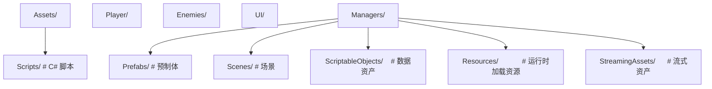
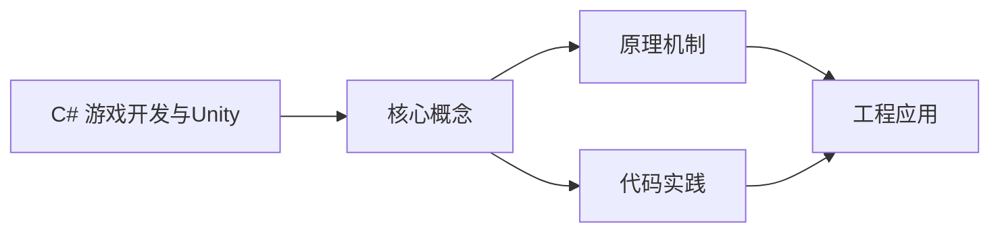
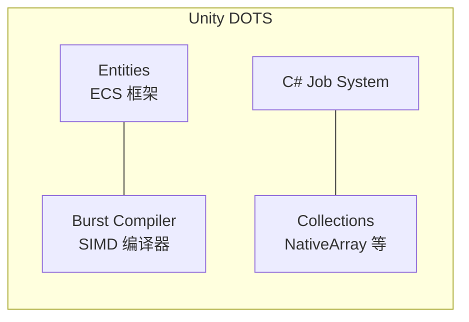
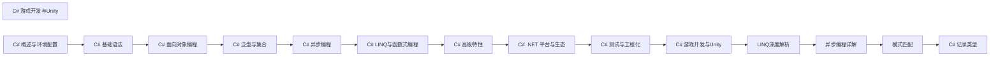

## 1. 学习目标（Bloom 分类）

本节按照布鲁姆教育目标分类学组织学习路径。本文主题为《C# 游戏开发与Unity》，属于 C# 模块，读者可以根据自身阶段选择阅读深度。

记忆层面：能够准确复述本文的核心概念、术语与基本语法或操作步骤，并能够在提问或检索时快速定位对应知识点。能够说出 C# 的类、属性、泛型、委托与 LINQ 基本语法。

理解层面：能够用自己的语言解释核心原理与工作机制，说明概念之间的因果关系，而不是机械记忆结论。能够解释 .NET 运行时、CLR、GC 与 async/await 模型。

应用层面：能够在真实项目或练习场景中运用本文知识解决具体问题，写出正确且可维护的实现。能够编写 .NET 控制台、Web API 与 Unity 脚本。

分析层面：能够拆解复杂问题，比较本文主题与相邻概念的异同，识别边界条件与例外情况。能够分析内存、并发与 LINQ 延迟执行的原理。

评价层面：能够根据约束条件（性能、可读性、安全、成本）评价不同方案的优劣，做出有依据的技术决策。能够评价 C# 与 Java、TypeScript 的异同。

创造层面：能够把本文知识与其他模块知识组合，设计出新的解决方案或可复用的工程模式。能够设计跨平台 .NET 应用（MAUI/ASP.NET Core）。

通过本节学习，读者应当能够把《C# 游戏开发与Unity》纳入自己的知识网络，并与 C# 模块的其他主题（.NET、LINQ、异步、泛型）建立关联。

## 2. 历史动机与发展脉络

《C# 游戏开发与Unity》是 C# 领域的重要主题。要真正理解它，需要先了解它解决的问题与演进过程。

C# 由 Anders Hejlsberg 领导的微软团队于 2000 年发布，随 .NET Framework 1.0 推出，定位是 Windows 平台的主流语言。
.NET Core（2016）把 C# 带到 Linux 与 macOS，.NET 5+ 统一为单一 .NET 平台；当前 LTS 版本 .NET 8（2023）与 .NET 10（2025）。
C# 语言持续现代化：泛型（2.0）、LINQ（3.0）、async/await（5.0）、模式匹配与记录类型（9+）、主构造函数（12）；Unity 游戏引擎使 C# 在游戏开发中占据重要地位。

回到本文主题：C# 游戏开发与Unity 的提出与成熟，正是上述技术背景下的必然产物。早期实现往往以简单可用为目标，随着工程规模扩大，社区逐渐沉淀出标准做法与最佳实践；理解这一脉络，可以帮助读者判断“为什么文档中的推荐写法是现在这个样子”，也能在遇到历史遗留代码时准确识别其设计年代与取舍。


## 3. 形式化定义与核心概念精讲

本节把《C# 游戏开发与Unity》涉及的核心概念以“定义 + 讲解”的形式展开。读者应把定义当作工具，把讲解当作理解路径；两者结合才能形成可迁移的知识。

CLR 与托管代码：C# 编译为 IL（中间语言），CLR 用 JIT 编译为机器码；GC 管理堆内存，值类型（struct）在栈上或内联。
LINQ：语言集成查询通过扩展方法与表达式树实现，支持延迟执行（IEnumerable）与即时执行（ToList）；表达式树可翻译为 SQL（EF Core）。
async/await：状态机机制把异步方法编译为可挂起的状态机；Task 表示异步操作，ConfigureAwait(false) 控制上下文捕获。

### 3.1 原文章节逐一精讲

原文档把主题拆分为 7 个小节，下面按顺序给出每一节的导读讲解，随后保留原文细节供精读。

#### 原文精读（完整保留）


#### 1. Unity 中的 C#

##### 1.1 Unity 与 .NET 版本

| Unity 版本  | C# 版本 | .NET 运行时    | 说明                   |
| :---------- | :------ | :------------- | :--------------------- |
| **2021.2+** | C# 9    | Mono/IL2CPP    | 支持 Span、NativeArray |
| **2022.2+** | C# 9    | Mono/IL2CPP    | 可空引用类型           |
| **2023.2+** | C# 9    | CoreCLR/IL2CPP | CoreCLR 可选           |
| **Unity 6** | C# 9    | CoreCLR/IL2CPP | CoreCLR 默认           |

> Unity 使用的是 .NET Standard 2.1 兼容子集，部分 .NET API 不可用。通过 NuGet 包可扩展可用库。

##### 1.2 Unity 项目结构



#### 2. MonoBehaviour 生命周期

##### 2.1 生命周期流程

```
初始化阶段:
  Awake()       → 脚本实例加载时调用（最早）
  OnEnable()    → 对象启用时调用
  Start()       → 第一帧更新前调用（仅一次）

物理阶段:
  FixedUpdate() → 固定时间间隔调用（物理计算）

输入阶段:
  Update()      → 每帧调用

后期处理:
  LateUpdate()  → 每帧在所有 Update 之后调用

场景渲染:
  OnPreCull()   → OnPreRender() → OnPostRender()

禁用与销毁:
  OnDisable()   → 对象禁用时调用
  OnDestroy()   → 对象销毁时调用
```

##### 2.2 生命周期代码

```csharp
public class PlayerController : MonoBehaviour
{
    [SerializeField] private float moveSpeed = 5f;
    [SerializeField] private Rigidbody rb = null!;

    // 最早调用，用于初始化引用和状态
    private void Awake()
    {
        // 获取组件引用
        rb = GetComponent<Rigidbody>();

        // 初始化内部状态
        _health = maxHealth;
    }

    // 在 Start 之前，每次启用时调用
    private void OnEnable()
    {
        GameEvents.OnPlayerHit += HandleHit;
    }

    // 第一帧之前，用于依赖其他对象的初始化
    private void Start()
    {
        // 可以安全访问其他对象
        var spawnPoint = GameObject.Find("SpawnPoint");
        transform.position = spawnPoint!.transform.position;
    }

    // 物理更新（固定步长，默认 0.02s）
    private void FixedUpdate()
    {
        var move = new Vector3(
            Input.GetAxis("Horizontal"),
            0,
            Input.GetAxis("Vertical"));

        rb.linearVelocity = move * moveSpeed;
    }

    // 每帧更新（游戏逻辑）
    private void Update()
    {
        if (Input.GetKeyDown(KeyCode.Space))
        {
            Jump();
        }

        UpdateAnimation();
    }

    // 所有 Update 之后（相机跟随等）
    private void LateUpdate()
    {
        Camera.main!.transform.position = transform.position + _cameraOffset;
    }

    // 禁用时调用
    private void OnDisable()
    {
        GameEvents.OnPlayerHit -= HandleHit;
    }

    // 销毁时清理
    private void OnDestroy()
    {
        // 释放资源、取消订阅
    }
}
```

#### 3. 协程 (Coroutine)

##### 3.1 基本用法

```csharp
// 协程 - Unity 的协作式多任务
public class Spawner : MonoBehaviour
{
    [SerializeField] private GameObject enemyPrefab = null!;
    [SerializeField] private float spawnInterval = 2f;

    private void Start()
    {
        StartCoroutine(SpawnEnemies());
    }

    private IEnumerator SpawnEnemies()
    {
        while (true)
        {
            Instantiate(enemyPrefab, GetRandomPosition(), Quaternion.identity);
            yield return new WaitForSeconds(spawnInterval);
        }
    }

    // 带返回值的协程
    private IEnumerator LoadAssetAsync(string path)
    {
        var request = Resources.LoadAsync<GameObject>(path);
        yield return request; // 等待加载完成

        if (request.asset != null)
        {
            Instantiate(request.asset);
        }
    }

    // 协程链
    private IEnumerator GameSequence()
    {
        yield return StartCoroutine(ShowIntro());
        yield return StartCoroutine(Countdown());
        yield return StartCoroutine(StartGameplay());
    }

    private IEnumerator ShowIntro()
    {
        // 显示介绍画面
        yield return new WaitForSeconds(3f);
    }

    private IEnumerator Countdown()
    {
        for (int i = 3; i > 0; i--)
        {
            Debug.Log(i);
            yield return new WaitForSeconds(1f);
        }
    }
}
```

##### 3.2 协程控制

```csharp
public class CoroutineManager : MonoBehaviour
{
    private Coroutine? _currentCoroutine;

    public void StartTask()
    {
        // 停止之前的协程再启动新的
        if (_currentCoroutine != null)
            StopCoroutine(_currentCoroutine);

        _currentCoroutine = StartCoroutine(DoWork());
    }

    public void CancelTask()
    {
        if (_currentCoroutine != null)
        {
            StopCoroutine(_currentCoroutine);
            _currentCoroutine = null;
        }
    }

    // 停止所有协程
    public void CancelAll()
    {
        StopAllCoroutines();
    }

    // WaitUntil / WaitWhile
    private IEnumerator WaitForCondition()
    {
        yield return new WaitUntil(() => PlayerIsReady);
        yield return new WaitWhile(() => IsPaused);
        // 继续执行
    }

    // CustomYieldInstruction
    public class WaitForKeyPress : CustomYieldInstruction
    {
        private readonly KeyCode _key;
        public WaitForKeyPress(KeyCode key) => _key = key;
        public override bool keepWaiting => !Input.GetKeyDown(_key);
    }
}
```

#### 4. ScriptableObject

##### 4.1 数据驱动设计

```csharp
// 定义数据资产
[CreateAssetMenu(fileName = "NewWeapon", menuName = "Game/Weapon")]
public class WeaponData : ScriptableObject
{
    public string weaponName;
    public int damage;
    public float attackSpeed;
    public GameObject prefab;
    public Sprite icon;

    [Header("特殊效果")]
    public bool hasElementalEffect;
    public ElementalType elementType;
    public float effectDuration;
}

// 使用 ScriptableObject
public class WeaponSystem : MonoBehaviour
{
    [SerializeField] private WeaponData currentWeapon = null!;

    public void Attack()
    {
        Debug.Log($"使用 {currentWeapon.weaponName} 攻击，伤害 {currentWeapon.damage}");
        if (currentWeapon.hasElementalEffect)
        {
            ApplyElementalEffect(currentWeapon.elementType, currentWeapon.effectDuration);
        }
    }
}
```

##### 4.2 运行时数据共享

```csharp
// 全局游戏配置
[CreateAssetMenu(fileName = "GameConfig", menuName = "Game/Config")]
public class GameConfig : ScriptableObject
{
    public float gravity = 9.8f;
    public float playerMoveSpeed = 5f;
    public int maxEnemies = 20;
    public LayerMask enemyLayer;

    // 运行时状态（不序列化）
    [System.NonSerialized] public int currentScore;
}

// 通过资源加载获取
public class GameManager : MonoBehaviour
{
    private GameConfig _config = null!;

    private void Awake()
    {
        _config = Resources.Load<GameConfig>("GameConfig");
    }
}
```

#### 5. ECS 模式

##### 5.1 传统 MonoBehaviour vs ECS

```
MonoBehaviour (OOP):
  GameObject → MonoBehaviour组件 → Update() 轮询
  问题：大量对象时性能差、GC 压力大、缓存不友好

ECS (Entity Component System):
  Entity   → 纯 ID，无数据无行为
  Component→ 纯数据，struct，连续内存
  System   → 纯逻辑，批量处理 Component
  优势：数据局部性、批量处理、无 GC、并行友好
```mermaid
flowchart LR
    subgraph DOTS[Unity DOTS]
        E[Entities<br/>ECS 框架]
        B[Burst Compiler<br/>SIMD 编译器]
        J[C# Job System]
        C[Collections<br/>NativeArray 等]
    end
    E --- B
    J --- C
```mermaid
flowchart LR
    subgraph DOTS[Unity DOTS]
        E[Entities<br/>ECS 框架]
        B[Burst Compiler<br/>SIMD 编译器]
        J[C# Job System]
        C[Collections<br/>NativeArray 等]
    end
    E --- B
    J --- C
```

##### 5.3 Entities 基础（Unity ECS）

```csharp
// Component - 纯数据（IComponentData）
public struct Movement : IComponentData
{
    public float3 direction;
    public float speed;
}

public struct Health : IComponentData
{
    public int current;
    public int max;
}

// System - 纯逻辑
[UpdateInGroup(typeof(FixedStepSimulationSystemGroup))]
public partial struct MovementSystem : ISystem
{
    public void OnUpdate(ref SystemState state)
    {
        var dt = SystemAPI.Time.DeltaTime;

        foreach (var (movement, transform) in
            SystemAPI.Query<RefRO<Movement>, RefRW<LocalTransform>>())
        {
            transform.ValueRW.Position +=
                movement.ValueRO.direction * movement.ValueRO.speed * dt;
        }
    }
}

// 生成 Entity
public class SpawnerAuthoring : MonoBehaviour
{
    public GameObject prefab;
    public int count;

    private class Baker : Baker<SpawnerAuthoring>
    {
        public override void Bake(SpawnerAuthoring authoring)
        {
            var entity = GetEntity(TransformUsageFlags.Dynamic);
            var prefabEntity = GetEntity(authoring.prefab, TransformUsageFlags.Dynamic);

            AddComponent(entity, new SpawnerData
            {
                Prefab = prefabEntity,
                Count = authoring.count
            });
        }
    }
}
```

#### 6. DOTS/Burst

##### 6.1 Burst 编译器

```csharp
using Unity.Burst;
using Unity.Mathematics;

[BurstCompile(CompileSynchronously = true, FloatMode = FloatMode.Fast,
              FloatPrecision = FloatPrecision.Standard)]
public struct PathfindingJob : IJobParallelFor
{
    [ReadOnly] public NativeArray<float3> positions;
    [ReadOnly] public NativeArray<float3> targets;
    public NativeArray<float> results;

    public void Execute(int index)
    {
        var dir = targets[index] - positions[index];
        results[index] = math.length(dir);
    }
}

// Burst 编译的方法
[BurstCompile]
public static float3 ComputeNormal(float3 a, float3 b, float3 c)
{
    return math.normalize(math.cross(b - a, c - a));
}
```

##### 6.2 C# Job System

```csharp
// IJob - 单线程作业
[BurstCompile]
public struct ComputeDamageJob : IJob
{
    public int baseDamage;
    public float multiplier;
    public NativeArray<int> result;

    public void Execute()
    {
        result[0] = (int)(baseDamage * multiplier);
    }
}

// IJobParallelFor - 并行作业
[BurstCompile]
public struct TransformPositionsJob : IJobParallelFor
{
    [ReadOnly] public NativeArray<float3> input;
    public NativeArray<float3> output;
    public float4x4 matrix;

    public void Execute(int index)
    {
        output[index] = math.transform(matrix, input[index]);
    }
}

// 调度作业
public class JobScheduler : MonoBehaviour
{
    private void Update()
    {
        var input = new NativeArray<float3>(1000, Allocator.TempJob);
        var output = new NativeArray<float3>(1000, Allocator.TempJob);

        // 填充输入数据...

        var job = new TransformPositionsJob
        {
            input = input,
            output = output,
            matrix = float4x4.Translate(new float3(1, 0, 0))
        };

        // 调度并行作业
        var handle = job.Schedule(1000, 64);

        // 等待完成
        handle.Complete();

        // 使用结果...

        // 必须释放
        input.Dispose();
        output.Dispose();
    }
}
```

##### 6.3 Native Collections

```csharp
// NativeArray - 连续内存数组
var array = new NativeArray<int>(1000, Allocator.TempJob);
array[0] = 42;
array.Dispose();

// NativeList - 动态数组
var list = new NativeList<int>(Allocator.TempJob);
list.Add(1);
list.Dispose();

// NativeHashMap - 哈希表
var map = new NativeHashMap<int, float3>(100, Allocator.TempJob);
map.TryAdd(1, new float3(1, 0, 0));
map.Dispose();

// NativeQueue - 队列
var queue = new NativeQueue<int>(Allocator.TempJob);
queue.Enqueue(1);
queue.Dispose();

// Allocator 选择
// Temp       - 单帧使用，最快
// TempJob    - 最多4帧，Job 内使用
// Persistent - 长期使用，最慢但最灵活
```

#### 7. 性能优化

##### 7.1 通用优化策略

```csharp
//  避免在 Update 中分配
private void Update()
{
    var list = new List<int>(); // 每帧 GC 分配！
}

//  缓存集合
private readonly List<int> _cache = new();
private void Update()
{
    _cache.Clear(); // 复用
}

//  避免 GetComponent 频繁调用
private void Update()
{
    GetComponent<Rigidbody>().linearVelocity = Vector3.zero;
}

//  Awake 中缓存
private Rigidbody _rb = null!;
private void Awake() => _rb = GetComponent<Rigidbody>();
private void Update() => _rb.linearVelocity = Vector3.zero;

//  避免字符串拼接
Debug.Log("Score: " + score + " Level: " + level);

//  使用字符串插值或 StringBuilder
Debug.Log($"Score: {score} Level: {level}");

//  避免 GameObject.Find / FindWithTag
var player = GameObject.Find("Player"); // O(n) 遍历

//  使用引用或管理器
[SerializeField] private Transform player;
```

##### 7.2 对象池

```csharp
public class ObjectPool : MonoBehaviour
{
    [SerializeField] private GameObject prefab = null!;
    [SerializeField] private int initialSize = 20;

    private readonly Queue<GameObject> _pool = new();

    private void Start()
    {
        for (int i = 0; i < initialSize; i++)
        {
            var obj = Instantiate(prefab, transform);
            obj.SetActive(false);
            _pool.Enqueue(obj);
        }
    }

    public GameObject Get(Vector3 position, Quaternion rotation)
    {
        GameObject obj;
        if (_pool.Count > 0)
        {
            obj = _pool.Dequeue();
        }
        else
        {
            obj = Instantiate(prefab, transform);
        }

        obj.transform.SetPositionAndRotation(position, rotation);
        obj.SetActive(true);
        return obj;
    }

    public void Return(GameObject obj)
    {
        obj.SetActive(false);
        obj.transform.SetParent(transform);
        _pool.Enqueue(obj);
    }
}

// Unity 2021+ 内置对象池
// var pool = new UnityEngine.Pool.ObjectPool<GameObject>(
//     createFunc: () => Instantiate(prefab),
//     actionOnGet: obj => obj.SetActive(true),
//     actionOnRelease: obj => obj.SetActive(false),
//     defaultCapacity: 20);
```

##### 7.3 Profiler 使用

```csharp
// 自定义 Profiler 标记
public class EnemyAI : MonoBehaviour
{
    private static readonly ProfilerMarker s_UpdateMarker =
        new("EnemyAI.Update");
    private static readonly ProfilerMarker s_PathfindMarker =
        new("EnemyAI.Pathfinding");

    private void Update()
    {
        s_UpdateMarker.Begin();
        // AI 逻辑
        s_PathfindMarker.Begin();
        FindPath();
        s_PathfindMarker.End();
        s_UpdateMarker.End();
    }
}

// 性能分析要点
// 1. CPU: 关注 GC.Alloc、耗时高的方法
// 2. GPU: 关注 Draw Call 数量、Shader 复杂度
// 3. 内存: 关注堆分配、Native 内存泄漏
// 4. 物理: 关注 FixedUpdate 耗时
```

##### 7.4 性能优化清单

| 优化方向       | 具体措施                        | 效果           |
| :------------- | :------------------------------ | :------------- |
| **减少 GC**    | 对象池、缓存集合、避免装箱      | 减少卡顿       |
| **批量处理**   | DOTS/ECS、Job System            | CPU 并行加速   |
| **数据布局**   | struct 替代 class、SOA 替代 AOS | 缓存友好       |
| **渲染优化**   | 合批、LOD、遮挡剔除             | 减少 Draw Call |
| **资源管理**   | Addressables、异步加载          | 减少内存占用   |
| **物理优化**   | 简化碰撞体、分层                | 减少 CPU 开销  |
| **Burst 编译** | 数学运算、热路径代码            | 2-10x 加速     |


### 3.2 概念关系图

下面用 Mermaid 图表达本文核心概念之间的关系，帮助读者建立整体图景：



图中展示的是本文知识的结构化关系：核心概念是入口，原理机制解释“为什么”，代码实践演示“怎么做”，工程应用回答“何时用”。读者学习时可以把每个小节的内容挂接到对应节点上。

## 4. 理论推导与原理解析

本节深入《C# 游戏开发与Unity》背后的原理。理论部分不求面面俱到，而是聚焦“能解释现象、能指导实践”的关键推导。

CLR 与托管代码：C# 编译为 IL（中间语言），CLR 用 JIT 编译为机器码；GC 管理堆内存，值类型（struct）在栈上或内联。
LINQ：语言集成查询通过扩展方法与表达式树实现，支持延迟执行（IEnumerable）与即时执行（ToList）；表达式树可翻译为 SQL（EF Core）。
async/await：状态机机制把异步方法编译为可挂起的状态机；Task 表示异步操作，ConfigureAwait(false) 控制上下文捕获。
泛型与反射：泛型保留类型信息（与 Java 擦除不同）；反射/源生成器（source generator）用于元编程。

需要强调的是，理论推导与工程实践之间存在翻译层：理论给出的是理想化模型与边界条件，工程代码则必须处理真实环境中的例外。读者在学习时应先掌握理论的“标准情形”，再通过陷阱章节了解“非标准情形”。

## 5. 代码示例与逐行讲解

本节把原文中的代码示例系统整理，并为每个示例补充用途说明与讲解。读者不应只浏览代码，而应逐段对照讲解理解设计意图。

### 5.1 示例：1.2 Unity 项目结构

该示例来自原文《1.2 Unity 项目结构》小节，用于演示C# 游戏开发与Unity相关操作。阅读时请先看代码结构，再看其后的讲解。


讲解：这段代码演示了本节核心知识点。代码中的关键操作可以归纳为三步：准备（定义或初始化）、执行（核心逻辑）、收尾（释放资源或返回结果）。实际项目中，这三步往往被封装为函数或类，以提升复用性与可测试性。

关键点分析：

该示例共 18 行有效代码，结构以数据或配置为主。阅读时应关注：数据字段的含义、配置项的作用，以及它们与运行行为的对应关系。

进阶思考路径：先尝试修改参数观察行为变化，再把示例中的模式迁移到自己的项目中；每次修改都记录预期与实测差异，这是把示例转化为能力的最快方式。

### 5.2 示例：2.1 生命周期流程

该示例来自原文《2.1 生命周期流程》小节，用于演示C# 游戏开发与Unity相关操作。阅读时请先看代码结构，再看其后的讲解。

```text
初始化阶段:
  Awake()       → 脚本实例加载时调用（最早）
  OnEnable()    → 对象启用时调用
  Start()       → 第一帧更新前调用（仅一次）

物理阶段:
  FixedUpdate() → 固定时间间隔调用（物理计算）

输入阶段:
  Update()      → 每帧调用

后期处理:
  LateUpdate()  → 每帧在所有 Update 之后调用

场景渲染:
  OnPreCull()   → OnPreRender() → OnPostRender()

禁用与销毁:
  OnDisable()   → 对象禁用时调用
  OnDestroy()   → 对象销毁时调用
```

讲解：这段代码演示了本节核心知识点。代码中的关键操作可以归纳为三步：准备（定义或初始化）、执行（核心逻辑）、收尾（释放资源或返回结果）。实际项目中，这三步往往被封装为函数或类，以提升复用性与可测试性。

关键点分析：

该示例共 15 行有效代码，结构以数据或配置为主。阅读时应关注：数据字段的含义、配置项的作用，以及它们与运行行为的对应关系。

进阶思考路径：先尝试修改参数观察行为变化，再把示例中的模式迁移到自己的项目中；每次修改都记录预期与实测差异，这是把示例转化为能力的最快方式。

### 5.3 示例：2.2 生命周期代码

该示例来自原文《2.2 生命周期代码》小节，用于演示C# 游戏开发与Unity相关操作。阅读时请先看代码结构，再看其后的讲解。

```csharp
public class PlayerController : MonoBehaviour
{
    [SerializeField] private float moveSpeed = 5f;
    [SerializeField] private Rigidbody rb = null!;

    // 最早调用，用于初始化引用和状态
    private void Awake()
    {
        // 获取组件引用
        rb = GetComponent<Rigidbody>();

        // 初始化内部状态
        _health = maxHealth;
    }

    // 在 Start 之前，每次启用时调用
    private void OnEnable()
    {
        GameEvents.OnPlayerHit += HandleHit;
    }

    // 第一帧之前，用于依赖其他对象的初始化
    private void Start()
    {
        // 可以安全访问其他对象
        var spawnPoint = GameObject.Find("SpawnPoint");
        transform.position = spawnPoint!.transform.position;
    }

    // 物理更新（固定步长，默认 0.02s）
    private void FixedUpdate()
    {
        var move = new Vector3(
            Input.GetAxis("Horizontal"),
            0,
            Input.GetAxis("Vertical"));

        rb.linearVelocity = move * moveSpeed;
    }

    // 每帧更新（游戏逻辑）
    private void Update()
    {
        if (Input.GetKeyDown(KeyCode.Space))
        {
            Jump();
        }

        UpdateAnimation();
    }

    // 所有 Update 之后（相机跟随等）
    private void LateUpdate()
    {
        Camera.main!.transform.position = transform.position + _cameraOffset;
    }

    // 禁用时调用
    private void OnDisable()
    {
        GameEvents.OnPlayerHit -= HandleHit;
    }

    // 销毁时清理
    private void OnDestroy()
    {
        // 释放资源、取消订阅
    }
}
```

讲解：这段代码演示了本节核心知识点。代码中的关键操作可以归纳为三步：准备（定义或初始化）、执行（核心逻辑）、收尾（释放资源或返回结果）。实际项目中，这三步往往被封装为函数或类，以提升复用性与可测试性。

关键点分析：

该示例共 58 行有效代码，包含 2 类关键结构（class、if）。其中：

- 入口与初始化部分负责建立上下文，对应实际项目中的启动或装配逻辑；
- 核心逻辑部分体现本文主题的主要操作，是阅读时最需要对照讲解理解的部分；
- 输出或返回部分把结果交给调用方，注意其类型与边界条件。

进阶思考路径：先尝试修改参数观察行为变化，再把示例中的模式迁移到自己的项目中；每次修改都记录预期与实测差异，这是把示例转化为能力的最快方式。

### 5.4 示例：3.1 基本用法

该示例来自原文《3.1 基本用法》小节，用于演示C# 游戏开发与Unity相关操作。阅读时请先看代码结构，再看其后的讲解。

```csharp
// 协程 - Unity 的协作式多任务
public class Spawner : MonoBehaviour
{
    [SerializeField] private GameObject enemyPrefab = null!;
    [SerializeField] private float spawnInterval = 2f;

    private void Start()
    {
        StartCoroutine(SpawnEnemies());
    }

    private IEnumerator SpawnEnemies()
    {
        while (true)
        {
            Instantiate(enemyPrefab, GetRandomPosition(), Quaternion.identity);
            yield return new WaitForSeconds(spawnInterval);
        }
    }

    // 带返回值的协程
    private IEnumerator LoadAssetAsync(string path)
    {
        var request = Resources.LoadAsync<GameObject>(path);
        yield return request; // 等待加载完成

        if (request.asset != null)
        {
            Instantiate(request.asset);
        }
    }

    // 协程链
    private IEnumerator GameSequence()
    {
        yield return StartCoroutine(ShowIntro());
        yield return StartCoroutine(Countdown());
        yield return StartCoroutine(StartGameplay());
    }

    private IEnumerator ShowIntro()
    {
        // 显示介绍画面
        yield return new WaitForSeconds(3f);
    }

    private IEnumerator Countdown()
    {
        for (int i = 3; i > 0; i--)
        {
            Debug.Log(i);
            yield return new WaitForSeconds(1f);
        }
    }
}
```

讲解：这段代码演示了本节核心知识点。代码中的关键操作可以归纳为三步：准备（定义或初始化）、执行（核心逻辑）、收尾（释放资源或返回结果）。实际项目中，这三步往往被封装为函数或类，以提升复用性与可测试性。

关键点分析：

该示例共 48 行有效代码，包含 5 类关键结构（class、if、for、while、return）。其中：

- 入口与初始化部分负责建立上下文，对应实际项目中的启动或装配逻辑；
- 核心逻辑部分体现本文主题的主要操作，是阅读时最需要对照讲解理解的部分；
- 输出或返回部分把结果交给调用方，注意其类型与边界条件。

进阶思考路径：先尝试修改参数观察行为变化，再把示例中的模式迁移到自己的项目中；每次修改都记录预期与实测差异，这是把示例转化为能力的最快方式。

### 5.5 示例：3.2 协程控制

该示例来自原文《3.2 协程控制》小节，用于演示C# 游戏开发与Unity相关操作。阅读时请先看代码结构，再看其后的讲解。

```csharp
public class CoroutineManager : MonoBehaviour
{
    private Coroutine? _currentCoroutine;

    public void StartTask()
    {
        // 停止之前的协程再启动新的
        if (_currentCoroutine != null)
            StopCoroutine(_currentCoroutine);

        _currentCoroutine = StartCoroutine(DoWork());
    }

    public void CancelTask()
    {
        if (_currentCoroutine != null)
        {
            StopCoroutine(_currentCoroutine);
            _currentCoroutine = null;
        }
    }

    // 停止所有协程
    public void CancelAll()
    {
        StopAllCoroutines();
    }

    // WaitUntil / WaitWhile
    private IEnumerator WaitForCondition()
    {
        yield return new WaitUntil(() => PlayerIsReady);
        yield return new WaitWhile(() => IsPaused);
        // 继续执行
    }

    // CustomYieldInstruction
    public class WaitForKeyPress : CustomYieldInstruction
    {
        private readonly KeyCode _key;
        public WaitForKeyPress(KeyCode key) => _key = key;
        public override bool keepWaiting => !Input.GetKeyDown(_key);
    }
}
```

讲解：这段代码演示了本节核心知识点。代码中的关键操作可以归纳为三步：准备（定义或初始化）、执行（核心逻辑）、收尾（释放资源或返回结果）。实际项目中，这三步往往被封装为函数或类，以提升复用性与可测试性。

关键点分析：

该示例共 38 行有效代码，包含 3 类关键结构（class、if、return）。其中：

- 入口与初始化部分负责建立上下文，对应实际项目中的启动或装配逻辑；
- 核心逻辑部分体现本文主题的主要操作，是阅读时最需要对照讲解理解的部分；
- 输出或返回部分把结果交给调用方，注意其类型与边界条件。

进阶思考路径：先尝试修改参数观察行为变化，再把示例中的模式迁移到自己的项目中；每次修改都记录预期与实测差异，这是把示例转化为能力的最快方式。

### 5.6 示例：4.1 数据驱动设计

该示例来自原文《4.1 数据驱动设计》小节，用于演示C# 游戏开发与Unity相关操作。阅读时请先看代码结构，再看其后的讲解。

```csharp
// 定义数据资产
[CreateAssetMenu(fileName = "NewWeapon", menuName = "Game/Weapon")]
public class WeaponData : ScriptableObject
{
    public string weaponName;
    public int damage;
    public float attackSpeed;
    public GameObject prefab;
    public Sprite icon;

    [Header("特殊效果")]
    public bool hasElementalEffect;
    public ElementalType elementType;
    public float effectDuration;
}

// 使用 ScriptableObject
public class WeaponSystem : MonoBehaviour
{
    [SerializeField] private WeaponData currentWeapon = null!;

    public void Attack()
    {
        Debug.Log($"使用 {currentWeapon.weaponName} 攻击，伤害 {currentWeapon.damage}");
        if (currentWeapon.hasElementalEffect)
        {
            ApplyElementalEffect(currentWeapon.elementType, currentWeapon.effectDuration);
        }
    }
}
```

讲解：这段代码演示了本节核心知识点。代码中的关键操作可以归纳为三步：准备（定义或初始化）、执行（核心逻辑）、收尾（释放资源或返回结果）。实际项目中，这三步往往被封装为函数或类，以提升复用性与可测试性。

关键点分析：

该示例共 27 行有效代码，包含 2 类关键结构（class、if）。其中：

- 入口与初始化部分负责建立上下文，对应实际项目中的启动或装配逻辑；
- 核心逻辑部分体现本文主题的主要操作，是阅读时最需要对照讲解理解的部分；
- 输出或返回部分把结果交给调用方，注意其类型与边界条件。

进阶思考路径：先尝试修改参数观察行为变化，再把示例中的模式迁移到自己的项目中；每次修改都记录预期与实测差异，这是把示例转化为能力的最快方式。

### 5.7 示例：4.2 运行时数据共享

该示例来自原文《4.2 运行时数据共享》小节，用于演示C# 游戏开发与Unity相关操作。阅读时请先看代码结构，再看其后的讲解。

```csharp
// 全局游戏配置
[CreateAssetMenu(fileName = "GameConfig", menuName = "Game/Config")]
public class GameConfig : ScriptableObject
{
    public float gravity = 9.8f;
    public float playerMoveSpeed = 5f;
    public int maxEnemies = 20;
    public LayerMask enemyLayer;

    // 运行时状态（不序列化）
    [System.NonSerialized] public int currentScore;
}

// 通过资源加载获取
public class GameManager : MonoBehaviour
{
    private GameConfig _config = null!;

    private void Awake()
    {
        _config = Resources.Load<GameConfig>("GameConfig");
    }
}
```

讲解：这段代码演示了本节核心知识点。代码中的关键操作可以归纳为三步：准备（定义或初始化）、执行（核心逻辑）、收尾（释放资源或返回结果）。实际项目中，这三步往往被封装为函数或类，以提升复用性与可测试性。

关键点分析：

该示例共 20 行有效代码，包含 1 类关键结构（class）。其中：

- 入口与初始化部分负责建立上下文，对应实际项目中的启动或装配逻辑；
- 核心逻辑部分体现本文主题的主要操作，是阅读时最需要对照讲解理解的部分；
- 输出或返回部分把结果交给调用方，注意其类型与边界条件。

进阶思考路径：先尝试修改参数观察行为变化，再把示例中的模式迁移到自己的项目中；每次修改都记录预期与实测差异，这是把示例转化为能力的最快方式。

### 5.8 示例：5.1 传统 MonoBehaviour vs ECS

该示例来自原文《5.1 传统 MonoBehaviour vs ECS》小节，用于演示C# 游戏开发与Unity相关操作。阅读时请先看代码结构，再看其后的讲解。

```text
MonoBehaviour (OOP):
  GameObject → MonoBehaviour组件 → Update() 轮询
  问题：大量对象时性能差、GC 压力大、缓存不友好

ECS (Entity Component System):
  Entity   → 纯 ID，无数据无行为
  Component→ 纯数据，struct，连续内存
  System   → 纯逻辑，批量处理 Component
  优势：数据局部性、批量处理、无 GC、并行友好
```

讲解：这段代码演示了本节核心知识点。代码中的关键操作可以归纳为三步：准备（定义或初始化）、执行（核心逻辑）、收尾（释放资源或返回结果）。实际项目中，这三步往往被封装为函数或类，以提升复用性与可测试性。

关键点分析：

该示例共 8 行有效代码，结构以数据或配置为主。阅读时应关注：数据字段的含义、配置项的作用，以及它们与运行行为的对应关系。

进阶思考路径：先尝试修改参数观察行为变化，再把示例中的模式迁移到自己的项目中；每次修改都记录预期与实测差异，这是把示例转化为能力的最快方式。

### 5.9 示例：5.1 传统 MonoBehaviour vs ECS

该示例来自原文《5.1 传统 MonoBehaviour vs ECS》小节，用于演示C# 游戏开发与Unity相关操作。阅读时请先看代码结构，再看其后的讲解。



讲解：这段代码演示了本节核心知识点。代码中的关键操作可以归纳为三步：准备（定义或初始化）、执行（核心逻辑）、收尾（释放资源或返回结果）。实际项目中，这三步往往被封装为函数或类，以提升复用性与可测试性。

关键点分析：

该示例共 9 行有效代码，结构以数据或配置为主。阅读时应关注：数据字段的含义、配置项的作用，以及它们与运行行为的对应关系。

进阶思考路径：先尝试修改参数观察行为变化，再把示例中的模式迁移到自己的项目中；每次修改都记录预期与实测差异，这是把示例转化为能力的最快方式。

### 5.10 示例：5.3 Entities 基础（Unity ECS）

该示例来自原文《5.3 Entities 基础（Unity ECS）》小节，用于演示C# 游戏开发与Unity相关操作。阅读时请先看代码结构，再看其后的讲解。

```csharp
// Component - 纯数据（IComponentData）
public struct Movement : IComponentData
{
    public float3 direction;
    public float speed;
}

public struct Health : IComponentData
{
    public int current;
    public int max;
}

// System - 纯逻辑
[UpdateInGroup(typeof(FixedStepSimulationSystemGroup))]
public partial struct MovementSystem : ISystem
{
    public void OnUpdate(ref SystemState state)
    {
        var dt = SystemAPI.Time.DeltaTime;

        foreach (var (movement, transform) in
            SystemAPI.Query<RefRO<Movement>, RefRW<LocalTransform>>())
        {
            transform.ValueRW.Position +=
                movement.ValueRO.direction * movement.ValueRO.speed * dt;
        }
    }
}

// 生成 Entity
public class SpawnerAuthoring : MonoBehaviour
{
    public GameObject prefab;
    public int count;

    private class Baker : Baker<SpawnerAuthoring>
    {
        public override void Bake(SpawnerAuthoring authoring)
        {
            var entity = GetEntity(TransformUsageFlags.Dynamic);
            var prefabEntity = GetEntity(authoring.prefab, TransformUsageFlags.Dynamic);

            AddComponent(entity, new SpawnerData
            {
                Prefab = prefabEntity,
                Count = authoring.count
            });
        }
    }
}
```

讲解：这段代码演示了本节核心知识点。代码中的关键操作可以归纳为三步：准备（定义或初始化）、执行（核心逻辑）、收尾（释放资源或返回结果）。实际项目中，这三步往往被封装为函数或类，以提升复用性与可测试性。

关键点分析：

该示例共 45 行有效代码，包含 1 类关键结构（class）。其中：

- 入口与初始化部分负责建立上下文，对应实际项目中的启动或装配逻辑；
- 核心逻辑部分体现本文主题的主要操作，是阅读时最需要对照讲解理解的部分；
- 输出或返回部分把结果交给调用方，注意其类型与边界条件。

进阶思考路径：先尝试修改参数观察行为变化，再把示例中的模式迁移到自己的项目中；每次修改都记录预期与实测差异，这是把示例转化为能力的最快方式。

### 5.11 示例：6.1 Burst 编译器

该示例来自原文《6.1 Burst 编译器》小节，用于演示C# 游戏开发与Unity相关操作。阅读时请先看代码结构，再看其后的讲解。

```csharp
using Unity.Burst;
using Unity.Mathematics;

[BurstCompile(CompileSynchronously = true, FloatMode = FloatMode.Fast,
              FloatPrecision = FloatPrecision.Standard)]
public struct PathfindingJob : IJobParallelFor
{
    [ReadOnly] public NativeArray<float3> positions;
    [ReadOnly] public NativeArray<float3> targets;
    public NativeArray<float> results;

    public void Execute(int index)
    {
        var dir = targets[index] - positions[index];
        results[index] = math.length(dir);
    }
}

// Burst 编译的方法
[BurstCompile]
public static float3 ComputeNormal(float3 a, float3 b, float3 c)
{
    return math.normalize(math.cross(b - a, c - a));
}
```

讲解：这段代码演示了本节核心知识点。代码中的关键操作可以归纳为三步：准备（定义或初始化）、执行（核心逻辑）、收尾（释放资源或返回结果）。实际项目中，这三步往往被封装为函数或类，以提升复用性与可测试性。

关键点分析：

该示例共 21 行有效代码，包含 1 类关键结构（return）。其中：

- 入口与初始化部分负责建立上下文，对应实际项目中的启动或装配逻辑；
- 核心逻辑部分体现本文主题的主要操作，是阅读时最需要对照讲解理解的部分；
- 输出或返回部分把结果交给调用方，注意其类型与边界条件。

进阶思考路径：先尝试修改参数观察行为变化，再把示例中的模式迁移到自己的项目中；每次修改都记录预期与实测差异，这是把示例转化为能力的最快方式。

### 5.12 示例：6.2 C# Job System

该示例来自原文《6.2 C# Job System》小节，用于演示C# 游戏开发与Unity相关操作。阅读时请先看代码结构，再看其后的讲解。

```csharp
// IJob - 单线程作业
[BurstCompile]
public struct ComputeDamageJob : IJob
{
    public int baseDamage;
    public float multiplier;
    public NativeArray<int> result;

    public void Execute()
    {
        result[0] = (int)(baseDamage * multiplier);
    }
}

// IJobParallelFor - 并行作业
[BurstCompile]
public struct TransformPositionsJob : IJobParallelFor
{
    [ReadOnly] public NativeArray<float3> input;
    public NativeArray<float3> output;
    public float4x4 matrix;

    public void Execute(int index)
    {
        output[index] = math.transform(matrix, input[index]);
    }
}

// 调度作业
public class JobScheduler : MonoBehaviour
{
    private void Update()
    {
        var input = new NativeArray<float3>(1000, Allocator.TempJob);
        var output = new NativeArray<float3>(1000, Allocator.TempJob);

        // 填充输入数据...

        var job = new TransformPositionsJob
        {
            input = input,
            output = output,
            matrix = float4x4.Translate(new float3(1, 0, 0))
        };

        // 调度并行作业
        var handle = job.Schedule(1000, 64);

        // 等待完成
        handle.Complete();

        // 使用结果...

        // 必须释放
        input.Dispose();
        output.Dispose();
    }
}
```

讲解：这段代码演示了本节核心知识点。代码中的关键操作可以归纳为三步：准备（定义或初始化）、执行（核心逻辑）、收尾（释放资源或返回结果）。实际项目中，这三步往往被封装为函数或类，以提升复用性与可测试性。

关键点分析：

该示例共 48 行有效代码，包含 1 类关键结构（class）。其中：

- 入口与初始化部分负责建立上下文，对应实际项目中的启动或装配逻辑；
- 核心逻辑部分体现本文主题的主要操作，是阅读时最需要对照讲解理解的部分；
- 输出或返回部分把结果交给调用方，注意其类型与边界条件。

进阶思考路径：先尝试修改参数观察行为变化，再把示例中的模式迁移到自己的项目中；每次修改都记录预期与实测差异，这是把示例转化为能力的最快方式。

### 5.13 示例：6.3 Native Collections

该示例来自原文《6.3 Native Collections》小节，用于演示C# 游戏开发与Unity相关操作。阅读时请先看代码结构，再看其后的讲解。

```csharp
// NativeArray - 连续内存数组
var array = new NativeArray<int>(1000, Allocator.TempJob);
array[0] = 42;
array.Dispose();

// NativeList - 动态数组
var list = new NativeList<int>(Allocator.TempJob);
list.Add(1);
list.Dispose();

// NativeHashMap - 哈希表
var map = new NativeHashMap<int, float3>(100, Allocator.TempJob);
map.TryAdd(1, new float3(1, 0, 0));
map.Dispose();

// NativeQueue - 队列
var queue = new NativeQueue<int>(Allocator.TempJob);
queue.Enqueue(1);
queue.Dispose();

// Allocator 选择
// Temp       - 单帧使用，最快
// TempJob    - 最多4帧，Job 内使用
// Persistent - 长期使用，最慢但最灵活
```

讲解：这段代码演示了本节核心知识点。代码中的关键操作可以归纳为三步：准备（定义或初始化）、执行（核心逻辑）、收尾（释放资源或返回结果）。实际项目中，这三步往往被封装为函数或类，以提升复用性与可测试性。

关键点分析：

该示例共 20 行有效代码，结构以数据或配置为主。阅读时应关注：数据字段的含义、配置项的作用，以及它们与运行行为的对应关系。

进阶思考路径：先尝试修改参数观察行为变化，再把示例中的模式迁移到自己的项目中；每次修改都记录预期与实测差异，这是把示例转化为能力的最快方式。

### 5.14 示例：7.1 通用优化策略

该示例来自原文《7.1 通用优化策略》小节，用于演示C# 游戏开发与Unity相关操作。阅读时请先看代码结构，再看其后的讲解。

```csharp
//  避免在 Update 中分配
private void Update()
{
    var list = new List<int>(); // 每帧 GC 分配！
}

//  缓存集合
private readonly List<int> _cache = new();
private void Update()
{
    _cache.Clear(); // 复用
}

//  避免 GetComponent 频繁调用
private void Update()
{
    GetComponent<Rigidbody>().linearVelocity = Vector3.zero;
}

//  Awake 中缓存
private Rigidbody _rb = null!;
private void Awake() => _rb = GetComponent<Rigidbody>();
private void Update() => _rb.linearVelocity = Vector3.zero;

//  避免字符串拼接
Debug.Log("Score: " + score + " Level: " + level);

//  使用字符串插值或 StringBuilder
Debug.Log($"Score: {score} Level: {level}");

//  避免 GameObject.Find / FindWithTag
var player = GameObject.Find("Player"); // O(n) 遍历

//  使用引用或管理器
[SerializeField] private Transform player;
```

讲解：这段代码演示了本节核心知识点。代码中的关键操作可以归纳为三步：准备（定义或初始化）、执行（核心逻辑）、收尾（释放资源或返回结果）。实际项目中，这三步往往被封装为函数或类，以提升复用性与可测试性。

关键点分析：

该示例共 28 行有效代码，结构以数据或配置为主。阅读时应关注：数据字段的含义、配置项的作用，以及它们与运行行为的对应关系。

进阶思考路径：先尝试修改参数观察行为变化，再把示例中的模式迁移到自己的项目中；每次修改都记录预期与实测差异，这是把示例转化为能力的最快方式。

### 5.15 示例：7.2 对象池

该示例来自原文《7.2 对象池》小节，用于演示C# 游戏开发与Unity相关操作。阅读时请先看代码结构，再看其后的讲解。

```csharp
public class ObjectPool : MonoBehaviour
{
    [SerializeField] private GameObject prefab = null!;
    [SerializeField] private int initialSize = 20;

    private readonly Queue<GameObject> _pool = new();

    private void Start()
    {
        for (int i = 0; i < initialSize; i++)
        {
            var obj = Instantiate(prefab, transform);
            obj.SetActive(false);
            _pool.Enqueue(obj);
        }
    }

    public GameObject Get(Vector3 position, Quaternion rotation)
    {
        GameObject obj;
        if (_pool.Count > 0)
        {
            obj = _pool.Dequeue();
        }
        else
        {
            obj = Instantiate(prefab, transform);
        }

        obj.transform.SetPositionAndRotation(position, rotation);
        obj.SetActive(true);
        return obj;
    }

    public void Return(GameObject obj)
    {
        obj.SetActive(false);
        obj.transform.SetParent(transform);
        _pool.Enqueue(obj);
    }
}

// Unity 2021+ 内置对象池
// var pool = new UnityEngine.Pool.ObjectPool<GameObject>(
//     createFunc: () => Instantiate(prefab),
//     actionOnGet: obj => obj.SetActive(true),
//     actionOnRelease: obj => obj.SetActive(false),
//     defaultCapacity: 20);
```

讲解：这段代码演示了本节核心知识点。代码中的关键操作可以归纳为三步：准备（定义或初始化）、执行（核心逻辑）、收尾（释放资源或返回结果）。实际项目中，这三步往往被封装为函数或类，以提升复用性与可测试性。

关键点分析：

该示例共 42 行有效代码，包含 4 类关键结构（class、if、for、return）。其中：

- 入口与初始化部分负责建立上下文，对应实际项目中的启动或装配逻辑；
- 核心逻辑部分体现本文主题的主要操作，是阅读时最需要对照讲解理解的部分；
- 输出或返回部分把结果交给调用方，注意其类型与边界条件。

进阶思考路径：先尝试修改参数观察行为变化，再把示例中的模式迁移到自己的项目中；每次修改都记录预期与实测差异，这是把示例转化为能力的最快方式。

### 5.16 示例：7.3 Profiler 使用

该示例来自原文《7.3 Profiler 使用》小节，用于演示C# 游戏开发与Unity相关操作。阅读时请先看代码结构，再看其后的讲解。

```csharp
// 自定义 Profiler 标记
public class EnemyAI : MonoBehaviour
{
    private static readonly ProfilerMarker s_UpdateMarker =
        new("EnemyAI.Update");
    private static readonly ProfilerMarker s_PathfindMarker =
        new("EnemyAI.Pathfinding");

    private void Update()
    {
        s_UpdateMarker.Begin();
        // AI 逻辑
        s_PathfindMarker.Begin();
        FindPath();
        s_PathfindMarker.End();
        s_UpdateMarker.End();
    }
}

// 性能分析要点
// 1. CPU: 关注 GC.Alloc、耗时高的方法
// 2. GPU: 关注 Draw Call 数量、Shader 复杂度
// 3. 内存: 关注堆分配、Native 内存泄漏
// 4. 物理: 关注 FixedUpdate 耗时
```

讲解：这段代码演示了本节核心知识点。代码中的关键操作可以归纳为三步：准备（定义或初始化）、执行（核心逻辑）、收尾（释放资源或返回结果）。实际项目中，这三步往往被封装为函数或类，以提升复用性与可测试性。

关键点分析：

该示例共 22 行有效代码，包含 1 类关键结构（class）。其中：

- 入口与初始化部分负责建立上下文，对应实际项目中的启动或装配逻辑；
- 核心逻辑部分体现本文主题的主要操作，是阅读时最需要对照讲解理解的部分；
- 输出或返回部分把结果交给调用方，注意其类型与边界条件。

进阶思考路径：先尝试修改参数观察行为变化，再把示例中的模式迁移到自己的项目中；每次修改都记录预期与实测差异，这是把示例转化为能力的最快方式。


综合以上示例，可以总结出本主题的代码实践要点：第一，先定义清晰的输入输出契约；第二，核心逻辑保持单一职责；第三，错误处理与边界条件不可省略；第四，命名与注释表达意图而非复述代码。

## 6. 对比分析

对比是理解《C# 游戏开发与Unity》定位的最快路径。下面从多个维度与相邻方案进行对比。

C# 与 Java：两者都是托管语言；C# 语言特性更新更快，Java 生态更开放。
C# 与 TypeScript：C# 强类型服务端，TypeScript 前端；语法相似，async/await 模型一致。
.NET Framework 与 .NET 8：现代 .NET 跨平台、性能更好，新项目一律 .NET 8+。

对比的目的不是分出绝对优劣，而是建立选择依据：不同约束条件下，最优解不同。读者应把每个对比维度转化为决策检查清单。

## 7. 常见陷阱与最佳实践

本节整理该主题的高频错误与推荐做法。每个陷阱先描述现象，再解释原因，最后给出最佳实践。

### 7.1 LINQ 延迟执行误判

IEnumerable 查询在枚举时才执行，数据源变化影响结果。需要快照时 ToList。

深入讲解：该问题之所以被归类为“常见陷阱”，是因为它在初学者的代码中反复出现，而且往往不在第一时间暴露——错误通常隐藏在特定数据或特定时序下。

从成因上看，LINQ 延迟执行误判 一般源于对 C# 某个机制的理解偏差：要么误用了默认行为，要么忽略了边界条件，要么把其他语言的思维惯性带了过来。

从影响上看，LINQ 延迟执行误判 轻则产生错误结果，重则导致资源泄漏、数据损坏或安全事故；这也是为什么工程评审中会把它列为检查项。

从修复策略上看，处理LINQ 延迟执行误判的正确顺序是：先复现（构造最小用例），再定位（确认机制层面的根因），最后修复并补充回归测试。跳过复现直接改代码，往往治标不治本。

### 7.2 async void

async void 异常无法被调用方捕获。事件处理器外一律 async Task。

深入讲解：该问题之所以被归类为“常见陷阱”，是因为它在初学者的代码中反复出现，而且往往不在第一时间暴露——错误通常隐藏在特定数据或特定时序下。

从成因上看，async void 一般源于对 C# 某个机制的理解偏差：要么误用了默认行为，要么忽略了边界条件，要么把其他语言的思维惯性带了过来。

从影响上看，async void 轻则产生错误结果，重则导致资源泄漏、数据损坏或安全事故；这也是为什么工程评审中会把它列为检查项。

从修复策略上看，处理async void的正确顺序是：先复现（构造最小用例），再定位（确认机制层面的根因），最后修复并补充回归测试。跳过复现直接改代码，往往治标不治本。

### 7.3 阻塞异步调用

.Result/.Wait() 在 UI 上下文死锁。全程 async/await。

深入讲解：该问题之所以被归类为“常见陷阱”，是因为它在初学者的代码中反复出现，而且往往不在第一时间暴露——错误通常隐藏在特定数据或特定时序下。

从成因上看，阻塞异步调用 一般源于对 C# 某个机制的理解偏差：要么误用了默认行为，要么忽略了边界条件，要么把其他语言的思维惯性带了过来。

从影响上看，阻塞异步调用 轻则产生错误结果，重则导致资源泄漏、数据损坏或安全事故；这也是为什么工程评审中会把它列为检查项。

从修复策略上看，处理阻塞异步调用的正确顺序是：先复现（构造最小用例），再定位（确认机制层面的根因），最后修复并补充回归测试。跳过复现直接改代码，往往治标不治本。

### 7.4 可变默认参数

可选参数默认值必须是编译期常量；引用类型默认 null，注意空引用。

深入讲解：该问题之所以被归类为“常见陷阱”，是因为它在初学者的代码中反复出现，而且往往不在第一时间暴露——错误通常隐藏在特定数据或特定时序下。

从成因上看，可变默认参数 一般源于对 C# 某个机制的理解偏差：要么误用了默认行为，要么忽略了边界条件，要么把其他语言的思维惯性带了过来。

从影响上看，可变默认参数 轻则产生错误结果，重则导致资源泄漏、数据损坏或安全事故；这也是为什么工程评审中会把它列为检查项。

从修复策略上看，处理可变默认参数的正确顺序是：先复现（构造最小用例），再定位（确认机制层面的根因），最后修复并补充回归测试。跳过复现直接改代码，往往治标不治本。

### 7.5 字符串拼接

循环内 += 产生大量垃圾。使用 StringBuilder。

深入讲解：该问题之所以被归类为“常见陷阱”，是因为它在初学者的代码中反复出现，而且往往不在第一时间暴露——错误通常隐藏在特定数据或特定时序下。

从成因上看，字符串拼接 一般源于对 C# 某个机制的理解偏差：要么误用了默认行为，要么忽略了边界条件，要么把其他语言的思维惯性带了过来。

从影响上看，字符串拼接 轻则产生错误结果，重则导致资源泄漏、数据损坏或安全事故；这也是为什么工程评审中会把它列为检查项。

从修复策略上看，处理字符串拼接的正确顺序是：先复现（构造最小用例），再定位（确认机制层面的根因），最后修复并补充回归测试。跳过复现直接改代码，往往治标不治本。

### 7.6 Culture 陷阱

ToString 受区域影响（小数点差异）。使用 InvariantCulture 或格式化说明符。

深入讲解：该问题之所以被归类为“常见陷阱”，是因为它在初学者的代码中反复出现，而且往往不在第一时间暴露——错误通常隐藏在特定数据或特定时序下。

从成因上看，Culture 陷阱 一般源于对 C# 某个机制的理解偏差：要么误用了默认行为，要么忽略了边界条件，要么把其他语言的思维惯性带了过来。

从影响上看，Culture 陷阱 轻则产生错误结果，重则导致资源泄漏、数据损坏或安全事故；这也是为什么工程评审中会把它列为检查项。

从修复策略上看，处理Culture 陷阱的正确顺序是：先复现（构造最小用例），再定位（确认机制层面的根因），最后修复并补充回归测试。跳过复现直接改代码，往往治标不治本。

### 7.7 GC 压力

频繁分配大对象触发 Full GC。使用 ArrayPool、结构体或减少分配。

深入讲解：该问题之所以被归类为“常见陷阱”，是因为它在初学者的代码中反复出现，而且往往不在第一时间暴露——错误通常隐藏在特定数据或特定时序下。

从成因上看，GC 压力 一般源于对 C# 某个机制的理解偏差：要么误用了默认行为，要么忽略了边界条件，要么把其他语言的思维惯性带了过来。

从影响上看，GC 压力 轻则产生错误结果，重则导致资源泄漏、数据损坏或安全事故；这也是为什么工程评审中会把它列为检查项。

从修复策略上看，处理GC 压力的正确顺序是：先复现（构造最小用例），再定位（确认机制层面的根因），最后修复并补充回归测试。跳过复现直接改代码，往往治标不治本。

### 7.0 最佳实践总览

1. 使用可空引用类型（nullable reference types）编译期防空引用。
2. 异步全链路 async/await，禁止 async void。
3. 集合与 LINQ 优先，避免手写循环。
4. 记录类型（record）表达不可变数据。
5. 依赖注入容器管理服务生命周期。

把这些最佳实践固化为团队规范与代码评审检查项，是避免同类问题反复出现的关键。

## 8. 工程实践

本节把《C# 游戏开发与Unity》放入真实工程场景，给出可复用的模式与组织方法。

ASP.NET Core：最小 API 或控制器模式；中间件管线；EF Core 数据访问。
解决方案组织：sln + csproj 分项目（Web、Domain、Infrastructure、Tests）。
配置：appsettings.json + 环境变量 + 用户机密（开发）。
测试：xUnit/NUnit + Moq 或纯依赖注入替身。

### 8.1 工程实践的原则拆解

以上工程实践可以归纳为四条原则。第一，配置与代码分离：C# 项目中环境差异应通过配置注入，而不是散落在代码分支中；这保证同一份代码可以在开发、测试、生产环境一致运行。

第二，接口稳定优先：对外接口（函数签名、协议、数据格式）一旦被消费方依赖，变更成本极高；设计时应预留扩展点并保持向后兼容。

第三，可观测性内置：日志、指标与追踪应该在功能开发时同步设计，而不是故障发生后补救；没有观测手段的模块等于黑盒。

第四，变更可回滚：任何发布都应有对应的回滚方案；数据库迁移、配置变更与代码发布一样需要版本管理与逆向路径。

### 8.2 实践落地的检查清单

- [ ] ASP.NET Core：对照本节描述，检查当前项目是否已经落实；未落实的项列入技术债并排期处理。
- [ ] 解决方案组织：对照本节描述，检查当前项目是否已经落实；未落实的项列入技术债并排期处理。
- [ ] 配置：对照本节描述，检查当前项目是否已经落实；未落实的项列入技术债并排期处理。
- [ ] 测试：对照本节描述，检查当前项目是否已经落实；未落实的项列入技术债并排期处理。

工程实践的共性原则：配置与代码分离、接口稳定优先、可观测性内置、变更可回滚。这些原则适用于本主题的所有实现。

## 9. 案例研究

本节通过一个完整案例把《C# 游戏开发与Unity》的知识串起来。案例按“需求分析、方案设计、实现、验证”四步展开。

需求：实现订单查询 API，支持筛选、分页与统计。
方案：ASP.NET Core Minimal API + EF Core + LINQ。
要点：DTO 隔离实体；IQueryable 组合查询条件；分页参数校验。
验证：集成测试覆盖查询与边界；benchmark 验证大数据量性能。

### 9.1 案例的扩展讨论

把案例中的方案放大到真实规模，需要额外考虑三个问题：

第一，规模：当数据量或并发量上升一个数量级时，原方案中的数据结构、缓存策略与任务调度是否仍然成立？通常需要引入分层与异步。

第二，团队：多人协作时，模块边界、接口契约与代码所有权必须明确；案例中的实现应拆分为可独立测试的单元，并配合文档说明设计意图。

第三，演进：上线后的需求变化不可避免；方案设计时应预留扩展点（配置化、插件化、事件化），并定期用真实指标验证假设。


案例研究的学习方法：先独立阅读需求，尝试在脑中形成方案，再对照实现与讲解，最后思考“如果约束变化（数据量、并发、团队规模），方案应如何调整”。

## 10. 知识要点总结与深入讲解

本节以讲解形式汇总全文要点，替代传统的习题与自测，读者不需要答题，只需跟随解释建立完整的认知框架。

关于《C# 游戏开发与Unity》的核心结论：

C# 的现代性在托管语言中领先：语言特性、工具链与跨平台能力均衡。
异步、LINQ 与泛型是三大支柱，工程代码应熟练运用。
理解 CLR 与 GC 是性能调优的前提。

原文档各小节的要点回顾：

- 1. Unity 中的 C#：该小节围绕C# 游戏开发与Unity展开具体细节，阅读时应关注其与核心结论的对应关系；每个小节都是核心结论在某一个侧面的展开。
- 2. MonoBehaviour 生命周期：该小节围绕C# 游戏开发与Unity展开具体细节，阅读时应关注其与核心结论的对应关系；每个小节都是核心结论在某一个侧面的展开。
- 3. 协程 (Coroutine)：该小节围绕C# 游戏开发与Unity展开具体细节，阅读时应关注其与核心结论的对应关系；每个小节都是核心结论在某一个侧面的展开。
- 4. ScriptableObject：该小节围绕C# 游戏开发与Unity展开具体细节，阅读时应关注其与核心结论的对应关系；每个小节都是核心结论在某一个侧面的展开。
- 5. ECS 模式：该小节围绕C# 游戏开发与Unity展开具体细节，阅读时应关注其与核心结论的对应关系；每个小节都是核心结论在某一个侧面的展开。
- 6. DOTS/Burst：该小节围绕C# 游戏开发与Unity展开具体细节，阅读时应关注其与核心结论的对应关系；每个小节都是核心结论在某一个侧面的展开。
- 7. 性能优化：该小节围绕C# 游戏开发与Unity展开具体细节，阅读时应关注其与核心结论的对应关系；每个小节都是核心结论在某一个侧面的展开。

把以上要点与第 3-9 节的内容对照复习，即可完成对本文主题的闭环学习。

## 11. 参考文献


Microsoft Learn C# 文档：https://learn.microsoft.com/zh-cn/dotnet/csharp/
.NET 官方文档：https://learn.microsoft.com/zh-cn/dotnet/
ASP.NET Core 文档：https://learn.microsoft.com/zh-cn/aspnet/core/
C# 语言规范：https://learn.microsoft.com/zh-cn/dotnet/csharp/language-reference/

## 12. 延伸阅读


C# 与 .NET 生态，见 015-csharp 模块基础文档。
异步编程与 Task，见 015-csharp 模块异步文档。
SQL 与 EF Core，见 019-sql 模块。
黑马程序员 Bilibili 空间（https://space.bilibili.com/37974444 ）提供 .NET 课程。

## 14. 模块知识图谱与学习路径

本文属于 C# 模块。为了把《C# 游戏开发与Unity》放入完整的知识网络，下面列出本模块的全部主题并给出相互关联的导读。学习时建议按模块内顺序推进，并在每个文档中留意交叉引用。



上图为模块主题的推荐学习顺序示意图（仅展示前若干主题）。各主题之间存在三类关联：

第一，前置依赖关系：早期主题是后期主题的基础，例如环境与语法先行、进阶主题随后；

第二，横向并列关系：同一层级主题从不同角度覆盖模块能力，学习顺序可以按兴趣调整；

第三，工程组合关系：多个主题在真实项目中组合使用，例如配置、性能与安全主题往往出现在同一系统的不同层面。

### 14.1 模块主题速查表

| 文档 | 主题 | 与本文的关联 |
| --- | --- | --- |
| C# 概述与环境配置 | 001-COverviewEnvSetup | 本文的前置基础 |
| C# 基础语法 | 002-CBasicSyntax | 本文的前置基础 |
| C# 面向对象编程 | 003-COOP | 本文的并列主题 |
| C# 泛型与集合 | 004-CGenericCollection | 本文的并列主题 |
| C# 异步编程 | 005-CAsyncProgramming | 本文的并列主题 |
| C# LINQ与函数式编程 | 006-CLINQFunctionalProgramming | 本文的并列主题 |
| C# 高级特性 | 007-CAdvancedFeature | 本文的并列主题 |
| C# .NET 平台与生态 | 008-CNET | 本文的并列主题 |
| C# 测试与工程化 | 009-CTestEngineering | 本文的并列主题 |
| C# 游戏开发与Unity | 010-CGameDevUnity | 本文自身 |
| LINQ深度解析 | 011-LINQDeep | 本文的并列主题 |
| 异步编程详解 | 012-AsyncProgrammingDetailed | 本文的并列主题 |
| 模式匹配 | 013-PatternMatching | 本文的并列主题 |
| C# 记录类型 | 014-CRecordType | 本文的并列主题 |
| 泛型与协变逆变 | 015-GenericCovarianceContravariance | 本文的并列主题 |
| Span与Memory | 016-SpanMemory | 本文的并列主题 |
| 源生成器 | 017-SourceGenerator | 本文的并列主题 |
| C#与Unity游戏开发 | 018-CUnityGameDev | 本文的并列主题 |
| C#与Blazor | 019-CBlazor | 本文的并列主题 |
| C#与MAUI | 020-CMAUI | 本文的并列主题 |
| C#与EF Core | 021-CEFCore | 本文的并列主题 |
| C#与依赖注入 | 022-CDependencyInjection | 本文的并列主题 |
| C#与最小API | 023-CAPI | 本文的并列主题 |
| C#12与C#13新特性 | 024-C12C13NewFeatures | 本文的并列主题 |
| C#与反射 | 025-CSharpReflection | 本文的并列主题 |
| LINQ延迟与立即执行 | 026-LINQDeferredImmediate | 本文的并列主题 |
| async-await状态机 | 027-AsyncAwaitStateMachine | 本文的并列主题 |
| 委托与事件底层原理 | 028-DelegateEventUnderlying | 本文的原理深化 |
| 反射与特性应用 | 029-ReflectionAndFeatureApplication | 本文的并列主题 |
| Entity-Framework-Core迁移与优化 | 030-EFCoreMigrationOptimization | 本文的性能延伸 |
| ASP-NET-Core中间件管道 | 031-AspNetCoreMiddlewarePipeline | 本文的并列主题 |
| 依赖注入生命周期 | 032-DILifecycle | 本文的并列主题 |
| GC代机制 | 033-GCGeneration | 本文的原理深化 |
| 值类型与引用类型 | 034-ValueTypeReferenceType | 本文的并列主题 |
| 记录类型与不可变性 | 035-RecordTypeImmutability | 本文的并列主题 |
| C# 面向对象编程 | 036-OOP | 本文的并列主题 |
| C# LINQ 与异步速查 | 037-LinqAsync | 本文的并列主题 |
| C# LINQ 进阶操作 | 038-LinqAdvanced | 本文的并列主题 |
| C# 文件与流操作 | 039-FileAndStream | 本文的并列主题 |
| C# JSON 序列化 | 040-JsonSerialization | 本文的并列主题 |
| C# 正则表达式 | 041-RegularExpression | 本文的并列主题 |
| C# .NET CLI 命令 | 042-DotnetCli | 本文的并列主题 |
| C# HttpClient 网络请求 | 043-NetworkingHttp | 本文的并列主题 |

速查表的作用是让读者快速判断：哪些文档应在阅读本文前掌握（前置基础），哪些文档应在阅读本文后继续（延伸主题）。本模块的交叉引用体系即以此表为基础。

## 15. 术语表

下表整理《C# 游戏开发与Unity》及 C# 模块中出现的高频术语，给出简明释义。术语按字母序或逻辑序排列，供查阅。

| 术语 | 释义 |
| --- | --- |
| CLR 与托管代码 | C# 编译为 IL（中间语言），CLR 用 JIT 编译为机器码；GC 管理堆内存，值类型（struct）在栈上或内联。 |
| LINQ | 语言集成查询通过扩展方法与表达式树实现，支持延迟执行（IEnumerable）与即时执行（ToList）；表达式树可翻译为 SQL（EF Core）。 |
| async/await | 状态机机制把异步方法编译为可挂起的状态机；Task 表示异步操作，ConfigureAwait(false) 控制上下文捕获。 |
| 泛型与反射 | 泛型保留类型信息（与 Java 擦除不同）；反射/源生成器（source generator）用于元编程。 |
| LINQ 延迟执行误判（易错点） | 参见常见陷阱章节的详细讲解 |
| async void（易错点） | 参见常见陷阱章节的详细讲解 |
| 阻塞异步调用（易错点） | 参见常见陷阱章节的详细讲解 |
| 可变默认参数（易错点） | 参见常见陷阱章节的详细讲解 |
| 字符串拼接（易错点） | 参见常见陷阱章节的详细讲解 |
| Culture（易错点） | 参见常见陷阱章节的详细讲解 |

术语表与正文配合使用：先通读正文，遇到模糊术语回查本表；长期使用后术语会自然进入工作记忆。
