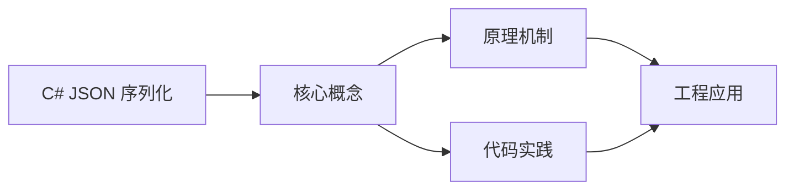
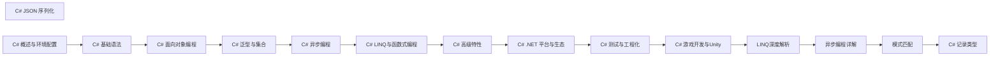

## 1. 学习目标（Bloom 分类）

本节按照布鲁姆教育目标分类学组织学习路径。本文主题为《C# JSON 序列化》，属于 C# 模块，读者可以根据自身阶段选择阅读深度。

记忆层面：能够准确复述本文的核心概念、术语与基本语法或操作步骤，并能够在提问或检索时快速定位对应知识点。能够说出 C# 的类、属性、泛型、委托与 LINQ 基本语法。

理解层面：能够用自己的语言解释核心原理与工作机制，说明概念之间的因果关系，而不是机械记忆结论。能够解释 .NET 运行时、CLR、GC 与 async/await 模型。

应用层面：能够在真实项目或练习场景中运用本文知识解决具体问题，写出正确且可维护的实现。能够编写 .NET 控制台、Web API 与 Unity 脚本。

分析层面：能够拆解复杂问题，比较本文主题与相邻概念的异同，识别边界条件与例外情况。能够分析内存、并发与 LINQ 延迟执行的原理。

评价层面：能够根据约束条件（性能、可读性、安全、成本）评价不同方案的优劣，做出有依据的技术决策。能够评价 C# 与 Java、TypeScript 的异同。

创造层面：能够把本文知识与其他模块知识组合，设计出新的解决方案或可复用的工程模式。能够设计跨平台 .NET 应用（MAUI/ASP.NET Core）。

通过本节学习，读者应当能够把《C# JSON 序列化》纳入自己的知识网络，并与 C# 模块的其他主题（.NET、LINQ、异步、泛型）建立关联。

## 2. 历史动机与发展脉络

《C# JSON 序列化》是 C# 领域的重要主题。要真正理解它，需要先了解它解决的问题与演进过程。

C# 由 Anders Hejlsberg 领导的微软团队于 2000 年发布，随 .NET Framework 1.0 推出，定位是 Windows 平台的主流语言。
.NET Core（2016）把 C# 带到 Linux 与 macOS，.NET 5+ 统一为单一 .NET 平台；当前 LTS 版本 .NET 8（2023）与 .NET 10（2025）。
C# 语言持续现代化：泛型（2.0）、LINQ（3.0）、async/await（5.0）、模式匹配与记录类型（9+）、主构造函数（12）；Unity 游戏引擎使 C# 在游戏开发中占据重要地位。

回到本文主题：C# JSON 序列化 的提出与成熟，正是上述技术背景下的必然产物。早期实现往往以简单可用为目标，随着工程规模扩大，社区逐渐沉淀出标准做法与最佳实践；理解这一脉络，可以帮助读者判断“为什么文档中的推荐写法是现在这个样子”，也能在遇到历史遗留代码时准确识别其设计年代与取舍。


## 3. 形式化定义与核心概念精讲

本节把《C# JSON 序列化》涉及的核心概念以“定义 + 讲解”的形式展开。读者应把定义当作工具，把讲解当作理解路径；两者结合才能形成可迁移的知识。

CLR 与托管代码：C# 编译为 IL（中间语言），CLR 用 JIT 编译为机器码；GC 管理堆内存，值类型（struct）在栈上或内联。
LINQ：语言集成查询通过扩展方法与表达式树实现，支持延迟执行（IEnumerable）与即时执行（ToList）；表达式树可翻译为 SQL（EF Core）。
async/await：状态机机制把异步方法编译为可挂起的状态机；Task 表示异步操作，ConfigureAwait(false) 控制上下文捕获。

### 3.1 原文章节逐一精讲

原文档把主题拆分为 9 个小节，下面按顺序给出每一节的导读讲解，随后保留原文细节供精读。

#### 原文精读（完整保留）

# C# JSON 序列化

> **符号约定**：`< >` 必填参数 | `[ ]` 可选参数

---

#### 基本序列化

**基本写法：序列化为 JSON**
`JsonSerializer.Serialize(<对象>, [<选项>]);`
```csharp
// 对象转 JSON 字符串
string json = JsonSerializer.Serialize(user);
```

---

**基本写法：泛型序列化**
`JsonSerializer.Serialize<<类型>>(<对象>);`
```csharp
// 显式指定类型序列化
string json = JsonSerializer.Serialize<User>(user);
```

---

**基本写法：反序列化**
`JsonSerializer.Deserialize<<类型>>(<json>);`
```csharp
// JSON 字符串转对象
var user = JsonSerializer.Deserialize<User>(json);
```

---

**基本写法：异步序列化到流**
`await JsonSerializer.SerializeAsync(<流>, <对象>);`
```csharp
// 异步写入流，适合大对象
using var fs = File.Create("out.json");
await JsonSerializer.SerializeAsync(fs, users);
```

---

**基本写法：异步反序列化**
`await JsonSerializer.DeserializeAsync<<类型>>(<流>);`
```csharp
// 从流异步读取并反序列化
using var fs = File.OpenRead("in.json");
var data = await JsonSerializer.DeserializeAsync<List<User>>(fs);
```

---

#### 序列化选项

**基本写法：缩进格式化**
`JsonSerializerOptions <变量> = new() { WriteIndented = true };`
```csharp
// 输出带缩进的可读 JSON
var opts = new JsonSerializerOptions { WriteIndented = true };
string json = JsonSerializer.Serialize(user, opts);
```

---

**基本写法：驼峰命名**
`<选项>.PropertyNamingPolicy = JsonNamingPolicy.CamelCase;`
```csharp
// 属性名转为 camelCase
var opts = new JsonSerializerOptions { PropertyNamingPolicy = JsonNamingPolicy.CamelCase };
```

---

**基本写法：忽略 null 值**
`<选项>.DefaultIgnoreCondition = JsonIgnoreCondition.WhenWritingNull;`
```csharp
// 值为 null 的属性不输出
var opts = new JsonSerializerOptions
{
    DefaultIgnoreCondition = JsonIgnoreCondition.WhenWritingNull
};
```

---

**基本写法：允许尾随逗号与注释**
`<选项>.ReadCommentHandling = JsonCommentHandling.Skip;`
```csharp
// 容忍注释与尾随逗号
var opts = new JsonSerializerOptions
{
    ReadCommentHandling = JsonCommentHandling.Skip,
    AllowTrailingCommas = true
};
```

---

**基本写法：大小写不敏感**
`<选项>.PropertyNameCaseInsensitive = true;`
```csharp
// 反序列化时属性名大小写不敏感
var opts = new JsonSerializerOptions { PropertyNameCaseInsensitive = true };
```

---

#### 属性控制

**基本写法：自定义属性名**
`[JsonPropertyName("<名称>")]`
```csharp
// 指定 JSON 中的属性名
public class User
{
    [JsonPropertyName("user_name")]
    public string Name { get; set; }
}
```

---

**基本写法：忽略属性**
`[JsonIgnore]`
```csharp
// 序列化时忽略该属性
public class User
{
    public string Name { get; set; }
    [JsonIgnore]
    public string Password { get; set; }
}
```

---

**基本写法：条件忽略**
`[JsonIgnore(Condition = <条件>)]`
```csharp
// 仅在值为 null 时忽略
[JsonIgnore(Condition = JsonIgnoreCondition.WhenWritingNull)]
public string? Nick { get; set; }
```

---

**基本写法：属性顺序**
`[JsonPropertyOrder(<序号>)]`
```csharp
// 控制属性输出顺序
public class User
{
    [JsonPropertyOrder(0)]
    public int Id { get; set; }
    [JsonPropertyOrder(1)]
    public string Name { get; set; }
}
```

---

#### 集合与字典

**基本写法：序列化集合**
`JsonSerializer.Serialize(<集合>);`
```csharp
// 列表转 JSON 数组
string json = JsonSerializer.Serialize(new List<int> { 1, 2, 3 });
```

---

**基本写法：字典序列化**
`JsonSerializer.Serialize<<字典类型>>(<字典>);`
```csharp
// 字典转 JSON 对象
var dict = new Dictionary<string, int> { ["a"] = 1 };
string json = JsonSerializer.Serialize(dict);
```

---

**基本写法：非字符串键字典**
`JsonSerializerOptions <变量> = new() { DictionaryKeyPolicy = <策略> };`
```csharp
// 非字符串键需要键策略或自定义转换器
var opts = new JsonSerializerOptions { DictionaryKeyPolicy = JsonNamingPolicy.CamelCase };
```

---

#### 自定义转换器

**基本写法：实现 JsonConverter**
`public class <类名> : JsonConverter<<类型>> { }`
```csharp
// 自定义类型转换器
public class DateTimeConverter : JsonConverter<DateTime>
{
    public override DateTime Read(ref Utf8JsonReader reader, Type t, JsonSerializerOptions o)
        => DateTime.Parse(reader.GetString()!);
    public override void Write(Utf8JsonWriter writer, DateTime v, JsonSerializerOptions o)
        => writer.WriteStringValue(v.ToString("yyyy-MM-dd"));
}
```

---

**基本写法：应用转换器**
`<选项>.Converters.Add(new <转换器>());`
```csharp
// 全局注册转换器
var opts = new JsonSerializerOptions();
opts.Converters.Add(new DateTimeConverter());
```

---

**基本写法：特性应用转换器**
`[JsonConverter(typeof(<转换器>))]`
```csharp
// 单属性应用转换器
public class Order
{
    [JsonConverter(typeof(DateTimeConverter))]
    public DateTime CreatedAt { get; set; }
}
```

---

#### 多态序列化

**基本写法：声明派生类**
`[JsonDerivedType(typeof(<派生类>), "<鉴别名>")]`
```csharp
// 基类声明所有派生类型
[JsonDerivedType(typeof(Circle), "circle")]
[JsonDerivedType(typeof(Square), "square")]
public abstract class Shape { }
```

---

**基本写法：多态反序列化**
`JsonSerializer.Deserialize<<基类>>(<json>);`
```csharp
// JSON 含 $type 字段自动识别类型
Shape shape = JsonSerializer.Deserialize<Shape>(json);
```

---

#### 流式读写 Utf8JsonReader/Writer

**基本写法：Utf8JsonWriter 写入**
`using var <写流> = new Utf8JsonWriter(<输出>);`
```csharp
// 手动生成 JSON，性能最高
using var writer = new Utf8JsonWriter(File.Create("out.json"));
writer.WriteStartObject();
writer.WriteString("name", "Alice");
writer.WriteNumber("age", 30);
writer.WriteEndObject();
```

---

**基本写法：Utf8JsonReader 读取**
`ref Utf8JsonReader <变量> = ...;`
```csharp
// 手动解析 JSON 字节，零分配
var reader = new Utf8JsonReader(jsonBytes);
while (reader.Read())
{
    if (reader.TokenType == JsonTokenType.PropertyName) { }
}
```

---

#### 节点模型 JsonDocument/JsonNode

**基本写法：JsonDocument 只读解析**
`using var <文档> = JsonDocument.Parse(<json>);`
```csharp
// DOM 风格只读访问
using var doc = JsonDocument.Parse(json);
string name = doc.RootElement.GetProperty("name").GetString()!;
```

---

**基本写法：JsonNode 可读写 DOM**
`JsonNode <变量> = JsonNode.Parse(<json>);`
```csharp
// 可读写的 DOM
JsonNode node = JsonNode.Parse(json)!;
node["age"] = 31;
string json2 = node.ToJsonString();
```

---

**基本写法：创建 JsonObject**
`JsonObject <变量> = new() { ["<键>"] = <值> };`
```csharp
// 直接构造 JSON 对象
var obj = new JsonObject { ["name"] = "Alice", ["age"] = 30 };
string json = obj.ToJsonString();
```

---

#### 源生成器

**基本写法：JsonSerializerContext 源生成**
`[JsonSerializable(typeof(<类型>))]`
```csharp
// 编译时生成序列化代码，AOT 友好
[JsonSourceGenerationOptions(WriteIndented = true)]
[JsonSerializable(typeof(User))]
public partial class MyContext : JsonSerializerContext { }
```

---

**基本写法：使用源生成上下文**
`JsonSerializer.Serialize(<对象>, <Context>.Default.<类型>);`
```csharp
// 使用生成的元数据序列化
string json = JsonSerializer.Serialize(user, MyContext.Default.User);
```


### 3.2 概念关系图

下面用 Mermaid 图表达本文核心概念之间的关系，帮助读者建立整体图景：



图中展示的是本文知识的结构化关系：核心概念是入口，原理机制解释“为什么”，代码实践演示“怎么做”，工程应用回答“何时用”。读者学习时可以把每个小节的内容挂接到对应节点上。

## 4. 理论推导与原理解析

本节深入《C# JSON 序列化》背后的原理。理论部分不求面面俱到，而是聚焦“能解释现象、能指导实践”的关键推导。

CLR 与托管代码：C# 编译为 IL（中间语言），CLR 用 JIT 编译为机器码；GC 管理堆内存，值类型（struct）在栈上或内联。
LINQ：语言集成查询通过扩展方法与表达式树实现，支持延迟执行（IEnumerable）与即时执行（ToList）；表达式树可翻译为 SQL（EF Core）。
async/await：状态机机制把异步方法编译为可挂起的状态机；Task 表示异步操作，ConfigureAwait(false) 控制上下文捕获。
泛型与反射：泛型保留类型信息（与 Java 擦除不同）；反射/源生成器（source generator）用于元编程。

需要强调的是，理论推导与工程实践之间存在翻译层：理论给出的是理想化模型与边界条件，工程代码则必须处理真实环境中的例外。读者在学习时应先掌握理论的“标准情形”，再通过陷阱章节了解“非标准情形”。

## 5. 代码示例与逐行讲解

本节把原文中的代码示例系统整理，并为每个示例补充用途说明与讲解。读者不应只浏览代码，而应逐段对照讲解理解设计意图。

### 5.1 示例：基本序列化

该示例来自原文《基本序列化》小节，用于演示C# JSON 序列化相关操作。阅读时请先看代码结构，再看其后的讲解。

```csharp
// 对象转 JSON 字符串
string json = JsonSerializer.Serialize(user);
```

讲解：这段代码演示了本节核心知识点。代码中的关键操作可以归纳为三步：准备（定义或初始化）、执行（核心逻辑）、收尾（释放资源或返回结果）。实际项目中，这三步往往被封装为函数或类，以提升复用性与可测试性。

关键点分析：

该示例共 2 行有效代码，结构以数据或配置为主。阅读时应关注：数据字段的含义、配置项的作用，以及它们与运行行为的对应关系。

进阶思考路径：先尝试修改参数观察行为变化，再把示例中的模式迁移到自己的项目中；每次修改都记录预期与实测差异，这是把示例转化为能力的最快方式。

### 5.2 示例：基本序列化

该示例来自原文《基本序列化》小节，用于演示C# JSON 序列化相关操作。阅读时请先看代码结构，再看其后的讲解。

```csharp
// 显式指定类型序列化
string json = JsonSerializer.Serialize<User>(user);
```

讲解：这段代码演示了本节核心知识点。代码中的关键操作可以归纳为三步：准备（定义或初始化）、执行（核心逻辑）、收尾（释放资源或返回结果）。实际项目中，这三步往往被封装为函数或类，以提升复用性与可测试性。

关键点分析：

该示例共 2 行有效代码，结构以数据或配置为主。阅读时应关注：数据字段的含义、配置项的作用，以及它们与运行行为的对应关系。

进阶思考路径：先尝试修改参数观察行为变化，再把示例中的模式迁移到自己的项目中；每次修改都记录预期与实测差异，这是把示例转化为能力的最快方式。

### 5.3 示例：基本序列化

该示例来自原文《基本序列化》小节，用于演示C# JSON 序列化相关操作。阅读时请先看代码结构，再看其后的讲解。

```csharp
// JSON 字符串转对象
var user = JsonSerializer.Deserialize<User>(json);
```

讲解：这段代码演示了本节核心知识点。代码中的关键操作可以归纳为三步：准备（定义或初始化）、执行（核心逻辑）、收尾（释放资源或返回结果）。实际项目中，这三步往往被封装为函数或类，以提升复用性与可测试性。

关键点分析：

该示例共 2 行有效代码，结构以数据或配置为主。阅读时应关注：数据字段的含义、配置项的作用，以及它们与运行行为的对应关系。

进阶思考路径：先尝试修改参数观察行为变化，再把示例中的模式迁移到自己的项目中；每次修改都记录预期与实测差异，这是把示例转化为能力的最快方式。

### 5.4 示例：基本序列化

该示例来自原文《基本序列化》小节，用于演示C# JSON 序列化相关操作。阅读时请先看代码结构，再看其后的讲解。

```csharp
// 异步写入流，适合大对象
using var fs = File.Create("out.json");
await JsonSerializer.SerializeAsync(fs, users);
```

讲解：这段代码演示了本节核心知识点。代码中的关键操作可以归纳为三步：准备（定义或初始化）、执行（核心逻辑）、收尾（释放资源或返回结果）。实际项目中，这三步往往被封装为函数或类，以提升复用性与可测试性。

关键点分析：

该示例共 3 行有效代码，结构以数据或配置为主。阅读时应关注：数据字段的含义、配置项的作用，以及它们与运行行为的对应关系。

进阶思考路径：先尝试修改参数观察行为变化，再把示例中的模式迁移到自己的项目中；每次修改都记录预期与实测差异，这是把示例转化为能力的最快方式。

### 5.5 示例：基本序列化

该示例来自原文《基本序列化》小节，用于演示C# JSON 序列化相关操作。阅读时请先看代码结构，再看其后的讲解。

```csharp
// 从流异步读取并反序列化
using var fs = File.OpenRead("in.json");
var data = await JsonSerializer.DeserializeAsync<List<User>>(fs);
```

讲解：这段代码演示了本节核心知识点。代码中的关键操作可以归纳为三步：准备（定义或初始化）、执行（核心逻辑）、收尾（释放资源或返回结果）。实际项目中，这三步往往被封装为函数或类，以提升复用性与可测试性。

关键点分析：

该示例共 3 行有效代码，结构以数据或配置为主。阅读时应关注：数据字段的含义、配置项的作用，以及它们与运行行为的对应关系。

进阶思考路径：先尝试修改参数观察行为变化，再把示例中的模式迁移到自己的项目中；每次修改都记录预期与实测差异，这是把示例转化为能力的最快方式。

### 5.6 示例：序列化选项

该示例来自原文《序列化选项》小节，用于演示C# JSON 序列化相关操作。阅读时请先看代码结构，再看其后的讲解。

```csharp
// 输出带缩进的可读 JSON
var opts = new JsonSerializerOptions { WriteIndented = true };
string json = JsonSerializer.Serialize(user, opts);
```

讲解：这段代码演示了本节核心知识点。代码中的关键操作可以归纳为三步：准备（定义或初始化）、执行（核心逻辑）、收尾（释放资源或返回结果）。实际项目中，这三步往往被封装为函数或类，以提升复用性与可测试性。

关键点分析：

该示例共 3 行有效代码，结构以数据或配置为主。阅读时应关注：数据字段的含义、配置项的作用，以及它们与运行行为的对应关系。

进阶思考路径：先尝试修改参数观察行为变化，再把示例中的模式迁移到自己的项目中；每次修改都记录预期与实测差异，这是把示例转化为能力的最快方式。

### 5.7 示例：序列化选项

该示例来自原文《序列化选项》小节，用于演示C# JSON 序列化相关操作。阅读时请先看代码结构，再看其后的讲解。

```csharp
// 属性名转为 camelCase
var opts = new JsonSerializerOptions { PropertyNamingPolicy = JsonNamingPolicy.CamelCase };
```

讲解：这段代码演示了本节核心知识点。代码中的关键操作可以归纳为三步：准备（定义或初始化）、执行（核心逻辑）、收尾（释放资源或返回结果）。实际项目中，这三步往往被封装为函数或类，以提升复用性与可测试性。

关键点分析：

该示例共 2 行有效代码，结构以数据或配置为主。阅读时应关注：数据字段的含义、配置项的作用，以及它们与运行行为的对应关系。

进阶思考路径：先尝试修改参数观察行为变化，再把示例中的模式迁移到自己的项目中；每次修改都记录预期与实测差异，这是把示例转化为能力的最快方式。

### 5.8 示例：序列化选项

该示例来自原文《序列化选项》小节，用于演示C# JSON 序列化相关操作。阅读时请先看代码结构，再看其后的讲解。

```csharp
// 值为 null 的属性不输出
var opts = new JsonSerializerOptions
{
    DefaultIgnoreCondition = JsonIgnoreCondition.WhenWritingNull
};
```

讲解：这段代码演示了本节核心知识点。代码中的关键操作可以归纳为三步：准备（定义或初始化）、执行（核心逻辑）、收尾（释放资源或返回结果）。实际项目中，这三步往往被封装为函数或类，以提升复用性与可测试性。

关键点分析：

该示例共 5 行有效代码，结构以数据或配置为主。阅读时应关注：数据字段的含义、配置项的作用，以及它们与运行行为的对应关系。

进阶思考路径：先尝试修改参数观察行为变化，再把示例中的模式迁移到自己的项目中；每次修改都记录预期与实测差异，这是把示例转化为能力的最快方式。

### 5.9 示例：序列化选项

该示例来自原文《序列化选项》小节，用于演示C# JSON 序列化相关操作。阅读时请先看代码结构，再看其后的讲解。

```csharp
// 容忍注释与尾随逗号
var opts = new JsonSerializerOptions
{
    ReadCommentHandling = JsonCommentHandling.Skip,
    AllowTrailingCommas = true
};
```

讲解：这段代码演示了本节核心知识点。代码中的关键操作可以归纳为三步：准备（定义或初始化）、执行（核心逻辑）、收尾（释放资源或返回结果）。实际项目中，这三步往往被封装为函数或类，以提升复用性与可测试性。

关键点分析：

该示例共 6 行有效代码，结构以数据或配置为主。阅读时应关注：数据字段的含义、配置项的作用，以及它们与运行行为的对应关系。

进阶思考路径：先尝试修改参数观察行为变化，再把示例中的模式迁移到自己的项目中；每次修改都记录预期与实测差异，这是把示例转化为能力的最快方式。

### 5.10 示例：序列化选项

该示例来自原文《序列化选项》小节，用于演示C# JSON 序列化相关操作。阅读时请先看代码结构，再看其后的讲解。

```csharp
// 反序列化时属性名大小写不敏感
var opts = new JsonSerializerOptions { PropertyNameCaseInsensitive = true };
```

讲解：这段代码演示了本节核心知识点。代码中的关键操作可以归纳为三步：准备（定义或初始化）、执行（核心逻辑）、收尾（释放资源或返回结果）。实际项目中，这三步往往被封装为函数或类，以提升复用性与可测试性。

关键点分析：

该示例共 2 行有效代码，结构以数据或配置为主。阅读时应关注：数据字段的含义、配置项的作用，以及它们与运行行为的对应关系。

进阶思考路径：先尝试修改参数观察行为变化，再把示例中的模式迁移到自己的项目中；每次修改都记录预期与实测差异，这是把示例转化为能力的最快方式。

### 5.11 示例：属性控制

该示例来自原文《属性控制》小节，用于演示C# JSON 序列化相关操作。阅读时请先看代码结构，再看其后的讲解。

```csharp
// 指定 JSON 中的属性名
public class User
{
    [JsonPropertyName("user_name")]
    public string Name { get; set; }
}
```

讲解：这段代码演示了本节核心知识点。代码中的关键操作可以归纳为三步：准备（定义或初始化）、执行（核心逻辑）、收尾（释放资源或返回结果）。实际项目中，这三步往往被封装为函数或类，以提升复用性与可测试性。

关键点分析：

该示例共 6 行有效代码，包含 1 类关键结构（class）。其中：

- 入口与初始化部分负责建立上下文，对应实际项目中的启动或装配逻辑；
- 核心逻辑部分体现本文主题的主要操作，是阅读时最需要对照讲解理解的部分；
- 输出或返回部分把结果交给调用方，注意其类型与边界条件。

进阶思考路径：先尝试修改参数观察行为变化，再把示例中的模式迁移到自己的项目中；每次修改都记录预期与实测差异，这是把示例转化为能力的最快方式。

### 5.12 示例：属性控制

该示例来自原文《属性控制》小节，用于演示C# JSON 序列化相关操作。阅读时请先看代码结构，再看其后的讲解。

```csharp
// 序列化时忽略该属性
public class User
{
    public string Name { get; set; }
    [JsonIgnore]
    public string Password { get; set; }
}
```

讲解：这段代码演示了本节核心知识点。代码中的关键操作可以归纳为三步：准备（定义或初始化）、执行（核心逻辑）、收尾（释放资源或返回结果）。实际项目中，这三步往往被封装为函数或类，以提升复用性与可测试性。

关键点分析：

该示例共 7 行有效代码，包含 1 类关键结构（class）。其中：

- 入口与初始化部分负责建立上下文，对应实际项目中的启动或装配逻辑；
- 核心逻辑部分体现本文主题的主要操作，是阅读时最需要对照讲解理解的部分；
- 输出或返回部分把结果交给调用方，注意其类型与边界条件。

进阶思考路径：先尝试修改参数观察行为变化，再把示例中的模式迁移到自己的项目中；每次修改都记录预期与实测差异，这是把示例转化为能力的最快方式。

### 5.13 示例：属性控制

该示例来自原文《属性控制》小节，用于演示C# JSON 序列化相关操作。阅读时请先看代码结构，再看其后的讲解。

```csharp
// 仅在值为 null 时忽略
[JsonIgnore(Condition = JsonIgnoreCondition.WhenWritingNull)]
public string? Nick { get; set; }
```

讲解：这段代码演示了本节核心知识点。代码中的关键操作可以归纳为三步：准备（定义或初始化）、执行（核心逻辑）、收尾（释放资源或返回结果）。实际项目中，这三步往往被封装为函数或类，以提升复用性与可测试性。

关键点分析：

该示例共 3 行有效代码，结构以数据或配置为主。阅读时应关注：数据字段的含义、配置项的作用，以及它们与运行行为的对应关系。

进阶思考路径：先尝试修改参数观察行为变化，再把示例中的模式迁移到自己的项目中；每次修改都记录预期与实测差异，这是把示例转化为能力的最快方式。

### 5.14 示例：属性控制

该示例来自原文《属性控制》小节，用于演示C# JSON 序列化相关操作。阅读时请先看代码结构，再看其后的讲解。

```csharp
// 控制属性输出顺序
public class User
{
    [JsonPropertyOrder(0)]
    public int Id { get; set; }
    [JsonPropertyOrder(1)]
    public string Name { get; set; }
}
```

讲解：这段代码演示了本节核心知识点。代码中的关键操作可以归纳为三步：准备（定义或初始化）、执行（核心逻辑）、收尾（释放资源或返回结果）。实际项目中，这三步往往被封装为函数或类，以提升复用性与可测试性。

关键点分析：

该示例共 8 行有效代码，包含 1 类关键结构（class）。其中：

- 入口与初始化部分负责建立上下文，对应实际项目中的启动或装配逻辑；
- 核心逻辑部分体现本文主题的主要操作，是阅读时最需要对照讲解理解的部分；
- 输出或返回部分把结果交给调用方，注意其类型与边界条件。

进阶思考路径：先尝试修改参数观察行为变化，再把示例中的模式迁移到自己的项目中；每次修改都记录预期与实测差异，这是把示例转化为能力的最快方式。

### 5.15 示例：集合与字典

该示例来自原文《集合与字典》小节，用于演示C# JSON 序列化相关操作。阅读时请先看代码结构，再看其后的讲解。

```csharp
// 列表转 JSON 数组
string json = JsonSerializer.Serialize(new List<int> { 1, 2, 3 });
```

讲解：这段代码演示了本节核心知识点。代码中的关键操作可以归纳为三步：准备（定义或初始化）、执行（核心逻辑）、收尾（释放资源或返回结果）。实际项目中，这三步往往被封装为函数或类，以提升复用性与可测试性。

关键点分析：

该示例共 2 行有效代码，结构以数据或配置为主。阅读时应关注：数据字段的含义、配置项的作用，以及它们与运行行为的对应关系。

进阶思考路径：先尝试修改参数观察行为变化，再把示例中的模式迁移到自己的项目中；每次修改都记录预期与实测差异，这是把示例转化为能力的最快方式。

### 5.16 示例：集合与字典

该示例来自原文《集合与字典》小节，用于演示C# JSON 序列化相关操作。阅读时请先看代码结构，再看其后的讲解。

```csharp
// 字典转 JSON 对象
var dict = new Dictionary<string, int> { ["a"] = 1 };
string json = JsonSerializer.Serialize(dict);
```

讲解：这段代码演示了本节核心知识点。代码中的关键操作可以归纳为三步：准备（定义或初始化）、执行（核心逻辑）、收尾（释放资源或返回结果）。实际项目中，这三步往往被封装为函数或类，以提升复用性与可测试性。

关键点分析：

该示例共 3 行有效代码，结构以数据或配置为主。阅读时应关注：数据字段的含义、配置项的作用，以及它们与运行行为的对应关系。

进阶思考路径：先尝试修改参数观察行为变化，再把示例中的模式迁移到自己的项目中；每次修改都记录预期与实测差异，这是把示例转化为能力的最快方式。

### 5.17 示例：集合与字典

该示例来自原文《集合与字典》小节，用于演示C# JSON 序列化相关操作。阅读时请先看代码结构，再看其后的讲解。

```csharp
// 非字符串键需要键策略或自定义转换器
var opts = new JsonSerializerOptions { DictionaryKeyPolicy = JsonNamingPolicy.CamelCase };
```

讲解：这段代码演示了本节核心知识点。代码中的关键操作可以归纳为三步：准备（定义或初始化）、执行（核心逻辑）、收尾（释放资源或返回结果）。实际项目中，这三步往往被封装为函数或类，以提升复用性与可测试性。

关键点分析：

该示例共 2 行有效代码，结构以数据或配置为主。阅读时应关注：数据字段的含义、配置项的作用，以及它们与运行行为的对应关系。

进阶思考路径：先尝试修改参数观察行为变化，再把示例中的模式迁移到自己的项目中；每次修改都记录预期与实测差异，这是把示例转化为能力的最快方式。

### 5.18 示例：自定义转换器

该示例来自原文《自定义转换器》小节，用于演示C# JSON 序列化相关操作。阅读时请先看代码结构，再看其后的讲解。

```csharp
// 自定义类型转换器
public class DateTimeConverter : JsonConverter<DateTime>
{
    public override DateTime Read(ref Utf8JsonReader reader, Type t, JsonSerializerOptions o)
        => DateTime.Parse(reader.GetString()!);
    public override void Write(Utf8JsonWriter writer, DateTime v, JsonSerializerOptions o)
        => writer.WriteStringValue(v.ToString("yyyy-MM-dd"));
}
```

讲解：这段代码演示了本节核心知识点。代码中的关键操作可以归纳为三步：准备（定义或初始化）、执行（核心逻辑）、收尾（释放资源或返回结果）。实际项目中，这三步往往被封装为函数或类，以提升复用性与可测试性。

关键点分析：

该示例共 8 行有效代码，包含 1 类关键结构（class）。其中：

- 入口与初始化部分负责建立上下文，对应实际项目中的启动或装配逻辑；
- 核心逻辑部分体现本文主题的主要操作，是阅读时最需要对照讲解理解的部分；
- 输出或返回部分把结果交给调用方，注意其类型与边界条件。

进阶思考路径：先尝试修改参数观察行为变化，再把示例中的模式迁移到自己的项目中；每次修改都记录预期与实测差异，这是把示例转化为能力的最快方式。

### 5.19 示例：自定义转换器

该示例来自原文《自定义转换器》小节，用于演示C# JSON 序列化相关操作。阅读时请先看代码结构，再看其后的讲解。

```csharp
// 全局注册转换器
var opts = new JsonSerializerOptions();
opts.Converters.Add(new DateTimeConverter());
```

讲解：这段代码演示了本节核心知识点。代码中的关键操作可以归纳为三步：准备（定义或初始化）、执行（核心逻辑）、收尾（释放资源或返回结果）。实际项目中，这三步往往被封装为函数或类，以提升复用性与可测试性。

关键点分析：

该示例共 3 行有效代码，结构以数据或配置为主。阅读时应关注：数据字段的含义、配置项的作用，以及它们与运行行为的对应关系。

进阶思考路径：先尝试修改参数观察行为变化，再把示例中的模式迁移到自己的项目中；每次修改都记录预期与实测差异，这是把示例转化为能力的最快方式。

### 5.20 示例：自定义转换器

该示例来自原文《自定义转换器》小节，用于演示C# JSON 序列化相关操作。阅读时请先看代码结构，再看其后的讲解。

```csharp
// 单属性应用转换器
public class Order
{
    [JsonConverter(typeof(DateTimeConverter))]
    public DateTime CreatedAt { get; set; }
}
```

讲解：这段代码演示了本节核心知识点。代码中的关键操作可以归纳为三步：准备（定义或初始化）、执行（核心逻辑）、收尾（释放资源或返回结果）。实际项目中，这三步往往被封装为函数或类，以提升复用性与可测试性。

关键点分析：

该示例共 6 行有效代码，包含 1 类关键结构（class）。其中：

- 入口与初始化部分负责建立上下文，对应实际项目中的启动或装配逻辑；
- 核心逻辑部分体现本文主题的主要操作，是阅读时最需要对照讲解理解的部分；
- 输出或返回部分把结果交给调用方，注意其类型与边界条件。

进阶思考路径：先尝试修改参数观察行为变化，再把示例中的模式迁移到自己的项目中；每次修改都记录预期与实测差异，这是把示例转化为能力的最快方式。

### 5.21 示例：多态序列化

该示例来自原文《多态序列化》小节，用于演示C# JSON 序列化相关操作。阅读时请先看代码结构，再看其后的讲解。

```csharp
// 基类声明所有派生类型
[JsonDerivedType(typeof(Circle), "circle")]
[JsonDerivedType(typeof(Square), "square")]
public abstract class Shape { }
```

讲解：这段代码演示了本节核心知识点。代码中的关键操作可以归纳为三步：准备（定义或初始化）、执行（核心逻辑）、收尾（释放资源或返回结果）。实际项目中，这三步往往被封装为函数或类，以提升复用性与可测试性。

关键点分析：

该示例共 4 行有效代码，包含 1 类关键结构（class）。其中：

- 入口与初始化部分负责建立上下文，对应实际项目中的启动或装配逻辑；
- 核心逻辑部分体现本文主题的主要操作，是阅读时最需要对照讲解理解的部分；
- 输出或返回部分把结果交给调用方，注意其类型与边界条件。

进阶思考路径：先尝试修改参数观察行为变化，再把示例中的模式迁移到自己的项目中；每次修改都记录预期与实测差异，这是把示例转化为能力的最快方式。

### 5.22 示例：多态序列化

该示例来自原文《多态序列化》小节，用于演示C# JSON 序列化相关操作。阅读时请先看代码结构，再看其后的讲解。

```csharp
// JSON 含 $type 字段自动识别类型
Shape shape = JsonSerializer.Deserialize<Shape>(json);
```

讲解：这段代码演示了本节核心知识点。代码中的关键操作可以归纳为三步：准备（定义或初始化）、执行（核心逻辑）、收尾（释放资源或返回结果）。实际项目中，这三步往往被封装为函数或类，以提升复用性与可测试性。

关键点分析：

该示例共 2 行有效代码，结构以数据或配置为主。阅读时应关注：数据字段的含义、配置项的作用，以及它们与运行行为的对应关系。

进阶思考路径：先尝试修改参数观察行为变化，再把示例中的模式迁移到自己的项目中；每次修改都记录预期与实测差异，这是把示例转化为能力的最快方式。

### 5.23 示例：流式读写 Utf8JsonReader/Writer

该示例来自原文《流式读写 Utf8JsonReader/Writer》小节，用于演示C# JSON 序列化相关操作。阅读时请先看代码结构，再看其后的讲解。

```csharp
// 手动生成 JSON，性能最高
using var writer = new Utf8JsonWriter(File.Create("out.json"));
writer.WriteStartObject();
writer.WriteString("name", "Alice");
writer.WriteNumber("age", 30);
writer.WriteEndObject();
```

讲解：这段代码演示了本节核心知识点。代码中的关键操作可以归纳为三步：准备（定义或初始化）、执行（核心逻辑）、收尾（释放资源或返回结果）。实际项目中，这三步往往被封装为函数或类，以提升复用性与可测试性。

关键点分析：

该示例共 6 行有效代码，结构以数据或配置为主。阅读时应关注：数据字段的含义、配置项的作用，以及它们与运行行为的对应关系。

进阶思考路径：先尝试修改参数观察行为变化，再把示例中的模式迁移到自己的项目中；每次修改都记录预期与实测差异，这是把示例转化为能力的最快方式。

### 5.24 示例：流式读写 Utf8JsonReader/Writer

该示例来自原文《流式读写 Utf8JsonReader/Writer》小节，用于演示C# JSON 序列化相关操作。阅读时请先看代码结构，再看其后的讲解。

```csharp
// 手动解析 JSON 字节，零分配
var reader = new Utf8JsonReader(jsonBytes);
while (reader.Read())
{
    if (reader.TokenType == JsonTokenType.PropertyName) { }
}
```

讲解：这段代码演示了本节核心知识点。代码中的关键操作可以归纳为三步：准备（定义或初始化）、执行（核心逻辑）、收尾（释放资源或返回结果）。实际项目中，这三步往往被封装为函数或类，以提升复用性与可测试性。

关键点分析：

该示例共 6 行有效代码，包含 2 类关键结构（if、while）。其中：

- 入口与初始化部分负责建立上下文，对应实际项目中的启动或装配逻辑；
- 核心逻辑部分体现本文主题的主要操作，是阅读时最需要对照讲解理解的部分；
- 输出或返回部分把结果交给调用方，注意其类型与边界条件。

进阶思考路径：先尝试修改参数观察行为变化，再把示例中的模式迁移到自己的项目中；每次修改都记录预期与实测差异，这是把示例转化为能力的最快方式。

### 5.25 示例：节点模型 JsonDocument/JsonNode

该示例来自原文《节点模型 JsonDocument/JsonNode》小节，用于演示C# JSON 序列化相关操作。阅读时请先看代码结构，再看其后的讲解。

```csharp
// DOM 风格只读访问
using var doc = JsonDocument.Parse(json);
string name = doc.RootElement.GetProperty("name").GetString()!;
```

讲解：这段代码演示了本节核心知识点。代码中的关键操作可以归纳为三步：准备（定义或初始化）、执行（核心逻辑）、收尾（释放资源或返回结果）。实际项目中，这三步往往被封装为函数或类，以提升复用性与可测试性。

关键点分析：

该示例共 3 行有效代码，结构以数据或配置为主。阅读时应关注：数据字段的含义、配置项的作用，以及它们与运行行为的对应关系。

进阶思考路径：先尝试修改参数观察行为变化，再把示例中的模式迁移到自己的项目中；每次修改都记录预期与实测差异，这是把示例转化为能力的最快方式。

### 5.26 示例：节点模型 JsonDocument/JsonNode

该示例来自原文《节点模型 JsonDocument/JsonNode》小节，用于演示C# JSON 序列化相关操作。阅读时请先看代码结构，再看其后的讲解。

```csharp
// 可读写的 DOM
JsonNode node = JsonNode.Parse(json)!;
node["age"] = 31;
string json2 = node.ToJsonString();
```

讲解：这段代码演示了本节核心知识点。代码中的关键操作可以归纳为三步：准备（定义或初始化）、执行（核心逻辑）、收尾（释放资源或返回结果）。实际项目中，这三步往往被封装为函数或类，以提升复用性与可测试性。

关键点分析：

该示例共 4 行有效代码，结构以数据或配置为主。阅读时应关注：数据字段的含义、配置项的作用，以及它们与运行行为的对应关系。

进阶思考路径：先尝试修改参数观察行为变化，再把示例中的模式迁移到自己的项目中；每次修改都记录预期与实测差异，这是把示例转化为能力的最快方式。

### 5.27 示例：节点模型 JsonDocument/JsonNode

该示例来自原文《节点模型 JsonDocument/JsonNode》小节，用于演示C# JSON 序列化相关操作。阅读时请先看代码结构，再看其后的讲解。

```csharp
// 直接构造 JSON 对象
var obj = new JsonObject { ["name"] = "Alice", ["age"] = 30 };
string json = obj.ToJsonString();
```

讲解：这段代码演示了本节核心知识点。代码中的关键操作可以归纳为三步：准备（定义或初始化）、执行（核心逻辑）、收尾（释放资源或返回结果）。实际项目中，这三步往往被封装为函数或类，以提升复用性与可测试性。

关键点分析：

该示例共 3 行有效代码，结构以数据或配置为主。阅读时应关注：数据字段的含义、配置项的作用，以及它们与运行行为的对应关系。

进阶思考路径：先尝试修改参数观察行为变化，再把示例中的模式迁移到自己的项目中；每次修改都记录预期与实测差异，这是把示例转化为能力的最快方式。

### 5.28 示例：源生成器

该示例来自原文《源生成器》小节，用于演示C# JSON 序列化相关操作。阅读时请先看代码结构，再看其后的讲解。

```csharp
// 编译时生成序列化代码，AOT 友好
[JsonSourceGenerationOptions(WriteIndented = true)]
[JsonSerializable(typeof(User))]
public partial class MyContext : JsonSerializerContext { }
```

讲解：这段代码演示了本节核心知识点。代码中的关键操作可以归纳为三步：准备（定义或初始化）、执行（核心逻辑）、收尾（释放资源或返回结果）。实际项目中，这三步往往被封装为函数或类，以提升复用性与可测试性。

关键点分析：

该示例共 4 行有效代码，包含 1 类关键结构（class）。其中：

- 入口与初始化部分负责建立上下文，对应实际项目中的启动或装配逻辑；
- 核心逻辑部分体现本文主题的主要操作，是阅读时最需要对照讲解理解的部分；
- 输出或返回部分把结果交给调用方，注意其类型与边界条件。

进阶思考路径：先尝试修改参数观察行为变化，再把示例中的模式迁移到自己的项目中；每次修改都记录预期与实测差异，这是把示例转化为能力的最快方式。

### 5.29 示例：源生成器

该示例来自原文《源生成器》小节，用于演示C# JSON 序列化相关操作。阅读时请先看代码结构，再看其后的讲解。

```csharp
// 使用生成的元数据序列化
string json = JsonSerializer.Serialize(user, MyContext.Default.User);
```

讲解：这段代码演示了本节核心知识点。代码中的关键操作可以归纳为三步：准备（定义或初始化）、执行（核心逻辑）、收尾（释放资源或返回结果）。实际项目中，这三步往往被封装为函数或类，以提升复用性与可测试性。

关键点分析：

该示例共 2 行有效代码，结构以数据或配置为主。阅读时应关注：数据字段的含义、配置项的作用，以及它们与运行行为的对应关系。

进阶思考路径：先尝试修改参数观察行为变化，再把示例中的模式迁移到自己的项目中；每次修改都记录预期与实测差异，这是把示例转化为能力的最快方式。


综合以上示例，可以总结出本主题的代码实践要点：第一，先定义清晰的输入输出契约；第二，核心逻辑保持单一职责；第三，错误处理与边界条件不可省略；第四，命名与注释表达意图而非复述代码。

## 6. 对比分析

对比是理解《C# JSON 序列化》定位的最快路径。下面从多个维度与相邻方案进行对比。

C# 与 Java：两者都是托管语言；C# 语言特性更新更快，Java 生态更开放。
C# 与 TypeScript：C# 强类型服务端，TypeScript 前端；语法相似，async/await 模型一致。
.NET Framework 与 .NET 8：现代 .NET 跨平台、性能更好，新项目一律 .NET 8+。

对比的目的不是分出绝对优劣，而是建立选择依据：不同约束条件下，最优解不同。读者应把每个对比维度转化为决策检查清单。

## 7. 常见陷阱与最佳实践

本节整理该主题的高频错误与推荐做法。每个陷阱先描述现象，再解释原因，最后给出最佳实践。

### 7.1 LINQ 延迟执行误判

IEnumerable 查询在枚举时才执行，数据源变化影响结果。需要快照时 ToList。

深入讲解：该问题之所以被归类为“常见陷阱”，是因为它在初学者的代码中反复出现，而且往往不在第一时间暴露——错误通常隐藏在特定数据或特定时序下。

从成因上看，LINQ 延迟执行误判 一般源于对 C# 某个机制的理解偏差：要么误用了默认行为，要么忽略了边界条件，要么把其他语言的思维惯性带了过来。

从影响上看，LINQ 延迟执行误判 轻则产生错误结果，重则导致资源泄漏、数据损坏或安全事故；这也是为什么工程评审中会把它列为检查项。

从修复策略上看，处理LINQ 延迟执行误判的正确顺序是：先复现（构造最小用例），再定位（确认机制层面的根因），最后修复并补充回归测试。跳过复现直接改代码，往往治标不治本。

### 7.2 async void

async void 异常无法被调用方捕获。事件处理器外一律 async Task。

深入讲解：该问题之所以被归类为“常见陷阱”，是因为它在初学者的代码中反复出现，而且往往不在第一时间暴露——错误通常隐藏在特定数据或特定时序下。

从成因上看，async void 一般源于对 C# 某个机制的理解偏差：要么误用了默认行为，要么忽略了边界条件，要么把其他语言的思维惯性带了过来。

从影响上看，async void 轻则产生错误结果，重则导致资源泄漏、数据损坏或安全事故；这也是为什么工程评审中会把它列为检查项。

从修复策略上看，处理async void的正确顺序是：先复现（构造最小用例），再定位（确认机制层面的根因），最后修复并补充回归测试。跳过复现直接改代码，往往治标不治本。

### 7.3 阻塞异步调用

.Result/.Wait() 在 UI 上下文死锁。全程 async/await。

深入讲解：该问题之所以被归类为“常见陷阱”，是因为它在初学者的代码中反复出现，而且往往不在第一时间暴露——错误通常隐藏在特定数据或特定时序下。

从成因上看，阻塞异步调用 一般源于对 C# 某个机制的理解偏差：要么误用了默认行为，要么忽略了边界条件，要么把其他语言的思维惯性带了过来。

从影响上看，阻塞异步调用 轻则产生错误结果，重则导致资源泄漏、数据损坏或安全事故；这也是为什么工程评审中会把它列为检查项。

从修复策略上看，处理阻塞异步调用的正确顺序是：先复现（构造最小用例），再定位（确认机制层面的根因），最后修复并补充回归测试。跳过复现直接改代码，往往治标不治本。

### 7.4 可变默认参数

可选参数默认值必须是编译期常量；引用类型默认 null，注意空引用。

深入讲解：该问题之所以被归类为“常见陷阱”，是因为它在初学者的代码中反复出现，而且往往不在第一时间暴露——错误通常隐藏在特定数据或特定时序下。

从成因上看，可变默认参数 一般源于对 C# 某个机制的理解偏差：要么误用了默认行为，要么忽略了边界条件，要么把其他语言的思维惯性带了过来。

从影响上看，可变默认参数 轻则产生错误结果，重则导致资源泄漏、数据损坏或安全事故；这也是为什么工程评审中会把它列为检查项。

从修复策略上看，处理可变默认参数的正确顺序是：先复现（构造最小用例），再定位（确认机制层面的根因），最后修复并补充回归测试。跳过复现直接改代码，往往治标不治本。

### 7.5 字符串拼接

循环内 += 产生大量垃圾。使用 StringBuilder。

深入讲解：该问题之所以被归类为“常见陷阱”，是因为它在初学者的代码中反复出现，而且往往不在第一时间暴露——错误通常隐藏在特定数据或特定时序下。

从成因上看，字符串拼接 一般源于对 C# 某个机制的理解偏差：要么误用了默认行为，要么忽略了边界条件，要么把其他语言的思维惯性带了过来。

从影响上看，字符串拼接 轻则产生错误结果，重则导致资源泄漏、数据损坏或安全事故；这也是为什么工程评审中会把它列为检查项。

从修复策略上看，处理字符串拼接的正确顺序是：先复现（构造最小用例），再定位（确认机制层面的根因），最后修复并补充回归测试。跳过复现直接改代码，往往治标不治本。

### 7.6 Culture 陷阱

ToString 受区域影响（小数点差异）。使用 InvariantCulture 或格式化说明符。

深入讲解：该问题之所以被归类为“常见陷阱”，是因为它在初学者的代码中反复出现，而且往往不在第一时间暴露——错误通常隐藏在特定数据或特定时序下。

从成因上看，Culture 陷阱 一般源于对 C# 某个机制的理解偏差：要么误用了默认行为，要么忽略了边界条件，要么把其他语言的思维惯性带了过来。

从影响上看，Culture 陷阱 轻则产生错误结果，重则导致资源泄漏、数据损坏或安全事故；这也是为什么工程评审中会把它列为检查项。

从修复策略上看，处理Culture 陷阱的正确顺序是：先复现（构造最小用例），再定位（确认机制层面的根因），最后修复并补充回归测试。跳过复现直接改代码，往往治标不治本。

### 7.7 GC 压力

频繁分配大对象触发 Full GC。使用 ArrayPool、结构体或减少分配。

深入讲解：该问题之所以被归类为“常见陷阱”，是因为它在初学者的代码中反复出现，而且往往不在第一时间暴露——错误通常隐藏在特定数据或特定时序下。

从成因上看，GC 压力 一般源于对 C# 某个机制的理解偏差：要么误用了默认行为，要么忽略了边界条件，要么把其他语言的思维惯性带了过来。

从影响上看，GC 压力 轻则产生错误结果，重则导致资源泄漏、数据损坏或安全事故；这也是为什么工程评审中会把它列为检查项。

从修复策略上看，处理GC 压力的正确顺序是：先复现（构造最小用例），再定位（确认机制层面的根因），最后修复并补充回归测试。跳过复现直接改代码，往往治标不治本。

### 7.0 最佳实践总览

1. 使用可空引用类型（nullable reference types）编译期防空引用。
2. 异步全链路 async/await，禁止 async void。
3. 集合与 LINQ 优先，避免手写循环。
4. 记录类型（record）表达不可变数据。
5. 依赖注入容器管理服务生命周期。

把这些最佳实践固化为团队规范与代码评审检查项，是避免同类问题反复出现的关键。

## 8. 工程实践

本节把《C# JSON 序列化》放入真实工程场景，给出可复用的模式与组织方法。

ASP.NET Core：最小 API 或控制器模式；中间件管线；EF Core 数据访问。
解决方案组织：sln + csproj 分项目（Web、Domain、Infrastructure、Tests）。
配置：appsettings.json + 环境变量 + 用户机密（开发）。
测试：xUnit/NUnit + Moq 或纯依赖注入替身。

### 8.1 工程实践的原则拆解

以上工程实践可以归纳为四条原则。第一，配置与代码分离：C# 项目中环境差异应通过配置注入，而不是散落在代码分支中；这保证同一份代码可以在开发、测试、生产环境一致运行。

第二，接口稳定优先：对外接口（函数签名、协议、数据格式）一旦被消费方依赖，变更成本极高；设计时应预留扩展点并保持向后兼容。

第三，可观测性内置：日志、指标与追踪应该在功能开发时同步设计，而不是故障发生后补救；没有观测手段的模块等于黑盒。

第四，变更可回滚：任何发布都应有对应的回滚方案；数据库迁移、配置变更与代码发布一样需要版本管理与逆向路径。

### 8.2 实践落地的检查清单

- [ ] ASP.NET Core：对照本节描述，检查当前项目是否已经落实；未落实的项列入技术债并排期处理。
- [ ] 解决方案组织：对照本节描述，检查当前项目是否已经落实；未落实的项列入技术债并排期处理。
- [ ] 配置：对照本节描述，检查当前项目是否已经落实；未落实的项列入技术债并排期处理。
- [ ] 测试：对照本节描述，检查当前项目是否已经落实；未落实的项列入技术债并排期处理。

工程实践的共性原则：配置与代码分离、接口稳定优先、可观测性内置、变更可回滚。这些原则适用于本主题的所有实现。

## 9. 案例研究

本节通过一个完整案例把《C# JSON 序列化》的知识串起来。案例按“需求分析、方案设计、实现、验证”四步展开。

需求：实现订单查询 API，支持筛选、分页与统计。
方案：ASP.NET Core Minimal API + EF Core + LINQ。
要点：DTO 隔离实体；IQueryable 组合查询条件；分页参数校验。
验证：集成测试覆盖查询与边界；benchmark 验证大数据量性能。

### 9.1 案例的扩展讨论

把案例中的方案放大到真实规模，需要额外考虑三个问题：

第一，规模：当数据量或并发量上升一个数量级时，原方案中的数据结构、缓存策略与任务调度是否仍然成立？通常需要引入分层与异步。

第二，团队：多人协作时，模块边界、接口契约与代码所有权必须明确；案例中的实现应拆分为可独立测试的单元，并配合文档说明设计意图。

第三，演进：上线后的需求变化不可避免；方案设计时应预留扩展点（配置化、插件化、事件化），并定期用真实指标验证假设。


案例研究的学习方法：先独立阅读需求，尝试在脑中形成方案，再对照实现与讲解，最后思考“如果约束变化（数据量、并发、团队规模），方案应如何调整”。

## 10. 知识要点总结与深入讲解

本节以讲解形式汇总全文要点，替代传统的习题与自测，读者不需要答题，只需跟随解释建立完整的认知框架。

关于《C# JSON 序列化》的核心结论：

C# 的现代性在托管语言中领先：语言特性、工具链与跨平台能力均衡。
异步、LINQ 与泛型是三大支柱，工程代码应熟练运用。
理解 CLR 与 GC 是性能调优的前提。

原文档各小节的要点回顾：

- 基本序列化：该小节围绕C# JSON 序列化展开具体细节，阅读时应关注其与核心结论的对应关系；每个小节都是核心结论在某一个侧面的展开。
- 序列化选项：该小节围绕C# JSON 序列化展开具体细节，阅读时应关注其与核心结论的对应关系；每个小节都是核心结论在某一个侧面的展开。
- 属性控制：该小节围绕C# JSON 序列化展开具体细节，阅读时应关注其与核心结论的对应关系；每个小节都是核心结论在某一个侧面的展开。
- 集合与字典：该小节围绕C# JSON 序列化展开具体细节，阅读时应关注其与核心结论的对应关系；每个小节都是核心结论在某一个侧面的展开。
- 自定义转换器：该小节围绕C# JSON 序列化展开具体细节，阅读时应关注其与核心结论的对应关系；每个小节都是核心结论在某一个侧面的展开。
- 多态序列化：该小节围绕C# JSON 序列化展开具体细节，阅读时应关注其与核心结论的对应关系；每个小节都是核心结论在某一个侧面的展开。
- 流式读写 Utf8JsonReader/Writer：该小节围绕C# JSON 序列化展开具体细节，阅读时应关注其与核心结论的对应关系；每个小节都是核心结论在某一个侧面的展开。
- 节点模型 JsonDocument/JsonNode：该小节围绕C# JSON 序列化展开具体细节，阅读时应关注其与核心结论的对应关系；每个小节都是核心结论在某一个侧面的展开。
- 源生成器：该小节围绕C# JSON 序列化展开具体细节，阅读时应关注其与核心结论的对应关系；每个小节都是核心结论在某一个侧面的展开。

把以上要点与第 3-9 节的内容对照复习，即可完成对本文主题的闭环学习。

## 11. 参考文献


Microsoft Learn C# 文档：https://learn.microsoft.com/zh-cn/dotnet/csharp/
.NET 官方文档：https://learn.microsoft.com/zh-cn/dotnet/
ASP.NET Core 文档：https://learn.microsoft.com/zh-cn/aspnet/core/
C# 语言规范：https://learn.microsoft.com/zh-cn/dotnet/csharp/language-reference/

## 12. 延伸阅读


C# 与 .NET 生态，见 015-csharp 模块基础文档。
异步编程与 Task，见 015-csharp 模块异步文档。
SQL 与 EF Core，见 019-sql 模块。
黑马程序员 Bilibili 空间（https://space.bilibili.com/37974444 ）提供 .NET 课程。

## 14. 模块知识图谱与学习路径

本文属于 C# 模块。为了把《C# JSON 序列化》放入完整的知识网络，下面列出本模块的全部主题并给出相互关联的导读。学习时建议按模块内顺序推进，并在每个文档中留意交叉引用。



上图为模块主题的推荐学习顺序示意图（仅展示前若干主题）。各主题之间存在三类关联：

第一，前置依赖关系：早期主题是后期主题的基础，例如环境与语法先行、进阶主题随后；

第二，横向并列关系：同一层级主题从不同角度覆盖模块能力，学习顺序可以按兴趣调整；

第三，工程组合关系：多个主题在真实项目中组合使用，例如配置、性能与安全主题往往出现在同一系统的不同层面。

### 14.1 模块主题速查表

| 文档 | 主题 | 与本文的关联 |
| --- | --- | --- |
| C# 概述与环境配置 | 001-COverviewEnvSetup | 本文的前置基础 |
| C# 基础语法 | 002-CBasicSyntax | 本文的前置基础 |
| C# 面向对象编程 | 003-COOP | 本文的并列主题 |
| C# 泛型与集合 | 004-CGenericCollection | 本文的并列主题 |
| C# 异步编程 | 005-CAsyncProgramming | 本文的并列主题 |
| C# LINQ与函数式编程 | 006-CLINQFunctionalProgramming | 本文的并列主题 |
| C# 高级特性 | 007-CAdvancedFeature | 本文的并列主题 |
| C# .NET 平台与生态 | 008-CNET | 本文的并列主题 |
| C# 测试与工程化 | 009-CTestEngineering | 本文的并列主题 |
| C# 游戏开发与Unity | 010-CGameDevUnity | 本文的并列主题 |
| LINQ深度解析 | 011-LINQDeep | 本文的并列主题 |
| 异步编程详解 | 012-AsyncProgrammingDetailed | 本文的并列主题 |
| 模式匹配 | 013-PatternMatching | 本文的并列主题 |
| C# 记录类型 | 014-CRecordType | 本文的并列主题 |
| 泛型与协变逆变 | 015-GenericCovarianceContravariance | 本文的并列主题 |
| Span与Memory | 016-SpanMemory | 本文的并列主题 |
| 源生成器 | 017-SourceGenerator | 本文的并列主题 |
| C#与Unity游戏开发 | 018-CUnityGameDev | 本文的并列主题 |
| C#与Blazor | 019-CBlazor | 本文的并列主题 |
| C#与MAUI | 020-CMAUI | 本文的并列主题 |
| C#与EF Core | 021-CEFCore | 本文的并列主题 |
| C#与依赖注入 | 022-CDependencyInjection | 本文的并列主题 |
| C#与最小API | 023-CAPI | 本文的并列主题 |
| C#12与C#13新特性 | 024-C12C13NewFeatures | 本文的并列主题 |
| C#与反射 | 025-CSharpReflection | 本文的并列主题 |
| LINQ延迟与立即执行 | 026-LINQDeferredImmediate | 本文的并列主题 |
| async-await状态机 | 027-AsyncAwaitStateMachine | 本文的并列主题 |
| 委托与事件底层原理 | 028-DelegateEventUnderlying | 本文的原理深化 |
| 反射与特性应用 | 029-ReflectionAndFeatureApplication | 本文的并列主题 |
| Entity-Framework-Core迁移与优化 | 030-EFCoreMigrationOptimization | 本文的性能延伸 |
| ASP-NET-Core中间件管道 | 031-AspNetCoreMiddlewarePipeline | 本文的并列主题 |
| 依赖注入生命周期 | 032-DILifecycle | 本文的并列主题 |
| GC代机制 | 033-GCGeneration | 本文的原理深化 |
| 值类型与引用类型 | 034-ValueTypeReferenceType | 本文的并列主题 |
| 记录类型与不可变性 | 035-RecordTypeImmutability | 本文的并列主题 |
| C# 面向对象编程 | 036-OOP | 本文的并列主题 |
| C# LINQ 与异步速查 | 037-LinqAsync | 本文的并列主题 |
| C# LINQ 进阶操作 | 038-LinqAdvanced | 本文的并列主题 |
| C# 文件与流操作 | 039-FileAndStream | 本文的并列主题 |
| C# JSON 序列化 | 040-JsonSerialization | 本文自身 |
| C# 正则表达式 | 041-RegularExpression | 本文的并列主题 |
| C# .NET CLI 命令 | 042-DotnetCli | 本文的并列主题 |
| C# HttpClient 网络请求 | 043-NetworkingHttp | 本文的并列主题 |

速查表的作用是让读者快速判断：哪些文档应在阅读本文前掌握（前置基础），哪些文档应在阅读本文后继续（延伸主题）。本模块的交叉引用体系即以此表为基础。

## 15. 术语表

下表整理《C# JSON 序列化》及 C# 模块中出现的高频术语，给出简明释义。术语按字母序或逻辑序排列，供查阅。

| 术语 | 释义 |
| --- | --- |
| CLR 与托管代码 | C# 编译为 IL（中间语言），CLR 用 JIT 编译为机器码；GC 管理堆内存，值类型（struct）在栈上或内联。 |
| LINQ | 语言集成查询通过扩展方法与表达式树实现，支持延迟执行（IEnumerable）与即时执行（ToList）；表达式树可翻译为 SQL（EF Core）。 |
| async/await | 状态机机制把异步方法编译为可挂起的状态机；Task 表示异步操作，ConfigureAwait(false) 控制上下文捕获。 |
| 泛型与反射 | 泛型保留类型信息（与 Java 擦除不同）；反射/源生成器（source generator）用于元编程。 |
| LINQ 延迟执行误判（易错点） | 参见常见陷阱章节的详细讲解 |
| async void（易错点） | 参见常见陷阱章节的详细讲解 |
| 阻塞异步调用（易错点） | 参见常见陷阱章节的详细讲解 |
| 可变默认参数（易错点） | 参见常见陷阱章节的详细讲解 |
| 字符串拼接（易错点） | 参见常见陷阱章节的详细讲解 |
| Culture（易错点） | 参见常见陷阱章节的详细讲解 |

术语表与正文配合使用：先通读正文，遇到模糊术语回查本表；长期使用后术语会自然进入工作记忆。

## 13. 深度专题扩展

以下专题从不同角度深入本文主题，供有进阶需求的读者研读。每个专题独立成节，内容相互补充。

### 13.1 async/await 状态机原理

async 方法被编译器转换为状态机结构：方法开始同步执行到第一个 await，之后挂起；续体在 Task 完成时调度恢复。
SynchronizationContext 决定恢复线程：UI 上下文恢复主线程，ASP.NET Core 默认无上下文（因此无需 ConfigureAwait(false)）。
Task 组合：WhenAll 并行等待，WhenAny 竞速；ValueTask 避免无等待场景的分配。
调试技巧：TaskScheduler.UnobservedTaskException 观察未处理异常；用 AsyncDiagnostics 追踪。

### 13.2 LINQ 与表达式树

LINQ 两类实现：Enumerable（委托，内存执行）与 Queryable（表达式树，可翻译）。EF Core 把表达式树翻译为 SQL。
延迟执行：Select/Where 不立即执行，foreach/ToList/Count 触发；链式查询组合灵活但注意重复枚举。
表达式树可以动态构建查询条件（组合筛选），是高级查询库的基础。
性能：复杂 LINQ 先用 EF 生成的 SQL 分析，必要时手写 SQL 或投影优化。

## 16. 核心概念串讲（复习视角）

本节以“把知识讲给他人听”的方式，把《C# JSON 序列化》的核心概念重新串讲一遍。与前文按章节展开不同，这里的叙述更接近课堂总结：先说整体，再逐个展开，最后收束。

《C# JSON 序列化》属于 C# 模块。要理解它，先要理解它在模块中的位置：它解决的是该领域的一个具体问题，并依赖模块内若干前置概念；反过来，它又为后续进阶主题提供基础。

第一个概念是CLR 与托管代码。C# 编译为 IL（中间语言），CLR 用 JIT 编译为机器码；GC 管理堆内存，值类型（struct）在栈上或内联。

在实际使用中，CLR 与托管代码需要与相邻概念区分：它们的区别不在于名称，而在于适用条件与行为边界；这正是前文对比分析章节的意义。

第一个概念是LINQ。语言集成查询通过扩展方法与表达式树实现，支持延迟执行（IEnumerable）与即时执行（ToList）；表达式树可翻译为 SQL（EF Core）。

在实际使用中，LINQ需要与相邻概念区分：它们的区别不在于名称，而在于适用条件与行为边界；这正是前文对比分析章节的意义。

第一个概念是async/await。状态机机制把异步方法编译为可挂起的状态机；Task 表示异步操作，ConfigureAwait(false) 控制上下文捕获。

在实际使用中，async/await需要与相邻概念区分：它们的区别不在于名称，而在于适用条件与行为边界；这正是前文对比分析章节的意义。

接下来是CLR 与托管代码。C# 编译为 IL（中间语言），CLR 用 JIT 编译为机器码；GC 管理堆内存，值类型（struct）在栈上或内联。

理解该原理的关键不是记住结论，而是记住“它从什么假设出发、推出了什么、假设不成立时会怎样”。带着这个框架复习，原理之间就会连成网络。

接下来是LINQ。语言集成查询通过扩展方法与表达式树实现，支持延迟执行（IEnumerable）与即时执行（ToList）；表达式树可翻译为 SQL（EF Core）。

理解该原理的关键不是记住结论，而是记住“它从什么假设出发、推出了什么、假设不成立时会怎样”。带着这个框架复习，原理之间就会连成网络。

接下来是async/await。状态机机制把异步方法编译为可挂起的状态机；Task 表示异步操作，ConfigureAwait(false) 控制上下文捕获。

理解该原理的关键不是记住结论，而是记住“它从什么假设出发、推出了什么、假设不成立时会怎样”。带着这个框架复习，原理之间就会连成网络。

接下来是泛型与反射。泛型保留类型信息（与 Java 擦除不同）；反射/源生成器（source generator）用于元编程。

理解该原理的关键不是记住结论，而是记住“它从什么假设出发、推出了什么、假设不成立时会怎样”。带着这个框架复习，原理之间就会连成网络。

串讲收束：把概念与原理放回本文主题，可以得出一个总纲——定义描述是什么，原理解释为什么，实践回答怎么做。三者构成完整的学习闭环；后续遇到相关问题，都可以按这个总纲检索知识。
