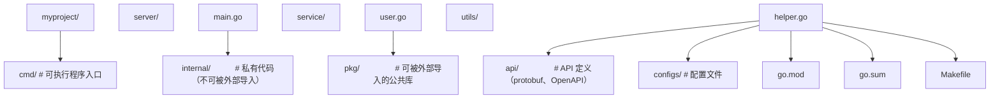

## 1. Go 语言概述

Go（又称 Golang）是由 Google 的 Robert Griesemer、Rob Pike 和 Ken Thompson 于 2007 年开始设计，2012 年发布 1.0 版本的静态类型、编译型编程语言。Go 的诞生源于对 C++ 复杂性的反思以及对大规模系统开发效率的追求。

### 1.1 核心特点

| 特点             | 描述                               | 优势                     |
| :--------------- | :--------------------------------- | :----------------------- |
| **简洁语法**     | 仅有 25 个关键字，语法规则少而清晰 | 学习成本低，代码风格统一 |
| **编译快速**     | 依赖分析高效，大型项目秒级编译     | 开发迭代迅速             |
| **原生并发**     | goroutine + channel 是语言级特性   | 轻松编写高并发程序       |
| **垃圾回收**     | 低延迟 GC，无需手动管理内存        | 减少内存泄漏风险         |
| **静态链接**     | 编译为单一二进制文件，无外部依赖   | 部署极其简单             |
| **跨平台**       | 支持 Linux/macOS/Windows/ARM 等    | 一次编写，交叉编译       |
| **内置工具链**   | go fmt/vet/test/doc 等开箱即用     | 统一的开发体验           |
| **接口隐式实现** | 无需显式声明即可实现接口           | 灵活的组合设计           |

### 1.2 设计哲学

Go 的设计哲学可以概括为以下几条原则：

- **少即是多**：通过减少特性来降低复杂度，没有类、继承、异常、泛型（直到 1.18）
- **组合优于继承**：通过嵌入（embedding）和接口组合实现代码复用
- **显式优于隐式**：错误处理显式返回，类型转换必须显式
- **约定优于配置**：`go fmt` 统一格式，项目结构约定（如 `cmd/`、`pkg/`、`internal/`）
- **内置电池**：标准库功能丰富，HTTP 服务器、JSON 编解码、加密等开箱即用

### 1.3 Go 适用场景

- 云原生基础设施（Docker、Kubernetes、etcd、Terraform）
- 微服务与 API 服务
- 网络编程与代理（Caddy、Traefik）
- 命令行工具（Hugo、gh）
- 数据库（CockroachDB、InfluxDB、TiDB）
- DevOps 工具链

## 2. 发展历史与版本演进

### 2.1 里程碑版本

| 版本    | 时间    | 重要特性                                                           |
| :------ | :------ | :----------------------------------------------------------------- |
| Go 1.0  | 2012.03 | 稳定版发布，承诺兼容性保证                                         |
| Go 1.5  | 2015.08 | 自举（编译器用 Go 重写），并发 GC                                  |
| Go 1.7  | 2016.08 | context 包进入标准库，子测试/子基准测试                            |
| Go 1.9  | 2017.08 | 类型别名（type alias），sync.Map                                   |
| Go 1.11 | 2018.08 | Go Modules 实验性支持，WebAssembly                                 |
| Go 1.13 | 2019.09 | Modules 默认开启，错误包装（%w）                                   |
| Go 1.18 | 2022.03 | **泛型**、fuzzing、工作区模式（workspace）                         |
| Go 1.21 | 2023.08 | 内置函数 `min`/`max`/`clear`、`log/slog`、`slices`/`maps`/`cmp` 包 |
| Go 1.22 | 2024.02 | for-range 支持整数、HTTP 路由模式匹配增强                          |
| Go 1.23 | 2024.08 | iter 包（迭代器）、unique 包、timer/ticker 改进                    |
| Go 1.24 | 2025.02 | 泛型类型别名、弱指针（weak）、os.Root、改进的 map 迭代             |

### 2.2 Go 1.22+ 重要新特性

**Go 1.22 — for-range 整数**：

```go
// 之前需要写 for i := 0; i < 10; i++
// 现在可以直接：
for i := range 10 {
    fmt.Println(i) // 0, 1, 2, ..., 9
}
```

**Go 1.22 — 增强的 HTTP 路由**：

```go
mux := http.NewServeMux()
mux.HandleFunc("GET /users/{id}", func(w http.ResponseWriter, r *http.Request) {
    id := r.PathValue("id")
    fmt.Fprintf(w, "User: %s", id)
})
mux.HandleFunc("POST /users", createUser)
```

**Go 1.23 — 迭代器（iter 包）**：

```go
// 自定义迭代器函数
func Backward[E any](s []E) iter.Seq2[int, E] {
    return func(yield func(int, E) bool) {
        for i := len(s) - 1; i >= 0; i-- {
            if !yield(i, s[i]) {
                return
            }
        }
    }
}

// 使用
for i, v := range Backward([]string{"a", "b", "c"}) {
    fmt.Println(i, v)
}
```

**Go 1.24 — 泛型类型别名**：

```go
type Set[T comparable] = map[T]struct{}

var s Set[string] = make(Set[string])
s["hello"] = struct{}{}
```

## 3. 环境搭建

### 3.1 安装 Go

**官方安装包**：访问 [https://go.dev/dl/](https://go.dev/dl/) 下载对应平台安装包。

**Linux 安装**：

```bash
# 下载并安装
wget https://go.dev/dl/go1.24.3.linux-amd64.tar.gz
sudo tar -C /usr/local -xzf go1.24.3.linux-amd64.tar.gz

# 配置环境变量
echo 'export PATH=$PATH:/usr/local/go/bin' >> ~/.bashrc
echo 'export PATH=$PATH:$(go env GOPATH)/bin' >> ~/.bashrc
source ~/.bashrc
```

**macOS 安装**：

```bash
brew install go
```

**Windows 安装**：下载 `.msi` 安装包，按向导安装即可。

### 3.2 环境变量

```bash
# 查看当前配置
go env

# 关键环境变量
# GOROOT    — Go 安装路径（通常自动检测）
# GOPATH    — Go 工作空间路径（默认 $HOME/go）
# GOBIN     — 可执行文件安装路径
# GOPROXY   — 模块代理（国内推荐设置）
# GOMODCACHE — 模块缓存路径
# GOOS/GOARCH — 交叉编译目标

# 国内加速
go env -w GOPROXY=https://goproxy.cn,direct
go env -w GONOSUMCHECK=*.corp.example.com
```

### 3.3 编辑器与 IDE

| 工具                   | 特点                                         |
| :--------------------- | :------------------------------------------- |
| **VS Code + Go 扩展**  | 轻量、免费、插件生态丰富，gopls 提供智能补全 |
| **GoLand (JetBrains)** | 商业 IDE，功能最全，调试体验最佳             |
| **Neovim + gopls**     | 高度可定制，适合 Vim 用户                    |

### 3.4 验证安装

```bash
go version
# 输出: go version go1.24.3 linux/amd64

go env GOPATH
# 输出: /home/user/go
```

## 4. Go Modules 模块系统

Go Modules 是 Go 1.11 引入、1.16 成为默认的依赖管理系统，通过 `go.mod` 文件声明模块路径和依赖。

### 4.1 创建模块

```bash
mkdir myproject && cd myproject
go mod init github.com/username/myproject
# 生成 go.mod 文件
```

**go.mod 文件结构**：

```
module github.com/username/myproject

go 1.24

require (
    github.com/gin-gonic/gin v1.10.0
    golang.org/x/text v0.21.0
)

require github.com/json-iterator/go v1.1.12 // indirect
```

### 4.2 常用模块命令

```bash
go mod init <module-path>   # 初始化模块
go mod tidy                  # 整理依赖（添加缺失、移除未使用）
go mod download              # 下载依赖到缓存
go mod vendor                # 将依赖复制到 vendor 目录
go mod graph                 # 查看依赖图
go mod verify                # 验证依赖完整性
go mod why <package>         # 解释为什么需要某个依赖
```

### 4.3 添加与更新依赖

```bash
# 添加依赖
go get github.com/gin-gonic/gin@latest
go get github.com/gin-gonic/gin@v1.10.0

# 更新依赖
go get -u github.com/gin-gonic/gin     # 更新到最新 minor/patch
go get -u=patch github.com/gin-gonic/gin  # 仅更新 patch

# 移除未使用依赖
go mod tidy
```

### 4.4 工作区模式（Workspace）

Go 1.18 引入工作区模式，支持多模块本地开发：

```bash
# 创建工作区
go work init ./module1 ./module2

# 生成 go.work 文件
```

**go.work 文件**：

```
go 1.24

use (
    ./module1
    ./module2
)

replace github.com/old/pkg => ./local/pkg
```

### 4.5 版本选择机制

Go 使用**最小版本选择（MVS）**算法：选择满足所有依赖约束的最小版本，而非最新版本。这确保了构建的可重复性。

```
A 依赖 B >= 1.2.0
A 依赖 C >= 1.0.0
C 依赖 B >= 1.1.0

→ MVS 选择 B v1.2.0（满足所有约束的最小版本）
```

## 5. Hello World

### 5.1 第一个 Go 程序

```go
// main.go
package main

import "fmt"

func main() {
    fmt.Println("Hello, World!")
}
```

### 5.2 运行与构建

```bash
# 直接运行
go run main.go

# 编译构建
go build -o hello main.go
./hello

# 安装到 GOPATH/bin
go install
```

### 5.3 项目结构

Go 项目推荐的标准布局：



### 5.4 包（Package）基础

```go
// 每个 Go 文件必须属于一个包
package math

// 大写开头 = 导出（public）
func Add(a, b int) int {
    return a + b
}

// 小写开头 = 未导出（private）
func subtract(a, b int) int {
    return a - b
}
```

```go
// 导入并使用
package main

import (
    "fmt"
    "github.com/username/myproject/pkg/math"
)

func main() {
    fmt.Println(math.Add(1, 2))  // 3
    // math.subtract(1, 2)       // 编译错误：未导出
}
```

## 6. Go 程序执行流程

```
源码(.go) → go build → 可执行文件 → 运行
                ↓
        词法分析 → 语法分析 → 类型检查 → SSA → 机器码
```

**程序启动顺序**：

1. 导入所有依赖包（递归）
2. 执行各包的 `init()` 函数（按导入顺序）
3. 执行 `main` 包的 `init()` 函数
4. 执行 `main()` 函数

```go
package main

import "fmt"

var name = initName()

func initName() string {
    fmt.Println("初始化 name 变量")
    return "Go"
}

func init() {
    fmt.Println("init 函数执行")
}

func main() {
    fmt.Println("main 函数执行")
    fmt.Println("name =", name)
}
// 输出顺序：
// 初始化 name 变量
// init 函数执行
// main 函数执行
// name = Go
```

## 参考文献


Go 官方文档：https://go.dev/doc/
Go 内存模型：https://go.dev/ref/mem
Effective Go：https://go.dev/doc/effective_go
Go 标准库：https://pkg.go.dev/std
Go 官方博客：https://go.dev/blog/

## 延伸阅读


Go 并发与 channel，见 016-go 模块并发文档。
Go 原子操作与竞争检测，见 016-go/058-RaceDetectionAtomic 文档。
云原生与 Kubernetes，见 031-devops 模块。
黑马程序员 Bilibili 空间（https://space.bilibili.com/37974444 ）提供 Go 课程。

## 深度专题扩展


以下专题从不同角度深入本文主题，供有进阶需求的读者研读。每个专题独立成节，内容相互补充。

### 13.1 Go 调度器 GMP 模型

G（Goroutine）是任务单元，M（Machine）是内核线程，P（Processor）是执行上下文与本地队列。P 的数量默认等于 CPU 核心数（GOMAXPROCS）。
调度事件：go 语句创建 G 入本地队列；本地队列满时偷取（work stealing）；阻塞系统调用时 M 与 P 解绑，P 被其他 M 接管。
网络 I/O 通过 netpoller 事件驱动，阻塞的 G 挂起而非占用线程，因此 Go 的并发 I/O 效率极高。
理解 GMP 可以解释：为什么 goroutine 数量不等于并行度；为什么 GOMAXPROCS 影响吞吐；为什么 CPU 密集任务要限制并发数。

### 13.2 Go 泛型与类型约束

Go 1.18 引入类型参数 `[T any]` 与约束接口；`~int` 表示底层类型为 int 的类型集合，`comparable` 约束可比较类型。
泛型函数示例：`func Map[T, U any](s []T, f func(T) U) []U`；泛型类型示例：`type Set[T comparable] map[T]struct{}`。
约束中的类型集（union）与接口方法并存；1.21 的 slices/maps 标准包提供泛型工具。
工程建议：能用接口解决的不必泛型；泛型用于容器、算法与类型安全抽象。

## 模块文档速查表

| 文档 | 主题 | 与本文的关联 |
| --- | --- | --- |
| Go 概述与环境配置 | 001-GoOverviewEnvSetup | 本文自身 |
| Go 基础语法 | 002-GoBasicSyntax | 本文的前置基础 |
| Go 函数与方法 | 003-GoFunctionMethod | 本文的并列主题 |
| Go 数据结构 | 004-GoDataStructure | 本文的并列主题 |
| Go 接口与组合 | 005-GoInterfaceComposition | 本文的并列主题 |
| Go 并发编程 | 006-GoConcurrentProgramming | 本文的并列主题 |
| Go 错误处理 | 007-GoErrorHandling | 本文的并列主题 |
| Go 泛型 | 008-GoGeneric | 本文的并列主题 |
| Go 标准库与工具链 | 009-GoStandardLibraryToolchain | 本文的并列主题 |
| Go Web 开发与微服务 | 010-GoWebDevelopmentMicroservice | 本文的并列主题 |
| 切片原理 | 011-SlicePrinciple | 本文的原理深化 |
| Map原理 | 012-MapPrinciple | 本文的原理深化 |
| unsafe与指针 | 013-UnsafePointer | 本文的并列主题 |
| Channel原理 | 014-ChannelPrinciple | 本文的原理深化 |
| 反射 | 015-Reflection | 本文的并列主题 |
| 内存对齐 | 016-MemoryAlignment | 本文的并列主题 |
| Context详解 | 017-ContextDetailed | 本文的并列主题 |
| Goroutine调度 | 018-GoroutineSchedule | 本文的并列主题 |
| 接口与类型断言 | 019-InterfaceTypeAssertion | 本文的并列主题 |
| 错误处理进阶 | 020-ErrorHandlingAdvanced | 本文的并列主题 |
| Go与GraphQL | 021-GoGraphQL | 本文的并列主题 |
| Go与gRPC | 022-GoGRPC | 本文的并列主题 |
| Go与Kubernetes | 023-GoKubernetes | 本文的并列主题 |
| Go与Docker | 024-GoDocker | 本文的并列主题 |
| Go与Redis | 025-GoRedis | 本文的并列主题 |
| Go与消息队列 | 026-GoMessageQueue | 本文的并列主题 |
| Go与数据库 | 027-GoDatabase | 本文的并列主题 |
| Go与测试 | 028-GoTest | 本文的并列主题 |
| Go与JSON | 029-GoJSON | 本文的并列主题 |
| Go与Fuzzing | 030-GoFuzzing | 本文的并列主题 |
| Go与CGO | 031-GoCGO | 本文的并列主题 |
| Go与Wasm | 032-GoWasm | 本文的并列主题 |
| Go与代码生成 | 033-GoCodeGeneration | 本文的并列主题 |
| Go与依赖注入 | 034-GoDependencyInjection | 本文的并列主题 |
| Go与配置管理 | 035-GoConfigManagement | 本文的并列主题 |
| Go与日志 | 036-GoLog | 本文的并列主题 |
| Go与模板 | 037-GoTemplate | 本文的并列主题 |
| Go与加密 | 038-GoEncryption | 本文的安全延伸 |
| Go与文件监控 | 039-GoFileMonitor | 本文的并列主题 |
| Go与时间 | 040-GoTime | 本文的并列主题 |
| Go与正则表达式 | 041-GoRegex | 本文的并列主题 |
| Go与信号处理 | 042-GoSignalHandling | 本文的并列主题 |
| Go与性能分析 | 043-GoPerformanceAnalysis | 本文的性能延伸 |
| Go与HTTP客户端 | 044-GoHTTPClient | 本文的并列主题 |
| Go与HTTP服务器 | 045-GoHTTP | 本文的并列主题 |
| Go与OAuth2 | 046-GoOAuth2 | 本文的并列主题 |
| Go与中间件 | 047-GoMiddleware | 本文的并列主题 |
| Go与分布式追踪 | 048-GoDistributedTracing | 本文的并列主题 |
| Go与限流 | 049-Go | 本文的并列主题 |
| goroutine与channel通信原理 | 050-GoroutineChannelPrinciple | 本文的原理深化 |
| GMP调度模型 | 051-GMPModel | 本文的并列主题 |
| 并发模式 | 052-ConcurrencyPattern | 本文的并列主题 |
| 反射实现通用函数 | 053-ReflectionGenericFunction | 本文的并列主题 |
| 内存逃逸分析 | 054-MemoryEscapeAnalysis | 本文的并列主题 |
| 垃圾回收与GC调优 | 055-GCAndTuning | 本文的性能延伸 |
| 泛型详解 | 056-GenericDetailed | 本文的并列主题 |
| 单元测试与基准测试 | 057-UnitTestBenchmark | 本文的并列主题 |
| 竞态检测与原子操作 | 058-RaceDetectionAtomic | 本文的并列主题 |
| 包管理详解 | 059-PackageManagementDetailed | 本文的并列主题 |
