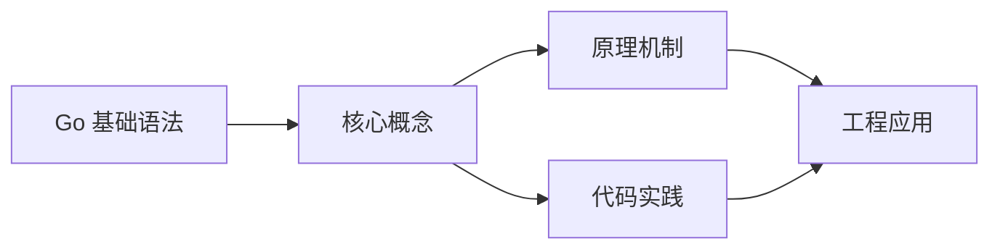

## 1. 学习目标（Bloom 分类）

本节按照布鲁姆教育目标分类学组织学习路径。本文主题为《Go 基础语法》，属于 Go 模块，读者可以根据自身阶段选择阅读深度。

记忆层面：能够准确复述本文的核心概念、术语与基本语法或操作步骤，并能够在提问或检索时快速定位对应知识点。能够说出 Go 的包、函数、结构体、接口与错误处理基本语法。

理解层面：能够用自己的语言解释核心原理与工作机制，说明概念之间的因果关系，而不是机械记忆结论。能够解释 goroutine 调度、channel 通信与内存模型。

应用层面：能够在真实项目或练习场景中运用本文知识解决具体问题，写出正确且可维护的实现。能够编写并发程序、HTTP 服务与命令行工具。

分析层面：能够拆解复杂问题，比较本文主题与相邻概念的异同，识别边界条件与例外情况。能够分析数据竞争、死锁与性能瓶颈。

评价层面：能够根据约束条件（性能、可读性、安全、成本）评价不同方案的优劣，做出有依据的技术决策。能够评价 Go 与 Java、Python 在不同场景的取舍。

创造层面：能够把本文知识与其他模块知识组合，设计出新的解决方案或可复用的工程模式。能够设计完整的微服务与云原生应用。

通过本节学习，读者应当能够把《Go 基础语法》纳入自己的知识网络，并与 Go 模块的其他主题（goroutine、channel、内存模型、标准库）建立关联。

## 2. 历史动机与发展脉络

《Go 基础语法》是 Go 领域的重要主题。要真正理解它，需要先了解它解决的问题与演进过程。

Go 由 Google 的 Robert Griesemer、Rob Pike 与 Ken Thompson 于 2009 年发布，设计目标是解决大规模分布式系统的工程痛点：编译慢、依赖混乱、并发难写。
Go 1.0 于 2012 年发布，此后严格保持向后兼容（Go 1 兼容性承诺）；约每半年发布一个小版本，1.21 起引入工具链管理（toolchain 指令）与内置测试 fuzzing。
Go 在云原生领域成为事实标准：Docker、Kubernetes、Prometheus、etcd 等核心项目均用 Go 编写；泛型在 1.18 加入，1.21+ 的 slices/maps 标准包补齐泛型工具。

回到本文主题：Go 基础语法 的提出与成熟，正是上述技术背景下的必然产物。早期实现往往以简单可用为目标，随着工程规模扩大，社区逐渐沉淀出标准做法与最佳实践；理解这一脉络，可以帮助读者判断“为什么文档中的推荐写法是现在这个样子”，也能在遇到历史遗留代码时准确识别其设计年代与取舍。


## 3. 形式化定义与核心概念精讲

本节把《Go 基础语法》涉及的核心概念以“定义 + 讲解”的形式展开。读者应把定义当作工具，把讲解当作理解路径；两者结合才能形成可迁移的知识。

goroutine 与调度：goroutine 是用户态轻量线程，由 GMP 调度器（Goroutine、Machine、Processor）多路复用到内核线程；创建成本约 2KB 栈，支持百万级并发。
channel 与 select：channel 是类型化通信管道，`<-` 发送/接收；select 多路等待；“不要通过共享内存通信，而要通过通信共享内存”是 Go 并发哲学。
内存模型：happens-before 关系由 channel、sync 原语与 atomic 建立；`go test -race` 用 ThreadSanitizer 检测数据竞争。

### 3.1 原文章节逐一精讲

原文档把主题拆分为 17 个小节，下面按顺序给出每一节的导读讲解，随后保留原文细节供精读。

#### 原文精读（完整保留）

# Go 基础语法

> **符号约定**：`< >` 必填参数 | `[ ]` 可选参数

---

#### 1. 变量与常量

##### 1.1 变量声明

Go 提供多种变量声明方式，推荐在函数内使用短变量声明：

```go
// 完整声明（可省略类型，由编译器推断）
var name string = "Go"
var age = 15

// 批量声明
var (
    x    int     = 10
    y    float64 = 3.14
    flag bool    = true
)

// 短变量声明（仅限函数内，最常用）
city := "Beijing"
count := 100

// 未初始化则使用零值
var score int       // 0
var title string    // ""（空字符串）
var done bool       // false
```

##### 1.2 常量

```go
// 常量在编译时确定，不能使用 := 声明
const Pi = 3.14159
const Language = "Go"

// 批量声明
const (
    StatusOK    = 200
    StatusError = 500
)

// iota 常量生成器
const (
    Sunday    = iota // 0
    Monday           // 1
    Tuesday          // 2
    Wednesday        // 3
    Thursday         // 4
    Friday           // 5
    Saturday         // 6
)

// iota 高级用法：位运算标志
const (
    ReadPermission   = 1 << iota // 1  (001)
    WritePermission              // 2  (010)
    ExecutePermission            // 4  (100)
)

// 跳过值
const (
    _  = iota // 跳过 0
    KB = 1 << (10 * iota) // 1 << 10 = 1024
    MB                     // 1 << 20
    GB                     // 1 << 30
    TB                     // 1 << 40
)
```

#### 2. 基本数据类型

##### 2.1 类型一览

| 类别   | 类型                                          | 说明                              |
| :----- | :-------------------------------------------- | :-------------------------------- |
| 布尔   | `bool`                                        | `true` 或 `false`                 |
| 整数   | `int8`, `int16`, `int32`, `int64`, `int`      | 有符号整数                        |
| 整数   | `uint8`, `uint16`, `uint32`, `uint64`, `uint` | 无符号整数                        |
| 整数   | `byte`                                        | `uint8` 的别名                    |
| 整数   | `rune`                                        | `int32` 的别名，表示 Unicode 码点 |
| 浮点   | `float32`, `float64`                          | IEEE 754 浮点数                   |
| 复数   | `complex64`, `complex128`                     | 复数                              |
| 字符串 | `string`                                      | 不可变字节序列                    |
| 指针   | `*T`                                          | 指向类型 T 的指针                 |

> **注意**：`int` 和 `uint` 的大小取决于平台（32 位或 64 位），优先使用 `int`。

##### 2.2 零值

Go 中所有变量在声明时若未初始化，会自动赋予零值：

```go
var (
    i    int        // 0
    f    float64    // 0.0
    b    bool       // false
    s    string     // ""
    ptr  *int       // nil
    sl   []int      // nil
    m    map[string]int // nil
    ch   chan int   // nil
    fn   func()     // nil
    err  error      // nil
)
```

> 零值是 Go 的重要设计理念——变量总是有明确定义的值，不存在"未初始化"状态。

##### 2.3 类型转换

Go 没有隐式类型转换，所有转换必须显式进行：

```go
var i int = 42
var f float64 = float64(i)    // int → float64
var u uint = uint(f)          // float64 → uint

// 字符串与数值转换（使用 strconv 包）
s := strconv.Itoa(42)         // int → string: "42"
n, err := strconv.Atoi("42")  // string → int: 42

f2 := strconv.FormatFloat(3.14, 'f', 2, 64) // float64 → string: "3.14"
f3, err := strconv.ParseFloat("3.14", 64)    // string → float64

// 字符串与字节切片
bytes := []byte("hello")      // string → []byte
str := string(bytes)          // []byte → string

// rune 与 string
r := '世'
fmt.Printf("%c %U\n", r, r)  // 世 U+4E16
```

#### 3. 字符串

##### 3.1 字符串基础

Go 字符串是不可变的 UTF-8 字节序列：

```go
s := "Hello, 世界"

// 字节长度 vs 字符数
fmt.Println(len(s))                    // 13（字节数）
fmt.Println(utf8.RuneCountInString(s)) // 9（字符数）

// 遍历字节
for i := 0; i < len(s); i++ {
    fmt.Printf("%x ", s[i]) // 48 65 6c 6c 6f 2c 20 e4 b8 96 e7 95 8c
}

// 遍历 rune（正确处理 Unicode）
for i, r := range s {
    fmt.Printf("%d:%c ", i, r) // 0:H 1:e 2:l 3:l 4:o 5:, 6:  7:世 10:界
}
```

##### 3.2 字符串操作

```go
import "strings"

s := "Hello, World"

// 查找与判断
strings.Contains(s, "World")       // true
strings.HasPrefix(s, "Hello")      // true
strings.HasSuffix(s, "World")      // true
strings.Index(s, "World")          // 7
strings.Count(s, "l")              // 3

// 变换
strings.ToUpper(s)                  // "HELLO, WORLD"
strings.ToLower(s)                  // "hello, world"
strings.TrimSpace("  hi  ")        // "hi"
strings.Trim("==hi==", "=")        // "hi"
strings.Replace(s, "World", "Go", 1) // "Hello, Go"
strings.ReplaceAll(s, "l", "L")    // "HeLLo, WorLd"

// 拆分与合并
parts := strings.Split("a,b,c", ",")    // ["a", "b", "c"]
joined := strings.Join(parts, "-")      // "a-b-c"
fields := strings.Fields("  a  b  c ")  // ["a", "b", "c"]

// 字符串构建（避免频繁拼接）
var b strings.Builder
b.WriteString("Hello")
b.WriteString(", ")
b.WriteString("World")
result := b.String() // "Hello, World"
```

##### 3.3 原始字符串

```go
// 反引号包围，不处理转义
raw := `C:\Users\name\file.txt`
multi := `
第一行
第二行
第三行
`
```

#### 4. 指针

##### 4.1 指针基础

```go
x := 42
p := &x          // p 是 *int 类型，指向 x 的地址

fmt.Println(p)   // 0xc0000b2008（内存地址）
fmt.Println(*p)  // 42（解引用，获取地址处的值）

*p = 100         // 通过指针修改值
fmt.Println(x)   // 100
```

##### 4.2 指针的零值

```go
var p *int        // nil（零值）
if p != nil {
    fmt.Println(*p) // 安全检查
}
// *p = 10        // panic: nil 指针解引用
```

##### 4.3 指针与函数

```go
// 值传递：函数内修改不影响外部
func doubleVal(n int) {
    n *= 2
}

// 指针传递：函数内修改影响外部
func doublePtr(n *int) {
    *n *= 2
}

func main() {
    x := 10
    doubleVal(x)
    fmt.Println(x)  // 10（未变）

    doublePtr(&x)
    fmt.Println(x)  // 20（已变）
}
```

##### 4.4 new 函数

```go
// new(T) 分配零值内存并返回指针
p := new(int)     // *int 类型，指向 0
*p = 42
fmt.Println(*p)   // 42

// 等价于
var v int
p2 := &v
```

> **Go 指针 vs C 指针**：Go 没有指针运算（不能 `p++`），更安全。

#### 5. 控制流

##### 5.1 if 语句

```go
// 基本形式（条件不需要括号）
if x > 0 {
    fmt.Println("positive")
} else if x < 0 {
    fmt.Println("negative")
} else {
    fmt.Println("zero")
}

// 初始化语句（变量作用域限定在 if 块内）
if err := doSomething(); err != nil {
    fmt.Println("Error:", err)
    // err 仅在此块内可见
}
```

##### 5.2 for 循环

Go 只有 `for` 一种循环语句，但功能涵盖所有场景：

```go
// 经典三段式
for i := 0; i < 10; i++ {
    fmt.Println(i)
}

// while 风格
n := 1
for n < 100 {
    n *= 2
}

// 无限循环
for {
    if shouldBreak() {
        break
    }
}

// for-range（遍历集合）
nums := []int{1, 2, 3}
for i, v := range nums {
    fmt.Printf("index=%d value=%d\n", i, v)
}

// Go 1.22+ for-range 整数
for i := range 5 {
    fmt.Println(i) // 0, 1, 2, 3, 4
}

// 只需要索引或值
for i := range nums { /* 只取索引 */ }
for _, v := range nums { /* 只取值 */ }
```

##### 5.3 switch 语句

```go
// 基本形式（自动 break，不穿透）
day := "Monday"
switch day {
case "Monday":
    fmt.Println("周一")
case "Tuesday":
    fmt.Println("周二")
default:
    fmt.Println("其他")
}

// 多值匹配
switch color {
case "red", "green", "blue":
    fmt.Println("基础颜色")
}

// 穿透（fallthrough）
switch n := 2; n {
case 1:
    fmt.Println("一")
    fallthrough
case 2:
    fmt.Println("二")   // 即使匹配 2，也会执行
    fallthrough
case 3:
    fmt.Println("三")   // fallthrough 继续执行
}

// 无条件 switch（替代 if-else 链）
score := 85
switch {
case score >= 90:
    fmt.Println("A")
case score >= 80:
    fmt.Println("B")
case score >= 70:
    fmt.Println("C")
default:
    fmt.Println("D")
}
```

##### 5.4 break 与 continue

```go
for i := 0; i < 10; i++ {
    if i == 3 {
        continue // 跳过本次迭代
    }
    if i == 7 {
        break    // 退出循环
    }
    fmt.Println(i) // 0, 1, 2, 4, 5, 6
}

// 标签跳转（跳出外层循环）
outer:
for i := 0; i < 3; i++ {
    for j := 0; j < 3; j++ {
        if i == 1 && j == 1 {
            break outer // 跳出外层循环
        }
        fmt.Printf("(%d,%d) ", i, j)
    }
}
// 输出: (0,0) (0,1) (0,2) (1,0)
```

#### 6. defer 语句

`defer` 将函数调用推迟到所在函数返回之前执行，常用于资源清理。

##### 6.1 基本用法

```go
func readFile(path string) {
    file, err := os.Open(path)
    if err != nil {
        return
    }
    defer file.Close() // 确保文件关闭

    // 读取文件...
}
```

##### 6.2 defer 执行顺序

多个 defer 按**后进先出（LIFO）**顺序执行：

```go
func main() {
    defer fmt.Println("第一")  // 最后执行
    defer fmt.Println("第二")  // 第二执行
    defer fmt.Println("第三")  // 最先执行
    fmt.Println("主函数")
}
// 输出:
// 主函数
// 第三
// 第二
// 第一
```

##### 6.3 defer 参数求值

defer 语句的参数在声明时立即求值，而非执行时：

```go
func main() {
    x := 10
    defer fmt.Println(x) // 输出 10（声明时求值）
    x = 20
    fmt.Println(x)       // 输出 20
}
// 输出: 20, 10
```

##### 6.4 defer 与返回值

defer 可以修改命名返回值：

```go
func double() (result int) {
    defer func() {
        result *= 2 // 修改返回值
    }()
    return 5 // result = 5，然后 defer 执行 result *= 2
}
// double() 返回 10
```

##### 6.5 defer 性能考虑

```go
// defer 在循环中可能有性能开销（Go 1.13+ 已大幅优化）
// 简单场景可以直接调用
func process(items []string) {
    for _, item := range items {
        f, err := os.Open(item)
        if err != nil {
            continue
        }
        // 在热路径循环中，直接调用可能比 defer 更高效
        processFile(f)
        f.Close()
    }
}
```
#### 变量声明

**基本写法：显式声明变量类型和初始值**
`var <变量名> <类型> = <值>`
```go
// 显式声明变量类型和初始值
var name string = "Go";
```

**基本写法：类型推断声明**
`var <变量名> = <值>`
```go
// 自动推断类型
var age = 15;
```

**单行写法：批量声明多个变量**
`var ( <变量1> <类型1> = <值1>; <变量2> <类型2> = <值2> )`
```go
// 单行批量声明多个变量
var ( x int = 10; y float64 = 3.14; flag bool = true );
```

**换行写法：批量声明多个变量**
`var ( ... )`
```go
// 换行书写批量声明
var (
    x    int     = 10
    y    float64 = 3.14
    flag bool    = true
);
```

**基本写法：短变量声明**
`<变量名> := <值>`
```go
// 仅限函数内使用，自动推断类型
city := "Beijing";
```

**基本写法：零值声明**
`var <变量名> <类型>`
```go
// 未初始化的变量使用零值
var score int; // 0
```

---

#### 常量

**基本写法：常量声明**
`const <名称> = <值>`
```go
// 声明常量
const Pi = 3.14159;
```

**单行写法：批量声明常量**
`const ( <名称1> = <值1>; <名称2> = <值2> )`
```go
// 单行批量声明常量
const ( StatusOK = 200; StatusError = 500 );
```

**换行写法：批量声明常量**
`const ( ... )`
```go
// 换行书写批量声明
const (
    StatusOK    = 200
    StatusError = 500
);
```

**基本写法：iota 常量生成器**
`const ( <名称> = iota ... )`
```go
// iota 从 0 开始自动递增
const (
    Sunday    = iota // 0
    Monday           // 1
    Tuesday          // 2
);
```

**基本写法：iota 位运算标志**
`const ( <名称> = 1 << iota ... )`
```go
// 位运算生成权限标志
const (
    ReadPermission   = 1 << iota // 1  (001)
    WritePermission              // 2  (010)
    ExecutePermission            // 4  (100)
);
```

**基本写法：iota 跳过值**
`_ = iota`
```go
// 跳过 0，从 1024 开始
const (
    _  = iota
    KB = 1 << (10 * iota) // 1024
    MB                    // 1048576
);
```

---

#### 类型转换

**基本写法：显式类型转换**
`<目标类型>(<值>)`
```go
// int 转 float64
var i int = 42;
var f float64 = float64(i);
```

**基本写法：int 转 string**
`strconv.Itoa(<整数>)`
```go
// int 转 string
s := strconv.Itoa(42);
```

**基本写法：string 转 int**
`strconv.Atoi(<字符串>)`
```go
// string 转 int
n, err := strconv.Atoi("42");
```

**基本写法：string 转 []byte**
`[]byte(<字符串>)`
```go
// string 转 []byte
bytes := []byte("hello");
```

**基本写法：[]byte 转 string**
`string(<字节切片>)`
```go
// []byte 转 string
str := string(bytes);
```

---

#### 字符串操作

**基本写法：字符串字节长度**
`len(<字符串>)`
```go
// 字节数（UTF-8 编码）
fmt.Println(len("Hello, 世界")); // 13
```

**基本写法：字符串字符数**
`utf8.RuneCountInString(<字符串>)`
```go
// 字符数（正确处理 Unicode）
fmt.Println(utf8.RuneCountInString("Hello, 世界")); // 9
```

**基本写法：按 rune 遍历字符串**
`for i, r := range <字符串>`
```go
// 按 rune 遍历，正确处理 Unicode
for i, r := range "Hello" {
    fmt.Printf("%d:%c ", i, r);
}
```

**基本写法：判断子串是否存在**
`strings.Contains(<字符串>, <子串>)`
```go
// 查找子串
strings.Contains("Hello, World", "World"); // true
```

**基本写法：判断前缀**
`strings.HasPrefix(<字符串>, <前缀>)`
```go
// 判断前缀
strings.HasPrefix("Hello, World", "Hello"); // true
```

**基本写法：判断后缀**
`strings.HasSuffix(<字符串>, <后缀>)`
```go
// 判断后缀
strings.HasSuffix("Hello, World", "World"); // true
```

**基本写法：查找子串位置**
`strings.Index(<字符串>, <子串>)`
```go
// 查找子串位置
strings.Index("Hello, World", "World"); // 7
```

**基本写法：转大写**
`strings.ToUpper(<字符串>)`
```go
// 转大写
strings.ToUpper("Hello"); // "HELLO"
```

**基本写法：转小写**
`strings.ToLower(<字符串>)`
```go
// 转小写
strings.ToLower("Hello"); // "hello"
```

**基本写法：去除首尾空白**
`strings.TrimSpace(<字符串>)`
```go
// 去除首尾空白
strings.TrimSpace("  hi  "); // "hi"
```

**基本写法：替换字符串**
`strings.Replace(<字符串>, <旧>, <新>, <次数>)`
```go
// 替换字符串
strings.Replace("Hello", "l", "L", 1); // "HeLlo"
```

**基本写法：拆分字符串**
`strings.Split(<字符串>, <分隔符>)`
```go
// 拆分字符串
parts := strings.Split("a,b,c", ",");
```

**基本写法：合并字符串**
`strings.Join(<切片>, <分隔符>)`
```go
// 合并字符串
joined := strings.Join(parts, "-");
```

**基本写法：字符串构建**
`strings.Builder`
```go
// 使用 Builder 高效构建字符串
var b strings.Builder;
b.WriteString("Hello");
b.WriteString(", World");
result := b.String();
```

**基本写法：原始字符串**
`` `<内容> ``
```go
// 反引号包围的原始字符串
raw := `C:\Users\name\file.txt`;
```

---

#### 指针

**基本写法：取地址**
`&<变量>`
```go
// 取地址
x := 42;
p := &x; // p 是 *int 类型
```

**基本写法：解引用**
`*<指针>`
```go
// 解引用获取值
fmt.Println(*p); // 42
```

**基本写法：通过指针修改值**
`*<指针> = <值>`
```go
// 通过指针修改值
*p = 100;
```

**基本写法：nil 指针检查**
`if <指针> != nil`
```go
// nil 指针检查
var p *int;
if p != nil {
    fmt.Println(*p);
}
```

**基本写法：指针传递**
`func <函数名>(<参数> *<类型>)`
```go
// 指针传递修改外部变量
func doublePtr(n *int) {
    *n *= 2;
}
```

**基本写法：new 函数**
`new(<类型>)`
```go
// new 分配零值内存
p := new(int);
*p = 42;
```

---

#### if 语句

**基本写法：基本 if 语句**
`if <条件> { ... }`
```go
// 基本条件判断
if x > 0 {
    fmt.Println("positive");
} else if x < 0 {
    fmt.Println("negative");
} else {
    fmt.Println("zero");
}
```

**基本写法：带初始化的 if**
`if <初始化>; <条件> { ... }`
```go
// 初始化语句中的变量仅在此块可见
if err := doSomething(); err != nil {
    fmt.Println("Error:", err);
}
```

---

#### for 循环

**基本写法：经典三段式**
`for <初始化>; <条件>; <后置> { ... }`
```go
// 经典 for 循环
for i := 0; i < 10; i++ {
    fmt.Println(i);
}
```

**基本写法：while 风格**
`for <条件> { ... }`
```go
// while 风格循环
n := 1;
for n < 100 {
    n *= 2;
}
```

**基本写法：无限循环**
`for { ... }`
```go
// 无限循环
for {
    if shouldBreak() {
        break;
    }
}
```

**基本写法：for-range 遍历**
`for <索引>, <值> := range <集合> { ... }`
```go
// 遍历切片
nums := []int{1, 2, 3};
for i, v := range nums {
    fmt.Printf("index=%d value=%d\n", i, v);
}
```

**基本写法：Go 1.22+ for-range 整数**
`for i := range <整数> { ... }`
```go
// 遍历 0 到 4
for i := range 5 {
    fmt.Println(i);
}
```

---

#### switch 语句

**基本写法：基本 switch**
`switch <表达式> { case ... }`
```go
// 基本 switch 语句
switch day {
case "Monday":
    fmt.Println("周一");
case "Tuesday":
    fmt.Println("周二");
default:
    fmt.Println("其他");
}
```

**基本写法：多值匹配**
`case <值1>, <值2>, <值3>:`
```go
// 多值匹配
switch color {
case "red", "green", "blue":
    fmt.Println("基础颜色");
}
```

**基本写法：fallthrough 穿透**
`fallthrough`
```go
// fallthrough 继续执行下一个 case
switch n := 2; n {
case 1:
    fmt.Println("一");
    fallthrough;
case 2:
    fmt.Println("二");
    fallthrough;
case 3:
    fmt.Println("三");
}
```

**基本写法：无条件 switch**
`switch { case <条件>: ... }`
```go
// 无条件 switch
score := 85;
switch {
case score >= 90:
    fmt.Println("A");
case score >= 80:
    fmt.Println("B");
default:
    fmt.Println("D");
}
```

---

#### break 与 continue

**基本写法：continue 跳过**
`continue`
```go
// 跳过当前迭代
for i := 0; i < 10; i++ {
    if i == 3 {
        continue;
    }
    fmt.Println(i);
}
```

**基本写法：break 退出**
`break`
```go
// 退出循环
for i := 0; i < 10; i++ {
    if i == 7 {
        break;
    }
    fmt.Println(i);
}
```

**基本写法：标签跳转**
`break <标签>`
```go
// 标签跳转跳出外层循环
outer:
for i := 0; i < 3; i++ {
    for j := 0; j < 3; j++ {
        if i == 1 && j == 1 {
            break outer;
        }
    }
}
```

---

#### defer 语句

**基本写法：基本 defer**
`defer <函数调用>`
```go
// 确保文件关闭
func readFile(path string) {
    file, err := os.Open(path);
    if err != nil {
        return;
    }
    defer file.Close();
}
```

**基本写法：defer 执行顺序**
`defer <函数调用>`
```go
// 多个 defer 按后进先出执行
defer fmt.Println("第一");  // 最后执行
defer fmt.Println("第二");  // 第二执行
defer fmt.Println("第三");  // 最先执行
```

**基本写法：defer 参数求值**
`defer <函数>(<参数>)`
```go
// 参数在声明时求值
x := 10;
defer fmt.Println(x); // 输出 10
x = 20;
```

**基本写法：defer 修改命名返回值**
`defer func() { ... }()`
```go
// defer 修改命名返回值
func double() (result int) {
    defer func() {
        result *= 2;
    }();
    return 5;
}
```

---

#### Go 1.24+ 新特性

**基本写法：Go 1.24 generic type aliases**
`type <别名>[T] = <类型>[T]`
```go
// 泛型类型别名：为泛型类型定义简短别名
type List[T] = []T
type Map[K, V] = map[K]V
type Set[T comparable] = map[T]struct{}
// 使用别名声明变量
var names List[string] = []string{"Go", "Rust"}
var ages Map[string, int] = map[string]int{"Alice": 30}
```

**基本写法：Go 1.24 range-over-func**
`for <x> := range <func> { }`
```go
// range 遍历函数：迭代器函数签名为 func(yield func(T) bool)
func gen(yield func(int) bool) {
    for i := 0; i < 3; i++ {
        if !yield(i * 10) {
            return
        }
    }
}
// 使用 range-over-func 直接遍历函数
for v := range gen {
    fmt.Println(v) // 依次输出 0 10 20
}
```

**基本写法：Go 1.24 weak pointer**
`runtime.AddCleanup(<obj>, <cleanup>, <arg>)`
```go
// 通过 runtime.AddCleanup 注册清理回调，实现弱引用语义
type Big struct{ data [1024]byte }
obj := &Big{}
obj.data[0] = 42
// 当 obj 被 GC 回收时执行清理函数，arg 作为参数传入
runtime.AddCleanup(obj, func(arg int) {
    fmt.Println("对象被回收，传入参数 =", arg)
}, 100)
// 主动解除引用，等待 GC 触发清理
obj = nil
runtime.GC()
```

**基本写法：Go 1.24 toolchain 指令**
`//go:toolchain <版本>`
```go
// 在 go.mod 文件头部指定工具链版本
// go 1.24.0
// toolchain go1.24.3
//go:toolchain go1.24.3

module example.com/myapp

go 1.24.0
```

**基本写法：Go 1.26 new(expr) 内置函数**
`new(<expr>)`
```go
// Go 1.26：new 支持任意表达式，返回指向表达式结果的指针
x := 42
// 直接对表达式结果取地址
p := new(x*2 + 1) // *int，指向值为 85 的内存
fmt.Println(*p)   // 输出 85
// 等价于传统写法
// v := x*2 + 1; p := &v
```


### 3.2 概念关系图

下面用 Mermaid 图表达本文核心概念之间的关系，帮助读者建立整体图景：



图中展示的是本文知识的结构化关系：核心概念是入口，原理机制解释“为什么”，代码实践演示“怎么做”，工程应用回答“何时用”。读者学习时可以把每个小节的内容挂接到对应节点上。

## 4. 理论推导与原理解析

本节深入《Go 基础语法》背后的原理。理论部分不求面面俱到，而是聚焦“能解释现象、能指导实践”的关键推导。

goroutine 与调度：goroutine 是用户态轻量线程，由 GMP 调度器（Goroutine、Machine、Processor）多路复用到内核线程；创建成本约 2KB 栈，支持百万级并发。
channel 与 select：channel 是类型化通信管道，`<-` 发送/接收；select 多路等待；“不要通过共享内存通信，而要通过通信共享内存”是 Go 并发哲学。
内存模型：happens-before 关系由 channel、sync 原语与 atomic 建立；`go test -race` 用 ThreadSanitizer 检测数据竞争。
错误处理：Go 用多返回值显式处理错误（`if err != nil`），error 是接口；panic/recover 仅用于不可恢复错误。

需要强调的是，理论推导与工程实践之间存在翻译层：理论给出的是理想化模型与边界条件，工程代码则必须处理真实环境中的例外。读者在学习时应先掌握理论的“标准情形”，再通过陷阱章节了解“非标准情形”。

## 5. 代码示例与逐行讲解

本节把原文中的代码示例系统整理，并为每个示例补充用途说明与讲解。读者不应只浏览代码，而应逐段对照讲解理解设计意图。

### 5.1 示例：1.1 变量声明

该示例来自原文《1.1 变量声明》小节，用于演示Go 基础语法相关操作。阅读时请先看代码结构，再看其后的讲解。

```go
// 完整声明（可省略类型，由编译器推断）
var name string = "Go"
var age = 15

// 批量声明
var (
    x    int     = 10
    y    float64 = 3.14
    flag bool    = true
)

// 短变量声明（仅限函数内，最常用）
city := "Beijing"
count := 100

// 未初始化则使用零值
var score int       // 0
var title string    // ""（空字符串）
var done bool       // false
```

讲解：这段代码演示了本节核心知识点。代码中的关键操作可以归纳为三步：准备（定义或初始化）、执行（核心逻辑）、收尾（释放资源或返回结果）。实际项目中，这三步往往被封装为函数或类，以提升复用性与可测试性。

关键点分析：

该示例共 16 行有效代码，结构以数据或配置为主。阅读时应关注：数据字段的含义、配置项的作用，以及它们与运行行为的对应关系。

进阶思考路径：先尝试修改参数观察行为变化，再把示例中的模式迁移到自己的项目中；每次修改都记录预期与实测差异，这是把示例转化为能力的最快方式。

### 5.2 示例：1.2 常量

该示例来自原文《1.2 常量》小节，用于演示Go 基础语法相关操作。阅读时请先看代码结构，再看其后的讲解。

```go
// 常量在编译时确定，不能使用 := 声明
const Pi = 3.14159
const Language = "Go"

// 批量声明
const (
    StatusOK    = 200
    StatusError = 500
)

// iota 常量生成器
const (
    Sunday    = iota // 0
    Monday           // 1
    Tuesday          // 2
    Wednesday        // 3
    Thursday         // 4
    Friday           // 5
    Saturday         // 6
)

// iota 高级用法：位运算标志
const (
    ReadPermission   = 1 << iota // 1  (001)
    WritePermission              // 2  (010)
    ExecutePermission            // 4  (100)
)

// 跳过值
const (
    _  = iota // 跳过 0
    KB = 1 << (10 * iota) // 1 << 10 = 1024
    MB                     // 1 << 20
    GB                     // 1 << 30
    TB                     // 1 << 40
)
```

讲解：这段代码演示了本节核心知识点。代码中的关键操作可以归纳为三步：准备（定义或初始化）、执行（核心逻辑）、收尾（释放资源或返回结果）。实际项目中，这三步往往被封装为函数或类，以提升复用性与可测试性。

关键点分析：

该示例共 32 行有效代码，结构以数据或配置为主。阅读时应关注：数据字段的含义、配置项的作用，以及它们与运行行为的对应关系。

进阶思考路径：先尝试修改参数观察行为变化，再把示例中的模式迁移到自己的项目中；每次修改都记录预期与实测差异，这是把示例转化为能力的最快方式。

### 5.3 示例：2.2 零值

该示例来自原文《2.2 零值》小节，用于演示Go 基础语法相关操作。阅读时请先看代码结构，再看其后的讲解。

```go
var (
    i    int        // 0
    f    float64    // 0.0
    b    bool       // false
    s    string     // ""
    ptr  *int       // nil
    sl   []int      // nil
    m    map[string]int // nil
    ch   chan int   // nil
    fn   func()     // nil
    err  error      // nil
)
```

讲解：这段代码演示了本节核心知识点。代码中的关键操作可以归纳为三步：准备（定义或初始化）、执行（核心逻辑）、收尾（释放资源或返回结果）。实际项目中，这三步往往被封装为函数或类，以提升复用性与可测试性。

关键点分析：

该示例共 12 行有效代码，结构以数据或配置为主。阅读时应关注：数据字段的含义、配置项的作用，以及它们与运行行为的对应关系。

进阶思考路径：先尝试修改参数观察行为变化，再把示例中的模式迁移到自己的项目中；每次修改都记录预期与实测差异，这是把示例转化为能力的最快方式。

### 5.4 示例：2.3 类型转换

该示例来自原文《2.3 类型转换》小节，用于演示Go 基础语法相关操作。阅读时请先看代码结构，再看其后的讲解。

```go
var i int = 42
var f float64 = float64(i)    // int → float64
var u uint = uint(f)          // float64 → uint

// 字符串与数值转换（使用 strconv 包）
s := strconv.Itoa(42)         // int → string: "42"
n, err := strconv.Atoi("42")  // string → int: 42

f2 := strconv.FormatFloat(3.14, 'f', 2, 64) // float64 → string: "3.14"
f3, err := strconv.ParseFloat("3.14", 64)    // string → float64

// 字符串与字节切片
bytes := []byte("hello")      // string → []byte
str := string(bytes)          // []byte → string

// rune 与 string
r := '世'
fmt.Printf("%c %U\n", r, r)  // 世 U+4E16
```

讲解：这段代码演示了本节核心知识点。代码中的关键操作可以归纳为三步：准备（定义或初始化）、执行（核心逻辑）、收尾（释放资源或返回结果）。实际项目中，这三步往往被封装为函数或类，以提升复用性与可测试性。

关键点分析：

该示例共 14 行有效代码，结构以数据或配置为主。阅读时应关注：数据字段的含义、配置项的作用，以及它们与运行行为的对应关系。

进阶思考路径：先尝试修改参数观察行为变化，再把示例中的模式迁移到自己的项目中；每次修改都记录预期与实测差异，这是把示例转化为能力的最快方式。

### 5.5 示例：3.1 字符串基础

该示例来自原文《3.1 字符串基础》小节，用于演示Go 基础语法相关操作。阅读时请先看代码结构，再看其后的讲解。

```go
s := "Hello, 世界"

// 字节长度 vs 字符数
fmt.Println(len(s))                    // 13（字节数）
fmt.Println(utf8.RuneCountInString(s)) // 9（字符数）

// 遍历字节
for i := 0; i < len(s); i++ {
    fmt.Printf("%x ", s[i]) // 48 65 6c 6c 6f 2c 20 e4 b8 96 e7 95 8c
}

// 遍历 rune（正确处理 Unicode）
for i, r := range s {
    fmt.Printf("%d:%c ", i, r) // 0:H 1:e 2:l 3:l 4:o 5:, 6:  7:世 10:界
}
```

讲解：这段代码演示了本节核心知识点。代码中的关键操作可以归纳为三步：准备（定义或初始化）、执行（核心逻辑）、收尾（释放资源或返回结果）。实际项目中，这三步往往被封装为函数或类，以提升复用性与可测试性。

关键点分析：

该示例共 12 行有效代码，包含 1 类关键结构（for）。其中：

- 入口与初始化部分负责建立上下文，对应实际项目中的启动或装配逻辑；
- 核心逻辑部分体现本文主题的主要操作，是阅读时最需要对照讲解理解的部分；
- 输出或返回部分把结果交给调用方，注意其类型与边界条件。

进阶思考路径：先尝试修改参数观察行为变化，再把示例中的模式迁移到自己的项目中；每次修改都记录预期与实测差异，这是把示例转化为能力的最快方式。

### 5.6 示例：3.2 字符串操作

该示例来自原文《3.2 字符串操作》小节，用于演示Go 基础语法相关操作。阅读时请先看代码结构，再看其后的讲解。

```go
import "strings"

s := "Hello, World"

// 查找与判断
strings.Contains(s, "World")       // true
strings.HasPrefix(s, "Hello")      // true
strings.HasSuffix(s, "World")      // true
strings.Index(s, "World")          // 7
strings.Count(s, "l")              // 3

// 变换
strings.ToUpper(s)                  // "HELLO, WORLD"
strings.ToLower(s)                  // "hello, world"
strings.TrimSpace("  hi  ")        // "hi"
strings.Trim("==hi==", "=")        // "hi"
strings.Replace(s, "World", "Go", 1) // "Hello, Go"
strings.ReplaceAll(s, "l", "L")    // "HeLLo, WorLd"

// 拆分与合并
parts := strings.Split("a,b,c", ",")    // ["a", "b", "c"]
joined := strings.Join(parts, "-")      // "a-b-c"
fields := strings.Fields("  a  b  c ")  // ["a", "b", "c"]

// 字符串构建（避免频繁拼接）
var b strings.Builder
b.WriteString("Hello")
b.WriteString(", ")
b.WriteString("World")
result := b.String() // "Hello, World"
```

讲解：这段代码演示了本节核心知识点。代码中的关键操作可以归纳为三步：准备（定义或初始化）、执行（核心逻辑）、收尾（释放资源或返回结果）。实际项目中，这三步往往被封装为函数或类，以提升复用性与可测试性。

关键点分析：

该示例共 25 行有效代码，包含 1 类关键结构（import）。其中：

- 入口与初始化部分负责建立上下文，对应实际项目中的启动或装配逻辑；
- 核心逻辑部分体现本文主题的主要操作，是阅读时最需要对照讲解理解的部分；
- 输出或返回部分把结果交给调用方，注意其类型与边界条件。

进阶思考路径：先尝试修改参数观察行为变化，再把示例中的模式迁移到自己的项目中；每次修改都记录预期与实测差异，这是把示例转化为能力的最快方式。

### 5.7 示例：3.3 原始字符串

该示例来自原文《3.3 原始字符串》小节，用于演示Go 基础语法相关操作。阅读时请先看代码结构，再看其后的讲解。

```go
// 反引号包围，不处理转义
raw := `C:\Users\name\file.txt`
multi := `
第一行
第二行
第三行
`
```

讲解：这段代码演示了本节核心知识点。代码中的关键操作可以归纳为三步：准备（定义或初始化）、执行（核心逻辑）、收尾（释放资源或返回结果）。实际项目中，这三步往往被封装为函数或类，以提升复用性与可测试性。

关键点分析：

该示例共 7 行有效代码，结构以数据或配置为主。阅读时应关注：数据字段的含义、配置项的作用，以及它们与运行行为的对应关系。

进阶思考路径：先尝试修改参数观察行为变化，再把示例中的模式迁移到自己的项目中；每次修改都记录预期与实测差异，这是把示例转化为能力的最快方式。

### 5.8 示例：4.1 指针基础

该示例来自原文《4.1 指针基础》小节，用于演示Go 基础语法相关操作。阅读时请先看代码结构，再看其后的讲解。

```go
x := 42
p := &x          // p 是 *int 类型，指向 x 的地址

fmt.Println(p)   // 0xc0000b2008（内存地址）
fmt.Println(*p)  // 42（解引用，获取地址处的值）

*p = 100         // 通过指针修改值
fmt.Println(x)   // 100
```

讲解：这段代码演示了本节核心知识点。代码中的关键操作可以归纳为三步：准备（定义或初始化）、执行（核心逻辑）、收尾（释放资源或返回结果）。实际项目中，这三步往往被封装为函数或类，以提升复用性与可测试性。

关键点分析：

该示例共 6 行有效代码，结构以数据或配置为主。阅读时应关注：数据字段的含义、配置项的作用，以及它们与运行行为的对应关系。

进阶思考路径：先尝试修改参数观察行为变化，再把示例中的模式迁移到自己的项目中；每次修改都记录预期与实测差异，这是把示例转化为能力的最快方式。

### 5.9 示例：4.2 指针的零值

该示例来自原文《4.2 指针的零值》小节，用于演示Go 基础语法相关操作。阅读时请先看代码结构，再看其后的讲解。

```go
var p *int        // nil（零值）
if p != nil {
    fmt.Println(*p) // 安全检查
}
// *p = 10        // panic: nil 指针解引用
```

讲解：这段代码演示了本节核心知识点。代码中的关键操作可以归纳为三步：准备（定义或初始化）、执行（核心逻辑）、收尾（释放资源或返回结果）。实际项目中，这三步往往被封装为函数或类，以提升复用性与可测试性。

关键点分析：

该示例共 5 行有效代码，包含 1 类关键结构（if）。其中：

- 入口与初始化部分负责建立上下文，对应实际项目中的启动或装配逻辑；
- 核心逻辑部分体现本文主题的主要操作，是阅读时最需要对照讲解理解的部分；
- 输出或返回部分把结果交给调用方，注意其类型与边界条件。

进阶思考路径：先尝试修改参数观察行为变化，再把示例中的模式迁移到自己的项目中；每次修改都记录预期与实测差异，这是把示例转化为能力的最快方式。

### 5.10 示例：4.3 指针与函数

该示例来自原文《4.3 指针与函数》小节，用于演示Go 基础语法相关操作。阅读时请先看代码结构，再看其后的讲解。

```go
// 值传递：函数内修改不影响外部
func doubleVal(n int) {
    n *= 2
}

// 指针传递：函数内修改影响外部
func doublePtr(n *int) {
    *n *= 2
}

func main() {
    x := 10
    doubleVal(x)
    fmt.Println(x)  // 10（未变）

    doublePtr(&x)
    fmt.Println(x)  // 20（已变）
}
```

讲解：这段代码演示了本节核心知识点。代码中的关键操作可以归纳为三步：准备（定义或初始化）、执行（核心逻辑）、收尾（释放资源或返回结果）。实际项目中，这三步往往被封装为函数或类，以提升复用性与可测试性。

关键点分析：

该示例共 15 行有效代码，包含 1 类关键结构（func）。其中：

- 入口与初始化部分负责建立上下文，对应实际项目中的启动或装配逻辑；
- 核心逻辑部分体现本文主题的主要操作，是阅读时最需要对照讲解理解的部分；
- 输出或返回部分把结果交给调用方，注意其类型与边界条件。

进阶思考路径：先尝试修改参数观察行为变化，再把示例中的模式迁移到自己的项目中；每次修改都记录预期与实测差异，这是把示例转化为能力的最快方式。

### 5.11 示例：4.4 new 函数

该示例来自原文《4.4 new 函数》小节，用于演示Go 基础语法相关操作。阅读时请先看代码结构，再看其后的讲解。

```go
// new(T) 分配零值内存并返回指针
p := new(int)     // *int 类型，指向 0
*p = 42
fmt.Println(*p)   // 42

// 等价于
var v int
p2 := &v
```

讲解：这段代码演示了本节核心知识点。代码中的关键操作可以归纳为三步：准备（定义或初始化）、执行（核心逻辑）、收尾（释放资源或返回结果）。实际项目中，这三步往往被封装为函数或类，以提升复用性与可测试性。

关键点分析：

该示例共 7 行有效代码，结构以数据或配置为主。阅读时应关注：数据字段的含义、配置项的作用，以及它们与运行行为的对应关系。

进阶思考路径：先尝试修改参数观察行为变化，再把示例中的模式迁移到自己的项目中；每次修改都记录预期与实测差异，这是把示例转化为能力的最快方式。

### 5.12 示例：5.1 if 语句

该示例来自原文《5.1 if 语句》小节，用于演示Go 基础语法相关操作。阅读时请先看代码结构，再看其后的讲解。

```go
// 基本形式（条件不需要括号）
if x > 0 {
    fmt.Println("positive")
} else if x < 0 {
    fmt.Println("negative")
} else {
    fmt.Println("zero")
}

// 初始化语句（变量作用域限定在 if 块内）
if err := doSomething(); err != nil {
    fmt.Println("Error:", err)
    // err 仅在此块内可见
}
```

讲解：这段代码演示了本节核心知识点。代码中的关键操作可以归纳为三步：准备（定义或初始化）、执行（核心逻辑）、收尾（释放资源或返回结果）。实际项目中，这三步往往被封装为函数或类，以提升复用性与可测试性。

关键点分析：

该示例共 13 行有效代码，包含 1 类关键结构（if）。其中：

- 入口与初始化部分负责建立上下文，对应实际项目中的启动或装配逻辑；
- 核心逻辑部分体现本文主题的主要操作，是阅读时最需要对照讲解理解的部分；
- 输出或返回部分把结果交给调用方，注意其类型与边界条件。

进阶思考路径：先尝试修改参数观察行为变化，再把示例中的模式迁移到自己的项目中；每次修改都记录预期与实测差异，这是把示例转化为能力的最快方式。

### 5.13 示例：5.2 for 循环

该示例来自原文《5.2 for 循环》小节，用于演示Go 基础语法相关操作。阅读时请先看代码结构，再看其后的讲解。

```go
// 经典三段式
for i := 0; i < 10; i++ {
    fmt.Println(i)
}

// while 风格
n := 1
for n < 100 {
    n *= 2
}

// 无限循环
for {
    if shouldBreak() {
        break
    }
}

// for-range（遍历集合）
nums := []int{1, 2, 3}
for i, v := range nums {
    fmt.Printf("index=%d value=%d\n", i, v)
}

// Go 1.22+ for-range 整数
for i := range 5 {
    fmt.Println(i) // 0, 1, 2, 3, 4
}

// 只需要索引或值
for i := range nums { /* 只取索引 */ }
for _, v := range nums { /* 只取值 */ }
```

讲解：这段代码演示了本节核心知识点。代码中的关键操作可以归纳为三步：准备（定义或初始化）、执行（核心逻辑）、收尾（释放资源或返回结果）。实际项目中，这三步往往被封装为函数或类，以提升复用性与可测试性。

关键点分析：

该示例共 27 行有效代码，包含 3 类关键结构（if、for、while）。其中：

- 入口与初始化部分负责建立上下文，对应实际项目中的启动或装配逻辑；
- 核心逻辑部分体现本文主题的主要操作，是阅读时最需要对照讲解理解的部分；
- 输出或返回部分把结果交给调用方，注意其类型与边界条件。

进阶思考路径：先尝试修改参数观察行为变化，再把示例中的模式迁移到自己的项目中；每次修改都记录预期与实测差异，这是把示例转化为能力的最快方式。

### 5.14 示例：5.3 switch 语句

该示例来自原文《5.3 switch 语句》小节，用于演示Go 基础语法相关操作。阅读时请先看代码结构，再看其后的讲解。

```go
// 基本形式（自动 break，不穿透）
day := "Monday"
switch day {
case "Monday":
    fmt.Println("周一")
case "Tuesday":
    fmt.Println("周二")
default:
    fmt.Println("其他")
}

// 多值匹配
switch color {
case "red", "green", "blue":
    fmt.Println("基础颜色")
}

// 穿透（fallthrough）
switch n := 2; n {
case 1:
    fmt.Println("一")
    fallthrough
case 2:
    fmt.Println("二")   // 即使匹配 2，也会执行
    fallthrough
case 3:
    fmt.Println("三")   // fallthrough 继续执行
}

// 无条件 switch（替代 if-else 链）
score := 85
switch {
case score >= 90:
    fmt.Println("A")
case score >= 80:
    fmt.Println("B")
case score >= 70:
    fmt.Println("C")
default:
    fmt.Println("D")
}
```

讲解：这段代码演示了本节核心知识点。代码中的关键操作可以归纳为三步：准备（定义或初始化）、执行（核心逻辑）、收尾（释放资源或返回结果）。实际项目中，这三步往往被封装为函数或类，以提升复用性与可测试性。

关键点分析：

该示例共 38 行有效代码，结构以数据或配置为主。阅读时应关注：数据字段的含义、配置项的作用，以及它们与运行行为的对应关系。

进阶思考路径：先尝试修改参数观察行为变化，再把示例中的模式迁移到自己的项目中；每次修改都记录预期与实测差异，这是把示例转化为能力的最快方式。

### 5.15 示例：5.4 break 与 continue

该示例来自原文《5.4 break 与 continue》小节，用于演示Go 基础语法相关操作。阅读时请先看代码结构，再看其后的讲解。

```go
for i := 0; i < 10; i++ {
    if i == 3 {
        continue // 跳过本次迭代
    }
    if i == 7 {
        break    // 退出循环
    }
    fmt.Println(i) // 0, 1, 2, 4, 5, 6
}

// 标签跳转（跳出外层循环）
outer:
for i := 0; i < 3; i++ {
    for j := 0; j < 3; j++ {
        if i == 1 && j == 1 {
            break outer // 跳出外层循环
        }
        fmt.Printf("(%d,%d) ", i, j)
    }
}
// 输出: (0,0) (0,1) (0,2) (1,0)
```

讲解：这段代码演示了本节核心知识点。代码中的关键操作可以归纳为三步：准备（定义或初始化）、执行（核心逻辑）、收尾（释放资源或返回结果）。实际项目中，这三步往往被封装为函数或类，以提升复用性与可测试性。

关键点分析：

该示例共 20 行有效代码，包含 2 类关键结构（if、for）。其中：

- 入口与初始化部分负责建立上下文，对应实际项目中的启动或装配逻辑；
- 核心逻辑部分体现本文主题的主要操作，是阅读时最需要对照讲解理解的部分；
- 输出或返回部分把结果交给调用方，注意其类型与边界条件。

进阶思考路径：先尝试修改参数观察行为变化，再把示例中的模式迁移到自己的项目中；每次修改都记录预期与实测差异，这是把示例转化为能力的最快方式。

### 5.16 示例：6.1 基本用法

该示例来自原文《6.1 基本用法》小节，用于演示Go 基础语法相关操作。阅读时请先看代码结构，再看其后的讲解。

```go
func readFile(path string) {
    file, err := os.Open(path)
    if err != nil {
        return
    }
    defer file.Close() // 确保文件关闭

    // 读取文件...
}
```

讲解：这段代码演示了本节核心知识点。代码中的关键操作可以归纳为三步：准备（定义或初始化）、执行（核心逻辑）、收尾（释放资源或返回结果）。实际项目中，这三步往往被封装为函数或类，以提升复用性与可测试性。

关键点分析：

该示例共 8 行有效代码，包含 3 类关键结构（func、if、return）。其中：

- 入口与初始化部分负责建立上下文，对应实际项目中的启动或装配逻辑；
- 核心逻辑部分体现本文主题的主要操作，是阅读时最需要对照讲解理解的部分；
- 输出或返回部分把结果交给调用方，注意其类型与边界条件。

进阶思考路径：先尝试修改参数观察行为变化，再把示例中的模式迁移到自己的项目中；每次修改都记录预期与实测差异，这是把示例转化为能力的最快方式。

### 5.17 示例：6.2 defer 执行顺序

该示例来自原文《6.2 defer 执行顺序》小节，用于演示Go 基础语法相关操作。阅读时请先看代码结构，再看其后的讲解。

```go
func main() {
    defer fmt.Println("第一")  // 最后执行
    defer fmt.Println("第二")  // 第二执行
    defer fmt.Println("第三")  // 最先执行
    fmt.Println("主函数")
}
// 输出:
// 主函数
// 第三
// 第二
// 第一
```

讲解：这段代码演示了本节核心知识点。代码中的关键操作可以归纳为三步：准备（定义或初始化）、执行（核心逻辑）、收尾（释放资源或返回结果）。实际项目中，这三步往往被封装为函数或类，以提升复用性与可测试性。

关键点分析：

该示例共 11 行有效代码，包含 1 类关键结构（func）。其中：

- 入口与初始化部分负责建立上下文，对应实际项目中的启动或装配逻辑；
- 核心逻辑部分体现本文主题的主要操作，是阅读时最需要对照讲解理解的部分；
- 输出或返回部分把结果交给调用方，注意其类型与边界条件。

进阶思考路径：先尝试修改参数观察行为变化，再把示例中的模式迁移到自己的项目中；每次修改都记录预期与实测差异，这是把示例转化为能力的最快方式。

### 5.18 示例：6.3 defer 参数求值

该示例来自原文《6.3 defer 参数求值》小节，用于演示Go 基础语法相关操作。阅读时请先看代码结构，再看其后的讲解。

```go
func main() {
    x := 10
    defer fmt.Println(x) // 输出 10（声明时求值）
    x = 20
    fmt.Println(x)       // 输出 20
}
// 输出: 20, 10
```

讲解：这段代码演示了本节核心知识点。代码中的关键操作可以归纳为三步：准备（定义或初始化）、执行（核心逻辑）、收尾（释放资源或返回结果）。实际项目中，这三步往往被封装为函数或类，以提升复用性与可测试性。

关键点分析：

该示例共 7 行有效代码，包含 1 类关键结构（func）。其中：

- 入口与初始化部分负责建立上下文，对应实际项目中的启动或装配逻辑；
- 核心逻辑部分体现本文主题的主要操作，是阅读时最需要对照讲解理解的部分；
- 输出或返回部分把结果交给调用方，注意其类型与边界条件。

进阶思考路径：先尝试修改参数观察行为变化，再把示例中的模式迁移到自己的项目中；每次修改都记录预期与实测差异，这是把示例转化为能力的最快方式。

### 5.19 示例：6.4 defer 与返回值

该示例来自原文《6.4 defer 与返回值》小节，用于演示Go 基础语法相关操作。阅读时请先看代码结构，再看其后的讲解。

```go
func double() (result int) {
    defer func() {
        result *= 2 // 修改返回值
    }()
    return 5 // result = 5，然后 defer 执行 result *= 2
}
// double() 返回 10
```

讲解：这段代码演示了本节核心知识点。代码中的关键操作可以归纳为三步：准备（定义或初始化）、执行（核心逻辑）、收尾（释放资源或返回结果）。实际项目中，这三步往往被封装为函数或类，以提升复用性与可测试性。

关键点分析：

该示例共 7 行有效代码，包含 2 类关键结构（func、return）。其中：

- 入口与初始化部分负责建立上下文，对应实际项目中的启动或装配逻辑；
- 核心逻辑部分体现本文主题的主要操作，是阅读时最需要对照讲解理解的部分；
- 输出或返回部分把结果交给调用方，注意其类型与边界条件。

进阶思考路径：先尝试修改参数观察行为变化，再把示例中的模式迁移到自己的项目中；每次修改都记录预期与实测差异，这是把示例转化为能力的最快方式。

### 5.20 示例：6.5 defer 性能考虑

该示例来自原文《6.5 defer 性能考虑》小节，用于演示Go 基础语法相关操作。阅读时请先看代码结构，再看其后的讲解。

```go
// defer 在循环中可能有性能开销（Go 1.13+ 已大幅优化）
// 简单场景可以直接调用
func process(items []string) {
    for _, item := range items {
        f, err := os.Open(item)
        if err != nil {
            continue
        }
        // 在热路径循环中，直接调用可能比 defer 更高效
        processFile(f)
        f.Close()
    }
}
```

讲解：这段代码演示了本节核心知识点。代码中的关键操作可以归纳为三步：准备（定义或初始化）、执行（核心逻辑）、收尾（释放资源或返回结果）。实际项目中，这三步往往被封装为函数或类，以提升复用性与可测试性。

关键点分析：

该示例共 13 行有效代码，包含 3 类关键结构（func、if、for）。其中：

- 入口与初始化部分负责建立上下文，对应实际项目中的启动或装配逻辑；
- 核心逻辑部分体现本文主题的主要操作，是阅读时最需要对照讲解理解的部分；
- 输出或返回部分把结果交给调用方，注意其类型与边界条件。

进阶思考路径：先尝试修改参数观察行为变化，再把示例中的模式迁移到自己的项目中；每次修改都记录预期与实测差异，这是把示例转化为能力的最快方式。

### 5.21 示例：变量声明

该示例来自原文《变量声明》小节，用于演示Go 基础语法相关操作。阅读时请先看代码结构，再看其后的讲解。

```go
// 显式声明变量类型和初始值
var name string = "Go";
```

讲解：这段代码演示了本节核心知识点。代码中的关键操作可以归纳为三步：准备（定义或初始化）、执行（核心逻辑）、收尾（释放资源或返回结果）。实际项目中，这三步往往被封装为函数或类，以提升复用性与可测试性。

关键点分析：

该示例共 2 行有效代码，结构以数据或配置为主。阅读时应关注：数据字段的含义、配置项的作用，以及它们与运行行为的对应关系。

进阶思考路径：先尝试修改参数观察行为变化，再把示例中的模式迁移到自己的项目中；每次修改都记录预期与实测差异，这是把示例转化为能力的最快方式。

### 5.22 示例：变量声明

该示例来自原文《变量声明》小节，用于演示Go 基础语法相关操作。阅读时请先看代码结构，再看其后的讲解。

```go
// 自动推断类型
var age = 15;
```

讲解：这段代码演示了本节核心知识点。代码中的关键操作可以归纳为三步：准备（定义或初始化）、执行（核心逻辑）、收尾（释放资源或返回结果）。实际项目中，这三步往往被封装为函数或类，以提升复用性与可测试性。

关键点分析：

该示例共 2 行有效代码，结构以数据或配置为主。阅读时应关注：数据字段的含义、配置项的作用，以及它们与运行行为的对应关系。

进阶思考路径：先尝试修改参数观察行为变化，再把示例中的模式迁移到自己的项目中；每次修改都记录预期与实测差异，这是把示例转化为能力的最快方式。

### 5.23 示例：变量声明

该示例来自原文《变量声明》小节，用于演示Go 基础语法相关操作。阅读时请先看代码结构，再看其后的讲解。

```go
// 单行批量声明多个变量
var ( x int = 10; y float64 = 3.14; flag bool = true );
```

讲解：这段代码演示了本节核心知识点。代码中的关键操作可以归纳为三步：准备（定义或初始化）、执行（核心逻辑）、收尾（释放资源或返回结果）。实际项目中，这三步往往被封装为函数或类，以提升复用性与可测试性。

关键点分析：

该示例共 2 行有效代码，结构以数据或配置为主。阅读时应关注：数据字段的含义、配置项的作用，以及它们与运行行为的对应关系。

进阶思考路径：先尝试修改参数观察行为变化，再把示例中的模式迁移到自己的项目中；每次修改都记录预期与实测差异，这是把示例转化为能力的最快方式。

### 5.24 示例：变量声明

该示例来自原文《变量声明》小节，用于演示Go 基础语法相关操作。阅读时请先看代码结构，再看其后的讲解。

```go
// 换行书写批量声明
var (
    x    int     = 10
    y    float64 = 3.14
    flag bool    = true
);
```

讲解：这段代码演示了本节核心知识点。代码中的关键操作可以归纳为三步：准备（定义或初始化）、执行（核心逻辑）、收尾（释放资源或返回结果）。实际项目中，这三步往往被封装为函数或类，以提升复用性与可测试性。

关键点分析：

该示例共 6 行有效代码，结构以数据或配置为主。阅读时应关注：数据字段的含义、配置项的作用，以及它们与运行行为的对应关系。

进阶思考路径：先尝试修改参数观察行为变化，再把示例中的模式迁移到自己的项目中；每次修改都记录预期与实测差异，这是把示例转化为能力的最快方式。

### 5.25 示例：变量声明

该示例来自原文《变量声明》小节，用于演示Go 基础语法相关操作。阅读时请先看代码结构，再看其后的讲解。

```go
// 仅限函数内使用，自动推断类型
city := "Beijing";
```

讲解：这段代码演示了本节核心知识点。代码中的关键操作可以归纳为三步：准备（定义或初始化）、执行（核心逻辑）、收尾（释放资源或返回结果）。实际项目中，这三步往往被封装为函数或类，以提升复用性与可测试性。

关键点分析：

该示例共 2 行有效代码，结构以数据或配置为主。阅读时应关注：数据字段的含义、配置项的作用，以及它们与运行行为的对应关系。

进阶思考路径：先尝试修改参数观察行为变化，再把示例中的模式迁移到自己的项目中；每次修改都记录预期与实测差异，这是把示例转化为能力的最快方式。

### 5.26 示例：变量声明

该示例来自原文《变量声明》小节，用于演示Go 基础语法相关操作。阅读时请先看代码结构，再看其后的讲解。

```go
// 未初始化的变量使用零值
var score int; // 0
```

讲解：这段代码演示了本节核心知识点。代码中的关键操作可以归纳为三步：准备（定义或初始化）、执行（核心逻辑）、收尾（释放资源或返回结果）。实际项目中，这三步往往被封装为函数或类，以提升复用性与可测试性。

关键点分析：

该示例共 2 行有效代码，结构以数据或配置为主。阅读时应关注：数据字段的含义、配置项的作用，以及它们与运行行为的对应关系。

进阶思考路径：先尝试修改参数观察行为变化，再把示例中的模式迁移到自己的项目中；每次修改都记录预期与实测差异，这是把示例转化为能力的最快方式。

### 5.27 示例：常量

该示例来自原文《常量》小节，用于演示Go 基础语法相关操作。阅读时请先看代码结构，再看其后的讲解。

```go
// 声明常量
const Pi = 3.14159;
```

讲解：这段代码演示了本节核心知识点。代码中的关键操作可以归纳为三步：准备（定义或初始化）、执行（核心逻辑）、收尾（释放资源或返回结果）。实际项目中，这三步往往被封装为函数或类，以提升复用性与可测试性。

关键点分析：

该示例共 2 行有效代码，结构以数据或配置为主。阅读时应关注：数据字段的含义、配置项的作用，以及它们与运行行为的对应关系。

进阶思考路径：先尝试修改参数观察行为变化，再把示例中的模式迁移到自己的项目中；每次修改都记录预期与实测差异，这是把示例转化为能力的最快方式。

### 5.28 示例：常量

该示例来自原文《常量》小节，用于演示Go 基础语法相关操作。阅读时请先看代码结构，再看其后的讲解。

```go
// 单行批量声明常量
const ( StatusOK = 200; StatusError = 500 );
```

讲解：这段代码演示了本节核心知识点。代码中的关键操作可以归纳为三步：准备（定义或初始化）、执行（核心逻辑）、收尾（释放资源或返回结果）。实际项目中，这三步往往被封装为函数或类，以提升复用性与可测试性。

关键点分析：

该示例共 2 行有效代码，结构以数据或配置为主。阅读时应关注：数据字段的含义、配置项的作用，以及它们与运行行为的对应关系。

进阶思考路径：先尝试修改参数观察行为变化，再把示例中的模式迁移到自己的项目中；每次修改都记录预期与实测差异，这是把示例转化为能力的最快方式。

### 5.29 示例：常量

该示例来自原文《常量》小节，用于演示Go 基础语法相关操作。阅读时请先看代码结构，再看其后的讲解。

```go
// 换行书写批量声明
const (
    StatusOK    = 200
    StatusError = 500
);
```

讲解：这段代码演示了本节核心知识点。代码中的关键操作可以归纳为三步：准备（定义或初始化）、执行（核心逻辑）、收尾（释放资源或返回结果）。实际项目中，这三步往往被封装为函数或类，以提升复用性与可测试性。

关键点分析：

该示例共 5 行有效代码，结构以数据或配置为主。阅读时应关注：数据字段的含义、配置项的作用，以及它们与运行行为的对应关系。

进阶思考路径：先尝试修改参数观察行为变化，再把示例中的模式迁移到自己的项目中；每次修改都记录预期与实测差异，这是把示例转化为能力的最快方式。

### 5.30 示例：常量

该示例来自原文《常量》小节，用于演示Go 基础语法相关操作。阅读时请先看代码结构，再看其后的讲解。

```go
// iota 从 0 开始自动递增
const (
    Sunday    = iota // 0
    Monday           // 1
    Tuesday          // 2
);
```

讲解：这段代码演示了本节核心知识点。代码中的关键操作可以归纳为三步：准备（定义或初始化）、执行（核心逻辑）、收尾（释放资源或返回结果）。实际项目中，这三步往往被封装为函数或类，以提升复用性与可测试性。

关键点分析：

该示例共 6 行有效代码，结构以数据或配置为主。阅读时应关注：数据字段的含义、配置项的作用，以及它们与运行行为的对应关系。

进阶思考路径：先尝试修改参数观察行为变化，再把示例中的模式迁移到自己的项目中；每次修改都记录预期与实测差异，这是把示例转化为能力的最快方式。

### 5.31 示例：常量

该示例来自原文《常量》小节，用于演示Go 基础语法相关操作。阅读时请先看代码结构，再看其后的讲解。

```go
// 位运算生成权限标志
const (
    ReadPermission   = 1 << iota // 1  (001)
    WritePermission              // 2  (010)
    ExecutePermission            // 4  (100)
);
```

讲解：这段代码演示了本节核心知识点。代码中的关键操作可以归纳为三步：准备（定义或初始化）、执行（核心逻辑）、收尾（释放资源或返回结果）。实际项目中，这三步往往被封装为函数或类，以提升复用性与可测试性。

关键点分析：

该示例共 6 行有效代码，结构以数据或配置为主。阅读时应关注：数据字段的含义、配置项的作用，以及它们与运行行为的对应关系。

进阶思考路径：先尝试修改参数观察行为变化，再把示例中的模式迁移到自己的项目中；每次修改都记录预期与实测差异，这是把示例转化为能力的最快方式。

### 5.32 示例：常量

该示例来自原文《常量》小节，用于演示Go 基础语法相关操作。阅读时请先看代码结构，再看其后的讲解。

```go
// 跳过 0，从 1024 开始
const (
    _  = iota
    KB = 1 << (10 * iota) // 1024
    MB                    // 1048576
);
```

讲解：这段代码演示了本节核心知识点。代码中的关键操作可以归纳为三步：准备（定义或初始化）、执行（核心逻辑）、收尾（释放资源或返回结果）。实际项目中，这三步往往被封装为函数或类，以提升复用性与可测试性。

关键点分析：

该示例共 6 行有效代码，结构以数据或配置为主。阅读时应关注：数据字段的含义、配置项的作用，以及它们与运行行为的对应关系。

进阶思考路径：先尝试修改参数观察行为变化，再把示例中的模式迁移到自己的项目中；每次修改都记录预期与实测差异，这是把示例转化为能力的最快方式。

### 5.33 示例：类型转换

该示例来自原文《类型转换》小节，用于演示Go 基础语法相关操作。阅读时请先看代码结构，再看其后的讲解。

```go
// int 转 float64
var i int = 42;
var f float64 = float64(i);
```

讲解：这段代码演示了本节核心知识点。代码中的关键操作可以归纳为三步：准备（定义或初始化）、执行（核心逻辑）、收尾（释放资源或返回结果）。实际项目中，这三步往往被封装为函数或类，以提升复用性与可测试性。

关键点分析：

该示例共 3 行有效代码，结构以数据或配置为主。阅读时应关注：数据字段的含义、配置项的作用，以及它们与运行行为的对应关系。

进阶思考路径：先尝试修改参数观察行为变化，再把示例中的模式迁移到自己的项目中；每次修改都记录预期与实测差异，这是把示例转化为能力的最快方式。

### 5.34 示例：类型转换

该示例来自原文《类型转换》小节，用于演示Go 基础语法相关操作。阅读时请先看代码结构，再看其后的讲解。

```go
// int 转 string
s := strconv.Itoa(42);
```

讲解：这段代码演示了本节核心知识点。代码中的关键操作可以归纳为三步：准备（定义或初始化）、执行（核心逻辑）、收尾（释放资源或返回结果）。实际项目中，这三步往往被封装为函数或类，以提升复用性与可测试性。

关键点分析：

该示例共 2 行有效代码，结构以数据或配置为主。阅读时应关注：数据字段的含义、配置项的作用，以及它们与运行行为的对应关系。

进阶思考路径：先尝试修改参数观察行为变化，再把示例中的模式迁移到自己的项目中；每次修改都记录预期与实测差异，这是把示例转化为能力的最快方式。

### 5.35 示例：类型转换

该示例来自原文《类型转换》小节，用于演示Go 基础语法相关操作。阅读时请先看代码结构，再看其后的讲解。

```go
// string 转 int
n, err := strconv.Atoi("42");
```

讲解：这段代码演示了本节核心知识点。代码中的关键操作可以归纳为三步：准备（定义或初始化）、执行（核心逻辑）、收尾（释放资源或返回结果）。实际项目中，这三步往往被封装为函数或类，以提升复用性与可测试性。

关键点分析：

该示例共 2 行有效代码，结构以数据或配置为主。阅读时应关注：数据字段的含义、配置项的作用，以及它们与运行行为的对应关系。

进阶思考路径：先尝试修改参数观察行为变化，再把示例中的模式迁移到自己的项目中；每次修改都记录预期与实测差异，这是把示例转化为能力的最快方式。

### 5.36 示例：类型转换

该示例来自原文《类型转换》小节，用于演示Go 基础语法相关操作。阅读时请先看代码结构，再看其后的讲解。

```go
// string 转 []byte
bytes := []byte("hello");
```

讲解：这段代码演示了本节核心知识点。代码中的关键操作可以归纳为三步：准备（定义或初始化）、执行（核心逻辑）、收尾（释放资源或返回结果）。实际项目中，这三步往往被封装为函数或类，以提升复用性与可测试性。

关键点分析：

该示例共 2 行有效代码，结构以数据或配置为主。阅读时应关注：数据字段的含义、配置项的作用，以及它们与运行行为的对应关系。

进阶思考路径：先尝试修改参数观察行为变化，再把示例中的模式迁移到自己的项目中；每次修改都记录预期与实测差异，这是把示例转化为能力的最快方式。

### 5.37 示例：类型转换

该示例来自原文《类型转换》小节，用于演示Go 基础语法相关操作。阅读时请先看代码结构，再看其后的讲解。

```go
// []byte 转 string
str := string(bytes);
```

讲解：这段代码演示了本节核心知识点。代码中的关键操作可以归纳为三步：准备（定义或初始化）、执行（核心逻辑）、收尾（释放资源或返回结果）。实际项目中，这三步往往被封装为函数或类，以提升复用性与可测试性。

关键点分析：

该示例共 2 行有效代码，结构以数据或配置为主。阅读时应关注：数据字段的含义、配置项的作用，以及它们与运行行为的对应关系。

进阶思考路径：先尝试修改参数观察行为变化，再把示例中的模式迁移到自己的项目中；每次修改都记录预期与实测差异，这是把示例转化为能力的最快方式。

### 5.38 示例：字符串操作

该示例来自原文《字符串操作》小节，用于演示Go 基础语法相关操作。阅读时请先看代码结构，再看其后的讲解。

```go
// 字节数（UTF-8 编码）
fmt.Println(len("Hello, 世界")); // 13
```

讲解：这段代码演示了本节核心知识点。代码中的关键操作可以归纳为三步：准备（定义或初始化）、执行（核心逻辑）、收尾（释放资源或返回结果）。实际项目中，这三步往往被封装为函数或类，以提升复用性与可测试性。

关键点分析：

该示例共 2 行有效代码，结构以数据或配置为主。阅读时应关注：数据字段的含义、配置项的作用，以及它们与运行行为的对应关系。

进阶思考路径：先尝试修改参数观察行为变化，再把示例中的模式迁移到自己的项目中；每次修改都记录预期与实测差异，这是把示例转化为能力的最快方式。

### 5.39 示例：字符串操作

该示例来自原文《字符串操作》小节，用于演示Go 基础语法相关操作。阅读时请先看代码结构，再看其后的讲解。

```go
// 字符数（正确处理 Unicode）
fmt.Println(utf8.RuneCountInString("Hello, 世界")); // 9
```

讲解：这段代码演示了本节核心知识点。代码中的关键操作可以归纳为三步：准备（定义或初始化）、执行（核心逻辑）、收尾（释放资源或返回结果）。实际项目中，这三步往往被封装为函数或类，以提升复用性与可测试性。

关键点分析：

该示例共 2 行有效代码，结构以数据或配置为主。阅读时应关注：数据字段的含义、配置项的作用，以及它们与运行行为的对应关系。

进阶思考路径：先尝试修改参数观察行为变化，再把示例中的模式迁移到自己的项目中；每次修改都记录预期与实测差异，这是把示例转化为能力的最快方式。

### 5.40 示例：字符串操作

该示例来自原文《字符串操作》小节，用于演示Go 基础语法相关操作。阅读时请先看代码结构，再看其后的讲解。

```go
// 按 rune 遍历，正确处理 Unicode
for i, r := range "Hello" {
    fmt.Printf("%d:%c ", i, r);
}
```

讲解：这段代码演示了本节核心知识点。代码中的关键操作可以归纳为三步：准备（定义或初始化）、执行（核心逻辑）、收尾（释放资源或返回结果）。实际项目中，这三步往往被封装为函数或类，以提升复用性与可测试性。

关键点分析：

该示例共 4 行有效代码，包含 1 类关键结构（for）。其中：

- 入口与初始化部分负责建立上下文，对应实际项目中的启动或装配逻辑；
- 核心逻辑部分体现本文主题的主要操作，是阅读时最需要对照讲解理解的部分；
- 输出或返回部分把结果交给调用方，注意其类型与边界条件。

进阶思考路径：先尝试修改参数观察行为变化，再把示例中的模式迁移到自己的项目中；每次修改都记录预期与实测差异，这是把示例转化为能力的最快方式。

### 5.41 示例：字符串操作

该示例来自原文《字符串操作》小节，用于演示Go 基础语法相关操作。阅读时请先看代码结构，再看其后的讲解。

```go
// 查找子串
strings.Contains("Hello, World", "World"); // true
```

讲解：这段代码演示了本节核心知识点。代码中的关键操作可以归纳为三步：准备（定义或初始化）、执行（核心逻辑）、收尾（释放资源或返回结果）。实际项目中，这三步往往被封装为函数或类，以提升复用性与可测试性。

关键点分析：

该示例共 2 行有效代码，结构以数据或配置为主。阅读时应关注：数据字段的含义、配置项的作用，以及它们与运行行为的对应关系。

进阶思考路径：先尝试修改参数观察行为变化，再把示例中的模式迁移到自己的项目中；每次修改都记录预期与实测差异，这是把示例转化为能力的最快方式。

### 5.42 示例：字符串操作

该示例来自原文《字符串操作》小节，用于演示Go 基础语法相关操作。阅读时请先看代码结构，再看其后的讲解。

```go
// 判断前缀
strings.HasPrefix("Hello, World", "Hello"); // true
```

讲解：这段代码演示了本节核心知识点。代码中的关键操作可以归纳为三步：准备（定义或初始化）、执行（核心逻辑）、收尾（释放资源或返回结果）。实际项目中，这三步往往被封装为函数或类，以提升复用性与可测试性。

关键点分析：

该示例共 2 行有效代码，结构以数据或配置为主。阅读时应关注：数据字段的含义、配置项的作用，以及它们与运行行为的对应关系。

进阶思考路径：先尝试修改参数观察行为变化，再把示例中的模式迁移到自己的项目中；每次修改都记录预期与实测差异，这是把示例转化为能力的最快方式。

### 5.43 示例：字符串操作

该示例来自原文《字符串操作》小节，用于演示Go 基础语法相关操作。阅读时请先看代码结构，再看其后的讲解。

```go
// 判断后缀
strings.HasSuffix("Hello, World", "World"); // true
```

讲解：这段代码演示了本节核心知识点。代码中的关键操作可以归纳为三步：准备（定义或初始化）、执行（核心逻辑）、收尾（释放资源或返回结果）。实际项目中，这三步往往被封装为函数或类，以提升复用性与可测试性。

关键点分析：

该示例共 2 行有效代码，结构以数据或配置为主。阅读时应关注：数据字段的含义、配置项的作用，以及它们与运行行为的对应关系。

进阶思考路径：先尝试修改参数观察行为变化，再把示例中的模式迁移到自己的项目中；每次修改都记录预期与实测差异，这是把示例转化为能力的最快方式。

### 5.44 示例：字符串操作

该示例来自原文《字符串操作》小节，用于演示Go 基础语法相关操作。阅读时请先看代码结构，再看其后的讲解。

```go
// 查找子串位置
strings.Index("Hello, World", "World"); // 7
```

讲解：这段代码演示了本节核心知识点。代码中的关键操作可以归纳为三步：准备（定义或初始化）、执行（核心逻辑）、收尾（释放资源或返回结果）。实际项目中，这三步往往被封装为函数或类，以提升复用性与可测试性。

关键点分析：

该示例共 2 行有效代码，结构以数据或配置为主。阅读时应关注：数据字段的含义、配置项的作用，以及它们与运行行为的对应关系。

进阶思考路径：先尝试修改参数观察行为变化，再把示例中的模式迁移到自己的项目中；每次修改都记录预期与实测差异，这是把示例转化为能力的最快方式。

### 5.45 示例：字符串操作

该示例来自原文《字符串操作》小节，用于演示Go 基础语法相关操作。阅读时请先看代码结构，再看其后的讲解。

```go
// 转大写
strings.ToUpper("Hello"); // "HELLO"
```

讲解：这段代码演示了本节核心知识点。代码中的关键操作可以归纳为三步：准备（定义或初始化）、执行（核心逻辑）、收尾（释放资源或返回结果）。实际项目中，这三步往往被封装为函数或类，以提升复用性与可测试性。

关键点分析：

该示例共 2 行有效代码，结构以数据或配置为主。阅读时应关注：数据字段的含义、配置项的作用，以及它们与运行行为的对应关系。

进阶思考路径：先尝试修改参数观察行为变化，再把示例中的模式迁移到自己的项目中；每次修改都记录预期与实测差异，这是把示例转化为能力的最快方式。

### 5.46 示例：字符串操作

该示例来自原文《字符串操作》小节，用于演示Go 基础语法相关操作。阅读时请先看代码结构，再看其后的讲解。

```go
// 转小写
strings.ToLower("Hello"); // "hello"
```

讲解：这段代码演示了本节核心知识点。代码中的关键操作可以归纳为三步：准备（定义或初始化）、执行（核心逻辑）、收尾（释放资源或返回结果）。实际项目中，这三步往往被封装为函数或类，以提升复用性与可测试性。

关键点分析：

该示例共 2 行有效代码，结构以数据或配置为主。阅读时应关注：数据字段的含义、配置项的作用，以及它们与运行行为的对应关系。

进阶思考路径：先尝试修改参数观察行为变化，再把示例中的模式迁移到自己的项目中；每次修改都记录预期与实测差异，这是把示例转化为能力的最快方式。

### 5.47 示例：字符串操作

该示例来自原文《字符串操作》小节，用于演示Go 基础语法相关操作。阅读时请先看代码结构，再看其后的讲解。

```go
// 去除首尾空白
strings.TrimSpace("  hi  "); // "hi"
```

讲解：这段代码演示了本节核心知识点。代码中的关键操作可以归纳为三步：准备（定义或初始化）、执行（核心逻辑）、收尾（释放资源或返回结果）。实际项目中，这三步往往被封装为函数或类，以提升复用性与可测试性。

关键点分析：

该示例共 2 行有效代码，结构以数据或配置为主。阅读时应关注：数据字段的含义、配置项的作用，以及它们与运行行为的对应关系。

进阶思考路径：先尝试修改参数观察行为变化，再把示例中的模式迁移到自己的项目中；每次修改都记录预期与实测差异，这是把示例转化为能力的最快方式。

### 5.48 示例：字符串操作

该示例来自原文《字符串操作》小节，用于演示Go 基础语法相关操作。阅读时请先看代码结构，再看其后的讲解。

```go
// 替换字符串
strings.Replace("Hello", "l", "L", 1); // "HeLlo"
```

讲解：这段代码演示了本节核心知识点。代码中的关键操作可以归纳为三步：准备（定义或初始化）、执行（核心逻辑）、收尾（释放资源或返回结果）。实际项目中，这三步往往被封装为函数或类，以提升复用性与可测试性。

关键点分析：

该示例共 2 行有效代码，结构以数据或配置为主。阅读时应关注：数据字段的含义、配置项的作用，以及它们与运行行为的对应关系。

进阶思考路径：先尝试修改参数观察行为变化，再把示例中的模式迁移到自己的项目中；每次修改都记录预期与实测差异，这是把示例转化为能力的最快方式。

### 5.49 示例：字符串操作

该示例来自原文《字符串操作》小节，用于演示Go 基础语法相关操作。阅读时请先看代码结构，再看其后的讲解。

```go
// 拆分字符串
parts := strings.Split("a,b,c", ",");
```

讲解：这段代码演示了本节核心知识点。代码中的关键操作可以归纳为三步：准备（定义或初始化）、执行（核心逻辑）、收尾（释放资源或返回结果）。实际项目中，这三步往往被封装为函数或类，以提升复用性与可测试性。

关键点分析：

该示例共 2 行有效代码，结构以数据或配置为主。阅读时应关注：数据字段的含义、配置项的作用，以及它们与运行行为的对应关系。

进阶思考路径：先尝试修改参数观察行为变化，再把示例中的模式迁移到自己的项目中；每次修改都记录预期与实测差异，这是把示例转化为能力的最快方式。

### 5.50 示例：字符串操作

该示例来自原文《字符串操作》小节，用于演示Go 基础语法相关操作。阅读时请先看代码结构，再看其后的讲解。

```go
// 合并字符串
joined := strings.Join(parts, "-");
```

讲解：这段代码演示了本节核心知识点。代码中的关键操作可以归纳为三步：准备（定义或初始化）、执行（核心逻辑）、收尾（释放资源或返回结果）。实际项目中，这三步往往被封装为函数或类，以提升复用性与可测试性。

关键点分析：

该示例共 2 行有效代码，结构以数据或配置为主。阅读时应关注：数据字段的含义、配置项的作用，以及它们与运行行为的对应关系。

进阶思考路径：先尝试修改参数观察行为变化，再把示例中的模式迁移到自己的项目中；每次修改都记录预期与实测差异，这是把示例转化为能力的最快方式。

### 5.51 示例：字符串操作

该示例来自原文《字符串操作》小节，用于演示Go 基础语法相关操作。阅读时请先看代码结构，再看其后的讲解。

```go
// 使用 Builder 高效构建字符串
var b strings.Builder;
b.WriteString("Hello");
b.WriteString(", World");
result := b.String();
```

讲解：这段代码演示了本节核心知识点。代码中的关键操作可以归纳为三步：准备（定义或初始化）、执行（核心逻辑）、收尾（释放资源或返回结果）。实际项目中，这三步往往被封装为函数或类，以提升复用性与可测试性。

关键点分析：

该示例共 5 行有效代码，结构以数据或配置为主。阅读时应关注：数据字段的含义、配置项的作用，以及它们与运行行为的对应关系。

进阶思考路径：先尝试修改参数观察行为变化，再把示例中的模式迁移到自己的项目中；每次修改都记录预期与实测差异，这是把示例转化为能力的最快方式。

### 5.52 示例：字符串操作

该示例来自原文《字符串操作》小节，用于演示Go 基础语法相关操作。阅读时请先看代码结构，再看其后的讲解。

```go
// 反引号包围的原始字符串
raw := `C:\Users\name\file.txt`;
```

讲解：这段代码演示了本节核心知识点。代码中的关键操作可以归纳为三步：准备（定义或初始化）、执行（核心逻辑）、收尾（释放资源或返回结果）。实际项目中，这三步往往被封装为函数或类，以提升复用性与可测试性。

关键点分析：

该示例共 2 行有效代码，结构以数据或配置为主。阅读时应关注：数据字段的含义、配置项的作用，以及它们与运行行为的对应关系。

进阶思考路径：先尝试修改参数观察行为变化，再把示例中的模式迁移到自己的项目中；每次修改都记录预期与实测差异，这是把示例转化为能力的最快方式。

### 5.53 示例：指针

该示例来自原文《指针》小节，用于演示Go 基础语法相关操作。阅读时请先看代码结构，再看其后的讲解。

```go
// 取地址
x := 42;
p := &x; // p 是 *int 类型
```

讲解：这段代码演示了本节核心知识点。代码中的关键操作可以归纳为三步：准备（定义或初始化）、执行（核心逻辑）、收尾（释放资源或返回结果）。实际项目中，这三步往往被封装为函数或类，以提升复用性与可测试性。

关键点分析：

该示例共 3 行有效代码，结构以数据或配置为主。阅读时应关注：数据字段的含义、配置项的作用，以及它们与运行行为的对应关系。

进阶思考路径：先尝试修改参数观察行为变化，再把示例中的模式迁移到自己的项目中；每次修改都记录预期与实测差异，这是把示例转化为能力的最快方式。

### 5.54 示例：指针

该示例来自原文《指针》小节，用于演示Go 基础语法相关操作。阅读时请先看代码结构，再看其后的讲解。

```go
// 解引用获取值
fmt.Println(*p); // 42
```

讲解：这段代码演示了本节核心知识点。代码中的关键操作可以归纳为三步：准备（定义或初始化）、执行（核心逻辑）、收尾（释放资源或返回结果）。实际项目中，这三步往往被封装为函数或类，以提升复用性与可测试性。

关键点分析：

该示例共 2 行有效代码，结构以数据或配置为主。阅读时应关注：数据字段的含义、配置项的作用，以及它们与运行行为的对应关系。

进阶思考路径：先尝试修改参数观察行为变化，再把示例中的模式迁移到自己的项目中；每次修改都记录预期与实测差异，这是把示例转化为能力的最快方式。

### 5.55 示例：指针

该示例来自原文《指针》小节，用于演示Go 基础语法相关操作。阅读时请先看代码结构，再看其后的讲解。

```go
// 通过指针修改值
*p = 100;
```

讲解：这段代码演示了本节核心知识点。代码中的关键操作可以归纳为三步：准备（定义或初始化）、执行（核心逻辑）、收尾（释放资源或返回结果）。实际项目中，这三步往往被封装为函数或类，以提升复用性与可测试性。

关键点分析：

该示例共 2 行有效代码，结构以数据或配置为主。阅读时应关注：数据字段的含义、配置项的作用，以及它们与运行行为的对应关系。

进阶思考路径：先尝试修改参数观察行为变化，再把示例中的模式迁移到自己的项目中；每次修改都记录预期与实测差异，这是把示例转化为能力的最快方式。

### 5.56 示例：指针

该示例来自原文《指针》小节，用于演示Go 基础语法相关操作。阅读时请先看代码结构，再看其后的讲解。

```go
// nil 指针检查
var p *int;
if p != nil {
    fmt.Println(*p);
}
```

讲解：这段代码演示了本节核心知识点。代码中的关键操作可以归纳为三步：准备（定义或初始化）、执行（核心逻辑）、收尾（释放资源或返回结果）。实际项目中，这三步往往被封装为函数或类，以提升复用性与可测试性。

关键点分析：

该示例共 5 行有效代码，包含 1 类关键结构（if）。其中：

- 入口与初始化部分负责建立上下文，对应实际项目中的启动或装配逻辑；
- 核心逻辑部分体现本文主题的主要操作，是阅读时最需要对照讲解理解的部分；
- 输出或返回部分把结果交给调用方，注意其类型与边界条件。

进阶思考路径：先尝试修改参数观察行为变化，再把示例中的模式迁移到自己的项目中；每次修改都记录预期与实测差异，这是把示例转化为能力的最快方式。

### 5.57 示例：指针

该示例来自原文《指针》小节，用于演示Go 基础语法相关操作。阅读时请先看代码结构，再看其后的讲解。

```go
// 指针传递修改外部变量
func doublePtr(n *int) {
    *n *= 2;
}
```

讲解：这段代码演示了本节核心知识点。代码中的关键操作可以归纳为三步：准备（定义或初始化）、执行（核心逻辑）、收尾（释放资源或返回结果）。实际项目中，这三步往往被封装为函数或类，以提升复用性与可测试性。

关键点分析：

该示例共 4 行有效代码，包含 1 类关键结构（func）。其中：

- 入口与初始化部分负责建立上下文，对应实际项目中的启动或装配逻辑；
- 核心逻辑部分体现本文主题的主要操作，是阅读时最需要对照讲解理解的部分；
- 输出或返回部分把结果交给调用方，注意其类型与边界条件。

进阶思考路径：先尝试修改参数观察行为变化，再把示例中的模式迁移到自己的项目中；每次修改都记录预期与实测差异，这是把示例转化为能力的最快方式。

### 5.58 示例：指针

该示例来自原文《指针》小节，用于演示Go 基础语法相关操作。阅读时请先看代码结构，再看其后的讲解。

```go
// new 分配零值内存
p := new(int);
*p = 42;
```

讲解：这段代码演示了本节核心知识点。代码中的关键操作可以归纳为三步：准备（定义或初始化）、执行（核心逻辑）、收尾（释放资源或返回结果）。实际项目中，这三步往往被封装为函数或类，以提升复用性与可测试性。

关键点分析：

该示例共 3 行有效代码，结构以数据或配置为主。阅读时应关注：数据字段的含义、配置项的作用，以及它们与运行行为的对应关系。

进阶思考路径：先尝试修改参数观察行为变化，再把示例中的模式迁移到自己的项目中；每次修改都记录预期与实测差异，这是把示例转化为能力的最快方式。

### 5.59 示例：if 语句

该示例来自原文《if 语句》小节，用于演示Go 基础语法相关操作。阅读时请先看代码结构，再看其后的讲解。

```go
// 基本条件判断
if x > 0 {
    fmt.Println("positive");
} else if x < 0 {
    fmt.Println("negative");
} else {
    fmt.Println("zero");
}
```

讲解：这段代码演示了本节核心知识点。代码中的关键操作可以归纳为三步：准备（定义或初始化）、执行（核心逻辑）、收尾（释放资源或返回结果）。实际项目中，这三步往往被封装为函数或类，以提升复用性与可测试性。

关键点分析：

该示例共 8 行有效代码，包含 1 类关键结构（if）。其中：

- 入口与初始化部分负责建立上下文，对应实际项目中的启动或装配逻辑；
- 核心逻辑部分体现本文主题的主要操作，是阅读时最需要对照讲解理解的部分；
- 输出或返回部分把结果交给调用方，注意其类型与边界条件。

进阶思考路径：先尝试修改参数观察行为变化，再把示例中的模式迁移到自己的项目中；每次修改都记录预期与实测差异，这是把示例转化为能力的最快方式。

### 5.60 示例：if 语句

该示例来自原文《if 语句》小节，用于演示Go 基础语法相关操作。阅读时请先看代码结构，再看其后的讲解。

```go
// 初始化语句中的变量仅在此块可见
if err := doSomething(); err != nil {
    fmt.Println("Error:", err);
}
```

讲解：这段代码演示了本节核心知识点。代码中的关键操作可以归纳为三步：准备（定义或初始化）、执行（核心逻辑）、收尾（释放资源或返回结果）。实际项目中，这三步往往被封装为函数或类，以提升复用性与可测试性。

关键点分析：

该示例共 4 行有效代码，包含 1 类关键结构（if）。其中：

- 入口与初始化部分负责建立上下文，对应实际项目中的启动或装配逻辑；
- 核心逻辑部分体现本文主题的主要操作，是阅读时最需要对照讲解理解的部分；
- 输出或返回部分把结果交给调用方，注意其类型与边界条件。

进阶思考路径：先尝试修改参数观察行为变化，再把示例中的模式迁移到自己的项目中；每次修改都记录预期与实测差异，这是把示例转化为能力的最快方式。

### 5.61 示例：for 循环

该示例来自原文《for 循环》小节，用于演示Go 基础语法相关操作。阅读时请先看代码结构，再看其后的讲解。

```go
// 经典 for 循环
for i := 0; i < 10; i++ {
    fmt.Println(i);
}
```

讲解：这段代码演示了本节核心知识点。代码中的关键操作可以归纳为三步：准备（定义或初始化）、执行（核心逻辑）、收尾（释放资源或返回结果）。实际项目中，这三步往往被封装为函数或类，以提升复用性与可测试性。

关键点分析：

该示例共 4 行有效代码，包含 1 类关键结构（for）。其中：

- 入口与初始化部分负责建立上下文，对应实际项目中的启动或装配逻辑；
- 核心逻辑部分体现本文主题的主要操作，是阅读时最需要对照讲解理解的部分；
- 输出或返回部分把结果交给调用方，注意其类型与边界条件。

进阶思考路径：先尝试修改参数观察行为变化，再把示例中的模式迁移到自己的项目中；每次修改都记录预期与实测差异，这是把示例转化为能力的最快方式。

### 5.62 示例：for 循环

该示例来自原文《for 循环》小节，用于演示Go 基础语法相关操作。阅读时请先看代码结构，再看其后的讲解。

```go
// while 风格循环
n := 1;
for n < 100 {
    n *= 2;
}
```

讲解：这段代码演示了本节核心知识点。代码中的关键操作可以归纳为三步：准备（定义或初始化）、执行（核心逻辑）、收尾（释放资源或返回结果）。实际项目中，这三步往往被封装为函数或类，以提升复用性与可测试性。

关键点分析：

该示例共 5 行有效代码，包含 2 类关键结构（for、while）。其中：

- 入口与初始化部分负责建立上下文，对应实际项目中的启动或装配逻辑；
- 核心逻辑部分体现本文主题的主要操作，是阅读时最需要对照讲解理解的部分；
- 输出或返回部分把结果交给调用方，注意其类型与边界条件。

进阶思考路径：先尝试修改参数观察行为变化，再把示例中的模式迁移到自己的项目中；每次修改都记录预期与实测差异，这是把示例转化为能力的最快方式。

### 5.63 示例：for 循环

该示例来自原文《for 循环》小节，用于演示Go 基础语法相关操作。阅读时请先看代码结构，再看其后的讲解。

```go
// 无限循环
for {
    if shouldBreak() {
        break;
    }
}
```

讲解：这段代码演示了本节核心知识点。代码中的关键操作可以归纳为三步：准备（定义或初始化）、执行（核心逻辑）、收尾（释放资源或返回结果）。实际项目中，这三步往往被封装为函数或类，以提升复用性与可测试性。

关键点分析：

该示例共 6 行有效代码，包含 2 类关键结构（if、for）。其中：

- 入口与初始化部分负责建立上下文，对应实际项目中的启动或装配逻辑；
- 核心逻辑部分体现本文主题的主要操作，是阅读时最需要对照讲解理解的部分；
- 输出或返回部分把结果交给调用方，注意其类型与边界条件。

进阶思考路径：先尝试修改参数观察行为变化，再把示例中的模式迁移到自己的项目中；每次修改都记录预期与实测差异，这是把示例转化为能力的最快方式。

### 5.64 示例：for 循环

该示例来自原文《for 循环》小节，用于演示Go 基础语法相关操作。阅读时请先看代码结构，再看其后的讲解。

```go
// 遍历切片
nums := []int{1, 2, 3};
for i, v := range nums {
    fmt.Printf("index=%d value=%d\n", i, v);
}
```

讲解：这段代码演示了本节核心知识点。代码中的关键操作可以归纳为三步：准备（定义或初始化）、执行（核心逻辑）、收尾（释放资源或返回结果）。实际项目中，这三步往往被封装为函数或类，以提升复用性与可测试性。

关键点分析：

该示例共 5 行有效代码，包含 1 类关键结构（for）。其中：

- 入口与初始化部分负责建立上下文，对应实际项目中的启动或装配逻辑；
- 核心逻辑部分体现本文主题的主要操作，是阅读时最需要对照讲解理解的部分；
- 输出或返回部分把结果交给调用方，注意其类型与边界条件。

进阶思考路径：先尝试修改参数观察行为变化，再把示例中的模式迁移到自己的项目中；每次修改都记录预期与实测差异，这是把示例转化为能力的最快方式。

### 5.65 示例：for 循环

该示例来自原文《for 循环》小节，用于演示Go 基础语法相关操作。阅读时请先看代码结构，再看其后的讲解。

```go
// 遍历 0 到 4
for i := range 5 {
    fmt.Println(i);
}
```

讲解：这段代码演示了本节核心知识点。代码中的关键操作可以归纳为三步：准备（定义或初始化）、执行（核心逻辑）、收尾（释放资源或返回结果）。实际项目中，这三步往往被封装为函数或类，以提升复用性与可测试性。

关键点分析：

该示例共 4 行有效代码，包含 1 类关键结构（for）。其中：

- 入口与初始化部分负责建立上下文，对应实际项目中的启动或装配逻辑；
- 核心逻辑部分体现本文主题的主要操作，是阅读时最需要对照讲解理解的部分；
- 输出或返回部分把结果交给调用方，注意其类型与边界条件。

进阶思考路径：先尝试修改参数观察行为变化，再把示例中的模式迁移到自己的项目中；每次修改都记录预期与实测差异，这是把示例转化为能力的最快方式。

### 5.66 示例：switch 语句

该示例来自原文《switch 语句》小节，用于演示Go 基础语法相关操作。阅读时请先看代码结构，再看其后的讲解。

```go
// 基本 switch 语句
switch day {
case "Monday":
    fmt.Println("周一");
case "Tuesday":
    fmt.Println("周二");
default:
    fmt.Println("其他");
}
```

讲解：这段代码演示了本节核心知识点。代码中的关键操作可以归纳为三步：准备（定义或初始化）、执行（核心逻辑）、收尾（释放资源或返回结果）。实际项目中，这三步往往被封装为函数或类，以提升复用性与可测试性。

关键点分析：

该示例共 9 行有效代码，结构以数据或配置为主。阅读时应关注：数据字段的含义、配置项的作用，以及它们与运行行为的对应关系。

进阶思考路径：先尝试修改参数观察行为变化，再把示例中的模式迁移到自己的项目中；每次修改都记录预期与实测差异，这是把示例转化为能力的最快方式。

### 5.67 示例：switch 语句

该示例来自原文《switch 语句》小节，用于演示Go 基础语法相关操作。阅读时请先看代码结构，再看其后的讲解。

```go
// 多值匹配
switch color {
case "red", "green", "blue":
    fmt.Println("基础颜色");
}
```

讲解：这段代码演示了本节核心知识点。代码中的关键操作可以归纳为三步：准备（定义或初始化）、执行（核心逻辑）、收尾（释放资源或返回结果）。实际项目中，这三步往往被封装为函数或类，以提升复用性与可测试性。

关键点分析：

该示例共 5 行有效代码，结构以数据或配置为主。阅读时应关注：数据字段的含义、配置项的作用，以及它们与运行行为的对应关系。

进阶思考路径：先尝试修改参数观察行为变化，再把示例中的模式迁移到自己的项目中；每次修改都记录预期与实测差异，这是把示例转化为能力的最快方式。

### 5.68 示例：switch 语句

该示例来自原文《switch 语句》小节，用于演示Go 基础语法相关操作。阅读时请先看代码结构，再看其后的讲解。

```go
// fallthrough 继续执行下一个 case
switch n := 2; n {
case 1:
    fmt.Println("一");
    fallthrough;
case 2:
    fmt.Println("二");
    fallthrough;
case 3:
    fmt.Println("三");
}
```

讲解：这段代码演示了本节核心知识点。代码中的关键操作可以归纳为三步：准备（定义或初始化）、执行（核心逻辑）、收尾（释放资源或返回结果）。实际项目中，这三步往往被封装为函数或类，以提升复用性与可测试性。

关键点分析：

该示例共 11 行有效代码，结构以数据或配置为主。阅读时应关注：数据字段的含义、配置项的作用，以及它们与运行行为的对应关系。

进阶思考路径：先尝试修改参数观察行为变化，再把示例中的模式迁移到自己的项目中；每次修改都记录预期与实测差异，这是把示例转化为能力的最快方式。

### 5.69 示例：switch 语句

该示例来自原文《switch 语句》小节，用于演示Go 基础语法相关操作。阅读时请先看代码结构，再看其后的讲解。

```go
// 无条件 switch
score := 85;
switch {
case score >= 90:
    fmt.Println("A");
case score >= 80:
    fmt.Println("B");
default:
    fmt.Println("D");
}
```

讲解：这段代码演示了本节核心知识点。代码中的关键操作可以归纳为三步：准备（定义或初始化）、执行（核心逻辑）、收尾（释放资源或返回结果）。实际项目中，这三步往往被封装为函数或类，以提升复用性与可测试性。

关键点分析：

该示例共 10 行有效代码，结构以数据或配置为主。阅读时应关注：数据字段的含义、配置项的作用，以及它们与运行行为的对应关系。

进阶思考路径：先尝试修改参数观察行为变化，再把示例中的模式迁移到自己的项目中；每次修改都记录预期与实测差异，这是把示例转化为能力的最快方式。

### 5.70 示例：break 与 continue

该示例来自原文《break 与 continue》小节，用于演示Go 基础语法相关操作。阅读时请先看代码结构，再看其后的讲解。

```go
// 跳过当前迭代
for i := 0; i < 10; i++ {
    if i == 3 {
        continue;
    }
    fmt.Println(i);
}
```

讲解：这段代码演示了本节核心知识点。代码中的关键操作可以归纳为三步：准备（定义或初始化）、执行（核心逻辑）、收尾（释放资源或返回结果）。实际项目中，这三步往往被封装为函数或类，以提升复用性与可测试性。

关键点分析：

该示例共 7 行有效代码，包含 2 类关键结构（if、for）。其中：

- 入口与初始化部分负责建立上下文，对应实际项目中的启动或装配逻辑；
- 核心逻辑部分体现本文主题的主要操作，是阅读时最需要对照讲解理解的部分；
- 输出或返回部分把结果交给调用方，注意其类型与边界条件。

进阶思考路径：先尝试修改参数观察行为变化，再把示例中的模式迁移到自己的项目中；每次修改都记录预期与实测差异，这是把示例转化为能力的最快方式。

### 5.71 示例：break 与 continue

该示例来自原文《break 与 continue》小节，用于演示Go 基础语法相关操作。阅读时请先看代码结构，再看其后的讲解。

```go
// 退出循环
for i := 0; i < 10; i++ {
    if i == 7 {
        break;
    }
    fmt.Println(i);
}
```

讲解：这段代码演示了本节核心知识点。代码中的关键操作可以归纳为三步：准备（定义或初始化）、执行（核心逻辑）、收尾（释放资源或返回结果）。实际项目中，这三步往往被封装为函数或类，以提升复用性与可测试性。

关键点分析：

该示例共 7 行有效代码，包含 2 类关键结构（if、for）。其中：

- 入口与初始化部分负责建立上下文，对应实际项目中的启动或装配逻辑；
- 核心逻辑部分体现本文主题的主要操作，是阅读时最需要对照讲解理解的部分；
- 输出或返回部分把结果交给调用方，注意其类型与边界条件。

进阶思考路径：先尝试修改参数观察行为变化，再把示例中的模式迁移到自己的项目中；每次修改都记录预期与实测差异，这是把示例转化为能力的最快方式。

### 5.72 示例：break 与 continue

该示例来自原文《break 与 continue》小节，用于演示Go 基础语法相关操作。阅读时请先看代码结构，再看其后的讲解。

```go
// 标签跳转跳出外层循环
outer:
for i := 0; i < 3; i++ {
    for j := 0; j < 3; j++ {
        if i == 1 && j == 1 {
            break outer;
        }
    }
}
```

讲解：这段代码演示了本节核心知识点。代码中的关键操作可以归纳为三步：准备（定义或初始化）、执行（核心逻辑）、收尾（释放资源或返回结果）。实际项目中，这三步往往被封装为函数或类，以提升复用性与可测试性。

关键点分析：

该示例共 9 行有效代码，包含 2 类关键结构（if、for）。其中：

- 入口与初始化部分负责建立上下文，对应实际项目中的启动或装配逻辑；
- 核心逻辑部分体现本文主题的主要操作，是阅读时最需要对照讲解理解的部分；
- 输出或返回部分把结果交给调用方，注意其类型与边界条件。

进阶思考路径：先尝试修改参数观察行为变化，再把示例中的模式迁移到自己的项目中；每次修改都记录预期与实测差异，这是把示例转化为能力的最快方式。

### 5.73 示例：defer 语句

该示例来自原文《defer 语句》小节，用于演示Go 基础语法相关操作。阅读时请先看代码结构，再看其后的讲解。

```go
// 确保文件关闭
func readFile(path string) {
    file, err := os.Open(path);
    if err != nil {
        return;
    }
    defer file.Close();
}
```

讲解：这段代码演示了本节核心知识点。代码中的关键操作可以归纳为三步：准备（定义或初始化）、执行（核心逻辑）、收尾（释放资源或返回结果）。实际项目中，这三步往往被封装为函数或类，以提升复用性与可测试性。

关键点分析：

该示例共 8 行有效代码，包含 3 类关键结构（func、if、return）。其中：

- 入口与初始化部分负责建立上下文，对应实际项目中的启动或装配逻辑；
- 核心逻辑部分体现本文主题的主要操作，是阅读时最需要对照讲解理解的部分；
- 输出或返回部分把结果交给调用方，注意其类型与边界条件。

进阶思考路径：先尝试修改参数观察行为变化，再把示例中的模式迁移到自己的项目中；每次修改都记录预期与实测差异，这是把示例转化为能力的最快方式。

### 5.74 示例：defer 语句

该示例来自原文《defer 语句》小节，用于演示Go 基础语法相关操作。阅读时请先看代码结构，再看其后的讲解。

```go
// 多个 defer 按后进先出执行
defer fmt.Println("第一");  // 最后执行
defer fmt.Println("第二");  // 第二执行
defer fmt.Println("第三");  // 最先执行
```

讲解：这段代码演示了本节核心知识点。代码中的关键操作可以归纳为三步：准备（定义或初始化）、执行（核心逻辑）、收尾（释放资源或返回结果）。实际项目中，这三步往往被封装为函数或类，以提升复用性与可测试性。

关键点分析：

该示例共 4 行有效代码，结构以数据或配置为主。阅读时应关注：数据字段的含义、配置项的作用，以及它们与运行行为的对应关系。

进阶思考路径：先尝试修改参数观察行为变化，再把示例中的模式迁移到自己的项目中；每次修改都记录预期与实测差异，这是把示例转化为能力的最快方式。

### 5.75 示例：defer 语句

该示例来自原文《defer 语句》小节，用于演示Go 基础语法相关操作。阅读时请先看代码结构，再看其后的讲解。

```go
// 参数在声明时求值
x := 10;
defer fmt.Println(x); // 输出 10
x = 20;
```

讲解：这段代码演示了本节核心知识点。代码中的关键操作可以归纳为三步：准备（定义或初始化）、执行（核心逻辑）、收尾（释放资源或返回结果）。实际项目中，这三步往往被封装为函数或类，以提升复用性与可测试性。

关键点分析：

该示例共 4 行有效代码，结构以数据或配置为主。阅读时应关注：数据字段的含义、配置项的作用，以及它们与运行行为的对应关系。

进阶思考路径：先尝试修改参数观察行为变化，再把示例中的模式迁移到自己的项目中；每次修改都记录预期与实测差异，这是把示例转化为能力的最快方式。

### 5.76 示例：defer 语句

该示例来自原文《defer 语句》小节，用于演示Go 基础语法相关操作。阅读时请先看代码结构，再看其后的讲解。

```go
// defer 修改命名返回值
func double() (result int) {
    defer func() {
        result *= 2;
    }();
    return 5;
}
```

讲解：这段代码演示了本节核心知识点。代码中的关键操作可以归纳为三步：准备（定义或初始化）、执行（核心逻辑）、收尾（释放资源或返回结果）。实际项目中，这三步往往被封装为函数或类，以提升复用性与可测试性。

关键点分析：

该示例共 7 行有效代码，包含 2 类关键结构（func、return）。其中：

- 入口与初始化部分负责建立上下文，对应实际项目中的启动或装配逻辑；
- 核心逻辑部分体现本文主题的主要操作，是阅读时最需要对照讲解理解的部分；
- 输出或返回部分把结果交给调用方，注意其类型与边界条件。

进阶思考路径：先尝试修改参数观察行为变化，再把示例中的模式迁移到自己的项目中；每次修改都记录预期与实测差异，这是把示例转化为能力的最快方式。

### 5.77 示例：Go 1.24+ 新特性

该示例来自原文《Go 1.24+ 新特性》小节，用于演示Go 基础语法相关操作。阅读时请先看代码结构，再看其后的讲解。

```go
// 泛型类型别名：为泛型类型定义简短别名
type List[T] = []T
type Map[K, V] = map[K]V
type Set[T comparable] = map[T]struct{}
// 使用别名声明变量
var names List[string] = []string{"Go", "Rust"}
var ages Map[string, int] = map[string]int{"Alice": 30}
```

讲解：这段代码演示了本节核心知识点。代码中的关键操作可以归纳为三步：准备（定义或初始化）、执行（核心逻辑）、收尾（释放资源或返回结果）。实际项目中，这三步往往被封装为函数或类，以提升复用性与可测试性。

关键点分析：

该示例共 7 行有效代码，结构以数据或配置为主。阅读时应关注：数据字段的含义、配置项的作用，以及它们与运行行为的对应关系。

进阶思考路径：先尝试修改参数观察行为变化，再把示例中的模式迁移到自己的项目中；每次修改都记录预期与实测差异，这是把示例转化为能力的最快方式。

### 5.78 示例：Go 1.24+ 新特性

该示例来自原文《Go 1.24+ 新特性》小节，用于演示Go 基础语法相关操作。阅读时请先看代码结构，再看其后的讲解。

```go
// range 遍历函数：迭代器函数签名为 func(yield func(T) bool)
func gen(yield func(int) bool) {
    for i := 0; i < 3; i++ {
        if !yield(i * 10) {
            return
        }
    }
}
// 使用 range-over-func 直接遍历函数
for v := range gen {
    fmt.Println(v) // 依次输出 0 10 20
}
```

讲解：这段代码演示了本节核心知识点。代码中的关键操作可以归纳为三步：准备（定义或初始化）、执行（核心逻辑）、收尾（释放资源或返回结果）。实际项目中，这三步往往被封装为函数或类，以提升复用性与可测试性。

关键点分析：

该示例共 12 行有效代码，包含 4 类关键结构（func、if、for、return）。其中：

- 入口与初始化部分负责建立上下文，对应实际项目中的启动或装配逻辑；
- 核心逻辑部分体现本文主题的主要操作，是阅读时最需要对照讲解理解的部分；
- 输出或返回部分把结果交给调用方，注意其类型与边界条件。

进阶思考路径：先尝试修改参数观察行为变化，再把示例中的模式迁移到自己的项目中；每次修改都记录预期与实测差异，这是把示例转化为能力的最快方式。

### 5.79 示例：Go 1.24+ 新特性

该示例来自原文《Go 1.24+ 新特性》小节，用于演示Go 基础语法相关操作。阅读时请先看代码结构，再看其后的讲解。

```go
// 通过 runtime.AddCleanup 注册清理回调，实现弱引用语义
type Big struct{ data [1024]byte }
obj := &Big{}
obj.data[0] = 42
// 当 obj 被 GC 回收时执行清理函数，arg 作为参数传入
runtime.AddCleanup(obj, func(arg int) {
    fmt.Println("对象被回收，传入参数 =", arg)
}, 100)
// 主动解除引用，等待 GC 触发清理
obj = nil
runtime.GC()
```

讲解：这段代码演示了本节核心知识点。代码中的关键操作可以归纳为三步：准备（定义或初始化）、执行（核心逻辑）、收尾（释放资源或返回结果）。实际项目中，这三步往往被封装为函数或类，以提升复用性与可测试性。

关键点分析：

该示例共 11 行有效代码，结构以数据或配置为主。阅读时应关注：数据字段的含义、配置项的作用，以及它们与运行行为的对应关系。

进阶思考路径：先尝试修改参数观察行为变化，再把示例中的模式迁移到自己的项目中；每次修改都记录预期与实测差异，这是把示例转化为能力的最快方式。

### 5.80 示例：Go 1.24+ 新特性

该示例来自原文《Go 1.24+ 新特性》小节，用于演示Go 基础语法相关操作。阅读时请先看代码结构，再看其后的讲解。

```go
// 在 go.mod 文件头部指定工具链版本
// go 1.24.0
// toolchain go1.24.3
//go:toolchain go1.24.3

module example.com/myapp

go 1.24.0
```

讲解：这段代码演示了本节核心知识点。代码中的关键操作可以归纳为三步：准备（定义或初始化）、执行（核心逻辑）、收尾（释放资源或返回结果）。实际项目中，这三步往往被封装为函数或类，以提升复用性与可测试性。

关键点分析：

该示例共 6 行有效代码，结构以数据或配置为主。阅读时应关注：数据字段的含义、配置项的作用，以及它们与运行行为的对应关系。

进阶思考路径：先尝试修改参数观察行为变化，再把示例中的模式迁移到自己的项目中；每次修改都记录预期与实测差异，这是把示例转化为能力的最快方式。

### 5.81 示例：Go 1.24+ 新特性

该示例来自原文《Go 1.24+ 新特性》小节，用于演示Go 基础语法相关操作。阅读时请先看代码结构，再看其后的讲解。

```go
// Go 1.26：new 支持任意表达式，返回指向表达式结果的指针
x := 42
// 直接对表达式结果取地址
p := new(x*2 + 1) // *int，指向值为 85 的内存
fmt.Println(*p)   // 输出 85
// 等价于传统写法
// v := x*2 + 1; p := &v
```

讲解：这段代码演示了本节核心知识点。代码中的关键操作可以归纳为三步：准备（定义或初始化）、执行（核心逻辑）、收尾（释放资源或返回结果）。实际项目中，这三步往往被封装为函数或类，以提升复用性与可测试性。

关键点分析：

该示例共 7 行有效代码，结构以数据或配置为主。阅读时应关注：数据字段的含义、配置项的作用，以及它们与运行行为的对应关系。

进阶思考路径：先尝试修改参数观察行为变化，再把示例中的模式迁移到自己的项目中；每次修改都记录预期与实测差异，这是把示例转化为能力的最快方式。


综合以上示例，可以总结出本主题的代码实践要点：第一，先定义清晰的输入输出契约；第二，核心逻辑保持单一职责；第三，错误处理与边界条件不可省略；第四，命名与注释表达意图而非复述代码。

## 6. 对比分析

对比是理解《Go 基础语法》定位的最快路径。下面从多个维度与相邻方案进行对比。

Go 与 Java：Go 编译快、部署简单（静态二进制）、并发原语原生；Java 生态更丰富、虚拟线程补足并发短板。
Go 与 Python：Go 性能高、类型安全；Python 开发快、AI 生态强。
goroutine 与线程：goroutine 用户态调度、栈动态增长；线程内核态、栈固定。

对比的目的不是分出绝对优劣，而是建立选择依据：不同约束条件下，最优解不同。读者应把每个对比维度转化为决策检查清单。

## 7. 常见陷阱与最佳实践

本节整理该主题的高频错误与推荐做法。每个陷阱先描述现象，再解释原因，最后给出最佳实践。

### 7.1 忽略错误返回值

错误被静默丢弃导致故障难查。显式检查并包装上下文（fmt.Errorf + %w）。

深入讲解：该问题之所以被归类为“常见陷阱”，是因为它在初学者的代码中反复出现，而且往往不在第一时间暴露——错误通常隐藏在特定数据或特定时序下。

从成因上看，忽略错误返回值 一般源于对 Go 某个机制的理解偏差：要么误用了默认行为，要么忽略了边界条件，要么把其他语言的思维惯性带了过来。

从影响上看，忽略错误返回值 轻则产生错误结果，重则导致资源泄漏、数据损坏或安全事故；这也是为什么工程评审中会把它列为检查项。

从修复策略上看，处理忽略错误返回值的正确顺序是：先复现（构造最小用例），再定位（确认机制层面的根因），最后修复并补充回归测试。跳过复现直接改代码，往往治标不治本。

### 7.2 goroutine 泄漏

channel 无接收者或循环启动 goroutine 导致资源泄漏。使用 context 取消与 WaitGroup 收口。

深入讲解：该问题之所以被归类为“常见陷阱”，是因为它在初学者的代码中反复出现，而且往往不在第一时间暴露——错误通常隐藏在特定数据或特定时序下。

从成因上看，goroutine 泄漏 一般源于对 Go 某个机制的理解偏差：要么误用了默认行为，要么忽略了边界条件，要么把其他语言的思维惯性带了过来。

从影响上看，goroutine 泄漏 轻则产生错误结果，重则导致资源泄漏、数据损坏或安全事故；这也是为什么工程评审中会把它列为检查项。

从修复策略上看，处理goroutine 泄漏的正确顺序是：先复现（构造最小用例），再定位（确认机制层面的根因），最后修复并补充回归测试。跳过复现直接改代码，往往治标不治本。

### 7.3 共享变量竞争

多个 goroutine 读写同一变量未同步。使用 mutex、atomic 或改为 channel 传递。

深入讲解：该问题之所以被归类为“常见陷阱”，是因为它在初学者的代码中反复出现，而且往往不在第一时间暴露——错误通常隐藏在特定数据或特定时序下。

从成因上看，共享变量竞争 一般源于对 Go 某个机制的理解偏差：要么误用了默认行为，要么忽略了边界条件，要么把其他语言的思维惯性带了过来。

从影响上看，共享变量竞争 轻则产生错误结果，重则导致资源泄漏、数据损坏或安全事故；这也是为什么工程评审中会把它列为检查项。

从修复策略上看，处理共享变量竞争的正确顺序是：先复现（构造最小用例），再定位（确认机制层面的根因），最后修复并补充回归测试。跳过复现直接改代码，往往治标不治本。

### 7.4 defer 在循环中累积

defer 在函数返回时执行，循环内 defer 延迟大量资源释放。将循环体提取为函数。

深入讲解：该问题之所以被归类为“常见陷阱”，是因为它在初学者的代码中反复出现，而且往往不在第一时间暴露——错误通常隐藏在特定数据或特定时序下。

从成因上看，defer 在循环中累积 一般源于对 Go 某个机制的理解偏差：要么误用了默认行为，要么忽略了边界条件，要么把其他语言的思维惯性带了过来。

从影响上看，defer 在循环中累积 轻则产生错误结果，重则导致资源泄漏、数据损坏或安全事故；这也是为什么工程评审中会把它列为检查项。

从修复策略上看，处理defer 在循环中累积的正确顺序是：先复现（构造最小用例），再定位（确认机制层面的根因），最后修复并补充回归测试。跳过复现直接改代码，往往治标不治本。

### 7.5 切片共享底层数组

append 可能修改共享数组，产生隐蔽 bug。需要独立数据时用 copy 或完整切片表达式。

深入讲解：该问题之所以被归类为“常见陷阱”，是因为它在初学者的代码中反复出现，而且往往不在第一时间暴露——错误通常隐藏在特定数据或特定时序下。

从成因上看，切片共享底层数组 一般源于对 Go 某个机制的理解偏差：要么误用了默认行为，要么忽略了边界条件，要么把其他语言的思维惯性带了过来。

从影响上看，切片共享底层数组 轻则产生错误结果，重则导致资源泄漏、数据损坏或安全事故；这也是为什么工程评审中会把它列为检查项。

从修复策略上看，处理切片共享底层数组的正确顺序是：先复现（构造最小用例），再定位（确认机制层面的根因），最后修复并补充回归测试。跳过复现直接改代码，往往治标不治本。

### 7.6 map 并发读写

map 非并发安全，并发写 panic。使用 sync.Map 或加锁。

深入讲解：该问题之所以被归类为“常见陷阱”，是因为它在初学者的代码中反复出现，而且往往不在第一时间暴露——错误通常隐藏在特定数据或特定时序下。

从成因上看，map 并发读写 一般源于对 Go 某个机制的理解偏差：要么误用了默认行为，要么忽略了边界条件，要么把其他语言的思维惯性带了过来。

从影响上看，map 并发读写 轻则产生错误结果，重则导致资源泄漏、数据损坏或安全事故；这也是为什么工程评审中会把它列为检查项。

从修复策略上看，处理map 并发读写的正确顺序是：先复现（构造最小用例），再定位（确认机制层面的根因），最后修复并补充回归测试。跳过复现直接改代码，往往治标不治本。

### 7.7 指针逃逸与性能误判

过早优化影响可读性。先用 benchmark 与 pprof 定位热点。

深入讲解：该问题之所以被归类为“常见陷阱”，是因为它在初学者的代码中反复出现，而且往往不在第一时间暴露——错误通常隐藏在特定数据或特定时序下。

从成因上看，指针逃逸与性能误判 一般源于对 Go 某个机制的理解偏差：要么误用了默认行为，要么忽略了边界条件，要么把其他语言的思维惯性带了过来。

从影响上看，指针逃逸与性能误判 轻则产生错误结果，重则导致资源泄漏、数据损坏或安全事故；这也是为什么工程评审中会把它列为检查项。

从修复策略上看，处理指针逃逸与性能误判的正确顺序是：先复现（构造最小用例），再定位（确认机制层面的根因），最后修复并补充回归测试。跳过复现直接改代码，往往治标不治本。

### 7.8 超时控制缺失

网络请求无超时导致 goroutine 悬挂。使用 http.Client.Timeout 与 context.WithTimeout。

深入讲解：该问题之所以被归类为“常见陷阱”，是因为它在初学者的代码中反复出现，而且往往不在第一时间暴露——错误通常隐藏在特定数据或特定时序下。

从成因上看，超时控制缺失 一般源于对 Go 某个机制的理解偏差：要么误用了默认行为，要么忽略了边界条件，要么把其他语言的思维惯性带了过来。

从影响上看，超时控制缺失 轻则产生错误结果，重则导致资源泄漏、数据损坏或安全事故；这也是为什么工程评审中会把它列为检查项。

从修复策略上看，处理超时控制缺失的正确顺序是：先复现（构造最小用例），再定位（确认机制层面的根因），最后修复并补充回归测试。跳过复现直接改代码，往往治标不治本。

### 7.0 最佳实践总览

1. 使用 gofmt 统一格式，go vet 静态检查。
2. 错误处理显式且带上下文，不使用 panic 做业务控制。
3. 并发入口使用 context 传递取消与超时。
4. 接口尽量小，函数参数按需接收。
5. 每次提交前运行 go test -race ./...。

把这些最佳实践固化为团队规范与代码评审检查项，是避免同类问题反复出现的关键。

## 8. 工程实践

本节把《Go 基础语法》放入真实工程场景，给出可复用的模式与组织方法。

标准项目布局：cmd/（可执行入口）、internal/（私有包）、pkg/（对外库）；单一 main 包保持薄。
HTTP 服务：net/http 标准库 + 中间件模式；路由可用 Go 1.22+ 的 method pattern。
配置与日志：环境变量 + 结构体映射；log/slog（1.21+）结构化日志。
部署：多阶段 Dockerfile 构建静态二进制，镜像可小至几十 MB。

### 8.1 工程实践的原则拆解

以上工程实践可以归纳为四条原则。第一，配置与代码分离：Go 项目中环境差异应通过配置注入，而不是散落在代码分支中；这保证同一份代码可以在开发、测试、生产环境一致运行。

第二，接口稳定优先：对外接口（函数签名、协议、数据格式）一旦被消费方依赖，变更成本极高；设计时应预留扩展点并保持向后兼容。

第三，可观测性内置：日志、指标与追踪应该在功能开发时同步设计，而不是故障发生后补救；没有观测手段的模块等于黑盒。

第四，变更可回滚：任何发布都应有对应的回滚方案；数据库迁移、配置变更与代码发布一样需要版本管理与逆向路径。

### 8.2 实践落地的检查清单

- [ ] 标准项目布局：对照本节描述，检查当前项目是否已经落实；未落实的项列入技术债并排期处理。
- [ ] HTTP 服务：对照本节描述，检查当前项目是否已经落实；未落实的项列入技术债并排期处理。
- [ ] 配置与日志：对照本节描述，检查当前项目是否已经落实；未落实的项列入技术债并排期处理。
- [ ] 部署：对照本节描述，检查当前项目是否已经落实；未落实的项列入技术债并排期处理。

工程实践的共性原则：配置与代码分离、接口稳定优先、可观测性内置、变更可回滚。这些原则适用于本主题的所有实现。

## 9. 案例研究

本节通过一个完整案例把《Go 基础语法》的知识串起来。案例按“需求分析、方案设计、实现、验证”四步展开。

需求：实现并发安全的限流器与统计服务。
方案：atomic 计数 + channel 令牌桶 + net/http 中间件。
要点：原子操作更新峰值；context 控制请求超时；/metrics 暴露计数。
验证：go test -race 检测竞争；压测验证限流准确率。

### 9.1 案例的扩展讨论

把案例中的方案放大到真实规模，需要额外考虑三个问题：

第一，规模：当数据量或并发量上升一个数量级时，原方案中的数据结构、缓存策略与任务调度是否仍然成立？通常需要引入分层与异步。

第二，团队：多人协作时，模块边界、接口契约与代码所有权必须明确；案例中的实现应拆分为可独立测试的单元，并配合文档说明设计意图。

第三，演进：上线后的需求变化不可避免；方案设计时应预留扩展点（配置化、插件化、事件化），并定期用真实指标验证假设。


案例研究的学习方法：先独立阅读需求，尝试在脑中形成方案，再对照实现与讲解，最后思考“如果约束变化（数据量、并发、团队规模），方案应如何调整”。

## 10. 知识要点总结与深入讲解

本节以讲解形式汇总全文要点，替代传统的习题与自测，读者不需要答题，只需跟随解释建立完整的认知框架。

关于《Go 基础语法》的核心结论：

Go 的核心优势是简单与并发：语法规模小、工具链统一、并发模型清晰。
工程基线：race 检测、context 传递、显式错误处理。
云原生是 Go 的主场，微服务与基础设施选型应优先考虑。

原文档各小节的要点回顾：

- 1. 变量与常量：该小节围绕Go 基础语法展开具体细节，阅读时应关注其与核心结论的对应关系；每个小节都是核心结论在某一个侧面的展开。
- 2. 基本数据类型：该小节围绕Go 基础语法展开具体细节，阅读时应关注其与核心结论的对应关系；每个小节都是核心结论在某一个侧面的展开。
- 3. 字符串：该小节围绕Go 基础语法展开具体细节，阅读时应关注其与核心结论的对应关系；每个小节都是核心结论在某一个侧面的展开。
- 4. 指针：该小节围绕Go 基础语法展开具体细节，阅读时应关注其与核心结论的对应关系；每个小节都是核心结论在某一个侧面的展开。
- 5. 控制流：该小节围绕Go 基础语法展开具体细节，阅读时应关注其与核心结论的对应关系；每个小节都是核心结论在某一个侧面的展开。
- 6. defer 语句：该小节围绕Go 基础语法展开具体细节，阅读时应关注其与核心结论的对应关系；每个小节都是核心结论在某一个侧面的展开。
- 变量声明：该小节围绕Go 基础语法展开具体细节，阅读时应关注其与核心结论的对应关系；每个小节都是核心结论在某一个侧面的展开。
- 常量：该小节围绕Go 基础语法展开具体细节，阅读时应关注其与核心结论的对应关系；每个小节都是核心结论在某一个侧面的展开。
- 类型转换：该小节围绕Go 基础语法展开具体细节，阅读时应关注其与核心结论的对应关系；每个小节都是核心结论在某一个侧面的展开。
- 字符串操作：该小节围绕Go 基础语法展开具体细节，阅读时应关注其与核心结论的对应关系；每个小节都是核心结论在某一个侧面的展开。
- 指针：该小节围绕Go 基础语法展开具体细节，阅读时应关注其与核心结论的对应关系；每个小节都是核心结论在某一个侧面的展开。
- if 语句：该小节围绕Go 基础语法展开具体细节，阅读时应关注其与核心结论的对应关系；每个小节都是核心结论在某一个侧面的展开。
- for 循环：该小节围绕Go 基础语法展开具体细节，阅读时应关注其与核心结论的对应关系；每个小节都是核心结论在某一个侧面的展开。
- switch 语句：该小节围绕Go 基础语法展开具体细节，阅读时应关注其与核心结论的对应关系；每个小节都是核心结论在某一个侧面的展开。
- break 与 continue：该小节围绕Go 基础语法展开具体细节，阅读时应关注其与核心结论的对应关系；每个小节都是核心结论在某一个侧面的展开。
- defer 语句：该小节围绕Go 基础语法展开具体细节，阅读时应关注其与核心结论的对应关系；每个小节都是核心结论在某一个侧面的展开。
- Go 1.24+ 新特性：该小节围绕Go 基础语法展开具体细节，阅读时应关注其与核心结论的对应关系；每个小节都是核心结论在某一个侧面的展开。

把以上要点与第 3-9 节的内容对照复习，即可完成对本文主题的闭环学习。

## 11. 参考文献


Go 官方文档：https://go.dev/doc/
Go 内存模型：https://go.dev/ref/mem
Effective Go：https://go.dev/doc/effective_go
Go 标准库：https://pkg.go.dev/std
Go 官方博客：https://go.dev/blog/

## 12. 延伸阅读


Go 并发与 channel，见 016-go 模块并发文档。
Go 原子操作与竞争检测，见 016-go/058-RaceDetectionAtomic 文档。
云原生与 Kubernetes，见 031-devops 模块。
黑马程序员 Bilibili 空间（https://space.bilibili.com/37974444 ）提供 Go 课程。

## 14. 模块知识图谱与学习路径

本文属于 Go 模块。为了把《Go 基础语法》放入完整的知识网络，下面列出本模块的全部主题并给出相互关联的导读。学习时建议按模块内顺序推进，并在每个文档中留意交叉引用。


上图为模块主题的推荐学习顺序示意图（仅展示前若干主题）。各主题之间存在三类关联：

第一，前置依赖关系：早期主题是后期主题的基础，例如环境与语法先行、进阶主题随后；

第二，横向并列关系：同一层级主题从不同角度覆盖模块能力，学习顺序可以按兴趣调整；

第三，工程组合关系：多个主题在真实项目中组合使用，例如配置、性能与安全主题往往出现在同一系统的不同层面。

### 14.1 模块主题速查表

| 文档 | 主题 | 与本文的关联 |
| --- | --- | --- |
| Go 概述与环境配置 | 001-GoOverviewEnvSetup | 本文的前置基础 |
| Go 基础语法 | 002-GoBasicSyntax | 本文自身 |
| Go 函数与方法 | 003-GoFunctionMethod | 本文的并列主题 |
| Go 数据结构 | 004-GoDataStructure | 本文的并列主题 |
| Go 接口与组合 | 005-GoInterfaceComposition | 本文的并列主题 |
| Go 并发编程 | 006-GoConcurrentProgramming | 本文的并列主题 |
| Go 错误处理 | 007-GoErrorHandling | 本文的并列主题 |
| Go 泛型 | 008-GoGeneric | 本文的并列主题 |
| Go 标准库与工具链 | 009-GoStandardLibraryToolchain | 本文的并列主题 |
| Go Web 开发与微服务 | 010-GoWebDevelopmentMicroservice | 本文的并列主题 |
| 切片原理 | 011-SlicePrinciple | 本文的原理深化 |
| Map原理 | 012-MapPrinciple | 本文的原理深化 |
| unsafe与指针 | 013-UnsafePointer | 本文的并列主题 |
| Channel原理 | 014-ChannelPrinciple | 本文的原理深化 |
| 反射 | 015-Reflection | 本文的并列主题 |
| 内存对齐 | 016-MemoryAlignment | 本文的并列主题 |
| Context详解 | 017-ContextDetailed | 本文的并列主题 |
| Goroutine调度 | 018-GoroutineSchedule | 本文的并列主题 |
| 接口与类型断言 | 019-InterfaceTypeAssertion | 本文的并列主题 |
| 错误处理进阶 | 020-ErrorHandlingAdvanced | 本文的并列主题 |
| Go与GraphQL | 021-GoGraphQL | 本文的并列主题 |
| Go与gRPC | 022-GoGRPC | 本文的并列主题 |
| Go与Kubernetes | 023-GoKubernetes | 本文的并列主题 |
| Go与Docker | 024-GoDocker | 本文的并列主题 |
| Go与Redis | 025-GoRedis | 本文的并列主题 |
| Go与消息队列 | 026-GoMessageQueue | 本文的并列主题 |
| Go与数据库 | 027-GoDatabase | 本文的并列主题 |
| Go与测试 | 028-GoTest | 本文的并列主题 |
| Go与JSON | 029-GoJSON | 本文的并列主题 |
| Go与Fuzzing | 030-GoFuzzing | 本文的并列主题 |
| Go与CGO | 031-GoCGO | 本文的并列主题 |
| Go与Wasm | 032-GoWasm | 本文的并列主题 |
| Go与代码生成 | 033-GoCodeGeneration | 本文的并列主题 |
| Go与依赖注入 | 034-GoDependencyInjection | 本文的并列主题 |
| Go与配置管理 | 035-GoConfigManagement | 本文的并列主题 |
| Go与日志 | 036-GoLog | 本文的并列主题 |
| Go与模板 | 037-GoTemplate | 本文的并列主题 |
| Go与加密 | 038-GoEncryption | 本文的安全延伸 |
| Go与文件监控 | 039-GoFileMonitor | 本文的并列主题 |
| Go与时间 | 040-GoTime | 本文的并列主题 |
| Go与正则表达式 | 041-GoRegex | 本文的并列主题 |
| Go与信号处理 | 042-GoSignalHandling | 本文的并列主题 |
| Go与性能分析 | 043-GoPerformanceAnalysis | 本文的性能延伸 |
| Go与HTTP客户端 | 044-GoHTTPClient | 本文的并列主题 |
| Go与HTTP服务器 | 045-GoHTTP | 本文的并列主题 |
| Go与OAuth2 | 046-GoOAuth2 | 本文的并列主题 |
| Go与中间件 | 047-GoMiddleware | 本文的并列主题 |
| Go与分布式追踪 | 048-GoDistributedTracing | 本文的并列主题 |
| Go与限流 | 049-Go | 本文的并列主题 |
| goroutine与channel通信原理 | 050-GoroutineChannelPrinciple | 本文的原理深化 |
| GMP调度模型 | 051-GMPModel | 本文的并列主题 |
| 并发模式 | 052-ConcurrencyPattern | 本文的并列主题 |
| 反射实现通用函数 | 053-ReflectionGenericFunction | 本文的并列主题 |
| 内存逃逸分析 | 054-MemoryEscapeAnalysis | 本文的并列主题 |
| 垃圾回收与GC调优 | 055-GCAndTuning | 本文的性能延伸 |
| 泛型详解 | 056-GenericDetailed | 本文的并列主题 |
| 单元测试与基准测试 | 057-UnitTestBenchmark | 本文的并列主题 |
| 竞态检测与原子操作 | 058-RaceDetectionAtomic | 本文的并列主题 |
| 包管理详解 | 059-PackageManagementDetailed | 本文的并列主题 |

速查表的作用是让读者快速判断：哪些文档应在阅读本文前掌握（前置基础），哪些文档应在阅读本文后继续（延伸主题）。本模块的交叉引用体系即以此表为基础。

## 15. 术语表

下表整理《Go 基础语法》及 Go 模块中出现的高频术语，给出简明释义。术语按字母序或逻辑序排列，供查阅。

| 术语 | 释义 |
| --- | --- |
| goroutine 与调度 | goroutine 是用户态轻量线程，由 GMP 调度器（Goroutine、Machine、Processor）多路复用到内核线程；创建成本约 2KB 栈，支 |
| channel 与 select | channel 是类型化通信管道，`<-` 发送/接收；select 多路等待；“不要通过共享内存通信，而要通过通信共享内存”是 Go 并发哲学。 |
| 内存模型 | happens-before 关系由 channel、sync 原语与 atomic 建立；`go test -race` 用 ThreadSanitizer  |
| 错误处理 | Go 用多返回值显式处理错误（`if err != nil`），error 是接口；panic/recover 仅用于不可恢复错误。 |
| 忽略错误返回值（易错点） | 参见常见陷阱章节的详细讲解 |
| goroutine 泄漏（易错点） | 参见常见陷阱章节的详细讲解 |
| 共享变量竞争（易错点） | 参见常见陷阱章节的详细讲解 |
| defer 在循环中累积（易错点） | 参见常见陷阱章节的详细讲解 |
| 切片共享底层数组（易错点） | 参见常见陷阱章节的详细讲解 |
| map 并发读写（易错点） | 参见常见陷阱章节的详细讲解 |

术语表与正文配合使用：先通读正文，遇到模糊术语回查本表；长期使用后术语会自然进入工作记忆。
