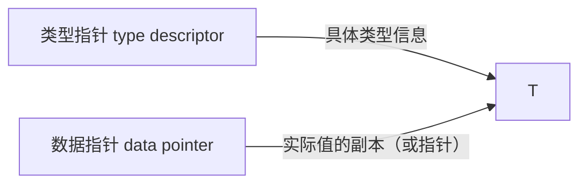

## 1. 接口定义

### 1.1 基本语法

```go
// 接口是一组方法签名的集合
type Shape interface {
    Area() float64
    Perimeter() float64
}

// 接口可以嵌入其他接口
type Geometry interface {
    Shape
    Volume() float64
}
```

### 1.2 接口底层结构

接口值在运行时由两部分组成：



```go
var s Shape = Circle{Radius: 5}
// 接口值 = (type: Circle, data: &Circle{Radius: 5})

var s2 Shape  // nil 接口值 = (type: nil, data: nil)
```

> **重要**：接口值为 nil 不等于接口内部的值为 nil：

```go
var p *Circle = nil
var s Shape = p
fmt.Println(s == nil) // false！类型部分不是 nil
// 这是 Go 常见陷阱
```

## 2. 隐式实现

### 2.1 实现规则

类型只需实现接口的所有方法，即自动满足接口，无需 `implements` 关键字：

```go
type Writer interface {
    Write(p []byte) (n int, err error)
}

// 任何有 Write 方法的类型都实现了 Writer
type BufferedWriter struct {
    buf []byte
}

func (w *BufferedWriter) Write(p []byte) (int, error) {
    w.buf = append(w.buf, p...)
    return len(p), nil
}

var w Writer = &BufferedWriter{} // 隐式实现
```

### 2.2 编译时验证

```go
// 确保 Circle 实现了 Shape 接口
var _ Shape = Circle{}       // 值接收者
var _ Shape = (*Circle)(nil) // 指针接收者

// 如果未实现，编译时会报错
// Circle does not implement Shape (missing Area method)
```

### 2.3 接口的优势

- **解耦**：依赖接口而非具体类型
- **可测试**：轻松创建 mock 实现
- **灵活**：任何包的类型都能实现接口，无需修改接口定义

```go
// 依赖接口，而非具体实现
type Notifier interface {
    Notify(message string) error
}

func SendAlert(n Notifier, msg string) error {
    return n.Notify(msg)
}

// 不同实现
type EmailNotifier struct{ Addr string }
func (e *EmailNotifier) Notify(msg string) error { /* 发邮件 */ return nil }

type SMSNotifier struct{ Phone string }
func (s *SMSNotifier) Notify(msg string) error { /* 发短信 */ return nil }

// 测试 mock
type MockNotifier struct{ Called bool }
func (m *MockNotifier) Notify(msg string) error { m.Called = true; return nil }
```

## 3. 空接口

### 3.1 any 类型

Go 1.18 将 `interface{}` 别名为 `any`：

```go
// 两者完全等价
var v1 interface{} = 42
var v2 any = 42

// 常见用途
func Print(v any) {
    fmt.Printf("type: %T, value: %v\n", v, v)
}
```

### 3.2 空接口的使用场景

```go
// 1. JSON 解析
var result any
json.Unmarshal(data, &result)

// 2. 通用容器
type Stack struct {
    items []any
}
func (s *Stack) Push(v any)  { s.items = append(s.items, v) }
func (s *Stack) Pop() any    { n := len(s.items) - 1; v := s.items[n]; s.items = s.items[:n]; return v }

// 3. fmt.Println 参数
func Println(a ...any) (n int, err error)
```

> **建议**：尽量避免使用 `any`，优先使用具体接口以获得类型安全。

## 4. 类型断言

### 4.1 基本形式

```go
var w Writer = &BufferedWriter{}

// 断言（不安全，失败则 panic）
bw := w.(*BufferedWriter)

// 逗号 ok 模式（安全）
bw, ok := w.(*BufferedWriter)
if ok {
    fmt.Println("是 *BufferedWriter")
}

// 断言为非实现类型
_, ok := w.(*os.File)
fmt.Println(ok) // false
```

### 4.2 从接口提取值

```go
func getString(v any) string {
    // 尝试多种类型
    if s, ok := v.(string); ok {
        return s
    }
    if s, ok := v.(fmt.Stringer); ok {
        return s.String()
    }
    if b, ok := v.([]byte); ok {
        return string(b)
    }
    return fmt.Sprintf("%v", v)
}
```

## 5. 类型开关

类型开关是处理多类型接口值的惯用方式：

```go
func describe(v any) string {
    switch v := v.(type) {
    case nil:
        return "nil"
    case int:
        return fmt.Sprintf("int: %d", v)
    case float64:
        return fmt.Sprintf("float64: %f", v)
    case string:
        return fmt.Sprintf("string: %q", v)
    case bool:
        return fmt.Sprintf("bool: %t", v)
    case []int:
        return fmt.Sprintf("[]int: %v (len=%d)", v, len(v))
    case fmt.Stringer:
        return fmt.Sprintf("Stringer: %s", v.String())
    case error:
        return fmt.Sprintf("error: %v", v)
    default:
        return fmt.Sprintf("unknown: %T", v)
    }
}
```

## 6. 接口组合

### 6.1 接口嵌入接口

```go
type Reader interface {
    Read(p []byte) (n int, err error)
}

type Writer interface {
    Write(p []byte) (n int, err error)
}

type Closer interface {
    Close() error
}

// 组合接口
type ReadWriter interface {
    Reader
    Writer
}

type ReadCloser interface {
    Reader
    Closer
}

type WriteCloser interface {
    Writer
    Closer
}

type ReadWriteCloser interface {
    Reader
    Writer
    Closer
}
```

### 6.2 结构体嵌入接口

```go
// 结构体可以嵌入接口，实现部分默认行为
type Logger struct {
    Writer // 嵌入 Writer 接口
}

func (l *Logger) Log(msg string) {
    l.Write([]byte(msg + "\n"))
}

// 使用时注入具体实现
logger := Logger{Writer: os.Stdout}
logger.Log("Hello")
```

## 7. 标准库核心接口

### 7.1 io.Reader / io.Writer

```go
// io.Reader — 读取数据的核心抽象
type Reader interface {
    Read(p []byte) (n int, err error)
}

// io.Writer — 写入数据的核心抽象
type Writer interface {
    Read(p []byte) (n int, err error)
    Write(p []byte) (n int, err error)
}

// 实现自定义 Reader
type UpperReader struct {
    src io.Reader
}

func (u *UpperReader) Read(p []byte) (int, error) {
    n, err := u.src.Read(p)
    for i := 0; i < n; i++ {
        if p[i] >= 'a' && p[i] <= 'z' {
            p[i] -= 32 // 转大写
        }
    }
    return n, err
}

// 链式组合 Reader
reader := &UpperReader{src: strings.NewReader("hello world")}
data, _ := io.ReadAll(reader)
fmt.Println(string(data)) // HELLO WORLD
```

### 7.2 fmt.Stringer / error

```go
// fmt.Stringer — 自定义字符串表示
type Point struct{ X, Y int }

func (p Point) String() string {
    return fmt.Sprintf("(%d, %d)", p.X, p.Y)
}

fmt.Println(Point{3, 4}) // (3, 4)

// error 接口
type error interface {
    Error() string
}
```

### 7.3 sort.Interface

```go
type Interface interface {
    Len() int
    Less(i, j int) bool
    Swap(i, j int)
}

// 自定义排序
type ByAge []User

func (a ByAge) Len() int           { return len(a) }
func (a ByAge) Less(i, j int) bool { return a[i].Age < a[j].Age }
func (a ByAge) Swap(i, j int)      { a[i], a[j] = a[j], a[i] }

users := []User{{"Alice", 30}, {"Bob", 25}, {"Charlie", 35}}
sort.Sort(ByAge(users))

// Go 1.21+ 使用 slices.SortFunc 更简洁
slices.SortFunc(users, func(a, b User) int {
    return cmp.Compare(a.Age, b.Age)
})
```

### 7.4 io.Closer / io.Seeker

```go
type Closer interface {
    Close() error
}

type Seeker interface {
    Seek(offset int64, whence int) (int64, error)
}

// 文件同时实现 Reader/Writer/Closer/Seeker
file, _ := os.Open("data.txt")
// file 实现了 io.ReadCloser, io.ReadSeeker, io.ReadWriteCloser 等
```

## 8. 常见接口模式

### 8.1 小接口原则

```go
// 好：接口应该小而专注
type Getter interface {
    Get(key string) (any, error)
}

// 坏：接口太大，难以实现和复用
type DataStore interface {
    Get(key string) (any, error)
    Set(key string, val any) error
    Delete(key string) error
    List() ([]string, error)
    Watch(key string) (<-chan Event, error)
}
```

> **Go 谚语**："The bigger the interface, the weaker the abstraction." — Rob Pike

### 8.2 消费者定义接口

```go
// 在使用方定义接口，而非提供方
// 服务包
package storage

type RedisClient struct { /* ... */ }
func (r *RedisClient) Get(key string) (string, error) { /* ... */ }
func (r *RedisClient) Set(key, val string) error       { /* ... */ }

// 消费方包
package service

// 只声明需要的方法
type KeyGetter interface {
    Get(key string) (string, error)
}

func GetValue(g KeyGetter, key string) (string, error) {
    return g.Get(key)
}
// RedisClient 自动满足 KeyGetter，无需修改 storage 包
```

### 8.3 接口与 nil

```go
// 正确检查接口是否为 nil
func isNil(v any) bool {
    if v == nil {
        return true
    }
    // 反射检查值是否为 nil（指针、切片、map、channel）
    rv := reflect.ValueOf(v)
    switch rv.Kind() {
    case reflect.Ptr, reflect.Slice, reflect.Map,
         reflect.Chan, reflect.Interface, reflect.Func:
        return rv.IsNil()
    }
    return false
}
```

### 8.4 接口作为返回值

```go
// 工厂函数返回接口
func NewStorage(cfg Config) (Storage, error) {
    switch cfg.Type {
    case "redis":
        return newRedisStorage(cfg)
    case "mysql":
        return newMySQLStorage(cfg)
    case "memory":
        return newMemoryStorage(cfg)
    default:
        return nil, fmt.Errorf("unsupported storage: %s", cfg.Type)
    }
}
```

## 参考文献


Go 官方文档：https://go.dev/doc/
Go 内存模型：https://go.dev/ref/mem
Effective Go：https://go.dev/doc/effective_go
Go 标准库：https://pkg.go.dev/std
Go 官方博客：https://go.dev/blog/

## 延伸阅读


Go 并发与 channel，见 016-go 模块并发文档。
Go 原子操作与竞争检测，见 016-go/058-RaceDetectionAtomic 文档。
云原生与 Kubernetes，见 031-devops 模块。
黑马程序员 Bilibili 空间（https://space.bilibili.com/37974444 ）提供 Go 课程。

## 模块文档速查表

| 文档 | 主题 | 与本文的关联 |
| --- | --- | --- |
| Go 概述与环境配置 | 001-GoOverviewEnvSetup | 本文的前置基础 |
| Go 基础语法 | 002-GoBasicSyntax | 本文的前置基础 |
| Go 函数与方法 | 003-GoFunctionMethod | 本文的并列主题 |
| Go 数据结构 | 004-GoDataStructure | 本文的并列主题 |
| Go 接口与组合 | 005-GoInterfaceComposition | 本文自身 |
| Go 并发编程 | 006-GoConcurrentProgramming | 本文的并列主题 |
| Go 错误处理 | 007-GoErrorHandling | 本文的并列主题 |
| Go 泛型 | 008-GoGeneric | 本文的并列主题 |
| Go 标准库与工具链 | 009-GoStandardLibraryToolchain | 本文的并列主题 |
| Go Web 开发与微服务 | 010-GoWebDevelopmentMicroservice | 本文的并列主题 |
| 切片原理 | 011-SlicePrinciple | 本文的原理深化 |
| Map原理 | 012-MapPrinciple | 本文的原理深化 |
| unsafe与指针 | 013-UnsafePointer | 本文的并列主题 |
| Channel原理 | 014-ChannelPrinciple | 本文的原理深化 |
| 反射 | 015-Reflection | 本文的并列主题 |
| 内存对齐 | 016-MemoryAlignment | 本文的并列主题 |
| Context详解 | 017-ContextDetailed | 本文的并列主题 |
| Goroutine调度 | 018-GoroutineSchedule | 本文的并列主题 |
| 接口与类型断言 | 019-InterfaceTypeAssertion | 本文的并列主题 |
| 错误处理进阶 | 020-ErrorHandlingAdvanced | 本文的并列主题 |
| Go与GraphQL | 021-GoGraphQL | 本文的并列主题 |
| Go与gRPC | 022-GoGRPC | 本文的并列主题 |
| Go与Kubernetes | 023-GoKubernetes | 本文的并列主题 |
| Go与Docker | 024-GoDocker | 本文的并列主题 |
| Go与Redis | 025-GoRedis | 本文的并列主题 |
| Go与消息队列 | 026-GoMessageQueue | 本文的并列主题 |
| Go与数据库 | 027-GoDatabase | 本文的并列主题 |
| Go与测试 | 028-GoTest | 本文的并列主题 |
| Go与JSON | 029-GoJSON | 本文的并列主题 |
| Go与Fuzzing | 030-GoFuzzing | 本文的并列主题 |
| Go与CGO | 031-GoCGO | 本文的并列主题 |
| Go与Wasm | 032-GoWasm | 本文的并列主题 |
| Go与代码生成 | 033-GoCodeGeneration | 本文的并列主题 |
| Go与依赖注入 | 034-GoDependencyInjection | 本文的并列主题 |
| Go与配置管理 | 035-GoConfigManagement | 本文的并列主题 |
| Go与日志 | 036-GoLog | 本文的并列主题 |
| Go与模板 | 037-GoTemplate | 本文的并列主题 |
| Go与加密 | 038-GoEncryption | 本文的安全延伸 |
| Go与文件监控 | 039-GoFileMonitor | 本文的并列主题 |
| Go与时间 | 040-GoTime | 本文的并列主题 |
| Go与正则表达式 | 041-GoRegex | 本文的并列主题 |
| Go与信号处理 | 042-GoSignalHandling | 本文的并列主题 |
| Go与性能分析 | 043-GoPerformanceAnalysis | 本文的性能延伸 |
| Go与HTTP客户端 | 044-GoHTTPClient | 本文的并列主题 |
| Go与HTTP服务器 | 045-GoHTTP | 本文的并列主题 |
| Go与OAuth2 | 046-GoOAuth2 | 本文的并列主题 |
| Go与中间件 | 047-GoMiddleware | 本文的并列主题 |
| Go与分布式追踪 | 048-GoDistributedTracing | 本文的并列主题 |
| Go与限流 | 049-Go | 本文的并列主题 |
| goroutine与channel通信原理 | 050-GoroutineChannelPrinciple | 本文的原理深化 |
| GMP调度模型 | 051-GMPModel | 本文的并列主题 |
| 并发模式 | 052-ConcurrencyPattern | 本文的并列主题 |
| 反射实现通用函数 | 053-ReflectionGenericFunction | 本文的并列主题 |
| 内存逃逸分析 | 054-MemoryEscapeAnalysis | 本文的并列主题 |
| 垃圾回收与GC调优 | 055-GCAndTuning | 本文的性能延伸 |
| 泛型详解 | 056-GenericDetailed | 本文的并列主题 |
| 单元测试与基准测试 | 057-UnitTestBenchmark | 本文的并列主题 |
| 竞态检测与原子操作 | 058-RaceDetectionAtomic | 本文的并列主题 |
| 包管理详解 | 059-PackageManagementDetailed | 本文的并列主题 |
