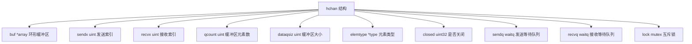
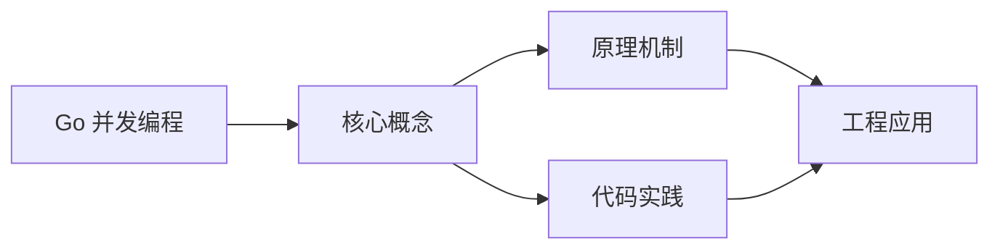

## 1. 学习目标（Bloom 分类）

本节按照布鲁姆教育目标分类学组织学习路径。本文主题为《Go 并发编程》，属于 Go 模块，读者可以根据自身阶段选择阅读深度。

记忆层面：能够准确复述本文的核心概念、术语与基本语法或操作步骤，并能够在提问或检索时快速定位对应知识点。能够说出 Go 的包、函数、结构体、接口与错误处理基本语法。

理解层面：能够用自己的语言解释核心原理与工作机制，说明概念之间的因果关系，而不是机械记忆结论。能够解释 goroutine 调度、channel 通信与内存模型。

应用层面：能够在真实项目或练习场景中运用本文知识解决具体问题，写出正确且可维护的实现。能够编写并发程序、HTTP 服务与命令行工具。

分析层面：能够拆解复杂问题，比较本文主题与相邻概念的异同，识别边界条件与例外情况。能够分析数据竞争、死锁与性能瓶颈。

评价层面：能够根据约束条件（性能、可读性、安全、成本）评价不同方案的优劣，做出有依据的技术决策。能够评价 Go 与 Java、Python 在不同场景的取舍。

创造层面：能够把本文知识与其他模块知识组合，设计出新的解决方案或可复用的工程模式。能够设计完整的微服务与云原生应用。

通过本节学习，读者应当能够把《Go 并发编程》纳入自己的知识网络，并与 Go 模块的其他主题（goroutine、channel、内存模型、标准库）建立关联。

## 2. 历史动机与发展脉络

《Go 并发编程》是 Go 领域的重要主题。要真正理解它，需要先了解它解决的问题与演进过程。

Go 由 Google 的 Robert Griesemer、Rob Pike 与 Ken Thompson 于 2009 年发布，设计目标是解决大规模分布式系统的工程痛点：编译慢、依赖混乱、并发难写。
Go 1.0 于 2012 年发布，此后严格保持向后兼容（Go 1 兼容性承诺）；约每半年发布一个小版本，1.21 起引入工具链管理（toolchain 指令）与内置测试 fuzzing。
Go 在云原生领域成为事实标准：Docker、Kubernetes、Prometheus、etcd 等核心项目均用 Go 编写；泛型在 1.18 加入，1.21+ 的 slices/maps 标准包补齐泛型工具。

回到本文主题：Go 并发编程 的提出与成熟，正是上述技术背景下的必然产物。早期实现往往以简单可用为目标，随着工程规模扩大，社区逐渐沉淀出标准做法与最佳实践；理解这一脉络，可以帮助读者判断“为什么文档中的推荐写法是现在这个样子”，也能在遇到历史遗留代码时准确识别其设计年代与取舍。


## 3. 形式化定义与核心概念精讲

本节把《Go 并发编程》涉及的核心概念以“定义 + 讲解”的形式展开。读者应把定义当作工具，把讲解当作理解路径；两者结合才能形成可迁移的知识。

goroutine 与调度：goroutine 是用户态轻量线程，由 GMP 调度器（Goroutine、Machine、Processor）多路复用到内核线程；创建成本约 2KB 栈，支持百万级并发。
channel 与 select：channel 是类型化通信管道，`<-` 发送/接收；select 多路等待；“不要通过共享内存通信，而要通过通信共享内存”是 Go 并发哲学。
内存模型：happens-before 关系由 channel、sync 原语与 atomic 建立；`go test -race` 用 ThreadSanitizer 检测数据竞争。

### 3.1 原文章节逐一精讲

原文档把主题拆分为 20 个小节，下面按顺序给出每一节的导读讲解，随后保留原文细节供精读。

#### 原文精读（完整保留）

# Go 并发编程

> **符号约定**：`< >` 必填参数 | `[ ]` 可选参数

---

#### 1. Goroutine

##### 1.1 基本使用

Goroutine 是 Go 运行时管理的轻量级线程，由 `go` 关键字启动：

```go
// 启动 goroutine
go func() {
    fmt.Println("并发执行")
}()

// 启动函数
go doWork()

// 主 goroutine 不会等待子 goroutine
func main() {
    go fmt.Println("可能看不到这行")
    // main 退出，所有 goroutine 终止
}
```

##### 1.2 Goroutine vs OS 线程

| 特性       | Goroutine             | OS 线程             |
| :--------- | :-------------------- | :------------------ |
| 初始栈大小 | 2KB（可动态伸缩）     | 1-8MB（固定）       |
| 创建成本   | 微秒级                | 毫秒级              |
| 调度       | Go 运行时（M:N 模型） | 操作系统内核（1:1） |
| 切换成本   | ~100ns（用户态）      | ~1-10μs（内核态）   |
| 数量上限   | 百万级                | 千级                |
| 通信       | channel               | 共享内存 + 锁       |

##### 1.3 GMP 调度模型

```mermaid
flowchart TD
    G[G goroutine 协程，用户级轻量线程]
    M[M machine 操作系统线程]
    PP[P processor 逻辑处理器，持有本地运行队列]
    S[Scheduler]
    S --> P0[P0 [G G]]
    S --> P1[P1 [G G]]
    S --> P2[P2 [G G]]
    S --> P3[P3 [G G]]
    S --> GQ[全局队列 [G G G]]
    P0 --> M0[M0]
    P1 --> M1[M1]
    P2 --> M2[M2]
    P3 --> M3[M3]
```

调度策略：
- Work Stealing：P 的本地队列为空时，从其他 P 或全局队列窃取 G
- Hand Off：M 阻塞（如系统调用）时，P 绑定到新的 M 继续运行
- 抢占式调度：基于协作（函数调用检查）+ 基于信号（Go 1.14+）

##### 1.4 等待 Goroutine 完成

```go
// 使用 WaitGroup
func main() {
    var wg sync.WaitGroup

    for i := 0; i < 5; i++ {
        wg.Add(1)
        go func(id int) {
            defer wg.Done()
            fmt.Printf("Worker %d done\n", id)
        }(i)
    }

    wg.Wait()
    fmt.Println("All workers finished")
}
```

#### 2. Channel

##### 2.1 基本操作

```go
// 无缓冲 channel（同步通道）
ch := make(chan int)

// 有缓冲 channel
ch := make(chan int, 100)

// 发送
ch <- 42

// 接收
v := <-ch

// 接收并检查是否关闭
v, ok := <-ch
if !ok {
    fmt.Println("channel 已关闭")
}

// 关闭 channel
close(ch)

// 遍历 channel（直到关闭）
for v := range ch {
    fmt.Println(v)
}
```

##### 2.2 无缓冲 vs 有缓冲

```go
// 无缓冲：发送和接收必须同时就绪（同步）
ch := make(chan int)
go func() {
    ch <- 1 // 阻塞直到有人接收
}()
v := <-ch  // 阻塞直到有数据

// 有缓冲：缓冲区满前发送不阻塞
ch := make(chan int, 3)
ch <- 1 // 不阻塞
ch <- 2 // 不阻塞
ch <- 3 // 不阻塞
// ch <- 4 // 阻塞（缓冲区满）
```

##### 2.3 单向 Channel

```go
// 只发送
func producer(ch chan<- int) {
    for i := 0; i < 10; i++ {
        ch <- i
    }
    close(ch)
}

// 只接收
func consumer(ch <-chan int) {
    for v := range ch {
        fmt.Println(v)
    }
}

func main() {
    ch := make(chan int, 5)
    go producer(ch)
    consumer(ch)
}
```

##### 2.4 Channel 底层结构



#### 3. Select

`select` 同时监听多个 channel 操作：

```go
select {
case v := <-ch1:
    fmt.Println("ch1:", v)
case v := <-ch2:
    fmt.Println("ch2:", v)
case ch3 <- 42:
    fmt.Println("sent to ch3")
default:
    fmt.Println("没有就绪的 channel")
}
```

##### 3.1 超时控制

```go
select {
case result := <-ch:
    fmt.Println("收到结果:", result)
case <-time.After(5 * time.Second):
    fmt.Println("超时")
}
```

##### 3.2 非阻塞操作

```go
select {
case msg := <-ch:
    fmt.Println(msg)
default:
    // channel 无数据时立即执行
    fmt.Println("无数据")
}
```

##### 3.3 退出信号

```go
func worker(done <-chan struct{}) {
    for {
        select {
        case <-done:
            fmt.Println("收到退出信号")
            return
        default:
            doWork()
        }
    }
}
```

#### 4. sync 包

##### 4.1 Mutex（互斥锁）

```go
type SafeCounter struct {
    mu sync.Mutex
    m  map[string]int
}

func (c *SafeCounter) Inc(key string) {
    c.mu.Lock()
    defer c.mu.Unlock()
    c.m[key]++
}

func (c *SafeCounter) Get(key string) int {
    c.mu.Lock()
    defer c.mu.Unlock()
    return c.m[key]
}
```

##### 4.2 RWMutex（读写锁）

```go
type Cache struct {
    mu   sync.RWMutex
    data map[string]string
}

func (c *Cache) Get(key string) (string, bool) {
    c.mu.RLock()         // 读锁，允许多个并发读
    defer c.mu.RUnlock()
    v, ok := c.data[key]
    return v, ok
}

func (c *Cache) Set(key, value string) {
    c.mu.Lock()          // 写锁，独占
    defer c.mu.Unlock()
    c.data[key] = value
}
```

##### 4.3 WaitGroup

```go
func fetchAll(urls []string) []string {
    var (
        wg    sync.WaitGroup
        mu    sync.Mutex
        results []string
    )

    for _, url := range urls {
        wg.Add(1)
        go func(u string) {
            defer wg.Done()
            data := fetch(u)
            mu.Lock()
            results = append(results, data)
            mu.Unlock()
        }(url)
    }

    wg.Wait()
    return results
}
```

##### 4.4 Once

```go
var (
    instance *Config
    once     sync.Once
)

func GetConfig() *Config {
    once.Do(func() {
        instance = loadConfig() // 只执行一次
    })
    return instance
}
```

##### 4.5 sync.Map

并发安全的 map，适用于读多写少场景：

```go
var m sync.Map

// 存储
m.Store("key", "value")

// 读取
v, ok := m.Load("key")

// 读取或写入（原子操作）
actual, loaded := m.LoadOrStore("key", "default")

// 删除
m.Delete("key")

// 遍历
m.Range(func(key, value any) bool {
    fmt.Println(key, value)
    return true // 返回 false 停止遍历
})
```

##### 4.6 sync.Pool

对象池，减少 GC 压力：

```go
var bufPool = sync.Pool{
    New: func() any {
        return new(bytes.Buffer)
    },
}

func process(data []byte) {
    buf := bufPool.Get().(*bytes.Buffer)
    defer func() {
        buf.Reset()
        bufPool.Put(buf)
    }()

    buf.Write(data)
    // 使用 buf...
}
```

#### 5. Context 包

Context 用于在 goroutine 之间传递取消信号、超时和值：

##### 5.1 创建 Context

```go
// 根 context（不可取消）
ctx := context.Background()
ctx := context.TODO() // 不确定用哪个时使用

// 可取消
ctx, cancel := context.WithCancel(ctx)
defer cancel() // 确保资源释放

// 超时取消
ctx, cancel := context.WithTimeout(ctx, 5*time.Second)
defer cancel()

// 截止时间取消
ctx, cancel := context.WithDeadline(ctx, time.Now().Add(10*time.Second))
defer cancel()

// 传递值
ctx = context.WithValue(ctx, "requestID", "abc-123")
```

##### 5.2 使用 Context

```go
func fetchData(ctx context.Context, url string) ([]byte, error) {
    req, err := http.NewRequestWithContext(ctx, "GET", url, nil)
    if err != nil {
        return nil, err
    }
    resp, err := http.DefaultClient.Do(req)
    if err != nil {
        return nil, err
    }
    defer resp.Body.Close()
    return io.ReadAll(resp.Body)
}

// 超时控制
ctx, cancel := context.WithTimeout(context.Background(), 3*time.Second)
defer cancel()
data, err := fetchData(ctx, "https://api.example.com/data")
if err != nil {
    if ctx.Err() == context.DeadlineExceeded {
        fmt.Println("请求超时")
    }
}
```

##### 5.3 传播取消

```go
func handler(ctx context.Context) {
    ctx, cancel := context.WithTimeout(ctx, 10*time.Second)
    defer cancel()

    // 启动子任务
    results := make(chan string, 3)
    for i := 0; i < 3; i++ {
        go func(id int) {
            result, err := doTask(ctx, id)
            if err != nil {
                cancel() // 任一任务失败，取消所有任务
                return
            }
            results <- result
        }(i)
    }

    for i := 0; i < 3; i++ {
        select {
        case r := <-results:
            fmt.Println(r)
        case <-ctx.Done():
            fmt.Println("取消:", ctx.Err())
            return
        }
    }
}
```

#### 6. 并发模式

##### 6.1 Fan-in / Fan-out

```go
// Fan-out：将工作分发到多个 goroutine
func fanOut(input <-chan int, n int) []<-chan int {
    channels := make([]<-chan int, n)
    for i := 0; i < n; i++ {
        channels[i] = worker(input)
    }
    return channels
}

func worker(input <-chan int) <-chan int {
    out := make(chan int)
    go func() {
        defer close(out)
        for v := range input {
            out <- process(v)
        }
    }()
    return out
}

// Fan-in：合并多个 channel
func fanIn(channels ...<-chan int) <-chan int {
    out := make(chan int)
    var wg sync.WaitGroup
    for _, ch := range channels {
        wg.Add(1)
        go func(c <-chan int) {
            defer wg.Done()
            for v := range c {
                out <- v
            }
        }(ch)
    }
    go func() {
        wg.Wait()
        close(out)
    }()
    return out
}
```

##### 6.2 Pipeline

```go
func generate(nums ...int) <-chan int {
    out := make(chan int)
    go func() {
        defer close(out)
        for _, n := range nums {
            out <- n
        }
    }()
    return out
}

func square(in <-chan int) <-chan int {
    out := make(chan int)
    go func() {
        defer close(out)
        for n := range in {
            out <- n * n
        }
    }()
    return out
}

func filter(in <-chan int, pred func(int) bool) <-chan int {
    out := make(chan int)
    go func() {
        defer close(out)
        for n := range in {
            if pred(n) {
                out <- n
            }
        }
    }()
    return out
}

// 链式调用
pipeline := filter(square(generate(1, 2, 3, 4, 5)), func(n int) bool {
    return n > 10
})
for v := range pipeline {
    fmt.Println(v) // 16, 25
}
```

##### 6.3 Worker Pool

```go
func workerPool(ctx context.Context, jobs <-chan Job, results chan<- Result, n int) {
    var wg sync.WaitGroup
    for i := 0; i < n; i++ {
        wg.Add(1)
        go func(id int) {
            defer wg.Done()
            for {
                select {
                case job, ok := <-jobs:
                    if !ok {
                        return
                    }
                    results <- processJob(ctx, id, job)
                case <-ctx.Done():
                    return
                }
            }
        }(i)
    }
    go func() {
        wg.Wait()
        close(results)
    }()
}
```

##### 6.4 限流器

```go
// 令牌桶限流
func rateLimiter(ctx context.Context, interval time.Duration) <-chan struct{} {
    ticker := time.NewTicker(interval)
    ch := make(chan struct{})
    go func() {
        defer ticker.Stop()
        defer close(ch)
        for {
            select {
            case <-ticker.C:
                select {
                case ch <- struct{}{}:
                default: // 丢弃多余的令牌
                }
            case <-ctx.Done():
                return
            }
        }
    }()
    return ch
}
```

#### 7. 竞态检测

##### 7.1 启用竞态检测

```bash
# 编译时启用
go build -race -o app .
go test -race ./...

# 运行时检测
./app
```

##### 7.2 常见竞态示例

```go
// 竞态：并发读写共享变量
var counter int

func main() {
    var wg sync.WaitGroup
    for i := 0; i < 1000; i++ {
        wg.Add(1)
        go func() {
            defer wg.Done()
            counter++ // 竞态！
        }()
    }
    wg.Wait()
    fmt.Println(counter) // 可能不是 1000
}

// 修复：使用原子操作
var counter int64
atomic.AddInt64(&counter, 1)
final := atomic.LoadInt64(&counter)

// 修复：使用互斥锁
var mu sync.Mutex
mu.Lock()
counter++
mu.Unlock()

// 修复：使用 channel
ch := make(chan int, 1000)
// 每个 goroutine: ch <- 1
// 汇总: for i := 0; i < 1000; i++ { <-ch }
```

##### 7.3 原子操作

```go
var count int64

// 加法
atomic.AddInt64(&count, 1)

// 读取
val := atomic.LoadInt64(&count)

// 写入
atomic.StoreInt64(&count, 100)

// 比较并交换（CAS）
swapped := atomic.CompareAndSwapInt64(&count, 100, 200)

// 自旋锁实现
type SpinLock struct {
    state int32
}

func (s *SpinLock) Lock() {
    for !atomic.CompareAndSwapInt32(&s.state, 0, 1) {
        runtime.Gosched() // 让出 CPU
    }
}

func (s *SpinLock) Unlock() {
    atomic.StoreInt32(&s.state, 0)
}
```
#### goroutine

**基本写法：启动 goroutine**
`go <函数>(<参数>)`
```go
// 启动 goroutine 执行函数
go doWork("task1");
```

**基本写法：匿名函数 goroutine**
`go func(<参数> <类型>) { ... }(<值>)`
```go
// 启动匿名函数 goroutine
go func(msg string) {
    fmt.Println(msg);
}("hello");
```

---

#### channel 创建

**基本写法：无缓冲通道**
`make(chan <类型>)`
```go
// 无缓冲通道，发送和接收同步
ch := make(chan int);
```

**基本写法：有缓冲通道**
`make(chan <类型>, <容量>)`
```go
// 有缓冲通道，容量为 10
ch := make(chan int, 10);
```

---

#### channel 操作

**基本写法：发送数据**
`<通道> <- <值>`
```go
// 发送数据到通道
ch <- 42;
```

**基本写法：接收数据**
`<-<通道>`
```go
// 从通道接收数据
v := <-ch;
```

**基本写法：关闭通道**
`close(<通道>)`
```go
// 关闭通道，禁止再发送
close(ch);
```

**基本写法：遍历通道**
`for <值> := range <通道> { ... }`
```go
// 遍历通道直到关闭
for v := range ch {
    fmt.Println(v);
}
```

---

#### select 语句

**基本写法：select 多路复用**
`select { case ... }`
```go
// 多路复用选择
select {
case v := <-ch1:
    fmt.Println("ch1:", v);
case v := <-ch2:
    fmt.Println("ch2:", v);
case <-time.After(time.Second):
    fmt.Println("timeout");
}
```

**基本写法：default 非阻塞**
`select { case ... default: }`
```go
// 非阻塞接收
select {
case v := <-ch:
    fmt.Println(v);
default:
    fmt.Println("no data");
}
```

---

#### sync.WaitGroup

**基本写法：WaitGroup 等待**
`var <变量名> sync.WaitGroup`
```go
// 使用 WaitGroup 等待所有 goroutine 完成
var wg sync.WaitGroup;
for i := 0; i < 5; i++ {
    wg.Add(1);
    go func(n int) {
        defer wg.Done();
        doWork(n);
    }(i);
}
wg.Wait();
```

---

#### sync.Mutex

**基本写法：互斥锁**
`var <变量名> sync.Mutex`
```go
// 互斥锁保护共享数据
var mu sync.Mutex;
var counter int;

func increment() {
    mu.Lock();
    defer mu.Unlock();
    counter++;
}
```

**基本写法：读写锁**
`var <变量名> sync.RWMutex`
```go
// 读写锁，读多写少场景
var rwmu sync.RWMutex;
var data map[string]string;

func read(key string) string {
    rwmu.RLock();
    defer rwmu.RUnlock();
    return data[key];
}

func write(key, value string) {
    rwmu.Lock();
    defer rwmu.Unlock();
    data[key] = value;
}
```

---

#### sync.Once

**基本写法：单次执行**
`var <变量名> sync.Once`
```go
// sync.Once 确保初始化只执行一次
var (
    once sync.Once;
    instance *Config;
)

func GetConfig() *Config {
    once.Do(func() {
        instance = loadConfig();
    });
    return instance;
}
```

---

#### sync.Cond

**基本写法：条件变量**
`sync.NewCond(&<互斥锁>)`
```go
// 条件变量等待通知
var mu sync.Mutex;
cond := sync.NewCond(&mu);

func waitForData() {
    mu.Lock();
    for !dataReady {
        cond.Wait();
    }
    mu.Unlock();
}

func notifyData() {
    mu.Lock();
    dataReady = true;
    cond.Signal();
    mu.Unlock();
}
```

---

#### sync.Pool

**基本写法：对象池**
`sync.Pool{ New: func() any { ... } }`
```go
// 对象池复用对象
var bufPool = sync.Pool{
    New: func() any {
        return new(bytes.Buffer);
    },
}

func process(data []byte) {
    buf := bufPool.Get().(*bytes.Buffer);
    defer bufPool.Put(buf);
    buf.Reset();
    buf.Write(data);
}
```

---

#### atomic 原子操作

**基本写法：原子加法**
`atomic.AddInt64(&<变量>, <值>)`
```go
// 原子加法
var counter int64;
atomic.AddInt64(&counter, 1);
```

**基本写法：原子加载**
`atomic.LoadInt64(&<变量>)`
```go
// 原子读取
val := atomic.LoadInt64(&counter);
```

**基本写法：原子存储**
`atomic.StoreInt64(&<变量>, <值>)`
```go
// 原子写入
atomic.StoreInt64(&counter, 100);
```

**基本写法：原子比较交换**
`atomic.CompareAndSwapInt64(&<变量>, <旧值>, <新值>)`
```go
// CAS 操作
ok := atomic.CompareAndSwapInt64(&counter, 100, 200);
```

---

#### context

**基本写法：创建根 context**
`context.Background()`
```go
// 创建根 context
ctx := context.Background();
```

**基本写法：带超时的 context**
`context.WithTimeout(<父context>, <时长>)`
```go
// 创建 5 秒超时的 context
ctx, cancel := context.WithTimeout(context.Background(), 5*time.Second);
defer cancel();
```

**基本写法：带取消的 context**
`context.WithCancel(<父context>)`
```go
// 创建可取消的 context
ctx, cancel := context.WithCancel(context.Background());
defer cancel();
```

**基本写法：带值的 context**
`context.WithValue(<父context>, <键>, <值>)`
```go
// 创建带值的 context
ctx := context.WithValue(context.Background(), "userID", 123);
```

**基本写法：从 context 获取值**
`<ctx>.Value(<键>)`
```go
// 从 context 获取值
userID := ctx.Value("userID").(int);
```

**基本写法：检查 context 是否取消**
`<-<ctx>.Done()`
```go
// 检查 context 是否已取消
select {
case <-ctx.Done():
    return ctx.Err();
default:
    // 继续工作
}
```

---

#### 并发模式

**基本写法：fan-out 扇出**
`go <函数>(<输入通道>, <输出通道>)`
```go
// 多个 goroutine 处理同一输入
func worker(id int, jobs <-chan int, results chan<- int) {
    for j := range jobs {
        results <- j * 2;
    }
}

jobs := make(chan int, 100);
results := make(chan int, 100);
for w := 1; w <= 3; w++ {
    go worker(w, jobs, results);
}
```

**基本写法：fan-in 扇入**
`func <函数名>(<输出通道>, <输入通道1>, <输入通道2>)`
```go
// 合并多个通道的数据
func merge(out chan<- int, cs ...<-chan int) {
    var wg sync.WaitGroup;
    wg.Add(len(cs));
    for _, c := range cs {
        go func(ch <-chan int) {
            defer wg.Done();
            for v := range ch {
                out <- v;
            }
        }(c);
    }
    go func() {
        wg.Wait();
        close(out);
    }();
}
```

**基本写法：pipeline 管道**
`go func() { ... }()`
```go
// 管道模式
func generate(nums ...int) <-chan int {
    out := make(chan int);
    go func() {
        defer close(out);
        for _, n := range nums {
            out <- n;
        }
    }();
    return out;
}
```

---

#### 并发安全

**基本写法：并发安全 map**
`sync.Map`
```go
// 并发安全的 map
var m sync.Map;
m.Store("key", "value");
v, ok := m.Load("key");
m.Delete("key");
```

**基本写法：遍历 sync.Map**
`<map>.Range(func(<键>, <值>) bool { ... })`
```go
// 遍历 sync.Map
m.Range(func(key, value any) bool {
    fmt.Printf("%v: %v\n", key, value);
    return true;
});
```


### 3.2 概念关系图

下面用 Mermaid 图表达本文核心概念之间的关系，帮助读者建立整体图景：



图中展示的是本文知识的结构化关系：核心概念是入口，原理机制解释“为什么”，代码实践演示“怎么做”，工程应用回答“何时用”。读者学习时可以把每个小节的内容挂接到对应节点上。

## 4. 理论推导与原理解析

本节深入《Go 并发编程》背后的原理。理论部分不求面面俱到，而是聚焦“能解释现象、能指导实践”的关键推导。

goroutine 与调度：goroutine 是用户态轻量线程，由 GMP 调度器（Goroutine、Machine、Processor）多路复用到内核线程；创建成本约 2KB 栈，支持百万级并发。
channel 与 select：channel 是类型化通信管道，`<-` 发送/接收；select 多路等待；“不要通过共享内存通信，而要通过通信共享内存”是 Go 并发哲学。
内存模型：happens-before 关系由 channel、sync 原语与 atomic 建立；`go test -race` 用 ThreadSanitizer 检测数据竞争。
错误处理：Go 用多返回值显式处理错误（`if err != nil`），error 是接口；panic/recover 仅用于不可恢复错误。

需要强调的是，理论推导与工程实践之间存在翻译层：理论给出的是理想化模型与边界条件，工程代码则必须处理真实环境中的例外。读者在学习时应先掌握理论的“标准情形”，再通过陷阱章节了解“非标准情形”。

## 5. 代码示例与逐行讲解

本节把原文中的代码示例系统整理，并为每个示例补充用途说明与讲解。读者不应只浏览代码，而应逐段对照讲解理解设计意图。

### 5.1 示例：1.1 基本使用

该示例来自原文《1.1 基本使用》小节，用于演示Go 并发编程相关操作。阅读时请先看代码结构，再看其后的讲解。

```go
// 启动 goroutine
go func() {
    fmt.Println("并发执行")
}()

// 启动函数
go doWork()

// 主 goroutine 不会等待子 goroutine
func main() {
    go fmt.Println("可能看不到这行")
    // main 退出，所有 goroutine 终止
}
```

讲解：这段代码演示了本节核心知识点。代码中的关键操作可以归纳为三步：准备（定义或初始化）、执行（核心逻辑）、收尾（释放资源或返回结果）。实际项目中，这三步往往被封装为函数或类，以提升复用性与可测试性。

关键点分析：

该示例共 11 行有效代码，包含 1 类关键结构（func）。其中：

- 入口与初始化部分负责建立上下文，对应实际项目中的启动或装配逻辑；
- 核心逻辑部分体现本文主题的主要操作，是阅读时最需要对照讲解理解的部分；
- 输出或返回部分把结果交给调用方，注意其类型与边界条件。

进阶思考路径：先尝试修改参数观察行为变化，再把示例中的模式迁移到自己的项目中；每次修改都记录预期与实测差异，这是把示例转化为能力的最快方式。

### 5.2 示例：1.3 GMP 调度模型

该示例来自原文《1.3 GMP 调度模型》小节，用于演示Go 并发编程相关操作。阅读时请先看代码结构，再看其后的讲解。

```mermaid
flowchart TD
    G[G goroutine 协程，用户级轻量线程]
    M[M machine 操作系统线程]
    PP[P processor 逻辑处理器，持有本地运行队列]
    S[Scheduler]
    S --> P0[P0 [G G]]
    S --> P1[P1 [G G]]
    S --> P2[P2 [G G]]
    S --> P3[P3 [G G]]
    S --> GQ[全局队列 [G G G]]
    P0 --> M0[M0]
    P1 --> M1[M1]
    P2 --> M2[M2]
    P3 --> M3[M3]
```

讲解：这段代码演示了本节核心知识点。代码中的关键操作可以归纳为三步：准备（定义或初始化）、执行（核心逻辑）、收尾（释放资源或返回结果）。实际项目中，这三步往往被封装为函数或类，以提升复用性与可测试性。

关键点分析：

该示例共 14 行有效代码，结构以数据或配置为主。阅读时应关注：数据字段的含义、配置项的作用，以及它们与运行行为的对应关系。

进阶思考路径：先尝试修改参数观察行为变化，再把示例中的模式迁移到自己的项目中；每次修改都记录预期与实测差异，这是把示例转化为能力的最快方式。

### 5.3 示例：1.4 等待 Goroutine 完成

该示例来自原文《1.4 等待 Goroutine 完成》小节，用于演示Go 并发编程相关操作。阅读时请先看代码结构，再看其后的讲解。

```go
// 使用 WaitGroup
func main() {
    var wg sync.WaitGroup

    for i := 0; i < 5; i++ {
        wg.Add(1)
        go func(id int) {
            defer wg.Done()
            fmt.Printf("Worker %d done\n", id)
        }(i)
    }

    wg.Wait()
    fmt.Println("All workers finished")
}
```

讲解：这段代码演示了本节核心知识点。代码中的关键操作可以归纳为三步：准备（定义或初始化）、执行（核心逻辑）、收尾（释放资源或返回结果）。实际项目中，这三步往往被封装为函数或类，以提升复用性与可测试性。

关键点分析：

该示例共 13 行有效代码，包含 2 类关键结构（func、for）。其中：

- 入口与初始化部分负责建立上下文，对应实际项目中的启动或装配逻辑；
- 核心逻辑部分体现本文主题的主要操作，是阅读时最需要对照讲解理解的部分；
- 输出或返回部分把结果交给调用方，注意其类型与边界条件。

进阶思考路径：先尝试修改参数观察行为变化，再把示例中的模式迁移到自己的项目中；每次修改都记录预期与实测差异，这是把示例转化为能力的最快方式。

### 5.4 示例：2.1 基本操作

该示例来自原文《2.1 基本操作》小节，用于演示Go 并发编程相关操作。阅读时请先看代码结构，再看其后的讲解。

```go
// 无缓冲 channel（同步通道）
ch := make(chan int)

// 有缓冲 channel
ch := make(chan int, 100)

// 发送
ch <- 42

// 接收
v := <-ch

// 接收并检查是否关闭
v, ok := <-ch
if !ok {
    fmt.Println("channel 已关闭")
}

// 关闭 channel
close(ch)

// 遍历 channel（直到关闭）
for v := range ch {
    fmt.Println(v)
}
```

讲解：这段代码演示了本节核心知识点。代码中的关键操作可以归纳为三步：准备（定义或初始化）、执行（核心逻辑）、收尾（释放资源或返回结果）。实际项目中，这三步往往被封装为函数或类，以提升复用性与可测试性。

关键点分析：

该示例共 19 行有效代码，包含 2 类关键结构（if、for）。其中：

- 入口与初始化部分负责建立上下文，对应实际项目中的启动或装配逻辑；
- 核心逻辑部分体现本文主题的主要操作，是阅读时最需要对照讲解理解的部分；
- 输出或返回部分把结果交给调用方，注意其类型与边界条件。

进阶思考路径：先尝试修改参数观察行为变化，再把示例中的模式迁移到自己的项目中；每次修改都记录预期与实测差异，这是把示例转化为能力的最快方式。

### 5.5 示例：2.2 无缓冲 vs 有缓冲

该示例来自原文《2.2 无缓冲 vs 有缓冲》小节，用于演示Go 并发编程相关操作。阅读时请先看代码结构，再看其后的讲解。

```go
// 无缓冲：发送和接收必须同时就绪（同步）
ch := make(chan int)
go func() {
    ch <- 1 // 阻塞直到有人接收
}()
v := <-ch  // 阻塞直到有数据

// 有缓冲：缓冲区满前发送不阻塞
ch := make(chan int, 3)
ch <- 1 // 不阻塞
ch <- 2 // 不阻塞
ch <- 3 // 不阻塞
// ch <- 4 // 阻塞（缓冲区满）
```

讲解：这段代码演示了本节核心知识点。代码中的关键操作可以归纳为三步：准备（定义或初始化）、执行（核心逻辑）、收尾（释放资源或返回结果）。实际项目中，这三步往往被封装为函数或类，以提升复用性与可测试性。

关键点分析：

该示例共 12 行有效代码，结构以数据或配置为主。阅读时应关注：数据字段的含义、配置项的作用，以及它们与运行行为的对应关系。

进阶思考路径：先尝试修改参数观察行为变化，再把示例中的模式迁移到自己的项目中；每次修改都记录预期与实测差异，这是把示例转化为能力的最快方式。

### 5.6 示例：2.3 单向 Channel

该示例来自原文《2.3 单向 Channel》小节，用于演示Go 并发编程相关操作。阅读时请先看代码结构，再看其后的讲解。

```go
// 只发送
func producer(ch chan<- int) {
    for i := 0; i < 10; i++ {
        ch <- i
    }
    close(ch)
}

// 只接收
func consumer(ch <-chan int) {
    for v := range ch {
        fmt.Println(v)
    }
}

func main() {
    ch := make(chan int, 5)
    go producer(ch)
    consumer(ch)
}
```

讲解：这段代码演示了本节核心知识点。代码中的关键操作可以归纳为三步：准备（定义或初始化）、执行（核心逻辑）、收尾（释放资源或返回结果）。实际项目中，这三步往往被封装为函数或类，以提升复用性与可测试性。

关键点分析：

该示例共 18 行有效代码，包含 2 类关键结构（func、for）。其中：

- 入口与初始化部分负责建立上下文，对应实际项目中的启动或装配逻辑；
- 核心逻辑部分体现本文主题的主要操作，是阅读时最需要对照讲解理解的部分；
- 输出或返回部分把结果交给调用方，注意其类型与边界条件。

进阶思考路径：先尝试修改参数观察行为变化，再把示例中的模式迁移到自己的项目中；每次修改都记录预期与实测差异，这是把示例转化为能力的最快方式。

### 5.7 示例：2.4 Channel 底层结构

该示例来自原文《2.4 Channel 底层结构》小节，用于演示Go 并发编程相关操作。阅读时请先看代码结构，再看其后的讲解。


讲解：这段代码演示了本节核心知识点。代码中的关键操作可以归纳为三步：准备（定义或初始化）、执行（核心逻辑）、收尾（释放资源或返回结果）。实际项目中，这三步往往被封装为函数或类，以提升复用性与可测试性。

关键点分析：

该示例共 12 行有效代码，结构以数据或配置为主。阅读时应关注：数据字段的含义、配置项的作用，以及它们与运行行为的对应关系。

进阶思考路径：先尝试修改参数观察行为变化，再把示例中的模式迁移到自己的项目中；每次修改都记录预期与实测差异，这是把示例转化为能力的最快方式。

### 5.8 示例：3. Select

该示例来自原文《3. Select》小节，用于演示Go 并发编程相关操作。阅读时请先看代码结构，再看其后的讲解。

```go
select {
case v := <-ch1:
    fmt.Println("ch1:", v)
case v := <-ch2:
    fmt.Println("ch2:", v)
case ch3 <- 42:
    fmt.Println("sent to ch3")
default:
    fmt.Println("没有就绪的 channel")
}
```

讲解：这段代码演示了本节核心知识点。代码中的关键操作可以归纳为三步：准备（定义或初始化）、执行（核心逻辑）、收尾（释放资源或返回结果）。实际项目中，这三步往往被封装为函数或类，以提升复用性与可测试性。

关键点分析：

该示例共 10 行有效代码，结构以数据或配置为主。阅读时应关注：数据字段的含义、配置项的作用，以及它们与运行行为的对应关系。

进阶思考路径：先尝试修改参数观察行为变化，再把示例中的模式迁移到自己的项目中；每次修改都记录预期与实测差异，这是把示例转化为能力的最快方式。

### 5.9 示例：3.1 超时控制

该示例来自原文《3.1 超时控制》小节，用于演示Go 并发编程相关操作。阅读时请先看代码结构，再看其后的讲解。

```go
select {
case result := <-ch:
    fmt.Println("收到结果:", result)
case <-time.After(5 * time.Second):
    fmt.Println("超时")
}
```

讲解：这段代码演示了本节核心知识点。代码中的关键操作可以归纳为三步：准备（定义或初始化）、执行（核心逻辑）、收尾（释放资源或返回结果）。实际项目中，这三步往往被封装为函数或类，以提升复用性与可测试性。

关键点分析：

该示例共 6 行有效代码，结构以数据或配置为主。阅读时应关注：数据字段的含义、配置项的作用，以及它们与运行行为的对应关系。

进阶思考路径：先尝试修改参数观察行为变化，再把示例中的模式迁移到自己的项目中；每次修改都记录预期与实测差异，这是把示例转化为能力的最快方式。

### 5.10 示例：3.2 非阻塞操作

该示例来自原文《3.2 非阻塞操作》小节，用于演示Go 并发编程相关操作。阅读时请先看代码结构，再看其后的讲解。

```go
select {
case msg := <-ch:
    fmt.Println(msg)
default:
    // channel 无数据时立即执行
    fmt.Println("无数据")
}
```

讲解：这段代码演示了本节核心知识点。代码中的关键操作可以归纳为三步：准备（定义或初始化）、执行（核心逻辑）、收尾（释放资源或返回结果）。实际项目中，这三步往往被封装为函数或类，以提升复用性与可测试性。

关键点分析：

该示例共 7 行有效代码，结构以数据或配置为主。阅读时应关注：数据字段的含义、配置项的作用，以及它们与运行行为的对应关系。

进阶思考路径：先尝试修改参数观察行为变化，再把示例中的模式迁移到自己的项目中；每次修改都记录预期与实测差异，这是把示例转化为能力的最快方式。

### 5.11 示例：3.3 退出信号

该示例来自原文《3.3 退出信号》小节，用于演示Go 并发编程相关操作。阅读时请先看代码结构，再看其后的讲解。

```go
func worker(done <-chan struct{}) {
    for {
        select {
        case <-done:
            fmt.Println("收到退出信号")
            return
        default:
            doWork()
        }
    }
}
```

讲解：这段代码演示了本节核心知识点。代码中的关键操作可以归纳为三步：准备（定义或初始化）、执行（核心逻辑）、收尾（释放资源或返回结果）。实际项目中，这三步往往被封装为函数或类，以提升复用性与可测试性。

关键点分析：

该示例共 11 行有效代码，包含 3 类关键结构（func、for、return）。其中：

- 入口与初始化部分负责建立上下文，对应实际项目中的启动或装配逻辑；
- 核心逻辑部分体现本文主题的主要操作，是阅读时最需要对照讲解理解的部分；
- 输出或返回部分把结果交给调用方，注意其类型与边界条件。

进阶思考路径：先尝试修改参数观察行为变化，再把示例中的模式迁移到自己的项目中；每次修改都记录预期与实测差异，这是把示例转化为能力的最快方式。

### 5.12 示例：4.1 Mutex（互斥锁）

该示例来自原文《4.1 Mutex（互斥锁）》小节，用于演示Go 并发编程相关操作。阅读时请先看代码结构，再看其后的讲解。

```go
type SafeCounter struct {
    mu sync.Mutex
    m  map[string]int
}

func (c *SafeCounter) Inc(key string) {
    c.mu.Lock()
    defer c.mu.Unlock()
    c.m[key]++
}

func (c *SafeCounter) Get(key string) int {
    c.mu.Lock()
    defer c.mu.Unlock()
    return c.m[key]
}
```

讲解：这段代码演示了本节核心知识点。代码中的关键操作可以归纳为三步：准备（定义或初始化）、执行（核心逻辑）、收尾（释放资源或返回结果）。实际项目中，这三步往往被封装为函数或类，以提升复用性与可测试性。

关键点分析：

该示例共 14 行有效代码，包含 2 类关键结构（func、return）。其中：

- 入口与初始化部分负责建立上下文，对应实际项目中的启动或装配逻辑；
- 核心逻辑部分体现本文主题的主要操作，是阅读时最需要对照讲解理解的部分；
- 输出或返回部分把结果交给调用方，注意其类型与边界条件。

进阶思考路径：先尝试修改参数观察行为变化，再把示例中的模式迁移到自己的项目中；每次修改都记录预期与实测差异，这是把示例转化为能力的最快方式。

### 5.13 示例：4.2 RWMutex（读写锁）

该示例来自原文《4.2 RWMutex（读写锁）》小节，用于演示Go 并发编程相关操作。阅读时请先看代码结构，再看其后的讲解。

```go
type Cache struct {
    mu   sync.RWMutex
    data map[string]string
}

func (c *Cache) Get(key string) (string, bool) {
    c.mu.RLock()         // 读锁，允许多个并发读
    defer c.mu.RUnlock()
    v, ok := c.data[key]
    return v, ok
}

func (c *Cache) Set(key, value string) {
    c.mu.Lock()          // 写锁，独占
    defer c.mu.Unlock()
    c.data[key] = value
}
```

讲解：这段代码演示了本节核心知识点。代码中的关键操作可以归纳为三步：准备（定义或初始化）、执行（核心逻辑）、收尾（释放资源或返回结果）。实际项目中，这三步往往被封装为函数或类，以提升复用性与可测试性。

关键点分析：

该示例共 15 行有效代码，包含 2 类关键结构（func、return）。其中：

- 入口与初始化部分负责建立上下文，对应实际项目中的启动或装配逻辑；
- 核心逻辑部分体现本文主题的主要操作，是阅读时最需要对照讲解理解的部分；
- 输出或返回部分把结果交给调用方，注意其类型与边界条件。

进阶思考路径：先尝试修改参数观察行为变化，再把示例中的模式迁移到自己的项目中；每次修改都记录预期与实测差异，这是把示例转化为能力的最快方式。

### 5.14 示例：4.3 WaitGroup

该示例来自原文《4.3 WaitGroup》小节，用于演示Go 并发编程相关操作。阅读时请先看代码结构，再看其后的讲解。

```go
func fetchAll(urls []string) []string {
    var (
        wg    sync.WaitGroup
        mu    sync.Mutex
        results []string
    )

    for _, url := range urls {
        wg.Add(1)
        go func(u string) {
            defer wg.Done()
            data := fetch(u)
            mu.Lock()
            results = append(results, data)
            mu.Unlock()
        }(url)
    }

    wg.Wait()
    return results
}
```

讲解：这段代码演示了本节核心知识点。代码中的关键操作可以归纳为三步：准备（定义或初始化）、执行（核心逻辑）、收尾（释放资源或返回结果）。实际项目中，这三步往往被封装为函数或类，以提升复用性与可测试性。

关键点分析：

该示例共 19 行有效代码，包含 3 类关键结构（func、for、return）。其中：

- 入口与初始化部分负责建立上下文，对应实际项目中的启动或装配逻辑；
- 核心逻辑部分体现本文主题的主要操作，是阅读时最需要对照讲解理解的部分；
- 输出或返回部分把结果交给调用方，注意其类型与边界条件。

进阶思考路径：先尝试修改参数观察行为变化，再把示例中的模式迁移到自己的项目中；每次修改都记录预期与实测差异，这是把示例转化为能力的最快方式。

### 5.15 示例：4.4 Once

该示例来自原文《4.4 Once》小节，用于演示Go 并发编程相关操作。阅读时请先看代码结构，再看其后的讲解。

```go
var (
    instance *Config
    once     sync.Once
)

func GetConfig() *Config {
    once.Do(func() {
        instance = loadConfig() // 只执行一次
    })
    return instance
}
```

讲解：这段代码演示了本节核心知识点。代码中的关键操作可以归纳为三步：准备（定义或初始化）、执行（核心逻辑）、收尾（释放资源或返回结果）。实际项目中，这三步往往被封装为函数或类，以提升复用性与可测试性。

关键点分析：

该示例共 10 行有效代码，包含 2 类关键结构（func、return）。其中：

- 入口与初始化部分负责建立上下文，对应实际项目中的启动或装配逻辑；
- 核心逻辑部分体现本文主题的主要操作，是阅读时最需要对照讲解理解的部分；
- 输出或返回部分把结果交给调用方，注意其类型与边界条件。

进阶思考路径：先尝试修改参数观察行为变化，再把示例中的模式迁移到自己的项目中；每次修改都记录预期与实测差异，这是把示例转化为能力的最快方式。

### 5.16 示例：4.5 sync.Map

该示例来自原文《4.5 sync.Map》小节，用于演示Go 并发编程相关操作。阅读时请先看代码结构，再看其后的讲解。

```go
var m sync.Map

// 存储
m.Store("key", "value")

// 读取
v, ok := m.Load("key")

// 读取或写入（原子操作）
actual, loaded := m.LoadOrStore("key", "default")

// 删除
m.Delete("key")

// 遍历
m.Range(func(key, value any) bool {
    fmt.Println(key, value)
    return true // 返回 false 停止遍历
})
```

讲解：这段代码演示了本节核心知识点。代码中的关键操作可以归纳为三步：准备（定义或初始化）、执行（核心逻辑）、收尾（释放资源或返回结果）。实际项目中，这三步往往被封装为函数或类，以提升复用性与可测试性。

关键点分析：

该示例共 14 行有效代码，包含 1 类关键结构（return）。其中：

- 入口与初始化部分负责建立上下文，对应实际项目中的启动或装配逻辑；
- 核心逻辑部分体现本文主题的主要操作，是阅读时最需要对照讲解理解的部分；
- 输出或返回部分把结果交给调用方，注意其类型与边界条件。

进阶思考路径：先尝试修改参数观察行为变化，再把示例中的模式迁移到自己的项目中；每次修改都记录预期与实测差异，这是把示例转化为能力的最快方式。

### 5.17 示例：4.6 sync.Pool

该示例来自原文《4.6 sync.Pool》小节，用于演示Go 并发编程相关操作。阅读时请先看代码结构，再看其后的讲解。

```go
var bufPool = sync.Pool{
    New: func() any {
        return new(bytes.Buffer)
    },
}

func process(data []byte) {
    buf := bufPool.Get().(*bytes.Buffer)
    defer func() {
        buf.Reset()
        bufPool.Put(buf)
    }()

    buf.Write(data)
    // 使用 buf...
}
```

讲解：这段代码演示了本节核心知识点。代码中的关键操作可以归纳为三步：准备（定义或初始化）、执行（核心逻辑）、收尾（释放资源或返回结果）。实际项目中，这三步往往被封装为函数或类，以提升复用性与可测试性。

关键点分析：

该示例共 14 行有效代码，包含 2 类关键结构（func、return）。其中：

- 入口与初始化部分负责建立上下文，对应实际项目中的启动或装配逻辑；
- 核心逻辑部分体现本文主题的主要操作，是阅读时最需要对照讲解理解的部分；
- 输出或返回部分把结果交给调用方，注意其类型与边界条件。

进阶思考路径：先尝试修改参数观察行为变化，再把示例中的模式迁移到自己的项目中；每次修改都记录预期与实测差异，这是把示例转化为能力的最快方式。

### 5.18 示例：5.1 创建 Context

该示例来自原文《5.1 创建 Context》小节，用于演示Go 并发编程相关操作。阅读时请先看代码结构，再看其后的讲解。

```go
// 根 context（不可取消）
ctx := context.Background()
ctx := context.TODO() // 不确定用哪个时使用

// 可取消
ctx, cancel := context.WithCancel(ctx)
defer cancel() // 确保资源释放

// 超时取消
ctx, cancel := context.WithTimeout(ctx, 5*time.Second)
defer cancel()

// 截止时间取消
ctx, cancel := context.WithDeadline(ctx, time.Now().Add(10*time.Second))
defer cancel()

// 传递值
ctx = context.WithValue(ctx, "requestID", "abc-123")
```

讲解：这段代码演示了本节核心知识点。代码中的关键操作可以归纳为三步：准备（定义或初始化）、执行（核心逻辑）、收尾（释放资源或返回结果）。实际项目中，这三步往往被封装为函数或类，以提升复用性与可测试性。

关键点分析：

该示例共 14 行有效代码，结构以数据或配置为主。阅读时应关注：数据字段的含义、配置项的作用，以及它们与运行行为的对应关系。

进阶思考路径：先尝试修改参数观察行为变化，再把示例中的模式迁移到自己的项目中；每次修改都记录预期与实测差异，这是把示例转化为能力的最快方式。

### 5.19 示例：5.2 使用 Context

该示例来自原文《5.2 使用 Context》小节，用于演示Go 并发编程相关操作。阅读时请先看代码结构，再看其后的讲解。

```go
func fetchData(ctx context.Context, url string) ([]byte, error) {
    req, err := http.NewRequestWithContext(ctx, "GET", url, nil)
    if err != nil {
        return nil, err
    }
    resp, err := http.DefaultClient.Do(req)
    if err != nil {
        return nil, err
    }
    defer resp.Body.Close()
    return io.ReadAll(resp.Body)
}

// 超时控制
ctx, cancel := context.WithTimeout(context.Background(), 3*time.Second)
defer cancel()
data, err := fetchData(ctx, "https://api.example.com/data")
if err != nil {
    if ctx.Err() == context.DeadlineExceeded {
        fmt.Println("请求超时")
    }
}
```

讲解：这段代码演示了本节核心知识点。代码中的关键操作可以归纳为三步：准备（定义或初始化）、执行（核心逻辑）、收尾（释放资源或返回结果）。实际项目中，这三步往往被封装为函数或类，以提升复用性与可测试性。

关键点分析：

该示例共 21 行有效代码，包含 3 类关键结构（func、if、return）。其中：

- 入口与初始化部分负责建立上下文，对应实际项目中的启动或装配逻辑；
- 核心逻辑部分体现本文主题的主要操作，是阅读时最需要对照讲解理解的部分；
- 输出或返回部分把结果交给调用方，注意其类型与边界条件。

进阶思考路径：先尝试修改参数观察行为变化，再把示例中的模式迁移到自己的项目中；每次修改都记录预期与实测差异，这是把示例转化为能力的最快方式。

### 5.20 示例：5.3 传播取消

该示例来自原文《5.3 传播取消》小节，用于演示Go 并发编程相关操作。阅读时请先看代码结构，再看其后的讲解。

```go
func handler(ctx context.Context) {
    ctx, cancel := context.WithTimeout(ctx, 10*time.Second)
    defer cancel()

    // 启动子任务
    results := make(chan string, 3)
    for i := 0; i < 3; i++ {
        go func(id int) {
            result, err := doTask(ctx, id)
            if err != nil {
                cancel() // 任一任务失败，取消所有任务
                return
            }
            results <- result
        }(i)
    }

    for i := 0; i < 3; i++ {
        select {
        case r := <-results:
            fmt.Println(r)
        case <-ctx.Done():
            fmt.Println("取消:", ctx.Err())
            return
        }
    }
}
```

讲解：这段代码演示了本节核心知识点。代码中的关键操作可以归纳为三步：准备（定义或初始化）、执行（核心逻辑）、收尾（释放资源或返回结果）。实际项目中，这三步往往被封装为函数或类，以提升复用性与可测试性。

关键点分析：

该示例共 25 行有效代码，包含 4 类关键结构（func、if、for、return）。其中：

- 入口与初始化部分负责建立上下文，对应实际项目中的启动或装配逻辑；
- 核心逻辑部分体现本文主题的主要操作，是阅读时最需要对照讲解理解的部分；
- 输出或返回部分把结果交给调用方，注意其类型与边界条件。

进阶思考路径：先尝试修改参数观察行为变化，再把示例中的模式迁移到自己的项目中；每次修改都记录预期与实测差异，这是把示例转化为能力的最快方式。

### 5.21 示例：6.1 Fan-in / Fan-out

该示例来自原文《6.1 Fan-in / Fan-out》小节，用于演示Go 并发编程相关操作。阅读时请先看代码结构，再看其后的讲解。

```go
// Fan-out：将工作分发到多个 goroutine
func fanOut(input <-chan int, n int) []<-chan int {
    channels := make([]<-chan int, n)
    for i := 0; i < n; i++ {
        channels[i] = worker(input)
    }
    return channels
}

func worker(input <-chan int) <-chan int {
    out := make(chan int)
    go func() {
        defer close(out)
        for v := range input {
            out <- process(v)
        }
    }()
    return out
}

// Fan-in：合并多个 channel
func fanIn(channels ...<-chan int) <-chan int {
    out := make(chan int)
    var wg sync.WaitGroup
    for _, ch := range channels {
        wg.Add(1)
        go func(c <-chan int) {
            defer wg.Done()
            for v := range c {
                out <- v
            }
        }(ch)
    }
    go func() {
        wg.Wait()
        close(out)
    }()
    return out
}
```

讲解：这段代码演示了本节核心知识点。代码中的关键操作可以归纳为三步：准备（定义或初始化）、执行（核心逻辑）、收尾（释放资源或返回结果）。实际项目中，这三步往往被封装为函数或类，以提升复用性与可测试性。

关键点分析：

该示例共 37 行有效代码，包含 3 类关键结构（func、for、return）。其中：

- 入口与初始化部分负责建立上下文，对应实际项目中的启动或装配逻辑；
- 核心逻辑部分体现本文主题的主要操作，是阅读时最需要对照讲解理解的部分；
- 输出或返回部分把结果交给调用方，注意其类型与边界条件。

进阶思考路径：先尝试修改参数观察行为变化，再把示例中的模式迁移到自己的项目中；每次修改都记录预期与实测差异，这是把示例转化为能力的最快方式。

### 5.22 示例：6.2 Pipeline

该示例来自原文《6.2 Pipeline》小节，用于演示Go 并发编程相关操作。阅读时请先看代码结构，再看其后的讲解。

```go
func generate(nums ...int) <-chan int {
    out := make(chan int)
    go func() {
        defer close(out)
        for _, n := range nums {
            out <- n
        }
    }()
    return out
}

func square(in <-chan int) <-chan int {
    out := make(chan int)
    go func() {
        defer close(out)
        for n := range in {
            out <- n * n
        }
    }()
    return out
}

func filter(in <-chan int, pred func(int) bool) <-chan int {
    out := make(chan int)
    go func() {
        defer close(out)
        for n := range in {
            if pred(n) {
                out <- n
            }
        }
    }()
    return out
}

// 链式调用
pipeline := filter(square(generate(1, 2, 3, 4, 5)), func(n int) bool {
    return n > 10
})
for v := range pipeline {
    fmt.Println(v) // 16, 25
}
```

讲解：这段代码演示了本节核心知识点。代码中的关键操作可以归纳为三步：准备（定义或初始化）、执行（核心逻辑）、收尾（释放资源或返回结果）。实际项目中，这三步往往被封装为函数或类，以提升复用性与可测试性。

关键点分析：

该示例共 39 行有效代码，包含 4 类关键结构（func、if、for、return）。其中：

- 入口与初始化部分负责建立上下文，对应实际项目中的启动或装配逻辑；
- 核心逻辑部分体现本文主题的主要操作，是阅读时最需要对照讲解理解的部分；
- 输出或返回部分把结果交给调用方，注意其类型与边界条件。

进阶思考路径：先尝试修改参数观察行为变化，再把示例中的模式迁移到自己的项目中；每次修改都记录预期与实测差异，这是把示例转化为能力的最快方式。

### 5.23 示例：6.3 Worker Pool

该示例来自原文《6.3 Worker Pool》小节，用于演示Go 并发编程相关操作。阅读时请先看代码结构，再看其后的讲解。

```go
func workerPool(ctx context.Context, jobs <-chan Job, results chan<- Result, n int) {
    var wg sync.WaitGroup
    for i := 0; i < n; i++ {
        wg.Add(1)
        go func(id int) {
            defer wg.Done()
            for {
                select {
                case job, ok := <-jobs:
                    if !ok {
                        return
                    }
                    results <- processJob(ctx, id, job)
                case <-ctx.Done():
                    return
                }
            }
        }(i)
    }
    go func() {
        wg.Wait()
        close(results)
    }()
}
```

讲解：这段代码演示了本节核心知识点。代码中的关键操作可以归纳为三步：准备（定义或初始化）、执行（核心逻辑）、收尾（释放资源或返回结果）。实际项目中，这三步往往被封装为函数或类，以提升复用性与可测试性。

关键点分析：

该示例共 24 行有效代码，包含 4 类关键结构（func、if、for、return）。其中：

- 入口与初始化部分负责建立上下文，对应实际项目中的启动或装配逻辑；
- 核心逻辑部分体现本文主题的主要操作，是阅读时最需要对照讲解理解的部分；
- 输出或返回部分把结果交给调用方，注意其类型与边界条件。

进阶思考路径：先尝试修改参数观察行为变化，再把示例中的模式迁移到自己的项目中；每次修改都记录预期与实测差异，这是把示例转化为能力的最快方式。

### 5.24 示例：6.4 限流器

该示例来自原文《6.4 限流器》小节，用于演示Go 并发编程相关操作。阅读时请先看代码结构，再看其后的讲解。

```go
// 令牌桶限流
func rateLimiter(ctx context.Context, interval time.Duration) <-chan struct{} {
    ticker := time.NewTicker(interval)
    ch := make(chan struct{})
    go func() {
        defer ticker.Stop()
        defer close(ch)
        for {
            select {
            case <-ticker.C:
                select {
                case ch <- struct{}{}:
                default: // 丢弃多余的令牌
                }
            case <-ctx.Done():
                return
            }
        }
    }()
    return ch
}
```

讲解：这段代码演示了本节核心知识点。代码中的关键操作可以归纳为三步：准备（定义或初始化）、执行（核心逻辑）、收尾（释放资源或返回结果）。实际项目中，这三步往往被封装为函数或类，以提升复用性与可测试性。

关键点分析：

该示例共 21 行有效代码，包含 3 类关键结构（func、for、return）。其中：

- 入口与初始化部分负责建立上下文，对应实际项目中的启动或装配逻辑；
- 核心逻辑部分体现本文主题的主要操作，是阅读时最需要对照讲解理解的部分；
- 输出或返回部分把结果交给调用方，注意其类型与边界条件。

进阶思考路径：先尝试修改参数观察行为变化，再把示例中的模式迁移到自己的项目中；每次修改都记录预期与实测差异，这是把示例转化为能力的最快方式。

### 5.25 示例：7.1 启用竞态检测

该示例来自原文《7.1 启用竞态检测》小节，用于演示Go 并发编程相关操作。阅读时请先看代码结构，再看其后的讲解。

```bash
# 编译时启用
go build -race -o app .
go test -race ./...

# 运行时检测
./app
```

讲解：这段代码演示了本节核心知识点。代码中的关键操作可以归纳为三步：准备（定义或初始化）、执行（核心逻辑）、收尾（释放资源或返回结果）。实际项目中，这三步往往被封装为函数或类，以提升复用性与可测试性。

关键点分析：

该示例共 5 行有效代码，结构以数据或配置为主。阅读时应关注：数据字段的含义、配置项的作用，以及它们与运行行为的对应关系。

进阶思考路径：先尝试修改参数观察行为变化，再把示例中的模式迁移到自己的项目中；每次修改都记录预期与实测差异，这是把示例转化为能力的最快方式。

### 5.26 示例：7.2 常见竞态示例

该示例来自原文《7.2 常见竞态示例》小节，用于演示Go 并发编程相关操作。阅读时请先看代码结构，再看其后的讲解。

```go
// 竞态：并发读写共享变量
var counter int

func main() {
    var wg sync.WaitGroup
    for i := 0; i < 1000; i++ {
        wg.Add(1)
        go func() {
            defer wg.Done()
            counter++ // 竞态！
        }()
    }
    wg.Wait()
    fmt.Println(counter) // 可能不是 1000
}

// 修复：使用原子操作
var counter int64
atomic.AddInt64(&counter, 1)
final := atomic.LoadInt64(&counter)

// 修复：使用互斥锁
var mu sync.Mutex
mu.Lock()
counter++
mu.Unlock()

// 修复：使用 channel
ch := make(chan int, 1000)
// 每个 goroutine: ch <- 1
// 汇总: for i := 0; i < 1000; i++ { <-ch }
```

讲解：这段代码演示了本节核心知识点。代码中的关键操作可以归纳为三步：准备（定义或初始化）、执行（核心逻辑）、收尾（释放资源或返回结果）。实际项目中，这三步往往被封装为函数或类，以提升复用性与可测试性。

关键点分析：

该示例共 27 行有效代码，包含 2 类关键结构（func、for）。其中：

- 入口与初始化部分负责建立上下文，对应实际项目中的启动或装配逻辑；
- 核心逻辑部分体现本文主题的主要操作，是阅读时最需要对照讲解理解的部分；
- 输出或返回部分把结果交给调用方，注意其类型与边界条件。

进阶思考路径：先尝试修改参数观察行为变化，再把示例中的模式迁移到自己的项目中；每次修改都记录预期与实测差异，这是把示例转化为能力的最快方式。

### 5.27 示例：7.3 原子操作

该示例来自原文《7.3 原子操作》小节，用于演示Go 并发编程相关操作。阅读时请先看代码结构，再看其后的讲解。

```go
var count int64

// 加法
atomic.AddInt64(&count, 1)

// 读取
val := atomic.LoadInt64(&count)

// 写入
atomic.StoreInt64(&count, 100)

// 比较并交换（CAS）
swapped := atomic.CompareAndSwapInt64(&count, 100, 200)

// 自旋锁实现
type SpinLock struct {
    state int32
}

func (s *SpinLock) Lock() {
    for !atomic.CompareAndSwapInt32(&s.state, 0, 1) {
        runtime.Gosched() // 让出 CPU
    }
}

func (s *SpinLock) Unlock() {
    atomic.StoreInt32(&s.state, 0)
}
```

讲解：这段代码演示了本节核心知识点。代码中的关键操作可以归纳为三步：准备（定义或初始化）、执行（核心逻辑）、收尾（释放资源或返回结果）。实际项目中，这三步往往被封装为函数或类，以提升复用性与可测试性。

关键点分析：

该示例共 21 行有效代码，包含 2 类关键结构（func、for）。其中：

- 入口与初始化部分负责建立上下文，对应实际项目中的启动或装配逻辑；
- 核心逻辑部分体现本文主题的主要操作，是阅读时最需要对照讲解理解的部分；
- 输出或返回部分把结果交给调用方，注意其类型与边界条件。

进阶思考路径：先尝试修改参数观察行为变化，再把示例中的模式迁移到自己的项目中；每次修改都记录预期与实测差异，这是把示例转化为能力的最快方式。

### 5.28 示例：goroutine

该示例来自原文《goroutine》小节，用于演示Go 并发编程相关操作。阅读时请先看代码结构，再看其后的讲解。

```go
// 启动 goroutine 执行函数
go doWork("task1");
```

讲解：这段代码演示了本节核心知识点。代码中的关键操作可以归纳为三步：准备（定义或初始化）、执行（核心逻辑）、收尾（释放资源或返回结果）。实际项目中，这三步往往被封装为函数或类，以提升复用性与可测试性。

关键点分析：

该示例共 2 行有效代码，结构以数据或配置为主。阅读时应关注：数据字段的含义、配置项的作用，以及它们与运行行为的对应关系。

进阶思考路径：先尝试修改参数观察行为变化，再把示例中的模式迁移到自己的项目中；每次修改都记录预期与实测差异，这是把示例转化为能力的最快方式。

### 5.29 示例：goroutine

该示例来自原文《goroutine》小节，用于演示Go 并发编程相关操作。阅读时请先看代码结构，再看其后的讲解。

```go
// 启动匿名函数 goroutine
go func(msg string) {
    fmt.Println(msg);
}("hello");
```

讲解：这段代码演示了本节核心知识点。代码中的关键操作可以归纳为三步：准备（定义或初始化）、执行（核心逻辑）、收尾（释放资源或返回结果）。实际项目中，这三步往往被封装为函数或类，以提升复用性与可测试性。

关键点分析：

该示例共 4 行有效代码，结构以数据或配置为主。阅读时应关注：数据字段的含义、配置项的作用，以及它们与运行行为的对应关系。

进阶思考路径：先尝试修改参数观察行为变化，再把示例中的模式迁移到自己的项目中；每次修改都记录预期与实测差异，这是把示例转化为能力的最快方式。

### 5.30 示例：channel 创建

该示例来自原文《channel 创建》小节，用于演示Go 并发编程相关操作。阅读时请先看代码结构，再看其后的讲解。

```go
// 无缓冲通道，发送和接收同步
ch := make(chan int);
```

讲解：这段代码演示了本节核心知识点。代码中的关键操作可以归纳为三步：准备（定义或初始化）、执行（核心逻辑）、收尾（释放资源或返回结果）。实际项目中，这三步往往被封装为函数或类，以提升复用性与可测试性。

关键点分析：

该示例共 2 行有效代码，结构以数据或配置为主。阅读时应关注：数据字段的含义、配置项的作用，以及它们与运行行为的对应关系。

进阶思考路径：先尝试修改参数观察行为变化，再把示例中的模式迁移到自己的项目中；每次修改都记录预期与实测差异，这是把示例转化为能力的最快方式。

### 5.31 示例：channel 创建

该示例来自原文《channel 创建》小节，用于演示Go 并发编程相关操作。阅读时请先看代码结构，再看其后的讲解。

```go
// 有缓冲通道，容量为 10
ch := make(chan int, 10);
```

讲解：这段代码演示了本节核心知识点。代码中的关键操作可以归纳为三步：准备（定义或初始化）、执行（核心逻辑）、收尾（释放资源或返回结果）。实际项目中，这三步往往被封装为函数或类，以提升复用性与可测试性。

关键点分析：

该示例共 2 行有效代码，结构以数据或配置为主。阅读时应关注：数据字段的含义、配置项的作用，以及它们与运行行为的对应关系。

进阶思考路径：先尝试修改参数观察行为变化，再把示例中的模式迁移到自己的项目中；每次修改都记录预期与实测差异，这是把示例转化为能力的最快方式。

### 5.32 示例：channel 操作

该示例来自原文《channel 操作》小节，用于演示Go 并发编程相关操作。阅读时请先看代码结构，再看其后的讲解。

```go
// 发送数据到通道
ch <- 42;
```

讲解：这段代码演示了本节核心知识点。代码中的关键操作可以归纳为三步：准备（定义或初始化）、执行（核心逻辑）、收尾（释放资源或返回结果）。实际项目中，这三步往往被封装为函数或类，以提升复用性与可测试性。

关键点分析：

该示例共 2 行有效代码，结构以数据或配置为主。阅读时应关注：数据字段的含义、配置项的作用，以及它们与运行行为的对应关系。

进阶思考路径：先尝试修改参数观察行为变化，再把示例中的模式迁移到自己的项目中；每次修改都记录预期与实测差异，这是把示例转化为能力的最快方式。

### 5.33 示例：channel 操作

该示例来自原文《channel 操作》小节，用于演示Go 并发编程相关操作。阅读时请先看代码结构，再看其后的讲解。

```go
// 从通道接收数据
v := <-ch;
```

讲解：这段代码演示了本节核心知识点。代码中的关键操作可以归纳为三步：准备（定义或初始化）、执行（核心逻辑）、收尾（释放资源或返回结果）。实际项目中，这三步往往被封装为函数或类，以提升复用性与可测试性。

关键点分析：

该示例共 2 行有效代码，结构以数据或配置为主。阅读时应关注：数据字段的含义、配置项的作用，以及它们与运行行为的对应关系。

进阶思考路径：先尝试修改参数观察行为变化，再把示例中的模式迁移到自己的项目中；每次修改都记录预期与实测差异，这是把示例转化为能力的最快方式。

### 5.34 示例：channel 操作

该示例来自原文《channel 操作》小节，用于演示Go 并发编程相关操作。阅读时请先看代码结构，再看其后的讲解。

```go
// 关闭通道，禁止再发送
close(ch);
```

讲解：这段代码演示了本节核心知识点。代码中的关键操作可以归纳为三步：准备（定义或初始化）、执行（核心逻辑）、收尾（释放资源或返回结果）。实际项目中，这三步往往被封装为函数或类，以提升复用性与可测试性。

关键点分析：

该示例共 2 行有效代码，结构以数据或配置为主。阅读时应关注：数据字段的含义、配置项的作用，以及它们与运行行为的对应关系。

进阶思考路径：先尝试修改参数观察行为变化，再把示例中的模式迁移到自己的项目中；每次修改都记录预期与实测差异，这是把示例转化为能力的最快方式。

### 5.35 示例：channel 操作

该示例来自原文《channel 操作》小节，用于演示Go 并发编程相关操作。阅读时请先看代码结构，再看其后的讲解。

```go
// 遍历通道直到关闭
for v := range ch {
    fmt.Println(v);
}
```

讲解：这段代码演示了本节核心知识点。代码中的关键操作可以归纳为三步：准备（定义或初始化）、执行（核心逻辑）、收尾（释放资源或返回结果）。实际项目中，这三步往往被封装为函数或类，以提升复用性与可测试性。

关键点分析：

该示例共 4 行有效代码，包含 1 类关键结构（for）。其中：

- 入口与初始化部分负责建立上下文，对应实际项目中的启动或装配逻辑；
- 核心逻辑部分体现本文主题的主要操作，是阅读时最需要对照讲解理解的部分；
- 输出或返回部分把结果交给调用方，注意其类型与边界条件。

进阶思考路径：先尝试修改参数观察行为变化，再把示例中的模式迁移到自己的项目中；每次修改都记录预期与实测差异，这是把示例转化为能力的最快方式。

### 5.36 示例：select 语句

该示例来自原文《select 语句》小节，用于演示Go 并发编程相关操作。阅读时请先看代码结构，再看其后的讲解。

```go
// 多路复用选择
select {
case v := <-ch1:
    fmt.Println("ch1:", v);
case v := <-ch2:
    fmt.Println("ch2:", v);
case <-time.After(time.Second):
    fmt.Println("timeout");
}
```

讲解：这段代码演示了本节核心知识点。代码中的关键操作可以归纳为三步：准备（定义或初始化）、执行（核心逻辑）、收尾（释放资源或返回结果）。实际项目中，这三步往往被封装为函数或类，以提升复用性与可测试性。

关键点分析：

该示例共 9 行有效代码，结构以数据或配置为主。阅读时应关注：数据字段的含义、配置项的作用，以及它们与运行行为的对应关系。

进阶思考路径：先尝试修改参数观察行为变化，再把示例中的模式迁移到自己的项目中；每次修改都记录预期与实测差异，这是把示例转化为能力的最快方式。

### 5.37 示例：select 语句

该示例来自原文《select 语句》小节，用于演示Go 并发编程相关操作。阅读时请先看代码结构，再看其后的讲解。

```go
// 非阻塞接收
select {
case v := <-ch:
    fmt.Println(v);
default:
    fmt.Println("no data");
}
```

讲解：这段代码演示了本节核心知识点。代码中的关键操作可以归纳为三步：准备（定义或初始化）、执行（核心逻辑）、收尾（释放资源或返回结果）。实际项目中，这三步往往被封装为函数或类，以提升复用性与可测试性。

关键点分析：

该示例共 7 行有效代码，结构以数据或配置为主。阅读时应关注：数据字段的含义、配置项的作用，以及它们与运行行为的对应关系。

进阶思考路径：先尝试修改参数观察行为变化，再把示例中的模式迁移到自己的项目中；每次修改都记录预期与实测差异，这是把示例转化为能力的最快方式。

### 5.38 示例：sync.WaitGroup

该示例来自原文《sync.WaitGroup》小节，用于演示Go 并发编程相关操作。阅读时请先看代码结构，再看其后的讲解。

```go
// 使用 WaitGroup 等待所有 goroutine 完成
var wg sync.WaitGroup;
for i := 0; i < 5; i++ {
    wg.Add(1);
    go func(n int) {
        defer wg.Done();
        doWork(n);
    }(i);
}
wg.Wait();
```

讲解：这段代码演示了本节核心知识点。代码中的关键操作可以归纳为三步：准备（定义或初始化）、执行（核心逻辑）、收尾（释放资源或返回结果）。实际项目中，这三步往往被封装为函数或类，以提升复用性与可测试性。

关键点分析：

该示例共 10 行有效代码，包含 1 类关键结构（for）。其中：

- 入口与初始化部分负责建立上下文，对应实际项目中的启动或装配逻辑；
- 核心逻辑部分体现本文主题的主要操作，是阅读时最需要对照讲解理解的部分；
- 输出或返回部分把结果交给调用方，注意其类型与边界条件。

进阶思考路径：先尝试修改参数观察行为变化，再把示例中的模式迁移到自己的项目中；每次修改都记录预期与实测差异，这是把示例转化为能力的最快方式。

### 5.39 示例：sync.Mutex

该示例来自原文《sync.Mutex》小节，用于演示Go 并发编程相关操作。阅读时请先看代码结构，再看其后的讲解。

```go
// 互斥锁保护共享数据
var mu sync.Mutex;
var counter int;

func increment() {
    mu.Lock();
    defer mu.Unlock();
    counter++;
}
```

讲解：这段代码演示了本节核心知识点。代码中的关键操作可以归纳为三步：准备（定义或初始化）、执行（核心逻辑）、收尾（释放资源或返回结果）。实际项目中，这三步往往被封装为函数或类，以提升复用性与可测试性。

关键点分析：

该示例共 8 行有效代码，包含 1 类关键结构（func）。其中：

- 入口与初始化部分负责建立上下文，对应实际项目中的启动或装配逻辑；
- 核心逻辑部分体现本文主题的主要操作，是阅读时最需要对照讲解理解的部分；
- 输出或返回部分把结果交给调用方，注意其类型与边界条件。

进阶思考路径：先尝试修改参数观察行为变化，再把示例中的模式迁移到自己的项目中；每次修改都记录预期与实测差异，这是把示例转化为能力的最快方式。

### 5.40 示例：sync.Mutex

该示例来自原文《sync.Mutex》小节，用于演示Go 并发编程相关操作。阅读时请先看代码结构，再看其后的讲解。

```go
// 读写锁，读多写少场景
var rwmu sync.RWMutex;
var data map[string]string;

func read(key string) string {
    rwmu.RLock();
    defer rwmu.RUnlock();
    return data[key];
}

func write(key, value string) {
    rwmu.Lock();
    defer rwmu.Unlock();
    data[key] = value;
}
```

讲解：这段代码演示了本节核心知识点。代码中的关键操作可以归纳为三步：准备（定义或初始化）、执行（核心逻辑）、收尾（释放资源或返回结果）。实际项目中，这三步往往被封装为函数或类，以提升复用性与可测试性。

关键点分析：

该示例共 13 行有效代码，包含 2 类关键结构（func、return）。其中：

- 入口与初始化部分负责建立上下文，对应实际项目中的启动或装配逻辑；
- 核心逻辑部分体现本文主题的主要操作，是阅读时最需要对照讲解理解的部分；
- 输出或返回部分把结果交给调用方，注意其类型与边界条件。

进阶思考路径：先尝试修改参数观察行为变化，再把示例中的模式迁移到自己的项目中；每次修改都记录预期与实测差异，这是把示例转化为能力的最快方式。

### 5.41 示例：sync.Once

该示例来自原文《sync.Once》小节，用于演示Go 并发编程相关操作。阅读时请先看代码结构，再看其后的讲解。

```go
// sync.Once 确保初始化只执行一次
var (
    once sync.Once;
    instance *Config;
)

func GetConfig() *Config {
    once.Do(func() {
        instance = loadConfig();
    });
    return instance;
}
```

讲解：这段代码演示了本节核心知识点。代码中的关键操作可以归纳为三步：准备（定义或初始化）、执行（核心逻辑）、收尾（释放资源或返回结果）。实际项目中，这三步往往被封装为函数或类，以提升复用性与可测试性。

关键点分析：

该示例共 11 行有效代码，包含 2 类关键结构（func、return）。其中：

- 入口与初始化部分负责建立上下文，对应实际项目中的启动或装配逻辑；
- 核心逻辑部分体现本文主题的主要操作，是阅读时最需要对照讲解理解的部分；
- 输出或返回部分把结果交给调用方，注意其类型与边界条件。

进阶思考路径：先尝试修改参数观察行为变化，再把示例中的模式迁移到自己的项目中；每次修改都记录预期与实测差异，这是把示例转化为能力的最快方式。

### 5.42 示例：sync.Cond

该示例来自原文《sync.Cond》小节，用于演示Go 并发编程相关操作。阅读时请先看代码结构，再看其后的讲解。

```go
// 条件变量等待通知
var mu sync.Mutex;
cond := sync.NewCond(&mu);

func waitForData() {
    mu.Lock();
    for !dataReady {
        cond.Wait();
    }
    mu.Unlock();
}

func notifyData() {
    mu.Lock();
    dataReady = true;
    cond.Signal();
    mu.Unlock();
}
```

讲解：这段代码演示了本节核心知识点。代码中的关键操作可以归纳为三步：准备（定义或初始化）、执行（核心逻辑）、收尾（释放资源或返回结果）。实际项目中，这三步往往被封装为函数或类，以提升复用性与可测试性。

关键点分析：

该示例共 16 行有效代码，包含 2 类关键结构（func、for）。其中：

- 入口与初始化部分负责建立上下文，对应实际项目中的启动或装配逻辑；
- 核心逻辑部分体现本文主题的主要操作，是阅读时最需要对照讲解理解的部分；
- 输出或返回部分把结果交给调用方，注意其类型与边界条件。

进阶思考路径：先尝试修改参数观察行为变化，再把示例中的模式迁移到自己的项目中；每次修改都记录预期与实测差异，这是把示例转化为能力的最快方式。

### 5.43 示例：sync.Pool

该示例来自原文《sync.Pool》小节，用于演示Go 并发编程相关操作。阅读时请先看代码结构，再看其后的讲解。

```go
// 对象池复用对象
var bufPool = sync.Pool{
    New: func() any {
        return new(bytes.Buffer);
    },
}

func process(data []byte) {
    buf := bufPool.Get().(*bytes.Buffer);
    defer bufPool.Put(buf);
    buf.Reset();
    buf.Write(data);
}
```

讲解：这段代码演示了本节核心知识点。代码中的关键操作可以归纳为三步：准备（定义或初始化）、执行（核心逻辑）、收尾（释放资源或返回结果）。实际项目中，这三步往往被封装为函数或类，以提升复用性与可测试性。

关键点分析：

该示例共 12 行有效代码，包含 2 类关键结构（func、return）。其中：

- 入口与初始化部分负责建立上下文，对应实际项目中的启动或装配逻辑；
- 核心逻辑部分体现本文主题的主要操作，是阅读时最需要对照讲解理解的部分；
- 输出或返回部分把结果交给调用方，注意其类型与边界条件。

进阶思考路径：先尝试修改参数观察行为变化，再把示例中的模式迁移到自己的项目中；每次修改都记录预期与实测差异，这是把示例转化为能力的最快方式。

### 5.44 示例：atomic 原子操作

该示例来自原文《atomic 原子操作》小节，用于演示Go 并发编程相关操作。阅读时请先看代码结构，再看其后的讲解。

```go
// 原子加法
var counter int64;
atomic.AddInt64(&counter, 1);
```

讲解：这段代码演示了本节核心知识点。代码中的关键操作可以归纳为三步：准备（定义或初始化）、执行（核心逻辑）、收尾（释放资源或返回结果）。实际项目中，这三步往往被封装为函数或类，以提升复用性与可测试性。

关键点分析：

该示例共 3 行有效代码，结构以数据或配置为主。阅读时应关注：数据字段的含义、配置项的作用，以及它们与运行行为的对应关系。

进阶思考路径：先尝试修改参数观察行为变化，再把示例中的模式迁移到自己的项目中；每次修改都记录预期与实测差异，这是把示例转化为能力的最快方式。

### 5.45 示例：atomic 原子操作

该示例来自原文《atomic 原子操作》小节，用于演示Go 并发编程相关操作。阅读时请先看代码结构，再看其后的讲解。

```go
// 原子读取
val := atomic.LoadInt64(&counter);
```

讲解：这段代码演示了本节核心知识点。代码中的关键操作可以归纳为三步：准备（定义或初始化）、执行（核心逻辑）、收尾（释放资源或返回结果）。实际项目中，这三步往往被封装为函数或类，以提升复用性与可测试性。

关键点分析：

该示例共 2 行有效代码，结构以数据或配置为主。阅读时应关注：数据字段的含义、配置项的作用，以及它们与运行行为的对应关系。

进阶思考路径：先尝试修改参数观察行为变化，再把示例中的模式迁移到自己的项目中；每次修改都记录预期与实测差异，这是把示例转化为能力的最快方式。

### 5.46 示例：atomic 原子操作

该示例来自原文《atomic 原子操作》小节，用于演示Go 并发编程相关操作。阅读时请先看代码结构，再看其后的讲解。

```go
// 原子写入
atomic.StoreInt64(&counter, 100);
```

讲解：这段代码演示了本节核心知识点。代码中的关键操作可以归纳为三步：准备（定义或初始化）、执行（核心逻辑）、收尾（释放资源或返回结果）。实际项目中，这三步往往被封装为函数或类，以提升复用性与可测试性。

关键点分析：

该示例共 2 行有效代码，结构以数据或配置为主。阅读时应关注：数据字段的含义、配置项的作用，以及它们与运行行为的对应关系。

进阶思考路径：先尝试修改参数观察行为变化，再把示例中的模式迁移到自己的项目中；每次修改都记录预期与实测差异，这是把示例转化为能力的最快方式。

### 5.47 示例：atomic 原子操作

该示例来自原文《atomic 原子操作》小节，用于演示Go 并发编程相关操作。阅读时请先看代码结构，再看其后的讲解。

```go
// CAS 操作
ok := atomic.CompareAndSwapInt64(&counter, 100, 200);
```

讲解：这段代码演示了本节核心知识点。代码中的关键操作可以归纳为三步：准备（定义或初始化）、执行（核心逻辑）、收尾（释放资源或返回结果）。实际项目中，这三步往往被封装为函数或类，以提升复用性与可测试性。

关键点分析：

该示例共 2 行有效代码，结构以数据或配置为主。阅读时应关注：数据字段的含义、配置项的作用，以及它们与运行行为的对应关系。

进阶思考路径：先尝试修改参数观察行为变化，再把示例中的模式迁移到自己的项目中；每次修改都记录预期与实测差异，这是把示例转化为能力的最快方式。

### 5.48 示例：context

该示例来自原文《context》小节，用于演示Go 并发编程相关操作。阅读时请先看代码结构，再看其后的讲解。

```go
// 创建根 context
ctx := context.Background();
```

讲解：这段代码演示了本节核心知识点。代码中的关键操作可以归纳为三步：准备（定义或初始化）、执行（核心逻辑）、收尾（释放资源或返回结果）。实际项目中，这三步往往被封装为函数或类，以提升复用性与可测试性。

关键点分析：

该示例共 2 行有效代码，结构以数据或配置为主。阅读时应关注：数据字段的含义、配置项的作用，以及它们与运行行为的对应关系。

进阶思考路径：先尝试修改参数观察行为变化，再把示例中的模式迁移到自己的项目中；每次修改都记录预期与实测差异，这是把示例转化为能力的最快方式。

### 5.49 示例：context

该示例来自原文《context》小节，用于演示Go 并发编程相关操作。阅读时请先看代码结构，再看其后的讲解。

```go
// 创建 5 秒超时的 context
ctx, cancel := context.WithTimeout(context.Background(), 5*time.Second);
defer cancel();
```

讲解：这段代码演示了本节核心知识点。代码中的关键操作可以归纳为三步：准备（定义或初始化）、执行（核心逻辑）、收尾（释放资源或返回结果）。实际项目中，这三步往往被封装为函数或类，以提升复用性与可测试性。

关键点分析：

该示例共 3 行有效代码，结构以数据或配置为主。阅读时应关注：数据字段的含义、配置项的作用，以及它们与运行行为的对应关系。

进阶思考路径：先尝试修改参数观察行为变化，再把示例中的模式迁移到自己的项目中；每次修改都记录预期与实测差异，这是把示例转化为能力的最快方式。

### 5.50 示例：context

该示例来自原文《context》小节，用于演示Go 并发编程相关操作。阅读时请先看代码结构，再看其后的讲解。

```go
// 创建可取消的 context
ctx, cancel := context.WithCancel(context.Background());
defer cancel();
```

讲解：这段代码演示了本节核心知识点。代码中的关键操作可以归纳为三步：准备（定义或初始化）、执行（核心逻辑）、收尾（释放资源或返回结果）。实际项目中，这三步往往被封装为函数或类，以提升复用性与可测试性。

关键点分析：

该示例共 3 行有效代码，结构以数据或配置为主。阅读时应关注：数据字段的含义、配置项的作用，以及它们与运行行为的对应关系。

进阶思考路径：先尝试修改参数观察行为变化，再把示例中的模式迁移到自己的项目中；每次修改都记录预期与实测差异，这是把示例转化为能力的最快方式。

### 5.51 示例：context

该示例来自原文《context》小节，用于演示Go 并发编程相关操作。阅读时请先看代码结构，再看其后的讲解。

```go
// 创建带值的 context
ctx := context.WithValue(context.Background(), "userID", 123);
```

讲解：这段代码演示了本节核心知识点。代码中的关键操作可以归纳为三步：准备（定义或初始化）、执行（核心逻辑）、收尾（释放资源或返回结果）。实际项目中，这三步往往被封装为函数或类，以提升复用性与可测试性。

关键点分析：

该示例共 2 行有效代码，结构以数据或配置为主。阅读时应关注：数据字段的含义、配置项的作用，以及它们与运行行为的对应关系。

进阶思考路径：先尝试修改参数观察行为变化，再把示例中的模式迁移到自己的项目中；每次修改都记录预期与实测差异，这是把示例转化为能力的最快方式。

### 5.52 示例：context

该示例来自原文《context》小节，用于演示Go 并发编程相关操作。阅读时请先看代码结构，再看其后的讲解。

```go
// 从 context 获取值
userID := ctx.Value("userID").(int);
```

讲解：这段代码演示了本节核心知识点。代码中的关键操作可以归纳为三步：准备（定义或初始化）、执行（核心逻辑）、收尾（释放资源或返回结果）。实际项目中，这三步往往被封装为函数或类，以提升复用性与可测试性。

关键点分析：

该示例共 2 行有效代码，结构以数据或配置为主。阅读时应关注：数据字段的含义、配置项的作用，以及它们与运行行为的对应关系。

进阶思考路径：先尝试修改参数观察行为变化，再把示例中的模式迁移到自己的项目中；每次修改都记录预期与实测差异，这是把示例转化为能力的最快方式。

### 5.53 示例：context

该示例来自原文《context》小节，用于演示Go 并发编程相关操作。阅读时请先看代码结构，再看其后的讲解。

```go
// 检查 context 是否已取消
select {
case <-ctx.Done():
    return ctx.Err();
default:
    // 继续工作
}
```

讲解：这段代码演示了本节核心知识点。代码中的关键操作可以归纳为三步：准备（定义或初始化）、执行（核心逻辑）、收尾（释放资源或返回结果）。实际项目中，这三步往往被封装为函数或类，以提升复用性与可测试性。

关键点分析：

该示例共 7 行有效代码，包含 1 类关键结构（return）。其中：

- 入口与初始化部分负责建立上下文，对应实际项目中的启动或装配逻辑；
- 核心逻辑部分体现本文主题的主要操作，是阅读时最需要对照讲解理解的部分；
- 输出或返回部分把结果交给调用方，注意其类型与边界条件。

进阶思考路径：先尝试修改参数观察行为变化，再把示例中的模式迁移到自己的项目中；每次修改都记录预期与实测差异，这是把示例转化为能力的最快方式。

### 5.54 示例：并发模式

该示例来自原文《并发模式》小节，用于演示Go 并发编程相关操作。阅读时请先看代码结构，再看其后的讲解。

```go
// 多个 goroutine 处理同一输入
func worker(id int, jobs <-chan int, results chan<- int) {
    for j := range jobs {
        results <- j * 2;
    }
}

jobs := make(chan int, 100);
results := make(chan int, 100);
for w := 1; w <= 3; w++ {
    go worker(w, jobs, results);
}
```

讲解：这段代码演示了本节核心知识点。代码中的关键操作可以归纳为三步：准备（定义或初始化）、执行（核心逻辑）、收尾（释放资源或返回结果）。实际项目中，这三步往往被封装为函数或类，以提升复用性与可测试性。

关键点分析：

该示例共 11 行有效代码，包含 2 类关键结构（func、for）。其中：

- 入口与初始化部分负责建立上下文，对应实际项目中的启动或装配逻辑；
- 核心逻辑部分体现本文主题的主要操作，是阅读时最需要对照讲解理解的部分；
- 输出或返回部分把结果交给调用方，注意其类型与边界条件。

进阶思考路径：先尝试修改参数观察行为变化，再把示例中的模式迁移到自己的项目中；每次修改都记录预期与实测差异，这是把示例转化为能力的最快方式。

### 5.55 示例：并发模式

该示例来自原文《并发模式》小节，用于演示Go 并发编程相关操作。阅读时请先看代码结构，再看其后的讲解。

```go
// 合并多个通道的数据
func merge(out chan<- int, cs ...<-chan int) {
    var wg sync.WaitGroup;
    wg.Add(len(cs));
    for _, c := range cs {
        go func(ch <-chan int) {
            defer wg.Done();
            for v := range ch {
                out <- v;
            }
        }(c);
    }
    go func() {
        wg.Wait();
        close(out);
    }();
}
```

讲解：这段代码演示了本节核心知识点。代码中的关键操作可以归纳为三步：准备（定义或初始化）、执行（核心逻辑）、收尾（释放资源或返回结果）。实际项目中，这三步往往被封装为函数或类，以提升复用性与可测试性。

关键点分析：

该示例共 17 行有效代码，包含 2 类关键结构（func、for）。其中：

- 入口与初始化部分负责建立上下文，对应实际项目中的启动或装配逻辑；
- 核心逻辑部分体现本文主题的主要操作，是阅读时最需要对照讲解理解的部分；
- 输出或返回部分把结果交给调用方，注意其类型与边界条件。

进阶思考路径：先尝试修改参数观察行为变化，再把示例中的模式迁移到自己的项目中；每次修改都记录预期与实测差异，这是把示例转化为能力的最快方式。

### 5.56 示例：并发模式

该示例来自原文《并发模式》小节，用于演示Go 并发编程相关操作。阅读时请先看代码结构，再看其后的讲解。

```go
// 管道模式
func generate(nums ...int) <-chan int {
    out := make(chan int);
    go func() {
        defer close(out);
        for _, n := range nums {
            out <- n;
        }
    }();
    return out;
}
```

讲解：这段代码演示了本节核心知识点。代码中的关键操作可以归纳为三步：准备（定义或初始化）、执行（核心逻辑）、收尾（释放资源或返回结果）。实际项目中，这三步往往被封装为函数或类，以提升复用性与可测试性。

关键点分析：

该示例共 11 行有效代码，包含 3 类关键结构（func、for、return）。其中：

- 入口与初始化部分负责建立上下文，对应实际项目中的启动或装配逻辑；
- 核心逻辑部分体现本文主题的主要操作，是阅读时最需要对照讲解理解的部分；
- 输出或返回部分把结果交给调用方，注意其类型与边界条件。

进阶思考路径：先尝试修改参数观察行为变化，再把示例中的模式迁移到自己的项目中；每次修改都记录预期与实测差异，这是把示例转化为能力的最快方式。

### 5.57 示例：并发安全

该示例来自原文《并发安全》小节，用于演示Go 并发编程相关操作。阅读时请先看代码结构，再看其后的讲解。

```go
// 并发安全的 map
var m sync.Map;
m.Store("key", "value");
v, ok := m.Load("key");
m.Delete("key");
```

讲解：这段代码演示了本节核心知识点。代码中的关键操作可以归纳为三步：准备（定义或初始化）、执行（核心逻辑）、收尾（释放资源或返回结果）。实际项目中，这三步往往被封装为函数或类，以提升复用性与可测试性。

关键点分析：

该示例共 5 行有效代码，结构以数据或配置为主。阅读时应关注：数据字段的含义、配置项的作用，以及它们与运行行为的对应关系。

进阶思考路径：先尝试修改参数观察行为变化，再把示例中的模式迁移到自己的项目中；每次修改都记录预期与实测差异，这是把示例转化为能力的最快方式。

### 5.58 示例：并发安全

该示例来自原文《并发安全》小节，用于演示Go 并发编程相关操作。阅读时请先看代码结构，再看其后的讲解。

```go
// 遍历 sync.Map
m.Range(func(key, value any) bool {
    fmt.Printf("%v: %v\n", key, value);
    return true;
});
```

讲解：这段代码演示了本节核心知识点。代码中的关键操作可以归纳为三步：准备（定义或初始化）、执行（核心逻辑）、收尾（释放资源或返回结果）。实际项目中，这三步往往被封装为函数或类，以提升复用性与可测试性。

关键点分析：

该示例共 5 行有效代码，包含 1 类关键结构（return）。其中：

- 入口与初始化部分负责建立上下文，对应实际项目中的启动或装配逻辑；
- 核心逻辑部分体现本文主题的主要操作，是阅读时最需要对照讲解理解的部分；
- 输出或返回部分把结果交给调用方，注意其类型与边界条件。

进阶思考路径：先尝试修改参数观察行为变化，再把示例中的模式迁移到自己的项目中；每次修改都记录预期与实测差异，这是把示例转化为能力的最快方式。


综合以上示例，可以总结出本主题的代码实践要点：第一，先定义清晰的输入输出契约；第二，核心逻辑保持单一职责；第三，错误处理与边界条件不可省略；第四，命名与注释表达意图而非复述代码。

## 6. 对比分析

对比是理解《Go 并发编程》定位的最快路径。下面从多个维度与相邻方案进行对比。

Go 与 Java：Go 编译快、部署简单（静态二进制）、并发原语原生；Java 生态更丰富、虚拟线程补足并发短板。
Go 与 Python：Go 性能高、类型安全；Python 开发快、AI 生态强。
goroutine 与线程：goroutine 用户态调度、栈动态增长；线程内核态、栈固定。

对比的目的不是分出绝对优劣，而是建立选择依据：不同约束条件下，最优解不同。读者应把每个对比维度转化为决策检查清单。

## 7. 常见陷阱与最佳实践

本节整理该主题的高频错误与推荐做法。每个陷阱先描述现象，再解释原因，最后给出最佳实践。

### 7.1 忽略错误返回值

错误被静默丢弃导致故障难查。显式检查并包装上下文（fmt.Errorf + %w）。

深入讲解：该问题之所以被归类为“常见陷阱”，是因为它在初学者的代码中反复出现，而且往往不在第一时间暴露——错误通常隐藏在特定数据或特定时序下。

从成因上看，忽略错误返回值 一般源于对 Go 某个机制的理解偏差：要么误用了默认行为，要么忽略了边界条件，要么把其他语言的思维惯性带了过来。

从影响上看，忽略错误返回值 轻则产生错误结果，重则导致资源泄漏、数据损坏或安全事故；这也是为什么工程评审中会把它列为检查项。

从修复策略上看，处理忽略错误返回值的正确顺序是：先复现（构造最小用例），再定位（确认机制层面的根因），最后修复并补充回归测试。跳过复现直接改代码，往往治标不治本。

### 7.2 goroutine 泄漏

channel 无接收者或循环启动 goroutine 导致资源泄漏。使用 context 取消与 WaitGroup 收口。

深入讲解：该问题之所以被归类为“常见陷阱”，是因为它在初学者的代码中反复出现，而且往往不在第一时间暴露——错误通常隐藏在特定数据或特定时序下。

从成因上看，goroutine 泄漏 一般源于对 Go 某个机制的理解偏差：要么误用了默认行为，要么忽略了边界条件，要么把其他语言的思维惯性带了过来。

从影响上看，goroutine 泄漏 轻则产生错误结果，重则导致资源泄漏、数据损坏或安全事故；这也是为什么工程评审中会把它列为检查项。

从修复策略上看，处理goroutine 泄漏的正确顺序是：先复现（构造最小用例），再定位（确认机制层面的根因），最后修复并补充回归测试。跳过复现直接改代码，往往治标不治本。

### 7.3 共享变量竞争

多个 goroutine 读写同一变量未同步。使用 mutex、atomic 或改为 channel 传递。

深入讲解：该问题之所以被归类为“常见陷阱”，是因为它在初学者的代码中反复出现，而且往往不在第一时间暴露——错误通常隐藏在特定数据或特定时序下。

从成因上看，共享变量竞争 一般源于对 Go 某个机制的理解偏差：要么误用了默认行为，要么忽略了边界条件，要么把其他语言的思维惯性带了过来。

从影响上看，共享变量竞争 轻则产生错误结果，重则导致资源泄漏、数据损坏或安全事故；这也是为什么工程评审中会把它列为检查项。

从修复策略上看，处理共享变量竞争的正确顺序是：先复现（构造最小用例），再定位（确认机制层面的根因），最后修复并补充回归测试。跳过复现直接改代码，往往治标不治本。

### 7.4 defer 在循环中累积

defer 在函数返回时执行，循环内 defer 延迟大量资源释放。将循环体提取为函数。

深入讲解：该问题之所以被归类为“常见陷阱”，是因为它在初学者的代码中反复出现，而且往往不在第一时间暴露——错误通常隐藏在特定数据或特定时序下。

从成因上看，defer 在循环中累积 一般源于对 Go 某个机制的理解偏差：要么误用了默认行为，要么忽略了边界条件，要么把其他语言的思维惯性带了过来。

从影响上看，defer 在循环中累积 轻则产生错误结果，重则导致资源泄漏、数据损坏或安全事故；这也是为什么工程评审中会把它列为检查项。

从修复策略上看，处理defer 在循环中累积的正确顺序是：先复现（构造最小用例），再定位（确认机制层面的根因），最后修复并补充回归测试。跳过复现直接改代码，往往治标不治本。

### 7.5 切片共享底层数组

append 可能修改共享数组，产生隐蔽 bug。需要独立数据时用 copy 或完整切片表达式。

深入讲解：该问题之所以被归类为“常见陷阱”，是因为它在初学者的代码中反复出现，而且往往不在第一时间暴露——错误通常隐藏在特定数据或特定时序下。

从成因上看，切片共享底层数组 一般源于对 Go 某个机制的理解偏差：要么误用了默认行为，要么忽略了边界条件，要么把其他语言的思维惯性带了过来。

从影响上看，切片共享底层数组 轻则产生错误结果，重则导致资源泄漏、数据损坏或安全事故；这也是为什么工程评审中会把它列为检查项。

从修复策略上看，处理切片共享底层数组的正确顺序是：先复现（构造最小用例），再定位（确认机制层面的根因），最后修复并补充回归测试。跳过复现直接改代码，往往治标不治本。

### 7.6 map 并发读写

map 非并发安全，并发写 panic。使用 sync.Map 或加锁。

深入讲解：该问题之所以被归类为“常见陷阱”，是因为它在初学者的代码中反复出现，而且往往不在第一时间暴露——错误通常隐藏在特定数据或特定时序下。

从成因上看，map 并发读写 一般源于对 Go 某个机制的理解偏差：要么误用了默认行为，要么忽略了边界条件，要么把其他语言的思维惯性带了过来。

从影响上看，map 并发读写 轻则产生错误结果，重则导致资源泄漏、数据损坏或安全事故；这也是为什么工程评审中会把它列为检查项。

从修复策略上看，处理map 并发读写的正确顺序是：先复现（构造最小用例），再定位（确认机制层面的根因），最后修复并补充回归测试。跳过复现直接改代码，往往治标不治本。

### 7.7 指针逃逸与性能误判

过早优化影响可读性。先用 benchmark 与 pprof 定位热点。

深入讲解：该问题之所以被归类为“常见陷阱”，是因为它在初学者的代码中反复出现，而且往往不在第一时间暴露——错误通常隐藏在特定数据或特定时序下。

从成因上看，指针逃逸与性能误判 一般源于对 Go 某个机制的理解偏差：要么误用了默认行为，要么忽略了边界条件，要么把其他语言的思维惯性带了过来。

从影响上看，指针逃逸与性能误判 轻则产生错误结果，重则导致资源泄漏、数据损坏或安全事故；这也是为什么工程评审中会把它列为检查项。

从修复策略上看，处理指针逃逸与性能误判的正确顺序是：先复现（构造最小用例），再定位（确认机制层面的根因），最后修复并补充回归测试。跳过复现直接改代码，往往治标不治本。

### 7.8 超时控制缺失

网络请求无超时导致 goroutine 悬挂。使用 http.Client.Timeout 与 context.WithTimeout。

深入讲解：该问题之所以被归类为“常见陷阱”，是因为它在初学者的代码中反复出现，而且往往不在第一时间暴露——错误通常隐藏在特定数据或特定时序下。

从成因上看，超时控制缺失 一般源于对 Go 某个机制的理解偏差：要么误用了默认行为，要么忽略了边界条件，要么把其他语言的思维惯性带了过来。

从影响上看，超时控制缺失 轻则产生错误结果，重则导致资源泄漏、数据损坏或安全事故；这也是为什么工程评审中会把它列为检查项。

从修复策略上看，处理超时控制缺失的正确顺序是：先复现（构造最小用例），再定位（确认机制层面的根因），最后修复并补充回归测试。跳过复现直接改代码，往往治标不治本。

### 7.0 最佳实践总览

1. 使用 gofmt 统一格式，go vet 静态检查。
2. 错误处理显式且带上下文，不使用 panic 做业务控制。
3. 并发入口使用 context 传递取消与超时。
4. 接口尽量小，函数参数按需接收。
5. 每次提交前运行 go test -race ./...。

把这些最佳实践固化为团队规范与代码评审检查项，是避免同类问题反复出现的关键。

## 8. 工程实践

本节把《Go 并发编程》放入真实工程场景，给出可复用的模式与组织方法。

标准项目布局：cmd/（可执行入口）、internal/（私有包）、pkg/（对外库）；单一 main 包保持薄。
HTTP 服务：net/http 标准库 + 中间件模式；路由可用 Go 1.22+ 的 method pattern。
配置与日志：环境变量 + 结构体映射；log/slog（1.21+）结构化日志。
部署：多阶段 Dockerfile 构建静态二进制，镜像可小至几十 MB。

### 8.1 工程实践的原则拆解

以上工程实践可以归纳为四条原则。第一，配置与代码分离：Go 项目中环境差异应通过配置注入，而不是散落在代码分支中；这保证同一份代码可以在开发、测试、生产环境一致运行。

第二，接口稳定优先：对外接口（函数签名、协议、数据格式）一旦被消费方依赖，变更成本极高；设计时应预留扩展点并保持向后兼容。

第三，可观测性内置：日志、指标与追踪应该在功能开发时同步设计，而不是故障发生后补救；没有观测手段的模块等于黑盒。

第四，变更可回滚：任何发布都应有对应的回滚方案；数据库迁移、配置变更与代码发布一样需要版本管理与逆向路径。

### 8.2 实践落地的检查清单

- [ ] 标准项目布局：对照本节描述，检查当前项目是否已经落实；未落实的项列入技术债并排期处理。
- [ ] HTTP 服务：对照本节描述，检查当前项目是否已经落实；未落实的项列入技术债并排期处理。
- [ ] 配置与日志：对照本节描述，检查当前项目是否已经落实；未落实的项列入技术债并排期处理。
- [ ] 部署：对照本节描述，检查当前项目是否已经落实；未落实的项列入技术债并排期处理。

工程实践的共性原则：配置与代码分离、接口稳定优先、可观测性内置、变更可回滚。这些原则适用于本主题的所有实现。

## 9. 案例研究

本节通过一个完整案例把《Go 并发编程》的知识串起来。案例按“需求分析、方案设计、实现、验证”四步展开。

需求：实现并发安全的限流器与统计服务。
方案：atomic 计数 + channel 令牌桶 + net/http 中间件。
要点：原子操作更新峰值；context 控制请求超时；/metrics 暴露计数。
验证：go test -race 检测竞争；压测验证限流准确率。

### 9.1 案例的扩展讨论

把案例中的方案放大到真实规模，需要额外考虑三个问题：

第一，规模：当数据量或并发量上升一个数量级时，原方案中的数据结构、缓存策略与任务调度是否仍然成立？通常需要引入分层与异步。

第二，团队：多人协作时，模块边界、接口契约与代码所有权必须明确；案例中的实现应拆分为可独立测试的单元，并配合文档说明设计意图。

第三，演进：上线后的需求变化不可避免；方案设计时应预留扩展点（配置化、插件化、事件化），并定期用真实指标验证假设。


案例研究的学习方法：先独立阅读需求，尝试在脑中形成方案，再对照实现与讲解，最后思考“如果约束变化（数据量、并发、团队规模），方案应如何调整”。

## 10. 知识要点总结与深入讲解

本节以讲解形式汇总全文要点，替代传统的习题与自测，读者不需要答题，只需跟随解释建立完整的认知框架。

关于《Go 并发编程》的核心结论：

Go 的核心优势是简单与并发：语法规模小、工具链统一、并发模型清晰。
工程基线：race 检测、context 传递、显式错误处理。
云原生是 Go 的主场，微服务与基础设施选型应优先考虑。

原文档各小节的要点回顾：

- 1. Goroutine：该小节围绕Go 并发编程展开具体细节，阅读时应关注其与核心结论的对应关系；每个小节都是核心结论在某一个侧面的展开。
- 2. Channel：该小节围绕Go 并发编程展开具体细节，阅读时应关注其与核心结论的对应关系；每个小节都是核心结论在某一个侧面的展开。
- 3. Select：该小节围绕Go 并发编程展开具体细节，阅读时应关注其与核心结论的对应关系；每个小节都是核心结论在某一个侧面的展开。
- 4. sync 包：该小节围绕Go 并发编程展开具体细节，阅读时应关注其与核心结论的对应关系；每个小节都是核心结论在某一个侧面的展开。
- 5. Context 包：该小节围绕Go 并发编程展开具体细节，阅读时应关注其与核心结论的对应关系；每个小节都是核心结论在某一个侧面的展开。
- 6. 并发模式：该小节围绕Go 并发编程展开具体细节，阅读时应关注其与核心结论的对应关系；每个小节都是核心结论在某一个侧面的展开。
- 7. 竞态检测：该小节围绕Go 并发编程展开具体细节，阅读时应关注其与核心结论的对应关系；每个小节都是核心结论在某一个侧面的展开。
- goroutine：该小节围绕Go 并发编程展开具体细节，阅读时应关注其与核心结论的对应关系；每个小节都是核心结论在某一个侧面的展开。
- channel 创建：该小节围绕Go 并发编程展开具体细节，阅读时应关注其与核心结论的对应关系；每个小节都是核心结论在某一个侧面的展开。
- channel 操作：该小节围绕Go 并发编程展开具体细节，阅读时应关注其与核心结论的对应关系；每个小节都是核心结论在某一个侧面的展开。
- select 语句：该小节围绕Go 并发编程展开具体细节，阅读时应关注其与核心结论的对应关系；每个小节都是核心结论在某一个侧面的展开。
- sync.WaitGroup：该小节围绕Go 并发编程展开具体细节，阅读时应关注其与核心结论的对应关系；每个小节都是核心结论在某一个侧面的展开。
- sync.Mutex：该小节围绕Go 并发编程展开具体细节，阅读时应关注其与核心结论的对应关系；每个小节都是核心结论在某一个侧面的展开。
- sync.Once：该小节围绕Go 并发编程展开具体细节，阅读时应关注其与核心结论的对应关系；每个小节都是核心结论在某一个侧面的展开。
- sync.Cond：该小节围绕Go 并发编程展开具体细节，阅读时应关注其与核心结论的对应关系；每个小节都是核心结论在某一个侧面的展开。
- sync.Pool：该小节围绕Go 并发编程展开具体细节，阅读时应关注其与核心结论的对应关系；每个小节都是核心结论在某一个侧面的展开。
- atomic 原子操作：该小节围绕Go 并发编程展开具体细节，阅读时应关注其与核心结论的对应关系；每个小节都是核心结论在某一个侧面的展开。
- context：该小节围绕Go 并发编程展开具体细节，阅读时应关注其与核心结论的对应关系；每个小节都是核心结论在某一个侧面的展开。
- 并发模式：该小节围绕Go 并发编程展开具体细节，阅读时应关注其与核心结论的对应关系；每个小节都是核心结论在某一个侧面的展开。
- 并发安全：该小节围绕Go 并发编程展开具体细节，阅读时应关注其与核心结论的对应关系；每个小节都是核心结论在某一个侧面的展开。

把以上要点与第 3-9 节的内容对照复习，即可完成对本文主题的闭环学习。

## 11. 参考文献


Go 官方文档：https://go.dev/doc/
Go 内存模型：https://go.dev/ref/mem
Effective Go：https://go.dev/doc/effective_go
Go 标准库：https://pkg.go.dev/std
Go 官方博客：https://go.dev/blog/

## 12. 延伸阅读


Go 并发与 channel，见 016-go 模块并发文档。
Go 原子操作与竞争检测，见 016-go/058-RaceDetectionAtomic 文档。
云原生与 Kubernetes，见 031-devops 模块。
黑马程序员 Bilibili 空间（https://space.bilibili.com/37974444 ）提供 Go 课程。

## 14. 模块知识图谱与学习路径

本文属于 Go 模块。为了把《Go 并发编程》放入完整的知识网络，下面列出本模块的全部主题并给出相互关联的导读。学习时建议按模块内顺序推进，并在每个文档中留意交叉引用。


上图为模块主题的推荐学习顺序示意图（仅展示前若干主题）。各主题之间存在三类关联：

第一，前置依赖关系：早期主题是后期主题的基础，例如环境与语法先行、进阶主题随后；

第二，横向并列关系：同一层级主题从不同角度覆盖模块能力，学习顺序可以按兴趣调整；

第三，工程组合关系：多个主题在真实项目中组合使用，例如配置、性能与安全主题往往出现在同一系统的不同层面。

### 14.1 模块主题速查表

| 文档 | 主题 | 与本文的关联 |
| --- | --- | --- |
| Go 概述与环境配置 | 001-GoOverviewEnvSetup | 本文的前置基础 |
| Go 基础语法 | 002-GoBasicSyntax | 本文的前置基础 |
| Go 函数与方法 | 003-GoFunctionMethod | 本文的并列主题 |
| Go 数据结构 | 004-GoDataStructure | 本文的并列主题 |
| Go 接口与组合 | 005-GoInterfaceComposition | 本文的并列主题 |
| Go 并发编程 | 006-GoConcurrentProgramming | 本文自身 |
| Go 错误处理 | 007-GoErrorHandling | 本文的并列主题 |
| Go 泛型 | 008-GoGeneric | 本文的并列主题 |
| Go 标准库与工具链 | 009-GoStandardLibraryToolchain | 本文的并列主题 |
| Go Web 开发与微服务 | 010-GoWebDevelopmentMicroservice | 本文的并列主题 |
| 切片原理 | 011-SlicePrinciple | 本文的原理深化 |
| Map原理 | 012-MapPrinciple | 本文的原理深化 |
| unsafe与指针 | 013-UnsafePointer | 本文的并列主题 |
| Channel原理 | 014-ChannelPrinciple | 本文的原理深化 |
| 反射 | 015-Reflection | 本文的并列主题 |
| 内存对齐 | 016-MemoryAlignment | 本文的并列主题 |
| Context详解 | 017-ContextDetailed | 本文的并列主题 |
| Goroutine调度 | 018-GoroutineSchedule | 本文的并列主题 |
| 接口与类型断言 | 019-InterfaceTypeAssertion | 本文的并列主题 |
| 错误处理进阶 | 020-ErrorHandlingAdvanced | 本文的并列主题 |
| Go与GraphQL | 021-GoGraphQL | 本文的并列主题 |
| Go与gRPC | 022-GoGRPC | 本文的并列主题 |
| Go与Kubernetes | 023-GoKubernetes | 本文的并列主题 |
| Go与Docker | 024-GoDocker | 本文的并列主题 |
| Go与Redis | 025-GoRedis | 本文的并列主题 |
| Go与消息队列 | 026-GoMessageQueue | 本文的并列主题 |
| Go与数据库 | 027-GoDatabase | 本文的并列主题 |
| Go与测试 | 028-GoTest | 本文的并列主题 |
| Go与JSON | 029-GoJSON | 本文的并列主题 |
| Go与Fuzzing | 030-GoFuzzing | 本文的并列主题 |
| Go与CGO | 031-GoCGO | 本文的并列主题 |
| Go与Wasm | 032-GoWasm | 本文的并列主题 |
| Go与代码生成 | 033-GoCodeGeneration | 本文的并列主题 |
| Go与依赖注入 | 034-GoDependencyInjection | 本文的并列主题 |
| Go与配置管理 | 035-GoConfigManagement | 本文的并列主题 |
| Go与日志 | 036-GoLog | 本文的并列主题 |
| Go与模板 | 037-GoTemplate | 本文的并列主题 |
| Go与加密 | 038-GoEncryption | 本文的安全延伸 |
| Go与文件监控 | 039-GoFileMonitor | 本文的并列主题 |
| Go与时间 | 040-GoTime | 本文的并列主题 |
| Go与正则表达式 | 041-GoRegex | 本文的并列主题 |
| Go与信号处理 | 042-GoSignalHandling | 本文的并列主题 |
| Go与性能分析 | 043-GoPerformanceAnalysis | 本文的性能延伸 |
| Go与HTTP客户端 | 044-GoHTTPClient | 本文的并列主题 |
| Go与HTTP服务器 | 045-GoHTTP | 本文的并列主题 |
| Go与OAuth2 | 046-GoOAuth2 | 本文的并列主题 |
| Go与中间件 | 047-GoMiddleware | 本文的并列主题 |
| Go与分布式追踪 | 048-GoDistributedTracing | 本文的并列主题 |
| Go与限流 | 049-Go | 本文的并列主题 |
| goroutine与channel通信原理 | 050-GoroutineChannelPrinciple | 本文的原理深化 |
| GMP调度模型 | 051-GMPModel | 本文的并列主题 |
| 并发模式 | 052-ConcurrencyPattern | 本文的并列主题 |
| 反射实现通用函数 | 053-ReflectionGenericFunction | 本文的并列主题 |
| 内存逃逸分析 | 054-MemoryEscapeAnalysis | 本文的并列主题 |
| 垃圾回收与GC调优 | 055-GCAndTuning | 本文的性能延伸 |
| 泛型详解 | 056-GenericDetailed | 本文的并列主题 |
| 单元测试与基准测试 | 057-UnitTestBenchmark | 本文的并列主题 |
| 竞态检测与原子操作 | 058-RaceDetectionAtomic | 本文的并列主题 |
| 包管理详解 | 059-PackageManagementDetailed | 本文的并列主题 |

速查表的作用是让读者快速判断：哪些文档应在阅读本文前掌握（前置基础），哪些文档应在阅读本文后继续（延伸主题）。本模块的交叉引用体系即以此表为基础。

## 15. 术语表

下表整理《Go 并发编程》及 Go 模块中出现的高频术语，给出简明释义。术语按字母序或逻辑序排列，供查阅。

| 术语 | 释义 |
| --- | --- |
| goroutine 与调度 | goroutine 是用户态轻量线程，由 GMP 调度器（Goroutine、Machine、Processor）多路复用到内核线程；创建成本约 2KB 栈，支 |
| channel 与 select | channel 是类型化通信管道，`<-` 发送/接收；select 多路等待；“不要通过共享内存通信，而要通过通信共享内存”是 Go 并发哲学。 |
| 内存模型 | happens-before 关系由 channel、sync 原语与 atomic 建立；`go test -race` 用 ThreadSanitizer  |
| 错误处理 | Go 用多返回值显式处理错误（`if err != nil`），error 是接口；panic/recover 仅用于不可恢复错误。 |
| 忽略错误返回值（易错点） | 参见常见陷阱章节的详细讲解 |
| goroutine 泄漏（易错点） | 参见常见陷阱章节的详细讲解 |
| 共享变量竞争（易错点） | 参见常见陷阱章节的详细讲解 |
| defer 在循环中累积（易错点） | 参见常见陷阱章节的详细讲解 |
| 切片共享底层数组（易错点） | 参见常见陷阱章节的详细讲解 |
| map 并发读写（易错点） | 参见常见陷阱章节的详细讲解 |

术语表与正文配合使用：先通读正文，遇到模糊术语回查本表；长期使用后术语会自然进入工作记忆。
