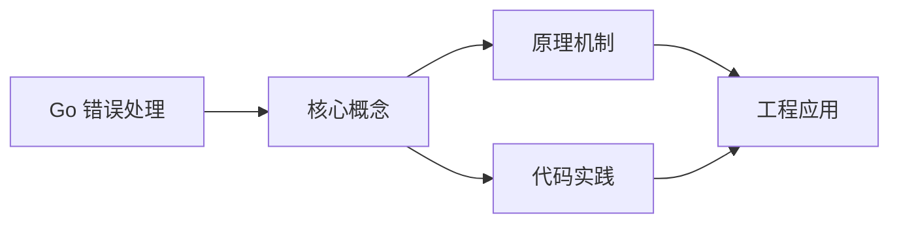

## 1. 学习目标（Bloom 分类）

本节按照布鲁姆教育目标分类学组织学习路径。本文主题为《Go 错误处理》，属于 Go 模块，读者可以根据自身阶段选择阅读深度。

记忆层面：能够准确复述本文的核心概念、术语与基本语法或操作步骤，并能够在提问或检索时快速定位对应知识点。能够说出 Go 的包、函数、结构体、接口与错误处理基本语法。

理解层面：能够用自己的语言解释核心原理与工作机制，说明概念之间的因果关系，而不是机械记忆结论。能够解释 goroutine 调度、channel 通信与内存模型。

应用层面：能够在真实项目或练习场景中运用本文知识解决具体问题，写出正确且可维护的实现。能够编写并发程序、HTTP 服务与命令行工具。

分析层面：能够拆解复杂问题，比较本文主题与相邻概念的异同，识别边界条件与例外情况。能够分析数据竞争、死锁与性能瓶颈。

评价层面：能够根据约束条件（性能、可读性、安全、成本）评价不同方案的优劣，做出有依据的技术决策。能够评价 Go 与 Java、Python 在不同场景的取舍。

创造层面：能够把本文知识与其他模块知识组合，设计出新的解决方案或可复用的工程模式。能够设计完整的微服务与云原生应用。

通过本节学习，读者应当能够把《Go 错误处理》纳入自己的知识网络，并与 Go 模块的其他主题（goroutine、channel、内存模型、标准库）建立关联。

## 2. 历史动机与发展脉络

《Go 错误处理》是 Go 领域的重要主题。要真正理解它，需要先了解它解决的问题与演进过程。

Go 由 Google 的 Robert Griesemer、Rob Pike 与 Ken Thompson 于 2009 年发布，设计目标是解决大规模分布式系统的工程痛点：编译慢、依赖混乱、并发难写。
Go 1.0 于 2012 年发布，此后严格保持向后兼容（Go 1 兼容性承诺）；约每半年发布一个小版本，1.21 起引入工具链管理（toolchain 指令）与内置测试 fuzzing。
Go 在云原生领域成为事实标准：Docker、Kubernetes、Prometheus、etcd 等核心项目均用 Go 编写；泛型在 1.18 加入，1.21+ 的 slices/maps 标准包补齐泛型工具。

回到本文主题：Go 错误处理 的提出与成熟，正是上述技术背景下的必然产物。早期实现往往以简单可用为目标，随着工程规模扩大，社区逐渐沉淀出标准做法与最佳实践；理解这一脉络，可以帮助读者判断“为什么文档中的推荐写法是现在这个样子”，也能在遇到历史遗留代码时准确识别其设计年代与取舍。


## 3. 形式化定义与核心概念精讲

本节把《Go 错误处理》涉及的核心概念以“定义 + 讲解”的形式展开。读者应把定义当作工具，把讲解当作理解路径；两者结合才能形成可迁移的知识。

goroutine 与调度：goroutine 是用户态轻量线程，由 GMP 调度器（Goroutine、Machine、Processor）多路复用到内核线程；创建成本约 2KB 栈，支持百万级并发。
channel 与 select：channel 是类型化通信管道，`<-` 发送/接收；select 多路等待；“不要通过共享内存通信，而要通过通信共享内存”是 Go 并发哲学。
内存模型：happens-before 关系由 channel、sync 原语与 atomic 建立；`go test -race` 用 ThreadSanitizer 检测数据竞争。

### 3.1 原文章节逐一精讲

原文档把主题拆分为 13 个小节，下面按顺序给出每一节的导读讲解，随后保留原文细节供精读。

#### 原文精读（完整保留）

# Go 错误处理

> **符号约定**：`< >` 必填参数 | `[ ]` 可选参数

---

#### 1. error 接口

##### 1.1 基本概念

Go 使用 `error` 接口表示错误，没有异常机制（除 panic 外）：

```go
type error interface {
    Error() string
}
```

错误作为返回值传递，调用者必须显式处理：

```go
func divide(a, b float64) (float64, error) {
    if b == 0 {
        return 0, errors.New("division by zero")
    }
    return a / b, nil
}

result, err := divide(10, 0)
if err != nil {
    fmt.Println("Error:", err)
    return
}
fmt.Println(result)
```

##### 1.2 创建错误

```go
// errors.New — 简单错误
err := errors.New("file not found")

// fmt.Errorf — 格式化错误
err := fmt.Errorf("user %d not found", userID)

// fmt.Errorf %w — 错误包装（Go 1.13+）
originalErr := errors.New("connection refused")
wrappedErr := fmt.Errorf("dial failed: %w", originalErr)
```

##### 1.3 sentinel 错误

预定义的错误值，用于特定错误判断：

```go
// 标准库中的 sentinel 错误
var (
    ErrNotExist    = errors.New("file does not exist")
    ErrPermission  = errors.New("permission denied")
    ErrUnsupported = errors.New("operation not supported")
)

// 使用
if err == ErrNotExist {
    // 处理文件不存在
}
```

> **最佳实践**：sentinel 错误应以 `Err` 开头，放在包级别。

#### 2. 错误检查

##### 2.1 errors.Is

`errors.Is` 沿着错误链查找，支持被包装的错误：

```go
var ErrNotFound = errors.New("not found")

func getUser(id int) error {
    return fmt.Errorf("get user %d: %w", id, ErrNotFound)
}

err := getUser(42)
// 直接比较会失败
// fmt.Println(err == ErrNotFound) // false

// 使用 errors.Is
fmt.Println(errors.Is(err, ErrNotFound)) // true

// 支持多层包装
err1 := fmt.Errorf("layer1: %w", ErrNotFound)
err2 := fmt.Errorf("layer2: %w", err1)
fmt.Println(errors.Is(err2, ErrNotFound)) // true
```

##### 2.2 errors.As

`errors.As` 沿错误链查找特定类型的错误：

```go
type NotFoundError struct {
    Resource string
    ID       int
}

func (e *NotFoundError) Error() string {
    return fmt.Sprintf("%s %d not found", e.Resource, e.ID)
}

func getUser(id int) error {
    return &NotFoundError{Resource: "user", ID: id}
}

err := getUser(42)

// 提取特定类型错误
var nfe *NotFoundError
if errors.As(err, &nfe) {
    fmt.Printf("Resource: %s, ID: %d\n", nfe.Resource, nfe.ID)
}

// 也支持被包装的错误
wrappedErr := fmt.Errorf("service error: %w", err)
var nfe2 *NotFoundError
if errors.As(wrappedErr, &nfe2) {
    fmt.Println("找到 NotFoundError")
}
```

##### 2.3 errors.Unwrap

```go
err1 := errors.New("base error")
err2 := fmt.Errorf("wrapped: %w", err1)
err3 := fmt.Errorf("double wrapped: %w", err2)

// 逐层解包
fmt.Println(errors.Unwrap(err3)) // wrapped: base error
fmt.Println(errors.Unwrap(err2)) // base error
fmt.Println(errors.Unwrap(err1)) // nil
```

#### 3. 自定义错误

##### 3.1 基本自定义错误

```go
type AppError struct {
    Code    int
    Message string
    Cause   error
}

func (e *AppError) Error() string {
    if e.Cause != nil {
        return fmt.Sprintf("[%d] %s: %v", e.Code, e.Message, e.Cause)
    }
    return fmt.Sprintf("[%d] %s", e.Code, e.Message)
}

func (e *AppError) Unwrap() error {
    return e.Cause
}

// 使用
func connect(addr string) error {
    _, err := net.Dial("tcp", addr)
    if err != nil {
        return &AppError{
            Code:    1001,
            Message: "connection failed",
            Cause:   err,
        }
    }
    return nil
}
```

##### 3.2 实现 Is/As 方法

```go
type TimeoutError struct {
    Op      string
    Timeout time.Duration
}

func (e *TimeoutError) Error() string {
    return fmt.Sprintf("%s timed out after %v", e.Op, e.Timeout)
}

// 自定义 Is 方法
func (e *TimeoutError) Is(target error) bool {
    t, ok := target.(*TimeoutError)
    if !ok {
        return false
    }
    return e.Op == t.Op // 同一操作视为相同错误
}

var ErrDialTimeout = &TimeoutError{Op: "dial"}

err := &TimeoutError{Op: "dial", Timeout: 5 * time.Second}
fmt.Println(errors.Is(err, ErrDialTimeout)) // true
```

##### 3.3 错误类型层次

```go
// 基础错误类型
type DomainError struct {
    Domain  string
    Message string
}

func (e *DomainError) Error() string {
    return fmt.Sprintf("[%s] %s", e.Domain, e.Message)
}

// 特定领域错误
type UserError struct {
    DomainError
    UserID int
}

type OrderError struct {
    DomainError
    OrderID string
}

// 使用 errors.As 区分
err := &UserError{
    DomainError: DomainError{Domain: "user", Message: "not found"},
    UserID:      42,
}

var ue *UserError
if errors.As(err, &ue) {
    fmt.Println("User ID:", ue.UserID)
}
```

#### 4. panic 与 recover

##### 4.1 panic

panic 用于不可恢复的错误，立即中断当前函数：

```go
func mustParse(s string) int {
    n, err := strconv.Atoi(s)
    if err != nil {
        panic(fmt.Sprintf("invalid number: %q", s))
    }
    return n
}
```

##### 4.2 recover

recover 只能在 defer 函数中捕获 panic：

```go
func safeCall() {
    defer func() {
        if r := recover(); r != nil {
            fmt.Println("Recovered from:", r)
            // 可以记录日志，但不能返回错误值
        }
    }()

    panic("something went wrong")
}
```

##### 4.3 panic/recover 实践模式

```go
// 模式 1：将 panic 转为 error
func safeDo(fn func()) (err error) {
    defer func() {
        if r := recover(); r != nil {
            err = fmt.Errorf("panic: %v\nstack: %s", r, debug.Stack())
        }
    }()
    fn()
    return nil
}

// 模式 2：HTTP 处理器恢复
func RecoveryMiddleware(next http.Handler) http.Handler {
    return http.HandlerFunc(func(w http.ResponseWriter, r *http.Request) {
        defer func() {
            if err := recover(); err != nil {
                log.Printf("panic: %v\n%s", err, debug.Stack())
                http.Error(w, "Internal Server Error", 500)
            }
        }()
        next.ServeHTTP(w, r)
    })
}
```

> **原则**：优先使用 error 返回值，仅在程序无法继续运行时使用 panic（如逻辑错误、初始化失败）。

#### 5. 错误包装（Error Wrapping）

##### 5.1 包装模式

```go
// 单层包装
if err != nil {
    return fmt.Errorf("read config: %w", err)
}

// 多层包装
func loadApp() error {
    if err := loadConfig(); err != nil {
        return fmt.Errorf("load app: %w", err)
    }
    return nil
}

func loadConfig() error {
    if err := readFile(); err != nil {
        return fmt.Errorf("load config: %w", err)
    }
    return nil
}

func readFile() error {
    return os.ErrNotExist
}

// 错误链：load app: load config: file does not exist
```

##### 5.2 自定义包装类型

```go
type withMessage struct {
    cause   error
    message string
}

func (e *withMessage) Error() string { return e.message + ": " + e.cause.Error() }
func (e *withMessage) Unwrap() error { return e.cause }

func Wrap(err error, message string) error {
    if err == nil {
        return nil
    }
    return &withMessage{cause: err, message: message}
}
```

#### 6. 错误处理最佳实践

##### 6.1 及时处理错误

```go
// 坏：忽略错误
data, _ := os.ReadFile("config.json")

// 好：立即处理
data, err := os.ReadFile("config.json")
if err != nil {
    return fmt.Errorf("read config: %w", err)
}
```

##### 6.2 只处理一次错误

```go
// 坏：重复处理（记录日志又返回）
func bad() error {
    err := doSomething()
    if err != nil {
        log.Println(err) // 处理一次
        return err        // 又处理一次
    }
    return nil
}

// 好：要么处理，要么向上传播
func good() error {
    err := doSomething()
    if err != nil {
        return fmt.Errorf("do something: %w", err) // 只包装并返回
    }
    return nil
}
```

##### 6.3 添加上下文信息

```go
// 坏：丢失上下文
return err

// 好：添加操作上下文
return fmt.Errorf("create user %q: %w", username, err)
```

##### 6.4 使用 sentinel 错误或自定义类型

```go
// 调用方需要区分错误时，使用 sentinel 或自定义类型
var (
    ErrUserNotFound  = errors.New("user not found")
    ErrUserExists    = errors.New("user already exists")
    ErrInvalidInput  = errors.New("invalid input")
)

func CreateUser(name string) error {
    if exists(name) {
        return fmt.Errorf("create user %q: %w", name, ErrUserExists)
    }
    // ...
}

// 调用方
err := CreateUser("alice")
if errors.Is(err, ErrUserExists) {
    // 处理用户已存在
}
```

##### 6.5 错误日志与返回

```go
// 在顶层处理错误（如 HTTP handler）
func HandleRequest(w http.ResponseWriter, r *http.Request) {
    err := processRequest(r)
    if err != nil {
        var appErr *AppError
        if errors.As(err, &appErr) {
            log.Printf("[%d] %s: %v", appErr.Code, appErr.Message, appErr.Cause)
            http.Error(w, appErr.Error(), appErr.HTTPStatus())
            return
        }
        log.Printf("unexpected error: %v", err)
        http.Error(w, "internal error", 500)
    }
    w.WriteHeader(200)
}
```

##### 6.6 Go 1.20+ 多错误包装

```go
// Go 1.20 支持一个错误包装多个错误
err1 := errors.New("error 1")
err2 := errors.New("error 2")
combined := fmt.Errorf("multiple errors: %w; %w", err1, err2)

fmt.Println(errors.Is(combined, err1)) // true
fmt.Println(errors.Is(combined, err2)) // true

// errors.Join（Go 1.20+）
err := errors.Join(err1, err2)
fmt.Println(errors.Is(err, err1)) // true
fmt.Println(errors.Is(err, err2)) // true
```
#### 基本错误处理

**基本写法：函数返回错误**
`func <函数名>(<参数>) (<返回值>, error) { ... }`
```go
// 函数返回结果和错误
func divide(a, b float64) (float64, error) {
    if b == 0 {
        return 0, errors.New("division by zero");
    }
    return a / b, nil;
}
```

**基本写法：调用方检查错误**
`if <错误> != nil { ... }`
```go
// 调用函数并检查错误
result, err := divide(10, 0);
if err != nil {
    fmt.Println("Error:", err);
    return;
}
```

---

#### 错误创建

**基本写法：errors.New 创建错误**
`errors.New("<消息>")`
```go
// 创建简单错误
err := errors.New("file not found");
```

**基本写法：fmt.Errorf 创建错误**
`fmt.Errorf("<格式>", <参数>)`
```go
// 格式化错误消息
err := fmt.Errorf("user %d not found", userID);
```

---

#### 自定义错误类型

**基本写法：自定义错误结构体**
`type <错误类型> struct { ... }`
```go
// 自定义错误类型
type ValidationError struct {
    Field   string;
    Message string;
}

func (e *ValidationError) Error() string {
    return fmt.Sprintf("%s: %s", e.Field, e.Message);
}
```

**基本写法：返回自定义错误**
`return &<错误类型>{ ... }`
```go
// 返回自定义错误
func validateEmail(email string) error {
    if !strings.Contains(email, "@") {
        return &ValidationError{
            Field:   "email",
            Message: "invalid email format",
        };
    }
    return nil;
}
```

---

#### 错误包装与解包

**基本写法：错误包装**
`fmt.Errorf("<消息>: %w", <错误>)`
```go
// 包装错误保留原始错误链
err := fmt.Errorf("save user failed: %w", originalErr);
```

**基本写法：错误解包**
`errors.Unwrap(<错误>)`
```go
// 解包获取原始错误
originalErr := errors.Unwrap(wrappedErr);
```

**基本写法：错误链判断**
`errors.Is(<错误>, <目标错误>)`
```go
// 判断错误链中是否包含目标错误
if errors.Is(err, sql.ErrNoRows) {
    fmt.Println("record not found");
}
```

**基本写法：错误类型断言**
`errors.As(<错误>, &<目标变量>)`
```go
// 提取错误链中的特定类型
var valErr *ValidationError;
if errors.As(err, &valErr) {
    fmt.Println(valErr.Field);
}
```

---

#### 错误处理模式

**基本写法：哨兵错误**
`var Err<名称> = errors.New("<消息>")`
```go
// 定义哨兵错误
var ErrNotFound = errors.New("not found");
var ErrUnauthorized = errors.New("unauthorized");

// 使用 errors.Is 判断
if errors.Is(err, ErrNotFound) {
    fmt.Println("resource not found");
}
```

**基本写法：错误变量组**
`var ( Err<名称1> = ...; Err<名称2> = ... )`
```go
// 批量定义错误变量
var (
    ErrInvalidInput = errors.New("invalid input");
    ErrTimeout      = errors.New("operation timed out");
);
```

---

#### panic 与 recover

**基本写法：panic 触发**
`panic(<值>)`
```go
// 触发 panic
func mustInit() {
    panic("initialization failed");
}
```

**基本写法：recover 捕获**
`recover()`
```go
// 在 defer 中 recover
func safeRun() {
    defer func() {
        if r := recover(); r != nil {
            fmt.Println("Recovered:", r);
        }
    }();
    panic("something went wrong");
}
```

**基本写法：安全调用包装**
`func <函数名>(<函数> func()) { ... }`
```go
// 安全调用包装函数
func safe(fn func()) (err error) {
    defer func() {
        if r := recover(); r != nil {
            err = fmt.Errorf("panic: %v", r);
        }
    }();
    fn();
    return nil;
}
```

---

#### 错误处理最佳实践

**基本写法：错误立即处理**
`if <错误> != nil { return <错误> }`
```go
// 错误立即返回，不忽略
data, err := readFile("config.json");
if err != nil {
    return err;
}
```

**基本写法：错误包装上下文**
`fmt.Errorf("<上下文>: %w", <错误>)`
```go
// 添加上下文信息
if err := saveUser(user); err != nil {
    return fmt.Errorf("create user: %w", err);
}
```

**基本写法：不重复处理错误**
`if <错误> != nil { return }`
```go
// 调用方处理错误，不重复处理
result, err := doSomething();
if err != nil {
    return;
}
```


### 3.2 概念关系图

下面用 Mermaid 图表达本文核心概念之间的关系，帮助读者建立整体图景：



图中展示的是本文知识的结构化关系：核心概念是入口，原理机制解释“为什么”，代码实践演示“怎么做”，工程应用回答“何时用”。读者学习时可以把每个小节的内容挂接到对应节点上。

## 4. 理论推导与原理解析

本节深入《Go 错误处理》背后的原理。理论部分不求面面俱到，而是聚焦“能解释现象、能指导实践”的关键推导。

goroutine 与调度：goroutine 是用户态轻量线程，由 GMP 调度器（Goroutine、Machine、Processor）多路复用到内核线程；创建成本约 2KB 栈，支持百万级并发。
channel 与 select：channel 是类型化通信管道，`<-` 发送/接收；select 多路等待；“不要通过共享内存通信，而要通过通信共享内存”是 Go 并发哲学。
内存模型：happens-before 关系由 channel、sync 原语与 atomic 建立；`go test -race` 用 ThreadSanitizer 检测数据竞争。
错误处理：Go 用多返回值显式处理错误（`if err != nil`），error 是接口；panic/recover 仅用于不可恢复错误。

需要强调的是，理论推导与工程实践之间存在翻译层：理论给出的是理想化模型与边界条件，工程代码则必须处理真实环境中的例外。读者在学习时应先掌握理论的“标准情形”，再通过陷阱章节了解“非标准情形”。

## 5. 代码示例与逐行讲解

本节把原文中的代码示例系统整理，并为每个示例补充用途说明与讲解。读者不应只浏览代码，而应逐段对照讲解理解设计意图。

### 5.1 示例：1.1 基本概念

该示例来自原文《1.1 基本概念》小节，用于演示Go 错误处理相关操作。阅读时请先看代码结构，再看其后的讲解。

```go
type error interface {
    Error() string
}
```

讲解：这段代码演示了本节核心知识点。代码中的关键操作可以归纳为三步：准备（定义或初始化）、执行（核心逻辑）、收尾（释放资源或返回结果）。实际项目中，这三步往往被封装为函数或类，以提升复用性与可测试性。

关键点分析：

该示例共 3 行有效代码，结构以数据或配置为主。阅读时应关注：数据字段的含义、配置项的作用，以及它们与运行行为的对应关系。

进阶思考路径：先尝试修改参数观察行为变化，再把示例中的模式迁移到自己的项目中；每次修改都记录预期与实测差异，这是把示例转化为能力的最快方式。

### 5.2 示例：1.1 基本概念

该示例来自原文《1.1 基本概念》小节，用于演示Go 错误处理相关操作。阅读时请先看代码结构，再看其后的讲解。

```go
func divide(a, b float64) (float64, error) {
    if b == 0 {
        return 0, errors.New("division by zero")
    }
    return a / b, nil
}

result, err := divide(10, 0)
if err != nil {
    fmt.Println("Error:", err)
    return
}
fmt.Println(result)
```

讲解：这段代码演示了本节核心知识点。代码中的关键操作可以归纳为三步：准备（定义或初始化）、执行（核心逻辑）、收尾（释放资源或返回结果）。实际项目中，这三步往往被封装为函数或类，以提升复用性与可测试性。

关键点分析：

该示例共 12 行有效代码，包含 3 类关键结构（func、if、return）。其中：

- 入口与初始化部分负责建立上下文，对应实际项目中的启动或装配逻辑；
- 核心逻辑部分体现本文主题的主要操作，是阅读时最需要对照讲解理解的部分；
- 输出或返回部分把结果交给调用方，注意其类型与边界条件。

进阶思考路径：先尝试修改参数观察行为变化，再把示例中的模式迁移到自己的项目中；每次修改都记录预期与实测差异，这是把示例转化为能力的最快方式。

### 5.3 示例：1.2 创建错误

该示例来自原文《1.2 创建错误》小节，用于演示Go 错误处理相关操作。阅读时请先看代码结构，再看其后的讲解。

```go
// errors.New — 简单错误
err := errors.New("file not found")

// fmt.Errorf — 格式化错误
err := fmt.Errorf("user %d not found", userID)

// fmt.Errorf %w — 错误包装（Go 1.13+）
originalErr := errors.New("connection refused")
wrappedErr := fmt.Errorf("dial failed: %w", originalErr)
```

讲解：这段代码演示了本节核心知识点。代码中的关键操作可以归纳为三步：准备（定义或初始化）、执行（核心逻辑）、收尾（释放资源或返回结果）。实际项目中，这三步往往被封装为函数或类，以提升复用性与可测试性。

关键点分析：

该示例共 7 行有效代码，结构以数据或配置为主。阅读时应关注：数据字段的含义、配置项的作用，以及它们与运行行为的对应关系。

进阶思考路径：先尝试修改参数观察行为变化，再把示例中的模式迁移到自己的项目中；每次修改都记录预期与实测差异，这是把示例转化为能力的最快方式。

### 5.4 示例：1.3 sentinel 错误

该示例来自原文《1.3 sentinel 错误》小节，用于演示Go 错误处理相关操作。阅读时请先看代码结构，再看其后的讲解。

```go
// 标准库中的 sentinel 错误
var (
    ErrNotExist    = errors.New("file does not exist")
    ErrPermission  = errors.New("permission denied")
    ErrUnsupported = errors.New("operation not supported")
)

// 使用
if err == ErrNotExist {
    // 处理文件不存在
}
```

讲解：这段代码演示了本节核心知识点。代码中的关键操作可以归纳为三步：准备（定义或初始化）、执行（核心逻辑）、收尾（释放资源或返回结果）。实际项目中，这三步往往被封装为函数或类，以提升复用性与可测试性。

关键点分析：

该示例共 10 行有效代码，包含 1 类关键结构（if）。其中：

- 入口与初始化部分负责建立上下文，对应实际项目中的启动或装配逻辑；
- 核心逻辑部分体现本文主题的主要操作，是阅读时最需要对照讲解理解的部分；
- 输出或返回部分把结果交给调用方，注意其类型与边界条件。

进阶思考路径：先尝试修改参数观察行为变化，再把示例中的模式迁移到自己的项目中；每次修改都记录预期与实测差异，这是把示例转化为能力的最快方式。

### 5.5 示例：2.1 errors.Is

该示例来自原文《2.1 errors.Is》小节，用于演示Go 错误处理相关操作。阅读时请先看代码结构，再看其后的讲解。

```go
var ErrNotFound = errors.New("not found")

func getUser(id int) error {
    return fmt.Errorf("get user %d: %w", id, ErrNotFound)
}

err := getUser(42)
// 直接比较会失败
// fmt.Println(err == ErrNotFound) // false

// 使用 errors.Is
fmt.Println(errors.Is(err, ErrNotFound)) // true

// 支持多层包装
err1 := fmt.Errorf("layer1: %w", ErrNotFound)
err2 := fmt.Errorf("layer2: %w", err1)
fmt.Println(errors.Is(err2, ErrNotFound)) // true
```

讲解：这段代码演示了本节核心知识点。代码中的关键操作可以归纳为三步：准备（定义或初始化）、执行（核心逻辑）、收尾（释放资源或返回结果）。实际项目中，这三步往往被封装为函数或类，以提升复用性与可测试性。

关键点分析：

该示例共 13 行有效代码，包含 2 类关键结构（func、return）。其中：

- 入口与初始化部分负责建立上下文，对应实际项目中的启动或装配逻辑；
- 核心逻辑部分体现本文主题的主要操作，是阅读时最需要对照讲解理解的部分；
- 输出或返回部分把结果交给调用方，注意其类型与边界条件。

进阶思考路径：先尝试修改参数观察行为变化，再把示例中的模式迁移到自己的项目中；每次修改都记录预期与实测差异，这是把示例转化为能力的最快方式。

### 5.6 示例：2.2 errors.As

该示例来自原文《2.2 errors.As》小节，用于演示Go 错误处理相关操作。阅读时请先看代码结构，再看其后的讲解。

```go
type NotFoundError struct {
    Resource string
    ID       int
}

func (e *NotFoundError) Error() string {
    return fmt.Sprintf("%s %d not found", e.Resource, e.ID)
}

func getUser(id int) error {
    return &NotFoundError{Resource: "user", ID: id}
}

err := getUser(42)

// 提取特定类型错误
var nfe *NotFoundError
if errors.As(err, &nfe) {
    fmt.Printf("Resource: %s, ID: %d\n", nfe.Resource, nfe.ID)
}

// 也支持被包装的错误
wrappedErr := fmt.Errorf("service error: %w", err)
var nfe2 *NotFoundError
if errors.As(wrappedErr, &nfe2) {
    fmt.Println("找到 NotFoundError")
}
```

讲解：这段代码演示了本节核心知识点。代码中的关键操作可以归纳为三步：准备（定义或初始化）、执行（核心逻辑）、收尾（释放资源或返回结果）。实际项目中，这三步往往被封装为函数或类，以提升复用性与可测试性。

关键点分析：

该示例共 22 行有效代码，包含 3 类关键结构（func、if、return）。其中：

- 入口与初始化部分负责建立上下文，对应实际项目中的启动或装配逻辑；
- 核心逻辑部分体现本文主题的主要操作，是阅读时最需要对照讲解理解的部分；
- 输出或返回部分把结果交给调用方，注意其类型与边界条件。

进阶思考路径：先尝试修改参数观察行为变化，再把示例中的模式迁移到自己的项目中；每次修改都记录预期与实测差异，这是把示例转化为能力的最快方式。

### 5.7 示例：2.3 errors.Unwrap

该示例来自原文《2.3 errors.Unwrap》小节，用于演示Go 错误处理相关操作。阅读时请先看代码结构，再看其后的讲解。

```go
err1 := errors.New("base error")
err2 := fmt.Errorf("wrapped: %w", err1)
err3 := fmt.Errorf("double wrapped: %w", err2)

// 逐层解包
fmt.Println(errors.Unwrap(err3)) // wrapped: base error
fmt.Println(errors.Unwrap(err2)) // base error
fmt.Println(errors.Unwrap(err1)) // nil
```

讲解：这段代码演示了本节核心知识点。代码中的关键操作可以归纳为三步：准备（定义或初始化）、执行（核心逻辑）、收尾（释放资源或返回结果）。实际项目中，这三步往往被封装为函数或类，以提升复用性与可测试性。

关键点分析：

该示例共 7 行有效代码，结构以数据或配置为主。阅读时应关注：数据字段的含义、配置项的作用，以及它们与运行行为的对应关系。

进阶思考路径：先尝试修改参数观察行为变化，再把示例中的模式迁移到自己的项目中；每次修改都记录预期与实测差异，这是把示例转化为能力的最快方式。

### 5.8 示例：3.1 基本自定义错误

该示例来自原文《3.1 基本自定义错误》小节，用于演示Go 错误处理相关操作。阅读时请先看代码结构，再看其后的讲解。

```go
type AppError struct {
    Code    int
    Message string
    Cause   error
}

func (e *AppError) Error() string {
    if e.Cause != nil {
        return fmt.Sprintf("[%d] %s: %v", e.Code, e.Message, e.Cause)
    }
    return fmt.Sprintf("[%d] %s", e.Code, e.Message)
}

func (e *AppError) Unwrap() error {
    return e.Cause
}

// 使用
func connect(addr string) error {
    _, err := net.Dial("tcp", addr)
    if err != nil {
        return &AppError{
            Code:    1001,
            Message: "connection failed",
            Cause:   err,
        }
    }
    return nil
}
```

讲解：这段代码演示了本节核心知识点。代码中的关键操作可以归纳为三步：准备（定义或初始化）、执行（核心逻辑）、收尾（释放资源或返回结果）。实际项目中，这三步往往被封装为函数或类，以提升复用性与可测试性。

关键点分析：

该示例共 26 行有效代码，包含 3 类关键结构（func、if、return）。其中：

- 入口与初始化部分负责建立上下文，对应实际项目中的启动或装配逻辑；
- 核心逻辑部分体现本文主题的主要操作，是阅读时最需要对照讲解理解的部分；
- 输出或返回部分把结果交给调用方，注意其类型与边界条件。

进阶思考路径：先尝试修改参数观察行为变化，再把示例中的模式迁移到自己的项目中；每次修改都记录预期与实测差异，这是把示例转化为能力的最快方式。

### 5.9 示例：3.2 实现 Is/As 方法

该示例来自原文《3.2 实现 Is/As 方法》小节，用于演示Go 错误处理相关操作。阅读时请先看代码结构，再看其后的讲解。

```go
type TimeoutError struct {
    Op      string
    Timeout time.Duration
}

func (e *TimeoutError) Error() string {
    return fmt.Sprintf("%s timed out after %v", e.Op, e.Timeout)
}

// 自定义 Is 方法
func (e *TimeoutError) Is(target error) bool {
    t, ok := target.(*TimeoutError)
    if !ok {
        return false
    }
    return e.Op == t.Op // 同一操作视为相同错误
}

var ErrDialTimeout = &TimeoutError{Op: "dial"}

err := &TimeoutError{Op: "dial", Timeout: 5 * time.Second}
fmt.Println(errors.Is(err, ErrDialTimeout)) // true
```

讲解：这段代码演示了本节核心知识点。代码中的关键操作可以归纳为三步：准备（定义或初始化）、执行（核心逻辑）、收尾（释放资源或返回结果）。实际项目中，这三步往往被封装为函数或类，以提升复用性与可测试性。

关键点分析：

该示例共 18 行有效代码，包含 3 类关键结构（func、if、return）。其中：

- 入口与初始化部分负责建立上下文，对应实际项目中的启动或装配逻辑；
- 核心逻辑部分体现本文主题的主要操作，是阅读时最需要对照讲解理解的部分；
- 输出或返回部分把结果交给调用方，注意其类型与边界条件。

进阶思考路径：先尝试修改参数观察行为变化，再把示例中的模式迁移到自己的项目中；每次修改都记录预期与实测差异，这是把示例转化为能力的最快方式。

### 5.10 示例：3.3 错误类型层次

该示例来自原文《3.3 错误类型层次》小节，用于演示Go 错误处理相关操作。阅读时请先看代码结构，再看其后的讲解。

```go
// 基础错误类型
type DomainError struct {
    Domain  string
    Message string
}

func (e *DomainError) Error() string {
    return fmt.Sprintf("[%s] %s", e.Domain, e.Message)
}

// 特定领域错误
type UserError struct {
    DomainError
    UserID int
}

type OrderError struct {
    DomainError
    OrderID string
}

// 使用 errors.As 区分
err := &UserError{
    DomainError: DomainError{Domain: "user", Message: "not found"},
    UserID:      42,
}

var ue *UserError
if errors.As(err, &ue) {
    fmt.Println("User ID:", ue.UserID)
}
```

讲解：这段代码演示了本节核心知识点。代码中的关键操作可以归纳为三步：准备（定义或初始化）、执行（核心逻辑）、收尾（释放资源或返回结果）。实际项目中，这三步往往被封装为函数或类，以提升复用性与可测试性。

关键点分析：

该示例共 26 行有效代码，包含 3 类关键结构（func、if、return）。其中：

- 入口与初始化部分负责建立上下文，对应实际项目中的启动或装配逻辑；
- 核心逻辑部分体现本文主题的主要操作，是阅读时最需要对照讲解理解的部分；
- 输出或返回部分把结果交给调用方，注意其类型与边界条件。

进阶思考路径：先尝试修改参数观察行为变化，再把示例中的模式迁移到自己的项目中；每次修改都记录预期与实测差异，这是把示例转化为能力的最快方式。

### 5.11 示例：4.1 panic

该示例来自原文《4.1 panic》小节，用于演示Go 错误处理相关操作。阅读时请先看代码结构，再看其后的讲解。

```go
func mustParse(s string) int {
    n, err := strconv.Atoi(s)
    if err != nil {
        panic(fmt.Sprintf("invalid number: %q", s))
    }
    return n
}
```

讲解：这段代码演示了本节核心知识点。代码中的关键操作可以归纳为三步：准备（定义或初始化）、执行（核心逻辑）、收尾（释放资源或返回结果）。实际项目中，这三步往往被封装为函数或类，以提升复用性与可测试性。

关键点分析：

该示例共 7 行有效代码，包含 3 类关键结构（func、if、return）。其中：

- 入口与初始化部分负责建立上下文，对应实际项目中的启动或装配逻辑；
- 核心逻辑部分体现本文主题的主要操作，是阅读时最需要对照讲解理解的部分；
- 输出或返回部分把结果交给调用方，注意其类型与边界条件。

进阶思考路径：先尝试修改参数观察行为变化，再把示例中的模式迁移到自己的项目中；每次修改都记录预期与实测差异，这是把示例转化为能力的最快方式。

### 5.12 示例：4.2 recover

该示例来自原文《4.2 recover》小节，用于演示Go 错误处理相关操作。阅读时请先看代码结构，再看其后的讲解。

```go
func safeCall() {
    defer func() {
        if r := recover(); r != nil {
            fmt.Println("Recovered from:", r)
            // 可以记录日志，但不能返回错误值
        }
    }()

    panic("something went wrong")
}
```

讲解：这段代码演示了本节核心知识点。代码中的关键操作可以归纳为三步：准备（定义或初始化）、执行（核心逻辑）、收尾（释放资源或返回结果）。实际项目中，这三步往往被封装为函数或类，以提升复用性与可测试性。

关键点分析：

该示例共 9 行有效代码，包含 2 类关键结构（func、if）。其中：

- 入口与初始化部分负责建立上下文，对应实际项目中的启动或装配逻辑；
- 核心逻辑部分体现本文主题的主要操作，是阅读时最需要对照讲解理解的部分；
- 输出或返回部分把结果交给调用方，注意其类型与边界条件。

进阶思考路径：先尝试修改参数观察行为变化，再把示例中的模式迁移到自己的项目中；每次修改都记录预期与实测差异，这是把示例转化为能力的最快方式。

### 5.13 示例：4.3 panic/recover 实践模式

该示例来自原文《4.3 panic/recover 实践模式》小节，用于演示Go 错误处理相关操作。阅读时请先看代码结构，再看其后的讲解。

```go
// 模式 1：将 panic 转为 error
func safeDo(fn func()) (err error) {
    defer func() {
        if r := recover(); r != nil {
            err = fmt.Errorf("panic: %v\nstack: %s", r, debug.Stack())
        }
    }()
    fn()
    return nil
}

// 模式 2：HTTP 处理器恢复
func RecoveryMiddleware(next http.Handler) http.Handler {
    return http.HandlerFunc(func(w http.ResponseWriter, r *http.Request) {
        defer func() {
            if err := recover(); err != nil {
                log.Printf("panic: %v\n%s", err, debug.Stack())
                http.Error(w, "Internal Server Error", 500)
            }
        }()
        next.ServeHTTP(w, r)
    })
}
```

讲解：这段代码演示了本节核心知识点。代码中的关键操作可以归纳为三步：准备（定义或初始化）、执行（核心逻辑）、收尾（释放资源或返回结果）。实际项目中，这三步往往被封装为函数或类，以提升复用性与可测试性。

关键点分析：

该示例共 22 行有效代码，包含 3 类关键结构（func、if、return）。其中：

- 入口与初始化部分负责建立上下文，对应实际项目中的启动或装配逻辑；
- 核心逻辑部分体现本文主题的主要操作，是阅读时最需要对照讲解理解的部分；
- 输出或返回部分把结果交给调用方，注意其类型与边界条件。

进阶思考路径：先尝试修改参数观察行为变化，再把示例中的模式迁移到自己的项目中；每次修改都记录预期与实测差异，这是把示例转化为能力的最快方式。

### 5.14 示例：5.1 包装模式

该示例来自原文《5.1 包装模式》小节，用于演示Go 错误处理相关操作。阅读时请先看代码结构，再看其后的讲解。

```go
// 单层包装
if err != nil {
    return fmt.Errorf("read config: %w", err)
}

// 多层包装
func loadApp() error {
    if err := loadConfig(); err != nil {
        return fmt.Errorf("load app: %w", err)
    }
    return nil
}

func loadConfig() error {
    if err := readFile(); err != nil {
        return fmt.Errorf("load config: %w", err)
    }
    return nil
}

func readFile() error {
    return os.ErrNotExist
}

// 错误链：load app: load config: file does not exist
```

讲解：这段代码演示了本节核心知识点。代码中的关键操作可以归纳为三步：准备（定义或初始化）、执行（核心逻辑）、收尾（释放资源或返回结果）。实际项目中，这三步往往被封装为函数或类，以提升复用性与可测试性。

关键点分析：

该示例共 21 行有效代码，包含 3 类关键结构（func、if、return）。其中：

- 入口与初始化部分负责建立上下文，对应实际项目中的启动或装配逻辑；
- 核心逻辑部分体现本文主题的主要操作，是阅读时最需要对照讲解理解的部分；
- 输出或返回部分把结果交给调用方，注意其类型与边界条件。

进阶思考路径：先尝试修改参数观察行为变化，再把示例中的模式迁移到自己的项目中；每次修改都记录预期与实测差异，这是把示例转化为能力的最快方式。

### 5.15 示例：5.2 自定义包装类型

该示例来自原文《5.2 自定义包装类型》小节，用于演示Go 错误处理相关操作。阅读时请先看代码结构，再看其后的讲解。

```go
type withMessage struct {
    cause   error
    message string
}

func (e *withMessage) Error() string { return e.message + ": " + e.cause.Error() }
func (e *withMessage) Unwrap() error { return e.cause }

func Wrap(err error, message string) error {
    if err == nil {
        return nil
    }
    return &withMessage{cause: err, message: message}
}
```

讲解：这段代码演示了本节核心知识点。代码中的关键操作可以归纳为三步：准备（定义或初始化）、执行（核心逻辑）、收尾（释放资源或返回结果）。实际项目中，这三步往往被封装为函数或类，以提升复用性与可测试性。

关键点分析：

该示例共 12 行有效代码，包含 3 类关键结构（func、if、return）。其中：

- 入口与初始化部分负责建立上下文，对应实际项目中的启动或装配逻辑；
- 核心逻辑部分体现本文主题的主要操作，是阅读时最需要对照讲解理解的部分；
- 输出或返回部分把结果交给调用方，注意其类型与边界条件。

进阶思考路径：先尝试修改参数观察行为变化，再把示例中的模式迁移到自己的项目中；每次修改都记录预期与实测差异，这是把示例转化为能力的最快方式。

### 5.16 示例：6.1 及时处理错误

该示例来自原文《6.1 及时处理错误》小节，用于演示Go 错误处理相关操作。阅读时请先看代码结构，再看其后的讲解。

```go
// 坏：忽略错误
data, _ := os.ReadFile("config.json")

// 好：立即处理
data, err := os.ReadFile("config.json")
if err != nil {
    return fmt.Errorf("read config: %w", err)
}
```

讲解：这段代码演示了本节核心知识点。代码中的关键操作可以归纳为三步：准备（定义或初始化）、执行（核心逻辑）、收尾（释放资源或返回结果）。实际项目中，这三步往往被封装为函数或类，以提升复用性与可测试性。

关键点分析：

该示例共 7 行有效代码，包含 2 类关键结构（if、return）。其中：

- 入口与初始化部分负责建立上下文，对应实际项目中的启动或装配逻辑；
- 核心逻辑部分体现本文主题的主要操作，是阅读时最需要对照讲解理解的部分；
- 输出或返回部分把结果交给调用方，注意其类型与边界条件。

进阶思考路径：先尝试修改参数观察行为变化，再把示例中的模式迁移到自己的项目中；每次修改都记录预期与实测差异，这是把示例转化为能力的最快方式。

### 5.17 示例：6.2 只处理一次错误

该示例来自原文《6.2 只处理一次错误》小节，用于演示Go 错误处理相关操作。阅读时请先看代码结构，再看其后的讲解。

```go
// 坏：重复处理（记录日志又返回）
func bad() error {
    err := doSomething()
    if err != nil {
        log.Println(err) // 处理一次
        return err        // 又处理一次
    }
    return nil
}

// 好：要么处理，要么向上传播
func good() error {
    err := doSomething()
    if err != nil {
        return fmt.Errorf("do something: %w", err) // 只包装并返回
    }
    return nil
}
```

讲解：这段代码演示了本节核心知识点。代码中的关键操作可以归纳为三步：准备（定义或初始化）、执行（核心逻辑）、收尾（释放资源或返回结果）。实际项目中，这三步往往被封装为函数或类，以提升复用性与可测试性。

关键点分析：

该示例共 17 行有效代码，包含 3 类关键结构（func、if、return）。其中：

- 入口与初始化部分负责建立上下文，对应实际项目中的启动或装配逻辑；
- 核心逻辑部分体现本文主题的主要操作，是阅读时最需要对照讲解理解的部分；
- 输出或返回部分把结果交给调用方，注意其类型与边界条件。

进阶思考路径：先尝试修改参数观察行为变化，再把示例中的模式迁移到自己的项目中；每次修改都记录预期与实测差异，这是把示例转化为能力的最快方式。

### 5.18 示例：6.3 添加上下文信息

该示例来自原文《6.3 添加上下文信息》小节，用于演示Go 错误处理相关操作。阅读时请先看代码结构，再看其后的讲解。

```go
// 坏：丢失上下文
return err

// 好：添加操作上下文
return fmt.Errorf("create user %q: %w", username, err)
```

讲解：这段代码演示了本节核心知识点。代码中的关键操作可以归纳为三步：准备（定义或初始化）、执行（核心逻辑）、收尾（释放资源或返回结果）。实际项目中，这三步往往被封装为函数或类，以提升复用性与可测试性。

关键点分析：

该示例共 4 行有效代码，包含 1 类关键结构（return）。其中：

- 入口与初始化部分负责建立上下文，对应实际项目中的启动或装配逻辑；
- 核心逻辑部分体现本文主题的主要操作，是阅读时最需要对照讲解理解的部分；
- 输出或返回部分把结果交给调用方，注意其类型与边界条件。

进阶思考路径：先尝试修改参数观察行为变化，再把示例中的模式迁移到自己的项目中；每次修改都记录预期与实测差异，这是把示例转化为能力的最快方式。

### 5.19 示例：6.4 使用 sentinel 错误或自定义类型

该示例来自原文《6.4 使用 sentinel 错误或自定义类型》小节，用于演示Go 错误处理相关操作。阅读时请先看代码结构，再看其后的讲解。

```go
// 调用方需要区分错误时，使用 sentinel 或自定义类型
var (
    ErrUserNotFound  = errors.New("user not found")
    ErrUserExists    = errors.New("user already exists")
    ErrInvalidInput  = errors.New("invalid input")
)

func CreateUser(name string) error {
    if exists(name) {
        return fmt.Errorf("create user %q: %w", name, ErrUserExists)
    }
    // ...
}

// 调用方
err := CreateUser("alice")
if errors.Is(err, ErrUserExists) {
    // 处理用户已存在
}
```

讲解：这段代码演示了本节核心知识点。代码中的关键操作可以归纳为三步：准备（定义或初始化）、执行（核心逻辑）、收尾（释放资源或返回结果）。实际项目中，这三步往往被封装为函数或类，以提升复用性与可测试性。

关键点分析：

该示例共 17 行有效代码，包含 3 类关键结构（func、if、return）。其中：

- 入口与初始化部分负责建立上下文，对应实际项目中的启动或装配逻辑；
- 核心逻辑部分体现本文主题的主要操作，是阅读时最需要对照讲解理解的部分；
- 输出或返回部分把结果交给调用方，注意其类型与边界条件。

进阶思考路径：先尝试修改参数观察行为变化，再把示例中的模式迁移到自己的项目中；每次修改都记录预期与实测差异，这是把示例转化为能力的最快方式。

### 5.20 示例：6.5 错误日志与返回

该示例来自原文《6.5 错误日志与返回》小节，用于演示Go 错误处理相关操作。阅读时请先看代码结构，再看其后的讲解。

```go
// 在顶层处理错误（如 HTTP handler）
func HandleRequest(w http.ResponseWriter, r *http.Request) {
    err := processRequest(r)
    if err != nil {
        var appErr *AppError
        if errors.As(err, &appErr) {
            log.Printf("[%d] %s: %v", appErr.Code, appErr.Message, appErr.Cause)
            http.Error(w, appErr.Error(), appErr.HTTPStatus())
            return
        }
        log.Printf("unexpected error: %v", err)
        http.Error(w, "internal error", 500)
    }
    w.WriteHeader(200)
}
```

讲解：这段代码演示了本节核心知识点。代码中的关键操作可以归纳为三步：准备（定义或初始化）、执行（核心逻辑）、收尾（释放资源或返回结果）。实际项目中，这三步往往被封装为函数或类，以提升复用性与可测试性。

关键点分析：

该示例共 15 行有效代码，包含 3 类关键结构（func、if、return）。其中：

- 入口与初始化部分负责建立上下文，对应实际项目中的启动或装配逻辑；
- 核心逻辑部分体现本文主题的主要操作，是阅读时最需要对照讲解理解的部分；
- 输出或返回部分把结果交给调用方，注意其类型与边界条件。

进阶思考路径：先尝试修改参数观察行为变化，再把示例中的模式迁移到自己的项目中；每次修改都记录预期与实测差异，这是把示例转化为能力的最快方式。

### 5.21 示例：6.6 Go 1.20+ 多错误包装

该示例来自原文《6.6 Go 1.20+ 多错误包装》小节，用于演示Go 错误处理相关操作。阅读时请先看代码结构，再看其后的讲解。

```go
// Go 1.20 支持一个错误包装多个错误
err1 := errors.New("error 1")
err2 := errors.New("error 2")
combined := fmt.Errorf("multiple errors: %w; %w", err1, err2)

fmt.Println(errors.Is(combined, err1)) // true
fmt.Println(errors.Is(combined, err2)) // true

// errors.Join（Go 1.20+）
err := errors.Join(err1, err2)
fmt.Println(errors.Is(err, err1)) // true
fmt.Println(errors.Is(err, err2)) // true
```

讲解：这段代码演示了本节核心知识点。代码中的关键操作可以归纳为三步：准备（定义或初始化）、执行（核心逻辑）、收尾（释放资源或返回结果）。实际项目中，这三步往往被封装为函数或类，以提升复用性与可测试性。

关键点分析：

该示例共 10 行有效代码，结构以数据或配置为主。阅读时应关注：数据字段的含义、配置项的作用，以及它们与运行行为的对应关系。

进阶思考路径：先尝试修改参数观察行为变化，再把示例中的模式迁移到自己的项目中；每次修改都记录预期与实测差异，这是把示例转化为能力的最快方式。

### 5.22 示例：基本错误处理

该示例来自原文《基本错误处理》小节，用于演示Go 错误处理相关操作。阅读时请先看代码结构，再看其后的讲解。

```go
// 函数返回结果和错误
func divide(a, b float64) (float64, error) {
    if b == 0 {
        return 0, errors.New("division by zero");
    }
    return a / b, nil;
}
```

讲解：这段代码演示了本节核心知识点。代码中的关键操作可以归纳为三步：准备（定义或初始化）、执行（核心逻辑）、收尾（释放资源或返回结果）。实际项目中，这三步往往被封装为函数或类，以提升复用性与可测试性。

关键点分析：

该示例共 7 行有效代码，包含 3 类关键结构（func、if、return）。其中：

- 入口与初始化部分负责建立上下文，对应实际项目中的启动或装配逻辑；
- 核心逻辑部分体现本文主题的主要操作，是阅读时最需要对照讲解理解的部分；
- 输出或返回部分把结果交给调用方，注意其类型与边界条件。

进阶思考路径：先尝试修改参数观察行为变化，再把示例中的模式迁移到自己的项目中；每次修改都记录预期与实测差异，这是把示例转化为能力的最快方式。

### 5.23 示例：基本错误处理

该示例来自原文《基本错误处理》小节，用于演示Go 错误处理相关操作。阅读时请先看代码结构，再看其后的讲解。

```go
// 调用函数并检查错误
result, err := divide(10, 0);
if err != nil {
    fmt.Println("Error:", err);
    return;
}
```

讲解：这段代码演示了本节核心知识点。代码中的关键操作可以归纳为三步：准备（定义或初始化）、执行（核心逻辑）、收尾（释放资源或返回结果）。实际项目中，这三步往往被封装为函数或类，以提升复用性与可测试性。

关键点分析：

该示例共 6 行有效代码，包含 2 类关键结构（if、return）。其中：

- 入口与初始化部分负责建立上下文，对应实际项目中的启动或装配逻辑；
- 核心逻辑部分体现本文主题的主要操作，是阅读时最需要对照讲解理解的部分；
- 输出或返回部分把结果交给调用方，注意其类型与边界条件。

进阶思考路径：先尝试修改参数观察行为变化，再把示例中的模式迁移到自己的项目中；每次修改都记录预期与实测差异，这是把示例转化为能力的最快方式。

### 5.24 示例：错误创建

该示例来自原文《错误创建》小节，用于演示Go 错误处理相关操作。阅读时请先看代码结构，再看其后的讲解。

```go
// 创建简单错误
err := errors.New("file not found");
```

讲解：这段代码演示了本节核心知识点。代码中的关键操作可以归纳为三步：准备（定义或初始化）、执行（核心逻辑）、收尾（释放资源或返回结果）。实际项目中，这三步往往被封装为函数或类，以提升复用性与可测试性。

关键点分析：

该示例共 2 行有效代码，结构以数据或配置为主。阅读时应关注：数据字段的含义、配置项的作用，以及它们与运行行为的对应关系。

进阶思考路径：先尝试修改参数观察行为变化，再把示例中的模式迁移到自己的项目中；每次修改都记录预期与实测差异，这是把示例转化为能力的最快方式。

### 5.25 示例：错误创建

该示例来自原文《错误创建》小节，用于演示Go 错误处理相关操作。阅读时请先看代码结构，再看其后的讲解。

```go
// 格式化错误消息
err := fmt.Errorf("user %d not found", userID);
```

讲解：这段代码演示了本节核心知识点。代码中的关键操作可以归纳为三步：准备（定义或初始化）、执行（核心逻辑）、收尾（释放资源或返回结果）。实际项目中，这三步往往被封装为函数或类，以提升复用性与可测试性。

关键点分析：

该示例共 2 行有效代码，结构以数据或配置为主。阅读时应关注：数据字段的含义、配置项的作用，以及它们与运行行为的对应关系。

进阶思考路径：先尝试修改参数观察行为变化，再把示例中的模式迁移到自己的项目中；每次修改都记录预期与实测差异，这是把示例转化为能力的最快方式。

### 5.26 示例：自定义错误类型

该示例来自原文《自定义错误类型》小节，用于演示Go 错误处理相关操作。阅读时请先看代码结构，再看其后的讲解。

```go
// 自定义错误类型
type ValidationError struct {
    Field   string;
    Message string;
}

func (e *ValidationError) Error() string {
    return fmt.Sprintf("%s: %s", e.Field, e.Message);
}
```

讲解：这段代码演示了本节核心知识点。代码中的关键操作可以归纳为三步：准备（定义或初始化）、执行（核心逻辑）、收尾（释放资源或返回结果）。实际项目中，这三步往往被封装为函数或类，以提升复用性与可测试性。

关键点分析：

该示例共 8 行有效代码，包含 2 类关键结构（func、return）。其中：

- 入口与初始化部分负责建立上下文，对应实际项目中的启动或装配逻辑；
- 核心逻辑部分体现本文主题的主要操作，是阅读时最需要对照讲解理解的部分；
- 输出或返回部分把结果交给调用方，注意其类型与边界条件。

进阶思考路径：先尝试修改参数观察行为变化，再把示例中的模式迁移到自己的项目中；每次修改都记录预期与实测差异，这是把示例转化为能力的最快方式。

### 5.27 示例：自定义错误类型

该示例来自原文《自定义错误类型》小节，用于演示Go 错误处理相关操作。阅读时请先看代码结构，再看其后的讲解。

```go
// 返回自定义错误
func validateEmail(email string) error {
    if !strings.Contains(email, "@") {
        return &ValidationError{
            Field:   "email",
            Message: "invalid email format",
        };
    }
    return nil;
}
```

讲解：这段代码演示了本节核心知识点。代码中的关键操作可以归纳为三步：准备（定义或初始化）、执行（核心逻辑）、收尾（释放资源或返回结果）。实际项目中，这三步往往被封装为函数或类，以提升复用性与可测试性。

关键点分析：

该示例共 10 行有效代码，包含 3 类关键结构（func、if、return）。其中：

- 入口与初始化部分负责建立上下文，对应实际项目中的启动或装配逻辑；
- 核心逻辑部分体现本文主题的主要操作，是阅读时最需要对照讲解理解的部分；
- 输出或返回部分把结果交给调用方，注意其类型与边界条件。

进阶思考路径：先尝试修改参数观察行为变化，再把示例中的模式迁移到自己的项目中；每次修改都记录预期与实测差异，这是把示例转化为能力的最快方式。

### 5.28 示例：错误包装与解包

该示例来自原文《错误包装与解包》小节，用于演示Go 错误处理相关操作。阅读时请先看代码结构，再看其后的讲解。

```go
// 包装错误保留原始错误链
err := fmt.Errorf("save user failed: %w", originalErr);
```

讲解：这段代码演示了本节核心知识点。代码中的关键操作可以归纳为三步：准备（定义或初始化）、执行（核心逻辑）、收尾（释放资源或返回结果）。实际项目中，这三步往往被封装为函数或类，以提升复用性与可测试性。

关键点分析：

该示例共 2 行有效代码，结构以数据或配置为主。阅读时应关注：数据字段的含义、配置项的作用，以及它们与运行行为的对应关系。

进阶思考路径：先尝试修改参数观察行为变化，再把示例中的模式迁移到自己的项目中；每次修改都记录预期与实测差异，这是把示例转化为能力的最快方式。

### 5.29 示例：错误包装与解包

该示例来自原文《错误包装与解包》小节，用于演示Go 错误处理相关操作。阅读时请先看代码结构，再看其后的讲解。

```go
// 解包获取原始错误
originalErr := errors.Unwrap(wrappedErr);
```

讲解：这段代码演示了本节核心知识点。代码中的关键操作可以归纳为三步：准备（定义或初始化）、执行（核心逻辑）、收尾（释放资源或返回结果）。实际项目中，这三步往往被封装为函数或类，以提升复用性与可测试性。

关键点分析：

该示例共 2 行有效代码，结构以数据或配置为主。阅读时应关注：数据字段的含义、配置项的作用，以及它们与运行行为的对应关系。

进阶思考路径：先尝试修改参数观察行为变化，再把示例中的模式迁移到自己的项目中；每次修改都记录预期与实测差异，这是把示例转化为能力的最快方式。

### 5.30 示例：错误包装与解包

该示例来自原文《错误包装与解包》小节，用于演示Go 错误处理相关操作。阅读时请先看代码结构，再看其后的讲解。

```go
// 判断错误链中是否包含目标错误
if errors.Is(err, sql.ErrNoRows) {
    fmt.Println("record not found");
}
```

讲解：这段代码演示了本节核心知识点。代码中的关键操作可以归纳为三步：准备（定义或初始化）、执行（核心逻辑）、收尾（释放资源或返回结果）。实际项目中，这三步往往被封装为函数或类，以提升复用性与可测试性。

关键点分析：

该示例共 4 行有效代码，包含 1 类关键结构（if）。其中：

- 入口与初始化部分负责建立上下文，对应实际项目中的启动或装配逻辑；
- 核心逻辑部分体现本文主题的主要操作，是阅读时最需要对照讲解理解的部分；
- 输出或返回部分把结果交给调用方，注意其类型与边界条件。

进阶思考路径：先尝试修改参数观察行为变化，再把示例中的模式迁移到自己的项目中；每次修改都记录预期与实测差异，这是把示例转化为能力的最快方式。

### 5.31 示例：错误包装与解包

该示例来自原文《错误包装与解包》小节，用于演示Go 错误处理相关操作。阅读时请先看代码结构，再看其后的讲解。

```go
// 提取错误链中的特定类型
var valErr *ValidationError;
if errors.As(err, &valErr) {
    fmt.Println(valErr.Field);
}
```

讲解：这段代码演示了本节核心知识点。代码中的关键操作可以归纳为三步：准备（定义或初始化）、执行（核心逻辑）、收尾（释放资源或返回结果）。实际项目中，这三步往往被封装为函数或类，以提升复用性与可测试性。

关键点分析：

该示例共 5 行有效代码，包含 1 类关键结构（if）。其中：

- 入口与初始化部分负责建立上下文，对应实际项目中的启动或装配逻辑；
- 核心逻辑部分体现本文主题的主要操作，是阅读时最需要对照讲解理解的部分；
- 输出或返回部分把结果交给调用方，注意其类型与边界条件。

进阶思考路径：先尝试修改参数观察行为变化，再把示例中的模式迁移到自己的项目中；每次修改都记录预期与实测差异，这是把示例转化为能力的最快方式。

### 5.32 示例：错误处理模式

该示例来自原文《错误处理模式》小节，用于演示Go 错误处理相关操作。阅读时请先看代码结构，再看其后的讲解。

```go
// 定义哨兵错误
var ErrNotFound = errors.New("not found");
var ErrUnauthorized = errors.New("unauthorized");

// 使用 errors.Is 判断
if errors.Is(err, ErrNotFound) {
    fmt.Println("resource not found");
}
```

讲解：这段代码演示了本节核心知识点。代码中的关键操作可以归纳为三步：准备（定义或初始化）、执行（核心逻辑）、收尾（释放资源或返回结果）。实际项目中，这三步往往被封装为函数或类，以提升复用性与可测试性。

关键点分析：

该示例共 7 行有效代码，包含 1 类关键结构（if）。其中：

- 入口与初始化部分负责建立上下文，对应实际项目中的启动或装配逻辑；
- 核心逻辑部分体现本文主题的主要操作，是阅读时最需要对照讲解理解的部分；
- 输出或返回部分把结果交给调用方，注意其类型与边界条件。

进阶思考路径：先尝试修改参数观察行为变化，再把示例中的模式迁移到自己的项目中；每次修改都记录预期与实测差异，这是把示例转化为能力的最快方式。

### 5.33 示例：错误处理模式

该示例来自原文《错误处理模式》小节，用于演示Go 错误处理相关操作。阅读时请先看代码结构，再看其后的讲解。

```go
// 批量定义错误变量
var (
    ErrInvalidInput = errors.New("invalid input");
    ErrTimeout      = errors.New("operation timed out");
);
```

讲解：这段代码演示了本节核心知识点。代码中的关键操作可以归纳为三步：准备（定义或初始化）、执行（核心逻辑）、收尾（释放资源或返回结果）。实际项目中，这三步往往被封装为函数或类，以提升复用性与可测试性。

关键点分析：

该示例共 5 行有效代码，结构以数据或配置为主。阅读时应关注：数据字段的含义、配置项的作用，以及它们与运行行为的对应关系。

进阶思考路径：先尝试修改参数观察行为变化，再把示例中的模式迁移到自己的项目中；每次修改都记录预期与实测差异，这是把示例转化为能力的最快方式。

### 5.34 示例：panic 与 recover

该示例来自原文《panic 与 recover》小节，用于演示Go 错误处理相关操作。阅读时请先看代码结构，再看其后的讲解。

```go
// 触发 panic
func mustInit() {
    panic("initialization failed");
}
```

讲解：这段代码演示了本节核心知识点。代码中的关键操作可以归纳为三步：准备（定义或初始化）、执行（核心逻辑）、收尾（释放资源或返回结果）。实际项目中，这三步往往被封装为函数或类，以提升复用性与可测试性。

关键点分析：

该示例共 4 行有效代码，包含 1 类关键结构（func）。其中：

- 入口与初始化部分负责建立上下文，对应实际项目中的启动或装配逻辑；
- 核心逻辑部分体现本文主题的主要操作，是阅读时最需要对照讲解理解的部分；
- 输出或返回部分把结果交给调用方，注意其类型与边界条件。

进阶思考路径：先尝试修改参数观察行为变化，再把示例中的模式迁移到自己的项目中；每次修改都记录预期与实测差异，这是把示例转化为能力的最快方式。

### 5.35 示例：panic 与 recover

该示例来自原文《panic 与 recover》小节，用于演示Go 错误处理相关操作。阅读时请先看代码结构，再看其后的讲解。

```go
// 在 defer 中 recover
func safeRun() {
    defer func() {
        if r := recover(); r != nil {
            fmt.Println("Recovered:", r);
        }
    }();
    panic("something went wrong");
}
```

讲解：这段代码演示了本节核心知识点。代码中的关键操作可以归纳为三步：准备（定义或初始化）、执行（核心逻辑）、收尾（释放资源或返回结果）。实际项目中，这三步往往被封装为函数或类，以提升复用性与可测试性。

关键点分析：

该示例共 9 行有效代码，包含 2 类关键结构（func、if）。其中：

- 入口与初始化部分负责建立上下文，对应实际项目中的启动或装配逻辑；
- 核心逻辑部分体现本文主题的主要操作，是阅读时最需要对照讲解理解的部分；
- 输出或返回部分把结果交给调用方，注意其类型与边界条件。

进阶思考路径：先尝试修改参数观察行为变化，再把示例中的模式迁移到自己的项目中；每次修改都记录预期与实测差异，这是把示例转化为能力的最快方式。

### 5.36 示例：panic 与 recover

该示例来自原文《panic 与 recover》小节，用于演示Go 错误处理相关操作。阅读时请先看代码结构，再看其后的讲解。

```go
// 安全调用包装函数
func safe(fn func()) (err error) {
    defer func() {
        if r := recover(); r != nil {
            err = fmt.Errorf("panic: %v", r);
        }
    }();
    fn();
    return nil;
}
```

讲解：这段代码演示了本节核心知识点。代码中的关键操作可以归纳为三步：准备（定义或初始化）、执行（核心逻辑）、收尾（释放资源或返回结果）。实际项目中，这三步往往被封装为函数或类，以提升复用性与可测试性。

关键点分析：

该示例共 10 行有效代码，包含 3 类关键结构（func、if、return）。其中：

- 入口与初始化部分负责建立上下文，对应实际项目中的启动或装配逻辑；
- 核心逻辑部分体现本文主题的主要操作，是阅读时最需要对照讲解理解的部分；
- 输出或返回部分把结果交给调用方，注意其类型与边界条件。

进阶思考路径：先尝试修改参数观察行为变化，再把示例中的模式迁移到自己的项目中；每次修改都记录预期与实测差异，这是把示例转化为能力的最快方式。

### 5.37 示例：错误处理最佳实践

该示例来自原文《错误处理最佳实践》小节，用于演示Go 错误处理相关操作。阅读时请先看代码结构，再看其后的讲解。

```go
// 错误立即返回，不忽略
data, err := readFile("config.json");
if err != nil {
    return err;
}
```

讲解：这段代码演示了本节核心知识点。代码中的关键操作可以归纳为三步：准备（定义或初始化）、执行（核心逻辑）、收尾（释放资源或返回结果）。实际项目中，这三步往往被封装为函数或类，以提升复用性与可测试性。

关键点分析：

该示例共 5 行有效代码，包含 2 类关键结构（if、return）。其中：

- 入口与初始化部分负责建立上下文，对应实际项目中的启动或装配逻辑；
- 核心逻辑部分体现本文主题的主要操作，是阅读时最需要对照讲解理解的部分；
- 输出或返回部分把结果交给调用方，注意其类型与边界条件。

进阶思考路径：先尝试修改参数观察行为变化，再把示例中的模式迁移到自己的项目中；每次修改都记录预期与实测差异，这是把示例转化为能力的最快方式。

### 5.38 示例：错误处理最佳实践

该示例来自原文《错误处理最佳实践》小节，用于演示Go 错误处理相关操作。阅读时请先看代码结构，再看其后的讲解。

```go
// 添加上下文信息
if err := saveUser(user); err != nil {
    return fmt.Errorf("create user: %w", err);
}
```

讲解：这段代码演示了本节核心知识点。代码中的关键操作可以归纳为三步：准备（定义或初始化）、执行（核心逻辑）、收尾（释放资源或返回结果）。实际项目中，这三步往往被封装为函数或类，以提升复用性与可测试性。

关键点分析：

该示例共 4 行有效代码，包含 2 类关键结构（if、return）。其中：

- 入口与初始化部分负责建立上下文，对应实际项目中的启动或装配逻辑；
- 核心逻辑部分体现本文主题的主要操作，是阅读时最需要对照讲解理解的部分；
- 输出或返回部分把结果交给调用方，注意其类型与边界条件。

进阶思考路径：先尝试修改参数观察行为变化，再把示例中的模式迁移到自己的项目中；每次修改都记录预期与实测差异，这是把示例转化为能力的最快方式。

### 5.39 示例：错误处理最佳实践

该示例来自原文《错误处理最佳实践》小节，用于演示Go 错误处理相关操作。阅读时请先看代码结构，再看其后的讲解。

```go
// 调用方处理错误，不重复处理
result, err := doSomething();
if err != nil {
    return;
}
```

讲解：这段代码演示了本节核心知识点。代码中的关键操作可以归纳为三步：准备（定义或初始化）、执行（核心逻辑）、收尾（释放资源或返回结果）。实际项目中，这三步往往被封装为函数或类，以提升复用性与可测试性。

关键点分析：

该示例共 5 行有效代码，包含 2 类关键结构（if、return）。其中：

- 入口与初始化部分负责建立上下文，对应实际项目中的启动或装配逻辑；
- 核心逻辑部分体现本文主题的主要操作，是阅读时最需要对照讲解理解的部分；
- 输出或返回部分把结果交给调用方，注意其类型与边界条件。

进阶思考路径：先尝试修改参数观察行为变化，再把示例中的模式迁移到自己的项目中；每次修改都记录预期与实测差异，这是把示例转化为能力的最快方式。


综合以上示例，可以总结出本主题的代码实践要点：第一，先定义清晰的输入输出契约；第二，核心逻辑保持单一职责；第三，错误处理与边界条件不可省略；第四，命名与注释表达意图而非复述代码。

## 6. 对比分析

对比是理解《Go 错误处理》定位的最快路径。下面从多个维度与相邻方案进行对比。

Go 与 Java：Go 编译快、部署简单（静态二进制）、并发原语原生；Java 生态更丰富、虚拟线程补足并发短板。
Go 与 Python：Go 性能高、类型安全；Python 开发快、AI 生态强。
goroutine 与线程：goroutine 用户态调度、栈动态增长；线程内核态、栈固定。

对比的目的不是分出绝对优劣，而是建立选择依据：不同约束条件下，最优解不同。读者应把每个对比维度转化为决策检查清单。

## 7. 常见陷阱与最佳实践

本节整理该主题的高频错误与推荐做法。每个陷阱先描述现象，再解释原因，最后给出最佳实践。

### 7.1 忽略错误返回值

错误被静默丢弃导致故障难查。显式检查并包装上下文（fmt.Errorf + %w）。

深入讲解：该问题之所以被归类为“常见陷阱”，是因为它在初学者的代码中反复出现，而且往往不在第一时间暴露——错误通常隐藏在特定数据或特定时序下。

从成因上看，忽略错误返回值 一般源于对 Go 某个机制的理解偏差：要么误用了默认行为，要么忽略了边界条件，要么把其他语言的思维惯性带了过来。

从影响上看，忽略错误返回值 轻则产生错误结果，重则导致资源泄漏、数据损坏或安全事故；这也是为什么工程评审中会把它列为检查项。

从修复策略上看，处理忽略错误返回值的正确顺序是：先复现（构造最小用例），再定位（确认机制层面的根因），最后修复并补充回归测试。跳过复现直接改代码，往往治标不治本。

### 7.2 goroutine 泄漏

channel 无接收者或循环启动 goroutine 导致资源泄漏。使用 context 取消与 WaitGroup 收口。

深入讲解：该问题之所以被归类为“常见陷阱”，是因为它在初学者的代码中反复出现，而且往往不在第一时间暴露——错误通常隐藏在特定数据或特定时序下。

从成因上看，goroutine 泄漏 一般源于对 Go 某个机制的理解偏差：要么误用了默认行为，要么忽略了边界条件，要么把其他语言的思维惯性带了过来。

从影响上看，goroutine 泄漏 轻则产生错误结果，重则导致资源泄漏、数据损坏或安全事故；这也是为什么工程评审中会把它列为检查项。

从修复策略上看，处理goroutine 泄漏的正确顺序是：先复现（构造最小用例），再定位（确认机制层面的根因），最后修复并补充回归测试。跳过复现直接改代码，往往治标不治本。

### 7.3 共享变量竞争

多个 goroutine 读写同一变量未同步。使用 mutex、atomic 或改为 channel 传递。

深入讲解：该问题之所以被归类为“常见陷阱”，是因为它在初学者的代码中反复出现，而且往往不在第一时间暴露——错误通常隐藏在特定数据或特定时序下。

从成因上看，共享变量竞争 一般源于对 Go 某个机制的理解偏差：要么误用了默认行为，要么忽略了边界条件，要么把其他语言的思维惯性带了过来。

从影响上看，共享变量竞争 轻则产生错误结果，重则导致资源泄漏、数据损坏或安全事故；这也是为什么工程评审中会把它列为检查项。

从修复策略上看，处理共享变量竞争的正确顺序是：先复现（构造最小用例），再定位（确认机制层面的根因），最后修复并补充回归测试。跳过复现直接改代码，往往治标不治本。

### 7.4 defer 在循环中累积

defer 在函数返回时执行，循环内 defer 延迟大量资源释放。将循环体提取为函数。

深入讲解：该问题之所以被归类为“常见陷阱”，是因为它在初学者的代码中反复出现，而且往往不在第一时间暴露——错误通常隐藏在特定数据或特定时序下。

从成因上看，defer 在循环中累积 一般源于对 Go 某个机制的理解偏差：要么误用了默认行为，要么忽略了边界条件，要么把其他语言的思维惯性带了过来。

从影响上看，defer 在循环中累积 轻则产生错误结果，重则导致资源泄漏、数据损坏或安全事故；这也是为什么工程评审中会把它列为检查项。

从修复策略上看，处理defer 在循环中累积的正确顺序是：先复现（构造最小用例），再定位（确认机制层面的根因），最后修复并补充回归测试。跳过复现直接改代码，往往治标不治本。

### 7.5 切片共享底层数组

append 可能修改共享数组，产生隐蔽 bug。需要独立数据时用 copy 或完整切片表达式。

深入讲解：该问题之所以被归类为“常见陷阱”，是因为它在初学者的代码中反复出现，而且往往不在第一时间暴露——错误通常隐藏在特定数据或特定时序下。

从成因上看，切片共享底层数组 一般源于对 Go 某个机制的理解偏差：要么误用了默认行为，要么忽略了边界条件，要么把其他语言的思维惯性带了过来。

从影响上看，切片共享底层数组 轻则产生错误结果，重则导致资源泄漏、数据损坏或安全事故；这也是为什么工程评审中会把它列为检查项。

从修复策略上看，处理切片共享底层数组的正确顺序是：先复现（构造最小用例），再定位（确认机制层面的根因），最后修复并补充回归测试。跳过复现直接改代码，往往治标不治本。

### 7.6 map 并发读写

map 非并发安全，并发写 panic。使用 sync.Map 或加锁。

深入讲解：该问题之所以被归类为“常见陷阱”，是因为它在初学者的代码中反复出现，而且往往不在第一时间暴露——错误通常隐藏在特定数据或特定时序下。

从成因上看，map 并发读写 一般源于对 Go 某个机制的理解偏差：要么误用了默认行为，要么忽略了边界条件，要么把其他语言的思维惯性带了过来。

从影响上看，map 并发读写 轻则产生错误结果，重则导致资源泄漏、数据损坏或安全事故；这也是为什么工程评审中会把它列为检查项。

从修复策略上看，处理map 并发读写的正确顺序是：先复现（构造最小用例），再定位（确认机制层面的根因），最后修复并补充回归测试。跳过复现直接改代码，往往治标不治本。

### 7.7 指针逃逸与性能误判

过早优化影响可读性。先用 benchmark 与 pprof 定位热点。

深入讲解：该问题之所以被归类为“常见陷阱”，是因为它在初学者的代码中反复出现，而且往往不在第一时间暴露——错误通常隐藏在特定数据或特定时序下。

从成因上看，指针逃逸与性能误判 一般源于对 Go 某个机制的理解偏差：要么误用了默认行为，要么忽略了边界条件，要么把其他语言的思维惯性带了过来。

从影响上看，指针逃逸与性能误判 轻则产生错误结果，重则导致资源泄漏、数据损坏或安全事故；这也是为什么工程评审中会把它列为检查项。

从修复策略上看，处理指针逃逸与性能误判的正确顺序是：先复现（构造最小用例），再定位（确认机制层面的根因），最后修复并补充回归测试。跳过复现直接改代码，往往治标不治本。

### 7.8 超时控制缺失

网络请求无超时导致 goroutine 悬挂。使用 http.Client.Timeout 与 context.WithTimeout。

深入讲解：该问题之所以被归类为“常见陷阱”，是因为它在初学者的代码中反复出现，而且往往不在第一时间暴露——错误通常隐藏在特定数据或特定时序下。

从成因上看，超时控制缺失 一般源于对 Go 某个机制的理解偏差：要么误用了默认行为，要么忽略了边界条件，要么把其他语言的思维惯性带了过来。

从影响上看，超时控制缺失 轻则产生错误结果，重则导致资源泄漏、数据损坏或安全事故；这也是为什么工程评审中会把它列为检查项。

从修复策略上看，处理超时控制缺失的正确顺序是：先复现（构造最小用例），再定位（确认机制层面的根因），最后修复并补充回归测试。跳过复现直接改代码，往往治标不治本。

### 7.0 最佳实践总览

1. 使用 gofmt 统一格式，go vet 静态检查。
2. 错误处理显式且带上下文，不使用 panic 做业务控制。
3. 并发入口使用 context 传递取消与超时。
4. 接口尽量小，函数参数按需接收。
5. 每次提交前运行 go test -race ./...。

把这些最佳实践固化为团队规范与代码评审检查项，是避免同类问题反复出现的关键。

## 8. 工程实践

本节把《Go 错误处理》放入真实工程场景，给出可复用的模式与组织方法。

标准项目布局：cmd/（可执行入口）、internal/（私有包）、pkg/（对外库）；单一 main 包保持薄。
HTTP 服务：net/http 标准库 + 中间件模式；路由可用 Go 1.22+ 的 method pattern。
配置与日志：环境变量 + 结构体映射；log/slog（1.21+）结构化日志。
部署：多阶段 Dockerfile 构建静态二进制，镜像可小至几十 MB。

### 8.1 工程实践的原则拆解

以上工程实践可以归纳为四条原则。第一，配置与代码分离：Go 项目中环境差异应通过配置注入，而不是散落在代码分支中；这保证同一份代码可以在开发、测试、生产环境一致运行。

第二，接口稳定优先：对外接口（函数签名、协议、数据格式）一旦被消费方依赖，变更成本极高；设计时应预留扩展点并保持向后兼容。

第三，可观测性内置：日志、指标与追踪应该在功能开发时同步设计，而不是故障发生后补救；没有观测手段的模块等于黑盒。

第四，变更可回滚：任何发布都应有对应的回滚方案；数据库迁移、配置变更与代码发布一样需要版本管理与逆向路径。

### 8.2 实践落地的检查清单

- [ ] 标准项目布局：对照本节描述，检查当前项目是否已经落实；未落实的项列入技术债并排期处理。
- [ ] HTTP 服务：对照本节描述，检查当前项目是否已经落实；未落实的项列入技术债并排期处理。
- [ ] 配置与日志：对照本节描述，检查当前项目是否已经落实；未落实的项列入技术债并排期处理。
- [ ] 部署：对照本节描述，检查当前项目是否已经落实；未落实的项列入技术债并排期处理。

工程实践的共性原则：配置与代码分离、接口稳定优先、可观测性内置、变更可回滚。这些原则适用于本主题的所有实现。

## 9. 案例研究

本节通过一个完整案例把《Go 错误处理》的知识串起来。案例按“需求分析、方案设计、实现、验证”四步展开。

需求：实现并发安全的限流器与统计服务。
方案：atomic 计数 + channel 令牌桶 + net/http 中间件。
要点：原子操作更新峰值；context 控制请求超时；/metrics 暴露计数。
验证：go test -race 检测竞争；压测验证限流准确率。

### 9.1 案例的扩展讨论

把案例中的方案放大到真实规模，需要额外考虑三个问题：

第一，规模：当数据量或并发量上升一个数量级时，原方案中的数据结构、缓存策略与任务调度是否仍然成立？通常需要引入分层与异步。

第二，团队：多人协作时，模块边界、接口契约与代码所有权必须明确；案例中的实现应拆分为可独立测试的单元，并配合文档说明设计意图。

第三，演进：上线后的需求变化不可避免；方案设计时应预留扩展点（配置化、插件化、事件化），并定期用真实指标验证假设。


案例研究的学习方法：先独立阅读需求，尝试在脑中形成方案，再对照实现与讲解，最后思考“如果约束变化（数据量、并发、团队规模），方案应如何调整”。

## 10. 知识要点总结与深入讲解

本节以讲解形式汇总全文要点，替代传统的习题与自测，读者不需要答题，只需跟随解释建立完整的认知框架。

关于《Go 错误处理》的核心结论：

Go 的核心优势是简单与并发：语法规模小、工具链统一、并发模型清晰。
工程基线：race 检测、context 传递、显式错误处理。
云原生是 Go 的主场，微服务与基础设施选型应优先考虑。

原文档各小节的要点回顾：

- 1. error 接口：该小节围绕Go 错误处理展开具体细节，阅读时应关注其与核心结论的对应关系；每个小节都是核心结论在某一个侧面的展开。
- 2. 错误检查：该小节围绕Go 错误处理展开具体细节，阅读时应关注其与核心结论的对应关系；每个小节都是核心结论在某一个侧面的展开。
- 3. 自定义错误：该小节围绕Go 错误处理展开具体细节，阅读时应关注其与核心结论的对应关系；每个小节都是核心结论在某一个侧面的展开。
- 4. panic 与 recover：该小节围绕Go 错误处理展开具体细节，阅读时应关注其与核心结论的对应关系；每个小节都是核心结论在某一个侧面的展开。
- 5. 错误包装（Error Wrapping）：该小节围绕Go 错误处理展开具体细节，阅读时应关注其与核心结论的对应关系；每个小节都是核心结论在某一个侧面的展开。
- 6. 错误处理最佳实践：该小节围绕Go 错误处理展开具体细节，阅读时应关注其与核心结论的对应关系；每个小节都是核心结论在某一个侧面的展开。
- 基本错误处理：该小节围绕Go 错误处理展开具体细节，阅读时应关注其与核心结论的对应关系；每个小节都是核心结论在某一个侧面的展开。
- 错误创建：该小节围绕Go 错误处理展开具体细节，阅读时应关注其与核心结论的对应关系；每个小节都是核心结论在某一个侧面的展开。
- 自定义错误类型：该小节围绕Go 错误处理展开具体细节，阅读时应关注其与核心结论的对应关系；每个小节都是核心结论在某一个侧面的展开。
- 错误包装与解包：该小节围绕Go 错误处理展开具体细节，阅读时应关注其与核心结论的对应关系；每个小节都是核心结论在某一个侧面的展开。
- 错误处理模式：该小节围绕Go 错误处理展开具体细节，阅读时应关注其与核心结论的对应关系；每个小节都是核心结论在某一个侧面的展开。
- panic 与 recover：该小节围绕Go 错误处理展开具体细节，阅读时应关注其与核心结论的对应关系；每个小节都是核心结论在某一个侧面的展开。
- 错误处理最佳实践：该小节围绕Go 错误处理展开具体细节，阅读时应关注其与核心结论的对应关系；每个小节都是核心结论在某一个侧面的展开。

把以上要点与第 3-9 节的内容对照复习，即可完成对本文主题的闭环学习。

## 11. 参考文献


Go 官方文档：https://go.dev/doc/
Go 内存模型：https://go.dev/ref/mem
Effective Go：https://go.dev/doc/effective_go
Go 标准库：https://pkg.go.dev/std
Go 官方博客：https://go.dev/blog/

## 12. 延伸阅读


Go 并发与 channel，见 016-go 模块并发文档。
Go 原子操作与竞争检测，见 016-go/058-RaceDetectionAtomic 文档。
云原生与 Kubernetes，见 031-devops 模块。
黑马程序员 Bilibili 空间（https://space.bilibili.com/37974444 ）提供 Go 课程。

## 14. 模块知识图谱与学习路径

本文属于 Go 模块。为了把《Go 错误处理》放入完整的知识网络，下面列出本模块的全部主题并给出相互关联的导读。学习时建议按模块内顺序推进，并在每个文档中留意交叉引用。


上图为模块主题的推荐学习顺序示意图（仅展示前若干主题）。各主题之间存在三类关联：

第一，前置依赖关系：早期主题是后期主题的基础，例如环境与语法先行、进阶主题随后；

第二，横向并列关系：同一层级主题从不同角度覆盖模块能力，学习顺序可以按兴趣调整；

第三，工程组合关系：多个主题在真实项目中组合使用，例如配置、性能与安全主题往往出现在同一系统的不同层面。

### 14.1 模块主题速查表

| 文档 | 主题 | 与本文的关联 |
| --- | --- | --- |
| Go 概述与环境配置 | 001-GoOverviewEnvSetup | 本文的前置基础 |
| Go 基础语法 | 002-GoBasicSyntax | 本文的前置基础 |
| Go 函数与方法 | 003-GoFunctionMethod | 本文的并列主题 |
| Go 数据结构 | 004-GoDataStructure | 本文的并列主题 |
| Go 接口与组合 | 005-GoInterfaceComposition | 本文的并列主题 |
| Go 并发编程 | 006-GoConcurrentProgramming | 本文的并列主题 |
| Go 错误处理 | 007-GoErrorHandling | 本文自身 |
| Go 泛型 | 008-GoGeneric | 本文的并列主题 |
| Go 标准库与工具链 | 009-GoStandardLibraryToolchain | 本文的并列主题 |
| Go Web 开发与微服务 | 010-GoWebDevelopmentMicroservice | 本文的并列主题 |
| 切片原理 | 011-SlicePrinciple | 本文的原理深化 |
| Map原理 | 012-MapPrinciple | 本文的原理深化 |
| unsafe与指针 | 013-UnsafePointer | 本文的并列主题 |
| Channel原理 | 014-ChannelPrinciple | 本文的原理深化 |
| 反射 | 015-Reflection | 本文的并列主题 |
| 内存对齐 | 016-MemoryAlignment | 本文的并列主题 |
| Context详解 | 017-ContextDetailed | 本文的并列主题 |
| Goroutine调度 | 018-GoroutineSchedule | 本文的并列主题 |
| 接口与类型断言 | 019-InterfaceTypeAssertion | 本文的并列主题 |
| 错误处理进阶 | 020-ErrorHandlingAdvanced | 本文的并列主题 |
| Go与GraphQL | 021-GoGraphQL | 本文的并列主题 |
| Go与gRPC | 022-GoGRPC | 本文的并列主题 |
| Go与Kubernetes | 023-GoKubernetes | 本文的并列主题 |
| Go与Docker | 024-GoDocker | 本文的并列主题 |
| Go与Redis | 025-GoRedis | 本文的并列主题 |
| Go与消息队列 | 026-GoMessageQueue | 本文的并列主题 |
| Go与数据库 | 027-GoDatabase | 本文的并列主题 |
| Go与测试 | 028-GoTest | 本文的并列主题 |
| Go与JSON | 029-GoJSON | 本文的并列主题 |
| Go与Fuzzing | 030-GoFuzzing | 本文的并列主题 |
| Go与CGO | 031-GoCGO | 本文的并列主题 |
| Go与Wasm | 032-GoWasm | 本文的并列主题 |
| Go与代码生成 | 033-GoCodeGeneration | 本文的并列主题 |
| Go与依赖注入 | 034-GoDependencyInjection | 本文的并列主题 |
| Go与配置管理 | 035-GoConfigManagement | 本文的并列主题 |
| Go与日志 | 036-GoLog | 本文的并列主题 |
| Go与模板 | 037-GoTemplate | 本文的并列主题 |
| Go与加密 | 038-GoEncryption | 本文的安全延伸 |
| Go与文件监控 | 039-GoFileMonitor | 本文的并列主题 |
| Go与时间 | 040-GoTime | 本文的并列主题 |
| Go与正则表达式 | 041-GoRegex | 本文的并列主题 |
| Go与信号处理 | 042-GoSignalHandling | 本文的并列主题 |
| Go与性能分析 | 043-GoPerformanceAnalysis | 本文的性能延伸 |
| Go与HTTP客户端 | 044-GoHTTPClient | 本文的并列主题 |
| Go与HTTP服务器 | 045-GoHTTP | 本文的并列主题 |
| Go与OAuth2 | 046-GoOAuth2 | 本文的并列主题 |
| Go与中间件 | 047-GoMiddleware | 本文的并列主题 |
| Go与分布式追踪 | 048-GoDistributedTracing | 本文的并列主题 |
| Go与限流 | 049-Go | 本文的并列主题 |
| goroutine与channel通信原理 | 050-GoroutineChannelPrinciple | 本文的原理深化 |
| GMP调度模型 | 051-GMPModel | 本文的并列主题 |
| 并发模式 | 052-ConcurrencyPattern | 本文的并列主题 |
| 反射实现通用函数 | 053-ReflectionGenericFunction | 本文的并列主题 |
| 内存逃逸分析 | 054-MemoryEscapeAnalysis | 本文的并列主题 |
| 垃圾回收与GC调优 | 055-GCAndTuning | 本文的性能延伸 |
| 泛型详解 | 056-GenericDetailed | 本文的并列主题 |
| 单元测试与基准测试 | 057-UnitTestBenchmark | 本文的并列主题 |
| 竞态检测与原子操作 | 058-RaceDetectionAtomic | 本文的并列主题 |
| 包管理详解 | 059-PackageManagementDetailed | 本文的并列主题 |

速查表的作用是让读者快速判断：哪些文档应在阅读本文前掌握（前置基础），哪些文档应在阅读本文后继续（延伸主题）。本模块的交叉引用体系即以此表为基础。

## 15. 术语表

下表整理《Go 错误处理》及 Go 模块中出现的高频术语，给出简明释义。术语按字母序或逻辑序排列，供查阅。

| 术语 | 释义 |
| --- | --- |
| goroutine 与调度 | goroutine 是用户态轻量线程，由 GMP 调度器（Goroutine、Machine、Processor）多路复用到内核线程；创建成本约 2KB 栈，支 |
| channel 与 select | channel 是类型化通信管道，`<-` 发送/接收；select 多路等待；“不要通过共享内存通信，而要通过通信共享内存”是 Go 并发哲学。 |
| 内存模型 | happens-before 关系由 channel、sync 原语与 atomic 建立；`go test -race` 用 ThreadSanitizer  |
| 错误处理 | Go 用多返回值显式处理错误（`if err != nil`），error 是接口；panic/recover 仅用于不可恢复错误。 |
| 忽略错误返回值（易错点） | 参见常见陷阱章节的详细讲解 |
| goroutine 泄漏（易错点） | 参见常见陷阱章节的详细讲解 |
| 共享变量竞争（易错点） | 参见常见陷阱章节的详细讲解 |
| defer 在循环中累积（易错点） | 参见常见陷阱章节的详细讲解 |
| 切片共享底层数组（易错点） | 参见常见陷阱章节的详细讲解 |
| map 并发读写（易错点） | 参见常见陷阱章节的详细讲解 |

术语表与正文配合使用：先通读正文，遇到模糊术语回查本表；长期使用后术语会自然进入工作记忆。
