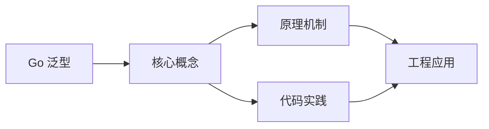

## 1. 学习目标（Bloom 分类）

本节按照布鲁姆教育目标分类学组织学习路径。本文主题为《Go 泛型》，属于 Go 模块，读者可以根据自身阶段选择阅读深度。

记忆层面：能够准确复述本文的核心概念、术语与基本语法或操作步骤，并能够在提问或检索时快速定位对应知识点。能够说出 Go 的包、函数、结构体、接口与错误处理基本语法。

理解层面：能够用自己的语言解释核心原理与工作机制，说明概念之间的因果关系，而不是机械记忆结论。能够解释 goroutine 调度、channel 通信与内存模型。

应用层面：能够在真实项目或练习场景中运用本文知识解决具体问题，写出正确且可维护的实现。能够编写并发程序、HTTP 服务与命令行工具。

分析层面：能够拆解复杂问题，比较本文主题与相邻概念的异同，识别边界条件与例外情况。能够分析数据竞争、死锁与性能瓶颈。

评价层面：能够根据约束条件（性能、可读性、安全、成本）评价不同方案的优劣，做出有依据的技术决策。能够评价 Go 与 Java、Python 在不同场景的取舍。

创造层面：能够把本文知识与其他模块知识组合，设计出新的解决方案或可复用的工程模式。能够设计完整的微服务与云原生应用。

通过本节学习，读者应当能够把《Go 泛型》纳入自己的知识网络，并与 Go 模块的其他主题（goroutine、channel、内存模型、标准库）建立关联。

## 2. 历史动机与发展脉络

《Go 泛型》是 Go 领域的重要主题。要真正理解它，需要先了解它解决的问题与演进过程。

Go 由 Google 的 Robert Griesemer、Rob Pike 与 Ken Thompson 于 2009 年发布，设计目标是解决大规模分布式系统的工程痛点：编译慢、依赖混乱、并发难写。
Go 1.0 于 2012 年发布，此后严格保持向后兼容（Go 1 兼容性承诺）；约每半年发布一个小版本，1.21 起引入工具链管理（toolchain 指令）与内置测试 fuzzing。
Go 在云原生领域成为事实标准：Docker、Kubernetes、Prometheus、etcd 等核心项目均用 Go 编写；泛型在 1.18 加入，1.21+ 的 slices/maps 标准包补齐泛型工具。

回到本文主题：Go 泛型 的提出与成熟，正是上述技术背景下的必然产物。早期实现往往以简单可用为目标，随着工程规模扩大，社区逐渐沉淀出标准做法与最佳实践；理解这一脉络，可以帮助读者判断“为什么文档中的推荐写法是现在这个样子”，也能在遇到历史遗留代码时准确识别其设计年代与取舍。


## 3. 形式化定义与核心概念精讲

本节把《Go 泛型》涉及的核心概念以“定义 + 讲解”的形式展开。读者应把定义当作工具，把讲解当作理解路径；两者结合才能形成可迁移的知识。

goroutine 与调度：goroutine 是用户态轻量线程，由 GMP 调度器（Goroutine、Machine、Processor）多路复用到内核线程；创建成本约 2KB 栈，支持百万级并发。
channel 与 select：channel 是类型化通信管道，`<-` 发送/接收；select 多路等待；“不要通过共享内存通信，而要通过通信共享内存”是 Go 并发哲学。
内存模型：happens-before 关系由 channel、sync 原语与 atomic 建立；`go test -race` 用 ThreadSanitizer 检测数据竞争。

### 3.1 原文章节逐一精讲

原文档把主题拆分为 18 个小节，下面按顺序给出每一节的导读讲解，随后保留原文细节供精读。

#### 原文精读（完整保留）

# Go 泛型

> **符号约定**：`< >` 必填参数 | `[ ]` 可选参数

---

#### 1. 泛型概述

Go 1.18（2022.03）正式引入泛型，是 Go 语言最重要的特性之一。泛型允许编写与类型无关的代码，同时保持类型安全。

##### 1.1 为什么需要泛型

```go
// 没有泛型时：每种类型写一个函数
func MaxInt(a, b int) int {
    if a > b { return a }
    return b
}

func MaxFloat64(a, b float64) float64 {
    if a > b { return a }
    return b
}

func MaxString(a, b string) string {
    if a > b { return a }
    return b
}

// 或者使用 any（丢失类型安全）
func MaxAny(a, b any) any {
    // 需要类型断言，运行时才能发现错误
}
```

##### 1.2 泛型版本

```go
func Max[T cmp.Ordered](a, b T) T {
    if a > b { return a }
    return b
}

fmt.Println(Max(3, 5))           // 5
fmt.Println(Max(3.14, 2.71))     // 3.14
fmt.Println(Max("abc", "xyz"))   // xyz
```

#### 2. 类型参数

##### 2.1 语法

```go
// 函数泛型
func FuncName[T constraint](params T) T { ... }

// 多类型参数
func Map[T1, T2 any](s []T1, f func(T1) T2) []T2 { ... }

// 类型泛型
type Container[T any] struct {
    data T
}
```

##### 2.2 类型参数列表

```go
// 单类型参数
func Print[T any](v T) {
    fmt.Println(v)
}

// 多类型参数
func Pair[T1, T2 any](a T1, b T2) struct{ F1 T1; F2 T2 } {
    return struct{ F1 T1; F2 T2 }{a, b}
}

// 类型参数可以互相引用
func Convert[T1, T2 any](s []T1, f func(T1) T2) []T2 {
    result := make([]T2, len(s))
    for i, v := range s {
        result[i] = f(v)
    }
    return result
}
```

#### 3. 约束（Constraint）

约束定义了类型参数必须满足的条件，本质上是接口。

##### 3.1 any 约束

```go
// any 是 interface{} 的别名，最宽松的约束
func Print[T any](v T) {
    fmt.Println(v)
}
```

##### 3.2 comparable 约束

```go
// comparable 允许 == 和 != 操作
func Contains[T comparable](s []T, v T) bool {
    for _, item := range s {
        if item == v {
            return true
        }
    }
    return false
}

fmt.Println(Contains([]string{"a", "b", "c"}, "b")) // true
fmt.Println(Contains([]int{1, 2, 3}, 4))             // false
```

##### 3.3 cmp.Ordered 约束

```go
import "cmp"

// cmp.Ordered 包含所有支持 < > <= >= 的类型
// ~int | ~int8 | ~int16 | ~int32 | ~int64 |
// ~uint | ~uint8 | ~uint16 | ~uint32 | ~uint64 | ~uintptr |
// ~float32 | ~float64 | ~string

func Max[T cmp.Ordered](a, b T) T {
    if a > b { return a }
    return b
}

func Sort[T cmp.Ordered](s []T) {
    slices.Sort(s)
}
```

##### 3.4 自定义约束

```go
// 方法约束
type Stringer interface {
    String() string
}

func Join[T Stringer](items []T, sep string) string {
    strs := make([]string, len(items))
    for i, item := range items {
        strs[i] = item.String()
    }
    return strings.Join(strs, sep)
}

// 联合类型约束（使用 | ）
type Number interface {
    ~int | ~int8 | ~int16 | ~int32 | ~int64 |
    ~float32 | ~float64
}

func Sum[T Number](nums []T) T {
    var total T
    for _, n := range nums {
        total += n
    }
    return total
}

// ~ 表示底层类型（underlying type）
type MyInt int // MyInt 的底层类型是 int

// ~int 匹配 int 和所有底层类型为 int 的自定义类型
// int 只匹配 int 本身
```

##### 3.5 约束中的类型成员

```go
// 约束可以包含类型
type Number interface {
    ~int | ~float64
}

// 复杂约束示例
type SliceConstraint[S any] interface {
    ~[]S
}

func Last[S any, T SliceConstraint[S]](s T) S {
    return s[len(s)-1]
}
```

#### 4. 泛型函数

##### 4.1 常用泛型函数

```go
// Map — 转换切片元素
func Map[T, U any](s []T, f func(T) U) []U {
    result := make([]U, len(s))
    for i, v := range s {
        result[i] = f(v)
    }
    return result
}

doubled := Map([]int{1, 2, 3}, func(n int) int { return n * 2 })
// [2, 4, 6]

// Filter — 过滤切片
func Filter[T any](s []T, pred func(T) bool) []T {
    var result []T
    for _, v := range s {
        if pred(v) {
            result = append(result, v)
        }
    }
    return result
}

evens := Filter([]int{1, 2, 3, 4, 5}, func(n int) bool { return n%2 == 0 })
// [2, 4]

// Reduce — 归约
func Reduce[T, U any](s []T, init U, f func(U, T) U) U {
    acc := init
    for _, v := range s {
        acc = f(acc, v)
    }
    return acc
}

sum := Reduce([]int{1, 2, 3}, 0, func(acc, n int) int { return acc + n })
// 6
```

##### 4.2 泛型与接口结合

```go
type Adder[T any] interface {
    Add(T) T
}

func SumAll[T Adder[T]](items []T) T {
    if len(items) == 0 {
        var zero T
        return zero
    }
    result := items[0]
    for _, item := range items[1:] {
        result = result.Add(item)
    }
    return result
}
```

#### 5. 泛型类型

##### 5.1 泛型结构体

```go
type Pair[T, U any] struct {
    First  T
    Second U
}

func NewPair[T, U any](first T, second U) Pair[T, U] {
    return Pair[T, U]{First: first, Second: second}
}

p := NewPair("name", 42)
fmt.Println(p.First, p.Second) // name 42
```

##### 5.2 泛型栈

```go
type Stack[T any] struct {
    items []T
}

func (s *Stack[T]) Push(v T) {
    s.items = append(s.items, v)
}

func (s *Stack[T]) Pop() (T, bool) {
    if len(s.items) == 0 {
        var zero T
        return zero, false
    }
    top := s.items[len(s.items)-1]
    s.items = s.items[:len(s.items)-1]
    return top, true
}

func (s *Stack[T]) Peek() (T, bool) {
    if len(s.items) == 0 {
        var zero T
        return zero, false
    }
    return s.items[len(s.items)-1], true
}

func (s *Stack[T]) Len() int {
    return len(s.items)
}

// 使用
stack := Stack[int]{}
stack.Push(1)
stack.Push(2)
v, _ := stack.Pop() // 2
```

##### 5.3 泛型 map

```go
type Map[K comparable, V any] struct {
    data map[K]V
}

func NewMap[K comparable, V any]() *Map[K, V] {
    return &Map[K, V]{data: make(map[K]V)}
}

func (m *Map[K, V]) Get(key K) (V, bool) {
    v, ok := m.data[key]
    return v, ok
}

func (m *Map[K, V]) Set(key K, value V) {
    m.data[key] = value
}

func (m *Map[K, V]) Delete(key K) {
    delete(m.data, key)
}

func (m *Map[K, V]) Keys() []K {
    keys := make([]K, 0, len(m.data))
    for k := range m.data {
        keys = append(keys, k)
    }
    return keys
}
```

##### 5.4 泛型接口

```go
type Container[T any] interface {
    Add(T)
    Get() (T, bool)
    Size() int
}

type List[T any] []T

func (l *List[T]) Add(v T)      { *l = append(*l, v) }
func (l *List[T]) Get() (T, bool) {
    if len(*l) == 0 {
        var zero T
        return zero, false
    }
    return (*l)[0], true
}
func (l *List[T]) Size() int    { return len(*l) }

var c Container[int] = &List[int]{}
```

#### 6. 类型推断

Go 编译器可以自动推断大部分类型参数，无需显式指定：

```go
func Map[T, U any](s []T, f func(T) U) []U

// 完整指定
result := Map[int, string]([]int{1, 2, 3}, func(n int) string {
    return strconv.Itoa(n)
})

// 类型推断（推荐）
result := Map([]int{1, 2, 3}, func(n int) string {
    return strconv.Itoa(n)
})

// 部分推断失败时需显式指定
// 例如：约束不够明确时
```

#### 7. 标准库泛型包

##### 7.1 slices 包

```go
import "slices"

nums := []int{3, 1, 4, 1, 5, 9}

// 排序
slices.Sort(nums)                       // [1 1 3 4 5 9]

// 搜索
idx := slices.Index(nums, 4)            // 3

// 包含
slices.Contains(nums, 5)                // true

// 二分查找（需先排序）
slices.BinarySearch(nums, 4)            // 3, true

// 比较
slices.Equal([]int{1, 2}, []int{1, 2})  // true

// 自定义比较排序
type Person struct {
    Name string
    Age  int
}
people := []Person{{"Alice", 30}, {"Bob", 25}}
slices.SortFunc(people, func(a, b Person) int {
    return cmp.Compare(a.Age, b.Age)
})

// 插入/删除
slices.Insert(nums, 2, 99)              // 在索引 2 插入
slices.Delete(nums, 1, 3)               // 删除 [1, 3) 范围

// 克隆
clone := slices.Clone(nums)

// 反转
slices.Reverse(nums)

// 去重（排序后）
slices.Sort(nums)
nums = slices.Compact(nums)
```

##### 7.2 maps 包

```go
import "maps"

m := map[string]int{"a": 1, "b": 2, "c": 3}

// 获取所有键
keys := maps.Keys(m)     // []string{"a", "b", "c"}（顺序不确定）

// 获取所有值
vals := maps.Values(m)   // []int{1, 2, 3}

// 克隆
clone := maps.Clone(m)

// 复制
dst := map[string]int{}
maps.Copy(dst, m)

// 删除满足条件的元素
maps.DeleteFunc(m, func(k string, v int) bool {
    return v < 2
})
// m = {"b": 2, "c": 3}

// 相等比较
maps.Equal(map[string]int{"a": 1}, map[string]int{"a": 1}) // true
```

##### 7.3 cmp 包

```go
import "cmp"

// 比较有序类型
cmp.Compare(3, 5)     // -1（a < b）
cmp.Compare(5, 3)     // 1 （a > b）
cmp.Compare(3, 3)     // 0 （a == b）
cmp.Compare("abc", "xyz") // -1

// 比较有序类型（返回布尔）
cmp.Less(3, 5)        // true
cmp.Less("b", "a")    // false

// Ordered 约束
func Min[T cmp.Ordered](a, b T) T {
    if cmp.Less(a, b) {
        return a
    }
    return b
}
```

#### 8. 泛型实际应用

##### 8.1 泛型缓存

```go
type Cache[K comparable, V any] struct {
    data map[K]V
    mu   sync.RWMutex
}

func NewCache[K comparable, V any]() *Cache[K, V] {
    return &Cache[K, V]{data: make(map[K]V)}
}

func (c *Cache[K, V]) Get(key K) (V, bool) {
    c.mu.RLock()
    defer c.mu.RUnlock()
    v, ok := c.data[key]
    return v, ok
}

func (c *Cache[K, V]) Set(key K, value V) {
    c.mu.Lock()
    defer c.mu.Unlock()
    c.data[key] = value
}

// 使用
userCache := NewCache[string, *User]()
userCache.Set("alice", &User{Name: "Alice"})
user, ok := userCache.Get("alice")
```

##### 8.2 泛型结果类型

```go
type Result[T any] struct {
    Value T
    Err   error
}

func Ok[T any](v T) Result[T] {
    return Result[T]{Value: v}
}

func Err[T any](err error) Result[T] {
    return Result[T]{Err: err}
}

func (r Result[T]) IsOk() bool    { return r.Err == nil }
func (r Result[T]) IsErr() bool   { return r.Err != nil }
func (r Result[T]) Unwrap() T {
    if r.Err != nil {
        panic(r.Err)
    }
    return r.Value
}

func (r Result[T]) UnwrapOr(defaultVal T) T {
    if r.Err != nil {
        return defaultVal
    }
    return r.Value
}

// 使用
func fetchData(url string) Result[string] {
    resp, err := http.Get(url)
    if err != nil {
        return Err[string](err)
    }
    defer resp.Body.Close()
    data, err := io.ReadAll(resp.Body)
    if err != nil {
        return Err[string](err)
    }
    return Ok(string(data))
}

result := fetchData("https://api.example.com")
if result.IsOk() {
    fmt.Println(result.Value)
}
```

##### 8.3 泛型注意事项

```go
// 1. 不支持方法泛型
type Container[T any] struct{ data T }
// func (c Container[T]) Do[S any](v S) {} // 编译错误

// 解决方案：使用泛型函数
func Do[T, S any](c Container[T], v S) {}

// 2. 不支持泛型断言
// var x any = 42
// _ = x.(T) // 编译错误

// 3. 零值获取
func Zero[T any]() T {
    var zero T
    return zero
}

// 4. Go 1.24+ 泛型类型别名
type Set[T comparable] = map[T]struct{}
type OrderedMap[K comparable, V cmp.Ordered] = map[K]V
```
#### 泛型函数

**基本写法：泛型函数声明**
`func <函数名>[<类型参数> <约束>](<参数> <类型参数>) <返回值>`
```go
// 泛型函数，T 必须满足 Ordered 约束
func Min[T constraints.Ordered](a, b T) T {
    if a < b {
        return a;
    }
    return b;
}
```

**基本写法：调用泛型函数**
`<函数名>[<类型>](<参数>)`
```go
// 显式指定类型参数
minInt := Min[int](3, 5);
```

**基本写法：类型推断调用**
`<函数名>(<参数>)`
```go
// 编译器自动推断类型
minFloat := Min(3.14, 2.71);
```

---

#### 类型约束

**基本写法：接口约束**
`type <约束名> interface { ~<类型1> | ~<类型2> }`
```go
// 自定义类型约束
type Number interface {
    ~int | ~int8 | ~int16 | ~int32 | ~int64 |
    ~float32 | ~float64;
}
```

**基本写法：使用自定义约束**
`func <函数名>[<类型参数> <约束>](<参数>) <返回值>`
```go
// 使用自定义 Number 约束
func Sum[T Number](nums []T) T {
    var total T;
    for _, n := range nums {
        total += n;
    }
    return total;
}
```

**基本写法：comparable 约束**
`func <函数名>[<类型参数> comparable](<参数>) <返回值>`
```go
// comparable 约束允许 == 和 != 比较
func Contains[T comparable](slice []T, target T) bool {
    for _, v := range slice {
        if v == target {
            return true;
        }
    }
    return false;
}
```

**基本写法：any 约束**
`func <函数名>[<类型参数> any](<参数>) <返回值>`
```go
// any 约束接受任意类型
func Print[T any](v T) {
    fmt.Println(v);
}
```

---

#### 多类型参数

**基本写法：多类型参数泛型**
`func <函数名>[<类型1> <约束1>, <类型2> <约束2>](<参数>) <返回值>`
```go
// 多类型参数泛型函数
func Map[T, U any](slice []T, fn func(T) U) []U {
    result := make([]U, len(slice));
    for i, v := range slice {
        result[i] = fn(v);
    }
    return result;
}
```

---

#### 泛型类型

**基本写法：泛型切片类型**
`type <类型名>[<类型参数> <约束>] []<类型参数>`
```go
// 泛型切片类型
type Stack[T any] []T;
```

**基本写法：泛型结构体**
`type <类型名>[<类型参数> <约束>] struct { ... }`
```go
// 泛型结构体
type Pair[T, U any] struct {
    First  T;
    Second U;
}
```

**基本写法：泛型 map 类型**
`type <类型名>[<类型参数1> <约束1>, <类型参数2> <约束2>] map[<类型参数1>]<类型参数2>`
```go
// 泛型 map 类型
type Map[K comparable, V any] map[K]V;
```

---

#### 泛型方法

**基本写法：泛型类型方法**
`func (<接收者> <类型名>[<类型参数>]) <方法名>(<参数>) <返回值>`
```go
// 泛型类型的方法
func (s *Stack[T]) Push(v T) {
    *s = append(*s, v);
}

func (s *Stack[T]) Pop() (T, bool) {
    var zero T;
    if len(*s) == 0 {
        return zero, false;
    }
    v := (*s)[len(*s)-1];
    *s = (*s)[:len(*s)-1];
    return v, true;
}
```

---

#### 泛型接口

**基本写法：泛型接口**
`type <接口名>[<类型参数> <约束>] interface { ... }`
```go
// 泛型接口
type Container[T any] interface {
    Add(v T);
    Get() T;
    Len() int;
}
```

---

#### 约束包

**基本写法：constraints.Ordered**
`[T constraints.Ordered]`
```go
// Ordered 约束支持 < > <= >=
func Max[T constraints.Ordered](a, b T) T {
    if a > b {
        return a;
    }
    return b;
}
```

---

#### 类型近似

**基本写法：近似类型约束**
`~<底层类型>`
```go
// ~ 表示包含底层类型的自定义类型
type Number interface {
    ~int | ~float64;
}

type MyInt int; // MyInt 满足 Number 约束
```

---

#### 泛型实例化

**基本写法：实例化泛型类型**
`<类型名>[<具体类型>]`
```go
// 实例化泛型类型
intStack := Stack[int]{};
strStack := Stack[string]{};
```

---

#### 泛型算法

**基本写法：泛型过滤**
`func <函数名>[<类型> <约束>](<参数>) <返回值>`
```go
// 泛型过滤函数
func Filter[T any](slice []T, fn func(T) bool) []T {
    result := []T{};
    for _, v := range slice {
        if fn(v) {
            result = append(result, v);
        }
    }
    return result;
}
```

**基本写法：泛型归约**
`func <函数名>[<类型> <约束>](<参数>) <返回值>`
```go
// 泛型归约函数
func Reduce[T, U any](slice []T, initial U, fn func(U, T) U) U {
    result := initial;
    for _, v := range slice {
        result = fn(result, v);
    }
    return result;
}
```


### 3.2 概念关系图

下面用 Mermaid 图表达本文核心概念之间的关系，帮助读者建立整体图景：



图中展示的是本文知识的结构化关系：核心概念是入口，原理机制解释“为什么”，代码实践演示“怎么做”，工程应用回答“何时用”。读者学习时可以把每个小节的内容挂接到对应节点上。

## 4. 理论推导与原理解析

本节深入《Go 泛型》背后的原理。理论部分不求面面俱到，而是聚焦“能解释现象、能指导实践”的关键推导。

goroutine 与调度：goroutine 是用户态轻量线程，由 GMP 调度器（Goroutine、Machine、Processor）多路复用到内核线程；创建成本约 2KB 栈，支持百万级并发。
channel 与 select：channel 是类型化通信管道，`<-` 发送/接收；select 多路等待；“不要通过共享内存通信，而要通过通信共享内存”是 Go 并发哲学。
内存模型：happens-before 关系由 channel、sync 原语与 atomic 建立；`go test -race` 用 ThreadSanitizer 检测数据竞争。
错误处理：Go 用多返回值显式处理错误（`if err != nil`），error 是接口；panic/recover 仅用于不可恢复错误。

需要强调的是，理论推导与工程实践之间存在翻译层：理论给出的是理想化模型与边界条件，工程代码则必须处理真实环境中的例外。读者在学习时应先掌握理论的“标准情形”，再通过陷阱章节了解“非标准情形”。

## 5. 代码示例与逐行讲解

本节把原文中的代码示例系统整理，并为每个示例补充用途说明与讲解。读者不应只浏览代码，而应逐段对照讲解理解设计意图。

### 5.1 示例：1.1 为什么需要泛型

该示例来自原文《1.1 为什么需要泛型》小节，用于演示Go 泛型相关操作。阅读时请先看代码结构，再看其后的讲解。

```go
// 没有泛型时：每种类型写一个函数
func MaxInt(a, b int) int {
    if a > b { return a }
    return b
}

func MaxFloat64(a, b float64) float64 {
    if a > b { return a }
    return b
}

func MaxString(a, b string) string {
    if a > b { return a }
    return b
}

// 或者使用 any（丢失类型安全）
func MaxAny(a, b any) any {
    // 需要类型断言，运行时才能发现错误
}
```

讲解：这段代码演示了本节核心知识点。代码中的关键操作可以归纳为三步：准备（定义或初始化）、执行（核心逻辑）、收尾（释放资源或返回结果）。实际项目中，这三步往往被封装为函数或类，以提升复用性与可测试性。

关键点分析：

该示例共 17 行有效代码，包含 3 类关键结构（func、if、return）。其中：

- 入口与初始化部分负责建立上下文，对应实际项目中的启动或装配逻辑；
- 核心逻辑部分体现本文主题的主要操作，是阅读时最需要对照讲解理解的部分；
- 输出或返回部分把结果交给调用方，注意其类型与边界条件。

进阶思考路径：先尝试修改参数观察行为变化，再把示例中的模式迁移到自己的项目中；每次修改都记录预期与实测差异，这是把示例转化为能力的最快方式。

### 5.2 示例：1.2 泛型版本

该示例来自原文《1.2 泛型版本》小节，用于演示Go 泛型相关操作。阅读时请先看代码结构，再看其后的讲解。

```go
func Max[T cmp.Ordered](a, b T) T {
    if a > b { return a }
    return b
}

fmt.Println(Max(3, 5))           // 5
fmt.Println(Max(3.14, 2.71))     // 3.14
fmt.Println(Max("abc", "xyz"))   // xyz
```

讲解：这段代码演示了本节核心知识点。代码中的关键操作可以归纳为三步：准备（定义或初始化）、执行（核心逻辑）、收尾（释放资源或返回结果）。实际项目中，这三步往往被封装为函数或类，以提升复用性与可测试性。

关键点分析：

该示例共 7 行有效代码，包含 3 类关键结构（func、if、return）。其中：

- 入口与初始化部分负责建立上下文，对应实际项目中的启动或装配逻辑；
- 核心逻辑部分体现本文主题的主要操作，是阅读时最需要对照讲解理解的部分；
- 输出或返回部分把结果交给调用方，注意其类型与边界条件。

进阶思考路径：先尝试修改参数观察行为变化，再把示例中的模式迁移到自己的项目中；每次修改都记录预期与实测差异，这是把示例转化为能力的最快方式。

### 5.3 示例：2.1 语法

该示例来自原文《2.1 语法》小节，用于演示Go 泛型相关操作。阅读时请先看代码结构，再看其后的讲解。

```go
// 函数泛型
func FuncName[T constraint](params T) T { ... }

// 多类型参数
func Map[T1, T2 any](s []T1, f func(T1) T2) []T2 { ... }

// 类型泛型
type Container[T any] struct {
    data T
}
```

讲解：这段代码演示了本节核心知识点。代码中的关键操作可以归纳为三步：准备（定义或初始化）、执行（核心逻辑）、收尾（释放资源或返回结果）。实际项目中，这三步往往被封装为函数或类，以提升复用性与可测试性。

关键点分析：

该示例共 8 行有效代码，包含 1 类关键结构（func）。其中：

- 入口与初始化部分负责建立上下文，对应实际项目中的启动或装配逻辑；
- 核心逻辑部分体现本文主题的主要操作，是阅读时最需要对照讲解理解的部分；
- 输出或返回部分把结果交给调用方，注意其类型与边界条件。

进阶思考路径：先尝试修改参数观察行为变化，再把示例中的模式迁移到自己的项目中；每次修改都记录预期与实测差异，这是把示例转化为能力的最快方式。

### 5.4 示例：2.2 类型参数列表

该示例来自原文《2.2 类型参数列表》小节，用于演示Go 泛型相关操作。阅读时请先看代码结构，再看其后的讲解。

```go
// 单类型参数
func Print[T any](v T) {
    fmt.Println(v)
}

// 多类型参数
func Pair[T1, T2 any](a T1, b T2) struct{ F1 T1; F2 T2 } {
    return struct{ F1 T1; F2 T2 }{a, b}
}

// 类型参数可以互相引用
func Convert[T1, T2 any](s []T1, f func(T1) T2) []T2 {
    result := make([]T2, len(s))
    for i, v := range s {
        result[i] = f(v)
    }
    return result
}
```

讲解：这段代码演示了本节核心知识点。代码中的关键操作可以归纳为三步：准备（定义或初始化）、执行（核心逻辑）、收尾（释放资源或返回结果）。实际项目中，这三步往往被封装为函数或类，以提升复用性与可测试性。

关键点分析：

该示例共 16 行有效代码，包含 3 类关键结构（func、for、return）。其中：

- 入口与初始化部分负责建立上下文，对应实际项目中的启动或装配逻辑；
- 核心逻辑部分体现本文主题的主要操作，是阅读时最需要对照讲解理解的部分；
- 输出或返回部分把结果交给调用方，注意其类型与边界条件。

进阶思考路径：先尝试修改参数观察行为变化，再把示例中的模式迁移到自己的项目中；每次修改都记录预期与实测差异，这是把示例转化为能力的最快方式。

### 5.5 示例：3.1 any 约束

该示例来自原文《3.1 any 约束》小节，用于演示Go 泛型相关操作。阅读时请先看代码结构，再看其后的讲解。

```go
// any 是 interface{} 的别名，最宽松的约束
func Print[T any](v T) {
    fmt.Println(v)
}
```

讲解：这段代码演示了本节核心知识点。代码中的关键操作可以归纳为三步：准备（定义或初始化）、执行（核心逻辑）、收尾（释放资源或返回结果）。实际项目中，这三步往往被封装为函数或类，以提升复用性与可测试性。

关键点分析：

该示例共 4 行有效代码，包含 1 类关键结构（func）。其中：

- 入口与初始化部分负责建立上下文，对应实际项目中的启动或装配逻辑；
- 核心逻辑部分体现本文主题的主要操作，是阅读时最需要对照讲解理解的部分；
- 输出或返回部分把结果交给调用方，注意其类型与边界条件。

进阶思考路径：先尝试修改参数观察行为变化，再把示例中的模式迁移到自己的项目中；每次修改都记录预期与实测差异，这是把示例转化为能力的最快方式。

### 5.6 示例：3.2 comparable 约束

该示例来自原文《3.2 comparable 约束》小节，用于演示Go 泛型相关操作。阅读时请先看代码结构，再看其后的讲解。

```go
// comparable 允许 == 和 != 操作
func Contains[T comparable](s []T, v T) bool {
    for _, item := range s {
        if item == v {
            return true
        }
    }
    return false
}

fmt.Println(Contains([]string{"a", "b", "c"}, "b")) // true
fmt.Println(Contains([]int{1, 2, 3}, 4))             // false
```

讲解：这段代码演示了本节核心知识点。代码中的关键操作可以归纳为三步：准备（定义或初始化）、执行（核心逻辑）、收尾（释放资源或返回结果）。实际项目中，这三步往往被封装为函数或类，以提升复用性与可测试性。

关键点分析：

该示例共 11 行有效代码，包含 4 类关键结构（func、if、for、return）。其中：

- 入口与初始化部分负责建立上下文，对应实际项目中的启动或装配逻辑；
- 核心逻辑部分体现本文主题的主要操作，是阅读时最需要对照讲解理解的部分；
- 输出或返回部分把结果交给调用方，注意其类型与边界条件。

进阶思考路径：先尝试修改参数观察行为变化，再把示例中的模式迁移到自己的项目中；每次修改都记录预期与实测差异，这是把示例转化为能力的最快方式。

### 5.7 示例：3.3 cmp.Ordered 约束

该示例来自原文《3.3 cmp.Ordered 约束》小节，用于演示Go 泛型相关操作。阅读时请先看代码结构，再看其后的讲解。

```go
import "cmp"

// cmp.Ordered 包含所有支持 < > <= >= 的类型
// ~int | ~int8 | ~int16 | ~int32 | ~int64 |
// ~uint | ~uint8 | ~uint16 | ~uint32 | ~uint64 | ~uintptr |
// ~float32 | ~float64 | ~string

func Max[T cmp.Ordered](a, b T) T {
    if a > b { return a }
    return b
}

func Sort[T cmp.Ordered](s []T) {
    slices.Sort(s)
}
```

讲解：这段代码演示了本节核心知识点。代码中的关键操作可以归纳为三步：准备（定义或初始化）、执行（核心逻辑）、收尾（释放资源或返回结果）。实际项目中，这三步往往被封装为函数或类，以提升复用性与可测试性。

关键点分析：

该示例共 12 行有效代码，包含 4 类关键结构（func、import、if、return）。其中：

- 入口与初始化部分负责建立上下文，对应实际项目中的启动或装配逻辑；
- 核心逻辑部分体现本文主题的主要操作，是阅读时最需要对照讲解理解的部分；
- 输出或返回部分把结果交给调用方，注意其类型与边界条件。

进阶思考路径：先尝试修改参数观察行为变化，再把示例中的模式迁移到自己的项目中；每次修改都记录预期与实测差异，这是把示例转化为能力的最快方式。

### 5.8 示例：3.4 自定义约束

该示例来自原文《3.4 自定义约束》小节，用于演示Go 泛型相关操作。阅读时请先看代码结构，再看其后的讲解。

```go
// 方法约束
type Stringer interface {
    String() string
}

func Join[T Stringer](items []T, sep string) string {
    strs := make([]string, len(items))
    for i, item := range items {
        strs[i] = item.String()
    }
    return strings.Join(strs, sep)
}

// 联合类型约束（使用 | ）
type Number interface {
    ~int | ~int8 | ~int16 | ~int32 | ~int64 |
    ~float32 | ~float64
}

func Sum[T Number](nums []T) T {
    var total T
    for _, n := range nums {
        total += n
    }
    return total
}

// ~ 表示底层类型（underlying type）
type MyInt int // MyInt 的底层类型是 int

// ~int 匹配 int 和所有底层类型为 int 的自定义类型
// int 只匹配 int 本身
```

讲解：这段代码演示了本节核心知识点。代码中的关键操作可以归纳为三步：准备（定义或初始化）、执行（核心逻辑）、收尾（释放资源或返回结果）。实际项目中，这三步往往被封装为函数或类，以提升复用性与可测试性。

关键点分析：

该示例共 27 行有效代码，包含 3 类关键结构（func、for、return）。其中：

- 入口与初始化部分负责建立上下文，对应实际项目中的启动或装配逻辑；
- 核心逻辑部分体现本文主题的主要操作，是阅读时最需要对照讲解理解的部分；
- 输出或返回部分把结果交给调用方，注意其类型与边界条件。

进阶思考路径：先尝试修改参数观察行为变化，再把示例中的模式迁移到自己的项目中；每次修改都记录预期与实测差异，这是把示例转化为能力的最快方式。

### 5.9 示例：3.5 约束中的类型成员

该示例来自原文《3.5 约束中的类型成员》小节，用于演示Go 泛型相关操作。阅读时请先看代码结构，再看其后的讲解。

```go
// 约束可以包含类型
type Number interface {
    ~int | ~float64
}

// 复杂约束示例
type SliceConstraint[S any] interface {
    ~[]S
}

func Last[S any, T SliceConstraint[S]](s T) S {
    return s[len(s)-1]
}
```

讲解：这段代码演示了本节核心知识点。代码中的关键操作可以归纳为三步：准备（定义或初始化）、执行（核心逻辑）、收尾（释放资源或返回结果）。实际项目中，这三步往往被封装为函数或类，以提升复用性与可测试性。

关键点分析：

该示例共 11 行有效代码，包含 2 类关键结构（func、return）。其中：

- 入口与初始化部分负责建立上下文，对应实际项目中的启动或装配逻辑；
- 核心逻辑部分体现本文主题的主要操作，是阅读时最需要对照讲解理解的部分；
- 输出或返回部分把结果交给调用方，注意其类型与边界条件。

进阶思考路径：先尝试修改参数观察行为变化，再把示例中的模式迁移到自己的项目中；每次修改都记录预期与实测差异，这是把示例转化为能力的最快方式。

### 5.10 示例：4.1 常用泛型函数

该示例来自原文《4.1 常用泛型函数》小节，用于演示Go 泛型相关操作。阅读时请先看代码结构，再看其后的讲解。

```go
// Map — 转换切片元素
func Map[T, U any](s []T, f func(T) U) []U {
    result := make([]U, len(s))
    for i, v := range s {
        result[i] = f(v)
    }
    return result
}

doubled := Map([]int{1, 2, 3}, func(n int) int { return n * 2 })
// [2, 4, 6]

// Filter — 过滤切片
func Filter[T any](s []T, pred func(T) bool) []T {
    var result []T
    for _, v := range s {
        if pred(v) {
            result = append(result, v)
        }
    }
    return result
}

evens := Filter([]int{1, 2, 3, 4, 5}, func(n int) bool { return n%2 == 0 })
// [2, 4]

// Reduce — 归约
func Reduce[T, U any](s []T, init U, f func(U, T) U) U {
    acc := init
    for _, v := range s {
        acc = f(acc, v)
    }
    return acc
}

sum := Reduce([]int{1, 2, 3}, 0, func(acc, n int) int { return acc + n })
// 6
```

讲解：这段代码演示了本节核心知识点。代码中的关键操作可以归纳为三步：准备（定义或初始化）、执行（核心逻辑）、收尾（释放资源或返回结果）。实际项目中，这三步往往被封装为函数或类，以提升复用性与可测试性。

关键点分析：

该示例共 32 行有效代码，包含 4 类关键结构（func、if、for、return）。其中：

- 入口与初始化部分负责建立上下文，对应实际项目中的启动或装配逻辑；
- 核心逻辑部分体现本文主题的主要操作，是阅读时最需要对照讲解理解的部分；
- 输出或返回部分把结果交给调用方，注意其类型与边界条件。

进阶思考路径：先尝试修改参数观察行为变化，再把示例中的模式迁移到自己的项目中；每次修改都记录预期与实测差异，这是把示例转化为能力的最快方式。

### 5.11 示例：4.2 泛型与接口结合

该示例来自原文《4.2 泛型与接口结合》小节，用于演示Go 泛型相关操作。阅读时请先看代码结构，再看其后的讲解。

```go
type Adder[T any] interface {
    Add(T) T
}

func SumAll[T Adder[T]](items []T) T {
    if len(items) == 0 {
        var zero T
        return zero
    }
    result := items[0]
    for _, item := range items[1:] {
        result = result.Add(item)
    }
    return result
}
```

讲解：这段代码演示了本节核心知识点。代码中的关键操作可以归纳为三步：准备（定义或初始化）、执行（核心逻辑）、收尾（释放资源或返回结果）。实际项目中，这三步往往被封装为函数或类，以提升复用性与可测试性。

关键点分析：

该示例共 14 行有效代码，包含 4 类关键结构（func、if、for、return）。其中：

- 入口与初始化部分负责建立上下文，对应实际项目中的启动或装配逻辑；
- 核心逻辑部分体现本文主题的主要操作，是阅读时最需要对照讲解理解的部分；
- 输出或返回部分把结果交给调用方，注意其类型与边界条件。

进阶思考路径：先尝试修改参数观察行为变化，再把示例中的模式迁移到自己的项目中；每次修改都记录预期与实测差异，这是把示例转化为能力的最快方式。

### 5.12 示例：5.1 泛型结构体

该示例来自原文《5.1 泛型结构体》小节，用于演示Go 泛型相关操作。阅读时请先看代码结构，再看其后的讲解。

```go
type Pair[T, U any] struct {
    First  T
    Second U
}

func NewPair[T, U any](first T, second U) Pair[T, U] {
    return Pair[T, U]{First: first, Second: second}
}

p := NewPair("name", 42)
fmt.Println(p.First, p.Second) // name 42
```

讲解：这段代码演示了本节核心知识点。代码中的关键操作可以归纳为三步：准备（定义或初始化）、执行（核心逻辑）、收尾（释放资源或返回结果）。实际项目中，这三步往往被封装为函数或类，以提升复用性与可测试性。

关键点分析：

该示例共 9 行有效代码，包含 2 类关键结构（func、return）。其中：

- 入口与初始化部分负责建立上下文，对应实际项目中的启动或装配逻辑；
- 核心逻辑部分体现本文主题的主要操作，是阅读时最需要对照讲解理解的部分；
- 输出或返回部分把结果交给调用方，注意其类型与边界条件。

进阶思考路径：先尝试修改参数观察行为变化，再把示例中的模式迁移到自己的项目中；每次修改都记录预期与实测差异，这是把示例转化为能力的最快方式。

### 5.13 示例：5.2 泛型栈

该示例来自原文《5.2 泛型栈》小节，用于演示Go 泛型相关操作。阅读时请先看代码结构，再看其后的讲解。

```go
type Stack[T any] struct {
    items []T
}

func (s *Stack[T]) Push(v T) {
    s.items = append(s.items, v)
}

func (s *Stack[T]) Pop() (T, bool) {
    if len(s.items) == 0 {
        var zero T
        return zero, false
    }
    top := s.items[len(s.items)-1]
    s.items = s.items[:len(s.items)-1]
    return top, true
}

func (s *Stack[T]) Peek() (T, bool) {
    if len(s.items) == 0 {
        var zero T
        return zero, false
    }
    return s.items[len(s.items)-1], true
}

func (s *Stack[T]) Len() int {
    return len(s.items)
}

// 使用
stack := Stack[int]{}
stack.Push(1)
stack.Push(2)
v, _ := stack.Pop() // 2
```

讲解：这段代码演示了本节核心知识点。代码中的关键操作可以归纳为三步：准备（定义或初始化）、执行（核心逻辑）、收尾（释放资源或返回结果）。实际项目中，这三步往往被封装为函数或类，以提升复用性与可测试性。

关键点分析：

该示例共 30 行有效代码，包含 3 类关键结构（func、if、return）。其中：

- 入口与初始化部分负责建立上下文，对应实际项目中的启动或装配逻辑；
- 核心逻辑部分体现本文主题的主要操作，是阅读时最需要对照讲解理解的部分；
- 输出或返回部分把结果交给调用方，注意其类型与边界条件。

进阶思考路径：先尝试修改参数观察行为变化，再把示例中的模式迁移到自己的项目中；每次修改都记录预期与实测差异，这是把示例转化为能力的最快方式。

### 5.14 示例：5.3 泛型 map

该示例来自原文《5.3 泛型 map》小节，用于演示Go 泛型相关操作。阅读时请先看代码结构，再看其后的讲解。

```go
type Map[K comparable, V any] struct {
    data map[K]V
}

func NewMap[K comparable, V any]() *Map[K, V] {
    return &Map[K, V]{data: make(map[K]V)}
}

func (m *Map[K, V]) Get(key K) (V, bool) {
    v, ok := m.data[key]
    return v, ok
}

func (m *Map[K, V]) Set(key K, value V) {
    m.data[key] = value
}

func (m *Map[K, V]) Delete(key K) {
    delete(m.data, key)
}

func (m *Map[K, V]) Keys() []K {
    keys := make([]K, 0, len(m.data))
    for k := range m.data {
        keys = append(keys, k)
    }
    return keys
}
```

讲解：这段代码演示了本节核心知识点。代码中的关键操作可以归纳为三步：准备（定义或初始化）、执行（核心逻辑）、收尾（释放资源或返回结果）。实际项目中，这三步往往被封装为函数或类，以提升复用性与可测试性。

关键点分析：

该示例共 23 行有效代码，包含 3 类关键结构（func、for、return）。其中：

- 入口与初始化部分负责建立上下文，对应实际项目中的启动或装配逻辑；
- 核心逻辑部分体现本文主题的主要操作，是阅读时最需要对照讲解理解的部分；
- 输出或返回部分把结果交给调用方，注意其类型与边界条件。

进阶思考路径：先尝试修改参数观察行为变化，再把示例中的模式迁移到自己的项目中；每次修改都记录预期与实测差异，这是把示例转化为能力的最快方式。

### 5.15 示例：5.4 泛型接口

该示例来自原文《5.4 泛型接口》小节，用于演示Go 泛型相关操作。阅读时请先看代码结构，再看其后的讲解。

```go
type Container[T any] interface {
    Add(T)
    Get() (T, bool)
    Size() int
}

type List[T any] []T

func (l *List[T]) Add(v T)      { *l = append(*l, v) }
func (l *List[T]) Get() (T, bool) {
    if len(*l) == 0 {
        var zero T
        return zero, false
    }
    return (*l)[0], true
}
func (l *List[T]) Size() int    { return len(*l) }

var c Container[int] = &List[int]{}
```

讲解：这段代码演示了本节核心知识点。代码中的关键操作可以归纳为三步：准备（定义或初始化）、执行（核心逻辑）、收尾（释放资源或返回结果）。实际项目中，这三步往往被封装为函数或类，以提升复用性与可测试性。

关键点分析：

该示例共 16 行有效代码，包含 3 类关键结构（func、if、return）。其中：

- 入口与初始化部分负责建立上下文，对应实际项目中的启动或装配逻辑；
- 核心逻辑部分体现本文主题的主要操作，是阅读时最需要对照讲解理解的部分；
- 输出或返回部分把结果交给调用方，注意其类型与边界条件。

进阶思考路径：先尝试修改参数观察行为变化，再把示例中的模式迁移到自己的项目中；每次修改都记录预期与实测差异，这是把示例转化为能力的最快方式。

### 5.16 示例：6. 类型推断

该示例来自原文《6. 类型推断》小节，用于演示Go 泛型相关操作。阅读时请先看代码结构，再看其后的讲解。

```go
func Map[T, U any](s []T, f func(T) U) []U

// 完整指定
result := Map[int, string]([]int{1, 2, 3}, func(n int) string {
    return strconv.Itoa(n)
})

// 类型推断（推荐）
result := Map([]int{1, 2, 3}, func(n int) string {
    return strconv.Itoa(n)
})

// 部分推断失败时需显式指定
// 例如：约束不够明确时
```

讲解：这段代码演示了本节核心知识点。代码中的关键操作可以归纳为三步：准备（定义或初始化）、执行（核心逻辑）、收尾（释放资源或返回结果）。实际项目中，这三步往往被封装为函数或类，以提升复用性与可测试性。

关键点分析：

该示例共 11 行有效代码，包含 2 类关键结构（func、return）。其中：

- 入口与初始化部分负责建立上下文，对应实际项目中的启动或装配逻辑；
- 核心逻辑部分体现本文主题的主要操作，是阅读时最需要对照讲解理解的部分；
- 输出或返回部分把结果交给调用方，注意其类型与边界条件。

进阶思考路径：先尝试修改参数观察行为变化，再把示例中的模式迁移到自己的项目中；每次修改都记录预期与实测差异，这是把示例转化为能力的最快方式。

### 5.17 示例：7.1 slices 包

该示例来自原文《7.1 slices 包》小节，用于演示Go 泛型相关操作。阅读时请先看代码结构，再看其后的讲解。

```go
import "slices"

nums := []int{3, 1, 4, 1, 5, 9}

// 排序
slices.Sort(nums)                       // [1 1 3 4 5 9]

// 搜索
idx := slices.Index(nums, 4)            // 3

// 包含
slices.Contains(nums, 5)                // true

// 二分查找（需先排序）
slices.BinarySearch(nums, 4)            // 3, true

// 比较
slices.Equal([]int{1, 2}, []int{1, 2})  // true

// 自定义比较排序
type Person struct {
    Name string
    Age  int
}
people := []Person{{"Alice", 30}, {"Bob", 25}}
slices.SortFunc(people, func(a, b Person) int {
    return cmp.Compare(a.Age, b.Age)
})

// 插入/删除
slices.Insert(nums, 2, 99)              // 在索引 2 插入
slices.Delete(nums, 1, 3)               // 删除 [1, 3) 范围

// 克隆
clone := slices.Clone(nums)

// 反转
slices.Reverse(nums)

// 去重（排序后）
slices.Sort(nums)
nums = slices.Compact(nums)
```

讲解：这段代码演示了本节核心知识点。代码中的关键操作可以归纳为三步：准备（定义或初始化）、执行（核心逻辑）、收尾（释放资源或返回结果）。实际项目中，这三步往往被封装为函数或类，以提升复用性与可测试性。

关键点分析：

该示例共 31 行有效代码，包含 2 类关键结构（import、return）。其中：

- 入口与初始化部分负责建立上下文，对应实际项目中的启动或装配逻辑；
- 核心逻辑部分体现本文主题的主要操作，是阅读时最需要对照讲解理解的部分；
- 输出或返回部分把结果交给调用方，注意其类型与边界条件。

进阶思考路径：先尝试修改参数观察行为变化，再把示例中的模式迁移到自己的项目中；每次修改都记录预期与实测差异，这是把示例转化为能力的最快方式。

### 5.18 示例：7.2 maps 包

该示例来自原文《7.2 maps 包》小节，用于演示Go 泛型相关操作。阅读时请先看代码结构，再看其后的讲解。

```go
import "maps"

m := map[string]int{"a": 1, "b": 2, "c": 3}

// 获取所有键
keys := maps.Keys(m)     // []string{"a", "b", "c"}（顺序不确定）

// 获取所有值
vals := maps.Values(m)   // []int{1, 2, 3}

// 克隆
clone := maps.Clone(m)

// 复制
dst := map[string]int{}
maps.Copy(dst, m)

// 删除满足条件的元素
maps.DeleteFunc(m, func(k string, v int) bool {
    return v < 2
})
// m = {"b": 2, "c": 3}

// 相等比较
maps.Equal(map[string]int{"a": 1}, map[string]int{"a": 1}) // true
```

讲解：这段代码演示了本节核心知识点。代码中的关键操作可以归纳为三步：准备（定义或初始化）、执行（核心逻辑）、收尾（释放资源或返回结果）。实际项目中，这三步往往被封装为函数或类，以提升复用性与可测试性。

关键点分析：

该示例共 18 行有效代码，包含 2 类关键结构（import、return）。其中：

- 入口与初始化部分负责建立上下文，对应实际项目中的启动或装配逻辑；
- 核心逻辑部分体现本文主题的主要操作，是阅读时最需要对照讲解理解的部分；
- 输出或返回部分把结果交给调用方，注意其类型与边界条件。

进阶思考路径：先尝试修改参数观察行为变化，再把示例中的模式迁移到自己的项目中；每次修改都记录预期与实测差异，这是把示例转化为能力的最快方式。

### 5.19 示例：7.3 cmp 包

该示例来自原文《7.3 cmp 包》小节，用于演示Go 泛型相关操作。阅读时请先看代码结构，再看其后的讲解。

```go
import "cmp"

// 比较有序类型
cmp.Compare(3, 5)     // -1（a < b）
cmp.Compare(5, 3)     // 1 （a > b）
cmp.Compare(3, 3)     // 0 （a == b）
cmp.Compare("abc", "xyz") // -1

// 比较有序类型（返回布尔）
cmp.Less(3, 5)        // true
cmp.Less("b", "a")    // false

// Ordered 约束
func Min[T cmp.Ordered](a, b T) T {
    if cmp.Less(a, b) {
        return a
    }
    return b
}
```

讲解：这段代码演示了本节核心知识点。代码中的关键操作可以归纳为三步：准备（定义或初始化）、执行（核心逻辑）、收尾（释放资源或返回结果）。实际项目中，这三步往往被封装为函数或类，以提升复用性与可测试性。

关键点分析：

该示例共 16 行有效代码，包含 4 类关键结构（func、import、if、return）。其中：

- 入口与初始化部分负责建立上下文，对应实际项目中的启动或装配逻辑；
- 核心逻辑部分体现本文主题的主要操作，是阅读时最需要对照讲解理解的部分；
- 输出或返回部分把结果交给调用方，注意其类型与边界条件。

进阶思考路径：先尝试修改参数观察行为变化，再把示例中的模式迁移到自己的项目中；每次修改都记录预期与实测差异，这是把示例转化为能力的最快方式。

### 5.20 示例：8.1 泛型缓存

该示例来自原文《8.1 泛型缓存》小节，用于演示Go 泛型相关操作。阅读时请先看代码结构，再看其后的讲解。

```go
type Cache[K comparable, V any] struct {
    data map[K]V
    mu   sync.RWMutex
}

func NewCache[K comparable, V any]() *Cache[K, V] {
    return &Cache[K, V]{data: make(map[K]V)}
}

func (c *Cache[K, V]) Get(key K) (V, bool) {
    c.mu.RLock()
    defer c.mu.RUnlock()
    v, ok := c.data[key]
    return v, ok
}

func (c *Cache[K, V]) Set(key K, value V) {
    c.mu.Lock()
    defer c.mu.Unlock()
    c.data[key] = value
}

// 使用
userCache := NewCache[string, *User]()
userCache.Set("alice", &User{Name: "Alice"})
user, ok := userCache.Get("alice")
```

讲解：这段代码演示了本节核心知识点。代码中的关键操作可以归纳为三步：准备（定义或初始化）、执行（核心逻辑）、收尾（释放资源或返回结果）。实际项目中，这三步往往被封装为函数或类，以提升复用性与可测试性。

关键点分析：

该示例共 22 行有效代码，包含 2 类关键结构（func、return）。其中：

- 入口与初始化部分负责建立上下文，对应实际项目中的启动或装配逻辑；
- 核心逻辑部分体现本文主题的主要操作，是阅读时最需要对照讲解理解的部分；
- 输出或返回部分把结果交给调用方，注意其类型与边界条件。

进阶思考路径：先尝试修改参数观察行为变化，再把示例中的模式迁移到自己的项目中；每次修改都记录预期与实测差异，这是把示例转化为能力的最快方式。

### 5.21 示例：8.2 泛型结果类型

该示例来自原文《8.2 泛型结果类型》小节，用于演示Go 泛型相关操作。阅读时请先看代码结构，再看其后的讲解。

```go
type Result[T any] struct {
    Value T
    Err   error
}

func Ok[T any](v T) Result[T] {
    return Result[T]{Value: v}
}

func Err[T any](err error) Result[T] {
    return Result[T]{Err: err}
}

func (r Result[T]) IsOk() bool    { return r.Err == nil }
func (r Result[T]) IsErr() bool   { return r.Err != nil }
func (r Result[T]) Unwrap() T {
    if r.Err != nil {
        panic(r.Err)
    }
    return r.Value
}

func (r Result[T]) UnwrapOr(defaultVal T) T {
    if r.Err != nil {
        return defaultVal
    }
    return r.Value
}

// 使用
func fetchData(url string) Result[string] {
    resp, err := http.Get(url)
    if err != nil {
        return Err[string](err)
    }
    defer resp.Body.Close()
    data, err := io.ReadAll(resp.Body)
    if err != nil {
        return Err[string](err)
    }
    return Ok(string(data))
}

result := fetchData("https://api.example.com")
if result.IsOk() {
    fmt.Println(result.Value)
}
```

讲解：这段代码演示了本节核心知识点。代码中的关键操作可以归纳为三步：准备（定义或初始化）、执行（核心逻辑）、收尾（释放资源或返回结果）。实际项目中，这三步往往被封装为函数或类，以提升复用性与可测试性。

关键点分析：

该示例共 41 行有效代码，包含 3 类关键结构（func、if、return）。其中：

- 入口与初始化部分负责建立上下文，对应实际项目中的启动或装配逻辑；
- 核心逻辑部分体现本文主题的主要操作，是阅读时最需要对照讲解理解的部分；
- 输出或返回部分把结果交给调用方，注意其类型与边界条件。

进阶思考路径：先尝试修改参数观察行为变化，再把示例中的模式迁移到自己的项目中；每次修改都记录预期与实测差异，这是把示例转化为能力的最快方式。

### 5.22 示例：8.3 泛型注意事项

该示例来自原文《8.3 泛型注意事项》小节，用于演示Go 泛型相关操作。阅读时请先看代码结构，再看其后的讲解。

```go
// 1. 不支持方法泛型
type Container[T any] struct{ data T }
// func (c Container[T]) Do[S any](v S) {} // 编译错误

// 解决方案：使用泛型函数
func Do[T, S any](c Container[T], v S) {}

// 2. 不支持泛型断言
// var x any = 42
// _ = x.(T) // 编译错误

// 3. 零值获取
func Zero[T any]() T {
    var zero T
    return zero
}

// 4. Go 1.24+ 泛型类型别名
type Set[T comparable] = map[T]struct{}
type OrderedMap[K comparable, V cmp.Ordered] = map[K]V
```

讲解：这段代码演示了本节核心知识点。代码中的关键操作可以归纳为三步：准备（定义或初始化）、执行（核心逻辑）、收尾（释放资源或返回结果）。实际项目中，这三步往往被封装为函数或类，以提升复用性与可测试性。

关键点分析：

该示例共 16 行有效代码，包含 2 类关键结构（func、return）。其中：

- 入口与初始化部分负责建立上下文，对应实际项目中的启动或装配逻辑；
- 核心逻辑部分体现本文主题的主要操作，是阅读时最需要对照讲解理解的部分；
- 输出或返回部分把结果交给调用方，注意其类型与边界条件。

进阶思考路径：先尝试修改参数观察行为变化，再把示例中的模式迁移到自己的项目中；每次修改都记录预期与实测差异，这是把示例转化为能力的最快方式。

### 5.23 示例：泛型函数

该示例来自原文《泛型函数》小节，用于演示Go 泛型相关操作。阅读时请先看代码结构，再看其后的讲解。

```go
// 泛型函数，T 必须满足 Ordered 约束
func Min[T constraints.Ordered](a, b T) T {
    if a < b {
        return a;
    }
    return b;
}
```

讲解：这段代码演示了本节核心知识点。代码中的关键操作可以归纳为三步：准备（定义或初始化）、执行（核心逻辑）、收尾（释放资源或返回结果）。实际项目中，这三步往往被封装为函数或类，以提升复用性与可测试性。

关键点分析：

该示例共 7 行有效代码，包含 3 类关键结构（func、if、return）。其中：

- 入口与初始化部分负责建立上下文，对应实际项目中的启动或装配逻辑；
- 核心逻辑部分体现本文主题的主要操作，是阅读时最需要对照讲解理解的部分；
- 输出或返回部分把结果交给调用方，注意其类型与边界条件。

进阶思考路径：先尝试修改参数观察行为变化，再把示例中的模式迁移到自己的项目中；每次修改都记录预期与实测差异，这是把示例转化为能力的最快方式。

### 5.24 示例：泛型函数

该示例来自原文《泛型函数》小节，用于演示Go 泛型相关操作。阅读时请先看代码结构，再看其后的讲解。

```go
// 显式指定类型参数
minInt := Min[int](3, 5);
```

讲解：这段代码演示了本节核心知识点。代码中的关键操作可以归纳为三步：准备（定义或初始化）、执行（核心逻辑）、收尾（释放资源或返回结果）。实际项目中，这三步往往被封装为函数或类，以提升复用性与可测试性。

关键点分析：

该示例共 2 行有效代码，结构以数据或配置为主。阅读时应关注：数据字段的含义、配置项的作用，以及它们与运行行为的对应关系。

进阶思考路径：先尝试修改参数观察行为变化，再把示例中的模式迁移到自己的项目中；每次修改都记录预期与实测差异，这是把示例转化为能力的最快方式。

### 5.25 示例：泛型函数

该示例来自原文《泛型函数》小节，用于演示Go 泛型相关操作。阅读时请先看代码结构，再看其后的讲解。

```go
// 编译器自动推断类型
minFloat := Min(3.14, 2.71);
```

讲解：这段代码演示了本节核心知识点。代码中的关键操作可以归纳为三步：准备（定义或初始化）、执行（核心逻辑）、收尾（释放资源或返回结果）。实际项目中，这三步往往被封装为函数或类，以提升复用性与可测试性。

关键点分析：

该示例共 2 行有效代码，结构以数据或配置为主。阅读时应关注：数据字段的含义、配置项的作用，以及它们与运行行为的对应关系。

进阶思考路径：先尝试修改参数观察行为变化，再把示例中的模式迁移到自己的项目中；每次修改都记录预期与实测差异，这是把示例转化为能力的最快方式。

### 5.26 示例：类型约束

该示例来自原文《类型约束》小节，用于演示Go 泛型相关操作。阅读时请先看代码结构，再看其后的讲解。

```go
// 自定义类型约束
type Number interface {
    ~int | ~int8 | ~int16 | ~int32 | ~int64 |
    ~float32 | ~float64;
}
```

讲解：这段代码演示了本节核心知识点。代码中的关键操作可以归纳为三步：准备（定义或初始化）、执行（核心逻辑）、收尾（释放资源或返回结果）。实际项目中，这三步往往被封装为函数或类，以提升复用性与可测试性。

关键点分析：

该示例共 5 行有效代码，结构以数据或配置为主。阅读时应关注：数据字段的含义、配置项的作用，以及它们与运行行为的对应关系。

进阶思考路径：先尝试修改参数观察行为变化，再把示例中的模式迁移到自己的项目中；每次修改都记录预期与实测差异，这是把示例转化为能力的最快方式。

### 5.27 示例：类型约束

该示例来自原文《类型约束》小节，用于演示Go 泛型相关操作。阅读时请先看代码结构，再看其后的讲解。

```go
// 使用自定义 Number 约束
func Sum[T Number](nums []T) T {
    var total T;
    for _, n := range nums {
        total += n;
    }
    return total;
}
```

讲解：这段代码演示了本节核心知识点。代码中的关键操作可以归纳为三步：准备（定义或初始化）、执行（核心逻辑）、收尾（释放资源或返回结果）。实际项目中，这三步往往被封装为函数或类，以提升复用性与可测试性。

关键点分析：

该示例共 8 行有效代码，包含 3 类关键结构（func、for、return）。其中：

- 入口与初始化部分负责建立上下文，对应实际项目中的启动或装配逻辑；
- 核心逻辑部分体现本文主题的主要操作，是阅读时最需要对照讲解理解的部分；
- 输出或返回部分把结果交给调用方，注意其类型与边界条件。

进阶思考路径：先尝试修改参数观察行为变化，再把示例中的模式迁移到自己的项目中；每次修改都记录预期与实测差异，这是把示例转化为能力的最快方式。

### 5.28 示例：类型约束

该示例来自原文《类型约束》小节，用于演示Go 泛型相关操作。阅读时请先看代码结构，再看其后的讲解。

```go
// comparable 约束允许 == 和 != 比较
func Contains[T comparable](slice []T, target T) bool {
    for _, v := range slice {
        if v == target {
            return true;
        }
    }
    return false;
}
```

讲解：这段代码演示了本节核心知识点。代码中的关键操作可以归纳为三步：准备（定义或初始化）、执行（核心逻辑）、收尾（释放资源或返回结果）。实际项目中，这三步往往被封装为函数或类，以提升复用性与可测试性。

关键点分析：

该示例共 9 行有效代码，包含 4 类关键结构（func、if、for、return）。其中：

- 入口与初始化部分负责建立上下文，对应实际项目中的启动或装配逻辑；
- 核心逻辑部分体现本文主题的主要操作，是阅读时最需要对照讲解理解的部分；
- 输出或返回部分把结果交给调用方，注意其类型与边界条件。

进阶思考路径：先尝试修改参数观察行为变化，再把示例中的模式迁移到自己的项目中；每次修改都记录预期与实测差异，这是把示例转化为能力的最快方式。

### 5.29 示例：类型约束

该示例来自原文《类型约束》小节，用于演示Go 泛型相关操作。阅读时请先看代码结构，再看其后的讲解。

```go
// any 约束接受任意类型
func Print[T any](v T) {
    fmt.Println(v);
}
```

讲解：这段代码演示了本节核心知识点。代码中的关键操作可以归纳为三步：准备（定义或初始化）、执行（核心逻辑）、收尾（释放资源或返回结果）。实际项目中，这三步往往被封装为函数或类，以提升复用性与可测试性。

关键点分析：

该示例共 4 行有效代码，包含 1 类关键结构（func）。其中：

- 入口与初始化部分负责建立上下文，对应实际项目中的启动或装配逻辑；
- 核心逻辑部分体现本文主题的主要操作，是阅读时最需要对照讲解理解的部分；
- 输出或返回部分把结果交给调用方，注意其类型与边界条件。

进阶思考路径：先尝试修改参数观察行为变化，再把示例中的模式迁移到自己的项目中；每次修改都记录预期与实测差异，这是把示例转化为能力的最快方式。

### 5.30 示例：多类型参数

该示例来自原文《多类型参数》小节，用于演示Go 泛型相关操作。阅读时请先看代码结构，再看其后的讲解。

```go
// 多类型参数泛型函数
func Map[T, U any](slice []T, fn func(T) U) []U {
    result := make([]U, len(slice));
    for i, v := range slice {
        result[i] = fn(v);
    }
    return result;
}
```

讲解：这段代码演示了本节核心知识点。代码中的关键操作可以归纳为三步：准备（定义或初始化）、执行（核心逻辑）、收尾（释放资源或返回结果）。实际项目中，这三步往往被封装为函数或类，以提升复用性与可测试性。

关键点分析：

该示例共 8 行有效代码，包含 3 类关键结构（func、for、return）。其中：

- 入口与初始化部分负责建立上下文，对应实际项目中的启动或装配逻辑；
- 核心逻辑部分体现本文主题的主要操作，是阅读时最需要对照讲解理解的部分；
- 输出或返回部分把结果交给调用方，注意其类型与边界条件。

进阶思考路径：先尝试修改参数观察行为变化，再把示例中的模式迁移到自己的项目中；每次修改都记录预期与实测差异，这是把示例转化为能力的最快方式。

### 5.31 示例：泛型类型

该示例来自原文《泛型类型》小节，用于演示Go 泛型相关操作。阅读时请先看代码结构，再看其后的讲解。

```go
// 泛型切片类型
type Stack[T any] []T;
```

讲解：这段代码演示了本节核心知识点。代码中的关键操作可以归纳为三步：准备（定义或初始化）、执行（核心逻辑）、收尾（释放资源或返回结果）。实际项目中，这三步往往被封装为函数或类，以提升复用性与可测试性。

关键点分析：

该示例共 2 行有效代码，结构以数据或配置为主。阅读时应关注：数据字段的含义、配置项的作用，以及它们与运行行为的对应关系。

进阶思考路径：先尝试修改参数观察行为变化，再把示例中的模式迁移到自己的项目中；每次修改都记录预期与实测差异，这是把示例转化为能力的最快方式。

### 5.32 示例：泛型类型

该示例来自原文《泛型类型》小节，用于演示Go 泛型相关操作。阅读时请先看代码结构，再看其后的讲解。

```go
// 泛型结构体
type Pair[T, U any] struct {
    First  T;
    Second U;
}
```

讲解：这段代码演示了本节核心知识点。代码中的关键操作可以归纳为三步：准备（定义或初始化）、执行（核心逻辑）、收尾（释放资源或返回结果）。实际项目中，这三步往往被封装为函数或类，以提升复用性与可测试性。

关键点分析：

该示例共 5 行有效代码，结构以数据或配置为主。阅读时应关注：数据字段的含义、配置项的作用，以及它们与运行行为的对应关系。

进阶思考路径：先尝试修改参数观察行为变化，再把示例中的模式迁移到自己的项目中；每次修改都记录预期与实测差异，这是把示例转化为能力的最快方式。

### 5.33 示例：泛型类型

该示例来自原文《泛型类型》小节，用于演示Go 泛型相关操作。阅读时请先看代码结构，再看其后的讲解。

```go
// 泛型 map 类型
type Map[K comparable, V any] map[K]V;
```

讲解：这段代码演示了本节核心知识点。代码中的关键操作可以归纳为三步：准备（定义或初始化）、执行（核心逻辑）、收尾（释放资源或返回结果）。实际项目中，这三步往往被封装为函数或类，以提升复用性与可测试性。

关键点分析：

该示例共 2 行有效代码，结构以数据或配置为主。阅读时应关注：数据字段的含义、配置项的作用，以及它们与运行行为的对应关系。

进阶思考路径：先尝试修改参数观察行为变化，再把示例中的模式迁移到自己的项目中；每次修改都记录预期与实测差异，这是把示例转化为能力的最快方式。

### 5.34 示例：泛型方法

该示例来自原文《泛型方法》小节，用于演示Go 泛型相关操作。阅读时请先看代码结构，再看其后的讲解。

```go
// 泛型类型的方法
func (s *Stack[T]) Push(v T) {
    *s = append(*s, v);
}

func (s *Stack[T]) Pop() (T, bool) {
    var zero T;
    if len(*s) == 0 {
        return zero, false;
    }
    v := (*s)[len(*s)-1];
    *s = (*s)[:len(*s)-1];
    return v, true;
}
```

讲解：这段代码演示了本节核心知识点。代码中的关键操作可以归纳为三步：准备（定义或初始化）、执行（核心逻辑）、收尾（释放资源或返回结果）。实际项目中，这三步往往被封装为函数或类，以提升复用性与可测试性。

关键点分析：

该示例共 13 行有效代码，包含 3 类关键结构（func、if、return）。其中：

- 入口与初始化部分负责建立上下文，对应实际项目中的启动或装配逻辑；
- 核心逻辑部分体现本文主题的主要操作，是阅读时最需要对照讲解理解的部分；
- 输出或返回部分把结果交给调用方，注意其类型与边界条件。

进阶思考路径：先尝试修改参数观察行为变化，再把示例中的模式迁移到自己的项目中；每次修改都记录预期与实测差异，这是把示例转化为能力的最快方式。

### 5.35 示例：泛型接口

该示例来自原文《泛型接口》小节，用于演示Go 泛型相关操作。阅读时请先看代码结构，再看其后的讲解。

```go
// 泛型接口
type Container[T any] interface {
    Add(v T);
    Get() T;
    Len() int;
}
```

讲解：这段代码演示了本节核心知识点。代码中的关键操作可以归纳为三步：准备（定义或初始化）、执行（核心逻辑）、收尾（释放资源或返回结果）。实际项目中，这三步往往被封装为函数或类，以提升复用性与可测试性。

关键点分析：

该示例共 6 行有效代码，结构以数据或配置为主。阅读时应关注：数据字段的含义、配置项的作用，以及它们与运行行为的对应关系。

进阶思考路径：先尝试修改参数观察行为变化，再把示例中的模式迁移到自己的项目中；每次修改都记录预期与实测差异，这是把示例转化为能力的最快方式。

### 5.36 示例：约束包

该示例来自原文《约束包》小节，用于演示Go 泛型相关操作。阅读时请先看代码结构，再看其后的讲解。

```go
// Ordered 约束支持 < > <= >=
func Max[T constraints.Ordered](a, b T) T {
    if a > b {
        return a;
    }
    return b;
}
```

讲解：这段代码演示了本节核心知识点。代码中的关键操作可以归纳为三步：准备（定义或初始化）、执行（核心逻辑）、收尾（释放资源或返回结果）。实际项目中，这三步往往被封装为函数或类，以提升复用性与可测试性。

关键点分析：

该示例共 7 行有效代码，包含 3 类关键结构（func、if、return）。其中：

- 入口与初始化部分负责建立上下文，对应实际项目中的启动或装配逻辑；
- 核心逻辑部分体现本文主题的主要操作，是阅读时最需要对照讲解理解的部分；
- 输出或返回部分把结果交给调用方，注意其类型与边界条件。

进阶思考路径：先尝试修改参数观察行为变化，再把示例中的模式迁移到自己的项目中；每次修改都记录预期与实测差异，这是把示例转化为能力的最快方式。

### 5.37 示例：类型近似

该示例来自原文《类型近似》小节，用于演示Go 泛型相关操作。阅读时请先看代码结构，再看其后的讲解。

```go
// ~ 表示包含底层类型的自定义类型
type Number interface {
    ~int | ~float64;
}

type MyInt int; // MyInt 满足 Number 约束
```

讲解：这段代码演示了本节核心知识点。代码中的关键操作可以归纳为三步：准备（定义或初始化）、执行（核心逻辑）、收尾（释放资源或返回结果）。实际项目中，这三步往往被封装为函数或类，以提升复用性与可测试性。

关键点分析：

该示例共 5 行有效代码，结构以数据或配置为主。阅读时应关注：数据字段的含义、配置项的作用，以及它们与运行行为的对应关系。

进阶思考路径：先尝试修改参数观察行为变化，再把示例中的模式迁移到自己的项目中；每次修改都记录预期与实测差异，这是把示例转化为能力的最快方式。

### 5.38 示例：泛型实例化

该示例来自原文《泛型实例化》小节，用于演示Go 泛型相关操作。阅读时请先看代码结构，再看其后的讲解。

```go
// 实例化泛型类型
intStack := Stack[int]{};
strStack := Stack[string]{};
```

讲解：这段代码演示了本节核心知识点。代码中的关键操作可以归纳为三步：准备（定义或初始化）、执行（核心逻辑）、收尾（释放资源或返回结果）。实际项目中，这三步往往被封装为函数或类，以提升复用性与可测试性。

关键点分析：

该示例共 3 行有效代码，结构以数据或配置为主。阅读时应关注：数据字段的含义、配置项的作用，以及它们与运行行为的对应关系。

进阶思考路径：先尝试修改参数观察行为变化，再把示例中的模式迁移到自己的项目中；每次修改都记录预期与实测差异，这是把示例转化为能力的最快方式。

### 5.39 示例：泛型算法

该示例来自原文《泛型算法》小节，用于演示Go 泛型相关操作。阅读时请先看代码结构，再看其后的讲解。

```go
// 泛型过滤函数
func Filter[T any](slice []T, fn func(T) bool) []T {
    result := []T{};
    for _, v := range slice {
        if fn(v) {
            result = append(result, v);
        }
    }
    return result;
}
```

讲解：这段代码演示了本节核心知识点。代码中的关键操作可以归纳为三步：准备（定义或初始化）、执行（核心逻辑）、收尾（释放资源或返回结果）。实际项目中，这三步往往被封装为函数或类，以提升复用性与可测试性。

关键点分析：

该示例共 10 行有效代码，包含 4 类关键结构（func、if、for、return）。其中：

- 入口与初始化部分负责建立上下文，对应实际项目中的启动或装配逻辑；
- 核心逻辑部分体现本文主题的主要操作，是阅读时最需要对照讲解理解的部分；
- 输出或返回部分把结果交给调用方，注意其类型与边界条件。

进阶思考路径：先尝试修改参数观察行为变化，再把示例中的模式迁移到自己的项目中；每次修改都记录预期与实测差异，这是把示例转化为能力的最快方式。

### 5.40 示例：泛型算法

该示例来自原文《泛型算法》小节，用于演示Go 泛型相关操作。阅读时请先看代码结构，再看其后的讲解。

```go
// 泛型归约函数
func Reduce[T, U any](slice []T, initial U, fn func(U, T) U) U {
    result := initial;
    for _, v := range slice {
        result = fn(result, v);
    }
    return result;
}
```

讲解：这段代码演示了本节核心知识点。代码中的关键操作可以归纳为三步：准备（定义或初始化）、执行（核心逻辑）、收尾（释放资源或返回结果）。实际项目中，这三步往往被封装为函数或类，以提升复用性与可测试性。

关键点分析：

该示例共 8 行有效代码，包含 3 类关键结构（func、for、return）。其中：

- 入口与初始化部分负责建立上下文，对应实际项目中的启动或装配逻辑；
- 核心逻辑部分体现本文主题的主要操作，是阅读时最需要对照讲解理解的部分；
- 输出或返回部分把结果交给调用方，注意其类型与边界条件。

进阶思考路径：先尝试修改参数观察行为变化，再把示例中的模式迁移到自己的项目中；每次修改都记录预期与实测差异，这是把示例转化为能力的最快方式。


综合以上示例，可以总结出本主题的代码实践要点：第一，先定义清晰的输入输出契约；第二，核心逻辑保持单一职责；第三，错误处理与边界条件不可省略；第四，命名与注释表达意图而非复述代码。

## 6. 对比分析

对比是理解《Go 泛型》定位的最快路径。下面从多个维度与相邻方案进行对比。

Go 与 Java：Go 编译快、部署简单（静态二进制）、并发原语原生；Java 生态更丰富、虚拟线程补足并发短板。
Go 与 Python：Go 性能高、类型安全；Python 开发快、AI 生态强。
goroutine 与线程：goroutine 用户态调度、栈动态增长；线程内核态、栈固定。

对比的目的不是分出绝对优劣，而是建立选择依据：不同约束条件下，最优解不同。读者应把每个对比维度转化为决策检查清单。

## 7. 常见陷阱与最佳实践

本节整理该主题的高频错误与推荐做法。每个陷阱先描述现象，再解释原因，最后给出最佳实践。

### 7.1 忽略错误返回值

错误被静默丢弃导致故障难查。显式检查并包装上下文（fmt.Errorf + %w）。

深入讲解：该问题之所以被归类为“常见陷阱”，是因为它在初学者的代码中反复出现，而且往往不在第一时间暴露——错误通常隐藏在特定数据或特定时序下。

从成因上看，忽略错误返回值 一般源于对 Go 某个机制的理解偏差：要么误用了默认行为，要么忽略了边界条件，要么把其他语言的思维惯性带了过来。

从影响上看，忽略错误返回值 轻则产生错误结果，重则导致资源泄漏、数据损坏或安全事故；这也是为什么工程评审中会把它列为检查项。

从修复策略上看，处理忽略错误返回值的正确顺序是：先复现（构造最小用例），再定位（确认机制层面的根因），最后修复并补充回归测试。跳过复现直接改代码，往往治标不治本。

### 7.2 goroutine 泄漏

channel 无接收者或循环启动 goroutine 导致资源泄漏。使用 context 取消与 WaitGroup 收口。

深入讲解：该问题之所以被归类为“常见陷阱”，是因为它在初学者的代码中反复出现，而且往往不在第一时间暴露——错误通常隐藏在特定数据或特定时序下。

从成因上看，goroutine 泄漏 一般源于对 Go 某个机制的理解偏差：要么误用了默认行为，要么忽略了边界条件，要么把其他语言的思维惯性带了过来。

从影响上看，goroutine 泄漏 轻则产生错误结果，重则导致资源泄漏、数据损坏或安全事故；这也是为什么工程评审中会把它列为检查项。

从修复策略上看，处理goroutine 泄漏的正确顺序是：先复现（构造最小用例），再定位（确认机制层面的根因），最后修复并补充回归测试。跳过复现直接改代码，往往治标不治本。

### 7.3 共享变量竞争

多个 goroutine 读写同一变量未同步。使用 mutex、atomic 或改为 channel 传递。

深入讲解：该问题之所以被归类为“常见陷阱”，是因为它在初学者的代码中反复出现，而且往往不在第一时间暴露——错误通常隐藏在特定数据或特定时序下。

从成因上看，共享变量竞争 一般源于对 Go 某个机制的理解偏差：要么误用了默认行为，要么忽略了边界条件，要么把其他语言的思维惯性带了过来。

从影响上看，共享变量竞争 轻则产生错误结果，重则导致资源泄漏、数据损坏或安全事故；这也是为什么工程评审中会把它列为检查项。

从修复策略上看，处理共享变量竞争的正确顺序是：先复现（构造最小用例），再定位（确认机制层面的根因），最后修复并补充回归测试。跳过复现直接改代码，往往治标不治本。

### 7.4 defer 在循环中累积

defer 在函数返回时执行，循环内 defer 延迟大量资源释放。将循环体提取为函数。

深入讲解：该问题之所以被归类为“常见陷阱”，是因为它在初学者的代码中反复出现，而且往往不在第一时间暴露——错误通常隐藏在特定数据或特定时序下。

从成因上看，defer 在循环中累积 一般源于对 Go 某个机制的理解偏差：要么误用了默认行为，要么忽略了边界条件，要么把其他语言的思维惯性带了过来。

从影响上看，defer 在循环中累积 轻则产生错误结果，重则导致资源泄漏、数据损坏或安全事故；这也是为什么工程评审中会把它列为检查项。

从修复策略上看，处理defer 在循环中累积的正确顺序是：先复现（构造最小用例），再定位（确认机制层面的根因），最后修复并补充回归测试。跳过复现直接改代码，往往治标不治本。

### 7.5 切片共享底层数组

append 可能修改共享数组，产生隐蔽 bug。需要独立数据时用 copy 或完整切片表达式。

深入讲解：该问题之所以被归类为“常见陷阱”，是因为它在初学者的代码中反复出现，而且往往不在第一时间暴露——错误通常隐藏在特定数据或特定时序下。

从成因上看，切片共享底层数组 一般源于对 Go 某个机制的理解偏差：要么误用了默认行为，要么忽略了边界条件，要么把其他语言的思维惯性带了过来。

从影响上看，切片共享底层数组 轻则产生错误结果，重则导致资源泄漏、数据损坏或安全事故；这也是为什么工程评审中会把它列为检查项。

从修复策略上看，处理切片共享底层数组的正确顺序是：先复现（构造最小用例），再定位（确认机制层面的根因），最后修复并补充回归测试。跳过复现直接改代码，往往治标不治本。

### 7.6 map 并发读写

map 非并发安全，并发写 panic。使用 sync.Map 或加锁。

深入讲解：该问题之所以被归类为“常见陷阱”，是因为它在初学者的代码中反复出现，而且往往不在第一时间暴露——错误通常隐藏在特定数据或特定时序下。

从成因上看，map 并发读写 一般源于对 Go 某个机制的理解偏差：要么误用了默认行为，要么忽略了边界条件，要么把其他语言的思维惯性带了过来。

从影响上看，map 并发读写 轻则产生错误结果，重则导致资源泄漏、数据损坏或安全事故；这也是为什么工程评审中会把它列为检查项。

从修复策略上看，处理map 并发读写的正确顺序是：先复现（构造最小用例），再定位（确认机制层面的根因），最后修复并补充回归测试。跳过复现直接改代码，往往治标不治本。

### 7.7 指针逃逸与性能误判

过早优化影响可读性。先用 benchmark 与 pprof 定位热点。

深入讲解：该问题之所以被归类为“常见陷阱”，是因为它在初学者的代码中反复出现，而且往往不在第一时间暴露——错误通常隐藏在特定数据或特定时序下。

从成因上看，指针逃逸与性能误判 一般源于对 Go 某个机制的理解偏差：要么误用了默认行为，要么忽略了边界条件，要么把其他语言的思维惯性带了过来。

从影响上看，指针逃逸与性能误判 轻则产生错误结果，重则导致资源泄漏、数据损坏或安全事故；这也是为什么工程评审中会把它列为检查项。

从修复策略上看，处理指针逃逸与性能误判的正确顺序是：先复现（构造最小用例），再定位（确认机制层面的根因），最后修复并补充回归测试。跳过复现直接改代码，往往治标不治本。

### 7.8 超时控制缺失

网络请求无超时导致 goroutine 悬挂。使用 http.Client.Timeout 与 context.WithTimeout。

深入讲解：该问题之所以被归类为“常见陷阱”，是因为它在初学者的代码中反复出现，而且往往不在第一时间暴露——错误通常隐藏在特定数据或特定时序下。

从成因上看，超时控制缺失 一般源于对 Go 某个机制的理解偏差：要么误用了默认行为，要么忽略了边界条件，要么把其他语言的思维惯性带了过来。

从影响上看，超时控制缺失 轻则产生错误结果，重则导致资源泄漏、数据损坏或安全事故；这也是为什么工程评审中会把它列为检查项。

从修复策略上看，处理超时控制缺失的正确顺序是：先复现（构造最小用例），再定位（确认机制层面的根因），最后修复并补充回归测试。跳过复现直接改代码，往往治标不治本。

### 7.0 最佳实践总览

1. 使用 gofmt 统一格式，go vet 静态检查。
2. 错误处理显式且带上下文，不使用 panic 做业务控制。
3. 并发入口使用 context 传递取消与超时。
4. 接口尽量小，函数参数按需接收。
5. 每次提交前运行 go test -race ./...。

把这些最佳实践固化为团队规范与代码评审检查项，是避免同类问题反复出现的关键。

## 8. 工程实践

本节把《Go 泛型》放入真实工程场景，给出可复用的模式与组织方法。

标准项目布局：cmd/（可执行入口）、internal/（私有包）、pkg/（对外库）；单一 main 包保持薄。
HTTP 服务：net/http 标准库 + 中间件模式；路由可用 Go 1.22+ 的 method pattern。
配置与日志：环境变量 + 结构体映射；log/slog（1.21+）结构化日志。
部署：多阶段 Dockerfile 构建静态二进制，镜像可小至几十 MB。

### 8.1 工程实践的原则拆解

以上工程实践可以归纳为四条原则。第一，配置与代码分离：Go 项目中环境差异应通过配置注入，而不是散落在代码分支中；这保证同一份代码可以在开发、测试、生产环境一致运行。

第二，接口稳定优先：对外接口（函数签名、协议、数据格式）一旦被消费方依赖，变更成本极高；设计时应预留扩展点并保持向后兼容。

第三，可观测性内置：日志、指标与追踪应该在功能开发时同步设计，而不是故障发生后补救；没有观测手段的模块等于黑盒。

第四，变更可回滚：任何发布都应有对应的回滚方案；数据库迁移、配置变更与代码发布一样需要版本管理与逆向路径。

### 8.2 实践落地的检查清单

- [ ] 标准项目布局：对照本节描述，检查当前项目是否已经落实；未落实的项列入技术债并排期处理。
- [ ] HTTP 服务：对照本节描述，检查当前项目是否已经落实；未落实的项列入技术债并排期处理。
- [ ] 配置与日志：对照本节描述，检查当前项目是否已经落实；未落实的项列入技术债并排期处理。
- [ ] 部署：对照本节描述，检查当前项目是否已经落实；未落实的项列入技术债并排期处理。

工程实践的共性原则：配置与代码分离、接口稳定优先、可观测性内置、变更可回滚。这些原则适用于本主题的所有实现。

## 9. 案例研究

本节通过一个完整案例把《Go 泛型》的知识串起来。案例按“需求分析、方案设计、实现、验证”四步展开。

需求：实现并发安全的限流器与统计服务。
方案：atomic 计数 + channel 令牌桶 + net/http 中间件。
要点：原子操作更新峰值；context 控制请求超时；/metrics 暴露计数。
验证：go test -race 检测竞争；压测验证限流准确率。

### 9.1 案例的扩展讨论

把案例中的方案放大到真实规模，需要额外考虑三个问题：

第一，规模：当数据量或并发量上升一个数量级时，原方案中的数据结构、缓存策略与任务调度是否仍然成立？通常需要引入分层与异步。

第二，团队：多人协作时，模块边界、接口契约与代码所有权必须明确；案例中的实现应拆分为可独立测试的单元，并配合文档说明设计意图。

第三，演进：上线后的需求变化不可避免；方案设计时应预留扩展点（配置化、插件化、事件化），并定期用真实指标验证假设。


案例研究的学习方法：先独立阅读需求，尝试在脑中形成方案，再对照实现与讲解，最后思考“如果约束变化（数据量、并发、团队规模），方案应如何调整”。

## 10. 知识要点总结与深入讲解

本节以讲解形式汇总全文要点，替代传统的习题与自测，读者不需要答题，只需跟随解释建立完整的认知框架。

关于《Go 泛型》的核心结论：

Go 的核心优势是简单与并发：语法规模小、工具链统一、并发模型清晰。
工程基线：race 检测、context 传递、显式错误处理。
云原生是 Go 的主场，微服务与基础设施选型应优先考虑。

原文档各小节的要点回顾：

- 1. 泛型概述：该小节围绕Go 泛型展开具体细节，阅读时应关注其与核心结论的对应关系；每个小节都是核心结论在某一个侧面的展开。
- 2. 类型参数：该小节围绕Go 泛型展开具体细节，阅读时应关注其与核心结论的对应关系；每个小节都是核心结论在某一个侧面的展开。
- 3. 约束（Constraint）：该小节围绕Go 泛型展开具体细节，阅读时应关注其与核心结论的对应关系；每个小节都是核心结论在某一个侧面的展开。
- 4. 泛型函数：该小节围绕Go 泛型展开具体细节，阅读时应关注其与核心结论的对应关系；每个小节都是核心结论在某一个侧面的展开。
- 5. 泛型类型：该小节围绕Go 泛型展开具体细节，阅读时应关注其与核心结论的对应关系；每个小节都是核心结论在某一个侧面的展开。
- 6. 类型推断：该小节围绕Go 泛型展开具体细节，阅读时应关注其与核心结论的对应关系；每个小节都是核心结论在某一个侧面的展开。
- 7. 标准库泛型包：该小节围绕Go 泛型展开具体细节，阅读时应关注其与核心结论的对应关系；每个小节都是核心结论在某一个侧面的展开。
- 8. 泛型实际应用：该小节围绕Go 泛型展开具体细节，阅读时应关注其与核心结论的对应关系；每个小节都是核心结论在某一个侧面的展开。
- 泛型函数：该小节围绕Go 泛型展开具体细节，阅读时应关注其与核心结论的对应关系；每个小节都是核心结论在某一个侧面的展开。
- 类型约束：该小节围绕Go 泛型展开具体细节，阅读时应关注其与核心结论的对应关系；每个小节都是核心结论在某一个侧面的展开。
- 多类型参数：该小节围绕Go 泛型展开具体细节，阅读时应关注其与核心结论的对应关系；每个小节都是核心结论在某一个侧面的展开。
- 泛型类型：该小节围绕Go 泛型展开具体细节，阅读时应关注其与核心结论的对应关系；每个小节都是核心结论在某一个侧面的展开。
- 泛型方法：该小节围绕Go 泛型展开具体细节，阅读时应关注其与核心结论的对应关系；每个小节都是核心结论在某一个侧面的展开。
- 泛型接口：该小节围绕Go 泛型展开具体细节，阅读时应关注其与核心结论的对应关系；每个小节都是核心结论在某一个侧面的展开。
- 约束包：该小节围绕Go 泛型展开具体细节，阅读时应关注其与核心结论的对应关系；每个小节都是核心结论在某一个侧面的展开。
- 类型近似：该小节围绕Go 泛型展开具体细节，阅读时应关注其与核心结论的对应关系；每个小节都是核心结论在某一个侧面的展开。
- 泛型实例化：该小节围绕Go 泛型展开具体细节，阅读时应关注其与核心结论的对应关系；每个小节都是核心结论在某一个侧面的展开。
- 泛型算法：该小节围绕Go 泛型展开具体细节，阅读时应关注其与核心结论的对应关系；每个小节都是核心结论在某一个侧面的展开。

把以上要点与第 3-9 节的内容对照复习，即可完成对本文主题的闭环学习。

## 11. 参考文献


Go 官方文档：https://go.dev/doc/
Go 内存模型：https://go.dev/ref/mem
Effective Go：https://go.dev/doc/effective_go
Go 标准库：https://pkg.go.dev/std
Go 官方博客：https://go.dev/blog/

## 12. 延伸阅读


Go 并发与 channel，见 016-go 模块并发文档。
Go 原子操作与竞争检测，见 016-go/058-RaceDetectionAtomic 文档。
云原生与 Kubernetes，见 031-devops 模块。
黑马程序员 Bilibili 空间（https://space.bilibili.com/37974444 ）提供 Go 课程。

## 14. 模块知识图谱与学习路径

本文属于 Go 模块。为了把《Go 泛型》放入完整的知识网络，下面列出本模块的全部主题并给出相互关联的导读。学习时建议按模块内顺序推进，并在每个文档中留意交叉引用。


上图为模块主题的推荐学习顺序示意图（仅展示前若干主题）。各主题之间存在三类关联：

第一，前置依赖关系：早期主题是后期主题的基础，例如环境与语法先行、进阶主题随后；

第二，横向并列关系：同一层级主题从不同角度覆盖模块能力，学习顺序可以按兴趣调整；

第三，工程组合关系：多个主题在真实项目中组合使用，例如配置、性能与安全主题往往出现在同一系统的不同层面。

### 14.1 模块主题速查表

| 文档 | 主题 | 与本文的关联 |
| --- | --- | --- |
| Go 概述与环境配置 | 001-GoOverviewEnvSetup | 本文的前置基础 |
| Go 基础语法 | 002-GoBasicSyntax | 本文的前置基础 |
| Go 函数与方法 | 003-GoFunctionMethod | 本文的并列主题 |
| Go 数据结构 | 004-GoDataStructure | 本文的并列主题 |
| Go 接口与组合 | 005-GoInterfaceComposition | 本文的并列主题 |
| Go 并发编程 | 006-GoConcurrentProgramming | 本文的并列主题 |
| Go 错误处理 | 007-GoErrorHandling | 本文的并列主题 |
| Go 泛型 | 008-GoGeneric | 本文自身 |
| Go 标准库与工具链 | 009-GoStandardLibraryToolchain | 本文的并列主题 |
| Go Web 开发与微服务 | 010-GoWebDevelopmentMicroservice | 本文的并列主题 |
| 切片原理 | 011-SlicePrinciple | 本文的原理深化 |
| Map原理 | 012-MapPrinciple | 本文的原理深化 |
| unsafe与指针 | 013-UnsafePointer | 本文的并列主题 |
| Channel原理 | 014-ChannelPrinciple | 本文的原理深化 |
| 反射 | 015-Reflection | 本文的并列主题 |
| 内存对齐 | 016-MemoryAlignment | 本文的并列主题 |
| Context详解 | 017-ContextDetailed | 本文的并列主题 |
| Goroutine调度 | 018-GoroutineSchedule | 本文的并列主题 |
| 接口与类型断言 | 019-InterfaceTypeAssertion | 本文的并列主题 |
| 错误处理进阶 | 020-ErrorHandlingAdvanced | 本文的并列主题 |
| Go与GraphQL | 021-GoGraphQL | 本文的并列主题 |
| Go与gRPC | 022-GoGRPC | 本文的并列主题 |
| Go与Kubernetes | 023-GoKubernetes | 本文的并列主题 |
| Go与Docker | 024-GoDocker | 本文的并列主题 |
| Go与Redis | 025-GoRedis | 本文的并列主题 |
| Go与消息队列 | 026-GoMessageQueue | 本文的并列主题 |
| Go与数据库 | 027-GoDatabase | 本文的并列主题 |
| Go与测试 | 028-GoTest | 本文的并列主题 |
| Go与JSON | 029-GoJSON | 本文的并列主题 |
| Go与Fuzzing | 030-GoFuzzing | 本文的并列主题 |
| Go与CGO | 031-GoCGO | 本文的并列主题 |
| Go与Wasm | 032-GoWasm | 本文的并列主题 |
| Go与代码生成 | 033-GoCodeGeneration | 本文的并列主题 |
| Go与依赖注入 | 034-GoDependencyInjection | 本文的并列主题 |
| Go与配置管理 | 035-GoConfigManagement | 本文的并列主题 |
| Go与日志 | 036-GoLog | 本文的并列主题 |
| Go与模板 | 037-GoTemplate | 本文的并列主题 |
| Go与加密 | 038-GoEncryption | 本文的安全延伸 |
| Go与文件监控 | 039-GoFileMonitor | 本文的并列主题 |
| Go与时间 | 040-GoTime | 本文的并列主题 |
| Go与正则表达式 | 041-GoRegex | 本文的并列主题 |
| Go与信号处理 | 042-GoSignalHandling | 本文的并列主题 |
| Go与性能分析 | 043-GoPerformanceAnalysis | 本文的性能延伸 |
| Go与HTTP客户端 | 044-GoHTTPClient | 本文的并列主题 |
| Go与HTTP服务器 | 045-GoHTTP | 本文的并列主题 |
| Go与OAuth2 | 046-GoOAuth2 | 本文的并列主题 |
| Go与中间件 | 047-GoMiddleware | 本文的并列主题 |
| Go与分布式追踪 | 048-GoDistributedTracing | 本文的并列主题 |
| Go与限流 | 049-Go | 本文的并列主题 |
| goroutine与channel通信原理 | 050-GoroutineChannelPrinciple | 本文的原理深化 |
| GMP调度模型 | 051-GMPModel | 本文的并列主题 |
| 并发模式 | 052-ConcurrencyPattern | 本文的并列主题 |
| 反射实现通用函数 | 053-ReflectionGenericFunction | 本文的并列主题 |
| 内存逃逸分析 | 054-MemoryEscapeAnalysis | 本文的并列主题 |
| 垃圾回收与GC调优 | 055-GCAndTuning | 本文的性能延伸 |
| 泛型详解 | 056-GenericDetailed | 本文的并列主题 |
| 单元测试与基准测试 | 057-UnitTestBenchmark | 本文的并列主题 |
| 竞态检测与原子操作 | 058-RaceDetectionAtomic | 本文的并列主题 |
| 包管理详解 | 059-PackageManagementDetailed | 本文的并列主题 |

速查表的作用是让读者快速判断：哪些文档应在阅读本文前掌握（前置基础），哪些文档应在阅读本文后继续（延伸主题）。本模块的交叉引用体系即以此表为基础。

## 15. 术语表

下表整理《Go 泛型》及 Go 模块中出现的高频术语，给出简明释义。术语按字母序或逻辑序排列，供查阅。

| 术语 | 释义 |
| --- | --- |
| goroutine 与调度 | goroutine 是用户态轻量线程，由 GMP 调度器（Goroutine、Machine、Processor）多路复用到内核线程；创建成本约 2KB 栈，支 |
| channel 与 select | channel 是类型化通信管道，`<-` 发送/接收；select 多路等待；“不要通过共享内存通信，而要通过通信共享内存”是 Go 并发哲学。 |
| 内存模型 | happens-before 关系由 channel、sync 原语与 atomic 建立；`go test -race` 用 ThreadSanitizer  |
| 错误处理 | Go 用多返回值显式处理错误（`if err != nil`），error 是接口；panic/recover 仅用于不可恢复错误。 |
| 忽略错误返回值（易错点） | 参见常见陷阱章节的详细讲解 |
| goroutine 泄漏（易错点） | 参见常见陷阱章节的详细讲解 |
| 共享变量竞争（易错点） | 参见常见陷阱章节的详细讲解 |
| defer 在循环中累积（易错点） | 参见常见陷阱章节的详细讲解 |
| 切片共享底层数组（易错点） | 参见常见陷阱章节的详细讲解 |
| map 并发读写（易错点） | 参见常见陷阱章节的详细讲解 |

术语表与正文配合使用：先通读正文，遇到模糊术语回查本表；长期使用后术语会自然进入工作记忆。
