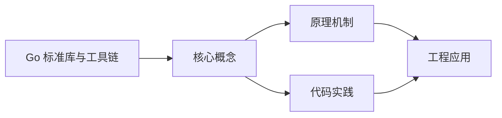

## 1. 学习目标（Bloom 分类）

本节按照布鲁姆教育目标分类学组织学习路径。本文主题为《Go 标准库与工具链》，属于 Go 模块，读者可以根据自身阶段选择阅读深度。

记忆层面：能够准确复述本文的核心概念、术语与基本语法或操作步骤，并能够在提问或检索时快速定位对应知识点。能够说出 Go 的包、函数、结构体、接口与错误处理基本语法。

理解层面：能够用自己的语言解释核心原理与工作机制，说明概念之间的因果关系，而不是机械记忆结论。能够解释 goroutine 调度、channel 通信与内存模型。

应用层面：能够在真实项目或练习场景中运用本文知识解决具体问题，写出正确且可维护的实现。能够编写并发程序、HTTP 服务与命令行工具。

分析层面：能够拆解复杂问题，比较本文主题与相邻概念的异同，识别边界条件与例外情况。能够分析数据竞争、死锁与性能瓶颈。

评价层面：能够根据约束条件（性能、可读性、安全、成本）评价不同方案的优劣，做出有依据的技术决策。能够评价 Go 与 Java、Python 在不同场景的取舍。

创造层面：能够把本文知识与其他模块知识组合，设计出新的解决方案或可复用的工程模式。能够设计完整的微服务与云原生应用。

通过本节学习，读者应当能够把《Go 标准库与工具链》纳入自己的知识网络，并与 Go 模块的其他主题（goroutine、channel、内存模型、标准库）建立关联。

## 2. 历史动机与发展脉络

《Go 标准库与工具链》是 Go 领域的重要主题。要真正理解它，需要先了解它解决的问题与演进过程。

Go 由 Google 的 Robert Griesemer、Rob Pike 与 Ken Thompson 于 2009 年发布，设计目标是解决大规模分布式系统的工程痛点：编译慢、依赖混乱、并发难写。
Go 1.0 于 2012 年发布，此后严格保持向后兼容（Go 1 兼容性承诺）；约每半年发布一个小版本，1.21 起引入工具链管理（toolchain 指令）与内置测试 fuzzing。
Go 在云原生领域成为事实标准：Docker、Kubernetes、Prometheus、etcd 等核心项目均用 Go 编写；泛型在 1.18 加入，1.21+ 的 slices/maps 标准包补齐泛型工具。

回到本文主题：Go 标准库与工具链 的提出与成熟，正是上述技术背景下的必然产物。早期实现往往以简单可用为目标，随着工程规模扩大，社区逐渐沉淀出标准做法与最佳实践；理解这一脉络，可以帮助读者判断“为什么文档中的推荐写法是现在这个样子”，也能在遇到历史遗留代码时准确识别其设计年代与取舍。


## 3. 形式化定义与核心概念精讲

本节把《Go 标准库与工具链》涉及的核心概念以“定义 + 讲解”的形式展开。读者应把定义当作工具，把讲解当作理解路径；两者结合才能形成可迁移的知识。

goroutine 与调度：goroutine 是用户态轻量线程，由 GMP 调度器（Goroutine、Machine、Processor）多路复用到内核线程；创建成本约 2KB 栈，支持百万级并发。
channel 与 select：channel 是类型化通信管道，`<-` 发送/接收；select 多路等待；“不要通过共享内存通信，而要通过通信共享内存”是 Go 并发哲学。
内存模型：happens-before 关系由 channel、sync 原语与 atomic 建立；`go test -race` 用 ThreadSanitizer 检测数据竞争。

### 3.1 原文章节逐一精讲

原文档把主题拆分为 16 个小节，下面按顺序给出每一节的导读讲解，随后保留原文细节供精读。

#### 原文精读（完整保留）

# Go 标准库速查

> **符号约定**：`< >` 必填参数 | `[ ]` 可选参数

---

#### 1. 核心 I/O 包

##### 1.1 io 包

```go
import "io"

// 核心接口
type Reader interface { Read(p []byte) (n int, err error) }
type Writer interface { Write(p []byte) (n int, err error) }
type Closer interface { Close() error }
type Seeker interface { Seek(offset int64, whence int) (int64, error) }

// 常用函数
data, err := io.ReadAll(reader)           // 读取全部内容
n, err := io.Copy(dst, src)               // 从 src 拷贝到 dst
n, err := io.CopyN(dst, src, 1024)        // 拷贝 N 字节
written, err := io.WriteString(w, "hello") // 写入字符串

// io.MultiReader / MultiWriter
r := io.MultiReader(r1, r2, r3)  // 合并多个 Reader
w := io.MultiWriter(w1, w2, w3)  // 同时写入多个 Writer

// io.TeeReader — 同时读取和写入
var buf bytes.Buffer
tee := io.TeeReader(resp.Body, &buf)
data, _ := io.ReadAll(tee) // data 和 buf 内容相同

// io.Pipe — 内存同步管道
pr, pw := io.Pipe()
go func() {
    pw.Write([]byte("hello"))
    pw.Close()
}()
io.ReadAll(pr) // "hello"
```

##### 1.2 bufio 包

```go
import "bufio"

// 带缓冲读取
reader := bufio.NewReader(os.Stdin)
line, _ := reader.ReadString('\n')    // 读到分隔符
line, _ := reader.ReadBytes('\n')     // 读到分隔符（返回字节）
ch, _, _ := reader.ReadRune()         // 读一个 rune
word, _ := reader.ReadString(' ')     // 读到空格

// 带缓冲写入
writer := bufio.NewWriter(os.Stdout)
writer.WriteString("hello")
writer.Flush() // 必须刷新

// Scanner — 按行/自定义分割读取
scanner := bufio.NewScanner(file)
for scanner.Scan() {
    fmt.Println(scanner.Text())
}
if err := scanner.Err(); err != nil {
    log.Fatal(err)
}

// 自定义分割
scanner := bufio.NewScanner(reader)
scanner.Split(bufio.ScanWords) // 按单词分割
```

##### 1.3 fmt 包

```go
// 格式化输出
fmt.Printf("Name: %s, Age: %d\n", "Alice", 30)
fmt.Sprintf("result: %v", data)     // 返回字符串
fmt.Fprintf(w, "data: %v", data)    // 写入 Writer

// 格式化输入
fmt.Scanf("%d %s", &age, &name)
fmt.Sscanf("42 Alice", "%d %s", &age, &name)

// 常用动词
// %v   — 默认格式
// %+v  — 带字段名
// %#v  — Go 语法表示
// %T   — 类型名
// %d   — 十进制整数
// %x   — 十六进制
// %f   — 浮点数
// %s   — 字符串
// %q   — 带引号字符串
// %p   — 指针地址
// %t   — 布尔值
// %02d — 宽度2，前导零
```

#### 2. 文件与操作系统

##### 2.1 os 包

```go
import "os"

// 文件操作
file, err := os.Open("data.txt")           // 只读打开
file, err := os.Create("output.txt")       // 创建/截断
file, err := os.OpenFile("app.log", os.O_APPEND|os.O_CREATE|os.O_WRONLY, 0644)
file.Close()

// 快捷读写
data, err := os.ReadFile("data.txt")       // 读取整个文件
err := os.WriteFile("out.txt", data, 0644) // 写入整个文件

// 文件信息
info, _ := os.Stat("data.txt")
fmt.Println(info.Size(), info.Mode(), info.ModTime())

// 目录操作
entries, _ := os.ReadDir(".")              // 读取目录
os.Mkdir("subdir", 0755)                  // 创建目录
os.MkdirAll("a/b/c", 0755)               // 递归创建
os.Remove("file.txt")                     // 删除文件
os.RemoveAll("dir")                       // 递归删除

// 环境变量
home := os.Getenv("HOME")
os.Setenv("KEY", "value")
for _, env := range os.Environ() {
    fmt.Println(env)
}

// 命令行参数
args := os.Args // []string{程序名, 参数1, 参数2, ...}

// 退出
os.Exit(1)
```

##### 2.2 filepath 包

```go
import "path/filepath"

// 路径操作
filepath.Join("dir", "sub", "file.txt")    // "dir/sub/file.txt"（跨平台）
filepath.Ext("main.go")                    // ".go"
filepath.Base("/a/b/c.txt")               // "c.txt"
filepath.Dir("/a/b/c.txt")                // "/a/b"
filepath.IsAbs("/usr/local")              // true

// 遍历目录
filepath.WalkDir(".", func(path string, d fs.DirEntry, err error) error {
    if err != nil {
        return err
    }
    fmt.Println(path, d.IsDir())
    return nil
})

// 模式匹配
matches, _ := filepath.Glob("*.go")
matches, _ := filepath.Glob("src/**/*.go")

// 相对路径
rel, _ := filepath.Rel("/a/b", "/a/c/d")  // "../c/d"

// 绝对路径
abs, _ := filepath.Abs("./file.txt")
```

#### 3. 网络与 HTTP

##### 3.1 net/http 标准库

```go
// HTTP 服务器
http.HandleFunc("/hello", func(w http.ResponseWriter, r *http.Request) {
    fmt.Fprintf(w, "Hello, %s!", r.URL.Query().Get("name"))
})

// Go 1.22+ 路由模式匹配
mux := http.NewServeMux()
mux.HandleFunc("GET /users/{id}", func(w http.ResponseWriter, r *http.Request) {
    id := r.PathValue("id")
    fmt.Fprintf(w, "User ID: %s", id)
})
mux.HandleFunc("POST /users", createUser)

log.Fatal(http.ListenAndServe(":8080", mux))

// HTTP 客户端
resp, err := http.Get("https://api.example.com/data")
if err != nil { log.Fatal(err) }
defer resp.Body.Close()
body, _ := io.ReadAll(resp.Body)

// 自定义请求
client := &http.Client{Timeout: 10 * time.Second}
req, _ := http.NewRequestWithContext(ctx, "POST", url, bytes.NewReader(jsonData))
req.Header.Set("Content-Type", "application/json")
resp, err := client.Do(req)
```

##### 3.2 net 包

```go
// TCP 服务器
ln, _ := net.Listen("tcp", ":8080")
for {
    conn, _ := ln.Accept()
    go handleConn(conn)
}

// TCP 客户端
conn, _ := net.Dial("tcp", "localhost:8080")
conn.Write([]byte("hello"))
buf := make([]byte, 1024)
n, _ := conn.Read(buf)

// DNS 查询
ips, _ := net.LookupIP("example.com")
cname, _ := net.LookupCNAME("example.com")

// 解析地址
host, port, _ := net.SplitHostPort("example.com:8080")
```

#### 4. JSON 处理

##### 4.1 encoding/json

```go
type User struct {
    Name  string `json:"name"`
    Email string `json:"email,omitempty"`
    Age   int    `json:"age"`
}

// 序列化
user := User{Name: "Alice", Email: "alice@example.com", Age: 30}
bytes, _ := json.Marshal(user)
pretty, _ := json.MarshalIndent(user, "", "  ")

// 反序列化
var u User
json.Unmarshal([]byte(`{"name":"Bob","age":25}`), &u)

// 流式处理
enc := json.NewEncoder(w)
enc.Encode(user)

dec := json.NewDecoder(r)
for dec.More() {
    var u User
    dec.Decode(&u)
}

// 动态 JSON
var data map[string]any
json.Unmarshal(jsonBytes, &data)

// 自定义 JSON 编解码
func (t Time) MarshalJSON() ([]byte, error) {
    return json.Marshal(t.Format(time.RFC3339))
}

func (t *Time) UnmarshalJSON(b []byte) error {
    s := string(b)
    parsed, err := time.Parse(time.RFC3339, s)
    t.Time = parsed
    return err
}
```

#### 5. 时间处理

##### 5.1 time 包

```go
// 当前时间
now := time.Now()

// 创建时间
t := time.Date(2024, 6, 15, 10, 30, 0, 0, time.Local)

// 格式化（Go 使用参考时间 Mon Jan 2 15:04:05 MST 2006）
fmt.Println(now.Format("2006-01-02 15:04:05"))    // 2024-06-15 10:30:00
fmt.Println(now.Format(time.RFC3339))               // 2024-06-15T10:30:00+08:00

// 解析
t, _ := time.Parse("2006-01-02", "2024-06-15")
t, _ := time.Parse(time.RFC3339, "2024-06-15T10:30:00+08:00")

// 时间运算
tomorrow := now.Add(24 * time.Hour)
yesterday := now.Add(-24 * time.Hour)
diff := tomorrow.Sub(now) // 24h0m0s

// 时间比较
now.Before(tomorrow)  // true
now.After(yesterday)  // true
now.Equal(otherTime)  // 精确比较

// 定时器
timer := time.NewTimer(5 * time.Second)
<-timer.C // 阻塞 5 秒

// 定期执行
ticker := time.NewTicker(1 * time.Second)
for t := range ticker.C {
    fmt.Println("Tick at", t)
}

// 延迟执行
time.AfterFunc(5*time.Second, func() {
    fmt.Println("5 seconds later")
})
```

#### 6. Go 工具链

##### 6.1 go test

```go
// 单元测试（文件名 _test.go，函数名 TestXxx）
func TestAdd(t *testing.T) {
    result := Add(2, 3)
    if result != 5 {
        t.Errorf("Add(2, 3) = %d, want 5", result)
    }
}

// 表驱动测试
func TestAdd(t *testing.T) {
    tests := []struct {
        name     string
        a, b     int
        expected int
    }{
        {"positive", 2, 3, 5},
        {"negative", -1, -2, -3},
        {"zero", 0, 0, 0},
    }
    for _, tt := range tests {
        t.Run(tt.name, func(t *testing.T) {
            if got := Add(tt.a, tt.b); got != tt.expected {
                t.Errorf("Add(%d, %d) = %d, want %d", tt.a, tt.b, got, tt.expected)
            }
        })
    }
}
```

```bash
# 运行测试
go test ./...
go test -v ./...              # 详细输出
go test -run TestAdd ./...    # 运行指定测试
go test -count=1 ./...        # 禁用缓存

# 基准测试
go test -bench=. -benchmem    # 运行基准测试，显示内存分配
```

##### 6.2 基准测试

```go
func BenchmarkAdd(b *testing.B) {
    for i := 0; i < b.N; i++ {
        Add(2, 3)
    }
}

// 子基准测试
func BenchmarkJSON(b *testing.B) {
    data := User{Name: "Alice", Age: 30}
    b.Run("marshal", func(b *testing.B) {
        for i := 0; i < b.N; i++ {
            json.Marshal(data)
        }
    })
    b.Run("unmarshal", func(b *testing.B) {
        bytes, _ := json.Marshal(data)
        for i := 0; i < b.N; i++ {
            var u User
            json.Unmarshal(bytes, &u)
        }
    })
}
```

##### 6.3 go vet

```bash
# 静态分析，检测常见错误
go vet ./...

# 检测内容：
# - Printf 格式字符串错误
# - 未使用的变量
# - 错误的结构体标签
# - 死锁
# - 不可达代码
```

##### 6.4 go fmt

```bash
# 格式化代码
go fmt ./...
gofmt -w .   # 直接使用 gofmt
gofmt -d .   # 显示差异（不修改）
```

##### 6.5 go doc

```bash
# 查看文档
go doc fmt.Println
go doc net/http.Handler
go doc -all fmt  # 查看包的全部文档

# 启动本地文档服务器
godoc -http=:6060
```

#### 7. 构建标签与条件编译

##### 7.1 构建标签

```go
// 文件顶部添加构建标签（必须紧贴文件开头）
//go:build linux

// 或组合条件
//go:build linux && amd64
//go:build linux || darwin
//go:build !windows

// 示例：platform_linux.go
//go:build linux

package platform

func getOS() string {
    return "linux"
}
```

```bash
# 按标签构建
go build -tags "linux" .
go build -tags "debug,verbose" .
```

##### 7.2 文件名约定

```
platform_linux.go     # 仅 Linux
platform_windows.go   # 仅 Windows
platform_darwin.go    # 仅 macOS
arch_amd64.go         # 仅 amd64
arch_arm64.go         # 仅 arm64
```

#### 8. 交叉编译

```bash
# 编译 Linux 可执行文件（在 Windows/macOS 上）
GOOS=linux GOARCH=amd64 go build -o app-linux .

# 编译 Windows 可执行文件
GOOS=windows GOARCH=amd64 go build -o app.exe .

# 编译 ARM 可执行文件
GOOS=linux GOARCH=arm64 go build -o app-arm64 .

# 常见组合
# GOOS       GOARCH
# linux      amd64
# linux      arm64
# windows    amd64
# darwin     amd64
# darwin     arm64  (Apple Silicon)
```

#### 9. cgo

cgo 允许 Go 调用 C 代码：

```go
// #include <stdio.h>
// #include <stdlib.h>
//
// void say_hello(const char* name) {
//     printf("Hello, %s!\n", name);
// }
import "C"
import "unsafe"

func main() {
    name := C.CString("World")
    defer C.free(unsafe.Pointer(name))
    C.say_hello(name)
}

// 使用 C 库
// #cgo LDFLAGS: -lm
// #include <math.h>
import "C"

func main() {
    result := C.sqrt(144)
    fmt.Println(float64(result)) // 12
}
```

> **注意**：cgo 会增加编译时间、影响交叉编译、带来性能开销。非必要不使用。

#### 10. 其他工具

##### 10.1 go generate

```go
// 在源码中添加指令
//go:generate stringer -type=Status

type Status int

const (
    StatusUnknown Status = iota
    StatusActive
    StatusInactive
)
```

```bash
# 执行代码生成
go generate ./...
```

##### 10.2 pprof 性能分析

```go
import _ "net/http/pprof"

go func() {
    http.ListenAndServe(":6060", nil)
}()
```

```bash
# CPU 分析
go tool pprof http://localhost:6060/debug/pprof/profile?seconds=30

# 内存分析
go tool pprof http://localhost:6060/debug/pprof/heap

# 交互式分析
(pprof) top 10
(pprof) web           # 生成调用图
(pprof) list funcName # 查看函数级分析
```

##### 10.3 go tool trace

```bash
# 运行追踪
go test -trace=trace.out ./...
go tool trace trace.out
# 在浏览器中查看 goroutine 调度、GC、网络等事件
```
#### fmt 格式化

**基本写法：格式化输出**
`fmt.Printf(<格式串>, <参数>)`
```go
// 格式化输出到标准输出
fmt.Printf("name=%s age=%d\n", "Go", 15)
```

**基本写法：格式化为字符串**
`fmt.Sprintf(<格式串>, <参数>)`
```go
// 返回格式化字符串
s := fmt.Sprintf("x=%d", 42)
```

**基本写法：格式化到 Writer**
`fmt.Fprintf(<writer>, <格式串>, <参数>)`
```go
// 输出到实现了 io.Writer 的对象
fmt.Fprintf(os.Stdout, "count=%d\n", 10)
```

**基本写法：打印值**
`fmt.Println(<参数>)`
```go
// 打印并换行
fmt.Println("hello", "world")
```

**基本写法：扫描输入**
`fmt.Scan(&<变量>)`
```go
// 从标准输入读取
var name string
fmt.Scan(&name)
```

**基本写法：扫描格式化输入**
`fmt.Sscanf(<字符串>, <格式串>, &<变量>)`
```go
// 从字符串按格式读取
var name string
var age int
fmt.Sscanf("Go 15", "%s %d", &name, &age)
```

---

#### fmt 格式化动词

**基本写法：通用格式化动词**
`%v / %+v / %#v`
```go
// 通用格式化
type User struct{ Name string; Age int }
u := User{"Go", 15}
fmt.Printf("%v\n", u)   // {Go 15}
fmt.Printf("%+v\n", u)  // {Name:Go Age:15}
fmt.Printf("%#v\n", u)  // main.User{Name:"Go", Age:15}
```

**基本写法：类型格式化**
`%T`
```go
// 输出值的 Go 类型
fmt.Printf("%T\n", 42) // int
```

**基本写法：整数格式化**
`%d / %b / %o / %x / %X`
```go
// 整数各种进制
fmt.Printf("%d\n", 255)  // 255
fmt.Printf("%b\n", 255)  // 11111111
fmt.Printf("%o\n", 255)  // 377
fmt.Printf("%x\n", 255)  // ff
```

**基本写法：浮点数格式化**
`%f / %e / %g`
```go
// 浮点数格式
fmt.Printf("%f\n", 3.14)   // 3.140000
fmt.Printf("%.2f\n", 3.14) // 3.14
fmt.Printf("%e\n", 3.14)   // 3.140000e+00
```

**基本写法：字符串格式化**
`%s / %q / %x`
```go
// 字符串格式
fmt.Printf("%s\n", "Go")   // Go
fmt.Printf("%q\n", "Go")   // "Go"
fmt.Printf("%x\n", "Go")   // 476f
```

**基本写法：宽度与对齐**
`%[宽度].[精度]<动词>`
```go
// 指定宽度和精度
fmt.Printf("|%5d|\n", 42)   // |   42|
fmt.Printf("|%-5d|\n", 42)  // |42   |
fmt.Printf("|%5.2f|\n", 3.14159) // | 3.14|
```

---

#### strings 字符串操作

**基本写法：拼接字符串**
`strings.Join(<切片>, <分隔符>)`
```go
// 用分隔符拼接字符串切片
parts := []string{"a", "b", "c"}
s := strings.Join(parts, "-") // "a-b-c"
```

**基本写法：拆分字符串**
`strings.Split(<字符串>, <分隔符>)`
```go
// 按分隔符拆分
parts := strings.Split("a,b,c", ",")
```

**基本写法：拆分为字段**
`strings.Fields(<字符串>)`
```go
// 按空白拆分
fields := strings.Fields("  hello  world  ")
```

**基本写法：替换**
`strings.ReplaceAll(<字符串>, <旧>, <新>)`
```go
// 全部替换
s := strings.ReplaceAll("a-b-c", "-", "+")
```

**基本写法：替换指定次数**
`strings.Replace(<字符串>, <旧>, <新>, <次数>)`
```go
// 替换前 n 次
s := strings.Replace("aaa", "a", "b", 2) // "bba"
```

**基本写法：去除首尾字符**
`strings.Trim(<字符串>, <字符集>)`
```go
// 去除首尾指定字符
s := strings.Trim("##hello##", "#")
```

**基本写法：去除空白**
`strings.TrimSpace(<字符串>)`
```go
// 去除首尾空白
s := strings.TrimSpace("  hi  ")
```

**基本写法：查找子串**
`strings.Index(<字符串>, <子串>)`
```go
// 返回子串首次位置，未找到返回 -1
i := strings.Index("hello", "ll") // 2
```

**基本写法：统计子串**
`strings.Count(<字符串>, <子串>)`
```go
// 统计子串出现次数
n := strings.Count("aaa", "a") // 3
```

**基本写法：重复字符串**
`strings.Repeat(<字符串>, <次数>)`
```go
// 重复 n 次拼接
s := strings.Repeat("ab", 3) // "ababab"
```

**基本写法：高效构建字符串**
`var b strings.Builder`
```go
// 使用 Builder 高效拼接
var b strings.Builder
for i := 0; i < 1000; i++ {
    b.WriteString("item")
}
result := b.String()
```

---

#### strconv 类型转换

**基本写法：int 转 string**
`strconv.Itoa(<整数>)`
```go
// 整数转字符串
s := strconv.Itoa(42)
```

**基本写法：string 转 int**
`strconv.Atoi(<字符串>)`
```go
// 字符串转整数
n, err := strconv.Atoi("42")
```

**基本写法：格式化整数**
`strconv.FormatInt(<值>, <进制>)`
```go
// 将整数转为指定进制字符串
s := strconv.FormatInt(255, 16) // "ff"
```

**基本写法：解析整数**
`strconv.ParseInt(<字符串>, <进制>, <位数>)`
```go
// 解析指定进制整数
n, err := strconv.ParseInt("ff", 16, 64)
```

**基本写法：格式化浮点数**
`strconv.FormatFloat(<值>, <格式>, <精度>, <位数>)`
```go
// 浮点数转字符串
s := strconv.FormatFloat(3.14, 'f', 2, 64) // "3.14"
```

**基本写法：解析浮点数**
`strconv.ParseFloat(<字符串>, <位数>)`
```go
// 字符串转浮点数
f, err := strconv.ParseFloat("3.14", 64)
```

**基本写法：解析布尔值**
`strconv.ParseBool(<字符串>)`
```go
// 字符串转布尔值
b, err := strconv.ParseBool("true")
```

**基本写法：追加格式化值**
`strconv.AppendInt(<切片>, <值>, <进制>)`
```go
// 追加格式化值到字节切片
buf := []byte("val=")
buf = strconv.AppendInt(buf, 42, 10)
```

---

#### io 读写接口

**基本写法：Reader 接口**
`io.Reader`
```go
// 实现了 Read(p []byte) (n int, err error)
var r io.Reader = strings.NewReader("hello")
```

**基本写法：Writer 接口**
`io.Writer`
```go
// 实现了 Write(p []byte) (n int, err error)
var w io.Writer = os.Stdout
```

**基本写法：从 Reader 拷贝到 Writer**
`io.Copy(<writer>, <reader>)`
```go
// 数据流拷贝
n, err := io.Copy(os.Stdout, strings.NewReader("hello"))
```

**基本写法：读取全部**
`io.ReadAll(<reader>)`
```go
// 读取 Reader 全部内容
data, err := io.ReadAll(strings.NewReader("hello"))
```

**基本写法：写入字符串**
`io.WriteString(<writer>, <字符串>)`
```go
// 向 Writer 写入字符串
n, err := io.WriteString(os.Stdout, "hello\n")
```

**基本写法：组合读写**
`io.ReadWriter`
```go
// 同时实现 Read 和 Write 接口
var rw io.ReadWriter = os.Stdin
```

**基本写法：多 Reader 串联**
`io.MultiReader(<reader1>, <reader2>)`
```go
// 串联多个 Reader 依次读取
r := io.MultiReader(
    strings.NewReader("hello "),
    strings.NewReader("world"),
)
data, _ := io.ReadAll(r)
```

**基本写法：多 Writer 并联**
`io.MultiWriter(<writer1>, <writer2>)`
```go
// 并联多个 Writer 同时写入
w := io.MultiWriter(os.Stdout, os.Stderr)
io.WriteString(w, "hello")
```

**基本写法：限制读取量**
`io.LimitReader(<reader>, <字节数>)`
```go
// 限制最多读取 N 字节
r := io.LimitReader(file, 1024)
```

**基本写法：丢弃数据**
`io.Discard`
```go
// 丢弃所有写入数据的 Writer
io.Copy(io.Discard, largeReader)
```

**基本写法：EOF 判断**
`errors.Is(err, io.EOF)`
```go
// 判断是否读到末尾
_, err := r.Read(buf)
if errors.Is(err, io.EOF) {
    fmt.Println("已到末尾")
}
```

---

#### bytes 字节操作

**基本写法：字节缓冲区**
`var buf bytes.Buffer`
```go
// 可变长字节缓冲区
var buf bytes.Buffer
buf.WriteString("hello")
buf.WriteByte('!')
result := buf.String()
```

**基本写法：字节切片拼接**
`bytes.Join(<切片>, <分隔符>)`
```go
// 拼接多个字节切片
parts := [][]byte{[]byte("a"), []byte("b")}
joined := bytes.Join(parts, []byte("-"))
```

**基本写法：字节切片比较**
`bytes.Equal(<a>, <b>)`
```go
// 比较两个字节切片是否相等
ok := bytes.Equal([]byte("a"), []byte("a"))
```

**基本写法：字节切片包含**
`bytes.Contains(<切片>, <子切片>)`
```go
// 判断是否包含子切片
ok := bytes.Contains([]byte("hello"), []byte("ell"))
```


### 3.2 概念关系图

下面用 Mermaid 图表达本文核心概念之间的关系，帮助读者建立整体图景：



图中展示的是本文知识的结构化关系：核心概念是入口，原理机制解释“为什么”，代码实践演示“怎么做”，工程应用回答“何时用”。读者学习时可以把每个小节的内容挂接到对应节点上。

## 4. 理论推导与原理解析

本节深入《Go 标准库与工具链》背后的原理。理论部分不求面面俱到，而是聚焦“能解释现象、能指导实践”的关键推导。

goroutine 与调度：goroutine 是用户态轻量线程，由 GMP 调度器（Goroutine、Machine、Processor）多路复用到内核线程；创建成本约 2KB 栈，支持百万级并发。
channel 与 select：channel 是类型化通信管道，`<-` 发送/接收；select 多路等待；“不要通过共享内存通信，而要通过通信共享内存”是 Go 并发哲学。
内存模型：happens-before 关系由 channel、sync 原语与 atomic 建立；`go test -race` 用 ThreadSanitizer 检测数据竞争。
错误处理：Go 用多返回值显式处理错误（`if err != nil`），error 是接口；panic/recover 仅用于不可恢复错误。

需要强调的是，理论推导与工程实践之间存在翻译层：理论给出的是理想化模型与边界条件，工程代码则必须处理真实环境中的例外。读者在学习时应先掌握理论的“标准情形”，再通过陷阱章节了解“非标准情形”。

## 5. 代码示例与逐行讲解

本节把原文中的代码示例系统整理，并为每个示例补充用途说明与讲解。读者不应只浏览代码，而应逐段对照讲解理解设计意图。

### 5.1 示例：1.1 io 包

该示例来自原文《1.1 io 包》小节，用于演示Go 标准库与工具链相关操作。阅读时请先看代码结构，再看其后的讲解。

```go
import "io"

// 核心接口
type Reader interface { Read(p []byte) (n int, err error) }
type Writer interface { Write(p []byte) (n int, err error) }
type Closer interface { Close() error }
type Seeker interface { Seek(offset int64, whence int) (int64, error) }

// 常用函数
data, err := io.ReadAll(reader)           // 读取全部内容
n, err := io.Copy(dst, src)               // 从 src 拷贝到 dst
n, err := io.CopyN(dst, src, 1024)        // 拷贝 N 字节
written, err := io.WriteString(w, "hello") // 写入字符串

// io.MultiReader / MultiWriter
r := io.MultiReader(r1, r2, r3)  // 合并多个 Reader
w := io.MultiWriter(w1, w2, w3)  // 同时写入多个 Writer

// io.TeeReader — 同时读取和写入
var buf bytes.Buffer
tee := io.TeeReader(resp.Body, &buf)
data, _ := io.ReadAll(tee) // data 和 buf 内容相同

// io.Pipe — 内存同步管道
pr, pw := io.Pipe()
go func() {
    pw.Write([]byte("hello"))
    pw.Close()
}()
io.ReadAll(pr) // "hello"
```

讲解：这段代码演示了本节核心知识点。代码中的关键操作可以归纳为三步：准备（定义或初始化）、执行（核心逻辑）、收尾（释放资源或返回结果）。实际项目中，这三步往往被封装为函数或类，以提升复用性与可测试性。

关键点分析：

该示例共 25 行有效代码，包含 1 类关键结构（import）。其中：

- 入口与初始化部分负责建立上下文，对应实际项目中的启动或装配逻辑；
- 核心逻辑部分体现本文主题的主要操作，是阅读时最需要对照讲解理解的部分；
- 输出或返回部分把结果交给调用方，注意其类型与边界条件。

进阶思考路径：先尝试修改参数观察行为变化，再把示例中的模式迁移到自己的项目中；每次修改都记录预期与实测差异，这是把示例转化为能力的最快方式。

### 5.2 示例：1.2 bufio 包

该示例来自原文《1.2 bufio 包》小节，用于演示Go 标准库与工具链相关操作。阅读时请先看代码结构，再看其后的讲解。

```go
import "bufio"

// 带缓冲读取
reader := bufio.NewReader(os.Stdin)
line, _ := reader.ReadString('\n')    // 读到分隔符
line, _ := reader.ReadBytes('\n')     // 读到分隔符（返回字节）
ch, _, _ := reader.ReadRune()         // 读一个 rune
word, _ := reader.ReadString(' ')     // 读到空格

// 带缓冲写入
writer := bufio.NewWriter(os.Stdout)
writer.WriteString("hello")
writer.Flush() // 必须刷新

// Scanner — 按行/自定义分割读取
scanner := bufio.NewScanner(file)
for scanner.Scan() {
    fmt.Println(scanner.Text())
}
if err := scanner.Err(); err != nil {
    log.Fatal(err)
}

// 自定义分割
scanner := bufio.NewScanner(reader)
scanner.Split(bufio.ScanWords) // 按单词分割
```

讲解：这段代码演示了本节核心知识点。代码中的关键操作可以归纳为三步：准备（定义或初始化）、执行（核心逻辑）、收尾（释放资源或返回结果）。实际项目中，这三步往往被封装为函数或类，以提升复用性与可测试性。

关键点分析：

该示例共 22 行有效代码，包含 3 类关键结构（import、if、for）。其中：

- 入口与初始化部分负责建立上下文，对应实际项目中的启动或装配逻辑；
- 核心逻辑部分体现本文主题的主要操作，是阅读时最需要对照讲解理解的部分；
- 输出或返回部分把结果交给调用方，注意其类型与边界条件。

进阶思考路径：先尝试修改参数观察行为变化，再把示例中的模式迁移到自己的项目中；每次修改都记录预期与实测差异，这是把示例转化为能力的最快方式。

### 5.3 示例：1.3 fmt 包

该示例来自原文《1.3 fmt 包》小节，用于演示Go 标准库与工具链相关操作。阅读时请先看代码结构，再看其后的讲解。

```go
// 格式化输出
fmt.Printf("Name: %s, Age: %d\n", "Alice", 30)
fmt.Sprintf("result: %v", data)     // 返回字符串
fmt.Fprintf(w, "data: %v", data)    // 写入 Writer

// 格式化输入
fmt.Scanf("%d %s", &age, &name)
fmt.Sscanf("42 Alice", "%d %s", &age, &name)

// 常用动词
// %v   — 默认格式
// %+v  — 带字段名
// %#v  — Go 语法表示
// %T   — 类型名
// %d   — 十进制整数
// %x   — 十六进制
// %f   — 浮点数
// %s   — 字符串
// %q   — 带引号字符串
// %p   — 指针地址
// %t   — 布尔值
// %02d — 宽度2，前导零
```

讲解：这段代码演示了本节核心知识点。代码中的关键操作可以归纳为三步：准备（定义或初始化）、执行（核心逻辑）、收尾（释放资源或返回结果）。实际项目中，这三步往往被封装为函数或类，以提升复用性与可测试性。

关键点分析：

该示例共 20 行有效代码，结构以数据或配置为主。阅读时应关注：数据字段的含义、配置项的作用，以及它们与运行行为的对应关系。

进阶思考路径：先尝试修改参数观察行为变化，再把示例中的模式迁移到自己的项目中；每次修改都记录预期与实测差异，这是把示例转化为能力的最快方式。

### 5.4 示例：2.1 os 包

该示例来自原文《2.1 os 包》小节，用于演示Go 标准库与工具链相关操作。阅读时请先看代码结构，再看其后的讲解。

```go
import "os"

// 文件操作
file, err := os.Open("data.txt")           // 只读打开
file, err := os.Create("output.txt")       // 创建/截断
file, err := os.OpenFile("app.log", os.O_APPEND|os.O_CREATE|os.O_WRONLY, 0644)
file.Close()

// 快捷读写
data, err := os.ReadFile("data.txt")       // 读取整个文件
err := os.WriteFile("out.txt", data, 0644) // 写入整个文件

// 文件信息
info, _ := os.Stat("data.txt")
fmt.Println(info.Size(), info.Mode(), info.ModTime())

// 目录操作
entries, _ := os.ReadDir(".")              // 读取目录
os.Mkdir("subdir", 0755)                  // 创建目录
os.MkdirAll("a/b/c", 0755)               // 递归创建
os.Remove("file.txt")                     // 删除文件
os.RemoveAll("dir")                       // 递归删除

// 环境变量
home := os.Getenv("HOME")
os.Setenv("KEY", "value")
for _, env := range os.Environ() {
    fmt.Println(env)
}

// 命令行参数
args := os.Args // []string{程序名, 参数1, 参数2, ...}

// 退出
os.Exit(1)
```

讲解：这段代码演示了本节核心知识点。代码中的关键操作可以归纳为三步：准备（定义或初始化）、执行（核心逻辑）、收尾（释放资源或返回结果）。实际项目中，这三步往往被封装为函数或类，以提升复用性与可测试性。

关键点分析：

该示例共 28 行有效代码，包含 3 类关键结构（import、for、CREATE）。其中：

- 入口与初始化部分负责建立上下文，对应实际项目中的启动或装配逻辑；
- 核心逻辑部分体现本文主题的主要操作，是阅读时最需要对照讲解理解的部分；
- 输出或返回部分把结果交给调用方，注意其类型与边界条件。

进阶思考路径：先尝试修改参数观察行为变化，再把示例中的模式迁移到自己的项目中；每次修改都记录预期与实测差异，这是把示例转化为能力的最快方式。

### 5.5 示例：2.2 filepath 包

该示例来自原文《2.2 filepath 包》小节，用于演示Go 标准库与工具链相关操作。阅读时请先看代码结构，再看其后的讲解。

```go
import "path/filepath"

// 路径操作
filepath.Join("dir", "sub", "file.txt")    // "dir/sub/file.txt"（跨平台）
filepath.Ext("main.go")                    // ".go"
filepath.Base("/a/b/c.txt")               // "c.txt"
filepath.Dir("/a/b/c.txt")                // "/a/b"
filepath.IsAbs("/usr/local")              // true

// 遍历目录
filepath.WalkDir(".", func(path string, d fs.DirEntry, err error) error {
    if err != nil {
        return err
    }
    fmt.Println(path, d.IsDir())
    return nil
})

// 模式匹配
matches, _ := filepath.Glob("*.go")
matches, _ := filepath.Glob("src/**/*.go")

// 相对路径
rel, _ := filepath.Rel("/a/b", "/a/c/d")  // "../c/d"

// 绝对路径
abs, _ := filepath.Abs("./file.txt")
```

讲解：这段代码演示了本节核心知识点。代码中的关键操作可以归纳为三步：准备（定义或初始化）、执行（核心逻辑）、收尾（释放资源或返回结果）。实际项目中，这三步往往被封装为函数或类，以提升复用性与可测试性。

关键点分析：

该示例共 22 行有效代码，包含 3 类关键结构（import、if、return）。其中：

- 入口与初始化部分负责建立上下文，对应实际项目中的启动或装配逻辑；
- 核心逻辑部分体现本文主题的主要操作，是阅读时最需要对照讲解理解的部分；
- 输出或返回部分把结果交给调用方，注意其类型与边界条件。

进阶思考路径：先尝试修改参数观察行为变化，再把示例中的模式迁移到自己的项目中；每次修改都记录预期与实测差异，这是把示例转化为能力的最快方式。

### 5.6 示例：3.1 net/http 标准库

该示例来自原文《3.1 net/http 标准库》小节，用于演示Go 标准库与工具链相关操作。阅读时请先看代码结构，再看其后的讲解。

```go
// HTTP 服务器
http.HandleFunc("/hello", func(w http.ResponseWriter, r *http.Request) {
    fmt.Fprintf(w, "Hello, %s!", r.URL.Query().Get("name"))
})

// Go 1.22+ 路由模式匹配
mux := http.NewServeMux()
mux.HandleFunc("GET /users/{id}", func(w http.ResponseWriter, r *http.Request) {
    id := r.PathValue("id")
    fmt.Fprintf(w, "User ID: %s", id)
})
mux.HandleFunc("POST /users", createUser)

log.Fatal(http.ListenAndServe(":8080", mux))

// HTTP 客户端
resp, err := http.Get("https://api.example.com/data")
if err != nil { log.Fatal(err) }
defer resp.Body.Close()
body, _ := io.ReadAll(resp.Body)

// 自定义请求
client := &http.Client{Timeout: 10 * time.Second}
req, _ := http.NewRequestWithContext(ctx, "POST", url, bytes.NewReader(jsonData))
req.Header.Set("Content-Type", "application/json")
resp, err := client.Do(req)
```

讲解：这段代码演示了本节核心知识点。代码中的关键操作可以归纳为三步：准备（定义或初始化）、执行（核心逻辑）、收尾（释放资源或返回结果）。实际项目中，这三步往往被封装为函数或类，以提升复用性与可测试性。

关键点分析：

该示例共 22 行有效代码，包含 1 类关键结构（if）。其中：

- 入口与初始化部分负责建立上下文，对应实际项目中的启动或装配逻辑；
- 核心逻辑部分体现本文主题的主要操作，是阅读时最需要对照讲解理解的部分；
- 输出或返回部分把结果交给调用方，注意其类型与边界条件。

进阶思考路径：先尝试修改参数观察行为变化，再把示例中的模式迁移到自己的项目中；每次修改都记录预期与实测差异，这是把示例转化为能力的最快方式。

### 5.7 示例：3.2 net 包

该示例来自原文《3.2 net 包》小节，用于演示Go 标准库与工具链相关操作。阅读时请先看代码结构，再看其后的讲解。

```go
// TCP 服务器
ln, _ := net.Listen("tcp", ":8080")
for {
    conn, _ := ln.Accept()
    go handleConn(conn)
}

// TCP 客户端
conn, _ := net.Dial("tcp", "localhost:8080")
conn.Write([]byte("hello"))
buf := make([]byte, 1024)
n, _ := conn.Read(buf)

// DNS 查询
ips, _ := net.LookupIP("example.com")
cname, _ := net.LookupCNAME("example.com")

// 解析地址
host, port, _ := net.SplitHostPort("example.com:8080")
```

讲解：这段代码演示了本节核心知识点。代码中的关键操作可以归纳为三步：准备（定义或初始化）、执行（核心逻辑）、收尾（释放资源或返回结果）。实际项目中，这三步往往被封装为函数或类，以提升复用性与可测试性。

关键点分析：

该示例共 16 行有效代码，包含 1 类关键结构（for）。其中：

- 入口与初始化部分负责建立上下文，对应实际项目中的启动或装配逻辑；
- 核心逻辑部分体现本文主题的主要操作，是阅读时最需要对照讲解理解的部分；
- 输出或返回部分把结果交给调用方，注意其类型与边界条件。

进阶思考路径：先尝试修改参数观察行为变化，再把示例中的模式迁移到自己的项目中；每次修改都记录预期与实测差异，这是把示例转化为能力的最快方式。

### 5.8 示例：4.1 encoding/json

该示例来自原文《4.1 encoding/json》小节，用于演示Go 标准库与工具链相关操作。阅读时请先看代码结构，再看其后的讲解。

```go
type User struct {
    Name  string `json:"name"`
    Email string `json:"email,omitempty"`
    Age   int    `json:"age"`
}

// 序列化
user := User{Name: "Alice", Email: "alice@example.com", Age: 30}
bytes, _ := json.Marshal(user)
pretty, _ := json.MarshalIndent(user, "", "  ")

// 反序列化
var u User
json.Unmarshal([]byte(`{"name":"Bob","age":25}`), &u)

// 流式处理
enc := json.NewEncoder(w)
enc.Encode(user)

dec := json.NewDecoder(r)
for dec.More() {
    var u User
    dec.Decode(&u)
}

// 动态 JSON
var data map[string]any
json.Unmarshal(jsonBytes, &data)

// 自定义 JSON 编解码
func (t Time) MarshalJSON() ([]byte, error) {
    return json.Marshal(t.Format(time.RFC3339))
}

func (t *Time) UnmarshalJSON(b []byte) error {
    s := string(b)
    parsed, err := time.Parse(time.RFC3339, s)
    t.Time = parsed
    return err
}
```

讲解：这段代码演示了本节核心知识点。代码中的关键操作可以归纳为三步：准备（定义或初始化）、执行（核心逻辑）、收尾（释放资源或返回结果）。实际项目中，这三步往往被封装为函数或类，以提升复用性与可测试性。

关键点分析：

该示例共 33 行有效代码，包含 3 类关键结构（func、for、return）。其中：

- 入口与初始化部分负责建立上下文，对应实际项目中的启动或装配逻辑；
- 核心逻辑部分体现本文主题的主要操作，是阅读时最需要对照讲解理解的部分；
- 输出或返回部分把结果交给调用方，注意其类型与边界条件。

进阶思考路径：先尝试修改参数观察行为变化，再把示例中的模式迁移到自己的项目中；每次修改都记录预期与实测差异，这是把示例转化为能力的最快方式。

### 5.9 示例：5.1 time 包

该示例来自原文《5.1 time 包》小节，用于演示Go 标准库与工具链相关操作。阅读时请先看代码结构，再看其后的讲解。

```go
// 当前时间
now := time.Now()

// 创建时间
t := time.Date(2024, 6, 15, 10, 30, 0, 0, time.Local)

// 格式化（Go 使用参考时间 Mon Jan 2 15:04:05 MST 2006）
fmt.Println(now.Format("2006-01-02 15:04:05"))    // 2024-06-15 10:30:00
fmt.Println(now.Format(time.RFC3339))               // 2024-06-15T10:30:00+08:00

// 解析
t, _ := time.Parse("2006-01-02", "2024-06-15")
t, _ := time.Parse(time.RFC3339, "2024-06-15T10:30:00+08:00")

// 时间运算
tomorrow := now.Add(24 * time.Hour)
yesterday := now.Add(-24 * time.Hour)
diff := tomorrow.Sub(now) // 24h0m0s

// 时间比较
now.Before(tomorrow)  // true
now.After(yesterday)  // true
now.Equal(otherTime)  // 精确比较

// 定时器
timer := time.NewTimer(5 * time.Second)
<-timer.C // 阻塞 5 秒

// 定期执行
ticker := time.NewTicker(1 * time.Second)
for t := range ticker.C {
    fmt.Println("Tick at", t)
}

// 延迟执行
time.AfterFunc(5*time.Second, func() {
    fmt.Println("5 seconds later")
})
```

讲解：这段代码演示了本节核心知识点。代码中的关键操作可以归纳为三步：准备（定义或初始化）、执行（核心逻辑）、收尾（释放资源或返回结果）。实际项目中，这三步往往被封装为函数或类，以提升复用性与可测试性。

关键点分析：

该示例共 30 行有效代码，包含 1 类关键结构（for）。其中：

- 入口与初始化部分负责建立上下文，对应实际项目中的启动或装配逻辑；
- 核心逻辑部分体现本文主题的主要操作，是阅读时最需要对照讲解理解的部分；
- 输出或返回部分把结果交给调用方，注意其类型与边界条件。

进阶思考路径：先尝试修改参数观察行为变化，再把示例中的模式迁移到自己的项目中；每次修改都记录预期与实测差异，这是把示例转化为能力的最快方式。

### 5.10 示例：6.1 go test

该示例来自原文《6.1 go test》小节，用于演示Go 标准库与工具链相关操作。阅读时请先看代码结构，再看其后的讲解。

```go
// 单元测试（文件名 _test.go，函数名 TestXxx）
func TestAdd(t *testing.T) {
    result := Add(2, 3)
    if result != 5 {
        t.Errorf("Add(2, 3) = %d, want 5", result)
    }
}

// 表驱动测试
func TestAdd(t *testing.T) {
    tests := []struct {
        name     string
        a, b     int
        expected int
    }{
        {"positive", 2, 3, 5},
        {"negative", -1, -2, -3},
        {"zero", 0, 0, 0},
    }
    for _, tt := range tests {
        t.Run(tt.name, func(t *testing.T) {
            if got := Add(tt.a, tt.b); got != tt.expected {
                t.Errorf("Add(%d, %d) = %d, want %d", tt.a, tt.b, got, tt.expected)
            }
        })
    }
}
```

讲解：这段代码演示了本节核心知识点。代码中的关键操作可以归纳为三步：准备（定义或初始化）、执行（核心逻辑）、收尾（释放资源或返回结果）。实际项目中，这三步往往被封装为函数或类，以提升复用性与可测试性。

关键点分析：

该示例共 26 行有效代码，包含 3 类关键结构（func、if、for）。其中：

- 入口与初始化部分负责建立上下文，对应实际项目中的启动或装配逻辑；
- 核心逻辑部分体现本文主题的主要操作，是阅读时最需要对照讲解理解的部分；
- 输出或返回部分把结果交给调用方，注意其类型与边界条件。

进阶思考路径：先尝试修改参数观察行为变化，再把示例中的模式迁移到自己的项目中；每次修改都记录预期与实测差异，这是把示例转化为能力的最快方式。

### 5.11 示例：6.1 go test

该示例来自原文《6.1 go test》小节，用于演示Go 标准库与工具链相关操作。阅读时请先看代码结构，再看其后的讲解。

```bash
# 运行测试
go test ./...
go test -v ./...              # 详细输出
go test -run TestAdd ./...    # 运行指定测试
go test -count=1 ./...        # 禁用缓存

# 基准测试
go test -bench=. -benchmem    # 运行基准测试，显示内存分配
```

讲解：这段代码演示了本节核心知识点。代码中的关键操作可以归纳为三步：准备（定义或初始化）、执行（核心逻辑）、收尾（释放资源或返回结果）。实际项目中，这三步往往被封装为函数或类，以提升复用性与可测试性。

关键点分析：

该示例共 7 行有效代码，结构以数据或配置为主。阅读时应关注：数据字段的含义、配置项的作用，以及它们与运行行为的对应关系。

进阶思考路径：先尝试修改参数观察行为变化，再把示例中的模式迁移到自己的项目中；每次修改都记录预期与实测差异，这是把示例转化为能力的最快方式。

### 5.12 示例：6.2 基准测试

该示例来自原文《6.2 基准测试》小节，用于演示Go 标准库与工具链相关操作。阅读时请先看代码结构，再看其后的讲解。

```go
func BenchmarkAdd(b *testing.B) {
    for i := 0; i < b.N; i++ {
        Add(2, 3)
    }
}

// 子基准测试
func BenchmarkJSON(b *testing.B) {
    data := User{Name: "Alice", Age: 30}
    b.Run("marshal", func(b *testing.B) {
        for i := 0; i < b.N; i++ {
            json.Marshal(data)
        }
    })
    b.Run("unmarshal", func(b *testing.B) {
        bytes, _ := json.Marshal(data)
        for i := 0; i < b.N; i++ {
            var u User
            json.Unmarshal(bytes, &u)
        }
    })
}
```

讲解：这段代码演示了本节核心知识点。代码中的关键操作可以归纳为三步：准备（定义或初始化）、执行（核心逻辑）、收尾（释放资源或返回结果）。实际项目中，这三步往往被封装为函数或类，以提升复用性与可测试性。

关键点分析：

该示例共 21 行有效代码，包含 2 类关键结构（func、for）。其中：

- 入口与初始化部分负责建立上下文，对应实际项目中的启动或装配逻辑；
- 核心逻辑部分体现本文主题的主要操作，是阅读时最需要对照讲解理解的部分；
- 输出或返回部分把结果交给调用方，注意其类型与边界条件。

进阶思考路径：先尝试修改参数观察行为变化，再把示例中的模式迁移到自己的项目中；每次修改都记录预期与实测差异，这是把示例转化为能力的最快方式。

### 5.13 示例：6.3 go vet

该示例来自原文《6.3 go vet》小节，用于演示Go 标准库与工具链相关操作。阅读时请先看代码结构，再看其后的讲解。

```bash
# 静态分析，检测常见错误
go vet ./...

# 检测内容：
# - Printf 格式字符串错误
# - 未使用的变量
# - 错误的结构体标签
# - 死锁
# - 不可达代码
```

讲解：这段代码演示了本节核心知识点。代码中的关键操作可以归纳为三步：准备（定义或初始化）、执行（核心逻辑）、收尾（释放资源或返回结果）。实际项目中，这三步往往被封装为函数或类，以提升复用性与可测试性。

关键点分析：

该示例共 8 行有效代码，结构以数据或配置为主。阅读时应关注：数据字段的含义、配置项的作用，以及它们与运行行为的对应关系。

进阶思考路径：先尝试修改参数观察行为变化，再把示例中的模式迁移到自己的项目中；每次修改都记录预期与实测差异，这是把示例转化为能力的最快方式。

### 5.14 示例：6.4 go fmt

该示例来自原文《6.4 go fmt》小节，用于演示Go 标准库与工具链相关操作。阅读时请先看代码结构，再看其后的讲解。

```bash
# 格式化代码
go fmt ./...
gofmt -w .   # 直接使用 gofmt
gofmt -d .   # 显示差异（不修改）
```

讲解：这段代码演示了本节核心知识点。代码中的关键操作可以归纳为三步：准备（定义或初始化）、执行（核心逻辑）、收尾（释放资源或返回结果）。实际项目中，这三步往往被封装为函数或类，以提升复用性与可测试性。

关键点分析：

该示例共 4 行有效代码，结构以数据或配置为主。阅读时应关注：数据字段的含义、配置项的作用，以及它们与运行行为的对应关系。

进阶思考路径：先尝试修改参数观察行为变化，再把示例中的模式迁移到自己的项目中；每次修改都记录预期与实测差异，这是把示例转化为能力的最快方式。

### 5.15 示例：6.5 go doc

该示例来自原文《6.5 go doc》小节，用于演示Go 标准库与工具链相关操作。阅读时请先看代码结构，再看其后的讲解。

```bash
# 查看文档
go doc fmt.Println
go doc net/http.Handler
go doc -all fmt  # 查看包的全部文档

# 启动本地文档服务器
godoc -http=:6060
```

讲解：这段代码演示了本节核心知识点。代码中的关键操作可以归纳为三步：准备（定义或初始化）、执行（核心逻辑）、收尾（释放资源或返回结果）。实际项目中，这三步往往被封装为函数或类，以提升复用性与可测试性。

关键点分析：

该示例共 6 行有效代码，结构以数据或配置为主。阅读时应关注：数据字段的含义、配置项的作用，以及它们与运行行为的对应关系。

进阶思考路径：先尝试修改参数观察行为变化，再把示例中的模式迁移到自己的项目中；每次修改都记录预期与实测差异，这是把示例转化为能力的最快方式。

### 5.16 示例：7.1 构建标签

该示例来自原文《7.1 构建标签》小节，用于演示Go 标准库与工具链相关操作。阅读时请先看代码结构，再看其后的讲解。

```go
// 文件顶部添加构建标签（必须紧贴文件开头）
//go:build linux

// 或组合条件
//go:build linux && amd64
//go:build linux || darwin
//go:build !windows

// 示例：platform_linux.go
//go:build linux

package platform

func getOS() string {
    return "linux"
}
```

讲解：这段代码演示了本节核心知识点。代码中的关键操作可以归纳为三步：准备（定义或初始化）、执行（核心逻辑）、收尾（释放资源或返回结果）。实际项目中，这三步往往被封装为函数或类，以提升复用性与可测试性。

关键点分析：

该示例共 12 行有效代码，包含 2 类关键结构（func、return）。其中：

- 入口与初始化部分负责建立上下文，对应实际项目中的启动或装配逻辑；
- 核心逻辑部分体现本文主题的主要操作，是阅读时最需要对照讲解理解的部分；
- 输出或返回部分把结果交给调用方，注意其类型与边界条件。

进阶思考路径：先尝试修改参数观察行为变化，再把示例中的模式迁移到自己的项目中；每次修改都记录预期与实测差异，这是把示例转化为能力的最快方式。

### 5.17 示例：7.1 构建标签

该示例来自原文《7.1 构建标签》小节，用于演示Go 标准库与工具链相关操作。阅读时请先看代码结构，再看其后的讲解。

```bash
# 按标签构建
go build -tags "linux" .
go build -tags "debug,verbose" .
```

讲解：这段代码演示了本节核心知识点。代码中的关键操作可以归纳为三步：准备（定义或初始化）、执行（核心逻辑）、收尾（释放资源或返回结果）。实际项目中，这三步往往被封装为函数或类，以提升复用性与可测试性。

关键点分析：

该示例共 3 行有效代码，结构以数据或配置为主。阅读时应关注：数据字段的含义、配置项的作用，以及它们与运行行为的对应关系。

进阶思考路径：先尝试修改参数观察行为变化，再把示例中的模式迁移到自己的项目中；每次修改都记录预期与实测差异，这是把示例转化为能力的最快方式。

### 5.18 示例：7.2 文件名约定

该示例来自原文《7.2 文件名约定》小节，用于演示Go 标准库与工具链相关操作。阅读时请先看代码结构，再看其后的讲解。

```text
platform_linux.go     # 仅 Linux
platform_windows.go   # 仅 Windows
platform_darwin.go    # 仅 macOS
arch_amd64.go         # 仅 amd64
arch_arm64.go         # 仅 arm64
```

讲解：这段代码演示了本节核心知识点。代码中的关键操作可以归纳为三步：准备（定义或初始化）、执行（核心逻辑）、收尾（释放资源或返回结果）。实际项目中，这三步往往被封装为函数或类，以提升复用性与可测试性。

关键点分析：

该示例共 5 行有效代码，结构以数据或配置为主。阅读时应关注：数据字段的含义、配置项的作用，以及它们与运行行为的对应关系。

进阶思考路径：先尝试修改参数观察行为变化，再把示例中的模式迁移到自己的项目中；每次修改都记录预期与实测差异，这是把示例转化为能力的最快方式。

### 5.19 示例：8. 交叉编译

该示例来自原文《8. 交叉编译》小节，用于演示Go 标准库与工具链相关操作。阅读时请先看代码结构，再看其后的讲解。

```bash
# 编译 Linux 可执行文件（在 Windows/macOS 上）
GOOS=linux GOARCH=amd64 go build -o app-linux .

# 编译 Windows 可执行文件
GOOS=windows GOARCH=amd64 go build -o app.exe .

# 编译 ARM 可执行文件
GOOS=linux GOARCH=arm64 go build -o app-arm64 .

# 常见组合
# GOOS       GOARCH
# linux      amd64
# linux      arm64
# windows    amd64
# darwin     amd64
# darwin     arm64  (Apple Silicon)
```

讲解：这段代码演示了本节核心知识点。代码中的关键操作可以归纳为三步：准备（定义或初始化）、执行（核心逻辑）、收尾（释放资源或返回结果）。实际项目中，这三步往往被封装为函数或类，以提升复用性与可测试性。

关键点分析：

该示例共 13 行有效代码，结构以数据或配置为主。阅读时应关注：数据字段的含义、配置项的作用，以及它们与运行行为的对应关系。

进阶思考路径：先尝试修改参数观察行为变化，再把示例中的模式迁移到自己的项目中；每次修改都记录预期与实测差异，这是把示例转化为能力的最快方式。

### 5.20 示例：9. cgo

该示例来自原文《9. cgo》小节，用于演示Go 标准库与工具链相关操作。阅读时请先看代码结构，再看其后的讲解。

```go
// #include <stdio.h>
// #include <stdlib.h>
//
// void say_hello(const char* name) {
//     printf("Hello, %s!\n", name);
// }
import "C"
import "unsafe"

func main() {
    name := C.CString("World")
    defer C.free(unsafe.Pointer(name))
    C.say_hello(name)
}

// 使用 C 库
// #cgo LDFLAGS: -lm
// #include <math.h>
import "C"

func main() {
    result := C.sqrt(144)
    fmt.Println(float64(result)) // 12
}
```

讲解：这段代码演示了本节核心知识点。代码中的关键操作可以归纳为三步：准备（定义或初始化）、执行（核心逻辑）、收尾（释放资源或返回结果）。实际项目中，这三步往往被封装为函数或类，以提升复用性与可测试性。

关键点分析：

该示例共 21 行有效代码，包含 2 类关键结构（func、import）。其中：

- 入口与初始化部分负责建立上下文，对应实际项目中的启动或装配逻辑；
- 核心逻辑部分体现本文主题的主要操作，是阅读时最需要对照讲解理解的部分；
- 输出或返回部分把结果交给调用方，注意其类型与边界条件。

进阶思考路径：先尝试修改参数观察行为变化，再把示例中的模式迁移到自己的项目中；每次修改都记录预期与实测差异，这是把示例转化为能力的最快方式。

### 5.21 示例：10.1 go generate

该示例来自原文《10.1 go generate》小节，用于演示Go 标准库与工具链相关操作。阅读时请先看代码结构，再看其后的讲解。

```go
// 在源码中添加指令
//go:generate stringer -type=Status

type Status int

const (
    StatusUnknown Status = iota
    StatusActive
    StatusInactive
)
```

讲解：这段代码演示了本节核心知识点。代码中的关键操作可以归纳为三步：准备（定义或初始化）、执行（核心逻辑）、收尾（释放资源或返回结果）。实际项目中，这三步往往被封装为函数或类，以提升复用性与可测试性。

关键点分析：

该示例共 8 行有效代码，结构以数据或配置为主。阅读时应关注：数据字段的含义、配置项的作用，以及它们与运行行为的对应关系。

进阶思考路径：先尝试修改参数观察行为变化，再把示例中的模式迁移到自己的项目中；每次修改都记录预期与实测差异，这是把示例转化为能力的最快方式。

### 5.22 示例：10.1 go generate

该示例来自原文《10.1 go generate》小节，用于演示Go 标准库与工具链相关操作。阅读时请先看代码结构，再看其后的讲解。

```bash
# 执行代码生成
go generate ./...
```

讲解：这段代码演示了本节核心知识点。代码中的关键操作可以归纳为三步：准备（定义或初始化）、执行（核心逻辑）、收尾（释放资源或返回结果）。实际项目中，这三步往往被封装为函数或类，以提升复用性与可测试性。

关键点分析：

该示例共 2 行有效代码，结构以数据或配置为主。阅读时应关注：数据字段的含义、配置项的作用，以及它们与运行行为的对应关系。

进阶思考路径：先尝试修改参数观察行为变化，再把示例中的模式迁移到自己的项目中；每次修改都记录预期与实测差异，这是把示例转化为能力的最快方式。

### 5.23 示例：10.2 pprof 性能分析

该示例来自原文《10.2 pprof 性能分析》小节，用于演示Go 标准库与工具链相关操作。阅读时请先看代码结构，再看其后的讲解。

```go
import _ "net/http/pprof"

go func() {
    http.ListenAndServe(":6060", nil)
}()
```

讲解：这段代码演示了本节核心知识点。代码中的关键操作可以归纳为三步：准备（定义或初始化）、执行（核心逻辑）、收尾（释放资源或返回结果）。实际项目中，这三步往往被封装为函数或类，以提升复用性与可测试性。

关键点分析：

该示例共 4 行有效代码，包含 1 类关键结构（import）。其中：

- 入口与初始化部分负责建立上下文，对应实际项目中的启动或装配逻辑；
- 核心逻辑部分体现本文主题的主要操作，是阅读时最需要对照讲解理解的部分；
- 输出或返回部分把结果交给调用方，注意其类型与边界条件。

进阶思考路径：先尝试修改参数观察行为变化，再把示例中的模式迁移到自己的项目中；每次修改都记录预期与实测差异，这是把示例转化为能力的最快方式。

### 5.24 示例：10.2 pprof 性能分析

该示例来自原文《10.2 pprof 性能分析》小节，用于演示Go 标准库与工具链相关操作。阅读时请先看代码结构，再看其后的讲解。

```bash
# CPU 分析
go tool pprof http://localhost:6060/debug/pprof/profile?seconds=30

# 内存分析
go tool pprof http://localhost:6060/debug/pprof/heap

# 交互式分析
(pprof) top 10
(pprof) web           # 生成调用图
(pprof) list funcName # 查看函数级分析
```

讲解：这段代码演示了本节核心知识点。代码中的关键操作可以归纳为三步：准备（定义或初始化）、执行（核心逻辑）、收尾（释放资源或返回结果）。实际项目中，这三步往往被封装为函数或类，以提升复用性与可测试性。

关键点分析：

该示例共 8 行有效代码，结构以数据或配置为主。阅读时应关注：数据字段的含义、配置项的作用，以及它们与运行行为的对应关系。

进阶思考路径：先尝试修改参数观察行为变化，再把示例中的模式迁移到自己的项目中；每次修改都记录预期与实测差异，这是把示例转化为能力的最快方式。

### 5.25 示例：10.3 go tool trace

该示例来自原文《10.3 go tool trace》小节，用于演示Go 标准库与工具链相关操作。阅读时请先看代码结构，再看其后的讲解。

```bash
# 运行追踪
go test -trace=trace.out ./...
go tool trace trace.out
# 在浏览器中查看 goroutine 调度、GC、网络等事件
```

讲解：这段代码演示了本节核心知识点。代码中的关键操作可以归纳为三步：准备（定义或初始化）、执行（核心逻辑）、收尾（释放资源或返回结果）。实际项目中，这三步往往被封装为函数或类，以提升复用性与可测试性。

关键点分析：

该示例共 4 行有效代码，结构以数据或配置为主。阅读时应关注：数据字段的含义、配置项的作用，以及它们与运行行为的对应关系。

进阶思考路径：先尝试修改参数观察行为变化，再把示例中的模式迁移到自己的项目中；每次修改都记录预期与实测差异，这是把示例转化为能力的最快方式。

### 5.26 示例：fmt 格式化

该示例来自原文《fmt 格式化》小节，用于演示Go 标准库与工具链相关操作。阅读时请先看代码结构，再看其后的讲解。

```go
// 格式化输出到标准输出
fmt.Printf("name=%s age=%d\n", "Go", 15)
```

讲解：这段代码演示了本节核心知识点。代码中的关键操作可以归纳为三步：准备（定义或初始化）、执行（核心逻辑）、收尾（释放资源或返回结果）。实际项目中，这三步往往被封装为函数或类，以提升复用性与可测试性。

关键点分析：

该示例共 2 行有效代码，结构以数据或配置为主。阅读时应关注：数据字段的含义、配置项的作用，以及它们与运行行为的对应关系。

进阶思考路径：先尝试修改参数观察行为变化，再把示例中的模式迁移到自己的项目中；每次修改都记录预期与实测差异，这是把示例转化为能力的最快方式。

### 5.27 示例：fmt 格式化

该示例来自原文《fmt 格式化》小节，用于演示Go 标准库与工具链相关操作。阅读时请先看代码结构，再看其后的讲解。

```go
// 返回格式化字符串
s := fmt.Sprintf("x=%d", 42)
```

讲解：这段代码演示了本节核心知识点。代码中的关键操作可以归纳为三步：准备（定义或初始化）、执行（核心逻辑）、收尾（释放资源或返回结果）。实际项目中，这三步往往被封装为函数或类，以提升复用性与可测试性。

关键点分析：

该示例共 2 行有效代码，结构以数据或配置为主。阅读时应关注：数据字段的含义、配置项的作用，以及它们与运行行为的对应关系。

进阶思考路径：先尝试修改参数观察行为变化，再把示例中的模式迁移到自己的项目中；每次修改都记录预期与实测差异，这是把示例转化为能力的最快方式。

### 5.28 示例：fmt 格式化

该示例来自原文《fmt 格式化》小节，用于演示Go 标准库与工具链相关操作。阅读时请先看代码结构，再看其后的讲解。

```go
// 输出到实现了 io.Writer 的对象
fmt.Fprintf(os.Stdout, "count=%d\n", 10)
```

讲解：这段代码演示了本节核心知识点。代码中的关键操作可以归纳为三步：准备（定义或初始化）、执行（核心逻辑）、收尾（释放资源或返回结果）。实际项目中，这三步往往被封装为函数或类，以提升复用性与可测试性。

关键点分析：

该示例共 2 行有效代码，结构以数据或配置为主。阅读时应关注：数据字段的含义、配置项的作用，以及它们与运行行为的对应关系。

进阶思考路径：先尝试修改参数观察行为变化，再把示例中的模式迁移到自己的项目中；每次修改都记录预期与实测差异，这是把示例转化为能力的最快方式。

### 5.29 示例：fmt 格式化

该示例来自原文《fmt 格式化》小节，用于演示Go 标准库与工具链相关操作。阅读时请先看代码结构，再看其后的讲解。

```go
// 打印并换行
fmt.Println("hello", "world")
```

讲解：这段代码演示了本节核心知识点。代码中的关键操作可以归纳为三步：准备（定义或初始化）、执行（核心逻辑）、收尾（释放资源或返回结果）。实际项目中，这三步往往被封装为函数或类，以提升复用性与可测试性。

关键点分析：

该示例共 2 行有效代码，结构以数据或配置为主。阅读时应关注：数据字段的含义、配置项的作用，以及它们与运行行为的对应关系。

进阶思考路径：先尝试修改参数观察行为变化，再把示例中的模式迁移到自己的项目中；每次修改都记录预期与实测差异，这是把示例转化为能力的最快方式。

### 5.30 示例：fmt 格式化

该示例来自原文《fmt 格式化》小节，用于演示Go 标准库与工具链相关操作。阅读时请先看代码结构，再看其后的讲解。

```go
// 从标准输入读取
var name string
fmt.Scan(&name)
```

讲解：这段代码演示了本节核心知识点。代码中的关键操作可以归纳为三步：准备（定义或初始化）、执行（核心逻辑）、收尾（释放资源或返回结果）。实际项目中，这三步往往被封装为函数或类，以提升复用性与可测试性。

关键点分析：

该示例共 3 行有效代码，结构以数据或配置为主。阅读时应关注：数据字段的含义、配置项的作用，以及它们与运行行为的对应关系。

进阶思考路径：先尝试修改参数观察行为变化，再把示例中的模式迁移到自己的项目中；每次修改都记录预期与实测差异，这是把示例转化为能力的最快方式。

### 5.31 示例：fmt 格式化

该示例来自原文《fmt 格式化》小节，用于演示Go 标准库与工具链相关操作。阅读时请先看代码结构，再看其后的讲解。

```go
// 从字符串按格式读取
var name string
var age int
fmt.Sscanf("Go 15", "%s %d", &name, &age)
```

讲解：这段代码演示了本节核心知识点。代码中的关键操作可以归纳为三步：准备（定义或初始化）、执行（核心逻辑）、收尾（释放资源或返回结果）。实际项目中，这三步往往被封装为函数或类，以提升复用性与可测试性。

关键点分析：

该示例共 4 行有效代码，结构以数据或配置为主。阅读时应关注：数据字段的含义、配置项的作用，以及它们与运行行为的对应关系。

进阶思考路径：先尝试修改参数观察行为变化，再把示例中的模式迁移到自己的项目中；每次修改都记录预期与实测差异，这是把示例转化为能力的最快方式。

### 5.32 示例：fmt 格式化动词

该示例来自原文《fmt 格式化动词》小节，用于演示Go 标准库与工具链相关操作。阅读时请先看代码结构，再看其后的讲解。

```go
// 通用格式化
type User struct{ Name string; Age int }
u := User{"Go", 15}
fmt.Printf("%v\n", u)   // {Go 15}
fmt.Printf("%+v\n", u)  // {Name:Go Age:15}
fmt.Printf("%#v\n", u)  // main.User{Name:"Go", Age:15}
```

讲解：这段代码演示了本节核心知识点。代码中的关键操作可以归纳为三步：准备（定义或初始化）、执行（核心逻辑）、收尾（释放资源或返回结果）。实际项目中，这三步往往被封装为函数或类，以提升复用性与可测试性。

关键点分析：

该示例共 6 行有效代码，结构以数据或配置为主。阅读时应关注：数据字段的含义、配置项的作用，以及它们与运行行为的对应关系。

进阶思考路径：先尝试修改参数观察行为变化，再把示例中的模式迁移到自己的项目中；每次修改都记录预期与实测差异，这是把示例转化为能力的最快方式。

### 5.33 示例：fmt 格式化动词

该示例来自原文《fmt 格式化动词》小节，用于演示Go 标准库与工具链相关操作。阅读时请先看代码结构，再看其后的讲解。

```go
// 输出值的 Go 类型
fmt.Printf("%T\n", 42) // int
```

讲解：这段代码演示了本节核心知识点。代码中的关键操作可以归纳为三步：准备（定义或初始化）、执行（核心逻辑）、收尾（释放资源或返回结果）。实际项目中，这三步往往被封装为函数或类，以提升复用性与可测试性。

关键点分析：

该示例共 2 行有效代码，结构以数据或配置为主。阅读时应关注：数据字段的含义、配置项的作用，以及它们与运行行为的对应关系。

进阶思考路径：先尝试修改参数观察行为变化，再把示例中的模式迁移到自己的项目中；每次修改都记录预期与实测差异，这是把示例转化为能力的最快方式。

### 5.34 示例：fmt 格式化动词

该示例来自原文《fmt 格式化动词》小节，用于演示Go 标准库与工具链相关操作。阅读时请先看代码结构，再看其后的讲解。

```go
// 整数各种进制
fmt.Printf("%d\n", 255)  // 255
fmt.Printf("%b\n", 255)  // 11111111
fmt.Printf("%o\n", 255)  // 377
fmt.Printf("%x\n", 255)  // ff
```

讲解：这段代码演示了本节核心知识点。代码中的关键操作可以归纳为三步：准备（定义或初始化）、执行（核心逻辑）、收尾（释放资源或返回结果）。实际项目中，这三步往往被封装为函数或类，以提升复用性与可测试性。

关键点分析：

该示例共 5 行有效代码，结构以数据或配置为主。阅读时应关注：数据字段的含义、配置项的作用，以及它们与运行行为的对应关系。

进阶思考路径：先尝试修改参数观察行为变化，再把示例中的模式迁移到自己的项目中；每次修改都记录预期与实测差异，这是把示例转化为能力的最快方式。

### 5.35 示例：fmt 格式化动词

该示例来自原文《fmt 格式化动词》小节，用于演示Go 标准库与工具链相关操作。阅读时请先看代码结构，再看其后的讲解。

```go
// 浮点数格式
fmt.Printf("%f\n", 3.14)   // 3.140000
fmt.Printf("%.2f\n", 3.14) // 3.14
fmt.Printf("%e\n", 3.14)   // 3.140000e+00
```

讲解：这段代码演示了本节核心知识点。代码中的关键操作可以归纳为三步：准备（定义或初始化）、执行（核心逻辑）、收尾（释放资源或返回结果）。实际项目中，这三步往往被封装为函数或类，以提升复用性与可测试性。

关键点分析：

该示例共 4 行有效代码，结构以数据或配置为主。阅读时应关注：数据字段的含义、配置项的作用，以及它们与运行行为的对应关系。

进阶思考路径：先尝试修改参数观察行为变化，再把示例中的模式迁移到自己的项目中；每次修改都记录预期与实测差异，这是把示例转化为能力的最快方式。

### 5.36 示例：fmt 格式化动词

该示例来自原文《fmt 格式化动词》小节，用于演示Go 标准库与工具链相关操作。阅读时请先看代码结构，再看其后的讲解。

```go
// 字符串格式
fmt.Printf("%s\n", "Go")   // Go
fmt.Printf("%q\n", "Go")   // "Go"
fmt.Printf("%x\n", "Go")   // 476f
```

讲解：这段代码演示了本节核心知识点。代码中的关键操作可以归纳为三步：准备（定义或初始化）、执行（核心逻辑）、收尾（释放资源或返回结果）。实际项目中，这三步往往被封装为函数或类，以提升复用性与可测试性。

关键点分析：

该示例共 4 行有效代码，结构以数据或配置为主。阅读时应关注：数据字段的含义、配置项的作用，以及它们与运行行为的对应关系。

进阶思考路径：先尝试修改参数观察行为变化，再把示例中的模式迁移到自己的项目中；每次修改都记录预期与实测差异，这是把示例转化为能力的最快方式。

### 5.37 示例：fmt 格式化动词

该示例来自原文《fmt 格式化动词》小节，用于演示Go 标准库与工具链相关操作。阅读时请先看代码结构，再看其后的讲解。

```go
// 指定宽度和精度
fmt.Printf("|%5d|\n", 42)   // |   42|
fmt.Printf("|%-5d|\n", 42)  // |42   |
fmt.Printf("|%5.2f|\n", 3.14159) // | 3.14|
```

讲解：这段代码演示了本节核心知识点。代码中的关键操作可以归纳为三步：准备（定义或初始化）、执行（核心逻辑）、收尾（释放资源或返回结果）。实际项目中，这三步往往被封装为函数或类，以提升复用性与可测试性。

关键点分析：

该示例共 4 行有效代码，结构以数据或配置为主。阅读时应关注：数据字段的含义、配置项的作用，以及它们与运行行为的对应关系。

进阶思考路径：先尝试修改参数观察行为变化，再把示例中的模式迁移到自己的项目中；每次修改都记录预期与实测差异，这是把示例转化为能力的最快方式。

### 5.38 示例：strings 字符串操作

该示例来自原文《strings 字符串操作》小节，用于演示Go 标准库与工具链相关操作。阅读时请先看代码结构，再看其后的讲解。

```go
// 用分隔符拼接字符串切片
parts := []string{"a", "b", "c"}
s := strings.Join(parts, "-") // "a-b-c"
```

讲解：这段代码演示了本节核心知识点。代码中的关键操作可以归纳为三步：准备（定义或初始化）、执行（核心逻辑）、收尾（释放资源或返回结果）。实际项目中，这三步往往被封装为函数或类，以提升复用性与可测试性。

关键点分析：

该示例共 3 行有效代码，结构以数据或配置为主。阅读时应关注：数据字段的含义、配置项的作用，以及它们与运行行为的对应关系。

进阶思考路径：先尝试修改参数观察行为变化，再把示例中的模式迁移到自己的项目中；每次修改都记录预期与实测差异，这是把示例转化为能力的最快方式。

### 5.39 示例：strings 字符串操作

该示例来自原文《strings 字符串操作》小节，用于演示Go 标准库与工具链相关操作。阅读时请先看代码结构，再看其后的讲解。

```go
// 按分隔符拆分
parts := strings.Split("a,b,c", ",")
```

讲解：这段代码演示了本节核心知识点。代码中的关键操作可以归纳为三步：准备（定义或初始化）、执行（核心逻辑）、收尾（释放资源或返回结果）。实际项目中，这三步往往被封装为函数或类，以提升复用性与可测试性。

关键点分析：

该示例共 2 行有效代码，结构以数据或配置为主。阅读时应关注：数据字段的含义、配置项的作用，以及它们与运行行为的对应关系。

进阶思考路径：先尝试修改参数观察行为变化，再把示例中的模式迁移到自己的项目中；每次修改都记录预期与实测差异，这是把示例转化为能力的最快方式。

### 5.40 示例：strings 字符串操作

该示例来自原文《strings 字符串操作》小节，用于演示Go 标准库与工具链相关操作。阅读时请先看代码结构，再看其后的讲解。

```go
// 按空白拆分
fields := strings.Fields("  hello  world  ")
```

讲解：这段代码演示了本节核心知识点。代码中的关键操作可以归纳为三步：准备（定义或初始化）、执行（核心逻辑）、收尾（释放资源或返回结果）。实际项目中，这三步往往被封装为函数或类，以提升复用性与可测试性。

关键点分析：

该示例共 2 行有效代码，结构以数据或配置为主。阅读时应关注：数据字段的含义、配置项的作用，以及它们与运行行为的对应关系。

进阶思考路径：先尝试修改参数观察行为变化，再把示例中的模式迁移到自己的项目中；每次修改都记录预期与实测差异，这是把示例转化为能力的最快方式。

### 5.41 示例：strings 字符串操作

该示例来自原文《strings 字符串操作》小节，用于演示Go 标准库与工具链相关操作。阅读时请先看代码结构，再看其后的讲解。

```go
// 全部替换
s := strings.ReplaceAll("a-b-c", "-", "+")
```

讲解：这段代码演示了本节核心知识点。代码中的关键操作可以归纳为三步：准备（定义或初始化）、执行（核心逻辑）、收尾（释放资源或返回结果）。实际项目中，这三步往往被封装为函数或类，以提升复用性与可测试性。

关键点分析：

该示例共 2 行有效代码，结构以数据或配置为主。阅读时应关注：数据字段的含义、配置项的作用，以及它们与运行行为的对应关系。

进阶思考路径：先尝试修改参数观察行为变化，再把示例中的模式迁移到自己的项目中；每次修改都记录预期与实测差异，这是把示例转化为能力的最快方式。

### 5.42 示例：strings 字符串操作

该示例来自原文《strings 字符串操作》小节，用于演示Go 标准库与工具链相关操作。阅读时请先看代码结构，再看其后的讲解。

```go
// 替换前 n 次
s := strings.Replace("aaa", "a", "b", 2) // "bba"
```

讲解：这段代码演示了本节核心知识点。代码中的关键操作可以归纳为三步：准备（定义或初始化）、执行（核心逻辑）、收尾（释放资源或返回结果）。实际项目中，这三步往往被封装为函数或类，以提升复用性与可测试性。

关键点分析：

该示例共 2 行有效代码，结构以数据或配置为主。阅读时应关注：数据字段的含义、配置项的作用，以及它们与运行行为的对应关系。

进阶思考路径：先尝试修改参数观察行为变化，再把示例中的模式迁移到自己的项目中；每次修改都记录预期与实测差异，这是把示例转化为能力的最快方式。

### 5.43 示例：strings 字符串操作

该示例来自原文《strings 字符串操作》小节，用于演示Go 标准库与工具链相关操作。阅读时请先看代码结构，再看其后的讲解。

```go
// 去除首尾指定字符
s := strings.Trim("##hello##", "#")
```

讲解：这段代码演示了本节核心知识点。代码中的关键操作可以归纳为三步：准备（定义或初始化）、执行（核心逻辑）、收尾（释放资源或返回结果）。实际项目中，这三步往往被封装为函数或类，以提升复用性与可测试性。

关键点分析：

该示例共 2 行有效代码，结构以数据或配置为主。阅读时应关注：数据字段的含义、配置项的作用，以及它们与运行行为的对应关系。

进阶思考路径：先尝试修改参数观察行为变化，再把示例中的模式迁移到自己的项目中；每次修改都记录预期与实测差异，这是把示例转化为能力的最快方式。

### 5.44 示例：strings 字符串操作

该示例来自原文《strings 字符串操作》小节，用于演示Go 标准库与工具链相关操作。阅读时请先看代码结构，再看其后的讲解。

```go
// 去除首尾空白
s := strings.TrimSpace("  hi  ")
```

讲解：这段代码演示了本节核心知识点。代码中的关键操作可以归纳为三步：准备（定义或初始化）、执行（核心逻辑）、收尾（释放资源或返回结果）。实际项目中，这三步往往被封装为函数或类，以提升复用性与可测试性。

关键点分析：

该示例共 2 行有效代码，结构以数据或配置为主。阅读时应关注：数据字段的含义、配置项的作用，以及它们与运行行为的对应关系。

进阶思考路径：先尝试修改参数观察行为变化，再把示例中的模式迁移到自己的项目中；每次修改都记录预期与实测差异，这是把示例转化为能力的最快方式。

### 5.45 示例：strings 字符串操作

该示例来自原文《strings 字符串操作》小节，用于演示Go 标准库与工具链相关操作。阅读时请先看代码结构，再看其后的讲解。

```go
// 返回子串首次位置，未找到返回 -1
i := strings.Index("hello", "ll") // 2
```

讲解：这段代码演示了本节核心知识点。代码中的关键操作可以归纳为三步：准备（定义或初始化）、执行（核心逻辑）、收尾（释放资源或返回结果）。实际项目中，这三步往往被封装为函数或类，以提升复用性与可测试性。

关键点分析：

该示例共 2 行有效代码，结构以数据或配置为主。阅读时应关注：数据字段的含义、配置项的作用，以及它们与运行行为的对应关系。

进阶思考路径：先尝试修改参数观察行为变化，再把示例中的模式迁移到自己的项目中；每次修改都记录预期与实测差异，这是把示例转化为能力的最快方式。

### 5.46 示例：strings 字符串操作

该示例来自原文《strings 字符串操作》小节，用于演示Go 标准库与工具链相关操作。阅读时请先看代码结构，再看其后的讲解。

```go
// 统计子串出现次数
n := strings.Count("aaa", "a") // 3
```

讲解：这段代码演示了本节核心知识点。代码中的关键操作可以归纳为三步：准备（定义或初始化）、执行（核心逻辑）、收尾（释放资源或返回结果）。实际项目中，这三步往往被封装为函数或类，以提升复用性与可测试性。

关键点分析：

该示例共 2 行有效代码，结构以数据或配置为主。阅读时应关注：数据字段的含义、配置项的作用，以及它们与运行行为的对应关系。

进阶思考路径：先尝试修改参数观察行为变化，再把示例中的模式迁移到自己的项目中；每次修改都记录预期与实测差异，这是把示例转化为能力的最快方式。

### 5.47 示例：strings 字符串操作

该示例来自原文《strings 字符串操作》小节，用于演示Go 标准库与工具链相关操作。阅读时请先看代码结构，再看其后的讲解。

```go
// 重复 n 次拼接
s := strings.Repeat("ab", 3) // "ababab"
```

讲解：这段代码演示了本节核心知识点。代码中的关键操作可以归纳为三步：准备（定义或初始化）、执行（核心逻辑）、收尾（释放资源或返回结果）。实际项目中，这三步往往被封装为函数或类，以提升复用性与可测试性。

关键点分析：

该示例共 2 行有效代码，结构以数据或配置为主。阅读时应关注：数据字段的含义、配置项的作用，以及它们与运行行为的对应关系。

进阶思考路径：先尝试修改参数观察行为变化，再把示例中的模式迁移到自己的项目中；每次修改都记录预期与实测差异，这是把示例转化为能力的最快方式。

### 5.48 示例：strings 字符串操作

该示例来自原文《strings 字符串操作》小节，用于演示Go 标准库与工具链相关操作。阅读时请先看代码结构，再看其后的讲解。

```go
// 使用 Builder 高效拼接
var b strings.Builder
for i := 0; i < 1000; i++ {
    b.WriteString("item")
}
result := b.String()
```

讲解：这段代码演示了本节核心知识点。代码中的关键操作可以归纳为三步：准备（定义或初始化）、执行（核心逻辑）、收尾（释放资源或返回结果）。实际项目中，这三步往往被封装为函数或类，以提升复用性与可测试性。

关键点分析：

该示例共 6 行有效代码，包含 1 类关键结构（for）。其中：

- 入口与初始化部分负责建立上下文，对应实际项目中的启动或装配逻辑；
- 核心逻辑部分体现本文主题的主要操作，是阅读时最需要对照讲解理解的部分；
- 输出或返回部分把结果交给调用方，注意其类型与边界条件。

进阶思考路径：先尝试修改参数观察行为变化，再把示例中的模式迁移到自己的项目中；每次修改都记录预期与实测差异，这是把示例转化为能力的最快方式。

### 5.49 示例：strconv 类型转换

该示例来自原文《strconv 类型转换》小节，用于演示Go 标准库与工具链相关操作。阅读时请先看代码结构，再看其后的讲解。

```go
// 整数转字符串
s := strconv.Itoa(42)
```

讲解：这段代码演示了本节核心知识点。代码中的关键操作可以归纳为三步：准备（定义或初始化）、执行（核心逻辑）、收尾（释放资源或返回结果）。实际项目中，这三步往往被封装为函数或类，以提升复用性与可测试性。

关键点分析：

该示例共 2 行有效代码，结构以数据或配置为主。阅读时应关注：数据字段的含义、配置项的作用，以及它们与运行行为的对应关系。

进阶思考路径：先尝试修改参数观察行为变化，再把示例中的模式迁移到自己的项目中；每次修改都记录预期与实测差异，这是把示例转化为能力的最快方式。

### 5.50 示例：strconv 类型转换

该示例来自原文《strconv 类型转换》小节，用于演示Go 标准库与工具链相关操作。阅读时请先看代码结构，再看其后的讲解。

```go
// 字符串转整数
n, err := strconv.Atoi("42")
```

讲解：这段代码演示了本节核心知识点。代码中的关键操作可以归纳为三步：准备（定义或初始化）、执行（核心逻辑）、收尾（释放资源或返回结果）。实际项目中，这三步往往被封装为函数或类，以提升复用性与可测试性。

关键点分析：

该示例共 2 行有效代码，结构以数据或配置为主。阅读时应关注：数据字段的含义、配置项的作用，以及它们与运行行为的对应关系。

进阶思考路径：先尝试修改参数观察行为变化，再把示例中的模式迁移到自己的项目中；每次修改都记录预期与实测差异，这是把示例转化为能力的最快方式。

### 5.51 示例：strconv 类型转换

该示例来自原文《strconv 类型转换》小节，用于演示Go 标准库与工具链相关操作。阅读时请先看代码结构，再看其后的讲解。

```go
// 将整数转为指定进制字符串
s := strconv.FormatInt(255, 16) // "ff"
```

讲解：这段代码演示了本节核心知识点。代码中的关键操作可以归纳为三步：准备（定义或初始化）、执行（核心逻辑）、收尾（释放资源或返回结果）。实际项目中，这三步往往被封装为函数或类，以提升复用性与可测试性。

关键点分析：

该示例共 2 行有效代码，结构以数据或配置为主。阅读时应关注：数据字段的含义、配置项的作用，以及它们与运行行为的对应关系。

进阶思考路径：先尝试修改参数观察行为变化，再把示例中的模式迁移到自己的项目中；每次修改都记录预期与实测差异，这是把示例转化为能力的最快方式。

### 5.52 示例：strconv 类型转换

该示例来自原文《strconv 类型转换》小节，用于演示Go 标准库与工具链相关操作。阅读时请先看代码结构，再看其后的讲解。

```go
// 解析指定进制整数
n, err := strconv.ParseInt("ff", 16, 64)
```

讲解：这段代码演示了本节核心知识点。代码中的关键操作可以归纳为三步：准备（定义或初始化）、执行（核心逻辑）、收尾（释放资源或返回结果）。实际项目中，这三步往往被封装为函数或类，以提升复用性与可测试性。

关键点分析：

该示例共 2 行有效代码，结构以数据或配置为主。阅读时应关注：数据字段的含义、配置项的作用，以及它们与运行行为的对应关系。

进阶思考路径：先尝试修改参数观察行为变化，再把示例中的模式迁移到自己的项目中；每次修改都记录预期与实测差异，这是把示例转化为能力的最快方式。

### 5.53 示例：strconv 类型转换

该示例来自原文《strconv 类型转换》小节，用于演示Go 标准库与工具链相关操作。阅读时请先看代码结构，再看其后的讲解。

```go
// 浮点数转字符串
s := strconv.FormatFloat(3.14, 'f', 2, 64) // "3.14"
```

讲解：这段代码演示了本节核心知识点。代码中的关键操作可以归纳为三步：准备（定义或初始化）、执行（核心逻辑）、收尾（释放资源或返回结果）。实际项目中，这三步往往被封装为函数或类，以提升复用性与可测试性。

关键点分析：

该示例共 2 行有效代码，结构以数据或配置为主。阅读时应关注：数据字段的含义、配置项的作用，以及它们与运行行为的对应关系。

进阶思考路径：先尝试修改参数观察行为变化，再把示例中的模式迁移到自己的项目中；每次修改都记录预期与实测差异，这是把示例转化为能力的最快方式。

### 5.54 示例：strconv 类型转换

该示例来自原文《strconv 类型转换》小节，用于演示Go 标准库与工具链相关操作。阅读时请先看代码结构，再看其后的讲解。

```go
// 字符串转浮点数
f, err := strconv.ParseFloat("3.14", 64)
```

讲解：这段代码演示了本节核心知识点。代码中的关键操作可以归纳为三步：准备（定义或初始化）、执行（核心逻辑）、收尾（释放资源或返回结果）。实际项目中，这三步往往被封装为函数或类，以提升复用性与可测试性。

关键点分析：

该示例共 2 行有效代码，结构以数据或配置为主。阅读时应关注：数据字段的含义、配置项的作用，以及它们与运行行为的对应关系。

进阶思考路径：先尝试修改参数观察行为变化，再把示例中的模式迁移到自己的项目中；每次修改都记录预期与实测差异，这是把示例转化为能力的最快方式。

### 5.55 示例：strconv 类型转换

该示例来自原文《strconv 类型转换》小节，用于演示Go 标准库与工具链相关操作。阅读时请先看代码结构，再看其后的讲解。

```go
// 字符串转布尔值
b, err := strconv.ParseBool("true")
```

讲解：这段代码演示了本节核心知识点。代码中的关键操作可以归纳为三步：准备（定义或初始化）、执行（核心逻辑）、收尾（释放资源或返回结果）。实际项目中，这三步往往被封装为函数或类，以提升复用性与可测试性。

关键点分析：

该示例共 2 行有效代码，结构以数据或配置为主。阅读时应关注：数据字段的含义、配置项的作用，以及它们与运行行为的对应关系。

进阶思考路径：先尝试修改参数观察行为变化，再把示例中的模式迁移到自己的项目中；每次修改都记录预期与实测差异，这是把示例转化为能力的最快方式。

### 5.56 示例：strconv 类型转换

该示例来自原文《strconv 类型转换》小节，用于演示Go 标准库与工具链相关操作。阅读时请先看代码结构，再看其后的讲解。

```go
// 追加格式化值到字节切片
buf := []byte("val=")
buf = strconv.AppendInt(buf, 42, 10)
```

讲解：这段代码演示了本节核心知识点。代码中的关键操作可以归纳为三步：准备（定义或初始化）、执行（核心逻辑）、收尾（释放资源或返回结果）。实际项目中，这三步往往被封装为函数或类，以提升复用性与可测试性。

关键点分析：

该示例共 3 行有效代码，结构以数据或配置为主。阅读时应关注：数据字段的含义、配置项的作用，以及它们与运行行为的对应关系。

进阶思考路径：先尝试修改参数观察行为变化，再把示例中的模式迁移到自己的项目中；每次修改都记录预期与实测差异，这是把示例转化为能力的最快方式。

### 5.57 示例：io 读写接口

该示例来自原文《io 读写接口》小节，用于演示Go 标准库与工具链相关操作。阅读时请先看代码结构，再看其后的讲解。

```go
// 实现了 Read(p []byte) (n int, err error)
var r io.Reader = strings.NewReader("hello")
```

讲解：这段代码演示了本节核心知识点。代码中的关键操作可以归纳为三步：准备（定义或初始化）、执行（核心逻辑）、收尾（释放资源或返回结果）。实际项目中，这三步往往被封装为函数或类，以提升复用性与可测试性。

关键点分析：

该示例共 2 行有效代码，结构以数据或配置为主。阅读时应关注：数据字段的含义、配置项的作用，以及它们与运行行为的对应关系。

进阶思考路径：先尝试修改参数观察行为变化，再把示例中的模式迁移到自己的项目中；每次修改都记录预期与实测差异，这是把示例转化为能力的最快方式。

### 5.58 示例：io 读写接口

该示例来自原文《io 读写接口》小节，用于演示Go 标准库与工具链相关操作。阅读时请先看代码结构，再看其后的讲解。

```go
// 实现了 Write(p []byte) (n int, err error)
var w io.Writer = os.Stdout
```

讲解：这段代码演示了本节核心知识点。代码中的关键操作可以归纳为三步：准备（定义或初始化）、执行（核心逻辑）、收尾（释放资源或返回结果）。实际项目中，这三步往往被封装为函数或类，以提升复用性与可测试性。

关键点分析：

该示例共 2 行有效代码，结构以数据或配置为主。阅读时应关注：数据字段的含义、配置项的作用，以及它们与运行行为的对应关系。

进阶思考路径：先尝试修改参数观察行为变化，再把示例中的模式迁移到自己的项目中；每次修改都记录预期与实测差异，这是把示例转化为能力的最快方式。

### 5.59 示例：io 读写接口

该示例来自原文《io 读写接口》小节，用于演示Go 标准库与工具链相关操作。阅读时请先看代码结构，再看其后的讲解。

```go
// 数据流拷贝
n, err := io.Copy(os.Stdout, strings.NewReader("hello"))
```

讲解：这段代码演示了本节核心知识点。代码中的关键操作可以归纳为三步：准备（定义或初始化）、执行（核心逻辑）、收尾（释放资源或返回结果）。实际项目中，这三步往往被封装为函数或类，以提升复用性与可测试性。

关键点分析：

该示例共 2 行有效代码，结构以数据或配置为主。阅读时应关注：数据字段的含义、配置项的作用，以及它们与运行行为的对应关系。

进阶思考路径：先尝试修改参数观察行为变化，再把示例中的模式迁移到自己的项目中；每次修改都记录预期与实测差异，这是把示例转化为能力的最快方式。

### 5.60 示例：io 读写接口

该示例来自原文《io 读写接口》小节，用于演示Go 标准库与工具链相关操作。阅读时请先看代码结构，再看其后的讲解。

```go
// 读取 Reader 全部内容
data, err := io.ReadAll(strings.NewReader("hello"))
```

讲解：这段代码演示了本节核心知识点。代码中的关键操作可以归纳为三步：准备（定义或初始化）、执行（核心逻辑）、收尾（释放资源或返回结果）。实际项目中，这三步往往被封装为函数或类，以提升复用性与可测试性。

关键点分析：

该示例共 2 行有效代码，结构以数据或配置为主。阅读时应关注：数据字段的含义、配置项的作用，以及它们与运行行为的对应关系。

进阶思考路径：先尝试修改参数观察行为变化，再把示例中的模式迁移到自己的项目中；每次修改都记录预期与实测差异，这是把示例转化为能力的最快方式。

### 5.61 示例：io 读写接口

该示例来自原文《io 读写接口》小节，用于演示Go 标准库与工具链相关操作。阅读时请先看代码结构，再看其后的讲解。

```go
// 向 Writer 写入字符串
n, err := io.WriteString(os.Stdout, "hello\n")
```

讲解：这段代码演示了本节核心知识点。代码中的关键操作可以归纳为三步：准备（定义或初始化）、执行（核心逻辑）、收尾（释放资源或返回结果）。实际项目中，这三步往往被封装为函数或类，以提升复用性与可测试性。

关键点分析：

该示例共 2 行有效代码，结构以数据或配置为主。阅读时应关注：数据字段的含义、配置项的作用，以及它们与运行行为的对应关系。

进阶思考路径：先尝试修改参数观察行为变化，再把示例中的模式迁移到自己的项目中；每次修改都记录预期与实测差异，这是把示例转化为能力的最快方式。

### 5.62 示例：io 读写接口

该示例来自原文《io 读写接口》小节，用于演示Go 标准库与工具链相关操作。阅读时请先看代码结构，再看其后的讲解。

```go
// 同时实现 Read 和 Write 接口
var rw io.ReadWriter = os.Stdin
```

讲解：这段代码演示了本节核心知识点。代码中的关键操作可以归纳为三步：准备（定义或初始化）、执行（核心逻辑）、收尾（释放资源或返回结果）。实际项目中，这三步往往被封装为函数或类，以提升复用性与可测试性。

关键点分析：

该示例共 2 行有效代码，结构以数据或配置为主。阅读时应关注：数据字段的含义、配置项的作用，以及它们与运行行为的对应关系。

进阶思考路径：先尝试修改参数观察行为变化，再把示例中的模式迁移到自己的项目中；每次修改都记录预期与实测差异，这是把示例转化为能力的最快方式。

### 5.63 示例：io 读写接口

该示例来自原文《io 读写接口》小节，用于演示Go 标准库与工具链相关操作。阅读时请先看代码结构，再看其后的讲解。

```go
// 串联多个 Reader 依次读取
r := io.MultiReader(
    strings.NewReader("hello "),
    strings.NewReader("world"),
)
data, _ := io.ReadAll(r)
```

讲解：这段代码演示了本节核心知识点。代码中的关键操作可以归纳为三步：准备（定义或初始化）、执行（核心逻辑）、收尾（释放资源或返回结果）。实际项目中，这三步往往被封装为函数或类，以提升复用性与可测试性。

关键点分析：

该示例共 6 行有效代码，结构以数据或配置为主。阅读时应关注：数据字段的含义、配置项的作用，以及它们与运行行为的对应关系。

进阶思考路径：先尝试修改参数观察行为变化，再把示例中的模式迁移到自己的项目中；每次修改都记录预期与实测差异，这是把示例转化为能力的最快方式。

### 5.64 示例：io 读写接口

该示例来自原文《io 读写接口》小节，用于演示Go 标准库与工具链相关操作。阅读时请先看代码结构，再看其后的讲解。

```go
// 并联多个 Writer 同时写入
w := io.MultiWriter(os.Stdout, os.Stderr)
io.WriteString(w, "hello")
```

讲解：这段代码演示了本节核心知识点。代码中的关键操作可以归纳为三步：准备（定义或初始化）、执行（核心逻辑）、收尾（释放资源或返回结果）。实际项目中，这三步往往被封装为函数或类，以提升复用性与可测试性。

关键点分析：

该示例共 3 行有效代码，结构以数据或配置为主。阅读时应关注：数据字段的含义、配置项的作用，以及它们与运行行为的对应关系。

进阶思考路径：先尝试修改参数观察行为变化，再把示例中的模式迁移到自己的项目中；每次修改都记录预期与实测差异，这是把示例转化为能力的最快方式。

### 5.65 示例：io 读写接口

该示例来自原文《io 读写接口》小节，用于演示Go 标准库与工具链相关操作。阅读时请先看代码结构，再看其后的讲解。

```go
// 限制最多读取 N 字节
r := io.LimitReader(file, 1024)
```

讲解：这段代码演示了本节核心知识点。代码中的关键操作可以归纳为三步：准备（定义或初始化）、执行（核心逻辑）、收尾（释放资源或返回结果）。实际项目中，这三步往往被封装为函数或类，以提升复用性与可测试性。

关键点分析：

该示例共 2 行有效代码，结构以数据或配置为主。阅读时应关注：数据字段的含义、配置项的作用，以及它们与运行行为的对应关系。

进阶思考路径：先尝试修改参数观察行为变化，再把示例中的模式迁移到自己的项目中；每次修改都记录预期与实测差异，这是把示例转化为能力的最快方式。

### 5.66 示例：io 读写接口

该示例来自原文《io 读写接口》小节，用于演示Go 标准库与工具链相关操作。阅读时请先看代码结构，再看其后的讲解。

```go
// 丢弃所有写入数据的 Writer
io.Copy(io.Discard, largeReader)
```

讲解：这段代码演示了本节核心知识点。代码中的关键操作可以归纳为三步：准备（定义或初始化）、执行（核心逻辑）、收尾（释放资源或返回结果）。实际项目中，这三步往往被封装为函数或类，以提升复用性与可测试性。

关键点分析：

该示例共 2 行有效代码，结构以数据或配置为主。阅读时应关注：数据字段的含义、配置项的作用，以及它们与运行行为的对应关系。

进阶思考路径：先尝试修改参数观察行为变化，再把示例中的模式迁移到自己的项目中；每次修改都记录预期与实测差异，这是把示例转化为能力的最快方式。

### 5.67 示例：io 读写接口

该示例来自原文《io 读写接口》小节，用于演示Go 标准库与工具链相关操作。阅读时请先看代码结构，再看其后的讲解。

```go
// 判断是否读到末尾
_, err := r.Read(buf)
if errors.Is(err, io.EOF) {
    fmt.Println("已到末尾")
}
```

讲解：这段代码演示了本节核心知识点。代码中的关键操作可以归纳为三步：准备（定义或初始化）、执行（核心逻辑）、收尾（释放资源或返回结果）。实际项目中，这三步往往被封装为函数或类，以提升复用性与可测试性。

关键点分析：

该示例共 5 行有效代码，包含 1 类关键结构（if）。其中：

- 入口与初始化部分负责建立上下文，对应实际项目中的启动或装配逻辑；
- 核心逻辑部分体现本文主题的主要操作，是阅读时最需要对照讲解理解的部分；
- 输出或返回部分把结果交给调用方，注意其类型与边界条件。

进阶思考路径：先尝试修改参数观察行为变化，再把示例中的模式迁移到自己的项目中；每次修改都记录预期与实测差异，这是把示例转化为能力的最快方式。

### 5.68 示例：bytes 字节操作

该示例来自原文《bytes 字节操作》小节，用于演示Go 标准库与工具链相关操作。阅读时请先看代码结构，再看其后的讲解。

```go
// 可变长字节缓冲区
var buf bytes.Buffer
buf.WriteString("hello")
buf.WriteByte('!')
result := buf.String()
```

讲解：这段代码演示了本节核心知识点。代码中的关键操作可以归纳为三步：准备（定义或初始化）、执行（核心逻辑）、收尾（释放资源或返回结果）。实际项目中，这三步往往被封装为函数或类，以提升复用性与可测试性。

关键点分析：

该示例共 5 行有效代码，结构以数据或配置为主。阅读时应关注：数据字段的含义、配置项的作用，以及它们与运行行为的对应关系。

进阶思考路径：先尝试修改参数观察行为变化，再把示例中的模式迁移到自己的项目中；每次修改都记录预期与实测差异，这是把示例转化为能力的最快方式。

### 5.69 示例：bytes 字节操作

该示例来自原文《bytes 字节操作》小节，用于演示Go 标准库与工具链相关操作。阅读时请先看代码结构，再看其后的讲解。

```go
// 拼接多个字节切片
parts := [][]byte{[]byte("a"), []byte("b")}
joined := bytes.Join(parts, []byte("-"))
```

讲解：这段代码演示了本节核心知识点。代码中的关键操作可以归纳为三步：准备（定义或初始化）、执行（核心逻辑）、收尾（释放资源或返回结果）。实际项目中，这三步往往被封装为函数或类，以提升复用性与可测试性。

关键点分析：

该示例共 3 行有效代码，结构以数据或配置为主。阅读时应关注：数据字段的含义、配置项的作用，以及它们与运行行为的对应关系。

进阶思考路径：先尝试修改参数观察行为变化，再把示例中的模式迁移到自己的项目中；每次修改都记录预期与实测差异，这是把示例转化为能力的最快方式。

### 5.70 示例：bytes 字节操作

该示例来自原文《bytes 字节操作》小节，用于演示Go 标准库与工具链相关操作。阅读时请先看代码结构，再看其后的讲解。

```go
// 比较两个字节切片是否相等
ok := bytes.Equal([]byte("a"), []byte("a"))
```

讲解：这段代码演示了本节核心知识点。代码中的关键操作可以归纳为三步：准备（定义或初始化）、执行（核心逻辑）、收尾（释放资源或返回结果）。实际项目中，这三步往往被封装为函数或类，以提升复用性与可测试性。

关键点分析：

该示例共 2 行有效代码，结构以数据或配置为主。阅读时应关注：数据字段的含义、配置项的作用，以及它们与运行行为的对应关系。

进阶思考路径：先尝试修改参数观察行为变化，再把示例中的模式迁移到自己的项目中；每次修改都记录预期与实测差异，这是把示例转化为能力的最快方式。

### 5.71 示例：bytes 字节操作

该示例来自原文《bytes 字节操作》小节，用于演示Go 标准库与工具链相关操作。阅读时请先看代码结构，再看其后的讲解。

```go
// 判断是否包含子切片
ok := bytes.Contains([]byte("hello"), []byte("ell"))
```

讲解：这段代码演示了本节核心知识点。代码中的关键操作可以归纳为三步：准备（定义或初始化）、执行（核心逻辑）、收尾（释放资源或返回结果）。实际项目中，这三步往往被封装为函数或类，以提升复用性与可测试性。

关键点分析：

该示例共 2 行有效代码，结构以数据或配置为主。阅读时应关注：数据字段的含义、配置项的作用，以及它们与运行行为的对应关系。

进阶思考路径：先尝试修改参数观察行为变化，再把示例中的模式迁移到自己的项目中；每次修改都记录预期与实测差异，这是把示例转化为能力的最快方式。


综合以上示例，可以总结出本主题的代码实践要点：第一，先定义清晰的输入输出契约；第二，核心逻辑保持单一职责；第三，错误处理与边界条件不可省略；第四，命名与注释表达意图而非复述代码。

## 6. 对比分析

对比是理解《Go 标准库与工具链》定位的最快路径。下面从多个维度与相邻方案进行对比。

Go 与 Java：Go 编译快、部署简单（静态二进制）、并发原语原生；Java 生态更丰富、虚拟线程补足并发短板。
Go 与 Python：Go 性能高、类型安全；Python 开发快、AI 生态强。
goroutine 与线程：goroutine 用户态调度、栈动态增长；线程内核态、栈固定。

对比的目的不是分出绝对优劣，而是建立选择依据：不同约束条件下，最优解不同。读者应把每个对比维度转化为决策检查清单。

## 7. 常见陷阱与最佳实践

本节整理该主题的高频错误与推荐做法。每个陷阱先描述现象，再解释原因，最后给出最佳实践。

### 7.1 忽略错误返回值

错误被静默丢弃导致故障难查。显式检查并包装上下文（fmt.Errorf + %w）。

深入讲解：该问题之所以被归类为“常见陷阱”，是因为它在初学者的代码中反复出现，而且往往不在第一时间暴露——错误通常隐藏在特定数据或特定时序下。

从成因上看，忽略错误返回值 一般源于对 Go 某个机制的理解偏差：要么误用了默认行为，要么忽略了边界条件，要么把其他语言的思维惯性带了过来。

从影响上看，忽略错误返回值 轻则产生错误结果，重则导致资源泄漏、数据损坏或安全事故；这也是为什么工程评审中会把它列为检查项。

从修复策略上看，处理忽略错误返回值的正确顺序是：先复现（构造最小用例），再定位（确认机制层面的根因），最后修复并补充回归测试。跳过复现直接改代码，往往治标不治本。

### 7.2 goroutine 泄漏

channel 无接收者或循环启动 goroutine 导致资源泄漏。使用 context 取消与 WaitGroup 收口。

深入讲解：该问题之所以被归类为“常见陷阱”，是因为它在初学者的代码中反复出现，而且往往不在第一时间暴露——错误通常隐藏在特定数据或特定时序下。

从成因上看，goroutine 泄漏 一般源于对 Go 某个机制的理解偏差：要么误用了默认行为，要么忽略了边界条件，要么把其他语言的思维惯性带了过来。

从影响上看，goroutine 泄漏 轻则产生错误结果，重则导致资源泄漏、数据损坏或安全事故；这也是为什么工程评审中会把它列为检查项。

从修复策略上看，处理goroutine 泄漏的正确顺序是：先复现（构造最小用例），再定位（确认机制层面的根因），最后修复并补充回归测试。跳过复现直接改代码，往往治标不治本。

### 7.3 共享变量竞争

多个 goroutine 读写同一变量未同步。使用 mutex、atomic 或改为 channel 传递。

深入讲解：该问题之所以被归类为“常见陷阱”，是因为它在初学者的代码中反复出现，而且往往不在第一时间暴露——错误通常隐藏在特定数据或特定时序下。

从成因上看，共享变量竞争 一般源于对 Go 某个机制的理解偏差：要么误用了默认行为，要么忽略了边界条件，要么把其他语言的思维惯性带了过来。

从影响上看，共享变量竞争 轻则产生错误结果，重则导致资源泄漏、数据损坏或安全事故；这也是为什么工程评审中会把它列为检查项。

从修复策略上看，处理共享变量竞争的正确顺序是：先复现（构造最小用例），再定位（确认机制层面的根因），最后修复并补充回归测试。跳过复现直接改代码，往往治标不治本。

### 7.4 defer 在循环中累积

defer 在函数返回时执行，循环内 defer 延迟大量资源释放。将循环体提取为函数。

深入讲解：该问题之所以被归类为“常见陷阱”，是因为它在初学者的代码中反复出现，而且往往不在第一时间暴露——错误通常隐藏在特定数据或特定时序下。

从成因上看，defer 在循环中累积 一般源于对 Go 某个机制的理解偏差：要么误用了默认行为，要么忽略了边界条件，要么把其他语言的思维惯性带了过来。

从影响上看，defer 在循环中累积 轻则产生错误结果，重则导致资源泄漏、数据损坏或安全事故；这也是为什么工程评审中会把它列为检查项。

从修复策略上看，处理defer 在循环中累积的正确顺序是：先复现（构造最小用例），再定位（确认机制层面的根因），最后修复并补充回归测试。跳过复现直接改代码，往往治标不治本。

### 7.5 切片共享底层数组

append 可能修改共享数组，产生隐蔽 bug。需要独立数据时用 copy 或完整切片表达式。

深入讲解：该问题之所以被归类为“常见陷阱”，是因为它在初学者的代码中反复出现，而且往往不在第一时间暴露——错误通常隐藏在特定数据或特定时序下。

从成因上看，切片共享底层数组 一般源于对 Go 某个机制的理解偏差：要么误用了默认行为，要么忽略了边界条件，要么把其他语言的思维惯性带了过来。

从影响上看，切片共享底层数组 轻则产生错误结果，重则导致资源泄漏、数据损坏或安全事故；这也是为什么工程评审中会把它列为检查项。

从修复策略上看，处理切片共享底层数组的正确顺序是：先复现（构造最小用例），再定位（确认机制层面的根因），最后修复并补充回归测试。跳过复现直接改代码，往往治标不治本。

### 7.6 map 并发读写

map 非并发安全，并发写 panic。使用 sync.Map 或加锁。

深入讲解：该问题之所以被归类为“常见陷阱”，是因为它在初学者的代码中反复出现，而且往往不在第一时间暴露——错误通常隐藏在特定数据或特定时序下。

从成因上看，map 并发读写 一般源于对 Go 某个机制的理解偏差：要么误用了默认行为，要么忽略了边界条件，要么把其他语言的思维惯性带了过来。

从影响上看，map 并发读写 轻则产生错误结果，重则导致资源泄漏、数据损坏或安全事故；这也是为什么工程评审中会把它列为检查项。

从修复策略上看，处理map 并发读写的正确顺序是：先复现（构造最小用例），再定位（确认机制层面的根因），最后修复并补充回归测试。跳过复现直接改代码，往往治标不治本。

### 7.7 指针逃逸与性能误判

过早优化影响可读性。先用 benchmark 与 pprof 定位热点。

深入讲解：该问题之所以被归类为“常见陷阱”，是因为它在初学者的代码中反复出现，而且往往不在第一时间暴露——错误通常隐藏在特定数据或特定时序下。

从成因上看，指针逃逸与性能误判 一般源于对 Go 某个机制的理解偏差：要么误用了默认行为，要么忽略了边界条件，要么把其他语言的思维惯性带了过来。

从影响上看，指针逃逸与性能误判 轻则产生错误结果，重则导致资源泄漏、数据损坏或安全事故；这也是为什么工程评审中会把它列为检查项。

从修复策略上看，处理指针逃逸与性能误判的正确顺序是：先复现（构造最小用例），再定位（确认机制层面的根因），最后修复并补充回归测试。跳过复现直接改代码，往往治标不治本。

### 7.8 超时控制缺失

网络请求无超时导致 goroutine 悬挂。使用 http.Client.Timeout 与 context.WithTimeout。

深入讲解：该问题之所以被归类为“常见陷阱”，是因为它在初学者的代码中反复出现，而且往往不在第一时间暴露——错误通常隐藏在特定数据或特定时序下。

从成因上看，超时控制缺失 一般源于对 Go 某个机制的理解偏差：要么误用了默认行为，要么忽略了边界条件，要么把其他语言的思维惯性带了过来。

从影响上看，超时控制缺失 轻则产生错误结果，重则导致资源泄漏、数据损坏或安全事故；这也是为什么工程评审中会把它列为检查项。

从修复策略上看，处理超时控制缺失的正确顺序是：先复现（构造最小用例），再定位（确认机制层面的根因），最后修复并补充回归测试。跳过复现直接改代码，往往治标不治本。

### 7.0 最佳实践总览

1. 使用 gofmt 统一格式，go vet 静态检查。
2. 错误处理显式且带上下文，不使用 panic 做业务控制。
3. 并发入口使用 context 传递取消与超时。
4. 接口尽量小，函数参数按需接收。
5. 每次提交前运行 go test -race ./...。

把这些最佳实践固化为团队规范与代码评审检查项，是避免同类问题反复出现的关键。

## 8. 工程实践

本节把《Go 标准库与工具链》放入真实工程场景，给出可复用的模式与组织方法。

标准项目布局：cmd/（可执行入口）、internal/（私有包）、pkg/（对外库）；单一 main 包保持薄。
HTTP 服务：net/http 标准库 + 中间件模式；路由可用 Go 1.22+ 的 method pattern。
配置与日志：环境变量 + 结构体映射；log/slog（1.21+）结构化日志。
部署：多阶段 Dockerfile 构建静态二进制，镜像可小至几十 MB。

### 8.1 工程实践的原则拆解

以上工程实践可以归纳为四条原则。第一，配置与代码分离：Go 项目中环境差异应通过配置注入，而不是散落在代码分支中；这保证同一份代码可以在开发、测试、生产环境一致运行。

第二，接口稳定优先：对外接口（函数签名、协议、数据格式）一旦被消费方依赖，变更成本极高；设计时应预留扩展点并保持向后兼容。

第三，可观测性内置：日志、指标与追踪应该在功能开发时同步设计，而不是故障发生后补救；没有观测手段的模块等于黑盒。

第四，变更可回滚：任何发布都应有对应的回滚方案；数据库迁移、配置变更与代码发布一样需要版本管理与逆向路径。

### 8.2 实践落地的检查清单

- [ ] 标准项目布局：对照本节描述，检查当前项目是否已经落实；未落实的项列入技术债并排期处理。
- [ ] HTTP 服务：对照本节描述，检查当前项目是否已经落实；未落实的项列入技术债并排期处理。
- [ ] 配置与日志：对照本节描述，检查当前项目是否已经落实；未落实的项列入技术债并排期处理。
- [ ] 部署：对照本节描述，检查当前项目是否已经落实；未落实的项列入技术债并排期处理。

工程实践的共性原则：配置与代码分离、接口稳定优先、可观测性内置、变更可回滚。这些原则适用于本主题的所有实现。

## 9. 案例研究

本节通过一个完整案例把《Go 标准库与工具链》的知识串起来。案例按“需求分析、方案设计、实现、验证”四步展开。

需求：实现并发安全的限流器与统计服务。
方案：atomic 计数 + channel 令牌桶 + net/http 中间件。
要点：原子操作更新峰值；context 控制请求超时；/metrics 暴露计数。
验证：go test -race 检测竞争；压测验证限流准确率。

### 9.1 案例的扩展讨论

把案例中的方案放大到真实规模，需要额外考虑三个问题：

第一，规模：当数据量或并发量上升一个数量级时，原方案中的数据结构、缓存策略与任务调度是否仍然成立？通常需要引入分层与异步。

第二，团队：多人协作时，模块边界、接口契约与代码所有权必须明确；案例中的实现应拆分为可独立测试的单元，并配合文档说明设计意图。

第三，演进：上线后的需求变化不可避免；方案设计时应预留扩展点（配置化、插件化、事件化），并定期用真实指标验证假设。


案例研究的学习方法：先独立阅读需求，尝试在脑中形成方案，再对照实现与讲解，最后思考“如果约束变化（数据量、并发、团队规模），方案应如何调整”。

## 10. 知识要点总结与深入讲解

本节以讲解形式汇总全文要点，替代传统的习题与自测，读者不需要答题，只需跟随解释建立完整的认知框架。

关于《Go 标准库与工具链》的核心结论：

Go 的核心优势是简单与并发：语法规模小、工具链统一、并发模型清晰。
工程基线：race 检测、context 传递、显式错误处理。
云原生是 Go 的主场，微服务与基础设施选型应优先考虑。

原文档各小节的要点回顾：

- 1. 核心 I/O 包：该小节围绕Go 标准库与工具链展开具体细节，阅读时应关注其与核心结论的对应关系；每个小节都是核心结论在某一个侧面的展开。
- 2. 文件与操作系统：该小节围绕Go 标准库与工具链展开具体细节，阅读时应关注其与核心结论的对应关系；每个小节都是核心结论在某一个侧面的展开。
- 3. 网络与 HTTP：该小节围绕Go 标准库与工具链展开具体细节，阅读时应关注其与核心结论的对应关系；每个小节都是核心结论在某一个侧面的展开。
- 4. JSON 处理：该小节围绕Go 标准库与工具链展开具体细节，阅读时应关注其与核心结论的对应关系；每个小节都是核心结论在某一个侧面的展开。
- 5. 时间处理：该小节围绕Go 标准库与工具链展开具体细节，阅读时应关注其与核心结论的对应关系；每个小节都是核心结论在某一个侧面的展开。
- 6. Go 工具链：该小节围绕Go 标准库与工具链展开具体细节，阅读时应关注其与核心结论的对应关系；每个小节都是核心结论在某一个侧面的展开。
- 7. 构建标签与条件编译：该小节围绕Go 标准库与工具链展开具体细节，阅读时应关注其与核心结论的对应关系；每个小节都是核心结论在某一个侧面的展开。
- 8. 交叉编译：该小节围绕Go 标准库与工具链展开具体细节，阅读时应关注其与核心结论的对应关系；每个小节都是核心结论在某一个侧面的展开。
- 9. cgo：该小节围绕Go 标准库与工具链展开具体细节，阅读时应关注其与核心结论的对应关系；每个小节都是核心结论在某一个侧面的展开。
- 10. 其他工具：该小节围绕Go 标准库与工具链展开具体细节，阅读时应关注其与核心结论的对应关系；每个小节都是核心结论在某一个侧面的展开。
- fmt 格式化：该小节围绕Go 标准库与工具链展开具体细节，阅读时应关注其与核心结论的对应关系；每个小节都是核心结论在某一个侧面的展开。
- fmt 格式化动词：该小节围绕Go 标准库与工具链展开具体细节，阅读时应关注其与核心结论的对应关系；每个小节都是核心结论在某一个侧面的展开。
- strings 字符串操作：该小节围绕Go 标准库与工具链展开具体细节，阅读时应关注其与核心结论的对应关系；每个小节都是核心结论在某一个侧面的展开。
- strconv 类型转换：该小节围绕Go 标准库与工具链展开具体细节，阅读时应关注其与核心结论的对应关系；每个小节都是核心结论在某一个侧面的展开。
- io 读写接口：该小节围绕Go 标准库与工具链展开具体细节，阅读时应关注其与核心结论的对应关系；每个小节都是核心结论在某一个侧面的展开。
- bytes 字节操作：该小节围绕Go 标准库与工具链展开具体细节，阅读时应关注其与核心结论的对应关系；每个小节都是核心结论在某一个侧面的展开。

把以上要点与第 3-9 节的内容对照复习，即可完成对本文主题的闭环学习。

## 11. 参考文献


Go 官方文档：https://go.dev/doc/
Go 内存模型：https://go.dev/ref/mem
Effective Go：https://go.dev/doc/effective_go
Go 标准库：https://pkg.go.dev/std
Go 官方博客：https://go.dev/blog/

## 12. 延伸阅读


Go 并发与 channel，见 016-go 模块并发文档。
Go 原子操作与竞争检测，见 016-go/058-RaceDetectionAtomic 文档。
云原生与 Kubernetes，见 031-devops 模块。
黑马程序员 Bilibili 空间（https://space.bilibili.com/37974444 ）提供 Go 课程。

## 14. 模块知识图谱与学习路径

本文属于 Go 模块。为了把《Go 标准库与工具链》放入完整的知识网络，下面列出本模块的全部主题并给出相互关联的导读。学习时建议按模块内顺序推进，并在每个文档中留意交叉引用。


上图为模块主题的推荐学习顺序示意图（仅展示前若干主题）。各主题之间存在三类关联：

第一，前置依赖关系：早期主题是后期主题的基础，例如环境与语法先行、进阶主题随后；

第二，横向并列关系：同一层级主题从不同角度覆盖模块能力，学习顺序可以按兴趣调整；

第三，工程组合关系：多个主题在真实项目中组合使用，例如配置、性能与安全主题往往出现在同一系统的不同层面。

### 14.1 模块主题速查表

| 文档 | 主题 | 与本文的关联 |
| --- | --- | --- |
| Go 概述与环境配置 | 001-GoOverviewEnvSetup | 本文的前置基础 |
| Go 基础语法 | 002-GoBasicSyntax | 本文的前置基础 |
| Go 函数与方法 | 003-GoFunctionMethod | 本文的并列主题 |
| Go 数据结构 | 004-GoDataStructure | 本文的并列主题 |
| Go 接口与组合 | 005-GoInterfaceComposition | 本文的并列主题 |
| Go 并发编程 | 006-GoConcurrentProgramming | 本文的并列主题 |
| Go 错误处理 | 007-GoErrorHandling | 本文的并列主题 |
| Go 泛型 | 008-GoGeneric | 本文的并列主题 |
| Go 标准库与工具链 | 009-GoStandardLibraryToolchain | 本文自身 |
| Go Web 开发与微服务 | 010-GoWebDevelopmentMicroservice | 本文的并列主题 |
| 切片原理 | 011-SlicePrinciple | 本文的原理深化 |
| Map原理 | 012-MapPrinciple | 本文的原理深化 |
| unsafe与指针 | 013-UnsafePointer | 本文的并列主题 |
| Channel原理 | 014-ChannelPrinciple | 本文的原理深化 |
| 反射 | 015-Reflection | 本文的并列主题 |
| 内存对齐 | 016-MemoryAlignment | 本文的并列主题 |
| Context详解 | 017-ContextDetailed | 本文的并列主题 |
| Goroutine调度 | 018-GoroutineSchedule | 本文的并列主题 |
| 接口与类型断言 | 019-InterfaceTypeAssertion | 本文的并列主题 |
| 错误处理进阶 | 020-ErrorHandlingAdvanced | 本文的并列主题 |
| Go与GraphQL | 021-GoGraphQL | 本文的并列主题 |
| Go与gRPC | 022-GoGRPC | 本文的并列主题 |
| Go与Kubernetes | 023-GoKubernetes | 本文的并列主题 |
| Go与Docker | 024-GoDocker | 本文的并列主题 |
| Go与Redis | 025-GoRedis | 本文的并列主题 |
| Go与消息队列 | 026-GoMessageQueue | 本文的并列主题 |
| Go与数据库 | 027-GoDatabase | 本文的并列主题 |
| Go与测试 | 028-GoTest | 本文的并列主题 |
| Go与JSON | 029-GoJSON | 本文的并列主题 |
| Go与Fuzzing | 030-GoFuzzing | 本文的并列主题 |
| Go与CGO | 031-GoCGO | 本文的并列主题 |
| Go与Wasm | 032-GoWasm | 本文的并列主题 |
| Go与代码生成 | 033-GoCodeGeneration | 本文的并列主题 |
| Go与依赖注入 | 034-GoDependencyInjection | 本文的并列主题 |
| Go与配置管理 | 035-GoConfigManagement | 本文的并列主题 |
| Go与日志 | 036-GoLog | 本文的并列主题 |
| Go与模板 | 037-GoTemplate | 本文的并列主题 |
| Go与加密 | 038-GoEncryption | 本文的安全延伸 |
| Go与文件监控 | 039-GoFileMonitor | 本文的并列主题 |
| Go与时间 | 040-GoTime | 本文的并列主题 |
| Go与正则表达式 | 041-GoRegex | 本文的并列主题 |
| Go与信号处理 | 042-GoSignalHandling | 本文的并列主题 |
| Go与性能分析 | 043-GoPerformanceAnalysis | 本文的性能延伸 |
| Go与HTTP客户端 | 044-GoHTTPClient | 本文的并列主题 |
| Go与HTTP服务器 | 045-GoHTTP | 本文的并列主题 |
| Go与OAuth2 | 046-GoOAuth2 | 本文的并列主题 |
| Go与中间件 | 047-GoMiddleware | 本文的并列主题 |
| Go与分布式追踪 | 048-GoDistributedTracing | 本文的并列主题 |
| Go与限流 | 049-Go | 本文的并列主题 |
| goroutine与channel通信原理 | 050-GoroutineChannelPrinciple | 本文的原理深化 |
| GMP调度模型 | 051-GMPModel | 本文的并列主题 |
| 并发模式 | 052-ConcurrencyPattern | 本文的并列主题 |
| 反射实现通用函数 | 053-ReflectionGenericFunction | 本文的并列主题 |
| 内存逃逸分析 | 054-MemoryEscapeAnalysis | 本文的并列主题 |
| 垃圾回收与GC调优 | 055-GCAndTuning | 本文的性能延伸 |
| 泛型详解 | 056-GenericDetailed | 本文的并列主题 |
| 单元测试与基准测试 | 057-UnitTestBenchmark | 本文的并列主题 |
| 竞态检测与原子操作 | 058-RaceDetectionAtomic | 本文的并列主题 |
| 包管理详解 | 059-PackageManagementDetailed | 本文的并列主题 |

速查表的作用是让读者快速判断：哪些文档应在阅读本文前掌握（前置基础），哪些文档应在阅读本文后继续（延伸主题）。本模块的交叉引用体系即以此表为基础。

## 15. 术语表

下表整理《Go 标准库与工具链》及 Go 模块中出现的高频术语，给出简明释义。术语按字母序或逻辑序排列，供查阅。

| 术语 | 释义 |
| --- | --- |
| goroutine 与调度 | goroutine 是用户态轻量线程，由 GMP 调度器（Goroutine、Machine、Processor）多路复用到内核线程；创建成本约 2KB 栈，支 |
| channel 与 select | channel 是类型化通信管道，`<-` 发送/接收；select 多路等待；“不要通过共享内存通信，而要通过通信共享内存”是 Go 并发哲学。 |
| 内存模型 | happens-before 关系由 channel、sync 原语与 atomic 建立；`go test -race` 用 ThreadSanitizer  |
| 错误处理 | Go 用多返回值显式处理错误（`if err != nil`），error 是接口；panic/recover 仅用于不可恢复错误。 |
| 忽略错误返回值（易错点） | 参见常见陷阱章节的详细讲解 |
| goroutine 泄漏（易错点） | 参见常见陷阱章节的详细讲解 |
| 共享变量竞争（易错点） | 参见常见陷阱章节的详细讲解 |
| defer 在循环中累积（易错点） | 参见常见陷阱章节的详细讲解 |
| 切片共享底层数组（易错点） | 参见常见陷阱章节的详细讲解 |
| map 并发读写（易错点） | 参见常见陷阱章节的详细讲解 |

术语表与正文配合使用：先通读正文，遇到模糊术语回查本表；长期使用后术语会自然进入工作记忆。
