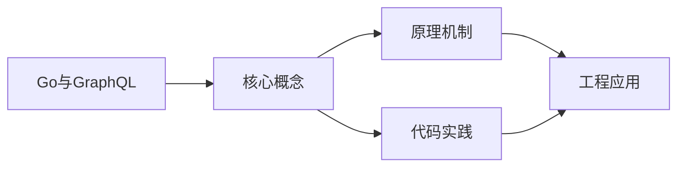
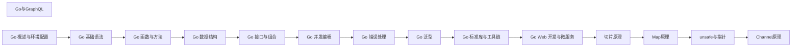

## 1. 学习目标（Bloom 分类）

本节按照布鲁姆教育目标分类学组织学习路径。本文主题为《Go与GraphQL》，属于 Go 模块，读者可以根据自身阶段选择阅读深度。

记忆层面：能够准确复述本文的核心概念、术语与基本语法或操作步骤，并能够在提问或检索时快速定位对应知识点。能够说出 Go 的包、函数、结构体、接口与错误处理基本语法。

理解层面：能够用自己的语言解释核心原理与工作机制，说明概念之间的因果关系，而不是机械记忆结论。能够解释 goroutine 调度、channel 通信与内存模型。

应用层面：能够在真实项目或练习场景中运用本文知识解决具体问题，写出正确且可维护的实现。能够编写并发程序、HTTP 服务与命令行工具。

分析层面：能够拆解复杂问题，比较本文主题与相邻概念的异同，识别边界条件与例外情况。能够分析数据竞争、死锁与性能瓶颈。

评价层面：能够根据约束条件（性能、可读性、安全、成本）评价不同方案的优劣，做出有依据的技术决策。能够评价 Go 与 Java、Python 在不同场景的取舍。

创造层面：能够把本文知识与其他模块知识组合，设计出新的解决方案或可复用的工程模式。能够设计完整的微服务与云原生应用。

通过本节学习，读者应当能够把《Go与GraphQL》纳入自己的知识网络，并与 Go 模块的其他主题（goroutine、channel、内存模型、标准库）建立关联。

## 2. 历史动机与发展脉络

《Go与GraphQL》是 Go 领域的重要主题。要真正理解它，需要先了解它解决的问题与演进过程。

Go 由 Google 的 Robert Griesemer、Rob Pike 与 Ken Thompson 于 2009 年发布，设计目标是解决大规模分布式系统的工程痛点：编译慢、依赖混乱、并发难写。
Go 1.0 于 2012 年发布，此后严格保持向后兼容（Go 1 兼容性承诺）；约每半年发布一个小版本，1.21 起引入工具链管理（toolchain 指令）与内置测试 fuzzing。
Go 在云原生领域成为事实标准：Docker、Kubernetes、Prometheus、etcd 等核心项目均用 Go 编写；泛型在 1.18 加入，1.21+ 的 slices/maps 标准包补齐泛型工具。

回到本文主题：Go与GraphQL 的提出与成熟，正是上述技术背景下的必然产物。早期实现往往以简单可用为目标，随着工程规模扩大，社区逐渐沉淀出标准做法与最佳实践；理解这一脉络，可以帮助读者判断“为什么文档中的推荐写法是现在这个样子”，也能在遇到历史遗留代码时准确识别其设计年代与取舍。


## 3. 形式化定义与核心概念精讲

本节把《Go与GraphQL》涉及的核心概念以“定义 + 讲解”的形式展开。读者应把定义当作工具，把讲解当作理解路径；两者结合才能形成可迁移的知识。

goroutine 与调度：goroutine 是用户态轻量线程，由 GMP 调度器（Goroutine、Machine、Processor）多路复用到内核线程；创建成本约 2KB 栈，支持百万级并发。
channel 与 select：channel 是类型化通信管道，`<-` 发送/接收；select 多路等待；“不要通过共享内存通信，而要通过通信共享内存”是 Go 并发哲学。
内存模型：happens-before 关系由 channel、sync 原语与 atomic 建立；`go test -race` 用 ThreadSanitizer 检测数据竞争。

### 3.1 原文章节逐一精讲

原文档把主题拆分为 7 个小节，下面按顺序给出每一节的导读讲解，随后保留原文细节供精读。

#### 原文精读（完整保留）


#### 概述

GraphQL 是一种 API 查询语言，由 Facebook 开发。与 REST API 不同，GraphQL 允许客户端精确指定需要的数据字段，避免过度获取或获取不足。Go 社区中最成熟的 GraphQL 框架是 gqlgen，它采用代码优先（schema-first）的方式，先定义 GraphQL Schema，然后自动生成类型安全的 Go 代码。

#### 基础概念

在开始编码之前，需要理解 GraphQL 的几个核心概念：

- **Schema**：GraphQL 的类型定义文件，描述了 API 支持哪些查询、变更和类型。
- **Query**：读取数据的操作，类似 REST 的 GET。
- **Mutation**：修改数据的操作，类似 REST 的 POST/PUT/DELETE。
- **Resolver**：解析器函数，负责为 Schema 中的每个字段提供实际数据。
- **类型（Type）**：GraphQL 中的数据模型，类似 Go 的结构体。
- **输入类型（Input）**：用于 Mutation 参数的特殊类型。

GraphQL 的优势在于：客户端按需获取字段、一次请求获取多个资源、强类型系统自动生成文档。

#### 快速上手

##### 初始化项目

```bash
# 创建项目目录
mkdir mygraph && cd mygraph
go mod init mygraph

# 安装 gqlgen
go get github.com/99designs/gqlgen

# 初始化 gqlgen 项目
go run github.com/99designs/gqlgen init
```

初始化后，项目结构如下：

```
mygraph/
  graph/
    schema.graphqls    # GraphQL Schema 定义
    resolver.go        # 根解析器
    model/             # 自动生成的模型
    generated.go       # 自动生成的代码（不要手动修改）
  server.go            # HTTP 服务器入口
```

##### 定义 Schema

编辑 `graph/schema.graphqls`：

```graphql
# 定义数据类型
type User {
  id: ID!
  name: String!
  email: String!
  age: Int
}

# 查询：获取用户列表
type Query {
  users: [User!]!
  user(id: ID!): User
}

# 变更：创建用户
input NewUser {
  name: String!
  email: String!
  age: Int
}

type Mutation {
  createUser(input: NewUser!): User!
}
```

##### 重新生成代码

每次修改 Schema 后，需要重新生成代码：

```bash
go run github.com/99designs/gqlgen generate
```

##### 实现 Resolver

编辑 `graph/resolver.go`，实现具体的业务逻辑：

```go
package graph

import (
    "context"
    "fmt"
    "mygraph/graph/model"
)

// 用户数据存储（实际项目中使用数据库）
var users []*model.User
var nextID int = 1

// 查询所有用户
func (r *queryResolver) Users(ctx context.Context) ([]*model.User, error) {
    return users, nil
}

// 根据 ID 查询用户
func (r *queryResolver) User(ctx context.Context, id string) (*model.User, error) {
    for _, u := range users {
        if u.ID == id {
            return u, nil
        }
    }
    return nil, fmt.Errorf("用户不存在: %s", id)
}

// 创建用户
func (r *mutationResolver) CreateUser(ctx context.Context, input model.NewUser) (*model.User, error) {
    user := &model.User{
        ID:    fmt.Sprintf("%d", nextID),
        Name:  input.Name,
        Email: input.Email,
        Age:   input.Age,
    }
    nextID++
    users = append(users, user)
    return user, nil
}
```

##### 运行服务器

```bash
go run server.go
```

访问 `http://localhost:8080/` 可以打开 GraphQL Playground，在其中执行查询：

```graphql
# 创建用户
mutation {
  createUser(input: { name: "小明", email: "ming@example.com", age: 25 }) {
    id
    name
    email
  }
}

# 查询所有用户
query {
  users {
    id
    name
    email
    age
  }
}

# 只查询名字（按需获取字段）
query {
  users {
    name
  }
}
```

#### 详细用法

##### 1. 关联类型

GraphQL 支持类型之间的关联关系：

```graphql
type Post {
  id: ID!
  title: String!
  content: String!
  author: User!
}

type User {
  id: ID!
  name: String!
  posts: [Post!]!
}

type Query {
  posts: [Post!]!
}
```

对应的 Resolver：

```go
// 查询文章列表
func (r *queryResolver) Posts(ctx context.Context) ([]*model.Post, error) {
    return posts, nil
}

// 查询文章的作者（关联查询）
func (r *postResolver) Author(ctx context.Context, obj *model.Post) (*model.User, error) {
    for _, u := range users {
        if u.ID == obj.AuthorID {
            return u, nil
        }
    }
    return nil, fmt.Errorf("作者不存在")
}

// 查询用户的文章列表
func (r *userResolver) Posts(ctx context.Context, obj *model.User) ([]*model.Post, error) {
    var result []*model.Post
    for _, p := range posts {
        if p.AuthorID == obj.ID {
            result = append(result, p)
        }
    }
    return result, nil
}
```

##### 2. 分页查询

使用 GraphQL 的 Connection 模式实现分页：

```graphql
type UserConnection {
  edges: [UserEdge!]!
  pageInfo: PageInfo!
}

type UserEdge {
  node: User!
  cursor: String!
}

type PageInfo {
  hasNextPage: Boolean!
  endCursor: String
}

type Query {
  users(first: Int, after: String): UserConnection!
}
```

##### 3. 订阅（Subscription）

Subscription 用于实时推送数据更新：

```graphql
type Subscription {
  userCreated: User!
}
```

Resolver 实现：

```go
func (r *subscriptionResolver) UserCreated(ctx context.Context) (<-chan *model.User, error) {
    ch := make(chan *model.User)
    // 监听用户创建事件
    r.userCreatedCh <- ch
    go func() {
        <-ctx.Done()
        close(ch)
    }()
    return ch, nil
}
```

##### 4. 认证中间件

在 Resolver 中获取请求上下文进行认证：

```go
// 在 HTTP 中间件中设置用户信息
func AuthMiddleware(next http.Handler) http.Handler {
    return http.HandlerFunc(func(w http.ResponseWriter, r *http.Request) {
        token := r.Header.Get("Authorization")
        if token != "" {
            user := validateToken(token)
            ctx := context.WithValue(r.Context(), "user", user)
            r = r.WithContext(ctx)
        }
        next.ServeHTTP(w, r)
    })
}

// 在 Resolver 中获取用户
func (r *mutationResolver) CreateUser(ctx context.Context, input model.NewUser) (*model.User, error) {
    user := ctx.Value("user")
    if user == nil {
        return nil, fmt.Errorf("未认证")
    }
    // ... 创建用户逻辑
}
```

##### 5. 错误处理

GraphQL 有自己的错误格式：

```go
import "github.com/99designs/gqlgen/graphql"

func (r *mutationResolver) CreateUser(ctx context.Context, input model.NewUser) (*model.User, error) {
    if input.Name == "" {
        // 返回带错误码的 GraphQL 错误
        return nil, graphql.ErrorOnPath(ctx, fmt.Errorf("用户名不能为空"))
    }
    // ...
}
```

##### 6. 自定义标量

GraphQL 默认支持 Int、Float、String、Boolean、ID。可以自定义标量类型：

```graphql
scalar Time

type Event {
  id: ID!
  name: String!
  createdAt: Time!
}
```

在 gqlgen.yml 中配置映射：

```yaml
models:
  Time:
    model: github.com/99designs/gqlgen/graphql.Time
```

#### 常见场景

##### 场景一：REST 迁移到 GraphQL

逐步迁移，先包装现有 REST API：

```go
func (r *queryResolver) Users(ctx context.Context) ([]*model.User, error) {
    // 调用现有的 REST API
    resp, err := http.Get("http://api.internal/users")
    if err != nil {
        return nil, err
    }
    defer resp.Body.Close()

    var users []*model.User
    json.NewDecoder(resp.Body).Decode(&users)
    return users, nil
}
```

##### 场景二：多数据源聚合

GraphQL 的优势之一是可以在一个请求中聚合多个数据源：

```go
func (r *userResolver) Posts(ctx context.Context, obj *model.User) ([]*model.Post, error) {
    // 从文章服务获取
    return postService.GetByAuthor(ctx, obj.ID)
}

func (r *userResolver) Orders(ctx context.Context, obj *model.User) ([]*model.Order, error) {
    // 从订单服务获取
    return orderService.GetByUser(ctx, obj.ID)
}
```

##### 场景三：N+1 查询优化

使用 DataLoader 批量加载数据，避免 N+1 问题：

```go
import "github.com/graph-gophers/dataloader/v7"

// 创建 DataLoader
userLoader := dataloader.NewBatchedLoader(func(ctx context.Context, keys []string) []*dataloader.Result[*model.User] {
    // 批量查询所有用户
    users := db.GetUsersByIDs(keys)
    results := make([]*dataloader.Result[*model.User], len(keys))
    for i, key := range keys {
        results[i] = &dataloader.Result[*model.User]{Data: users[key]}
    }
    return results
})

// 在 Resolver 中使用
func (r *postResolver) Author(ctx context.Context, obj *model.Post) (*model.User, error) {
    thunk := userLoader.Load(ctx, obj.AuthorID)
    result, err := thunk()
    return result, err
}
```

#### 注意事项与常见错误

1. **不要手动修改 generated.go**：这个文件由 gqlgen 自动生成，修改后会在下次生成时被覆盖。所有自定义逻辑写在 resolver.go 中。

2. **Schema 变更后必须重新生成**：修改 `schema.graphqls` 后，必须运行 `go run github.com/99designs/gqlgen generate` 更新代码。

3. **N+1 查询问题**：如果 User 有一个 posts 字段，查询 10 个用户时会触发 10 次文章查询。使用 DataLoader 批量加载解决。

4. **Context 传递**：GraphQL 的 Context 与 HTTP 的 Context 是同一个，可以在中间件中设置值，在 Resolver 中读取。

5. **空值处理**：Schema 中带 `!` 的字段表示非空，Resolver 必须返回非 nil 值。不带 `!` 的字段可以返回 nil。

#### 进阶用法

##### 自定义模型

默认情况下 gqlgen 会根据 Schema 自动生成模型。如果需要使用自定义模型，在 `gqlgen.yml` 中配置：

```yaml
models:
  User:
    model: myapp/models.User
```

##### 指令（Directive）

自定义指令实现横切关注点：

```graphql
directive @auth(role: String!) on FIELD_DEFINITION

type Query {
  adminData: String! @auth(role: "admin")
}
```

##### Federation（联邦）

多个 GraphQL 服务可以组合成一个统一的 API：

```bash
go get github.com/99designs/gqlgen/plugin/federation
```

在 `gqlgen.yml` 中启用：

```yaml
federation:
  filename: graph/federation.go
  package: graph
```


### 3.2 概念关系图

下面用 Mermaid 图表达本文核心概念之间的关系，帮助读者建立整体图景：



图中展示的是本文知识的结构化关系：核心概念是入口，原理机制解释“为什么”，代码实践演示“怎么做”，工程应用回答“何时用”。读者学习时可以把每个小节的内容挂接到对应节点上。

## 4. 理论推导与原理解析

本节深入《Go与GraphQL》背后的原理。理论部分不求面面俱到，而是聚焦“能解释现象、能指导实践”的关键推导。

goroutine 与调度：goroutine 是用户态轻量线程，由 GMP 调度器（Goroutine、Machine、Processor）多路复用到内核线程；创建成本约 2KB 栈，支持百万级并发。
channel 与 select：channel 是类型化通信管道，`<-` 发送/接收；select 多路等待；“不要通过共享内存通信，而要通过通信共享内存”是 Go 并发哲学。
内存模型：happens-before 关系由 channel、sync 原语与 atomic 建立；`go test -race` 用 ThreadSanitizer 检测数据竞争。
错误处理：Go 用多返回值显式处理错误（`if err != nil`），error 是接口；panic/recover 仅用于不可恢复错误。

需要强调的是，理论推导与工程实践之间存在翻译层：理论给出的是理想化模型与边界条件，工程代码则必须处理真实环境中的例外。读者在学习时应先掌握理论的“标准情形”，再通过陷阱章节了解“非标准情形”。

## 5. 代码示例与逐行讲解

本节把原文中的代码示例系统整理，并为每个示例补充用途说明与讲解。读者不应只浏览代码，而应逐段对照讲解理解设计意图。

### 5.1 示例：初始化项目

该示例来自原文《初始化项目》小节，用于演示Go与GraphQL相关操作。阅读时请先看代码结构，再看其后的讲解。

```bash
# 创建项目目录
mkdir mygraph && cd mygraph
go mod init mygraph

# 安装 gqlgen
go get github.com/99designs/gqlgen

# 初始化 gqlgen 项目
go run github.com/99designs/gqlgen init
```

讲解：这段代码演示了本节核心知识点。代码中的关键操作可以归纳为三步：准备（定义或初始化）、执行（核心逻辑）、收尾（释放资源或返回结果）。实际项目中，这三步往往被封装为函数或类，以提升复用性与可测试性。

关键点分析：

该示例共 7 行有效代码，结构以数据或配置为主。阅读时应关注：数据字段的含义、配置项的作用，以及它们与运行行为的对应关系。

进阶思考路径：先尝试修改参数观察行为变化，再把示例中的模式迁移到自己的项目中；每次修改都记录预期与实测差异，这是把示例转化为能力的最快方式。

### 5.2 示例：初始化项目

该示例来自原文《初始化项目》小节，用于演示Go与GraphQL相关操作。阅读时请先看代码结构，再看其后的讲解。

```text
mygraph/
  graph/
    schema.graphqls    # GraphQL Schema 定义
    resolver.go        # 根解析器
    model/             # 自动生成的模型
    generated.go       # 自动生成的代码（不要手动修改）
  server.go            # HTTP 服务器入口
```

讲解：这段代码演示了本节核心知识点。代码中的关键操作可以归纳为三步：准备（定义或初始化）、执行（核心逻辑）、收尾（释放资源或返回结果）。实际项目中，这三步往往被封装为函数或类，以提升复用性与可测试性。

关键点分析：

该示例共 7 行有效代码，结构以数据或配置为主。阅读时应关注：数据字段的含义、配置项的作用，以及它们与运行行为的对应关系。

进阶思考路径：先尝试修改参数观察行为变化，再把示例中的模式迁移到自己的项目中；每次修改都记录预期与实测差异，这是把示例转化为能力的最快方式。

### 5.3 示例：定义 Schema

该示例来自原文《定义 Schema》小节，用于演示Go与GraphQL相关操作。阅读时请先看代码结构，再看其后的讲解。

```graphql
# 定义数据类型
type User {
  id: ID!
  name: String!
  email: String!
  age: Int
}

# 查询：获取用户列表
type Query {
  users: [User!]!
  user(id: ID!): User
}

# 变更：创建用户
input NewUser {
  name: String!
  email: String!
  age: Int
}

type Mutation {
  createUser(input: NewUser!): User!
}
```

讲解：这段代码演示了本节核心知识点。代码中的关键操作可以归纳为三步：准备（定义或初始化）、执行（核心逻辑）、收尾（释放资源或返回结果）。实际项目中，这三步往往被封装为函数或类，以提升复用性与可测试性。

关键点分析：

该示例共 21 行有效代码，结构以数据或配置为主。阅读时应关注：数据字段的含义、配置项的作用，以及它们与运行行为的对应关系。

进阶思考路径：先尝试修改参数观察行为变化，再把示例中的模式迁移到自己的项目中；每次修改都记录预期与实测差异，这是把示例转化为能力的最快方式。

### 5.4 示例：重新生成代码

该示例来自原文《重新生成代码》小节，用于演示Go与GraphQL相关操作。阅读时请先看代码结构，再看其后的讲解。

```bash
go run github.com/99designs/gqlgen generate
```

讲解：这段代码演示了本节核心知识点。代码中的关键操作可以归纳为三步：准备（定义或初始化）、执行（核心逻辑）、收尾（释放资源或返回结果）。实际项目中，这三步往往被封装为函数或类，以提升复用性与可测试性。

关键点分析：

该示例共 1 行有效代码，结构以数据或配置为主。阅读时应关注：数据字段的含义、配置项的作用，以及它们与运行行为的对应关系。

进阶思考路径：先尝试修改参数观察行为变化，再把示例中的模式迁移到自己的项目中；每次修改都记录预期与实测差异，这是把示例转化为能力的最快方式。

### 5.5 示例：实现 Resolver

该示例来自原文《实现 Resolver》小节，用于演示Go与GraphQL相关操作。阅读时请先看代码结构，再看其后的讲解。

```go
package graph

import (
    "context"
    "fmt"
    "mygraph/graph/model"
)

// 用户数据存储（实际项目中使用数据库）
var users []*model.User
var nextID int = 1

// 查询所有用户
func (r *queryResolver) Users(ctx context.Context) ([]*model.User, error) {
    return users, nil
}

// 根据 ID 查询用户
func (r *queryResolver) User(ctx context.Context, id string) (*model.User, error) {
    for _, u := range users {
        if u.ID == id {
            return u, nil
        }
    }
    return nil, fmt.Errorf("用户不存在: %s", id)
}

// 创建用户
func (r *mutationResolver) CreateUser(ctx context.Context, input model.NewUser) (*model.User, error) {
    user := &model.User{
        ID:    fmt.Sprintf("%d", nextID),
        Name:  input.Name,
        Email: input.Email,
        Age:   input.Age,
    }
    nextID++
    users = append(users, user)
    return user, nil
}
```

讲解：这段代码演示了本节核心知识点。代码中的关键操作可以归纳为三步：准备（定义或初始化）、执行（核心逻辑）、收尾（释放资源或返回结果）。实际项目中，这三步往往被封装为函数或类，以提升复用性与可测试性。

关键点分析：

该示例共 34 行有效代码，包含 5 类关键结构（func、import、if、for、return）。其中：

- 入口与初始化部分负责建立上下文，对应实际项目中的启动或装配逻辑；
- 核心逻辑部分体现本文主题的主要操作，是阅读时最需要对照讲解理解的部分；
- 输出或返回部分把结果交给调用方，注意其类型与边界条件。

进阶思考路径：先尝试修改参数观察行为变化，再把示例中的模式迁移到自己的项目中；每次修改都记录预期与实测差异，这是把示例转化为能力的最快方式。

### 5.6 示例：运行服务器

该示例来自原文《运行服务器》小节，用于演示Go与GraphQL相关操作。阅读时请先看代码结构，再看其后的讲解。

```bash
go run server.go
```

讲解：这段代码演示了本节核心知识点。代码中的关键操作可以归纳为三步：准备（定义或初始化）、执行（核心逻辑）、收尾（释放资源或返回结果）。实际项目中，这三步往往被封装为函数或类，以提升复用性与可测试性。

关键点分析：

该示例共 1 行有效代码，结构以数据或配置为主。阅读时应关注：数据字段的含义、配置项的作用，以及它们与运行行为的对应关系。

进阶思考路径：先尝试修改参数观察行为变化，再把示例中的模式迁移到自己的项目中；每次修改都记录预期与实测差异，这是把示例转化为能力的最快方式。

### 5.7 示例：运行服务器

该示例来自原文《运行服务器》小节，用于演示Go与GraphQL相关操作。阅读时请先看代码结构，再看其后的讲解。

```graphql
# 创建用户
mutation {
  createUser(input: { name: "小明", email: "ming@example.com", age: 25 }) {
    id
    name
    email
  }
}

# 查询所有用户
query {
  users {
    id
    name
    email
    age
  }
}

# 只查询名字（按需获取字段）
query {
  users {
    name
  }
}
```

讲解：这段代码演示了本节核心知识点。代码中的关键操作可以归纳为三步：准备（定义或初始化）、执行（核心逻辑）、收尾（释放资源或返回结果）。实际项目中，这三步往往被封装为函数或类，以提升复用性与可测试性。

关键点分析：

该示例共 23 行有效代码，结构以数据或配置为主。阅读时应关注：数据字段的含义、配置项的作用，以及它们与运行行为的对应关系。

进阶思考路径：先尝试修改参数观察行为变化，再把示例中的模式迁移到自己的项目中；每次修改都记录预期与实测差异，这是把示例转化为能力的最快方式。

### 5.8 示例：1. 关联类型

该示例来自原文《1. 关联类型》小节，用于演示Go与GraphQL相关操作。阅读时请先看代码结构，再看其后的讲解。

```graphql
type Post {
  id: ID!
  title: String!
  content: String!
  author: User!
}

type User {
  id: ID!
  name: String!
  posts: [Post!]!
}

type Query {
  posts: [Post!]!
}
```

讲解：这段代码演示了本节核心知识点。代码中的关键操作可以归纳为三步：准备（定义或初始化）、执行（核心逻辑）、收尾（释放资源或返回结果）。实际项目中，这三步往往被封装为函数或类，以提升复用性与可测试性。

关键点分析：

该示例共 14 行有效代码，结构以数据或配置为主。阅读时应关注：数据字段的含义、配置项的作用，以及它们与运行行为的对应关系。

进阶思考路径：先尝试修改参数观察行为变化，再把示例中的模式迁移到自己的项目中；每次修改都记录预期与实测差异，这是把示例转化为能力的最快方式。

### 5.9 示例：1. 关联类型

该示例来自原文《1. 关联类型》小节，用于演示Go与GraphQL相关操作。阅读时请先看代码结构，再看其后的讲解。

```go
// 查询文章列表
func (r *queryResolver) Posts(ctx context.Context) ([]*model.Post, error) {
    return posts, nil
}

// 查询文章的作者（关联查询）
func (r *postResolver) Author(ctx context.Context, obj *model.Post) (*model.User, error) {
    for _, u := range users {
        if u.ID == obj.AuthorID {
            return u, nil
        }
    }
    return nil, fmt.Errorf("作者不存在")
}

// 查询用户的文章列表
func (r *userResolver) Posts(ctx context.Context, obj *model.User) ([]*model.Post, error) {
    var result []*model.Post
    for _, p := range posts {
        if p.AuthorID == obj.ID {
            result = append(result, p)
        }
    }
    return result, nil
}
```

讲解：这段代码演示了本节核心知识点。代码中的关键操作可以归纳为三步：准备（定义或初始化）、执行（核心逻辑）、收尾（释放资源或返回结果）。实际项目中，这三步往往被封装为函数或类，以提升复用性与可测试性。

关键点分析：

该示例共 23 行有效代码，包含 4 类关键结构（func、if、for、return）。其中：

- 入口与初始化部分负责建立上下文，对应实际项目中的启动或装配逻辑；
- 核心逻辑部分体现本文主题的主要操作，是阅读时最需要对照讲解理解的部分；
- 输出或返回部分把结果交给调用方，注意其类型与边界条件。

进阶思考路径：先尝试修改参数观察行为变化，再把示例中的模式迁移到自己的项目中；每次修改都记录预期与实测差异，这是把示例转化为能力的最快方式。

### 5.10 示例：2. 分页查询

该示例来自原文《2. 分页查询》小节，用于演示Go与GraphQL相关操作。阅读时请先看代码结构，再看其后的讲解。

```graphql
type UserConnection {
  edges: [UserEdge!]!
  pageInfo: PageInfo!
}

type UserEdge {
  node: User!
  cursor: String!
}

type PageInfo {
  hasNextPage: Boolean!
  endCursor: String
}

type Query {
  users(first: Int, after: String): UserConnection!
}
```

讲解：这段代码演示了本节核心知识点。代码中的关键操作可以归纳为三步：准备（定义或初始化）、执行（核心逻辑）、收尾（释放资源或返回结果）。实际项目中，这三步往往被封装为函数或类，以提升复用性与可测试性。

关键点分析：

该示例共 15 行有效代码，结构以数据或配置为主。阅读时应关注：数据字段的含义、配置项的作用，以及它们与运行行为的对应关系。

进阶思考路径：先尝试修改参数观察行为变化，再把示例中的模式迁移到自己的项目中；每次修改都记录预期与实测差异，这是把示例转化为能力的最快方式。

### 5.11 示例：3. 订阅（Subscription）

该示例来自原文《3. 订阅（Subscription）》小节，用于演示Go与GraphQL相关操作。阅读时请先看代码结构，再看其后的讲解。

```graphql
type Subscription {
  userCreated: User!
}
```

讲解：这段代码演示了本节核心知识点。代码中的关键操作可以归纳为三步：准备（定义或初始化）、执行（核心逻辑）、收尾（释放资源或返回结果）。实际项目中，这三步往往被封装为函数或类，以提升复用性与可测试性。

关键点分析：

该示例共 3 行有效代码，结构以数据或配置为主。阅读时应关注：数据字段的含义、配置项的作用，以及它们与运行行为的对应关系。

进阶思考路径：先尝试修改参数观察行为变化，再把示例中的模式迁移到自己的项目中；每次修改都记录预期与实测差异，这是把示例转化为能力的最快方式。

### 5.12 示例：3. 订阅（Subscription）

该示例来自原文《3. 订阅（Subscription）》小节，用于演示Go与GraphQL相关操作。阅读时请先看代码结构，再看其后的讲解。

```go
func (r *subscriptionResolver) UserCreated(ctx context.Context) (<-chan *model.User, error) {
    ch := make(chan *model.User)
    // 监听用户创建事件
    r.userCreatedCh <- ch
    go func() {
        <-ctx.Done()
        close(ch)
    }()
    return ch, nil
}
```

讲解：这段代码演示了本节核心知识点。代码中的关键操作可以归纳为三步：准备（定义或初始化）、执行（核心逻辑）、收尾（释放资源或返回结果）。实际项目中，这三步往往被封装为函数或类，以提升复用性与可测试性。

关键点分析：

该示例共 10 行有效代码，包含 2 类关键结构（func、return）。其中：

- 入口与初始化部分负责建立上下文，对应实际项目中的启动或装配逻辑；
- 核心逻辑部分体现本文主题的主要操作，是阅读时最需要对照讲解理解的部分；
- 输出或返回部分把结果交给调用方，注意其类型与边界条件。

进阶思考路径：先尝试修改参数观察行为变化，再把示例中的模式迁移到自己的项目中；每次修改都记录预期与实测差异，这是把示例转化为能力的最快方式。

### 5.13 示例：4. 认证中间件

该示例来自原文《4. 认证中间件》小节，用于演示Go与GraphQL相关操作。阅读时请先看代码结构，再看其后的讲解。

```go
// 在 HTTP 中间件中设置用户信息
func AuthMiddleware(next http.Handler) http.Handler {
    return http.HandlerFunc(func(w http.ResponseWriter, r *http.Request) {
        token := r.Header.Get("Authorization")
        if token != "" {
            user := validateToken(token)
            ctx := context.WithValue(r.Context(), "user", user)
            r = r.WithContext(ctx)
        }
        next.ServeHTTP(w, r)
    })
}

// 在 Resolver 中获取用户
func (r *mutationResolver) CreateUser(ctx context.Context, input model.NewUser) (*model.User, error) {
    user := ctx.Value("user")
    if user == nil {
        return nil, fmt.Errorf("未认证")
    }
    // ... 创建用户逻辑
}
```

讲解：这段代码演示了本节核心知识点。代码中的关键操作可以归纳为三步：准备（定义或初始化）、执行（核心逻辑）、收尾（释放资源或返回结果）。实际项目中，这三步往往被封装为函数或类，以提升复用性与可测试性。

关键点分析：

该示例共 20 行有效代码，包含 3 类关键结构（func、if、return）。其中：

- 入口与初始化部分负责建立上下文，对应实际项目中的启动或装配逻辑；
- 核心逻辑部分体现本文主题的主要操作，是阅读时最需要对照讲解理解的部分；
- 输出或返回部分把结果交给调用方，注意其类型与边界条件。

进阶思考路径：先尝试修改参数观察行为变化，再把示例中的模式迁移到自己的项目中；每次修改都记录预期与实测差异，这是把示例转化为能力的最快方式。

### 5.14 示例：5. 错误处理

该示例来自原文《5. 错误处理》小节，用于演示Go与GraphQL相关操作。阅读时请先看代码结构，再看其后的讲解。

```go
import "github.com/99designs/gqlgen/graphql"

func (r *mutationResolver) CreateUser(ctx context.Context, input model.NewUser) (*model.User, error) {
    if input.Name == "" {
        // 返回带错误码的 GraphQL 错误
        return nil, graphql.ErrorOnPath(ctx, fmt.Errorf("用户名不能为空"))
    }
    // ...
}
```

讲解：这段代码演示了本节核心知识点。代码中的关键操作可以归纳为三步：准备（定义或初始化）、执行（核心逻辑）、收尾（释放资源或返回结果）。实际项目中，这三步往往被封装为函数或类，以提升复用性与可测试性。

关键点分析：

该示例共 8 行有效代码，包含 4 类关键结构（func、import、if、return）。其中：

- 入口与初始化部分负责建立上下文，对应实际项目中的启动或装配逻辑；
- 核心逻辑部分体现本文主题的主要操作，是阅读时最需要对照讲解理解的部分；
- 输出或返回部分把结果交给调用方，注意其类型与边界条件。

进阶思考路径：先尝试修改参数观察行为变化，再把示例中的模式迁移到自己的项目中；每次修改都记录预期与实测差异，这是把示例转化为能力的最快方式。

### 5.15 示例：6. 自定义标量

该示例来自原文《6. 自定义标量》小节，用于演示Go与GraphQL相关操作。阅读时请先看代码结构，再看其后的讲解。

```graphql
scalar Time

type Event {
  id: ID!
  name: String!
  createdAt: Time!
}
```

讲解：这段代码演示了本节核心知识点。代码中的关键操作可以归纳为三步：准备（定义或初始化）、执行（核心逻辑）、收尾（释放资源或返回结果）。实际项目中，这三步往往被封装为函数或类，以提升复用性与可测试性。

关键点分析：

该示例共 6 行有效代码，结构以数据或配置为主。阅读时应关注：数据字段的含义、配置项的作用，以及它们与运行行为的对应关系。

进阶思考路径：先尝试修改参数观察行为变化，再把示例中的模式迁移到自己的项目中；每次修改都记录预期与实测差异，这是把示例转化为能力的最快方式。

### 5.16 示例：6. 自定义标量

该示例来自原文《6. 自定义标量》小节，用于演示Go与GraphQL相关操作。阅读时请先看代码结构，再看其后的讲解。

```yaml
models:
  Time:
    model: github.com/99designs/gqlgen/graphql.Time
```

讲解：这段代码演示了本节核心知识点。代码中的关键操作可以归纳为三步：准备（定义或初始化）、执行（核心逻辑）、收尾（释放资源或返回结果）。实际项目中，这三步往往被封装为函数或类，以提升复用性与可测试性。

关键点分析：

该示例共 3 行有效代码，结构以数据或配置为主。阅读时应关注：数据字段的含义、配置项的作用，以及它们与运行行为的对应关系。

进阶思考路径：先尝试修改参数观察行为变化，再把示例中的模式迁移到自己的项目中；每次修改都记录预期与实测差异，这是把示例转化为能力的最快方式。

### 5.17 示例：场景一：REST 迁移到 GraphQL

该示例来自原文《场景一：REST 迁移到 GraphQL》小节，用于演示Go与GraphQL相关操作。阅读时请先看代码结构，再看其后的讲解。

```go
func (r *queryResolver) Users(ctx context.Context) ([]*model.User, error) {
    // 调用现有的 REST API
    resp, err := http.Get("http://api.internal/users")
    if err != nil {
        return nil, err
    }
    defer resp.Body.Close()

    var users []*model.User
    json.NewDecoder(resp.Body).Decode(&users)
    return users, nil
}
```

讲解：这段代码演示了本节核心知识点。代码中的关键操作可以归纳为三步：准备（定义或初始化）、执行（核心逻辑）、收尾（释放资源或返回结果）。实际项目中，这三步往往被封装为函数或类，以提升复用性与可测试性。

关键点分析：

该示例共 11 行有效代码，包含 3 类关键结构（func、if、return）。其中：

- 入口与初始化部分负责建立上下文，对应实际项目中的启动或装配逻辑；
- 核心逻辑部分体现本文主题的主要操作，是阅读时最需要对照讲解理解的部分；
- 输出或返回部分把结果交给调用方，注意其类型与边界条件。

进阶思考路径：先尝试修改参数观察行为变化，再把示例中的模式迁移到自己的项目中；每次修改都记录预期与实测差异，这是把示例转化为能力的最快方式。

### 5.18 示例：场景二：多数据源聚合

该示例来自原文《场景二：多数据源聚合》小节，用于演示Go与GraphQL相关操作。阅读时请先看代码结构，再看其后的讲解。

```go
func (r *userResolver) Posts(ctx context.Context, obj *model.User) ([]*model.Post, error) {
    // 从文章服务获取
    return postService.GetByAuthor(ctx, obj.ID)
}

func (r *userResolver) Orders(ctx context.Context, obj *model.User) ([]*model.Order, error) {
    // 从订单服务获取
    return orderService.GetByUser(ctx, obj.ID)
}
```

讲解：这段代码演示了本节核心知识点。代码中的关键操作可以归纳为三步：准备（定义或初始化）、执行（核心逻辑）、收尾（释放资源或返回结果）。实际项目中，这三步往往被封装为函数或类，以提升复用性与可测试性。

关键点分析：

该示例共 8 行有效代码，包含 2 类关键结构（func、return）。其中：

- 入口与初始化部分负责建立上下文，对应实际项目中的启动或装配逻辑；
- 核心逻辑部分体现本文主题的主要操作，是阅读时最需要对照讲解理解的部分；
- 输出或返回部分把结果交给调用方，注意其类型与边界条件。

进阶思考路径：先尝试修改参数观察行为变化，再把示例中的模式迁移到自己的项目中；每次修改都记录预期与实测差异，这是把示例转化为能力的最快方式。

### 5.19 示例：场景三：N+1 查询优化

该示例来自原文《场景三：N+1 查询优化》小节，用于演示Go与GraphQL相关操作。阅读时请先看代码结构，再看其后的讲解。

```go
import "github.com/graph-gophers/dataloader/v7"

// 创建 DataLoader
userLoader := dataloader.NewBatchedLoader(func(ctx context.Context, keys []string) []*dataloader.Result[*model.User] {
    // 批量查询所有用户
    users := db.GetUsersByIDs(keys)
    results := make([]*dataloader.Result[*model.User], len(keys))
    for i, key := range keys {
        results[i] = &dataloader.Result[*model.User]{Data: users[key]}
    }
    return results
})

// 在 Resolver 中使用
func (r *postResolver) Author(ctx context.Context, obj *model.Post) (*model.User, error) {
    thunk := userLoader.Load(ctx, obj.AuthorID)
    result, err := thunk()
    return result, err
}
```

讲解：这段代码演示了本节核心知识点。代码中的关键操作可以归纳为三步：准备（定义或初始化）、执行（核心逻辑）、收尾（释放资源或返回结果）。实际项目中，这三步往往被封装为函数或类，以提升复用性与可测试性。

关键点分析：

该示例共 17 行有效代码，包含 4 类关键结构（func、import、for、return）。其中：

- 入口与初始化部分负责建立上下文，对应实际项目中的启动或装配逻辑；
- 核心逻辑部分体现本文主题的主要操作，是阅读时最需要对照讲解理解的部分；
- 输出或返回部分把结果交给调用方，注意其类型与边界条件。

进阶思考路径：先尝试修改参数观察行为变化，再把示例中的模式迁移到自己的项目中；每次修改都记录预期与实测差异，这是把示例转化为能力的最快方式。

### 5.20 示例：自定义模型

该示例来自原文《自定义模型》小节，用于演示Go与GraphQL相关操作。阅读时请先看代码结构，再看其后的讲解。

```yaml
models:
  User:
    model: myapp/models.User
```

讲解：这段代码演示了本节核心知识点。代码中的关键操作可以归纳为三步：准备（定义或初始化）、执行（核心逻辑）、收尾（释放资源或返回结果）。实际项目中，这三步往往被封装为函数或类，以提升复用性与可测试性。

关键点分析：

该示例共 3 行有效代码，结构以数据或配置为主。阅读时应关注：数据字段的含义、配置项的作用，以及它们与运行行为的对应关系。

进阶思考路径：先尝试修改参数观察行为变化，再把示例中的模式迁移到自己的项目中；每次修改都记录预期与实测差异，这是把示例转化为能力的最快方式。

### 5.21 示例：指令（Directive）

该示例来自原文《指令（Directive）》小节，用于演示Go与GraphQL相关操作。阅读时请先看代码结构，再看其后的讲解。

```graphql
directive @auth(role: String!) on FIELD_DEFINITION

type Query {
  adminData: String! @auth(role: "admin")
}
```

讲解：这段代码演示了本节核心知识点。代码中的关键操作可以归纳为三步：准备（定义或初始化）、执行（核心逻辑）、收尾（释放资源或返回结果）。实际项目中，这三步往往被封装为函数或类，以提升复用性与可测试性。

关键点分析：

该示例共 4 行有效代码，结构以数据或配置为主。阅读时应关注：数据字段的含义、配置项的作用，以及它们与运行行为的对应关系。

进阶思考路径：先尝试修改参数观察行为变化，再把示例中的模式迁移到自己的项目中；每次修改都记录预期与实测差异，这是把示例转化为能力的最快方式。

### 5.22 示例：Federation（联邦）

该示例来自原文《Federation（联邦）》小节，用于演示Go与GraphQL相关操作。阅读时请先看代码结构，再看其后的讲解。

```bash
go get github.com/99designs/gqlgen/plugin/federation
```

讲解：这段代码演示了本节核心知识点。代码中的关键操作可以归纳为三步：准备（定义或初始化）、执行（核心逻辑）、收尾（释放资源或返回结果）。实际项目中，这三步往往被封装为函数或类，以提升复用性与可测试性。

关键点分析：

该示例共 1 行有效代码，结构以数据或配置为主。阅读时应关注：数据字段的含义、配置项的作用，以及它们与运行行为的对应关系。

进阶思考路径：先尝试修改参数观察行为变化，再把示例中的模式迁移到自己的项目中；每次修改都记录预期与实测差异，这是把示例转化为能力的最快方式。

### 5.23 示例：Federation（联邦）

该示例来自原文《Federation（联邦）》小节，用于演示Go与GraphQL相关操作。阅读时请先看代码结构，再看其后的讲解。

```yaml
federation:
  filename: graph/federation.go
  package: graph
```

讲解：这段代码演示了本节核心知识点。代码中的关键操作可以归纳为三步：准备（定义或初始化）、执行（核心逻辑）、收尾（释放资源或返回结果）。实际项目中，这三步往往被封装为函数或类，以提升复用性与可测试性。

关键点分析：

该示例共 3 行有效代码，结构以数据或配置为主。阅读时应关注：数据字段的含义、配置项的作用，以及它们与运行行为的对应关系。

进阶思考路径：先尝试修改参数观察行为变化，再把示例中的模式迁移到自己的项目中；每次修改都记录预期与实测差异，这是把示例转化为能力的最快方式。


综合以上示例，可以总结出本主题的代码实践要点：第一，先定义清晰的输入输出契约；第二，核心逻辑保持单一职责；第三，错误处理与边界条件不可省略；第四，命名与注释表达意图而非复述代码。

## 6. 对比分析

对比是理解《Go与GraphQL》定位的最快路径。下面从多个维度与相邻方案进行对比。

Go 与 Java：Go 编译快、部署简单（静态二进制）、并发原语原生；Java 生态更丰富、虚拟线程补足并发短板。
Go 与 Python：Go 性能高、类型安全；Python 开发快、AI 生态强。
goroutine 与线程：goroutine 用户态调度、栈动态增长；线程内核态、栈固定。

对比的目的不是分出绝对优劣，而是建立选择依据：不同约束条件下，最优解不同。读者应把每个对比维度转化为决策检查清单。

## 7. 常见陷阱与最佳实践

本节整理该主题的高频错误与推荐做法。每个陷阱先描述现象，再解释原因，最后给出最佳实践。

### 7.1 忽略错误返回值

错误被静默丢弃导致故障难查。显式检查并包装上下文（fmt.Errorf + %w）。

深入讲解：该问题之所以被归类为“常见陷阱”，是因为它在初学者的代码中反复出现，而且往往不在第一时间暴露——错误通常隐藏在特定数据或特定时序下。

从成因上看，忽略错误返回值 一般源于对 Go 某个机制的理解偏差：要么误用了默认行为，要么忽略了边界条件，要么把其他语言的思维惯性带了过来。

从影响上看，忽略错误返回值 轻则产生错误结果，重则导致资源泄漏、数据损坏或安全事故；这也是为什么工程评审中会把它列为检查项。

从修复策略上看，处理忽略错误返回值的正确顺序是：先复现（构造最小用例），再定位（确认机制层面的根因），最后修复并补充回归测试。跳过复现直接改代码，往往治标不治本。

### 7.2 goroutine 泄漏

channel 无接收者或循环启动 goroutine 导致资源泄漏。使用 context 取消与 WaitGroup 收口。

深入讲解：该问题之所以被归类为“常见陷阱”，是因为它在初学者的代码中反复出现，而且往往不在第一时间暴露——错误通常隐藏在特定数据或特定时序下。

从成因上看，goroutine 泄漏 一般源于对 Go 某个机制的理解偏差：要么误用了默认行为，要么忽略了边界条件，要么把其他语言的思维惯性带了过来。

从影响上看，goroutine 泄漏 轻则产生错误结果，重则导致资源泄漏、数据损坏或安全事故；这也是为什么工程评审中会把它列为检查项。

从修复策略上看，处理goroutine 泄漏的正确顺序是：先复现（构造最小用例），再定位（确认机制层面的根因），最后修复并补充回归测试。跳过复现直接改代码，往往治标不治本。

### 7.3 共享变量竞争

多个 goroutine 读写同一变量未同步。使用 mutex、atomic 或改为 channel 传递。

深入讲解：该问题之所以被归类为“常见陷阱”，是因为它在初学者的代码中反复出现，而且往往不在第一时间暴露——错误通常隐藏在特定数据或特定时序下。

从成因上看，共享变量竞争 一般源于对 Go 某个机制的理解偏差：要么误用了默认行为，要么忽略了边界条件，要么把其他语言的思维惯性带了过来。

从影响上看，共享变量竞争 轻则产生错误结果，重则导致资源泄漏、数据损坏或安全事故；这也是为什么工程评审中会把它列为检查项。

从修复策略上看，处理共享变量竞争的正确顺序是：先复现（构造最小用例），再定位（确认机制层面的根因），最后修复并补充回归测试。跳过复现直接改代码，往往治标不治本。

### 7.4 defer 在循环中累积

defer 在函数返回时执行，循环内 defer 延迟大量资源释放。将循环体提取为函数。

深入讲解：该问题之所以被归类为“常见陷阱”，是因为它在初学者的代码中反复出现，而且往往不在第一时间暴露——错误通常隐藏在特定数据或特定时序下。

从成因上看，defer 在循环中累积 一般源于对 Go 某个机制的理解偏差：要么误用了默认行为，要么忽略了边界条件，要么把其他语言的思维惯性带了过来。

从影响上看，defer 在循环中累积 轻则产生错误结果，重则导致资源泄漏、数据损坏或安全事故；这也是为什么工程评审中会把它列为检查项。

从修复策略上看，处理defer 在循环中累积的正确顺序是：先复现（构造最小用例），再定位（确认机制层面的根因），最后修复并补充回归测试。跳过复现直接改代码，往往治标不治本。

### 7.5 切片共享底层数组

append 可能修改共享数组，产生隐蔽 bug。需要独立数据时用 copy 或完整切片表达式。

深入讲解：该问题之所以被归类为“常见陷阱”，是因为它在初学者的代码中反复出现，而且往往不在第一时间暴露——错误通常隐藏在特定数据或特定时序下。

从成因上看，切片共享底层数组 一般源于对 Go 某个机制的理解偏差：要么误用了默认行为，要么忽略了边界条件，要么把其他语言的思维惯性带了过来。

从影响上看，切片共享底层数组 轻则产生错误结果，重则导致资源泄漏、数据损坏或安全事故；这也是为什么工程评审中会把它列为检查项。

从修复策略上看，处理切片共享底层数组的正确顺序是：先复现（构造最小用例），再定位（确认机制层面的根因），最后修复并补充回归测试。跳过复现直接改代码，往往治标不治本。

### 7.6 map 并发读写

map 非并发安全，并发写 panic。使用 sync.Map 或加锁。

深入讲解：该问题之所以被归类为“常见陷阱”，是因为它在初学者的代码中反复出现，而且往往不在第一时间暴露——错误通常隐藏在特定数据或特定时序下。

从成因上看，map 并发读写 一般源于对 Go 某个机制的理解偏差：要么误用了默认行为，要么忽略了边界条件，要么把其他语言的思维惯性带了过来。

从影响上看，map 并发读写 轻则产生错误结果，重则导致资源泄漏、数据损坏或安全事故；这也是为什么工程评审中会把它列为检查项。

从修复策略上看，处理map 并发读写的正确顺序是：先复现（构造最小用例），再定位（确认机制层面的根因），最后修复并补充回归测试。跳过复现直接改代码，往往治标不治本。

### 7.7 指针逃逸与性能误判

过早优化影响可读性。先用 benchmark 与 pprof 定位热点。

深入讲解：该问题之所以被归类为“常见陷阱”，是因为它在初学者的代码中反复出现，而且往往不在第一时间暴露——错误通常隐藏在特定数据或特定时序下。

从成因上看，指针逃逸与性能误判 一般源于对 Go 某个机制的理解偏差：要么误用了默认行为，要么忽略了边界条件，要么把其他语言的思维惯性带了过来。

从影响上看，指针逃逸与性能误判 轻则产生错误结果，重则导致资源泄漏、数据损坏或安全事故；这也是为什么工程评审中会把它列为检查项。

从修复策略上看，处理指针逃逸与性能误判的正确顺序是：先复现（构造最小用例），再定位（确认机制层面的根因），最后修复并补充回归测试。跳过复现直接改代码，往往治标不治本。

### 7.8 超时控制缺失

网络请求无超时导致 goroutine 悬挂。使用 http.Client.Timeout 与 context.WithTimeout。

深入讲解：该问题之所以被归类为“常见陷阱”，是因为它在初学者的代码中反复出现，而且往往不在第一时间暴露——错误通常隐藏在特定数据或特定时序下。

从成因上看，超时控制缺失 一般源于对 Go 某个机制的理解偏差：要么误用了默认行为，要么忽略了边界条件，要么把其他语言的思维惯性带了过来。

从影响上看，超时控制缺失 轻则产生错误结果，重则导致资源泄漏、数据损坏或安全事故；这也是为什么工程评审中会把它列为检查项。

从修复策略上看，处理超时控制缺失的正确顺序是：先复现（构造最小用例），再定位（确认机制层面的根因），最后修复并补充回归测试。跳过复现直接改代码，往往治标不治本。

### 7.0 最佳实践总览

1. 使用 gofmt 统一格式，go vet 静态检查。
2. 错误处理显式且带上下文，不使用 panic 做业务控制。
3. 并发入口使用 context 传递取消与超时。
4. 接口尽量小，函数参数按需接收。
5. 每次提交前运行 go test -race ./...。

把这些最佳实践固化为团队规范与代码评审检查项，是避免同类问题反复出现的关键。

## 8. 工程实践

本节把《Go与GraphQL》放入真实工程场景，给出可复用的模式与组织方法。

标准项目布局：cmd/（可执行入口）、internal/（私有包）、pkg/（对外库）；单一 main 包保持薄。
HTTP 服务：net/http 标准库 + 中间件模式；路由可用 Go 1.22+ 的 method pattern。
配置与日志：环境变量 + 结构体映射；log/slog（1.21+）结构化日志。
部署：多阶段 Dockerfile 构建静态二进制，镜像可小至几十 MB。

### 8.1 工程实践的原则拆解

以上工程实践可以归纳为四条原则。第一，配置与代码分离：Go 项目中环境差异应通过配置注入，而不是散落在代码分支中；这保证同一份代码可以在开发、测试、生产环境一致运行。

第二，接口稳定优先：对外接口（函数签名、协议、数据格式）一旦被消费方依赖，变更成本极高；设计时应预留扩展点并保持向后兼容。

第三，可观测性内置：日志、指标与追踪应该在功能开发时同步设计，而不是故障发生后补救；没有观测手段的模块等于黑盒。

第四，变更可回滚：任何发布都应有对应的回滚方案；数据库迁移、配置变更与代码发布一样需要版本管理与逆向路径。

### 8.2 实践落地的检查清单

- [ ] 标准项目布局：对照本节描述，检查当前项目是否已经落实；未落实的项列入技术债并排期处理。
- [ ] HTTP 服务：对照本节描述，检查当前项目是否已经落实；未落实的项列入技术债并排期处理。
- [ ] 配置与日志：对照本节描述，检查当前项目是否已经落实；未落实的项列入技术债并排期处理。
- [ ] 部署：对照本节描述，检查当前项目是否已经落实；未落实的项列入技术债并排期处理。

工程实践的共性原则：配置与代码分离、接口稳定优先、可观测性内置、变更可回滚。这些原则适用于本主题的所有实现。

## 9. 案例研究

本节通过一个完整案例把《Go与GraphQL》的知识串起来。案例按“需求分析、方案设计、实现、验证”四步展开。

需求：实现并发安全的限流器与统计服务。
方案：atomic 计数 + channel 令牌桶 + net/http 中间件。
要点：原子操作更新峰值；context 控制请求超时；/metrics 暴露计数。
验证：go test -race 检测竞争；压测验证限流准确率。

### 9.1 案例的扩展讨论

把案例中的方案放大到真实规模，需要额外考虑三个问题：

第一，规模：当数据量或并发量上升一个数量级时，原方案中的数据结构、缓存策略与任务调度是否仍然成立？通常需要引入分层与异步。

第二，团队：多人协作时，模块边界、接口契约与代码所有权必须明确；案例中的实现应拆分为可独立测试的单元，并配合文档说明设计意图。

第三，演进：上线后的需求变化不可避免；方案设计时应预留扩展点（配置化、插件化、事件化），并定期用真实指标验证假设。


案例研究的学习方法：先独立阅读需求，尝试在脑中形成方案，再对照实现与讲解，最后思考“如果约束变化（数据量、并发、团队规模），方案应如何调整”。

## 10. 知识要点总结与深入讲解

本节以讲解形式汇总全文要点，替代传统的习题与自测，读者不需要答题，只需跟随解释建立完整的认知框架。

关于《Go与GraphQL》的核心结论：

Go 的核心优势是简单与并发：语法规模小、工具链统一、并发模型清晰。
工程基线：race 检测、context 传递、显式错误处理。
云原生是 Go 的主场，微服务与基础设施选型应优先考虑。

原文档各小节的要点回顾：

- 概述：该小节围绕Go与GraphQL展开具体细节，阅读时应关注其与核心结论的对应关系；每个小节都是核心结论在某一个侧面的展开。
- 基础概念：该小节围绕Go与GraphQL展开具体细节，阅读时应关注其与核心结论的对应关系；每个小节都是核心结论在某一个侧面的展开。
- 快速上手：该小节围绕Go与GraphQL展开具体细节，阅读时应关注其与核心结论的对应关系；每个小节都是核心结论在某一个侧面的展开。
- 详细用法：该小节围绕Go与GraphQL展开具体细节，阅读时应关注其与核心结论的对应关系；每个小节都是核心结论在某一个侧面的展开。
- 常见场景：该小节围绕Go与GraphQL展开具体细节，阅读时应关注其与核心结论的对应关系；每个小节都是核心结论在某一个侧面的展开。
- 注意事项与常见错误：该小节围绕Go与GraphQL展开具体细节，阅读时应关注其与核心结论的对应关系；每个小节都是核心结论在某一个侧面的展开。
- 进阶用法：该小节围绕Go与GraphQL展开具体细节，阅读时应关注其与核心结论的对应关系；每个小节都是核心结论在某一个侧面的展开。

把以上要点与第 3-9 节的内容对照复习，即可完成对本文主题的闭环学习。

## 11. 参考文献


Go 官方文档：https://go.dev/doc/
Go 内存模型：https://go.dev/ref/mem
Effective Go：https://go.dev/doc/effective_go
Go 标准库：https://pkg.go.dev/std
Go 官方博客：https://go.dev/blog/

## 12. 延伸阅读


Go 并发与 channel，见 016-go 模块并发文档。
Go 原子操作与竞争检测，见 016-go/058-RaceDetectionAtomic 文档。
云原生与 Kubernetes，见 031-devops 模块。
黑马程序员 Bilibili 空间（https://space.bilibili.com/37974444 ）提供 Go 课程。

## 14. 模块知识图谱与学习路径

本文属于 Go 模块。为了把《Go与GraphQL》放入完整的知识网络，下面列出本模块的全部主题并给出相互关联的导读。学习时建议按模块内顺序推进，并在每个文档中留意交叉引用。



上图为模块主题的推荐学习顺序示意图（仅展示前若干主题）。各主题之间存在三类关联：

第一，前置依赖关系：早期主题是后期主题的基础，例如环境与语法先行、进阶主题随后；

第二，横向并列关系：同一层级主题从不同角度覆盖模块能力，学习顺序可以按兴趣调整；

第三，工程组合关系：多个主题在真实项目中组合使用，例如配置、性能与安全主题往往出现在同一系统的不同层面。

### 14.1 模块主题速查表

| 文档 | 主题 | 与本文的关联 |
| --- | --- | --- |
| Go 概述与环境配置 | 001-GoOverviewEnvSetup | 本文的前置基础 |
| Go 基础语法 | 002-GoBasicSyntax | 本文的前置基础 |
| Go 函数与方法 | 003-GoFunctionMethod | 本文的并列主题 |
| Go 数据结构 | 004-GoDataStructure | 本文的并列主题 |
| Go 接口与组合 | 005-GoInterfaceComposition | 本文的并列主题 |
| Go 并发编程 | 006-GoConcurrentProgramming | 本文的并列主题 |
| Go 错误处理 | 007-GoErrorHandling | 本文的并列主题 |
| Go 泛型 | 008-GoGeneric | 本文的并列主题 |
| Go 标准库与工具链 | 009-GoStandardLibraryToolchain | 本文的并列主题 |
| Go Web 开发与微服务 | 010-GoWebDevelopmentMicroservice | 本文的并列主题 |
| 切片原理 | 011-SlicePrinciple | 本文的原理深化 |
| Map原理 | 012-MapPrinciple | 本文的原理深化 |
| unsafe与指针 | 013-UnsafePointer | 本文的并列主题 |
| Channel原理 | 014-ChannelPrinciple | 本文的原理深化 |
| 反射 | 015-Reflection | 本文的并列主题 |
| 内存对齐 | 016-MemoryAlignment | 本文的并列主题 |
| Context详解 | 017-ContextDetailed | 本文的并列主题 |
| Goroutine调度 | 018-GoroutineSchedule | 本文的并列主题 |
| 接口与类型断言 | 019-InterfaceTypeAssertion | 本文的并列主题 |
| 错误处理进阶 | 020-ErrorHandlingAdvanced | 本文的并列主题 |
| Go与GraphQL | 021-GoGraphQL | 本文自身 |
| Go与gRPC | 022-GoGRPC | 本文的并列主题 |
| Go与Kubernetes | 023-GoKubernetes | 本文的并列主题 |
| Go与Docker | 024-GoDocker | 本文的并列主题 |
| Go与Redis | 025-GoRedis | 本文的并列主题 |
| Go与消息队列 | 026-GoMessageQueue | 本文的并列主题 |
| Go与数据库 | 027-GoDatabase | 本文的并列主题 |
| Go与测试 | 028-GoTest | 本文的并列主题 |
| Go与JSON | 029-GoJSON | 本文的并列主题 |
| Go与Fuzzing | 030-GoFuzzing | 本文的并列主题 |
| Go与CGO | 031-GoCGO | 本文的并列主题 |
| Go与Wasm | 032-GoWasm | 本文的并列主题 |
| Go与代码生成 | 033-GoCodeGeneration | 本文的并列主题 |
| Go与依赖注入 | 034-GoDependencyInjection | 本文的并列主题 |
| Go与配置管理 | 035-GoConfigManagement | 本文的并列主题 |
| Go与日志 | 036-GoLog | 本文的并列主题 |
| Go与模板 | 037-GoTemplate | 本文的并列主题 |
| Go与加密 | 038-GoEncryption | 本文的安全延伸 |
| Go与文件监控 | 039-GoFileMonitor | 本文的并列主题 |
| Go与时间 | 040-GoTime | 本文的并列主题 |
| Go与正则表达式 | 041-GoRegex | 本文的并列主题 |
| Go与信号处理 | 042-GoSignalHandling | 本文的并列主题 |
| Go与性能分析 | 043-GoPerformanceAnalysis | 本文的性能延伸 |
| Go与HTTP客户端 | 044-GoHTTPClient | 本文的并列主题 |
| Go与HTTP服务器 | 045-GoHTTP | 本文的并列主题 |
| Go与OAuth2 | 046-GoOAuth2 | 本文的并列主题 |
| Go与中间件 | 047-GoMiddleware | 本文的并列主题 |
| Go与分布式追踪 | 048-GoDistributedTracing | 本文的并列主题 |
| Go与限流 | 049-Go | 本文的并列主题 |
| goroutine与channel通信原理 | 050-GoroutineChannelPrinciple | 本文的原理深化 |
| GMP调度模型 | 051-GMPModel | 本文的并列主题 |
| 并发模式 | 052-ConcurrencyPattern | 本文的并列主题 |
| 反射实现通用函数 | 053-ReflectionGenericFunction | 本文的并列主题 |
| 内存逃逸分析 | 054-MemoryEscapeAnalysis | 本文的并列主题 |
| 垃圾回收与GC调优 | 055-GCAndTuning | 本文的性能延伸 |
| 泛型详解 | 056-GenericDetailed | 本文的并列主题 |
| 单元测试与基准测试 | 057-UnitTestBenchmark | 本文的并列主题 |
| 竞态检测与原子操作 | 058-RaceDetectionAtomic | 本文的并列主题 |
| 包管理详解 | 059-PackageManagementDetailed | 本文的并列主题 |

速查表的作用是让读者快速判断：哪些文档应在阅读本文前掌握（前置基础），哪些文档应在阅读本文后继续（延伸主题）。本模块的交叉引用体系即以此表为基础。

## 15. 术语表

下表整理《Go与GraphQL》及 Go 模块中出现的高频术语，给出简明释义。术语按字母序或逻辑序排列，供查阅。

| 术语 | 释义 |
| --- | --- |
| goroutine 与调度 | goroutine 是用户态轻量线程，由 GMP 调度器（Goroutine、Machine、Processor）多路复用到内核线程；创建成本约 2KB 栈，支 |
| channel 与 select | channel 是类型化通信管道，`<-` 发送/接收；select 多路等待；“不要通过共享内存通信，而要通过通信共享内存”是 Go 并发哲学。 |
| 内存模型 | happens-before 关系由 channel、sync 原语与 atomic 建立；`go test -race` 用 ThreadSanitizer  |
| 错误处理 | Go 用多返回值显式处理错误（`if err != nil`），error 是接口；panic/recover 仅用于不可恢复错误。 |
| 忽略错误返回值（易错点） | 参见常见陷阱章节的详细讲解 |
| goroutine 泄漏（易错点） | 参见常见陷阱章节的详细讲解 |
| 共享变量竞争（易错点） | 参见常见陷阱章节的详细讲解 |
| defer 在循环中累积（易错点） | 参见常见陷阱章节的详细讲解 |
| 切片共享底层数组（易错点） | 参见常见陷阱章节的详细讲解 |
| map 并发读写（易错点） | 参见常见陷阱章节的详细讲解 |

术语表与正文配合使用：先通读正文，遇到模糊术语回查本表；长期使用后术语会自然进入工作记忆。
