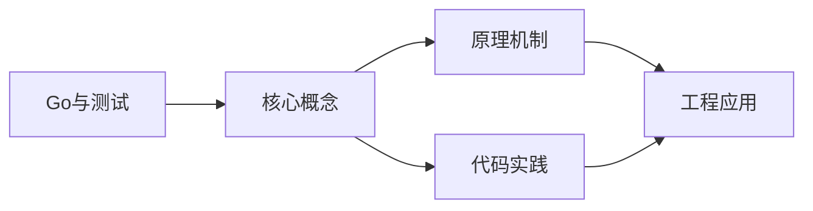

## 1. 学习目标（Bloom 分类）

本节按照布鲁姆教育目标分类学组织学习路径。本文主题为《Go与测试》，属于 Go 模块，读者可以根据自身阶段选择阅读深度。

记忆层面：能够准确复述本文的核心概念、术语与基本语法或操作步骤，并能够在提问或检索时快速定位对应知识点。能够说出 Go 的包、函数、结构体、接口与错误处理基本语法。

理解层面：能够用自己的语言解释核心原理与工作机制，说明概念之间的因果关系，而不是机械记忆结论。能够解释 goroutine 调度、channel 通信与内存模型。

应用层面：能够在真实项目或练习场景中运用本文知识解决具体问题，写出正确且可维护的实现。能够编写并发程序、HTTP 服务与命令行工具。

分析层面：能够拆解复杂问题，比较本文主题与相邻概念的异同，识别边界条件与例外情况。能够分析数据竞争、死锁与性能瓶颈。

评价层面：能够根据约束条件（性能、可读性、安全、成本）评价不同方案的优劣，做出有依据的技术决策。能够评价 Go 与 Java、Python 在不同场景的取舍。

创造层面：能够把本文知识与其他模块知识组合，设计出新的解决方案或可复用的工程模式。能够设计完整的微服务与云原生应用。

通过本节学习，读者应当能够把《Go与测试》纳入自己的知识网络，并与 Go 模块的其他主题（goroutine、channel、内存模型、标准库）建立关联。

## 2. 历史动机与发展脉络

《Go与测试》是 Go 领域的重要主题。要真正理解它，需要先了解它解决的问题与演进过程。

Go 由 Google 的 Robert Griesemer、Rob Pike 与 Ken Thompson 于 2009 年发布，设计目标是解决大规模分布式系统的工程痛点：编译慢、依赖混乱、并发难写。
Go 1.0 于 2012 年发布，此后严格保持向后兼容（Go 1 兼容性承诺）；约每半年发布一个小版本，1.21 起引入工具链管理（toolchain 指令）与内置测试 fuzzing。
Go 在云原生领域成为事实标准：Docker、Kubernetes、Prometheus、etcd 等核心项目均用 Go 编写；泛型在 1.18 加入，1.21+ 的 slices/maps 标准包补齐泛型工具。

回到本文主题：Go与测试 的提出与成熟，正是上述技术背景下的必然产物。早期实现往往以简单可用为目标，随着工程规模扩大，社区逐渐沉淀出标准做法与最佳实践；理解这一脉络，可以帮助读者判断“为什么文档中的推荐写法是现在这个样子”，也能在遇到历史遗留代码时准确识别其设计年代与取舍。


## 3. 形式化定义与核心概念精讲

本节把《Go与测试》涉及的核心概念以“定义 + 讲解”的形式展开。读者应把定义当作工具，把讲解当作理解路径；两者结合才能形成可迁移的知识。

goroutine 与调度：goroutine 是用户态轻量线程，由 GMP 调度器（Goroutine、Machine、Processor）多路复用到内核线程；创建成本约 2KB 栈，支持百万级并发。
channel 与 select：channel 是类型化通信管道，`<-` 发送/接收；select 多路等待；“不要通过共享内存通信，而要通过通信共享内存”是 Go 并发哲学。
内存模型：happens-before 关系由 channel、sync 原语与 atomic 建立；`go test -race` 用 ThreadSanitizer 检测数据竞争。

### 3.1 原文章节逐一精讲

原文档把主题拆分为 14 个小节，下面按顺序给出每一节的导读讲解，随后保留原文细节供精读。

#### 原文精读（完整保留）

# Go testing 包

> **符号约定**：`< >` 必填参数 | `[ ]` 可选参数

---

##### 表驱动测试

表驱动测试是 Go 中最推荐的测试模式，将测试用例组织为结构体切片，便于维护和扩展。

```go
func TestParse(t *testing.T) {
    // 定义测试用例表
    tests := []struct {
        name     string
        input    string
        expected string
    }{
        {"小写转大写", "hello", "HELLO"},
        {"空字符串", "", ""},
        {"已是大写", "WORLD", "WORLD"},
        {"混合大小写", "HeLLo", "HELLO"},
    }

    for _, tt := range tests {
        t.Run(tt.name, func(t *testing.T) {
            got := strings.ToUpper(tt.input)
            if got != tt.expected {
                t.Errorf("ToUpper(%q) = %q, want %q", tt.input, got, tt.expected)
            }
        })
    }
}
```

##### 并行测试

使用 `t.Parallel()` 标记可并行执行的测试：

```go
func TestParallel(t *testing.T) {
    tests := []struct {
        name  string
        input int
        want  int
    }{
        {"正数", 5, 25},
        {"负数", -3, 9},
        {"零", 0, 0},
    }

    for _, tt := range tests {
        tt := tt // 捕获变量
        t.Run(tt.name, func(t *testing.T) {
            t.Parallel() // 标记为并行
            got := tt.input * tt.input
            if got != tt.want {
                t.Errorf("got %d, want %d", got, tt.want)
            }
        })
    }
}
```

#### 基准测试

**基本写法：基准测试函数**
`func Benchmark<名称>(b *testing.B)`
```go
// 基准测试函数以 Benchmark 开头
func BenchmarkAdd(b *testing.B) {
    for i := 0; i < b.N; i++ {
        Add(1, 2)
    }
}
```

**基本写法：Go 1.24+ b.Loop**
`for b.Loop() { ... }`
```go
// Go 1.24+ 推荐写法，自动管理迭代
func BenchmarkAdd(b *testing.B) {
    for b.Loop() {
        Add(1, 2)
    }
}
```

**基本写法：基准测试计时控制**
`b.ResetTimer()`
```go
// 重置计时器，排除初始化耗时
func BenchmarkProcess(b *testing.B) {
    data := setupData()
    b.ResetTimer()
    for b.Loop() {
        process(data)
    }
}
```

**基本写法：报告内存分配**
`b.ReportAllocs()`
```go
// 报告每次操作的内存分配
func BenchmarkAlloc(b *testing.B) {
    b.ReportAllocs()
    for b.Loop() {
        _ = make([]int, 100)
    }
}
```

**基本写法：自定义指标**
`b.ReportMetric(<值>, <名称>)`
```go
// 报告自定义指标
func BenchmarkCustom(b *testing.B) {
    for b.Loop() {
        result := doWork()
        b.ReportMetric(float64(result.Items), "items/op")
    }
}
```

**基本写法：运行基准测试**
`go test -bench=<模式>`
```go
// 运行所有基准测试
// go test -bench=.
// go test -bench=BenchmarkAdd -benchmem
```

---

##### 示例测试

示例测试既作为文档，也作为可执行的测试：

```go
// 示例会出现在 godoc 文档中
func ExampleGreet() {
    result := Greet("Alice")
    fmt.Println(result)
    // Output: Hello, Alice
}

// 带后缀的示例，对应具体方法
func ExampleUser_Name() {
    u := User{Name: "Bob"}
    fmt.Println(u.Name)
    // Output: Bob
}
```

#### 概述

Go 语言内置了强大的测试框架，无需引入第三方库即可完成单元测试、基准测试和示例测试。testing 包配合 `go test` 命令，提供了完整的测试工作流。良好的测试习惯是保证代码质量的基础，Go 的测试哲学强调简洁和实用。

#### 基础概念

##### 测试文件命名规则

- 测试文件以 `_test.go` 结尾，与被测试文件放在同一包下
- 测试函数以 `Test` 开头，参数为 `*testing.T`
- 基准测试函数以 `Benchmark` 开头，参数为 `*testing.B`
- 示例函数以 `Example` 开头，无参数

##### 测试函数签名

```go
// 单元测试
func TestXxx(t *testing.T) { ... }

// 基准测试
func BenchmarkXxx(b *testing.B) { ... }

// 示例测试
func ExampleXxx() { ... }
```

#### 快速上手

##### 第一个测试

```go
// math.go
package math

func Add(a, b int) int {
    return a + b
}
```

```go
// math_test.go
package math

import "testing"

func TestAdd(t *testing.T) {
    result := Add(1, 2)
    if result != 3 {
        t.Errorf("Add(1, 2) = %d, want 3", result)
    }
}
```

运行测试：

```bash
go test ./...           # 运行所有测试
go test -v ./...        # 详细输出
go test -run TestAdd    # 运行指定测试
```

#### 详细用法

##### 子测试与 t.Run

`t.Run` 创建子测试，支持独立运行和并行执行：

```go
func TestUser(t *testing.T) {
    t.Run("创建用户", func(t *testing.T) {
        user := NewUser("Alice")
        if user.Name != "Alice" {
            t.Error("用户名不正确")
        }
    })

    t.Run("更新用户", func(t *testing.T) {
        user := NewUser("Alice")
        user.UpdateName("Bob")
        if user.Name != "Bob" {
            t.Error("更新失败")
        }
    })
}
```

运行指定子测试：

```bash
go test -run TestUser/创建用户
```

##### TestMain 自定义初始化

当测试需要全局初始化或清理时，使用 TestMain：

```go
func TestMain(m *testing.M) {
    // 初始化：连接测试数据库
    db := setupTestDB()
    defer db.Close()

    // 运行所有测试
    code := m.Run()

    // 清理资源
    cleanup()

    os.Exit(code)
}
```

##### 基准测试进阶

```go
// 带子基准的基准测试
func BenchmarkSort(b *testing.B) {
    sizes := []int{100, 1000, 10000}

    for _, size := range sizes {
        b.Run(fmt.Sprintf("size_%d", size), func(b *testing.B) {
            data := generateData(size)
            b.ResetTimer() // 重置计时器，排除数据生成时间

            for i := 0; i < b.N; i++ {
                sorted := make([]int, len(data))
                copy(sorted, data)
                sort.Ints(sorted)
            }
        })
    }
}

// 基准测试中控制计时
func BenchmarkExpensive(b *testing.B) {
    // 准备工作不计入基准时间
    setup()

    b.ResetTimer()  // 重置计时器
    for i := 0; i < b.N; i++ {
        expensiveOperation()
    }
    b.StopTimer()   // 停止计时

    // 清理工作不计入基准时间
    cleanup()
}
```

#### 常见场景

##### 场景一：HTTP Handler 测试

```go
func TestHandler(t *testing.T) {
    // 创建测试请求
    req := httptest.NewRequest("GET", "/api/users", nil)
    w := httptest.NewRecorder()

    // 调用 handler
    handler := UserHandler{DB: mockDB}
    handler.ServeHTTP(w, req)

    // 验证响应
    if w.Code != http.StatusOK {
        t.Errorf("状态码 = %d, want %d", w.Code, http.StatusOK)
    }

    var users []User
    json.NewDecoder(w.Body).Decode(&users)
    if len(users) == 0 {
        t.Error("返回用户列表为空")
    }
}
```

##### 场景二：接口 Mock 测试

```go
// 定义接口
type UserRepository interface {
    GetByID(id int) (*User, error)
}

// Mock 实现
type MockUserRepo struct {
    users map[int]*User
    err   error
}

func (m *MockUserRepo) GetByID(id int) (*User, error) {
    if m.err != nil {
        return nil, m.err
    }
    return m.users[id], nil
}

func TestGetUser(t *testing.T) {
    mock := &MockUserRepo{
        users: map[int]*User{1: {Name: "Alice"}},
    }

    service := NewUserService(mock)
    user, err := service.GetUser(1)

    if err != nil {
        t.Fatalf("意外错误: %v", err)
    }
    if user.Name != "Alice" {
        t.Errorf("用户名 = %s, want Alice", user.Name)
    }
}
```

##### 场景三：测试覆盖率

```bash
# 生成覆盖率报告
go test -cover ./...

# 生成详细覆盖率文件
go test -coverprofile=coverage.out ./...
go tool cover -html=coverage.out -o coverage.html

# 查看每个函数的覆盖率
go tool cover -func=coverage.out
```

#### 注意事项

- 测试文件中不要使用 `init()` 函数，它会在所有测试之前执行，影响测试隔离性
- `t.Error` / `t.Errorf` 报告失败但继续执行，`t.Fatal` / `t.Fatalf` 报告失败并立即停止当前测试
- 基准测试中避免编译器优化消除代码，可以使用 `_ = result` 或 `runtime.KeepAlive(result)`
- 并行测试中必须捕获循环变量（Go 1.22 之前），否则闭包会引用最后一个值
- 测试代码也应保持简洁，避免过度抽象测试辅助函数
- 使用 `-count=1` 禁用测试缓存，确保每次都重新运行

#### 进阶用法

##### Fuzzing 模糊测试

Go 1.18 引入的原生模糊测试支持：

```go
func FuzzReverse(f *testing.F) {
    // 添加种子语料
    f.Add("hello")
    f.Add("世界")

    f.Fuzz(func(t *testing.T, original string) {
        reversed := Reverse(original)
        doubleReversed := Reverse(reversed)
        if doubleReversed != original {
            t.Errorf("Reverse(Reverse(%q)) = %q, want %q", original, doubleReversed, original)
        }
    })
}
```

```bash
go test -fuzz=FuzzReverse -fuzztime=30s
```

##### 测试辅助函数

```go
// 使用 t.Helper() 标记辅助函数，错误信息指向调用方
func assertEqual(t *testing.T, got, want int) {
    t.Helper() // 标记为辅助函数
    if got != want {
        t.Errorf("got %d, want %d", got, want)
    }
}

func TestCalculation(t *testing.T) {
    assertEqual(t, Add(1, 2), 3)    // 错误行号指向这里，而非 assertEqual 内部
    assertEqual(t, Add(10, 20), 30)
}
```

##### 构建标签控制测试

```go
// +build integration

package main

import "testing"

func TestDatabaseIntegration(t *testing.T) {
    // 仅在集成测试时运行
    db := connectRealDatabase()
    defer db.Close()
    // ...
}
```

```bash
# 运行集成测试
go test -tags=integration ./...

# 默认跳过集成测试
go test ./...
```

##### 使用 testing.TB 统一测试接口

```go
// testing.TB 是 testing.T 和 testing.B 的共同接口
// 可以编写同时适用于单元测试和基准测试的辅助函数
func checkResult(t testing.TB, got, want int) {
    t.Helper()
    if got != want {
        t.Errorf("got %d, want %d", got, want)
    }
}
```
#### 基本测试

**基本写法：测试函数**
`func Test<名称>(t *testing.T)`
```go
// 测试函数名必须以 Test 开头
func TestAdd(t *testing.T) {
    got := Add(1, 2)
    if got != 3 {
        t.Errorf("Add(1,2) = %d, want 3", got)
    }
}
```

**基本写法：报告失败**
`t.Error(<消息>)`
```go
// 报告失败并继续执行
t.Error("结果不匹配")
```

**基本写法：报告失败并停止**
`t.Fatal(<消息>)`
```go
// 报告失败并立即停止当前测试
t.Fatal("致命错误")
```

**基本写法：格式化报告失败**
`t.Errorf(<格式>, <参数>)`
```go
// 格式化输出失败信息
t.Errorf("got %d, want %d", got, want)
```

**基本写法：标记失败**
`t.Fail()`
```go
// 标记失败但继续执行
t.Fail()
```

**基本写法：跳过测试**
`t.Skip(<原因>)`
```go
// 跳过当前测试
if testing.Short() {
    t.Skip("跳过长测试")
}
```

---

#### 断言辅助

**换行写法：手动断言相等**
`if got != want { t.Errorf(...) }`
```go
// 手动比较并报告
func TestEqual(t *testing.T) {
    got, want := Add(1, 2), 3
    if got != want {
        t.Errorf("got %d, want %d", got, want)
    }
}
```

**换行写法：使用 testify 断言**
`assert.Equal(t, <期望>, <实际>)`
```go
// 使用第三方库 testify 断言
import "github.com/stretchr/testify/assert"
assert.Equal(t, 3, Add(1, 2))
assert.NoError(t, err)
```

**换行写法：require 强制断言**
`require.NoError(t, err)`
```go
// 失败时立即停止测试
import "github.com/stretchr/testify/require"
require.NoError(t, err)
require.Equal(t, 3, result)
```

---

#### 子测试

**基本写法：运行子测试**
`t.Run(<名称>, func(t *testing.T) { ... })`
```go
// 子测试可单独运行
t.Run("正常情况", func(t *testing.T) {
    // 测试逻辑
})
t.Run("边界情况", func(t *testing.T) {
    // 测试逻辑
})
```

**基本写法：并行子测试**
`t.Parallel()`
```go
// 在子测试中调用 Parallel 实现并行
t.Run("并发测试", func(t *testing.T) {
    t.Parallel()
    // 测试逻辑
})
```

---

#### 测试辅助

**基本写法：临时目录**
`t.TempDir()`
```go
// 自动创建并在测试结束后清理的临时目录
func TestFileWrite(t *testing.T) {
    dir := t.TempDir()
    path := filepath.Join(dir, "test.txt")
    os.WriteFile(path, []byte("hi"), 0644)
}
```

**基本写法：Go 1.24+ 切换工作目录**
`t.Chdir(<目录>)`
```go
// Go 1.24+ 测试期间切换工作目录，测试结束自动恢复
func TestCwd(t *testing.T) {
    t.Chdir("/tmp")
    // 当前工作目录为 /tmp
}
```

**基本写法：helper 函数标记**
`t.Helper()`
```go
// 标记为辅助函数，报错时定位到调用方
func assertEqual(t *testing.T, got, want int) {
    t.Helper()
    if got != want {
        t.Errorf("got %d, want %d", got, want)
    }
}
```

**基本写法：清理函数**
`t.Cleanup(func() { ... })`
```go
// 注册清理函数，测试结束后按 LIFO 执行
t.Cleanup(func() {
    os.Remove(tempFile)
})
```

**基本写法：设置超时**
`t.SetDeadline(<时间>)`
```go
// Go 1.24+ 为测试设置截止时间
t.SetDeadline(time.Now().Add(30 * time.Second))
```

---

#### 测试覆盖率

**基本写法：生成覆盖率报告**
`go test -cover`
```go
// 运行测试并显示覆盖率百分比
// go test -cover
```

**基本写法：生成覆盖率文件**
`go test -coverprofile=<文件>`
```go
// 输出覆盖率到文件
// go test -coverprofile=coverage.out
// go tool cover -html=coverage.out
```

**基本写法：按包覆盖率**
`go test -coverpkg=<包路径>`
```go
// 跨包覆盖率统计
// go test -coverpkg=./... ./...
```

---

#### Go 1.24+ 测试新特性

**基本写法：testing/synctest 并发测试**
`synctest.Run(func() { ... })`
```go
// Go 1.24+ 实验性并发测试，模拟时间无需真实等待
import "testing/synctest"
func TestTimeout(t *testing.T) {
    synctest.Run(func() {
        ctx, cancel := context.WithTimeout(context.Background(), 5*time.Second)
        defer cancel()
        synctest.Wait()
        <-ctx.Done()
    })
}
```

**基本写法：Go 1.24+ 测试日志 JSON 输出**
`go test -json`
```go
// Go 1.24+ 构建输出也以 JSON 格式报告
// go test -json ./...
```


### 3.2 概念关系图

下面用 Mermaid 图表达本文核心概念之间的关系，帮助读者建立整体图景：



图中展示的是本文知识的结构化关系：核心概念是入口，原理机制解释“为什么”，代码实践演示“怎么做”，工程应用回答“何时用”。读者学习时可以把每个小节的内容挂接到对应节点上。

## 4. 理论推导与原理解析

本节深入《Go与测试》背后的原理。理论部分不求面面俱到，而是聚焦“能解释现象、能指导实践”的关键推导。

goroutine 与调度：goroutine 是用户态轻量线程，由 GMP 调度器（Goroutine、Machine、Processor）多路复用到内核线程；创建成本约 2KB 栈，支持百万级并发。
channel 与 select：channel 是类型化通信管道，`<-` 发送/接收；select 多路等待；“不要通过共享内存通信，而要通过通信共享内存”是 Go 并发哲学。
内存模型：happens-before 关系由 channel、sync 原语与 atomic 建立；`go test -race` 用 ThreadSanitizer 检测数据竞争。
错误处理：Go 用多返回值显式处理错误（`if err != nil`），error 是接口；panic/recover 仅用于不可恢复错误。

需要强调的是，理论推导与工程实践之间存在翻译层：理论给出的是理想化模型与边界条件，工程代码则必须处理真实环境中的例外。读者在学习时应先掌握理论的“标准情形”，再通过陷阱章节了解“非标准情形”。

## 5. 代码示例与逐行讲解

本节把原文中的代码示例系统整理，并为每个示例补充用途说明与讲解。读者不应只浏览代码，而应逐段对照讲解理解设计意图。

### 5.1 示例：表驱动测试

该示例来自原文《表驱动测试》小节，用于演示Go与测试相关操作。阅读时请先看代码结构，再看其后的讲解。

```go
func TestParse(t *testing.T) {
    // 定义测试用例表
    tests := []struct {
        name     string
        input    string
        expected string
    }{
        {"小写转大写", "hello", "HELLO"},
        {"空字符串", "", ""},
        {"已是大写", "WORLD", "WORLD"},
        {"混合大小写", "HeLLo", "HELLO"},
    }

    for _, tt := range tests {
        t.Run(tt.name, func(t *testing.T) {
            got := strings.ToUpper(tt.input)
            if got != tt.expected {
                t.Errorf("ToUpper(%q) = %q, want %q", tt.input, got, tt.expected)
            }
        })
    }
}
```

讲解：这段代码演示了本节核心知识点。代码中的关键操作可以归纳为三步：准备（定义或初始化）、执行（核心逻辑）、收尾（释放资源或返回结果）。实际项目中，这三步往往被封装为函数或类，以提升复用性与可测试性。

关键点分析：

该示例共 21 行有效代码，包含 3 类关键结构（func、if、for）。其中：

- 入口与初始化部分负责建立上下文，对应实际项目中的启动或装配逻辑；
- 核心逻辑部分体现本文主题的主要操作，是阅读时最需要对照讲解理解的部分；
- 输出或返回部分把结果交给调用方，注意其类型与边界条件。

进阶思考路径：先尝试修改参数观察行为变化，再把示例中的模式迁移到自己的项目中；每次修改都记录预期与实测差异，这是把示例转化为能力的最快方式。

### 5.2 示例：并行测试

该示例来自原文《并行测试》小节，用于演示Go与测试相关操作。阅读时请先看代码结构，再看其后的讲解。

```go
func TestParallel(t *testing.T) {
    tests := []struct {
        name  string
        input int
        want  int
    }{
        {"正数", 5, 25},
        {"负数", -3, 9},
        {"零", 0, 0},
    }

    for _, tt := range tests {
        tt := tt // 捕获变量
        t.Run(tt.name, func(t *testing.T) {
            t.Parallel() // 标记为并行
            got := tt.input * tt.input
            if got != tt.want {
                t.Errorf("got %d, want %d", got, tt.want)
            }
        })
    }
}
```

讲解：这段代码演示了本节核心知识点。代码中的关键操作可以归纳为三步：准备（定义或初始化）、执行（核心逻辑）、收尾（释放资源或返回结果）。实际项目中，这三步往往被封装为函数或类，以提升复用性与可测试性。

关键点分析：

该示例共 21 行有效代码，包含 3 类关键结构（func、if、for）。其中：

- 入口与初始化部分负责建立上下文，对应实际项目中的启动或装配逻辑；
- 核心逻辑部分体现本文主题的主要操作，是阅读时最需要对照讲解理解的部分；
- 输出或返回部分把结果交给调用方，注意其类型与边界条件。

进阶思考路径：先尝试修改参数观察行为变化，再把示例中的模式迁移到自己的项目中；每次修改都记录预期与实测差异，这是把示例转化为能力的最快方式。

### 5.3 示例：基准测试

该示例来自原文《基准测试》小节，用于演示Go与测试相关操作。阅读时请先看代码结构，再看其后的讲解。

```go
// 基准测试函数以 Benchmark 开头
func BenchmarkAdd(b *testing.B) {
    for i := 0; i < b.N; i++ {
        Add(1, 2)
    }
}
```

讲解：这段代码演示了本节核心知识点。代码中的关键操作可以归纳为三步：准备（定义或初始化）、执行（核心逻辑）、收尾（释放资源或返回结果）。实际项目中，这三步往往被封装为函数或类，以提升复用性与可测试性。

关键点分析：

该示例共 6 行有效代码，包含 2 类关键结构（func、for）。其中：

- 入口与初始化部分负责建立上下文，对应实际项目中的启动或装配逻辑；
- 核心逻辑部分体现本文主题的主要操作，是阅读时最需要对照讲解理解的部分；
- 输出或返回部分把结果交给调用方，注意其类型与边界条件。

进阶思考路径：先尝试修改参数观察行为变化，再把示例中的模式迁移到自己的项目中；每次修改都记录预期与实测差异，这是把示例转化为能力的最快方式。

### 5.4 示例：基准测试

该示例来自原文《基准测试》小节，用于演示Go与测试相关操作。阅读时请先看代码结构，再看其后的讲解。

```go
// Go 1.24+ 推荐写法，自动管理迭代
func BenchmarkAdd(b *testing.B) {
    for b.Loop() {
        Add(1, 2)
    }
}
```

讲解：这段代码演示了本节核心知识点。代码中的关键操作可以归纳为三步：准备（定义或初始化）、执行（核心逻辑）、收尾（释放资源或返回结果）。实际项目中，这三步往往被封装为函数或类，以提升复用性与可测试性。

关键点分析：

该示例共 6 行有效代码，包含 2 类关键结构（func、for）。其中：

- 入口与初始化部分负责建立上下文，对应实际项目中的启动或装配逻辑；
- 核心逻辑部分体现本文主题的主要操作，是阅读时最需要对照讲解理解的部分；
- 输出或返回部分把结果交给调用方，注意其类型与边界条件。

进阶思考路径：先尝试修改参数观察行为变化，再把示例中的模式迁移到自己的项目中；每次修改都记录预期与实测差异，这是把示例转化为能力的最快方式。

### 5.5 示例：基准测试

该示例来自原文《基准测试》小节，用于演示Go与测试相关操作。阅读时请先看代码结构，再看其后的讲解。

```go
// 重置计时器，排除初始化耗时
func BenchmarkProcess(b *testing.B) {
    data := setupData()
    b.ResetTimer()
    for b.Loop() {
        process(data)
    }
}
```

讲解：这段代码演示了本节核心知识点。代码中的关键操作可以归纳为三步：准备（定义或初始化）、执行（核心逻辑）、收尾（释放资源或返回结果）。实际项目中，这三步往往被封装为函数或类，以提升复用性与可测试性。

关键点分析：

该示例共 8 行有效代码，包含 2 类关键结构（func、for）。其中：

- 入口与初始化部分负责建立上下文，对应实际项目中的启动或装配逻辑；
- 核心逻辑部分体现本文主题的主要操作，是阅读时最需要对照讲解理解的部分；
- 输出或返回部分把结果交给调用方，注意其类型与边界条件。

进阶思考路径：先尝试修改参数观察行为变化，再把示例中的模式迁移到自己的项目中；每次修改都记录预期与实测差异，这是把示例转化为能力的最快方式。

### 5.6 示例：基准测试

该示例来自原文《基准测试》小节，用于演示Go与测试相关操作。阅读时请先看代码结构，再看其后的讲解。

```go
// 报告每次操作的内存分配
func BenchmarkAlloc(b *testing.B) {
    b.ReportAllocs()
    for b.Loop() {
        _ = make([]int, 100)
    }
}
```

讲解：这段代码演示了本节核心知识点。代码中的关键操作可以归纳为三步：准备（定义或初始化）、执行（核心逻辑）、收尾（释放资源或返回结果）。实际项目中，这三步往往被封装为函数或类，以提升复用性与可测试性。

关键点分析：

该示例共 7 行有效代码，包含 2 类关键结构（func、for）。其中：

- 入口与初始化部分负责建立上下文，对应实际项目中的启动或装配逻辑；
- 核心逻辑部分体现本文主题的主要操作，是阅读时最需要对照讲解理解的部分；
- 输出或返回部分把结果交给调用方，注意其类型与边界条件。

进阶思考路径：先尝试修改参数观察行为变化，再把示例中的模式迁移到自己的项目中；每次修改都记录预期与实测差异，这是把示例转化为能力的最快方式。

### 5.7 示例：基准测试

该示例来自原文《基准测试》小节，用于演示Go与测试相关操作。阅读时请先看代码结构，再看其后的讲解。

```go
// 报告自定义指标
func BenchmarkCustom(b *testing.B) {
    for b.Loop() {
        result := doWork()
        b.ReportMetric(float64(result.Items), "items/op")
    }
}
```

讲解：这段代码演示了本节核心知识点。代码中的关键操作可以归纳为三步：准备（定义或初始化）、执行（核心逻辑）、收尾（释放资源或返回结果）。实际项目中，这三步往往被封装为函数或类，以提升复用性与可测试性。

关键点分析：

该示例共 7 行有效代码，包含 2 类关键结构（func、for）。其中：

- 入口与初始化部分负责建立上下文，对应实际项目中的启动或装配逻辑；
- 核心逻辑部分体现本文主题的主要操作，是阅读时最需要对照讲解理解的部分；
- 输出或返回部分把结果交给调用方，注意其类型与边界条件。

进阶思考路径：先尝试修改参数观察行为变化，再把示例中的模式迁移到自己的项目中；每次修改都记录预期与实测差异，这是把示例转化为能力的最快方式。

### 5.8 示例：基准测试

该示例来自原文《基准测试》小节，用于演示Go与测试相关操作。阅读时请先看代码结构，再看其后的讲解。

```go
// 运行所有基准测试
// go test -bench=.
// go test -bench=BenchmarkAdd -benchmem
```

讲解：这段代码演示了本节核心知识点。代码中的关键操作可以归纳为三步：准备（定义或初始化）、执行（核心逻辑）、收尾（释放资源或返回结果）。实际项目中，这三步往往被封装为函数或类，以提升复用性与可测试性。

关键点分析：

该示例共 3 行有效代码，结构以数据或配置为主。阅读时应关注：数据字段的含义、配置项的作用，以及它们与运行行为的对应关系。

进阶思考路径：先尝试修改参数观察行为变化，再把示例中的模式迁移到自己的项目中；每次修改都记录预期与实测差异，这是把示例转化为能力的最快方式。

### 5.9 示例：示例测试

该示例来自原文《示例测试》小节，用于演示Go与测试相关操作。阅读时请先看代码结构，再看其后的讲解。

```go
// 示例会出现在 godoc 文档中
func ExampleGreet() {
    result := Greet("Alice")
    fmt.Println(result)
    // Output: Hello, Alice
}

// 带后缀的示例，对应具体方法
func ExampleUser_Name() {
    u := User{Name: "Bob"}
    fmt.Println(u.Name)
    // Output: Bob
}
```

讲解：这段代码演示了本节核心知识点。代码中的关键操作可以归纳为三步：准备（定义或初始化）、执行（核心逻辑）、收尾（释放资源或返回结果）。实际项目中，这三步往往被封装为函数或类，以提升复用性与可测试性。

关键点分析：

该示例共 12 行有效代码，包含 1 类关键结构（func）。其中：

- 入口与初始化部分负责建立上下文，对应实际项目中的启动或装配逻辑；
- 核心逻辑部分体现本文主题的主要操作，是阅读时最需要对照讲解理解的部分；
- 输出或返回部分把结果交给调用方，注意其类型与边界条件。

进阶思考路径：先尝试修改参数观察行为变化，再把示例中的模式迁移到自己的项目中；每次修改都记录预期与实测差异，这是把示例转化为能力的最快方式。

### 5.10 示例：测试函数签名

该示例来自原文《测试函数签名》小节，用于演示Go与测试相关操作。阅读时请先看代码结构，再看其后的讲解。

```go
// 单元测试
func TestXxx(t *testing.T) { ... }

// 基准测试
func BenchmarkXxx(b *testing.B) { ... }

// 示例测试
func ExampleXxx() { ... }
```

讲解：这段代码演示了本节核心知识点。代码中的关键操作可以归纳为三步：准备（定义或初始化）、执行（核心逻辑）、收尾（释放资源或返回结果）。实际项目中，这三步往往被封装为函数或类，以提升复用性与可测试性。

关键点分析：

该示例共 6 行有效代码，包含 1 类关键结构（func）。其中：

- 入口与初始化部分负责建立上下文，对应实际项目中的启动或装配逻辑；
- 核心逻辑部分体现本文主题的主要操作，是阅读时最需要对照讲解理解的部分；
- 输出或返回部分把结果交给调用方，注意其类型与边界条件。

进阶思考路径：先尝试修改参数观察行为变化，再把示例中的模式迁移到自己的项目中；每次修改都记录预期与实测差异，这是把示例转化为能力的最快方式。

### 5.11 示例：第一个测试

该示例来自原文《第一个测试》小节，用于演示Go与测试相关操作。阅读时请先看代码结构，再看其后的讲解。

```go
// math.go
package math

func Add(a, b int) int {
    return a + b
}
```

讲解：这段代码演示了本节核心知识点。代码中的关键操作可以归纳为三步：准备（定义或初始化）、执行（核心逻辑）、收尾（释放资源或返回结果）。实际项目中，这三步往往被封装为函数或类，以提升复用性与可测试性。

关键点分析：

该示例共 5 行有效代码，包含 2 类关键结构（func、return）。其中：

- 入口与初始化部分负责建立上下文，对应实际项目中的启动或装配逻辑；
- 核心逻辑部分体现本文主题的主要操作，是阅读时最需要对照讲解理解的部分；
- 输出或返回部分把结果交给调用方，注意其类型与边界条件。

进阶思考路径：先尝试修改参数观察行为变化，再把示例中的模式迁移到自己的项目中；每次修改都记录预期与实测差异，这是把示例转化为能力的最快方式。

### 5.12 示例：第一个测试

该示例来自原文《第一个测试》小节，用于演示Go与测试相关操作。阅读时请先看代码结构，再看其后的讲解。

```go
// math_test.go
package math

import "testing"

func TestAdd(t *testing.T) {
    result := Add(1, 2)
    if result != 3 {
        t.Errorf("Add(1, 2) = %d, want 3", result)
    }
}
```

讲解：这段代码演示了本节核心知识点。代码中的关键操作可以归纳为三步：准备（定义或初始化）、执行（核心逻辑）、收尾（释放资源或返回结果）。实际项目中，这三步往往被封装为函数或类，以提升复用性与可测试性。

关键点分析：

该示例共 9 行有效代码，包含 3 类关键结构（func、import、if）。其中：

- 入口与初始化部分负责建立上下文，对应实际项目中的启动或装配逻辑；
- 核心逻辑部分体现本文主题的主要操作，是阅读时最需要对照讲解理解的部分；
- 输出或返回部分把结果交给调用方，注意其类型与边界条件。

进阶思考路径：先尝试修改参数观察行为变化，再把示例中的模式迁移到自己的项目中；每次修改都记录预期与实测差异，这是把示例转化为能力的最快方式。

### 5.13 示例：第一个测试

该示例来自原文《第一个测试》小节，用于演示Go与测试相关操作。阅读时请先看代码结构，再看其后的讲解。

```bash
go test ./...           # 运行所有测试
go test -v ./...        # 详细输出
go test -run TestAdd    # 运行指定测试
```

讲解：这段代码演示了本节核心知识点。代码中的关键操作可以归纳为三步：准备（定义或初始化）、执行（核心逻辑）、收尾（释放资源或返回结果）。实际项目中，这三步往往被封装为函数或类，以提升复用性与可测试性。

关键点分析：

该示例共 3 行有效代码，结构以数据或配置为主。阅读时应关注：数据字段的含义、配置项的作用，以及它们与运行行为的对应关系。

进阶思考路径：先尝试修改参数观察行为变化，再把示例中的模式迁移到自己的项目中；每次修改都记录预期与实测差异，这是把示例转化为能力的最快方式。

### 5.14 示例：子测试与 t.Run

该示例来自原文《子测试与 t.Run》小节，用于演示Go与测试相关操作。阅读时请先看代码结构，再看其后的讲解。

```go
func TestUser(t *testing.T) {
    t.Run("创建用户", func(t *testing.T) {
        user := NewUser("Alice")
        if user.Name != "Alice" {
            t.Error("用户名不正确")
        }
    })

    t.Run("更新用户", func(t *testing.T) {
        user := NewUser("Alice")
        user.UpdateName("Bob")
        if user.Name != "Bob" {
            t.Error("更新失败")
        }
    })
}
```

讲解：这段代码演示了本节核心知识点。代码中的关键操作可以归纳为三步：准备（定义或初始化）、执行（核心逻辑）、收尾（释放资源或返回结果）。实际项目中，这三步往往被封装为函数或类，以提升复用性与可测试性。

关键点分析：

该示例共 15 行有效代码，包含 2 类关键结构（func、if）。其中：

- 入口与初始化部分负责建立上下文，对应实际项目中的启动或装配逻辑；
- 核心逻辑部分体现本文主题的主要操作，是阅读时最需要对照讲解理解的部分；
- 输出或返回部分把结果交给调用方，注意其类型与边界条件。

进阶思考路径：先尝试修改参数观察行为变化，再把示例中的模式迁移到自己的项目中；每次修改都记录预期与实测差异，这是把示例转化为能力的最快方式。

### 5.15 示例：子测试与 t.Run

该示例来自原文《子测试与 t.Run》小节，用于演示Go与测试相关操作。阅读时请先看代码结构，再看其后的讲解。

```bash
go test -run TestUser/创建用户
```

讲解：这段代码演示了本节核心知识点。代码中的关键操作可以归纳为三步：准备（定义或初始化）、执行（核心逻辑）、收尾（释放资源或返回结果）。实际项目中，这三步往往被封装为函数或类，以提升复用性与可测试性。

关键点分析：

该示例共 1 行有效代码，结构以数据或配置为主。阅读时应关注：数据字段的含义、配置项的作用，以及它们与运行行为的对应关系。

进阶思考路径：先尝试修改参数观察行为变化，再把示例中的模式迁移到自己的项目中；每次修改都记录预期与实测差异，这是把示例转化为能力的最快方式。

### 5.16 示例：TestMain 自定义初始化

该示例来自原文《TestMain 自定义初始化》小节，用于演示Go与测试相关操作。阅读时请先看代码结构，再看其后的讲解。

```go
func TestMain(m *testing.M) {
    // 初始化：连接测试数据库
    db := setupTestDB()
    defer db.Close()

    // 运行所有测试
    code := m.Run()

    // 清理资源
    cleanup()

    os.Exit(code)
}
```

讲解：这段代码演示了本节核心知识点。代码中的关键操作可以归纳为三步：准备（定义或初始化）、执行（核心逻辑）、收尾（释放资源或返回结果）。实际项目中，这三步往往被封装为函数或类，以提升复用性与可测试性。

关键点分析：

该示例共 10 行有效代码，包含 1 类关键结构（func）。其中：

- 入口与初始化部分负责建立上下文，对应实际项目中的启动或装配逻辑；
- 核心逻辑部分体现本文主题的主要操作，是阅读时最需要对照讲解理解的部分；
- 输出或返回部分把结果交给调用方，注意其类型与边界条件。

进阶思考路径：先尝试修改参数观察行为变化，再把示例中的模式迁移到自己的项目中；每次修改都记录预期与实测差异，这是把示例转化为能力的最快方式。

### 5.17 示例：基准测试进阶

该示例来自原文《基准测试进阶》小节，用于演示Go与测试相关操作。阅读时请先看代码结构，再看其后的讲解。

```go
// 带子基准的基准测试
func BenchmarkSort(b *testing.B) {
    sizes := []int{100, 1000, 10000}

    for _, size := range sizes {
        b.Run(fmt.Sprintf("size_%d", size), func(b *testing.B) {
            data := generateData(size)
            b.ResetTimer() // 重置计时器，排除数据生成时间

            for i := 0; i < b.N; i++ {
                sorted := make([]int, len(data))
                copy(sorted, data)
                sort.Ints(sorted)
            }
        })
    }
}

// 基准测试中控制计时
func BenchmarkExpensive(b *testing.B) {
    // 准备工作不计入基准时间
    setup()

    b.ResetTimer()  // 重置计时器
    for i := 0; i < b.N; i++ {
        expensiveOperation()
    }
    b.StopTimer()   // 停止计时

    // 清理工作不计入基准时间
    cleanup()
}
```

讲解：这段代码演示了本节核心知识点。代码中的关键操作可以归纳为三步：准备（定义或初始化）、执行（核心逻辑）、收尾（释放资源或返回结果）。实际项目中，这三步往往被封装为函数或类，以提升复用性与可测试性。

关键点分析：

该示例共 27 行有效代码，包含 2 类关键结构（func、for）。其中：

- 入口与初始化部分负责建立上下文，对应实际项目中的启动或装配逻辑；
- 核心逻辑部分体现本文主题的主要操作，是阅读时最需要对照讲解理解的部分；
- 输出或返回部分把结果交给调用方，注意其类型与边界条件。

进阶思考路径：先尝试修改参数观察行为变化，再把示例中的模式迁移到自己的项目中；每次修改都记录预期与实测差异，这是把示例转化为能力的最快方式。

### 5.18 示例：场景一：HTTP Handler 测试

该示例来自原文《场景一：HTTP Handler 测试》小节，用于演示Go与测试相关操作。阅读时请先看代码结构，再看其后的讲解。

```go
func TestHandler(t *testing.T) {
    // 创建测试请求
    req := httptest.NewRequest("GET", "/api/users", nil)
    w := httptest.NewRecorder()

    // 调用 handler
    handler := UserHandler{DB: mockDB}
    handler.ServeHTTP(w, req)

    // 验证响应
    if w.Code != http.StatusOK {
        t.Errorf("状态码 = %d, want %d", w.Code, http.StatusOK)
    }

    var users []User
    json.NewDecoder(w.Body).Decode(&users)
    if len(users) == 0 {
        t.Error("返回用户列表为空")
    }
}
```

讲解：这段代码演示了本节核心知识点。代码中的关键操作可以归纳为三步：准备（定义或初始化）、执行（核心逻辑）、收尾（释放资源或返回结果）。实际项目中，这三步往往被封装为函数或类，以提升复用性与可测试性。

关键点分析：

该示例共 17 行有效代码，包含 2 类关键结构（func、if）。其中：

- 入口与初始化部分负责建立上下文，对应实际项目中的启动或装配逻辑；
- 核心逻辑部分体现本文主题的主要操作，是阅读时最需要对照讲解理解的部分；
- 输出或返回部分把结果交给调用方，注意其类型与边界条件。

进阶思考路径：先尝试修改参数观察行为变化，再把示例中的模式迁移到自己的项目中；每次修改都记录预期与实测差异，这是把示例转化为能力的最快方式。

### 5.19 示例：场景二：接口 Mock 测试

该示例来自原文《场景二：接口 Mock 测试》小节，用于演示Go与测试相关操作。阅读时请先看代码结构，再看其后的讲解。

```go
// 定义接口
type UserRepository interface {
    GetByID(id int) (*User, error)
}

// Mock 实现
type MockUserRepo struct {
    users map[int]*User
    err   error
}

func (m *MockUserRepo) GetByID(id int) (*User, error) {
    if m.err != nil {
        return nil, m.err
    }
    return m.users[id], nil
}

func TestGetUser(t *testing.T) {
    mock := &MockUserRepo{
        users: map[int]*User{1: {Name: "Alice"}},
    }

    service := NewUserService(mock)
    user, err := service.GetUser(1)

    if err != nil {
        t.Fatalf("意外错误: %v", err)
    }
    if user.Name != "Alice" {
        t.Errorf("用户名 = %s, want Alice", user.Name)
    }
}
```

讲解：这段代码演示了本节核心知识点。代码中的关键操作可以归纳为三步：准备（定义或初始化）、执行（核心逻辑）、收尾（释放资源或返回结果）。实际项目中，这三步往往被封装为函数或类，以提升复用性与可测试性。

关键点分析：

该示例共 28 行有效代码，包含 3 类关键结构（func、if、return）。其中：

- 入口与初始化部分负责建立上下文，对应实际项目中的启动或装配逻辑；
- 核心逻辑部分体现本文主题的主要操作，是阅读时最需要对照讲解理解的部分；
- 输出或返回部分把结果交给调用方，注意其类型与边界条件。

进阶思考路径：先尝试修改参数观察行为变化，再把示例中的模式迁移到自己的项目中；每次修改都记录预期与实测差异，这是把示例转化为能力的最快方式。

### 5.20 示例：场景三：测试覆盖率

该示例来自原文《场景三：测试覆盖率》小节，用于演示Go与测试相关操作。阅读时请先看代码结构，再看其后的讲解。

```bash
# 生成覆盖率报告
go test -cover ./...

# 生成详细覆盖率文件
go test -coverprofile=coverage.out ./...
go tool cover -html=coverage.out -o coverage.html

# 查看每个函数的覆盖率
go tool cover -func=coverage.out
```

讲解：这段代码演示了本节核心知识点。代码中的关键操作可以归纳为三步：准备（定义或初始化）、执行（核心逻辑）、收尾（释放资源或返回结果）。实际项目中，这三步往往被封装为函数或类，以提升复用性与可测试性。

关键点分析：

该示例共 7 行有效代码，结构以数据或配置为主。阅读时应关注：数据字段的含义、配置项的作用，以及它们与运行行为的对应关系。

进阶思考路径：先尝试修改参数观察行为变化，再把示例中的模式迁移到自己的项目中；每次修改都记录预期与实测差异，这是把示例转化为能力的最快方式。

### 5.21 示例：Fuzzing 模糊测试

该示例来自原文《Fuzzing 模糊测试》小节，用于演示Go与测试相关操作。阅读时请先看代码结构，再看其后的讲解。

```go
func FuzzReverse(f *testing.F) {
    // 添加种子语料
    f.Add("hello")
    f.Add("世界")

    f.Fuzz(func(t *testing.T, original string) {
        reversed := Reverse(original)
        doubleReversed := Reverse(reversed)
        if doubleReversed != original {
            t.Errorf("Reverse(Reverse(%q)) = %q, want %q", original, doubleReversed, original)
        }
    })
}
```

讲解：这段代码演示了本节核心知识点。代码中的关键操作可以归纳为三步：准备（定义或初始化）、执行（核心逻辑）、收尾（释放资源或返回结果）。实际项目中，这三步往往被封装为函数或类，以提升复用性与可测试性。

关键点分析：

该示例共 12 行有效代码，包含 2 类关键结构（func、if）。其中：

- 入口与初始化部分负责建立上下文，对应实际项目中的启动或装配逻辑；
- 核心逻辑部分体现本文主题的主要操作，是阅读时最需要对照讲解理解的部分；
- 输出或返回部分把结果交给调用方，注意其类型与边界条件。

进阶思考路径：先尝试修改参数观察行为变化，再把示例中的模式迁移到自己的项目中；每次修改都记录预期与实测差异，这是把示例转化为能力的最快方式。

### 5.22 示例：Fuzzing 模糊测试

该示例来自原文《Fuzzing 模糊测试》小节，用于演示Go与测试相关操作。阅读时请先看代码结构，再看其后的讲解。

```bash
go test -fuzz=FuzzReverse -fuzztime=30s
```

讲解：这段代码演示了本节核心知识点。代码中的关键操作可以归纳为三步：准备（定义或初始化）、执行（核心逻辑）、收尾（释放资源或返回结果）。实际项目中，这三步往往被封装为函数或类，以提升复用性与可测试性。

关键点分析：

该示例共 1 行有效代码，结构以数据或配置为主。阅读时应关注：数据字段的含义、配置项的作用，以及它们与运行行为的对应关系。

进阶思考路径：先尝试修改参数观察行为变化，再把示例中的模式迁移到自己的项目中；每次修改都记录预期与实测差异，这是把示例转化为能力的最快方式。

### 5.23 示例：测试辅助函数

该示例来自原文《测试辅助函数》小节，用于演示Go与测试相关操作。阅读时请先看代码结构，再看其后的讲解。

```go
// 使用 t.Helper() 标记辅助函数，错误信息指向调用方
func assertEqual(t *testing.T, got, want int) {
    t.Helper() // 标记为辅助函数
    if got != want {
        t.Errorf("got %d, want %d", got, want)
    }
}

func TestCalculation(t *testing.T) {
    assertEqual(t, Add(1, 2), 3)    // 错误行号指向这里，而非 assertEqual 内部
    assertEqual(t, Add(10, 20), 30)
}
```

讲解：这段代码演示了本节核心知识点。代码中的关键操作可以归纳为三步：准备（定义或初始化）、执行（核心逻辑）、收尾（释放资源或返回结果）。实际项目中，这三步往往被封装为函数或类，以提升复用性与可测试性。

关键点分析：

该示例共 11 行有效代码，包含 2 类关键结构（func、if）。其中：

- 入口与初始化部分负责建立上下文，对应实际项目中的启动或装配逻辑；
- 核心逻辑部分体现本文主题的主要操作，是阅读时最需要对照讲解理解的部分；
- 输出或返回部分把结果交给调用方，注意其类型与边界条件。

进阶思考路径：先尝试修改参数观察行为变化，再把示例中的模式迁移到自己的项目中；每次修改都记录预期与实测差异，这是把示例转化为能力的最快方式。

### 5.24 示例：构建标签控制测试

该示例来自原文《构建标签控制测试》小节，用于演示Go与测试相关操作。阅读时请先看代码结构，再看其后的讲解。

```go
// +build integration

package main

import "testing"

func TestDatabaseIntegration(t *testing.T) {
    // 仅在集成测试时运行
    db := connectRealDatabase()
    defer db.Close()
    // ...
}
```

讲解：这段代码演示了本节核心知识点。代码中的关键操作可以归纳为三步：准备（定义或初始化）、执行（核心逻辑）、收尾（释放资源或返回结果）。实际项目中，这三步往往被封装为函数或类，以提升复用性与可测试性。

关键点分析：

该示例共 9 行有效代码，包含 2 类关键结构（func、import）。其中：

- 入口与初始化部分负责建立上下文，对应实际项目中的启动或装配逻辑；
- 核心逻辑部分体现本文主题的主要操作，是阅读时最需要对照讲解理解的部分；
- 输出或返回部分把结果交给调用方，注意其类型与边界条件。

进阶思考路径：先尝试修改参数观察行为变化，再把示例中的模式迁移到自己的项目中；每次修改都记录预期与实测差异，这是把示例转化为能力的最快方式。

### 5.25 示例：构建标签控制测试

该示例来自原文《构建标签控制测试》小节，用于演示Go与测试相关操作。阅读时请先看代码结构，再看其后的讲解。

```bash
# 运行集成测试
go test -tags=integration ./...

# 默认跳过集成测试
go test ./...
```

讲解：这段代码演示了本节核心知识点。代码中的关键操作可以归纳为三步：准备（定义或初始化）、执行（核心逻辑）、收尾（释放资源或返回结果）。实际项目中，这三步往往被封装为函数或类，以提升复用性与可测试性。

关键点分析：

该示例共 4 行有效代码，结构以数据或配置为主。阅读时应关注：数据字段的含义、配置项的作用，以及它们与运行行为的对应关系。

进阶思考路径：先尝试修改参数观察行为变化，再把示例中的模式迁移到自己的项目中；每次修改都记录预期与实测差异，这是把示例转化为能力的最快方式。

### 5.26 示例：使用 testing.TB 统一测试接口

该示例来自原文《使用 testing.TB 统一测试接口》小节，用于演示Go与测试相关操作。阅读时请先看代码结构，再看其后的讲解。

```go
// testing.TB 是 testing.T 和 testing.B 的共同接口
// 可以编写同时适用于单元测试和基准测试的辅助函数
func checkResult(t testing.TB, got, want int) {
    t.Helper()
    if got != want {
        t.Errorf("got %d, want %d", got, want)
    }
}
```

讲解：这段代码演示了本节核心知识点。代码中的关键操作可以归纳为三步：准备（定义或初始化）、执行（核心逻辑）、收尾（释放资源或返回结果）。实际项目中，这三步往往被封装为函数或类，以提升复用性与可测试性。

关键点分析：

该示例共 8 行有效代码，包含 2 类关键结构（func、if）。其中：

- 入口与初始化部分负责建立上下文，对应实际项目中的启动或装配逻辑；
- 核心逻辑部分体现本文主题的主要操作，是阅读时最需要对照讲解理解的部分；
- 输出或返回部分把结果交给调用方，注意其类型与边界条件。

进阶思考路径：先尝试修改参数观察行为变化，再把示例中的模式迁移到自己的项目中；每次修改都记录预期与实测差异，这是把示例转化为能力的最快方式。

### 5.27 示例：基本测试

该示例来自原文《基本测试》小节，用于演示Go与测试相关操作。阅读时请先看代码结构，再看其后的讲解。

```go
// 测试函数名必须以 Test 开头
func TestAdd(t *testing.T) {
    got := Add(1, 2)
    if got != 3 {
        t.Errorf("Add(1,2) = %d, want 3", got)
    }
}
```

讲解：这段代码演示了本节核心知识点。代码中的关键操作可以归纳为三步：准备（定义或初始化）、执行（核心逻辑）、收尾（释放资源或返回结果）。实际项目中，这三步往往被封装为函数或类，以提升复用性与可测试性。

关键点分析：

该示例共 7 行有效代码，包含 2 类关键结构（func、if）。其中：

- 入口与初始化部分负责建立上下文，对应实际项目中的启动或装配逻辑；
- 核心逻辑部分体现本文主题的主要操作，是阅读时最需要对照讲解理解的部分；
- 输出或返回部分把结果交给调用方，注意其类型与边界条件。

进阶思考路径：先尝试修改参数观察行为变化，再把示例中的模式迁移到自己的项目中；每次修改都记录预期与实测差异，这是把示例转化为能力的最快方式。

### 5.28 示例：基本测试

该示例来自原文《基本测试》小节，用于演示Go与测试相关操作。阅读时请先看代码结构，再看其后的讲解。

```go
// 报告失败并继续执行
t.Error("结果不匹配")
```

讲解：这段代码演示了本节核心知识点。代码中的关键操作可以归纳为三步：准备（定义或初始化）、执行（核心逻辑）、收尾（释放资源或返回结果）。实际项目中，这三步往往被封装为函数或类，以提升复用性与可测试性。

关键点分析：

该示例共 2 行有效代码，结构以数据或配置为主。阅读时应关注：数据字段的含义、配置项的作用，以及它们与运行行为的对应关系。

进阶思考路径：先尝试修改参数观察行为变化，再把示例中的模式迁移到自己的项目中；每次修改都记录预期与实测差异，这是把示例转化为能力的最快方式。

### 5.29 示例：基本测试

该示例来自原文《基本测试》小节，用于演示Go与测试相关操作。阅读时请先看代码结构，再看其后的讲解。

```go
// 报告失败并立即停止当前测试
t.Fatal("致命错误")
```

讲解：这段代码演示了本节核心知识点。代码中的关键操作可以归纳为三步：准备（定义或初始化）、执行（核心逻辑）、收尾（释放资源或返回结果）。实际项目中，这三步往往被封装为函数或类，以提升复用性与可测试性。

关键点分析：

该示例共 2 行有效代码，结构以数据或配置为主。阅读时应关注：数据字段的含义、配置项的作用，以及它们与运行行为的对应关系。

进阶思考路径：先尝试修改参数观察行为变化，再把示例中的模式迁移到自己的项目中；每次修改都记录预期与实测差异，这是把示例转化为能力的最快方式。

### 5.30 示例：基本测试

该示例来自原文《基本测试》小节，用于演示Go与测试相关操作。阅读时请先看代码结构，再看其后的讲解。

```go
// 格式化输出失败信息
t.Errorf("got %d, want %d", got, want)
```

讲解：这段代码演示了本节核心知识点。代码中的关键操作可以归纳为三步：准备（定义或初始化）、执行（核心逻辑）、收尾（释放资源或返回结果）。实际项目中，这三步往往被封装为函数或类，以提升复用性与可测试性。

关键点分析：

该示例共 2 行有效代码，结构以数据或配置为主。阅读时应关注：数据字段的含义、配置项的作用，以及它们与运行行为的对应关系。

进阶思考路径：先尝试修改参数观察行为变化，再把示例中的模式迁移到自己的项目中；每次修改都记录预期与实测差异，这是把示例转化为能力的最快方式。

### 5.31 示例：基本测试

该示例来自原文《基本测试》小节，用于演示Go与测试相关操作。阅读时请先看代码结构，再看其后的讲解。

```go
// 标记失败但继续执行
t.Fail()
```

讲解：这段代码演示了本节核心知识点。代码中的关键操作可以归纳为三步：准备（定义或初始化）、执行（核心逻辑）、收尾（释放资源或返回结果）。实际项目中，这三步往往被封装为函数或类，以提升复用性与可测试性。

关键点分析：

该示例共 2 行有效代码，结构以数据或配置为主。阅读时应关注：数据字段的含义、配置项的作用，以及它们与运行行为的对应关系。

进阶思考路径：先尝试修改参数观察行为变化，再把示例中的模式迁移到自己的项目中；每次修改都记录预期与实测差异，这是把示例转化为能力的最快方式。

### 5.32 示例：基本测试

该示例来自原文《基本测试》小节，用于演示Go与测试相关操作。阅读时请先看代码结构，再看其后的讲解。

```go
// 跳过当前测试
if testing.Short() {
    t.Skip("跳过长测试")
}
```

讲解：这段代码演示了本节核心知识点。代码中的关键操作可以归纳为三步：准备（定义或初始化）、执行（核心逻辑）、收尾（释放资源或返回结果）。实际项目中，这三步往往被封装为函数或类，以提升复用性与可测试性。

关键点分析：

该示例共 4 行有效代码，包含 1 类关键结构（if）。其中：

- 入口与初始化部分负责建立上下文，对应实际项目中的启动或装配逻辑；
- 核心逻辑部分体现本文主题的主要操作，是阅读时最需要对照讲解理解的部分；
- 输出或返回部分把结果交给调用方，注意其类型与边界条件。

进阶思考路径：先尝试修改参数观察行为变化，再把示例中的模式迁移到自己的项目中；每次修改都记录预期与实测差异，这是把示例转化为能力的最快方式。

### 5.33 示例：断言辅助

该示例来自原文《断言辅助》小节，用于演示Go与测试相关操作。阅读时请先看代码结构，再看其后的讲解。

```go
// 手动比较并报告
func TestEqual(t *testing.T) {
    got, want := Add(1, 2), 3
    if got != want {
        t.Errorf("got %d, want %d", got, want)
    }
}
```

讲解：这段代码演示了本节核心知识点。代码中的关键操作可以归纳为三步：准备（定义或初始化）、执行（核心逻辑）、收尾（释放资源或返回结果）。实际项目中，这三步往往被封装为函数或类，以提升复用性与可测试性。

关键点分析：

该示例共 7 行有效代码，包含 2 类关键结构（func、if）。其中：

- 入口与初始化部分负责建立上下文，对应实际项目中的启动或装配逻辑；
- 核心逻辑部分体现本文主题的主要操作，是阅读时最需要对照讲解理解的部分；
- 输出或返回部分把结果交给调用方，注意其类型与边界条件。

进阶思考路径：先尝试修改参数观察行为变化，再把示例中的模式迁移到自己的项目中；每次修改都记录预期与实测差异，这是把示例转化为能力的最快方式。

### 5.34 示例：断言辅助

该示例来自原文《断言辅助》小节，用于演示Go与测试相关操作。阅读时请先看代码结构，再看其后的讲解。

```go
// 使用第三方库 testify 断言
import "github.com/stretchr/testify/assert"
assert.Equal(t, 3, Add(1, 2))
assert.NoError(t, err)
```

讲解：这段代码演示了本节核心知识点。代码中的关键操作可以归纳为三步：准备（定义或初始化）、执行（核心逻辑）、收尾（释放资源或返回结果）。实际项目中，这三步往往被封装为函数或类，以提升复用性与可测试性。

关键点分析：

该示例共 4 行有效代码，包含 1 类关键结构（import）。其中：

- 入口与初始化部分负责建立上下文，对应实际项目中的启动或装配逻辑；
- 核心逻辑部分体现本文主题的主要操作，是阅读时最需要对照讲解理解的部分；
- 输出或返回部分把结果交给调用方，注意其类型与边界条件。

进阶思考路径：先尝试修改参数观察行为变化，再把示例中的模式迁移到自己的项目中；每次修改都记录预期与实测差异，这是把示例转化为能力的最快方式。

### 5.35 示例：断言辅助

该示例来自原文《断言辅助》小节，用于演示Go与测试相关操作。阅读时请先看代码结构，再看其后的讲解。

```go
// 失败时立即停止测试
import "github.com/stretchr/testify/require"
require.NoError(t, err)
require.Equal(t, 3, result)
```

讲解：这段代码演示了本节核心知识点。代码中的关键操作可以归纳为三步：准备（定义或初始化）、执行（核心逻辑）、收尾（释放资源或返回结果）。实际项目中，这三步往往被封装为函数或类，以提升复用性与可测试性。

关键点分析：

该示例共 4 行有效代码，包含 1 类关键结构（import）。其中：

- 入口与初始化部分负责建立上下文，对应实际项目中的启动或装配逻辑；
- 核心逻辑部分体现本文主题的主要操作，是阅读时最需要对照讲解理解的部分；
- 输出或返回部分把结果交给调用方，注意其类型与边界条件。

进阶思考路径：先尝试修改参数观察行为变化，再把示例中的模式迁移到自己的项目中；每次修改都记录预期与实测差异，这是把示例转化为能力的最快方式。

### 5.36 示例：子测试

该示例来自原文《子测试》小节，用于演示Go与测试相关操作。阅读时请先看代码结构，再看其后的讲解。

```go
// 子测试可单独运行
t.Run("正常情况", func(t *testing.T) {
    // 测试逻辑
})
t.Run("边界情况", func(t *testing.T) {
    // 测试逻辑
})
```

讲解：这段代码演示了本节核心知识点。代码中的关键操作可以归纳为三步：准备（定义或初始化）、执行（核心逻辑）、收尾（释放资源或返回结果）。实际项目中，这三步往往被封装为函数或类，以提升复用性与可测试性。

关键点分析：

该示例共 7 行有效代码，结构以数据或配置为主。阅读时应关注：数据字段的含义、配置项的作用，以及它们与运行行为的对应关系。

进阶思考路径：先尝试修改参数观察行为变化，再把示例中的模式迁移到自己的项目中；每次修改都记录预期与实测差异，这是把示例转化为能力的最快方式。

### 5.37 示例：子测试

该示例来自原文《子测试》小节，用于演示Go与测试相关操作。阅读时请先看代码结构，再看其后的讲解。

```go
// 在子测试中调用 Parallel 实现并行
t.Run("并发测试", func(t *testing.T) {
    t.Parallel()
    // 测试逻辑
})
```

讲解：这段代码演示了本节核心知识点。代码中的关键操作可以归纳为三步：准备（定义或初始化）、执行（核心逻辑）、收尾（释放资源或返回结果）。实际项目中，这三步往往被封装为函数或类，以提升复用性与可测试性。

关键点分析：

该示例共 5 行有效代码，结构以数据或配置为主。阅读时应关注：数据字段的含义、配置项的作用，以及它们与运行行为的对应关系。

进阶思考路径：先尝试修改参数观察行为变化，再把示例中的模式迁移到自己的项目中；每次修改都记录预期与实测差异，这是把示例转化为能力的最快方式。

### 5.38 示例：测试辅助

该示例来自原文《测试辅助》小节，用于演示Go与测试相关操作。阅读时请先看代码结构，再看其后的讲解。

```go
// 自动创建并在测试结束后清理的临时目录
func TestFileWrite(t *testing.T) {
    dir := t.TempDir()
    path := filepath.Join(dir, "test.txt")
    os.WriteFile(path, []byte("hi"), 0644)
}
```

讲解：这段代码演示了本节核心知识点。代码中的关键操作可以归纳为三步：准备（定义或初始化）、执行（核心逻辑）、收尾（释放资源或返回结果）。实际项目中，这三步往往被封装为函数或类，以提升复用性与可测试性。

关键点分析：

该示例共 6 行有效代码，包含 1 类关键结构（func）。其中：

- 入口与初始化部分负责建立上下文，对应实际项目中的启动或装配逻辑；
- 核心逻辑部分体现本文主题的主要操作，是阅读时最需要对照讲解理解的部分；
- 输出或返回部分把结果交给调用方，注意其类型与边界条件。

进阶思考路径：先尝试修改参数观察行为变化，再把示例中的模式迁移到自己的项目中；每次修改都记录预期与实测差异，这是把示例转化为能力的最快方式。

### 5.39 示例：测试辅助

该示例来自原文《测试辅助》小节，用于演示Go与测试相关操作。阅读时请先看代码结构，再看其后的讲解。

```go
// Go 1.24+ 测试期间切换工作目录，测试结束自动恢复
func TestCwd(t *testing.T) {
    t.Chdir("/tmp")
    // 当前工作目录为 /tmp
}
```

讲解：这段代码演示了本节核心知识点。代码中的关键操作可以归纳为三步：准备（定义或初始化）、执行（核心逻辑）、收尾（释放资源或返回结果）。实际项目中，这三步往往被封装为函数或类，以提升复用性与可测试性。

关键点分析：

该示例共 5 行有效代码，包含 1 类关键结构（func）。其中：

- 入口与初始化部分负责建立上下文，对应实际项目中的启动或装配逻辑；
- 核心逻辑部分体现本文主题的主要操作，是阅读时最需要对照讲解理解的部分；
- 输出或返回部分把结果交给调用方，注意其类型与边界条件。

进阶思考路径：先尝试修改参数观察行为变化，再把示例中的模式迁移到自己的项目中；每次修改都记录预期与实测差异，这是把示例转化为能力的最快方式。

### 5.40 示例：测试辅助

该示例来自原文《测试辅助》小节，用于演示Go与测试相关操作。阅读时请先看代码结构，再看其后的讲解。

```go
// 标记为辅助函数，报错时定位到调用方
func assertEqual(t *testing.T, got, want int) {
    t.Helper()
    if got != want {
        t.Errorf("got %d, want %d", got, want)
    }
}
```

讲解：这段代码演示了本节核心知识点。代码中的关键操作可以归纳为三步：准备（定义或初始化）、执行（核心逻辑）、收尾（释放资源或返回结果）。实际项目中，这三步往往被封装为函数或类，以提升复用性与可测试性。

关键点分析：

该示例共 7 行有效代码，包含 2 类关键结构（func、if）。其中：

- 入口与初始化部分负责建立上下文，对应实际项目中的启动或装配逻辑；
- 核心逻辑部分体现本文主题的主要操作，是阅读时最需要对照讲解理解的部分；
- 输出或返回部分把结果交给调用方，注意其类型与边界条件。

进阶思考路径：先尝试修改参数观察行为变化，再把示例中的模式迁移到自己的项目中；每次修改都记录预期与实测差异，这是把示例转化为能力的最快方式。

### 5.41 示例：测试辅助

该示例来自原文《测试辅助》小节，用于演示Go与测试相关操作。阅读时请先看代码结构，再看其后的讲解。

```go
// 注册清理函数，测试结束后按 LIFO 执行
t.Cleanup(func() {
    os.Remove(tempFile)
})
```

讲解：这段代码演示了本节核心知识点。代码中的关键操作可以归纳为三步：准备（定义或初始化）、执行（核心逻辑）、收尾（释放资源或返回结果）。实际项目中，这三步往往被封装为函数或类，以提升复用性与可测试性。

关键点分析：

该示例共 4 行有效代码，结构以数据或配置为主。阅读时应关注：数据字段的含义、配置项的作用，以及它们与运行行为的对应关系。

进阶思考路径：先尝试修改参数观察行为变化，再把示例中的模式迁移到自己的项目中；每次修改都记录预期与实测差异，这是把示例转化为能力的最快方式。

### 5.42 示例：测试辅助

该示例来自原文《测试辅助》小节，用于演示Go与测试相关操作。阅读时请先看代码结构，再看其后的讲解。

```go
// Go 1.24+ 为测试设置截止时间
t.SetDeadline(time.Now().Add(30 * time.Second))
```

讲解：这段代码演示了本节核心知识点。代码中的关键操作可以归纳为三步：准备（定义或初始化）、执行（核心逻辑）、收尾（释放资源或返回结果）。实际项目中，这三步往往被封装为函数或类，以提升复用性与可测试性。

关键点分析：

该示例共 2 行有效代码，结构以数据或配置为主。阅读时应关注：数据字段的含义、配置项的作用，以及它们与运行行为的对应关系。

进阶思考路径：先尝试修改参数观察行为变化，再把示例中的模式迁移到自己的项目中；每次修改都记录预期与实测差异，这是把示例转化为能力的最快方式。

### 5.43 示例：测试覆盖率

该示例来自原文《测试覆盖率》小节，用于演示Go与测试相关操作。阅读时请先看代码结构，再看其后的讲解。

```go
// 运行测试并显示覆盖率百分比
// go test -cover
```

讲解：这段代码演示了本节核心知识点。代码中的关键操作可以归纳为三步：准备（定义或初始化）、执行（核心逻辑）、收尾（释放资源或返回结果）。实际项目中，这三步往往被封装为函数或类，以提升复用性与可测试性。

关键点分析：

该示例共 2 行有效代码，结构以数据或配置为主。阅读时应关注：数据字段的含义、配置项的作用，以及它们与运行行为的对应关系。

进阶思考路径：先尝试修改参数观察行为变化，再把示例中的模式迁移到自己的项目中；每次修改都记录预期与实测差异，这是把示例转化为能力的最快方式。

### 5.44 示例：测试覆盖率

该示例来自原文《测试覆盖率》小节，用于演示Go与测试相关操作。阅读时请先看代码结构，再看其后的讲解。

```go
// 输出覆盖率到文件
// go test -coverprofile=coverage.out
// go tool cover -html=coverage.out
```

讲解：这段代码演示了本节核心知识点。代码中的关键操作可以归纳为三步：准备（定义或初始化）、执行（核心逻辑）、收尾（释放资源或返回结果）。实际项目中，这三步往往被封装为函数或类，以提升复用性与可测试性。

关键点分析：

该示例共 3 行有效代码，结构以数据或配置为主。阅读时应关注：数据字段的含义、配置项的作用，以及它们与运行行为的对应关系。

进阶思考路径：先尝试修改参数观察行为变化，再把示例中的模式迁移到自己的项目中；每次修改都记录预期与实测差异，这是把示例转化为能力的最快方式。

### 5.45 示例：测试覆盖率

该示例来自原文《测试覆盖率》小节，用于演示Go与测试相关操作。阅读时请先看代码结构，再看其后的讲解。

```go
// 跨包覆盖率统计
// go test -coverpkg=./... ./...
```

讲解：这段代码演示了本节核心知识点。代码中的关键操作可以归纳为三步：准备（定义或初始化）、执行（核心逻辑）、收尾（释放资源或返回结果）。实际项目中，这三步往往被封装为函数或类，以提升复用性与可测试性。

关键点分析：

该示例共 2 行有效代码，结构以数据或配置为主。阅读时应关注：数据字段的含义、配置项的作用，以及它们与运行行为的对应关系。

进阶思考路径：先尝试修改参数观察行为变化，再把示例中的模式迁移到自己的项目中；每次修改都记录预期与实测差异，这是把示例转化为能力的最快方式。

### 5.46 示例：Go 1.24+ 测试新特性

该示例来自原文《Go 1.24+ 测试新特性》小节，用于演示Go与测试相关操作。阅读时请先看代码结构，再看其后的讲解。

```go
// Go 1.24+ 实验性并发测试，模拟时间无需真实等待
import "testing/synctest"
func TestTimeout(t *testing.T) {
    synctest.Run(func() {
        ctx, cancel := context.WithTimeout(context.Background(), 5*time.Second)
        defer cancel()
        synctest.Wait()
        <-ctx.Done()
    })
}
```

讲解：这段代码演示了本节核心知识点。代码中的关键操作可以归纳为三步：准备（定义或初始化）、执行（核心逻辑）、收尾（释放资源或返回结果）。实际项目中，这三步往往被封装为函数或类，以提升复用性与可测试性。

关键点分析：

该示例共 10 行有效代码，包含 2 类关键结构（func、import）。其中：

- 入口与初始化部分负责建立上下文，对应实际项目中的启动或装配逻辑；
- 核心逻辑部分体现本文主题的主要操作，是阅读时最需要对照讲解理解的部分；
- 输出或返回部分把结果交给调用方，注意其类型与边界条件。

进阶思考路径：先尝试修改参数观察行为变化，再把示例中的模式迁移到自己的项目中；每次修改都记录预期与实测差异，这是把示例转化为能力的最快方式。

### 5.47 示例：Go 1.24+ 测试新特性

该示例来自原文《Go 1.24+ 测试新特性》小节，用于演示Go与测试相关操作。阅读时请先看代码结构，再看其后的讲解。

```go
// Go 1.24+ 构建输出也以 JSON 格式报告
// go test -json ./...
```

讲解：这段代码演示了本节核心知识点。代码中的关键操作可以归纳为三步：准备（定义或初始化）、执行（核心逻辑）、收尾（释放资源或返回结果）。实际项目中，这三步往往被封装为函数或类，以提升复用性与可测试性。

关键点分析：

该示例共 2 行有效代码，结构以数据或配置为主。阅读时应关注：数据字段的含义、配置项的作用，以及它们与运行行为的对应关系。

进阶思考路径：先尝试修改参数观察行为变化，再把示例中的模式迁移到自己的项目中；每次修改都记录预期与实测差异，这是把示例转化为能力的最快方式。


综合以上示例，可以总结出本主题的代码实践要点：第一，先定义清晰的输入输出契约；第二，核心逻辑保持单一职责；第三，错误处理与边界条件不可省略；第四，命名与注释表达意图而非复述代码。

## 6. 对比分析

对比是理解《Go与测试》定位的最快路径。下面从多个维度与相邻方案进行对比。

Go 与 Java：Go 编译快、部署简单（静态二进制）、并发原语原生；Java 生态更丰富、虚拟线程补足并发短板。
Go 与 Python：Go 性能高、类型安全；Python 开发快、AI 生态强。
goroutine 与线程：goroutine 用户态调度、栈动态增长；线程内核态、栈固定。

对比的目的不是分出绝对优劣，而是建立选择依据：不同约束条件下，最优解不同。读者应把每个对比维度转化为决策检查清单。

## 7. 常见陷阱与最佳实践

本节整理该主题的高频错误与推荐做法。每个陷阱先描述现象，再解释原因，最后给出最佳实践。

### 7.1 忽略错误返回值

错误被静默丢弃导致故障难查。显式检查并包装上下文（fmt.Errorf + %w）。

深入讲解：该问题之所以被归类为“常见陷阱”，是因为它在初学者的代码中反复出现，而且往往不在第一时间暴露——错误通常隐藏在特定数据或特定时序下。

从成因上看，忽略错误返回值 一般源于对 Go 某个机制的理解偏差：要么误用了默认行为，要么忽略了边界条件，要么把其他语言的思维惯性带了过来。

从影响上看，忽略错误返回值 轻则产生错误结果，重则导致资源泄漏、数据损坏或安全事故；这也是为什么工程评审中会把它列为检查项。

从修复策略上看，处理忽略错误返回值的正确顺序是：先复现（构造最小用例），再定位（确认机制层面的根因），最后修复并补充回归测试。跳过复现直接改代码，往往治标不治本。

### 7.2 goroutine 泄漏

channel 无接收者或循环启动 goroutine 导致资源泄漏。使用 context 取消与 WaitGroup 收口。

深入讲解：该问题之所以被归类为“常见陷阱”，是因为它在初学者的代码中反复出现，而且往往不在第一时间暴露——错误通常隐藏在特定数据或特定时序下。

从成因上看，goroutine 泄漏 一般源于对 Go 某个机制的理解偏差：要么误用了默认行为，要么忽略了边界条件，要么把其他语言的思维惯性带了过来。

从影响上看，goroutine 泄漏 轻则产生错误结果，重则导致资源泄漏、数据损坏或安全事故；这也是为什么工程评审中会把它列为检查项。

从修复策略上看，处理goroutine 泄漏的正确顺序是：先复现（构造最小用例），再定位（确认机制层面的根因），最后修复并补充回归测试。跳过复现直接改代码，往往治标不治本。

### 7.3 共享变量竞争

多个 goroutine 读写同一变量未同步。使用 mutex、atomic 或改为 channel 传递。

深入讲解：该问题之所以被归类为“常见陷阱”，是因为它在初学者的代码中反复出现，而且往往不在第一时间暴露——错误通常隐藏在特定数据或特定时序下。

从成因上看，共享变量竞争 一般源于对 Go 某个机制的理解偏差：要么误用了默认行为，要么忽略了边界条件，要么把其他语言的思维惯性带了过来。

从影响上看，共享变量竞争 轻则产生错误结果，重则导致资源泄漏、数据损坏或安全事故；这也是为什么工程评审中会把它列为检查项。

从修复策略上看，处理共享变量竞争的正确顺序是：先复现（构造最小用例），再定位（确认机制层面的根因），最后修复并补充回归测试。跳过复现直接改代码，往往治标不治本。

### 7.4 defer 在循环中累积

defer 在函数返回时执行，循环内 defer 延迟大量资源释放。将循环体提取为函数。

深入讲解：该问题之所以被归类为“常见陷阱”，是因为它在初学者的代码中反复出现，而且往往不在第一时间暴露——错误通常隐藏在特定数据或特定时序下。

从成因上看，defer 在循环中累积 一般源于对 Go 某个机制的理解偏差：要么误用了默认行为，要么忽略了边界条件，要么把其他语言的思维惯性带了过来。

从影响上看，defer 在循环中累积 轻则产生错误结果，重则导致资源泄漏、数据损坏或安全事故；这也是为什么工程评审中会把它列为检查项。

从修复策略上看，处理defer 在循环中累积的正确顺序是：先复现（构造最小用例），再定位（确认机制层面的根因），最后修复并补充回归测试。跳过复现直接改代码，往往治标不治本。

### 7.5 切片共享底层数组

append 可能修改共享数组，产生隐蔽 bug。需要独立数据时用 copy 或完整切片表达式。

深入讲解：该问题之所以被归类为“常见陷阱”，是因为它在初学者的代码中反复出现，而且往往不在第一时间暴露——错误通常隐藏在特定数据或特定时序下。

从成因上看，切片共享底层数组 一般源于对 Go 某个机制的理解偏差：要么误用了默认行为，要么忽略了边界条件，要么把其他语言的思维惯性带了过来。

从影响上看，切片共享底层数组 轻则产生错误结果，重则导致资源泄漏、数据损坏或安全事故；这也是为什么工程评审中会把它列为检查项。

从修复策略上看，处理切片共享底层数组的正确顺序是：先复现（构造最小用例），再定位（确认机制层面的根因），最后修复并补充回归测试。跳过复现直接改代码，往往治标不治本。

### 7.6 map 并发读写

map 非并发安全，并发写 panic。使用 sync.Map 或加锁。

深入讲解：该问题之所以被归类为“常见陷阱”，是因为它在初学者的代码中反复出现，而且往往不在第一时间暴露——错误通常隐藏在特定数据或特定时序下。

从成因上看，map 并发读写 一般源于对 Go 某个机制的理解偏差：要么误用了默认行为，要么忽略了边界条件，要么把其他语言的思维惯性带了过来。

从影响上看，map 并发读写 轻则产生错误结果，重则导致资源泄漏、数据损坏或安全事故；这也是为什么工程评审中会把它列为检查项。

从修复策略上看，处理map 并发读写的正确顺序是：先复现（构造最小用例），再定位（确认机制层面的根因），最后修复并补充回归测试。跳过复现直接改代码，往往治标不治本。

### 7.7 指针逃逸与性能误判

过早优化影响可读性。先用 benchmark 与 pprof 定位热点。

深入讲解：该问题之所以被归类为“常见陷阱”，是因为它在初学者的代码中反复出现，而且往往不在第一时间暴露——错误通常隐藏在特定数据或特定时序下。

从成因上看，指针逃逸与性能误判 一般源于对 Go 某个机制的理解偏差：要么误用了默认行为，要么忽略了边界条件，要么把其他语言的思维惯性带了过来。

从影响上看，指针逃逸与性能误判 轻则产生错误结果，重则导致资源泄漏、数据损坏或安全事故；这也是为什么工程评审中会把它列为检查项。

从修复策略上看，处理指针逃逸与性能误判的正确顺序是：先复现（构造最小用例），再定位（确认机制层面的根因），最后修复并补充回归测试。跳过复现直接改代码，往往治标不治本。

### 7.8 超时控制缺失

网络请求无超时导致 goroutine 悬挂。使用 http.Client.Timeout 与 context.WithTimeout。

深入讲解：该问题之所以被归类为“常见陷阱”，是因为它在初学者的代码中反复出现，而且往往不在第一时间暴露——错误通常隐藏在特定数据或特定时序下。

从成因上看，超时控制缺失 一般源于对 Go 某个机制的理解偏差：要么误用了默认行为，要么忽略了边界条件，要么把其他语言的思维惯性带了过来。

从影响上看，超时控制缺失 轻则产生错误结果，重则导致资源泄漏、数据损坏或安全事故；这也是为什么工程评审中会把它列为检查项。

从修复策略上看，处理超时控制缺失的正确顺序是：先复现（构造最小用例），再定位（确认机制层面的根因），最后修复并补充回归测试。跳过复现直接改代码，往往治标不治本。

### 7.0 最佳实践总览

1. 使用 gofmt 统一格式，go vet 静态检查。
2. 错误处理显式且带上下文，不使用 panic 做业务控制。
3. 并发入口使用 context 传递取消与超时。
4. 接口尽量小，函数参数按需接收。
5. 每次提交前运行 go test -race ./...。

把这些最佳实践固化为团队规范与代码评审检查项，是避免同类问题反复出现的关键。

## 8. 工程实践

本节把《Go与测试》放入真实工程场景，给出可复用的模式与组织方法。

标准项目布局：cmd/（可执行入口）、internal/（私有包）、pkg/（对外库）；单一 main 包保持薄。
HTTP 服务：net/http 标准库 + 中间件模式；路由可用 Go 1.22+ 的 method pattern。
配置与日志：环境变量 + 结构体映射；log/slog（1.21+）结构化日志。
部署：多阶段 Dockerfile 构建静态二进制，镜像可小至几十 MB。

### 8.1 工程实践的原则拆解

以上工程实践可以归纳为四条原则。第一，配置与代码分离：Go 项目中环境差异应通过配置注入，而不是散落在代码分支中；这保证同一份代码可以在开发、测试、生产环境一致运行。

第二，接口稳定优先：对外接口（函数签名、协议、数据格式）一旦被消费方依赖，变更成本极高；设计时应预留扩展点并保持向后兼容。

第三，可观测性内置：日志、指标与追踪应该在功能开发时同步设计，而不是故障发生后补救；没有观测手段的模块等于黑盒。

第四，变更可回滚：任何发布都应有对应的回滚方案；数据库迁移、配置变更与代码发布一样需要版本管理与逆向路径。

### 8.2 实践落地的检查清单

- [ ] 标准项目布局：对照本节描述，检查当前项目是否已经落实；未落实的项列入技术债并排期处理。
- [ ] HTTP 服务：对照本节描述，检查当前项目是否已经落实；未落实的项列入技术债并排期处理。
- [ ] 配置与日志：对照本节描述，检查当前项目是否已经落实；未落实的项列入技术债并排期处理。
- [ ] 部署：对照本节描述，检查当前项目是否已经落实；未落实的项列入技术债并排期处理。

工程实践的共性原则：配置与代码分离、接口稳定优先、可观测性内置、变更可回滚。这些原则适用于本主题的所有实现。

## 9. 案例研究

本节通过一个完整案例把《Go与测试》的知识串起来。案例按“需求分析、方案设计、实现、验证”四步展开。

需求：实现并发安全的限流器与统计服务。
方案：atomic 计数 + channel 令牌桶 + net/http 中间件。
要点：原子操作更新峰值；context 控制请求超时；/metrics 暴露计数。
验证：go test -race 检测竞争；压测验证限流准确率。

### 9.1 案例的扩展讨论

把案例中的方案放大到真实规模，需要额外考虑三个问题：

第一，规模：当数据量或并发量上升一个数量级时，原方案中的数据结构、缓存策略与任务调度是否仍然成立？通常需要引入分层与异步。

第二，团队：多人协作时，模块边界、接口契约与代码所有权必须明确；案例中的实现应拆分为可独立测试的单元，并配合文档说明设计意图。

第三，演进：上线后的需求变化不可避免；方案设计时应预留扩展点（配置化、插件化、事件化），并定期用真实指标验证假设。


案例研究的学习方法：先独立阅读需求，尝试在脑中形成方案，再对照实现与讲解，最后思考“如果约束变化（数据量、并发、团队规模），方案应如何调整”。

## 10. 知识要点总结与深入讲解

本节以讲解形式汇总全文要点，替代传统的习题与自测，读者不需要答题，只需跟随解释建立完整的认知框架。

关于《Go与测试》的核心结论：

Go 的核心优势是简单与并发：语法规模小、工具链统一、并发模型清晰。
工程基线：race 检测、context 传递、显式错误处理。
云原生是 Go 的主场，微服务与基础设施选型应优先考虑。

原文档各小节的要点回顾：

- 基准测试：该小节围绕Go与测试展开具体细节，阅读时应关注其与核心结论的对应关系；每个小节都是核心结论在某一个侧面的展开。
- 概述：该小节围绕Go与测试展开具体细节，阅读时应关注其与核心结论的对应关系；每个小节都是核心结论在某一个侧面的展开。
- 基础概念：该小节围绕Go与测试展开具体细节，阅读时应关注其与核心结论的对应关系；每个小节都是核心结论在某一个侧面的展开。
- 快速上手：该小节围绕Go与测试展开具体细节，阅读时应关注其与核心结论的对应关系；每个小节都是核心结论在某一个侧面的展开。
- 详细用法：该小节围绕Go与测试展开具体细节，阅读时应关注其与核心结论的对应关系；每个小节都是核心结论在某一个侧面的展开。
- 常见场景：该小节围绕Go与测试展开具体细节，阅读时应关注其与核心结论的对应关系；每个小节都是核心结论在某一个侧面的展开。
- 注意事项：该小节围绕Go与测试展开具体细节，阅读时应关注其与核心结论的对应关系；每个小节都是核心结论在某一个侧面的展开。
- 进阶用法：该小节围绕Go与测试展开具体细节，阅读时应关注其与核心结论的对应关系；每个小节都是核心结论在某一个侧面的展开。
- 基本测试：该小节围绕Go与测试展开具体细节，阅读时应关注其与核心结论的对应关系；每个小节都是核心结论在某一个侧面的展开。
- 断言辅助：该小节围绕Go与测试展开具体细节，阅读时应关注其与核心结论的对应关系；每个小节都是核心结论在某一个侧面的展开。
- 子测试：该小节围绕Go与测试展开具体细节，阅读时应关注其与核心结论的对应关系；每个小节都是核心结论在某一个侧面的展开。
- 测试辅助：该小节围绕Go与测试展开具体细节，阅读时应关注其与核心结论的对应关系；每个小节都是核心结论在某一个侧面的展开。
- 测试覆盖率：该小节围绕Go与测试展开具体细节，阅读时应关注其与核心结论的对应关系；每个小节都是核心结论在某一个侧面的展开。
- Go 1.24+ 测试新特性：该小节围绕Go与测试展开具体细节，阅读时应关注其与核心结论的对应关系；每个小节都是核心结论在某一个侧面的展开。

把以上要点与第 3-9 节的内容对照复习，即可完成对本文主题的闭环学习。

## 11. 参考文献


Go 官方文档：https://go.dev/doc/
Go 内存模型：https://go.dev/ref/mem
Effective Go：https://go.dev/doc/effective_go
Go 标准库：https://pkg.go.dev/std
Go 官方博客：https://go.dev/blog/

## 12. 延伸阅读


Go 并发与 channel，见 016-go 模块并发文档。
Go 原子操作与竞争检测，见 016-go/058-RaceDetectionAtomic 文档。
云原生与 Kubernetes，见 031-devops 模块。
黑马程序员 Bilibili 空间（https://space.bilibili.com/37974444 ）提供 Go 课程。

## 14. 模块知识图谱与学习路径

本文属于 Go 模块。为了把《Go与测试》放入完整的知识网络，下面列出本模块的全部主题并给出相互关联的导读。学习时建议按模块内顺序推进，并在每个文档中留意交叉引用。


上图为模块主题的推荐学习顺序示意图（仅展示前若干主题）。各主题之间存在三类关联：

第一，前置依赖关系：早期主题是后期主题的基础，例如环境与语法先行、进阶主题随后；

第二，横向并列关系：同一层级主题从不同角度覆盖模块能力，学习顺序可以按兴趣调整；

第三，工程组合关系：多个主题在真实项目中组合使用，例如配置、性能与安全主题往往出现在同一系统的不同层面。

### 14.1 模块主题速查表

| 文档 | 主题 | 与本文的关联 |
| --- | --- | --- |
| Go 概述与环境配置 | 001-GoOverviewEnvSetup | 本文的前置基础 |
| Go 基础语法 | 002-GoBasicSyntax | 本文的前置基础 |
| Go 函数与方法 | 003-GoFunctionMethod | 本文的并列主题 |
| Go 数据结构 | 004-GoDataStructure | 本文的并列主题 |
| Go 接口与组合 | 005-GoInterfaceComposition | 本文的并列主题 |
| Go 并发编程 | 006-GoConcurrentProgramming | 本文的并列主题 |
| Go 错误处理 | 007-GoErrorHandling | 本文的并列主题 |
| Go 泛型 | 008-GoGeneric | 本文的并列主题 |
| Go 标准库与工具链 | 009-GoStandardLibraryToolchain | 本文的并列主题 |
| Go Web 开发与微服务 | 010-GoWebDevelopmentMicroservice | 本文的并列主题 |
| 切片原理 | 011-SlicePrinciple | 本文的原理深化 |
| Map原理 | 012-MapPrinciple | 本文的原理深化 |
| unsafe与指针 | 013-UnsafePointer | 本文的并列主题 |
| Channel原理 | 014-ChannelPrinciple | 本文的原理深化 |
| 反射 | 015-Reflection | 本文的并列主题 |
| 内存对齐 | 016-MemoryAlignment | 本文的并列主题 |
| Context详解 | 017-ContextDetailed | 本文的并列主题 |
| Goroutine调度 | 018-GoroutineSchedule | 本文的并列主题 |
| 接口与类型断言 | 019-InterfaceTypeAssertion | 本文的并列主题 |
| 错误处理进阶 | 020-ErrorHandlingAdvanced | 本文的并列主题 |
| Go与GraphQL | 021-GoGraphQL | 本文的并列主题 |
| Go与gRPC | 022-GoGRPC | 本文的并列主题 |
| Go与Kubernetes | 023-GoKubernetes | 本文的并列主题 |
| Go与Docker | 024-GoDocker | 本文的并列主题 |
| Go与Redis | 025-GoRedis | 本文的并列主题 |
| Go与消息队列 | 026-GoMessageQueue | 本文的并列主题 |
| Go与数据库 | 027-GoDatabase | 本文的并列主题 |
| Go与测试 | 028-GoTest | 本文自身 |
| Go与JSON | 029-GoJSON | 本文的并列主题 |
| Go与Fuzzing | 030-GoFuzzing | 本文的并列主题 |
| Go与CGO | 031-GoCGO | 本文的并列主题 |
| Go与Wasm | 032-GoWasm | 本文的并列主题 |
| Go与代码生成 | 033-GoCodeGeneration | 本文的并列主题 |
| Go与依赖注入 | 034-GoDependencyInjection | 本文的并列主题 |
| Go与配置管理 | 035-GoConfigManagement | 本文的并列主题 |
| Go与日志 | 036-GoLog | 本文的并列主题 |
| Go与模板 | 037-GoTemplate | 本文的并列主题 |
| Go与加密 | 038-GoEncryption | 本文的安全延伸 |
| Go与文件监控 | 039-GoFileMonitor | 本文的并列主题 |
| Go与时间 | 040-GoTime | 本文的并列主题 |
| Go与正则表达式 | 041-GoRegex | 本文的并列主题 |
| Go与信号处理 | 042-GoSignalHandling | 本文的并列主题 |
| Go与性能分析 | 043-GoPerformanceAnalysis | 本文的性能延伸 |
| Go与HTTP客户端 | 044-GoHTTPClient | 本文的并列主题 |
| Go与HTTP服务器 | 045-GoHTTP | 本文的并列主题 |
| Go与OAuth2 | 046-GoOAuth2 | 本文的并列主题 |
| Go与中间件 | 047-GoMiddleware | 本文的并列主题 |
| Go与分布式追踪 | 048-GoDistributedTracing | 本文的并列主题 |
| Go与限流 | 049-Go | 本文的并列主题 |
| goroutine与channel通信原理 | 050-GoroutineChannelPrinciple | 本文的原理深化 |
| GMP调度模型 | 051-GMPModel | 本文的并列主题 |
| 并发模式 | 052-ConcurrencyPattern | 本文的并列主题 |
| 反射实现通用函数 | 053-ReflectionGenericFunction | 本文的并列主题 |
| 内存逃逸分析 | 054-MemoryEscapeAnalysis | 本文的并列主题 |
| 垃圾回收与GC调优 | 055-GCAndTuning | 本文的性能延伸 |
| 泛型详解 | 056-GenericDetailed | 本文的并列主题 |
| 单元测试与基准测试 | 057-UnitTestBenchmark | 本文的并列主题 |
| 竞态检测与原子操作 | 058-RaceDetectionAtomic | 本文的并列主题 |
| 包管理详解 | 059-PackageManagementDetailed | 本文的并列主题 |

速查表的作用是让读者快速判断：哪些文档应在阅读本文前掌握（前置基础），哪些文档应在阅读本文后继续（延伸主题）。本模块的交叉引用体系即以此表为基础。

## 15. 术语表

下表整理《Go与测试》及 Go 模块中出现的高频术语，给出简明释义。术语按字母序或逻辑序排列，供查阅。

| 术语 | 释义 |
| --- | --- |
| goroutine 与调度 | goroutine 是用户态轻量线程，由 GMP 调度器（Goroutine、Machine、Processor）多路复用到内核线程；创建成本约 2KB 栈，支 |
| channel 与 select | channel 是类型化通信管道，`<-` 发送/接收；select 多路等待；“不要通过共享内存通信，而要通过通信共享内存”是 Go 并发哲学。 |
| 内存模型 | happens-before 关系由 channel、sync 原语与 atomic 建立；`go test -race` 用 ThreadSanitizer  |
| 错误处理 | Go 用多返回值显式处理错误（`if err != nil`），error 是接口；panic/recover 仅用于不可恢复错误。 |
| 忽略错误返回值（易错点） | 参见常见陷阱章节的详细讲解 |
| goroutine 泄漏（易错点） | 参见常见陷阱章节的详细讲解 |
| 共享变量竞争（易错点） | 参见常见陷阱章节的详细讲解 |
| defer 在循环中累积（易错点） | 参见常见陷阱章节的详细讲解 |
| 切片共享底层数组（易错点） | 参见常见陷阱章节的详细讲解 |
| map 并发读写（易错点） | 参见常见陷阱章节的详细讲解 |

术语表与正文配合使用：先通读正文，遇到模糊术语回查本表；长期使用后术语会自然进入工作记忆。
