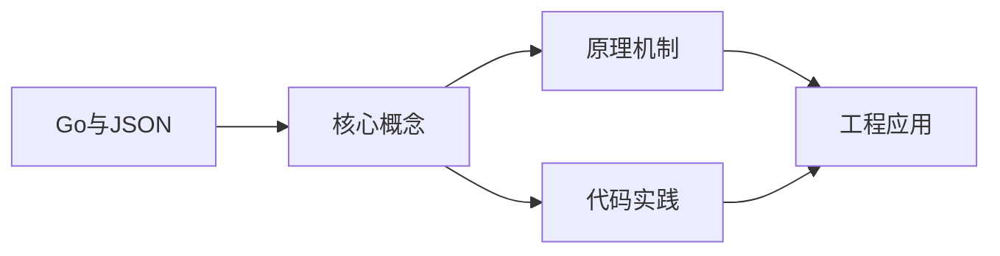
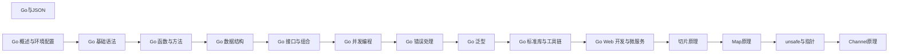

## 1. 学习目标（Bloom 分类）

本节按照布鲁姆教育目标分类学组织学习路径。本文主题为《Go与JSON》，属于 Go 模块，读者可以根据自身阶段选择阅读深度。

记忆层面：能够准确复述本文的核心概念、术语与基本语法或操作步骤，并能够在提问或检索时快速定位对应知识点。能够说出 Go 的包、函数、结构体、接口与错误处理基本语法。

理解层面：能够用自己的语言解释核心原理与工作机制，说明概念之间的因果关系，而不是机械记忆结论。能够解释 goroutine 调度、channel 通信与内存模型。

应用层面：能够在真实项目或练习场景中运用本文知识解决具体问题，写出正确且可维护的实现。能够编写并发程序、HTTP 服务与命令行工具。

分析层面：能够拆解复杂问题，比较本文主题与相邻概念的异同，识别边界条件与例外情况。能够分析数据竞争、死锁与性能瓶颈。

评价层面：能够根据约束条件（性能、可读性、安全、成本）评价不同方案的优劣，做出有依据的技术决策。能够评价 Go 与 Java、Python 在不同场景的取舍。

创造层面：能够把本文知识与其他模块知识组合，设计出新的解决方案或可复用的工程模式。能够设计完整的微服务与云原生应用。

通过本节学习，读者应当能够把《Go与JSON》纳入自己的知识网络，并与 Go 模块的其他主题（goroutine、channel、内存模型、标准库）建立关联。

## 2. 历史动机与发展脉络

《Go与JSON》是 Go 领域的重要主题。要真正理解它，需要先了解它解决的问题与演进过程。

Go 由 Google 的 Robert Griesemer、Rob Pike 与 Ken Thompson 于 2009 年发布，设计目标是解决大规模分布式系统的工程痛点：编译慢、依赖混乱、并发难写。
Go 1.0 于 2012 年发布，此后严格保持向后兼容（Go 1 兼容性承诺）；约每半年发布一个小版本，1.21 起引入工具链管理（toolchain 指令）与内置测试 fuzzing。
Go 在云原生领域成为事实标准：Docker、Kubernetes、Prometheus、etcd 等核心项目均用 Go 编写；泛型在 1.18 加入，1.21+ 的 slices/maps 标准包补齐泛型工具。

回到本文主题：Go与JSON 的提出与成熟，正是上述技术背景下的必然产物。早期实现往往以简单可用为目标，随着工程规模扩大，社区逐渐沉淀出标准做法与最佳实践；理解这一脉络，可以帮助读者判断“为什么文档中的推荐写法是现在这个样子”，也能在遇到历史遗留代码时准确识别其设计年代与取舍。


## 3. 形式化定义与核心概念精讲

本节把《Go与JSON》涉及的核心概念以“定义 + 讲解”的形式展开。读者应把定义当作工具，把讲解当作理解路径；两者结合才能形成可迁移的知识。

goroutine 与调度：goroutine 是用户态轻量线程，由 GMP 调度器（Goroutine、Machine、Processor）多路复用到内核线程；创建成本约 2KB 栈，支持百万级并发。
channel 与 select：channel 是类型化通信管道，`<-` 发送/接收；select 多路等待；“不要通过共享内存通信，而要通过通信共享内存”是 Go 并发哲学。
内存模型：happens-before 关系由 channel、sync 原语与 atomic 建立；`go test -race` 用 ThreadSanitizer 检测数据竞争。

### 3.1 原文章节逐一精讲

原文档把主题拆分为 20 个小节，下面按顺序给出每一节的导读讲解，随后保留原文细节供精读。

#### 原文精读（完整保留）

# Go JSON 编解码

> **符号约定**：`< >` 必填参数 | `[ ]` 可选参数

---

#### 学习目标

完成本章学习后,读者应能够在以下 Bloom 认知层级达到对应能力:

- **记忆(Memory)**:复述 JSON 标准的六种数据类型(null/boolean/number/string/array/object),`encoding/json` 包的 Marshal/Unmarshal/Encoder/Decoder API 签名,常见结构体标签(`json:"name,omitempty,omitempty"`)的语义。
- **理解(Understanding)**:解释 Go 结构体与 JSON 之间的双向映射规则,反射在序列化过程中的角色,流式编码(Encoder/Decoder)与一次性编码(Marshal/Unmarshal)的区别与适用场景。
- **应用(Application)**:使用结构体标签、自定义 MarshalJSON/UnmarshalJSON、json.RawMessage、json.Decoder 等机制处理真实场景下的复杂 JSON 数据,如配置文件、API 请求/响应、流式日志。
- **分析(Analysis)**:对照 `go tool pprof` 与 benchmark 结果,识别 JSON 序列化的反射开销、内存分配热点、字节切片扩容代价,定位性能瓶颈。
- **评价(Evaluation)**:对比 `encoding/json`、`jsoniter`、`easyjson`、`sonic`、`go-json` 等多种 JSON 库的性能、易用性、兼容性,在标准库与第三方库之间做出合理选择。
- **创造(Creation)**:为高 QPS API 服务设计一套包含零拷贝解析、对象池化、流式处理的 JSON 序列化方案,并通过压测验证 P99 延迟低于 1ms。

#### 历史动机与背景

##### JSON 的诞生与流行

JSON(JavaScript Object Notation)由 Douglas Crockford 在 2001 年正式命名并推广,但其语法源自 JavaScript 的对象字面量,可追溯至 Netscape Navigator 2.0(1995 年)。JSON 设计目标:

- **轻量**:相比 XML,去除标签冗余,体积更小。
- **可读**:纯文本,人类可读,易于调试。
- **跨语言**:与语言无关,任意现代语言都有解析器。
- **简单**:仅 6 种数据类型,语法规范不超过一页。

随着 RESTful API 在 2005 年前后成为 Web 服务的事实标准,JSON 取代 XML 成为数据交换的首选格式。今天的微服务、移动应用、IoT 设备、配置文件,JSON 都占据主导地位。

##### Go encoding/json 的设计哲学

Go 标准库的 `encoding/json` 包于 2009 年随 Go 1.0 发布,设计原则:

1. **标准优先**:严格遵循 RFC 7159(现 RFC 8259)规范。
2. **反射驱动**:零配置即可工作,通过结构体标签定制。
3. **流式支持**:Encoder/Decoder 支持流式读写,适合大数据。
4. **可扩展**:支持自定义 MarshalJSON/UnmarshalJSON。
5. **安全**:默认禁用 JavaScript 中的 `<>` 字符,防止 XSS。

代价:反射开销显著,比手写解析器慢 5-10 倍。Go 团队保守地优先正确性而非性能,因此社区涌现了多个高性能 JSON 库。

##### JSON 标准的局限与扩展

JSON 标准存在以下局限:

- **无注释**:不支持 `//` 或 `/* */`,配置文件场景不便。
- **无多行字符串**:字符串不能跨行,长文本场景需 `\n` 转义。
- **数字精度**:JavaScript Number 是 64 位浮点,大整数丢失精度。
- **无日期类型**:需用字符串约定格式(ISO 8601)。

针对这些局限,出现了 JSON5、HJSON、YAML 等扩展。Go 标准库仅支持标准 JSON,第三方库提供扩展支持。

#### 形式化定义

##### JSON 文法的形式化

JSON 文法(BNF 范式简化版):

```
value   ::= null | true | false | number | string | array | object
null    ::= "null"
true    ::= "true"
false   ::= "false"
number  ::= int frac? exp?
int     ::= "-"? digit+ (digit | "." | "e" | "E" | "+" | "-")*
string  ::= '"' char* '"'
char    ::= unicode | escape
escape  ::= "\" ("\"" | "\" | "/" | "b" | "f" | "n" | "r" | "t" | "u" hex4)
array   ::= "[" (value ("," value)*)? "]"
object  ::= "{" (pair ("," pair)*)? "}"
pair    ::= string ":" value
```

##### Go 与 JSON 类型映射

| Go 类型 | JSON 类型 | 备注 |
|---------|-----------|------|
| `bool` | `boolean` | 双向映射 |
| `int/int8/.../int64` | `number` | 大整数精度有限 |
| `uint/.../uint64` | `number` | 同上 |
| `float32/float64` | `number` | 默认 float64 |
| `string` | `string` | UTF-8 |
| `[]T` | `array` | 任意嵌套 |
| `[]byte` | `string` | Base64 编码 |
| `struct` | `object` | 字段名转 JSON |
| `map[string]T` | `object` | key 必须为 string |
| `nil (pointer/slice/...)` | `null` | |
| `interface{}` | 任意 | 动态类型 |

##### 结构体标签的形式语法

```ebnf
Tag ::= "json:" "\"" FieldName ("," Option)* "\""
FieldName ::= identifier | "-"
Option ::= "omitempty" | "string" | "omitempty"
```

##### 序列化的代数语义

设序列化函数 $M: \text{Go Value} \to \text{JSON Bytes}$,反序列化 $U: \text{JSON Bytes} \to \text{Go Value}$。理想情况下:

$$
U(M(v)) = v \quad \text{(左逆)}
$$

但实际上,由于类型丢失(如 `int` 与 `int64` 都映射到 `number`),严格左逆不成立。Go 通过类型断言、interface 类型保留类型信息。

#### 理论推导

##### 反射开销的下界

`encoding/json` 使用 `reflect` 包遍历结构体字段。每次访问字段的成本:

- `reflect.Value.Field(i)`:O(1),但涉及 interface 装箱。
- `reflect.Value.String()`:O(1),但 string header 复制。
- `reflect.Value.Int()`:O(1),但需要类型检查。

理论下界:每个字段至少 100ns 反射开销。100 字段结构体的序列化至少 10μs。

##### 内存分配模型

Marshal 的内存分配主要来自:

1. **输出 buffer**:初始 64B,翻倍扩容。
2. **string 转义**:特殊字符 `<`、`>`、`&`、`"`、`\` 需转义,可能分配新 buffer。
3. **interface 装箱**:值类型字段被装入 interface{}。

设结构体有 $n$ 字段,平均字段值长度 $L$,理论分配量:

$$
M_{\text{alloc}} \approx 64 \cdot 2^{\lceil \log_2(n \cdot L) \rceil} + n \cdot 16
$$

##### 流式 vs 一次性

Marshal 一次性生成完整 JSON,内存占用 $O(N)$,$N$ 为输出大小。Encoder 流式写入,内存占用 $O(B)$,$B$ 为 buffer 大小(默认 4KB)。

大数据场景下,Encoder 节省内存 $N/B$ 倍。但 Encoder 不便于随机访问,适合顺序处理。

##### unicode 转义策略

JSON 字符串中,非 ASCII 字符(>127)默认被转义为 `\uXXXX`。这保证输出 ASCII 兼容,但增加体积。Go 1.7+ 提供 `SetEscapeHTML(false)` 关闭 HTML 转义,但不影响 unicode 转义。

性能上,unicode 转义涉及 UTF-8 解码与十六进制编码,每个非 ASCII 字符额外 5 字节。中文字符串序列化后体积可能扩大 3 倍。

#### 代码示例

##### 示例 1:基础序列化与反序列化

```go
// 文件: json_basic.go
// 演示 encoding/json 的基础用法
package main

import (
	"encoding/json"
	"fmt"
)

// User 用户结构体
// json 标签控制字段名与行为
type User struct {
	ID        int    `json:"id"`                   // 字段重命名
	Name      string `json:"name"`                 // 必须输出
	Email     string `json:"email,omitempty"`      // 空值省略
	Age       int    `json:"age,omitempty"`        // 零值省略
	Password  string `json:"-"`                    // 永不输出
	Avatar    string `json:"avatar,omitempty"`     // 空值省略
	CreatedAt int64  `json:"created_at"`           // snake_case
}

func main() {
	u := User{
		ID:        1,
		Name:      "Alice",
		Email:     "alice@example.com",
		Age:       0, // 零值,因 omitempty 不输出
		Password:  "secret",
		CreatedAt: 1700000000,
	}

	// 序列化
	data, err := json.Marshal(u)
	if err != nil {
		fmt.Println("Marshal error:", err)
		return
	}
	fmt.Println("JSON:", string(data))

	// 反序列化
	jsonStr := `{"id":2,"name":"Bob","email":"bob@example.com","age":25,"created_at":1700000001}`
	var u2 User
	if err := json.Unmarshal([]byte(jsonStr), &u2); err != nil {
		fmt.Println("Unmarshal error:", err)
		return
	}
	fmt.Printf("Decoded: %+v\n", u2)
}
```

##### 示例 2:嵌套结构与动态字段

```go
// 文件: json_nested.go
// 演示嵌套结构、map[string]interface{}、json.RawMessage
package main

import (
	"encoding/json"
	"fmt"
)

// Payload API 响应包装
type Payload struct {
	Type string          `json:"type"`           // 类型标识
	Data json.RawMessage `json:"data"`           // 延迟解析
	Meta map[string]any  `json:"meta,omitempty"` // 动态元数据
}

// TextMessage 文本消息
type TextMessage struct {
	Text string `json:"text"`
}

// ImageMessage 图片消息
type ImageMessage struct {
	URL    string `json:"url"`
	Width  int    `json:"width"`
	Height int    `json:"height"`
}

// DecodePayload 根据类型分发解析
func DecodePayload(raw []byte) (any, error) {
	var p Payload
	if err := json.Unmarshal(raw, &p); err != nil {
		return nil, err
	}

	switch p.Type {
	case "text":
		var m TextMessage
		if err := json.Unmarshal(p.Data, &m); err != nil {
			return nil, err
		}
		return m, nil
	case "image":
		var m ImageMessage
		if err := json.Unmarshal(p.Data, &m); err != nil {
			return nil, err
		}
		return m, nil
	default:
		return nil, fmt.Errorf("unknown type: %s", p.Type)
	}
}

func main() {
	// 模拟接收到的 JSON
	raw := []byte(`{
		"type": "image",
		"data": {"url": "http://example.com/1.png", "width": 800, "height": 600},
		"meta": {"trace_id": "abc123", "ts": 1700000000}
	}`)

	result, err := DecodePayload(raw)
	if err != nil {
		fmt.Println("Error:", err)
		return
	}
	fmt.Printf("Decoded: %+v\n", result)
}
```

##### 示例 3:自定义序列化

```go
// 文件: json_custom.go
// 演示 MarshalJSON/UnmarshalJSON 自定义
package main

import (
	"encoding/json"
	"fmt"
	"strconv"
	"strings"
	"time"
)

// FlexibleTime 自定义时间类型,支持多种格式
type FlexibleTime struct {
	time.Time
}

// MarshalJSON 输出 Unix 时间戳
func (ft FlexibleTime) MarshalJSON() ([]byte, error) {
	return []byte(strconv.FormatInt(ft.Unix(), 10)), nil
}

// UnmarshalJSON 解析多种格式:Unix 时间戳、ISO 8601
func (ft *FlexibleTime) UnmarshalJSON(data []byte) error {
	s := strings.Trim(string(data), `"`)
	if s == "null" || s == "" {
		return nil
	}

	// 尝试 Unix 时间戳
	if ts, err := strconv.ParseInt(s, 10, 64); err == nil {
		ft.Time = time.Unix(ts, 0)
		return nil
	}

	// 尝试 RFC3339
	if t, err := time.Parse(time.RFC3339, s); err == nil {
		ft.Time = t
		return nil
	}

	return fmt.Errorf("cannot parse time: %s", s)
}

// Money 货币类型,以"分"存储,以"元"输出
type Money struct {
	Cents int64
}

func (m Money) MarshalJSON() ([]byte, error) {
	yuan := float64(m.Cents) / 100.0
	return []byte(strconv.FormatFloat(yuan, 'f', 2, 64)), nil
}

func (m *Money) UnmarshalJSON(data []byte) error {
	var f float64
	if err := json.Unmarshal(data, &f); err != nil {
		return err
	}
	m.Cents = int64(f * 100)
	return nil
}

// Order 订单结构
type Order struct {
	ID        string       `json:"id"`
	Amount    Money        `json:"amount"`
	CreatedAt FlexibleTime `json:"created_at"`
}

func main() {
	o := Order{
		ID:        "ORD001",
		Amount:    Money{Cents: 9999},
		CreatedAt: FlexibleTime{time.Unix(1700000000, 0)},
	}

	data, _ := json.Marshal(o)
	fmt.Println("Serialized:", string(data))

	var o2 Order
	json.Unmarshal(data, &o2)
	fmt.Printf("Deserialized: %+v\n", o2)
}
```

##### 示例 4:流式编码与解码

```go
// 文件: json_stream.go
// 演示 json.Encoder 与 json.Decoder 处理大文件
package main

import (
	"bytes"
	"encoding/json"
	"fmt"
	"io"
	"os"
)

// LogEntry 日志条目
type LogEntry struct {
	Level   string `json:"level"`
	Message string `json:"message"`
	Time    int64  `json:"time"`
}

// WriteLogsNDJSON 写入 NDJSON(Newline Delimited JSON)
// 每行一个 JSON 对象,适合日志流
func WriteLogsNDJSON(w io.Writer, entries []LogEntry) error {
	encoder := json.NewEncoder(w)
	encoder.SetEscapeHTML(false) // 关闭 HTML 转义,日志场景不需要
	for _, e := range entries {
		if err := encoder.Encode(e); err != nil {
			return err
		}
	}
	return nil
}

// ReadLogsNDJSON 从 NDJSON 流读取
// 使用流式 Decoder,避免一次性加载整个文件
func ReadLogsNDJSON(r io.Reader, handler func(LogEntry) error) error {
	decoder := json.NewDecoder(r)
	for decoder.More() {
		var e LogEntry
		if err := decoder.Decode(&e); err != nil {
			if err == io.EOF {
				return nil
			}
			return err
		}
		if err := handler(e); err != nil {
			return err
		}
	}
	return nil
}

func main() {
	// 准备测试数据
	entries := []LogEntry{
		{Level: "INFO", Message: "service started", Time: 1700000000},
		{Level: "WARN", Message: "high latency", Time: 1700000001},
		{Level: "ERROR", Message: "db connection lost", Time: 1700000002},
	}

	// 写入内存 buffer(实际可换成 os.File)
	var buf bytes.Buffer
	if err := WriteLogsNDJSON(&buf, entries); err != nil {
		fmt.Fprintln(os.Stderr, err)
		return
	}
	fmt.Println("NDJSON output:")
	fmt.Println(buf.String())

	// 流式读取
	fmt.Println("Reading stream:")
	ReadLogsNDJSON(&buf, func(e LogEntry) error {
		fmt.Printf("  [%s] %s @%d\n", e.Level, e.Message, e.Time)
		return nil
	})
}
```

##### 示例 5:Tag 选项详解

```go
// 文件: json_tags.go
// 演示结构体标签的各种选项
package main

import (
	"encoding/json"
	"fmt"
)

// TagDemo 标签演示
type TagDemo struct {
	// 字段重命名
	FieldName string `json:"field_name"`

	// omitempty:零值时不输出
	OptionalField string `json:"optional,omitempty"`

	// string:数字字段以字符串形式输出(避免大数精度丢失)
	NumberAsString int64 `json:"number,string"`

	// -:永不输出
	Hidden string `json:"-"`

	// -,omitempty:不输出,但特殊场景下与 omitempty 冲突
	// 实际效果:此字段永不输出
	HiddenOmit string `json:"-,omitempty"`

	// 空标签:使用 Go 字段名
	DefaultName string `json:""`

	// 嵌套匿名结构体
	Inner struct {
		SubField string `json:"sub_field"`
	} `json:"inner"`
}

// MyInt 自定义类型演示
type MyInt int

func main() {
	d := TagDemo{
		FieldName:      "value",
		OptionalField:  "", // 零值,因 omitempty 不输出
		NumberAsString: 123456789,
		Hidden:         "hidden",
		HiddenOmit:     "hidden_omit",
		DefaultName:    "default",
	}
	d.Inner.SubField = "sub"

	data, _ := json.MarshalIndent(d, "", "  ")
	fmt.Println(string(data))
}
```

##### 示例 6:错误处理与类型断言

```go
// 文件: json_errors.go
// 演示 JSON 处理中的常见错误与类型断言
package main

import (
	"encoding/json"
	"fmt"
	"strings"
)

// SafeUnmarshal 安全反序列化,返回详细错误
func SafeUnmarshal(data []byte, v any) error {
	decoder := json.NewDecoder(strings.NewReader(string(data)))
	decoder.DisallowUnknownFields() // 禁止未知字段
	if err := decoder.Decode(v); err != nil {
		// 区分语法错误与类型错误
		if syntaxErr, ok := err.(*json.SyntaxError); ok {
			return fmt.Errorf("JSON syntax error at offset %d: %v",
				syntaxErr.Offset, syntaxErr)
		}
		if unmarshalErr, ok := err.(*json.UnmarshalTypeError); ok {
			return fmt.Errorf("type error: field %s, expected %s, got %s",
				unmarshalErr.Field, unmarshalErr.Type, unmarshalErr.Value)
		}
		return err
	}
	return nil
}

// DecodeDynamic 动态解码,使用 map[string]interface{}
// 不推荐用于性能敏感场景
func DecodeDynamic(data []byte) (map[string]any, error) {
	var m map[string]any
	if err := json.Unmarshal(data, &m); err != nil {
		return nil, err
	}
	return m, nil
}

// TraverseValue 遍历动态 JSON 值
func TraverseValue(v any, prefix string) {
	switch val := v.(type) {
	case map[string]any:
		for k, v := range val {
			TraverseValue(v, prefix+"."+k)
		}
	case []any:
		for i, v := range val {
			TraverseValue(v, fmt.Sprintf("%s[%d]", prefix, i))
		}
	default:
		fmt.Printf("%s = %v (type: %T)\n", prefix, val, val)
	}
}

func main() {
	// 演示错误处理
	badJSON := []byte(`{"name": "Alice", "age": "twenty"}`)
	type Person struct {
		Name string `json:"name"`
		Age  int    `json:"age"`
	}
	var p Person
	if err := SafeUnmarshal(badJSON, &p); err != nil {
		fmt.Println("Error:", err)
	}

	// 演示动态解码
	goodJSON := []byte(`{
		"user": {"name": "Bob", "tags": ["a", "b"]},
		"count": 42
	}`)
	m, err := DecodeDynamic(goodJSON)
	if err != nil {
		fmt.Println("Error:", err)
		return
	}
	TraverseValue(m, "")
}
```

#### 对比分析

##### Go JSON 库性能对比

| 库 | 速度(相对) | 兼容性 | 流式 | 自定义 | 依赖 | 适用场景 |
|----|--------------|--------|------|--------|------|----------|
| encoding/json | 1.0x | 100% | 是 | 是 | 标准库 | 通用,标准兼容 |
| jsoniter (json-iterator/go) | 3-5x | 99% | 是 | 是 | 无 | 高性能,API 兼容 |
| easyjson | 5-10x | 95% | 是 | 是 | 代码生成 | 极致性能,预生成 |
| sonic (bytedance) | 5-10x | 95% | 是 | 是 | SIMD | amd64,极致性能 |
| go-json (goccy) | 3-5x | 95% | 是 | 是 | 无 | 高性能,纯 Go |
| simdjson-go | 10-20x | 90% | 是 | 否 | SIMD | 只读,极致性能 |

##### 关键差异分析

**encoding/json 为何慢?** 反射开销占 60%,字节切片扩容占 20%,interface 装箱占 10%。每次 Marshal 都重新做反射,无法缓存。

**easyjson 为何快?** 编译期通过代码生成,为每个结构体生成专用的 Marshal/Unmarshal 函数,无反射开销。

**sonic 为何更快?** 利用 SIMD 指令并行解析 JSON 字符串,在 amd64 平台接近 SIMD-JSON 的极限性能。但仅支持 amd64,arm64 性能与标准库相当。

**何时选哪个?**
- 通用服务:encoding/json。
- QPS > 10万:jsoniter(零侵入)。
- 已知 schema:easyjson(代码生成)。
- amd64 极致:sonic。

##### 标准库与第三方库的功能对比

| 功能 | encoding/json | jsoniter | easyjson | sonic |
|------|---------------|----------|----------|-------|
| MarshalIndent | 是 | 是 | 否 | 是 |
| HTML 转义 | 默认开 | 可关 | 可关 | 可关 |
| 流式 Encoder/Decoder | 是 | 是 | 否 | 是 |
| DisallowUnknownFields | 是 | 是 | 否 | 是 |
| 自定义 MarshalJSON | 是 | 是 | 是 | 是 |
| 任意类型 map | 是 | 是 | 是 | 是 |
| Number 精度控制 | 是 | 是 | 是 | 是 |

#### 常见陷阱

##### 陷阱 1:数字精度丢失

```go
// 误用:大整数在 JavaScript 中精度丢失
type Bad struct {
	ID int64 `json:"id"` // 超过 2^53 时,JS 端丢失精度
}
// JSON: {"id": 9007199254740993}  // 2^53+1
// JS 解析后: 9007199254740992
```

修复:使用 `string` 标签或字符串类型。

```go
type Good struct {
	ID int64 `json:"id,string"` // JSON 输出为字符串
}
```

##### 陷阱 2:time.Time 的默认序列化

```go
// time.Time 默认序列化为 RFC3339 字符串
type Event struct {
	T time.Time `json:"t"` // "2023-11-15T08:00:00Z"
}
// 但 Unmarshal 严格匹配 RFC3339,其他格式失败
```

修复:自定义 MarshalJSON 支持多格式。

##### 陷阱 3:omitempty 的零值陷阱

```go
type Config struct {
	Enabled bool `json:"enabled,omitempty"`
	// 当 Enabled=false 时,无法区分"未设置"与"显式设为 false"
}
```

修复:使用 `*bool` 指针。

```go
type Config struct {
	Enabled *bool `json:"enabled,omitempty"`
}
```

##### 陷阱 4:map[string]interface{} 的性能陷阱

```go
// 误用:动态解析慢且类型不安全
var m map[string]interface{}
json.Unmarshal(data, &m)
// 每次访问需类型断言,且数字默认为 float64,精度丢失
```

修复:优先定义结构体,使用 `json.RawMessage` 处理动态部分。

##### 陷阱 5:HTML 转义破坏 URL

```go
// 误用:URL 中的 & 被转义为 \u0026
type Link struct {
	URL string `json:"url"`
}
l := Link{URL: "http://example.com?a=1&b=2"}
data, _ := json.Marshal(l)
// 输出: {"url":"http://example.com?a=1\u0026b=2"}
```

修复:使用 Encoder 并关闭 HTML 转义。

```go
var buf bytes.Buffer
enc := json.NewEncoder(&buf)
enc.SetEscapeHTML(false)
enc.Encode(l)
```

##### 陷阱 6:循环引用导致栈溢出

```go
// 误用:循环引用导致 Marshal 无限递归
type Node struct {
	Next *Node `json:"next"`
}
n1 := &Node{}
n2 := &Node{Next: n1}
n1.Next = n2 // 循环引用
json.Marshal(n1) // 栈溢出
```

修复:避免循环引用,或使用 ID 引用而非直接嵌套。

##### 陷阱 7:nil 切片与空切片的差异

```go
type Response struct {
	Items []Item `json:"items"`
}
var r1 Response
r1.Items = nil  // JSON 输出: {"items":null}

var r2 Response
r2.Items = []Item{} // JSON 输出: {"items":[]}
```

前端通常期望空数组 `[]`,而非 `null`。修复:始终初始化切片。

#### 工程实践

##### 实践 1:高性能 API 序列化

```go
// 高性能 HTTP 处理器,使用 Encoder 流式响应
import (
	"encoding/json"
	"net/http"
)

type APIResponse struct {
	Code int         `json:"code"`
	Msg  string      `json:"msg"`
	Data interface{} `json:"data"`
}

func writeJSON(w http.ResponseWriter, status int, v interface{}) {
	w.Header().Set("Content-Type", "application/json; charset=utf-8")
	w.WriteHeader(status)
	enc := json.NewEncoder(w)
	enc.SetEscapeHTML(false) // API 场景关闭 HTML 转义
	enc.Encode(v)
}

func HandleGetUser(w http.ResponseWriter, r *http.Request) {
	user := loadUser()
	writeJSON(w, http.StatusOK, APIResponse{
		Code: 0,
		Msg:  "ok",
		Data: user,
	})
}
```

##### 实践 2:配置文件加载

```go
// 支持环境变量替换与默认值
type Config struct {
	Host         string `json:"host"`
	Port         int    `json:"port"`
	DatabaseURL  string `json:"database_url"`
	RedisURL     string `json:"redis_url"`
	LogLevel     string `json:"log_level"`
	MaxWorkers   int    `json:"max_workers"`
}

func LoadConfig(path string) (*Config, error) {
	data, err := os.ReadFile(path)
	if err != nil {
		return nil, fmt.Errorf("read config: %w", err)
	}

	// 替换环境变量 ${VAR}
	expanded := os.Expand(string(data), os.Getenv)

	var cfg Config
	if err := json.Unmarshal([]byte(expanded), &cfg); err != nil {
		return nil, fmt.Errorf("parse config: %w", err)
	}

	// 应用默认值
	applyDefaults(&cfg)
	return &cfg, nil
}

func applyDefaults(cfg *Config) {
	if cfg.Host == "" {
		cfg.Host = "0.0.0.0"
	}
	if cfg.Port == 0 {
		cfg.Port = 8080
	}
	if cfg.LogLevel == "" {
		cfg.LogLevel = "info"
	}
	if cfg.MaxWorkers == 0 {
		cfg.MaxWorkers = runtime.NumCPU() * 2
	}
}
```

##### 实践 3:大型 JSON 文件的流式处理

```go
// 处理 GB 级 JSON 文件,内存占用 O(1)
func ProcessLargeJSON(path string, handler func(json.RawMessage) error) error {
	f, err := os.Open(path)
	if err != nil {
		return err
	}
	defer f.Close()

	decoder := json.NewDecoder(f)

	// 读取开头的 {
	token, err := decoder.Token()
	if err != nil {
		return err
	}
	if delim, ok := token.(json.Delim); !ok || delim != '{' {
		return fmt.Errorf("expected object, got %v", token)
	}

	// 逐字段读取
	for decoder.More() {
		// 读取字段名
		key, err := decoder.Token()
		if err != nil {
			return err
		}

		// 读取值
		var raw json.RawMessage
		if err := decoder.Decode(&raw); err != nil {
			return err
		}

		fmt.Printf("Processing key: %v\n", key)
		if err := handler(raw); err != nil {
			return err
		}
	}

	return nil
}
```

##### 实践 4:对象池化降低 GC 压力

```go
// JSON encoder 对象池
var encoderPool = sync.Pool{
	New: func() interface{} {
		var buf bytes.Buffer
		enc := json.NewEncoder(&buf)
		enc.SetEscapeHTML(false)
		return &struct {
			enc *json.Encoder
			buf *bytes.Buffer
		}{enc, &buf}
	},
}

func marshalPooled(v interface{}) ([]byte, error) {
	p := encoderPool.Get().(*struct {
		enc *json.Encoder
		buf *bytes.Buffer
	})
	defer encoderPool.Put(p)

	p.buf.Reset()
	if err := p.enc.Encode(v); err != nil {
		return nil, err
	}
	// Encode 会追加 \n,需去除
	out := p.buf.Bytes()
	return out[:len(out)-1], nil
}
```

##### 实践 5:Schema 验证

```go
// 使用 jsonschema 库进行 schema 验证
import "github.com/xeipuuv/gojsonschema"

func ValidateJSON(data []byte, schemaJSON string) (bool, []string, error) {
	schemaLoader := gojsonschema.NewStringLoader(schemaJSON)
	documentLoader := gojsonschema.NewBytesLoader(data)

	result, err := gojsonschema.Validate(schemaLoader, documentLoader)
	if err != nil {
		return false, nil, err
	}

	if result.Valid() {
		return true, nil, nil
	}

	var errs []string
	for _, desc := range result.Errors() {
		errs = append(errs, desc.String())
	}
	return false, errs, nil
}
```

#### 案例研究

##### 案例 1:某社交平台的 JSON 优化

**背景**:某社交平台 API,日均 50 亿请求,JSON 序列化占 CPU 30%。

**问题**:
- `encoding/json` 性能瓶颈。
- 大量 `interface{}` 解析,反射开销巨大。
- HTML 转义导致 URL 体积膨胀。

**优化路径**:
1. 评估 jsoniter、easyjson、sonic,选择 jsoniter(API 兼容,零侵入)。
2. 热点接口改用 easyjson 代码生成。
3. 关闭 HTML 转义,使用 Encoder 流式响应。
4. 对象池化 bytes.Buffer。

**结果**:CPU 占用从 30% 降至 12%,API P99 延迟从 50ms 降至 20ms。

##### 案例 2:日志收集系统的 NDJSON 处理

**背景**:某日志收集服务,每秒处理 100 万条 NDJSON 日志。

**问题**:
- 一次性 Unmarshal 内存占用高。
- GC 压力大,每秒 100 万次分配。

**优化**:
1. 改用 `json.Decoder` 流式解析。
2. 日志对象 `sync.Pool` 化。
3. 跳过非必需字段:使用 `json.RawMessage` 延迟解析。

**结果**:内存占用降低 80%,GC 频率降低 90%。

##### 案例 3:IoT 设备的 JSON 兼容性

**背景**:某 IoT 平台,设备使用嵌入式 JSON 库,与 Go 服务器交互。

**问题**:
- 设备端 JSON 库不严格,允许注释、单引号、尾随逗号。
- `encoding/json` 严格拒绝。

**修复**:使用 `json.Decoder` 的宽松模式或第三方库 `tidwall/gjson` 处理非标准 JSON。

##### 案例 4:大整数 ID 的精度问题

**背景**:某金融系统,交易 ID 为 64 位整数,前端 JS 精度丢失。

**修复**:
- ID 字段使用 `json:"id,string"` 标签,输出为字符串。
- 或定义自定义类型 `Int64String`,实现 MarshalJSON。

**结果**:前端精度问题消失,API 兼容性提升。

#### 知识讲解与要点分析（原习题）

##### 基础题

**题 1.1**:`json:"name,omitempty"` 中 omitempty 的作用是什么?对零值与 nil 的处理有何不同?

**参考答案要点**:
- omitempty:字段为零值时不输出。
- 对值类型(int、string):零值(0、空字符串)省略。
- 对指针类型:nil 省略,指向零值不省略。
- 对切片: nil 与空切片 `[]T{}` 都省略。

**题 1.2**:为何 `[]byte` 在 JSON 中表示为 Base64 字符串?

**参考答案要点**:
- JSON 字符串必须是 UTF-8。
- 二进制数据可能包含非 UTF-8 字节。
- Base64 编码为 ASCII,JSON 安全。

**题 1.3**:Decoder 与 Unmarshal 的核心区别是什么?

**参考答案要点**:
- Unmarshal 一次性解析整个 JSON,内存 O(N)。
- Decoder 流式解析,可处理多个 JSON 对象,内存 O(B)。
- Decoder 支持 `DisallowUnknownFields`、`UseNumber` 等运行时配置。

##### 进阶题

**题 2.1**:以下代码在 JS 端解析时,`id` 字段会丢失精度,如何修复?

```go
type Response struct {
	ID int64 `json:"id"`
}
```

**参考答案要点**:
- JS Number 是 64 位浮点,安全整数范围 2^53。
- 修复 1:使用 `json:"id,string"`。
- 修复 2:定义 `type Int64String int64`,实现 MarshalJSON。
- 修复 3:JSON 输出时手动转字符串。

**题 2.2**:解释 `json.RawMessage` 的作用,并给出一个典型应用场景。

**参考答案要点**:
- json.RawMessage 是 `[]byte` 别名,实现 MarshalJSON/UnmarshalJSON 为透传。
- 用于"延迟解析"场景:先解析外层结构,根据类型字段决定如何解析内层。
- 典型场景:多态消息、API 网关转发、插件系统。

**题 2.3**:某服务的 JSON 序列化占 CPU 40%,如何系统性优化?

**参考答案要点**:
1. **测量**:使用 pprof 定位热点函数。
2. **替代库**:评估 jsoniter、easyjson、sonic。
3. **结构优化**:减少嵌套,使用 omitempty 减少输出。
4. **流式处理**:大数据用 Encoder/Decoder。
5. **对象池**:bytes.Buffer、Encoder 对象池化。
6. **代码生成**:easyjson 预生成,零反射。
7. **关闭转义**:SetEscapeHTML(false)。

##### 挑战题

**题 3.1**:设计一个支持多版本 API 的 JSON 序列化方案,要求:
- 同一结构体在不同 API 版本输出不同字段。
- 新版本添加字段,旧版本不输出。
- 性能接近原生 encoding/json。

**参考答案要点**:
```go
type User struct {
	ID    int    `json:"id"`
	Name  string `json:"name"`
	Email string `json:"email,omitempty"`
	Bio   string `json:"bio,omitempty"` // v2 新增
}

// 方案 1:多个结构体,版本路由
type UserV1 struct {
	ID   int    `json:"id"`
	Name string `json:"name"`
}
type UserV2 struct {
	ID    int    `json:"id"`
	Name  string `json:"name"`
	Email string `json:"email,omitempty"`
	Bio   string `json:"bio,omitempty"`
}

// 方案 2:实现 MarshalJSON,根据 context 选择字段
// 方案 3:使用 map[string]interface{} 动态构建
```

**题 3.2**:实现一个 JSON Patch (RFC 6902) 处理器,支持 add/remove/replace/move/copy/test 操作。

**参考答案要点**:
- 解析 Patch 数组,每个操作有 op/path/value 字段。
- path 使用 JSON Pointer (RFC 6901) 语法,如 `/user/name`。
- 要点：操作分发:add、remove、replace、move、copy、test。
- 使用 `map[string]interface{}` 作为内部表示,操作完成后重新序列化。

#### 参考文献

[1] Crockford, D. 2017. *The JSON Data Interchange Syntax* (RFC 8259). Internet Engineering Task Force (IETF). DOI: https://doi.org/10.17487/RFC8259

[2] Bray, T. (Ed.). 2017. *The JavaScript Object Notation (JSON) Data Interchange Format* (STD 90). Internet Engineering Task Force (IETF). DOI: https://doi.org/10.17487/RFC8259

[3] Google Inc. 2023. *encoding/json package documentation*. The Go Programming Language. Available at: https://pkg.go.dev/encoding/json

[4] Donovan, A. A. A., and Kernighan, B. W. 2015. *The Go Programming Language*. Addison-Wesley Professional, Boston, MA, USA. ISBN: 978-0134190440.

[5] Bytedance. 2021. *Sonic: A JSON Parser by JIT*. Bytedance Tech Blog. Available at: https://github.com/bytedance/sonic

[6] Mailgun. 2017. *easyjson: Fast JSON Encoder/Decoder for Go*. Available at: https://github.com/mailru/easyjson

[7] Lang, T. 2017. *jsoniter: A High-Performance JSON Library for Go*. Available at: https://github.com/json-iterator/go

[8] Pezoa, F., Reutter, J. L., Suarez, F., Ugarte, M., and Vrgoč, D. 2016. Foundations of JSON Schema. In *Proceedings of the 25th International Conference on World Wide Web* (WWW '16). International World Wide Web Conferences Steering Committee, Geneva, CHE, 263-273. DOI: https://doi.org/10.1145/2872427.2883029

[9] Bryan, P., and Hoffman, P. 2013. *JavaScript Object Notation (JSON) Pointer* (RFC 6901). Internet Engineering Task Force (IETF). DOI: https://doi.org/10.17487/RFC6901

[10] Internet Engineering Task Force. 2013. *JavaScript Object Notation (JSON) Patch* (RFC 6902). DOI: https://doi.org/10.17487/RFC6902

#### 延伸阅读

- **RFC 8259**:JSON 标准规范,权威定义。
- **《The Go Programming Language》** 第 4 章:JSON 序列化深入讲解。
- **《Designing Data-Intensive Applications》**(Kleppmann, 2017):第 4 章对比 JSON、XML、Protobuf、Thrift。
- **easyjson 文档**:https://github.com/mailru/easyjson
- **sonic 文档**:https://github.com/bytedance/sonic
- **jsoniter 文档**:https://github.com/json-iterator/go
- **《API Design Patterns》**(Mihaylov, 2021):API 响应格式的最佳实践。
- **JSON Schema 规范**:https://json-schema.org/
- **Go 源码 `encoding/json/encode.go`**:Marshal 实现细节。
- **simdjson 论文**:https://arxiv.org/abs/1902.08318
- **《Streaming JSON Processing》**(Tidwall, 2020):流式 JSON 处理模式。
#### 编码与解码

**基本写法：序列化为 JSON**
`json.Marshal(<值>)`
```go
// 将 Go 数据结构序列化为 JSON
data, err := json.Marshal(map[string]int{"a": 1, "b": 2})
fmt.Println(string(data))
```

**基本写法：带缩进序列化**
`json.MarshalIndent(<值>, <前缀>, <缩进>)`
```go
// 生成格式化的 JSON
data, _ := json.MarshalIndent(user, "", "  ")
fmt.Println(string(data))
```

**基本写法：反序列化 JSON**
`json.Unmarshal(<数据>, &<变量>)`
```go
// 将 JSON 解析为 Go 数据结构
var u User
err := json.Unmarshal([]byte(`{"name":"Go"}`), &u)
```

**基本写法：编码到 Writer**
`json.NewEncoder(<writer>).Encode(<值>)`
```go
// 直接编码输出到 Writer
json.NewEncoder(os.Stdout).Encode(user)
```

**基本写法：从 Reader 解码**
`json.NewDecoder(<reader>).Decode(&<变量>)`
```go
// 从 Reader 直接解码
var u User
json.NewDecoder(strings.NewReader(jsonStr)).Decode(&u)
```

---

#### 结构体标签

**基本写法：字段映射标签**
`` `json:"<字段名>"` ``
```go
// 使用标签控制 JSON 字段名
type User struct {
    Name string `json:"name"`
    Age  int    `json:"age"`
}
```

**基本写法：忽略字段**
`` `json:"-"` ``
```go
// 序列化时忽略该字段
type User struct {
    Password string `json:"-"`
    Name     string `json:"name"`
}
```

**基本写法：omitempty 省略空值**
`` `json:"<字段名>,omitempty"` ``
```go
// 字段为零值时不输出
type User struct {
    Name  string `json:"name"`
    Email string `json:"email,omitempty"`
}
```

**基本写法：字符串化字段**
`` `json:"<字段名>,string"` ``
```go
// 将数值序列化为字符串
type Config struct {
    Port int `json:"port,string"`
}
```

---

#### 流式处理

**基本写法：流式编码多对象**
`enc := json.NewEncoder(<writer>)`
```go
// 连续编码多个 JSON 对象
enc := json.NewEncoder(os.Stdout)
enc.Encode(obj1)
enc.Encode(obj2)
```

**基本写法：流式解码多对象**
`dec := json.NewDecoder(<reader>)`
```go
// 循环解码多个 JSON 对象
dec := json.NewDecoder(file)
for dec.More() {
    var u User
    dec.Decode(&u)
    fmt.Println(u)
}
```

**基本写法：解码 JSON 数组流**
`dec.Token()`
```go
// 逐个解码数组元素
dec := json.NewDecoder(file)
dec.Token() // 读取开始的 [
for dec.More() {
    var item Item
    dec.Decode(&item)
}
dec.Token() // 读取结束的 ]
```

---

#### 动态 JSON

**基本写法：解析到 map**
`var m map[string]interface{}`
```go
// 不确定结构时解析到 map
var m map[string]interface{}
json.Unmarshal(data, &m)
name := m["name"].(string)
```

**基本写法：解析到 interface{}**
`var v interface{}`
```go
// 完全动态解析
var v interface{}
json.Unmarshal(data, &v)
m := v.(map[string]interface{})
```

**基本写法：类型断言访问**
`v.(<类型>)`
```go
// 动态访问 JSON 字段
m := v.(map[string]interface{})
for key, val := range m {
    switch t := val.(type) {
    case string:
        fmt.Println(key, "is string:", t)
    case float64:
        fmt.Println(key, "is number:", t)
    }
}
```

---

#### json.RawMessage

**基本写法：延迟解码**
`json.RawMessage`
```go
// 保留原始 JSON 字节，延迟解析
type Envelope struct {
    Type string          `json:"type"`
    Data json.RawMessage `json:"data"`
}
var env Envelope
json.Unmarshal(data, &env)
// 根据 Type 决定如何解析 Data
```

**基本写法：合并 RawMessage**
`json.RawMessage(<字节>)`
```go
// 构造原始 JSON 片段
raw := json.RawMessage(`{"key":"value"}`)
result, _ := json.Marshal(struct {
    Wrap json.RawMessage `json:"wrap"`
}{Wrap: raw})
```

---

#### 自定义序列化

**换行写法：实现 MarshalJSON**
`func (<类型>) MarshalJSON() ([]byte, error)`
```go
// 自定义序列化逻辑
type Temperature float64
func (t Temperature) MarshalJSON() ([]byte, error) {
    return json.Marshal(fmt.Sprintf("%.1fC", t))
}
```

**换行写法：实现 UnmarshalJSON**
`func (<接收者>) UnmarshalJSON([]byte) error`
```go
// 自定义反序列化逻辑
func (t *Temperature) UnmarshalJSON(data []byte) error {
    var s string
    if err := json.Unmarshal(data, &s); err != nil {
        return err
    }
    val, _ := strconv.ParseFloat(strings.TrimSuffix(s, "C"), 64)
    *t = Temperature(val)
    return nil
}
```

---

#### 错误处理

**基本写法：获取字段错误**
`json.UnmarshalTypeError`
```go
// 捕获类型不匹配错误
var u User
err := json.Unmarshal(data, &u)
if typeErr, ok := err.(*json.UnmarshalTypeError); ok {
    fmt.Printf("字段 %s 类型错误\n", typeErr.Field)
}
```

**基本写法：UnknownFields 检测**
`dec.DisallowUnknownFields()`
```go
// 禁止 JSON 中出现未知字段
dec := json.NewDecoder(r)
dec.DisallowUnknownFields()
var u User
err := dec.Decode(&u)
```

---

#### Go 1.24+ JSON 增强

**基本写法：jsontext 严格 JSON 处理**
`import "encoding/json/v2"`
```go
// Go 1.24+ 实验性 JSON v2 API（需启用实验特性）
// 提供更严格的类型系统和更高效的编解码
var js jsonv2.Value
js.Unmarshal(data)
```

**基本写法：json v2 序列化**
`jsonv2.Marshal(<值>)`
```go
// Go 1.24+ 实验性 v2 序列化
// data, err := jsonv2.Marshal(user)
```


### 3.2 概念关系图

下面用 Mermaid 图表达本文核心概念之间的关系，帮助读者建立整体图景：



图中展示的是本文知识的结构化关系：核心概念是入口，原理机制解释“为什么”，代码实践演示“怎么做”，工程应用回答“何时用”。读者学习时可以把每个小节的内容挂接到对应节点上。

## 4. 理论推导与原理解析

本节深入《Go与JSON》背后的原理。理论部分不求面面俱到，而是聚焦“能解释现象、能指导实践”的关键推导。

goroutine 与调度：goroutine 是用户态轻量线程，由 GMP 调度器（Goroutine、Machine、Processor）多路复用到内核线程；创建成本约 2KB 栈，支持百万级并发。
channel 与 select：channel 是类型化通信管道，`<-` 发送/接收；select 多路等待；“不要通过共享内存通信，而要通过通信共享内存”是 Go 并发哲学。
内存模型：happens-before 关系由 channel、sync 原语与 atomic 建立；`go test -race` 用 ThreadSanitizer 检测数据竞争。
错误处理：Go 用多返回值显式处理错误（`if err != nil`），error 是接口；panic/recover 仅用于不可恢复错误。

需要强调的是，理论推导与工程实践之间存在翻译层：理论给出的是理想化模型与边界条件，工程代码则必须处理真实环境中的例外。读者在学习时应先掌握理论的“标准情形”，再通过陷阱章节了解“非标准情形”。

## 5. 代码示例与逐行讲解

本节把原文中的代码示例系统整理，并为每个示例补充用途说明与讲解。读者不应只浏览代码，而应逐段对照讲解理解设计意图。

### 5.1 示例：JSON 文法的形式化

该示例来自原文《JSON 文法的形式化》小节，用于演示Go与JSON相关操作。阅读时请先看代码结构，再看其后的讲解。

```text
value   ::= null | true | false | number | string | array | object
null    ::= "null"
true    ::= "true"
false   ::= "false"
number  ::= int frac? exp?
int     ::= "-"? digit+ (digit | "." | "e" | "E" | "+" | "-")*
string  ::= '"' char* '"'
char    ::= unicode | escape
escape  ::= "\" ("\"" | "\" | "/" | "b" | "f" | "n" | "r" | "t" | "u" hex4)
array   ::= "[" (value ("," value)*)? "]"
object  ::= "{" (pair ("," pair)*)? "}"
pair    ::= string ":" value
```

讲解：这段代码演示了本节核心知识点。代码中的关键操作可以归纳为三步：准备（定义或初始化）、执行（核心逻辑）、收尾（释放资源或返回结果）。实际项目中，这三步往往被封装为函数或类，以提升复用性与可测试性。

关键点分析：

该示例共 12 行有效代码，结构以数据或配置为主。阅读时应关注：数据字段的含义、配置项的作用，以及它们与运行行为的对应关系。

进阶思考路径：先尝试修改参数观察行为变化，再把示例中的模式迁移到自己的项目中；每次修改都记录预期与实测差异，这是把示例转化为能力的最快方式。

### 5.2 示例：结构体标签的形式语法

该示例来自原文《结构体标签的形式语法》小节，用于演示Go与JSON相关操作。阅读时请先看代码结构，再看其后的讲解。

```ebnf
Tag ::= "json:" "\"" FieldName ("," Option)* "\""
FieldName ::= identifier | "-"
Option ::= "omitempty" | "string" | "omitempty"
```

讲解：这段代码演示了本节核心知识点。代码中的关键操作可以归纳为三步：准备（定义或初始化）、执行（核心逻辑）、收尾（释放资源或返回结果）。实际项目中，这三步往往被封装为函数或类，以提升复用性与可测试性。

关键点分析：

该示例共 3 行有效代码，结构以数据或配置为主。阅读时应关注：数据字段的含义、配置项的作用，以及它们与运行行为的对应关系。

进阶思考路径：先尝试修改参数观察行为变化，再把示例中的模式迁移到自己的项目中；每次修改都记录预期与实测差异，这是把示例转化为能力的最快方式。

### 5.3 示例：示例 1:基础序列化与反序列化

该示例来自原文《示例 1:基础序列化与反序列化》小节，用于演示Go与JSON相关操作。阅读时请先看代码结构，再看其后的讲解。

```go
// 文件: json_basic.go
// 演示 encoding/json 的基础用法
package main

import (
	"encoding/json"
	"fmt"
)

// User 用户结构体
// json 标签控制字段名与行为
type User struct {
	ID        int    `json:"id"`                   // 字段重命名
	Name      string `json:"name"`                 // 必须输出
	Email     string `json:"email,omitempty"`      // 空值省略
	Age       int    `json:"age,omitempty"`        // 零值省略
	Password  string `json:"-"`                    // 永不输出
	Avatar    string `json:"avatar,omitempty"`     // 空值省略
	CreatedAt int64  `json:"created_at"`           // snake_case
}

func main() {
	u := User{
		ID:        1,
		Name:      "Alice",
		Email:     "alice@example.com",
		Age:       0, // 零值,因 omitempty 不输出
		Password:  "secret",
		CreatedAt: 1700000000,
	}

	// 序列化
	data, err := json.Marshal(u)
	if err != nil {
		fmt.Println("Marshal error:", err)
		return
	}
	fmt.Println("JSON:", string(data))

	// 反序列化
	jsonStr := `{"id":2,"name":"Bob","email":"bob@example.com","age":25,"created_at":1700000001}`
	var u2 User
	if err := json.Unmarshal([]byte(jsonStr), &u2); err != nil {
		fmt.Println("Unmarshal error:", err)
		return
	}
	fmt.Printf("Decoded: %+v\n", u2)
}
```

讲解：这段代码演示了本节核心知识点。代码中的关键操作可以归纳为三步：准备（定义或初始化）、执行（核心逻辑）、收尾（释放资源或返回结果）。实际项目中，这三步往往被封装为函数或类，以提升复用性与可测试性。

关键点分析：

该示例共 43 行有效代码，包含 4 类关键结构（func、import、if、return）。其中：

- 入口与初始化部分负责建立上下文，对应实际项目中的启动或装配逻辑；
- 核心逻辑部分体现本文主题的主要操作，是阅读时最需要对照讲解理解的部分；
- 输出或返回部分把结果交给调用方，注意其类型与边界条件。

进阶思考路径：先尝试修改参数观察行为变化，再把示例中的模式迁移到自己的项目中；每次修改都记录预期与实测差异，这是把示例转化为能力的最快方式。

### 5.4 示例：示例 2:嵌套结构与动态字段

该示例来自原文《示例 2:嵌套结构与动态字段》小节，用于演示Go与JSON相关操作。阅读时请先看代码结构，再看其后的讲解。

```go
// 文件: json_nested.go
// 演示嵌套结构、map[string]interface{}、json.RawMessage
package main

import (
	"encoding/json"
	"fmt"
)

// Payload API 响应包装
type Payload struct {
	Type string          `json:"type"`           // 类型标识
	Data json.RawMessage `json:"data"`           // 延迟解析
	Meta map[string]any  `json:"meta,omitempty"` // 动态元数据
}

// TextMessage 文本消息
type TextMessage struct {
	Text string `json:"text"`
}

// ImageMessage 图片消息
type ImageMessage struct {
	URL    string `json:"url"`
	Width  int    `json:"width"`
	Height int    `json:"height"`
}

// DecodePayload 根据类型分发解析
func DecodePayload(raw []byte) (any, error) {
	var p Payload
	if err := json.Unmarshal(raw, &p); err != nil {
		return nil, err
	}

	switch p.Type {
	case "text":
		var m TextMessage
		if err := json.Unmarshal(p.Data, &m); err != nil {
			return nil, err
		}
		return m, nil
	case "image":
		var m ImageMessage
		if err := json.Unmarshal(p.Data, &m); err != nil {
			return nil, err
		}
		return m, nil
	default:
		return nil, fmt.Errorf("unknown type: %s", p.Type)
	}
}

func main() {
	// 模拟接收到的 JSON
	raw := []byte(`{
		"type": "image",
		"data": {"url": "http://example.com/1.png", "width": 800, "height": 600},
		"meta": {"trace_id": "abc123", "ts": 1700000000}
	}`)

	result, err := DecodePayload(raw)
	if err != nil {
		fmt.Println("Error:", err)
		return
	}
	fmt.Printf("Decoded: %+v\n", result)
}
```

讲解：这段代码演示了本节核心知识点。代码中的关键操作可以归纳为三步：准备（定义或初始化）、执行（核心逻辑）、收尾（释放资源或返回结果）。实际项目中，这三步往往被封装为函数或类，以提升复用性与可测试性。

关键点分析：

该示例共 60 行有效代码，包含 4 类关键结构（func、import、if、return）。其中：

- 入口与初始化部分负责建立上下文，对应实际项目中的启动或装配逻辑；
- 核心逻辑部分体现本文主题的主要操作，是阅读时最需要对照讲解理解的部分；
- 输出或返回部分把结果交给调用方，注意其类型与边界条件。

进阶思考路径：先尝试修改参数观察行为变化，再把示例中的模式迁移到自己的项目中；每次修改都记录预期与实测差异，这是把示例转化为能力的最快方式。

### 5.5 示例：示例 3:自定义序列化

该示例来自原文《示例 3:自定义序列化》小节，用于演示Go与JSON相关操作。阅读时请先看代码结构，再看其后的讲解。

```go
// 文件: json_custom.go
// 演示 MarshalJSON/UnmarshalJSON 自定义
package main

import (
	"encoding/json"
	"fmt"
	"strconv"
	"strings"
	"time"
)

// FlexibleTime 自定义时间类型,支持多种格式
type FlexibleTime struct {
	time.Time
}

// MarshalJSON 输出 Unix 时间戳
func (ft FlexibleTime) MarshalJSON() ([]byte, error) {
	return []byte(strconv.FormatInt(ft.Unix(), 10)), nil
}

// UnmarshalJSON 解析多种格式:Unix 时间戳、ISO 8601
func (ft *FlexibleTime) UnmarshalJSON(data []byte) error {
	s := strings.Trim(string(data), `"`)
	if s == "null" || s == "" {
		return nil
	}

	// 尝试 Unix 时间戳
	if ts, err := strconv.ParseInt(s, 10, 64); err == nil {
		ft.Time = time.Unix(ts, 0)
		return nil
	}

	// 尝试 RFC3339
	if t, err := time.Parse(time.RFC3339, s); err == nil {
		ft.Time = t
		return nil
	}

	return fmt.Errorf("cannot parse time: %s", s)
}

// Money 货币类型,以"分"存储,以"元"输出
type Money struct {
	Cents int64
}

func (m Money) MarshalJSON() ([]byte, error) {
	yuan := float64(m.Cents) / 100.0
	return []byte(strconv.FormatFloat(yuan, 'f', 2, 64)), nil
}

func (m *Money) UnmarshalJSON(data []byte) error {
	var f float64
	if err := json.Unmarshal(data, &f); err != nil {
		return err
	}
	m.Cents = int64(f * 100)
	return nil
}

// Order 订单结构
type Order struct {
	ID        string       `json:"id"`
	Amount    Money        `json:"amount"`
	CreatedAt FlexibleTime `json:"created_at"`
}

func main() {
	o := Order{
		ID:        "ORD001",
		Amount:    Money{Cents: 9999},
		CreatedAt: FlexibleTime{time.Unix(1700000000, 0)},
	}

	data, _ := json.Marshal(o)
	fmt.Println("Serialized:", string(data))

	var o2 Order
	json.Unmarshal(data, &o2)
	fmt.Printf("Deserialized: %+v\n", o2)
}
```

讲解：这段代码演示了本节核心知识点。代码中的关键操作可以归纳为三步：准备（定义或初始化）、执行（核心逻辑）、收尾（释放资源或返回结果）。实际项目中，这三步往往被封装为函数或类，以提升复用性与可测试性。

关键点分析：

该示例共 70 行有效代码，包含 4 类关键结构（func、import、if、return）。其中：

- 入口与初始化部分负责建立上下文，对应实际项目中的启动或装配逻辑；
- 核心逻辑部分体现本文主题的主要操作，是阅读时最需要对照讲解理解的部分；
- 输出或返回部分把结果交给调用方，注意其类型与边界条件。

进阶思考路径：先尝试修改参数观察行为变化，再把示例中的模式迁移到自己的项目中；每次修改都记录预期与实测差异，这是把示例转化为能力的最快方式。

### 5.6 示例：示例 4:流式编码与解码

该示例来自原文《示例 4:流式编码与解码》小节，用于演示Go与JSON相关操作。阅读时请先看代码结构，再看其后的讲解。

```go
// 文件: json_stream.go
// 演示 json.Encoder 与 json.Decoder 处理大文件
package main

import (
	"bytes"
	"encoding/json"
	"fmt"
	"io"
	"os"
)

// LogEntry 日志条目
type LogEntry struct {
	Level   string `json:"level"`
	Message string `json:"message"`
	Time    int64  `json:"time"`
}

// WriteLogsNDJSON 写入 NDJSON(Newline Delimited JSON)
// 每行一个 JSON 对象,适合日志流
func WriteLogsNDJSON(w io.Writer, entries []LogEntry) error {
	encoder := json.NewEncoder(w)
	encoder.SetEscapeHTML(false) // 关闭 HTML 转义,日志场景不需要
	for _, e := range entries {
		if err := encoder.Encode(e); err != nil {
			return err
		}
	}
	return nil
}

// ReadLogsNDJSON 从 NDJSON 流读取
// 使用流式 Decoder,避免一次性加载整个文件
func ReadLogsNDJSON(r io.Reader, handler func(LogEntry) error) error {
	decoder := json.NewDecoder(r)
	for decoder.More() {
		var e LogEntry
		if err := decoder.Decode(&e); err != nil {
			if err == io.EOF {
				return nil
			}
			return err
		}
		if err := handler(e); err != nil {
			return err
		}
	}
	return nil
}

func main() {
	// 准备测试数据
	entries := []LogEntry{
		{Level: "INFO", Message: "service started", Time: 1700000000},
		{Level: "WARN", Message: "high latency", Time: 1700000001},
		{Level: "ERROR", Message: "db connection lost", Time: 1700000002},
	}

	// 写入内存 buffer(实际可换成 os.File)
	var buf bytes.Buffer
	if err := WriteLogsNDJSON(&buf, entries); err != nil {
		fmt.Fprintln(os.Stderr, err)
		return
	}
	fmt.Println("NDJSON output:")
	fmt.Println(buf.String())

	// 流式读取
	fmt.Println("Reading stream:")
	ReadLogsNDJSON(&buf, func(e LogEntry) error {
		fmt.Printf("  [%s] %s @%d\n", e.Level, e.Message, e.Time)
		return nil
	})
}
```

讲解：这段代码演示了本节核心知识点。代码中的关键操作可以归纳为三步：准备（定义或初始化）、执行（核心逻辑）、收尾（释放资源或返回结果）。实际项目中，这三步往往被封装为函数或类，以提升复用性与可测试性。

关键点分析：

该示例共 68 行有效代码，包含 5 类关键结构（func、import、if、for、return）。其中：

- 入口与初始化部分负责建立上下文，对应实际项目中的启动或装配逻辑；
- 核心逻辑部分体现本文主题的主要操作，是阅读时最需要对照讲解理解的部分；
- 输出或返回部分把结果交给调用方，注意其类型与边界条件。

进阶思考路径：先尝试修改参数观察行为变化，再把示例中的模式迁移到自己的项目中；每次修改都记录预期与实测差异，这是把示例转化为能力的最快方式。

### 5.7 示例：示例 5:Tag 选项详解

该示例来自原文《示例 5:Tag 选项详解》小节，用于演示Go与JSON相关操作。阅读时请先看代码结构，再看其后的讲解。

```go
// 文件: json_tags.go
// 演示结构体标签的各种选项
package main

import (
	"encoding/json"
	"fmt"
)

// TagDemo 标签演示
type TagDemo struct {
	// 字段重命名
	FieldName string `json:"field_name"`

	// omitempty:零值时不输出
	OptionalField string `json:"optional,omitempty"`

	// string:数字字段以字符串形式输出(避免大数精度丢失)
	NumberAsString int64 `json:"number,string"`

	// -:永不输出
	Hidden string `json:"-"`

	// -,omitempty:不输出,但特殊场景下与 omitempty 冲突
	// 实际效果:此字段永不输出
	HiddenOmit string `json:"-,omitempty"`

	// 空标签:使用 Go 字段名
	DefaultName string `json:""`

	// 嵌套匿名结构体
	Inner struct {
		SubField string `json:"sub_field"`
	} `json:"inner"`
}

// MyInt 自定义类型演示
type MyInt int

func main() {
	d := TagDemo{
		FieldName:      "value",
		OptionalField:  "", // 零值,因 omitempty 不输出
		NumberAsString: 123456789,
		Hidden:         "hidden",
		HiddenOmit:     "hidden_omit",
		DefaultName:    "default",
	}
	d.Inner.SubField = "sub"

	data, _ := json.MarshalIndent(d, "", "  ")
	fmt.Println(string(data))
}
```

讲解：这段代码演示了本节核心知识点。代码中的关键操作可以归纳为三步：准备（定义或初始化）、执行（核心逻辑）、收尾（释放资源或返回结果）。实际项目中，这三步往往被封装为函数或类，以提升复用性与可测试性。

关键点分析：

该示例共 42 行有效代码，包含 2 类关键结构（func、import）。其中：

- 入口与初始化部分负责建立上下文，对应实际项目中的启动或装配逻辑；
- 核心逻辑部分体现本文主题的主要操作，是阅读时最需要对照讲解理解的部分；
- 输出或返回部分把结果交给调用方，注意其类型与边界条件。

进阶思考路径：先尝试修改参数观察行为变化，再把示例中的模式迁移到自己的项目中；每次修改都记录预期与实测差异，这是把示例转化为能力的最快方式。

### 5.8 示例：示例 6:错误处理与类型断言

该示例来自原文《示例 6:错误处理与类型断言》小节，用于演示Go与JSON相关操作。阅读时请先看代码结构，再看其后的讲解。

```go
// 文件: json_errors.go
// 演示 JSON 处理中的常见错误与类型断言
package main

import (
	"encoding/json"
	"fmt"
	"strings"
)

// SafeUnmarshal 安全反序列化,返回详细错误
func SafeUnmarshal(data []byte, v any) error {
	decoder := json.NewDecoder(strings.NewReader(string(data)))
	decoder.DisallowUnknownFields() // 禁止未知字段
	if err := decoder.Decode(v); err != nil {
		// 区分语法错误与类型错误
		if syntaxErr, ok := err.(*json.SyntaxError); ok {
			return fmt.Errorf("JSON syntax error at offset %d: %v",
				syntaxErr.Offset, syntaxErr)
		}
		if unmarshalErr, ok := err.(*json.UnmarshalTypeError); ok {
			return fmt.Errorf("type error: field %s, expected %s, got %s",
				unmarshalErr.Field, unmarshalErr.Type, unmarshalErr.Value)
		}
		return err
	}
	return nil
}

// DecodeDynamic 动态解码,使用 map[string]interface{}
// 不推荐用于性能敏感场景
func DecodeDynamic(data []byte) (map[string]any, error) {
	var m map[string]any
	if err := json.Unmarshal(data, &m); err != nil {
		return nil, err
	}
	return m, nil
}

// TraverseValue 遍历动态 JSON 值
func TraverseValue(v any, prefix string) {
	switch val := v.(type) {
	case map[string]any:
		for k, v := range val {
			TraverseValue(v, prefix+"."+k)
		}
	case []any:
		for i, v := range val {
			TraverseValue(v, fmt.Sprintf("%s[%d]", prefix, i))
		}
	default:
		fmt.Printf("%s = %v (type: %T)\n", prefix, val, val)
	}
}

func main() {
	// 演示错误处理
	badJSON := []byte(`{"name": "Alice", "age": "twenty"}`)
	type Person struct {
		Name string `json:"name"`
		Age  int    `json:"age"`
	}
	var p Person
	if err := SafeUnmarshal(badJSON, &p); err != nil {
		fmt.Println("Error:", err)
	}

	// 演示动态解码
	goodJSON := []byte(`{
		"user": {"name": "Bob", "tags": ["a", "b"]},
		"count": 42
	}`)
	m, err := DecodeDynamic(goodJSON)
	if err != nil {
		fmt.Println("Error:", err)
		return
	}
	TraverseValue(m, "")
}
```

讲解：这段代码演示了本节核心知识点。代码中的关键操作可以归纳为三步：准备（定义或初始化）、执行（核心逻辑）、收尾（释放资源或返回结果）。实际项目中，这三步往往被封装为函数或类，以提升复用性与可测试性。

关键点分析：

该示例共 73 行有效代码，包含 5 类关键结构（func、import、if、for、return）。其中：

- 入口与初始化部分负责建立上下文，对应实际项目中的启动或装配逻辑；
- 核心逻辑部分体现本文主题的主要操作，是阅读时最需要对照讲解理解的部分；
- 输出或返回部分把结果交给调用方，注意其类型与边界条件。

进阶思考路径：先尝试修改参数观察行为变化，再把示例中的模式迁移到自己的项目中；每次修改都记录预期与实测差异，这是把示例转化为能力的最快方式。

### 5.9 示例：陷阱 1:数字精度丢失

该示例来自原文《陷阱 1:数字精度丢失》小节，用于演示Go与JSON相关操作。阅读时请先看代码结构，再看其后的讲解。

```go
// 误用:大整数在 JavaScript 中精度丢失
type Bad struct {
	ID int64 `json:"id"` // 超过 2^53 时,JS 端丢失精度
}
// JSON: {"id": 9007199254740993}  // 2^53+1
// JS 解析后: 9007199254740992
```

讲解：这段代码演示了本节核心知识点。代码中的关键操作可以归纳为三步：准备（定义或初始化）、执行（核心逻辑）、收尾（释放资源或返回结果）。实际项目中，这三步往往被封装为函数或类，以提升复用性与可测试性。

关键点分析：

该示例共 6 行有效代码，结构以数据或配置为主。阅读时应关注：数据字段的含义、配置项的作用，以及它们与运行行为的对应关系。

进阶思考路径：先尝试修改参数观察行为变化，再把示例中的模式迁移到自己的项目中；每次修改都记录预期与实测差异，这是把示例转化为能力的最快方式。

### 5.10 示例：陷阱 1:数字精度丢失

该示例来自原文《陷阱 1:数字精度丢失》小节，用于演示Go与JSON相关操作。阅读时请先看代码结构，再看其后的讲解。

```go
type Good struct {
	ID int64 `json:"id,string"` // JSON 输出为字符串
}
```

讲解：这段代码演示了本节核心知识点。代码中的关键操作可以归纳为三步：准备（定义或初始化）、执行（核心逻辑）、收尾（释放资源或返回结果）。实际项目中，这三步往往被封装为函数或类，以提升复用性与可测试性。

关键点分析：

该示例共 3 行有效代码，结构以数据或配置为主。阅读时应关注：数据字段的含义、配置项的作用，以及它们与运行行为的对应关系。

进阶思考路径：先尝试修改参数观察行为变化，再把示例中的模式迁移到自己的项目中；每次修改都记录预期与实测差异，这是把示例转化为能力的最快方式。

### 5.11 示例：陷阱 2:time.Time 的默认序列化

该示例来自原文《陷阱 2:time.Time 的默认序列化》小节，用于演示Go与JSON相关操作。阅读时请先看代码结构，再看其后的讲解。

```go
// time.Time 默认序列化为 RFC3339 字符串
type Event struct {
	T time.Time `json:"t"` // "2023-11-15T08:00:00Z"
}
// 但 Unmarshal 严格匹配 RFC3339,其他格式失败
```

讲解：这段代码演示了本节核心知识点。代码中的关键操作可以归纳为三步：准备（定义或初始化）、执行（核心逻辑）、收尾（释放资源或返回结果）。实际项目中，这三步往往被封装为函数或类，以提升复用性与可测试性。

关键点分析：

该示例共 5 行有效代码，结构以数据或配置为主。阅读时应关注：数据字段的含义、配置项的作用，以及它们与运行行为的对应关系。

进阶思考路径：先尝试修改参数观察行为变化，再把示例中的模式迁移到自己的项目中；每次修改都记录预期与实测差异，这是把示例转化为能力的最快方式。

### 5.12 示例：陷阱 3:omitempty 的零值陷阱

该示例来自原文《陷阱 3:omitempty 的零值陷阱》小节，用于演示Go与JSON相关操作。阅读时请先看代码结构，再看其后的讲解。

```go
type Config struct {
	Enabled bool `json:"enabled,omitempty"`
	// 当 Enabled=false 时,无法区分"未设置"与"显式设为 false"
}
```

讲解：这段代码演示了本节核心知识点。代码中的关键操作可以归纳为三步：准备（定义或初始化）、执行（核心逻辑）、收尾（释放资源或返回结果）。实际项目中，这三步往往被封装为函数或类，以提升复用性与可测试性。

关键点分析：

该示例共 4 行有效代码，结构以数据或配置为主。阅读时应关注：数据字段的含义、配置项的作用，以及它们与运行行为的对应关系。

进阶思考路径：先尝试修改参数观察行为变化，再把示例中的模式迁移到自己的项目中；每次修改都记录预期与实测差异，这是把示例转化为能力的最快方式。

### 5.13 示例：陷阱 3:omitempty 的零值陷阱

该示例来自原文《陷阱 3:omitempty 的零值陷阱》小节，用于演示Go与JSON相关操作。阅读时请先看代码结构，再看其后的讲解。

```go
type Config struct {
	Enabled *bool `json:"enabled,omitempty"`
}
```

讲解：这段代码演示了本节核心知识点。代码中的关键操作可以归纳为三步：准备（定义或初始化）、执行（核心逻辑）、收尾（释放资源或返回结果）。实际项目中，这三步往往被封装为函数或类，以提升复用性与可测试性。

关键点分析：

该示例共 3 行有效代码，结构以数据或配置为主。阅读时应关注：数据字段的含义、配置项的作用，以及它们与运行行为的对应关系。

进阶思考路径：先尝试修改参数观察行为变化，再把示例中的模式迁移到自己的项目中；每次修改都记录预期与实测差异，这是把示例转化为能力的最快方式。

### 5.14 示例：陷阱 4:map[string]interface{} 的性能陷阱

该示例来自原文《陷阱 4:map[string]interface{} 的性能陷阱》小节，用于演示Go与JSON相关操作。阅读时请先看代码结构，再看其后的讲解。

```go
// 误用:动态解析慢且类型不安全
var m map[string]interface{}
json.Unmarshal(data, &m)
// 每次访问需类型断言,且数字默认为 float64,精度丢失
```

讲解：这段代码演示了本节核心知识点。代码中的关键操作可以归纳为三步：准备（定义或初始化）、执行（核心逻辑）、收尾（释放资源或返回结果）。实际项目中，这三步往往被封装为函数或类，以提升复用性与可测试性。

关键点分析：

该示例共 4 行有效代码，结构以数据或配置为主。阅读时应关注：数据字段的含义、配置项的作用，以及它们与运行行为的对应关系。

进阶思考路径：先尝试修改参数观察行为变化，再把示例中的模式迁移到自己的项目中；每次修改都记录预期与实测差异，这是把示例转化为能力的最快方式。

### 5.15 示例：陷阱 5:HTML 转义破坏 URL

该示例来自原文《陷阱 5:HTML 转义破坏 URL》小节，用于演示Go与JSON相关操作。阅读时请先看代码结构，再看其后的讲解。

```go
// 误用:URL 中的 & 被转义为 \u0026
type Link struct {
	URL string `json:"url"`
}
l := Link{URL: "http://example.com?a=1&b=2"}
data, _ := json.Marshal(l)
// 输出: {"url":"http://example.com?a=1\u0026b=2"}
```

讲解：这段代码演示了本节核心知识点。代码中的关键操作可以归纳为三步：准备（定义或初始化）、执行（核心逻辑）、收尾（释放资源或返回结果）。实际项目中，这三步往往被封装为函数或类，以提升复用性与可测试性。

关键点分析：

该示例共 7 行有效代码，结构以数据或配置为主。阅读时应关注：数据字段的含义、配置项的作用，以及它们与运行行为的对应关系。

进阶思考路径：先尝试修改参数观察行为变化，再把示例中的模式迁移到自己的项目中；每次修改都记录预期与实测差异，这是把示例转化为能力的最快方式。

### 5.16 示例：陷阱 5:HTML 转义破坏 URL

该示例来自原文《陷阱 5:HTML 转义破坏 URL》小节，用于演示Go与JSON相关操作。阅读时请先看代码结构，再看其后的讲解。

```go
var buf bytes.Buffer
enc := json.NewEncoder(&buf)
enc.SetEscapeHTML(false)
enc.Encode(l)
```

讲解：这段代码演示了本节核心知识点。代码中的关键操作可以归纳为三步：准备（定义或初始化）、执行（核心逻辑）、收尾（释放资源或返回结果）。实际项目中，这三步往往被封装为函数或类，以提升复用性与可测试性。

关键点分析：

该示例共 4 行有效代码，结构以数据或配置为主。阅读时应关注：数据字段的含义、配置项的作用，以及它们与运行行为的对应关系。

进阶思考路径：先尝试修改参数观察行为变化，再把示例中的模式迁移到自己的项目中；每次修改都记录预期与实测差异，这是把示例转化为能力的最快方式。

### 5.17 示例：陷阱 6:循环引用导致栈溢出

该示例来自原文《陷阱 6:循环引用导致栈溢出》小节，用于演示Go与JSON相关操作。阅读时请先看代码结构，再看其后的讲解。

```go
// 误用:循环引用导致 Marshal 无限递归
type Node struct {
	Next *Node `json:"next"`
}
n1 := &Node{}
n2 := &Node{Next: n1}
n1.Next = n2 // 循环引用
json.Marshal(n1) // 栈溢出
```

讲解：这段代码演示了本节核心知识点。代码中的关键操作可以归纳为三步：准备（定义或初始化）、执行（核心逻辑）、收尾（释放资源或返回结果）。实际项目中，这三步往往被封装为函数或类，以提升复用性与可测试性。

关键点分析：

该示例共 8 行有效代码，结构以数据或配置为主。阅读时应关注：数据字段的含义、配置项的作用，以及它们与运行行为的对应关系。

进阶思考路径：先尝试修改参数观察行为变化，再把示例中的模式迁移到自己的项目中；每次修改都记录预期与实测差异，这是把示例转化为能力的最快方式。

### 5.18 示例：陷阱 7:nil 切片与空切片的差异

该示例来自原文《陷阱 7:nil 切片与空切片的差异》小节，用于演示Go与JSON相关操作。阅读时请先看代码结构，再看其后的讲解。

```go
type Response struct {
	Items []Item `json:"items"`
}
var r1 Response
r1.Items = nil  // JSON 输出: {"items":null}

var r2 Response
r2.Items = []Item{} // JSON 输出: {"items":[]}
```

讲解：这段代码演示了本节核心知识点。代码中的关键操作可以归纳为三步：准备（定义或初始化）、执行（核心逻辑）、收尾（释放资源或返回结果）。实际项目中，这三步往往被封装为函数或类，以提升复用性与可测试性。

关键点分析：

该示例共 7 行有效代码，结构以数据或配置为主。阅读时应关注：数据字段的含义、配置项的作用，以及它们与运行行为的对应关系。

进阶思考路径：先尝试修改参数观察行为变化，再把示例中的模式迁移到自己的项目中；每次修改都记录预期与实测差异，这是把示例转化为能力的最快方式。

### 5.19 示例：实践 1:高性能 API 序列化

该示例来自原文《实践 1:高性能 API 序列化》小节，用于演示Go与JSON相关操作。阅读时请先看代码结构，再看其后的讲解。

```go
// 高性能 HTTP 处理器,使用 Encoder 流式响应
import (
	"encoding/json"
	"net/http"
)

type APIResponse struct {
	Code int         `json:"code"`
	Msg  string      `json:"msg"`
	Data interface{} `json:"data"`
}

func writeJSON(w http.ResponseWriter, status int, v interface{}) {
	w.Header().Set("Content-Type", "application/json; charset=utf-8")
	w.WriteHeader(status)
	enc := json.NewEncoder(w)
	enc.SetEscapeHTML(false) // API 场景关闭 HTML 转义
	enc.Encode(v)
}

func HandleGetUser(w http.ResponseWriter, r *http.Request) {
	user := loadUser()
	writeJSON(w, http.StatusOK, APIResponse{
		Code: 0,
		Msg:  "ok",
		Data: user,
	})
}
```

讲解：这段代码演示了本节核心知识点。代码中的关键操作可以归纳为三步：准备（定义或初始化）、执行（核心逻辑）、收尾（释放资源或返回结果）。实际项目中，这三步往往被封装为函数或类，以提升复用性与可测试性。

关键点分析：

该示例共 25 行有效代码，包含 2 类关键结构（func、import）。其中：

- 入口与初始化部分负责建立上下文，对应实际项目中的启动或装配逻辑；
- 核心逻辑部分体现本文主题的主要操作，是阅读时最需要对照讲解理解的部分；
- 输出或返回部分把结果交给调用方，注意其类型与边界条件。

进阶思考路径：先尝试修改参数观察行为变化，再把示例中的模式迁移到自己的项目中；每次修改都记录预期与实测差异，这是把示例转化为能力的最快方式。

### 5.20 示例：实践 2:配置文件加载

该示例来自原文《实践 2:配置文件加载》小节，用于演示Go与JSON相关操作。阅读时请先看代码结构，再看其后的讲解。

```go
// 支持环境变量替换与默认值
type Config struct {
	Host         string `json:"host"`
	Port         int    `json:"port"`
	DatabaseURL  string `json:"database_url"`
	RedisURL     string `json:"redis_url"`
	LogLevel     string `json:"log_level"`
	MaxWorkers   int    `json:"max_workers"`
}

func LoadConfig(path string) (*Config, error) {
	data, err := os.ReadFile(path)
	if err != nil {
		return nil, fmt.Errorf("read config: %w", err)
	}

	// 替换环境变量 ${VAR}
	expanded := os.Expand(string(data), os.Getenv)

	var cfg Config
	if err := json.Unmarshal([]byte(expanded), &cfg); err != nil {
		return nil, fmt.Errorf("parse config: %w", err)
	}

	// 应用默认值
	applyDefaults(&cfg)
	return &cfg, nil
}

func applyDefaults(cfg *Config) {
	if cfg.Host == "" {
		cfg.Host = "0.0.0.0"
	}
	if cfg.Port == 0 {
		cfg.Port = 8080
	}
	if cfg.LogLevel == "" {
		cfg.LogLevel = "info"
	}
	if cfg.MaxWorkers == 0 {
		cfg.MaxWorkers = runtime.NumCPU() * 2
	}
}
```

讲解：这段代码演示了本节核心知识点。代码中的关键操作可以归纳为三步：准备（定义或初始化）、执行（核心逻辑）、收尾（释放资源或返回结果）。实际项目中，这三步往往被封装为函数或类，以提升复用性与可测试性。

关键点分析：

该示例共 38 行有效代码，包含 3 类关键结构（func、if、return）。其中：

- 入口与初始化部分负责建立上下文，对应实际项目中的启动或装配逻辑；
- 核心逻辑部分体现本文主题的主要操作，是阅读时最需要对照讲解理解的部分；
- 输出或返回部分把结果交给调用方，注意其类型与边界条件。

进阶思考路径：先尝试修改参数观察行为变化，再把示例中的模式迁移到自己的项目中；每次修改都记录预期与实测差异，这是把示例转化为能力的最快方式。

### 5.21 示例：实践 3:大型 JSON 文件的流式处理

该示例来自原文《实践 3:大型 JSON 文件的流式处理》小节，用于演示Go与JSON相关操作。阅读时请先看代码结构，再看其后的讲解。

```go
// 处理 GB 级 JSON 文件,内存占用 O(1)
func ProcessLargeJSON(path string, handler func(json.RawMessage) error) error {
	f, err := os.Open(path)
	if err != nil {
		return err
	}
	defer f.Close()

	decoder := json.NewDecoder(f)

	// 读取开头的 {
	token, err := decoder.Token()
	if err != nil {
		return err
	}
	if delim, ok := token.(json.Delim); !ok || delim != '{' {
		return fmt.Errorf("expected object, got %v", token)
	}

	// 逐字段读取
	for decoder.More() {
		// 读取字段名
		key, err := decoder.Token()
		if err != nil {
			return err
		}

		// 读取值
		var raw json.RawMessage
		if err := decoder.Decode(&raw); err != nil {
			return err
		}

		fmt.Printf("Processing key: %v\n", key)
		if err := handler(raw); err != nil {
			return err
		}
	}

	return nil
}
```

讲解：这段代码演示了本节核心知识点。代码中的关键操作可以归纳为三步：准备（定义或初始化）、执行（核心逻辑）、收尾（释放资源或返回结果）。实际项目中，这三步往往被封装为函数或类，以提升复用性与可测试性。

关键点分析：

该示例共 35 行有效代码，包含 4 类关键结构（func、if、for、return）。其中：

- 入口与初始化部分负责建立上下文，对应实际项目中的启动或装配逻辑；
- 核心逻辑部分体现本文主题的主要操作，是阅读时最需要对照讲解理解的部分；
- 输出或返回部分把结果交给调用方，注意其类型与边界条件。

进阶思考路径：先尝试修改参数观察行为变化，再把示例中的模式迁移到自己的项目中；每次修改都记录预期与实测差异，这是把示例转化为能力的最快方式。

### 5.22 示例：实践 4:对象池化降低 GC 压力

该示例来自原文《实践 4:对象池化降低 GC 压力》小节，用于演示Go与JSON相关操作。阅读时请先看代码结构，再看其后的讲解。

```go
// JSON encoder 对象池
var encoderPool = sync.Pool{
	New: func() interface{} {
		var buf bytes.Buffer
		enc := json.NewEncoder(&buf)
		enc.SetEscapeHTML(false)
		return &struct {
			enc *json.Encoder
			buf *bytes.Buffer
		}{enc, &buf}
	},
}

func marshalPooled(v interface{}) ([]byte, error) {
	p := encoderPool.Get().(*struct {
		enc *json.Encoder
		buf *bytes.Buffer
	})
	defer encoderPool.Put(p)

	p.buf.Reset()
	if err := p.enc.Encode(v); err != nil {
		return nil, err
	}
	// Encode 会追加 \n,需去除
	out := p.buf.Bytes()
	return out[:len(out)-1], nil
}
```

讲解：这段代码演示了本节核心知识点。代码中的关键操作可以归纳为三步：准备（定义或初始化）、执行（核心逻辑）、收尾（释放资源或返回结果）。实际项目中，这三步往往被封装为函数或类，以提升复用性与可测试性。

关键点分析：

该示例共 26 行有效代码，包含 3 类关键结构（func、if、return）。其中：

- 入口与初始化部分负责建立上下文，对应实际项目中的启动或装配逻辑；
- 核心逻辑部分体现本文主题的主要操作，是阅读时最需要对照讲解理解的部分；
- 输出或返回部分把结果交给调用方，注意其类型与边界条件。

进阶思考路径：先尝试修改参数观察行为变化，再把示例中的模式迁移到自己的项目中；每次修改都记录预期与实测差异，这是把示例转化为能力的最快方式。

### 5.23 示例：实践 5:Schema 验证

该示例来自原文《实践 5:Schema 验证》小节，用于演示Go与JSON相关操作。阅读时请先看代码结构，再看其后的讲解。

```go
// 使用 jsonschema 库进行 schema 验证
import "github.com/xeipuuv/gojsonschema"

func ValidateJSON(data []byte, schemaJSON string) (bool, []string, error) {
	schemaLoader := gojsonschema.NewStringLoader(schemaJSON)
	documentLoader := gojsonschema.NewBytesLoader(data)

	result, err := gojsonschema.Validate(schemaLoader, documentLoader)
	if err != nil {
		return false, nil, err
	}

	if result.Valid() {
		return true, nil, nil
	}

	var errs []string
	for _, desc := range result.Errors() {
		errs = append(errs, desc.String())
	}
	return false, errs, nil
}
```

讲解：这段代码演示了本节核心知识点。代码中的关键操作可以归纳为三步：准备（定义或初始化）、执行（核心逻辑）、收尾（释放资源或返回结果）。实际项目中，这三步往往被封装为函数或类，以提升复用性与可测试性。

关键点分析：

该示例共 18 行有效代码，包含 5 类关键结构（func、import、if、for、return）。其中：

- 入口与初始化部分负责建立上下文，对应实际项目中的启动或装配逻辑；
- 核心逻辑部分体现本文主题的主要操作，是阅读时最需要对照讲解理解的部分；
- 输出或返回部分把结果交给调用方，注意其类型与边界条件。

进阶思考路径：先尝试修改参数观察行为变化，再把示例中的模式迁移到自己的项目中；每次修改都记录预期与实测差异，这是把示例转化为能力的最快方式。

### 5.24 示例：进阶题

该示例来自原文《进阶题》小节，用于演示Go与JSON相关操作。阅读时请先看代码结构，再看其后的讲解。

```go
type Response struct {
	ID int64 `json:"id"`
}
```

讲解：这段代码演示了本节核心知识点。代码中的关键操作可以归纳为三步：准备（定义或初始化）、执行（核心逻辑）、收尾（释放资源或返回结果）。实际项目中，这三步往往被封装为函数或类，以提升复用性与可测试性。

关键点分析：

该示例共 3 行有效代码，结构以数据或配置为主。阅读时应关注：数据字段的含义、配置项的作用，以及它们与运行行为的对应关系。

进阶思考路径：先尝试修改参数观察行为变化，再把示例中的模式迁移到自己的项目中；每次修改都记录预期与实测差异，这是把示例转化为能力的最快方式。

### 5.25 示例：挑战题

该示例来自原文《挑战题》小节，用于演示Go与JSON相关操作。阅读时请先看代码结构，再看其后的讲解。

```go
type User struct {
	ID    int    `json:"id"`
	Name  string `json:"name"`
	Email string `json:"email,omitempty"`
	Bio   string `json:"bio,omitempty"` // v2 新增
}

// 方案 1:多个结构体,版本路由
type UserV1 struct {
	ID   int    `json:"id"`
	Name string `json:"name"`
}
type UserV2 struct {
	ID    int    `json:"id"`
	Name  string `json:"name"`
	Email string `json:"email,omitempty"`
	Bio   string `json:"bio,omitempty"`
}

// 方案 2:实现 MarshalJSON,根据 context 选择字段
// 方案 3:使用 map[string]interface{} 动态构建
```

讲解：这段代码演示了本节核心知识点。代码中的关键操作可以归纳为三步：准备（定义或初始化）、执行（核心逻辑）、收尾（释放资源或返回结果）。实际项目中，这三步往往被封装为函数或类，以提升复用性与可测试性。

关键点分析：

该示例共 19 行有效代码，结构以数据或配置为主。阅读时应关注：数据字段的含义、配置项的作用，以及它们与运行行为的对应关系。

进阶思考路径：先尝试修改参数观察行为变化，再把示例中的模式迁移到自己的项目中；每次修改都记录预期与实测差异，这是把示例转化为能力的最快方式。

### 5.26 示例：编码与解码

该示例来自原文《编码与解码》小节，用于演示Go与JSON相关操作。阅读时请先看代码结构，再看其后的讲解。

```go
// 将 Go 数据结构序列化为 JSON
data, err := json.Marshal(map[string]int{"a": 1, "b": 2})
fmt.Println(string(data))
```

讲解：这段代码演示了本节核心知识点。代码中的关键操作可以归纳为三步：准备（定义或初始化）、执行（核心逻辑）、收尾（释放资源或返回结果）。实际项目中，这三步往往被封装为函数或类，以提升复用性与可测试性。

关键点分析：

该示例共 3 行有效代码，结构以数据或配置为主。阅读时应关注：数据字段的含义、配置项的作用，以及它们与运行行为的对应关系。

进阶思考路径：先尝试修改参数观察行为变化，再把示例中的模式迁移到自己的项目中；每次修改都记录预期与实测差异，这是把示例转化为能力的最快方式。

### 5.27 示例：编码与解码

该示例来自原文《编码与解码》小节，用于演示Go与JSON相关操作。阅读时请先看代码结构，再看其后的讲解。

```go
// 生成格式化的 JSON
data, _ := json.MarshalIndent(user, "", "  ")
fmt.Println(string(data))
```

讲解：这段代码演示了本节核心知识点。代码中的关键操作可以归纳为三步：准备（定义或初始化）、执行（核心逻辑）、收尾（释放资源或返回结果）。实际项目中，这三步往往被封装为函数或类，以提升复用性与可测试性。

关键点分析：

该示例共 3 行有效代码，结构以数据或配置为主。阅读时应关注：数据字段的含义、配置项的作用，以及它们与运行行为的对应关系。

进阶思考路径：先尝试修改参数观察行为变化，再把示例中的模式迁移到自己的项目中；每次修改都记录预期与实测差异，这是把示例转化为能力的最快方式。

### 5.28 示例：编码与解码

该示例来自原文《编码与解码》小节，用于演示Go与JSON相关操作。阅读时请先看代码结构，再看其后的讲解。

```go
// 将 JSON 解析为 Go 数据结构
var u User
err := json.Unmarshal([]byte(`{"name":"Go"}`), &u)
```

讲解：这段代码演示了本节核心知识点。代码中的关键操作可以归纳为三步：准备（定义或初始化）、执行（核心逻辑）、收尾（释放资源或返回结果）。实际项目中，这三步往往被封装为函数或类，以提升复用性与可测试性。

关键点分析：

该示例共 3 行有效代码，结构以数据或配置为主。阅读时应关注：数据字段的含义、配置项的作用，以及它们与运行行为的对应关系。

进阶思考路径：先尝试修改参数观察行为变化，再把示例中的模式迁移到自己的项目中；每次修改都记录预期与实测差异，这是把示例转化为能力的最快方式。

### 5.29 示例：编码与解码

该示例来自原文《编码与解码》小节，用于演示Go与JSON相关操作。阅读时请先看代码结构，再看其后的讲解。

```go
// 直接编码输出到 Writer
json.NewEncoder(os.Stdout).Encode(user)
```

讲解：这段代码演示了本节核心知识点。代码中的关键操作可以归纳为三步：准备（定义或初始化）、执行（核心逻辑）、收尾（释放资源或返回结果）。实际项目中，这三步往往被封装为函数或类，以提升复用性与可测试性。

关键点分析：

该示例共 2 行有效代码，结构以数据或配置为主。阅读时应关注：数据字段的含义、配置项的作用，以及它们与运行行为的对应关系。

进阶思考路径：先尝试修改参数观察行为变化，再把示例中的模式迁移到自己的项目中；每次修改都记录预期与实测差异，这是把示例转化为能力的最快方式。

### 5.30 示例：编码与解码

该示例来自原文《编码与解码》小节，用于演示Go与JSON相关操作。阅读时请先看代码结构，再看其后的讲解。

```go
// 从 Reader 直接解码
var u User
json.NewDecoder(strings.NewReader(jsonStr)).Decode(&u)
```

讲解：这段代码演示了本节核心知识点。代码中的关键操作可以归纳为三步：准备（定义或初始化）、执行（核心逻辑）、收尾（释放资源或返回结果）。实际项目中，这三步往往被封装为函数或类，以提升复用性与可测试性。

关键点分析：

该示例共 3 行有效代码，结构以数据或配置为主。阅读时应关注：数据字段的含义、配置项的作用，以及它们与运行行为的对应关系。

进阶思考路径：先尝试修改参数观察行为变化，再把示例中的模式迁移到自己的项目中；每次修改都记录预期与实测差异，这是把示例转化为能力的最快方式。

### 5.31 示例：结构体标签

该示例来自原文《结构体标签》小节，用于演示Go与JSON相关操作。阅读时请先看代码结构，再看其后的讲解。

```go
// 使用标签控制 JSON 字段名
type User struct {
    Name string `json:"name"`
    Age  int    `json:"age"`
}
```

讲解：这段代码演示了本节核心知识点。代码中的关键操作可以归纳为三步：准备（定义或初始化）、执行（核心逻辑）、收尾（释放资源或返回结果）。实际项目中，这三步往往被封装为函数或类，以提升复用性与可测试性。

关键点分析：

该示例共 5 行有效代码，结构以数据或配置为主。阅读时应关注：数据字段的含义、配置项的作用，以及它们与运行行为的对应关系。

进阶思考路径：先尝试修改参数观察行为变化，再把示例中的模式迁移到自己的项目中；每次修改都记录预期与实测差异，这是把示例转化为能力的最快方式。

### 5.32 示例：结构体标签

该示例来自原文《结构体标签》小节，用于演示Go与JSON相关操作。阅读时请先看代码结构，再看其后的讲解。

```go
// 序列化时忽略该字段
type User struct {
    Password string `json:"-"`
    Name     string `json:"name"`
}
```

讲解：这段代码演示了本节核心知识点。代码中的关键操作可以归纳为三步：准备（定义或初始化）、执行（核心逻辑）、收尾（释放资源或返回结果）。实际项目中，这三步往往被封装为函数或类，以提升复用性与可测试性。

关键点分析：

该示例共 5 行有效代码，结构以数据或配置为主。阅读时应关注：数据字段的含义、配置项的作用，以及它们与运行行为的对应关系。

进阶思考路径：先尝试修改参数观察行为变化，再把示例中的模式迁移到自己的项目中；每次修改都记录预期与实测差异，这是把示例转化为能力的最快方式。

### 5.33 示例：结构体标签

该示例来自原文《结构体标签》小节，用于演示Go与JSON相关操作。阅读时请先看代码结构，再看其后的讲解。

```go
// 字段为零值时不输出
type User struct {
    Name  string `json:"name"`
    Email string `json:"email,omitempty"`
}
```

讲解：这段代码演示了本节核心知识点。代码中的关键操作可以归纳为三步：准备（定义或初始化）、执行（核心逻辑）、收尾（释放资源或返回结果）。实际项目中，这三步往往被封装为函数或类，以提升复用性与可测试性。

关键点分析：

该示例共 5 行有效代码，结构以数据或配置为主。阅读时应关注：数据字段的含义、配置项的作用，以及它们与运行行为的对应关系。

进阶思考路径：先尝试修改参数观察行为变化，再把示例中的模式迁移到自己的项目中；每次修改都记录预期与实测差异，这是把示例转化为能力的最快方式。

### 5.34 示例：结构体标签

该示例来自原文《结构体标签》小节，用于演示Go与JSON相关操作。阅读时请先看代码结构，再看其后的讲解。

```go
// 将数值序列化为字符串
type Config struct {
    Port int `json:"port,string"`
}
```

讲解：这段代码演示了本节核心知识点。代码中的关键操作可以归纳为三步：准备（定义或初始化）、执行（核心逻辑）、收尾（释放资源或返回结果）。实际项目中，这三步往往被封装为函数或类，以提升复用性与可测试性。

关键点分析：

该示例共 4 行有效代码，结构以数据或配置为主。阅读时应关注：数据字段的含义、配置项的作用，以及它们与运行行为的对应关系。

进阶思考路径：先尝试修改参数观察行为变化，再把示例中的模式迁移到自己的项目中；每次修改都记录预期与实测差异，这是把示例转化为能力的最快方式。

### 5.35 示例：流式处理

该示例来自原文《流式处理》小节，用于演示Go与JSON相关操作。阅读时请先看代码结构，再看其后的讲解。

```go
// 连续编码多个 JSON 对象
enc := json.NewEncoder(os.Stdout)
enc.Encode(obj1)
enc.Encode(obj2)
```

讲解：这段代码演示了本节核心知识点。代码中的关键操作可以归纳为三步：准备（定义或初始化）、执行（核心逻辑）、收尾（释放资源或返回结果）。实际项目中，这三步往往被封装为函数或类，以提升复用性与可测试性。

关键点分析：

该示例共 4 行有效代码，结构以数据或配置为主。阅读时应关注：数据字段的含义、配置项的作用，以及它们与运行行为的对应关系。

进阶思考路径：先尝试修改参数观察行为变化，再把示例中的模式迁移到自己的项目中；每次修改都记录预期与实测差异，这是把示例转化为能力的最快方式。

### 5.36 示例：流式处理

该示例来自原文《流式处理》小节，用于演示Go与JSON相关操作。阅读时请先看代码结构，再看其后的讲解。

```go
// 循环解码多个 JSON 对象
dec := json.NewDecoder(file)
for dec.More() {
    var u User
    dec.Decode(&u)
    fmt.Println(u)
}
```

讲解：这段代码演示了本节核心知识点。代码中的关键操作可以归纳为三步：准备（定义或初始化）、执行（核心逻辑）、收尾（释放资源或返回结果）。实际项目中，这三步往往被封装为函数或类，以提升复用性与可测试性。

关键点分析：

该示例共 7 行有效代码，包含 1 类关键结构（for）。其中：

- 入口与初始化部分负责建立上下文，对应实际项目中的启动或装配逻辑；
- 核心逻辑部分体现本文主题的主要操作，是阅读时最需要对照讲解理解的部分；
- 输出或返回部分把结果交给调用方，注意其类型与边界条件。

进阶思考路径：先尝试修改参数观察行为变化，再把示例中的模式迁移到自己的项目中；每次修改都记录预期与实测差异，这是把示例转化为能力的最快方式。

### 5.37 示例：流式处理

该示例来自原文《流式处理》小节，用于演示Go与JSON相关操作。阅读时请先看代码结构，再看其后的讲解。

```go
// 逐个解码数组元素
dec := json.NewDecoder(file)
dec.Token() // 读取开始的 [
for dec.More() {
    var item Item
    dec.Decode(&item)
}
dec.Token() // 读取结束的 ]
```

讲解：这段代码演示了本节核心知识点。代码中的关键操作可以归纳为三步：准备（定义或初始化）、执行（核心逻辑）、收尾（释放资源或返回结果）。实际项目中，这三步往往被封装为函数或类，以提升复用性与可测试性。

关键点分析：

该示例共 8 行有效代码，包含 1 类关键结构（for）。其中：

- 入口与初始化部分负责建立上下文，对应实际项目中的启动或装配逻辑；
- 核心逻辑部分体现本文主题的主要操作，是阅读时最需要对照讲解理解的部分；
- 输出或返回部分把结果交给调用方，注意其类型与边界条件。

进阶思考路径：先尝试修改参数观察行为变化，再把示例中的模式迁移到自己的项目中；每次修改都记录预期与实测差异，这是把示例转化为能力的最快方式。

### 5.38 示例：动态 JSON

该示例来自原文《动态 JSON》小节，用于演示Go与JSON相关操作。阅读时请先看代码结构，再看其后的讲解。

```go
// 不确定结构时解析到 map
var m map[string]interface{}
json.Unmarshal(data, &m)
name := m["name"].(string)
```

讲解：这段代码演示了本节核心知识点。代码中的关键操作可以归纳为三步：准备（定义或初始化）、执行（核心逻辑）、收尾（释放资源或返回结果）。实际项目中，这三步往往被封装为函数或类，以提升复用性与可测试性。

关键点分析：

该示例共 4 行有效代码，结构以数据或配置为主。阅读时应关注：数据字段的含义、配置项的作用，以及它们与运行行为的对应关系。

进阶思考路径：先尝试修改参数观察行为变化，再把示例中的模式迁移到自己的项目中；每次修改都记录预期与实测差异，这是把示例转化为能力的最快方式。

### 5.39 示例：动态 JSON

该示例来自原文《动态 JSON》小节，用于演示Go与JSON相关操作。阅读时请先看代码结构，再看其后的讲解。

```go
// 完全动态解析
var v interface{}
json.Unmarshal(data, &v)
m := v.(map[string]interface{})
```

讲解：这段代码演示了本节核心知识点。代码中的关键操作可以归纳为三步：准备（定义或初始化）、执行（核心逻辑）、收尾（释放资源或返回结果）。实际项目中，这三步往往被封装为函数或类，以提升复用性与可测试性。

关键点分析：

该示例共 4 行有效代码，结构以数据或配置为主。阅读时应关注：数据字段的含义、配置项的作用，以及它们与运行行为的对应关系。

进阶思考路径：先尝试修改参数观察行为变化，再把示例中的模式迁移到自己的项目中；每次修改都记录预期与实测差异，这是把示例转化为能力的最快方式。

### 5.40 示例：动态 JSON

该示例来自原文《动态 JSON》小节，用于演示Go与JSON相关操作。阅读时请先看代码结构，再看其后的讲解。

```go
// 动态访问 JSON 字段
m := v.(map[string]interface{})
for key, val := range m {
    switch t := val.(type) {
    case string:
        fmt.Println(key, "is string:", t)
    case float64:
        fmt.Println(key, "is number:", t)
    }
}
```

讲解：这段代码演示了本节核心知识点。代码中的关键操作可以归纳为三步：准备（定义或初始化）、执行（核心逻辑）、收尾（释放资源或返回结果）。实际项目中，这三步往往被封装为函数或类，以提升复用性与可测试性。

关键点分析：

该示例共 10 行有效代码，包含 1 类关键结构（for）。其中：

- 入口与初始化部分负责建立上下文，对应实际项目中的启动或装配逻辑；
- 核心逻辑部分体现本文主题的主要操作，是阅读时最需要对照讲解理解的部分；
- 输出或返回部分把结果交给调用方，注意其类型与边界条件。

进阶思考路径：先尝试修改参数观察行为变化，再把示例中的模式迁移到自己的项目中；每次修改都记录预期与实测差异，这是把示例转化为能力的最快方式。

### 5.41 示例：json.RawMessage

该示例来自原文《json.RawMessage》小节，用于演示Go与JSON相关操作。阅读时请先看代码结构，再看其后的讲解。

```go
// 保留原始 JSON 字节，延迟解析
type Envelope struct {
    Type string          `json:"type"`
    Data json.RawMessage `json:"data"`
}
var env Envelope
json.Unmarshal(data, &env)
// 根据 Type 决定如何解析 Data
```

讲解：这段代码演示了本节核心知识点。代码中的关键操作可以归纳为三步：准备（定义或初始化）、执行（核心逻辑）、收尾（释放资源或返回结果）。实际项目中，这三步往往被封装为函数或类，以提升复用性与可测试性。

关键点分析：

该示例共 8 行有效代码，结构以数据或配置为主。阅读时应关注：数据字段的含义、配置项的作用，以及它们与运行行为的对应关系。

进阶思考路径：先尝试修改参数观察行为变化，再把示例中的模式迁移到自己的项目中；每次修改都记录预期与实测差异，这是把示例转化为能力的最快方式。

### 5.42 示例：json.RawMessage

该示例来自原文《json.RawMessage》小节，用于演示Go与JSON相关操作。阅读时请先看代码结构，再看其后的讲解。

```go
// 构造原始 JSON 片段
raw := json.RawMessage(`{"key":"value"}`)
result, _ := json.Marshal(struct {
    Wrap json.RawMessage `json:"wrap"`
}{Wrap: raw})
```

讲解：这段代码演示了本节核心知识点。代码中的关键操作可以归纳为三步：准备（定义或初始化）、执行（核心逻辑）、收尾（释放资源或返回结果）。实际项目中，这三步往往被封装为函数或类，以提升复用性与可测试性。

关键点分析：

该示例共 5 行有效代码，结构以数据或配置为主。阅读时应关注：数据字段的含义、配置项的作用，以及它们与运行行为的对应关系。

进阶思考路径：先尝试修改参数观察行为变化，再把示例中的模式迁移到自己的项目中；每次修改都记录预期与实测差异，这是把示例转化为能力的最快方式。

### 5.43 示例：自定义序列化

该示例来自原文《自定义序列化》小节，用于演示Go与JSON相关操作。阅读时请先看代码结构，再看其后的讲解。

```go
// 自定义序列化逻辑
type Temperature float64
func (t Temperature) MarshalJSON() ([]byte, error) {
    return json.Marshal(fmt.Sprintf("%.1fC", t))
}
```

讲解：这段代码演示了本节核心知识点。代码中的关键操作可以归纳为三步：准备（定义或初始化）、执行（核心逻辑）、收尾（释放资源或返回结果）。实际项目中，这三步往往被封装为函数或类，以提升复用性与可测试性。

关键点分析：

该示例共 5 行有效代码，包含 2 类关键结构（func、return）。其中：

- 入口与初始化部分负责建立上下文，对应实际项目中的启动或装配逻辑；
- 核心逻辑部分体现本文主题的主要操作，是阅读时最需要对照讲解理解的部分；
- 输出或返回部分把结果交给调用方，注意其类型与边界条件。

进阶思考路径：先尝试修改参数观察行为变化，再把示例中的模式迁移到自己的项目中；每次修改都记录预期与实测差异，这是把示例转化为能力的最快方式。

### 5.44 示例：自定义序列化

该示例来自原文《自定义序列化》小节，用于演示Go与JSON相关操作。阅读时请先看代码结构，再看其后的讲解。

```go
// 自定义反序列化逻辑
func (t *Temperature) UnmarshalJSON(data []byte) error {
    var s string
    if err := json.Unmarshal(data, &s); err != nil {
        return err
    }
    val, _ := strconv.ParseFloat(strings.TrimSuffix(s, "C"), 64)
    *t = Temperature(val)
    return nil
}
```

讲解：这段代码演示了本节核心知识点。代码中的关键操作可以归纳为三步：准备（定义或初始化）、执行（核心逻辑）、收尾（释放资源或返回结果）。实际项目中，这三步往往被封装为函数或类，以提升复用性与可测试性。

关键点分析：

该示例共 10 行有效代码，包含 3 类关键结构（func、if、return）。其中：

- 入口与初始化部分负责建立上下文，对应实际项目中的启动或装配逻辑；
- 核心逻辑部分体现本文主题的主要操作，是阅读时最需要对照讲解理解的部分；
- 输出或返回部分把结果交给调用方，注意其类型与边界条件。

进阶思考路径：先尝试修改参数观察行为变化，再把示例中的模式迁移到自己的项目中；每次修改都记录预期与实测差异，这是把示例转化为能力的最快方式。

### 5.45 示例：错误处理

该示例来自原文《错误处理》小节，用于演示Go与JSON相关操作。阅读时请先看代码结构，再看其后的讲解。

```go
// 捕获类型不匹配错误
var u User
err := json.Unmarshal(data, &u)
if typeErr, ok := err.(*json.UnmarshalTypeError); ok {
    fmt.Printf("字段 %s 类型错误\n", typeErr.Field)
}
```

讲解：这段代码演示了本节核心知识点。代码中的关键操作可以归纳为三步：准备（定义或初始化）、执行（核心逻辑）、收尾（释放资源或返回结果）。实际项目中，这三步往往被封装为函数或类，以提升复用性与可测试性。

关键点分析：

该示例共 6 行有效代码，包含 1 类关键结构（if）。其中：

- 入口与初始化部分负责建立上下文，对应实际项目中的启动或装配逻辑；
- 核心逻辑部分体现本文主题的主要操作，是阅读时最需要对照讲解理解的部分；
- 输出或返回部分把结果交给调用方，注意其类型与边界条件。

进阶思考路径：先尝试修改参数观察行为变化，再把示例中的模式迁移到自己的项目中；每次修改都记录预期与实测差异，这是把示例转化为能力的最快方式。

### 5.46 示例：错误处理

该示例来自原文《错误处理》小节，用于演示Go与JSON相关操作。阅读时请先看代码结构，再看其后的讲解。

```go
// 禁止 JSON 中出现未知字段
dec := json.NewDecoder(r)
dec.DisallowUnknownFields()
var u User
err := dec.Decode(&u)
```

讲解：这段代码演示了本节核心知识点。代码中的关键操作可以归纳为三步：准备（定义或初始化）、执行（核心逻辑）、收尾（释放资源或返回结果）。实际项目中，这三步往往被封装为函数或类，以提升复用性与可测试性。

关键点分析：

该示例共 5 行有效代码，结构以数据或配置为主。阅读时应关注：数据字段的含义、配置项的作用，以及它们与运行行为的对应关系。

进阶思考路径：先尝试修改参数观察行为变化，再把示例中的模式迁移到自己的项目中；每次修改都记录预期与实测差异，这是把示例转化为能力的最快方式。

### 5.47 示例：Go 1.24+ JSON 增强

该示例来自原文《Go 1.24+ JSON 增强》小节，用于演示Go与JSON相关操作。阅读时请先看代码结构，再看其后的讲解。

```go
// Go 1.24+ 实验性 JSON v2 API（需启用实验特性）
// 提供更严格的类型系统和更高效的编解码
var js jsonv2.Value
js.Unmarshal(data)
```

讲解：这段代码演示了本节核心知识点。代码中的关键操作可以归纳为三步：准备（定义或初始化）、执行（核心逻辑）、收尾（释放资源或返回结果）。实际项目中，这三步往往被封装为函数或类，以提升复用性与可测试性。

关键点分析：

该示例共 4 行有效代码，结构以数据或配置为主。阅读时应关注：数据字段的含义、配置项的作用，以及它们与运行行为的对应关系。

进阶思考路径：先尝试修改参数观察行为变化，再把示例中的模式迁移到自己的项目中；每次修改都记录预期与实测差异，这是把示例转化为能力的最快方式。

### 5.48 示例：Go 1.24+ JSON 增强

该示例来自原文《Go 1.24+ JSON 增强》小节，用于演示Go与JSON相关操作。阅读时请先看代码结构，再看其后的讲解。

```go
// Go 1.24+ 实验性 v2 序列化
// data, err := jsonv2.Marshal(user)
```

讲解：这段代码演示了本节核心知识点。代码中的关键操作可以归纳为三步：准备（定义或初始化）、执行（核心逻辑）、收尾（释放资源或返回结果）。实际项目中，这三步往往被封装为函数或类，以提升复用性与可测试性。

关键点分析：

该示例共 2 行有效代码，结构以数据或配置为主。阅读时应关注：数据字段的含义、配置项的作用，以及它们与运行行为的对应关系。

进阶思考路径：先尝试修改参数观察行为变化，再把示例中的模式迁移到自己的项目中；每次修改都记录预期与实测差异，这是把示例转化为能力的最快方式。


综合以上示例，可以总结出本主题的代码实践要点：第一，先定义清晰的输入输出契约；第二，核心逻辑保持单一职责；第三，错误处理与边界条件不可省略；第四，命名与注释表达意图而非复述代码。

## 6. 对比分析

对比是理解《Go与JSON》定位的最快路径。下面从多个维度与相邻方案进行对比。

Go 与 Java：Go 编译快、部署简单（静态二进制）、并发原语原生；Java 生态更丰富、虚拟线程补足并发短板。
Go 与 Python：Go 性能高、类型安全；Python 开发快、AI 生态强。
goroutine 与线程：goroutine 用户态调度、栈动态增长；线程内核态、栈固定。

对比的目的不是分出绝对优劣，而是建立选择依据：不同约束条件下，最优解不同。读者应把每个对比维度转化为决策检查清单。

## 7. 常见陷阱与最佳实践

本节整理该主题的高频错误与推荐做法。每个陷阱先描述现象，再解释原因，最后给出最佳实践。

### 7.1 忽略错误返回值

错误被静默丢弃导致故障难查。显式检查并包装上下文（fmt.Errorf + %w）。

深入讲解：该问题之所以被归类为“常见陷阱”，是因为它在初学者的代码中反复出现，而且往往不在第一时间暴露——错误通常隐藏在特定数据或特定时序下。

从成因上看，忽略错误返回值 一般源于对 Go 某个机制的理解偏差：要么误用了默认行为，要么忽略了边界条件，要么把其他语言的思维惯性带了过来。

从影响上看，忽略错误返回值 轻则产生错误结果，重则导致资源泄漏、数据损坏或安全事故；这也是为什么工程评审中会把它列为检查项。

从修复策略上看，处理忽略错误返回值的正确顺序是：先复现（构造最小用例），再定位（确认机制层面的根因），最后修复并补充回归测试。跳过复现直接改代码，往往治标不治本。

### 7.2 goroutine 泄漏

channel 无接收者或循环启动 goroutine 导致资源泄漏。使用 context 取消与 WaitGroup 收口。

深入讲解：该问题之所以被归类为“常见陷阱”，是因为它在初学者的代码中反复出现，而且往往不在第一时间暴露——错误通常隐藏在特定数据或特定时序下。

从成因上看，goroutine 泄漏 一般源于对 Go 某个机制的理解偏差：要么误用了默认行为，要么忽略了边界条件，要么把其他语言的思维惯性带了过来。

从影响上看，goroutine 泄漏 轻则产生错误结果，重则导致资源泄漏、数据损坏或安全事故；这也是为什么工程评审中会把它列为检查项。

从修复策略上看，处理goroutine 泄漏的正确顺序是：先复现（构造最小用例），再定位（确认机制层面的根因），最后修复并补充回归测试。跳过复现直接改代码，往往治标不治本。

### 7.3 共享变量竞争

多个 goroutine 读写同一变量未同步。使用 mutex、atomic 或改为 channel 传递。

深入讲解：该问题之所以被归类为“常见陷阱”，是因为它在初学者的代码中反复出现，而且往往不在第一时间暴露——错误通常隐藏在特定数据或特定时序下。

从成因上看，共享变量竞争 一般源于对 Go 某个机制的理解偏差：要么误用了默认行为，要么忽略了边界条件，要么把其他语言的思维惯性带了过来。

从影响上看，共享变量竞争 轻则产生错误结果，重则导致资源泄漏、数据损坏或安全事故；这也是为什么工程评审中会把它列为检查项。

从修复策略上看，处理共享变量竞争的正确顺序是：先复现（构造最小用例），再定位（确认机制层面的根因），最后修复并补充回归测试。跳过复现直接改代码，往往治标不治本。

### 7.4 defer 在循环中累积

defer 在函数返回时执行，循环内 defer 延迟大量资源释放。将循环体提取为函数。

深入讲解：该问题之所以被归类为“常见陷阱”，是因为它在初学者的代码中反复出现，而且往往不在第一时间暴露——错误通常隐藏在特定数据或特定时序下。

从成因上看，defer 在循环中累积 一般源于对 Go 某个机制的理解偏差：要么误用了默认行为，要么忽略了边界条件，要么把其他语言的思维惯性带了过来。

从影响上看，defer 在循环中累积 轻则产生错误结果，重则导致资源泄漏、数据损坏或安全事故；这也是为什么工程评审中会把它列为检查项。

从修复策略上看，处理defer 在循环中累积的正确顺序是：先复现（构造最小用例），再定位（确认机制层面的根因），最后修复并补充回归测试。跳过复现直接改代码，往往治标不治本。

### 7.5 切片共享底层数组

append 可能修改共享数组，产生隐蔽 bug。需要独立数据时用 copy 或完整切片表达式。

深入讲解：该问题之所以被归类为“常见陷阱”，是因为它在初学者的代码中反复出现，而且往往不在第一时间暴露——错误通常隐藏在特定数据或特定时序下。

从成因上看，切片共享底层数组 一般源于对 Go 某个机制的理解偏差：要么误用了默认行为，要么忽略了边界条件，要么把其他语言的思维惯性带了过来。

从影响上看，切片共享底层数组 轻则产生错误结果，重则导致资源泄漏、数据损坏或安全事故；这也是为什么工程评审中会把它列为检查项。

从修复策略上看，处理切片共享底层数组的正确顺序是：先复现（构造最小用例），再定位（确认机制层面的根因），最后修复并补充回归测试。跳过复现直接改代码，往往治标不治本。

### 7.6 map 并发读写

map 非并发安全，并发写 panic。使用 sync.Map 或加锁。

深入讲解：该问题之所以被归类为“常见陷阱”，是因为它在初学者的代码中反复出现，而且往往不在第一时间暴露——错误通常隐藏在特定数据或特定时序下。

从成因上看，map 并发读写 一般源于对 Go 某个机制的理解偏差：要么误用了默认行为，要么忽略了边界条件，要么把其他语言的思维惯性带了过来。

从影响上看，map 并发读写 轻则产生错误结果，重则导致资源泄漏、数据损坏或安全事故；这也是为什么工程评审中会把它列为检查项。

从修复策略上看，处理map 并发读写的正确顺序是：先复现（构造最小用例），再定位（确认机制层面的根因），最后修复并补充回归测试。跳过复现直接改代码，往往治标不治本。

### 7.7 指针逃逸与性能误判

过早优化影响可读性。先用 benchmark 与 pprof 定位热点。

深入讲解：该问题之所以被归类为“常见陷阱”，是因为它在初学者的代码中反复出现，而且往往不在第一时间暴露——错误通常隐藏在特定数据或特定时序下。

从成因上看，指针逃逸与性能误判 一般源于对 Go 某个机制的理解偏差：要么误用了默认行为，要么忽略了边界条件，要么把其他语言的思维惯性带了过来。

从影响上看，指针逃逸与性能误判 轻则产生错误结果，重则导致资源泄漏、数据损坏或安全事故；这也是为什么工程评审中会把它列为检查项。

从修复策略上看，处理指针逃逸与性能误判的正确顺序是：先复现（构造最小用例），再定位（确认机制层面的根因），最后修复并补充回归测试。跳过复现直接改代码，往往治标不治本。

### 7.8 超时控制缺失

网络请求无超时导致 goroutine 悬挂。使用 http.Client.Timeout 与 context.WithTimeout。

深入讲解：该问题之所以被归类为“常见陷阱”，是因为它在初学者的代码中反复出现，而且往往不在第一时间暴露——错误通常隐藏在特定数据或特定时序下。

从成因上看，超时控制缺失 一般源于对 Go 某个机制的理解偏差：要么误用了默认行为，要么忽略了边界条件，要么把其他语言的思维惯性带了过来。

从影响上看，超时控制缺失 轻则产生错误结果，重则导致资源泄漏、数据损坏或安全事故；这也是为什么工程评审中会把它列为检查项。

从修复策略上看，处理超时控制缺失的正确顺序是：先复现（构造最小用例），再定位（确认机制层面的根因），最后修复并补充回归测试。跳过复现直接改代码，往往治标不治本。

### 7.0 最佳实践总览

1. 使用 gofmt 统一格式，go vet 静态检查。
2. 错误处理显式且带上下文，不使用 panic 做业务控制。
3. 并发入口使用 context 传递取消与超时。
4. 接口尽量小，函数参数按需接收。
5. 每次提交前运行 go test -race ./...。

把这些最佳实践固化为团队规范与代码评审检查项，是避免同类问题反复出现的关键。

## 8. 工程实践

本节把《Go与JSON》放入真实工程场景，给出可复用的模式与组织方法。

标准项目布局：cmd/（可执行入口）、internal/（私有包）、pkg/（对外库）；单一 main 包保持薄。
HTTP 服务：net/http 标准库 + 中间件模式；路由可用 Go 1.22+ 的 method pattern。
配置与日志：环境变量 + 结构体映射；log/slog（1.21+）结构化日志。
部署：多阶段 Dockerfile 构建静态二进制，镜像可小至几十 MB。

### 8.1 工程实践的原则拆解

以上工程实践可以归纳为四条原则。第一，配置与代码分离：Go 项目中环境差异应通过配置注入，而不是散落在代码分支中；这保证同一份代码可以在开发、测试、生产环境一致运行。

第二，接口稳定优先：对外接口（函数签名、协议、数据格式）一旦被消费方依赖，变更成本极高；设计时应预留扩展点并保持向后兼容。

第三，可观测性内置：日志、指标与追踪应该在功能开发时同步设计，而不是故障发生后补救；没有观测手段的模块等于黑盒。

第四，变更可回滚：任何发布都应有对应的回滚方案；数据库迁移、配置变更与代码发布一样需要版本管理与逆向路径。

### 8.2 实践落地的检查清单

- [ ] 标准项目布局：对照本节描述，检查当前项目是否已经落实；未落实的项列入技术债并排期处理。
- [ ] HTTP 服务：对照本节描述，检查当前项目是否已经落实；未落实的项列入技术债并排期处理。
- [ ] 配置与日志：对照本节描述，检查当前项目是否已经落实；未落实的项列入技术债并排期处理。
- [ ] 部署：对照本节描述，检查当前项目是否已经落实；未落实的项列入技术债并排期处理。

工程实践的共性原则：配置与代码分离、接口稳定优先、可观测性内置、变更可回滚。这些原则适用于本主题的所有实现。

## 9. 案例研究

本节通过一个完整案例把《Go与JSON》的知识串起来。案例按“需求分析、方案设计、实现、验证”四步展开。

需求：实现并发安全的限流器与统计服务。
方案：atomic 计数 + channel 令牌桶 + net/http 中间件。
要点：原子操作更新峰值；context 控制请求超时；/metrics 暴露计数。
验证：go test -race 检测竞争；压测验证限流准确率。

### 9.1 案例的扩展讨论

把案例中的方案放大到真实规模，需要额外考虑三个问题：

第一，规模：当数据量或并发量上升一个数量级时，原方案中的数据结构、缓存策略与任务调度是否仍然成立？通常需要引入分层与异步。

第二，团队：多人协作时，模块边界、接口契约与代码所有权必须明确；案例中的实现应拆分为可独立测试的单元，并配合文档说明设计意图。

第三，演进：上线后的需求变化不可避免；方案设计时应预留扩展点（配置化、插件化、事件化），并定期用真实指标验证假设。


案例研究的学习方法：先独立阅读需求，尝试在脑中形成方案，再对照实现与讲解，最后思考“如果约束变化（数据量、并发、团队规模），方案应如何调整”。

## 10. 知识要点总结与深入讲解

本节以讲解形式汇总全文要点，替代传统的习题与自测，读者不需要答题，只需跟随解释建立完整的认知框架。

关于《Go与JSON》的核心结论：

Go 的核心优势是简单与并发：语法规模小、工具链统一、并发模型清晰。
工程基线：race 检测、context 传递、显式错误处理。
云原生是 Go 的主场，微服务与基础设施选型应优先考虑。

原文档各小节的要点回顾：

- 学习目标：该小节围绕Go与JSON展开具体细节，阅读时应关注其与核心结论的对应关系；每个小节都是核心结论在某一个侧面的展开。
- 历史动机与背景：该小节围绕Go与JSON展开具体细节，阅读时应关注其与核心结论的对应关系；每个小节都是核心结论在某一个侧面的展开。
- 形式化定义：该小节围绕Go与JSON展开具体细节，阅读时应关注其与核心结论的对应关系；每个小节都是核心结论在某一个侧面的展开。
- 理论推导：该小节围绕Go与JSON展开具体细节，阅读时应关注其与核心结论的对应关系；每个小节都是核心结论在某一个侧面的展开。
- 代码示例：该小节围绕Go与JSON展开具体细节，阅读时应关注其与核心结论的对应关系；每个小节都是核心结论在某一个侧面的展开。
- 对比分析：该小节围绕Go与JSON展开具体细节，阅读时应关注其与核心结论的对应关系；每个小节都是核心结论在某一个侧面的展开。
- 常见陷阱：该小节围绕Go与JSON展开具体细节，阅读时应关注其与核心结论的对应关系；每个小节都是核心结论在某一个侧面的展开。
- 工程实践：该小节围绕Go与JSON展开具体细节，阅读时应关注其与核心结论的对应关系；每个小节都是核心结论在某一个侧面的展开。
- 案例研究：该小节围绕Go与JSON展开具体细节，阅读时应关注其与核心结论的对应关系；每个小节都是核心结论在某一个侧面的展开。
- 知识讲解与要点分析（原习题）：该小节围绕Go与JSON展开具体细节，阅读时应关注其与核心结论的对应关系；每个小节都是核心结论在某一个侧面的展开。
- 参考文献：该小节围绕Go与JSON展开具体细节，阅读时应关注其与核心结论的对应关系；每个小节都是核心结论在某一个侧面的展开。
- 延伸阅读：该小节围绕Go与JSON展开具体细节，阅读时应关注其与核心结论的对应关系；每个小节都是核心结论在某一个侧面的展开。
- 编码与解码：该小节围绕Go与JSON展开具体细节，阅读时应关注其与核心结论的对应关系；每个小节都是核心结论在某一个侧面的展开。
- 结构体标签：该小节围绕Go与JSON展开具体细节，阅读时应关注其与核心结论的对应关系；每个小节都是核心结论在某一个侧面的展开。
- 流式处理：该小节围绕Go与JSON展开具体细节，阅读时应关注其与核心结论的对应关系；每个小节都是核心结论在某一个侧面的展开。
- 动态 JSON：该小节围绕Go与JSON展开具体细节，阅读时应关注其与核心结论的对应关系；每个小节都是核心结论在某一个侧面的展开。
- json.RawMessage：该小节围绕Go与JSON展开具体细节，阅读时应关注其与核心结论的对应关系；每个小节都是核心结论在某一个侧面的展开。
- 自定义序列化：该小节围绕Go与JSON展开具体细节，阅读时应关注其与核心结论的对应关系；每个小节都是核心结论在某一个侧面的展开。
- 错误处理：该小节围绕Go与JSON展开具体细节，阅读时应关注其与核心结论的对应关系；每个小节都是核心结论在某一个侧面的展开。
- Go 1.24+ JSON 增强：该小节围绕Go与JSON展开具体细节，阅读时应关注其与核心结论的对应关系；每个小节都是核心结论在某一个侧面的展开。

把以上要点与第 3-9 节的内容对照复习，即可完成对本文主题的闭环学习。

## 11. 参考文献


Go 官方文档：https://go.dev/doc/
Go 内存模型：https://go.dev/ref/mem
Effective Go：https://go.dev/doc/effective_go
Go 标准库：https://pkg.go.dev/std
Go 官方博客：https://go.dev/blog/

## 12. 延伸阅读


Go 并发与 channel，见 016-go 模块并发文档。
Go 原子操作与竞争检测，见 016-go/058-RaceDetectionAtomic 文档。
云原生与 Kubernetes，见 031-devops 模块。
黑马程序员 Bilibili 空间（https://space.bilibili.com/37974444 ）提供 Go 课程。

## 14. 模块知识图谱与学习路径

本文属于 Go 模块。为了把《Go与JSON》放入完整的知识网络，下面列出本模块的全部主题并给出相互关联的导读。学习时建议按模块内顺序推进，并在每个文档中留意交叉引用。



上图为模块主题的推荐学习顺序示意图（仅展示前若干主题）。各主题之间存在三类关联：

第一，前置依赖关系：早期主题是后期主题的基础，例如环境与语法先行、进阶主题随后；

第二，横向并列关系：同一层级主题从不同角度覆盖模块能力，学习顺序可以按兴趣调整；

第三，工程组合关系：多个主题在真实项目中组合使用，例如配置、性能与安全主题往往出现在同一系统的不同层面。

### 14.1 模块主题速查表

| 文档 | 主题 | 与本文的关联 |
| --- | --- | --- |
| Go 概述与环境配置 | 001-GoOverviewEnvSetup | 本文的前置基础 |
| Go 基础语法 | 002-GoBasicSyntax | 本文的前置基础 |
| Go 函数与方法 | 003-GoFunctionMethod | 本文的并列主题 |
| Go 数据结构 | 004-GoDataStructure | 本文的并列主题 |
| Go 接口与组合 | 005-GoInterfaceComposition | 本文的并列主题 |
| Go 并发编程 | 006-GoConcurrentProgramming | 本文的并列主题 |
| Go 错误处理 | 007-GoErrorHandling | 本文的并列主题 |
| Go 泛型 | 008-GoGeneric | 本文的并列主题 |
| Go 标准库与工具链 | 009-GoStandardLibraryToolchain | 本文的并列主题 |
| Go Web 开发与微服务 | 010-GoWebDevelopmentMicroservice | 本文的并列主题 |
| 切片原理 | 011-SlicePrinciple | 本文的原理深化 |
| Map原理 | 012-MapPrinciple | 本文的原理深化 |
| unsafe与指针 | 013-UnsafePointer | 本文的并列主题 |
| Channel原理 | 014-ChannelPrinciple | 本文的原理深化 |
| 反射 | 015-Reflection | 本文的并列主题 |
| 内存对齐 | 016-MemoryAlignment | 本文的并列主题 |
| Context详解 | 017-ContextDetailed | 本文的并列主题 |
| Goroutine调度 | 018-GoroutineSchedule | 本文的并列主题 |
| 接口与类型断言 | 019-InterfaceTypeAssertion | 本文的并列主题 |
| 错误处理进阶 | 020-ErrorHandlingAdvanced | 本文的并列主题 |
| Go与GraphQL | 021-GoGraphQL | 本文的并列主题 |
| Go与gRPC | 022-GoGRPC | 本文的并列主题 |
| Go与Kubernetes | 023-GoKubernetes | 本文的并列主题 |
| Go与Docker | 024-GoDocker | 本文的并列主题 |
| Go与Redis | 025-GoRedis | 本文的并列主题 |
| Go与消息队列 | 026-GoMessageQueue | 本文的并列主题 |
| Go与数据库 | 027-GoDatabase | 本文的并列主题 |
| Go与测试 | 028-GoTest | 本文的并列主题 |
| Go与JSON | 029-GoJSON | 本文自身 |
| Go与Fuzzing | 030-GoFuzzing | 本文的并列主题 |
| Go与CGO | 031-GoCGO | 本文的并列主题 |
| Go与Wasm | 032-GoWasm | 本文的并列主题 |
| Go与代码生成 | 033-GoCodeGeneration | 本文的并列主题 |
| Go与依赖注入 | 034-GoDependencyInjection | 本文的并列主题 |
| Go与配置管理 | 035-GoConfigManagement | 本文的并列主题 |
| Go与日志 | 036-GoLog | 本文的并列主题 |
| Go与模板 | 037-GoTemplate | 本文的并列主题 |
| Go与加密 | 038-GoEncryption | 本文的安全延伸 |
| Go与文件监控 | 039-GoFileMonitor | 本文的并列主题 |
| Go与时间 | 040-GoTime | 本文的并列主题 |
| Go与正则表达式 | 041-GoRegex | 本文的并列主题 |
| Go与信号处理 | 042-GoSignalHandling | 本文的并列主题 |
| Go与性能分析 | 043-GoPerformanceAnalysis | 本文的性能延伸 |
| Go与HTTP客户端 | 044-GoHTTPClient | 本文的并列主题 |
| Go与HTTP服务器 | 045-GoHTTP | 本文的并列主题 |
| Go与OAuth2 | 046-GoOAuth2 | 本文的并列主题 |
| Go与中间件 | 047-GoMiddleware | 本文的并列主题 |
| Go与分布式追踪 | 048-GoDistributedTracing | 本文的并列主题 |
| Go与限流 | 049-Go | 本文的并列主题 |
| goroutine与channel通信原理 | 050-GoroutineChannelPrinciple | 本文的原理深化 |
| GMP调度模型 | 051-GMPModel | 本文的并列主题 |
| 并发模式 | 052-ConcurrencyPattern | 本文的并列主题 |
| 反射实现通用函数 | 053-ReflectionGenericFunction | 本文的并列主题 |
| 内存逃逸分析 | 054-MemoryEscapeAnalysis | 本文的并列主题 |
| 垃圾回收与GC调优 | 055-GCAndTuning | 本文的性能延伸 |
| 泛型详解 | 056-GenericDetailed | 本文的并列主题 |
| 单元测试与基准测试 | 057-UnitTestBenchmark | 本文的并列主题 |
| 竞态检测与原子操作 | 058-RaceDetectionAtomic | 本文的并列主题 |
| 包管理详解 | 059-PackageManagementDetailed | 本文的并列主题 |

速查表的作用是让读者快速判断：哪些文档应在阅读本文前掌握（前置基础），哪些文档应在阅读本文后继续（延伸主题）。本模块的交叉引用体系即以此表为基础。

## 15. 术语表

下表整理《Go与JSON》及 Go 模块中出现的高频术语，给出简明释义。术语按字母序或逻辑序排列，供查阅。

| 术语 | 释义 |
| --- | --- |
| goroutine 与调度 | goroutine 是用户态轻量线程，由 GMP 调度器（Goroutine、Machine、Processor）多路复用到内核线程；创建成本约 2KB 栈，支 |
| channel 与 select | channel 是类型化通信管道，`<-` 发送/接收；select 多路等待；“不要通过共享内存通信，而要通过通信共享内存”是 Go 并发哲学。 |
| 内存模型 | happens-before 关系由 channel、sync 原语与 atomic 建立；`go test -race` 用 ThreadSanitizer  |
| 错误处理 | Go 用多返回值显式处理错误（`if err != nil`），error 是接口；panic/recover 仅用于不可恢复错误。 |
| 忽略错误返回值（易错点） | 参见常见陷阱章节的详细讲解 |
| goroutine 泄漏（易错点） | 参见常见陷阱章节的详细讲解 |
| 共享变量竞争（易错点） | 参见常见陷阱章节的详细讲解 |
| defer 在循环中累积（易错点） | 参见常见陷阱章节的详细讲解 |
| 切片共享底层数组（易错点） | 参见常见陷阱章节的详细讲解 |
| map 并发读写（易错点） | 参见常见陷阱章节的详细讲解 |

术语表与正文配合使用：先通读正文，遇到模糊术语回查本表；长期使用后术语会自然进入工作记忆。
