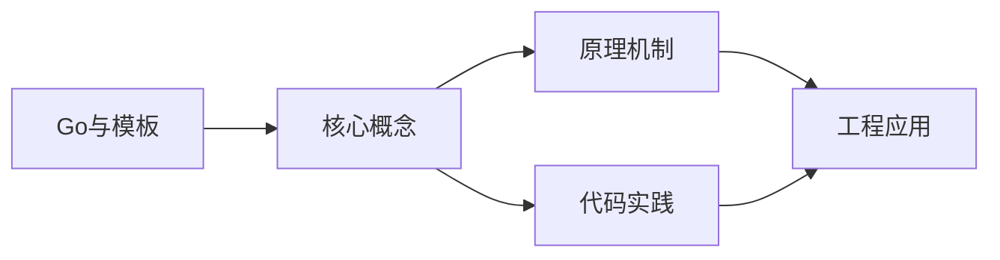
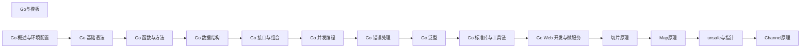

## 1. 学习目标（Bloom 分类）

本节按照布鲁姆教育目标分类学组织学习路径。本文主题为《Go与模板》，属于 Go 模块，读者可以根据自身阶段选择阅读深度。

记忆层面：能够准确复述本文的核心概念、术语与基本语法或操作步骤，并能够在提问或检索时快速定位对应知识点。能够说出 Go 的包、函数、结构体、接口与错误处理基本语法。

理解层面：能够用自己的语言解释核心原理与工作机制，说明概念之间的因果关系，而不是机械记忆结论。能够解释 goroutine 调度、channel 通信与内存模型。

应用层面：能够在真实项目或练习场景中运用本文知识解决具体问题，写出正确且可维护的实现。能够编写并发程序、HTTP 服务与命令行工具。

分析层面：能够拆解复杂问题，比较本文主题与相邻概念的异同，识别边界条件与例外情况。能够分析数据竞争、死锁与性能瓶颈。

评价层面：能够根据约束条件（性能、可读性、安全、成本）评价不同方案的优劣，做出有依据的技术决策。能够评价 Go 与 Java、Python 在不同场景的取舍。

创造层面：能够把本文知识与其他模块知识组合，设计出新的解决方案或可复用的工程模式。能够设计完整的微服务与云原生应用。

通过本节学习，读者应当能够把《Go与模板》纳入自己的知识网络，并与 Go 模块的其他主题（goroutine、channel、内存模型、标准库）建立关联。

## 2. 历史动机与发展脉络

《Go与模板》是 Go 领域的重要主题。要真正理解它，需要先了解它解决的问题与演进过程。

Go 由 Google 的 Robert Griesemer、Rob Pike 与 Ken Thompson 于 2009 年发布，设计目标是解决大规模分布式系统的工程痛点：编译慢、依赖混乱、并发难写。
Go 1.0 于 2012 年发布，此后严格保持向后兼容（Go 1 兼容性承诺）；约每半年发布一个小版本，1.21 起引入工具链管理（toolchain 指令）与内置测试 fuzzing。
Go 在云原生领域成为事实标准：Docker、Kubernetes、Prometheus、etcd 等核心项目均用 Go 编写；泛型在 1.18 加入，1.21+ 的 slices/maps 标准包补齐泛型工具。

回到本文主题：Go与模板 的提出与成熟，正是上述技术背景下的必然产物。早期实现往往以简单可用为目标，随着工程规模扩大，社区逐渐沉淀出标准做法与最佳实践；理解这一脉络，可以帮助读者判断“为什么文档中的推荐写法是现在这个样子”，也能在遇到历史遗留代码时准确识别其设计年代与取舍。


## 3. 形式化定义与核心概念精讲

本节把《Go与模板》涉及的核心概念以“定义 + 讲解”的形式展开。读者应把定义当作工具，把讲解当作理解路径；两者结合才能形成可迁移的知识。

goroutine 与调度：goroutine 是用户态轻量线程，由 GMP 调度器（Goroutine、Machine、Processor）多路复用到内核线程；创建成本约 2KB 栈，支持百万级并发。
channel 与 select：channel 是类型化通信管道，`<-` 发送/接收；select 多路等待；“不要通过共享内存通信，而要通过通信共享内存”是 Go 并发哲学。
内存模型：happens-before 关系由 channel、sync 原语与 atomic 建立；`go test -race` 用 ThreadSanitizer 检测数据竞争。

### 3.1 原文章节逐一精讲

原文档把主题拆分为 7 个小节，下面按顺序给出每一节的导读讲解，随后保留原文细节供精读。

#### 原文精读（完整保留）


#### 概述

模板引擎是一种将数据与模板文本结合生成最终输出的工具。简单来说，你写一个包含占位符的模板文件，程序运行时用实际数据替换占位符，生成最终文本。这在生成 HTML 页面、配置文件、邮件内容、代码文件等场景中非常常见。

Go 标准库提供了两个模板包：`text/template` 用于通用文本生成，`html/template` 在此基础上增加了 HTML 转义功能，防止 XSS 攻击。两者语法完全一致，区别仅在于安全处理。

#### 基础概念

在开始写代码之前，理解模板的几个核心概念：

- **模板（Template）**：包含占位符和指令的文本文件或字符串，定义了输出的结构。
- **数据（Data）**：传入模板的实际数据，可以是结构体、map 或任意 Go 值。
- **动作（Action）**：模板中的 `{{...}}` 语法，用于插入数据、控制流程等。
- **管道（Pipeline）**：类似 Unix 管道，将一个操作的输出作为下一个操作的输入，用 `|` 连接。
- **函数（Function）**：可以在模板中调用的函数，包括内置函数和自定义函数。

#### 快速上手

最简单的模板示例，将数据填充到模板中：

```go
package main

import (
    "os"
    "text/template"
)

func main() {
    // 定义模板字符串，{{.Name}} 是占位符
    tmplStr := "你好，{{.Name}}！欢迎来到 {{.City}}。"

    // 解析模板
    tmpl, err := template.New("greeting").Parse(tmplStr)
    if err != nil {
        panic(err)
    }

    // 准备数据
    data := struct {
        Name string
        City string
    }{
        Name: "小明",
        City: "北京",
    }

    // 执行模板，将结果输出到标准输出
    err = tmpl.Execute(os.Stdout, data)
    if err != nil {
        panic(err)
    }
    // 输出：你好，小明！欢迎来到 北京。
}
```

#### 详细用法

##### 1. 访问数据

模板通过 `.` 来引用当前数据对象，用 `.FieldName` 访问字段：

```go
type User struct {
    Name  string
    Email string
    Age   int
}

// 访问结构体字段
tmplStr := "姓名: {{.Name}}, 邮箱: {{.Email}}, 年龄: {{.Age}}"

// 访问 map 的键
data := map[string]interface{}{
    "Name":  "小红",
    "Score": 95,
}
tmplStr := "姓名: {{.Name}}, 分数: {{.Score}}"
```

##### 2. 条件判断

使用 `if`、`else`、`end` 根据条件显示不同内容：

```go
tmplStr := `{{if .IsVIP}}欢迎尊贵的VIP用户{{else}}欢迎普通用户{{end}}`

// 更复杂的条件
tmplStr := `
{{if gt .Age 18}}成年人{{else}}未成年人{{end}}
{{if and .IsActive .IsVIP}}活跃VIP用户{{end}}
`
```

Go 模板中的条件判断不支持 `==`、`>` 等运算符，需要使用内置函数：

- `eq` 等于
- `ne` 不等于
- `lt` 小于
- `le` 小于等于
- `gt` 大于
- `ge` 大于等于
- `and` 逻辑与
- `or` 逻辑或
- `not` 逻辑非

##### 3. 循环遍历

使用 `range` 遍历切片或 map：

```go
type Item struct {
    Name  string
    Price float64
}

tmplStr := `
商品列表：
{{range .Items}}
- {{.Name}}：￥{{.Price}}
{{else}}
暂无商品
{{end}}
`

data := struct {
    Items []Item
}{
    Items: []Item{
        {Name: "苹果", Price: 5.5},
        {Name: "香蕉", Price: 3.2},
        {Name: "橙子", Price: 4.8},
    },
}
```

注意 `range` 块内的 `.` 会变成当前遍历的元素。如果需要访问外层数据，使用 `$`：

```go
tmplStr := `
{{range .Items}}
店铺：{{$.ShopName}} - 商品：{{.Name}}
{{end}}
`
```

##### 4. 管道操作

管道将一个操作的输出传递给下一个操作：

```go
tmplStr := `{{.Name | printf "你好，%s" |ToUpper}}`
```

这等价于：先获取 `.Name`，然后传给 `printf` 格式化，再传给 `ToUpper` 转大写。

##### 5. 自定义函数

可以注册自定义函数供模板使用：

```go
package main

import (
    "os"
    "strings"
    "text/template"
)

func main() {
    // 创建模板并注册自定义函数
    tmpl := template.New("custom").Funcs(template.FuncMap{
        "upper":  strings.ToUpper,          // 转大写
        "lower":  strings.ToLower,          // 转小写
        "repeat": strings.Repeat,           // 重复字符串
        "title":  strings.Title,            // 首字母大写
    })

    // 解析模板（必须在 Funcs 之后）
    tmpl, err := tmpl.Parse(`姓名: {{.Name | upper}}
重复: {{.Name | repeat 3}}
`)
    if err != nil {
        panic(err)
    }

    data := map[string]string{"Name": "golang"}
    tmpl.Execute(os.Stdout, data)
    // 输出：
    // 姓名: GOLANG
    // 重复: golanggolanggolang
}
```

##### 6. 模板嵌套

使用 `template` 动作引用子模板，实现模板复用：

```go
// 定义主模板和子模板
const tmplStr = `
{{define "header"}}<header>网站标题</header>{{end}}
{{define "footer"}}<footer>版权信息</footer>{{end}}
{{define "content"}}<main>页面内容</main>{{end}}

{{template "header"}}
{{template "content"}}
{{template "footer"}}
`

tmpl, _ := template.New("layout").Parse(tmplStr)
tmpl.Execute(os.Stdout, nil)
```

也可以从多个文件加载模板：

```go
// 从多个文件解析模板
tmpl, err := template.ParseGlob("templates/*.html")
if err != nil {
    panic(err)
}

// 执行指定名称的模板
tmpl.ExecuteTemplate(os.Stdout, "index", data)
```

##### 7. 变量赋值

在模板中可以使用 `:=` 赋值变量：

```go
tmplStr := `
{{with .User}}
{{$name := .Name}}
用户名：{{$name}}
{{end}}
`
```

##### 8. with 语句

`with` 语句改变当前上下文对象 `.`：

```go
tmplStr := `
{{with .Address}}
城市：{{.City}}
街道：{{.Street}}
{{end}}
`
```

##### 9. html/template

`html/template` 的用法与 `text/template` 完全一致，但会自动转义 HTML 特殊字符，防止 XSS 攻击：

```go
package main

import (
    "html/template"
    "os"
)

func main() {
    // 使用 html/template 替代 text/template
    tmpl, _ := template.New("safe").Parse(`<div>{{.Content}}</div>`)

    data := map[string]string{
        "Content": "<script>alert('xss')</script>",
    }

    tmpl.Execute(os.Stdout, data)
    // 输出：<div>&lt;script&gt;alert(&#39;xss&#39;)&lt;/script&gt;</div>
    // 特殊字符被转义，不会执行脚本
}
```

如果某些内容确实需要原样输出（比如信任的 HTML 片段），可以使用 `template.HTML` 类型：

```go
data := map[string]interface{}{
    "Content": template.HTML("<b>加粗文本</b>"), // 不会被转义
}
```

#### 常见场景

##### 场景一：生成 HTML 页面

```go
// page.html 模板文件
const pageTmpl = `
<!DOCTYPE html>
<html>
<head><title>{{.Title}}</title></head>
<body>
  <h1>{{.Title}}</h1>
  <ul>
  {{range .Items}}
    <li>{{.Name}} - ￥{{printf "%.2f" .Price}}</li>
  {{end}}
  </ul>
  {{if .HasDiscount}}
  <p>当前有优惠活动！</p>
  {{end}}
</body>
</html>
`

type PageItem struct {
    Name  string
    Price float64
}

type PageData struct {
    Title       string
    Items       []PageItem
    HasDiscount bool
}
```

##### 场景二：生成配置文件

```go
// 用模板生成 Nginx 配置
const nginxTmpl = `
server {
    listen {{.Port}};
    server_name {{.Domain}};

    location / {
        proxy_pass http://{{.Upstream}};
        proxy_set_header Host $host;
    }
}
`

type NginxConfig struct {
    Port     int
    Domain   string
    Upstream string
}
```

##### 场景三：生成邮件内容

```go
const emailTmpl = `
亲爱的 {{.UserName}}：

感谢您注册 {{.AppName}}！

您的验证码是：{{.Code}}，请在 {{.ExpireMinutes}} 分钟内使用。

{{if .HasBonus}}
恭喜您获得新用户专属礼包！
{{end}}

此致
{{.AppName}} 团队
`
```

##### 场景四：生成代码文件

```go
// 用模板生成 Go 结构体代码
const codeTmpl = `
// Code generated by templgen; DO NOT EDIT.
package {{.Package}}

type {{.StructName}} struct {
{{range .Fields}}    {{.Name}} {{.Type}} ` + "`" + `json:"{{.JSONName}}"` + "`" + `
{{end}}}
`
```

#### 注意事项与常见错误

1. **Must 函数**：如果模板语法有误，`Parse` 会返回错误。使用 `template.Must` 可以在解析失败时直接 panic，适合初始化阶段使用：

```go
tmpl := template.Must(template.New("test").Parse(tmplStr))
```

2. **range 内的上下文变化**：在 `range` 块内，`.` 变成了当前元素。如果需要访问外层数据，使用 `$`（绑定到 range 外的 `.`）。

3. **模板中的空格**：`{{-` 和 `-}}` 可以去除动作前后的空白字符：

```go
// 默认会有多余空行
{{range .Items}}
  {{.Name}}
{{end}}

// 使用 - 去除空白
{{- range .Items -}}
  {{.Name}}
{{- end -}}
```

4. **html/template 的自动转义**：使用 `html/template` 时，所有变量默认会被 HTML 转义。如果需要输出原始 HTML，必须使用 `template.HTML`、`template.CSS`、`template.JS` 等类型包装。但这样做要确保内容是安全的。

5. **模板解析顺序**：`Funcs` 必须在 `Parse` 之前调用，否则模板中使用的自定义函数会报错。

6. **map 的键必须是简单类型**：模板中访问 map 的键时，键必须是字符串、整数等简单类型，不能是结构体。

#### 进阶用法

##### 模板继承

Go 标准库的模板不支持传统意义上的"继承"，但可以通过 `define` 和 `template` 组合实现类似效果：

```go
// base.html - 基础布局
const baseTmpl = `
{{define "base"}}
<!DOCTYPE html>
<html>
<head><title>{{.Title}}</title></head>
<body>
  {{block "content" .}}默认内容{{end}}
  {{block "sidebar" .}}默认侧边栏{{end}}
</body>
</html>
{{end}}
`

// page.html - 具体页面
const pageTmpl = `
{{template "base" .}}

{{define "content"}}
<main>这是页面内容</main>
{{end}}

{{define "sidebar"}}
<aside>这是侧边栏</aside>
{{end}}
`

// 先解析 base，再解析 page
tmpl := template.Must(template.New("base").Parse(baseTmpl))
tmpl = template.Must(tmpl.Parse(pageTmpl))
tmpl.ExecuteTemplate(os.Stdout, "base", data)
```

##### 使用 block 定义默认内容

`block` 是 Go 1.6 引入的语法，等价于 `define` + `template`：

```go
// 定义带默认内容的块
{{block "title" .}}默认标题{{end}}

// 子模板可以覆盖
{{define "title"}}自定义标题{{end}}
```

##### 模板中使用方法

如果数据对象有方法，模板可以直接调用：

```go
type User struct {
    FirstName string
    LastName  string
}

// 定义方法
func (u User) FullName() string {
    return u.FirstName + " " + u.LastName
}

// 模板中直接调用方法
tmplStr := "全名：{{.FullName}}"
```

##### 并发安全

`template.Template` 对象在解析完成后是只读的，可以安全地在多个 goroutine 中并发执行：

```go
var tmpl *template.Template // 初始化一次

// 多个 goroutine 可以安全地并发调用
go func() { tmpl.Execute(w1, data1) }()
go func() { tmpl.Execute(w2, data2) }()
```


### 3.2 概念关系图

下面用 Mermaid 图表达本文核心概念之间的关系，帮助读者建立整体图景：



图中展示的是本文知识的结构化关系：核心概念是入口，原理机制解释“为什么”，代码实践演示“怎么做”，工程应用回答“何时用”。读者学习时可以把每个小节的内容挂接到对应节点上。

## 4. 理论推导与原理解析

本节深入《Go与模板》背后的原理。理论部分不求面面俱到，而是聚焦“能解释现象、能指导实践”的关键推导。

goroutine 与调度：goroutine 是用户态轻量线程，由 GMP 调度器（Goroutine、Machine、Processor）多路复用到内核线程；创建成本约 2KB 栈，支持百万级并发。
channel 与 select：channel 是类型化通信管道，`<-` 发送/接收；select 多路等待；“不要通过共享内存通信，而要通过通信共享内存”是 Go 并发哲学。
内存模型：happens-before 关系由 channel、sync 原语与 atomic 建立；`go test -race` 用 ThreadSanitizer 检测数据竞争。
错误处理：Go 用多返回值显式处理错误（`if err != nil`），error 是接口；panic/recover 仅用于不可恢复错误。

需要强调的是，理论推导与工程实践之间存在翻译层：理论给出的是理想化模型与边界条件，工程代码则必须处理真实环境中的例外。读者在学习时应先掌握理论的“标准情形”，再通过陷阱章节了解“非标准情形”。

## 5. 代码示例与逐行讲解

本节把原文中的代码示例系统整理，并为每个示例补充用途说明与讲解。读者不应只浏览代码，而应逐段对照讲解理解设计意图。

### 5.1 示例：快速上手

该示例来自原文《快速上手》小节，用于演示Go与模板相关操作。阅读时请先看代码结构，再看其后的讲解。

```go
package main

import (
    "os"
    "text/template"
)

func main() {
    // 定义模板字符串，{{.Name}} 是占位符
    tmplStr := "你好，{{.Name}}！欢迎来到 {{.City}}。"

    // 解析模板
    tmpl, err := template.New("greeting").Parse(tmplStr)
    if err != nil {
        panic(err)
    }

    // 准备数据
    data := struct {
        Name string
        City string
    }{
        Name: "小明",
        City: "北京",
    }

    // 执行模板，将结果输出到标准输出
    err = tmpl.Execute(os.Stdout, data)
    if err != nil {
        panic(err)
    }
    // 输出：你好，小明！欢迎来到 北京。
}
```

讲解：这段代码演示了本节核心知识点。代码中的关键操作可以归纳为三步：准备（定义或初始化）、执行（核心逻辑）、收尾（释放资源或返回结果）。实际项目中，这三步往往被封装为函数或类，以提升复用性与可测试性。

关键点分析：

该示例共 28 行有效代码，包含 3 类关键结构（func、import、if）。其中：

- 入口与初始化部分负责建立上下文，对应实际项目中的启动或装配逻辑；
- 核心逻辑部分体现本文主题的主要操作，是阅读时最需要对照讲解理解的部分；
- 输出或返回部分把结果交给调用方，注意其类型与边界条件。

进阶思考路径：先尝试修改参数观察行为变化，再把示例中的模式迁移到自己的项目中；每次修改都记录预期与实测差异，这是把示例转化为能力的最快方式。

### 5.2 示例：1. 访问数据

该示例来自原文《1. 访问数据》小节，用于演示Go与模板相关操作。阅读时请先看代码结构，再看其后的讲解。

```go
type User struct {
    Name  string
    Email string
    Age   int
}

// 访问结构体字段
tmplStr := "姓名: {{.Name}}, 邮箱: {{.Email}}, 年龄: {{.Age}}"

// 访问 map 的键
data := map[string]interface{}{
    "Name":  "小红",
    "Score": 95,
}
tmplStr := "姓名: {{.Name}}, 分数: {{.Score}}"
```

讲解：这段代码演示了本节核心知识点。代码中的关键操作可以归纳为三步：准备（定义或初始化）、执行（核心逻辑）、收尾（释放资源或返回结果）。实际项目中，这三步往往被封装为函数或类，以提升复用性与可测试性。

关键点分析：

该示例共 13 行有效代码，结构以数据或配置为主。阅读时应关注：数据字段的含义、配置项的作用，以及它们与运行行为的对应关系。

进阶思考路径：先尝试修改参数观察行为变化，再把示例中的模式迁移到自己的项目中；每次修改都记录预期与实测差异，这是把示例转化为能力的最快方式。

### 5.3 示例：2. 条件判断

该示例来自原文《2. 条件判断》小节，用于演示Go与模板相关操作。阅读时请先看代码结构，再看其后的讲解。

```go
tmplStr := `{{if .IsVIP}}欢迎尊贵的VIP用户{{else}}欢迎普通用户{{end}}`

// 更复杂的条件
tmplStr := `
{{if gt .Age 18}}成年人{{else}}未成年人{{end}}
{{if and .IsActive .IsVIP}}活跃VIP用户{{end}}
`
```

讲解：这段代码演示了本节核心知识点。代码中的关键操作可以归纳为三步：准备（定义或初始化）、执行（核心逻辑）、收尾（释放资源或返回结果）。实际项目中，这三步往往被封装为函数或类，以提升复用性与可测试性。

关键点分析：

该示例共 6 行有效代码，包含 1 类关键结构（if）。其中：

- 入口与初始化部分负责建立上下文，对应实际项目中的启动或装配逻辑；
- 核心逻辑部分体现本文主题的主要操作，是阅读时最需要对照讲解理解的部分；
- 输出或返回部分把结果交给调用方，注意其类型与边界条件。

进阶思考路径：先尝试修改参数观察行为变化，再把示例中的模式迁移到自己的项目中；每次修改都记录预期与实测差异，这是把示例转化为能力的最快方式。

### 5.4 示例：3. 循环遍历

该示例来自原文《3. 循环遍历》小节，用于演示Go与模板相关操作。阅读时请先看代码结构，再看其后的讲解。

```go
type Item struct {
    Name  string
    Price float64
}

tmplStr := `
商品列表：
{{range .Items}}
- {{.Name}}：￥{{.Price}}
{{else}}
暂无商品
{{end}}
`

data := struct {
    Items []Item
}{
    Items: []Item{
        {Name: "苹果", Price: 5.5},
        {Name: "香蕉", Price: 3.2},
        {Name: "橙子", Price: 4.8},
    },
}
```

讲解：这段代码演示了本节核心知识点。代码中的关键操作可以归纳为三步：准备（定义或初始化）、执行（核心逻辑）、收尾（释放资源或返回结果）。实际项目中，这三步往往被封装为函数或类，以提升复用性与可测试性。

关键点分析：

该示例共 21 行有效代码，结构以数据或配置为主。阅读时应关注：数据字段的含义、配置项的作用，以及它们与运行行为的对应关系。

进阶思考路径：先尝试修改参数观察行为变化，再把示例中的模式迁移到自己的项目中；每次修改都记录预期与实测差异，这是把示例转化为能力的最快方式。

### 5.5 示例：3. 循环遍历

该示例来自原文《3. 循环遍历》小节，用于演示Go与模板相关操作。阅读时请先看代码结构，再看其后的讲解。

```go
tmplStr := `
{{range .Items}}
店铺：{{$.ShopName}} - 商品：{{.Name}}
{{end}}
`
```

讲解：这段代码演示了本节核心知识点。代码中的关键操作可以归纳为三步：准备（定义或初始化）、执行（核心逻辑）、收尾（释放资源或返回结果）。实际项目中，这三步往往被封装为函数或类，以提升复用性与可测试性。

关键点分析：

该示例共 5 行有效代码，结构以数据或配置为主。阅读时应关注：数据字段的含义、配置项的作用，以及它们与运行行为的对应关系。

进阶思考路径：先尝试修改参数观察行为变化，再把示例中的模式迁移到自己的项目中；每次修改都记录预期与实测差异，这是把示例转化为能力的最快方式。

### 5.6 示例：4. 管道操作

该示例来自原文《4. 管道操作》小节，用于演示Go与模板相关操作。阅读时请先看代码结构，再看其后的讲解。

```go
tmplStr := `{{.Name | printf "你好，%s" |ToUpper}}`
```

讲解：这段代码演示了本节核心知识点。代码中的关键操作可以归纳为三步：准备（定义或初始化）、执行（核心逻辑）、收尾（释放资源或返回结果）。实际项目中，这三步往往被封装为函数或类，以提升复用性与可测试性。

关键点分析：

该示例共 1 行有效代码，结构以数据或配置为主。阅读时应关注：数据字段的含义、配置项的作用，以及它们与运行行为的对应关系。

进阶思考路径：先尝试修改参数观察行为变化，再把示例中的模式迁移到自己的项目中；每次修改都记录预期与实测差异，这是把示例转化为能力的最快方式。

### 5.7 示例：5. 自定义函数

该示例来自原文《5. 自定义函数》小节，用于演示Go与模板相关操作。阅读时请先看代码结构，再看其后的讲解。

```go
package main

import (
    "os"
    "strings"
    "text/template"
)

func main() {
    // 创建模板并注册自定义函数
    tmpl := template.New("custom").Funcs(template.FuncMap{
        "upper":  strings.ToUpper,          // 转大写
        "lower":  strings.ToLower,          // 转小写
        "repeat": strings.Repeat,           // 重复字符串
        "title":  strings.Title,            // 首字母大写
    })

    // 解析模板（必须在 Funcs 之后）
    tmpl, err := tmpl.Parse(`姓名: {{.Name | upper}}
重复: {{.Name | repeat 3}}
`)
    if err != nil {
        panic(err)
    }

    data := map[string]string{"Name": "golang"}
    tmpl.Execute(os.Stdout, data)
    // 输出：
    // 姓名: GOLANG
    // 重复: golanggolanggolang
}
```

讲解：这段代码演示了本节核心知识点。代码中的关键操作可以归纳为三步：准备（定义或初始化）、执行（核心逻辑）、收尾（释放资源或返回结果）。实际项目中，这三步往往被封装为函数或类，以提升复用性与可测试性。

关键点分析：

该示例共 27 行有效代码，包含 3 类关键结构（func、import、if）。其中：

- 入口与初始化部分负责建立上下文，对应实际项目中的启动或装配逻辑；
- 核心逻辑部分体现本文主题的主要操作，是阅读时最需要对照讲解理解的部分；
- 输出或返回部分把结果交给调用方，注意其类型与边界条件。

进阶思考路径：先尝试修改参数观察行为变化，再把示例中的模式迁移到自己的项目中；每次修改都记录预期与实测差异，这是把示例转化为能力的最快方式。

### 5.8 示例：6. 模板嵌套

该示例来自原文《6. 模板嵌套》小节，用于演示Go与模板相关操作。阅读时请先看代码结构，再看其后的讲解。

```go
// 定义主模板和子模板
const tmplStr = `
{{define "header"}}<header>网站标题</header>{{end}}
{{define "footer"}}<footer>版权信息</footer>{{end}}
{{define "content"}}<main>页面内容</main>{{end}}

{{template "header"}}
{{template "content"}}
{{template "footer"}}
`

tmpl, _ := template.New("layout").Parse(tmplStr)
tmpl.Execute(os.Stdout, nil)
```

讲解：这段代码演示了本节核心知识点。代码中的关键操作可以归纳为三步：准备（定义或初始化）、执行（核心逻辑）、收尾（释放资源或返回结果）。实际项目中，这三步往往被封装为函数或类，以提升复用性与可测试性。

关键点分析：

该示例共 11 行有效代码，结构以数据或配置为主。阅读时应关注：数据字段的含义、配置项的作用，以及它们与运行行为的对应关系。

进阶思考路径：先尝试修改参数观察行为变化，再把示例中的模式迁移到自己的项目中；每次修改都记录预期与实测差异，这是把示例转化为能力的最快方式。

### 5.9 示例：6. 模板嵌套

该示例来自原文《6. 模板嵌套》小节，用于演示Go与模板相关操作。阅读时请先看代码结构，再看其后的讲解。

```go
// 从多个文件解析模板
tmpl, err := template.ParseGlob("templates/*.html")
if err != nil {
    panic(err)
}

// 执行指定名称的模板
tmpl.ExecuteTemplate(os.Stdout, "index", data)
```

讲解：这段代码演示了本节核心知识点。代码中的关键操作可以归纳为三步：准备（定义或初始化）、执行（核心逻辑）、收尾（释放资源或返回结果）。实际项目中，这三步往往被封装为函数或类，以提升复用性与可测试性。

关键点分析：

该示例共 7 行有效代码，包含 1 类关键结构（if）。其中：

- 入口与初始化部分负责建立上下文，对应实际项目中的启动或装配逻辑；
- 核心逻辑部分体现本文主题的主要操作，是阅读时最需要对照讲解理解的部分；
- 输出或返回部分把结果交给调用方，注意其类型与边界条件。

进阶思考路径：先尝试修改参数观察行为变化，再把示例中的模式迁移到自己的项目中；每次修改都记录预期与实测差异，这是把示例转化为能力的最快方式。

### 5.10 示例：7. 变量赋值

该示例来自原文《7. 变量赋值》小节，用于演示Go与模板相关操作。阅读时请先看代码结构，再看其后的讲解。

```go
tmplStr := `
{{with .User}}
{{$name := .Name}}
用户名：{{$name}}
{{end}}
`
```

讲解：这段代码演示了本节核心知识点。代码中的关键操作可以归纳为三步：准备（定义或初始化）、执行（核心逻辑）、收尾（释放资源或返回结果）。实际项目中，这三步往往被封装为函数或类，以提升复用性与可测试性。

关键点分析：

该示例共 6 行有效代码，结构以数据或配置为主。阅读时应关注：数据字段的含义、配置项的作用，以及它们与运行行为的对应关系。

进阶思考路径：先尝试修改参数观察行为变化，再把示例中的模式迁移到自己的项目中；每次修改都记录预期与实测差异，这是把示例转化为能力的最快方式。

### 5.11 示例：8. with 语句

该示例来自原文《8. with 语句》小节，用于演示Go与模板相关操作。阅读时请先看代码结构，再看其后的讲解。

```go
tmplStr := `
{{with .Address}}
城市：{{.City}}
街道：{{.Street}}
{{end}}
`
```

讲解：这段代码演示了本节核心知识点。代码中的关键操作可以归纳为三步：准备（定义或初始化）、执行（核心逻辑）、收尾（释放资源或返回结果）。实际项目中，这三步往往被封装为函数或类，以提升复用性与可测试性。

关键点分析：

该示例共 6 行有效代码，结构以数据或配置为主。阅读时应关注：数据字段的含义、配置项的作用，以及它们与运行行为的对应关系。

进阶思考路径：先尝试修改参数观察行为变化，再把示例中的模式迁移到自己的项目中；每次修改都记录预期与实测差异，这是把示例转化为能力的最快方式。

### 5.12 示例：9. html/template

该示例来自原文《9. html/template》小节，用于演示Go与模板相关操作。阅读时请先看代码结构，再看其后的讲解。

```go
package main

import (
    "html/template"
    "os"
)

func main() {
    // 使用 html/template 替代 text/template
    tmpl, _ := template.New("safe").Parse(`<div>{{.Content}}</div>`)

    data := map[string]string{
        "Content": "<script>alert('xss')</script>",
    }

    tmpl.Execute(os.Stdout, data)
    // 输出：<div>&lt;script&gt;alert(&#39;xss&#39;)&lt;/script&gt;</div>
    // 特殊字符被转义，不会执行脚本
}
```

讲解：这段代码演示了本节核心知识点。代码中的关键操作可以归纳为三步：准备（定义或初始化）、执行（核心逻辑）、收尾（释放资源或返回结果）。实际项目中，这三步往往被封装为函数或类，以提升复用性与可测试性。

关键点分析：

该示例共 15 行有效代码，包含 2 类关键结构（func、import）。其中：

- 入口与初始化部分负责建立上下文，对应实际项目中的启动或装配逻辑；
- 核心逻辑部分体现本文主题的主要操作，是阅读时最需要对照讲解理解的部分；
- 输出或返回部分把结果交给调用方，注意其类型与边界条件。

进阶思考路径：先尝试修改参数观察行为变化，再把示例中的模式迁移到自己的项目中；每次修改都记录预期与实测差异，这是把示例转化为能力的最快方式。

### 5.13 示例：9. html/template

该示例来自原文《9. html/template》小节，用于演示Go与模板相关操作。阅读时请先看代码结构，再看其后的讲解。

```go
data := map[string]interface{}{
    "Content": template.HTML("<b>加粗文本</b>"), // 不会被转义
}
```

讲解：这段代码演示了本节核心知识点。代码中的关键操作可以归纳为三步：准备（定义或初始化）、执行（核心逻辑）、收尾（释放资源或返回结果）。实际项目中，这三步往往被封装为函数或类，以提升复用性与可测试性。

关键点分析：

该示例共 3 行有效代码，结构以数据或配置为主。阅读时应关注：数据字段的含义、配置项的作用，以及它们与运行行为的对应关系。

进阶思考路径：先尝试修改参数观察行为变化，再把示例中的模式迁移到自己的项目中；每次修改都记录预期与实测差异，这是把示例转化为能力的最快方式。

### 5.14 示例：场景一：生成 HTML 页面

该示例来自原文《场景一：生成 HTML 页面》小节，用于演示Go与模板相关操作。阅读时请先看代码结构，再看其后的讲解。

```go
// page.html 模板文件
const pageTmpl = `
<!DOCTYPE html>
<html>
<head><title>{{.Title}}</title></head>
<body>
  <h1>{{.Title}}</h1>
  <ul>
  {{range .Items}}
    <li>{{.Name}} - ￥{{printf "%.2f" .Price}}</li>
  {{end}}
  </ul>
  {{if .HasDiscount}}
  <p>当前有优惠活动！</p>
  {{end}}
</body>
</html>
`

type PageItem struct {
    Name  string
    Price float64
}

type PageData struct {
    Title       string
    Items       []PageItem
    HasDiscount bool
}
```

讲解：这段代码演示了本节核心知识点。代码中的关键操作可以归纳为三步：准备（定义或初始化）、执行（核心逻辑）、收尾（释放资源或返回结果）。实际项目中，这三步往往被封装为函数或类，以提升复用性与可测试性。

关键点分析：

该示例共 27 行有效代码，包含 1 类关键结构（if）。其中：

- 入口与初始化部分负责建立上下文，对应实际项目中的启动或装配逻辑；
- 核心逻辑部分体现本文主题的主要操作，是阅读时最需要对照讲解理解的部分；
- 输出或返回部分把结果交给调用方，注意其类型与边界条件。

进阶思考路径：先尝试修改参数观察行为变化，再把示例中的模式迁移到自己的项目中；每次修改都记录预期与实测差异，这是把示例转化为能力的最快方式。

### 5.15 示例：场景二：生成配置文件

该示例来自原文《场景二：生成配置文件》小节，用于演示Go与模板相关操作。阅读时请先看代码结构，再看其后的讲解。

```go
// 用模板生成 Nginx 配置
const nginxTmpl = `
server {
    listen {{.Port}};
    server_name {{.Domain}};

    location / {
        proxy_pass http://{{.Upstream}};
        proxy_set_header Host $host;
    }
}
`

type NginxConfig struct {
    Port     int
    Domain   string
    Upstream string
}
```

讲解：这段代码演示了本节核心知识点。代码中的关键操作可以归纳为三步：准备（定义或初始化）、执行（核心逻辑）、收尾（释放资源或返回结果）。实际项目中，这三步往往被封装为函数或类，以提升复用性与可测试性。

关键点分析：

该示例共 16 行有效代码，结构以数据或配置为主。阅读时应关注：数据字段的含义、配置项的作用，以及它们与运行行为的对应关系。

进阶思考路径：先尝试修改参数观察行为变化，再把示例中的模式迁移到自己的项目中；每次修改都记录预期与实测差异，这是把示例转化为能力的最快方式。

### 5.16 示例：场景三：生成邮件内容

该示例来自原文《场景三：生成邮件内容》小节，用于演示Go与模板相关操作。阅读时请先看代码结构，再看其后的讲解。

```go
const emailTmpl = `
亲爱的 {{.UserName}}：

感谢您注册 {{.AppName}}！

您的验证码是：{{.Code}}，请在 {{.ExpireMinutes}} 分钟内使用。

{{if .HasBonus}}
恭喜您获得新用户专属礼包！
{{end}}

此致
{{.AppName}} 团队
`
```

讲解：这段代码演示了本节核心知识点。代码中的关键操作可以归纳为三步：准备（定义或初始化）、执行（核心逻辑）、收尾（释放资源或返回结果）。实际项目中，这三步往往被封装为函数或类，以提升复用性与可测试性。

关键点分析：

该示例共 10 行有效代码，包含 1 类关键结构（if）。其中：

- 入口与初始化部分负责建立上下文，对应实际项目中的启动或装配逻辑；
- 核心逻辑部分体现本文主题的主要操作，是阅读时最需要对照讲解理解的部分；
- 输出或返回部分把结果交给调用方，注意其类型与边界条件。

进阶思考路径：先尝试修改参数观察行为变化，再把示例中的模式迁移到自己的项目中；每次修改都记录预期与实测差异，这是把示例转化为能力的最快方式。

### 5.17 示例：场景四：生成代码文件

该示例来自原文《场景四：生成代码文件》小节，用于演示Go与模板相关操作。阅读时请先看代码结构，再看其后的讲解。

```go
// 用模板生成 Go 结构体代码
const codeTmpl = `
// Code generated by templgen; DO NOT EDIT.
package {{.Package}}

type {{.StructName}} struct {
{{range .Fields}}    {{.Name}} {{.Type}} ` + "`" + `json:"{{.JSONName}}"` + "`" + `
{{end}}}
`
```

讲解：这段代码演示了本节核心知识点。代码中的关键操作可以归纳为三步：准备（定义或初始化）、执行（核心逻辑）、收尾（释放资源或返回结果）。实际项目中，这三步往往被封装为函数或类，以提升复用性与可测试性。

关键点分析：

该示例共 8 行有效代码，结构以数据或配置为主。阅读时应关注：数据字段的含义、配置项的作用，以及它们与运行行为的对应关系。

进阶思考路径：先尝试修改参数观察行为变化，再把示例中的模式迁移到自己的项目中；每次修改都记录预期与实测差异，这是把示例转化为能力的最快方式。

### 5.18 示例：注意事项与常见错误

该示例来自原文《注意事项与常见错误》小节，用于演示Go与模板相关操作。阅读时请先看代码结构，再看其后的讲解。

```go
tmpl := template.Must(template.New("test").Parse(tmplStr))
```

讲解：这段代码演示了本节核心知识点。代码中的关键操作可以归纳为三步：准备（定义或初始化）、执行（核心逻辑）、收尾（释放资源或返回结果）。实际项目中，这三步往往被封装为函数或类，以提升复用性与可测试性。

关键点分析：

该示例共 1 行有效代码，结构以数据或配置为主。阅读时应关注：数据字段的含义、配置项的作用，以及它们与运行行为的对应关系。

进阶思考路径：先尝试修改参数观察行为变化，再把示例中的模式迁移到自己的项目中；每次修改都记录预期与实测差异，这是把示例转化为能力的最快方式。

### 5.19 示例：注意事项与常见错误

该示例来自原文《注意事项与常见错误》小节，用于演示Go与模板相关操作。阅读时请先看代码结构，再看其后的讲解。

```go
// 默认会有多余空行
{{range .Items}}
  {{.Name}}
{{end}}

// 使用 - 去除空白
{{- range .Items -}}
  {{.Name}}
{{- end -}}
```

讲解：这段代码演示了本节核心知识点。代码中的关键操作可以归纳为三步：准备（定义或初始化）、执行（核心逻辑）、收尾（释放资源或返回结果）。实际项目中，这三步往往被封装为函数或类，以提升复用性与可测试性。

关键点分析：

该示例共 8 行有效代码，结构以数据或配置为主。阅读时应关注：数据字段的含义、配置项的作用，以及它们与运行行为的对应关系。

进阶思考路径：先尝试修改参数观察行为变化，再把示例中的模式迁移到自己的项目中；每次修改都记录预期与实测差异，这是把示例转化为能力的最快方式。

### 5.20 示例：模板继承

该示例来自原文《模板继承》小节，用于演示Go与模板相关操作。阅读时请先看代码结构，再看其后的讲解。

```go
// base.html - 基础布局
const baseTmpl = `
{{define "base"}}
<!DOCTYPE html>
<html>
<head><title>{{.Title}}</title></head>
<body>
  {{block "content" .}}默认内容{{end}}
  {{block "sidebar" .}}默认侧边栏{{end}}
</body>
</html>
{{end}}
`

// page.html - 具体页面
const pageTmpl = `
{{template "base" .}}

{{define "content"}}
<main>这是页面内容</main>
{{end}}

{{define "sidebar"}}
<aside>这是侧边栏</aside>
{{end}}
`

// 先解析 base，再解析 page
tmpl := template.Must(template.New("base").Parse(baseTmpl))
tmpl = template.Must(tmpl.Parse(pageTmpl))
tmpl.ExecuteTemplate(os.Stdout, "base", data)
```

讲解：这段代码演示了本节核心知识点。代码中的关键操作可以归纳为三步：准备（定义或初始化）、执行（核心逻辑）、收尾（释放资源或返回结果）。实际项目中，这三步往往被封装为函数或类，以提升复用性与可测试性。

关键点分析：

该示例共 27 行有效代码，结构以数据或配置为主。阅读时应关注：数据字段的含义、配置项的作用，以及它们与运行行为的对应关系。

进阶思考路径：先尝试修改参数观察行为变化，再把示例中的模式迁移到自己的项目中；每次修改都记录预期与实测差异，这是把示例转化为能力的最快方式。

### 5.21 示例：使用 block 定义默认内容

该示例来自原文《使用 block 定义默认内容》小节，用于演示Go与模板相关操作。阅读时请先看代码结构，再看其后的讲解。

```go
// 定义带默认内容的块
{{block "title" .}}默认标题{{end}}

// 子模板可以覆盖
{{define "title"}}自定义标题{{end}}
```

讲解：这段代码演示了本节核心知识点。代码中的关键操作可以归纳为三步：准备（定义或初始化）、执行（核心逻辑）、收尾（释放资源或返回结果）。实际项目中，这三步往往被封装为函数或类，以提升复用性与可测试性。

关键点分析：

该示例共 4 行有效代码，结构以数据或配置为主。阅读时应关注：数据字段的含义、配置项的作用，以及它们与运行行为的对应关系。

进阶思考路径：先尝试修改参数观察行为变化，再把示例中的模式迁移到自己的项目中；每次修改都记录预期与实测差异，这是把示例转化为能力的最快方式。

### 5.22 示例：模板中使用方法

该示例来自原文《模板中使用方法》小节，用于演示Go与模板相关操作。阅读时请先看代码结构，再看其后的讲解。

```go
type User struct {
    FirstName string
    LastName  string
}

// 定义方法
func (u User) FullName() string {
    return u.FirstName + " " + u.LastName
}

// 模板中直接调用方法
tmplStr := "全名：{{.FullName}}"
```

讲解：这段代码演示了本节核心知识点。代码中的关键操作可以归纳为三步：准备（定义或初始化）、执行（核心逻辑）、收尾（释放资源或返回结果）。实际项目中，这三步往往被封装为函数或类，以提升复用性与可测试性。

关键点分析：

该示例共 10 行有效代码，包含 2 类关键结构（func、return）。其中：

- 入口与初始化部分负责建立上下文，对应实际项目中的启动或装配逻辑；
- 核心逻辑部分体现本文主题的主要操作，是阅读时最需要对照讲解理解的部分；
- 输出或返回部分把结果交给调用方，注意其类型与边界条件。

进阶思考路径：先尝试修改参数观察行为变化，再把示例中的模式迁移到自己的项目中；每次修改都记录预期与实测差异，这是把示例转化为能力的最快方式。

### 5.23 示例：并发安全

该示例来自原文《并发安全》小节，用于演示Go与模板相关操作。阅读时请先看代码结构，再看其后的讲解。

```go
var tmpl *template.Template // 初始化一次

// 多个 goroutine 可以安全地并发调用
go func() { tmpl.Execute(w1, data1) }()
go func() { tmpl.Execute(w2, data2) }()
```

讲解：这段代码演示了本节核心知识点。代码中的关键操作可以归纳为三步：准备（定义或初始化）、执行（核心逻辑）、收尾（释放资源或返回结果）。实际项目中，这三步往往被封装为函数或类，以提升复用性与可测试性。

关键点分析：

该示例共 4 行有效代码，结构以数据或配置为主。阅读时应关注：数据字段的含义、配置项的作用，以及它们与运行行为的对应关系。

进阶思考路径：先尝试修改参数观察行为变化，再把示例中的模式迁移到自己的项目中；每次修改都记录预期与实测差异，这是把示例转化为能力的最快方式。


综合以上示例，可以总结出本主题的代码实践要点：第一，先定义清晰的输入输出契约；第二，核心逻辑保持单一职责；第三，错误处理与边界条件不可省略；第四，命名与注释表达意图而非复述代码。

## 6. 对比分析

对比是理解《Go与模板》定位的最快路径。下面从多个维度与相邻方案进行对比。

Go 与 Java：Go 编译快、部署简单（静态二进制）、并发原语原生；Java 生态更丰富、虚拟线程补足并发短板。
Go 与 Python：Go 性能高、类型安全；Python 开发快、AI 生态强。
goroutine 与线程：goroutine 用户态调度、栈动态增长；线程内核态、栈固定。

对比的目的不是分出绝对优劣，而是建立选择依据：不同约束条件下，最优解不同。读者应把每个对比维度转化为决策检查清单。

## 7. 常见陷阱与最佳实践

本节整理该主题的高频错误与推荐做法。每个陷阱先描述现象，再解释原因，最后给出最佳实践。

### 7.1 忽略错误返回值

错误被静默丢弃导致故障难查。显式检查并包装上下文（fmt.Errorf + %w）。

深入讲解：该问题之所以被归类为“常见陷阱”，是因为它在初学者的代码中反复出现，而且往往不在第一时间暴露——错误通常隐藏在特定数据或特定时序下。

从成因上看，忽略错误返回值 一般源于对 Go 某个机制的理解偏差：要么误用了默认行为，要么忽略了边界条件，要么把其他语言的思维惯性带了过来。

从影响上看，忽略错误返回值 轻则产生错误结果，重则导致资源泄漏、数据损坏或安全事故；这也是为什么工程评审中会把它列为检查项。

从修复策略上看，处理忽略错误返回值的正确顺序是：先复现（构造最小用例），再定位（确认机制层面的根因），最后修复并补充回归测试。跳过复现直接改代码，往往治标不治本。

### 7.2 goroutine 泄漏

channel 无接收者或循环启动 goroutine 导致资源泄漏。使用 context 取消与 WaitGroup 收口。

深入讲解：该问题之所以被归类为“常见陷阱”，是因为它在初学者的代码中反复出现，而且往往不在第一时间暴露——错误通常隐藏在特定数据或特定时序下。

从成因上看，goroutine 泄漏 一般源于对 Go 某个机制的理解偏差：要么误用了默认行为，要么忽略了边界条件，要么把其他语言的思维惯性带了过来。

从影响上看，goroutine 泄漏 轻则产生错误结果，重则导致资源泄漏、数据损坏或安全事故；这也是为什么工程评审中会把它列为检查项。

从修复策略上看，处理goroutine 泄漏的正确顺序是：先复现（构造最小用例），再定位（确认机制层面的根因），最后修复并补充回归测试。跳过复现直接改代码，往往治标不治本。

### 7.3 共享变量竞争

多个 goroutine 读写同一变量未同步。使用 mutex、atomic 或改为 channel 传递。

深入讲解：该问题之所以被归类为“常见陷阱”，是因为它在初学者的代码中反复出现，而且往往不在第一时间暴露——错误通常隐藏在特定数据或特定时序下。

从成因上看，共享变量竞争 一般源于对 Go 某个机制的理解偏差：要么误用了默认行为，要么忽略了边界条件，要么把其他语言的思维惯性带了过来。

从影响上看，共享变量竞争 轻则产生错误结果，重则导致资源泄漏、数据损坏或安全事故；这也是为什么工程评审中会把它列为检查项。

从修复策略上看，处理共享变量竞争的正确顺序是：先复现（构造最小用例），再定位（确认机制层面的根因），最后修复并补充回归测试。跳过复现直接改代码，往往治标不治本。

### 7.4 defer 在循环中累积

defer 在函数返回时执行，循环内 defer 延迟大量资源释放。将循环体提取为函数。

深入讲解：该问题之所以被归类为“常见陷阱”，是因为它在初学者的代码中反复出现，而且往往不在第一时间暴露——错误通常隐藏在特定数据或特定时序下。

从成因上看，defer 在循环中累积 一般源于对 Go 某个机制的理解偏差：要么误用了默认行为，要么忽略了边界条件，要么把其他语言的思维惯性带了过来。

从影响上看，defer 在循环中累积 轻则产生错误结果，重则导致资源泄漏、数据损坏或安全事故；这也是为什么工程评审中会把它列为检查项。

从修复策略上看，处理defer 在循环中累积的正确顺序是：先复现（构造最小用例），再定位（确认机制层面的根因），最后修复并补充回归测试。跳过复现直接改代码，往往治标不治本。

### 7.5 切片共享底层数组

append 可能修改共享数组，产生隐蔽 bug。需要独立数据时用 copy 或完整切片表达式。

深入讲解：该问题之所以被归类为“常见陷阱”，是因为它在初学者的代码中反复出现，而且往往不在第一时间暴露——错误通常隐藏在特定数据或特定时序下。

从成因上看，切片共享底层数组 一般源于对 Go 某个机制的理解偏差：要么误用了默认行为，要么忽略了边界条件，要么把其他语言的思维惯性带了过来。

从影响上看，切片共享底层数组 轻则产生错误结果，重则导致资源泄漏、数据损坏或安全事故；这也是为什么工程评审中会把它列为检查项。

从修复策略上看，处理切片共享底层数组的正确顺序是：先复现（构造最小用例），再定位（确认机制层面的根因），最后修复并补充回归测试。跳过复现直接改代码，往往治标不治本。

### 7.6 map 并发读写

map 非并发安全，并发写 panic。使用 sync.Map 或加锁。

深入讲解：该问题之所以被归类为“常见陷阱”，是因为它在初学者的代码中反复出现，而且往往不在第一时间暴露——错误通常隐藏在特定数据或特定时序下。

从成因上看，map 并发读写 一般源于对 Go 某个机制的理解偏差：要么误用了默认行为，要么忽略了边界条件，要么把其他语言的思维惯性带了过来。

从影响上看，map 并发读写 轻则产生错误结果，重则导致资源泄漏、数据损坏或安全事故；这也是为什么工程评审中会把它列为检查项。

从修复策略上看，处理map 并发读写的正确顺序是：先复现（构造最小用例），再定位（确认机制层面的根因），最后修复并补充回归测试。跳过复现直接改代码，往往治标不治本。

### 7.7 指针逃逸与性能误判

过早优化影响可读性。先用 benchmark 与 pprof 定位热点。

深入讲解：该问题之所以被归类为“常见陷阱”，是因为它在初学者的代码中反复出现，而且往往不在第一时间暴露——错误通常隐藏在特定数据或特定时序下。

从成因上看，指针逃逸与性能误判 一般源于对 Go 某个机制的理解偏差：要么误用了默认行为，要么忽略了边界条件，要么把其他语言的思维惯性带了过来。

从影响上看，指针逃逸与性能误判 轻则产生错误结果，重则导致资源泄漏、数据损坏或安全事故；这也是为什么工程评审中会把它列为检查项。

从修复策略上看，处理指针逃逸与性能误判的正确顺序是：先复现（构造最小用例），再定位（确认机制层面的根因），最后修复并补充回归测试。跳过复现直接改代码，往往治标不治本。

### 7.8 超时控制缺失

网络请求无超时导致 goroutine 悬挂。使用 http.Client.Timeout 与 context.WithTimeout。

深入讲解：该问题之所以被归类为“常见陷阱”，是因为它在初学者的代码中反复出现，而且往往不在第一时间暴露——错误通常隐藏在特定数据或特定时序下。

从成因上看，超时控制缺失 一般源于对 Go 某个机制的理解偏差：要么误用了默认行为，要么忽略了边界条件，要么把其他语言的思维惯性带了过来。

从影响上看，超时控制缺失 轻则产生错误结果，重则导致资源泄漏、数据损坏或安全事故；这也是为什么工程评审中会把它列为检查项。

从修复策略上看，处理超时控制缺失的正确顺序是：先复现（构造最小用例），再定位（确认机制层面的根因），最后修复并补充回归测试。跳过复现直接改代码，往往治标不治本。

### 7.0 最佳实践总览

1. 使用 gofmt 统一格式，go vet 静态检查。
2. 错误处理显式且带上下文，不使用 panic 做业务控制。
3. 并发入口使用 context 传递取消与超时。
4. 接口尽量小，函数参数按需接收。
5. 每次提交前运行 go test -race ./...。

把这些最佳实践固化为团队规范与代码评审检查项，是避免同类问题反复出现的关键。

## 8. 工程实践

本节把《Go与模板》放入真实工程场景，给出可复用的模式与组织方法。

标准项目布局：cmd/（可执行入口）、internal/（私有包）、pkg/（对外库）；单一 main 包保持薄。
HTTP 服务：net/http 标准库 + 中间件模式；路由可用 Go 1.22+ 的 method pattern。
配置与日志：环境变量 + 结构体映射；log/slog（1.21+）结构化日志。
部署：多阶段 Dockerfile 构建静态二进制，镜像可小至几十 MB。

### 8.1 工程实践的原则拆解

以上工程实践可以归纳为四条原则。第一，配置与代码分离：Go 项目中环境差异应通过配置注入，而不是散落在代码分支中；这保证同一份代码可以在开发、测试、生产环境一致运行。

第二，接口稳定优先：对外接口（函数签名、协议、数据格式）一旦被消费方依赖，变更成本极高；设计时应预留扩展点并保持向后兼容。

第三，可观测性内置：日志、指标与追踪应该在功能开发时同步设计，而不是故障发生后补救；没有观测手段的模块等于黑盒。

第四，变更可回滚：任何发布都应有对应的回滚方案；数据库迁移、配置变更与代码发布一样需要版本管理与逆向路径。

### 8.2 实践落地的检查清单

- [ ] 标准项目布局：对照本节描述，检查当前项目是否已经落实；未落实的项列入技术债并排期处理。
- [ ] HTTP 服务：对照本节描述，检查当前项目是否已经落实；未落实的项列入技术债并排期处理。
- [ ] 配置与日志：对照本节描述，检查当前项目是否已经落实；未落实的项列入技术债并排期处理。
- [ ] 部署：对照本节描述，检查当前项目是否已经落实；未落实的项列入技术债并排期处理。

工程实践的共性原则：配置与代码分离、接口稳定优先、可观测性内置、变更可回滚。这些原则适用于本主题的所有实现。

## 9. 案例研究

本节通过一个完整案例把《Go与模板》的知识串起来。案例按“需求分析、方案设计、实现、验证”四步展开。

需求：实现并发安全的限流器与统计服务。
方案：atomic 计数 + channel 令牌桶 + net/http 中间件。
要点：原子操作更新峰值；context 控制请求超时；/metrics 暴露计数。
验证：go test -race 检测竞争；压测验证限流准确率。

### 9.1 案例的扩展讨论

把案例中的方案放大到真实规模，需要额外考虑三个问题：

第一，规模：当数据量或并发量上升一个数量级时，原方案中的数据结构、缓存策略与任务调度是否仍然成立？通常需要引入分层与异步。

第二，团队：多人协作时，模块边界、接口契约与代码所有权必须明确；案例中的实现应拆分为可独立测试的单元，并配合文档说明设计意图。

第三，演进：上线后的需求变化不可避免；方案设计时应预留扩展点（配置化、插件化、事件化），并定期用真实指标验证假设。


案例研究的学习方法：先独立阅读需求，尝试在脑中形成方案，再对照实现与讲解，最后思考“如果约束变化（数据量、并发、团队规模），方案应如何调整”。

## 10. 知识要点总结与深入讲解

本节以讲解形式汇总全文要点，替代传统的习题与自测，读者不需要答题，只需跟随解释建立完整的认知框架。

关于《Go与模板》的核心结论：

Go 的核心优势是简单与并发：语法规模小、工具链统一、并发模型清晰。
工程基线：race 检测、context 传递、显式错误处理。
云原生是 Go 的主场，微服务与基础设施选型应优先考虑。

原文档各小节的要点回顾：

- 概述：该小节围绕Go与模板展开具体细节，阅读时应关注其与核心结论的对应关系；每个小节都是核心结论在某一个侧面的展开。
- 基础概念：该小节围绕Go与模板展开具体细节，阅读时应关注其与核心结论的对应关系；每个小节都是核心结论在某一个侧面的展开。
- 快速上手：该小节围绕Go与模板展开具体细节，阅读时应关注其与核心结论的对应关系；每个小节都是核心结论在某一个侧面的展开。
- 详细用法：该小节围绕Go与模板展开具体细节，阅读时应关注其与核心结论的对应关系；每个小节都是核心结论在某一个侧面的展开。
- 常见场景：该小节围绕Go与模板展开具体细节，阅读时应关注其与核心结论的对应关系；每个小节都是核心结论在某一个侧面的展开。
- 注意事项与常见错误：该小节围绕Go与模板展开具体细节，阅读时应关注其与核心结论的对应关系；每个小节都是核心结论在某一个侧面的展开。
- 进阶用法：该小节围绕Go与模板展开具体细节，阅读时应关注其与核心结论的对应关系；每个小节都是核心结论在某一个侧面的展开。

把以上要点与第 3-9 节的内容对照复习，即可完成对本文主题的闭环学习。

## 11. 参考文献


Go 官方文档：https://go.dev/doc/
Go 内存模型：https://go.dev/ref/mem
Effective Go：https://go.dev/doc/effective_go
Go 标准库：https://pkg.go.dev/std
Go 官方博客：https://go.dev/blog/

## 12. 延伸阅读


Go 并发与 channel，见 016-go 模块并发文档。
Go 原子操作与竞争检测，见 016-go/058-RaceDetectionAtomic 文档。
云原生与 Kubernetes，见 031-devops 模块。
黑马程序员 Bilibili 空间（https://space.bilibili.com/37974444 ）提供 Go 课程。

## 14. 模块知识图谱与学习路径

本文属于 Go 模块。为了把《Go与模板》放入完整的知识网络，下面列出本模块的全部主题并给出相互关联的导读。学习时建议按模块内顺序推进，并在每个文档中留意交叉引用。



上图为模块主题的推荐学习顺序示意图（仅展示前若干主题）。各主题之间存在三类关联：

第一，前置依赖关系：早期主题是后期主题的基础，例如环境与语法先行、进阶主题随后；

第二，横向并列关系：同一层级主题从不同角度覆盖模块能力，学习顺序可以按兴趣调整；

第三，工程组合关系：多个主题在真实项目中组合使用，例如配置、性能与安全主题往往出现在同一系统的不同层面。

### 14.1 模块主题速查表

| 文档 | 主题 | 与本文的关联 |
| --- | --- | --- |
| Go 概述与环境配置 | 001-GoOverviewEnvSetup | 本文的前置基础 |
| Go 基础语法 | 002-GoBasicSyntax | 本文的前置基础 |
| Go 函数与方法 | 003-GoFunctionMethod | 本文的并列主题 |
| Go 数据结构 | 004-GoDataStructure | 本文的并列主题 |
| Go 接口与组合 | 005-GoInterfaceComposition | 本文的并列主题 |
| Go 并发编程 | 006-GoConcurrentProgramming | 本文的并列主题 |
| Go 错误处理 | 007-GoErrorHandling | 本文的并列主题 |
| Go 泛型 | 008-GoGeneric | 本文的并列主题 |
| Go 标准库与工具链 | 009-GoStandardLibraryToolchain | 本文的并列主题 |
| Go Web 开发与微服务 | 010-GoWebDevelopmentMicroservice | 本文的并列主题 |
| 切片原理 | 011-SlicePrinciple | 本文的原理深化 |
| Map原理 | 012-MapPrinciple | 本文的原理深化 |
| unsafe与指针 | 013-UnsafePointer | 本文的并列主题 |
| Channel原理 | 014-ChannelPrinciple | 本文的原理深化 |
| 反射 | 015-Reflection | 本文的并列主题 |
| 内存对齐 | 016-MemoryAlignment | 本文的并列主题 |
| Context详解 | 017-ContextDetailed | 本文的并列主题 |
| Goroutine调度 | 018-GoroutineSchedule | 本文的并列主题 |
| 接口与类型断言 | 019-InterfaceTypeAssertion | 本文的并列主题 |
| 错误处理进阶 | 020-ErrorHandlingAdvanced | 本文的并列主题 |
| Go与GraphQL | 021-GoGraphQL | 本文的并列主题 |
| Go与gRPC | 022-GoGRPC | 本文的并列主题 |
| Go与Kubernetes | 023-GoKubernetes | 本文的并列主题 |
| Go与Docker | 024-GoDocker | 本文的并列主题 |
| Go与Redis | 025-GoRedis | 本文的并列主题 |
| Go与消息队列 | 026-GoMessageQueue | 本文的并列主题 |
| Go与数据库 | 027-GoDatabase | 本文的并列主题 |
| Go与测试 | 028-GoTest | 本文的并列主题 |
| Go与JSON | 029-GoJSON | 本文的并列主题 |
| Go与Fuzzing | 030-GoFuzzing | 本文的并列主题 |
| Go与CGO | 031-GoCGO | 本文的并列主题 |
| Go与Wasm | 032-GoWasm | 本文的并列主题 |
| Go与代码生成 | 033-GoCodeGeneration | 本文的并列主题 |
| Go与依赖注入 | 034-GoDependencyInjection | 本文的并列主题 |
| Go与配置管理 | 035-GoConfigManagement | 本文的并列主题 |
| Go与日志 | 036-GoLog | 本文的并列主题 |
| Go与模板 | 037-GoTemplate | 本文自身 |
| Go与加密 | 038-GoEncryption | 本文的安全延伸 |
| Go与文件监控 | 039-GoFileMonitor | 本文的并列主题 |
| Go与时间 | 040-GoTime | 本文的并列主题 |
| Go与正则表达式 | 041-GoRegex | 本文的并列主题 |
| Go与信号处理 | 042-GoSignalHandling | 本文的并列主题 |
| Go与性能分析 | 043-GoPerformanceAnalysis | 本文的性能延伸 |
| Go与HTTP客户端 | 044-GoHTTPClient | 本文的并列主题 |
| Go与HTTP服务器 | 045-GoHTTP | 本文的并列主题 |
| Go与OAuth2 | 046-GoOAuth2 | 本文的并列主题 |
| Go与中间件 | 047-GoMiddleware | 本文的并列主题 |
| Go与分布式追踪 | 048-GoDistributedTracing | 本文的并列主题 |
| Go与限流 | 049-Go | 本文的并列主题 |
| goroutine与channel通信原理 | 050-GoroutineChannelPrinciple | 本文的原理深化 |
| GMP调度模型 | 051-GMPModel | 本文的并列主题 |
| 并发模式 | 052-ConcurrencyPattern | 本文的并列主题 |
| 反射实现通用函数 | 053-ReflectionGenericFunction | 本文的并列主题 |
| 内存逃逸分析 | 054-MemoryEscapeAnalysis | 本文的并列主题 |
| 垃圾回收与GC调优 | 055-GCAndTuning | 本文的性能延伸 |
| 泛型详解 | 056-GenericDetailed | 本文的并列主题 |
| 单元测试与基准测试 | 057-UnitTestBenchmark | 本文的并列主题 |
| 竞态检测与原子操作 | 058-RaceDetectionAtomic | 本文的并列主题 |
| 包管理详解 | 059-PackageManagementDetailed | 本文的并列主题 |

速查表的作用是让读者快速判断：哪些文档应在阅读本文前掌握（前置基础），哪些文档应在阅读本文后继续（延伸主题）。本模块的交叉引用体系即以此表为基础。

## 15. 术语表

下表整理《Go与模板》及 Go 模块中出现的高频术语，给出简明释义。术语按字母序或逻辑序排列，供查阅。

| 术语 | 释义 |
| --- | --- |
| goroutine 与调度 | goroutine 是用户态轻量线程，由 GMP 调度器（Goroutine、Machine、Processor）多路复用到内核线程；创建成本约 2KB 栈，支 |
| channel 与 select | channel 是类型化通信管道，`<-` 发送/接收；select 多路等待；“不要通过共享内存通信，而要通过通信共享内存”是 Go 并发哲学。 |
| 内存模型 | happens-before 关系由 channel、sync 原语与 atomic 建立；`go test -race` 用 ThreadSanitizer  |
| 错误处理 | Go 用多返回值显式处理错误（`if err != nil`），error 是接口；panic/recover 仅用于不可恢复错误。 |
| 忽略错误返回值（易错点） | 参见常见陷阱章节的详细讲解 |
| goroutine 泄漏（易错点） | 参见常见陷阱章节的详细讲解 |
| 共享变量竞争（易错点） | 参见常见陷阱章节的详细讲解 |
| defer 在循环中累积（易错点） | 参见常见陷阱章节的详细讲解 |
| 切片共享底层数组（易错点） | 参见常见陷阱章节的详细讲解 |
| map 并发读写（易错点） | 参见常见陷阱章节的详细讲解 |

术语表与正文配合使用：先通读正文，遇到模糊术语回查本表；长期使用后术语会自然进入工作记忆。
