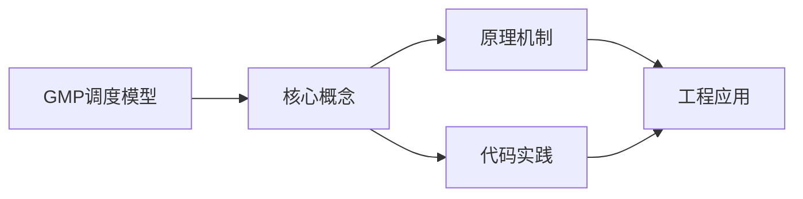

## 1. 学习目标（Bloom 分类）

本节按照布鲁姆教育目标分类学组织学习路径。本文主题为《GMP调度模型》，属于 Go 模块，读者可以根据自身阶段选择阅读深度。

记忆层面：能够准确复述本文的核心概念、术语与基本语法或操作步骤，并能够在提问或检索时快速定位对应知识点。能够说出 Go 的包、函数、结构体、接口与错误处理基本语法。

理解层面：能够用自己的语言解释核心原理与工作机制，说明概念之间的因果关系，而不是机械记忆结论。能够解释 goroutine 调度、channel 通信与内存模型。

应用层面：能够在真实项目或练习场景中运用本文知识解决具体问题，写出正确且可维护的实现。能够编写并发程序、HTTP 服务与命令行工具。

分析层面：能够拆解复杂问题，比较本文主题与相邻概念的异同，识别边界条件与例外情况。能够分析数据竞争、死锁与性能瓶颈。

评价层面：能够根据约束条件（性能、可读性、安全、成本）评价不同方案的优劣，做出有依据的技术决策。能够评价 Go 与 Java、Python 在不同场景的取舍。

创造层面：能够把本文知识与其他模块知识组合，设计出新的解决方案或可复用的工程模式。能够设计完整的微服务与云原生应用。

通过本节学习，读者应当能够把《GMP调度模型》纳入自己的知识网络，并与 Go 模块的其他主题（goroutine、channel、内存模型、标准库）建立关联。

## 2. 历史动机与发展脉络

《GMP调度模型》是 Go 领域的重要主题。要真正理解它，需要先了解它解决的问题与演进过程。

Go 由 Google 的 Robert Griesemer、Rob Pike 与 Ken Thompson 于 2009 年发布，设计目标是解决大规模分布式系统的工程痛点：编译慢、依赖混乱、并发难写。
Go 1.0 于 2012 年发布，此后严格保持向后兼容（Go 1 兼容性承诺）；约每半年发布一个小版本，1.21 起引入工具链管理（toolchain 指令）与内置测试 fuzzing。
Go 在云原生领域成为事实标准：Docker、Kubernetes、Prometheus、etcd 等核心项目均用 Go 编写；泛型在 1.18 加入，1.21+ 的 slices/maps 标准包补齐泛型工具。

回到本文主题：GMP调度模型 的提出与成熟，正是上述技术背景下的必然产物。早期实现往往以简单可用为目标，随着工程规模扩大，社区逐渐沉淀出标准做法与最佳实践；理解这一脉络，可以帮助读者判断“为什么文档中的推荐写法是现在这个样子”，也能在遇到历史遗留代码时准确识别其设计年代与取舍。


## 3. 形式化定义与核心概念精讲

本节把《GMP调度模型》涉及的核心概念以“定义 + 讲解”的形式展开。读者应把定义当作工具，把讲解当作理解路径；两者结合才能形成可迁移的知识。

goroutine 与调度：goroutine 是用户态轻量线程，由 GMP 调度器（Goroutine、Machine、Processor）多路复用到内核线程；创建成本约 2KB 栈，支持百万级并发。
channel 与 select：channel 是类型化通信管道，`<-` 发送/接收；select 多路等待；“不要通过共享内存通信，而要通过通信共享内存”是 Go 并发哲学。
内存模型：happens-before 关系由 channel、sync 原语与 atomic 建立；`go test -race` 用 ThreadSanitizer 检测数据竞争。

### 3.1 原文章节逐一精讲

原文档把主题拆分为 7 个小节，下面按顺序给出每一节的导读讲解，随后保留原文细节供精读。

#### 原文精读（完整保留）


#### 概述

Go 语言的并发能力核心在于其调度器。GMP 模型是 Go 运行时调度器的设计基础，它决定了 goroutine 如何被高效地分配到操作系统线程上执行。理解 GMP 模型有助于编写高性能并发程序，并在排查性能瓶颈时提供理论依据。

传统线程模型中，每个线程由操作系统直接调度，线程创建和切换开销大。Go 通过引入 goroutine 这一用户态轻量级线程，将调度工作从操作系统内核搬到用户态运行时，大幅降低了并发开销。GMP 模型正是实现这一目标的关键架构。

#### 基础概念

##### G (Goroutine)

G 是 goroutine 的缩写，代表用户态轻量级线程。每个 `go func()` 调用都会创建一个 G。G 包含以下信息：

- 栈指针（初始栈大小仅 2KB，可动态增长）
- 调度信息（状态、优先级等）
- 所属的函数和参数

```go
// 每次调用 go 关键字都会创建一个 G
go func() {
    fmt.Println("这是一个 goroutine")
}()
```

##### M (Machine)

M 代表操作系统线程，由操作系统调度。M 的职责是执行 G 中的代码。M 本身不持有 G 的状态，它需要绑定 P 才能获取可运行的 G。

关键特性：

- M 的数量可以远大于 GOMAXPROCS
- 当 M 执行系统调用阻塞时，会与 P 解绑，P 可以绑定其他空闲 M 继续执行 G
- 空闲的 M 会休眠，需要时再唤醒

##### P (Processor)

P 是逻辑处理器，是 G 和 M 之间的中间层。P 持有本地运行队列，其中存放待执行的 G。P 的数量由 GOMAXPROCS 决定，默认等于 CPU 核心数。

P 的核心作用：

- 将 G 分配给 M 执行
- 管理本地运行队列（最多 256 个 G）
- 缓存 mcache，加速内存分配

| 概念          | 说明                            |
| ------------- | ------------------------------- |
| G (Goroutine) | 协程，用户态轻量级线程          |
| M (Machine)   | 操作系统线程                    |
| P (Processor) | 逻辑处理器，GOMAXPROCS 控制数量 |

#### 快速上手

##### 观察调度行为

```go
package main

import (
    "fmt"
    "runtime"
    "time"
)

func main() {
    // 设置 P 的数量为 4
    runtime.GOMAXPROCS(4)

    // 启动多个 goroutine 观察调度
    for i := 0; i < 10; i++ {
        go func(id int) {
            fmt.Printf("Goroutine %d 运行中\n", id)
        }(i)
    }

    // 查看当前 goroutine 数量
    fmt.Printf("当前 goroutine 数量: %d\n", runtime.NumGoroutine())

    time.Sleep(time.Second)
}
```

##### 使用 trace 工具分析调度

```go
package main

import (
    "os"
    "runtime/trace"
)

func main() {
    // 创建 trace 输出文件
    f, _ := os.Create("trace.out")
    defer f.Close()

    // 启动 trace
    trace.Start(f)
    defer trace.Stop()

    // 你的业务代码
    for i := 0; i < 100; i++ {
        go func() {
            sum := 0
            for j := 0; j < 1000; j++ {
                sum += j
            }
        }()
    }
}
```

通过 `go tool trace trace.out` 可以在浏览器中查看调度详情。

#### 详细用法

##### 调度流程

GMP 调度的核心流程如下：

1. P 持有本地运行队列（local run queue，最多 256 个 G）
2. M 绑定 P 后从本地队列取 G 执行
3. 本地队列为空时，从全局队列获取（每次获取一批，均匀分配）
4. 全局队列也为空时，从 netpoller 获取就绪的 G
5. 以上都为空时，从其他 P 的本地队列偷取（work stealing）

```
全局队列 (Global Run Queue)
    |
    v
P0 [本地队列: G1, G2, G3] <---> M0 (执行 G1)
P1 [本地队列: G4, G5]     <---> M1 (执行 G4)
P2 [本地队列: 空]         <---> M2 (偷取 P0 的 G)
P3 [本地队列: G6]         <---> M3 (执行 G6)
```

##### 调度时机

调度器在以下时机会重新调度：

- `go func()` 创建新 G 时，尝试放入本地队列
- 系统调用（M 阻塞时释放 P，即 hand-off 机制）
- channel 操作阻塞
- time.Sleep
- runtime.Gosched() 主动让出
- 函数调用时栈检查点（stack check point）
- GC 暂停所有 goroutine 后重新调度

##### GOMAXPROCS

```go
// 设置 P 的数量（默认等于 CPU 核数）
runtime.GOMAXPROCS(4)

// 获取当前 P 的数量
n := runtime.GOMAXPROCS(0)
fmt.Printf("当前 P 数量: %d\n", n)
```

GOMAXPROCS 的选择建议：

- CPU 密集型任务：设置为 CPU 核心数
- IO 密集型任务：可以适当增大，但通常默认值即可
- 容器环境：注意 cgroup 限制，Go 1.19+ 自动感知容器 CPU 限制

##### Work Stealing 机制

当 P 的本地队列为空时，按以下顺序查找可运行的 G：

1. 从全局队列获取（每 61 次调度检查一次全局队列，保证公平性）
2. 从 netpoller 获取网络就绪的 G
3. 从其他 P 的本地队列偷取一半

```go
// 模拟 work stealing 场景
package main

import (
    "fmt"
    "sync"
)

func main() {
    var wg sync.WaitGroup
    wg.Add(1000)

    // 大量 goroutine，P 会自动偷取
    for i := 0; i < 1000; i++ {
        go func(id int) {
            defer wg.Done()
            // 模拟工作
            sum := 0
            for j := 0; j < 100; j++ {
                sum += j
            }
        }(i)
    }

    wg.Wait()
    fmt.Println("所有 goroutine 完成")
}
```

##### Hand-off 机制

当 M 因系统调用阻塞时，P 会与该 M 解绑，寻找或创建新的 M 继续执行本地队列中的 G。当阻塞的 M 从系统调用返回时，它会尝试获取一个空闲的 P，如果没有空闲 P，则将 G 放入全局队列，M 自身进入休眠。

```go
// 系统调用场景下的 hand-off
package main

import (
    "fmt"
    "syscall"
    "time"
)

func main() {
    // 一个 goroutine 执行阻塞的系统调用
    go func() {
        // 模拟文件读取（系统调用）
        var buf [1024]byte
        syscall.Read(0, buf[:])  // M 阻塞，P 会 hand-off 给其他 M
        fmt.Println("系统调用返回")
    }()

    // 其他 goroutine 不会因此阻塞
    go func() {
        for i := 0; i < 5; i++ {
            fmt.Printf("其他 goroutine 正常运行: %d\n", i)
            time.Sleep(100 * time.Millisecond)
        }
    }()

    time.Sleep(2 * time.Second)
}
```

#### 常见场景

##### 场景一：大量短任务

```go
// 处理大量短任务时，goroutine 调度开销很小
func processBatch(items []Item) {
    var wg sync.WaitGroup
    // 限制并发数，避免 goroutine 过多
    sem := make(chan struct{}, runtime.GOMAXPROCS(0)*2)

    for _, item := range items {
        wg.Add(1)
        sem <- struct{}{} // 获取信号量
        go func(it Item) {
            defer wg.Done()
            defer func() { <-sem }() // 释放信号量
            process(it)
        }(item)
    }

    wg.Wait()
}
```

##### 场景二：CPU 密集型与 IO 密集型混合

```go
func hybridWork() {
    // CPU 密集型任务
    go func() {
        result := heavyComputation()
        fmt.Println("计算完成:", result)
    }()

    // IO 密集型任务
    go func() {
        data, _ := http.Get("https://api.example.com/data")
        fmt.Println("请求完成")
    }()
}
```

##### 场景三：排查调度问题

```go
// 使用 runtime 查看调度状态
func debugScheduler() {
    var m runtime.MemStats
    runtime.ReadMemStats(&m)

    fmt.Printf("Goroutine 数量: %d\n", runtime.NumGoroutine())
    fmt.Printf("CPU 核心数: %d\n", runtime.NumCPU())
    fmt.Printf("GOMAXPROCS: %d\n", runtime.GOMAXPROCS(0))
    fmt.Printf("CGO 调用次数: %d\n", runtime.NumCgoCall())
}
```

#### 注意事项

- goroutine 虽然轻量，但不是没有开销。每个 G 至少占用 2KB 栈空间，百万级 goroutine 会消耗数 GB 内存
- 避免在循环中无限制地创建 goroutine，应使用 worker pool 或信号量控制并发数
- GOMAXPROCS 设置过大会增加上下文切换开销，通常保持默认即可
- 在容器环境中，Go 1.19 之前的版本不会自动感知 cgroup CPU 限制，需要手动设置 GOMAXPROCS
- work stealing 有一定开销，如果所有 P 的负载均匀，stealing 几乎不会发生
- 使用 `runtime.LockOSThread()` 可以将 G 绑定到特定 M，适用于 CGO 或 GUI 场景

#### 进阶用法

##### Spinning M 优化

Go 调度器引入了自旋线程（Spinning M）的概念：当 M 没有可运行的 G 时，不会立即休眠，而是自旋一段时间寻找工作。这减少了 M 唤醒的延迟，但最多只允许一个自旋 M（空闲 P 的数量个），避免浪费 CPU。

##### 抢占式调度

Go 1.14 之前基于协作式抢占（函数调用时检查栈），无法处理无函数调用的死循环。Go 1.14+ 引入了基于信号的异步抢占，即使 goroutine 在紧密循环中也能被抢占。

```go
// Go 1.14+ 即使这样的死循环也能被抢占
go func() {
    for {
        // 紧密循环，Go 1.14+ 可以抢占
    }
}()
```

##### 调度器调优实践

```go
package main

import (
    "fmt"
    "runtime"
    "sync"
    "time"
)

func main() {
    // 根据工作负载调整 GOMAXPROCS
    cpuBound := true
    if cpuBound {
        // CPU 密集型：使用全部核心
        runtime.GOMAXPROCS(runtime.NumCPU())
    } else {
        // IO 密集型：可以适当增加
        runtime.GOMAXPROCS(runtime.NumCPU() + 2)
    }

    // 使用 worker pool 模式
    jobs := make(chan int, 100)
    results := make(chan int, 100)

    // 启动固定数量的 worker
    for w := 1; w <= runtime.GOMAXPROCS(0); w++ {
        go worker(w, jobs, results)
    }

    // 发送任务
    for j := 1; j <= 50; j++ {
        jobs <- j
    }
    close(jobs)

    // 收集结果
    for r := 1; r <= 50; r++ {
        <-results
    }
}

func worker(id int, jobs <-chan int, results chan<- int) {
    for j := range jobs {
        fmt.Printf("Worker %d 处理任务 %d\n", id, j)
        time.Sleep(time.Millisecond) // 模拟工作
        results <- j * 2
    }
}
```

##### 与 Channel 配合的调度模式

```go
// 扇出扇入模式：利用 GMP 的 work stealing 实现负载均衡
func fanOutFanIn(input <-chan Data, workerCount int) <-chan Result {
    channels := make([]<-chan Result, workerCount)

    // 扇出：启动多个 worker
    for i := 0; i < workerCount; i++ {
        channels[i] = worker(input)
    }

    // 扇入：合并结果
    merged := make(chan Result)
    var wg sync.WaitGroup
    wg.Add(workerCount)

    for _, ch := range channels {
        go func(c <-chan Result) {
            defer wg.Done()
            for r := range c {
                merged <- r
            }
        }(ch)
    }

    go func() {
        wg.Wait()
        close(merged)
    }()

    return merged
}
```


### 3.2 概念关系图

下面用 Mermaid 图表达本文核心概念之间的关系，帮助读者建立整体图景：



图中展示的是本文知识的结构化关系：核心概念是入口，原理机制解释“为什么”，代码实践演示“怎么做”，工程应用回答“何时用”。读者学习时可以把每个小节的内容挂接到对应节点上。

## 4. 理论推导与原理解析

本节深入《GMP调度模型》背后的原理。理论部分不求面面俱到，而是聚焦“能解释现象、能指导实践”的关键推导。

goroutine 与调度：goroutine 是用户态轻量线程，由 GMP 调度器（Goroutine、Machine、Processor）多路复用到内核线程；创建成本约 2KB 栈，支持百万级并发。
channel 与 select：channel 是类型化通信管道，`<-` 发送/接收；select 多路等待；“不要通过共享内存通信，而要通过通信共享内存”是 Go 并发哲学。
内存模型：happens-before 关系由 channel、sync 原语与 atomic 建立；`go test -race` 用 ThreadSanitizer 检测数据竞争。
错误处理：Go 用多返回值显式处理错误（`if err != nil`），error 是接口；panic/recover 仅用于不可恢复错误。

需要强调的是，理论推导与工程实践之间存在翻译层：理论给出的是理想化模型与边界条件，工程代码则必须处理真实环境中的例外。读者在学习时应先掌握理论的“标准情形”，再通过陷阱章节了解“非标准情形”。

## 5. 代码示例与逐行讲解

本节把原文中的代码示例系统整理，并为每个示例补充用途说明与讲解。读者不应只浏览代码，而应逐段对照讲解理解设计意图。

### 5.1 示例：G (Goroutine)

该示例来自原文《G (Goroutine)》小节，用于演示GMP调度模型相关操作。阅读时请先看代码结构，再看其后的讲解。

```go
// 每次调用 go 关键字都会创建一个 G
go func() {
    fmt.Println("这是一个 goroutine")
}()
```

讲解：这段代码演示了本节核心知识点。代码中的关键操作可以归纳为三步：准备（定义或初始化）、执行（核心逻辑）、收尾（释放资源或返回结果）。实际项目中，这三步往往被封装为函数或类，以提升复用性与可测试性。

关键点分析：

该示例共 4 行有效代码，结构以数据或配置为主。阅读时应关注：数据字段的含义、配置项的作用，以及它们与运行行为的对应关系。

进阶思考路径：先尝试修改参数观察行为变化，再把示例中的模式迁移到自己的项目中；每次修改都记录预期与实测差异，这是把示例转化为能力的最快方式。

### 5.2 示例：观察调度行为

该示例来自原文《观察调度行为》小节，用于演示GMP调度模型相关操作。阅读时请先看代码结构，再看其后的讲解。

```go
package main

import (
    "fmt"
    "runtime"
    "time"
)

func main() {
    // 设置 P 的数量为 4
    runtime.GOMAXPROCS(4)

    // 启动多个 goroutine 观察调度
    for i := 0; i < 10; i++ {
        go func(id int) {
            fmt.Printf("Goroutine %d 运行中\n", id)
        }(i)
    }

    // 查看当前 goroutine 数量
    fmt.Printf("当前 goroutine 数量: %d\n", runtime.NumGoroutine())

    time.Sleep(time.Second)
}
```

讲解：这段代码演示了本节核心知识点。代码中的关键操作可以归纳为三步：准备（定义或初始化）、执行（核心逻辑）、收尾（释放资源或返回结果）。实际项目中，这三步往往被封装为函数或类，以提升复用性与可测试性。

关键点分析：

该示例共 19 行有效代码，包含 3 类关键结构（func、import、for）。其中：

- 入口与初始化部分负责建立上下文，对应实际项目中的启动或装配逻辑；
- 核心逻辑部分体现本文主题的主要操作，是阅读时最需要对照讲解理解的部分；
- 输出或返回部分把结果交给调用方，注意其类型与边界条件。

进阶思考路径：先尝试修改参数观察行为变化，再把示例中的模式迁移到自己的项目中；每次修改都记录预期与实测差异，这是把示例转化为能力的最快方式。

### 5.3 示例：使用 trace 工具分析调度

该示例来自原文《使用 trace 工具分析调度》小节，用于演示GMP调度模型相关操作。阅读时请先看代码结构，再看其后的讲解。

```go
package main

import (
    "os"
    "runtime/trace"
)

func main() {
    // 创建 trace 输出文件
    f, _ := os.Create("trace.out")
    defer f.Close()

    // 启动 trace
    trace.Start(f)
    defer trace.Stop()

    // 你的业务代码
    for i := 0; i < 100; i++ {
        go func() {
            sum := 0
            for j := 0; j < 1000; j++ {
                sum += j
            }
        }()
    }
}
```

讲解：这段代码演示了本节核心知识点。代码中的关键操作可以归纳为三步：准备（定义或初始化）、执行（核心逻辑）、收尾（释放资源或返回结果）。实际项目中，这三步往往被封装为函数或类，以提升复用性与可测试性。

关键点分析：

该示例共 22 行有效代码，包含 3 类关键结构（func、import、for）。其中：

- 入口与初始化部分负责建立上下文，对应实际项目中的启动或装配逻辑；
- 核心逻辑部分体现本文主题的主要操作，是阅读时最需要对照讲解理解的部分；
- 输出或返回部分把结果交给调用方，注意其类型与边界条件。

进阶思考路径：先尝试修改参数观察行为变化，再把示例中的模式迁移到自己的项目中；每次修改都记录预期与实测差异，这是把示例转化为能力的最快方式。

### 5.4 示例：调度流程

该示例来自原文《调度流程》小节，用于演示GMP调度模型相关操作。阅读时请先看代码结构，再看其后的讲解。

```text
全局队列 (Global Run Queue)
    |
    v
P0 [本地队列: G1, G2, G3] <---> M0 (执行 G1)
P1 [本地队列: G4, G5]     <---> M1 (执行 G4)
P2 [本地队列: 空]         <---> M2 (偷取 P0 的 G)
P3 [本地队列: G6]         <---> M3 (执行 G6)
```

讲解：这段代码演示了本节核心知识点。代码中的关键操作可以归纳为三步：准备（定义或初始化）、执行（核心逻辑）、收尾（释放资源或返回结果）。实际项目中，这三步往往被封装为函数或类，以提升复用性与可测试性。

关键点分析：

该示例共 7 行有效代码，结构以数据或配置为主。阅读时应关注：数据字段的含义、配置项的作用，以及它们与运行行为的对应关系。

进阶思考路径：先尝试修改参数观察行为变化，再把示例中的模式迁移到自己的项目中；每次修改都记录预期与实测差异，这是把示例转化为能力的最快方式。

### 5.5 示例：GOMAXPROCS

该示例来自原文《GOMAXPROCS》小节，用于演示GMP调度模型相关操作。阅读时请先看代码结构，再看其后的讲解。

```go
// 设置 P 的数量（默认等于 CPU 核数）
runtime.GOMAXPROCS(4)

// 获取当前 P 的数量
n := runtime.GOMAXPROCS(0)
fmt.Printf("当前 P 数量: %d\n", n)
```

讲解：这段代码演示了本节核心知识点。代码中的关键操作可以归纳为三步：准备（定义或初始化）、执行（核心逻辑）、收尾（释放资源或返回结果）。实际项目中，这三步往往被封装为函数或类，以提升复用性与可测试性。

关键点分析：

该示例共 5 行有效代码，结构以数据或配置为主。阅读时应关注：数据字段的含义、配置项的作用，以及它们与运行行为的对应关系。

进阶思考路径：先尝试修改参数观察行为变化，再把示例中的模式迁移到自己的项目中；每次修改都记录预期与实测差异，这是把示例转化为能力的最快方式。

### 5.6 示例：Work Stealing 机制

该示例来自原文《Work Stealing 机制》小节，用于演示GMP调度模型相关操作。阅读时请先看代码结构，再看其后的讲解。

```go
// 模拟 work stealing 场景
package main

import (
    "fmt"
    "sync"
)

func main() {
    var wg sync.WaitGroup
    wg.Add(1000)

    // 大量 goroutine，P 会自动偷取
    for i := 0; i < 1000; i++ {
        go func(id int) {
            defer wg.Done()
            // 模拟工作
            sum := 0
            for j := 0; j < 100; j++ {
                sum += j
            }
        }(i)
    }

    wg.Wait()
    fmt.Println("所有 goroutine 完成")
}
```

讲解：这段代码演示了本节核心知识点。代码中的关键操作可以归纳为三步：准备（定义或初始化）、执行（核心逻辑）、收尾（释放资源或返回结果）。实际项目中，这三步往往被封装为函数或类，以提升复用性与可测试性。

关键点分析：

该示例共 23 行有效代码，包含 3 类关键结构（func、import、for）。其中：

- 入口与初始化部分负责建立上下文，对应实际项目中的启动或装配逻辑；
- 核心逻辑部分体现本文主题的主要操作，是阅读时最需要对照讲解理解的部分；
- 输出或返回部分把结果交给调用方，注意其类型与边界条件。

进阶思考路径：先尝试修改参数观察行为变化，再把示例中的模式迁移到自己的项目中；每次修改都记录预期与实测差异，这是把示例转化为能力的最快方式。

### 5.7 示例：Hand-off 机制

该示例来自原文《Hand-off 机制》小节，用于演示GMP调度模型相关操作。阅读时请先看代码结构，再看其后的讲解。

```go
// 系统调用场景下的 hand-off
package main

import (
    "fmt"
    "syscall"
    "time"
)

func main() {
    // 一个 goroutine 执行阻塞的系统调用
    go func() {
        // 模拟文件读取（系统调用）
        var buf [1024]byte
        syscall.Read(0, buf[:])  // M 阻塞，P 会 hand-off 给其他 M
        fmt.Println("系统调用返回")
    }()

    // 其他 goroutine 不会因此阻塞
    go func() {
        for i := 0; i < 5; i++ {
            fmt.Printf("其他 goroutine 正常运行: %d\n", i)
            time.Sleep(100 * time.Millisecond)
        }
    }()

    time.Sleep(2 * time.Second)
}
```

讲解：这段代码演示了本节核心知识点。代码中的关键操作可以归纳为三步：准备（定义或初始化）、执行（核心逻辑）、收尾（释放资源或返回结果）。实际项目中，这三步往往被封装为函数或类，以提升复用性与可测试性。

关键点分析：

该示例共 24 行有效代码，包含 3 类关键结构（func、import、for）。其中：

- 入口与初始化部分负责建立上下文，对应实际项目中的启动或装配逻辑；
- 核心逻辑部分体现本文主题的主要操作，是阅读时最需要对照讲解理解的部分；
- 输出或返回部分把结果交给调用方，注意其类型与边界条件。

进阶思考路径：先尝试修改参数观察行为变化，再把示例中的模式迁移到自己的项目中；每次修改都记录预期与实测差异，这是把示例转化为能力的最快方式。

### 5.8 示例：场景一：大量短任务

该示例来自原文《场景一：大量短任务》小节，用于演示GMP调度模型相关操作。阅读时请先看代码结构，再看其后的讲解。

```go
// 处理大量短任务时，goroutine 调度开销很小
func processBatch(items []Item) {
    var wg sync.WaitGroup
    // 限制并发数，避免 goroutine 过多
    sem := make(chan struct{}, runtime.GOMAXPROCS(0)*2)

    for _, item := range items {
        wg.Add(1)
        sem <- struct{}{} // 获取信号量
        go func(it Item) {
            defer wg.Done()
            defer func() { <-sem }() // 释放信号量
            process(it)
        }(item)
    }

    wg.Wait()
}
```

讲解：这段代码演示了本节核心知识点。代码中的关键操作可以归纳为三步：准备（定义或初始化）、执行（核心逻辑）、收尾（释放资源或返回结果）。实际项目中，这三步往往被封装为函数或类，以提升复用性与可测试性。

关键点分析：

该示例共 16 行有效代码，包含 2 类关键结构（func、for）。其中：

- 入口与初始化部分负责建立上下文，对应实际项目中的启动或装配逻辑；
- 核心逻辑部分体现本文主题的主要操作，是阅读时最需要对照讲解理解的部分；
- 输出或返回部分把结果交给调用方，注意其类型与边界条件。

进阶思考路径：先尝试修改参数观察行为变化，再把示例中的模式迁移到自己的项目中；每次修改都记录预期与实测差异，这是把示例转化为能力的最快方式。

### 5.9 示例：场景二：CPU 密集型与 IO 密集型混合

该示例来自原文《场景二：CPU 密集型与 IO 密集型混合》小节，用于演示GMP调度模型相关操作。阅读时请先看代码结构，再看其后的讲解。

```go
func hybridWork() {
    // CPU 密集型任务
    go func() {
        result := heavyComputation()
        fmt.Println("计算完成:", result)
    }()

    // IO 密集型任务
    go func() {
        data, _ := http.Get("https://api.example.com/data")
        fmt.Println("请求完成")
    }()
}
```

讲解：这段代码演示了本节核心知识点。代码中的关键操作可以归纳为三步：准备（定义或初始化）、执行（核心逻辑）、收尾（释放资源或返回结果）。实际项目中，这三步往往被封装为函数或类，以提升复用性与可测试性。

关键点分析：

该示例共 12 行有效代码，包含 1 类关键结构（func）。其中：

- 入口与初始化部分负责建立上下文，对应实际项目中的启动或装配逻辑；
- 核心逻辑部分体现本文主题的主要操作，是阅读时最需要对照讲解理解的部分；
- 输出或返回部分把结果交给调用方，注意其类型与边界条件。

进阶思考路径：先尝试修改参数观察行为变化，再把示例中的模式迁移到自己的项目中；每次修改都记录预期与实测差异，这是把示例转化为能力的最快方式。

### 5.10 示例：场景三：排查调度问题

该示例来自原文《场景三：排查调度问题》小节，用于演示GMP调度模型相关操作。阅读时请先看代码结构，再看其后的讲解。

```go
// 使用 runtime 查看调度状态
func debugScheduler() {
    var m runtime.MemStats
    runtime.ReadMemStats(&m)

    fmt.Printf("Goroutine 数量: %d\n", runtime.NumGoroutine())
    fmt.Printf("CPU 核心数: %d\n", runtime.NumCPU())
    fmt.Printf("GOMAXPROCS: %d\n", runtime.GOMAXPROCS(0))
    fmt.Printf("CGO 调用次数: %d\n", runtime.NumCgoCall())
}
```

讲解：这段代码演示了本节核心知识点。代码中的关键操作可以归纳为三步：准备（定义或初始化）、执行（核心逻辑）、收尾（释放资源或返回结果）。实际项目中，这三步往往被封装为函数或类，以提升复用性与可测试性。

关键点分析：

该示例共 9 行有效代码，包含 1 类关键结构（func）。其中：

- 入口与初始化部分负责建立上下文，对应实际项目中的启动或装配逻辑；
- 核心逻辑部分体现本文主题的主要操作，是阅读时最需要对照讲解理解的部分；
- 输出或返回部分把结果交给调用方，注意其类型与边界条件。

进阶思考路径：先尝试修改参数观察行为变化，再把示例中的模式迁移到自己的项目中；每次修改都记录预期与实测差异，这是把示例转化为能力的最快方式。

### 5.11 示例：抢占式调度

该示例来自原文《抢占式调度》小节，用于演示GMP调度模型相关操作。阅读时请先看代码结构，再看其后的讲解。

```go
// Go 1.14+ 即使这样的死循环也能被抢占
go func() {
    for {
        // 紧密循环，Go 1.14+ 可以抢占
    }
}()
```

讲解：这段代码演示了本节核心知识点。代码中的关键操作可以归纳为三步：准备（定义或初始化）、执行（核心逻辑）、收尾（释放资源或返回结果）。实际项目中，这三步往往被封装为函数或类，以提升复用性与可测试性。

关键点分析：

该示例共 6 行有效代码，包含 1 类关键结构（for）。其中：

- 入口与初始化部分负责建立上下文，对应实际项目中的启动或装配逻辑；
- 核心逻辑部分体现本文主题的主要操作，是阅读时最需要对照讲解理解的部分；
- 输出或返回部分把结果交给调用方，注意其类型与边界条件。

进阶思考路径：先尝试修改参数观察行为变化，再把示例中的模式迁移到自己的项目中；每次修改都记录预期与实测差异，这是把示例转化为能力的最快方式。

### 5.12 示例：调度器调优实践

该示例来自原文《调度器调优实践》小节，用于演示GMP调度模型相关操作。阅读时请先看代码结构，再看其后的讲解。

```go
package main

import (
    "fmt"
    "runtime"
    "sync"
    "time"
)

func main() {
    // 根据工作负载调整 GOMAXPROCS
    cpuBound := true
    if cpuBound {
        // CPU 密集型：使用全部核心
        runtime.GOMAXPROCS(runtime.NumCPU())
    } else {
        // IO 密集型：可以适当增加
        runtime.GOMAXPROCS(runtime.NumCPU() + 2)
    }

    // 使用 worker pool 模式
    jobs := make(chan int, 100)
    results := make(chan int, 100)

    // 启动固定数量的 worker
    for w := 1; w <= runtime.GOMAXPROCS(0); w++ {
        go worker(w, jobs, results)
    }

    // 发送任务
    for j := 1; j <= 50; j++ {
        jobs <- j
    }
    close(jobs)

    // 收集结果
    for r := 1; r <= 50; r++ {
        <-results
    }
}

func worker(id int, jobs <-chan int, results chan<- int) {
    for j := range jobs {
        fmt.Printf("Worker %d 处理任务 %d\n", id, j)
        time.Sleep(time.Millisecond) // 模拟工作
        results <- j * 2
    }
}
```

讲解：这段代码演示了本节核心知识点。代码中的关键操作可以归纳为三步：准备（定义或初始化）、执行（核心逻辑）、收尾（释放资源或返回结果）。实际项目中，这三步往往被封装为函数或类，以提升复用性与可测试性。

关键点分析：

该示例共 41 行有效代码，包含 4 类关键结构（func、import、if、for）。其中：

- 入口与初始化部分负责建立上下文，对应实际项目中的启动或装配逻辑；
- 核心逻辑部分体现本文主题的主要操作，是阅读时最需要对照讲解理解的部分；
- 输出或返回部分把结果交给调用方，注意其类型与边界条件。

进阶思考路径：先尝试修改参数观察行为变化，再把示例中的模式迁移到自己的项目中；每次修改都记录预期与实测差异，这是把示例转化为能力的最快方式。

### 5.13 示例：与 Channel 配合的调度模式

该示例来自原文《与 Channel 配合的调度模式》小节，用于演示GMP调度模型相关操作。阅读时请先看代码结构，再看其后的讲解。

```go
// 扇出扇入模式：利用 GMP 的 work stealing 实现负载均衡
func fanOutFanIn(input <-chan Data, workerCount int) <-chan Result {
    channels := make([]<-chan Result, workerCount)

    // 扇出：启动多个 worker
    for i := 0; i < workerCount; i++ {
        channels[i] = worker(input)
    }

    // 扇入：合并结果
    merged := make(chan Result)
    var wg sync.WaitGroup
    wg.Add(workerCount)

    for _, ch := range channels {
        go func(c <-chan Result) {
            defer wg.Done()
            for r := range c {
                merged <- r
            }
        }(ch)
    }

    go func() {
        wg.Wait()
        close(merged)
    }()

    return merged
}
```

讲解：这段代码演示了本节核心知识点。代码中的关键操作可以归纳为三步：准备（定义或初始化）、执行（核心逻辑）、收尾（释放资源或返回结果）。实际项目中，这三步往往被封装为函数或类，以提升复用性与可测试性。

关键点分析：

该示例共 25 行有效代码，包含 3 类关键结构（func、for、return）。其中：

- 入口与初始化部分负责建立上下文，对应实际项目中的启动或装配逻辑；
- 核心逻辑部分体现本文主题的主要操作，是阅读时最需要对照讲解理解的部分；
- 输出或返回部分把结果交给调用方，注意其类型与边界条件。

进阶思考路径：先尝试修改参数观察行为变化，再把示例中的模式迁移到自己的项目中；每次修改都记录预期与实测差异，这是把示例转化为能力的最快方式。


综合以上示例，可以总结出本主题的代码实践要点：第一，先定义清晰的输入输出契约；第二，核心逻辑保持单一职责；第三，错误处理与边界条件不可省略；第四，命名与注释表达意图而非复述代码。

## 6. 对比分析

对比是理解《GMP调度模型》定位的最快路径。下面从多个维度与相邻方案进行对比。

Go 与 Java：Go 编译快、部署简单（静态二进制）、并发原语原生；Java 生态更丰富、虚拟线程补足并发短板。
Go 与 Python：Go 性能高、类型安全；Python 开发快、AI 生态强。
goroutine 与线程：goroutine 用户态调度、栈动态增长；线程内核态、栈固定。

对比的目的不是分出绝对优劣，而是建立选择依据：不同约束条件下，最优解不同。读者应把每个对比维度转化为决策检查清单。

## 7. 常见陷阱与最佳实践

本节整理该主题的高频错误与推荐做法。每个陷阱先描述现象，再解释原因，最后给出最佳实践。

### 7.1 忽略错误返回值

错误被静默丢弃导致故障难查。显式检查并包装上下文（fmt.Errorf + %w）。

深入讲解：该问题之所以被归类为“常见陷阱”，是因为它在初学者的代码中反复出现，而且往往不在第一时间暴露——错误通常隐藏在特定数据或特定时序下。

从成因上看，忽略错误返回值 一般源于对 Go 某个机制的理解偏差：要么误用了默认行为，要么忽略了边界条件，要么把其他语言的思维惯性带了过来。

从影响上看，忽略错误返回值 轻则产生错误结果，重则导致资源泄漏、数据损坏或安全事故；这也是为什么工程评审中会把它列为检查项。

从修复策略上看，处理忽略错误返回值的正确顺序是：先复现（构造最小用例），再定位（确认机制层面的根因），最后修复并补充回归测试。跳过复现直接改代码，往往治标不治本。

### 7.2 goroutine 泄漏

channel 无接收者或循环启动 goroutine 导致资源泄漏。使用 context 取消与 WaitGroup 收口。

深入讲解：该问题之所以被归类为“常见陷阱”，是因为它在初学者的代码中反复出现，而且往往不在第一时间暴露——错误通常隐藏在特定数据或特定时序下。

从成因上看，goroutine 泄漏 一般源于对 Go 某个机制的理解偏差：要么误用了默认行为，要么忽略了边界条件，要么把其他语言的思维惯性带了过来。

从影响上看，goroutine 泄漏 轻则产生错误结果，重则导致资源泄漏、数据损坏或安全事故；这也是为什么工程评审中会把它列为检查项。

从修复策略上看，处理goroutine 泄漏的正确顺序是：先复现（构造最小用例），再定位（确认机制层面的根因），最后修复并补充回归测试。跳过复现直接改代码，往往治标不治本。

### 7.3 共享变量竞争

多个 goroutine 读写同一变量未同步。使用 mutex、atomic 或改为 channel 传递。

深入讲解：该问题之所以被归类为“常见陷阱”，是因为它在初学者的代码中反复出现，而且往往不在第一时间暴露——错误通常隐藏在特定数据或特定时序下。

从成因上看，共享变量竞争 一般源于对 Go 某个机制的理解偏差：要么误用了默认行为，要么忽略了边界条件，要么把其他语言的思维惯性带了过来。

从影响上看，共享变量竞争 轻则产生错误结果，重则导致资源泄漏、数据损坏或安全事故；这也是为什么工程评审中会把它列为检查项。

从修复策略上看，处理共享变量竞争的正确顺序是：先复现（构造最小用例），再定位（确认机制层面的根因），最后修复并补充回归测试。跳过复现直接改代码，往往治标不治本。

### 7.4 defer 在循环中累积

defer 在函数返回时执行，循环内 defer 延迟大量资源释放。将循环体提取为函数。

深入讲解：该问题之所以被归类为“常见陷阱”，是因为它在初学者的代码中反复出现，而且往往不在第一时间暴露——错误通常隐藏在特定数据或特定时序下。

从成因上看，defer 在循环中累积 一般源于对 Go 某个机制的理解偏差：要么误用了默认行为，要么忽略了边界条件，要么把其他语言的思维惯性带了过来。

从影响上看，defer 在循环中累积 轻则产生错误结果，重则导致资源泄漏、数据损坏或安全事故；这也是为什么工程评审中会把它列为检查项。

从修复策略上看，处理defer 在循环中累积的正确顺序是：先复现（构造最小用例），再定位（确认机制层面的根因），最后修复并补充回归测试。跳过复现直接改代码，往往治标不治本。

### 7.5 切片共享底层数组

append 可能修改共享数组，产生隐蔽 bug。需要独立数据时用 copy 或完整切片表达式。

深入讲解：该问题之所以被归类为“常见陷阱”，是因为它在初学者的代码中反复出现，而且往往不在第一时间暴露——错误通常隐藏在特定数据或特定时序下。

从成因上看，切片共享底层数组 一般源于对 Go 某个机制的理解偏差：要么误用了默认行为，要么忽略了边界条件，要么把其他语言的思维惯性带了过来。

从影响上看，切片共享底层数组 轻则产生错误结果，重则导致资源泄漏、数据损坏或安全事故；这也是为什么工程评审中会把它列为检查项。

从修复策略上看，处理切片共享底层数组的正确顺序是：先复现（构造最小用例），再定位（确认机制层面的根因），最后修复并补充回归测试。跳过复现直接改代码，往往治标不治本。

### 7.6 map 并发读写

map 非并发安全，并发写 panic。使用 sync.Map 或加锁。

深入讲解：该问题之所以被归类为“常见陷阱”，是因为它在初学者的代码中反复出现，而且往往不在第一时间暴露——错误通常隐藏在特定数据或特定时序下。

从成因上看，map 并发读写 一般源于对 Go 某个机制的理解偏差：要么误用了默认行为，要么忽略了边界条件，要么把其他语言的思维惯性带了过来。

从影响上看，map 并发读写 轻则产生错误结果，重则导致资源泄漏、数据损坏或安全事故；这也是为什么工程评审中会把它列为检查项。

从修复策略上看，处理map 并发读写的正确顺序是：先复现（构造最小用例），再定位（确认机制层面的根因），最后修复并补充回归测试。跳过复现直接改代码，往往治标不治本。

### 7.7 指针逃逸与性能误判

过早优化影响可读性。先用 benchmark 与 pprof 定位热点。

深入讲解：该问题之所以被归类为“常见陷阱”，是因为它在初学者的代码中反复出现，而且往往不在第一时间暴露——错误通常隐藏在特定数据或特定时序下。

从成因上看，指针逃逸与性能误判 一般源于对 Go 某个机制的理解偏差：要么误用了默认行为，要么忽略了边界条件，要么把其他语言的思维惯性带了过来。

从影响上看，指针逃逸与性能误判 轻则产生错误结果，重则导致资源泄漏、数据损坏或安全事故；这也是为什么工程评审中会把它列为检查项。

从修复策略上看，处理指针逃逸与性能误判的正确顺序是：先复现（构造最小用例），再定位（确认机制层面的根因），最后修复并补充回归测试。跳过复现直接改代码，往往治标不治本。

### 7.8 超时控制缺失

网络请求无超时导致 goroutine 悬挂。使用 http.Client.Timeout 与 context.WithTimeout。

深入讲解：该问题之所以被归类为“常见陷阱”，是因为它在初学者的代码中反复出现，而且往往不在第一时间暴露——错误通常隐藏在特定数据或特定时序下。

从成因上看，超时控制缺失 一般源于对 Go 某个机制的理解偏差：要么误用了默认行为，要么忽略了边界条件，要么把其他语言的思维惯性带了过来。

从影响上看，超时控制缺失 轻则产生错误结果，重则导致资源泄漏、数据损坏或安全事故；这也是为什么工程评审中会把它列为检查项。

从修复策略上看，处理超时控制缺失的正确顺序是：先复现（构造最小用例），再定位（确认机制层面的根因），最后修复并补充回归测试。跳过复现直接改代码，往往治标不治本。

### 7.0 最佳实践总览

1. 使用 gofmt 统一格式，go vet 静态检查。
2. 错误处理显式且带上下文，不使用 panic 做业务控制。
3. 并发入口使用 context 传递取消与超时。
4. 接口尽量小，函数参数按需接收。
5. 每次提交前运行 go test -race ./...。

把这些最佳实践固化为团队规范与代码评审检查项，是避免同类问题反复出现的关键。

## 8. 工程实践

本节把《GMP调度模型》放入真实工程场景，给出可复用的模式与组织方法。

标准项目布局：cmd/（可执行入口）、internal/（私有包）、pkg/（对外库）；单一 main 包保持薄。
HTTP 服务：net/http 标准库 + 中间件模式；路由可用 Go 1.22+ 的 method pattern。
配置与日志：环境变量 + 结构体映射；log/slog（1.21+）结构化日志。
部署：多阶段 Dockerfile 构建静态二进制，镜像可小至几十 MB。

### 8.1 工程实践的原则拆解

以上工程实践可以归纳为四条原则。第一，配置与代码分离：Go 项目中环境差异应通过配置注入，而不是散落在代码分支中；这保证同一份代码可以在开发、测试、生产环境一致运行。

第二，接口稳定优先：对外接口（函数签名、协议、数据格式）一旦被消费方依赖，变更成本极高；设计时应预留扩展点并保持向后兼容。

第三，可观测性内置：日志、指标与追踪应该在功能开发时同步设计，而不是故障发生后补救；没有观测手段的模块等于黑盒。

第四，变更可回滚：任何发布都应有对应的回滚方案；数据库迁移、配置变更与代码发布一样需要版本管理与逆向路径。

### 8.2 实践落地的检查清单

- [ ] 标准项目布局：对照本节描述，检查当前项目是否已经落实；未落实的项列入技术债并排期处理。
- [ ] HTTP 服务：对照本节描述，检查当前项目是否已经落实；未落实的项列入技术债并排期处理。
- [ ] 配置与日志：对照本节描述，检查当前项目是否已经落实；未落实的项列入技术债并排期处理。
- [ ] 部署：对照本节描述，检查当前项目是否已经落实；未落实的项列入技术债并排期处理。

工程实践的共性原则：配置与代码分离、接口稳定优先、可观测性内置、变更可回滚。这些原则适用于本主题的所有实现。

## 9. 案例研究

本节通过一个完整案例把《GMP调度模型》的知识串起来。案例按“需求分析、方案设计、实现、验证”四步展开。

需求：实现并发安全的限流器与统计服务。
方案：atomic 计数 + channel 令牌桶 + net/http 中间件。
要点：原子操作更新峰值；context 控制请求超时；/metrics 暴露计数。
验证：go test -race 检测竞争；压测验证限流准确率。

### 9.1 案例的扩展讨论

把案例中的方案放大到真实规模，需要额外考虑三个问题：

第一，规模：当数据量或并发量上升一个数量级时，原方案中的数据结构、缓存策略与任务调度是否仍然成立？通常需要引入分层与异步。

第二，团队：多人协作时，模块边界、接口契约与代码所有权必须明确；案例中的实现应拆分为可独立测试的单元，并配合文档说明设计意图。

第三，演进：上线后的需求变化不可避免；方案设计时应预留扩展点（配置化、插件化、事件化），并定期用真实指标验证假设。


案例研究的学习方法：先独立阅读需求，尝试在脑中形成方案，再对照实现与讲解，最后思考“如果约束变化（数据量、并发、团队规模），方案应如何调整”。

## 10. 知识要点总结与深入讲解

本节以讲解形式汇总全文要点，替代传统的习题与自测，读者不需要答题，只需跟随解释建立完整的认知框架。

关于《GMP调度模型》的核心结论：

Go 的核心优势是简单与并发：语法规模小、工具链统一、并发模型清晰。
工程基线：race 检测、context 传递、显式错误处理。
云原生是 Go 的主场，微服务与基础设施选型应优先考虑。

原文档各小节的要点回顾：

- 概述：该小节围绕GMP调度模型展开具体细节，阅读时应关注其与核心结论的对应关系；每个小节都是核心结论在某一个侧面的展开。
- 基础概念：该小节围绕GMP调度模型展开具体细节，阅读时应关注其与核心结论的对应关系；每个小节都是核心结论在某一个侧面的展开。
- 快速上手：该小节围绕GMP调度模型展开具体细节，阅读时应关注其与核心结论的对应关系；每个小节都是核心结论在某一个侧面的展开。
- 详细用法：该小节围绕GMP调度模型展开具体细节，阅读时应关注其与核心结论的对应关系；每个小节都是核心结论在某一个侧面的展开。
- 常见场景：该小节围绕GMP调度模型展开具体细节，阅读时应关注其与核心结论的对应关系；每个小节都是核心结论在某一个侧面的展开。
- 注意事项：该小节围绕GMP调度模型展开具体细节，阅读时应关注其与核心结论的对应关系；每个小节都是核心结论在某一个侧面的展开。
- 进阶用法：该小节围绕GMP调度模型展开具体细节，阅读时应关注其与核心结论的对应关系；每个小节都是核心结论在某一个侧面的展开。

把以上要点与第 3-9 节的内容对照复习，即可完成对本文主题的闭环学习。

## 11. 参考文献


Go 官方文档：https://go.dev/doc/
Go 内存模型：https://go.dev/ref/mem
Effective Go：https://go.dev/doc/effective_go
Go 标准库：https://pkg.go.dev/std
Go 官方博客：https://go.dev/blog/

## 12. 延伸阅读


Go 并发与 channel，见 016-go 模块并发文档。
Go 原子操作与竞争检测，见 016-go/058-RaceDetectionAtomic 文档。
云原生与 Kubernetes，见 031-devops 模块。
黑马程序员 Bilibili 空间（https://space.bilibili.com/37974444 ）提供 Go 课程。

## 14. 模块知识图谱与学习路径

本文属于 Go 模块。为了把《GMP调度模型》放入完整的知识网络，下面列出本模块的全部主题并给出相互关联的导读。学习时建议按模块内顺序推进，并在每个文档中留意交叉引用。


上图为模块主题的推荐学习顺序示意图（仅展示前若干主题）。各主题之间存在三类关联：

第一，前置依赖关系：早期主题是后期主题的基础，例如环境与语法先行、进阶主题随后；

第二，横向并列关系：同一层级主题从不同角度覆盖模块能力，学习顺序可以按兴趣调整；

第三，工程组合关系：多个主题在真实项目中组合使用，例如配置、性能与安全主题往往出现在同一系统的不同层面。

### 14.1 模块主题速查表

| 文档 | 主题 | 与本文的关联 |
| --- | --- | --- |
| Go 概述与环境配置 | 001-GoOverviewEnvSetup | 本文的前置基础 |
| Go 基础语法 | 002-GoBasicSyntax | 本文的前置基础 |
| Go 函数与方法 | 003-GoFunctionMethod | 本文的并列主题 |
| Go 数据结构 | 004-GoDataStructure | 本文的并列主题 |
| Go 接口与组合 | 005-GoInterfaceComposition | 本文的并列主题 |
| Go 并发编程 | 006-GoConcurrentProgramming | 本文的并列主题 |
| Go 错误处理 | 007-GoErrorHandling | 本文的并列主题 |
| Go 泛型 | 008-GoGeneric | 本文的并列主题 |
| Go 标准库与工具链 | 009-GoStandardLibraryToolchain | 本文的并列主题 |
| Go Web 开发与微服务 | 010-GoWebDevelopmentMicroservice | 本文的并列主题 |
| 切片原理 | 011-SlicePrinciple | 本文的原理深化 |
| Map原理 | 012-MapPrinciple | 本文的原理深化 |
| unsafe与指针 | 013-UnsafePointer | 本文的并列主题 |
| Channel原理 | 014-ChannelPrinciple | 本文的原理深化 |
| 反射 | 015-Reflection | 本文的并列主题 |
| 内存对齐 | 016-MemoryAlignment | 本文的并列主题 |
| Context详解 | 017-ContextDetailed | 本文的并列主题 |
| Goroutine调度 | 018-GoroutineSchedule | 本文的并列主题 |
| 接口与类型断言 | 019-InterfaceTypeAssertion | 本文的并列主题 |
| 错误处理进阶 | 020-ErrorHandlingAdvanced | 本文的并列主题 |
| Go与GraphQL | 021-GoGraphQL | 本文的并列主题 |
| Go与gRPC | 022-GoGRPC | 本文的并列主题 |
| Go与Kubernetes | 023-GoKubernetes | 本文的并列主题 |
| Go与Docker | 024-GoDocker | 本文的并列主题 |
| Go与Redis | 025-GoRedis | 本文的并列主题 |
| Go与消息队列 | 026-GoMessageQueue | 本文的并列主题 |
| Go与数据库 | 027-GoDatabase | 本文的并列主题 |
| Go与测试 | 028-GoTest | 本文的并列主题 |
| Go与JSON | 029-GoJSON | 本文的并列主题 |
| Go与Fuzzing | 030-GoFuzzing | 本文的并列主题 |
| Go与CGO | 031-GoCGO | 本文的并列主题 |
| Go与Wasm | 032-GoWasm | 本文的并列主题 |
| Go与代码生成 | 033-GoCodeGeneration | 本文的并列主题 |
| Go与依赖注入 | 034-GoDependencyInjection | 本文的并列主题 |
| Go与配置管理 | 035-GoConfigManagement | 本文的并列主题 |
| Go与日志 | 036-GoLog | 本文的并列主题 |
| Go与模板 | 037-GoTemplate | 本文的并列主题 |
| Go与加密 | 038-GoEncryption | 本文的安全延伸 |
| Go与文件监控 | 039-GoFileMonitor | 本文的并列主题 |
| Go与时间 | 040-GoTime | 本文的并列主题 |
| Go与正则表达式 | 041-GoRegex | 本文的并列主题 |
| Go与信号处理 | 042-GoSignalHandling | 本文的并列主题 |
| Go与性能分析 | 043-GoPerformanceAnalysis | 本文的性能延伸 |
| Go与HTTP客户端 | 044-GoHTTPClient | 本文的并列主题 |
| Go与HTTP服务器 | 045-GoHTTP | 本文的并列主题 |
| Go与OAuth2 | 046-GoOAuth2 | 本文的并列主题 |
| Go与中间件 | 047-GoMiddleware | 本文的并列主题 |
| Go与分布式追踪 | 048-GoDistributedTracing | 本文的并列主题 |
| Go与限流 | 049-Go | 本文的并列主题 |
| goroutine与channel通信原理 | 050-GoroutineChannelPrinciple | 本文的原理深化 |
| GMP调度模型 | 051-GMPModel | 本文自身 |
| 并发模式 | 052-ConcurrencyPattern | 本文的并列主题 |
| 反射实现通用函数 | 053-ReflectionGenericFunction | 本文的并列主题 |
| 内存逃逸分析 | 054-MemoryEscapeAnalysis | 本文的并列主题 |
| 垃圾回收与GC调优 | 055-GCAndTuning | 本文的性能延伸 |
| 泛型详解 | 056-GenericDetailed | 本文的并列主题 |
| 单元测试与基准测试 | 057-UnitTestBenchmark | 本文的并列主题 |
| 竞态检测与原子操作 | 058-RaceDetectionAtomic | 本文的并列主题 |
| 包管理详解 | 059-PackageManagementDetailed | 本文的并列主题 |

速查表的作用是让读者快速判断：哪些文档应在阅读本文前掌握（前置基础），哪些文档应在阅读本文后继续（延伸主题）。本模块的交叉引用体系即以此表为基础。

## 15. 术语表

下表整理《GMP调度模型》及 Go 模块中出现的高频术语，给出简明释义。术语按字母序或逻辑序排列，供查阅。

| 术语 | 释义 |
| --- | --- |
| goroutine 与调度 | goroutine 是用户态轻量线程，由 GMP 调度器（Goroutine、Machine、Processor）多路复用到内核线程；创建成本约 2KB 栈，支 |
| channel 与 select | channel 是类型化通信管道，`<-` 发送/接收；select 多路等待；“不要通过共享内存通信，而要通过通信共享内存”是 Go 并发哲学。 |
| 内存模型 | happens-before 关系由 channel、sync 原语与 atomic 建立；`go test -race` 用 ThreadSanitizer  |
| 错误处理 | Go 用多返回值显式处理错误（`if err != nil`），error 是接口；panic/recover 仅用于不可恢复错误。 |
| 忽略错误返回值（易错点） | 参见常见陷阱章节的详细讲解 |
| goroutine 泄漏（易错点） | 参见常见陷阱章节的详细讲解 |
| 共享变量竞争（易错点） | 参见常见陷阱章节的详细讲解 |
| defer 在循环中累积（易错点） | 参见常见陷阱章节的详细讲解 |
| 切片共享底层数组（易错点） | 参见常见陷阱章节的详细讲解 |
| map 并发读写（易错点） | 参见常见陷阱章节的详细讲解 |

术语表与正文配合使用：先通读正文，遇到模糊术语回查本表；长期使用后术语会自然进入工作记忆。

## 13. 深度专题扩展

以下专题从不同角度深入本文主题，供有进阶需求的读者研读。每个专题独立成节，内容相互补充。

### 13.1 Go 调度器 GMP 模型

G（Goroutine）是任务单元，M（Machine）是内核线程，P（Processor）是执行上下文与本地队列。P 的数量默认等于 CPU 核心数（GOMAXPROCS）。
调度事件：go 语句创建 G 入本地队列；本地队列满时偷取（work stealing）；阻塞系统调用时 M 与 P 解绑，P 被其他 M 接管。
网络 I/O 通过 netpoller 事件驱动，阻塞的 G 挂起而非占用线程，因此 Go 的并发 I/O 效率极高。
理解 GMP 可以解释：为什么 goroutine 数量不等于并行度；为什么 GOMAXPROCS 影响吞吐；为什么 CPU 密集任务要限制并发数。

### 13.2 Go 泛型与类型约束

Go 1.18 引入类型参数 `[T any]` 与约束接口；`~int` 表示底层类型为 int 的类型集合，`comparable` 约束可比较类型。
泛型函数示例：`func Map[T, U any](s []T, f func(T) U) []U`；泛型类型示例：`type Set[T comparable] map[T]struct{}`。
约束中的类型集（union）与接口方法并存；1.21 的 slices/maps 标准包提供泛型工具。
工程建议：能用接口解决的不必泛型；泛型用于容器、算法与类型安全抽象。

## 16. 核心概念串讲（复习视角）

本节以“把知识讲给他人听”的方式，把《GMP调度模型》的核心概念重新串讲一遍。与前文按章节展开不同，这里的叙述更接近课堂总结：先说整体，再逐个展开，最后收束。

《GMP调度模型》属于 Go 模块。要理解它，先要理解它在模块中的位置：它解决的是该领域的一个具体问题，并依赖模块内若干前置概念；反过来，它又为后续进阶主题提供基础。

第一个概念是goroutine 与调度。goroutine 是用户态轻量线程，由 GMP 调度器（Goroutine、Machine、Processor）多路复用到内核线程；创建成本约 2KB 栈，支持百万级并发。

在实际使用中，goroutine 与调度需要与相邻概念区分：它们的区别不在于名称，而在于适用条件与行为边界；这正是前文对比分析章节的意义。

第一个概念是channel 与 select。channel 是类型化通信管道，`<-` 发送/接收；select 多路等待；“不要通过共享内存通信，而要通过通信共享内存”是 Go 并发哲学。

在实际使用中，channel 与 select需要与相邻概念区分：它们的区别不在于名称，而在于适用条件与行为边界；这正是前文对比分析章节的意义。

第一个概念是内存模型。happens-before 关系由 channel、sync 原语与 atomic 建立；`go test -race` 用 ThreadSanitizer 检测数据竞争。

在实际使用中，内存模型需要与相邻概念区分：它们的区别不在于名称，而在于适用条件与行为边界；这正是前文对比分析章节的意义。

接下来是goroutine 与调度。goroutine 是用户态轻量线程，由 GMP 调度器（Goroutine、Machine、Processor）多路复用到内核线程；创建成本约 2KB 栈，支持百万级并发。

理解该原理的关键不是记住结论，而是记住“它从什么假设出发、推出了什么、假设不成立时会怎样”。带着这个框架复习，原理之间就会连成网络。

接下来是channel 与 select。channel 是类型化通信管道，`<-` 发送/接收；select 多路等待；“不要通过共享内存通信，而要通过通信共享内存”是 Go 并发哲学。

理解该原理的关键不是记住结论，而是记住“它从什么假设出发、推出了什么、假设不成立时会怎样”。带着这个框架复习，原理之间就会连成网络。

接下来是内存模型。happens-before 关系由 channel、sync 原语与 atomic 建立；`go test -race` 用 ThreadSanitizer 检测数据竞争。

理解该原理的关键不是记住结论，而是记住“它从什么假设出发、推出了什么、假设不成立时会怎样”。带着这个框架复习，原理之间就会连成网络。

接下来是错误处理。Go 用多返回值显式处理错误（`if err != nil`），error 是接口；panic/recover 仅用于不可恢复错误。

理解该原理的关键不是记住结论，而是记住“它从什么假设出发、推出了什么、假设不成立时会怎样”。带着这个框架复习，原理之间就会连成网络。

串讲收束：把概念与原理放回本文主题，可以得出一个总纲——定义描述是什么，原理解释为什么，实践回答怎么做。三者构成完整的学习闭环；后续遇到相关问题，都可以按这个总纲检索知识。
