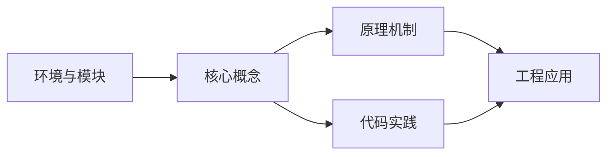

## 1. 学习目标（Bloom 分类）

本节按照布鲁姆教育目标分类学组织学习路径。本文主题为《环境与模块》，属于 Lua 模块，读者可以根据自身阶段选择阅读深度。

记忆层面：能够准确复述本文的核心概念、术语与基本语法或操作步骤，并能够在提问或检索时快速定位对应知识点。能够说出 Lua 的变量、函数、table、元表与协程基本语法。

理解层面：能够用自己的语言解释核心原理与工作机制，说明概念之间的因果关系，而不是机械记忆结论。能够解释 table 作为唯一数据结构的设计与元方法机制。

应用层面：能够在真实项目或练习场景中运用本文知识解决具体问题，写出正确且可维护的实现。能够编写嵌入主程序（游戏、Nginx、Redis）的脚本。

分析层面：能够拆解复杂问题，比较本文主题与相邻概念的异同，识别边界条件与例外情况。能够分析 Lua 与 C 交互（Lua C API）与性能特征。

评价层面：能够根据约束条件（性能、可读性、安全、成本）评价不同方案的优劣，做出有依据的技术决策。能够评价 Lua 与其他脚本语言在嵌入式场景的取舍。

创造层面：能够把本文知识与其他模块知识组合，设计出新的解决方案或可复用的工程模式。能够设计基于 Lua 的可扩展配置与脚本系统。

通过本节学习，读者应当能够把《环境与模块》纳入自己的知识网络，并与 Lua 模块的其他主题（table、元表、协程、嵌入式脚本）建立关联。

## 2. 历史动机与发展脉络

《环境与模块》是 Lua 领域的重要主题。要真正理解它，需要先了解它解决的问题与演进过程。

Lua 由巴西 PUC-Rio 大学的 Roberto Ierusalimschy 等人于 1993 年发布，设计目标是“可嵌入的脚本语言”：解释器小于 300KB，启动快，与 C 无缝集成。
Lua 5.1-5.4 持续演进：5.3 加入整数子类型，5.4 引入 const 变量与关闭值；LuaJIT 是高性能 JIT 实现，广泛用于游戏与性能敏感场景。
Lua 的著名用户：Adobe Lightroom、Redis 脚本、Nginx（OpenResty）、World of Warcraft 插件、Roblox（Luau）与游戏引擎（LÖVE、Defold）。

回到本文主题：环境与模块 的提出与成熟，正是上述技术背景下的必然产物。早期实现往往以简单可用为目标，随着工程规模扩大，社区逐渐沉淀出标准做法与最佳实践；理解这一脉络，可以帮助读者判断“为什么文档中的推荐写法是现在这个样子”，也能在遇到历史遗留代码时准确识别其设计年代与取舍。


## 3. 形式化定义与核心概念精讲

本节把《环境与模块》涉及的核心概念以“定义 + 讲解”的形式展开。读者应把定义当作工具，把讲解当作理解路径；两者结合才能形成可迁移的知识。

table：Lua 唯一的数据结构，同时充当数组、字典、对象与模块；数组索引从 1 开始。
元表（metatable）：通过 __index、__newindex、__add 等元方法改变 table 行为，实现继承与运算符重载。
协程：coroutine.create/resume/yield 实现协作式多任务，适合游戏状态机与生成器。

### 3.1 原文章节逐一精讲

原文档把主题拆分为 14 个小节，下面按顺序给出每一节的导读讲解，随后保留原文细节供精读。

#### 原文精读（完整保留）

# Lua 环境与模块

> **符号约定**：`< >` 必填参数 | `[ ]` 可选参数

---

#### 概述

Lua 的环境与模块系统是组织代码和管理命名空间的核心机制。Lua 的模块系统非常简洁，一个模块本质上就是一个返回表的 Lua 文件。通过 require 函数加载模块，Lua 会自动处理模块的搜索路径、缓存和重复加载等问题。这种设计使得 Lua 的模块系统既灵活又高效，无需复杂的包管理工具即可组织大型项目。

Lua 的环境（environment）概念在 5.1 和 5.2 之间发生了重要变化。Lua 5.1 使用 setfenv/getfenv 来操作函数的环境，而 Lua 5.2+ 引入了 \_ENV 变量来替代全局环境表。理解环境机制对于编写沙箱、避免全局变量污染、以及理解 Lua 的作用域规则都至关重要。

#### 基本概念

**模块（Module）**是一个自包含的代码单元，通常是一个 Lua 文件，通过返回一个表来暴露其公共接口。模块的消费者通过 require 函数获取这个表，然后调用其中的函数和访问其中的变量。这种模式与 JavaScript 的 CommonJS 模块非常相似。

**require 函数**是 Lua 内置的模块加载机制。它接受一个模块名作为参数，按照搜索路径查找对应的文件，加载并执行该文件，然后返回模块导出的值。require 会缓存已加载的模块，确保每个模块只被加载一次，后续的 require 调用直接返回缓存的结果。

**package 模块**是 Lua 提供的包管理工具库，包含多个重要的全局变量：package.path 控制 Lua 模块的搜索路径，package.cpath 控制 C 模块的搜索路径，package.loaded 存储已加载模块的缓存表，package.searchers 定义了模块搜索器的列表。

**\_ENV 变量**（Lua 5.2+）是每个代码块的局部变量，指向当前的环境表。所有对全局变量的访问实际上都是对 \_ENV 表的访问。修改 \_ENV 可以改变代码运行的环境，这是实现沙箱的基础机制。

**全局环境 \_G**是一个特殊的全局变量，指向全局环境表本身。在默认情况下，\_ENV 和 \_G 指向同一个表。但在沙箱环境中，\_ENV 可以指向一个不同的表，而 \_G 仍然指向原始的全局环境。

#### 快速开始

创建和使用一个简单的模块：

```lua
-- 文件: mymodule.lua
local M = {}  -- 创建模块表

-- 模块的版本号
M.version = "1.0.0"

-- 定义模块的公共函数
function M.greet(name)
    return "你好, " .. name .. "!"
end

function M.add(a, b)
    return a + b
end

-- 返回模块表
return M
```

在另一个文件中使用这个模块：

```lua
-- 文件: main.lua
local mymodule = require("mymodule")

print(mymodule.greet("Lua"))    -- 输出: 你好, Lua!
print(mymodule.add(3, 5))       -- 输出: 8
print(mymodule.version)         -- 输出: 1.0.0
```

#### 详细用法

##### 模块定义模式

Lua 有多种定义模块的模式，各有优缺点：

```lua
-- 模式一：表赋值法（推荐）
-- 优点：清晰明了，所有公共成员都显式地附加到模块表上
local M = {}

function M.greet(name)
    return "你好, " .. name
end

function M.farewell(name)
    return "再见, " .. name
end

return M
```

```lua
-- 模式二：局部函数 + 赋值法
-- 优点：可以先定义私有辅助函数，再暴露公共接口
local M = {}

-- 私有函数（不附加到 M 上，外部无法访问）
local function format_name(name)
    return name:sub(1, 1):upper() .. name:sub(2):lower()
end

-- 公共函数
function M.greet(name)
    local formatted = format_name(name)
    return "你好, " .. formatted
end

return M
```

```lua
-- 模式三：先定义后导出
-- 优点：函数之间可以自由互相调用，无需前缀
local greet, farewell

local function format_name(name)
    return name:sub(1, 1):upper() .. name:sub(2):lower()
end

function greet(name)
    return "你好, " .. format_name(name)
end

function farewell(name)
    return "再见, " .. format_name(name)
end

-- 导出公共接口
return {
    greet = greet,
    farewell = farewell,
}
```

##### require 的工作原理

require 的完整加载流程如下：

```lua
-- require 的等价伪代码
function require(name)
    -- 1. 检查模块是否已加载
    if package.loaded[name] then
        return package.loaded[name]
    end

    -- 2. 依次尝试每个搜索器
    for _, searcher in ipairs(package.searchers) do
        local loader = searcher(name)
        if type(loader) == "function" then
            -- 3. 执行加载函数
            local result = loader(name)

            -- 4. 缓存加载结果
            if result == nil then
                result = true  -- 模块没有返回值时默认缓存 true
            end
            package.loaded[name] = result
            return result
        end
    end

    -- 5. 所有搜索器都未找到模块
    error("module '" .. name .. "' not found")
end
```

查看和修改模块搜索路径：

```lua
-- 查看当前搜索路径
print(package.path)
-- 输出类似: ./?.lua;./?/init.lua;/usr/local/share/lua/5.4/?.lua;...

-- 添加自定义搜索路径
package.path = "./mylibs/?.lua;" .. package.path

-- 现在 require("utils") 会搜索 ./mylibs/utils.lua
```

##### 模块的目录结构

Lua 支持点分路径来组织模块的目录结构：

```lua
-- 目录结构：
-- myapp/
--   init.lua
--   utils/
--     init.lua
--     string.lua
--     table.lua
--   network/
--     init.lua
--     http.lua

-- 加载模块
local myapp = require("myapp")              -- 加载 myapp/init.lua
local utils = require("myapp.utils")        -- 加载 myapp/utils/init.lua
local str_utils = require("myapp.utils.string")  -- 加载 myapp/utils/string.lua
local http = require("myapp.network.http")  -- 加载 myapp/network/http.lua
```

使用 init.lua 作为目录模块的入口：

```lua
-- 文件: myapp/utils/init.lua
-- 将子模块整合到一起，提供统一的入口
local M = {}

M.string = require("myapp.utils.string")
M.table = require("myapp.utils.table")

-- 也可以直接暴露子模块的函数
M.trim = M.string.trim
M.split = M.string.split
M.merge = M.table.merge

return M
```

##### 模块缓存与热加载

require 会缓存已加载的模块，理解缓存机制对于开发调试很重要：

```lua
-- 第一次 require 加载并缓存模块
local mod1 = require("mymodule")

-- 第二次 require 返回缓存的模块（不会重新加载）
local mod2 = require("mymodule")

-- mod1 和 mod2 是同一个表
print(mod1 == mod2)  -- 输出: true
```

强制重新加载模块（热加载）：

```lua
-- 清除模块缓存，使下次 require 重新加载
local function reload_module(name)
    package.loaded[name] = nil
    return require(name)
end

-- 使用示例
local mymodule = reload_module("mymodule")
```

开发环境中的自动热加载：

```lua
-- 简单的模块热加载器
local HotLoader = {}
HotLoader.__index = HotLoader

function HotLoader.new()
    local self = setmetatable({}, HotLoader)
    self.modules = {}       -- 模块名 -> 加载时间
    self.watch_list = {}    -- 需要监控的模块列表
    return self
end

-- 注册需要监控的模块
function HotLoader:watch(name)
    self.watch_list[name] = true
    self.modules[name] = os.time()
end

-- 检查并重新加载已变更的模块
function HotLoader:check()
    local reloaded = {}
    for name, _ in pairs(self.watch_list) do
        -- 简化判断：这里可以根据文件修改时间判断
        -- 实际实现需要使用 lfs 等库获取文件信息
        local current_time = os.time()
        if current_time - self.modules[name] > 5 then
            package.loaded[name] = nil
            require(name)
            self.modules[name] = current_time
            reloaded[#reloaded + 1] = name
        end
    end
    return reloaded
end

-- 使用示例
local loader = HotLoader.new()
loader:watch("mymodule")
loader:watch("config")
```

##### 环境与 \_ENV

Lua 5.2+ 使用 \_ENV 变量来控制代码的运行环境：

```lua
-- 默认情况下，_ENV 和 _G 指向同一个表
print(_ENV == _G)  -- 输出: true

-- 所有全局变量访问都是对 _ENV 的访问
x = 42
print(_ENV.x)  -- 输出: 42

-- 修改 _ENV 可以改变代码的运行环境
local safe_env = {
    print = print,       -- 允许 print
    tonumber = tonumber, -- 允许 tonumber
    tostring = tostring, -- 允许 tostring
    math = math,         -- 允许 math 库
}

-- 在受限环境中执行代码
local code = [[
    print("在沙箱中执行")
    print("1 + 1 = " .. tostring(1 + 1))
]]

-- 加载代码并设置环境
local func, err = load(code, nil, "t", safe_env)
if func then
    func()
else
    print("代码加载失败:", err)
end
```

创建沙箱环境：

```lua
-- 创建受限的沙箱环境
local function create_sandbox()
    local sandbox = {}

    -- 允许的基础函数
    local allowed_globals = {
        "print", "tonumber", "tostring", "type", "pairs", "ipairs",
        "next", "select", "unpack", "error", "pcall", "xpcall",
    }

    -- 从全局环境中复制允许的函数
    for _, name in ipairs(allowed_globals) do
        sandbox[name] = _G[name]
    end

    -- 允许的库
    sandbox.math = math
    sandbox.string = string
    sandbox.table = table

    -- 禁止文件 I/O 和系统调用
    -- sandbox.io = nil      -- 不提供 io 库
    -- sandbox.os = nil      -- 不提供 os 库
    -- sandbox.require = nil -- 不提供 require

    return sandbox
end

-- 在沙箱中执行不受信任的代码
local function run_sandboxed(code_str)
    local sandbox = create_sandbox()
    local func, err = load(code_str, nil, "t", sandbox)

    if not func then
        return nil, "代码加载失败: " .. err
    end

    return pcall(func)
end

-- 使用示例
local ok, result = run_sandboxed([[
    local sum = 0
    for i = 1, 10 do
        sum = sum + i
    end
    return sum
]])

if ok then
    print("沙箱执行结果:", result)  -- 输出: 55
end

-- 尝试执行危险代码
local ok, err = run_sandboxed([[
    local f = io.open("/etc/passwd", "r")  -- io 不可用
    return f:read("*a")
]])

if not ok then
    print("沙箱拦截:", err)
end
```

##### 继承环境

在受限环境中提供部分全局访问：

```lua
-- 创建一个继承自全局环境的受限环境
local function create_inherited_env(overrides)
    -- 创建新表，设置全局环境为元表
    local env = {}
    setmetatable(env, { __index = _G })

    -- 应用覆盖值
    if overrides then
        for k, v in pairs(overrides) do
            env[k] = v
        end
    end

    return env
end

-- 使用示例：提供自定义的 print 函数
local custom_env = create_inherited_env({
    print = function(...)
        local args = {...}
        local parts = {}
        for i, arg in ipairs(args) do
            parts[i] = tostring(arg)
        end
        _G.print("[自定义输出] " .. table.concat(parts, "\t"))
    end,
})

local code = [[
    print("这条消息使用自定义 print 输出")
    print("数学计算:", math.sqrt(2))
]]

local func = load(code, nil, "t", custom_env)
func()
-- 输出: [自定义输出] 这条消息使用自定义 print 输出
--       [自定义输出] 数学计算:  1.4142135623731
```

#### 常见场景

##### 插件系统

使用模块机制实现可扩展的插件系统：

```lua
-- 插件管理器
local PluginManager = {}
PluginManager.__index = PluginManager

function PluginManager.new()
    local self = setmetatable({}, PluginManager)
    self.plugins = {}       -- 已注册的插件
    self.hooks = {}         -- 钩子函数
    return self
end

-- 注册插件
function PluginManager:register(name, plugin_module)
    if self.plugins[name] then
        error("插件已注册: " .. name)
    end

    -- 验证插件接口
    assert(type(plugin_module.init) == "function", "插件必须实现 init 方法")

    self.plugins[name] = plugin_module
    plugin_module.init(self)

    print("插件已注册: " .. name)
end

-- 注册钩子
function PluginManager:add_hook(hook_name, plugin_name, callback)
    if not self.hooks[hook_name] then
        self.hooks[hook_name] = {}
    end
    self.hooks[hook_name][#self.hooks[hook_name] + 1] = {
        plugin = plugin_name,
        callback = callback,
    }
end

-- 触发钩子
function PluginManager:fire_hook(hook_name, ...)
    if not self.hooks[hook_name] then
        return {}
    end

    local results = {}
    for _, hook in ipairs(self.hooks[hook_name]) do
        local ok, result = pcall(hook.callback, ...)
        if ok then
            results[#results + 1] = result
        else
            print("钩子执行失败: " .. hook.plugin .. " -> " .. hook_name)
        end
    end
    return results
end

-- 使用示例
local manager = PluginManager.new()

-- 定义一个日志插件
local log_plugin = {
    name = "logger",
    init = function(pm)
        pm:add_hook("on_request", "logger", function(req)
            print("[LOG] 请求: " .. (req.path or "unknown"))
        end)
    end,
}

-- 定义一个认证插件
local auth_plugin = {
    name = "auth",
    init = function(pm)
        pm:add_hook("on_request", "auth", function(req)
            if not req.token then
                return {blocked = true, reason = "未认证"}
            end
        end)
    end,
}

manager:register("logger", log_plugin)
manager:register("auth", auth_plugin)

-- 触发钩子
manager:fire_hook("on_request", {path = "/api/data", token = "abc123"})
```

##### 配置模块

实现支持环境变量的配置模块：

```lua
-- config.lua
local M = {}

-- 默认配置
local defaults = {
    host = "127.0.0.1",
    port = 8080,
    debug = false,
    log_level = "info",
    database = {
        host = "localhost",
        port = 3306,
        name = "myapp",
        pool_size = 10,
    },
}

-- 当前配置
M.current = {}

-- 深拷贝表
local function deep_copy(t)
    local copy = {}
    for k, v in pairs(t) do
        if type(v) == "table" then
            copy[k] = deep_copy(v)
        else
            copy[k] = v
        end
    end
    return copy
end

-- 深度合并配置
local function deep_merge(base, override)
    local result = deep_copy(base)
    for k, v in pairs(override) do
        if type(v) == "table" and type(result[k]) == "table" then
            result[k] = deep_merge(result[k], v)
        else
            result[k] = v
        end
    end
    return result
end

-- 加载配置
function M.load(env_name)
    env_name = env_name or "development"

    -- 从默认配置开始
    M.current = deep_copy(defaults)

    -- 尝试加载环境特定配置
    local ok, env_config = pcall(require, "config." .. env_name)
    if ok and type(env_config) == "table" then
        M.current = deep_merge(M.current, env_config)
    end

    return M.current
end

-- 获取配置值（支持点分路径）
function M.get(key)
    local value = M.current
    for part in key:gmatch("[^.]+") do
        if type(value) ~= "table" then
            return nil
        end
        value = value[part]
    end
    return value
end

-- 设置配置值
function M.set(key, value)
    local t = M.current
    for part in key:gmatch("([^.]+)%.?") do
        if not t[part] then
            t[part] = {}
        end
        t = t[part]
    end
    t = value
end

-- 初始化
M.load(os.getenv("APP_ENV") or "development")

return M
```

##### 单例模块

实现单例模式的模块：

```lua
-- singleton.lua
local Singleton = {}
Singleton.__index = Singleton

-- 唯一实例
local instance = nil

-- 获取实例
function Singleton.get_instance()
    if not instance then
        instance = setmetatable({
            data = {},
            created_at = os.time(),
        }, Singleton)
    end
    return instance
end

-- 设置数据
function Singleton:set(key, value)
    self.data[key] = value
end

-- 获取数据
function Singleton:get(key)
    return self.data[key]
end

-- 防止通过 require 创建新实例
return Singleton
```

使用单例模块：

```lua
local Singleton = require("singleton")

-- 获取实例
local s1 = Singleton.get_instance()
s1:set("name", "Lua")

-- 在另一个地方获取同一个实例
local s2 = Singleton.get_instance()
print(s2:get("name"))  -- 输出: Lua

-- s1 和 s2 是同一个对象
print(s1 == s2)  -- 输出: true
```

#### 注意事项与常见错误

**require 的模块名与文件路径的对应关系**。require 使用点号分隔模块名（如 "myapp.utils"），对应文件系统中的路径分隔符（如 "myapp/utils.lua"）。在 Windows 和 Linux 上路径分隔符不同，但 Lua 的 require 会自动处理这种差异。

**循环依赖问题**。如果模块 A 依赖模块 B，模块 B 又依赖模块 A，就会产生循环依赖。Lua 的 require 机制在检测到循环依赖时会返回一个尚未完全加载的模块表（部分初始化），可能导致 nil 值错误。解决方案是将公共接口的定义提前，或者将相互依赖的部分提取到第三个模块中。

**模块返回值的缓存**。require 会缓存模块的返回值，而不是模块文件本身。如果模块没有返回值（即返回 nil），require 会将 true 存入 package.loaded。这意味着即使模块文件被修改，require 也不会重新加载，除非手动清除 package.loaded 中的缓存。

**\_ENV 是局部变量**。在 Lua 5.2+ 中，\_ENV 是每个代码块的局部变量，不是全局变量。这意味着不同代码块可以有不同的 \_ENV，修改一个代码块的 \_ENV 不会影响其他代码块。使用 load 函数时可以通过第四个参数指定 \_ENV。

**全局变量污染**。在模块中意外创建全局变量是常见的错误。所有变量都应使用 local 声明。可以使用 luacheck 等工具检测全局变量泄漏，或者在模块中使用严格模式（访问未声明的全局变量时报错）。

#### 高级用法

##### 自定义 require 行为

通过修改 package.searchers 自定义模块加载行为：

```lua
-- 添加自定义搜索器：从 ZIP 文件中加载模块
local function zip_searcher(name)
    -- 将点号替换为路径分隔符
    local path = name:gsub("%.", "/") .. ".lua"

    -- 模拟从 ZIP 中读取文件
    -- 实际实现需要使用 LuaZip 等库
    local zip_path = "myapp.zip"

    -- 如果找到模块，返回加载函数
    -- 此处简化为检查文件是否存在
    local f = io.open(path, "r")
    if f then
        local code = f:read("*a")
        f:close()

        -- 返回加载函数
        return function(module_name)
            return load(code, "=" .. module_name)()
        end
    end

    return nil  -- 未找到模块
end

-- 将自定义搜索器添加到搜索器列表
table.insert(package.searchers, 2, zip_searcher)
```

##### 模块预加载

使用 package.preload 预加载模块，无需文件系统：

```lua
-- 预加载模块（常用于嵌入式场景）
package.preload["json"] = function()
    local M = {}

    function M.encode(data)
        -- 简化的 JSON 编码实现
        if type(data) == "string" then
            return '"' .. data:gsub('"', '\\"') .. '"'
        elseif type(data) == "number" then
            return tostring(data)
        elseif type(data) == "boolean" then
            return tostring(data)
        elseif type(data) == "table" then
            local parts = {}
            for k, v in pairs(data) do
                parts[#parts + 1] = '"' .. k .. '":' .. M.encode(v)
            end
            return "{" .. table.concat(parts, ",") .. "}"
        end
        return "null"
    end

    function M.decode(str)
        -- 简化的 JSON 解码（实际应使用完整解析器）
        return load("return " .. str)()
    end

    return M
end

-- 现在 require("json") 会使用预加载的模块
local json = require("json")
print(json.encode({name = "Lua", version = 5.4}))
```

##### 严格模式

实现严格模式，防止意外创建全局变量：

```lua
-- strict.lua
local function strict(module_name)
    local mt = {
        __index = function(t, k)
            -- 读取未定义的全局变量时报错
            error(string.format("模块 %s 中访问未定义的变量: %s", module_name, k), 2)
        end,
        __newindex = function(t, k, v)
            -- 写入新的全局变量时报错
            error(string.format("模块 %s 中创建全局变量: %s", module_name, k), 2)
        end,
    }

    -- 创建受限环境，继承全局环境但禁止新增全局变量
    local env = {}
    setmetatable(env, {
        __index = _G,  -- 可以读取全局变量
        __newindex = function(t, k, v)
            if _G[k] ~= nil then
                -- 允许修改已有的全局变量
                _G[k] = v
            else
                error(string.format("禁止创建全局变量: %s", k), 2)
            end
        end,
    })

    return env
end

-- 使用严格模式加载模块
local function strict_require(name)
    local env = strict(name)

    -- 查找模块文件
    local path = package.searchpath(name, package.path)
    if not path then
        error("模块未找到: " .. name)
    end

    -- 读取模块代码
    local f = io.open(path, "r")
    local code = f:read("*a")
    f:close()

    -- 在严格环境中加载模块
    local func = load(code, "=" .. name, "t", env)
    return func()
end

-- 使用示例
local mymodule = strict_require("mymodule")
```

##### 动态模块生成

根据参数动态生成模块：

```lua
-- 生成器模块：根据参数创建不同类型的集合
local function create_collection(type_name)
    local M = {}
    M.items = {}
    M.type = type_name

    function M:add(item)
        self.items[#self.items + 1] = item
    end

    function M:remove(item)
        for i, v in ipairs(self.items) do
            if v == item then
                table.remove(self.items, i)
                return true
            end
        end
        return false
    end

    function M:count()
        return #self.items
    end

    -- 根据类型添加特定方法
    if type_name == "sorted" then
        function M:sort(compare)
            table.sort(self.items, compare)
        end
    elseif type_name == "unique" then
        local seen = {}
        function M:add(item)
            if not seen[item] then
                seen[item] = true
                self.items[#self.items + 1] = item
            end
        end
    elseif type_name == "stack" then
        function M:push(item)
            self.items[#self.items + 1] = item
        end
        function M:pop()
            return table.remove(self.items)
        end
        function M:peek()
            return self.items[#self.items]
        end
    end

    return M
end

-- 使用示例
local stack = create_collection("stack")
stack:push("a")
stack:push("b")
stack:push("c")
print(stack:pop())  -- 输出: c
print(stack:peek()) -- 输出: b

local unique = create_collection("unique")
unique:add("a")
unique:add("b")
unique:add("a")  -- 重复，不会被添加
print(unique:count())  -- 输出: 2
```
#### _ENV 环境（Lua 5.2+）

**基本写法：访问 _ENV**
`_ENV`
```lua
-- _ENV 是当前代码块的环境表
-- 所有全局变量访问实际是 _ENV 的字段
print(_ENV.print)  -- 与 print 相同
-- _ENV 本身不是全局变量，是语法上的 upvalue
```

---

**基本写法：修改环境**
`_ENV = <表>`
```lua
-- 切换当前代码块的环境
local env = { print = print, x = 10 }
_ENV = env
print(x)        -- 10（从 env 取）
-- print(_G)    -- 错误：_G 不在 env 中
```

---

**基本写法：load 指定环境**
`load(<代码>, [, <名字> [, <模式> [, <环境>]]])`
```lua
-- load 第五参数指定环境（Lua 5.2）
local code = "return x + 1"
local f = load(code, "chunk", "t", { x = 10, math = math })
print(f())  -- 11
-- Lua 5.1 用 setfenv 设置
```

---

#### 沙箱环境

**基本写法：创建沙箱**
`local <env> = {}; <env>.<安全函数> = <原始>`
```lua
-- 构造受限环境执行不可信代码
local function sandbox(code)
    local env = {}
    -- 白名单暴露安全函数
    env.print = print
    env.math = math
    env.string = string
    env.table = table
    -- 执行
    local fn = load(code, "sandbox", "t", env)
    if fn then fn() end
end
sandbox("print(math.pi)")  -- 3.14159...
-- sandbox("os.execute('rm -rf /')")  -- 错误：os 不存在
```

---

**基本写法：_ENV 沙箱模式**
`local _ENV = <受限表>`
```lua
-- 直接在代码块内限制环境
local function run(code)
    local _ENV = { print = print }
    local f = load(code)
    setfenv(f, _ENV)  -- Lua 5.1
    f()
end
```

---

#### 模块定义

**基本写法：module 函数（旧式）**
`module("<名>")`
```lua
-- Lua 5.1 旧式模块定义（已不推荐）
module("mymod")
function hello() print("hi") end
-- 调用：mymod.hello()
```

---

**基本写法：现代模块模式**
`local <模块> = {}; ... return <模块>`
```lua
-- 推荐的现代模块定义
local M = {}  -- 模块表

function M.greet(name)
    return "hello, " .. name
end

M.version = "1.0"

return M
-- 保存为 mymod.lua
-- 使用：local mymod = require("mymod")
```

---

**基本写法：模块元方法**
`setmetatable(<模块>, <元表>)`
```lua
-- 模块可调用（__call）
local M = setmetatable({}, {
    __call = function(self, x)
        return x * 2
    end
})
M(5)  -- 10，模块本身可调用
return M
```

---

#### require 加载

**基本写法：require 基础**
`require("<模块名>")`
```lua
-- 加载模块（只执行一次）
local mod = require("mymod")
-- 多次 require 只加载一次
local mod2 = require("mymod")  -- 返回缓存
-- 返回值缓存于 package.loaded
```

---

**基本写法：package.loaded 缓存**
`package.loaded["<模块>"]`
```lua
-- 查看或清除模块缓存
print(package.loaded.mymod)  -- 模块表或 nil
package.loaded.mymod = nil   -- 清除缓存，下次重新加载
-- 强制重载
package.loaded.mymod = nil
require("mymod")
```

---

**基本写法：package.path 搜索路径**
`package.path`
```lua
-- 模块搜索路径
print(package.path)
-- 格式：./?.lua;./?/init.lua;/usr/share/lua/5.4/?.lua;...
-- 添加自定义路径
package.path = "./lib/?.lua;" .. package.path
local mymod = require("lib.utils")  -- 查找 ./lib/lib/utils.lua
```

---

**基本写法：package.cpath C 模块路径**
`package.cpath`
```lua
-- C 扩展模块搜索路径
print(package.cpath)
-- 添加路径
package.cpath = "./lib/?.so;" .. package.cpath
local cmod = require("cutils")  -- 查找 cutils.so
```

---

#### package 搜索器

**基本写法：package.searchers**
`package.searchers`
```lua
-- 模块加载器列表（Lua 5.2+）
-- 依次尝试每个搜索器
for i, searcher in ipairs(package.searchers) do
    print(i, searcher)
end
-- 1. package.preload 预加载
-- 2. package.path Lua 文件
-- 3. package.cpath C 库
-- 4. 内置加载器
```

---

**基本写法：package.preload 预加载**
`package.preload["<名>"] = <函数>`
```lua
-- 预注册模块加载函数
package.preload.mymod = function()
    local M = {}
    function M.hello() return "hi" end
    return M
end
local m = require("mymod")  -- 调用 preload 函数
```

---

#### 模块重载

**基本写法：热重载**
`package.loaded[<名>] = nil; require(<名>)`
```lua
-- 开发时热重载模块
function reloadModule(name)
    package.loaded[name] = nil
    return require(name)
end
-- 注意：已引用旧模块的代码不会更新
```

---

#### 子模块

**基本写法：点号子模块**
`require("<父>.<子>")`
```lua
-- 点号表示目录层级
local utils = require("myapp.utils")
-- 搜索 myapp/utils.lua 或 myapp/utils/init.lua
-- 返回的模块表可以挂到父模块
local myapp = require("myapp")
myapp.utils = utils
```


### 3.2 概念关系图

下面用 Mermaid 图表达本文核心概念之间的关系，帮助读者建立整体图景：



图中展示的是本文知识的结构化关系：核心概念是入口，原理机制解释“为什么”，代码实践演示“怎么做”，工程应用回答“何时用”。读者学习时可以把每个小节的内容挂接到对应节点上。

## 4. 理论推导与原理解析

本节深入《环境与模块》背后的原理。理论部分不求面面俱到，而是聚焦“能解释现象、能指导实践”的关键推导。

table：Lua 唯一的数据结构，同时充当数组、字典、对象与模块；数组索引从 1 开始。
元表（metatable）：通过 __index、__newindex、__add 等元方法改变 table 行为，实现继承与运算符重载。
协程：coroutine.create/resume/yield 实现协作式多任务，适合游戏状态机与生成器。
C API：lua_State 上下文、栈式参数传递，宿主程序可以安全地执行用户脚本。

需要强调的是，理论推导与工程实践之间存在翻译层：理论给出的是理想化模型与边界条件，工程代码则必须处理真实环境中的例外。读者在学习时应先掌握理论的“标准情形”，再通过陷阱章节了解“非标准情形”。

## 5. 代码示例与逐行讲解

本节把原文中的代码示例系统整理，并为每个示例补充用途说明与讲解。读者不应只浏览代码，而应逐段对照讲解理解设计意图。

### 5.1 示例：快速开始

该示例来自原文《快速开始》小节，用于演示环境与模块相关操作。阅读时请先看代码结构，再看其后的讲解。

```lua
-- 文件: mymodule.lua
local M = {}  -- 创建模块表

-- 模块的版本号
M.version = "1.0.0"

-- 定义模块的公共函数
function M.greet(name)
    return "你好, " .. name .. "!"
end

function M.add(a, b)
    return a + b
end

-- 返回模块表
return M
```

讲解：这段代码演示了本节核心知识点。代码中的关键操作可以归纳为三步：准备（定义或初始化）、执行（核心逻辑）、收尾（释放资源或返回结果）。实际项目中，这三步往往被封装为函数或类，以提升复用性与可测试性。

关键点分析：

该示例共 13 行有效代码，包含 2 类关键结构（function、return）。其中：

- 入口与初始化部分负责建立上下文，对应实际项目中的启动或装配逻辑；
- 核心逻辑部分体现本文主题的主要操作，是阅读时最需要对照讲解理解的部分；
- 输出或返回部分把结果交给调用方，注意其类型与边界条件。

进阶思考路径：先尝试修改参数观察行为变化，再把示例中的模式迁移到自己的项目中；每次修改都记录预期与实测差异，这是把示例转化为能力的最快方式。

### 5.2 示例：快速开始

该示例来自原文《快速开始》小节，用于演示环境与模块相关操作。阅读时请先看代码结构，再看其后的讲解。

```lua
-- 文件: main.lua
local mymodule = require("mymodule")

print(mymodule.greet("Lua"))    -- 输出: 你好, Lua!
print(mymodule.add(3, 5))       -- 输出: 8
print(mymodule.version)         -- 输出: 1.0.0
```

讲解：这段代码演示了本节核心知识点。代码中的关键操作可以归纳为三步：准备（定义或初始化）、执行（核心逻辑）、收尾（释放资源或返回结果）。实际项目中，这三步往往被封装为函数或类，以提升复用性与可测试性。

关键点分析：

该示例共 5 行有效代码，结构以数据或配置为主。阅读时应关注：数据字段的含义、配置项的作用，以及它们与运行行为的对应关系。

进阶思考路径：先尝试修改参数观察行为变化，再把示例中的模式迁移到自己的项目中；每次修改都记录预期与实测差异，这是把示例转化为能力的最快方式。

### 5.3 示例：模块定义模式

该示例来自原文《模块定义模式》小节，用于演示环境与模块相关操作。阅读时请先看代码结构，再看其后的讲解。

```lua
-- 模式一：表赋值法（推荐）
-- 优点：清晰明了，所有公共成员都显式地附加到模块表上
local M = {}

function M.greet(name)
    return "你好, " .. name
end

function M.farewell(name)
    return "再见, " .. name
end

return M
```

讲解：这段代码演示了本节核心知识点。代码中的关键操作可以归纳为三步：准备（定义或初始化）、执行（核心逻辑）、收尾（释放资源或返回结果）。实际项目中，这三步往往被封装为函数或类，以提升复用性与可测试性。

关键点分析：

该示例共 10 行有效代码，包含 2 类关键结构（function、return）。其中：

- 入口与初始化部分负责建立上下文，对应实际项目中的启动或装配逻辑；
- 核心逻辑部分体现本文主题的主要操作，是阅读时最需要对照讲解理解的部分；
- 输出或返回部分把结果交给调用方，注意其类型与边界条件。

进阶思考路径：先尝试修改参数观察行为变化，再把示例中的模式迁移到自己的项目中；每次修改都记录预期与实测差异，这是把示例转化为能力的最快方式。

### 5.4 示例：模块定义模式

该示例来自原文《模块定义模式》小节，用于演示环境与模块相关操作。阅读时请先看代码结构，再看其后的讲解。

```lua
-- 模式二：局部函数 + 赋值法
-- 优点：可以先定义私有辅助函数，再暴露公共接口
local M = {}

-- 私有函数（不附加到 M 上，外部无法访问）
local function format_name(name)
    return name:sub(1, 1):upper() .. name:sub(2):lower()
end

-- 公共函数
function M.greet(name)
    local formatted = format_name(name)
    return "你好, " .. formatted
end

return M
```

讲解：这段代码演示了本节核心知识点。代码中的关键操作可以归纳为三步：准备（定义或初始化）、执行（核心逻辑）、收尾（释放资源或返回结果）。实际项目中，这三步往往被封装为函数或类，以提升复用性与可测试性。

关键点分析：

该示例共 13 行有效代码，包含 2 类关键结构（function、return）。其中：

- 入口与初始化部分负责建立上下文，对应实际项目中的启动或装配逻辑；
- 核心逻辑部分体现本文主题的主要操作，是阅读时最需要对照讲解理解的部分；
- 输出或返回部分把结果交给调用方，注意其类型与边界条件。

进阶思考路径：先尝试修改参数观察行为变化，再把示例中的模式迁移到自己的项目中；每次修改都记录预期与实测差异，这是把示例转化为能力的最快方式。

### 5.5 示例：模块定义模式

该示例来自原文《模块定义模式》小节，用于演示环境与模块相关操作。阅读时请先看代码结构，再看其后的讲解。

```lua
-- 模式三：先定义后导出
-- 优点：函数之间可以自由互相调用，无需前缀
local greet, farewell

local function format_name(name)
    return name:sub(1, 1):upper() .. name:sub(2):lower()
end

function greet(name)
    return "你好, " .. format_name(name)
end

function farewell(name)
    return "再见, " .. format_name(name)
end

-- 导出公共接口
return {
    greet = greet,
    farewell = farewell,
}
```

讲解：这段代码演示了本节核心知识点。代码中的关键操作可以归纳为三步：准备（定义或初始化）、执行（核心逻辑）、收尾（释放资源或返回结果）。实际项目中，这三步往往被封装为函数或类，以提升复用性与可测试性。

关键点分析：

该示例共 17 行有效代码，包含 2 类关键结构（function、return）。其中：

- 入口与初始化部分负责建立上下文，对应实际项目中的启动或装配逻辑；
- 核心逻辑部分体现本文主题的主要操作，是阅读时最需要对照讲解理解的部分；
- 输出或返回部分把结果交给调用方，注意其类型与边界条件。

进阶思考路径：先尝试修改参数观察行为变化，再把示例中的模式迁移到自己的项目中；每次修改都记录预期与实测差异，这是把示例转化为能力的最快方式。

### 5.6 示例：require 的工作原理

该示例来自原文《require 的工作原理》小节，用于演示环境与模块相关操作。阅读时请先看代码结构，再看其后的讲解。

```lua
-- require 的等价伪代码
function require(name)
    -- 1. 检查模块是否已加载
    if package.loaded[name] then
        return package.loaded[name]
    end

    -- 2. 依次尝试每个搜索器
    for _, searcher in ipairs(package.searchers) do
        local loader = searcher(name)
        if type(loader) == "function" then
            -- 3. 执行加载函数
            local result = loader(name)

            -- 4. 缓存加载结果
            if result == nil then
                result = true  -- 模块没有返回值时默认缓存 true
            end
            package.loaded[name] = result
            return result
        end
    end

    -- 5. 所有搜索器都未找到模块
    error("module '" .. name .. "' not found")
end
```

讲解：这段代码演示了本节核心知识点。代码中的关键操作可以归纳为三步：准备（定义或初始化）、执行（核心逻辑）、收尾（释放资源或返回结果）。实际项目中，这三步往往被封装为函数或类，以提升复用性与可测试性。

关键点分析：

该示例共 23 行有效代码，包含 4 类关键结构（function、if、for、return）。其中：

- 入口与初始化部分负责建立上下文，对应实际项目中的启动或装配逻辑；
- 核心逻辑部分体现本文主题的主要操作，是阅读时最需要对照讲解理解的部分；
- 输出或返回部分把结果交给调用方，注意其类型与边界条件。

进阶思考路径：先尝试修改参数观察行为变化，再把示例中的模式迁移到自己的项目中；每次修改都记录预期与实测差异，这是把示例转化为能力的最快方式。

### 5.7 示例：require 的工作原理

该示例来自原文《require 的工作原理》小节，用于演示环境与模块相关操作。阅读时请先看代码结构，再看其后的讲解。

```lua
-- 查看当前搜索路径
print(package.path)
-- 输出类似: ./?.lua;./?/init.lua;/usr/local/share/lua/5.4/?.lua;...

-- 添加自定义搜索路径
package.path = "./mylibs/?.lua;" .. package.path

-- 现在 require("utils") 会搜索 ./mylibs/utils.lua
```

讲解：这段代码演示了本节核心知识点。代码中的关键操作可以归纳为三步：准备（定义或初始化）、执行（核心逻辑）、收尾（释放资源或返回结果）。实际项目中，这三步往往被封装为函数或类，以提升复用性与可测试性。

关键点分析：

该示例共 6 行有效代码，结构以数据或配置为主。阅读时应关注：数据字段的含义、配置项的作用，以及它们与运行行为的对应关系。

进阶思考路径：先尝试修改参数观察行为变化，再把示例中的模式迁移到自己的项目中；每次修改都记录预期与实测差异，这是把示例转化为能力的最快方式。

### 5.8 示例：模块的目录结构

该示例来自原文《模块的目录结构》小节，用于演示环境与模块相关操作。阅读时请先看代码结构，再看其后的讲解。

```lua
-- 目录结构：
-- myapp/
--   init.lua
--   utils/
--     init.lua
--     string.lua
--     table.lua
--   network/
--     init.lua
--     http.lua

-- 加载模块
local myapp = require("myapp")              -- 加载 myapp/init.lua
local utils = require("myapp.utils")        -- 加载 myapp/utils/init.lua
local str_utils = require("myapp.utils.string")  -- 加载 myapp/utils/string.lua
local http = require("myapp.network.http")  -- 加载 myapp/network/http.lua
```

讲解：这段代码演示了本节核心知识点。代码中的关键操作可以归纳为三步：准备（定义或初始化）、执行（核心逻辑）、收尾（释放资源或返回结果）。实际项目中，这三步往往被封装为函数或类，以提升复用性与可测试性。

关键点分析：

该示例共 15 行有效代码，结构以数据或配置为主。阅读时应关注：数据字段的含义、配置项的作用，以及它们与运行行为的对应关系。

进阶思考路径：先尝试修改参数观察行为变化，再把示例中的模式迁移到自己的项目中；每次修改都记录预期与实测差异，这是把示例转化为能力的最快方式。

### 5.9 示例：模块的目录结构

该示例来自原文《模块的目录结构》小节，用于演示环境与模块相关操作。阅读时请先看代码结构，再看其后的讲解。

```lua
-- 文件: myapp/utils/init.lua
-- 将子模块整合到一起，提供统一的入口
local M = {}

M.string = require("myapp.utils.string")
M.table = require("myapp.utils.table")

-- 也可以直接暴露子模块的函数
M.trim = M.string.trim
M.split = M.string.split
M.merge = M.table.merge

return M
```

讲解：这段代码演示了本节核心知识点。代码中的关键操作可以归纳为三步：准备（定义或初始化）、执行（核心逻辑）、收尾（释放资源或返回结果）。实际项目中，这三步往往被封装为函数或类，以提升复用性与可测试性。

关键点分析：

该示例共 10 行有效代码，包含 1 类关键结构（return）。其中：

- 入口与初始化部分负责建立上下文，对应实际项目中的启动或装配逻辑；
- 核心逻辑部分体现本文主题的主要操作，是阅读时最需要对照讲解理解的部分；
- 输出或返回部分把结果交给调用方，注意其类型与边界条件。

进阶思考路径：先尝试修改参数观察行为变化，再把示例中的模式迁移到自己的项目中；每次修改都记录预期与实测差异，这是把示例转化为能力的最快方式。

### 5.10 示例：模块缓存与热加载

该示例来自原文《模块缓存与热加载》小节，用于演示环境与模块相关操作。阅读时请先看代码结构，再看其后的讲解。

```lua
-- 第一次 require 加载并缓存模块
local mod1 = require("mymodule")

-- 第二次 require 返回缓存的模块（不会重新加载）
local mod2 = require("mymodule")

-- mod1 和 mod2 是同一个表
print(mod1 == mod2)  -- 输出: true
```

讲解：这段代码演示了本节核心知识点。代码中的关键操作可以归纳为三步：准备（定义或初始化）、执行（核心逻辑）、收尾（释放资源或返回结果）。实际项目中，这三步往往被封装为函数或类，以提升复用性与可测试性。

关键点分析：

该示例共 6 行有效代码，结构以数据或配置为主。阅读时应关注：数据字段的含义、配置项的作用，以及它们与运行行为的对应关系。

进阶思考路径：先尝试修改参数观察行为变化，再把示例中的模式迁移到自己的项目中；每次修改都记录预期与实测差异，这是把示例转化为能力的最快方式。

### 5.11 示例：模块缓存与热加载

该示例来自原文《模块缓存与热加载》小节，用于演示环境与模块相关操作。阅读时请先看代码结构，再看其后的讲解。

```lua
-- 清除模块缓存，使下次 require 重新加载
local function reload_module(name)
    package.loaded[name] = nil
    return require(name)
end

-- 使用示例
local mymodule = reload_module("mymodule")
```

讲解：这段代码演示了本节核心知识点。代码中的关键操作可以归纳为三步：准备（定义或初始化）、执行（核心逻辑）、收尾（释放资源或返回结果）。实际项目中，这三步往往被封装为函数或类，以提升复用性与可测试性。

关键点分析：

该示例共 7 行有效代码，包含 2 类关键结构（function、return）。其中：

- 入口与初始化部分负责建立上下文，对应实际项目中的启动或装配逻辑；
- 核心逻辑部分体现本文主题的主要操作，是阅读时最需要对照讲解理解的部分；
- 输出或返回部分把结果交给调用方，注意其类型与边界条件。

进阶思考路径：先尝试修改参数观察行为变化，再把示例中的模式迁移到自己的项目中；每次修改都记录预期与实测差异，这是把示例转化为能力的最快方式。

### 5.12 示例：模块缓存与热加载

该示例来自原文《模块缓存与热加载》小节，用于演示环境与模块相关操作。阅读时请先看代码结构，再看其后的讲解。

```lua
-- 简单的模块热加载器
local HotLoader = {}
HotLoader.__index = HotLoader

function HotLoader.new()
    local self = setmetatable({}, HotLoader)
    self.modules = {}       -- 模块名 -> 加载时间
    self.watch_list = {}    -- 需要监控的模块列表
    return self
end

-- 注册需要监控的模块
function HotLoader:watch(name)
    self.watch_list[name] = true
    self.modules[name] = os.time()
end

-- 检查并重新加载已变更的模块
function HotLoader:check()
    local reloaded = {}
    for name, _ in pairs(self.watch_list) do
        -- 简化判断：这里可以根据文件修改时间判断
        -- 实际实现需要使用 lfs 等库获取文件信息
        local current_time = os.time()
        if current_time - self.modules[name] > 5 then
            package.loaded[name] = nil
            require(name)
            self.modules[name] = current_time
            reloaded[#reloaded + 1] = name
        end
    end
    return reloaded
end

-- 使用示例
local loader = HotLoader.new()
loader:watch("mymodule")
loader:watch("config")
```

讲解：这段代码演示了本节核心知识点。代码中的关键操作可以归纳为三步：准备（定义或初始化）、执行（核心逻辑）、收尾（释放资源或返回结果）。实际项目中，这三步往往被封装为函数或类，以提升复用性与可测试性。

关键点分析：

该示例共 34 行有效代码，包含 4 类关键结构（function、if、for、return）。其中：

- 入口与初始化部分负责建立上下文，对应实际项目中的启动或装配逻辑；
- 核心逻辑部分体现本文主题的主要操作，是阅读时最需要对照讲解理解的部分；
- 输出或返回部分把结果交给调用方，注意其类型与边界条件。

进阶思考路径：先尝试修改参数观察行为变化，再把示例中的模式迁移到自己的项目中；每次修改都记录预期与实测差异，这是把示例转化为能力的最快方式。

### 5.13 示例：环境与 \_ENV

该示例来自原文《环境与 \_ENV》小节，用于演示环境与模块相关操作。阅读时请先看代码结构，再看其后的讲解。

```lua
-- 默认情况下，_ENV 和 _G 指向同一个表
print(_ENV == _G)  -- 输出: true

-- 所有全局变量访问都是对 _ENV 的访问
x = 42
print(_ENV.x)  -- 输出: 42

-- 修改 _ENV 可以改变代码的运行环境
local safe_env = {
    print = print,       -- 允许 print
    tonumber = tonumber, -- 允许 tonumber
    tostring = tostring, -- 允许 tostring
    math = math,         -- 允许 math 库
}

-- 在受限环境中执行代码
local code = [[
    print("在沙箱中执行")
    print("1 + 1 = " .. tostring(1 + 1))
]]

-- 加载代码并设置环境
local func, err = load(code, nil, "t", safe_env)
if func then
    func()
else
    print("代码加载失败:", err)
end
```

讲解：这段代码演示了本节核心知识点。代码中的关键操作可以归纳为三步：准备（定义或初始化）、执行（核心逻辑）、收尾（释放资源或返回结果）。实际项目中，这三步往往被封装为函数或类，以提升复用性与可测试性。

关键点分析：

该示例共 24 行有效代码，包含 2 类关键结构（func、if）。其中：

- 入口与初始化部分负责建立上下文，对应实际项目中的启动或装配逻辑；
- 核心逻辑部分体现本文主题的主要操作，是阅读时最需要对照讲解理解的部分；
- 输出或返回部分把结果交给调用方，注意其类型与边界条件。

进阶思考路径：先尝试修改参数观察行为变化，再把示例中的模式迁移到自己的项目中；每次修改都记录预期与实测差异，这是把示例转化为能力的最快方式。

### 5.14 示例：环境与 \_ENV

该示例来自原文《环境与 \_ENV》小节，用于演示环境与模块相关操作。阅读时请先看代码结构，再看其后的讲解。

```lua
-- 创建受限的沙箱环境
local function create_sandbox()
    local sandbox = {}

    -- 允许的基础函数
    local allowed_globals = {
        "print", "tonumber", "tostring", "type", "pairs", "ipairs",
        "next", "select", "unpack", "error", "pcall", "xpcall",
    }

    -- 从全局环境中复制允许的函数
    for _, name in ipairs(allowed_globals) do
        sandbox[name] = _G[name]
    end

    -- 允许的库
    sandbox.math = math
    sandbox.string = string
    sandbox.table = table

    -- 禁止文件 I/O 和系统调用
    -- sandbox.io = nil      -- 不提供 io 库
    -- sandbox.os = nil      -- 不提供 os 库
    -- sandbox.require = nil -- 不提供 require

    return sandbox
end

-- 在沙箱中执行不受信任的代码
local function run_sandboxed(code_str)
    local sandbox = create_sandbox()
    local func, err = load(code_str, nil, "t", sandbox)

    if not func then
        return nil, "代码加载失败: " .. err
    end

    return pcall(func)
end

-- 使用示例
local ok, result = run_sandboxed([[
    local sum = 0
    for i = 1, 10 do
        sum = sum + i
    end
    return sum
]])

if ok then
    print("沙箱执行结果:", result)  -- 输出: 55
end

-- 尝试执行危险代码
local ok, err = run_sandboxed([[
    local f = io.open("/etc/passwd", "r")  -- io 不可用
    return f:read("*a")
]])

if not ok then
    print("沙箱拦截:", err)
end
```

讲解：这段代码演示了本节核心知识点。代码中的关键操作可以归纳为三步：准备（定义或初始化）、执行（核心逻辑）、收尾（释放资源或返回结果）。实际项目中，这三步往往被封装为函数或类，以提升复用性与可测试性。

关键点分析：

该示例共 50 行有效代码，包含 5 类关键结构（func、function、if、for、return）。其中：

- 入口与初始化部分负责建立上下文，对应实际项目中的启动或装配逻辑；
- 核心逻辑部分体现本文主题的主要操作，是阅读时最需要对照讲解理解的部分；
- 输出或返回部分把结果交给调用方，注意其类型与边界条件。

进阶思考路径：先尝试修改参数观察行为变化，再把示例中的模式迁移到自己的项目中；每次修改都记录预期与实测差异，这是把示例转化为能力的最快方式。

### 5.15 示例：继承环境

该示例来自原文《继承环境》小节，用于演示环境与模块相关操作。阅读时请先看代码结构，再看其后的讲解。

```lua
-- 创建一个继承自全局环境的受限环境
local function create_inherited_env(overrides)
    -- 创建新表，设置全局环境为元表
    local env = {}
    setmetatable(env, { __index = _G })

    -- 应用覆盖值
    if overrides then
        for k, v in pairs(overrides) do
            env[k] = v
        end
    end

    return env
end

-- 使用示例：提供自定义的 print 函数
local custom_env = create_inherited_env({
    print = function(...)
        local args = {...}
        local parts = {}
        for i, arg in ipairs(args) do
            parts[i] = tostring(arg)
        end
        _G.print("[自定义输出] " .. table.concat(parts, "\t"))
    end,
})

local code = [[
    print("这条消息使用自定义 print 输出")
    print("数学计算:", math.sqrt(2))
]]

local func = load(code, nil, "t", custom_env)
func()
-- 输出: [自定义输出] 这条消息使用自定义 print 输出
--       [自定义输出] 数学计算:  1.4142135623731
```

讲解：这段代码演示了本节核心知识点。代码中的关键操作可以归纳为三步：准备（定义或初始化）、执行（核心逻辑）、收尾（释放资源或返回结果）。实际项目中，这三步往往被封装为函数或类，以提升复用性与可测试性。

关键点分析：

该示例共 32 行有效代码，包含 5 类关键结构（func、function、if、for、return）。其中：

- 入口与初始化部分负责建立上下文，对应实际项目中的启动或装配逻辑；
- 核心逻辑部分体现本文主题的主要操作，是阅读时最需要对照讲解理解的部分；
- 输出或返回部分把结果交给调用方，注意其类型与边界条件。

进阶思考路径：先尝试修改参数观察行为变化，再把示例中的模式迁移到自己的项目中；每次修改都记录预期与实测差异，这是把示例转化为能力的最快方式。

### 5.16 示例：插件系统

该示例来自原文《插件系统》小节，用于演示环境与模块相关操作。阅读时请先看代码结构，再看其后的讲解。

```lua
-- 插件管理器
local PluginManager = {}
PluginManager.__index = PluginManager

function PluginManager.new()
    local self = setmetatable({}, PluginManager)
    self.plugins = {}       -- 已注册的插件
    self.hooks = {}         -- 钩子函数
    return self
end

-- 注册插件
function PluginManager:register(name, plugin_module)
    if self.plugins[name] then
        error("插件已注册: " .. name)
    end

    -- 验证插件接口
    assert(type(plugin_module.init) == "function", "插件必须实现 init 方法")

    self.plugins[name] = plugin_module
    plugin_module.init(self)

    print("插件已注册: " .. name)
end

-- 注册钩子
function PluginManager:add_hook(hook_name, plugin_name, callback)
    if not self.hooks[hook_name] then
        self.hooks[hook_name] = {}
    end
    self.hooks[hook_name][#self.hooks[hook_name] + 1] = {
        plugin = plugin_name,
        callback = callback,
    }
end

-- 触发钩子
function PluginManager:fire_hook(hook_name, ...)
    if not self.hooks[hook_name] then
        return {}
    end

    local results = {}
    for _, hook in ipairs(self.hooks[hook_name]) do
        local ok, result = pcall(hook.callback, ...)
        if ok then
            results[#results + 1] = result
        else
            print("钩子执行失败: " .. hook.plugin .. " -> " .. hook_name)
        end
    end
    return results
end

-- 使用示例
local manager = PluginManager.new()

-- 定义一个日志插件
local log_plugin = {
    name = "logger",
    init = function(pm)
        pm:add_hook("on_request", "logger", function(req)
            print("[LOG] 请求: " .. (req.path or "unknown"))
        end)
    end,
}

-- 定义一个认证插件
local auth_plugin = {
    name = "auth",
    init = function(pm)
        pm:add_hook("on_request", "auth", function(req)
            if not req.token then
                return {blocked = true, reason = "未认证"}
            end
        end)
    end,
}

manager:register("logger", log_plugin)
manager:register("auth", auth_plugin)

-- 触发钩子
manager:fire_hook("on_request", {path = "/api/data", token = "abc123"})
```

讲解：这段代码演示了本节核心知识点。代码中的关键操作可以归纳为三步：准备（定义或初始化）、执行（核心逻辑）、收尾（释放资源或返回结果）。实际项目中，这三步往往被封装为函数或类，以提升复用性与可测试性。

关键点分析：

该示例共 72 行有效代码，包含 4 类关键结构（function、if、for、return）。其中：

- 入口与初始化部分负责建立上下文，对应实际项目中的启动或装配逻辑；
- 核心逻辑部分体现本文主题的主要操作，是阅读时最需要对照讲解理解的部分；
- 输出或返回部分把结果交给调用方，注意其类型与边界条件。

进阶思考路径：先尝试修改参数观察行为变化，再把示例中的模式迁移到自己的项目中；每次修改都记录预期与实测差异，这是把示例转化为能力的最快方式。

### 5.17 示例：配置模块

该示例来自原文《配置模块》小节，用于演示环境与模块相关操作。阅读时请先看代码结构，再看其后的讲解。

```lua
-- config.lua
local M = {}

-- 默认配置
local defaults = {
    host = "127.0.0.1",
    port = 8080,
    debug = false,
    log_level = "info",
    database = {
        host = "localhost",
        port = 3306,
        name = "myapp",
        pool_size = 10,
    },
}

-- 当前配置
M.current = {}

-- 深拷贝表
local function deep_copy(t)
    local copy = {}
    for k, v in pairs(t) do
        if type(v) == "table" then
            copy[k] = deep_copy(v)
        else
            copy[k] = v
        end
    end
    return copy
end

-- 深度合并配置
local function deep_merge(base, override)
    local result = deep_copy(base)
    for k, v in pairs(override) do
        if type(v) == "table" and type(result[k]) == "table" then
            result[k] = deep_merge(result[k], v)
        else
            result[k] = v
        end
    end
    return result
end

-- 加载配置
function M.load(env_name)
    env_name = env_name or "development"

    -- 从默认配置开始
    M.current = deep_copy(defaults)

    -- 尝试加载环境特定配置
    local ok, env_config = pcall(require, "config." .. env_name)
    if ok and type(env_config) == "table" then
        M.current = deep_merge(M.current, env_config)
    end

    return M.current
end

-- 获取配置值（支持点分路径）
function M.get(key)
    local value = M.current
    for part in key:gmatch("[^.]+") do
        if type(value) ~= "table" then
            return nil
        end
        value = value[part]
    end
    return value
end

-- 设置配置值
function M.set(key, value)
    local t = M.current
    for part in key:gmatch("([^.]+)%.?") do
        if not t[part] then
            t[part] = {}
        end
        t = t[part]
    end
    t = value
end

-- 初始化
M.load(os.getenv("APP_ENV") or "development")

return M
```

讲解：这段代码演示了本节核心知识点。代码中的关键操作可以归纳为三步：准备（定义或初始化）、执行（核心逻辑）、收尾（释放资源或返回结果）。实际项目中，这三步往往被封装为函数或类，以提升复用性与可测试性。

关键点分析：

该示例共 78 行有效代码，包含 4 类关键结构（function、if、for、return）。其中：

- 入口与初始化部分负责建立上下文，对应实际项目中的启动或装配逻辑；
- 核心逻辑部分体现本文主题的主要操作，是阅读时最需要对照讲解理解的部分；
- 输出或返回部分把结果交给调用方，注意其类型与边界条件。

进阶思考路径：先尝试修改参数观察行为变化，再把示例中的模式迁移到自己的项目中；每次修改都记录预期与实测差异，这是把示例转化为能力的最快方式。

### 5.18 示例：单例模块

该示例来自原文《单例模块》小节，用于演示环境与模块相关操作。阅读时请先看代码结构，再看其后的讲解。

```lua
-- singleton.lua
local Singleton = {}
Singleton.__index = Singleton

-- 唯一实例
local instance = nil

-- 获取实例
function Singleton.get_instance()
    if not instance then
        instance = setmetatable({
            data = {},
            created_at = os.time(),
        }, Singleton)
    end
    return instance
end

-- 设置数据
function Singleton:set(key, value)
    self.data[key] = value
end

-- 获取数据
function Singleton:get(key)
    return self.data[key]
end

-- 防止通过 require 创建新实例
return Singleton
```

讲解：这段代码演示了本节核心知识点。代码中的关键操作可以归纳为三步：准备（定义或初始化）、执行（核心逻辑）、收尾（释放资源或返回结果）。实际项目中，这三步往往被封装为函数或类，以提升复用性与可测试性。

关键点分析：

该示例共 25 行有效代码，包含 3 类关键结构（function、if、return）。其中：

- 入口与初始化部分负责建立上下文，对应实际项目中的启动或装配逻辑；
- 核心逻辑部分体现本文主题的主要操作，是阅读时最需要对照讲解理解的部分；
- 输出或返回部分把结果交给调用方，注意其类型与边界条件。

进阶思考路径：先尝试修改参数观察行为变化，再把示例中的模式迁移到自己的项目中；每次修改都记录预期与实测差异，这是把示例转化为能力的最快方式。

### 5.19 示例：单例模块

该示例来自原文《单例模块》小节，用于演示环境与模块相关操作。阅读时请先看代码结构，再看其后的讲解。

```lua
local Singleton = require("singleton")

-- 获取实例
local s1 = Singleton.get_instance()
s1:set("name", "Lua")

-- 在另一个地方获取同一个实例
local s2 = Singleton.get_instance()
print(s2:get("name"))  -- 输出: Lua

-- s1 和 s2 是同一个对象
print(s1 == s2)  -- 输出: true
```

讲解：这段代码演示了本节核心知识点。代码中的关键操作可以归纳为三步：准备（定义或初始化）、执行（核心逻辑）、收尾（释放资源或返回结果）。实际项目中，这三步往往被封装为函数或类，以提升复用性与可测试性。

关键点分析：

该示例共 9 行有效代码，结构以数据或配置为主。阅读时应关注：数据字段的含义、配置项的作用，以及它们与运行行为的对应关系。

进阶思考路径：先尝试修改参数观察行为变化，再把示例中的模式迁移到自己的项目中；每次修改都记录预期与实测差异，这是把示例转化为能力的最快方式。

### 5.20 示例：自定义 require 行为

该示例来自原文《自定义 require 行为》小节，用于演示环境与模块相关操作。阅读时请先看代码结构，再看其后的讲解。

```lua
-- 添加自定义搜索器：从 ZIP 文件中加载模块
local function zip_searcher(name)
    -- 将点号替换为路径分隔符
    local path = name:gsub("%.", "/") .. ".lua"

    -- 模拟从 ZIP 中读取文件
    -- 实际实现需要使用 LuaZip 等库
    local zip_path = "myapp.zip"

    -- 如果找到模块，返回加载函数
    -- 此处简化为检查文件是否存在
    local f = io.open(path, "r")
    if f then
        local code = f:read("*a")
        f:close()

        -- 返回加载函数
        return function(module_name)
            return load(code, "=" .. module_name)()
        end
    end

    return nil  -- 未找到模块
end

-- 将自定义搜索器添加到搜索器列表
table.insert(package.searchers, 2, zip_searcher)
```

讲解：这段代码演示了本节核心知识点。代码中的关键操作可以归纳为三步：准备（定义或初始化）、执行（核心逻辑）、收尾（释放资源或返回结果）。实际项目中，这三步往往被封装为函数或类，以提升复用性与可测试性。

关键点分析：

该示例共 22 行有效代码，包含 3 类关键结构（function、if、return）。其中：

- 入口与初始化部分负责建立上下文，对应实际项目中的启动或装配逻辑；
- 核心逻辑部分体现本文主题的主要操作，是阅读时最需要对照讲解理解的部分；
- 输出或返回部分把结果交给调用方，注意其类型与边界条件。

进阶思考路径：先尝试修改参数观察行为变化，再把示例中的模式迁移到自己的项目中；每次修改都记录预期与实测差异，这是把示例转化为能力的最快方式。

### 5.21 示例：模块预加载

该示例来自原文《模块预加载》小节，用于演示环境与模块相关操作。阅读时请先看代码结构，再看其后的讲解。

```lua
-- 预加载模块（常用于嵌入式场景）
package.preload["json"] = function()
    local M = {}

    function M.encode(data)
        -- 简化的 JSON 编码实现
        if type(data) == "string" then
            return '"' .. data:gsub('"', '\\"') .. '"'
        elseif type(data) == "number" then
            return tostring(data)
        elseif type(data) == "boolean" then
            return tostring(data)
        elseif type(data) == "table" then
            local parts = {}
            for k, v in pairs(data) do
                parts[#parts + 1] = '"' .. k .. '":' .. M.encode(v)
            end
            return "{" .. table.concat(parts, ",") .. "}"
        end
        return "null"
    end

    function M.decode(str)
        -- 简化的 JSON 解码（实际应使用完整解析器）
        return load("return " .. str)()
    end

    return M
end

-- 现在 require("json") 会使用预加载的模块
local json = require("json")
print(json.encode({name = "Lua", version = 5.4}))
```

讲解：这段代码演示了本节核心知识点。代码中的关键操作可以归纳为三步：准备（定义或初始化）、执行（核心逻辑）、收尾（释放资源或返回结果）。实际项目中，这三步往往被封装为函数或类，以提升复用性与可测试性。

关键点分析：

该示例共 29 行有效代码，包含 4 类关键结构（function、if、for、return）。其中：

- 入口与初始化部分负责建立上下文，对应实际项目中的启动或装配逻辑；
- 核心逻辑部分体现本文主题的主要操作，是阅读时最需要对照讲解理解的部分；
- 输出或返回部分把结果交给调用方，注意其类型与边界条件。

进阶思考路径：先尝试修改参数观察行为变化，再把示例中的模式迁移到自己的项目中；每次修改都记录预期与实测差异，这是把示例转化为能力的最快方式。

### 5.22 示例：严格模式

该示例来自原文《严格模式》小节，用于演示环境与模块相关操作。阅读时请先看代码结构，再看其后的讲解。

```lua
-- strict.lua
local function strict(module_name)
    local mt = {
        __index = function(t, k)
            -- 读取未定义的全局变量时报错
            error(string.format("模块 %s 中访问未定义的变量: %s", module_name, k), 2)
        end,
        __newindex = function(t, k, v)
            -- 写入新的全局变量时报错
            error(string.format("模块 %s 中创建全局变量: %s", module_name, k), 2)
        end,
    }

    -- 创建受限环境，继承全局环境但禁止新增全局变量
    local env = {}
    setmetatable(env, {
        __index = _G,  -- 可以读取全局变量
        __newindex = function(t, k, v)
            if _G[k] ~= nil then
                -- 允许修改已有的全局变量
                _G[k] = v
            else
                error(string.format("禁止创建全局变量: %s", k), 2)
            end
        end,
    })

    return env
end

-- 使用严格模式加载模块
local function strict_require(name)
    local env = strict(name)

    -- 查找模块文件
    local path = package.searchpath(name, package.path)
    if not path then
        error("模块未找到: " .. name)
    end

    -- 读取模块代码
    local f = io.open(path, "r")
    local code = f:read("*a")
    f:close()

    -- 在严格环境中加载模块
    local func = load(code, "=" .. name, "t", env)
    return func()
end

-- 使用示例
local mymodule = strict_require("mymodule")
```

讲解：这段代码演示了本节核心知识点。代码中的关键操作可以归纳为三步：准备（定义或初始化）、执行（核心逻辑）、收尾（释放资源或返回结果）。实际项目中，这三步往往被封装为函数或类，以提升复用性与可测试性。

关键点分析：

该示例共 45 行有效代码，包含 4 类关键结构（func、function、if、return）。其中：

- 入口与初始化部分负责建立上下文，对应实际项目中的启动或装配逻辑；
- 核心逻辑部分体现本文主题的主要操作，是阅读时最需要对照讲解理解的部分；
- 输出或返回部分把结果交给调用方，注意其类型与边界条件。

进阶思考路径：先尝试修改参数观察行为变化，再把示例中的模式迁移到自己的项目中；每次修改都记录预期与实测差异，这是把示例转化为能力的最快方式。

### 5.23 示例：动态模块生成

该示例来自原文《动态模块生成》小节，用于演示环境与模块相关操作。阅读时请先看代码结构，再看其后的讲解。

```lua
-- 生成器模块：根据参数创建不同类型的集合
local function create_collection(type_name)
    local M = {}
    M.items = {}
    M.type = type_name

    function M:add(item)
        self.items[#self.items + 1] = item
    end

    function M:remove(item)
        for i, v in ipairs(self.items) do
            if v == item then
                table.remove(self.items, i)
                return true
            end
        end
        return false
    end

    function M:count()
        return #self.items
    end

    -- 根据类型添加特定方法
    if type_name == "sorted" then
        function M:sort(compare)
            table.sort(self.items, compare)
        end
    elseif type_name == "unique" then
        local seen = {}
        function M:add(item)
            if not seen[item] then
                seen[item] = true
                self.items[#self.items + 1] = item
            end
        end
    elseif type_name == "stack" then
        function M:push(item)
            self.items[#self.items + 1] = item
        end
        function M:pop()
            return table.remove(self.items)
        end
        function M:peek()
            return self.items[#self.items]
        end
    end

    return M
end

-- 使用示例
local stack = create_collection("stack")
stack:push("a")
stack:push("b")
stack:push("c")
print(stack:pop())  -- 输出: c
print(stack:peek()) -- 输出: b

local unique = create_collection("unique")
unique:add("a")
unique:add("b")
unique:add("a")  -- 重复，不会被添加
print(unique:count())  -- 输出: 2
```

讲解：这段代码演示了本节核心知识点。代码中的关键操作可以归纳为三步：准备（定义或初始化）、执行（核心逻辑）、收尾（释放资源或返回结果）。实际项目中，这三步往往被封装为函数或类，以提升复用性与可测试性。

关键点分析：

该示例共 58 行有效代码，包含 4 类关键结构（function、if、for、return）。其中：

- 入口与初始化部分负责建立上下文，对应实际项目中的启动或装配逻辑；
- 核心逻辑部分体现本文主题的主要操作，是阅读时最需要对照讲解理解的部分；
- 输出或返回部分把结果交给调用方，注意其类型与边界条件。

进阶思考路径：先尝试修改参数观察行为变化，再把示例中的模式迁移到自己的项目中；每次修改都记录预期与实测差异，这是把示例转化为能力的最快方式。

### 5.24 示例：_ENV 环境（Lua 5.2+）

该示例来自原文《_ENV 环境（Lua 5.2+）》小节，用于演示环境与模块相关操作。阅读时请先看代码结构，再看其后的讲解。

```lua
-- _ENV 是当前代码块的环境表
-- 所有全局变量访问实际是 _ENV 的字段
print(_ENV.print)  -- 与 print 相同
-- _ENV 本身不是全局变量，是语法上的 upvalue
```

讲解：这段代码演示了本节核心知识点。代码中的关键操作可以归纳为三步：准备（定义或初始化）、执行（核心逻辑）、收尾（释放资源或返回结果）。实际项目中，这三步往往被封装为函数或类，以提升复用性与可测试性。

关键点分析：

该示例共 4 行有效代码，结构以数据或配置为主。阅读时应关注：数据字段的含义、配置项的作用，以及它们与运行行为的对应关系。

进阶思考路径：先尝试修改参数观察行为变化，再把示例中的模式迁移到自己的项目中；每次修改都记录预期与实测差异，这是把示例转化为能力的最快方式。

### 5.25 示例：_ENV 环境（Lua 5.2+）

该示例来自原文《_ENV 环境（Lua 5.2+）》小节，用于演示环境与模块相关操作。阅读时请先看代码结构，再看其后的讲解。

```lua
-- 切换当前代码块的环境
local env = { print = print, x = 10 }
_ENV = env
print(x)        -- 10（从 env 取）
-- print(_G)    -- 错误：_G 不在 env 中
```

讲解：这段代码演示了本节核心知识点。代码中的关键操作可以归纳为三步：准备（定义或初始化）、执行（核心逻辑）、收尾（释放资源或返回结果）。实际项目中，这三步往往被封装为函数或类，以提升复用性与可测试性。

关键点分析：

该示例共 5 行有效代码，结构以数据或配置为主。阅读时应关注：数据字段的含义、配置项的作用，以及它们与运行行为的对应关系。

进阶思考路径：先尝试修改参数观察行为变化，再把示例中的模式迁移到自己的项目中；每次修改都记录预期与实测差异，这是把示例转化为能力的最快方式。

### 5.26 示例：_ENV 环境（Lua 5.2+）

该示例来自原文《_ENV 环境（Lua 5.2+）》小节，用于演示环境与模块相关操作。阅读时请先看代码结构，再看其后的讲解。

```lua
-- load 第五参数指定环境（Lua 5.2）
local code = "return x + 1"
local f = load(code, "chunk", "t", { x = 10, math = math })
print(f())  -- 11
-- Lua 5.1 用 setfenv 设置
```

讲解：这段代码演示了本节核心知识点。代码中的关键操作可以归纳为三步：准备（定义或初始化）、执行（核心逻辑）、收尾（释放资源或返回结果）。实际项目中，这三步往往被封装为函数或类，以提升复用性与可测试性。

关键点分析：

该示例共 5 行有效代码，包含 1 类关键结构（return）。其中：

- 入口与初始化部分负责建立上下文，对应实际项目中的启动或装配逻辑；
- 核心逻辑部分体现本文主题的主要操作，是阅读时最需要对照讲解理解的部分；
- 输出或返回部分把结果交给调用方，注意其类型与边界条件。

进阶思考路径：先尝试修改参数观察行为变化，再把示例中的模式迁移到自己的项目中；每次修改都记录预期与实测差异，这是把示例转化为能力的最快方式。

### 5.27 示例：沙箱环境

该示例来自原文《沙箱环境》小节，用于演示环境与模块相关操作。阅读时请先看代码结构，再看其后的讲解。

```lua
-- 构造受限环境执行不可信代码
local function sandbox(code)
    local env = {}
    -- 白名单暴露安全函数
    env.print = print
    env.math = math
    env.string = string
    env.table = table
    -- 执行
    local fn = load(code, "sandbox", "t", env)
    if fn then fn() end
end
sandbox("print(math.pi)")  -- 3.14159...
-- sandbox("os.execute('rm -rf /')")  -- 错误：os 不存在
```

讲解：这段代码演示了本节核心知识点。代码中的关键操作可以归纳为三步：准备（定义或初始化）、执行（核心逻辑）、收尾（释放资源或返回结果）。实际项目中，这三步往往被封装为函数或类，以提升复用性与可测试性。

关键点分析：

该示例共 14 行有效代码，包含 2 类关键结构（function、if）。其中：

- 入口与初始化部分负责建立上下文，对应实际项目中的启动或装配逻辑；
- 核心逻辑部分体现本文主题的主要操作，是阅读时最需要对照讲解理解的部分；
- 输出或返回部分把结果交给调用方，注意其类型与边界条件。

进阶思考路径：先尝试修改参数观察行为变化，再把示例中的模式迁移到自己的项目中；每次修改都记录预期与实测差异，这是把示例转化为能力的最快方式。

### 5.28 示例：沙箱环境

该示例来自原文《沙箱环境》小节，用于演示环境与模块相关操作。阅读时请先看代码结构，再看其后的讲解。

```lua
-- 直接在代码块内限制环境
local function run(code)
    local _ENV = { print = print }
    local f = load(code)
    setfenv(f, _ENV)  -- Lua 5.1
    f()
end
```

讲解：这段代码演示了本节核心知识点。代码中的关键操作可以归纳为三步：准备（定义或初始化）、执行（核心逻辑）、收尾（释放资源或返回结果）。实际项目中，这三步往往被封装为函数或类，以提升复用性与可测试性。

关键点分析：

该示例共 7 行有效代码，包含 1 类关键结构（function）。其中：

- 入口与初始化部分负责建立上下文，对应实际项目中的启动或装配逻辑；
- 核心逻辑部分体现本文主题的主要操作，是阅读时最需要对照讲解理解的部分；
- 输出或返回部分把结果交给调用方，注意其类型与边界条件。

进阶思考路径：先尝试修改参数观察行为变化，再把示例中的模式迁移到自己的项目中；每次修改都记录预期与实测差异，这是把示例转化为能力的最快方式。

### 5.29 示例：模块定义

该示例来自原文《模块定义》小节，用于演示环境与模块相关操作。阅读时请先看代码结构，再看其后的讲解。

```lua
-- Lua 5.1 旧式模块定义（已不推荐）
module("mymod")
function hello() print("hi") end
-- 调用：mymod.hello()
```

讲解：这段代码演示了本节核心知识点。代码中的关键操作可以归纳为三步：准备（定义或初始化）、执行（核心逻辑）、收尾（释放资源或返回结果）。实际项目中，这三步往往被封装为函数或类，以提升复用性与可测试性。

关键点分析：

该示例共 4 行有效代码，包含 1 类关键结构（function）。其中：

- 入口与初始化部分负责建立上下文，对应实际项目中的启动或装配逻辑；
- 核心逻辑部分体现本文主题的主要操作，是阅读时最需要对照讲解理解的部分；
- 输出或返回部分把结果交给调用方，注意其类型与边界条件。

进阶思考路径：先尝试修改参数观察行为变化，再把示例中的模式迁移到自己的项目中；每次修改都记录预期与实测差异，这是把示例转化为能力的最快方式。

### 5.30 示例：模块定义

该示例来自原文《模块定义》小节，用于演示环境与模块相关操作。阅读时请先看代码结构，再看其后的讲解。

```lua
-- 推荐的现代模块定义
local M = {}  -- 模块表

function M.greet(name)
    return "hello, " .. name
end

M.version = "1.0"

return M
-- 保存为 mymod.lua
-- 使用：local mymod = require("mymod")
```

讲解：这段代码演示了本节核心知识点。代码中的关键操作可以归纳为三步：准备（定义或初始化）、执行（核心逻辑）、收尾（释放资源或返回结果）。实际项目中，这三步往往被封装为函数或类，以提升复用性与可测试性。

关键点分析：

该示例共 9 行有效代码，包含 2 类关键结构（function、return）。其中：

- 入口与初始化部分负责建立上下文，对应实际项目中的启动或装配逻辑；
- 核心逻辑部分体现本文主题的主要操作，是阅读时最需要对照讲解理解的部分；
- 输出或返回部分把结果交给调用方，注意其类型与边界条件。

进阶思考路径：先尝试修改参数观察行为变化，再把示例中的模式迁移到自己的项目中；每次修改都记录预期与实测差异，这是把示例转化为能力的最快方式。

### 5.31 示例：模块定义

该示例来自原文《模块定义》小节，用于演示环境与模块相关操作。阅读时请先看代码结构，再看其后的讲解。

```lua
-- 模块可调用（__call）
local M = setmetatable({}, {
    __call = function(self, x)
        return x * 2
    end
})
M(5)  -- 10，模块本身可调用
return M
```

讲解：这段代码演示了本节核心知识点。代码中的关键操作可以归纳为三步：准备（定义或初始化）、执行（核心逻辑）、收尾（释放资源或返回结果）。实际项目中，这三步往往被封装为函数或类，以提升复用性与可测试性。

关键点分析：

该示例共 8 行有效代码，包含 2 类关键结构（function、return）。其中：

- 入口与初始化部分负责建立上下文，对应实际项目中的启动或装配逻辑；
- 核心逻辑部分体现本文主题的主要操作，是阅读时最需要对照讲解理解的部分；
- 输出或返回部分把结果交给调用方，注意其类型与边界条件。

进阶思考路径：先尝试修改参数观察行为变化，再把示例中的模式迁移到自己的项目中；每次修改都记录预期与实测差异，这是把示例转化为能力的最快方式。

### 5.32 示例：require 加载

该示例来自原文《require 加载》小节，用于演示环境与模块相关操作。阅读时请先看代码结构，再看其后的讲解。

```lua
-- 加载模块（只执行一次）
local mod = require("mymod")
-- 多次 require 只加载一次
local mod2 = require("mymod")  -- 返回缓存
-- 返回值缓存于 package.loaded
```

讲解：这段代码演示了本节核心知识点。代码中的关键操作可以归纳为三步：准备（定义或初始化）、执行（核心逻辑）、收尾（释放资源或返回结果）。实际项目中，这三步往往被封装为函数或类，以提升复用性与可测试性。

关键点分析：

该示例共 5 行有效代码，结构以数据或配置为主。阅读时应关注：数据字段的含义、配置项的作用，以及它们与运行行为的对应关系。

进阶思考路径：先尝试修改参数观察行为变化，再把示例中的模式迁移到自己的项目中；每次修改都记录预期与实测差异，这是把示例转化为能力的最快方式。

### 5.33 示例：require 加载

该示例来自原文《require 加载》小节，用于演示环境与模块相关操作。阅读时请先看代码结构，再看其后的讲解。

```lua
-- 查看或清除模块缓存
print(package.loaded.mymod)  -- 模块表或 nil
package.loaded.mymod = nil   -- 清除缓存，下次重新加载
-- 强制重载
package.loaded.mymod = nil
require("mymod")
```

讲解：这段代码演示了本节核心知识点。代码中的关键操作可以归纳为三步：准备（定义或初始化）、执行（核心逻辑）、收尾（释放资源或返回结果）。实际项目中，这三步往往被封装为函数或类，以提升复用性与可测试性。

关键点分析：

该示例共 6 行有效代码，结构以数据或配置为主。阅读时应关注：数据字段的含义、配置项的作用，以及它们与运行行为的对应关系。

进阶思考路径：先尝试修改参数观察行为变化，再把示例中的模式迁移到自己的项目中；每次修改都记录预期与实测差异，这是把示例转化为能力的最快方式。

### 5.34 示例：require 加载

该示例来自原文《require 加载》小节，用于演示环境与模块相关操作。阅读时请先看代码结构，再看其后的讲解。

```lua
-- 模块搜索路径
print(package.path)
-- 格式：./?.lua;./?/init.lua;/usr/share/lua/5.4/?.lua;...
-- 添加自定义路径
package.path = "./lib/?.lua;" .. package.path
local mymod = require("lib.utils")  -- 查找 ./lib/lib/utils.lua
```

讲解：这段代码演示了本节核心知识点。代码中的关键操作可以归纳为三步：准备（定义或初始化）、执行（核心逻辑）、收尾（释放资源或返回结果）。实际项目中，这三步往往被封装为函数或类，以提升复用性与可测试性。

关键点分析：

该示例共 6 行有效代码，结构以数据或配置为主。阅读时应关注：数据字段的含义、配置项的作用，以及它们与运行行为的对应关系。

进阶思考路径：先尝试修改参数观察行为变化，再把示例中的模式迁移到自己的项目中；每次修改都记录预期与实测差异，这是把示例转化为能力的最快方式。

### 5.35 示例：require 加载

该示例来自原文《require 加载》小节，用于演示环境与模块相关操作。阅读时请先看代码结构，再看其后的讲解。

```lua
-- C 扩展模块搜索路径
print(package.cpath)
-- 添加路径
package.cpath = "./lib/?.so;" .. package.cpath
local cmod = require("cutils")  -- 查找 cutils.so
```

讲解：这段代码演示了本节核心知识点。代码中的关键操作可以归纳为三步：准备（定义或初始化）、执行（核心逻辑）、收尾（释放资源或返回结果）。实际项目中，这三步往往被封装为函数或类，以提升复用性与可测试性。

关键点分析：

该示例共 5 行有效代码，结构以数据或配置为主。阅读时应关注：数据字段的含义、配置项的作用，以及它们与运行行为的对应关系。

进阶思考路径：先尝试修改参数观察行为变化，再把示例中的模式迁移到自己的项目中；每次修改都记录预期与实测差异，这是把示例转化为能力的最快方式。

### 5.36 示例：package 搜索器

该示例来自原文《package 搜索器》小节，用于演示环境与模块相关操作。阅读时请先看代码结构，再看其后的讲解。

```lua
-- 模块加载器列表（Lua 5.2+）
-- 依次尝试每个搜索器
for i, searcher in ipairs(package.searchers) do
    print(i, searcher)
end
-- 1. package.preload 预加载
-- 2. package.path Lua 文件
-- 3. package.cpath C 库
-- 4. 内置加载器
```

讲解：这段代码演示了本节核心知识点。代码中的关键操作可以归纳为三步：准备（定义或初始化）、执行（核心逻辑）、收尾（释放资源或返回结果）。实际项目中，这三步往往被封装为函数或类，以提升复用性与可测试性。

关键点分析：

该示例共 9 行有效代码，包含 1 类关键结构（for）。其中：

- 入口与初始化部分负责建立上下文，对应实际项目中的启动或装配逻辑；
- 核心逻辑部分体现本文主题的主要操作，是阅读时最需要对照讲解理解的部分；
- 输出或返回部分把结果交给调用方，注意其类型与边界条件。

进阶思考路径：先尝试修改参数观察行为变化，再把示例中的模式迁移到自己的项目中；每次修改都记录预期与实测差异，这是把示例转化为能力的最快方式。

### 5.37 示例：package 搜索器

该示例来自原文《package 搜索器》小节，用于演示环境与模块相关操作。阅读时请先看代码结构，再看其后的讲解。

```lua
-- 预注册模块加载函数
package.preload.mymod = function()
    local M = {}
    function M.hello() return "hi" end
    return M
end
local m = require("mymod")  -- 调用 preload 函数
```

讲解：这段代码演示了本节核心知识点。代码中的关键操作可以归纳为三步：准备（定义或初始化）、执行（核心逻辑）、收尾（释放资源或返回结果）。实际项目中，这三步往往被封装为函数或类，以提升复用性与可测试性。

关键点分析：

该示例共 7 行有效代码，包含 2 类关键结构（function、return）。其中：

- 入口与初始化部分负责建立上下文，对应实际项目中的启动或装配逻辑；
- 核心逻辑部分体现本文主题的主要操作，是阅读时最需要对照讲解理解的部分；
- 输出或返回部分把结果交给调用方，注意其类型与边界条件。

进阶思考路径：先尝试修改参数观察行为变化，再把示例中的模式迁移到自己的项目中；每次修改都记录预期与实测差异，这是把示例转化为能力的最快方式。

### 5.38 示例：模块重载

该示例来自原文《模块重载》小节，用于演示环境与模块相关操作。阅读时请先看代码结构，再看其后的讲解。

```lua
-- 开发时热重载模块
function reloadModule(name)
    package.loaded[name] = nil
    return require(name)
end
-- 注意：已引用旧模块的代码不会更新
```

讲解：这段代码演示了本节核心知识点。代码中的关键操作可以归纳为三步：准备（定义或初始化）、执行（核心逻辑）、收尾（释放资源或返回结果）。实际项目中，这三步往往被封装为函数或类，以提升复用性与可测试性。

关键点分析：

该示例共 6 行有效代码，包含 2 类关键结构（function、return）。其中：

- 入口与初始化部分负责建立上下文，对应实际项目中的启动或装配逻辑；
- 核心逻辑部分体现本文主题的主要操作，是阅读时最需要对照讲解理解的部分；
- 输出或返回部分把结果交给调用方，注意其类型与边界条件。

进阶思考路径：先尝试修改参数观察行为变化，再把示例中的模式迁移到自己的项目中；每次修改都记录预期与实测差异，这是把示例转化为能力的最快方式。

### 5.39 示例：子模块

该示例来自原文《子模块》小节，用于演示环境与模块相关操作。阅读时请先看代码结构，再看其后的讲解。

```lua
-- 点号表示目录层级
local utils = require("myapp.utils")
-- 搜索 myapp/utils.lua 或 myapp/utils/init.lua
-- 返回的模块表可以挂到父模块
local myapp = require("myapp")
myapp.utils = utils
```

讲解：这段代码演示了本节核心知识点。代码中的关键操作可以归纳为三步：准备（定义或初始化）、执行（核心逻辑）、收尾（释放资源或返回结果）。实际项目中，这三步往往被封装为函数或类，以提升复用性与可测试性。

关键点分析：

该示例共 6 行有效代码，结构以数据或配置为主。阅读时应关注：数据字段的含义、配置项的作用，以及它们与运行行为的对应关系。

进阶思考路径：先尝试修改参数观察行为变化，再把示例中的模式迁移到自己的项目中；每次修改都记录预期与实测差异，这是把示例转化为能力的最快方式。


综合以上示例，可以总结出本主题的代码实践要点：第一，先定义清晰的输入输出契约；第二，核心逻辑保持单一职责；第三，错误处理与边界条件不可省略；第四，命名与注释表达意图而非复述代码。

## 6. 对比分析

对比是理解《环境与模块》定位的最快路径。下面从多个维度与相邻方案进行对比。

Lua 与 Python：Python 生态庞大、语法丰富；Lua 轻量、嵌入友好。嵌入式配置与游戏用 Lua。
Lua 5.1 与 5.4：5.4 的整数除法、关闭值、const 是主要差异；注意 LuaJIT 停留在 5.1 语义。
Lua 与 JavaScript：JS 有标准库与引擎生态；Lua 更小更快，适合受限环境。

对比的目的不是分出绝对优劣，而是建立选择依据：不同约束条件下，最优解不同。读者应把每个对比维度转化为决策检查清单。

## 7. 常见陷阱与最佳实践

本节整理该主题的高频错误与推荐做法。每个陷阱先描述现象，再解释原因，最后给出最佳实践。

### 7.1 数组索引从 0 开始

C/JS 习惯导致遍历错误。Lua 数组从 1 开始，# 取长度。

深入讲解：该问题之所以被归类为“常见陷阱”，是因为它在初学者的代码中反复出现，而且往往不在第一时间暴露——错误通常隐藏在特定数据或特定时序下。

从成因上看，数组索引从 0 开始 一般源于对 Lua 某个机制的理解偏差：要么误用了默认行为，要么忽略了边界条件，要么把其他语言的思维惯性带了过来。

从影响上看，数组索引从 0 开始 轻则产生错误结果，重则导致资源泄漏、数据损坏或安全事故；这也是为什么工程评审中会把它列为检查项。

从修复策略上看，处理数组索引从 0 开始的正确顺序是：先复现（构造最小用例），再定位（确认机制层面的根因），最后修复并补充回归测试。跳过复现直接改代码，往往治标不治本。

### 7.2 # 与 nil 空洞

表中存在空洞时 # 结果不确定。维护计数或用 pairs 遍历。

深入讲解：该问题之所以被归类为“常见陷阱”，是因为它在初学者的代码中反复出现，而且往往不在第一时间暴露——错误通常隐藏在特定数据或特定时序下。

从成因上看，# 与 nil 空洞 一般源于对 Lua 某个机制的理解偏差：要么误用了默认行为，要么忽略了边界条件，要么把其他语言的思维惯性带了过来。

从影响上看，# 与 nil 空洞 轻则产生错误结果，重则导致资源泄漏、数据损坏或安全事故；这也是为什么工程评审中会把它列为检查项。

从修复策略上看，处理# 与 nil 空洞的正确顺序是：先复现（构造最小用例），再定位（确认机制层面的根因），最后修复并补充回归测试。跳过复现直接改代码，往往治标不治本。

### 7.3 全局变量污染

未声明赋值创建全局变量。使用 local 声明，或严格模式（Lua 5.4 _ENV 控制）。

深入讲解：该问题之所以被归类为“常见陷阱”，是因为它在初学者的代码中反复出现，而且往往不在第一时间暴露——错误通常隐藏在特定数据或特定时序下。

从成因上看，全局变量污染 一般源于对 Lua 某个机制的理解偏差：要么误用了默认行为，要么忽略了边界条件，要么把其他语言的思维惯性带了过来。

从影响上看，全局变量污染 轻则产生错误结果，重则导致资源泄漏、数据损坏或安全事故；这也是为什么工程评审中会把它列为检查项。

从修复策略上看，处理全局变量污染的正确顺序是：先复现（构造最小用例），再定位（确认机制层面的根因），最后修复并补充回归测试。跳过复现直接改代码，往往治标不治本。

### 7.4 元方法误用

__index 链过长影响性能；循环继承导致死循环。保持元表层级浅。

深入讲解：该问题之所以被归类为“常见陷阱”，是因为它在初学者的代码中反复出现，而且往往不在第一时间暴露——错误通常隐藏在特定数据或特定时序下。

从成因上看，元方法误用 一般源于对 Lua 某个机制的理解偏差：要么误用了默认行为，要么忽略了边界条件，要么把其他语言的思维惯性带了过来。

从影响上看，元方法误用 轻则产生错误结果，重则导致资源泄漏、数据损坏或安全事故；这也是为什么工程评审中会把它列为检查项。

从修复策略上看，处理元方法误用的正确顺序是：先复现（构造最小用例），再定位（确认机制层面的根因），最后修复并补充回归测试。跳过复现直接改代码，往往治标不治本。

### 7.5 协程栈溢出

递归协程无终止条件。设计明确的退出路径。

深入讲解：该问题之所以被归类为“常见陷阱”，是因为它在初学者的代码中反复出现，而且往往不在第一时间暴露——错误通常隐藏在特定数据或特定时序下。

从成因上看，协程栈溢出 一般源于对 Lua 某个机制的理解偏差：要么误用了默认行为，要么忽略了边界条件，要么把其他语言的思维惯性带了过来。

从影响上看，协程栈溢出 轻则产生错误结果，重则导致资源泄漏、数据损坏或安全事故；这也是为什么工程评审中会把它列为检查项。

从修复策略上看，处理协程栈溢出的正确顺序是：先复现（构造最小用例），再定位（确认机制层面的根因），最后修复并补充回归测试。跳过复现直接改代码，往往治标不治本。

### 7.6 字符串拼接性能

循环内 .. 是 O(n²)。用 table.concat。

深入讲解：该问题之所以被归类为“常见陷阱”，是因为它在初学者的代码中反复出现，而且往往不在第一时间暴露——错误通常隐藏在特定数据或特定时序下。

从成因上看，字符串拼接性能 一般源于对 Lua 某个机制的理解偏差：要么误用了默认行为，要么忽略了边界条件，要么把其他语言的思维惯性带了过来。

从影响上看，字符串拼接性能 轻则产生错误结果，重则导致资源泄漏、数据损坏或安全事故；这也是为什么工程评审中会把它列为检查项。

从修复策略上看，处理字符串拼接性能的正确顺序是：先复现（构造最小用例），再定位（确认机制层面的根因），最后修复并补充回归测试。跳过复现直接改代码，往往治标不治本。

### 7.7 与 C 交互类型错误

栈上类型不匹配导致崩溃。检查 lua_type 后再取值。

深入讲解：该问题之所以被归类为“常见陷阱”，是因为它在初学者的代码中反复出现，而且往往不在第一时间暴露——错误通常隐藏在特定数据或特定时序下。

从成因上看，与 C 交互类型错误 一般源于对 Lua 某个机制的理解偏差：要么误用了默认行为，要么忽略了边界条件，要么把其他语言的思维惯性带了过来。

从影响上看，与 C 交互类型错误 轻则产生错误结果，重则导致资源泄漏、数据损坏或安全事故；这也是为什么工程评审中会把它列为检查项。

从修复策略上看，处理与 C 交互类型错误的正确顺序是：先复现（构造最小用例），再定位（确认机制层面的根因），最后修复并补充回归测试。跳过复现直接改代码，往往治标不治本。

### 7.0 最佳实践总览

1. 所有变量显式 local 声明。
2. 模块返回 table 并隐藏内部实现。
3. 配置脚本保持纯数据（无副作用）。
4. 宿主调用前校验脚本来源与沙箱环境。

把这些最佳实践固化为团队规范与代码评审检查项，是避免同类问题反复出现的关键。

## 8. 工程实践

本节把《环境与模块》放入真实工程场景，给出可复用的模式与组织方法。

Redis 脚本：用 Lua 实现原子操作（EVAL）；OpenResty 用 Lua 编写网关逻辑。
游戏集成：C++ 引擎嵌入 Lua，暴露 API，策划编写逻辑与配置。
测试：busted 框架；性能用 LuaJIT 与 FFI。

### 8.1 工程实践的原则拆解

以上工程实践可以归纳为四条原则。第一，配置与代码分离：Lua 项目中环境差异应通过配置注入，而不是散落在代码分支中；这保证同一份代码可以在开发、测试、生产环境一致运行。

第二，接口稳定优先：对外接口（函数签名、协议、数据格式）一旦被消费方依赖，变更成本极高；设计时应预留扩展点并保持向后兼容。

第三，可观测性内置：日志、指标与追踪应该在功能开发时同步设计，而不是故障发生后补救；没有观测手段的模块等于黑盒。

第四，变更可回滚：任何发布都应有对应的回滚方案；数据库迁移、配置变更与代码发布一样需要版本管理与逆向路径。

### 8.2 实践落地的检查清单

- [ ] Redis 脚本：对照本节描述，检查当前项目是否已经落实；未落实的项列入技术债并排期处理。
- [ ] 游戏集成：对照本节描述，检查当前项目是否已经落实；未落实的项列入技术债并排期处理。
- [ ] 测试：对照本节描述，检查当前项目是否已经落实；未落实的项列入技术债并排期处理。

工程实践的共性原则：配置与代码分离、接口稳定优先、可观测性内置、变更可回滚。这些原则适用于本主题的所有实现。

## 9. 案例研究

本节通过一个完整案例把《环境与模块》的知识串起来。案例按“需求分析、方案设计、实现、验证”四步展开。

需求：为 Redis 实现原子限流脚本。
方案：Lua 脚本内检查计数、递增、设置过期。
要点：KEYS/ARGV 分离；返回剩余配额；脚本只读操作注意复制。
验证：并发调用验证原子性；过期后配额重置。

### 9.1 案例的扩展讨论

把案例中的方案放大到真实规模，需要额外考虑三个问题：

第一，规模：当数据量或并发量上升一个数量级时，原方案中的数据结构、缓存策略与任务调度是否仍然成立？通常需要引入分层与异步。

第二，团队：多人协作时，模块边界、接口契约与代码所有权必须明确；案例中的实现应拆分为可独立测试的单元，并配合文档说明设计意图。

第三，演进：上线后的需求变化不可避免；方案设计时应预留扩展点（配置化、插件化、事件化），并定期用真实指标验证假设。


案例研究的学习方法：先独立阅读需求，尝试在脑中形成方案，再对照实现与讲解，最后思考“如果约束变化（数据量、并发、团队规模），方案应如何调整”。

## 10. 知识要点总结与深入讲解

本节以讲解形式汇总全文要点，替代传统的习题与自测，读者不需要答题，只需跟随解释建立完整的认知框架。

关于《环境与模块》的核心结论：

Lua 的定位是嵌入与扩展，小而美是核心优势。
table 与元表是语言的心脏，理解它们才能写出惯用代码。
沙箱与安全是宿主集成的第一优先级。

原文档各小节的要点回顾：

- 概述：该小节围绕环境与模块展开具体细节，阅读时应关注其与核心结论的对应关系；每个小节都是核心结论在某一个侧面的展开。
- 基本概念：该小节围绕环境与模块展开具体细节，阅读时应关注其与核心结论的对应关系；每个小节都是核心结论在某一个侧面的展开。
- 快速开始：该小节围绕环境与模块展开具体细节，阅读时应关注其与核心结论的对应关系；每个小节都是核心结论在某一个侧面的展开。
- 详细用法：该小节围绕环境与模块展开具体细节，阅读时应关注其与核心结论的对应关系；每个小节都是核心结论在某一个侧面的展开。
- 常见场景：该小节围绕环境与模块展开具体细节，阅读时应关注其与核心结论的对应关系；每个小节都是核心结论在某一个侧面的展开。
- 注意事项与常见错误：该小节围绕环境与模块展开具体细节，阅读时应关注其与核心结论的对应关系；每个小节都是核心结论在某一个侧面的展开。
- 高级用法：该小节围绕环境与模块展开具体细节，阅读时应关注其与核心结论的对应关系；每个小节都是核心结论在某一个侧面的展开。
- _ENV 环境（Lua 5.2+）：该小节围绕环境与模块展开具体细节，阅读时应关注其与核心结论的对应关系；每个小节都是核心结论在某一个侧面的展开。
- 沙箱环境：该小节围绕环境与模块展开具体细节，阅读时应关注其与核心结论的对应关系；每个小节都是核心结论在某一个侧面的展开。
- 模块定义：该小节围绕环境与模块展开具体细节，阅读时应关注其与核心结论的对应关系；每个小节都是核心结论在某一个侧面的展开。
- require 加载：该小节围绕环境与模块展开具体细节，阅读时应关注其与核心结论的对应关系；每个小节都是核心结论在某一个侧面的展开。
- package 搜索器：该小节围绕环境与模块展开具体细节，阅读时应关注其与核心结论的对应关系；每个小节都是核心结论在某一个侧面的展开。
- 模块重载：该小节围绕环境与模块展开具体细节，阅读时应关注其与核心结论的对应关系；每个小节都是核心结论在某一个侧面的展开。
- 子模块：该小节围绕环境与模块展开具体细节，阅读时应关注其与核心结论的对应关系；每个小节都是核心结论在某一个侧面的展开。

把以上要点与第 3-9 节的内容对照复习，即可完成对本文主题的闭环学习。

## 11. 参考文献


Lua 官方文档：https://www.lua.org/docs.html
Lua 5.4 参考手册：https://www.lua.org/manual/5.4/
LuaJIT：https://luajit.org/
OpenResty 文档：https://openresty.org/cn/
Redis EVAL 文档：https://redis.io/docs/latest/develop/programming/

## 12. 延伸阅读


Lua 与 Redis 脚本，见 022-redis 模块相关文档。
Lua 与 OpenResty 网关，见 031-devops 模块相关文档。
游戏开发与脚本扩展，见 017-lua 模块文档。
黑马程序员 Bilibili 空间（https://space.bilibili.com/37974444 ）提供 Lua 课程。

## 14. 模块知识图谱与学习路径

本文属于 Lua 模块。为了把《环境与模块》放入完整的知识网络，下面列出本模块的全部主题并给出相互关联的导读。学习时建议按模块内顺序推进，并在每个文档中留意交叉引用。


上图为模块主题的推荐学习顺序示意图（仅展示前若干主题）。各主题之间存在三类关联：

第一，前置依赖关系：早期主题是后期主题的基础，例如环境与语法先行、进阶主题随后；

第二，横向并列关系：同一层级主题从不同角度覆盖模块能力，学习顺序可以按兴趣调整；

第三，工程组合关系：多个主题在真实项目中组合使用，例如配置、性能与安全主题往往出现在同一系统的不同层面。

### 14.1 模块主题速查表

| 文档 | 主题 | 与本文的关联 |
| --- | --- | --- |
| Lua 概述与环境配置 | 001-LuaOverviewEnvSetup | 本文的前置基础 |
| 程序结构与基本语法 | 002-ProgramStructureBasicSyntax | 本文的并列主题 |
| 数据类型与 Table 详解 | 003-DataTypeTableDetailed | 本文的并列主题 |
| 函数与闭包 | 004-FunctionAndClosure | 本文的并列主题 |
| 元表与面向对象编程 | 005-MetatableOOP | 本文的并列主题 |
| 表与元表进阶 | 006-TableMetatableAdvanced | 本文的并列主题 |
| 面向对象编程 | 007-OOP | 本文的并列主题 |
| 协程详解 | 008-CoroutineDetailed | 本文的并列主题 |
| 环境与模块 | 009-EnvironmentModule | 本文自身 |
| 字符串模式匹配 | 010-StringPatternMatching | 本文的并列主题 |
| Lua 与 C 交互 | 011-LuaC | 本文的并列主题 |
| LuaJIT | 012-LuaJIT | 本文的并列主题 |
| Lua与Love2D | 013-LuaLove2D | 本文的并列主题 |
| Lua与Neovim | 014-LuaNeovim | 本文的并列主题 |
| Lua与Redis脚本 | 015-LuaRedisScript | 本文的并列主题 |
| Lua与Nginx | 016-LuaNginx | 本文的并列主题 |
| 模块与包 | 017-ModulePackage | 本文的并列主题 |
| Lua错误处理 | 018-LuaErrorHandling | 本文的并列主题 |
| Lua迭代器 | 019-LuaIterator | 本文的并列主题 |
| Lua与World of Warcraft | 020-LuaWorldOfWarcraft | 本文的并列主题 |
| Lua性能优化 | 021-LuaPerformance | 本文的性能延伸 |
| Lua调试技巧 | 022-LuaDebug | 本文的并列主题 |
| 协程与异步 | 023-CoroutineAsync | 本文的并列主题 |
| 标准库详解 | 024-StandardLibraryDetailed | 本文的并列主题 |
| 元表与元方法详解 | 025-MetatableMetamethodDetailed | 本文的并列主题 |
| 协程非抢占式调度 | 026-CoroutineNonPreemptiveScheduling | 本文的并列主题 |
| 弱表 | 027-WeakTable | 本文的并列主题 |
| 环境与全局变量管理 | 028-EnvironmentGlobalVariable | 本文的前置基础 |
| C-API栈操作 | 029-CAPIStackOperation | 本文的并列主题 |
| 用户数据 | 030-UserData | 本文的并列主题 |
| 模块加载 | 031-ModuleLoading | 本文的并列主题 |
| Lua 文件 IO 进阶 | 032-FileIO | 本文的并列主题 |
| Lua 5.4 新特性 | 033-Lua54Features | 本文的并列主题 |
| Lua LuaRocks 包管理 | 034-LuaRocks | 本文的并列主题 |
| Lua io 库语法速查手册 | 035-IoLibrary | 本文的并列主题 |
| Lua math 库语法速查手册 | 036-MathLibrary | 本文的并列主题 |
| Lua os 库语法速查手册 | 037-OsLibrary | 本文的并列主题 |

速查表的作用是让读者快速判断：哪些文档应在阅读本文前掌握（前置基础），哪些文档应在阅读本文后继续（延伸主题）。本模块的交叉引用体系即以此表为基础。

## 15. 术语表

下表整理《环境与模块》及 Lua 模块中出现的高频术语，给出简明释义。术语按字母序或逻辑序排列，供查阅。

| 术语 | 释义 |
| --- | --- |
| table | Lua 唯一的数据结构，同时充当数组、字典、对象与模块；数组索引从 1 开始。 |
| 元表（metatable） | 通过 __index、__newindex、__add 等元方法改变 table 行为，实现继承与运算符重载。 |
| 协程 | coroutine.create/resume/yield 实现协作式多任务，适合游戏状态机与生成器。 |
| C API | lua_State 上下文、栈式参数传递，宿主程序可以安全地执行用户脚本。 |
| 数组索引从 0 开始（易错点） | 参见常见陷阱章节的详细讲解 |
| # 与 nil 空洞（易错点） | 参见常见陷阱章节的详细讲解 |
| 全局变量污染（易错点） | 参见常见陷阱章节的详细讲解 |
| 元方法误用（易错点） | 参见常见陷阱章节的详细讲解 |
| 协程栈溢出（易错点） | 参见常见陷阱章节的详细讲解 |
| 字符串拼接性能（易错点） | 参见常见陷阱章节的详细讲解 |

术语表与正文配合使用：先通读正文，遇到模糊术语回查本表；长期使用后术语会自然进入工作记忆。
