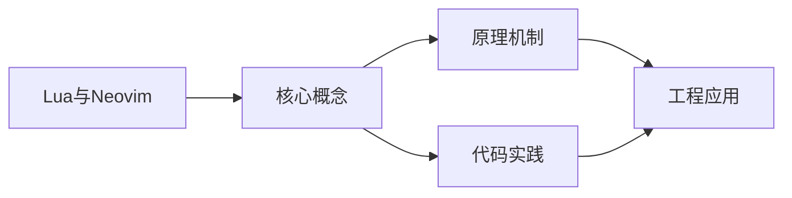

## 1. 学习目标（Bloom 分类）

本节按照布鲁姆教育目标分类学组织学习路径。本文主题为《Lua与Neovim》，属于 Lua 模块，读者可以根据自身阶段选择阅读深度。

记忆层面：能够准确复述本文的核心概念、术语与基本语法或操作步骤，并能够在提问或检索时快速定位对应知识点。能够说出 Lua 的变量、函数、table、元表与协程基本语法。

理解层面：能够用自己的语言解释核心原理与工作机制，说明概念之间的因果关系，而不是机械记忆结论。能够解释 table 作为唯一数据结构的设计与元方法机制。

应用层面：能够在真实项目或练习场景中运用本文知识解决具体问题，写出正确且可维护的实现。能够编写嵌入主程序（游戏、Nginx、Redis）的脚本。

分析层面：能够拆解复杂问题，比较本文主题与相邻概念的异同，识别边界条件与例外情况。能够分析 Lua 与 C 交互（Lua C API）与性能特征。

评价层面：能够根据约束条件（性能、可读性、安全、成本）评价不同方案的优劣，做出有依据的技术决策。能够评价 Lua 与其他脚本语言在嵌入式场景的取舍。

创造层面：能够把本文知识与其他模块知识组合，设计出新的解决方案或可复用的工程模式。能够设计基于 Lua 的可扩展配置与脚本系统。

通过本节学习，读者应当能够把《Lua与Neovim》纳入自己的知识网络，并与 Lua 模块的其他主题（table、元表、协程、嵌入式脚本）建立关联。

## 2. 历史动机与发展脉络

《Lua与Neovim》是 Lua 领域的重要主题。要真正理解它，需要先了解它解决的问题与演进过程。

Lua 由巴西 PUC-Rio 大学的 Roberto Ierusalimschy 等人于 1993 年发布，设计目标是“可嵌入的脚本语言”：解释器小于 300KB，启动快，与 C 无缝集成。
Lua 5.1-5.4 持续演进：5.3 加入整数子类型，5.4 引入 const 变量与关闭值；LuaJIT 是高性能 JIT 实现，广泛用于游戏与性能敏感场景。
Lua 的著名用户：Adobe Lightroom、Redis 脚本、Nginx（OpenResty）、World of Warcraft 插件、Roblox（Luau）与游戏引擎（LÖVE、Defold）。

回到本文主题：Lua与Neovim 的提出与成熟，正是上述技术背景下的必然产物。早期实现往往以简单可用为目标，随着工程规模扩大，社区逐渐沉淀出标准做法与最佳实践；理解这一脉络，可以帮助读者判断“为什么文档中的推荐写法是现在这个样子”，也能在遇到历史遗留代码时准确识别其设计年代与取舍。


## 3. 形式化定义与核心概念精讲

本节把《Lua与Neovim》涉及的核心概念以“定义 + 讲解”的形式展开。读者应把定义当作工具，把讲解当作理解路径；两者结合才能形成可迁移的知识。

table：Lua 唯一的数据结构，同时充当数组、字典、对象与模块；数组索引从 1 开始。
元表（metatable）：通过 __index、__newindex、__add 等元方法改变 table 行为，实现继承与运算符重载。
协程：coroutine.create/resume/yield 实现协作式多任务，适合游戏状态机与生成器。

### 3.1 原文章节逐一精讲

原文档把主题拆分为 13 个小节，下面按顺序给出每一节的导读讲解，随后保留原文细节供精读。

#### 原文精读（完整保留）

# Lua Neovim 配置

> **符号约定**：`< >` 必填参数 | `[ ]` 可选参数

---

##### LSP 配置

使用 nvim-lspconfig 配置语言服务器：

```lua
-- lua/plugins/lsp.lua
local lspconfig = require("lspconfig")

-- LSP 快捷键（仅在 LSP 附加到缓冲区时生效）
vim.api.nvim_create_autocmd("LspAttach", {
    callback = function(args)
        local bufnr = args.buf
        local opts = { buffer = bufnr, noremap = true, silent = true }

        vim.keymap.set("n", "gd", vim.lsp.buf.definition, opts)
        vim.keymap.set("n", "gD", vim.lsp.buf.declaration, opts)
        vim.keymap.set("n", "gr", vim.lsp.buf.references, opts)
        vim.keymap.set("n", "gi", vim.lsp.buf.implementation, opts)
        vim.keymap.set("n", "K", vim.lsp.buf.hover, opts)
        vim.keymap.set("n", "<leader>rn", vim.lsp.buf.rename, opts)
        vim.keymap.set("n", "<leader>ca", vim.lsp.buf.code_action, opts)
        vim.keymap.set("n", "<leader>f", function()
            vim.lsp.buf.format({ async = true })
        end, opts)

        -- 诊断快捷键
        vim.keymap.set("n", "[d", vim.diagnostic.goto_prev, opts)
        vim.keymap.set("n", "]d", vim.diagnostic.goto_next, opts)
        vim.keymap.set("n", "<leader>d", vim.diagnostic.open_float, opts)
    end,
})

-- 诊断图标
vim.diagnostic.config({
    virtual_text = true,
    signs = true,
    underline = true,
    float = {
        border = "rounded",
        source = "always",
    },
})

-- Lua 语言服务器配置
lspconfig.lua_ls.setup({
    settings = {
        Lua = {
            runtime = { version = "LuaJIT" },
            diagnostics = {
                globals = { "vim" },  -- 识别 vim 全局变量
            },
            workspace = {
                library = vim.api.nvim_get_runtime_file("", true),
                checkThirdParty = false,
            },
            telemetry = { enable = false },
        },
    },
})

-- Python 语言服务器
lspconfig.pyright.setup({})

-- TypeScript 语言服务器
lspconfig.ts_ls.setup({})

-- Go 语言服务器
lspconfig.gopls.setup({})
```

#### 概述

Neovim 是 Vim 编辑器的现代化分支，其最显著的特性之一就是将 Lua 作为一等配置语言。从 0.5 版本开始，Neovim 提供了完整的 Lua API，开发者可以使用 Lua 编写配置、定义快捷键、管理插件、配置语言服务器等，彻底告别了传统的 VimScript 配置方式。Lua 的执行速度远快于 VimScript，语法也更加简洁清晰，使得 Neovim 的配置更加高效和可维护。

Neovim 的 Lua 集成不仅仅是简单的脚本嵌入，而是深度整合。Neovim 暴露了丰富的 vim 全局模块，包含编辑器选项、缓冲区操作、窗口管理、键位映射、自动命令等 API。同时，Neovim 的插件生态也全面转向 Lua，主流插件如 nvim-treesitter、nvim-lspconfig、telescope.nvim、lazy.nvim 等都使用 Lua 编写，形成了一个完整的 Lua 生态。

#### 基本概念

**init.lua** 是 Neovim 的 Lua 配置入口文件，位于 `~/.config/nvim/init.lua`（Linux/macOS）或 `~/AppData/Local/nvim/init.lua`（Windows）。Neovim 启动时会自动加载此文件，相当于传统 Vim 中的 init.vim。配置可以拆分为多个模块文件，通过 require 加载。

**vim 全局对象**是 Neovim 暴露给 Lua 的核心接口，包含多个子模块：vim.opt 用于设置编辑器选项，vim.keymap 用于定义键位映射，vim.api 用于调用 Neovim 的底层 API，vim.fn 用于调用 VimScript 函数，vim.cmd 用于执行 Ex 命令。

**Buffer（缓冲区）**是 Neovim 中文件内容的内存表示。每个打开的文件对应一个缓冲区，缓冲区有唯一的编号（bufnr）。通过 vim.api 模块可以对缓冲区进行操作，如获取内容、设置行、创建高亮等。

**Window（窗口）**是缓冲区的可视区域。一个缓冲区可以在多个窗口中显示，一个窗口只能显示一个缓冲区。窗口也有唯一的编号（winid）。

**Autocmd（自动命令）**是 Neovim 的事件响应机制。当特定事件发生时（如打开文件、切换缓冲区、退出插入模式等），自动执行指定的回调函数。这是实现自动格式化、语法高亮、文件类型检测等功能的基础。

#### 快速开始

创建 Neovim 的 Lua 配置文件。首先确认配置目录存在：

```bash
mkdir -p ~/.config/nvim
```

创建 `init.lua` 文件，写入最基本的配置：

```lua
-- 基础选项设置
vim.opt.number = true           -- 显示行号
vim.opt.relativenumber = true   -- 显示相对行号
vim.opt.tabstop = 4             -- Tab 键宽度
vim.opt.shiftwidth = 4          -- 缩进宽度
vim.opt.expandtab = true        -- 将 Tab 转换为空格
vim.opt.smartindent = true      -- 智能缩进
vim.opt.wrap = false            -- 不自动换行
vim.opt.cursorline = true       -- 高亮当前行
vim.opt.signcolumn = "yes"      -- 始终显示符号列
vim.opt.termguicolors = true    -- 启用真彩色

-- 设置 Leader 键为空格
vim.g.mapleader = " "

-- 基本快捷键映射
vim.keymap.set("n", "<leader>w", ":w<CR>", { desc = "保存文件" })
vim.keymap.set("n", "<leader>q", ":q<CR>", { desc = "退出" })
vim.keymap.set("n", "<leader>h", ":nohlsearch<CR>", { desc = "清除搜索高亮" })

-- 窗口导航
vim.keymap.set("n", "<C-h>", "<C-w>h", { desc = "切换到左侧窗口" })
vim.keymap.set("n", "<C-j>", "<C-w>j", { desc = "切换到下方窗口" })
vim.keymap.set("n", "<C-k>", "<C-w>k", { desc = "切换到上方窗口" })
vim.keymap.set("n", "<C-l>", "<C-w>l", { desc = "切换到右侧窗口" })

-- 缓冲区切换
vim.keymap.set("n", "<leader>bn", ":bnext<CR>", { desc = "下一个缓冲区" })
vim.keymap.set("n", "<leader>bp", ":bprevious<CR>", { desc = "上一个缓冲区" })
vim.keymap.set("n", "<leader>bd", ":bdelete<CR>", { desc = "关闭缓冲区" })
```

保存后重启 Neovim 或执行 `:source %` 即可生效。

#### 详细用法

##### 模块化配置

将配置拆分为多个文件，便于管理。推荐的目录结构：

```
~/.config/nvim/
  init.lua           -- 入口文件
  lua/
    config/
      options.lua    -- 编辑器选项
      keymaps.lua    -- 快捷键映射
      autocmds.lua   -- 自动命令
    plugins/
      init.lua       -- 插件管理
      lsp.lua        -- LSP 配置
      cmp.lua        -- 自动补全
      treesitter.lua -- 语法高亮
```

入口文件 `init.lua`：

```lua
-- 加载各模块
require("config.options")
require("config.keymaps")
require("config.autocmds")
require("plugins.init")
```

选项模块 `lua/config/options.lua`：

```lua
-- 编辑器选项配置
local opt = vim.opt

-- 行号与缩进
opt.number = true
opt.relativenumber = true
opt.tabstop = 4
opt.shiftwidth = 4
opt.expandtab = true
opt.smartindent = true

-- 搜索设置
opt.ignorecase = true      -- 搜索忽略大小写
opt.smartcase = true       -- 智能大小写（包含大写字母时区分）
opt.hlsearch = true        -- 搜索高亮
opt.incsearch = true       -- 增量搜索

-- 外观设置
opt.termguicolors = true
opt.signcolumn = "yes"
opt.cursorline = true
opt.wrap = false
opt.scrolloff = 8          -- 光标上下保留 8 行
opt.sidescrolloff = 8      -- 光标左右保留 8 列

-- 性能设置
opt.updatetime = 250       -- 快速更新时间
opt.timeoutlen = 300       -- 快捷键超时时间
opt.completeopt = "menu,menuone,noselect"  -- 补全行为

-- 文件设置
opt.undofile = true        -- 持久化撤销
opt.backup = false
opt.writebackup = false
opt.swapfile = false

-- 剪贴板
opt.clipboard = "unnamedplus"  -- 使用系统剪贴板
```

快捷键模块 `lua/config/keymaps.lua`：

```lua
-- 快捷键映射
local map = vim.keymap.set
local opts = { noremap = true, silent = true }

-- Leader 键
vim.g.mapleader = " "
vim.g.maplocalleader = "\\"

-- 文件操作
map("n", "<leader>w", ":w<CR>", { desc = "保存文件" })
map("n", "<leader>q", ":q<CR>", { desc = "退出" })
map("n", "<leader>Q", ":qa!<CR>", { desc = "强制退出所有" })

-- 窗口管理
map("n", "<leader>sv", ":vsplit<CR>", { desc = "垂直分屏" })
map("n", "<leader>sh", ":split<CR>", { desc = "水平分屏" })
map("n", "<leader>sc", ":close<CR>", { desc = "关闭窗口" })

-- 缓冲区导航
map("n", "<S-h>", ":bprevious<CR>", { desc = "上一个缓冲区" })
map("n", "<S-l>", ":bnext<CR>", { desc = "下一个缓冲区" })
map("n", "<leader>bd", ":bdelete<CR>", { desc = "关闭缓冲区" })

-- 移动优化
map("n", "j", "gj", opts)  -- 在软换行中按行移动
map("n", "k", "gk", opts)
map("n", "<C-d>", "<C-d>zz", { desc = "向下翻页并居中" })
map("n", "<C-u>", "<C-u>zz", { desc = "向上翻页并居中" })
map("n", "n", "nzzzv", { desc = "搜索下一个并居中" })
map("n", "N", "Nzzzv", { desc = "搜索上一个并居中" })

-- Visual 模式粘贴不覆盖寄存器
map("v", "p", '"_dP', opts)

-- 快速移动行
map("n", "<A-j>", ":m .+1<CR>==", opts)
map("n", "<A-k>", ":m .-2<CR>==", opts)
map("v", "<A-j>", ":m '>+1<CR>gv=gv", opts)
map("v", "<A-k>", ":m '<-2<CR>gv=gv", opts)
```

##### 插件管理（lazy.nvim）

lazy.nvim 是当前最流行的 Neovim 插件管理器，支持延迟加载、自动安装、版本锁定等功能：

```lua
-- lua/plugins/init.lua
local lazypath = vim.fn.stdpath("data") .. "/lazy/lazy.nvim"

-- 自动安装 lazy.nvim
if not vim.loop.fs_stat(lazypath) then
    vim.fn.system({
        "git", "clone", "--filter=blob:none",
        "https://github.com/folke/lazy.nvim.git",
        "--branch=stable",
        lazypath,
    })
end

vim.opt.rtp:prepend(lazypath)

-- 插件配置
require("lazy").setup({
    -- 主题
    {
        "folke/tokyonight.nvim",
        lazy = false,
        priority = 1000,
        config = function()
            require("tokyonight").setup({
                style = "night",
                transparent = false,
            })
            vim.cmd([[colorscheme tokyonight-night]])
        end,
    },

    -- 文件树
    {
        "nvim-neo-tree/neo-tree.nvim",
        branch = "v3.x",
        dependencies = {
            "nvim-lua/plenary.nvim",
            "nvim-tree/nvim-web-devicons",
            "MunifTanjim/nui.nvim",
        },
        keys = {
            { "<leader>e", ":Neotree toggle<CR>", desc = "文件树" },
        },
    },

    -- 模糊搜索
    {
        "nvim-telescope/telescope.nvim",
        branch = "0.1.x",
        dependencies = { "nvim-lua/plenary.nvim" },
        keys = {
            { "<leader>ff", ":Telescope find_files<CR>", desc = "查找文件" },
            { "<leader>fg", ":Telescope live_grep<CR>", desc = "全局搜索" },
            { "<leader>fb", ":Telescope buffers<CR>", desc = "缓冲区列表" },
            { "<leader>fh", ":Telescope help_tags<CR>", desc = "帮助标签" },
        },
    },

    -- 语法高亮
    {
        "nvim-treesitter/nvim-treesitter",
        build = ":TSUpdate",
        config = function()
            require("nvim-treesitter.configs").setup({
                ensure_installed = {
                    "lua", "python", "javascript", "typescript",
                    "html", "css", "json", "yaml", "markdown",
                },
                highlight = { enable = true },
                indent = { enable = true },
            })
        end,
    },

    -- Git 集成
    {
        "lewis6991/gitsigns.nvim",
        config = function()
            require("gitsigns").setup({
                signs = {
                    add = { text = "+" },
                    change = { text = "~" },
                    delete = { text = "_" },
                },
            })
        end,
    },

    -- 状态栏
    {
        "nvim-lualine/lualine.nvim",
        dependencies = { "nvim-tree/nvim-web-devicons" },
        config = function()
            require("lualine").setup({
                options = {
                    theme = "tokyonight",
                    section_separators = "",
                    component_separators = "",
                },
            })
        end,
    },
})
```

##### 自动命令

使用 Lua API 创建自动命令：

```lua
-- lua/config/autocmds.lua

-- 创建自动命令组
local augroup = vim.api.nvim_create_augroup
local autocmd = vim.api.nvim_create_autocmd

-- 通用自动命令组
local general = augroup("General", { clear = true })

-- 进入文件时恢复上次光标位置
autocmd("BufReadPost", {
    group = general,
    callback = function()
        local mark = vim.api.nvim_buf_get_mark(0, '"')
        local line_count = vim.api.nvim_buf_line_count(0)
        if mark[1] > 0 and mark[1] <= line_count then
            vim.api.nvim_win_set_cursor(0, mark)
        end
    end,
})

-- 保存时自动去除行尾空白
autocmd("BufWritePre", {
    group = general,
    pattern = "*",
    callback = function()
        local save_cursor = vim.fn.winsaveview()
        vim.cmd([[%s/\s\+$//e]])
        vim.fn.winrestview(save_cursor)
    end,
})

-- 保存时自动格式化（仅对支持 LSP 格式化的文件生效）
autocmd("BufWritePre", {
    group = general,
    callback = function()
        local clients = vim.lsp.get_clients({ bufnr = 0 })
        if #clients > 0 then
            vim.lsp.buf.format({ async = false })
        end
    end,
})

-- 文件类型特定设置
local filetype = augroup("FileType", { clear = true })

autocmd("FileType", {
    group = filetype,
    pattern = { "lua", "python" },
    callback = function()
        vim.opt_local.tabstop = 4
        vim.opt_local.shiftwidth = 4
    end,
})

autocmd("FileType", {
    group = filetype,
    pattern = { "javascript", "typescript", "html", "css", "json", "yaml" },
    callback = function()
        vim.opt_local.tabstop = 2
        vim.opt_local.shiftwidth = 2
    end,
})

-- 高亮 yank（复制）区域
autocmd("TextYankPost", {
    group = general,
    callback = function()
        vim.highlight.on_yank({
            higroup = "IncSearch",
            timeout = 200,
        })
    end,
})
```

##### 自定义用户命令

使用 Lua 创建自定义命令：

```lua
-- 创建用户命令
vim.api.nvim_create_user_command("Format", function()
    vim.lsp.buf.format({ async = true })
end, { desc = "格式化当前文件" })

-- 带参数的命令
vim.api.nvim_create_user_command("Term", function(opts)
    vim.cmd("terminal " .. opts.args)
end, {
    nargs = "*",
    desc = "打开终端",
    complete = function()
        return { "bash", "python", "node" }
    end,
})

-- 带范围选择的命令
vim.api.nvim_create_user_command("SortLines", function(opts)
    local start_line = opts.line1
    local end_line = opts.line2
    local lines = vim.api.nvim_buf_get_lines(0, start_line - 1, end_line, false)
    table.sort(lines)
    vim.api.nvim_buf_set_lines(0, start_line - 1, end_line, false, lines)
end, { range = true, desc = "排序选中行" })

-- 切换选项的命令
vim.api.nvim_create_user_command("ToggleWrap", function()
    vim.opt.wrap = not vim.opt.wrap:get()
    print("自动换行: " .. tostring(vim.opt.wrap:get()))
end, { desc = "切换自动换行" })

vim.api.nvim_create_user_command("ToggleNumber", function()
    if vim.opt.relativenumber:get() then
        vim.opt.relativenumber = false
        vim.opt.number = true
        print("绝对行号")
    else
        vim.opt.relativenumber = true
        print("相对行号")
    end
end, { desc = "切换行号模式" })
```

#### 常见场景

##### 自定义状态栏

使用 Neovim API 创建自定义状态栏：

```lua
-- 简单自定义状态栏
local function setup_statusline()
    -- 左侧：文件名和修改状态
    vim.opt.statusline = "%<%f"           -- 文件名
    vim.opt.statusline = vim.opt.statusline + "%h%m%r"  -- 标志
    vim.opt.statusline = vim.opt.statusline + "%="       -- 右对齐

    -- 右侧：文件类型、编码、行号
    vim.opt.statusline = vim.opt.statusline + "%y"       -- 文件类型
    vim.opt.statusline = vim.opt.statusline + " [%{&encoding}]"  -- 编码
    vim.opt.statusline = vim.opt.statusline + " [%l:%v/%L]"      -- 行号
end

setup_statusline()
```

##### 自动补全配置

使用 nvim-cmp 配置自动补全：

```lua
-- lua/plugins/cmp.lua
local cmp = require("cmp")
local luasnip = require("luasnip")

cmp.setup({
    snippet = {
        expand = function(args)
            luasnip.lsp_expand(args.body)
        end,
    },

    mapping = cmp.mapping.preset.insert({
        ["<C-b>"] = cmp.mapping.scroll_docs(-4),
        ["<C-f>"] = cmp.mapping.scroll_docs(4),
        ["<C-Space>"] = cmp.mapping.complete(),
        ["<C-e>"] = cmp.mapping.abort(),
        ["<CR>"] = cmp.mapping.confirm({ select = true }),
        ["<Tab>"] = cmp.mapping(function(fallback)
            if cmp.visible() then
                cmp.select_next_item()
            elseif luasnip.expand_or_jumpable() then
                luasnip.expand_or_jump()
            else
                fallback()
            end
        end, { "i", "s" }),
    }),

    sources = cmp.config.sources({
        { name = "nvim_lsp" },
        { name = "luasnip" },
    }, {
        { name = "buffer" },
        { name = "path" },
    }),
})
```

##### 项目本地配置

实现项目级别的 .nvim.lua 配置文件：

```lua
-- 加载项目本地配置
local function load_project_config()
    local config_file = ".nvim.lua"
    local path = vim.fn.findfile(config_file, ".;")

    if path ~= "" then
        -- 将项目配置目录加入 runtimepath
        vim.opt.rtp:append(vim.fn.fnamemodify(path, ":h"))

        -- 安全加载配置
        local ok, err = pcall(dofile, path)
        if not ok then
            vim.notify("项目配置加载失败: " .. err, vim.log.levels.WARN)
        else
            vim.notify("已加载项目配置: " .. path, vim.log.levels.INFO)
        end
    end
end

-- 在目录切换时检查项目配置
vim.api.nvim_create_autocmd("DirChanged", {
    callback = load_project_config,
})
```

#### 注意事项与常见错误

**vim.opt 与 vim.o 的区别**。vim.opt 返回一个特殊对象，支持链式调用和追加操作（如 vim.opt.wildignore:append("\*.o")），而 vim.o 直接返回字符串值。在条件判断中使用 vim.opt 时需要调用 :get() 方法获取实际值，否则判断结果可能不正确。

**vim.keymap.set 的模式参数**。第一个参数可以是单个模式字符串（如 "n"），也可以是模式列表（如 { "n", "v" }）。常见模式包括：n（普通模式）、i（插入模式）、v（可视模式）、x（行可视模式）、s（选择模式）、c（命令模式）、t（终端模式）。

**LSP 配置必须在服务器启动前完成**。lspconfig 的 setup 调用会启动语言服务器，之后的配置修改不会生效。如果需要动态修改 LSP 设置，应使用 vim.lsp.config 或在 LspAttach 回调中处理。

**require 的路径规则**。Neovim 的 require 从 runtimepath 下的 lua/ 目录查找模块。例如 require("config.options") 对应 lua/config/options.lua。注意不要在模块路径中包含 lua/ 前缀，也不要包含 .lua 后缀。

**避免在配置中使用 vim.cmd 执行复杂 VimScript**。虽然 vim.cmd 可以执行 VimScript 代码，但过度依赖会失去 Lua 配置的优势。尽量使用 Neovim 提供的 Lua API（如 vim.api、vim.keymap、vim.opt 等）来实现相同功能。

#### 高级用法

##### 自定义 Operator

使用 Neovim API 创建自定义操作符：

```lua
-- 创建自定义操作符：将选中文本转为大写
vim.api.nvim_create_user_command("Upper", function(opts)
    if opts.range == 0 then
        -- 没有范围，对当前行操作
        local line = vim.api.nvim_get_current_line()
        vim.api.nvim_set_current_line(line:upper())
    else
        -- 有范围，对选中行操作
        local lines = vim.api.nvim_buf_get_lines(0, opts.line1 - 1, opts.line2, false)
        for i, line in ipairs(lines) do
            lines[i] = line:upper()
        end
        vim.api.nvim_buf_set_lines(0, opts.line1 - 1, opts.line2, false, lines)
    end
end, { range = true, desc = "将选中区域转为大写" })

-- 使用 gU 作为操作符映射
vim.keymap.set("n", "gU", ":set operatorfunc=v:lua.upper_op<CR>g@", { expr = true })

-- 通过 Lua 函数定义操作符
_G.upper_op = function(type)
    local start_pos, end_pos
    if type == "line" then
        start_pos = vim.api.nvim_buf_get_mark(0, "[")
        end_pos = vim.api.nvim_buf_get_mark(0, "]")
    elseif type == "char" then
        start_pos = vim.api.nvim_buf_get_mark(0, "[")
        end_pos = vim.api.nvim_buf_get_mark(0, "]")
    end

    if start_pos and end_pos then
        local lines = vim.api.nvim_buf_get_lines(0, start_pos[1] - 1, end_pos[1], false)
        for i, line in ipairs(lines) do
            lines[i] = line:upper()
        end
        vim.api.nvim_buf_set_lines(0, start_pos[1] - 1, end_pos[1], false, lines)
    end
end
```

##### 浮动终端

创建一个可切换的浮动终端窗口：

```lua
-- 浮动终端模块
local Terminal = {}
Terminal.__index = Terminal

function Terminal.new()
    local self = setmetatable({}, Terminal)
    self.buf = nil
    self.win = nil
    self.is_open = false
    return self
end

function Terminal:toggle()
    if self.is_open and vim.api.nvim_win_is_valid(self.win) then
        self:close()
    else
        self:open()
    end
end

function Terminal:open()
    -- 创建缓冲区
    if not self.buf or not vim.api.nvim_buf_is_valid(self.buf) then
        self.buf = vim.api.nvim_create_buf(false, true)
    end

    -- 计算浮动窗口大小
    local width = math.floor(vim.o.columns * 0.8)
    local height = math.floor(vim.o.lines * 0.6)
    local col = math.floor((vim.o.columns - width) / 2)
    local row = math.floor((vim.o.lines - height) / 2)

    -- 创建浮动窗口
    self.win = vim.api.nvim_open_win(self.buf, true, {
        relative = "editor",
        width = width,
        height = height,
        col = col,
        row = row,
        style = "minimal",
        border = "rounded",
    })

    -- 如果缓冲区中没有终端，启动一个
    if vim.bo[self.buf].buftype ~= "terminal" then
        vim.cmd("terminal")
    end

    self.is_open = true

    -- 进入终端模式
    vim.cmd("startinsert")
end

function Terminal:close()
    if self.win and vim.api.nvim_win_is_valid(self.win) then
        vim.api.nvim_win_close(self.win, false)
    end
    self.is_open = false
end

-- 创建实例并绑定快捷键
local terminal = Terminal.new()
vim.keymap.set("n", "<leader>t", function()
    terminal:toggle()
end, { desc = "切换浮动终端" })

-- 终端模式下的快捷键
vim.keymap.set("t", "<Esc>", [[<C-\><C-n>]], { desc = "退出终端模式" })
vim.keymap.set("t", "<C-h>", [[<C-\><C-n><C-w>h]], { desc = "终端中切换窗口" })
```

##### 自定义诊断显示

自定义 LSP 诊断的显示方式：

```lua
-- 自定义诊断符号
local signs = {
    Error = "E",
    Warn = "W",
    Hint = "H",
    Info = "I",
}

for type, icon in pairs(signs) do
    local hl = "DiagnosticSign" .. type
    vim.fn.sign_define(hl, { text = icon, texthl = hl, numhl = hl })
end

-- 自定义诊断配置
vim.diagnostic.config({
    virtual_text = {
        prefix = " ",  -- 虚拟文本前缀
        spacing = 4,
        source = "if_many",
    },
    float = {
        source = "always",
        border = "rounded",
        header = "",
        prefix = "",
    },
    signs = true,
    underline = true,
    update_in_insert = false,
    severity_sort = true,
})

-- 自定义诊断跳转，自动打开浮动窗口
vim.keymap.set("n", "[d", function()
    vim.diagnostic.goto_prev({ float = true })
end, { desc = "上一个诊断" })

vim.keymap.set("n", "]d", function()
    vim.diagnostic.goto_next({ float = true })
end, { desc = "下一个诊断" })
```

##### 缓冲区局部键位映射

为特定文件类型设置局部快捷键：

```lua
-- 为 Lua 文件设置局部快捷键
vim.api.nvim_create_autocmd("FileType", {
    pattern = "lua",
    callback = function()
        local buf_opts = { buffer = true, noremap = true, silent = true }

        -- 快速执行当前 Lua 文件
        vim.keymap.set("n", "<leader>lr", ":luafile %<CR>",
            vim.tbl_extend("force", buf_opts, { desc = "执行当前 Lua 文件" }))

        -- 快速打开 Neovim 配置
        vim.keymap.set("n", "<leader>lc", ":e ~/.config/nvim/init.lua<CR>",
            vim.tbl_extend("force", buf_opts, { desc = "打开 Neovim 配置" }))
    end,
})

-- 为 Markdown 文件设置局部快捷键
vim.api.nvim_create_autocmd("FileType", {
    pattern = "markdown",
    callback = function()
        local buf_opts = { buffer = true, noremap = true, silent = true }

        vim.keymap.set("n", "<leader>mp", ":MarkdownPreview<CR>",
            vim.tbl_extend("force", buf_opts, { desc = "Markdown 预览" }))

        vim.opt_local.wrap = true
        vim.opt_local.spell = true
        vim.opt_local.spelllang = "en,cjk"
    end,
})
```
#### 配置基础

**基本写法：init.lua 入口**
`~/.config/nvim/init.lua`
```lua
-- Neovim Lua 配置入口
-- 标准初始化
vim.g.mapleader = " "
vim.opt.number = true
vim.opt.relativenumber = true
vim.opt.tabstop = 4
vim.opt.shiftwidth = 4
vim.opt.expandtab = true
```

---

**基本写法：vim.opt 选项设置**
`vim.opt.<选项> = <值>`
```lua
-- 设置 Neovim 选项
vim.opt.ignorecase = true       -- 忽略大小写
vim.opt.smartcase = true        -- 智能大小写
vim.opt.wrap = false            -- 不自动换行
vim.opt.scrolloff = 8           -- 光标保留 8 行
vim.opt.termguicolors = true    -- 24 位颜色
vim.opt.splitright = true       -- 垂直分割在右侧
vim.opt.splitbelow = true       -- 水平分割在下方
```

---

#### vim 全局对象

**基本写法：vim.g 全局变量**
`vim.g.<变量> = <值>`
```lua
-- 设置 vim 全局变量
vim.g.mapleader = " "
vim.g.loaded_netrw = 1           -- 禁用 netrw
vim.g.netrw_banner = 0
-- 访问
print(vim.g.mapleader)
```

---

**基本写法：vim.b 缓冲区变量**
`vim.b[<缓冲区>].<变量>`
```lua
-- 缓冲区局部变量
vim.b.current_project = "myapp"
print(vim.b.current_project)
-- 当前缓冲区
vim.b[0].custom = true
```

---

**基本写法：vim.w 窗口变量**
`vim.w.<变量>`
```lua
-- 窗口局部变量
vim.w.is_focused = true
```

---

#### 键映射

**基本写法：vim.keymap.set**
`vim.keymap.set(<模式>, <键>, <动作>, <选项>)`
```lua
-- 设置键映射
vim.keymap.set("n", "<leader>w", ":w<CR>", { desc = "保存" })
vim.keymap.set("n", "<leader>q", ":q<CR>", { desc = "退出" })
vim.keymap.set("i", "jk", "<ESC>", { desc = "返回普通模式" })
vim.keymap.set("v", "J", ":m '>+1<CR>gv=gv", { desc = "移动选中行下" })
-- 模式：n 普通 i 插入 v 可视 c 命令 t 终端
```

---

**基本写法：映射选项**
`{ buffer = <bufnr>, silent = true, ... }`
```lua
-- 映射选项
vim.keymap.set("n", "<leader>f", function()
    vim.lsp.buf.format()
end, {
    desc = "格式化",
    buffer = true,       -- 仅当前缓冲区
    silent = true,       -- 静默
    noremap = true,      -- 非递归
    expr = false,        -- 非表达式
})
```

---

#### 命令与自动命令

**基本写法：vim.api.nvim_create_user_command**
`vim.api.nvim_create_user_command(<名>, <回调>, <选项>)`
```lua
-- 创建用户命令
vim.api.nvim_create_user_command("Hello", function(opts)
    print("Hello, " .. opts.args)
end, { nargs = "*", desc = "打招呼" })
-- :Hello world
```

---

**基本写法：自动命令组**
`vim.api.nvim_create_augroup(<名>, <选项>)`
```lua
-- 创建自动命令组
local group = vim.api.nvim_create_augroup("MyConfig", { clear = true })
vim.api.nvim_create_autocmd("TextYankPost", {
    group = group,
    callback = function()
        vim.highlight.on_yank()
    end,
})
vim.api.nvim_create_autocmd("BufWritePre", {
    group = group,
    pattern = "*.lua",
    callback = function()
        vim.lsp.buf.format()
    end,
})
```

---

#### 插件管理

**基本写法：lazy.nvim**
`require("lazy").setup(<插件列表>)`
```lua
-- lazy.nvim 插件管理器
local lazypath = vim.fn.stdpath("data") .. "/lazy/lazy.nvim"
vim.opt.rtp:prepend(lazypath)
require("lazy").setup({
    { "nvim-treesitter/nvim-treesitter", build = ":TSUpdate" },
    { "nvim-telescope/telescope.nvim", dependencies = { "nvim-lua/plenary.nvim" } },
    { "neovim/nvim-lspconfig" },
}, {
    install = { colorscheme = { "habamax" } },
    checker = { enabled = true },
})
```

---

**基本写法：插件配置**
`config = function() ... end`
```lua
-- 插件配置回调
{
    "nvim-telescope/telescope.nvim",
    dependencies = { "nvim-lua/plenary.nvim" },
    config = function()
        require("telescope").setup({})
        vim.keymap.set("n", "<leader>ff", require("telescope.builtin").find_files)
    end
}
```

---

#### API 与函数

**基本写法：vim.fn 调用 vim 函数**
`vim.fn.<函数>(<参数>)`
```lua
-- 调用 vim 内置函数
local cwd = vim.fn.getcwd()
local expand = vim.fn.expand("%:p")
local line = vim.fn.line(".")
vim.fn.mkdir(vim.fn.stdpath("config") .. "/tmp", "p")
```

---

**基本写法：vim.cmd 执行命令**
`vim.cmd("<命令>")`
```lua
-- 执行 Ex 命令
vim.cmd("colorscheme habamax")
vim.cmd("set number")
-- 多行
vim.cmd([[
    augroup MyGroup
        autocmd!
    augroup END
]])
```

---

**基本写法：vim.notify 通知**
`vim.notify(<消息>, <级别>)`
```lua
-- 显示通知
vim.notify("Hello", vim.log.levels.INFO)
vim.notify("警告", vim.log.levels.WARN)
vim.notify("错误", vim.log.levels.ERROR)
```

---


### 3.2 概念关系图

下面用 Mermaid 图表达本文核心概念之间的关系，帮助读者建立整体图景：



图中展示的是本文知识的结构化关系：核心概念是入口，原理机制解释“为什么”，代码实践演示“怎么做”，工程应用回答“何时用”。读者学习时可以把每个小节的内容挂接到对应节点上。

## 4. 理论推导与原理解析

本节深入《Lua与Neovim》背后的原理。理论部分不求面面俱到，而是聚焦“能解释现象、能指导实践”的关键推导。

table：Lua 唯一的数据结构，同时充当数组、字典、对象与模块；数组索引从 1 开始。
元表（metatable）：通过 __index、__newindex、__add 等元方法改变 table 行为，实现继承与运算符重载。
协程：coroutine.create/resume/yield 实现协作式多任务，适合游戏状态机与生成器。
C API：lua_State 上下文、栈式参数传递，宿主程序可以安全地执行用户脚本。

需要强调的是，理论推导与工程实践之间存在翻译层：理论给出的是理想化模型与边界条件，工程代码则必须处理真实环境中的例外。读者在学习时应先掌握理论的“标准情形”，再通过陷阱章节了解“非标准情形”。

## 5. 代码示例与逐行讲解

本节把原文中的代码示例系统整理，并为每个示例补充用途说明与讲解。读者不应只浏览代码，而应逐段对照讲解理解设计意图。

### 5.1 示例：LSP 配置

该示例来自原文《LSP 配置》小节，用于演示Lua与Neovim相关操作。阅读时请先看代码结构，再看其后的讲解。

```lua
-- lua/plugins/lsp.lua
local lspconfig = require("lspconfig")

-- LSP 快捷键（仅在 LSP 附加到缓冲区时生效）
vim.api.nvim_create_autocmd("LspAttach", {
    callback = function(args)
        local bufnr = args.buf
        local opts = { buffer = bufnr, noremap = true, silent = true }

        vim.keymap.set("n", "gd", vim.lsp.buf.definition, opts)
        vim.keymap.set("n", "gD", vim.lsp.buf.declaration, opts)
        vim.keymap.set("n", "gr", vim.lsp.buf.references, opts)
        vim.keymap.set("n", "gi", vim.lsp.buf.implementation, opts)
        vim.keymap.set("n", "K", vim.lsp.buf.hover, opts)
        vim.keymap.set("n", "<leader>rn", vim.lsp.buf.rename, opts)
        vim.keymap.set("n", "<leader>ca", vim.lsp.buf.code_action, opts)
        vim.keymap.set("n", "<leader>f", function()
            vim.lsp.buf.format({ async = true })
        end, opts)

        -- 诊断快捷键
        vim.keymap.set("n", "[d", vim.diagnostic.goto_prev, opts)
        vim.keymap.set("n", "]d", vim.diagnostic.goto_next, opts)
        vim.keymap.set("n", "<leader>d", vim.diagnostic.open_float, opts)
    end,
})

-- 诊断图标
vim.diagnostic.config({
    virtual_text = true,
    signs = true,
    underline = true,
    float = {
        border = "rounded",
        source = "always",
    },
})

-- Lua 语言服务器配置
lspconfig.lua_ls.setup({
    settings = {
        Lua = {
            runtime = { version = "LuaJIT" },
            diagnostics = {
                globals = { "vim" },  -- 识别 vim 全局变量
            },
            workspace = {
                library = vim.api.nvim_get_runtime_file("", true),
                checkThirdParty = false,
            },
            telemetry = { enable = false },
        },
    },
})

-- Python 语言服务器
lspconfig.pyright.setup({})

-- TypeScript 语言服务器
lspconfig.ts_ls.setup({})

-- Go 语言服务器
lspconfig.gopls.setup({})
```

讲解：这段代码演示了本节核心知识点。代码中的关键操作可以归纳为三步：准备（定义或初始化）、执行（核心逻辑）、收尾（释放资源或返回结果）。实际项目中，这三步往往被封装为函数或类，以提升复用性与可测试性。

关键点分析：

该示例共 55 行有效代码，包含 1 类关键结构（function）。其中：

- 入口与初始化部分负责建立上下文，对应实际项目中的启动或装配逻辑；
- 核心逻辑部分体现本文主题的主要操作，是阅读时最需要对照讲解理解的部分；
- 输出或返回部分把结果交给调用方，注意其类型与边界条件。

进阶思考路径：先尝试修改参数观察行为变化，再把示例中的模式迁移到自己的项目中；每次修改都记录预期与实测差异，这是把示例转化为能力的最快方式。

### 5.2 示例：快速开始

该示例来自原文《快速开始》小节，用于演示Lua与Neovim相关操作。阅读时请先看代码结构，再看其后的讲解。

```bash
mkdir -p ~/.config/nvim
```

讲解：这段代码演示了本节核心知识点。代码中的关键操作可以归纳为三步：准备（定义或初始化）、执行（核心逻辑）、收尾（释放资源或返回结果）。实际项目中，这三步往往被封装为函数或类，以提升复用性与可测试性。

关键点分析：

该示例共 1 行有效代码，结构以数据或配置为主。阅读时应关注：数据字段的含义、配置项的作用，以及它们与运行行为的对应关系。

进阶思考路径：先尝试修改参数观察行为变化，再把示例中的模式迁移到自己的项目中；每次修改都记录预期与实测差异，这是把示例转化为能力的最快方式。

### 5.3 示例：快速开始

该示例来自原文《快速开始》小节，用于演示Lua与Neovim相关操作。阅读时请先看代码结构，再看其后的讲解。

```lua
-- 基础选项设置
vim.opt.number = true           -- 显示行号
vim.opt.relativenumber = true   -- 显示相对行号
vim.opt.tabstop = 4             -- Tab 键宽度
vim.opt.shiftwidth = 4          -- 缩进宽度
vim.opt.expandtab = true        -- 将 Tab 转换为空格
vim.opt.smartindent = true      -- 智能缩进
vim.opt.wrap = false            -- 不自动换行
vim.opt.cursorline = true       -- 高亮当前行
vim.opt.signcolumn = "yes"      -- 始终显示符号列
vim.opt.termguicolors = true    -- 启用真彩色

-- 设置 Leader 键为空格
vim.g.mapleader = " "

-- 基本快捷键映射
vim.keymap.set("n", "<leader>w", ":w<CR>", { desc = "保存文件" })
vim.keymap.set("n", "<leader>q", ":q<CR>", { desc = "退出" })
vim.keymap.set("n", "<leader>h", ":nohlsearch<CR>", { desc = "清除搜索高亮" })

-- 窗口导航
vim.keymap.set("n", "<C-h>", "<C-w>h", { desc = "切换到左侧窗口" })
vim.keymap.set("n", "<C-j>", "<C-w>j", { desc = "切换到下方窗口" })
vim.keymap.set("n", "<C-k>", "<C-w>k", { desc = "切换到上方窗口" })
vim.keymap.set("n", "<C-l>", "<C-w>l", { desc = "切换到右侧窗口" })

-- 缓冲区切换
vim.keymap.set("n", "<leader>bn", ":bnext<CR>", { desc = "下一个缓冲区" })
vim.keymap.set("n", "<leader>bp", ":bprevious<CR>", { desc = "上一个缓冲区" })
vim.keymap.set("n", "<leader>bd", ":bdelete<CR>", { desc = "关闭缓冲区" })
```

讲解：这段代码演示了本节核心知识点。代码中的关键操作可以归纳为三步：准备（定义或初始化）、执行（核心逻辑）、收尾（释放资源或返回结果）。实际项目中，这三步往往被封装为函数或类，以提升复用性与可测试性。

关键点分析：

该示例共 26 行有效代码，结构以数据或配置为主。阅读时应关注：数据字段的含义、配置项的作用，以及它们与运行行为的对应关系。

进阶思考路径：先尝试修改参数观察行为变化，再把示例中的模式迁移到自己的项目中；每次修改都记录预期与实测差异，这是把示例转化为能力的最快方式。

### 5.4 示例：模块化配置

该示例来自原文《模块化配置》小节，用于演示Lua与Neovim相关操作。阅读时请先看代码结构，再看其后的讲解。

```text
~/.config/nvim/
  init.lua           -- 入口文件
  lua/
    config/
      options.lua    -- 编辑器选项
      keymaps.lua    -- 快捷键映射
      autocmds.lua   -- 自动命令
    plugins/
      init.lua       -- 插件管理
      lsp.lua        -- LSP 配置
      cmp.lua        -- 自动补全
      treesitter.lua -- 语法高亮
```

讲解：这段代码演示了本节核心知识点。代码中的关键操作可以归纳为三步：准备（定义或初始化）、执行（核心逻辑）、收尾（释放资源或返回结果）。实际项目中，这三步往往被封装为函数或类，以提升复用性与可测试性。

关键点分析：

该示例共 12 行有效代码，结构以数据或配置为主。阅读时应关注：数据字段的含义、配置项的作用，以及它们与运行行为的对应关系。

进阶思考路径：先尝试修改参数观察行为变化，再把示例中的模式迁移到自己的项目中；每次修改都记录预期与实测差异，这是把示例转化为能力的最快方式。

### 5.5 示例：模块化配置

该示例来自原文《模块化配置》小节，用于演示Lua与Neovim相关操作。阅读时请先看代码结构，再看其后的讲解。

```lua
-- 加载各模块
require("config.options")
require("config.keymaps")
require("config.autocmds")
require("plugins.init")
```

讲解：这段代码演示了本节核心知识点。代码中的关键操作可以归纳为三步：准备（定义或初始化）、执行（核心逻辑）、收尾（释放资源或返回结果）。实际项目中，这三步往往被封装为函数或类，以提升复用性与可测试性。

关键点分析：

该示例共 5 行有效代码，结构以数据或配置为主。阅读时应关注：数据字段的含义、配置项的作用，以及它们与运行行为的对应关系。

进阶思考路径：先尝试修改参数观察行为变化，再把示例中的模式迁移到自己的项目中；每次修改都记录预期与实测差异，这是把示例转化为能力的最快方式。

### 5.6 示例：模块化配置

该示例来自原文《模块化配置》小节，用于演示Lua与Neovim相关操作。阅读时请先看代码结构，再看其后的讲解。

```lua
-- 编辑器选项配置
local opt = vim.opt

-- 行号与缩进
opt.number = true
opt.relativenumber = true
opt.tabstop = 4
opt.shiftwidth = 4
opt.expandtab = true
opt.smartindent = true

-- 搜索设置
opt.ignorecase = true      -- 搜索忽略大小写
opt.smartcase = true       -- 智能大小写（包含大写字母时区分）
opt.hlsearch = true        -- 搜索高亮
opt.incsearch = true       -- 增量搜索

-- 外观设置
opt.termguicolors = true
opt.signcolumn = "yes"
opt.cursorline = true
opt.wrap = false
opt.scrolloff = 8          -- 光标上下保留 8 行
opt.sidescrolloff = 8      -- 光标左右保留 8 列

-- 性能设置
opt.updatetime = 250       -- 快速更新时间
opt.timeoutlen = 300       -- 快捷键超时时间
opt.completeopt = "menu,menuone,noselect"  -- 补全行为

-- 文件设置
opt.undofile = true        -- 持久化撤销
opt.backup = false
opt.writebackup = false
opt.swapfile = false

-- 剪贴板
opt.clipboard = "unnamedplus"  -- 使用系统剪贴板
```

讲解：这段代码演示了本节核心知识点。代码中的关键操作可以归纳为三步：准备（定义或初始化）、执行（核心逻辑）、收尾（释放资源或返回结果）。实际项目中，这三步往往被封装为函数或类，以提升复用性与可测试性。

关键点分析：

该示例共 32 行有效代码，结构以数据或配置为主。阅读时应关注：数据字段的含义、配置项的作用，以及它们与运行行为的对应关系。

进阶思考路径：先尝试修改参数观察行为变化，再把示例中的模式迁移到自己的项目中；每次修改都记录预期与实测差异，这是把示例转化为能力的最快方式。

### 5.7 示例：模块化配置

该示例来自原文《模块化配置》小节，用于演示Lua与Neovim相关操作。阅读时请先看代码结构，再看其后的讲解。

```lua
-- 快捷键映射
local map = vim.keymap.set
local opts = { noremap = true, silent = true }

-- Leader 键
vim.g.mapleader = " "
vim.g.maplocalleader = "\\"

-- 文件操作
map("n", "<leader>w", ":w<CR>", { desc = "保存文件" })
map("n", "<leader>q", ":q<CR>", { desc = "退出" })
map("n", "<leader>Q", ":qa!<CR>", { desc = "强制退出所有" })

-- 窗口管理
map("n", "<leader>sv", ":vsplit<CR>", { desc = "垂直分屏" })
map("n", "<leader>sh", ":split<CR>", { desc = "水平分屏" })
map("n", "<leader>sc", ":close<CR>", { desc = "关闭窗口" })

-- 缓冲区导航
map("n", "<S-h>", ":bprevious<CR>", { desc = "上一个缓冲区" })
map("n", "<S-l>", ":bnext<CR>", { desc = "下一个缓冲区" })
map("n", "<leader>bd", ":bdelete<CR>", { desc = "关闭缓冲区" })

-- 移动优化
map("n", "j", "gj", opts)  -- 在软换行中按行移动
map("n", "k", "gk", opts)
map("n", "<C-d>", "<C-d>zz", { desc = "向下翻页并居中" })
map("n", "<C-u>", "<C-u>zz", { desc = "向上翻页并居中" })
map("n", "n", "nzzzv", { desc = "搜索下一个并居中" })
map("n", "N", "Nzzzv", { desc = "搜索上一个并居中" })

-- Visual 模式粘贴不覆盖寄存器
map("v", "p", '"_dP', opts)

-- 快速移动行
map("n", "<A-j>", ":m .+1<CR>==", opts)
map("n", "<A-k>", ":m .-2<CR>==", opts)
map("v", "<A-j>", ":m '>+1<CR>gv=gv", opts)
map("v", "<A-k>", ":m '<-2<CR>gv=gv", opts)
```

讲解：这段代码演示了本节核心知识点。代码中的关键操作可以归纳为三步：准备（定义或初始化）、执行（核心逻辑）、收尾（释放资源或返回结果）。实际项目中，这三步往往被封装为函数或类，以提升复用性与可测试性。

关键点分析：

该示例共 32 行有效代码，结构以数据或配置为主。阅读时应关注：数据字段的含义、配置项的作用，以及它们与运行行为的对应关系。

进阶思考路径：先尝试修改参数观察行为变化，再把示例中的模式迁移到自己的项目中；每次修改都记录预期与实测差异，这是把示例转化为能力的最快方式。

### 5.8 示例：插件管理（lazy.nvim）

该示例来自原文《插件管理（lazy.nvim）》小节，用于演示Lua与Neovim相关操作。阅读时请先看代码结构，再看其后的讲解。

```lua
-- lua/plugins/init.lua
local lazypath = vim.fn.stdpath("data") .. "/lazy/lazy.nvim"

-- 自动安装 lazy.nvim
if not vim.loop.fs_stat(lazypath) then
    vim.fn.system({
        "git", "clone", "--filter=blob:none",
        "https://github.com/folke/lazy.nvim.git",
        "--branch=stable",
        lazypath,
    })
end

vim.opt.rtp:prepend(lazypath)

-- 插件配置
require("lazy").setup({
    -- 主题
    {
        "folke/tokyonight.nvim",
        lazy = false,
        priority = 1000,
        config = function()
            require("tokyonight").setup({
                style = "night",
                transparent = false,
            })
            vim.cmd([[colorscheme tokyonight-night]])
        end,
    },

    -- 文件树
    {
        "nvim-neo-tree/neo-tree.nvim",
        branch = "v3.x",
        dependencies = {
            "nvim-lua/plenary.nvim",
            "nvim-tree/nvim-web-devicons",
            "MunifTanjim/nui.nvim",
        },
        keys = {
            { "<leader>e", ":Neotree toggle<CR>", desc = "文件树" },
        },
    },

    -- 模糊搜索
    {
        "nvim-telescope/telescope.nvim",
        branch = "0.1.x",
        dependencies = { "nvim-lua/plenary.nvim" },
        keys = {
            { "<leader>ff", ":Telescope find_files<CR>", desc = "查找文件" },
            { "<leader>fg", ":Telescope live_grep<CR>", desc = "全局搜索" },
            { "<leader>fb", ":Telescope buffers<CR>", desc = "缓冲区列表" },
            { "<leader>fh", ":Telescope help_tags<CR>", desc = "帮助标签" },
        },
    },

    -- 语法高亮
    {
        "nvim-treesitter/nvim-treesitter",
        build = ":TSUpdate",
        config = function()
            require("nvim-treesitter.configs").setup({
                ensure_installed = {
                    "lua", "python", "javascript", "typescript",
                    "html", "css", "json", "yaml", "markdown",
                },
                highlight = { enable = true },
                indent = { enable = true },
            })
        end,
    },

    -- Git 集成
    {
        "lewis6991/gitsigns.nvim",
        config = function()
            require("gitsigns").setup({
                signs = {
                    add = { text = "+" },
                    change = { text = "~" },
                    delete = { text = "_" },
                },
            })
        end,
    },

    -- 状态栏
    {
        "nvim-lualine/lualine.nvim",
        dependencies = { "nvim-tree/nvim-web-devicons" },
        config = function()
            require("lualine").setup({
                options = {
                    theme = "tokyonight",
                    section_separators = "",
                    component_separators = "",
                },
            })
        end,
    },
})
```

讲解：这段代码演示了本节核心知识点。代码中的关键操作可以归纳为三步：准备（定义或初始化）、执行（核心逻辑）、收尾（释放资源或返回结果）。实际项目中，这三步往往被封装为函数或类，以提升复用性与可测试性。

关键点分析：

该示例共 95 行有效代码，包含 2 类关键结构（function、if）。其中：

- 入口与初始化部分负责建立上下文，对应实际项目中的启动或装配逻辑；
- 核心逻辑部分体现本文主题的主要操作，是阅读时最需要对照讲解理解的部分；
- 输出或返回部分把结果交给调用方，注意其类型与边界条件。

进阶思考路径：先尝试修改参数观察行为变化，再把示例中的模式迁移到自己的项目中；每次修改都记录预期与实测差异，这是把示例转化为能力的最快方式。

### 5.9 示例：自动命令

该示例来自原文《自动命令》小节，用于演示Lua与Neovim相关操作。阅读时请先看代码结构，再看其后的讲解。

```lua
-- lua/config/autocmds.lua

-- 创建自动命令组
local augroup = vim.api.nvim_create_augroup
local autocmd = vim.api.nvim_create_autocmd

-- 通用自动命令组
local general = augroup("General", { clear = true })

-- 进入文件时恢复上次光标位置
autocmd("BufReadPost", {
    group = general,
    callback = function()
        local mark = vim.api.nvim_buf_get_mark(0, '"')
        local line_count = vim.api.nvim_buf_line_count(0)
        if mark[1] > 0 and mark[1] <= line_count then
            vim.api.nvim_win_set_cursor(0, mark)
        end
    end,
})

-- 保存时自动去除行尾空白
autocmd("BufWritePre", {
    group = general,
    pattern = "*",
    callback = function()
        local save_cursor = vim.fn.winsaveview()
        vim.cmd([[%s/\s\+$//e]])
        vim.fn.winrestview(save_cursor)
    end,
})

-- 保存时自动格式化（仅对支持 LSP 格式化的文件生效）
autocmd("BufWritePre", {
    group = general,
    callback = function()
        local clients = vim.lsp.get_clients({ bufnr = 0 })
        if #clients > 0 then
            vim.lsp.buf.format({ async = false })
        end
    end,
})

-- 文件类型特定设置
local filetype = augroup("FileType", { clear = true })

autocmd("FileType", {
    group = filetype,
    pattern = { "lua", "python" },
    callback = function()
        vim.opt_local.tabstop = 4
        vim.opt_local.shiftwidth = 4
    end,
})

autocmd("FileType", {
    group = filetype,
    pattern = { "javascript", "typescript", "html", "css", "json", "yaml" },
    callback = function()
        vim.opt_local.tabstop = 2
        vim.opt_local.shiftwidth = 2
    end,
})

-- 高亮 yank（复制）区域
autocmd("TextYankPost", {
    group = general,
    callback = function()
        vim.highlight.on_yank({
            higroup = "IncSearch",
            timeout = 200,
        })
    end,
})
```

讲解：这段代码演示了本节核心知识点。代码中的关键操作可以归纳为三步：准备（定义或初始化）、执行（核心逻辑）、收尾（释放资源或返回结果）。实际项目中，这三步往往被封装为函数或类，以提升复用性与可测试性。

关键点分析：

该示例共 65 行有效代码，包含 2 类关键结构（function、if）。其中：

- 入口与初始化部分负责建立上下文，对应实际项目中的启动或装配逻辑；
- 核心逻辑部分体现本文主题的主要操作，是阅读时最需要对照讲解理解的部分；
- 输出或返回部分把结果交给调用方，注意其类型与边界条件。

进阶思考路径：先尝试修改参数观察行为变化，再把示例中的模式迁移到自己的项目中；每次修改都记录预期与实测差异，这是把示例转化为能力的最快方式。

### 5.10 示例：自定义用户命令

该示例来自原文《自定义用户命令》小节，用于演示Lua与Neovim相关操作。阅读时请先看代码结构，再看其后的讲解。

```lua
-- 创建用户命令
vim.api.nvim_create_user_command("Format", function()
    vim.lsp.buf.format({ async = true })
end, { desc = "格式化当前文件" })

-- 带参数的命令
vim.api.nvim_create_user_command("Term", function(opts)
    vim.cmd("terminal " .. opts.args)
end, {
    nargs = "*",
    desc = "打开终端",
    complete = function()
        return { "bash", "python", "node" }
    end,
})

-- 带范围选择的命令
vim.api.nvim_create_user_command("SortLines", function(opts)
    local start_line = opts.line1
    local end_line = opts.line2
    local lines = vim.api.nvim_buf_get_lines(0, start_line - 1, end_line, false)
    table.sort(lines)
    vim.api.nvim_buf_set_lines(0, start_line - 1, end_line, false, lines)
end, { range = true, desc = "排序选中行" })

-- 切换选项的命令
vim.api.nvim_create_user_command("ToggleWrap", function()
    vim.opt.wrap = not vim.opt.wrap:get()
    print("自动换行: " .. tostring(vim.opt.wrap:get()))
end, { desc = "切换自动换行" })

vim.api.nvim_create_user_command("ToggleNumber", function()
    if vim.opt.relativenumber:get() then
        vim.opt.relativenumber = false
        vim.opt.number = true
        print("绝对行号")
    else
        vim.opt.relativenumber = true
        print("相对行号")
    end
end, { desc = "切换行号模式" })
```

讲解：这段代码演示了本节核心知识点。代码中的关键操作可以归纳为三步：准备（定义或初始化）、执行（核心逻辑）、收尾（释放资源或返回结果）。实际项目中，这三步往往被封装为函数或类，以提升复用性与可测试性。

关键点分析：

该示例共 37 行有效代码，包含 3 类关键结构（function、if、return）。其中：

- 入口与初始化部分负责建立上下文，对应实际项目中的启动或装配逻辑；
- 核心逻辑部分体现本文主题的主要操作，是阅读时最需要对照讲解理解的部分；
- 输出或返回部分把结果交给调用方，注意其类型与边界条件。

进阶思考路径：先尝试修改参数观察行为变化，再把示例中的模式迁移到自己的项目中；每次修改都记录预期与实测差异，这是把示例转化为能力的最快方式。

### 5.11 示例：自定义状态栏

该示例来自原文《自定义状态栏》小节，用于演示Lua与Neovim相关操作。阅读时请先看代码结构，再看其后的讲解。

```lua
-- 简单自定义状态栏
local function setup_statusline()
    -- 左侧：文件名和修改状态
    vim.opt.statusline = "%<%f"           -- 文件名
    vim.opt.statusline = vim.opt.statusline + "%h%m%r"  -- 标志
    vim.opt.statusline = vim.opt.statusline + "%="       -- 右对齐

    -- 右侧：文件类型、编码、行号
    vim.opt.statusline = vim.opt.statusline + "%y"       -- 文件类型
    vim.opt.statusline = vim.opt.statusline + " [%{&encoding}]"  -- 编码
    vim.opt.statusline = vim.opt.statusline + " [%l:%v/%L]"      -- 行号
end

setup_statusline()
```

讲解：这段代码演示了本节核心知识点。代码中的关键操作可以归纳为三步：准备（定义或初始化）、执行（核心逻辑）、收尾（释放资源或返回结果）。实际项目中，这三步往往被封装为函数或类，以提升复用性与可测试性。

关键点分析：

该示例共 12 行有效代码，包含 1 类关键结构（function）。其中：

- 入口与初始化部分负责建立上下文，对应实际项目中的启动或装配逻辑；
- 核心逻辑部分体现本文主题的主要操作，是阅读时最需要对照讲解理解的部分；
- 输出或返回部分把结果交给调用方，注意其类型与边界条件。

进阶思考路径：先尝试修改参数观察行为变化，再把示例中的模式迁移到自己的项目中；每次修改都记录预期与实测差异，这是把示例转化为能力的最快方式。

### 5.12 示例：自动补全配置

该示例来自原文《自动补全配置》小节，用于演示Lua与Neovim相关操作。阅读时请先看代码结构，再看其后的讲解。

```lua
-- lua/plugins/cmp.lua
local cmp = require("cmp")
local luasnip = require("luasnip")

cmp.setup({
    snippet = {
        expand = function(args)
            luasnip.lsp_expand(args.body)
        end,
    },

    mapping = cmp.mapping.preset.insert({
        ["<C-b>"] = cmp.mapping.scroll_docs(-4),
        ["<C-f>"] = cmp.mapping.scroll_docs(4),
        ["<C-Space>"] = cmp.mapping.complete(),
        ["<C-e>"] = cmp.mapping.abort(),
        ["<CR>"] = cmp.mapping.confirm({ select = true }),
        ["<Tab>"] = cmp.mapping(function(fallback)
            if cmp.visible() then
                cmp.select_next_item()
            elseif luasnip.expand_or_jumpable() then
                luasnip.expand_or_jump()
            else
                fallback()
            end
        end, { "i", "s" }),
    }),

    sources = cmp.config.sources({
        { name = "nvim_lsp" },
        { name = "luasnip" },
    }, {
        { name = "buffer" },
        { name = "path" },
    }),
})
```

讲解：这段代码演示了本节核心知识点。代码中的关键操作可以归纳为三步：准备（定义或初始化）、执行（核心逻辑）、收尾（释放资源或返回结果）。实际项目中，这三步往往被封装为函数或类，以提升复用性与可测试性。

关键点分析：

该示例共 33 行有效代码，包含 2 类关键结构（function、if）。其中：

- 入口与初始化部分负责建立上下文，对应实际项目中的启动或装配逻辑；
- 核心逻辑部分体现本文主题的主要操作，是阅读时最需要对照讲解理解的部分；
- 输出或返回部分把结果交给调用方，注意其类型与边界条件。

进阶思考路径：先尝试修改参数观察行为变化，再把示例中的模式迁移到自己的项目中；每次修改都记录预期与实测差异，这是把示例转化为能力的最快方式。

### 5.13 示例：项目本地配置

该示例来自原文《项目本地配置》小节，用于演示Lua与Neovim相关操作。阅读时请先看代码结构，再看其后的讲解。

```lua
-- 加载项目本地配置
local function load_project_config()
    local config_file = ".nvim.lua"
    local path = vim.fn.findfile(config_file, ".;")

    if path ~= "" then
        -- 将项目配置目录加入 runtimepath
        vim.opt.rtp:append(vim.fn.fnamemodify(path, ":h"))

        -- 安全加载配置
        local ok, err = pcall(dofile, path)
        if not ok then
            vim.notify("项目配置加载失败: " .. err, vim.log.levels.WARN)
        else
            vim.notify("已加载项目配置: " .. path, vim.log.levels.INFO)
        end
    end
end

-- 在目录切换时检查项目配置
vim.api.nvim_create_autocmd("DirChanged", {
    callback = load_project_config,
})
```

讲解：这段代码演示了本节核心知识点。代码中的关键操作可以归纳为三步：准备（定义或初始化）、执行（核心逻辑）、收尾（释放资源或返回结果）。实际项目中，这三步往往被封装为函数或类，以提升复用性与可测试性。

关键点分析：

该示例共 20 行有效代码，包含 2 类关键结构（function、if）。其中：

- 入口与初始化部分负责建立上下文，对应实际项目中的启动或装配逻辑；
- 核心逻辑部分体现本文主题的主要操作，是阅读时最需要对照讲解理解的部分；
- 输出或返回部分把结果交给调用方，注意其类型与边界条件。

进阶思考路径：先尝试修改参数观察行为变化，再把示例中的模式迁移到自己的项目中；每次修改都记录预期与实测差异，这是把示例转化为能力的最快方式。

### 5.14 示例：自定义 Operator

该示例来自原文《自定义 Operator》小节，用于演示Lua与Neovim相关操作。阅读时请先看代码结构，再看其后的讲解。

```lua
-- 创建自定义操作符：将选中文本转为大写
vim.api.nvim_create_user_command("Upper", function(opts)
    if opts.range == 0 then
        -- 没有范围，对当前行操作
        local line = vim.api.nvim_get_current_line()
        vim.api.nvim_set_current_line(line:upper())
    else
        -- 有范围，对选中行操作
        local lines = vim.api.nvim_buf_get_lines(0, opts.line1 - 1, opts.line2, false)
        for i, line in ipairs(lines) do
            lines[i] = line:upper()
        end
        vim.api.nvim_buf_set_lines(0, opts.line1 - 1, opts.line2, false, lines)
    end
end, { range = true, desc = "将选中区域转为大写" })

-- 使用 gU 作为操作符映射
vim.keymap.set("n", "gU", ":set operatorfunc=v:lua.upper_op<CR>g@", { expr = true })

-- 通过 Lua 函数定义操作符
_G.upper_op = function(type)
    local start_pos, end_pos
    if type == "line" then
        start_pos = vim.api.nvim_buf_get_mark(0, "[")
        end_pos = vim.api.nvim_buf_get_mark(0, "]")
    elseif type == "char" then
        start_pos = vim.api.nvim_buf_get_mark(0, "[")
        end_pos = vim.api.nvim_buf_get_mark(0, "]")
    end

    if start_pos and end_pos then
        local lines = vim.api.nvim_buf_get_lines(0, start_pos[1] - 1, end_pos[1], false)
        for i, line in ipairs(lines) do
            lines[i] = line:upper()
        end
        vim.api.nvim_buf_set_lines(0, start_pos[1] - 1, end_pos[1], false, lines)
    end
end
```

讲解：这段代码演示了本节核心知识点。代码中的关键操作可以归纳为三步：准备（定义或初始化）、执行（核心逻辑）、收尾（释放资源或返回结果）。实际项目中，这三步往往被封装为函数或类，以提升复用性与可测试性。

关键点分析：

该示例共 35 行有效代码，包含 3 类关键结构（function、if、for）。其中：

- 入口与初始化部分负责建立上下文，对应实际项目中的启动或装配逻辑；
- 核心逻辑部分体现本文主题的主要操作，是阅读时最需要对照讲解理解的部分；
- 输出或返回部分把结果交给调用方，注意其类型与边界条件。

进阶思考路径：先尝试修改参数观察行为变化，再把示例中的模式迁移到自己的项目中；每次修改都记录预期与实测差异，这是把示例转化为能力的最快方式。

### 5.15 示例：浮动终端

该示例来自原文《浮动终端》小节，用于演示Lua与Neovim相关操作。阅读时请先看代码结构，再看其后的讲解。

```lua
-- 浮动终端模块
local Terminal = {}
Terminal.__index = Terminal

function Terminal.new()
    local self = setmetatable({}, Terminal)
    self.buf = nil
    self.win = nil
    self.is_open = false
    return self
end

function Terminal:toggle()
    if self.is_open and vim.api.nvim_win_is_valid(self.win) then
        self:close()
    else
        self:open()
    end
end

function Terminal:open()
    -- 创建缓冲区
    if not self.buf or not vim.api.nvim_buf_is_valid(self.buf) then
        self.buf = vim.api.nvim_create_buf(false, true)
    end

    -- 计算浮动窗口大小
    local width = math.floor(vim.o.columns * 0.8)
    local height = math.floor(vim.o.lines * 0.6)
    local col = math.floor((vim.o.columns - width) / 2)
    local row = math.floor((vim.o.lines - height) / 2)

    -- 创建浮动窗口
    self.win = vim.api.nvim_open_win(self.buf, true, {
        relative = "editor",
        width = width,
        height = height,
        col = col,
        row = row,
        style = "minimal",
        border = "rounded",
    })

    -- 如果缓冲区中没有终端，启动一个
    if vim.bo[self.buf].buftype ~= "terminal" then
        vim.cmd("terminal")
    end

    self.is_open = true

    -- 进入终端模式
    vim.cmd("startinsert")
end

function Terminal:close()
    if self.win and vim.api.nvim_win_is_valid(self.win) then
        vim.api.nvim_win_close(self.win, false)
    end
    self.is_open = false
end

-- 创建实例并绑定快捷键
local terminal = Terminal.new()
vim.keymap.set("n", "<leader>t", function()
    terminal:toggle()
end, { desc = "切换浮动终端" })

-- 终端模式下的快捷键
vim.keymap.set("t", "<Esc>", [[<C-\><C-n>]], { desc = "退出终端模式" })
vim.keymap.set("t", "<C-h>", [[<C-\><C-n><C-w>h]], { desc = "终端中切换窗口" })
```

讲解：这段代码演示了本节核心知识点。代码中的关键操作可以归纳为三步：准备（定义或初始化）、执行（核心逻辑）、收尾（释放资源或返回结果）。实际项目中，这三步往往被封装为函数或类，以提升复用性与可测试性。

关键点分析：

该示例共 59 行有效代码，包含 3 类关键结构（function、if、return）。其中：

- 入口与初始化部分负责建立上下文，对应实际项目中的启动或装配逻辑；
- 核心逻辑部分体现本文主题的主要操作，是阅读时最需要对照讲解理解的部分；
- 输出或返回部分把结果交给调用方，注意其类型与边界条件。

进阶思考路径：先尝试修改参数观察行为变化，再把示例中的模式迁移到自己的项目中；每次修改都记录预期与实测差异，这是把示例转化为能力的最快方式。

### 5.16 示例：自定义诊断显示

该示例来自原文《自定义诊断显示》小节，用于演示Lua与Neovim相关操作。阅读时请先看代码结构，再看其后的讲解。

```lua
-- 自定义诊断符号
local signs = {
    Error = "E",
    Warn = "W",
    Hint = "H",
    Info = "I",
}

for type, icon in pairs(signs) do
    local hl = "DiagnosticSign" .. type
    vim.fn.sign_define(hl, { text = icon, texthl = hl, numhl = hl })
end

-- 自定义诊断配置
vim.diagnostic.config({
    virtual_text = {
        prefix = " ",  -- 虚拟文本前缀
        spacing = 4,
        source = "if_many",
    },
    float = {
        source = "always",
        border = "rounded",
        header = "",
        prefix = "",
    },
    signs = true,
    underline = true,
    update_in_insert = false,
    severity_sort = true,
})

-- 自定义诊断跳转，自动打开浮动窗口
vim.keymap.set("n", "[d", function()
    vim.diagnostic.goto_prev({ float = true })
end, { desc = "上一个诊断" })

vim.keymap.set("n", "]d", function()
    vim.diagnostic.goto_next({ float = true })
end, { desc = "下一个诊断" })
```

讲解：这段代码演示了本节核心知识点。代码中的关键操作可以归纳为三步：准备（定义或初始化）、执行（核心逻辑）、收尾（释放资源或返回结果）。实际项目中，这三步往往被封装为函数或类，以提升复用性与可测试性。

关键点分析：

该示例共 36 行有效代码，包含 2 类关键结构（function、for）。其中：

- 入口与初始化部分负责建立上下文，对应实际项目中的启动或装配逻辑；
- 核心逻辑部分体现本文主题的主要操作，是阅读时最需要对照讲解理解的部分；
- 输出或返回部分把结果交给调用方，注意其类型与边界条件。

进阶思考路径：先尝试修改参数观察行为变化，再把示例中的模式迁移到自己的项目中；每次修改都记录预期与实测差异，这是把示例转化为能力的最快方式。

### 5.17 示例：缓冲区局部键位映射

该示例来自原文《缓冲区局部键位映射》小节，用于演示Lua与Neovim相关操作。阅读时请先看代码结构，再看其后的讲解。

```lua
-- 为 Lua 文件设置局部快捷键
vim.api.nvim_create_autocmd("FileType", {
    pattern = "lua",
    callback = function()
        local buf_opts = { buffer = true, noremap = true, silent = true }

        -- 快速执行当前 Lua 文件
        vim.keymap.set("n", "<leader>lr", ":luafile %<CR>",
            vim.tbl_extend("force", buf_opts, { desc = "执行当前 Lua 文件" }))

        -- 快速打开 Neovim 配置
        vim.keymap.set("n", "<leader>lc", ":e ~/.config/nvim/init.lua<CR>",
            vim.tbl_extend("force", buf_opts, { desc = "打开 Neovim 配置" }))
    end,
})

-- 为 Markdown 文件设置局部快捷键
vim.api.nvim_create_autocmd("FileType", {
    pattern = "markdown",
    callback = function()
        local buf_opts = { buffer = true, noremap = true, silent = true }

        vim.keymap.set("n", "<leader>mp", ":MarkdownPreview<CR>",
            vim.tbl_extend("force", buf_opts, { desc = "Markdown 预览" }))

        vim.opt_local.wrap = true
        vim.opt_local.spell = true
        vim.opt_local.spelllang = "en,cjk"
    end,
})
```

讲解：这段代码演示了本节核心知识点。代码中的关键操作可以归纳为三步：准备（定义或初始化）、执行（核心逻辑）、收尾（释放资源或返回结果）。实际项目中，这三步往往被封装为函数或类，以提升复用性与可测试性。

关键点分析：

该示例共 25 行有效代码，包含 1 类关键结构（function）。其中：

- 入口与初始化部分负责建立上下文，对应实际项目中的启动或装配逻辑；
- 核心逻辑部分体现本文主题的主要操作，是阅读时最需要对照讲解理解的部分；
- 输出或返回部分把结果交给调用方，注意其类型与边界条件。

进阶思考路径：先尝试修改参数观察行为变化，再把示例中的模式迁移到自己的项目中；每次修改都记录预期与实测差异，这是把示例转化为能力的最快方式。

### 5.18 示例：配置基础

该示例来自原文《配置基础》小节，用于演示Lua与Neovim相关操作。阅读时请先看代码结构，再看其后的讲解。

```lua
-- Neovim Lua 配置入口
-- 标准初始化
vim.g.mapleader = " "
vim.opt.number = true
vim.opt.relativenumber = true
vim.opt.tabstop = 4
vim.opt.shiftwidth = 4
vim.opt.expandtab = true
```

讲解：这段代码演示了本节核心知识点。代码中的关键操作可以归纳为三步：准备（定义或初始化）、执行（核心逻辑）、收尾（释放资源或返回结果）。实际项目中，这三步往往被封装为函数或类，以提升复用性与可测试性。

关键点分析：

该示例共 8 行有效代码，结构以数据或配置为主。阅读时应关注：数据字段的含义、配置项的作用，以及它们与运行行为的对应关系。

进阶思考路径：先尝试修改参数观察行为变化，再把示例中的模式迁移到自己的项目中；每次修改都记录预期与实测差异，这是把示例转化为能力的最快方式。

### 5.19 示例：配置基础

该示例来自原文《配置基础》小节，用于演示Lua与Neovim相关操作。阅读时请先看代码结构，再看其后的讲解。

```lua
-- 设置 Neovim 选项
vim.opt.ignorecase = true       -- 忽略大小写
vim.opt.smartcase = true        -- 智能大小写
vim.opt.wrap = false            -- 不自动换行
vim.opt.scrolloff = 8           -- 光标保留 8 行
vim.opt.termguicolors = true    -- 24 位颜色
vim.opt.splitright = true       -- 垂直分割在右侧
vim.opt.splitbelow = true       -- 水平分割在下方
```

讲解：这段代码演示了本节核心知识点。代码中的关键操作可以归纳为三步：准备（定义或初始化）、执行（核心逻辑）、收尾（释放资源或返回结果）。实际项目中，这三步往往被封装为函数或类，以提升复用性与可测试性。

关键点分析：

该示例共 8 行有效代码，结构以数据或配置为主。阅读时应关注：数据字段的含义、配置项的作用，以及它们与运行行为的对应关系。

进阶思考路径：先尝试修改参数观察行为变化，再把示例中的模式迁移到自己的项目中；每次修改都记录预期与实测差异，这是把示例转化为能力的最快方式。

### 5.20 示例：vim 全局对象

该示例来自原文《vim 全局对象》小节，用于演示Lua与Neovim相关操作。阅读时请先看代码结构，再看其后的讲解。

```lua
-- 设置 vim 全局变量
vim.g.mapleader = " "
vim.g.loaded_netrw = 1           -- 禁用 netrw
vim.g.netrw_banner = 0
-- 访问
print(vim.g.mapleader)
```

讲解：这段代码演示了本节核心知识点。代码中的关键操作可以归纳为三步：准备（定义或初始化）、执行（核心逻辑）、收尾（释放资源或返回结果）。实际项目中，这三步往往被封装为函数或类，以提升复用性与可测试性。

关键点分析：

该示例共 6 行有效代码，结构以数据或配置为主。阅读时应关注：数据字段的含义、配置项的作用，以及它们与运行行为的对应关系。

进阶思考路径：先尝试修改参数观察行为变化，再把示例中的模式迁移到自己的项目中；每次修改都记录预期与实测差异，这是把示例转化为能力的最快方式。

### 5.21 示例：vim 全局对象

该示例来自原文《vim 全局对象》小节，用于演示Lua与Neovim相关操作。阅读时请先看代码结构，再看其后的讲解。

```lua
-- 缓冲区局部变量
vim.b.current_project = "myapp"
print(vim.b.current_project)
-- 当前缓冲区
vim.b[0].custom = true
```

讲解：这段代码演示了本节核心知识点。代码中的关键操作可以归纳为三步：准备（定义或初始化）、执行（核心逻辑）、收尾（释放资源或返回结果）。实际项目中，这三步往往被封装为函数或类，以提升复用性与可测试性。

关键点分析：

该示例共 5 行有效代码，结构以数据或配置为主。阅读时应关注：数据字段的含义、配置项的作用，以及它们与运行行为的对应关系。

进阶思考路径：先尝试修改参数观察行为变化，再把示例中的模式迁移到自己的项目中；每次修改都记录预期与实测差异，这是把示例转化为能力的最快方式。

### 5.22 示例：vim 全局对象

该示例来自原文《vim 全局对象》小节，用于演示Lua与Neovim相关操作。阅读时请先看代码结构，再看其后的讲解。

```lua
-- 窗口局部变量
vim.w.is_focused = true
```

讲解：这段代码演示了本节核心知识点。代码中的关键操作可以归纳为三步：准备（定义或初始化）、执行（核心逻辑）、收尾（释放资源或返回结果）。实际项目中，这三步往往被封装为函数或类，以提升复用性与可测试性。

关键点分析：

该示例共 2 行有效代码，结构以数据或配置为主。阅读时应关注：数据字段的含义、配置项的作用，以及它们与运行行为的对应关系。

进阶思考路径：先尝试修改参数观察行为变化，再把示例中的模式迁移到自己的项目中；每次修改都记录预期与实测差异，这是把示例转化为能力的最快方式。

### 5.23 示例：键映射

该示例来自原文《键映射》小节，用于演示Lua与Neovim相关操作。阅读时请先看代码结构，再看其后的讲解。

```lua
-- 设置键映射
vim.keymap.set("n", "<leader>w", ":w<CR>", { desc = "保存" })
vim.keymap.set("n", "<leader>q", ":q<CR>", { desc = "退出" })
vim.keymap.set("i", "jk", "<ESC>", { desc = "返回普通模式" })
vim.keymap.set("v", "J", ":m '>+1<CR>gv=gv", { desc = "移动选中行下" })
-- 模式：n 普通 i 插入 v 可视 c 命令 t 终端
```

讲解：这段代码演示了本节核心知识点。代码中的关键操作可以归纳为三步：准备（定义或初始化）、执行（核心逻辑）、收尾（释放资源或返回结果）。实际项目中，这三步往往被封装为函数或类，以提升复用性与可测试性。

关键点分析：

该示例共 6 行有效代码，结构以数据或配置为主。阅读时应关注：数据字段的含义、配置项的作用，以及它们与运行行为的对应关系。

进阶思考路径：先尝试修改参数观察行为变化，再把示例中的模式迁移到自己的项目中；每次修改都记录预期与实测差异，这是把示例转化为能力的最快方式。

### 5.24 示例：键映射

该示例来自原文《键映射》小节，用于演示Lua与Neovim相关操作。阅读时请先看代码结构，再看其后的讲解。

```lua
-- 映射选项
vim.keymap.set("n", "<leader>f", function()
    vim.lsp.buf.format()
end, {
    desc = "格式化",
    buffer = true,       -- 仅当前缓冲区
    silent = true,       -- 静默
    noremap = true,      -- 非递归
    expr = false,        -- 非表达式
})
```

讲解：这段代码演示了本节核心知识点。代码中的关键操作可以归纳为三步：准备（定义或初始化）、执行（核心逻辑）、收尾（释放资源或返回结果）。实际项目中，这三步往往被封装为函数或类，以提升复用性与可测试性。

关键点分析：

该示例共 10 行有效代码，包含 1 类关键结构（function）。其中：

- 入口与初始化部分负责建立上下文，对应实际项目中的启动或装配逻辑；
- 核心逻辑部分体现本文主题的主要操作，是阅读时最需要对照讲解理解的部分；
- 输出或返回部分把结果交给调用方，注意其类型与边界条件。

进阶思考路径：先尝试修改参数观察行为变化，再把示例中的模式迁移到自己的项目中；每次修改都记录预期与实测差异，这是把示例转化为能力的最快方式。

### 5.25 示例：命令与自动命令

该示例来自原文《命令与自动命令》小节，用于演示Lua与Neovim相关操作。阅读时请先看代码结构，再看其后的讲解。

```lua
-- 创建用户命令
vim.api.nvim_create_user_command("Hello", function(opts)
    print("Hello, " .. opts.args)
end, { nargs = "*", desc = "打招呼" })
-- :Hello world
```

讲解：这段代码演示了本节核心知识点。代码中的关键操作可以归纳为三步：准备（定义或初始化）、执行（核心逻辑）、收尾（释放资源或返回结果）。实际项目中，这三步往往被封装为函数或类，以提升复用性与可测试性。

关键点分析：

该示例共 5 行有效代码，包含 1 类关键结构（function）。其中：

- 入口与初始化部分负责建立上下文，对应实际项目中的启动或装配逻辑；
- 核心逻辑部分体现本文主题的主要操作，是阅读时最需要对照讲解理解的部分；
- 输出或返回部分把结果交给调用方，注意其类型与边界条件。

进阶思考路径：先尝试修改参数观察行为变化，再把示例中的模式迁移到自己的项目中；每次修改都记录预期与实测差异，这是把示例转化为能力的最快方式。

### 5.26 示例：命令与自动命令

该示例来自原文《命令与自动命令》小节，用于演示Lua与Neovim相关操作。阅读时请先看代码结构，再看其后的讲解。

```lua
-- 创建自动命令组
local group = vim.api.nvim_create_augroup("MyConfig", { clear = true })
vim.api.nvim_create_autocmd("TextYankPost", {
    group = group,
    callback = function()
        vim.highlight.on_yank()
    end,
})
vim.api.nvim_create_autocmd("BufWritePre", {
    group = group,
    pattern = "*.lua",
    callback = function()
        vim.lsp.buf.format()
    end,
})
```

讲解：这段代码演示了本节核心知识点。代码中的关键操作可以归纳为三步：准备（定义或初始化）、执行（核心逻辑）、收尾（释放资源或返回结果）。实际项目中，这三步往往被封装为函数或类，以提升复用性与可测试性。

关键点分析：

该示例共 15 行有效代码，包含 1 类关键结构（function）。其中：

- 入口与初始化部分负责建立上下文，对应实际项目中的启动或装配逻辑；
- 核心逻辑部分体现本文主题的主要操作，是阅读时最需要对照讲解理解的部分；
- 输出或返回部分把结果交给调用方，注意其类型与边界条件。

进阶思考路径：先尝试修改参数观察行为变化，再把示例中的模式迁移到自己的项目中；每次修改都记录预期与实测差异，这是把示例转化为能力的最快方式。

### 5.27 示例：插件管理

该示例来自原文《插件管理》小节，用于演示Lua与Neovim相关操作。阅读时请先看代码结构，再看其后的讲解。

```lua
-- lazy.nvim 插件管理器
local lazypath = vim.fn.stdpath("data") .. "/lazy/lazy.nvim"
vim.opt.rtp:prepend(lazypath)
require("lazy").setup({
    { "nvim-treesitter/nvim-treesitter", build = ":TSUpdate" },
    { "nvim-telescope/telescope.nvim", dependencies = { "nvim-lua/plenary.nvim" } },
    { "neovim/nvim-lspconfig" },
}, {
    install = { colorscheme = { "habamax" } },
    checker = { enabled = true },
})
```

讲解：这段代码演示了本节核心知识点。代码中的关键操作可以归纳为三步：准备（定义或初始化）、执行（核心逻辑）、收尾（释放资源或返回结果）。实际项目中，这三步往往被封装为函数或类，以提升复用性与可测试性。

关键点分析：

该示例共 11 行有效代码，结构以数据或配置为主。阅读时应关注：数据字段的含义、配置项的作用，以及它们与运行行为的对应关系。

进阶思考路径：先尝试修改参数观察行为变化，再把示例中的模式迁移到自己的项目中；每次修改都记录预期与实测差异，这是把示例转化为能力的最快方式。

### 5.28 示例：插件管理

该示例来自原文《插件管理》小节，用于演示Lua与Neovim相关操作。阅读时请先看代码结构，再看其后的讲解。

```lua
-- 插件配置回调
{
    "nvim-telescope/telescope.nvim",
    dependencies = { "nvim-lua/plenary.nvim" },
    config = function()
        require("telescope").setup({})
        vim.keymap.set("n", "<leader>ff", require("telescope.builtin").find_files)
    end
}
```

讲解：这段代码演示了本节核心知识点。代码中的关键操作可以归纳为三步：准备（定义或初始化）、执行（核心逻辑）、收尾（释放资源或返回结果）。实际项目中，这三步往往被封装为函数或类，以提升复用性与可测试性。

关键点分析：

该示例共 9 行有效代码，包含 1 类关键结构（function）。其中：

- 入口与初始化部分负责建立上下文，对应实际项目中的启动或装配逻辑；
- 核心逻辑部分体现本文主题的主要操作，是阅读时最需要对照讲解理解的部分；
- 输出或返回部分把结果交给调用方，注意其类型与边界条件。

进阶思考路径：先尝试修改参数观察行为变化，再把示例中的模式迁移到自己的项目中；每次修改都记录预期与实测差异，这是把示例转化为能力的最快方式。

### 5.29 示例：API 与函数

该示例来自原文《API 与函数》小节，用于演示Lua与Neovim相关操作。阅读时请先看代码结构，再看其后的讲解。

```lua
-- 调用 vim 内置函数
local cwd = vim.fn.getcwd()
local expand = vim.fn.expand("%:p")
local line = vim.fn.line(".")
vim.fn.mkdir(vim.fn.stdpath("config") .. "/tmp", "p")
```

讲解：这段代码演示了本节核心知识点。代码中的关键操作可以归纳为三步：准备（定义或初始化）、执行（核心逻辑）、收尾（释放资源或返回结果）。实际项目中，这三步往往被封装为函数或类，以提升复用性与可测试性。

关键点分析：

该示例共 5 行有效代码，结构以数据或配置为主。阅读时应关注：数据字段的含义、配置项的作用，以及它们与运行行为的对应关系。

进阶思考路径：先尝试修改参数观察行为变化，再把示例中的模式迁移到自己的项目中；每次修改都记录预期与实测差异，这是把示例转化为能力的最快方式。

### 5.30 示例：API 与函数

该示例来自原文《API 与函数》小节，用于演示Lua与Neovim相关操作。阅读时请先看代码结构，再看其后的讲解。

```lua
-- 执行 Ex 命令
vim.cmd("colorscheme habamax")
vim.cmd("set number")
-- 多行
vim.cmd([[
    augroup MyGroup
        autocmd!
    augroup END
]])
```

讲解：这段代码演示了本节核心知识点。代码中的关键操作可以归纳为三步：准备（定义或初始化）、执行（核心逻辑）、收尾（释放资源或返回结果）。实际项目中，这三步往往被封装为函数或类，以提升复用性与可测试性。

关键点分析：

该示例共 9 行有效代码，结构以数据或配置为主。阅读时应关注：数据字段的含义、配置项的作用，以及它们与运行行为的对应关系。

进阶思考路径：先尝试修改参数观察行为变化，再把示例中的模式迁移到自己的项目中；每次修改都记录预期与实测差异，这是把示例转化为能力的最快方式。

### 5.31 示例：API 与函数

该示例来自原文《API 与函数》小节，用于演示Lua与Neovim相关操作。阅读时请先看代码结构，再看其后的讲解。

```lua
-- 显示通知
vim.notify("Hello", vim.log.levels.INFO)
vim.notify("警告", vim.log.levels.WARN)
vim.notify("错误", vim.log.levels.ERROR)
```

讲解：这段代码演示了本节核心知识点。代码中的关键操作可以归纳为三步：准备（定义或初始化）、执行（核心逻辑）、收尾（释放资源或返回结果）。实际项目中，这三步往往被封装为函数或类，以提升复用性与可测试性。

关键点分析：

该示例共 4 行有效代码，结构以数据或配置为主。阅读时应关注：数据字段的含义、配置项的作用，以及它们与运行行为的对应关系。

进阶思考路径：先尝试修改参数观察行为变化，再把示例中的模式迁移到自己的项目中；每次修改都记录预期与实测差异，这是把示例转化为能力的最快方式。


综合以上示例，可以总结出本主题的代码实践要点：第一，先定义清晰的输入输出契约；第二，核心逻辑保持单一职责；第三，错误处理与边界条件不可省略；第四，命名与注释表达意图而非复述代码。

## 6. 对比分析

对比是理解《Lua与Neovim》定位的最快路径。下面从多个维度与相邻方案进行对比。

Lua 与 Python：Python 生态庞大、语法丰富；Lua 轻量、嵌入友好。嵌入式配置与游戏用 Lua。
Lua 5.1 与 5.4：5.4 的整数除法、关闭值、const 是主要差异；注意 LuaJIT 停留在 5.1 语义。
Lua 与 JavaScript：JS 有标准库与引擎生态；Lua 更小更快，适合受限环境。

对比的目的不是分出绝对优劣，而是建立选择依据：不同约束条件下，最优解不同。读者应把每个对比维度转化为决策检查清单。

## 7. 常见陷阱与最佳实践

本节整理该主题的高频错误与推荐做法。每个陷阱先描述现象，再解释原因，最后给出最佳实践。

### 7.1 数组索引从 0 开始

C/JS 习惯导致遍历错误。Lua 数组从 1 开始，# 取长度。

深入讲解：该问题之所以被归类为“常见陷阱”，是因为它在初学者的代码中反复出现，而且往往不在第一时间暴露——错误通常隐藏在特定数据或特定时序下。

从成因上看，数组索引从 0 开始 一般源于对 Lua 某个机制的理解偏差：要么误用了默认行为，要么忽略了边界条件，要么把其他语言的思维惯性带了过来。

从影响上看，数组索引从 0 开始 轻则产生错误结果，重则导致资源泄漏、数据损坏或安全事故；这也是为什么工程评审中会把它列为检查项。

从修复策略上看，处理数组索引从 0 开始的正确顺序是：先复现（构造最小用例），再定位（确认机制层面的根因），最后修复并补充回归测试。跳过复现直接改代码，往往治标不治本。

### 7.2 # 与 nil 空洞

表中存在空洞时 # 结果不确定。维护计数或用 pairs 遍历。

深入讲解：该问题之所以被归类为“常见陷阱”，是因为它在初学者的代码中反复出现，而且往往不在第一时间暴露——错误通常隐藏在特定数据或特定时序下。

从成因上看，# 与 nil 空洞 一般源于对 Lua 某个机制的理解偏差：要么误用了默认行为，要么忽略了边界条件，要么把其他语言的思维惯性带了过来。

从影响上看，# 与 nil 空洞 轻则产生错误结果，重则导致资源泄漏、数据损坏或安全事故；这也是为什么工程评审中会把它列为检查项。

从修复策略上看，处理# 与 nil 空洞的正确顺序是：先复现（构造最小用例），再定位（确认机制层面的根因），最后修复并补充回归测试。跳过复现直接改代码，往往治标不治本。

### 7.3 全局变量污染

未声明赋值创建全局变量。使用 local 声明，或严格模式（Lua 5.4 _ENV 控制）。

深入讲解：该问题之所以被归类为“常见陷阱”，是因为它在初学者的代码中反复出现，而且往往不在第一时间暴露——错误通常隐藏在特定数据或特定时序下。

从成因上看，全局变量污染 一般源于对 Lua 某个机制的理解偏差：要么误用了默认行为，要么忽略了边界条件，要么把其他语言的思维惯性带了过来。

从影响上看，全局变量污染 轻则产生错误结果，重则导致资源泄漏、数据损坏或安全事故；这也是为什么工程评审中会把它列为检查项。

从修复策略上看，处理全局变量污染的正确顺序是：先复现（构造最小用例），再定位（确认机制层面的根因），最后修复并补充回归测试。跳过复现直接改代码，往往治标不治本。

### 7.4 元方法误用

__index 链过长影响性能；循环继承导致死循环。保持元表层级浅。

深入讲解：该问题之所以被归类为“常见陷阱”，是因为它在初学者的代码中反复出现，而且往往不在第一时间暴露——错误通常隐藏在特定数据或特定时序下。

从成因上看，元方法误用 一般源于对 Lua 某个机制的理解偏差：要么误用了默认行为，要么忽略了边界条件，要么把其他语言的思维惯性带了过来。

从影响上看，元方法误用 轻则产生错误结果，重则导致资源泄漏、数据损坏或安全事故；这也是为什么工程评审中会把它列为检查项。

从修复策略上看，处理元方法误用的正确顺序是：先复现（构造最小用例），再定位（确认机制层面的根因），最后修复并补充回归测试。跳过复现直接改代码，往往治标不治本。

### 7.5 协程栈溢出

递归协程无终止条件。设计明确的退出路径。

深入讲解：该问题之所以被归类为“常见陷阱”，是因为它在初学者的代码中反复出现，而且往往不在第一时间暴露——错误通常隐藏在特定数据或特定时序下。

从成因上看，协程栈溢出 一般源于对 Lua 某个机制的理解偏差：要么误用了默认行为，要么忽略了边界条件，要么把其他语言的思维惯性带了过来。

从影响上看，协程栈溢出 轻则产生错误结果，重则导致资源泄漏、数据损坏或安全事故；这也是为什么工程评审中会把它列为检查项。

从修复策略上看，处理协程栈溢出的正确顺序是：先复现（构造最小用例），再定位（确认机制层面的根因），最后修复并补充回归测试。跳过复现直接改代码，往往治标不治本。

### 7.6 字符串拼接性能

循环内 .. 是 O(n²)。用 table.concat。

深入讲解：该问题之所以被归类为“常见陷阱”，是因为它在初学者的代码中反复出现，而且往往不在第一时间暴露——错误通常隐藏在特定数据或特定时序下。

从成因上看，字符串拼接性能 一般源于对 Lua 某个机制的理解偏差：要么误用了默认行为，要么忽略了边界条件，要么把其他语言的思维惯性带了过来。

从影响上看，字符串拼接性能 轻则产生错误结果，重则导致资源泄漏、数据损坏或安全事故；这也是为什么工程评审中会把它列为检查项。

从修复策略上看，处理字符串拼接性能的正确顺序是：先复现（构造最小用例），再定位（确认机制层面的根因），最后修复并补充回归测试。跳过复现直接改代码，往往治标不治本。

### 7.7 与 C 交互类型错误

栈上类型不匹配导致崩溃。检查 lua_type 后再取值。

深入讲解：该问题之所以被归类为“常见陷阱”，是因为它在初学者的代码中反复出现，而且往往不在第一时间暴露——错误通常隐藏在特定数据或特定时序下。

从成因上看，与 C 交互类型错误 一般源于对 Lua 某个机制的理解偏差：要么误用了默认行为，要么忽略了边界条件，要么把其他语言的思维惯性带了过来。

从影响上看，与 C 交互类型错误 轻则产生错误结果，重则导致资源泄漏、数据损坏或安全事故；这也是为什么工程评审中会把它列为检查项。

从修复策略上看，处理与 C 交互类型错误的正确顺序是：先复现（构造最小用例），再定位（确认机制层面的根因），最后修复并补充回归测试。跳过复现直接改代码，往往治标不治本。

### 7.0 最佳实践总览

1. 所有变量显式 local 声明。
2. 模块返回 table 并隐藏内部实现。
3. 配置脚本保持纯数据（无副作用）。
4. 宿主调用前校验脚本来源与沙箱环境。

把这些最佳实践固化为团队规范与代码评审检查项，是避免同类问题反复出现的关键。

## 8. 工程实践

本节把《Lua与Neovim》放入真实工程场景，给出可复用的模式与组织方法。

Redis 脚本：用 Lua 实现原子操作（EVAL）；OpenResty 用 Lua 编写网关逻辑。
游戏集成：C++ 引擎嵌入 Lua，暴露 API，策划编写逻辑与配置。
测试：busted 框架；性能用 LuaJIT 与 FFI。

### 8.1 工程实践的原则拆解

以上工程实践可以归纳为四条原则。第一，配置与代码分离：Lua 项目中环境差异应通过配置注入，而不是散落在代码分支中；这保证同一份代码可以在开发、测试、生产环境一致运行。

第二，接口稳定优先：对外接口（函数签名、协议、数据格式）一旦被消费方依赖，变更成本极高；设计时应预留扩展点并保持向后兼容。

第三，可观测性内置：日志、指标与追踪应该在功能开发时同步设计，而不是故障发生后补救；没有观测手段的模块等于黑盒。

第四，变更可回滚：任何发布都应有对应的回滚方案；数据库迁移、配置变更与代码发布一样需要版本管理与逆向路径。

### 8.2 实践落地的检查清单

- [ ] Redis 脚本：对照本节描述，检查当前项目是否已经落实；未落实的项列入技术债并排期处理。
- [ ] 游戏集成：对照本节描述，检查当前项目是否已经落实；未落实的项列入技术债并排期处理。
- [ ] 测试：对照本节描述，检查当前项目是否已经落实；未落实的项列入技术债并排期处理。

工程实践的共性原则：配置与代码分离、接口稳定优先、可观测性内置、变更可回滚。这些原则适用于本主题的所有实现。

## 9. 案例研究

本节通过一个完整案例把《Lua与Neovim》的知识串起来。案例按“需求分析、方案设计、实现、验证”四步展开。

需求：为 Redis 实现原子限流脚本。
方案：Lua 脚本内检查计数、递增、设置过期。
要点：KEYS/ARGV 分离；返回剩余配额；脚本只读操作注意复制。
验证：并发调用验证原子性；过期后配额重置。

### 9.1 案例的扩展讨论

把案例中的方案放大到真实规模，需要额外考虑三个问题：

第一，规模：当数据量或并发量上升一个数量级时，原方案中的数据结构、缓存策略与任务调度是否仍然成立？通常需要引入分层与异步。

第二，团队：多人协作时，模块边界、接口契约与代码所有权必须明确；案例中的实现应拆分为可独立测试的单元，并配合文档说明设计意图。

第三，演进：上线后的需求变化不可避免；方案设计时应预留扩展点（配置化、插件化、事件化），并定期用真实指标验证假设。


案例研究的学习方法：先独立阅读需求，尝试在脑中形成方案，再对照实现与讲解，最后思考“如果约束变化（数据量、并发、团队规模），方案应如何调整”。

## 10. 知识要点总结与深入讲解

本节以讲解形式汇总全文要点，替代传统的习题与自测，读者不需要答题，只需跟随解释建立完整的认知框架。

关于《Lua与Neovim》的核心结论：

Lua 的定位是嵌入与扩展，小而美是核心优势。
table 与元表是语言的心脏，理解它们才能写出惯用代码。
沙箱与安全是宿主集成的第一优先级。

原文档各小节的要点回顾：

- 概述：该小节围绕Lua与Neovim展开具体细节，阅读时应关注其与核心结论的对应关系；每个小节都是核心结论在某一个侧面的展开。
- 基本概念：该小节围绕Lua与Neovim展开具体细节，阅读时应关注其与核心结论的对应关系；每个小节都是核心结论在某一个侧面的展开。
- 快速开始：该小节围绕Lua与Neovim展开具体细节，阅读时应关注其与核心结论的对应关系；每个小节都是核心结论在某一个侧面的展开。
- 详细用法：该小节围绕Lua与Neovim展开具体细节，阅读时应关注其与核心结论的对应关系；每个小节都是核心结论在某一个侧面的展开。
- 常见场景：该小节围绕Lua与Neovim展开具体细节，阅读时应关注其与核心结论的对应关系；每个小节都是核心结论在某一个侧面的展开。
- 注意事项与常见错误：该小节围绕Lua与Neovim展开具体细节，阅读时应关注其与核心结论的对应关系；每个小节都是核心结论在某一个侧面的展开。
- 高级用法：该小节围绕Lua与Neovim展开具体细节，阅读时应关注其与核心结论的对应关系；每个小节都是核心结论在某一个侧面的展开。
- 配置基础：该小节围绕Lua与Neovim展开具体细节，阅读时应关注其与核心结论的对应关系；每个小节都是核心结论在某一个侧面的展开。
- vim 全局对象：该小节围绕Lua与Neovim展开具体细节，阅读时应关注其与核心结论的对应关系；每个小节都是核心结论在某一个侧面的展开。
- 键映射：该小节围绕Lua与Neovim展开具体细节，阅读时应关注其与核心结论的对应关系；每个小节都是核心结论在某一个侧面的展开。
- 命令与自动命令：该小节围绕Lua与Neovim展开具体细节，阅读时应关注其与核心结论的对应关系；每个小节都是核心结论在某一个侧面的展开。
- 插件管理：该小节围绕Lua与Neovim展开具体细节，阅读时应关注其与核心结论的对应关系；每个小节都是核心结论在某一个侧面的展开。
- API 与函数：该小节围绕Lua与Neovim展开具体细节，阅读时应关注其与核心结论的对应关系；每个小节都是核心结论在某一个侧面的展开。

把以上要点与第 3-9 节的内容对照复习，即可完成对本文主题的闭环学习。

## 11. 参考文献


Lua 官方文档：https://www.lua.org/docs.html
Lua 5.4 参考手册：https://www.lua.org/manual/5.4/
LuaJIT：https://luajit.org/
OpenResty 文档：https://openresty.org/cn/
Redis EVAL 文档：https://redis.io/docs/latest/develop/programming/

## 12. 延伸阅读


Lua 与 Redis 脚本，见 022-redis 模块相关文档。
Lua 与 OpenResty 网关，见 031-devops 模块相关文档。
游戏开发与脚本扩展，见 017-lua 模块文档。
黑马程序员 Bilibili 空间（https://space.bilibili.com/37974444 ）提供 Lua 课程。

## 14. 模块知识图谱与学习路径

本文属于 Lua 模块。为了把《Lua与Neovim》放入完整的知识网络，下面列出本模块的全部主题并给出相互关联的导读。学习时建议按模块内顺序推进，并在每个文档中留意交叉引用。


上图为模块主题的推荐学习顺序示意图（仅展示前若干主题）。各主题之间存在三类关联：

第一，前置依赖关系：早期主题是后期主题的基础，例如环境与语法先行、进阶主题随后；

第二，横向并列关系：同一层级主题从不同角度覆盖模块能力，学习顺序可以按兴趣调整；

第三，工程组合关系：多个主题在真实项目中组合使用，例如配置、性能与安全主题往往出现在同一系统的不同层面。

### 14.1 模块主题速查表

| 文档 | 主题 | 与本文的关联 |
| --- | --- | --- |
| Lua 概述与环境配置 | 001-LuaOverviewEnvSetup | 本文的前置基础 |
| 程序结构与基本语法 | 002-ProgramStructureBasicSyntax | 本文的并列主题 |
| 数据类型与 Table 详解 | 003-DataTypeTableDetailed | 本文的并列主题 |
| 函数与闭包 | 004-FunctionAndClosure | 本文的并列主题 |
| 元表与面向对象编程 | 005-MetatableOOP | 本文的并列主题 |
| 表与元表进阶 | 006-TableMetatableAdvanced | 本文的并列主题 |
| 面向对象编程 | 007-OOP | 本文的并列主题 |
| 协程详解 | 008-CoroutineDetailed | 本文的并列主题 |
| 环境与模块 | 009-EnvironmentModule | 本文的前置基础 |
| 字符串模式匹配 | 010-StringPatternMatching | 本文的并列主题 |
| Lua 与 C 交互 | 011-LuaC | 本文的并列主题 |
| LuaJIT | 012-LuaJIT | 本文的并列主题 |
| Lua与Love2D | 013-LuaLove2D | 本文的并列主题 |
| Lua与Neovim | 014-LuaNeovim | 本文自身 |
| Lua与Redis脚本 | 015-LuaRedisScript | 本文的并列主题 |
| Lua与Nginx | 016-LuaNginx | 本文的并列主题 |
| 模块与包 | 017-ModulePackage | 本文的并列主题 |
| Lua错误处理 | 018-LuaErrorHandling | 本文的并列主题 |
| Lua迭代器 | 019-LuaIterator | 本文的并列主题 |
| Lua与World of Warcraft | 020-LuaWorldOfWarcraft | 本文的并列主题 |
| Lua性能优化 | 021-LuaPerformance | 本文的性能延伸 |
| Lua调试技巧 | 022-LuaDebug | 本文的并列主题 |
| 协程与异步 | 023-CoroutineAsync | 本文的并列主题 |
| 标准库详解 | 024-StandardLibraryDetailed | 本文的并列主题 |
| 元表与元方法详解 | 025-MetatableMetamethodDetailed | 本文的并列主题 |
| 协程非抢占式调度 | 026-CoroutineNonPreemptiveScheduling | 本文的并列主题 |
| 弱表 | 027-WeakTable | 本文的并列主题 |
| 环境与全局变量管理 | 028-EnvironmentGlobalVariable | 本文的前置基础 |
| C-API栈操作 | 029-CAPIStackOperation | 本文的并列主题 |
| 用户数据 | 030-UserData | 本文的并列主题 |
| 模块加载 | 031-ModuleLoading | 本文的并列主题 |
| Lua 文件 IO 进阶 | 032-FileIO | 本文的并列主题 |
| Lua 5.4 新特性 | 033-Lua54Features | 本文的并列主题 |
| Lua LuaRocks 包管理 | 034-LuaRocks | 本文的并列主题 |
| Lua io 库语法速查手册 | 035-IoLibrary | 本文的并列主题 |
| Lua math 库语法速查手册 | 036-MathLibrary | 本文的并列主题 |
| Lua os 库语法速查手册 | 037-OsLibrary | 本文的并列主题 |

速查表的作用是让读者快速判断：哪些文档应在阅读本文前掌握（前置基础），哪些文档应在阅读本文后继续（延伸主题）。本模块的交叉引用体系即以此表为基础。

## 15. 术语表

下表整理《Lua与Neovim》及 Lua 模块中出现的高频术语，给出简明释义。术语按字母序或逻辑序排列，供查阅。

| 术语 | 释义 |
| --- | --- |
| table | Lua 唯一的数据结构，同时充当数组、字典、对象与模块；数组索引从 1 开始。 |
| 元表（metatable） | 通过 __index、__newindex、__add 等元方法改变 table 行为，实现继承与运算符重载。 |
| 协程 | coroutine.create/resume/yield 实现协作式多任务，适合游戏状态机与生成器。 |
| C API | lua_State 上下文、栈式参数传递，宿主程序可以安全地执行用户脚本。 |
| 数组索引从 0 开始（易错点） | 参见常见陷阱章节的详细讲解 |
| # 与 nil 空洞（易错点） | 参见常见陷阱章节的详细讲解 |
| 全局变量污染（易错点） | 参见常见陷阱章节的详细讲解 |
| 元方法误用（易错点） | 参见常见陷阱章节的详细讲解 |
| 协程栈溢出（易错点） | 参见常见陷阱章节的详细讲解 |
| 字符串拼接性能（易错点） | 参见常见陷阱章节的详细讲解 |

术语表与正文配合使用：先通读正文，遇到模糊术语回查本表；长期使用后术语会自然进入工作记忆。
