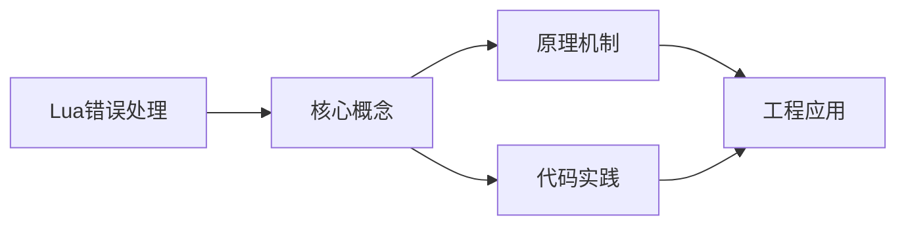

## 1. 学习目标（Bloom 分类）

本节按照布鲁姆教育目标分类学组织学习路径。本文主题为《Lua错误处理》，属于 Lua 模块，读者可以根据自身阶段选择阅读深度。

记忆层面：能够准确复述本文的核心概念、术语与基本语法或操作步骤，并能够在提问或检索时快速定位对应知识点。能够说出 Lua 的变量、函数、table、元表与协程基本语法。

理解层面：能够用自己的语言解释核心原理与工作机制，说明概念之间的因果关系，而不是机械记忆结论。能够解释 table 作为唯一数据结构的设计与元方法机制。

应用层面：能够在真实项目或练习场景中运用本文知识解决具体问题，写出正确且可维护的实现。能够编写嵌入主程序（游戏、Nginx、Redis）的脚本。

分析层面：能够拆解复杂问题，比较本文主题与相邻概念的异同，识别边界条件与例外情况。能够分析 Lua 与 C 交互（Lua C API）与性能特征。

评价层面：能够根据约束条件（性能、可读性、安全、成本）评价不同方案的优劣，做出有依据的技术决策。能够评价 Lua 与其他脚本语言在嵌入式场景的取舍。

创造层面：能够把本文知识与其他模块知识组合，设计出新的解决方案或可复用的工程模式。能够设计基于 Lua 的可扩展配置与脚本系统。

通过本节学习，读者应当能够把《Lua错误处理》纳入自己的知识网络，并与 Lua 模块的其他主题（table、元表、协程、嵌入式脚本）建立关联。

## 2. 历史动机与发展脉络

《Lua错误处理》是 Lua 领域的重要主题。要真正理解它，需要先了解它解决的问题与演进过程。

Lua 由巴西 PUC-Rio 大学的 Roberto Ierusalimschy 等人于 1993 年发布，设计目标是“可嵌入的脚本语言”：解释器小于 300KB，启动快，与 C 无缝集成。
Lua 5.1-5.4 持续演进：5.3 加入整数子类型，5.4 引入 const 变量与关闭值；LuaJIT 是高性能 JIT 实现，广泛用于游戏与性能敏感场景。
Lua 的著名用户：Adobe Lightroom、Redis 脚本、Nginx（OpenResty）、World of Warcraft 插件、Roblox（Luau）与游戏引擎（LÖVE、Defold）。

回到本文主题：Lua错误处理 的提出与成熟，正是上述技术背景下的必然产物。早期实现往往以简单可用为目标，随着工程规模扩大，社区逐渐沉淀出标准做法与最佳实践；理解这一脉络，可以帮助读者判断“为什么文档中的推荐写法是现在这个样子”，也能在遇到历史遗留代码时准确识别其设计年代与取舍。


## 3. 形式化定义与核心概念精讲

本节把《Lua错误处理》涉及的核心概念以“定义 + 讲解”的形式展开。读者应把定义当作工具，把讲解当作理解路径；两者结合才能形成可迁移的知识。

table：Lua 唯一的数据结构，同时充当数组、字典、对象与模块；数组索引从 1 开始。
元表（metatable）：通过 __index、__newindex、__add 等元方法改变 table 行为，实现继承与运算符重载。
协程：coroutine.create/resume/yield 实现协作式多任务，适合游戏状态机与生成器。

### 3.1 原文章节逐一精讲

原文档把主题拆分为 18 个小节，下面按顺序给出每一节的导读讲解，随后保留原文细节供精读。

#### 原文精读（完整保留）

# Lua 错误处理速查

> **符号约定**：`< >` 必填参数 | `[ ]` 可选参数

---

#### 概述

错误处理是编写健壮程序的基础。Lua 采用了一种简洁而灵活的错误处理机制：通过 error 函数主动抛出错误，通过 pcall 和 xpcall 进行保护调用。与 Java、Python 等语言使用 try-catch 结构不同，Lua 没有内置的异常语法，而是依赖函数调用的返回值来传递错误信息。这种设计虽然简单，但足以应对大多数场景，并且与 Lua 作为嵌入式语言的定位非常契合。

理解 Lua 的错误处理机制对于编写可靠的程序至关重要。无论是处理用户输入、访问文件系统、还是调用外部库函数，都可能遇到运行时错误。合理使用 pcall 和 xpcall 可以防止程序因未捕获的错误而崩溃，同时提供足够的信息帮助开发者定位问题。

#### 基本概念

**error 函数**用于主动抛出错误。当调用 error 时，Lua 会中断当前函数的执行，沿着调用栈向上寻找错误处理代码。error 接受两个参数：第一个是错误消息（可以是任意类型的值，不限于字符串），第二个是错误级别，用于控制错误信息中指向的源文件位置。

**pcall** 是 protected call 的缩写，即保护调用。它接受一个函数和若干参数，在保护模式下调用该函数。如果函数执行成功，pcall 返回 true 和函数的返回值；如果函数抛出错误，pcall 返回 false 和错误消息。pcall 不会提供调用栈信息。

**xpcall** 是 pcall 的增强版本，额外接受一个错误处理函数。当被调用的函数抛出错误时，xpcall 会调用错误处理函数，并将错误消息传递给它。最常见的用法是将 debug.traceback 作为错误处理函数，从而获取完整的调用栈信息。

**错误级别**是 error 函数的第二个参数，用于控制错误消息中指向的源代码位置。级别 1（默认）指向调用 error 的位置，级别 2 指向调用 error 所在函数的位置，级别 0 不添加位置信息。合理使用错误级别可以让错误消息更加准确和有用。

#### 快速开始

最简单的错误处理方式是使用 error 抛出错误，用 pcall 捕获：

```lua
-- 定义一个可能出错的函数
local function divide(a, b)
    if b == 0 then
        error("除数不能为零")
    end
    return a / b
end

-- 使用 pcall 安全调用
local ok, result = pcall(divide, 10, 2)
if ok then
    print("结果:", result)  -- 输出: 结果: 5
else
    print("错误:", result)
end

-- 触发错误的情况
local ok, err = pcall(divide, 10, 0)
if not ok then
    print("错误:", err)  -- 输出类似: stdin:3: 除数不能为零
end
```

使用 xpcall 获取完整的调用栈：

```lua
local function risky_operation()
    local t = {}
    t.field.subfield = "error"  -- t.field 是 nil，会抛出错误
end

-- xpcall 的错误处理函数会收到错误消息
local ok, result = xpcall(risky_operation, function(err)
    print("捕获到错误:", err)
    -- 返回完整的调用栈信息
    return debug.traceback("错误发生: " .. tostring(err), 2)
end)

if not ok then
    print("完整调用栈:")
    print(result)
end
```

#### 详细用法

##### error 函数与错误级别

error 函数的第二个参数控制错误消息中的位置信息：

```lua
-- 辅助函数：检查参数有效性
local function check_positive(value, name)
    if value <= 0 then
        -- 级别 2：让错误指向调用 check_positive 的位置，而非 check_positive 本身
        error(string.format("参数 %s 必须为正数，当前值: %d", name, value), 2)
    end
end

local function calculate_area(radius)
    check_positive(radius, "radius")  -- 如果 radius <= 0，错误消息会指向这一行
    return math.pi * radius * radius
end

local ok, err = pcall(calculate_area, -5)
if not ok then
    print(err)
    -- 输出类似: stdin:8: 参数 radius 必须为正数，当前值: -5
    -- 注意错误指向的是第 8 行（调用 check_positive 的位置），而非第 4 行
end
```

不同错误级别的效果：

```lua
local function level_demo()
    -- 级别 0：不添加任何位置信息
    error("级别0的消息", 0)
    -- 输出: 级别0的消息

    -- 级别 1（默认）：指向 error 调用的位置
    error("级别1的消息", 1)
    -- 输出: stdin:5: 级别1的消息

    -- 级别 2：指向调用 level_demo 的位置
    error("级别2的消息", 2)
    -- 输出: stdin:15: 级别2的消息
end
```

##### pcall 的多种用法

pcall 可以传递任意数量的参数给被调用的函数：

```lua
-- pcall 会将第二个及之后的参数传递给函数
local function greet(name, greeting)
    if type(name) ~= "string" then
        error("name 必须是字符串")
    end
    return greeting .. ", " .. name .. "!"
end

-- 安全调用，传递两个参数
local ok, result = pcall(greet, "Lua", "你好")
if ok then
    print(result)  -- 输出: 你好, Lua!
end
```

pcall 可以捕获函数的多个返回值：

```lua
local function multi_return()
    return 1, 2, 3
end

local ok, a, b, c = pcall(multi_return)
if ok then
    print(a, b, c)  -- 输出: 1  2  3
end
```

pcall 与匿名函数配合使用，捕获代码块中的错误：

```lua
-- 使用匿名函数包裹可能出错的代码
local ok, err = pcall(function()
    local file = io.open("nonexistent.txt", "r")
    local content = file:read("*a")  -- file 是 nil，会抛出错误
    file:close()
end)

if not ok then
    print("文件读取失败:", err)
end
```

##### xpcall 与错误处理函数

xpcall 的核心优势在于可以自定义错误处理逻辑：

```lua
-- 自定义错误处理函数
local function error_handler(err)
    -- 记录错误日志
    local log_file = io.open("error.log", "a")
    if log_file then
        log_file:write(os.date("[%Y-%m-%d %H:%M:%S] ") .. tostring(err) .. "\n")
        log_file:write(debug.traceback("", 2) .. "\n")
        log_file:close()
    end

    -- 返回格式化的错误信息
    return {
        message = tostring(err),
        traceback = debug.traceback("", 2),
        timestamp = os.time(),
    }
end

local function risky_function()
    local t = {}
    t.x.y = 1  -- 错误：t.x 是 nil
end

local ok, result = xpcall(risky_function, error_handler)
if not ok then
    print("错误消息:", result.message)
    print("发生时间:", os.date("%Y-%m-%d %H:%M:%S", result.timestamp))
end
```

Lua 5.2 及以上版本中，xpcall 也支持传递参数：

```lua
-- Lua 5.2+ 的 xpcall 语法
local function process(data, mode)
    if mode == "strict" and type(data) ~= "table" then
        error("严格模式下 data 必须是表")
    end
    return data
end

-- xpcall(f, err_handler, arg1, arg2, ...)
local ok, result = xpcall(process, debug.traceback, "not_a_table", "strict")
if not ok then
    print("处理失败:", result)
end
```

##### assert 函数

assert 是 Lua 内置的断言函数，当条件为 nil 或 false 时抛出错误：

```lua
-- assert 检查条件，失败时抛出错误
local function read_config(path)
    -- 如果文件打开失败，assert 会抛出错误
    local file = assert(io.open(path, "r"), "无法打开配置文件: " .. path)
    local content = file:read("*a")
    file:close()
    return content
end

-- 安全调用
local ok, config = pcall(read_config, "config.lua")
if not ok then
    print("配置加载失败:", config)
    -- 使用默认配置
    config = "default_value = true"
end
```

assert 与 pcall 的组合使用：

```lua
-- 使用 assert 进行参数验证
local function create_user(name, age, email)
    assert(type(name) == "string" and #name > 0, "用户名不能为空")
    assert(type(age) == "number" and age > 0 and age < 150, "年龄必须在 1-149 之间")
    assert(email:match("[%w%.]+@[%w%.]+"), "邮箱格式无效")

    return {
        name = name,
        age = age,
        email = email,
    }
end

-- 安全创建用户
local ok, user = pcall(create_user, "张三", 25, "zhangsan@example.com")
if ok then
    print("用户创建成功:", user.name)
else
    print("用户创建失败:", user)
end
```

##### 自定义错误类型

Lua 的 error 可以抛出任意类型的值，不仅仅是字符串。利用这一特性可以实现自定义错误类型：

```lua
-- 自定义错误对象
local function create_error(code, message, details)
    return {
        code = code,
        message = message,
        details = details or {},
        tostring = function(self)
            return string.format("[%d] %s", self.code, self.message)
        end,
    }
end

-- 使用自定义错误
local function validate_input(input)
    if type(input) ~= "table" then
        error(create_error(400, "输入必须是表类型", {received = type(input)}))
    end

    if not input.username then
        error(create_error(400, "缺少必填字段: username"))
    end

    if #input.username < 3 then
        error(create_error(400, "用户名长度不能少于3个字符", {username = input.username}))
    end

    return true
end

-- 捕获并处理自定义错误
local ok, result = xpcall(function()
    return validate_input({username = "ab"})
end, function(err)
    return err  -- 直接返回错误对象
end)

if not ok then
    if type(result) == "table" and result.code then
        print("错误码:", result.code)
        print("错误消息:", result.message)
        if result.details then
            for k, v in pairs(result.details) do
                print("  详情:", k, "=", v)
            end
        end
    else
        print("未知错误:", tostring(result))
    end
end
```

#### 常见场景

##### 文件操作错误处理

文件操作是最常见的需要错误处理的场景之一：

```lua
-- 安全的文件读取
local function safe_read_file(path)
    local file, open_err = io.open(path, "r")
    if not file then
        return nil, "文件打开失败: " .. (open_err or "未知错误")
    end

    local content, read_err = file:read("*a")
    file:close()

    if not content then
        return nil, "文件读取失败: " .. (read_err or "未知错误")
    end

    return content
end

-- 使用示例
local content, err = safe_read_file("data.txt")
if not content then
    print("读取失败:", err)
    content = ""  -- 使用默认值
end
print("文件内容长度:", #content)
```

##### 网络请求错误处理

模拟网络请求中的错误处理模式：

```lua
-- 模拟 HTTP 请求
local function http_request(url, options)
    -- 模拟可能的错误
    if not url then
        error(create_error(400, "URL 不能为空"))
    end

    if not url:match("^https?://") then
        error(create_error(400, "URL 格式无效", {url = url}))
    end

    -- 模拟超时
    if url:match("timeout") then
        error(create_error(504, "请求超时"))
    end

    -- 模拟服务器错误
    if url:match("error500") then
        error(create_error(500, "服务器内部错误"))
    end

    return {status = 200, body = '{"ok": true}'}
end

-- 带重试的请求
local function request_with_retry(url, options, max_retries)
    max_retries = max_retries or 3
    local last_err

    for attempt = 1, max_retries do
        local ok, result = xpcall(function()
            return http_request(url, options)
        end, function(err)
            return err
        end)

        if ok then
            return result
        end

        last_err = result
        -- 仅对可重试的错误进行重试（5xx 错误和超时）
        if type(result) == "table" and result.code then
            if result.code >= 500 then
                print(string.format("第 %d 次请求失败: %s，正在重试...", attempt, result.message))
            else
                -- 4xx 错误不重试
                return nil, result
            end
        end
    end

    return nil, last_err
end

-- 使用示例
local result, err = request_with_retry("http://api.example.com/data", nil, 3)
if result then
    print("请求成功:", result.body)
else
    print("请求最终失败:", err.message or tostring(err))
end
```

##### 配置解析错误处理

解析配置文件时的错误处理：

```lua
-- 安全解析配置
local function parse_config(config_text)
    if not config_text or #config_text == 0 then
        return nil, "配置内容为空"
    end

    local config = {}
    local line_num = 0

    for line in config_text:gmatch("[^\n]+") do
        line_num = line_num + 1
        line = line:match("^%s*(.-)%s*$")  -- 去除首尾空白

        -- 跳过空行和注释
        if line ~= "" and not line:match("^#") then
            local key, value = line:match("^(%S+)%s*=%s*(.+)$")
            if not key then
                return nil, string.format("第 %d 行格式错误: %s", line_num, line)
            end

            -- 尝试转换值类型
            if value == "true" then
                config[key] = true
            elseif value == "false" then
                config[key] = false
            elseif tonumber(value) then
                config[key] = tonumber(value)
            else
                config[key] = value
            end
        end
    end

    return config
end

-- 使用示例
local config_text = [[
host = 127.0.0.1
port = 8080
debug = true
max_connections = 100
]]

local config, err = parse_config(config_text)
if not config then
    print("配置解析失败:", err)
else
    print("配置加载成功:")
    for k, v in pairs(config) do
        print("  " .. k .. " = " .. tostring(v))
    end
end
```

#### 注意事项与常见错误

**pcall 会吞掉错误类型信息**。如果 error 抛出的是一个表或其它复杂对象，pcall 返回的错误消息就是该对象本身。但如果在错误处理链中不小心对错误消息调用了 tostring，可能会丢失原始类型信息。建议在错误处理函数中检查错误消息的类型，分别处理字符串错误和自定义错误对象。

**xpcall 的错误处理函数中不能再抛出错误**。如果 xpcall 的错误处理函数本身抛出了错误，Lua 会用该新错误替换原始错误。这可能导致原始错误信息丢失。因此，错误处理函数应当尽量简单，避免可能出错的操作。

**assert 的第二个参数只在条件为假时使用**。assert(condition, message) 中，如果 condition 为真，message 不会被求值。但如果 message 是一个函数调用（如 assert(x, "错误: " .. expensive_call())），即使条件为真，expensive_call() 也会被执行。应使用条件表达式或将消息构造放在 assert 之前。

**错误消息不一定是字符串**。Lua 允许 error 抛出任何类型的值，包括数字、表、甚至函数。在处理 pcall 返回的错误时，务必检查其类型，不要假设它一定是字符串。使用 tostring 转换或检查 type(err) 是更安全的做法。

**避免在循环中频繁使用 pcall**。pcall 本身有一定的性能开销，因为它需要设置保护环境。如果在紧密循环中对每次迭代都使用 pcall，可能会显著影响性能。更好的做法是将整个循环包裹在一个 pcall 中，或者使用其他方式（如条件检查）来避免错误。

#### 高级用法

##### 错误处理中间件模式

实现类似中间件的错误处理链：

```lua
-- 错误处理中间件
local ErrorMiddleware = {}
ErrorMiddleware.__index = ErrorMiddleware

function ErrorMiddleware.new()
    local self = setmetatable({}, ErrorMiddleware)
    self.handlers = {}
    return self
end

-- 注册错误处理器
function ErrorMiddleware:register(handler)
    self.handlers[#self.handlers + 1] = handler
    return self
end

-- 执行处理链
function ErrorMiddleware:handle(err)
    for _, handler in ipairs(self.handlers) do
        local handled, result = handler(err)
        if handled then
            return result
        end
    end
    -- 没有处理器能处理该错误
    return nil, "未处理的错误: " .. tostring(err)
end

-- 使用示例
local middleware = ErrorMiddleware.new()

-- 注册验证错误处理器
middleware:register(function(err)
    if type(err) == "table" and err.code == 400 then
        print("[验证错误] " .. err.message)
        return true, {status = 400, error = err.message}
    end
    return false  -- 不处理此错误
end)

-- 注册权限错误处理器
middleware:register(function(err)
    if type(err) == "table" and err.code == 403 then
        print("[权限错误] " .. err.message)
        return true, {status = 403, error = err.message}
    end
    return false
end)

-- 注册通用错误处理器（兜底）
middleware:register(function(err)
    print("[未知错误] " .. tostring(err))
    return true, {status = 500, error = "内部服务器错误"}
end)

-- 在 xpcall 中使用
local ok, result = xpcall(function()
    error({code = 400, message = "参数无效"})
end, function(err) return err end)

if not ok then
    local response = middleware:handle(result)
    print("响应:", response.status, response.error)
end
```

##### Result 模式（函数式错误处理）

借鉴 Rust 等语言的 Result 类型，实现函数式风格的错误处理：

```lua
-- Result 类型
local Result = {}
Result.__index = Result

-- 创建成功结果
function Result.ok(value)
    return setmetatable({
        is_ok = true,
        value = value,
    }, Result)
end

-- 创建失败结果
function Result.err(error_value)
    return setmetatable({
        is_ok = false,
        error = error_value,
    }, Result)
end

-- 从 pcall 结果创建 Result
function Result.from_pcall(ok, ...)
    if ok then
        return Result.ok(...)
    else
        return Result.err((...))
    end
end

-- 映射成功值
function Result:map(fn)
    if self.is_ok then
        return Result.ok(fn(self.value))
    end
    return self
end

-- 映射错误值
function Result:map_err(fn)
    if not self.is_ok then
        return Result.err(fn(self.error))
    end
    return self
end

-- 链式操作（flatMap）
function Result:and_then(fn)
    if self.is_ok then
        return fn(self.value)
    end
    return self
end

-- 提供默认值
function Result:unwrap_or(default)
    if self.is_ok then
        return self.value
    end
    return default
end

-- 获取值或抛出错误
function Result:unwrap()
    if self.is_ok then
        return self.value
    end
    error("对错误结果调用 unwrap: " .. tostring(self.error))
end

-- 使用示例
local function parse_int(str)
    local num = tonumber(str)
    if num and math.floor(num) == num then
        return Result.ok(num)
    end
    return Result.err("无法解析为整数: " .. tostring(str))
end

local function safe_divide(a, b)
    if b == 0 then
        return Result.err("除数不能为零")
    end
    return Result.ok(a / b)
end

-- 链式调用
local result = parse_int("42")
    :and_then(function(n) return safe_divide(n, 2) end)
    :map(function(v) return v * 10 end)

if result.is_ok then
    print("计算结果:", result.value)  -- 输出: 计算结果: 210
else
    print("计算失败:", result.error)
end

-- 错误链
local err_result = parse_int("abc")
    :and_then(function(n) return safe_divide(n, 0) end)

print("是否成功:", err_result.is_ok)  -- 输出: false
print("错误信息:", err_result.error)  -- 输出: 无法解析为整数: abc
```

##### 协程中的错误处理

协程的错误处理需要特别注意，因为协程内部的错误不会自动传播到外部：

```lua
-- 安全的协程包装器
local function safe_coroutine_create(fn)
    local co = coroutine.create(function(...)
        -- 在协程内部捕获错误
        local ok, result = xpcall(fn, function(err)
            return {
                error = err,
                traceback = debug.traceback("", 2),
            }
        end, ...)

        if ok then
            return true, result
        else
            return false, result
        end
    end)

    return co
end

-- 安全恢复协程
local function safe_coroutine_resume(co, ...)
    local ok, success, result = coroutine.resume(co, ...)

    if not ok then
        -- resume 本身失败（极少发生）
        return false, {error = result, traceback = "coroutine resume failed"}
    end

    if success then
        return true, result
    else
        -- 协程内部出错
        return false, result
    end
end

-- 使用示例
local co = safe_coroutine_create(function(a, b)
    if b == 0 then
        error("除数不能为零")
    end
    return a / b
end)

local ok, result = safe_coroutine_resume(co, 10, 0)
if not ok then
    print("协程执行失败:", result.error)
    print("调用栈:", result.traceback)
end
```

##### finally 模式

Lua 没有内置的 finally 语法，但可以通过模式模拟：

```lua
-- 模拟 try-finally 模式
local function try_finally(try_fn, finally_fn)
    local ok, result = xpcall(try_fn, function(err)
        return err
    end)

    -- 无论成功还是失败，都执行 finally
    finally_fn()

    if ok then
        return result
    else
        -- 重新抛出错误
        error(result)
    end
end

-- 使用示例
local function process_file(path)
    local file

    try_finally(function()
        file = assert(io.open(path, "r"))
        local content = file:read("*a")
        print("文件内容长度:", #content)
    end, function()
        -- 确保文件句柄被关闭
        if file then
            file:close()
            print("文件已关闭")
        end
    end)
end

-- 安全调用
local ok, err = pcall(process_file, "test.txt")
if not ok then
    print("处理失败:", err)
end
```

##### 带上下文的错误信息

为错误添加丰富的上下文信息，便于排查问题：

```lua
-- 带上下文的错误构造器
local function context_error(message, context)
    local err = {
        message = message,
        context = context or {},
        timestamp = os.time(),
        traceback = debug.traceback("", 2),
    }

    -- 设置元表以支持 tostring
    setmetatable(err, {
        __tostring = function(self)
            local parts = {self.message}
            if next(self.context) then
                parts[#parts + 1] = "上下文信息:"
                for k, v in pairs(self.context) do
                    parts[#parts + 1] = string.format("  %s = %s", k, tostring(v))
                end
            end
            return table.concat(parts, "\n")
        end,
    })

    return err
end

-- 使用示例
local function query_database(sql, params)
    if not sql or #sql == 0 then
        error(context_error("SQL 语句不能为空", {
            sql = sql,
            params = params,
            operation = "query_database",
        }), 2)
    end

    -- 模拟查询
    return {{id = 1, name = "test"}}
end

local ok, result = xpcall(function()
    return query_database("", {})
end, function(err) return err end)

if not ok then
    print("数据库查询失败:")
    print(result)
    -- 输出:
    -- SQL 语句不能为空
    -- 上下文信息:
    --   sql =
    --   params = table: 0x...
    --   operation = query_database
end
```
#### error 函数

**基本写法：error 抛出错误**
`error("<message>")`
```lua
-- 抛出错误
error("发生错误")
```

**基本写法：error 带错误级别**
`error("<message>", <level>)`
```lua
-- 指定错误级别（1=调用位置，2=调用者的调用位置）
error("参数错误", 2)
```

**基本写法：error 抛出表**
`error({code = <code>, message = "<msg>"})`
```lua
-- 抛出表作为错误对象
error({code = 404, message = "Not Found"})
```

---

#### pcall 错误捕获

**基本写法：pcall 保护调用**
`pcall(<function>, <args>)`
```lua
-- pcall 保护调用函数
local ok, result = pcall(function()
    return 10 / 0
end)
if not ok then
    print("错误: " .. result)
end
```

**基本写法：pcall 带参数**
`pcall(<function>, <arg1>, <arg2>)`
```lua
-- pcall 传递参数给函数
local function divide(a, b)
    if b == 0 then error("除零错误") end
    return a / b
end
local ok, result = pcall(divide, 10, 0)
```

**基本写法：pcall 多返回值**
`local <ok>, <r1>, <r2> = pcall(<function>, <args>)`
```lua
-- pcall 捕获多返回值
local function getCoords()
    return 10, 20
end
local ok, x, y = pcall(getCoords)
```

**基本写法：pcall 错误处理**
`if not <ok> then <body> end`
```lua
-- pcall 错误处理
local ok, err = pcall(function()
    error("处理失败")
end)
if not ok then
    print("捕获错误: " .. err)
end
```

---

#### xpcall 错误捕获

**基本写法：xpcall 带错误处理函数**
`xpcall(<function>, <handler>)`
```lua
-- xpcall 带错误处理函数
local function errorHandler(err)
    print("错误: " .. err)
    return "处理后"
end
local ok, result = xpcall(function()
    error("发生错误")
end, errorHandler)
```

**基本写法：xpcall 带参数**
`xpcall(<function>, <handler>, <arg>)`
```lua
-- xpcall 传递参数给函数
local function process(data)
    if not data then error("数据为空") end
    return data
end
local ok, result = xpcall(process, errorHandler, "Hello")
```

**基本写法：xpcall 多参数**
`xpcall(<function>, <handler>, <arg1>, <arg2>)`
```lua
-- xpcall 传递多个参数
local function add(a, b)
    if type(a) ~= "number" then error("参数类型错误") end
    return a + b
end
local ok, result = xpcall(add, errorHandler, 10, 20)
```

---

#### assert 断言

**基本写法：assert 基本断言**
`assert(<condition>)`
```lua
-- assert 断言条件为真
assert(x > 0)
```

**基本写法：assert 带错误消息**
`assert(<condition>, "<message>")`
```lua
-- assert 带自定义错误消息
assert(x > 0, "x 必须大于 0")
```

**基本写法：assert 检查返回值**
`local <result> = assert(<func>(<args>))`
```lua
-- assert 检查函数返回值
local file = assert(io.open("test.txt", "r"))
```

**基本写法：assert 带格式化消息**
`assert(<condition>, string.format("<format>", <args>))`
```lua
-- assert 带格式化错误消息
assert(age >= 18, string.format("年龄 %d 不满足要求", age))
```

---

#### 错误对象

**基本写法：错误对象表**
`error({code = <code>, message = "<msg>"})`
```lua
-- 错误对象表
local function createError(code, message)
    return {code = code, message = message}
end
error(createError(500, "服务器错误"))
```

**基本写法：错误对象处理**
`if type(<err>) == "table" then <body> end`
```lua
-- 处理错误对象
local ok, err = pcall(function()
    error({code = 404, message = "Not Found"})
end)
if not ok and type(err) == "table" then
    print("错误码: " .. err.code)
    print("错误信息: " .. err.message)
end
```

---

#### 错误传播

**基本写法：函数内错误传播**
`if <cond> then error("<msg>") end`
```lua
-- 函数内检查并抛出错误
local function process(data)
    if not data then
        error("数据不能为空")
    end
    return data.value
end
```

**基本写法：嵌套错误捕获**
`local <ok>, <err> = pcall(function() <body with nested pcall> end)`
```lua
-- 嵌套错误捕获
local function outerFunc()
    local ok, err = pcall(function()
        error("内部错误")
    end)
    if not ok then
        error("外部错误: " .. err)
    end
end
local ok, err = pcall(outerFunc)
```

---

#### finally 模拟

**基本写法：finally 模拟**
`local <ok>, <err> = pcall(<function>); <cleanup>; if not <ok> then error(<err>) end`
```lua
-- 模拟 finally 清理
local function withCleanup(func, cleanup)
    local ok, err = pcall(func)
    cleanup()
    if not ok then
        error(err)
    end
end
```

**基本写法：资源清理**
`local <ok>, <err> = pcall(<function>); <resource>:close(); if not <ok> then error(<err>) end`
```lua
-- 资源清理模式
local function processFile(filename)
    local file = io.open(filename, "r")
    if not file then error("无法打开文件") end
    local ok, err = pcall(function()
        return file:read("*a")
    end)
    file:close()
    if not ok then error(err) end
end
```

---

#### 错误处理模式

**基本写法：返回错误模式**
`local function <name>(<params>) if <cond> then return nil, "<error>" end return <result> end`
```lua
-- 返回 nil 和错误信息
local function divide(a, b)
    if b == 0 then
        return nil, "除零错误"
    end
    return a / b
end
local result, err = divide(10, 0)
```

**基本写法：错误码模式**
`local function <name>(<params>) if <cond> then return false, <code> end return true, <result> end`
```lua
-- 返回成功状态和错误码
local function validate(data)
    if not data then
        return false, 1
    end
    if #data == 0 then
        return false, 2
    end
    return true, data
end
```

**基本写法：Result 模式**
`local function <name>(<params>) return {ok = <bool>, value = <value>, err = <err>} end`
```lua
-- Result 对象模式
local function safeDivide(a, b)
    if b == 0 then
        return {ok = false, err = "除零错误"}
    end
    return {ok = true, value = a / b}
end
```

---

#### 错误日志

**基本写法：错误日志记录**
`local function <logError>(<err>) <body> end`
```lua
-- 错误日志记录函数
local function logError(err)
    local log = io.open("error.log", "a")
    if log then
        log:write(os.date("%Y-%m-%d %H:%M:%S") .. " - " .. tostring(err) .. "\n")
        log:close()
    end
end
```

**基本写法：pcall 与日志结合**
`local <ok>, <err> = pcall(<function>); if not <ok> then <logError>(<err>) end`
```lua
-- pcall 与日志结合
local ok, err = pcall(function()
    error("处理失败")
end)
if not ok then
    logError(err)
end
```

---

#### debug 追踪

**基本写法：debug.traceback 获取堆栈**
`debug.traceback("<message>")`
```lua
-- 获取错误堆栈追踪
local function funcA()
    error("错误发生")
end
local function funcB()
    funcA()
end
local ok, err = pcall(funcB)
print(debug.traceback(err))
```

**基本写法：xpcall 中获取堆栈**
`xpcall(<function>, function(<err>) return debug.traceback(<err>) end)`
```lua
-- xpcall 中获取堆栈追踪
local ok, err = xpcall(function()
    error("错误")
end, function(err)
    return debug.traceback(err, 2)
end)
```

**基本写法：debug.getinfo 获取函数信息**
`debug.getinfo(<function>)`
```lua
-- 获取函数信息
local function testFunc() end
local info = debug.getinfo(testFunc)
print(info.name, info.source, info.linedefined)
```

---

#### 错误处理实战

**基本写法：安全调用**
`local function <safeCall>(<func>, <args>) <body> end`
```lua
-- 安全调用函数
local function safeCall(func, ...)
    local ok, result = pcall(func, ...)
    if not ok then
        print("调用失败: " .. tostring(result))
        return nil
    end
    return result
end
```

**基本写法：重试机制**
`local function <retry>(<func>, <times>) <body> end`
```lua
-- 重试机制
local function retry(func, times)
    local ok, err
    for i = 1, times do
        ok, err = pcall(func)
        if ok then return err end
    end
    return nil, err
end
```

**基本写法：错误链**
`local function <chain>(<funcs>) <body> end`
```lua
-- 错误链处理
local function chain(funcs)
    for _, func in ipairs(funcs) do
        local ok, err = pcall(func)
        if not ok then
            return nil, err
        end
    end
    return true
end
```


### 3.2 概念关系图

下面用 Mermaid 图表达本文核心概念之间的关系，帮助读者建立整体图景：



图中展示的是本文知识的结构化关系：核心概念是入口，原理机制解释“为什么”，代码实践演示“怎么做”，工程应用回答“何时用”。读者学习时可以把每个小节的内容挂接到对应节点上。

## 4. 理论推导与原理解析

本节深入《Lua错误处理》背后的原理。理论部分不求面面俱到，而是聚焦“能解释现象、能指导实践”的关键推导。

table：Lua 唯一的数据结构，同时充当数组、字典、对象与模块；数组索引从 1 开始。
元表（metatable）：通过 __index、__newindex、__add 等元方法改变 table 行为，实现继承与运算符重载。
协程：coroutine.create/resume/yield 实现协作式多任务，适合游戏状态机与生成器。
C API：lua_State 上下文、栈式参数传递，宿主程序可以安全地执行用户脚本。

需要强调的是，理论推导与工程实践之间存在翻译层：理论给出的是理想化模型与边界条件，工程代码则必须处理真实环境中的例外。读者在学习时应先掌握理论的“标准情形”，再通过陷阱章节了解“非标准情形”。

## 5. 代码示例与逐行讲解

本节把原文中的代码示例系统整理，并为每个示例补充用途说明与讲解。读者不应只浏览代码，而应逐段对照讲解理解设计意图。

### 5.1 示例：快速开始

该示例来自原文《快速开始》小节，用于演示Lua错误处理相关操作。阅读时请先看代码结构，再看其后的讲解。

```lua
-- 定义一个可能出错的函数
local function divide(a, b)
    if b == 0 then
        error("除数不能为零")
    end
    return a / b
end

-- 使用 pcall 安全调用
local ok, result = pcall(divide, 10, 2)
if ok then
    print("结果:", result)  -- 输出: 结果: 5
else
    print("错误:", result)
end

-- 触发错误的情况
local ok, err = pcall(divide, 10, 0)
if not ok then
    print("错误:", err)  -- 输出类似: stdin:3: 除数不能为零
end
```

讲解：这段代码演示了本节核心知识点。代码中的关键操作可以归纳为三步：准备（定义或初始化）、执行（核心逻辑）、收尾（释放资源或返回结果）。实际项目中，这三步往往被封装为函数或类，以提升复用性与可测试性。

关键点分析：

该示例共 19 行有效代码，包含 3 类关键结构（function、if、return）。其中：

- 入口与初始化部分负责建立上下文，对应实际项目中的启动或装配逻辑；
- 核心逻辑部分体现本文主题的主要操作，是阅读时最需要对照讲解理解的部分；
- 输出或返回部分把结果交给调用方，注意其类型与边界条件。

进阶思考路径：先尝试修改参数观察行为变化，再把示例中的模式迁移到自己的项目中；每次修改都记录预期与实测差异，这是把示例转化为能力的最快方式。

### 5.2 示例：快速开始

该示例来自原文《快速开始》小节，用于演示Lua错误处理相关操作。阅读时请先看代码结构，再看其后的讲解。

```lua
local function risky_operation()
    local t = {}
    t.field.subfield = "error"  -- t.field 是 nil，会抛出错误
end

-- xpcall 的错误处理函数会收到错误消息
local ok, result = xpcall(risky_operation, function(err)
    print("捕获到错误:", err)
    -- 返回完整的调用栈信息
    return debug.traceback("错误发生: " .. tostring(err), 2)
end)

if not ok then
    print("完整调用栈:")
    print(result)
end
```

讲解：这段代码演示了本节核心知识点。代码中的关键操作可以归纳为三步：准备（定义或初始化）、执行（核心逻辑）、收尾（释放资源或返回结果）。实际项目中，这三步往往被封装为函数或类，以提升复用性与可测试性。

关键点分析：

该示例共 14 行有效代码，包含 3 类关键结构（function、if、return）。其中：

- 入口与初始化部分负责建立上下文，对应实际项目中的启动或装配逻辑；
- 核心逻辑部分体现本文主题的主要操作，是阅读时最需要对照讲解理解的部分；
- 输出或返回部分把结果交给调用方，注意其类型与边界条件。

进阶思考路径：先尝试修改参数观察行为变化，再把示例中的模式迁移到自己的项目中；每次修改都记录预期与实测差异，这是把示例转化为能力的最快方式。

### 5.3 示例：error 函数与错误级别

该示例来自原文《error 函数与错误级别》小节，用于演示Lua错误处理相关操作。阅读时请先看代码结构，再看其后的讲解。

```lua
-- 辅助函数：检查参数有效性
local function check_positive(value, name)
    if value <= 0 then
        -- 级别 2：让错误指向调用 check_positive 的位置，而非 check_positive 本身
        error(string.format("参数 %s 必须为正数，当前值: %d", name, value), 2)
    end
end

local function calculate_area(radius)
    check_positive(radius, "radius")  -- 如果 radius <= 0，错误消息会指向这一行
    return math.pi * radius * radius
end

local ok, err = pcall(calculate_area, -5)
if not ok then
    print(err)
    -- 输出类似: stdin:8: 参数 radius 必须为正数，当前值: -5
    -- 注意错误指向的是第 8 行（调用 check_positive 的位置），而非第 4 行
end
```

讲解：这段代码演示了本节核心知识点。代码中的关键操作可以归纳为三步：准备（定义或初始化）、执行（核心逻辑）、收尾（释放资源或返回结果）。实际项目中，这三步往往被封装为函数或类，以提升复用性与可测试性。

关键点分析：

该示例共 17 行有效代码，包含 3 类关键结构（function、if、return）。其中：

- 入口与初始化部分负责建立上下文，对应实际项目中的启动或装配逻辑；
- 核心逻辑部分体现本文主题的主要操作，是阅读时最需要对照讲解理解的部分；
- 输出或返回部分把结果交给调用方，注意其类型与边界条件。

进阶思考路径：先尝试修改参数观察行为变化，再把示例中的模式迁移到自己的项目中；每次修改都记录预期与实测差异，这是把示例转化为能力的最快方式。

### 5.4 示例：error 函数与错误级别

该示例来自原文《error 函数与错误级别》小节，用于演示Lua错误处理相关操作。阅读时请先看代码结构，再看其后的讲解。

```lua
local function level_demo()
    -- 级别 0：不添加任何位置信息
    error("级别0的消息", 0)
    -- 输出: 级别0的消息

    -- 级别 1（默认）：指向 error 调用的位置
    error("级别1的消息", 1)
    -- 输出: stdin:5: 级别1的消息

    -- 级别 2：指向调用 level_demo 的位置
    error("级别2的消息", 2)
    -- 输出: stdin:15: 级别2的消息
end
```

讲解：这段代码演示了本节核心知识点。代码中的关键操作可以归纳为三步：准备（定义或初始化）、执行（核心逻辑）、收尾（释放资源或返回结果）。实际项目中，这三步往往被封装为函数或类，以提升复用性与可测试性。

关键点分析：

该示例共 11 行有效代码，包含 1 类关键结构（function）。其中：

- 入口与初始化部分负责建立上下文，对应实际项目中的启动或装配逻辑；
- 核心逻辑部分体现本文主题的主要操作，是阅读时最需要对照讲解理解的部分；
- 输出或返回部分把结果交给调用方，注意其类型与边界条件。

进阶思考路径：先尝试修改参数观察行为变化，再把示例中的模式迁移到自己的项目中；每次修改都记录预期与实测差异，这是把示例转化为能力的最快方式。

### 5.5 示例：pcall 的多种用法

该示例来自原文《pcall 的多种用法》小节，用于演示Lua错误处理相关操作。阅读时请先看代码结构，再看其后的讲解。

```lua
-- pcall 会将第二个及之后的参数传递给函数
local function greet(name, greeting)
    if type(name) ~= "string" then
        error("name 必须是字符串")
    end
    return greeting .. ", " .. name .. "!"
end

-- 安全调用，传递两个参数
local ok, result = pcall(greet, "Lua", "你好")
if ok then
    print(result)  -- 输出: 你好, Lua!
end
```

讲解：这段代码演示了本节核心知识点。代码中的关键操作可以归纳为三步：准备（定义或初始化）、执行（核心逻辑）、收尾（释放资源或返回结果）。实际项目中，这三步往往被封装为函数或类，以提升复用性与可测试性。

关键点分析：

该示例共 12 行有效代码，包含 3 类关键结构（function、if、return）。其中：

- 入口与初始化部分负责建立上下文，对应实际项目中的启动或装配逻辑；
- 核心逻辑部分体现本文主题的主要操作，是阅读时最需要对照讲解理解的部分；
- 输出或返回部分把结果交给调用方，注意其类型与边界条件。

进阶思考路径：先尝试修改参数观察行为变化，再把示例中的模式迁移到自己的项目中；每次修改都记录预期与实测差异，这是把示例转化为能力的最快方式。

### 5.6 示例：pcall 的多种用法

该示例来自原文《pcall 的多种用法》小节，用于演示Lua错误处理相关操作。阅读时请先看代码结构，再看其后的讲解。

```lua
local function multi_return()
    return 1, 2, 3
end

local ok, a, b, c = pcall(multi_return)
if ok then
    print(a, b, c)  -- 输出: 1  2  3
end
```

讲解：这段代码演示了本节核心知识点。代码中的关键操作可以归纳为三步：准备（定义或初始化）、执行（核心逻辑）、收尾（释放资源或返回结果）。实际项目中，这三步往往被封装为函数或类，以提升复用性与可测试性。

关键点分析：

该示例共 7 行有效代码，包含 3 类关键结构（function、if、return）。其中：

- 入口与初始化部分负责建立上下文，对应实际项目中的启动或装配逻辑；
- 核心逻辑部分体现本文主题的主要操作，是阅读时最需要对照讲解理解的部分；
- 输出或返回部分把结果交给调用方，注意其类型与边界条件。

进阶思考路径：先尝试修改参数观察行为变化，再把示例中的模式迁移到自己的项目中；每次修改都记录预期与实测差异，这是把示例转化为能力的最快方式。

### 5.7 示例：pcall 的多种用法

该示例来自原文《pcall 的多种用法》小节，用于演示Lua错误处理相关操作。阅读时请先看代码结构，再看其后的讲解。

```lua
-- 使用匿名函数包裹可能出错的代码
local ok, err = pcall(function()
    local file = io.open("nonexistent.txt", "r")
    local content = file:read("*a")  -- file 是 nil，会抛出错误
    file:close()
end)

if not ok then
    print("文件读取失败:", err)
end
```

讲解：这段代码演示了本节核心知识点。代码中的关键操作可以归纳为三步：准备（定义或初始化）、执行（核心逻辑）、收尾（释放资源或返回结果）。实际项目中，这三步往往被封装为函数或类，以提升复用性与可测试性。

关键点分析：

该示例共 9 行有效代码，包含 2 类关键结构（function、if）。其中：

- 入口与初始化部分负责建立上下文，对应实际项目中的启动或装配逻辑；
- 核心逻辑部分体现本文主题的主要操作，是阅读时最需要对照讲解理解的部分；
- 输出或返回部分把结果交给调用方，注意其类型与边界条件。

进阶思考路径：先尝试修改参数观察行为变化，再把示例中的模式迁移到自己的项目中；每次修改都记录预期与实测差异，这是把示例转化为能力的最快方式。

### 5.8 示例：xpcall 与错误处理函数

该示例来自原文《xpcall 与错误处理函数》小节，用于演示Lua错误处理相关操作。阅读时请先看代码结构，再看其后的讲解。

```lua
-- 自定义错误处理函数
local function error_handler(err)
    -- 记录错误日志
    local log_file = io.open("error.log", "a")
    if log_file then
        log_file:write(os.date("[%Y-%m-%d %H:%M:%S] ") .. tostring(err) .. "\n")
        log_file:write(debug.traceback("", 2) .. "\n")
        log_file:close()
    end

    -- 返回格式化的错误信息
    return {
        message = tostring(err),
        traceback = debug.traceback("", 2),
        timestamp = os.time(),
    }
end

local function risky_function()
    local t = {}
    t.x.y = 1  -- 错误：t.x 是 nil
end

local ok, result = xpcall(risky_function, error_handler)
if not ok then
    print("错误消息:", result.message)
    print("发生时间:", os.date("%Y-%m-%d %H:%M:%S", result.timestamp))
end
```

讲解：这段代码演示了本节核心知识点。代码中的关键操作可以归纳为三步：准备（定义或初始化）、执行（核心逻辑）、收尾（释放资源或返回结果）。实际项目中，这三步往往被封装为函数或类，以提升复用性与可测试性。

关键点分析：

该示例共 25 行有效代码，包含 3 类关键结构（function、if、return）。其中：

- 入口与初始化部分负责建立上下文，对应实际项目中的启动或装配逻辑；
- 核心逻辑部分体现本文主题的主要操作，是阅读时最需要对照讲解理解的部分；
- 输出或返回部分把结果交给调用方，注意其类型与边界条件。

进阶思考路径：先尝试修改参数观察行为变化，再把示例中的模式迁移到自己的项目中；每次修改都记录预期与实测差异，这是把示例转化为能力的最快方式。

### 5.9 示例：xpcall 与错误处理函数

该示例来自原文《xpcall 与错误处理函数》小节，用于演示Lua错误处理相关操作。阅读时请先看代码结构，再看其后的讲解。

```lua
-- Lua 5.2+ 的 xpcall 语法
local function process(data, mode)
    if mode == "strict" and type(data) ~= "table" then
        error("严格模式下 data 必须是表")
    end
    return data
end

-- xpcall(f, err_handler, arg1, arg2, ...)
local ok, result = xpcall(process, debug.traceback, "not_a_table", "strict")
if not ok then
    print("处理失败:", result)
end
```

讲解：这段代码演示了本节核心知识点。代码中的关键操作可以归纳为三步：准备（定义或初始化）、执行（核心逻辑）、收尾（释放资源或返回结果）。实际项目中，这三步往往被封装为函数或类，以提升复用性与可测试性。

关键点分析：

该示例共 12 行有效代码，包含 3 类关键结构（function、if、return）。其中：

- 入口与初始化部分负责建立上下文，对应实际项目中的启动或装配逻辑；
- 核心逻辑部分体现本文主题的主要操作，是阅读时最需要对照讲解理解的部分；
- 输出或返回部分把结果交给调用方，注意其类型与边界条件。

进阶思考路径：先尝试修改参数观察行为变化，再把示例中的模式迁移到自己的项目中；每次修改都记录预期与实测差异，这是把示例转化为能力的最快方式。

### 5.10 示例：assert 函数

该示例来自原文《assert 函数》小节，用于演示Lua错误处理相关操作。阅读时请先看代码结构，再看其后的讲解。

```lua
-- assert 检查条件，失败时抛出错误
local function read_config(path)
    -- 如果文件打开失败，assert 会抛出错误
    local file = assert(io.open(path, "r"), "无法打开配置文件: " .. path)
    local content = file:read("*a")
    file:close()
    return content
end

-- 安全调用
local ok, config = pcall(read_config, "config.lua")
if not ok then
    print("配置加载失败:", config)
    -- 使用默认配置
    config = "default_value = true"
end
```

讲解：这段代码演示了本节核心知识点。代码中的关键操作可以归纳为三步：准备（定义或初始化）、执行（核心逻辑）、收尾（释放资源或返回结果）。实际项目中，这三步往往被封装为函数或类，以提升复用性与可测试性。

关键点分析：

该示例共 15 行有效代码，包含 3 类关键结构（function、if、return）。其中：

- 入口与初始化部分负责建立上下文，对应实际项目中的启动或装配逻辑；
- 核心逻辑部分体现本文主题的主要操作，是阅读时最需要对照讲解理解的部分；
- 输出或返回部分把结果交给调用方，注意其类型与边界条件。

进阶思考路径：先尝试修改参数观察行为变化，再把示例中的模式迁移到自己的项目中；每次修改都记录预期与实测差异，这是把示例转化为能力的最快方式。

### 5.11 示例：assert 函数

该示例来自原文《assert 函数》小节，用于演示Lua错误处理相关操作。阅读时请先看代码结构，再看其后的讲解。

```lua
-- 使用 assert 进行参数验证
local function create_user(name, age, email)
    assert(type(name) == "string" and #name > 0, "用户名不能为空")
    assert(type(age) == "number" and age > 0 and age < 150, "年龄必须在 1-149 之间")
    assert(email:match("[%w%.]+@[%w%.]+"), "邮箱格式无效")

    return {
        name = name,
        age = age,
        email = email,
    }
end

-- 安全创建用户
local ok, user = pcall(create_user, "张三", 25, "zhangsan@example.com")
if ok then
    print("用户创建成功:", user.name)
else
    print("用户创建失败:", user)
end
```

讲解：这段代码演示了本节核心知识点。代码中的关键操作可以归纳为三步：准备（定义或初始化）、执行（核心逻辑）、收尾（释放资源或返回结果）。实际项目中，这三步往往被封装为函数或类，以提升复用性与可测试性。

关键点分析：

该示例共 18 行有效代码，包含 3 类关键结构（function、if、return）。其中：

- 入口与初始化部分负责建立上下文，对应实际项目中的启动或装配逻辑；
- 核心逻辑部分体现本文主题的主要操作，是阅读时最需要对照讲解理解的部分；
- 输出或返回部分把结果交给调用方，注意其类型与边界条件。

进阶思考路径：先尝试修改参数观察行为变化，再把示例中的模式迁移到自己的项目中；每次修改都记录预期与实测差异，这是把示例转化为能力的最快方式。

### 5.12 示例：自定义错误类型

该示例来自原文《自定义错误类型》小节，用于演示Lua错误处理相关操作。阅读时请先看代码结构，再看其后的讲解。

```lua
-- 自定义错误对象
local function create_error(code, message, details)
    return {
        code = code,
        message = message,
        details = details or {},
        tostring = function(self)
            return string.format("[%d] %s", self.code, self.message)
        end,
    }
end

-- 使用自定义错误
local function validate_input(input)
    if type(input) ~= "table" then
        error(create_error(400, "输入必须是表类型", {received = type(input)}))
    end

    if not input.username then
        error(create_error(400, "缺少必填字段: username"))
    end

    if #input.username < 3 then
        error(create_error(400, "用户名长度不能少于3个字符", {username = input.username}))
    end

    return true
end

-- 捕获并处理自定义错误
local ok, result = xpcall(function()
    return validate_input({username = "ab"})
end, function(err)
    return err  -- 直接返回错误对象
end)

if not ok then
    if type(result) == "table" and result.code then
        print("错误码:", result.code)
        print("错误消息:", result.message)
        if result.details then
            for k, v in pairs(result.details) do
                print("  详情:", k, "=", v)
            end
        end
    else
        print("未知错误:", tostring(result))
    end
end
```

讲解：这段代码演示了本节核心知识点。代码中的关键操作可以归纳为三步：准备（定义或初始化）、执行（核心逻辑）、收尾（释放资源或返回结果）。实际项目中，这三步往往被封装为函数或类，以提升复用性与可测试性。

关键点分析：

该示例共 43 行有效代码，包含 4 类关键结构（function、if、for、return）。其中：

- 入口与初始化部分负责建立上下文，对应实际项目中的启动或装配逻辑；
- 核心逻辑部分体现本文主题的主要操作，是阅读时最需要对照讲解理解的部分；
- 输出或返回部分把结果交给调用方，注意其类型与边界条件。

进阶思考路径：先尝试修改参数观察行为变化，再把示例中的模式迁移到自己的项目中；每次修改都记录预期与实测差异，这是把示例转化为能力的最快方式。

### 5.13 示例：文件操作错误处理

该示例来自原文《文件操作错误处理》小节，用于演示Lua错误处理相关操作。阅读时请先看代码结构，再看其后的讲解。

```lua
-- 安全的文件读取
local function safe_read_file(path)
    local file, open_err = io.open(path, "r")
    if not file then
        return nil, "文件打开失败: " .. (open_err or "未知错误")
    end

    local content, read_err = file:read("*a")
    file:close()

    if not content then
        return nil, "文件读取失败: " .. (read_err or "未知错误")
    end

    return content
end

-- 使用示例
local content, err = safe_read_file("data.txt")
if not content then
    print("读取失败:", err)
    content = ""  -- 使用默认值
end
print("文件内容长度:", #content)
```

讲解：这段代码演示了本节核心知识点。代码中的关键操作可以归纳为三步：准备（定义或初始化）、执行（核心逻辑）、收尾（释放资源或返回结果）。实际项目中，这三步往往被封装为函数或类，以提升复用性与可测试性。

关键点分析：

该示例共 20 行有效代码，包含 3 类关键结构（function、if、return）。其中：

- 入口与初始化部分负责建立上下文，对应实际项目中的启动或装配逻辑；
- 核心逻辑部分体现本文主题的主要操作，是阅读时最需要对照讲解理解的部分；
- 输出或返回部分把结果交给调用方，注意其类型与边界条件。

进阶思考路径：先尝试修改参数观察行为变化，再把示例中的模式迁移到自己的项目中；每次修改都记录预期与实测差异，这是把示例转化为能力的最快方式。

### 5.14 示例：网络请求错误处理

该示例来自原文《网络请求错误处理》小节，用于演示Lua错误处理相关操作。阅读时请先看代码结构，再看其后的讲解。

```lua
-- 模拟 HTTP 请求
local function http_request(url, options)
    -- 模拟可能的错误
    if not url then
        error(create_error(400, "URL 不能为空"))
    end

    if not url:match("^https?://") then
        error(create_error(400, "URL 格式无效", {url = url}))
    end

    -- 模拟超时
    if url:match("timeout") then
        error(create_error(504, "请求超时"))
    end

    -- 模拟服务器错误
    if url:match("error500") then
        error(create_error(500, "服务器内部错误"))
    end

    return {status = 200, body = '{"ok": true}'}
end

-- 带重试的请求
local function request_with_retry(url, options, max_retries)
    max_retries = max_retries or 3
    local last_err

    for attempt = 1, max_retries do
        local ok, result = xpcall(function()
            return http_request(url, options)
        end, function(err)
            return err
        end)

        if ok then
            return result
        end

        last_err = result
        -- 仅对可重试的错误进行重试（5xx 错误和超时）
        if type(result) == "table" and result.code then
            if result.code >= 500 then
                print(string.format("第 %d 次请求失败: %s，正在重试...", attempt, result.message))
            else
                -- 4xx 错误不重试
                return nil, result
            end
        end
    end

    return nil, last_err
end

-- 使用示例
local result, err = request_with_retry("http://api.example.com/data", nil, 3)
if result then
    print("请求成功:", result.body)
else
    print("请求最终失败:", err.message or tostring(err))
end
```

讲解：这段代码演示了本节核心知识点。代码中的关键操作可以归纳为三步：准备（定义或初始化）、执行（核心逻辑）、收尾（释放资源或返回结果）。实际项目中，这三步往往被封装为函数或类，以提升复用性与可测试性。

关键点分析：

该示例共 52 行有效代码，包含 4 类关键结构（function、if、for、return）。其中：

- 入口与初始化部分负责建立上下文，对应实际项目中的启动或装配逻辑；
- 核心逻辑部分体现本文主题的主要操作，是阅读时最需要对照讲解理解的部分；
- 输出或返回部分把结果交给调用方，注意其类型与边界条件。

进阶思考路径：先尝试修改参数观察行为变化，再把示例中的模式迁移到自己的项目中；每次修改都记录预期与实测差异，这是把示例转化为能力的最快方式。

### 5.15 示例：配置解析错误处理

该示例来自原文《配置解析错误处理》小节，用于演示Lua错误处理相关操作。阅读时请先看代码结构，再看其后的讲解。

```lua
-- 安全解析配置
local function parse_config(config_text)
    if not config_text or #config_text == 0 then
        return nil, "配置内容为空"
    end

    local config = {}
    local line_num = 0

    for line in config_text:gmatch("[^\n]+") do
        line_num = line_num + 1
        line = line:match("^%s*(.-)%s*$")  -- 去除首尾空白

        -- 跳过空行和注释
        if line ~= "" and not line:match("^#") then
            local key, value = line:match("^(%S+)%s*=%s*(.+)$")
            if not key then
                return nil, string.format("第 %d 行格式错误: %s", line_num, line)
            end

            -- 尝试转换值类型
            if value == "true" then
                config[key] = true
            elseif value == "false" then
                config[key] = false
            elseif tonumber(value) then
                config[key] = tonumber(value)
            else
                config[key] = value
            end
        end
    end

    return config
end

-- 使用示例
local config_text = [[
host = 127.0.0.1
port = 8080
debug = true
max_connections = 100
]]

local config, err = parse_config(config_text)
if not config then
    print("配置解析失败:", err)
else
    print("配置加载成功:")
    for k, v in pairs(config) do
        print("  " .. k .. " = " .. tostring(v))
    end
end
```

讲解：这段代码演示了本节核心知识点。代码中的关键操作可以归纳为三步：准备（定义或初始化）、执行（核心逻辑）、收尾（释放资源或返回结果）。实际项目中，这三步往往被封装为函数或类，以提升复用性与可测试性。

关键点分析：

该示例共 46 行有效代码，包含 4 类关键结构（function、if、for、return）。其中：

- 入口与初始化部分负责建立上下文，对应实际项目中的启动或装配逻辑；
- 核心逻辑部分体现本文主题的主要操作，是阅读时最需要对照讲解理解的部分；
- 输出或返回部分把结果交给调用方，注意其类型与边界条件。

进阶思考路径：先尝试修改参数观察行为变化，再把示例中的模式迁移到自己的项目中；每次修改都记录预期与实测差异，这是把示例转化为能力的最快方式。

### 5.16 示例：错误处理中间件模式

该示例来自原文《错误处理中间件模式》小节，用于演示Lua错误处理相关操作。阅读时请先看代码结构，再看其后的讲解。

```lua
-- 错误处理中间件
local ErrorMiddleware = {}
ErrorMiddleware.__index = ErrorMiddleware

function ErrorMiddleware.new()
    local self = setmetatable({}, ErrorMiddleware)
    self.handlers = {}
    return self
end

-- 注册错误处理器
function ErrorMiddleware:register(handler)
    self.handlers[#self.handlers + 1] = handler
    return self
end

-- 执行处理链
function ErrorMiddleware:handle(err)
    for _, handler in ipairs(self.handlers) do
        local handled, result = handler(err)
        if handled then
            return result
        end
    end
    -- 没有处理器能处理该错误
    return nil, "未处理的错误: " .. tostring(err)
end

-- 使用示例
local middleware = ErrorMiddleware.new()

-- 注册验证错误处理器
middleware:register(function(err)
    if type(err) == "table" and err.code == 400 then
        print("[验证错误] " .. err.message)
        return true, {status = 400, error = err.message}
    end
    return false  -- 不处理此错误
end)

-- 注册权限错误处理器
middleware:register(function(err)
    if type(err) == "table" and err.code == 403 then
        print("[权限错误] " .. err.message)
        return true, {status = 403, error = err.message}
    end
    return false
end)

-- 注册通用错误处理器（兜底）
middleware:register(function(err)
    print("[未知错误] " .. tostring(err))
    return true, {status = 500, error = "内部服务器错误"}
end)

-- 在 xpcall 中使用
local ok, result = xpcall(function()
    error({code = 400, message = "参数无效"})
end, function(err) return err end)

if not ok then
    local response = middleware:handle(result)
    print("响应:", response.status, response.error)
end
```

讲解：这段代码演示了本节核心知识点。代码中的关键操作可以归纳为三步：准备（定义或初始化）、执行（核心逻辑）、收尾（释放资源或返回结果）。实际项目中，这三步往往被封装为函数或类，以提升复用性与可测试性。

关键点分析：

该示例共 55 行有效代码，包含 4 类关键结构（function、if、for、return）。其中：

- 入口与初始化部分负责建立上下文，对应实际项目中的启动或装配逻辑；
- 核心逻辑部分体现本文主题的主要操作，是阅读时最需要对照讲解理解的部分；
- 输出或返回部分把结果交给调用方，注意其类型与边界条件。

进阶思考路径：先尝试修改参数观察行为变化，再把示例中的模式迁移到自己的项目中；每次修改都记录预期与实测差异，这是把示例转化为能力的最快方式。

### 5.17 示例：Result 模式（函数式错误处理）

该示例来自原文《Result 模式（函数式错误处理）》小节，用于演示Lua错误处理相关操作。阅读时请先看代码结构，再看其后的讲解。

```lua
-- Result 类型
local Result = {}
Result.__index = Result

-- 创建成功结果
function Result.ok(value)
    return setmetatable({
        is_ok = true,
        value = value,
    }, Result)
end

-- 创建失败结果
function Result.err(error_value)
    return setmetatable({
        is_ok = false,
        error = error_value,
    }, Result)
end

-- 从 pcall 结果创建 Result
function Result.from_pcall(ok, ...)
    if ok then
        return Result.ok(...)
    else
        return Result.err((...))
    end
end

-- 映射成功值
function Result:map(fn)
    if self.is_ok then
        return Result.ok(fn(self.value))
    end
    return self
end

-- 映射错误值
function Result:map_err(fn)
    if not self.is_ok then
        return Result.err(fn(self.error))
    end
    return self
end

-- 链式操作（flatMap）
function Result:and_then(fn)
    if self.is_ok then
        return fn(self.value)
    end
    return self
end

-- 提供默认值
function Result:unwrap_or(default)
    if self.is_ok then
        return self.value
    end
    return default
end

-- 获取值或抛出错误
function Result:unwrap()
    if self.is_ok then
        return self.value
    end
    error("对错误结果调用 unwrap: " .. tostring(self.error))
end

-- 使用示例
local function parse_int(str)
    local num = tonumber(str)
    if num and math.floor(num) == num then
        return Result.ok(num)
    end
    return Result.err("无法解析为整数: " .. tostring(str))
end

local function safe_divide(a, b)
    if b == 0 then
        return Result.err("除数不能为零")
    end
    return Result.ok(a / b)
end

-- 链式调用
local result = parse_int("42")
    :and_then(function(n) return safe_divide(n, 2) end)
    :map(function(v) return v * 10 end)

if result.is_ok then
    print("计算结果:", result.value)  -- 输出: 计算结果: 210
else
    print("计算失败:", result.error)
end

-- 错误链
local err_result = parse_int("abc")
    :and_then(function(n) return safe_divide(n, 0) end)

print("是否成功:", err_result.is_ok)  -- 输出: false
print("错误信息:", err_result.error)  -- 输出: 无法解析为整数: abc
```

讲解：这段代码演示了本节核心知识点。代码中的关键操作可以归纳为三步：准备（定义或初始化）、执行（核心逻辑）、收尾（释放资源或返回结果）。实际项目中，这三步往往被封装为函数或类，以提升复用性与可测试性。

关键点分析：

该示例共 88 行有效代码，包含 3 类关键结构（function、if、return）。其中：

- 入口与初始化部分负责建立上下文，对应实际项目中的启动或装配逻辑；
- 核心逻辑部分体现本文主题的主要操作，是阅读时最需要对照讲解理解的部分；
- 输出或返回部分把结果交给调用方，注意其类型与边界条件。

进阶思考路径：先尝试修改参数观察行为变化，再把示例中的模式迁移到自己的项目中；每次修改都记录预期与实测差异，这是把示例转化为能力的最快方式。

### 5.18 示例：协程中的错误处理

该示例来自原文《协程中的错误处理》小节，用于演示Lua错误处理相关操作。阅读时请先看代码结构，再看其后的讲解。

```lua
-- 安全的协程包装器
local function safe_coroutine_create(fn)
    local co = coroutine.create(function(...)
        -- 在协程内部捕获错误
        local ok, result = xpcall(fn, function(err)
            return {
                error = err,
                traceback = debug.traceback("", 2),
            }
        end, ...)

        if ok then
            return true, result
        else
            return false, result
        end
    end)

    return co
end

-- 安全恢复协程
local function safe_coroutine_resume(co, ...)
    local ok, success, result = coroutine.resume(co, ...)

    if not ok then
        -- resume 本身失败（极少发生）
        return false, {error = result, traceback = "coroutine resume failed"}
    end

    if success then
        return true, result
    else
        -- 协程内部出错
        return false, result
    end
end

-- 使用示例
local co = safe_coroutine_create(function(a, b)
    if b == 0 then
        error("除数不能为零")
    end
    return a / b
end)

local ok, result = safe_coroutine_resume(co, 10, 0)
if not ok then
    print("协程执行失败:", result.error)
    print("调用栈:", result.traceback)
end
```

讲解：这段代码演示了本节核心知识点。代码中的关键操作可以归纳为三步：准备（定义或初始化）、执行（核心逻辑）、收尾（释放资源或返回结果）。实际项目中，这三步往往被封装为函数或类，以提升复用性与可测试性。

关键点分析：

该示例共 44 行有效代码，包含 3 类关键结构（function、if、return）。其中：

- 入口与初始化部分负责建立上下文，对应实际项目中的启动或装配逻辑；
- 核心逻辑部分体现本文主题的主要操作，是阅读时最需要对照讲解理解的部分；
- 输出或返回部分把结果交给调用方，注意其类型与边界条件。

进阶思考路径：先尝试修改参数观察行为变化，再把示例中的模式迁移到自己的项目中；每次修改都记录预期与实测差异，这是把示例转化为能力的最快方式。

### 5.19 示例：finally 模式

该示例来自原文《finally 模式》小节，用于演示Lua错误处理相关操作。阅读时请先看代码结构，再看其后的讲解。

```lua
-- 模拟 try-finally 模式
local function try_finally(try_fn, finally_fn)
    local ok, result = xpcall(try_fn, function(err)
        return err
    end)

    -- 无论成功还是失败，都执行 finally
    finally_fn()

    if ok then
        return result
    else
        -- 重新抛出错误
        error(result)
    end
end

-- 使用示例
local function process_file(path)
    local file

    try_finally(function()
        file = assert(io.open(path, "r"))
        local content = file:read("*a")
        print("文件内容长度:", #content)
    end, function()
        -- 确保文件句柄被关闭
        if file then
            file:close()
            print("文件已关闭")
        end
    end)
end

-- 安全调用
local ok, err = pcall(process_file, "test.txt")
if not ok then
    print("处理失败:", err)
end
```

讲解：这段代码演示了本节核心知识点。代码中的关键操作可以归纳为三步：准备（定义或初始化）、执行（核心逻辑）、收尾（释放资源或返回结果）。实际项目中，这三步往往被封装为函数或类，以提升复用性与可测试性。

关键点分析：

该示例共 34 行有效代码，包含 3 类关键结构（function、if、return）。其中：

- 入口与初始化部分负责建立上下文，对应实际项目中的启动或装配逻辑；
- 核心逻辑部分体现本文主题的主要操作，是阅读时最需要对照讲解理解的部分；
- 输出或返回部分把结果交给调用方，注意其类型与边界条件。

进阶思考路径：先尝试修改参数观察行为变化，再把示例中的模式迁移到自己的项目中；每次修改都记录预期与实测差异，这是把示例转化为能力的最快方式。

### 5.20 示例：带上下文的错误信息

该示例来自原文《带上下文的错误信息》小节，用于演示Lua错误处理相关操作。阅读时请先看代码结构，再看其后的讲解。

```lua
-- 带上下文的错误构造器
local function context_error(message, context)
    local err = {
        message = message,
        context = context or {},
        timestamp = os.time(),
        traceback = debug.traceback("", 2),
    }

    -- 设置元表以支持 tostring
    setmetatable(err, {
        __tostring = function(self)
            local parts = {self.message}
            if next(self.context) then
                parts[#parts + 1] = "上下文信息:"
                for k, v in pairs(self.context) do
                    parts[#parts + 1] = string.format("  %s = %s", k, tostring(v))
                end
            end
            return table.concat(parts, "\n")
        end,
    })

    return err
end

-- 使用示例
local function query_database(sql, params)
    if not sql or #sql == 0 then
        error(context_error("SQL 语句不能为空", {
            sql = sql,
            params = params,
            operation = "query_database",
        }), 2)
    end

    -- 模拟查询
    return {{id = 1, name = "test"}}
end

local ok, result = xpcall(function()
    return query_database("", {})
end, function(err) return err end)

if not ok then
    print("数据库查询失败:")
    print(result)
    -- 输出:
    -- SQL 语句不能为空
    -- 上下文信息:
    --   sql =
    --   params = table: 0x...
    --   operation = query_database
end
```

讲解：这段代码演示了本节核心知识点。代码中的关键操作可以归纳为三步：准备（定义或初始化）、执行（核心逻辑）、收尾（释放资源或返回结果）。实际项目中，这三步往往被封装为函数或类，以提升复用性与可测试性。

关键点分析：

该示例共 48 行有效代码，包含 4 类关键结构（function、if、for、return）。其中：

- 入口与初始化部分负责建立上下文，对应实际项目中的启动或装配逻辑；
- 核心逻辑部分体现本文主题的主要操作，是阅读时最需要对照讲解理解的部分；
- 输出或返回部分把结果交给调用方，注意其类型与边界条件。

进阶思考路径：先尝试修改参数观察行为变化，再把示例中的模式迁移到自己的项目中；每次修改都记录预期与实测差异，这是把示例转化为能力的最快方式。

### 5.21 示例：error 函数

该示例来自原文《error 函数》小节，用于演示Lua错误处理相关操作。阅读时请先看代码结构，再看其后的讲解。

```lua
-- 抛出错误
error("发生错误")
```

讲解：这段代码演示了本节核心知识点。代码中的关键操作可以归纳为三步：准备（定义或初始化）、执行（核心逻辑）、收尾（释放资源或返回结果）。实际项目中，这三步往往被封装为函数或类，以提升复用性与可测试性。

关键点分析：

该示例共 2 行有效代码，结构以数据或配置为主。阅读时应关注：数据字段的含义、配置项的作用，以及它们与运行行为的对应关系。

进阶思考路径：先尝试修改参数观察行为变化，再把示例中的模式迁移到自己的项目中；每次修改都记录预期与实测差异，这是把示例转化为能力的最快方式。

### 5.22 示例：error 函数

该示例来自原文《error 函数》小节，用于演示Lua错误处理相关操作。阅读时请先看代码结构，再看其后的讲解。

```lua
-- 指定错误级别（1=调用位置，2=调用者的调用位置）
error("参数错误", 2)
```

讲解：这段代码演示了本节核心知识点。代码中的关键操作可以归纳为三步：准备（定义或初始化）、执行（核心逻辑）、收尾（释放资源或返回结果）。实际项目中，这三步往往被封装为函数或类，以提升复用性与可测试性。

关键点分析：

该示例共 2 行有效代码，结构以数据或配置为主。阅读时应关注：数据字段的含义、配置项的作用，以及它们与运行行为的对应关系。

进阶思考路径：先尝试修改参数观察行为变化，再把示例中的模式迁移到自己的项目中；每次修改都记录预期与实测差异，这是把示例转化为能力的最快方式。

### 5.23 示例：error 函数

该示例来自原文《error 函数》小节，用于演示Lua错误处理相关操作。阅读时请先看代码结构，再看其后的讲解。

```lua
-- 抛出表作为错误对象
error({code = 404, message = "Not Found"})
```

讲解：这段代码演示了本节核心知识点。代码中的关键操作可以归纳为三步：准备（定义或初始化）、执行（核心逻辑）、收尾（释放资源或返回结果）。实际项目中，这三步往往被封装为函数或类，以提升复用性与可测试性。

关键点分析：

该示例共 2 行有效代码，结构以数据或配置为主。阅读时应关注：数据字段的含义、配置项的作用，以及它们与运行行为的对应关系。

进阶思考路径：先尝试修改参数观察行为变化，再把示例中的模式迁移到自己的项目中；每次修改都记录预期与实测差异，这是把示例转化为能力的最快方式。

### 5.24 示例：pcall 错误捕获

该示例来自原文《pcall 错误捕获》小节，用于演示Lua错误处理相关操作。阅读时请先看代码结构，再看其后的讲解。

```lua
-- pcall 保护调用函数
local ok, result = pcall(function()
    return 10 / 0
end)
if not ok then
    print("错误: " .. result)
end
```

讲解：这段代码演示了本节核心知识点。代码中的关键操作可以归纳为三步：准备（定义或初始化）、执行（核心逻辑）、收尾（释放资源或返回结果）。实际项目中，这三步往往被封装为函数或类，以提升复用性与可测试性。

关键点分析：

该示例共 7 行有效代码，包含 3 类关键结构（function、if、return）。其中：

- 入口与初始化部分负责建立上下文，对应实际项目中的启动或装配逻辑；
- 核心逻辑部分体现本文主题的主要操作，是阅读时最需要对照讲解理解的部分；
- 输出或返回部分把结果交给调用方，注意其类型与边界条件。

进阶思考路径：先尝试修改参数观察行为变化，再把示例中的模式迁移到自己的项目中；每次修改都记录预期与实测差异，这是把示例转化为能力的最快方式。

### 5.25 示例：pcall 错误捕获

该示例来自原文《pcall 错误捕获》小节，用于演示Lua错误处理相关操作。阅读时请先看代码结构，再看其后的讲解。

```lua
-- pcall 传递参数给函数
local function divide(a, b)
    if b == 0 then error("除零错误") end
    return a / b
end
local ok, result = pcall(divide, 10, 0)
```

讲解：这段代码演示了本节核心知识点。代码中的关键操作可以归纳为三步：准备（定义或初始化）、执行（核心逻辑）、收尾（释放资源或返回结果）。实际项目中，这三步往往被封装为函数或类，以提升复用性与可测试性。

关键点分析：

该示例共 6 行有效代码，包含 3 类关键结构（function、if、return）。其中：

- 入口与初始化部分负责建立上下文，对应实际项目中的启动或装配逻辑；
- 核心逻辑部分体现本文主题的主要操作，是阅读时最需要对照讲解理解的部分；
- 输出或返回部分把结果交给调用方，注意其类型与边界条件。

进阶思考路径：先尝试修改参数观察行为变化，再把示例中的模式迁移到自己的项目中；每次修改都记录预期与实测差异，这是把示例转化为能力的最快方式。

### 5.26 示例：pcall 错误捕获

该示例来自原文《pcall 错误捕获》小节，用于演示Lua错误处理相关操作。阅读时请先看代码结构，再看其后的讲解。

```lua
-- pcall 捕获多返回值
local function getCoords()
    return 10, 20
end
local ok, x, y = pcall(getCoords)
```

讲解：这段代码演示了本节核心知识点。代码中的关键操作可以归纳为三步：准备（定义或初始化）、执行（核心逻辑）、收尾（释放资源或返回结果）。实际项目中，这三步往往被封装为函数或类，以提升复用性与可测试性。

关键点分析：

该示例共 5 行有效代码，包含 2 类关键结构（function、return）。其中：

- 入口与初始化部分负责建立上下文，对应实际项目中的启动或装配逻辑；
- 核心逻辑部分体现本文主题的主要操作，是阅读时最需要对照讲解理解的部分；
- 输出或返回部分把结果交给调用方，注意其类型与边界条件。

进阶思考路径：先尝试修改参数观察行为变化，再把示例中的模式迁移到自己的项目中；每次修改都记录预期与实测差异，这是把示例转化为能力的最快方式。

### 5.27 示例：pcall 错误捕获

该示例来自原文《pcall 错误捕获》小节，用于演示Lua错误处理相关操作。阅读时请先看代码结构，再看其后的讲解。

```lua
-- pcall 错误处理
local ok, err = pcall(function()
    error("处理失败")
end)
if not ok then
    print("捕获错误: " .. err)
end
```

讲解：这段代码演示了本节核心知识点。代码中的关键操作可以归纳为三步：准备（定义或初始化）、执行（核心逻辑）、收尾（释放资源或返回结果）。实际项目中，这三步往往被封装为函数或类，以提升复用性与可测试性。

关键点分析：

该示例共 7 行有效代码，包含 2 类关键结构（function、if）。其中：

- 入口与初始化部分负责建立上下文，对应实际项目中的启动或装配逻辑；
- 核心逻辑部分体现本文主题的主要操作，是阅读时最需要对照讲解理解的部分；
- 输出或返回部分把结果交给调用方，注意其类型与边界条件。

进阶思考路径：先尝试修改参数观察行为变化，再把示例中的模式迁移到自己的项目中；每次修改都记录预期与实测差异，这是把示例转化为能力的最快方式。

### 5.28 示例：xpcall 错误捕获

该示例来自原文《xpcall 错误捕获》小节，用于演示Lua错误处理相关操作。阅读时请先看代码结构，再看其后的讲解。

```lua
-- xpcall 带错误处理函数
local function errorHandler(err)
    print("错误: " .. err)
    return "处理后"
end
local ok, result = xpcall(function()
    error("发生错误")
end, errorHandler)
```

讲解：这段代码演示了本节核心知识点。代码中的关键操作可以归纳为三步：准备（定义或初始化）、执行（核心逻辑）、收尾（释放资源或返回结果）。实际项目中，这三步往往被封装为函数或类，以提升复用性与可测试性。

关键点分析：

该示例共 8 行有效代码，包含 2 类关键结构（function、return）。其中：

- 入口与初始化部分负责建立上下文，对应实际项目中的启动或装配逻辑；
- 核心逻辑部分体现本文主题的主要操作，是阅读时最需要对照讲解理解的部分；
- 输出或返回部分把结果交给调用方，注意其类型与边界条件。

进阶思考路径：先尝试修改参数观察行为变化，再把示例中的模式迁移到自己的项目中；每次修改都记录预期与实测差异，这是把示例转化为能力的最快方式。

### 5.29 示例：xpcall 错误捕获

该示例来自原文《xpcall 错误捕获》小节，用于演示Lua错误处理相关操作。阅读时请先看代码结构，再看其后的讲解。

```lua
-- xpcall 传递参数给函数
local function process(data)
    if not data then error("数据为空") end
    return data
end
local ok, result = xpcall(process, errorHandler, "Hello")
```

讲解：这段代码演示了本节核心知识点。代码中的关键操作可以归纳为三步：准备（定义或初始化）、执行（核心逻辑）、收尾（释放资源或返回结果）。实际项目中，这三步往往被封装为函数或类，以提升复用性与可测试性。

关键点分析：

该示例共 6 行有效代码，包含 3 类关键结构（function、if、return）。其中：

- 入口与初始化部分负责建立上下文，对应实际项目中的启动或装配逻辑；
- 核心逻辑部分体现本文主题的主要操作，是阅读时最需要对照讲解理解的部分；
- 输出或返回部分把结果交给调用方，注意其类型与边界条件。

进阶思考路径：先尝试修改参数观察行为变化，再把示例中的模式迁移到自己的项目中；每次修改都记录预期与实测差异，这是把示例转化为能力的最快方式。

### 5.30 示例：xpcall 错误捕获

该示例来自原文《xpcall 错误捕获》小节，用于演示Lua错误处理相关操作。阅读时请先看代码结构，再看其后的讲解。

```lua
-- xpcall 传递多个参数
local function add(a, b)
    if type(a) ~= "number" then error("参数类型错误") end
    return a + b
end
local ok, result = xpcall(add, errorHandler, 10, 20)
```

讲解：这段代码演示了本节核心知识点。代码中的关键操作可以归纳为三步：准备（定义或初始化）、执行（核心逻辑）、收尾（释放资源或返回结果）。实际项目中，这三步往往被封装为函数或类，以提升复用性与可测试性。

关键点分析：

该示例共 6 行有效代码，包含 3 类关键结构（function、if、return）。其中：

- 入口与初始化部分负责建立上下文，对应实际项目中的启动或装配逻辑；
- 核心逻辑部分体现本文主题的主要操作，是阅读时最需要对照讲解理解的部分；
- 输出或返回部分把结果交给调用方，注意其类型与边界条件。

进阶思考路径：先尝试修改参数观察行为变化，再把示例中的模式迁移到自己的项目中；每次修改都记录预期与实测差异，这是把示例转化为能力的最快方式。

### 5.31 示例：assert 断言

该示例来自原文《assert 断言》小节，用于演示Lua错误处理相关操作。阅读时请先看代码结构，再看其后的讲解。

```lua
-- assert 断言条件为真
assert(x > 0)
```

讲解：这段代码演示了本节核心知识点。代码中的关键操作可以归纳为三步：准备（定义或初始化）、执行（核心逻辑）、收尾（释放资源或返回结果）。实际项目中，这三步往往被封装为函数或类，以提升复用性与可测试性。

关键点分析：

该示例共 2 行有效代码，结构以数据或配置为主。阅读时应关注：数据字段的含义、配置项的作用，以及它们与运行行为的对应关系。

进阶思考路径：先尝试修改参数观察行为变化，再把示例中的模式迁移到自己的项目中；每次修改都记录预期与实测差异，这是把示例转化为能力的最快方式。

### 5.32 示例：assert 断言

该示例来自原文《assert 断言》小节，用于演示Lua错误处理相关操作。阅读时请先看代码结构，再看其后的讲解。

```lua
-- assert 带自定义错误消息
assert(x > 0, "x 必须大于 0")
```

讲解：这段代码演示了本节核心知识点。代码中的关键操作可以归纳为三步：准备（定义或初始化）、执行（核心逻辑）、收尾（释放资源或返回结果）。实际项目中，这三步往往被封装为函数或类，以提升复用性与可测试性。

关键点分析：

该示例共 2 行有效代码，结构以数据或配置为主。阅读时应关注：数据字段的含义、配置项的作用，以及它们与运行行为的对应关系。

进阶思考路径：先尝试修改参数观察行为变化，再把示例中的模式迁移到自己的项目中；每次修改都记录预期与实测差异，这是把示例转化为能力的最快方式。

### 5.33 示例：assert 断言

该示例来自原文《assert 断言》小节，用于演示Lua错误处理相关操作。阅读时请先看代码结构，再看其后的讲解。

```lua
-- assert 检查函数返回值
local file = assert(io.open("test.txt", "r"))
```

讲解：这段代码演示了本节核心知识点。代码中的关键操作可以归纳为三步：准备（定义或初始化）、执行（核心逻辑）、收尾（释放资源或返回结果）。实际项目中，这三步往往被封装为函数或类，以提升复用性与可测试性。

关键点分析：

该示例共 2 行有效代码，结构以数据或配置为主。阅读时应关注：数据字段的含义、配置项的作用，以及它们与运行行为的对应关系。

进阶思考路径：先尝试修改参数观察行为变化，再把示例中的模式迁移到自己的项目中；每次修改都记录预期与实测差异，这是把示例转化为能力的最快方式。

### 5.34 示例：assert 断言

该示例来自原文《assert 断言》小节，用于演示Lua错误处理相关操作。阅读时请先看代码结构，再看其后的讲解。

```lua
-- assert 带格式化错误消息
assert(age >= 18, string.format("年龄 %d 不满足要求", age))
```

讲解：这段代码演示了本节核心知识点。代码中的关键操作可以归纳为三步：准备（定义或初始化）、执行（核心逻辑）、收尾（释放资源或返回结果）。实际项目中，这三步往往被封装为函数或类，以提升复用性与可测试性。

关键点分析：

该示例共 2 行有效代码，结构以数据或配置为主。阅读时应关注：数据字段的含义、配置项的作用，以及它们与运行行为的对应关系。

进阶思考路径：先尝试修改参数观察行为变化，再把示例中的模式迁移到自己的项目中；每次修改都记录预期与实测差异，这是把示例转化为能力的最快方式。

### 5.35 示例：错误对象

该示例来自原文《错误对象》小节，用于演示Lua错误处理相关操作。阅读时请先看代码结构，再看其后的讲解。

```lua
-- 错误对象表
local function createError(code, message)
    return {code = code, message = message}
end
error(createError(500, "服务器错误"))
```

讲解：这段代码演示了本节核心知识点。代码中的关键操作可以归纳为三步：准备（定义或初始化）、执行（核心逻辑）、收尾（释放资源或返回结果）。实际项目中，这三步往往被封装为函数或类，以提升复用性与可测试性。

关键点分析：

该示例共 5 行有效代码，包含 2 类关键结构（function、return）。其中：

- 入口与初始化部分负责建立上下文，对应实际项目中的启动或装配逻辑；
- 核心逻辑部分体现本文主题的主要操作，是阅读时最需要对照讲解理解的部分；
- 输出或返回部分把结果交给调用方，注意其类型与边界条件。

进阶思考路径：先尝试修改参数观察行为变化，再把示例中的模式迁移到自己的项目中；每次修改都记录预期与实测差异，这是把示例转化为能力的最快方式。

### 5.36 示例：错误对象

该示例来自原文《错误对象》小节，用于演示Lua错误处理相关操作。阅读时请先看代码结构，再看其后的讲解。

```lua
-- 处理错误对象
local ok, err = pcall(function()
    error({code = 404, message = "Not Found"})
end)
if not ok and type(err) == "table" then
    print("错误码: " .. err.code)
    print("错误信息: " .. err.message)
end
```

讲解：这段代码演示了本节核心知识点。代码中的关键操作可以归纳为三步：准备（定义或初始化）、执行（核心逻辑）、收尾（释放资源或返回结果）。实际项目中，这三步往往被封装为函数或类，以提升复用性与可测试性。

关键点分析：

该示例共 8 行有效代码，包含 2 类关键结构（function、if）。其中：

- 入口与初始化部分负责建立上下文，对应实际项目中的启动或装配逻辑；
- 核心逻辑部分体现本文主题的主要操作，是阅读时最需要对照讲解理解的部分；
- 输出或返回部分把结果交给调用方，注意其类型与边界条件。

进阶思考路径：先尝试修改参数观察行为变化，再把示例中的模式迁移到自己的项目中；每次修改都记录预期与实测差异，这是把示例转化为能力的最快方式。

### 5.37 示例：错误传播

该示例来自原文《错误传播》小节，用于演示Lua错误处理相关操作。阅读时请先看代码结构，再看其后的讲解。

```lua
-- 函数内检查并抛出错误
local function process(data)
    if not data then
        error("数据不能为空")
    end
    return data.value
end
```

讲解：这段代码演示了本节核心知识点。代码中的关键操作可以归纳为三步：准备（定义或初始化）、执行（核心逻辑）、收尾（释放资源或返回结果）。实际项目中，这三步往往被封装为函数或类，以提升复用性与可测试性。

关键点分析：

该示例共 7 行有效代码，包含 3 类关键结构（function、if、return）。其中：

- 入口与初始化部分负责建立上下文，对应实际项目中的启动或装配逻辑；
- 核心逻辑部分体现本文主题的主要操作，是阅读时最需要对照讲解理解的部分；
- 输出或返回部分把结果交给调用方，注意其类型与边界条件。

进阶思考路径：先尝试修改参数观察行为变化，再把示例中的模式迁移到自己的项目中；每次修改都记录预期与实测差异，这是把示例转化为能力的最快方式。

### 5.38 示例：错误传播

该示例来自原文《错误传播》小节，用于演示Lua错误处理相关操作。阅读时请先看代码结构，再看其后的讲解。

```lua
-- 嵌套错误捕获
local function outerFunc()
    local ok, err = pcall(function()
        error("内部错误")
    end)
    if not ok then
        error("外部错误: " .. err)
    end
end
local ok, err = pcall(outerFunc)
```

讲解：这段代码演示了本节核心知识点。代码中的关键操作可以归纳为三步：准备（定义或初始化）、执行（核心逻辑）、收尾（释放资源或返回结果）。实际项目中，这三步往往被封装为函数或类，以提升复用性与可测试性。

关键点分析：

该示例共 10 行有效代码，包含 2 类关键结构（function、if）。其中：

- 入口与初始化部分负责建立上下文，对应实际项目中的启动或装配逻辑；
- 核心逻辑部分体现本文主题的主要操作，是阅读时最需要对照讲解理解的部分；
- 输出或返回部分把结果交给调用方，注意其类型与边界条件。

进阶思考路径：先尝试修改参数观察行为变化，再把示例中的模式迁移到自己的项目中；每次修改都记录预期与实测差异，这是把示例转化为能力的最快方式。

### 5.39 示例：finally 模拟

该示例来自原文《finally 模拟》小节，用于演示Lua错误处理相关操作。阅读时请先看代码结构，再看其后的讲解。

```lua
-- 模拟 finally 清理
local function withCleanup(func, cleanup)
    local ok, err = pcall(func)
    cleanup()
    if not ok then
        error(err)
    end
end
```

讲解：这段代码演示了本节核心知识点。代码中的关键操作可以归纳为三步：准备（定义或初始化）、执行（核心逻辑）、收尾（释放资源或返回结果）。实际项目中，这三步往往被封装为函数或类，以提升复用性与可测试性。

关键点分析：

该示例共 8 行有效代码，包含 2 类关键结构（function、if）。其中：

- 入口与初始化部分负责建立上下文，对应实际项目中的启动或装配逻辑；
- 核心逻辑部分体现本文主题的主要操作，是阅读时最需要对照讲解理解的部分；
- 输出或返回部分把结果交给调用方，注意其类型与边界条件。

进阶思考路径：先尝试修改参数观察行为变化，再把示例中的模式迁移到自己的项目中；每次修改都记录预期与实测差异，这是把示例转化为能力的最快方式。

### 5.40 示例：finally 模拟

该示例来自原文《finally 模拟》小节，用于演示Lua错误处理相关操作。阅读时请先看代码结构，再看其后的讲解。

```lua
-- 资源清理模式
local function processFile(filename)
    local file = io.open(filename, "r")
    if not file then error("无法打开文件") end
    local ok, err = pcall(function()
        return file:read("*a")
    end)
    file:close()
    if not ok then error(err) end
end
```

讲解：这段代码演示了本节核心知识点。代码中的关键操作可以归纳为三步：准备（定义或初始化）、执行（核心逻辑）、收尾（释放资源或返回结果）。实际项目中，这三步往往被封装为函数或类，以提升复用性与可测试性。

关键点分析：

该示例共 10 行有效代码，包含 3 类关键结构（function、if、return）。其中：

- 入口与初始化部分负责建立上下文，对应实际项目中的启动或装配逻辑；
- 核心逻辑部分体现本文主题的主要操作，是阅读时最需要对照讲解理解的部分；
- 输出或返回部分把结果交给调用方，注意其类型与边界条件。

进阶思考路径：先尝试修改参数观察行为变化，再把示例中的模式迁移到自己的项目中；每次修改都记录预期与实测差异，这是把示例转化为能力的最快方式。

### 5.41 示例：错误处理模式

该示例来自原文《错误处理模式》小节，用于演示Lua错误处理相关操作。阅读时请先看代码结构，再看其后的讲解。

```lua
-- 返回 nil 和错误信息
local function divide(a, b)
    if b == 0 then
        return nil, "除零错误"
    end
    return a / b
end
local result, err = divide(10, 0)
```

讲解：这段代码演示了本节核心知识点。代码中的关键操作可以归纳为三步：准备（定义或初始化）、执行（核心逻辑）、收尾（释放资源或返回结果）。实际项目中，这三步往往被封装为函数或类，以提升复用性与可测试性。

关键点分析：

该示例共 8 行有效代码，包含 3 类关键结构（function、if、return）。其中：

- 入口与初始化部分负责建立上下文，对应实际项目中的启动或装配逻辑；
- 核心逻辑部分体现本文主题的主要操作，是阅读时最需要对照讲解理解的部分；
- 输出或返回部分把结果交给调用方，注意其类型与边界条件。

进阶思考路径：先尝试修改参数观察行为变化，再把示例中的模式迁移到自己的项目中；每次修改都记录预期与实测差异，这是把示例转化为能力的最快方式。

### 5.42 示例：错误处理模式

该示例来自原文《错误处理模式》小节，用于演示Lua错误处理相关操作。阅读时请先看代码结构，再看其后的讲解。

```lua
-- 返回成功状态和错误码
local function validate(data)
    if not data then
        return false, 1
    end
    if #data == 0 then
        return false, 2
    end
    return true, data
end
```

讲解：这段代码演示了本节核心知识点。代码中的关键操作可以归纳为三步：准备（定义或初始化）、执行（核心逻辑）、收尾（释放资源或返回结果）。实际项目中，这三步往往被封装为函数或类，以提升复用性与可测试性。

关键点分析：

该示例共 10 行有效代码，包含 3 类关键结构（function、if、return）。其中：

- 入口与初始化部分负责建立上下文，对应实际项目中的启动或装配逻辑；
- 核心逻辑部分体现本文主题的主要操作，是阅读时最需要对照讲解理解的部分；
- 输出或返回部分把结果交给调用方，注意其类型与边界条件。

进阶思考路径：先尝试修改参数观察行为变化，再把示例中的模式迁移到自己的项目中；每次修改都记录预期与实测差异，这是把示例转化为能力的最快方式。

### 5.43 示例：错误处理模式

该示例来自原文《错误处理模式》小节，用于演示Lua错误处理相关操作。阅读时请先看代码结构，再看其后的讲解。

```lua
-- Result 对象模式
local function safeDivide(a, b)
    if b == 0 then
        return {ok = false, err = "除零错误"}
    end
    return {ok = true, value = a / b}
end
```

讲解：这段代码演示了本节核心知识点。代码中的关键操作可以归纳为三步：准备（定义或初始化）、执行（核心逻辑）、收尾（释放资源或返回结果）。实际项目中，这三步往往被封装为函数或类，以提升复用性与可测试性。

关键点分析：

该示例共 7 行有效代码，包含 3 类关键结构（function、if、return）。其中：

- 入口与初始化部分负责建立上下文，对应实际项目中的启动或装配逻辑；
- 核心逻辑部分体现本文主题的主要操作，是阅读时最需要对照讲解理解的部分；
- 输出或返回部分把结果交给调用方，注意其类型与边界条件。

进阶思考路径：先尝试修改参数观察行为变化，再把示例中的模式迁移到自己的项目中；每次修改都记录预期与实测差异，这是把示例转化为能力的最快方式。

### 5.44 示例：错误日志

该示例来自原文《错误日志》小节，用于演示Lua错误处理相关操作。阅读时请先看代码结构，再看其后的讲解。

```lua
-- 错误日志记录函数
local function logError(err)
    local log = io.open("error.log", "a")
    if log then
        log:write(os.date("%Y-%m-%d %H:%M:%S") .. " - " .. tostring(err) .. "\n")
        log:close()
    end
end
```

讲解：这段代码演示了本节核心知识点。代码中的关键操作可以归纳为三步：准备（定义或初始化）、执行（核心逻辑）、收尾（释放资源或返回结果）。实际项目中，这三步往往被封装为函数或类，以提升复用性与可测试性。

关键点分析：

该示例共 8 行有效代码，包含 2 类关键结构（function、if）。其中：

- 入口与初始化部分负责建立上下文，对应实际项目中的启动或装配逻辑；
- 核心逻辑部分体现本文主题的主要操作，是阅读时最需要对照讲解理解的部分；
- 输出或返回部分把结果交给调用方，注意其类型与边界条件。

进阶思考路径：先尝试修改参数观察行为变化，再把示例中的模式迁移到自己的项目中；每次修改都记录预期与实测差异，这是把示例转化为能力的最快方式。

### 5.45 示例：错误日志

该示例来自原文《错误日志》小节，用于演示Lua错误处理相关操作。阅读时请先看代码结构，再看其后的讲解。

```lua
-- pcall 与日志结合
local ok, err = pcall(function()
    error("处理失败")
end)
if not ok then
    logError(err)
end
```

讲解：这段代码演示了本节核心知识点。代码中的关键操作可以归纳为三步：准备（定义或初始化）、执行（核心逻辑）、收尾（释放资源或返回结果）。实际项目中，这三步往往被封装为函数或类，以提升复用性与可测试性。

关键点分析：

该示例共 7 行有效代码，包含 2 类关键结构（function、if）。其中：

- 入口与初始化部分负责建立上下文，对应实际项目中的启动或装配逻辑；
- 核心逻辑部分体现本文主题的主要操作，是阅读时最需要对照讲解理解的部分；
- 输出或返回部分把结果交给调用方，注意其类型与边界条件。

进阶思考路径：先尝试修改参数观察行为变化，再把示例中的模式迁移到自己的项目中；每次修改都记录预期与实测差异，这是把示例转化为能力的最快方式。

### 5.46 示例：debug 追踪

该示例来自原文《debug 追踪》小节，用于演示Lua错误处理相关操作。阅读时请先看代码结构，再看其后的讲解。

```lua
-- 获取错误堆栈追踪
local function funcA()
    error("错误发生")
end
local function funcB()
    funcA()
end
local ok, err = pcall(funcB)
print(debug.traceback(err))
```

讲解：这段代码演示了本节核心知识点。代码中的关键操作可以归纳为三步：准备（定义或初始化）、执行（核心逻辑）、收尾（释放资源或返回结果）。实际项目中，这三步往往被封装为函数或类，以提升复用性与可测试性。

关键点分析：

该示例共 9 行有效代码，包含 1 类关键结构（function）。其中：

- 入口与初始化部分负责建立上下文，对应实际项目中的启动或装配逻辑；
- 核心逻辑部分体现本文主题的主要操作，是阅读时最需要对照讲解理解的部分；
- 输出或返回部分把结果交给调用方，注意其类型与边界条件。

进阶思考路径：先尝试修改参数观察行为变化，再把示例中的模式迁移到自己的项目中；每次修改都记录预期与实测差异，这是把示例转化为能力的最快方式。

### 5.47 示例：debug 追踪

该示例来自原文《debug 追踪》小节，用于演示Lua错误处理相关操作。阅读时请先看代码结构，再看其后的讲解。

```lua
-- xpcall 中获取堆栈追踪
local ok, err = xpcall(function()
    error("错误")
end, function(err)
    return debug.traceback(err, 2)
end)
```

讲解：这段代码演示了本节核心知识点。代码中的关键操作可以归纳为三步：准备（定义或初始化）、执行（核心逻辑）、收尾（释放资源或返回结果）。实际项目中，这三步往往被封装为函数或类，以提升复用性与可测试性。

关键点分析：

该示例共 6 行有效代码，包含 2 类关键结构（function、return）。其中：

- 入口与初始化部分负责建立上下文，对应实际项目中的启动或装配逻辑；
- 核心逻辑部分体现本文主题的主要操作，是阅读时最需要对照讲解理解的部分；
- 输出或返回部分把结果交给调用方，注意其类型与边界条件。

进阶思考路径：先尝试修改参数观察行为变化，再把示例中的模式迁移到自己的项目中；每次修改都记录预期与实测差异，这是把示例转化为能力的最快方式。

### 5.48 示例：debug 追踪

该示例来自原文《debug 追踪》小节，用于演示Lua错误处理相关操作。阅读时请先看代码结构，再看其后的讲解。

```lua
-- 获取函数信息
local function testFunc() end
local info = debug.getinfo(testFunc)
print(info.name, info.source, info.linedefined)
```

讲解：这段代码演示了本节核心知识点。代码中的关键操作可以归纳为三步：准备（定义或初始化）、执行（核心逻辑）、收尾（释放资源或返回结果）。实际项目中，这三步往往被封装为函数或类，以提升复用性与可测试性。

关键点分析：

该示例共 4 行有效代码，包含 1 类关键结构（function）。其中：

- 入口与初始化部分负责建立上下文，对应实际项目中的启动或装配逻辑；
- 核心逻辑部分体现本文主题的主要操作，是阅读时最需要对照讲解理解的部分；
- 输出或返回部分把结果交给调用方，注意其类型与边界条件。

进阶思考路径：先尝试修改参数观察行为变化，再把示例中的模式迁移到自己的项目中；每次修改都记录预期与实测差异，这是把示例转化为能力的最快方式。

### 5.49 示例：错误处理实战

该示例来自原文《错误处理实战》小节，用于演示Lua错误处理相关操作。阅读时请先看代码结构，再看其后的讲解。

```lua
-- 安全调用函数
local function safeCall(func, ...)
    local ok, result = pcall(func, ...)
    if not ok then
        print("调用失败: " .. tostring(result))
        return nil
    end
    return result
end
```

讲解：这段代码演示了本节核心知识点。代码中的关键操作可以归纳为三步：准备（定义或初始化）、执行（核心逻辑）、收尾（释放资源或返回结果）。实际项目中，这三步往往被封装为函数或类，以提升复用性与可测试性。

关键点分析：

该示例共 9 行有效代码，包含 3 类关键结构（function、if、return）。其中：

- 入口与初始化部分负责建立上下文，对应实际项目中的启动或装配逻辑；
- 核心逻辑部分体现本文主题的主要操作，是阅读时最需要对照讲解理解的部分；
- 输出或返回部分把结果交给调用方，注意其类型与边界条件。

进阶思考路径：先尝试修改参数观察行为变化，再把示例中的模式迁移到自己的项目中；每次修改都记录预期与实测差异，这是把示例转化为能力的最快方式。

### 5.50 示例：错误处理实战

该示例来自原文《错误处理实战》小节，用于演示Lua错误处理相关操作。阅读时请先看代码结构，再看其后的讲解。

```lua
-- 重试机制
local function retry(func, times)
    local ok, err
    for i = 1, times do
        ok, err = pcall(func)
        if ok then return err end
    end
    return nil, err
end
```

讲解：这段代码演示了本节核心知识点。代码中的关键操作可以归纳为三步：准备（定义或初始化）、执行（核心逻辑）、收尾（释放资源或返回结果）。实际项目中，这三步往往被封装为函数或类，以提升复用性与可测试性。

关键点分析：

该示例共 9 行有效代码，包含 4 类关键结构（function、if、for、return）。其中：

- 入口与初始化部分负责建立上下文，对应实际项目中的启动或装配逻辑；
- 核心逻辑部分体现本文主题的主要操作，是阅读时最需要对照讲解理解的部分；
- 输出或返回部分把结果交给调用方，注意其类型与边界条件。

进阶思考路径：先尝试修改参数观察行为变化，再把示例中的模式迁移到自己的项目中；每次修改都记录预期与实测差异，这是把示例转化为能力的最快方式。

### 5.51 示例：错误处理实战

该示例来自原文《错误处理实战》小节，用于演示Lua错误处理相关操作。阅读时请先看代码结构，再看其后的讲解。

```lua
-- 错误链处理
local function chain(funcs)
    for _, func in ipairs(funcs) do
        local ok, err = pcall(func)
        if not ok then
            return nil, err
        end
    end
    return true
end
```

讲解：这段代码演示了本节核心知识点。代码中的关键操作可以归纳为三步：准备（定义或初始化）、执行（核心逻辑）、收尾（释放资源或返回结果）。实际项目中，这三步往往被封装为函数或类，以提升复用性与可测试性。

关键点分析：

该示例共 10 行有效代码，包含 5 类关键结构（func、function、if、for、return）。其中：

- 入口与初始化部分负责建立上下文，对应实际项目中的启动或装配逻辑；
- 核心逻辑部分体现本文主题的主要操作，是阅读时最需要对照讲解理解的部分；
- 输出或返回部分把结果交给调用方，注意其类型与边界条件。

进阶思考路径：先尝试修改参数观察行为变化，再把示例中的模式迁移到自己的项目中；每次修改都记录预期与实测差异，这是把示例转化为能力的最快方式。


综合以上示例，可以总结出本主题的代码实践要点：第一，先定义清晰的输入输出契约；第二，核心逻辑保持单一职责；第三，错误处理与边界条件不可省略；第四，命名与注释表达意图而非复述代码。

## 6. 对比分析

对比是理解《Lua错误处理》定位的最快路径。下面从多个维度与相邻方案进行对比。

Lua 与 Python：Python 生态庞大、语法丰富；Lua 轻量、嵌入友好。嵌入式配置与游戏用 Lua。
Lua 5.1 与 5.4：5.4 的整数除法、关闭值、const 是主要差异；注意 LuaJIT 停留在 5.1 语义。
Lua 与 JavaScript：JS 有标准库与引擎生态；Lua 更小更快，适合受限环境。

对比的目的不是分出绝对优劣，而是建立选择依据：不同约束条件下，最优解不同。读者应把每个对比维度转化为决策检查清单。

## 7. 常见陷阱与最佳实践

本节整理该主题的高频错误与推荐做法。每个陷阱先描述现象，再解释原因，最后给出最佳实践。

### 7.1 数组索引从 0 开始

C/JS 习惯导致遍历错误。Lua 数组从 1 开始，# 取长度。

深入讲解：该问题之所以被归类为“常见陷阱”，是因为它在初学者的代码中反复出现，而且往往不在第一时间暴露——错误通常隐藏在特定数据或特定时序下。

从成因上看，数组索引从 0 开始 一般源于对 Lua 某个机制的理解偏差：要么误用了默认行为，要么忽略了边界条件，要么把其他语言的思维惯性带了过来。

从影响上看，数组索引从 0 开始 轻则产生错误结果，重则导致资源泄漏、数据损坏或安全事故；这也是为什么工程评审中会把它列为检查项。

从修复策略上看，处理数组索引从 0 开始的正确顺序是：先复现（构造最小用例），再定位（确认机制层面的根因），最后修复并补充回归测试。跳过复现直接改代码，往往治标不治本。

### 7.2 # 与 nil 空洞

表中存在空洞时 # 结果不确定。维护计数或用 pairs 遍历。

深入讲解：该问题之所以被归类为“常见陷阱”，是因为它在初学者的代码中反复出现，而且往往不在第一时间暴露——错误通常隐藏在特定数据或特定时序下。

从成因上看，# 与 nil 空洞 一般源于对 Lua 某个机制的理解偏差：要么误用了默认行为，要么忽略了边界条件，要么把其他语言的思维惯性带了过来。

从影响上看，# 与 nil 空洞 轻则产生错误结果，重则导致资源泄漏、数据损坏或安全事故；这也是为什么工程评审中会把它列为检查项。

从修复策略上看，处理# 与 nil 空洞的正确顺序是：先复现（构造最小用例），再定位（确认机制层面的根因），最后修复并补充回归测试。跳过复现直接改代码，往往治标不治本。

### 7.3 全局变量污染

未声明赋值创建全局变量。使用 local 声明，或严格模式（Lua 5.4 _ENV 控制）。

深入讲解：该问题之所以被归类为“常见陷阱”，是因为它在初学者的代码中反复出现，而且往往不在第一时间暴露——错误通常隐藏在特定数据或特定时序下。

从成因上看，全局变量污染 一般源于对 Lua 某个机制的理解偏差：要么误用了默认行为，要么忽略了边界条件，要么把其他语言的思维惯性带了过来。

从影响上看，全局变量污染 轻则产生错误结果，重则导致资源泄漏、数据损坏或安全事故；这也是为什么工程评审中会把它列为检查项。

从修复策略上看，处理全局变量污染的正确顺序是：先复现（构造最小用例），再定位（确认机制层面的根因），最后修复并补充回归测试。跳过复现直接改代码，往往治标不治本。

### 7.4 元方法误用

__index 链过长影响性能；循环继承导致死循环。保持元表层级浅。

深入讲解：该问题之所以被归类为“常见陷阱”，是因为它在初学者的代码中反复出现，而且往往不在第一时间暴露——错误通常隐藏在特定数据或特定时序下。

从成因上看，元方法误用 一般源于对 Lua 某个机制的理解偏差：要么误用了默认行为，要么忽略了边界条件，要么把其他语言的思维惯性带了过来。

从影响上看，元方法误用 轻则产生错误结果，重则导致资源泄漏、数据损坏或安全事故；这也是为什么工程评审中会把它列为检查项。

从修复策略上看，处理元方法误用的正确顺序是：先复现（构造最小用例），再定位（确认机制层面的根因），最后修复并补充回归测试。跳过复现直接改代码，往往治标不治本。

### 7.5 协程栈溢出

递归协程无终止条件。设计明确的退出路径。

深入讲解：该问题之所以被归类为“常见陷阱”，是因为它在初学者的代码中反复出现，而且往往不在第一时间暴露——错误通常隐藏在特定数据或特定时序下。

从成因上看，协程栈溢出 一般源于对 Lua 某个机制的理解偏差：要么误用了默认行为，要么忽略了边界条件，要么把其他语言的思维惯性带了过来。

从影响上看，协程栈溢出 轻则产生错误结果，重则导致资源泄漏、数据损坏或安全事故；这也是为什么工程评审中会把它列为检查项。

从修复策略上看，处理协程栈溢出的正确顺序是：先复现（构造最小用例），再定位（确认机制层面的根因），最后修复并补充回归测试。跳过复现直接改代码，往往治标不治本。

### 7.6 字符串拼接性能

循环内 .. 是 O(n²)。用 table.concat。

深入讲解：该问题之所以被归类为“常见陷阱”，是因为它在初学者的代码中反复出现，而且往往不在第一时间暴露——错误通常隐藏在特定数据或特定时序下。

从成因上看，字符串拼接性能 一般源于对 Lua 某个机制的理解偏差：要么误用了默认行为，要么忽略了边界条件，要么把其他语言的思维惯性带了过来。

从影响上看，字符串拼接性能 轻则产生错误结果，重则导致资源泄漏、数据损坏或安全事故；这也是为什么工程评审中会把它列为检查项。

从修复策略上看，处理字符串拼接性能的正确顺序是：先复现（构造最小用例），再定位（确认机制层面的根因），最后修复并补充回归测试。跳过复现直接改代码，往往治标不治本。

### 7.7 与 C 交互类型错误

栈上类型不匹配导致崩溃。检查 lua_type 后再取值。

深入讲解：该问题之所以被归类为“常见陷阱”，是因为它在初学者的代码中反复出现，而且往往不在第一时间暴露——错误通常隐藏在特定数据或特定时序下。

从成因上看，与 C 交互类型错误 一般源于对 Lua 某个机制的理解偏差：要么误用了默认行为，要么忽略了边界条件，要么把其他语言的思维惯性带了过来。

从影响上看，与 C 交互类型错误 轻则产生错误结果，重则导致资源泄漏、数据损坏或安全事故；这也是为什么工程评审中会把它列为检查项。

从修复策略上看，处理与 C 交互类型错误的正确顺序是：先复现（构造最小用例），再定位（确认机制层面的根因），最后修复并补充回归测试。跳过复现直接改代码，往往治标不治本。

### 7.0 最佳实践总览

1. 所有变量显式 local 声明。
2. 模块返回 table 并隐藏内部实现。
3. 配置脚本保持纯数据（无副作用）。
4. 宿主调用前校验脚本来源与沙箱环境。

把这些最佳实践固化为团队规范与代码评审检查项，是避免同类问题反复出现的关键。

## 8. 工程实践

本节把《Lua错误处理》放入真实工程场景，给出可复用的模式与组织方法。

Redis 脚本：用 Lua 实现原子操作（EVAL）；OpenResty 用 Lua 编写网关逻辑。
游戏集成：C++ 引擎嵌入 Lua，暴露 API，策划编写逻辑与配置。
测试：busted 框架；性能用 LuaJIT 与 FFI。

### 8.1 工程实践的原则拆解

以上工程实践可以归纳为四条原则。第一，配置与代码分离：Lua 项目中环境差异应通过配置注入，而不是散落在代码分支中；这保证同一份代码可以在开发、测试、生产环境一致运行。

第二，接口稳定优先：对外接口（函数签名、协议、数据格式）一旦被消费方依赖，变更成本极高；设计时应预留扩展点并保持向后兼容。

第三，可观测性内置：日志、指标与追踪应该在功能开发时同步设计，而不是故障发生后补救；没有观测手段的模块等于黑盒。

第四，变更可回滚：任何发布都应有对应的回滚方案；数据库迁移、配置变更与代码发布一样需要版本管理与逆向路径。

### 8.2 实践落地的检查清单

- [ ] Redis 脚本：对照本节描述，检查当前项目是否已经落实；未落实的项列入技术债并排期处理。
- [ ] 游戏集成：对照本节描述，检查当前项目是否已经落实；未落实的项列入技术债并排期处理。
- [ ] 测试：对照本节描述，检查当前项目是否已经落实；未落实的项列入技术债并排期处理。

工程实践的共性原则：配置与代码分离、接口稳定优先、可观测性内置、变更可回滚。这些原则适用于本主题的所有实现。

## 9. 案例研究

本节通过一个完整案例把《Lua错误处理》的知识串起来。案例按“需求分析、方案设计、实现、验证”四步展开。

需求：为 Redis 实现原子限流脚本。
方案：Lua 脚本内检查计数、递增、设置过期。
要点：KEYS/ARGV 分离；返回剩余配额；脚本只读操作注意复制。
验证：并发调用验证原子性；过期后配额重置。

### 9.1 案例的扩展讨论

把案例中的方案放大到真实规模，需要额外考虑三个问题：

第一，规模：当数据量或并发量上升一个数量级时，原方案中的数据结构、缓存策略与任务调度是否仍然成立？通常需要引入分层与异步。

第二，团队：多人协作时，模块边界、接口契约与代码所有权必须明确；案例中的实现应拆分为可独立测试的单元，并配合文档说明设计意图。

第三，演进：上线后的需求变化不可避免；方案设计时应预留扩展点（配置化、插件化、事件化），并定期用真实指标验证假设。


案例研究的学习方法：先独立阅读需求，尝试在脑中形成方案，再对照实现与讲解，最后思考“如果约束变化（数据量、并发、团队规模），方案应如何调整”。

## 10. 知识要点总结与深入讲解

本节以讲解形式汇总全文要点，替代传统的习题与自测，读者不需要答题，只需跟随解释建立完整的认知框架。

关于《Lua错误处理》的核心结论：

Lua 的定位是嵌入与扩展，小而美是核心优势。
table 与元表是语言的心脏，理解它们才能写出惯用代码。
沙箱与安全是宿主集成的第一优先级。

原文档各小节的要点回顾：

- 概述：该小节围绕Lua错误处理展开具体细节，阅读时应关注其与核心结论的对应关系；每个小节都是核心结论在某一个侧面的展开。
- 基本概念：该小节围绕Lua错误处理展开具体细节，阅读时应关注其与核心结论的对应关系；每个小节都是核心结论在某一个侧面的展开。
- 快速开始：该小节围绕Lua错误处理展开具体细节，阅读时应关注其与核心结论的对应关系；每个小节都是核心结论在某一个侧面的展开。
- 详细用法：该小节围绕Lua错误处理展开具体细节，阅读时应关注其与核心结论的对应关系；每个小节都是核心结论在某一个侧面的展开。
- 常见场景：该小节围绕Lua错误处理展开具体细节，阅读时应关注其与核心结论的对应关系；每个小节都是核心结论在某一个侧面的展开。
- 注意事项与常见错误：该小节围绕Lua错误处理展开具体细节，阅读时应关注其与核心结论的对应关系；每个小节都是核心结论在某一个侧面的展开。
- 高级用法：该小节围绕Lua错误处理展开具体细节，阅读时应关注其与核心结论的对应关系；每个小节都是核心结论在某一个侧面的展开。
- error 函数：该小节围绕Lua错误处理展开具体细节，阅读时应关注其与核心结论的对应关系；每个小节都是核心结论在某一个侧面的展开。
- pcall 错误捕获：该小节围绕Lua错误处理展开具体细节，阅读时应关注其与核心结论的对应关系；每个小节都是核心结论在某一个侧面的展开。
- xpcall 错误捕获：该小节围绕Lua错误处理展开具体细节，阅读时应关注其与核心结论的对应关系；每个小节都是核心结论在某一个侧面的展开。
- assert 断言：该小节围绕Lua错误处理展开具体细节，阅读时应关注其与核心结论的对应关系；每个小节都是核心结论在某一个侧面的展开。
- 错误对象：该小节围绕Lua错误处理展开具体细节，阅读时应关注其与核心结论的对应关系；每个小节都是核心结论在某一个侧面的展开。
- 错误传播：该小节围绕Lua错误处理展开具体细节，阅读时应关注其与核心结论的对应关系；每个小节都是核心结论在某一个侧面的展开。
- finally 模拟：该小节围绕Lua错误处理展开具体细节，阅读时应关注其与核心结论的对应关系；每个小节都是核心结论在某一个侧面的展开。
- 错误处理模式：该小节围绕Lua错误处理展开具体细节，阅读时应关注其与核心结论的对应关系；每个小节都是核心结论在某一个侧面的展开。
- 错误日志：该小节围绕Lua错误处理展开具体细节，阅读时应关注其与核心结论的对应关系；每个小节都是核心结论在某一个侧面的展开。
- debug 追踪：该小节围绕Lua错误处理展开具体细节，阅读时应关注其与核心结论的对应关系；每个小节都是核心结论在某一个侧面的展开。
- 错误处理实战：该小节围绕Lua错误处理展开具体细节，阅读时应关注其与核心结论的对应关系；每个小节都是核心结论在某一个侧面的展开。

把以上要点与第 3-9 节的内容对照复习，即可完成对本文主题的闭环学习。

## 11. 参考文献


Lua 官方文档：https://www.lua.org/docs.html
Lua 5.4 参考手册：https://www.lua.org/manual/5.4/
LuaJIT：https://luajit.org/
OpenResty 文档：https://openresty.org/cn/
Redis EVAL 文档：https://redis.io/docs/latest/develop/programming/

## 12. 延伸阅读


Lua 与 Redis 脚本，见 022-redis 模块相关文档。
Lua 与 OpenResty 网关，见 031-devops 模块相关文档。
游戏开发与脚本扩展，见 017-lua 模块文档。
黑马程序员 Bilibili 空间（https://space.bilibili.com/37974444 ）提供 Lua 课程。

## 14. 模块知识图谱与学习路径

本文属于 Lua 模块。为了把《Lua错误处理》放入完整的知识网络，下面列出本模块的全部主题并给出相互关联的导读。学习时建议按模块内顺序推进，并在每个文档中留意交叉引用。


上图为模块主题的推荐学习顺序示意图（仅展示前若干主题）。各主题之间存在三类关联：

第一，前置依赖关系：早期主题是后期主题的基础，例如环境与语法先行、进阶主题随后；

第二，横向并列关系：同一层级主题从不同角度覆盖模块能力，学习顺序可以按兴趣调整；

第三，工程组合关系：多个主题在真实项目中组合使用，例如配置、性能与安全主题往往出现在同一系统的不同层面。

### 14.1 模块主题速查表

| 文档 | 主题 | 与本文的关联 |
| --- | --- | --- |
| Lua 概述与环境配置 | 001-LuaOverviewEnvSetup | 本文的前置基础 |
| 程序结构与基本语法 | 002-ProgramStructureBasicSyntax | 本文的并列主题 |
| 数据类型与 Table 详解 | 003-DataTypeTableDetailed | 本文的并列主题 |
| 函数与闭包 | 004-FunctionAndClosure | 本文的并列主题 |
| 元表与面向对象编程 | 005-MetatableOOP | 本文的并列主题 |
| 表与元表进阶 | 006-TableMetatableAdvanced | 本文的并列主题 |
| 面向对象编程 | 007-OOP | 本文的并列主题 |
| 协程详解 | 008-CoroutineDetailed | 本文的并列主题 |
| 环境与模块 | 009-EnvironmentModule | 本文的前置基础 |
| 字符串模式匹配 | 010-StringPatternMatching | 本文的并列主题 |
| Lua 与 C 交互 | 011-LuaC | 本文的并列主题 |
| LuaJIT | 012-LuaJIT | 本文的并列主题 |
| Lua与Love2D | 013-LuaLove2D | 本文的并列主题 |
| Lua与Neovim | 014-LuaNeovim | 本文的并列主题 |
| Lua与Redis脚本 | 015-LuaRedisScript | 本文的并列主题 |
| Lua与Nginx | 016-LuaNginx | 本文的并列主题 |
| 模块与包 | 017-ModulePackage | 本文的并列主题 |
| Lua错误处理 | 018-LuaErrorHandling | 本文自身 |
| Lua迭代器 | 019-LuaIterator | 本文的并列主题 |
| Lua与World of Warcraft | 020-LuaWorldOfWarcraft | 本文的并列主题 |
| Lua性能优化 | 021-LuaPerformance | 本文的性能延伸 |
| Lua调试技巧 | 022-LuaDebug | 本文的并列主题 |
| 协程与异步 | 023-CoroutineAsync | 本文的并列主题 |
| 标准库详解 | 024-StandardLibraryDetailed | 本文的并列主题 |
| 元表与元方法详解 | 025-MetatableMetamethodDetailed | 本文的并列主题 |
| 协程非抢占式调度 | 026-CoroutineNonPreemptiveScheduling | 本文的并列主题 |
| 弱表 | 027-WeakTable | 本文的并列主题 |
| 环境与全局变量管理 | 028-EnvironmentGlobalVariable | 本文的前置基础 |
| C-API栈操作 | 029-CAPIStackOperation | 本文的并列主题 |
| 用户数据 | 030-UserData | 本文的并列主题 |
| 模块加载 | 031-ModuleLoading | 本文的并列主题 |
| Lua 文件 IO 进阶 | 032-FileIO | 本文的并列主题 |
| Lua 5.4 新特性 | 033-Lua54Features | 本文的并列主题 |
| Lua LuaRocks 包管理 | 034-LuaRocks | 本文的并列主题 |
| Lua io 库语法速查手册 | 035-IoLibrary | 本文的并列主题 |
| Lua math 库语法速查手册 | 036-MathLibrary | 本文的并列主题 |
| Lua os 库语法速查手册 | 037-OsLibrary | 本文的并列主题 |

速查表的作用是让读者快速判断：哪些文档应在阅读本文前掌握（前置基础），哪些文档应在阅读本文后继续（延伸主题）。本模块的交叉引用体系即以此表为基础。

## 15. 术语表

下表整理《Lua错误处理》及 Lua 模块中出现的高频术语，给出简明释义。术语按字母序或逻辑序排列，供查阅。

| 术语 | 释义 |
| --- | --- |
| table | Lua 唯一的数据结构，同时充当数组、字典、对象与模块；数组索引从 1 开始。 |
| 元表（metatable） | 通过 __index、__newindex、__add 等元方法改变 table 行为，实现继承与运算符重载。 |
| 协程 | coroutine.create/resume/yield 实现协作式多任务，适合游戏状态机与生成器。 |
| C API | lua_State 上下文、栈式参数传递，宿主程序可以安全地执行用户脚本。 |
| 数组索引从 0 开始（易错点） | 参见常见陷阱章节的详细讲解 |
| # 与 nil 空洞（易错点） | 参见常见陷阱章节的详细讲解 |
| 全局变量污染（易错点） | 参见常见陷阱章节的详细讲解 |
| 元方法误用（易错点） | 参见常见陷阱章节的详细讲解 |
| 协程栈溢出（易错点） | 参见常见陷阱章节的详细讲解 |
| 字符串拼接性能（易错点） | 参见常见陷阱章节的详细讲解 |

术语表与正文配合使用：先通读正文，遇到模糊术语回查本表；长期使用后术语会自然进入工作记忆。
