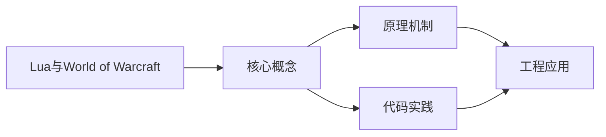
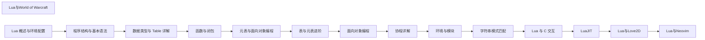

## 1. 学习目标（Bloom 分类）

本节按照布鲁姆教育目标分类学组织学习路径。本文主题为《Lua与World of Warcraft》，属于 Lua 模块，读者可以根据自身阶段选择阅读深度。

记忆层面：能够准确复述本文的核心概念、术语与基本语法或操作步骤，并能够在提问或检索时快速定位对应知识点。能够说出 Lua 的变量、函数、table、元表与协程基本语法。

理解层面：能够用自己的语言解释核心原理与工作机制，说明概念之间的因果关系，而不是机械记忆结论。能够解释 table 作为唯一数据结构的设计与元方法机制。

应用层面：能够在真实项目或练习场景中运用本文知识解决具体问题，写出正确且可维护的实现。能够编写嵌入主程序（游戏、Nginx、Redis）的脚本。

分析层面：能够拆解复杂问题，比较本文主题与相邻概念的异同，识别边界条件与例外情况。能够分析 Lua 与 C 交互（Lua C API）与性能特征。

评价层面：能够根据约束条件（性能、可读性、安全、成本）评价不同方案的优劣，做出有依据的技术决策。能够评价 Lua 与其他脚本语言在嵌入式场景的取舍。

创造层面：能够把本文知识与其他模块知识组合，设计出新的解决方案或可复用的工程模式。能够设计基于 Lua 的可扩展配置与脚本系统。

通过本节学习，读者应当能够把《Lua与World of Warcraft》纳入自己的知识网络，并与 Lua 模块的其他主题（table、元表、协程、嵌入式脚本）建立关联。

## 2. 历史动机与发展脉络

《Lua与World of Warcraft》是 Lua 领域的重要主题。要真正理解它，需要先了解它解决的问题与演进过程。

Lua 由巴西 PUC-Rio 大学的 Roberto Ierusalimschy 等人于 1993 年发布，设计目标是“可嵌入的脚本语言”：解释器小于 300KB，启动快，与 C 无缝集成。
Lua 5.1-5.4 持续演进：5.3 加入整数子类型，5.4 引入 const 变量与关闭值；LuaJIT 是高性能 JIT 实现，广泛用于游戏与性能敏感场景。
Lua 的著名用户：Adobe Lightroom、Redis 脚本、Nginx（OpenResty）、World of Warcraft 插件、Roblox（Luau）与游戏引擎（LÖVE、Defold）。

回到本文主题：Lua与World of Warcraft 的提出与成熟，正是上述技术背景下的必然产物。早期实现往往以简单可用为目标，随着工程规模扩大，社区逐渐沉淀出标准做法与最佳实践；理解这一脉络，可以帮助读者判断“为什么文档中的推荐写法是现在这个样子”，也能在遇到历史遗留代码时准确识别其设计年代与取舍。


## 3. 形式化定义与核心概念精讲

本节把《Lua与World of Warcraft》涉及的核心概念以“定义 + 讲解”的形式展开。读者应把定义当作工具，把讲解当作理解路径；两者结合才能形成可迁移的知识。

table：Lua 唯一的数据结构，同时充当数组、字典、对象与模块；数组索引从 1 开始。
元表（metatable）：通过 __index、__newindex、__add 等元方法改变 table 行为，实现继承与运算符重载。
协程：coroutine.create/resume/yield 实现协作式多任务，适合游戏状态机与生成器。

### 3.1 原文章节逐一精讲

原文档把主题拆分为 13 个小节，下面按顺序给出每一节的导读讲解，随后保留原文细节供精读。

#### 原文精读（完整保留）


#### 概述

World of Warcraft（魔兽世界，简称 WoW）是一款广泛使用 Lua 作为插件脚本语言的大型多人在线角色扮演游戏。WoW 的插件系统允许玩家使用 Lua 编写自定义界面和功能扩展，从简单的信息显示到复杂的团队管理工具，都可以通过 Lua 插件实现。WoW 的 UI 框架基于 XML 布局和 Lua 逻辑的结合，开发者使用 XML 定义界面结构，使用 Lua 编写交互逻辑。

WoW 插件生态非常活跃，CurseForge 等平台上托管了数以万计的插件。学习 WoW 插件开发不仅能够定制自己的游戏体验，也是 Lua 实际应用的一个极佳案例。WoW 中的 Lua 运行在受限沙箱环境中，去除了文件 I/O、网络访问等危险 API，但提供了丰富的游戏 API 用于获取游戏状态、创建界面元素、注册事件处理等。

#### 基本概念

**TOC 文件**是插件的描述文件，全称为 Table of Contents。每个插件必须包含一个 .toc 文件，其中声明了插件的名称、版本、接口版本、依赖关系以及加载的文件列表。WoW 客户端通过读取 TOC 文件来加载和初始化插件。

**事件系统**是 WoW 插件的核心机制。游戏中的各种状态变化（如玩家进入世界、受到伤害、目标改变等）都会触发对应的事件。插件通过注册事件监听器来响应这些事件，从而实现动态的交互逻辑。

**框架（Frame）**是 WoW UI 系统的基础元素。所有可见的界面组件（按钮、文本、图标等）都基于 Frame 创建。Frame 可以注册事件、设置脚本处理函数、包含子框架，是构建插件界面的核心对象。

**SavedVariables** 是 WoW 提供的持久化存储机制。插件可以在 TOC 文件中声明需要持久化的变量，WoW 会在玩家退出游戏时自动将这些变量保存到磁盘，在下次登录时自动加载。这使得插件可以保存用户的配置和状态。

**Ace3 框架**是 WoW 插件开发中最流行的第三方库，提供了一套模块化的开发框架，包括事件处理、数据库管理、配置界面、命令行解析等常用功能。使用 Ace3 可以大幅简化插件开发流程。

#### 快速开始

创建一个最简单的 WoW 插件，需要两个文件：TOC 描述文件和 Lua 脚本文件。

首先创建插件目录和 TOC 文件 `MyFirstAddon/MyFirstAddon.toc`：

```toc
#### Title: My First Addon
#### Notes: 我的第一个魔兽世界插件
#### Author: MyName
#### Interface: 100205
#### Version: 1.0.0

MyFirstAddon.lua
```

其中 Interface 字段对应 WoW 的版本号，不同版本的客户端需要匹配对应的接口版本。

然后创建 Lua 脚本文件 `MyFirstAddon/MyFirstAddon.lua`：

```lua
-- 注册事件监听
local frame = CreateFrame("Frame")
frame:RegisterEvent("PLAYER_ENTERING_WORLD")

-- 设置事件处理函数
frame:SetScript("OnEvent", function(self, event, ...)
    print("欢迎使用 My First Addon！")
    print("当前角色: " .. UnitName("player"))
    print("当前等级: " .. UnitLevel("player"))
end)
```

将插件文件夹放入 WoW 的插件目录 `Interface/AddOns/` 下，重启游戏或输入 `/reload` 即可加载插件。登录后聊天窗口会显示欢迎信息。

#### 详细用法

##### 事件处理系统

事件是 WoW 插件与游戏交互的主要方式。以下示例展示了如何监听多种事件：

```lua
local frame = CreateFrame("Frame")

-- 注册多个事件
frame:RegisterEvent("PLAYER_ENTERING_WORLD")
frame:RegisterEvent("PLAYER_REGEN_DISABLED")  -- 进入战斗
frame:RegisterEvent("PLAYER_REGEN_ENABLED")   -- 离开战斗
frame:RegisterEvent("CHAT_MSG_WHISPER")        -- 收到密语
frame:RegisterEvent("UNIT_HEALTH")             -- 生命值变化

frame:SetScript("OnEvent", function(self, event, ...)
    if event == "PLAYER_ENTERING_WORLD" then
        local isLogin = ...
        if isLogin then
            print("欢迎回来，" .. UnitName("player") .. "！")
        end
    elseif event == "PLAYER_REGEN_DISABLED" then
        print("进入战斗！")
    elseif event == "PLAYER_REGEN_ENABLED" then
        print("离开战斗。")
    elseif event == "CHAT_MSG_WHISPER" then
        local msg, sender = ...
        print("收到 " .. sender .. " 的密语: " .. msg)
    elseif event == "UNIT_HEALTH" then
        local unit = ...
        if unit == "player" then
            local health = UnitHealth("player")
            local maxHealth = UnitHealthMax("player")
            local percent = (health / maxHealth) * 100
            if percent < 30 then
                print("警告：生命值低于 30%！")
            end
        end
    end
end)
```

##### 创建界面元素

使用 WoW 的 UI API 创建各种界面组件：

```lua
-- 创建一个可拖动的提示框
local function create_info_frame()
    -- 创建主框架
    local frame = CreateFrame("Frame", "MyInfoFrame", UIParent, "BackdropTemplate")
    frame:SetSize(250, 120)
    frame:SetPoint("CENTER")
    frame:SetBackdrop({
        bgFile = "Interface\\DialogFrame\\UI-DialogBox-Background",
        edgeFile = "Interface\\DialogFrame\\UI-DialogBox-Border",
        tile = true,
        tileSize = 32,
        edgeSize = 16,
        insets = { left = 4, right = 4, top = 4, bottom = 4 },
    })
    frame:SetBackdropColor(0, 0, 0, 0.8)
    frame:SetMovable(true)
    frame:EnableMouse(true)
    frame:RegisterForDrag("LeftButton")
    frame:SetScript("OnDragStart", frame.StartMoving)
    frame:SetScript("OnDragStop", frame.StopMovingOrSizing)

    -- 创建标题文本
    local title = frame:CreateFontString(nil, "OVERLAY", "GameFontNormalLarge")
    title:SetPoint("TOP", frame, "TOP", 0, -10)
    title:SetText("角色信息")

    -- 创建信息文本
    local info = frame:CreateFontString(nil, "OVERLAY", "GameFontHighlight")
    info:SetPoint("TOP", title, "BOTTOM", 0, -8)
    info:SetWidth(220)

    -- 更新信息的函数
    local function update_info()
        local name = UnitName("player")
        local level = UnitLevel("player")
        local _, class = UnitClass("player")
        local health = UnitHealth("player")
        local maxHealth = UnitHealthMax("player")
        local power = UnitPower("player")
        local maxPower = UnitPowerMax("player")

        info:SetText(string.format(
            "姓名: %s\n等级: %d\n职业: %s\n生命: %d / %d\n能量: %d / %d",
            name, level, class, health, maxHealth, power, maxPower
        ))
    end

    -- 定时更新信息
    local timer = 0
    frame:SetScript("OnUpdate", function(self, elapsed)
        timer = timer + elapsed
        if timer >= 1.0 then  -- 每秒更新一次
            timer = 0
            update_info()
        end
    end)

    -- 创建关闭按钮
    local close = CreateFrame("Button", nil, frame, "UIPanelCloseButton")
    close:SetPoint("TOPRIGHT", frame, "TOPRIGHT", 0, 0)

    update_info()
    return frame
end

local info_frame = create_info_frame()
```

##### 创建按钮与交互

创建可点击的按钮并绑定动作：

```lua
-- 创建一个功能按钮
local function create_action_button(parent, text, onClick)
    local button = CreateFrame("Button", nil, parent, "UIPanelButtonTemplate")
    button:SetSize(120, 30)
    button:SetText(text)
    button:SetScript("OnClick", onClick)

    -- 添加鼠标悬停提示
    button:SetScript("OnEnter", function(self)
        GameTooltip:SetOwner(self, "ANCHOR_RIGHT")
        GameTooltip:SetText(text, 1, 1, 1)
        GameTooltip:Show()
    end)
    button:SetScript("OnLeave", function(self)
        GameTooltip:Hide()
    end)

    return button
end

-- 使用示例：创建一组操作按钮
local panel = CreateFrame("Frame", "MyActionPanel", UIParent, "BackdropTemplate")
panel:SetSize(200, 140)
panel:SetPoint("LEFT", UIParent, "LEFT", 20, 0)
panel:SetBackdrop({
    bgFile = "Interface\\DialogFrame\\UI-DialogBox-Background",
    edgeFile = "Interface\\Tooltips\\UI-Tooltip-Border",
    tile = true, tileSize = 16, edgeSize = 12,
    insets = { left = 3, right = 3, top = 3, bottom = 3 },
})
panel:SetBackdropColor(0, 0, 0, 0.7)
panel:SetMovable(true)
panel:EnableMouse(true)
panel:RegisterForDrag("LeftButton")
panel:SetScript("OnDragStart", panel.StartMoving)
panel:SetScript("OnDragStop", panel.StopMovingOrSizing)

-- 修理按钮
local repairBtn = create_action_button(panel, "自动修理", function()
    if CanMerchantRepair() then
        local cost = GetRepairAllCost()
        if cost > 0 then
            if GetMoney() >= cost then
                RepairAllItems()
                print("修理完成，花费: " .. GetCoinTextureString(cost))
            else
                print("金币不足，无法修理")
            end
        else
            print("装备无需修理")
        end
    end
end)
repairBtn:SetPoint("TOPLEFT", panel, "TOPLEFT", 15, -15)

-- 卖垃圾按钮
local sellBtn = create_action_button(panel, "出售垃圾", function()
    local total = 0
    for bag = 0, NUM_BAG_SLOTS do
        for slot = 1, GetContainerNumSlots(bag) do
            local _, _, quality, _, _, _, _, _, _, itemID = GetContainerItemInfo(bag, slot)
            if itemID and quality == 0 then  -- 灰色品质物品
                local sellPrice = select(11, GetItemInfo(itemID))
                if sellPrice and sellPrice > 0 then
                    total = total + sellPrice
                    UseContainerItem(bag, slot)
                end
            end
        end
    end
    if total > 0 then
        print("出售垃圾物品，获得: " .. GetCoinTextureString(total))
    else
        print("没有可出售的垃圾物品")
    end
end)
sellBtn:SetPoint("TOPLEFT", repairBtn, "BOTTOMLEFT", 0, -5)
```

##### 斜杠命令

为插件注册自定义的斜杠命令，方便用户交互：

```lua
-- 注册斜杠命令
SLASH_MYADDON1 = "/myaddon"
SLASH_MYADDON2 = "/ma"

SlashCmdList["MYADDON"] = function(msg)
    -- 解析命令参数
    local command, arg = msg:match("^(%S*)%s*(.-)$")

    if command == "" or command == "help" then
        print("MyAddon 命令列表:")
        print("  /ma help - 显示帮助信息")
        print("  /ma show - 显示信息面板")
        print("  /ma hide - 隐藏信息面板")
        print("  /ma reset - 重置配置")
        print("  /ma config <key> <value> - 设置配置项")
    elseif command == "show" then
        if info_frame then info_frame:Show() end
    elseif command == "hide" then
        if info_frame then info_frame:Hide() end
    elseif command == "reset" then
        MyAddonDB = nil  -- 清除保存的变量
        print("配置已重置，请重新加载界面 (/reload)")
    elseif command == "config" then
        local key, value = arg:match("^(%S+)%s+(.+)$")
        if key and value then
            MyAddonDB = MyAddonDB or {}
            MyAddonDB[key] = value
            print("配置已更新: " .. key .. " = " .. value)
        else
            print("用法: /ma config <key> <value>")
        end
    else
        print("未知命令: " .. command .. "，输入 /ma help 查看帮助")
    end
end
```

##### SavedVariables 持久化存储

在 TOC 文件中声明需要保存的变量：

```toc
#### SavedVariables: MyAddonDB
```

然后在 Lua 代码中使用：

```lua
-- 初始化保存的变量（首次使用时设置默认值）
MyAddonDB = MyAddonDB or {
    showPanel = true,
    panelPosition = { point = "CENTER", x = 0, y = 0 },
    alerts = {
        lowHealth = true,
        lowHealthThreshold = 30,
        whisperAlert = true,
    },
}

-- 读取配置
local function get_config(key)
    return MyAddonDB[key]
end

-- 更新配置
local function set_config(key, value)
    MyAddonDB[key] = value
    -- 配置变更后立即生效
    if key == "showPanel" then
        if value then
            info_frame:Show()
        else
            info_frame:Hide()
        end
    end
end

-- 恢复面板位置
local function restore_position()
    local pos = MyAddonDB.panelPosition
    if pos then
        info_frame:ClearAllPoints()
        info_frame:SetPoint(pos.point, UIParent, pos.point, pos.x, pos.y)
    end
end

-- 保存面板位置
local function save_position()
    local point, _, _, x, y = info_frame:GetPoint()
    MyAddonDB.panelPosition = { point = point, x = x, y = y }
end

-- 在拖动停止时保存位置
info_frame:SetScript("OnDragStop", function(self)
    self:StopMovingOrSizing()
    save_position()
end)

-- 加载时恢复位置
restore_position()
```

#### 常见场景

##### 伤害统计插件

实现一个简单的伤害统计功能：

```lua
-- 伤害统计模块
local DamageTracker = {}
DamageTracker.__index = DamageTracker

function DamageTracker.new()
    local self = setmetatable({}, DamageTracker)
    self.data = {}  -- 玩家名 -> 总伤害
    self.combatStartTime = nil
    self.inCombat = false
    return self
end

function DamageTracker:StartCombat()
    self.data = {}
    self.combatStartTime = GetTime()
    self.inCombat = true
end

function DamageTracker:EndCombat()
    self.inCombat = false
    self:PrintReport()
end

function DamageTracker:RecordDamage(source, amount)
    if not self.inCombat then return end
    self.data[source] = (self.data[source] or 0) + amount
end

function DamageTracker:PrintReport()
    if not self.combatStartTime then return end

    local duration = GetTime() - self.combatStartTime
    print("--- 伤害统计报告 ---")
    print(string.format("战斗时长: %.1f 秒", duration))

    -- 按伤害量排序
    local sorted = {}
    for name, damage in pairs(self.data) do
        sorted[#sorted + 1] = {name = name, damage = damage}
    end
    table.sort(sorted, function(a, b) return a.damage > b.damage end)

    -- 计算总伤害
    local totalDamage = 0
    for _, entry in ipairs(sorted) do
        totalDamage = totalDamage + entry.damage
    end

    -- 打印每个玩家的统计
    for i, entry in ipairs(sorted) do
        local dps = entry.damage / duration
        local percent = (entry.damage / totalDamage) * 100
        print(string.format("%d. %s - 伤害: %d (%.1f%%) DPS: %.0f",
            i, entry.name, entry.damage, percent, dps))
    end
end

-- 创建追踪器实例
local tracker = DamageTracker.new()

-- 注册战斗事件
local combatFrame = CreateFrame("Frame")
combatFrame:RegisterEvent("PLAYER_REGEN_DISABLED")
combatFrame:RegisterEvent("PLAYER_REGEN_ENABLED")
combatFrame:RegisterEvent("COMBAT_LOG_EVENT_UNFILTERED")

combatFrame:SetScript("OnEvent", function(self, event, ...)
    if event == "PLAYER_REGEN_DISABLED" then
        tracker:StartCombat()
    elseif event == "PLAYER_REGEN_ENABLED" then
        tracker:EndCombat()
    elseif event == "COMBAT_LOG_EVENT_UNFILTERED" then
        local _, subEvent, _, sourceGUID, sourceName = CombatLogGetCurrentEventInfo()
        if subEvent == "SPELL_DAMAGE" or subEvent == "SWING_DAMAGE" or subEvent == "RANGE_DAMAGE" then
            local amount = select(12, CombatLogGetCurrentEventInfo())
            if sourceName and amount and amount > 0 then
                tracker:RecordDamage(sourceName, amount)
            end
        end
    end
end)
```

##### 自动接受邀请

实现自动接受好友和公会成员的组队邀请：

```lua
-- 自动接受邀请配置
MyAddonDB = MyAddonDB or {
    autoAcceptFriends = true,
    autoAcceptGuild = true,
    autoAcceptAll = false,
}

local inviteFrame = CreateFrame("Frame")
inviteFrame:RegisterEvent("PARTY_INVITE_REQUEST")

inviteFrame:SetScript("OnEvent", function(self, event, sender)
    -- 检查是否来自好友
    if MyAddonDB.autoAcceptFriends then
        for i = 1, C_FriendList.GetNumFriends() do
            local friendInfo = C_FriendList.GetFriendInfoByIndex(i)
            if friendInfo and friendInfo.name == sender then
                AcceptGroup()
                print("自动接受好友 " .. sender .. " 的邀请")
                return
            end
        end
    end

    -- 检查是否来自公会成员
    if MyAddonDB.autoAcceptGuild then
        if IsInGuild() then
            for i = 1, GetNumGuildMembers() do
                local name = GetGuildRosterInfo(i)
                if name and name:match(sender) then
                    AcceptGroup()
                    print("自动接受公会成员 " .. sender .. " 的邀请")
                    return
                end
            end
        end
    end

    -- 全部自动接受
    if MyAddonDB.autoAcceptAll then
        AcceptGroup()
        print("自动接受 " .. sender .. " 的邀请")
        return
    end

    -- 未自动接受，提示用户
    print("收到 " .. sender .. " 的组队邀请")
end)
```

##### 背包整理

实现一键整理背包的功能：

```lua
-- 背包整理模块
local BagSorter = {}

function BagSorter.Sort()
    -- 收集所有物品信息
    local items = {}
    for bag = 0, NUM_BAG_SLOTS do
        local slots = GetContainerNumSlots(bag)
        for slot = 1, slots do
            local itemID = GetContainerItemID(bag, slot)
            if itemID then
                local itemName, _, rarity, _, _, itemType, itemSubType = GetItemInfo(itemID)
                local _, count = GetContainerItemInfo(bag, slot)
                items[#items + 1] = {
                    bag = bag,
                    slot = slot,
                    itemID = itemID,
                    name = itemName,
                    rarity = rarity,
                    type = itemType,
                    subType = itemSubType,
                    count = count,
                }
            end
        end
    end

    -- 按品质、类型、名称排序
    table.sort(items, function(a, b)
        -- 先按品质降序
        if a.rarity ~= b.rarity then
            return a.rarity > b.rarity
        end
        -- 再按类型
        if a.type ~= b.type then
            return a.type < b.type
        end
        -- 最后按名称
        return a.name < b.name
    end)

    print("背包整理完成，共 " .. #items .. " 个物品")
end

-- 注册斜杠命令
SLASH_BAGSORT1 = "/bagsort"
SlashCmdList["BAGSORT"] = function(msg)
    BagSorter.Sort()
end
```

#### 注意事项与常见错误

**不要使用阻塞操作**。WoW 的 Lua 环境运行在主线程中，任何阻塞操作都会导致游戏界面卡死。WoW 已经移除了 os.execute、io.open 等可能阻塞的 API。所有需要延迟执行的操作应使用 C_Timer.After 或 OnUpdate 脚本实现。

**注意 API 版本兼容性**。WoW 每个版本都可能修改或废弃部分 API。在 TOC 文件中正确设置 Interface 版本号，并使用 Interface/AddOns 中的加载机制检查兼容性。开发时建议参考当前版本的 API 文档，避免使用已废弃的函数。

**SavedVariables 的加载时机**。SavedVariables 在 ADDON_LOADED 事件触发时才可用，在此之前访问会得到 nil。如果插件需要在初始化时读取保存的配置，务必在 ADDON_LOADED 事件中执行初始化逻辑。

**避免在 OnUpdate 中执行重计算**。OnUpdate 每帧都会触发（通常约 60 次/秒），在其中执行复杂计算会严重影响游戏帧率。应使用节流机制（如累加 elapsed 时间，达到阈值才执行）来降低执行频率。

**字符串拼接的性能问题**。在频繁更新的文本（如 DPS 计时器）中，避免每帧都重新拼接字符串。可以使用 FontString 的 SetFormattedText 方法，或者在数据变化时才更新显示。

#### 高级用法

##### 使用 Ace3 框架

Ace3 是 WoW 插件开发中最流行的框架，提供了丰富的工具库：

```lua
-- 使用 Ace3 创建插件
local addon = LibStub("AceAddon-3.0"):NewAddon("MyAceAddon", "AceConsole-3.0", "AceEvent-3.0", "AceTimer-3.0")

-- 插件初始化
function addon:OnInitialize()
    -- 初始化数据库（自动处理 SavedVariables）
    self.db = LibStub("AceDB-3.0"):New("MyAceAddonDB", {
        profile = {
            enabled = true,
            showPanel = true,
            alertThreshold = 30,
        },
    })

    -- 注册斜杠命令
    self:RegisterChatCommand("maa", "ChatCommand")
    self:RegisterChatCommand("myaceaddon", "ChatCommand")

    print("MyAceAddon 已初始化")
end

-- 插件启用
function addon:OnEnable()
    -- 注册事件
    self:RegisterEvent("PLAYER_ENTERING_WORLD", "OnEnteringWorld")
    self:RegisterEvent("UNIT_HEALTH", "OnHealthChanged")

    -- 使用 AceTimer 定时执行
    self:ScheduleRepeatingTimer("UpdateInfo", 5)

    print("MyAceAddon 已启用")
end

-- 插件禁用
function addon:OnDisable()
    self:CancelAllTimers()
    self:UnregisterAllEvents()
end

-- 事件处理
function addon:OnEnteringWorld(event, isLogin)
    if isLogin then
        self:Print("欢迎回来！")
    end
end

function addon:OnHealthChanged(event, unit)
    if unit == "player" then
        local health = UnitHealth("player")
        local maxHealth = UnitHealthMax("player")
        local percent = (health / maxHealth) * 100

        if percent < self.db.profile.alertThreshold then
            self:Print("警告：生命值低于 " .. self.db.profile.alertThreshold .. "%！")
        end
    end
end

-- 定时更新
function addon:UpdateInfo()
    -- 定期执行的任务
end

-- 斜杠命令处理
function addon:ChatCommand(msg)
    local cmd = msg:lower():trim()
    if cmd == "show" then
        self.db.profile.showPanel = true
    elseif cmd == "hide" then
        self.db.profile.showPanel = false
    elseif cmd == "reset" then
        self.db:ResetProfile()
        self:Print("配置已重置")
    else
        self:Print("命令列表: show, hide, reset")
    end
end
```

##### 创建小地图按钮

为插件添加小地图图标，方便快速访问：

```lua
-- 创建小地图按钮
local minimapButton = CreateFrame("Button", "MyAddonMinimapButton", Minimap)
minimapButton:SetSize(32, 32)
minimapButton:SetNormalTexture("Interface\\Icons\\INV_Misc_QuestionMark")
minimapButton:SetHighlightTexture("Interface\\Minimap\\UI-Minimap-ZoomButton-Highlight")
minimapButton:SetPushedTexture("Interface\\Icons\\INV_Misc_QuestionMark")

-- 设置小地图位置（角度）
local function UpdateMinimapButtonPosition()
    local angle = MyAddonDB.minimapAngle or 45
    local rad = math.rad(angle)
    local x = math.cos(rad) * 80
    local y = math.sin(rad) * 80
    minimapButton:SetPoint("CENTER", Minimap, "CENTER", x, y)
end

-- 拖动小地图按钮
minimapButton:SetMovable(true)
minimapButton:EnableMouse(true)
minimapButton:RegisterForDrag("LeftButton")

minimapButton:SetScript("OnDragStart", function(self)
    self:StartMoving()
    self.isDragging = true
end)

minimapButton:SetScript("OnDragStop", function(self)
    self:StopMovingOrSizing()
    self.isDragging = false

    -- 计算按钮相对于小地图中心的角度
    local cx, cy = Minimap:GetCenter()
    local mx, my = self:GetCenter()
    local angle = math.deg(math.atan2(my - cy, mx - cx))
    MyAddonDB.minimapAngle = angle
end)

-- 点击小地图按钮
minimapButton:SetScript("OnClick", function(self, button)
    if button == "LeftButton" then
        -- 左键点击：切换面板显示
        if info_frame:IsShown() then
            info_frame:Hide()
        else
            info_frame:Show()
        end
    elseif button == "RightButton" then
        -- 右键点击：显示设置菜单
        local menu = {
            { text = "MyAddon 设置", isTitle = true },
            { text = "显示面板", checked = MyAddonDB.showPanel, func = function()
                MyAddonDB.showPanel = not MyAddonDB.showPanel
            end },
            { text = "低血量警报", checked = MyAddonDB.alerts.lowHealth, func = function()
                MyAddonDB.alerts.lowHealth = not MyAddonDB.alerts.lowHealth
            end },
        }
        EasyMenu(menu, CreateFrame("Frame", nil, UIParent, "UIDropDownMenuTemplate"), "cursor", 0, 0, "MENU")
    end
end)

UpdateMinimapButtonPosition()
```

##### 消息过滤与聊天增强

实现聊天消息的过滤和增强功能：

```lua
-- 聊天消息过滤器
local chatFilter = CreateFrame("Frame")
chatFilter.filters = {
    -- 过滤关键词列表
    keywords = {"金币", "代练", "工作室"},
    -- 是否启用过滤
    enabled = true,
}

-- 注册聊天过滤器
ChatFrame_AddMessageEventFilter("CHAT_MSG_CHANNEL", function(self, event, msg, author, ...)
    if not chatFilter.filters.enabled then
        return false  -- 不过滤
    end

    -- 检查关键词
    local lowerMsg = msg:lower()
    for _, keyword in ipairs(chatFilter.filters.keywords) do
        if lowerMsg:find(keyword:lower()) then
            return true  -- 过滤掉该消息
        end
    end

    return false  -- 保留该消息
end)

-- 聊天消息高亮
ChatFrame_AddMessageEventFilter("CHAT_MSG_WHISPER", function(self, event, msg, author, ...)
    -- 为密语消息添加高亮前缀
    return false, "|cFFFF9900[密语]|r " .. msg, author, ...
end)

-- 注册斜杠命令管理过滤器
SLASH_CHATFILTER1 = "/cf"
SlashCmdList["CHATFILTER"] = function(msg)
    local cmd, arg = msg:match("^(%S*)%s*(.-)$")

    if cmd == "on" then
        chatFilter.filters.enabled = true
        print("聊天过滤器已启用")
    elseif cmd == "off" then
        chatFilter.filters.enabled = false
        print("聊天过滤器已禁用")
    elseif cmd == "add" then
        if arg and #arg > 0 then
            chatFilter.filters.keywords[#chatFilter.filters.keywords + 1] = arg
            print("已添加过滤关键词: " .. arg)
        end
    elseif cmd == "list" then
        print("当前过滤关键词:")
        for i, kw in ipairs(chatFilter.filters.keywords) do
            print("  " .. i .. ". " .. kw)
        end
    else
        print("用法: /cf on|off|add <keyword>|list")
    end
end
```


### 3.2 概念关系图

下面用 Mermaid 图表达本文核心概念之间的关系，帮助读者建立整体图景：



图中展示的是本文知识的结构化关系：核心概念是入口，原理机制解释“为什么”，代码实践演示“怎么做”，工程应用回答“何时用”。读者学习时可以把每个小节的内容挂接到对应节点上。

## 4. 理论推导与原理解析

本节深入《Lua与World of Warcraft》背后的原理。理论部分不求面面俱到，而是聚焦“能解释现象、能指导实践”的关键推导。

table：Lua 唯一的数据结构，同时充当数组、字典、对象与模块；数组索引从 1 开始。
元表（metatable）：通过 __index、__newindex、__add 等元方法改变 table 行为，实现继承与运算符重载。
协程：coroutine.create/resume/yield 实现协作式多任务，适合游戏状态机与生成器。
C API：lua_State 上下文、栈式参数传递，宿主程序可以安全地执行用户脚本。

需要强调的是，理论推导与工程实践之间存在翻译层：理论给出的是理想化模型与边界条件，工程代码则必须处理真实环境中的例外。读者在学习时应先掌握理论的“标准情形”，再通过陷阱章节了解“非标准情形”。

## 5. 代码示例与逐行讲解

本节把原文中的代码示例系统整理，并为每个示例补充用途说明与讲解。读者不应只浏览代码，而应逐段对照讲解理解设计意图。

### 5.1 示例：快速开始

该示例来自原文《快速开始》小节，用于演示Lua与World of Warcraft相关操作。阅读时请先看代码结构，再看其后的讲解。

```toc
## Title: My First Addon
## Notes: 我的第一个魔兽世界插件
## Author: MyName
## Interface: 100205
## Version: 1.0.0

MyFirstAddon.lua
```

讲解：这段代码演示了本节核心知识点。代码中的关键操作可以归纳为三步：准备（定义或初始化）、执行（核心逻辑）、收尾（释放资源或返回结果）。实际项目中，这三步往往被封装为函数或类，以提升复用性与可测试性。

关键点分析：

该示例共 6 行有效代码，结构以数据或配置为主。阅读时应关注：数据字段的含义、配置项的作用，以及它们与运行行为的对应关系。

进阶思考路径：先尝试修改参数观察行为变化，再把示例中的模式迁移到自己的项目中；每次修改都记录预期与实测差异，这是把示例转化为能力的最快方式。

### 5.2 示例：快速开始

该示例来自原文《快速开始》小节，用于演示Lua与World of Warcraft相关操作。阅读时请先看代码结构，再看其后的讲解。

```lua
-- 注册事件监听
local frame = CreateFrame("Frame")
frame:RegisterEvent("PLAYER_ENTERING_WORLD")

-- 设置事件处理函数
frame:SetScript("OnEvent", function(self, event, ...)
    print("欢迎使用 My First Addon！")
    print("当前角色: " .. UnitName("player"))
    print("当前等级: " .. UnitLevel("player"))
end)
```

讲解：这段代码演示了本节核心知识点。代码中的关键操作可以归纳为三步：准备（定义或初始化）、执行（核心逻辑）、收尾（释放资源或返回结果）。实际项目中，这三步往往被封装为函数或类，以提升复用性与可测试性。

关键点分析：

该示例共 9 行有效代码，包含 1 类关键结构（function）。其中：

- 入口与初始化部分负责建立上下文，对应实际项目中的启动或装配逻辑；
- 核心逻辑部分体现本文主题的主要操作，是阅读时最需要对照讲解理解的部分；
- 输出或返回部分把结果交给调用方，注意其类型与边界条件。

进阶思考路径：先尝试修改参数观察行为变化，再把示例中的模式迁移到自己的项目中；每次修改都记录预期与实测差异，这是把示例转化为能力的最快方式。

### 5.3 示例：事件处理系统

该示例来自原文《事件处理系统》小节，用于演示Lua与World of Warcraft相关操作。阅读时请先看代码结构，再看其后的讲解。

```lua
local frame = CreateFrame("Frame")

-- 注册多个事件
frame:RegisterEvent("PLAYER_ENTERING_WORLD")
frame:RegisterEvent("PLAYER_REGEN_DISABLED")  -- 进入战斗
frame:RegisterEvent("PLAYER_REGEN_ENABLED")   -- 离开战斗
frame:RegisterEvent("CHAT_MSG_WHISPER")        -- 收到密语
frame:RegisterEvent("UNIT_HEALTH")             -- 生命值变化

frame:SetScript("OnEvent", function(self, event, ...)
    if event == "PLAYER_ENTERING_WORLD" then
        local isLogin = ...
        if isLogin then
            print("欢迎回来，" .. UnitName("player") .. "！")
        end
    elseif event == "PLAYER_REGEN_DISABLED" then
        print("进入战斗！")
    elseif event == "PLAYER_REGEN_ENABLED" then
        print("离开战斗。")
    elseif event == "CHAT_MSG_WHISPER" then
        local msg, sender = ...
        print("收到 " .. sender .. " 的密语: " .. msg)
    elseif event == "UNIT_HEALTH" then
        local unit = ...
        if unit == "player" then
            local health = UnitHealth("player")
            local maxHealth = UnitHealthMax("player")
            local percent = (health / maxHealth) * 100
            if percent < 30 then
                print("警告：生命值低于 30%！")
            end
        end
    end
end)
```

讲解：这段代码演示了本节核心知识点。代码中的关键操作可以归纳为三步：准备（定义或初始化）、执行（核心逻辑）、收尾（释放资源或返回结果）。实际项目中，这三步往往被封装为函数或类，以提升复用性与可测试性。

关键点分析：

该示例共 32 行有效代码，包含 2 类关键结构（function、if）。其中：

- 入口与初始化部分负责建立上下文，对应实际项目中的启动或装配逻辑；
- 核心逻辑部分体现本文主题的主要操作，是阅读时最需要对照讲解理解的部分；
- 输出或返回部分把结果交给调用方，注意其类型与边界条件。

进阶思考路径：先尝试修改参数观察行为变化，再把示例中的模式迁移到自己的项目中；每次修改都记录预期与实测差异，这是把示例转化为能力的最快方式。

### 5.4 示例：创建界面元素

该示例来自原文《创建界面元素》小节，用于演示Lua与World of Warcraft相关操作。阅读时请先看代码结构，再看其后的讲解。

```lua
-- 创建一个可拖动的提示框
local function create_info_frame()
    -- 创建主框架
    local frame = CreateFrame("Frame", "MyInfoFrame", UIParent, "BackdropTemplate")
    frame:SetSize(250, 120)
    frame:SetPoint("CENTER")
    frame:SetBackdrop({
        bgFile = "Interface\\DialogFrame\\UI-DialogBox-Background",
        edgeFile = "Interface\\DialogFrame\\UI-DialogBox-Border",
        tile = true,
        tileSize = 32,
        edgeSize = 16,
        insets = { left = 4, right = 4, top = 4, bottom = 4 },
    })
    frame:SetBackdropColor(0, 0, 0, 0.8)
    frame:SetMovable(true)
    frame:EnableMouse(true)
    frame:RegisterForDrag("LeftButton")
    frame:SetScript("OnDragStart", frame.StartMoving)
    frame:SetScript("OnDragStop", frame.StopMovingOrSizing)

    -- 创建标题文本
    local title = frame:CreateFontString(nil, "OVERLAY", "GameFontNormalLarge")
    title:SetPoint("TOP", frame, "TOP", 0, -10)
    title:SetText("角色信息")

    -- 创建信息文本
    local info = frame:CreateFontString(nil, "OVERLAY", "GameFontHighlight")
    info:SetPoint("TOP", title, "BOTTOM", 0, -8)
    info:SetWidth(220)

    -- 更新信息的函数
    local function update_info()
        local name = UnitName("player")
        local level = UnitLevel("player")
        local _, class = UnitClass("player")
        local health = UnitHealth("player")
        local maxHealth = UnitHealthMax("player")
        local power = UnitPower("player")
        local maxPower = UnitPowerMax("player")

        info:SetText(string.format(
            "姓名: %s\n等级: %d\n职业: %s\n生命: %d / %d\n能量: %d / %d",
            name, level, class, health, maxHealth, power, maxPower
        ))
    end

    -- 定时更新信息
    local timer = 0
    frame:SetScript("OnUpdate", function(self, elapsed)
        timer = timer + elapsed
        if timer >= 1.0 then  -- 每秒更新一次
            timer = 0
            update_info()
        end
    end)

    -- 创建关闭按钮
    local close = CreateFrame("Button", nil, frame, "UIPanelCloseButton")
    close:SetPoint("TOPRIGHT", frame, "TOPRIGHT", 0, 0)

    update_info()
    return frame
end

local info_frame = create_info_frame()
```

讲解：这段代码演示了本节核心知识点。代码中的关键操作可以归纳为三步：准备（定义或初始化）、执行（核心逻辑）、收尾（释放资源或返回结果）。实际项目中，这三步往往被封装为函数或类，以提升复用性与可测试性。

关键点分析：

该示例共 58 行有效代码，包含 4 类关键结构（class、function、if、return）。其中：

- 入口与初始化部分负责建立上下文，对应实际项目中的启动或装配逻辑；
- 核心逻辑部分体现本文主题的主要操作，是阅读时最需要对照讲解理解的部分；
- 输出或返回部分把结果交给调用方，注意其类型与边界条件。

进阶思考路径：先尝试修改参数观察行为变化，再把示例中的模式迁移到自己的项目中；每次修改都记录预期与实测差异，这是把示例转化为能力的最快方式。

### 5.5 示例：创建按钮与交互

该示例来自原文《创建按钮与交互》小节，用于演示Lua与World of Warcraft相关操作。阅读时请先看代码结构，再看其后的讲解。

```lua
-- 创建一个功能按钮
local function create_action_button(parent, text, onClick)
    local button = CreateFrame("Button", nil, parent, "UIPanelButtonTemplate")
    button:SetSize(120, 30)
    button:SetText(text)
    button:SetScript("OnClick", onClick)

    -- 添加鼠标悬停提示
    button:SetScript("OnEnter", function(self)
        GameTooltip:SetOwner(self, "ANCHOR_RIGHT")
        GameTooltip:SetText(text, 1, 1, 1)
        GameTooltip:Show()
    end)
    button:SetScript("OnLeave", function(self)
        GameTooltip:Hide()
    end)

    return button
end

-- 使用示例：创建一组操作按钮
local panel = CreateFrame("Frame", "MyActionPanel", UIParent, "BackdropTemplate")
panel:SetSize(200, 140)
panel:SetPoint("LEFT", UIParent, "LEFT", 20, 0)
panel:SetBackdrop({
    bgFile = "Interface\\DialogFrame\\UI-DialogBox-Background",
    edgeFile = "Interface\\Tooltips\\UI-Tooltip-Border",
    tile = true, tileSize = 16, edgeSize = 12,
    insets = { left = 3, right = 3, top = 3, bottom = 3 },
})
panel:SetBackdropColor(0, 0, 0, 0.7)
panel:SetMovable(true)
panel:EnableMouse(true)
panel:RegisterForDrag("LeftButton")
panel:SetScript("OnDragStart", panel.StartMoving)
panel:SetScript("OnDragStop", panel.StopMovingOrSizing)

-- 修理按钮
local repairBtn = create_action_button(panel, "自动修理", function()
    if CanMerchantRepair() then
        local cost = GetRepairAllCost()
        if cost > 0 then
            if GetMoney() >= cost then
                RepairAllItems()
                print("修理完成，花费: " .. GetCoinTextureString(cost))
            else
                print("金币不足，无法修理")
            end
        else
            print("装备无需修理")
        end
    end
end)
repairBtn:SetPoint("TOPLEFT", panel, "TOPLEFT", 15, -15)

-- 卖垃圾按钮
local sellBtn = create_action_button(panel, "出售垃圾", function()
    local total = 0
    for bag = 0, NUM_BAG_SLOTS do
        for slot = 1, GetContainerNumSlots(bag) do
            local _, _, quality, _, _, _, _, _, _, itemID = GetContainerItemInfo(bag, slot)
            if itemID and quality == 0 then  -- 灰色品质物品
                local sellPrice = select(11, GetItemInfo(itemID))
                if sellPrice and sellPrice > 0 then
                    total = total + sellPrice
                    UseContainerItem(bag, slot)
                end
            end
        end
    end
    if total > 0 then
        print("出售垃圾物品，获得: " .. GetCoinTextureString(total))
    else
        print("没有可出售的垃圾物品")
    end
end)
sellBtn:SetPoint("TOPLEFT", repairBtn, "BOTTOMLEFT", 0, -5)
```

讲解：这段代码演示了本节核心知识点。代码中的关键操作可以归纳为三步：准备（定义或初始化）、执行（核心逻辑）、收尾（释放资源或返回结果）。实际项目中，这三步往往被封装为函数或类，以提升复用性与可测试性。

关键点分析：

该示例共 72 行有效代码，包含 4 类关键结构（function、if、for、return）。其中：

- 入口与初始化部分负责建立上下文，对应实际项目中的启动或装配逻辑；
- 核心逻辑部分体现本文主题的主要操作，是阅读时最需要对照讲解理解的部分；
- 输出或返回部分把结果交给调用方，注意其类型与边界条件。

进阶思考路径：先尝试修改参数观察行为变化，再把示例中的模式迁移到自己的项目中；每次修改都记录预期与实测差异，这是把示例转化为能力的最快方式。

### 5.6 示例：斜杠命令

该示例来自原文《斜杠命令》小节，用于演示Lua与World of Warcraft相关操作。阅读时请先看代码结构，再看其后的讲解。

```lua
-- 注册斜杠命令
SLASH_MYADDON1 = "/myaddon"
SLASH_MYADDON2 = "/ma"

SlashCmdList["MYADDON"] = function(msg)
    -- 解析命令参数
    local command, arg = msg:match("^(%S*)%s*(.-)$")

    if command == "" or command == "help" then
        print("MyAddon 命令列表:")
        print("  /ma help - 显示帮助信息")
        print("  /ma show - 显示信息面板")
        print("  /ma hide - 隐藏信息面板")
        print("  /ma reset - 重置配置")
        print("  /ma config <key> <value> - 设置配置项")
    elseif command == "show" then
        if info_frame then info_frame:Show() end
    elseif command == "hide" then
        if info_frame then info_frame:Hide() end
    elseif command == "reset" then
        MyAddonDB = nil  -- 清除保存的变量
        print("配置已重置，请重新加载界面 (/reload)")
    elseif command == "config" then
        local key, value = arg:match("^(%S+)%s+(.+)$")
        if key and value then
            MyAddonDB = MyAddonDB or {}
            MyAddonDB[key] = value
            print("配置已更新: " .. key .. " = " .. value)
        else
            print("用法: /ma config <key> <value>")
        end
    else
        print("未知命令: " .. command .. "，输入 /ma help 查看帮助")
    end
end
```

讲解：这段代码演示了本节核心知识点。代码中的关键操作可以归纳为三步：准备（定义或初始化）、执行（核心逻辑）、收尾（释放资源或返回结果）。实际项目中，这三步往往被封装为函数或类，以提升复用性与可测试性。

关键点分析：

该示例共 33 行有效代码，包含 2 类关键结构（function、if）。其中：

- 入口与初始化部分负责建立上下文，对应实际项目中的启动或装配逻辑；
- 核心逻辑部分体现本文主题的主要操作，是阅读时最需要对照讲解理解的部分；
- 输出或返回部分把结果交给调用方，注意其类型与边界条件。

进阶思考路径：先尝试修改参数观察行为变化，再把示例中的模式迁移到自己的项目中；每次修改都记录预期与实测差异，这是把示例转化为能力的最快方式。

### 5.7 示例：SavedVariables 持久化存储

该示例来自原文《SavedVariables 持久化存储》小节，用于演示Lua与World of Warcraft相关操作。阅读时请先看代码结构，再看其后的讲解。

```toc
## SavedVariables: MyAddonDB
```

讲解：这段代码演示了本节核心知识点。代码中的关键操作可以归纳为三步：准备（定义或初始化）、执行（核心逻辑）、收尾（释放资源或返回结果）。实际项目中，这三步往往被封装为函数或类，以提升复用性与可测试性。

关键点分析：

该示例共 1 行有效代码，结构以数据或配置为主。阅读时应关注：数据字段的含义、配置项的作用，以及它们与运行行为的对应关系。

进阶思考路径：先尝试修改参数观察行为变化，再把示例中的模式迁移到自己的项目中；每次修改都记录预期与实测差异，这是把示例转化为能力的最快方式。

### 5.8 示例：SavedVariables 持久化存储

该示例来自原文《SavedVariables 持久化存储》小节，用于演示Lua与World of Warcraft相关操作。阅读时请先看代码结构，再看其后的讲解。

```lua
-- 初始化保存的变量（首次使用时设置默认值）
MyAddonDB = MyAddonDB or {
    showPanel = true,
    panelPosition = { point = "CENTER", x = 0, y = 0 },
    alerts = {
        lowHealth = true,
        lowHealthThreshold = 30,
        whisperAlert = true,
    },
}

-- 读取配置
local function get_config(key)
    return MyAddonDB[key]
end

-- 更新配置
local function set_config(key, value)
    MyAddonDB[key] = value
    -- 配置变更后立即生效
    if key == "showPanel" then
        if value then
            info_frame:Show()
        else
            info_frame:Hide()
        end
    end
end

-- 恢复面板位置
local function restore_position()
    local pos = MyAddonDB.panelPosition
    if pos then
        info_frame:ClearAllPoints()
        info_frame:SetPoint(pos.point, UIParent, pos.point, pos.x, pos.y)
    end
end

-- 保存面板位置
local function save_position()
    local point, _, _, x, y = info_frame:GetPoint()
    MyAddonDB.panelPosition = { point = point, x = x, y = y }
end

-- 在拖动停止时保存位置
info_frame:SetScript("OnDragStop", function(self)
    self:StopMovingOrSizing()
    save_position()
end)

-- 加载时恢复位置
restore_position()
```

讲解：这段代码演示了本节核心知识点。代码中的关键操作可以归纳为三步：准备（定义或初始化）、执行（核心逻辑）、收尾（释放资源或返回结果）。实际项目中，这三步往往被封装为函数或类，以提升复用性与可测试性。

关键点分析：

该示例共 46 行有效代码，包含 3 类关键结构（function、if、return）。其中：

- 入口与初始化部分负责建立上下文，对应实际项目中的启动或装配逻辑；
- 核心逻辑部分体现本文主题的主要操作，是阅读时最需要对照讲解理解的部分；
- 输出或返回部分把结果交给调用方，注意其类型与边界条件。

进阶思考路径：先尝试修改参数观察行为变化，再把示例中的模式迁移到自己的项目中；每次修改都记录预期与实测差异，这是把示例转化为能力的最快方式。

### 5.9 示例：伤害统计插件

该示例来自原文《伤害统计插件》小节，用于演示Lua与World of Warcraft相关操作。阅读时请先看代码结构，再看其后的讲解。

```lua
-- 伤害统计模块
local DamageTracker = {}
DamageTracker.__index = DamageTracker

function DamageTracker.new()
    local self = setmetatable({}, DamageTracker)
    self.data = {}  -- 玩家名 -> 总伤害
    self.combatStartTime = nil
    self.inCombat = false
    return self
end

function DamageTracker:StartCombat()
    self.data = {}
    self.combatStartTime = GetTime()
    self.inCombat = true
end

function DamageTracker:EndCombat()
    self.inCombat = false
    self:PrintReport()
end

function DamageTracker:RecordDamage(source, amount)
    if not self.inCombat then return end
    self.data[source] = (self.data[source] or 0) + amount
end

function DamageTracker:PrintReport()
    if not self.combatStartTime then return end

    local duration = GetTime() - self.combatStartTime
    print("--- 伤害统计报告 ---")
    print(string.format("战斗时长: %.1f 秒", duration))

    -- 按伤害量排序
    local sorted = {}
    for name, damage in pairs(self.data) do
        sorted[#sorted + 1] = {name = name, damage = damage}
    end
    table.sort(sorted, function(a, b) return a.damage > b.damage end)

    -- 计算总伤害
    local totalDamage = 0
    for _, entry in ipairs(sorted) do
        totalDamage = totalDamage + entry.damage
    end

    -- 打印每个玩家的统计
    for i, entry in ipairs(sorted) do
        local dps = entry.damage / duration
        local percent = (entry.damage / totalDamage) * 100
        print(string.format("%d. %s - 伤害: %d (%.1f%%) DPS: %.0f",
            i, entry.name, entry.damage, percent, dps))
    end
end

-- 创建追踪器实例
local tracker = DamageTracker.new()

-- 注册战斗事件
local combatFrame = CreateFrame("Frame")
combatFrame:RegisterEvent("PLAYER_REGEN_DISABLED")
combatFrame:RegisterEvent("PLAYER_REGEN_ENABLED")
combatFrame:RegisterEvent("COMBAT_LOG_EVENT_UNFILTERED")

combatFrame:SetScript("OnEvent", function(self, event, ...)
    if event == "PLAYER_REGEN_DISABLED" then
        tracker:StartCombat()
    elseif event == "PLAYER_REGEN_ENABLED" then
        tracker:EndCombat()
    elseif event == "COMBAT_LOG_EVENT_UNFILTERED" then
        local _, subEvent, _, sourceGUID, sourceName = CombatLogGetCurrentEventInfo()
        if subEvent == "SPELL_DAMAGE" or subEvent == "SWING_DAMAGE" or subEvent == "RANGE_DAMAGE" then
            local amount = select(12, CombatLogGetCurrentEventInfo())
            if sourceName and amount and amount > 0 then
                tracker:RecordDamage(sourceName, amount)
            end
        end
    end
end)
```

讲解：这段代码演示了本节核心知识点。代码中的关键操作可以归纳为三步：准备（定义或初始化）、执行（核心逻辑）、收尾（释放资源或返回结果）。实际项目中，这三步往往被封装为函数或类，以提升复用性与可测试性。

关键点分析：

该示例共 69 行有效代码，包含 4 类关键结构（function、if、for、return）。其中：

- 入口与初始化部分负责建立上下文，对应实际项目中的启动或装配逻辑；
- 核心逻辑部分体现本文主题的主要操作，是阅读时最需要对照讲解理解的部分；
- 输出或返回部分把结果交给调用方，注意其类型与边界条件。

进阶思考路径：先尝试修改参数观察行为变化，再把示例中的模式迁移到自己的项目中；每次修改都记录预期与实测差异，这是把示例转化为能力的最快方式。

### 5.10 示例：自动接受邀请

该示例来自原文《自动接受邀请》小节，用于演示Lua与World of Warcraft相关操作。阅读时请先看代码结构，再看其后的讲解。

```lua
-- 自动接受邀请配置
MyAddonDB = MyAddonDB or {
    autoAcceptFriends = true,
    autoAcceptGuild = true,
    autoAcceptAll = false,
}

local inviteFrame = CreateFrame("Frame")
inviteFrame:RegisterEvent("PARTY_INVITE_REQUEST")

inviteFrame:SetScript("OnEvent", function(self, event, sender)
    -- 检查是否来自好友
    if MyAddonDB.autoAcceptFriends then
        for i = 1, C_FriendList.GetNumFriends() do
            local friendInfo = C_FriendList.GetFriendInfoByIndex(i)
            if friendInfo and friendInfo.name == sender then
                AcceptGroup()
                print("自动接受好友 " .. sender .. " 的邀请")
                return
            end
        end
    end

    -- 检查是否来自公会成员
    if MyAddonDB.autoAcceptGuild then
        if IsInGuild() then
            for i = 1, GetNumGuildMembers() do
                local name = GetGuildRosterInfo(i)
                if name and name:match(sender) then
                    AcceptGroup()
                    print("自动接受公会成员 " .. sender .. " 的邀请")
                    return
                end
            end
        end
    end

    -- 全部自动接受
    if MyAddonDB.autoAcceptAll then
        AcceptGroup()
        print("自动接受 " .. sender .. " 的邀请")
        return
    end

    -- 未自动接受，提示用户
    print("收到 " .. sender .. " 的组队邀请")
end)
```

讲解：这段代码演示了本节核心知识点。代码中的关键操作可以归纳为三步：准备（定义或初始化）、执行（核心逻辑）、收尾（释放资源或返回结果）。实际项目中，这三步往往被封装为函数或类，以提升复用性与可测试性。

关键点分析：

该示例共 42 行有效代码，包含 4 类关键结构（function、if、for、return）。其中：

- 入口与初始化部分负责建立上下文，对应实际项目中的启动或装配逻辑；
- 核心逻辑部分体现本文主题的主要操作，是阅读时最需要对照讲解理解的部分；
- 输出或返回部分把结果交给调用方，注意其类型与边界条件。

进阶思考路径：先尝试修改参数观察行为变化，再把示例中的模式迁移到自己的项目中；每次修改都记录预期与实测差异，这是把示例转化为能力的最快方式。

### 5.11 示例：背包整理

该示例来自原文《背包整理》小节，用于演示Lua与World of Warcraft相关操作。阅读时请先看代码结构，再看其后的讲解。

```lua
-- 背包整理模块
local BagSorter = {}

function BagSorter.Sort()
    -- 收集所有物品信息
    local items = {}
    for bag = 0, NUM_BAG_SLOTS do
        local slots = GetContainerNumSlots(bag)
        for slot = 1, slots do
            local itemID = GetContainerItemID(bag, slot)
            if itemID then
                local itemName, _, rarity, _, _, itemType, itemSubType = GetItemInfo(itemID)
                local _, count = GetContainerItemInfo(bag, slot)
                items[#items + 1] = {
                    bag = bag,
                    slot = slot,
                    itemID = itemID,
                    name = itemName,
                    rarity = rarity,
                    type = itemType,
                    subType = itemSubType,
                    count = count,
                }
            end
        end
    end

    -- 按品质、类型、名称排序
    table.sort(items, function(a, b)
        -- 先按品质降序
        if a.rarity ~= b.rarity then
            return a.rarity > b.rarity
        end
        -- 再按类型
        if a.type ~= b.type then
            return a.type < b.type
        end
        -- 最后按名称
        return a.name < b.name
    end)

    print("背包整理完成，共 " .. #items .. " 个物品")
end

-- 注册斜杠命令
SLASH_BAGSORT1 = "/bagsort"
SlashCmdList["BAGSORT"] = function(msg)
    BagSorter.Sort()
end
```

讲解：这段代码演示了本节核心知识点。代码中的关键操作可以归纳为三步：准备（定义或初始化）、执行（核心逻辑）、收尾（释放资源或返回结果）。实际项目中，这三步往往被封装为函数或类，以提升复用性与可测试性。

关键点分析：

该示例共 45 行有效代码，包含 4 类关键结构（function、if、for、return）。其中：

- 入口与初始化部分负责建立上下文，对应实际项目中的启动或装配逻辑；
- 核心逻辑部分体现本文主题的主要操作，是阅读时最需要对照讲解理解的部分；
- 输出或返回部分把结果交给调用方，注意其类型与边界条件。

进阶思考路径：先尝试修改参数观察行为变化，再把示例中的模式迁移到自己的项目中；每次修改都记录预期与实测差异，这是把示例转化为能力的最快方式。

### 5.12 示例：使用 Ace3 框架

该示例来自原文《使用 Ace3 框架》小节，用于演示Lua与World of Warcraft相关操作。阅读时请先看代码结构，再看其后的讲解。

```lua
-- 使用 Ace3 创建插件
local addon = LibStub("AceAddon-3.0"):NewAddon("MyAceAddon", "AceConsole-3.0", "AceEvent-3.0", "AceTimer-3.0")

-- 插件初始化
function addon:OnInitialize()
    -- 初始化数据库（自动处理 SavedVariables）
    self.db = LibStub("AceDB-3.0"):New("MyAceAddonDB", {
        profile = {
            enabled = true,
            showPanel = true,
            alertThreshold = 30,
        },
    })

    -- 注册斜杠命令
    self:RegisterChatCommand("maa", "ChatCommand")
    self:RegisterChatCommand("myaceaddon", "ChatCommand")

    print("MyAceAddon 已初始化")
end

-- 插件启用
function addon:OnEnable()
    -- 注册事件
    self:RegisterEvent("PLAYER_ENTERING_WORLD", "OnEnteringWorld")
    self:RegisterEvent("UNIT_HEALTH", "OnHealthChanged")

    -- 使用 AceTimer 定时执行
    self:ScheduleRepeatingTimer("UpdateInfo", 5)

    print("MyAceAddon 已启用")
end

-- 插件禁用
function addon:OnDisable()
    self:CancelAllTimers()
    self:UnregisterAllEvents()
end

-- 事件处理
function addon:OnEnteringWorld(event, isLogin)
    if isLogin then
        self:Print("欢迎回来！")
    end
end

function addon:OnHealthChanged(event, unit)
    if unit == "player" then
        local health = UnitHealth("player")
        local maxHealth = UnitHealthMax("player")
        local percent = (health / maxHealth) * 100

        if percent < self.db.profile.alertThreshold then
            self:Print("警告：生命值低于 " .. self.db.profile.alertThreshold .. "%！")
        end
    end
end

-- 定时更新
function addon:UpdateInfo()
    -- 定期执行的任务
end

-- 斜杠命令处理
function addon:ChatCommand(msg)
    local cmd = msg:lower():trim()
    if cmd == "show" then
        self.db.profile.showPanel = true
    elseif cmd == "hide" then
        self.db.profile.showPanel = false
    elseif cmd == "reset" then
        self.db:ResetProfile()
        self:Print("配置已重置")
    else
        self:Print("命令列表: show, hide, reset")
    end
end
```

讲解：这段代码演示了本节核心知识点。代码中的关键操作可以归纳为三步：准备（定义或初始化）、执行（核心逻辑）、收尾（释放资源或返回结果）。实际项目中，这三步往往被封装为函数或类，以提升复用性与可测试性。

关键点分析：

该示例共 65 行有效代码，包含 2 类关键结构（function、if）。其中：

- 入口与初始化部分负责建立上下文，对应实际项目中的启动或装配逻辑；
- 核心逻辑部分体现本文主题的主要操作，是阅读时最需要对照讲解理解的部分；
- 输出或返回部分把结果交给调用方，注意其类型与边界条件。

进阶思考路径：先尝试修改参数观察行为变化，再把示例中的模式迁移到自己的项目中；每次修改都记录预期与实测差异，这是把示例转化为能力的最快方式。

### 5.13 示例：创建小地图按钮

该示例来自原文《创建小地图按钮》小节，用于演示Lua与World of Warcraft相关操作。阅读时请先看代码结构，再看其后的讲解。

```lua
-- 创建小地图按钮
local minimapButton = CreateFrame("Button", "MyAddonMinimapButton", Minimap)
minimapButton:SetSize(32, 32)
minimapButton:SetNormalTexture("Interface\\Icons\\INV_Misc_QuestionMark")
minimapButton:SetHighlightTexture("Interface\\Minimap\\UI-Minimap-ZoomButton-Highlight")
minimapButton:SetPushedTexture("Interface\\Icons\\INV_Misc_QuestionMark")

-- 设置小地图位置（角度）
local function UpdateMinimapButtonPosition()
    local angle = MyAddonDB.minimapAngle or 45
    local rad = math.rad(angle)
    local x = math.cos(rad) * 80
    local y = math.sin(rad) * 80
    minimapButton:SetPoint("CENTER", Minimap, "CENTER", x, y)
end

-- 拖动小地图按钮
minimapButton:SetMovable(true)
minimapButton:EnableMouse(true)
minimapButton:RegisterForDrag("LeftButton")

minimapButton:SetScript("OnDragStart", function(self)
    self:StartMoving()
    self.isDragging = true
end)

minimapButton:SetScript("OnDragStop", function(self)
    self:StopMovingOrSizing()
    self.isDragging = false

    -- 计算按钮相对于小地图中心的角度
    local cx, cy = Minimap:GetCenter()
    local mx, my = self:GetCenter()
    local angle = math.deg(math.atan2(my - cy, mx - cx))
    MyAddonDB.minimapAngle = angle
end)

-- 点击小地图按钮
minimapButton:SetScript("OnClick", function(self, button)
    if button == "LeftButton" then
        -- 左键点击：切换面板显示
        if info_frame:IsShown() then
            info_frame:Hide()
        else
            info_frame:Show()
        end
    elseif button == "RightButton" then
        -- 右键点击：显示设置菜单
        local menu = {
            { text = "MyAddon 设置", isTitle = true },
            { text = "显示面板", checked = MyAddonDB.showPanel, func = function()
                MyAddonDB.showPanel = not MyAddonDB.showPanel
            end },
            { text = "低血量警报", checked = MyAddonDB.alerts.lowHealth, func = function()
                MyAddonDB.alerts.lowHealth = not MyAddonDB.alerts.lowHealth
            end },
        }
        EasyMenu(menu, CreateFrame("Frame", nil, UIParent, "UIDropDownMenuTemplate"), "cursor", 0, 0, "MENU")
    end
end)

UpdateMinimapButtonPosition()
```

讲解：这段代码演示了本节核心知识点。代码中的关键操作可以归纳为三步：准备（定义或初始化）、执行（核心逻辑）、收尾（释放资源或返回结果）。实际项目中，这三步往往被封装为函数或类，以提升复用性与可测试性。

关键点分析：

该示例共 55 行有效代码，包含 3 类关键结构（func、function、if）。其中：

- 入口与初始化部分负责建立上下文，对应实际项目中的启动或装配逻辑；
- 核心逻辑部分体现本文主题的主要操作，是阅读时最需要对照讲解理解的部分；
- 输出或返回部分把结果交给调用方，注意其类型与边界条件。

进阶思考路径：先尝试修改参数观察行为变化，再把示例中的模式迁移到自己的项目中；每次修改都记录预期与实测差异，这是把示例转化为能力的最快方式。

### 5.14 示例：消息过滤与聊天增强

该示例来自原文《消息过滤与聊天增强》小节，用于演示Lua与World of Warcraft相关操作。阅读时请先看代码结构，再看其后的讲解。

```lua
-- 聊天消息过滤器
local chatFilter = CreateFrame("Frame")
chatFilter.filters = {
    -- 过滤关键词列表
    keywords = {"金币", "代练", "工作室"},
    -- 是否启用过滤
    enabled = true,
}

-- 注册聊天过滤器
ChatFrame_AddMessageEventFilter("CHAT_MSG_CHANNEL", function(self, event, msg, author, ...)
    if not chatFilter.filters.enabled then
        return false  -- 不过滤
    end

    -- 检查关键词
    local lowerMsg = msg:lower()
    for _, keyword in ipairs(chatFilter.filters.keywords) do
        if lowerMsg:find(keyword:lower()) then
            return true  -- 过滤掉该消息
        end
    end

    return false  -- 保留该消息
end)

-- 聊天消息高亮
ChatFrame_AddMessageEventFilter("CHAT_MSG_WHISPER", function(self, event, msg, author, ...)
    -- 为密语消息添加高亮前缀
    return false, "|cFFFF9900[密语]|r " .. msg, author, ...
end)

-- 注册斜杠命令管理过滤器
SLASH_CHATFILTER1 = "/cf"
SlashCmdList["CHATFILTER"] = function(msg)
    local cmd, arg = msg:match("^(%S*)%s*(.-)$")

    if cmd == "on" then
        chatFilter.filters.enabled = true
        print("聊天过滤器已启用")
    elseif cmd == "off" then
        chatFilter.filters.enabled = false
        print("聊天过滤器已禁用")
    elseif cmd == "add" then
        if arg and #arg > 0 then
            chatFilter.filters.keywords[#chatFilter.filters.keywords + 1] = arg
            print("已添加过滤关键词: " .. arg)
        end
    elseif cmd == "list" then
        print("当前过滤关键词:")
        for i, kw in ipairs(chatFilter.filters.keywords) do
            print("  " .. i .. ". " .. kw)
        end
    else
        print("用法: /cf on|off|add <keyword>|list")
    end
end
```

讲解：这段代码演示了本节核心知识点。代码中的关键操作可以归纳为三步：准备（定义或初始化）、执行（核心逻辑）、收尾（释放资源或返回结果）。实际项目中，这三步往往被封装为函数或类，以提升复用性与可测试性。

关键点分析：

该示例共 51 行有效代码，包含 4 类关键结构（function、if、for、return）。其中：

- 入口与初始化部分负责建立上下文，对应实际项目中的启动或装配逻辑；
- 核心逻辑部分体现本文主题的主要操作，是阅读时最需要对照讲解理解的部分；
- 输出或返回部分把结果交给调用方，注意其类型与边界条件。

进阶思考路径：先尝试修改参数观察行为变化，再把示例中的模式迁移到自己的项目中；每次修改都记录预期与实测差异，这是把示例转化为能力的最快方式。


综合以上示例，可以总结出本主题的代码实践要点：第一，先定义清晰的输入输出契约；第二，核心逻辑保持单一职责；第三，错误处理与边界条件不可省略；第四，命名与注释表达意图而非复述代码。

## 6. 对比分析

对比是理解《Lua与World of Warcraft》定位的最快路径。下面从多个维度与相邻方案进行对比。

Lua 与 Python：Python 生态庞大、语法丰富；Lua 轻量、嵌入友好。嵌入式配置与游戏用 Lua。
Lua 5.1 与 5.4：5.4 的整数除法、关闭值、const 是主要差异；注意 LuaJIT 停留在 5.1 语义。
Lua 与 JavaScript：JS 有标准库与引擎生态；Lua 更小更快，适合受限环境。

对比的目的不是分出绝对优劣，而是建立选择依据：不同约束条件下，最优解不同。读者应把每个对比维度转化为决策检查清单。

## 7. 常见陷阱与最佳实践

本节整理该主题的高频错误与推荐做法。每个陷阱先描述现象，再解释原因，最后给出最佳实践。

### 7.1 数组索引从 0 开始

C/JS 习惯导致遍历错误。Lua 数组从 1 开始，# 取长度。

深入讲解：该问题之所以被归类为“常见陷阱”，是因为它在初学者的代码中反复出现，而且往往不在第一时间暴露——错误通常隐藏在特定数据或特定时序下。

从成因上看，数组索引从 0 开始 一般源于对 Lua 某个机制的理解偏差：要么误用了默认行为，要么忽略了边界条件，要么把其他语言的思维惯性带了过来。

从影响上看，数组索引从 0 开始 轻则产生错误结果，重则导致资源泄漏、数据损坏或安全事故；这也是为什么工程评审中会把它列为检查项。

从修复策略上看，处理数组索引从 0 开始的正确顺序是：先复现（构造最小用例），再定位（确认机制层面的根因），最后修复并补充回归测试。跳过复现直接改代码，往往治标不治本。

### 7.2 # 与 nil 空洞

表中存在空洞时 # 结果不确定。维护计数或用 pairs 遍历。

深入讲解：该问题之所以被归类为“常见陷阱”，是因为它在初学者的代码中反复出现，而且往往不在第一时间暴露——错误通常隐藏在特定数据或特定时序下。

从成因上看，# 与 nil 空洞 一般源于对 Lua 某个机制的理解偏差：要么误用了默认行为，要么忽略了边界条件，要么把其他语言的思维惯性带了过来。

从影响上看，# 与 nil 空洞 轻则产生错误结果，重则导致资源泄漏、数据损坏或安全事故；这也是为什么工程评审中会把它列为检查项。

从修复策略上看，处理# 与 nil 空洞的正确顺序是：先复现（构造最小用例），再定位（确认机制层面的根因），最后修复并补充回归测试。跳过复现直接改代码，往往治标不治本。

### 7.3 全局变量污染

未声明赋值创建全局变量。使用 local 声明，或严格模式（Lua 5.4 _ENV 控制）。

深入讲解：该问题之所以被归类为“常见陷阱”，是因为它在初学者的代码中反复出现，而且往往不在第一时间暴露——错误通常隐藏在特定数据或特定时序下。

从成因上看，全局变量污染 一般源于对 Lua 某个机制的理解偏差：要么误用了默认行为，要么忽略了边界条件，要么把其他语言的思维惯性带了过来。

从影响上看，全局变量污染 轻则产生错误结果，重则导致资源泄漏、数据损坏或安全事故；这也是为什么工程评审中会把它列为检查项。

从修复策略上看，处理全局变量污染的正确顺序是：先复现（构造最小用例），再定位（确认机制层面的根因），最后修复并补充回归测试。跳过复现直接改代码，往往治标不治本。

### 7.4 元方法误用

__index 链过长影响性能；循环继承导致死循环。保持元表层级浅。

深入讲解：该问题之所以被归类为“常见陷阱”，是因为它在初学者的代码中反复出现，而且往往不在第一时间暴露——错误通常隐藏在特定数据或特定时序下。

从成因上看，元方法误用 一般源于对 Lua 某个机制的理解偏差：要么误用了默认行为，要么忽略了边界条件，要么把其他语言的思维惯性带了过来。

从影响上看，元方法误用 轻则产生错误结果，重则导致资源泄漏、数据损坏或安全事故；这也是为什么工程评审中会把它列为检查项。

从修复策略上看，处理元方法误用的正确顺序是：先复现（构造最小用例），再定位（确认机制层面的根因），最后修复并补充回归测试。跳过复现直接改代码，往往治标不治本。

### 7.5 协程栈溢出

递归协程无终止条件。设计明确的退出路径。

深入讲解：该问题之所以被归类为“常见陷阱”，是因为它在初学者的代码中反复出现，而且往往不在第一时间暴露——错误通常隐藏在特定数据或特定时序下。

从成因上看，协程栈溢出 一般源于对 Lua 某个机制的理解偏差：要么误用了默认行为，要么忽略了边界条件，要么把其他语言的思维惯性带了过来。

从影响上看，协程栈溢出 轻则产生错误结果，重则导致资源泄漏、数据损坏或安全事故；这也是为什么工程评审中会把它列为检查项。

从修复策略上看，处理协程栈溢出的正确顺序是：先复现（构造最小用例），再定位（确认机制层面的根因），最后修复并补充回归测试。跳过复现直接改代码，往往治标不治本。

### 7.6 字符串拼接性能

循环内 .. 是 O(n²)。用 table.concat。

深入讲解：该问题之所以被归类为“常见陷阱”，是因为它在初学者的代码中反复出现，而且往往不在第一时间暴露——错误通常隐藏在特定数据或特定时序下。

从成因上看，字符串拼接性能 一般源于对 Lua 某个机制的理解偏差：要么误用了默认行为，要么忽略了边界条件，要么把其他语言的思维惯性带了过来。

从影响上看，字符串拼接性能 轻则产生错误结果，重则导致资源泄漏、数据损坏或安全事故；这也是为什么工程评审中会把它列为检查项。

从修复策略上看，处理字符串拼接性能的正确顺序是：先复现（构造最小用例），再定位（确认机制层面的根因），最后修复并补充回归测试。跳过复现直接改代码，往往治标不治本。

### 7.7 与 C 交互类型错误

栈上类型不匹配导致崩溃。检查 lua_type 后再取值。

深入讲解：该问题之所以被归类为“常见陷阱”，是因为它在初学者的代码中反复出现，而且往往不在第一时间暴露——错误通常隐藏在特定数据或特定时序下。

从成因上看，与 C 交互类型错误 一般源于对 Lua 某个机制的理解偏差：要么误用了默认行为，要么忽略了边界条件，要么把其他语言的思维惯性带了过来。

从影响上看，与 C 交互类型错误 轻则产生错误结果，重则导致资源泄漏、数据损坏或安全事故；这也是为什么工程评审中会把它列为检查项。

从修复策略上看，处理与 C 交互类型错误的正确顺序是：先复现（构造最小用例），再定位（确认机制层面的根因），最后修复并补充回归测试。跳过复现直接改代码，往往治标不治本。

### 7.0 最佳实践总览

1. 所有变量显式 local 声明。
2. 模块返回 table 并隐藏内部实现。
3. 配置脚本保持纯数据（无副作用）。
4. 宿主调用前校验脚本来源与沙箱环境。

把这些最佳实践固化为团队规范与代码评审检查项，是避免同类问题反复出现的关键。

## 8. 工程实践

本节把《Lua与World of Warcraft》放入真实工程场景，给出可复用的模式与组织方法。

Redis 脚本：用 Lua 实现原子操作（EVAL）；OpenResty 用 Lua 编写网关逻辑。
游戏集成：C++ 引擎嵌入 Lua，暴露 API，策划编写逻辑与配置。
测试：busted 框架；性能用 LuaJIT 与 FFI。

### 8.1 工程实践的原则拆解

以上工程实践可以归纳为四条原则。第一，配置与代码分离：Lua 项目中环境差异应通过配置注入，而不是散落在代码分支中；这保证同一份代码可以在开发、测试、生产环境一致运行。

第二，接口稳定优先：对外接口（函数签名、协议、数据格式）一旦被消费方依赖，变更成本极高；设计时应预留扩展点并保持向后兼容。

第三，可观测性内置：日志、指标与追踪应该在功能开发时同步设计，而不是故障发生后补救；没有观测手段的模块等于黑盒。

第四，变更可回滚：任何发布都应有对应的回滚方案；数据库迁移、配置变更与代码发布一样需要版本管理与逆向路径。

### 8.2 实践落地的检查清单

- [ ] Redis 脚本：对照本节描述，检查当前项目是否已经落实；未落实的项列入技术债并排期处理。
- [ ] 游戏集成：对照本节描述，检查当前项目是否已经落实；未落实的项列入技术债并排期处理。
- [ ] 测试：对照本节描述，检查当前项目是否已经落实；未落实的项列入技术债并排期处理。

工程实践的共性原则：配置与代码分离、接口稳定优先、可观测性内置、变更可回滚。这些原则适用于本主题的所有实现。

## 9. 案例研究

本节通过一个完整案例把《Lua与World of Warcraft》的知识串起来。案例按“需求分析、方案设计、实现、验证”四步展开。

需求：为 Redis 实现原子限流脚本。
方案：Lua 脚本内检查计数、递增、设置过期。
要点：KEYS/ARGV 分离；返回剩余配额；脚本只读操作注意复制。
验证：并发调用验证原子性；过期后配额重置。

### 9.1 案例的扩展讨论

把案例中的方案放大到真实规模，需要额外考虑三个问题：

第一，规模：当数据量或并发量上升一个数量级时，原方案中的数据结构、缓存策略与任务调度是否仍然成立？通常需要引入分层与异步。

第二，团队：多人协作时，模块边界、接口契约与代码所有权必须明确；案例中的实现应拆分为可独立测试的单元，并配合文档说明设计意图。

第三，演进：上线后的需求变化不可避免；方案设计时应预留扩展点（配置化、插件化、事件化），并定期用真实指标验证假设。


案例研究的学习方法：先独立阅读需求，尝试在脑中形成方案，再对照实现与讲解，最后思考“如果约束变化（数据量、并发、团队规模），方案应如何调整”。

## 10. 知识要点总结与深入讲解

本节以讲解形式汇总全文要点，替代传统的习题与自测，读者不需要答题，只需跟随解释建立完整的认知框架。

关于《Lua与World of Warcraft》的核心结论：

Lua 的定位是嵌入与扩展，小而美是核心优势。
table 与元表是语言的心脏，理解它们才能写出惯用代码。
沙箱与安全是宿主集成的第一优先级。

原文档各小节的要点回顾：

- 概述：该小节围绕Lua与World of Warcraft展开具体细节，阅读时应关注其与核心结论的对应关系；每个小节都是核心结论在某一个侧面的展开。
- 基本概念：该小节围绕Lua与World of Warcraft展开具体细节，阅读时应关注其与核心结论的对应关系；每个小节都是核心结论在某一个侧面的展开。
- 快速开始：该小节围绕Lua与World of Warcraft展开具体细节，阅读时应关注其与核心结论的对应关系；每个小节都是核心结论在某一个侧面的展开。
- Title: My First Addon：该小节围绕Lua与World of Warcraft展开具体细节，阅读时应关注其与核心结论的对应关系；每个小节都是核心结论在某一个侧面的展开。
- Notes: 我的第一个魔兽世界插件：该小节围绕Lua与World of Warcraft展开具体细节，阅读时应关注其与核心结论的对应关系；每个小节都是核心结论在某一个侧面的展开。
- Author: MyName：该小节围绕Lua与World of Warcraft展开具体细节，阅读时应关注其与核心结论的对应关系；每个小节都是核心结论在某一个侧面的展开。
- Interface: 100205：该小节围绕Lua与World of Warcraft展开具体细节，阅读时应关注其与核心结论的对应关系；每个小节都是核心结论在某一个侧面的展开。
- Version: 1.0.0：该小节围绕Lua与World of Warcraft展开具体细节，阅读时应关注其与核心结论的对应关系；每个小节都是核心结论在某一个侧面的展开。
- 详细用法：该小节围绕Lua与World of Warcraft展开具体细节，阅读时应关注其与核心结论的对应关系；每个小节都是核心结论在某一个侧面的展开。
- SavedVariables: MyAddonDB：该小节围绕Lua与World of Warcraft展开具体细节，阅读时应关注其与核心结论的对应关系；每个小节都是核心结论在某一个侧面的展开。
- 常见场景：该小节围绕Lua与World of Warcraft展开具体细节，阅读时应关注其与核心结论的对应关系；每个小节都是核心结论在某一个侧面的展开。
- 注意事项与常见错误：该小节围绕Lua与World of Warcraft展开具体细节，阅读时应关注其与核心结论的对应关系；每个小节都是核心结论在某一个侧面的展开。
- 高级用法：该小节围绕Lua与World of Warcraft展开具体细节，阅读时应关注其与核心结论的对应关系；每个小节都是核心结论在某一个侧面的展开。

把以上要点与第 3-9 节的内容对照复习，即可完成对本文主题的闭环学习。

## 11. 参考文献


Lua 官方文档：https://www.lua.org/docs.html
Lua 5.4 参考手册：https://www.lua.org/manual/5.4/
LuaJIT：https://luajit.org/
OpenResty 文档：https://openresty.org/cn/
Redis EVAL 文档：https://redis.io/docs/latest/develop/programming/

## 12. 延伸阅读


Lua 与 Redis 脚本，见 022-redis 模块相关文档。
Lua 与 OpenResty 网关，见 031-devops 模块相关文档。
游戏开发与脚本扩展，见 017-lua 模块文档。
黑马程序员 Bilibili 空间（https://space.bilibili.com/37974444 ）提供 Lua 课程。

## 14. 模块知识图谱与学习路径

本文属于 Lua 模块。为了把《Lua与World of Warcraft》放入完整的知识网络，下面列出本模块的全部主题并给出相互关联的导读。学习时建议按模块内顺序推进，并在每个文档中留意交叉引用。



上图为模块主题的推荐学习顺序示意图（仅展示前若干主题）。各主题之间存在三类关联：

第一，前置依赖关系：早期主题是后期主题的基础，例如环境与语法先行、进阶主题随后；

第二，横向并列关系：同一层级主题从不同角度覆盖模块能力，学习顺序可以按兴趣调整；

第三，工程组合关系：多个主题在真实项目中组合使用，例如配置、性能与安全主题往往出现在同一系统的不同层面。

### 14.1 模块主题速查表

| 文档 | 主题 | 与本文的关联 |
| --- | --- | --- |
| Lua 概述与环境配置 | 001-LuaOverviewEnvSetup | 本文的前置基础 |
| 程序结构与基本语法 | 002-ProgramStructureBasicSyntax | 本文的并列主题 |
| 数据类型与 Table 详解 | 003-DataTypeTableDetailed | 本文的并列主题 |
| 函数与闭包 | 004-FunctionAndClosure | 本文的并列主题 |
| 元表与面向对象编程 | 005-MetatableOOP | 本文的并列主题 |
| 表与元表进阶 | 006-TableMetatableAdvanced | 本文的并列主题 |
| 面向对象编程 | 007-OOP | 本文的并列主题 |
| 协程详解 | 008-CoroutineDetailed | 本文的并列主题 |
| 环境与模块 | 009-EnvironmentModule | 本文的前置基础 |
| 字符串模式匹配 | 010-StringPatternMatching | 本文的并列主题 |
| Lua 与 C 交互 | 011-LuaC | 本文的并列主题 |
| LuaJIT | 012-LuaJIT | 本文的并列主题 |
| Lua与Love2D | 013-LuaLove2D | 本文的并列主题 |
| Lua与Neovim | 014-LuaNeovim | 本文的并列主题 |
| Lua与Redis脚本 | 015-LuaRedisScript | 本文的并列主题 |
| Lua与Nginx | 016-LuaNginx | 本文的并列主题 |
| 模块与包 | 017-ModulePackage | 本文的并列主题 |
| Lua错误处理 | 018-LuaErrorHandling | 本文的并列主题 |
| Lua迭代器 | 019-LuaIterator | 本文的并列主题 |
| Lua与World of Warcraft | 020-LuaWorldOfWarcraft | 本文自身 |
| Lua性能优化 | 021-LuaPerformance | 本文的性能延伸 |
| Lua调试技巧 | 022-LuaDebug | 本文的并列主题 |
| 协程与异步 | 023-CoroutineAsync | 本文的并列主题 |
| 标准库详解 | 024-StandardLibraryDetailed | 本文的并列主题 |
| 元表与元方法详解 | 025-MetatableMetamethodDetailed | 本文的并列主题 |
| 协程非抢占式调度 | 026-CoroutineNonPreemptiveScheduling | 本文的并列主题 |
| 弱表 | 027-WeakTable | 本文的并列主题 |
| 环境与全局变量管理 | 028-EnvironmentGlobalVariable | 本文的前置基础 |
| C-API栈操作 | 029-CAPIStackOperation | 本文的并列主题 |
| 用户数据 | 030-UserData | 本文的并列主题 |
| 模块加载 | 031-ModuleLoading | 本文的并列主题 |
| Lua 文件 IO 进阶 | 032-FileIO | 本文的并列主题 |
| Lua 5.4 新特性 | 033-Lua54Features | 本文的并列主题 |
| Lua LuaRocks 包管理 | 034-LuaRocks | 本文的并列主题 |
| Lua io 库语法速查手册 | 035-IoLibrary | 本文的并列主题 |
| Lua math 库语法速查手册 | 036-MathLibrary | 本文的并列主题 |
| Lua os 库语法速查手册 | 037-OsLibrary | 本文的并列主题 |

速查表的作用是让读者快速判断：哪些文档应在阅读本文前掌握（前置基础），哪些文档应在阅读本文后继续（延伸主题）。本模块的交叉引用体系即以此表为基础。

## 15. 术语表

下表整理《Lua与World of Warcraft》及 Lua 模块中出现的高频术语，给出简明释义。术语按字母序或逻辑序排列，供查阅。

| 术语 | 释义 |
| --- | --- |
| table | Lua 唯一的数据结构，同时充当数组、字典、对象与模块；数组索引从 1 开始。 |
| 元表（metatable） | 通过 __index、__newindex、__add 等元方法改变 table 行为，实现继承与运算符重载。 |
| 协程 | coroutine.create/resume/yield 实现协作式多任务，适合游戏状态机与生成器。 |
| C API | lua_State 上下文、栈式参数传递，宿主程序可以安全地执行用户脚本。 |
| 数组索引从 0 开始（易错点） | 参见常见陷阱章节的详细讲解 |
| # 与 nil 空洞（易错点） | 参见常见陷阱章节的详细讲解 |
| 全局变量污染（易错点） | 参见常见陷阱章节的详细讲解 |
| 元方法误用（易错点） | 参见常见陷阱章节的详细讲解 |
| 协程栈溢出（易错点） | 参见常见陷阱章节的详细讲解 |
| 字符串拼接性能（易错点） | 参见常见陷阱章节的详细讲解 |

术语表与正文配合使用：先通读正文，遇到模糊术语回查本表；长期使用后术语会自然进入工作记忆。
