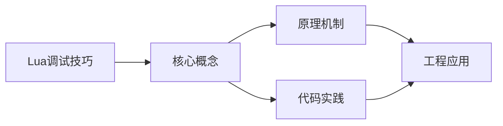

## 1. 学习目标（Bloom 分类）

本节按照布鲁姆教育目标分类学组织学习路径。本文主题为《Lua调试技巧》，属于 Lua 模块，读者可以根据自身阶段选择阅读深度。

记忆层面：能够准确复述本文的核心概念、术语与基本语法或操作步骤，并能够在提问或检索时快速定位对应知识点。能够说出 Lua 的变量、函数、table、元表与协程基本语法。

理解层面：能够用自己的语言解释核心原理与工作机制，说明概念之间的因果关系，而不是机械记忆结论。能够解释 table 作为唯一数据结构的设计与元方法机制。

应用层面：能够在真实项目或练习场景中运用本文知识解决具体问题，写出正确且可维护的实现。能够编写嵌入主程序（游戏、Nginx、Redis）的脚本。

分析层面：能够拆解复杂问题，比较本文主题与相邻概念的异同，识别边界条件与例外情况。能够分析 Lua 与 C 交互（Lua C API）与性能特征。

评价层面：能够根据约束条件（性能、可读性、安全、成本）评价不同方案的优劣，做出有依据的技术决策。能够评价 Lua 与其他脚本语言在嵌入式场景的取舍。

创造层面：能够把本文知识与其他模块知识组合，设计出新的解决方案或可复用的工程模式。能够设计基于 Lua 的可扩展配置与脚本系统。

通过本节学习，读者应当能够把《Lua调试技巧》纳入自己的知识网络，并与 Lua 模块的其他主题（table、元表、协程、嵌入式脚本）建立关联。

## 2. 历史动机与发展脉络

《Lua调试技巧》是 Lua 领域的重要主题。要真正理解它，需要先了解它解决的问题与演进过程。

Lua 由巴西 PUC-Rio 大学的 Roberto Ierusalimschy 等人于 1993 年发布，设计目标是“可嵌入的脚本语言”：解释器小于 300KB，启动快，与 C 无缝集成。
Lua 5.1-5.4 持续演进：5.3 加入整数子类型，5.4 引入 const 变量与关闭值；LuaJIT 是高性能 JIT 实现，广泛用于游戏与性能敏感场景。
Lua 的著名用户：Adobe Lightroom、Redis 脚本、Nginx（OpenResty）、World of Warcraft 插件、Roblox（Luau）与游戏引擎（LÖVE、Defold）。

回到本文主题：Lua调试技巧 的提出与成熟，正是上述技术背景下的必然产物。早期实现往往以简单可用为目标，随着工程规模扩大，社区逐渐沉淀出标准做法与最佳实践；理解这一脉络，可以帮助读者判断“为什么文档中的推荐写法是现在这个样子”，也能在遇到历史遗留代码时准确识别其设计年代与取舍。


## 3. 形式化定义与核心概念精讲

本节把《Lua调试技巧》涉及的核心概念以“定义 + 讲解”的形式展开。读者应把定义当作工具，把讲解当作理解路径；两者结合才能形成可迁移的知识。

table：Lua 唯一的数据结构，同时充当数组、字典、对象与模块；数组索引从 1 开始。
元表（metatable）：通过 __index、__newindex、__add 等元方法改变 table 行为，实现继承与运算符重载。
协程：coroutine.create/resume/yield 实现协作式多任务，适合游戏状态机与生成器。

### 3.1 原文章节逐一精讲

原文档把主题拆分为 17 个小节，下面按顺序给出每一节的导读讲解，随后保留原文细节供精读。

#### 原文精读（完整保留）

# Lua 调试库与排错

> **符号约定**：`< >` 必填参数 | `[ ]` 可选参数

---

#### 概述

调试是软件开发中不可或缺的环节。Lua 作为一门嵌入式脚本语言，其调试方式与编译型语言有所不同。Lua 提供了内置的 debug 库，支持运行时检查调用栈、查看局部变量、设置钩子函数等功能。掌握这些调试技巧，能够帮助开发者快速定位问题、分析性能瓶颈，提升开发效率。

Lua 的调试体系可以分为三个层次：最基础的是使用 print 语句进行简单的输出调试；进阶的是利用 debug 库获取运行时信息，如调用栈、变量值等；高级的则是使用专业调试器（如 MobDebug、ZeroBrane Studio 调试器）进行断点调试和单步执行。此外，性能分析也是调试的重要组成部分，通过测量代码执行时间、分析内存占用，可以找到程序的性能瓶颈。

#### 基本概念

**debug 库**是 Lua 内置的调试工具库，提供了一系列函数用于在运行时检查和操控程序的执行状态。它主要分为两类函数：一类是用于获取信息的自省函数（introspective functions），如 debug.getinfo、debug.getlocal 等；另一类是用于修改状态的钩子函数（hook functions），如 debug.sethook、debug.setlocal 等。

**调用栈**是程序执行过程中函数调用的链式记录。每当一个函数被调用时，Lua 会创建一个新的栈帧（stack frame）压入调用栈，函数返回时弹出。通过遍历调用栈，可以了解程序的执行路径和当前上下文。

**钩子机制**允许在程序执行到特定事件时自动触发回调函数。Lua 支持三种钩子事件：行事件（line，每执行一行代码触发）、调用事件（call，函数被调用时触发）、返回事件（return，函数返回时触发）。通过组合这些事件，可以实现断点、单步执行等调试功能。

**性能分析**通过测量代码片段的执行时间和资源消耗来定位性能瓶颈。Lua 中常用的性能分析手段包括 os.clock 计时、debug.sethook 统计函数调用次数、以及专门的性能分析工具。

#### 快速开始

最简单的调试方式是使用 print 语句输出变量值：

```lua
-- 最基础的调试：打印变量值
local name = "Lua"
local version = 5.4
print("调试信息: name=" .. name .. ", version=" .. version)
```

使用 debug.traceback 获取调用栈信息：

```lua
-- 当程序出错时，打印调用栈
local function inner()
    debug.traceback()  -- 仅获取调用栈，不中断执行
end

local function middle()
    inner()
end

local function outer()
    middle()
end

outer()
-- 输出类似：
-- stack traceback:
--   stdin:2: in function 'inner'
--   stdin:6: in function 'middle'
--   stdin:10: in function 'outer'
--   stdin:13: in main chunk
```

使用 pcall 捕获错误并打印调用栈：

```lua
-- 安全调用并捕获完整错误信息
local ok, err = pcall(function()
    local t = {}
    t.field.subfield = "error"  -- t.field 是 nil，会抛出错误
end)

if not ok then
    print("捕获到错误:")
    print(err)
    -- 输出: stdin:2: attempt to index a nil value (field 'field')
end
```

#### 详细用法

##### debug.getinfo 获取函数信息

debug.getinfo 可以获取函数或调用栈帧的详细信息：

```lua
-- 获取当前函数的信息
local function my_function(a, b)
    local info = debug.getinfo(1)  -- 1 表示当前栈帧
    print("函数名:", info.name)
    print("源文件:", info.source)
    print("行号:", info.currentline)
    print("是否 Lua 函数:", info.what == "Lua")
    print("参数数量:", info.nparams)
    print("是否有可变参数:", info.isvararg)
end

my_function(1, 2)
```

获取调用者的信息：

```lua
local function callee()
    -- 0 代表 getinfo 自身，1 代表 callee，2 代表调用者
    local caller_info = debug.getinfo(2)
    if caller_info then
        print("调用者函数名:", caller_info.name or "(匿名)")
        print("调用者源文件:", caller_info.short_src)
        print("调用者行号:", caller_info.linedefined)
    end
end

local function caller()
    callee()
end

caller()
-- 输出: 调用者函数名: caller
--       调用者源文件: stdin
--       调用者行号: 10
```

指定需要获取的字段，减少开销：

```lua
-- 只获取需要的字段，提高效率
local info = debug.getinfo(1, "Sl")  -- S=源信息, l=当前行
print("源文件:", info.short_src)
print("当前行:", info.currentline)
```

##### debug.getlocal 和 debug.setlocal 查看与修改局部变量

```lua
local function inspect_locals(level)
    level = level or 2  -- 默认查看调用者的局部变量
    local i = 1
    while true do
        local name, value = debug.getlocal(level, i)
        if not name then
            break
        end
        -- 以 (*) 开头的是内部临时变量，通常跳过
        if name:sub(1, 1) ~= "(" then
            print(string.format("  局部变量: %s = %s", name, tostring(value)))
        end
        i = i + 1
    end
end

local function example()
    local x = 42
    local y = "hello"
    local z = {1, 2, 3}
    print("example 函数的局部变量:")
    inspect_locals(1)  -- 查看当前函数的局部变量
end

example()
-- 输出:
--   局部变量: x = 42
--   局部变量: y = hello
--   局部变量: z = table: 0x...
```

修改局部变量的值：

```lua
local function modify_local()
    local count = 10
    print("修改前: count =", count)

    -- 在调用者的栈帧中修改局部变量
    -- debug.setlocal(栈层级, 变量索引, 新值)
    debug.setlocal(1, 1, 999)

    print("修改后: count =", count)  -- 输出: 修改后: count = 999
end

modify_local()
```

##### debug.sethook 设置钩子函数

钩子函数是 Lua 调试的核心机制，可以实现断点、单步执行等功能：

```lua
-- 行计数器：统计每行代码执行的次数
local line_counts = {}

debug.sethook(function(event, line)
    if event == "line" then
        line_counts[line] = (line_counts[line] or 0) + 1
    end
end, "l")  -- "l" 表示监听行事件

-- 执行被分析的代码
for i = 1, 10 do
    local x = i * 2
end

-- 关闭钩子
debug.sethook()

-- 打印热点行
for line, count in pairs(line_counts) do
    if count > 1 then
        print(string.format("行 %d 执行了 %d 次", line, count))
    end
end
```

实现简单的断点功能：

```lua
-- 简单断点调试器
local breakpoints = {}  -- 存储断点：行号 -> true

-- 设置断点
local function set_breakpoint(line)
    breakpoints[line] = true
end

-- 断点钩子
local function breakpoint_hook(event, line)
    if event == "line" and breakpoints[line] then
        print(string.format("命中断点: 行 %d", line))

        -- 打印当前栈帧的局部变量
        local i = 1
        while true do
            local name, value = debug.getlocal(2, i)
            if not name then break end
            if name:sub(1, 1) ~= "(" then
                print(string.format("  %s = %s", name, tostring(value)))
            end
            i = i + 1
        end
    end
end

-- 启用断点调试
debug.sethook(breakpoint_hook, "l")

-- 设置断点
set_breakpoint(42)  -- 在第 42 行设置断点

-- 执行代码...
-- 到达第 42 行时会自动暂停并打印变量信息

-- 关闭调试
debug.sethook()
```

跟踪函数调用和返回：

```lua
-- 函数调用追踪器
local indent = 0

local function trace_hook(event)
    if event == "call" then
        local info = debug.getinfo(2, "n")
        local name = info.name or "(匿名函数)"
        print(string.rep("  ", indent) .. "调用: " .. name)
        indent = indent + 1
    elseif event == "return" then
        indent = indent - 1
        if indent < 0 then indent = 0 end
        local info = debug.getinfo(2, "n")
        local name = info.name or "(匿名函数)"
        print(string.rep("  ", indent) .. "返回: " .. name)
    end
end

debug.sethook(trace_hook, "cr")  -- "c"=调用事件, "r"=返回事件

-- 测试代码
local function add(a, b) return a + b end
local function multiply(a, b) return a * b end
local result = add(multiply(2, 3), 4)

debug.sethook()
-- 输出:
--   调用: multiply
--     调用: add
--     返回: add
--   返回: multiply
```

##### debug.getupvalue 和 debug.setupvalue 查看与修改上值

上值（upvalue）是闭包中捕获的外部变量：

```lua
local function create_counter()
    local count = 0  -- 这是一个上值
    return function()
        count = count + 1
        return count
    end
end

local counter = create_counter()
counter()  -- 返回 1
counter()  -- 返回 2

-- 查看闭包的上值
local i = 1
while true do
    local name, value = debug.getupvalue(counter, i)
    if not name then break end
    print(string.format("上值 %d: %s = %s", i, name, tostring(value)))
    i = i + 1
end
-- 输出: 上值 1: count = 2

-- 修改上值，重置计数器
debug.setupvalue(counter, 1, 0)
print(counter())  -- 输出: 1（从 0 重新开始计数）
```

##### 性能计时与基准测试

使用 os.clock 进行精确计时：

```lua
-- 测量代码执行时间
local function benchmark(name, func, iterations)
    iterations = iterations or 1

    -- 强制 JIT 预热（如果使用 LuaJIT）
    func()

    local start = os.clock()
    for i = 1, iterations do
        func()
    end
    local elapsed = os.clock() - start

    print(string.format("[%s] %d 次迭代，总耗时: %.4f 秒，平均: %.6f 秒/次",
        name, iterations, elapsed, elapsed / iterations))
end

-- 对比不同实现
benchmark("字符串拼接 ..", function()
    local s = ""
    for i = 1, 1000 do
        s = s .. "x"
    end
end, 100)

benchmark("table.concat", function()
    local t = {}
    for i = 1, 1000 do
        t[i] = "x"
    end
    local s = table.concat(t)
end, 100)
```

使用 debug.sethook 进行函数级性能分析：

```lua
-- 简易性能分析器
local func_stats = {}  -- 函数名 -> {count, total_time}
local call_stack = {}
local start_times = {}

local function profiler_hook(event)
    local info = debug.getinfo(2, "nS")
    local name = info.name or info.short_src .. ":" .. info.linedefined

    if event == "call" then
        -- 记录函数调用开始时间
        call_stack[#call_stack + 1] = name
        start_times[name] = os.clock()
    elseif event == "return" then
        local elapsed = os.clock() - (start_times[name] or 0)

        -- 更新统计信息
        if not func_stats[name] then
            func_stats[name] = {count = 0, total_time = 0}
        end
        func_stats[name].count = func_stats[name].count + 1
        func_stats[name].total_time = func_stats[name].total_time + elapsed

        call_stack[#call_stack] = nil
    end
end

-- 启动性能分析
debug.sethook(profiler_hook, "cr")

-- 执行被分析的代码
-- ...（此处放置需要分析的代码）

-- 停止性能分析
debug.sethook()

-- 打印分析结果
print("\n性能分析结果:")
print(string.format("%-30s %8s %12s %12s", "函数", "调用次数", "总耗时(秒)", "平均耗时(秒)"))
for name, stats in pairs(func_stats) do
    print(string.format("%-30s %8d %12.4f %12.6f",
        name, stats.count, stats.total_time, stats.total_time / stats.count))
end
```

#### 常见场景

##### 调试表结构

递归打印表的内容，方便检查复杂数据结构：

```lua
-- 递归打印表结构
local function dump_table(t, indent, max_depth)
    indent = indent or 0
    max_depth = max_depth or 5

    if indent >= max_depth then
        print(string.rep("  ", indent) .. "...")
        return
    end

    for k, v in pairs(t) do
        local key_str = type(k) == "string" and k or tostring(k)
        if type(v) == "table" then
            print(string.rep("  ", indent) .. key_str .. " = {")
            dump_table(v, indent + 1, max_depth)
            print(string.rep("  ", indent) .. "}")
        else
            print(string.rep("  ", indent) .. key_str .. " = " .. tostring(v))
        end
    end
end

-- 使用示例
local config = {
    server = {
        host = "127.0.0.1",
        port = 8080,
    },
    database = {
        name = "myapp",
        pool_size = 10,
    },
    debug = true,
}

dump_table(config)
-- 输出:
-- server = {
--   host = 127.0.0.1
--   port = 8080
-- }
-- database = {
--   name = myapp
--   pool_size = 10
-- }
-- debug = true
```

##### 检测全局变量泄漏

Lua 中全局变量泄漏是常见的 bug 来源，可以通过 debug 库检测：

```lua
-- 全局变量监控器
local saved_globals = {}

local function snapshot_globals()
    local snapshot = {}
    for k, v in pairs(_G) do
        snapshot[k] = true
    end
    return snapshot
end

-- 保存初始全局变量表
saved_globals = snapshot_globals()

local function check_new_globals()
    local new_vars = {}
    for k, v in pairs(_G) do
        if not saved_globals[k] then
            new_vars[#new_vars + 1] = k
        end
    end

    if #new_vars > 0 then
        print("检测到新增全局变量:")
        for _, name in ipairs(new_vars) do
            print("  " .. name .. " = " .. tostring(_G[name]))
        end
    else
        print("未检测到新增全局变量")
    end
end

-- 模拟代码执行（可能意外创建全局变量）
function some_function()
    -- 忘记写 local，导致 x 成为全局变量
    x = 42
end

some_function()
check_new_globals()
-- 输出: 检测到新增全局变量:
--       x = 42
```

##### 条件断点

实现只在特定条件满足时才触发的断点：

```lua
-- 条件断点调试器
local conditional_breakpoints = {}

local function set_conditional_breakpoint(line, condition_func)
    conditional_breakpoints[line] = condition_func
end

local function conditional_hook(event, line)
    if event == "line" and conditional_breakpoints[line] then
        local condition = conditional_breakpoints[line]
        if condition() then
            print(string.format("条件断点命中: 行 %d", line))
            -- 打印调用栈
            print(debug.traceback("", 2))
        end
    end
end

debug.sethook(conditional_hook, "l")

-- 示例：只在 i > 50 时触发断点
set_conditional_breakpoint(25, function()
    local i = 1
    local name, value = debug.getlocal(2, i)
    while name do
        if name == "i" then return value > 50 end
        i = i + 1
        name, value = debug.getlocal(2, i)
    end
    return false
end)

-- 执行循环，只有 i > 50 时才会触发断点
for i = 1, 100 do
    local x = i * 2  -- 第 25 行（假设）
end

debug.sethook()
```

#### 注意事项与常见错误

**debug 库的性能开销很大**。特别是 debug.sethook 设置行钩子时，每执行一行代码都会触发一次回调，可能导致程序运行速度降低数十倍甚至上百倍。因此，调试钩子只应在开发阶段使用，生产环境务必关闭所有调试钩子。

**debug.getlocal 无法获取上值**。局部变量和上值是不同的概念。局部变量存在于函数的栈帧中，通过 debug.getlocal 访问；上值是闭包捕获的外部变量，通过 debug.getupvalue 访问。混淆两者是初学者常见的错误。

**钩子函数中避免复杂操作**。在 debug.sethook 的回调函数中，应尽量保持逻辑简单。如果在钩子函数中执行复杂操作（如网络请求、文件 I/O），可能导致无限递归或不可预期的行为。特别是不要在钩子函数中调用可能触发其他钩子的函数。

**栈层级从 1 开始计数**。debug.getinfo 和 debug.getlocal 的第一个参数是栈层级，其中 1 代表当前函数（即调用 debug 函数的函数），2 代表调用者的调用者，以此类推。传入 0 或负数没有意义，会返回 nil。

**os.clock 测量的是 CPU 时间**。os.clock 返回的是程序使用的 CPU 时间，而非墙上时钟时间。如果程序中有睡眠操作（如 os.execute("sleep 1")），os.clock 不会计入睡眠时间。如果需要测量实际经过的时间，应使用 os.time 或 LuaJIT 的 ffi 调用系统高精度计时器。

#### 高级用法

##### 自定义 print 调试器

实现一个增强版的 print 调试器，自动附带调用位置信息：

```lua
-- 增强版调试打印
local function dprint(...)
    local info = debug.getinfo(2, "Sl")
    local prefix = string.format("[%s:%d]", info.short_src, info.currentline)

    -- 收集所有参数
    local args = {...}
    local parts = {}
    for i, arg in ipairs(args) do
        parts[i] = tostring(arg)
    end

    print(prefix .. " " .. table.concat(parts, "\t"))
end

-- 使用示例
local function calculate_area(radius)
    local area = math.pi * radius * radius
    dprint("半径:", radius, "面积:", area)
    return area
end

calculate_area(5)
-- 输出: [stdin:7] 半径: 5  面积: 78.539816339745
```

##### 远程调试协议

实现一个简单的远程调试协议，允许从外部控制 Lua 程序的执行：

```lua
-- 简易远程调试服务端
local function create_debug_server(port)
    local socket = require("socket")  -- 需要 LuaSocket
    local server = socket.tcp()
    server:bind("*", port)
    server:listen(1)

    local breakpoints = {}
    local client = nil

    -- 等待调试器客户端连接
    local function wait_for_client()
        print("调试服务器等待连接，端口: " .. port)
        client = server:accept()
        client:settimeout(0)  -- 非阻塞模式
        print("调试器已连接")
    end

    -- 处理调试器命令
    local function handle_command(cmd)
        if cmd:match("^break%s+(%d+)$") then
            local line = tonumber(cmd:match("(%d+)"))
            breakpoints[line] = true
            client:send("断点已设置: 行 " .. line .. "\n")
        elseif cmd:match("^clear%s+(%d+)$") then
            local line = tonumber(cmd:match("(%d+)"))
            breakpoints[line] = nil
            client:send("断点已清除: 行 " .. line .. "\n")
        elseif cmd == "stack" then
            client:send(debug.traceback("", 2) .. "\n")
        elseif cmd == "continue" then
            client:send("继续执行\n")
        end
    end

    -- 调试钩子
    local function debug_hook(event, line)
        if event == "line" and breakpoints[line] then
            client:send(string.format("断点命中: 行 %d\n", line))
            client:send(debug.traceback("", 2) .. "\n")

            -- 进入交互模式，等待调试器命令
            client:settimeout(nil)  -- 阻塞模式
            while true do
                local cmd, err = client:receive()
                if not cmd then break end
                if cmd == "continue" then
                    client:settimeout(0)
                    break
                end
                handle_command(cmd)
            end
        end
    end

    -- 启动调试
    wait_for_client()
    debug.sethook(debug_hook, "l")

    return {
        stop = function()
            debug.sethook()
            if client then client:close() end
            server:close()
        end
    }
end
```

##### 内存泄漏检测

通过定期检查全局表和注册表来检测内存泄漏：

```lua
-- 内存监控工具
local memory_monitor = {
    snapshots = {},
}

-- 获取当前内存使用量（KB）
function memory_monitor.current_usage()
    return collectgarbage("count")
end

-- 拍摄内存快照
function memory_monitor.take_snapshot(label)
    collectgarbage("collect")  -- 先执行完整 GC
    local usage = collectgarbage("count")

    -- 统计全局表中的对象数量
    local global_count = 0
    for _ in pairs(_G) do global_count = global_count + 1 end

    memory_monitor.snapshots[#memory_monitor.snapshots + 1] = {
        label = label,
        memory_kb = usage,
        global_count = global_count,
        timestamp = os.time(),
    }

    print(string.format("[内存快照] %s: %.1f KB, 全局变量数: %d",
        label, usage, global_count))
end

-- 对比两个快照
function memory_monitor.compare(label1, label2)
    local s1, s2
    for _, s in ipairs(memory_monitor.snapshots) do
        if s.label == label1 then s1 = s end
        if s.label == label2 then s2 = s end
    end

    if not s1 or not s2 then
        print("未找到指定的快照")
        return
    end

    local diff = s2.memory_kb - s1.memory_kb
    local global_diff = s2.global_count - s1.global_count
    print(string.format("内存变化: %+.1f KB (%s -> %s)", diff, label1, label2))
    print(string.format("全局变量变化: %+d", global_diff))
end

-- 使用示例
memory_monitor.take_snapshot("初始化")

-- 执行一些操作
local cache = {}
for i = 1, 10000 do
    cache[i] = string.rep("x", 100)
end

memory_monitor.take_snapshot("创建缓存后")
memory_monitor.compare("初始化", "创建缓存后")

-- 清理缓存
cache = nil
collectgarbage("collect")
memory_monitor.take_snapshot("清理缓存后")
memory_monitor.compare("创建缓存后", "清理缓存后")
```

##### 与 ZeroBrane Studio 集成

ZeroBrane Studio 是一个集成了调试器的 Lua IDE，支持 MobDebug 远程调试协议：

```lua
-- 在代码中嵌入 MobDebug 调试器
local mobdebug = require("mobdebug")
mobdebug.start()  -- 启动调试器，连接到 ZeroBrane Studio

-- 设置断点
mobdebug.pause()  -- 在此处暂停执行

-- 执行业务代码
local function process_data(data)
    mobdebug.pause()  -- 在此处设置断点
    local result = {}
    for i, item in ipairs(data) do
        result[i] = item * 2
    end
    return result
end

local data = {1, 2, 3, 4, 5}
local result = process_data(data)

mobdebug.done()  -- 结束调试会话
```

在 ZeroBrane Studio 中，可以设置断点、单步执行、查看变量值、评估表达式，提供了完整的图形化调试体验。对于复杂的 Lua 项目，使用专业调试器比 print 调试效率更高。
#### 错误抛出

**基本写法：抛出错误**
`error("<消息>" [, <层级>])`
```lua
-- 抛出错误中断执行
error("参数不能为空")
```

---

**基本写法：带层级的错误**
`error("<消息>", <层级>)`
```lua
-- 层级 1 指向 error 调用处，2 指向调用者
error("调用方出错", 2)  -- 错误指向调用此函数的地方
```

---

**基本写法：抛出非字符串**
`error(<表>)`
```lua
-- 抛出任意值作为错误对象
error({ code = 500, msg = "服务器错误" })
```

---

**基本写法：assert 断言**
`assert(<条件> [, "<消息>"])`
```lua
-- 条件为 nil/false 时抛错
assert(x ~= nil, "x 不能为 nil")
local f = assert(io.open("data.txt", "r"))
```

---

#### 错误捕获

**基本写法：pcall 保护调用**
`local <ok>, <结果> = pcall(<函数>, <参数>...)`
```lua
-- 捕获错误不中断程序
local ok, result = pcall(function(a, b)
    return a / b
end, 10, 0)
if not ok then print("出错:", result) end
```

---

**基本写法：pcall 调用已有函数**
`pcall(<函数>, <参数>...)`
```lua
-- 直接传函数与参数
local ok, val = pcall(tonumber, "abc")
if not ok then print("转换失败") end
```

---

**基本写法：xpcall 带处理函数**
`xpcall(<函数>, <错误处理>, <参数>...)`
```lua
-- 错误发生时调用处理函数获取栈信息
local ok, result = xpcall(function()
    return risky()
end, function(err)
    return debug.traceback("错误: " .. tostring(err), 2)
end)
```

---

**基本写法：pcall vs xpcall**
`-- pcall 仅返回错误，xpcall 可获取栈回溯`
```lua
-- pcall：错误对象不含调用栈
-- xpcall：错误处理器可在栈展开前抓取 traceback
```

---

#### traceback 栈回溯

**基本写法：获取调用栈**
`debug.traceback(["<消息>" [, <层级>]])`
```lua
-- 返回当前调用栈字符串
local trace = debug.traceback("出错了", 2)
print(trace)
```

---

**基本写法：异常中获取栈**
`xpcall(<函数>, function(<err>) return debug.traceback(<err>, 2) end)`
```lua
-- 在错误处理函数中抓栈
local ok, err = xpcall(function()
    error("test")
end, function(e)
    return debug.traceback(e, 2)
end)
print(err)
```

---

#### 调试信息

**基本写法：获取函数信息**
`debug.getinfo(<函数或层级> [, "<选项>"])`
```lua
-- 返回包含函数信息的表
local info = debug.getinfo(1, "Slu")
print(info.source)  -- 源文件
print(info.currentline)  -- 当前行
print(info.what)   -- "Lua"/"C"/"main"
```

---

**基本写法：info 选项速查**
`"<选项字符>"`
```lua
-- "S" 源信息    source short_src what linedefined lastlinedefined
-- "l" 当前行    currentline
-- "u" 上值信息  nups nparams isvararg
-- "n" 名称      name namewhat
-- "f" 函数本身  func
-- "L" 活动行    activelines
```

---

**基本写法：获取局部变量**
`debug.getlocal(<层级>, <序号>)`
```lua
-- 获取指定栈层的局部变量
local name, value = debug.getlocal(1, 1)
while name do
    print(name, value)
    name, value = debug.getlocal(1, 1 + 0)
    break
end
```

---

**基本写法：遍历所有局部变量**
`for <i> = 1, math.huge do end`
```lua
-- 遍历某层所有局部变量
local i = 1
while true do
    local name, value = debug.getlocal(2, i)
    if not name then break end
    print(name, value)
    i = i + 1
end
```

---

**基本写法：设置局部变量**
`debug.setlocal(<层级>, <序号>, <值>)`
```lua
-- 修改局部变量的值
debug.setlocal(1, 1, "new value")
```

---

**基本写法：获取上值**
`debug.getupvalue(<函数>, <序号>)`
```lua
-- 获取闭包的上值
local name, value = debug.getupvalue(func, 1)
```

---

**基本写法：设置上值**
`debug.setupvalue(<函数>, <序号>, <值>)`
```lua
-- 修改闭包的上值
debug.setupvalue(func, 1, newvalue)
```

---

#### 调试钩子

**基本写法：设置钩子**
`debug.sethook(<函数>, "<事件>" [, <行数>])`
```lua
-- 设置调试钩子，事件：c call l r
debug.sethook(function(event)
    print("事件:", event, debug.getinfo(2).currentline)
end, "cr")  -- c 函数调用 r 返回
```

---

**基本写法：行计数钩子**
`debug.sethook(<函数>, "l", <行数间隔>)`
```lua
-- 每隔 N 行触发一次
debug.sethook(function()
    print("执行到:", debug.getinfo(2).currentline)
end, "l", 100)
```

---

**基本写法：获取当前钩子**
`debug.gethook()`
```lua
-- 返回当前钩子函数、事件与计数
local hook, mask, count = debug.gethook()
```

---

**基本写法：移除钩子**
`debug.sethook()`
```lua
-- 传 nil 取消钩子
debug.sethook()
```

---

#### 注册表操作

**基本写法：访问注册表**
`debug.getregistry()`
```lua
-- 返回 Lua 注册表（全局共享表）
local reg = debug.getregistry()
-- reg[1] 等存放 C 侧引用的对象
```

---

#### 元表调试

**基本写法：获取元表**
`debug.getmetatable(<值>)`
```lua
-- 获取值的元表（绕过 __metatable 保护）
local mt = debug.getmetatable(obj)
```

---

**基本写法：设置元表**
`debug.setmetatable(<值>, <元表>)`
```lua
-- 强制设置元表（绕过 __metatable 保护）
debug.setmetatable(obj, newmt)
```

---

#### 调试实用函数

**基本写法：类型判断增强**
`<函数>.what = debug.getinfo(<函数>).what`
```lua
-- 判断函数来源是 Lua 还是 C
local info = debug.getinfo(somefunc, "S")
if info.what == "C" then
    print("C 函数")
elseif info.what == "Lua" then
    print("Lua 函数")
end
```

---

**基本写法：打印调用栈**
`local function <名>() end`
```lua
-- 自定义栈打印工具
local function print_stack()
    local level = 2
    while true do
        local info = debug.getinfo(level, "Sl")
        if not info then break end
        print(string.format("%s:%d", info.short_src, info.currentline))
        level = level + 1
    end
end
```

---

#### 调试器基础

**基本写法：简单断点实现**
`debug.sethook(<函数>, "l")`
```lua
-- 用行钩子实现断点
local breakpoints = { ["/path/file.lua"] = { [10] = true } }
debug.sethook(function(_, line)
    local info = debug.getinfo(2, "S")
    if breakpoints[info.short_src] and breakpoints[info.short_src][line] then
        print("命中断点:", info.short_src, line)
        debug.debug()  -- 进入交互调试
    end
end, "l")
```

---

**基本写法：交互调试提示**
`debug.debug()`
```lua
-- 进入内置交互调试器，输入 cont 退出
debug.debug()
```

---

#### 常见排错模式

**基本写法：封装安全调用**
`local function <名>(<函数>, ...)`
```lua
-- 统一错误处理封装
local function safe_call(fn, ...)
    local ok, result = pcall(fn, ...)
    if not ok then
        print("[ERROR]", result)
        return nil
    end
    return result
end
```

---

**基本写法：资源清理保护**
`pcall(function() end) + finally`
```lua
-- 模拟 try-finally
local function try_finally(body, cleanup)
    local ok, err = pcall(body)
    cleanup()
    if not ok then error(err) end
end
```

---

**基本写法：可选参数校验**
`assert(type(<参数>) == "<类型>", "<消息>")`
```lua
-- 参数类型检查
local function add(a, b)
    assert(type(a) == "number", "a 必须为数字")
    assert(type(b) == "number", "b 必须为数字")
    return a + b
end
```


### 3.2 概念关系图

下面用 Mermaid 图表达本文核心概念之间的关系，帮助读者建立整体图景：



图中展示的是本文知识的结构化关系：核心概念是入口，原理机制解释“为什么”，代码实践演示“怎么做”，工程应用回答“何时用”。读者学习时可以把每个小节的内容挂接到对应节点上。

## 4. 理论推导与原理解析

本节深入《Lua调试技巧》背后的原理。理论部分不求面面俱到，而是聚焦“能解释现象、能指导实践”的关键推导。

table：Lua 唯一的数据结构，同时充当数组、字典、对象与模块；数组索引从 1 开始。
元表（metatable）：通过 __index、__newindex、__add 等元方法改变 table 行为，实现继承与运算符重载。
协程：coroutine.create/resume/yield 实现协作式多任务，适合游戏状态机与生成器。
C API：lua_State 上下文、栈式参数传递，宿主程序可以安全地执行用户脚本。

需要强调的是，理论推导与工程实践之间存在翻译层：理论给出的是理想化模型与边界条件，工程代码则必须处理真实环境中的例外。读者在学习时应先掌握理论的“标准情形”，再通过陷阱章节了解“非标准情形”。

## 5. 代码示例与逐行讲解

本节把原文中的代码示例系统整理，并为每个示例补充用途说明与讲解。读者不应只浏览代码，而应逐段对照讲解理解设计意图。

### 5.1 示例：快速开始

该示例来自原文《快速开始》小节，用于演示Lua调试技巧相关操作。阅读时请先看代码结构，再看其后的讲解。

```lua
-- 最基础的调试：打印变量值
local name = "Lua"
local version = 5.4
print("调试信息: name=" .. name .. ", version=" .. version)
```

讲解：这段代码演示了本节核心知识点。代码中的关键操作可以归纳为三步：准备（定义或初始化）、执行（核心逻辑）、收尾（释放资源或返回结果）。实际项目中，这三步往往被封装为函数或类，以提升复用性与可测试性。

关键点分析：

该示例共 4 行有效代码，结构以数据或配置为主。阅读时应关注：数据字段的含义、配置项的作用，以及它们与运行行为的对应关系。

进阶思考路径：先尝试修改参数观察行为变化，再把示例中的模式迁移到自己的项目中；每次修改都记录预期与实测差异，这是把示例转化为能力的最快方式。

### 5.2 示例：快速开始

该示例来自原文《快速开始》小节，用于演示Lua调试技巧相关操作。阅读时请先看代码结构，再看其后的讲解。

```lua
-- 当程序出错时，打印调用栈
local function inner()
    debug.traceback()  -- 仅获取调用栈，不中断执行
end

local function middle()
    inner()
end

local function outer()
    middle()
end

outer()
-- 输出类似：
-- stack traceback:
--   stdin:2: in function 'inner'
--   stdin:6: in function 'middle'
--   stdin:10: in function 'outer'
--   stdin:13: in main chunk
```

讲解：这段代码演示了本节核心知识点。代码中的关键操作可以归纳为三步：准备（定义或初始化）、执行（核心逻辑）、收尾（释放资源或返回结果）。实际项目中，这三步往往被封装为函数或类，以提升复用性与可测试性。

关键点分析：

该示例共 17 行有效代码，包含 1 类关键结构（function）。其中：

- 入口与初始化部分负责建立上下文，对应实际项目中的启动或装配逻辑；
- 核心逻辑部分体现本文主题的主要操作，是阅读时最需要对照讲解理解的部分；
- 输出或返回部分把结果交给调用方，注意其类型与边界条件。

进阶思考路径：先尝试修改参数观察行为变化，再把示例中的模式迁移到自己的项目中；每次修改都记录预期与实测差异，这是把示例转化为能力的最快方式。

### 5.3 示例：快速开始

该示例来自原文《快速开始》小节，用于演示Lua调试技巧相关操作。阅读时请先看代码结构，再看其后的讲解。

```lua
-- 安全调用并捕获完整错误信息
local ok, err = pcall(function()
    local t = {}
    t.field.subfield = "error"  -- t.field 是 nil，会抛出错误
end)

if not ok then
    print("捕获到错误:")
    print(err)
    -- 输出: stdin:2: attempt to index a nil value (field 'field')
end
```

讲解：这段代码演示了本节核心知识点。代码中的关键操作可以归纳为三步：准备（定义或初始化）、执行（核心逻辑）、收尾（释放资源或返回结果）。实际项目中，这三步往往被封装为函数或类，以提升复用性与可测试性。

关键点分析：

该示例共 10 行有效代码，包含 2 类关键结构（function、if）。其中：

- 入口与初始化部分负责建立上下文，对应实际项目中的启动或装配逻辑；
- 核心逻辑部分体现本文主题的主要操作，是阅读时最需要对照讲解理解的部分；
- 输出或返回部分把结果交给调用方，注意其类型与边界条件。

进阶思考路径：先尝试修改参数观察行为变化，再把示例中的模式迁移到自己的项目中；每次修改都记录预期与实测差异，这是把示例转化为能力的最快方式。

### 5.4 示例：debug.getinfo 获取函数信息

该示例来自原文《debug.getinfo 获取函数信息》小节，用于演示Lua调试技巧相关操作。阅读时请先看代码结构，再看其后的讲解。

```lua
-- 获取当前函数的信息
local function my_function(a, b)
    local info = debug.getinfo(1)  -- 1 表示当前栈帧
    print("函数名:", info.name)
    print("源文件:", info.source)
    print("行号:", info.currentline)
    print("是否 Lua 函数:", info.what == "Lua")
    print("参数数量:", info.nparams)
    print("是否有可变参数:", info.isvararg)
end

my_function(1, 2)
```

讲解：这段代码演示了本节核心知识点。代码中的关键操作可以归纳为三步：准备（定义或初始化）、执行（核心逻辑）、收尾（释放资源或返回结果）。实际项目中，这三步往往被封装为函数或类，以提升复用性与可测试性。

关键点分析：

该示例共 11 行有效代码，包含 1 类关键结构（function）。其中：

- 入口与初始化部分负责建立上下文，对应实际项目中的启动或装配逻辑；
- 核心逻辑部分体现本文主题的主要操作，是阅读时最需要对照讲解理解的部分；
- 输出或返回部分把结果交给调用方，注意其类型与边界条件。

进阶思考路径：先尝试修改参数观察行为变化，再把示例中的模式迁移到自己的项目中；每次修改都记录预期与实测差异，这是把示例转化为能力的最快方式。

### 5.5 示例：debug.getinfo 获取函数信息

该示例来自原文《debug.getinfo 获取函数信息》小节，用于演示Lua调试技巧相关操作。阅读时请先看代码结构，再看其后的讲解。

```lua
local function callee()
    -- 0 代表 getinfo 自身，1 代表 callee，2 代表调用者
    local caller_info = debug.getinfo(2)
    if caller_info then
        print("调用者函数名:", caller_info.name or "(匿名)")
        print("调用者源文件:", caller_info.short_src)
        print("调用者行号:", caller_info.linedefined)
    end
end

local function caller()
    callee()
end

caller()
-- 输出: 调用者函数名: caller
--       调用者源文件: stdin
--       调用者行号: 10
```

讲解：这段代码演示了本节核心知识点。代码中的关键操作可以归纳为三步：准备（定义或初始化）、执行（核心逻辑）、收尾（释放资源或返回结果）。实际项目中，这三步往往被封装为函数或类，以提升复用性与可测试性。

关键点分析：

该示例共 16 行有效代码，包含 2 类关键结构（function、if）。其中：

- 入口与初始化部分负责建立上下文，对应实际项目中的启动或装配逻辑；
- 核心逻辑部分体现本文主题的主要操作，是阅读时最需要对照讲解理解的部分；
- 输出或返回部分把结果交给调用方，注意其类型与边界条件。

进阶思考路径：先尝试修改参数观察行为变化，再把示例中的模式迁移到自己的项目中；每次修改都记录预期与实测差异，这是把示例转化为能力的最快方式。

### 5.6 示例：debug.getinfo 获取函数信息

该示例来自原文《debug.getinfo 获取函数信息》小节，用于演示Lua调试技巧相关操作。阅读时请先看代码结构，再看其后的讲解。

```lua
-- 只获取需要的字段，提高效率
local info = debug.getinfo(1, "Sl")  -- S=源信息, l=当前行
print("源文件:", info.short_src)
print("当前行:", info.currentline)
```

讲解：这段代码演示了本节核心知识点。代码中的关键操作可以归纳为三步：准备（定义或初始化）、执行（核心逻辑）、收尾（释放资源或返回结果）。实际项目中，这三步往往被封装为函数或类，以提升复用性与可测试性。

关键点分析：

该示例共 4 行有效代码，结构以数据或配置为主。阅读时应关注：数据字段的含义、配置项的作用，以及它们与运行行为的对应关系。

进阶思考路径：先尝试修改参数观察行为变化，再把示例中的模式迁移到自己的项目中；每次修改都记录预期与实测差异，这是把示例转化为能力的最快方式。

### 5.7 示例：debug.getlocal 和 debug.setlocal 查看与修改局部变量

该示例来自原文《debug.getlocal 和 debug.setlocal 查看与修改局部变量》小节，用于演示Lua调试技巧相关操作。阅读时请先看代码结构，再看其后的讲解。

```lua
local function inspect_locals(level)
    level = level or 2  -- 默认查看调用者的局部变量
    local i = 1
    while true do
        local name, value = debug.getlocal(level, i)
        if not name then
            break
        end
        -- 以 (*) 开头的是内部临时变量，通常跳过
        if name:sub(1, 1) ~= "(" then
            print(string.format("  局部变量: %s = %s", name, tostring(value)))
        end
        i = i + 1
    end
end

local function example()
    local x = 42
    local y = "hello"
    local z = {1, 2, 3}
    print("example 函数的局部变量:")
    inspect_locals(1)  -- 查看当前函数的局部变量
end

example()
-- 输出:
--   局部变量: x = 42
--   局部变量: y = hello
--   局部变量: z = table: 0x...
```

讲解：这段代码演示了本节核心知识点。代码中的关键操作可以归纳为三步：准备（定义或初始化）、执行（核心逻辑）、收尾（释放资源或返回结果）。实际项目中，这三步往往被封装为函数或类，以提升复用性与可测试性。

关键点分析：

该示例共 27 行有效代码，包含 3 类关键结构（function、if、while）。其中：

- 入口与初始化部分负责建立上下文，对应实际项目中的启动或装配逻辑；
- 核心逻辑部分体现本文主题的主要操作，是阅读时最需要对照讲解理解的部分；
- 输出或返回部分把结果交给调用方，注意其类型与边界条件。

进阶思考路径：先尝试修改参数观察行为变化，再把示例中的模式迁移到自己的项目中；每次修改都记录预期与实测差异，这是把示例转化为能力的最快方式。

### 5.8 示例：debug.getlocal 和 debug.setlocal 查看与修改局部变量

该示例来自原文《debug.getlocal 和 debug.setlocal 查看与修改局部变量》小节，用于演示Lua调试技巧相关操作。阅读时请先看代码结构，再看其后的讲解。

```lua
local function modify_local()
    local count = 10
    print("修改前: count =", count)

    -- 在调用者的栈帧中修改局部变量
    -- debug.setlocal(栈层级, 变量索引, 新值)
    debug.setlocal(1, 1, 999)

    print("修改后: count =", count)  -- 输出: 修改后: count = 999
end

modify_local()
```

讲解：这段代码演示了本节核心知识点。代码中的关键操作可以归纳为三步：准备（定义或初始化）、执行（核心逻辑）、收尾（释放资源或返回结果）。实际项目中，这三步往往被封装为函数或类，以提升复用性与可测试性。

关键点分析：

该示例共 9 行有效代码，包含 1 类关键结构（function）。其中：

- 入口与初始化部分负责建立上下文，对应实际项目中的启动或装配逻辑；
- 核心逻辑部分体现本文主题的主要操作，是阅读时最需要对照讲解理解的部分；
- 输出或返回部分把结果交给调用方，注意其类型与边界条件。

进阶思考路径：先尝试修改参数观察行为变化，再把示例中的模式迁移到自己的项目中；每次修改都记录预期与实测差异，这是把示例转化为能力的最快方式。

### 5.9 示例：debug.sethook 设置钩子函数

该示例来自原文《debug.sethook 设置钩子函数》小节，用于演示Lua调试技巧相关操作。阅读时请先看代码结构，再看其后的讲解。

```lua
-- 行计数器：统计每行代码执行的次数
local line_counts = {}

debug.sethook(function(event, line)
    if event == "line" then
        line_counts[line] = (line_counts[line] or 0) + 1
    end
end, "l")  -- "l" 表示监听行事件

-- 执行被分析的代码
for i = 1, 10 do
    local x = i * 2
end

-- 关闭钩子
debug.sethook()

-- 打印热点行
for line, count in pairs(line_counts) do
    if count > 1 then
        print(string.format("行 %d 执行了 %d 次", line, count))
    end
end
```

讲解：这段代码演示了本节核心知识点。代码中的关键操作可以归纳为三步：准备（定义或初始化）、执行（核心逻辑）、收尾（释放资源或返回结果）。实际项目中，这三步往往被封装为函数或类，以提升复用性与可测试性。

关键点分析：

该示例共 19 行有效代码，包含 3 类关键结构（function、if、for）。其中：

- 入口与初始化部分负责建立上下文，对应实际项目中的启动或装配逻辑；
- 核心逻辑部分体现本文主题的主要操作，是阅读时最需要对照讲解理解的部分；
- 输出或返回部分把结果交给调用方，注意其类型与边界条件。

进阶思考路径：先尝试修改参数观察行为变化，再把示例中的模式迁移到自己的项目中；每次修改都记录预期与实测差异，这是把示例转化为能力的最快方式。

### 5.10 示例：debug.sethook 设置钩子函数

该示例来自原文《debug.sethook 设置钩子函数》小节，用于演示Lua调试技巧相关操作。阅读时请先看代码结构，再看其后的讲解。

```lua
-- 简单断点调试器
local breakpoints = {}  -- 存储断点：行号 -> true

-- 设置断点
local function set_breakpoint(line)
    breakpoints[line] = true
end

-- 断点钩子
local function breakpoint_hook(event, line)
    if event == "line" and breakpoints[line] then
        print(string.format("命中断点: 行 %d", line))

        -- 打印当前栈帧的局部变量
        local i = 1
        while true do
            local name, value = debug.getlocal(2, i)
            if not name then break end
            if name:sub(1, 1) ~= "(" then
                print(string.format("  %s = %s", name, tostring(value)))
            end
            i = i + 1
        end
    end
end

-- 启用断点调试
debug.sethook(breakpoint_hook, "l")

-- 设置断点
set_breakpoint(42)  -- 在第 42 行设置断点

-- 执行代码...
-- 到达第 42 行时会自动暂停并打印变量信息

-- 关闭调试
debug.sethook()
```

讲解：这段代码演示了本节核心知识点。代码中的关键操作可以归纳为三步：准备（定义或初始化）、执行（核心逻辑）、收尾（释放资源或返回结果）。实际项目中，这三步往往被封装为函数或类，以提升复用性与可测试性。

关键点分析：

该示例共 30 行有效代码，包含 3 类关键结构（function、if、while）。其中：

- 入口与初始化部分负责建立上下文，对应实际项目中的启动或装配逻辑；
- 核心逻辑部分体现本文主题的主要操作，是阅读时最需要对照讲解理解的部分；
- 输出或返回部分把结果交给调用方，注意其类型与边界条件。

进阶思考路径：先尝试修改参数观察行为变化，再把示例中的模式迁移到自己的项目中；每次修改都记录预期与实测差异，这是把示例转化为能力的最快方式。

### 5.11 示例：debug.sethook 设置钩子函数

该示例来自原文《debug.sethook 设置钩子函数》小节，用于演示Lua调试技巧相关操作。阅读时请先看代码结构，再看其后的讲解。

```lua
-- 函数调用追踪器
local indent = 0

local function trace_hook(event)
    if event == "call" then
        local info = debug.getinfo(2, "n")
        local name = info.name or "(匿名函数)"
        print(string.rep("  ", indent) .. "调用: " .. name)
        indent = indent + 1
    elseif event == "return" then
        indent = indent - 1
        if indent < 0 then indent = 0 end
        local info = debug.getinfo(2, "n")
        local name = info.name or "(匿名函数)"
        print(string.rep("  ", indent) .. "返回: " .. name)
    end
end

debug.sethook(trace_hook, "cr")  -- "c"=调用事件, "r"=返回事件

-- 测试代码
local function add(a, b) return a + b end
local function multiply(a, b) return a * b end
local result = add(multiply(2, 3), 4)

debug.sethook()
-- 输出:
--   调用: multiply
--     调用: add
--     返回: add
--   返回: multiply
```

讲解：这段代码演示了本节核心知识点。代码中的关键操作可以归纳为三步：准备（定义或初始化）、执行（核心逻辑）、收尾（释放资源或返回结果）。实际项目中，这三步往往被封装为函数或类，以提升复用性与可测试性。

关键点分析：

该示例共 27 行有效代码，包含 3 类关键结构（function、if、return）。其中：

- 入口与初始化部分负责建立上下文，对应实际项目中的启动或装配逻辑；
- 核心逻辑部分体现本文主题的主要操作，是阅读时最需要对照讲解理解的部分；
- 输出或返回部分把结果交给调用方，注意其类型与边界条件。

进阶思考路径：先尝试修改参数观察行为变化，再把示例中的模式迁移到自己的项目中；每次修改都记录预期与实测差异，这是把示例转化为能力的最快方式。

### 5.12 示例：debug.getupvalue 和 debug.setupvalue 查看与修改上值

该示例来自原文《debug.getupvalue 和 debug.setupvalue 查看与修改上值》小节，用于演示Lua调试技巧相关操作。阅读时请先看代码结构，再看其后的讲解。

```lua
local function create_counter()
    local count = 0  -- 这是一个上值
    return function()
        count = count + 1
        return count
    end
end

local counter = create_counter()
counter()  -- 返回 1
counter()  -- 返回 2

-- 查看闭包的上值
local i = 1
while true do
    local name, value = debug.getupvalue(counter, i)
    if not name then break end
    print(string.format("上值 %d: %s = %s", i, name, tostring(value)))
    i = i + 1
end
-- 输出: 上值 1: count = 2

-- 修改上值，重置计数器
debug.setupvalue(counter, 1, 0)
print(counter())  -- 输出: 1（从 0 重新开始计数）
```

讲解：这段代码演示了本节核心知识点。代码中的关键操作可以归纳为三步：准备（定义或初始化）、执行（核心逻辑）、收尾（释放资源或返回结果）。实际项目中，这三步往往被封装为函数或类，以提升复用性与可测试性。

关键点分析：

该示例共 22 行有效代码，包含 4 类关键结构（function、if、while、return）。其中：

- 入口与初始化部分负责建立上下文，对应实际项目中的启动或装配逻辑；
- 核心逻辑部分体现本文主题的主要操作，是阅读时最需要对照讲解理解的部分；
- 输出或返回部分把结果交给调用方，注意其类型与边界条件。

进阶思考路径：先尝试修改参数观察行为变化，再把示例中的模式迁移到自己的项目中；每次修改都记录预期与实测差异，这是把示例转化为能力的最快方式。

### 5.13 示例：性能计时与基准测试

该示例来自原文《性能计时与基准测试》小节，用于演示Lua调试技巧相关操作。阅读时请先看代码结构，再看其后的讲解。

```lua
-- 测量代码执行时间
local function benchmark(name, func, iterations)
    iterations = iterations or 1

    -- 强制 JIT 预热（如果使用 LuaJIT）
    func()

    local start = os.clock()
    for i = 1, iterations do
        func()
    end
    local elapsed = os.clock() - start

    print(string.format("[%s] %d 次迭代，总耗时: %.4f 秒，平均: %.6f 秒/次",
        name, iterations, elapsed, elapsed / iterations))
end

-- 对比不同实现
benchmark("字符串拼接 ..", function()
    local s = ""
    for i = 1, 1000 do
        s = s .. "x"
    end
end, 100)

benchmark("table.concat", function()
    local t = {}
    for i = 1, 1000 do
        t[i] = "x"
    end
    local s = table.concat(t)
end, 100)
```

讲解：这段代码演示了本节核心知识点。代码中的关键操作可以归纳为三步：准备（定义或初始化）、执行（核心逻辑）、收尾（释放资源或返回结果）。实际项目中，这三步往往被封装为函数或类，以提升复用性与可测试性。

关键点分析：

该示例共 27 行有效代码，包含 2 类关键结构（function、for）。其中：

- 入口与初始化部分负责建立上下文，对应实际项目中的启动或装配逻辑；
- 核心逻辑部分体现本文主题的主要操作，是阅读时最需要对照讲解理解的部分；
- 输出或返回部分把结果交给调用方，注意其类型与边界条件。

进阶思考路径：先尝试修改参数观察行为变化，再把示例中的模式迁移到自己的项目中；每次修改都记录预期与实测差异，这是把示例转化为能力的最快方式。

### 5.14 示例：性能计时与基准测试

该示例来自原文《性能计时与基准测试》小节，用于演示Lua调试技巧相关操作。阅读时请先看代码结构，再看其后的讲解。

```lua
-- 简易性能分析器
local func_stats = {}  -- 函数名 -> {count, total_time}
local call_stack = {}
local start_times = {}

local function profiler_hook(event)
    local info = debug.getinfo(2, "nS")
    local name = info.name or info.short_src .. ":" .. info.linedefined

    if event == "call" then
        -- 记录函数调用开始时间
        call_stack[#call_stack + 1] = name
        start_times[name] = os.clock()
    elseif event == "return" then
        local elapsed = os.clock() - (start_times[name] or 0)

        -- 更新统计信息
        if not func_stats[name] then
            func_stats[name] = {count = 0, total_time = 0}
        end
        func_stats[name].count = func_stats[name].count + 1
        func_stats[name].total_time = func_stats[name].total_time + elapsed

        call_stack[#call_stack] = nil
    end
end

-- 启动性能分析
debug.sethook(profiler_hook, "cr")

-- 执行被分析的代码
-- ...（此处放置需要分析的代码）

-- 停止性能分析
debug.sethook()

-- 打印分析结果
print("\n性能分析结果:")
print(string.format("%-30s %8s %12s %12s", "函数", "调用次数", "总耗时(秒)", "平均耗时(秒)"))
for name, stats in pairs(func_stats) do
    print(string.format("%-30s %8d %12.4f %12.6f",
        name, stats.count, stats.total_time, stats.total_time / stats.count))
end
```

讲解：这段代码演示了本节核心知识点。代码中的关键操作可以归纳为三步：准备（定义或初始化）、执行（核心逻辑）、收尾（释放资源或返回结果）。实际项目中，这三步往往被封装为函数或类，以提升复用性与可测试性。

关键点分析：

该示例共 35 行有效代码，包含 4 类关键结构（function、if、for、return）。其中：

- 入口与初始化部分负责建立上下文，对应实际项目中的启动或装配逻辑；
- 核心逻辑部分体现本文主题的主要操作，是阅读时最需要对照讲解理解的部分；
- 输出或返回部分把结果交给调用方，注意其类型与边界条件。

进阶思考路径：先尝试修改参数观察行为变化，再把示例中的模式迁移到自己的项目中；每次修改都记录预期与实测差异，这是把示例转化为能力的最快方式。

### 5.15 示例：调试表结构

该示例来自原文《调试表结构》小节，用于演示Lua调试技巧相关操作。阅读时请先看代码结构，再看其后的讲解。

```lua
-- 递归打印表结构
local function dump_table(t, indent, max_depth)
    indent = indent or 0
    max_depth = max_depth or 5

    if indent >= max_depth then
        print(string.rep("  ", indent) .. "...")
        return
    end

    for k, v in pairs(t) do
        local key_str = type(k) == "string" and k or tostring(k)
        if type(v) == "table" then
            print(string.rep("  ", indent) .. key_str .. " = {")
            dump_table(v, indent + 1, max_depth)
            print(string.rep("  ", indent) .. "}")
        else
            print(string.rep("  ", indent) .. key_str .. " = " .. tostring(v))
        end
    end
end

-- 使用示例
local config = {
    server = {
        host = "127.0.0.1",
        port = 8080,
    },
    database = {
        name = "myapp",
        pool_size = 10,
    },
    debug = true,
}

dump_table(config)
-- 输出:
-- server = {
--   host = 127.0.0.1
--   port = 8080
-- }
-- database = {
--   name = myapp
--   pool_size = 10
-- }
-- debug = true
```

讲解：这段代码演示了本节核心知识点。代码中的关键操作可以归纳为三步：准备（定义或初始化）、执行（核心逻辑）、收尾（释放资源或返回结果）。实际项目中，这三步往往被封装为函数或类，以提升复用性与可测试性。

关键点分析：

该示例共 42 行有效代码，包含 4 类关键结构（function、if、for、return）。其中：

- 入口与初始化部分负责建立上下文，对应实际项目中的启动或装配逻辑；
- 核心逻辑部分体现本文主题的主要操作，是阅读时最需要对照讲解理解的部分；
- 输出或返回部分把结果交给调用方，注意其类型与边界条件。

进阶思考路径：先尝试修改参数观察行为变化，再把示例中的模式迁移到自己的项目中；每次修改都记录预期与实测差异，这是把示例转化为能力的最快方式。

### 5.16 示例：检测全局变量泄漏

该示例来自原文《检测全局变量泄漏》小节，用于演示Lua调试技巧相关操作。阅读时请先看代码结构，再看其后的讲解。

```lua
-- 全局变量监控器
local saved_globals = {}

local function snapshot_globals()
    local snapshot = {}
    for k, v in pairs(_G) do
        snapshot[k] = true
    end
    return snapshot
end

-- 保存初始全局变量表
saved_globals = snapshot_globals()

local function check_new_globals()
    local new_vars = {}
    for k, v in pairs(_G) do
        if not saved_globals[k] then
            new_vars[#new_vars + 1] = k
        end
    end

    if #new_vars > 0 then
        print("检测到新增全局变量:")
        for _, name in ipairs(new_vars) do
            print("  " .. name .. " = " .. tostring(_G[name]))
        end
    else
        print("未检测到新增全局变量")
    end
end

-- 模拟代码执行（可能意外创建全局变量）
function some_function()
    -- 忘记写 local，导致 x 成为全局变量
    x = 42
end

some_function()
check_new_globals()
-- 输出: 检测到新增全局变量:
--       x = 42
```

讲解：这段代码演示了本节核心知识点。代码中的关键操作可以归纳为三步：准备（定义或初始化）、执行（核心逻辑）、收尾（释放资源或返回结果）。实际项目中，这三步往往被封装为函数或类，以提升复用性与可测试性。

关键点分析：

该示例共 36 行有效代码，包含 4 类关键结构（function、if、for、return）。其中：

- 入口与初始化部分负责建立上下文，对应实际项目中的启动或装配逻辑；
- 核心逻辑部分体现本文主题的主要操作，是阅读时最需要对照讲解理解的部分；
- 输出或返回部分把结果交给调用方，注意其类型与边界条件。

进阶思考路径：先尝试修改参数观察行为变化，再把示例中的模式迁移到自己的项目中；每次修改都记录预期与实测差异，这是把示例转化为能力的最快方式。

### 5.17 示例：条件断点

该示例来自原文《条件断点》小节，用于演示Lua调试技巧相关操作。阅读时请先看代码结构，再看其后的讲解。

```lua
-- 条件断点调试器
local conditional_breakpoints = {}

local function set_conditional_breakpoint(line, condition_func)
    conditional_breakpoints[line] = condition_func
end

local function conditional_hook(event, line)
    if event == "line" and conditional_breakpoints[line] then
        local condition = conditional_breakpoints[line]
        if condition() then
            print(string.format("条件断点命中: 行 %d", line))
            -- 打印调用栈
            print(debug.traceback("", 2))
        end
    end
end

debug.sethook(conditional_hook, "l")

-- 示例：只在 i > 50 时触发断点
set_conditional_breakpoint(25, function()
    local i = 1
    local name, value = debug.getlocal(2, i)
    while name do
        if name == "i" then return value > 50 end
        i = i + 1
        name, value = debug.getlocal(2, i)
    end
    return false
end)

-- 执行循环，只有 i > 50 时才会触发断点
for i = 1, 100 do
    local x = i * 2  -- 第 25 行（假设）
end

debug.sethook()
```

讲解：这段代码演示了本节核心知识点。代码中的关键操作可以归纳为三步：准备（定义或初始化）、执行（核心逻辑）、收尾（释放资源或返回结果）。实际项目中，这三步往往被封装为函数或类，以提升复用性与可测试性。

关键点分析：

该示例共 32 行有效代码，包含 5 类关键结构（function、if、for、while、return）。其中：

- 入口与初始化部分负责建立上下文，对应实际项目中的启动或装配逻辑；
- 核心逻辑部分体现本文主题的主要操作，是阅读时最需要对照讲解理解的部分；
- 输出或返回部分把结果交给调用方，注意其类型与边界条件。

进阶思考路径：先尝试修改参数观察行为变化，再把示例中的模式迁移到自己的项目中；每次修改都记录预期与实测差异，这是把示例转化为能力的最快方式。

### 5.18 示例：自定义 print 调试器

该示例来自原文《自定义 print 调试器》小节，用于演示Lua调试技巧相关操作。阅读时请先看代码结构，再看其后的讲解。

```lua
-- 增强版调试打印
local function dprint(...)
    local info = debug.getinfo(2, "Sl")
    local prefix = string.format("[%s:%d]", info.short_src, info.currentline)

    -- 收集所有参数
    local args = {...}
    local parts = {}
    for i, arg in ipairs(args) do
        parts[i] = tostring(arg)
    end

    print(prefix .. " " .. table.concat(parts, "\t"))
end

-- 使用示例
local function calculate_area(radius)
    local area = math.pi * radius * radius
    dprint("半径:", radius, "面积:", area)
    return area
end

calculate_area(5)
-- 输出: [stdin:7] 半径: 5  面积: 78.539816339745
```

讲解：这段代码演示了本节核心知识点。代码中的关键操作可以归纳为三步：准备（定义或初始化）、执行（核心逻辑）、收尾（释放资源或返回结果）。实际项目中，这三步往往被封装为函数或类，以提升复用性与可测试性。

关键点分析：

该示例共 20 行有效代码，包含 3 类关键结构（function、for、return）。其中：

- 入口与初始化部分负责建立上下文，对应实际项目中的启动或装配逻辑；
- 核心逻辑部分体现本文主题的主要操作，是阅读时最需要对照讲解理解的部分；
- 输出或返回部分把结果交给调用方，注意其类型与边界条件。

进阶思考路径：先尝试修改参数观察行为变化，再把示例中的模式迁移到自己的项目中；每次修改都记录预期与实测差异，这是把示例转化为能力的最快方式。

### 5.19 示例：远程调试协议

该示例来自原文《远程调试协议》小节，用于演示Lua调试技巧相关操作。阅读时请先看代码结构，再看其后的讲解。

```lua
-- 简易远程调试服务端
local function create_debug_server(port)
    local socket = require("socket")  -- 需要 LuaSocket
    local server = socket.tcp()
    server:bind("*", port)
    server:listen(1)

    local breakpoints = {}
    local client = nil

    -- 等待调试器客户端连接
    local function wait_for_client()
        print("调试服务器等待连接，端口: " .. port)
        client = server:accept()
        client:settimeout(0)  -- 非阻塞模式
        print("调试器已连接")
    end

    -- 处理调试器命令
    local function handle_command(cmd)
        if cmd:match("^break%s+(%d+)$") then
            local line = tonumber(cmd:match("(%d+)"))
            breakpoints[line] = true
            client:send("断点已设置: 行 " .. line .. "\n")
        elseif cmd:match("^clear%s+(%d+)$") then
            local line = tonumber(cmd:match("(%d+)"))
            breakpoints[line] = nil
            client:send("断点已清除: 行 " .. line .. "\n")
        elseif cmd == "stack" then
            client:send(debug.traceback("", 2) .. "\n")
        elseif cmd == "continue" then
            client:send("继续执行\n")
        end
    end

    -- 调试钩子
    local function debug_hook(event, line)
        if event == "line" and breakpoints[line] then
            client:send(string.format("断点命中: 行 %d\n", line))
            client:send(debug.traceback("", 2) .. "\n")

            -- 进入交互模式，等待调试器命令
            client:settimeout(nil)  -- 阻塞模式
            while true do
                local cmd, err = client:receive()
                if not cmd then break end
                if cmd == "continue" then
                    client:settimeout(0)
                    break
                end
                handle_command(cmd)
            end
        end
    end

    -- 启动调试
    wait_for_client()
    debug.sethook(debug_hook, "l")

    return {
        stop = function()
            debug.sethook()
            if client then client:close() end
            server:close()
        end
    }
end
```

讲解：这段代码演示了本节核心知识点。代码中的关键操作可以归纳为三步：准备（定义或初始化）、执行（核心逻辑）、收尾（释放资源或返回结果）。实际项目中，这三步往往被封装为函数或类，以提升复用性与可测试性。

关键点分析：

该示例共 60 行有效代码，包含 4 类关键结构（function、if、while、return）。其中：

- 入口与初始化部分负责建立上下文，对应实际项目中的启动或装配逻辑；
- 核心逻辑部分体现本文主题的主要操作，是阅读时最需要对照讲解理解的部分；
- 输出或返回部分把结果交给调用方，注意其类型与边界条件。

进阶思考路径：先尝试修改参数观察行为变化，再把示例中的模式迁移到自己的项目中；每次修改都记录预期与实测差异，这是把示例转化为能力的最快方式。

### 5.20 示例：内存泄漏检测

该示例来自原文《内存泄漏检测》小节，用于演示Lua调试技巧相关操作。阅读时请先看代码结构，再看其后的讲解。

```lua
-- 内存监控工具
local memory_monitor = {
    snapshots = {},
}

-- 获取当前内存使用量（KB）
function memory_monitor.current_usage()
    return collectgarbage("count")
end

-- 拍摄内存快照
function memory_monitor.take_snapshot(label)
    collectgarbage("collect")  -- 先执行完整 GC
    local usage = collectgarbage("count")

    -- 统计全局表中的对象数量
    local global_count = 0
    for _ in pairs(_G) do global_count = global_count + 1 end

    memory_monitor.snapshots[#memory_monitor.snapshots + 1] = {
        label = label,
        memory_kb = usage,
        global_count = global_count,
        timestamp = os.time(),
    }

    print(string.format("[内存快照] %s: %.1f KB, 全局变量数: %d",
        label, usage, global_count))
end

-- 对比两个快照
function memory_monitor.compare(label1, label2)
    local s1, s2
    for _, s in ipairs(memory_monitor.snapshots) do
        if s.label == label1 then s1 = s end
        if s.label == label2 then s2 = s end
    end

    if not s1 or not s2 then
        print("未找到指定的快照")
        return
    end

    local diff = s2.memory_kb - s1.memory_kb
    local global_diff = s2.global_count - s1.global_count
    print(string.format("内存变化: %+.1f KB (%s -> %s)", diff, label1, label2))
    print(string.format("全局变量变化: %+d", global_diff))
end

-- 使用示例
memory_monitor.take_snapshot("初始化")

-- 执行一些操作
local cache = {}
for i = 1, 10000 do
    cache[i] = string.rep("x", 100)
end

memory_monitor.take_snapshot("创建缓存后")
memory_monitor.compare("初始化", "创建缓存后")

-- 清理缓存
cache = nil
collectgarbage("collect")
memory_monitor.take_snapshot("清理缓存后")
memory_monitor.compare("创建缓存后", "清理缓存后")
```

讲解：这段代码演示了本节核心知识点。代码中的关键操作可以归纳为三步：准备（定义或初始化）、执行（核心逻辑）、收尾（释放资源或返回结果）。实际项目中，这三步往往被封装为函数或类，以提升复用性与可测试性。

关键点分析：

该示例共 54 行有效代码，包含 4 类关键结构（function、if、for、return）。其中：

- 入口与初始化部分负责建立上下文，对应实际项目中的启动或装配逻辑；
- 核心逻辑部分体现本文主题的主要操作，是阅读时最需要对照讲解理解的部分；
- 输出或返回部分把结果交给调用方，注意其类型与边界条件。

进阶思考路径：先尝试修改参数观察行为变化，再把示例中的模式迁移到自己的项目中；每次修改都记录预期与实测差异，这是把示例转化为能力的最快方式。

### 5.21 示例：与 ZeroBrane Studio 集成

该示例来自原文《与 ZeroBrane Studio 集成》小节，用于演示Lua调试技巧相关操作。阅读时请先看代码结构，再看其后的讲解。

```lua
-- 在代码中嵌入 MobDebug 调试器
local mobdebug = require("mobdebug")
mobdebug.start()  -- 启动调试器，连接到 ZeroBrane Studio

-- 设置断点
mobdebug.pause()  -- 在此处暂停执行

-- 执行业务代码
local function process_data(data)
    mobdebug.pause()  -- 在此处设置断点
    local result = {}
    for i, item in ipairs(data) do
        result[i] = item * 2
    end
    return result
end

local data = {1, 2, 3, 4, 5}
local result = process_data(data)

mobdebug.done()  -- 结束调试会话
```

讲解：这段代码演示了本节核心知识点。代码中的关键操作可以归纳为三步：准备（定义或初始化）、执行（核心逻辑）、收尾（释放资源或返回结果）。实际项目中，这三步往往被封装为函数或类，以提升复用性与可测试性。

关键点分析：

该示例共 17 行有效代码，包含 3 类关键结构（function、for、return）。其中：

- 入口与初始化部分负责建立上下文，对应实际项目中的启动或装配逻辑；
- 核心逻辑部分体现本文主题的主要操作，是阅读时最需要对照讲解理解的部分；
- 输出或返回部分把结果交给调用方，注意其类型与边界条件。

进阶思考路径：先尝试修改参数观察行为变化，再把示例中的模式迁移到自己的项目中；每次修改都记录预期与实测差异，这是把示例转化为能力的最快方式。

### 5.22 示例：错误抛出

该示例来自原文《错误抛出》小节，用于演示Lua调试技巧相关操作。阅读时请先看代码结构，再看其后的讲解。

```lua
-- 抛出错误中断执行
error("参数不能为空")
```

讲解：这段代码演示了本节核心知识点。代码中的关键操作可以归纳为三步：准备（定义或初始化）、执行（核心逻辑）、收尾（释放资源或返回结果）。实际项目中，这三步往往被封装为函数或类，以提升复用性与可测试性。

关键点分析：

该示例共 2 行有效代码，结构以数据或配置为主。阅读时应关注：数据字段的含义、配置项的作用，以及它们与运行行为的对应关系。

进阶思考路径：先尝试修改参数观察行为变化，再把示例中的模式迁移到自己的项目中；每次修改都记录预期与实测差异，这是把示例转化为能力的最快方式。

### 5.23 示例：错误抛出

该示例来自原文《错误抛出》小节，用于演示Lua调试技巧相关操作。阅读时请先看代码结构，再看其后的讲解。

```lua
-- 层级 1 指向 error 调用处，2 指向调用者
error("调用方出错", 2)  -- 错误指向调用此函数的地方
```

讲解：这段代码演示了本节核心知识点。代码中的关键操作可以归纳为三步：准备（定义或初始化）、执行（核心逻辑）、收尾（释放资源或返回结果）。实际项目中，这三步往往被封装为函数或类，以提升复用性与可测试性。

关键点分析：

该示例共 2 行有效代码，结构以数据或配置为主。阅读时应关注：数据字段的含义、配置项的作用，以及它们与运行行为的对应关系。

进阶思考路径：先尝试修改参数观察行为变化，再把示例中的模式迁移到自己的项目中；每次修改都记录预期与实测差异，这是把示例转化为能力的最快方式。

### 5.24 示例：错误抛出

该示例来自原文《错误抛出》小节，用于演示Lua调试技巧相关操作。阅读时请先看代码结构，再看其后的讲解。

```lua
-- 抛出任意值作为错误对象
error({ code = 500, msg = "服务器错误" })
```

讲解：这段代码演示了本节核心知识点。代码中的关键操作可以归纳为三步：准备（定义或初始化）、执行（核心逻辑）、收尾（释放资源或返回结果）。实际项目中，这三步往往被封装为函数或类，以提升复用性与可测试性。

关键点分析：

该示例共 2 行有效代码，结构以数据或配置为主。阅读时应关注：数据字段的含义、配置项的作用，以及它们与运行行为的对应关系。

进阶思考路径：先尝试修改参数观察行为变化，再把示例中的模式迁移到自己的项目中；每次修改都记录预期与实测差异，这是把示例转化为能力的最快方式。

### 5.25 示例：错误抛出

该示例来自原文《错误抛出》小节，用于演示Lua调试技巧相关操作。阅读时请先看代码结构，再看其后的讲解。

```lua
-- 条件为 nil/false 时抛错
assert(x ~= nil, "x 不能为 nil")
local f = assert(io.open("data.txt", "r"))
```

讲解：这段代码演示了本节核心知识点。代码中的关键操作可以归纳为三步：准备（定义或初始化）、执行（核心逻辑）、收尾（释放资源或返回结果）。实际项目中，这三步往往被封装为函数或类，以提升复用性与可测试性。

关键点分析：

该示例共 3 行有效代码，结构以数据或配置为主。阅读时应关注：数据字段的含义、配置项的作用，以及它们与运行行为的对应关系。

进阶思考路径：先尝试修改参数观察行为变化，再把示例中的模式迁移到自己的项目中；每次修改都记录预期与实测差异，这是把示例转化为能力的最快方式。

### 5.26 示例：错误捕获

该示例来自原文《错误捕获》小节，用于演示Lua调试技巧相关操作。阅读时请先看代码结构，再看其后的讲解。

```lua
-- 捕获错误不中断程序
local ok, result = pcall(function(a, b)
    return a / b
end, 10, 0)
if not ok then print("出错:", result) end
```

讲解：这段代码演示了本节核心知识点。代码中的关键操作可以归纳为三步：准备（定义或初始化）、执行（核心逻辑）、收尾（释放资源或返回结果）。实际项目中，这三步往往被封装为函数或类，以提升复用性与可测试性。

关键点分析：

该示例共 5 行有效代码，包含 3 类关键结构（function、if、return）。其中：

- 入口与初始化部分负责建立上下文，对应实际项目中的启动或装配逻辑；
- 核心逻辑部分体现本文主题的主要操作，是阅读时最需要对照讲解理解的部分；
- 输出或返回部分把结果交给调用方，注意其类型与边界条件。

进阶思考路径：先尝试修改参数观察行为变化，再把示例中的模式迁移到自己的项目中；每次修改都记录预期与实测差异，这是把示例转化为能力的最快方式。

### 5.27 示例：错误捕获

该示例来自原文《错误捕获》小节，用于演示Lua调试技巧相关操作。阅读时请先看代码结构，再看其后的讲解。

```lua
-- 直接传函数与参数
local ok, val = pcall(tonumber, "abc")
if not ok then print("转换失败") end
```

讲解：这段代码演示了本节核心知识点。代码中的关键操作可以归纳为三步：准备（定义或初始化）、执行（核心逻辑）、收尾（释放资源或返回结果）。实际项目中，这三步往往被封装为函数或类，以提升复用性与可测试性。

关键点分析：

该示例共 3 行有效代码，包含 1 类关键结构（if）。其中：

- 入口与初始化部分负责建立上下文，对应实际项目中的启动或装配逻辑；
- 核心逻辑部分体现本文主题的主要操作，是阅读时最需要对照讲解理解的部分；
- 输出或返回部分把结果交给调用方，注意其类型与边界条件。

进阶思考路径：先尝试修改参数观察行为变化，再把示例中的模式迁移到自己的项目中；每次修改都记录预期与实测差异，这是把示例转化为能力的最快方式。

### 5.28 示例：错误捕获

该示例来自原文《错误捕获》小节，用于演示Lua调试技巧相关操作。阅读时请先看代码结构，再看其后的讲解。

```lua
-- 错误发生时调用处理函数获取栈信息
local ok, result = xpcall(function()
    return risky()
end, function(err)
    return debug.traceback("错误: " .. tostring(err), 2)
end)
```

讲解：这段代码演示了本节核心知识点。代码中的关键操作可以归纳为三步：准备（定义或初始化）、执行（核心逻辑）、收尾（释放资源或返回结果）。实际项目中，这三步往往被封装为函数或类，以提升复用性与可测试性。

关键点分析：

该示例共 6 行有效代码，包含 2 类关键结构（function、return）。其中：

- 入口与初始化部分负责建立上下文，对应实际项目中的启动或装配逻辑；
- 核心逻辑部分体现本文主题的主要操作，是阅读时最需要对照讲解理解的部分；
- 输出或返回部分把结果交给调用方，注意其类型与边界条件。

进阶思考路径：先尝试修改参数观察行为变化，再把示例中的模式迁移到自己的项目中；每次修改都记录预期与实测差异，这是把示例转化为能力的最快方式。

### 5.29 示例：错误捕获

该示例来自原文《错误捕获》小节，用于演示Lua调试技巧相关操作。阅读时请先看代码结构，再看其后的讲解。

```lua
-- pcall：错误对象不含调用栈
-- xpcall：错误处理器可在栈展开前抓取 traceback
```

讲解：这段代码演示了本节核心知识点。代码中的关键操作可以归纳为三步：准备（定义或初始化）、执行（核心逻辑）、收尾（释放资源或返回结果）。实际项目中，这三步往往被封装为函数或类，以提升复用性与可测试性。

关键点分析：

该示例共 2 行有效代码，结构以数据或配置为主。阅读时应关注：数据字段的含义、配置项的作用，以及它们与运行行为的对应关系。

进阶思考路径：先尝试修改参数观察行为变化，再把示例中的模式迁移到自己的项目中；每次修改都记录预期与实测差异，这是把示例转化为能力的最快方式。

### 5.30 示例：traceback 栈回溯

该示例来自原文《traceback 栈回溯》小节，用于演示Lua调试技巧相关操作。阅读时请先看代码结构，再看其后的讲解。

```lua
-- 返回当前调用栈字符串
local trace = debug.traceback("出错了", 2)
print(trace)
```

讲解：这段代码演示了本节核心知识点。代码中的关键操作可以归纳为三步：准备（定义或初始化）、执行（核心逻辑）、收尾（释放资源或返回结果）。实际项目中，这三步往往被封装为函数或类，以提升复用性与可测试性。

关键点分析：

该示例共 3 行有效代码，结构以数据或配置为主。阅读时应关注：数据字段的含义、配置项的作用，以及它们与运行行为的对应关系。

进阶思考路径：先尝试修改参数观察行为变化，再把示例中的模式迁移到自己的项目中；每次修改都记录预期与实测差异，这是把示例转化为能力的最快方式。

### 5.31 示例：traceback 栈回溯

该示例来自原文《traceback 栈回溯》小节，用于演示Lua调试技巧相关操作。阅读时请先看代码结构，再看其后的讲解。

```lua
-- 在错误处理函数中抓栈
local ok, err = xpcall(function()
    error("test")
end, function(e)
    return debug.traceback(e, 2)
end)
print(err)
```

讲解：这段代码演示了本节核心知识点。代码中的关键操作可以归纳为三步：准备（定义或初始化）、执行（核心逻辑）、收尾（释放资源或返回结果）。实际项目中，这三步往往被封装为函数或类，以提升复用性与可测试性。

关键点分析：

该示例共 7 行有效代码，包含 2 类关键结构（function、return）。其中：

- 入口与初始化部分负责建立上下文，对应实际项目中的启动或装配逻辑；
- 核心逻辑部分体现本文主题的主要操作，是阅读时最需要对照讲解理解的部分；
- 输出或返回部分把结果交给调用方，注意其类型与边界条件。

进阶思考路径：先尝试修改参数观察行为变化，再把示例中的模式迁移到自己的项目中；每次修改都记录预期与实测差异，这是把示例转化为能力的最快方式。

### 5.32 示例：调试信息

该示例来自原文《调试信息》小节，用于演示Lua调试技巧相关操作。阅读时请先看代码结构，再看其后的讲解。

```lua
-- 返回包含函数信息的表
local info = debug.getinfo(1, "Slu")
print(info.source)  -- 源文件
print(info.currentline)  -- 当前行
print(info.what)   -- "Lua"/"C"/"main"
```

讲解：这段代码演示了本节核心知识点。代码中的关键操作可以归纳为三步：准备（定义或初始化）、执行（核心逻辑）、收尾（释放资源或返回结果）。实际项目中，这三步往往被封装为函数或类，以提升复用性与可测试性。

关键点分析：

该示例共 5 行有效代码，结构以数据或配置为主。阅读时应关注：数据字段的含义、配置项的作用，以及它们与运行行为的对应关系。

进阶思考路径：先尝试修改参数观察行为变化，再把示例中的模式迁移到自己的项目中；每次修改都记录预期与实测差异，这是把示例转化为能力的最快方式。

### 5.33 示例：调试信息

该示例来自原文《调试信息》小节，用于演示Lua调试技巧相关操作。阅读时请先看代码结构，再看其后的讲解。

```lua
-- "S" 源信息    source short_src what linedefined lastlinedefined
-- "l" 当前行    currentline
-- "u" 上值信息  nups nparams isvararg
-- "n" 名称      name namewhat
-- "f" 函数本身  func
-- "L" 活动行    activelines
```

讲解：这段代码演示了本节核心知识点。代码中的关键操作可以归纳为三步：准备（定义或初始化）、执行（核心逻辑）、收尾（释放资源或返回结果）。实际项目中，这三步往往被封装为函数或类，以提升复用性与可测试性。

关键点分析：

该示例共 6 行有效代码，结构以数据或配置为主。阅读时应关注：数据字段的含义、配置项的作用，以及它们与运行行为的对应关系。

进阶思考路径：先尝试修改参数观察行为变化，再把示例中的模式迁移到自己的项目中；每次修改都记录预期与实测差异，这是把示例转化为能力的最快方式。

### 5.34 示例：调试信息

该示例来自原文《调试信息》小节，用于演示Lua调试技巧相关操作。阅读时请先看代码结构，再看其后的讲解。

```lua
-- 获取指定栈层的局部变量
local name, value = debug.getlocal(1, 1)
while name do
    print(name, value)
    name, value = debug.getlocal(1, 1 + 0)
    break
end
```

讲解：这段代码演示了本节核心知识点。代码中的关键操作可以归纳为三步：准备（定义或初始化）、执行（核心逻辑）、收尾（释放资源或返回结果）。实际项目中，这三步往往被封装为函数或类，以提升复用性与可测试性。

关键点分析：

该示例共 7 行有效代码，包含 1 类关键结构（while）。其中：

- 入口与初始化部分负责建立上下文，对应实际项目中的启动或装配逻辑；
- 核心逻辑部分体现本文主题的主要操作，是阅读时最需要对照讲解理解的部分；
- 输出或返回部分把结果交给调用方，注意其类型与边界条件。

进阶思考路径：先尝试修改参数观察行为变化，再把示例中的模式迁移到自己的项目中；每次修改都记录预期与实测差异，这是把示例转化为能力的最快方式。

### 5.35 示例：调试信息

该示例来自原文《调试信息》小节，用于演示Lua调试技巧相关操作。阅读时请先看代码结构，再看其后的讲解。

```lua
-- 遍历某层所有局部变量
local i = 1
while true do
    local name, value = debug.getlocal(2, i)
    if not name then break end
    print(name, value)
    i = i + 1
end
```

讲解：这段代码演示了本节核心知识点。代码中的关键操作可以归纳为三步：准备（定义或初始化）、执行（核心逻辑）、收尾（释放资源或返回结果）。实际项目中，这三步往往被封装为函数或类，以提升复用性与可测试性。

关键点分析：

该示例共 8 行有效代码，包含 2 类关键结构（if、while）。其中：

- 入口与初始化部分负责建立上下文，对应实际项目中的启动或装配逻辑；
- 核心逻辑部分体现本文主题的主要操作，是阅读时最需要对照讲解理解的部分；
- 输出或返回部分把结果交给调用方，注意其类型与边界条件。

进阶思考路径：先尝试修改参数观察行为变化，再把示例中的模式迁移到自己的项目中；每次修改都记录预期与实测差异，这是把示例转化为能力的最快方式。

### 5.36 示例：调试信息

该示例来自原文《调试信息》小节，用于演示Lua调试技巧相关操作。阅读时请先看代码结构，再看其后的讲解。

```lua
-- 修改局部变量的值
debug.setlocal(1, 1, "new value")
```

讲解：这段代码演示了本节核心知识点。代码中的关键操作可以归纳为三步：准备（定义或初始化）、执行（核心逻辑）、收尾（释放资源或返回结果）。实际项目中，这三步往往被封装为函数或类，以提升复用性与可测试性。

关键点分析：

该示例共 2 行有效代码，结构以数据或配置为主。阅读时应关注：数据字段的含义、配置项的作用，以及它们与运行行为的对应关系。

进阶思考路径：先尝试修改参数观察行为变化，再把示例中的模式迁移到自己的项目中；每次修改都记录预期与实测差异，这是把示例转化为能力的最快方式。

### 5.37 示例：调试信息

该示例来自原文《调试信息》小节，用于演示Lua调试技巧相关操作。阅读时请先看代码结构，再看其后的讲解。

```lua
-- 获取闭包的上值
local name, value = debug.getupvalue(func, 1)
```

讲解：这段代码演示了本节核心知识点。代码中的关键操作可以归纳为三步：准备（定义或初始化）、执行（核心逻辑）、收尾（释放资源或返回结果）。实际项目中，这三步往往被封装为函数或类，以提升复用性与可测试性。

关键点分析：

该示例共 2 行有效代码，结构以数据或配置为主。阅读时应关注：数据字段的含义、配置项的作用，以及它们与运行行为的对应关系。

进阶思考路径：先尝试修改参数观察行为变化，再把示例中的模式迁移到自己的项目中；每次修改都记录预期与实测差异，这是把示例转化为能力的最快方式。

### 5.38 示例：调试信息

该示例来自原文《调试信息》小节，用于演示Lua调试技巧相关操作。阅读时请先看代码结构，再看其后的讲解。

```lua
-- 修改闭包的上值
debug.setupvalue(func, 1, newvalue)
```

讲解：这段代码演示了本节核心知识点。代码中的关键操作可以归纳为三步：准备（定义或初始化）、执行（核心逻辑）、收尾（释放资源或返回结果）。实际项目中，这三步往往被封装为函数或类，以提升复用性与可测试性。

关键点分析：

该示例共 2 行有效代码，结构以数据或配置为主。阅读时应关注：数据字段的含义、配置项的作用，以及它们与运行行为的对应关系。

进阶思考路径：先尝试修改参数观察行为变化，再把示例中的模式迁移到自己的项目中；每次修改都记录预期与实测差异，这是把示例转化为能力的最快方式。

### 5.39 示例：调试钩子

该示例来自原文《调试钩子》小节，用于演示Lua调试技巧相关操作。阅读时请先看代码结构，再看其后的讲解。

```lua
-- 设置调试钩子，事件：c call l r
debug.sethook(function(event)
    print("事件:", event, debug.getinfo(2).currentline)
end, "cr")  -- c 函数调用 r 返回
```

讲解：这段代码演示了本节核心知识点。代码中的关键操作可以归纳为三步：准备（定义或初始化）、执行（核心逻辑）、收尾（释放资源或返回结果）。实际项目中，这三步往往被封装为函数或类，以提升复用性与可测试性。

关键点分析：

该示例共 4 行有效代码，包含 1 类关键结构（function）。其中：

- 入口与初始化部分负责建立上下文，对应实际项目中的启动或装配逻辑；
- 核心逻辑部分体现本文主题的主要操作，是阅读时最需要对照讲解理解的部分；
- 输出或返回部分把结果交给调用方，注意其类型与边界条件。

进阶思考路径：先尝试修改参数观察行为变化，再把示例中的模式迁移到自己的项目中；每次修改都记录预期与实测差异，这是把示例转化为能力的最快方式。

### 5.40 示例：调试钩子

该示例来自原文《调试钩子》小节，用于演示Lua调试技巧相关操作。阅读时请先看代码结构，再看其后的讲解。

```lua
-- 每隔 N 行触发一次
debug.sethook(function()
    print("执行到:", debug.getinfo(2).currentline)
end, "l", 100)
```

讲解：这段代码演示了本节核心知识点。代码中的关键操作可以归纳为三步：准备（定义或初始化）、执行（核心逻辑）、收尾（释放资源或返回结果）。实际项目中，这三步往往被封装为函数或类，以提升复用性与可测试性。

关键点分析：

该示例共 4 行有效代码，包含 1 类关键结构（function）。其中：

- 入口与初始化部分负责建立上下文，对应实际项目中的启动或装配逻辑；
- 核心逻辑部分体现本文主题的主要操作，是阅读时最需要对照讲解理解的部分；
- 输出或返回部分把结果交给调用方，注意其类型与边界条件。

进阶思考路径：先尝试修改参数观察行为变化，再把示例中的模式迁移到自己的项目中；每次修改都记录预期与实测差异，这是把示例转化为能力的最快方式。

### 5.41 示例：调试钩子

该示例来自原文《调试钩子》小节，用于演示Lua调试技巧相关操作。阅读时请先看代码结构，再看其后的讲解。

```lua
-- 返回当前钩子函数、事件与计数
local hook, mask, count = debug.gethook()
```

讲解：这段代码演示了本节核心知识点。代码中的关键操作可以归纳为三步：准备（定义或初始化）、执行（核心逻辑）、收尾（释放资源或返回结果）。实际项目中，这三步往往被封装为函数或类，以提升复用性与可测试性。

关键点分析：

该示例共 2 行有效代码，结构以数据或配置为主。阅读时应关注：数据字段的含义、配置项的作用，以及它们与运行行为的对应关系。

进阶思考路径：先尝试修改参数观察行为变化，再把示例中的模式迁移到自己的项目中；每次修改都记录预期与实测差异，这是把示例转化为能力的最快方式。

### 5.42 示例：调试钩子

该示例来自原文《调试钩子》小节，用于演示Lua调试技巧相关操作。阅读时请先看代码结构，再看其后的讲解。

```lua
-- 传 nil 取消钩子
debug.sethook()
```

讲解：这段代码演示了本节核心知识点。代码中的关键操作可以归纳为三步：准备（定义或初始化）、执行（核心逻辑）、收尾（释放资源或返回结果）。实际项目中，这三步往往被封装为函数或类，以提升复用性与可测试性。

关键点分析：

该示例共 2 行有效代码，结构以数据或配置为主。阅读时应关注：数据字段的含义、配置项的作用，以及它们与运行行为的对应关系。

进阶思考路径：先尝试修改参数观察行为变化，再把示例中的模式迁移到自己的项目中；每次修改都记录预期与实测差异，这是把示例转化为能力的最快方式。

### 5.43 示例：注册表操作

该示例来自原文《注册表操作》小节，用于演示Lua调试技巧相关操作。阅读时请先看代码结构，再看其后的讲解。

```lua
-- 返回 Lua 注册表（全局共享表）
local reg = debug.getregistry()
-- reg[1] 等存放 C 侧引用的对象
```

讲解：这段代码演示了本节核心知识点。代码中的关键操作可以归纳为三步：准备（定义或初始化）、执行（核心逻辑）、收尾（释放资源或返回结果）。实际项目中，这三步往往被封装为函数或类，以提升复用性与可测试性。

关键点分析：

该示例共 3 行有效代码，结构以数据或配置为主。阅读时应关注：数据字段的含义、配置项的作用，以及它们与运行行为的对应关系。

进阶思考路径：先尝试修改参数观察行为变化，再把示例中的模式迁移到自己的项目中；每次修改都记录预期与实测差异，这是把示例转化为能力的最快方式。

### 5.44 示例：元表调试

该示例来自原文《元表调试》小节，用于演示Lua调试技巧相关操作。阅读时请先看代码结构，再看其后的讲解。

```lua
-- 获取值的元表（绕过 __metatable 保护）
local mt = debug.getmetatable(obj)
```

讲解：这段代码演示了本节核心知识点。代码中的关键操作可以归纳为三步：准备（定义或初始化）、执行（核心逻辑）、收尾（释放资源或返回结果）。实际项目中，这三步往往被封装为函数或类，以提升复用性与可测试性。

关键点分析：

该示例共 2 行有效代码，结构以数据或配置为主。阅读时应关注：数据字段的含义、配置项的作用，以及它们与运行行为的对应关系。

进阶思考路径：先尝试修改参数观察行为变化，再把示例中的模式迁移到自己的项目中；每次修改都记录预期与实测差异，这是把示例转化为能力的最快方式。

### 5.45 示例：元表调试

该示例来自原文《元表调试》小节，用于演示Lua调试技巧相关操作。阅读时请先看代码结构，再看其后的讲解。

```lua
-- 强制设置元表（绕过 __metatable 保护）
debug.setmetatable(obj, newmt)
```

讲解：这段代码演示了本节核心知识点。代码中的关键操作可以归纳为三步：准备（定义或初始化）、执行（核心逻辑）、收尾（释放资源或返回结果）。实际项目中，这三步往往被封装为函数或类，以提升复用性与可测试性。

关键点分析：

该示例共 2 行有效代码，结构以数据或配置为主。阅读时应关注：数据字段的含义、配置项的作用，以及它们与运行行为的对应关系。

进阶思考路径：先尝试修改参数观察行为变化，再把示例中的模式迁移到自己的项目中；每次修改都记录预期与实测差异，这是把示例转化为能力的最快方式。

### 5.46 示例：调试实用函数

该示例来自原文《调试实用函数》小节，用于演示Lua调试技巧相关操作。阅读时请先看代码结构，再看其后的讲解。

```lua
-- 判断函数来源是 Lua 还是 C
local info = debug.getinfo(somefunc, "S")
if info.what == "C" then
    print("C 函数")
elseif info.what == "Lua" then
    print("Lua 函数")
end
```

讲解：这段代码演示了本节核心知识点。代码中的关键操作可以归纳为三步：准备（定义或初始化）、执行（核心逻辑）、收尾（释放资源或返回结果）。实际项目中，这三步往往被封装为函数或类，以提升复用性与可测试性。

关键点分析：

该示例共 7 行有效代码，包含 1 类关键结构（if）。其中：

- 入口与初始化部分负责建立上下文，对应实际项目中的启动或装配逻辑；
- 核心逻辑部分体现本文主题的主要操作，是阅读时最需要对照讲解理解的部分；
- 输出或返回部分把结果交给调用方，注意其类型与边界条件。

进阶思考路径：先尝试修改参数观察行为变化，再把示例中的模式迁移到自己的项目中；每次修改都记录预期与实测差异，这是把示例转化为能力的最快方式。

### 5.47 示例：调试实用函数

该示例来自原文《调试实用函数》小节，用于演示Lua调试技巧相关操作。阅读时请先看代码结构，再看其后的讲解。

```lua
-- 自定义栈打印工具
local function print_stack()
    local level = 2
    while true do
        local info = debug.getinfo(level, "Sl")
        if not info then break end
        print(string.format("%s:%d", info.short_src, info.currentline))
        level = level + 1
    end
end
```

讲解：这段代码演示了本节核心知识点。代码中的关键操作可以归纳为三步：准备（定义或初始化）、执行（核心逻辑）、收尾（释放资源或返回结果）。实际项目中，这三步往往被封装为函数或类，以提升复用性与可测试性。

关键点分析：

该示例共 10 行有效代码，包含 3 类关键结构（function、if、while）。其中：

- 入口与初始化部分负责建立上下文，对应实际项目中的启动或装配逻辑；
- 核心逻辑部分体现本文主题的主要操作，是阅读时最需要对照讲解理解的部分；
- 输出或返回部分把结果交给调用方，注意其类型与边界条件。

进阶思考路径：先尝试修改参数观察行为变化，再把示例中的模式迁移到自己的项目中；每次修改都记录预期与实测差异，这是把示例转化为能力的最快方式。

### 5.48 示例：调试器基础

该示例来自原文《调试器基础》小节，用于演示Lua调试技巧相关操作。阅读时请先看代码结构，再看其后的讲解。

```lua
-- 用行钩子实现断点
local breakpoints = { ["/path/file.lua"] = { [10] = true } }
debug.sethook(function(_, line)
    local info = debug.getinfo(2, "S")
    if breakpoints[info.short_src] and breakpoints[info.short_src][line] then
        print("命中断点:", info.short_src, line)
        debug.debug()  -- 进入交互调试
    end
end, "l")
```

讲解：这段代码演示了本节核心知识点。代码中的关键操作可以归纳为三步：准备（定义或初始化）、执行（核心逻辑）、收尾（释放资源或返回结果）。实际项目中，这三步往往被封装为函数或类，以提升复用性与可测试性。

关键点分析：

该示例共 9 行有效代码，包含 2 类关键结构（function、if）。其中：

- 入口与初始化部分负责建立上下文，对应实际项目中的启动或装配逻辑；
- 核心逻辑部分体现本文主题的主要操作，是阅读时最需要对照讲解理解的部分；
- 输出或返回部分把结果交给调用方，注意其类型与边界条件。

进阶思考路径：先尝试修改参数观察行为变化，再把示例中的模式迁移到自己的项目中；每次修改都记录预期与实测差异，这是把示例转化为能力的最快方式。

### 5.49 示例：调试器基础

该示例来自原文《调试器基础》小节，用于演示Lua调试技巧相关操作。阅读时请先看代码结构，再看其后的讲解。

```lua
-- 进入内置交互调试器，输入 cont 退出
debug.debug()
```

讲解：这段代码演示了本节核心知识点。代码中的关键操作可以归纳为三步：准备（定义或初始化）、执行（核心逻辑）、收尾（释放资源或返回结果）。实际项目中，这三步往往被封装为函数或类，以提升复用性与可测试性。

关键点分析：

该示例共 2 行有效代码，结构以数据或配置为主。阅读时应关注：数据字段的含义、配置项的作用，以及它们与运行行为的对应关系。

进阶思考路径：先尝试修改参数观察行为变化，再把示例中的模式迁移到自己的项目中；每次修改都记录预期与实测差异，这是把示例转化为能力的最快方式。

### 5.50 示例：常见排错模式

该示例来自原文《常见排错模式》小节，用于演示Lua调试技巧相关操作。阅读时请先看代码结构，再看其后的讲解。

```lua
-- 统一错误处理封装
local function safe_call(fn, ...)
    local ok, result = pcall(fn, ...)
    if not ok then
        print("[ERROR]", result)
        return nil
    end
    return result
end
```

讲解：这段代码演示了本节核心知识点。代码中的关键操作可以归纳为三步：准备（定义或初始化）、执行（核心逻辑）、收尾（释放资源或返回结果）。实际项目中，这三步往往被封装为函数或类，以提升复用性与可测试性。

关键点分析：

该示例共 9 行有效代码，包含 3 类关键结构（function、if、return）。其中：

- 入口与初始化部分负责建立上下文，对应实际项目中的启动或装配逻辑；
- 核心逻辑部分体现本文主题的主要操作，是阅读时最需要对照讲解理解的部分；
- 输出或返回部分把结果交给调用方，注意其类型与边界条件。

进阶思考路径：先尝试修改参数观察行为变化，再把示例中的模式迁移到自己的项目中；每次修改都记录预期与实测差异，这是把示例转化为能力的最快方式。

### 5.51 示例：常见排错模式

该示例来自原文《常见排错模式》小节，用于演示Lua调试技巧相关操作。阅读时请先看代码结构，再看其后的讲解。

```lua
-- 模拟 try-finally
local function try_finally(body, cleanup)
    local ok, err = pcall(body)
    cleanup()
    if not ok then error(err) end
end
```

讲解：这段代码演示了本节核心知识点。代码中的关键操作可以归纳为三步：准备（定义或初始化）、执行（核心逻辑）、收尾（释放资源或返回结果）。实际项目中，这三步往往被封装为函数或类，以提升复用性与可测试性。

关键点分析：

该示例共 6 行有效代码，包含 2 类关键结构（function、if）。其中：

- 入口与初始化部分负责建立上下文，对应实际项目中的启动或装配逻辑；
- 核心逻辑部分体现本文主题的主要操作，是阅读时最需要对照讲解理解的部分；
- 输出或返回部分把结果交给调用方，注意其类型与边界条件。

进阶思考路径：先尝试修改参数观察行为变化，再把示例中的模式迁移到自己的项目中；每次修改都记录预期与实测差异，这是把示例转化为能力的最快方式。

### 5.52 示例：常见排错模式

该示例来自原文《常见排错模式》小节，用于演示Lua调试技巧相关操作。阅读时请先看代码结构，再看其后的讲解。

```lua
-- 参数类型检查
local function add(a, b)
    assert(type(a) == "number", "a 必须为数字")
    assert(type(b) == "number", "b 必须为数字")
    return a + b
end
```

讲解：这段代码演示了本节核心知识点。代码中的关键操作可以归纳为三步：准备（定义或初始化）、执行（核心逻辑）、收尾（释放资源或返回结果）。实际项目中，这三步往往被封装为函数或类，以提升复用性与可测试性。

关键点分析：

该示例共 6 行有效代码，包含 2 类关键结构（function、return）。其中：

- 入口与初始化部分负责建立上下文，对应实际项目中的启动或装配逻辑；
- 核心逻辑部分体现本文主题的主要操作，是阅读时最需要对照讲解理解的部分；
- 输出或返回部分把结果交给调用方，注意其类型与边界条件。

进阶思考路径：先尝试修改参数观察行为变化，再把示例中的模式迁移到自己的项目中；每次修改都记录预期与实测差异，这是把示例转化为能力的最快方式。


综合以上示例，可以总结出本主题的代码实践要点：第一，先定义清晰的输入输出契约；第二，核心逻辑保持单一职责；第三，错误处理与边界条件不可省略；第四，命名与注释表达意图而非复述代码。

## 6. 对比分析

对比是理解《Lua调试技巧》定位的最快路径。下面从多个维度与相邻方案进行对比。

Lua 与 Python：Python 生态庞大、语法丰富；Lua 轻量、嵌入友好。嵌入式配置与游戏用 Lua。
Lua 5.1 与 5.4：5.4 的整数除法、关闭值、const 是主要差异；注意 LuaJIT 停留在 5.1 语义。
Lua 与 JavaScript：JS 有标准库与引擎生态；Lua 更小更快，适合受限环境。

对比的目的不是分出绝对优劣，而是建立选择依据：不同约束条件下，最优解不同。读者应把每个对比维度转化为决策检查清单。

## 7. 常见陷阱与最佳实践

本节整理该主题的高频错误与推荐做法。每个陷阱先描述现象，再解释原因，最后给出最佳实践。

### 7.1 数组索引从 0 开始

C/JS 习惯导致遍历错误。Lua 数组从 1 开始，# 取长度。

深入讲解：该问题之所以被归类为“常见陷阱”，是因为它在初学者的代码中反复出现，而且往往不在第一时间暴露——错误通常隐藏在特定数据或特定时序下。

从成因上看，数组索引从 0 开始 一般源于对 Lua 某个机制的理解偏差：要么误用了默认行为，要么忽略了边界条件，要么把其他语言的思维惯性带了过来。

从影响上看，数组索引从 0 开始 轻则产生错误结果，重则导致资源泄漏、数据损坏或安全事故；这也是为什么工程评审中会把它列为检查项。

从修复策略上看，处理数组索引从 0 开始的正确顺序是：先复现（构造最小用例），再定位（确认机制层面的根因），最后修复并补充回归测试。跳过复现直接改代码，往往治标不治本。

### 7.2 # 与 nil 空洞

表中存在空洞时 # 结果不确定。维护计数或用 pairs 遍历。

深入讲解：该问题之所以被归类为“常见陷阱”，是因为它在初学者的代码中反复出现，而且往往不在第一时间暴露——错误通常隐藏在特定数据或特定时序下。

从成因上看，# 与 nil 空洞 一般源于对 Lua 某个机制的理解偏差：要么误用了默认行为，要么忽略了边界条件，要么把其他语言的思维惯性带了过来。

从影响上看，# 与 nil 空洞 轻则产生错误结果，重则导致资源泄漏、数据损坏或安全事故；这也是为什么工程评审中会把它列为检查项。

从修复策略上看，处理# 与 nil 空洞的正确顺序是：先复现（构造最小用例），再定位（确认机制层面的根因），最后修复并补充回归测试。跳过复现直接改代码，往往治标不治本。

### 7.3 全局变量污染

未声明赋值创建全局变量。使用 local 声明，或严格模式（Lua 5.4 _ENV 控制）。

深入讲解：该问题之所以被归类为“常见陷阱”，是因为它在初学者的代码中反复出现，而且往往不在第一时间暴露——错误通常隐藏在特定数据或特定时序下。

从成因上看，全局变量污染 一般源于对 Lua 某个机制的理解偏差：要么误用了默认行为，要么忽略了边界条件，要么把其他语言的思维惯性带了过来。

从影响上看，全局变量污染 轻则产生错误结果，重则导致资源泄漏、数据损坏或安全事故；这也是为什么工程评审中会把它列为检查项。

从修复策略上看，处理全局变量污染的正确顺序是：先复现（构造最小用例），再定位（确认机制层面的根因），最后修复并补充回归测试。跳过复现直接改代码，往往治标不治本。

### 7.4 元方法误用

__index 链过长影响性能；循环继承导致死循环。保持元表层级浅。

深入讲解：该问题之所以被归类为“常见陷阱”，是因为它在初学者的代码中反复出现，而且往往不在第一时间暴露——错误通常隐藏在特定数据或特定时序下。

从成因上看，元方法误用 一般源于对 Lua 某个机制的理解偏差：要么误用了默认行为，要么忽略了边界条件，要么把其他语言的思维惯性带了过来。

从影响上看，元方法误用 轻则产生错误结果，重则导致资源泄漏、数据损坏或安全事故；这也是为什么工程评审中会把它列为检查项。

从修复策略上看，处理元方法误用的正确顺序是：先复现（构造最小用例），再定位（确认机制层面的根因），最后修复并补充回归测试。跳过复现直接改代码，往往治标不治本。

### 7.5 协程栈溢出

递归协程无终止条件。设计明确的退出路径。

深入讲解：该问题之所以被归类为“常见陷阱”，是因为它在初学者的代码中反复出现，而且往往不在第一时间暴露——错误通常隐藏在特定数据或特定时序下。

从成因上看，协程栈溢出 一般源于对 Lua 某个机制的理解偏差：要么误用了默认行为，要么忽略了边界条件，要么把其他语言的思维惯性带了过来。

从影响上看，协程栈溢出 轻则产生错误结果，重则导致资源泄漏、数据损坏或安全事故；这也是为什么工程评审中会把它列为检查项。

从修复策略上看，处理协程栈溢出的正确顺序是：先复现（构造最小用例），再定位（确认机制层面的根因），最后修复并补充回归测试。跳过复现直接改代码，往往治标不治本。

### 7.6 字符串拼接性能

循环内 .. 是 O(n²)。用 table.concat。

深入讲解：该问题之所以被归类为“常见陷阱”，是因为它在初学者的代码中反复出现，而且往往不在第一时间暴露——错误通常隐藏在特定数据或特定时序下。

从成因上看，字符串拼接性能 一般源于对 Lua 某个机制的理解偏差：要么误用了默认行为，要么忽略了边界条件，要么把其他语言的思维惯性带了过来。

从影响上看，字符串拼接性能 轻则产生错误结果，重则导致资源泄漏、数据损坏或安全事故；这也是为什么工程评审中会把它列为检查项。

从修复策略上看，处理字符串拼接性能的正确顺序是：先复现（构造最小用例），再定位（确认机制层面的根因），最后修复并补充回归测试。跳过复现直接改代码，往往治标不治本。

### 7.7 与 C 交互类型错误

栈上类型不匹配导致崩溃。检查 lua_type 后再取值。

深入讲解：该问题之所以被归类为“常见陷阱”，是因为它在初学者的代码中反复出现，而且往往不在第一时间暴露——错误通常隐藏在特定数据或特定时序下。

从成因上看，与 C 交互类型错误 一般源于对 Lua 某个机制的理解偏差：要么误用了默认行为，要么忽略了边界条件，要么把其他语言的思维惯性带了过来。

从影响上看，与 C 交互类型错误 轻则产生错误结果，重则导致资源泄漏、数据损坏或安全事故；这也是为什么工程评审中会把它列为检查项。

从修复策略上看，处理与 C 交互类型错误的正确顺序是：先复现（构造最小用例），再定位（确认机制层面的根因），最后修复并补充回归测试。跳过复现直接改代码，往往治标不治本。

### 7.0 最佳实践总览

1. 所有变量显式 local 声明。
2. 模块返回 table 并隐藏内部实现。
3. 配置脚本保持纯数据（无副作用）。
4. 宿主调用前校验脚本来源与沙箱环境。

把这些最佳实践固化为团队规范与代码评审检查项，是避免同类问题反复出现的关键。

## 8. 工程实践

本节把《Lua调试技巧》放入真实工程场景，给出可复用的模式与组织方法。

Redis 脚本：用 Lua 实现原子操作（EVAL）；OpenResty 用 Lua 编写网关逻辑。
游戏集成：C++ 引擎嵌入 Lua，暴露 API，策划编写逻辑与配置。
测试：busted 框架；性能用 LuaJIT 与 FFI。

### 8.1 工程实践的原则拆解

以上工程实践可以归纳为四条原则。第一，配置与代码分离：Lua 项目中环境差异应通过配置注入，而不是散落在代码分支中；这保证同一份代码可以在开发、测试、生产环境一致运行。

第二，接口稳定优先：对外接口（函数签名、协议、数据格式）一旦被消费方依赖，变更成本极高；设计时应预留扩展点并保持向后兼容。

第三，可观测性内置：日志、指标与追踪应该在功能开发时同步设计，而不是故障发生后补救；没有观测手段的模块等于黑盒。

第四，变更可回滚：任何发布都应有对应的回滚方案；数据库迁移、配置变更与代码发布一样需要版本管理与逆向路径。

### 8.2 实践落地的检查清单

- [ ] Redis 脚本：对照本节描述，检查当前项目是否已经落实；未落实的项列入技术债并排期处理。
- [ ] 游戏集成：对照本节描述，检查当前项目是否已经落实；未落实的项列入技术债并排期处理。
- [ ] 测试：对照本节描述，检查当前项目是否已经落实；未落实的项列入技术债并排期处理。

工程实践的共性原则：配置与代码分离、接口稳定优先、可观测性内置、变更可回滚。这些原则适用于本主题的所有实现。

## 9. 案例研究

本节通过一个完整案例把《Lua调试技巧》的知识串起来。案例按“需求分析、方案设计、实现、验证”四步展开。

需求：为 Redis 实现原子限流脚本。
方案：Lua 脚本内检查计数、递增、设置过期。
要点：KEYS/ARGV 分离；返回剩余配额；脚本只读操作注意复制。
验证：并发调用验证原子性；过期后配额重置。

### 9.1 案例的扩展讨论

把案例中的方案放大到真实规模，需要额外考虑三个问题：

第一，规模：当数据量或并发量上升一个数量级时，原方案中的数据结构、缓存策略与任务调度是否仍然成立？通常需要引入分层与异步。

第二，团队：多人协作时，模块边界、接口契约与代码所有权必须明确；案例中的实现应拆分为可独立测试的单元，并配合文档说明设计意图。

第三，演进：上线后的需求变化不可避免；方案设计时应预留扩展点（配置化、插件化、事件化），并定期用真实指标验证假设。


案例研究的学习方法：先独立阅读需求，尝试在脑中形成方案，再对照实现与讲解，最后思考“如果约束变化（数据量、并发、团队规模），方案应如何调整”。

## 10. 知识要点总结与深入讲解

本节以讲解形式汇总全文要点，替代传统的习题与自测，读者不需要答题，只需跟随解释建立完整的认知框架。

关于《Lua调试技巧》的核心结论：

Lua 的定位是嵌入与扩展，小而美是核心优势。
table 与元表是语言的心脏，理解它们才能写出惯用代码。
沙箱与安全是宿主集成的第一优先级。

原文档各小节的要点回顾：

- 概述：该小节围绕Lua调试技巧展开具体细节，阅读时应关注其与核心结论的对应关系；每个小节都是核心结论在某一个侧面的展开。
- 基本概念：该小节围绕Lua调试技巧展开具体细节，阅读时应关注其与核心结论的对应关系；每个小节都是核心结论在某一个侧面的展开。
- 快速开始：该小节围绕Lua调试技巧展开具体细节，阅读时应关注其与核心结论的对应关系；每个小节都是核心结论在某一个侧面的展开。
- 详细用法：该小节围绕Lua调试技巧展开具体细节，阅读时应关注其与核心结论的对应关系；每个小节都是核心结论在某一个侧面的展开。
- 常见场景：该小节围绕Lua调试技巧展开具体细节，阅读时应关注其与核心结论的对应关系；每个小节都是核心结论在某一个侧面的展开。
- 注意事项与常见错误：该小节围绕Lua调试技巧展开具体细节，阅读时应关注其与核心结论的对应关系；每个小节都是核心结论在某一个侧面的展开。
- 高级用法：该小节围绕Lua调试技巧展开具体细节，阅读时应关注其与核心结论的对应关系；每个小节都是核心结论在某一个侧面的展开。
- 错误抛出：该小节围绕Lua调试技巧展开具体细节，阅读时应关注其与核心结论的对应关系；每个小节都是核心结论在某一个侧面的展开。
- 错误捕获：该小节围绕Lua调试技巧展开具体细节，阅读时应关注其与核心结论的对应关系；每个小节都是核心结论在某一个侧面的展开。
- traceback 栈回溯：该小节围绕Lua调试技巧展开具体细节，阅读时应关注其与核心结论的对应关系；每个小节都是核心结论在某一个侧面的展开。
- 调试信息：该小节围绕Lua调试技巧展开具体细节，阅读时应关注其与核心结论的对应关系；每个小节都是核心结论在某一个侧面的展开。
- 调试钩子：该小节围绕Lua调试技巧展开具体细节，阅读时应关注其与核心结论的对应关系；每个小节都是核心结论在某一个侧面的展开。
- 注册表操作：该小节围绕Lua调试技巧展开具体细节，阅读时应关注其与核心结论的对应关系；每个小节都是核心结论在某一个侧面的展开。
- 元表调试：该小节围绕Lua调试技巧展开具体细节，阅读时应关注其与核心结论的对应关系；每个小节都是核心结论在某一个侧面的展开。
- 调试实用函数：该小节围绕Lua调试技巧展开具体细节，阅读时应关注其与核心结论的对应关系；每个小节都是核心结论在某一个侧面的展开。
- 调试器基础：该小节围绕Lua调试技巧展开具体细节，阅读时应关注其与核心结论的对应关系；每个小节都是核心结论在某一个侧面的展开。
- 常见排错模式：该小节围绕Lua调试技巧展开具体细节，阅读时应关注其与核心结论的对应关系；每个小节都是核心结论在某一个侧面的展开。

把以上要点与第 3-9 节的内容对照复习，即可完成对本文主题的闭环学习。

## 11. 参考文献


Lua 官方文档：https://www.lua.org/docs.html
Lua 5.4 参考手册：https://www.lua.org/manual/5.4/
LuaJIT：https://luajit.org/
OpenResty 文档：https://openresty.org/cn/
Redis EVAL 文档：https://redis.io/docs/latest/develop/programming/

## 12. 延伸阅读


Lua 与 Redis 脚本，见 022-redis 模块相关文档。
Lua 与 OpenResty 网关，见 031-devops 模块相关文档。
游戏开发与脚本扩展，见 017-lua 模块文档。
黑马程序员 Bilibili 空间（https://space.bilibili.com/37974444 ）提供 Lua 课程。

## 14. 模块知识图谱与学习路径

本文属于 Lua 模块。为了把《Lua调试技巧》放入完整的知识网络，下面列出本模块的全部主题并给出相互关联的导读。学习时建议按模块内顺序推进，并在每个文档中留意交叉引用。


上图为模块主题的推荐学习顺序示意图（仅展示前若干主题）。各主题之间存在三类关联：

第一，前置依赖关系：早期主题是后期主题的基础，例如环境与语法先行、进阶主题随后；

第二，横向并列关系：同一层级主题从不同角度覆盖模块能力，学习顺序可以按兴趣调整；

第三，工程组合关系：多个主题在真实项目中组合使用，例如配置、性能与安全主题往往出现在同一系统的不同层面。

### 14.1 模块主题速查表

| 文档 | 主题 | 与本文的关联 |
| --- | --- | --- |
| Lua 概述与环境配置 | 001-LuaOverviewEnvSetup | 本文的前置基础 |
| 程序结构与基本语法 | 002-ProgramStructureBasicSyntax | 本文的并列主题 |
| 数据类型与 Table 详解 | 003-DataTypeTableDetailed | 本文的并列主题 |
| 函数与闭包 | 004-FunctionAndClosure | 本文的并列主题 |
| 元表与面向对象编程 | 005-MetatableOOP | 本文的并列主题 |
| 表与元表进阶 | 006-TableMetatableAdvanced | 本文的并列主题 |
| 面向对象编程 | 007-OOP | 本文的并列主题 |
| 协程详解 | 008-CoroutineDetailed | 本文的并列主题 |
| 环境与模块 | 009-EnvironmentModule | 本文的前置基础 |
| 字符串模式匹配 | 010-StringPatternMatching | 本文的并列主题 |
| Lua 与 C 交互 | 011-LuaC | 本文的并列主题 |
| LuaJIT | 012-LuaJIT | 本文的并列主题 |
| Lua与Love2D | 013-LuaLove2D | 本文的并列主题 |
| Lua与Neovim | 014-LuaNeovim | 本文的并列主题 |
| Lua与Redis脚本 | 015-LuaRedisScript | 本文的并列主题 |
| Lua与Nginx | 016-LuaNginx | 本文的并列主题 |
| 模块与包 | 017-ModulePackage | 本文的并列主题 |
| Lua错误处理 | 018-LuaErrorHandling | 本文的并列主题 |
| Lua迭代器 | 019-LuaIterator | 本文的并列主题 |
| Lua与World of Warcraft | 020-LuaWorldOfWarcraft | 本文的并列主题 |
| Lua性能优化 | 021-LuaPerformance | 本文的性能延伸 |
| Lua调试技巧 | 022-LuaDebug | 本文自身 |
| 协程与异步 | 023-CoroutineAsync | 本文的并列主题 |
| 标准库详解 | 024-StandardLibraryDetailed | 本文的并列主题 |
| 元表与元方法详解 | 025-MetatableMetamethodDetailed | 本文的并列主题 |
| 协程非抢占式调度 | 026-CoroutineNonPreemptiveScheduling | 本文的并列主题 |
| 弱表 | 027-WeakTable | 本文的并列主题 |
| 环境与全局变量管理 | 028-EnvironmentGlobalVariable | 本文的前置基础 |
| C-API栈操作 | 029-CAPIStackOperation | 本文的并列主题 |
| 用户数据 | 030-UserData | 本文的并列主题 |
| 模块加载 | 031-ModuleLoading | 本文的并列主题 |
| Lua 文件 IO 进阶 | 032-FileIO | 本文的并列主题 |
| Lua 5.4 新特性 | 033-Lua54Features | 本文的并列主题 |
| Lua LuaRocks 包管理 | 034-LuaRocks | 本文的并列主题 |
| Lua io 库语法速查手册 | 035-IoLibrary | 本文的并列主题 |
| Lua math 库语法速查手册 | 036-MathLibrary | 本文的并列主题 |
| Lua os 库语法速查手册 | 037-OsLibrary | 本文的并列主题 |

速查表的作用是让读者快速判断：哪些文档应在阅读本文前掌握（前置基础），哪些文档应在阅读本文后继续（延伸主题）。本模块的交叉引用体系即以此表为基础。

## 15. 术语表

下表整理《Lua调试技巧》及 Lua 模块中出现的高频术语，给出简明释义。术语按字母序或逻辑序排列，供查阅。

| 术语 | 释义 |
| --- | --- |
| table | Lua 唯一的数据结构，同时充当数组、字典、对象与模块；数组索引从 1 开始。 |
| 元表（metatable） | 通过 __index、__newindex、__add 等元方法改变 table 行为，实现继承与运算符重载。 |
| 协程 | coroutine.create/resume/yield 实现协作式多任务，适合游戏状态机与生成器。 |
| C API | lua_State 上下文、栈式参数传递，宿主程序可以安全地执行用户脚本。 |
| 数组索引从 0 开始（易错点） | 参见常见陷阱章节的详细讲解 |
| # 与 nil 空洞（易错点） | 参见常见陷阱章节的详细讲解 |
| 全局变量污染（易错点） | 参见常见陷阱章节的详细讲解 |
| 元方法误用（易错点） | 参见常见陷阱章节的详细讲解 |
| 协程栈溢出（易错点） | 参见常见陷阱章节的详细讲解 |
| 字符串拼接性能（易错点） | 参见常见陷阱章节的详细讲解 |

术语表与正文配合使用：先通读正文，遇到模糊术语回查本表；长期使用后术语会自然进入工作记忆。
