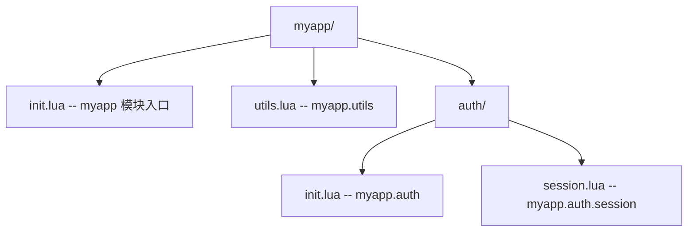
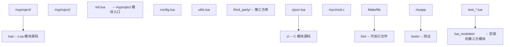
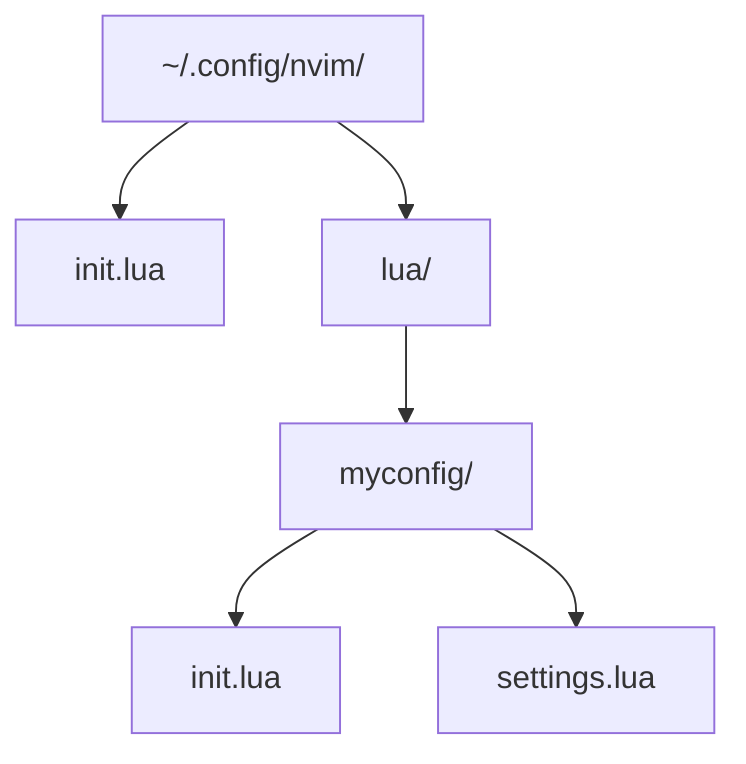

# 模块加载：`require`、`package` 与 C 模块机制

> 本文档对标 MIT 6.172（Performance Engineering of Software Systems）、Stanford CS140E（Embedded Systems）、CMU 17-363（Programming Language Pragmatics）教学水准，系统剖析 Lua 模块加载机制的设计、形式化语义、API 全集与工程实践。

## 1. 历史动机与发展脉络

### 1.1 Lua 3.0（1997）：`require` 诞生

Lua 3.0 引入 `require` 函数，但功能简单：仅检查全局表 `_LOADED` 是否已加载，未加载则 `dofile`。当时无 `package` 表。

```lua
-- Lua 3.0 伪代码
function require(name)
    if not _LOADED[name] then
        _LOADED[name] = dofile(name .. ".lua")
    end
    return _LOADED[name]
end
```

### 1.2 Lua 5.0（2003）：`package` 表引入

Lua 5.0 引入 `package` 表，包含 `path`、`cpath`、`loaded`。模块加载机制现代化：

```lua
package.path = "/usr/local/lua/?.lua;./?.lua"
```

### 1.3 Lua 5.1（2006）：`module()` 函数与 `loaders`

Lua 5.1 引入 `module()` 函数简化模块定义：

```lua
module("mymod")
function greet() print("hello") end
```

并使用 `package.loaders`（注意复数）作为搜索器列表。

### 1.4 Lua 5.2（2012）：移除 `module()`

Lua 5.2 移除了 `module()` 函数，推荐"返回模块表"模式：

```lua
local M = {}
function M.greet() print("hello") end
return M
```

理由：

- `module()` 污染全局环境（设置 `_M`、`_NAME`、`_PACKAGE`）。
- 隐式 `seeall` 破坏封装。
- 不利于静态分析工具。

`package.loaders` 改名为 `package.searchers`，强调其"搜索"语义。

### 1.5 Lua 5.3（2015）：`luaL_newlib` 取代 `luaL_register`

Lua 5.3 引入 `luaL_newlib` 宏，简化 C 模块注册：

```c
/* Lua 5.1 */
luaL_register(L, "mymod", funcs);

/* Lua 5.3+ */
luaL_newlib(L, funcs);
```

### 1.6 Lua 5.4（2020）：`luaL_requiref` 改进

Lua 5.4 的 `luaL_requiref` 在 C 端调用 `require`，并支持 glb 标志：

```c
void luaL_requiref(lua_State *L, const char *modname,
                   lua_CFunction openf, int glb);
```

`glb` 非零时将模块同时赋值到全局表。

### 1.7 设计哲学总结

PUC-Rio 团队阐明模块加载的设计原则：

1. **简单性**：默认行为开箱即用，复杂场景通过 `searchers` 扩展。
2. **可缓存**：`package.loaded` 确保模块只加载一次。
3. **可扩展**：`searchers` 数组允许任意加载策略。
4. **C 与 Lua 对等**：C 模块与 Lua 模块使用相同 API。

---

## 1. 形式化定义

### 1.1 Lua Reference Manual 权威定义

> **require (modname)** — Loads the given module. The function starts by looking into the `package.loaded` table to determine whether `modname` is already loaded. Otherwise, it tries to find a loader using the `package.searchers`.
>
> —— *Lua 5.4 Reference Manual, §6.3 Packages*

形式化定义：

$$
\text{require}(\text{modname}) = \begin{cases}
\text{package.loaded}[\text{modname}] & \text{if already loaded} \\
\text{loader}(\text{modname}) & \text{otherwise}
\end{cases}
$$

### 1.2 `package` 表结构

```lua
package = {
    path = "/usr/local/lua/?.lua;...",
    cpath = "/usr/local/lua/?.so;...",
    loaded = { ... },       -- 已加载模块缓存
    preload = { ... },      -- 预加载器
    searchers = { ... },    -- 搜索器函数列表
    config = "/\n;\n?\n!\n-",  -- 路径配置
}
```

### 1.3 `searchers` 算法

`require` 调用 `package.searchers` 中的每个函数，直到找到 loader：

```
function require(modname):
    if package.loaded[modname]:
        return package.loaded[modname]
    for searcher in package.searchers:
        loader = searcher(modname)
        if loader is function:
            result = loader(modname)
            if result == nil:
                result = true
            package.loaded[modname] = result
            return result
        elif loader is string:
            error_msg += loader
    error("module '" .. modname .. "' not found: " .. error_msg)
```

### 1.4 路径模板语法

`package.path` 与 `package.cpath` 使用模板：

- `;` 分隔多个模板。
- `?` 替换为模块名（点号转为路径分隔符）。
- `package.config` 定义分隔符。

```
package.config = "/\n;\n?\n!\n-"
```

各字段含义：

1. `/`：目录分隔符
2. `;`：路径分隔符
3. `?`：模块名占位符
4. `!`：（已废弃）
5. `-`：执行路径忽略前缀

### 1.5 C 模块命名约定

C 模块的入口函数命名规则：

$$
\text{luaopen\_}\text{替换}(\text{modname}, \text{`.`} \to \text{`\_`})
$$

例如：

- 模块 `json` → `luaopen_json`
- 模块 `socket.http` → `luaopen_socket_http`

---

## 2. 理论推导与原理解析

### 2.1 模块加载流程

完整加载流程：

```
require("foo.bar")
   |
   v
[1] package.loaded["foo.bar"] ?
   |  是 → 返回缓存
   |  否 ↓
   v
[2] package.preload["foo.bar"] ?
   |  是 → 调用预加载函数
   |  否 ↓
   v
[3] searcher 1: package.searchers[1]
   |  搜索 package.path 中的 Lua 文件
   |  找到 → 返回 loader
   |  否 → 返回错误消息
   v
[4] searcher 2: package.searchers[2]
   |  搜索 package.cpath 中的 C 库
   |  找到 → 返回 loader
   |  否 → 返回错误消息
   v
[5] searcher 3: package.searchers[3]
   |  Lua 5.3+ 的 all-in-one loader
   |  查找根模块（如 foo）的 C 库，从其中加载子模块
   v
[6] 全部失败 → 抛出 "module not found"
```

### 2.2 缓存机制的形式化

`package.loaded` 是模块缓存：

$$
\text{package.loaded}[\text{modname}] = \begin{cases}
\text{module\_value} & \text{after successful load} \\
\text{true} & \text{if loader returns nil} \\
\text{nil} & \text{if not yet loaded or failed}
\end{cases}
$$

强制重新加载：

$$
\text{package.loaded}[\text{modname}] = \text{nil} \implies \text{next require reloads}
$$

### 2.3 `luaL_requiref` 的语义

C 端 `luaL_requiref(L, name, openf, glb)` 等价于：

```
function luaL_requiref(L, name, openf, glb):
    luaL_getsubtable(L, LUA_REGISTRYINDEX, LUA_LOADED_TABLE)
    lua_getfield(L, -1, name)
    if not nil:
        return  # 已加载
    lua_pop(L, 1)
    lua_pushcfunction(L, openf)
    lua_pushstring(L, name)
    lua_call(L, 1, 1)
    if nil:
        lua_pushboolean(L, 1)
    lua_setfield(L, -3, name)  # package.loaded[name] = result
    if glb:
        lua_pushvalue(L, -1)
        lua_setglobal(L, name)
    lua_rotate(L, -2, 1)  # 调整栈
    lua_pop(L, 1)  # 弹出 loaded table
```

### 2.4 `package.preload` 的工作原理

`package.preload` 是一个表，键为模块名，值为加载器函数：

```lua
package.preload["virtual_mod"] = function(modname)
    -- 返回模块表
    return {
        greet = function() print("Hello from virtual!") end
    }
end

require("virtual_mod").greet()  -- Hello from virtual!
```

`package.preload` 优先于 `searchers` 调用。

### 2.5 搜索路径的展开

设 `package.path = "./?.lua;/usr/local/lua/?.lua"`，`modname = "foo.bar"`：

1. 替换 `.` 为 `/`：`foo.bar` → `foo/bar`
2. 替换 `?` 为模块名：
   - `./?.lua` → `./foo/bar.lua`
   - `/usr/local/lua/?.lua` → `/usr/local/lua/foo/bar.lua`
3. 依次尝试每个路径，第一个存在的文件被加载。

### 2.6 错误消息聚合

每个 searcher 失败时返回字符串描述，`require` 聚合所有错误：

```
module 'foo.bar' not found:
    no field package.preload['foo.bar']
    no file './foo/bar.lua'
    no file '/usr/local/lua/foo/bar.lua'
    no file './foo/bar.so'
    no file '/usr/local/lua/foo/bar.so'
```

---

## 3. 代码示例

### 3.1 基础示例：Lua 模块

**`mymod.lua`**：

```lua
-- mymod.lua
-- 一个标准的 Lua 模块示例

local M = {}  -- 模块表

-- 模块元数据
M._VERSION = "1.0"
M._DESCRIPTION = "FANDEX 示例模块"

-- 私有变量（不导出）
local private_var = "I am private"

-- 私有函数
local function private_helper(x)
    return x * 2
end

-- 公开常量
M.PI = 3.14159265358979

-- 公开函数
function M.greet(name)
    return "Hello, " .. (name or "World") .. "!"
end

-- 工厂函数
function M.create_counter(start)
    local count = start or 0
    return {
        increment = function() count = count + 1; return count end,
        decrement = function() count = count - 1; return count end,
        value = function() return count end
    }
end

-- 使用私有函数
function M.double(x)
    return private_helper(x)
end

-- 返回模块表
return M
```

**使用**：

```lua
local mymod = require("mymod")

print(mymod.greet("FANDEX"))  -- Hello, FANDEX!
print(mymod.PI)               -- 3.14159265358979

local counter = mymod.create_counter(10)
print(counter:increment())  -- 11
print(counter:increment())  -- 12
print(counter:decrement())  -- 11

print(mymod.double(5))      -- 10
```

### 3.2 进阶示例：C 模块

**`cjson_lua.c`**：

```c
#define LUA_LIB
#include <string.h>
#include <lua.h>
#include <lauxlib.h>

/* JSON 编码：将 Lua 值编码为字符串
 * Lua: cjson.encode(value)
 */
static int l_encode(lua_State *L) {
    int t = lua_type(L, 1);
    switch (t) {
        case LUA_TNIL:
            lua_pushstring(L, "null");
            break;
        case LUA_TBOOLEAN:
            lua_pushstring(L, lua_toboolean(L, 1) ? "true" : "false");
            break;
        case LUA_TNUMBER:
            if (lua_isinteger(L, 1)) {
                lua_pushfstring(L, "%d", (int)lua_tointeger(L, 1));
            } else {
                lua_pushfstring(L, "%g", lua_tonumber(L, 1));
            }
            break;
        case LUA_TSTRING: {
            size_t len;
            const char *s = lua_tolstring(L, 1, &len);
            /* 简单转义，实际实现需完整 JSON 转义 */
            lua_pushfstring(L, "\"%s\"", s);
            break;
        }
        default:
            return luaL_error(L, "cannot encode type %s", lua_typename(L, t));
    }
    return 1;
}

/* JSON 解析：将 JSON 字符串解析为 Lua 值
 * Lua: cjson.decode(str)
 * 注意：此为简化版，仅支持基本类型
 */
static int l_decode(lua_State *L) {
    size_t len;
    const char *s = luaL_checklstring(L, 1, &len);

    /* 简单解析 */
    if (strcmp(s, "null") == 0) {
        lua_pushnil(L);
    } else if (strcmp(s, "true") == 0) {
        lua_pushboolean(L, 1);
    } else if (strcmp(s, "false") == 0) {
        lua_pushboolean(L, 0);
    } else if (s[0] == '"') {
        /* 去掉引号 */
        lua_pushlstring(L, s + 1, len - 2);
    } else {
        /* 尝试解析为数字 */
        char *end;
        long long_val = strtol(s, &end, 10);
        if (*end == '\0') {
            lua_pushinteger(L, (lua_Integer)long_val);
        } else {
            double dbl = strtod(s, &end);
            if (*end == '\0') {
                lua_pushnumber(L, dbl);
            } else {
                return luaL_error(L, "invalid JSON: %s", s);
            }
        }
    }
    return 1;
}

/* 模块函数表 */
static const luaL_Reg cjson_funcs[] = {
    {"encode", l_encode},
    {"decode", l_decode},
    {NULL, NULL}
};

/* 模块入口
 * Lua: local cjson = require("cjson")
 */
int luaopen_cjson(lua_State *L) {
    luaL_newlib(L, cjson_funcs);
    return 1;
}
```

**编译**（Linux/macOS）：

```bash
cc -O2 -Wall -shared -fPIC -I/usr/local/include/lua5.4 \
   -o cjson.so cjson_lua.c
```

**编译**（Windows / MSVC）：

```powershell
cl /O2 /LD /I"C:\Atian\Lua\include" cjson_lua.c ^
   /link /DLL /OUT:cjson.dll lua54.lib
```

**使用**：

```lua
local cjson = require("cjson")

local json_str = cjson.encode("hello")
print(json_str)  -- "hello"

local value = cjson.decode("42")
print(value)     -- 42
print(type(value))  -- number
```

### 3.3 `package.preload` 示例

```lua
-- 注册虚拟模块
package.preload["virtual_mod"] = function(modname)
    print("Loading virtual module: " .. modname)
    return {
        greet = function() return "Hello from virtual module!" end,
        version = "1.0.0-virtual"
    }
end

-- 使用
local v = require("virtual_mod")
print(v.greet())     -- Loading virtual module: virtual_mod
                    -- Hello from virtual module!
print(v.version)     -- 1.0.0-virtual

-- 第二次 require 不会重新加载
local v2 = require("virtual_mod")
print(v2 == v)       -- true（来自缓存）
```

### 3.4 自定义 searcher

```lua
-- 自定义 searcher：从字符串加载模块
local string_modules = {
    ["greeting"] = [[
        return {
            hello = function() return "Hello from string module!" end
        }
    ]],
    ["math_ext"] = [[
        local M = {}
        function M.square(x) return x * x end
        function M.cube(x) return x * x * x end
        return M
    ]]
}

-- 注册 searcher（插入到 searchers 列表首位）
table.insert(package.searchers, 1, function(modname)
    local code = string_modules[modname]
    if code then
        -- 编译并返回 loader 函数
        local loader, err = load(code, "=" .. modname)
        if not loader then
            return error("error loading " .. modname .. ": " .. err)
        end
        return loader
    end
    return "\n\tno string module '" .. modname .. "'"
end)

-- 使用
local greeting = require("greeting")
print(greeting.hello())  -- Hello from string module!

local math_ext = require("math_ext")
print(math_ext.square(5))  -- 25
print(math_ext.cube(3))   -- 27
```

### 3.5 热重载示例

```lua
-- hot_reload.lua
local function hot_require(modname)
    package.loaded[modname] = nil
    return require(modname)
end

-- 使用
local config = require("config")
print(config.value)

-- 修改 config.lua 后
config = hot_require("config")
print(config.value)  -- 新值
```

### 3.6 子模块加载

**目录结构**：



**`myapp/init.lua`**：

```lua
local M = {}

-- 加载子模块
M.utils = require("myapp.utils")
M.auth = require("myapp.auth")

function M.version()
    return "1.0.0"
end

return M
```

**使用**：

```lua
local myapp = require("myapp")
print(myapp.version())
print(myapp.utils.format_date(os.time()))

local session = require("myapp.auth.session")
session.start()
```

### 3.7 `luaL_requiref` 在 C 端

```c
#include <lua.h>
#include <lauxlib.h>

extern int luaopen_mymod(lua_State *L);

int main(void) {
    lua_State *L = luaL_newstate();
    luaL_openlibs(L);

    /* C 端调用 require，加载 mymod 模块 */
    luaL_requiref(L, "mymod", luaopen_mymod, 1);
    /* glb=1 表示同时设置全局变量 mymod */

    /* 现在 Lua 脚本可以直接使用 mymod */
    luaL_dostring(L, "print(mymod.greet('World'))");

    lua_close(L);
    return 0;
}
```

---

## 4. 对比分析

### 4.1 Lua `require` 与其他语言模块系统对比

| 语言 | 模块系统 | 缓存机制 | 路径配置 | 动态加载 |
|------|----------|----------|----------|----------|
| **Lua** | `require` + `package` | `package.loaded` | `package.path` / `cpath` | `package.searchers` |
| **Python** | `import` | `sys.modules` | `sys.path` | importlib |
| **JavaScript (Node.js)** | `require` / `import` | `require.cache` | `NODE_PATH` | loader hooks |
| **Ruby** | `require` / `load` | `$LOADED_FEATURES` | `$LOAD_PATH` | gems |
| **Go** | `import` | 编译期 | GOPATH / go.mod | 不支持运行时 |
| **Rust** | `use` | 编译期 | cargo | 不支持运行时 |

### 4.2 `require` vs `dofile` vs `loadfile`

| API | 缓存 | 路径搜索 | 错误处理 | 用途 |
|-----|------|----------|----------|------|
| `require(name)` | 是 | 是 | 抛出 | 加载模块 |
| `dofile(path)` | 否 | 否 | 抛出 | 执行脚本 |
| `loadfile(path)` | 否 | 否 | 返回 nil + err | 编译脚本 |
| `load(chunk)` | 否 | 否 | 返回 nil + err | 编译字符串 |

### 4.3 Lua 5.1 `module()` vs 5.2+ 返回表

**Lua 5.1 `module()` 模式**：

```lua
module("mymod")
function greet() print("hello") end
-- _M.greet 自动设置
```

问题：

- 污染全局环境
- 隐式 `seeall` 破坏封装
- 无法使用局部变量

**Lua 5.2+ 返回表模式**：

```lua
local M = {}
function M.greet() print("hello") end
return M
```

优势：

- 显式导出
- 支持局部变量
- 利于静态分析

### 4.4 与 Python import 对比

```python
# Python 模块
def greet(name):
    return f"Hello, {name}!"

__all__ = ['greet']  # 显式导出
```

```lua
-- Lua 模块
local M = {}
function M.greet(name) return "Hello, " .. name .. "!" end
return M
```

对比：

- **Python** 的 `__all__` 控制导出，Lua 通过表结构隐式控制。
- **Python** 的 `import` 自动处理相对导入，Lua 需要显式路径。
- **Python** 的模块是对象，有 `__name__`、`__file__` 等属性；Lua 模块是普通表。
- **Python** 的 `importlib.reload` 重新加载模块；Lua 通过 `package.loaded[name] = nil` 实现。

### 4.5 与 Node.js `require` 对比

```javascript
// Node.js 模块
module.exports = {
    greet: function(name) { return "Hello, " + name; }
};
```

```lua
-- Lua 模块
local M = {}
function M.greet(name) return "Hello, " .. name end
return M
```

对比：

- **Node.js** 的 `require` 是同步函数，Lua 也是同步。
- **Node.js** 的模块缓存在 `require.cache`，Lua 在 `package.loaded`。
- **Node.js** 支持 CommonJS 和 ES Modules 两种格式；Lua 只有一种格式。
- **Node.js** 的 `node_modules` 解析复杂，Lua 的 `package.path` 简单。

---

## 5. 常见陷阱与最佳实践

### 5.1 陷阱：循环依赖

```lua
-- a.lua
local B = require("b")  -- 加载 b
local M = {}
function M.use_b() return B.helper() end
return M

-- b.lua
local A = require("a")  -- a 已在加载中，返回 nil 或不完整表
local M = {}
function M.helper() return "from b" end
return M
```

**问题**：当 `require("a")` 触发 `require("b")`，而 `b` 又 `require("a")` 时，`a` 的模块表尚未完成（因为 `require("a")` 还在执行中）。

**解决方案**：

1. **延迟加载**：在使用时才 require：

```lua
-- b.lua
local M = {}
function M.helper()
    local A = require("a")  -- 延迟到调用时
    return "from b with " .. A.some_field
end
return M
```

2. **重构模块**：将共享代码提取到第三个模块。

### 5.2 陷阱：热重载后旧引用失效

```lua
local config = require("config")
print(config.value)  -- 1.0

-- 修改 config.lua 后热重载
package.loaded["config"] = nil
require("config")  -- 重新加载

-- 但 config 变量仍指向旧表
print(config.value)  -- 1.0（旧值）
```

**修正**：重新获取引用：

```lua
package.loaded["config"] = nil
config = require("config")  -- 重新赋值
print(config.value)  -- 2.0（新值）
```

### 5.3 陷阱：`package.path` 顺序

```lua
package.path = "./?.lua;" .. package.path  -- 优先当前目录
```

**问题**：可能加载到非预期的同名模块。

**最佳实践**：将自定义路径放在默认路径之后：

```lua
package.path = package.path .. ";./lib/?.lua"
```

### 5.4 陷阱：C 模块符号冲突

```c
/* 错误：多个 C 模块导出同名函数 */
int luaopen_mod1(lua_State *L) {
    /* ... */
}

int luaopen_mod2(lua_State *L) {
    /* ... */
}
```

**问题**：动态链接时可能链接到错误的符号。

**修正**：使用 `static` 限定符：

```c
static int l_helper(lua_State *L) { /* ... */ }

int luaopen_mod1(lua_State *L) { /* ... */ }
```

### 5.5 陷阱：忘记 `return M`

```lua
-- mymod.lua
local M = {}
function M.greet() print("hello") end
-- 忘记 return M
```

**问题**：`require("mymod")` 返回 `true`（loader 返回 nil 时 Lua 默认设为 true）。

**修正**：

```lua
local M = {}
function M.greet() print("hello") end
return M  -- 必须！
```

### 5.6 最佳实践清单

1. **使用"返回表"模式**：避免 `module()`（Lua 5.1 已废弃）。
2. **显式 require 依赖**：在文件顶部集中 require。
3. **避免循环依赖**：通过延迟加载或重构。
4. **C 模块用 `static`**：避免符号冲突。
5. **`package.preload` 用于嵌入式**：在 C 端预加载必要模块。
6. **热重载谨慎使用**：注意旧引用问题。
7. **使用 `luaL_newlib`**：替代 `luaL_register`。
8. **模块命名一致性**：文件名与模块名一致。

### 5.7 错误诊断

**错误："module 'X' not found"**：

- 检查 `package.path` 是否包含模块路径。
- 检查文件名大小写（Linux 区分大小写）。
- 检查 `.lua` 扩展名。

**错误："error loading module"**：

- 检查模块文件语法。
- 检查模块是否 `return M`。

**错误："multiple Lua VMs detected"**：

- C 模块与 Lua 解释器使用不同的 Lua 版本。
- 重新编译 C 模块链接到正确的 Lua 库。

---

## 6. 工程实践

### 6.1 项目结构组织

典型 Lua 项目结构：



**启动脚本**：

```lua
-- main.lua
package.path = package.path .. ";./lua/?.lua;./lua/?/init.lua"
package.cpath = package.cpath .. ";./c/?.so;./c/?.dll"

local myproject = require("myproject")
myproject.run()
```

### 6.2 嵌入 Lua：C 端注册模块

```c
#include <lua.h>
#include <lauxlib.h>
#include <lualib.h>

extern int luaopen_mymod(lua_State *L);
extern int luaopen_utils(lua_State *L);

int main(void) {
    lua_State *L = luaL_newstate();
    luaL_openlibs(L);

    /* 预加载 C 模块 */
    luaL_requiref(L, "mymod", luaopen_mymod, 1);
    lua_pop(L, 1);
    luaL_requiref(L, "utils", luaopen_utils, 1);
    lua_pop(L, 1);

    /* 设置 Lua 模块路径 */
    lua_getglobal(L, "package");
    lua_pushstring(L, "./lua/?.lua;./lua/?/init.lua");
    lua_setfield(L, -2, "path");
    lua_pop(L, 1);

    /* 执行主脚本 */
    if (luaL_dofile(L, "main.lua") != LUA_OK) {
        fprintf(stderr, "Error: %s\n", lua_tostring(L, -1));
    }

    lua_close(L);
    return 0;
}
```

### 6.3 热重载实现

```lua
-- hotreload.lua
local M = {}

local loaded_modules = {}

function M.track(name)
    table.insert(loaded_modules, name)
end

function M.reload_all()
    for _, name in ipairs(loaded_modules) do
        package.loaded[name] = nil
        require(name)
        print("Reloaded: " .. name)
    end
end

function M.reload(name)
    package.loaded[name] = nil
    return require(name)
end

return M
```

### 6.4 性能优化

**优化 1：预加载常用模块**

```lua
-- 启动时预加载
local _ = {require("json"), require("utils"), require("config")}
```

**优化 2：避免在循环中 require**

```lua
-- 慢
for i = 1, 1000 do
    local json = require("json")  -- 每次都查询 package.loaded
    process(json.encode(data[i]))
end

-- 快
local json = require("json")  -- 一次性
for i = 1, 1000 do
    process(json.encode(data[i]))
end
```

**优化 3：使用 `package.preload` 避免文件 I/O**

```lua
package.preload["embedded_mod"] = load(embedded_code)
```

### 6.5 调试技巧

**技巧 1：查看已加载模块**

```lua
for name, mod in pairs(package.loaded) do
    print(name, mod)
end
```

**技巧 2：查看搜索路径**

```lua
print("path:", package.path)
print("cpath:", package.cpath)
```

**技巧 3：自定义错误处理**

```lua
local function safe_require(name)
    local ok, result = pcall(require, name)
    if not ok then
        print("Failed to load " .. name .. ": " .. result)
        return nil
    end
    return result
end
```

### 6.6 测试策略

```lua
-- test_mymod.lua
local busted = require("busted")

describe("mymod", function()
    local mymod

    before_each(function()
        package.loaded["mymod"] = nil  -- 每次测试重新加载
        mymod = require("mymod")
    end)

    it("greets", function()
        assert.are.equal("Hello, World!", mymod.greet())
    end)

    it("creates counter", function()
        local c = mymod.create_counter(0)
        assert.are.equal(1, c:increment())
    end)
end)
```

---

## 7. 案例研究

### 7.1 LuaRocks 包管理器

LuaRocks 是 Lua 的包管理器（类似 pip、npm）：

```bash
luarocks install lua-cjson
```

安装后模块位于：

```
/usr/local/share/lua/5.4/?.lua
/usr/local/lib/lua/5.4/?.so
```

`package.path` 与 `package.cpath` 默认包含这些路径。

### 7.2 Redis 中的模块加载

Redis 在启动时预加载 Lua 模块：

```c
/* Redis 启动时注册 cjson 模块 */
luaL_requiref(lua, "cjson", luaopen_cjson, 1);
lua_pop(lua, 1);
```

Redis 脚本可直接使用：

```lua
-- Redis 脚本
local data = cjson.decode(ARGV[1])
local result = redis.call('SET', KEYS[1], data.value)
return cjson.encode({ok = true, result = result})
```

### 7.3 Neovim 的模块系统

Neovim 在 `runtimepath` 中搜索 Lua 模块：

```lua
-- Neovim 加载插件
vim.cmd('packadd my_plugin')

-- 实际搜索路径
print(vim.o.runtimepath)
```

Neovim 还支持 `lua/` 目录下的模块自动加载：



```lua
-- init.lua
require("myconfig").setup()
```

### 7.4 World of Warcraft AddOn 系统

WoW 的 AddOn 系统基于 Lua：

```lua
-- MyAddon.toc
## Interface: 100000
## Title: My Addon
## Notes: A sample addon
MyAddon.lua
```

```lua
-- MyAddon.lua
local addonName, addonTable = ...
addonTable.greet = function() print("Hello!") end
```

WoW 的 `require` 被简化为 `addonName` + `addonTable` 参数传递。

### 7.5 Love2D 的模块加载

Love2D 自动加载 `main.lua`：

```lua
-- main.lua
function love.load()
    -- 自动调用
end

function love.draw()
    love.graphics.print("Hello!", 100, 100)
end
```

Love2D 通过 `love.filesystem` 提供跨平台文件访问。

### 7.6 案例对比表

| 项目 | Lua 版本 | 模块系统特点 | 包管理 |
|------|----------|--------------|--------|
| LuaRocks | 5.x | 标准 require | LuaRocks |
| Redis | 5.1 | 预加载 cjson 等 | 内置 |
| Neovim | 5.1 (LuaJIT) | runtimepath | packer.nvim |
| WoW | 5.1 | AddOn 系统 | CurseForge |
| Love2D | 5.1 (LuaJIT) | love.filesystem | 内置 |

---

### 填空题知识点讲解

**常见疑问 6**：. Lua 5.1 中的 `package.loaders` 在 Lua 5.2 中改名为 `______`，强调其"搜索"语义。

**解析讲解**：`package.searchers`

---

**常见疑问 7**：. C 模块的入口函数签名是 `______`，返回 `______` 表示加载成功。

**解析讲解**：`int luaopen_*(lua_State *L)`；1（模块表数量）

---

**常见疑问 8**：. Lua 5.3+ 推荐使用 `______` 替代 `luaL_register` 创建模块表。

**解析讲解**：`luaL_newlib`

---

**常见疑问 9**：. `luaL_requiref(L, name, openf, glb)` 中 `glb` 参数非零表示 `______`。

**解析讲解**：同时将模块设置为全局变量

---

**常见疑问 10**：. `package.config` 字段中，第一个字符表示 `______`，第二个字符表示 `______`，第三个字符表示 `______`。

**解析讲解**：目录分隔符；路径分隔符；模块名占位符

---

### 编程题知识点讲解

**常见疑问 11**：. 实现一个自定义 searcher，从 ZIP 文件加载 Lua 模块（模拟）。

**解析讲解**：

```lua
-- zip_searcher.lua
local M = {}

-- 模拟 ZIP 文件中的模块
local zip_modules = {
    ["zipmod.utils"] = [[
        local M = {}
        function M.greet() return "Hello from ZIP!" end
        return M
    ]],
    ["zipmod.math"] = [[
        local M = {}
        function M.add(a, b) return a + b end
        return M
    ]]
}

function M.install()
    table.insert(package.searchers, 1, function(modname)
        local code = zip_modules[modname]
        if code then
            local loader, err = load(code, "=" .. modname)
            if not loader then
                error("error loading " .. modname .. ": " .. err)
            end
            return loader
        end
        return "\n\tno zip module '" .. modname .. "'"
    end)
end

return M
```

**测试**：

```lua
local zip = require("zip_searcher")
zip.install()

local utils = require("zipmod.utils")
print(utils.greet())  -- Hello from ZIP!

local math = require("zipmod.math")
print(math.add(2, 3))  -- 5
```

---

**常见疑问 12**：. 实现一个支持版本化的模块加载器。

**解析讲解**：

```lua
-- versioned_require.lua
local M = {}

local versions = {}  -- name -> { version, module }

function M.require_version(name, version)
    local key = name .. "@" .. version
    if versions[key] then
        return versions[key].module
    end

    -- 模拟加载特定版本（实际需文件系统支持）
    local path = string.format("./lib/%s/%s.lua", version, name)
    local mod, err = loadfile(path)
    if not mod then
        error("Cannot load " .. key .. ": " .. err)
    end

    local result = mod()
    versions[key] = { version = version, module = result }
    return result
end

function M.list_versions()
    local result = {}
    for key, _ in pairs(versions) do
        table.insert(result, key)
    end
    return result
end

return M
```

---

**常见疑问 13**：. 实现一个 C 模块 `math_utils`，提供 `factorial` 和 `fibonacci` 函数。

**解析讲解**：

```c
#define LUA_LIB
#include <lua.h>
#include <lauxlib.h>

/* 阶乘
 * Lua: math_utils.factorial(n)
 */
static int l_factorial(lua_State *L) {
    lua_Integer n = luaL_checkinteger(L, 1);
    if (n < 0) {
        return luaL_error(L, "n must be non-negative");
    }
    lua_Integer result = 1;
    for (lua_Integer i = 2; i <= n; i++) {
        /* 简化：不处理溢出 */
        result *= i;
    }
    lua_pushinteger(L, result);
    return 1;
}

/* 斐波那契数列
 * Lua: math_utils.fibonacci(n)
 */
static int l_fibonacci(lua_State *L) {
    lua_Integer n = luaL_checkinteger(L, 1);
    if (n < 0) {
        return luaL_error(L, "n must be non-negative");
    }
    if (n == 0) {
        lua_pushinteger(L, 0);
        return 1;
    }
    if (n == 1) {
        lua_pushinteger(L, 1);
        return 1;
    }
    lua_Integer a = 0, b = 1;
    for (lua_Integer i = 2; i <= n; i++) {
        lua_Integer c = a + b;
        a = b;
        b = c;
    }
    lua_pushinteger(L, b);
    return 1;
}

static const luaL_Reg funcs[] = {
    {"factorial", l_factorial},
    {"fibonacci", l_fibonacci},
    {NULL, NULL}
};

int luaopen_math_utils(lua_State *L) {
    luaL_newlib(L, funcs);
    return 1;
}
```

**编译**：

```bash
cc -O2 -Wall -shared -fPIC -I/usr/local/include/lua5.4 \
   -o math_utils.so math_utils.c
```

**测试**：

```lua
local math_utils = require("math_utils")

print(math_utils.factorial(5))    -- 120
print(math_utils.factorial(10))   -- 3628800
print(math_utils.fibonacci(10))   -- 55
print(math_utils.fibonacci(20))   -- 6765
```

---

### 9.1 核心文献

- [1] R. Ierusalimschy, L. H. de Figueiredo, and W. Celes, *Lua 5.4 Reference Manual*, PUC-Rio, 2020. [Online]. Available: https://www.lua.org/manual/5.4/

- [2] R. Ierusalimschy, *Programming in Lua*, 4th ed. PUC-Rio, 2016. Chapter 15: Modules and Packages.

- [3] R. Ierusalimschy, L. H. de Figueiredo, and W. Celes, "The Evolution of Lua," in *Proceedings of the 3rd ACM SIGPLAN Conference on History of Programming Languages (HOPL III)*, 2007, pp. 2-1–2-26. doi: 10.1145/1238844.1238846.

- [4] R. Ierusalimschy, L. H. de Figueiredo, and W. Celes, "Lua: an extensible extension language," *Journal of the Brazilian Computer Society*, vol. 2, no. 1, pp. 27–42, 1996. doi: 10.1590/S0104-65001996000100003.

### 9.2 标准与规范

- [5] PUC-Rio, "Lua 5.4 Source Code: loadlib.c," 2020. [Online]. Available: https://github.com/lua/lua/blob/master/loadlib.c

- [6] H. Medeiros, "LuaRocks Package Manager," 2019. [Online]. Available: https://luarocks.org/

### 9.3 应用案例文献

- [7] S. Sanfilippo, "Redis and Lua: a love story," *Redis Labs Blog*, 2011. [Online]. Available: https://redis.io/docs/manual/programmability/lua/

- [8] Neovim, "Lua Documentation," 2022. [Online]. Available: https://neovim.io/doc/user/lua.html

- [9] Blizzard Entertainment, *World of Warcraft AddOn Development Guide*, 2004-2024. [Online]. Available: https://wowpedia.fandom.com/wiki/AddOn

### 9.4 学术引用（ACM Reference Format）

R. Ierusalimschy, L. H. de Figueiredo, and W. Celes. 2007. The evolution of Lua. In *Proceedings of the Third ACM SIGPLAN Conference on History of Programming Languages (HOPL III)*. ACM, New York, NY, USA, 2-1–2-26. DOI: https://doi.org/10.1145/1238844.1238846

R. Ierusalimschy, L. H. de Figueiredo, and W. Celes. 1996. Lua: an extensible extension language. *Journal of the Brazilian Computer Society* 2, 1, 27–42. DOI: https://doi.org/10.1590/S0104-65001996000100003

---

### 10.1 书籍

- Roberto Ierusalimschy, *Programming in Lua*, 4th Edition, Chapter 15
- Kurt Jung, *Lua Quick Reference*（Apress, 2018）
- Roberto Ierusalimschy, *From Brazil to Wikipedia*

### 10.2 论文与技术报告

- "The Implementation of Lua 5.0"（JUCS 2005）
- "LuaRocks: A Package Manager for Lua"（Hisham Muhammad）

### 10.5 与本文档相关章节

- 用户数据（`/lua/用户数据`）：C 模块中 userdata 的使用
- C-API 栈操作（`/lua/C-API栈操作`）：`luaopen_*` 函数的栈操作
- 元表与元方法详解（`/lua/元表与元方法详解`）：模块的元方法设置

---

## 附录 A：`package` API 速查表

### A.1 `package` 表字段

| 字段 | 类型 | 说明 |
|------|------|------|
| `package.path` | string | Lua 模块搜索路径 |
| `package.cpath` | string | C 模块搜索路径 |
| `package.loaded` | table | 已加载模块缓存 |
| `package.preload` | table | 预加载器 |
| `package.searchers` | table (array) | 搜索器函数列表 |
| `package.config` | string | 路径配置字符串 |
| `package.searchpath` | function | 搜索文件路径 |

### A.2 模块相关函数

| 函数 | 说明 |
|------|------|
| `require(name)` | 加载模块 |
| `dofile(path)` | 执行脚本（不缓存） |
| `loadfile(path)` | 编译脚本（不执行） |
| `load(chunk, name)` | 编译字符串 |

### A.3 C API

| API | 版本 | 说明 |
|-----|------|------|
| `luaL_register` | 5.1 | 注册模块（已废弃） |
| `luaL_newlib` | 5.2+ | 创建模块表（推荐） |
| `luaL_requiref` | 5.2+ | C 端调用 require |
| `luaopen_*` | 5.0+ | C 模块入口函数 |

### A.4 搜索器列表

| 索引 | 搜索器 | 说明 |
|------|--------|------|
| 1 | `package.preload` searcher | 检查 `package.preload` |
| 2 | path searcher | 搜索 `package.path` |
| 3 | cpath searcher | 搜索 `package.cpath` |
| 4 | all-in-one searcher (5.3+) | 子模块从根 C 库加载 |

---

## 附录 B：模块加载调试检查表

### B.1 常见错误与排查

| 错误信息 | 可能原因 | 排查方法 |
|----------|----------|----------|
| `module 'X' not found` | 路径错误 | 检查 `package.path` |
| `error loading module 'X'` | 模块语法错误 | 单独 `loadfile` 检查 |
| `attempt to index a nil value` | 忘记 `return M` | 检查模块最后 return |
| `multiple Lua VMs detected` | Lua 版本不匹配 | 重新编译 C 模块 |
| `loop or previous error loading module` | 循环依赖 | 重构模块依赖 |

### B.2 调试检查流程

1. **检查路径**：`print(package.path)`
2. **检查已加载**：`for k,v in pairs(package.loaded) do print(k,v) end`
3. **单独加载测试**：`loadfile("path/to/module.lua")`
4. **检查 C 模块符号**：`nm cmod.so | grep luaopen`
5. **使用 `package.searchpath`**：`print(package.searchpath("mod", package.path))`

---

*文档版本：v2.0  金标准升级  最后更新：2026-06-14*
