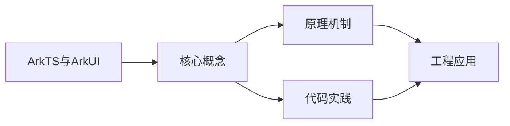
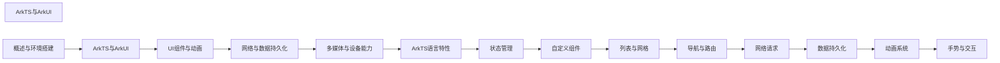

## 1. 学习目标（Bloom 分类）

本节按照布鲁姆教育目标分类学组织学习路径。本文主题为《ArkTS与ArkUI》，属于 HarmonyOS 模块，读者可以根据自身阶段选择阅读深度。

记忆层面：能够准确复述本文的核心概念、术语与基本语法或操作步骤，并能够在提问或检索时快速定位对应知识点。能够说出 HarmonyOS 的核心概念、术语与标准写法。

理解层面：能够用自己的语言解释核心原理与工作机制，说明概念之间的因果关系，而不是机械记忆结论。能够解释 HarmonyOS 的工作原理与设计动机。

应用层面：能够在真实项目或练习场景中运用本文知识解决具体问题，写出正确且可维护的实现。能够编写符合 HarmonyOS 规范的完整实现。

分析层面：能够拆解复杂问题，比较本文主题与相邻概念的异同，识别边界条件与例外情况。能够分析 HarmonyOS 与相邻方案的差异与边界。

评价层面：能够根据约束条件（性能、可读性、安全、成本）评价不同方案的优劣，做出有依据的技术决策。能够根据场景评价 HarmonyOS 相关方案的优劣。

创造层面：能够把本文知识与其他模块知识组合，设计出新的解决方案或可复用的工程模式。能够组合 HarmonyOS 与其他技术设计完整方案。

通过本节学习，读者应当能够把《ArkTS与ArkUI》纳入自己的知识网络，并与 HarmonyOS 模块的其他主题（ArkTS、ArkUI、分布式能力、应用开发）建立关联。

## 2. 历史动机与发展脉络

《ArkTS与ArkUI》是 HarmonyOS 领域的重要主题。要真正理解它，需要先了解它解决的问题与演进过程。

HarmonyOS（鸿蒙）由华为于 2019 年发布，定位面向全场景的分布式操作系统；HarmonyOS NEXT（5.0，2024）去 Android 化，采用自研鸿蒙内核与 ArkTS 语言栈。
开发框架：ArkTS（TS 超集 + 声明式 UI 扩展）、ArkUI（声明式组件）、Stage 模型（应用模型）、方舟编译器。
分布式能力：跨端流转、分布式数据、一次开发多端部署（手机/平板/车机/穿戴）。

回到本文主题：ArkTS与ArkUI 的提出与成熟，正是上述技术背景下的必然产物。早期实现往往以简单可用为目标，随着工程规模扩大，社区逐渐沉淀出标准做法与最佳实践；理解这一脉络，可以帮助读者判断“为什么文档中的推荐写法是现在这个样子”，也能在遇到历史遗留代码时准确识别其设计年代与取舍。


## 3. 形式化定义与核心概念精讲

本节把《ArkTS与ArkUI》涉及的核心概念以“定义 + 讲解”的形式展开。读者应把定义当作工具，把讲解当作理解路径；两者结合才能形成可迁移的知识。

ArkTS 语法：基于 TypeScript 的类型系统，增加 @Component/@Entry/@State 等装饰器与 UI 描述语法。
ArkUI 组件：Column/Row/Stack 布局容器、Text/Button/Image 基础组件、List/Grid 容器组件；状态管理（@State/@Prop/@Link/@Provide）。
应用模型：Stage 模型以 UIAbility 为页面载体，EntryAbility 入口；module.json5 声明应用配置。

### 3.1 原文章节逐一精讲

原文档把主题拆分为 22 个小节，下面按顺序给出每一节的导读讲解，随后保留原文细节供精读。

#### 原文精读（完整保留）

# ArkUI 通用属性+事件 语法速查手册

> **符号约定**:`< >` 必填参数 | `[ ]` 可选参数

---

#### 1. ArkTS 语言基础

##### 1.1 ArkTS 概述

ArkTS 是基于 **TypeScript 扩展**的编程语言，专为 HarmonyOS 应用开发设计。它在 TypeScript 基础上进行了如下扩展和约束：

| 特性         | 说明                                       |
| :----------- | :----------------------------------------- |
| **类型系统** | 基于 TypeScript 静态类型，更严格的类型检查 |
| **UI 语法**  | 扩展了声明式 UI 构建语法                   |
| **状态管理** | 内置响应式状态管理装饰器                   |
| **性能优化** | 静态编译，AOT 优化                         |
| **安全约束** | 禁止部分动态特性（如 eval、with）          |

##### 1.2 基础数据类型

```typescript
// 基本类型
let isDone: boolean = false;
let count: number = 42;
let name: string = 'HarmonyOS';

// 数组
let numbers: number[] = [1, 2, 3];
let strings: Array<string> = ['a', 'b', 'c'];

// 元组
let tuple: [string, number] = ['age', 25];

// 枚举
enum Direction {
  Up = 'UP',
  Down = 'DOWN',
  Left = 'LEFT',
  Right = 'RIGHT',
}
let dir: Direction = Direction.Up;

// 联合类型
let value: string | number = 'hello';
value = 100;

// 类型别名
type NullableString = string | null;
let name2: NullableString = null;
```

##### 1.3 函数与箭头函数

```typescript
// 普通函数
function add(a: number, b: number): number {
  return a + b;
}

// 可选参数与默认值
function greet(name: string, greeting?: string): string {
  return `${greeting || '你好'}, ${name}!`;
}

// 箭头函数
const multiply = (a: number, b: number): number => a * b;

// 回调函数类型
type Callback = (result: string) => void;

function fetchData(url: string, callback: Callback): void {
  // 模拟异步操作
  callback('data loaded');
}
```

##### 1.4 类与接口

```typescript
// 接口定义
interface IUser {
  id: number;
  name: string;
  email?: string;
  getDisplayName(): string;
}

// 类实现
class User implements IUser {
  id: number;
  name: string;
  email?: string;

  constructor(id: number, name: string, email?: string) {
    this.id = id;
    this.name = name;
    this.email = email;
  }

  getDisplayName(): string {
    return this.email ? `${this.name} <${this.email}>` : this.name;
  }
}

// 泛型类
class DataStore<T> {
  private items: T[] = [];

  add(item: T): void {
    this.items.push(item);
  }

  getAll(): T[] {
    return [...this.items];
  }
}

const store = new DataStore<string>();
store.add('item1');
```

##### 1.5 ArkTS 与 TypeScript 差异

| 特性           | TypeScript | ArkTS                 |
| :------------- | :--------- | :-------------------- |
| **eval**       | 支持       | 禁止                  |
| **with**       | 支持       | 禁止                  |
| **动态属性**   | 支持       | 限制使用              |
| **原型链修改** | 支持       | 禁止                  |
| **any 类型**   | 支持       | 不推荐，严格限制      |
| **装饰器**     | 实验性支持 | 原生支持（UI 装饰器） |

#### 2. ArkUI 方舟开发框架

##### 2.1 ArkUI 概述

ArkUI 是 HarmonyOS 的**声明式 UI 开发框架**，提供一套统一的开发范式：

| 特性          | 说明                           |
| :------------ | :----------------------------- |
| **声明式 UI** | 描述 UI 应该是什么，而非怎么做 |
| **组件化**    | 一切皆组件，可组合嵌套         |
| **状态驱动**  | UI 自动响应状态变化            |
| **跨设备**    | 一套代码适配多种设备           |

##### 2.2 声明式 UI 范式

```typescript
// 命令式 UI（传统方式）
// textView.setText("Hello");
// textView.setTextColor(Color.BLUE);

// 声明式 UI（ArkUI 方式）
@Entry
@Component
struct HelloPage {
  @State message: string = 'Hello';

  build() {
    Column() {
      Text(this.message)
        .fontSize(24)
        .fontColor(Color.Blue)
    }
  }
}
```

##### 2.3 UI 渲染流程

```
状态变化 → 框架检测变化 → 重新执行 build() → 虚拟 DOM Diff → 最小化更新真实 DOM
```

#### 3. 装饰器体系

##### 3.1 @Entry 装饰器

标记页面入口组件，一个页面只能有一个 `@Entry` 组件：

```typescript
@Entry
@Component
struct MainPage {
  build() {
    Column() {
      Text('这是页面入口')
    }
  }
}
```

##### 3.2 @Component 装饰器

将 struct 声明为 UI 组件，每个组件必须包含 `build()` 方法：

```typescript
@Component
export struct GreetingCard {
  @Prop name: string = '';

  build() {
    Row() {
      Text(`你好, ${this.name}!`)
        .fontSize(20)
    }
    .padding(16)
    .backgroundColor('#f5f5f5')
    .borderRadius(8)
  }
}
```

##### 3.3 @Builder 装饰器

定义轻量级 UI 构建函数，用于复用 UI 片段：

```typescript
@Entry
@Component
struct BuilderDemo {
  @State items: string[] = ['首页', '发现', '我的'];

  // 定义 Builder
  @Builder
  TabItem(title: string, index: number) {
    Column() {
      Text(title)
        .fontSize(14)
        .fontColor(index === 0 ? '#1a73e8' : '#999999')
      Divider()
        .color(index === 0 ? '#1a73e8' : 'transparent')
        .width(20)
    }
    .padding({ left: 12, right: 12 })
  }

  build() {
    Row() {
      ForEach(this.items, (item: string, index?: number) => {
        this.TabItem(item, index ?? 0)
      })
    }
  }
}
```

##### 3.4 @BuilderParam 与 @WrapBuilder

用于插槽式组件设计：

```typescript
// 子组件定义插槽
@Component
struct Card {
  @BuilderParam contentBuilder: () => void;

  build() {
    Column() {
      // 渲染插槽内容
      this.contentBuilder()
    }
    .padding(16)
    .backgroundColor('#ffffff')
    .borderRadius(12)
    .shadow({ radius: 4, color: '#1a000000', offsetY: 2 })
  }
}

// 父组件传入内容
@Entry
@Component
struct CardDemo {
  @Builder
  cardContent() {
    Text('这是卡片内容')
      .fontSize(16)
  }

  build() {
    Column() {
      Card({ contentBuilder: this.cardContent })
    }
    .padding(20)
  }
}
```

#### 4. 状态管理

##### 4.1 状态管理总览

```mermaid
flowchart LR
    State[@State] --> Prop[@Prop --> 子组件]
    State --> Link[@Link <--> 子组件（双向）]
    State --> Provide[@Provide --> @Consume（跨层级）]
```

##### 4.2 @State 装饰器

组件内部状态，变化会触发 UI 刷新：

```typescript
@Entry
@Component
struct StateDemo {
  @State count: number = 0;
  @State user: User = { name: '张三', age: 25 };

  build() {
    Column() {
      Text(`计数: ${this.count}`)
        .fontSize(24)

      Button('增加')
        .onClick(() => {
          this.count += 1;  // 触发 UI 刷新
        })

      Button('修改用户')
        .onClick(() => {
          this.user.name = '李四';  // 嵌套属性变化也触发刷新
        })
    }
  }
}
```

> **注意**：@State 支持观察 Object 和 Array 的嵌套属性变化（一级嵌套）。

##### 4.3 @Prop 装饰器

父组件向子组件**单向传递**数据，子组件本地可修改但不影响父组件：

```typescript
@Component
struct ChildComponent {
  @Prop title: string = '';
  @Prop count: number = 0;

  build() {
    Column() {
      Text(this.title)
        .fontSize(20)
      Text(`数量: ${this.count}`)
        .fontSize(16)
    }
  }
}

@Entry
@Component
struct ParentComponent {
  @State message: string = '标题';
  @State num: number = 5;

  build() {
    Column() {
      ChildComponent({ title: this.message, count: this.num })
      Button('修改')
        .onClick(() => {
          this.num += 1;  // 父组件修改会同步到子组件
        })
    }
  }
}
```

##### 4.4 @Link 装饰器

父子组件**双向绑定**，子组件修改会同步回父组件：

```typescript
@Component
struct Counter {
  @Link value: number;

  build() {
    Row() {
      Button('-')
        .onClick(() => {
          this.value -= 1;  // 修改会同步到父组件
        })
      Text(`${this.value}`)
        .fontSize(24)
        .margin({ left: 16, right: 16 })
      Button('+')
        .onClick(() => {
          this.value += 1;
        })
    }
  }
}

@Entry
@Component
struct LinkDemo {
  @State count: number = 0;

  build() {
    Column() {
      Text(`父组件计数: ${this.count}`)
        .fontSize(20)
      // 使用 $ 语法传递引用
      Counter({ value: $count })
    }
  }
}
```

##### 4.5 @Provide 与 @Consume

跨层级组件通信，无需逐层传递：

```typescript
@Entry
@Component
struct GrandParent {
  @Provide theme: string = 'light';

  build() {
    Column() {
      Text(`主题: ${this.theme}`)
      Parent()
      Button('切换主题')
        .onClick(() => {
          this.theme = this.theme === 'light' ? 'dark' : 'light';
        })
    }
  }
}

@Component
struct Parent {
  build() {
    Column() {
      Child()  // 无需传递 theme
    }
  }
}

@Component
struct Child {
  @Consume theme: string;  // 自动匹配同名的 @Provide

  build() {
    Text(`当前主题: ${this.theme}`)
      .fontColor(this.theme === 'dark' ? '#ffffff' : '#000000')
  }
}
```

##### 4.6 状态管理对比

| 装饰器        | 方向      | 嵌套层级 | 典型场景         |
| :------------ | :-------- | :------- | :--------------- |
| **@State**    | 组件内部  | -        | 组件私有状态     |
| **@Prop**     | 父→子     | 1 层     | 只读展示数据     |
| **@Link**     | 父↔子     | 1 层     | 表单双向绑定     |
| **@Provide**  | 祖先→后代 | N 层     | 主题、全局配置   |
| **@Consume**  | 后代←祖先 | N 层     | 消费全局配置     |
| **@Watch**    | 监听变化  | -        | 状态变化回调     |
| **@Observed** | 类装饰器  | -        | 深度观察嵌套对象 |

##### 4.7 @Watch 装饰器

监听状态变化并执行回调：

```typescript
@Entry
@Component
struct WatchDemo {
  @State @Watch('onPriceChange') price: number = 100;

  onPriceChange(newValue: number, oldValue: number) {
    console.info(`价格从 ${oldValue} 变为 ${newValue}`);
  }

  build() {
    Column() {
      Text(`价格: ${this.price}`)
      Button('涨价')
        .onClick(() => {
          this.price += 10;
        })
    }
  }
}
```

#### 5. 条件渲染与循环渲染

##### 5.1 条件渲染

```typescript
@Entry
@Component
struct ConditionalDemo {
  @State isLoggedIn: boolean = false;

  build() {
    Column() {
      if (this.isLoggedIn) {
        Text('欢迎回来！')
          .fontSize(20)
          .fontColor('#1a73e8')
      } else {
        Text('请先登录')
          .fontSize(20)
          .fontColor('#999999')
      }

      Button(this.isLoggedIn ? '退出' : '登录')
        .onClick(() => {
          this.isLoggedIn = !this.isLoggedIn;
        })
    }
  }
}
```

##### 5.2 循环渲染（ForEach）

```typescript
@Entry
@Component
struct ForEachDemo {
  @State fruits: string[] = ['苹果', '香蕉', '橘子'];

  build() {
    Column() {
      ForEach(
        this.fruits,
        (item: string, index?: number) => {
          Row() {
            Text(`${(index ?? 0) + 1}. ${item}`)
              .fontSize(18)
          }
          .width('100%')
          .padding(12)
        },
        (item: string) => item  // 键值生成器
      )

      Button('添加水果')
        .onClick(() => {
          this.fruits.push('葡萄');
        })
    }
  }
}
```

##### 5.3 LazyForEach 懒加载

适用于大数据量列表，按需加载：

```typescript
// 数据源需要实现 IDataSource 接口
class MyDataSource implements IDataSource {
  private data: string[] = [];

  totalCount(): number {
    return this.data.length;
  }

  getData(index: number): string {
    return this.data[index];
  }

  registerDataChangeListener(listener: DataChangeListener): void {}
  unregisterDataChangeListener(listener: DataChangeListener): void {}
}

@Entry
@Component
struct LazyForEachDemo {
  private dataSource: MyDataSource = new MyDataSource();

  aboutToAppear() {
    for (let i = 0; i < 1000; i++) {
      this.dataSource.data.push(`Item ${i}`);
    }
  }

  build() {
    List() {
      LazyForEach(
        this.dataSource,
        (item: string) => {
          ListItem() {
            Text(item).fontSize(16)
          }
          .height(60)
        },
        (item: string) => item
      )
    }
    .width('100%')
    .height('100%')
  }
}
```

#### 6. 组件生命周期

##### 6.1 UIAbility 生命周期

```
onCreate → onWindowStageCreate → onForeground ↔ onBackground → onWindowStageDestroy → onDestroy
```

##### 6.2 组件生命周期

```typescript
@Entry
@Component
struct LifecycleDemo {
  @State message: string = 'Hello';

  // 组件即将出现
  aboutToAppear() {
    console.info('组件即将出现，可初始化数据');
  }

  // 组件即将销毁
  aboutToDisappear() {
    console.info('组件即将销毁，可清理资源');
  }

  // 页面显示
  onPageShow() {
    console.info('页面显示');
  }

  // 页面隐藏
  onPageHide() {
    console.info('页面隐藏');
  }

  // 返回键按下
  onBackPress(): boolean {
    console.info('返回键按下');
    return false;  // false 表示不拦截，true 表示拦截
  }

  build() {
    Column() {
      Text(this.message)
    }
  }
}
```

| 回调                 | 触发时机             | 用途               |
| :------------------- | :------------------- | :----------------- |
| **aboutToAppear**    | 组件创建后、build 前 | 初始化数据         |
| **aboutToDisappear** | 组件销毁前           | 清理定时器、监听器 |
| **onPageShow**       | 页面显示时           | 刷新数据           |
| **onPageHide**       | 页面隐藏时           | 暂停操作           |
| **onBackPress**      | 返回键按下时         | 拦截返回行为       |
#### 尺寸属性

**width / height 宽高**
`.width(<Length>): void / .height(<Length>): void`
```typescript
Text('Hello')
  .width(120)
  .height(40)
```

**size 同时设置宽高**
`.size({ width: <Length>, height: <Length> }): void`
```typescript
Text('Hello').size({ width: 120, height: 40 })
```

**constraintSize 约束尺寸**
`.constraintSize({ minWidth?, maxWidth?, minHeight?, maxHeight? }): void`
```typescript
Text('Hello').constraintSize({ minWidth: 100, maxWidth: 200 })
```

**aspectRatio 宽高比**
`.aspectRatio(<ratio>: number): void`
```typescript
Image($r('app.media.icon')).aspectRatio(1.5)
```

**layoutWeight 权重**
`.layoutWeight(<weight>: number): void`
```typescript
Row() {
  Text('Left').layoutWeight(1)
  Text('Right').layoutWeight(2)
}
```

---

#### 位置属性

**position 绝对定位**
`.position({ x: <Length>, y: <Length> }): void`
```typescript
Text('Hello').position({ x: 100, y: 100 })
```

**markAnchor 锚点**
`.markAnchor({ x: <Length>, y: <Length> }): void`
```typescript
Text('Hello').markAnchor({ x: 0, y: 0 })
```

**offset 相对偏移**
`.offset({ x: <Length>, y: <Length> }): void`
```typescript
Text('Hello').offset({ x: 10, y: 10 })
```

**zIndex 层级**
`.zIndex(<number>): void`
```typescript
Text('Hello').zIndex(10)
```

---

#### 边距与边框

**margin 外边距**
`.margin({ top?, right?, bottom?, left? } | <Length>): void`
```typescript
Text('Hello').margin({ top: 8, right: 8, bottom: 8, left: 8 })
Text('Hello').margin(8)
```

**padding 内边距**
`.padding({ top?, right?, bottom?, left? } | <Length>): void`
```typescript
Text('Hello').padding({ top: 8, right: 8, bottom: 8, left: 8 })
```

**border 边框**
`.border({ width, color, radius, style }): void`
```typescript
Text('Hello').border({
  width: 1,
  color: '#ccc',
  radius: 8,
  style: BorderStyle.Solid
})
```

**borderRadius 圆角**
`.borderRadius(<Length> | { topLeft?, topRight?, bottomLeft?, bottomRight? }): void`
```typescript
Text('Hello').borderRadius(8)
```

---

#### 背景与前景

**backgroundColor 背景色**
`.backgroundColor(<ResourceColor>): void`
```typescript
Text('Hello').backgroundColor('#1a73e8')
```

**backgroundImage 背景图**
`.backgroundImage(<ResourceStr>): void`
```typescript
Text('Hello').backgroundImage($r('app.media.bg'))
```

**backgroundImageSize 背景图尺寸**
`.backgroundImageSize(<ImageSize> | { width, height }): void`
```typescript
Text('Hello').backgroundImageSize(ImageSize.Cover)
```

**opacity 透明度**
`.opacity(<number>): void`
```typescript
Text('Hello').opacity(0.8)
```

**foregroundColor 前景色**
`.foregroundColor(<ResourceColor>): void`
```typescript
Text('Hello').foregroundColor(Color.White)
```

---

#### 可见性

**visibility 可见性**
`.visibility(<Visibility>): void`
```typescript
Column().visibility(Visibility.Hidden)  // Visible | Hidden | None
```

**enabled 是否启用**
`.enabled(<boolean>): void`
```typescript
Button('Submit').enabled(false)
```

---

#### 点击事件

**onClick 点击**
`<Component>.onClick((event: ClickEvent) => { ... }): void`
```typescript
Button('Click').onClick((event: ClickEvent) => {
  console.info(`x: ${event.x}, y: ${event.y}`)
})
```

---

#### 触摸事件

**onTouch 触摸**
`<Component>.onTouch((event: TouchEvent) => { ... }): void`
```typescript
Column().onTouch((event: TouchEvent) => {
  if (event.type === TouchType.Down) {
    console.info('按下')
  } else if (event.type === TouchType.Up) {
    console.info('抬起')
  }
})
```

**TouchType 枚举**
```typescript
enum TouchType {
  Down = 0,
  Up = 1,
  Move = 2,
  Cancel = 3
}
```

---

#### 挂载事件

**onAppear 显示**
`<Component>.onAppear(() => { ... }): void`
```typescript
Column().onAppear(() => {
  console.info('显示')
})
```

**onDisappear 隐藏**
`<Component>.onDisappear(() => { ... }): void`
```typescript
Column().onDisappear(() => {
  console.info('隐藏')
})
```

---

#### 区域变化事件

**onAreaChange 区域变化**
`<Component>.onAreaChange((oldValue: Area, newValue: Area) => { ... }): void`
```typescript
Column().onAreaChange((oldValue: Area, newValue: Area) => {
  console.info(`width: ${newValue.width}`)
})
```

**onVisibleAreaChange 可见区域变化**
`<Component>.onVisibleAreaChange([<ratios>], (isDetect: boolean, ratio: number) => { ... }): void`
```typescript
Column().onVisibleAreaChange([0.5, 1.0], (isDetect: boolean, ratio: number) => {
  console.info(`可见比例: ${ratio}`)
})
```

---

#### 按键与鼠标事件

**onKeyEvent 按键**
`<Component>.onKeyEvent((event: KeyEvent) => { ... }): void`
```typescript
TextInput({ placeholder: '请输入' })
  .onKeyEvent((event: KeyEvent) => {
    if (event.type === KeyType.Down) {
      console.info(`按下键: ${event.keyCode}`)
    }
  })
```

**onMouse 鼠标**
`<Component>.onMouse((event: MouseEvent) => { ... }): void`
```typescript
Text('鼠标区域').onMouse((event: MouseEvent) => {
  console.info(`鼠标事件: ${event.action}`)
})
```

**onHover 悬停**
`<Component>.onHover((isHover: boolean) => { ... }): void`
```typescript
Text('鼠标区域').onHover((isHover: boolean) => {
  console.info(`悬停状态: ${isHover}`)
})
```

---

#### 焦点事件

**onFocus 获得焦点**
`<Component>.onFocus(() => { ... }): void`
```typescript
TextInput().onFocus(() => console.info('获得焦点'))
```

**onBlur 失去焦点**
`<Component>.onBlur(() => { ... }): void`
```typescript
TextInput().onBlur(() => console.info('失去焦点'))
```

---

#### 动画属性绑定

**animation 属性动画绑定**
`.animation(value: AnimateParam): void`
```typescript
Image($r('app.media.icon'))
  .width(100).height(100)
  .scale({ x: this.scale, y: this.scale })
  .opacity(this.opacity)
  .animation({
    duration: 300,
    curve: Curve.EaseInOut,
    delay: 0,
    iterations: 1,
    playMode: PlayMode.Normal,
    onFinish: () => {}
  })
```

**AnimateParam 参数**
```typescript
interface AnimateParam {
  duration: number
  tempo?: number
  curve?: Curve | ICurve
  delay?: number
  iterations?: number
  playMode?: PlayMode
  onFinish?: () => void
  onStart?: () => void
}
```

---

#### 变换属性

**scale 缩放**
`.scale(value: ScaleOptions): void`
```typescript
.scale({ x: 1.5, y: 1.5, centerX: 0, centerY: 0 })
```

**translate 平移**
`.translate(value: TranslateOptions): void`
```typescript
.translate({ x: 100, y: 50 })
```

**rotate 旋转**
`.rotate(value: RotateOptions): void`
```typescript
.rotate({ angle: 45, centerX: 0, centerY: 0 })
```

**ScaleOptions**
```typescript
interface ScaleOptions {
  x?: number
  y?: number
  z?: number
  centerX?: number | string
  centerY?: number | string
}
```

**TranslateOptions**
```typescript
interface TranslateOptions {
  x?: number | string
  y?: number | string
  z?: number | string
}
```

**RotateOptions**
```typescript
interface RotateOptions {
  angle: number | string
  centerX?: number | string
  centerY?: number | string
  centerZ?: number | string
  perspective?: number
}
```

---

#### 图像效果

**brightness 亮度**
`.brightness(<number>): void`
```typescript
Image($r('app.media.icon')).brightness(1.5)
```

**saturate 饱和度**
`.saturate(<number>): void`
```typescript
Image($r('app.media.icon')).saturate(2.0)
```

**contrast 对比度**
`.contrast(<number>): void`
```typescript
Image($r('app.media.icon')).contrast(1.2)
```

---

#### 转场动画

**transition 转场**
`.transition(value: TransitionOptions | TransitionOptions[]): void`
```typescript
Column() {
  Text('展开内容')
}
.transition({
  type: TransitionType.Insert,
  opacity: 0,
  translate: { y: -20 }
})
.transition({
  type: TransitionType.Delete,
  opacity: 0,
  translate: { y: -20 }
})
```

**TransitionType 枚举**
```typescript
enum TransitionType {
  All = 'all',
  Insert = 'insert',
  Delete = 'delete'
}
```

**TransitionOptions 配置**
```typescript
interface TransitionOptions {
  type?: TransitionType
  opacity?: number
  translate?: TranslateOptions
  scale?: ScaleOptions
  rotate?: RotateOptions
}
```

---

#### 共享元素转场

**geometryTransition 共享元素**
`.geometryTransition(id: string): void`
```typescript
Image($r('app.media.photo'))
  .geometryTransition('shared_image_id')
  .width(100).height(100)
```


### 3.2 概念关系图

下面用 Mermaid 图表达本文核心概念之间的关系，帮助读者建立整体图景：



图中展示的是本文知识的结构化关系：核心概念是入口，原理机制解释“为什么”，代码实践演示“怎么做”，工程应用回答“何时用”。读者学习时可以把每个小节的内容挂接到对应节点上。

## 4. 理论推导与原理解析

本节深入《ArkTS与ArkUI》背后的原理。理论部分不求面面俱到，而是聚焦“能解释现象、能指导实践”的关键推导。

ArkTS 语法：基于 TypeScript 的类型系统，增加 @Component/@Entry/@State 等装饰器与 UI 描述语法。
ArkUI 组件：Column/Row/Stack 布局容器、Text/Button/Image 基础组件、List/Grid 容器组件；状态管理（@State/@Prop/@Link/@Provide）。
应用模型：Stage 模型以 UIAbility 为页面载体，EntryAbility 入口；module.json5 声明应用配置。
生命周期：Ability 的 onCreate/onWindowStageCreate/onForeground/onBackground/onDestroy。

需要强调的是，理论推导与工程实践之间存在翻译层：理论给出的是理想化模型与边界条件，工程代码则必须处理真实环境中的例外。读者在学习时应先掌握理论的“标准情形”，再通过陷阱章节了解“非标准情形”。

## 5. 代码示例与逐行讲解

本节把原文中的代码示例系统整理，并为每个示例补充用途说明与讲解。读者不应只浏览代码，而应逐段对照讲解理解设计意图。

### 5.1 示例：1.2 基础数据类型

该示例来自原文《1.2 基础数据类型》小节，用于演示ArkTS与ArkUI相关操作。阅读时请先看代码结构，再看其后的讲解。

```typescript
// 基本类型
let isDone: boolean = false;
let count: number = 42;
let name: string = 'HarmonyOS';

// 数组
let numbers: number[] = [1, 2, 3];
let strings: Array<string> = ['a', 'b', 'c'];

// 元组
let tuple: [string, number] = ['age', 25];

// 枚举
enum Direction {
  Up = 'UP',
  Down = 'DOWN',
  Left = 'LEFT',
  Right = 'RIGHT',
}
let dir: Direction = Direction.Up;

// 联合类型
let value: string | number = 'hello';
value = 100;

// 类型别名
type NullableString = string | null;
let name2: NullableString = null;
```

讲解：这段代码演示了本节核心知识点。代码中的关键操作可以归纳为三步：准备（定义或初始化）、执行（核心逻辑）、收尾（释放资源或返回结果）。实际项目中，这三步往往被封装为函数或类，以提升复用性与可测试性。

关键点分析：

该示例共 23 行有效代码，结构以数据或配置为主。阅读时应关注：数据字段的含义、配置项的作用，以及它们与运行行为的对应关系。

进阶思考路径：先尝试修改参数观察行为变化，再把示例中的模式迁移到自己的项目中；每次修改都记录预期与实测差异，这是把示例转化为能力的最快方式。

### 5.2 示例：1.3 函数与箭头函数

该示例来自原文《1.3 函数与箭头函数》小节，用于演示ArkTS与ArkUI相关操作。阅读时请先看代码结构，再看其后的讲解。

```typescript
// 普通函数
function add(a: number, b: number): number {
  return a + b;
}

// 可选参数与默认值
function greet(name: string, greeting?: string): string {
  return `${greeting || '你好'}, ${name}!`;
}

// 箭头函数
const multiply = (a: number, b: number): number => a * b;

// 回调函数类型
type Callback = (result: string) => void;

function fetchData(url: string, callback: Callback): void {
  // 模拟异步操作
  callback('data loaded');
}
```

讲解：这段代码演示了本节核心知识点。代码中的关键操作可以归纳为三步：准备（定义或初始化）、执行（核心逻辑）、收尾（释放资源或返回结果）。实际项目中，这三步往往被封装为函数或类，以提升复用性与可测试性。

关键点分析：

该示例共 16 行有效代码，包含 2 类关键结构（function、return）。其中：

- 入口与初始化部分负责建立上下文，对应实际项目中的启动或装配逻辑；
- 核心逻辑部分体现本文主题的主要操作，是阅读时最需要对照讲解理解的部分；
- 输出或返回部分把结果交给调用方，注意其类型与边界条件。

进阶思考路径：先尝试修改参数观察行为变化，再把示例中的模式迁移到自己的项目中；每次修改都记录预期与实测差异，这是把示例转化为能力的最快方式。

### 5.3 示例：1.4 类与接口

该示例来自原文《1.4 类与接口》小节，用于演示ArkTS与ArkUI相关操作。阅读时请先看代码结构，再看其后的讲解。

```typescript
// 接口定义
interface IUser {
  id: number;
  name: string;
  email?: string;
  getDisplayName(): string;
}

// 类实现
class User implements IUser {
  id: number;
  name: string;
  email?: string;

  constructor(id: number, name: string, email?: string) {
    this.id = id;
    this.name = name;
    this.email = email;
  }

  getDisplayName(): string {
    return this.email ? `${this.name} <${this.email}>` : this.name;
  }
}

// 泛型类
class DataStore<T> {
  private items: T[] = [];

  add(item: T): void {
    this.items.push(item);
  }

  getAll(): T[] {
    return [...this.items];
  }
}

const store = new DataStore<string>();
store.add('item1');
```

讲解：这段代码演示了本节核心知识点。代码中的关键操作可以归纳为三步：准备（定义或初始化）、执行（核心逻辑）、收尾（释放资源或返回结果）。实际项目中，这三步往往被封装为函数或类，以提升复用性与可测试性。

关键点分析：

该示例共 33 行有效代码，包含 2 类关键结构（class、return）。其中：

- 入口与初始化部分负责建立上下文，对应实际项目中的启动或装配逻辑；
- 核心逻辑部分体现本文主题的主要操作，是阅读时最需要对照讲解理解的部分；
- 输出或返回部分把结果交给调用方，注意其类型与边界条件。

进阶思考路径：先尝试修改参数观察行为变化，再把示例中的模式迁移到自己的项目中；每次修改都记录预期与实测差异，这是把示例转化为能力的最快方式。

### 5.4 示例：2.2 声明式 UI 范式

该示例来自原文《2.2 声明式 UI 范式》小节，用于演示ArkTS与ArkUI相关操作。阅读时请先看代码结构，再看其后的讲解。

```typescript
// 命令式 UI（传统方式）
// textView.setText("Hello");
// textView.setTextColor(Color.BLUE);

// 声明式 UI（ArkUI 方式）
@Entry
@Component
struct HelloPage {
  @State message: string = 'Hello';

  build() {
    Column() {
      Text(this.message)
        .fontSize(24)
        .fontColor(Color.Blue)
    }
  }
}
```

讲解：这段代码演示了本节核心知识点。代码中的关键操作可以归纳为三步：准备（定义或初始化）、执行（核心逻辑）、收尾（释放资源或返回结果）。实际项目中，这三步往往被封装为函数或类，以提升复用性与可测试性。

关键点分析：

该示例共 16 行有效代码，结构以数据或配置为主。阅读时应关注：数据字段的含义、配置项的作用，以及它们与运行行为的对应关系。

进阶思考路径：先尝试修改参数观察行为变化，再把示例中的模式迁移到自己的项目中；每次修改都记录预期与实测差异，这是把示例转化为能力的最快方式。

### 5.5 示例：2.3 UI 渲染流程

该示例来自原文《2.3 UI 渲染流程》小节，用于演示ArkTS与ArkUI相关操作。阅读时请先看代码结构，再看其后的讲解。

```text
状态变化 → 框架检测变化 → 重新执行 build() → 虚拟 DOM Diff → 最小化更新真实 DOM
```

讲解：这段代码演示了本节核心知识点。代码中的关键操作可以归纳为三步：准备（定义或初始化）、执行（核心逻辑）、收尾（释放资源或返回结果）。实际项目中，这三步往往被封装为函数或类，以提升复用性与可测试性。

关键点分析：

该示例共 1 行有效代码，结构以数据或配置为主。阅读时应关注：数据字段的含义、配置项的作用，以及它们与运行行为的对应关系。

进阶思考路径：先尝试修改参数观察行为变化，再把示例中的模式迁移到自己的项目中；每次修改都记录预期与实测差异，这是把示例转化为能力的最快方式。

### 5.6 示例：3.1 @Entry 装饰器

该示例来自原文《3.1 @Entry 装饰器》小节，用于演示ArkTS与ArkUI相关操作。阅读时请先看代码结构，再看其后的讲解。

```typescript
@Entry
@Component
struct MainPage {
  build() {
    Column() {
      Text('这是页面入口')
    }
  }
}
```

讲解：这段代码演示了本节核心知识点。代码中的关键操作可以归纳为三步：准备（定义或初始化）、执行（核心逻辑）、收尾（释放资源或返回结果）。实际项目中，这三步往往被封装为函数或类，以提升复用性与可测试性。

关键点分析：

该示例共 9 行有效代码，结构以数据或配置为主。阅读时应关注：数据字段的含义、配置项的作用，以及它们与运行行为的对应关系。

进阶思考路径：先尝试修改参数观察行为变化，再把示例中的模式迁移到自己的项目中；每次修改都记录预期与实测差异，这是把示例转化为能力的最快方式。

### 5.7 示例：3.2 @Component 装饰器

该示例来自原文《3.2 @Component 装饰器》小节，用于演示ArkTS与ArkUI相关操作。阅读时请先看代码结构，再看其后的讲解。

```typescript
@Component
export struct GreetingCard {
  @Prop name: string = '';

  build() {
    Row() {
      Text(`你好, ${this.name}!`)
        .fontSize(20)
    }
    .padding(16)
    .backgroundColor('#f5f5f5')
    .borderRadius(8)
  }
}
```

讲解：这段代码演示了本节核心知识点。代码中的关键操作可以归纳为三步：准备（定义或初始化）、执行（核心逻辑）、收尾（释放资源或返回结果）。实际项目中，这三步往往被封装为函数或类，以提升复用性与可测试性。

关键点分析：

该示例共 13 行有效代码，结构以数据或配置为主。阅读时应关注：数据字段的含义、配置项的作用，以及它们与运行行为的对应关系。

进阶思考路径：先尝试修改参数观察行为变化，再把示例中的模式迁移到自己的项目中；每次修改都记录预期与实测差异，这是把示例转化为能力的最快方式。

### 5.8 示例：3.3 @Builder 装饰器

该示例来自原文《3.3 @Builder 装饰器》小节，用于演示ArkTS与ArkUI相关操作。阅读时请先看代码结构，再看其后的讲解。

```typescript
@Entry
@Component
struct BuilderDemo {
  @State items: string[] = ['首页', '发现', '我的'];

  // 定义 Builder
  @Builder
  TabItem(title: string, index: number) {
    Column() {
      Text(title)
        .fontSize(14)
        .fontColor(index === 0 ? '#1a73e8' : '#999999')
      Divider()
        .color(index === 0 ? '#1a73e8' : 'transparent')
        .width(20)
    }
    .padding({ left: 12, right: 12 })
  }

  build() {
    Row() {
      ForEach(this.items, (item: string, index?: number) => {
        this.TabItem(item, index ?? 0)
      })
    }
  }
}
```

讲解：这段代码演示了本节核心知识点。代码中的关键操作可以归纳为三步：准备（定义或初始化）、执行（核心逻辑）、收尾（释放资源或返回结果）。实际项目中，这三步往往被封装为函数或类，以提升复用性与可测试性。

关键点分析：

该示例共 25 行有效代码，结构以数据或配置为主。阅读时应关注：数据字段的含义、配置项的作用，以及它们与运行行为的对应关系。

进阶思考路径：先尝试修改参数观察行为变化，再把示例中的模式迁移到自己的项目中；每次修改都记录预期与实测差异，这是把示例转化为能力的最快方式。

### 5.9 示例：3.4 @BuilderParam 与 @WrapBuilder

该示例来自原文《3.4 @BuilderParam 与 @WrapBuilder》小节，用于演示ArkTS与ArkUI相关操作。阅读时请先看代码结构，再看其后的讲解。

```typescript
// 子组件定义插槽
@Component
struct Card {
  @BuilderParam contentBuilder: () => void;

  build() {
    Column() {
      // 渲染插槽内容
      this.contentBuilder()
    }
    .padding(16)
    .backgroundColor('#ffffff')
    .borderRadius(12)
    .shadow({ radius: 4, color: '#1a000000', offsetY: 2 })
  }
}

// 父组件传入内容
@Entry
@Component
struct CardDemo {
  @Builder
  cardContent() {
    Text('这是卡片内容')
      .fontSize(16)
  }

  build() {
    Column() {
      Card({ contentBuilder: this.cardContent })
    }
    .padding(20)
  }
}
```

讲解：这段代码演示了本节核心知识点。代码中的关键操作可以归纳为三步：准备（定义或初始化）、执行（核心逻辑）、收尾（释放资源或返回结果）。实际项目中，这三步往往被封装为函数或类，以提升复用性与可测试性。

关键点分析：

该示例共 31 行有效代码，结构以数据或配置为主。阅读时应关注：数据字段的含义、配置项的作用，以及它们与运行行为的对应关系。

进阶思考路径：先尝试修改参数观察行为变化，再把示例中的模式迁移到自己的项目中；每次修改都记录预期与实测差异，这是把示例转化为能力的最快方式。

### 5.10 示例：4.1 状态管理总览

该示例来自原文《4.1 状态管理总览》小节，用于演示ArkTS与ArkUI相关操作。阅读时请先看代码结构，再看其后的讲解。

```mermaid
flowchart LR
    State[@State] --> Prop[@Prop --> 子组件]
    State --> Link[@Link <--> 子组件（双向）]
    State --> Provide[@Provide --> @Consume（跨层级）]
```

讲解：这段代码演示了本节核心知识点。代码中的关键操作可以归纳为三步：准备（定义或初始化）、执行（核心逻辑）、收尾（释放资源或返回结果）。实际项目中，这三步往往被封装为函数或类，以提升复用性与可测试性。

关键点分析：

该示例共 4 行有效代码，结构以数据或配置为主。阅读时应关注：数据字段的含义、配置项的作用，以及它们与运行行为的对应关系。

进阶思考路径：先尝试修改参数观察行为变化，再把示例中的模式迁移到自己的项目中；每次修改都记录预期与实测差异，这是把示例转化为能力的最快方式。

### 5.11 示例：4.2 @State 装饰器

该示例来自原文《4.2 @State 装饰器》小节，用于演示ArkTS与ArkUI相关操作。阅读时请先看代码结构，再看其后的讲解。

```typescript
@Entry
@Component
struct StateDemo {
  @State count: number = 0;
  @State user: User = { name: '张三', age: 25 };

  build() {
    Column() {
      Text(`计数: ${this.count}`)
        .fontSize(24)

      Button('增加')
        .onClick(() => {
          this.count += 1;  // 触发 UI 刷新
        })

      Button('修改用户')
        .onClick(() => {
          this.user.name = '李四';  // 嵌套属性变化也触发刷新
        })
    }
  }
}
```

讲解：这段代码演示了本节核心知识点。代码中的关键操作可以归纳为三步：准备（定义或初始化）、执行（核心逻辑）、收尾（释放资源或返回结果）。实际项目中，这三步往往被封装为函数或类，以提升复用性与可测试性。

关键点分析：

该示例共 20 行有效代码，结构以数据或配置为主。阅读时应关注：数据字段的含义、配置项的作用，以及它们与运行行为的对应关系。

进阶思考路径：先尝试修改参数观察行为变化，再把示例中的模式迁移到自己的项目中；每次修改都记录预期与实测差异，这是把示例转化为能力的最快方式。

### 5.12 示例：4.3 @Prop 装饰器

该示例来自原文《4.3 @Prop 装饰器》小节，用于演示ArkTS与ArkUI相关操作。阅读时请先看代码结构，再看其后的讲解。

```typescript
@Component
struct ChildComponent {
  @Prop title: string = '';
  @Prop count: number = 0;

  build() {
    Column() {
      Text(this.title)
        .fontSize(20)
      Text(`数量: ${this.count}`)
        .fontSize(16)
    }
  }
}

@Entry
@Component
struct ParentComponent {
  @State message: string = '标题';
  @State num: number = 5;

  build() {
    Column() {
      ChildComponent({ title: this.message, count: this.num })
      Button('修改')
        .onClick(() => {
          this.num += 1;  // 父组件修改会同步到子组件
        })
    }
  }
}
```

讲解：这段代码演示了本节核心知识点。代码中的关键操作可以归纳为三步：准备（定义或初始化）、执行（核心逻辑）、收尾（释放资源或返回结果）。实际项目中，这三步往往被封装为函数或类，以提升复用性与可测试性。

关键点分析：

该示例共 28 行有效代码，结构以数据或配置为主。阅读时应关注：数据字段的含义、配置项的作用，以及它们与运行行为的对应关系。

进阶思考路径：先尝试修改参数观察行为变化，再把示例中的模式迁移到自己的项目中；每次修改都记录预期与实测差异，这是把示例转化为能力的最快方式。

### 5.13 示例：4.4 @Link 装饰器

该示例来自原文《4.4 @Link 装饰器》小节，用于演示ArkTS与ArkUI相关操作。阅读时请先看代码结构，再看其后的讲解。

```typescript
@Component
struct Counter {
  @Link value: number;

  build() {
    Row() {
      Button('-')
        .onClick(() => {
          this.value -= 1;  // 修改会同步到父组件
        })
      Text(`${this.value}`)
        .fontSize(24)
        .margin({ left: 16, right: 16 })
      Button('+')
        .onClick(() => {
          this.value += 1;
        })
    }
  }
}

@Entry
@Component
struct LinkDemo {
  @State count: number = 0;

  build() {
    Column() {
      Text(`父组件计数: ${this.count}`)
        .fontSize(20)
      // 使用 $ 语法传递引用
      Counter({ value: $count })
    }
  }
}
```

讲解：这段代码演示了本节核心知识点。代码中的关键操作可以归纳为三步：准备（定义或初始化）、执行（核心逻辑）、收尾（释放资源或返回结果）。实际项目中，这三步往往被封装为函数或类，以提升复用性与可测试性。

关键点分析：

该示例共 32 行有效代码，结构以数据或配置为主。阅读时应关注：数据字段的含义、配置项的作用，以及它们与运行行为的对应关系。

进阶思考路径：先尝试修改参数观察行为变化，再把示例中的模式迁移到自己的项目中；每次修改都记录预期与实测差异，这是把示例转化为能力的最快方式。

### 5.14 示例：4.5 @Provide 与 @Consume

该示例来自原文《4.5 @Provide 与 @Consume》小节，用于演示ArkTS与ArkUI相关操作。阅读时请先看代码结构，再看其后的讲解。

```typescript
@Entry
@Component
struct GrandParent {
  @Provide theme: string = 'light';

  build() {
    Column() {
      Text(`主题: ${this.theme}`)
      Parent()
      Button('切换主题')
        .onClick(() => {
          this.theme = this.theme === 'light' ? 'dark' : 'light';
        })
    }
  }
}

@Component
struct Parent {
  build() {
    Column() {
      Child()  // 无需传递 theme
    }
  }
}

@Component
struct Child {
  @Consume theme: string;  // 自动匹配同名的 @Provide

  build() {
    Text(`当前主题: ${this.theme}`)
      .fontColor(this.theme === 'dark' ? '#ffffff' : '#000000')
  }
}
```

讲解：这段代码演示了本节核心知识点。代码中的关键操作可以归纳为三步：准备（定义或初始化）、执行（核心逻辑）、收尾（释放资源或返回结果）。实际项目中，这三步往往被封装为函数或类，以提升复用性与可测试性。

关键点分析：

该示例共 31 行有效代码，结构以数据或配置为主。阅读时应关注：数据字段的含义、配置项的作用，以及它们与运行行为的对应关系。

进阶思考路径：先尝试修改参数观察行为变化，再把示例中的模式迁移到自己的项目中；每次修改都记录预期与实测差异，这是把示例转化为能力的最快方式。

### 5.15 示例：4.7 @Watch 装饰器

该示例来自原文《4.7 @Watch 装饰器》小节，用于演示ArkTS与ArkUI相关操作。阅读时请先看代码结构，再看其后的讲解。

```typescript
@Entry
@Component
struct WatchDemo {
  @State @Watch('onPriceChange') price: number = 100;

  onPriceChange(newValue: number, oldValue: number) {
    console.info(`价格从 ${oldValue} 变为 ${newValue}`);
  }

  build() {
    Column() {
      Text(`价格: ${this.price}`)
      Button('涨价')
        .onClick(() => {
          this.price += 10;
        })
    }
  }
}
```

讲解：这段代码演示了本节核心知识点。代码中的关键操作可以归纳为三步：准备（定义或初始化）、执行（核心逻辑）、收尾（释放资源或返回结果）。实际项目中，这三步往往被封装为函数或类，以提升复用性与可测试性。

关键点分析：

该示例共 17 行有效代码，结构以数据或配置为主。阅读时应关注：数据字段的含义、配置项的作用，以及它们与运行行为的对应关系。

进阶思考路径：先尝试修改参数观察行为变化，再把示例中的模式迁移到自己的项目中；每次修改都记录预期与实测差异，这是把示例转化为能力的最快方式。

### 5.16 示例：5.1 条件渲染

该示例来自原文《5.1 条件渲染》小节，用于演示ArkTS与ArkUI相关操作。阅读时请先看代码结构，再看其后的讲解。

```typescript
@Entry
@Component
struct ConditionalDemo {
  @State isLoggedIn: boolean = false;

  build() {
    Column() {
      if (this.isLoggedIn) {
        Text('欢迎回来！')
          .fontSize(20)
          .fontColor('#1a73e8')
      } else {
        Text('请先登录')
          .fontSize(20)
          .fontColor('#999999')
      }

      Button(this.isLoggedIn ? '退出' : '登录')
        .onClick(() => {
          this.isLoggedIn = !this.isLoggedIn;
        })
    }
  }
}
```

讲解：这段代码演示了本节核心知识点。代码中的关键操作可以归纳为三步：准备（定义或初始化）、执行（核心逻辑）、收尾（释放资源或返回结果）。实际项目中，这三步往往被封装为函数或类，以提升复用性与可测试性。

关键点分析：

该示例共 22 行有效代码，包含 1 类关键结构（if）。其中：

- 入口与初始化部分负责建立上下文，对应实际项目中的启动或装配逻辑；
- 核心逻辑部分体现本文主题的主要操作，是阅读时最需要对照讲解理解的部分；
- 输出或返回部分把结果交给调用方，注意其类型与边界条件。

进阶思考路径：先尝试修改参数观察行为变化，再把示例中的模式迁移到自己的项目中；每次修改都记录预期与实测差异，这是把示例转化为能力的最快方式。

### 5.17 示例：5.2 循环渲染（ForEach）

该示例来自原文《5.2 循环渲染（ForEach）》小节，用于演示ArkTS与ArkUI相关操作。阅读时请先看代码结构，再看其后的讲解。

```typescript
@Entry
@Component
struct ForEachDemo {
  @State fruits: string[] = ['苹果', '香蕉', '橘子'];

  build() {
    Column() {
      ForEach(
        this.fruits,
        (item: string, index?: number) => {
          Row() {
            Text(`${(index ?? 0) + 1}. ${item}`)
              .fontSize(18)
          }
          .width('100%')
          .padding(12)
        },
        (item: string) => item  // 键值生成器
      )

      Button('添加水果')
        .onClick(() => {
          this.fruits.push('葡萄');
        })
    }
  }
}
```

讲解：这段代码演示了本节核心知识点。代码中的关键操作可以归纳为三步：准备（定义或初始化）、执行（核心逻辑）、收尾（释放资源或返回结果）。实际项目中，这三步往往被封装为函数或类，以提升复用性与可测试性。

关键点分析：

该示例共 25 行有效代码，结构以数据或配置为主。阅读时应关注：数据字段的含义、配置项的作用，以及它们与运行行为的对应关系。

进阶思考路径：先尝试修改参数观察行为变化，再把示例中的模式迁移到自己的项目中；每次修改都记录预期与实测差异，这是把示例转化为能力的最快方式。

### 5.18 示例：5.3 LazyForEach 懒加载

该示例来自原文《5.3 LazyForEach 懒加载》小节，用于演示ArkTS与ArkUI相关操作。阅读时请先看代码结构，再看其后的讲解。

```typescript
// 数据源需要实现 IDataSource 接口
class MyDataSource implements IDataSource {
  private data: string[] = [];

  totalCount(): number {
    return this.data.length;
  }

  getData(index: number): string {
    return this.data[index];
  }

  registerDataChangeListener(listener: DataChangeListener): void {}
  unregisterDataChangeListener(listener: DataChangeListener): void {}
}

@Entry
@Component
struct LazyForEachDemo {
  private dataSource: MyDataSource = new MyDataSource();

  aboutToAppear() {
    for (let i = 0; i < 1000; i++) {
      this.dataSource.data.push(`Item ${i}`);
    }
  }

  build() {
    List() {
      LazyForEach(
        this.dataSource,
        (item: string) => {
          ListItem() {
            Text(item).fontSize(16)
          }
          .height(60)
        },
        (item: string) => item
      )
    }
    .width('100%')
    .height('100%')
  }
}
```

讲解：这段代码演示了本节核心知识点。代码中的关键操作可以归纳为三步：准备（定义或初始化）、执行（核心逻辑）、收尾（释放资源或返回结果）。实际项目中，这三步往往被封装为函数或类，以提升复用性与可测试性。

关键点分析：

该示例共 38 行有效代码，包含 3 类关键结构（class、for、return）。其中：

- 入口与初始化部分负责建立上下文，对应实际项目中的启动或装配逻辑；
- 核心逻辑部分体现本文主题的主要操作，是阅读时最需要对照讲解理解的部分；
- 输出或返回部分把结果交给调用方，注意其类型与边界条件。

进阶思考路径：先尝试修改参数观察行为变化，再把示例中的模式迁移到自己的项目中；每次修改都记录预期与实测差异，这是把示例转化为能力的最快方式。

### 5.19 示例：6.1 UIAbility 生命周期

该示例来自原文《6.1 UIAbility 生命周期》小节，用于演示ArkTS与ArkUI相关操作。阅读时请先看代码结构，再看其后的讲解。

```text
onCreate → onWindowStageCreate → onForeground ↔ onBackground → onWindowStageDestroy → onDestroy
```

讲解：这段代码演示了本节核心知识点。代码中的关键操作可以归纳为三步：准备（定义或初始化）、执行（核心逻辑）、收尾（释放资源或返回结果）。实际项目中，这三步往往被封装为函数或类，以提升复用性与可测试性。

关键点分析：

该示例共 1 行有效代码，结构以数据或配置为主。阅读时应关注：数据字段的含义、配置项的作用，以及它们与运行行为的对应关系。

进阶思考路径：先尝试修改参数观察行为变化，再把示例中的模式迁移到自己的项目中；每次修改都记录预期与实测差异，这是把示例转化为能力的最快方式。

### 5.20 示例：6.2 组件生命周期

该示例来自原文《6.2 组件生命周期》小节，用于演示ArkTS与ArkUI相关操作。阅读时请先看代码结构，再看其后的讲解。

```typescript
@Entry
@Component
struct LifecycleDemo {
  @State message: string = 'Hello';

  // 组件即将出现
  aboutToAppear() {
    console.info('组件即将出现，可初始化数据');
  }

  // 组件即将销毁
  aboutToDisappear() {
    console.info('组件即将销毁，可清理资源');
  }

  // 页面显示
  onPageShow() {
    console.info('页面显示');
  }

  // 页面隐藏
  onPageHide() {
    console.info('页面隐藏');
  }

  // 返回键按下
  onBackPress(): boolean {
    console.info('返回键按下');
    return false;  // false 表示不拦截，true 表示拦截
  }

  build() {
    Column() {
      Text(this.message)
    }
  }
}
```

讲解：这段代码演示了本节核心知识点。代码中的关键操作可以归纳为三步：准备（定义或初始化）、执行（核心逻辑）、收尾（释放资源或返回结果）。实际项目中，这三步往往被封装为函数或类，以提升复用性与可测试性。

关键点分析：

该示例共 31 行有效代码，包含 1 类关键结构（return）。其中：

- 入口与初始化部分负责建立上下文，对应实际项目中的启动或装配逻辑；
- 核心逻辑部分体现本文主题的主要操作，是阅读时最需要对照讲解理解的部分；
- 输出或返回部分把结果交给调用方，注意其类型与边界条件。

进阶思考路径：先尝试修改参数观察行为变化，再把示例中的模式迁移到自己的项目中；每次修改都记录预期与实测差异，这是把示例转化为能力的最快方式。

### 5.21 示例：尺寸属性

该示例来自原文《尺寸属性》小节，用于演示ArkTS与ArkUI相关操作。阅读时请先看代码结构，再看其后的讲解。

```typescript
Text('Hello')
  .width(120)
  .height(40)
```

讲解：这段代码演示了本节核心知识点。代码中的关键操作可以归纳为三步：准备（定义或初始化）、执行（核心逻辑）、收尾（释放资源或返回结果）。实际项目中，这三步往往被封装为函数或类，以提升复用性与可测试性。

关键点分析：

该示例共 3 行有效代码，结构以数据或配置为主。阅读时应关注：数据字段的含义、配置项的作用，以及它们与运行行为的对应关系。

进阶思考路径：先尝试修改参数观察行为变化，再把示例中的模式迁移到自己的项目中；每次修改都记录预期与实测差异，这是把示例转化为能力的最快方式。

### 5.22 示例：尺寸属性

该示例来自原文《尺寸属性》小节，用于演示ArkTS与ArkUI相关操作。阅读时请先看代码结构，再看其后的讲解。

```typescript
Text('Hello').size({ width: 120, height: 40 })
```

讲解：这段代码演示了本节核心知识点。代码中的关键操作可以归纳为三步：准备（定义或初始化）、执行（核心逻辑）、收尾（释放资源或返回结果）。实际项目中，这三步往往被封装为函数或类，以提升复用性与可测试性。

关键点分析：

该示例共 1 行有效代码，结构以数据或配置为主。阅读时应关注：数据字段的含义、配置项的作用，以及它们与运行行为的对应关系。

进阶思考路径：先尝试修改参数观察行为变化，再把示例中的模式迁移到自己的项目中；每次修改都记录预期与实测差异，这是把示例转化为能力的最快方式。

### 5.23 示例：尺寸属性

该示例来自原文《尺寸属性》小节，用于演示ArkTS与ArkUI相关操作。阅读时请先看代码结构，再看其后的讲解。

```typescript
Text('Hello').constraintSize({ minWidth: 100, maxWidth: 200 })
```

讲解：这段代码演示了本节核心知识点。代码中的关键操作可以归纳为三步：准备（定义或初始化）、执行（核心逻辑）、收尾（释放资源或返回结果）。实际项目中，这三步往往被封装为函数或类，以提升复用性与可测试性。

关键点分析：

该示例共 1 行有效代码，结构以数据或配置为主。阅读时应关注：数据字段的含义、配置项的作用，以及它们与运行行为的对应关系。

进阶思考路径：先尝试修改参数观察行为变化，再把示例中的模式迁移到自己的项目中；每次修改都记录预期与实测差异，这是把示例转化为能力的最快方式。

### 5.24 示例：尺寸属性

该示例来自原文《尺寸属性》小节，用于演示ArkTS与ArkUI相关操作。阅读时请先看代码结构，再看其后的讲解。

```typescript
Image($r('app.media.icon')).aspectRatio(1.5)
```

讲解：这段代码演示了本节核心知识点。代码中的关键操作可以归纳为三步：准备（定义或初始化）、执行（核心逻辑）、收尾（释放资源或返回结果）。实际项目中，这三步往往被封装为函数或类，以提升复用性与可测试性。

关键点分析：

该示例共 1 行有效代码，结构以数据或配置为主。阅读时应关注：数据字段的含义、配置项的作用，以及它们与运行行为的对应关系。

进阶思考路径：先尝试修改参数观察行为变化，再把示例中的模式迁移到自己的项目中；每次修改都记录预期与实测差异，这是把示例转化为能力的最快方式。

### 5.25 示例：尺寸属性

该示例来自原文《尺寸属性》小节，用于演示ArkTS与ArkUI相关操作。阅读时请先看代码结构，再看其后的讲解。

```typescript
Row() {
  Text('Left').layoutWeight(1)
  Text('Right').layoutWeight(2)
}
```

讲解：这段代码演示了本节核心知识点。代码中的关键操作可以归纳为三步：准备（定义或初始化）、执行（核心逻辑）、收尾（释放资源或返回结果）。实际项目中，这三步往往被封装为函数或类，以提升复用性与可测试性。

关键点分析：

该示例共 4 行有效代码，结构以数据或配置为主。阅读时应关注：数据字段的含义、配置项的作用，以及它们与运行行为的对应关系。

进阶思考路径：先尝试修改参数观察行为变化，再把示例中的模式迁移到自己的项目中；每次修改都记录预期与实测差异，这是把示例转化为能力的最快方式。

### 5.26 示例：位置属性

该示例来自原文《位置属性》小节，用于演示ArkTS与ArkUI相关操作。阅读时请先看代码结构，再看其后的讲解。

```typescript
Text('Hello').position({ x: 100, y: 100 })
```

讲解：这段代码演示了本节核心知识点。代码中的关键操作可以归纳为三步：准备（定义或初始化）、执行（核心逻辑）、收尾（释放资源或返回结果）。实际项目中，这三步往往被封装为函数或类，以提升复用性与可测试性。

关键点分析：

该示例共 1 行有效代码，结构以数据或配置为主。阅读时应关注：数据字段的含义、配置项的作用，以及它们与运行行为的对应关系。

进阶思考路径：先尝试修改参数观察行为变化，再把示例中的模式迁移到自己的项目中；每次修改都记录预期与实测差异，这是把示例转化为能力的最快方式。

### 5.27 示例：位置属性

该示例来自原文《位置属性》小节，用于演示ArkTS与ArkUI相关操作。阅读时请先看代码结构，再看其后的讲解。

```typescript
Text('Hello').markAnchor({ x: 0, y: 0 })
```

讲解：这段代码演示了本节核心知识点。代码中的关键操作可以归纳为三步：准备（定义或初始化）、执行（核心逻辑）、收尾（释放资源或返回结果）。实际项目中，这三步往往被封装为函数或类，以提升复用性与可测试性。

关键点分析：

该示例共 1 行有效代码，结构以数据或配置为主。阅读时应关注：数据字段的含义、配置项的作用，以及它们与运行行为的对应关系。

进阶思考路径：先尝试修改参数观察行为变化，再把示例中的模式迁移到自己的项目中；每次修改都记录预期与实测差异，这是把示例转化为能力的最快方式。

### 5.28 示例：位置属性

该示例来自原文《位置属性》小节，用于演示ArkTS与ArkUI相关操作。阅读时请先看代码结构，再看其后的讲解。

```typescript
Text('Hello').offset({ x: 10, y: 10 })
```

讲解：这段代码演示了本节核心知识点。代码中的关键操作可以归纳为三步：准备（定义或初始化）、执行（核心逻辑）、收尾（释放资源或返回结果）。实际项目中，这三步往往被封装为函数或类，以提升复用性与可测试性。

关键点分析：

该示例共 1 行有效代码，结构以数据或配置为主。阅读时应关注：数据字段的含义、配置项的作用，以及它们与运行行为的对应关系。

进阶思考路径：先尝试修改参数观察行为变化，再把示例中的模式迁移到自己的项目中；每次修改都记录预期与实测差异，这是把示例转化为能力的最快方式。

### 5.29 示例：位置属性

该示例来自原文《位置属性》小节，用于演示ArkTS与ArkUI相关操作。阅读时请先看代码结构，再看其后的讲解。

```typescript
Text('Hello').zIndex(10)
```

讲解：这段代码演示了本节核心知识点。代码中的关键操作可以归纳为三步：准备（定义或初始化）、执行（核心逻辑）、收尾（释放资源或返回结果）。实际项目中，这三步往往被封装为函数或类，以提升复用性与可测试性。

关键点分析：

该示例共 1 行有效代码，结构以数据或配置为主。阅读时应关注：数据字段的含义、配置项的作用，以及它们与运行行为的对应关系。

进阶思考路径：先尝试修改参数观察行为变化，再把示例中的模式迁移到自己的项目中；每次修改都记录预期与实测差异，这是把示例转化为能力的最快方式。

### 5.30 示例：边距与边框

该示例来自原文《边距与边框》小节，用于演示ArkTS与ArkUI相关操作。阅读时请先看代码结构，再看其后的讲解。

```typescript
Text('Hello').margin({ top: 8, right: 8, bottom: 8, left: 8 })
Text('Hello').margin(8)
```

讲解：这段代码演示了本节核心知识点。代码中的关键操作可以归纳为三步：准备（定义或初始化）、执行（核心逻辑）、收尾（释放资源或返回结果）。实际项目中，这三步往往被封装为函数或类，以提升复用性与可测试性。

关键点分析：

该示例共 2 行有效代码，结构以数据或配置为主。阅读时应关注：数据字段的含义、配置项的作用，以及它们与运行行为的对应关系。

进阶思考路径：先尝试修改参数观察行为变化，再把示例中的模式迁移到自己的项目中；每次修改都记录预期与实测差异，这是把示例转化为能力的最快方式。

### 5.31 示例：边距与边框

该示例来自原文《边距与边框》小节，用于演示ArkTS与ArkUI相关操作。阅读时请先看代码结构，再看其后的讲解。

```typescript
Text('Hello').padding({ top: 8, right: 8, bottom: 8, left: 8 })
```

讲解：这段代码演示了本节核心知识点。代码中的关键操作可以归纳为三步：准备（定义或初始化）、执行（核心逻辑）、收尾（释放资源或返回结果）。实际项目中，这三步往往被封装为函数或类，以提升复用性与可测试性。

关键点分析：

该示例共 1 行有效代码，结构以数据或配置为主。阅读时应关注：数据字段的含义、配置项的作用，以及它们与运行行为的对应关系。

进阶思考路径：先尝试修改参数观察行为变化，再把示例中的模式迁移到自己的项目中；每次修改都记录预期与实测差异，这是把示例转化为能力的最快方式。

### 5.32 示例：边距与边框

该示例来自原文《边距与边框》小节，用于演示ArkTS与ArkUI相关操作。阅读时请先看代码结构，再看其后的讲解。

```typescript
Text('Hello').border({
  width: 1,
  color: '#ccc',
  radius: 8,
  style: BorderStyle.Solid
})
```

讲解：这段代码演示了本节核心知识点。代码中的关键操作可以归纳为三步：准备（定义或初始化）、执行（核心逻辑）、收尾（释放资源或返回结果）。实际项目中，这三步往往被封装为函数或类，以提升复用性与可测试性。

关键点分析：

该示例共 6 行有效代码，结构以数据或配置为主。阅读时应关注：数据字段的含义、配置项的作用，以及它们与运行行为的对应关系。

进阶思考路径：先尝试修改参数观察行为变化，再把示例中的模式迁移到自己的项目中；每次修改都记录预期与实测差异，这是把示例转化为能力的最快方式。

### 5.33 示例：边距与边框

该示例来自原文《边距与边框》小节，用于演示ArkTS与ArkUI相关操作。阅读时请先看代码结构，再看其后的讲解。

```typescript
Text('Hello').borderRadius(8)
```

讲解：这段代码演示了本节核心知识点。代码中的关键操作可以归纳为三步：准备（定义或初始化）、执行（核心逻辑）、收尾（释放资源或返回结果）。实际项目中，这三步往往被封装为函数或类，以提升复用性与可测试性。

关键点分析：

该示例共 1 行有效代码，结构以数据或配置为主。阅读时应关注：数据字段的含义、配置项的作用，以及它们与运行行为的对应关系。

进阶思考路径：先尝试修改参数观察行为变化，再把示例中的模式迁移到自己的项目中；每次修改都记录预期与实测差异，这是把示例转化为能力的最快方式。

### 5.34 示例：背景与前景

该示例来自原文《背景与前景》小节，用于演示ArkTS与ArkUI相关操作。阅读时请先看代码结构，再看其后的讲解。

```typescript
Text('Hello').backgroundColor('#1a73e8')
```

讲解：这段代码演示了本节核心知识点。代码中的关键操作可以归纳为三步：准备（定义或初始化）、执行（核心逻辑）、收尾（释放资源或返回结果）。实际项目中，这三步往往被封装为函数或类，以提升复用性与可测试性。

关键点分析：

该示例共 1 行有效代码，结构以数据或配置为主。阅读时应关注：数据字段的含义、配置项的作用，以及它们与运行行为的对应关系。

进阶思考路径：先尝试修改参数观察行为变化，再把示例中的模式迁移到自己的项目中；每次修改都记录预期与实测差异，这是把示例转化为能力的最快方式。

### 5.35 示例：背景与前景

该示例来自原文《背景与前景》小节，用于演示ArkTS与ArkUI相关操作。阅读时请先看代码结构，再看其后的讲解。

```typescript
Text('Hello').backgroundImage($r('app.media.bg'))
```

讲解：这段代码演示了本节核心知识点。代码中的关键操作可以归纳为三步：准备（定义或初始化）、执行（核心逻辑）、收尾（释放资源或返回结果）。实际项目中，这三步往往被封装为函数或类，以提升复用性与可测试性。

关键点分析：

该示例共 1 行有效代码，结构以数据或配置为主。阅读时应关注：数据字段的含义、配置项的作用，以及它们与运行行为的对应关系。

进阶思考路径：先尝试修改参数观察行为变化，再把示例中的模式迁移到自己的项目中；每次修改都记录预期与实测差异，这是把示例转化为能力的最快方式。

### 5.36 示例：背景与前景

该示例来自原文《背景与前景》小节，用于演示ArkTS与ArkUI相关操作。阅读时请先看代码结构，再看其后的讲解。

```typescript
Text('Hello').backgroundImageSize(ImageSize.Cover)
```

讲解：这段代码演示了本节核心知识点。代码中的关键操作可以归纳为三步：准备（定义或初始化）、执行（核心逻辑）、收尾（释放资源或返回结果）。实际项目中，这三步往往被封装为函数或类，以提升复用性与可测试性。

关键点分析：

该示例共 1 行有效代码，结构以数据或配置为主。阅读时应关注：数据字段的含义、配置项的作用，以及它们与运行行为的对应关系。

进阶思考路径：先尝试修改参数观察行为变化，再把示例中的模式迁移到自己的项目中；每次修改都记录预期与实测差异，这是把示例转化为能力的最快方式。

### 5.37 示例：背景与前景

该示例来自原文《背景与前景》小节，用于演示ArkTS与ArkUI相关操作。阅读时请先看代码结构，再看其后的讲解。

```typescript
Text('Hello').opacity(0.8)
```

讲解：这段代码演示了本节核心知识点。代码中的关键操作可以归纳为三步：准备（定义或初始化）、执行（核心逻辑）、收尾（释放资源或返回结果）。实际项目中，这三步往往被封装为函数或类，以提升复用性与可测试性。

关键点分析：

该示例共 1 行有效代码，结构以数据或配置为主。阅读时应关注：数据字段的含义、配置项的作用，以及它们与运行行为的对应关系。

进阶思考路径：先尝试修改参数观察行为变化，再把示例中的模式迁移到自己的项目中；每次修改都记录预期与实测差异，这是把示例转化为能力的最快方式。

### 5.38 示例：背景与前景

该示例来自原文《背景与前景》小节，用于演示ArkTS与ArkUI相关操作。阅读时请先看代码结构，再看其后的讲解。

```typescript
Text('Hello').foregroundColor(Color.White)
```

讲解：这段代码演示了本节核心知识点。代码中的关键操作可以归纳为三步：准备（定义或初始化）、执行（核心逻辑）、收尾（释放资源或返回结果）。实际项目中，这三步往往被封装为函数或类，以提升复用性与可测试性。

关键点分析：

该示例共 1 行有效代码，结构以数据或配置为主。阅读时应关注：数据字段的含义、配置项的作用，以及它们与运行行为的对应关系。

进阶思考路径：先尝试修改参数观察行为变化，再把示例中的模式迁移到自己的项目中；每次修改都记录预期与实测差异，这是把示例转化为能力的最快方式。

### 5.39 示例：可见性

该示例来自原文《可见性》小节，用于演示ArkTS与ArkUI相关操作。阅读时请先看代码结构，再看其后的讲解。

```typescript
Column().visibility(Visibility.Hidden)  // Visible | Hidden | None
```

讲解：这段代码演示了本节核心知识点。代码中的关键操作可以归纳为三步：准备（定义或初始化）、执行（核心逻辑）、收尾（释放资源或返回结果）。实际项目中，这三步往往被封装为函数或类，以提升复用性与可测试性。

关键点分析：

该示例共 1 行有效代码，结构以数据或配置为主。阅读时应关注：数据字段的含义、配置项的作用，以及它们与运行行为的对应关系。

进阶思考路径：先尝试修改参数观察行为变化，再把示例中的模式迁移到自己的项目中；每次修改都记录预期与实测差异，这是把示例转化为能力的最快方式。

### 5.40 示例：可见性

该示例来自原文《可见性》小节，用于演示ArkTS与ArkUI相关操作。阅读时请先看代码结构，再看其后的讲解。

```typescript
Button('Submit').enabled(false)
```

讲解：这段代码演示了本节核心知识点。代码中的关键操作可以归纳为三步：准备（定义或初始化）、执行（核心逻辑）、收尾（释放资源或返回结果）。实际项目中，这三步往往被封装为函数或类，以提升复用性与可测试性。

关键点分析：

该示例共 1 行有效代码，结构以数据或配置为主。阅读时应关注：数据字段的含义、配置项的作用，以及它们与运行行为的对应关系。

进阶思考路径：先尝试修改参数观察行为变化，再把示例中的模式迁移到自己的项目中；每次修改都记录预期与实测差异，这是把示例转化为能力的最快方式。

### 5.41 示例：点击事件

该示例来自原文《点击事件》小节，用于演示ArkTS与ArkUI相关操作。阅读时请先看代码结构，再看其后的讲解。

```typescript
Button('Click').onClick((event: ClickEvent) => {
  console.info(`x: ${event.x}, y: ${event.y}`)
})
```

讲解：这段代码演示了本节核心知识点。代码中的关键操作可以归纳为三步：准备（定义或初始化）、执行（核心逻辑）、收尾（释放资源或返回结果）。实际项目中，这三步往往被封装为函数或类，以提升复用性与可测试性。

关键点分析：

该示例共 3 行有效代码，结构以数据或配置为主。阅读时应关注：数据字段的含义、配置项的作用，以及它们与运行行为的对应关系。

进阶思考路径：先尝试修改参数观察行为变化，再把示例中的模式迁移到自己的项目中；每次修改都记录预期与实测差异，这是把示例转化为能力的最快方式。

### 5.42 示例：触摸事件

该示例来自原文《触摸事件》小节，用于演示ArkTS与ArkUI相关操作。阅读时请先看代码结构，再看其后的讲解。

```typescript
Column().onTouch((event: TouchEvent) => {
  if (event.type === TouchType.Down) {
    console.info('按下')
  } else if (event.type === TouchType.Up) {
    console.info('抬起')
  }
})
```

讲解：这段代码演示了本节核心知识点。代码中的关键操作可以归纳为三步：准备（定义或初始化）、执行（核心逻辑）、收尾（释放资源或返回结果）。实际项目中，这三步往往被封装为函数或类，以提升复用性与可测试性。

关键点分析：

该示例共 7 行有效代码，包含 1 类关键结构（if）。其中：

- 入口与初始化部分负责建立上下文，对应实际项目中的启动或装配逻辑；
- 核心逻辑部分体现本文主题的主要操作，是阅读时最需要对照讲解理解的部分；
- 输出或返回部分把结果交给调用方，注意其类型与边界条件。

进阶思考路径：先尝试修改参数观察行为变化，再把示例中的模式迁移到自己的项目中；每次修改都记录预期与实测差异，这是把示例转化为能力的最快方式。

### 5.43 示例：触摸事件

该示例来自原文《触摸事件》小节，用于演示ArkTS与ArkUI相关操作。阅读时请先看代码结构，再看其后的讲解。

```typescript
enum TouchType {
  Down = 0,
  Up = 1,
  Move = 2,
  Cancel = 3
}
```

讲解：这段代码演示了本节核心知识点。代码中的关键操作可以归纳为三步：准备（定义或初始化）、执行（核心逻辑）、收尾（释放资源或返回结果）。实际项目中，这三步往往被封装为函数或类，以提升复用性与可测试性。

关键点分析：

该示例共 6 行有效代码，结构以数据或配置为主。阅读时应关注：数据字段的含义、配置项的作用，以及它们与运行行为的对应关系。

进阶思考路径：先尝试修改参数观察行为变化，再把示例中的模式迁移到自己的项目中；每次修改都记录预期与实测差异，这是把示例转化为能力的最快方式。

### 5.44 示例：挂载事件

该示例来自原文《挂载事件》小节，用于演示ArkTS与ArkUI相关操作。阅读时请先看代码结构，再看其后的讲解。

```typescript
Column().onAppear(() => {
  console.info('显示')
})
```

讲解：这段代码演示了本节核心知识点。代码中的关键操作可以归纳为三步：准备（定义或初始化）、执行（核心逻辑）、收尾（释放资源或返回结果）。实际项目中，这三步往往被封装为函数或类，以提升复用性与可测试性。

关键点分析：

该示例共 3 行有效代码，结构以数据或配置为主。阅读时应关注：数据字段的含义、配置项的作用，以及它们与运行行为的对应关系。

进阶思考路径：先尝试修改参数观察行为变化，再把示例中的模式迁移到自己的项目中；每次修改都记录预期与实测差异，这是把示例转化为能力的最快方式。

### 5.45 示例：挂载事件

该示例来自原文《挂载事件》小节，用于演示ArkTS与ArkUI相关操作。阅读时请先看代码结构，再看其后的讲解。

```typescript
Column().onDisappear(() => {
  console.info('隐藏')
})
```

讲解：这段代码演示了本节核心知识点。代码中的关键操作可以归纳为三步：准备（定义或初始化）、执行（核心逻辑）、收尾（释放资源或返回结果）。实际项目中，这三步往往被封装为函数或类，以提升复用性与可测试性。

关键点分析：

该示例共 3 行有效代码，结构以数据或配置为主。阅读时应关注：数据字段的含义、配置项的作用，以及它们与运行行为的对应关系。

进阶思考路径：先尝试修改参数观察行为变化，再把示例中的模式迁移到自己的项目中；每次修改都记录预期与实测差异，这是把示例转化为能力的最快方式。

### 5.46 示例：区域变化事件

该示例来自原文《区域变化事件》小节，用于演示ArkTS与ArkUI相关操作。阅读时请先看代码结构，再看其后的讲解。

```typescript
Column().onAreaChange((oldValue: Area, newValue: Area) => {
  console.info(`width: ${newValue.width}`)
})
```

讲解：这段代码演示了本节核心知识点。代码中的关键操作可以归纳为三步：准备（定义或初始化）、执行（核心逻辑）、收尾（释放资源或返回结果）。实际项目中，这三步往往被封装为函数或类，以提升复用性与可测试性。

关键点分析：

该示例共 3 行有效代码，结构以数据或配置为主。阅读时应关注：数据字段的含义、配置项的作用，以及它们与运行行为的对应关系。

进阶思考路径：先尝试修改参数观察行为变化，再把示例中的模式迁移到自己的项目中；每次修改都记录预期与实测差异，这是把示例转化为能力的最快方式。

### 5.47 示例：区域变化事件

该示例来自原文《区域变化事件》小节，用于演示ArkTS与ArkUI相关操作。阅读时请先看代码结构，再看其后的讲解。

```typescript
Column().onVisibleAreaChange([0.5, 1.0], (isDetect: boolean, ratio: number) => {
  console.info(`可见比例: ${ratio}`)
})
```

讲解：这段代码演示了本节核心知识点。代码中的关键操作可以归纳为三步：准备（定义或初始化）、执行（核心逻辑）、收尾（释放资源或返回结果）。实际项目中，这三步往往被封装为函数或类，以提升复用性与可测试性。

关键点分析：

该示例共 3 行有效代码，结构以数据或配置为主。阅读时应关注：数据字段的含义、配置项的作用，以及它们与运行行为的对应关系。

进阶思考路径：先尝试修改参数观察行为变化，再把示例中的模式迁移到自己的项目中；每次修改都记录预期与实测差异，这是把示例转化为能力的最快方式。

### 5.48 示例：按键与鼠标事件

该示例来自原文《按键与鼠标事件》小节，用于演示ArkTS与ArkUI相关操作。阅读时请先看代码结构，再看其后的讲解。

```typescript
TextInput({ placeholder: '请输入' })
  .onKeyEvent((event: KeyEvent) => {
    if (event.type === KeyType.Down) {
      console.info(`按下键: ${event.keyCode}`)
    }
  })
```

讲解：这段代码演示了本节核心知识点。代码中的关键操作可以归纳为三步：准备（定义或初始化）、执行（核心逻辑）、收尾（释放资源或返回结果）。实际项目中，这三步往往被封装为函数或类，以提升复用性与可测试性。

关键点分析：

该示例共 6 行有效代码，包含 1 类关键结构（if）。其中：

- 入口与初始化部分负责建立上下文，对应实际项目中的启动或装配逻辑；
- 核心逻辑部分体现本文主题的主要操作，是阅读时最需要对照讲解理解的部分；
- 输出或返回部分把结果交给调用方，注意其类型与边界条件。

进阶思考路径：先尝试修改参数观察行为变化，再把示例中的模式迁移到自己的项目中；每次修改都记录预期与实测差异，这是把示例转化为能力的最快方式。

### 5.49 示例：按键与鼠标事件

该示例来自原文《按键与鼠标事件》小节，用于演示ArkTS与ArkUI相关操作。阅读时请先看代码结构，再看其后的讲解。

```typescript
Text('鼠标区域').onMouse((event: MouseEvent) => {
  console.info(`鼠标事件: ${event.action}`)
})
```

讲解：这段代码演示了本节核心知识点。代码中的关键操作可以归纳为三步：准备（定义或初始化）、执行（核心逻辑）、收尾（释放资源或返回结果）。实际项目中，这三步往往被封装为函数或类，以提升复用性与可测试性。

关键点分析：

该示例共 3 行有效代码，结构以数据或配置为主。阅读时应关注：数据字段的含义、配置项的作用，以及它们与运行行为的对应关系。

进阶思考路径：先尝试修改参数观察行为变化，再把示例中的模式迁移到自己的项目中；每次修改都记录预期与实测差异，这是把示例转化为能力的最快方式。

### 5.50 示例：按键与鼠标事件

该示例来自原文《按键与鼠标事件》小节，用于演示ArkTS与ArkUI相关操作。阅读时请先看代码结构，再看其后的讲解。

```typescript
Text('鼠标区域').onHover((isHover: boolean) => {
  console.info(`悬停状态: ${isHover}`)
})
```

讲解：这段代码演示了本节核心知识点。代码中的关键操作可以归纳为三步：准备（定义或初始化）、执行（核心逻辑）、收尾（释放资源或返回结果）。实际项目中，这三步往往被封装为函数或类，以提升复用性与可测试性。

关键点分析：

该示例共 3 行有效代码，结构以数据或配置为主。阅读时应关注：数据字段的含义、配置项的作用，以及它们与运行行为的对应关系。

进阶思考路径：先尝试修改参数观察行为变化，再把示例中的模式迁移到自己的项目中；每次修改都记录预期与实测差异，这是把示例转化为能力的最快方式。

### 5.51 示例：焦点事件

该示例来自原文《焦点事件》小节，用于演示ArkTS与ArkUI相关操作。阅读时请先看代码结构，再看其后的讲解。

```typescript
TextInput().onFocus(() => console.info('获得焦点'))
```

讲解：这段代码演示了本节核心知识点。代码中的关键操作可以归纳为三步：准备（定义或初始化）、执行（核心逻辑）、收尾（释放资源或返回结果）。实际项目中，这三步往往被封装为函数或类，以提升复用性与可测试性。

关键点分析：

该示例共 1 行有效代码，结构以数据或配置为主。阅读时应关注：数据字段的含义、配置项的作用，以及它们与运行行为的对应关系。

进阶思考路径：先尝试修改参数观察行为变化，再把示例中的模式迁移到自己的项目中；每次修改都记录预期与实测差异，这是把示例转化为能力的最快方式。

### 5.52 示例：焦点事件

该示例来自原文《焦点事件》小节，用于演示ArkTS与ArkUI相关操作。阅读时请先看代码结构，再看其后的讲解。

```typescript
TextInput().onBlur(() => console.info('失去焦点'))
```

讲解：这段代码演示了本节核心知识点。代码中的关键操作可以归纳为三步：准备（定义或初始化）、执行（核心逻辑）、收尾（释放资源或返回结果）。实际项目中，这三步往往被封装为函数或类，以提升复用性与可测试性。

关键点分析：

该示例共 1 行有效代码，结构以数据或配置为主。阅读时应关注：数据字段的含义、配置项的作用，以及它们与运行行为的对应关系。

进阶思考路径：先尝试修改参数观察行为变化，再把示例中的模式迁移到自己的项目中；每次修改都记录预期与实测差异，这是把示例转化为能力的最快方式。

### 5.53 示例：动画属性绑定

该示例来自原文《动画属性绑定》小节，用于演示ArkTS与ArkUI相关操作。阅读时请先看代码结构，再看其后的讲解。

```typescript
Image($r('app.media.icon'))
  .width(100).height(100)
  .scale({ x: this.scale, y: this.scale })
  .opacity(this.opacity)
  .animation({
    duration: 300,
    curve: Curve.EaseInOut,
    delay: 0,
    iterations: 1,
    playMode: PlayMode.Normal,
    onFinish: () => {}
  })
```

讲解：这段代码演示了本节核心知识点。代码中的关键操作可以归纳为三步：准备（定义或初始化）、执行（核心逻辑）、收尾（释放资源或返回结果）。实际项目中，这三步往往被封装为函数或类，以提升复用性与可测试性。

关键点分析：

该示例共 12 行有效代码，结构以数据或配置为主。阅读时应关注：数据字段的含义、配置项的作用，以及它们与运行行为的对应关系。

进阶思考路径：先尝试修改参数观察行为变化，再把示例中的模式迁移到自己的项目中；每次修改都记录预期与实测差异，这是把示例转化为能力的最快方式。

### 5.54 示例：动画属性绑定

该示例来自原文《动画属性绑定》小节，用于演示ArkTS与ArkUI相关操作。阅读时请先看代码结构，再看其后的讲解。

```typescript
interface AnimateParam {
  duration: number
  tempo?: number
  curve?: Curve | ICurve
  delay?: number
  iterations?: number
  playMode?: PlayMode
  onFinish?: () => void
  onStart?: () => void
}
```

讲解：这段代码演示了本节核心知识点。代码中的关键操作可以归纳为三步：准备（定义或初始化）、执行（核心逻辑）、收尾（释放资源或返回结果）。实际项目中，这三步往往被封装为函数或类，以提升复用性与可测试性。

关键点分析：

该示例共 10 行有效代码，结构以数据或配置为主。阅读时应关注：数据字段的含义、配置项的作用，以及它们与运行行为的对应关系。

进阶思考路径：先尝试修改参数观察行为变化，再把示例中的模式迁移到自己的项目中；每次修改都记录预期与实测差异，这是把示例转化为能力的最快方式。

### 5.55 示例：变换属性

该示例来自原文《变换属性》小节，用于演示ArkTS与ArkUI相关操作。阅读时请先看代码结构，再看其后的讲解。

```typescript
.scale({ x: 1.5, y: 1.5, centerX: 0, centerY: 0 })
```

讲解：这段代码演示了本节核心知识点。代码中的关键操作可以归纳为三步：准备（定义或初始化）、执行（核心逻辑）、收尾（释放资源或返回结果）。实际项目中，这三步往往被封装为函数或类，以提升复用性与可测试性。

关键点分析：

该示例共 1 行有效代码，结构以数据或配置为主。阅读时应关注：数据字段的含义、配置项的作用，以及它们与运行行为的对应关系。

进阶思考路径：先尝试修改参数观察行为变化，再把示例中的模式迁移到自己的项目中；每次修改都记录预期与实测差异，这是把示例转化为能力的最快方式。

### 5.56 示例：变换属性

该示例来自原文《变换属性》小节，用于演示ArkTS与ArkUI相关操作。阅读时请先看代码结构，再看其后的讲解。

```typescript
.translate({ x: 100, y: 50 })
```

讲解：这段代码演示了本节核心知识点。代码中的关键操作可以归纳为三步：准备（定义或初始化）、执行（核心逻辑）、收尾（释放资源或返回结果）。实际项目中，这三步往往被封装为函数或类，以提升复用性与可测试性。

关键点分析：

该示例共 1 行有效代码，结构以数据或配置为主。阅读时应关注：数据字段的含义、配置项的作用，以及它们与运行行为的对应关系。

进阶思考路径：先尝试修改参数观察行为变化，再把示例中的模式迁移到自己的项目中；每次修改都记录预期与实测差异，这是把示例转化为能力的最快方式。

### 5.57 示例：变换属性

该示例来自原文《变换属性》小节，用于演示ArkTS与ArkUI相关操作。阅读时请先看代码结构，再看其后的讲解。

```typescript
.rotate({ angle: 45, centerX: 0, centerY: 0 })
```

讲解：这段代码演示了本节核心知识点。代码中的关键操作可以归纳为三步：准备（定义或初始化）、执行（核心逻辑）、收尾（释放资源或返回结果）。实际项目中，这三步往往被封装为函数或类，以提升复用性与可测试性。

关键点分析：

该示例共 1 行有效代码，结构以数据或配置为主。阅读时应关注：数据字段的含义、配置项的作用，以及它们与运行行为的对应关系。

进阶思考路径：先尝试修改参数观察行为变化，再把示例中的模式迁移到自己的项目中；每次修改都记录预期与实测差异，这是把示例转化为能力的最快方式。

### 5.58 示例：变换属性

该示例来自原文《变换属性》小节，用于演示ArkTS与ArkUI相关操作。阅读时请先看代码结构，再看其后的讲解。

```typescript
interface ScaleOptions {
  x?: number
  y?: number
  z?: number
  centerX?: number | string
  centerY?: number | string
}
```

讲解：这段代码演示了本节核心知识点。代码中的关键操作可以归纳为三步：准备（定义或初始化）、执行（核心逻辑）、收尾（释放资源或返回结果）。实际项目中，这三步往往被封装为函数或类，以提升复用性与可测试性。

关键点分析：

该示例共 7 行有效代码，结构以数据或配置为主。阅读时应关注：数据字段的含义、配置项的作用，以及它们与运行行为的对应关系。

进阶思考路径：先尝试修改参数观察行为变化，再把示例中的模式迁移到自己的项目中；每次修改都记录预期与实测差异，这是把示例转化为能力的最快方式。

### 5.59 示例：变换属性

该示例来自原文《变换属性》小节，用于演示ArkTS与ArkUI相关操作。阅读时请先看代码结构，再看其后的讲解。

```typescript
interface TranslateOptions {
  x?: number | string
  y?: number | string
  z?: number | string
}
```

讲解：这段代码演示了本节核心知识点。代码中的关键操作可以归纳为三步：准备（定义或初始化）、执行（核心逻辑）、收尾（释放资源或返回结果）。实际项目中，这三步往往被封装为函数或类，以提升复用性与可测试性。

关键点分析：

该示例共 5 行有效代码，结构以数据或配置为主。阅读时应关注：数据字段的含义、配置项的作用，以及它们与运行行为的对应关系。

进阶思考路径：先尝试修改参数观察行为变化，再把示例中的模式迁移到自己的项目中；每次修改都记录预期与实测差异，这是把示例转化为能力的最快方式。

### 5.60 示例：变换属性

该示例来自原文《变换属性》小节，用于演示ArkTS与ArkUI相关操作。阅读时请先看代码结构，再看其后的讲解。

```typescript
interface RotateOptions {
  angle: number | string
  centerX?: number | string
  centerY?: number | string
  centerZ?: number | string
  perspective?: number
}
```

讲解：这段代码演示了本节核心知识点。代码中的关键操作可以归纳为三步：准备（定义或初始化）、执行（核心逻辑）、收尾（释放资源或返回结果）。实际项目中，这三步往往被封装为函数或类，以提升复用性与可测试性。

关键点分析：

该示例共 7 行有效代码，结构以数据或配置为主。阅读时应关注：数据字段的含义、配置项的作用，以及它们与运行行为的对应关系。

进阶思考路径：先尝试修改参数观察行为变化，再把示例中的模式迁移到自己的项目中；每次修改都记录预期与实测差异，这是把示例转化为能力的最快方式。

### 5.61 示例：图像效果

该示例来自原文《图像效果》小节，用于演示ArkTS与ArkUI相关操作。阅读时请先看代码结构，再看其后的讲解。

```typescript
Image($r('app.media.icon')).brightness(1.5)
```

讲解：这段代码演示了本节核心知识点。代码中的关键操作可以归纳为三步：准备（定义或初始化）、执行（核心逻辑）、收尾（释放资源或返回结果）。实际项目中，这三步往往被封装为函数或类，以提升复用性与可测试性。

关键点分析：

该示例共 1 行有效代码，结构以数据或配置为主。阅读时应关注：数据字段的含义、配置项的作用，以及它们与运行行为的对应关系。

进阶思考路径：先尝试修改参数观察行为变化，再把示例中的模式迁移到自己的项目中；每次修改都记录预期与实测差异，这是把示例转化为能力的最快方式。

### 5.62 示例：图像效果

该示例来自原文《图像效果》小节，用于演示ArkTS与ArkUI相关操作。阅读时请先看代码结构，再看其后的讲解。

```typescript
Image($r('app.media.icon')).saturate(2.0)
```

讲解：这段代码演示了本节核心知识点。代码中的关键操作可以归纳为三步：准备（定义或初始化）、执行（核心逻辑）、收尾（释放资源或返回结果）。实际项目中，这三步往往被封装为函数或类，以提升复用性与可测试性。

关键点分析：

该示例共 1 行有效代码，结构以数据或配置为主。阅读时应关注：数据字段的含义、配置项的作用，以及它们与运行行为的对应关系。

进阶思考路径：先尝试修改参数观察行为变化，再把示例中的模式迁移到自己的项目中；每次修改都记录预期与实测差异，这是把示例转化为能力的最快方式。

### 5.63 示例：图像效果

该示例来自原文《图像效果》小节，用于演示ArkTS与ArkUI相关操作。阅读时请先看代码结构，再看其后的讲解。

```typescript
Image($r('app.media.icon')).contrast(1.2)
```

讲解：这段代码演示了本节核心知识点。代码中的关键操作可以归纳为三步：准备（定义或初始化）、执行（核心逻辑）、收尾（释放资源或返回结果）。实际项目中，这三步往往被封装为函数或类，以提升复用性与可测试性。

关键点分析：

该示例共 1 行有效代码，结构以数据或配置为主。阅读时应关注：数据字段的含义、配置项的作用，以及它们与运行行为的对应关系。

进阶思考路径：先尝试修改参数观察行为变化，再把示例中的模式迁移到自己的项目中；每次修改都记录预期与实测差异，这是把示例转化为能力的最快方式。

### 5.64 示例：转场动画

该示例来自原文《转场动画》小节，用于演示ArkTS与ArkUI相关操作。阅读时请先看代码结构，再看其后的讲解。

```typescript
Column() {
  Text('展开内容')
}
.transition({
  type: TransitionType.Insert,
  opacity: 0,
  translate: { y: -20 }
})
.transition({
  type: TransitionType.Delete,
  opacity: 0,
  translate: { y: -20 }
})
```

讲解：这段代码演示了本节核心知识点。代码中的关键操作可以归纳为三步：准备（定义或初始化）、执行（核心逻辑）、收尾（释放资源或返回结果）。实际项目中，这三步往往被封装为函数或类，以提升复用性与可测试性。

关键点分析：

该示例共 13 行有效代码，结构以数据或配置为主。阅读时应关注：数据字段的含义、配置项的作用，以及它们与运行行为的对应关系。

进阶思考路径：先尝试修改参数观察行为变化，再把示例中的模式迁移到自己的项目中；每次修改都记录预期与实测差异，这是把示例转化为能力的最快方式。

### 5.65 示例：转场动画

该示例来自原文《转场动画》小节，用于演示ArkTS与ArkUI相关操作。阅读时请先看代码结构，再看其后的讲解。

```typescript
enum TransitionType {
  All = 'all',
  Insert = 'insert',
  Delete = 'delete'
}
```

讲解：这段代码演示了本节核心知识点。代码中的关键操作可以归纳为三步：准备（定义或初始化）、执行（核心逻辑）、收尾（释放资源或返回结果）。实际项目中，这三步往往被封装为函数或类，以提升复用性与可测试性。

关键点分析：

该示例共 5 行有效代码，结构以数据或配置为主。阅读时应关注：数据字段的含义、配置项的作用，以及它们与运行行为的对应关系。

进阶思考路径：先尝试修改参数观察行为变化，再把示例中的模式迁移到自己的项目中；每次修改都记录预期与实测差异，这是把示例转化为能力的最快方式。

### 5.66 示例：转场动画

该示例来自原文《转场动画》小节，用于演示ArkTS与ArkUI相关操作。阅读时请先看代码结构，再看其后的讲解。

```typescript
interface TransitionOptions {
  type?: TransitionType
  opacity?: number
  translate?: TranslateOptions
  scale?: ScaleOptions
  rotate?: RotateOptions
}
```

讲解：这段代码演示了本节核心知识点。代码中的关键操作可以归纳为三步：准备（定义或初始化）、执行（核心逻辑）、收尾（释放资源或返回结果）。实际项目中，这三步往往被封装为函数或类，以提升复用性与可测试性。

关键点分析：

该示例共 7 行有效代码，结构以数据或配置为主。阅读时应关注：数据字段的含义、配置项的作用，以及它们与运行行为的对应关系。

进阶思考路径：先尝试修改参数观察行为变化，再把示例中的模式迁移到自己的项目中；每次修改都记录预期与实测差异，这是把示例转化为能力的最快方式。

### 5.67 示例：共享元素转场

该示例来自原文《共享元素转场》小节，用于演示ArkTS与ArkUI相关操作。阅读时请先看代码结构，再看其后的讲解。

```typescript
Image($r('app.media.photo'))
  .geometryTransition('shared_image_id')
  .width(100).height(100)
```

讲解：这段代码演示了本节核心知识点。代码中的关键操作可以归纳为三步：准备（定义或初始化）、执行（核心逻辑）、收尾（释放资源或返回结果）。实际项目中，这三步往往被封装为函数或类，以提升复用性与可测试性。

关键点分析：

该示例共 3 行有效代码，结构以数据或配置为主。阅读时应关注：数据字段的含义、配置项的作用，以及它们与运行行为的对应关系。

进阶思考路径：先尝试修改参数观察行为变化，再把示例中的模式迁移到自己的项目中；每次修改都记录预期与实测差异，这是把示例转化为能力的最快方式。


综合以上示例，可以总结出本主题的代码实践要点：第一，先定义清晰的输入输出契约；第二，核心逻辑保持单一职责；第三，错误处理与边界条件不可省略；第四，命名与注释表达意图而非复述代码。

## 6. 对比分析

对比是理解《ArkTS与ArkUI》定位的最快路径。下面从多个维度与相邻方案进行对比。

ArkTS 与 TypeScript：ArkTS 是 TS 子集扩展（禁部分动态特性），UI 语法不同。
ArkUI 与 Compose/SwiftUI：声明式思想一致，组件与状态机制各有特色。
Stage 与 FA 模型：Stage 是新标准，FA 为早期模型。

对比的目的不是分出绝对优劣，而是建立选择依据：不同约束条件下，最优解不同。读者应把每个对比维度转化为决策检查清单。

## 7. 常见陷阱与最佳实践

本节整理该主题的高频错误与推荐做法。每个陷阱先描述现象，再解释原因，最后给出最佳实践。

### 7.1 状态未响应

普通变量赋值不触发 UI 更新。使用 @State 装饰。

深入讲解：该问题之所以被归类为“常见陷阱”，是因为它在初学者的代码中反复出现，而且往往不在第一时间暴露——错误通常隐藏在特定数据或特定时序下。

从成因上看，状态未响应 一般源于对 HarmonyOS 某个机制的理解偏差：要么误用了默认行为，要么忽略了边界条件，要么把其他语言的思维惯性带了过来。

从影响上看，状态未响应 轻则产生错误结果，重则导致资源泄漏、数据损坏或安全事故；这也是为什么工程评审中会把它列为检查项。

从修复策略上看，处理状态未响应的正确顺序是：先复现（构造最小用例），再定位（确认机制层面的根因），最后修复并补充回归测试。跳过复现直接改代码，往往治标不治本。

### 7.2 组件复用 key

ForEach 缺 key 导致渲染错位。提供稳定键。

深入讲解：该问题之所以被归类为“常见陷阱”，是因为它在初学者的代码中反复出现，而且往往不在第一时间暴露——错误通常隐藏在特定数据或特定时序下。

从成因上看，组件复用 key 一般源于对 HarmonyOS 某个机制的理解偏差：要么误用了默认行为，要么忽略了边界条件，要么把其他语言的思维惯性带了过来。

从影响上看，组件复用 key 轻则产生错误结果，重则导致资源泄漏、数据损坏或安全事故；这也是为什么工程评审中会把它列为检查项。

从修复策略上看，处理组件复用 key的正确顺序是：先复现（构造最小用例），再定位（确认机制层面的根因），最后修复并补充回归测试。跳过复现直接改代码，往往治标不治本。

### 7.3 异步回调更新状态

非 UI 线程直接改状态。使用主线程回调或状态管理 API。

深入讲解：该问题之所以被归类为“常见陷阱”，是因为它在初学者的代码中反复出现，而且往往不在第一时间暴露——错误通常隐藏在特定数据或特定时序下。

从成因上看，异步回调更新状态 一般源于对 HarmonyOS 某个机制的理解偏差：要么误用了默认行为，要么忽略了边界条件，要么把其他语言的思维惯性带了过来。

从影响上看，异步回调更新状态 轻则产生错误结果，重则导致资源泄漏、数据损坏或安全事故；这也是为什么工程评审中会把它列为检查项。

从修复策略上看，处理异步回调更新状态的正确顺序是：先复现（构造最小用例），再定位（确认机制层面的根因），最后修复并补充回归测试。跳过复现直接改代码，往往治标不治本。

### 7.4 资源引用错误

字符串硬编码无法国际化。使用 $r 资源引用。

深入讲解：该问题之所以被归类为“常见陷阱”，是因为它在初学者的代码中反复出现，而且往往不在第一时间暴露——错误通常隐藏在特定数据或特定时序下。

从成因上看，资源引用错误 一般源于对 HarmonyOS 某个机制的理解偏差：要么误用了默认行为，要么忽略了边界条件，要么把其他语言的思维惯性带了过来。

从影响上看，资源引用错误 轻则产生错误结果，重则导致资源泄漏、数据损坏或安全事故；这也是为什么工程评审中会把它列为检查项。

从修复策略上看，处理资源引用错误的正确顺序是：先复现（构造最小用例），再定位（确认机制层面的根因），最后修复并补充回归测试。跳过复现直接改代码，往往治标不治本。

### 7.5 分布式能力误用

跨端能力需权限与用户确认。优先单端能力。

深入讲解：该问题之所以被归类为“常见陷阱”，是因为它在初学者的代码中反复出现，而且往往不在第一时间暴露——错误通常隐藏在特定数据或特定时序下。

从成因上看，分布式能力误用 一般源于对 HarmonyOS 某个机制的理解偏差：要么误用了默认行为，要么忽略了边界条件，要么把其他语言的思维惯性带了过来。

从影响上看，分布式能力误用 轻则产生错误结果，重则导致资源泄漏、数据损坏或安全事故；这也是为什么工程评审中会把它列为检查项。

从修复策略上看，处理分布式能力误用的正确顺序是：先复现（构造最小用例），再定位（确认机制层面的根因），最后修复并补充回归测试。跳过复现直接改代码，往往治标不治本。

### 7.6 内存泄漏

事件监听未移除。onDisappear/onDestroy 清理。

深入讲解：该问题之所以被归类为“常见陷阱”，是因为它在初学者的代码中反复出现，而且往往不在第一时间暴露——错误通常隐藏在特定数据或特定时序下。

从成因上看，内存泄漏 一般源于对 HarmonyOS 某个机制的理解偏差：要么误用了默认行为，要么忽略了边界条件，要么把其他语言的思维惯性带了过来。

从影响上看，内存泄漏 轻则产生错误结果，重则导致资源泄漏、数据损坏或安全事故；这也是为什么工程评审中会把它列为检查项。

从修复策略上看，处理内存泄漏的正确顺序是：先复现（构造最小用例），再定位（确认机制层面的根因），最后修复并补充回归测试。跳过复现直接改代码，往往治标不治本。

### 7.7 版本兼容

新 API 在旧版本不可用。使用 canIUse 或版本判断。

深入讲解：该问题之所以被归类为“常见陷阱”，是因为它在初学者的代码中反复出现，而且往往不在第一时间暴露——错误通常隐藏在特定数据或特定时序下。

从成因上看，版本兼容 一般源于对 HarmonyOS 某个机制的理解偏差：要么误用了默认行为，要么忽略了边界条件，要么把其他语言的思维惯性带了过来。

从影响上看，版本兼容 轻则产生错误结果，重则导致资源泄漏、数据损坏或安全事故；这也是为什么工程评审中会把它列为检查项。

从修复策略上看，处理版本兼容的正确顺序是：先复现（构造最小用例），再定位（确认机制层面的根因），最后修复并补充回归测试。跳过复现直接改代码，往往治标不治本。

### 7.0 最佳实践总览

1. 组件化与状态分层：UI 状态用装饰器，业务状态用 AppStorage/单例。
2. 页面路由：router 或 Navigation 组件；参数传递类型化。
3. 调试：DevEco Studio 预览器、Profiler、日志分级。

把这些最佳实践固化为团队规范与代码评审检查项，是避免同类问题反复出现的关键。

## 8. 工程实践

本节把《ArkTS与ArkUI》放入真实工程场景，给出可复用的模式与组织方法。

工程结构：entry 模块（UIAbility）、common 公共能力、resources 资源目录。
测试：HarmonyOS 测试框架 + DevEco 自动化。
发布：HAP 打包、签名、上架华为应用市场。

### 8.1 工程实践的原则拆解

以上工程实践可以归纳为四条原则。第一，配置与代码分离：HarmonyOS 项目中环境差异应通过配置注入，而不是散落在代码分支中；这保证同一份代码可以在开发、测试、生产环境一致运行。

第二，接口稳定优先：对外接口（函数签名、协议、数据格式）一旦被消费方依赖，变更成本极高；设计时应预留扩展点并保持向后兼容。

第三，可观测性内置：日志、指标与追踪应该在功能开发时同步设计，而不是故障发生后补救；没有观测手段的模块等于黑盒。

第四，变更可回滚：任何发布都应有对应的回滚方案；数据库迁移、配置变更与代码发布一样需要版本管理与逆向路径。

### 8.2 实践落地的检查清单

- [ ] 工程结构：对照本节描述，检查当前项目是否已经落实；未落实的项列入技术债并排期处理。
- [ ] 测试：对照本节描述，检查当前项目是否已经落实；未落实的项列入技术债并排期处理。
- [ ] 发布：对照本节描述，检查当前项目是否已经落实；未落实的项列入技术债并排期处理。

工程实践的共性原则：配置与代码分离、接口稳定优先、可观测性内置、变更可回滚。这些原则适用于本主题的所有实现。

## 9. 案例研究

本节通过一个完整案例把《ArkTS与ArkUI》的知识串起来。案例按“需求分析、方案设计、实现、验证”四步展开。

需求：实现跨端待办应用首页（手机 + 平板自适应）。
方案：ArkUI 响应式布局（断点）+ @State 列表 + 本地持久化。
要点：ForEach key、删除动画、空态设计。
验证：双端预览、数据持久化、无障碍检查。

### 9.1 案例的扩展讨论

把案例中的方案放大到真实规模，需要额外考虑三个问题：

第一，规模：当数据量或并发量上升一个数量级时，原方案中的数据结构、缓存策略与任务调度是否仍然成立？通常需要引入分层与异步。

第二，团队：多人协作时，模块边界、接口契约与代码所有权必须明确；案例中的实现应拆分为可独立测试的单元，并配合文档说明设计意图。

第三，演进：上线后的需求变化不可避免；方案设计时应预留扩展点（配置化、插件化、事件化），并定期用真实指标验证假设。


案例研究的学习方法：先独立阅读需求，尝试在脑中形成方案，再对照实现与讲解，最后思考“如果约束变化（数据量、并发、团队规模），方案应如何调整”。

## 10. 知识要点总结与深入讲解

本节以讲解形式汇总全文要点，替代传统的习题与自测，读者不需要答题，只需跟随解释建立完整的认知框架。

关于《ArkTS与ArkUI》的核心结论：

HarmonyOS 开发以 ArkTS/ArkUI 为核心，声明式 UI 与现代前端心智模型一致。
Stage 模型与生命周期是应用骨架，状态管理决定 UI 响应。
多端与分布式是差异化能力，按场景选用。

原文档各小节的要点回顾：

- 1. ArkTS 语言基础：该小节围绕ArkTS与ArkUI展开具体细节，阅读时应关注其与核心结论的对应关系；每个小节都是核心结论在某一个侧面的展开。
- 2. ArkUI 方舟开发框架：该小节围绕ArkTS与ArkUI展开具体细节，阅读时应关注其与核心结论的对应关系；每个小节都是核心结论在某一个侧面的展开。
- 3. 装饰器体系：该小节围绕ArkTS与ArkUI展开具体细节，阅读时应关注其与核心结论的对应关系；每个小节都是核心结论在某一个侧面的展开。
- 4. 状态管理：该小节围绕ArkTS与ArkUI展开具体细节，阅读时应关注其与核心结论的对应关系；每个小节都是核心结论在某一个侧面的展开。
- 5. 条件渲染与循环渲染：该小节围绕ArkTS与ArkUI展开具体细节，阅读时应关注其与核心结论的对应关系；每个小节都是核心结论在某一个侧面的展开。
- 6. 组件生命周期：该小节围绕ArkTS与ArkUI展开具体细节，阅读时应关注其与核心结论的对应关系；每个小节都是核心结论在某一个侧面的展开。
- 尺寸属性：该小节围绕ArkTS与ArkUI展开具体细节，阅读时应关注其与核心结论的对应关系；每个小节都是核心结论在某一个侧面的展开。
- 位置属性：该小节围绕ArkTS与ArkUI展开具体细节，阅读时应关注其与核心结论的对应关系；每个小节都是核心结论在某一个侧面的展开。
- 边距与边框：该小节围绕ArkTS与ArkUI展开具体细节，阅读时应关注其与核心结论的对应关系；每个小节都是核心结论在某一个侧面的展开。
- 背景与前景：该小节围绕ArkTS与ArkUI展开具体细节，阅读时应关注其与核心结论的对应关系；每个小节都是核心结论在某一个侧面的展开。
- 可见性：该小节围绕ArkTS与ArkUI展开具体细节，阅读时应关注其与核心结论的对应关系；每个小节都是核心结论在某一个侧面的展开。
- 点击事件：该小节围绕ArkTS与ArkUI展开具体细节，阅读时应关注其与核心结论的对应关系；每个小节都是核心结论在某一个侧面的展开。
- 触摸事件：该小节围绕ArkTS与ArkUI展开具体细节，阅读时应关注其与核心结论的对应关系；每个小节都是核心结论在某一个侧面的展开。
- 挂载事件：该小节围绕ArkTS与ArkUI展开具体细节，阅读时应关注其与核心结论的对应关系；每个小节都是核心结论在某一个侧面的展开。
- 区域变化事件：该小节围绕ArkTS与ArkUI展开具体细节，阅读时应关注其与核心结论的对应关系；每个小节都是核心结论在某一个侧面的展开。
- 按键与鼠标事件：该小节围绕ArkTS与ArkUI展开具体细节，阅读时应关注其与核心结论的对应关系；每个小节都是核心结论在某一个侧面的展开。
- 焦点事件：该小节围绕ArkTS与ArkUI展开具体细节，阅读时应关注其与核心结论的对应关系；每个小节都是核心结论在某一个侧面的展开。
- 动画属性绑定：该小节围绕ArkTS与ArkUI展开具体细节，阅读时应关注其与核心结论的对应关系；每个小节都是核心结论在某一个侧面的展开。
- 变换属性：该小节围绕ArkTS与ArkUI展开具体细节，阅读时应关注其与核心结论的对应关系；每个小节都是核心结论在某一个侧面的展开。
- 图像效果：该小节围绕ArkTS与ArkUI展开具体细节，阅读时应关注其与核心结论的对应关系；每个小节都是核心结论在某一个侧面的展开。
- 转场动画：该小节围绕ArkTS与ArkUI展开具体细节，阅读时应关注其与核心结论的对应关系；每个小节都是核心结论在某一个侧面的展开。
- 共享元素转场：该小节围绕ArkTS与ArkUI展开具体细节，阅读时应关注其与核心结论的对应关系；每个小节都是核心结论在某一个侧面的展开。

把以上要点与第 3-9 节的内容对照复习，即可完成对本文主题的闭环学习。

## 11. 参考文献


华为开发者联盟 HarmonyOS 文档：https://developer.huawei.com/consumer/cn/harmonyos
ArkTS 语言规范：https://developer.huawei.com/consumer/cn/doc/harmonyos-guides/arkts-overview
ArkUI 组件参考：https://developer.huawei.com/consumer/cn/doc/harmonyos-references/
DevEco Studio：https://developer.huawei.com/consumer/cn/deveco-studio/

## 12. 延伸阅读


TypeScript 基础（ArkTS 语言底座），见 009-typescript 模块。
声明式 UI 概念与 React/Vue 对比，见 011-react/010-vue3 模块。
移动端应用架构，见 018-harmonyos 模块文档。
尚硅谷 Bilibili 空间（https://space.bilibili.com/302417610 ）提供鸿蒙开发课程。

## 14. 模块知识图谱与学习路径

本文属于 HarmonyOS 模块。为了把《ArkTS与ArkUI》放入完整的知识网络，下面列出本模块的全部主题并给出相互关联的导读。学习时建议按模块内顺序推进，并在每个文档中留意交叉引用。



上图为模块主题的推荐学习顺序示意图（仅展示前若干主题）。各主题之间存在三类关联：

第一，前置依赖关系：早期主题是后期主题的基础，例如环境与语法先行、进阶主题随后；

第二，横向并列关系：同一层级主题从不同角度覆盖模块能力，学习顺序可以按兴趣调整；

第三，工程组合关系：多个主题在真实项目中组合使用，例如配置、性能与安全主题往往出现在同一系统的不同层面。

### 14.1 模块主题速查表

| 文档 | 主题 | 与本文的关联 |
| --- | --- | --- |
| 概述与环境搭建 | 001-OverviewSetup | 本文的前置基础 |
| ArkTS与ArkUI | 002-ArkTSArkUI | 本文自身 |
| UI组件与动画 | 003-UIComponentAnimation | 本文的并列主题 |
| 网络与数据持久化 | 004-NetworkAndPersistence | 本文的并列主题 |
| 多媒体与设备能力 | 005-MultimediaDeviceCapability | 本文的并列主题 |
| ArkTS语言特性 | 006-ArkTSLanguageFeature | 本文的并列主题 |
| 状态管理 | 007-StateManagement | 本文的并列主题 |
| 自定义组件 | 008-CustomComponent | 本文的并列主题 |
| 列表与网格 | 009-ListGrid | 本文的并列主题 |
| 导航与路由 | 010-NavigationRoute | 本文的并列主题 |
| 网络请求 | 011-NetworkRequest | 本文的并列主题 |
| 数据持久化 | 012-DataPersistence | 本文的并列主题 |
| 动画系统 | 013-AnimationSystem | 本文的并列主题 |
| 手势与交互 | 014-GestureInteraction | 本文的并列主题 |
| 通知与权限 | 015-NotificationPermission | 本文的安全延伸 |
| 多媒体能力 | 016-MultimediaCapability | 本文的并列主题 |
| 传感器与位置 | 017-SensorLocation | 本文的并列主题 |
| 卡片开发 | 018-CardDevelopment | 本文的并列主题 |
| 分布式能力 | 019-DistributedCapability | 本文的并列主题 |
| 性能优化 | 020-PerformanceOptimization | 本文的性能延伸 |
| 国际化与无障碍 | 021-I18nAccessibility | 本文的并列主题 |
| 测试与调试 | 022-TestDebug | 本文的并列主题 |
| 应用签名与发布 | 023-AppSignaturePublish | 本文的并列主题 |
| Stage模型与FA模型区别 | 024-StageFAModelDifference | 本文的并列主题 |
| ArkTS与TypeScript差异 | 025-ArkTSTypeScriptDifference | 本文的并列主题 |
| ArkUI声明式语法 | 026-ArkUIDeclarativeSyntax | 本文的并列主题 |
| 组件生命周期详解 | 027-ComponentLifecycleDetailed | 本文的并列主题 |
| 路由跳转与路由栈 | 028-RouteJumpStack | 本文的并列主题 |
| 权限申请 | 029-PermissionRequest | 本文的安全延伸 |
| 分布式数据管理 | 030-DistributedDataManagement | 本文的并列主题 |
| 跨设备调用 | 031-CrossDeviceCall | 本文的并列主题 |
| 元服务开发与发布 | 032-AtomicServiceDevPublish | 本文的并列主题 |
| DevEco-Studio调试器 | 033-DevEcoStudioDebugger | 本文的并列主题 |

速查表的作用是让读者快速判断：哪些文档应在阅读本文前掌握（前置基础），哪些文档应在阅读本文后继续（延伸主题）。本模块的交叉引用体系即以此表为基础。

## 15. 术语表

下表整理《ArkTS与ArkUI》及 HarmonyOS 模块中出现的高频术语，给出简明释义。术语按字母序或逻辑序排列，供查阅。

| 术语 | 释义 |
| --- | --- |
| ArkTS 语法 | 基于 TypeScript 的类型系统，增加 @Component/@Entry/@State 等装饰器与 UI 描述语法。 |
| ArkUI 组件 | Column/Row/Stack 布局容器、Text/Button/Image 基础组件、List/Grid 容器组件；状态管理（@State/@Prop/@L |
| 应用模型 | Stage 模型以 UIAbility 为页面载体，EntryAbility 入口；module.json5 声明应用配置。 |
| 生命周期 | Ability 的 onCreate/onWindowStageCreate/onForeground/onBackground/onDestroy。 |
| 状态未响应（易错点） | 参见常见陷阱章节的详细讲解 |
| 组件复用 key（易错点） | 参见常见陷阱章节的详细讲解 |
| 异步回调更新状态（易错点） | 参见常见陷阱章节的详细讲解 |
| 资源引用错误（易错点） | 参见常见陷阱章节的详细讲解 |
| 分布式能力误用（易错点） | 参见常见陷阱章节的详细讲解 |
| 内存泄漏（易错点） | 参见常见陷阱章节的详细讲解 |

术语表与正文配合使用：先通读正文，遇到模糊术语回查本表；长期使用后术语会自然进入工作记忆。
