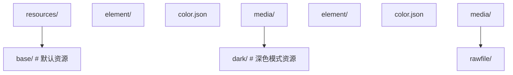

## 1. 基础组件

### 1.1 Text 文本组件

```typescript
@Entry
@Component
struct TextDemo {
  build() {
    Scroll() {
      Column({ space: 12 }) {
        // 基础文本
        Text('基础文本')
          .fontSize(16)

        // 富文本样式
        Text('彩色粗体文本')
          .fontSize(20)
          .fontWeight(FontWeight.Bold)
          .fontColor('#1a73e8')
          .letterSpacing(2)

        // 多行文本
        Text('这是一段很长的文本内容，当文本超过容器宽度时会自动换行显示')
          .fontSize(14)
          .maxLines(2)
          .textOverflow({ overflow: TextOverflow.Ellipsis })
          .width(200)

        // 文本装饰
        Text('带装饰线的文本')
          .fontSize(16)
          .decoration({ type: TextDecorationType.Underline, color: '#1a73e8' })

        // Span 富文本
        Text() {
          Span('红色文本')
            .fontColor('#ff0000')
            .fontSize(16)
          Span(' 蓝色文本')
            .fontColor('#0000ff')
            .fontSize(20)
            .fontWeight(FontWeight.Bold)
        }
      }
      .padding(16)
    }
  }
}
```

### 1.2 Button 按钮组件

```typescript
@Entry
@Component
struct ButtonDemo {
  build() {
    Column({ space: 16 }) {
      // 基础按钮
      Button('主要按钮')
        .width('80%')
        .height(44)
        .type(ButtonType.Capsule)

      // 胶囊按钮
      Button('胶囊按钮')
        .width('80%')
        .height(44)
        .type(ButtonType.Capsule)
        .backgroundColor('#ff6600')

      // 圆形按钮
      Button('+')
        .width(56)
        .height(56)
        .type(ButtonType.Circle)
        .fontSize(24)

      // 自定义内容按钮
      Button() {
        Row({ space: 8 }) {
          Text('下载')
            .fontColor(Color.White)
            .fontSize(16)
          Text('12.5MB')
            .fontColor('#ffffffcc')
            .fontSize(12)
        }
      }
      .width('80%')
      .height(48)
      .type(ButtonType.Capsule)
      .backgroundColor('#1a73e8')

      // 禁用状态
      Button('禁用按钮')
        .width('80%')
        .height(44)
        .enabled(false)
        .opacity(0.5)
    }
    .padding(16)
  }
}
```

### 1.3 Image 图片组件

```typescript
@Entry
@Component
struct ImageDemo {
  build() {
    Column({ space: 16 }) {
      // 网络图片
      Image('https://example.com/photo.jpg')
        .width(200)
        .height(150)
        .objectFit(ImageFit.Cover)
        .borderRadius(8)
        .alt($r('app.media.placeholder'))  // 占位图

      // 本地资源图片
      Image($r('app.media.logo'))
        .width(100)
        .height(100)
        .interpolation(ImageInterpolation.High)

      // SVG 图标
      Image($r('app.media.icon_home'))
        .width(24)
        .height(24)
        .fillColor('#999999')

      // 图片事件
      Image($r('app.media.photo'))
        .width(200)
        .height(150)
        .onComplete(() => {
          console.info('图片加载完成');
        })
        .onError(() => {
          console.error('图片加载失败');
        })
    }
    .padding(16)
  }
}
```

### 1.4 List 列表组件

```typescript
interface ContactItem {
  name: string;
  phone: string;
  avatar: Resource;
}

@Entry
@Component
struct ListDemo {
  @State contacts: ContactItem[] = [
    { name: '张三', phone: '138****1234', avatar: $r('app.media.avatar1') },
    { name: '李四', phone: '139****5678', avatar: $r('app.media.avatar2') },
    { name: '王五', phone: '137****9012', avatar: $r('app.media.avatar3') },
  ];

  build() {
    Column() {
      List({ space: 8 }) {
        ForEach(this.contacts, (item: ContactItem) => {
          ListItem() {
            Row({ space: 12 }) {
              Image(item.avatar)
                .width(48)
                .height(48)
                .borderRadius(24)
              Column({ space: 4 }) {
                Text(item.name).fontSize(16).fontWeight(FontWeight.Medium)
                Text(item.phone).fontSize(14).fontColor('#999999')
              }
              .alignItems(HorizontalAlign.Start)
              .layoutWeight(1)
              Image($r('app.media.icon_arrow'))
                .width(16)
                .height(16)
            }
            .padding(12)
            .backgroundColor(Color.White)
            .borderRadius(8)
          }
          .swipeAction({ end: this.deleteButton() })
        })
      }
      .width('100%')
      .layoutWeight(1)
    }
    .padding(16)
  }

  @Builder
  deleteButton() {
    Button('删除')
      .backgroundColor('#ff4444')
      .fontColor(Color.White)
      .height('100%')
  }
}
```

### 1.5 Grid 网格组件

```typescript
@Entry
@Component
struct GridDemo {
  @State apps: string[] = ['微信', '支付宝', '淘宝', '抖音', '美团', '京东'];

  build() {
    Grid() {
      ForEach(this.apps, (app: string) => {
        GridItem() {
          Column({ space: 8 }) {
            Image($r('app.media.icon_default'))
              .width(48)
              .height(48)
            Text(app)
              .fontSize(12)
              .maxLines(1)
          }
          .justifyContent(FlexAlign.Center)
        }
      })
    }
    .columnsTemplate('1fr 1fr 1fr 1fr')
    .rowsTemplate('1fr 1fr')
    .columnsGap(16)
    .rowsGap(16)
    .width('100%')
    .height(300)
    .padding(16)
  }
}
```

### 1.6 Tabs 标签组件

```typescript
@Entry
@Component
struct TabsDemo {
  @State currentIndex: number = 0;

  build() {
    Column() {
      Tabs({ barPosition: BarPosition.End }) {
        TabContent() {
          this.HomeContent()
        }
        .tabBar('首页')

        TabContent() {
          this.DiscoverContent()
        }
        .tabBar('发现')

        TabContent() {
          this.ProfileContent()
        }
        .tabBar('我的')
      }
      .width('100%')
      .layoutWeight(1)
      .onChange((index: number) => {
        this.currentIndex = index;
      })
    }
  }

  @Builder HomeContent() {
    Column() {
      Text('首页内容').fontSize(24)
    }
    .width('100%')
    .height('100%')
    .justifyContent(FlexAlign.Center)
  }

  @Builder DiscoverContent() {
    Column() {
      Text('发现内容').fontSize(24)
    }
    .width('100%')
    .height('100%')
    .justifyContent(FlexAlign.Center)
  }

  @Builder ProfileContent() {
    Column() {
      Text('个人中心').fontSize(24)
    }
    .width('100%')
    .height('100%')
    .justifyContent(FlexAlign.Center)
  }
}
```

## 2. 容器组件

### 2.1 Column 与 Row

```typescript
@Entry
@Component
struct LayoutDemo {
  build() {
    Column({ space: 16 }) {
      // 垂直布局
      Text('Column 垂直布局')
        .fontSize(18)
        .fontWeight(FontWeight.Bold)

      Row({ space: 12 }) {
        Text('左')
          .layoutWeight(1)
          .textAlign(TextAlign.Start)
        Text('中')
          .layoutWeight(1)
          .textAlign(TextAlign.Center)
        Text('右')
          .layoutWeight(1)
          .textAlign(TextAlign.End)
      }
      .width('100%')
      .padding(12)
      .backgroundColor('#f0f0f0')
      .borderRadius(8)
    }
    .width('100%')
    .padding(16)
  }
}
```

### 2.2 Stack 层叠布局

```typescript
@Entry
@Component
struct StackDemo {
  build() {
    Stack({ alignContent: Alignment.BottomEnd }) {
      // 底层图片
      Image($r('app.media.banner'))
        .width('100%')
        .height(200)
        .objectFit(ImageFit.Cover)
        .borderRadius(12)

      // 叠加渐变遮罩
      Column() {
        Text('热门推荐')
          .fontSize(20)
          .fontColor(Color.White)
          .fontWeight(FontWeight.Bold)
        Text('精选优质内容')
          .fontSize(14)
          .fontColor('#ffffffcc')
      }
      .width('100%')
      .padding(16)
      .alignItems(HorizontalAlign.Start)
    }
    .width('100%')
    .height(200)
    .borderRadius(12)
  }
}
```

### 2.3 Swiper 轮播组件

```typescript
@Entry
@Component
struct SwiperDemo {
  private swiperController: SwiperController = new SwiperController();

  build() {
    Column() {
      Swiper(this.swiperController) {
        Text('轮播 1')
          .width('100%')
          .height(180)
          .backgroundColor('#1a73e8')
          .fontColor(Color.White)
          .fontSize(24)
          .textAlign(TextAlign.Center)

        Text('轮播 2')
          .width('100%')
          .height(180)
          .backgroundColor('#ff6600')
          .fontColor(Color.White)
          .fontSize(24)
          .textAlign(TextAlign.Center)

        Text('轮播 3')
          .width('100%')
          .height(180)
          .backgroundColor('#00bfa5')
          .fontColor(Color.White)
          .fontSize(24)
          .textAlign(TextAlign.Center)
      }
      .autoPlay(true)
      .interval(3000)
      .indicator(true)
      .loop(true)
      .onChange((index: number) => {
        console.info(`当前轮播: ${index}`);
      })
    }
    .padding(16)
  }
}
```

## 3. 自定义组件

### 3.1 封装可复用组件

```typescript
// 可复用的卡片组件
@Component
export struct InfoCard {
  @Prop title: string = '';
  @Prop subtitle: string = '';
  @Prop icon: Resource = $r('app.media.icon_default');
  onCardClick?: () => void;

  build() {
    Row({ space: 12 }) {
      Image(this.icon)
        .width(48)
        .height(48)
        .borderRadius(8)

      Column({ space: 4 }) {
        Text(this.title)
          .fontSize(16)
          .fontWeight(FontWeight.Medium)
          .maxLines(1)
        Text(this.subtitle)
          .fontSize(13)
          .fontColor('#999999')
          .maxLines(1)
      }
      .alignItems(HorizontalAlign.Start)
      .layoutWeight(1)

      Image($r('app.media.icon_arrow'))
        .width(16)
        .height(16)
    }
    .padding(16)
    .backgroundColor(Color.White)
    .borderRadius(12)
    .shadow({ radius: 4, color: '#1a000000', offsetY: 2 })
    .onClick(() => {
      this.onCardClick?.();
    })
  }
}

// 使用自定义组件
@Entry
@Component
struct CustomComponentDemo {
  build() {
    Column({ space: 12 }) {
      InfoCard({
        title: '系统设置',
        subtitle: '管理应用和系统配置',
        icon: $r('app.media.icon_settings'),
        onCardClick: () => {
          console.info('点击了系统设置');
        }
      })

      InfoCard({
        title: '账户安全',
        subtitle: '密码、指纹与面部识别',
        icon: $r('app.media.icon_security')
      })
    }
    .padding(16)
  }
}
```

## 4. 动画效果

### 4.1 属性动画

通过 `animation()` 装饰器实现属性变化的过渡动画：

```typescript
@Entry
@Component
struct PropertyAnimationDemo {
  @State scale: number = 1;
  @State rotate: number = 0;
  @State opacity: number = 1;

  build() {
    Column({ space: 30 }) {
      Image($r('app.media.icon_star'))
        .width(80)
        .height(80)
        .scale({ x: this.scale, y: this.scale })
        .rotate({ angle: this.rotate })
        .opacity(this.opacity)
        .animation({
          duration: 500,
          curve: Curve.EaseInOut,
          iterations: 1,
        })

      Row({ space: 12 }) {
        Button('放大').onClick(() => { this.scale = 1.5; })
        Button('缩小').onClick(() => { this.scale = 0.5; })
        Button('旋转').onClick(() => { this.rotate += 90; })
        Button('闪烁').onClick(() => { this.opacity = this.opacity === 1 ? 0.3 : 1; })
      }
    }
    .padding(16)
  }
}
```

### 4.2 显式动画

使用 `animateTo()` 控制动画：

```typescript
@Entry
@Component
struct ExplicitAnimationDemo {
  @State translateX: number = 0;
  @State bgColor: ResourceColor = '#1a73e8';

  build() {
    Column({ space: 30 }) {
      Row() {
        Text('滑动方块')
          .fontColor(Color.White)
          .fontSize(16)
      }
      .width(120)
      .height(120)
      .backgroundColor(this.bgColor)
      .borderRadius(12)
      .translate({ x: this.translateX })
      .justifyContent(FlexAlign.Center)

      Button('滑动并变色')
        .onClick(() => {
          animateTo({
            duration: 600,
            curve: Curve.FastOutSlowIn,
            onFinish: () => {
              console.info('动画完成');
            }
          }, () => {
            this.translateX = this.translateX === 0 ? 200 : 0;
            this.bgColor = this.bgColor === '#1a73e8' ? '#ff6600' : '#1a73e8';
          });
        })
    }
    .padding(16)
  }
}
```

### 4.3 转场动画

页面间转场效果：

```typescript
// 页面 A
@Entry
@Component
struct PageA {
  build() {
    Column() {
      Text('页面 A')
        .fontSize(24)
      Button('跳转页面 B')
        .onClick(() => {
          animateTo({ duration: 400 }, () => {
            // 触发转场
          });
          // 路由跳转
        })
    }
  }
}

// 组件转场
@Component
struct TransitionDemo {
  @State show: boolean = false;

  build() {
    Column() {
      Button('显示/隐藏')
        .onClick(() => {
          animateTo({ duration: 300 }, () => {
            this.show = !this.show;
          });
        })

      if (this.show) {
        Text('转场元素')
          .fontSize(24)
          .transition({
            type: TransitionType.Insertion,
            opacity: 0,
            translate: { y: -50 },
          })
          .transition({
            type: TransitionType.Deletion,
            opacity: 0,
            translate: { y: 50 },
          })
      }
    }
  }
}
```

### 4.4 动画曲线

| 曲线                    | 效果                 | 适用场景 |
| :---------------------- | :------------------- | :------- |
| **Curve.Linear**        | 匀速                 | 进度条   |
| **Curve.Ease**          | 先慢后快再慢         | 通用     |
| **Curve.EaseIn**        | 先慢后快             | 退出动画 |
| **Curve.EaseOut**       | 先快后慢             | 进入动画 |
| **Curve.EaseInOut**     | 两头慢中间快         | 位移动画 |
| **Curve.FastOutSlowIn** | 快出慢入（Material） | 强调动画 |
| **Curve.Spring**        | 弹簧效果             | 弹性交互 |
| **cubicBezier**         | 自定义贝塞尔曲线     | 精细控制 |

## 5. 深色模式适配

### 5.1 资源限定词



### 5.2 颜色资源定义

```json
// base/element/color.json
{
  "color": [
    { "name": "bg_color", "value": "#ffffff" },
    { "name": "text_primary", "value": "#333333" },
    { "name": "text_secondary", "value": "#999999" }
  ]
}

// dark/element/color.json
{
  "color": [
    { "name": "bg_color", "value": "#1a1a1a" },
    { "name": "text_primary", "value": "#e5e5e5" },
    { "name": "text_secondary", "value": "#999999" }
  ]
}
```

### 5.3 代码中使用

```typescript
@Entry
@Component
struct DarkModeDemo {
  build() {
    Column() {
      Text('深色模式适配')
        .fontColor($r('app.color.text_primary'))
        .fontSize(20)

      Text('自动跟随系统')
        .fontColor($r('app.color.text_secondary'))
        .fontSize(14)
    }
    .width('100%')
    .height('100%')
    .backgroundColor($r('app.color.bg_color'))
  }
}
```

## 6. 响应式布局

### 6.1 断点系统

```typescript
@Entry
@Component
struct ResponsiveDemo {
  @State currentBreakpoint: string = 'md';

  build() {
    GridRow({
      columns: {
        sm: 4,   // 小屏 4 列
        md: 8,   // 中屏 8 列
        lg: 12   // 大屏 12 列
      },
      breakpoints: {
        value: ['320vp', '600vp', '840vp'],
        reference: BreakpointsReference.WindowSize
      }
    }) {
      Col({ span: { sm: 4, md: 4, lg: 6 } }) {
        Text('左侧内容')
          .padding(16)
      }
      .backgroundColor('#f0f0f0')

      Col({ span: { sm: 4, md: 4, lg: 6 } }) {
        Text('右侧内容')
          .padding(16)
      }
      .backgroundColor('#e0e0e0')
    }
    .width('100%')
    .height('100%')
  }
}
```

### 6.2 常用响应式策略

| 策略             | 实现方式                 | 适用场景   |
| :--------------- | :----------------------- | :--------- |
| **百分比宽度**   | `.width('50%')`          | 简单等分   |
| **layoutWeight** | `.layoutWeight(1)`       | 弹性分配   |
| **GridRow/Col**  | 栅格布局系统             | 复杂响应式 |
| **断点监听**     | `mediaQuery` API         | 精细控制   |
| **多态组件**     | 根据设备类型渲染不同组件 | 设备差异化 |
## 基础组件

**Text 文本**
`Text(<content>: string | Resource)`
```typescript
Text('Hello')
  .fontSize(16)
  .fontColor('#333')
  .fontWeight(FontWeight.Bold)
  .textAlign(TextAlign.Center)
  .maxLines(2)
  .textOverflow({ overflow: TextOverflow.Ellipsis })
  .lineHeight(24)
```

**Button 按钮**
`Button([<label>]: string | Resource, [<options>]: { type?: ButtonType })`
```typescript
Button('Submit', { type: ButtonType.Capsule })
  .width(120)
  .height(40)
  .backgroundColor('#1a73e8')
  .fontColor(Color.White)
  .onClick(() => {})

Button({ type: ButtonType.Circle }) {
  Text('OK')
}
```

**Image 图片**
`Image(<src>: string | Resource)`
```typescript
Image($r('app.media.icon'))
  .width(48)
  .height(48)
  .objectFit(ImageFit.Cover)
  .alt($r('app.media.placeholder'))
  .borderRadius(8)
  .interpolation(ImageInterpolation.High)
```

**TextInput 文本输入**
`TextInput({ placeholder?: string | Resource, text?: string | Resource, controller?: TextInputController })`
```typescript
TextInput({ placeholder: '请输入' })
  .type(InputType.Normal)
  .fontSize(16)
  .maxLength(20)
  .onChange((value: string) => {
    console.info(value)
  })
  .onSubmit((enterKey) => {
    console.info(`submitted: ${enterKey}`)
  })
```

**TextArea 多行输入**
`TextArea({ placeholder?: string | Resource, text?: string | Resource })`
```typescript
TextArea({ placeholder: '请输入内容' })
  .maxLength(200)
  .onChange((value: string) => {})
```

**Toggle 开关**
`Toggle({ type: ToggleType, isOn?: boolean })`
```typescript
Toggle({ type: ToggleType.Switch, isOn: true })
  .onChange((isOn: boolean) => {
    console.info(`switch: ${isOn}`)
  })
```

**Slider 滑块**
`Slider({ value, min, max, step, style, direction, reverse })`
```typescript
Slider({ value: 50, min: 0, max: 100, step: 1, style: SliderStyle.OutSet })
  .blockColor('#1a73e8')
  .trackColor('#e0e0e0')
  .selectedColor('#1a73e8')
  .onChange((value: number, mode: SliderChangeMode) => {})
```

**Progress 进度条**
`Progress({ value, total, type: ProgressType })`
```typescript
Progress({ value: 50, total: 100, type: ProgressType.Linear })
Progress({ value: 0.7, type: ProgressType.Circular })
```

**LoadingProgress 加载**
`LoadingProgress()`
```typescript
LoadingProgress()
  .width(48)
  .height(48)
  .color('#1a73e8')
```

**Divider 分割线**
`Divider()`
```typescript
Divider()
  .color('#e0e0e0')
  .strokeWidth(1)
  .vertical(false)
```

---

## 容器组件

**Column 纵向布局**
`Column([{ space }: { space?: Length }]) { ... }`
```typescript
Column({ space: 12 }) {
  Text('Item 1')
  Text('Item 2')
}
.alignItems(HorizontalAlign.Center)
.justifyContent(FlexAlign.Start)
```

**Row 横向布局**
`Row([{ space }: { space?: Length }]) { ... }`
```typescript
Row({ space: 8 }) {
  Text('Left')
  Text('Right')
}
.justifyContent(FlexAlign.SpaceBetween)
.alignItems(VerticalAlign.Center)
```

**Stack 叠加布局**
`Stack([{ alignContent }: { alignContent?: Alignment }]) { ... }`
```typescript
Stack({ alignContent: Alignment.Center }) {
  Image($r('app.media.bg'))
  Text('Overlay')
}
```

**Flex 弹性布局**
`Flex({ direction, justifyContent, alignItems, wrap }) { ... }`
```typescript
Flex({
  direction: FlexDirection.Row,
  justifyContent: FlexAlign.SpaceAround,
  alignItems: ItemAlign.Center,
  wrap: FlexWrap.Wrap
}) {
  Text('A')
  Text('B')
}
```

**Grid 网格**
`Grid() { ... }.columnsTemplate('<template>').rowsTemplate('<template>')`
```typescript
Grid() {
  ForEach(this.items, (item: string) => {
    GridItem() { Text(item) }
  })
}
.columnsTemplate('1fr 1fr 1fr')
.columnsGap(8)
.rowsGap(8)
```

**List 列表**
`List([{ space, initialIndex, scroller }]) { ... }`
```typescript
List({ space: 8 }) {
  ForEach(this.items, (item: string) => {
    ListItem() {
      Text(item).padding(12)
    }
  })
}
.cachedCount(5)
.scrollBar(BarState.Auto)
```

**Tabs 选项卡**
`Tabs({ barPosition, index, controller }) { ... }`
```typescript
Tabs({ barPosition: BarPosition.Start }) {
  TabContent() {
    Text('Tab 1 Content')
  }.tabBar('Tab 1')

  TabContent() {
    Text('Tab 2 Content')
  }.tabBar('Tab 2')
}
.onChange((index: number) => {})
```

**Swiper 轮播**
`Swiper() { ... }`
```typescript
Swiper() {
  Image($r('app.media.img1'))
  Image($r('app.media.img2'))
}
.index(0)
.autoPlay(true)
.interval(3000)
.loop(true)
.indicator(true)
.duration(500)
```

---

## 文本组件

**Span 行内文本**
```typescript
Text() {
  Span('Hello ')
  Span('World').fontColor('#1a73e8').fontWeight(FontWeight.Bold)
}
```

**ImageSpan 行内图片**
```typescript
Text() {
  Span('Welcome ')
  ImageSpan($r('app.media.icon'))
    .width(16)
    .height(16)
    .verticalAlign(ImageSpanAlignment.CENTER)
}
```

**TextPicker 选择器**
`TextPicker({ range, selected })`
```typescript
TextPicker({ range: ['A', 'B', 'C'], selected: 0 })
  .onAccept((value: string, index: number) => {})
```

**TimePicker 时间选择**
`TimePicker({ selected })`
```typescript
TimePicker({ selected: new Date() })
  .onChange((value: TimePickerResult) => {})
```

**DatePicker 日期选择**
`DatePicker({ start, end, selected })`
```typescript
DatePicker({ start: new Date('2020-01-01'), end: new Date('2030-12-31') })
  .onChange((value: DatePickerResult) => {})
```

---

## 形状组件

**Circle 圆形**
`Circle({ width, height })`
```typescript
Circle({ width: 100, height: 100 })
  .fill('#1a73e8')
  .stroke('#333')
  .strokeWidth(2)
```

**Rectangle 矩形**
`Rectangle({ width, height })`
```typescript
Rectangle({ width: 100, height: 50 })
  .radiusWidth(8)
  .radiusHeight(8)
  .fill('#1a73e8')
```

**Path 路径**
`Path()`
```typescript
Path()
  .commands('M10 10 L100 100')
  .stroke('#1a73e8')
  .strokeWidth(2)
```

**Shape 形状容器**
`Shape() { ... }`
```typescript
Shape() {
  Circle({ width: 50, height: 50 }).fill('#1a73e8')
  Rectangle({ width: 50, height: 50 }).fill('#fff')
}
```

---

## 通用属性

**尺寸**
```typescript
.width(<Length>).height(<Length>)
.size({ width: <L>, height: <L> })
.constraintSize({ minWidth, maxWidth, minHeight, maxHeight })
.aspectRatio(<ratio>)
.layoutWeight(<weight>)
```

**位置**
```typescript
.position({ x: <Length>, y: <Length> })
.offset({ x: <Length>, y: <Length> })
.markAnchor({ x: <Length>, y: <Length> })
.zIndex(<number>)
```

**边距**
```typescript
.margin({ top, right, bottom, left })
.padding({ top, right, bottom, left })
.border({ width, color, radius, style })
.borderRadius(<Length>)
```

**背景**
```typescript
.backgroundColor(<ResourceColor>)
.backgroundImage(<ResourceStr>)
.backgroundImageSize(<ImageSize>)
.opacity(<number>)
```

**可见性**
```typescript
.visibility(<Visibility>)
.enabled(<boolean>)
```

---

## 属性动画

**animation 属性动画**
`.animation({ duration, curve, delay, iterations, playMode })`
```typescript
Row()
  .width(this.width)
  .height(this.height)
  .backgroundColor(Color.Blue)
  .animation({
    duration: 300,
    curve: Curve.EaseInOut,
    delay: 0,
    iterations: 1,
    playMode: PlayMode.Normal
  })
```

**animateTo 显式动画**
`animateTo({ duration, curve, delay, iterations, onFinish }, () => { ... })`
```typescript
animateTo({ duration: 500, curve: Curve.EaseOut }, () => {
  this.width = 200
  this.opacity = 1
})
```

**transition 转场动画**
`.transition({ type, opacity, translate, scale, rotate })`
```typescript
Column()
  .transition({ type: TransitionType.All, opacity: 0 })
```

---

## 关键帧动画

**keyframeAnimateTo 关键帧**
`keyframeAnimateTo({ iterations, onFinish }, [<keyframe>])`
```typescript
keyframeAnimateTo({ iterations: 1 }, [
  { duration: 200, curve: Curve.EaseIn, event: () => { this.width = 100 } },
  { duration: 300, curve: Curve.EaseOut, event: () => { this.width = 200 } }
])
```

---

## 内置动画组件

**ImageAnimator 帧动画**
`ImageAnimator({ images, duration, iterations, state })`
```typescript
ImageAnimator({
  images: [
    { src: $r('app.media.frame1') },
    { src: $r('app.media.frame2') },
    { src: $r('app.media.frame3') }
  ],
  duration: 1000,
  iterations: -1,
  state: AnimationStatus.Running
})
```

---

## 动画曲线

**Curve 内置曲线**
```typescript
Curve.Linear          // 线性
Curve.Ease            // 默认缓动
Curve.EaseIn          // 缓入
Curve.EaseOut         // 缓出
Curve.EaseInOut       // 缓入缓出
Curve.FastOutSlowIn   // 快出慢入
Curve.LinearOutSlowIn // 线性出慢入
Curve.FastLinearInSlowOut
```

**curves 自定义曲线**
```typescript
import { curves } from '@kit.ArkUI'

const spring = curves.springCurve(0, 10, 200, 20)
const cubic = curves.cubicBezierCurve(0.4, 0, 0.6, 1)
```

---

## 组件动画事件

**onAppear 显示事件**
`<Component>.onAppear(() => { ... })`
```typescript
Column().onAppear(() => {
  console.info('shown')
})
```

**onDisappear 隐藏事件**
`<Component>.onDisappear(() => { ... })`
```typescript
Column().onDisappear(() => {
  console.info('hidden')
})
```

**onAreaChange 区域变化**
`<Component>.onAreaChange((old, new) => { ... })`
```typescript
Column().onAreaChange((old: Area, new: Area) => {
  console.info(`width: ${new.width}`)
})
```

---

## 滚动与下拉

**Scroll 滚动容器**
`Scroll([<scroller>]) { ... }`
```typescript
Scroll() {
  Column() {
    ForEach(this.items, (item: string) => {
      Text(item).padding(16)
    })
  }
}
.scrollBar(BarState.Auto)
.edgeEffect(EdgeEffect.Spring)
```

**Refresh 下拉刷新**
`Refresh({ refreshing, offset, friction }) { ... }`
```typescript
Refresh({ refreshing: $$this.isRefreshing }) {
  List() {
    ForEach(this.items, (item: string) => {
      ListItem() { Text(item) }
    })
  }
}
.onRefreshing(() => {
  this.loadData()
})
```

## 参考文献

华为开发者联盟 HarmonyOS 文档：https://developer.huawei.com/consumer/cn/harmonyos
ArkTS 语言规范：https://developer.huawei.com/consumer/cn/doc/harmonyos-guides/arkts-overview
ArkUI 组件参考：https://developer.huawei.com/consumer/cn/doc/harmonyos-references/
DevEco Studio：https://developer.huawei.com/consumer/cn/deveco-studio/

## 延伸阅读

TypeScript 基础（ArkTS 语言底座），见 009-typescript 模块。
声明式 UI 概念与 React/Vue 对比，见 011-react/010-vue3 模块。
移动端应用架构，见 018-harmonyos 模块文档。
尚硅谷 Bilibili 空间（https://space.bilibili.com/302417610 ）提供鸿蒙开发课程。

## 模块文档速查表

| 文档 | 主题 | 与本文的关联 |
| --- | --- | --- |
| 概述与环境搭建 | 001-OverviewSetup | 本文的前置基础 |
| ArkTS与ArkUI | 002-ArkTSArkUI | 本文的并列主题 |
| UI组件与动画 | 003-UIComponentAnimation | 本文自身 |
| 网络与数据持久化 | 004-NetworkAndPersistence | 本文的并列主题 |
| 多媒体与设备能力 | 005-MultimediaDeviceCapability | 本文的并列主题 |
| ArkTS语言特性 | 006-ArkTSLanguageFeature | 本文的并列主题 |
| 状态管理 | 007-StateManagement | 本文的并列主题 |
| 自定义组件 | 008-CustomComponent | 本文的并列主题 |
| 列表与网格 | 009-ListGrid | 本文的并列主题 |
| 导航与路由 | 010-NavigationRoute | 本文的并列主题 |
| 网络请求 | 011-NetworkRequest | 本文的并列主题 |
| 数据持久化 | 012-DataPersistence | 本文的并列主题 |
| 动画系统 | 013-AnimationSystem | 本文的并列主题 |
| 手势与交互 | 014-GestureInteraction | 本文的并列主题 |
| 通知与权限 | 015-NotificationPermission | 本文的安全延伸 |
| 多媒体能力 | 016-MultimediaCapability | 本文的并列主题 |
| 传感器与位置 | 017-SensorLocation | 本文的并列主题 |
| 卡片开发 | 018-CardDevelopment | 本文的并列主题 |
| 分布式能力 | 019-DistributedCapability | 本文的并列主题 |
| 性能优化 | 020-PerformanceOptimization | 本文的性能延伸 |
| 国际化与无障碍 | 021-I18nAccessibility | 本文的并列主题 |
| 测试与调试 | 022-TestDebug | 本文的并列主题 |
| 应用签名与发布 | 023-AppSignaturePublish | 本文的并列主题 |
| Stage模型与FA模型区别 | 024-StageFAModelDifference | 本文的并列主题 |
| ArkTS与TypeScript差异 | 025-ArkTSTypeScriptDifference | 本文的并列主题 |
| ArkUI声明式语法 | 026-ArkUIDeclarativeSyntax | 本文的并列主题 |
| 组件生命周期详解 | 027-ComponentLifecycleDetailed | 本文的并列主题 |
| 路由跳转与路由栈 | 028-RouteJumpStack | 本文的并列主题 |
| 权限申请 | 029-PermissionRequest | 本文的安全延伸 |
| 分布式数据管理 | 030-DistributedDataManagement | 本文的并列主题 |
| 跨设备调用 | 031-CrossDeviceCall | 本文的并列主题 |
| 元服务开发与发布 | 032-AtomicServiceDevPublish | 本文的并列主题 |
| DevEco-Studio调试器 | 033-DevEcoStudioDebugger | 本文的并列主题 |
