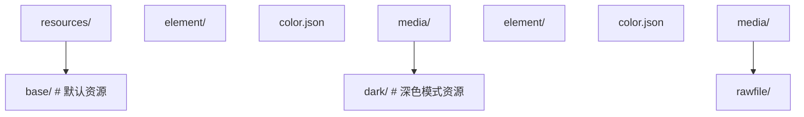
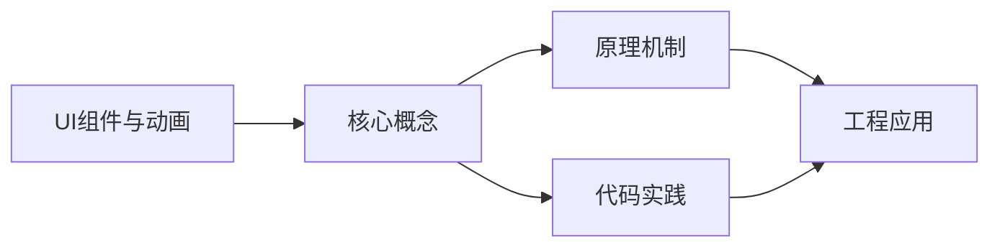
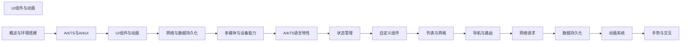

## 1. 学习目标（Bloom 分类）

本节按照布鲁姆教育目标分类学组织学习路径。本文主题为《UI组件与动画》，属于 HarmonyOS 模块，读者可以根据自身阶段选择阅读深度。

记忆层面：能够准确复述本文的核心概念、术语与基本语法或操作步骤，并能够在提问或检索时快速定位对应知识点。能够说出 HarmonyOS 的核心概念、术语与标准写法。

理解层面：能够用自己的语言解释核心原理与工作机制，说明概念之间的因果关系，而不是机械记忆结论。能够解释 HarmonyOS 的工作原理与设计动机。

应用层面：能够在真实项目或练习场景中运用本文知识解决具体问题，写出正确且可维护的实现。能够编写符合 HarmonyOS 规范的完整实现。

分析层面：能够拆解复杂问题，比较本文主题与相邻概念的异同，识别边界条件与例外情况。能够分析 HarmonyOS 与相邻方案的差异与边界。

评价层面：能够根据约束条件（性能、可读性、安全、成本）评价不同方案的优劣，做出有依据的技术决策。能够根据场景评价 HarmonyOS 相关方案的优劣。

创造层面：能够把本文知识与其他模块知识组合，设计出新的解决方案或可复用的工程模式。能够组合 HarmonyOS 与其他技术设计完整方案。

通过本节学习，读者应当能够把《UI组件与动画》纳入自己的知识网络，并与 HarmonyOS 模块的其他主题（ArkTS、ArkUI、分布式能力、应用开发）建立关联。

## 2. 历史动机与发展脉络

《UI组件与动画》是 HarmonyOS 领域的重要主题。要真正理解它，需要先了解它解决的问题与演进过程。

HarmonyOS（鸿蒙）由华为于 2019 年发布，定位面向全场景的分布式操作系统；HarmonyOS NEXT（5.0，2024）去 Android 化，采用自研鸿蒙内核与 ArkTS 语言栈。
开发框架：ArkTS（TS 超集 + 声明式 UI 扩展）、ArkUI（声明式组件）、Stage 模型（应用模型）、方舟编译器。
分布式能力：跨端流转、分布式数据、一次开发多端部署（手机/平板/车机/穿戴）。

回到本文主题：UI组件与动画 的提出与成熟，正是上述技术背景下的必然产物。早期实现往往以简单可用为目标，随着工程规模扩大，社区逐渐沉淀出标准做法与最佳实践；理解这一脉络，可以帮助读者判断“为什么文档中的推荐写法是现在这个样子”，也能在遇到历史遗留代码时准确识别其设计年代与取舍。


## 3. 形式化定义与核心概念精讲

本节把《UI组件与动画》涉及的核心概念以“定义 + 讲解”的形式展开。读者应把定义当作工具，把讲解当作理解路径；两者结合才能形成可迁移的知识。

ArkTS 语法：基于 TypeScript 的类型系统，增加 @Component/@Entry/@State 等装饰器与 UI 描述语法。
ArkUI 组件：Column/Row/Stack 布局容器、Text/Button/Image 基础组件、List/Grid 容器组件；状态管理（@State/@Prop/@Link/@Provide）。
应用模型：Stage 模型以 UIAbility 为页面载体，EntryAbility 入口；module.json5 声明应用配置。

### 3.1 原文章节逐一精讲

原文档把主题拆分为 17 个小节，下面按顺序给出每一节的导读讲解，随后保留原文细节供精读。

#### 原文精读（完整保留）

# UI 组件与动画 语法速查手册

> **符号约定**:`< >` 必填参数 | `[ ]` 可选参数

---

#### 1. 基础组件

##### 1.1 Text 文本组件

```typescript
@Entry
@Component
struct TextDemo {
  build() {
    Scroll() {
      Column({ space: 12 }) {
        // 基础文本
        Text('基础文本')
          .fontSize(16)

        // 富文本样式
        Text('彩色粗体文本')
          .fontSize(20)
          .fontWeight(FontWeight.Bold)
          .fontColor('#1a73e8')
          .letterSpacing(2)

        // 多行文本
        Text('这是一段很长的文本内容，当文本超过容器宽度时会自动换行显示')
          .fontSize(14)
          .maxLines(2)
          .textOverflow({ overflow: TextOverflow.Ellipsis })
          .width(200)

        // 文本装饰
        Text('带装饰线的文本')
          .fontSize(16)
          .decoration({ type: TextDecorationType.Underline, color: '#1a73e8' })

        // Span 富文本
        Text() {
          Span('红色文本')
            .fontColor('#ff0000')
            .fontSize(16)
          Span(' 蓝色文本')
            .fontColor('#0000ff')
            .fontSize(20)
            .fontWeight(FontWeight.Bold)
        }
      }
      .padding(16)
    }
  }
}
```

##### 1.2 Button 按钮组件

```typescript
@Entry
@Component
struct ButtonDemo {
  build() {
    Column({ space: 16 }) {
      // 基础按钮
      Button('主要按钮')
        .width('80%')
        .height(44)
        .type(ButtonType.Capsule)

      // 胶囊按钮
      Button('胶囊按钮')
        .width('80%')
        .height(44)
        .type(ButtonType.Capsule)
        .backgroundColor('#ff6600')

      // 圆形按钮
      Button('+')
        .width(56)
        .height(56)
        .type(ButtonType.Circle)
        .fontSize(24)

      // 自定义内容按钮
      Button() {
        Row({ space: 8 }) {
          Text('下载')
            .fontColor(Color.White)
            .fontSize(16)
          Text('12.5MB')
            .fontColor('#ffffffcc')
            .fontSize(12)
        }
      }
      .width('80%')
      .height(48)
      .type(ButtonType.Capsule)
      .backgroundColor('#1a73e8')

      // 禁用状态
      Button('禁用按钮')
        .width('80%')
        .height(44)
        .enabled(false)
        .opacity(0.5)
    }
    .padding(16)
  }
}
```

##### 1.3 Image 图片组件

```typescript
@Entry
@Component
struct ImageDemo {
  build() {
    Column({ space: 16 }) {
      // 网络图片
      Image('https://example.com/photo.jpg')
        .width(200)
        .height(150)
        .objectFit(ImageFit.Cover)
        .borderRadius(8)
        .alt($r('app.media.placeholder'))  // 占位图

      // 本地资源图片
      Image($r('app.media.logo'))
        .width(100)
        .height(100)
        .interpolation(ImageInterpolation.High)

      // SVG 图标
      Image($r('app.media.icon_home'))
        .width(24)
        .height(24)
        .fillColor('#999999')

      // 图片事件
      Image($r('app.media.photo'))
        .width(200)
        .height(150)
        .onComplete(() => {
          console.info('图片加载完成');
        })
        .onError(() => {
          console.error('图片加载失败');
        })
    }
    .padding(16)
  }
}
```

##### 1.4 List 列表组件

```typescript
interface ContactItem {
  name: string;
  phone: string;
  avatar: Resource;
}

@Entry
@Component
struct ListDemo {
  @State contacts: ContactItem[] = [
    { name: '张三', phone: '138****1234', avatar: $r('app.media.avatar1') },
    { name: '李四', phone: '139****5678', avatar: $r('app.media.avatar2') },
    { name: '王五', phone: '137****9012', avatar: $r('app.media.avatar3') },
  ];

  build() {
    Column() {
      List({ space: 8 }) {
        ForEach(this.contacts, (item: ContactItem) => {
          ListItem() {
            Row({ space: 12 }) {
              Image(item.avatar)
                .width(48)
                .height(48)
                .borderRadius(24)
              Column({ space: 4 }) {
                Text(item.name).fontSize(16).fontWeight(FontWeight.Medium)
                Text(item.phone).fontSize(14).fontColor('#999999')
              }
              .alignItems(HorizontalAlign.Start)
              .layoutWeight(1)
              Image($r('app.media.icon_arrow'))
                .width(16)
                .height(16)
            }
            .padding(12)
            .backgroundColor(Color.White)
            .borderRadius(8)
          }
          .swipeAction({ end: this.deleteButton() })
        })
      }
      .width('100%')
      .layoutWeight(1)
    }
    .padding(16)
  }

  @Builder
  deleteButton() {
    Button('删除')
      .backgroundColor('#ff4444')
      .fontColor(Color.White)
      .height('100%')
  }
}
```

##### 1.5 Grid 网格组件

```typescript
@Entry
@Component
struct GridDemo {
  @State apps: string[] = ['微信', '支付宝', '淘宝', '抖音', '美团', '京东'];

  build() {
    Grid() {
      ForEach(this.apps, (app: string) => {
        GridItem() {
          Column({ space: 8 }) {
            Image($r('app.media.icon_default'))
              .width(48)
              .height(48)
            Text(app)
              .fontSize(12)
              .maxLines(1)
          }
          .justifyContent(FlexAlign.Center)
        }
      })
    }
    .columnsTemplate('1fr 1fr 1fr 1fr')
    .rowsTemplate('1fr 1fr')
    .columnsGap(16)
    .rowsGap(16)
    .width('100%')
    .height(300)
    .padding(16)
  }
}
```

##### 1.6 Tabs 标签组件

```typescript
@Entry
@Component
struct TabsDemo {
  @State currentIndex: number = 0;

  build() {
    Column() {
      Tabs({ barPosition: BarPosition.End }) {
        TabContent() {
          this.HomeContent()
        }
        .tabBar('首页')

        TabContent() {
          this.DiscoverContent()
        }
        .tabBar('发现')

        TabContent() {
          this.ProfileContent()
        }
        .tabBar('我的')
      }
      .width('100%')
      .layoutWeight(1)
      .onChange((index: number) => {
        this.currentIndex = index;
      })
    }
  }

  @Builder HomeContent() {
    Column() {
      Text('首页内容').fontSize(24)
    }
    .width('100%')
    .height('100%')
    .justifyContent(FlexAlign.Center)
  }

  @Builder DiscoverContent() {
    Column() {
      Text('发现内容').fontSize(24)
    }
    .width('100%')
    .height('100%')
    .justifyContent(FlexAlign.Center)
  }

  @Builder ProfileContent() {
    Column() {
      Text('个人中心').fontSize(24)
    }
    .width('100%')
    .height('100%')
    .justifyContent(FlexAlign.Center)
  }
}
```

#### 2. 容器组件

##### 2.1 Column 与 Row

```typescript
@Entry
@Component
struct LayoutDemo {
  build() {
    Column({ space: 16 }) {
      // 垂直布局
      Text('Column 垂直布局')
        .fontSize(18)
        .fontWeight(FontWeight.Bold)

      Row({ space: 12 }) {
        Text('左')
          .layoutWeight(1)
          .textAlign(TextAlign.Start)
        Text('中')
          .layoutWeight(1)
          .textAlign(TextAlign.Center)
        Text('右')
          .layoutWeight(1)
          .textAlign(TextAlign.End)
      }
      .width('100%')
      .padding(12)
      .backgroundColor('#f0f0f0')
      .borderRadius(8)
    }
    .width('100%')
    .padding(16)
  }
}
```

##### 2.2 Stack 层叠布局

```typescript
@Entry
@Component
struct StackDemo {
  build() {
    Stack({ alignContent: Alignment.BottomEnd }) {
      // 底层图片
      Image($r('app.media.banner'))
        .width('100%')
        .height(200)
        .objectFit(ImageFit.Cover)
        .borderRadius(12)

      // 叠加渐变遮罩
      Column() {
        Text('热门推荐')
          .fontSize(20)
          .fontColor(Color.White)
          .fontWeight(FontWeight.Bold)
        Text('精选优质内容')
          .fontSize(14)
          .fontColor('#ffffffcc')
      }
      .width('100%')
      .padding(16)
      .alignItems(HorizontalAlign.Start)
    }
    .width('100%')
    .height(200)
    .borderRadius(12)
  }
}
```

##### 2.3 Swiper 轮播组件

```typescript
@Entry
@Component
struct SwiperDemo {
  private swiperController: SwiperController = new SwiperController();

  build() {
    Column() {
      Swiper(this.swiperController) {
        Text('轮播 1')
          .width('100%')
          .height(180)
          .backgroundColor('#1a73e8')
          .fontColor(Color.White)
          .fontSize(24)
          .textAlign(TextAlign.Center)

        Text('轮播 2')
          .width('100%')
          .height(180)
          .backgroundColor('#ff6600')
          .fontColor(Color.White)
          .fontSize(24)
          .textAlign(TextAlign.Center)

        Text('轮播 3')
          .width('100%')
          .height(180)
          .backgroundColor('#00bfa5')
          .fontColor(Color.White)
          .fontSize(24)
          .textAlign(TextAlign.Center)
      }
      .autoPlay(true)
      .interval(3000)
      .indicator(true)
      .loop(true)
      .onChange((index: number) => {
        console.info(`当前轮播: ${index}`);
      })
    }
    .padding(16)
  }
}
```

#### 3. 自定义组件

##### 3.1 封装可复用组件

```typescript
// 可复用的卡片组件
@Component
export struct InfoCard {
  @Prop title: string = '';
  @Prop subtitle: string = '';
  @Prop icon: Resource = $r('app.media.icon_default');
  onCardClick?: () => void;

  build() {
    Row({ space: 12 }) {
      Image(this.icon)
        .width(48)
        .height(48)
        .borderRadius(8)

      Column({ space: 4 }) {
        Text(this.title)
          .fontSize(16)
          .fontWeight(FontWeight.Medium)
          .maxLines(1)
        Text(this.subtitle)
          .fontSize(13)
          .fontColor('#999999')
          .maxLines(1)
      }
      .alignItems(HorizontalAlign.Start)
      .layoutWeight(1)

      Image($r('app.media.icon_arrow'))
        .width(16)
        .height(16)
    }
    .padding(16)
    .backgroundColor(Color.White)
    .borderRadius(12)
    .shadow({ radius: 4, color: '#1a000000', offsetY: 2 })
    .onClick(() => {
      this.onCardClick?.();
    })
  }
}

// 使用自定义组件
@Entry
@Component
struct CustomComponentDemo {
  build() {
    Column({ space: 12 }) {
      InfoCard({
        title: '系统设置',
        subtitle: '管理应用和系统配置',
        icon: $r('app.media.icon_settings'),
        onCardClick: () => {
          console.info('点击了系统设置');
        }
      })

      InfoCard({
        title: '账户安全',
        subtitle: '密码、指纹与面部识别',
        icon: $r('app.media.icon_security')
      })
    }
    .padding(16)
  }
}
```

#### 4. 动画效果

##### 4.1 属性动画

通过 `animation()` 装饰器实现属性变化的过渡动画：

```typescript
@Entry
@Component
struct PropertyAnimationDemo {
  @State scale: number = 1;
  @State rotate: number = 0;
  @State opacity: number = 1;

  build() {
    Column({ space: 30 }) {
      Image($r('app.media.icon_star'))
        .width(80)
        .height(80)
        .scale({ x: this.scale, y: this.scale })
        .rotate({ angle: this.rotate })
        .opacity(this.opacity)
        .animation({
          duration: 500,
          curve: Curve.EaseInOut,
          iterations: 1,
        })

      Row({ space: 12 }) {
        Button('放大').onClick(() => { this.scale = 1.5; })
        Button('缩小').onClick(() => { this.scale = 0.5; })
        Button('旋转').onClick(() => { this.rotate += 90; })
        Button('闪烁').onClick(() => { this.opacity = this.opacity === 1 ? 0.3 : 1; })
      }
    }
    .padding(16)
  }
}
```

##### 4.2 显式动画

使用 `animateTo()` 控制动画：

```typescript
@Entry
@Component
struct ExplicitAnimationDemo {
  @State translateX: number = 0;
  @State bgColor: ResourceColor = '#1a73e8';

  build() {
    Column({ space: 30 }) {
      Row() {
        Text('滑动方块')
          .fontColor(Color.White)
          .fontSize(16)
      }
      .width(120)
      .height(120)
      .backgroundColor(this.bgColor)
      .borderRadius(12)
      .translate({ x: this.translateX })
      .justifyContent(FlexAlign.Center)

      Button('滑动并变色')
        .onClick(() => {
          animateTo({
            duration: 600,
            curve: Curve.FastOutSlowIn,
            onFinish: () => {
              console.info('动画完成');
            }
          }, () => {
            this.translateX = this.translateX === 0 ? 200 : 0;
            this.bgColor = this.bgColor === '#1a73e8' ? '#ff6600' : '#1a73e8';
          });
        })
    }
    .padding(16)
  }
}
```

##### 4.3 转场动画

页面间转场效果：

```typescript
// 页面 A
@Entry
@Component
struct PageA {
  build() {
    Column() {
      Text('页面 A')
        .fontSize(24)
      Button('跳转页面 B')
        .onClick(() => {
          animateTo({ duration: 400 }, () => {
            // 触发转场
          });
          // 路由跳转
        })
    }
  }
}

// 组件转场
@Component
struct TransitionDemo {
  @State show: boolean = false;

  build() {
    Column() {
      Button('显示/隐藏')
        .onClick(() => {
          animateTo({ duration: 300 }, () => {
            this.show = !this.show;
          });
        })

      if (this.show) {
        Text('转场元素')
          .fontSize(24)
          .transition({
            type: TransitionType.Insertion,
            opacity: 0,
            translate: { y: -50 },
          })
          .transition({
            type: TransitionType.Deletion,
            opacity: 0,
            translate: { y: 50 },
          })
      }
    }
  }
}
```

##### 4.4 动画曲线

| 曲线                    | 效果                 | 适用场景 |
| :---------------------- | :------------------- | :------- |
| **Curve.Linear**        | 匀速                 | 进度条   |
| **Curve.Ease**          | 先慢后快再慢         | 通用     |
| **Curve.EaseIn**        | 先慢后快             | 退出动画 |
| **Curve.EaseOut**       | 先快后慢             | 进入动画 |
| **Curve.EaseInOut**     | 两头慢中间快         | 位移动画 |
| **Curve.FastOutSlowIn** | 快出慢入（Material） | 强调动画 |
| **Curve.Spring**        | 弹簧效果             | 弹性交互 |
| **cubicBezier**         | 自定义贝塞尔曲线     | 精细控制 |

#### 5. 深色模式适配

##### 5.1 资源限定词



##### 5.2 颜色资源定义

```json
// base/element/color.json
{
  "color": [
    { "name": "bg_color", "value": "#ffffff" },
    { "name": "text_primary", "value": "#333333" },
    { "name": "text_secondary", "value": "#999999" }
  ]
}

// dark/element/color.json
{
  "color": [
    { "name": "bg_color", "value": "#1a1a1a" },
    { "name": "text_primary", "value": "#e5e5e5" },
    { "name": "text_secondary", "value": "#999999" }
  ]
}
```

##### 5.3 代码中使用

```typescript
@Entry
@Component
struct DarkModeDemo {
  build() {
    Column() {
      Text('深色模式适配')
        .fontColor($r('app.color.text_primary'))
        .fontSize(20)

      Text('自动跟随系统')
        .fontColor($r('app.color.text_secondary'))
        .fontSize(14)
    }
    .width('100%')
    .height('100%')
    .backgroundColor($r('app.color.bg_color'))
  }
}
```

#### 6. 响应式布局

##### 6.1 断点系统

```typescript
@Entry
@Component
struct ResponsiveDemo {
  @State currentBreakpoint: string = 'md';

  build() {
    GridRow({
      columns: {
        sm: 4,   // 小屏 4 列
        md: 8,   // 中屏 8 列
        lg: 12   // 大屏 12 列
      },
      breakpoints: {
        value: ['320vp', '600vp', '840vp'],
        reference: BreakpointsReference.WindowSize
      }
    }) {
      Col({ span: { sm: 4, md: 4, lg: 6 } }) {
        Text('左侧内容')
          .padding(16)
      }
      .backgroundColor('#f0f0f0')

      Col({ span: { sm: 4, md: 4, lg: 6 } }) {
        Text('右侧内容')
          .padding(16)
      }
      .backgroundColor('#e0e0e0')
    }
    .width('100%')
    .height('100%')
  }
}
```

##### 6.2 常用响应式策略

| 策略             | 实现方式                 | 适用场景   |
| :--------------- | :----------------------- | :--------- |
| **百分比宽度**   | `.width('50%')`          | 简单等分   |
| **layoutWeight** | `.layoutWeight(1)`       | 弹性分配   |
| **GridRow/Col**  | 栅格布局系统             | 复杂响应式 |
| **断点监听**     | `mediaQuery` API         | 精细控制   |
| **多态组件**     | 根据设备类型渲染不同组件 | 设备差异化 |
#### 基础组件

**Text 文本**
`Text(<content>: string | Resource)`
```typescript
Text('Hello')
  .fontSize(16)
  .fontColor('#333')
  .fontWeight(FontWeight.Bold)
  .textAlign(TextAlign.Center)
  .maxLines(2)
  .textOverflow({ overflow: TextOverflow.Ellipsis })
  .lineHeight(24)
```

**Button 按钮**
`Button([<label>]: string | Resource, [<options>]: { type?: ButtonType })`
```typescript
Button('Submit', { type: ButtonType.Capsule })
  .width(120)
  .height(40)
  .backgroundColor('#1a73e8')
  .fontColor(Color.White)
  .onClick(() => {})

Button({ type: ButtonType.Circle }) {
  Text('OK')
}
```

**Image 图片**
`Image(<src>: string | Resource)`
```typescript
Image($r('app.media.icon'))
  .width(48)
  .height(48)
  .objectFit(ImageFit.Cover)
  .alt($r('app.media.placeholder'))
  .borderRadius(8)
  .interpolation(ImageInterpolation.High)
```

**TextInput 文本输入**
`TextInput({ placeholder?: string | Resource, text?: string | Resource, controller?: TextInputController })`
```typescript
TextInput({ placeholder: '请输入' })
  .type(InputType.Normal)
  .fontSize(16)
  .maxLength(20)
  .onChange((value: string) => {
    console.info(value)
  })
  .onSubmit((enterKey) => {
    console.info(`submitted: ${enterKey}`)
  })
```

**TextArea 多行输入**
`TextArea({ placeholder?: string | Resource, text?: string | Resource })`
```typescript
TextArea({ placeholder: '请输入内容' })
  .maxLength(200)
  .onChange((value: string) => {})
```

**Toggle 开关**
`Toggle({ type: ToggleType, isOn?: boolean })`
```typescript
Toggle({ type: ToggleType.Switch, isOn: true })
  .onChange((isOn: boolean) => {
    console.info(`switch: ${isOn}`)
  })
```

**Slider 滑块**
`Slider({ value, min, max, step, style, direction, reverse })`
```typescript
Slider({ value: 50, min: 0, max: 100, step: 1, style: SliderStyle.OutSet })
  .blockColor('#1a73e8')
  .trackColor('#e0e0e0')
  .selectedColor('#1a73e8')
  .onChange((value: number, mode: SliderChangeMode) => {})
```

**Progress 进度条**
`Progress({ value, total, type: ProgressType })`
```typescript
Progress({ value: 50, total: 100, type: ProgressType.Linear })
Progress({ value: 0.7, type: ProgressType.Circular })
```

**LoadingProgress 加载**
`LoadingProgress()`
```typescript
LoadingProgress()
  .width(48)
  .height(48)
  .color('#1a73e8')
```

**Divider 分割线**
`Divider()`
```typescript
Divider()
  .color('#e0e0e0')
  .strokeWidth(1)
  .vertical(false)
```

---

#### 容器组件

**Column 纵向布局**
`Column([{ space }: { space?: Length }]) { ... }`
```typescript
Column({ space: 12 }) {
  Text('Item 1')
  Text('Item 2')
}
.alignItems(HorizontalAlign.Center)
.justifyContent(FlexAlign.Start)
```

**Row 横向布局**
`Row([{ space }: { space?: Length }]) { ... }`
```typescript
Row({ space: 8 }) {
  Text('Left')
  Text('Right')
}
.justifyContent(FlexAlign.SpaceBetween)
.alignItems(VerticalAlign.Center)
```

**Stack 叠加布局**
`Stack([{ alignContent }: { alignContent?: Alignment }]) { ... }`
```typescript
Stack({ alignContent: Alignment.Center }) {
  Image($r('app.media.bg'))
  Text('Overlay')
}
```

**Flex 弹性布局**
`Flex({ direction, justifyContent, alignItems, wrap }) { ... }`
```typescript
Flex({
  direction: FlexDirection.Row,
  justifyContent: FlexAlign.SpaceAround,
  alignItems: ItemAlign.Center,
  wrap: FlexWrap.Wrap
}) {
  Text('A')
  Text('B')
}
```

**Grid 网格**
`Grid() { ... }.columnsTemplate('<template>').rowsTemplate('<template>')`
```typescript
Grid() {
  ForEach(this.items, (item: string) => {
    GridItem() { Text(item) }
  })
}
.columnsTemplate('1fr 1fr 1fr')
.columnsGap(8)
.rowsGap(8)
```

**List 列表**
`List([{ space, initialIndex, scroller }]) { ... }`
```typescript
List({ space: 8 }) {
  ForEach(this.items, (item: string) => {
    ListItem() {
      Text(item).padding(12)
    }
  })
}
.cachedCount(5)
.scrollBar(BarState.Auto)
```

**Tabs 选项卡**
`Tabs({ barPosition, index, controller }) { ... }`
```typescript
Tabs({ barPosition: BarPosition.Start }) {
  TabContent() {
    Text('Tab 1 Content')
  }.tabBar('Tab 1')

  TabContent() {
    Text('Tab 2 Content')
  }.tabBar('Tab 2')
}
.onChange((index: number) => {})
```

**Swiper 轮播**
`Swiper() { ... }`
```typescript
Swiper() {
  Image($r('app.media.img1'))
  Image($r('app.media.img2'))
}
.index(0)
.autoPlay(true)
.interval(3000)
.loop(true)
.indicator(true)
.duration(500)
```

---

#### 文本组件

**Span 行内文本**
```typescript
Text() {
  Span('Hello ')
  Span('World').fontColor('#1a73e8').fontWeight(FontWeight.Bold)
}
```

**ImageSpan 行内图片**
```typescript
Text() {
  Span('Welcome ')
  ImageSpan($r('app.media.icon'))
    .width(16)
    .height(16)
    .verticalAlign(ImageSpanAlignment.CENTER)
}
```

**TextPicker 选择器**
`TextPicker({ range, selected })`
```typescript
TextPicker({ range: ['A', 'B', 'C'], selected: 0 })
  .onAccept((value: string, index: number) => {})
```

**TimePicker 时间选择**
`TimePicker({ selected })`
```typescript
TimePicker({ selected: new Date() })
  .onChange((value: TimePickerResult) => {})
```

**DatePicker 日期选择**
`DatePicker({ start, end, selected })`
```typescript
DatePicker({ start: new Date('2020-01-01'), end: new Date('2030-12-31') })
  .onChange((value: DatePickerResult) => {})
```

---

#### 形状组件

**Circle 圆形**
`Circle({ width, height })`
```typescript
Circle({ width: 100, height: 100 })
  .fill('#1a73e8')
  .stroke('#333')
  .strokeWidth(2)
```

**Rectangle 矩形**
`Rectangle({ width, height })`
```typescript
Rectangle({ width: 100, height: 50 })
  .radiusWidth(8)
  .radiusHeight(8)
  .fill('#1a73e8')
```

**Path 路径**
`Path()`
```typescript
Path()
  .commands('M10 10 L100 100')
  .stroke('#1a73e8')
  .strokeWidth(2)
```

**Shape 形状容器**
`Shape() { ... }`
```typescript
Shape() {
  Circle({ width: 50, height: 50 }).fill('#1a73e8')
  Rectangle({ width: 50, height: 50 }).fill('#fff')
}
```

---

#### 通用属性

**尺寸**
```typescript
.width(<Length>).height(<Length>)
.size({ width: <L>, height: <L> })
.constraintSize({ minWidth, maxWidth, minHeight, maxHeight })
.aspectRatio(<ratio>)
.layoutWeight(<weight>)
```

**位置**
```typescript
.position({ x: <Length>, y: <Length> })
.offset({ x: <Length>, y: <Length> })
.markAnchor({ x: <Length>, y: <Length> })
.zIndex(<number>)
```

**边距**
```typescript
.margin({ top, right, bottom, left })
.padding({ top, right, bottom, left })
.border({ width, color, radius, style })
.borderRadius(<Length>)
```

**背景**
```typescript
.backgroundColor(<ResourceColor>)
.backgroundImage(<ResourceStr>)
.backgroundImageSize(<ImageSize>)
.opacity(<number>)
```

**可见性**
```typescript
.visibility(<Visibility>)
.enabled(<boolean>)
```

---

#### 属性动画

**animation 属性动画**
`.animation({ duration, curve, delay, iterations, playMode })`
```typescript
Row()
  .width(this.width)
  .height(this.height)
  .backgroundColor(Color.Blue)
  .animation({
    duration: 300,
    curve: Curve.EaseInOut,
    delay: 0,
    iterations: 1,
    playMode: PlayMode.Normal
  })
```

**animateTo 显式动画**
`animateTo({ duration, curve, delay, iterations, onFinish }, () => { ... })`
```typescript
animateTo({ duration: 500, curve: Curve.EaseOut }, () => {
  this.width = 200
  this.opacity = 1
})
```

**transition 转场动画**
`.transition({ type, opacity, translate, scale, rotate })`
```typescript
Column()
  .transition({ type: TransitionType.All, opacity: 0 })
```

---

#### 关键帧动画

**keyframeAnimateTo 关键帧**
`keyframeAnimateTo({ iterations, onFinish }, [<keyframe>])`
```typescript
keyframeAnimateTo({ iterations: 1 }, [
  { duration: 200, curve: Curve.EaseIn, event: () => { this.width = 100 } },
  { duration: 300, curve: Curve.EaseOut, event: () => { this.width = 200 } }
])
```

---

#### 内置动画组件

**ImageAnimator 帧动画**
`ImageAnimator({ images, duration, iterations, state })`
```typescript
ImageAnimator({
  images: [
    { src: $r('app.media.frame1') },
    { src: $r('app.media.frame2') },
    { src: $r('app.media.frame3') }
  ],
  duration: 1000,
  iterations: -1,
  state: AnimationStatus.Running
})
```

---

#### 动画曲线

**Curve 内置曲线**
```typescript
Curve.Linear          // 线性
Curve.Ease            // 默认缓动
Curve.EaseIn          // 缓入
Curve.EaseOut         // 缓出
Curve.EaseInOut       // 缓入缓出
Curve.FastOutSlowIn   // 快出慢入
Curve.LinearOutSlowIn // 线性出慢入
Curve.FastLinearInSlowOut
```

**curves 自定义曲线**
```typescript
import { curves } from '@kit.ArkUI'

const spring = curves.springCurve(0, 10, 200, 20)
const cubic = curves.cubicBezierCurve(0.4, 0, 0.6, 1)
```

---

#### 组件动画事件

**onAppear 显示事件**
`<Component>.onAppear(() => { ... })`
```typescript
Column().onAppear(() => {
  console.info('shown')
})
```

**onDisappear 隐藏事件**
`<Component>.onDisappear(() => { ... })`
```typescript
Column().onDisappear(() => {
  console.info('hidden')
})
```

**onAreaChange 区域变化**
`<Component>.onAreaChange((old, new) => { ... })`
```typescript
Column().onAreaChange((old: Area, new: Area) => {
  console.info(`width: ${new.width}`)
})
```

---

#### 滚动与下拉

**Scroll 滚动容器**
`Scroll([<scroller>]) { ... }`
```typescript
Scroll() {
  Column() {
    ForEach(this.items, (item: string) => {
      Text(item).padding(16)
    })
  }
}
.scrollBar(BarState.Auto)
.edgeEffect(EdgeEffect.Spring)
```

**Refresh 下拉刷新**
`Refresh({ refreshing, offset, friction }) { ... }`
```typescript
Refresh({ refreshing: $$this.isRefreshing }) {
  List() {
    ForEach(this.items, (item: string) => {
      ListItem() { Text(item) }
    })
  }
}
.onRefreshing(() => {
  this.loadData()
})
```


### 3.2 概念关系图

下面用 Mermaid 图表达本文核心概念之间的关系，帮助读者建立整体图景：



图中展示的是本文知识的结构化关系：核心概念是入口，原理机制解释“为什么”，代码实践演示“怎么做”，工程应用回答“何时用”。读者学习时可以把每个小节的内容挂接到对应节点上。

## 4. 理论推导与原理解析

本节深入《UI组件与动画》背后的原理。理论部分不求面面俱到，而是聚焦“能解释现象、能指导实践”的关键推导。

ArkTS 语法：基于 TypeScript 的类型系统，增加 @Component/@Entry/@State 等装饰器与 UI 描述语法。
ArkUI 组件：Column/Row/Stack 布局容器、Text/Button/Image 基础组件、List/Grid 容器组件；状态管理（@State/@Prop/@Link/@Provide）。
应用模型：Stage 模型以 UIAbility 为页面载体，EntryAbility 入口；module.json5 声明应用配置。
生命周期：Ability 的 onCreate/onWindowStageCreate/onForeground/onBackground/onDestroy。

需要强调的是，理论推导与工程实践之间存在翻译层：理论给出的是理想化模型与边界条件，工程代码则必须处理真实环境中的例外。读者在学习时应先掌握理论的“标准情形”，再通过陷阱章节了解“非标准情形”。

## 5. 代码示例与逐行讲解

本节把原文中的代码示例系统整理，并为每个示例补充用途说明与讲解。读者不应只浏览代码，而应逐段对照讲解理解设计意图。

### 5.1 示例：1.1 Text 文本组件

该示例来自原文《1.1 Text 文本组件》小节，用于演示UI组件与动画相关操作。阅读时请先看代码结构，再看其后的讲解。

```typescript
@Entry
@Component
struct TextDemo {
  build() {
    Scroll() {
      Column({ space: 12 }) {
        // 基础文本
        Text('基础文本')
          .fontSize(16)

        // 富文本样式
        Text('彩色粗体文本')
          .fontSize(20)
          .fontWeight(FontWeight.Bold)
          .fontColor('#1a73e8')
          .letterSpacing(2)

        // 多行文本
        Text('这是一段很长的文本内容，当文本超过容器宽度时会自动换行显示')
          .fontSize(14)
          .maxLines(2)
          .textOverflow({ overflow: TextOverflow.Ellipsis })
          .width(200)

        // 文本装饰
        Text('带装饰线的文本')
          .fontSize(16)
          .decoration({ type: TextDecorationType.Underline, color: '#1a73e8' })

        // Span 富文本
        Text() {
          Span('红色文本')
            .fontColor('#ff0000')
            .fontSize(16)
          Span(' 蓝色文本')
            .fontColor('#0000ff')
            .fontSize(20)
            .fontWeight(FontWeight.Bold)
        }
      }
      .padding(16)
    }
  }
}
```

讲解：这段代码演示了本节核心知识点。代码中的关键操作可以归纳为三步：准备（定义或初始化）、执行（核心逻辑）、收尾（释放资源或返回结果）。实际项目中，这三步往往被封装为函数或类，以提升复用性与可测试性。

关键点分析：

该示例共 40 行有效代码，结构以数据或配置为主。阅读时应关注：数据字段的含义、配置项的作用，以及它们与运行行为的对应关系。

进阶思考路径：先尝试修改参数观察行为变化，再把示例中的模式迁移到自己的项目中；每次修改都记录预期与实测差异，这是把示例转化为能力的最快方式。

### 5.2 示例：1.2 Button 按钮组件

该示例来自原文《1.2 Button 按钮组件》小节，用于演示UI组件与动画相关操作。阅读时请先看代码结构，再看其后的讲解。

```typescript
@Entry
@Component
struct ButtonDemo {
  build() {
    Column({ space: 16 }) {
      // 基础按钮
      Button('主要按钮')
        .width('80%')
        .height(44)
        .type(ButtonType.Capsule)

      // 胶囊按钮
      Button('胶囊按钮')
        .width('80%')
        .height(44)
        .type(ButtonType.Capsule)
        .backgroundColor('#ff6600')

      // 圆形按钮
      Button('+')
        .width(56)
        .height(56)
        .type(ButtonType.Circle)
        .fontSize(24)

      // 自定义内容按钮
      Button() {
        Row({ space: 8 }) {
          Text('下载')
            .fontColor(Color.White)
            .fontSize(16)
          Text('12.5MB')
            .fontColor('#ffffffcc')
            .fontSize(12)
        }
      }
      .width('80%')
      .height(48)
      .type(ButtonType.Capsule)
      .backgroundColor('#1a73e8')

      // 禁用状态
      Button('禁用按钮')
        .width('80%')
        .height(44)
        .enabled(false)
        .opacity(0.5)
    }
    .padding(16)
  }
}
```

讲解：这段代码演示了本节核心知识点。代码中的关键操作可以归纳为三步：准备（定义或初始化）、执行（核心逻辑）、收尾（释放资源或返回结果）。实际项目中，这三步往往被封装为函数或类，以提升复用性与可测试性。

关键点分析：

该示例共 47 行有效代码，结构以数据或配置为主。阅读时应关注：数据字段的含义、配置项的作用，以及它们与运行行为的对应关系。

进阶思考路径：先尝试修改参数观察行为变化，再把示例中的模式迁移到自己的项目中；每次修改都记录预期与实测差异，这是把示例转化为能力的最快方式。

### 5.3 示例：1.3 Image 图片组件

该示例来自原文《1.3 Image 图片组件》小节，用于演示UI组件与动画相关操作。阅读时请先看代码结构，再看其后的讲解。

```typescript
@Entry
@Component
struct ImageDemo {
  build() {
    Column({ space: 16 }) {
      // 网络图片
      Image('https://example.com/photo.jpg')
        .width(200)
        .height(150)
        .objectFit(ImageFit.Cover)
        .borderRadius(8)
        .alt($r('app.media.placeholder'))  // 占位图

      // 本地资源图片
      Image($r('app.media.logo'))
        .width(100)
        .height(100)
        .interpolation(ImageInterpolation.High)

      // SVG 图标
      Image($r('app.media.icon_home'))
        .width(24)
        .height(24)
        .fillColor('#999999')

      // 图片事件
      Image($r('app.media.photo'))
        .width(200)
        .height(150)
        .onComplete(() => {
          console.info('图片加载完成');
        })
        .onError(() => {
          console.error('图片加载失败');
        })
    }
    .padding(16)
  }
}
```

讲解：这段代码演示了本节核心知识点。代码中的关键操作可以归纳为三步：准备（定义或初始化）、执行（核心逻辑）、收尾（释放资源或返回结果）。实际项目中，这三步往往被封装为函数或类，以提升复用性与可测试性。

关键点分析：

该示例共 36 行有效代码，结构以数据或配置为主。阅读时应关注：数据字段的含义、配置项的作用，以及它们与运行行为的对应关系。

进阶思考路径：先尝试修改参数观察行为变化，再把示例中的模式迁移到自己的项目中；每次修改都记录预期与实测差异，这是把示例转化为能力的最快方式。

### 5.4 示例：1.4 List 列表组件

该示例来自原文《1.4 List 列表组件》小节，用于演示UI组件与动画相关操作。阅读时请先看代码结构，再看其后的讲解。

```typescript
interface ContactItem {
  name: string;
  phone: string;
  avatar: Resource;
}

@Entry
@Component
struct ListDemo {
  @State contacts: ContactItem[] = [
    { name: '张三', phone: '138****1234', avatar: $r('app.media.avatar1') },
    { name: '李四', phone: '139****5678', avatar: $r('app.media.avatar2') },
    { name: '王五', phone: '137****9012', avatar: $r('app.media.avatar3') },
  ];

  build() {
    Column() {
      List({ space: 8 }) {
        ForEach(this.contacts, (item: ContactItem) => {
          ListItem() {
            Row({ space: 12 }) {
              Image(item.avatar)
                .width(48)
                .height(48)
                .borderRadius(24)
              Column({ space: 4 }) {
                Text(item.name).fontSize(16).fontWeight(FontWeight.Medium)
                Text(item.phone).fontSize(14).fontColor('#999999')
              }
              .alignItems(HorizontalAlign.Start)
              .layoutWeight(1)
              Image($r('app.media.icon_arrow'))
                .width(16)
                .height(16)
            }
            .padding(12)
            .backgroundColor(Color.White)
            .borderRadius(8)
          }
          .swipeAction({ end: this.deleteButton() })
        })
      }
      .width('100%')
      .layoutWeight(1)
    }
    .padding(16)
  }

  @Builder
  deleteButton() {
    Button('删除')
      .backgroundColor('#ff4444')
      .fontColor(Color.White)
      .height('100%')
  }
}
```

讲解：这段代码演示了本节核心知识点。代码中的关键操作可以归纳为三步：准备（定义或初始化）、执行（核心逻辑）、收尾（释放资源或返回结果）。实际项目中，这三步往往被封装为函数或类，以提升复用性与可测试性。

关键点分析：

该示例共 53 行有效代码，结构以数据或配置为主。阅读时应关注：数据字段的含义、配置项的作用，以及它们与运行行为的对应关系。

进阶思考路径：先尝试修改参数观察行为变化，再把示例中的模式迁移到自己的项目中；每次修改都记录预期与实测差异，这是把示例转化为能力的最快方式。

### 5.5 示例：1.5 Grid 网格组件

该示例来自原文《1.5 Grid 网格组件》小节，用于演示UI组件与动画相关操作。阅读时请先看代码结构，再看其后的讲解。

```typescript
@Entry
@Component
struct GridDemo {
  @State apps: string[] = ['微信', '支付宝', '淘宝', '抖音', '美团', '京东'];

  build() {
    Grid() {
      ForEach(this.apps, (app: string) => {
        GridItem() {
          Column({ space: 8 }) {
            Image($r('app.media.icon_default'))
              .width(48)
              .height(48)
            Text(app)
              .fontSize(12)
              .maxLines(1)
          }
          .justifyContent(FlexAlign.Center)
        }
      })
    }
    .columnsTemplate('1fr 1fr 1fr 1fr')
    .rowsTemplate('1fr 1fr')
    .columnsGap(16)
    .rowsGap(16)
    .width('100%')
    .height(300)
    .padding(16)
  }
}
```

讲解：这段代码演示了本节核心知识点。代码中的关键操作可以归纳为三步：准备（定义或初始化）、执行（核心逻辑）、收尾（释放资源或返回结果）。实际项目中，这三步往往被封装为函数或类，以提升复用性与可测试性。

关键点分析：

该示例共 29 行有效代码，结构以数据或配置为主。阅读时应关注：数据字段的含义、配置项的作用，以及它们与运行行为的对应关系。

进阶思考路径：先尝试修改参数观察行为变化，再把示例中的模式迁移到自己的项目中；每次修改都记录预期与实测差异，这是把示例转化为能力的最快方式。

### 5.6 示例：1.6 Tabs 标签组件

该示例来自原文《1.6 Tabs 标签组件》小节，用于演示UI组件与动画相关操作。阅读时请先看代码结构，再看其后的讲解。

```typescript
@Entry
@Component
struct TabsDemo {
  @State currentIndex: number = 0;

  build() {
    Column() {
      Tabs({ barPosition: BarPosition.End }) {
        TabContent() {
          this.HomeContent()
        }
        .tabBar('首页')

        TabContent() {
          this.DiscoverContent()
        }
        .tabBar('发现')

        TabContent() {
          this.ProfileContent()
        }
        .tabBar('我的')
      }
      .width('100%')
      .layoutWeight(1)
      .onChange((index: number) => {
        this.currentIndex = index;
      })
    }
  }

  @Builder HomeContent() {
    Column() {
      Text('首页内容').fontSize(24)
    }
    .width('100%')
    .height('100%')
    .justifyContent(FlexAlign.Center)
  }

  @Builder DiscoverContent() {
    Column() {
      Text('发现内容').fontSize(24)
    }
    .width('100%')
    .height('100%')
    .justifyContent(FlexAlign.Center)
  }

  @Builder ProfileContent() {
    Column() {
      Text('个人中心').fontSize(24)
    }
    .width('100%')
    .height('100%')
    .justifyContent(FlexAlign.Center)
  }
}
```

讲解：这段代码演示了本节核心知识点。代码中的关键操作可以归纳为三步：准备（定义或初始化）、执行（核心逻辑）、收尾（释放资源或返回结果）。实际项目中，这三步往往被封装为函数或类，以提升复用性与可测试性。

关键点分析：

该示例共 52 行有效代码，结构以数据或配置为主。阅读时应关注：数据字段的含义、配置项的作用，以及它们与运行行为的对应关系。

进阶思考路径：先尝试修改参数观察行为变化，再把示例中的模式迁移到自己的项目中；每次修改都记录预期与实测差异，这是把示例转化为能力的最快方式。

### 5.7 示例：2.1 Column 与 Row

该示例来自原文《2.1 Column 与 Row》小节，用于演示UI组件与动画相关操作。阅读时请先看代码结构，再看其后的讲解。

```typescript
@Entry
@Component
struct LayoutDemo {
  build() {
    Column({ space: 16 }) {
      // 垂直布局
      Text('Column 垂直布局')
        .fontSize(18)
        .fontWeight(FontWeight.Bold)

      Row({ space: 12 }) {
        Text('左')
          .layoutWeight(1)
          .textAlign(TextAlign.Start)
        Text('中')
          .layoutWeight(1)
          .textAlign(TextAlign.Center)
        Text('右')
          .layoutWeight(1)
          .textAlign(TextAlign.End)
      }
      .width('100%')
      .padding(12)
      .backgroundColor('#f0f0f0')
      .borderRadius(8)
    }
    .width('100%')
    .padding(16)
  }
}
```

讲解：这段代码演示了本节核心知识点。代码中的关键操作可以归纳为三步：准备（定义或初始化）、执行（核心逻辑）、收尾（释放资源或返回结果）。实际项目中，这三步往往被封装为函数或类，以提升复用性与可测试性。

关键点分析：

该示例共 29 行有效代码，结构以数据或配置为主。阅读时应关注：数据字段的含义、配置项的作用，以及它们与运行行为的对应关系。

进阶思考路径：先尝试修改参数观察行为变化，再把示例中的模式迁移到自己的项目中；每次修改都记录预期与实测差异，这是把示例转化为能力的最快方式。

### 5.8 示例：2.2 Stack 层叠布局

该示例来自原文《2.2 Stack 层叠布局》小节，用于演示UI组件与动画相关操作。阅读时请先看代码结构，再看其后的讲解。

```typescript
@Entry
@Component
struct StackDemo {
  build() {
    Stack({ alignContent: Alignment.BottomEnd }) {
      // 底层图片
      Image($r('app.media.banner'))
        .width('100%')
        .height(200)
        .objectFit(ImageFit.Cover)
        .borderRadius(12)

      // 叠加渐变遮罩
      Column() {
        Text('热门推荐')
          .fontSize(20)
          .fontColor(Color.White)
          .fontWeight(FontWeight.Bold)
        Text('精选优质内容')
          .fontSize(14)
          .fontColor('#ffffffcc')
      }
      .width('100%')
      .padding(16)
      .alignItems(HorizontalAlign.Start)
    }
    .width('100%')
    .height(200)
    .borderRadius(12)
  }
}
```

讲解：这段代码演示了本节核心知识点。代码中的关键操作可以归纳为三步：准备（定义或初始化）、执行（核心逻辑）、收尾（释放资源或返回结果）。实际项目中，这三步往往被封装为函数或类，以提升复用性与可测试性。

关键点分析：

该示例共 30 行有效代码，结构以数据或配置为主。阅读时应关注：数据字段的含义、配置项的作用，以及它们与运行行为的对应关系。

进阶思考路径：先尝试修改参数观察行为变化，再把示例中的模式迁移到自己的项目中；每次修改都记录预期与实测差异，这是把示例转化为能力的最快方式。

### 5.9 示例：2.3 Swiper 轮播组件

该示例来自原文《2.3 Swiper 轮播组件》小节，用于演示UI组件与动画相关操作。阅读时请先看代码结构，再看其后的讲解。

```typescript
@Entry
@Component
struct SwiperDemo {
  private swiperController: SwiperController = new SwiperController();

  build() {
    Column() {
      Swiper(this.swiperController) {
        Text('轮播 1')
          .width('100%')
          .height(180)
          .backgroundColor('#1a73e8')
          .fontColor(Color.White)
          .fontSize(24)
          .textAlign(TextAlign.Center)

        Text('轮播 2')
          .width('100%')
          .height(180)
          .backgroundColor('#ff6600')
          .fontColor(Color.White)
          .fontSize(24)
          .textAlign(TextAlign.Center)

        Text('轮播 3')
          .width('100%')
          .height(180)
          .backgroundColor('#00bfa5')
          .fontColor(Color.White)
          .fontSize(24)
          .textAlign(TextAlign.Center)
      }
      .autoPlay(true)
      .interval(3000)
      .indicator(true)
      .loop(true)
      .onChange((index: number) => {
        console.info(`当前轮播: ${index}`);
      })
    }
    .padding(16)
  }
}
```

讲解：这段代码演示了本节核心知识点。代码中的关键操作可以归纳为三步：准备（定义或初始化）、执行（核心逻辑）、收尾（释放资源或返回结果）。实际项目中，这三步往往被封装为函数或类，以提升复用性与可测试性。

关键点分析：

该示例共 40 行有效代码，结构以数据或配置为主。阅读时应关注：数据字段的含义、配置项的作用，以及它们与运行行为的对应关系。

进阶思考路径：先尝试修改参数观察行为变化，再把示例中的模式迁移到自己的项目中；每次修改都记录预期与实测差异，这是把示例转化为能力的最快方式。

### 5.10 示例：3.1 封装可复用组件

该示例来自原文《3.1 封装可复用组件》小节，用于演示UI组件与动画相关操作。阅读时请先看代码结构，再看其后的讲解。

```typescript
// 可复用的卡片组件
@Component
export struct InfoCard {
  @Prop title: string = '';
  @Prop subtitle: string = '';
  @Prop icon: Resource = $r('app.media.icon_default');
  onCardClick?: () => void;

  build() {
    Row({ space: 12 }) {
      Image(this.icon)
        .width(48)
        .height(48)
        .borderRadius(8)

      Column({ space: 4 }) {
        Text(this.title)
          .fontSize(16)
          .fontWeight(FontWeight.Medium)
          .maxLines(1)
        Text(this.subtitle)
          .fontSize(13)
          .fontColor('#999999')
          .maxLines(1)
      }
      .alignItems(HorizontalAlign.Start)
      .layoutWeight(1)

      Image($r('app.media.icon_arrow'))
        .width(16)
        .height(16)
    }
    .padding(16)
    .backgroundColor(Color.White)
    .borderRadius(12)
    .shadow({ radius: 4, color: '#1a000000', offsetY: 2 })
    .onClick(() => {
      this.onCardClick?.();
    })
  }
}

// 使用自定义组件
@Entry
@Component
struct CustomComponentDemo {
  build() {
    Column({ space: 12 }) {
      InfoCard({
        title: '系统设置',
        subtitle: '管理应用和系统配置',
        icon: $r('app.media.icon_settings'),
        onCardClick: () => {
          console.info('点击了系统设置');
        }
      })

      InfoCard({
        title: '账户安全',
        subtitle: '密码、指纹与面部识别',
        icon: $r('app.media.icon_security')
      })
    }
    .padding(16)
  }
}
```

讲解：这段代码演示了本节核心知识点。代码中的关键操作可以归纳为三步：准备（定义或初始化）、执行（核心逻辑）、收尾（释放资源或返回结果）。实际项目中，这三步往往被封装为函数或类，以提升复用性与可测试性。

关键点分析：

该示例共 61 行有效代码，结构以数据或配置为主。阅读时应关注：数据字段的含义、配置项的作用，以及它们与运行行为的对应关系。

进阶思考路径：先尝试修改参数观察行为变化，再把示例中的模式迁移到自己的项目中；每次修改都记录预期与实测差异，这是把示例转化为能力的最快方式。

### 5.11 示例：4.1 属性动画

该示例来自原文《4.1 属性动画》小节，用于演示UI组件与动画相关操作。阅读时请先看代码结构，再看其后的讲解。

```typescript
@Entry
@Component
struct PropertyAnimationDemo {
  @State scale: number = 1;
  @State rotate: number = 0;
  @State opacity: number = 1;

  build() {
    Column({ space: 30 }) {
      Image($r('app.media.icon_star'))
        .width(80)
        .height(80)
        .scale({ x: this.scale, y: this.scale })
        .rotate({ angle: this.rotate })
        .opacity(this.opacity)
        .animation({
          duration: 500,
          curve: Curve.EaseInOut,
          iterations: 1,
        })

      Row({ space: 12 }) {
        Button('放大').onClick(() => { this.scale = 1.5; })
        Button('缩小').onClick(() => { this.scale = 0.5; })
        Button('旋转').onClick(() => { this.rotate += 90; })
        Button('闪烁').onClick(() => { this.opacity = this.opacity === 1 ? 0.3 : 1; })
      }
    }
    .padding(16)
  }
}
```

讲解：这段代码演示了本节核心知识点。代码中的关键操作可以归纳为三步：准备（定义或初始化）、执行（核心逻辑）、收尾（释放资源或返回结果）。实际项目中，这三步往往被封装为函数或类，以提升复用性与可测试性。

关键点分析：

该示例共 29 行有效代码，结构以数据或配置为主。阅读时应关注：数据字段的含义、配置项的作用，以及它们与运行行为的对应关系。

进阶思考路径：先尝试修改参数观察行为变化，再把示例中的模式迁移到自己的项目中；每次修改都记录预期与实测差异，这是把示例转化为能力的最快方式。

### 5.12 示例：4.2 显式动画

该示例来自原文《4.2 显式动画》小节，用于演示UI组件与动画相关操作。阅读时请先看代码结构，再看其后的讲解。

```typescript
@Entry
@Component
struct ExplicitAnimationDemo {
  @State translateX: number = 0;
  @State bgColor: ResourceColor = '#1a73e8';

  build() {
    Column({ space: 30 }) {
      Row() {
        Text('滑动方块')
          .fontColor(Color.White)
          .fontSize(16)
      }
      .width(120)
      .height(120)
      .backgroundColor(this.bgColor)
      .borderRadius(12)
      .translate({ x: this.translateX })
      .justifyContent(FlexAlign.Center)

      Button('滑动并变色')
        .onClick(() => {
          animateTo({
            duration: 600,
            curve: Curve.FastOutSlowIn,
            onFinish: () => {
              console.info('动画完成');
            }
          }, () => {
            this.translateX = this.translateX === 0 ? 200 : 0;
            this.bgColor = this.bgColor === '#1a73e8' ? '#ff6600' : '#1a73e8';
          });
        })
    }
    .padding(16)
  }
}
```

讲解：这段代码演示了本节核心知识点。代码中的关键操作可以归纳为三步：准备（定义或初始化）、执行（核心逻辑）、收尾（释放资源或返回结果）。实际项目中，这三步往往被封装为函数或类，以提升复用性与可测试性。

关键点分析：

该示例共 35 行有效代码，结构以数据或配置为主。阅读时应关注：数据字段的含义、配置项的作用，以及它们与运行行为的对应关系。

进阶思考路径：先尝试修改参数观察行为变化，再把示例中的模式迁移到自己的项目中；每次修改都记录预期与实测差异，这是把示例转化为能力的最快方式。

### 5.13 示例：4.3 转场动画

该示例来自原文《4.3 转场动画》小节，用于演示UI组件与动画相关操作。阅读时请先看代码结构，再看其后的讲解。

```typescript
// 页面 A
@Entry
@Component
struct PageA {
  build() {
    Column() {
      Text('页面 A')
        .fontSize(24)
      Button('跳转页面 B')
        .onClick(() => {
          animateTo({ duration: 400 }, () => {
            // 触发转场
          });
          // 路由跳转
        })
    }
  }
}

// 组件转场
@Component
struct TransitionDemo {
  @State show: boolean = false;

  build() {
    Column() {
      Button('显示/隐藏')
        .onClick(() => {
          animateTo({ duration: 300 }, () => {
            this.show = !this.show;
          });
        })

      if (this.show) {
        Text('转场元素')
          .fontSize(24)
          .transition({
            type: TransitionType.Insertion,
            opacity: 0,
            translate: { y: -50 },
          })
          .transition({
            type: TransitionType.Deletion,
            opacity: 0,
            translate: { y: 50 },
          })
      }
    }
  }
}
```

讲解：这段代码演示了本节核心知识点。代码中的关键操作可以归纳为三步：准备（定义或初始化）、执行（核心逻辑）、收尾（释放资源或返回结果）。实际项目中，这三步往往被封装为函数或类，以提升复用性与可测试性。

关键点分析：

该示例共 47 行有效代码，包含 1 类关键结构（if）。其中：

- 入口与初始化部分负责建立上下文，对应实际项目中的启动或装配逻辑；
- 核心逻辑部分体现本文主题的主要操作，是阅读时最需要对照讲解理解的部分；
- 输出或返回部分把结果交给调用方，注意其类型与边界条件。

进阶思考路径：先尝试修改参数观察行为变化，再把示例中的模式迁移到自己的项目中；每次修改都记录预期与实测差异，这是把示例转化为能力的最快方式。

### 5.14 示例：5.1 资源限定词

该示例来自原文《5.1 资源限定词》小节，用于演示UI组件与动画相关操作。阅读时请先看代码结构，再看其后的讲解。


讲解：这段代码演示了本节核心知识点。代码中的关键操作可以归纳为三步：准备（定义或初始化）、执行（核心逻辑）、收尾（释放资源或返回结果）。实际项目中，这三步往往被封装为函数或类，以提升复用性与可测试性。

关键点分析：

该示例共 14 行有效代码，结构以数据或配置为主。阅读时应关注：数据字段的含义、配置项的作用，以及它们与运行行为的对应关系。

进阶思考路径：先尝试修改参数观察行为变化，再把示例中的模式迁移到自己的项目中；每次修改都记录预期与实测差异，这是把示例转化为能力的最快方式。

### 5.15 示例：5.2 颜色资源定义

该示例来自原文《5.2 颜色资源定义》小节，用于演示UI组件与动画相关操作。阅读时请先看代码结构，再看其后的讲解。

```json
// base/element/color.json
{
  "color": [
    { "name": "bg_color", "value": "#ffffff" },
    { "name": "text_primary", "value": "#333333" },
    { "name": "text_secondary", "value": "#999999" }
  ]
}

// dark/element/color.json
{
  "color": [
    { "name": "bg_color", "value": "#1a1a1a" },
    { "name": "text_primary", "value": "#e5e5e5" },
    { "name": "text_secondary", "value": "#999999" }
  ]
}
```

讲解：这段代码演示了本节核心知识点。代码中的关键操作可以归纳为三步：准备（定义或初始化）、执行（核心逻辑）、收尾（释放资源或返回结果）。实际项目中，这三步往往被封装为函数或类，以提升复用性与可测试性。

关键点分析：

该示例共 16 行有效代码，结构以数据或配置为主。阅读时应关注：数据字段的含义、配置项的作用，以及它们与运行行为的对应关系。

进阶思考路径：先尝试修改参数观察行为变化，再把示例中的模式迁移到自己的项目中；每次修改都记录预期与实测差异，这是把示例转化为能力的最快方式。

### 5.16 示例：5.3 代码中使用

该示例来自原文《5.3 代码中使用》小节，用于演示UI组件与动画相关操作。阅读时请先看代码结构，再看其后的讲解。

```typescript
@Entry
@Component
struct DarkModeDemo {
  build() {
    Column() {
      Text('深色模式适配')
        .fontColor($r('app.color.text_primary'))
        .fontSize(20)

      Text('自动跟随系统')
        .fontColor($r('app.color.text_secondary'))
        .fontSize(14)
    }
    .width('100%')
    .height('100%')
    .backgroundColor($r('app.color.bg_color'))
  }
}
```

讲解：这段代码演示了本节核心知识点。代码中的关键操作可以归纳为三步：准备（定义或初始化）、执行（核心逻辑）、收尾（释放资源或返回结果）。实际项目中，这三步往往被封装为函数或类，以提升复用性与可测试性。

关键点分析：

该示例共 17 行有效代码，结构以数据或配置为主。阅读时应关注：数据字段的含义、配置项的作用，以及它们与运行行为的对应关系。

进阶思考路径：先尝试修改参数观察行为变化，再把示例中的模式迁移到自己的项目中；每次修改都记录预期与实测差异，这是把示例转化为能力的最快方式。

### 5.17 示例：6.1 断点系统

该示例来自原文《6.1 断点系统》小节，用于演示UI组件与动画相关操作。阅读时请先看代码结构，再看其后的讲解。

```typescript
@Entry
@Component
struct ResponsiveDemo {
  @State currentBreakpoint: string = 'md';

  build() {
    GridRow({
      columns: {
        sm: 4,   // 小屏 4 列
        md: 8,   // 中屏 8 列
        lg: 12   // 大屏 12 列
      },
      breakpoints: {
        value: ['320vp', '600vp', '840vp'],
        reference: BreakpointsReference.WindowSize
      }
    }) {
      Col({ span: { sm: 4, md: 4, lg: 6 } }) {
        Text('左侧内容')
          .padding(16)
      }
      .backgroundColor('#f0f0f0')

      Col({ span: { sm: 4, md: 4, lg: 6 } }) {
        Text('右侧内容')
          .padding(16)
      }
      .backgroundColor('#e0e0e0')
    }
    .width('100%')
    .height('100%')
  }
}
```

讲解：这段代码演示了本节核心知识点。代码中的关键操作可以归纳为三步：准备（定义或初始化）、执行（核心逻辑）、收尾（释放资源或返回结果）。实际项目中，这三步往往被封装为函数或类，以提升复用性与可测试性。

关键点分析：

该示例共 31 行有效代码，结构以数据或配置为主。阅读时应关注：数据字段的含义、配置项的作用，以及它们与运行行为的对应关系。

进阶思考路径：先尝试修改参数观察行为变化，再把示例中的模式迁移到自己的项目中；每次修改都记录预期与实测差异，这是把示例转化为能力的最快方式。

### 5.18 示例：基础组件

该示例来自原文《基础组件》小节，用于演示UI组件与动画相关操作。阅读时请先看代码结构，再看其后的讲解。

```typescript
Text('Hello')
  .fontSize(16)
  .fontColor('#333')
  .fontWeight(FontWeight.Bold)
  .textAlign(TextAlign.Center)
  .maxLines(2)
  .textOverflow({ overflow: TextOverflow.Ellipsis })
  .lineHeight(24)
```

讲解：这段代码演示了本节核心知识点。代码中的关键操作可以归纳为三步：准备（定义或初始化）、执行（核心逻辑）、收尾（释放资源或返回结果）。实际项目中，这三步往往被封装为函数或类，以提升复用性与可测试性。

关键点分析：

该示例共 8 行有效代码，结构以数据或配置为主。阅读时应关注：数据字段的含义、配置项的作用，以及它们与运行行为的对应关系。

进阶思考路径：先尝试修改参数观察行为变化，再把示例中的模式迁移到自己的项目中；每次修改都记录预期与实测差异，这是把示例转化为能力的最快方式。

### 5.19 示例：基础组件

该示例来自原文《基础组件》小节，用于演示UI组件与动画相关操作。阅读时请先看代码结构，再看其后的讲解。

```typescript
Button('Submit', { type: ButtonType.Capsule })
  .width(120)
  .height(40)
  .backgroundColor('#1a73e8')
  .fontColor(Color.White)
  .onClick(() => {})

Button({ type: ButtonType.Circle }) {
  Text('OK')
}
```

讲解：这段代码演示了本节核心知识点。代码中的关键操作可以归纳为三步：准备（定义或初始化）、执行（核心逻辑）、收尾（释放资源或返回结果）。实际项目中，这三步往往被封装为函数或类，以提升复用性与可测试性。

关键点分析：

该示例共 9 行有效代码，结构以数据或配置为主。阅读时应关注：数据字段的含义、配置项的作用，以及它们与运行行为的对应关系。

进阶思考路径：先尝试修改参数观察行为变化，再把示例中的模式迁移到自己的项目中；每次修改都记录预期与实测差异，这是把示例转化为能力的最快方式。

### 5.20 示例：基础组件

该示例来自原文《基础组件》小节，用于演示UI组件与动画相关操作。阅读时请先看代码结构，再看其后的讲解。

```typescript
Image($r('app.media.icon'))
  .width(48)
  .height(48)
  .objectFit(ImageFit.Cover)
  .alt($r('app.media.placeholder'))
  .borderRadius(8)
  .interpolation(ImageInterpolation.High)
```

讲解：这段代码演示了本节核心知识点。代码中的关键操作可以归纳为三步：准备（定义或初始化）、执行（核心逻辑）、收尾（释放资源或返回结果）。实际项目中，这三步往往被封装为函数或类，以提升复用性与可测试性。

关键点分析：

该示例共 7 行有效代码，结构以数据或配置为主。阅读时应关注：数据字段的含义、配置项的作用，以及它们与运行行为的对应关系。

进阶思考路径：先尝试修改参数观察行为变化，再把示例中的模式迁移到自己的项目中；每次修改都记录预期与实测差异，这是把示例转化为能力的最快方式。

### 5.21 示例：基础组件

该示例来自原文《基础组件》小节，用于演示UI组件与动画相关操作。阅读时请先看代码结构，再看其后的讲解。

```typescript
TextInput({ placeholder: '请输入' })
  .type(InputType.Normal)
  .fontSize(16)
  .maxLength(20)
  .onChange((value: string) => {
    console.info(value)
  })
  .onSubmit((enterKey) => {
    console.info(`submitted: ${enterKey}`)
  })
```

讲解：这段代码演示了本节核心知识点。代码中的关键操作可以归纳为三步：准备（定义或初始化）、执行（核心逻辑）、收尾（释放资源或返回结果）。实际项目中，这三步往往被封装为函数或类，以提升复用性与可测试性。

关键点分析：

该示例共 10 行有效代码，结构以数据或配置为主。阅读时应关注：数据字段的含义、配置项的作用，以及它们与运行行为的对应关系。

进阶思考路径：先尝试修改参数观察行为变化，再把示例中的模式迁移到自己的项目中；每次修改都记录预期与实测差异，这是把示例转化为能力的最快方式。

### 5.22 示例：基础组件

该示例来自原文《基础组件》小节，用于演示UI组件与动画相关操作。阅读时请先看代码结构，再看其后的讲解。

```typescript
TextArea({ placeholder: '请输入内容' })
  .maxLength(200)
  .onChange((value: string) => {})
```

讲解：这段代码演示了本节核心知识点。代码中的关键操作可以归纳为三步：准备（定义或初始化）、执行（核心逻辑）、收尾（释放资源或返回结果）。实际项目中，这三步往往被封装为函数或类，以提升复用性与可测试性。

关键点分析：

该示例共 3 行有效代码，结构以数据或配置为主。阅读时应关注：数据字段的含义、配置项的作用，以及它们与运行行为的对应关系。

进阶思考路径：先尝试修改参数观察行为变化，再把示例中的模式迁移到自己的项目中；每次修改都记录预期与实测差异，这是把示例转化为能力的最快方式。

### 5.23 示例：基础组件

该示例来自原文《基础组件》小节，用于演示UI组件与动画相关操作。阅读时请先看代码结构，再看其后的讲解。

```typescript
Toggle({ type: ToggleType.Switch, isOn: true })
  .onChange((isOn: boolean) => {
    console.info(`switch: ${isOn}`)
  })
```

讲解：这段代码演示了本节核心知识点。代码中的关键操作可以归纳为三步：准备（定义或初始化）、执行（核心逻辑）、收尾（释放资源或返回结果）。实际项目中，这三步往往被封装为函数或类，以提升复用性与可测试性。

关键点分析：

该示例共 4 行有效代码，结构以数据或配置为主。阅读时应关注：数据字段的含义、配置项的作用，以及它们与运行行为的对应关系。

进阶思考路径：先尝试修改参数观察行为变化，再把示例中的模式迁移到自己的项目中；每次修改都记录预期与实测差异，这是把示例转化为能力的最快方式。

### 5.24 示例：基础组件

该示例来自原文《基础组件》小节，用于演示UI组件与动画相关操作。阅读时请先看代码结构，再看其后的讲解。

```typescript
Slider({ value: 50, min: 0, max: 100, step: 1, style: SliderStyle.OutSet })
  .blockColor('#1a73e8')
  .trackColor('#e0e0e0')
  .selectedColor('#1a73e8')
  .onChange((value: number, mode: SliderChangeMode) => {})
```

讲解：这段代码演示了本节核心知识点。代码中的关键操作可以归纳为三步：准备（定义或初始化）、执行（核心逻辑）、收尾（释放资源或返回结果）。实际项目中，这三步往往被封装为函数或类，以提升复用性与可测试性。

关键点分析：

该示例共 5 行有效代码，结构以数据或配置为主。阅读时应关注：数据字段的含义、配置项的作用，以及它们与运行行为的对应关系。

进阶思考路径：先尝试修改参数观察行为变化，再把示例中的模式迁移到自己的项目中；每次修改都记录预期与实测差异，这是把示例转化为能力的最快方式。

### 5.25 示例：基础组件

该示例来自原文《基础组件》小节，用于演示UI组件与动画相关操作。阅读时请先看代码结构，再看其后的讲解。

```typescript
Progress({ value: 50, total: 100, type: ProgressType.Linear })
Progress({ value: 0.7, type: ProgressType.Circular })
```

讲解：这段代码演示了本节核心知识点。代码中的关键操作可以归纳为三步：准备（定义或初始化）、执行（核心逻辑）、收尾（释放资源或返回结果）。实际项目中，这三步往往被封装为函数或类，以提升复用性与可测试性。

关键点分析：

该示例共 2 行有效代码，结构以数据或配置为主。阅读时应关注：数据字段的含义、配置项的作用，以及它们与运行行为的对应关系。

进阶思考路径：先尝试修改参数观察行为变化，再把示例中的模式迁移到自己的项目中；每次修改都记录预期与实测差异，这是把示例转化为能力的最快方式。

### 5.26 示例：基础组件

该示例来自原文《基础组件》小节，用于演示UI组件与动画相关操作。阅读时请先看代码结构，再看其后的讲解。

```typescript
LoadingProgress()
  .width(48)
  .height(48)
  .color('#1a73e8')
```

讲解：这段代码演示了本节核心知识点。代码中的关键操作可以归纳为三步：准备（定义或初始化）、执行（核心逻辑）、收尾（释放资源或返回结果）。实际项目中，这三步往往被封装为函数或类，以提升复用性与可测试性。

关键点分析：

该示例共 4 行有效代码，结构以数据或配置为主。阅读时应关注：数据字段的含义、配置项的作用，以及它们与运行行为的对应关系。

进阶思考路径：先尝试修改参数观察行为变化，再把示例中的模式迁移到自己的项目中；每次修改都记录预期与实测差异，这是把示例转化为能力的最快方式。

### 5.27 示例：基础组件

该示例来自原文《基础组件》小节，用于演示UI组件与动画相关操作。阅读时请先看代码结构，再看其后的讲解。

```typescript
Divider()
  .color('#e0e0e0')
  .strokeWidth(1)
  .vertical(false)
```

讲解：这段代码演示了本节核心知识点。代码中的关键操作可以归纳为三步：准备（定义或初始化）、执行（核心逻辑）、收尾（释放资源或返回结果）。实际项目中，这三步往往被封装为函数或类，以提升复用性与可测试性。

关键点分析：

该示例共 4 行有效代码，结构以数据或配置为主。阅读时应关注：数据字段的含义、配置项的作用，以及它们与运行行为的对应关系。

进阶思考路径：先尝试修改参数观察行为变化，再把示例中的模式迁移到自己的项目中；每次修改都记录预期与实测差异，这是把示例转化为能力的最快方式。

### 5.28 示例：容器组件

该示例来自原文《容器组件》小节，用于演示UI组件与动画相关操作。阅读时请先看代码结构，再看其后的讲解。

```typescript
Column({ space: 12 }) {
  Text('Item 1')
  Text('Item 2')
}
.alignItems(HorizontalAlign.Center)
.justifyContent(FlexAlign.Start)
```

讲解：这段代码演示了本节核心知识点。代码中的关键操作可以归纳为三步：准备（定义或初始化）、执行（核心逻辑）、收尾（释放资源或返回结果）。实际项目中，这三步往往被封装为函数或类，以提升复用性与可测试性。

关键点分析：

该示例共 6 行有效代码，结构以数据或配置为主。阅读时应关注：数据字段的含义、配置项的作用，以及它们与运行行为的对应关系。

进阶思考路径：先尝试修改参数观察行为变化，再把示例中的模式迁移到自己的项目中；每次修改都记录预期与实测差异，这是把示例转化为能力的最快方式。

### 5.29 示例：容器组件

该示例来自原文《容器组件》小节，用于演示UI组件与动画相关操作。阅读时请先看代码结构，再看其后的讲解。

```typescript
Row({ space: 8 }) {
  Text('Left')
  Text('Right')
}
.justifyContent(FlexAlign.SpaceBetween)
.alignItems(VerticalAlign.Center)
```

讲解：这段代码演示了本节核心知识点。代码中的关键操作可以归纳为三步：准备（定义或初始化）、执行（核心逻辑）、收尾（释放资源或返回结果）。实际项目中，这三步往往被封装为函数或类，以提升复用性与可测试性。

关键点分析：

该示例共 6 行有效代码，结构以数据或配置为主。阅读时应关注：数据字段的含义、配置项的作用，以及它们与运行行为的对应关系。

进阶思考路径：先尝试修改参数观察行为变化，再把示例中的模式迁移到自己的项目中；每次修改都记录预期与实测差异，这是把示例转化为能力的最快方式。

### 5.30 示例：容器组件

该示例来自原文《容器组件》小节，用于演示UI组件与动画相关操作。阅读时请先看代码结构，再看其后的讲解。

```typescript
Stack({ alignContent: Alignment.Center }) {
  Image($r('app.media.bg'))
  Text('Overlay')
}
```

讲解：这段代码演示了本节核心知识点。代码中的关键操作可以归纳为三步：准备（定义或初始化）、执行（核心逻辑）、收尾（释放资源或返回结果）。实际项目中，这三步往往被封装为函数或类，以提升复用性与可测试性。

关键点分析：

该示例共 4 行有效代码，结构以数据或配置为主。阅读时应关注：数据字段的含义、配置项的作用，以及它们与运行行为的对应关系。

进阶思考路径：先尝试修改参数观察行为变化，再把示例中的模式迁移到自己的项目中；每次修改都记录预期与实测差异，这是把示例转化为能力的最快方式。

### 5.31 示例：容器组件

该示例来自原文《容器组件》小节，用于演示UI组件与动画相关操作。阅读时请先看代码结构，再看其后的讲解。

```typescript
Flex({
  direction: FlexDirection.Row,
  justifyContent: FlexAlign.SpaceAround,
  alignItems: ItemAlign.Center,
  wrap: FlexWrap.Wrap
}) {
  Text('A')
  Text('B')
}
```

讲解：这段代码演示了本节核心知识点。代码中的关键操作可以归纳为三步：准备（定义或初始化）、执行（核心逻辑）、收尾（释放资源或返回结果）。实际项目中，这三步往往被封装为函数或类，以提升复用性与可测试性。

关键点分析：

该示例共 9 行有效代码，结构以数据或配置为主。阅读时应关注：数据字段的含义、配置项的作用，以及它们与运行行为的对应关系。

进阶思考路径：先尝试修改参数观察行为变化，再把示例中的模式迁移到自己的项目中；每次修改都记录预期与实测差异，这是把示例转化为能力的最快方式。

### 5.32 示例：容器组件

该示例来自原文《容器组件》小节，用于演示UI组件与动画相关操作。阅读时请先看代码结构，再看其后的讲解。

```typescript
Grid() {
  ForEach(this.items, (item: string) => {
    GridItem() { Text(item) }
  })
}
.columnsTemplate('1fr 1fr 1fr')
.columnsGap(8)
.rowsGap(8)
```

讲解：这段代码演示了本节核心知识点。代码中的关键操作可以归纳为三步：准备（定义或初始化）、执行（核心逻辑）、收尾（释放资源或返回结果）。实际项目中，这三步往往被封装为函数或类，以提升复用性与可测试性。

关键点分析：

该示例共 8 行有效代码，结构以数据或配置为主。阅读时应关注：数据字段的含义、配置项的作用，以及它们与运行行为的对应关系。

进阶思考路径：先尝试修改参数观察行为变化，再把示例中的模式迁移到自己的项目中；每次修改都记录预期与实测差异，这是把示例转化为能力的最快方式。

### 5.33 示例：容器组件

该示例来自原文《容器组件》小节，用于演示UI组件与动画相关操作。阅读时请先看代码结构，再看其后的讲解。

```typescript
List({ space: 8 }) {
  ForEach(this.items, (item: string) => {
    ListItem() {
      Text(item).padding(12)
    }
  })
}
.cachedCount(5)
.scrollBar(BarState.Auto)
```

讲解：这段代码演示了本节核心知识点。代码中的关键操作可以归纳为三步：准备（定义或初始化）、执行（核心逻辑）、收尾（释放资源或返回结果）。实际项目中，这三步往往被封装为函数或类，以提升复用性与可测试性。

关键点分析：

该示例共 9 行有效代码，结构以数据或配置为主。阅读时应关注：数据字段的含义、配置项的作用，以及它们与运行行为的对应关系。

进阶思考路径：先尝试修改参数观察行为变化，再把示例中的模式迁移到自己的项目中；每次修改都记录预期与实测差异，这是把示例转化为能力的最快方式。

### 5.34 示例：容器组件

该示例来自原文《容器组件》小节，用于演示UI组件与动画相关操作。阅读时请先看代码结构，再看其后的讲解。

```typescript
Tabs({ barPosition: BarPosition.Start }) {
  TabContent() {
    Text('Tab 1 Content')
  }.tabBar('Tab 1')

  TabContent() {
    Text('Tab 2 Content')
  }.tabBar('Tab 2')
}
.onChange((index: number) => {})
```

讲解：这段代码演示了本节核心知识点。代码中的关键操作可以归纳为三步：准备（定义或初始化）、执行（核心逻辑）、收尾（释放资源或返回结果）。实际项目中，这三步往往被封装为函数或类，以提升复用性与可测试性。

关键点分析：

该示例共 9 行有效代码，结构以数据或配置为主。阅读时应关注：数据字段的含义、配置项的作用，以及它们与运行行为的对应关系。

进阶思考路径：先尝试修改参数观察行为变化，再把示例中的模式迁移到自己的项目中；每次修改都记录预期与实测差异，这是把示例转化为能力的最快方式。

### 5.35 示例：容器组件

该示例来自原文《容器组件》小节，用于演示UI组件与动画相关操作。阅读时请先看代码结构，再看其后的讲解。

```typescript
Swiper() {
  Image($r('app.media.img1'))
  Image($r('app.media.img2'))
}
.index(0)
.autoPlay(true)
.interval(3000)
.loop(true)
.indicator(true)
.duration(500)
```

讲解：这段代码演示了本节核心知识点。代码中的关键操作可以归纳为三步：准备（定义或初始化）、执行（核心逻辑）、收尾（释放资源或返回结果）。实际项目中，这三步往往被封装为函数或类，以提升复用性与可测试性。

关键点分析：

该示例共 10 行有效代码，结构以数据或配置为主。阅读时应关注：数据字段的含义、配置项的作用，以及它们与运行行为的对应关系。

进阶思考路径：先尝试修改参数观察行为变化，再把示例中的模式迁移到自己的项目中；每次修改都记录预期与实测差异，这是把示例转化为能力的最快方式。

### 5.36 示例：文本组件

该示例来自原文《文本组件》小节，用于演示UI组件与动画相关操作。阅读时请先看代码结构，再看其后的讲解。

```typescript
Text() {
  Span('Hello ')
  Span('World').fontColor('#1a73e8').fontWeight(FontWeight.Bold)
}
```

讲解：这段代码演示了本节核心知识点。代码中的关键操作可以归纳为三步：准备（定义或初始化）、执行（核心逻辑）、收尾（释放资源或返回结果）。实际项目中，这三步往往被封装为函数或类，以提升复用性与可测试性。

关键点分析：

该示例共 4 行有效代码，结构以数据或配置为主。阅读时应关注：数据字段的含义、配置项的作用，以及它们与运行行为的对应关系。

进阶思考路径：先尝试修改参数观察行为变化，再把示例中的模式迁移到自己的项目中；每次修改都记录预期与实测差异，这是把示例转化为能力的最快方式。

### 5.37 示例：文本组件

该示例来自原文《文本组件》小节，用于演示UI组件与动画相关操作。阅读时请先看代码结构，再看其后的讲解。

```typescript
Text() {
  Span('Welcome ')
  ImageSpan($r('app.media.icon'))
    .width(16)
    .height(16)
    .verticalAlign(ImageSpanAlignment.CENTER)
}
```

讲解：这段代码演示了本节核心知识点。代码中的关键操作可以归纳为三步：准备（定义或初始化）、执行（核心逻辑）、收尾（释放资源或返回结果）。实际项目中，这三步往往被封装为函数或类，以提升复用性与可测试性。

关键点分析：

该示例共 7 行有效代码，结构以数据或配置为主。阅读时应关注：数据字段的含义、配置项的作用，以及它们与运行行为的对应关系。

进阶思考路径：先尝试修改参数观察行为变化，再把示例中的模式迁移到自己的项目中；每次修改都记录预期与实测差异，这是把示例转化为能力的最快方式。

### 5.38 示例：文本组件

该示例来自原文《文本组件》小节，用于演示UI组件与动画相关操作。阅读时请先看代码结构，再看其后的讲解。

```typescript
TextPicker({ range: ['A', 'B', 'C'], selected: 0 })
  .onAccept((value: string, index: number) => {})
```

讲解：这段代码演示了本节核心知识点。代码中的关键操作可以归纳为三步：准备（定义或初始化）、执行（核心逻辑）、收尾（释放资源或返回结果）。实际项目中，这三步往往被封装为函数或类，以提升复用性与可测试性。

关键点分析：

该示例共 2 行有效代码，结构以数据或配置为主。阅读时应关注：数据字段的含义、配置项的作用，以及它们与运行行为的对应关系。

进阶思考路径：先尝试修改参数观察行为变化，再把示例中的模式迁移到自己的项目中；每次修改都记录预期与实测差异，这是把示例转化为能力的最快方式。

### 5.39 示例：文本组件

该示例来自原文《文本组件》小节，用于演示UI组件与动画相关操作。阅读时请先看代码结构，再看其后的讲解。

```typescript
TimePicker({ selected: new Date() })
  .onChange((value: TimePickerResult) => {})
```

讲解：这段代码演示了本节核心知识点。代码中的关键操作可以归纳为三步：准备（定义或初始化）、执行（核心逻辑）、收尾（释放资源或返回结果）。实际项目中，这三步往往被封装为函数或类，以提升复用性与可测试性。

关键点分析：

该示例共 2 行有效代码，结构以数据或配置为主。阅读时应关注：数据字段的含义、配置项的作用，以及它们与运行行为的对应关系。

进阶思考路径：先尝试修改参数观察行为变化，再把示例中的模式迁移到自己的项目中；每次修改都记录预期与实测差异，这是把示例转化为能力的最快方式。

### 5.40 示例：文本组件

该示例来自原文《文本组件》小节，用于演示UI组件与动画相关操作。阅读时请先看代码结构，再看其后的讲解。

```typescript
DatePicker({ start: new Date('2020-01-01'), end: new Date('2030-12-31') })
  .onChange((value: DatePickerResult) => {})
```

讲解：这段代码演示了本节核心知识点。代码中的关键操作可以归纳为三步：准备（定义或初始化）、执行（核心逻辑）、收尾（释放资源或返回结果）。实际项目中，这三步往往被封装为函数或类，以提升复用性与可测试性。

关键点分析：

该示例共 2 行有效代码，结构以数据或配置为主。阅读时应关注：数据字段的含义、配置项的作用，以及它们与运行行为的对应关系。

进阶思考路径：先尝试修改参数观察行为变化，再把示例中的模式迁移到自己的项目中；每次修改都记录预期与实测差异，这是把示例转化为能力的最快方式。

### 5.41 示例：形状组件

该示例来自原文《形状组件》小节，用于演示UI组件与动画相关操作。阅读时请先看代码结构，再看其后的讲解。

```typescript
Circle({ width: 100, height: 100 })
  .fill('#1a73e8')
  .stroke('#333')
  .strokeWidth(2)
```

讲解：这段代码演示了本节核心知识点。代码中的关键操作可以归纳为三步：准备（定义或初始化）、执行（核心逻辑）、收尾（释放资源或返回结果）。实际项目中，这三步往往被封装为函数或类，以提升复用性与可测试性。

关键点分析：

该示例共 4 行有效代码，结构以数据或配置为主。阅读时应关注：数据字段的含义、配置项的作用，以及它们与运行行为的对应关系。

进阶思考路径：先尝试修改参数观察行为变化，再把示例中的模式迁移到自己的项目中；每次修改都记录预期与实测差异，这是把示例转化为能力的最快方式。

### 5.42 示例：形状组件

该示例来自原文《形状组件》小节，用于演示UI组件与动画相关操作。阅读时请先看代码结构，再看其后的讲解。

```typescript
Rectangle({ width: 100, height: 50 })
  .radiusWidth(8)
  .radiusHeight(8)
  .fill('#1a73e8')
```

讲解：这段代码演示了本节核心知识点。代码中的关键操作可以归纳为三步：准备（定义或初始化）、执行（核心逻辑）、收尾（释放资源或返回结果）。实际项目中，这三步往往被封装为函数或类，以提升复用性与可测试性。

关键点分析：

该示例共 4 行有效代码，结构以数据或配置为主。阅读时应关注：数据字段的含义、配置项的作用，以及它们与运行行为的对应关系。

进阶思考路径：先尝试修改参数观察行为变化，再把示例中的模式迁移到自己的项目中；每次修改都记录预期与实测差异，这是把示例转化为能力的最快方式。

### 5.43 示例：形状组件

该示例来自原文《形状组件》小节，用于演示UI组件与动画相关操作。阅读时请先看代码结构，再看其后的讲解。

```typescript
Path()
  .commands('M10 10 L100 100')
  .stroke('#1a73e8')
  .strokeWidth(2)
```

讲解：这段代码演示了本节核心知识点。代码中的关键操作可以归纳为三步：准备（定义或初始化）、执行（核心逻辑）、收尾（释放资源或返回结果）。实际项目中，这三步往往被封装为函数或类，以提升复用性与可测试性。

关键点分析：

该示例共 4 行有效代码，结构以数据或配置为主。阅读时应关注：数据字段的含义、配置项的作用，以及它们与运行行为的对应关系。

进阶思考路径：先尝试修改参数观察行为变化，再把示例中的模式迁移到自己的项目中；每次修改都记录预期与实测差异，这是把示例转化为能力的最快方式。

### 5.44 示例：形状组件

该示例来自原文《形状组件》小节，用于演示UI组件与动画相关操作。阅读时请先看代码结构，再看其后的讲解。

```typescript
Shape() {
  Circle({ width: 50, height: 50 }).fill('#1a73e8')
  Rectangle({ width: 50, height: 50 }).fill('#fff')
}
```

讲解：这段代码演示了本节核心知识点。代码中的关键操作可以归纳为三步：准备（定义或初始化）、执行（核心逻辑）、收尾（释放资源或返回结果）。实际项目中，这三步往往被封装为函数或类，以提升复用性与可测试性。

关键点分析：

该示例共 4 行有效代码，结构以数据或配置为主。阅读时应关注：数据字段的含义、配置项的作用，以及它们与运行行为的对应关系。

进阶思考路径：先尝试修改参数观察行为变化，再把示例中的模式迁移到自己的项目中；每次修改都记录预期与实测差异，这是把示例转化为能力的最快方式。

### 5.45 示例：通用属性

该示例来自原文《通用属性》小节，用于演示UI组件与动画相关操作。阅读时请先看代码结构，再看其后的讲解。

```typescript
.width(<Length>).height(<Length>)
.size({ width: <L>, height: <L> })
.constraintSize({ minWidth, maxWidth, minHeight, maxHeight })
.aspectRatio(<ratio>)
.layoutWeight(<weight>)
```

讲解：这段代码演示了本节核心知识点。代码中的关键操作可以归纳为三步：准备（定义或初始化）、执行（核心逻辑）、收尾（释放资源或返回结果）。实际项目中，这三步往往被封装为函数或类，以提升复用性与可测试性。

关键点分析：

该示例共 5 行有效代码，结构以数据或配置为主。阅读时应关注：数据字段的含义、配置项的作用，以及它们与运行行为的对应关系。

进阶思考路径：先尝试修改参数观察行为变化，再把示例中的模式迁移到自己的项目中；每次修改都记录预期与实测差异，这是把示例转化为能力的最快方式。

### 5.46 示例：通用属性

该示例来自原文《通用属性》小节，用于演示UI组件与动画相关操作。阅读时请先看代码结构，再看其后的讲解。

```typescript
.position({ x: <Length>, y: <Length> })
.offset({ x: <Length>, y: <Length> })
.markAnchor({ x: <Length>, y: <Length> })
.zIndex(<number>)
```

讲解：这段代码演示了本节核心知识点。代码中的关键操作可以归纳为三步：准备（定义或初始化）、执行（核心逻辑）、收尾（释放资源或返回结果）。实际项目中，这三步往往被封装为函数或类，以提升复用性与可测试性。

关键点分析：

该示例共 4 行有效代码，结构以数据或配置为主。阅读时应关注：数据字段的含义、配置项的作用，以及它们与运行行为的对应关系。

进阶思考路径：先尝试修改参数观察行为变化，再把示例中的模式迁移到自己的项目中；每次修改都记录预期与实测差异，这是把示例转化为能力的最快方式。

### 5.47 示例：通用属性

该示例来自原文《通用属性》小节，用于演示UI组件与动画相关操作。阅读时请先看代码结构，再看其后的讲解。

```typescript
.margin({ top, right, bottom, left })
.padding({ top, right, bottom, left })
.border({ width, color, radius, style })
.borderRadius(<Length>)
```

讲解：这段代码演示了本节核心知识点。代码中的关键操作可以归纳为三步：准备（定义或初始化）、执行（核心逻辑）、收尾（释放资源或返回结果）。实际项目中，这三步往往被封装为函数或类，以提升复用性与可测试性。

关键点分析：

该示例共 4 行有效代码，结构以数据或配置为主。阅读时应关注：数据字段的含义、配置项的作用，以及它们与运行行为的对应关系。

进阶思考路径：先尝试修改参数观察行为变化，再把示例中的模式迁移到自己的项目中；每次修改都记录预期与实测差异，这是把示例转化为能力的最快方式。

### 5.48 示例：通用属性

该示例来自原文《通用属性》小节，用于演示UI组件与动画相关操作。阅读时请先看代码结构，再看其后的讲解。

```typescript
.backgroundColor(<ResourceColor>)
.backgroundImage(<ResourceStr>)
.backgroundImageSize(<ImageSize>)
.opacity(<number>)
```

讲解：这段代码演示了本节核心知识点。代码中的关键操作可以归纳为三步：准备（定义或初始化）、执行（核心逻辑）、收尾（释放资源或返回结果）。实际项目中，这三步往往被封装为函数或类，以提升复用性与可测试性。

关键点分析：

该示例共 4 行有效代码，结构以数据或配置为主。阅读时应关注：数据字段的含义、配置项的作用，以及它们与运行行为的对应关系。

进阶思考路径：先尝试修改参数观察行为变化，再把示例中的模式迁移到自己的项目中；每次修改都记录预期与实测差异，这是把示例转化为能力的最快方式。

### 5.49 示例：通用属性

该示例来自原文《通用属性》小节，用于演示UI组件与动画相关操作。阅读时请先看代码结构，再看其后的讲解。

```typescript
.visibility(<Visibility>)
.enabled(<boolean>)
```

讲解：这段代码演示了本节核心知识点。代码中的关键操作可以归纳为三步：准备（定义或初始化）、执行（核心逻辑）、收尾（释放资源或返回结果）。实际项目中，这三步往往被封装为函数或类，以提升复用性与可测试性。

关键点分析：

该示例共 2 行有效代码，结构以数据或配置为主。阅读时应关注：数据字段的含义、配置项的作用，以及它们与运行行为的对应关系。

进阶思考路径：先尝试修改参数观察行为变化，再把示例中的模式迁移到自己的项目中；每次修改都记录预期与实测差异，这是把示例转化为能力的最快方式。

### 5.50 示例：属性动画

该示例来自原文《属性动画》小节，用于演示UI组件与动画相关操作。阅读时请先看代码结构，再看其后的讲解。

```typescript
Row()
  .width(this.width)
  .height(this.height)
  .backgroundColor(Color.Blue)
  .animation({
    duration: 300,
    curve: Curve.EaseInOut,
    delay: 0,
    iterations: 1,
    playMode: PlayMode.Normal
  })
```

讲解：这段代码演示了本节核心知识点。代码中的关键操作可以归纳为三步：准备（定义或初始化）、执行（核心逻辑）、收尾（释放资源或返回结果）。实际项目中，这三步往往被封装为函数或类，以提升复用性与可测试性。

关键点分析：

该示例共 11 行有效代码，结构以数据或配置为主。阅读时应关注：数据字段的含义、配置项的作用，以及它们与运行行为的对应关系。

进阶思考路径：先尝试修改参数观察行为变化，再把示例中的模式迁移到自己的项目中；每次修改都记录预期与实测差异，这是把示例转化为能力的最快方式。

### 5.51 示例：属性动画

该示例来自原文《属性动画》小节，用于演示UI组件与动画相关操作。阅读时请先看代码结构，再看其后的讲解。

```typescript
animateTo({ duration: 500, curve: Curve.EaseOut }, () => {
  this.width = 200
  this.opacity = 1
})
```

讲解：这段代码演示了本节核心知识点。代码中的关键操作可以归纳为三步：准备（定义或初始化）、执行（核心逻辑）、收尾（释放资源或返回结果）。实际项目中，这三步往往被封装为函数或类，以提升复用性与可测试性。

关键点分析：

该示例共 4 行有效代码，结构以数据或配置为主。阅读时应关注：数据字段的含义、配置项的作用，以及它们与运行行为的对应关系。

进阶思考路径：先尝试修改参数观察行为变化，再把示例中的模式迁移到自己的项目中；每次修改都记录预期与实测差异，这是把示例转化为能力的最快方式。

### 5.52 示例：属性动画

该示例来自原文《属性动画》小节，用于演示UI组件与动画相关操作。阅读时请先看代码结构，再看其后的讲解。

```typescript
Column()
  .transition({ type: TransitionType.All, opacity: 0 })
```

讲解：这段代码演示了本节核心知识点。代码中的关键操作可以归纳为三步：准备（定义或初始化）、执行（核心逻辑）、收尾（释放资源或返回结果）。实际项目中，这三步往往被封装为函数或类，以提升复用性与可测试性。

关键点分析：

该示例共 2 行有效代码，结构以数据或配置为主。阅读时应关注：数据字段的含义、配置项的作用，以及它们与运行行为的对应关系。

进阶思考路径：先尝试修改参数观察行为变化，再把示例中的模式迁移到自己的项目中；每次修改都记录预期与实测差异，这是把示例转化为能力的最快方式。

### 5.53 示例：关键帧动画

该示例来自原文《关键帧动画》小节，用于演示UI组件与动画相关操作。阅读时请先看代码结构，再看其后的讲解。

```typescript
keyframeAnimateTo({ iterations: 1 }, [
  { duration: 200, curve: Curve.EaseIn, event: () => { this.width = 100 } },
  { duration: 300, curve: Curve.EaseOut, event: () => { this.width = 200 } }
])
```

讲解：这段代码演示了本节核心知识点。代码中的关键操作可以归纳为三步：准备（定义或初始化）、执行（核心逻辑）、收尾（释放资源或返回结果）。实际项目中，这三步往往被封装为函数或类，以提升复用性与可测试性。

关键点分析：

该示例共 4 行有效代码，结构以数据或配置为主。阅读时应关注：数据字段的含义、配置项的作用，以及它们与运行行为的对应关系。

进阶思考路径：先尝试修改参数观察行为变化，再把示例中的模式迁移到自己的项目中；每次修改都记录预期与实测差异，这是把示例转化为能力的最快方式。

### 5.54 示例：内置动画组件

该示例来自原文《内置动画组件》小节，用于演示UI组件与动画相关操作。阅读时请先看代码结构，再看其后的讲解。

```typescript
ImageAnimator({
  images: [
    { src: $r('app.media.frame1') },
    { src: $r('app.media.frame2') },
    { src: $r('app.media.frame3') }
  ],
  duration: 1000,
  iterations: -1,
  state: AnimationStatus.Running
})
```

讲解：这段代码演示了本节核心知识点。代码中的关键操作可以归纳为三步：准备（定义或初始化）、执行（核心逻辑）、收尾（释放资源或返回结果）。实际项目中，这三步往往被封装为函数或类，以提升复用性与可测试性。

关键点分析：

该示例共 10 行有效代码，结构以数据或配置为主。阅读时应关注：数据字段的含义、配置项的作用，以及它们与运行行为的对应关系。

进阶思考路径：先尝试修改参数观察行为变化，再把示例中的模式迁移到自己的项目中；每次修改都记录预期与实测差异，这是把示例转化为能力的最快方式。

### 5.55 示例：动画曲线

该示例来自原文《动画曲线》小节，用于演示UI组件与动画相关操作。阅读时请先看代码结构，再看其后的讲解。

```typescript
Curve.Linear          // 线性
Curve.Ease            // 默认缓动
Curve.EaseIn          // 缓入
Curve.EaseOut         // 缓出
Curve.EaseInOut       // 缓入缓出
Curve.FastOutSlowIn   // 快出慢入
Curve.LinearOutSlowIn // 线性出慢入
Curve.FastLinearInSlowOut
```

讲解：这段代码演示了本节核心知识点。代码中的关键操作可以归纳为三步：准备（定义或初始化）、执行（核心逻辑）、收尾（释放资源或返回结果）。实际项目中，这三步往往被封装为函数或类，以提升复用性与可测试性。

关键点分析：

该示例共 8 行有效代码，结构以数据或配置为主。阅读时应关注：数据字段的含义、配置项的作用，以及它们与运行行为的对应关系。

进阶思考路径：先尝试修改参数观察行为变化，再把示例中的模式迁移到自己的项目中；每次修改都记录预期与实测差异，这是把示例转化为能力的最快方式。

### 5.56 示例：动画曲线

该示例来自原文《动画曲线》小节，用于演示UI组件与动画相关操作。阅读时请先看代码结构，再看其后的讲解。

```typescript
import { curves } from '@kit.ArkUI'

const spring = curves.springCurve(0, 10, 200, 20)
const cubic = curves.cubicBezierCurve(0.4, 0, 0.6, 1)
```

讲解：这段代码演示了本节核心知识点。代码中的关键操作可以归纳为三步：准备（定义或初始化）、执行（核心逻辑）、收尾（释放资源或返回结果）。实际项目中，这三步往往被封装为函数或类，以提升复用性与可测试性。

关键点分析：

该示例共 3 行有效代码，包含 2 类关键结构（import、from）。其中：

- 入口与初始化部分负责建立上下文，对应实际项目中的启动或装配逻辑；
- 核心逻辑部分体现本文主题的主要操作，是阅读时最需要对照讲解理解的部分；
- 输出或返回部分把结果交给调用方，注意其类型与边界条件。

进阶思考路径：先尝试修改参数观察行为变化，再把示例中的模式迁移到自己的项目中；每次修改都记录预期与实测差异，这是把示例转化为能力的最快方式。

### 5.57 示例：组件动画事件

该示例来自原文《组件动画事件》小节，用于演示UI组件与动画相关操作。阅读时请先看代码结构，再看其后的讲解。

```typescript
Column().onAppear(() => {
  console.info('shown')
})
```

讲解：这段代码演示了本节核心知识点。代码中的关键操作可以归纳为三步：准备（定义或初始化）、执行（核心逻辑）、收尾（释放资源或返回结果）。实际项目中，这三步往往被封装为函数或类，以提升复用性与可测试性。

关键点分析：

该示例共 3 行有效代码，结构以数据或配置为主。阅读时应关注：数据字段的含义、配置项的作用，以及它们与运行行为的对应关系。

进阶思考路径：先尝试修改参数观察行为变化，再把示例中的模式迁移到自己的项目中；每次修改都记录预期与实测差异，这是把示例转化为能力的最快方式。

### 5.58 示例：组件动画事件

该示例来自原文《组件动画事件》小节，用于演示UI组件与动画相关操作。阅读时请先看代码结构，再看其后的讲解。

```typescript
Column().onDisappear(() => {
  console.info('hidden')
})
```

讲解：这段代码演示了本节核心知识点。代码中的关键操作可以归纳为三步：准备（定义或初始化）、执行（核心逻辑）、收尾（释放资源或返回结果）。实际项目中，这三步往往被封装为函数或类，以提升复用性与可测试性。

关键点分析：

该示例共 3 行有效代码，结构以数据或配置为主。阅读时应关注：数据字段的含义、配置项的作用，以及它们与运行行为的对应关系。

进阶思考路径：先尝试修改参数观察行为变化，再把示例中的模式迁移到自己的项目中；每次修改都记录预期与实测差异，这是把示例转化为能力的最快方式。

### 5.59 示例：组件动画事件

该示例来自原文《组件动画事件》小节，用于演示UI组件与动画相关操作。阅读时请先看代码结构，再看其后的讲解。

```typescript
Column().onAreaChange((old: Area, new: Area) => {
  console.info(`width: ${new.width}`)
})
```

讲解：这段代码演示了本节核心知识点。代码中的关键操作可以归纳为三步：准备（定义或初始化）、执行（核心逻辑）、收尾（释放资源或返回结果）。实际项目中，这三步往往被封装为函数或类，以提升复用性与可测试性。

关键点分析：

该示例共 3 行有效代码，结构以数据或配置为主。阅读时应关注：数据字段的含义、配置项的作用，以及它们与运行行为的对应关系。

进阶思考路径：先尝试修改参数观察行为变化，再把示例中的模式迁移到自己的项目中；每次修改都记录预期与实测差异，这是把示例转化为能力的最快方式。

### 5.60 示例：滚动与下拉

该示例来自原文《滚动与下拉》小节，用于演示UI组件与动画相关操作。阅读时请先看代码结构，再看其后的讲解。

```typescript
Scroll() {
  Column() {
    ForEach(this.items, (item: string) => {
      Text(item).padding(16)
    })
  }
}
.scrollBar(BarState.Auto)
.edgeEffect(EdgeEffect.Spring)
```

讲解：这段代码演示了本节核心知识点。代码中的关键操作可以归纳为三步：准备（定义或初始化）、执行（核心逻辑）、收尾（释放资源或返回结果）。实际项目中，这三步往往被封装为函数或类，以提升复用性与可测试性。

关键点分析：

该示例共 9 行有效代码，结构以数据或配置为主。阅读时应关注：数据字段的含义、配置项的作用，以及它们与运行行为的对应关系。

进阶思考路径：先尝试修改参数观察行为变化，再把示例中的模式迁移到自己的项目中；每次修改都记录预期与实测差异，这是把示例转化为能力的最快方式。

### 5.61 示例：滚动与下拉

该示例来自原文《滚动与下拉》小节，用于演示UI组件与动画相关操作。阅读时请先看代码结构，再看其后的讲解。

```typescript
Refresh({ refreshing: $$this.isRefreshing }) {
  List() {
    ForEach(this.items, (item: string) => {
      ListItem() { Text(item) }
    })
  }
}
.onRefreshing(() => {
  this.loadData()
})
```

讲解：这段代码演示了本节核心知识点。代码中的关键操作可以归纳为三步：准备（定义或初始化）、执行（核心逻辑）、收尾（释放资源或返回结果）。实际项目中，这三步往往被封装为函数或类，以提升复用性与可测试性。

关键点分析：

该示例共 10 行有效代码，结构以数据或配置为主。阅读时应关注：数据字段的含义、配置项的作用，以及它们与运行行为的对应关系。

进阶思考路径：先尝试修改参数观察行为变化，再把示例中的模式迁移到自己的项目中；每次修改都记录预期与实测差异，这是把示例转化为能力的最快方式。


综合以上示例，可以总结出本主题的代码实践要点：第一，先定义清晰的输入输出契约；第二，核心逻辑保持单一职责；第三，错误处理与边界条件不可省略；第四，命名与注释表达意图而非复述代码。

## 6. 对比分析

对比是理解《UI组件与动画》定位的最快路径。下面从多个维度与相邻方案进行对比。

ArkTS 与 TypeScript：ArkTS 是 TS 子集扩展（禁部分动态特性），UI 语法不同。
ArkUI 与 Compose/SwiftUI：声明式思想一致，组件与状态机制各有特色。
Stage 与 FA 模型：Stage 是新标准，FA 为早期模型。

对比的目的不是分出绝对优劣，而是建立选择依据：不同约束条件下，最优解不同。读者应把每个对比维度转化为决策检查清单。

## 7. 常见陷阱与最佳实践

本节整理该主题的高频错误与推荐做法。每个陷阱先描述现象，再解释原因，最后给出最佳实践。

### 7.1 状态未响应

普通变量赋值不触发 UI 更新。使用 @State 装饰。

深入讲解：该问题之所以被归类为“常见陷阱”，是因为它在初学者的代码中反复出现，而且往往不在第一时间暴露——错误通常隐藏在特定数据或特定时序下。

从成因上看，状态未响应 一般源于对 HarmonyOS 某个机制的理解偏差：要么误用了默认行为，要么忽略了边界条件，要么把其他语言的思维惯性带了过来。

从影响上看，状态未响应 轻则产生错误结果，重则导致资源泄漏、数据损坏或安全事故；这也是为什么工程评审中会把它列为检查项。

从修复策略上看，处理状态未响应的正确顺序是：先复现（构造最小用例），再定位（确认机制层面的根因），最后修复并补充回归测试。跳过复现直接改代码，往往治标不治本。

### 7.2 组件复用 key

ForEach 缺 key 导致渲染错位。提供稳定键。

深入讲解：该问题之所以被归类为“常见陷阱”，是因为它在初学者的代码中反复出现，而且往往不在第一时间暴露——错误通常隐藏在特定数据或特定时序下。

从成因上看，组件复用 key 一般源于对 HarmonyOS 某个机制的理解偏差：要么误用了默认行为，要么忽略了边界条件，要么把其他语言的思维惯性带了过来。

从影响上看，组件复用 key 轻则产生错误结果，重则导致资源泄漏、数据损坏或安全事故；这也是为什么工程评审中会把它列为检查项。

从修复策略上看，处理组件复用 key的正确顺序是：先复现（构造最小用例），再定位（确认机制层面的根因），最后修复并补充回归测试。跳过复现直接改代码，往往治标不治本。

### 7.3 异步回调更新状态

非 UI 线程直接改状态。使用主线程回调或状态管理 API。

深入讲解：该问题之所以被归类为“常见陷阱”，是因为它在初学者的代码中反复出现，而且往往不在第一时间暴露——错误通常隐藏在特定数据或特定时序下。

从成因上看，异步回调更新状态 一般源于对 HarmonyOS 某个机制的理解偏差：要么误用了默认行为，要么忽略了边界条件，要么把其他语言的思维惯性带了过来。

从影响上看，异步回调更新状态 轻则产生错误结果，重则导致资源泄漏、数据损坏或安全事故；这也是为什么工程评审中会把它列为检查项。

从修复策略上看，处理异步回调更新状态的正确顺序是：先复现（构造最小用例），再定位（确认机制层面的根因），最后修复并补充回归测试。跳过复现直接改代码，往往治标不治本。

### 7.4 资源引用错误

字符串硬编码无法国际化。使用 $r 资源引用。

深入讲解：该问题之所以被归类为“常见陷阱”，是因为它在初学者的代码中反复出现，而且往往不在第一时间暴露——错误通常隐藏在特定数据或特定时序下。

从成因上看，资源引用错误 一般源于对 HarmonyOS 某个机制的理解偏差：要么误用了默认行为，要么忽略了边界条件，要么把其他语言的思维惯性带了过来。

从影响上看，资源引用错误 轻则产生错误结果，重则导致资源泄漏、数据损坏或安全事故；这也是为什么工程评审中会把它列为检查项。

从修复策略上看，处理资源引用错误的正确顺序是：先复现（构造最小用例），再定位（确认机制层面的根因），最后修复并补充回归测试。跳过复现直接改代码，往往治标不治本。

### 7.5 分布式能力误用

跨端能力需权限与用户确认。优先单端能力。

深入讲解：该问题之所以被归类为“常见陷阱”，是因为它在初学者的代码中反复出现，而且往往不在第一时间暴露——错误通常隐藏在特定数据或特定时序下。

从成因上看，分布式能力误用 一般源于对 HarmonyOS 某个机制的理解偏差：要么误用了默认行为，要么忽略了边界条件，要么把其他语言的思维惯性带了过来。

从影响上看，分布式能力误用 轻则产生错误结果，重则导致资源泄漏、数据损坏或安全事故；这也是为什么工程评审中会把它列为检查项。

从修复策略上看，处理分布式能力误用的正确顺序是：先复现（构造最小用例），再定位（确认机制层面的根因），最后修复并补充回归测试。跳过复现直接改代码，往往治标不治本。

### 7.6 内存泄漏

事件监听未移除。onDisappear/onDestroy 清理。

深入讲解：该问题之所以被归类为“常见陷阱”，是因为它在初学者的代码中反复出现，而且往往不在第一时间暴露——错误通常隐藏在特定数据或特定时序下。

从成因上看，内存泄漏 一般源于对 HarmonyOS 某个机制的理解偏差：要么误用了默认行为，要么忽略了边界条件，要么把其他语言的思维惯性带了过来。

从影响上看，内存泄漏 轻则产生错误结果，重则导致资源泄漏、数据损坏或安全事故；这也是为什么工程评审中会把它列为检查项。

从修复策略上看，处理内存泄漏的正确顺序是：先复现（构造最小用例），再定位（确认机制层面的根因），最后修复并补充回归测试。跳过复现直接改代码，往往治标不治本。

### 7.7 版本兼容

新 API 在旧版本不可用。使用 canIUse 或版本判断。

深入讲解：该问题之所以被归类为“常见陷阱”，是因为它在初学者的代码中反复出现，而且往往不在第一时间暴露——错误通常隐藏在特定数据或特定时序下。

从成因上看，版本兼容 一般源于对 HarmonyOS 某个机制的理解偏差：要么误用了默认行为，要么忽略了边界条件，要么把其他语言的思维惯性带了过来。

从影响上看，版本兼容 轻则产生错误结果，重则导致资源泄漏、数据损坏或安全事故；这也是为什么工程评审中会把它列为检查项。

从修复策略上看，处理版本兼容的正确顺序是：先复现（构造最小用例），再定位（确认机制层面的根因），最后修复并补充回归测试。跳过复现直接改代码，往往治标不治本。

### 7.0 最佳实践总览

1. 组件化与状态分层：UI 状态用装饰器，业务状态用 AppStorage/单例。
2. 页面路由：router 或 Navigation 组件；参数传递类型化。
3. 调试：DevEco Studio 预览器、Profiler、日志分级。

把这些最佳实践固化为团队规范与代码评审检查项，是避免同类问题反复出现的关键。

## 8. 工程实践

本节把《UI组件与动画》放入真实工程场景，给出可复用的模式与组织方法。

工程结构：entry 模块（UIAbility）、common 公共能力、resources 资源目录。
测试：HarmonyOS 测试框架 + DevEco 自动化。
发布：HAP 打包、签名、上架华为应用市场。

### 8.1 工程实践的原则拆解

以上工程实践可以归纳为四条原则。第一，配置与代码分离：HarmonyOS 项目中环境差异应通过配置注入，而不是散落在代码分支中；这保证同一份代码可以在开发、测试、生产环境一致运行。

第二，接口稳定优先：对外接口（函数签名、协议、数据格式）一旦被消费方依赖，变更成本极高；设计时应预留扩展点并保持向后兼容。

第三，可观测性内置：日志、指标与追踪应该在功能开发时同步设计，而不是故障发生后补救；没有观测手段的模块等于黑盒。

第四，变更可回滚：任何发布都应有对应的回滚方案；数据库迁移、配置变更与代码发布一样需要版本管理与逆向路径。

### 8.2 实践落地的检查清单

- [ ] 工程结构：对照本节描述，检查当前项目是否已经落实；未落实的项列入技术债并排期处理。
- [ ] 测试：对照本节描述，检查当前项目是否已经落实；未落实的项列入技术债并排期处理。
- [ ] 发布：对照本节描述，检查当前项目是否已经落实；未落实的项列入技术债并排期处理。

工程实践的共性原则：配置与代码分离、接口稳定优先、可观测性内置、变更可回滚。这些原则适用于本主题的所有实现。

## 9. 案例研究

本节通过一个完整案例把《UI组件与动画》的知识串起来。案例按“需求分析、方案设计、实现、验证”四步展开。

需求：实现跨端待办应用首页（手机 + 平板自适应）。
方案：ArkUI 响应式布局（断点）+ @State 列表 + 本地持久化。
要点：ForEach key、删除动画、空态设计。
验证：双端预览、数据持久化、无障碍检查。

### 9.1 案例的扩展讨论

把案例中的方案放大到真实规模，需要额外考虑三个问题：

第一，规模：当数据量或并发量上升一个数量级时，原方案中的数据结构、缓存策略与任务调度是否仍然成立？通常需要引入分层与异步。

第二，团队：多人协作时，模块边界、接口契约与代码所有权必须明确；案例中的实现应拆分为可独立测试的单元，并配合文档说明设计意图。

第三，演进：上线后的需求变化不可避免；方案设计时应预留扩展点（配置化、插件化、事件化），并定期用真实指标验证假设。


案例研究的学习方法：先独立阅读需求，尝试在脑中形成方案，再对照实现与讲解，最后思考“如果约束变化（数据量、并发、团队规模），方案应如何调整”。

## 10. 知识要点总结与深入讲解

本节以讲解形式汇总全文要点，替代传统的习题与自测，读者不需要答题，只需跟随解释建立完整的认知框架。

关于《UI组件与动画》的核心结论：

HarmonyOS 开发以 ArkTS/ArkUI 为核心，声明式 UI 与现代前端心智模型一致。
Stage 模型与生命周期是应用骨架，状态管理决定 UI 响应。
多端与分布式是差异化能力，按场景选用。

原文档各小节的要点回顾：

- 1. 基础组件：该小节围绕UI组件与动画展开具体细节，阅读时应关注其与核心结论的对应关系；每个小节都是核心结论在某一个侧面的展开。
- 2. 容器组件：该小节围绕UI组件与动画展开具体细节，阅读时应关注其与核心结论的对应关系；每个小节都是核心结论在某一个侧面的展开。
- 3. 自定义组件：该小节围绕UI组件与动画展开具体细节，阅读时应关注其与核心结论的对应关系；每个小节都是核心结论在某一个侧面的展开。
- 4. 动画效果：该小节围绕UI组件与动画展开具体细节，阅读时应关注其与核心结论的对应关系；每个小节都是核心结论在某一个侧面的展开。
- 5. 深色模式适配：该小节围绕UI组件与动画展开具体细节，阅读时应关注其与核心结论的对应关系；每个小节都是核心结论在某一个侧面的展开。
- 6. 响应式布局：该小节围绕UI组件与动画展开具体细节，阅读时应关注其与核心结论的对应关系；每个小节都是核心结论在某一个侧面的展开。
- 基础组件：该小节围绕UI组件与动画展开具体细节，阅读时应关注其与核心结论的对应关系；每个小节都是核心结论在某一个侧面的展开。
- 容器组件：该小节围绕UI组件与动画展开具体细节，阅读时应关注其与核心结论的对应关系；每个小节都是核心结论在某一个侧面的展开。
- 文本组件：该小节围绕UI组件与动画展开具体细节，阅读时应关注其与核心结论的对应关系；每个小节都是核心结论在某一个侧面的展开。
- 形状组件：该小节围绕UI组件与动画展开具体细节，阅读时应关注其与核心结论的对应关系；每个小节都是核心结论在某一个侧面的展开。
- 通用属性：该小节围绕UI组件与动画展开具体细节，阅读时应关注其与核心结论的对应关系；每个小节都是核心结论在某一个侧面的展开。
- 属性动画：该小节围绕UI组件与动画展开具体细节，阅读时应关注其与核心结论的对应关系；每个小节都是核心结论在某一个侧面的展开。
- 关键帧动画：该小节围绕UI组件与动画展开具体细节，阅读时应关注其与核心结论的对应关系；每个小节都是核心结论在某一个侧面的展开。
- 内置动画组件：该小节围绕UI组件与动画展开具体细节，阅读时应关注其与核心结论的对应关系；每个小节都是核心结论在某一个侧面的展开。
- 动画曲线：该小节围绕UI组件与动画展开具体细节，阅读时应关注其与核心结论的对应关系；每个小节都是核心结论在某一个侧面的展开。
- 组件动画事件：该小节围绕UI组件与动画展开具体细节，阅读时应关注其与核心结论的对应关系；每个小节都是核心结论在某一个侧面的展开。
- 滚动与下拉：该小节围绕UI组件与动画展开具体细节，阅读时应关注其与核心结论的对应关系；每个小节都是核心结论在某一个侧面的展开。

把以上要点与第 3-9 节的内容对照复习，即可完成对本文主题的闭环学习。

## 11. 参考文献


华为开发者联盟 HarmonyOS 文档：https://developer.huawei.com/consumer/cn/harmonyos
ArkTS 语言规范：https://developer.huawei.com/consumer/cn/doc/harmonyos-guides/arkts-overview
ArkUI 组件参考：https://developer.huawei.com/consumer/cn/doc/harmonyos-references/
DevEco Studio：https://developer.huawei.com/consumer/cn/deveco-studio/

## 12. 延伸阅读


TypeScript 基础（ArkTS 语言底座），见 009-typescript 模块。
声明式 UI 概念与 React/Vue 对比，见 011-react/010-vue3 模块。
移动端应用架构，见 018-harmonyos 模块文档。
尚硅谷 Bilibili 空间（https://space.bilibili.com/302417610 ）提供鸿蒙开发课程。

## 14. 模块知识图谱与学习路径

本文属于 HarmonyOS 模块。为了把《UI组件与动画》放入完整的知识网络，下面列出本模块的全部主题并给出相互关联的导读。学习时建议按模块内顺序推进，并在每个文档中留意交叉引用。



上图为模块主题的推荐学习顺序示意图（仅展示前若干主题）。各主题之间存在三类关联：

第一，前置依赖关系：早期主题是后期主题的基础，例如环境与语法先行、进阶主题随后；

第二，横向并列关系：同一层级主题从不同角度覆盖模块能力，学习顺序可以按兴趣调整；

第三，工程组合关系：多个主题在真实项目中组合使用，例如配置、性能与安全主题往往出现在同一系统的不同层面。

### 14.1 模块主题速查表

| 文档 | 主题 | 与本文的关联 |
| --- | --- | --- |
| 概述与环境搭建 | 001-OverviewSetup | 本文的前置基础 |
| ArkTS与ArkUI | 002-ArkTSArkUI | 本文的并列主题 |
| UI组件与动画 | 003-UIComponentAnimation | 本文自身 |
| 网络与数据持久化 | 004-NetworkAndPersistence | 本文的并列主题 |
| 多媒体与设备能力 | 005-MultimediaDeviceCapability | 本文的并列主题 |
| ArkTS语言特性 | 006-ArkTSLanguageFeature | 本文的并列主题 |
| 状态管理 | 007-StateManagement | 本文的并列主题 |
| 自定义组件 | 008-CustomComponent | 本文的并列主题 |
| 列表与网格 | 009-ListGrid | 本文的并列主题 |
| 导航与路由 | 010-NavigationRoute | 本文的并列主题 |
| 网络请求 | 011-NetworkRequest | 本文的并列主题 |
| 数据持久化 | 012-DataPersistence | 本文的并列主题 |
| 动画系统 | 013-AnimationSystem | 本文的并列主题 |
| 手势与交互 | 014-GestureInteraction | 本文的并列主题 |
| 通知与权限 | 015-NotificationPermission | 本文的安全延伸 |
| 多媒体能力 | 016-MultimediaCapability | 本文的并列主题 |
| 传感器与位置 | 017-SensorLocation | 本文的并列主题 |
| 卡片开发 | 018-CardDevelopment | 本文的并列主题 |
| 分布式能力 | 019-DistributedCapability | 本文的并列主题 |
| 性能优化 | 020-PerformanceOptimization | 本文的性能延伸 |
| 国际化与无障碍 | 021-I18nAccessibility | 本文的并列主题 |
| 测试与调试 | 022-TestDebug | 本文的并列主题 |
| 应用签名与发布 | 023-AppSignaturePublish | 本文的并列主题 |
| Stage模型与FA模型区别 | 024-StageFAModelDifference | 本文的并列主题 |
| ArkTS与TypeScript差异 | 025-ArkTSTypeScriptDifference | 本文的并列主题 |
| ArkUI声明式语法 | 026-ArkUIDeclarativeSyntax | 本文的并列主题 |
| 组件生命周期详解 | 027-ComponentLifecycleDetailed | 本文的并列主题 |
| 路由跳转与路由栈 | 028-RouteJumpStack | 本文的并列主题 |
| 权限申请 | 029-PermissionRequest | 本文的安全延伸 |
| 分布式数据管理 | 030-DistributedDataManagement | 本文的并列主题 |
| 跨设备调用 | 031-CrossDeviceCall | 本文的并列主题 |
| 元服务开发与发布 | 032-AtomicServiceDevPublish | 本文的并列主题 |
| DevEco-Studio调试器 | 033-DevEcoStudioDebugger | 本文的并列主题 |

速查表的作用是让读者快速判断：哪些文档应在阅读本文前掌握（前置基础），哪些文档应在阅读本文后继续（延伸主题）。本模块的交叉引用体系即以此表为基础。

## 15. 术语表

下表整理《UI组件与动画》及 HarmonyOS 模块中出现的高频术语，给出简明释义。术语按字母序或逻辑序排列，供查阅。

| 术语 | 释义 |
| --- | --- |
| ArkTS 语法 | 基于 TypeScript 的类型系统，增加 @Component/@Entry/@State 等装饰器与 UI 描述语法。 |
| ArkUI 组件 | Column/Row/Stack 布局容器、Text/Button/Image 基础组件、List/Grid 容器组件；状态管理（@State/@Prop/@L |
| 应用模型 | Stage 模型以 UIAbility 为页面载体，EntryAbility 入口；module.json5 声明应用配置。 |
| 生命周期 | Ability 的 onCreate/onWindowStageCreate/onForeground/onBackground/onDestroy。 |
| 状态未响应（易错点） | 参见常见陷阱章节的详细讲解 |
| 组件复用 key（易错点） | 参见常见陷阱章节的详细讲解 |
| 异步回调更新状态（易错点） | 参见常见陷阱章节的详细讲解 |
| 资源引用错误（易错点） | 参见常见陷阱章节的详细讲解 |
| 分布式能力误用（易错点） | 参见常见陷阱章节的详细讲解 |
| 内存泄漏（易错点） | 参见常见陷阱章节的详细讲解 |

术语表与正文配合使用：先通读正文，遇到模糊术语回查本表；长期使用后术语会自然进入工作记忆。
