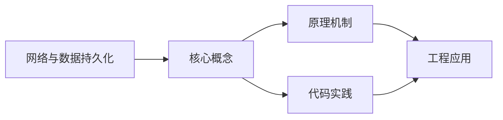
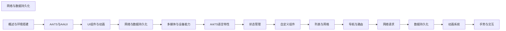

## 1. 学习目标（Bloom 分类）

本节按照布鲁姆教育目标分类学组织学习路径。本文主题为《网络与数据持久化》，属于 HarmonyOS 模块，读者可以根据自身阶段选择阅读深度。

记忆层面：能够准确复述本文的核心概念、术语与基本语法或操作步骤，并能够在提问或检索时快速定位对应知识点。能够说出 HarmonyOS 的核心概念、术语与标准写法。

理解层面：能够用自己的语言解释核心原理与工作机制，说明概念之间的因果关系，而不是机械记忆结论。能够解释 HarmonyOS 的工作原理与设计动机。

应用层面：能够在真实项目或练习场景中运用本文知识解决具体问题，写出正确且可维护的实现。能够编写符合 HarmonyOS 规范的完整实现。

分析层面：能够拆解复杂问题，比较本文主题与相邻概念的异同，识别边界条件与例外情况。能够分析 HarmonyOS 与相邻方案的差异与边界。

评价层面：能够根据约束条件（性能、可读性、安全、成本）评价不同方案的优劣，做出有依据的技术决策。能够根据场景评价 HarmonyOS 相关方案的优劣。

创造层面：能够把本文知识与其他模块知识组合，设计出新的解决方案或可复用的工程模式。能够组合 HarmonyOS 与其他技术设计完整方案。

通过本节学习，读者应当能够把《网络与数据持久化》纳入自己的知识网络，并与 HarmonyOS 模块的其他主题（ArkTS、ArkUI、分布式能力、应用开发）建立关联。

## 2. 历史动机与发展脉络

《网络与数据持久化》是 HarmonyOS 领域的重要主题。要真正理解它，需要先了解它解决的问题与演进过程。

HarmonyOS（鸿蒙）由华为于 2019 年发布，定位面向全场景的分布式操作系统；HarmonyOS NEXT（5.0，2024）去 Android 化，采用自研鸿蒙内核与 ArkTS 语言栈。
开发框架：ArkTS（TS 超集 + 声明式 UI 扩展）、ArkUI（声明式组件）、Stage 模型（应用模型）、方舟编译器。
分布式能力：跨端流转、分布式数据、一次开发多端部署（手机/平板/车机/穿戴）。

回到本文主题：网络与数据持久化 的提出与成熟，正是上述技术背景下的必然产物。早期实现往往以简单可用为目标，随着工程规模扩大，社区逐渐沉淀出标准做法与最佳实践；理解这一脉络，可以帮助读者判断“为什么文档中的推荐写法是现在这个样子”，也能在遇到历史遗留代码时准确识别其设计年代与取舍。


## 3. 形式化定义与核心概念精讲

本节把《网络与数据持久化》涉及的核心概念以“定义 + 讲解”的形式展开。读者应把定义当作工具，把讲解当作理解路径；两者结合才能形成可迁移的知识。

ArkTS 语法：基于 TypeScript 的类型系统，增加 @Component/@Entry/@State 等装饰器与 UI 描述语法。
ArkUI 组件：Column/Row/Stack 布局容器、Text/Button/Image 基础组件、List/Grid 容器组件；状态管理（@State/@Prop/@Link/@Provide）。
应用模型：Stage 模型以 UIAbility 为页面载体，EntryAbility 入口；module.json5 声明应用配置。

### 3.1 原文章节逐一精讲

原文档把主题拆分为 6 个小节，下面按顺序给出每一节的导读讲解，随后保留原文细节供精读。

#### 原文精读（完整保留）


#### 1. HTTP 网络通信

##### 1.1 @ohos.net.http 模块

HarmonyOS 提供 `@ohos.net.http` 模块进行 HTTP 网络请求：

```typescript
import { http } from '@kit.NetworkKit';

// 权限声明（module.json5）
// "requestPermissions": [{ "name": "ohos.permission.INTERNET" }]
```

##### 1.2 GET 请求

```typescript
import { http } from '@kit.NetworkKit';

function getRequest(): void {
  const httpRequest = http.createHttp();

  httpRequest.request(
    'https://api.example.com/users',
    {
      method: http.RequestMethod.GET,
      header: {
        'Content-Type': 'application/json',
        Authorization: 'Bearer token_value',
      },
      connectTimeout: 60000,
      readTimeout: 60000,
    },
    (err, data) => {
      if (!err) {
        console.info(`响应状态码: ${data.responseCode}`);
        console.info(`响应头: ${JSON.stringify(data.header)}`);
        console.info(`响应体: ${data.result}`);
      } else {
        console.error(`请求失败: ${JSON.stringify(err)}`);
      }
      httpRequest.destroy(); // 释放资源
    }
  );
}
```

##### 1.3 POST 请求

```typescript
import { http } from '@kit.NetworkKit';

function postRequest(): void {
  const httpRequest = http.createHttp();

  const requestData = {
    username: 'admin',
    password: '123456',
  };

  httpRequest.request(
    'https://api.example.com/login',
    {
      method: http.RequestMethod.POST,
      header: {
        'Content-Type': 'application/json',
      },
      extraData: requestData,
      connectTimeout: 60000,
      readTimeout: 60000,
    },
    (err, data) => {
      if (!err) {
        const result = JSON.parse(data.result as string);
        console.info(`登录结果: ${JSON.stringify(result)}`);
      } else {
        console.error(`登录失败: ${JSON.stringify(err)}`);
      }
      httpRequest.destroy();
    }
  );
}
```

##### 1.4 封装网络请求工具

```typescript
// HttpUtil.ets
import { http } from '@kit.NetworkKit';

interface RequestConfig {
  url: string;
  method?: http.RequestMethod;
  data?: object;
  header?: object;
}

interface ApiResponse<T> {
  code: number;
  message: string;
  data: T;
}

export class HttpUtil {
  private static baseUrl: string = 'https://api.example.com';

  static async request<T>(config: RequestConfig): Promise<ApiResponse<T>> {
    const httpRequest = http.createHttp();

    try {
      const response = await httpRequest.request(`${this.baseUrl}${config.url}`, {
        method: config.method || http.RequestMethod.GET,
        header: {
          'Content-Type': 'application/json',
          ...config.header,
        },
        extraData: config.data,
        connectTimeout: 30000,
        readTimeout: 30000,
      });

      if (response.responseCode === 200) {
        return JSON.parse(response.result as string) as ApiResponse<T>;
      } else {
        throw new Error(`HTTP ${response.responseCode}`);
      }
    } finally {
      httpRequest.destroy();
    }
  }

  static get<T>(url: string, header?: object): Promise<ApiResponse<T>> {
    return this.request<T>({ url, method: http.RequestMethod.GET, header });
  }

  static post<T>(url: string, data?: object, header?: object): Promise<ApiResponse<T>> {
    return this.request<T>({ url, method: http.RequestMethod.POST, data, header });
  }

  static put<T>(url: string, data?: object, header?: object): Promise<ApiResponse<T>> {
    return this.request<T>({ url, method: http.RequestMethod.PUT, data, header });
  }

  static delete<T>(url: string, header?: object): Promise<ApiResponse<T>> {
    return this.request<T>({ url, method: http.RequestMethod.DELETE, header });
  }
}
```

##### 1.5 在组件中使用

```typescript
interface UserInfo {
  id: number;
  name: string;
  email: string;
}

@Entry
@Component
struct NetworkDemo {
  @State userList: UserInfo[] = [];
  @State loading: boolean = false;

  async aboutToAppear() {
    await this.fetchUsers();
  }

  async fetchUsers() {
    this.loading = true;
    try {
      const response = await HttpUtil.get<UserInfo[]>('/users');
      if (response.code === 0) {
        this.userList = response.data;
      }
    } catch (error) {
      console.error(`获取用户列表失败: ${error}`);
    } finally {
      this.loading = false;
    }
  }

  build() {
    Column() {
      if (this.loading) {
        LoadingProgress()
          .width(48)
          .height(48)
          .color('#1a73e8')
      } else {
        List() {
          ForEach(this.userList, (user: UserInfo) => {
            ListItem() {
              Row() {
                Text(user.name).fontSize(16).layoutWeight(1)
                Text(user.email).fontSize(14).fontColor('#999999')
              }
              .padding(12)
            }
          })
        }
        .layoutWeight(1)
      }
    }
    .padding(16)
  }
}
```

#### 2. WebSocket 长连接

##### 2.1 创建 WebSocket 连接

```typescript
import { webSocket } from '@kit.NetworkKit';

class WebSocketManager {
  private ws: webSocket.WebSocket = webSocket.createWebSocket();
  private url: string = 'wss://api.example.com/ws';

  connect() {
    // 注册事件监听
    this.ws.on('open', (err, value) => {
      if (!err) {
        console.info('WebSocket 连接已建立');
        this.send({ type: 'ping' });
      }
    });

    this.ws.on('message', (err, value) => {
      if (!err) {
        const data = JSON.parse(value.data as string);
        console.info(`收到消息: ${JSON.stringify(data)}`);
        this.handleMessage(data);
      }
    });

    this.ws.on('close', (err, value) => {
      console.info(`WebSocket 关闭: code=${value.code}, reason=${value.reason}`);
      // 自动重连
      setTimeout(() => this.connect(), 3000);
    });

    this.ws.on('error', (err) => {
      console.error(`WebSocket 错误: ${JSON.stringify(err)}`);
    });

    // 建立连接
    this.ws.connect(this.url);
  }

  send(data: object) {
    this.ws.send(JSON.stringify(data));
  }

  close() {
    this.ws.close();
  }

  handleMessage(data: object) {
    // 处理业务消息
  }
}
```

#### 3. 数据持久化

##### 3.1 Preferences 轻量存储

适用于小量键值对数据（如用户设置、配置信息）：

```typescript
import { preferences } from '@kit.ArkData';

class PreferencesUtil {
  private static store: preferences.Preferences | null = null;

  // 初始化
  static async init(context: Context): Promise<void> {
    try {
      this.store = await preferences.getPreferences(context, 'app_settings');
    } catch (error) {
      console.error(`初始化 Preferences 失败: ${error}`);
    }
  }

  // 存储数据
  static async put(key: string, value: preferences.ValueType): Promise<void> {
    if (this.store) {
      await this.store.put(key, value);
      await this.store.flush(); // 持久化到磁盘
    }
  }

  // 读取数据
  static async get(
    key: string,
    defaultValue: preferences.ValueType
  ): Promise<preferences.ValueType> {
    if (this.store) {
      return await this.store.get(key, defaultValue);
    }
    return defaultValue;
  }

  // 删除数据
  static async delete(key: string): Promise<void> {
    if (this.store) {
      await this.store.delete(key);
      await this.store.flush();
    }
  }
}
```

##### 3.2 在组件中使用 Preferences

```typescript
@Entry
@Component
struct PreferencesDemo {
  @State theme: string = 'light';
  @State fontSize: number = 16;

  async aboutToAppear() {
    await PreferencesUtil.init(getContext(this));
    this.theme = (await PreferencesUtil.get('theme', 'light')) as string;
    this.fontSize = (await PreferencesUtil.get('fontSize', 16)) as number;
  }

  build() {
    Column({ space: 16 }) {
      Text(`当前主题: ${this.theme}`)
        .fontSize(this.fontSize)

      Row({ space: 12 }) {
        Button('浅色')
          .onClick(async () => {
            this.theme = 'light';
            await PreferencesUtil.put('theme', 'light');
          })
        Button('深色')
          .onClick(async () => {
            this.theme = 'dark';
            await PreferencesUtil.put('theme', 'dark');
          })
      }

      Slider({
        value: this.fontSize,
        min: 12,
        max: 28,
        step: 2
      })
        .width('80%')
        .onChange(async (value: number) => {
          this.fontSize = value;
          await PreferencesUtil.put('fontSize', value);
        })
    }
    .padding(16)
  }
}
```

##### 3.3 关系型数据库

适用于结构化数据存储：

```typescript
import { relationalStore } from '@kit.ArkData';

const STORE_CONFIG: relationalStore.StoreConfig = {
  name: 'AppDatabase.db',
  securityLevel: relationalStore.SecurityLevel.S1,
};

const CREATE_TABLE_SQL = `
  CREATE TABLE IF NOT EXISTS contacts (
    id INTEGER PRIMARY KEY AUTOINCREMENT,
    name TEXT NOT NULL,
    phone TEXT NOT NULL,
    email TEXT,
    created_at INTEGER DEFAULT (strftime('%s', 'now'))
  )
`;

class DatabaseHelper {
  private store: relationalStore.RdbStore | null = null;

  async init(context: Context): Promise<void> {
    this.store = await relationalStore.getRdbStore(context, STORE_CONFIG);
    await this.store.executeSql(CREATE_TABLE_SQL);
  }

  // 插入数据
  async insertContact(name: string, phone: string, email?: string): Promise<number> {
    const valueBucket: relationalStore.ValuesBucket = {
      name,
      phone,
      email: email || null,
    };
    return await this.store!.insert('contacts', valueBucket);
  }

  // 查询数据
  async queryContacts(keyword?: string): Promise<relationalStore.ResultSet> {
    const predicates = new relationalStore.RdbPredicates('contacts');
    if (keyword) {
      predicates.like('name', `%${keyword}%`);
    }
    predicates.orderByDesc('created_at');
    return await this.store!.query(predicates, ['id', 'name', 'phone', 'email']);
  }

  // 更新数据
  async updateContact(id: number, name: string, phone: string): Promise<number> {
    const valueBucket: relationalStore.ValuesBucket = { name, phone };
    const predicates = new relationalStore.RdbPredicates('contacts');
    predicates.equalTo('id', id);
    return await this.store!.update(valueBucket, predicates);
  }

  // 删除数据
  async deleteContact(id: number): Promise<number> {
    const predicates = new relationalStore.RdbPredicates('contacts');
    predicates.equalTo('id', id);
    return await this.store!.delete(predicates);
  }
}
```

##### 3.4 解析查询结果

```typescript
async function printContacts(resultSet: relationalStore.ResultSet): Promise<void> {
  const contacts: object[] = [];

  while (resultSet.goToNextRow()) {
    const id = resultSet.getLong(resultSet.getColumnIndex('id'));
    const name = resultSet.getString(resultSet.getColumnIndex('name'));
    const phone = resultSet.getString(resultSet.getColumnIndex('phone'));
    const email = resultSet.getString(resultSet.getColumnIndex('email'));
    contacts.push({ id, name, phone, email });
  }

  console.info(`查询结果: ${JSON.stringify(contacts)}`);
  resultSet.close(); // 记得关闭
}
```

#### 4. 分布式数据库

##### 4.1 概述

分布式数据服务（Distributed Data Service）支持多设备间的数据同步：

| 特性         | 说明                         |
| :----------- | :--------------------------- |
| **自动同步** | 数据变更自动同步到同账号设备 |
| **离线支持** | 本地优先，网络恢复后自动同步 |
| **冲突解决** | 支持自定义冲突解决策略       |

##### 4.2 使用分布式 KV 存储

```typescript
import { distributedKVStore } from '@kit.ArkData';

const KV_CONFIG: distributedKVStore.KVStoreConfig = {
  bundleName: 'com.example.myapp',
  options: {
    createIfMissing: true,
    encrypt: false,
    backup: false,
    autoSync: true,
    kvStoreType: distributedKVStore.KVStoreType.SINGLE_VERSION,
    securityLevel: distributedKVStore.SecurityLevel.S1,
  },
};

async function initDistributedKV(context: Context) {
  const kvManager = distributedKVStore.createKVManager(KV_CONFIG);
  const kvStore = await kvManager.getKVStore('distributed_store', KV_CONFIG.options);

  // 写入数据
  await kvStore.put('sync_key', 'sync_value');

  // 读取数据
  const value = await kvStore.get('sync_key');
  console.info(`读取到: ${value}`);

  // 监听数据变更
  kvStore.on('dataChange', distributedKVStore.ChangeType.SUBSCRIBE_TYPE_ALL, (data) => {
    console.info(`数据变更: ${JSON.stringify(data)}`);
  });
}
```

#### 5. 跨设备协同

##### 5.1 设备发现与连接

```typescript
import { deviceManager } from '@kit.DistributedServiceKit';

class DeviceManager {
  private dmInstance: deviceManager.DeviceManager | null = null;

  async init() {
    this.dmInstance = deviceManager.createDeviceManager('com.example.myapp');

    // 监听设备发现
    this.dmInstance.on('deviceFound', (data) => {
      console.info(`发现设备: ${JSON.stringify(data)}`);
    });

    // 监听设备状态变化
    this.dmInstance.on('deviceStateChange', (data) => {
      console.info(`设备状态变化: ${JSON.stringify(data)}`);
    });
  }

  // 开始发现设备
  startDiscovery() {
    const subscribeInfo: deviceManager.SubscribeInfo = {
      subscribeId: 1,
      mode: deviceManager.DiscoverMode.DISCOVER_MODE_ACTIVE,
      medium: deviceManager.ExchangeMedium.AUTO,
      freq: deviceManager.ExchangeFreq.HIGH,
    };
    this.dmInstance?.startDeviceDiscovery(subscribeInfo);
  }

  // 停止发现
  stopDiscovery() {
    this.dmInstance?.stopDeviceDiscovery(1);
  }

  // 获取可信设备列表
  getTrustedDevices(): Array<deviceManager.DeviceInfo> {
    return this.dmInstance?.getTrustedDeviceListSync() || [];
  }
}
```

##### 5.2 分布式能力迁移

```typescript
// 在 UIAbility 中实现迁移
import { UIAbility, AbilityConstant, Want } from '@kit.AbilityKit';
import { distributedMissionManager } from '@kit.MissionKit';

export default class MigrationAbility extends UIAbility {
  // 保存迁移数据
  onContinue(wantParam: Record<string, Object>): AbilityConstant.OnContinueResult {
    wantParam['userData'] = JSON.stringify({
      currentPage: 'detail',
      itemId: 12345,
    });
    return AbilityConstant.OnContinueResult.AGREE;
  }

  // 恢复迁移数据
  onCreate(want: Want, launchParam: AbilityConstant.LaunchParam): void {
    if (launchParam.launchReason === AbilityConstant.LaunchReason.CONTINUATION) {
      const userData = JSON.parse((want.parameters?.userData as string) || '{}');
      console.info(`恢复页面: ${userData.currentPage}`);
    }
  }
}
```

#### 6. 数据同步策略

| 策略         | 适用场景           | 实现方式                 |
| :----------- | :----------------- | :----------------------- |
| **实时同步** | 即时通讯、协作编辑 | WebSocket + 分布式 KV    |
| **定时同步** | 配置信息、离线数据 | 后台任务 + HTTP          |
| **按需同步** | 大文件、媒体资源   | 用户触发 + HTTP 断点续传 |
| **增量同步** | 数据库记录变更     | 时间戳 + 关系型数据库    |
| **冲突解决** | 多设备同时修改     | 版本号 + 自定义合并逻辑  |


### 3.2 概念关系图

下面用 Mermaid 图表达本文核心概念之间的关系，帮助读者建立整体图景：



图中展示的是本文知识的结构化关系：核心概念是入口，原理机制解释“为什么”，代码实践演示“怎么做”，工程应用回答“何时用”。读者学习时可以把每个小节的内容挂接到对应节点上。

## 4. 理论推导与原理解析

本节深入《网络与数据持久化》背后的原理。理论部分不求面面俱到，而是聚焦“能解释现象、能指导实践”的关键推导。

ArkTS 语法：基于 TypeScript 的类型系统，增加 @Component/@Entry/@State 等装饰器与 UI 描述语法。
ArkUI 组件：Column/Row/Stack 布局容器、Text/Button/Image 基础组件、List/Grid 容器组件；状态管理（@State/@Prop/@Link/@Provide）。
应用模型：Stage 模型以 UIAbility 为页面载体，EntryAbility 入口；module.json5 声明应用配置。
生命周期：Ability 的 onCreate/onWindowStageCreate/onForeground/onBackground/onDestroy。

需要强调的是，理论推导与工程实践之间存在翻译层：理论给出的是理想化模型与边界条件，工程代码则必须处理真实环境中的例外。读者在学习时应先掌握理论的“标准情形”，再通过陷阱章节了解“非标准情形”。

## 5. 代码示例与逐行讲解

本节把原文中的代码示例系统整理，并为每个示例补充用途说明与讲解。读者不应只浏览代码，而应逐段对照讲解理解设计意图。

### 5.1 示例：1.1 @ohos.net.http 模块

该示例来自原文《1.1 @ohos.net.http 模块》小节，用于演示网络与数据持久化相关操作。阅读时请先看代码结构，再看其后的讲解。

```typescript
import { http } from '@kit.NetworkKit';

// 权限声明（module.json5）
// "requestPermissions": [{ "name": "ohos.permission.INTERNET" }]
```

讲解：这段代码演示了本节核心知识点。代码中的关键操作可以归纳为三步：准备（定义或初始化）、执行（核心逻辑）、收尾（释放资源或返回结果）。实际项目中，这三步往往被封装为函数或类，以提升复用性与可测试性。

关键点分析：

该示例共 3 行有效代码，包含 2 类关键结构（import、from）。其中：

- 入口与初始化部分负责建立上下文，对应实际项目中的启动或装配逻辑；
- 核心逻辑部分体现本文主题的主要操作，是阅读时最需要对照讲解理解的部分；
- 输出或返回部分把结果交给调用方，注意其类型与边界条件。

进阶思考路径：先尝试修改参数观察行为变化，再把示例中的模式迁移到自己的项目中；每次修改都记录预期与实测差异，这是把示例转化为能力的最快方式。

### 5.2 示例：1.2 GET 请求

该示例来自原文《1.2 GET 请求》小节，用于演示网络与数据持久化相关操作。阅读时请先看代码结构，再看其后的讲解。

```typescript
import { http } from '@kit.NetworkKit';

function getRequest(): void {
  const httpRequest = http.createHttp();

  httpRequest.request(
    'https://api.example.com/users',
    {
      method: http.RequestMethod.GET,
      header: {
        'Content-Type': 'application/json',
        Authorization: 'Bearer token_value',
      },
      connectTimeout: 60000,
      readTimeout: 60000,
    },
    (err, data) => {
      if (!err) {
        console.info(`响应状态码: ${data.responseCode}`);
        console.info(`响应头: ${JSON.stringify(data.header)}`);
        console.info(`响应体: ${data.result}`);
      } else {
        console.error(`请求失败: ${JSON.stringify(err)}`);
      }
      httpRequest.destroy(); // 释放资源
    }
  );
}
```

讲解：这段代码演示了本节核心知识点。代码中的关键操作可以归纳为三步：准备（定义或初始化）、执行（核心逻辑）、收尾（释放资源或返回结果）。实际项目中，这三步往往被封装为函数或类，以提升复用性与可测试性。

关键点分析：

该示例共 26 行有效代码，包含 4 类关键结构（function、import、from、if）。其中：

- 入口与初始化部分负责建立上下文，对应实际项目中的启动或装配逻辑；
- 核心逻辑部分体现本文主题的主要操作，是阅读时最需要对照讲解理解的部分；
- 输出或返回部分把结果交给调用方，注意其类型与边界条件。

进阶思考路径：先尝试修改参数观察行为变化，再把示例中的模式迁移到自己的项目中；每次修改都记录预期与实测差异，这是把示例转化为能力的最快方式。

### 5.3 示例：1.3 POST 请求

该示例来自原文《1.3 POST 请求》小节，用于演示网络与数据持久化相关操作。阅读时请先看代码结构，再看其后的讲解。

```typescript
import { http } from '@kit.NetworkKit';

function postRequest(): void {
  const httpRequest = http.createHttp();

  const requestData = {
    username: 'admin',
    password: '123456',
  };

  httpRequest.request(
    'https://api.example.com/login',
    {
      method: http.RequestMethod.POST,
      header: {
        'Content-Type': 'application/json',
      },
      extraData: requestData,
      connectTimeout: 60000,
      readTimeout: 60000,
    },
    (err, data) => {
      if (!err) {
        const result = JSON.parse(data.result as string);
        console.info(`登录结果: ${JSON.stringify(result)}`);
      } else {
        console.error(`登录失败: ${JSON.stringify(err)}`);
      }
      httpRequest.destroy();
    }
  );
}
```

讲解：这段代码演示了本节核心知识点。代码中的关键操作可以归纳为三步：准备（定义或初始化）、执行（核心逻辑）、收尾（释放资源或返回结果）。实际项目中，这三步往往被封装为函数或类，以提升复用性与可测试性。

关键点分析：

该示例共 29 行有效代码，包含 4 类关键结构（function、import、from、if）。其中：

- 入口与初始化部分负责建立上下文，对应实际项目中的启动或装配逻辑；
- 核心逻辑部分体现本文主题的主要操作，是阅读时最需要对照讲解理解的部分；
- 输出或返回部分把结果交给调用方，注意其类型与边界条件。

进阶思考路径：先尝试修改参数观察行为变化，再把示例中的模式迁移到自己的项目中；每次修改都记录预期与实测差异，这是把示例转化为能力的最快方式。

### 5.4 示例：1.4 封装网络请求工具

该示例来自原文《1.4 封装网络请求工具》小节，用于演示网络与数据持久化相关操作。阅读时请先看代码结构，再看其后的讲解。

```typescript
// HttpUtil.ets
import { http } from '@kit.NetworkKit';

interface RequestConfig {
  url: string;
  method?: http.RequestMethod;
  data?: object;
  header?: object;
}

interface ApiResponse<T> {
  code: number;
  message: string;
  data: T;
}

export class HttpUtil {
  private static baseUrl: string = 'https://api.example.com';

  static async request<T>(config: RequestConfig): Promise<ApiResponse<T>> {
    const httpRequest = http.createHttp();

    try {
      const response = await httpRequest.request(`${this.baseUrl}${config.url}`, {
        method: config.method || http.RequestMethod.GET,
        header: {
          'Content-Type': 'application/json',
          ...config.header,
        },
        extraData: config.data,
        connectTimeout: 30000,
        readTimeout: 30000,
      });

      if (response.responseCode === 200) {
        return JSON.parse(response.result as string) as ApiResponse<T>;
      } else {
        throw new Error(`HTTP ${response.responseCode}`);
      }
    } finally {
      httpRequest.destroy();
    }
  }

  static get<T>(url: string, header?: object): Promise<ApiResponse<T>> {
    return this.request<T>({ url, method: http.RequestMethod.GET, header });
  }

  static post<T>(url: string, data?: object, header?: object): Promise<ApiResponse<T>> {
    return this.request<T>({ url, method: http.RequestMethod.POST, data, header });
  }

  static put<T>(url: string, data?: object, header?: object): Promise<ApiResponse<T>> {
    return this.request<T>({ url, method: http.RequestMethod.PUT, data, header });
  }

  static delete<T>(url: string, header?: object): Promise<ApiResponse<T>> {
    return this.request<T>({ url, method: http.RequestMethod.DELETE, header });
  }
}
```

讲解：这段代码演示了本节核心知识点。代码中的关键操作可以归纳为三步：准备（定义或初始化）、执行（核心逻辑）、收尾（释放资源或返回结果）。实际项目中，这三步往往被封装为函数或类，以提升复用性与可测试性。

关键点分析：

该示例共 50 行有效代码，包含 5 类关键结构（class、import、from、if、return）。其中：

- 入口与初始化部分负责建立上下文，对应实际项目中的启动或装配逻辑；
- 核心逻辑部分体现本文主题的主要操作，是阅读时最需要对照讲解理解的部分；
- 输出或返回部分把结果交给调用方，注意其类型与边界条件。

进阶思考路径：先尝试修改参数观察行为变化，再把示例中的模式迁移到自己的项目中；每次修改都记录预期与实测差异，这是把示例转化为能力的最快方式。

### 5.5 示例：1.5 在组件中使用

该示例来自原文《1.5 在组件中使用》小节，用于演示网络与数据持久化相关操作。阅读时请先看代码结构，再看其后的讲解。

```typescript
interface UserInfo {
  id: number;
  name: string;
  email: string;
}

@Entry
@Component
struct NetworkDemo {
  @State userList: UserInfo[] = [];
  @State loading: boolean = false;

  async aboutToAppear() {
    await this.fetchUsers();
  }

  async fetchUsers() {
    this.loading = true;
    try {
      const response = await HttpUtil.get<UserInfo[]>('/users');
      if (response.code === 0) {
        this.userList = response.data;
      }
    } catch (error) {
      console.error(`获取用户列表失败: ${error}`);
    } finally {
      this.loading = false;
    }
  }

  build() {
    Column() {
      if (this.loading) {
        LoadingProgress()
          .width(48)
          .height(48)
          .color('#1a73e8')
      } else {
        List() {
          ForEach(this.userList, (user: UserInfo) => {
            ListItem() {
              Row() {
                Text(user.name).fontSize(16).layoutWeight(1)
                Text(user.email).fontSize(14).fontColor('#999999')
              }
              .padding(12)
            }
          })
        }
        .layoutWeight(1)
      }
    }
    .padding(16)
  }
}
```

讲解：这段代码演示了本节核心知识点。代码中的关键操作可以归纳为三步：准备（定义或初始化）、执行（核心逻辑）、收尾（释放资源或返回结果）。实际项目中，这三步往往被封装为函数或类，以提升复用性与可测试性。

关键点分析：

该示例共 51 行有效代码，包含 1 类关键结构（if）。其中：

- 入口与初始化部分负责建立上下文，对应实际项目中的启动或装配逻辑；
- 核心逻辑部分体现本文主题的主要操作，是阅读时最需要对照讲解理解的部分；
- 输出或返回部分把结果交给调用方，注意其类型与边界条件。

进阶思考路径：先尝试修改参数观察行为变化，再把示例中的模式迁移到自己的项目中；每次修改都记录预期与实测差异，这是把示例转化为能力的最快方式。

### 5.6 示例：2.1 创建 WebSocket 连接

该示例来自原文《2.1 创建 WebSocket 连接》小节，用于演示网络与数据持久化相关操作。阅读时请先看代码结构，再看其后的讲解。

```typescript
import { webSocket } from '@kit.NetworkKit';

class WebSocketManager {
  private ws: webSocket.WebSocket = webSocket.createWebSocket();
  private url: string = 'wss://api.example.com/ws';

  connect() {
    // 注册事件监听
    this.ws.on('open', (err, value) => {
      if (!err) {
        console.info('WebSocket 连接已建立');
        this.send({ type: 'ping' });
      }
    });

    this.ws.on('message', (err, value) => {
      if (!err) {
        const data = JSON.parse(value.data as string);
        console.info(`收到消息: ${JSON.stringify(data)}`);
        this.handleMessage(data);
      }
    });

    this.ws.on('close', (err, value) => {
      console.info(`WebSocket 关闭: code=${value.code}, reason=${value.reason}`);
      // 自动重连
      setTimeout(() => this.connect(), 3000);
    });

    this.ws.on('error', (err) => {
      console.error(`WebSocket 错误: ${JSON.stringify(err)}`);
    });

    // 建立连接
    this.ws.connect(this.url);
  }

  send(data: object) {
    this.ws.send(JSON.stringify(data));
  }

  close() {
    this.ws.close();
  }

  handleMessage(data: object) {
    // 处理业务消息
  }
}
```

讲解：这段代码演示了本节核心知识点。代码中的关键操作可以归纳为三步：准备（定义或初始化）、执行（核心逻辑）、收尾（释放资源或返回结果）。实际项目中，这三步往往被封装为函数或类，以提升复用性与可测试性。

关键点分析：

该示例共 40 行有效代码，包含 4 类关键结构（class、import、from、if）。其中：

- 入口与初始化部分负责建立上下文，对应实际项目中的启动或装配逻辑；
- 核心逻辑部分体现本文主题的主要操作，是阅读时最需要对照讲解理解的部分；
- 输出或返回部分把结果交给调用方，注意其类型与边界条件。

进阶思考路径：先尝试修改参数观察行为变化，再把示例中的模式迁移到自己的项目中；每次修改都记录预期与实测差异，这是把示例转化为能力的最快方式。

### 5.7 示例：3.1 Preferences 轻量存储

该示例来自原文《3.1 Preferences 轻量存储》小节，用于演示网络与数据持久化相关操作。阅读时请先看代码结构，再看其后的讲解。

```typescript
import { preferences } from '@kit.ArkData';

class PreferencesUtil {
  private static store: preferences.Preferences | null = null;

  // 初始化
  static async init(context: Context): Promise<void> {
    try {
      this.store = await preferences.getPreferences(context, 'app_settings');
    } catch (error) {
      console.error(`初始化 Preferences 失败: ${error}`);
    }
  }

  // 存储数据
  static async put(key: string, value: preferences.ValueType): Promise<void> {
    if (this.store) {
      await this.store.put(key, value);
      await this.store.flush(); // 持久化到磁盘
    }
  }

  // 读取数据
  static async get(
    key: string,
    defaultValue: preferences.ValueType
  ): Promise<preferences.ValueType> {
    if (this.store) {
      return await this.store.get(key, defaultValue);
    }
    return defaultValue;
  }

  // 删除数据
  static async delete(key: string): Promise<void> {
    if (this.store) {
      await this.store.delete(key);
      await this.store.flush();
    }
  }
}
```

讲解：这段代码演示了本节核心知识点。代码中的关键操作可以归纳为三步：准备（定义或初始化）、执行（核心逻辑）、收尾（释放资源或返回结果）。实际项目中，这三步往往被封装为函数或类，以提升复用性与可测试性。

关键点分析：

该示例共 36 行有效代码，包含 5 类关键结构（class、import、from、if、return）。其中：

- 入口与初始化部分负责建立上下文，对应实际项目中的启动或装配逻辑；
- 核心逻辑部分体现本文主题的主要操作，是阅读时最需要对照讲解理解的部分；
- 输出或返回部分把结果交给调用方，注意其类型与边界条件。

进阶思考路径：先尝试修改参数观察行为变化，再把示例中的模式迁移到自己的项目中；每次修改都记录预期与实测差异，这是把示例转化为能力的最快方式。

### 5.8 示例：3.2 在组件中使用 Preferences

该示例来自原文《3.2 在组件中使用 Preferences》小节，用于演示网络与数据持久化相关操作。阅读时请先看代码结构，再看其后的讲解。

```typescript
@Entry
@Component
struct PreferencesDemo {
  @State theme: string = 'light';
  @State fontSize: number = 16;

  async aboutToAppear() {
    await PreferencesUtil.init(getContext(this));
    this.theme = (await PreferencesUtil.get('theme', 'light')) as string;
    this.fontSize = (await PreferencesUtil.get('fontSize', 16)) as number;
  }

  build() {
    Column({ space: 16 }) {
      Text(`当前主题: ${this.theme}`)
        .fontSize(this.fontSize)

      Row({ space: 12 }) {
        Button('浅色')
          .onClick(async () => {
            this.theme = 'light';
            await PreferencesUtil.put('theme', 'light');
          })
        Button('深色')
          .onClick(async () => {
            this.theme = 'dark';
            await PreferencesUtil.put('theme', 'dark');
          })
      }

      Slider({
        value: this.fontSize,
        min: 12,
        max: 28,
        step: 2
      })
        .width('80%')
        .onChange(async (value: number) => {
          this.fontSize = value;
          await PreferencesUtil.put('fontSize', value);
        })
    }
    .padding(16)
  }
}
```

讲解：这段代码演示了本节核心知识点。代码中的关键操作可以归纳为三步：准备（定义或初始化）、执行（核心逻辑）、收尾（释放资源或返回结果）。实际项目中，这三步往往被封装为函数或类，以提升复用性与可测试性。

关键点分析：

该示例共 41 行有效代码，结构以数据或配置为主。阅读时应关注：数据字段的含义、配置项的作用，以及它们与运行行为的对应关系。

进阶思考路径：先尝试修改参数观察行为变化，再把示例中的模式迁移到自己的项目中；每次修改都记录预期与实测差异，这是把示例转化为能力的最快方式。

### 5.9 示例：3.3 关系型数据库

该示例来自原文《3.3 关系型数据库》小节，用于演示网络与数据持久化相关操作。阅读时请先看代码结构，再看其后的讲解。

```typescript
import { relationalStore } from '@kit.ArkData';

const STORE_CONFIG: relationalStore.StoreConfig = {
  name: 'AppDatabase.db',
  securityLevel: relationalStore.SecurityLevel.S1,
};

const CREATE_TABLE_SQL = `
  CREATE TABLE IF NOT EXISTS contacts (
    id INTEGER PRIMARY KEY AUTOINCREMENT,
    name TEXT NOT NULL,
    phone TEXT NOT NULL,
    email TEXT,
    created_at INTEGER DEFAULT (strftime('%s', 'now'))
  )
`;

class DatabaseHelper {
  private store: relationalStore.RdbStore | null = null;

  async init(context: Context): Promise<void> {
    this.store = await relationalStore.getRdbStore(context, STORE_CONFIG);
    await this.store.executeSql(CREATE_TABLE_SQL);
  }

  // 插入数据
  async insertContact(name: string, phone: string, email?: string): Promise<number> {
    const valueBucket: relationalStore.ValuesBucket = {
      name,
      phone,
      email: email || null,
    };
    return await this.store!.insert('contacts', valueBucket);
  }

  // 查询数据
  async queryContacts(keyword?: string): Promise<relationalStore.ResultSet> {
    const predicates = new relationalStore.RdbPredicates('contacts');
    if (keyword) {
      predicates.like('name', `%${keyword}%`);
    }
    predicates.orderByDesc('created_at');
    return await this.store!.query(predicates, ['id', 'name', 'phone', 'email']);
  }

  // 更新数据
  async updateContact(id: number, name: string, phone: string): Promise<number> {
    const valueBucket: relationalStore.ValuesBucket = { name, phone };
    const predicates = new relationalStore.RdbPredicates('contacts');
    predicates.equalTo('id', id);
    return await this.store!.update(valueBucket, predicates);
  }

  // 删除数据
  async deleteContact(id: number): Promise<number> {
    const predicates = new relationalStore.RdbPredicates('contacts');
    predicates.equalTo('id', id);
    return await this.store!.delete(predicates);
  }
}
```

讲解：这段代码演示了本节核心知识点。代码中的关键操作可以归纳为三步：准备（定义或初始化）、执行（核心逻辑）、收尾（释放资源或返回结果）。实际项目中，这三步往往被封装为函数或类，以提升复用性与可测试性。

关键点分析：

该示例共 52 行有效代码，包含 6 类关键结构（class、import、from、if、return、CREATE）。其中：

- 入口与初始化部分负责建立上下文，对应实际项目中的启动或装配逻辑；
- 核心逻辑部分体现本文主题的主要操作，是阅读时最需要对照讲解理解的部分；
- 输出或返回部分把结果交给调用方，注意其类型与边界条件。

进阶思考路径：先尝试修改参数观察行为变化，再把示例中的模式迁移到自己的项目中；每次修改都记录预期与实测差异，这是把示例转化为能力的最快方式。

### 5.10 示例：3.4 解析查询结果

该示例来自原文《3.4 解析查询结果》小节，用于演示网络与数据持久化相关操作。阅读时请先看代码结构，再看其后的讲解。

```typescript
async function printContacts(resultSet: relationalStore.ResultSet): Promise<void> {
  const contacts: object[] = [];

  while (resultSet.goToNextRow()) {
    const id = resultSet.getLong(resultSet.getColumnIndex('id'));
    const name = resultSet.getString(resultSet.getColumnIndex('name'));
    const phone = resultSet.getString(resultSet.getColumnIndex('phone'));
    const email = resultSet.getString(resultSet.getColumnIndex('email'));
    contacts.push({ id, name, phone, email });
  }

  console.info(`查询结果: ${JSON.stringify(contacts)}`);
  resultSet.close(); // 记得关闭
}
```

讲解：这段代码演示了本节核心知识点。代码中的关键操作可以归纳为三步：准备（定义或初始化）、执行（核心逻辑）、收尾（释放资源或返回结果）。实际项目中，这三步往往被封装为函数或类，以提升复用性与可测试性。

关键点分析：

该示例共 12 行有效代码，包含 2 类关键结构（function、while）。其中：

- 入口与初始化部分负责建立上下文，对应实际项目中的启动或装配逻辑；
- 核心逻辑部分体现本文主题的主要操作，是阅读时最需要对照讲解理解的部分；
- 输出或返回部分把结果交给调用方，注意其类型与边界条件。

进阶思考路径：先尝试修改参数观察行为变化，再把示例中的模式迁移到自己的项目中；每次修改都记录预期与实测差异，这是把示例转化为能力的最快方式。

### 5.11 示例：4.2 使用分布式 KV 存储

该示例来自原文《4.2 使用分布式 KV 存储》小节，用于演示网络与数据持久化相关操作。阅读时请先看代码结构，再看其后的讲解。

```typescript
import { distributedKVStore } from '@kit.ArkData';

const KV_CONFIG: distributedKVStore.KVStoreConfig = {
  bundleName: 'com.example.myapp',
  options: {
    createIfMissing: true,
    encrypt: false,
    backup: false,
    autoSync: true,
    kvStoreType: distributedKVStore.KVStoreType.SINGLE_VERSION,
    securityLevel: distributedKVStore.SecurityLevel.S1,
  },
};

async function initDistributedKV(context: Context) {
  const kvManager = distributedKVStore.createKVManager(KV_CONFIG);
  const kvStore = await kvManager.getKVStore('distributed_store', KV_CONFIG.options);

  // 写入数据
  await kvStore.put('sync_key', 'sync_value');

  // 读取数据
  const value = await kvStore.get('sync_key');
  console.info(`读取到: ${value}`);

  // 监听数据变更
  kvStore.on('dataChange', distributedKVStore.ChangeType.SUBSCRIBE_TYPE_ALL, (data) => {
    console.info(`数据变更: ${JSON.stringify(data)}`);
  });
}
```

讲解：这段代码演示了本节核心知识点。代码中的关键操作可以归纳为三步：准备（定义或初始化）、执行（核心逻辑）、收尾（释放资源或返回结果）。实际项目中，这三步往往被封装为函数或类，以提升复用性与可测试性。

关键点分析：

该示例共 25 行有效代码，包含 3 类关键结构（function、import、from）。其中：

- 入口与初始化部分负责建立上下文，对应实际项目中的启动或装配逻辑；
- 核心逻辑部分体现本文主题的主要操作，是阅读时最需要对照讲解理解的部分；
- 输出或返回部分把结果交给调用方，注意其类型与边界条件。

进阶思考路径：先尝试修改参数观察行为变化，再把示例中的模式迁移到自己的项目中；每次修改都记录预期与实测差异，这是把示例转化为能力的最快方式。

### 5.12 示例：5.1 设备发现与连接

该示例来自原文《5.1 设备发现与连接》小节，用于演示网络与数据持久化相关操作。阅读时请先看代码结构，再看其后的讲解。

```typescript
import { deviceManager } from '@kit.DistributedServiceKit';

class DeviceManager {
  private dmInstance: deviceManager.DeviceManager | null = null;

  async init() {
    this.dmInstance = deviceManager.createDeviceManager('com.example.myapp');

    // 监听设备发现
    this.dmInstance.on('deviceFound', (data) => {
      console.info(`发现设备: ${JSON.stringify(data)}`);
    });

    // 监听设备状态变化
    this.dmInstance.on('deviceStateChange', (data) => {
      console.info(`设备状态变化: ${JSON.stringify(data)}`);
    });
  }

  // 开始发现设备
  startDiscovery() {
    const subscribeInfo: deviceManager.SubscribeInfo = {
      subscribeId: 1,
      mode: deviceManager.DiscoverMode.DISCOVER_MODE_ACTIVE,
      medium: deviceManager.ExchangeMedium.AUTO,
      freq: deviceManager.ExchangeFreq.HIGH,
    };
    this.dmInstance?.startDeviceDiscovery(subscribeInfo);
  }

  // 停止发现
  stopDiscovery() {
    this.dmInstance?.stopDeviceDiscovery(1);
  }

  // 获取可信设备列表
  getTrustedDevices(): Array<deviceManager.DeviceInfo> {
    return this.dmInstance?.getTrustedDeviceListSync() || [];
  }
}
```

讲解：这段代码演示了本节核心知识点。代码中的关键操作可以归纳为三步：准备（定义或初始化）、执行（核心逻辑）、收尾（释放资源或返回结果）。实际项目中，这三步往往被封装为函数或类，以提升复用性与可测试性。

关键点分析：

该示例共 33 行有效代码，包含 4 类关键结构（class、import、from、return）。其中：

- 入口与初始化部分负责建立上下文，对应实际项目中的启动或装配逻辑；
- 核心逻辑部分体现本文主题的主要操作，是阅读时最需要对照讲解理解的部分；
- 输出或返回部分把结果交给调用方，注意其类型与边界条件。

进阶思考路径：先尝试修改参数观察行为变化，再把示例中的模式迁移到自己的项目中；每次修改都记录预期与实测差异，这是把示例转化为能力的最快方式。

### 5.13 示例：5.2 分布式能力迁移

该示例来自原文《5.2 分布式能力迁移》小节，用于演示网络与数据持久化相关操作。阅读时请先看代码结构，再看其后的讲解。

```typescript
// 在 UIAbility 中实现迁移
import { UIAbility, AbilityConstant, Want } from '@kit.AbilityKit';
import { distributedMissionManager } from '@kit.MissionKit';

export default class MigrationAbility extends UIAbility {
  // 保存迁移数据
  onContinue(wantParam: Record<string, Object>): AbilityConstant.OnContinueResult {
    wantParam['userData'] = JSON.stringify({
      currentPage: 'detail',
      itemId: 12345,
    });
    return AbilityConstant.OnContinueResult.AGREE;
  }

  // 恢复迁移数据
  onCreate(want: Want, launchParam: AbilityConstant.LaunchParam): void {
    if (launchParam.launchReason === AbilityConstant.LaunchReason.CONTINUATION) {
      const userData = JSON.parse((want.parameters?.userData as string) || '{}');
      console.info(`恢复页面: ${userData.currentPage}`);
    }
  }
}
```

讲解：这段代码演示了本节核心知识点。代码中的关键操作可以归纳为三步：准备（定义或初始化）、执行（核心逻辑）、收尾（释放资源或返回结果）。实际项目中，这三步往往被封装为函数或类，以提升复用性与可测试性。

关键点分析：

该示例共 20 行有效代码，包含 5 类关键结构（class、import、from、if、return）。其中：

- 入口与初始化部分负责建立上下文，对应实际项目中的启动或装配逻辑；
- 核心逻辑部分体现本文主题的主要操作，是阅读时最需要对照讲解理解的部分；
- 输出或返回部分把结果交给调用方，注意其类型与边界条件。

进阶思考路径：先尝试修改参数观察行为变化，再把示例中的模式迁移到自己的项目中；每次修改都记录预期与实测差异，这是把示例转化为能力的最快方式。


综合以上示例，可以总结出本主题的代码实践要点：第一，先定义清晰的输入输出契约；第二，核心逻辑保持单一职责；第三，错误处理与边界条件不可省略；第四，命名与注释表达意图而非复述代码。

## 6. 对比分析

对比是理解《网络与数据持久化》定位的最快路径。下面从多个维度与相邻方案进行对比。

ArkTS 与 TypeScript：ArkTS 是 TS 子集扩展（禁部分动态特性），UI 语法不同。
ArkUI 与 Compose/SwiftUI：声明式思想一致，组件与状态机制各有特色。
Stage 与 FA 模型：Stage 是新标准，FA 为早期模型。

对比的目的不是分出绝对优劣，而是建立选择依据：不同约束条件下，最优解不同。读者应把每个对比维度转化为决策检查清单。

## 7. 常见陷阱与最佳实践

本节整理该主题的高频错误与推荐做法。每个陷阱先描述现象，再解释原因，最后给出最佳实践。

### 7.1 状态未响应

普通变量赋值不触发 UI 更新。使用 @State 装饰。

深入讲解：该问题之所以被归类为“常见陷阱”，是因为它在初学者的代码中反复出现，而且往往不在第一时间暴露——错误通常隐藏在特定数据或特定时序下。

从成因上看，状态未响应 一般源于对 HarmonyOS 某个机制的理解偏差：要么误用了默认行为，要么忽略了边界条件，要么把其他语言的思维惯性带了过来。

从影响上看，状态未响应 轻则产生错误结果，重则导致资源泄漏、数据损坏或安全事故；这也是为什么工程评审中会把它列为检查项。

从修复策略上看，处理状态未响应的正确顺序是：先复现（构造最小用例），再定位（确认机制层面的根因），最后修复并补充回归测试。跳过复现直接改代码，往往治标不治本。

### 7.2 组件复用 key

ForEach 缺 key 导致渲染错位。提供稳定键。

深入讲解：该问题之所以被归类为“常见陷阱”，是因为它在初学者的代码中反复出现，而且往往不在第一时间暴露——错误通常隐藏在特定数据或特定时序下。

从成因上看，组件复用 key 一般源于对 HarmonyOS 某个机制的理解偏差：要么误用了默认行为，要么忽略了边界条件，要么把其他语言的思维惯性带了过来。

从影响上看，组件复用 key 轻则产生错误结果，重则导致资源泄漏、数据损坏或安全事故；这也是为什么工程评审中会把它列为检查项。

从修复策略上看，处理组件复用 key的正确顺序是：先复现（构造最小用例），再定位（确认机制层面的根因），最后修复并补充回归测试。跳过复现直接改代码，往往治标不治本。

### 7.3 异步回调更新状态

非 UI 线程直接改状态。使用主线程回调或状态管理 API。

深入讲解：该问题之所以被归类为“常见陷阱”，是因为它在初学者的代码中反复出现，而且往往不在第一时间暴露——错误通常隐藏在特定数据或特定时序下。

从成因上看，异步回调更新状态 一般源于对 HarmonyOS 某个机制的理解偏差：要么误用了默认行为，要么忽略了边界条件，要么把其他语言的思维惯性带了过来。

从影响上看，异步回调更新状态 轻则产生错误结果，重则导致资源泄漏、数据损坏或安全事故；这也是为什么工程评审中会把它列为检查项。

从修复策略上看，处理异步回调更新状态的正确顺序是：先复现（构造最小用例），再定位（确认机制层面的根因），最后修复并补充回归测试。跳过复现直接改代码，往往治标不治本。

### 7.4 资源引用错误

字符串硬编码无法国际化。使用 $r 资源引用。

深入讲解：该问题之所以被归类为“常见陷阱”，是因为它在初学者的代码中反复出现，而且往往不在第一时间暴露——错误通常隐藏在特定数据或特定时序下。

从成因上看，资源引用错误 一般源于对 HarmonyOS 某个机制的理解偏差：要么误用了默认行为，要么忽略了边界条件，要么把其他语言的思维惯性带了过来。

从影响上看，资源引用错误 轻则产生错误结果，重则导致资源泄漏、数据损坏或安全事故；这也是为什么工程评审中会把它列为检查项。

从修复策略上看，处理资源引用错误的正确顺序是：先复现（构造最小用例），再定位（确认机制层面的根因），最后修复并补充回归测试。跳过复现直接改代码，往往治标不治本。

### 7.5 分布式能力误用

跨端能力需权限与用户确认。优先单端能力。

深入讲解：该问题之所以被归类为“常见陷阱”，是因为它在初学者的代码中反复出现，而且往往不在第一时间暴露——错误通常隐藏在特定数据或特定时序下。

从成因上看，分布式能力误用 一般源于对 HarmonyOS 某个机制的理解偏差：要么误用了默认行为，要么忽略了边界条件，要么把其他语言的思维惯性带了过来。

从影响上看，分布式能力误用 轻则产生错误结果，重则导致资源泄漏、数据损坏或安全事故；这也是为什么工程评审中会把它列为检查项。

从修复策略上看，处理分布式能力误用的正确顺序是：先复现（构造最小用例），再定位（确认机制层面的根因），最后修复并补充回归测试。跳过复现直接改代码，往往治标不治本。

### 7.6 内存泄漏

事件监听未移除。onDisappear/onDestroy 清理。

深入讲解：该问题之所以被归类为“常见陷阱”，是因为它在初学者的代码中反复出现，而且往往不在第一时间暴露——错误通常隐藏在特定数据或特定时序下。

从成因上看，内存泄漏 一般源于对 HarmonyOS 某个机制的理解偏差：要么误用了默认行为，要么忽略了边界条件，要么把其他语言的思维惯性带了过来。

从影响上看，内存泄漏 轻则产生错误结果，重则导致资源泄漏、数据损坏或安全事故；这也是为什么工程评审中会把它列为检查项。

从修复策略上看，处理内存泄漏的正确顺序是：先复现（构造最小用例），再定位（确认机制层面的根因），最后修复并补充回归测试。跳过复现直接改代码，往往治标不治本。

### 7.7 版本兼容

新 API 在旧版本不可用。使用 canIUse 或版本判断。

深入讲解：该问题之所以被归类为“常见陷阱”，是因为它在初学者的代码中反复出现，而且往往不在第一时间暴露——错误通常隐藏在特定数据或特定时序下。

从成因上看，版本兼容 一般源于对 HarmonyOS 某个机制的理解偏差：要么误用了默认行为，要么忽略了边界条件，要么把其他语言的思维惯性带了过来。

从影响上看，版本兼容 轻则产生错误结果，重则导致资源泄漏、数据损坏或安全事故；这也是为什么工程评审中会把它列为检查项。

从修复策略上看，处理版本兼容的正确顺序是：先复现（构造最小用例），再定位（确认机制层面的根因），最后修复并补充回归测试。跳过复现直接改代码，往往治标不治本。

### 7.0 最佳实践总览

1. 组件化与状态分层：UI 状态用装饰器，业务状态用 AppStorage/单例。
2. 页面路由：router 或 Navigation 组件；参数传递类型化。
3. 调试：DevEco Studio 预览器、Profiler、日志分级。

把这些最佳实践固化为团队规范与代码评审检查项，是避免同类问题反复出现的关键。

## 8. 工程实践

本节把《网络与数据持久化》放入真实工程场景，给出可复用的模式与组织方法。

工程结构：entry 模块（UIAbility）、common 公共能力、resources 资源目录。
测试：HarmonyOS 测试框架 + DevEco 自动化。
发布：HAP 打包、签名、上架华为应用市场。

### 8.1 工程实践的原则拆解

以上工程实践可以归纳为四条原则。第一，配置与代码分离：HarmonyOS 项目中环境差异应通过配置注入，而不是散落在代码分支中；这保证同一份代码可以在开发、测试、生产环境一致运行。

第二，接口稳定优先：对外接口（函数签名、协议、数据格式）一旦被消费方依赖，变更成本极高；设计时应预留扩展点并保持向后兼容。

第三，可观测性内置：日志、指标与追踪应该在功能开发时同步设计，而不是故障发生后补救；没有观测手段的模块等于黑盒。

第四，变更可回滚：任何发布都应有对应的回滚方案；数据库迁移、配置变更与代码发布一样需要版本管理与逆向路径。

### 8.2 实践落地的检查清单

- [ ] 工程结构：对照本节描述，检查当前项目是否已经落实；未落实的项列入技术债并排期处理。
- [ ] 测试：对照本节描述，检查当前项目是否已经落实；未落实的项列入技术债并排期处理。
- [ ] 发布：对照本节描述，检查当前项目是否已经落实；未落实的项列入技术债并排期处理。

工程实践的共性原则：配置与代码分离、接口稳定优先、可观测性内置、变更可回滚。这些原则适用于本主题的所有实现。

## 9. 案例研究

本节通过一个完整案例把《网络与数据持久化》的知识串起来。案例按“需求分析、方案设计、实现、验证”四步展开。

需求：实现跨端待办应用首页（手机 + 平板自适应）。
方案：ArkUI 响应式布局（断点）+ @State 列表 + 本地持久化。
要点：ForEach key、删除动画、空态设计。
验证：双端预览、数据持久化、无障碍检查。

### 9.1 案例的扩展讨论

把案例中的方案放大到真实规模，需要额外考虑三个问题：

第一，规模：当数据量或并发量上升一个数量级时，原方案中的数据结构、缓存策略与任务调度是否仍然成立？通常需要引入分层与异步。

第二，团队：多人协作时，模块边界、接口契约与代码所有权必须明确；案例中的实现应拆分为可独立测试的单元，并配合文档说明设计意图。

第三，演进：上线后的需求变化不可避免；方案设计时应预留扩展点（配置化、插件化、事件化），并定期用真实指标验证假设。


案例研究的学习方法：先独立阅读需求，尝试在脑中形成方案，再对照实现与讲解，最后思考“如果约束变化（数据量、并发、团队规模），方案应如何调整”。

## 10. 知识要点总结与深入讲解

本节以讲解形式汇总全文要点，替代传统的习题与自测，读者不需要答题，只需跟随解释建立完整的认知框架。

关于《网络与数据持久化》的核心结论：

HarmonyOS 开发以 ArkTS/ArkUI 为核心，声明式 UI 与现代前端心智模型一致。
Stage 模型与生命周期是应用骨架，状态管理决定 UI 响应。
多端与分布式是差异化能力，按场景选用。

原文档各小节的要点回顾：

- 1. HTTP 网络通信：该小节围绕网络与数据持久化展开具体细节，阅读时应关注其与核心结论的对应关系；每个小节都是核心结论在某一个侧面的展开。
- 2. WebSocket 长连接：该小节围绕网络与数据持久化展开具体细节，阅读时应关注其与核心结论的对应关系；每个小节都是核心结论在某一个侧面的展开。
- 3. 数据持久化：该小节围绕网络与数据持久化展开具体细节，阅读时应关注其与核心结论的对应关系；每个小节都是核心结论在某一个侧面的展开。
- 4. 分布式数据库：该小节围绕网络与数据持久化展开具体细节，阅读时应关注其与核心结论的对应关系；每个小节都是核心结论在某一个侧面的展开。
- 5. 跨设备协同：该小节围绕网络与数据持久化展开具体细节，阅读时应关注其与核心结论的对应关系；每个小节都是核心结论在某一个侧面的展开。
- 6. 数据同步策略：该小节围绕网络与数据持久化展开具体细节，阅读时应关注其与核心结论的对应关系；每个小节都是核心结论在某一个侧面的展开。

把以上要点与第 3-9 节的内容对照复习，即可完成对本文主题的闭环学习。

## 11. 参考文献


华为开发者联盟 HarmonyOS 文档：https://developer.huawei.com/consumer/cn/harmonyos
ArkTS 语言规范：https://developer.huawei.com/consumer/cn/doc/harmonyos-guides/arkts-overview
ArkUI 组件参考：https://developer.huawei.com/consumer/cn/doc/harmonyos-references/
DevEco Studio：https://developer.huawei.com/consumer/cn/deveco-studio/

## 12. 延伸阅读


TypeScript 基础（ArkTS 语言底座），见 009-typescript 模块。
声明式 UI 概念与 React/Vue 对比，见 011-react/010-vue3 模块。
移动端应用架构，见 018-harmonyos 模块文档。
尚硅谷 Bilibili 空间（https://space.bilibili.com/302417610 ）提供鸿蒙开发课程。

## 14. 模块知识图谱与学习路径

本文属于 HarmonyOS 模块。为了把《网络与数据持久化》放入完整的知识网络，下面列出本模块的全部主题并给出相互关联的导读。学习时建议按模块内顺序推进，并在每个文档中留意交叉引用。



上图为模块主题的推荐学习顺序示意图（仅展示前若干主题）。各主题之间存在三类关联：

第一，前置依赖关系：早期主题是后期主题的基础，例如环境与语法先行、进阶主题随后；

第二，横向并列关系：同一层级主题从不同角度覆盖模块能力，学习顺序可以按兴趣调整；

第三，工程组合关系：多个主题在真实项目中组合使用，例如配置、性能与安全主题往往出现在同一系统的不同层面。

### 14.1 模块主题速查表

| 文档 | 主题 | 与本文的关联 |
| --- | --- | --- |
| 概述与环境搭建 | 001-OverviewSetup | 本文的前置基础 |
| ArkTS与ArkUI | 002-ArkTSArkUI | 本文的并列主题 |
| UI组件与动画 | 003-UIComponentAnimation | 本文的并列主题 |
| 网络与数据持久化 | 004-NetworkAndPersistence | 本文自身 |
| 多媒体与设备能力 | 005-MultimediaDeviceCapability | 本文的并列主题 |
| ArkTS语言特性 | 006-ArkTSLanguageFeature | 本文的并列主题 |
| 状态管理 | 007-StateManagement | 本文的并列主题 |
| 自定义组件 | 008-CustomComponent | 本文的并列主题 |
| 列表与网格 | 009-ListGrid | 本文的并列主题 |
| 导航与路由 | 010-NavigationRoute | 本文的并列主题 |
| 网络请求 | 011-NetworkRequest | 本文的并列主题 |
| 数据持久化 | 012-DataPersistence | 本文的并列主题 |
| 动画系统 | 013-AnimationSystem | 本文的并列主题 |
| 手势与交互 | 014-GestureInteraction | 本文的并列主题 |
| 通知与权限 | 015-NotificationPermission | 本文的安全延伸 |
| 多媒体能力 | 016-MultimediaCapability | 本文的并列主题 |
| 传感器与位置 | 017-SensorLocation | 本文的并列主题 |
| 卡片开发 | 018-CardDevelopment | 本文的并列主题 |
| 分布式能力 | 019-DistributedCapability | 本文的并列主题 |
| 性能优化 | 020-PerformanceOptimization | 本文的性能延伸 |
| 国际化与无障碍 | 021-I18nAccessibility | 本文的并列主题 |
| 测试与调试 | 022-TestDebug | 本文的并列主题 |
| 应用签名与发布 | 023-AppSignaturePublish | 本文的并列主题 |
| Stage模型与FA模型区别 | 024-StageFAModelDifference | 本文的并列主题 |
| ArkTS与TypeScript差异 | 025-ArkTSTypeScriptDifference | 本文的并列主题 |
| ArkUI声明式语法 | 026-ArkUIDeclarativeSyntax | 本文的并列主题 |
| 组件生命周期详解 | 027-ComponentLifecycleDetailed | 本文的并列主题 |
| 路由跳转与路由栈 | 028-RouteJumpStack | 本文的并列主题 |
| 权限申请 | 029-PermissionRequest | 本文的安全延伸 |
| 分布式数据管理 | 030-DistributedDataManagement | 本文的并列主题 |
| 跨设备调用 | 031-CrossDeviceCall | 本文的并列主题 |
| 元服务开发与发布 | 032-AtomicServiceDevPublish | 本文的并列主题 |
| DevEco-Studio调试器 | 033-DevEcoStudioDebugger | 本文的并列主题 |

速查表的作用是让读者快速判断：哪些文档应在阅读本文前掌握（前置基础），哪些文档应在阅读本文后继续（延伸主题）。本模块的交叉引用体系即以此表为基础。

## 15. 术语表

下表整理《网络与数据持久化》及 HarmonyOS 模块中出现的高频术语，给出简明释义。术语按字母序或逻辑序排列，供查阅。

| 术语 | 释义 |
| --- | --- |
| ArkTS 语法 | 基于 TypeScript 的类型系统，增加 @Component/@Entry/@State 等装饰器与 UI 描述语法。 |
| ArkUI 组件 | Column/Row/Stack 布局容器、Text/Button/Image 基础组件、List/Grid 容器组件；状态管理（@State/@Prop/@L |
| 应用模型 | Stage 模型以 UIAbility 为页面载体，EntryAbility 入口；module.json5 声明应用配置。 |
| 生命周期 | Ability 的 onCreate/onWindowStageCreate/onForeground/onBackground/onDestroy。 |
| 状态未响应（易错点） | 参见常见陷阱章节的详细讲解 |
| 组件复用 key（易错点） | 参见常见陷阱章节的详细讲解 |
| 异步回调更新状态（易错点） | 参见常见陷阱章节的详细讲解 |
| 资源引用错误（易错点） | 参见常见陷阱章节的详细讲解 |
| 分布式能力误用（易错点） | 参见常见陷阱章节的详细讲解 |
| 内存泄漏（易错点） | 参见常见陷阱章节的详细讲解 |

术语表与正文配合使用：先通读正文，遇到模糊术语回查本表；长期使用后术语会自然进入工作记忆。
