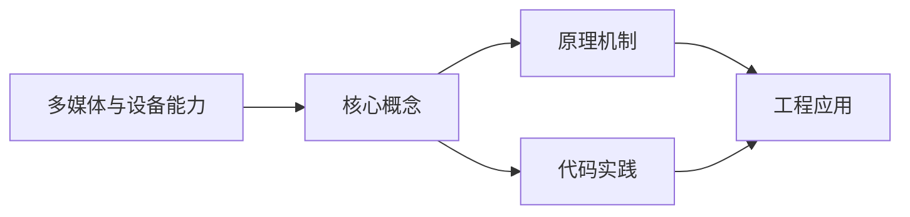

## 1. 学习目标（Bloom 分类）

本节按照布鲁姆教育目标分类学组织学习路径。本文主题为《多媒体与设备能力》，属于 HarmonyOS 模块，读者可以根据自身阶段选择阅读深度。

记忆层面：能够准确复述本文的核心概念、术语与基本语法或操作步骤，并能够在提问或检索时快速定位对应知识点。能够说出 HarmonyOS 的核心概念、术语与标准写法。

理解层面：能够用自己的语言解释核心原理与工作机制，说明概念之间的因果关系，而不是机械记忆结论。能够解释 HarmonyOS 的工作原理与设计动机。

应用层面：能够在真实项目或练习场景中运用本文知识解决具体问题，写出正确且可维护的实现。能够编写符合 HarmonyOS 规范的完整实现。

分析层面：能够拆解复杂问题，比较本文主题与相邻概念的异同，识别边界条件与例外情况。能够分析 HarmonyOS 与相邻方案的差异与边界。

评价层面：能够根据约束条件（性能、可读性、安全、成本）评价不同方案的优劣，做出有依据的技术决策。能够根据场景评价 HarmonyOS 相关方案的优劣。

创造层面：能够把本文知识与其他模块知识组合，设计出新的解决方案或可复用的工程模式。能够组合 HarmonyOS 与其他技术设计完整方案。

通过本节学习，读者应当能够把《多媒体与设备能力》纳入自己的知识网络，并与 HarmonyOS 模块的其他主题（ArkTS、ArkUI、分布式能力、应用开发）建立关联。

## 2. 历史动机与发展脉络

《多媒体与设备能力》是 HarmonyOS 领域的重要主题。要真正理解它，需要先了解它解决的问题与演进过程。

HarmonyOS（鸿蒙）由华为于 2019 年发布，定位面向全场景的分布式操作系统；HarmonyOS NEXT（5.0，2024）去 Android 化，采用自研鸿蒙内核与 ArkTS 语言栈。
开发框架：ArkTS（TS 超集 + 声明式 UI 扩展）、ArkUI（声明式组件）、Stage 模型（应用模型）、方舟编译器。
分布式能力：跨端流转、分布式数据、一次开发多端部署（手机/平板/车机/穿戴）。

回到本文主题：多媒体与设备能力 的提出与成熟，正是上述技术背景下的必然产物。早期实现往往以简单可用为目标，随着工程规模扩大，社区逐渐沉淀出标准做法与最佳实践；理解这一脉络，可以帮助读者判断“为什么文档中的推荐写法是现在这个样子”，也能在遇到历史遗留代码时准确识别其设计年代与取舍。


## 3. 形式化定义与核心概念精讲

本节把《多媒体与设备能力》涉及的核心概念以“定义 + 讲解”的形式展开。读者应把定义当作工具，把讲解当作理解路径；两者结合才能形成可迁移的知识。

ArkTS 语法：基于 TypeScript 的类型系统，增加 @Component/@Entry/@State 等装饰器与 UI 描述语法。
ArkUI 组件：Column/Row/Stack 布局容器、Text/Button/Image 基础组件、List/Grid 容器组件；状态管理（@State/@Prop/@Link/@Provide）。
应用模型：Stage 模型以 UIAbility 为页面载体，EntryAbility 入口；module.json5 声明应用配置。

### 3.1 原文章节逐一精讲

原文档把主题拆分为 6 个小节，下面按顺序给出每一节的导读讲解，随后保留原文细节供精读。

#### 原文精读（完整保留）


#### 1. 相机调用

##### 1.1 权限声明

```json5
// module.json5
{
  module: {
    requestPermissions: [
      {
        name: 'ohos.permission.CAMERA',
        reason: '$string:camera_reason',
        usedScene: {
          abilities: ['EntryAbility'],
          when: 'inuse',
        },
      },
    ],
  },
}
```

##### 1.2 相机管理

```typescript
import { camera } from '@kit.MultimediaKit';
import { image } from '@kit.ImageKit';

class CameraManager {
  private cameraManager: camera.CameraManager | null = null;
  private cameraSession: camera.PhotoSession | null = null;

  async init(surfaceId: string): Promise<void> {
    // 获取相机管理器
    this.cameraManager = camera.getCameraManager(getContext(this));

    // 获取相机列表
    const cameras = this.cameraManager.getSupportedCameras();
    const cameraDevice =
      cameras.find((cam) => cam.cameraPosition === camera.CameraPosition.CAMERA_POSITION_BACK) ||
      cameras[0];

    // 创建拍照会话
    const outputCapability = this.cameraManager.getSupportedOutputCapability(cameraDevice);
    const photoProfile = outputCapability.photoProfiles[0];
    const previewProfile = outputCapability.previewProfiles[0];

    // 创建输入
    const cameraInput = this.cameraManager.createCameraInput(cameraDevice);
    await cameraInput.open();

    // 创建预览输出
    const previewOutput = this.cameraManager.createPreviewOutput(previewProfile, surfaceId);

    // 创建拍照输出
    const photoOutput = this.cameraManager.createPhotoOutput(photoProfile);

    // 创建会话并配置
    this.cameraSession = this.cameraManager.createPhotoSession();
    this.cameraSession.beginConfig();
    this.cameraSession.addInput(cameraInput);
    this.cameraSession.addOutput(previewOutput);
    this.cameraSession.addOutput(photoOutput);
    await this.cameraSession.commitConfig();
    await this.cameraSession.start();
  }

  // 拍照
  async takePhoto(): Promise<image.PixelMap> {
    return new Promise((resolve) => {
      this.photoOutput?.on('photoAvailable', (err, photo) => {
        if (!err) {
          const pixelMap = photo.main;
          resolve(pixelMap);
        }
      });
      this.cameraSession?.takePhoto();
    });
  }
}
```

##### 1.3 相机预览组件

```typescript
import { camera } from '@kit.MultimediaKit';
import { XComponentController } from '@kit.ArkUI';

@Entry
@Component
struct CameraPreview {
  private xComponentController: XComponentController = new XComponentController();
  private cameraManager: camera.CameraManager | null = null;

  build() {
    Column() {
      // 预览区域
      XComponent({
        id: 'cameraPreview',
        type: XComponentType.SURFACE,
        controller: this.xComponentController
      })
        .width('100%')
        .height(400)
        .onLoad(async () => {
          await this.initCamera();
        })

      // 拍照按钮
      Row() {
        Button('拍照')
          .width(64)
          .height(64)
          .type(ButtonType.Circle)
          .backgroundColor('#ffffff')
          .border({ width: 4, color: '#1a73e8' })
          .onClick(() => {
            this.takePhoto();
          })
      }
      .width('100%')
      .justifyContent(FlexAlign.Center)
      .padding({ top: 24, bottom: 24 })
    }
  }

  async initCamera() {
    // 初始化相机...
  }

  async takePhoto() {
    // 拍照逻辑...
  }
}
```

#### 2. 音视频播放与录制

##### 2.1 音频播放

```typescript
import { media } from '@kit.MultimediaKit';

class AudioPlayer {
  private player: media.AVPlayer | null = null;

  async init(url: string): Promise<void> {
    this.player = await media.createAVPlayer();

    // 设置状态变化监听
    this.player.on('stateChange', (state: string) => {
      switch (state) {
        case 'initialized':
          console.info('播放器初始化完成');
          break;
        case 'playing':
          console.info('正在播放');
          break;
        case 'paused':
          console.info('已暂停');
          break;
        case 'completed':
          console.info('播放完成');
          break;
      }
    });

    // 设置错误监听
    this.player.on('error', (err) => {
      console.error(`播放错误: ${JSON.stringify(err)}`);
    });

    // 设置播放源
    this.player.url = url;
  }

  async play(): Promise<void> {
    await this.player?.play();
  }

  async pause(): Promise<void> {
    await this.player?.pause();
  }

  async stop(): Promise<void> {
    await this.player?.stop();
  }

  async seek(timeMs: number): Promise<void> {
    await this.player?.seek(timeMs);
  }

  release(): void {
    this.player?.release();
    this.player = null;
  }
}
```

##### 2.2 视频播放组件

```typescript
import { media } from '@kit.MultimediaKit';

@Entry
@Component
struct VideoPlayerDemo {
  private videoController: VideoController = new VideoController();
  @State isPlaying: boolean = false;
  @State currentTime: number = 0;
  @State duration: number = 0;

  build() {
    Column() {
      Video({
        src: 'https://example.com/video.mp4',
        controller: this.videoController
      })
        .width('100%')
        .height(240)
        .autoPlay(false)
        .controls(true)
        .onPrepared((e) => {
          this.duration = e.duration;
        })
        .onTimeUpdate((e) => {
          this.currentTime = e.time;
        })
        .onPlay(() => {
          this.isPlaying = true;
        })
        .onPause(() => {
          this.isPlaying = false;
        })
        .onFinish(() => {
          this.isPlaying = false;
        })

      // 自定义控制栏
      Row({ space: 16 }) {
        Button(this.isPlaying ? '暂停' : '播放')
          .onClick(() => {
            if (this.isPlaying) {
              this.videoController.pause();
            } else {
              this.videoController.start();
            }
          })

        Text(`${this.formatTime(this.currentTime)} / ${this.formatTime(this.duration)}`)
          .fontSize(14)
          .fontColor('#666666')
      }
      .width('100%')
      .justifyContent(FlexAlign.Center)
      .padding(12)
    }
  }

  private formatTime(ms: number): string {
    const seconds = Math.floor(ms / 1000);
    const min = Math.floor(seconds / 60);
    const sec = seconds % 60;
    return `${min.toString().padStart(2, '0')}:${sec.toString().padStart(2, '0')}`;
  }
}
```

##### 2.3 音频录制

```typescript
import { media } from '@kit.MultimediaKit';

class AudioRecorder {
  private recorder: media.AVRecorder | null = null;

  async start(filePath: string): Promise<void> {
    this.recorder = await media.createAVRecorder();

    this.recorder.on('stateChange', (state: string) => {
      console.info(`录制状态: ${state}`);
    });

    // 配置录制参数
    const config: media.AVRecorderConfig = {
      audioSourceType: media.AudioSourceType.AUDIO_SOURCE_TYPE_MIC,
      profile: {
        audioBitrate: 128000,
        audioChannels: 2,
        audioCodec: media.CodecMimeType.AUDIO_AAC,
        audioSampleRate: 44100,
        fileFormat: media.ContainerFormatType.CFT_MPEG_4A,
      },
      url: `file://${filePath}`,
    };

    await this.recorder.prepare(config);
    await this.recorder.start();
  }

  async pause(): Promise<void> {
    await this.recorder?.pause();
  }

  async resume(): Promise<void> {
    await this.recorder?.resume();
  }

  async stop(): Promise<void> {
    await this.recorder?.stop();
    await this.recorder?.release();
    this.recorder = null;
  }
}
```

#### 3. 传感器访问

##### 3.1 加速度传感器

```typescript
import { sensor } from '@kit.SensorServiceKit';

@Entry
@Component
struct SensorDemo {
  @State accelX: number = 0;
  @State accelY: number = 0;
  @State accelZ: number = 0;

  aboutToAppear() {
    try {
      sensor.on(sensor.SensorId.ACCELEROMETER, (data: sensor.AccelerometerResponse) => {
        this.accelX = data.x;
        this.accelY = data.y;
        this.accelZ = data.z;
      }, { interval: 200000000 });  // 200ms 间隔
    } catch (error) {
      console.error(`订阅加速度传感器失败: ${error}`);
    }
  }

  aboutToDisappear() {
    sensor.off(sensor.SensorId.ACCELEROMETER);
  }

  build() {
    Column({ space: 16 }) {
      Text('加速度传感器')
        .fontSize(20)
        .fontWeight(FontWeight.Bold)

      Row() {
        Text(`X: ${this.accelX.toFixed(2)}`).layoutWeight(1)
        Text(`Y: ${this.accelY.toFixed(2)}`).layoutWeight(1)
        Text(`Z: ${this.accelZ.toFixed(2)}`).layoutWeight(1)
      }
      .fontSize(16)
    }
    .padding(16)
  }
}
```

##### 3.2 常用传感器

| 传感器 ID          | 说明     | 典型用途     |
| :----------------- | :------- | :----------- |
| **ACCELEROMETER**  | 加速度   | 摇一摇、计步 |
| **GYROSCOPE**      | 陀螺仪   | 体感游戏     |
| **AMBIENT_LIGHT**  | 环境光   | 自动亮度     |
| **PROXIMITY**      | 接近光   | 通话息屏     |
| **MAGNETIC_FIELD** | 磁场     | 指南针       |
| **BAROMETER**      | 气压     | 海拔测量     |
| **HEART_RATE**     | 心率     | 健康监测     |
| **STEP_DETECTOR**  | 计步检测 | 运动追踪     |

#### 4. 位置服务

##### 4.1 权限声明

```json5
{
  requestPermissions: [
    {
      name: 'ohos.permission.APPROXIMATELY_LOCATION',
      reason: '$string:location_reason',
      usedScene: { abilities: ['EntryAbility'], when: 'inuse' },
    },
    {
      name: 'ohos.permission.LOCATION',
      reason: '$string:location_reason',
      usedScene: { abilities: ['EntryAbility'], when: 'inuse' },
    },
  ],
}
```

##### 4.2 获取位置

```typescript
import { geoLocationManager } from '@kit.LocationKit';
import { abilityAccessCtrl, bundleManager, Permissions } from '@kit.AbilityKit';

class LocationManager {
  // 请求权限
  static async requestPermission(context: Context): Promise<boolean> {
    const atManager = abilityAccessCtrl.createAtManager();
    const permissions: Permissions[] = [
      'ohos.permission.APPROXIMATELY_LOCATION',
      'ohos.permission.LOCATION',
    ];

    try {
      const result = await atManager.requestPermissionsFromUser(context, permissions);
      return result.authResults[0] === 0;
    } catch (error) {
      console.error(`请求位置权限失败: ${error}`);
      return false;
    }
  }

  // 获取当前位置
  static async getCurrentLocation(): Promise<geoLocationManager.Location> {
    const requestInfo: geoLocationManager.CurrentLocationRequest = {
      priority: geoLocationManager.LocationRequestPriority.FIRST_FIX,
      scenario: geoLocationManager.LocationRequestScenario.UNSET,
      maxAccuracy: 100,
    };
    return await geoLocationManager.getCurrentLocation(requestInfo);
  }

  // 持续监听位置
  static onLocationChange(callback: (location: geoLocationManager.Location) => void): number {
    const requestInfo: geoLocationManager.LocationRequest = {
      priority: geoLocationManager.LocationRequestPriority.ACCURACY,
      scenario: geoLocationManager.LocationRequestScenario.NAVIGATION,
      timeInterval: 5,
      distanceInterval: 10,
    };
    return geoLocationManager.on('locationChange', requestInfo, callback);
  }

  // 取消监听
  static offLocationChange(callbackId: number): void {
    geoLocationManager.off('locationChange', callbackId);
  }
}
```

##### 4.3 在组件中使用

```typescript
@Entry
@Component
struct LocationDemo {
  @State latitude: number = 0;
  @State longitude: number = 0;
  @State altitude: number = 0;
  private callbackId: number = -1;

  async aboutToAppear() {
    const granted = await LocationManager.requestPermission(getContext(this));
    if (granted) {
      this.callbackId = LocationManager.onLocationChange((location) => {
        this.latitude = location.latitude;
        this.longitude = location.longitude;
        this.altitude = location.altitude;
      });
    }
  }

  aboutToDisappear() {
    if (this.callbackId !== -1) {
      LocationManager.offLocationChange(this.callbackId);
    }
  }

  build() {
    Column({ space: 12 }) {
      Text('位置信息').fontSize(20).fontWeight(FontWeight.Bold)
      Text(`纬度: ${this.latitude.toFixed(6)}`).fontSize(16)
      Text(`经度: ${this.longitude.toFixed(6)}`).fontSize(16)
      Text(`海拔: ${this.altitude.toFixed(1)}m`).fontSize(16)
    }
    .padding(16)
  }
}
```

#### 5. 通知与后台任务

##### 5.1 发送通知

```typescript
import { notificationManager } from '@kit.NotificationKit';
import { wantAgent } from '@kit.AbilityKit';

async function sendNotification(title: string, text: string): Promise<void> {
  // 创建 WantAgent（点击通知后跳转）
  const wantAgentInfo: wantAgent.WantAgentInfo = {
    wants: [{ bundleName: 'com.example.myapp', abilityName: 'EntryAbility' }],
    requestCode: 0,
    operationType: wantAgent.OperationType.START_ABILITY,
    wantAgentFlags: [wantAgent.WantAgentFlags.UPDATE_PRESENT_FLAG],
  };
  const agent = await wantAgent.getWantAgent(wantAgentInfo);

  // 构建通知请求
  const request: notificationManager.NotificationRequest = {
    id: 1,
    content: {
      notificationContentType: notificationManager.ContentType.NOTIFICATION_CONTENT_BASIC_TEXT,
      normal: {
        title: title,
        text: text,
      },
    },
    wantAgent: agent,
  };

  await notificationManager.publish(request);
}
```

##### 5.2 后台长时任务

```typescript
import { backgroundTaskManager } from '@kit.BackgroundTasksKit';

// 申请长时任务（如音乐播放、导航）
async function requestContinuousTask(context: Context): Promise<number> {
  const bgMode: backgroundTaskManager.BackgroundMode =
    backgroundTaskManager.BackgroundMode.AUDIO_PLAYBACK;

  const id = await backgroundTaskManager.requestSuspendDelay('音频播放', () => {
    console.info('长时任务即将到期');
  });

  // 也可以使用 backgroundTaskManager.startBackgroundRunning
  await backgroundTaskManager.startBackgroundRunning(context, bgMode, '正在播放音频');
  return id;
}

// 取消长时任务
async function cancelContinuousTask(context: Context): Promise<void> {
  await backgroundTaskManager.stopBackgroundRunning(context);
}
```

##### 5.3 后台任务类型

| 类型                        | 说明       | 典型场景     |
| :-------------------------- | :--------- | :----------- |
| **DATA_TRANSFER**           | 数据传输   | 文件上传下载 |
| **AUDIO_PLAYBACK**          | 音频播放   | 音乐播放器   |
| **AUDIO_RECORDING**         | 音频录制   | 录音应用     |
| **LOCATION**                | 定位       | 导航应用     |
| **BLUETOOTH_INTERACTION**   | 蓝牙交互   | 蓝牙设备连接 |
| **MULTI_DEVICE_CONNECTION** | 多设备连接 | 分布式业务   |
| **TASK_KEEPING**            | 任务保持   | 倒计时、提醒 |

#### 6. 应用打包签名发布

##### 6.1 签名流程

```
生成密钥 → 生成证书签名请求(CSR) → 申请调试/发布证书 → 申请调试/发布Profile → 签名打包
```

##### 6.2 生成密钥与证书

```bash
# 使用 DevEco Studio 生成
# Build → Generate Key and CSR

# 或使用命令行工具
# 生成密钥
java -jar keytool.jar -genkeypair -alias myapp -keyalg RSA -keysize 2048 -validity 36500 -keystore myapp.p12

# 生成 CSR
java -jar keytool.jar -certreq -alias myapp -keystore myapp.p12 -file myapp.csr
```

##### 6.3 构建发布包

```bash
# 构建 HAP（HarmonyOS Ability Package）
# Build → Build Hap(s)/APP(s) → Build APP(s)

# 或使用命令行
hvigorw assembleApp --mode release
```

##### 6.4 发布到应用市场

| 步骤        | 操作                        |
| :---------- | :-------------------------- |
| **1. 注册** | 华为开发者账号实名认证      |
| **2. 创建** | AppGallery Connect 创建应用 |
| **3. 上传** | 上传签名后的 APP 包         |
| **4. 填写** | 应用信息、截图、隐私政策    |
| **5. 提交** | 提交审核                    |
| **6. 发布** | 审核通过后发布上架          |

##### 6.5 版本管理

```json5
// AppScope/app.json5
{
  app: {
    bundleName: 'com.example.myapp',
    vendor: 'example',
    versionCode: 1000000, // 递增版本号
    versionName: '1.0.0', // 展示版本号
    icon: '$media:app_icon',
    label: '$string:app_name',
  },
}
```

| 字段            | 说明           | 规则             |
| :-------------- | :------------- | :--------------- |
| **versionCode** | 内部版本号     | 整数，每次递增   |
| **versionName** | 用户可见版本号 | 语义化版本 x.y.z |
| **bundleName**  | 应用唯一标识   | 反域名格式       |


### 3.2 概念关系图

下面用 Mermaid 图表达本文核心概念之间的关系，帮助读者建立整体图景：



图中展示的是本文知识的结构化关系：核心概念是入口，原理机制解释“为什么”，代码实践演示“怎么做”，工程应用回答“何时用”。读者学习时可以把每个小节的内容挂接到对应节点上。

## 4. 理论推导与原理解析

本节深入《多媒体与设备能力》背后的原理。理论部分不求面面俱到，而是聚焦“能解释现象、能指导实践”的关键推导。

ArkTS 语法：基于 TypeScript 的类型系统，增加 @Component/@Entry/@State 等装饰器与 UI 描述语法。
ArkUI 组件：Column/Row/Stack 布局容器、Text/Button/Image 基础组件、List/Grid 容器组件；状态管理（@State/@Prop/@Link/@Provide）。
应用模型：Stage 模型以 UIAbility 为页面载体，EntryAbility 入口；module.json5 声明应用配置。
生命周期：Ability 的 onCreate/onWindowStageCreate/onForeground/onBackground/onDestroy。

需要强调的是，理论推导与工程实践之间存在翻译层：理论给出的是理想化模型与边界条件，工程代码则必须处理真实环境中的例外。读者在学习时应先掌握理论的“标准情形”，再通过陷阱章节了解“非标准情形”。

## 5. 代码示例与逐行讲解

本节把原文中的代码示例系统整理，并为每个示例补充用途说明与讲解。读者不应只浏览代码，而应逐段对照讲解理解设计意图。

### 5.1 示例：1.1 权限声明

该示例来自原文《1.1 权限声明》小节，用于演示多媒体与设备能力相关操作。阅读时请先看代码结构，再看其后的讲解。

```json5
// module.json5
{
  module: {
    requestPermissions: [
      {
        name: 'ohos.permission.CAMERA',
        reason: '$string:camera_reason',
        usedScene: {
          abilities: ['EntryAbility'],
          when: 'inuse',
        },
      },
    ],
  },
}
```

讲解：这段代码演示了本节核心知识点。代码中的关键操作可以归纳为三步：准备（定义或初始化）、执行（核心逻辑）、收尾（释放资源或返回结果）。实际项目中，这三步往往被封装为函数或类，以提升复用性与可测试性。

关键点分析：

该示例共 15 行有效代码，结构以数据或配置为主。阅读时应关注：数据字段的含义、配置项的作用，以及它们与运行行为的对应关系。

进阶思考路径：先尝试修改参数观察行为变化，再把示例中的模式迁移到自己的项目中；每次修改都记录预期与实测差异，这是把示例转化为能力的最快方式。

### 5.2 示例：1.2 相机管理

该示例来自原文《1.2 相机管理》小节，用于演示多媒体与设备能力相关操作。阅读时请先看代码结构，再看其后的讲解。

```typescript
import { camera } from '@kit.MultimediaKit';
import { image } from '@kit.ImageKit';

class CameraManager {
  private cameraManager: camera.CameraManager | null = null;
  private cameraSession: camera.PhotoSession | null = null;

  async init(surfaceId: string): Promise<void> {
    // 获取相机管理器
    this.cameraManager = camera.getCameraManager(getContext(this));

    // 获取相机列表
    const cameras = this.cameraManager.getSupportedCameras();
    const cameraDevice =
      cameras.find((cam) => cam.cameraPosition === camera.CameraPosition.CAMERA_POSITION_BACK) ||
      cameras[0];

    // 创建拍照会话
    const outputCapability = this.cameraManager.getSupportedOutputCapability(cameraDevice);
    const photoProfile = outputCapability.photoProfiles[0];
    const previewProfile = outputCapability.previewProfiles[0];

    // 创建输入
    const cameraInput = this.cameraManager.createCameraInput(cameraDevice);
    await cameraInput.open();

    // 创建预览输出
    const previewOutput = this.cameraManager.createPreviewOutput(previewProfile, surfaceId);

    // 创建拍照输出
    const photoOutput = this.cameraManager.createPhotoOutput(photoProfile);

    // 创建会话并配置
    this.cameraSession = this.cameraManager.createPhotoSession();
    this.cameraSession.beginConfig();
    this.cameraSession.addInput(cameraInput);
    this.cameraSession.addOutput(previewOutput);
    this.cameraSession.addOutput(photoOutput);
    await this.cameraSession.commitConfig();
    await this.cameraSession.start();
  }

  // 拍照
  async takePhoto(): Promise<image.PixelMap> {
    return new Promise((resolve) => {
      this.photoOutput?.on('photoAvailable', (err, photo) => {
        if (!err) {
          const pixelMap = photo.main;
          resolve(pixelMap);
        }
      });
      this.cameraSession?.takePhoto();
    });
  }
}
```

讲解：这段代码演示了本节核心知识点。代码中的关键操作可以归纳为三步：准备（定义或初始化）、执行（核心逻辑）、收尾（释放资源或返回结果）。实际项目中，这三步往往被封装为函数或类，以提升复用性与可测试性。

关键点分析：

该示例共 46 行有效代码，包含 5 类关键结构（class、import、from、if、return）。其中：

- 入口与初始化部分负责建立上下文，对应实际项目中的启动或装配逻辑；
- 核心逻辑部分体现本文主题的主要操作，是阅读时最需要对照讲解理解的部分；
- 输出或返回部分把结果交给调用方，注意其类型与边界条件。

进阶思考路径：先尝试修改参数观察行为变化，再把示例中的模式迁移到自己的项目中；每次修改都记录预期与实测差异，这是把示例转化为能力的最快方式。

### 5.3 示例：1.3 相机预览组件

该示例来自原文《1.3 相机预览组件》小节，用于演示多媒体与设备能力相关操作。阅读时请先看代码结构，再看其后的讲解。

```typescript
import { camera } from '@kit.MultimediaKit';
import { XComponentController } from '@kit.ArkUI';

@Entry
@Component
struct CameraPreview {
  private xComponentController: XComponentController = new XComponentController();
  private cameraManager: camera.CameraManager | null = null;

  build() {
    Column() {
      // 预览区域
      XComponent({
        id: 'cameraPreview',
        type: XComponentType.SURFACE,
        controller: this.xComponentController
      })
        .width('100%')
        .height(400)
        .onLoad(async () => {
          await this.initCamera();
        })

      // 拍照按钮
      Row() {
        Button('拍照')
          .width(64)
          .height(64)
          .type(ButtonType.Circle)
          .backgroundColor('#ffffff')
          .border({ width: 4, color: '#1a73e8' })
          .onClick(() => {
            this.takePhoto();
          })
      }
      .width('100%')
      .justifyContent(FlexAlign.Center)
      .padding({ top: 24, bottom: 24 })
    }
  }

  async initCamera() {
    // 初始化相机...
  }

  async takePhoto() {
    // 拍照逻辑...
  }
}
```

讲解：这段代码演示了本节核心知识点。代码中的关键操作可以归纳为三步：准备（定义或初始化）、执行（核心逻辑）、收尾（释放资源或返回结果）。实际项目中，这三步往往被封装为函数或类，以提升复用性与可测试性。

关键点分析：

该示例共 44 行有效代码，包含 2 类关键结构（import、from）。其中：

- 入口与初始化部分负责建立上下文，对应实际项目中的启动或装配逻辑；
- 核心逻辑部分体现本文主题的主要操作，是阅读时最需要对照讲解理解的部分；
- 输出或返回部分把结果交给调用方，注意其类型与边界条件。

进阶思考路径：先尝试修改参数观察行为变化，再把示例中的模式迁移到自己的项目中；每次修改都记录预期与实测差异，这是把示例转化为能力的最快方式。

### 5.4 示例：2.1 音频播放

该示例来自原文《2.1 音频播放》小节，用于演示多媒体与设备能力相关操作。阅读时请先看代码结构，再看其后的讲解。

```typescript
import { media } from '@kit.MultimediaKit';

class AudioPlayer {
  private player: media.AVPlayer | null = null;

  async init(url: string): Promise<void> {
    this.player = await media.createAVPlayer();

    // 设置状态变化监听
    this.player.on('stateChange', (state: string) => {
      switch (state) {
        case 'initialized':
          console.info('播放器初始化完成');
          break;
        case 'playing':
          console.info('正在播放');
          break;
        case 'paused':
          console.info('已暂停');
          break;
        case 'completed':
          console.info('播放完成');
          break;
      }
    });

    // 设置错误监听
    this.player.on('error', (err) => {
      console.error(`播放错误: ${JSON.stringify(err)}`);
    });

    // 设置播放源
    this.player.url = url;
  }

  async play(): Promise<void> {
    await this.player?.play();
  }

  async pause(): Promise<void> {
    await this.player?.pause();
  }

  async stop(): Promise<void> {
    await this.player?.stop();
  }

  async seek(timeMs: number): Promise<void> {
    await this.player?.seek(timeMs);
  }

  release(): void {
    this.player?.release();
    this.player = null;
  }
}
```

讲解：这段代码演示了本节核心知识点。代码中的关键操作可以归纳为三步：准备（定义或初始化）、执行（核心逻辑）、收尾（释放资源或返回结果）。实际项目中，这三步往往被封装为函数或类，以提升复用性与可测试性。

关键点分析：

该示例共 46 行有效代码，包含 3 类关键结构（class、import、from）。其中：

- 入口与初始化部分负责建立上下文，对应实际项目中的启动或装配逻辑；
- 核心逻辑部分体现本文主题的主要操作，是阅读时最需要对照讲解理解的部分；
- 输出或返回部分把结果交给调用方，注意其类型与边界条件。

进阶思考路径：先尝试修改参数观察行为变化，再把示例中的模式迁移到自己的项目中；每次修改都记录预期与实测差异，这是把示例转化为能力的最快方式。

### 5.5 示例：2.2 视频播放组件

该示例来自原文《2.2 视频播放组件》小节，用于演示多媒体与设备能力相关操作。阅读时请先看代码结构，再看其后的讲解。

```typescript
import { media } from '@kit.MultimediaKit';

@Entry
@Component
struct VideoPlayerDemo {
  private videoController: VideoController = new VideoController();
  @State isPlaying: boolean = false;
  @State currentTime: number = 0;
  @State duration: number = 0;

  build() {
    Column() {
      Video({
        src: 'https://example.com/video.mp4',
        controller: this.videoController
      })
        .width('100%')
        .height(240)
        .autoPlay(false)
        .controls(true)
        .onPrepared((e) => {
          this.duration = e.duration;
        })
        .onTimeUpdate((e) => {
          this.currentTime = e.time;
        })
        .onPlay(() => {
          this.isPlaying = true;
        })
        .onPause(() => {
          this.isPlaying = false;
        })
        .onFinish(() => {
          this.isPlaying = false;
        })

      // 自定义控制栏
      Row({ space: 16 }) {
        Button(this.isPlaying ? '暂停' : '播放')
          .onClick(() => {
            if (this.isPlaying) {
              this.videoController.pause();
            } else {
              this.videoController.start();
            }
          })

        Text(`${this.formatTime(this.currentTime)} / ${this.formatTime(this.duration)}`)
          .fontSize(14)
          .fontColor('#666666')
      }
      .width('100%')
      .justifyContent(FlexAlign.Center)
      .padding(12)
    }
  }

  private formatTime(ms: number): string {
    const seconds = Math.floor(ms / 1000);
    const min = Math.floor(seconds / 60);
    const sec = seconds % 60;
    return `${min.toString().padStart(2, '0')}:${sec.toString().padStart(2, '0')}`;
  }
}
```

讲解：这段代码演示了本节核心知识点。代码中的关键操作可以归纳为三步：准备（定义或初始化）、执行（核心逻辑）、收尾（释放资源或返回结果）。实际项目中，这三步往往被封装为函数或类，以提升复用性与可测试性。

关键点分析：

该示例共 59 行有效代码，包含 4 类关键结构（import、from、if、return）。其中：

- 入口与初始化部分负责建立上下文，对应实际项目中的启动或装配逻辑；
- 核心逻辑部分体现本文主题的主要操作，是阅读时最需要对照讲解理解的部分；
- 输出或返回部分把结果交给调用方，注意其类型与边界条件。

进阶思考路径：先尝试修改参数观察行为变化，再把示例中的模式迁移到自己的项目中；每次修改都记录预期与实测差异，这是把示例转化为能力的最快方式。

### 5.6 示例：2.3 音频录制

该示例来自原文《2.3 音频录制》小节，用于演示多媒体与设备能力相关操作。阅读时请先看代码结构，再看其后的讲解。

```typescript
import { media } from '@kit.MultimediaKit';

class AudioRecorder {
  private recorder: media.AVRecorder | null = null;

  async start(filePath: string): Promise<void> {
    this.recorder = await media.createAVRecorder();

    this.recorder.on('stateChange', (state: string) => {
      console.info(`录制状态: ${state}`);
    });

    // 配置录制参数
    const config: media.AVRecorderConfig = {
      audioSourceType: media.AudioSourceType.AUDIO_SOURCE_TYPE_MIC,
      profile: {
        audioBitrate: 128000,
        audioChannels: 2,
        audioCodec: media.CodecMimeType.AUDIO_AAC,
        audioSampleRate: 44100,
        fileFormat: media.ContainerFormatType.CFT_MPEG_4A,
      },
      url: `file://${filePath}`,
    };

    await this.recorder.prepare(config);
    await this.recorder.start();
  }

  async pause(): Promise<void> {
    await this.recorder?.pause();
  }

  async resume(): Promise<void> {
    await this.recorder?.resume();
  }

  async stop(): Promise<void> {
    await this.recorder?.stop();
    await this.recorder?.release();
    this.recorder = null;
  }
}
```

讲解：这段代码演示了本节核心知识点。代码中的关键操作可以归纳为三步：准备（定义或初始化）、执行（核心逻辑）、收尾（释放资源或返回结果）。实际项目中，这三步往往被封装为函数或类，以提升复用性与可测试性。

关键点分析：

该示例共 35 行有效代码，包含 3 类关键结构（class、import、from）。其中：

- 入口与初始化部分负责建立上下文，对应实际项目中的启动或装配逻辑；
- 核心逻辑部分体现本文主题的主要操作，是阅读时最需要对照讲解理解的部分；
- 输出或返回部分把结果交给调用方，注意其类型与边界条件。

进阶思考路径：先尝试修改参数观察行为变化，再把示例中的模式迁移到自己的项目中；每次修改都记录预期与实测差异，这是把示例转化为能力的最快方式。

### 5.7 示例：3.1 加速度传感器

该示例来自原文《3.1 加速度传感器》小节，用于演示多媒体与设备能力相关操作。阅读时请先看代码结构，再看其后的讲解。

```typescript
import { sensor } from '@kit.SensorServiceKit';

@Entry
@Component
struct SensorDemo {
  @State accelX: number = 0;
  @State accelY: number = 0;
  @State accelZ: number = 0;

  aboutToAppear() {
    try {
      sensor.on(sensor.SensorId.ACCELEROMETER, (data: sensor.AccelerometerResponse) => {
        this.accelX = data.x;
        this.accelY = data.y;
        this.accelZ = data.z;
      }, { interval: 200000000 });  // 200ms 间隔
    } catch (error) {
      console.error(`订阅加速度传感器失败: ${error}`);
    }
  }

  aboutToDisappear() {
    sensor.off(sensor.SensorId.ACCELEROMETER);
  }

  build() {
    Column({ space: 16 }) {
      Text('加速度传感器')
        .fontSize(20)
        .fontWeight(FontWeight.Bold)

      Row() {
        Text(`X: ${this.accelX.toFixed(2)}`).layoutWeight(1)
        Text(`Y: ${this.accelY.toFixed(2)}`).layoutWeight(1)
        Text(`Z: ${this.accelZ.toFixed(2)}`).layoutWeight(1)
      }
      .fontSize(16)
    }
    .padding(16)
  }
}
```

讲解：这段代码演示了本节核心知识点。代码中的关键操作可以归纳为三步：准备（定义或初始化）、执行（核心逻辑）、收尾（释放资源或返回结果）。实际项目中，这三步往往被封装为函数或类，以提升复用性与可测试性。

关键点分析：

该示例共 36 行有效代码，包含 2 类关键结构（import、from）。其中：

- 入口与初始化部分负责建立上下文，对应实际项目中的启动或装配逻辑；
- 核心逻辑部分体现本文主题的主要操作，是阅读时最需要对照讲解理解的部分；
- 输出或返回部分把结果交给调用方，注意其类型与边界条件。

进阶思考路径：先尝试修改参数观察行为变化，再把示例中的模式迁移到自己的项目中；每次修改都记录预期与实测差异，这是把示例转化为能力的最快方式。

### 5.8 示例：4.1 权限声明

该示例来自原文《4.1 权限声明》小节，用于演示多媒体与设备能力相关操作。阅读时请先看代码结构，再看其后的讲解。

```json5
{
  requestPermissions: [
    {
      name: 'ohos.permission.APPROXIMATELY_LOCATION',
      reason: '$string:location_reason',
      usedScene: { abilities: ['EntryAbility'], when: 'inuse' },
    },
    {
      name: 'ohos.permission.LOCATION',
      reason: '$string:location_reason',
      usedScene: { abilities: ['EntryAbility'], when: 'inuse' },
    },
  ],
}
```

讲解：这段代码演示了本节核心知识点。代码中的关键操作可以归纳为三步：准备（定义或初始化）、执行（核心逻辑）、收尾（释放资源或返回结果）。实际项目中，这三步往往被封装为函数或类，以提升复用性与可测试性。

关键点分析：

该示例共 14 行有效代码，结构以数据或配置为主。阅读时应关注：数据字段的含义、配置项的作用，以及它们与运行行为的对应关系。

进阶思考路径：先尝试修改参数观察行为变化，再把示例中的模式迁移到自己的项目中；每次修改都记录预期与实测差异，这是把示例转化为能力的最快方式。

### 5.9 示例：4.2 获取位置

该示例来自原文《4.2 获取位置》小节，用于演示多媒体与设备能力相关操作。阅读时请先看代码结构，再看其后的讲解。

```typescript
import { geoLocationManager } from '@kit.LocationKit';
import { abilityAccessCtrl, bundleManager, Permissions } from '@kit.AbilityKit';

class LocationManager {
  // 请求权限
  static async requestPermission(context: Context): Promise<boolean> {
    const atManager = abilityAccessCtrl.createAtManager();
    const permissions: Permissions[] = [
      'ohos.permission.APPROXIMATELY_LOCATION',
      'ohos.permission.LOCATION',
    ];

    try {
      const result = await atManager.requestPermissionsFromUser(context, permissions);
      return result.authResults[0] === 0;
    } catch (error) {
      console.error(`请求位置权限失败: ${error}`);
      return false;
    }
  }

  // 获取当前位置
  static async getCurrentLocation(): Promise<geoLocationManager.Location> {
    const requestInfo: geoLocationManager.CurrentLocationRequest = {
      priority: geoLocationManager.LocationRequestPriority.FIRST_FIX,
      scenario: geoLocationManager.LocationRequestScenario.UNSET,
      maxAccuracy: 100,
    };
    return await geoLocationManager.getCurrentLocation(requestInfo);
  }

  // 持续监听位置
  static onLocationChange(callback: (location: geoLocationManager.Location) => void): number {
    const requestInfo: geoLocationManager.LocationRequest = {
      priority: geoLocationManager.LocationRequestPriority.ACCURACY,
      scenario: geoLocationManager.LocationRequestScenario.NAVIGATION,
      timeInterval: 5,
      distanceInterval: 10,
    };
    return geoLocationManager.on('locationChange', requestInfo, callback);
  }

  // 取消监听
  static offLocationChange(callbackId: number): void {
    geoLocationManager.off('locationChange', callbackId);
  }
}
```

讲解：这段代码演示了本节核心知识点。代码中的关键操作可以归纳为三步：准备（定义或初始化）、执行（核心逻辑）、收尾（释放资源或返回结果）。实际项目中，这三步往往被封装为函数或类，以提升复用性与可测试性。

关键点分析：

该示例共 42 行有效代码，包含 4 类关键结构（class、import、from、return）。其中：

- 入口与初始化部分负责建立上下文，对应实际项目中的启动或装配逻辑；
- 核心逻辑部分体现本文主题的主要操作，是阅读时最需要对照讲解理解的部分；
- 输出或返回部分把结果交给调用方，注意其类型与边界条件。

进阶思考路径：先尝试修改参数观察行为变化，再把示例中的模式迁移到自己的项目中；每次修改都记录预期与实测差异，这是把示例转化为能力的最快方式。

### 5.10 示例：4.3 在组件中使用

该示例来自原文《4.3 在组件中使用》小节，用于演示多媒体与设备能力相关操作。阅读时请先看代码结构，再看其后的讲解。

```typescript
@Entry
@Component
struct LocationDemo {
  @State latitude: number = 0;
  @State longitude: number = 0;
  @State altitude: number = 0;
  private callbackId: number = -1;

  async aboutToAppear() {
    const granted = await LocationManager.requestPermission(getContext(this));
    if (granted) {
      this.callbackId = LocationManager.onLocationChange((location) => {
        this.latitude = location.latitude;
        this.longitude = location.longitude;
        this.altitude = location.altitude;
      });
    }
  }

  aboutToDisappear() {
    if (this.callbackId !== -1) {
      LocationManager.offLocationChange(this.callbackId);
    }
  }

  build() {
    Column({ space: 12 }) {
      Text('位置信息').fontSize(20).fontWeight(FontWeight.Bold)
      Text(`纬度: ${this.latitude.toFixed(6)}`).fontSize(16)
      Text(`经度: ${this.longitude.toFixed(6)}`).fontSize(16)
      Text(`海拔: ${this.altitude.toFixed(1)}m`).fontSize(16)
    }
    .padding(16)
  }
}
```

讲解：这段代码演示了本节核心知识点。代码中的关键操作可以归纳为三步：准备（定义或初始化）、执行（核心逻辑）、收尾（释放资源或返回结果）。实际项目中，这三步往往被封装为函数或类，以提升复用性与可测试性。

关键点分析：

该示例共 32 行有效代码，包含 1 类关键结构（if）。其中：

- 入口与初始化部分负责建立上下文，对应实际项目中的启动或装配逻辑；
- 核心逻辑部分体现本文主题的主要操作，是阅读时最需要对照讲解理解的部分；
- 输出或返回部分把结果交给调用方，注意其类型与边界条件。

进阶思考路径：先尝试修改参数观察行为变化，再把示例中的模式迁移到自己的项目中；每次修改都记录预期与实测差异，这是把示例转化为能力的最快方式。

### 5.11 示例：5.1 发送通知

该示例来自原文《5.1 发送通知》小节，用于演示多媒体与设备能力相关操作。阅读时请先看代码结构，再看其后的讲解。

```typescript
import { notificationManager } from '@kit.NotificationKit';
import { wantAgent } from '@kit.AbilityKit';

async function sendNotification(title: string, text: string): Promise<void> {
  // 创建 WantAgent（点击通知后跳转）
  const wantAgentInfo: wantAgent.WantAgentInfo = {
    wants: [{ bundleName: 'com.example.myapp', abilityName: 'EntryAbility' }],
    requestCode: 0,
    operationType: wantAgent.OperationType.START_ABILITY,
    wantAgentFlags: [wantAgent.WantAgentFlags.UPDATE_PRESENT_FLAG],
  };
  const agent = await wantAgent.getWantAgent(wantAgentInfo);

  // 构建通知请求
  const request: notificationManager.NotificationRequest = {
    id: 1,
    content: {
      notificationContentType: notificationManager.ContentType.NOTIFICATION_CONTENT_BASIC_TEXT,
      normal: {
        title: title,
        text: text,
      },
    },
    wantAgent: agent,
  };

  await notificationManager.publish(request);
}
```

讲解：这段代码演示了本节核心知识点。代码中的关键操作可以归纳为三步：准备（定义或初始化）、执行（核心逻辑）、收尾（释放资源或返回结果）。实际项目中，这三步往往被封装为函数或类，以提升复用性与可测试性。

关键点分析：

该示例共 25 行有效代码，包含 3 类关键结构（function、import、from）。其中：

- 入口与初始化部分负责建立上下文，对应实际项目中的启动或装配逻辑；
- 核心逻辑部分体现本文主题的主要操作，是阅读时最需要对照讲解理解的部分；
- 输出或返回部分把结果交给调用方，注意其类型与边界条件。

进阶思考路径：先尝试修改参数观察行为变化，再把示例中的模式迁移到自己的项目中；每次修改都记录预期与实测差异，这是把示例转化为能力的最快方式。

### 5.12 示例：5.2 后台长时任务

该示例来自原文《5.2 后台长时任务》小节，用于演示多媒体与设备能力相关操作。阅读时请先看代码结构，再看其后的讲解。

```typescript
import { backgroundTaskManager } from '@kit.BackgroundTasksKit';

// 申请长时任务（如音乐播放、导航）
async function requestContinuousTask(context: Context): Promise<number> {
  const bgMode: backgroundTaskManager.BackgroundMode =
    backgroundTaskManager.BackgroundMode.AUDIO_PLAYBACK;

  const id = await backgroundTaskManager.requestSuspendDelay('音频播放', () => {
    console.info('长时任务即将到期');
  });

  // 也可以使用 backgroundTaskManager.startBackgroundRunning
  await backgroundTaskManager.startBackgroundRunning(context, bgMode, '正在播放音频');
  return id;
}

// 取消长时任务
async function cancelContinuousTask(context: Context): Promise<void> {
  await backgroundTaskManager.stopBackgroundRunning(context);
}
```

讲解：这段代码演示了本节核心知识点。代码中的关键操作可以归纳为三步：准备（定义或初始化）、执行（核心逻辑）、收尾（释放资源或返回结果）。实际项目中，这三步往往被封装为函数或类，以提升复用性与可测试性。

关键点分析：

该示例共 16 行有效代码，包含 4 类关键结构（function、import、from、return）。其中：

- 入口与初始化部分负责建立上下文，对应实际项目中的启动或装配逻辑；
- 核心逻辑部分体现本文主题的主要操作，是阅读时最需要对照讲解理解的部分；
- 输出或返回部分把结果交给调用方，注意其类型与边界条件。

进阶思考路径：先尝试修改参数观察行为变化，再把示例中的模式迁移到自己的项目中；每次修改都记录预期与实测差异，这是把示例转化为能力的最快方式。

### 5.13 示例：6.1 签名流程

该示例来自原文《6.1 签名流程》小节，用于演示多媒体与设备能力相关操作。阅读时请先看代码结构，再看其后的讲解。

```text
生成密钥 → 生成证书签名请求(CSR) → 申请调试/发布证书 → 申请调试/发布Profile → 签名打包
```

讲解：这段代码演示了本节核心知识点。代码中的关键操作可以归纳为三步：准备（定义或初始化）、执行（核心逻辑）、收尾（释放资源或返回结果）。实际项目中，这三步往往被封装为函数或类，以提升复用性与可测试性。

关键点分析：

该示例共 1 行有效代码，结构以数据或配置为主。阅读时应关注：数据字段的含义、配置项的作用，以及它们与运行行为的对应关系。

进阶思考路径：先尝试修改参数观察行为变化，再把示例中的模式迁移到自己的项目中；每次修改都记录预期与实测差异，这是把示例转化为能力的最快方式。

### 5.14 示例：6.2 生成密钥与证书

该示例来自原文《6.2 生成密钥与证书》小节，用于演示多媒体与设备能力相关操作。阅读时请先看代码结构，再看其后的讲解。

```bash
# 使用 DevEco Studio 生成
# Build → Generate Key and CSR

# 或使用命令行工具
# 生成密钥
java -jar keytool.jar -genkeypair -alias myapp -keyalg RSA -keysize 2048 -validity 36500 -keystore myapp.p12

# 生成 CSR
java -jar keytool.jar -certreq -alias myapp -keystore myapp.p12 -file myapp.csr
```

讲解：这段代码演示了本节核心知识点。代码中的关键操作可以归纳为三步：准备（定义或初始化）、执行（核心逻辑）、收尾（释放资源或返回结果）。实际项目中，这三步往往被封装为函数或类，以提升复用性与可测试性。

关键点分析：

该示例共 7 行有效代码，结构以数据或配置为主。阅读时应关注：数据字段的含义、配置项的作用，以及它们与运行行为的对应关系。

进阶思考路径：先尝试修改参数观察行为变化，再把示例中的模式迁移到自己的项目中；每次修改都记录预期与实测差异，这是把示例转化为能力的最快方式。

### 5.15 示例：6.3 构建发布包

该示例来自原文《6.3 构建发布包》小节，用于演示多媒体与设备能力相关操作。阅读时请先看代码结构，再看其后的讲解。

```bash
# 构建 HAP（HarmonyOS Ability Package）
# Build → Build Hap(s)/APP(s) → Build APP(s)

# 或使用命令行
hvigorw assembleApp --mode release
```

讲解：这段代码演示了本节核心知识点。代码中的关键操作可以归纳为三步：准备（定义或初始化）、执行（核心逻辑）、收尾（释放资源或返回结果）。实际项目中，这三步往往被封装为函数或类，以提升复用性与可测试性。

关键点分析：

该示例共 4 行有效代码，结构以数据或配置为主。阅读时应关注：数据字段的含义、配置项的作用，以及它们与运行行为的对应关系。

进阶思考路径：先尝试修改参数观察行为变化，再把示例中的模式迁移到自己的项目中；每次修改都记录预期与实测差异，这是把示例转化为能力的最快方式。

### 5.16 示例：6.5 版本管理

该示例来自原文《6.5 版本管理》小节，用于演示多媒体与设备能力相关操作。阅读时请先看代码结构，再看其后的讲解。

```json5
// AppScope/app.json5
{
  app: {
    bundleName: 'com.example.myapp',
    vendor: 'example',
    versionCode: 1000000, // 递增版本号
    versionName: '1.0.0', // 展示版本号
    icon: '$media:app_icon',
    label: '$string:app_name',
  },
}
```

讲解：这段代码演示了本节核心知识点。代码中的关键操作可以归纳为三步：准备（定义或初始化）、执行（核心逻辑）、收尾（释放资源或返回结果）。实际项目中，这三步往往被封装为函数或类，以提升复用性与可测试性。

关键点分析：

该示例共 11 行有效代码，结构以数据或配置为主。阅读时应关注：数据字段的含义、配置项的作用，以及它们与运行行为的对应关系。

进阶思考路径：先尝试修改参数观察行为变化，再把示例中的模式迁移到自己的项目中；每次修改都记录预期与实测差异，这是把示例转化为能力的最快方式。


综合以上示例，可以总结出本主题的代码实践要点：第一，先定义清晰的输入输出契约；第二，核心逻辑保持单一职责；第三，错误处理与边界条件不可省略；第四，命名与注释表达意图而非复述代码。

## 6. 对比分析

对比是理解《多媒体与设备能力》定位的最快路径。下面从多个维度与相邻方案进行对比。

ArkTS 与 TypeScript：ArkTS 是 TS 子集扩展（禁部分动态特性），UI 语法不同。
ArkUI 与 Compose/SwiftUI：声明式思想一致，组件与状态机制各有特色。
Stage 与 FA 模型：Stage 是新标准，FA 为早期模型。

对比的目的不是分出绝对优劣，而是建立选择依据：不同约束条件下，最优解不同。读者应把每个对比维度转化为决策检查清单。

## 7. 常见陷阱与最佳实践

本节整理该主题的高频错误与推荐做法。每个陷阱先描述现象，再解释原因，最后给出最佳实践。

### 7.1 状态未响应

普通变量赋值不触发 UI 更新。使用 @State 装饰。

深入讲解：该问题之所以被归类为“常见陷阱”，是因为它在初学者的代码中反复出现，而且往往不在第一时间暴露——错误通常隐藏在特定数据或特定时序下。

从成因上看，状态未响应 一般源于对 HarmonyOS 某个机制的理解偏差：要么误用了默认行为，要么忽略了边界条件，要么把其他语言的思维惯性带了过来。

从影响上看，状态未响应 轻则产生错误结果，重则导致资源泄漏、数据损坏或安全事故；这也是为什么工程评审中会把它列为检查项。

从修复策略上看，处理状态未响应的正确顺序是：先复现（构造最小用例），再定位（确认机制层面的根因），最后修复并补充回归测试。跳过复现直接改代码，往往治标不治本。

### 7.2 组件复用 key

ForEach 缺 key 导致渲染错位。提供稳定键。

深入讲解：该问题之所以被归类为“常见陷阱”，是因为它在初学者的代码中反复出现，而且往往不在第一时间暴露——错误通常隐藏在特定数据或特定时序下。

从成因上看，组件复用 key 一般源于对 HarmonyOS 某个机制的理解偏差：要么误用了默认行为，要么忽略了边界条件，要么把其他语言的思维惯性带了过来。

从影响上看，组件复用 key 轻则产生错误结果，重则导致资源泄漏、数据损坏或安全事故；这也是为什么工程评审中会把它列为检查项。

从修复策略上看，处理组件复用 key的正确顺序是：先复现（构造最小用例），再定位（确认机制层面的根因），最后修复并补充回归测试。跳过复现直接改代码，往往治标不治本。

### 7.3 异步回调更新状态

非 UI 线程直接改状态。使用主线程回调或状态管理 API。

深入讲解：该问题之所以被归类为“常见陷阱”，是因为它在初学者的代码中反复出现，而且往往不在第一时间暴露——错误通常隐藏在特定数据或特定时序下。

从成因上看，异步回调更新状态 一般源于对 HarmonyOS 某个机制的理解偏差：要么误用了默认行为，要么忽略了边界条件，要么把其他语言的思维惯性带了过来。

从影响上看，异步回调更新状态 轻则产生错误结果，重则导致资源泄漏、数据损坏或安全事故；这也是为什么工程评审中会把它列为检查项。

从修复策略上看，处理异步回调更新状态的正确顺序是：先复现（构造最小用例），再定位（确认机制层面的根因），最后修复并补充回归测试。跳过复现直接改代码，往往治标不治本。

### 7.4 资源引用错误

字符串硬编码无法国际化。使用 $r 资源引用。

深入讲解：该问题之所以被归类为“常见陷阱”，是因为它在初学者的代码中反复出现，而且往往不在第一时间暴露——错误通常隐藏在特定数据或特定时序下。

从成因上看，资源引用错误 一般源于对 HarmonyOS 某个机制的理解偏差：要么误用了默认行为，要么忽略了边界条件，要么把其他语言的思维惯性带了过来。

从影响上看，资源引用错误 轻则产生错误结果，重则导致资源泄漏、数据损坏或安全事故；这也是为什么工程评审中会把它列为检查项。

从修复策略上看，处理资源引用错误的正确顺序是：先复现（构造最小用例），再定位（确认机制层面的根因），最后修复并补充回归测试。跳过复现直接改代码，往往治标不治本。

### 7.5 分布式能力误用

跨端能力需权限与用户确认。优先单端能力。

深入讲解：该问题之所以被归类为“常见陷阱”，是因为它在初学者的代码中反复出现，而且往往不在第一时间暴露——错误通常隐藏在特定数据或特定时序下。

从成因上看，分布式能力误用 一般源于对 HarmonyOS 某个机制的理解偏差：要么误用了默认行为，要么忽略了边界条件，要么把其他语言的思维惯性带了过来。

从影响上看，分布式能力误用 轻则产生错误结果，重则导致资源泄漏、数据损坏或安全事故；这也是为什么工程评审中会把它列为检查项。

从修复策略上看，处理分布式能力误用的正确顺序是：先复现（构造最小用例），再定位（确认机制层面的根因），最后修复并补充回归测试。跳过复现直接改代码，往往治标不治本。

### 7.6 内存泄漏

事件监听未移除。onDisappear/onDestroy 清理。

深入讲解：该问题之所以被归类为“常见陷阱”，是因为它在初学者的代码中反复出现，而且往往不在第一时间暴露——错误通常隐藏在特定数据或特定时序下。

从成因上看，内存泄漏 一般源于对 HarmonyOS 某个机制的理解偏差：要么误用了默认行为，要么忽略了边界条件，要么把其他语言的思维惯性带了过来。

从影响上看，内存泄漏 轻则产生错误结果，重则导致资源泄漏、数据损坏或安全事故；这也是为什么工程评审中会把它列为检查项。

从修复策略上看，处理内存泄漏的正确顺序是：先复现（构造最小用例），再定位（确认机制层面的根因），最后修复并补充回归测试。跳过复现直接改代码，往往治标不治本。

### 7.7 版本兼容

新 API 在旧版本不可用。使用 canIUse 或版本判断。

深入讲解：该问题之所以被归类为“常见陷阱”，是因为它在初学者的代码中反复出现，而且往往不在第一时间暴露——错误通常隐藏在特定数据或特定时序下。

从成因上看，版本兼容 一般源于对 HarmonyOS 某个机制的理解偏差：要么误用了默认行为，要么忽略了边界条件，要么把其他语言的思维惯性带了过来。

从影响上看，版本兼容 轻则产生错误结果，重则导致资源泄漏、数据损坏或安全事故；这也是为什么工程评审中会把它列为检查项。

从修复策略上看，处理版本兼容的正确顺序是：先复现（构造最小用例），再定位（确认机制层面的根因），最后修复并补充回归测试。跳过复现直接改代码，往往治标不治本。

### 7.0 最佳实践总览

1. 组件化与状态分层：UI 状态用装饰器，业务状态用 AppStorage/单例。
2. 页面路由：router 或 Navigation 组件；参数传递类型化。
3. 调试：DevEco Studio 预览器、Profiler、日志分级。

把这些最佳实践固化为团队规范与代码评审检查项，是避免同类问题反复出现的关键。

## 8. 工程实践

本节把《多媒体与设备能力》放入真实工程场景，给出可复用的模式与组织方法。

工程结构：entry 模块（UIAbility）、common 公共能力、resources 资源目录。
测试：HarmonyOS 测试框架 + DevEco 自动化。
发布：HAP 打包、签名、上架华为应用市场。

### 8.1 工程实践的原则拆解

以上工程实践可以归纳为四条原则。第一，配置与代码分离：HarmonyOS 项目中环境差异应通过配置注入，而不是散落在代码分支中；这保证同一份代码可以在开发、测试、生产环境一致运行。

第二，接口稳定优先：对外接口（函数签名、协议、数据格式）一旦被消费方依赖，变更成本极高；设计时应预留扩展点并保持向后兼容。

第三，可观测性内置：日志、指标与追踪应该在功能开发时同步设计，而不是故障发生后补救；没有观测手段的模块等于黑盒。

第四，变更可回滚：任何发布都应有对应的回滚方案；数据库迁移、配置变更与代码发布一样需要版本管理与逆向路径。

### 8.2 实践落地的检查清单

- [ ] 工程结构：对照本节描述，检查当前项目是否已经落实；未落实的项列入技术债并排期处理。
- [ ] 测试：对照本节描述，检查当前项目是否已经落实；未落实的项列入技术债并排期处理。
- [ ] 发布：对照本节描述，检查当前项目是否已经落实；未落实的项列入技术债并排期处理。

工程实践的共性原则：配置与代码分离、接口稳定优先、可观测性内置、变更可回滚。这些原则适用于本主题的所有实现。

## 9. 案例研究

本节通过一个完整案例把《多媒体与设备能力》的知识串起来。案例按“需求分析、方案设计、实现、验证”四步展开。

需求：实现跨端待办应用首页（手机 + 平板自适应）。
方案：ArkUI 响应式布局（断点）+ @State 列表 + 本地持久化。
要点：ForEach key、删除动画、空态设计。
验证：双端预览、数据持久化、无障碍检查。

### 9.1 案例的扩展讨论

把案例中的方案放大到真实规模，需要额外考虑三个问题：

第一，规模：当数据量或并发量上升一个数量级时，原方案中的数据结构、缓存策略与任务调度是否仍然成立？通常需要引入分层与异步。

第二，团队：多人协作时，模块边界、接口契约与代码所有权必须明确；案例中的实现应拆分为可独立测试的单元，并配合文档说明设计意图。

第三，演进：上线后的需求变化不可避免；方案设计时应预留扩展点（配置化、插件化、事件化），并定期用真实指标验证假设。


案例研究的学习方法：先独立阅读需求，尝试在脑中形成方案，再对照实现与讲解，最后思考“如果约束变化（数据量、并发、团队规模），方案应如何调整”。

## 10. 知识要点总结与深入讲解

本节以讲解形式汇总全文要点，替代传统的习题与自测，读者不需要答题，只需跟随解释建立完整的认知框架。

关于《多媒体与设备能力》的核心结论：

HarmonyOS 开发以 ArkTS/ArkUI 为核心，声明式 UI 与现代前端心智模型一致。
Stage 模型与生命周期是应用骨架，状态管理决定 UI 响应。
多端与分布式是差异化能力，按场景选用。

原文档各小节的要点回顾：

- 1. 相机调用：该小节围绕多媒体与设备能力展开具体细节，阅读时应关注其与核心结论的对应关系；每个小节都是核心结论在某一个侧面的展开。
- 2. 音视频播放与录制：该小节围绕多媒体与设备能力展开具体细节，阅读时应关注其与核心结论的对应关系；每个小节都是核心结论在某一个侧面的展开。
- 3. 传感器访问：该小节围绕多媒体与设备能力展开具体细节，阅读时应关注其与核心结论的对应关系；每个小节都是核心结论在某一个侧面的展开。
- 4. 位置服务：该小节围绕多媒体与设备能力展开具体细节，阅读时应关注其与核心结论的对应关系；每个小节都是核心结论在某一个侧面的展开。
- 5. 通知与后台任务：该小节围绕多媒体与设备能力展开具体细节，阅读时应关注其与核心结论的对应关系；每个小节都是核心结论在某一个侧面的展开。
- 6. 应用打包签名发布：该小节围绕多媒体与设备能力展开具体细节，阅读时应关注其与核心结论的对应关系；每个小节都是核心结论在某一个侧面的展开。

把以上要点与第 3-9 节的内容对照复习，即可完成对本文主题的闭环学习。

## 11. 参考文献


华为开发者联盟 HarmonyOS 文档：https://developer.huawei.com/consumer/cn/harmonyos
ArkTS 语言规范：https://developer.huawei.com/consumer/cn/doc/harmonyos-guides/arkts-overview
ArkUI 组件参考：https://developer.huawei.com/consumer/cn/doc/harmonyos-references/
DevEco Studio：https://developer.huawei.com/consumer/cn/deveco-studio/

## 12. 延伸阅读


TypeScript 基础（ArkTS 语言底座），见 009-typescript 模块。
声明式 UI 概念与 React/Vue 对比，见 011-react/010-vue3 模块。
移动端应用架构，见 018-harmonyos 模块文档。
尚硅谷 Bilibili 空间（https://space.bilibili.com/302417610 ）提供鸿蒙开发课程。

## 14. 模块知识图谱与学习路径

本文属于 HarmonyOS 模块。为了把《多媒体与设备能力》放入完整的知识网络，下面列出本模块的全部主题并给出相互关联的导读。学习时建议按模块内顺序推进，并在每个文档中留意交叉引用。


上图为模块主题的推荐学习顺序示意图（仅展示前若干主题）。各主题之间存在三类关联：

第一，前置依赖关系：早期主题是后期主题的基础，例如环境与语法先行、进阶主题随后；

第二，横向并列关系：同一层级主题从不同角度覆盖模块能力，学习顺序可以按兴趣调整；

第三，工程组合关系：多个主题在真实项目中组合使用，例如配置、性能与安全主题往往出现在同一系统的不同层面。

### 14.1 模块主题速查表

| 文档 | 主题 | 与本文的关联 |
| --- | --- | --- |
| 概述与环境搭建 | 001-OverviewSetup | 本文的前置基础 |
| ArkTS与ArkUI | 002-ArkTSArkUI | 本文的并列主题 |
| UI组件与动画 | 003-UIComponentAnimation | 本文的并列主题 |
| 网络与数据持久化 | 004-NetworkAndPersistence | 本文的并列主题 |
| 多媒体与设备能力 | 005-MultimediaDeviceCapability | 本文自身 |
| ArkTS语言特性 | 006-ArkTSLanguageFeature | 本文的并列主题 |
| 状态管理 | 007-StateManagement | 本文的并列主题 |
| 自定义组件 | 008-CustomComponent | 本文的并列主题 |
| 列表与网格 | 009-ListGrid | 本文的并列主题 |
| 导航与路由 | 010-NavigationRoute | 本文的并列主题 |
| 网络请求 | 011-NetworkRequest | 本文的并列主题 |
| 数据持久化 | 012-DataPersistence | 本文的并列主题 |
| 动画系统 | 013-AnimationSystem | 本文的并列主题 |
| 手势与交互 | 014-GestureInteraction | 本文的并列主题 |
| 通知与权限 | 015-NotificationPermission | 本文的安全延伸 |
| 多媒体能力 | 016-MultimediaCapability | 本文的并列主题 |
| 传感器与位置 | 017-SensorLocation | 本文的并列主题 |
| 卡片开发 | 018-CardDevelopment | 本文的并列主题 |
| 分布式能力 | 019-DistributedCapability | 本文的并列主题 |
| 性能优化 | 020-PerformanceOptimization | 本文的性能延伸 |
| 国际化与无障碍 | 021-I18nAccessibility | 本文的并列主题 |
| 测试与调试 | 022-TestDebug | 本文的并列主题 |
| 应用签名与发布 | 023-AppSignaturePublish | 本文的并列主题 |
| Stage模型与FA模型区别 | 024-StageFAModelDifference | 本文的并列主题 |
| ArkTS与TypeScript差异 | 025-ArkTSTypeScriptDifference | 本文的并列主题 |
| ArkUI声明式语法 | 026-ArkUIDeclarativeSyntax | 本文的并列主题 |
| 组件生命周期详解 | 027-ComponentLifecycleDetailed | 本文的并列主题 |
| 路由跳转与路由栈 | 028-RouteJumpStack | 本文的并列主题 |
| 权限申请 | 029-PermissionRequest | 本文的安全延伸 |
| 分布式数据管理 | 030-DistributedDataManagement | 本文的并列主题 |
| 跨设备调用 | 031-CrossDeviceCall | 本文的并列主题 |
| 元服务开发与发布 | 032-AtomicServiceDevPublish | 本文的并列主题 |
| DevEco-Studio调试器 | 033-DevEcoStudioDebugger | 本文的并列主题 |

速查表的作用是让读者快速判断：哪些文档应在阅读本文前掌握（前置基础），哪些文档应在阅读本文后继续（延伸主题）。本模块的交叉引用体系即以此表为基础。

## 15. 术语表

下表整理《多媒体与设备能力》及 HarmonyOS 模块中出现的高频术语，给出简明释义。术语按字母序或逻辑序排列，供查阅。

| 术语 | 释义 |
| --- | --- |
| ArkTS 语法 | 基于 TypeScript 的类型系统，增加 @Component/@Entry/@State 等装饰器与 UI 描述语法。 |
| ArkUI 组件 | Column/Row/Stack 布局容器、Text/Button/Image 基础组件、List/Grid 容器组件；状态管理（@State/@Prop/@L |
| 应用模型 | Stage 模型以 UIAbility 为页面载体，EntryAbility 入口；module.json5 声明应用配置。 |
| 生命周期 | Ability 的 onCreate/onWindowStageCreate/onForeground/onBackground/onDestroy。 |
| 状态未响应（易错点） | 参见常见陷阱章节的详细讲解 |
| 组件复用 key（易错点） | 参见常见陷阱章节的详细讲解 |
| 异步回调更新状态（易错点） | 参见常见陷阱章节的详细讲解 |
| 资源引用错误（易错点） | 参见常见陷阱章节的详细讲解 |
| 分布式能力误用（易错点） | 参见常见陷阱章节的详细讲解 |
| 内存泄漏（易错点） | 参见常见陷阱章节的详细讲解 |

术语表与正文配合使用：先通读正文，遇到模糊术语回查本表；长期使用后术语会自然进入工作记忆。
