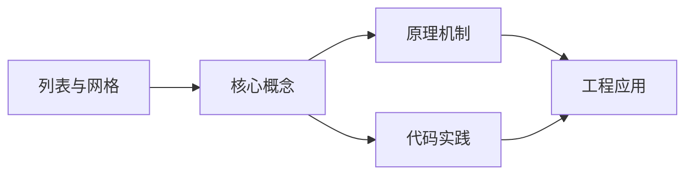
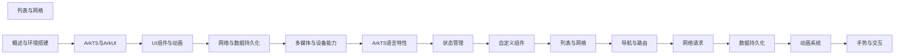

## 1. 学习目标（Bloom 分类）

本节按照布鲁姆教育目标分类学组织学习路径。本文主题为《列表与网格》，属于 HarmonyOS 模块，读者可以根据自身阶段选择阅读深度。

记忆层面：能够准确复述本文的核心概念、术语与基本语法或操作步骤，并能够在提问或检索时快速定位对应知识点。能够说出 HarmonyOS 的核心概念、术语与标准写法。

理解层面：能够用自己的语言解释核心原理与工作机制，说明概念之间的因果关系，而不是机械记忆结论。能够解释 HarmonyOS 的工作原理与设计动机。

应用层面：能够在真实项目或练习场景中运用本文知识解决具体问题，写出正确且可维护的实现。能够编写符合 HarmonyOS 规范的完整实现。

分析层面：能够拆解复杂问题，比较本文主题与相邻概念的异同，识别边界条件与例外情况。能够分析 HarmonyOS 与相邻方案的差异与边界。

评价层面：能够根据约束条件（性能、可读性、安全、成本）评价不同方案的优劣，做出有依据的技术决策。能够根据场景评价 HarmonyOS 相关方案的优劣。

创造层面：能够把本文知识与其他模块知识组合，设计出新的解决方案或可复用的工程模式。能够组合 HarmonyOS 与其他技术设计完整方案。

通过本节学习，读者应当能够把《列表与网格》纳入自己的知识网络，并与 HarmonyOS 模块的其他主题（ArkTS、ArkUI、分布式能力、应用开发）建立关联。

## 2. 历史动机与发展脉络

《列表与网格》是 HarmonyOS 领域的重要主题。要真正理解它，需要先了解它解决的问题与演进过程。

HarmonyOS（鸿蒙）由华为于 2019 年发布，定位面向全场景的分布式操作系统；HarmonyOS NEXT（5.0，2024）去 Android 化，采用自研鸿蒙内核与 ArkTS 语言栈。
开发框架：ArkTS（TS 超集 + 声明式 UI 扩展）、ArkUI（声明式组件）、Stage 模型（应用模型）、方舟编译器。
分布式能力：跨端流转、分布式数据、一次开发多端部署（手机/平板/车机/穿戴）。

回到本文主题：列表与网格 的提出与成熟，正是上述技术背景下的必然产物。早期实现往往以简单可用为目标，随着工程规模扩大，社区逐渐沉淀出标准做法与最佳实践；理解这一脉络，可以帮助读者判断“为什么文档中的推荐写法是现在这个样子”，也能在遇到历史遗留代码时准确识别其设计年代与取舍。


## 3. 形式化定义与核心概念精讲

本节把《列表与网格》涉及的核心概念以“定义 + 讲解”的形式展开。读者应把定义当作工具，把讲解当作理解路径；两者结合才能形成可迁移的知识。

ArkTS 语法：基于 TypeScript 的类型系统，增加 @Component/@Entry/@State 等装饰器与 UI 描述语法。
ArkUI 组件：Column/Row/Stack 布局容器、Text/Button/Image 基础组件、List/Grid 容器组件；状态管理（@State/@Prop/@Link/@Provide）。
应用模型：Stage 模型以 UIAbility 为页面载体，EntryAbility 入口；module.json5 声明应用配置。

### 3.1 原文章节逐一精讲

原文档把主题拆分为 17 个小节，下面按顺序给出每一节的导读讲解，随后保留原文细节供精读。

#### 原文精读（完整保留）

# 列表与网格 语法速查手册

> **符号约定**:`< >` 必填参数 | `[ ]` 可选参数

---

#### 概述

列表和网格是移动应用中最常见的布局方式。HarmonyOS 提供了 List 和 Grid 两个核心组件，分别用于线性列表和二维网格的展示。它们内置了滚动、复用和懒加载能力，能够高效地处理大量数据的渲染。配合 ForEach 或 LazyForEach，可以灵活地实现动态数据驱动的列表与网格界面。

#### 基础概念

**List 组件**：垂直或水平方向的线性列表容器，每个子项通过 ListItem 包裹。支持分组（ListItemGroup）、滑动删除、下拉刷新、滚动定位等特性。

**Grid 组件**：二维网格布局容器，每个子项通过 GridItem 包裹。通过 columnsTemplate 和 rowsTemplate 定义行列结构，支持不规则网格和可滚动网格。

**LazyForEach**：与 ForEach 不同，LazyForEach 采用懒加载机制，仅渲染可视区域内的组件，适合大数据量场景。需要配合 IDataSource 数据源使用。

**cachedCount**：列表预渲染的缓存项数量，在可视区域外额外渲染若干项以提升滑动流畅度。

#### 快速上手

##### 基本列表

```typescript
@Component
struct BasicList {
  // 定义数据源
  @State items: string[] = ['项目一', '项目二', '项目三', '项目四', '项目五']

  build() {
    Column() {
      List() {
        // 使用 ForEach 遍历数据
        ForEach(this.items, (item: string, index?: number) => {
          ListItem() {
            Row() {
              Text(`第${index}项`)
                .fontSize(16)
              Text(item)
                .fontSize(14)
                .fontColor('#666666')
            }
            .width('100%')
            .padding(12)
          }
        }, (item: string, index?: number) => `${index}`)
      }
      .width('100%')
      .height('100%')
    }
  }
}
```

##### 基本网格

```typescript
@Component
struct BasicGrid {
  @State items: number[] = [1, 2, 3, 4, 5, 6]

  build() {
    Grid() {
      ForEach(this.items, (item: number) => {
        GridItem() {
          Text(`项目${item}`)
            .fontSize(18)
            .textAlign(TextAlign.Center)
        }
        .backgroundColor('#f0f0f0')
        .borderRadius(8)
        .padding(20)
      }, (item: number) => item.toString())
    }
    // 定义三列等宽布局
    .columnsTemplate('1fr 1fr 1fr')
    .rowsGap(10)
    .columnsGap(10)
    .padding(10)
  }
}
```

#### 详细用法

##### List 分组与粘性标题

```typescript
@Component
struct GroupedList {
  // 按分组组织数据
  @State groups: object[] = [
    { title: '水果', items: ['苹果', '香蕉', '橙子'] },
    { title: '蔬菜', items: ['番茄', '黄瓜', '胡萝卜'] },
    { title: '饮料', items: ['咖啡', '茶', '果汁'] },
  ]

  build() {
    List({ space: 8 }) {
      ForEach(this.groups, (group: Record<string, Object>) => {
        ListItemGroup({ header: this.groupHeader(group.title) }) {
          ForEach(group.items, (item: string) => {
            ListItem() {
              Text(item)
                .fontSize(15)
                .padding({ left: 16, top: 10, bottom: 10 })
            }
          }, (item: string) => item)
        }
        // 粘性标题：滑动时标题固定在顶部
        .sticky(StickyStyle.Header)
      }, (group: Record<string, Object>) => group.title)
    }
    .width('100%')
    .height('100%')
  }

  @Builder
  groupHeader(title: string) {
    Row() {
      Text(title)
        .fontSize(16)
        .fontWeight(FontWeight.Bold)
    }
    .width('100%')
    .padding(12)
    .backgroundColor('#e8e8e8')
  }
}
```

##### LazyForEach 懒加载列表

```typescript
// 实现 IDataSource 接口的数据源
class ListDataSource implements IDataSource {
  private dataArray: string[] = []
  private listeners: DataChangeListener[] = []

  // 构造函数中初始化数据
  constructor(count: number) {
    for (let i = 0; i < count; i++) {
      this.dataArray.push(`数据项 ${i}`)
    }
  }

  // 返回数据总数
  totalCount(): number {
    return this.dataArray.length
  }

  // 返回指定位置的数据
  getData(index: number): string {
    return this.dataArray[index]
  }

  // 注册数据变更监听器
  registerDataChangeListener(listener: DataChangeListener): void {
    if (this.listeners.indexOf(listener) < 0) {
      this.listeners.push(listener)
    }
  }

  // 注销数据变更监听器
  unregisterDataChangeListener(listener: DataChangeListener): void {
    const pos = this.listeners.indexOf(listener)
    if (pos >= 0) {
      this.listeners.splice(pos, 1)
    }
  }

  // 追加数据并通知监听器
  public appendData(item: string): void {
    this.dataArray.push(item)
    this.listeners.forEach(listener => listener.onDataAdd(this.dataArray.length - 1))
  }
}

@Component
struct LazyListPage {
  // 使用 LazyForEach 数据源
  private dataSource: ListDataSource = new ListDataSource(100)

  build() {
    List() {
      // 懒加载：仅渲染可视区域内的项
      LazyForEach(this.dataSource, (item: string) => {
        ListItem() {
          Text(item)
            .width('100%')
            .height(60)
            .fontSize(15)
            .padding({ left: 16 })
          Divider().margin({ left: 16 })
        }
      }, (item: string) => item)
    }
    .cachedCount(5) // 预渲染5个缓存项
    .width('100%')
    .height('100%')
  }
}
```

##### List 滑动删除与下拉刷新

```typescript
@Component
struct SwipeListPage {
  @State items: string[] = ['待办事项一', '待办事项二', '待办事项三']

  build() {
    List({ space: 10 }) {
      ForEach(this.items, (item: string, index?: number) => {
        ListItem() {
          Row() {
            Text(item).fontSize(15)
          }
          .width('100%')
          .padding(16)
          .backgroundColor(Color.White)
          .borderRadius(8)
        }
        // 左滑显示删除按钮
        .swipeAction({ end: this.deleteButton(index) })
      }, (item: string, index?: number) => `${index}`)
    }
    .padding(16)
    .onRefresh(() => {
      // 下拉刷新回调
      console.info('正在刷新数据...')
    })
  }

  @Builder
  deleteButton(index?: number) {
    Button('删除')
      .backgroundColor(Color.Red)
      .fontColor(Color.White)
      .borderRadius(8)
      .onClick(() => {
        if (index !== undefined) {
          this.items.splice(index, 1)
        }
      })
  }
}
```

##### Grid 不规则布局

```typescript
@Component
struct IrregularGrid {
  build() {
    Grid() {
      // 大图项：占据两列
      GridItem() {
        Text('推荐')
          .fontSize(20)
          .fontWeight(FontWeight.Bold)
      }
      .columnStart(0).columnEnd(1) // 跨两列
      .backgroundColor('#ff6b6b')
      .borderRadius(8)
      .padding(30)

      GridItem() {
        Text('热门')
          .fontSize(16)
      }
      .backgroundColor('#ffd93d')
      .borderRadius(8)
      .padding(20)

      GridItem() {
        Text('最新')
          .fontSize(16)
      }
      .backgroundColor('#6bcb77')
      .borderRadius(8)
      .padding(20)

      GridItem() {
        Text('精选')
          .fontSize(16)
      }
      .backgroundColor('#4d96ff')
      .borderRadius(8)
      .padding(20)
    }
    .columnsTemplate('1fr 1fr')
    .rowsGap(10)
    .columnsGap(10)
    .padding(10)
  }
}
```

#### 常见场景

##### 聊天消息列表

```typescript
interface ChatMessage {
  id: string
  content: string
  isMine: boolean  // 是否为自己发送的消息
  time: string
}

@Component
struct ChatListPage {
  @State messages: ChatMessage[] = [
    { id: '1', content: '你好！', isMine: false, time: '10:00' },
    { id: '2', content: '你好，最近怎么样？', isMine: true, time: '10:01' },
    { id: '3', content: '挺好的，在学习 HarmonyOS', isMine: false, time: '10:02' },
  ]

  build() {
    Column() {
      // 消息列表
      List() {
        ForEach(this.messages, (msg: ChatMessage) => {
          ListItem() {
            Row() {
              if (msg.isMine) {
                Blank() // 自己的消息靠右
              }
              Column() {
                Text(msg.content)
                  .fontSize(15)
                  .padding(10)
                  .borderRadius(12)
                  .backgroundColor(msg.isMine ? '#95ec69' : '#ffffff')
                Text(msg.time)
                  .fontSize(10)
                  .fontColor('#999999')
                  .margin({ top: 4 })
              }
              .alignItems(msg.isMine ? HorizontalAlign.End : HorizontalAlign.Start)

              if (!msg.isMine) {
                Blank() // 对方的消息靠左
              }
            }
            .width('100%')
          }
        }, (msg: ChatMessage) => msg.id)
      }
      .layoutWeight(1)
    }
  }
}
```

##### 商品网格展示

```typescript
interface Product {
  id: string
  name: string
  price: number
  image: Resource
}

@Component
struct ProductGridPage {
  @State products: Product[] = [
    { id: '1', name: '商品A', price: 99.9, image: $r('app.media.product1') },
    { id: '2', name: '商品B', price: 199.0, image: $r('app.media.product2') },
    { id: '3', name: '商品C', price: 49.9, image: $r('app.media.product3') },
    { id: '4', name: '商品D', price: 299.0, image: $r('app.media.product4') },
  ]

  build() {
    Grid() {
      ForEach(this.products, (product: Product) => {
        GridItem() {
          Column() {
            Image(product.image)
              .width('100%')
              .height(120)
              .objectFit(ImageFit.Cover)
              .borderRadius({ topLeft: 8, topRight: 8 })
            Text(product.name)
              .fontSize(14)
              .margin({ top: 8 })
            Text(`¥${product.price.toFixed(2)}`)
              .fontSize(16)
              .fontColor('#ff4d4f')
              .fontWeight(FontWeight.Bold)
              .margin({ top: 4 })
          }
          .padding(8)
          .backgroundColor(Color.White)
          .borderRadius(8)
        }
      }, (product: Product) => product.id)
    }
    .columnsTemplate('1fr 1fr')
    .rowsGap(12)
    .columnsGap(12)
    .padding(12)
  }
}
```

#### 注意事项

- **ForEach 与 LazyForEach 的选择**：数据量小于 100 条时使用 ForEach 即可，数据量较大时必须使用 LazyForEach 以保证性能。ForEach 会一次性创建所有组件，LazyForEach 仅创建可视区域内的组件。
- **键值生成**：ForEach 和 LazyForEach 的键值函数必须返回唯一且稳定的值，避免使用 index 作为键值，否则在数据增删时可能导致渲染异常。
- **cachedCount 设置**：缓存数量不宜过大，一般设置为 3-5 即可。过大的缓存会增加内存占用，过小则影响滑动流畅度。
- **ListItem 高度**：List 组件中所有 ListItem 的高度应尽量一致，高度不一致时可能导致滚动条位置计算不准确。
- **Grid 列模板**：columnsTemplate 和 rowsTemplate 使用 fr 单位定义比例，支持混合使用固定值和比例值，如 `'100px 1fr 2fr'`。

#### 进阶用法

##### 列表滚动定位

```typescript
@Component
struct ScrollToListPage {
  private listScroller: Scroller = new Scroller()
  @State currentIndex: number = 0

  build() {
    Column() {
      // 定位按钮
      Row() {
        Button('跳到顶部').onClick(() => this.listScroller.scrollToIndex(0))
        Button('跳到第50项').onClick(() => this.listScroller.scrollToIndex(50))
        Button('跳到底部').onClick(() => this.listScroller.scrollEdge(Edge.Bottom))
      }

      List({ space: 5, scroller: this.listScroller }) {
        ForEach(Array.from({ length: 100 }, (_, i) => i), (item: number) => {
          ListItem() {
            Text(`第 ${item} 项`)
              .width('100%')
              .height(50)
              .fontSize(15)
              .padding({ left: 16 })
          }
        }, (item: number) => item.toString())
      }
      .layoutWeight(1)
    }
  }
}
```

##### WaterFlow 瀑布流布局

```typescript
@Component
struct WaterFlowPage {
  @State items: number[] = Array.from({ length: 20 }, (_, i) => i + 1)

  build() {
    // WaterFlow 是更高级的网格组件，支持不等高子项
    WaterFlow() {
      ForEach(this.items, (item: number) => {
        FlowItem() {
          Column() {
            Text(`内容 ${item}`)
              .fontSize(14)
          }
          .width('100%')
          // 不同高度模拟瀑布流效果
          .height(item % 3 === 0 ? 150 : item % 3 === 1 ? 100 : 200)
          .backgroundColor(item % 2 === 0 ? '#e3f2fd' : '#fff3e0')
          .borderRadius(8)
          .padding(12)
        }
      }, (item: number) => item.toString())
    }
    .columnsTemplate('1fr 1fr')
    .columnsGap(10)
    .rowsGap(10)
    .padding(10)
  }
}
```

##### List 嵌套与吸顶效果

```typescript
@Component
struct StickyHeaderList {
  @State sections: object[] = [
    { title: '推荐', items: ['推荐内容一', '推荐内容二', '推荐内容三'] },
    { title: '热门', items: ['热门内容一', '热门内容二'] },
    { title: '最新', items: ['最新内容一', '最新内容二', '最新内容三', '最新内容四'] },
  ]

  build() {
    List({ space: 0 }) {
      ForEach(this.sections, (section: Record<string, Object>) => {
        ListItemGroup({
          header: this.sectionHeader(section.title),
          space: 8
        }) {
          ForEach(section.items, (item: string) => {
            ListItem() {
              Text(item)
                .fontSize(14)
                .padding(12)
                .backgroundColor(Color.White)
                .borderRadius(6)
                .width('100%')
            }
          }, (item: string) => item)
        }
      }, (section: Record<string, Object>) => section.title)
    }
    .sticky(StickyStyle.Header) // 吸顶效果
    .divider({ strokeWidth: 1, color: '#eeeeee' })
    .width('100%')
    .height('100%')
  }

  @Builder
  sectionHeader(title: string | undefined) {
    Row() {
      Text(title ?? '')
        .fontSize(18)
        .fontWeight(FontWeight.Bold)
    }
    .width('100%')
    .padding({ left: 16, top: 12, bottom: 12 })
    .backgroundColor('#f5f5f5')
  }
}
```
#### List 列表

**List 基础列表**
`List([{ space, initialIndex, scroller }]: { space?: Length, initialIndex?: number, scroller?: Scroller }) { ... }`
```typescript
List({ space: 8 }) {
  ForEach(this.items, (item: string) => {
    ListItem() { Text(item).padding(12) }
  })
}
.cachedCount(5)
.scrollBar(BarState.Auto)
```

**ListItem 列表项**
`ListItem() { ... }`
```typescript
ListItem() {
  Row() {
    Text('Title')
    Text('Subtitle')
  }
}
```

**List 垂直滚动**
```typescript
List() {
  ForEach(this.data, (item: string) => {
    ListItem() { Text(item) }
  })
}
.listDirection(Axis.Vertical)
```

**List 水平滚动**
```typescript
List() {
  ForEach(this.data, (item: string) => {
    ListItem() { Text(item).width(120) }
  })
}
.listDirection(Axis.Horizontal)
```

**List 多列布局**
```typescript
List() {
  ForEach(this.data, (item: string) => {
    ListItem() { Text(item) }
  })
}
.lanes(2, 8)  // 2 列,间距 8
```

---

#### ListItemGroup 分组

**ListItemGroup 列表分组**
`ListItemGroup({ header, footer }) { ... }`
```typescript
List() {
  ListItemGroup({ header: this.headerBuilder, footer: this.footerBuilder }) {
    ForEach(this.items, (item: string) => {
      ListItem() { Text(item).padding(12) }
    })
  }
}
@Builder headerBuilder() { Text('Header').fontSize(16) }
@Builder footerBuilder() { Text('Footer').fontSize(12) }
```

---

#### LazyForEach 懒加载

**LazyForEach 数据懒加载**
`LazyForEach(<dataSource>: IDataSource, (item: T, index?: number) => { ... }, [keyGen?: (item: T) => string])`
```typescript
class MyDataSource implements IDataSource {
  private data: string[] = []
  private listeners: DataChangeListener[] = []

  totalCount(): number { return this.data.length }
  getData(index: number): string { return this.data[index] }

  pushData(item: string): void {
    this.data.push(item)
    this.listeners.forEach(l => l.onDataChange(this.data.length - 1))
  }

  registerDataChangeListener(listener: DataChangeListener): void {
    this.listeners.push(listener)
  }
  unregisterDataChangeListener(listener: DataChangeListener): void {
    this.listeners = this.listeners.filter(l => l !== listener)
  }
}

List() {
  LazyForEach(this.dataSource, (item: string) => {
    ListItem() { Text(item) }
  }, (item: string) => item)
}
.cachedCount(5)
```

---

#### ForEach 同步循环

**ForEach 基础循环**
`ForEach(<array>: T[], (item: T, index?: number) => { ... }, [keyGen?: (item: T, index?: number) => string])`
```typescript
ForEach(this.items, (item: string, index: number) => {
  Text(`${index}: ${item}`)
}, (item: string) => item)
```

---

#### Grid 网格

**Grid 网格布局**
`Grid([<scroller>]: Scroller, [<range>]: { start, end }) { ... }`
```typescript
Grid() {
  ForEach(this.items, (item: string) => {
    GridItem() { Text(item).padding(12) }
  })
}
.columnsTemplate('1fr 1fr 1fr')
.rowsTemplate('1fr 1fr')
.columnsGap(8)
.rowsGap(8)
.scrollBar(BarState.Auto)
```

**GridItem 网格项**
`GridItem() { ... }`
```typescript
GridItem() {
  Column() {
    Image($r('app.media.icon')).width(80)
    Text('Item')
  }
}
.rowStart(0).rowEnd(1)
```

**Grid 跨行跨列**
```typescript
GridItem() { Text('Span') }
  .rowStart(0).rowEnd(1)
  .columnStart(0).columnEnd(1)
```

---

#### WaterFlow 瀑布流

**WaterFlow 瀑布流**
`WaterFlow([<scroller>]) { ... }`
```typescript
WaterFlow() {
  ForEach(this.items, (item: string) => {
    FlowItem() {
      Column() {
        Image($r('app.media.icon')).height(Math.random() * 100 + 100)
        Text(item)
      }
    }
  })
}
.columnsTemplate('1fr 1fr')
.columnsGap(8)
.rowsGap(8)
```

**FlowItem 瀑布流项**
`FlowItem() { ... }`
```typescript
FlowItem() {
  Column() {
    Text('Item')
  }
}
```

---

#### Scroller 滚动控制

**Scroller 滚动器**
```typescript
private scroller: ListScroller = new ListScroller()

List({ scroller: this.scroller }) {
  ForEach(this.items, (item: string) => {
    ListItem() { Text(item) }
  })
}

// 滚动到指定位置
this.scroller.scrollToIndex(10)
// 滚动到指定偏移
this.scroller.scrollTo({ xOffset: 0, yOffset: 100 })
// 滚动到顶部
this.scroller.scrollEdge(Edge.Top)
```

---

#### 列表事件

**onScrollIndex 索引变化**
`List().onScrollIndex((start: number, end: number) => { ... })`
```typescript
List() { ... }
  .onScrollIndex((start: number, end: number) => {
    console.info(`visible: ${start} - ${end}`)
  })
```

**onScroll 滚动事件**
`List().onScroll((scrollOffset, scrollState) => { ... })`
```typescript
List() { ... }
  .onScroll((scrollOffset: number, scrollState: ScrollState) => {
    console.info(`offset: ${scrollOffset}`)
  })
```

**onReachEnd 滚动到底部**
`List().onReachEnd(() => { ... })`
```typescript
List() { ... }
  .onReachEnd(() => {
    this.loadMore()
  })
```

**onReachStart 滚动到顶部**
`List().onReachStart(() => { ... })`
```typescript
List() { ... }
  .onReachStart(() => {
    console.info('reached start')
  })
```

---

#### 性能优化属性

**cachedCount 缓存数量**
`List().cachedCount(<count>)`
```typescript
List() { ... }.cachedCount(5)
```

**scrollBar 滚动条**
`<Component>.scrollBar(<BarState>)`
```typescript
List() { ... }.scrollBar(BarState.Auto)  // Auto | On | Off
```

**edgeEffect 边缘效果**
`<Component>.edgeEffect(<EdgeEffect>)`
```typescript
List() { ... }.edgeEffect(EdgeEffect.Spring)  // Spring | Fade | None
```

---

#### 多端适配

**listDirection 列表方向**
`List().listDirection(<Axis>)`
```typescript
List().listDirection(Axis.Vertical)    // 垂直
List().listDirection(Axis.Horizontal)  // 水平
```

**lanes 多列**
`List().lanes(<count>, [<gap>])`
```typescript
List().lanes(2, 8)
```

**sticky 粘性头部**
`List().sticky(<StickyStyle>)`
```typescript
List() { ... }.sticky(StickyStyle.Header)  // Header | Footer
```


### 3.2 概念关系图

下面用 Mermaid 图表达本文核心概念之间的关系，帮助读者建立整体图景：



图中展示的是本文知识的结构化关系：核心概念是入口，原理机制解释“为什么”，代码实践演示“怎么做”，工程应用回答“何时用”。读者学习时可以把每个小节的内容挂接到对应节点上。

## 4. 理论推导与原理解析

本节深入《列表与网格》背后的原理。理论部分不求面面俱到，而是聚焦“能解释现象、能指导实践”的关键推导。

ArkTS 语法：基于 TypeScript 的类型系统，增加 @Component/@Entry/@State 等装饰器与 UI 描述语法。
ArkUI 组件：Column/Row/Stack 布局容器、Text/Button/Image 基础组件、List/Grid 容器组件；状态管理（@State/@Prop/@Link/@Provide）。
应用模型：Stage 模型以 UIAbility 为页面载体，EntryAbility 入口；module.json5 声明应用配置。
生命周期：Ability 的 onCreate/onWindowStageCreate/onForeground/onBackground/onDestroy。

需要强调的是，理论推导与工程实践之间存在翻译层：理论给出的是理想化模型与边界条件，工程代码则必须处理真实环境中的例外。读者在学习时应先掌握理论的“标准情形”，再通过陷阱章节了解“非标准情形”。

## 5. 代码示例与逐行讲解

本节把原文中的代码示例系统整理，并为每个示例补充用途说明与讲解。读者不应只浏览代码，而应逐段对照讲解理解设计意图。

### 5.1 示例：基本列表

该示例来自原文《基本列表》小节，用于演示列表与网格相关操作。阅读时请先看代码结构，再看其后的讲解。

```typescript
@Component
struct BasicList {
  // 定义数据源
  @State items: string[] = ['项目一', '项目二', '项目三', '项目四', '项目五']

  build() {
    Column() {
      List() {
        // 使用 ForEach 遍历数据
        ForEach(this.items, (item: string, index?: number) => {
          ListItem() {
            Row() {
              Text(`第${index}项`)
                .fontSize(16)
              Text(item)
                .fontSize(14)
                .fontColor('#666666')
            }
            .width('100%')
            .padding(12)
          }
        }, (item: string, index?: number) => `${index}`)
      }
      .width('100%')
      .height('100%')
    }
  }
}
```

讲解：这段代码演示了本节核心知识点。代码中的关键操作可以归纳为三步：准备（定义或初始化）、执行（核心逻辑）、收尾（释放资源或返回结果）。实际项目中，这三步往往被封装为函数或类，以提升复用性与可测试性。

关键点分析：

该示例共 27 行有效代码，结构以数据或配置为主。阅读时应关注：数据字段的含义、配置项的作用，以及它们与运行行为的对应关系。

进阶思考路径：先尝试修改参数观察行为变化，再把示例中的模式迁移到自己的项目中；每次修改都记录预期与实测差异，这是把示例转化为能力的最快方式。

### 5.2 示例：基本网格

该示例来自原文《基本网格》小节，用于演示列表与网格相关操作。阅读时请先看代码结构，再看其后的讲解。

```typescript
@Component
struct BasicGrid {
  @State items: number[] = [1, 2, 3, 4, 5, 6]

  build() {
    Grid() {
      ForEach(this.items, (item: number) => {
        GridItem() {
          Text(`项目${item}`)
            .fontSize(18)
            .textAlign(TextAlign.Center)
        }
        .backgroundColor('#f0f0f0')
        .borderRadius(8)
        .padding(20)
      }, (item: number) => item.toString())
    }
    // 定义三列等宽布局
    .columnsTemplate('1fr 1fr 1fr')
    .rowsGap(10)
    .columnsGap(10)
    .padding(10)
  }
}
```

讲解：这段代码演示了本节核心知识点。代码中的关键操作可以归纳为三步：准备（定义或初始化）、执行（核心逻辑）、收尾（释放资源或返回结果）。实际项目中，这三步往往被封装为函数或类，以提升复用性与可测试性。

关键点分析：

该示例共 23 行有效代码，结构以数据或配置为主。阅读时应关注：数据字段的含义、配置项的作用，以及它们与运行行为的对应关系。

进阶思考路径：先尝试修改参数观察行为变化，再把示例中的模式迁移到自己的项目中；每次修改都记录预期与实测差异，这是把示例转化为能力的最快方式。

### 5.3 示例：List 分组与粘性标题

该示例来自原文《List 分组与粘性标题》小节，用于演示列表与网格相关操作。阅读时请先看代码结构，再看其后的讲解。

```typescript
@Component
struct GroupedList {
  // 按分组组织数据
  @State groups: object[] = [
    { title: '水果', items: ['苹果', '香蕉', '橙子'] },
    { title: '蔬菜', items: ['番茄', '黄瓜', '胡萝卜'] },
    { title: '饮料', items: ['咖啡', '茶', '果汁'] },
  ]

  build() {
    List({ space: 8 }) {
      ForEach(this.groups, (group: Record<string, Object>) => {
        ListItemGroup({ header: this.groupHeader(group.title) }) {
          ForEach(group.items, (item: string) => {
            ListItem() {
              Text(item)
                .fontSize(15)
                .padding({ left: 16, top: 10, bottom: 10 })
            }
          }, (item: string) => item)
        }
        // 粘性标题：滑动时标题固定在顶部
        .sticky(StickyStyle.Header)
      }, (group: Record<string, Object>) => group.title)
    }
    .width('100%')
    .height('100%')
  }

  @Builder
  groupHeader(title: string) {
    Row() {
      Text(title)
        .fontSize(16)
        .fontWeight(FontWeight.Bold)
    }
    .width('100%')
    .padding(12)
    .backgroundColor('#e8e8e8')
  }
}
```

讲解：这段代码演示了本节核心知识点。代码中的关键操作可以归纳为三步：准备（定义或初始化）、执行（核心逻辑）、收尾（释放资源或返回结果）。实际项目中，这三步往往被封装为函数或类，以提升复用性与可测试性。

关键点分析：

该示例共 39 行有效代码，结构以数据或配置为主。阅读时应关注：数据字段的含义、配置项的作用，以及它们与运行行为的对应关系。

进阶思考路径：先尝试修改参数观察行为变化，再把示例中的模式迁移到自己的项目中；每次修改都记录预期与实测差异，这是把示例转化为能力的最快方式。

### 5.4 示例：LazyForEach 懒加载列表

该示例来自原文《LazyForEach 懒加载列表》小节，用于演示列表与网格相关操作。阅读时请先看代码结构，再看其后的讲解。

```typescript
// 实现 IDataSource 接口的数据源
class ListDataSource implements IDataSource {
  private dataArray: string[] = []
  private listeners: DataChangeListener[] = []

  // 构造函数中初始化数据
  constructor(count: number) {
    for (let i = 0; i < count; i++) {
      this.dataArray.push(`数据项 ${i}`)
    }
  }

  // 返回数据总数
  totalCount(): number {
    return this.dataArray.length
  }

  // 返回指定位置的数据
  getData(index: number): string {
    return this.dataArray[index]
  }

  // 注册数据变更监听器
  registerDataChangeListener(listener: DataChangeListener): void {
    if (this.listeners.indexOf(listener) < 0) {
      this.listeners.push(listener)
    }
  }

  // 注销数据变更监听器
  unregisterDataChangeListener(listener: DataChangeListener): void {
    const pos = this.listeners.indexOf(listener)
    if (pos >= 0) {
      this.listeners.splice(pos, 1)
    }
  }

  // 追加数据并通知监听器
  public appendData(item: string): void {
    this.dataArray.push(item)
    this.listeners.forEach(listener => listener.onDataAdd(this.dataArray.length - 1))
  }
}

@Component
struct LazyListPage {
  // 使用 LazyForEach 数据源
  private dataSource: ListDataSource = new ListDataSource(100)

  build() {
    List() {
      // 懒加载：仅渲染可视区域内的项
      LazyForEach(this.dataSource, (item: string) => {
        ListItem() {
          Text(item)
            .width('100%')
            .height(60)
            .fontSize(15)
            .padding({ left: 16 })
          Divider().margin({ left: 16 })
        }
      }, (item: string) => item)
    }
    .cachedCount(5) // 预渲染5个缓存项
    .width('100%')
    .height('100%')
  }
}
```

讲解：这段代码演示了本节核心知识点。代码中的关键操作可以归纳为三步：准备（定义或初始化）、执行（核心逻辑）、收尾（释放资源或返回结果）。实际项目中，这三步往往被封装为函数或类，以提升复用性与可测试性。

关键点分析：

该示例共 60 行有效代码，包含 4 类关键结构（class、if、for、return）。其中：

- 入口与初始化部分负责建立上下文，对应实际项目中的启动或装配逻辑；
- 核心逻辑部分体现本文主题的主要操作，是阅读时最需要对照讲解理解的部分；
- 输出或返回部分把结果交给调用方，注意其类型与边界条件。

进阶思考路径：先尝试修改参数观察行为变化，再把示例中的模式迁移到自己的项目中；每次修改都记录预期与实测差异，这是把示例转化为能力的最快方式。

### 5.5 示例：List 滑动删除与下拉刷新

该示例来自原文《List 滑动删除与下拉刷新》小节，用于演示列表与网格相关操作。阅读时请先看代码结构，再看其后的讲解。

```typescript
@Component
struct SwipeListPage {
  @State items: string[] = ['待办事项一', '待办事项二', '待办事项三']

  build() {
    List({ space: 10 }) {
      ForEach(this.items, (item: string, index?: number) => {
        ListItem() {
          Row() {
            Text(item).fontSize(15)
          }
          .width('100%')
          .padding(16)
          .backgroundColor(Color.White)
          .borderRadius(8)
        }
        // 左滑显示删除按钮
        .swipeAction({ end: this.deleteButton(index) })
      }, (item: string, index?: number) => `${index}`)
    }
    .padding(16)
    .onRefresh(() => {
      // 下拉刷新回调
      console.info('正在刷新数据...')
    })
  }

  @Builder
  deleteButton(index?: number) {
    Button('删除')
      .backgroundColor(Color.Red)
      .fontColor(Color.White)
      .borderRadius(8)
      .onClick(() => {
        if (index !== undefined) {
          this.items.splice(index, 1)
        }
      })
  }
}
```

讲解：这段代码演示了本节核心知识点。代码中的关键操作可以归纳为三步：准备（定义或初始化）、执行（核心逻辑）、收尾（释放资源或返回结果）。实际项目中，这三步往往被封装为函数或类，以提升复用性与可测试性。

关键点分析：

该示例共 38 行有效代码，包含 1 类关键结构（if）。其中：

- 入口与初始化部分负责建立上下文，对应实际项目中的启动或装配逻辑；
- 核心逻辑部分体现本文主题的主要操作，是阅读时最需要对照讲解理解的部分；
- 输出或返回部分把结果交给调用方，注意其类型与边界条件。

进阶思考路径：先尝试修改参数观察行为变化，再把示例中的模式迁移到自己的项目中；每次修改都记录预期与实测差异，这是把示例转化为能力的最快方式。

### 5.6 示例：Grid 不规则布局

该示例来自原文《Grid 不规则布局》小节，用于演示列表与网格相关操作。阅读时请先看代码结构，再看其后的讲解。

```typescript
@Component
struct IrregularGrid {
  build() {
    Grid() {
      // 大图项：占据两列
      GridItem() {
        Text('推荐')
          .fontSize(20)
          .fontWeight(FontWeight.Bold)
      }
      .columnStart(0).columnEnd(1) // 跨两列
      .backgroundColor('#ff6b6b')
      .borderRadius(8)
      .padding(30)

      GridItem() {
        Text('热门')
          .fontSize(16)
      }
      .backgroundColor('#ffd93d')
      .borderRadius(8)
      .padding(20)

      GridItem() {
        Text('最新')
          .fontSize(16)
      }
      .backgroundColor('#6bcb77')
      .borderRadius(8)
      .padding(20)

      GridItem() {
        Text('精选')
          .fontSize(16)
      }
      .backgroundColor('#4d96ff')
      .borderRadius(8)
      .padding(20)
    }
    .columnsTemplate('1fr 1fr')
    .rowsGap(10)
    .columnsGap(10)
    .padding(10)
  }
}
```

讲解：这段代码演示了本节核心知识点。代码中的关键操作可以归纳为三步：准备（定义或初始化）、执行（核心逻辑）、收尾（释放资源或返回结果）。实际项目中，这三步往往被封装为函数或类，以提升复用性与可测试性。

关键点分析：

该示例共 42 行有效代码，结构以数据或配置为主。阅读时应关注：数据字段的含义、配置项的作用，以及它们与运行行为的对应关系。

进阶思考路径：先尝试修改参数观察行为变化，再把示例中的模式迁移到自己的项目中；每次修改都记录预期与实测差异，这是把示例转化为能力的最快方式。

### 5.7 示例：聊天消息列表

该示例来自原文《聊天消息列表》小节，用于演示列表与网格相关操作。阅读时请先看代码结构，再看其后的讲解。

```typescript
interface ChatMessage {
  id: string
  content: string
  isMine: boolean  // 是否为自己发送的消息
  time: string
}

@Component
struct ChatListPage {
  @State messages: ChatMessage[] = [
    { id: '1', content: '你好！', isMine: false, time: '10:00' },
    { id: '2', content: '你好，最近怎么样？', isMine: true, time: '10:01' },
    { id: '3', content: '挺好的，在学习 HarmonyOS', isMine: false, time: '10:02' },
  ]

  build() {
    Column() {
      // 消息列表
      List() {
        ForEach(this.messages, (msg: ChatMessage) => {
          ListItem() {
            Row() {
              if (msg.isMine) {
                Blank() // 自己的消息靠右
              }
              Column() {
                Text(msg.content)
                  .fontSize(15)
                  .padding(10)
                  .borderRadius(12)
                  .backgroundColor(msg.isMine ? '#95ec69' : '#ffffff')
                Text(msg.time)
                  .fontSize(10)
                  .fontColor('#999999')
                  .margin({ top: 4 })
              }
              .alignItems(msg.isMine ? HorizontalAlign.End : HorizontalAlign.Start)

              if (!msg.isMine) {
                Blank() // 对方的消息靠左
              }
            }
            .width('100%')
          }
        }, (msg: ChatMessage) => msg.id)
      }
      .layoutWeight(1)
    }
  }
}
```

讲解：这段代码演示了本节核心知识点。代码中的关键操作可以归纳为三步：准备（定义或初始化）、执行（核心逻辑）、收尾（释放资源或返回结果）。实际项目中，这三步往往被封装为函数或类，以提升复用性与可测试性。

关键点分析：

该示例共 47 行有效代码，包含 1 类关键结构（if）。其中：

- 入口与初始化部分负责建立上下文，对应实际项目中的启动或装配逻辑；
- 核心逻辑部分体现本文主题的主要操作，是阅读时最需要对照讲解理解的部分；
- 输出或返回部分把结果交给调用方，注意其类型与边界条件。

进阶思考路径：先尝试修改参数观察行为变化，再把示例中的模式迁移到自己的项目中；每次修改都记录预期与实测差异，这是把示例转化为能力的最快方式。

### 5.8 示例：商品网格展示

该示例来自原文《商品网格展示》小节，用于演示列表与网格相关操作。阅读时请先看代码结构，再看其后的讲解。

```typescript
interface Product {
  id: string
  name: string
  price: number
  image: Resource
}

@Component
struct ProductGridPage {
  @State products: Product[] = [
    { id: '1', name: '商品A', price: 99.9, image: $r('app.media.product1') },
    { id: '2', name: '商品B', price: 199.0, image: $r('app.media.product2') },
    { id: '3', name: '商品C', price: 49.9, image: $r('app.media.product3') },
    { id: '4', name: '商品D', price: 299.0, image: $r('app.media.product4') },
  ]

  build() {
    Grid() {
      ForEach(this.products, (product: Product) => {
        GridItem() {
          Column() {
            Image(product.image)
              .width('100%')
              .height(120)
              .objectFit(ImageFit.Cover)
              .borderRadius({ topLeft: 8, topRight: 8 })
            Text(product.name)
              .fontSize(14)
              .margin({ top: 8 })
            Text(`¥${product.price.toFixed(2)}`)
              .fontSize(16)
              .fontColor('#ff4d4f')
              .fontWeight(FontWeight.Bold)
              .margin({ top: 4 })
          }
          .padding(8)
          .backgroundColor(Color.White)
          .borderRadius(8)
        }
      }, (product: Product) => product.id)
    }
    .columnsTemplate('1fr 1fr')
    .rowsGap(12)
    .columnsGap(12)
    .padding(12)
  }
}
```

讲解：这段代码演示了本节核心知识点。代码中的关键操作可以归纳为三步：准备（定义或初始化）、执行（核心逻辑）、收尾（释放资源或返回结果）。实际项目中，这三步往往被封装为函数或类，以提升复用性与可测试性。

关键点分析：

该示例共 45 行有效代码，结构以数据或配置为主。阅读时应关注：数据字段的含义、配置项的作用，以及它们与运行行为的对应关系。

进阶思考路径：先尝试修改参数观察行为变化，再把示例中的模式迁移到自己的项目中；每次修改都记录预期与实测差异，这是把示例转化为能力的最快方式。

### 5.9 示例：列表滚动定位

该示例来自原文《列表滚动定位》小节，用于演示列表与网格相关操作。阅读时请先看代码结构，再看其后的讲解。

```typescript
@Component
struct ScrollToListPage {
  private listScroller: Scroller = new Scroller()
  @State currentIndex: number = 0

  build() {
    Column() {
      // 定位按钮
      Row() {
        Button('跳到顶部').onClick(() => this.listScroller.scrollToIndex(0))
        Button('跳到第50项').onClick(() => this.listScroller.scrollToIndex(50))
        Button('跳到底部').onClick(() => this.listScroller.scrollEdge(Edge.Bottom))
      }

      List({ space: 5, scroller: this.listScroller }) {
        ForEach(Array.from({ length: 100 }, (_, i) => i), (item: number) => {
          ListItem() {
            Text(`第 ${item} 项`)
              .width('100%')
              .height(50)
              .fontSize(15)
              .padding({ left: 16 })
          }
        }, (item: number) => item.toString())
      }
      .layoutWeight(1)
    }
  }
}
```

讲解：这段代码演示了本节核心知识点。代码中的关键操作可以归纳为三步：准备（定义或初始化）、执行（核心逻辑）、收尾（释放资源或返回结果）。实际项目中，这三步往往被封装为函数或类，以提升复用性与可测试性。

关键点分析：

该示例共 27 行有效代码，结构以数据或配置为主。阅读时应关注：数据字段的含义、配置项的作用，以及它们与运行行为的对应关系。

进阶思考路径：先尝试修改参数观察行为变化，再把示例中的模式迁移到自己的项目中；每次修改都记录预期与实测差异，这是把示例转化为能力的最快方式。

### 5.10 示例：WaterFlow 瀑布流布局

该示例来自原文《WaterFlow 瀑布流布局》小节，用于演示列表与网格相关操作。阅读时请先看代码结构，再看其后的讲解。

```typescript
@Component
struct WaterFlowPage {
  @State items: number[] = Array.from({ length: 20 }, (_, i) => i + 1)

  build() {
    // WaterFlow 是更高级的网格组件，支持不等高子项
    WaterFlow() {
      ForEach(this.items, (item: number) => {
        FlowItem() {
          Column() {
            Text(`内容 ${item}`)
              .fontSize(14)
          }
          .width('100%')
          // 不同高度模拟瀑布流效果
          .height(item % 3 === 0 ? 150 : item % 3 === 1 ? 100 : 200)
          .backgroundColor(item % 2 === 0 ? '#e3f2fd' : '#fff3e0')
          .borderRadius(8)
          .padding(12)
        }
      }, (item: number) => item.toString())
    }
    .columnsTemplate('1fr 1fr')
    .columnsGap(10)
    .rowsGap(10)
    .padding(10)
  }
}
```

讲解：这段代码演示了本节核心知识点。代码中的关键操作可以归纳为三步：准备（定义或初始化）、执行（核心逻辑）、收尾（释放资源或返回结果）。实际项目中，这三步往往被封装为函数或类，以提升复用性与可测试性。

关键点分析：

该示例共 27 行有效代码，结构以数据或配置为主。阅读时应关注：数据字段的含义、配置项的作用，以及它们与运行行为的对应关系。

进阶思考路径：先尝试修改参数观察行为变化，再把示例中的模式迁移到自己的项目中；每次修改都记录预期与实测差异，这是把示例转化为能力的最快方式。

### 5.11 示例：List 嵌套与吸顶效果

该示例来自原文《List 嵌套与吸顶效果》小节，用于演示列表与网格相关操作。阅读时请先看代码结构，再看其后的讲解。

```typescript
@Component
struct StickyHeaderList {
  @State sections: object[] = [
    { title: '推荐', items: ['推荐内容一', '推荐内容二', '推荐内容三'] },
    { title: '热门', items: ['热门内容一', '热门内容二'] },
    { title: '最新', items: ['最新内容一', '最新内容二', '最新内容三', '最新内容四'] },
  ]

  build() {
    List({ space: 0 }) {
      ForEach(this.sections, (section: Record<string, Object>) => {
        ListItemGroup({
          header: this.sectionHeader(section.title),
          space: 8
        }) {
          ForEach(section.items, (item: string) => {
            ListItem() {
              Text(item)
                .fontSize(14)
                .padding(12)
                .backgroundColor(Color.White)
                .borderRadius(6)
                .width('100%')
            }
          }, (item: string) => item)
        }
      }, (section: Record<string, Object>) => section.title)
    }
    .sticky(StickyStyle.Header) // 吸顶效果
    .divider({ strokeWidth: 1, color: '#eeeeee' })
    .width('100%')
    .height('100%')
  }

  @Builder
  sectionHeader(title: string | undefined) {
    Row() {
      Text(title ?? '')
        .fontSize(18)
        .fontWeight(FontWeight.Bold)
    }
    .width('100%')
    .padding({ left: 16, top: 12, bottom: 12 })
    .backgroundColor('#f5f5f5')
  }
}
```

讲解：这段代码演示了本节核心知识点。代码中的关键操作可以归纳为三步：准备（定义或初始化）、执行（核心逻辑）、收尾（释放资源或返回结果）。实际项目中，这三步往往被封装为函数或类，以提升复用性与可测试性。

关键点分析：

该示例共 44 行有效代码，结构以数据或配置为主。阅读时应关注：数据字段的含义、配置项的作用，以及它们与运行行为的对应关系。

进阶思考路径：先尝试修改参数观察行为变化，再把示例中的模式迁移到自己的项目中；每次修改都记录预期与实测差异，这是把示例转化为能力的最快方式。

### 5.12 示例：List 列表

该示例来自原文《List 列表》小节，用于演示列表与网格相关操作。阅读时请先看代码结构，再看其后的讲解。

```typescript
List({ space: 8 }) {
  ForEach(this.items, (item: string) => {
    ListItem() { Text(item).padding(12) }
  })
}
.cachedCount(5)
.scrollBar(BarState.Auto)
```

讲解：这段代码演示了本节核心知识点。代码中的关键操作可以归纳为三步：准备（定义或初始化）、执行（核心逻辑）、收尾（释放资源或返回结果）。实际项目中，这三步往往被封装为函数或类，以提升复用性与可测试性。

关键点分析：

该示例共 7 行有效代码，结构以数据或配置为主。阅读时应关注：数据字段的含义、配置项的作用，以及它们与运行行为的对应关系。

进阶思考路径：先尝试修改参数观察行为变化，再把示例中的模式迁移到自己的项目中；每次修改都记录预期与实测差异，这是把示例转化为能力的最快方式。

### 5.13 示例：List 列表

该示例来自原文《List 列表》小节，用于演示列表与网格相关操作。阅读时请先看代码结构，再看其后的讲解。

```typescript
ListItem() {
  Row() {
    Text('Title')
    Text('Subtitle')
  }
}
```

讲解：这段代码演示了本节核心知识点。代码中的关键操作可以归纳为三步：准备（定义或初始化）、执行（核心逻辑）、收尾（释放资源或返回结果）。实际项目中，这三步往往被封装为函数或类，以提升复用性与可测试性。

关键点分析：

该示例共 6 行有效代码，结构以数据或配置为主。阅读时应关注：数据字段的含义、配置项的作用，以及它们与运行行为的对应关系。

进阶思考路径：先尝试修改参数观察行为变化，再把示例中的模式迁移到自己的项目中；每次修改都记录预期与实测差异，这是把示例转化为能力的最快方式。

### 5.14 示例：List 列表

该示例来自原文《List 列表》小节，用于演示列表与网格相关操作。阅读时请先看代码结构，再看其后的讲解。

```typescript
List() {
  ForEach(this.data, (item: string) => {
    ListItem() { Text(item) }
  })
}
.listDirection(Axis.Vertical)
```

讲解：这段代码演示了本节核心知识点。代码中的关键操作可以归纳为三步：准备（定义或初始化）、执行（核心逻辑）、收尾（释放资源或返回结果）。实际项目中，这三步往往被封装为函数或类，以提升复用性与可测试性。

关键点分析：

该示例共 6 行有效代码，结构以数据或配置为主。阅读时应关注：数据字段的含义、配置项的作用，以及它们与运行行为的对应关系。

进阶思考路径：先尝试修改参数观察行为变化，再把示例中的模式迁移到自己的项目中；每次修改都记录预期与实测差异，这是把示例转化为能力的最快方式。

### 5.15 示例：List 列表

该示例来自原文《List 列表》小节，用于演示列表与网格相关操作。阅读时请先看代码结构，再看其后的讲解。

```typescript
List() {
  ForEach(this.data, (item: string) => {
    ListItem() { Text(item).width(120) }
  })
}
.listDirection(Axis.Horizontal)
```

讲解：这段代码演示了本节核心知识点。代码中的关键操作可以归纳为三步：准备（定义或初始化）、执行（核心逻辑）、收尾（释放资源或返回结果）。实际项目中，这三步往往被封装为函数或类，以提升复用性与可测试性。

关键点分析：

该示例共 6 行有效代码，结构以数据或配置为主。阅读时应关注：数据字段的含义、配置项的作用，以及它们与运行行为的对应关系。

进阶思考路径：先尝试修改参数观察行为变化，再把示例中的模式迁移到自己的项目中；每次修改都记录预期与实测差异，这是把示例转化为能力的最快方式。

### 5.16 示例：List 列表

该示例来自原文《List 列表》小节，用于演示列表与网格相关操作。阅读时请先看代码结构，再看其后的讲解。

```typescript
List() {
  ForEach(this.data, (item: string) => {
    ListItem() { Text(item) }
  })
}
.lanes(2, 8)  // 2 列,间距 8
```

讲解：这段代码演示了本节核心知识点。代码中的关键操作可以归纳为三步：准备（定义或初始化）、执行（核心逻辑）、收尾（释放资源或返回结果）。实际项目中，这三步往往被封装为函数或类，以提升复用性与可测试性。

关键点分析：

该示例共 6 行有效代码，结构以数据或配置为主。阅读时应关注：数据字段的含义、配置项的作用，以及它们与运行行为的对应关系。

进阶思考路径：先尝试修改参数观察行为变化，再把示例中的模式迁移到自己的项目中；每次修改都记录预期与实测差异，这是把示例转化为能力的最快方式。

### 5.17 示例：ListItemGroup 分组

该示例来自原文《ListItemGroup 分组》小节，用于演示列表与网格相关操作。阅读时请先看代码结构，再看其后的讲解。

```typescript
List() {
  ListItemGroup({ header: this.headerBuilder, footer: this.footerBuilder }) {
    ForEach(this.items, (item: string) => {
      ListItem() { Text(item).padding(12) }
    })
  }
}
@Builder headerBuilder() { Text('Header').fontSize(16) }
@Builder footerBuilder() { Text('Footer').fontSize(12) }
```

讲解：这段代码演示了本节核心知识点。代码中的关键操作可以归纳为三步：准备（定义或初始化）、执行（核心逻辑）、收尾（释放资源或返回结果）。实际项目中，这三步往往被封装为函数或类，以提升复用性与可测试性。

关键点分析：

该示例共 9 行有效代码，结构以数据或配置为主。阅读时应关注：数据字段的含义、配置项的作用，以及它们与运行行为的对应关系。

进阶思考路径：先尝试修改参数观察行为变化，再把示例中的模式迁移到自己的项目中；每次修改都记录预期与实测差异，这是把示例转化为能力的最快方式。

### 5.18 示例：LazyForEach 懒加载

该示例来自原文《LazyForEach 懒加载》小节，用于演示列表与网格相关操作。阅读时请先看代码结构，再看其后的讲解。

```typescript
class MyDataSource implements IDataSource {
  private data: string[] = []
  private listeners: DataChangeListener[] = []

  totalCount(): number { return this.data.length }
  getData(index: number): string { return this.data[index] }

  pushData(item: string): void {
    this.data.push(item)
    this.listeners.forEach(l => l.onDataChange(this.data.length - 1))
  }

  registerDataChangeListener(listener: DataChangeListener): void {
    this.listeners.push(listener)
  }
  unregisterDataChangeListener(listener: DataChangeListener): void {
    this.listeners = this.listeners.filter(l => l !== listener)
  }
}

List() {
  LazyForEach(this.dataSource, (item: string) => {
    ListItem() { Text(item) }
  }, (item: string) => item)
}
.cachedCount(5)
```

讲解：这段代码演示了本节核心知识点。代码中的关键操作可以归纳为三步：准备（定义或初始化）、执行（核心逻辑）、收尾（释放资源或返回结果）。实际项目中，这三步往往被封装为函数或类，以提升复用性与可测试性。

关键点分析：

该示例共 22 行有效代码，包含 2 类关键结构（class、return）。其中：

- 入口与初始化部分负责建立上下文，对应实际项目中的启动或装配逻辑；
- 核心逻辑部分体现本文主题的主要操作，是阅读时最需要对照讲解理解的部分；
- 输出或返回部分把结果交给调用方，注意其类型与边界条件。

进阶思考路径：先尝试修改参数观察行为变化，再把示例中的模式迁移到自己的项目中；每次修改都记录预期与实测差异，这是把示例转化为能力的最快方式。

### 5.19 示例：ForEach 同步循环

该示例来自原文《ForEach 同步循环》小节，用于演示列表与网格相关操作。阅读时请先看代码结构，再看其后的讲解。

```typescript
ForEach(this.items, (item: string, index: number) => {
  Text(`${index}: ${item}`)
}, (item: string) => item)
```

讲解：这段代码演示了本节核心知识点。代码中的关键操作可以归纳为三步：准备（定义或初始化）、执行（核心逻辑）、收尾（释放资源或返回结果）。实际项目中，这三步往往被封装为函数或类，以提升复用性与可测试性。

关键点分析：

该示例共 3 行有效代码，结构以数据或配置为主。阅读时应关注：数据字段的含义、配置项的作用，以及它们与运行行为的对应关系。

进阶思考路径：先尝试修改参数观察行为变化，再把示例中的模式迁移到自己的项目中；每次修改都记录预期与实测差异，这是把示例转化为能力的最快方式。

### 5.20 示例：Grid 网格

该示例来自原文《Grid 网格》小节，用于演示列表与网格相关操作。阅读时请先看代码结构，再看其后的讲解。

```typescript
Grid() {
  ForEach(this.items, (item: string) => {
    GridItem() { Text(item).padding(12) }
  })
}
.columnsTemplate('1fr 1fr 1fr')
.rowsTemplate('1fr 1fr')
.columnsGap(8)
.rowsGap(8)
.scrollBar(BarState.Auto)
```

讲解：这段代码演示了本节核心知识点。代码中的关键操作可以归纳为三步：准备（定义或初始化）、执行（核心逻辑）、收尾（释放资源或返回结果）。实际项目中，这三步往往被封装为函数或类，以提升复用性与可测试性。

关键点分析：

该示例共 10 行有效代码，结构以数据或配置为主。阅读时应关注：数据字段的含义、配置项的作用，以及它们与运行行为的对应关系。

进阶思考路径：先尝试修改参数观察行为变化，再把示例中的模式迁移到自己的项目中；每次修改都记录预期与实测差异，这是把示例转化为能力的最快方式。

### 5.21 示例：Grid 网格

该示例来自原文《Grid 网格》小节，用于演示列表与网格相关操作。阅读时请先看代码结构，再看其后的讲解。

```typescript
GridItem() {
  Column() {
    Image($r('app.media.icon')).width(80)
    Text('Item')
  }
}
.rowStart(0).rowEnd(1)
```

讲解：这段代码演示了本节核心知识点。代码中的关键操作可以归纳为三步：准备（定义或初始化）、执行（核心逻辑）、收尾（释放资源或返回结果）。实际项目中，这三步往往被封装为函数或类，以提升复用性与可测试性。

关键点分析：

该示例共 7 行有效代码，结构以数据或配置为主。阅读时应关注：数据字段的含义、配置项的作用，以及它们与运行行为的对应关系。

进阶思考路径：先尝试修改参数观察行为变化，再把示例中的模式迁移到自己的项目中；每次修改都记录预期与实测差异，这是把示例转化为能力的最快方式。

### 5.22 示例：Grid 网格

该示例来自原文《Grid 网格》小节，用于演示列表与网格相关操作。阅读时请先看代码结构，再看其后的讲解。

```typescript
GridItem() { Text('Span') }
  .rowStart(0).rowEnd(1)
  .columnStart(0).columnEnd(1)
```

讲解：这段代码演示了本节核心知识点。代码中的关键操作可以归纳为三步：准备（定义或初始化）、执行（核心逻辑）、收尾（释放资源或返回结果）。实际项目中，这三步往往被封装为函数或类，以提升复用性与可测试性。

关键点分析：

该示例共 3 行有效代码，结构以数据或配置为主。阅读时应关注：数据字段的含义、配置项的作用，以及它们与运行行为的对应关系。

进阶思考路径：先尝试修改参数观察行为变化，再把示例中的模式迁移到自己的项目中；每次修改都记录预期与实测差异，这是把示例转化为能力的最快方式。

### 5.23 示例：WaterFlow 瀑布流

该示例来自原文《WaterFlow 瀑布流》小节，用于演示列表与网格相关操作。阅读时请先看代码结构，再看其后的讲解。

```typescript
WaterFlow() {
  ForEach(this.items, (item: string) => {
    FlowItem() {
      Column() {
        Image($r('app.media.icon')).height(Math.random() * 100 + 100)
        Text(item)
      }
    }
  })
}
.columnsTemplate('1fr 1fr')
.columnsGap(8)
.rowsGap(8)
```

讲解：这段代码演示了本节核心知识点。代码中的关键操作可以归纳为三步：准备（定义或初始化）、执行（核心逻辑）、收尾（释放资源或返回结果）。实际项目中，这三步往往被封装为函数或类，以提升复用性与可测试性。

关键点分析：

该示例共 13 行有效代码，结构以数据或配置为主。阅读时应关注：数据字段的含义、配置项的作用，以及它们与运行行为的对应关系。

进阶思考路径：先尝试修改参数观察行为变化，再把示例中的模式迁移到自己的项目中；每次修改都记录预期与实测差异，这是把示例转化为能力的最快方式。

### 5.24 示例：WaterFlow 瀑布流

该示例来自原文《WaterFlow 瀑布流》小节，用于演示列表与网格相关操作。阅读时请先看代码结构，再看其后的讲解。

```typescript
FlowItem() {
  Column() {
    Text('Item')
  }
}
```

讲解：这段代码演示了本节核心知识点。代码中的关键操作可以归纳为三步：准备（定义或初始化）、执行（核心逻辑）、收尾（释放资源或返回结果）。实际项目中，这三步往往被封装为函数或类，以提升复用性与可测试性。

关键点分析：

该示例共 5 行有效代码，结构以数据或配置为主。阅读时应关注：数据字段的含义、配置项的作用，以及它们与运行行为的对应关系。

进阶思考路径：先尝试修改参数观察行为变化，再把示例中的模式迁移到自己的项目中；每次修改都记录预期与实测差异，这是把示例转化为能力的最快方式。

### 5.25 示例：Scroller 滚动控制

该示例来自原文《Scroller 滚动控制》小节，用于演示列表与网格相关操作。阅读时请先看代码结构，再看其后的讲解。

```typescript
private scroller: ListScroller = new ListScroller()

List({ scroller: this.scroller }) {
  ForEach(this.items, (item: string) => {
    ListItem() { Text(item) }
  })
}

// 滚动到指定位置
this.scroller.scrollToIndex(10)
// 滚动到指定偏移
this.scroller.scrollTo({ xOffset: 0, yOffset: 100 })
// 滚动到顶部
this.scroller.scrollEdge(Edge.Top)
```

讲解：这段代码演示了本节核心知识点。代码中的关键操作可以归纳为三步：准备（定义或初始化）、执行（核心逻辑）、收尾（释放资源或返回结果）。实际项目中，这三步往往被封装为函数或类，以提升复用性与可测试性。

关键点分析：

该示例共 12 行有效代码，结构以数据或配置为主。阅读时应关注：数据字段的含义、配置项的作用，以及它们与运行行为的对应关系。

进阶思考路径：先尝试修改参数观察行为变化，再把示例中的模式迁移到自己的项目中；每次修改都记录预期与实测差异，这是把示例转化为能力的最快方式。

### 5.26 示例：列表事件

该示例来自原文《列表事件》小节，用于演示列表与网格相关操作。阅读时请先看代码结构，再看其后的讲解。

```typescript
List() { ... }
  .onScrollIndex((start: number, end: number) => {
    console.info(`visible: ${start} - ${end}`)
  })
```

讲解：这段代码演示了本节核心知识点。代码中的关键操作可以归纳为三步：准备（定义或初始化）、执行（核心逻辑）、收尾（释放资源或返回结果）。实际项目中，这三步往往被封装为函数或类，以提升复用性与可测试性。

关键点分析：

该示例共 4 行有效代码，结构以数据或配置为主。阅读时应关注：数据字段的含义、配置项的作用，以及它们与运行行为的对应关系。

进阶思考路径：先尝试修改参数观察行为变化，再把示例中的模式迁移到自己的项目中；每次修改都记录预期与实测差异，这是把示例转化为能力的最快方式。

### 5.27 示例：列表事件

该示例来自原文《列表事件》小节，用于演示列表与网格相关操作。阅读时请先看代码结构，再看其后的讲解。

```typescript
List() { ... }
  .onScroll((scrollOffset: number, scrollState: ScrollState) => {
    console.info(`offset: ${scrollOffset}`)
  })
```

讲解：这段代码演示了本节核心知识点。代码中的关键操作可以归纳为三步：准备（定义或初始化）、执行（核心逻辑）、收尾（释放资源或返回结果）。实际项目中，这三步往往被封装为函数或类，以提升复用性与可测试性。

关键点分析：

该示例共 4 行有效代码，结构以数据或配置为主。阅读时应关注：数据字段的含义、配置项的作用，以及它们与运行行为的对应关系。

进阶思考路径：先尝试修改参数观察行为变化，再把示例中的模式迁移到自己的项目中；每次修改都记录预期与实测差异，这是把示例转化为能力的最快方式。

### 5.28 示例：列表事件

该示例来自原文《列表事件》小节，用于演示列表与网格相关操作。阅读时请先看代码结构，再看其后的讲解。

```typescript
List() { ... }
  .onReachEnd(() => {
    this.loadMore()
  })
```

讲解：这段代码演示了本节核心知识点。代码中的关键操作可以归纳为三步：准备（定义或初始化）、执行（核心逻辑）、收尾（释放资源或返回结果）。实际项目中，这三步往往被封装为函数或类，以提升复用性与可测试性。

关键点分析：

该示例共 4 行有效代码，结构以数据或配置为主。阅读时应关注：数据字段的含义、配置项的作用，以及它们与运行行为的对应关系。

进阶思考路径：先尝试修改参数观察行为变化，再把示例中的模式迁移到自己的项目中；每次修改都记录预期与实测差异，这是把示例转化为能力的最快方式。

### 5.29 示例：列表事件

该示例来自原文《列表事件》小节，用于演示列表与网格相关操作。阅读时请先看代码结构，再看其后的讲解。

```typescript
List() { ... }
  .onReachStart(() => {
    console.info('reached start')
  })
```

讲解：这段代码演示了本节核心知识点。代码中的关键操作可以归纳为三步：准备（定义或初始化）、执行（核心逻辑）、收尾（释放资源或返回结果）。实际项目中，这三步往往被封装为函数或类，以提升复用性与可测试性。

关键点分析：

该示例共 4 行有效代码，结构以数据或配置为主。阅读时应关注：数据字段的含义、配置项的作用，以及它们与运行行为的对应关系。

进阶思考路径：先尝试修改参数观察行为变化，再把示例中的模式迁移到自己的项目中；每次修改都记录预期与实测差异，这是把示例转化为能力的最快方式。

### 5.30 示例：性能优化属性

该示例来自原文《性能优化属性》小节，用于演示列表与网格相关操作。阅读时请先看代码结构，再看其后的讲解。

```typescript
List() { ... }.cachedCount(5)
```

讲解：这段代码演示了本节核心知识点。代码中的关键操作可以归纳为三步：准备（定义或初始化）、执行（核心逻辑）、收尾（释放资源或返回结果）。实际项目中，这三步往往被封装为函数或类，以提升复用性与可测试性。

关键点分析：

该示例共 1 行有效代码，结构以数据或配置为主。阅读时应关注：数据字段的含义、配置项的作用，以及它们与运行行为的对应关系。

进阶思考路径：先尝试修改参数观察行为变化，再把示例中的模式迁移到自己的项目中；每次修改都记录预期与实测差异，这是把示例转化为能力的最快方式。

### 5.31 示例：性能优化属性

该示例来自原文《性能优化属性》小节，用于演示列表与网格相关操作。阅读时请先看代码结构，再看其后的讲解。

```typescript
List() { ... }.scrollBar(BarState.Auto)  // Auto | On | Off
```

讲解：这段代码演示了本节核心知识点。代码中的关键操作可以归纳为三步：准备（定义或初始化）、执行（核心逻辑）、收尾（释放资源或返回结果）。实际项目中，这三步往往被封装为函数或类，以提升复用性与可测试性。

关键点分析：

该示例共 1 行有效代码，结构以数据或配置为主。阅读时应关注：数据字段的含义、配置项的作用，以及它们与运行行为的对应关系。

进阶思考路径：先尝试修改参数观察行为变化，再把示例中的模式迁移到自己的项目中；每次修改都记录预期与实测差异，这是把示例转化为能力的最快方式。

### 5.32 示例：性能优化属性

该示例来自原文《性能优化属性》小节，用于演示列表与网格相关操作。阅读时请先看代码结构，再看其后的讲解。

```typescript
List() { ... }.edgeEffect(EdgeEffect.Spring)  // Spring | Fade | None
```

讲解：这段代码演示了本节核心知识点。代码中的关键操作可以归纳为三步：准备（定义或初始化）、执行（核心逻辑）、收尾（释放资源或返回结果）。实际项目中，这三步往往被封装为函数或类，以提升复用性与可测试性。

关键点分析：

该示例共 1 行有效代码，结构以数据或配置为主。阅读时应关注：数据字段的含义、配置项的作用，以及它们与运行行为的对应关系。

进阶思考路径：先尝试修改参数观察行为变化，再把示例中的模式迁移到自己的项目中；每次修改都记录预期与实测差异，这是把示例转化为能力的最快方式。

### 5.33 示例：多端适配

该示例来自原文《多端适配》小节，用于演示列表与网格相关操作。阅读时请先看代码结构，再看其后的讲解。

```typescript
List().listDirection(Axis.Vertical)    // 垂直
List().listDirection(Axis.Horizontal)  // 水平
```

讲解：这段代码演示了本节核心知识点。代码中的关键操作可以归纳为三步：准备（定义或初始化）、执行（核心逻辑）、收尾（释放资源或返回结果）。实际项目中，这三步往往被封装为函数或类，以提升复用性与可测试性。

关键点分析：

该示例共 2 行有效代码，结构以数据或配置为主。阅读时应关注：数据字段的含义、配置项的作用，以及它们与运行行为的对应关系。

进阶思考路径：先尝试修改参数观察行为变化，再把示例中的模式迁移到自己的项目中；每次修改都记录预期与实测差异，这是把示例转化为能力的最快方式。

### 5.34 示例：多端适配

该示例来自原文《多端适配》小节，用于演示列表与网格相关操作。阅读时请先看代码结构，再看其后的讲解。

```typescript
List().lanes(2, 8)
```

讲解：这段代码演示了本节核心知识点。代码中的关键操作可以归纳为三步：准备（定义或初始化）、执行（核心逻辑）、收尾（释放资源或返回结果）。实际项目中，这三步往往被封装为函数或类，以提升复用性与可测试性。

关键点分析：

该示例共 1 行有效代码，结构以数据或配置为主。阅读时应关注：数据字段的含义、配置项的作用，以及它们与运行行为的对应关系。

进阶思考路径：先尝试修改参数观察行为变化，再把示例中的模式迁移到自己的项目中；每次修改都记录预期与实测差异，这是把示例转化为能力的最快方式。

### 5.35 示例：多端适配

该示例来自原文《多端适配》小节，用于演示列表与网格相关操作。阅读时请先看代码结构，再看其后的讲解。

```typescript
List() { ... }.sticky(StickyStyle.Header)  // Header | Footer
```

讲解：这段代码演示了本节核心知识点。代码中的关键操作可以归纳为三步：准备（定义或初始化）、执行（核心逻辑）、收尾（释放资源或返回结果）。实际项目中，这三步往往被封装为函数或类，以提升复用性与可测试性。

关键点分析：

该示例共 1 行有效代码，结构以数据或配置为主。阅读时应关注：数据字段的含义、配置项的作用，以及它们与运行行为的对应关系。

进阶思考路径：先尝试修改参数观察行为变化，再把示例中的模式迁移到自己的项目中；每次修改都记录预期与实测差异，这是把示例转化为能力的最快方式。


综合以上示例，可以总结出本主题的代码实践要点：第一，先定义清晰的输入输出契约；第二，核心逻辑保持单一职责；第三，错误处理与边界条件不可省略；第四，命名与注释表达意图而非复述代码。

## 6. 对比分析

对比是理解《列表与网格》定位的最快路径。下面从多个维度与相邻方案进行对比。

ArkTS 与 TypeScript：ArkTS 是 TS 子集扩展（禁部分动态特性），UI 语法不同。
ArkUI 与 Compose/SwiftUI：声明式思想一致，组件与状态机制各有特色。
Stage 与 FA 模型：Stage 是新标准，FA 为早期模型。

对比的目的不是分出绝对优劣，而是建立选择依据：不同约束条件下，最优解不同。读者应把每个对比维度转化为决策检查清单。

## 7. 常见陷阱与最佳实践

本节整理该主题的高频错误与推荐做法。每个陷阱先描述现象，再解释原因，最后给出最佳实践。

### 7.1 状态未响应

普通变量赋值不触发 UI 更新。使用 @State 装饰。

深入讲解：该问题之所以被归类为“常见陷阱”，是因为它在初学者的代码中反复出现，而且往往不在第一时间暴露——错误通常隐藏在特定数据或特定时序下。

从成因上看，状态未响应 一般源于对 HarmonyOS 某个机制的理解偏差：要么误用了默认行为，要么忽略了边界条件，要么把其他语言的思维惯性带了过来。

从影响上看，状态未响应 轻则产生错误结果，重则导致资源泄漏、数据损坏或安全事故；这也是为什么工程评审中会把它列为检查项。

从修复策略上看，处理状态未响应的正确顺序是：先复现（构造最小用例），再定位（确认机制层面的根因），最后修复并补充回归测试。跳过复现直接改代码，往往治标不治本。

### 7.2 组件复用 key

ForEach 缺 key 导致渲染错位。提供稳定键。

深入讲解：该问题之所以被归类为“常见陷阱”，是因为它在初学者的代码中反复出现，而且往往不在第一时间暴露——错误通常隐藏在特定数据或特定时序下。

从成因上看，组件复用 key 一般源于对 HarmonyOS 某个机制的理解偏差：要么误用了默认行为，要么忽略了边界条件，要么把其他语言的思维惯性带了过来。

从影响上看，组件复用 key 轻则产生错误结果，重则导致资源泄漏、数据损坏或安全事故；这也是为什么工程评审中会把它列为检查项。

从修复策略上看，处理组件复用 key的正确顺序是：先复现（构造最小用例），再定位（确认机制层面的根因），最后修复并补充回归测试。跳过复现直接改代码，往往治标不治本。

### 7.3 异步回调更新状态

非 UI 线程直接改状态。使用主线程回调或状态管理 API。

深入讲解：该问题之所以被归类为“常见陷阱”，是因为它在初学者的代码中反复出现，而且往往不在第一时间暴露——错误通常隐藏在特定数据或特定时序下。

从成因上看，异步回调更新状态 一般源于对 HarmonyOS 某个机制的理解偏差：要么误用了默认行为，要么忽略了边界条件，要么把其他语言的思维惯性带了过来。

从影响上看，异步回调更新状态 轻则产生错误结果，重则导致资源泄漏、数据损坏或安全事故；这也是为什么工程评审中会把它列为检查项。

从修复策略上看，处理异步回调更新状态的正确顺序是：先复现（构造最小用例），再定位（确认机制层面的根因），最后修复并补充回归测试。跳过复现直接改代码，往往治标不治本。

### 7.4 资源引用错误

字符串硬编码无法国际化。使用 $r 资源引用。

深入讲解：该问题之所以被归类为“常见陷阱”，是因为它在初学者的代码中反复出现，而且往往不在第一时间暴露——错误通常隐藏在特定数据或特定时序下。

从成因上看，资源引用错误 一般源于对 HarmonyOS 某个机制的理解偏差：要么误用了默认行为，要么忽略了边界条件，要么把其他语言的思维惯性带了过来。

从影响上看，资源引用错误 轻则产生错误结果，重则导致资源泄漏、数据损坏或安全事故；这也是为什么工程评审中会把它列为检查项。

从修复策略上看，处理资源引用错误的正确顺序是：先复现（构造最小用例），再定位（确认机制层面的根因），最后修复并补充回归测试。跳过复现直接改代码，往往治标不治本。

### 7.5 分布式能力误用

跨端能力需权限与用户确认。优先单端能力。

深入讲解：该问题之所以被归类为“常见陷阱”，是因为它在初学者的代码中反复出现，而且往往不在第一时间暴露——错误通常隐藏在特定数据或特定时序下。

从成因上看，分布式能力误用 一般源于对 HarmonyOS 某个机制的理解偏差：要么误用了默认行为，要么忽略了边界条件，要么把其他语言的思维惯性带了过来。

从影响上看，分布式能力误用 轻则产生错误结果，重则导致资源泄漏、数据损坏或安全事故；这也是为什么工程评审中会把它列为检查项。

从修复策略上看，处理分布式能力误用的正确顺序是：先复现（构造最小用例），再定位（确认机制层面的根因），最后修复并补充回归测试。跳过复现直接改代码，往往治标不治本。

### 7.6 内存泄漏

事件监听未移除。onDisappear/onDestroy 清理。

深入讲解：该问题之所以被归类为“常见陷阱”，是因为它在初学者的代码中反复出现，而且往往不在第一时间暴露——错误通常隐藏在特定数据或特定时序下。

从成因上看，内存泄漏 一般源于对 HarmonyOS 某个机制的理解偏差：要么误用了默认行为，要么忽略了边界条件，要么把其他语言的思维惯性带了过来。

从影响上看，内存泄漏 轻则产生错误结果，重则导致资源泄漏、数据损坏或安全事故；这也是为什么工程评审中会把它列为检查项。

从修复策略上看，处理内存泄漏的正确顺序是：先复现（构造最小用例），再定位（确认机制层面的根因），最后修复并补充回归测试。跳过复现直接改代码，往往治标不治本。

### 7.7 版本兼容

新 API 在旧版本不可用。使用 canIUse 或版本判断。

深入讲解：该问题之所以被归类为“常见陷阱”，是因为它在初学者的代码中反复出现，而且往往不在第一时间暴露——错误通常隐藏在特定数据或特定时序下。

从成因上看，版本兼容 一般源于对 HarmonyOS 某个机制的理解偏差：要么误用了默认行为，要么忽略了边界条件，要么把其他语言的思维惯性带了过来。

从影响上看，版本兼容 轻则产生错误结果，重则导致资源泄漏、数据损坏或安全事故；这也是为什么工程评审中会把它列为检查项。

从修复策略上看，处理版本兼容的正确顺序是：先复现（构造最小用例），再定位（确认机制层面的根因），最后修复并补充回归测试。跳过复现直接改代码，往往治标不治本。

### 7.0 最佳实践总览

1. 组件化与状态分层：UI 状态用装饰器，业务状态用 AppStorage/单例。
2. 页面路由：router 或 Navigation 组件；参数传递类型化。
3. 调试：DevEco Studio 预览器、Profiler、日志分级。

把这些最佳实践固化为团队规范与代码评审检查项，是避免同类问题反复出现的关键。

## 8. 工程实践

本节把《列表与网格》放入真实工程场景，给出可复用的模式与组织方法。

工程结构：entry 模块（UIAbility）、common 公共能力、resources 资源目录。
测试：HarmonyOS 测试框架 + DevEco 自动化。
发布：HAP 打包、签名、上架华为应用市场。

### 8.1 工程实践的原则拆解

以上工程实践可以归纳为四条原则。第一，配置与代码分离：HarmonyOS 项目中环境差异应通过配置注入，而不是散落在代码分支中；这保证同一份代码可以在开发、测试、生产环境一致运行。

第二，接口稳定优先：对外接口（函数签名、协议、数据格式）一旦被消费方依赖，变更成本极高；设计时应预留扩展点并保持向后兼容。

第三，可观测性内置：日志、指标与追踪应该在功能开发时同步设计，而不是故障发生后补救；没有观测手段的模块等于黑盒。

第四，变更可回滚：任何发布都应有对应的回滚方案；数据库迁移、配置变更与代码发布一样需要版本管理与逆向路径。

### 8.2 实践落地的检查清单

- [ ] 工程结构：对照本节描述，检查当前项目是否已经落实；未落实的项列入技术债并排期处理。
- [ ] 测试：对照本节描述，检查当前项目是否已经落实；未落实的项列入技术债并排期处理。
- [ ] 发布：对照本节描述，检查当前项目是否已经落实；未落实的项列入技术债并排期处理。

工程实践的共性原则：配置与代码分离、接口稳定优先、可观测性内置、变更可回滚。这些原则适用于本主题的所有实现。

## 9. 案例研究

本节通过一个完整案例把《列表与网格》的知识串起来。案例按“需求分析、方案设计、实现、验证”四步展开。

需求：实现跨端待办应用首页（手机 + 平板自适应）。
方案：ArkUI 响应式布局（断点）+ @State 列表 + 本地持久化。
要点：ForEach key、删除动画、空态设计。
验证：双端预览、数据持久化、无障碍检查。

### 9.1 案例的扩展讨论

把案例中的方案放大到真实规模，需要额外考虑三个问题：

第一，规模：当数据量或并发量上升一个数量级时，原方案中的数据结构、缓存策略与任务调度是否仍然成立？通常需要引入分层与异步。

第二，团队：多人协作时，模块边界、接口契约与代码所有权必须明确；案例中的实现应拆分为可独立测试的单元，并配合文档说明设计意图。

第三，演进：上线后的需求变化不可避免；方案设计时应预留扩展点（配置化、插件化、事件化），并定期用真实指标验证假设。


案例研究的学习方法：先独立阅读需求，尝试在脑中形成方案，再对照实现与讲解，最后思考“如果约束变化（数据量、并发、团队规模），方案应如何调整”。

## 10. 知识要点总结与深入讲解

本节以讲解形式汇总全文要点，替代传统的习题与自测，读者不需要答题，只需跟随解释建立完整的认知框架。

关于《列表与网格》的核心结论：

HarmonyOS 开发以 ArkTS/ArkUI 为核心，声明式 UI 与现代前端心智模型一致。
Stage 模型与生命周期是应用骨架，状态管理决定 UI 响应。
多端与分布式是差异化能力，按场景选用。

原文档各小节的要点回顾：

- 概述：该小节围绕列表与网格展开具体细节，阅读时应关注其与核心结论的对应关系；每个小节都是核心结论在某一个侧面的展开。
- 基础概念：该小节围绕列表与网格展开具体细节，阅读时应关注其与核心结论的对应关系；每个小节都是核心结论在某一个侧面的展开。
- 快速上手：该小节围绕列表与网格展开具体细节，阅读时应关注其与核心结论的对应关系；每个小节都是核心结论在某一个侧面的展开。
- 详细用法：该小节围绕列表与网格展开具体细节，阅读时应关注其与核心结论的对应关系；每个小节都是核心结论在某一个侧面的展开。
- 常见场景：该小节围绕列表与网格展开具体细节，阅读时应关注其与核心结论的对应关系；每个小节都是核心结论在某一个侧面的展开。
- 注意事项：该小节围绕列表与网格展开具体细节，阅读时应关注其与核心结论的对应关系；每个小节都是核心结论在某一个侧面的展开。
- 进阶用法：该小节围绕列表与网格展开具体细节，阅读时应关注其与核心结论的对应关系；每个小节都是核心结论在某一个侧面的展开。
- List 列表：该小节围绕列表与网格展开具体细节，阅读时应关注其与核心结论的对应关系；每个小节都是核心结论在某一个侧面的展开。
- ListItemGroup 分组：该小节围绕列表与网格展开具体细节，阅读时应关注其与核心结论的对应关系；每个小节都是核心结论在某一个侧面的展开。
- LazyForEach 懒加载：该小节围绕列表与网格展开具体细节，阅读时应关注其与核心结论的对应关系；每个小节都是核心结论在某一个侧面的展开。
- ForEach 同步循环：该小节围绕列表与网格展开具体细节，阅读时应关注其与核心结论的对应关系；每个小节都是核心结论在某一个侧面的展开。
- Grid 网格：该小节围绕列表与网格展开具体细节，阅读时应关注其与核心结论的对应关系；每个小节都是核心结论在某一个侧面的展开。
- WaterFlow 瀑布流：该小节围绕列表与网格展开具体细节，阅读时应关注其与核心结论的对应关系；每个小节都是核心结论在某一个侧面的展开。
- Scroller 滚动控制：该小节围绕列表与网格展开具体细节，阅读时应关注其与核心结论的对应关系；每个小节都是核心结论在某一个侧面的展开。
- 列表事件：该小节围绕列表与网格展开具体细节，阅读时应关注其与核心结论的对应关系；每个小节都是核心结论在某一个侧面的展开。
- 性能优化属性：该小节围绕列表与网格展开具体细节，阅读时应关注其与核心结论的对应关系；每个小节都是核心结论在某一个侧面的展开。
- 多端适配：该小节围绕列表与网格展开具体细节，阅读时应关注其与核心结论的对应关系；每个小节都是核心结论在某一个侧面的展开。

把以上要点与第 3-9 节的内容对照复习，即可完成对本文主题的闭环学习。

## 11. 参考文献


华为开发者联盟 HarmonyOS 文档：https://developer.huawei.com/consumer/cn/harmonyos
ArkTS 语言规范：https://developer.huawei.com/consumer/cn/doc/harmonyos-guides/arkts-overview
ArkUI 组件参考：https://developer.huawei.com/consumer/cn/doc/harmonyos-references/
DevEco Studio：https://developer.huawei.com/consumer/cn/deveco-studio/

## 12. 延伸阅读


TypeScript 基础（ArkTS 语言底座），见 009-typescript 模块。
声明式 UI 概念与 React/Vue 对比，见 011-react/010-vue3 模块。
移动端应用架构，见 018-harmonyos 模块文档。
尚硅谷 Bilibili 空间（https://space.bilibili.com/302417610 ）提供鸿蒙开发课程。

## 14. 模块知识图谱与学习路径

本文属于 HarmonyOS 模块。为了把《列表与网格》放入完整的知识网络，下面列出本模块的全部主题并给出相互关联的导读。学习时建议按模块内顺序推进，并在每个文档中留意交叉引用。



上图为模块主题的推荐学习顺序示意图（仅展示前若干主题）。各主题之间存在三类关联：

第一，前置依赖关系：早期主题是后期主题的基础，例如环境与语法先行、进阶主题随后；

第二，横向并列关系：同一层级主题从不同角度覆盖模块能力，学习顺序可以按兴趣调整；

第三，工程组合关系：多个主题在真实项目中组合使用，例如配置、性能与安全主题往往出现在同一系统的不同层面。

### 14.1 模块主题速查表

| 文档 | 主题 | 与本文的关联 |
| --- | --- | --- |
| 概述与环境搭建 | 001-OverviewSetup | 本文的前置基础 |
| ArkTS与ArkUI | 002-ArkTSArkUI | 本文的并列主题 |
| UI组件与动画 | 003-UIComponentAnimation | 本文的并列主题 |
| 网络与数据持久化 | 004-NetworkAndPersistence | 本文的并列主题 |
| 多媒体与设备能力 | 005-MultimediaDeviceCapability | 本文的并列主题 |
| ArkTS语言特性 | 006-ArkTSLanguageFeature | 本文的并列主题 |
| 状态管理 | 007-StateManagement | 本文的并列主题 |
| 自定义组件 | 008-CustomComponent | 本文的并列主题 |
| 列表与网格 | 009-ListGrid | 本文自身 |
| 导航与路由 | 010-NavigationRoute | 本文的并列主题 |
| 网络请求 | 011-NetworkRequest | 本文的并列主题 |
| 数据持久化 | 012-DataPersistence | 本文的并列主题 |
| 动画系统 | 013-AnimationSystem | 本文的并列主题 |
| 手势与交互 | 014-GestureInteraction | 本文的并列主题 |
| 通知与权限 | 015-NotificationPermission | 本文的安全延伸 |
| 多媒体能力 | 016-MultimediaCapability | 本文的并列主题 |
| 传感器与位置 | 017-SensorLocation | 本文的并列主题 |
| 卡片开发 | 018-CardDevelopment | 本文的并列主题 |
| 分布式能力 | 019-DistributedCapability | 本文的并列主题 |
| 性能优化 | 020-PerformanceOptimization | 本文的性能延伸 |
| 国际化与无障碍 | 021-I18nAccessibility | 本文的并列主题 |
| 测试与调试 | 022-TestDebug | 本文的并列主题 |
| 应用签名与发布 | 023-AppSignaturePublish | 本文的并列主题 |
| Stage模型与FA模型区别 | 024-StageFAModelDifference | 本文的并列主题 |
| ArkTS与TypeScript差异 | 025-ArkTSTypeScriptDifference | 本文的并列主题 |
| ArkUI声明式语法 | 026-ArkUIDeclarativeSyntax | 本文的并列主题 |
| 组件生命周期详解 | 027-ComponentLifecycleDetailed | 本文的并列主题 |
| 路由跳转与路由栈 | 028-RouteJumpStack | 本文的并列主题 |
| 权限申请 | 029-PermissionRequest | 本文的安全延伸 |
| 分布式数据管理 | 030-DistributedDataManagement | 本文的并列主题 |
| 跨设备调用 | 031-CrossDeviceCall | 本文的并列主题 |
| 元服务开发与发布 | 032-AtomicServiceDevPublish | 本文的并列主题 |
| DevEco-Studio调试器 | 033-DevEcoStudioDebugger | 本文的并列主题 |

速查表的作用是让读者快速判断：哪些文档应在阅读本文前掌握（前置基础），哪些文档应在阅读本文后继续（延伸主题）。本模块的交叉引用体系即以此表为基础。

## 15. 术语表

下表整理《列表与网格》及 HarmonyOS 模块中出现的高频术语，给出简明释义。术语按字母序或逻辑序排列，供查阅。

| 术语 | 释义 |
| --- | --- |
| ArkTS 语法 | 基于 TypeScript 的类型系统，增加 @Component/@Entry/@State 等装饰器与 UI 描述语法。 |
| ArkUI 组件 | Column/Row/Stack 布局容器、Text/Button/Image 基础组件、List/Grid 容器组件；状态管理（@State/@Prop/@L |
| 应用模型 | Stage 模型以 UIAbility 为页面载体，EntryAbility 入口；module.json5 声明应用配置。 |
| 生命周期 | Ability 的 onCreate/onWindowStageCreate/onForeground/onBackground/onDestroy。 |
| 状态未响应（易错点） | 参见常见陷阱章节的详细讲解 |
| 组件复用 key（易错点） | 参见常见陷阱章节的详细讲解 |
| 异步回调更新状态（易错点） | 参见常见陷阱章节的详细讲解 |
| 资源引用错误（易错点） | 参见常见陷阱章节的详细讲解 |
| 分布式能力误用（易错点） | 参见常见陷阱章节的详细讲解 |
| 内存泄漏（易错点） | 参见常见陷阱章节的详细讲解 |

术语表与正文配合使用：先通读正文，遇到模糊术语回查本表；长期使用后术语会自然进入工作记忆。
