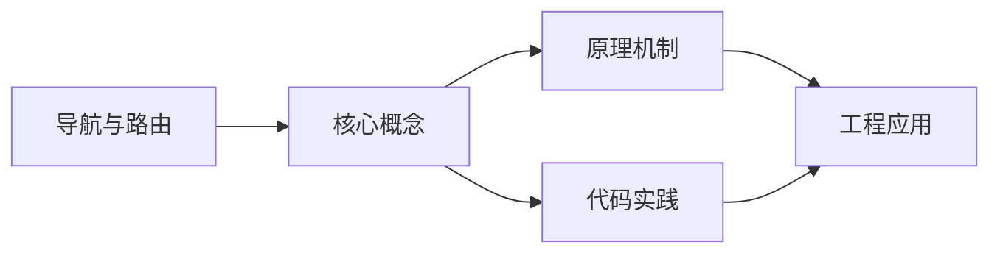
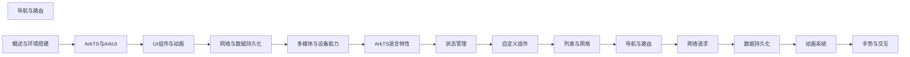

## 1. 学习目标（Bloom 分类）

本节按照布鲁姆教育目标分类学组织学习路径。本文主题为《导航与路由》，属于 HarmonyOS 模块，读者可以根据自身阶段选择阅读深度。

记忆层面：能够准确复述本文的核心概念、术语与基本语法或操作步骤，并能够在提问或检索时快速定位对应知识点。能够说出 HarmonyOS 的核心概念、术语与标准写法。

理解层面：能够用自己的语言解释核心原理与工作机制，说明概念之间的因果关系，而不是机械记忆结论。能够解释 HarmonyOS 的工作原理与设计动机。

应用层面：能够在真实项目或练习场景中运用本文知识解决具体问题，写出正确且可维护的实现。能够编写符合 HarmonyOS 规范的完整实现。

分析层面：能够拆解复杂问题，比较本文主题与相邻概念的异同，识别边界条件与例外情况。能够分析 HarmonyOS 与相邻方案的差异与边界。

评价层面：能够根据约束条件（性能、可读性、安全、成本）评价不同方案的优劣，做出有依据的技术决策。能够根据场景评价 HarmonyOS 相关方案的优劣。

创造层面：能够把本文知识与其他模块知识组合，设计出新的解决方案或可复用的工程模式。能够组合 HarmonyOS 与其他技术设计完整方案。

通过本节学习，读者应当能够把《导航与路由》纳入自己的知识网络，并与 HarmonyOS 模块的其他主题（ArkTS、ArkUI、分布式能力、应用开发）建立关联。

## 2. 历史动机与发展脉络

《导航与路由》是 HarmonyOS 领域的重要主题。要真正理解它，需要先了解它解决的问题与演进过程。

HarmonyOS（鸿蒙）由华为于 2019 年发布，定位面向全场景的分布式操作系统；HarmonyOS NEXT（5.0，2024）去 Android 化，采用自研鸿蒙内核与 ArkTS 语言栈。
开发框架：ArkTS（TS 超集 + 声明式 UI 扩展）、ArkUI（声明式组件）、Stage 模型（应用模型）、方舟编译器。
分布式能力：跨端流转、分布式数据、一次开发多端部署（手机/平板/车机/穿戴）。

回到本文主题：导航与路由 的提出与成熟，正是上述技术背景下的必然产物。早期实现往往以简单可用为目标，随着工程规模扩大，社区逐渐沉淀出标准做法与最佳实践；理解这一脉络，可以帮助读者判断“为什么文档中的推荐写法是现在这个样子”，也能在遇到历史遗留代码时准确识别其设计年代与取舍。


## 3. 形式化定义与核心概念精讲

本节把《导航与路由》涉及的核心概念以“定义 + 讲解”的形式展开。读者应把定义当作工具，把讲解当作理解路径；两者结合才能形成可迁移的知识。

ArkTS 语法：基于 TypeScript 的类型系统，增加 @Component/@Entry/@State 等装饰器与 UI 描述语法。
ArkUI 组件：Column/Row/Stack 布局容器、Text/Button/Image 基础组件、List/Grid 容器组件；状态管理（@State/@Prop/@Link/@Provide）。
应用模型：Stage 模型以 UIAbility 为页面载体，EntryAbility 入口；module.json5 声明应用配置。

### 3.1 原文章节逐一精讲

原文档把主题拆分为 20 个小节，下面按顺序给出每一节的导读讲解，随后保留原文细节供精读。

#### 原文精读（完整保留）

# 导航与路由 语法速查手册

> **符号约定**:`< >` 必填参数 | `[ ]` 可选参数

---

#### 概述

HarmonyOS 提供了两套路由导航方案：Navigation 组件和 Router 模块。Navigation 是声明式的导航容器，支持 NavDestination 子页面管理、导航栏定制和路由栈操作，适合复杂的单页面应用架构。Router 是命令式的页面路由，通过 API 调用实现页面跳转和返回，适合简单的多页面应用。在实际开发中，推荐优先使用 Navigation，它提供了更丰富的导航能力和更好的类型安全。

#### 基础概念

**Navigation**：导航容器组件，内部管理一个路由栈，每个栈元素对应一个 NavDestination 页面。支持 pushPath（入栈）、pop（出栈）、replacePath（替换）等操作。

**NavDestination**：Navigation 的子页面组件，每个 NavDestination 代表一个可导航的目标页面。通过 title 设置导航栏标题，通过 hideBackButton 控制返回按钮显示。

**NavPathStack**：Navigation 的路由栈对象，提供了完整的栈操作 API，包括 push、pop、replace、clear、moveToTop 等。支持获取栈信息、监听栈变化。

**Router**：全局路由模块，通过 router.pushUrl 和 router.back 等方法实现页面跳转。每个页面需要在 main_pages.json 中注册路径。

**页面参数传递**：两种方案都支持页面间参数传递。Navigation 通过 NavPathStack 的参数机制传递，Router 通过 params 字段传递。

#### 快速上手

##### Navigation 基本用法

```typescript
// 创建路由栈
@Entry
@Component
struct NavigationDemo {
  // 创建导航栈
  navStack: NavPathStack = new NavPathStack()

  build() {
    // Navigation 容器
    Navigation(this.navStack) {
      // 首页内容
      Column() {
        Text('首页')
          .fontSize(24)
          .margin({ bottom: 20 })

        Button('跳转到详情页')
          .onClick(() => {
            // 将页面路径压入导航栈
            this.navStack.pushPath({ name: 'Detail' })
          })
      }
      .width('100%')
      .height('100%')
      .justifyContent(FlexAlign.Center)
    }
    .title('应用首页')
    // 注册 NavDestination 页面
    .navDestination(this.buildNavDestination)
  }

  @Builder
  buildNavDestination(name: string) {
    if (name === 'Detail') {
      DetailPage({ navStack: this.navStack })
    }
  }
}

// 详情页组件
@Component
struct DetailPage {
  navStack: NavPathStack = new NavPathStack()

  build() {
    NavDestination() {
      Column() {
        Text('详情页内容')
          .fontSize(20)
        Button('返回')
          .onClick(() => {
            this.navStack.pop()
          })
      }
    }
    .title('详情页')
  }
}
```

##### Router 基本用法

```typescript
import router from '@ohos.router'

@Entry
@Component
struct RouterDemo {
  build() {
    Column() {
      Button('跳转到详情页')
        .onClick(() => {
          // 使用 Router 跳转，传递参数
          router.pushUrl({
            url: 'pages/DetailPage',
            params: {
              id: 42,
              name: '测试数据'
            }
          })
        })

      Button('替换当前页')
        .onClick(() => {
          // 替换当前页面，无法返回
          router.replaceUrl({
            url: 'pages/LoginPage'
          })
        })
    }
  }
}

// 详情页接收参数
@Entry
@Component
struct DetailPage {
  build() {
    Column() {
      // 获取路由传递的参数
      Text(`参数: ${JSON.stringify(router.getParams())}`)
        .fontSize(16)

      Button('返回上一页')
        .onClick(() => {
          router.back()
        })
    }
  }
}
```

#### 详细用法

##### Navigation 带参数跳转

```typescript
// 定义页面参数类型
interface DetailParams {
  itemId: number
  title: string
}

@Entry
@Component
struct NavWithParamsDemo {
  navStack: NavPathStack = new NavPathStack()

  build() {
    Navigation(this.navStack) {
      Column({ space: 10 }) {
        Button('查看商品1')
          .onClick(() => {
            this.navStack.pushPath({
              name: 'ProductDetail',
              param: { itemId: 1, title: '商品一' } as DetailParams
            })
          })

        Button('查看商品2')
          .onClick(() => {
            this.navStack.pushPath({
              name: 'ProductDetail',
              param: { itemId: 2, title: '商品二' } as DetailParams
            })
          })
      }
    }
    .navDestination(this.buildNavDestination)
  }

  @Builder
  buildNavDestination(name: string) {
    if (name === 'ProductDetail') {
      ProductDetailPage({ navStack: this.navStack })
    }
  }
}

@Component
struct ProductDetailPage {
  navStack: NavPathStack = new NavPathStack()
  // 从导航栈获取参数
  @State params: DetailParams = this.navStack.getParamByName('ProductDetail')[0] as DetailParams

  build() {
    NavDestination() {
      Column() {
        Text(`商品ID: ${this.params.itemId}`)
        Text(`商品名称: ${this.params.title}`)
        Button('返回')
          .onClick(() => this.navStack.pop())
      }
    }
    .title(this.params.title)
  }
}
```

##### Navigation 路由栈操作

```typescript
@Entry
@Component
struct NavStackOpsDemo {
  navStack: NavPathStack = new NavPathStack()

  build() {
    Navigation(this.navStack) {
      Column({ space: 10 }) {
        Text(`当前栈深度: ${this.navStack.size()}`)
          .fontSize(14)

        Button('压入页面A')
          .onClick(() => this.navStack.pushPath({ name: 'PageA' }))

        Button('压入页面B')
          .onClick(() => this.navStack.pushPath({ name: 'PageB' }))

        Button('弹出当前页')
          .onClick(() => this.navStack.pop())

        Button('弹出到指定页面')
          .onClick(() => this.navStack.popToName('PageA'))

        Button('清空栈')
          .onClick(() => this.navStack.clear())

        Button('移动到栈顶')
          .onClick(() => this.navStack.moveToTop('PageA'))
      }
      .padding(20)
    }
    .navDestination(this.buildNavDestination)
  }

  @Builder
  buildNavDestination(name: string) {
    if (name === 'PageA') {
      PageA({ navStack: this.navStack })
    } else if (name === 'PageB') {
      PageB({ navStack: this.navStack })
    }
  }
}
```

##### 自定义导航栏

```typescript
@Entry
@Component
struct CustomNavBarDemo {
  navStack: NavPathStack = new NavPathStack()

  build() {
    Navigation(this.navStack) {
      Column() {
        Text('首页内容')
      }
    }
    // 隐藏默认导航栏
    .hideToolBar(true)
    // 自定义导航栏
    .customNavContentTransition(() => {
      // 返回自定义导航栏内容
      return undefined
    })
    .titleMode(NavigationTitleMode.Mini)
    .navDestination(this.buildNavDestination)
  }

  @Builder
  buildNavDestination(name: string) {
    // 空实现
  }
}
```

#### 常见场景

##### Tab 页签与导航结合

```typescript
@Entry
@Component
struct TabNavDemo {
  navStack: NavPathStack = new NavPathStack()
  @State currentTab: number = 0

  build() {
    Navigation(this.navStack) {
      Tabs({ index: this.currentTab }) {
        TabContent() {
          Column() {
            Text('首页')
            Button('查看详情')
              .onClick(() => this.navStack.pushPath({ name: 'Detail' }))
          }
        }.tabBar('首页')

        TabContent() {
          Column() {
            Text('我的')
            Button('设置')
              .onClick(() => this.navStack.pushPath({ name: 'Settings' }))
          }
        }.tabBar('我的')
      }
    }
    .navDestination(this.buildNavDestination)
  }

  @Builder
  buildNavDestination(name: string) {
    if (name === 'Detail') {
      DetailPage({ navStack: this.navStack })
    } else if (name === 'Settings') {
      SettingsPage({ navStack: this.navStack })
    }
  }
}
```

##### 带返回结果的页面跳转

```typescript
import { CommonDataSource } from '@ohos.base'

@Entry
@Component
struct ResultNavDemo {
  navStack: NavPathStack = new NavPathStack()
  @State selectedCity: string = '未选择'

  build() {
    Navigation(this.navStack) {
      Column({ space: 10 }) {
        Text(`当前城市: ${this.selectedCity}`)
          .fontSize(18)

        Button('选择城市')
          .onClick(() => {
            this.navStack.pushPath({ name: 'CityPicker' })
          })
      }
      .padding(20)
    }
    .navDestination(this.buildNavDestination)
  }

  @Builder
  buildNavDestination(name: string) {
    if (name === 'CityPicker') {
      CityPickerPage({
        navStack: this.navStack,
        onCitySelected: (city: string) => {
          this.selectedCity = city
        }
      })
    }
  }
}

@Component
struct CityPickerPage {
  navStack: NavPathStack = new NavPathStack()
  onCitySelected: (city: string) => void = () => {}
  @State cities: string[] = ['北京', '上海', '广州', '深圳', '杭州']

  build() {
    NavDestination() {
      List() {
        ForEach(this.cities, (city: string) => {
          ListItem() {
            Text(city)
              .width('100%')
              .padding(16)
              .onClick(() => {
                this.onCitySelected(city)
                this.navStack.pop()
              })
          }
        }, (city: string) => city)
      }
    }
    .title('选择城市')
  }
}
```

#### 注意事项

- **Navigation vs Router**：Navigation 是推荐方案，支持类型安全的参数传递和声明式路由管理。Router 适合简单场景或从旧项目迁移。不要在同一页面中混用两种方案。
- **NavPathStack 传递**：NavPathStack 需要通过组件参数传递给子页面，确保每个 NavDestination 都能访问到同一个栈实例。
- **页面注册**：Router 方案需要在 main_pages.json 中注册页面路径，未注册的路径无法跳转。Navigation 方案通过 navDestination 构建器动态注册。
- **路由栈大小**：注意控制路由栈深度，过深的栈会占用大量内存。适时使用 replacePath 替代 pushPath，或使用 clear 清空栈。
- **生命周期**：NavDestination 拥有独立的生命周期回调（onShown、onHidden、aboutToAppear、aboutToDisappear），适合在此处管理页面级资源。

#### 进阶用法

##### 导航转场动画

```typescript
@Entry
@Component
struct TransitionNavDemo {
  navStack: NavPathStack = new NavPathStack()

  build() {
    Navigation(this.navStack) {
      Column() {
        Button('跳转')
          .onClick(() => this.navStack.pushPath({ name: 'AnimatedPage' }))
      }
    }
    // 自定义导航转场动画
    .navTransition({
      // 入场动画
      onTransitionEnter: (transition: NavigationTransition) => {
        // 从右侧滑入
        transition.to.translate({ x: 0 })
        transition.from.translate({ x: '100%' })
      },
      // 出场动画
      onTransitionExit: (transition: NavigationTransition) => {
        transition.to.translate({ x: '-30%' })
        transition.from.translate({ x: 0 })
      }
    })
    .navDestination(this.buildNavDestination)
  }

  @Builder
  buildNavDestination(name: string) {
    if (name === 'AnimatedPage') {
      AnimatedPage({ navStack: this.navStack })
    }
  }
}
```

##### 路由拦截与守卫

```typescript
@Entry
@Component
struct GuardNavDemo {
  navStack: NavPathStack = new NavPathStack()
  @State isLoggedIn: boolean = false

  build() {
    Navigation(this.navStack) {
      Column({ space: 10 }) {
        Button('查看个人中心')
          .onClick(() => {
            // 路由守卫：未登录时跳转到登录页
            if (!this.isLoggedIn) {
              this.navStack.pushPath({ name: 'Login' })
            } else {
              this.navStack.pushPath({ name: 'Profile' })
            }
          })

        Button(this.isLoggedIn ? '退出登录' : '模拟登录')
          .onClick(() => {
            this.isLoggedIn = !this.isLoggedIn
          })
      }
      .padding(20)
    }
    .navDestination(this.buildNavDestination)
  }

  @Builder
  buildNavDestination(name: string) {
    if (name === 'Login') {
      LoginPage({
        navStack: this.navStack,
        onLoginSuccess: () => {
          this.isLoggedIn = true
          this.navStack.replacePath({ name: 'Profile' })
        }
      })
    } else if (name === 'Profile') {
      ProfilePage({ navStack: this.navStack })
    }
  }
}
```

##### 深度链接与路由恢复

```typescript
@Entry
@Component
struct DeepLinkDemo {
  navStack: NavPathStack = new NavPathStack()

  aboutToAppear() {
    // 处理深度链接，恢复路由状态
    const deepLink = this.getDeepLink()
    if (deepLink) {
      // 根据深度链接构建路由栈
      this.navStack.pushPath({ name: 'Home' })
      if (deepLink.page === 'Detail') {
        this.navStack.pushPath({
          name: 'Detail',
          param: { id: deepLink.id }
        })
      }
    }
  }

  private getDeepLink(): object | null {
    // 从意图中获取深度链接信息
    return null
  }

  build() {
    Navigation(this.navStack) {
      Column() {
        Text('首页')
      }
    }
    .navDestination(this.buildNavDestination)
  }

  @Builder
  buildNavDestination(name: string) {
    // 路由页面注册
  }
}
```
#### Navigation 导航组件

**Navigation 容器**
`Navigation([<pathStack>?]: NavPathStack) { ... }`
```typescript
@Component
struct Index {
  private pathStack: NavPathStack = new NavPathStack()

  build() {
    Navigation(this.pathStack) {
      Column() {
        Button('Go Detail').onClick(() => {
          this.pathStack.pushPath({ name: 'detail' })
        })
      }
    }
    .title('Home')
    .titleMode(NavigationTitleMode.Mini)
  }
}
```

**NavDestination 目标页**
`NavDestination() { ... }`
```typescript
@Component
struct DetailPage {
  build() {
    NavDestination() {
      Column() {
        Text('Detail Page')
      }
    }
    .title('Detail')
    .onShown(() => {})
    .onHidden(() => {})
  }
}
```

**NavPathStack 路由栈**
`new NavPathStack(): NavPathStack`
```typescript
private pathStack: NavPathStack = new NavPathStack()

// 路由跳转
pathStack.pushPath({ name: 'detail', param: { id: 1 } })
pathStack.pushPath({ name: 'detail' }, (popInfo: PopInfo) => {})
pathStack.replacePath({ name: 'detail' })
pathStack.replacePathByName('detail', { id: 1 })

// 路由返回
pathStack.pop()
pathStack.pop({ result: 'success' })
pathStack.popToName('home')
pathStack.popToIndex(0)
pathStack.clear()
```

**NavPathStack 路由信息**
```typescript
// 获取栈大小
const size = pathStack.size()

// 获取所有路由信息
const allPaths = pathStack.getAllPathName()

// 获取参数
const param = pathStack.getParamByName('detail')
const paramByIndex = pathStack.getParamByIndex(0)
```

---

#### NavRouter 路由组件

**NavRouter 路由容器**
`NavRouter() { ... }.navDestination(() => { ... })`
```typescript
@Component
struct Index {
  @State list: Array<string> = ['A', 'B', 'C']

  build() {
    Navigation() {
      List() {
        ForEach(this.list, (item: string) => {
          ListItem() {
            NavRouter() {
              Text(item).padding(16)
            }
            .navDestination(() => {
              DetailPage({ title: item })
            })
          }
        })
      }
    }
  }
}
```

---

#### router 路由 API

**router.pushUrl 推入页面**
`router.pushUrl(<options>: RouterOptions, [<mode>?: RouterMode]): Promise<void>`
```typescript
import { router } from '@kit.ArkUI'

router.pushUrl({
  url: 'pages/Detail',
  params: { id: 1, name: 'Tom' }
}).then(() => {
  console.info('跳转成功')
}).catch((err) => {
  console.error(`跳转失败: ${JSON.stringify(err)}`)
})
```

**router.pushUrl 指定模式**
`router.pushUrl(<options>, <mode>: RouterMode)`
```typescript
router.pushUrl({ url: 'pages/Detail' }, router.RouterMode.Standard)
router.pushUrl({ url: 'pages/Detail' }, router.RouterMode.Single)
```

**router.replaceUrl 替换页面**
`router.replaceUrl(<options>: RouterOptions, [<mode>?: RouterMode]): Promise<void>`
```typescript
router.replaceUrl({
  url: 'pages/Home',
  params: {}
})
```

**router.back 返回**
`router.back([<options>?]: RouterOptions | string])`
```typescript
router.back()                              // 返回上一页
router.back({ url: 'pages/Home' })         // 返回到指定页
router.back({ url: 'pages/Home', params: { ok: true } })
```

**router.clear 清空栈**
`router.clear(): void`
```typescript
router.clear()
```

---

#### router 路由信息

**router.getState 获取状态**
`router.getState(): RouterState`
```typescript
const state = router.getState()
console.info(`index: ${state.index}`)
console.info(`name: ${state.name}`)
console.info(`path: ${state.path}`)
```

**router.getLength 栈长度**
`router.getLength(): number`
```typescript
const length = router.getLength()
console.info(`栈深度: ${length}`)
```

**router.getParams 获取参数**
`router.getParams(): Object`
```typescript
const params = router.getParams() as DetailParams
console.info(`id: ${params.id}`)
```

---

#### router 路由模式

**RouterMode 路由模式**
```typescript
router.RouterMode.Standard  // 标准模式,允许多个相同页面
router.RouterMode.Single    // 单例模式,相同页面只保留一个
```

---

#### router 事件

**router.enableAlertBeforeBackPage 返回拦截**
`router.enableAlertBeforeBackPage(<options>): Promise<void>`
```typescript
router.enableAlertBeforeBackPage({
  message: '确定要退出吗?'
}).then(() => {
  console.info('已注册返回拦截')
})
```

**router.disableAlertBeforeBackPage 取消拦截**
`router.disableAlertBeforeBackPage(): void`
```typescript
router.disableAlertBeforeBackPage()
```

---

#### 页面路由配置

**main_pages.json 路由配置**
```json5
{
  "src": [
    "pages/Index",
    "pages/Detail",
    "pages/Profile",
    "pages/Settings"
  ]
}
```

---

#### 页面间通信

**pushUrl 传参**
```typescript
// 发送方
router.pushUrl({
  url: 'pages/Detail',
  params: { id: 1, name: 'Tom' }
})

// 接收方
@Entry
@Component
struct Detail {
  private params: DetailParams = router.getParams() as DetailParams

  build() {
    Column() {
      Text(`ID: ${this.params.id}`)
      Text(`Name: ${this.params.name}`)
    }
  }
}
```

**back 返回数据**
```typescript
// 接收方
router.pushUrl({
  url: 'pages/Editor'
}).then(() => {})

// 编辑页返回时传递数据
router.back({ url: 'pages/Home', params: { saved: true } })

// 主页接收返回数据
// 通过 onBackPress 或 aboutToAppear 中读取参数
```

---

#### Navigation 路由模式

**Navigation 模式**
```typescript
Navigation(this.pathStack) { ... }
  .mode(NavigationMode.Stack)     // 栈模式
  .mode(NavigationMode.Split)     // 分栏模式
  .mode(NavigationMode.Auto)      // 自适应模式
```

**titleMode 标题模式**
```typescript
Navigation() { ... }
  .titleMode(NavigationTitleMode.Mini)    // 迷你标题
  .titleMode(NavigationTitleMode.Full)    // 完整标题
  .titleMode(NavigationTitleMode.Free)    // 自由模式
```

---

#### NavDestination 事件

**onShown 显示**
`NavDestination().onShown(() => { ... })`
```typescript
NavDestination() { ... }
  .onShown(() => {
    console.info('页面显示')
  })
```

**onHidden 隐藏**
`NavDestination().onHidden(() => { ... })`
```typescript
NavDestination() { ... }
  .onHidden(() => {
    console.info('页面隐藏')
  })
```

**onBackPressed 返回拦截**
`NavDestination().onBackPressed((): boolean => { ... })`
```typescript
NavDestination() { ... }
  .onBackPressed((): boolean => {
    return this.handleBack()
  })
```

**onNavBarStateChange 标题栏变化**
`NavDestination().onNavBarStateChange((state: NavBarState) => { ... })`
```typescript
NavDestination() { ... }
  .onNavBarStateChange((state: NavBarState) => {
    console.info(`state: ${state}`)
  })
```

---

#### 动态路由

**NavPathStack 动态注册**
```typescript
@Entry
@Component
struct Index {
  private pathStack: NavPathStack = new NavPathStack()

  @Builder pageMap(name: string) {
    if (name === 'detail') {
      DetailPage()
    } else if (name === 'profile') {
      ProfilePage()
    }
  }

  build() {
    Navigation(this.pathStack) {
      Column() {
        Button('Detail').onClick(() => {
          this.pathStack.pushPath({ name: 'detail' })
        })
      }
    }
    .navDestination(this.pageMap)
  }
}
```

---

#### 转场动画

**customNavContentTransition 自定义转场**
`Navigation().customNavContentTransition((from, to, op) => { ... })`
```typescript
Navigation(this.pathStack) { ... }
  .customNavContentTransition((from: NavContentInfo, to: NavContentInfo, op: NavigationOperation) => {
    return {
      timeout: 300,
      transition: (proxy) => {
        // 自定义转场动画
      }
    }
  })
```

---

#### 路由守卫

**页面拦截示例**
```typescript
@Component
struct Index {
  private pathStack: NavPathStack = new NavPathStack()

  private checkLogin(): boolean {
    return AppStorage.get<string>('token') !== undefined
  }

  build() {
    Navigation(this.pathStack) {
      Button('Profile').onClick(() => {
        if (this.checkLogin()) {
          this.pathStack.pushPath({ name: 'profile' })
        } else {
          this.pathStack.pushPath({ name: 'login' })
        }
      })
    }
  }
}
```


### 3.2 概念关系图

下面用 Mermaid 图表达本文核心概念之间的关系，帮助读者建立整体图景：



图中展示的是本文知识的结构化关系：核心概念是入口，原理机制解释“为什么”，代码实践演示“怎么做”，工程应用回答“何时用”。读者学习时可以把每个小节的内容挂接到对应节点上。

## 4. 理论推导与原理解析

本节深入《导航与路由》背后的原理。理论部分不求面面俱到，而是聚焦“能解释现象、能指导实践”的关键推导。

ArkTS 语法：基于 TypeScript 的类型系统，增加 @Component/@Entry/@State 等装饰器与 UI 描述语法。
ArkUI 组件：Column/Row/Stack 布局容器、Text/Button/Image 基础组件、List/Grid 容器组件；状态管理（@State/@Prop/@Link/@Provide）。
应用模型：Stage 模型以 UIAbility 为页面载体，EntryAbility 入口；module.json5 声明应用配置。
生命周期：Ability 的 onCreate/onWindowStageCreate/onForeground/onBackground/onDestroy。

需要强调的是，理论推导与工程实践之间存在翻译层：理论给出的是理想化模型与边界条件，工程代码则必须处理真实环境中的例外。读者在学习时应先掌握理论的“标准情形”，再通过陷阱章节了解“非标准情形”。

## 5. 代码示例与逐行讲解

本节把原文中的代码示例系统整理，并为每个示例补充用途说明与讲解。读者不应只浏览代码，而应逐段对照讲解理解设计意图。

### 5.1 示例：Navigation 基本用法

该示例来自原文《Navigation 基本用法》小节，用于演示导航与路由相关操作。阅读时请先看代码结构，再看其后的讲解。

```typescript
// 创建路由栈
@Entry
@Component
struct NavigationDemo {
  // 创建导航栈
  navStack: NavPathStack = new NavPathStack()

  build() {
    // Navigation 容器
    Navigation(this.navStack) {
      // 首页内容
      Column() {
        Text('首页')
          .fontSize(24)
          .margin({ bottom: 20 })

        Button('跳转到详情页')
          .onClick(() => {
            // 将页面路径压入导航栈
            this.navStack.pushPath({ name: 'Detail' })
          })
      }
      .width('100%')
      .height('100%')
      .justifyContent(FlexAlign.Center)
    }
    .title('应用首页')
    // 注册 NavDestination 页面
    .navDestination(this.buildNavDestination)
  }

  @Builder
  buildNavDestination(name: string) {
    if (name === 'Detail') {
      DetailPage({ navStack: this.navStack })
    }
  }
}

// 详情页组件
@Component
struct DetailPage {
  navStack: NavPathStack = new NavPathStack()

  build() {
    NavDestination() {
      Column() {
        Text('详情页内容')
          .fontSize(20)
        Button('返回')
          .onClick(() => {
            this.navStack.pop()
          })
      }
    }
    .title('详情页')
  }
}
```

讲解：这段代码演示了本节核心知识点。代码中的关键操作可以归纳为三步：准备（定义或初始化）、执行（核心逻辑）、收尾（释放资源或返回结果）。实际项目中，这三步往往被封装为函数或类，以提升复用性与可测试性。

关键点分析：

该示例共 53 行有效代码，包含 1 类关键结构（if）。其中：

- 入口与初始化部分负责建立上下文，对应实际项目中的启动或装配逻辑；
- 核心逻辑部分体现本文主题的主要操作，是阅读时最需要对照讲解理解的部分；
- 输出或返回部分把结果交给调用方，注意其类型与边界条件。

进阶思考路径：先尝试修改参数观察行为变化，再把示例中的模式迁移到自己的项目中；每次修改都记录预期与实测差异，这是把示例转化为能力的最快方式。

### 5.2 示例：Router 基本用法

该示例来自原文《Router 基本用法》小节，用于演示导航与路由相关操作。阅读时请先看代码结构，再看其后的讲解。

```typescript
import router from '@ohos.router'

@Entry
@Component
struct RouterDemo {
  build() {
    Column() {
      Button('跳转到详情页')
        .onClick(() => {
          // 使用 Router 跳转，传递参数
          router.pushUrl({
            url: 'pages/DetailPage',
            params: {
              id: 42,
              name: '测试数据'
            }
          })
        })

      Button('替换当前页')
        .onClick(() => {
          // 替换当前页面，无法返回
          router.replaceUrl({
            url: 'pages/LoginPage'
          })
        })
    }
  }
}

// 详情页接收参数
@Entry
@Component
struct DetailPage {
  build() {
    Column() {
      // 获取路由传递的参数
      Text(`参数: ${JSON.stringify(router.getParams())}`)
        .fontSize(16)

      Button('返回上一页')
        .onClick(() => {
          router.back()
        })
    }
  }
}
```

讲解：这段代码演示了本节核心知识点。代码中的关键操作可以归纳为三步：准备（定义或初始化）、执行（核心逻辑）、收尾（释放资源或返回结果）。实际项目中，这三步往往被封装为函数或类，以提升复用性与可测试性。

关键点分析：

该示例共 43 行有效代码，包含 2 类关键结构（import、from）。其中：

- 入口与初始化部分负责建立上下文，对应实际项目中的启动或装配逻辑；
- 核心逻辑部分体现本文主题的主要操作，是阅读时最需要对照讲解理解的部分；
- 输出或返回部分把结果交给调用方，注意其类型与边界条件。

进阶思考路径：先尝试修改参数观察行为变化，再把示例中的模式迁移到自己的项目中；每次修改都记录预期与实测差异，这是把示例转化为能力的最快方式。

### 5.3 示例：Navigation 带参数跳转

该示例来自原文《Navigation 带参数跳转》小节，用于演示导航与路由相关操作。阅读时请先看代码结构，再看其后的讲解。

```typescript
// 定义页面参数类型
interface DetailParams {
  itemId: number
  title: string
}

@Entry
@Component
struct NavWithParamsDemo {
  navStack: NavPathStack = new NavPathStack()

  build() {
    Navigation(this.navStack) {
      Column({ space: 10 }) {
        Button('查看商品1')
          .onClick(() => {
            this.navStack.pushPath({
              name: 'ProductDetail',
              param: { itemId: 1, title: '商品一' } as DetailParams
            })
          })

        Button('查看商品2')
          .onClick(() => {
            this.navStack.pushPath({
              name: 'ProductDetail',
              param: { itemId: 2, title: '商品二' } as DetailParams
            })
          })
      }
    }
    .navDestination(this.buildNavDestination)
  }

  @Builder
  buildNavDestination(name: string) {
    if (name === 'ProductDetail') {
      ProductDetailPage({ navStack: this.navStack })
    }
  }
}

@Component
struct ProductDetailPage {
  navStack: NavPathStack = new NavPathStack()
  // 从导航栈获取参数
  @State params: DetailParams = this.navStack.getParamByName('ProductDetail')[0] as DetailParams

  build() {
    NavDestination() {
      Column() {
        Text(`商品ID: ${this.params.itemId}`)
        Text(`商品名称: ${this.params.title}`)
        Button('返回')
          .onClick(() => this.navStack.pop())
      }
    }
    .title(this.params.title)
  }
}
```

讲解：这段代码演示了本节核心知识点。代码中的关键操作可以归纳为三步：准备（定义或初始化）、执行（核心逻辑）、收尾（释放资源或返回结果）。实际项目中，这三步往往被封装为函数或类，以提升复用性与可测试性。

关键点分析：

该示例共 54 行有效代码，包含 1 类关键结构（if）。其中：

- 入口与初始化部分负责建立上下文，对应实际项目中的启动或装配逻辑；
- 核心逻辑部分体现本文主题的主要操作，是阅读时最需要对照讲解理解的部分；
- 输出或返回部分把结果交给调用方，注意其类型与边界条件。

进阶思考路径：先尝试修改参数观察行为变化，再把示例中的模式迁移到自己的项目中；每次修改都记录预期与实测差异，这是把示例转化为能力的最快方式。

### 5.4 示例：Navigation 路由栈操作

该示例来自原文《Navigation 路由栈操作》小节，用于演示导航与路由相关操作。阅读时请先看代码结构，再看其后的讲解。

```typescript
@Entry
@Component
struct NavStackOpsDemo {
  navStack: NavPathStack = new NavPathStack()

  build() {
    Navigation(this.navStack) {
      Column({ space: 10 }) {
        Text(`当前栈深度: ${this.navStack.size()}`)
          .fontSize(14)

        Button('压入页面A')
          .onClick(() => this.navStack.pushPath({ name: 'PageA' }))

        Button('压入页面B')
          .onClick(() => this.navStack.pushPath({ name: 'PageB' }))

        Button('弹出当前页')
          .onClick(() => this.navStack.pop())

        Button('弹出到指定页面')
          .onClick(() => this.navStack.popToName('PageA'))

        Button('清空栈')
          .onClick(() => this.navStack.clear())

        Button('移动到栈顶')
          .onClick(() => this.navStack.moveToTop('PageA'))
      }
      .padding(20)
    }
    .navDestination(this.buildNavDestination)
  }

  @Builder
  buildNavDestination(name: string) {
    if (name === 'PageA') {
      PageA({ navStack: this.navStack })
    } else if (name === 'PageB') {
      PageB({ navStack: this.navStack })
    }
  }
}
```

讲解：这段代码演示了本节核心知识点。代码中的关键操作可以归纳为三步：准备（定义或初始化）、执行（核心逻辑）、收尾（释放资源或返回结果）。实际项目中，这三步往往被封装为函数或类，以提升复用性与可测试性。

关键点分析：

该示例共 35 行有效代码，包含 1 类关键结构（if）。其中：

- 入口与初始化部分负责建立上下文，对应实际项目中的启动或装配逻辑；
- 核心逻辑部分体现本文主题的主要操作，是阅读时最需要对照讲解理解的部分；
- 输出或返回部分把结果交给调用方，注意其类型与边界条件。

进阶思考路径：先尝试修改参数观察行为变化，再把示例中的模式迁移到自己的项目中；每次修改都记录预期与实测差异，这是把示例转化为能力的最快方式。

### 5.5 示例：自定义导航栏

该示例来自原文《自定义导航栏》小节，用于演示导航与路由相关操作。阅读时请先看代码结构，再看其后的讲解。

```typescript
@Entry
@Component
struct CustomNavBarDemo {
  navStack: NavPathStack = new NavPathStack()

  build() {
    Navigation(this.navStack) {
      Column() {
        Text('首页内容')
      }
    }
    // 隐藏默认导航栏
    .hideToolBar(true)
    // 自定义导航栏
    .customNavContentTransition(() => {
      // 返回自定义导航栏内容
      return undefined
    })
    .titleMode(NavigationTitleMode.Mini)
    .navDestination(this.buildNavDestination)
  }

  @Builder
  buildNavDestination(name: string) {
    // 空实现
  }
}
```

讲解：这段代码演示了本节核心知识点。代码中的关键操作可以归纳为三步：准备（定义或初始化）、执行（核心逻辑）、收尾（释放资源或返回结果）。实际项目中，这三步往往被封装为函数或类，以提升复用性与可测试性。

关键点分析：

该示例共 25 行有效代码，包含 1 类关键结构（return）。其中：

- 入口与初始化部分负责建立上下文，对应实际项目中的启动或装配逻辑；
- 核心逻辑部分体现本文主题的主要操作，是阅读时最需要对照讲解理解的部分；
- 输出或返回部分把结果交给调用方，注意其类型与边界条件。

进阶思考路径：先尝试修改参数观察行为变化，再把示例中的模式迁移到自己的项目中；每次修改都记录预期与实测差异，这是把示例转化为能力的最快方式。

### 5.6 示例：Tab 页签与导航结合

该示例来自原文《Tab 页签与导航结合》小节，用于演示导航与路由相关操作。阅读时请先看代码结构，再看其后的讲解。

```typescript
@Entry
@Component
struct TabNavDemo {
  navStack: NavPathStack = new NavPathStack()
  @State currentTab: number = 0

  build() {
    Navigation(this.navStack) {
      Tabs({ index: this.currentTab }) {
        TabContent() {
          Column() {
            Text('首页')
            Button('查看详情')
              .onClick(() => this.navStack.pushPath({ name: 'Detail' }))
          }
        }.tabBar('首页')

        TabContent() {
          Column() {
            Text('我的')
            Button('设置')
              .onClick(() => this.navStack.pushPath({ name: 'Settings' }))
          }
        }.tabBar('我的')
      }
    }
    .navDestination(this.buildNavDestination)
  }

  @Builder
  buildNavDestination(name: string) {
    if (name === 'Detail') {
      DetailPage({ navStack: this.navStack })
    } else if (name === 'Settings') {
      SettingsPage({ navStack: this.navStack })
    }
  }
}
```

讲解：这段代码演示了本节核心知识点。代码中的关键操作可以归纳为三步：准备（定义或初始化）、执行（核心逻辑）、收尾（释放资源或返回结果）。实际项目中，这三步往往被封装为函数或类，以提升复用性与可测试性。

关键点分析：

该示例共 35 行有效代码，包含 1 类关键结构（if）。其中：

- 入口与初始化部分负责建立上下文，对应实际项目中的启动或装配逻辑；
- 核心逻辑部分体现本文主题的主要操作，是阅读时最需要对照讲解理解的部分；
- 输出或返回部分把结果交给调用方，注意其类型与边界条件。

进阶思考路径：先尝试修改参数观察行为变化，再把示例中的模式迁移到自己的项目中；每次修改都记录预期与实测差异，这是把示例转化为能力的最快方式。

### 5.7 示例：带返回结果的页面跳转

该示例来自原文《带返回结果的页面跳转》小节，用于演示导航与路由相关操作。阅读时请先看代码结构，再看其后的讲解。

```typescript
import { CommonDataSource } from '@ohos.base'

@Entry
@Component
struct ResultNavDemo {
  navStack: NavPathStack = new NavPathStack()
  @State selectedCity: string = '未选择'

  build() {
    Navigation(this.navStack) {
      Column({ space: 10 }) {
        Text(`当前城市: ${this.selectedCity}`)
          .fontSize(18)

        Button('选择城市')
          .onClick(() => {
            this.navStack.pushPath({ name: 'CityPicker' })
          })
      }
      .padding(20)
    }
    .navDestination(this.buildNavDestination)
  }

  @Builder
  buildNavDestination(name: string) {
    if (name === 'CityPicker') {
      CityPickerPage({
        navStack: this.navStack,
        onCitySelected: (city: string) => {
          this.selectedCity = city
        }
      })
    }
  }
}

@Component
struct CityPickerPage {
  navStack: NavPathStack = new NavPathStack()
  onCitySelected: (city: string) => void = () => {}
  @State cities: string[] = ['北京', '上海', '广州', '深圳', '杭州']

  build() {
    NavDestination() {
      List() {
        ForEach(this.cities, (city: string) => {
          ListItem() {
            Text(city)
              .width('100%')
              .padding(16)
              .onClick(() => {
                this.onCitySelected(city)
                this.navStack.pop()
              })
          }
        }, (city: string) => city)
      }
    }
    .title('选择城市')
  }
}
```

讲解：这段代码演示了本节核心知识点。代码中的关键操作可以归纳为三步：准备（定义或初始化）、执行（核心逻辑）、收尾（释放资源或返回结果）。实际项目中，这三步往往被封装为函数或类，以提升复用性与可测试性。

关键点分析：

该示例共 56 行有效代码，包含 3 类关键结构（import、from、if）。其中：

- 入口与初始化部分负责建立上下文，对应实际项目中的启动或装配逻辑；
- 核心逻辑部分体现本文主题的主要操作，是阅读时最需要对照讲解理解的部分；
- 输出或返回部分把结果交给调用方，注意其类型与边界条件。

进阶思考路径：先尝试修改参数观察行为变化，再把示例中的模式迁移到自己的项目中；每次修改都记录预期与实测差异，这是把示例转化为能力的最快方式。

### 5.8 示例：导航转场动画

该示例来自原文《导航转场动画》小节，用于演示导航与路由相关操作。阅读时请先看代码结构，再看其后的讲解。

```typescript
@Entry
@Component
struct TransitionNavDemo {
  navStack: NavPathStack = new NavPathStack()

  build() {
    Navigation(this.navStack) {
      Column() {
        Button('跳转')
          .onClick(() => this.navStack.pushPath({ name: 'AnimatedPage' }))
      }
    }
    // 自定义导航转场动画
    .navTransition({
      // 入场动画
      onTransitionEnter: (transition: NavigationTransition) => {
        // 从右侧滑入
        transition.to.translate({ x: 0 })
        transition.from.translate({ x: '100%' })
      },
      // 出场动画
      onTransitionExit: (transition: NavigationTransition) => {
        transition.to.translate({ x: '-30%' })
        transition.from.translate({ x: 0 })
      }
    })
    .navDestination(this.buildNavDestination)
  }

  @Builder
  buildNavDestination(name: string) {
    if (name === 'AnimatedPage') {
      AnimatedPage({ navStack: this.navStack })
    }
  }
}
```

讲解：这段代码演示了本节核心知识点。代码中的关键操作可以归纳为三步：准备（定义或初始化）、执行（核心逻辑）、收尾（释放资源或返回结果）。实际项目中，这三步往往被封装为函数或类，以提升复用性与可测试性。

关键点分析：

该示例共 34 行有效代码，包含 1 类关键结构（if）。其中：

- 入口与初始化部分负责建立上下文，对应实际项目中的启动或装配逻辑；
- 核心逻辑部分体现本文主题的主要操作，是阅读时最需要对照讲解理解的部分；
- 输出或返回部分把结果交给调用方，注意其类型与边界条件。

进阶思考路径：先尝试修改参数观察行为变化，再把示例中的模式迁移到自己的项目中；每次修改都记录预期与实测差异，这是把示例转化为能力的最快方式。

### 5.9 示例：路由拦截与守卫

该示例来自原文《路由拦截与守卫》小节，用于演示导航与路由相关操作。阅读时请先看代码结构，再看其后的讲解。

```typescript
@Entry
@Component
struct GuardNavDemo {
  navStack: NavPathStack = new NavPathStack()
  @State isLoggedIn: boolean = false

  build() {
    Navigation(this.navStack) {
      Column({ space: 10 }) {
        Button('查看个人中心')
          .onClick(() => {
            // 路由守卫：未登录时跳转到登录页
            if (!this.isLoggedIn) {
              this.navStack.pushPath({ name: 'Login' })
            } else {
              this.navStack.pushPath({ name: 'Profile' })
            }
          })

        Button(this.isLoggedIn ? '退出登录' : '模拟登录')
          .onClick(() => {
            this.isLoggedIn = !this.isLoggedIn
          })
      }
      .padding(20)
    }
    .navDestination(this.buildNavDestination)
  }

  @Builder
  buildNavDestination(name: string) {
    if (name === 'Login') {
      LoginPage({
        navStack: this.navStack,
        onLoginSuccess: () => {
          this.isLoggedIn = true
          this.navStack.replacePath({ name: 'Profile' })
        }
      })
    } else if (name === 'Profile') {
      ProfilePage({ navStack: this.navStack })
    }
  }
}
```

讲解：这段代码演示了本节核心知识点。代码中的关键操作可以归纳为三步：准备（定义或初始化）、执行（核心逻辑）、收尾（释放资源或返回结果）。实际项目中，这三步往往被封装为函数或类，以提升复用性与可测试性。

关键点分析：

该示例共 41 行有效代码，包含 1 类关键结构（if）。其中：

- 入口与初始化部分负责建立上下文，对应实际项目中的启动或装配逻辑；
- 核心逻辑部分体现本文主题的主要操作，是阅读时最需要对照讲解理解的部分；
- 输出或返回部分把结果交给调用方，注意其类型与边界条件。

进阶思考路径：先尝试修改参数观察行为变化，再把示例中的模式迁移到自己的项目中；每次修改都记录预期与实测差异，这是把示例转化为能力的最快方式。

### 5.10 示例：深度链接与路由恢复

该示例来自原文《深度链接与路由恢复》小节，用于演示导航与路由相关操作。阅读时请先看代码结构，再看其后的讲解。

```typescript
@Entry
@Component
struct DeepLinkDemo {
  navStack: NavPathStack = new NavPathStack()

  aboutToAppear() {
    // 处理深度链接，恢复路由状态
    const deepLink = this.getDeepLink()
    if (deepLink) {
      // 根据深度链接构建路由栈
      this.navStack.pushPath({ name: 'Home' })
      if (deepLink.page === 'Detail') {
        this.navStack.pushPath({
          name: 'Detail',
          param: { id: deepLink.id }
        })
      }
    }
  }

  private getDeepLink(): object | null {
    // 从意图中获取深度链接信息
    return null
  }

  build() {
    Navigation(this.navStack) {
      Column() {
        Text('首页')
      }
    }
    .navDestination(this.buildNavDestination)
  }

  @Builder
  buildNavDestination(name: string) {
    // 路由页面注册
  }
}
```

讲解：这段代码演示了本节核心知识点。代码中的关键操作可以归纳为三步：准备（定义或初始化）、执行（核心逻辑）、收尾（释放资源或返回结果）。实际项目中，这三步往往被封装为函数或类，以提升复用性与可测试性。

关键点分析：

该示例共 35 行有效代码，包含 2 类关键结构（if、return）。其中：

- 入口与初始化部分负责建立上下文，对应实际项目中的启动或装配逻辑；
- 核心逻辑部分体现本文主题的主要操作，是阅读时最需要对照讲解理解的部分；
- 输出或返回部分把结果交给调用方，注意其类型与边界条件。

进阶思考路径：先尝试修改参数观察行为变化，再把示例中的模式迁移到自己的项目中；每次修改都记录预期与实测差异，这是把示例转化为能力的最快方式。

### 5.11 示例：Navigation 导航组件

该示例来自原文《Navigation 导航组件》小节，用于演示导航与路由相关操作。阅读时请先看代码结构，再看其后的讲解。

```typescript
@Component
struct Index {
  private pathStack: NavPathStack = new NavPathStack()

  build() {
    Navigation(this.pathStack) {
      Column() {
        Button('Go Detail').onClick(() => {
          this.pathStack.pushPath({ name: 'detail' })
        })
      }
    }
    .title('Home')
    .titleMode(NavigationTitleMode.Mini)
  }
}
```

讲解：这段代码演示了本节核心知识点。代码中的关键操作可以归纳为三步：准备（定义或初始化）、执行（核心逻辑）、收尾（释放资源或返回结果）。实际项目中，这三步往往被封装为函数或类，以提升复用性与可测试性。

关键点分析：

该示例共 15 行有效代码，结构以数据或配置为主。阅读时应关注：数据字段的含义、配置项的作用，以及它们与运行行为的对应关系。

进阶思考路径：先尝试修改参数观察行为变化，再把示例中的模式迁移到自己的项目中；每次修改都记录预期与实测差异，这是把示例转化为能力的最快方式。

### 5.12 示例：Navigation 导航组件

该示例来自原文《Navigation 导航组件》小节，用于演示导航与路由相关操作。阅读时请先看代码结构，再看其后的讲解。

```typescript
@Component
struct DetailPage {
  build() {
    NavDestination() {
      Column() {
        Text('Detail Page')
      }
    }
    .title('Detail')
    .onShown(() => {})
    .onHidden(() => {})
  }
}
```

讲解：这段代码演示了本节核心知识点。代码中的关键操作可以归纳为三步：准备（定义或初始化）、执行（核心逻辑）、收尾（释放资源或返回结果）。实际项目中，这三步往往被封装为函数或类，以提升复用性与可测试性。

关键点分析：

该示例共 13 行有效代码，结构以数据或配置为主。阅读时应关注：数据字段的含义、配置项的作用，以及它们与运行行为的对应关系。

进阶思考路径：先尝试修改参数观察行为变化，再把示例中的模式迁移到自己的项目中；每次修改都记录预期与实测差异，这是把示例转化为能力的最快方式。

### 5.13 示例：Navigation 导航组件

该示例来自原文《Navigation 导航组件》小节，用于演示导航与路由相关操作。阅读时请先看代码结构，再看其后的讲解。

```typescript
private pathStack: NavPathStack = new NavPathStack()

// 路由跳转
pathStack.pushPath({ name: 'detail', param: { id: 1 } })
pathStack.pushPath({ name: 'detail' }, (popInfo: PopInfo) => {})
pathStack.replacePath({ name: 'detail' })
pathStack.replacePathByName('detail', { id: 1 })

// 路由返回
pathStack.pop()
pathStack.pop({ result: 'success' })
pathStack.popToName('home')
pathStack.popToIndex(0)
pathStack.clear()
```

讲解：这段代码演示了本节核心知识点。代码中的关键操作可以归纳为三步：准备（定义或初始化）、执行（核心逻辑）、收尾（释放资源或返回结果）。实际项目中，这三步往往被封装为函数或类，以提升复用性与可测试性。

关键点分析：

该示例共 12 行有效代码，结构以数据或配置为主。阅读时应关注：数据字段的含义、配置项的作用，以及它们与运行行为的对应关系。

进阶思考路径：先尝试修改参数观察行为变化，再把示例中的模式迁移到自己的项目中；每次修改都记录预期与实测差异，这是把示例转化为能力的最快方式。

### 5.14 示例：Navigation 导航组件

该示例来自原文《Navigation 导航组件》小节，用于演示导航与路由相关操作。阅读时请先看代码结构，再看其后的讲解。

```typescript
// 获取栈大小
const size = pathStack.size()

// 获取所有路由信息
const allPaths = pathStack.getAllPathName()

// 获取参数
const param = pathStack.getParamByName('detail')
const paramByIndex = pathStack.getParamByIndex(0)
```

讲解：这段代码演示了本节核心知识点。代码中的关键操作可以归纳为三步：准备（定义或初始化）、执行（核心逻辑）、收尾（释放资源或返回结果）。实际项目中，这三步往往被封装为函数或类，以提升复用性与可测试性。

关键点分析：

该示例共 7 行有效代码，结构以数据或配置为主。阅读时应关注：数据字段的含义、配置项的作用，以及它们与运行行为的对应关系。

进阶思考路径：先尝试修改参数观察行为变化，再把示例中的模式迁移到自己的项目中；每次修改都记录预期与实测差异，这是把示例转化为能力的最快方式。

### 5.15 示例：NavRouter 路由组件

该示例来自原文《NavRouter 路由组件》小节，用于演示导航与路由相关操作。阅读时请先看代码结构，再看其后的讲解。

```typescript
@Component
struct Index {
  @State list: Array<string> = ['A', 'B', 'C']

  build() {
    Navigation() {
      List() {
        ForEach(this.list, (item: string) => {
          ListItem() {
            NavRouter() {
              Text(item).padding(16)
            }
            .navDestination(() => {
              DetailPage({ title: item })
            })
          }
        })
      }
    }
  }
}
```

讲解：这段代码演示了本节核心知识点。代码中的关键操作可以归纳为三步：准备（定义或初始化）、执行（核心逻辑）、收尾（释放资源或返回结果）。实际项目中，这三步往往被封装为函数或类，以提升复用性与可测试性。

关键点分析：

该示例共 20 行有效代码，结构以数据或配置为主。阅读时应关注：数据字段的含义、配置项的作用，以及它们与运行行为的对应关系。

进阶思考路径：先尝试修改参数观察行为变化，再把示例中的模式迁移到自己的项目中；每次修改都记录预期与实测差异，这是把示例转化为能力的最快方式。

### 5.16 示例：router 路由 API

该示例来自原文《router 路由 API》小节，用于演示导航与路由相关操作。阅读时请先看代码结构，再看其后的讲解。

```typescript
import { router } from '@kit.ArkUI'

router.pushUrl({
  url: 'pages/Detail',
  params: { id: 1, name: 'Tom' }
}).then(() => {
  console.info('跳转成功')
}).catch((err) => {
  console.error(`跳转失败: ${JSON.stringify(err)}`)
})
```

讲解：这段代码演示了本节核心知识点。代码中的关键操作可以归纳为三步：准备（定义或初始化）、执行（核心逻辑）、收尾（释放资源或返回结果）。实际项目中，这三步往往被封装为函数或类，以提升复用性与可测试性。

关键点分析：

该示例共 9 行有效代码，包含 2 类关键结构（import、from）。其中：

- 入口与初始化部分负责建立上下文，对应实际项目中的启动或装配逻辑；
- 核心逻辑部分体现本文主题的主要操作，是阅读时最需要对照讲解理解的部分；
- 输出或返回部分把结果交给调用方，注意其类型与边界条件。

进阶思考路径：先尝试修改参数观察行为变化，再把示例中的模式迁移到自己的项目中；每次修改都记录预期与实测差异，这是把示例转化为能力的最快方式。

### 5.17 示例：router 路由 API

该示例来自原文《router 路由 API》小节，用于演示导航与路由相关操作。阅读时请先看代码结构，再看其后的讲解。

```typescript
router.pushUrl({ url: 'pages/Detail' }, router.RouterMode.Standard)
router.pushUrl({ url: 'pages/Detail' }, router.RouterMode.Single)
```

讲解：这段代码演示了本节核心知识点。代码中的关键操作可以归纳为三步：准备（定义或初始化）、执行（核心逻辑）、收尾（释放资源或返回结果）。实际项目中，这三步往往被封装为函数或类，以提升复用性与可测试性。

关键点分析：

该示例共 2 行有效代码，结构以数据或配置为主。阅读时应关注：数据字段的含义、配置项的作用，以及它们与运行行为的对应关系。

进阶思考路径：先尝试修改参数观察行为变化，再把示例中的模式迁移到自己的项目中；每次修改都记录预期与实测差异，这是把示例转化为能力的最快方式。

### 5.18 示例：router 路由 API

该示例来自原文《router 路由 API》小节，用于演示导航与路由相关操作。阅读时请先看代码结构，再看其后的讲解。

```typescript
router.replaceUrl({
  url: 'pages/Home',
  params: {}
})
```

讲解：这段代码演示了本节核心知识点。代码中的关键操作可以归纳为三步：准备（定义或初始化）、执行（核心逻辑）、收尾（释放资源或返回结果）。实际项目中，这三步往往被封装为函数或类，以提升复用性与可测试性。

关键点分析：

该示例共 4 行有效代码，结构以数据或配置为主。阅读时应关注：数据字段的含义、配置项的作用，以及它们与运行行为的对应关系。

进阶思考路径：先尝试修改参数观察行为变化，再把示例中的模式迁移到自己的项目中；每次修改都记录预期与实测差异，这是把示例转化为能力的最快方式。

### 5.19 示例：router 路由 API

该示例来自原文《router 路由 API》小节，用于演示导航与路由相关操作。阅读时请先看代码结构，再看其后的讲解。

```typescript
router.back()                              // 返回上一页
router.back({ url: 'pages/Home' })         // 返回到指定页
router.back({ url: 'pages/Home', params: { ok: true } })
```

讲解：这段代码演示了本节核心知识点。代码中的关键操作可以归纳为三步：准备（定义或初始化）、执行（核心逻辑）、收尾（释放资源或返回结果）。实际项目中，这三步往往被封装为函数或类，以提升复用性与可测试性。

关键点分析：

该示例共 3 行有效代码，结构以数据或配置为主。阅读时应关注：数据字段的含义、配置项的作用，以及它们与运行行为的对应关系。

进阶思考路径：先尝试修改参数观察行为变化，再把示例中的模式迁移到自己的项目中；每次修改都记录预期与实测差异，这是把示例转化为能力的最快方式。

### 5.20 示例：router 路由 API

该示例来自原文《router 路由 API》小节，用于演示导航与路由相关操作。阅读时请先看代码结构，再看其后的讲解。

```typescript
router.clear()
```

讲解：这段代码演示了本节核心知识点。代码中的关键操作可以归纳为三步：准备（定义或初始化）、执行（核心逻辑）、收尾（释放资源或返回结果）。实际项目中，这三步往往被封装为函数或类，以提升复用性与可测试性。

关键点分析：

该示例共 1 行有效代码，结构以数据或配置为主。阅读时应关注：数据字段的含义、配置项的作用，以及它们与运行行为的对应关系。

进阶思考路径：先尝试修改参数观察行为变化，再把示例中的模式迁移到自己的项目中；每次修改都记录预期与实测差异，这是把示例转化为能力的最快方式。

### 5.21 示例：router 路由信息

该示例来自原文《router 路由信息》小节，用于演示导航与路由相关操作。阅读时请先看代码结构，再看其后的讲解。

```typescript
const state = router.getState()
console.info(`index: ${state.index}`)
console.info(`name: ${state.name}`)
console.info(`path: ${state.path}`)
```

讲解：这段代码演示了本节核心知识点。代码中的关键操作可以归纳为三步：准备（定义或初始化）、执行（核心逻辑）、收尾（释放资源或返回结果）。实际项目中，这三步往往被封装为函数或类，以提升复用性与可测试性。

关键点分析：

该示例共 4 行有效代码，结构以数据或配置为主。阅读时应关注：数据字段的含义、配置项的作用，以及它们与运行行为的对应关系。

进阶思考路径：先尝试修改参数观察行为变化，再把示例中的模式迁移到自己的项目中；每次修改都记录预期与实测差异，这是把示例转化为能力的最快方式。

### 5.22 示例：router 路由信息

该示例来自原文《router 路由信息》小节，用于演示导航与路由相关操作。阅读时请先看代码结构，再看其后的讲解。

```typescript
const length = router.getLength()
console.info(`栈深度: ${length}`)
```

讲解：这段代码演示了本节核心知识点。代码中的关键操作可以归纳为三步：准备（定义或初始化）、执行（核心逻辑）、收尾（释放资源或返回结果）。实际项目中，这三步往往被封装为函数或类，以提升复用性与可测试性。

关键点分析：

该示例共 2 行有效代码，结构以数据或配置为主。阅读时应关注：数据字段的含义、配置项的作用，以及它们与运行行为的对应关系。

进阶思考路径：先尝试修改参数观察行为变化，再把示例中的模式迁移到自己的项目中；每次修改都记录预期与实测差异，这是把示例转化为能力的最快方式。

### 5.23 示例：router 路由信息

该示例来自原文《router 路由信息》小节，用于演示导航与路由相关操作。阅读时请先看代码结构，再看其后的讲解。

```typescript
const params = router.getParams() as DetailParams
console.info(`id: ${params.id}`)
```

讲解：这段代码演示了本节核心知识点。代码中的关键操作可以归纳为三步：准备（定义或初始化）、执行（核心逻辑）、收尾（释放资源或返回结果）。实际项目中，这三步往往被封装为函数或类，以提升复用性与可测试性。

关键点分析：

该示例共 2 行有效代码，结构以数据或配置为主。阅读时应关注：数据字段的含义、配置项的作用，以及它们与运行行为的对应关系。

进阶思考路径：先尝试修改参数观察行为变化，再把示例中的模式迁移到自己的项目中；每次修改都记录预期与实测差异，这是把示例转化为能力的最快方式。

### 5.24 示例：router 路由模式

该示例来自原文《router 路由模式》小节，用于演示导航与路由相关操作。阅读时请先看代码结构，再看其后的讲解。

```typescript
router.RouterMode.Standard  // 标准模式,允许多个相同页面
router.RouterMode.Single    // 单例模式,相同页面只保留一个
```

讲解：这段代码演示了本节核心知识点。代码中的关键操作可以归纳为三步：准备（定义或初始化）、执行（核心逻辑）、收尾（释放资源或返回结果）。实际项目中，这三步往往被封装为函数或类，以提升复用性与可测试性。

关键点分析：

该示例共 2 行有效代码，结构以数据或配置为主。阅读时应关注：数据字段的含义、配置项的作用，以及它们与运行行为的对应关系。

进阶思考路径：先尝试修改参数观察行为变化，再把示例中的模式迁移到自己的项目中；每次修改都记录预期与实测差异，这是把示例转化为能力的最快方式。

### 5.25 示例：router 事件

该示例来自原文《router 事件》小节，用于演示导航与路由相关操作。阅读时请先看代码结构，再看其后的讲解。

```typescript
router.enableAlertBeforeBackPage({
  message: '确定要退出吗?'
}).then(() => {
  console.info('已注册返回拦截')
})
```

讲解：这段代码演示了本节核心知识点。代码中的关键操作可以归纳为三步：准备（定义或初始化）、执行（核心逻辑）、收尾（释放资源或返回结果）。实际项目中，这三步往往被封装为函数或类，以提升复用性与可测试性。

关键点分析：

该示例共 5 行有效代码，结构以数据或配置为主。阅读时应关注：数据字段的含义、配置项的作用，以及它们与运行行为的对应关系。

进阶思考路径：先尝试修改参数观察行为变化，再把示例中的模式迁移到自己的项目中；每次修改都记录预期与实测差异，这是把示例转化为能力的最快方式。

### 5.26 示例：router 事件

该示例来自原文《router 事件》小节，用于演示导航与路由相关操作。阅读时请先看代码结构，再看其后的讲解。

```typescript
router.disableAlertBeforeBackPage()
```

讲解：这段代码演示了本节核心知识点。代码中的关键操作可以归纳为三步：准备（定义或初始化）、执行（核心逻辑）、收尾（释放资源或返回结果）。实际项目中，这三步往往被封装为函数或类，以提升复用性与可测试性。

关键点分析：

该示例共 1 行有效代码，结构以数据或配置为主。阅读时应关注：数据字段的含义、配置项的作用，以及它们与运行行为的对应关系。

进阶思考路径：先尝试修改参数观察行为变化，再把示例中的模式迁移到自己的项目中；每次修改都记录预期与实测差异，这是把示例转化为能力的最快方式。

### 5.27 示例：页面路由配置

该示例来自原文《页面路由配置》小节，用于演示导航与路由相关操作。阅读时请先看代码结构，再看其后的讲解。

```json5
{
  "src": [
    "pages/Index",
    "pages/Detail",
    "pages/Profile",
    "pages/Settings"
  ]
}
```

讲解：这段代码演示了本节核心知识点。代码中的关键操作可以归纳为三步：准备（定义或初始化）、执行（核心逻辑）、收尾（释放资源或返回结果）。实际项目中，这三步往往被封装为函数或类，以提升复用性与可测试性。

关键点分析：

该示例共 8 行有效代码，结构以数据或配置为主。阅读时应关注：数据字段的含义、配置项的作用，以及它们与运行行为的对应关系。

进阶思考路径：先尝试修改参数观察行为变化，再把示例中的模式迁移到自己的项目中；每次修改都记录预期与实测差异，这是把示例转化为能力的最快方式。

### 5.28 示例：页面间通信

该示例来自原文《页面间通信》小节，用于演示导航与路由相关操作。阅读时请先看代码结构，再看其后的讲解。

```typescript
// 发送方
router.pushUrl({
  url: 'pages/Detail',
  params: { id: 1, name: 'Tom' }
})

// 接收方
@Entry
@Component
struct Detail {
  private params: DetailParams = router.getParams() as DetailParams

  build() {
    Column() {
      Text(`ID: ${this.params.id}`)
      Text(`Name: ${this.params.name}`)
    }
  }
}
```

讲解：这段代码演示了本节核心知识点。代码中的关键操作可以归纳为三步：准备（定义或初始化）、执行（核心逻辑）、收尾（释放资源或返回结果）。实际项目中，这三步往往被封装为函数或类，以提升复用性与可测试性。

关键点分析：

该示例共 17 行有效代码，结构以数据或配置为主。阅读时应关注：数据字段的含义、配置项的作用，以及它们与运行行为的对应关系。

进阶思考路径：先尝试修改参数观察行为变化，再把示例中的模式迁移到自己的项目中；每次修改都记录预期与实测差异，这是把示例转化为能力的最快方式。

### 5.29 示例：页面间通信

该示例来自原文《页面间通信》小节，用于演示导航与路由相关操作。阅读时请先看代码结构，再看其后的讲解。

```typescript
// 接收方
router.pushUrl({
  url: 'pages/Editor'
}).then(() => {})

// 编辑页返回时传递数据
router.back({ url: 'pages/Home', params: { saved: true } })

// 主页接收返回数据
// 通过 onBackPress 或 aboutToAppear 中读取参数
```

讲解：这段代码演示了本节核心知识点。代码中的关键操作可以归纳为三步：准备（定义或初始化）、执行（核心逻辑）、收尾（释放资源或返回结果）。实际项目中，这三步往往被封装为函数或类，以提升复用性与可测试性。

关键点分析：

该示例共 8 行有效代码，结构以数据或配置为主。阅读时应关注：数据字段的含义、配置项的作用，以及它们与运行行为的对应关系。

进阶思考路径：先尝试修改参数观察行为变化，再把示例中的模式迁移到自己的项目中；每次修改都记录预期与实测差异，这是把示例转化为能力的最快方式。

### 5.30 示例：Navigation 路由模式

该示例来自原文《Navigation 路由模式》小节，用于演示导航与路由相关操作。阅读时请先看代码结构，再看其后的讲解。

```typescript
Navigation(this.pathStack) { ... }
  .mode(NavigationMode.Stack)     // 栈模式
  .mode(NavigationMode.Split)     // 分栏模式
  .mode(NavigationMode.Auto)      // 自适应模式
```

讲解：这段代码演示了本节核心知识点。代码中的关键操作可以归纳为三步：准备（定义或初始化）、执行（核心逻辑）、收尾（释放资源或返回结果）。实际项目中，这三步往往被封装为函数或类，以提升复用性与可测试性。

关键点分析：

该示例共 4 行有效代码，结构以数据或配置为主。阅读时应关注：数据字段的含义、配置项的作用，以及它们与运行行为的对应关系。

进阶思考路径：先尝试修改参数观察行为变化，再把示例中的模式迁移到自己的项目中；每次修改都记录预期与实测差异，这是把示例转化为能力的最快方式。

### 5.31 示例：Navigation 路由模式

该示例来自原文《Navigation 路由模式》小节，用于演示导航与路由相关操作。阅读时请先看代码结构，再看其后的讲解。

```typescript
Navigation() { ... }
  .titleMode(NavigationTitleMode.Mini)    // 迷你标题
  .titleMode(NavigationTitleMode.Full)    // 完整标题
  .titleMode(NavigationTitleMode.Free)    // 自由模式
```

讲解：这段代码演示了本节核心知识点。代码中的关键操作可以归纳为三步：准备（定义或初始化）、执行（核心逻辑）、收尾（释放资源或返回结果）。实际项目中，这三步往往被封装为函数或类，以提升复用性与可测试性。

关键点分析：

该示例共 4 行有效代码，结构以数据或配置为主。阅读时应关注：数据字段的含义、配置项的作用，以及它们与运行行为的对应关系。

进阶思考路径：先尝试修改参数观察行为变化，再把示例中的模式迁移到自己的项目中；每次修改都记录预期与实测差异，这是把示例转化为能力的最快方式。

### 5.32 示例：NavDestination 事件

该示例来自原文《NavDestination 事件》小节，用于演示导航与路由相关操作。阅读时请先看代码结构，再看其后的讲解。

```typescript
NavDestination() { ... }
  .onShown(() => {
    console.info('页面显示')
  })
```

讲解：这段代码演示了本节核心知识点。代码中的关键操作可以归纳为三步：准备（定义或初始化）、执行（核心逻辑）、收尾（释放资源或返回结果）。实际项目中，这三步往往被封装为函数或类，以提升复用性与可测试性。

关键点分析：

该示例共 4 行有效代码，结构以数据或配置为主。阅读时应关注：数据字段的含义、配置项的作用，以及它们与运行行为的对应关系。

进阶思考路径：先尝试修改参数观察行为变化，再把示例中的模式迁移到自己的项目中；每次修改都记录预期与实测差异，这是把示例转化为能力的最快方式。

### 5.33 示例：NavDestination 事件

该示例来自原文《NavDestination 事件》小节，用于演示导航与路由相关操作。阅读时请先看代码结构，再看其后的讲解。

```typescript
NavDestination() { ... }
  .onHidden(() => {
    console.info('页面隐藏')
  })
```

讲解：这段代码演示了本节核心知识点。代码中的关键操作可以归纳为三步：准备（定义或初始化）、执行（核心逻辑）、收尾（释放资源或返回结果）。实际项目中，这三步往往被封装为函数或类，以提升复用性与可测试性。

关键点分析：

该示例共 4 行有效代码，结构以数据或配置为主。阅读时应关注：数据字段的含义、配置项的作用，以及它们与运行行为的对应关系。

进阶思考路径：先尝试修改参数观察行为变化，再把示例中的模式迁移到自己的项目中；每次修改都记录预期与实测差异，这是把示例转化为能力的最快方式。

### 5.34 示例：NavDestination 事件

该示例来自原文《NavDestination 事件》小节，用于演示导航与路由相关操作。阅读时请先看代码结构，再看其后的讲解。

```typescript
NavDestination() { ... }
  .onBackPressed((): boolean => {
    return this.handleBack()
  })
```

讲解：这段代码演示了本节核心知识点。代码中的关键操作可以归纳为三步：准备（定义或初始化）、执行（核心逻辑）、收尾（释放资源或返回结果）。实际项目中，这三步往往被封装为函数或类，以提升复用性与可测试性。

关键点分析：

该示例共 4 行有效代码，包含 1 类关键结构（return）。其中：

- 入口与初始化部分负责建立上下文，对应实际项目中的启动或装配逻辑；
- 核心逻辑部分体现本文主题的主要操作，是阅读时最需要对照讲解理解的部分；
- 输出或返回部分把结果交给调用方，注意其类型与边界条件。

进阶思考路径：先尝试修改参数观察行为变化，再把示例中的模式迁移到自己的项目中；每次修改都记录预期与实测差异，这是把示例转化为能力的最快方式。

### 5.35 示例：NavDestination 事件

该示例来自原文《NavDestination 事件》小节，用于演示导航与路由相关操作。阅读时请先看代码结构，再看其后的讲解。

```typescript
NavDestination() { ... }
  .onNavBarStateChange((state: NavBarState) => {
    console.info(`state: ${state}`)
  })
```

讲解：这段代码演示了本节核心知识点。代码中的关键操作可以归纳为三步：准备（定义或初始化）、执行（核心逻辑）、收尾（释放资源或返回结果）。实际项目中，这三步往往被封装为函数或类，以提升复用性与可测试性。

关键点分析：

该示例共 4 行有效代码，结构以数据或配置为主。阅读时应关注：数据字段的含义、配置项的作用，以及它们与运行行为的对应关系。

进阶思考路径：先尝试修改参数观察行为变化，再把示例中的模式迁移到自己的项目中；每次修改都记录预期与实测差异，这是把示例转化为能力的最快方式。

### 5.36 示例：动态路由

该示例来自原文《动态路由》小节，用于演示导航与路由相关操作。阅读时请先看代码结构，再看其后的讲解。

```typescript
@Entry
@Component
struct Index {
  private pathStack: NavPathStack = new NavPathStack()

  @Builder pageMap(name: string) {
    if (name === 'detail') {
      DetailPage()
    } else if (name === 'profile') {
      ProfilePage()
    }
  }

  build() {
    Navigation(this.pathStack) {
      Column() {
        Button('Detail').onClick(() => {
          this.pathStack.pushPath({ name: 'detail' })
        })
      }
    }
    .navDestination(this.pageMap)
  }
}
```

讲解：这段代码演示了本节核心知识点。代码中的关键操作可以归纳为三步：准备（定义或初始化）、执行（核心逻辑）、收尾（释放资源或返回结果）。实际项目中，这三步往往被封装为函数或类，以提升复用性与可测试性。

关键点分析：

该示例共 22 行有效代码，包含 1 类关键结构（if）。其中：

- 入口与初始化部分负责建立上下文，对应实际项目中的启动或装配逻辑；
- 核心逻辑部分体现本文主题的主要操作，是阅读时最需要对照讲解理解的部分；
- 输出或返回部分把结果交给调用方，注意其类型与边界条件。

进阶思考路径：先尝试修改参数观察行为变化，再把示例中的模式迁移到自己的项目中；每次修改都记录预期与实测差异，这是把示例转化为能力的最快方式。

### 5.37 示例：转场动画

该示例来自原文《转场动画》小节，用于演示导航与路由相关操作。阅读时请先看代码结构，再看其后的讲解。

```typescript
Navigation(this.pathStack) { ... }
  .customNavContentTransition((from: NavContentInfo, to: NavContentInfo, op: NavigationOperation) => {
    return {
      timeout: 300,
      transition: (proxy) => {
        // 自定义转场动画
      }
    }
  })
```

讲解：这段代码演示了本节核心知识点。代码中的关键操作可以归纳为三步：准备（定义或初始化）、执行（核心逻辑）、收尾（释放资源或返回结果）。实际项目中，这三步往往被封装为函数或类，以提升复用性与可测试性。

关键点分析：

该示例共 9 行有效代码，包含 1 类关键结构（return）。其中：

- 入口与初始化部分负责建立上下文，对应实际项目中的启动或装配逻辑；
- 核心逻辑部分体现本文主题的主要操作，是阅读时最需要对照讲解理解的部分；
- 输出或返回部分把结果交给调用方，注意其类型与边界条件。

进阶思考路径：先尝试修改参数观察行为变化，再把示例中的模式迁移到自己的项目中；每次修改都记录预期与实测差异，这是把示例转化为能力的最快方式。

### 5.38 示例：路由守卫

该示例来自原文《路由守卫》小节，用于演示导航与路由相关操作。阅读时请先看代码结构，再看其后的讲解。

```typescript
@Component
struct Index {
  private pathStack: NavPathStack = new NavPathStack()

  private checkLogin(): boolean {
    return AppStorage.get<string>('token') !== undefined
  }

  build() {
    Navigation(this.pathStack) {
      Button('Profile').onClick(() => {
        if (this.checkLogin()) {
          this.pathStack.pushPath({ name: 'profile' })
        } else {
          this.pathStack.pushPath({ name: 'login' })
        }
      })
    }
  }
}
```

讲解：这段代码演示了本节核心知识点。代码中的关键操作可以归纳为三步：准备（定义或初始化）、执行（核心逻辑）、收尾（释放资源或返回结果）。实际项目中，这三步往往被封装为函数或类，以提升复用性与可测试性。

关键点分析：

该示例共 18 行有效代码，包含 2 类关键结构（if、return）。其中：

- 入口与初始化部分负责建立上下文，对应实际项目中的启动或装配逻辑；
- 核心逻辑部分体现本文主题的主要操作，是阅读时最需要对照讲解理解的部分；
- 输出或返回部分把结果交给调用方，注意其类型与边界条件。

进阶思考路径：先尝试修改参数观察行为变化，再把示例中的模式迁移到自己的项目中；每次修改都记录预期与实测差异，这是把示例转化为能力的最快方式。


综合以上示例，可以总结出本主题的代码实践要点：第一，先定义清晰的输入输出契约；第二，核心逻辑保持单一职责；第三，错误处理与边界条件不可省略；第四，命名与注释表达意图而非复述代码。

## 6. 对比分析

对比是理解《导航与路由》定位的最快路径。下面从多个维度与相邻方案进行对比。

ArkTS 与 TypeScript：ArkTS 是 TS 子集扩展（禁部分动态特性），UI 语法不同。
ArkUI 与 Compose/SwiftUI：声明式思想一致，组件与状态机制各有特色。
Stage 与 FA 模型：Stage 是新标准，FA 为早期模型。

对比的目的不是分出绝对优劣，而是建立选择依据：不同约束条件下，最优解不同。读者应把每个对比维度转化为决策检查清单。

## 7. 常见陷阱与最佳实践

本节整理该主题的高频错误与推荐做法。每个陷阱先描述现象，再解释原因，最后给出最佳实践。

### 7.1 状态未响应

普通变量赋值不触发 UI 更新。使用 @State 装饰。

深入讲解：该问题之所以被归类为“常见陷阱”，是因为它在初学者的代码中反复出现，而且往往不在第一时间暴露——错误通常隐藏在特定数据或特定时序下。

从成因上看，状态未响应 一般源于对 HarmonyOS 某个机制的理解偏差：要么误用了默认行为，要么忽略了边界条件，要么把其他语言的思维惯性带了过来。

从影响上看，状态未响应 轻则产生错误结果，重则导致资源泄漏、数据损坏或安全事故；这也是为什么工程评审中会把它列为检查项。

从修复策略上看，处理状态未响应的正确顺序是：先复现（构造最小用例），再定位（确认机制层面的根因），最后修复并补充回归测试。跳过复现直接改代码，往往治标不治本。

### 7.2 组件复用 key

ForEach 缺 key 导致渲染错位。提供稳定键。

深入讲解：该问题之所以被归类为“常见陷阱”，是因为它在初学者的代码中反复出现，而且往往不在第一时间暴露——错误通常隐藏在特定数据或特定时序下。

从成因上看，组件复用 key 一般源于对 HarmonyOS 某个机制的理解偏差：要么误用了默认行为，要么忽略了边界条件，要么把其他语言的思维惯性带了过来。

从影响上看，组件复用 key 轻则产生错误结果，重则导致资源泄漏、数据损坏或安全事故；这也是为什么工程评审中会把它列为检查项。

从修复策略上看，处理组件复用 key的正确顺序是：先复现（构造最小用例），再定位（确认机制层面的根因），最后修复并补充回归测试。跳过复现直接改代码，往往治标不治本。

### 7.3 异步回调更新状态

非 UI 线程直接改状态。使用主线程回调或状态管理 API。

深入讲解：该问题之所以被归类为“常见陷阱”，是因为它在初学者的代码中反复出现，而且往往不在第一时间暴露——错误通常隐藏在特定数据或特定时序下。

从成因上看，异步回调更新状态 一般源于对 HarmonyOS 某个机制的理解偏差：要么误用了默认行为，要么忽略了边界条件，要么把其他语言的思维惯性带了过来。

从影响上看，异步回调更新状态 轻则产生错误结果，重则导致资源泄漏、数据损坏或安全事故；这也是为什么工程评审中会把它列为检查项。

从修复策略上看，处理异步回调更新状态的正确顺序是：先复现（构造最小用例），再定位（确认机制层面的根因），最后修复并补充回归测试。跳过复现直接改代码，往往治标不治本。

### 7.4 资源引用错误

字符串硬编码无法国际化。使用 $r 资源引用。

深入讲解：该问题之所以被归类为“常见陷阱”，是因为它在初学者的代码中反复出现，而且往往不在第一时间暴露——错误通常隐藏在特定数据或特定时序下。

从成因上看，资源引用错误 一般源于对 HarmonyOS 某个机制的理解偏差：要么误用了默认行为，要么忽略了边界条件，要么把其他语言的思维惯性带了过来。

从影响上看，资源引用错误 轻则产生错误结果，重则导致资源泄漏、数据损坏或安全事故；这也是为什么工程评审中会把它列为检查项。

从修复策略上看，处理资源引用错误的正确顺序是：先复现（构造最小用例），再定位（确认机制层面的根因），最后修复并补充回归测试。跳过复现直接改代码，往往治标不治本。

### 7.5 分布式能力误用

跨端能力需权限与用户确认。优先单端能力。

深入讲解：该问题之所以被归类为“常见陷阱”，是因为它在初学者的代码中反复出现，而且往往不在第一时间暴露——错误通常隐藏在特定数据或特定时序下。

从成因上看，分布式能力误用 一般源于对 HarmonyOS 某个机制的理解偏差：要么误用了默认行为，要么忽略了边界条件，要么把其他语言的思维惯性带了过来。

从影响上看，分布式能力误用 轻则产生错误结果，重则导致资源泄漏、数据损坏或安全事故；这也是为什么工程评审中会把它列为检查项。

从修复策略上看，处理分布式能力误用的正确顺序是：先复现（构造最小用例），再定位（确认机制层面的根因），最后修复并补充回归测试。跳过复现直接改代码，往往治标不治本。

### 7.6 内存泄漏

事件监听未移除。onDisappear/onDestroy 清理。

深入讲解：该问题之所以被归类为“常见陷阱”，是因为它在初学者的代码中反复出现，而且往往不在第一时间暴露——错误通常隐藏在特定数据或特定时序下。

从成因上看，内存泄漏 一般源于对 HarmonyOS 某个机制的理解偏差：要么误用了默认行为，要么忽略了边界条件，要么把其他语言的思维惯性带了过来。

从影响上看，内存泄漏 轻则产生错误结果，重则导致资源泄漏、数据损坏或安全事故；这也是为什么工程评审中会把它列为检查项。

从修复策略上看，处理内存泄漏的正确顺序是：先复现（构造最小用例），再定位（确认机制层面的根因），最后修复并补充回归测试。跳过复现直接改代码，往往治标不治本。

### 7.7 版本兼容

新 API 在旧版本不可用。使用 canIUse 或版本判断。

深入讲解：该问题之所以被归类为“常见陷阱”，是因为它在初学者的代码中反复出现，而且往往不在第一时间暴露——错误通常隐藏在特定数据或特定时序下。

从成因上看，版本兼容 一般源于对 HarmonyOS 某个机制的理解偏差：要么误用了默认行为，要么忽略了边界条件，要么把其他语言的思维惯性带了过来。

从影响上看，版本兼容 轻则产生错误结果，重则导致资源泄漏、数据损坏或安全事故；这也是为什么工程评审中会把它列为检查项。

从修复策略上看，处理版本兼容的正确顺序是：先复现（构造最小用例），再定位（确认机制层面的根因），最后修复并补充回归测试。跳过复现直接改代码，往往治标不治本。

### 7.0 最佳实践总览

1. 组件化与状态分层：UI 状态用装饰器，业务状态用 AppStorage/单例。
2. 页面路由：router 或 Navigation 组件；参数传递类型化。
3. 调试：DevEco Studio 预览器、Profiler、日志分级。

把这些最佳实践固化为团队规范与代码评审检查项，是避免同类问题反复出现的关键。

## 8. 工程实践

本节把《导航与路由》放入真实工程场景，给出可复用的模式与组织方法。

工程结构：entry 模块（UIAbility）、common 公共能力、resources 资源目录。
测试：HarmonyOS 测试框架 + DevEco 自动化。
发布：HAP 打包、签名、上架华为应用市场。

### 8.1 工程实践的原则拆解

以上工程实践可以归纳为四条原则。第一，配置与代码分离：HarmonyOS 项目中环境差异应通过配置注入，而不是散落在代码分支中；这保证同一份代码可以在开发、测试、生产环境一致运行。

第二，接口稳定优先：对外接口（函数签名、协议、数据格式）一旦被消费方依赖，变更成本极高；设计时应预留扩展点并保持向后兼容。

第三，可观测性内置：日志、指标与追踪应该在功能开发时同步设计，而不是故障发生后补救；没有观测手段的模块等于黑盒。

第四，变更可回滚：任何发布都应有对应的回滚方案；数据库迁移、配置变更与代码发布一样需要版本管理与逆向路径。

### 8.2 实践落地的检查清单

- [ ] 工程结构：对照本节描述，检查当前项目是否已经落实；未落实的项列入技术债并排期处理。
- [ ] 测试：对照本节描述，检查当前项目是否已经落实；未落实的项列入技术债并排期处理。
- [ ] 发布：对照本节描述，检查当前项目是否已经落实；未落实的项列入技术债并排期处理。

工程实践的共性原则：配置与代码分离、接口稳定优先、可观测性内置、变更可回滚。这些原则适用于本主题的所有实现。

## 9. 案例研究

本节通过一个完整案例把《导航与路由》的知识串起来。案例按“需求分析、方案设计、实现、验证”四步展开。

需求：实现跨端待办应用首页（手机 + 平板自适应）。
方案：ArkUI 响应式布局（断点）+ @State 列表 + 本地持久化。
要点：ForEach key、删除动画、空态设计。
验证：双端预览、数据持久化、无障碍检查。

### 9.1 案例的扩展讨论

把案例中的方案放大到真实规模，需要额外考虑三个问题：

第一，规模：当数据量或并发量上升一个数量级时，原方案中的数据结构、缓存策略与任务调度是否仍然成立？通常需要引入分层与异步。

第二，团队：多人协作时，模块边界、接口契约与代码所有权必须明确；案例中的实现应拆分为可独立测试的单元，并配合文档说明设计意图。

第三，演进：上线后的需求变化不可避免；方案设计时应预留扩展点（配置化、插件化、事件化），并定期用真实指标验证假设。


案例研究的学习方法：先独立阅读需求，尝试在脑中形成方案，再对照实现与讲解，最后思考“如果约束变化（数据量、并发、团队规模），方案应如何调整”。

## 10. 知识要点总结与深入讲解

本节以讲解形式汇总全文要点，替代传统的习题与自测，读者不需要答题，只需跟随解释建立完整的认知框架。

关于《导航与路由》的核心结论：

HarmonyOS 开发以 ArkTS/ArkUI 为核心，声明式 UI 与现代前端心智模型一致。
Stage 模型与生命周期是应用骨架，状态管理决定 UI 响应。
多端与分布式是差异化能力，按场景选用。

原文档各小节的要点回顾：

- 概述：该小节围绕导航与路由展开具体细节，阅读时应关注其与核心结论的对应关系；每个小节都是核心结论在某一个侧面的展开。
- 基础概念：该小节围绕导航与路由展开具体细节，阅读时应关注其与核心结论的对应关系；每个小节都是核心结论在某一个侧面的展开。
- 快速上手：该小节围绕导航与路由展开具体细节，阅读时应关注其与核心结论的对应关系；每个小节都是核心结论在某一个侧面的展开。
- 详细用法：该小节围绕导航与路由展开具体细节，阅读时应关注其与核心结论的对应关系；每个小节都是核心结论在某一个侧面的展开。
- 常见场景：该小节围绕导航与路由展开具体细节，阅读时应关注其与核心结论的对应关系；每个小节都是核心结论在某一个侧面的展开。
- 注意事项：该小节围绕导航与路由展开具体细节，阅读时应关注其与核心结论的对应关系；每个小节都是核心结论在某一个侧面的展开。
- 进阶用法：该小节围绕导航与路由展开具体细节，阅读时应关注其与核心结论的对应关系；每个小节都是核心结论在某一个侧面的展开。
- Navigation 导航组件：该小节围绕导航与路由展开具体细节，阅读时应关注其与核心结论的对应关系；每个小节都是核心结论在某一个侧面的展开。
- NavRouter 路由组件：该小节围绕导航与路由展开具体细节，阅读时应关注其与核心结论的对应关系；每个小节都是核心结论在某一个侧面的展开。
- router 路由 API：该小节围绕导航与路由展开具体细节，阅读时应关注其与核心结论的对应关系；每个小节都是核心结论在某一个侧面的展开。
- router 路由信息：该小节围绕导航与路由展开具体细节，阅读时应关注其与核心结论的对应关系；每个小节都是核心结论在某一个侧面的展开。
- router 路由模式：该小节围绕导航与路由展开具体细节，阅读时应关注其与核心结论的对应关系；每个小节都是核心结论在某一个侧面的展开。
- router 事件：该小节围绕导航与路由展开具体细节，阅读时应关注其与核心结论的对应关系；每个小节都是核心结论在某一个侧面的展开。
- 页面路由配置：该小节围绕导航与路由展开具体细节，阅读时应关注其与核心结论的对应关系；每个小节都是核心结论在某一个侧面的展开。
- 页面间通信：该小节围绕导航与路由展开具体细节，阅读时应关注其与核心结论的对应关系；每个小节都是核心结论在某一个侧面的展开。
- Navigation 路由模式：该小节围绕导航与路由展开具体细节，阅读时应关注其与核心结论的对应关系；每个小节都是核心结论在某一个侧面的展开。
- NavDestination 事件：该小节围绕导航与路由展开具体细节，阅读时应关注其与核心结论的对应关系；每个小节都是核心结论在某一个侧面的展开。
- 动态路由：该小节围绕导航与路由展开具体细节，阅读时应关注其与核心结论的对应关系；每个小节都是核心结论在某一个侧面的展开。
- 转场动画：该小节围绕导航与路由展开具体细节，阅读时应关注其与核心结论的对应关系；每个小节都是核心结论在某一个侧面的展开。
- 路由守卫：该小节围绕导航与路由展开具体细节，阅读时应关注其与核心结论的对应关系；每个小节都是核心结论在某一个侧面的展开。

把以上要点与第 3-9 节的内容对照复习，即可完成对本文主题的闭环学习。

## 11. 参考文献


华为开发者联盟 HarmonyOS 文档：https://developer.huawei.com/consumer/cn/harmonyos
ArkTS 语言规范：https://developer.huawei.com/consumer/cn/doc/harmonyos-guides/arkts-overview
ArkUI 组件参考：https://developer.huawei.com/consumer/cn/doc/harmonyos-references/
DevEco Studio：https://developer.huawei.com/consumer/cn/deveco-studio/

## 12. 延伸阅读


TypeScript 基础（ArkTS 语言底座），见 009-typescript 模块。
声明式 UI 概念与 React/Vue 对比，见 011-react/010-vue3 模块。
移动端应用架构，见 018-harmonyos 模块文档。
尚硅谷 Bilibili 空间（https://space.bilibili.com/302417610 ）提供鸿蒙开发课程。

## 14. 模块知识图谱与学习路径

本文属于 HarmonyOS 模块。为了把《导航与路由》放入完整的知识网络，下面列出本模块的全部主题并给出相互关联的导读。学习时建议按模块内顺序推进，并在每个文档中留意交叉引用。



上图为模块主题的推荐学习顺序示意图（仅展示前若干主题）。各主题之间存在三类关联：

第一，前置依赖关系：早期主题是后期主题的基础，例如环境与语法先行、进阶主题随后；

第二，横向并列关系：同一层级主题从不同角度覆盖模块能力，学习顺序可以按兴趣调整；

第三，工程组合关系：多个主题在真实项目中组合使用，例如配置、性能与安全主题往往出现在同一系统的不同层面。

### 14.1 模块主题速查表

| 文档 | 主题 | 与本文的关联 |
| --- | --- | --- |
| 概述与环境搭建 | 001-OverviewSetup | 本文的前置基础 |
| ArkTS与ArkUI | 002-ArkTSArkUI | 本文的并列主题 |
| UI组件与动画 | 003-UIComponentAnimation | 本文的并列主题 |
| 网络与数据持久化 | 004-NetworkAndPersistence | 本文的并列主题 |
| 多媒体与设备能力 | 005-MultimediaDeviceCapability | 本文的并列主题 |
| ArkTS语言特性 | 006-ArkTSLanguageFeature | 本文的并列主题 |
| 状态管理 | 007-StateManagement | 本文的并列主题 |
| 自定义组件 | 008-CustomComponent | 本文的并列主题 |
| 列表与网格 | 009-ListGrid | 本文的并列主题 |
| 导航与路由 | 010-NavigationRoute | 本文自身 |
| 网络请求 | 011-NetworkRequest | 本文的并列主题 |
| 数据持久化 | 012-DataPersistence | 本文的并列主题 |
| 动画系统 | 013-AnimationSystem | 本文的并列主题 |
| 手势与交互 | 014-GestureInteraction | 本文的并列主题 |
| 通知与权限 | 015-NotificationPermission | 本文的安全延伸 |
| 多媒体能力 | 016-MultimediaCapability | 本文的并列主题 |
| 传感器与位置 | 017-SensorLocation | 本文的并列主题 |
| 卡片开发 | 018-CardDevelopment | 本文的并列主题 |
| 分布式能力 | 019-DistributedCapability | 本文的并列主题 |
| 性能优化 | 020-PerformanceOptimization | 本文的性能延伸 |
| 国际化与无障碍 | 021-I18nAccessibility | 本文的并列主题 |
| 测试与调试 | 022-TestDebug | 本文的并列主题 |
| 应用签名与发布 | 023-AppSignaturePublish | 本文的并列主题 |
| Stage模型与FA模型区别 | 024-StageFAModelDifference | 本文的并列主题 |
| ArkTS与TypeScript差异 | 025-ArkTSTypeScriptDifference | 本文的并列主题 |
| ArkUI声明式语法 | 026-ArkUIDeclarativeSyntax | 本文的并列主题 |
| 组件生命周期详解 | 027-ComponentLifecycleDetailed | 本文的并列主题 |
| 路由跳转与路由栈 | 028-RouteJumpStack | 本文的并列主题 |
| 权限申请 | 029-PermissionRequest | 本文的安全延伸 |
| 分布式数据管理 | 030-DistributedDataManagement | 本文的并列主题 |
| 跨设备调用 | 031-CrossDeviceCall | 本文的并列主题 |
| 元服务开发与发布 | 032-AtomicServiceDevPublish | 本文的并列主题 |
| DevEco-Studio调试器 | 033-DevEcoStudioDebugger | 本文的并列主题 |

速查表的作用是让读者快速判断：哪些文档应在阅读本文前掌握（前置基础），哪些文档应在阅读本文后继续（延伸主题）。本模块的交叉引用体系即以此表为基础。

## 15. 术语表

下表整理《导航与路由》及 HarmonyOS 模块中出现的高频术语，给出简明释义。术语按字母序或逻辑序排列，供查阅。

| 术语 | 释义 |
| --- | --- |
| ArkTS 语法 | 基于 TypeScript 的类型系统，增加 @Component/@Entry/@State 等装饰器与 UI 描述语法。 |
| ArkUI 组件 | Column/Row/Stack 布局容器、Text/Button/Image 基础组件、List/Grid 容器组件；状态管理（@State/@Prop/@L |
| 应用模型 | Stage 模型以 UIAbility 为页面载体，EntryAbility 入口；module.json5 声明应用配置。 |
| 生命周期 | Ability 的 onCreate/onWindowStageCreate/onForeground/onBackground/onDestroy。 |
| 状态未响应（易错点） | 参见常见陷阱章节的详细讲解 |
| 组件复用 key（易错点） | 参见常见陷阱章节的详细讲解 |
| 异步回调更新状态（易错点） | 参见常见陷阱章节的详细讲解 |
| 资源引用错误（易错点） | 参见常见陷阱章节的详细讲解 |
| 分布式能力误用（易错点） | 参见常见陷阱章节的详细讲解 |
| 内存泄漏（易错点） | 参见常见陷阱章节的详细讲解 |

术语表与正文配合使用：先通读正文，遇到模糊术语回查本表；长期使用后术语会自然进入工作记忆。
