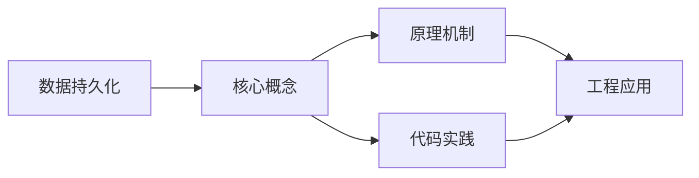
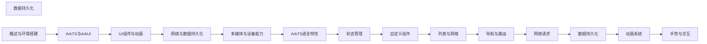

## 1. 学习目标（Bloom 分类）

本节按照布鲁姆教育目标分类学组织学习路径。本文主题为《数据持久化》，属于 HarmonyOS 模块，读者可以根据自身阶段选择阅读深度。

记忆层面：能够准确复述本文的核心概念、术语与基本语法或操作步骤，并能够在提问或检索时快速定位对应知识点。能够说出 HarmonyOS 的核心概念、术语与标准写法。

理解层面：能够用自己的语言解释核心原理与工作机制，说明概念之间的因果关系，而不是机械记忆结论。能够解释 HarmonyOS 的工作原理与设计动机。

应用层面：能够在真实项目或练习场景中运用本文知识解决具体问题，写出正确且可维护的实现。能够编写符合 HarmonyOS 规范的完整实现。

分析层面：能够拆解复杂问题，比较本文主题与相邻概念的异同，识别边界条件与例外情况。能够分析 HarmonyOS 与相邻方案的差异与边界。

评价层面：能够根据约束条件（性能、可读性、安全、成本）评价不同方案的优劣，做出有依据的技术决策。能够根据场景评价 HarmonyOS 相关方案的优劣。

创造层面：能够把本文知识与其他模块知识组合，设计出新的解决方案或可复用的工程模式。能够组合 HarmonyOS 与其他技术设计完整方案。

通过本节学习，读者应当能够把《数据持久化》纳入自己的知识网络，并与 HarmonyOS 模块的其他主题（ArkTS、ArkUI、分布式能力、应用开发）建立关联。

## 2. 历史动机与发展脉络

《数据持久化》是 HarmonyOS 领域的重要主题。要真正理解它，需要先了解它解决的问题与演进过程。

HarmonyOS（鸿蒙）由华为于 2019 年发布，定位面向全场景的分布式操作系统；HarmonyOS NEXT（5.0，2024）去 Android 化，采用自研鸿蒙内核与 ArkTS 语言栈。
开发框架：ArkTS（TS 超集 + 声明式 UI 扩展）、ArkUI（声明式组件）、Stage 模型（应用模型）、方舟编译器。
分布式能力：跨端流转、分布式数据、一次开发多端部署（手机/平板/车机/穿戴）。

回到本文主题：数据持久化 的提出与成熟，正是上述技术背景下的必然产物。早期实现往往以简单可用为目标，随着工程规模扩大，社区逐渐沉淀出标准做法与最佳实践；理解这一脉络，可以帮助读者判断“为什么文档中的推荐写法是现在这个样子”，也能在遇到历史遗留代码时准确识别其设计年代与取舍。


## 3. 形式化定义与核心概念精讲

本节把《数据持久化》涉及的核心概念以“定义 + 讲解”的形式展开。读者应把定义当作工具，把讲解当作理解路径；两者结合才能形成可迁移的知识。

ArkTS 语法：基于 TypeScript 的类型系统，增加 @Component/@Entry/@State 等装饰器与 UI 描述语法。
ArkUI 组件：Column/Row/Stack 布局容器、Text/Button/Image 基础组件、List/Grid 容器组件；状态管理（@State/@Prop/@Link/@Provide）。
应用模型：Stage 模型以 UIAbility 为页面载体，EntryAbility 入口；module.json5 声明应用配置。

### 3.1 原文章节逐一精讲

原文档把主题拆分为 20 个小节，下面按顺序给出每一节的导读讲解，随后保留原文细节供精读。

#### 原文精读（完整保留）

# 数据持久化 语法速查手册

> **符号约定**:`< >` 必填参数 | `[ ]` 可选参数

---

#### 概述

数据持久化是应用开发中的核心能力之一，用于将数据保存到设备存储中，确保应用重启后数据依然可用。HarmonyOS 提供了三种主要的数据持久化方案：Preferences（轻量级键值存储）、关系型数据库（基于 SQLite 的 RDB）和分布式数据服务。Preferences 适合存储少量配置信息，关系型数据库适合结构化数据的增删改查，分布式数据服务则用于多设备间的数据同步。

#### 基础概念

**Preferences**：轻量级键值对存储，类似 Android 的 SharedPreferences。数据以 XML 文件形式保存在应用沙箱目录下，支持 number、string、boolean、Array 等基本类型。适合存储用户设置、登录状态等少量数据。

**关系型数据库（RDB）**：基于 SQLite 的关系型数据库，支持完整的 SQL 语法。通过 relationalStore 模块操作，提供增删改查、事务、加密等能力。适合存储结构化的业务数据。

**安全级别**：RDB 数据库支持 S1（低）、S2（中）、S3（高）三个安全级别，级别越高对数据加密保护越强。

**分布式数据服务**：支持多设备间数据自动同步的持久化方案，基于分布式软总线实现设备发现和数据传输。

#### 快速上手

##### Preferences 基本操作

```typescript
import dataPreferences from '@ohos.data.preferences'

@Component
struct PreferencesDemo {
  @State username: string = ''

  // 保存数据
  async savePreference(key: string, value: string) {
    // 获取 Preferences 实例
    const prefs = await dataPreferences.getPreferences(getContext(this), 'app_settings')
    // 写入键值对
    await prefs.put(key, value)
    // 刷写到磁盘
    await prefs.flush()
  }

  // 读取数据
  async loadPreference(key: string) {
    const prefs = await dataPreferences.getPreferences(getContext(this), 'app_settings')
    // 第二个参数为默认值
    this.username = await prefs.get(key, '未设置') as string
  }

  build() {
    Column({ space: 10 }) {
      TextInput({ placeholder: '输入用户名' })
        .onChange((value) => {
          this.username = value
        })

      Button('保存')
        .onClick(() => this.savePreference('username', this.username))

      Button('读取')
        .onClick(() => this.loadPreference('username'))

      Text(`当前用户名: ${this.username}`)
    }
    .padding(20)
  }
}
```

##### 关系型数据库基本操作

```typescript
import relationalStore from '@ohos.data.relationalStore'

// 建表 SQL
const SQL_CREATE_TABLE = `
  CREATE TABLE IF NOT EXISTS users (
    id INTEGER PRIMARY KEY AUTOINCREMENT,
    name TEXT NOT NULL,
    age INTEGER,
    email TEXT
  )
`

@Component
struct RdbDemo {
  private rdbStore: relationalStore.RdbStore | null = null

  // 初始化数据库
  async initDatabase() {
    this.rdbStore = await relationalStore.getRdbStore(getContext(this), {
      name: 'app.db',
      securityLevel: relationalStore.SecurityLevel.S1,
    })
    // 执行建表语句
    await this.rdbStore.executeSql(SQL_CREATE_TABLE)
  }

  build() {
    Column({ space: 10 }) {
      Button('初始化数据库')
        .onClick(() => this.initDatabase())
    }
    .padding(20)
  }
}
```

#### 详细用法

##### Preferences 完整操作

```typescript
import dataPreferences from '@ohos.data.preferences';

class PreferencesManager {
  private prefs: dataPreferences.Preferences | null = null;

  // 初始化
  async init(context: Context) {
    this.prefs = await dataPreferences.getPreferences(context, 'my_app');
  }

  // 存储字符串
  async putString(key: string, value: string) {
    if (this.prefs) {
      await this.prefs.put(key, value);
      await this.prefs.flush();
    }
  }

  // 存储数字
  async putNumber(key: string, value: number) {
    if (this.prefs) {
      await this.prefs.put(key, value);
      await this.prefs.flush();
    }
  }

  // 存储布尔值
  async putBoolean(key: string, value: boolean) {
    if (this.prefs) {
      await this.prefs.put(key, value);
      await this.prefs.flush();
    }
  }

  // 读取字符串
  async getString(key: string, defaultValue: string = ''): Promise<string> {
    if (this.prefs) {
      return (await this.prefs.get(key, defaultValue)) as string;
    }
    return defaultValue;
  }

  // 读取数字
  async getNumber(key: string, defaultValue: number = 0): Promise<number> {
    if (this.prefs) {
      return (await this.prefs.get(key, defaultValue)) as number;
    }
    return defaultValue;
  }

  // 读取布尔值
  async getBoolean(key: string, defaultValue: boolean = false): Promise<boolean> {
    if (this.prefs) {
      return (await this.prefs.get(key, defaultValue)) as boolean;
    }
    return defaultValue;
  }

  // 删除指定键
  async remove(key: string) {
    if (this.prefs) {
      await this.prefs.delete(key);
      await this.prefs.flush();
    }
  }

  // 检查键是否存在
  async has(key: string): Promise<boolean> {
    if (this.prefs) {
      return this.prefs.has(key);
    }
    return false;
  }

  // 清空所有数据
  async clear() {
    if (this.prefs) {
      await this.prefs.clear();
      await this.prefs.flush();
    }
  }
}
```

##### RDB 增删改查

```typescript
import relationalStore from '@ohos.data.relationalStore';

// 定义用户数据类型
interface User {
  id?: number;
  name: string;
  age: number;
  email: string;
}

class UserRepository {
  private store: relationalStore.RdbStore | null = null;

  // 初始化
  async init(context: Context) {
    this.store = await relationalStore.getRdbStore(context, {
      name: 'user.db',
      securityLevel: relationalStore.SecurityLevel.S1,
    });
    await this.store.executeSql(`
      CREATE TABLE IF NOT EXISTS users (
        id INTEGER PRIMARY KEY AUTOINCREMENT,
        name TEXT NOT NULL,
        age INTEGER,
        email TEXT
      )
    `);
  }

  // 插入数据
  async insert(user: User): Promise<number> {
    if (!this.store) return -1;
    const valueBucket: relationalStore.ValuesBucket = {
      name: user.name,
      age: user.age,
      email: user.email,
    };
    return await this.store.insert('users', valueBucket);
  }

  // 查询所有数据
  async queryAll(): Promise<User[]> {
    if (!this.store) return [];
    const predicates = new relationalStore.RdbPredicates('users');
    const resultSet = await this.store.query(predicates);
    const users: User[] = [];

    while (resultSet.goToNextRow()) {
      users.push({
        id: resultSet.getLong(resultSet.getColumnIndex('id')),
        name: resultSet.getString(resultSet.getColumnIndex('name')),
        age: resultSet.getLong(resultSet.getColumnIndex('age')),
        email: resultSet.getString(resultSet.getColumnIndex('email')),
      });
    }
    resultSet.close();
    return users;
  }

  // 条件查询
  async queryByName(name: string): Promise<User[]> {
    if (!this.store) return [];
    const predicates = new relationalStore.RdbPredicates('users');
    predicates.equalTo('name', name);
    const resultSet = await this.store.query(predicates);
    const users: User[] = [];

    while (resultSet.goToNextRow()) {
      users.push({
        id: resultSet.getLong(resultSet.getColumnIndex('id')),
        name: resultSet.getString(resultSet.getColumnIndex('name')),
        age: resultSet.getLong(resultSet.getColumnIndex('age')),
        email: resultSet.getString(resultSet.getColumnIndex('email')),
      });
    }
    resultSet.close();
    return users;
  }

  // 更新数据
  async update(user: User): Promise<number> {
    if (!this.store || !user.id) return 0;
    const valueBucket: relationalStore.ValuesBucket = {
      name: user.name,
      age: user.age,
      email: user.email,
    };
    const predicates = new relationalStore.RdbPredicates('users');
    predicates.equalTo('id', user.id);
    return await this.store.update(valueBucket, predicates);
  }

  // 删除数据
  async delete(id: number): Promise<number> {
    if (!this.store) return 0;
    const predicates = new relationalStore.RdbPredicates('users');
    predicates.equalTo('id', id);
    return await this.store.delete(predicates);
  }
}
```

##### RDB 事务操作

```typescript
class OrderService {
  private store: relationalStore.RdbStore | null = null;

  // 使用事务保证数据一致性
  async transferOrder(fromUserId: number, toUserId: number, amount: number) {
    if (!this.store) return;

    try {
      // 开启事务
      this.store.beginTransaction();

      // 扣减转出方余额
      const fromBucket: relationalStore.ValuesBucket = {};
      const fromPredicates = new relationalStore.RdbPredicates('accounts');
      fromPredicates.equalTo('user_id', fromUserId);
      // ... 执行扣减逻辑

      // 增加接收方余额
      const toBucket: relationalStore.ValuesBucket = {};
      const toPredicates = new relationalStore.RdbPredicates('accounts');
      toPredicates.equalTo('user_id', toUserId);
      // ... 执行增加逻辑

      // 提交事务
      this.store.commit();
      console.info('事务提交成功');
    } catch (error) {
      // 回滚事务
      this.store.rollBack();
      console.error(`事务回滚: ${error}`);
    }
  }
}
```

#### 常见场景

##### 用户设置持久化

```typescript
interface AppSettings {
  theme: string
  fontSize: number
  notifications: boolean
  language: string
}

@Component
struct SettingsPage {
  private prefsManager: PreferencesManager = new PreferencesManager()
  @State settings: AppSettings = {
    theme: 'light',
    fontSize: 14,
    notifications: true,
    language: 'zh-CN',
  }

  async aboutToAppear() {
    // 初始化并加载设置
    await this.prefsManager.init(getContext(this))
    this.settings.theme = await this.prefsManager.getString('theme', 'light')
    this.settings.fontSize = await this.prefsManager.getNumber('fontSize', 14)
    this.settings.notifications = await this.prefsManager.getBoolean('notifications', true)
    this.settings.language = await this.prefsManager.getString('language', 'zh-CN')
  }

  async saveSettings() {
    await this.prefsManager.putString('theme', this.settings.theme)
    await this.prefsManager.putNumber('fontSize', this.settings.fontSize)
    await this.prefsManager.putBoolean('notifications', this.settings.notifications)
    await this.prefsManager.putString('language', this.settings.language)
  }

  build() {
    Column({ space: 15 }) {
      Text('应用设置').fontSize(20).fontWeight(FontWeight.Bold)

      // 主题选择
      Row() {
        Text('主题模式')
        Toggle({ type: ToggleType.Switch, isOn: this.settings.theme === 'dark' })
          .onChange((isOn) => {
            this.settings.theme = isOn ? 'dark' : 'light'
            this.saveSettings()
          })
      }
      .width('100%')
      .justifyContent(FlexAlign.SpaceBetween)

      // 字体大小
      Row() {
        Text(`字体大小: ${this.settings.fontSize}`)
        Slider({
          value: this.settings.fontSize,
          min: 12,
          max: 24,
          step: 1
        })
          .onChange((value) => {
            this.settings.fontSize = Math.round(value)
            this.saveSettings()
          })
      }

      // 通知开关
      Row() {
        Text('推送通知')
        Toggle({ type: ToggleType.Switch, isOn: this.settings.notifications })
          .onChange((isOn) => {
            this.settings.notifications = isOn
            this.saveSettings()
          })
      }
      .width('100%')
      .justifyContent(FlexAlign.SpaceBetween)
    }
    .padding(20)
  }
}
```

##### 备忘录数据存储

```typescript
interface Memo {
  id?: number
  title: string
  content: string
  createdAt: string
  updatedAt: string
}

@Component
struct MemoApp {
  private store: relationalStore.RdbStore | null = null
  @State memos: Memo[] = []

  async aboutToAppear() {
    // 初始化数据库
    this.store = await relationalStore.getRdbStore(getContext(this), {
      name: 'memo.db',
      securityLevel: relationalStore.SecurityLevel.S1,
    })
    await this.store.executeSql(`
      CREATE TABLE IF NOT EXISTS memos (
        id INTEGER PRIMARY KEY AUTOINCREMENT,
        title TEXT,
        content TEXT,
        createdAt TEXT,
        updatedAt TEXT
      )
    `)
    await this.loadMemos()
  }

  // 加载所有备忘录
  async loadMemos() {
    if (!this.store) return
    const predicates = new relationalStore.RdbPredicates('memos')
    predicates.orderByDesc('updatedAt')
    const resultSet = await this.store.query(predicates)
    this.memos = []

    while (resultSet.goToNextRow()) {
      this.memos.push({
        id: resultSet.getLong(resultSet.getColumnIndex('id')),
        title: resultSet.getString(resultSet.getColumnIndex('title')),
        content: resultSet.getString(resultSet.getColumnIndex('content')),
        createdAt: resultSet.getString(resultSet.getColumnIndex('createdAt')),
        updatedAt: resultSet.getString(resultSet.getColumnIndex('updatedAt')),
      })
    }
    resultSet.close()
  }

  // 添加备忘录
  async addMemo(title: string, content: string) {
    if (!this.store) return
    const now = new Date().toISOString()
    await this.store.insert('memos', {
      title,
      content,
      createdAt: now,
      updatedAt: now,
    })
    await this.loadMemos()
  }

  // 删除备忘录
  async deleteMemo(id: number) {
    if (!this.store) return
    const predicates = new relationalStore.RdbPredicates('memos')
    predicates.equalTo('id', id)
    await this.store.delete(predicates)
    await this.loadMemos()
  }

  build() {
    Column() {
      List() {
        ForEach(this.memos, (memo: Memo) => {
          ListItem() {
            Column() {
              Text(memo.title).fontSize(16).fontWeight(FontWeight.Medium)
              Text(memo.content).fontSize(13).fontColor('#666666').maxLines(2)
              Text(memo.updatedAt).fontSize(11).fontColor('#999999')
            }
            .padding(12)
            .backgroundColor(Color.White)
            .borderRadius(8)
          }
          .swipeAction({
            end: Button('删除')
              .backgroundColor(Color.Red)
              .onClick(() => {
                if (memo.id) this.deleteMemo(memo.id)
              })
          })
        }, (memo: Memo) => memo.id?.toString() ?? '')
      }
      .layoutWeight(1)
    }
    .padding(16)
  }
}
```

#### 注意事项

- **Preferences 数据量**：Preferences 不适合存储大量数据，建议单个文件不超过几百条记录。大量结构化数据应使用 RDB。
- **flush 调用**：Preferences 的 put 操作仅修改内存缓存，必须调用 flush 才能持久化到磁盘。应用退出前确保已调用 flush。
- **RDB 线程安全**：RDB 操作是线程安全的，但大量并发写入时应考虑使用事务批量处理，避免频繁的单条操作。
- **ResultSet 关闭**：查询返回的 ResultSet 必须手动关闭，否则会导致内存泄漏。建议在 finally 块中关闭。
- **安全级别选择**：S1 适合普通数据，S2 适合包含隐私信息的数据，S3 适合高度敏感数据。级别越高性能开销越大。
- **数据库版本迁移**：RDB 没有内置的版本迁移机制，需要自行管理数据库升级逻辑，通过检查版本号执行增量 SQL。

#### 进阶用法

##### 数据库加密

```typescript
import relationalStore from '@ohos.data.relationalStore';

async function createEncryptedDatabase(context: Context) {
  // 创建加密数据库
  const store = await relationalStore.getRdbStore(context, {
    name: 'secure.db',
    securityLevel: relationalStore.SecurityLevel.S3, // 高安全级别
    encrypt: true, // 启用加密
  });

  await store.executeSql(`
    CREATE TABLE IF NOT EXISTS credentials (
      id INTEGER PRIMARY KEY AUTOINCREMENT,
      service TEXT NOT NULL,
      username TEXT,
      password TEXT
    )
  `);

  return store;
}
```

##### 批量操作与性能优化

```typescript
class BatchOperationDemo {
  private store: relationalStore.RdbStore | null = null;

  // 批量插入：使用事务提升性能
  async batchInsert(items: object[]) {
    if (!this.store) return;

    try {
      this.store.beginTransaction();

      for (const item of items) {
        await this.store.insert('items', item as relationalStore.ValuesBucket);
      }

      this.store.commit();
      console.info(`批量插入 ${items.length} 条数据成功`);
    } catch (error) {
      this.store.rollBack();
      console.error(`批量插入失败: ${error}`);
    }
  }

  // 分页查询
  async queryByPage(page: number, pageSize: number) {
    if (!this.store) return [];
    const predicates = new relationalStore.RdbPredicates('items');
    // 设置分页参数
    predicates.limit(pageSize, (page - 1) * pageSize);
    predicates.orderByDesc('id');

    const resultSet = await this.store.query(predicates);
    const results: object[] = [];

    while (resultSet.goToNextRow()) {
      // 解析数据...
      results.push({});
    }
    resultSet.close();
    return results;
  }

  // 模糊查询
  async searchByKeyword(keyword: string) {
    if (!this.store) return [];
    const predicates = new relationalStore.RdbPredicates('items');
    // 使用 like 进行模糊匹配
    predicates.like('name', `%${keyword}%`);

    const resultSet = await this.store.query(predicates);
    const results: object[] = [];

    while (resultSet.goToNextRow()) {
      results.push({});
    }
    resultSet.close();
    return results;
  }
}
```

##### 数据变更监听

```typescript
import dataPreferences from '@ohos.data.preferences'

@Component
struct PreferenceObserverDemo {
  @State theme: string = 'light'
  private prefs: dataPreferences.Preferences | null = null

  async aboutToAppear() {
    this.prefs = await dataPreferences.getPreferences(getContext(this), 'settings')

    // 注册数据变更监听
    this.prefs.on('change', (data: dataPreferences.ChangeInfo) => {
      console.info('数据发生变更')
      // 检查 theme 键是否变更
      if (data.keys.includes('theme')) {
        this.loadTheme()
      }
    })

    await this.loadTheme()
  }

  async loadTheme() {
    if (this.prefs) {
      this.theme = (await this.prefs.get('theme', 'light')) as string
    }
  }

  async toggleTheme() {
    if (this.prefs) {
      const newTheme = this.theme === 'light' ? 'dark' : 'light'
      await this.prefs.put('theme', newTheme)
      await this.prefs.flush()
    }
  }

  build() {
    Column() {
      Text(`当前主题: ${this.theme}`)
      Button('切换主题')
        .onClick(() => this.toggleTheme())
    }
    .padding(20)
  }
}
```
#### Preferences 模块导入

**导入 preferences 模块**
`import dataPreferences from '@ohos.data.preferences'`
```typescript
import dataPreferences from '@ohos.data.preferences';
```

**通过 ArkData 导入**
`import { preferences } from '@kit.ArkData'`
```typescript
import { preferences } from '@kit.ArkData';
```

**支持的数据类型**
`preferences.ValueType`
```typescript
type ValueType = number | string | boolean | Array<number> | Array<string> | Array<boolean> | Uint8Array;
```

---

#### Preferences API

**获取 Preferences 实例**
`preferences.getPreferences(context: Context, name: string): Promise<Preferences>`
```typescript
const prefs = await preferences.getPreferences(getContext(this), 'app_settings');
```

**写入数据**
`prefs.put(key: string, value: ValueType): Promise<void>`
```typescript
await prefs.put('username', '张三');
await prefs.put('fontSize', 16);
await prefs.put('notifications', true);
await prefs.put('tags', ['work', 'life']);
```

**刷写到磁盘**
`prefs.flush(): Promise<void>`
```typescript
await prefs.flush();
```

**读取数据**
`prefs.get(key: string, defaultValue: ValueType): Promise<ValueType>`
```typescript
const username = await prefs.get('username', '未设置') as string;
const fontSize = await prefs.get('fontSize', 14) as number;
const notifications = await prefs.get('notifications', true) as boolean;
```

**检查键是否存在**
`prefs.has(key: string): Promise<boolean>`
```typescript
const exists = await prefs.has('username');
```

**删除指定键**
`prefs.delete(key: string): Promise<void>`
```typescript
await prefs.delete('username');
await prefs.flush();
```

**清空所有数据**
`prefs.clear(): Promise<void>`
```typescript
await prefs.clear();
await prefs.flush();
```

**获取所有键**
`prefs.getAll(): Promise<Object>`
```typescript
const allData = await prefs.getAll();
```

---

#### Preferences 数据变更监听

**注册监听**
`prefs.on('change', callback: (data: ChangeInfo) => void): void`
```typescript
prefs.on('change', (data: preferences.ChangeInfo) => {
  if (data.keys.includes('theme')) {
    console.info('主题已变更');
  }
});
```

**取消监听**
`prefs.off('change', callback?: (data: ChangeInfo) => void): void`
```typescript
prefs.off('change');
```

---

#### Preferences 管理器封装

**PreferencesManager 封装**
```typescript
class PreferencesManager {
  private prefs: preferences.Preferences | null = null;

  async init(context: Context): Promise<void> {
    this.prefs = await preferences.getPreferences(context, 'my_app');
  }

  async putString(key: string, value: string): Promise<void> {
    if (this.prefs) {
      await this.prefs.put(key, value);
      await this.prefs.flush();
    }
  }

  async putNumber(key: string, value: number): Promise<void> {
    if (this.prefs) {
      await this.prefs.put(key, value);
      await this.prefs.flush();
    }
  }

  async putBoolean(key: string, value: boolean): Promise<void> {
    if (this.prefs) {
      await this.prefs.put(key, value);
      await this.prefs.flush();
    }
  }

  async getString(key: string, defaultValue: string = ''): Promise<string> {
    if (this.prefs) {
      return (await this.prefs.get(key, defaultValue)) as string;
    }
    return defaultValue;
  }

  async getNumber(key: string, defaultValue: number = 0): Promise<number> {
    if (this.prefs) {
      return (await this.prefs.get(key, defaultValue)) as number;
    }
    return defaultValue;
  }

  async getBoolean(key: string, defaultValue: boolean = false): Promise<boolean> {
    if (this.prefs) {
      return (await this.prefs.get(key, defaultValue)) as boolean;
    }
    return defaultValue;
  }

  async remove(key: string): Promise<void> {
    if (this.prefs) {
      await this.prefs.delete(key);
      await this.prefs.flush();
    }
  }

  async has(key: string): Promise<boolean> {
    if (this.prefs) {
      return await this.prefs.has(key);
    }
    return false;
  }

  async clear(): Promise<void> {
    if (this.prefs) {
      await this.prefs.clear();
      await this.prefs.flush();
    }
  }
}
```

---

#### 关系型数据库 RDB 模块

**导入 relationalStore**
`import relationalStore from '@ohos.data.relationalStore'`
```typescript
import relationalStore from '@ohos.data.relationalStore';
```

**通过 ArkData 导入**
`import { relationalStore } from '@kit.ArkData'`
```typescript
import { relationalStore } from '@kit.ArkData';
```

---

#### RDB 数据库配置

**StoreConfig 配置**
`relationalStore.StoreConfig`
```typescript
const STORE_CONFIG: relationalStore.StoreConfig = {
  name: 'AppDatabase.db',
  securityLevel: relationalStore.SecurityLevel.S1,
  encrypt: false
};
```

**安全级别枚举**
`relationalStore.SecurityLevel`
```typescript
enum SecurityLevel {
  S1 = 1,
  S2 = 2,
  S3 = 3,
  S4 = 4
}
```

**获取数据库实例**
`relationalStore.getRdbStore(context: Context, config: StoreConfig): Promise<RdbStore>`
```typescript
const store = await relationalStore.getRdbStore(getContext(this), STORE_CONFIG);
```

**删除数据库**
`relationalStore.deleteRdbStore(context: Context, name: string): Promise<void>`
```typescript
await relationalStore.deleteRdbStore(getContext(this), 'AppDatabase.db');
```

---

#### RDB SQL 执行

**执行 SQL 语句**
`store.executeSql(sql: string): Promise<void>`
```typescript
await store.executeSql(`CREATE TABLE IF NOT EXISTS users (
  id INTEGER PRIMARY KEY AUTOINCREMENT,
  name TEXT NOT NULL,
  age INTEGER,
  email TEXT,
  created_at INTEGER DEFAULT (strftime('%s', 'now'))
)`);
```

**建表示例**
```typescript
const SQL_CREATE_CONTACTS = `CREATE TABLE IF NOT EXISTS contacts (
  id INTEGER PRIMARY KEY AUTOINCREMENT,
  name TEXT NOT NULL,
  phone TEXT NOT NULL,
  email TEXT,
  created_at INTEGER DEFAULT (strftime('%s', 'now'))
)`;
await store.executeSql(SQL_CREATE_CONTACTS);
```

---

#### RDB 数据操作

**插入数据**
`store.insert(table: string, values: ValuesBucket): Promise<number>`
```typescript
const valueBucket: relationalStore.ValuesBucket = {
  name: '张三',
  phone: '13800138000',
  email: 'zhang@example.com'
};
const rowId = await store.insert('contacts', valueBucket);
```

**批量插入(带事务)**
```typescript
async function batchInsert(items: Array<relationalStore.ValuesBucket>): Promise<void> {
  try {
    store.beginTransaction();
    for (const item of items) {
      await store.insert('contacts', item);
    }
    store.commit();
  } catch (error) {
    store.rollBack();
    throw error;
  }
}
```

**查询数据**
`store.query(predicates: RdbPredicates, columns?: Array<string>): Promise<ResultSet>`
```typescript
const predicates = new relationalStore.RdbPredicates('contacts');
predicates.equalTo('name', '张三');
predicates.orderByDesc('id');
const resultSet = await store.query(predicates, ['id', 'name', 'phone', 'email']);
```

**更新数据**
`store.update(values: ValuesBucket, predicates: RdbPredicates): Promise<number>`
```typescript
const valueBucket: relationalStore.ValuesBucket = {
  name: '李四',
  phone: '13900139000'
};
const predicates = new relationalStore.RdbPredicates('contacts');
predicates.equalTo('id', 1);
const rowsAffected = await store.update(valueBucket, predicates);
```

**删除数据**
`store.delete(predicates: RdbPredicates): Promise<number>`
```typescript
const predicates = new relationalStore.RdbPredicates('contacts');
predicates.equalTo('id', 1);
const rowsAffected = await store.delete(predicates);
```

---

#### RdbPredicates 条件构造

**等于条件**
`predicates.equalTo(field: string, value: ValueType): RdbPredicates`
```typescript
predicates.equalTo('id', 1);
```

**不等于条件**
`predicates.notEqualTo(field: string, value: ValueType): RdbPredicates`
```typescript
predicates.notEqualTo('status', 'deleted');
```

**大于/小于**
`predicates.greaterThan(field: string, value: ValueType): RdbPredicates`
`predicates.lessThan(field: string, value: ValueType): RdbPredicates`
`predicates.greaterThanOrEqualTo(field: string, value: ValueType): RdbPredicates`
`predicates.lessThanOrEqualTo(field: string, value: ValueType): RdbPredicates`
```typescript
predicates.greaterThan('age', 18);
predicates.lessThan('age', 60);
```

**模糊匹配**
`predicates.like(field: string, value: string): RdbPredicates`
```typescript
predicates.like('name', '%张%');
```

**范围条件**
`predicates.between(field: string, low: ValueType, high: ValueType): RdbPredicates`
```typescript
predicates.between('age', 18, 60);
```

**IN 条件**
`predicates.in(field: string, value: Array<ValueType>): RdbPredicates`
```typescript
predicates.in('id', [1, 2, 3, 5, 8]);
```

**排序**
`predicates.orderByAsc(field: string): RdbPredicates`
`predicates.orderByDesc(field: string): RdbPredicates`
```typescript
predicates.orderByDesc('created_at');
```

**分页**
`predicates.limit(count: number, offset: number): RdbPredicates`
```typescript
predicates.limit(10, 0);
predicates.limit(20, 20);
```

**分组**
`predicates.groupBy(fields: Array<string>): RdbPredicates`
```typescript
predicates.groupBy(['category']);
```

---

#### ResultSet 结果集 API

**移动到下一行**
`resultSet.goToNextRow(): boolean`
```typescript
while (resultSet.goToNextRow()) {
  // 读取数据
}
```

**移动到第一行**
`resultSet.goToFirstRow(): boolean`
```typescript
resultSet.goToFirstRow();
```

**获取列索引**
`resultSet.getColumnIndex(columnName: string): number`
```typescript
const idIndex = resultSet.getColumnIndex('id');
const nameIndex = resultSet.getColumnIndex('name');
```

**获取字段值**
`resultSet.getLong(columnIndex: number): number`
`resultSet.getString(columnIndex: number): string`
`resultSet.getDouble(columnIndex: number): number`
`resultSet.getBlob(columnIndex: number): Uint8Array`
`resultSet.getBoolean(columnIndex: number): boolean`
```typescript
const id = resultSet.getLong(resultSet.getColumnIndex('id'));
const name = resultSet.getString(resultSet.getColumnIndex('name'));
const age = resultSet.getLong(resultSet.getColumnIndex('age'));
```

**获取列数与行数**
`resultSet.columnCount: number`
`resultSet.rowCount: number`
```typescript
const columns = resultSet.columnCount;
const rows = resultSet.rowCount;
```

**关闭结果集**
`resultSet.close(): void`
```typescript
resultSet.close();
```

---

#### RDB 事务

**开启事务**
`store.beginTransaction(): void`
```typescript
store.beginTransaction();
```

**提交事务**
`store.commit(): void`
```typescript
store.commit();
```

**回滚事务**
`store.rollBack(): void`
```typescript
store.rollBack();
```

---

#### RDB 加密

**创建加密数据库**
```typescript
const store = await relationalStore.getRdbStore(context, {
  name: 'secure.db',
  securityLevel: relationalStore.SecurityLevel.S3,
  encrypt: true
});
```

---

#### 分布式 KV 存储

**导入 distributedKVStore**
`import distributedKVStore from '@ohos.data.distributedKVStore'`
```typescript
import distributedKVStore from '@ohos.data.distributedKVStore';
```

**KVStoreConfig 配置**
```typescript
const KV_CONFIG: distributedKVStore.KVStoreConfig = {
  bundleName: 'com.example.app',
  options: {
    createIfMissing: true,
    encrypt: false,
    backup: false,
    autoSync: true,
    kvStoreType: distributedKVStore.KVStoreType.SINGLE_VERSION,
    securityLevel: distributedKVStore.SecurityLevel.S1
  }
};
```

**创建 KVManager**
`distributedKVStore.createKVManager(config: KVStoreConfig): KVManager`
```typescript
const kvManager = distributedKVStore.createKVManager(KV_CONFIG);
```

**获取 KVStore**
`kvManager.getKVStore(storeId: string, options: KVStoreOptions): Promise<KVStore>`
```typescript
const kvStore = await kvManager.getKVStore('distributed_store', KV_CONFIG.options);
```

**写入数据**
`kvStore.put(key: string, value: ValueType): Promise<void>`
```typescript
await kvStore.put('sync_key', 'sync_value');
```

**读取数据**
`kvStore.get(key: string): Promise<ValueType>`
```typescript
const value = await kvStore.get('sync_key');
```

**删除数据**
`kvStore.delete(key: string): Promise<void>`
```typescript
await kvStore.delete('sync_key');
```

**监听数据变更**
`kvStore.on('dataChange', type: SubscribeType, callback: (data: ChangeNotification) => void): void`
```typescript
kvStore.on('dataChange', distributedKVStore.SubscribeType.SUBSCRIBE_TYPE_ALL, (data) => {
  console.info(`数据变更: ${JSON.stringify(data)}`);
});
```


### 3.2 概念关系图

下面用 Mermaid 图表达本文核心概念之间的关系，帮助读者建立整体图景：



图中展示的是本文知识的结构化关系：核心概念是入口，原理机制解释“为什么”，代码实践演示“怎么做”，工程应用回答“何时用”。读者学习时可以把每个小节的内容挂接到对应节点上。

## 4. 理论推导与原理解析

本节深入《数据持久化》背后的原理。理论部分不求面面俱到，而是聚焦“能解释现象、能指导实践”的关键推导。

ArkTS 语法：基于 TypeScript 的类型系统，增加 @Component/@Entry/@State 等装饰器与 UI 描述语法。
ArkUI 组件：Column/Row/Stack 布局容器、Text/Button/Image 基础组件、List/Grid 容器组件；状态管理（@State/@Prop/@Link/@Provide）。
应用模型：Stage 模型以 UIAbility 为页面载体，EntryAbility 入口；module.json5 声明应用配置。
生命周期：Ability 的 onCreate/onWindowStageCreate/onForeground/onBackground/onDestroy。

需要强调的是，理论推导与工程实践之间存在翻译层：理论给出的是理想化模型与边界条件，工程代码则必须处理真实环境中的例外。读者在学习时应先掌握理论的“标准情形”，再通过陷阱章节了解“非标准情形”。

## 5. 代码示例与逐行讲解

本节把原文中的代码示例系统整理，并为每个示例补充用途说明与讲解。读者不应只浏览代码，而应逐段对照讲解理解设计意图。

### 5.1 示例：Preferences 基本操作

该示例来自原文《Preferences 基本操作》小节，用于演示数据持久化相关操作。阅读时请先看代码结构，再看其后的讲解。

```typescript
import dataPreferences from '@ohos.data.preferences'

@Component
struct PreferencesDemo {
  @State username: string = ''

  // 保存数据
  async savePreference(key: string, value: string) {
    // 获取 Preferences 实例
    const prefs = await dataPreferences.getPreferences(getContext(this), 'app_settings')
    // 写入键值对
    await prefs.put(key, value)
    // 刷写到磁盘
    await prefs.flush()
  }

  // 读取数据
  async loadPreference(key: string) {
    const prefs = await dataPreferences.getPreferences(getContext(this), 'app_settings')
    // 第二个参数为默认值
    this.username = await prefs.get(key, '未设置') as string
  }

  build() {
    Column({ space: 10 }) {
      TextInput({ placeholder: '输入用户名' })
        .onChange((value) => {
          this.username = value
        })

      Button('保存')
        .onClick(() => this.savePreference('username', this.username))

      Button('读取')
        .onClick(() => this.loadPreference('username'))

      Text(`当前用户名: ${this.username}`)
    }
    .padding(20)
  }
}
```

讲解：这段代码演示了本节核心知识点。代码中的关键操作可以归纳为三步：准备（定义或初始化）、执行（核心逻辑）、收尾（释放资源或返回结果）。实际项目中，这三步往往被封装为函数或类，以提升复用性与可测试性。

关键点分析：

该示例共 34 行有效代码，包含 2 类关键结构（import、from）。其中：

- 入口与初始化部分负责建立上下文，对应实际项目中的启动或装配逻辑；
- 核心逻辑部分体现本文主题的主要操作，是阅读时最需要对照讲解理解的部分；
- 输出或返回部分把结果交给调用方，注意其类型与边界条件。

进阶思考路径：先尝试修改参数观察行为变化，再把示例中的模式迁移到自己的项目中；每次修改都记录预期与实测差异，这是把示例转化为能力的最快方式。

### 5.2 示例：关系型数据库基本操作

该示例来自原文《关系型数据库基本操作》小节，用于演示数据持久化相关操作。阅读时请先看代码结构，再看其后的讲解。

```typescript
import relationalStore from '@ohos.data.relationalStore'

// 建表 SQL
const SQL_CREATE_TABLE = `
  CREATE TABLE IF NOT EXISTS users (
    id INTEGER PRIMARY KEY AUTOINCREMENT,
    name TEXT NOT NULL,
    age INTEGER,
    email TEXT
  )
`

@Component
struct RdbDemo {
  private rdbStore: relationalStore.RdbStore | null = null

  // 初始化数据库
  async initDatabase() {
    this.rdbStore = await relationalStore.getRdbStore(getContext(this), {
      name: 'app.db',
      securityLevel: relationalStore.SecurityLevel.S1,
    })
    // 执行建表语句
    await this.rdbStore.executeSql(SQL_CREATE_TABLE)
  }

  build() {
    Column({ space: 10 }) {
      Button('初始化数据库')
        .onClick(() => this.initDatabase())
    }
    .padding(20)
  }
}
```

讲解：这段代码演示了本节核心知识点。代码中的关键操作可以归纳为三步：准备（定义或初始化）、执行（核心逻辑）、收尾（释放资源或返回结果）。实际项目中，这三步往往被封装为函数或类，以提升复用性与可测试性。

关键点分析：

该示例共 30 行有效代码，包含 3 类关键结构（import、from、CREATE）。其中：

- 入口与初始化部分负责建立上下文，对应实际项目中的启动或装配逻辑；
- 核心逻辑部分体现本文主题的主要操作，是阅读时最需要对照讲解理解的部分；
- 输出或返回部分把结果交给调用方，注意其类型与边界条件。

进阶思考路径：先尝试修改参数观察行为变化，再把示例中的模式迁移到自己的项目中；每次修改都记录预期与实测差异，这是把示例转化为能力的最快方式。

### 5.3 示例：Preferences 完整操作

该示例来自原文《Preferences 完整操作》小节，用于演示数据持久化相关操作。阅读时请先看代码结构，再看其后的讲解。

```typescript
import dataPreferences from '@ohos.data.preferences';

class PreferencesManager {
  private prefs: dataPreferences.Preferences | null = null;

  // 初始化
  async init(context: Context) {
    this.prefs = await dataPreferences.getPreferences(context, 'my_app');
  }

  // 存储字符串
  async putString(key: string, value: string) {
    if (this.prefs) {
      await this.prefs.put(key, value);
      await this.prefs.flush();
    }
  }

  // 存储数字
  async putNumber(key: string, value: number) {
    if (this.prefs) {
      await this.prefs.put(key, value);
      await this.prefs.flush();
    }
  }

  // 存储布尔值
  async putBoolean(key: string, value: boolean) {
    if (this.prefs) {
      await this.prefs.put(key, value);
      await this.prefs.flush();
    }
  }

  // 读取字符串
  async getString(key: string, defaultValue: string = ''): Promise<string> {
    if (this.prefs) {
      return (await this.prefs.get(key, defaultValue)) as string;
    }
    return defaultValue;
  }

  // 读取数字
  async getNumber(key: string, defaultValue: number = 0): Promise<number> {
    if (this.prefs) {
      return (await this.prefs.get(key, defaultValue)) as number;
    }
    return defaultValue;
  }

  // 读取布尔值
  async getBoolean(key: string, defaultValue: boolean = false): Promise<boolean> {
    if (this.prefs) {
      return (await this.prefs.get(key, defaultValue)) as boolean;
    }
    return defaultValue;
  }

  // 删除指定键
  async remove(key: string) {
    if (this.prefs) {
      await this.prefs.delete(key);
      await this.prefs.flush();
    }
  }

  // 检查键是否存在
  async has(key: string): Promise<boolean> {
    if (this.prefs) {
      return this.prefs.has(key);
    }
    return false;
  }

  // 清空所有数据
  async clear() {
    if (this.prefs) {
      await this.prefs.clear();
      await this.prefs.flush();
    }
  }
}
```

讲解：这段代码演示了本节核心知识点。代码中的关键操作可以归纳为三步：准备（定义或初始化）、执行（核心逻辑）、收尾（释放资源或返回结果）。实际项目中，这三步往往被封装为函数或类，以提升复用性与可测试性。

关键点分析：

该示例共 71 行有效代码，包含 5 类关键结构（class、import、from、if、return）。其中：

- 入口与初始化部分负责建立上下文，对应实际项目中的启动或装配逻辑；
- 核心逻辑部分体现本文主题的主要操作，是阅读时最需要对照讲解理解的部分；
- 输出或返回部分把结果交给调用方，注意其类型与边界条件。

进阶思考路径：先尝试修改参数观察行为变化，再把示例中的模式迁移到自己的项目中；每次修改都记录预期与实测差异，这是把示例转化为能力的最快方式。

### 5.4 示例：RDB 增删改查

该示例来自原文《RDB 增删改查》小节，用于演示数据持久化相关操作。阅读时请先看代码结构，再看其后的讲解。

```typescript
import relationalStore from '@ohos.data.relationalStore';

// 定义用户数据类型
interface User {
  id?: number;
  name: string;
  age: number;
  email: string;
}

class UserRepository {
  private store: relationalStore.RdbStore | null = null;

  // 初始化
  async init(context: Context) {
    this.store = await relationalStore.getRdbStore(context, {
      name: 'user.db',
      securityLevel: relationalStore.SecurityLevel.S1,
    });
    await this.store.executeSql(`
      CREATE TABLE IF NOT EXISTS users (
        id INTEGER PRIMARY KEY AUTOINCREMENT,
        name TEXT NOT NULL,
        age INTEGER,
        email TEXT
      )
    `);
  }

  // 插入数据
  async insert(user: User): Promise<number> {
    if (!this.store) return -1;
    const valueBucket: relationalStore.ValuesBucket = {
      name: user.name,
      age: user.age,
      email: user.email,
    };
    return await this.store.insert('users', valueBucket);
  }

  // 查询所有数据
  async queryAll(): Promise<User[]> {
    if (!this.store) return [];
    const predicates = new relationalStore.RdbPredicates('users');
    const resultSet = await this.store.query(predicates);
    const users: User[] = [];

    while (resultSet.goToNextRow()) {
      users.push({
        id: resultSet.getLong(resultSet.getColumnIndex('id')),
        name: resultSet.getString(resultSet.getColumnIndex('name')),
        age: resultSet.getLong(resultSet.getColumnIndex('age')),
        email: resultSet.getString(resultSet.getColumnIndex('email')),
      });
    }
    resultSet.close();
    return users;
  }

  // 条件查询
  async queryByName(name: string): Promise<User[]> {
    if (!this.store) return [];
    const predicates = new relationalStore.RdbPredicates('users');
    predicates.equalTo('name', name);
    const resultSet = await this.store.query(predicates);
    const users: User[] = [];

    while (resultSet.goToNextRow()) {
      users.push({
        id: resultSet.getLong(resultSet.getColumnIndex('id')),
        name: resultSet.getString(resultSet.getColumnIndex('name')),
        age: resultSet.getLong(resultSet.getColumnIndex('age')),
        email: resultSet.getString(resultSet.getColumnIndex('email')),
      });
    }
    resultSet.close();
    return users;
  }

  // 更新数据
  async update(user: User): Promise<number> {
    if (!this.store || !user.id) return 0;
    const valueBucket: relationalStore.ValuesBucket = {
      name: user.name,
      age: user.age,
      email: user.email,
    };
    const predicates = new relationalStore.RdbPredicates('users');
    predicates.equalTo('id', user.id);
    return await this.store.update(valueBucket, predicates);
  }

  // 删除数据
  async delete(id: number): Promise<number> {
    if (!this.store) return 0;
    const predicates = new relationalStore.RdbPredicates('users');
    predicates.equalTo('id', id);
    return await this.store.delete(predicates);
  }
}
```

讲解：这段代码演示了本节核心知识点。代码中的关键操作可以归纳为三步：准备（定义或初始化）、执行（核心逻辑）、收尾（释放资源或返回结果）。实际项目中，这三步往往被封装为函数或类，以提升复用性与可测试性。

关键点分析：

该示例共 90 行有效代码，包含 7 类关键结构（class、import、from、if、while、return）。其中：

- 入口与初始化部分负责建立上下文，对应实际项目中的启动或装配逻辑；
- 核心逻辑部分体现本文主题的主要操作，是阅读时最需要对照讲解理解的部分；
- 输出或返回部分把结果交给调用方，注意其类型与边界条件。

进阶思考路径：先尝试修改参数观察行为变化，再把示例中的模式迁移到自己的项目中；每次修改都记录预期与实测差异，这是把示例转化为能力的最快方式。

### 5.5 示例：RDB 事务操作

该示例来自原文《RDB 事务操作》小节，用于演示数据持久化相关操作。阅读时请先看代码结构，再看其后的讲解。

```typescript
class OrderService {
  private store: relationalStore.RdbStore | null = null;

  // 使用事务保证数据一致性
  async transferOrder(fromUserId: number, toUserId: number, amount: number) {
    if (!this.store) return;

    try {
      // 开启事务
      this.store.beginTransaction();

      // 扣减转出方余额
      const fromBucket: relationalStore.ValuesBucket = {};
      const fromPredicates = new relationalStore.RdbPredicates('accounts');
      fromPredicates.equalTo('user_id', fromUserId);
      // ... 执行扣减逻辑

      // 增加接收方余额
      const toBucket: relationalStore.ValuesBucket = {};
      const toPredicates = new relationalStore.RdbPredicates('accounts');
      toPredicates.equalTo('user_id', toUserId);
      // ... 执行增加逻辑

      // 提交事务
      this.store.commit();
      console.info('事务提交成功');
    } catch (error) {
      // 回滚事务
      this.store.rollBack();
      console.error(`事务回滚: ${error}`);
    }
  }
}
```

讲解：这段代码演示了本节核心知识点。代码中的关键操作可以归纳为三步：准备（定义或初始化）、执行（核心逻辑）、收尾（释放资源或返回结果）。实际项目中，这三步往往被封装为函数或类，以提升复用性与可测试性。

关键点分析：

该示例共 28 行有效代码，包含 3 类关键结构（class、if、return）。其中：

- 入口与初始化部分负责建立上下文，对应实际项目中的启动或装配逻辑；
- 核心逻辑部分体现本文主题的主要操作，是阅读时最需要对照讲解理解的部分；
- 输出或返回部分把结果交给调用方，注意其类型与边界条件。

进阶思考路径：先尝试修改参数观察行为变化，再把示例中的模式迁移到自己的项目中；每次修改都记录预期与实测差异，这是把示例转化为能力的最快方式。

### 5.6 示例：用户设置持久化

该示例来自原文《用户设置持久化》小节，用于演示数据持久化相关操作。阅读时请先看代码结构，再看其后的讲解。

```typescript
interface AppSettings {
  theme: string
  fontSize: number
  notifications: boolean
  language: string
}

@Component
struct SettingsPage {
  private prefsManager: PreferencesManager = new PreferencesManager()
  @State settings: AppSettings = {
    theme: 'light',
    fontSize: 14,
    notifications: true,
    language: 'zh-CN',
  }

  async aboutToAppear() {
    // 初始化并加载设置
    await this.prefsManager.init(getContext(this))
    this.settings.theme = await this.prefsManager.getString('theme', 'light')
    this.settings.fontSize = await this.prefsManager.getNumber('fontSize', 14)
    this.settings.notifications = await this.prefsManager.getBoolean('notifications', true)
    this.settings.language = await this.prefsManager.getString('language', 'zh-CN')
  }

  async saveSettings() {
    await this.prefsManager.putString('theme', this.settings.theme)
    await this.prefsManager.putNumber('fontSize', this.settings.fontSize)
    await this.prefsManager.putBoolean('notifications', this.settings.notifications)
    await this.prefsManager.putString('language', this.settings.language)
  }

  build() {
    Column({ space: 15 }) {
      Text('应用设置').fontSize(20).fontWeight(FontWeight.Bold)

      // 主题选择
      Row() {
        Text('主题模式')
        Toggle({ type: ToggleType.Switch, isOn: this.settings.theme === 'dark' })
          .onChange((isOn) => {
            this.settings.theme = isOn ? 'dark' : 'light'
            this.saveSettings()
          })
      }
      .width('100%')
      .justifyContent(FlexAlign.SpaceBetween)

      // 字体大小
      Row() {
        Text(`字体大小: ${this.settings.fontSize}`)
        Slider({
          value: this.settings.fontSize,
          min: 12,
          max: 24,
          step: 1
        })
          .onChange((value) => {
            this.settings.fontSize = Math.round(value)
            this.saveSettings()
          })
      }

      // 通知开关
      Row() {
        Text('推送通知')
        Toggle({ type: ToggleType.Switch, isOn: this.settings.notifications })
          .onChange((isOn) => {
            this.settings.notifications = isOn
            this.saveSettings()
          })
      }
      .width('100%')
      .justifyContent(FlexAlign.SpaceBetween)
    }
    .padding(20)
  }
}
```

讲解：这段代码演示了本节核心知识点。代码中的关键操作可以归纳为三步：准备（定义或初始化）、执行（核心逻辑）、收尾（释放资源或返回结果）。实际项目中，这三步往往被封装为函数或类，以提升复用性与可测试性。

关键点分析：

该示例共 72 行有效代码，结构以数据或配置为主。阅读时应关注：数据字段的含义、配置项的作用，以及它们与运行行为的对应关系。

进阶思考路径：先尝试修改参数观察行为变化，再把示例中的模式迁移到自己的项目中；每次修改都记录预期与实测差异，这是把示例转化为能力的最快方式。

### 5.7 示例：备忘录数据存储

该示例来自原文《备忘录数据存储》小节，用于演示数据持久化相关操作。阅读时请先看代码结构，再看其后的讲解。

```typescript
interface Memo {
  id?: number
  title: string
  content: string
  createdAt: string
  updatedAt: string
}

@Component
struct MemoApp {
  private store: relationalStore.RdbStore | null = null
  @State memos: Memo[] = []

  async aboutToAppear() {
    // 初始化数据库
    this.store = await relationalStore.getRdbStore(getContext(this), {
      name: 'memo.db',
      securityLevel: relationalStore.SecurityLevel.S1,
    })
    await this.store.executeSql(`
      CREATE TABLE IF NOT EXISTS memos (
        id INTEGER PRIMARY KEY AUTOINCREMENT,
        title TEXT,
        content TEXT,
        createdAt TEXT,
        updatedAt TEXT
      )
    `)
    await this.loadMemos()
  }

  // 加载所有备忘录
  async loadMemos() {
    if (!this.store) return
    const predicates = new relationalStore.RdbPredicates('memos')
    predicates.orderByDesc('updatedAt')
    const resultSet = await this.store.query(predicates)
    this.memos = []

    while (resultSet.goToNextRow()) {
      this.memos.push({
        id: resultSet.getLong(resultSet.getColumnIndex('id')),
        title: resultSet.getString(resultSet.getColumnIndex('title')),
        content: resultSet.getString(resultSet.getColumnIndex('content')),
        createdAt: resultSet.getString(resultSet.getColumnIndex('createdAt')),
        updatedAt: resultSet.getString(resultSet.getColumnIndex('updatedAt')),
      })
    }
    resultSet.close()
  }

  // 添加备忘录
  async addMemo(title: string, content: string) {
    if (!this.store) return
    const now = new Date().toISOString()
    await this.store.insert('memos', {
      title,
      content,
      createdAt: now,
      updatedAt: now,
    })
    await this.loadMemos()
  }

  // 删除备忘录
  async deleteMemo(id: number) {
    if (!this.store) return
    const predicates = new relationalStore.RdbPredicates('memos')
    predicates.equalTo('id', id)
    await this.store.delete(predicates)
    await this.loadMemos()
  }

  build() {
    Column() {
      List() {
        ForEach(this.memos, (memo: Memo) => {
          ListItem() {
            Column() {
              Text(memo.title).fontSize(16).fontWeight(FontWeight.Medium)
              Text(memo.content).fontSize(13).fontColor('#666666').maxLines(2)
              Text(memo.updatedAt).fontSize(11).fontColor('#999999')
            }
            .padding(12)
            .backgroundColor(Color.White)
            .borderRadius(8)
          }
          .swipeAction({
            end: Button('删除')
              .backgroundColor(Color.Red)
              .onClick(() => {
                if (memo.id) this.deleteMemo(memo.id)
              })
          })
        }, (memo: Memo) => memo.id?.toString() ?? '')
      }
      .layoutWeight(1)
    }
    .padding(16)
  }
}
```

讲解：这段代码演示了本节核心知识点。代码中的关键操作可以归纳为三步：准备（定义或初始化）、执行（核心逻辑）、收尾（释放资源或返回结果）。实际项目中，这三步往往被封装为函数或类，以提升复用性与可测试性。

关键点分析：

该示例共 94 行有效代码，包含 4 类关键结构（if、while、return、CREATE）。其中：

- 入口与初始化部分负责建立上下文，对应实际项目中的启动或装配逻辑；
- 核心逻辑部分体现本文主题的主要操作，是阅读时最需要对照讲解理解的部分；
- 输出或返回部分把结果交给调用方，注意其类型与边界条件。

进阶思考路径：先尝试修改参数观察行为变化，再把示例中的模式迁移到自己的项目中；每次修改都记录预期与实测差异，这是把示例转化为能力的最快方式。

### 5.8 示例：数据库加密

该示例来自原文《数据库加密》小节，用于演示数据持久化相关操作。阅读时请先看代码结构，再看其后的讲解。

```typescript
import relationalStore from '@ohos.data.relationalStore';

async function createEncryptedDatabase(context: Context) {
  // 创建加密数据库
  const store = await relationalStore.getRdbStore(context, {
    name: 'secure.db',
    securityLevel: relationalStore.SecurityLevel.S3, // 高安全级别
    encrypt: true, // 启用加密
  });

  await store.executeSql(`
    CREATE TABLE IF NOT EXISTS credentials (
      id INTEGER PRIMARY KEY AUTOINCREMENT,
      service TEXT NOT NULL,
      username TEXT,
      password TEXT
    )
  `);

  return store;
}
```

讲解：这段代码演示了本节核心知识点。代码中的关键操作可以归纳为三步：准备（定义或初始化）、执行（核心逻辑）、收尾（释放资源或返回结果）。实际项目中，这三步往往被封装为函数或类，以提升复用性与可测试性。

关键点分析：

该示例共 18 行有效代码，包含 5 类关键结构（function、import、from、return、CREATE）。其中：

- 入口与初始化部分负责建立上下文，对应实际项目中的启动或装配逻辑；
- 核心逻辑部分体现本文主题的主要操作，是阅读时最需要对照讲解理解的部分；
- 输出或返回部分把结果交给调用方，注意其类型与边界条件。

进阶思考路径：先尝试修改参数观察行为变化，再把示例中的模式迁移到自己的项目中；每次修改都记录预期与实测差异，这是把示例转化为能力的最快方式。

### 5.9 示例：批量操作与性能优化

该示例来自原文《批量操作与性能优化》小节，用于演示数据持久化相关操作。阅读时请先看代码结构，再看其后的讲解。

```typescript
class BatchOperationDemo {
  private store: relationalStore.RdbStore | null = null;

  // 批量插入：使用事务提升性能
  async batchInsert(items: object[]) {
    if (!this.store) return;

    try {
      this.store.beginTransaction();

      for (const item of items) {
        await this.store.insert('items', item as relationalStore.ValuesBucket);
      }

      this.store.commit();
      console.info(`批量插入 ${items.length} 条数据成功`);
    } catch (error) {
      this.store.rollBack();
      console.error(`批量插入失败: ${error}`);
    }
  }

  // 分页查询
  async queryByPage(page: number, pageSize: number) {
    if (!this.store) return [];
    const predicates = new relationalStore.RdbPredicates('items');
    // 设置分页参数
    predicates.limit(pageSize, (page - 1) * pageSize);
    predicates.orderByDesc('id');

    const resultSet = await this.store.query(predicates);
    const results: object[] = [];

    while (resultSet.goToNextRow()) {
      // 解析数据...
      results.push({});
    }
    resultSet.close();
    return results;
  }

  // 模糊查询
  async searchByKeyword(keyword: string) {
    if (!this.store) return [];
    const predicates = new relationalStore.RdbPredicates('items');
    // 使用 like 进行模糊匹配
    predicates.like('name', `%${keyword}%`);

    const resultSet = await this.store.query(predicates);
    const results: object[] = [];

    while (resultSet.goToNextRow()) {
      results.push({});
    }
    resultSet.close();
    return results;
  }
}
```

讲解：这段代码演示了本节核心知识点。代码中的关键操作可以归纳为三步：准备（定义或初始化）、执行（核心逻辑）、收尾（释放资源或返回结果）。实际项目中，这三步往往被封装为函数或类，以提升复用性与可测试性。

关键点分析：

该示例共 48 行有效代码，包含 5 类关键结构（class、if、for、while、return）。其中：

- 入口与初始化部分负责建立上下文，对应实际项目中的启动或装配逻辑；
- 核心逻辑部分体现本文主题的主要操作，是阅读时最需要对照讲解理解的部分；
- 输出或返回部分把结果交给调用方，注意其类型与边界条件。

进阶思考路径：先尝试修改参数观察行为变化，再把示例中的模式迁移到自己的项目中；每次修改都记录预期与实测差异，这是把示例转化为能力的最快方式。

### 5.10 示例：数据变更监听

该示例来自原文《数据变更监听》小节，用于演示数据持久化相关操作。阅读时请先看代码结构，再看其后的讲解。

```typescript
import dataPreferences from '@ohos.data.preferences'

@Component
struct PreferenceObserverDemo {
  @State theme: string = 'light'
  private prefs: dataPreferences.Preferences | null = null

  async aboutToAppear() {
    this.prefs = await dataPreferences.getPreferences(getContext(this), 'settings')

    // 注册数据变更监听
    this.prefs.on('change', (data: dataPreferences.ChangeInfo) => {
      console.info('数据发生变更')
      // 检查 theme 键是否变更
      if (data.keys.includes('theme')) {
        this.loadTheme()
      }
    })

    await this.loadTheme()
  }

  async loadTheme() {
    if (this.prefs) {
      this.theme = (await this.prefs.get('theme', 'light')) as string
    }
  }

  async toggleTheme() {
    if (this.prefs) {
      const newTheme = this.theme === 'light' ? 'dark' : 'light'
      await this.prefs.put('theme', newTheme)
      await this.prefs.flush()
    }
  }

  build() {
    Column() {
      Text(`当前主题: ${this.theme}`)
      Button('切换主题')
        .onClick(() => this.toggleTheme())
    }
    .padding(20)
  }
}
```

讲解：这段代码演示了本节核心知识点。代码中的关键操作可以归纳为三步：准备（定义或初始化）、执行（核心逻辑）、收尾（释放资源或返回结果）。实际项目中，这三步往往被封装为函数或类，以提升复用性与可测试性。

关键点分析：

该示例共 38 行有效代码，包含 3 类关键结构（import、from、if）。其中：

- 入口与初始化部分负责建立上下文，对应实际项目中的启动或装配逻辑；
- 核心逻辑部分体现本文主题的主要操作，是阅读时最需要对照讲解理解的部分；
- 输出或返回部分把结果交给调用方，注意其类型与边界条件。

进阶思考路径：先尝试修改参数观察行为变化，再把示例中的模式迁移到自己的项目中；每次修改都记录预期与实测差异，这是把示例转化为能力的最快方式。

### 5.11 示例：Preferences 模块导入

该示例来自原文《Preferences 模块导入》小节，用于演示数据持久化相关操作。阅读时请先看代码结构，再看其后的讲解。

```typescript
import dataPreferences from '@ohos.data.preferences';
```

讲解：这段代码演示了本节核心知识点。代码中的关键操作可以归纳为三步：准备（定义或初始化）、执行（核心逻辑）、收尾（释放资源或返回结果）。实际项目中，这三步往往被封装为函数或类，以提升复用性与可测试性。

关键点分析：

该示例共 1 行有效代码，包含 2 类关键结构（import、from）。其中：

- 入口与初始化部分负责建立上下文，对应实际项目中的启动或装配逻辑；
- 核心逻辑部分体现本文主题的主要操作，是阅读时最需要对照讲解理解的部分；
- 输出或返回部分把结果交给调用方，注意其类型与边界条件。

进阶思考路径：先尝试修改参数观察行为变化，再把示例中的模式迁移到自己的项目中；每次修改都记录预期与实测差异，这是把示例转化为能力的最快方式。

### 5.12 示例：Preferences 模块导入

该示例来自原文《Preferences 模块导入》小节，用于演示数据持久化相关操作。阅读时请先看代码结构，再看其后的讲解。

```typescript
import { preferences } from '@kit.ArkData';
```

讲解：这段代码演示了本节核心知识点。代码中的关键操作可以归纳为三步：准备（定义或初始化）、执行（核心逻辑）、收尾（释放资源或返回结果）。实际项目中，这三步往往被封装为函数或类，以提升复用性与可测试性。

关键点分析：

该示例共 1 行有效代码，包含 2 类关键结构（import、from）。其中：

- 入口与初始化部分负责建立上下文，对应实际项目中的启动或装配逻辑；
- 核心逻辑部分体现本文主题的主要操作，是阅读时最需要对照讲解理解的部分；
- 输出或返回部分把结果交给调用方，注意其类型与边界条件。

进阶思考路径：先尝试修改参数观察行为变化，再把示例中的模式迁移到自己的项目中；每次修改都记录预期与实测差异，这是把示例转化为能力的最快方式。

### 5.13 示例：Preferences 模块导入

该示例来自原文《Preferences 模块导入》小节，用于演示数据持久化相关操作。阅读时请先看代码结构，再看其后的讲解。

```typescript
type ValueType = number | string | boolean | Array<number> | Array<string> | Array<boolean> | Uint8Array;
```

讲解：这段代码演示了本节核心知识点。代码中的关键操作可以归纳为三步：准备（定义或初始化）、执行（核心逻辑）、收尾（释放资源或返回结果）。实际项目中，这三步往往被封装为函数或类，以提升复用性与可测试性。

关键点分析：

该示例共 1 行有效代码，结构以数据或配置为主。阅读时应关注：数据字段的含义、配置项的作用，以及它们与运行行为的对应关系。

进阶思考路径：先尝试修改参数观察行为变化，再把示例中的模式迁移到自己的项目中；每次修改都记录预期与实测差异，这是把示例转化为能力的最快方式。

### 5.14 示例：Preferences API

该示例来自原文《Preferences API》小节，用于演示数据持久化相关操作。阅读时请先看代码结构，再看其后的讲解。

```typescript
const prefs = await preferences.getPreferences(getContext(this), 'app_settings');
```

讲解：这段代码演示了本节核心知识点。代码中的关键操作可以归纳为三步：准备（定义或初始化）、执行（核心逻辑）、收尾（释放资源或返回结果）。实际项目中，这三步往往被封装为函数或类，以提升复用性与可测试性。

关键点分析：

该示例共 1 行有效代码，结构以数据或配置为主。阅读时应关注：数据字段的含义、配置项的作用，以及它们与运行行为的对应关系。

进阶思考路径：先尝试修改参数观察行为变化，再把示例中的模式迁移到自己的项目中；每次修改都记录预期与实测差异，这是把示例转化为能力的最快方式。

### 5.15 示例：Preferences API

该示例来自原文《Preferences API》小节，用于演示数据持久化相关操作。阅读时请先看代码结构，再看其后的讲解。

```typescript
await prefs.put('username', '张三');
await prefs.put('fontSize', 16);
await prefs.put('notifications', true);
await prefs.put('tags', ['work', 'life']);
```

讲解：这段代码演示了本节核心知识点。代码中的关键操作可以归纳为三步：准备（定义或初始化）、执行（核心逻辑）、收尾（释放资源或返回结果）。实际项目中，这三步往往被封装为函数或类，以提升复用性与可测试性。

关键点分析：

该示例共 4 行有效代码，结构以数据或配置为主。阅读时应关注：数据字段的含义、配置项的作用，以及它们与运行行为的对应关系。

进阶思考路径：先尝试修改参数观察行为变化，再把示例中的模式迁移到自己的项目中；每次修改都记录预期与实测差异，这是把示例转化为能力的最快方式。

### 5.16 示例：Preferences API

该示例来自原文《Preferences API》小节，用于演示数据持久化相关操作。阅读时请先看代码结构，再看其后的讲解。

```typescript
await prefs.flush();
```

讲解：这段代码演示了本节核心知识点。代码中的关键操作可以归纳为三步：准备（定义或初始化）、执行（核心逻辑）、收尾（释放资源或返回结果）。实际项目中，这三步往往被封装为函数或类，以提升复用性与可测试性。

关键点分析：

该示例共 1 行有效代码，结构以数据或配置为主。阅读时应关注：数据字段的含义、配置项的作用，以及它们与运行行为的对应关系。

进阶思考路径：先尝试修改参数观察行为变化，再把示例中的模式迁移到自己的项目中；每次修改都记录预期与实测差异，这是把示例转化为能力的最快方式。

### 5.17 示例：Preferences API

该示例来自原文《Preferences API》小节，用于演示数据持久化相关操作。阅读时请先看代码结构，再看其后的讲解。

```typescript
const username = await prefs.get('username', '未设置') as string;
const fontSize = await prefs.get('fontSize', 14) as number;
const notifications = await prefs.get('notifications', true) as boolean;
```

讲解：这段代码演示了本节核心知识点。代码中的关键操作可以归纳为三步：准备（定义或初始化）、执行（核心逻辑）、收尾（释放资源或返回结果）。实际项目中，这三步往往被封装为函数或类，以提升复用性与可测试性。

关键点分析：

该示例共 3 行有效代码，结构以数据或配置为主。阅读时应关注：数据字段的含义、配置项的作用，以及它们与运行行为的对应关系。

进阶思考路径：先尝试修改参数观察行为变化，再把示例中的模式迁移到自己的项目中；每次修改都记录预期与实测差异，这是把示例转化为能力的最快方式。

### 5.18 示例：Preferences API

该示例来自原文《Preferences API》小节，用于演示数据持久化相关操作。阅读时请先看代码结构，再看其后的讲解。

```typescript
const exists = await prefs.has('username');
```

讲解：这段代码演示了本节核心知识点。代码中的关键操作可以归纳为三步：准备（定义或初始化）、执行（核心逻辑）、收尾（释放资源或返回结果）。实际项目中，这三步往往被封装为函数或类，以提升复用性与可测试性。

关键点分析：

该示例共 1 行有效代码，结构以数据或配置为主。阅读时应关注：数据字段的含义、配置项的作用，以及它们与运行行为的对应关系。

进阶思考路径：先尝试修改参数观察行为变化，再把示例中的模式迁移到自己的项目中；每次修改都记录预期与实测差异，这是把示例转化为能力的最快方式。

### 5.19 示例：Preferences API

该示例来自原文《Preferences API》小节，用于演示数据持久化相关操作。阅读时请先看代码结构，再看其后的讲解。

```typescript
await prefs.delete('username');
await prefs.flush();
```

讲解：这段代码演示了本节核心知识点。代码中的关键操作可以归纳为三步：准备（定义或初始化）、执行（核心逻辑）、收尾（释放资源或返回结果）。实际项目中，这三步往往被封装为函数或类，以提升复用性与可测试性。

关键点分析：

该示例共 2 行有效代码，结构以数据或配置为主。阅读时应关注：数据字段的含义、配置项的作用，以及它们与运行行为的对应关系。

进阶思考路径：先尝试修改参数观察行为变化，再把示例中的模式迁移到自己的项目中；每次修改都记录预期与实测差异，这是把示例转化为能力的最快方式。

### 5.20 示例：Preferences API

该示例来自原文《Preferences API》小节，用于演示数据持久化相关操作。阅读时请先看代码结构，再看其后的讲解。

```typescript
await prefs.clear();
await prefs.flush();
```

讲解：这段代码演示了本节核心知识点。代码中的关键操作可以归纳为三步：准备（定义或初始化）、执行（核心逻辑）、收尾（释放资源或返回结果）。实际项目中，这三步往往被封装为函数或类，以提升复用性与可测试性。

关键点分析：

该示例共 2 行有效代码，结构以数据或配置为主。阅读时应关注：数据字段的含义、配置项的作用，以及它们与运行行为的对应关系。

进阶思考路径：先尝试修改参数观察行为变化，再把示例中的模式迁移到自己的项目中；每次修改都记录预期与实测差异，这是把示例转化为能力的最快方式。

### 5.21 示例：Preferences API

该示例来自原文《Preferences API》小节，用于演示数据持久化相关操作。阅读时请先看代码结构，再看其后的讲解。

```typescript
const allData = await prefs.getAll();
```

讲解：这段代码演示了本节核心知识点。代码中的关键操作可以归纳为三步：准备（定义或初始化）、执行（核心逻辑）、收尾（释放资源或返回结果）。实际项目中，这三步往往被封装为函数或类，以提升复用性与可测试性。

关键点分析：

该示例共 1 行有效代码，结构以数据或配置为主。阅读时应关注：数据字段的含义、配置项的作用，以及它们与运行行为的对应关系。

进阶思考路径：先尝试修改参数观察行为变化，再把示例中的模式迁移到自己的项目中；每次修改都记录预期与实测差异，这是把示例转化为能力的最快方式。

### 5.22 示例：Preferences 数据变更监听

该示例来自原文《Preferences 数据变更监听》小节，用于演示数据持久化相关操作。阅读时请先看代码结构，再看其后的讲解。

```typescript
prefs.on('change', (data: preferences.ChangeInfo) => {
  if (data.keys.includes('theme')) {
    console.info('主题已变更');
  }
});
```

讲解：这段代码演示了本节核心知识点。代码中的关键操作可以归纳为三步：准备（定义或初始化）、执行（核心逻辑）、收尾（释放资源或返回结果）。实际项目中，这三步往往被封装为函数或类，以提升复用性与可测试性。

关键点分析：

该示例共 5 行有效代码，包含 1 类关键结构（if）。其中：

- 入口与初始化部分负责建立上下文，对应实际项目中的启动或装配逻辑；
- 核心逻辑部分体现本文主题的主要操作，是阅读时最需要对照讲解理解的部分；
- 输出或返回部分把结果交给调用方，注意其类型与边界条件。

进阶思考路径：先尝试修改参数观察行为变化，再把示例中的模式迁移到自己的项目中；每次修改都记录预期与实测差异，这是把示例转化为能力的最快方式。

### 5.23 示例：Preferences 数据变更监听

该示例来自原文《Preferences 数据变更监听》小节，用于演示数据持久化相关操作。阅读时请先看代码结构，再看其后的讲解。

```typescript
prefs.off('change');
```

讲解：这段代码演示了本节核心知识点。代码中的关键操作可以归纳为三步：准备（定义或初始化）、执行（核心逻辑）、收尾（释放资源或返回结果）。实际项目中，这三步往往被封装为函数或类，以提升复用性与可测试性。

关键点分析：

该示例共 1 行有效代码，结构以数据或配置为主。阅读时应关注：数据字段的含义、配置项的作用，以及它们与运行行为的对应关系。

进阶思考路径：先尝试修改参数观察行为变化，再把示例中的模式迁移到自己的项目中；每次修改都记录预期与实测差异，这是把示例转化为能力的最快方式。

### 5.24 示例：Preferences 管理器封装

该示例来自原文《Preferences 管理器封装》小节，用于演示数据持久化相关操作。阅读时请先看代码结构，再看其后的讲解。

```typescript
class PreferencesManager {
  private prefs: preferences.Preferences | null = null;

  async init(context: Context): Promise<void> {
    this.prefs = await preferences.getPreferences(context, 'my_app');
  }

  async putString(key: string, value: string): Promise<void> {
    if (this.prefs) {
      await this.prefs.put(key, value);
      await this.prefs.flush();
    }
  }

  async putNumber(key: string, value: number): Promise<void> {
    if (this.prefs) {
      await this.prefs.put(key, value);
      await this.prefs.flush();
    }
  }

  async putBoolean(key: string, value: boolean): Promise<void> {
    if (this.prefs) {
      await this.prefs.put(key, value);
      await this.prefs.flush();
    }
  }

  async getString(key: string, defaultValue: string = ''): Promise<string> {
    if (this.prefs) {
      return (await this.prefs.get(key, defaultValue)) as string;
    }
    return defaultValue;
  }

  async getNumber(key: string, defaultValue: number = 0): Promise<number> {
    if (this.prefs) {
      return (await this.prefs.get(key, defaultValue)) as number;
    }
    return defaultValue;
  }

  async getBoolean(key: string, defaultValue: boolean = false): Promise<boolean> {
    if (this.prefs) {
      return (await this.prefs.get(key, defaultValue)) as boolean;
    }
    return defaultValue;
  }

  async remove(key: string): Promise<void> {
    if (this.prefs) {
      await this.prefs.delete(key);
      await this.prefs.flush();
    }
  }

  async has(key: string): Promise<boolean> {
    if (this.prefs) {
      return await this.prefs.has(key);
    }
    return false;
  }

  async clear(): Promise<void> {
    if (this.prefs) {
      await this.prefs.clear();
      await this.prefs.flush();
    }
  }
}
```

讲解：这段代码演示了本节核心知识点。代码中的关键操作可以归纳为三步：准备（定义或初始化）、执行（核心逻辑）、收尾（释放资源或返回结果）。实际项目中，这三步往往被封装为函数或类，以提升复用性与可测试性。

关键点分析：

该示例共 60 行有效代码，包含 3 类关键结构（class、if、return）。其中：

- 入口与初始化部分负责建立上下文，对应实际项目中的启动或装配逻辑；
- 核心逻辑部分体现本文主题的主要操作，是阅读时最需要对照讲解理解的部分；
- 输出或返回部分把结果交给调用方，注意其类型与边界条件。

进阶思考路径：先尝试修改参数观察行为变化，再把示例中的模式迁移到自己的项目中；每次修改都记录预期与实测差异，这是把示例转化为能力的最快方式。

### 5.25 示例：关系型数据库 RDB 模块

该示例来自原文《关系型数据库 RDB 模块》小节，用于演示数据持久化相关操作。阅读时请先看代码结构，再看其后的讲解。

```typescript
import relationalStore from '@ohos.data.relationalStore';
```

讲解：这段代码演示了本节核心知识点。代码中的关键操作可以归纳为三步：准备（定义或初始化）、执行（核心逻辑）、收尾（释放资源或返回结果）。实际项目中，这三步往往被封装为函数或类，以提升复用性与可测试性。

关键点分析：

该示例共 1 行有效代码，包含 2 类关键结构（import、from）。其中：

- 入口与初始化部分负责建立上下文，对应实际项目中的启动或装配逻辑；
- 核心逻辑部分体现本文主题的主要操作，是阅读时最需要对照讲解理解的部分；
- 输出或返回部分把结果交给调用方，注意其类型与边界条件。

进阶思考路径：先尝试修改参数观察行为变化，再把示例中的模式迁移到自己的项目中；每次修改都记录预期与实测差异，这是把示例转化为能力的最快方式。

### 5.26 示例：关系型数据库 RDB 模块

该示例来自原文《关系型数据库 RDB 模块》小节，用于演示数据持久化相关操作。阅读时请先看代码结构，再看其后的讲解。

```typescript
import { relationalStore } from '@kit.ArkData';
```

讲解：这段代码演示了本节核心知识点。代码中的关键操作可以归纳为三步：准备（定义或初始化）、执行（核心逻辑）、收尾（释放资源或返回结果）。实际项目中，这三步往往被封装为函数或类，以提升复用性与可测试性。

关键点分析：

该示例共 1 行有效代码，包含 2 类关键结构（import、from）。其中：

- 入口与初始化部分负责建立上下文，对应实际项目中的启动或装配逻辑；
- 核心逻辑部分体现本文主题的主要操作，是阅读时最需要对照讲解理解的部分；
- 输出或返回部分把结果交给调用方，注意其类型与边界条件。

进阶思考路径：先尝试修改参数观察行为变化，再把示例中的模式迁移到自己的项目中；每次修改都记录预期与实测差异，这是把示例转化为能力的最快方式。

### 5.27 示例：RDB 数据库配置

该示例来自原文《RDB 数据库配置》小节，用于演示数据持久化相关操作。阅读时请先看代码结构，再看其后的讲解。

```typescript
const STORE_CONFIG: relationalStore.StoreConfig = {
  name: 'AppDatabase.db',
  securityLevel: relationalStore.SecurityLevel.S1,
  encrypt: false
};
```

讲解：这段代码演示了本节核心知识点。代码中的关键操作可以归纳为三步：准备（定义或初始化）、执行（核心逻辑）、收尾（释放资源或返回结果）。实际项目中，这三步往往被封装为函数或类，以提升复用性与可测试性。

关键点分析：

该示例共 5 行有效代码，结构以数据或配置为主。阅读时应关注：数据字段的含义、配置项的作用，以及它们与运行行为的对应关系。

进阶思考路径：先尝试修改参数观察行为变化，再把示例中的模式迁移到自己的项目中；每次修改都记录预期与实测差异，这是把示例转化为能力的最快方式。

### 5.28 示例：RDB 数据库配置

该示例来自原文《RDB 数据库配置》小节，用于演示数据持久化相关操作。阅读时请先看代码结构，再看其后的讲解。

```typescript
enum SecurityLevel {
  S1 = 1,
  S2 = 2,
  S3 = 3,
  S4 = 4
}
```

讲解：这段代码演示了本节核心知识点。代码中的关键操作可以归纳为三步：准备（定义或初始化）、执行（核心逻辑）、收尾（释放资源或返回结果）。实际项目中，这三步往往被封装为函数或类，以提升复用性与可测试性。

关键点分析：

该示例共 6 行有效代码，结构以数据或配置为主。阅读时应关注：数据字段的含义、配置项的作用，以及它们与运行行为的对应关系。

进阶思考路径：先尝试修改参数观察行为变化，再把示例中的模式迁移到自己的项目中；每次修改都记录预期与实测差异，这是把示例转化为能力的最快方式。

### 5.29 示例：RDB 数据库配置

该示例来自原文《RDB 数据库配置》小节，用于演示数据持久化相关操作。阅读时请先看代码结构，再看其后的讲解。

```typescript
const store = await relationalStore.getRdbStore(getContext(this), STORE_CONFIG);
```

讲解：这段代码演示了本节核心知识点。代码中的关键操作可以归纳为三步：准备（定义或初始化）、执行（核心逻辑）、收尾（释放资源或返回结果）。实际项目中，这三步往往被封装为函数或类，以提升复用性与可测试性。

关键点分析：

该示例共 1 行有效代码，结构以数据或配置为主。阅读时应关注：数据字段的含义、配置项的作用，以及它们与运行行为的对应关系。

进阶思考路径：先尝试修改参数观察行为变化，再把示例中的模式迁移到自己的项目中；每次修改都记录预期与实测差异，这是把示例转化为能力的最快方式。

### 5.30 示例：RDB 数据库配置

该示例来自原文《RDB 数据库配置》小节，用于演示数据持久化相关操作。阅读时请先看代码结构，再看其后的讲解。

```typescript
await relationalStore.deleteRdbStore(getContext(this), 'AppDatabase.db');
```

讲解：这段代码演示了本节核心知识点。代码中的关键操作可以归纳为三步：准备（定义或初始化）、执行（核心逻辑）、收尾（释放资源或返回结果）。实际项目中，这三步往往被封装为函数或类，以提升复用性与可测试性。

关键点分析：

该示例共 1 行有效代码，结构以数据或配置为主。阅读时应关注：数据字段的含义、配置项的作用，以及它们与运行行为的对应关系。

进阶思考路径：先尝试修改参数观察行为变化，再把示例中的模式迁移到自己的项目中；每次修改都记录预期与实测差异，这是把示例转化为能力的最快方式。

### 5.31 示例：RDB SQL 执行

该示例来自原文《RDB SQL 执行》小节，用于演示数据持久化相关操作。阅读时请先看代码结构，再看其后的讲解。

```typescript
await store.executeSql(`CREATE TABLE IF NOT EXISTS users (
  id INTEGER PRIMARY KEY AUTOINCREMENT,
  name TEXT NOT NULL,
  age INTEGER,
  email TEXT,
  created_at INTEGER DEFAULT (strftime('%s', 'now'))
)`);
```

讲解：这段代码演示了本节核心知识点。代码中的关键操作可以归纳为三步：准备（定义或初始化）、执行（核心逻辑）、收尾（释放资源或返回结果）。实际项目中，这三步往往被封装为函数或类，以提升复用性与可测试性。

关键点分析：

该示例共 7 行有效代码，包含 1 类关键结构（CREATE）。其中：

- 入口与初始化部分负责建立上下文，对应实际项目中的启动或装配逻辑；
- 核心逻辑部分体现本文主题的主要操作，是阅读时最需要对照讲解理解的部分；
- 输出或返回部分把结果交给调用方，注意其类型与边界条件。

进阶思考路径：先尝试修改参数观察行为变化，再把示例中的模式迁移到自己的项目中；每次修改都记录预期与实测差异，这是把示例转化为能力的最快方式。

### 5.32 示例：RDB SQL 执行

该示例来自原文《RDB SQL 执行》小节，用于演示数据持久化相关操作。阅读时请先看代码结构，再看其后的讲解。

```typescript
const SQL_CREATE_CONTACTS = `CREATE TABLE IF NOT EXISTS contacts (
  id INTEGER PRIMARY KEY AUTOINCREMENT,
  name TEXT NOT NULL,
  phone TEXT NOT NULL,
  email TEXT,
  created_at INTEGER DEFAULT (strftime('%s', 'now'))
)`;
await store.executeSql(SQL_CREATE_CONTACTS);
```

讲解：这段代码演示了本节核心知识点。代码中的关键操作可以归纳为三步：准备（定义或初始化）、执行（核心逻辑）、收尾（释放资源或返回结果）。实际项目中，这三步往往被封装为函数或类，以提升复用性与可测试性。

关键点分析：

该示例共 8 行有效代码，包含 1 类关键结构（CREATE）。其中：

- 入口与初始化部分负责建立上下文，对应实际项目中的启动或装配逻辑；
- 核心逻辑部分体现本文主题的主要操作，是阅读时最需要对照讲解理解的部分；
- 输出或返回部分把结果交给调用方，注意其类型与边界条件。

进阶思考路径：先尝试修改参数观察行为变化，再把示例中的模式迁移到自己的项目中；每次修改都记录预期与实测差异，这是把示例转化为能力的最快方式。

### 5.33 示例：RDB 数据操作

该示例来自原文《RDB 数据操作》小节，用于演示数据持久化相关操作。阅读时请先看代码结构，再看其后的讲解。

```typescript
const valueBucket: relationalStore.ValuesBucket = {
  name: '张三',
  phone: '13800138000',
  email: 'zhang@example.com'
};
const rowId = await store.insert('contacts', valueBucket);
```

讲解：这段代码演示了本节核心知识点。代码中的关键操作可以归纳为三步：准备（定义或初始化）、执行（核心逻辑）、收尾（释放资源或返回结果）。实际项目中，这三步往往被封装为函数或类，以提升复用性与可测试性。

关键点分析：

该示例共 6 行有效代码，结构以数据或配置为主。阅读时应关注：数据字段的含义、配置项的作用，以及它们与运行行为的对应关系。

进阶思考路径：先尝试修改参数观察行为变化，再把示例中的模式迁移到自己的项目中；每次修改都记录预期与实测差异，这是把示例转化为能力的最快方式。

### 5.34 示例：RDB 数据操作

该示例来自原文《RDB 数据操作》小节，用于演示数据持久化相关操作。阅读时请先看代码结构，再看其后的讲解。

```typescript
async function batchInsert(items: Array<relationalStore.ValuesBucket>): Promise<void> {
  try {
    store.beginTransaction();
    for (const item of items) {
      await store.insert('contacts', item);
    }
    store.commit();
  } catch (error) {
    store.rollBack();
    throw error;
  }
}
```

讲解：这段代码演示了本节核心知识点。代码中的关键操作可以归纳为三步：准备（定义或初始化）、执行（核心逻辑）、收尾（释放资源或返回结果）。实际项目中，这三步往往被封装为函数或类，以提升复用性与可测试性。

关键点分析：

该示例共 12 行有效代码，包含 2 类关键结构（function、for）。其中：

- 入口与初始化部分负责建立上下文，对应实际项目中的启动或装配逻辑；
- 核心逻辑部分体现本文主题的主要操作，是阅读时最需要对照讲解理解的部分；
- 输出或返回部分把结果交给调用方，注意其类型与边界条件。

进阶思考路径：先尝试修改参数观察行为变化，再把示例中的模式迁移到自己的项目中；每次修改都记录预期与实测差异，这是把示例转化为能力的最快方式。

### 5.35 示例：RDB 数据操作

该示例来自原文《RDB 数据操作》小节，用于演示数据持久化相关操作。阅读时请先看代码结构，再看其后的讲解。

```typescript
const predicates = new relationalStore.RdbPredicates('contacts');
predicates.equalTo('name', '张三');
predicates.orderByDesc('id');
const resultSet = await store.query(predicates, ['id', 'name', 'phone', 'email']);
```

讲解：这段代码演示了本节核心知识点。代码中的关键操作可以归纳为三步：准备（定义或初始化）、执行（核心逻辑）、收尾（释放资源或返回结果）。实际项目中，这三步往往被封装为函数或类，以提升复用性与可测试性。

关键点分析：

该示例共 4 行有效代码，结构以数据或配置为主。阅读时应关注：数据字段的含义、配置项的作用，以及它们与运行行为的对应关系。

进阶思考路径：先尝试修改参数观察行为变化，再把示例中的模式迁移到自己的项目中；每次修改都记录预期与实测差异，这是把示例转化为能力的最快方式。

### 5.36 示例：RDB 数据操作

该示例来自原文《RDB 数据操作》小节，用于演示数据持久化相关操作。阅读时请先看代码结构，再看其后的讲解。

```typescript
const valueBucket: relationalStore.ValuesBucket = {
  name: '李四',
  phone: '13900139000'
};
const predicates = new relationalStore.RdbPredicates('contacts');
predicates.equalTo('id', 1);
const rowsAffected = await store.update(valueBucket, predicates);
```

讲解：这段代码演示了本节核心知识点。代码中的关键操作可以归纳为三步：准备（定义或初始化）、执行（核心逻辑）、收尾（释放资源或返回结果）。实际项目中，这三步往往被封装为函数或类，以提升复用性与可测试性。

关键点分析：

该示例共 7 行有效代码，结构以数据或配置为主。阅读时应关注：数据字段的含义、配置项的作用，以及它们与运行行为的对应关系。

进阶思考路径：先尝试修改参数观察行为变化，再把示例中的模式迁移到自己的项目中；每次修改都记录预期与实测差异，这是把示例转化为能力的最快方式。

### 5.37 示例：RDB 数据操作

该示例来自原文《RDB 数据操作》小节，用于演示数据持久化相关操作。阅读时请先看代码结构，再看其后的讲解。

```typescript
const predicates = new relationalStore.RdbPredicates('contacts');
predicates.equalTo('id', 1);
const rowsAffected = await store.delete(predicates);
```

讲解：这段代码演示了本节核心知识点。代码中的关键操作可以归纳为三步：准备（定义或初始化）、执行（核心逻辑）、收尾（释放资源或返回结果）。实际项目中，这三步往往被封装为函数或类，以提升复用性与可测试性。

关键点分析：

该示例共 3 行有效代码，结构以数据或配置为主。阅读时应关注：数据字段的含义、配置项的作用，以及它们与运行行为的对应关系。

进阶思考路径：先尝试修改参数观察行为变化，再把示例中的模式迁移到自己的项目中；每次修改都记录预期与实测差异，这是把示例转化为能力的最快方式。

### 5.38 示例：RdbPredicates 条件构造

该示例来自原文《RdbPredicates 条件构造》小节，用于演示数据持久化相关操作。阅读时请先看代码结构，再看其后的讲解。

```typescript
predicates.equalTo('id', 1);
```

讲解：这段代码演示了本节核心知识点。代码中的关键操作可以归纳为三步：准备（定义或初始化）、执行（核心逻辑）、收尾（释放资源或返回结果）。实际项目中，这三步往往被封装为函数或类，以提升复用性与可测试性。

关键点分析：

该示例共 1 行有效代码，结构以数据或配置为主。阅读时应关注：数据字段的含义、配置项的作用，以及它们与运行行为的对应关系。

进阶思考路径：先尝试修改参数观察行为变化，再把示例中的模式迁移到自己的项目中；每次修改都记录预期与实测差异，这是把示例转化为能力的最快方式。

### 5.39 示例：RdbPredicates 条件构造

该示例来自原文《RdbPredicates 条件构造》小节，用于演示数据持久化相关操作。阅读时请先看代码结构，再看其后的讲解。

```typescript
predicates.notEqualTo('status', 'deleted');
```

讲解：这段代码演示了本节核心知识点。代码中的关键操作可以归纳为三步：准备（定义或初始化）、执行（核心逻辑）、收尾（释放资源或返回结果）。实际项目中，这三步往往被封装为函数或类，以提升复用性与可测试性。

关键点分析：

该示例共 1 行有效代码，结构以数据或配置为主。阅读时应关注：数据字段的含义、配置项的作用，以及它们与运行行为的对应关系。

进阶思考路径：先尝试修改参数观察行为变化，再把示例中的模式迁移到自己的项目中；每次修改都记录预期与实测差异，这是把示例转化为能力的最快方式。

### 5.40 示例：RdbPredicates 条件构造

该示例来自原文《RdbPredicates 条件构造》小节，用于演示数据持久化相关操作。阅读时请先看代码结构，再看其后的讲解。

```typescript
predicates.greaterThan('age', 18);
predicates.lessThan('age', 60);
```

讲解：这段代码演示了本节核心知识点。代码中的关键操作可以归纳为三步：准备（定义或初始化）、执行（核心逻辑）、收尾（释放资源或返回结果）。实际项目中，这三步往往被封装为函数或类，以提升复用性与可测试性。

关键点分析：

该示例共 2 行有效代码，结构以数据或配置为主。阅读时应关注：数据字段的含义、配置项的作用，以及它们与运行行为的对应关系。

进阶思考路径：先尝试修改参数观察行为变化，再把示例中的模式迁移到自己的项目中；每次修改都记录预期与实测差异，这是把示例转化为能力的最快方式。

### 5.41 示例：RdbPredicates 条件构造

该示例来自原文《RdbPredicates 条件构造》小节，用于演示数据持久化相关操作。阅读时请先看代码结构，再看其后的讲解。

```typescript
predicates.like('name', '%张%');
```

讲解：这段代码演示了本节核心知识点。代码中的关键操作可以归纳为三步：准备（定义或初始化）、执行（核心逻辑）、收尾（释放资源或返回结果）。实际项目中，这三步往往被封装为函数或类，以提升复用性与可测试性。

关键点分析：

该示例共 1 行有效代码，结构以数据或配置为主。阅读时应关注：数据字段的含义、配置项的作用，以及它们与运行行为的对应关系。

进阶思考路径：先尝试修改参数观察行为变化，再把示例中的模式迁移到自己的项目中；每次修改都记录预期与实测差异，这是把示例转化为能力的最快方式。

### 5.42 示例：RdbPredicates 条件构造

该示例来自原文《RdbPredicates 条件构造》小节，用于演示数据持久化相关操作。阅读时请先看代码结构，再看其后的讲解。

```typescript
predicates.between('age', 18, 60);
```

讲解：这段代码演示了本节核心知识点。代码中的关键操作可以归纳为三步：准备（定义或初始化）、执行（核心逻辑）、收尾（释放资源或返回结果）。实际项目中，这三步往往被封装为函数或类，以提升复用性与可测试性。

关键点分析：

该示例共 1 行有效代码，结构以数据或配置为主。阅读时应关注：数据字段的含义、配置项的作用，以及它们与运行行为的对应关系。

进阶思考路径：先尝试修改参数观察行为变化，再把示例中的模式迁移到自己的项目中；每次修改都记录预期与实测差异，这是把示例转化为能力的最快方式。

### 5.43 示例：RdbPredicates 条件构造

该示例来自原文《RdbPredicates 条件构造》小节，用于演示数据持久化相关操作。阅读时请先看代码结构，再看其后的讲解。

```typescript
predicates.in('id', [1, 2, 3, 5, 8]);
```

讲解：这段代码演示了本节核心知识点。代码中的关键操作可以归纳为三步：准备（定义或初始化）、执行（核心逻辑）、收尾（释放资源或返回结果）。实际项目中，这三步往往被封装为函数或类，以提升复用性与可测试性。

关键点分析：

该示例共 1 行有效代码，结构以数据或配置为主。阅读时应关注：数据字段的含义、配置项的作用，以及它们与运行行为的对应关系。

进阶思考路径：先尝试修改参数观察行为变化，再把示例中的模式迁移到自己的项目中；每次修改都记录预期与实测差异，这是把示例转化为能力的最快方式。

### 5.44 示例：RdbPredicates 条件构造

该示例来自原文《RdbPredicates 条件构造》小节，用于演示数据持久化相关操作。阅读时请先看代码结构，再看其后的讲解。

```typescript
predicates.orderByDesc('created_at');
```

讲解：这段代码演示了本节核心知识点。代码中的关键操作可以归纳为三步：准备（定义或初始化）、执行（核心逻辑）、收尾（释放资源或返回结果）。实际项目中，这三步往往被封装为函数或类，以提升复用性与可测试性。

关键点分析：

该示例共 1 行有效代码，结构以数据或配置为主。阅读时应关注：数据字段的含义、配置项的作用，以及它们与运行行为的对应关系。

进阶思考路径：先尝试修改参数观察行为变化，再把示例中的模式迁移到自己的项目中；每次修改都记录预期与实测差异，这是把示例转化为能力的最快方式。

### 5.45 示例：RdbPredicates 条件构造

该示例来自原文《RdbPredicates 条件构造》小节，用于演示数据持久化相关操作。阅读时请先看代码结构，再看其后的讲解。

```typescript
predicates.limit(10, 0);
predicates.limit(20, 20);
```

讲解：这段代码演示了本节核心知识点。代码中的关键操作可以归纳为三步：准备（定义或初始化）、执行（核心逻辑）、收尾（释放资源或返回结果）。实际项目中，这三步往往被封装为函数或类，以提升复用性与可测试性。

关键点分析：

该示例共 2 行有效代码，结构以数据或配置为主。阅读时应关注：数据字段的含义、配置项的作用，以及它们与运行行为的对应关系。

进阶思考路径：先尝试修改参数观察行为变化，再把示例中的模式迁移到自己的项目中；每次修改都记录预期与实测差异，这是把示例转化为能力的最快方式。

### 5.46 示例：RdbPredicates 条件构造

该示例来自原文《RdbPredicates 条件构造》小节，用于演示数据持久化相关操作。阅读时请先看代码结构，再看其后的讲解。

```typescript
predicates.groupBy(['category']);
```

讲解：这段代码演示了本节核心知识点。代码中的关键操作可以归纳为三步：准备（定义或初始化）、执行（核心逻辑）、收尾（释放资源或返回结果）。实际项目中，这三步往往被封装为函数或类，以提升复用性与可测试性。

关键点分析：

该示例共 1 行有效代码，结构以数据或配置为主。阅读时应关注：数据字段的含义、配置项的作用，以及它们与运行行为的对应关系。

进阶思考路径：先尝试修改参数观察行为变化，再把示例中的模式迁移到自己的项目中；每次修改都记录预期与实测差异，这是把示例转化为能力的最快方式。

### 5.47 示例：ResultSet 结果集 API

该示例来自原文《ResultSet 结果集 API》小节，用于演示数据持久化相关操作。阅读时请先看代码结构，再看其后的讲解。

```typescript
while (resultSet.goToNextRow()) {
  // 读取数据
}
```

讲解：这段代码演示了本节核心知识点。代码中的关键操作可以归纳为三步：准备（定义或初始化）、执行（核心逻辑）、收尾（释放资源或返回结果）。实际项目中，这三步往往被封装为函数或类，以提升复用性与可测试性。

关键点分析：

该示例共 3 行有效代码，包含 1 类关键结构（while）。其中：

- 入口与初始化部分负责建立上下文，对应实际项目中的启动或装配逻辑；
- 核心逻辑部分体现本文主题的主要操作，是阅读时最需要对照讲解理解的部分；
- 输出或返回部分把结果交给调用方，注意其类型与边界条件。

进阶思考路径：先尝试修改参数观察行为变化，再把示例中的模式迁移到自己的项目中；每次修改都记录预期与实测差异，这是把示例转化为能力的最快方式。

### 5.48 示例：ResultSet 结果集 API

该示例来自原文《ResultSet 结果集 API》小节，用于演示数据持久化相关操作。阅读时请先看代码结构，再看其后的讲解。

```typescript
resultSet.goToFirstRow();
```

讲解：这段代码演示了本节核心知识点。代码中的关键操作可以归纳为三步：准备（定义或初始化）、执行（核心逻辑）、收尾（释放资源或返回结果）。实际项目中，这三步往往被封装为函数或类，以提升复用性与可测试性。

关键点分析：

该示例共 1 行有效代码，结构以数据或配置为主。阅读时应关注：数据字段的含义、配置项的作用，以及它们与运行行为的对应关系。

进阶思考路径：先尝试修改参数观察行为变化，再把示例中的模式迁移到自己的项目中；每次修改都记录预期与实测差异，这是把示例转化为能力的最快方式。

### 5.49 示例：ResultSet 结果集 API

该示例来自原文《ResultSet 结果集 API》小节，用于演示数据持久化相关操作。阅读时请先看代码结构，再看其后的讲解。

```typescript
const idIndex = resultSet.getColumnIndex('id');
const nameIndex = resultSet.getColumnIndex('name');
```

讲解：这段代码演示了本节核心知识点。代码中的关键操作可以归纳为三步：准备（定义或初始化）、执行（核心逻辑）、收尾（释放资源或返回结果）。实际项目中，这三步往往被封装为函数或类，以提升复用性与可测试性。

关键点分析：

该示例共 2 行有效代码，结构以数据或配置为主。阅读时应关注：数据字段的含义、配置项的作用，以及它们与运行行为的对应关系。

进阶思考路径：先尝试修改参数观察行为变化，再把示例中的模式迁移到自己的项目中；每次修改都记录预期与实测差异，这是把示例转化为能力的最快方式。

### 5.50 示例：ResultSet 结果集 API

该示例来自原文《ResultSet 结果集 API》小节，用于演示数据持久化相关操作。阅读时请先看代码结构，再看其后的讲解。

```typescript
const id = resultSet.getLong(resultSet.getColumnIndex('id'));
const name = resultSet.getString(resultSet.getColumnIndex('name'));
const age = resultSet.getLong(resultSet.getColumnIndex('age'));
```

讲解：这段代码演示了本节核心知识点。代码中的关键操作可以归纳为三步：准备（定义或初始化）、执行（核心逻辑）、收尾（释放资源或返回结果）。实际项目中，这三步往往被封装为函数或类，以提升复用性与可测试性。

关键点分析：

该示例共 3 行有效代码，结构以数据或配置为主。阅读时应关注：数据字段的含义、配置项的作用，以及它们与运行行为的对应关系。

进阶思考路径：先尝试修改参数观察行为变化，再把示例中的模式迁移到自己的项目中；每次修改都记录预期与实测差异，这是把示例转化为能力的最快方式。

### 5.51 示例：ResultSet 结果集 API

该示例来自原文《ResultSet 结果集 API》小节，用于演示数据持久化相关操作。阅读时请先看代码结构，再看其后的讲解。

```typescript
const columns = resultSet.columnCount;
const rows = resultSet.rowCount;
```

讲解：这段代码演示了本节核心知识点。代码中的关键操作可以归纳为三步：准备（定义或初始化）、执行（核心逻辑）、收尾（释放资源或返回结果）。实际项目中，这三步往往被封装为函数或类，以提升复用性与可测试性。

关键点分析：

该示例共 2 行有效代码，结构以数据或配置为主。阅读时应关注：数据字段的含义、配置项的作用，以及它们与运行行为的对应关系。

进阶思考路径：先尝试修改参数观察行为变化，再把示例中的模式迁移到自己的项目中；每次修改都记录预期与实测差异，这是把示例转化为能力的最快方式。

### 5.52 示例：ResultSet 结果集 API

该示例来自原文《ResultSet 结果集 API》小节，用于演示数据持久化相关操作。阅读时请先看代码结构，再看其后的讲解。

```typescript
resultSet.close();
```

讲解：这段代码演示了本节核心知识点。代码中的关键操作可以归纳为三步：准备（定义或初始化）、执行（核心逻辑）、收尾（释放资源或返回结果）。实际项目中，这三步往往被封装为函数或类，以提升复用性与可测试性。

关键点分析：

该示例共 1 行有效代码，结构以数据或配置为主。阅读时应关注：数据字段的含义、配置项的作用，以及它们与运行行为的对应关系。

进阶思考路径：先尝试修改参数观察行为变化，再把示例中的模式迁移到自己的项目中；每次修改都记录预期与实测差异，这是把示例转化为能力的最快方式。

### 5.53 示例：RDB 事务

该示例来自原文《RDB 事务》小节，用于演示数据持久化相关操作。阅读时请先看代码结构，再看其后的讲解。

```typescript
store.beginTransaction();
```

讲解：这段代码演示了本节核心知识点。代码中的关键操作可以归纳为三步：准备（定义或初始化）、执行（核心逻辑）、收尾（释放资源或返回结果）。实际项目中，这三步往往被封装为函数或类，以提升复用性与可测试性。

关键点分析：

该示例共 1 行有效代码，结构以数据或配置为主。阅读时应关注：数据字段的含义、配置项的作用，以及它们与运行行为的对应关系。

进阶思考路径：先尝试修改参数观察行为变化，再把示例中的模式迁移到自己的项目中；每次修改都记录预期与实测差异，这是把示例转化为能力的最快方式。

### 5.54 示例：RDB 事务

该示例来自原文《RDB 事务》小节，用于演示数据持久化相关操作。阅读时请先看代码结构，再看其后的讲解。

```typescript
store.commit();
```

讲解：这段代码演示了本节核心知识点。代码中的关键操作可以归纳为三步：准备（定义或初始化）、执行（核心逻辑）、收尾（释放资源或返回结果）。实际项目中，这三步往往被封装为函数或类，以提升复用性与可测试性。

关键点分析：

该示例共 1 行有效代码，结构以数据或配置为主。阅读时应关注：数据字段的含义、配置项的作用，以及它们与运行行为的对应关系。

进阶思考路径：先尝试修改参数观察行为变化，再把示例中的模式迁移到自己的项目中；每次修改都记录预期与实测差异，这是把示例转化为能力的最快方式。

### 5.55 示例：RDB 事务

该示例来自原文《RDB 事务》小节，用于演示数据持久化相关操作。阅读时请先看代码结构，再看其后的讲解。

```typescript
store.rollBack();
```

讲解：这段代码演示了本节核心知识点。代码中的关键操作可以归纳为三步：准备（定义或初始化）、执行（核心逻辑）、收尾（释放资源或返回结果）。实际项目中，这三步往往被封装为函数或类，以提升复用性与可测试性。

关键点分析：

该示例共 1 行有效代码，结构以数据或配置为主。阅读时应关注：数据字段的含义、配置项的作用，以及它们与运行行为的对应关系。

进阶思考路径：先尝试修改参数观察行为变化，再把示例中的模式迁移到自己的项目中；每次修改都记录预期与实测差异，这是把示例转化为能力的最快方式。

### 5.56 示例：RDB 加密

该示例来自原文《RDB 加密》小节，用于演示数据持久化相关操作。阅读时请先看代码结构，再看其后的讲解。

```typescript
const store = await relationalStore.getRdbStore(context, {
  name: 'secure.db',
  securityLevel: relationalStore.SecurityLevel.S3,
  encrypt: true
});
```

讲解：这段代码演示了本节核心知识点。代码中的关键操作可以归纳为三步：准备（定义或初始化）、执行（核心逻辑）、收尾（释放资源或返回结果）。实际项目中，这三步往往被封装为函数或类，以提升复用性与可测试性。

关键点分析：

该示例共 5 行有效代码，结构以数据或配置为主。阅读时应关注：数据字段的含义、配置项的作用，以及它们与运行行为的对应关系。

进阶思考路径：先尝试修改参数观察行为变化，再把示例中的模式迁移到自己的项目中；每次修改都记录预期与实测差异，这是把示例转化为能力的最快方式。

### 5.57 示例：分布式 KV 存储

该示例来自原文《分布式 KV 存储》小节，用于演示数据持久化相关操作。阅读时请先看代码结构，再看其后的讲解。

```typescript
import distributedKVStore from '@ohos.data.distributedKVStore';
```

讲解：这段代码演示了本节核心知识点。代码中的关键操作可以归纳为三步：准备（定义或初始化）、执行（核心逻辑）、收尾（释放资源或返回结果）。实际项目中，这三步往往被封装为函数或类，以提升复用性与可测试性。

关键点分析：

该示例共 1 行有效代码，包含 2 类关键结构（import、from）。其中：

- 入口与初始化部分负责建立上下文，对应实际项目中的启动或装配逻辑；
- 核心逻辑部分体现本文主题的主要操作，是阅读时最需要对照讲解理解的部分；
- 输出或返回部分把结果交给调用方，注意其类型与边界条件。

进阶思考路径：先尝试修改参数观察行为变化，再把示例中的模式迁移到自己的项目中；每次修改都记录预期与实测差异，这是把示例转化为能力的最快方式。

### 5.58 示例：分布式 KV 存储

该示例来自原文《分布式 KV 存储》小节，用于演示数据持久化相关操作。阅读时请先看代码结构，再看其后的讲解。

```typescript
const KV_CONFIG: distributedKVStore.KVStoreConfig = {
  bundleName: 'com.example.app',
  options: {
    createIfMissing: true,
    encrypt: false,
    backup: false,
    autoSync: true,
    kvStoreType: distributedKVStore.KVStoreType.SINGLE_VERSION,
    securityLevel: distributedKVStore.SecurityLevel.S1
  }
};
```

讲解：这段代码演示了本节核心知识点。代码中的关键操作可以归纳为三步：准备（定义或初始化）、执行（核心逻辑）、收尾（释放资源或返回结果）。实际项目中，这三步往往被封装为函数或类，以提升复用性与可测试性。

关键点分析：

该示例共 11 行有效代码，结构以数据或配置为主。阅读时应关注：数据字段的含义、配置项的作用，以及它们与运行行为的对应关系。

进阶思考路径：先尝试修改参数观察行为变化，再把示例中的模式迁移到自己的项目中；每次修改都记录预期与实测差异，这是把示例转化为能力的最快方式。

### 5.59 示例：分布式 KV 存储

该示例来自原文《分布式 KV 存储》小节，用于演示数据持久化相关操作。阅读时请先看代码结构，再看其后的讲解。

```typescript
const kvManager = distributedKVStore.createKVManager(KV_CONFIG);
```

讲解：这段代码演示了本节核心知识点。代码中的关键操作可以归纳为三步：准备（定义或初始化）、执行（核心逻辑）、收尾（释放资源或返回结果）。实际项目中，这三步往往被封装为函数或类，以提升复用性与可测试性。

关键点分析：

该示例共 1 行有效代码，结构以数据或配置为主。阅读时应关注：数据字段的含义、配置项的作用，以及它们与运行行为的对应关系。

进阶思考路径：先尝试修改参数观察行为变化，再把示例中的模式迁移到自己的项目中；每次修改都记录预期与实测差异，这是把示例转化为能力的最快方式。

### 5.60 示例：分布式 KV 存储

该示例来自原文《分布式 KV 存储》小节，用于演示数据持久化相关操作。阅读时请先看代码结构，再看其后的讲解。

```typescript
const kvStore = await kvManager.getKVStore('distributed_store', KV_CONFIG.options);
```

讲解：这段代码演示了本节核心知识点。代码中的关键操作可以归纳为三步：准备（定义或初始化）、执行（核心逻辑）、收尾（释放资源或返回结果）。实际项目中，这三步往往被封装为函数或类，以提升复用性与可测试性。

关键点分析：

该示例共 1 行有效代码，结构以数据或配置为主。阅读时应关注：数据字段的含义、配置项的作用，以及它们与运行行为的对应关系。

进阶思考路径：先尝试修改参数观察行为变化，再把示例中的模式迁移到自己的项目中；每次修改都记录预期与实测差异，这是把示例转化为能力的最快方式。

### 5.61 示例：分布式 KV 存储

该示例来自原文《分布式 KV 存储》小节，用于演示数据持久化相关操作。阅读时请先看代码结构，再看其后的讲解。

```typescript
await kvStore.put('sync_key', 'sync_value');
```

讲解：这段代码演示了本节核心知识点。代码中的关键操作可以归纳为三步：准备（定义或初始化）、执行（核心逻辑）、收尾（释放资源或返回结果）。实际项目中，这三步往往被封装为函数或类，以提升复用性与可测试性。

关键点分析：

该示例共 1 行有效代码，结构以数据或配置为主。阅读时应关注：数据字段的含义、配置项的作用，以及它们与运行行为的对应关系。

进阶思考路径：先尝试修改参数观察行为变化，再把示例中的模式迁移到自己的项目中；每次修改都记录预期与实测差异，这是把示例转化为能力的最快方式。

### 5.62 示例：分布式 KV 存储

该示例来自原文《分布式 KV 存储》小节，用于演示数据持久化相关操作。阅读时请先看代码结构，再看其后的讲解。

```typescript
const value = await kvStore.get('sync_key');
```

讲解：这段代码演示了本节核心知识点。代码中的关键操作可以归纳为三步：准备（定义或初始化）、执行（核心逻辑）、收尾（释放资源或返回结果）。实际项目中，这三步往往被封装为函数或类，以提升复用性与可测试性。

关键点分析：

该示例共 1 行有效代码，结构以数据或配置为主。阅读时应关注：数据字段的含义、配置项的作用，以及它们与运行行为的对应关系。

进阶思考路径：先尝试修改参数观察行为变化，再把示例中的模式迁移到自己的项目中；每次修改都记录预期与实测差异，这是把示例转化为能力的最快方式。

### 5.63 示例：分布式 KV 存储

该示例来自原文《分布式 KV 存储》小节，用于演示数据持久化相关操作。阅读时请先看代码结构，再看其后的讲解。

```typescript
await kvStore.delete('sync_key');
```

讲解：这段代码演示了本节核心知识点。代码中的关键操作可以归纳为三步：准备（定义或初始化）、执行（核心逻辑）、收尾（释放资源或返回结果）。实际项目中，这三步往往被封装为函数或类，以提升复用性与可测试性。

关键点分析：

该示例共 1 行有效代码，结构以数据或配置为主。阅读时应关注：数据字段的含义、配置项的作用，以及它们与运行行为的对应关系。

进阶思考路径：先尝试修改参数观察行为变化，再把示例中的模式迁移到自己的项目中；每次修改都记录预期与实测差异，这是把示例转化为能力的最快方式。

### 5.64 示例：分布式 KV 存储

该示例来自原文《分布式 KV 存储》小节，用于演示数据持久化相关操作。阅读时请先看代码结构，再看其后的讲解。

```typescript
kvStore.on('dataChange', distributedKVStore.SubscribeType.SUBSCRIBE_TYPE_ALL, (data) => {
  console.info(`数据变更: ${JSON.stringify(data)}`);
});
```

讲解：这段代码演示了本节核心知识点。代码中的关键操作可以归纳为三步：准备（定义或初始化）、执行（核心逻辑）、收尾（释放资源或返回结果）。实际项目中，这三步往往被封装为函数或类，以提升复用性与可测试性。

关键点分析：

该示例共 3 行有效代码，结构以数据或配置为主。阅读时应关注：数据字段的含义、配置项的作用，以及它们与运行行为的对应关系。

进阶思考路径：先尝试修改参数观察行为变化，再把示例中的模式迁移到自己的项目中；每次修改都记录预期与实测差异，这是把示例转化为能力的最快方式。


综合以上示例，可以总结出本主题的代码实践要点：第一，先定义清晰的输入输出契约；第二，核心逻辑保持单一职责；第三，错误处理与边界条件不可省略；第四，命名与注释表达意图而非复述代码。

## 6. 对比分析

对比是理解《数据持久化》定位的最快路径。下面从多个维度与相邻方案进行对比。

ArkTS 与 TypeScript：ArkTS 是 TS 子集扩展（禁部分动态特性），UI 语法不同。
ArkUI 与 Compose/SwiftUI：声明式思想一致，组件与状态机制各有特色。
Stage 与 FA 模型：Stage 是新标准，FA 为早期模型。

对比的目的不是分出绝对优劣，而是建立选择依据：不同约束条件下，最优解不同。读者应把每个对比维度转化为决策检查清单。

## 7. 常见陷阱与最佳实践

本节整理该主题的高频错误与推荐做法。每个陷阱先描述现象，再解释原因，最后给出最佳实践。

### 7.1 状态未响应

普通变量赋值不触发 UI 更新。使用 @State 装饰。

深入讲解：该问题之所以被归类为“常见陷阱”，是因为它在初学者的代码中反复出现，而且往往不在第一时间暴露——错误通常隐藏在特定数据或特定时序下。

从成因上看，状态未响应 一般源于对 HarmonyOS 某个机制的理解偏差：要么误用了默认行为，要么忽略了边界条件，要么把其他语言的思维惯性带了过来。

从影响上看，状态未响应 轻则产生错误结果，重则导致资源泄漏、数据损坏或安全事故；这也是为什么工程评审中会把它列为检查项。

从修复策略上看，处理状态未响应的正确顺序是：先复现（构造最小用例），再定位（确认机制层面的根因），最后修复并补充回归测试。跳过复现直接改代码，往往治标不治本。

### 7.2 组件复用 key

ForEach 缺 key 导致渲染错位。提供稳定键。

深入讲解：该问题之所以被归类为“常见陷阱”，是因为它在初学者的代码中反复出现，而且往往不在第一时间暴露——错误通常隐藏在特定数据或特定时序下。

从成因上看，组件复用 key 一般源于对 HarmonyOS 某个机制的理解偏差：要么误用了默认行为，要么忽略了边界条件，要么把其他语言的思维惯性带了过来。

从影响上看，组件复用 key 轻则产生错误结果，重则导致资源泄漏、数据损坏或安全事故；这也是为什么工程评审中会把它列为检查项。

从修复策略上看，处理组件复用 key的正确顺序是：先复现（构造最小用例），再定位（确认机制层面的根因），最后修复并补充回归测试。跳过复现直接改代码，往往治标不治本。

### 7.3 异步回调更新状态

非 UI 线程直接改状态。使用主线程回调或状态管理 API。

深入讲解：该问题之所以被归类为“常见陷阱”，是因为它在初学者的代码中反复出现，而且往往不在第一时间暴露——错误通常隐藏在特定数据或特定时序下。

从成因上看，异步回调更新状态 一般源于对 HarmonyOS 某个机制的理解偏差：要么误用了默认行为，要么忽略了边界条件，要么把其他语言的思维惯性带了过来。

从影响上看，异步回调更新状态 轻则产生错误结果，重则导致资源泄漏、数据损坏或安全事故；这也是为什么工程评审中会把它列为检查项。

从修复策略上看，处理异步回调更新状态的正确顺序是：先复现（构造最小用例），再定位（确认机制层面的根因），最后修复并补充回归测试。跳过复现直接改代码，往往治标不治本。

### 7.4 资源引用错误

字符串硬编码无法国际化。使用 $r 资源引用。

深入讲解：该问题之所以被归类为“常见陷阱”，是因为它在初学者的代码中反复出现，而且往往不在第一时间暴露——错误通常隐藏在特定数据或特定时序下。

从成因上看，资源引用错误 一般源于对 HarmonyOS 某个机制的理解偏差：要么误用了默认行为，要么忽略了边界条件，要么把其他语言的思维惯性带了过来。

从影响上看，资源引用错误 轻则产生错误结果，重则导致资源泄漏、数据损坏或安全事故；这也是为什么工程评审中会把它列为检查项。

从修复策略上看，处理资源引用错误的正确顺序是：先复现（构造最小用例），再定位（确认机制层面的根因），最后修复并补充回归测试。跳过复现直接改代码，往往治标不治本。

### 7.5 分布式能力误用

跨端能力需权限与用户确认。优先单端能力。

深入讲解：该问题之所以被归类为“常见陷阱”，是因为它在初学者的代码中反复出现，而且往往不在第一时间暴露——错误通常隐藏在特定数据或特定时序下。

从成因上看，分布式能力误用 一般源于对 HarmonyOS 某个机制的理解偏差：要么误用了默认行为，要么忽略了边界条件，要么把其他语言的思维惯性带了过来。

从影响上看，分布式能力误用 轻则产生错误结果，重则导致资源泄漏、数据损坏或安全事故；这也是为什么工程评审中会把它列为检查项。

从修复策略上看，处理分布式能力误用的正确顺序是：先复现（构造最小用例），再定位（确认机制层面的根因），最后修复并补充回归测试。跳过复现直接改代码，往往治标不治本。

### 7.6 内存泄漏

事件监听未移除。onDisappear/onDestroy 清理。

深入讲解：该问题之所以被归类为“常见陷阱”，是因为它在初学者的代码中反复出现，而且往往不在第一时间暴露——错误通常隐藏在特定数据或特定时序下。

从成因上看，内存泄漏 一般源于对 HarmonyOS 某个机制的理解偏差：要么误用了默认行为，要么忽略了边界条件，要么把其他语言的思维惯性带了过来。

从影响上看，内存泄漏 轻则产生错误结果，重则导致资源泄漏、数据损坏或安全事故；这也是为什么工程评审中会把它列为检查项。

从修复策略上看，处理内存泄漏的正确顺序是：先复现（构造最小用例），再定位（确认机制层面的根因），最后修复并补充回归测试。跳过复现直接改代码，往往治标不治本。

### 7.7 版本兼容

新 API 在旧版本不可用。使用 canIUse 或版本判断。

深入讲解：该问题之所以被归类为“常见陷阱”，是因为它在初学者的代码中反复出现，而且往往不在第一时间暴露——错误通常隐藏在特定数据或特定时序下。

从成因上看，版本兼容 一般源于对 HarmonyOS 某个机制的理解偏差：要么误用了默认行为，要么忽略了边界条件，要么把其他语言的思维惯性带了过来。

从影响上看，版本兼容 轻则产生错误结果，重则导致资源泄漏、数据损坏或安全事故；这也是为什么工程评审中会把它列为检查项。

从修复策略上看，处理版本兼容的正确顺序是：先复现（构造最小用例），再定位（确认机制层面的根因），最后修复并补充回归测试。跳过复现直接改代码，往往治标不治本。

### 7.0 最佳实践总览

1. 组件化与状态分层：UI 状态用装饰器，业务状态用 AppStorage/单例。
2. 页面路由：router 或 Navigation 组件；参数传递类型化。
3. 调试：DevEco Studio 预览器、Profiler、日志分级。

把这些最佳实践固化为团队规范与代码评审检查项，是避免同类问题反复出现的关键。

## 8. 工程实践

本节把《数据持久化》放入真实工程场景，给出可复用的模式与组织方法。

工程结构：entry 模块（UIAbility）、common 公共能力、resources 资源目录。
测试：HarmonyOS 测试框架 + DevEco 自动化。
发布：HAP 打包、签名、上架华为应用市场。

### 8.1 工程实践的原则拆解

以上工程实践可以归纳为四条原则。第一，配置与代码分离：HarmonyOS 项目中环境差异应通过配置注入，而不是散落在代码分支中；这保证同一份代码可以在开发、测试、生产环境一致运行。

第二，接口稳定优先：对外接口（函数签名、协议、数据格式）一旦被消费方依赖，变更成本极高；设计时应预留扩展点并保持向后兼容。

第三，可观测性内置：日志、指标与追踪应该在功能开发时同步设计，而不是故障发生后补救；没有观测手段的模块等于黑盒。

第四，变更可回滚：任何发布都应有对应的回滚方案；数据库迁移、配置变更与代码发布一样需要版本管理与逆向路径。

### 8.2 实践落地的检查清单

- [ ] 工程结构：对照本节描述，检查当前项目是否已经落实；未落实的项列入技术债并排期处理。
- [ ] 测试：对照本节描述，检查当前项目是否已经落实；未落实的项列入技术债并排期处理。
- [ ] 发布：对照本节描述，检查当前项目是否已经落实；未落实的项列入技术债并排期处理。

工程实践的共性原则：配置与代码分离、接口稳定优先、可观测性内置、变更可回滚。这些原则适用于本主题的所有实现。

## 9. 案例研究

本节通过一个完整案例把《数据持久化》的知识串起来。案例按“需求分析、方案设计、实现、验证”四步展开。

需求：实现跨端待办应用首页（手机 + 平板自适应）。
方案：ArkUI 响应式布局（断点）+ @State 列表 + 本地持久化。
要点：ForEach key、删除动画、空态设计。
验证：双端预览、数据持久化、无障碍检查。

### 9.1 案例的扩展讨论

把案例中的方案放大到真实规模，需要额外考虑三个问题：

第一，规模：当数据量或并发量上升一个数量级时，原方案中的数据结构、缓存策略与任务调度是否仍然成立？通常需要引入分层与异步。

第二，团队：多人协作时，模块边界、接口契约与代码所有权必须明确；案例中的实现应拆分为可独立测试的单元，并配合文档说明设计意图。

第三，演进：上线后的需求变化不可避免；方案设计时应预留扩展点（配置化、插件化、事件化），并定期用真实指标验证假设。


案例研究的学习方法：先独立阅读需求，尝试在脑中形成方案，再对照实现与讲解，最后思考“如果约束变化（数据量、并发、团队规模），方案应如何调整”。

## 10. 知识要点总结与深入讲解

本节以讲解形式汇总全文要点，替代传统的习题与自测，读者不需要答题，只需跟随解释建立完整的认知框架。

关于《数据持久化》的核心结论：

HarmonyOS 开发以 ArkTS/ArkUI 为核心，声明式 UI 与现代前端心智模型一致。
Stage 模型与生命周期是应用骨架，状态管理决定 UI 响应。
多端与分布式是差异化能力，按场景选用。

原文档各小节的要点回顾：

- 概述：该小节围绕数据持久化展开具体细节，阅读时应关注其与核心结论的对应关系；每个小节都是核心结论在某一个侧面的展开。
- 基础概念：该小节围绕数据持久化展开具体细节，阅读时应关注其与核心结论的对应关系；每个小节都是核心结论在某一个侧面的展开。
- 快速上手：该小节围绕数据持久化展开具体细节，阅读时应关注其与核心结论的对应关系；每个小节都是核心结论在某一个侧面的展开。
- 详细用法：该小节围绕数据持久化展开具体细节，阅读时应关注其与核心结论的对应关系；每个小节都是核心结论在某一个侧面的展开。
- 常见场景：该小节围绕数据持久化展开具体细节，阅读时应关注其与核心结论的对应关系；每个小节都是核心结论在某一个侧面的展开。
- 注意事项：该小节围绕数据持久化展开具体细节，阅读时应关注其与核心结论的对应关系；每个小节都是核心结论在某一个侧面的展开。
- 进阶用法：该小节围绕数据持久化展开具体细节，阅读时应关注其与核心结论的对应关系；每个小节都是核心结论在某一个侧面的展开。
- Preferences 模块导入：该小节围绕数据持久化展开具体细节，阅读时应关注其与核心结论的对应关系；每个小节都是核心结论在某一个侧面的展开。
- Preferences API：该小节围绕数据持久化展开具体细节，阅读时应关注其与核心结论的对应关系；每个小节都是核心结论在某一个侧面的展开。
- Preferences 数据变更监听：该小节围绕数据持久化展开具体细节，阅读时应关注其与核心结论的对应关系；每个小节都是核心结论在某一个侧面的展开。
- Preferences 管理器封装：该小节围绕数据持久化展开具体细节，阅读时应关注其与核心结论的对应关系；每个小节都是核心结论在某一个侧面的展开。
- 关系型数据库 RDB 模块：该小节围绕数据持久化展开具体细节，阅读时应关注其与核心结论的对应关系；每个小节都是核心结论在某一个侧面的展开。
- RDB 数据库配置：该小节围绕数据持久化展开具体细节，阅读时应关注其与核心结论的对应关系；每个小节都是核心结论在某一个侧面的展开。
- RDB SQL 执行：该小节围绕数据持久化展开具体细节，阅读时应关注其与核心结论的对应关系；每个小节都是核心结论在某一个侧面的展开。
- RDB 数据操作：该小节围绕数据持久化展开具体细节，阅读时应关注其与核心结论的对应关系；每个小节都是核心结论在某一个侧面的展开。
- RdbPredicates 条件构造：该小节围绕数据持久化展开具体细节，阅读时应关注其与核心结论的对应关系；每个小节都是核心结论在某一个侧面的展开。
- ResultSet 结果集 API：该小节围绕数据持久化展开具体细节，阅读时应关注其与核心结论的对应关系；每个小节都是核心结论在某一个侧面的展开。
- RDB 事务：该小节围绕数据持久化展开具体细节，阅读时应关注其与核心结论的对应关系；每个小节都是核心结论在某一个侧面的展开。
- RDB 加密：该小节围绕数据持久化展开具体细节，阅读时应关注其与核心结论的对应关系；每个小节都是核心结论在某一个侧面的展开。
- 分布式 KV 存储：该小节围绕数据持久化展开具体细节，阅读时应关注其与核心结论的对应关系；每个小节都是核心结论在某一个侧面的展开。

把以上要点与第 3-9 节的内容对照复习，即可完成对本文主题的闭环学习。

## 11. 参考文献


华为开发者联盟 HarmonyOS 文档：https://developer.huawei.com/consumer/cn/harmonyos
ArkTS 语言规范：https://developer.huawei.com/consumer/cn/doc/harmonyos-guides/arkts-overview
ArkUI 组件参考：https://developer.huawei.com/consumer/cn/doc/harmonyos-references/
DevEco Studio：https://developer.huawei.com/consumer/cn/deveco-studio/

## 12. 延伸阅读


TypeScript 基础（ArkTS 语言底座），见 009-typescript 模块。
声明式 UI 概念与 React/Vue 对比，见 011-react/010-vue3 模块。
移动端应用架构，见 018-harmonyos 模块文档。
尚硅谷 Bilibili 空间（https://space.bilibili.com/302417610 ）提供鸿蒙开发课程。

## 14. 模块知识图谱与学习路径

本文属于 HarmonyOS 模块。为了把《数据持久化》放入完整的知识网络，下面列出本模块的全部主题并给出相互关联的导读。学习时建议按模块内顺序推进，并在每个文档中留意交叉引用。



上图为模块主题的推荐学习顺序示意图（仅展示前若干主题）。各主题之间存在三类关联：

第一，前置依赖关系：早期主题是后期主题的基础，例如环境与语法先行、进阶主题随后；

第二，横向并列关系：同一层级主题从不同角度覆盖模块能力，学习顺序可以按兴趣调整；

第三，工程组合关系：多个主题在真实项目中组合使用，例如配置、性能与安全主题往往出现在同一系统的不同层面。

### 14.1 模块主题速查表

| 文档 | 主题 | 与本文的关联 |
| --- | --- | --- |
| 概述与环境搭建 | 001-OverviewSetup | 本文的前置基础 |
| ArkTS与ArkUI | 002-ArkTSArkUI | 本文的并列主题 |
| UI组件与动画 | 003-UIComponentAnimation | 本文的并列主题 |
| 网络与数据持久化 | 004-NetworkAndPersistence | 本文的并列主题 |
| 多媒体与设备能力 | 005-MultimediaDeviceCapability | 本文的并列主题 |
| ArkTS语言特性 | 006-ArkTSLanguageFeature | 本文的并列主题 |
| 状态管理 | 007-StateManagement | 本文的并列主题 |
| 自定义组件 | 008-CustomComponent | 本文的并列主题 |
| 列表与网格 | 009-ListGrid | 本文的并列主题 |
| 导航与路由 | 010-NavigationRoute | 本文的并列主题 |
| 网络请求 | 011-NetworkRequest | 本文的并列主题 |
| 数据持久化 | 012-DataPersistence | 本文自身 |
| 动画系统 | 013-AnimationSystem | 本文的并列主题 |
| 手势与交互 | 014-GestureInteraction | 本文的并列主题 |
| 通知与权限 | 015-NotificationPermission | 本文的安全延伸 |
| 多媒体能力 | 016-MultimediaCapability | 本文的并列主题 |
| 传感器与位置 | 017-SensorLocation | 本文的并列主题 |
| 卡片开发 | 018-CardDevelopment | 本文的并列主题 |
| 分布式能力 | 019-DistributedCapability | 本文的并列主题 |
| 性能优化 | 020-PerformanceOptimization | 本文的性能延伸 |
| 国际化与无障碍 | 021-I18nAccessibility | 本文的并列主题 |
| 测试与调试 | 022-TestDebug | 本文的并列主题 |
| 应用签名与发布 | 023-AppSignaturePublish | 本文的并列主题 |
| Stage模型与FA模型区别 | 024-StageFAModelDifference | 本文的并列主题 |
| ArkTS与TypeScript差异 | 025-ArkTSTypeScriptDifference | 本文的并列主题 |
| ArkUI声明式语法 | 026-ArkUIDeclarativeSyntax | 本文的并列主题 |
| 组件生命周期详解 | 027-ComponentLifecycleDetailed | 本文的并列主题 |
| 路由跳转与路由栈 | 028-RouteJumpStack | 本文的并列主题 |
| 权限申请 | 029-PermissionRequest | 本文的安全延伸 |
| 分布式数据管理 | 030-DistributedDataManagement | 本文的并列主题 |
| 跨设备调用 | 031-CrossDeviceCall | 本文的并列主题 |
| 元服务开发与发布 | 032-AtomicServiceDevPublish | 本文的并列主题 |
| DevEco-Studio调试器 | 033-DevEcoStudioDebugger | 本文的并列主题 |

速查表的作用是让读者快速判断：哪些文档应在阅读本文前掌握（前置基础），哪些文档应在阅读本文后继续（延伸主题）。本模块的交叉引用体系即以此表为基础。

## 15. 术语表

下表整理《数据持久化》及 HarmonyOS 模块中出现的高频术语，给出简明释义。术语按字母序或逻辑序排列，供查阅。

| 术语 | 释义 |
| --- | --- |
| ArkTS 语法 | 基于 TypeScript 的类型系统，增加 @Component/@Entry/@State 等装饰器与 UI 描述语法。 |
| ArkUI 组件 | Column/Row/Stack 布局容器、Text/Button/Image 基础组件、List/Grid 容器组件；状态管理（@State/@Prop/@L |
| 应用模型 | Stage 模型以 UIAbility 为页面载体，EntryAbility 入口；module.json5 声明应用配置。 |
| 生命周期 | Ability 的 onCreate/onWindowStageCreate/onForeground/onBackground/onDestroy。 |
| 状态未响应（易错点） | 参见常见陷阱章节的详细讲解 |
| 组件复用 key（易错点） | 参见常见陷阱章节的详细讲解 |
| 异步回调更新状态（易错点） | 参见常见陷阱章节的详细讲解 |
| 资源引用错误（易错点） | 参见常见陷阱章节的详细讲解 |
| 分布式能力误用（易错点） | 参见常见陷阱章节的详细讲解 |
| 内存泄漏（易错点） | 参见常见陷阱章节的详细讲解 |

术语表与正文配合使用：先通读正文，遇到模糊术语回查本表；长期使用后术语会自然进入工作记忆。
