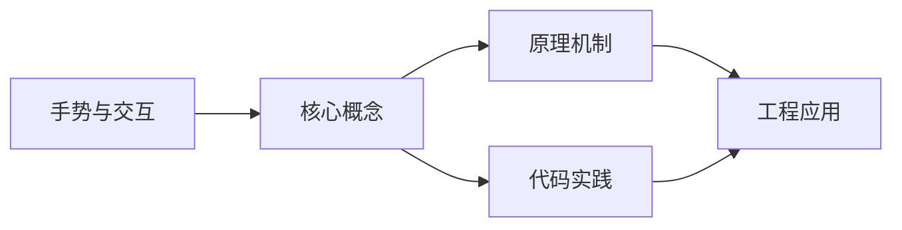
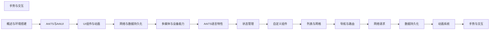

## 1. 学习目标（Bloom 分类）

本节按照布鲁姆教育目标分类学组织学习路径。本文主题为《手势与交互》，属于 HarmonyOS 模块，读者可以根据自身阶段选择阅读深度。

记忆层面：能够准确复述本文的核心概念、术语与基本语法或操作步骤，并能够在提问或检索时快速定位对应知识点。能够说出 HarmonyOS 的核心概念、术语与标准写法。

理解层面：能够用自己的语言解释核心原理与工作机制，说明概念之间的因果关系，而不是机械记忆结论。能够解释 HarmonyOS 的工作原理与设计动机。

应用层面：能够在真实项目或练习场景中运用本文知识解决具体问题，写出正确且可维护的实现。能够编写符合 HarmonyOS 规范的完整实现。

分析层面：能够拆解复杂问题，比较本文主题与相邻概念的异同，识别边界条件与例外情况。能够分析 HarmonyOS 与相邻方案的差异与边界。

评价层面：能够根据约束条件（性能、可读性、安全、成本）评价不同方案的优劣，做出有依据的技术决策。能够根据场景评价 HarmonyOS 相关方案的优劣。

创造层面：能够把本文知识与其他模块知识组合，设计出新的解决方案或可复用的工程模式。能够组合 HarmonyOS 与其他技术设计完整方案。

通过本节学习，读者应当能够把《手势与交互》纳入自己的知识网络，并与 HarmonyOS 模块的其他主题（ArkTS、ArkUI、分布式能力、应用开发）建立关联。

## 2. 历史动机与发展脉络

《手势与交互》是 HarmonyOS 领域的重要主题。要真正理解它，需要先了解它解决的问题与演进过程。

HarmonyOS（鸿蒙）由华为于 2019 年发布，定位面向全场景的分布式操作系统；HarmonyOS NEXT（5.0，2024）去 Android 化，采用自研鸿蒙内核与 ArkTS 语言栈。
开发框架：ArkTS（TS 超集 + 声明式 UI 扩展）、ArkUI（声明式组件）、Stage 模型（应用模型）、方舟编译器。
分布式能力：跨端流转、分布式数据、一次开发多端部署（手机/平板/车机/穿戴）。

回到本文主题：手势与交互 的提出与成熟，正是上述技术背景下的必然产物。早期实现往往以简单可用为目标，随着工程规模扩大，社区逐渐沉淀出标准做法与最佳实践；理解这一脉络，可以帮助读者判断“为什么文档中的推荐写法是现在这个样子”，也能在遇到历史遗留代码时准确识别其设计年代与取舍。


## 3. 形式化定义与核心概念精讲

本节把《手势与交互》涉及的核心概念以“定义 + 讲解”的形式展开。读者应把定义当作工具，把讲解当作理解路径；两者结合才能形成可迁移的知识。

ArkTS 语法：基于 TypeScript 的类型系统，增加 @Component/@Entry/@State 等装饰器与 UI 描述语法。
ArkUI 组件：Column/Row/Stack 布局容器、Text/Button/Image 基础组件、List/Grid 容器组件；状态管理（@State/@Prop/@Link/@Provide）。
应用模型：Stage 模型以 UIAbility 为页面载体，EntryAbility 入口；module.json5 声明应用配置。

### 3.1 原文章节逐一精讲

原文档把主题拆分为 10 个小节，下面按顺序给出每一节的导读讲解，随后保留原文细节供精读。

#### 原文精读（完整保留）

# 手势与交互 语法速查手册

> **符号约定**:`< >` 必填参数 | `[ ]` 可选参数

---

##### 点击手势

```typescript
@Component
struct TapGestureDemo {
  @State clickCount: number = 0
  @State doubleClickMsg: string = ''

  build() {
    Column() {
      // 单击手势
      Text('单击计数: ' + this.clickCount)
        .fontSize(20)
        .padding(20)
        .backgroundColor('#e0e0e0')
        .gesture(
          TapGesture({ count: 1 }) // count: 1 表示单击
            .onAction(() => {
              this.clickCount++
            })
        )

      // 双击手势
      Text(this.doubleClickMsg || '双击我')
        .fontSize(20)
        .padding(20)
        .backgroundColor('#d0d0d0')
        .gesture(
          TapGesture({ count: 2 }) // count: 2 表示双击
            .onAction(() => {
              this.doubleClickMsg = '双击成功！'
            })
        )
    }
  }
}
```

##### 长按手势

```typescript
@Component
struct LongPressDemo {
  @State pressMsg: string = '长按我'

  build() {
    Column() {
      Text(this.pressMsg)
        .fontSize(20)
        .padding(20)
        .backgroundColor('#c0c0c0')
        .gesture(
          LongPressGesture({ repeat: true }) // repeat: 重复触发
            .onAction((event: GestureEvent) => {
              this.pressMsg = `长按中... 重复次数: ${event.repeatCount}`
            })
            .onActionEnd(() => {
              this.pressMsg = '长按结束'
            })
        )
    }
  }
}
```

##### 拖动手势

```typescript
@Component
struct PanGestureDemo {
  @State offsetX: number = 0
  @State offsetY: number = 0

  build() {
    Column() {
      Row() {
        Text('拖动我')
          .fontSize(18)
          .fontColor(Color.White)
      }
      .width(100)
      .height(100)
      .backgroundColor(Color.Blue)
      .translate({ x: this.offsetX, y: this.offsetY }) // 使用 translate 实现移动
      .gesture(
        PanGesture()
          .onActionStart(() => {
            console.info('开始拖动')
          })
          .onActionUpdate((event: GestureEvent) => {
            // 累加偏移量
            this.offsetX += event.offsetX
            this.offsetY += event.offsetY
          })
          .onActionEnd(() => {
            console.info('拖动结束')
          })
      )

      Button('重置位置').onClick(() => {
        this.offsetX = 0
        this.offsetY = 0
      })
    }
    .width('100%')
    .height('100%')
  }
}
```

##### 缩放手势

```typescript
@Component
struct PinchGestureDemo {
  @State scale: number = 1.0

  build() {
    Column() {
      Image($r('app.media.test_image'))
        .width(300)
        .height(300)
        .objectFit(ImageFit.Contain)
        .scale({ x: this.scale, y: this.scale }) // 根据缩放比例调整大小
        .gesture(
          PinchGesture()
            .onActionStart(() => {
              console.info('开始缩放')
            })
            .onActionUpdate((event: GestureEvent) => {
              // event.scale 是相对于初始状态的缩放比
              this.scale = Math.max(0.5, Math.min(3.0, this.scale * event.scale))
            })
        )

      Text(`缩放比例: ${this.scale.toFixed(2)}`)
        .fontSize(16)
        .margin({ top: 12 })

      Button('重置').onClick(() => {
        this.scale = 1.0
      })
    }
  }
}
```

##### 旋转手势

```typescript
@Component
struct RotationGestureDemo {
  @State angle: number = 0

  build() {
    Column() {
      Image($r('app.media.test_image'))
        .width(200)
        .height(200)
        .objectFit(ImageFit.Contain)
        .rotate({ angle: this.angle }) // 根据角度旋转
        .gesture(
          RotationGesture()
            .onActionUpdate((event: GestureEvent) => {
              this.angle += event.angle
            })
        )

      Text(`旋转角度: ${this.angle.toFixed(0)} 度`)
        .fontSize(16)
        .margin({ top: 12 })

      Button('重置').onClick(() => {
        this.angle = 0
      })
    }
  }
}
```

##### 组合手势

```typescript
@Component
struct GestureGroupDemo {
  @State msg: string = '试试不同手势'

  build() {
    Column() {
      Text(this.msg)
        .fontSize(20)
        .padding(30)
        .backgroundColor('#e8e8e8')
        .gesture(
          // 互斥模式：只响应第一个识别成功的手势
          GestureGroup(GestureMode.Exclusive,
            TapGesture({ count: 2 })
              .onAction(() => {
                this.msg = '双击'
              }),
            LongPressGesture()
              .onAction(() => {
                this.msg = '长按'
              }),
            PanGesture()
              .onAction(() => {
                this.msg = '拖动'
              })
          )
        )
    }
  }
}
```

组合手势的三种模式：

```typescript
// 1. 互斥模式（Exclusive）：只响应第一个识别成功的手势
GestureGroup(GestureMode.Exclusive, tapGesture, longPressGesture);

// 2. 并行模式（Parallel）：所有手势同时识别
GestureGroup(GestureMode.Parallel, pinchGesture, rotationGesture);

// 3. 串行模式（Sequential）：按顺序识别，前一个完成后才开始下一个
GestureGroup(GestureMode.Sequential, longPressGesture, panGesture);
// 先长按，长按成功后才能拖动
```

##### 触摸事件

除了手势，还可以直接处理触摸事件：

```typescript
@Component
struct TouchEventDemo {
  @State touchMsg: string = '触摸此区域'
  @State x: number = 0
  @State y: number = 0

  build() {
    Column() {
      Text(this.touchMsg)
        .fontSize(16)
      Text(`坐标: (${this.x.toFixed(0)}, ${this.y.toFixed(0)})`)
        .fontSize(14)
        .fontColor('#666666')
    }
    .width(300)
    .height(200)
    .backgroundColor('#f0f0f0')
    .justifyContent(FlexAlign.Center)
    .onTouch((event: TouchEvent) => {
      switch (event.type) {
        case TouchType.Down:
          this.touchMsg = '手指按下'
          break
        case TouchType.Move:
          this.touchMsg = '手指移动'
          break
        case TouchType.Up:
          this.touchMsg = '手指抬起'
          break
      }
      this.x = event.touches[0].x
      this.y = event.touches[0].y
    })
  }
}
```

#### 概述

手势与交互是移动应用用户体验的核心。HarmonyOS 提供了丰富的手势识别能力，包括点击、长按、拖动、缩放、旋转等基础手势，以及组合手势和自定义手势。通过手势系统，你可以让用户以自然的方式与应用交互，而不局限于按钮点击。

为什么需要手势系统？触屏设备上，手势是最自然的交互方式。用户习惯通过滑动浏览内容、双指缩放图片、长按呼出菜单。如果你的应用只支持点击，用户体验会大打折扣。HarmonyOS 的手势系统让你可以轻松实现这些交互模式。

#### 基础概念

**TapGesture**：点击手势，支持单击、双击和多击识别。

**LongPressGesture**：长按手势，用户按住一段时间后触发。

**PanGesture**：拖动手势，用户按住并移动手指时触发，常用于滑动和拖拽。

**PinchGesture**：捏合手势，双指缩放，用于图片缩放等场景。

**RotationGesture**：旋转手势，双指旋转，用于图片旋转等场景。

**GestureGroup**：组合手势，将多个手势组合在一起，支持串行、并行和互斥模式。

#### 快速上手

最简单的手势示例：

```typescript
@Entry
@Component
struct GestureDemo {
  @State message: string = '试试各种手势'

  build() {
    Column() {
      Text(this.message)
        .fontSize(24)

      // 点击手势
      Text('点击我')
        .fontSize(20)
        .padding(20)
        .backgroundColor('#f0f0f0')
        .gesture(
          TapGesture()
            .onAction(() => {
              this.message = '你点击了！'
            })
        )
    }
    .width('100%')
    .height('100%')
    .justifyContent(FlexAlign.Center)
  }
}
```

#### 详细用法

#### 常见场景

##### 可拖动的浮动按钮

```typescript
@Component
struct DraggableButton {
  @State posX: number = 300
  @State posY: number = 500

  build() {
    Stack() {
      // 页面内容
      Text('页面内容区域')
        .fontSize(24)

      // 可拖动的浮动按钮
      Button('+')
        .width(56)
        .height(56)
        .fontSize(28)
        .borderRadius(28)
        .position({ x: this.posX, y: this.posY })
        .gesture(
          PanGesture()
            .onActionUpdate((event: GestureEvent) => {
              this.posX += event.offsetX
              this.posY += event.offsetY
            })
        )
    }
    .width('100%')
    .height('100%')
  }
}
```

##### 图片查看器（缩放+旋转）

```typescript
@Component
struct ImageViewer {
  @State scale: number = 1.0
  @State angle: number = 0
  @State offsetX: number = 0
  @State offsetY: number = 0

  build() {
    Stack() {
      Image($r('app.media.photo'))
        .objectFit(ImageFit.Contain)
        .scale({ x: this.scale, y: this.scale })
        .rotate({ angle: this.angle })
        .translate({ x: this.offsetX, y: this.offsetY })
        .gesture(
          GestureGroup(GestureMode.Parallel,
            // 缩放
            PinchGesture()
              .onActionUpdate((event: GestureEvent) => {
                this.scale = Math.max(0.5, Math.min(5.0, this.scale * event.scale))
              }),
            // 旋转
            RotationGesture()
              .onActionUpdate((event: GestureEvent) => {
                this.angle += event.angle
              }),
            // 拖动
            PanGesture()
              .onActionUpdate((event: GestureEvent) => {
                this.offsetX += event.offsetX
                this.offsetY += event.offsetY
              })
          )
        )

      // 重置按钮
      Button('重置')
        .position({ x: 16, y: 16 })
        .onClick(() => {
          this.scale = 1.0
          this.angle = 0
          this.offsetX = 0
          this.offsetY = 0
        })
    }
    .width('100%')
    .height('100%')
    .backgroundColor(Color.Black)
  }
}
```

#### 注意事项

**手势冲突**：当父子组件都绑定了手势时，默认由子组件消费手势事件。如果需要父组件处理，可以使用 `.priorityGesture()` 代替 `.gesture()`。

**手势与滚动的冲突**：在可滚动容器（List、Scroll）中使用 PanGesture 可能会与滚动冲突。使用 `.parallelGesture()` 可以让两者同时工作。

**性能考虑**：手势回调中的计算应尽量轻量，避免在 onActionUpdate 中执行耗时操作，因为它在手指移动时会被高频调用。

**手势识别距离**：PanGesture 默认需要移动一定距离才会触发，可以通过 `distance` 参数调整。

#### 进阶用法

##### 自定义手势识别

```typescript
@Component
struct CustomGestureDemo {
  @State msg: string = ''

  build() {
    Column() {
      Text(this.msg).fontSize(20)

      // 使用原始触摸事件实现自定义手势
      Column() {
        Text('自定义手势区域')
      }
      .width(200)
      .height(200)
      .backgroundColor('#e0e0e0')
      .onTouch((event: TouchEvent) => {
        if (event.type === TouchType.Down) {
          // 记录按下位置和时间
          console.info(`按下位置: (${event.touches[0].x}, ${event.touches[0].y})`)
        } else if (event.type === TouchType.Up) {
          // 计算滑动方向和速度
          console.info('手指抬起')
        }
      })
    }
  }
}
```

##### 手势与动画配合

```typescript
@Component
struct GestureAnimationDemo {
  @State scale: number = 1.0
  @State brightness: number = 1.0

  build() {
    Column() {
      Image($r('app.media.photo'))
        .width(300)
        .height(300)
        .objectFit(ImageFit.Cover)
        .scale({ x: this.scale, y: this.scale })
        .brightness(this.brightness)
        .gesture(
          PinchGesture()
            .onActionUpdate((event: GestureEvent) => {
              this.scale = Math.max(0.5, Math.min(3.0, this.scale * event.scale))
            })
        )
        .animation({
          duration: 200,
          curve: Curve.EaseOut
        })
    }
  }
}
```
#### 手势绑定 API

**绑定手势**
`.gesture(gesture: GestureType, mask?: GestureMask): void`
```typescript
Text('点击我')
  .gesture(
    TapGesture()
      .onAction(() => {
        console.info('点击触发');
      })
  );
```

**优先级手势(父组件优先)**
`.priorityGesture(gesture: GestureType, mask?: GestureMask): void`
```typescript
Column() {
  Text('子组件')
    .gesture(TapGesture().onAction(() => console.info('子组件')))
}
.priorityGesture(TapGesture().onAction(() => console.info('父组件优先')));
```

**并行手势(子父组件同时识别)**
`.parallelGesture(gesture: GestureType, mask?: GestureMask): void`
```typescript
Scroll() {
  Text('可滚动且可拖动')
    .parallelGesture(PanGesture().onActionUpdate((event) => {
      console.info(`拖动中: ${event.offsetX}`);
    }));
};
```

**GestureMask 枚举**
`GestureMask`
```typescript
enum GestureMask {
  Normal = 'normal',     // 正常手势识别
  IgnoreInternal = 'ignoreInternal' // 忽略内部手势
}
```

---

#### GestureEvent 事件对象

**GestureEvent 属性**
```typescript
interface GestureEvent {
  repeatCount: number;        // 重复次数(长按)
  offsetX: number;            // X 轴偏移(拖动)
  offsetY: number;            // Y 轴偏移(拖动)
  scale: number;              // 缩放比例
  angle: number;              // 旋转角度
  speed: number;              // 速度
  fingerList: FingerInfo[];   // 手指信息列表
  pinchCenterX: number;       // 缩放中心 X
  pinchCenterY: number;       // 缩放中心 Y
}
```

**FingerInfo 手指信息**
```typescript
interface FingerInfo {
  id: number;          // 手指 ID
  globalX: number;     // 全局 X 坐标
  globalY: number;     // 全局 Y 坐标
  localX: number;      // 局部 X 坐标
  localY: number;      // 局部 Y 坐标
}
```

---

#### 通用事件

**点击事件**
`.onClick(event: (event: ClickEvent) => void): void`
```typescript
Button('点击').onClick((event: ClickEvent) => {
  console.info(`点击位置: (${event.x}, ${event.y})`);
});
```

**触摸区域事件**
`.onTouch(event: (event: TouchEvent) => void): void`
```typescript
Text('触摸').onTouch((event) => {
  if (event.type === TouchType.Down) {
    console.info('按下');
  }
});
```

**按键事件**
`.onKeyEvent(event: (event: KeyEvent) => void): void`
```typescript
TextInput({ placeholder: '请输入' })
  .onKeyEvent((event: KeyEvent) => {
    if (event.type === KeyType.Down) {
      console.info(`按下键: ${event.keyCode}`);
    }
  });
```

**挂起/失去焦点事件**
`.onMouse(event: (event: MouseEvent) => void): void`
`.onHover(event: (isHover: boolean) => void): void`
```typescript
Text('鼠标区域')
  .onHover((isHover) => {
    console.info(`悬停状态: ${isHover}`);
  });
```


### 3.2 概念关系图

下面用 Mermaid 图表达本文核心概念之间的关系，帮助读者建立整体图景：



图中展示的是本文知识的结构化关系：核心概念是入口，原理机制解释“为什么”，代码实践演示“怎么做”，工程应用回答“何时用”。读者学习时可以把每个小节的内容挂接到对应节点上。

## 4. 理论推导与原理解析

本节深入《手势与交互》背后的原理。理论部分不求面面俱到，而是聚焦“能解释现象、能指导实践”的关键推导。

ArkTS 语法：基于 TypeScript 的类型系统，增加 @Component/@Entry/@State 等装饰器与 UI 描述语法。
ArkUI 组件：Column/Row/Stack 布局容器、Text/Button/Image 基础组件、List/Grid 容器组件；状态管理（@State/@Prop/@Link/@Provide）。
应用模型：Stage 模型以 UIAbility 为页面载体，EntryAbility 入口；module.json5 声明应用配置。
生命周期：Ability 的 onCreate/onWindowStageCreate/onForeground/onBackground/onDestroy。

需要强调的是，理论推导与工程实践之间存在翻译层：理论给出的是理想化模型与边界条件，工程代码则必须处理真实环境中的例外。读者在学习时应先掌握理论的“标准情形”，再通过陷阱章节了解“非标准情形”。

## 5. 代码示例与逐行讲解

本节把原文中的代码示例系统整理，并为每个示例补充用途说明与讲解。读者不应只浏览代码，而应逐段对照讲解理解设计意图。

### 5.1 示例：点击手势

该示例来自原文《点击手势》小节，用于演示手势与交互相关操作。阅读时请先看代码结构，再看其后的讲解。

```typescript
@Component
struct TapGestureDemo {
  @State clickCount: number = 0
  @State doubleClickMsg: string = ''

  build() {
    Column() {
      // 单击手势
      Text('单击计数: ' + this.clickCount)
        .fontSize(20)
        .padding(20)
        .backgroundColor('#e0e0e0')
        .gesture(
          TapGesture({ count: 1 }) // count: 1 表示单击
            .onAction(() => {
              this.clickCount++
            })
        )

      // 双击手势
      Text(this.doubleClickMsg || '双击我')
        .fontSize(20)
        .padding(20)
        .backgroundColor('#d0d0d0')
        .gesture(
          TapGesture({ count: 2 }) // count: 2 表示双击
            .onAction(() => {
              this.doubleClickMsg = '双击成功！'
            })
        )
    }
  }
}
```

讲解：这段代码演示了本节核心知识点。代码中的关键操作可以归纳为三步：准备（定义或初始化）、执行（核心逻辑）、收尾（释放资源或返回结果）。实际项目中，这三步往往被封装为函数或类，以提升复用性与可测试性。

关键点分析：

该示例共 31 行有效代码，结构以数据或配置为主。阅读时应关注：数据字段的含义、配置项的作用，以及它们与运行行为的对应关系。

进阶思考路径：先尝试修改参数观察行为变化，再把示例中的模式迁移到自己的项目中；每次修改都记录预期与实测差异，这是把示例转化为能力的最快方式。

### 5.2 示例：长按手势

该示例来自原文《长按手势》小节，用于演示手势与交互相关操作。阅读时请先看代码结构，再看其后的讲解。

```typescript
@Component
struct LongPressDemo {
  @State pressMsg: string = '长按我'

  build() {
    Column() {
      Text(this.pressMsg)
        .fontSize(20)
        .padding(20)
        .backgroundColor('#c0c0c0')
        .gesture(
          LongPressGesture({ repeat: true }) // repeat: 重复触发
            .onAction((event: GestureEvent) => {
              this.pressMsg = `长按中... 重复次数: ${event.repeatCount}`
            })
            .onActionEnd(() => {
              this.pressMsg = '长按结束'
            })
        )
    }
  }
}
```

讲解：这段代码演示了本节核心知识点。代码中的关键操作可以归纳为三步：准备（定义或初始化）、执行（核心逻辑）、收尾（释放资源或返回结果）。实际项目中，这三步往往被封装为函数或类，以提升复用性与可测试性。

关键点分析：

该示例共 21 行有效代码，结构以数据或配置为主。阅读时应关注：数据字段的含义、配置项的作用，以及它们与运行行为的对应关系。

进阶思考路径：先尝试修改参数观察行为变化，再把示例中的模式迁移到自己的项目中；每次修改都记录预期与实测差异，这是把示例转化为能力的最快方式。

### 5.3 示例：拖动手势

该示例来自原文《拖动手势》小节，用于演示手势与交互相关操作。阅读时请先看代码结构，再看其后的讲解。

```typescript
@Component
struct PanGestureDemo {
  @State offsetX: number = 0
  @State offsetY: number = 0

  build() {
    Column() {
      Row() {
        Text('拖动我')
          .fontSize(18)
          .fontColor(Color.White)
      }
      .width(100)
      .height(100)
      .backgroundColor(Color.Blue)
      .translate({ x: this.offsetX, y: this.offsetY }) // 使用 translate 实现移动
      .gesture(
        PanGesture()
          .onActionStart(() => {
            console.info('开始拖动')
          })
          .onActionUpdate((event: GestureEvent) => {
            // 累加偏移量
            this.offsetX += event.offsetX
            this.offsetY += event.offsetY
          })
          .onActionEnd(() => {
            console.info('拖动结束')
          })
      )

      Button('重置位置').onClick(() => {
        this.offsetX = 0
        this.offsetY = 0
      })
    }
    .width('100%')
    .height('100%')
  }
}
```

讲解：这段代码演示了本节核心知识点。代码中的关键操作可以归纳为三步：准备（定义或初始化）、执行（核心逻辑）、收尾（释放资源或返回结果）。实际项目中，这三步往往被封装为函数或类，以提升复用性与可测试性。

关键点分析：

该示例共 38 行有效代码，结构以数据或配置为主。阅读时应关注：数据字段的含义、配置项的作用，以及它们与运行行为的对应关系。

进阶思考路径：先尝试修改参数观察行为变化，再把示例中的模式迁移到自己的项目中；每次修改都记录预期与实测差异，这是把示例转化为能力的最快方式。

### 5.4 示例：缩放手势

该示例来自原文《缩放手势》小节，用于演示手势与交互相关操作。阅读时请先看代码结构，再看其后的讲解。

```typescript
@Component
struct PinchGestureDemo {
  @State scale: number = 1.0

  build() {
    Column() {
      Image($r('app.media.test_image'))
        .width(300)
        .height(300)
        .objectFit(ImageFit.Contain)
        .scale({ x: this.scale, y: this.scale }) // 根据缩放比例调整大小
        .gesture(
          PinchGesture()
            .onActionStart(() => {
              console.info('开始缩放')
            })
            .onActionUpdate((event: GestureEvent) => {
              // event.scale 是相对于初始状态的缩放比
              this.scale = Math.max(0.5, Math.min(3.0, this.scale * event.scale))
            })
        )

      Text(`缩放比例: ${this.scale.toFixed(2)}`)
        .fontSize(16)
        .margin({ top: 12 })

      Button('重置').onClick(() => {
        this.scale = 1.0
      })
    }
  }
}
```

讲解：这段代码演示了本节核心知识点。代码中的关键操作可以归纳为三步：准备（定义或初始化）、执行（核心逻辑）、收尾（释放资源或返回结果）。实际项目中，这三步往往被封装为函数或类，以提升复用性与可测试性。

关键点分析：

该示例共 29 行有效代码，结构以数据或配置为主。阅读时应关注：数据字段的含义、配置项的作用，以及它们与运行行为的对应关系。

进阶思考路径：先尝试修改参数观察行为变化，再把示例中的模式迁移到自己的项目中；每次修改都记录预期与实测差异，这是把示例转化为能力的最快方式。

### 5.5 示例：旋转手势

该示例来自原文《旋转手势》小节，用于演示手势与交互相关操作。阅读时请先看代码结构，再看其后的讲解。

```typescript
@Component
struct RotationGestureDemo {
  @State angle: number = 0

  build() {
    Column() {
      Image($r('app.media.test_image'))
        .width(200)
        .height(200)
        .objectFit(ImageFit.Contain)
        .rotate({ angle: this.angle }) // 根据角度旋转
        .gesture(
          RotationGesture()
            .onActionUpdate((event: GestureEvent) => {
              this.angle += event.angle
            })
        )

      Text(`旋转角度: ${this.angle.toFixed(0)} 度`)
        .fontSize(16)
        .margin({ top: 12 })

      Button('重置').onClick(() => {
        this.angle = 0
      })
    }
  }
}
```

讲解：这段代码演示了本节核心知识点。代码中的关键操作可以归纳为三步：准备（定义或初始化）、执行（核心逻辑）、收尾（释放资源或返回结果）。实际项目中，这三步往往被封装为函数或类，以提升复用性与可测试性。

关键点分析：

该示例共 25 行有效代码，结构以数据或配置为主。阅读时应关注：数据字段的含义、配置项的作用，以及它们与运行行为的对应关系。

进阶思考路径：先尝试修改参数观察行为变化，再把示例中的模式迁移到自己的项目中；每次修改都记录预期与实测差异，这是把示例转化为能力的最快方式。

### 5.6 示例：组合手势

该示例来自原文《组合手势》小节，用于演示手势与交互相关操作。阅读时请先看代码结构，再看其后的讲解。

```typescript
@Component
struct GestureGroupDemo {
  @State msg: string = '试试不同手势'

  build() {
    Column() {
      Text(this.msg)
        .fontSize(20)
        .padding(30)
        .backgroundColor('#e8e8e8')
        .gesture(
          // 互斥模式：只响应第一个识别成功的手势
          GestureGroup(GestureMode.Exclusive,
            TapGesture({ count: 2 })
              .onAction(() => {
                this.msg = '双击'
              }),
            LongPressGesture()
              .onAction(() => {
                this.msg = '长按'
              }),
            PanGesture()
              .onAction(() => {
                this.msg = '拖动'
              })
          )
        )
    }
  }
}
```

讲解：这段代码演示了本节核心知识点。代码中的关键操作可以归纳为三步：准备（定义或初始化）、执行（核心逻辑）、收尾（释放资源或返回结果）。实际项目中，这三步往往被封装为函数或类，以提升复用性与可测试性。

关键点分析：

该示例共 29 行有效代码，结构以数据或配置为主。阅读时应关注：数据字段的含义、配置项的作用，以及它们与运行行为的对应关系。

进阶思考路径：先尝试修改参数观察行为变化，再把示例中的模式迁移到自己的项目中；每次修改都记录预期与实测差异，这是把示例转化为能力的最快方式。

### 5.7 示例：组合手势

该示例来自原文《组合手势》小节，用于演示手势与交互相关操作。阅读时请先看代码结构，再看其后的讲解。

```typescript
// 1. 互斥模式（Exclusive）：只响应第一个识别成功的手势
GestureGroup(GestureMode.Exclusive, tapGesture, longPressGesture);

// 2. 并行模式（Parallel）：所有手势同时识别
GestureGroup(GestureMode.Parallel, pinchGesture, rotationGesture);

// 3. 串行模式（Sequential）：按顺序识别，前一个完成后才开始下一个
GestureGroup(GestureMode.Sequential, longPressGesture, panGesture);
// 先长按，长按成功后才能拖动
```

讲解：这段代码演示了本节核心知识点。代码中的关键操作可以归纳为三步：准备（定义或初始化）、执行（核心逻辑）、收尾（释放资源或返回结果）。实际项目中，这三步往往被封装为函数或类，以提升复用性与可测试性。

关键点分析：

该示例共 7 行有效代码，结构以数据或配置为主。阅读时应关注：数据字段的含义、配置项的作用，以及它们与运行行为的对应关系。

进阶思考路径：先尝试修改参数观察行为变化，再把示例中的模式迁移到自己的项目中；每次修改都记录预期与实测差异，这是把示例转化为能力的最快方式。

### 5.8 示例：触摸事件

该示例来自原文《触摸事件》小节，用于演示手势与交互相关操作。阅读时请先看代码结构，再看其后的讲解。

```typescript
@Component
struct TouchEventDemo {
  @State touchMsg: string = '触摸此区域'
  @State x: number = 0
  @State y: number = 0

  build() {
    Column() {
      Text(this.touchMsg)
        .fontSize(16)
      Text(`坐标: (${this.x.toFixed(0)}, ${this.y.toFixed(0)})`)
        .fontSize(14)
        .fontColor('#666666')
    }
    .width(300)
    .height(200)
    .backgroundColor('#f0f0f0')
    .justifyContent(FlexAlign.Center)
    .onTouch((event: TouchEvent) => {
      switch (event.type) {
        case TouchType.Down:
          this.touchMsg = '手指按下'
          break
        case TouchType.Move:
          this.touchMsg = '手指移动'
          break
        case TouchType.Up:
          this.touchMsg = '手指抬起'
          break
      }
      this.x = event.touches[0].x
      this.y = event.touches[0].y
    })
  }
}
```

讲解：这段代码演示了本节核心知识点。代码中的关键操作可以归纳为三步：准备（定义或初始化）、执行（核心逻辑）、收尾（释放资源或返回结果）。实际项目中，这三步往往被封装为函数或类，以提升复用性与可测试性。

关键点分析：

该示例共 34 行有效代码，结构以数据或配置为主。阅读时应关注：数据字段的含义、配置项的作用，以及它们与运行行为的对应关系。

进阶思考路径：先尝试修改参数观察行为变化，再把示例中的模式迁移到自己的项目中；每次修改都记录预期与实测差异，这是把示例转化为能力的最快方式。

### 5.9 示例：快速上手

该示例来自原文《快速上手》小节，用于演示手势与交互相关操作。阅读时请先看代码结构，再看其后的讲解。

```typescript
@Entry
@Component
struct GestureDemo {
  @State message: string = '试试各种手势'

  build() {
    Column() {
      Text(this.message)
        .fontSize(24)

      // 点击手势
      Text('点击我')
        .fontSize(20)
        .padding(20)
        .backgroundColor('#f0f0f0')
        .gesture(
          TapGesture()
            .onAction(() => {
              this.message = '你点击了！'
            })
        )
    }
    .width('100%')
    .height('100%')
    .justifyContent(FlexAlign.Center)
  }
}
```

讲解：这段代码演示了本节核心知识点。代码中的关键操作可以归纳为三步：准备（定义或初始化）、执行（核心逻辑）、收尾（释放资源或返回结果）。实际项目中，这三步往往被封装为函数或类，以提升复用性与可测试性。

关键点分析：

该示例共 25 行有效代码，结构以数据或配置为主。阅读时应关注：数据字段的含义、配置项的作用，以及它们与运行行为的对应关系。

进阶思考路径：先尝试修改参数观察行为变化，再把示例中的模式迁移到自己的项目中；每次修改都记录预期与实测差异，这是把示例转化为能力的最快方式。

### 5.10 示例：可拖动的浮动按钮

该示例来自原文《可拖动的浮动按钮》小节，用于演示手势与交互相关操作。阅读时请先看代码结构，再看其后的讲解。

```typescript
@Component
struct DraggableButton {
  @State posX: number = 300
  @State posY: number = 500

  build() {
    Stack() {
      // 页面内容
      Text('页面内容区域')
        .fontSize(24)

      // 可拖动的浮动按钮
      Button('+')
        .width(56)
        .height(56)
        .fontSize(28)
        .borderRadius(28)
        .position({ x: this.posX, y: this.posY })
        .gesture(
          PanGesture()
            .onActionUpdate((event: GestureEvent) => {
              this.posX += event.offsetX
              this.posY += event.offsetY
            })
        )
    }
    .width('100%')
    .height('100%')
  }
}
```

讲解：这段代码演示了本节核心知识点。代码中的关键操作可以归纳为三步：准备（定义或初始化）、执行（核心逻辑）、收尾（释放资源或返回结果）。实际项目中，这三步往往被封装为函数或类，以提升复用性与可测试性。

关键点分析：

该示例共 28 行有效代码，结构以数据或配置为主。阅读时应关注：数据字段的含义、配置项的作用，以及它们与运行行为的对应关系。

进阶思考路径：先尝试修改参数观察行为变化，再把示例中的模式迁移到自己的项目中；每次修改都记录预期与实测差异，这是把示例转化为能力的最快方式。

### 5.11 示例：图片查看器（缩放+旋转）

该示例来自原文《图片查看器（缩放+旋转）》小节，用于演示手势与交互相关操作。阅读时请先看代码结构，再看其后的讲解。

```typescript
@Component
struct ImageViewer {
  @State scale: number = 1.0
  @State angle: number = 0
  @State offsetX: number = 0
  @State offsetY: number = 0

  build() {
    Stack() {
      Image($r('app.media.photo'))
        .objectFit(ImageFit.Contain)
        .scale({ x: this.scale, y: this.scale })
        .rotate({ angle: this.angle })
        .translate({ x: this.offsetX, y: this.offsetY })
        .gesture(
          GestureGroup(GestureMode.Parallel,
            // 缩放
            PinchGesture()
              .onActionUpdate((event: GestureEvent) => {
                this.scale = Math.max(0.5, Math.min(5.0, this.scale * event.scale))
              }),
            // 旋转
            RotationGesture()
              .onActionUpdate((event: GestureEvent) => {
                this.angle += event.angle
              }),
            // 拖动
            PanGesture()
              .onActionUpdate((event: GestureEvent) => {
                this.offsetX += event.offsetX
                this.offsetY += event.offsetY
              })
          )
        )

      // 重置按钮
      Button('重置')
        .position({ x: 16, y: 16 })
        .onClick(() => {
          this.scale = 1.0
          this.angle = 0
          this.offsetX = 0
          this.offsetY = 0
        })
    }
    .width('100%')
    .height('100%')
    .backgroundColor(Color.Black)
  }
}
```

讲解：这段代码演示了本节核心知识点。代码中的关键操作可以归纳为三步：准备（定义或初始化）、执行（核心逻辑）、收尾（释放资源或返回结果）。实际项目中，这三步往往被封装为函数或类，以提升复用性与可测试性。

关键点分析：

该示例共 48 行有效代码，结构以数据或配置为主。阅读时应关注：数据字段的含义、配置项的作用，以及它们与运行行为的对应关系。

进阶思考路径：先尝试修改参数观察行为变化，再把示例中的模式迁移到自己的项目中；每次修改都记录预期与实测差异，这是把示例转化为能力的最快方式。

### 5.12 示例：自定义手势识别

该示例来自原文《自定义手势识别》小节，用于演示手势与交互相关操作。阅读时请先看代码结构，再看其后的讲解。

```typescript
@Component
struct CustomGestureDemo {
  @State msg: string = ''

  build() {
    Column() {
      Text(this.msg).fontSize(20)

      // 使用原始触摸事件实现自定义手势
      Column() {
        Text('自定义手势区域')
      }
      .width(200)
      .height(200)
      .backgroundColor('#e0e0e0')
      .onTouch((event: TouchEvent) => {
        if (event.type === TouchType.Down) {
          // 记录按下位置和时间
          console.info(`按下位置: (${event.touches[0].x}, ${event.touches[0].y})`)
        } else if (event.type === TouchType.Up) {
          // 计算滑动方向和速度
          console.info('手指抬起')
        }
      })
    }
  }
}
```

讲解：这段代码演示了本节核心知识点。代码中的关键操作可以归纳为三步：准备（定义或初始化）、执行（核心逻辑）、收尾（释放资源或返回结果）。实际项目中，这三步往往被封装为函数或类，以提升复用性与可测试性。

关键点分析：

该示例共 25 行有效代码，包含 1 类关键结构（if）。其中：

- 入口与初始化部分负责建立上下文，对应实际项目中的启动或装配逻辑；
- 核心逻辑部分体现本文主题的主要操作，是阅读时最需要对照讲解理解的部分；
- 输出或返回部分把结果交给调用方，注意其类型与边界条件。

进阶思考路径：先尝试修改参数观察行为变化，再把示例中的模式迁移到自己的项目中；每次修改都记录预期与实测差异，这是把示例转化为能力的最快方式。

### 5.13 示例：手势与动画配合

该示例来自原文《手势与动画配合》小节，用于演示手势与交互相关操作。阅读时请先看代码结构，再看其后的讲解。

```typescript
@Component
struct GestureAnimationDemo {
  @State scale: number = 1.0
  @State brightness: number = 1.0

  build() {
    Column() {
      Image($r('app.media.photo'))
        .width(300)
        .height(300)
        .objectFit(ImageFit.Cover)
        .scale({ x: this.scale, y: this.scale })
        .brightness(this.brightness)
        .gesture(
          PinchGesture()
            .onActionUpdate((event: GestureEvent) => {
              this.scale = Math.max(0.5, Math.min(3.0, this.scale * event.scale))
            })
        )
        .animation({
          duration: 200,
          curve: Curve.EaseOut
        })
    }
  }
}
```

讲解：这段代码演示了本节核心知识点。代码中的关键操作可以归纳为三步：准备（定义或初始化）、执行（核心逻辑）、收尾（释放资源或返回结果）。实际项目中，这三步往往被封装为函数或类，以提升复用性与可测试性。

关键点分析：

该示例共 25 行有效代码，结构以数据或配置为主。阅读时应关注：数据字段的含义、配置项的作用，以及它们与运行行为的对应关系。

进阶思考路径：先尝试修改参数观察行为变化，再把示例中的模式迁移到自己的项目中；每次修改都记录预期与实测差异，这是把示例转化为能力的最快方式。

### 5.14 示例：手势绑定 API

该示例来自原文《手势绑定 API》小节，用于演示手势与交互相关操作。阅读时请先看代码结构，再看其后的讲解。

```typescript
Text('点击我')
  .gesture(
    TapGesture()
      .onAction(() => {
        console.info('点击触发');
      })
  );
```

讲解：这段代码演示了本节核心知识点。代码中的关键操作可以归纳为三步：准备（定义或初始化）、执行（核心逻辑）、收尾（释放资源或返回结果）。实际项目中，这三步往往被封装为函数或类，以提升复用性与可测试性。

关键点分析：

该示例共 7 行有效代码，结构以数据或配置为主。阅读时应关注：数据字段的含义、配置项的作用，以及它们与运行行为的对应关系。

进阶思考路径：先尝试修改参数观察行为变化，再把示例中的模式迁移到自己的项目中；每次修改都记录预期与实测差异，这是把示例转化为能力的最快方式。

### 5.15 示例：手势绑定 API

该示例来自原文《手势绑定 API》小节，用于演示手势与交互相关操作。阅读时请先看代码结构，再看其后的讲解。

```typescript
Column() {
  Text('子组件')
    .gesture(TapGesture().onAction(() => console.info('子组件')))
}
.priorityGesture(TapGesture().onAction(() => console.info('父组件优先')));
```

讲解：这段代码演示了本节核心知识点。代码中的关键操作可以归纳为三步：准备（定义或初始化）、执行（核心逻辑）、收尾（释放资源或返回结果）。实际项目中，这三步往往被封装为函数或类，以提升复用性与可测试性。

关键点分析：

该示例共 5 行有效代码，结构以数据或配置为主。阅读时应关注：数据字段的含义、配置项的作用，以及它们与运行行为的对应关系。

进阶思考路径：先尝试修改参数观察行为变化，再把示例中的模式迁移到自己的项目中；每次修改都记录预期与实测差异，这是把示例转化为能力的最快方式。

### 5.16 示例：手势绑定 API

该示例来自原文《手势绑定 API》小节，用于演示手势与交互相关操作。阅读时请先看代码结构，再看其后的讲解。

```typescript
Scroll() {
  Text('可滚动且可拖动')
    .parallelGesture(PanGesture().onActionUpdate((event) => {
      console.info(`拖动中: ${event.offsetX}`);
    }));
};
```

讲解：这段代码演示了本节核心知识点。代码中的关键操作可以归纳为三步：准备（定义或初始化）、执行（核心逻辑）、收尾（释放资源或返回结果）。实际项目中，这三步往往被封装为函数或类，以提升复用性与可测试性。

关键点分析：

该示例共 6 行有效代码，结构以数据或配置为主。阅读时应关注：数据字段的含义、配置项的作用，以及它们与运行行为的对应关系。

进阶思考路径：先尝试修改参数观察行为变化，再把示例中的模式迁移到自己的项目中；每次修改都记录预期与实测差异，这是把示例转化为能力的最快方式。

### 5.17 示例：手势绑定 API

该示例来自原文《手势绑定 API》小节，用于演示手势与交互相关操作。阅读时请先看代码结构，再看其后的讲解。

```typescript
enum GestureMask {
  Normal = 'normal',     // 正常手势识别
  IgnoreInternal = 'ignoreInternal' // 忽略内部手势
}
```

讲解：这段代码演示了本节核心知识点。代码中的关键操作可以归纳为三步：准备（定义或初始化）、执行（核心逻辑）、收尾（释放资源或返回结果）。实际项目中，这三步往往被封装为函数或类，以提升复用性与可测试性。

关键点分析：

该示例共 4 行有效代码，结构以数据或配置为主。阅读时应关注：数据字段的含义、配置项的作用，以及它们与运行行为的对应关系。

进阶思考路径：先尝试修改参数观察行为变化，再把示例中的模式迁移到自己的项目中；每次修改都记录预期与实测差异，这是把示例转化为能力的最快方式。

### 5.18 示例：GestureEvent 事件对象

该示例来自原文《GestureEvent 事件对象》小节，用于演示手势与交互相关操作。阅读时请先看代码结构，再看其后的讲解。

```typescript
interface GestureEvent {
  repeatCount: number;        // 重复次数(长按)
  offsetX: number;            // X 轴偏移(拖动)
  offsetY: number;            // Y 轴偏移(拖动)
  scale: number;              // 缩放比例
  angle: number;              // 旋转角度
  speed: number;              // 速度
  fingerList: FingerInfo[];   // 手指信息列表
  pinchCenterX: number;       // 缩放中心 X
  pinchCenterY: number;       // 缩放中心 Y
}
```

讲解：这段代码演示了本节核心知识点。代码中的关键操作可以归纳为三步：准备（定义或初始化）、执行（核心逻辑）、收尾（释放资源或返回结果）。实际项目中，这三步往往被封装为函数或类，以提升复用性与可测试性。

关键点分析：

该示例共 11 行有效代码，结构以数据或配置为主。阅读时应关注：数据字段的含义、配置项的作用，以及它们与运行行为的对应关系。

进阶思考路径：先尝试修改参数观察行为变化，再把示例中的模式迁移到自己的项目中；每次修改都记录预期与实测差异，这是把示例转化为能力的最快方式。

### 5.19 示例：GestureEvent 事件对象

该示例来自原文《GestureEvent 事件对象》小节，用于演示手势与交互相关操作。阅读时请先看代码结构，再看其后的讲解。

```typescript
interface FingerInfo {
  id: number;          // 手指 ID
  globalX: number;     // 全局 X 坐标
  globalY: number;     // 全局 Y 坐标
  localX: number;      // 局部 X 坐标
  localY: number;      // 局部 Y 坐标
}
```

讲解：这段代码演示了本节核心知识点。代码中的关键操作可以归纳为三步：准备（定义或初始化）、执行（核心逻辑）、收尾（释放资源或返回结果）。实际项目中，这三步往往被封装为函数或类，以提升复用性与可测试性。

关键点分析：

该示例共 7 行有效代码，结构以数据或配置为主。阅读时应关注：数据字段的含义、配置项的作用，以及它们与运行行为的对应关系。

进阶思考路径：先尝试修改参数观察行为变化，再把示例中的模式迁移到自己的项目中；每次修改都记录预期与实测差异，这是把示例转化为能力的最快方式。

### 5.20 示例：通用事件

该示例来自原文《通用事件》小节，用于演示手势与交互相关操作。阅读时请先看代码结构，再看其后的讲解。

```typescript
Button('点击').onClick((event: ClickEvent) => {
  console.info(`点击位置: (${event.x}, ${event.y})`);
});
```

讲解：这段代码演示了本节核心知识点。代码中的关键操作可以归纳为三步：准备（定义或初始化）、执行（核心逻辑）、收尾（释放资源或返回结果）。实际项目中，这三步往往被封装为函数或类，以提升复用性与可测试性。

关键点分析：

该示例共 3 行有效代码，结构以数据或配置为主。阅读时应关注：数据字段的含义、配置项的作用，以及它们与运行行为的对应关系。

进阶思考路径：先尝试修改参数观察行为变化，再把示例中的模式迁移到自己的项目中；每次修改都记录预期与实测差异，这是把示例转化为能力的最快方式。

### 5.21 示例：通用事件

该示例来自原文《通用事件》小节，用于演示手势与交互相关操作。阅读时请先看代码结构，再看其后的讲解。

```typescript
Text('触摸').onTouch((event) => {
  if (event.type === TouchType.Down) {
    console.info('按下');
  }
});
```

讲解：这段代码演示了本节核心知识点。代码中的关键操作可以归纳为三步：准备（定义或初始化）、执行（核心逻辑）、收尾（释放资源或返回结果）。实际项目中，这三步往往被封装为函数或类，以提升复用性与可测试性。

关键点分析：

该示例共 5 行有效代码，包含 1 类关键结构（if）。其中：

- 入口与初始化部分负责建立上下文，对应实际项目中的启动或装配逻辑；
- 核心逻辑部分体现本文主题的主要操作，是阅读时最需要对照讲解理解的部分；
- 输出或返回部分把结果交给调用方，注意其类型与边界条件。

进阶思考路径：先尝试修改参数观察行为变化，再把示例中的模式迁移到自己的项目中；每次修改都记录预期与实测差异，这是把示例转化为能力的最快方式。

### 5.22 示例：通用事件

该示例来自原文《通用事件》小节，用于演示手势与交互相关操作。阅读时请先看代码结构，再看其后的讲解。

```typescript
TextInput({ placeholder: '请输入' })
  .onKeyEvent((event: KeyEvent) => {
    if (event.type === KeyType.Down) {
      console.info(`按下键: ${event.keyCode}`);
    }
  });
```

讲解：这段代码演示了本节核心知识点。代码中的关键操作可以归纳为三步：准备（定义或初始化）、执行（核心逻辑）、收尾（释放资源或返回结果）。实际项目中，这三步往往被封装为函数或类，以提升复用性与可测试性。

关键点分析：

该示例共 6 行有效代码，包含 1 类关键结构（if）。其中：

- 入口与初始化部分负责建立上下文，对应实际项目中的启动或装配逻辑；
- 核心逻辑部分体现本文主题的主要操作，是阅读时最需要对照讲解理解的部分；
- 输出或返回部分把结果交给调用方，注意其类型与边界条件。

进阶思考路径：先尝试修改参数观察行为变化，再把示例中的模式迁移到自己的项目中；每次修改都记录预期与实测差异，这是把示例转化为能力的最快方式。

### 5.23 示例：通用事件

该示例来自原文《通用事件》小节，用于演示手势与交互相关操作。阅读时请先看代码结构，再看其后的讲解。

```typescript
Text('鼠标区域')
  .onHover((isHover) => {
    console.info(`悬停状态: ${isHover}`);
  });
```

讲解：这段代码演示了本节核心知识点。代码中的关键操作可以归纳为三步：准备（定义或初始化）、执行（核心逻辑）、收尾（释放资源或返回结果）。实际项目中，这三步往往被封装为函数或类，以提升复用性与可测试性。

关键点分析：

该示例共 4 行有效代码，结构以数据或配置为主。阅读时应关注：数据字段的含义、配置项的作用，以及它们与运行行为的对应关系。

进阶思考路径：先尝试修改参数观察行为变化，再把示例中的模式迁移到自己的项目中；每次修改都记录预期与实测差异，这是把示例转化为能力的最快方式。


综合以上示例，可以总结出本主题的代码实践要点：第一，先定义清晰的输入输出契约；第二，核心逻辑保持单一职责；第三，错误处理与边界条件不可省略；第四，命名与注释表达意图而非复述代码。

## 6. 对比分析

对比是理解《手势与交互》定位的最快路径。下面从多个维度与相邻方案进行对比。

ArkTS 与 TypeScript：ArkTS 是 TS 子集扩展（禁部分动态特性），UI 语法不同。
ArkUI 与 Compose/SwiftUI：声明式思想一致，组件与状态机制各有特色。
Stage 与 FA 模型：Stage 是新标准，FA 为早期模型。

对比的目的不是分出绝对优劣，而是建立选择依据：不同约束条件下，最优解不同。读者应把每个对比维度转化为决策检查清单。

## 7. 常见陷阱与最佳实践

本节整理该主题的高频错误与推荐做法。每个陷阱先描述现象，再解释原因，最后给出最佳实践。

### 7.1 状态未响应

普通变量赋值不触发 UI 更新。使用 @State 装饰。

深入讲解：该问题之所以被归类为“常见陷阱”，是因为它在初学者的代码中反复出现，而且往往不在第一时间暴露——错误通常隐藏在特定数据或特定时序下。

从成因上看，状态未响应 一般源于对 HarmonyOS 某个机制的理解偏差：要么误用了默认行为，要么忽略了边界条件，要么把其他语言的思维惯性带了过来。

从影响上看，状态未响应 轻则产生错误结果，重则导致资源泄漏、数据损坏或安全事故；这也是为什么工程评审中会把它列为检查项。

从修复策略上看，处理状态未响应的正确顺序是：先复现（构造最小用例），再定位（确认机制层面的根因），最后修复并补充回归测试。跳过复现直接改代码，往往治标不治本。

### 7.2 组件复用 key

ForEach 缺 key 导致渲染错位。提供稳定键。

深入讲解：该问题之所以被归类为“常见陷阱”，是因为它在初学者的代码中反复出现，而且往往不在第一时间暴露——错误通常隐藏在特定数据或特定时序下。

从成因上看，组件复用 key 一般源于对 HarmonyOS 某个机制的理解偏差：要么误用了默认行为，要么忽略了边界条件，要么把其他语言的思维惯性带了过来。

从影响上看，组件复用 key 轻则产生错误结果，重则导致资源泄漏、数据损坏或安全事故；这也是为什么工程评审中会把它列为检查项。

从修复策略上看，处理组件复用 key的正确顺序是：先复现（构造最小用例），再定位（确认机制层面的根因），最后修复并补充回归测试。跳过复现直接改代码，往往治标不治本。

### 7.3 异步回调更新状态

非 UI 线程直接改状态。使用主线程回调或状态管理 API。

深入讲解：该问题之所以被归类为“常见陷阱”，是因为它在初学者的代码中反复出现，而且往往不在第一时间暴露——错误通常隐藏在特定数据或特定时序下。

从成因上看，异步回调更新状态 一般源于对 HarmonyOS 某个机制的理解偏差：要么误用了默认行为，要么忽略了边界条件，要么把其他语言的思维惯性带了过来。

从影响上看，异步回调更新状态 轻则产生错误结果，重则导致资源泄漏、数据损坏或安全事故；这也是为什么工程评审中会把它列为检查项。

从修复策略上看，处理异步回调更新状态的正确顺序是：先复现（构造最小用例），再定位（确认机制层面的根因），最后修复并补充回归测试。跳过复现直接改代码，往往治标不治本。

### 7.4 资源引用错误

字符串硬编码无法国际化。使用 $r 资源引用。

深入讲解：该问题之所以被归类为“常见陷阱”，是因为它在初学者的代码中反复出现，而且往往不在第一时间暴露——错误通常隐藏在特定数据或特定时序下。

从成因上看，资源引用错误 一般源于对 HarmonyOS 某个机制的理解偏差：要么误用了默认行为，要么忽略了边界条件，要么把其他语言的思维惯性带了过来。

从影响上看，资源引用错误 轻则产生错误结果，重则导致资源泄漏、数据损坏或安全事故；这也是为什么工程评审中会把它列为检查项。

从修复策略上看，处理资源引用错误的正确顺序是：先复现（构造最小用例），再定位（确认机制层面的根因），最后修复并补充回归测试。跳过复现直接改代码，往往治标不治本。

### 7.5 分布式能力误用

跨端能力需权限与用户确认。优先单端能力。

深入讲解：该问题之所以被归类为“常见陷阱”，是因为它在初学者的代码中反复出现，而且往往不在第一时间暴露——错误通常隐藏在特定数据或特定时序下。

从成因上看，分布式能力误用 一般源于对 HarmonyOS 某个机制的理解偏差：要么误用了默认行为，要么忽略了边界条件，要么把其他语言的思维惯性带了过来。

从影响上看，分布式能力误用 轻则产生错误结果，重则导致资源泄漏、数据损坏或安全事故；这也是为什么工程评审中会把它列为检查项。

从修复策略上看，处理分布式能力误用的正确顺序是：先复现（构造最小用例），再定位（确认机制层面的根因），最后修复并补充回归测试。跳过复现直接改代码，往往治标不治本。

### 7.6 内存泄漏

事件监听未移除。onDisappear/onDestroy 清理。

深入讲解：该问题之所以被归类为“常见陷阱”，是因为它在初学者的代码中反复出现，而且往往不在第一时间暴露——错误通常隐藏在特定数据或特定时序下。

从成因上看，内存泄漏 一般源于对 HarmonyOS 某个机制的理解偏差：要么误用了默认行为，要么忽略了边界条件，要么把其他语言的思维惯性带了过来。

从影响上看，内存泄漏 轻则产生错误结果，重则导致资源泄漏、数据损坏或安全事故；这也是为什么工程评审中会把它列为检查项。

从修复策略上看，处理内存泄漏的正确顺序是：先复现（构造最小用例），再定位（确认机制层面的根因），最后修复并补充回归测试。跳过复现直接改代码，往往治标不治本。

### 7.7 版本兼容

新 API 在旧版本不可用。使用 canIUse 或版本判断。

深入讲解：该问题之所以被归类为“常见陷阱”，是因为它在初学者的代码中反复出现，而且往往不在第一时间暴露——错误通常隐藏在特定数据或特定时序下。

从成因上看，版本兼容 一般源于对 HarmonyOS 某个机制的理解偏差：要么误用了默认行为，要么忽略了边界条件，要么把其他语言的思维惯性带了过来。

从影响上看，版本兼容 轻则产生错误结果，重则导致资源泄漏、数据损坏或安全事故；这也是为什么工程评审中会把它列为检查项。

从修复策略上看，处理版本兼容的正确顺序是：先复现（构造最小用例），再定位（确认机制层面的根因），最后修复并补充回归测试。跳过复现直接改代码，往往治标不治本。

### 7.0 最佳实践总览

1. 组件化与状态分层：UI 状态用装饰器，业务状态用 AppStorage/单例。
2. 页面路由：router 或 Navigation 组件；参数传递类型化。
3. 调试：DevEco Studio 预览器、Profiler、日志分级。

把这些最佳实践固化为团队规范与代码评审检查项，是避免同类问题反复出现的关键。

## 8. 工程实践

本节把《手势与交互》放入真实工程场景，给出可复用的模式与组织方法。

工程结构：entry 模块（UIAbility）、common 公共能力、resources 资源目录。
测试：HarmonyOS 测试框架 + DevEco 自动化。
发布：HAP 打包、签名、上架华为应用市场。

### 8.1 工程实践的原则拆解

以上工程实践可以归纳为四条原则。第一，配置与代码分离：HarmonyOS 项目中环境差异应通过配置注入，而不是散落在代码分支中；这保证同一份代码可以在开发、测试、生产环境一致运行。

第二，接口稳定优先：对外接口（函数签名、协议、数据格式）一旦被消费方依赖，变更成本极高；设计时应预留扩展点并保持向后兼容。

第三，可观测性内置：日志、指标与追踪应该在功能开发时同步设计，而不是故障发生后补救；没有观测手段的模块等于黑盒。

第四，变更可回滚：任何发布都应有对应的回滚方案；数据库迁移、配置变更与代码发布一样需要版本管理与逆向路径。

### 8.2 实践落地的检查清单

- [ ] 工程结构：对照本节描述，检查当前项目是否已经落实；未落实的项列入技术债并排期处理。
- [ ] 测试：对照本节描述，检查当前项目是否已经落实；未落实的项列入技术债并排期处理。
- [ ] 发布：对照本节描述，检查当前项目是否已经落实；未落实的项列入技术债并排期处理。

工程实践的共性原则：配置与代码分离、接口稳定优先、可观测性内置、变更可回滚。这些原则适用于本主题的所有实现。

## 9. 案例研究

本节通过一个完整案例把《手势与交互》的知识串起来。案例按“需求分析、方案设计、实现、验证”四步展开。

需求：实现跨端待办应用首页（手机 + 平板自适应）。
方案：ArkUI 响应式布局（断点）+ @State 列表 + 本地持久化。
要点：ForEach key、删除动画、空态设计。
验证：双端预览、数据持久化、无障碍检查。

### 9.1 案例的扩展讨论

把案例中的方案放大到真实规模，需要额外考虑三个问题：

第一，规模：当数据量或并发量上升一个数量级时，原方案中的数据结构、缓存策略与任务调度是否仍然成立？通常需要引入分层与异步。

第二，团队：多人协作时，模块边界、接口契约与代码所有权必须明确；案例中的实现应拆分为可独立测试的单元，并配合文档说明设计意图。

第三，演进：上线后的需求变化不可避免；方案设计时应预留扩展点（配置化、插件化、事件化），并定期用真实指标验证假设。


案例研究的学习方法：先独立阅读需求，尝试在脑中形成方案，再对照实现与讲解，最后思考“如果约束变化（数据量、并发、团队规模），方案应如何调整”。

## 10. 知识要点总结与深入讲解

本节以讲解形式汇总全文要点，替代传统的习题与自测，读者不需要答题，只需跟随解释建立完整的认知框架。

关于《手势与交互》的核心结论：

HarmonyOS 开发以 ArkTS/ArkUI 为核心，声明式 UI 与现代前端心智模型一致。
Stage 模型与生命周期是应用骨架，状态管理决定 UI 响应。
多端与分布式是差异化能力，按场景选用。

原文档各小节的要点回顾：

- 概述：该小节围绕手势与交互展开具体细节，阅读时应关注其与核心结论的对应关系；每个小节都是核心结论在某一个侧面的展开。
- 基础概念：该小节围绕手势与交互展开具体细节，阅读时应关注其与核心结论的对应关系；每个小节都是核心结论在某一个侧面的展开。
- 快速上手：该小节围绕手势与交互展开具体细节，阅读时应关注其与核心结论的对应关系；每个小节都是核心结论在某一个侧面的展开。
- 详细用法：该小节围绕手势与交互展开具体细节，阅读时应关注其与核心结论的对应关系；每个小节都是核心结论在某一个侧面的展开。
- 常见场景：该小节围绕手势与交互展开具体细节，阅读时应关注其与核心结论的对应关系；每个小节都是核心结论在某一个侧面的展开。
- 注意事项：该小节围绕手势与交互展开具体细节，阅读时应关注其与核心结论的对应关系；每个小节都是核心结论在某一个侧面的展开。
- 进阶用法：该小节围绕手势与交互展开具体细节，阅读时应关注其与核心结论的对应关系；每个小节都是核心结论在某一个侧面的展开。
- 手势绑定 API：该小节围绕手势与交互展开具体细节，阅读时应关注其与核心结论的对应关系；每个小节都是核心结论在某一个侧面的展开。
- GestureEvent 事件对象：该小节围绕手势与交互展开具体细节，阅读时应关注其与核心结论的对应关系；每个小节都是核心结论在某一个侧面的展开。
- 通用事件：该小节围绕手势与交互展开具体细节，阅读时应关注其与核心结论的对应关系；每个小节都是核心结论在某一个侧面的展开。

把以上要点与第 3-9 节的内容对照复习，即可完成对本文主题的闭环学习。

## 11. 参考文献


华为开发者联盟 HarmonyOS 文档：https://developer.huawei.com/consumer/cn/harmonyos
ArkTS 语言规范：https://developer.huawei.com/consumer/cn/doc/harmonyos-guides/arkts-overview
ArkUI 组件参考：https://developer.huawei.com/consumer/cn/doc/harmonyos-references/
DevEco Studio：https://developer.huawei.com/consumer/cn/deveco-studio/

## 12. 延伸阅读


TypeScript 基础（ArkTS 语言底座），见 009-typescript 模块。
声明式 UI 概念与 React/Vue 对比，见 011-react/010-vue3 模块。
移动端应用架构，见 018-harmonyos 模块文档。
尚硅谷 Bilibili 空间（https://space.bilibili.com/302417610 ）提供鸿蒙开发课程。

## 14. 模块知识图谱与学习路径

本文属于 HarmonyOS 模块。为了把《手势与交互》放入完整的知识网络，下面列出本模块的全部主题并给出相互关联的导读。学习时建议按模块内顺序推进，并在每个文档中留意交叉引用。



上图为模块主题的推荐学习顺序示意图（仅展示前若干主题）。各主题之间存在三类关联：

第一，前置依赖关系：早期主题是后期主题的基础，例如环境与语法先行、进阶主题随后；

第二，横向并列关系：同一层级主题从不同角度覆盖模块能力，学习顺序可以按兴趣调整；

第三，工程组合关系：多个主题在真实项目中组合使用，例如配置、性能与安全主题往往出现在同一系统的不同层面。

### 14.1 模块主题速查表

| 文档 | 主题 | 与本文的关联 |
| --- | --- | --- |
| 概述与环境搭建 | 001-OverviewSetup | 本文的前置基础 |
| ArkTS与ArkUI | 002-ArkTSArkUI | 本文的并列主题 |
| UI组件与动画 | 003-UIComponentAnimation | 本文的并列主题 |
| 网络与数据持久化 | 004-NetworkAndPersistence | 本文的并列主题 |
| 多媒体与设备能力 | 005-MultimediaDeviceCapability | 本文的并列主题 |
| ArkTS语言特性 | 006-ArkTSLanguageFeature | 本文的并列主题 |
| 状态管理 | 007-StateManagement | 本文的并列主题 |
| 自定义组件 | 008-CustomComponent | 本文的并列主题 |
| 列表与网格 | 009-ListGrid | 本文的并列主题 |
| 导航与路由 | 010-NavigationRoute | 本文的并列主题 |
| 网络请求 | 011-NetworkRequest | 本文的并列主题 |
| 数据持久化 | 012-DataPersistence | 本文的并列主题 |
| 动画系统 | 013-AnimationSystem | 本文的并列主题 |
| 手势与交互 | 014-GestureInteraction | 本文自身 |
| 通知与权限 | 015-NotificationPermission | 本文的安全延伸 |
| 多媒体能力 | 016-MultimediaCapability | 本文的并列主题 |
| 传感器与位置 | 017-SensorLocation | 本文的并列主题 |
| 卡片开发 | 018-CardDevelopment | 本文的并列主题 |
| 分布式能力 | 019-DistributedCapability | 本文的并列主题 |
| 性能优化 | 020-PerformanceOptimization | 本文的性能延伸 |
| 国际化与无障碍 | 021-I18nAccessibility | 本文的并列主题 |
| 测试与调试 | 022-TestDebug | 本文的并列主题 |
| 应用签名与发布 | 023-AppSignaturePublish | 本文的并列主题 |
| Stage模型与FA模型区别 | 024-StageFAModelDifference | 本文的并列主题 |
| ArkTS与TypeScript差异 | 025-ArkTSTypeScriptDifference | 本文的并列主题 |
| ArkUI声明式语法 | 026-ArkUIDeclarativeSyntax | 本文的并列主题 |
| 组件生命周期详解 | 027-ComponentLifecycleDetailed | 本文的并列主题 |
| 路由跳转与路由栈 | 028-RouteJumpStack | 本文的并列主题 |
| 权限申请 | 029-PermissionRequest | 本文的安全延伸 |
| 分布式数据管理 | 030-DistributedDataManagement | 本文的并列主题 |
| 跨设备调用 | 031-CrossDeviceCall | 本文的并列主题 |
| 元服务开发与发布 | 032-AtomicServiceDevPublish | 本文的并列主题 |
| DevEco-Studio调试器 | 033-DevEcoStudioDebugger | 本文的并列主题 |

速查表的作用是让读者快速判断：哪些文档应在阅读本文前掌握（前置基础），哪些文档应在阅读本文后继续（延伸主题）。本模块的交叉引用体系即以此表为基础。

## 15. 术语表

下表整理《手势与交互》及 HarmonyOS 模块中出现的高频术语，给出简明释义。术语按字母序或逻辑序排列，供查阅。

| 术语 | 释义 |
| --- | --- |
| ArkTS 语法 | 基于 TypeScript 的类型系统，增加 @Component/@Entry/@State 等装饰器与 UI 描述语法。 |
| ArkUI 组件 | Column/Row/Stack 布局容器、Text/Button/Image 基础组件、List/Grid 容器组件；状态管理（@State/@Prop/@L |
| 应用模型 | Stage 模型以 UIAbility 为页面载体，EntryAbility 入口；module.json5 声明应用配置。 |
| 生命周期 | Ability 的 onCreate/onWindowStageCreate/onForeground/onBackground/onDestroy。 |
| 状态未响应（易错点） | 参见常见陷阱章节的详细讲解 |
| 组件复用 key（易错点） | 参见常见陷阱章节的详细讲解 |
| 异步回调更新状态（易错点） | 参见常见陷阱章节的详细讲解 |
| 资源引用错误（易错点） | 参见常见陷阱章节的详细讲解 |
| 分布式能力误用（易错点） | 参见常见陷阱章节的详细讲解 |
| 内存泄漏（易错点） | 参见常见陷阱章节的详细讲解 |

术语表与正文配合使用：先通读正文，遇到模糊术语回查本表；长期使用后术语会自然进入工作记忆。
