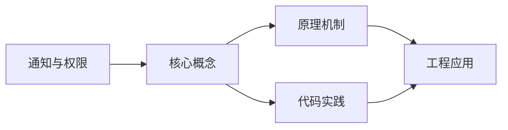
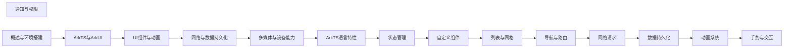

## 1. 学习目标（Bloom 分类）

本节按照布鲁姆教育目标分类学组织学习路径。本文主题为《通知与权限》，属于 HarmonyOS 模块，读者可以根据自身阶段选择阅读深度。

记忆层面：能够准确复述本文的核心概念、术语与基本语法或操作步骤，并能够在提问或检索时快速定位对应知识点。能够说出 HarmonyOS 的核心概念、术语与标准写法。

理解层面：能够用自己的语言解释核心原理与工作机制，说明概念之间的因果关系，而不是机械记忆结论。能够解释 HarmonyOS 的工作原理与设计动机。

应用层面：能够在真实项目或练习场景中运用本文知识解决具体问题，写出正确且可维护的实现。能够编写符合 HarmonyOS 规范的完整实现。

分析层面：能够拆解复杂问题，比较本文主题与相邻概念的异同，识别边界条件与例外情况。能够分析 HarmonyOS 与相邻方案的差异与边界。

评价层面：能够根据约束条件（性能、可读性、安全、成本）评价不同方案的优劣，做出有依据的技术决策。能够根据场景评价 HarmonyOS 相关方案的优劣。

创造层面：能够把本文知识与其他模块知识组合，设计出新的解决方案或可复用的工程模式。能够组合 HarmonyOS 与其他技术设计完整方案。

通过本节学习，读者应当能够把《通知与权限》纳入自己的知识网络，并与 HarmonyOS 模块的其他主题（ArkTS、ArkUI、分布式能力、应用开发）建立关联。

## 2. 历史动机与发展脉络

《通知与权限》是 HarmonyOS 领域的重要主题。要真正理解它，需要先了解它解决的问题与演进过程。

HarmonyOS（鸿蒙）由华为于 2019 年发布，定位面向全场景的分布式操作系统；HarmonyOS NEXT（5.0，2024）去 Android 化，采用自研鸿蒙内核与 ArkTS 语言栈。
开发框架：ArkTS（TS 超集 + 声明式 UI 扩展）、ArkUI（声明式组件）、Stage 模型（应用模型）、方舟编译器。
分布式能力：跨端流转、分布式数据、一次开发多端部署（手机/平板/车机/穿戴）。

回到本文主题：通知与权限 的提出与成熟，正是上述技术背景下的必然产物。早期实现往往以简单可用为目标，随着工程规模扩大，社区逐渐沉淀出标准做法与最佳实践；理解这一脉络，可以帮助读者判断“为什么文档中的推荐写法是现在这个样子”，也能在遇到历史遗留代码时准确识别其设计年代与取舍。


## 3. 形式化定义与核心概念精讲

本节把《通知与权限》涉及的核心概念以“定义 + 讲解”的形式展开。读者应把定义当作工具，把讲解当作理解路径；两者结合才能形成可迁移的知识。

ArkTS 语法：基于 TypeScript 的类型系统，增加 @Component/@Entry/@State 等装饰器与 UI 描述语法。
ArkUI 组件：Column/Row/Stack 布局容器、Text/Button/Image 基础组件、List/Grid 容器组件；状态管理（@State/@Prop/@Link/@Provide）。
应用模型：Stage 模型以 UIAbility 为页面载体，EntryAbility 入口；module.json5 声明应用配置。

### 3.1 原文章节逐一精讲

原文档把主题拆分为 19 个小节，下面按顺序给出每一节的导读讲解，随后保留原文细节供精读。

#### 原文精读（完整保留）

# 通知与权限 语法速查手册

> **符号约定**:`< >` 必填参数 | `[ ]` 可选参数

---

##### 进度通知

```typescript
import notificationManager from '@ohos.notificationManager'

@Component
struct ProgressNotificationDemo {
  @State progress: number = 0
  private timer: number = -1

  // 发送带进度的通知
  sendProgressNotification(currentProgress: number) {
    const isOngoing = currentProgress < 100

    const request: notificationManager.NotificationRequest = {
      id: 100,
      isOngoing: isOngoing, // 进行中通知，不可滑动删除
      isUnremovable: isOngoing,
      content: {
        contentType: notificationManager.ContentType.NOTIFICATION_CONTENT_BASIC_TEXT,
        normal: {
          title: '文件下载',
          text: isOngoing ? `正在下载 ${currentProgress}%` : '下载完成',
        },
      },
    }

    // 设置进度条
    if (isOngoing) {
      request.template = {
        name: 'downloadTemplate',
        data: {
          progressValue: currentProgress.toString(),
          progressMaxValue: '100',
        },
      }
    }

    notificationManager.publish(request)
  }

  // 模拟下载进度
  startDownload() {
    this.progress = 0
    this.timer = setInterval(() => {
      this.progress += 5
      this.sendProgressNotification(this.progress)

      if (this.progress >= 100) {
        clearInterval(this.timer)
      }
    }, 500)
  }

  build() {
    Column({ space: 10 }) {
      Text(`下载进度: ${this.progress}%`)
      Button('开始下载')
        .onClick(() => this.startDownload())
    }
    .padding(20)
  }
}
```

##### 通知点击跳转

```typescript
import notificationManager from '@ohos.notificationManager';
import wantAgent from '@ohos.app.ability.wantAgent';

async function sendClickableNotification(context: Context) {
  // 创建点击通知后的意图
  const wantAgentInfo: wantAgent.WantAgentInfo = {
    wants: [
      {
        bundleName: context.abilityInfo.bundleName,
        abilityName: 'DetailAbility',
        parameters: {
          id: '123',
        },
      },
    ],
    operationType: wantAgent.OperationType.START_ABILITY,
    requestCode: 0,
    wantAgentFlags: [wantAgent.WantAgentFlags.CONSTANT_FLAG],
  };

  const pendingWantAgent = await wantAgent.getWantAgent(wantAgentInfo);

  // 发送带点击意图的通知
  const request: notificationManager.NotificationRequest = {
    id: 200,
    wantAgent: pendingWantAgent,
    content: {
      contentType: notificationManager.ContentType.NOTIFICATION_CONTENT_BASIC_TEXT,
      normal: {
        title: '订单通知',
        text: '您的订单已发货，点击查看详情',
      },
    },
  };

  notificationManager.publish(request);
}
```

##### 通知组管理

```typescript
import notificationManager from '@ohos.notificationManager';

// 设置通知组
function sendGroupedNotification() {
  // 社交消息组
  const socialRequest: notificationManager.NotificationRequest = {
    id: 301,
    groupName: 'social_messages',
    content: {
      contentType: notificationManager.ContentType.NOTIFICATION_CONTENT_BASIC_TEXT,
      normal: {
        title: '张三',
        text: '周末有空吗？',
      },
    },
  };

  // 系统消息组
  const systemRequest: notificationManager.NotificationRequest = {
    id: 302,
    groupName: 'system_alerts',
    content: {
      contentType: notificationManager.ContentType.NOTIFICATION_CONTENT_BASIC_TEXT,
      normal: {
        title: '系统更新',
        text: '新版本可用',
      },
    },
  };

  notificationManager.publish(socialRequest);
  notificationManager.publish(systemRequest);
}

// 取消指定组的通知
async function cancelGroupNotifications(groupName: string) {
  await notificationManager.removeGroupByBundle(groupName);
}
```

#### 概述

HarmonyOS 的通知系统允许应用向用户发送提醒信息，包括基本文本通知、进度通知和自定义通知等。权限管理系统则控制应用对系统资源和用户隐私数据的访问，分为系统授权和用户授权两种类型。合理使用通知和权限是构建安全、用户友好的应用的关键。通知需要遵循平台规范，避免频繁打扰用户；权限应按需申请，并在不需要时及时释放。

#### 基础概念

**通知类型**：HarmonyOS 支持多种通知类型，包括基本文本通知（NOTIFICATION_CONTENT_BASIC_TEXT）、长文本通知（NOTIFICATION_CONTENT_LONG_TEXT）、多行文本通知（NOTIFICATION_CONTENT_MULTILINE）和图片通知（NOTIFICATION_CONTENT_PICTURE）。

**通知槽（Slot）**：通知渠道，用于对通知进行分类管理。每个通知槽可以设置不同的声音、振动和重要级别。类似 Android 的 NotificationChannel。

**系统授权权限**：在 module.json5 中声明即可自动授予的权限，如网络访问权限。这类权限不涉及用户隐私。

**用户授权权限**：需要用户在运行时明确授权的权限，如相机、麦克风、位置等。应用需要在 module.json5 中声明，并通过 API 请求用户授权。

**权限等级**：权限分为 normal（普通）、system_basic（系统基础）和 system_core（系统核心）三个等级。普通应用只能申请 normal 级别的权限。

#### 快速上手

##### 发送基本通知

```typescript
import notificationManager from '@ohos.notificationManager';

// 发送简单文本通知
function sendBasicNotification() {
  const request: notificationManager.NotificationRequest = {
    id: 1,
    content: {
      contentType: notificationManager.ContentType.NOTIFICATION_CONTENT_BASIC_TEXT,
      normal: {
        title: '消息提醒',
        text: '您有一条新消息',
      },
    },
  };

  notificationManager
    .publish(request)
    .then(() => {
      console.info('通知发送成功');
    })
    .catch((error: Error) => {
      console.error(`通知发送失败: ${error.message}`);
    });
}
```

##### 请求用户权限

```typescript
import abilityAccessCtrl from '@ohos.abilityAccessCtrl';

async function requestCameraPermission(context: Context): Promise<boolean> {
  const atManager = abilityAccessCtrl.createAtManager();

  try {
    // 先检查是否已授权
    const grantStatus = await atManager.checkAccessToken(
      getContext(context).applicationInfo.accessTokenId,
      'ohos.permission.CAMERA'
    );

    if (grantStatus === abilityAccessCtrl.GrantStatus.PERMISSION_GRANTED) {
      return true;
    }

    // 请求授权
    const result = await atManager.requestPermissionsFromUser(context, ['ohos.permission.CAMERA']);

    // 检查用户是否授权
    return result.authResults[0] === 0;
  } catch (error) {
    console.error(`权限请求失败: ${error}`);
    return false;
  }
}
```

##### 声明权限

```typescript
// 在 module.json5 中声明所需权限
// {
//   "module": {
//     "requestPermissions": [
//       {
//         "name": "ohos.permission.INTERNET",
//         "reason": "$string:internet_reason",
//         "usedScene": {
//           "abilities": ["EntryAbility"],
//           "when": "inuse"
//         }
//       },
//       {
//         "name": "ohos.permission.CAMERA",
//         "reason": "$string:camera_reason",
//         "usedScene": {
//           "abilities": ["EntryAbility"],
//           "when": "inuse"
//         }
//       }
//     ]
//   }
// }
```

#### 详细用法

##### 多种通知类型

```typescript
import notificationManager from '@ohos.notificationManager';

// 长文本通知
function sendLongTextNotification() {
  const request: notificationManager.NotificationRequest = {
    id: 2,
    content: {
      contentType: notificationManager.ContentType.NOTIFICATION_CONTENT_LONG_TEXT,
      longText: {
        title: '系统更新',
        text: '点击查看详情',
        longText:
          '本次更新包含多项性能优化和安全修复，建议所有用户尽快升级。主要更新内容包括：修复了蓝牙连接稳定性问题、优化了电池续航表现、增强了系统安全防护能力。',
        briefText: '系统更新可用',
      },
    },
  };

  notificationManager.publish(request);
}

// 多行文本通知
function sendMultiLineNotification() {
  const request: notificationManager.NotificationRequest = {
    id: 3,
    content: {
      contentType: notificationManager.ContentType.NOTIFICATION_CONTENT_MULTILINE,
      multiLine: {
        title: '待办事项',
        text: '今日待办',
        briefText: '3项待办',
        lines: ['上午10:00 项目会议', '下午2:00 代码评审', '下午5:00 提交周报'],
      },
    },
  };

  notificationManager.publish(request);
}
```

##### 通知槽管理

```typescript
import notificationManager from '@ohos.notificationManager';

// 创建通知槽
async function createNotificationSlot() {
  // 消息通知槽
  const messageSlot: notificationManager.NotificationSlot = {
    type: notificationManager.SlotType.SOCIAL_COMMUNICATION,
    level: notificationManager.SlotLevel.LEVEL_HIGH, // 高重要级别
    desc: '社交消息通知',
    sound: '', // 使用默认声音
    vibrationValues: [100, 200, 100, 200], // 振动模式
  };

  // 服务通知槽
  const serviceSlot: notificationManager.NotificationSlot = {
    type: notificationManager.SlotType.SERVICE_INFORMATION,
    level: notificationManager.SlotLevel.LEVEL_DEFAULT,
    desc: '服务提醒通知',
  };

  // 添加通知槽
  await notificationManager.addSlot(messageSlot);
  await notificationManager.addSlot(serviceSlot);
}

// 使用指定通知槽发送通知
function sendSlotNotification() {
  const request: notificationManager.NotificationRequest = {
    id: 10,
    slotType: notificationManager.SlotType.SOCIAL_COMMUNICATION,
    content: {
      contentType: notificationManager.ContentType.NOTIFICATION_CONTENT_BASIC_TEXT,
      normal: {
        title: '新消息',
        text: '张三: 你好！',
      },
    },
  };

  notificationManager.publish(request);
}
```

##### 多权限批量请求

```typescript
import abilityAccessCtrl from '@ohos.abilityAccessCtrl';

async function requestMultiplePermissions(context: Context) {
  const atManager = abilityAccessCtrl.createAtManager();

  // 需要请求的权限列表
  const permissions: string[] = [
    'ohos.permission.CAMERA',
    'ohos.permission.MICROPHONE',
    'ohos.permission.LOCATION',
    'ohos.permission.APPROXIMATELY_LOCATION',
  ];

  try {
    // 批量请求权限
    const result = await atManager.requestPermissionsFromUser(context, permissions);

    // 检查每个权限的授权结果
    const granted: string[] = [];
    const denied: string[] = [];

    permissions.forEach((permission, index) => {
      if (result.authResults[index] === 0) {
        granted.push(permission);
      } else {
        denied.push(permission);
      }
    });

    console.info(`已授权: ${granted.join(', ')}`);
    console.info(`被拒绝: ${denied.join(', ')}`);

    return { granted, denied };
  } catch (error) {
    console.error(`权限请求失败: ${error}`);
    return { granted: [], denied: permissions };
  }
}
```

#### 常见场景

##### 应用启动时检查权限

```typescript
import abilityAccessCtrl from '@ohos.abilityAccessCtrl'

@Entry
@Component
struct PermissionCheckPage {
  @State hasCameraPermission: boolean = false
  @State hasLocationPermission: boolean = false

  async aboutToAppear() {
    await this.checkAllPermissions()
  }

  async checkAllPermissions() {
    const atManager = abilityAccessCtrl.createAtManager()
    const tokenId = getContext(this).applicationInfo.accessTokenId

    // 检查相机权限
    const cameraStatus = await atManager.checkAccessToken(tokenId, 'ohos.permission.CAMERA')
    this.hasCameraPermission = cameraStatus === abilityAccessCtrl.GrantStatus.PERMISSION_GRANTED

    // 检查位置权限
    const locationStatus = await atManager.checkAccessToken(tokenId, 'ohos.permission.LOCATION')
    this.hasLocationPermission = locationStatus === abilityAccessCtrl.GrantStatus.PERMISSION_GRANTED
  }

  build() {
    Column({ space: 10 }) {
      Text('权限状态').fontSize(20).fontWeight(FontWeight.Bold)

      Row() {
        Text('相机权限')
        Text(this.hasCameraPermission ? '已授权' : '未授权')
          .fontColor(this.hasCameraPermission ? '#4CAF50' : '#F44336')
      }
      .width('100%')
      .justifyContent(FlexAlign.SpaceBetween)

      Row() {
        Text('位置权限')
        Text(this.hasLocationPermission ? '已授权' : '未授权')
          .fontColor(this.hasLocationPermission ? '#4CAF50' : '#F44336')
      }
      .width('100%')
      .justifyContent(FlexAlign.SpaceBetween)

      Button('请求权限')
        .onClick(async () => {
          await requestMultiplePermissions(getContext(this))
          await this.checkAllPermissions()
        })
    }
    .padding(20)
  }
}
```

#### 注意事项

- **通知频率**：避免在短时间内发送大量通知，系统可能会限制通知频率。建议合并同类通知，使用通知组管理。
- **权限说明**：申请用户授权权限时，必须在 module.json5 中提供 reason 字段说明使用原因，且原因描述应清晰准确，告知用户为何需要该权限。
- **权限使用场景**：声明权限时需指定 usedScene，说明权限在哪些 Ability 中使用以及是前台使用（inuse）还是后台使用（inuse/background）。
- **通知取消**：应用应提供取消通知的能力，使用 notificationManager.cancel 取消指定 ID 的通知，或使用 cancelAll 取消所有通知。
- **权限不可滥用**：只申请应用核心功能所需的权限，不要提前申请未来功能需要的权限。被用户拒绝后不要反复弹窗请求，应引导用户到设置页面手动开启。
- **后台通知限制**：后台应用发送通知受到限制，需要申请通知权限或使用后台任务。

#### 进阶用法

##### 权限动态检查与引导

```typescript
import abilityAccessCtrl from '@ohos.abilityAccessCtrl'

@Component
struct SmartPermissionDemo {
  @State permissionStatus: Map<string, string> = new Map()

  // 检查并请求权限，被拒绝时引导用户
  async ensurePermission(context: Context, permission: string): Promise<boolean> {
    const atManager = abilityAccessCtrl.createAtManager()
    const tokenId = context.applicationInfo.accessTokenId

    // 第一步：检查是否已授权
    const status = await atManager.checkAccessToken(tokenId, permission)
    if (status === abilityAccessCtrl.GrantStatus.PERMISSION_GRANTED) {
      return true
    }

    // 第二步：请求权限
    const result = await atManager.requestPermissionsFromUser(context, [permission])
    if (result.authResults[0] === 0) {
      return true
    }

    // 第三步：检查是否选择了"不再询问"
    if (result.authResults[0] === -1) {
      // 用户选择了不再询问，引导到设置页面
      this.showPermissionSettingsDialog(context, permission)
    }

    return false
  }

  // 显示引导对话框
  showPermissionSettingsDialog(context: Context, permission: string) {
    // 弹出对话框引导用户前往设置页面
    AlertDialog.show({
      title: '需要权限',
      message: `应用需要${permission}权限才能正常使用此功能，请在设置中手动开启。`,
      primaryButton: {
        value: '去设置',
        action: () => {
          // 跳转到应用设置页面
          // 使用 UIAbilityContext 打开系统设置
        }
      },
      secondaryButton: {
        value: '取消',
        action: () => {}
      }
    })
  }

  build() {
    Column({ space: 10 }) {
      Button('使用相机功能')
        .onClick(async () => {
          const granted = await this.ensurePermission(getContext(this), 'ohos.permission.CAMERA')
          if (granted) {
            // 执行相机相关操作
          }
        })

      Button('使用位置功能')
        .onClick(async () => {
          const granted = await this.ensurePermission(getContext(this), 'ohos.permission.LOCATION')
          if (granted) {
            // 执行位置相关操作
          }
        })
    }
    .padding(20)
  }
}
```

##### 定时通知

```typescript
import notificationManager from '@ohos.notificationManager';
import reminderAgentManager from '@ohos.reminderAgentManager';

// 发布定时提醒
async function scheduleReminder() {
  const reminderRequest: reminderAgentManager.ReminderRequestAlarm = {
    reminderType: reminderAgentManager.ReminderType.REMINDER_TYPE_ALARM,
    hour: 9, // 小时
    minute: 0, // 分钟
    daysOfWeek: [1, 2, 3, 4, 5], // 周一到周五
    title: '工作提醒',
    content: '该开始工作了',
    expiredContent: '提醒已过期',
    snoozeContent: '稍后提醒',
    actionButton: [
      {
        title: '知道了',
        type: reminderAgentManager.ActionButtonType.ACTION_BUTTON_TYPE_CUSTOM,
      },
    ],
  };

  const reminderId = await reminderAgentManager.publishReminder(reminderRequest);
  console.info(`定时提醒已发布，ID: ${reminderId}`);
}

// 取消定时提醒
async function cancelReminder(reminderId: number) {
  await reminderAgentManager.cancelReminder(reminderId);
  console.info(`定时提醒已取消，ID: ${reminderId}`);
}

// 获取所有已发布的提醒
async function getAllReminders() {
  const reminders = await reminderAgentManager.getValidReminders();
  console.info(`当前有效提醒数量: ${reminders.length}`);
}
```
#### 通知管理 API

**导入通知模块**
`import notificationManager from '@ohos.notificationManager';`
```typescript
import notificationManager from '@ohos.notificationManager';
```

**发布基本文本通知**
`notificationManager.publish(<request: NotificationRequest>): Promise<void>`
```typescript
const request: notificationManager.NotificationRequest = {
  id: 1,
  content: {
    contentType: notificationManager.ContentType.NOTIFICATION_CONTENT_BASIC_TEXT,
    normal: {
      title: '消息提醒',
      text: '您有一条新消息',
    },
  },
};

notificationManager
  .publish(request)
  .then(() => {
    console.info('通知发送成功');
  })
  .catch((error: Error) => {
    console.error(`通知发送失败: ${error.message}`);
  });
```

**发布长文本通知**
`notificationManager.publish(<request: NotificationRequest>): Promise<void>`
```typescript
const request: notificationManager.NotificationRequest = {
  id: 2,
  content: {
    contentType: notificationManager.ContentType.NOTIFICATION_CONTENT_LONG_TEXT,
    longText: {
      title: '系统更新',
      text: '点击查看详情',
      longText: '本次更新包含多项性能优化和安全修复,建议所有用户尽快升级。',
      briefText: '系统更新可用',
    },
  },
};

notificationManager.publish(request);
```

**发布多行文本通知**
`notificationManager.publish(<request: NotificationRequest>): Promise<void>`
```typescript
const request: notificationManager.NotificationRequest = {
  id: 3,
  content: {
    contentType: notificationManager.ContentType.NOTIFICATION_CONTENT_MULTILINE,
    multiLine: {
      title: '待办事项',
      text: '今日待办',
      briefText: '3项待办',
      lines: ['上午10:00 项目会议', '下午2:00 代码评审', '下午5:00 提交周报'],
    },
  },
};

notificationManager.publish(request);
```

**发布图片通知**
`notificationManager.publish(<request: NotificationRequest>): Promise<void>`
```typescript
const request: notificationManager.NotificationRequest = {
  id: 4,
  content: {
    contentType: notificationManager.ContentType.NOTIFICATION_CONTENT_PICTURE,
    picture: {
      title: '图片消息',
      text: '查看图片',
      expandedTitle: '图片详情',
      briefText: '图片通知',
      picture: {
        bundleName: 'com.example.app',
        moduleName: 'entry',
        abilityName: 'EntryAbility',
        src: '/resources/base/media/pic.png',
      },
    },
  },
};

notificationManager.publish(request);
```

**取消指定通知**
`notificationManager.cancel(<id: number>, [<label: string>]): Promise<void>`
```typescript
await notificationManager.cancel(1);
await notificationManager.cancel(2, 'label_name');
```

**取消所有通知**
`notificationManager.cancelAll(): Promise<void>`
```typescript
await notificationManager.cancelAll();
```

**获取通知槽**
`notificationManager.getSlot(<slotType: SlotType>): Promise<NotificationSlot>`
```typescript
const slot = await notificationManager.getSlot(
  notificationManager.SlotType.SOCIAL_COMMUNICATION
);
console.info(`通知槽级别: ${slot.level}`);
```

---

#### ContentType 枚举

**ContentType 通知内容类型**
`notificationManager.ContentType.<TYPE>`
```typescript
notificationManager.ContentType.NOTIFICATION_CONTENT_BASIC_TEXT      // 基本文本
notificationManager.ContentType.NOTIFICATION_CONTENT_LONG_TEXT       // 长文本
notificationManager.ContentType.NOTIFICATION_CONTENT_MULTILINE       // 多行文本
notificationManager.ContentType.NOTIFICATION_CONTENT_PICTURE         // 图片
```

---

#### NotificationRequest 对象

**NotificationRequest 通知请求结构**
`const request: notificationManager.NotificationRequest = { ... }`
```typescript
const request: notificationManager.NotificationRequest = {
  id: 100,                              // 通知 ID
  slotType: notificationManager.SlotType.SOCIAL_COMMUNICATION,  // 通知槽类型
  isOngoing: false,                     // 是否进行中通知(不可滑动删除)
  isUnremovable: false,                 // 是否不可移除
  smallIcon: $r('app.media.icon'),      // 小图标
  largeIcon: $r('app.media.large'),     // 大图标
  wantAgent: pendingWantAgent,          // 点击意图
  template: {                           // 通知模板
    name: 'downloadTemplate',
    data: {
      progressValue: '50',
      progressMaxValue: '100',
    },
  },
  content: {
    contentType: notificationManager.ContentType.NOTIFICATION_CONTENT_BASIC_TEXT,
    normal: {
      title: '标题',
      text: '内容',
      additionalText: '附加文本',
    },
  },
};
```

---

#### NotificationSlot 通知槽

**创建通知槽**
`notificationManager.addSlot(<slot: NotificationSlot>): Promise<void>`
```typescript
const slot: notificationManager.NotificationSlot = {
  type: notificationManager.SlotType.SOCIAL_COMMUNICATION,
  level: notificationManager.SlotLevel.LEVEL_HIGH,
  desc: '社交消息通知',
  sound: '',                              // 空字符串使用默认声音
  vibrationValues: [100, 200, 100, 200],  // 振动模式(毫秒)
  badgeFlag: true,                        // 是否显示角标
  bannerFlag: true,                       // 是否显示横幅
  lightEnabled: true,                     // 是否启用呼吸灯
  lightColor: 0xFFFF0000,                 // 呼吸灯颜色
};

await notificationManager.addSlot(slot);
```

**删除通知槽**
`notificationManager.removeSlot(<slotType: SlotType>): Promise<void>`
```typescript
await notificationManager.removeSlot(
  notificationManager.SlotType.SOCIAL_COMMUNICATION
);
```

**获取所有通知槽**
`notificationManager.getSlots(): Promise<Array<NotificationSlot>>`
```typescript
const slots = await notificationManager.getSlots();
slots.forEach((slot) => {
  console.info(`类型: ${slot.type}, 级别: ${slot.level}`);
});
```

---

#### SlotType 枚举

**SlotType 通知槽类型**
`notificationManager.SlotType.<TYPE>`
```typescript
notificationManager.SlotType.UNKNOWN_TYPE             // 未知类型
notificationManager.SlotType.SOCIAL_COMMUNICATION     // 社交通信
notificationManager.SlotType.SERVICE_INFORMATION      // 服务信息
notificationManager.SlotType.CONTENT_INFORMATION      // 内容信息
notificationManager.SlotType.LIVE_VIEW                // 实时视图
notificationManager.SlotType.CUSTOMER_SERVICE         // 客服消息
notificationManager.SlotType.OTHER_TYPES              // 其他类型
```

---

#### SlotLevel 枚举

**SlotLevel 通知槽级别**
`notificationManager.SlotLevel.<LEVEL>`
```typescript
notificationManager.SlotLevel.LEVEL_NONE       // 无(不显示通知)
notificationManager.SlotLevel.LEVEL_MIN        // 最低级别(无提示)
notificationManager.SlotLevel.LEVEL_LOW        // 低级别(状态栏小图标)
notificationManager.SlotLevel.LEVEL_DEFAULT    // 默认级别(状态栏 + 通知栏)
notificationManager.SlotLevel.LEVEL_HIGH       // 高级别(横幅 + 通知栏)
```

---

#### 权限管理 API

**导入权限模块**
`import abilityAccessCtrl from '@ohos.abilityAccessCtrl';`
```typescript
import abilityAccessCtrl from '@ohos.abilityAccessCtrl';
```

**创建权限管理器**
`abilityAccessCtrl.createAtManager(): AtManager`
```typescript
const atManager = abilityAccessCtrl.createAtManager();
```

**检查权限授权状态**
`atManager.checkAccessToken(<tokenID: number>, <permissionName: string>): Promise<GrantStatus>`
```typescript
const atManager = abilityAccessCtrl.createAtManager();
const tokenId = getContext(this).applicationInfo.accessTokenId;

const grantStatus = await atManager.checkAccessToken(
  tokenId,
  'ohos.permission.CAMERA'
);

if (grantStatus === abilityAccessCtrl.GrantStatus.PERMISSION_GRANTED) {
  console.info('相机权限已授予');
} else {
  console.info('相机权限未授予');
}
```

**请求单个权限**
`atManager.requestPermissionsFromUser(<context: Context>, <permList: Array<string>>): Promise<PermissionRequestResult>`
```typescript
async function requestCameraPermission(context: Context): Promise<boolean> {
  const atManager = abilityAccessCtrl.createAtManager();

  try {
    const result = await atManager.requestPermissionsFromUser(context, [
      'ohos.permission.CAMERA',
    ]);

    if (result.authResults[0] === 0) {
      console.log('权限已授予');
      return true;
    } else {
      console.log('权限被拒绝');
      return false;
    }
  } catch (err) {
    console.error('申请权限失败:', err);
    return false;
  }
}
```

**批量请求权限**
`atManager.requestPermissionsFromUser(<context: Context>, <permList: Array<string>>): Promise<PermissionRequestResult>`
```typescript
async function requestMultiplePermissions(context: Context) {
  const atManager = abilityAccessCtrl.createAtManager();

  const permissions: string[] = [
    'ohos.permission.CAMERA',
    'ohos.permission.MICROPHONE',
    'ohos.permission.LOCATION',
    'ohos.permission.APPROXIMATELY_LOCATION',
  ];

  const result = await atManager.requestPermissionsFromUser(context, permissions);

  const granted: string[] = [];
  const denied: string[] = [];

  permissions.forEach((permission, index) => {
    if (result.authResults[index] === 0) {
      granted.push(permission);
    } else {
      denied.push(permission);
    }
  });

  console.info(`已授权: ${granted.join(', ')}`);
  console.info(`被拒绝: ${denied.join(', ')}`);

  return { granted, denied };
}
```

---

#### GrantStatus 枚举

**GrantStatus 权限授权状态**
`abilityAccessCtrl.GrantStatus.<STATUS>`
```typescript
abilityAccessCtrl.GrantStatus.PERMISSION_DENIED     // 权限被拒绝 (-1)
abilityAccessCtrl.GrantStatus.PERMISSION_GRANTED    // 权限已授予 (0)
```

---

#### 权限声明配置

**module.json5 权限声明**
`"requestPermissions": [{ "name": ..., "reason": ..., "usedScene": ... }]`
```json
{
  "module": {
    "requestPermissions": [
      {
        "name": "ohos.permission.INTERNET",
        "reason": "$string:internet_reason",
        "usedScene": {
          "abilities": ["EntryAbility"],
          "when": "inuse"
        }
      },
      {
        "name": "ohos.permission.CAMERA",
        "reason": "$string:camera_reason",
        "usedScene": {
          "abilities": ["EntryAbility"],
          "when": "inuse"
        }
      },
      {
        "name": "ohos.permission.MICROPHONE",
        "reason": "$string:mic_reason",
        "usedScene": {
          "abilities": ["EntryAbility"],
          "when": "inuse"
        }
      },
      {
        "name": "ohos.permission.LOCATION",
        "reason": "$string:location_reason",
        "usedScene": {
          "abilities": ["EntryAbility"],
          "when": "inuse"
        }
      }
    ]
  }
}
```

**usedScene.when 权限使用时机**
`"when": "<inuse | always>"`
```json
{
  "usedScene": {
    "abilities": ["EntryAbility"],
    "when": "inuse"        // inuse: 前台使用 | always: 前后台使用
  }
}
```

---

#### 权限等级分类

**权限等级表**
| 等级 | 示例权限 | 授权方式 |
| ---- | ---- | ---- |
| `normal` | `ohos.permission.INTERNET`、`ohos.permission.GET_NETWORK_INFO` | 安装时自动授予 |
| `system_basic` | `ohos.permission.CAMERA`、`ohos.permission.MICROPHONE`、`ohos.permission.LOCATION` | 运行时弹窗申请 |
| `system_core` | `ohos.permission.MANAGE_USERS`、`ohos.permission.REBOOT` | 仅系统应用可用 |

---

#### 提醒服务 API

**导入提醒服务模块**
`import reminderAgentManager from '@ohos.reminderAgentManager';`
```typescript
import reminderAgentManager from '@ohos.reminderAgentManager';
```

**发布倒计时提醒**
`reminderAgentManager.publishReminder(<reminder: ReminderRequest>): Promise<number>`
```typescript
const reminderRequest: reminderAgentManager.ReminderRequestTimer = {
  reminderType: reminderAgentManager.ReminderType.REMINDER_TYPE_TIMER,
  triggerTimeInSeconds: 3600,     // 1 小时后触发
  actionButton: [
    {
      title: '关闭',
      type: reminderAgentManager.ActionButtonType.ACTION_BUTTON_TYPE_CLOSE,
    },
    {
      title: '自定义',
      type: reminderAgentManager.ActionButtonType.ACTION_BUTTON_TYPE_CUSTOM,
    },
  ],
  wantAgent: {
    pkgName: 'com.example.app',
    abilityName: 'EntryAbility',
  },
  maxScreenWantAgent: {
    pkgName: 'com.example.app',
    abilityName: 'EntryAbility',
  },
  notificationId: 100,
  title: '提醒标题',
  content: '提醒内容',
};

const reminderId = await reminderAgentManager.publishReminder(reminderRequest);
console.info(`提醒已发布, ID: ${reminderId}`);
```

**发布日历提醒**
`reminderAgentManager.publishReminder(<reminder: ReminderRequestCalendar>): Promise<number>`
```typescript
const calendarReminder: reminderAgentManager.ReminderRequestCalendar = {
  reminderType: reminderAgentManager.ReminderType.REMINDER_TYPE_CALENDAR,
  dateTime: {
    year: 2026,
    month: 12,
    day: 31,
    hour: 23,
    minute: 59,
  },
  daysOfWeek: [1, 2, 3, 4, 5],   // 周一到周五重复
  title: '下班提醒',
  content: '该下班啦',
  notificationId: 101,
};

const reminderId = await reminderAgentManager.publishReminder(calendarReminder);
```

**取消提醒**
`reminderAgentManager.cancelReminder(<reminderId: number>): Promise<void>`
```typescript
await reminderAgentManager.cancelReminder(reminderId);
```

**取消所有提醒**
`reminderAgentManager.cancelAllReminders(): Promise<void>`
```typescript
await reminderAgentManager.cancelAllReminders();
```

**获取有效提醒**
`reminderAgentManager.getValidReminders(): Promise<Array<ReminderRequest>>`
```typescript
const reminders = await reminderAgentManager.getValidReminders();
reminders.forEach((reminder) => {
  console.info(`提醒 ID: ${reminder.notificationId}`);
});
```

---

#### ReminderType 枚举

**ReminderType 提醒类型**
`reminderAgentManager.ReminderType.<TYPE>`
```typescript
reminderAgentManager.ReminderType.REMINDER_TYPE_TIMER      // 倒计时提醒
reminderAgentManager.ReminderType.REMINDER_TYPE_CALENDAR   // 日历提醒
reminderAgentManager.ReminderType.REMINDER_TYPE_ALARM      // 闹钟提醒
```

**ActionButtonType 按钮类型**
`reminderAgentManager.ActionButtonType.<TYPE>`
```typescript
reminderAgentManager.ActionButtonType.ACTION_BUTTON_TYPE_CLOSE     // 关闭按钮
reminderAgentManager.ActionButtonType.ACTION_BUTTON_TYPE_CUSTOM     // 自定义按钮
reminderAgentManager.ActionButtonType.ACTION_BUTTON_TYPE_SNOOZE     // 稍后提醒按钮
```


### 3.2 概念关系图

下面用 Mermaid 图表达本文核心概念之间的关系，帮助读者建立整体图景：



图中展示的是本文知识的结构化关系：核心概念是入口，原理机制解释“为什么”，代码实践演示“怎么做”，工程应用回答“何时用”。读者学习时可以把每个小节的内容挂接到对应节点上。

## 4. 理论推导与原理解析

本节深入《通知与权限》背后的原理。理论部分不求面面俱到，而是聚焦“能解释现象、能指导实践”的关键推导。

ArkTS 语法：基于 TypeScript 的类型系统，增加 @Component/@Entry/@State 等装饰器与 UI 描述语法。
ArkUI 组件：Column/Row/Stack 布局容器、Text/Button/Image 基础组件、List/Grid 容器组件；状态管理（@State/@Prop/@Link/@Provide）。
应用模型：Stage 模型以 UIAbility 为页面载体，EntryAbility 入口；module.json5 声明应用配置。
生命周期：Ability 的 onCreate/onWindowStageCreate/onForeground/onBackground/onDestroy。

需要强调的是，理论推导与工程实践之间存在翻译层：理论给出的是理想化模型与边界条件，工程代码则必须处理真实环境中的例外。读者在学习时应先掌握理论的“标准情形”，再通过陷阱章节了解“非标准情形”。

## 5. 代码示例与逐行讲解

本节把原文中的代码示例系统整理，并为每个示例补充用途说明与讲解。读者不应只浏览代码，而应逐段对照讲解理解设计意图。

### 5.1 示例：进度通知

该示例来自原文《进度通知》小节，用于演示通知与权限相关操作。阅读时请先看代码结构，再看其后的讲解。

```typescript
import notificationManager from '@ohos.notificationManager'

@Component
struct ProgressNotificationDemo {
  @State progress: number = 0
  private timer: number = -1

  // 发送带进度的通知
  sendProgressNotification(currentProgress: number) {
    const isOngoing = currentProgress < 100

    const request: notificationManager.NotificationRequest = {
      id: 100,
      isOngoing: isOngoing, // 进行中通知，不可滑动删除
      isUnremovable: isOngoing,
      content: {
        contentType: notificationManager.ContentType.NOTIFICATION_CONTENT_BASIC_TEXT,
        normal: {
          title: '文件下载',
          text: isOngoing ? `正在下载 ${currentProgress}%` : '下载完成',
        },
      },
    }

    // 设置进度条
    if (isOngoing) {
      request.template = {
        name: 'downloadTemplate',
        data: {
          progressValue: currentProgress.toString(),
          progressMaxValue: '100',
        },
      }
    }

    notificationManager.publish(request)
  }

  // 模拟下载进度
  startDownload() {
    this.progress = 0
    this.timer = setInterval(() => {
      this.progress += 5
      this.sendProgressNotification(this.progress)

      if (this.progress >= 100) {
        clearInterval(this.timer)
      }
    }, 500)
  }

  build() {
    Column({ space: 10 }) {
      Text(`下载进度: ${this.progress}%`)
      Button('开始下载')
        .onClick(() => this.startDownload())
    }
    .padding(20)
  }
}
```

讲解：这段代码演示了本节核心知识点。代码中的关键操作可以归纳为三步：准备（定义或初始化）、执行（核心逻辑）、收尾（释放资源或返回结果）。实际项目中，这三步往往被封装为函数或类，以提升复用性与可测试性。

关键点分析：

该示例共 52 行有效代码，包含 3 类关键结构（import、from、if）。其中：

- 入口与初始化部分负责建立上下文，对应实际项目中的启动或装配逻辑；
- 核心逻辑部分体现本文主题的主要操作，是阅读时最需要对照讲解理解的部分；
- 输出或返回部分把结果交给调用方，注意其类型与边界条件。

进阶思考路径：先尝试修改参数观察行为变化，再把示例中的模式迁移到自己的项目中；每次修改都记录预期与实测差异，这是把示例转化为能力的最快方式。

### 5.2 示例：通知点击跳转

该示例来自原文《通知点击跳转》小节，用于演示通知与权限相关操作。阅读时请先看代码结构，再看其后的讲解。

```typescript
import notificationManager from '@ohos.notificationManager';
import wantAgent from '@ohos.app.ability.wantAgent';

async function sendClickableNotification(context: Context) {
  // 创建点击通知后的意图
  const wantAgentInfo: wantAgent.WantAgentInfo = {
    wants: [
      {
        bundleName: context.abilityInfo.bundleName,
        abilityName: 'DetailAbility',
        parameters: {
          id: '123',
        },
      },
    ],
    operationType: wantAgent.OperationType.START_ABILITY,
    requestCode: 0,
    wantAgentFlags: [wantAgent.WantAgentFlags.CONSTANT_FLAG],
  };

  const pendingWantAgent = await wantAgent.getWantAgent(wantAgentInfo);

  // 发送带点击意图的通知
  const request: notificationManager.NotificationRequest = {
    id: 200,
    wantAgent: pendingWantAgent,
    content: {
      contentType: notificationManager.ContentType.NOTIFICATION_CONTENT_BASIC_TEXT,
      normal: {
        title: '订单通知',
        text: '您的订单已发货，点击查看详情',
      },
    },
  };

  notificationManager.publish(request);
}
```

讲解：这段代码演示了本节核心知识点。代码中的关键操作可以归纳为三步：准备（定义或初始化）、执行（核心逻辑）、收尾（释放资源或返回结果）。实际项目中，这三步往往被封装为函数或类，以提升复用性与可测试性。

关键点分析：

该示例共 33 行有效代码，包含 3 类关键结构（function、import、from）。其中：

- 入口与初始化部分负责建立上下文，对应实际项目中的启动或装配逻辑；
- 核心逻辑部分体现本文主题的主要操作，是阅读时最需要对照讲解理解的部分；
- 输出或返回部分把结果交给调用方，注意其类型与边界条件。

进阶思考路径：先尝试修改参数观察行为变化，再把示例中的模式迁移到自己的项目中；每次修改都记录预期与实测差异，这是把示例转化为能力的最快方式。

### 5.3 示例：通知组管理

该示例来自原文《通知组管理》小节，用于演示通知与权限相关操作。阅读时请先看代码结构，再看其后的讲解。

```typescript
import notificationManager from '@ohos.notificationManager';

// 设置通知组
function sendGroupedNotification() {
  // 社交消息组
  const socialRequest: notificationManager.NotificationRequest = {
    id: 301,
    groupName: 'social_messages',
    content: {
      contentType: notificationManager.ContentType.NOTIFICATION_CONTENT_BASIC_TEXT,
      normal: {
        title: '张三',
        text: '周末有空吗？',
      },
    },
  };

  // 系统消息组
  const systemRequest: notificationManager.NotificationRequest = {
    id: 302,
    groupName: 'system_alerts',
    content: {
      contentType: notificationManager.ContentType.NOTIFICATION_CONTENT_BASIC_TEXT,
      normal: {
        title: '系统更新',
        text: '新版本可用',
      },
    },
  };

  notificationManager.publish(socialRequest);
  notificationManager.publish(systemRequest);
}

// 取消指定组的通知
async function cancelGroupNotifications(groupName: string) {
  await notificationManager.removeGroupByBundle(groupName);
}
```

讲解：这段代码演示了本节核心知识点。代码中的关键操作可以归纳为三步：准备（定义或初始化）、执行（核心逻辑）、收尾（释放资源或返回结果）。实际项目中，这三步往往被封装为函数或类，以提升复用性与可测试性。

关键点分析：

该示例共 34 行有效代码，包含 3 类关键结构（function、import、from）。其中：

- 入口与初始化部分负责建立上下文，对应实际项目中的启动或装配逻辑；
- 核心逻辑部分体现本文主题的主要操作，是阅读时最需要对照讲解理解的部分；
- 输出或返回部分把结果交给调用方，注意其类型与边界条件。

进阶思考路径：先尝试修改参数观察行为变化，再把示例中的模式迁移到自己的项目中；每次修改都记录预期与实测差异，这是把示例转化为能力的最快方式。

### 5.4 示例：发送基本通知

该示例来自原文《发送基本通知》小节，用于演示通知与权限相关操作。阅读时请先看代码结构，再看其后的讲解。

```typescript
import notificationManager from '@ohos.notificationManager';

// 发送简单文本通知
function sendBasicNotification() {
  const request: notificationManager.NotificationRequest = {
    id: 1,
    content: {
      contentType: notificationManager.ContentType.NOTIFICATION_CONTENT_BASIC_TEXT,
      normal: {
        title: '消息提醒',
        text: '您有一条新消息',
      },
    },
  };

  notificationManager
    .publish(request)
    .then(() => {
      console.info('通知发送成功');
    })
    .catch((error: Error) => {
      console.error(`通知发送失败: ${error.message}`);
    });
}
```

讲解：这段代码演示了本节核心知识点。代码中的关键操作可以归纳为三步：准备（定义或初始化）、执行（核心逻辑）、收尾（释放资源或返回结果）。实际项目中，这三步往往被封装为函数或类，以提升复用性与可测试性。

关键点分析：

该示例共 22 行有效代码，包含 3 类关键结构（function、import、from）。其中：

- 入口与初始化部分负责建立上下文，对应实际项目中的启动或装配逻辑；
- 核心逻辑部分体现本文主题的主要操作，是阅读时最需要对照讲解理解的部分；
- 输出或返回部分把结果交给调用方，注意其类型与边界条件。

进阶思考路径：先尝试修改参数观察行为变化，再把示例中的模式迁移到自己的项目中；每次修改都记录预期与实测差异，这是把示例转化为能力的最快方式。

### 5.5 示例：请求用户权限

该示例来自原文《请求用户权限》小节，用于演示通知与权限相关操作。阅读时请先看代码结构，再看其后的讲解。

```typescript
import abilityAccessCtrl from '@ohos.abilityAccessCtrl';

async function requestCameraPermission(context: Context): Promise<boolean> {
  const atManager = abilityAccessCtrl.createAtManager();

  try {
    // 先检查是否已授权
    const grantStatus = await atManager.checkAccessToken(
      getContext(context).applicationInfo.accessTokenId,
      'ohos.permission.CAMERA'
    );

    if (grantStatus === abilityAccessCtrl.GrantStatus.PERMISSION_GRANTED) {
      return true;
    }

    // 请求授权
    const result = await atManager.requestPermissionsFromUser(context, ['ohos.permission.CAMERA']);

    // 检查用户是否授权
    return result.authResults[0] === 0;
  } catch (error) {
    console.error(`权限请求失败: ${error}`);
    return false;
  }
}
```

讲解：这段代码演示了本节核心知识点。代码中的关键操作可以归纳为三步：准备（定义或初始化）、执行（核心逻辑）、收尾（释放资源或返回结果）。实际项目中，这三步往往被封装为函数或类，以提升复用性与可测试性。

关键点分析：

该示例共 21 行有效代码，包含 5 类关键结构（function、import、from、if、return）。其中：

- 入口与初始化部分负责建立上下文，对应实际项目中的启动或装配逻辑；
- 核心逻辑部分体现本文主题的主要操作，是阅读时最需要对照讲解理解的部分；
- 输出或返回部分把结果交给调用方，注意其类型与边界条件。

进阶思考路径：先尝试修改参数观察行为变化，再把示例中的模式迁移到自己的项目中；每次修改都记录预期与实测差异，这是把示例转化为能力的最快方式。

### 5.6 示例：声明权限

该示例来自原文《声明权限》小节，用于演示通知与权限相关操作。阅读时请先看代码结构，再看其后的讲解。

```typescript
// 在 module.json5 中声明所需权限
// {
//   "module": {
//     "requestPermissions": [
//       {
//         "name": "ohos.permission.INTERNET",
//         "reason": "$string:internet_reason",
//         "usedScene": {
//           "abilities": ["EntryAbility"],
//           "when": "inuse"
//         }
//       },
//       {
//         "name": "ohos.permission.CAMERA",
//         "reason": "$string:camera_reason",
//         "usedScene": {
//           "abilities": ["EntryAbility"],
//           "when": "inuse"
//         }
//       }
//     ]
//   }
// }
```

讲解：这段代码演示了本节核心知识点。代码中的关键操作可以归纳为三步：准备（定义或初始化）、执行（核心逻辑）、收尾（释放资源或返回结果）。实际项目中，这三步往往被封装为函数或类，以提升复用性与可测试性。

关键点分析：

该示例共 23 行有效代码，结构以数据或配置为主。阅读时应关注：数据字段的含义、配置项的作用，以及它们与运行行为的对应关系。

进阶思考路径：先尝试修改参数观察行为变化，再把示例中的模式迁移到自己的项目中；每次修改都记录预期与实测差异，这是把示例转化为能力的最快方式。

### 5.7 示例：多种通知类型

该示例来自原文《多种通知类型》小节，用于演示通知与权限相关操作。阅读时请先看代码结构，再看其后的讲解。

```typescript
import notificationManager from '@ohos.notificationManager';

// 长文本通知
function sendLongTextNotification() {
  const request: notificationManager.NotificationRequest = {
    id: 2,
    content: {
      contentType: notificationManager.ContentType.NOTIFICATION_CONTENT_LONG_TEXT,
      longText: {
        title: '系统更新',
        text: '点击查看详情',
        longText:
          '本次更新包含多项性能优化和安全修复，建议所有用户尽快升级。主要更新内容包括：修复了蓝牙连接稳定性问题、优化了电池续航表现、增强了系统安全防护能力。',
        briefText: '系统更新可用',
      },
    },
  };

  notificationManager.publish(request);
}

// 多行文本通知
function sendMultiLineNotification() {
  const request: notificationManager.NotificationRequest = {
    id: 3,
    content: {
      contentType: notificationManager.ContentType.NOTIFICATION_CONTENT_MULTILINE,
      multiLine: {
        title: '待办事项',
        text: '今日待办',
        briefText: '3项待办',
        lines: ['上午10:00 项目会议', '下午2:00 代码评审', '下午5:00 提交周报'],
      },
    },
  };

  notificationManager.publish(request);
}
```

讲解：这段代码演示了本节核心知识点。代码中的关键操作可以归纳为三步：准备（定义或初始化）、执行（核心逻辑）、收尾（释放资源或返回结果）。实际项目中，这三步往往被封装为函数或类，以提升复用性与可测试性。

关键点分析：

该示例共 34 行有效代码，包含 3 类关键结构（function、import、from）。其中：

- 入口与初始化部分负责建立上下文，对应实际项目中的启动或装配逻辑；
- 核心逻辑部分体现本文主题的主要操作，是阅读时最需要对照讲解理解的部分；
- 输出或返回部分把结果交给调用方，注意其类型与边界条件。

进阶思考路径：先尝试修改参数观察行为变化，再把示例中的模式迁移到自己的项目中；每次修改都记录预期与实测差异，这是把示例转化为能力的最快方式。

### 5.8 示例：通知槽管理

该示例来自原文《通知槽管理》小节，用于演示通知与权限相关操作。阅读时请先看代码结构，再看其后的讲解。

```typescript
import notificationManager from '@ohos.notificationManager';

// 创建通知槽
async function createNotificationSlot() {
  // 消息通知槽
  const messageSlot: notificationManager.NotificationSlot = {
    type: notificationManager.SlotType.SOCIAL_COMMUNICATION,
    level: notificationManager.SlotLevel.LEVEL_HIGH, // 高重要级别
    desc: '社交消息通知',
    sound: '', // 使用默认声音
    vibrationValues: [100, 200, 100, 200], // 振动模式
  };

  // 服务通知槽
  const serviceSlot: notificationManager.NotificationSlot = {
    type: notificationManager.SlotType.SERVICE_INFORMATION,
    level: notificationManager.SlotLevel.LEVEL_DEFAULT,
    desc: '服务提醒通知',
  };

  // 添加通知槽
  await notificationManager.addSlot(messageSlot);
  await notificationManager.addSlot(serviceSlot);
}

// 使用指定通知槽发送通知
function sendSlotNotification() {
  const request: notificationManager.NotificationRequest = {
    id: 10,
    slotType: notificationManager.SlotType.SOCIAL_COMMUNICATION,
    content: {
      contentType: notificationManager.ContentType.NOTIFICATION_CONTENT_BASIC_TEXT,
      normal: {
        title: '新消息',
        text: '张三: 你好！',
      },
    },
  };

  notificationManager.publish(request);
}
```

讲解：这段代码演示了本节核心知识点。代码中的关键操作可以归纳为三步：准备（定义或初始化）、执行（核心逻辑）、收尾（释放资源或返回结果）。实际项目中，这三步往往被封装为函数或类，以提升复用性与可测试性。

关键点分析：

该示例共 36 行有效代码，包含 3 类关键结构（function、import、from）。其中：

- 入口与初始化部分负责建立上下文，对应实际项目中的启动或装配逻辑；
- 核心逻辑部分体现本文主题的主要操作，是阅读时最需要对照讲解理解的部分；
- 输出或返回部分把结果交给调用方，注意其类型与边界条件。

进阶思考路径：先尝试修改参数观察行为变化，再把示例中的模式迁移到自己的项目中；每次修改都记录预期与实测差异，这是把示例转化为能力的最快方式。

### 5.9 示例：多权限批量请求

该示例来自原文《多权限批量请求》小节，用于演示通知与权限相关操作。阅读时请先看代码结构，再看其后的讲解。

```typescript
import abilityAccessCtrl from '@ohos.abilityAccessCtrl';

async function requestMultiplePermissions(context: Context) {
  const atManager = abilityAccessCtrl.createAtManager();

  // 需要请求的权限列表
  const permissions: string[] = [
    'ohos.permission.CAMERA',
    'ohos.permission.MICROPHONE',
    'ohos.permission.LOCATION',
    'ohos.permission.APPROXIMATELY_LOCATION',
  ];

  try {
    // 批量请求权限
    const result = await atManager.requestPermissionsFromUser(context, permissions);

    // 检查每个权限的授权结果
    const granted: string[] = [];
    const denied: string[] = [];

    permissions.forEach((permission, index) => {
      if (result.authResults[index] === 0) {
        granted.push(permission);
      } else {
        denied.push(permission);
      }
    });

    console.info(`已授权: ${granted.join(', ')}`);
    console.info(`被拒绝: ${denied.join(', ')}`);

    return { granted, denied };
  } catch (error) {
    console.error(`权限请求失败: ${error}`);
    return { granted: [], denied: permissions };
  }
}
```

讲解：这段代码演示了本节核心知识点。代码中的关键操作可以归纳为三步：准备（定义或初始化）、执行（核心逻辑）、收尾（释放资源或返回结果）。实际项目中，这三步往往被封装为函数或类，以提升复用性与可测试性。

关键点分析：

该示例共 31 行有效代码，包含 5 类关键结构（function、import、from、if、return）。其中：

- 入口与初始化部分负责建立上下文，对应实际项目中的启动或装配逻辑；
- 核心逻辑部分体现本文主题的主要操作，是阅读时最需要对照讲解理解的部分；
- 输出或返回部分把结果交给调用方，注意其类型与边界条件。

进阶思考路径：先尝试修改参数观察行为变化，再把示例中的模式迁移到自己的项目中；每次修改都记录预期与实测差异，这是把示例转化为能力的最快方式。

### 5.10 示例：应用启动时检查权限

该示例来自原文《应用启动时检查权限》小节，用于演示通知与权限相关操作。阅读时请先看代码结构，再看其后的讲解。

```typescript
import abilityAccessCtrl from '@ohos.abilityAccessCtrl'

@Entry
@Component
struct PermissionCheckPage {
  @State hasCameraPermission: boolean = false
  @State hasLocationPermission: boolean = false

  async aboutToAppear() {
    await this.checkAllPermissions()
  }

  async checkAllPermissions() {
    const atManager = abilityAccessCtrl.createAtManager()
    const tokenId = getContext(this).applicationInfo.accessTokenId

    // 检查相机权限
    const cameraStatus = await atManager.checkAccessToken(tokenId, 'ohos.permission.CAMERA')
    this.hasCameraPermission = cameraStatus === abilityAccessCtrl.GrantStatus.PERMISSION_GRANTED

    // 检查位置权限
    const locationStatus = await atManager.checkAccessToken(tokenId, 'ohos.permission.LOCATION')
    this.hasLocationPermission = locationStatus === abilityAccessCtrl.GrantStatus.PERMISSION_GRANTED
  }

  build() {
    Column({ space: 10 }) {
      Text('权限状态').fontSize(20).fontWeight(FontWeight.Bold)

      Row() {
        Text('相机权限')
        Text(this.hasCameraPermission ? '已授权' : '未授权')
          .fontColor(this.hasCameraPermission ? '#4CAF50' : '#F44336')
      }
      .width('100%')
      .justifyContent(FlexAlign.SpaceBetween)

      Row() {
        Text('位置权限')
        Text(this.hasLocationPermission ? '已授权' : '未授权')
          .fontColor(this.hasLocationPermission ? '#4CAF50' : '#F44336')
      }
      .width('100%')
      .justifyContent(FlexAlign.SpaceBetween)

      Button('请求权限')
        .onClick(async () => {
          await requestMultiplePermissions(getContext(this))
          await this.checkAllPermissions()
        })
    }
    .padding(20)
  }
}
```

讲解：这段代码演示了本节核心知识点。代码中的关键操作可以归纳为三步：准备（定义或初始化）、执行（核心逻辑）、收尾（释放资源或返回结果）。实际项目中，这三步往往被封装为函数或类，以提升复用性与可测试性。

关键点分析：

该示例共 45 行有效代码，包含 2 类关键结构（import、from）。其中：

- 入口与初始化部分负责建立上下文，对应实际项目中的启动或装配逻辑；
- 核心逻辑部分体现本文主题的主要操作，是阅读时最需要对照讲解理解的部分；
- 输出或返回部分把结果交给调用方，注意其类型与边界条件。

进阶思考路径：先尝试修改参数观察行为变化，再把示例中的模式迁移到自己的项目中；每次修改都记录预期与实测差异，这是把示例转化为能力的最快方式。

### 5.11 示例：权限动态检查与引导

该示例来自原文《权限动态检查与引导》小节，用于演示通知与权限相关操作。阅读时请先看代码结构，再看其后的讲解。

```typescript
import abilityAccessCtrl from '@ohos.abilityAccessCtrl'

@Component
struct SmartPermissionDemo {
  @State permissionStatus: Map<string, string> = new Map()

  // 检查并请求权限，被拒绝时引导用户
  async ensurePermission(context: Context, permission: string): Promise<boolean> {
    const atManager = abilityAccessCtrl.createAtManager()
    const tokenId = context.applicationInfo.accessTokenId

    // 第一步：检查是否已授权
    const status = await atManager.checkAccessToken(tokenId, permission)
    if (status === abilityAccessCtrl.GrantStatus.PERMISSION_GRANTED) {
      return true
    }

    // 第二步：请求权限
    const result = await atManager.requestPermissionsFromUser(context, [permission])
    if (result.authResults[0] === 0) {
      return true
    }

    // 第三步：检查是否选择了"不再询问"
    if (result.authResults[0] === -1) {
      // 用户选择了不再询问，引导到设置页面
      this.showPermissionSettingsDialog(context, permission)
    }

    return false
  }

  // 显示引导对话框
  showPermissionSettingsDialog(context: Context, permission: string) {
    // 弹出对话框引导用户前往设置页面
    AlertDialog.show({
      title: '需要权限',
      message: `应用需要${permission}权限才能正常使用此功能，请在设置中手动开启。`,
      primaryButton: {
        value: '去设置',
        action: () => {
          // 跳转到应用设置页面
          // 使用 UIAbilityContext 打开系统设置
        }
      },
      secondaryButton: {
        value: '取消',
        action: () => {}
      }
    })
  }

  build() {
    Column({ space: 10 }) {
      Button('使用相机功能')
        .onClick(async () => {
          const granted = await this.ensurePermission(getContext(this), 'ohos.permission.CAMERA')
          if (granted) {
            // 执行相机相关操作
          }
        })

      Button('使用位置功能')
        .onClick(async () => {
          const granted = await this.ensurePermission(getContext(this), 'ohos.permission.LOCATION')
          if (granted) {
            // 执行位置相关操作
          }
        })
    }
    .padding(20)
  }
}
```

讲解：这段代码演示了本节核心知识点。代码中的关键操作可以归纳为三步：准备（定义或初始化）、执行（核心逻辑）、收尾（释放资源或返回结果）。实际项目中，这三步往往被封装为函数或类，以提升复用性与可测试性。

关键点分析：

该示例共 64 行有效代码，包含 4 类关键结构（import、from、if、return）。其中：

- 入口与初始化部分负责建立上下文，对应实际项目中的启动或装配逻辑；
- 核心逻辑部分体现本文主题的主要操作，是阅读时最需要对照讲解理解的部分；
- 输出或返回部分把结果交给调用方，注意其类型与边界条件。

进阶思考路径：先尝试修改参数观察行为变化，再把示例中的模式迁移到自己的项目中；每次修改都记录预期与实测差异，这是把示例转化为能力的最快方式。

### 5.12 示例：定时通知

该示例来自原文《定时通知》小节，用于演示通知与权限相关操作。阅读时请先看代码结构，再看其后的讲解。

```typescript
import notificationManager from '@ohos.notificationManager';
import reminderAgentManager from '@ohos.reminderAgentManager';

// 发布定时提醒
async function scheduleReminder() {
  const reminderRequest: reminderAgentManager.ReminderRequestAlarm = {
    reminderType: reminderAgentManager.ReminderType.REMINDER_TYPE_ALARM,
    hour: 9, // 小时
    minute: 0, // 分钟
    daysOfWeek: [1, 2, 3, 4, 5], // 周一到周五
    title: '工作提醒',
    content: '该开始工作了',
    expiredContent: '提醒已过期',
    snoozeContent: '稍后提醒',
    actionButton: [
      {
        title: '知道了',
        type: reminderAgentManager.ActionButtonType.ACTION_BUTTON_TYPE_CUSTOM,
      },
    ],
  };

  const reminderId = await reminderAgentManager.publishReminder(reminderRequest);
  console.info(`定时提醒已发布，ID: ${reminderId}`);
}

// 取消定时提醒
async function cancelReminder(reminderId: number) {
  await reminderAgentManager.cancelReminder(reminderId);
  console.info(`定时提醒已取消，ID: ${reminderId}`);
}

// 获取所有已发布的提醒
async function getAllReminders() {
  const reminders = await reminderAgentManager.getValidReminders();
  console.info(`当前有效提醒数量: ${reminders.length}`);
}
```

讲解：这段代码演示了本节核心知识点。代码中的关键操作可以归纳为三步：准备（定义或初始化）、执行（核心逻辑）、收尾（释放资源或返回结果）。实际项目中，这三步往往被封装为函数或类，以提升复用性与可测试性。

关键点分析：

该示例共 33 行有效代码，包含 3 类关键结构（function、import、from）。其中：

- 入口与初始化部分负责建立上下文，对应实际项目中的启动或装配逻辑；
- 核心逻辑部分体现本文主题的主要操作，是阅读时最需要对照讲解理解的部分；
- 输出或返回部分把结果交给调用方，注意其类型与边界条件。

进阶思考路径：先尝试修改参数观察行为变化，再把示例中的模式迁移到自己的项目中；每次修改都记录预期与实测差异，这是把示例转化为能力的最快方式。

### 5.13 示例：通知管理 API

该示例来自原文《通知管理 API》小节，用于演示通知与权限相关操作。阅读时请先看代码结构，再看其后的讲解。

```typescript
import notificationManager from '@ohos.notificationManager';
```

讲解：这段代码演示了本节核心知识点。代码中的关键操作可以归纳为三步：准备（定义或初始化）、执行（核心逻辑）、收尾（释放资源或返回结果）。实际项目中，这三步往往被封装为函数或类，以提升复用性与可测试性。

关键点分析：

该示例共 1 行有效代码，包含 2 类关键结构（import、from）。其中：

- 入口与初始化部分负责建立上下文，对应实际项目中的启动或装配逻辑；
- 核心逻辑部分体现本文主题的主要操作，是阅读时最需要对照讲解理解的部分；
- 输出或返回部分把结果交给调用方，注意其类型与边界条件。

进阶思考路径：先尝试修改参数观察行为变化，再把示例中的模式迁移到自己的项目中；每次修改都记录预期与实测差异，这是把示例转化为能力的最快方式。

### 5.14 示例：通知管理 API

该示例来自原文《通知管理 API》小节，用于演示通知与权限相关操作。阅读时请先看代码结构，再看其后的讲解。

```typescript
const request: notificationManager.NotificationRequest = {
  id: 1,
  content: {
    contentType: notificationManager.ContentType.NOTIFICATION_CONTENT_BASIC_TEXT,
    normal: {
      title: '消息提醒',
      text: '您有一条新消息',
    },
  },
};

notificationManager
  .publish(request)
  .then(() => {
    console.info('通知发送成功');
  })
  .catch((error: Error) => {
    console.error(`通知发送失败: ${error.message}`);
  });
```

讲解：这段代码演示了本节核心知识点。代码中的关键操作可以归纳为三步：准备（定义或初始化）、执行（核心逻辑）、收尾（释放资源或返回结果）。实际项目中，这三步往往被封装为函数或类，以提升复用性与可测试性。

关键点分析：

该示例共 18 行有效代码，结构以数据或配置为主。阅读时应关注：数据字段的含义、配置项的作用，以及它们与运行行为的对应关系。

进阶思考路径：先尝试修改参数观察行为变化，再把示例中的模式迁移到自己的项目中；每次修改都记录预期与实测差异，这是把示例转化为能力的最快方式。

### 5.15 示例：通知管理 API

该示例来自原文《通知管理 API》小节，用于演示通知与权限相关操作。阅读时请先看代码结构，再看其后的讲解。

```typescript
const request: notificationManager.NotificationRequest = {
  id: 2,
  content: {
    contentType: notificationManager.ContentType.NOTIFICATION_CONTENT_LONG_TEXT,
    longText: {
      title: '系统更新',
      text: '点击查看详情',
      longText: '本次更新包含多项性能优化和安全修复,建议所有用户尽快升级。',
      briefText: '系统更新可用',
    },
  },
};

notificationManager.publish(request);
```

讲解：这段代码演示了本节核心知识点。代码中的关键操作可以归纳为三步：准备（定义或初始化）、执行（核心逻辑）、收尾（释放资源或返回结果）。实际项目中，这三步往往被封装为函数或类，以提升复用性与可测试性。

关键点分析：

该示例共 13 行有效代码，结构以数据或配置为主。阅读时应关注：数据字段的含义、配置项的作用，以及它们与运行行为的对应关系。

进阶思考路径：先尝试修改参数观察行为变化，再把示例中的模式迁移到自己的项目中；每次修改都记录预期与实测差异，这是把示例转化为能力的最快方式。

### 5.16 示例：通知管理 API

该示例来自原文《通知管理 API》小节，用于演示通知与权限相关操作。阅读时请先看代码结构，再看其后的讲解。

```typescript
const request: notificationManager.NotificationRequest = {
  id: 3,
  content: {
    contentType: notificationManager.ContentType.NOTIFICATION_CONTENT_MULTILINE,
    multiLine: {
      title: '待办事项',
      text: '今日待办',
      briefText: '3项待办',
      lines: ['上午10:00 项目会议', '下午2:00 代码评审', '下午5:00 提交周报'],
    },
  },
};

notificationManager.publish(request);
```

讲解：这段代码演示了本节核心知识点。代码中的关键操作可以归纳为三步：准备（定义或初始化）、执行（核心逻辑）、收尾（释放资源或返回结果）。实际项目中，这三步往往被封装为函数或类，以提升复用性与可测试性。

关键点分析：

该示例共 13 行有效代码，结构以数据或配置为主。阅读时应关注：数据字段的含义、配置项的作用，以及它们与运行行为的对应关系。

进阶思考路径：先尝试修改参数观察行为变化，再把示例中的模式迁移到自己的项目中；每次修改都记录预期与实测差异，这是把示例转化为能力的最快方式。

### 5.17 示例：通知管理 API

该示例来自原文《通知管理 API》小节，用于演示通知与权限相关操作。阅读时请先看代码结构，再看其后的讲解。

```typescript
const request: notificationManager.NotificationRequest = {
  id: 4,
  content: {
    contentType: notificationManager.ContentType.NOTIFICATION_CONTENT_PICTURE,
    picture: {
      title: '图片消息',
      text: '查看图片',
      expandedTitle: '图片详情',
      briefText: '图片通知',
      picture: {
        bundleName: 'com.example.app',
        moduleName: 'entry',
        abilityName: 'EntryAbility',
        src: '/resources/base/media/pic.png',
      },
    },
  },
};

notificationManager.publish(request);
```

讲解：这段代码演示了本节核心知识点。代码中的关键操作可以归纳为三步：准备（定义或初始化）、执行（核心逻辑）、收尾（释放资源或返回结果）。实际项目中，这三步往往被封装为函数或类，以提升复用性与可测试性。

关键点分析：

该示例共 19 行有效代码，结构以数据或配置为主。阅读时应关注：数据字段的含义、配置项的作用，以及它们与运行行为的对应关系。

进阶思考路径：先尝试修改参数观察行为变化，再把示例中的模式迁移到自己的项目中；每次修改都记录预期与实测差异，这是把示例转化为能力的最快方式。

### 5.18 示例：通知管理 API

该示例来自原文《通知管理 API》小节，用于演示通知与权限相关操作。阅读时请先看代码结构，再看其后的讲解。

```typescript
await notificationManager.cancel(1);
await notificationManager.cancel(2, 'label_name');
```

讲解：这段代码演示了本节核心知识点。代码中的关键操作可以归纳为三步：准备（定义或初始化）、执行（核心逻辑）、收尾（释放资源或返回结果）。实际项目中，这三步往往被封装为函数或类，以提升复用性与可测试性。

关键点分析：

该示例共 2 行有效代码，结构以数据或配置为主。阅读时应关注：数据字段的含义、配置项的作用，以及它们与运行行为的对应关系。

进阶思考路径：先尝试修改参数观察行为变化，再把示例中的模式迁移到自己的项目中；每次修改都记录预期与实测差异，这是把示例转化为能力的最快方式。

### 5.19 示例：通知管理 API

该示例来自原文《通知管理 API》小节，用于演示通知与权限相关操作。阅读时请先看代码结构，再看其后的讲解。

```typescript
await notificationManager.cancelAll();
```

讲解：这段代码演示了本节核心知识点。代码中的关键操作可以归纳为三步：准备（定义或初始化）、执行（核心逻辑）、收尾（释放资源或返回结果）。实际项目中，这三步往往被封装为函数或类，以提升复用性与可测试性。

关键点分析：

该示例共 1 行有效代码，结构以数据或配置为主。阅读时应关注：数据字段的含义、配置项的作用，以及它们与运行行为的对应关系。

进阶思考路径：先尝试修改参数观察行为变化，再把示例中的模式迁移到自己的项目中；每次修改都记录预期与实测差异，这是把示例转化为能力的最快方式。

### 5.20 示例：通知管理 API

该示例来自原文《通知管理 API》小节，用于演示通知与权限相关操作。阅读时请先看代码结构，再看其后的讲解。

```typescript
const slot = await notificationManager.getSlot(
  notificationManager.SlotType.SOCIAL_COMMUNICATION
);
console.info(`通知槽级别: ${slot.level}`);
```

讲解：这段代码演示了本节核心知识点。代码中的关键操作可以归纳为三步：准备（定义或初始化）、执行（核心逻辑）、收尾（释放资源或返回结果）。实际项目中，这三步往往被封装为函数或类，以提升复用性与可测试性。

关键点分析：

该示例共 4 行有效代码，结构以数据或配置为主。阅读时应关注：数据字段的含义、配置项的作用，以及它们与运行行为的对应关系。

进阶思考路径：先尝试修改参数观察行为变化，再把示例中的模式迁移到自己的项目中；每次修改都记录预期与实测差异，这是把示例转化为能力的最快方式。

### 5.21 示例：ContentType 枚举

该示例来自原文《ContentType 枚举》小节，用于演示通知与权限相关操作。阅读时请先看代码结构，再看其后的讲解。

```typescript
notificationManager.ContentType.NOTIFICATION_CONTENT_BASIC_TEXT      // 基本文本
notificationManager.ContentType.NOTIFICATION_CONTENT_LONG_TEXT       // 长文本
notificationManager.ContentType.NOTIFICATION_CONTENT_MULTILINE       // 多行文本
notificationManager.ContentType.NOTIFICATION_CONTENT_PICTURE         // 图片
```

讲解：这段代码演示了本节核心知识点。代码中的关键操作可以归纳为三步：准备（定义或初始化）、执行（核心逻辑）、收尾（释放资源或返回结果）。实际项目中，这三步往往被封装为函数或类，以提升复用性与可测试性。

关键点分析：

该示例共 4 行有效代码，结构以数据或配置为主。阅读时应关注：数据字段的含义、配置项的作用，以及它们与运行行为的对应关系。

进阶思考路径：先尝试修改参数观察行为变化，再把示例中的模式迁移到自己的项目中；每次修改都记录预期与实测差异，这是把示例转化为能力的最快方式。

### 5.22 示例：NotificationRequest 对象

该示例来自原文《NotificationRequest 对象》小节，用于演示通知与权限相关操作。阅读时请先看代码结构，再看其后的讲解。

```typescript
const request: notificationManager.NotificationRequest = {
  id: 100,                              // 通知 ID
  slotType: notificationManager.SlotType.SOCIAL_COMMUNICATION,  // 通知槽类型
  isOngoing: false,                     // 是否进行中通知(不可滑动删除)
  isUnremovable: false,                 // 是否不可移除
  smallIcon: $r('app.media.icon'),      // 小图标
  largeIcon: $r('app.media.large'),     // 大图标
  wantAgent: pendingWantAgent,          // 点击意图
  template: {                           // 通知模板
    name: 'downloadTemplate',
    data: {
      progressValue: '50',
      progressMaxValue: '100',
    },
  },
  content: {
    contentType: notificationManager.ContentType.NOTIFICATION_CONTENT_BASIC_TEXT,
    normal: {
      title: '标题',
      text: '内容',
      additionalText: '附加文本',
    },
  },
};
```

讲解：这段代码演示了本节核心知识点。代码中的关键操作可以归纳为三步：准备（定义或初始化）、执行（核心逻辑）、收尾（释放资源或返回结果）。实际项目中，这三步往往被封装为函数或类，以提升复用性与可测试性。

关键点分析：

该示例共 24 行有效代码，结构以数据或配置为主。阅读时应关注：数据字段的含义、配置项的作用，以及它们与运行行为的对应关系。

进阶思考路径：先尝试修改参数观察行为变化，再把示例中的模式迁移到自己的项目中；每次修改都记录预期与实测差异，这是把示例转化为能力的最快方式。

### 5.23 示例：NotificationSlot 通知槽

该示例来自原文《NotificationSlot 通知槽》小节，用于演示通知与权限相关操作。阅读时请先看代码结构，再看其后的讲解。

```typescript
const slot: notificationManager.NotificationSlot = {
  type: notificationManager.SlotType.SOCIAL_COMMUNICATION,
  level: notificationManager.SlotLevel.LEVEL_HIGH,
  desc: '社交消息通知',
  sound: '',                              // 空字符串使用默认声音
  vibrationValues: [100, 200, 100, 200],  // 振动模式(毫秒)
  badgeFlag: true,                        // 是否显示角标
  bannerFlag: true,                       // 是否显示横幅
  lightEnabled: true,                     // 是否启用呼吸灯
  lightColor: 0xFFFF0000,                 // 呼吸灯颜色
};

await notificationManager.addSlot(slot);
```

讲解：这段代码演示了本节核心知识点。代码中的关键操作可以归纳为三步：准备（定义或初始化）、执行（核心逻辑）、收尾（释放资源或返回结果）。实际项目中，这三步往往被封装为函数或类，以提升复用性与可测试性。

关键点分析：

该示例共 12 行有效代码，结构以数据或配置为主。阅读时应关注：数据字段的含义、配置项的作用，以及它们与运行行为的对应关系。

进阶思考路径：先尝试修改参数观察行为变化，再把示例中的模式迁移到自己的项目中；每次修改都记录预期与实测差异，这是把示例转化为能力的最快方式。

### 5.24 示例：NotificationSlot 通知槽

该示例来自原文《NotificationSlot 通知槽》小节，用于演示通知与权限相关操作。阅读时请先看代码结构，再看其后的讲解。

```typescript
await notificationManager.removeSlot(
  notificationManager.SlotType.SOCIAL_COMMUNICATION
);
```

讲解：这段代码演示了本节核心知识点。代码中的关键操作可以归纳为三步：准备（定义或初始化）、执行（核心逻辑）、收尾（释放资源或返回结果）。实际项目中，这三步往往被封装为函数或类，以提升复用性与可测试性。

关键点分析：

该示例共 3 行有效代码，结构以数据或配置为主。阅读时应关注：数据字段的含义、配置项的作用，以及它们与运行行为的对应关系。

进阶思考路径：先尝试修改参数观察行为变化，再把示例中的模式迁移到自己的项目中；每次修改都记录预期与实测差异，这是把示例转化为能力的最快方式。

### 5.25 示例：NotificationSlot 通知槽

该示例来自原文《NotificationSlot 通知槽》小节，用于演示通知与权限相关操作。阅读时请先看代码结构，再看其后的讲解。

```typescript
const slots = await notificationManager.getSlots();
slots.forEach((slot) => {
  console.info(`类型: ${slot.type}, 级别: ${slot.level}`);
});
```

讲解：这段代码演示了本节核心知识点。代码中的关键操作可以归纳为三步：准备（定义或初始化）、执行（核心逻辑）、收尾（释放资源或返回结果）。实际项目中，这三步往往被封装为函数或类，以提升复用性与可测试性。

关键点分析：

该示例共 4 行有效代码，结构以数据或配置为主。阅读时应关注：数据字段的含义、配置项的作用，以及它们与运行行为的对应关系。

进阶思考路径：先尝试修改参数观察行为变化，再把示例中的模式迁移到自己的项目中；每次修改都记录预期与实测差异，这是把示例转化为能力的最快方式。

### 5.26 示例：SlotType 枚举

该示例来自原文《SlotType 枚举》小节，用于演示通知与权限相关操作。阅读时请先看代码结构，再看其后的讲解。

```typescript
notificationManager.SlotType.UNKNOWN_TYPE             // 未知类型
notificationManager.SlotType.SOCIAL_COMMUNICATION     // 社交通信
notificationManager.SlotType.SERVICE_INFORMATION      // 服务信息
notificationManager.SlotType.CONTENT_INFORMATION      // 内容信息
notificationManager.SlotType.LIVE_VIEW                // 实时视图
notificationManager.SlotType.CUSTOMER_SERVICE         // 客服消息
notificationManager.SlotType.OTHER_TYPES              // 其他类型
```

讲解：这段代码演示了本节核心知识点。代码中的关键操作可以归纳为三步：准备（定义或初始化）、执行（核心逻辑）、收尾（释放资源或返回结果）。实际项目中，这三步往往被封装为函数或类，以提升复用性与可测试性。

关键点分析：

该示例共 7 行有效代码，结构以数据或配置为主。阅读时应关注：数据字段的含义、配置项的作用，以及它们与运行行为的对应关系。

进阶思考路径：先尝试修改参数观察行为变化，再把示例中的模式迁移到自己的项目中；每次修改都记录预期与实测差异，这是把示例转化为能力的最快方式。

### 5.27 示例：SlotLevel 枚举

该示例来自原文《SlotLevel 枚举》小节，用于演示通知与权限相关操作。阅读时请先看代码结构，再看其后的讲解。

```typescript
notificationManager.SlotLevel.LEVEL_NONE       // 无(不显示通知)
notificationManager.SlotLevel.LEVEL_MIN        // 最低级别(无提示)
notificationManager.SlotLevel.LEVEL_LOW        // 低级别(状态栏小图标)
notificationManager.SlotLevel.LEVEL_DEFAULT    // 默认级别(状态栏 + 通知栏)
notificationManager.SlotLevel.LEVEL_HIGH       // 高级别(横幅 + 通知栏)
```

讲解：这段代码演示了本节核心知识点。代码中的关键操作可以归纳为三步：准备（定义或初始化）、执行（核心逻辑）、收尾（释放资源或返回结果）。实际项目中，这三步往往被封装为函数或类，以提升复用性与可测试性。

关键点分析：

该示例共 5 行有效代码，结构以数据或配置为主。阅读时应关注：数据字段的含义、配置项的作用，以及它们与运行行为的对应关系。

进阶思考路径：先尝试修改参数观察行为变化，再把示例中的模式迁移到自己的项目中；每次修改都记录预期与实测差异，这是把示例转化为能力的最快方式。

### 5.28 示例：权限管理 API

该示例来自原文《权限管理 API》小节，用于演示通知与权限相关操作。阅读时请先看代码结构，再看其后的讲解。

```typescript
import abilityAccessCtrl from '@ohos.abilityAccessCtrl';
```

讲解：这段代码演示了本节核心知识点。代码中的关键操作可以归纳为三步：准备（定义或初始化）、执行（核心逻辑）、收尾（释放资源或返回结果）。实际项目中，这三步往往被封装为函数或类，以提升复用性与可测试性。

关键点分析：

该示例共 1 行有效代码，包含 2 类关键结构（import、from）。其中：

- 入口与初始化部分负责建立上下文，对应实际项目中的启动或装配逻辑；
- 核心逻辑部分体现本文主题的主要操作，是阅读时最需要对照讲解理解的部分；
- 输出或返回部分把结果交给调用方，注意其类型与边界条件。

进阶思考路径：先尝试修改参数观察行为变化，再把示例中的模式迁移到自己的项目中；每次修改都记录预期与实测差异，这是把示例转化为能力的最快方式。

### 5.29 示例：权限管理 API

该示例来自原文《权限管理 API》小节，用于演示通知与权限相关操作。阅读时请先看代码结构，再看其后的讲解。

```typescript
const atManager = abilityAccessCtrl.createAtManager();
```

讲解：这段代码演示了本节核心知识点。代码中的关键操作可以归纳为三步：准备（定义或初始化）、执行（核心逻辑）、收尾（释放资源或返回结果）。实际项目中，这三步往往被封装为函数或类，以提升复用性与可测试性。

关键点分析：

该示例共 1 行有效代码，结构以数据或配置为主。阅读时应关注：数据字段的含义、配置项的作用，以及它们与运行行为的对应关系。

进阶思考路径：先尝试修改参数观察行为变化，再把示例中的模式迁移到自己的项目中；每次修改都记录预期与实测差异，这是把示例转化为能力的最快方式。

### 5.30 示例：权限管理 API

该示例来自原文《权限管理 API》小节，用于演示通知与权限相关操作。阅读时请先看代码结构，再看其后的讲解。

```typescript
const atManager = abilityAccessCtrl.createAtManager();
const tokenId = getContext(this).applicationInfo.accessTokenId;

const grantStatus = await atManager.checkAccessToken(
  tokenId,
  'ohos.permission.CAMERA'
);

if (grantStatus === abilityAccessCtrl.GrantStatus.PERMISSION_GRANTED) {
  console.info('相机权限已授予');
} else {
  console.info('相机权限未授予');
}
```

讲解：这段代码演示了本节核心知识点。代码中的关键操作可以归纳为三步：准备（定义或初始化）、执行（核心逻辑）、收尾（释放资源或返回结果）。实际项目中，这三步往往被封装为函数或类，以提升复用性与可测试性。

关键点分析：

该示例共 11 行有效代码，包含 1 类关键结构（if）。其中：

- 入口与初始化部分负责建立上下文，对应实际项目中的启动或装配逻辑；
- 核心逻辑部分体现本文主题的主要操作，是阅读时最需要对照讲解理解的部分；
- 输出或返回部分把结果交给调用方，注意其类型与边界条件。

进阶思考路径：先尝试修改参数观察行为变化，再把示例中的模式迁移到自己的项目中；每次修改都记录预期与实测差异，这是把示例转化为能力的最快方式。

### 5.31 示例：权限管理 API

该示例来自原文《权限管理 API》小节，用于演示通知与权限相关操作。阅读时请先看代码结构，再看其后的讲解。

```typescript
async function requestCameraPermission(context: Context): Promise<boolean> {
  const atManager = abilityAccessCtrl.createAtManager();

  try {
    const result = await atManager.requestPermissionsFromUser(context, [
      'ohos.permission.CAMERA',
    ]);

    if (result.authResults[0] === 0) {
      console.log('权限已授予');
      return true;
    } else {
      console.log('权限被拒绝');
      return false;
    }
  } catch (err) {
    console.error('申请权限失败:', err);
    return false;
  }
}
```

讲解：这段代码演示了本节核心知识点。代码中的关键操作可以归纳为三步：准备（定义或初始化）、执行（核心逻辑）、收尾（释放资源或返回结果）。实际项目中，这三步往往被封装为函数或类，以提升复用性与可测试性。

关键点分析：

该示例共 18 行有效代码，包含 3 类关键结构（function、if、return）。其中：

- 入口与初始化部分负责建立上下文，对应实际项目中的启动或装配逻辑；
- 核心逻辑部分体现本文主题的主要操作，是阅读时最需要对照讲解理解的部分；
- 输出或返回部分把结果交给调用方，注意其类型与边界条件。

进阶思考路径：先尝试修改参数观察行为变化，再把示例中的模式迁移到自己的项目中；每次修改都记录预期与实测差异，这是把示例转化为能力的最快方式。

### 5.32 示例：权限管理 API

该示例来自原文《权限管理 API》小节，用于演示通知与权限相关操作。阅读时请先看代码结构，再看其后的讲解。

```typescript
async function requestMultiplePermissions(context: Context) {
  const atManager = abilityAccessCtrl.createAtManager();

  const permissions: string[] = [
    'ohos.permission.CAMERA',
    'ohos.permission.MICROPHONE',
    'ohos.permission.LOCATION',
    'ohos.permission.APPROXIMATELY_LOCATION',
  ];

  const result = await atManager.requestPermissionsFromUser(context, permissions);

  const granted: string[] = [];
  const denied: string[] = [];

  permissions.forEach((permission, index) => {
    if (result.authResults[index] === 0) {
      granted.push(permission);
    } else {
      denied.push(permission);
    }
  });

  console.info(`已授权: ${granted.join(', ')}`);
  console.info(`被拒绝: ${denied.join(', ')}`);

  return { granted, denied };
}
```

讲解：这段代码演示了本节核心知识点。代码中的关键操作可以归纳为三步：准备（定义或初始化）、执行（核心逻辑）、收尾（释放资源或返回结果）。实际项目中，这三步往往被封装为函数或类，以提升复用性与可测试性。

关键点分析：

该示例共 22 行有效代码，包含 3 类关键结构（function、if、return）。其中：

- 入口与初始化部分负责建立上下文，对应实际项目中的启动或装配逻辑；
- 核心逻辑部分体现本文主题的主要操作，是阅读时最需要对照讲解理解的部分；
- 输出或返回部分把结果交给调用方，注意其类型与边界条件。

进阶思考路径：先尝试修改参数观察行为变化，再把示例中的模式迁移到自己的项目中；每次修改都记录预期与实测差异，这是把示例转化为能力的最快方式。

### 5.33 示例：GrantStatus 枚举

该示例来自原文《GrantStatus 枚举》小节，用于演示通知与权限相关操作。阅读时请先看代码结构，再看其后的讲解。

```typescript
abilityAccessCtrl.GrantStatus.PERMISSION_DENIED     // 权限被拒绝 (-1)
abilityAccessCtrl.GrantStatus.PERMISSION_GRANTED    // 权限已授予 (0)
```

讲解：这段代码演示了本节核心知识点。代码中的关键操作可以归纳为三步：准备（定义或初始化）、执行（核心逻辑）、收尾（释放资源或返回结果）。实际项目中，这三步往往被封装为函数或类，以提升复用性与可测试性。

关键点分析：

该示例共 2 行有效代码，结构以数据或配置为主。阅读时应关注：数据字段的含义、配置项的作用，以及它们与运行行为的对应关系。

进阶思考路径：先尝试修改参数观察行为变化，再把示例中的模式迁移到自己的项目中；每次修改都记录预期与实测差异，这是把示例转化为能力的最快方式。

### 5.34 示例：权限声明配置

该示例来自原文《权限声明配置》小节，用于演示通知与权限相关操作。阅读时请先看代码结构，再看其后的讲解。

```json
{
  "module": {
    "requestPermissions": [
      {
        "name": "ohos.permission.INTERNET",
        "reason": "$string:internet_reason",
        "usedScene": {
          "abilities": ["EntryAbility"],
          "when": "inuse"
        }
      },
      {
        "name": "ohos.permission.CAMERA",
        "reason": "$string:camera_reason",
        "usedScene": {
          "abilities": ["EntryAbility"],
          "when": "inuse"
        }
      },
      {
        "name": "ohos.permission.MICROPHONE",
        "reason": "$string:mic_reason",
        "usedScene": {
          "abilities": ["EntryAbility"],
          "when": "inuse"
        }
      },
      {
        "name": "ohos.permission.LOCATION",
        "reason": "$string:location_reason",
        "usedScene": {
          "abilities": ["EntryAbility"],
          "when": "inuse"
        }
      }
    ]
  }
}
```

讲解：这段代码演示了本节核心知识点。代码中的关键操作可以归纳为三步：准备（定义或初始化）、执行（核心逻辑）、收尾（释放资源或返回结果）。实际项目中，这三步往往被封装为函数或类，以提升复用性与可测试性。

关键点分析：

该示例共 38 行有效代码，结构以数据或配置为主。阅读时应关注：数据字段的含义、配置项的作用，以及它们与运行行为的对应关系。

进阶思考路径：先尝试修改参数观察行为变化，再把示例中的模式迁移到自己的项目中；每次修改都记录预期与实测差异，这是把示例转化为能力的最快方式。

### 5.35 示例：权限声明配置

该示例来自原文《权限声明配置》小节，用于演示通知与权限相关操作。阅读时请先看代码结构，再看其后的讲解。

```json
{
  "usedScene": {
    "abilities": ["EntryAbility"],
    "when": "inuse"        // inuse: 前台使用 | always: 前后台使用
  }
}
```

讲解：这段代码演示了本节核心知识点。代码中的关键操作可以归纳为三步：准备（定义或初始化）、执行（核心逻辑）、收尾（释放资源或返回结果）。实际项目中，这三步往往被封装为函数或类，以提升复用性与可测试性。

关键点分析：

该示例共 6 行有效代码，结构以数据或配置为主。阅读时应关注：数据字段的含义、配置项的作用，以及它们与运行行为的对应关系。

进阶思考路径：先尝试修改参数观察行为变化，再把示例中的模式迁移到自己的项目中；每次修改都记录预期与实测差异，这是把示例转化为能力的最快方式。

### 5.36 示例：提醒服务 API

该示例来自原文《提醒服务 API》小节，用于演示通知与权限相关操作。阅读时请先看代码结构，再看其后的讲解。

```typescript
import reminderAgentManager from '@ohos.reminderAgentManager';
```

讲解：这段代码演示了本节核心知识点。代码中的关键操作可以归纳为三步：准备（定义或初始化）、执行（核心逻辑）、收尾（释放资源或返回结果）。实际项目中，这三步往往被封装为函数或类，以提升复用性与可测试性。

关键点分析：

该示例共 1 行有效代码，包含 2 类关键结构（import、from）。其中：

- 入口与初始化部分负责建立上下文，对应实际项目中的启动或装配逻辑；
- 核心逻辑部分体现本文主题的主要操作，是阅读时最需要对照讲解理解的部分；
- 输出或返回部分把结果交给调用方，注意其类型与边界条件。

进阶思考路径：先尝试修改参数观察行为变化，再把示例中的模式迁移到自己的项目中；每次修改都记录预期与实测差异，这是把示例转化为能力的最快方式。

### 5.37 示例：提醒服务 API

该示例来自原文《提醒服务 API》小节，用于演示通知与权限相关操作。阅读时请先看代码结构，再看其后的讲解。

```typescript
const reminderRequest: reminderAgentManager.ReminderRequestTimer = {
  reminderType: reminderAgentManager.ReminderType.REMINDER_TYPE_TIMER,
  triggerTimeInSeconds: 3600,     // 1 小时后触发
  actionButton: [
    {
      title: '关闭',
      type: reminderAgentManager.ActionButtonType.ACTION_BUTTON_TYPE_CLOSE,
    },
    {
      title: '自定义',
      type: reminderAgentManager.ActionButtonType.ACTION_BUTTON_TYPE_CUSTOM,
    },
  ],
  wantAgent: {
    pkgName: 'com.example.app',
    abilityName: 'EntryAbility',
  },
  maxScreenWantAgent: {
    pkgName: 'com.example.app',
    abilityName: 'EntryAbility',
  },
  notificationId: 100,
  title: '提醒标题',
  content: '提醒内容',
};

const reminderId = await reminderAgentManager.publishReminder(reminderRequest);
console.info(`提醒已发布, ID: ${reminderId}`);
```

讲解：这段代码演示了本节核心知识点。代码中的关键操作可以归纳为三步：准备（定义或初始化）、执行（核心逻辑）、收尾（释放资源或返回结果）。实际项目中，这三步往往被封装为函数或类，以提升复用性与可测试性。

关键点分析：

该示例共 27 行有效代码，结构以数据或配置为主。阅读时应关注：数据字段的含义、配置项的作用，以及它们与运行行为的对应关系。

进阶思考路径：先尝试修改参数观察行为变化，再把示例中的模式迁移到自己的项目中；每次修改都记录预期与实测差异，这是把示例转化为能力的最快方式。

### 5.38 示例：提醒服务 API

该示例来自原文《提醒服务 API》小节，用于演示通知与权限相关操作。阅读时请先看代码结构，再看其后的讲解。

```typescript
const calendarReminder: reminderAgentManager.ReminderRequestCalendar = {
  reminderType: reminderAgentManager.ReminderType.REMINDER_TYPE_CALENDAR,
  dateTime: {
    year: 2026,
    month: 12,
    day: 31,
    hour: 23,
    minute: 59,
  },
  daysOfWeek: [1, 2, 3, 4, 5],   // 周一到周五重复
  title: '下班提醒',
  content: '该下班啦',
  notificationId: 101,
};

const reminderId = await reminderAgentManager.publishReminder(calendarReminder);
```

讲解：这段代码演示了本节核心知识点。代码中的关键操作可以归纳为三步：准备（定义或初始化）、执行（核心逻辑）、收尾（释放资源或返回结果）。实际项目中，这三步往往被封装为函数或类，以提升复用性与可测试性。

关键点分析：

该示例共 15 行有效代码，结构以数据或配置为主。阅读时应关注：数据字段的含义、配置项的作用，以及它们与运行行为的对应关系。

进阶思考路径：先尝试修改参数观察行为变化，再把示例中的模式迁移到自己的项目中；每次修改都记录预期与实测差异，这是把示例转化为能力的最快方式。

### 5.39 示例：提醒服务 API

该示例来自原文《提醒服务 API》小节，用于演示通知与权限相关操作。阅读时请先看代码结构，再看其后的讲解。

```typescript
await reminderAgentManager.cancelReminder(reminderId);
```

讲解：这段代码演示了本节核心知识点。代码中的关键操作可以归纳为三步：准备（定义或初始化）、执行（核心逻辑）、收尾（释放资源或返回结果）。实际项目中，这三步往往被封装为函数或类，以提升复用性与可测试性。

关键点分析：

该示例共 1 行有效代码，结构以数据或配置为主。阅读时应关注：数据字段的含义、配置项的作用，以及它们与运行行为的对应关系。

进阶思考路径：先尝试修改参数观察行为变化，再把示例中的模式迁移到自己的项目中；每次修改都记录预期与实测差异，这是把示例转化为能力的最快方式。

### 5.40 示例：提醒服务 API

该示例来自原文《提醒服务 API》小节，用于演示通知与权限相关操作。阅读时请先看代码结构，再看其后的讲解。

```typescript
await reminderAgentManager.cancelAllReminders();
```

讲解：这段代码演示了本节核心知识点。代码中的关键操作可以归纳为三步：准备（定义或初始化）、执行（核心逻辑）、收尾（释放资源或返回结果）。实际项目中，这三步往往被封装为函数或类，以提升复用性与可测试性。

关键点分析：

该示例共 1 行有效代码，结构以数据或配置为主。阅读时应关注：数据字段的含义、配置项的作用，以及它们与运行行为的对应关系。

进阶思考路径：先尝试修改参数观察行为变化，再把示例中的模式迁移到自己的项目中；每次修改都记录预期与实测差异，这是把示例转化为能力的最快方式。

### 5.41 示例：提醒服务 API

该示例来自原文《提醒服务 API》小节，用于演示通知与权限相关操作。阅读时请先看代码结构，再看其后的讲解。

```typescript
const reminders = await reminderAgentManager.getValidReminders();
reminders.forEach((reminder) => {
  console.info(`提醒 ID: ${reminder.notificationId}`);
});
```

讲解：这段代码演示了本节核心知识点。代码中的关键操作可以归纳为三步：准备（定义或初始化）、执行（核心逻辑）、收尾（释放资源或返回结果）。实际项目中，这三步往往被封装为函数或类，以提升复用性与可测试性。

关键点分析：

该示例共 4 行有效代码，结构以数据或配置为主。阅读时应关注：数据字段的含义、配置项的作用，以及它们与运行行为的对应关系。

进阶思考路径：先尝试修改参数观察行为变化，再把示例中的模式迁移到自己的项目中；每次修改都记录预期与实测差异，这是把示例转化为能力的最快方式。

### 5.42 示例：ReminderType 枚举

该示例来自原文《ReminderType 枚举》小节，用于演示通知与权限相关操作。阅读时请先看代码结构，再看其后的讲解。

```typescript
reminderAgentManager.ReminderType.REMINDER_TYPE_TIMER      // 倒计时提醒
reminderAgentManager.ReminderType.REMINDER_TYPE_CALENDAR   // 日历提醒
reminderAgentManager.ReminderType.REMINDER_TYPE_ALARM      // 闹钟提醒
```

讲解：这段代码演示了本节核心知识点。代码中的关键操作可以归纳为三步：准备（定义或初始化）、执行（核心逻辑）、收尾（释放资源或返回结果）。实际项目中，这三步往往被封装为函数或类，以提升复用性与可测试性。

关键点分析：

该示例共 3 行有效代码，结构以数据或配置为主。阅读时应关注：数据字段的含义、配置项的作用，以及它们与运行行为的对应关系。

进阶思考路径：先尝试修改参数观察行为变化，再把示例中的模式迁移到自己的项目中；每次修改都记录预期与实测差异，这是把示例转化为能力的最快方式。

### 5.43 示例：ReminderType 枚举

该示例来自原文《ReminderType 枚举》小节，用于演示通知与权限相关操作。阅读时请先看代码结构，再看其后的讲解。

```typescript
reminderAgentManager.ActionButtonType.ACTION_BUTTON_TYPE_CLOSE     // 关闭按钮
reminderAgentManager.ActionButtonType.ACTION_BUTTON_TYPE_CUSTOM     // 自定义按钮
reminderAgentManager.ActionButtonType.ACTION_BUTTON_TYPE_SNOOZE     // 稍后提醒按钮
```

讲解：这段代码演示了本节核心知识点。代码中的关键操作可以归纳为三步：准备（定义或初始化）、执行（核心逻辑）、收尾（释放资源或返回结果）。实际项目中，这三步往往被封装为函数或类，以提升复用性与可测试性。

关键点分析：

该示例共 3 行有效代码，结构以数据或配置为主。阅读时应关注：数据字段的含义、配置项的作用，以及它们与运行行为的对应关系。

进阶思考路径：先尝试修改参数观察行为变化，再把示例中的模式迁移到自己的项目中；每次修改都记录预期与实测差异，这是把示例转化为能力的最快方式。


综合以上示例，可以总结出本主题的代码实践要点：第一，先定义清晰的输入输出契约；第二，核心逻辑保持单一职责；第三，错误处理与边界条件不可省略；第四，命名与注释表达意图而非复述代码。

## 6. 对比分析

对比是理解《通知与权限》定位的最快路径。下面从多个维度与相邻方案进行对比。

ArkTS 与 TypeScript：ArkTS 是 TS 子集扩展（禁部分动态特性），UI 语法不同。
ArkUI 与 Compose/SwiftUI：声明式思想一致，组件与状态机制各有特色。
Stage 与 FA 模型：Stage 是新标准，FA 为早期模型。

对比的目的不是分出绝对优劣，而是建立选择依据：不同约束条件下，最优解不同。读者应把每个对比维度转化为决策检查清单。

## 7. 常见陷阱与最佳实践

本节整理该主题的高频错误与推荐做法。每个陷阱先描述现象，再解释原因，最后给出最佳实践。

### 7.1 状态未响应

普通变量赋值不触发 UI 更新。使用 @State 装饰。

深入讲解：该问题之所以被归类为“常见陷阱”，是因为它在初学者的代码中反复出现，而且往往不在第一时间暴露——错误通常隐藏在特定数据或特定时序下。

从成因上看，状态未响应 一般源于对 HarmonyOS 某个机制的理解偏差：要么误用了默认行为，要么忽略了边界条件，要么把其他语言的思维惯性带了过来。

从影响上看，状态未响应 轻则产生错误结果，重则导致资源泄漏、数据损坏或安全事故；这也是为什么工程评审中会把它列为检查项。

从修复策略上看，处理状态未响应的正确顺序是：先复现（构造最小用例），再定位（确认机制层面的根因），最后修复并补充回归测试。跳过复现直接改代码，往往治标不治本。

### 7.2 组件复用 key

ForEach 缺 key 导致渲染错位。提供稳定键。

深入讲解：该问题之所以被归类为“常见陷阱”，是因为它在初学者的代码中反复出现，而且往往不在第一时间暴露——错误通常隐藏在特定数据或特定时序下。

从成因上看，组件复用 key 一般源于对 HarmonyOS 某个机制的理解偏差：要么误用了默认行为，要么忽略了边界条件，要么把其他语言的思维惯性带了过来。

从影响上看，组件复用 key 轻则产生错误结果，重则导致资源泄漏、数据损坏或安全事故；这也是为什么工程评审中会把它列为检查项。

从修复策略上看，处理组件复用 key的正确顺序是：先复现（构造最小用例），再定位（确认机制层面的根因），最后修复并补充回归测试。跳过复现直接改代码，往往治标不治本。

### 7.3 异步回调更新状态

非 UI 线程直接改状态。使用主线程回调或状态管理 API。

深入讲解：该问题之所以被归类为“常见陷阱”，是因为它在初学者的代码中反复出现，而且往往不在第一时间暴露——错误通常隐藏在特定数据或特定时序下。

从成因上看，异步回调更新状态 一般源于对 HarmonyOS 某个机制的理解偏差：要么误用了默认行为，要么忽略了边界条件，要么把其他语言的思维惯性带了过来。

从影响上看，异步回调更新状态 轻则产生错误结果，重则导致资源泄漏、数据损坏或安全事故；这也是为什么工程评审中会把它列为检查项。

从修复策略上看，处理异步回调更新状态的正确顺序是：先复现（构造最小用例），再定位（确认机制层面的根因），最后修复并补充回归测试。跳过复现直接改代码，往往治标不治本。

### 7.4 资源引用错误

字符串硬编码无法国际化。使用 $r 资源引用。

深入讲解：该问题之所以被归类为“常见陷阱”，是因为它在初学者的代码中反复出现，而且往往不在第一时间暴露——错误通常隐藏在特定数据或特定时序下。

从成因上看，资源引用错误 一般源于对 HarmonyOS 某个机制的理解偏差：要么误用了默认行为，要么忽略了边界条件，要么把其他语言的思维惯性带了过来。

从影响上看，资源引用错误 轻则产生错误结果，重则导致资源泄漏、数据损坏或安全事故；这也是为什么工程评审中会把它列为检查项。

从修复策略上看，处理资源引用错误的正确顺序是：先复现（构造最小用例），再定位（确认机制层面的根因），最后修复并补充回归测试。跳过复现直接改代码，往往治标不治本。

### 7.5 分布式能力误用

跨端能力需权限与用户确认。优先单端能力。

深入讲解：该问题之所以被归类为“常见陷阱”，是因为它在初学者的代码中反复出现，而且往往不在第一时间暴露——错误通常隐藏在特定数据或特定时序下。

从成因上看，分布式能力误用 一般源于对 HarmonyOS 某个机制的理解偏差：要么误用了默认行为，要么忽略了边界条件，要么把其他语言的思维惯性带了过来。

从影响上看，分布式能力误用 轻则产生错误结果，重则导致资源泄漏、数据损坏或安全事故；这也是为什么工程评审中会把它列为检查项。

从修复策略上看，处理分布式能力误用的正确顺序是：先复现（构造最小用例），再定位（确认机制层面的根因），最后修复并补充回归测试。跳过复现直接改代码，往往治标不治本。

### 7.6 内存泄漏

事件监听未移除。onDisappear/onDestroy 清理。

深入讲解：该问题之所以被归类为“常见陷阱”，是因为它在初学者的代码中反复出现，而且往往不在第一时间暴露——错误通常隐藏在特定数据或特定时序下。

从成因上看，内存泄漏 一般源于对 HarmonyOS 某个机制的理解偏差：要么误用了默认行为，要么忽略了边界条件，要么把其他语言的思维惯性带了过来。

从影响上看，内存泄漏 轻则产生错误结果，重则导致资源泄漏、数据损坏或安全事故；这也是为什么工程评审中会把它列为检查项。

从修复策略上看，处理内存泄漏的正确顺序是：先复现（构造最小用例），再定位（确认机制层面的根因），最后修复并补充回归测试。跳过复现直接改代码，往往治标不治本。

### 7.7 版本兼容

新 API 在旧版本不可用。使用 canIUse 或版本判断。

深入讲解：该问题之所以被归类为“常见陷阱”，是因为它在初学者的代码中反复出现，而且往往不在第一时间暴露——错误通常隐藏在特定数据或特定时序下。

从成因上看，版本兼容 一般源于对 HarmonyOS 某个机制的理解偏差：要么误用了默认行为，要么忽略了边界条件，要么把其他语言的思维惯性带了过来。

从影响上看，版本兼容 轻则产生错误结果，重则导致资源泄漏、数据损坏或安全事故；这也是为什么工程评审中会把它列为检查项。

从修复策略上看，处理版本兼容的正确顺序是：先复现（构造最小用例），再定位（确认机制层面的根因），最后修复并补充回归测试。跳过复现直接改代码，往往治标不治本。

### 7.0 最佳实践总览

1. 组件化与状态分层：UI 状态用装饰器，业务状态用 AppStorage/单例。
2. 页面路由：router 或 Navigation 组件；参数传递类型化。
3. 调试：DevEco Studio 预览器、Profiler、日志分级。

把这些最佳实践固化为团队规范与代码评审检查项，是避免同类问题反复出现的关键。

## 8. 工程实践

本节把《通知与权限》放入真实工程场景，给出可复用的模式与组织方法。

工程结构：entry 模块（UIAbility）、common 公共能力、resources 资源目录。
测试：HarmonyOS 测试框架 + DevEco 自动化。
发布：HAP 打包、签名、上架华为应用市场。

### 8.1 工程实践的原则拆解

以上工程实践可以归纳为四条原则。第一，配置与代码分离：HarmonyOS 项目中环境差异应通过配置注入，而不是散落在代码分支中；这保证同一份代码可以在开发、测试、生产环境一致运行。

第二，接口稳定优先：对外接口（函数签名、协议、数据格式）一旦被消费方依赖，变更成本极高；设计时应预留扩展点并保持向后兼容。

第三，可观测性内置：日志、指标与追踪应该在功能开发时同步设计，而不是故障发生后补救；没有观测手段的模块等于黑盒。

第四，变更可回滚：任何发布都应有对应的回滚方案；数据库迁移、配置变更与代码发布一样需要版本管理与逆向路径。

### 8.2 实践落地的检查清单

- [ ] 工程结构：对照本节描述，检查当前项目是否已经落实；未落实的项列入技术债并排期处理。
- [ ] 测试：对照本节描述，检查当前项目是否已经落实；未落实的项列入技术债并排期处理。
- [ ] 发布：对照本节描述，检查当前项目是否已经落实；未落实的项列入技术债并排期处理。

工程实践的共性原则：配置与代码分离、接口稳定优先、可观测性内置、变更可回滚。这些原则适用于本主题的所有实现。

## 9. 案例研究

本节通过一个完整案例把《通知与权限》的知识串起来。案例按“需求分析、方案设计、实现、验证”四步展开。

需求：实现跨端待办应用首页（手机 + 平板自适应）。
方案：ArkUI 响应式布局（断点）+ @State 列表 + 本地持久化。
要点：ForEach key、删除动画、空态设计。
验证：双端预览、数据持久化、无障碍检查。

### 9.1 案例的扩展讨论

把案例中的方案放大到真实规模，需要额外考虑三个问题：

第一，规模：当数据量或并发量上升一个数量级时，原方案中的数据结构、缓存策略与任务调度是否仍然成立？通常需要引入分层与异步。

第二，团队：多人协作时，模块边界、接口契约与代码所有权必须明确；案例中的实现应拆分为可独立测试的单元，并配合文档说明设计意图。

第三，演进：上线后的需求变化不可避免；方案设计时应预留扩展点（配置化、插件化、事件化），并定期用真实指标验证假设。


案例研究的学习方法：先独立阅读需求，尝试在脑中形成方案，再对照实现与讲解，最后思考“如果约束变化（数据量、并发、团队规模），方案应如何调整”。

## 10. 知识要点总结与深入讲解

本节以讲解形式汇总全文要点，替代传统的习题与自测，读者不需要答题，只需跟随解释建立完整的认知框架。

关于《通知与权限》的核心结论：

HarmonyOS 开发以 ArkTS/ArkUI 为核心，声明式 UI 与现代前端心智模型一致。
Stage 模型与生命周期是应用骨架，状态管理决定 UI 响应。
多端与分布式是差异化能力，按场景选用。

原文档各小节的要点回顾：

- 概述：该小节围绕通知与权限展开具体细节，阅读时应关注其与核心结论的对应关系；每个小节都是核心结论在某一个侧面的展开。
- 基础概念：该小节围绕通知与权限展开具体细节，阅读时应关注其与核心结论的对应关系；每个小节都是核心结论在某一个侧面的展开。
- 快速上手：该小节围绕通知与权限展开具体细节，阅读时应关注其与核心结论的对应关系；每个小节都是核心结论在某一个侧面的展开。
- 详细用法：该小节围绕通知与权限展开具体细节，阅读时应关注其与核心结论的对应关系；每个小节都是核心结论在某一个侧面的展开。
- 常见场景：该小节围绕通知与权限展开具体细节，阅读时应关注其与核心结论的对应关系；每个小节都是核心结论在某一个侧面的展开。
- 注意事项：该小节围绕通知与权限展开具体细节，阅读时应关注其与核心结论的对应关系；每个小节都是核心结论在某一个侧面的展开。
- 进阶用法：该小节围绕通知与权限展开具体细节，阅读时应关注其与核心结论的对应关系；每个小节都是核心结论在某一个侧面的展开。
- 通知管理 API：该小节围绕通知与权限展开具体细节，阅读时应关注其与核心结论的对应关系；每个小节都是核心结论在某一个侧面的展开。
- ContentType 枚举：该小节围绕通知与权限展开具体细节，阅读时应关注其与核心结论的对应关系；每个小节都是核心结论在某一个侧面的展开。
- NotificationRequest 对象：该小节围绕通知与权限展开具体细节，阅读时应关注其与核心结论的对应关系；每个小节都是核心结论在某一个侧面的展开。
- NotificationSlot 通知槽：该小节围绕通知与权限展开具体细节，阅读时应关注其与核心结论的对应关系；每个小节都是核心结论在某一个侧面的展开。
- SlotType 枚举：该小节围绕通知与权限展开具体细节，阅读时应关注其与核心结论的对应关系；每个小节都是核心结论在某一个侧面的展开。
- SlotLevel 枚举：该小节围绕通知与权限展开具体细节，阅读时应关注其与核心结论的对应关系；每个小节都是核心结论在某一个侧面的展开。
- 权限管理 API：该小节围绕通知与权限展开具体细节，阅读时应关注其与核心结论的对应关系；每个小节都是核心结论在某一个侧面的展开。
- GrantStatus 枚举：该小节围绕通知与权限展开具体细节，阅读时应关注其与核心结论的对应关系；每个小节都是核心结论在某一个侧面的展开。
- 权限声明配置：该小节围绕通知与权限展开具体细节，阅读时应关注其与核心结论的对应关系；每个小节都是核心结论在某一个侧面的展开。
- 权限等级分类：该小节围绕通知与权限展开具体细节，阅读时应关注其与核心结论的对应关系；每个小节都是核心结论在某一个侧面的展开。
- 提醒服务 API：该小节围绕通知与权限展开具体细节，阅读时应关注其与核心结论的对应关系；每个小节都是核心结论在某一个侧面的展开。
- ReminderType 枚举：该小节围绕通知与权限展开具体细节，阅读时应关注其与核心结论的对应关系；每个小节都是核心结论在某一个侧面的展开。

把以上要点与第 3-9 节的内容对照复习，即可完成对本文主题的闭环学习。

## 11. 参考文献


华为开发者联盟 HarmonyOS 文档：https://developer.huawei.com/consumer/cn/harmonyos
ArkTS 语言规范：https://developer.huawei.com/consumer/cn/doc/harmonyos-guides/arkts-overview
ArkUI 组件参考：https://developer.huawei.com/consumer/cn/doc/harmonyos-references/
DevEco Studio：https://developer.huawei.com/consumer/cn/deveco-studio/

## 12. 延伸阅读


TypeScript 基础（ArkTS 语言底座），见 009-typescript 模块。
声明式 UI 概念与 React/Vue 对比，见 011-react/010-vue3 模块。
移动端应用架构，见 018-harmonyos 模块文档。
尚硅谷 Bilibili 空间（https://space.bilibili.com/302417610 ）提供鸿蒙开发课程。

## 14. 模块知识图谱与学习路径

本文属于 HarmonyOS 模块。为了把《通知与权限》放入完整的知识网络，下面列出本模块的全部主题并给出相互关联的导读。学习时建议按模块内顺序推进，并在每个文档中留意交叉引用。



上图为模块主题的推荐学习顺序示意图（仅展示前若干主题）。各主题之间存在三类关联：

第一，前置依赖关系：早期主题是后期主题的基础，例如环境与语法先行、进阶主题随后；

第二，横向并列关系：同一层级主题从不同角度覆盖模块能力，学习顺序可以按兴趣调整；

第三，工程组合关系：多个主题在真实项目中组合使用，例如配置、性能与安全主题往往出现在同一系统的不同层面。

### 14.1 模块主题速查表

| 文档 | 主题 | 与本文的关联 |
| --- | --- | --- |
| 概述与环境搭建 | 001-OverviewSetup | 本文的前置基础 |
| ArkTS与ArkUI | 002-ArkTSArkUI | 本文的并列主题 |
| UI组件与动画 | 003-UIComponentAnimation | 本文的并列主题 |
| 网络与数据持久化 | 004-NetworkAndPersistence | 本文的并列主题 |
| 多媒体与设备能力 | 005-MultimediaDeviceCapability | 本文的并列主题 |
| ArkTS语言特性 | 006-ArkTSLanguageFeature | 本文的并列主题 |
| 状态管理 | 007-StateManagement | 本文的并列主题 |
| 自定义组件 | 008-CustomComponent | 本文的并列主题 |
| 列表与网格 | 009-ListGrid | 本文的并列主题 |
| 导航与路由 | 010-NavigationRoute | 本文的并列主题 |
| 网络请求 | 011-NetworkRequest | 本文的并列主题 |
| 数据持久化 | 012-DataPersistence | 本文的并列主题 |
| 动画系统 | 013-AnimationSystem | 本文的并列主题 |
| 手势与交互 | 014-GestureInteraction | 本文的并列主题 |
| 通知与权限 | 015-NotificationPermission | 本文自身 |
| 多媒体能力 | 016-MultimediaCapability | 本文的并列主题 |
| 传感器与位置 | 017-SensorLocation | 本文的并列主题 |
| 卡片开发 | 018-CardDevelopment | 本文的并列主题 |
| 分布式能力 | 019-DistributedCapability | 本文的并列主题 |
| 性能优化 | 020-PerformanceOptimization | 本文的性能延伸 |
| 国际化与无障碍 | 021-I18nAccessibility | 本文的并列主题 |
| 测试与调试 | 022-TestDebug | 本文的并列主题 |
| 应用签名与发布 | 023-AppSignaturePublish | 本文的并列主题 |
| Stage模型与FA模型区别 | 024-StageFAModelDifference | 本文的并列主题 |
| ArkTS与TypeScript差异 | 025-ArkTSTypeScriptDifference | 本文的并列主题 |
| ArkUI声明式语法 | 026-ArkUIDeclarativeSyntax | 本文的并列主题 |
| 组件生命周期详解 | 027-ComponentLifecycleDetailed | 本文的并列主题 |
| 路由跳转与路由栈 | 028-RouteJumpStack | 本文的并列主题 |
| 权限申请 | 029-PermissionRequest | 本文的安全延伸 |
| 分布式数据管理 | 030-DistributedDataManagement | 本文的并列主题 |
| 跨设备调用 | 031-CrossDeviceCall | 本文的并列主题 |
| 元服务开发与发布 | 032-AtomicServiceDevPublish | 本文的并列主题 |
| DevEco-Studio调试器 | 033-DevEcoStudioDebugger | 本文的并列主题 |

速查表的作用是让读者快速判断：哪些文档应在阅读本文前掌握（前置基础），哪些文档应在阅读本文后继续（延伸主题）。本模块的交叉引用体系即以此表为基础。

## 15. 术语表

下表整理《通知与权限》及 HarmonyOS 模块中出现的高频术语，给出简明释义。术语按字母序或逻辑序排列，供查阅。

| 术语 | 释义 |
| --- | --- |
| ArkTS 语法 | 基于 TypeScript 的类型系统，增加 @Component/@Entry/@State 等装饰器与 UI 描述语法。 |
| ArkUI 组件 | Column/Row/Stack 布局容器、Text/Button/Image 基础组件、List/Grid 容器组件；状态管理（@State/@Prop/@L |
| 应用模型 | Stage 模型以 UIAbility 为页面载体，EntryAbility 入口；module.json5 声明应用配置。 |
| 生命周期 | Ability 的 onCreate/onWindowStageCreate/onForeground/onBackground/onDestroy。 |
| 状态未响应（易错点） | 参见常见陷阱章节的详细讲解 |
| 组件复用 key（易错点） | 参见常见陷阱章节的详细讲解 |
| 异步回调更新状态（易错点） | 参见常见陷阱章节的详细讲解 |
| 资源引用错误（易错点） | 参见常见陷阱章节的详细讲解 |
| 分布式能力误用（易错点） | 参见常见陷阱章节的详细讲解 |
| 内存泄漏（易错点） | 参见常见陷阱章节的详细讲解 |

术语表与正文配合使用：先通读正文，遇到模糊术语回查本表；长期使用后术语会自然进入工作记忆。
