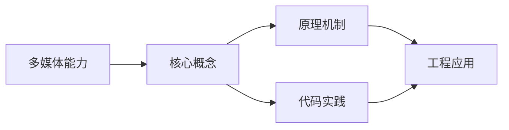

## 1. 学习目标（Bloom 分类）

本节按照布鲁姆教育目标分类学组织学习路径。本文主题为《多媒体能力》，属于 HarmonyOS 模块，读者可以根据自身阶段选择阅读深度。

记忆层面：能够准确复述本文的核心概念、术语与基本语法或操作步骤，并能够在提问或检索时快速定位对应知识点。能够说出 HarmonyOS 的核心概念、术语与标准写法。

理解层面：能够用自己的语言解释核心原理与工作机制，说明概念之间的因果关系，而不是机械记忆结论。能够解释 HarmonyOS 的工作原理与设计动机。

应用层面：能够在真实项目或练习场景中运用本文知识解决具体问题，写出正确且可维护的实现。能够编写符合 HarmonyOS 规范的完整实现。

分析层面：能够拆解复杂问题，比较本文主题与相邻概念的异同，识别边界条件与例外情况。能够分析 HarmonyOS 与相邻方案的差异与边界。

评价层面：能够根据约束条件（性能、可读性、安全、成本）评价不同方案的优劣，做出有依据的技术决策。能够根据场景评价 HarmonyOS 相关方案的优劣。

创造层面：能够把本文知识与其他模块知识组合，设计出新的解决方案或可复用的工程模式。能够组合 HarmonyOS 与其他技术设计完整方案。

通过本节学习，读者应当能够把《多媒体能力》纳入自己的知识网络，并与 HarmonyOS 模块的其他主题（ArkTS、ArkUI、分布式能力、应用开发）建立关联。

## 2. 历史动机与发展脉络

《多媒体能力》是 HarmonyOS 领域的重要主题。要真正理解它，需要先了解它解决的问题与演进过程。

HarmonyOS（鸿蒙）由华为于 2019 年发布，定位面向全场景的分布式操作系统；HarmonyOS NEXT（5.0，2024）去 Android 化，采用自研鸿蒙内核与 ArkTS 语言栈。
开发框架：ArkTS（TS 超集 + 声明式 UI 扩展）、ArkUI（声明式组件）、Stage 模型（应用模型）、方舟编译器。
分布式能力：跨端流转、分布式数据、一次开发多端部署（手机/平板/车机/穿戴）。

回到本文主题：多媒体能力 的提出与成熟，正是上述技术背景下的必然产物。早期实现往往以简单可用为目标，随着工程规模扩大，社区逐渐沉淀出标准做法与最佳实践；理解这一脉络，可以帮助读者判断“为什么文档中的推荐写法是现在这个样子”，也能在遇到历史遗留代码时准确识别其设计年代与取舍。


## 3. 形式化定义与核心概念精讲

本节把《多媒体能力》涉及的核心概念以“定义 + 讲解”的形式展开。读者应把定义当作工具，把讲解当作理解路径；两者结合才能形成可迁移的知识。

ArkTS 语法：基于 TypeScript 的类型系统，增加 @Component/@Entry/@State 等装饰器与 UI 描述语法。
ArkUI 组件：Column/Row/Stack 布局容器、Text/Button/Image 基础组件、List/Grid 容器组件；状态管理（@State/@Prop/@Link/@Provide）。
应用模型：Stage 模型以 UIAbility 为页面载体，EntryAbility 入口；module.json5 声明应用配置。

### 3.1 原文章节逐一精讲

原文档把主题拆分为 21 个小节，下面按顺序给出每一节的导读讲解，随后保留原文细节供精读。

#### 原文精读（完整保留）

# 多媒体能力 语法速查手册

> **符号约定**:`< >` 必填参数 | `[ ]` 可选参数

---

#### 概述

HarmonyOS 提供了完整的多媒体能力，涵盖相机拍照录像、音频录制与播放、视频播放与录制等功能。这些能力通过 @ohos.multimedia 命名空间下的模块提供，包括 camera（相机）、audio（音频）、media（媒体播放）等。多媒体操作通常需要申请相应权限，并在使用完毕后及时释放资源，避免占用系统硬件。

#### 基础概念

**CameraManager**：相机管理器，用于获取相机设备列表、创建相机会话。支持前置/后置摄像头切换、闪光灯控制、对焦模式设置等。

**CameraSession**：相机会话，管理相机输入（CameraInput）、预览输出（PreviewOutput）和拍照输出（PhotoOutput）的连接。需要按顺序配置输入和输出后才能启动会话。

**AudioRenderer**：音频渲染器，用于播放音频数据。支持设置采样率、声道数、编码格式等参数，适合播放 PCM 原始音频。

**AVPlayer**：高级媒体播放器，支持播放本地文件和网络流媒体。支持 MP4、HLS、MP3 等常见格式，提供播放控制、音量调节、倍速播放等能力。

**AudioCapturer**：音频采集器，用于录制音频数据。支持设置采样率和编码格式，适合语音录制场景。

#### 快速上手

##### 相机预览与拍照

```typescript
import camera from '@ohos.multimedia.camera'

@Component
struct CameraDemo {
  private cameraManager: camera.CameraManager | null = null
  private cameraSession: camera.PhotoSession | null = null

  // 初始化相机
  async initCamera(surfaceId: string) {
    // 获取相机管理器
    this.cameraManager = camera.getCameraManager(getContext(this))
    // 获取可用相机列表
    const cameras = this.cameraManager.getSupportedCameras()

    if (cameras.length === 0) {
      console.error('未找到可用相机')
      return
    }

    // 使用后置摄像头
    const cameraDevice = cameras[0]
    // 创建相机输入
    const cameraInput = this.cameraManager.createCameraInput(cameraDevice)
    await cameraInput.open()

    // 创建预览输出
    const previewOutput = this.cameraManager.createPreviewOutput(
      this.cameraManager.getSupportedOutputCapability(cameraDevice).previewProfiles[0],
      surfaceId
    )

    // 创建拍照输出
    const photoOutput = this.cameraManager.createPhotoOutput(
      this.cameraManager.getSupportedOutputCapability(cameraDevice).photoProfiles[0]
    )

    // 创建会话并配置
    this.cameraSession = this.cameraManager.createPhotoSession(cameraInput, previewOutput, photoOutput)
    await this.cameraSession.start()
  }

  build() {
    Column() {
      Text('相机功能')
        .fontSize(18)
    }
    .padding(20)
  }
}
```

##### 音频播放

```typescript
import media from '@ohos.multimedia.media'

@Component
struct AudioPlayerDemo {
  private player: media.AVPlayer | null = null
  @State isPlaying: boolean = false

  // 创建播放器
  async createPlayer() {
    this.player = await media.createAVPlayer()

    // 设置播放状态回调
    this.player.on('stateChange', (state: string) => {
      if (state === 'playing') {
        this.isPlaying = true
      } else if (state === 'paused' || state === 'stopped') {
        this.isPlaying = false
      }
    })

    // 设置播放源
    const context = getContext(this)
    const fileDescriptor = await context.resourceManager.getRawFd('background.mp3')
    this.player.fdSrc = {
      fd: fileDescriptor.fd,
      offset: fileDescriptor.offset,
      length: fileDescriptor.length,
    }
  }

  build() {
    Column({ space: 10 }) {
      Text('音频播放器').fontSize(18)

      Row({ space: 10 }) {
        Button(this.isPlaying ? '暂停' : '播放')
          .onClick(() => {
            if (this.player) {
              if (this.isPlaying) {
                this.player.pause()
              } else {
                this.player.play()
              }
            }
          })

        Button('停止')
          .onClick(() => {
            this.player?.stop()
          })
      }
    }
    .padding(20)
  }
}
```

#### 详细用法

##### 视频播放

```typescript
import media from '@ohos.multimedia.media'

@Component
struct VideoPlayerDemo {
  private player: media.AVPlayer | null = null
  @State currentTime: number = 0
  @State duration: number = 0
  @State isPlaying: boolean = false

  async initPlayer(surfaceId: string) {
    this.player = await media.createAVPlayer()

    // 设置视频渲染表面
    this.player.surfaceId = surfaceId

    // 监听播放状态
    this.player.on('stateChange', (state: string) => {
      if (state === 'prepared') {
        // 准备就绪，获取时长
        this.duration = this.player?.duration ?? 0
      }
    })

    // 监听播放进度
    this.player.on('timeUpdate', (time: number) => {
      this.currentTime = time
    })

    // 设置播放源
    this.player.url = 'https://example.com/video.mp4'
  }

  build() {
    Column({ space: 10 }) {
      // 视频渲染区域（需要 XComponent 提供表面）
      XComponent({ id: 'videoSurface', type: XComponentType.SURFACE })
        .width('100%')
        .height(200)
        .onLoad(() => {
          // 表面加载完成后初始化播放器
        })

      // 进度条
      Slider({
        value: this.currentTime,
        min: 0,
        max: this.duration,
      })
        .onChange((value) => {
          this.player?.seek(value)
        })

      // 控制按钮
      Row({ space: 10 }) {
        Button(this.isPlaying ? '暂停' : '播放')
          .onClick(() => {
            if (this.isPlaying) {
              this.player?.pause()
            } else {
              this.player?.play()
            }
          })
      }
    }
    .padding(20)
  }
}
```

##### 音频录制

```typescript
import media from '@ohos.multimedia.media'

@Component
struct AudioRecorderDemo {
  private recorder: media.AVRecorder | null = null
  @State isRecording: boolean = false
  @State recordTime: number = 0

  async startRecording() {
    this.recorder = await media.createAVRecorder()

    // 配置录音参数
    const config: media.AVRecorderConfig = {
      audioSourceType: media.AudioSourceType.AUDIO_SOURCE_TYPE_MIC,
      profile: {
        audioBitrate: 128000,    // 比特率
        audioChannels: 2,        // 声道数
        audioCodec: media.CodecMimeType.AUDIO_AAC,  // 编码格式
        audioSampleRate: 44100,  // 采样率
        fileFormat: media.ContainerFormatType.CFT_MPEG_4A, // 文件格式
      },
      url: `file://${getContext(this).filesDir}/recording_${Date.now()}.m4a`,
    }

    await this.recorder.prepare(config)
    await this.recorder.start()
    this.isRecording = true
  }

  async stopRecording() {
    if (this.recorder) {
      await this.recorder.stop()
      await this.recorder.release()
      this.recorder = null
    }
    this.isRecording = false
  }

  build() {
    Column({ space: 10 }) {
      Text(this.isRecording ? '录音中...' : '未录音')
        .fontSize(18)

      Button(this.isRecording ? '停止录音' : '开始录音')
        .onClick(() => {
          if (this.isRecording) {
            this.stopRecording()
          } else {
            this.startRecording()
          }
        })
    }
    .padding(20)
  }
}
```

##### 相机切换与闪光灯

```typescript
import camera from '@ohos.multimedia.camera'

@Component
struct CameraControlDemo {
  private cameraManager: camera.CameraManager | null = null
  @State isFrontCamera: boolean = false
  @State isFlashOn: boolean = false

  // 切换前后摄像头
  async switchCamera() {
    if (!this.cameraManager) return

    const cameras = this.cameraManager.getSupportedCameras()
    // 根据当前状态选择相反的摄像头
    const targetCamera = this.isFrontCamera ? cameras[0] : cameras[1]

    if (targetCamera) {
      // 重新创建会话...
      this.isFrontCamera = !this.isFrontCamera
    }
  }

  // 切换闪光灯
  async toggleFlash() {
    if (!this.cameraManager) return

    const cameras = this.cameraManager.getSupportedCameras()
    const cameraDevice = cameras[0]
    const hasFlash = this.cameraManager.isFlashModeSupported(cameraDevice, camera.FlashMode.FLASH_MODE_ON)

    if (hasFlash) {
      if (this.isFlashOn) {
        this.cameraManager.setFlashMode(cameraDevice, camera.FlashMode.FLASH_MODE_OFF)
      } else {
        this.cameraManager.setFlashMode(cameraDevice, camera.FlashMode.FLASH_MODE_ON)
      }
      this.isFlashOn = !this.isFlashOn
    }
  }

  build() {
    Row({ space: 10 }) {
      Button(this.isFrontCamera ? '后置' : '前置')
        .onClick(() => this.switchCamera())

      Button(this.isFlashOn ? '关闪光灯' : '开闪光灯')
        .onClick(() => this.toggleFlash())
    }
    .padding(20)
  }
}
```

#### 常见场景

##### 简易音乐播放器

```typescript
import media from '@ohos.multimedia.media'

interface Song {
  title: string
  artist: string
  url: string
}

@Component
struct MusicPlayerDemo {
  private player: media.AVPlayer | null = null
  @State currentSong: Song | null = null
  @State isPlaying: boolean = false
  @State currentTime: number = 0
  @State duration: number = 0

  playlist: Song[] = [
    { title: '歌曲一', artist: '艺术家A', url: 'https://example.com/song1.mp3' },
    { title: '歌曲二', artist: '艺术家B', url: 'https://example.com/song2.mp3' },
  ]

  async playSong(song: Song) {
    // 释放之前的播放器
    if (this.player) {
      await this.player.release()
    }

    this.player = await media.createAVPlayer()
    this.currentSong = song

    this.player.on('stateChange', (state: string) => {
      if (state === 'prepared') {
        this.player?.play()
      }
    })

    this.player.on('timeUpdate', (time: number) => {
      this.currentTime = time
    })

    this.player.on('durationUpdate', (duration: number) => {
      this.duration = duration
    })

    // 设置播放源并准备
    this.player.url = song.url
    await this.player.prepare()
  }

  // 格式化时间
  formatTime(ms: number): string {
    const seconds = Math.floor(ms / 1000)
    const minutes = Math.floor(seconds / 60)
    const remainingSeconds = seconds % 60
    return `${minutes}:${remainingSeconds.toString().padStart(2, '0')}`
  }

  build() {
    Column({ space: 15 }) {
      // 歌曲信息
      Column() {
        Text(this.currentSong?.title ?? '未播放')
          .fontSize(20)
          .fontWeight(FontWeight.Bold)
        Text(this.currentSong?.artist ?? '')
          .fontSize(14)
          .fontColor('#666666')
      }

      // 进度条
      Row() {
        Text(this.formatTime(this.currentTime))
          .fontSize(12)
        Slider({ value: this.currentTime, min: 0, max: this.duration })
          .layoutWeight(1)
          .onChange((value) => this.player?.seek(value))
        Text(this.formatTime(this.duration))
          .fontSize(12)
      }
      .width('100%')

      // 播放控制
      Row({ space: 20 }) {
        Button('上一首')
        Button(this.isPlaying ? '暂停' : '播放')
          .onClick(() => {
            if (this.isPlaying) {
              this.player?.pause()
            } else {
              this.player?.play()
            }
          })
        Button('下一首')
      }
    }
    .padding(20)
  }
}
```

##### 图片选择与预览

```typescript
import photoAccessHelper from '@ohos.file.photoAccessHelper'

@Component
struct PhotoPickerDemo {
  @State imageUri: string = ''

  // 打开图片选择器
  async pickImage() {
    const helper = photoAccessHelper.getPhotoAccessHelper(getContext(this))
    const result = await helper.showAssetsCreationDialog(
      [photoAccessHelper.PhotoType.IMAGE],
      1 // 最多选择1张
    )

    if (result.length > 0) {
      this.imageUri = result[0]
    }
  }

  build() {
    Column({ space: 10 }) {
      if (this.imageUri) {
        Image(this.imageUri)
          .width(200)
          .height(200)
          .objectFit(ImageFit.Cover)
          .borderRadius(8)
      } else {
        Text('暂无图片')
          .fontSize(14)
          .fontColor('#999999')
      }

      Button('选择图片')
        .onClick(() => this.pickImage())
    }
    .padding(20)
  }
}
```

#### 注意事项

- **权限申请**：使用相机需要 `ohos.permission.CAMERA` 权限，录音需要 `ohos.permission.MICROPHONE` 权限，读写媒体文件需要 `ohos.permission.READ_MEDIA` 和 `ohos.permission.WRITE_MEDIA` 权限。这些均为用户授权权限，需要在 module.json5 中声明并在运行时请求。
- **资源释放**：相机、播放器、录音器等硬件资源必须在使用完毕后释放（调用 release 方法），否则其他应用无法使用这些硬件。建议在组件的 aboutToDisappear 生命周期中释放。
- **生命周期管理**：播放器和录音器的状态机有严格的状态转换规则，必须按顺序调用方法。例如，AVPlayer 需要先 prepare 再 play，不能直接从 idle 状态跳到 playing。
- **主线程限制**：多媒体操作（特别是相机和录音）应在主线程执行，异步操作需使用 async/await 正确处理。
- **文件路径**：播放本地文件时，确保文件路径正确。rawfile 中的资源通过 resourceManager 获取，应用沙箱文件通过 filesDir 获取。

#### 进阶用法

##### 音频焦点管理

```typescript
import audio from '@ohos.multimedia.audio';

class AudioFocusManager {
  private audioManager: audio.AudioManager = audio.getAudioManager();
  private session: audio.AudioSession | null = null;

  // 请求音频焦点
  async requestFocus() {
    this.session = await this.audioManager.createAudioSession(audio.AudioSessionStrategy.PLAYBACK);
    await this.session.activate();

    // 监听焦点丢失事件
    this.session.on('interrupt', (interruptEvent: audio.InterruptEvent) => {
      if (interruptEvent.eventType === audio.InterruptType.INTERRUPT_TYPE_BEGIN) {
        // 焦点被抢占，暂停播放
        console.info('音频焦点丢失，暂停播放');
      } else if (interruptEvent.eventType === audio.InterruptType.INTERRUPT_TYPE_END) {
        // 焦点恢复，继续播放
        console.info('音频焦点恢复，继续播放');
      }
    });
  }

  // 释放音频焦点
  async releaseFocus() {
    if (this.session) {
      await this.session.deactivate();
      this.session = null;
    }
  }
}
```

##### 视频倍速播放

```typescript
import media from '@ohos.multimedia.media'

@Component
struct SpeedPlayerDemo {
  private player: media.AVPlayer | null = null
  @State currentSpeed: number = 1.0
  speeds: number[] = [0.5, 0.75, 1.0, 1.25, 1.5, 2.0]

  async setSpeed(speed: number) {
    if (this.player) {
      // 设置播放倍速
      this.player.setSpeed(this.getSpeedEnum(speed))
      this.currentSpeed = speed
    }
  }

  // 将数值转换为枚举
  private getSpeedEnum(speed: number): media.PlaybackSpeed {
    switch (speed) {
      case 0.5: return media.PlaybackSpeed.SPEED_FORWARD_0_75_X
      case 0.75: return media.PlaybackSpeed.SPEED_FORWARD_0_75_X
      case 1.0: return media.PlaybackSpeed.SPEED_FORWARD_1_00_X
      case 1.25: return media.PlaybackSpeed.SPEED_FORWARD_1_25_X
      case 1.5: return media.PlaybackSpeed.SPEED_FORWARD_1_75_X
      case 2.0: return media.PlaybackSpeed.SPEED_FORWARD_2_00_X
      default: return media.PlaybackSpeed.SPEED_FORWARD_1_00_X
    }
  }

  build() {
    Column({ space: 10 }) {
      Text(`当前倍速: ${this.currentSpeed}x`)
        .fontSize(16)

      Row({ space: 8 }) {
        ForEach(this.speeds, (speed: number) => {
          Button(`${speed}x`)
            .fontSize(12)
            .backgroundColor(this.currentSpeed === speed ? '#2196F3' : '#e0e0e0')
            .fontColor(this.currentSpeed === speed ? Color.White : '#333333')
            .onClick(() => this.setSpeed(speed))
        }, (speed: number) => speed.toString())
      }
    }
    .padding(20)
  }
}
```

##### 音量与音频流管理

```typescript
import audio from '@ohos.multimedia.audio'

@Component
struct VolumeControlDemo {
  private audioManager: audio.AudioManager = audio.getAudioManager()
  @State volume: number = 0

  async aboutToAppear() {
    // 获取当前音量
    this.volume = await this.audioManager.getVolume(audio.AudioVolumeType.MEDIA)
  }

  // 设置音量
  async setVolume(value: number) {
    await this.audioManager.setVolume(audio.AudioVolumeType.MEDIA, value)
    this.volume = value
  }

  build() {
    Column({ space: 10 }) {
      Text(`媒体音量: ${Math.round(this.volume * 100)}%`)
        .fontSize(16)

      Slider({
        value: this.volume,
        min: 0,
        max: 1,
        step: 0.01,
      })
        .onChange((value) => this.setVolume(value))
    }
    .padding(20)
  }
}
```
#### 多媒体模块导入

**导入 camera 模块**
`import camera from '@ohos.multimedia.camera'`
```typescript
import camera from '@ohos.multimedia.camera';
```

**通过 MultimediaKit 导入 camera**
`import { camera } from '@kit.MultimediaKit'`
```typescript
import { camera } from '@kit.MultimediaKit';
```

**导入 media 模块**
`import media from '@ohos.multimedia.media'`
```typescript
import media from '@ohos.multimedia.media';
```

**通过 MultimediaKit 导入 media**
`import { media } from '@kit.MultimediaKit'`
```typescript
import { media } from '@kit.MultimediaKit';
```

**导入 audio 模块**
`import audio from '@ohos.multimedia.audio'`
```typescript
import audio from '@ohos.multimedia.audio';
```

---

#### 相机管理 API

**获取相机管理器**
`camera.getCameraManager(context: Context): CameraManager`
```typescript
const cameraManager = camera.getCameraManager(getContext(this));
```

**获取支持的相机列表**
`cameraManager.getSupportedCameras(): Array<CameraDevice>`
```typescript
const cameras = cameraManager.getSupportedCameras();
const cameraDevice = cameras[0]; // 默认使用后置摄像头
```

**获取相机输出能力**
`cameraManager.getSupportedOutputCapability(camera: CameraDevice): CameraOutputCapability`
```typescript
const capability = cameraManager.getSupportedOutputCapability(cameraDevice);
const previewProfile = capability.previewProfiles[0];
const photoProfile = capability.photoProfiles[0];
```

**CameraDevice 结构**
```typescript
interface CameraDevice {
  cameraId: string;
  cameraPosition: CameraPosition;
  cameraType: CameraType;
  connectionType: ConnectionType;
}
```

**CameraPosition 枚举**
`camera.CameraPosition`
```typescript
enum CameraPosition {
  CAMERA_POSITION_UNSPECIFIED = 0,
  CAMERA_POSITION_BACK = 1,
  CAMERA_POSITION_FRONT = 2
}
```

---

#### 相机输入与输出

**创建相机输入**
`cameraManager.createCameraInput(camera: CameraDevice): CameraInput`
```typescript
const cameraInput = cameraManager.createCameraInput(cameraDevice);
await cameraInput.open();
```

**创建预览输出**
`cameraManager.createPreviewOutput(profile: Profile, surfaceId: string): PreviewOutput`
```typescript
const previewOutput = cameraManager.createPreviewOutput(previewProfile, surfaceId);
```

**创建拍照输出**
`cameraManager.createPhotoOutput(profile: Profile): PhotoOutput`
```typescript
const photoOutput = cameraManager.createPhotoOutput(photoProfile);
```

**CameraInput API**
```typescript
cameraInput.open(): Promise<void>;
cameraInput.close(): Promise<void>;
cameraInput.release(): Promise<void>;
```

---

#### 相机会话 API

**创建拍照会话**
`cameraManager.createPhotoSession(): PhotoSession`
```typescript
const cameraSession = cameraManager.createPhotoSession();
```

**会话配置流程**
```typescript
cameraSession.beginConfig();
cameraSession.addInput(cameraInput);
cameraSession.addOutput(previewOutput);
cameraSession.addOutput(photoOutput);
await cameraSession.commitConfig();
await cameraSession.start();
```

**会话控制 API**
```typescript
cameraSession.start(): Promise<void>;
cameraSession.stop(): Promise<void>;
cameraSession.release(): Promise<void>;
cameraSession.hasFlash(): boolean;
cameraSession.isFlashModeSupported(mode: FlashMode): boolean;
cameraSession.setFlashMode(mode: FlashMode): void;
cameraSession.setFocusMode(mode: FocusMode): void;
```

**拍照**
`cameraSession.takePhoto(photoSettings?: PhotoCaptureSetting): Promise<void>`
```typescript
await cameraSession.takePhoto({
  quality: camera.QualityLevel.QUALITY_LEVEL_HIGH,
  rotation: camera.ImageRotation.ROTATION_0
});
```

**PhotoOutput 事件**
```typescript
photoOutput.on('photoAvailable', (err: BusinessError, photo: Photo): void);
photoOutput.on('frameShutter', (frame: FrameShutterInfo): void);
```

---

#### FlashMode 闪光灯枚举

`camera.FlashMode`
```typescript
enum FlashMode {
  FLASH_MODE_CLOSE = 0,
  FLASH_MODE_OPEN = 1,
  FLASH_MODE_AUTO = 2,
  FLASH_MODE_ALWAYS_OPEN = 3
}
```

**QualityLevel 枚举**
`camera.QualityLevel`
```typescript
enum QualityLevel {
  QUALITY_LEVEL_HIGH = 0,
  QUALITY_LEVEL_MEDIUM = 1,
  QUALITY_LEVEL_LOW = 2
}
```

**ImageRotation 枚举**
`camera.ImageRotation`
```typescript
enum ImageRotation {
  ROTATION_0 = 0,
  ROTATION_90 = 90,
  ROTATION_180 = 180,
  ROTATION_270 = 270
}
```

**FocusMode 枚举**
`camera.FocusMode`
```typescript
enum FocusMode {
  FOCUS_MODE_MANUAL = 0,
  FOCUS_MODE_CONTINUOUS_AUTO = 1,
  FOCUS_MODE_AUTO = 2,
  FOCUS_MODE_LOCKED = 3
}
```

---

#### AVPlayer 播放器 API

**创建播放器**
`media.createAVPlayer(): Promise<AVPlayer>`
```typescript
const player = await media.createAVPlayer();
```

**AVPlayer 状态机**
```typescript
type AVPlayerState =
  | 'idle'        // 初始状态
  | 'initialized' // 已初始化
  | 'prepared'    // 已准备就绪
  | 'playing'     // 播放中
  | 'paused'      // 已暂停
  | 'completed'   // 播放完成
  | 'stopped'     // 已停止
  | 'released'    // 已释放
  | 'error';      // 错误状态
```

**播放器属性**
```typescript
player.url: string;        // 设置播放源 URL
player.fdSrc: { fd: number; offset: number; length: number }; // 文件描述符
player.surfaceId: string;  // 视频渲染表面
player.duration: number;   // 媒体时长(ms)
player.currentTime: number; // 当前播放位置(ms)
player.volume: number;     // 音量 0-1
player.loop: boolean;      // 是否循环播放
```

**播放控制 API**
```typescript
player.prepare(): Promise<void>;
player.play(): Promise<void>;
player.pause(): Promise<void>;
player.stop(): Promise<void>;
player.reset(): Promise<void>;
player.release(): Promise<void>;
player.seek(timeMs: number, mode?: SeekMode): void;
player.setSpeed(speed: PlaybackSpeed): void;
```

**AVPlayer 事件监听**
```typescript
player.on('stateChange', (state: string, reason: StateChangeReason): void);
player.on('error', (err: BusinessError): void);
player.on('timeUpdate', (time: number): void);
player.on('durationUpdate', (duration: number): void);
player.on('videoSizeChange', (width: number, height: number): void);
player.on('audioInterrupt', (info: audio.InterruptEvent): void);
player.on('endOfStream', (): void);
```

---

#### SeekMode 与 PlaybackSpeed 枚举

**SeekMode 枚举**
`media.SeekMode`
```typescript
enum SeekMode {
  SEEK_NEXT_SYNC = 0,
  SEEK_PREV_SYNC = 1,
  SEEK_CLOSEST_SYNC = 2,
  SEEK_CLOSEST = 3
}
```

**PlaybackSpeed 枚举**
`media.PlaybackSpeed`
```typescript
enum PlaybackSpeed {
  SPEED_FORWARD_0_75_X = 0,
  SPEED_FORWARD_1_00_X = 1,
  SPEED_FORWARD_1_25_X = 2,
  SPEED_FORWARD_1_75_X = 3,
  SPEED_FORWARD_2_00_X = 4
}
```

---

#### AVRecorder 录制 API

**创建录制器**
`media.createAVRecorder(): Promise<AVRecorder>`
```typescript
const recorder = await media.createAVRecorder();
```

**AVRecorder 状态机**
```typescript
type AVRecorderState =
  | 'idle'
  | 'prepared'
  | 'started'
  | 'paused'
  | 'stopped'
  | 'released'
  | 'error';
```

**录制控制 API**
```typescript
recorder.prepare(config: AVRecorderConfig): Promise<void>;
recorder.start(): Promise<void>;
recorder.pause(): Promise<void>;
recorder.resume(): Promise<void>;
recorder.stop(): Promise<void>;
recorder.reset(): Promise<void>;
recorder.release(): Promise<void>;
```

**AVRecorderConfig 配置**
```typescript
interface AVRecorderConfig {
  audioSourceType?: AudioSourceType;
  videoSourceType?: VideoSourceType;
  profile: AVRecorderProfile;
  url: string;            // 输出文件路径
  rotation?: number;
  location?: Location;
}
```

**AVRecorderProfile 配置**
```typescript
interface AVRecorderProfile {
  audioBitrate?: number;
  audioChannels?: number;
  audioCodec?: CodecMimeType;
  audioSampleRate?: number;
  videoBitrate?: number;
  videoCodec?: CodecMimeType;
  videoFrameWidth?: number;
  videoFrameHeight?: number;
  videoFrameRate?: number;
  fileFormat: ContainerFormatType;
}
```

---

#### 录制相关枚举

**AudioSourceType 枚举**
`media.AudioSourceType`
```typescript
enum AudioSourceType {
  AUDIO_SOURCE_TYPE_INVALID = -1,
  AUDIO_SOURCE_TYPE_MIC = 0,
  AUDIO_SOURCE_TYPE_VOICE_RECOGNITION = 1,
  AUDIO_SOURCE_TYPE_VOICE_COMMUNICATION = 2
}
```

**CodecMimeType 枚举**
`media.CodecMimeType`
```typescript
enum CodecMimeType {
  AUDIO_AAC = 'audio/mp4a-latm',
  AUDIO_OPUS = 'audio/opus',
  AUDIO_FLAC = 'audio/flac',
  VIDEO_H264 = 'video/avc',
  VIDEO_H265 = 'video/hevc',
  VIDEO_MPEG4 = 'video/mp4v-es'
}
```

**ContainerFormatType 枚举**
`media.ContainerFormatType`
```typescript
enum ContainerFormatType {
  CFT_MPEG_4 = 'mp4',
  CFT_MPEG_4A = 'm4a',
  CFT_3GPP = '3gp',
  CFT_OGG = 'ogg',
  CFT_FLAC = 'flac',
  CFT_WAV = 'wav'
}
```

---

#### Audio 音频管理 API

**获取音频管理器**
`audio.getAudioManager(): AudioManager`
```typescript
const audioManager = audio.getAudioManager();
```

**音量控制 API**
```typescript
audioManager.getVolume(volumeType: AudioVolumeType): Promise<number>;
audioManager.setVolume(volumeType: AudioVolumeType, volume: number): Promise<void>;
audioManager.getMaxVolume(volumeType: AudioVolumeType): Promise<number>;
audioManager.mute(volumeType: AudioVolumeType): Promise<void>;
```

**AudioVolumeType 枚举**
`audio.AudioVolumeType`
```typescript
enum AudioVolumeType {
  RINGTONE = 2,
  MEDIA = 3,
  VOICE_CALL = 0,
  VOICE_ASSISTANT = 9
}
```

---

#### AudioSession 音频会话

**创建音频会话**
`audioManager.createAudioSession(strategy: AudioSessionStrategy): Promise<AudioSession>`
```typescript
const session = await audioManager.createAudioSession(audio.AudioSessionStrategy.PLAYBACK);
```

**会话控制 API**
```typescript
session.activate(): Promise<void>;
session.deactivate(): Promise<void>;
session.on('interrupt', (event: InterruptEvent): void);
```

**AudioSessionStrategy 枚举**
`audio.AudioSessionStrategy`
```typescript
enum AudioSessionStrategy {
  PLAYBACK = 0,
  RECORDING = 1,
  CALL = 2
}
```

**InterruptEvent 事件**
```typescript
interface InterruptEvent {
  eventType: InterruptType;
  interrupt: InterruptHint;
}
```

**InterruptType 枚举**
`audio.InterruptType`
```typescript
enum InterruptType {
  INTERRUPT_TYPE_BEGIN = 0,
  INTERRUPT_TYPE_END = 1
}
```

---

#### PhotoAccessHelper 媒体选择

**导入 photoAccessHelper**
`import photoAccessHelper from '@ohos.file.photoAccessHelper'`
```typescript
import photoAccessHelper from '@ohos.file.photoAccessHelper';
```

**获取 PhotoAccessHelper**
`photoAccessHelper.getPhotoAccessHelper(context: Context): PhotoAccessHelper`
```typescript
const helper = photoAccessHelper.getPhotoAccessHelper(getContext(this));
```

**打开图片选择对话框**
`helper.showAssetsCreationDialog(photoType: Array<PhotoType>, maxSelected: number): Promise<Array<string>>`
```typescript
const result = await helper.showAssetsCreationDialog(
  [photoAccessHelper.PhotoType.IMAGE],
  1
);
if (result.length > 0) {
  const uri = result[0];
}
```

**PhotoType 枚举**
`photoAccessHelper.PhotoType`
```typescript
enum PhotoType {
  IMAGE = 'IMAGE',
  VIDEO = 'VIDEO'
}
```

---

#### Video 组件 API

**Video 组件构造**
```typescript
Video(value: { src: string | Resource, controller: VideoController })
```
```typescript
Video({ src: 'https://example.com/video.mp4', controller: this.videoController })
  .autoPlay(false)
  .controls(true)
  .width('100%')
  .height(240);
```

**VideoController API**
```typescript
const controller = new VideoController();
controller.start();
controller.pause();
controller.stop();
controller.reset();
controller.seek(timeMs: number);
controller.requestFullscreen();
controller.exitFullscreen();
```

**Video 事件**
```typescript
.onPrepared((event: { duration: number }): void)
.onTimeUpdate((event: { time: number }): void)
.onPlay((): void)
.onPause((): void)
.onFinish((): void)
.onError((): void)
```

---

#### XComponent 渲染表面

**XComponent 构造**
```typescript
XComponent(value: { id: string, type: XComponentType, controller?: XComponentController })
```
```typescript
XComponent({ id: 'videoSurface', type: XComponentType.SURFACE })
  .width('100%')
  .height(400)
  .onLoad(() => {
    // 表面加载完成后初始化播放器
  });
```

**XComponentType 枚举**
```typescript
enum XComponentType {
  SURFACE = 0,
  COMPONENT = 1
}
```


### 3.2 概念关系图

下面用 Mermaid 图表达本文核心概念之间的关系，帮助读者建立整体图景：



图中展示的是本文知识的结构化关系：核心概念是入口，原理机制解释“为什么”，代码实践演示“怎么做”，工程应用回答“何时用”。读者学习时可以把每个小节的内容挂接到对应节点上。

## 4. 理论推导与原理解析

本节深入《多媒体能力》背后的原理。理论部分不求面面俱到，而是聚焦“能解释现象、能指导实践”的关键推导。

ArkTS 语法：基于 TypeScript 的类型系统，增加 @Component/@Entry/@State 等装饰器与 UI 描述语法。
ArkUI 组件：Column/Row/Stack 布局容器、Text/Button/Image 基础组件、List/Grid 容器组件；状态管理（@State/@Prop/@Link/@Provide）。
应用模型：Stage 模型以 UIAbility 为页面载体，EntryAbility 入口；module.json5 声明应用配置。
生命周期：Ability 的 onCreate/onWindowStageCreate/onForeground/onBackground/onDestroy。

需要强调的是，理论推导与工程实践之间存在翻译层：理论给出的是理想化模型与边界条件，工程代码则必须处理真实环境中的例外。读者在学习时应先掌握理论的“标准情形”，再通过陷阱章节了解“非标准情形”。

## 5. 代码示例与逐行讲解

本节把原文中的代码示例系统整理，并为每个示例补充用途说明与讲解。读者不应只浏览代码，而应逐段对照讲解理解设计意图。

### 5.1 示例：相机预览与拍照

该示例来自原文《相机预览与拍照》小节，用于演示多媒体能力相关操作。阅读时请先看代码结构，再看其后的讲解。

```typescript
import camera from '@ohos.multimedia.camera'

@Component
struct CameraDemo {
  private cameraManager: camera.CameraManager | null = null
  private cameraSession: camera.PhotoSession | null = null

  // 初始化相机
  async initCamera(surfaceId: string) {
    // 获取相机管理器
    this.cameraManager = camera.getCameraManager(getContext(this))
    // 获取可用相机列表
    const cameras = this.cameraManager.getSupportedCameras()

    if (cameras.length === 0) {
      console.error('未找到可用相机')
      return
    }

    // 使用后置摄像头
    const cameraDevice = cameras[0]
    // 创建相机输入
    const cameraInput = this.cameraManager.createCameraInput(cameraDevice)
    await cameraInput.open()

    // 创建预览输出
    const previewOutput = this.cameraManager.createPreviewOutput(
      this.cameraManager.getSupportedOutputCapability(cameraDevice).previewProfiles[0],
      surfaceId
    )

    // 创建拍照输出
    const photoOutput = this.cameraManager.createPhotoOutput(
      this.cameraManager.getSupportedOutputCapability(cameraDevice).photoProfiles[0]
    )

    // 创建会话并配置
    this.cameraSession = this.cameraManager.createPhotoSession(cameraInput, previewOutput, photoOutput)
    await this.cameraSession.start()
  }

  build() {
    Column() {
      Text('相机功能')
        .fontSize(18)
    }
    .padding(20)
  }
}
```

讲解：这段代码演示了本节核心知识点。代码中的关键操作可以归纳为三步：准备（定义或初始化）、执行（核心逻辑）、收尾（释放资源或返回结果）。实际项目中，这三步往往被封装为函数或类，以提升复用性与可测试性。

关键点分析：

该示例共 41 行有效代码，包含 4 类关键结构（import、from、if、return）。其中：

- 入口与初始化部分负责建立上下文，对应实际项目中的启动或装配逻辑；
- 核心逻辑部分体现本文主题的主要操作，是阅读时最需要对照讲解理解的部分；
- 输出或返回部分把结果交给调用方，注意其类型与边界条件。

进阶思考路径：先尝试修改参数观察行为变化，再把示例中的模式迁移到自己的项目中；每次修改都记录预期与实测差异，这是把示例转化为能力的最快方式。

### 5.2 示例：音频播放

该示例来自原文《音频播放》小节，用于演示多媒体能力相关操作。阅读时请先看代码结构，再看其后的讲解。

```typescript
import media from '@ohos.multimedia.media'

@Component
struct AudioPlayerDemo {
  private player: media.AVPlayer | null = null
  @State isPlaying: boolean = false

  // 创建播放器
  async createPlayer() {
    this.player = await media.createAVPlayer()

    // 设置播放状态回调
    this.player.on('stateChange', (state: string) => {
      if (state === 'playing') {
        this.isPlaying = true
      } else if (state === 'paused' || state === 'stopped') {
        this.isPlaying = false
      }
    })

    // 设置播放源
    const context = getContext(this)
    const fileDescriptor = await context.resourceManager.getRawFd('background.mp3')
    this.player.fdSrc = {
      fd: fileDescriptor.fd,
      offset: fileDescriptor.offset,
      length: fileDescriptor.length,
    }
  }

  build() {
    Column({ space: 10 }) {
      Text('音频播放器').fontSize(18)

      Row({ space: 10 }) {
        Button(this.isPlaying ? '暂停' : '播放')
          .onClick(() => {
            if (this.player) {
              if (this.isPlaying) {
                this.player.pause()
              } else {
                this.player.play()
              }
            }
          })

        Button('停止')
          .onClick(() => {
            this.player?.stop()
          })
      }
    }
    .padding(20)
  }
}
```

讲解：这段代码演示了本节核心知识点。代码中的关键操作可以归纳为三步：准备（定义或初始化）、执行（核心逻辑）、收尾（释放资源或返回结果）。实际项目中，这三步往往被封装为函数或类，以提升复用性与可测试性。

关键点分析：

该示例共 48 行有效代码，包含 3 类关键结构（import、from、if）。其中：

- 入口与初始化部分负责建立上下文，对应实际项目中的启动或装配逻辑；
- 核心逻辑部分体现本文主题的主要操作，是阅读时最需要对照讲解理解的部分；
- 输出或返回部分把结果交给调用方，注意其类型与边界条件。

进阶思考路径：先尝试修改参数观察行为变化，再把示例中的模式迁移到自己的项目中；每次修改都记录预期与实测差异，这是把示例转化为能力的最快方式。

### 5.3 示例：视频播放

该示例来自原文《视频播放》小节，用于演示多媒体能力相关操作。阅读时请先看代码结构，再看其后的讲解。

```typescript
import media from '@ohos.multimedia.media'

@Component
struct VideoPlayerDemo {
  private player: media.AVPlayer | null = null
  @State currentTime: number = 0
  @State duration: number = 0
  @State isPlaying: boolean = false

  async initPlayer(surfaceId: string) {
    this.player = await media.createAVPlayer()

    // 设置视频渲染表面
    this.player.surfaceId = surfaceId

    // 监听播放状态
    this.player.on('stateChange', (state: string) => {
      if (state === 'prepared') {
        // 准备就绪，获取时长
        this.duration = this.player?.duration ?? 0
      }
    })

    // 监听播放进度
    this.player.on('timeUpdate', (time: number) => {
      this.currentTime = time
    })

    // 设置播放源
    this.player.url = 'https://example.com/video.mp4'
  }

  build() {
    Column({ space: 10 }) {
      // 视频渲染区域（需要 XComponent 提供表面）
      XComponent({ id: 'videoSurface', type: XComponentType.SURFACE })
        .width('100%')
        .height(200)
        .onLoad(() => {
          // 表面加载完成后初始化播放器
        })

      // 进度条
      Slider({
        value: this.currentTime,
        min: 0,
        max: this.duration,
      })
        .onChange((value) => {
          this.player?.seek(value)
        })

      // 控制按钮
      Row({ space: 10 }) {
        Button(this.isPlaying ? '暂停' : '播放')
          .onClick(() => {
            if (this.isPlaying) {
              this.player?.pause()
            } else {
              this.player?.play()
            }
          })
      }
    }
    .padding(20)
  }
}
```

讲解：这段代码演示了本节核心知识点。代码中的关键操作可以归纳为三步：准备（定义或初始化）、执行（核心逻辑）、收尾（释放资源或返回结果）。实际项目中，这三步往往被封装为函数或类，以提升复用性与可测试性。

关键点分析：

该示例共 58 行有效代码，包含 3 类关键结构（import、from、if）。其中：

- 入口与初始化部分负责建立上下文，对应实际项目中的启动或装配逻辑；
- 核心逻辑部分体现本文主题的主要操作，是阅读时最需要对照讲解理解的部分；
- 输出或返回部分把结果交给调用方，注意其类型与边界条件。

进阶思考路径：先尝试修改参数观察行为变化，再把示例中的模式迁移到自己的项目中；每次修改都记录预期与实测差异，这是把示例转化为能力的最快方式。

### 5.4 示例：音频录制

该示例来自原文《音频录制》小节，用于演示多媒体能力相关操作。阅读时请先看代码结构，再看其后的讲解。

```typescript
import media from '@ohos.multimedia.media'

@Component
struct AudioRecorderDemo {
  private recorder: media.AVRecorder | null = null
  @State isRecording: boolean = false
  @State recordTime: number = 0

  async startRecording() {
    this.recorder = await media.createAVRecorder()

    // 配置录音参数
    const config: media.AVRecorderConfig = {
      audioSourceType: media.AudioSourceType.AUDIO_SOURCE_TYPE_MIC,
      profile: {
        audioBitrate: 128000,    // 比特率
        audioChannels: 2,        // 声道数
        audioCodec: media.CodecMimeType.AUDIO_AAC,  // 编码格式
        audioSampleRate: 44100,  // 采样率
        fileFormat: media.ContainerFormatType.CFT_MPEG_4A, // 文件格式
      },
      url: `file://${getContext(this).filesDir}/recording_${Date.now()}.m4a`,
    }

    await this.recorder.prepare(config)
    await this.recorder.start()
    this.isRecording = true
  }

  async stopRecording() {
    if (this.recorder) {
      await this.recorder.stop()
      await this.recorder.release()
      this.recorder = null
    }
    this.isRecording = false
  }

  build() {
    Column({ space: 10 }) {
      Text(this.isRecording ? '录音中...' : '未录音')
        .fontSize(18)

      Button(this.isRecording ? '停止录音' : '开始录音')
        .onClick(() => {
          if (this.isRecording) {
            this.stopRecording()
          } else {
            this.startRecording()
          }
        })
    }
    .padding(20)
  }
}
```

讲解：这段代码演示了本节核心知识点。代码中的关键操作可以归纳为三步：准备（定义或初始化）、执行（核心逻辑）、收尾（释放资源或返回结果）。实际项目中，这三步往往被封装为函数或类，以提升复用性与可测试性。

关键点分析：

该示例共 48 行有效代码，包含 3 类关键结构（import、from、if）。其中：

- 入口与初始化部分负责建立上下文，对应实际项目中的启动或装配逻辑；
- 核心逻辑部分体现本文主题的主要操作，是阅读时最需要对照讲解理解的部分；
- 输出或返回部分把结果交给调用方，注意其类型与边界条件。

进阶思考路径：先尝试修改参数观察行为变化，再把示例中的模式迁移到自己的项目中；每次修改都记录预期与实测差异，这是把示例转化为能力的最快方式。

### 5.5 示例：相机切换与闪光灯

该示例来自原文《相机切换与闪光灯》小节，用于演示多媒体能力相关操作。阅读时请先看代码结构，再看其后的讲解。

```typescript
import camera from '@ohos.multimedia.camera'

@Component
struct CameraControlDemo {
  private cameraManager: camera.CameraManager | null = null
  @State isFrontCamera: boolean = false
  @State isFlashOn: boolean = false

  // 切换前后摄像头
  async switchCamera() {
    if (!this.cameraManager) return

    const cameras = this.cameraManager.getSupportedCameras()
    // 根据当前状态选择相反的摄像头
    const targetCamera = this.isFrontCamera ? cameras[0] : cameras[1]

    if (targetCamera) {
      // 重新创建会话...
      this.isFrontCamera = !this.isFrontCamera
    }
  }

  // 切换闪光灯
  async toggleFlash() {
    if (!this.cameraManager) return

    const cameras = this.cameraManager.getSupportedCameras()
    const cameraDevice = cameras[0]
    const hasFlash = this.cameraManager.isFlashModeSupported(cameraDevice, camera.FlashMode.FLASH_MODE_ON)

    if (hasFlash) {
      if (this.isFlashOn) {
        this.cameraManager.setFlashMode(cameraDevice, camera.FlashMode.FLASH_MODE_OFF)
      } else {
        this.cameraManager.setFlashMode(cameraDevice, camera.FlashMode.FLASH_MODE_ON)
      }
      this.isFlashOn = !this.isFlashOn
    }
  }

  build() {
    Row({ space: 10 }) {
      Button(this.isFrontCamera ? '后置' : '前置')
        .onClick(() => this.switchCamera())

      Button(this.isFlashOn ? '关闪光灯' : '开闪光灯')
        .onClick(() => this.toggleFlash())
    }
    .padding(20)
  }
}
```

讲解：这段代码演示了本节核心知识点。代码中的关键操作可以归纳为三步：准备（定义或初始化）、执行（核心逻辑）、收尾（释放资源或返回结果）。实际项目中，这三步往往被封装为函数或类，以提升复用性与可测试性。

关键点分析：

该示例共 42 行有效代码，包含 4 类关键结构（import、from、if、return）。其中：

- 入口与初始化部分负责建立上下文，对应实际项目中的启动或装配逻辑；
- 核心逻辑部分体现本文主题的主要操作，是阅读时最需要对照讲解理解的部分；
- 输出或返回部分把结果交给调用方，注意其类型与边界条件。

进阶思考路径：先尝试修改参数观察行为变化，再把示例中的模式迁移到自己的项目中；每次修改都记录预期与实测差异，这是把示例转化为能力的最快方式。

### 5.6 示例：简易音乐播放器

该示例来自原文《简易音乐播放器》小节，用于演示多媒体能力相关操作。阅读时请先看代码结构，再看其后的讲解。

```typescript
import media from '@ohos.multimedia.media'

interface Song {
  title: string
  artist: string
  url: string
}

@Component
struct MusicPlayerDemo {
  private player: media.AVPlayer | null = null
  @State currentSong: Song | null = null
  @State isPlaying: boolean = false
  @State currentTime: number = 0
  @State duration: number = 0

  playlist: Song[] = [
    { title: '歌曲一', artist: '艺术家A', url: 'https://example.com/song1.mp3' },
    { title: '歌曲二', artist: '艺术家B', url: 'https://example.com/song2.mp3' },
  ]

  async playSong(song: Song) {
    // 释放之前的播放器
    if (this.player) {
      await this.player.release()
    }

    this.player = await media.createAVPlayer()
    this.currentSong = song

    this.player.on('stateChange', (state: string) => {
      if (state === 'prepared') {
        this.player?.play()
      }
    })

    this.player.on('timeUpdate', (time: number) => {
      this.currentTime = time
    })

    this.player.on('durationUpdate', (duration: number) => {
      this.duration = duration
    })

    // 设置播放源并准备
    this.player.url = song.url
    await this.player.prepare()
  }

  // 格式化时间
  formatTime(ms: number): string {
    const seconds = Math.floor(ms / 1000)
    const minutes = Math.floor(seconds / 60)
    const remainingSeconds = seconds % 60
    return `${minutes}:${remainingSeconds.toString().padStart(2, '0')}`
  }

  build() {
    Column({ space: 15 }) {
      // 歌曲信息
      Column() {
        Text(this.currentSong?.title ?? '未播放')
          .fontSize(20)
          .fontWeight(FontWeight.Bold)
        Text(this.currentSong?.artist ?? '')
          .fontSize(14)
          .fontColor('#666666')
      }

      // 进度条
      Row() {
        Text(this.formatTime(this.currentTime))
          .fontSize(12)
        Slider({ value: this.currentTime, min: 0, max: this.duration })
          .layoutWeight(1)
          .onChange((value) => this.player?.seek(value))
        Text(this.formatTime(this.duration))
          .fontSize(12)
      }
      .width('100%')

      // 播放控制
      Row({ space: 20 }) {
        Button('上一首')
        Button(this.isPlaying ? '暂停' : '播放')
          .onClick(() => {
            if (this.isPlaying) {
              this.player?.pause()
            } else {
              this.player?.play()
            }
          })
        Button('下一首')
      }
    }
    .padding(20)
  }
}
```

讲解：这段代码演示了本节核心知识点。代码中的关键操作可以归纳为三步：准备（定义或初始化）、执行（核心逻辑）、收尾（释放资源或返回结果）。实际项目中，这三步往往被封装为函数或类，以提升复用性与可测试性。

关键点分析：

该示例共 85 行有效代码，包含 4 类关键结构（import、from、if、return）。其中：

- 入口与初始化部分负责建立上下文，对应实际项目中的启动或装配逻辑；
- 核心逻辑部分体现本文主题的主要操作，是阅读时最需要对照讲解理解的部分；
- 输出或返回部分把结果交给调用方，注意其类型与边界条件。

进阶思考路径：先尝试修改参数观察行为变化，再把示例中的模式迁移到自己的项目中；每次修改都记录预期与实测差异，这是把示例转化为能力的最快方式。

### 5.7 示例：图片选择与预览

该示例来自原文《图片选择与预览》小节，用于演示多媒体能力相关操作。阅读时请先看代码结构，再看其后的讲解。

```typescript
import photoAccessHelper from '@ohos.file.photoAccessHelper'

@Component
struct PhotoPickerDemo {
  @State imageUri: string = ''

  // 打开图片选择器
  async pickImage() {
    const helper = photoAccessHelper.getPhotoAccessHelper(getContext(this))
    const result = await helper.showAssetsCreationDialog(
      [photoAccessHelper.PhotoType.IMAGE],
      1 // 最多选择1张
    )

    if (result.length > 0) {
      this.imageUri = result[0]
    }
  }

  build() {
    Column({ space: 10 }) {
      if (this.imageUri) {
        Image(this.imageUri)
          .width(200)
          .height(200)
          .objectFit(ImageFit.Cover)
          .borderRadius(8)
      } else {
        Text('暂无图片')
          .fontSize(14)
          .fontColor('#999999')
      }

      Button('选择图片')
        .onClick(() => this.pickImage())
    }
    .padding(20)
  }
}
```

讲解：这段代码演示了本节核心知识点。代码中的关键操作可以归纳为三步：准备（定义或初始化）、执行（核心逻辑）、收尾（释放资源或返回结果）。实际项目中，这三步往往被封装为函数或类，以提升复用性与可测试性。

关键点分析：

该示例共 34 行有效代码，包含 3 类关键结构（import、from、if）。其中：

- 入口与初始化部分负责建立上下文，对应实际项目中的启动或装配逻辑；
- 核心逻辑部分体现本文主题的主要操作，是阅读时最需要对照讲解理解的部分；
- 输出或返回部分把结果交给调用方，注意其类型与边界条件。

进阶思考路径：先尝试修改参数观察行为变化，再把示例中的模式迁移到自己的项目中；每次修改都记录预期与实测差异，这是把示例转化为能力的最快方式。

### 5.8 示例：音频焦点管理

该示例来自原文《音频焦点管理》小节，用于演示多媒体能力相关操作。阅读时请先看代码结构，再看其后的讲解。

```typescript
import audio from '@ohos.multimedia.audio';

class AudioFocusManager {
  private audioManager: audio.AudioManager = audio.getAudioManager();
  private session: audio.AudioSession | null = null;

  // 请求音频焦点
  async requestFocus() {
    this.session = await this.audioManager.createAudioSession(audio.AudioSessionStrategy.PLAYBACK);
    await this.session.activate();

    // 监听焦点丢失事件
    this.session.on('interrupt', (interruptEvent: audio.InterruptEvent) => {
      if (interruptEvent.eventType === audio.InterruptType.INTERRUPT_TYPE_BEGIN) {
        // 焦点被抢占，暂停播放
        console.info('音频焦点丢失，暂停播放');
      } else if (interruptEvent.eventType === audio.InterruptType.INTERRUPT_TYPE_END) {
        // 焦点恢复，继续播放
        console.info('音频焦点恢复，继续播放');
      }
    });
  }

  // 释放音频焦点
  async releaseFocus() {
    if (this.session) {
      await this.session.deactivate();
      this.session = null;
    }
  }
}
```

讲解：这段代码演示了本节核心知识点。代码中的关键操作可以归纳为三步：准备（定义或初始化）、执行（核心逻辑）、收尾（释放资源或返回结果）。实际项目中，这三步往往被封装为函数或类，以提升复用性与可测试性。

关键点分析：

该示例共 27 行有效代码，包含 4 类关键结构（class、import、from、if）。其中：

- 入口与初始化部分负责建立上下文，对应实际项目中的启动或装配逻辑；
- 核心逻辑部分体现本文主题的主要操作，是阅读时最需要对照讲解理解的部分；
- 输出或返回部分把结果交给调用方，注意其类型与边界条件。

进阶思考路径：先尝试修改参数观察行为变化，再把示例中的模式迁移到自己的项目中；每次修改都记录预期与实测差异，这是把示例转化为能力的最快方式。

### 5.9 示例：视频倍速播放

该示例来自原文《视频倍速播放》小节，用于演示多媒体能力相关操作。阅读时请先看代码结构，再看其后的讲解。

```typescript
import media from '@ohos.multimedia.media'

@Component
struct SpeedPlayerDemo {
  private player: media.AVPlayer | null = null
  @State currentSpeed: number = 1.0
  speeds: number[] = [0.5, 0.75, 1.0, 1.25, 1.5, 2.0]

  async setSpeed(speed: number) {
    if (this.player) {
      // 设置播放倍速
      this.player.setSpeed(this.getSpeedEnum(speed))
      this.currentSpeed = speed
    }
  }

  // 将数值转换为枚举
  private getSpeedEnum(speed: number): media.PlaybackSpeed {
    switch (speed) {
      case 0.5: return media.PlaybackSpeed.SPEED_FORWARD_0_75_X
      case 0.75: return media.PlaybackSpeed.SPEED_FORWARD_0_75_X
      case 1.0: return media.PlaybackSpeed.SPEED_FORWARD_1_00_X
      case 1.25: return media.PlaybackSpeed.SPEED_FORWARD_1_25_X
      case 1.5: return media.PlaybackSpeed.SPEED_FORWARD_1_75_X
      case 2.0: return media.PlaybackSpeed.SPEED_FORWARD_2_00_X
      default: return media.PlaybackSpeed.SPEED_FORWARD_1_00_X
    }
  }

  build() {
    Column({ space: 10 }) {
      Text(`当前倍速: ${this.currentSpeed}x`)
        .fontSize(16)

      Row({ space: 8 }) {
        ForEach(this.speeds, (speed: number) => {
          Button(`${speed}x`)
            .fontSize(12)
            .backgroundColor(this.currentSpeed === speed ? '#2196F3' : '#e0e0e0')
            .fontColor(this.currentSpeed === speed ? Color.White : '#333333')
            .onClick(() => this.setSpeed(speed))
        }, (speed: number) => speed.toString())
      }
    }
    .padding(20)
  }
}
```

讲解：这段代码演示了本节核心知识点。代码中的关键操作可以归纳为三步：准备（定义或初始化）、执行（核心逻辑）、收尾（释放资源或返回结果）。实际项目中，这三步往往被封装为函数或类，以提升复用性与可测试性。

关键点分析：

该示例共 42 行有效代码，包含 4 类关键结构（import、from、if、return）。其中：

- 入口与初始化部分负责建立上下文，对应实际项目中的启动或装配逻辑；
- 核心逻辑部分体现本文主题的主要操作，是阅读时最需要对照讲解理解的部分；
- 输出或返回部分把结果交给调用方，注意其类型与边界条件。

进阶思考路径：先尝试修改参数观察行为变化，再把示例中的模式迁移到自己的项目中；每次修改都记录预期与实测差异，这是把示例转化为能力的最快方式。

### 5.10 示例：音量与音频流管理

该示例来自原文《音量与音频流管理》小节，用于演示多媒体能力相关操作。阅读时请先看代码结构，再看其后的讲解。

```typescript
import audio from '@ohos.multimedia.audio'

@Component
struct VolumeControlDemo {
  private audioManager: audio.AudioManager = audio.getAudioManager()
  @State volume: number = 0

  async aboutToAppear() {
    // 获取当前音量
    this.volume = await this.audioManager.getVolume(audio.AudioVolumeType.MEDIA)
  }

  // 设置音量
  async setVolume(value: number) {
    await this.audioManager.setVolume(audio.AudioVolumeType.MEDIA, value)
    this.volume = value
  }

  build() {
    Column({ space: 10 }) {
      Text(`媒体音量: ${Math.round(this.volume * 100)}%`)
        .fontSize(16)

      Slider({
        value: this.volume,
        min: 0,
        max: 1,
        step: 0.01,
      })
        .onChange((value) => this.setVolume(value))
    }
    .padding(20)
  }
}
```

讲解：这段代码演示了本节核心知识点。代码中的关键操作可以归纳为三步：准备（定义或初始化）、执行（核心逻辑）、收尾（释放资源或返回结果）。实际项目中，这三步往往被封装为函数或类，以提升复用性与可测试性。

关键点分析：

该示例共 29 行有效代码，包含 2 类关键结构（import、from）。其中：

- 入口与初始化部分负责建立上下文，对应实际项目中的启动或装配逻辑；
- 核心逻辑部分体现本文主题的主要操作，是阅读时最需要对照讲解理解的部分；
- 输出或返回部分把结果交给调用方，注意其类型与边界条件。

进阶思考路径：先尝试修改参数观察行为变化，再把示例中的模式迁移到自己的项目中；每次修改都记录预期与实测差异，这是把示例转化为能力的最快方式。

### 5.11 示例：多媒体模块导入

该示例来自原文《多媒体模块导入》小节，用于演示多媒体能力相关操作。阅读时请先看代码结构，再看其后的讲解。

```typescript
import camera from '@ohos.multimedia.camera';
```

讲解：这段代码演示了本节核心知识点。代码中的关键操作可以归纳为三步：准备（定义或初始化）、执行（核心逻辑）、收尾（释放资源或返回结果）。实际项目中，这三步往往被封装为函数或类，以提升复用性与可测试性。

关键点分析：

该示例共 1 行有效代码，包含 2 类关键结构（import、from）。其中：

- 入口与初始化部分负责建立上下文，对应实际项目中的启动或装配逻辑；
- 核心逻辑部分体现本文主题的主要操作，是阅读时最需要对照讲解理解的部分；
- 输出或返回部分把结果交给调用方，注意其类型与边界条件。

进阶思考路径：先尝试修改参数观察行为变化，再把示例中的模式迁移到自己的项目中；每次修改都记录预期与实测差异，这是把示例转化为能力的最快方式。

### 5.12 示例：多媒体模块导入

该示例来自原文《多媒体模块导入》小节，用于演示多媒体能力相关操作。阅读时请先看代码结构，再看其后的讲解。

```typescript
import { camera } from '@kit.MultimediaKit';
```

讲解：这段代码演示了本节核心知识点。代码中的关键操作可以归纳为三步：准备（定义或初始化）、执行（核心逻辑）、收尾（释放资源或返回结果）。实际项目中，这三步往往被封装为函数或类，以提升复用性与可测试性。

关键点分析：

该示例共 1 行有效代码，包含 2 类关键结构（import、from）。其中：

- 入口与初始化部分负责建立上下文，对应实际项目中的启动或装配逻辑；
- 核心逻辑部分体现本文主题的主要操作，是阅读时最需要对照讲解理解的部分；
- 输出或返回部分把结果交给调用方，注意其类型与边界条件。

进阶思考路径：先尝试修改参数观察行为变化，再把示例中的模式迁移到自己的项目中；每次修改都记录预期与实测差异，这是把示例转化为能力的最快方式。

### 5.13 示例：多媒体模块导入

该示例来自原文《多媒体模块导入》小节，用于演示多媒体能力相关操作。阅读时请先看代码结构，再看其后的讲解。

```typescript
import media from '@ohos.multimedia.media';
```

讲解：这段代码演示了本节核心知识点。代码中的关键操作可以归纳为三步：准备（定义或初始化）、执行（核心逻辑）、收尾（释放资源或返回结果）。实际项目中，这三步往往被封装为函数或类，以提升复用性与可测试性。

关键点分析：

该示例共 1 行有效代码，包含 2 类关键结构（import、from）。其中：

- 入口与初始化部分负责建立上下文，对应实际项目中的启动或装配逻辑；
- 核心逻辑部分体现本文主题的主要操作，是阅读时最需要对照讲解理解的部分；
- 输出或返回部分把结果交给调用方，注意其类型与边界条件。

进阶思考路径：先尝试修改参数观察行为变化，再把示例中的模式迁移到自己的项目中；每次修改都记录预期与实测差异，这是把示例转化为能力的最快方式。

### 5.14 示例：多媒体模块导入

该示例来自原文《多媒体模块导入》小节，用于演示多媒体能力相关操作。阅读时请先看代码结构，再看其后的讲解。

```typescript
import { media } from '@kit.MultimediaKit';
```

讲解：这段代码演示了本节核心知识点。代码中的关键操作可以归纳为三步：准备（定义或初始化）、执行（核心逻辑）、收尾（释放资源或返回结果）。实际项目中，这三步往往被封装为函数或类，以提升复用性与可测试性。

关键点分析：

该示例共 1 行有效代码，包含 2 类关键结构（import、from）。其中：

- 入口与初始化部分负责建立上下文，对应实际项目中的启动或装配逻辑；
- 核心逻辑部分体现本文主题的主要操作，是阅读时最需要对照讲解理解的部分；
- 输出或返回部分把结果交给调用方，注意其类型与边界条件。

进阶思考路径：先尝试修改参数观察行为变化，再把示例中的模式迁移到自己的项目中；每次修改都记录预期与实测差异，这是把示例转化为能力的最快方式。

### 5.15 示例：多媒体模块导入

该示例来自原文《多媒体模块导入》小节，用于演示多媒体能力相关操作。阅读时请先看代码结构，再看其后的讲解。

```typescript
import audio from '@ohos.multimedia.audio';
```

讲解：这段代码演示了本节核心知识点。代码中的关键操作可以归纳为三步：准备（定义或初始化）、执行（核心逻辑）、收尾（释放资源或返回结果）。实际项目中，这三步往往被封装为函数或类，以提升复用性与可测试性。

关键点分析：

该示例共 1 行有效代码，包含 2 类关键结构（import、from）。其中：

- 入口与初始化部分负责建立上下文，对应实际项目中的启动或装配逻辑；
- 核心逻辑部分体现本文主题的主要操作，是阅读时最需要对照讲解理解的部分；
- 输出或返回部分把结果交给调用方，注意其类型与边界条件。

进阶思考路径：先尝试修改参数观察行为变化，再把示例中的模式迁移到自己的项目中；每次修改都记录预期与实测差异，这是把示例转化为能力的最快方式。

### 5.16 示例：相机管理 API

该示例来自原文《相机管理 API》小节，用于演示多媒体能力相关操作。阅读时请先看代码结构，再看其后的讲解。

```typescript
const cameraManager = camera.getCameraManager(getContext(this));
```

讲解：这段代码演示了本节核心知识点。代码中的关键操作可以归纳为三步：准备（定义或初始化）、执行（核心逻辑）、收尾（释放资源或返回结果）。实际项目中，这三步往往被封装为函数或类，以提升复用性与可测试性。

关键点分析：

该示例共 1 行有效代码，结构以数据或配置为主。阅读时应关注：数据字段的含义、配置项的作用，以及它们与运行行为的对应关系。

进阶思考路径：先尝试修改参数观察行为变化，再把示例中的模式迁移到自己的项目中；每次修改都记录预期与实测差异，这是把示例转化为能力的最快方式。

### 5.17 示例：相机管理 API

该示例来自原文《相机管理 API》小节，用于演示多媒体能力相关操作。阅读时请先看代码结构，再看其后的讲解。

```typescript
const cameras = cameraManager.getSupportedCameras();
const cameraDevice = cameras[0]; // 默认使用后置摄像头
```

讲解：这段代码演示了本节核心知识点。代码中的关键操作可以归纳为三步：准备（定义或初始化）、执行（核心逻辑）、收尾（释放资源或返回结果）。实际项目中，这三步往往被封装为函数或类，以提升复用性与可测试性。

关键点分析：

该示例共 2 行有效代码，结构以数据或配置为主。阅读时应关注：数据字段的含义、配置项的作用，以及它们与运行行为的对应关系。

进阶思考路径：先尝试修改参数观察行为变化，再把示例中的模式迁移到自己的项目中；每次修改都记录预期与实测差异，这是把示例转化为能力的最快方式。

### 5.18 示例：相机管理 API

该示例来自原文《相机管理 API》小节，用于演示多媒体能力相关操作。阅读时请先看代码结构，再看其后的讲解。

```typescript
const capability = cameraManager.getSupportedOutputCapability(cameraDevice);
const previewProfile = capability.previewProfiles[0];
const photoProfile = capability.photoProfiles[0];
```

讲解：这段代码演示了本节核心知识点。代码中的关键操作可以归纳为三步：准备（定义或初始化）、执行（核心逻辑）、收尾（释放资源或返回结果）。实际项目中，这三步往往被封装为函数或类，以提升复用性与可测试性。

关键点分析：

该示例共 3 行有效代码，结构以数据或配置为主。阅读时应关注：数据字段的含义、配置项的作用，以及它们与运行行为的对应关系。

进阶思考路径：先尝试修改参数观察行为变化，再把示例中的模式迁移到自己的项目中；每次修改都记录预期与实测差异，这是把示例转化为能力的最快方式。

### 5.19 示例：相机管理 API

该示例来自原文《相机管理 API》小节，用于演示多媒体能力相关操作。阅读时请先看代码结构，再看其后的讲解。

```typescript
interface CameraDevice {
  cameraId: string;
  cameraPosition: CameraPosition;
  cameraType: CameraType;
  connectionType: ConnectionType;
}
```

讲解：这段代码演示了本节核心知识点。代码中的关键操作可以归纳为三步：准备（定义或初始化）、执行（核心逻辑）、收尾（释放资源或返回结果）。实际项目中，这三步往往被封装为函数或类，以提升复用性与可测试性。

关键点分析：

该示例共 6 行有效代码，结构以数据或配置为主。阅读时应关注：数据字段的含义、配置项的作用，以及它们与运行行为的对应关系。

进阶思考路径：先尝试修改参数观察行为变化，再把示例中的模式迁移到自己的项目中；每次修改都记录预期与实测差异，这是把示例转化为能力的最快方式。

### 5.20 示例：相机管理 API

该示例来自原文《相机管理 API》小节，用于演示多媒体能力相关操作。阅读时请先看代码结构，再看其后的讲解。

```typescript
enum CameraPosition {
  CAMERA_POSITION_UNSPECIFIED = 0,
  CAMERA_POSITION_BACK = 1,
  CAMERA_POSITION_FRONT = 2
}
```

讲解：这段代码演示了本节核心知识点。代码中的关键操作可以归纳为三步：准备（定义或初始化）、执行（核心逻辑）、收尾（释放资源或返回结果）。实际项目中，这三步往往被封装为函数或类，以提升复用性与可测试性。

关键点分析：

该示例共 5 行有效代码，结构以数据或配置为主。阅读时应关注：数据字段的含义、配置项的作用，以及它们与运行行为的对应关系。

进阶思考路径：先尝试修改参数观察行为变化，再把示例中的模式迁移到自己的项目中；每次修改都记录预期与实测差异，这是把示例转化为能力的最快方式。

### 5.21 示例：相机输入与输出

该示例来自原文《相机输入与输出》小节，用于演示多媒体能力相关操作。阅读时请先看代码结构，再看其后的讲解。

```typescript
const cameraInput = cameraManager.createCameraInput(cameraDevice);
await cameraInput.open();
```

讲解：这段代码演示了本节核心知识点。代码中的关键操作可以归纳为三步：准备（定义或初始化）、执行（核心逻辑）、收尾（释放资源或返回结果）。实际项目中，这三步往往被封装为函数或类，以提升复用性与可测试性。

关键点分析：

该示例共 2 行有效代码，结构以数据或配置为主。阅读时应关注：数据字段的含义、配置项的作用，以及它们与运行行为的对应关系。

进阶思考路径：先尝试修改参数观察行为变化，再把示例中的模式迁移到自己的项目中；每次修改都记录预期与实测差异，这是把示例转化为能力的最快方式。

### 5.22 示例：相机输入与输出

该示例来自原文《相机输入与输出》小节，用于演示多媒体能力相关操作。阅读时请先看代码结构，再看其后的讲解。

```typescript
const previewOutput = cameraManager.createPreviewOutput(previewProfile, surfaceId);
```

讲解：这段代码演示了本节核心知识点。代码中的关键操作可以归纳为三步：准备（定义或初始化）、执行（核心逻辑）、收尾（释放资源或返回结果）。实际项目中，这三步往往被封装为函数或类，以提升复用性与可测试性。

关键点分析：

该示例共 1 行有效代码，结构以数据或配置为主。阅读时应关注：数据字段的含义、配置项的作用，以及它们与运行行为的对应关系。

进阶思考路径：先尝试修改参数观察行为变化，再把示例中的模式迁移到自己的项目中；每次修改都记录预期与实测差异，这是把示例转化为能力的最快方式。

### 5.23 示例：相机输入与输出

该示例来自原文《相机输入与输出》小节，用于演示多媒体能力相关操作。阅读时请先看代码结构，再看其后的讲解。

```typescript
const photoOutput = cameraManager.createPhotoOutput(photoProfile);
```

讲解：这段代码演示了本节核心知识点。代码中的关键操作可以归纳为三步：准备（定义或初始化）、执行（核心逻辑）、收尾（释放资源或返回结果）。实际项目中，这三步往往被封装为函数或类，以提升复用性与可测试性。

关键点分析：

该示例共 1 行有效代码，结构以数据或配置为主。阅读时应关注：数据字段的含义、配置项的作用，以及它们与运行行为的对应关系。

进阶思考路径：先尝试修改参数观察行为变化，再把示例中的模式迁移到自己的项目中；每次修改都记录预期与实测差异，这是把示例转化为能力的最快方式。

### 5.24 示例：相机输入与输出

该示例来自原文《相机输入与输出》小节，用于演示多媒体能力相关操作。阅读时请先看代码结构，再看其后的讲解。

```typescript
cameraInput.open(): Promise<void>;
cameraInput.close(): Promise<void>;
cameraInput.release(): Promise<void>;
```

讲解：这段代码演示了本节核心知识点。代码中的关键操作可以归纳为三步：准备（定义或初始化）、执行（核心逻辑）、收尾（释放资源或返回结果）。实际项目中，这三步往往被封装为函数或类，以提升复用性与可测试性。

关键点分析：

该示例共 3 行有效代码，结构以数据或配置为主。阅读时应关注：数据字段的含义、配置项的作用，以及它们与运行行为的对应关系。

进阶思考路径：先尝试修改参数观察行为变化，再把示例中的模式迁移到自己的项目中；每次修改都记录预期与实测差异，这是把示例转化为能力的最快方式。

### 5.25 示例：相机会话 API

该示例来自原文《相机会话 API》小节，用于演示多媒体能力相关操作。阅读时请先看代码结构，再看其后的讲解。

```typescript
const cameraSession = cameraManager.createPhotoSession();
```

讲解：这段代码演示了本节核心知识点。代码中的关键操作可以归纳为三步：准备（定义或初始化）、执行（核心逻辑）、收尾（释放资源或返回结果）。实际项目中，这三步往往被封装为函数或类，以提升复用性与可测试性。

关键点分析：

该示例共 1 行有效代码，结构以数据或配置为主。阅读时应关注：数据字段的含义、配置项的作用，以及它们与运行行为的对应关系。

进阶思考路径：先尝试修改参数观察行为变化，再把示例中的模式迁移到自己的项目中；每次修改都记录预期与实测差异，这是把示例转化为能力的最快方式。

### 5.26 示例：相机会话 API

该示例来自原文《相机会话 API》小节，用于演示多媒体能力相关操作。阅读时请先看代码结构，再看其后的讲解。

```typescript
cameraSession.beginConfig();
cameraSession.addInput(cameraInput);
cameraSession.addOutput(previewOutput);
cameraSession.addOutput(photoOutput);
await cameraSession.commitConfig();
await cameraSession.start();
```

讲解：这段代码演示了本节核心知识点。代码中的关键操作可以归纳为三步：准备（定义或初始化）、执行（核心逻辑）、收尾（释放资源或返回结果）。实际项目中，这三步往往被封装为函数或类，以提升复用性与可测试性。

关键点分析：

该示例共 6 行有效代码，结构以数据或配置为主。阅读时应关注：数据字段的含义、配置项的作用，以及它们与运行行为的对应关系。

进阶思考路径：先尝试修改参数观察行为变化，再把示例中的模式迁移到自己的项目中；每次修改都记录预期与实测差异，这是把示例转化为能力的最快方式。

### 5.27 示例：相机会话 API

该示例来自原文《相机会话 API》小节，用于演示多媒体能力相关操作。阅读时请先看代码结构，再看其后的讲解。

```typescript
cameraSession.start(): Promise<void>;
cameraSession.stop(): Promise<void>;
cameraSession.release(): Promise<void>;
cameraSession.hasFlash(): boolean;
cameraSession.isFlashModeSupported(mode: FlashMode): boolean;
cameraSession.setFlashMode(mode: FlashMode): void;
cameraSession.setFocusMode(mode: FocusMode): void;
```

讲解：这段代码演示了本节核心知识点。代码中的关键操作可以归纳为三步：准备（定义或初始化）、执行（核心逻辑）、收尾（释放资源或返回结果）。实际项目中，这三步往往被封装为函数或类，以提升复用性与可测试性。

关键点分析：

该示例共 7 行有效代码，结构以数据或配置为主。阅读时应关注：数据字段的含义、配置项的作用，以及它们与运行行为的对应关系。

进阶思考路径：先尝试修改参数观察行为变化，再把示例中的模式迁移到自己的项目中；每次修改都记录预期与实测差异，这是把示例转化为能力的最快方式。

### 5.28 示例：相机会话 API

该示例来自原文《相机会话 API》小节，用于演示多媒体能力相关操作。阅读时请先看代码结构，再看其后的讲解。

```typescript
await cameraSession.takePhoto({
  quality: camera.QualityLevel.QUALITY_LEVEL_HIGH,
  rotation: camera.ImageRotation.ROTATION_0
});
```

讲解：这段代码演示了本节核心知识点。代码中的关键操作可以归纳为三步：准备（定义或初始化）、执行（核心逻辑）、收尾（释放资源或返回结果）。实际项目中，这三步往往被封装为函数或类，以提升复用性与可测试性。

关键点分析：

该示例共 4 行有效代码，结构以数据或配置为主。阅读时应关注：数据字段的含义、配置项的作用，以及它们与运行行为的对应关系。

进阶思考路径：先尝试修改参数观察行为变化，再把示例中的模式迁移到自己的项目中；每次修改都记录预期与实测差异，这是把示例转化为能力的最快方式。

### 5.29 示例：相机会话 API

该示例来自原文《相机会话 API》小节，用于演示多媒体能力相关操作。阅读时请先看代码结构，再看其后的讲解。

```typescript
photoOutput.on('photoAvailable', (err: BusinessError, photo: Photo): void);
photoOutput.on('frameShutter', (frame: FrameShutterInfo): void);
```

讲解：这段代码演示了本节核心知识点。代码中的关键操作可以归纳为三步：准备（定义或初始化）、执行（核心逻辑）、收尾（释放资源或返回结果）。实际项目中，这三步往往被封装为函数或类，以提升复用性与可测试性。

关键点分析：

该示例共 2 行有效代码，结构以数据或配置为主。阅读时应关注：数据字段的含义、配置项的作用，以及它们与运行行为的对应关系。

进阶思考路径：先尝试修改参数观察行为变化，再把示例中的模式迁移到自己的项目中；每次修改都记录预期与实测差异，这是把示例转化为能力的最快方式。

### 5.30 示例：FlashMode 闪光灯枚举

该示例来自原文《FlashMode 闪光灯枚举》小节，用于演示多媒体能力相关操作。阅读时请先看代码结构，再看其后的讲解。

```typescript
enum FlashMode {
  FLASH_MODE_CLOSE = 0,
  FLASH_MODE_OPEN = 1,
  FLASH_MODE_AUTO = 2,
  FLASH_MODE_ALWAYS_OPEN = 3
}
```

讲解：这段代码演示了本节核心知识点。代码中的关键操作可以归纳为三步：准备（定义或初始化）、执行（核心逻辑）、收尾（释放资源或返回结果）。实际项目中，这三步往往被封装为函数或类，以提升复用性与可测试性。

关键点分析：

该示例共 6 行有效代码，结构以数据或配置为主。阅读时应关注：数据字段的含义、配置项的作用，以及它们与运行行为的对应关系。

进阶思考路径：先尝试修改参数观察行为变化，再把示例中的模式迁移到自己的项目中；每次修改都记录预期与实测差异，这是把示例转化为能力的最快方式。

### 5.31 示例：FlashMode 闪光灯枚举

该示例来自原文《FlashMode 闪光灯枚举》小节，用于演示多媒体能力相关操作。阅读时请先看代码结构，再看其后的讲解。

```typescript
enum QualityLevel {
  QUALITY_LEVEL_HIGH = 0,
  QUALITY_LEVEL_MEDIUM = 1,
  QUALITY_LEVEL_LOW = 2
}
```

讲解：这段代码演示了本节核心知识点。代码中的关键操作可以归纳为三步：准备（定义或初始化）、执行（核心逻辑）、收尾（释放资源或返回结果）。实际项目中，这三步往往被封装为函数或类，以提升复用性与可测试性。

关键点分析：

该示例共 5 行有效代码，结构以数据或配置为主。阅读时应关注：数据字段的含义、配置项的作用，以及它们与运行行为的对应关系。

进阶思考路径：先尝试修改参数观察行为变化，再把示例中的模式迁移到自己的项目中；每次修改都记录预期与实测差异，这是把示例转化为能力的最快方式。

### 5.32 示例：FlashMode 闪光灯枚举

该示例来自原文《FlashMode 闪光灯枚举》小节，用于演示多媒体能力相关操作。阅读时请先看代码结构，再看其后的讲解。

```typescript
enum ImageRotation {
  ROTATION_0 = 0,
  ROTATION_90 = 90,
  ROTATION_180 = 180,
  ROTATION_270 = 270
}
```

讲解：这段代码演示了本节核心知识点。代码中的关键操作可以归纳为三步：准备（定义或初始化）、执行（核心逻辑）、收尾（释放资源或返回结果）。实际项目中，这三步往往被封装为函数或类，以提升复用性与可测试性。

关键点分析：

该示例共 6 行有效代码，结构以数据或配置为主。阅读时应关注：数据字段的含义、配置项的作用，以及它们与运行行为的对应关系。

进阶思考路径：先尝试修改参数观察行为变化，再把示例中的模式迁移到自己的项目中；每次修改都记录预期与实测差异，这是把示例转化为能力的最快方式。

### 5.33 示例：FlashMode 闪光灯枚举

该示例来自原文《FlashMode 闪光灯枚举》小节，用于演示多媒体能力相关操作。阅读时请先看代码结构，再看其后的讲解。

```typescript
enum FocusMode {
  FOCUS_MODE_MANUAL = 0,
  FOCUS_MODE_CONTINUOUS_AUTO = 1,
  FOCUS_MODE_AUTO = 2,
  FOCUS_MODE_LOCKED = 3
}
```

讲解：这段代码演示了本节核心知识点。代码中的关键操作可以归纳为三步：准备（定义或初始化）、执行（核心逻辑）、收尾（释放资源或返回结果）。实际项目中，这三步往往被封装为函数或类，以提升复用性与可测试性。

关键点分析：

该示例共 6 行有效代码，结构以数据或配置为主。阅读时应关注：数据字段的含义、配置项的作用，以及它们与运行行为的对应关系。

进阶思考路径：先尝试修改参数观察行为变化，再把示例中的模式迁移到自己的项目中；每次修改都记录预期与实测差异，这是把示例转化为能力的最快方式。

### 5.34 示例：AVPlayer 播放器 API

该示例来自原文《AVPlayer 播放器 API》小节，用于演示多媒体能力相关操作。阅读时请先看代码结构，再看其后的讲解。

```typescript
const player = await media.createAVPlayer();
```

讲解：这段代码演示了本节核心知识点。代码中的关键操作可以归纳为三步：准备（定义或初始化）、执行（核心逻辑）、收尾（释放资源或返回结果）。实际项目中，这三步往往被封装为函数或类，以提升复用性与可测试性。

关键点分析：

该示例共 1 行有效代码，结构以数据或配置为主。阅读时应关注：数据字段的含义、配置项的作用，以及它们与运行行为的对应关系。

进阶思考路径：先尝试修改参数观察行为变化，再把示例中的模式迁移到自己的项目中；每次修改都记录预期与实测差异，这是把示例转化为能力的最快方式。

### 5.35 示例：AVPlayer 播放器 API

该示例来自原文《AVPlayer 播放器 API》小节，用于演示多媒体能力相关操作。阅读时请先看代码结构，再看其后的讲解。

```typescript
type AVPlayerState =
  | 'idle'        // 初始状态
  | 'initialized' // 已初始化
  | 'prepared'    // 已准备就绪
  | 'playing'     // 播放中
  | 'paused'      // 已暂停
  | 'completed'   // 播放完成
  | 'stopped'     // 已停止
  | 'released'    // 已释放
  | 'error';      // 错误状态
```

讲解：这段代码演示了本节核心知识点。代码中的关键操作可以归纳为三步：准备（定义或初始化）、执行（核心逻辑）、收尾（释放资源或返回结果）。实际项目中，这三步往往被封装为函数或类，以提升复用性与可测试性。

关键点分析：

该示例共 10 行有效代码，结构以数据或配置为主。阅读时应关注：数据字段的含义、配置项的作用，以及它们与运行行为的对应关系。

进阶思考路径：先尝试修改参数观察行为变化，再把示例中的模式迁移到自己的项目中；每次修改都记录预期与实测差异，这是把示例转化为能力的最快方式。

### 5.36 示例：AVPlayer 播放器 API

该示例来自原文《AVPlayer 播放器 API》小节，用于演示多媒体能力相关操作。阅读时请先看代码结构，再看其后的讲解。

```typescript
player.url: string;        // 设置播放源 URL
player.fdSrc: { fd: number; offset: number; length: number }; // 文件描述符
player.surfaceId: string;  // 视频渲染表面
player.duration: number;   // 媒体时长(ms)
player.currentTime: number; // 当前播放位置(ms)
player.volume: number;     // 音量 0-1
player.loop: boolean;      // 是否循环播放
```

讲解：这段代码演示了本节核心知识点。代码中的关键操作可以归纳为三步：准备（定义或初始化）、执行（核心逻辑）、收尾（释放资源或返回结果）。实际项目中，这三步往往被封装为函数或类，以提升复用性与可测试性。

关键点分析：

该示例共 7 行有效代码，结构以数据或配置为主。阅读时应关注：数据字段的含义、配置项的作用，以及它们与运行行为的对应关系。

进阶思考路径：先尝试修改参数观察行为变化，再把示例中的模式迁移到自己的项目中；每次修改都记录预期与实测差异，这是把示例转化为能力的最快方式。

### 5.37 示例：AVPlayer 播放器 API

该示例来自原文《AVPlayer 播放器 API》小节，用于演示多媒体能力相关操作。阅读时请先看代码结构，再看其后的讲解。

```typescript
player.prepare(): Promise<void>;
player.play(): Promise<void>;
player.pause(): Promise<void>;
player.stop(): Promise<void>;
player.reset(): Promise<void>;
player.release(): Promise<void>;
player.seek(timeMs: number, mode?: SeekMode): void;
player.setSpeed(speed: PlaybackSpeed): void;
```

讲解：这段代码演示了本节核心知识点。代码中的关键操作可以归纳为三步：准备（定义或初始化）、执行（核心逻辑）、收尾（释放资源或返回结果）。实际项目中，这三步往往被封装为函数或类，以提升复用性与可测试性。

关键点分析：

该示例共 8 行有效代码，结构以数据或配置为主。阅读时应关注：数据字段的含义、配置项的作用，以及它们与运行行为的对应关系。

进阶思考路径：先尝试修改参数观察行为变化，再把示例中的模式迁移到自己的项目中；每次修改都记录预期与实测差异，这是把示例转化为能力的最快方式。

### 5.38 示例：AVPlayer 播放器 API

该示例来自原文《AVPlayer 播放器 API》小节，用于演示多媒体能力相关操作。阅读时请先看代码结构，再看其后的讲解。

```typescript
player.on('stateChange', (state: string, reason: StateChangeReason): void);
player.on('error', (err: BusinessError): void);
player.on('timeUpdate', (time: number): void);
player.on('durationUpdate', (duration: number): void);
player.on('videoSizeChange', (width: number, height: number): void);
player.on('audioInterrupt', (info: audio.InterruptEvent): void);
player.on('endOfStream', (): void);
```

讲解：这段代码演示了本节核心知识点。代码中的关键操作可以归纳为三步：准备（定义或初始化）、执行（核心逻辑）、收尾（释放资源或返回结果）。实际项目中，这三步往往被封装为函数或类，以提升复用性与可测试性。

关键点分析：

该示例共 7 行有效代码，结构以数据或配置为主。阅读时应关注：数据字段的含义、配置项的作用，以及它们与运行行为的对应关系。

进阶思考路径：先尝试修改参数观察行为变化，再把示例中的模式迁移到自己的项目中；每次修改都记录预期与实测差异，这是把示例转化为能力的最快方式。

### 5.39 示例：SeekMode 与 PlaybackSpeed 枚举

该示例来自原文《SeekMode 与 PlaybackSpeed 枚举》小节，用于演示多媒体能力相关操作。阅读时请先看代码结构，再看其后的讲解。

```typescript
enum SeekMode {
  SEEK_NEXT_SYNC = 0,
  SEEK_PREV_SYNC = 1,
  SEEK_CLOSEST_SYNC = 2,
  SEEK_CLOSEST = 3
}
```

讲解：这段代码演示了本节核心知识点。代码中的关键操作可以归纳为三步：准备（定义或初始化）、执行（核心逻辑）、收尾（释放资源或返回结果）。实际项目中，这三步往往被封装为函数或类，以提升复用性与可测试性。

关键点分析：

该示例共 6 行有效代码，结构以数据或配置为主。阅读时应关注：数据字段的含义、配置项的作用，以及它们与运行行为的对应关系。

进阶思考路径：先尝试修改参数观察行为变化，再把示例中的模式迁移到自己的项目中；每次修改都记录预期与实测差异，这是把示例转化为能力的最快方式。

### 5.40 示例：SeekMode 与 PlaybackSpeed 枚举

该示例来自原文《SeekMode 与 PlaybackSpeed 枚举》小节，用于演示多媒体能力相关操作。阅读时请先看代码结构，再看其后的讲解。

```typescript
enum PlaybackSpeed {
  SPEED_FORWARD_0_75_X = 0,
  SPEED_FORWARD_1_00_X = 1,
  SPEED_FORWARD_1_25_X = 2,
  SPEED_FORWARD_1_75_X = 3,
  SPEED_FORWARD_2_00_X = 4
}
```

讲解：这段代码演示了本节核心知识点。代码中的关键操作可以归纳为三步：准备（定义或初始化）、执行（核心逻辑）、收尾（释放资源或返回结果）。实际项目中，这三步往往被封装为函数或类，以提升复用性与可测试性。

关键点分析：

该示例共 7 行有效代码，结构以数据或配置为主。阅读时应关注：数据字段的含义、配置项的作用，以及它们与运行行为的对应关系。

进阶思考路径：先尝试修改参数观察行为变化，再把示例中的模式迁移到自己的项目中；每次修改都记录预期与实测差异，这是把示例转化为能力的最快方式。

### 5.41 示例：AVRecorder 录制 API

该示例来自原文《AVRecorder 录制 API》小节，用于演示多媒体能力相关操作。阅读时请先看代码结构，再看其后的讲解。

```typescript
const recorder = await media.createAVRecorder();
```

讲解：这段代码演示了本节核心知识点。代码中的关键操作可以归纳为三步：准备（定义或初始化）、执行（核心逻辑）、收尾（释放资源或返回结果）。实际项目中，这三步往往被封装为函数或类，以提升复用性与可测试性。

关键点分析：

该示例共 1 行有效代码，结构以数据或配置为主。阅读时应关注：数据字段的含义、配置项的作用，以及它们与运行行为的对应关系。

进阶思考路径：先尝试修改参数观察行为变化，再把示例中的模式迁移到自己的项目中；每次修改都记录预期与实测差异，这是把示例转化为能力的最快方式。

### 5.42 示例：AVRecorder 录制 API

该示例来自原文《AVRecorder 录制 API》小节，用于演示多媒体能力相关操作。阅读时请先看代码结构，再看其后的讲解。

```typescript
type AVRecorderState =
  | 'idle'
  | 'prepared'
  | 'started'
  | 'paused'
  | 'stopped'
  | 'released'
  | 'error';
```

讲解：这段代码演示了本节核心知识点。代码中的关键操作可以归纳为三步：准备（定义或初始化）、执行（核心逻辑）、收尾（释放资源或返回结果）。实际项目中，这三步往往被封装为函数或类，以提升复用性与可测试性。

关键点分析：

该示例共 8 行有效代码，结构以数据或配置为主。阅读时应关注：数据字段的含义、配置项的作用，以及它们与运行行为的对应关系。

进阶思考路径：先尝试修改参数观察行为变化，再把示例中的模式迁移到自己的项目中；每次修改都记录预期与实测差异，这是把示例转化为能力的最快方式。

### 5.43 示例：AVRecorder 录制 API

该示例来自原文《AVRecorder 录制 API》小节，用于演示多媒体能力相关操作。阅读时请先看代码结构，再看其后的讲解。

```typescript
recorder.prepare(config: AVRecorderConfig): Promise<void>;
recorder.start(): Promise<void>;
recorder.pause(): Promise<void>;
recorder.resume(): Promise<void>;
recorder.stop(): Promise<void>;
recorder.reset(): Promise<void>;
recorder.release(): Promise<void>;
```

讲解：这段代码演示了本节核心知识点。代码中的关键操作可以归纳为三步：准备（定义或初始化）、执行（核心逻辑）、收尾（释放资源或返回结果）。实际项目中，这三步往往被封装为函数或类，以提升复用性与可测试性。

关键点分析：

该示例共 7 行有效代码，结构以数据或配置为主。阅读时应关注：数据字段的含义、配置项的作用，以及它们与运行行为的对应关系。

进阶思考路径：先尝试修改参数观察行为变化，再把示例中的模式迁移到自己的项目中；每次修改都记录预期与实测差异，这是把示例转化为能力的最快方式。

### 5.44 示例：AVRecorder 录制 API

该示例来自原文《AVRecorder 录制 API》小节，用于演示多媒体能力相关操作。阅读时请先看代码结构，再看其后的讲解。

```typescript
interface AVRecorderConfig {
  audioSourceType?: AudioSourceType;
  videoSourceType?: VideoSourceType;
  profile: AVRecorderProfile;
  url: string;            // 输出文件路径
  rotation?: number;
  location?: Location;
}
```

讲解：这段代码演示了本节核心知识点。代码中的关键操作可以归纳为三步：准备（定义或初始化）、执行（核心逻辑）、收尾（释放资源或返回结果）。实际项目中，这三步往往被封装为函数或类，以提升复用性与可测试性。

关键点分析：

该示例共 8 行有效代码，结构以数据或配置为主。阅读时应关注：数据字段的含义、配置项的作用，以及它们与运行行为的对应关系。

进阶思考路径：先尝试修改参数观察行为变化，再把示例中的模式迁移到自己的项目中；每次修改都记录预期与实测差异，这是把示例转化为能力的最快方式。

### 5.45 示例：AVRecorder 录制 API

该示例来自原文《AVRecorder 录制 API》小节，用于演示多媒体能力相关操作。阅读时请先看代码结构，再看其后的讲解。

```typescript
interface AVRecorderProfile {
  audioBitrate?: number;
  audioChannels?: number;
  audioCodec?: CodecMimeType;
  audioSampleRate?: number;
  videoBitrate?: number;
  videoCodec?: CodecMimeType;
  videoFrameWidth?: number;
  videoFrameHeight?: number;
  videoFrameRate?: number;
  fileFormat: ContainerFormatType;
}
```

讲解：这段代码演示了本节核心知识点。代码中的关键操作可以归纳为三步：准备（定义或初始化）、执行（核心逻辑）、收尾（释放资源或返回结果）。实际项目中，这三步往往被封装为函数或类，以提升复用性与可测试性。

关键点分析：

该示例共 12 行有效代码，结构以数据或配置为主。阅读时应关注：数据字段的含义、配置项的作用，以及它们与运行行为的对应关系。

进阶思考路径：先尝试修改参数观察行为变化，再把示例中的模式迁移到自己的项目中；每次修改都记录预期与实测差异，这是把示例转化为能力的最快方式。

### 5.46 示例：录制相关枚举

该示例来自原文《录制相关枚举》小节，用于演示多媒体能力相关操作。阅读时请先看代码结构，再看其后的讲解。

```typescript
enum AudioSourceType {
  AUDIO_SOURCE_TYPE_INVALID = -1,
  AUDIO_SOURCE_TYPE_MIC = 0,
  AUDIO_SOURCE_TYPE_VOICE_RECOGNITION = 1,
  AUDIO_SOURCE_TYPE_VOICE_COMMUNICATION = 2
}
```

讲解：这段代码演示了本节核心知识点。代码中的关键操作可以归纳为三步：准备（定义或初始化）、执行（核心逻辑）、收尾（释放资源或返回结果）。实际项目中，这三步往往被封装为函数或类，以提升复用性与可测试性。

关键点分析：

该示例共 6 行有效代码，结构以数据或配置为主。阅读时应关注：数据字段的含义、配置项的作用，以及它们与运行行为的对应关系。

进阶思考路径：先尝试修改参数观察行为变化，再把示例中的模式迁移到自己的项目中；每次修改都记录预期与实测差异，这是把示例转化为能力的最快方式。

### 5.47 示例：录制相关枚举

该示例来自原文《录制相关枚举》小节，用于演示多媒体能力相关操作。阅读时请先看代码结构，再看其后的讲解。

```typescript
enum CodecMimeType {
  AUDIO_AAC = 'audio/mp4a-latm',
  AUDIO_OPUS = 'audio/opus',
  AUDIO_FLAC = 'audio/flac',
  VIDEO_H264 = 'video/avc',
  VIDEO_H265 = 'video/hevc',
  VIDEO_MPEG4 = 'video/mp4v-es'
}
```

讲解：这段代码演示了本节核心知识点。代码中的关键操作可以归纳为三步：准备（定义或初始化）、执行（核心逻辑）、收尾（释放资源或返回结果）。实际项目中，这三步往往被封装为函数或类，以提升复用性与可测试性。

关键点分析：

该示例共 8 行有效代码，结构以数据或配置为主。阅读时应关注：数据字段的含义、配置项的作用，以及它们与运行行为的对应关系。

进阶思考路径：先尝试修改参数观察行为变化，再把示例中的模式迁移到自己的项目中；每次修改都记录预期与实测差异，这是把示例转化为能力的最快方式。

### 5.48 示例：录制相关枚举

该示例来自原文《录制相关枚举》小节，用于演示多媒体能力相关操作。阅读时请先看代码结构，再看其后的讲解。

```typescript
enum ContainerFormatType {
  CFT_MPEG_4 = 'mp4',
  CFT_MPEG_4A = 'm4a',
  CFT_3GPP = '3gp',
  CFT_OGG = 'ogg',
  CFT_FLAC = 'flac',
  CFT_WAV = 'wav'
}
```

讲解：这段代码演示了本节核心知识点。代码中的关键操作可以归纳为三步：准备（定义或初始化）、执行（核心逻辑）、收尾（释放资源或返回结果）。实际项目中，这三步往往被封装为函数或类，以提升复用性与可测试性。

关键点分析：

该示例共 8 行有效代码，结构以数据或配置为主。阅读时应关注：数据字段的含义、配置项的作用，以及它们与运行行为的对应关系。

进阶思考路径：先尝试修改参数观察行为变化，再把示例中的模式迁移到自己的项目中；每次修改都记录预期与实测差异，这是把示例转化为能力的最快方式。

### 5.49 示例：Audio 音频管理 API

该示例来自原文《Audio 音频管理 API》小节，用于演示多媒体能力相关操作。阅读时请先看代码结构，再看其后的讲解。

```typescript
const audioManager = audio.getAudioManager();
```

讲解：这段代码演示了本节核心知识点。代码中的关键操作可以归纳为三步：准备（定义或初始化）、执行（核心逻辑）、收尾（释放资源或返回结果）。实际项目中，这三步往往被封装为函数或类，以提升复用性与可测试性。

关键点分析：

该示例共 1 行有效代码，结构以数据或配置为主。阅读时应关注：数据字段的含义、配置项的作用，以及它们与运行行为的对应关系。

进阶思考路径：先尝试修改参数观察行为变化，再把示例中的模式迁移到自己的项目中；每次修改都记录预期与实测差异，这是把示例转化为能力的最快方式。

### 5.50 示例：Audio 音频管理 API

该示例来自原文《Audio 音频管理 API》小节，用于演示多媒体能力相关操作。阅读时请先看代码结构，再看其后的讲解。

```typescript
audioManager.getVolume(volumeType: AudioVolumeType): Promise<number>;
audioManager.setVolume(volumeType: AudioVolumeType, volume: number): Promise<void>;
audioManager.getMaxVolume(volumeType: AudioVolumeType): Promise<number>;
audioManager.mute(volumeType: AudioVolumeType): Promise<void>;
```

讲解：这段代码演示了本节核心知识点。代码中的关键操作可以归纳为三步：准备（定义或初始化）、执行（核心逻辑）、收尾（释放资源或返回结果）。实际项目中，这三步往往被封装为函数或类，以提升复用性与可测试性。

关键点分析：

该示例共 4 行有效代码，结构以数据或配置为主。阅读时应关注：数据字段的含义、配置项的作用，以及它们与运行行为的对应关系。

进阶思考路径：先尝试修改参数观察行为变化，再把示例中的模式迁移到自己的项目中；每次修改都记录预期与实测差异，这是把示例转化为能力的最快方式。

### 5.51 示例：Audio 音频管理 API

该示例来自原文《Audio 音频管理 API》小节，用于演示多媒体能力相关操作。阅读时请先看代码结构，再看其后的讲解。

```typescript
enum AudioVolumeType {
  RINGTONE = 2,
  MEDIA = 3,
  VOICE_CALL = 0,
  VOICE_ASSISTANT = 9
}
```

讲解：这段代码演示了本节核心知识点。代码中的关键操作可以归纳为三步：准备（定义或初始化）、执行（核心逻辑）、收尾（释放资源或返回结果）。实际项目中，这三步往往被封装为函数或类，以提升复用性与可测试性。

关键点分析：

该示例共 6 行有效代码，结构以数据或配置为主。阅读时应关注：数据字段的含义、配置项的作用，以及它们与运行行为的对应关系。

进阶思考路径：先尝试修改参数观察行为变化，再把示例中的模式迁移到自己的项目中；每次修改都记录预期与实测差异，这是把示例转化为能力的最快方式。

### 5.52 示例：AudioSession 音频会话

该示例来自原文《AudioSession 音频会话》小节，用于演示多媒体能力相关操作。阅读时请先看代码结构，再看其后的讲解。

```typescript
const session = await audioManager.createAudioSession(audio.AudioSessionStrategy.PLAYBACK);
```

讲解：这段代码演示了本节核心知识点。代码中的关键操作可以归纳为三步：准备（定义或初始化）、执行（核心逻辑）、收尾（释放资源或返回结果）。实际项目中，这三步往往被封装为函数或类，以提升复用性与可测试性。

关键点分析：

该示例共 1 行有效代码，结构以数据或配置为主。阅读时应关注：数据字段的含义、配置项的作用，以及它们与运行行为的对应关系。

进阶思考路径：先尝试修改参数观察行为变化，再把示例中的模式迁移到自己的项目中；每次修改都记录预期与实测差异，这是把示例转化为能力的最快方式。

### 5.53 示例：AudioSession 音频会话

该示例来自原文《AudioSession 音频会话》小节，用于演示多媒体能力相关操作。阅读时请先看代码结构，再看其后的讲解。

```typescript
session.activate(): Promise<void>;
session.deactivate(): Promise<void>;
session.on('interrupt', (event: InterruptEvent): void);
```

讲解：这段代码演示了本节核心知识点。代码中的关键操作可以归纳为三步：准备（定义或初始化）、执行（核心逻辑）、收尾（释放资源或返回结果）。实际项目中，这三步往往被封装为函数或类，以提升复用性与可测试性。

关键点分析：

该示例共 3 行有效代码，结构以数据或配置为主。阅读时应关注：数据字段的含义、配置项的作用，以及它们与运行行为的对应关系。

进阶思考路径：先尝试修改参数观察行为变化，再把示例中的模式迁移到自己的项目中；每次修改都记录预期与实测差异，这是把示例转化为能力的最快方式。

### 5.54 示例：AudioSession 音频会话

该示例来自原文《AudioSession 音频会话》小节，用于演示多媒体能力相关操作。阅读时请先看代码结构，再看其后的讲解。

```typescript
enum AudioSessionStrategy {
  PLAYBACK = 0,
  RECORDING = 1,
  CALL = 2
}
```

讲解：这段代码演示了本节核心知识点。代码中的关键操作可以归纳为三步：准备（定义或初始化）、执行（核心逻辑）、收尾（释放资源或返回结果）。实际项目中，这三步往往被封装为函数或类，以提升复用性与可测试性。

关键点分析：

该示例共 5 行有效代码，结构以数据或配置为主。阅读时应关注：数据字段的含义、配置项的作用，以及它们与运行行为的对应关系。

进阶思考路径：先尝试修改参数观察行为变化，再把示例中的模式迁移到自己的项目中；每次修改都记录预期与实测差异，这是把示例转化为能力的最快方式。

### 5.55 示例：AudioSession 音频会话

该示例来自原文《AudioSession 音频会话》小节，用于演示多媒体能力相关操作。阅读时请先看代码结构，再看其后的讲解。

```typescript
interface InterruptEvent {
  eventType: InterruptType;
  interrupt: InterruptHint;
}
```

讲解：这段代码演示了本节核心知识点。代码中的关键操作可以归纳为三步：准备（定义或初始化）、执行（核心逻辑）、收尾（释放资源或返回结果）。实际项目中，这三步往往被封装为函数或类，以提升复用性与可测试性。

关键点分析：

该示例共 4 行有效代码，结构以数据或配置为主。阅读时应关注：数据字段的含义、配置项的作用，以及它们与运行行为的对应关系。

进阶思考路径：先尝试修改参数观察行为变化，再把示例中的模式迁移到自己的项目中；每次修改都记录预期与实测差异，这是把示例转化为能力的最快方式。

### 5.56 示例：AudioSession 音频会话

该示例来自原文《AudioSession 音频会话》小节，用于演示多媒体能力相关操作。阅读时请先看代码结构，再看其后的讲解。

```typescript
enum InterruptType {
  INTERRUPT_TYPE_BEGIN = 0,
  INTERRUPT_TYPE_END = 1
}
```

讲解：这段代码演示了本节核心知识点。代码中的关键操作可以归纳为三步：准备（定义或初始化）、执行（核心逻辑）、收尾（释放资源或返回结果）。实际项目中，这三步往往被封装为函数或类，以提升复用性与可测试性。

关键点分析：

该示例共 4 行有效代码，结构以数据或配置为主。阅读时应关注：数据字段的含义、配置项的作用，以及它们与运行行为的对应关系。

进阶思考路径：先尝试修改参数观察行为变化，再把示例中的模式迁移到自己的项目中；每次修改都记录预期与实测差异，这是把示例转化为能力的最快方式。

### 5.57 示例：PhotoAccessHelper 媒体选择

该示例来自原文《PhotoAccessHelper 媒体选择》小节，用于演示多媒体能力相关操作。阅读时请先看代码结构，再看其后的讲解。

```typescript
import photoAccessHelper from '@ohos.file.photoAccessHelper';
```

讲解：这段代码演示了本节核心知识点。代码中的关键操作可以归纳为三步：准备（定义或初始化）、执行（核心逻辑）、收尾（释放资源或返回结果）。实际项目中，这三步往往被封装为函数或类，以提升复用性与可测试性。

关键点分析：

该示例共 1 行有效代码，包含 2 类关键结构（import、from）。其中：

- 入口与初始化部分负责建立上下文，对应实际项目中的启动或装配逻辑；
- 核心逻辑部分体现本文主题的主要操作，是阅读时最需要对照讲解理解的部分；
- 输出或返回部分把结果交给调用方，注意其类型与边界条件。

进阶思考路径：先尝试修改参数观察行为变化，再把示例中的模式迁移到自己的项目中；每次修改都记录预期与实测差异，这是把示例转化为能力的最快方式。

### 5.58 示例：PhotoAccessHelper 媒体选择

该示例来自原文《PhotoAccessHelper 媒体选择》小节，用于演示多媒体能力相关操作。阅读时请先看代码结构，再看其后的讲解。

```typescript
const helper = photoAccessHelper.getPhotoAccessHelper(getContext(this));
```

讲解：这段代码演示了本节核心知识点。代码中的关键操作可以归纳为三步：准备（定义或初始化）、执行（核心逻辑）、收尾（释放资源或返回结果）。实际项目中，这三步往往被封装为函数或类，以提升复用性与可测试性。

关键点分析：

该示例共 1 行有效代码，结构以数据或配置为主。阅读时应关注：数据字段的含义、配置项的作用，以及它们与运行行为的对应关系。

进阶思考路径：先尝试修改参数观察行为变化，再把示例中的模式迁移到自己的项目中；每次修改都记录预期与实测差异，这是把示例转化为能力的最快方式。

### 5.59 示例：PhotoAccessHelper 媒体选择

该示例来自原文《PhotoAccessHelper 媒体选择》小节，用于演示多媒体能力相关操作。阅读时请先看代码结构，再看其后的讲解。

```typescript
const result = await helper.showAssetsCreationDialog(
  [photoAccessHelper.PhotoType.IMAGE],
  1
);
if (result.length > 0) {
  const uri = result[0];
}
```

讲解：这段代码演示了本节核心知识点。代码中的关键操作可以归纳为三步：准备（定义或初始化）、执行（核心逻辑）、收尾（释放资源或返回结果）。实际项目中，这三步往往被封装为函数或类，以提升复用性与可测试性。

关键点分析：

该示例共 7 行有效代码，包含 1 类关键结构（if）。其中：

- 入口与初始化部分负责建立上下文，对应实际项目中的启动或装配逻辑；
- 核心逻辑部分体现本文主题的主要操作，是阅读时最需要对照讲解理解的部分；
- 输出或返回部分把结果交给调用方，注意其类型与边界条件。

进阶思考路径：先尝试修改参数观察行为变化，再把示例中的模式迁移到自己的项目中；每次修改都记录预期与实测差异，这是把示例转化为能力的最快方式。

### 5.60 示例：PhotoAccessHelper 媒体选择

该示例来自原文《PhotoAccessHelper 媒体选择》小节，用于演示多媒体能力相关操作。阅读时请先看代码结构，再看其后的讲解。

```typescript
enum PhotoType {
  IMAGE = 'IMAGE',
  VIDEO = 'VIDEO'
}
```

讲解：这段代码演示了本节核心知识点。代码中的关键操作可以归纳为三步：准备（定义或初始化）、执行（核心逻辑）、收尾（释放资源或返回结果）。实际项目中，这三步往往被封装为函数或类，以提升复用性与可测试性。

关键点分析：

该示例共 4 行有效代码，结构以数据或配置为主。阅读时应关注：数据字段的含义、配置项的作用，以及它们与运行行为的对应关系。

进阶思考路径：先尝试修改参数观察行为变化，再把示例中的模式迁移到自己的项目中；每次修改都记录预期与实测差异，这是把示例转化为能力的最快方式。

### 5.61 示例：Video 组件 API

该示例来自原文《Video 组件 API》小节，用于演示多媒体能力相关操作。阅读时请先看代码结构，再看其后的讲解。

```typescript
Video(value: { src: string | Resource, controller: VideoController })
```

讲解：这段代码演示了本节核心知识点。代码中的关键操作可以归纳为三步：准备（定义或初始化）、执行（核心逻辑）、收尾（释放资源或返回结果）。实际项目中，这三步往往被封装为函数或类，以提升复用性与可测试性。

关键点分析：

该示例共 1 行有效代码，结构以数据或配置为主。阅读时应关注：数据字段的含义、配置项的作用，以及它们与运行行为的对应关系。

进阶思考路径：先尝试修改参数观察行为变化，再把示例中的模式迁移到自己的项目中；每次修改都记录预期与实测差异，这是把示例转化为能力的最快方式。

### 5.62 示例：Video 组件 API

该示例来自原文《Video 组件 API》小节，用于演示多媒体能力相关操作。阅读时请先看代码结构，再看其后的讲解。

```typescript
Video({ src: 'https://example.com/video.mp4', controller: this.videoController })
  .autoPlay(false)
  .controls(true)
  .width('100%')
  .height(240);
```

讲解：这段代码演示了本节核心知识点。代码中的关键操作可以归纳为三步：准备（定义或初始化）、执行（核心逻辑）、收尾（释放资源或返回结果）。实际项目中，这三步往往被封装为函数或类，以提升复用性与可测试性。

关键点分析：

该示例共 5 行有效代码，结构以数据或配置为主。阅读时应关注：数据字段的含义、配置项的作用，以及它们与运行行为的对应关系。

进阶思考路径：先尝试修改参数观察行为变化，再把示例中的模式迁移到自己的项目中；每次修改都记录预期与实测差异，这是把示例转化为能力的最快方式。

### 5.63 示例：Video 组件 API

该示例来自原文《Video 组件 API》小节，用于演示多媒体能力相关操作。阅读时请先看代码结构，再看其后的讲解。

```typescript
const controller = new VideoController();
controller.start();
controller.pause();
controller.stop();
controller.reset();
controller.seek(timeMs: number);
controller.requestFullscreen();
controller.exitFullscreen();
```

讲解：这段代码演示了本节核心知识点。代码中的关键操作可以归纳为三步：准备（定义或初始化）、执行（核心逻辑）、收尾（释放资源或返回结果）。实际项目中，这三步往往被封装为函数或类，以提升复用性与可测试性。

关键点分析：

该示例共 8 行有效代码，结构以数据或配置为主。阅读时应关注：数据字段的含义、配置项的作用，以及它们与运行行为的对应关系。

进阶思考路径：先尝试修改参数观察行为变化，再把示例中的模式迁移到自己的项目中；每次修改都记录预期与实测差异，这是把示例转化为能力的最快方式。

### 5.64 示例：Video 组件 API

该示例来自原文《Video 组件 API》小节，用于演示多媒体能力相关操作。阅读时请先看代码结构，再看其后的讲解。

```typescript
.onPrepared((event: { duration: number }): void)
.onTimeUpdate((event: { time: number }): void)
.onPlay((): void)
.onPause((): void)
.onFinish((): void)
.onError((): void)
```

讲解：这段代码演示了本节核心知识点。代码中的关键操作可以归纳为三步：准备（定义或初始化）、执行（核心逻辑）、收尾（释放资源或返回结果）。实际项目中，这三步往往被封装为函数或类，以提升复用性与可测试性。

关键点分析：

该示例共 6 行有效代码，结构以数据或配置为主。阅读时应关注：数据字段的含义、配置项的作用，以及它们与运行行为的对应关系。

进阶思考路径：先尝试修改参数观察行为变化，再把示例中的模式迁移到自己的项目中；每次修改都记录预期与实测差异，这是把示例转化为能力的最快方式。

### 5.65 示例：XComponent 渲染表面

该示例来自原文《XComponent 渲染表面》小节，用于演示多媒体能力相关操作。阅读时请先看代码结构，再看其后的讲解。

```typescript
XComponent(value: { id: string, type: XComponentType, controller?: XComponentController })
```

讲解：这段代码演示了本节核心知识点。代码中的关键操作可以归纳为三步：准备（定义或初始化）、执行（核心逻辑）、收尾（释放资源或返回结果）。实际项目中，这三步往往被封装为函数或类，以提升复用性与可测试性。

关键点分析：

该示例共 1 行有效代码，结构以数据或配置为主。阅读时应关注：数据字段的含义、配置项的作用，以及它们与运行行为的对应关系。

进阶思考路径：先尝试修改参数观察行为变化，再把示例中的模式迁移到自己的项目中；每次修改都记录预期与实测差异，这是把示例转化为能力的最快方式。

### 5.66 示例：XComponent 渲染表面

该示例来自原文《XComponent 渲染表面》小节，用于演示多媒体能力相关操作。阅读时请先看代码结构，再看其后的讲解。

```typescript
XComponent({ id: 'videoSurface', type: XComponentType.SURFACE })
  .width('100%')
  .height(400)
  .onLoad(() => {
    // 表面加载完成后初始化播放器
  });
```

讲解：这段代码演示了本节核心知识点。代码中的关键操作可以归纳为三步：准备（定义或初始化）、执行（核心逻辑）、收尾（释放资源或返回结果）。实际项目中，这三步往往被封装为函数或类，以提升复用性与可测试性。

关键点分析：

该示例共 6 行有效代码，结构以数据或配置为主。阅读时应关注：数据字段的含义、配置项的作用，以及它们与运行行为的对应关系。

进阶思考路径：先尝试修改参数观察行为变化，再把示例中的模式迁移到自己的项目中；每次修改都记录预期与实测差异，这是把示例转化为能力的最快方式。

### 5.67 示例：XComponent 渲染表面

该示例来自原文《XComponent 渲染表面》小节，用于演示多媒体能力相关操作。阅读时请先看代码结构，再看其后的讲解。

```typescript
enum XComponentType {
  SURFACE = 0,
  COMPONENT = 1
}
```

讲解：这段代码演示了本节核心知识点。代码中的关键操作可以归纳为三步：准备（定义或初始化）、执行（核心逻辑）、收尾（释放资源或返回结果）。实际项目中，这三步往往被封装为函数或类，以提升复用性与可测试性。

关键点分析：

该示例共 4 行有效代码，结构以数据或配置为主。阅读时应关注：数据字段的含义、配置项的作用，以及它们与运行行为的对应关系。

进阶思考路径：先尝试修改参数观察行为变化，再把示例中的模式迁移到自己的项目中；每次修改都记录预期与实测差异，这是把示例转化为能力的最快方式。


综合以上示例，可以总结出本主题的代码实践要点：第一，先定义清晰的输入输出契约；第二，核心逻辑保持单一职责；第三，错误处理与边界条件不可省略；第四，命名与注释表达意图而非复述代码。

## 6. 对比分析

对比是理解《多媒体能力》定位的最快路径。下面从多个维度与相邻方案进行对比。

ArkTS 与 TypeScript：ArkTS 是 TS 子集扩展（禁部分动态特性），UI 语法不同。
ArkUI 与 Compose/SwiftUI：声明式思想一致，组件与状态机制各有特色。
Stage 与 FA 模型：Stage 是新标准，FA 为早期模型。

对比的目的不是分出绝对优劣，而是建立选择依据：不同约束条件下，最优解不同。读者应把每个对比维度转化为决策检查清单。

## 7. 常见陷阱与最佳实践

本节整理该主题的高频错误与推荐做法。每个陷阱先描述现象，再解释原因，最后给出最佳实践。

### 7.1 状态未响应

普通变量赋值不触发 UI 更新。使用 @State 装饰。

深入讲解：该问题之所以被归类为“常见陷阱”，是因为它在初学者的代码中反复出现，而且往往不在第一时间暴露——错误通常隐藏在特定数据或特定时序下。

从成因上看，状态未响应 一般源于对 HarmonyOS 某个机制的理解偏差：要么误用了默认行为，要么忽略了边界条件，要么把其他语言的思维惯性带了过来。

从影响上看，状态未响应 轻则产生错误结果，重则导致资源泄漏、数据损坏或安全事故；这也是为什么工程评审中会把它列为检查项。

从修复策略上看，处理状态未响应的正确顺序是：先复现（构造最小用例），再定位（确认机制层面的根因），最后修复并补充回归测试。跳过复现直接改代码，往往治标不治本。

### 7.2 组件复用 key

ForEach 缺 key 导致渲染错位。提供稳定键。

深入讲解：该问题之所以被归类为“常见陷阱”，是因为它在初学者的代码中反复出现，而且往往不在第一时间暴露——错误通常隐藏在特定数据或特定时序下。

从成因上看，组件复用 key 一般源于对 HarmonyOS 某个机制的理解偏差：要么误用了默认行为，要么忽略了边界条件，要么把其他语言的思维惯性带了过来。

从影响上看，组件复用 key 轻则产生错误结果，重则导致资源泄漏、数据损坏或安全事故；这也是为什么工程评审中会把它列为检查项。

从修复策略上看，处理组件复用 key的正确顺序是：先复现（构造最小用例），再定位（确认机制层面的根因），最后修复并补充回归测试。跳过复现直接改代码，往往治标不治本。

### 7.3 异步回调更新状态

非 UI 线程直接改状态。使用主线程回调或状态管理 API。

深入讲解：该问题之所以被归类为“常见陷阱”，是因为它在初学者的代码中反复出现，而且往往不在第一时间暴露——错误通常隐藏在特定数据或特定时序下。

从成因上看，异步回调更新状态 一般源于对 HarmonyOS 某个机制的理解偏差：要么误用了默认行为，要么忽略了边界条件，要么把其他语言的思维惯性带了过来。

从影响上看，异步回调更新状态 轻则产生错误结果，重则导致资源泄漏、数据损坏或安全事故；这也是为什么工程评审中会把它列为检查项。

从修复策略上看，处理异步回调更新状态的正确顺序是：先复现（构造最小用例），再定位（确认机制层面的根因），最后修复并补充回归测试。跳过复现直接改代码，往往治标不治本。

### 7.4 资源引用错误

字符串硬编码无法国际化。使用 $r 资源引用。

深入讲解：该问题之所以被归类为“常见陷阱”，是因为它在初学者的代码中反复出现，而且往往不在第一时间暴露——错误通常隐藏在特定数据或特定时序下。

从成因上看，资源引用错误 一般源于对 HarmonyOS 某个机制的理解偏差：要么误用了默认行为，要么忽略了边界条件，要么把其他语言的思维惯性带了过来。

从影响上看，资源引用错误 轻则产生错误结果，重则导致资源泄漏、数据损坏或安全事故；这也是为什么工程评审中会把它列为检查项。

从修复策略上看，处理资源引用错误的正确顺序是：先复现（构造最小用例），再定位（确认机制层面的根因），最后修复并补充回归测试。跳过复现直接改代码，往往治标不治本。

### 7.5 分布式能力误用

跨端能力需权限与用户确认。优先单端能力。

深入讲解：该问题之所以被归类为“常见陷阱”，是因为它在初学者的代码中反复出现，而且往往不在第一时间暴露——错误通常隐藏在特定数据或特定时序下。

从成因上看，分布式能力误用 一般源于对 HarmonyOS 某个机制的理解偏差：要么误用了默认行为，要么忽略了边界条件，要么把其他语言的思维惯性带了过来。

从影响上看，分布式能力误用 轻则产生错误结果，重则导致资源泄漏、数据损坏或安全事故；这也是为什么工程评审中会把它列为检查项。

从修复策略上看，处理分布式能力误用的正确顺序是：先复现（构造最小用例），再定位（确认机制层面的根因），最后修复并补充回归测试。跳过复现直接改代码，往往治标不治本。

### 7.6 内存泄漏

事件监听未移除。onDisappear/onDestroy 清理。

深入讲解：该问题之所以被归类为“常见陷阱”，是因为它在初学者的代码中反复出现，而且往往不在第一时间暴露——错误通常隐藏在特定数据或特定时序下。

从成因上看，内存泄漏 一般源于对 HarmonyOS 某个机制的理解偏差：要么误用了默认行为，要么忽略了边界条件，要么把其他语言的思维惯性带了过来。

从影响上看，内存泄漏 轻则产生错误结果，重则导致资源泄漏、数据损坏或安全事故；这也是为什么工程评审中会把它列为检查项。

从修复策略上看，处理内存泄漏的正确顺序是：先复现（构造最小用例），再定位（确认机制层面的根因），最后修复并补充回归测试。跳过复现直接改代码，往往治标不治本。

### 7.7 版本兼容

新 API 在旧版本不可用。使用 canIUse 或版本判断。

深入讲解：该问题之所以被归类为“常见陷阱”，是因为它在初学者的代码中反复出现，而且往往不在第一时间暴露——错误通常隐藏在特定数据或特定时序下。

从成因上看，版本兼容 一般源于对 HarmonyOS 某个机制的理解偏差：要么误用了默认行为，要么忽略了边界条件，要么把其他语言的思维惯性带了过来。

从影响上看，版本兼容 轻则产生错误结果，重则导致资源泄漏、数据损坏或安全事故；这也是为什么工程评审中会把它列为检查项。

从修复策略上看，处理版本兼容的正确顺序是：先复现（构造最小用例），再定位（确认机制层面的根因），最后修复并补充回归测试。跳过复现直接改代码，往往治标不治本。

### 7.0 最佳实践总览

1. 组件化与状态分层：UI 状态用装饰器，业务状态用 AppStorage/单例。
2. 页面路由：router 或 Navigation 组件；参数传递类型化。
3. 调试：DevEco Studio 预览器、Profiler、日志分级。

把这些最佳实践固化为团队规范与代码评审检查项，是避免同类问题反复出现的关键。

## 8. 工程实践

本节把《多媒体能力》放入真实工程场景，给出可复用的模式与组织方法。

工程结构：entry 模块（UIAbility）、common 公共能力、resources 资源目录。
测试：HarmonyOS 测试框架 + DevEco 自动化。
发布：HAP 打包、签名、上架华为应用市场。

### 8.1 工程实践的原则拆解

以上工程实践可以归纳为四条原则。第一，配置与代码分离：HarmonyOS 项目中环境差异应通过配置注入，而不是散落在代码分支中；这保证同一份代码可以在开发、测试、生产环境一致运行。

第二，接口稳定优先：对外接口（函数签名、协议、数据格式）一旦被消费方依赖，变更成本极高；设计时应预留扩展点并保持向后兼容。

第三，可观测性内置：日志、指标与追踪应该在功能开发时同步设计，而不是故障发生后补救；没有观测手段的模块等于黑盒。

第四，变更可回滚：任何发布都应有对应的回滚方案；数据库迁移、配置变更与代码发布一样需要版本管理与逆向路径。

### 8.2 实践落地的检查清单

- [ ] 工程结构：对照本节描述，检查当前项目是否已经落实；未落实的项列入技术债并排期处理。
- [ ] 测试：对照本节描述，检查当前项目是否已经落实；未落实的项列入技术债并排期处理。
- [ ] 发布：对照本节描述，检查当前项目是否已经落实；未落实的项列入技术债并排期处理。

工程实践的共性原则：配置与代码分离、接口稳定优先、可观测性内置、变更可回滚。这些原则适用于本主题的所有实现。

## 9. 案例研究

本节通过一个完整案例把《多媒体能力》的知识串起来。案例按“需求分析、方案设计、实现、验证”四步展开。

需求：实现跨端待办应用首页（手机 + 平板自适应）。
方案：ArkUI 响应式布局（断点）+ @State 列表 + 本地持久化。
要点：ForEach key、删除动画、空态设计。
验证：双端预览、数据持久化、无障碍检查。

### 9.1 案例的扩展讨论

把案例中的方案放大到真实规模，需要额外考虑三个问题：

第一，规模：当数据量或并发量上升一个数量级时，原方案中的数据结构、缓存策略与任务调度是否仍然成立？通常需要引入分层与异步。

第二，团队：多人协作时，模块边界、接口契约与代码所有权必须明确；案例中的实现应拆分为可独立测试的单元，并配合文档说明设计意图。

第三，演进：上线后的需求变化不可避免；方案设计时应预留扩展点（配置化、插件化、事件化），并定期用真实指标验证假设。


案例研究的学习方法：先独立阅读需求，尝试在脑中形成方案，再对照实现与讲解，最后思考“如果约束变化（数据量、并发、团队规模），方案应如何调整”。

## 10. 知识要点总结与深入讲解

本节以讲解形式汇总全文要点，替代传统的习题与自测，读者不需要答题，只需跟随解释建立完整的认知框架。

关于《多媒体能力》的核心结论：

HarmonyOS 开发以 ArkTS/ArkUI 为核心，声明式 UI 与现代前端心智模型一致。
Stage 模型与生命周期是应用骨架，状态管理决定 UI 响应。
多端与分布式是差异化能力，按场景选用。

原文档各小节的要点回顾：

- 概述：该小节围绕多媒体能力展开具体细节，阅读时应关注其与核心结论的对应关系；每个小节都是核心结论在某一个侧面的展开。
- 基础概念：该小节围绕多媒体能力展开具体细节，阅读时应关注其与核心结论的对应关系；每个小节都是核心结论在某一个侧面的展开。
- 快速上手：该小节围绕多媒体能力展开具体细节，阅读时应关注其与核心结论的对应关系；每个小节都是核心结论在某一个侧面的展开。
- 详细用法：该小节围绕多媒体能力展开具体细节，阅读时应关注其与核心结论的对应关系；每个小节都是核心结论在某一个侧面的展开。
- 常见场景：该小节围绕多媒体能力展开具体细节，阅读时应关注其与核心结论的对应关系；每个小节都是核心结论在某一个侧面的展开。
- 注意事项：该小节围绕多媒体能力展开具体细节，阅读时应关注其与核心结论的对应关系；每个小节都是核心结论在某一个侧面的展开。
- 进阶用法：该小节围绕多媒体能力展开具体细节，阅读时应关注其与核心结论的对应关系；每个小节都是核心结论在某一个侧面的展开。
- 多媒体模块导入：该小节围绕多媒体能力展开具体细节，阅读时应关注其与核心结论的对应关系；每个小节都是核心结论在某一个侧面的展开。
- 相机管理 API：该小节围绕多媒体能力展开具体细节，阅读时应关注其与核心结论的对应关系；每个小节都是核心结论在某一个侧面的展开。
- 相机输入与输出：该小节围绕多媒体能力展开具体细节，阅读时应关注其与核心结论的对应关系；每个小节都是核心结论在某一个侧面的展开。
- 相机会话 API：该小节围绕多媒体能力展开具体细节，阅读时应关注其与核心结论的对应关系；每个小节都是核心结论在某一个侧面的展开。
- FlashMode 闪光灯枚举：该小节围绕多媒体能力展开具体细节，阅读时应关注其与核心结论的对应关系；每个小节都是核心结论在某一个侧面的展开。
- AVPlayer 播放器 API：该小节围绕多媒体能力展开具体细节，阅读时应关注其与核心结论的对应关系；每个小节都是核心结论在某一个侧面的展开。
- SeekMode 与 PlaybackSpeed 枚举：该小节围绕多媒体能力展开具体细节，阅读时应关注其与核心结论的对应关系；每个小节都是核心结论在某一个侧面的展开。
- AVRecorder 录制 API：该小节围绕多媒体能力展开具体细节，阅读时应关注其与核心结论的对应关系；每个小节都是核心结论在某一个侧面的展开。
- 录制相关枚举：该小节围绕多媒体能力展开具体细节，阅读时应关注其与核心结论的对应关系；每个小节都是核心结论在某一个侧面的展开。
- Audio 音频管理 API：该小节围绕多媒体能力展开具体细节，阅读时应关注其与核心结论的对应关系；每个小节都是核心结论在某一个侧面的展开。
- AudioSession 音频会话：该小节围绕多媒体能力展开具体细节，阅读时应关注其与核心结论的对应关系；每个小节都是核心结论在某一个侧面的展开。
- PhotoAccessHelper 媒体选择：该小节围绕多媒体能力展开具体细节，阅读时应关注其与核心结论的对应关系；每个小节都是核心结论在某一个侧面的展开。
- Video 组件 API：该小节围绕多媒体能力展开具体细节，阅读时应关注其与核心结论的对应关系；每个小节都是核心结论在某一个侧面的展开。
- XComponent 渲染表面：该小节围绕多媒体能力展开具体细节，阅读时应关注其与核心结论的对应关系；每个小节都是核心结论在某一个侧面的展开。

把以上要点与第 3-9 节的内容对照复习，即可完成对本文主题的闭环学习。

## 11. 参考文献


华为开发者联盟 HarmonyOS 文档：https://developer.huawei.com/consumer/cn/harmonyos
ArkTS 语言规范：https://developer.huawei.com/consumer/cn/doc/harmonyos-guides/arkts-overview
ArkUI 组件参考：https://developer.huawei.com/consumer/cn/doc/harmonyos-references/
DevEco Studio：https://developer.huawei.com/consumer/cn/deveco-studio/

## 12. 延伸阅读


TypeScript 基础（ArkTS 语言底座），见 009-typescript 模块。
声明式 UI 概念与 React/Vue 对比，见 011-react/010-vue3 模块。
移动端应用架构，见 018-harmonyos 模块文档。
尚硅谷 Bilibili 空间（https://space.bilibili.com/302417610 ）提供鸿蒙开发课程。

## 14. 模块知识图谱与学习路径

本文属于 HarmonyOS 模块。为了把《多媒体能力》放入完整的知识网络，下面列出本模块的全部主题并给出相互关联的导读。学习时建议按模块内顺序推进，并在每个文档中留意交叉引用。


上图为模块主题的推荐学习顺序示意图（仅展示前若干主题）。各主题之间存在三类关联：

第一，前置依赖关系：早期主题是后期主题的基础，例如环境与语法先行、进阶主题随后；

第二，横向并列关系：同一层级主题从不同角度覆盖模块能力，学习顺序可以按兴趣调整；

第三，工程组合关系：多个主题在真实项目中组合使用，例如配置、性能与安全主题往往出现在同一系统的不同层面。

### 14.1 模块主题速查表

| 文档 | 主题 | 与本文的关联 |
| --- | --- | --- |
| 概述与环境搭建 | 001-OverviewSetup | 本文的前置基础 |
| ArkTS与ArkUI | 002-ArkTSArkUI | 本文的并列主题 |
| UI组件与动画 | 003-UIComponentAnimation | 本文的并列主题 |
| 网络与数据持久化 | 004-NetworkAndPersistence | 本文的并列主题 |
| 多媒体与设备能力 | 005-MultimediaDeviceCapability | 本文的并列主题 |
| ArkTS语言特性 | 006-ArkTSLanguageFeature | 本文的并列主题 |
| 状态管理 | 007-StateManagement | 本文的并列主题 |
| 自定义组件 | 008-CustomComponent | 本文的并列主题 |
| 列表与网格 | 009-ListGrid | 本文的并列主题 |
| 导航与路由 | 010-NavigationRoute | 本文的并列主题 |
| 网络请求 | 011-NetworkRequest | 本文的并列主题 |
| 数据持久化 | 012-DataPersistence | 本文的并列主题 |
| 动画系统 | 013-AnimationSystem | 本文的并列主题 |
| 手势与交互 | 014-GestureInteraction | 本文的并列主题 |
| 通知与权限 | 015-NotificationPermission | 本文的安全延伸 |
| 多媒体能力 | 016-MultimediaCapability | 本文自身 |
| 传感器与位置 | 017-SensorLocation | 本文的并列主题 |
| 卡片开发 | 018-CardDevelopment | 本文的并列主题 |
| 分布式能力 | 019-DistributedCapability | 本文的并列主题 |
| 性能优化 | 020-PerformanceOptimization | 本文的性能延伸 |
| 国际化与无障碍 | 021-I18nAccessibility | 本文的并列主题 |
| 测试与调试 | 022-TestDebug | 本文的并列主题 |
| 应用签名与发布 | 023-AppSignaturePublish | 本文的并列主题 |
| Stage模型与FA模型区别 | 024-StageFAModelDifference | 本文的并列主题 |
| ArkTS与TypeScript差异 | 025-ArkTSTypeScriptDifference | 本文的并列主题 |
| ArkUI声明式语法 | 026-ArkUIDeclarativeSyntax | 本文的并列主题 |
| 组件生命周期详解 | 027-ComponentLifecycleDetailed | 本文的并列主题 |
| 路由跳转与路由栈 | 028-RouteJumpStack | 本文的并列主题 |
| 权限申请 | 029-PermissionRequest | 本文的安全延伸 |
| 分布式数据管理 | 030-DistributedDataManagement | 本文的并列主题 |
| 跨设备调用 | 031-CrossDeviceCall | 本文的并列主题 |
| 元服务开发与发布 | 032-AtomicServiceDevPublish | 本文的并列主题 |
| DevEco-Studio调试器 | 033-DevEcoStudioDebugger | 本文的并列主题 |

速查表的作用是让读者快速判断：哪些文档应在阅读本文前掌握（前置基础），哪些文档应在阅读本文后继续（延伸主题）。本模块的交叉引用体系即以此表为基础。

## 15. 术语表

下表整理《多媒体能力》及 HarmonyOS 模块中出现的高频术语，给出简明释义。术语按字母序或逻辑序排列，供查阅。

| 术语 | 释义 |
| --- | --- |
| ArkTS 语法 | 基于 TypeScript 的类型系统，增加 @Component/@Entry/@State 等装饰器与 UI 描述语法。 |
| ArkUI 组件 | Column/Row/Stack 布局容器、Text/Button/Image 基础组件、List/Grid 容器组件；状态管理（@State/@Prop/@L |
| 应用模型 | Stage 模型以 UIAbility 为页面载体，EntryAbility 入口；module.json5 声明应用配置。 |
| 生命周期 | Ability 的 onCreate/onWindowStageCreate/onForeground/onBackground/onDestroy。 |
| 状态未响应（易错点） | 参见常见陷阱章节的详细讲解 |
| 组件复用 key（易错点） | 参见常见陷阱章节的详细讲解 |
| 异步回调更新状态（易错点） | 参见常见陷阱章节的详细讲解 |
| 资源引用错误（易错点） | 参见常见陷阱章节的详细讲解 |
| 分布式能力误用（易错点） | 参见常见陷阱章节的详细讲解 |
| 内存泄漏（易错点） | 参见常见陷阱章节的详细讲解 |

术语表与正文配合使用：先通读正文，遇到模糊术语回查本表；长期使用后术语会自然进入工作记忆。
