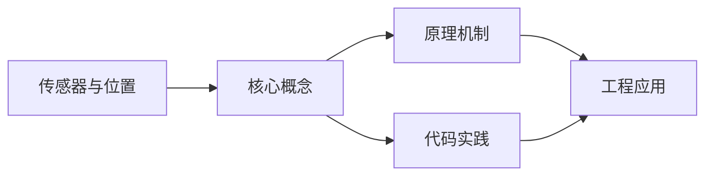
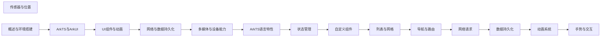

## 1. 学习目标（Bloom 分类）

本节按照布鲁姆教育目标分类学组织学习路径。本文主题为《传感器与位置》，属于 HarmonyOS 模块，读者可以根据自身阶段选择阅读深度。

记忆层面：能够准确复述本文的核心概念、术语与基本语法或操作步骤，并能够在提问或检索时快速定位对应知识点。能够说出 HarmonyOS 的核心概念、术语与标准写法。

理解层面：能够用自己的语言解释核心原理与工作机制，说明概念之间的因果关系，而不是机械记忆结论。能够解释 HarmonyOS 的工作原理与设计动机。

应用层面：能够在真实项目或练习场景中运用本文知识解决具体问题，写出正确且可维护的实现。能够编写符合 HarmonyOS 规范的完整实现。

分析层面：能够拆解复杂问题，比较本文主题与相邻概念的异同，识别边界条件与例外情况。能够分析 HarmonyOS 与相邻方案的差异与边界。

评价层面：能够根据约束条件（性能、可读性、安全、成本）评价不同方案的优劣，做出有依据的技术决策。能够根据场景评价 HarmonyOS 相关方案的优劣。

创造层面：能够把本文知识与其他模块知识组合，设计出新的解决方案或可复用的工程模式。能够组合 HarmonyOS 与其他技术设计完整方案。

通过本节学习，读者应当能够把《传感器与位置》纳入自己的知识网络，并与 HarmonyOS 模块的其他主题（ArkTS、ArkUI、分布式能力、应用开发）建立关联。

## 2. 历史动机与发展脉络

《传感器与位置》是 HarmonyOS 领域的重要主题。要真正理解它，需要先了解它解决的问题与演进过程。

HarmonyOS（鸿蒙）由华为于 2019 年发布，定位面向全场景的分布式操作系统；HarmonyOS NEXT（5.0，2024）去 Android 化，采用自研鸿蒙内核与 ArkTS 语言栈。
开发框架：ArkTS（TS 超集 + 声明式 UI 扩展）、ArkUI（声明式组件）、Stage 模型（应用模型）、方舟编译器。
分布式能力：跨端流转、分布式数据、一次开发多端部署（手机/平板/车机/穿戴）。

回到本文主题：传感器与位置 的提出与成熟，正是上述技术背景下的必然产物。早期实现往往以简单可用为目标，随着工程规模扩大，社区逐渐沉淀出标准做法与最佳实践；理解这一脉络，可以帮助读者判断“为什么文档中的推荐写法是现在这个样子”，也能在遇到历史遗留代码时准确识别其设计年代与取舍。


## 3. 形式化定义与核心概念精讲

本节把《传感器与位置》涉及的核心概念以“定义 + 讲解”的形式展开。读者应把定义当作工具，把讲解当作理解路径；两者结合才能形成可迁移的知识。

ArkTS 语法：基于 TypeScript 的类型系统，增加 @Component/@Entry/@State 等装饰器与 UI 描述语法。
ArkUI 组件：Column/Row/Stack 布局容器、Text/Button/Image 基础组件、List/Grid 容器组件；状态管理（@State/@Prop/@Link/@Provide）。
应用模型：Stage 模型以 UIAbility 为页面载体，EntryAbility 入口；module.json5 声明应用配置。

### 3.1 原文章节逐一精讲

原文档把主题拆分为 16 个小节，下面按顺序给出每一节的导读讲解，随后保留原文细节供精读。

#### 原文精读（完整保留）

# 传感器与位置 语法速查手册

> **符号约定**:`< >` 必填参数 | `[ ]` 可选参数

---

#### 概述

HarmonyOS 提供了丰富的传感器和位置服务 API。传感器包括加速度计、陀螺仪、磁力计、光线传感器等，可以感知设备的运动和环境状态。位置服务则通过 GPS、Wi-Fi 和基站等方式获取设备的地理位置信息。这些能力是运动健康、导航、AR 等应用的基础。

为什么需要传感器和位置服务？运动类应用需要加速度计来计步，导航类应用需要 GPS 来定位，相机应用需要陀螺仪来防抖，阅读类应用需要光线传感器来自动调节亮度。了解这些 API 的使用，能让你的应用更好地感知用户的物理环境。

#### 基础概念

**加速度传感器**：测量设备在三个轴（X、Y、Z）上的加速度，包括重力加速度。单位是 m/s^2。常用于计步、摇一摇等功能。

**陀螺仪传感器**：测量设备绕三个轴的旋转角速度，单位是 rad/s。常用于游戏控制、防抖等。

**磁力计**：测量周围磁场的强度，常用于电子罗盘。

**光线传感器**：测量环境光照强度，单位是 lux。常用于自动调节屏幕亮度。

**位置服务**：通过 GPS、Wi-Fi 和基站等方式获取经纬度坐标。精度从几米到几十米不等。

#### 快速上手

##### 获取加速度数据

```typescript
import sensor from '@ohos.sensor'

@Entry
@Component
struct AccelerometerDemo {
  @State x: number = 0
  @State y: number = 0
  @State z: number = 0

  aboutToAppear() {
    // 订阅加速度传感器数据
    sensor.on(sensor.SensorType.ACCELEROMETER, (data: sensor.AccelerometerResponse) => {
      this.x = data.x
      this.y = data.y
      this.z = data.z
    })
  }

  aboutToDisappear() {
    // 取消订阅，避免内存泄漏
    sensor.off(sensor.SensorType.ACCELEROMETER)
  }

  build() {
    Column() {
      Text('加速度传感器').fontSize(20).fontWeight(FontWeight.Bold)
      Text(`X轴: ${this.x.toFixed(2)} m/s²`)
      Text(`Y轴: ${this.y.toFixed(2)} m/s²`)
      Text(`Z轴: ${this.z.toFixed(2)} m/s²`)
    }
    .padding(16)
  }
}
```

##### 获取位置信息

```typescript
import geoLocationManager from '@ohos.geoLocationManager'

@Entry
@Component
struct LocationDemo {
  @State latitude: number = 0
  @State longitude: number = 0
  @State accuracy: number = 0

  async getCurrentLocation() {
    try {
      // 获取当前位置
      const location = await geoLocationManager.getCurrentLocation({
        priority: geoLocationManager.LocationRequestPriority.FIRST_FIX,
        scenario: geoLocationManager.LocationRequestScenario.UNSET,
        maxAccuracy: 0
      })

      this.latitude = location.latitude
      this.longitude = location.longitude
      this.accuracy = location.accuracy
    } catch (error) {
      console.error(`获取位置失败: ${error}`)
    }
  }

  build() {
    Column() {
      Text('位置信息').fontSize(20).fontWeight(FontWeight.Bold)
      Text(`纬度: ${this.latitude.toFixed(6)}`)
      Text(`经度: ${this.longitude.toFixed(6)}`)
      Text(`精度: ${this.accuracy.toFixed(1)} 米`)

      Button('获取当前位置').onClick(() => this.getCurrentLocation())
    }
    .padding(16)
  }
}
```

#### 详细用法

##### 传感器订阅与取消

```typescript
import sensor from '@ohos.sensor';

// 订阅传感器数据
// interval 参数控制采样频率
sensor.on(
  sensor.SensorType.ACCELEROMETER,
  (data) => {
    console.info(`加速度: x=${data.x}, y=${data.y}, z=${data.z}`);
  },
  { interval: 100000000 }
); // 间隔 100ms（单位：纳秒）

// 取消订阅
sensor.off(sensor.SensorType.ACCELEROMETER);

// 订阅一次性传感器数据（只获取一次）
sensor.once(sensor.SensorType.ACCELEROMETER, (data) => {
  console.info(`单次加速度: x=${data.x}, y=${data.y}, z=${data.z}`);
});
```

##### 陀螺仪

```typescript
import sensor from '@ohos.sensor'

@Component
struct GyroscopeDemo {
  @State alpha: number = 0  // 绕 Z 轴旋转
  @State beta: number = 0   // 绕 X 轴旋转
  @State gamma: number = 0  // 绕 Y 轴旋转

  aboutToAppear() {
    sensor.on(sensor.SensorType.GYROSCOPE, (data: sensor.GyroscopeResponse) => {
      this.alpha = data.x  // 角速度 rad/s
      this.beta = data.y
      this.gamma = data.z
    })
  }

  aboutToDisappear() {
    sensor.off(sensor.SensorType.GYROSCOPE)
  }

  build() {
    Column() {
      Text('陀螺仪').fontSize(20).fontWeight(FontWeight.Bold)
      Text(`X轴角速度: ${this.alpha.toFixed(3)} rad/s`)
      Text(`Y轴角速度: ${this.beta.toFixed(3)} rad/s`)
      Text(`Z轴角速度: ${this.gamma.toFixed(3)} rad/s`)
    }
    .padding(16)
  }
}
```

##### 光线传感器

```typescript
import sensor from '@ohos.sensor'

@Component
struct LightSensorDemo {
  @State illuminance: number = 0

  aboutToAppear() {
    sensor.on(sensor.SensorType.AMBIENT_LIGHT, (data: sensor.LightResponse) => {
      this.illuminance = data.intensity // 光照强度（lux）
    })
  }

  aboutToDisappear() {
    sensor.off(sensor.SensorType.AMBIENT_LIGHT)
  }

  build() {
    Column() {
      Text('光线传感器').fontSize(20).fontWeight(FontWeight.Bold)
      Text(`光照强度: ${this.illuminance.toFixed(1)} lux`)

      // 根据光照强度给出提示
      Text(this.getLightLevel())
        .fontSize(16)
        .margin({ top: 12 })
    }
    .padding(16)
  }

  private getLightLevel(): string {
    if (this.illuminance < 10) return '很暗（夜间）'
    if (this.illuminance < 100) return '较暗（室内）'
    if (this.illuminance < 500) return '正常（办公室）'
    if (this.illuminance < 1000) return '较亮（阴天户外）'
    return '很亮（晴天户外）'
  }
}
```

##### 持续位置追踪

```typescript
import geoLocationManager from '@ohos.geoLocationManager'

@Component
struct LocationTrackingDemo {
  @State locations: string[] = []
  private locationChange?: number

  startTracking() {
    // 订阅位置变化
    const requestInfo: geoLocationManager.LocationRequest = {
      priority: geoLocationManager.LocationRequestPriority.ACCURACY,
      scenario: geoLocationManager.LocationRequestScenario.NAVIGATION,
      timeInterval: 5,     // 最小更新间隔 5 秒
      distanceInterval: 10  // 最小更新距离 10 米
    }

    try {
      this.locationChange = geoLocationManager.on('locationChange', requestInfo, (location) => {
        const msg = `${location.latitude.toFixed(4)}, ${location.longitude.toFixed(4)}`
        this.locations = [...this.locations, msg]
      })
    } catch (error) {
      console.error(`订阅位置失败: ${error}`)
    }
  }

  stopTracking() {
    if (this.locationChange !== undefined) {
      geoLocationManager.off('locationChange', this.locationChange)
      this.locationChange = undefined
    }
  }

  aboutToDisappear() {
    this.stopTracking()
  }

  build() {
    Column() {
      Text('位置追踪').fontSize(20).fontWeight(FontWeight.Bold)

      List() {
        ForEach(this.locations, (loc: string, index: number) => {
          ListItem() {
            Text(`#${index + 1}: ${loc}`).fontSize(14)
          }
        })
      }
      .height(300)

      Row() {
        Button('开始追踪').onClick(() => this.startTracking())
        Button('停止追踪').onClick(() => this.stopTracking())
      }
    }
    .padding(16)
  }
}
```

##### 地理编码与逆地理编码

```typescript
import geoLocationManager from '@ohos.geoLocationManager';

// 地理编码：地址 -> 经纬度
async function geocode(address: string) {
  try {
    const results = await geoLocationManager.getAddressesFromLocationName(address, 1);
    if (results.length > 0) {
      const location = results[0];
      console.info(`纬度: ${location.latitude}, 经度: ${location.longitude}`);
    }
  } catch (error) {
    console.error(`地理编码失败: ${error}`);
  }
}

// 逆地理编码：经纬度 -> 地址
async function reverseGeocode(latitude: number, longitude: number) {
  try {
    const reverseCodeRequest: geoLocationManager.ReverseGeoCodeRequest = {
      latitude,
      longitude,
      maxItems: 1,
    };
    const results = await geoLocationManager.getAddressesFromLocation(reverseCodeRequest);
    if (results.length > 0) {
      const address = results[0];
      console.info(`地址: ${address.placeName}`);
      console.info(`详细: ${address.addressLine}`);
    }
  } catch (error) {
    console.error(`逆地理编码失败: ${error}`);
  }
}
```

#### 常见场景

##### 摇一摇

```typescript
import sensor from '@ohos.sensor'

@Component
struct ShakeDemo {
  @State shakeCount: number = 0
  private lastShakeTime: number = 0

  aboutToAppear() {
    sensor.on(sensor.SensorType.ACCELEROMETER, (data) => {
      // 计算加速度的合力
      const force = Math.sqrt(data.x * data.x + data.y * data.y + data.z * data.z)

      // 当合力超过阈值时认为是摇动
      // 正常静止时约 9.8（重力），摇动时会更大
      if (force > 20) {
        const now = Date.now()
        // 防抖：两次摇动间隔至少 500ms
        if (now - this.lastShakeTime > 500) {
          this.lastShakeTime = now
          this.shakeCount++
          console.info(`检测到摇动！第 ${this.shakeCount} 次`)
        }
      }
    })
  }

  aboutToDisappear() {
    sensor.off(sensor.SensorType.ACCELEROMETER)
  }

  build() {
    Column() {
      Text('摇一摇').fontSize(24).fontWeight(FontWeight.Bold)
      Text(`摇动次数: ${this.shakeCount}`).fontSize(18)
      Text('请摇动手机试试').fontSize(14).fontColor('#999999')
    }
    .width('100%')
    .height('100%')
    .justifyContent(FlexAlign.Center)
  }
}
```

##### 计步器

```typescript
import sensor from '@ohos.sensor'

@Component
struct PedometerDemo {
  @State steps: number = 0

  aboutToAppear() {
    // 订阅计步传感器
    sensor.on(sensor.SensorType.PEDOMETER, (data: sensor.PedometerResponse) => {
      this.steps = data.steps
    })
  }

  aboutToDisappear() {
    sensor.off(sensor.SensorType.PEDOMETER)
  }

  build() {
    Column() {
      Text('今日步数').fontSize(16).fontColor('#999999')
      Text(`${this.steps}`).fontSize(48).fontWeight(FontWeight.Bold)
      Text('步').fontSize(16).fontColor('#999999')
    }
    .width('100%')
    .height('100%')
    .justifyContent(FlexAlign.Center)
  }
}
```

#### 注意事项

**权限声明**：使用传感器和位置服务需要在 module.json5 中声明权限。位置服务需要 `ohos.permission.LOCATION`，加速度计等传感器通常不需要特殊权限。

**耗电问题**：持续订阅传感器数据和 GPS 定位会显著增加耗电。不使用时应及时取消订阅，并设置合理的采样间隔。

**传感器可用性**：不是所有设备都有所有传感器。使用前应检查传感器是否可用。

**GPS 精度**：GPS 在室内可能无法定位。位置服务的精度取决于定位方式：GPS 精度最高（几米），Wi-Fi 次之（几十米），基站最低（几百米）。

**主线程安全**：传感器回调在主线程执行，不要在回调中执行耗时操作。

#### 进阶用法

##### 传感器数据滤波

```typescript
// 低通滤波器：平滑传感器数据，减少噪声
class LowPassFilter {
  private alpha: number = 0.8; // 滤波系数，0-1 之间
  private filteredX: number = 0;
  private filteredY: number = 0;
  private filteredZ: number = 0;
  private initialized: boolean = false;

  filter(x: number, y: number, z: number): [number, number, number] {
    if (!this.initialized) {
      this.filteredX = x;
      this.filteredY = y;
      this.filteredZ = z;
      this.initialized = true;
    } else {
      // 低通滤波公式：output = alpha * output + (1 - alpha) * input
      this.filteredX = this.alpha * this.filteredX + (1 - this.alpha) * x;
      this.filteredY = this.alpha * this.filteredY + (1 - this.alpha) * y;
      this.filteredZ = this.alpha * this.filteredZ + (1 - this.alpha) * z;
    }
    return [this.filteredX, this.filteredY, this.filteredZ];
  }
}

// 使用滤波器
const filter = new LowPassFilter();
sensor.on(sensor.SensorType.ACCELEROMETER, (data) => {
  const [fx, fy, fz] = filter.filter(data.x, data.y, data.z);
  console.info(`滤波后: x=${fx.toFixed(2)}, y=${fy.toFixed(2)}, z=${fz.toFixed(2)}`);
});
```

##### 电子罗盘

```typescript
import sensor from '@ohos.sensor'

@Component
struct CompassDemo {
  @State heading: number = 0  // 朝向角度，0-360

  aboutToAppear() {
    // 使用方向传感器获取朝向
    sensor.on(sensor.SensorType.ORIENTATION, (data: sensor.OrientationResponse) => {
      this.heading = data.alpha  // alpha 是磁北方向角
    })
  }

  aboutToDisappear() {
    sensor.off(sensor.SensorType.ORIENTATION)
  }

  build() {
    Column() {
      Text('电子罗盘').fontSize(20).fontWeight(FontWeight.Bold)
      Text(`${this.heading.toFixed(0)} 度`).fontSize(48).fontWeight(FontWeight.Bold)
      Text(this.getDirection()).fontSize(18)
    }
    .width('100%')
    .height('100%')
    .justifyContent(FlexAlign.Center)
  }

  private getDirection(): string {
    const h = this.heading
    if (h < 22.5 || h >= 337.5) return '北'
    if (h < 67.5) return '东北'
    if (h < 112.5) return '东'
    if (h < 157.5) return '东南'
    if (h < 202.5) return '南'
    if (h < 247.5) return '西南'
    if (h < 292.5) return '西'
    return '西北'
  }
}
```
#### 传感器模块导入

**导入 sensor 模块**
`import sensor from '@ohos.sensor'`
```typescript
import sensor from '@ohos.sensor';
```

**通过 SensorServiceKit 导入**
`import { sensor } from '@kit.SensorServiceKit'`
```typescript
import { sensor } from '@kit.SensorServiceKit';
```

---

#### 传感器订阅 API

**订阅传感器数据**
`sensor.on(type: SensorType, callback: Callback<T>, options?: Options): void`
```typescript
sensor.on(sensor.SensorType.ACCELEROMETER, (data: sensor.AccelerometerResponse) => {
  console.info(`x=${data.x}, y=${data.y}, z=${data.z}`);
}, { interval: 100000000 }); // 间隔 100ms(单位:纳秒)
```

**通过 SensorId 订阅**
`sensor.on(type: SensorId, callback: Callback<T>, options?: Options): void`
```typescript
sensor.on(sensor.SensorId.ACCELEROMETER, (data: sensor.AccelerometerResponse) => {
  console.info(`x=${data.x}, y=${data.y}, z=${data.z}`);
}, { interval: 200000000 }); // 200ms 间隔
```

**取消订阅**
`sensor.off(type: SensorType | SensorId): void`
```typescript
sensor.off(sensor.SensorType.ACCELEROMETER);
```

**订阅一次性数据**
`sensor.once(type: SensorType | SensorId, callback: Callback<T>): void`
```typescript
sensor.once(sensor.SensorType.ACCELEROMETER, (data: sensor.AccelerometerResponse) => {
  console.info(`单次数据: x=${data.x}`);
});
```

**Options 配置**
```typescript
interface Options {
  interval?: number; // 采样间隔(纳秒)
}
```

---

#### SensorType 枚举

**SensorType 常用值**
`sensor.SensorType`
```typescript
enum SensorType {
  ACCELEROMETER = 'accelerometer',
  GYROSCOPE = 'gyroscope',
  AMBIENT_LIGHT = 'ambient_light',
  PROXIMITY = 'proximity',
  MAGNETIC_FIELD = 'magnetic_field',
  BAROMETER = 'barometer',
  HALL = 'hall',
  ORIENTATION = 'orientation',
  HEART_RATE = 'heart_rate',
  PEDOMETER = 'pedometer',
  STEP_DETECTOR = 'step_detector'
}
```

**SensorId 枚举**
`sensor.SensorId`
```typescript
enum SensorId {
  ACCELEROMETER = 1,
  GYROSCOPE = 2,
  AMBIENT_LIGHT = 5,
  PROXIMITY = 7,
  MAGNETIC_FIELD = 8,
  BAROMETER = 9,
  HALL = 10,
  ORIENTATION = 11,
  HEART_RATE = 12,
  PEDOMETER = 13,
  STEP_DETECTOR = 14
}
```

---

#### 传感器响应数据结构

**AccelerometerResponse**
```typescript
interface AccelerometerResponse {
  x: number; // X 轴加速度 m/s^2
  y: number; // Y 轴加速度 m/s^2
  z: number; // Z 轴加速度 m/s^2
}
```

**GyroscopeResponse**
```typescript
interface GyroscopeResponse {
  x: number; // 绕 X 轴角速度 rad/s
  y: number; // 绕 Y 轴角速度 rad/s
  z: number; // 绕 Z 轴角速度 rad/s
}
```

**LightResponse**
```typescript
interface LightResponse {
  intensity: number; // 光照强度 lux
}
```

**OrientationResponse**
```typescript
interface OrientationResponse {
  alpha: number; // 绕 Z 轴角度(磁北方向角) 0-360
  beta: number;  // 绕 X 轴角度 0-360
  gamma: number; // 绕 Y 轴角度 0-360
}
```

**PedometerResponse**
```typescript
interface PedometerResponse {
  steps: number; // 步数
}
```

---

#### 位置服务模块导入

**导入 geoLocationManager**
`import geoLocationManager from '@ohos.geoLocationManager'`
```typescript
import geoLocationManager from '@ohos.geoLocationManager';
```

**通过 LocationKit 导入**
`import { geoLocationManager } from '@kit.LocationKit'`
```typescript
import { geoLocationManager } from '@kit.LocationKit';
```

---

#### 位置服务 API

**获取当前位置**
`geoLocationManager.getCurrentLocation(request?: CurrentLocationRequest): Promise<Location>`
```typescript
const location = await geoLocationManager.getCurrentLocation({
  priority: geoLocationManager.LocationRequestPriority.FIRST_FIX,
  scenario: geoLocationManager.LocationRequestScenario.UNSET,
  maxAccuracy: 0
});
console.info(`纬度: ${location.latitude}, 经度: ${location.longitude}`);
```

**回调方式获取当前位置**
`geoLocationManager.getCurrentLocation(request: CurrentLocationRequest, callback: AsyncCallback<Location>): void`
```typescript
geoLocationManager.getCurrentLocation(request, (err, location) => {
  if (!err) {
    console.info(`纬度: ${location.latitude}`);
  }
});
```

**订阅位置变化**
`geoLocationManager.on('locationChange', request: LocationRequest, callback: Callback<Location>): number`
```typescript
const requestInfo: geoLocationManager.LocationRequest = {
  priority: geoLocationManager.LocationRequestPriority.ACCURACY,
  scenario: geoLocationManager.LocationRequestScenario.NAVIGATION,
  timeInterval: 5,      // 最小更新间隔 5 秒
  distanceInterval: 10  // 最小更新距离 10 米
};
const callbackId = geoLocationManager.on('locationChange', requestInfo, (location) => {
  console.info(`位置更新: ${location.latitude}, ${location.longitude}`);
});
```

**取消订阅位置变化**
`geoLocationManager.off('locationChange', callbackId: number): void`
```typescript
geoLocationManager.off('locationChange', callbackId);
```

**判断位置服务是否可用**
`geoLocationManager.isLocationEnabled(): boolean`
```typescript
const enabled = geoLocationManager.isLocationEnabled();
```

**启用位置服务**
`geoLocationManager.enableLocation(): Promise<void>`
```typescript
await geoLocationManager.enableLocation();
```

---

#### 位置请求配置

**CurrentLocationRequest**
```typescript
interface CurrentLocationRequest {
  priority?: LocationRequestPriority;
  scenario?: LocationRequestScenario;
  maxAccuracy?: number; // 最大精度(米)
}
```

**LocationRequest**
```typescript
interface LocationRequest {
  priority?: LocationRequestPriority;
  scenario?: LocationRequestScenario;
  timeInterval?: number;       // 最小更新间隔(秒)
  distanceInterval?: number;   // 最小更新距离(米)
  maxAccuracy?: number;
}
```

**LocationRequestPriority 枚举**
`geoLocationManager.LocationRequestPriority`
```typescript
enum LocationRequestPriority {
  UNSET = 0x300,
  ACCURACY = 0x301,
  LOW_POWER = 0x302,
  FIRST_FIX = 0x303
}
```

**LocationRequestScenario 枚举**
`geoLocationManager.LocationRequestScenario`
```typescript
enum LocationRequestScenario {
  UNSET = 0x300,
  NAVIGATION = 0x301,
  SPORT = 0x302,
  DAILY_LIFE_SERVICE = 0x303
}
```

---

#### Location 数据结构

**Location 位置信息**
```typescript
interface Location {
  latitude: number;    // 纬度
  longitude: number;   // 经度
  altitude: number;    // 海拔(米)
  accuracy: number;    // 精度(米)
  speed: number;       // 速度(m/s)
  timeStamp: number;   // 时间戳
  direction: number;   // 方向(度)
  timeSinceBoot: number;
}
```

---

#### 地理编码 API

**地址转经纬度**
`geoLocationManager.getAddressesFromLocationName(name: string, maxItems: number): Promise<Array<GeoAddress>>`
```typescript
const results = await geoLocationManager.getAddressesFromLocationName('北京市朝阳区', 1);
if (results.length > 0) {
  console.info(`纬度: ${results[0].latitude}, 经度: ${results[0].longitude}`);
}
```

**经纬度转地址**
`geoLocationManager.getAddressesFromLocation(request: ReverseGeoCodeRequest): Promise<Array<GeoAddress>>`
```typescript
const request: geoLocationManager.ReverseGeoCodeRequest = {
  latitude: 39.9042,
  longitude: 116.4074,
  maxItems: 1
};
const results = await geoLocationManager.getAddressesFromLocation(request);
if (results.length > 0) {
  console.info(`地址: ${results[0].placeName}`);
}
```

**ReverseGeoCodeRequest 配置**
```typescript
interface ReverseGeoCodeRequest {
  latitude: number;
  longitude: number;
  maxItems?: number;
}
```

**GeoAddress 结构**
```typescript
interface GeoAddress {
  latitude: number;
  longitude: number;
  placeName?: string;
  countryName?: string;
  administrativeArea?: string;
  locality?: string;
  subLocality?: string;
  addressLine?: string;
}
```


### 3.2 概念关系图

下面用 Mermaid 图表达本文核心概念之间的关系，帮助读者建立整体图景：



图中展示的是本文知识的结构化关系：核心概念是入口，原理机制解释“为什么”，代码实践演示“怎么做”，工程应用回答“何时用”。读者学习时可以把每个小节的内容挂接到对应节点上。

## 4. 理论推导与原理解析

本节深入《传感器与位置》背后的原理。理论部分不求面面俱到，而是聚焦“能解释现象、能指导实践”的关键推导。

ArkTS 语法：基于 TypeScript 的类型系统，增加 @Component/@Entry/@State 等装饰器与 UI 描述语法。
ArkUI 组件：Column/Row/Stack 布局容器、Text/Button/Image 基础组件、List/Grid 容器组件；状态管理（@State/@Prop/@Link/@Provide）。
应用模型：Stage 模型以 UIAbility 为页面载体，EntryAbility 入口；module.json5 声明应用配置。
生命周期：Ability 的 onCreate/onWindowStageCreate/onForeground/onBackground/onDestroy。

需要强调的是，理论推导与工程实践之间存在翻译层：理论给出的是理想化模型与边界条件，工程代码则必须处理真实环境中的例外。读者在学习时应先掌握理论的“标准情形”，再通过陷阱章节了解“非标准情形”。

## 5. 代码示例与逐行讲解

本节把原文中的代码示例系统整理，并为每个示例补充用途说明与讲解。读者不应只浏览代码，而应逐段对照讲解理解设计意图。

### 5.1 示例：获取加速度数据

该示例来自原文《获取加速度数据》小节，用于演示传感器与位置相关操作。阅读时请先看代码结构，再看其后的讲解。

```typescript
import sensor from '@ohos.sensor'

@Entry
@Component
struct AccelerometerDemo {
  @State x: number = 0
  @State y: number = 0
  @State z: number = 0

  aboutToAppear() {
    // 订阅加速度传感器数据
    sensor.on(sensor.SensorType.ACCELEROMETER, (data: sensor.AccelerometerResponse) => {
      this.x = data.x
      this.y = data.y
      this.z = data.z
    })
  }

  aboutToDisappear() {
    // 取消订阅，避免内存泄漏
    sensor.off(sensor.SensorType.ACCELEROMETER)
  }

  build() {
    Column() {
      Text('加速度传感器').fontSize(20).fontWeight(FontWeight.Bold)
      Text(`X轴: ${this.x.toFixed(2)} m/s²`)
      Text(`Y轴: ${this.y.toFixed(2)} m/s²`)
      Text(`Z轴: ${this.z.toFixed(2)} m/s²`)
    }
    .padding(16)
  }
}
```

讲解：这段代码演示了本节核心知识点。代码中的关键操作可以归纳为三步：准备（定义或初始化）、执行（核心逻辑）、收尾（释放资源或返回结果）。实际项目中，这三步往往被封装为函数或类，以提升复用性与可测试性。

关键点分析：

该示例共 29 行有效代码，包含 2 类关键结构（import、from）。其中：

- 入口与初始化部分负责建立上下文，对应实际项目中的启动或装配逻辑；
- 核心逻辑部分体现本文主题的主要操作，是阅读时最需要对照讲解理解的部分；
- 输出或返回部分把结果交给调用方，注意其类型与边界条件。

进阶思考路径：先尝试修改参数观察行为变化，再把示例中的模式迁移到自己的项目中；每次修改都记录预期与实测差异，这是把示例转化为能力的最快方式。

### 5.2 示例：获取位置信息

该示例来自原文《获取位置信息》小节，用于演示传感器与位置相关操作。阅读时请先看代码结构，再看其后的讲解。

```typescript
import geoLocationManager from '@ohos.geoLocationManager'

@Entry
@Component
struct LocationDemo {
  @State latitude: number = 0
  @State longitude: number = 0
  @State accuracy: number = 0

  async getCurrentLocation() {
    try {
      // 获取当前位置
      const location = await geoLocationManager.getCurrentLocation({
        priority: geoLocationManager.LocationRequestPriority.FIRST_FIX,
        scenario: geoLocationManager.LocationRequestScenario.UNSET,
        maxAccuracy: 0
      })

      this.latitude = location.latitude
      this.longitude = location.longitude
      this.accuracy = location.accuracy
    } catch (error) {
      console.error(`获取位置失败: ${error}`)
    }
  }

  build() {
    Column() {
      Text('位置信息').fontSize(20).fontWeight(FontWeight.Bold)
      Text(`纬度: ${this.latitude.toFixed(6)}`)
      Text(`经度: ${this.longitude.toFixed(6)}`)
      Text(`精度: ${this.accuracy.toFixed(1)} 米`)

      Button('获取当前位置').onClick(() => this.getCurrentLocation())
    }
    .padding(16)
  }
}
```

讲解：这段代码演示了本节核心知识点。代码中的关键操作可以归纳为三步：准备（定义或初始化）、执行（核心逻辑）、收尾（释放资源或返回结果）。实际项目中，这三步往往被封装为函数或类，以提升复用性与可测试性。

关键点分析：

该示例共 33 行有效代码，包含 2 类关键结构（import、from）。其中：

- 入口与初始化部分负责建立上下文，对应实际项目中的启动或装配逻辑；
- 核心逻辑部分体现本文主题的主要操作，是阅读时最需要对照讲解理解的部分；
- 输出或返回部分把结果交给调用方，注意其类型与边界条件。

进阶思考路径：先尝试修改参数观察行为变化，再把示例中的模式迁移到自己的项目中；每次修改都记录预期与实测差异，这是把示例转化为能力的最快方式。

### 5.3 示例：传感器订阅与取消

该示例来自原文《传感器订阅与取消》小节，用于演示传感器与位置相关操作。阅读时请先看代码结构，再看其后的讲解。

```typescript
import sensor from '@ohos.sensor';

// 订阅传感器数据
// interval 参数控制采样频率
sensor.on(
  sensor.SensorType.ACCELEROMETER,
  (data) => {
    console.info(`加速度: x=${data.x}, y=${data.y}, z=${data.z}`);
  },
  { interval: 100000000 }
); // 间隔 100ms（单位：纳秒）

// 取消订阅
sensor.off(sensor.SensorType.ACCELEROMETER);

// 订阅一次性传感器数据（只获取一次）
sensor.once(sensor.SensorType.ACCELEROMETER, (data) => {
  console.info(`单次加速度: x=${data.x}, y=${data.y}, z=${data.z}`);
});
```

讲解：这段代码演示了本节核心知识点。代码中的关键操作可以归纳为三步：准备（定义或初始化）、执行（核心逻辑）、收尾（释放资源或返回结果）。实际项目中，这三步往往被封装为函数或类，以提升复用性与可测试性。

关键点分析：

该示例共 16 行有效代码，包含 2 类关键结构（import、from）。其中：

- 入口与初始化部分负责建立上下文，对应实际项目中的启动或装配逻辑；
- 核心逻辑部分体现本文主题的主要操作，是阅读时最需要对照讲解理解的部分；
- 输出或返回部分把结果交给调用方，注意其类型与边界条件。

进阶思考路径：先尝试修改参数观察行为变化，再把示例中的模式迁移到自己的项目中；每次修改都记录预期与实测差异，这是把示例转化为能力的最快方式。

### 5.4 示例：陀螺仪

该示例来自原文《陀螺仪》小节，用于演示传感器与位置相关操作。阅读时请先看代码结构，再看其后的讲解。

```typescript
import sensor from '@ohos.sensor'

@Component
struct GyroscopeDemo {
  @State alpha: number = 0  // 绕 Z 轴旋转
  @State beta: number = 0   // 绕 X 轴旋转
  @State gamma: number = 0  // 绕 Y 轴旋转

  aboutToAppear() {
    sensor.on(sensor.SensorType.GYROSCOPE, (data: sensor.GyroscopeResponse) => {
      this.alpha = data.x  // 角速度 rad/s
      this.beta = data.y
      this.gamma = data.z
    })
  }

  aboutToDisappear() {
    sensor.off(sensor.SensorType.GYROSCOPE)
  }

  build() {
    Column() {
      Text('陀螺仪').fontSize(20).fontWeight(FontWeight.Bold)
      Text(`X轴角速度: ${this.alpha.toFixed(3)} rad/s`)
      Text(`Y轴角速度: ${this.beta.toFixed(3)} rad/s`)
      Text(`Z轴角速度: ${this.gamma.toFixed(3)} rad/s`)
    }
    .padding(16)
  }
}
```

讲解：这段代码演示了本节核心知识点。代码中的关键操作可以归纳为三步：准备（定义或初始化）、执行（核心逻辑）、收尾（释放资源或返回结果）。实际项目中，这三步往往被封装为函数或类，以提升复用性与可测试性。

关键点分析：

该示例共 26 行有效代码，包含 2 类关键结构（import、from）。其中：

- 入口与初始化部分负责建立上下文，对应实际项目中的启动或装配逻辑；
- 核心逻辑部分体现本文主题的主要操作，是阅读时最需要对照讲解理解的部分；
- 输出或返回部分把结果交给调用方，注意其类型与边界条件。

进阶思考路径：先尝试修改参数观察行为变化，再把示例中的模式迁移到自己的项目中；每次修改都记录预期与实测差异，这是把示例转化为能力的最快方式。

### 5.5 示例：光线传感器

该示例来自原文《光线传感器》小节，用于演示传感器与位置相关操作。阅读时请先看代码结构，再看其后的讲解。

```typescript
import sensor from '@ohos.sensor'

@Component
struct LightSensorDemo {
  @State illuminance: number = 0

  aboutToAppear() {
    sensor.on(sensor.SensorType.AMBIENT_LIGHT, (data: sensor.LightResponse) => {
      this.illuminance = data.intensity // 光照强度（lux）
    })
  }

  aboutToDisappear() {
    sensor.off(sensor.SensorType.AMBIENT_LIGHT)
  }

  build() {
    Column() {
      Text('光线传感器').fontSize(20).fontWeight(FontWeight.Bold)
      Text(`光照强度: ${this.illuminance.toFixed(1)} lux`)

      // 根据光照强度给出提示
      Text(this.getLightLevel())
        .fontSize(16)
        .margin({ top: 12 })
    }
    .padding(16)
  }

  private getLightLevel(): string {
    if (this.illuminance < 10) return '很暗（夜间）'
    if (this.illuminance < 100) return '较暗（室内）'
    if (this.illuminance < 500) return '正常（办公室）'
    if (this.illuminance < 1000) return '较亮（阴天户外）'
    return '很亮（晴天户外）'
  }
}
```

讲解：这段代码演示了本节核心知识点。代码中的关键操作可以归纳为三步：准备（定义或初始化）、执行（核心逻辑）、收尾（释放资源或返回结果）。实际项目中，这三步往往被封装为函数或类，以提升复用性与可测试性。

关键点分析：

该示例共 31 行有效代码，包含 4 类关键结构（import、from、if、return）。其中：

- 入口与初始化部分负责建立上下文，对应实际项目中的启动或装配逻辑；
- 核心逻辑部分体现本文主题的主要操作，是阅读时最需要对照讲解理解的部分；
- 输出或返回部分把结果交给调用方，注意其类型与边界条件。

进阶思考路径：先尝试修改参数观察行为变化，再把示例中的模式迁移到自己的项目中；每次修改都记录预期与实测差异，这是把示例转化为能力的最快方式。

### 5.6 示例：持续位置追踪

该示例来自原文《持续位置追踪》小节，用于演示传感器与位置相关操作。阅读时请先看代码结构，再看其后的讲解。

```typescript
import geoLocationManager from '@ohos.geoLocationManager'

@Component
struct LocationTrackingDemo {
  @State locations: string[] = []
  private locationChange?: number

  startTracking() {
    // 订阅位置变化
    const requestInfo: geoLocationManager.LocationRequest = {
      priority: geoLocationManager.LocationRequestPriority.ACCURACY,
      scenario: geoLocationManager.LocationRequestScenario.NAVIGATION,
      timeInterval: 5,     // 最小更新间隔 5 秒
      distanceInterval: 10  // 最小更新距离 10 米
    }

    try {
      this.locationChange = geoLocationManager.on('locationChange', requestInfo, (location) => {
        const msg = `${location.latitude.toFixed(4)}, ${location.longitude.toFixed(4)}`
        this.locations = [...this.locations, msg]
      })
    } catch (error) {
      console.error(`订阅位置失败: ${error}`)
    }
  }

  stopTracking() {
    if (this.locationChange !== undefined) {
      geoLocationManager.off('locationChange', this.locationChange)
      this.locationChange = undefined
    }
  }

  aboutToDisappear() {
    this.stopTracking()
  }

  build() {
    Column() {
      Text('位置追踪').fontSize(20).fontWeight(FontWeight.Bold)

      List() {
        ForEach(this.locations, (loc: string, index: number) => {
          ListItem() {
            Text(`#${index + 1}: ${loc}`).fontSize(14)
          }
        })
      }
      .height(300)

      Row() {
        Button('开始追踪').onClick(() => this.startTracking())
        Button('停止追踪').onClick(() => this.stopTracking())
      }
    }
    .padding(16)
  }
}
```

讲解：这段代码演示了本节核心知识点。代码中的关键操作可以归纳为三步：准备（定义或初始化）、执行（核心逻辑）、收尾（释放资源或返回结果）。实际项目中，这三步往往被封装为函数或类，以提升复用性与可测试性。

关键点分析：

该示例共 50 行有效代码，包含 3 类关键结构（import、from、if）。其中：

- 入口与初始化部分负责建立上下文，对应实际项目中的启动或装配逻辑；
- 核心逻辑部分体现本文主题的主要操作，是阅读时最需要对照讲解理解的部分；
- 输出或返回部分把结果交给调用方，注意其类型与边界条件。

进阶思考路径：先尝试修改参数观察行为变化，再把示例中的模式迁移到自己的项目中；每次修改都记录预期与实测差异，这是把示例转化为能力的最快方式。

### 5.7 示例：地理编码与逆地理编码

该示例来自原文《地理编码与逆地理编码》小节，用于演示传感器与位置相关操作。阅读时请先看代码结构，再看其后的讲解。

```typescript
import geoLocationManager from '@ohos.geoLocationManager';

// 地理编码：地址 -> 经纬度
async function geocode(address: string) {
  try {
    const results = await geoLocationManager.getAddressesFromLocationName(address, 1);
    if (results.length > 0) {
      const location = results[0];
      console.info(`纬度: ${location.latitude}, 经度: ${location.longitude}`);
    }
  } catch (error) {
    console.error(`地理编码失败: ${error}`);
  }
}

// 逆地理编码：经纬度 -> 地址
async function reverseGeocode(latitude: number, longitude: number) {
  try {
    const reverseCodeRequest: geoLocationManager.ReverseGeoCodeRequest = {
      latitude,
      longitude,
      maxItems: 1,
    };
    const results = await geoLocationManager.getAddressesFromLocation(reverseCodeRequest);
    if (results.length > 0) {
      const address = results[0];
      console.info(`地址: ${address.placeName}`);
      console.info(`详细: ${address.addressLine}`);
    }
  } catch (error) {
    console.error(`逆地理编码失败: ${error}`);
  }
}
```

讲解：这段代码演示了本节核心知识点。代码中的关键操作可以归纳为三步：准备（定义或初始化）、执行（核心逻辑）、收尾（释放资源或返回结果）。实际项目中，这三步往往被封装为函数或类，以提升复用性与可测试性。

关键点分析：

该示例共 31 行有效代码，包含 4 类关键结构（function、import、from、if）。其中：

- 入口与初始化部分负责建立上下文，对应实际项目中的启动或装配逻辑；
- 核心逻辑部分体现本文主题的主要操作，是阅读时最需要对照讲解理解的部分；
- 输出或返回部分把结果交给调用方，注意其类型与边界条件。

进阶思考路径：先尝试修改参数观察行为变化，再把示例中的模式迁移到自己的项目中；每次修改都记录预期与实测差异，这是把示例转化为能力的最快方式。

### 5.8 示例：摇一摇

该示例来自原文《摇一摇》小节，用于演示传感器与位置相关操作。阅读时请先看代码结构，再看其后的讲解。

```typescript
import sensor from '@ohos.sensor'

@Component
struct ShakeDemo {
  @State shakeCount: number = 0
  private lastShakeTime: number = 0

  aboutToAppear() {
    sensor.on(sensor.SensorType.ACCELEROMETER, (data) => {
      // 计算加速度的合力
      const force = Math.sqrt(data.x * data.x + data.y * data.y + data.z * data.z)

      // 当合力超过阈值时认为是摇动
      // 正常静止时约 9.8（重力），摇动时会更大
      if (force > 20) {
        const now = Date.now()
        // 防抖：两次摇动间隔至少 500ms
        if (now - this.lastShakeTime > 500) {
          this.lastShakeTime = now
          this.shakeCount++
          console.info(`检测到摇动！第 ${this.shakeCount} 次`)
        }
      }
    })
  }

  aboutToDisappear() {
    sensor.off(sensor.SensorType.ACCELEROMETER)
  }

  build() {
    Column() {
      Text('摇一摇').fontSize(24).fontWeight(FontWeight.Bold)
      Text(`摇动次数: ${this.shakeCount}`).fontSize(18)
      Text('请摇动手机试试').fontSize(14).fontColor('#999999')
    }
    .width('100%')
    .height('100%')
    .justifyContent(FlexAlign.Center)
  }
}
```

讲解：这段代码演示了本节核心知识点。代码中的关键操作可以归纳为三步：准备（定义或初始化）、执行（核心逻辑）、收尾（释放资源或返回结果）。实际项目中，这三步往往被封装为函数或类，以提升复用性与可测试性。

关键点分析：

该示例共 36 行有效代码，包含 3 类关键结构（import、from、if）。其中：

- 入口与初始化部分负责建立上下文，对应实际项目中的启动或装配逻辑；
- 核心逻辑部分体现本文主题的主要操作，是阅读时最需要对照讲解理解的部分；
- 输出或返回部分把结果交给调用方，注意其类型与边界条件。

进阶思考路径：先尝试修改参数观察行为变化，再把示例中的模式迁移到自己的项目中；每次修改都记录预期与实测差异，这是把示例转化为能力的最快方式。

### 5.9 示例：计步器

该示例来自原文《计步器》小节，用于演示传感器与位置相关操作。阅读时请先看代码结构，再看其后的讲解。

```typescript
import sensor from '@ohos.sensor'

@Component
struct PedometerDemo {
  @State steps: number = 0

  aboutToAppear() {
    // 订阅计步传感器
    sensor.on(sensor.SensorType.PEDOMETER, (data: sensor.PedometerResponse) => {
      this.steps = data.steps
    })
  }

  aboutToDisappear() {
    sensor.off(sensor.SensorType.PEDOMETER)
  }

  build() {
    Column() {
      Text('今日步数').fontSize(16).fontColor('#999999')
      Text(`${this.steps}`).fontSize(48).fontWeight(FontWeight.Bold)
      Text('步').fontSize(16).fontColor('#999999')
    }
    .width('100%')
    .height('100%')
    .justifyContent(FlexAlign.Center)
  }
}
```

讲解：这段代码演示了本节核心知识点。代码中的关键操作可以归纳为三步：准备（定义或初始化）、执行（核心逻辑）、收尾（释放资源或返回结果）。实际项目中，这三步往往被封装为函数或类，以提升复用性与可测试性。

关键点分析：

该示例共 24 行有效代码，包含 2 类关键结构（import、from）。其中：

- 入口与初始化部分负责建立上下文，对应实际项目中的启动或装配逻辑；
- 核心逻辑部分体现本文主题的主要操作，是阅读时最需要对照讲解理解的部分；
- 输出或返回部分把结果交给调用方，注意其类型与边界条件。

进阶思考路径：先尝试修改参数观察行为变化，再把示例中的模式迁移到自己的项目中；每次修改都记录预期与实测差异，这是把示例转化为能力的最快方式。

### 5.10 示例：传感器数据滤波

该示例来自原文《传感器数据滤波》小节，用于演示传感器与位置相关操作。阅读时请先看代码结构，再看其后的讲解。

```typescript
// 低通滤波器：平滑传感器数据，减少噪声
class LowPassFilter {
  private alpha: number = 0.8; // 滤波系数，0-1 之间
  private filteredX: number = 0;
  private filteredY: number = 0;
  private filteredZ: number = 0;
  private initialized: boolean = false;

  filter(x: number, y: number, z: number): [number, number, number] {
    if (!this.initialized) {
      this.filteredX = x;
      this.filteredY = y;
      this.filteredZ = z;
      this.initialized = true;
    } else {
      // 低通滤波公式：output = alpha * output + (1 - alpha) * input
      this.filteredX = this.alpha * this.filteredX + (1 - this.alpha) * x;
      this.filteredY = this.alpha * this.filteredY + (1 - this.alpha) * y;
      this.filteredZ = this.alpha * this.filteredZ + (1 - this.alpha) * z;
    }
    return [this.filteredX, this.filteredY, this.filteredZ];
  }
}

// 使用滤波器
const filter = new LowPassFilter();
sensor.on(sensor.SensorType.ACCELEROMETER, (data) => {
  const [fx, fy, fz] = filter.filter(data.x, data.y, data.z);
  console.info(`滤波后: x=${fx.toFixed(2)}, y=${fy.toFixed(2)}, z=${fz.toFixed(2)}`);
});
```

讲解：这段代码演示了本节核心知识点。代码中的关键操作可以归纳为三步：准备（定义或初始化）、执行（核心逻辑）、收尾（释放资源或返回结果）。实际项目中，这三步往往被封装为函数或类，以提升复用性与可测试性。

关键点分析：

该示例共 28 行有效代码，包含 3 类关键结构（class、if、return）。其中：

- 入口与初始化部分负责建立上下文，对应实际项目中的启动或装配逻辑；
- 核心逻辑部分体现本文主题的主要操作，是阅读时最需要对照讲解理解的部分；
- 输出或返回部分把结果交给调用方，注意其类型与边界条件。

进阶思考路径：先尝试修改参数观察行为变化，再把示例中的模式迁移到自己的项目中；每次修改都记录预期与实测差异，这是把示例转化为能力的最快方式。

### 5.11 示例：电子罗盘

该示例来自原文《电子罗盘》小节，用于演示传感器与位置相关操作。阅读时请先看代码结构，再看其后的讲解。

```typescript
import sensor from '@ohos.sensor'

@Component
struct CompassDemo {
  @State heading: number = 0  // 朝向角度，0-360

  aboutToAppear() {
    // 使用方向传感器获取朝向
    sensor.on(sensor.SensorType.ORIENTATION, (data: sensor.OrientationResponse) => {
      this.heading = data.alpha  // alpha 是磁北方向角
    })
  }

  aboutToDisappear() {
    sensor.off(sensor.SensorType.ORIENTATION)
  }

  build() {
    Column() {
      Text('电子罗盘').fontSize(20).fontWeight(FontWeight.Bold)
      Text(`${this.heading.toFixed(0)} 度`).fontSize(48).fontWeight(FontWeight.Bold)
      Text(this.getDirection()).fontSize(18)
    }
    .width('100%')
    .height('100%')
    .justifyContent(FlexAlign.Center)
  }

  private getDirection(): string {
    const h = this.heading
    if (h < 22.5 || h >= 337.5) return '北'
    if (h < 67.5) return '东北'
    if (h < 112.5) return '东'
    if (h < 157.5) return '东南'
    if (h < 202.5) return '南'
    if (h < 247.5) return '西南'
    if (h < 292.5) return '西'
    return '西北'
  }
}
```

讲解：这段代码演示了本节核心知识点。代码中的关键操作可以归纳为三步：准备（定义或初始化）、执行（核心逻辑）、收尾（释放资源或返回结果）。实际项目中，这三步往往被封装为函数或类，以提升复用性与可测试性。

关键点分析：

该示例共 35 行有效代码，包含 4 类关键结构（import、from、if、return）。其中：

- 入口与初始化部分负责建立上下文，对应实际项目中的启动或装配逻辑；
- 核心逻辑部分体现本文主题的主要操作，是阅读时最需要对照讲解理解的部分；
- 输出或返回部分把结果交给调用方，注意其类型与边界条件。

进阶思考路径：先尝试修改参数观察行为变化，再把示例中的模式迁移到自己的项目中；每次修改都记录预期与实测差异，这是把示例转化为能力的最快方式。

### 5.12 示例：传感器模块导入

该示例来自原文《传感器模块导入》小节，用于演示传感器与位置相关操作。阅读时请先看代码结构，再看其后的讲解。

```typescript
import sensor from '@ohos.sensor';
```

讲解：这段代码演示了本节核心知识点。代码中的关键操作可以归纳为三步：准备（定义或初始化）、执行（核心逻辑）、收尾（释放资源或返回结果）。实际项目中，这三步往往被封装为函数或类，以提升复用性与可测试性。

关键点分析：

该示例共 1 行有效代码，包含 2 类关键结构（import、from）。其中：

- 入口与初始化部分负责建立上下文，对应实际项目中的启动或装配逻辑；
- 核心逻辑部分体现本文主题的主要操作，是阅读时最需要对照讲解理解的部分；
- 输出或返回部分把结果交给调用方，注意其类型与边界条件。

进阶思考路径：先尝试修改参数观察行为变化，再把示例中的模式迁移到自己的项目中；每次修改都记录预期与实测差异，这是把示例转化为能力的最快方式。

### 5.13 示例：传感器模块导入

该示例来自原文《传感器模块导入》小节，用于演示传感器与位置相关操作。阅读时请先看代码结构，再看其后的讲解。

```typescript
import { sensor } from '@kit.SensorServiceKit';
```

讲解：这段代码演示了本节核心知识点。代码中的关键操作可以归纳为三步：准备（定义或初始化）、执行（核心逻辑）、收尾（释放资源或返回结果）。实际项目中，这三步往往被封装为函数或类，以提升复用性与可测试性。

关键点分析：

该示例共 1 行有效代码，包含 2 类关键结构（import、from）。其中：

- 入口与初始化部分负责建立上下文，对应实际项目中的启动或装配逻辑；
- 核心逻辑部分体现本文主题的主要操作，是阅读时最需要对照讲解理解的部分；
- 输出或返回部分把结果交给调用方，注意其类型与边界条件。

进阶思考路径：先尝试修改参数观察行为变化，再把示例中的模式迁移到自己的项目中；每次修改都记录预期与实测差异，这是把示例转化为能力的最快方式。

### 5.14 示例：传感器订阅 API

该示例来自原文《传感器订阅 API》小节，用于演示传感器与位置相关操作。阅读时请先看代码结构，再看其后的讲解。

```typescript
sensor.on(sensor.SensorType.ACCELEROMETER, (data: sensor.AccelerometerResponse) => {
  console.info(`x=${data.x}, y=${data.y}, z=${data.z}`);
}, { interval: 100000000 }); // 间隔 100ms(单位:纳秒)
```

讲解：这段代码演示了本节核心知识点。代码中的关键操作可以归纳为三步：准备（定义或初始化）、执行（核心逻辑）、收尾（释放资源或返回结果）。实际项目中，这三步往往被封装为函数或类，以提升复用性与可测试性。

关键点分析：

该示例共 3 行有效代码，结构以数据或配置为主。阅读时应关注：数据字段的含义、配置项的作用，以及它们与运行行为的对应关系。

进阶思考路径：先尝试修改参数观察行为变化，再把示例中的模式迁移到自己的项目中；每次修改都记录预期与实测差异，这是把示例转化为能力的最快方式。

### 5.15 示例：传感器订阅 API

该示例来自原文《传感器订阅 API》小节，用于演示传感器与位置相关操作。阅读时请先看代码结构，再看其后的讲解。

```typescript
sensor.on(sensor.SensorId.ACCELEROMETER, (data: sensor.AccelerometerResponse) => {
  console.info(`x=${data.x}, y=${data.y}, z=${data.z}`);
}, { interval: 200000000 }); // 200ms 间隔
```

讲解：这段代码演示了本节核心知识点。代码中的关键操作可以归纳为三步：准备（定义或初始化）、执行（核心逻辑）、收尾（释放资源或返回结果）。实际项目中，这三步往往被封装为函数或类，以提升复用性与可测试性。

关键点分析：

该示例共 3 行有效代码，结构以数据或配置为主。阅读时应关注：数据字段的含义、配置项的作用，以及它们与运行行为的对应关系。

进阶思考路径：先尝试修改参数观察行为变化，再把示例中的模式迁移到自己的项目中；每次修改都记录预期与实测差异，这是把示例转化为能力的最快方式。

### 5.16 示例：传感器订阅 API

该示例来自原文《传感器订阅 API》小节，用于演示传感器与位置相关操作。阅读时请先看代码结构，再看其后的讲解。

```typescript
sensor.off(sensor.SensorType.ACCELEROMETER);
```

讲解：这段代码演示了本节核心知识点。代码中的关键操作可以归纳为三步：准备（定义或初始化）、执行（核心逻辑）、收尾（释放资源或返回结果）。实际项目中，这三步往往被封装为函数或类，以提升复用性与可测试性。

关键点分析：

该示例共 1 行有效代码，结构以数据或配置为主。阅读时应关注：数据字段的含义、配置项的作用，以及它们与运行行为的对应关系。

进阶思考路径：先尝试修改参数观察行为变化，再把示例中的模式迁移到自己的项目中；每次修改都记录预期与实测差异，这是把示例转化为能力的最快方式。

### 5.17 示例：传感器订阅 API

该示例来自原文《传感器订阅 API》小节，用于演示传感器与位置相关操作。阅读时请先看代码结构，再看其后的讲解。

```typescript
sensor.once(sensor.SensorType.ACCELEROMETER, (data: sensor.AccelerometerResponse) => {
  console.info(`单次数据: x=${data.x}`);
});
```

讲解：这段代码演示了本节核心知识点。代码中的关键操作可以归纳为三步：准备（定义或初始化）、执行（核心逻辑）、收尾（释放资源或返回结果）。实际项目中，这三步往往被封装为函数或类，以提升复用性与可测试性。

关键点分析：

该示例共 3 行有效代码，结构以数据或配置为主。阅读时应关注：数据字段的含义、配置项的作用，以及它们与运行行为的对应关系。

进阶思考路径：先尝试修改参数观察行为变化，再把示例中的模式迁移到自己的项目中；每次修改都记录预期与实测差异，这是把示例转化为能力的最快方式。

### 5.18 示例：传感器订阅 API

该示例来自原文《传感器订阅 API》小节，用于演示传感器与位置相关操作。阅读时请先看代码结构，再看其后的讲解。

```typescript
interface Options {
  interval?: number; // 采样间隔(纳秒)
}
```

讲解：这段代码演示了本节核心知识点。代码中的关键操作可以归纳为三步：准备（定义或初始化）、执行（核心逻辑）、收尾（释放资源或返回结果）。实际项目中，这三步往往被封装为函数或类，以提升复用性与可测试性。

关键点分析：

该示例共 3 行有效代码，结构以数据或配置为主。阅读时应关注：数据字段的含义、配置项的作用，以及它们与运行行为的对应关系。

进阶思考路径：先尝试修改参数观察行为变化，再把示例中的模式迁移到自己的项目中；每次修改都记录预期与实测差异，这是把示例转化为能力的最快方式。

### 5.19 示例：SensorType 枚举

该示例来自原文《SensorType 枚举》小节，用于演示传感器与位置相关操作。阅读时请先看代码结构，再看其后的讲解。

```typescript
enum SensorType {
  ACCELEROMETER = 'accelerometer',
  GYROSCOPE = 'gyroscope',
  AMBIENT_LIGHT = 'ambient_light',
  PROXIMITY = 'proximity',
  MAGNETIC_FIELD = 'magnetic_field',
  BAROMETER = 'barometer',
  HALL = 'hall',
  ORIENTATION = 'orientation',
  HEART_RATE = 'heart_rate',
  PEDOMETER = 'pedometer',
  STEP_DETECTOR = 'step_detector'
}
```

讲解：这段代码演示了本节核心知识点。代码中的关键操作可以归纳为三步：准备（定义或初始化）、执行（核心逻辑）、收尾（释放资源或返回结果）。实际项目中，这三步往往被封装为函数或类，以提升复用性与可测试性。

关键点分析：

该示例共 13 行有效代码，结构以数据或配置为主。阅读时应关注：数据字段的含义、配置项的作用，以及它们与运行行为的对应关系。

进阶思考路径：先尝试修改参数观察行为变化，再把示例中的模式迁移到自己的项目中；每次修改都记录预期与实测差异，这是把示例转化为能力的最快方式。

### 5.20 示例：SensorType 枚举

该示例来自原文《SensorType 枚举》小节，用于演示传感器与位置相关操作。阅读时请先看代码结构，再看其后的讲解。

```typescript
enum SensorId {
  ACCELEROMETER = 1,
  GYROSCOPE = 2,
  AMBIENT_LIGHT = 5,
  PROXIMITY = 7,
  MAGNETIC_FIELD = 8,
  BAROMETER = 9,
  HALL = 10,
  ORIENTATION = 11,
  HEART_RATE = 12,
  PEDOMETER = 13,
  STEP_DETECTOR = 14
}
```

讲解：这段代码演示了本节核心知识点。代码中的关键操作可以归纳为三步：准备（定义或初始化）、执行（核心逻辑）、收尾（释放资源或返回结果）。实际项目中，这三步往往被封装为函数或类，以提升复用性与可测试性。

关键点分析：

该示例共 13 行有效代码，结构以数据或配置为主。阅读时应关注：数据字段的含义、配置项的作用，以及它们与运行行为的对应关系。

进阶思考路径：先尝试修改参数观察行为变化，再把示例中的模式迁移到自己的项目中；每次修改都记录预期与实测差异，这是把示例转化为能力的最快方式。

### 5.21 示例：传感器响应数据结构

该示例来自原文《传感器响应数据结构》小节，用于演示传感器与位置相关操作。阅读时请先看代码结构，再看其后的讲解。

```typescript
interface AccelerometerResponse {
  x: number; // X 轴加速度 m/s^2
  y: number; // Y 轴加速度 m/s^2
  z: number; // Z 轴加速度 m/s^2
}
```

讲解：这段代码演示了本节核心知识点。代码中的关键操作可以归纳为三步：准备（定义或初始化）、执行（核心逻辑）、收尾（释放资源或返回结果）。实际项目中，这三步往往被封装为函数或类，以提升复用性与可测试性。

关键点分析：

该示例共 5 行有效代码，结构以数据或配置为主。阅读时应关注：数据字段的含义、配置项的作用，以及它们与运行行为的对应关系。

进阶思考路径：先尝试修改参数观察行为变化，再把示例中的模式迁移到自己的项目中；每次修改都记录预期与实测差异，这是把示例转化为能力的最快方式。

### 5.22 示例：传感器响应数据结构

该示例来自原文《传感器响应数据结构》小节，用于演示传感器与位置相关操作。阅读时请先看代码结构，再看其后的讲解。

```typescript
interface GyroscopeResponse {
  x: number; // 绕 X 轴角速度 rad/s
  y: number; // 绕 Y 轴角速度 rad/s
  z: number; // 绕 Z 轴角速度 rad/s
}
```

讲解：这段代码演示了本节核心知识点。代码中的关键操作可以归纳为三步：准备（定义或初始化）、执行（核心逻辑）、收尾（释放资源或返回结果）。实际项目中，这三步往往被封装为函数或类，以提升复用性与可测试性。

关键点分析：

该示例共 5 行有效代码，结构以数据或配置为主。阅读时应关注：数据字段的含义、配置项的作用，以及它们与运行行为的对应关系。

进阶思考路径：先尝试修改参数观察行为变化，再把示例中的模式迁移到自己的项目中；每次修改都记录预期与实测差异，这是把示例转化为能力的最快方式。

### 5.23 示例：传感器响应数据结构

该示例来自原文《传感器响应数据结构》小节，用于演示传感器与位置相关操作。阅读时请先看代码结构，再看其后的讲解。

```typescript
interface LightResponse {
  intensity: number; // 光照强度 lux
}
```

讲解：这段代码演示了本节核心知识点。代码中的关键操作可以归纳为三步：准备（定义或初始化）、执行（核心逻辑）、收尾（释放资源或返回结果）。实际项目中，这三步往往被封装为函数或类，以提升复用性与可测试性。

关键点分析：

该示例共 3 行有效代码，结构以数据或配置为主。阅读时应关注：数据字段的含义、配置项的作用，以及它们与运行行为的对应关系。

进阶思考路径：先尝试修改参数观察行为变化，再把示例中的模式迁移到自己的项目中；每次修改都记录预期与实测差异，这是把示例转化为能力的最快方式。

### 5.24 示例：传感器响应数据结构

该示例来自原文《传感器响应数据结构》小节，用于演示传感器与位置相关操作。阅读时请先看代码结构，再看其后的讲解。

```typescript
interface OrientationResponse {
  alpha: number; // 绕 Z 轴角度(磁北方向角) 0-360
  beta: number;  // 绕 X 轴角度 0-360
  gamma: number; // 绕 Y 轴角度 0-360
}
```

讲解：这段代码演示了本节核心知识点。代码中的关键操作可以归纳为三步：准备（定义或初始化）、执行（核心逻辑）、收尾（释放资源或返回结果）。实际项目中，这三步往往被封装为函数或类，以提升复用性与可测试性。

关键点分析：

该示例共 5 行有效代码，结构以数据或配置为主。阅读时应关注：数据字段的含义、配置项的作用，以及它们与运行行为的对应关系。

进阶思考路径：先尝试修改参数观察行为变化，再把示例中的模式迁移到自己的项目中；每次修改都记录预期与实测差异，这是把示例转化为能力的最快方式。

### 5.25 示例：传感器响应数据结构

该示例来自原文《传感器响应数据结构》小节，用于演示传感器与位置相关操作。阅读时请先看代码结构，再看其后的讲解。

```typescript
interface PedometerResponse {
  steps: number; // 步数
}
```

讲解：这段代码演示了本节核心知识点。代码中的关键操作可以归纳为三步：准备（定义或初始化）、执行（核心逻辑）、收尾（释放资源或返回结果）。实际项目中，这三步往往被封装为函数或类，以提升复用性与可测试性。

关键点分析：

该示例共 3 行有效代码，结构以数据或配置为主。阅读时应关注：数据字段的含义、配置项的作用，以及它们与运行行为的对应关系。

进阶思考路径：先尝试修改参数观察行为变化，再把示例中的模式迁移到自己的项目中；每次修改都记录预期与实测差异，这是把示例转化为能力的最快方式。

### 5.26 示例：位置服务模块导入

该示例来自原文《位置服务模块导入》小节，用于演示传感器与位置相关操作。阅读时请先看代码结构，再看其后的讲解。

```typescript
import geoLocationManager from '@ohos.geoLocationManager';
```

讲解：这段代码演示了本节核心知识点。代码中的关键操作可以归纳为三步：准备（定义或初始化）、执行（核心逻辑）、收尾（释放资源或返回结果）。实际项目中，这三步往往被封装为函数或类，以提升复用性与可测试性。

关键点分析：

该示例共 1 行有效代码，包含 2 类关键结构（import、from）。其中：

- 入口与初始化部分负责建立上下文，对应实际项目中的启动或装配逻辑；
- 核心逻辑部分体现本文主题的主要操作，是阅读时最需要对照讲解理解的部分；
- 输出或返回部分把结果交给调用方，注意其类型与边界条件。

进阶思考路径：先尝试修改参数观察行为变化，再把示例中的模式迁移到自己的项目中；每次修改都记录预期与实测差异，这是把示例转化为能力的最快方式。

### 5.27 示例：位置服务模块导入

该示例来自原文《位置服务模块导入》小节，用于演示传感器与位置相关操作。阅读时请先看代码结构，再看其后的讲解。

```typescript
import { geoLocationManager } from '@kit.LocationKit';
```

讲解：这段代码演示了本节核心知识点。代码中的关键操作可以归纳为三步：准备（定义或初始化）、执行（核心逻辑）、收尾（释放资源或返回结果）。实际项目中，这三步往往被封装为函数或类，以提升复用性与可测试性。

关键点分析：

该示例共 1 行有效代码，包含 2 类关键结构（import、from）。其中：

- 入口与初始化部分负责建立上下文，对应实际项目中的启动或装配逻辑；
- 核心逻辑部分体现本文主题的主要操作，是阅读时最需要对照讲解理解的部分；
- 输出或返回部分把结果交给调用方，注意其类型与边界条件。

进阶思考路径：先尝试修改参数观察行为变化，再把示例中的模式迁移到自己的项目中；每次修改都记录预期与实测差异，这是把示例转化为能力的最快方式。

### 5.28 示例：位置服务 API

该示例来自原文《位置服务 API》小节，用于演示传感器与位置相关操作。阅读时请先看代码结构，再看其后的讲解。

```typescript
const location = await geoLocationManager.getCurrentLocation({
  priority: geoLocationManager.LocationRequestPriority.FIRST_FIX,
  scenario: geoLocationManager.LocationRequestScenario.UNSET,
  maxAccuracy: 0
});
console.info(`纬度: ${location.latitude}, 经度: ${location.longitude}`);
```

讲解：这段代码演示了本节核心知识点。代码中的关键操作可以归纳为三步：准备（定义或初始化）、执行（核心逻辑）、收尾（释放资源或返回结果）。实际项目中，这三步往往被封装为函数或类，以提升复用性与可测试性。

关键点分析：

该示例共 6 行有效代码，结构以数据或配置为主。阅读时应关注：数据字段的含义、配置项的作用，以及它们与运行行为的对应关系。

进阶思考路径：先尝试修改参数观察行为变化，再把示例中的模式迁移到自己的项目中；每次修改都记录预期与实测差异，这是把示例转化为能力的最快方式。

### 5.29 示例：位置服务 API

该示例来自原文《位置服务 API》小节，用于演示传感器与位置相关操作。阅读时请先看代码结构，再看其后的讲解。

```typescript
geoLocationManager.getCurrentLocation(request, (err, location) => {
  if (!err) {
    console.info(`纬度: ${location.latitude}`);
  }
});
```

讲解：这段代码演示了本节核心知识点。代码中的关键操作可以归纳为三步：准备（定义或初始化）、执行（核心逻辑）、收尾（释放资源或返回结果）。实际项目中，这三步往往被封装为函数或类，以提升复用性与可测试性。

关键点分析：

该示例共 5 行有效代码，包含 1 类关键结构（if）。其中：

- 入口与初始化部分负责建立上下文，对应实际项目中的启动或装配逻辑；
- 核心逻辑部分体现本文主题的主要操作，是阅读时最需要对照讲解理解的部分；
- 输出或返回部分把结果交给调用方，注意其类型与边界条件。

进阶思考路径：先尝试修改参数观察行为变化，再把示例中的模式迁移到自己的项目中；每次修改都记录预期与实测差异，这是把示例转化为能力的最快方式。

### 5.30 示例：位置服务 API

该示例来自原文《位置服务 API》小节，用于演示传感器与位置相关操作。阅读时请先看代码结构，再看其后的讲解。

```typescript
const requestInfo: geoLocationManager.LocationRequest = {
  priority: geoLocationManager.LocationRequestPriority.ACCURACY,
  scenario: geoLocationManager.LocationRequestScenario.NAVIGATION,
  timeInterval: 5,      // 最小更新间隔 5 秒
  distanceInterval: 10  // 最小更新距离 10 米
};
const callbackId = geoLocationManager.on('locationChange', requestInfo, (location) => {
  console.info(`位置更新: ${location.latitude}, ${location.longitude}`);
});
```

讲解：这段代码演示了本节核心知识点。代码中的关键操作可以归纳为三步：准备（定义或初始化）、执行（核心逻辑）、收尾（释放资源或返回结果）。实际项目中，这三步往往被封装为函数或类，以提升复用性与可测试性。

关键点分析：

该示例共 9 行有效代码，结构以数据或配置为主。阅读时应关注：数据字段的含义、配置项的作用，以及它们与运行行为的对应关系。

进阶思考路径：先尝试修改参数观察行为变化，再把示例中的模式迁移到自己的项目中；每次修改都记录预期与实测差异，这是把示例转化为能力的最快方式。

### 5.31 示例：位置服务 API

该示例来自原文《位置服务 API》小节，用于演示传感器与位置相关操作。阅读时请先看代码结构，再看其后的讲解。

```typescript
geoLocationManager.off('locationChange', callbackId);
```

讲解：这段代码演示了本节核心知识点。代码中的关键操作可以归纳为三步：准备（定义或初始化）、执行（核心逻辑）、收尾（释放资源或返回结果）。实际项目中，这三步往往被封装为函数或类，以提升复用性与可测试性。

关键点分析：

该示例共 1 行有效代码，结构以数据或配置为主。阅读时应关注：数据字段的含义、配置项的作用，以及它们与运行行为的对应关系。

进阶思考路径：先尝试修改参数观察行为变化，再把示例中的模式迁移到自己的项目中；每次修改都记录预期与实测差异，这是把示例转化为能力的最快方式。

### 5.32 示例：位置服务 API

该示例来自原文《位置服务 API》小节，用于演示传感器与位置相关操作。阅读时请先看代码结构，再看其后的讲解。

```typescript
const enabled = geoLocationManager.isLocationEnabled();
```

讲解：这段代码演示了本节核心知识点。代码中的关键操作可以归纳为三步：准备（定义或初始化）、执行（核心逻辑）、收尾（释放资源或返回结果）。实际项目中，这三步往往被封装为函数或类，以提升复用性与可测试性。

关键点分析：

该示例共 1 行有效代码，结构以数据或配置为主。阅读时应关注：数据字段的含义、配置项的作用，以及它们与运行行为的对应关系。

进阶思考路径：先尝试修改参数观察行为变化，再把示例中的模式迁移到自己的项目中；每次修改都记录预期与实测差异，这是把示例转化为能力的最快方式。

### 5.33 示例：位置服务 API

该示例来自原文《位置服务 API》小节，用于演示传感器与位置相关操作。阅读时请先看代码结构，再看其后的讲解。

```typescript
await geoLocationManager.enableLocation();
```

讲解：这段代码演示了本节核心知识点。代码中的关键操作可以归纳为三步：准备（定义或初始化）、执行（核心逻辑）、收尾（释放资源或返回结果）。实际项目中，这三步往往被封装为函数或类，以提升复用性与可测试性。

关键点分析：

该示例共 1 行有效代码，结构以数据或配置为主。阅读时应关注：数据字段的含义、配置项的作用，以及它们与运行行为的对应关系。

进阶思考路径：先尝试修改参数观察行为变化，再把示例中的模式迁移到自己的项目中；每次修改都记录预期与实测差异，这是把示例转化为能力的最快方式。

### 5.34 示例：位置请求配置

该示例来自原文《位置请求配置》小节，用于演示传感器与位置相关操作。阅读时请先看代码结构，再看其后的讲解。

```typescript
interface CurrentLocationRequest {
  priority?: LocationRequestPriority;
  scenario?: LocationRequestScenario;
  maxAccuracy?: number; // 最大精度(米)
}
```

讲解：这段代码演示了本节核心知识点。代码中的关键操作可以归纳为三步：准备（定义或初始化）、执行（核心逻辑）、收尾（释放资源或返回结果）。实际项目中，这三步往往被封装为函数或类，以提升复用性与可测试性。

关键点分析：

该示例共 5 行有效代码，结构以数据或配置为主。阅读时应关注：数据字段的含义、配置项的作用，以及它们与运行行为的对应关系。

进阶思考路径：先尝试修改参数观察行为变化，再把示例中的模式迁移到自己的项目中；每次修改都记录预期与实测差异，这是把示例转化为能力的最快方式。

### 5.35 示例：位置请求配置

该示例来自原文《位置请求配置》小节，用于演示传感器与位置相关操作。阅读时请先看代码结构，再看其后的讲解。

```typescript
interface LocationRequest {
  priority?: LocationRequestPriority;
  scenario?: LocationRequestScenario;
  timeInterval?: number;       // 最小更新间隔(秒)
  distanceInterval?: number;   // 最小更新距离(米)
  maxAccuracy?: number;
}
```

讲解：这段代码演示了本节核心知识点。代码中的关键操作可以归纳为三步：准备（定义或初始化）、执行（核心逻辑）、收尾（释放资源或返回结果）。实际项目中，这三步往往被封装为函数或类，以提升复用性与可测试性。

关键点分析：

该示例共 7 行有效代码，结构以数据或配置为主。阅读时应关注：数据字段的含义、配置项的作用，以及它们与运行行为的对应关系。

进阶思考路径：先尝试修改参数观察行为变化，再把示例中的模式迁移到自己的项目中；每次修改都记录预期与实测差异，这是把示例转化为能力的最快方式。

### 5.36 示例：位置请求配置

该示例来自原文《位置请求配置》小节，用于演示传感器与位置相关操作。阅读时请先看代码结构，再看其后的讲解。

```typescript
enum LocationRequestPriority {
  UNSET = 0x300,
  ACCURACY = 0x301,
  LOW_POWER = 0x302,
  FIRST_FIX = 0x303
}
```

讲解：这段代码演示了本节核心知识点。代码中的关键操作可以归纳为三步：准备（定义或初始化）、执行（核心逻辑）、收尾（释放资源或返回结果）。实际项目中，这三步往往被封装为函数或类，以提升复用性与可测试性。

关键点分析：

该示例共 6 行有效代码，结构以数据或配置为主。阅读时应关注：数据字段的含义、配置项的作用，以及它们与运行行为的对应关系。

进阶思考路径：先尝试修改参数观察行为变化，再把示例中的模式迁移到自己的项目中；每次修改都记录预期与实测差异，这是把示例转化为能力的最快方式。

### 5.37 示例：位置请求配置

该示例来自原文《位置请求配置》小节，用于演示传感器与位置相关操作。阅读时请先看代码结构，再看其后的讲解。

```typescript
enum LocationRequestScenario {
  UNSET = 0x300,
  NAVIGATION = 0x301,
  SPORT = 0x302,
  DAILY_LIFE_SERVICE = 0x303
}
```

讲解：这段代码演示了本节核心知识点。代码中的关键操作可以归纳为三步：准备（定义或初始化）、执行（核心逻辑）、收尾（释放资源或返回结果）。实际项目中，这三步往往被封装为函数或类，以提升复用性与可测试性。

关键点分析：

该示例共 6 行有效代码，结构以数据或配置为主。阅读时应关注：数据字段的含义、配置项的作用，以及它们与运行行为的对应关系。

进阶思考路径：先尝试修改参数观察行为变化，再把示例中的模式迁移到自己的项目中；每次修改都记录预期与实测差异，这是把示例转化为能力的最快方式。

### 5.38 示例：Location 数据结构

该示例来自原文《Location 数据结构》小节，用于演示传感器与位置相关操作。阅读时请先看代码结构，再看其后的讲解。

```typescript
interface Location {
  latitude: number;    // 纬度
  longitude: number;   // 经度
  altitude: number;    // 海拔(米)
  accuracy: number;    // 精度(米)
  speed: number;       // 速度(m/s)
  timeStamp: number;   // 时间戳
  direction: number;   // 方向(度)
  timeSinceBoot: number;
}
```

讲解：这段代码演示了本节核心知识点。代码中的关键操作可以归纳为三步：准备（定义或初始化）、执行（核心逻辑）、收尾（释放资源或返回结果）。实际项目中，这三步往往被封装为函数或类，以提升复用性与可测试性。

关键点分析：

该示例共 10 行有效代码，结构以数据或配置为主。阅读时应关注：数据字段的含义、配置项的作用，以及它们与运行行为的对应关系。

进阶思考路径：先尝试修改参数观察行为变化，再把示例中的模式迁移到自己的项目中；每次修改都记录预期与实测差异，这是把示例转化为能力的最快方式。

### 5.39 示例：地理编码 API

该示例来自原文《地理编码 API》小节，用于演示传感器与位置相关操作。阅读时请先看代码结构，再看其后的讲解。

```typescript
const results = await geoLocationManager.getAddressesFromLocationName('北京市朝阳区', 1);
if (results.length > 0) {
  console.info(`纬度: ${results[0].latitude}, 经度: ${results[0].longitude}`);
}
```

讲解：这段代码演示了本节核心知识点。代码中的关键操作可以归纳为三步：准备（定义或初始化）、执行（核心逻辑）、收尾（释放资源或返回结果）。实际项目中，这三步往往被封装为函数或类，以提升复用性与可测试性。

关键点分析：

该示例共 4 行有效代码，包含 1 类关键结构（if）。其中：

- 入口与初始化部分负责建立上下文，对应实际项目中的启动或装配逻辑；
- 核心逻辑部分体现本文主题的主要操作，是阅读时最需要对照讲解理解的部分；
- 输出或返回部分把结果交给调用方，注意其类型与边界条件。

进阶思考路径：先尝试修改参数观察行为变化，再把示例中的模式迁移到自己的项目中；每次修改都记录预期与实测差异，这是把示例转化为能力的最快方式。

### 5.40 示例：地理编码 API

该示例来自原文《地理编码 API》小节，用于演示传感器与位置相关操作。阅读时请先看代码结构，再看其后的讲解。

```typescript
const request: geoLocationManager.ReverseGeoCodeRequest = {
  latitude: 39.9042,
  longitude: 116.4074,
  maxItems: 1
};
const results = await geoLocationManager.getAddressesFromLocation(request);
if (results.length > 0) {
  console.info(`地址: ${results[0].placeName}`);
}
```

讲解：这段代码演示了本节核心知识点。代码中的关键操作可以归纳为三步：准备（定义或初始化）、执行（核心逻辑）、收尾（释放资源或返回结果）。实际项目中，这三步往往被封装为函数或类，以提升复用性与可测试性。

关键点分析：

该示例共 9 行有效代码，包含 1 类关键结构（if）。其中：

- 入口与初始化部分负责建立上下文，对应实际项目中的启动或装配逻辑；
- 核心逻辑部分体现本文主题的主要操作，是阅读时最需要对照讲解理解的部分；
- 输出或返回部分把结果交给调用方，注意其类型与边界条件。

进阶思考路径：先尝试修改参数观察行为变化，再把示例中的模式迁移到自己的项目中；每次修改都记录预期与实测差异，这是把示例转化为能力的最快方式。

### 5.41 示例：地理编码 API

该示例来自原文《地理编码 API》小节，用于演示传感器与位置相关操作。阅读时请先看代码结构，再看其后的讲解。

```typescript
interface ReverseGeoCodeRequest {
  latitude: number;
  longitude: number;
  maxItems?: number;
}
```

讲解：这段代码演示了本节核心知识点。代码中的关键操作可以归纳为三步：准备（定义或初始化）、执行（核心逻辑）、收尾（释放资源或返回结果）。实际项目中，这三步往往被封装为函数或类，以提升复用性与可测试性。

关键点分析：

该示例共 5 行有效代码，结构以数据或配置为主。阅读时应关注：数据字段的含义、配置项的作用，以及它们与运行行为的对应关系。

进阶思考路径：先尝试修改参数观察行为变化，再把示例中的模式迁移到自己的项目中；每次修改都记录预期与实测差异，这是把示例转化为能力的最快方式。

### 5.42 示例：地理编码 API

该示例来自原文《地理编码 API》小节，用于演示传感器与位置相关操作。阅读时请先看代码结构，再看其后的讲解。

```typescript
interface GeoAddress {
  latitude: number;
  longitude: number;
  placeName?: string;
  countryName?: string;
  administrativeArea?: string;
  locality?: string;
  subLocality?: string;
  addressLine?: string;
}
```

讲解：这段代码演示了本节核心知识点。代码中的关键操作可以归纳为三步：准备（定义或初始化）、执行（核心逻辑）、收尾（释放资源或返回结果）。实际项目中，这三步往往被封装为函数或类，以提升复用性与可测试性。

关键点分析：

该示例共 10 行有效代码，结构以数据或配置为主。阅读时应关注：数据字段的含义、配置项的作用，以及它们与运行行为的对应关系。

进阶思考路径：先尝试修改参数观察行为变化，再把示例中的模式迁移到自己的项目中；每次修改都记录预期与实测差异，这是把示例转化为能力的最快方式。


综合以上示例，可以总结出本主题的代码实践要点：第一，先定义清晰的输入输出契约；第二，核心逻辑保持单一职责；第三，错误处理与边界条件不可省略；第四，命名与注释表达意图而非复述代码。

## 6. 对比分析

对比是理解《传感器与位置》定位的最快路径。下面从多个维度与相邻方案进行对比。

ArkTS 与 TypeScript：ArkTS 是 TS 子集扩展（禁部分动态特性），UI 语法不同。
ArkUI 与 Compose/SwiftUI：声明式思想一致，组件与状态机制各有特色。
Stage 与 FA 模型：Stage 是新标准，FA 为早期模型。

对比的目的不是分出绝对优劣，而是建立选择依据：不同约束条件下，最优解不同。读者应把每个对比维度转化为决策检查清单。

## 7. 常见陷阱与最佳实践

本节整理该主题的高频错误与推荐做法。每个陷阱先描述现象，再解释原因，最后给出最佳实践。

### 7.1 状态未响应

普通变量赋值不触发 UI 更新。使用 @State 装饰。

深入讲解：该问题之所以被归类为“常见陷阱”，是因为它在初学者的代码中反复出现，而且往往不在第一时间暴露——错误通常隐藏在特定数据或特定时序下。

从成因上看，状态未响应 一般源于对 HarmonyOS 某个机制的理解偏差：要么误用了默认行为，要么忽略了边界条件，要么把其他语言的思维惯性带了过来。

从影响上看，状态未响应 轻则产生错误结果，重则导致资源泄漏、数据损坏或安全事故；这也是为什么工程评审中会把它列为检查项。

从修复策略上看，处理状态未响应的正确顺序是：先复现（构造最小用例），再定位（确认机制层面的根因），最后修复并补充回归测试。跳过复现直接改代码，往往治标不治本。

### 7.2 组件复用 key

ForEach 缺 key 导致渲染错位。提供稳定键。

深入讲解：该问题之所以被归类为“常见陷阱”，是因为它在初学者的代码中反复出现，而且往往不在第一时间暴露——错误通常隐藏在特定数据或特定时序下。

从成因上看，组件复用 key 一般源于对 HarmonyOS 某个机制的理解偏差：要么误用了默认行为，要么忽略了边界条件，要么把其他语言的思维惯性带了过来。

从影响上看，组件复用 key 轻则产生错误结果，重则导致资源泄漏、数据损坏或安全事故；这也是为什么工程评审中会把它列为检查项。

从修复策略上看，处理组件复用 key的正确顺序是：先复现（构造最小用例），再定位（确认机制层面的根因），最后修复并补充回归测试。跳过复现直接改代码，往往治标不治本。

### 7.3 异步回调更新状态

非 UI 线程直接改状态。使用主线程回调或状态管理 API。

深入讲解：该问题之所以被归类为“常见陷阱”，是因为它在初学者的代码中反复出现，而且往往不在第一时间暴露——错误通常隐藏在特定数据或特定时序下。

从成因上看，异步回调更新状态 一般源于对 HarmonyOS 某个机制的理解偏差：要么误用了默认行为，要么忽略了边界条件，要么把其他语言的思维惯性带了过来。

从影响上看，异步回调更新状态 轻则产生错误结果，重则导致资源泄漏、数据损坏或安全事故；这也是为什么工程评审中会把它列为检查项。

从修复策略上看，处理异步回调更新状态的正确顺序是：先复现（构造最小用例），再定位（确认机制层面的根因），最后修复并补充回归测试。跳过复现直接改代码，往往治标不治本。

### 7.4 资源引用错误

字符串硬编码无法国际化。使用 $r 资源引用。

深入讲解：该问题之所以被归类为“常见陷阱”，是因为它在初学者的代码中反复出现，而且往往不在第一时间暴露——错误通常隐藏在特定数据或特定时序下。

从成因上看，资源引用错误 一般源于对 HarmonyOS 某个机制的理解偏差：要么误用了默认行为，要么忽略了边界条件，要么把其他语言的思维惯性带了过来。

从影响上看，资源引用错误 轻则产生错误结果，重则导致资源泄漏、数据损坏或安全事故；这也是为什么工程评审中会把它列为检查项。

从修复策略上看，处理资源引用错误的正确顺序是：先复现（构造最小用例），再定位（确认机制层面的根因），最后修复并补充回归测试。跳过复现直接改代码，往往治标不治本。

### 7.5 分布式能力误用

跨端能力需权限与用户确认。优先单端能力。

深入讲解：该问题之所以被归类为“常见陷阱”，是因为它在初学者的代码中反复出现，而且往往不在第一时间暴露——错误通常隐藏在特定数据或特定时序下。

从成因上看，分布式能力误用 一般源于对 HarmonyOS 某个机制的理解偏差：要么误用了默认行为，要么忽略了边界条件，要么把其他语言的思维惯性带了过来。

从影响上看，分布式能力误用 轻则产生错误结果，重则导致资源泄漏、数据损坏或安全事故；这也是为什么工程评审中会把它列为检查项。

从修复策略上看，处理分布式能力误用的正确顺序是：先复现（构造最小用例），再定位（确认机制层面的根因），最后修复并补充回归测试。跳过复现直接改代码，往往治标不治本。

### 7.6 内存泄漏

事件监听未移除。onDisappear/onDestroy 清理。

深入讲解：该问题之所以被归类为“常见陷阱”，是因为它在初学者的代码中反复出现，而且往往不在第一时间暴露——错误通常隐藏在特定数据或特定时序下。

从成因上看，内存泄漏 一般源于对 HarmonyOS 某个机制的理解偏差：要么误用了默认行为，要么忽略了边界条件，要么把其他语言的思维惯性带了过来。

从影响上看，内存泄漏 轻则产生错误结果，重则导致资源泄漏、数据损坏或安全事故；这也是为什么工程评审中会把它列为检查项。

从修复策略上看，处理内存泄漏的正确顺序是：先复现（构造最小用例），再定位（确认机制层面的根因），最后修复并补充回归测试。跳过复现直接改代码，往往治标不治本。

### 7.7 版本兼容

新 API 在旧版本不可用。使用 canIUse 或版本判断。

深入讲解：该问题之所以被归类为“常见陷阱”，是因为它在初学者的代码中反复出现，而且往往不在第一时间暴露——错误通常隐藏在特定数据或特定时序下。

从成因上看，版本兼容 一般源于对 HarmonyOS 某个机制的理解偏差：要么误用了默认行为，要么忽略了边界条件，要么把其他语言的思维惯性带了过来。

从影响上看，版本兼容 轻则产生错误结果，重则导致资源泄漏、数据损坏或安全事故；这也是为什么工程评审中会把它列为检查项。

从修复策略上看，处理版本兼容的正确顺序是：先复现（构造最小用例），再定位（确认机制层面的根因），最后修复并补充回归测试。跳过复现直接改代码，往往治标不治本。

### 7.0 最佳实践总览

1. 组件化与状态分层：UI 状态用装饰器，业务状态用 AppStorage/单例。
2. 页面路由：router 或 Navigation 组件；参数传递类型化。
3. 调试：DevEco Studio 预览器、Profiler、日志分级。

把这些最佳实践固化为团队规范与代码评审检查项，是避免同类问题反复出现的关键。

## 8. 工程实践

本节把《传感器与位置》放入真实工程场景，给出可复用的模式与组织方法。

工程结构：entry 模块（UIAbility）、common 公共能力、resources 资源目录。
测试：HarmonyOS 测试框架 + DevEco 自动化。
发布：HAP 打包、签名、上架华为应用市场。

### 8.1 工程实践的原则拆解

以上工程实践可以归纳为四条原则。第一，配置与代码分离：HarmonyOS 项目中环境差异应通过配置注入，而不是散落在代码分支中；这保证同一份代码可以在开发、测试、生产环境一致运行。

第二，接口稳定优先：对外接口（函数签名、协议、数据格式）一旦被消费方依赖，变更成本极高；设计时应预留扩展点并保持向后兼容。

第三，可观测性内置：日志、指标与追踪应该在功能开发时同步设计，而不是故障发生后补救；没有观测手段的模块等于黑盒。

第四，变更可回滚：任何发布都应有对应的回滚方案；数据库迁移、配置变更与代码发布一样需要版本管理与逆向路径。

### 8.2 实践落地的检查清单

- [ ] 工程结构：对照本节描述，检查当前项目是否已经落实；未落实的项列入技术债并排期处理。
- [ ] 测试：对照本节描述，检查当前项目是否已经落实；未落实的项列入技术债并排期处理。
- [ ] 发布：对照本节描述，检查当前项目是否已经落实；未落实的项列入技术债并排期处理。

工程实践的共性原则：配置与代码分离、接口稳定优先、可观测性内置、变更可回滚。这些原则适用于本主题的所有实现。

## 9. 案例研究

本节通过一个完整案例把《传感器与位置》的知识串起来。案例按“需求分析、方案设计、实现、验证”四步展开。

需求：实现跨端待办应用首页（手机 + 平板自适应）。
方案：ArkUI 响应式布局（断点）+ @State 列表 + 本地持久化。
要点：ForEach key、删除动画、空态设计。
验证：双端预览、数据持久化、无障碍检查。

### 9.1 案例的扩展讨论

把案例中的方案放大到真实规模，需要额外考虑三个问题：

第一，规模：当数据量或并发量上升一个数量级时，原方案中的数据结构、缓存策略与任务调度是否仍然成立？通常需要引入分层与异步。

第二，团队：多人协作时，模块边界、接口契约与代码所有权必须明确；案例中的实现应拆分为可独立测试的单元，并配合文档说明设计意图。

第三，演进：上线后的需求变化不可避免；方案设计时应预留扩展点（配置化、插件化、事件化），并定期用真实指标验证假设。


案例研究的学习方法：先独立阅读需求，尝试在脑中形成方案，再对照实现与讲解，最后思考“如果约束变化（数据量、并发、团队规模），方案应如何调整”。

## 10. 知识要点总结与深入讲解

本节以讲解形式汇总全文要点，替代传统的习题与自测，读者不需要答题，只需跟随解释建立完整的认知框架。

关于《传感器与位置》的核心结论：

HarmonyOS 开发以 ArkTS/ArkUI 为核心，声明式 UI 与现代前端心智模型一致。
Stage 模型与生命周期是应用骨架，状态管理决定 UI 响应。
多端与分布式是差异化能力，按场景选用。

原文档各小节的要点回顾：

- 概述：该小节围绕传感器与位置展开具体细节，阅读时应关注其与核心结论的对应关系；每个小节都是核心结论在某一个侧面的展开。
- 基础概念：该小节围绕传感器与位置展开具体细节，阅读时应关注其与核心结论的对应关系；每个小节都是核心结论在某一个侧面的展开。
- 快速上手：该小节围绕传感器与位置展开具体细节，阅读时应关注其与核心结论的对应关系；每个小节都是核心结论在某一个侧面的展开。
- 详细用法：该小节围绕传感器与位置展开具体细节，阅读时应关注其与核心结论的对应关系；每个小节都是核心结论在某一个侧面的展开。
- 常见场景：该小节围绕传感器与位置展开具体细节，阅读时应关注其与核心结论的对应关系；每个小节都是核心结论在某一个侧面的展开。
- 注意事项：该小节围绕传感器与位置展开具体细节，阅读时应关注其与核心结论的对应关系；每个小节都是核心结论在某一个侧面的展开。
- 进阶用法：该小节围绕传感器与位置展开具体细节，阅读时应关注其与核心结论的对应关系；每个小节都是核心结论在某一个侧面的展开。
- 传感器模块导入：该小节围绕传感器与位置展开具体细节，阅读时应关注其与核心结论的对应关系；每个小节都是核心结论在某一个侧面的展开。
- 传感器订阅 API：该小节围绕传感器与位置展开具体细节，阅读时应关注其与核心结论的对应关系；每个小节都是核心结论在某一个侧面的展开。
- SensorType 枚举：该小节围绕传感器与位置展开具体细节，阅读时应关注其与核心结论的对应关系；每个小节都是核心结论在某一个侧面的展开。
- 传感器响应数据结构：该小节围绕传感器与位置展开具体细节，阅读时应关注其与核心结论的对应关系；每个小节都是核心结论在某一个侧面的展开。
- 位置服务模块导入：该小节围绕传感器与位置展开具体细节，阅读时应关注其与核心结论的对应关系；每个小节都是核心结论在某一个侧面的展开。
- 位置服务 API：该小节围绕传感器与位置展开具体细节，阅读时应关注其与核心结论的对应关系；每个小节都是核心结论在某一个侧面的展开。
- 位置请求配置：该小节围绕传感器与位置展开具体细节，阅读时应关注其与核心结论的对应关系；每个小节都是核心结论在某一个侧面的展开。
- Location 数据结构：该小节围绕传感器与位置展开具体细节，阅读时应关注其与核心结论的对应关系；每个小节都是核心结论在某一个侧面的展开。
- 地理编码 API：该小节围绕传感器与位置展开具体细节，阅读时应关注其与核心结论的对应关系；每个小节都是核心结论在某一个侧面的展开。

把以上要点与第 3-9 节的内容对照复习，即可完成对本文主题的闭环学习。

## 11. 参考文献


华为开发者联盟 HarmonyOS 文档：https://developer.huawei.com/consumer/cn/harmonyos
ArkTS 语言规范：https://developer.huawei.com/consumer/cn/doc/harmonyos-guides/arkts-overview
ArkUI 组件参考：https://developer.huawei.com/consumer/cn/doc/harmonyos-references/
DevEco Studio：https://developer.huawei.com/consumer/cn/deveco-studio/

## 12. 延伸阅读


TypeScript 基础（ArkTS 语言底座），见 009-typescript 模块。
声明式 UI 概念与 React/Vue 对比，见 011-react/010-vue3 模块。
移动端应用架构，见 018-harmonyos 模块文档。
尚硅谷 Bilibili 空间（https://space.bilibili.com/302417610 ）提供鸿蒙开发课程。

## 14. 模块知识图谱与学习路径

本文属于 HarmonyOS 模块。为了把《传感器与位置》放入完整的知识网络，下面列出本模块的全部主题并给出相互关联的导读。学习时建议按模块内顺序推进，并在每个文档中留意交叉引用。



上图为模块主题的推荐学习顺序示意图（仅展示前若干主题）。各主题之间存在三类关联：

第一，前置依赖关系：早期主题是后期主题的基础，例如环境与语法先行、进阶主题随后；

第二，横向并列关系：同一层级主题从不同角度覆盖模块能力，学习顺序可以按兴趣调整；

第三，工程组合关系：多个主题在真实项目中组合使用，例如配置、性能与安全主题往往出现在同一系统的不同层面。

### 14.1 模块主题速查表

| 文档 | 主题 | 与本文的关联 |
| --- | --- | --- |
| 概述与环境搭建 | 001-OverviewSetup | 本文的前置基础 |
| ArkTS与ArkUI | 002-ArkTSArkUI | 本文的并列主题 |
| UI组件与动画 | 003-UIComponentAnimation | 本文的并列主题 |
| 网络与数据持久化 | 004-NetworkAndPersistence | 本文的并列主题 |
| 多媒体与设备能力 | 005-MultimediaDeviceCapability | 本文的并列主题 |
| ArkTS语言特性 | 006-ArkTSLanguageFeature | 本文的并列主题 |
| 状态管理 | 007-StateManagement | 本文的并列主题 |
| 自定义组件 | 008-CustomComponent | 本文的并列主题 |
| 列表与网格 | 009-ListGrid | 本文的并列主题 |
| 导航与路由 | 010-NavigationRoute | 本文的并列主题 |
| 网络请求 | 011-NetworkRequest | 本文的并列主题 |
| 数据持久化 | 012-DataPersistence | 本文的并列主题 |
| 动画系统 | 013-AnimationSystem | 本文的并列主题 |
| 手势与交互 | 014-GestureInteraction | 本文的并列主题 |
| 通知与权限 | 015-NotificationPermission | 本文的安全延伸 |
| 多媒体能力 | 016-MultimediaCapability | 本文的并列主题 |
| 传感器与位置 | 017-SensorLocation | 本文自身 |
| 卡片开发 | 018-CardDevelopment | 本文的并列主题 |
| 分布式能力 | 019-DistributedCapability | 本文的并列主题 |
| 性能优化 | 020-PerformanceOptimization | 本文的性能延伸 |
| 国际化与无障碍 | 021-I18nAccessibility | 本文的并列主题 |
| 测试与调试 | 022-TestDebug | 本文的并列主题 |
| 应用签名与发布 | 023-AppSignaturePublish | 本文的并列主题 |
| Stage模型与FA模型区别 | 024-StageFAModelDifference | 本文的并列主题 |
| ArkTS与TypeScript差异 | 025-ArkTSTypeScriptDifference | 本文的并列主题 |
| ArkUI声明式语法 | 026-ArkUIDeclarativeSyntax | 本文的并列主题 |
| 组件生命周期详解 | 027-ComponentLifecycleDetailed | 本文的并列主题 |
| 路由跳转与路由栈 | 028-RouteJumpStack | 本文的并列主题 |
| 权限申请 | 029-PermissionRequest | 本文的安全延伸 |
| 分布式数据管理 | 030-DistributedDataManagement | 本文的并列主题 |
| 跨设备调用 | 031-CrossDeviceCall | 本文的并列主题 |
| 元服务开发与发布 | 032-AtomicServiceDevPublish | 本文的并列主题 |
| DevEco-Studio调试器 | 033-DevEcoStudioDebugger | 本文的并列主题 |

速查表的作用是让读者快速判断：哪些文档应在阅读本文前掌握（前置基础），哪些文档应在阅读本文后继续（延伸主题）。本模块的交叉引用体系即以此表为基础。

## 15. 术语表

下表整理《传感器与位置》及 HarmonyOS 模块中出现的高频术语，给出简明释义。术语按字母序或逻辑序排列，供查阅。

| 术语 | 释义 |
| --- | --- |
| ArkTS 语法 | 基于 TypeScript 的类型系统，增加 @Component/@Entry/@State 等装饰器与 UI 描述语法。 |
| ArkUI 组件 | Column/Row/Stack 布局容器、Text/Button/Image 基础组件、List/Grid 容器组件；状态管理（@State/@Prop/@L |
| 应用模型 | Stage 模型以 UIAbility 为页面载体，EntryAbility 入口；module.json5 声明应用配置。 |
| 生命周期 | Ability 的 onCreate/onWindowStageCreate/onForeground/onBackground/onDestroy。 |
| 状态未响应（易错点） | 参见常见陷阱章节的详细讲解 |
| 组件复用 key（易错点） | 参见常见陷阱章节的详细讲解 |
| 异步回调更新状态（易错点） | 参见常见陷阱章节的详细讲解 |
| 资源引用错误（易错点） | 参见常见陷阱章节的详细讲解 |
| 分布式能力误用（易错点） | 参见常见陷阱章节的详细讲解 |
| 内存泄漏（易错点） | 参见常见陷阱章节的详细讲解 |

术语表与正文配合使用：先通读正文，遇到模糊术语回查本表；长期使用后术语会自然进入工作记忆。
