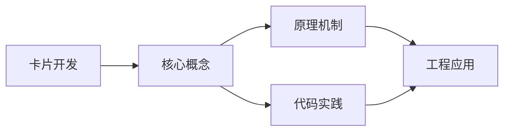
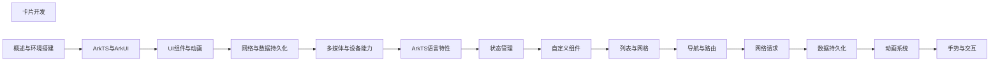

## 1. 学习目标（Bloom 分类）

本节按照布鲁姆教育目标分类学组织学习路径。本文主题为《卡片开发》，属于 HarmonyOS 模块，读者可以根据自身阶段选择阅读深度。

记忆层面：能够准确复述本文的核心概念、术语与基本语法或操作步骤，并能够在提问或检索时快速定位对应知识点。能够说出 HarmonyOS 的核心概念、术语与标准写法。

理解层面：能够用自己的语言解释核心原理与工作机制，说明概念之间的因果关系，而不是机械记忆结论。能够解释 HarmonyOS 的工作原理与设计动机。

应用层面：能够在真实项目或练习场景中运用本文知识解决具体问题，写出正确且可维护的实现。能够编写符合 HarmonyOS 规范的完整实现。

分析层面：能够拆解复杂问题，比较本文主题与相邻概念的异同，识别边界条件与例外情况。能够分析 HarmonyOS 与相邻方案的差异与边界。

评价层面：能够根据约束条件（性能、可读性、安全、成本）评价不同方案的优劣，做出有依据的技术决策。能够根据场景评价 HarmonyOS 相关方案的优劣。

创造层面：能够把本文知识与其他模块知识组合，设计出新的解决方案或可复用的工程模式。能够组合 HarmonyOS 与其他技术设计完整方案。

通过本节学习，读者应当能够把《卡片开发》纳入自己的知识网络，并与 HarmonyOS 模块的其他主题（ArkTS、ArkUI、分布式能力、应用开发）建立关联。

## 2. 历史动机与发展脉络

《卡片开发》是 HarmonyOS 领域的重要主题。要真正理解它，需要先了解它解决的问题与演进过程。

HarmonyOS（鸿蒙）由华为于 2019 年发布，定位面向全场景的分布式操作系统；HarmonyOS NEXT（5.0，2024）去 Android 化，采用自研鸿蒙内核与 ArkTS 语言栈。
开发框架：ArkTS（TS 超集 + 声明式 UI 扩展）、ArkUI（声明式组件）、Stage 模型（应用模型）、方舟编译器。
分布式能力：跨端流转、分布式数据、一次开发多端部署（手机/平板/车机/穿戴）。

回到本文主题：卡片开发 的提出与成熟，正是上述技术背景下的必然产物。早期实现往往以简单可用为目标，随着工程规模扩大，社区逐渐沉淀出标准做法与最佳实践；理解这一脉络，可以帮助读者判断“为什么文档中的推荐写法是现在这个样子”，也能在遇到历史遗留代码时准确识别其设计年代与取舍。


## 3. 形式化定义与核心概念精讲

本节把《卡片开发》涉及的核心概念以“定义 + 讲解”的形式展开。读者应把定义当作工具，把讲解当作理解路径；两者结合才能形成可迁移的知识。

ArkTS 语法：基于 TypeScript 的类型系统，增加 @Component/@Entry/@State 等装饰器与 UI 描述语法。
ArkUI 组件：Column/Row/Stack 布局容器、Text/Button/Image 基础组件、List/Grid 容器组件；状态管理（@State/@Prop/@Link/@Provide）。
应用模型：Stage 模型以 UIAbility 为页面载体，EntryAbility 入口；module.json5 声明应用配置。

### 3.1 原文章节逐一精讲

原文档把主题拆分为 12 个小节，下面按顺序给出每一节的导读讲解，随后保留原文细节供精读。

#### 原文精读（完整保留）

# 卡片开发 语法速查手册

> **符号约定**：`< >` 必填参数 | `[ ]` 可选参数

---

#### 概述

服务卡片（Widget）是 HarmonyOS 的桌面小组件，用户可以在桌面上直接查看应用的关键信息，无需打开应用。卡片支持静态展示和动态更新，尺寸从 1x1 到 4x4 不等。合理使用卡片可以提升应用的可见性和用户粘性。

为什么需要卡片？用户每天查看手机桌面几十次，如果应用的关键信息能直接展示在桌面上，用户就不需要每次都打开应用。天气应用可以显示当前温度，待办应用可以显示今日任务，音乐应用可以显示播放控制。卡片让应用的信息触手可及。

#### 基础概念

**卡片提供方**：应用中负责创建和更新卡片的部分。通过 FormExtensionAbility 实现卡片的生命周期管理。

**卡片使用方**：桌面系统，负责展示卡片和管理卡片的位置和大小。

**卡片管理方**：系统服务，协调卡片提供方和使用方之间的通信。

**卡片尺寸**：HarmonyOS 支持多种卡片尺寸，用网格数表示。常见尺寸有 1x2、2x2、2x4、4x4 等。

**卡片数据更新**：卡片支持定时更新和按需更新。定时更新通过 form_update_duration 配置，按需更新通过 formProvider 接口触发。

#### 快速上手

##### 创建卡片

在 DevEco Studio 中创建卡片：

1. 右键点击模块目录 -> New -> Service Widget
2. 选择卡片模板（如时钟、图片、图文等）
3. 配置卡片名称和尺寸

卡片配置在 form_config.json 中：

```json
{
  "forms": [
    {
      "name": "widget", // 卡片名称
      "displayName": "我的卡片", // 显示名称
      "description": "这是一个示例卡片", // 描述
      "src": "./ets/widget/pages/WidgetCard.ets", // 卡片页面路径
      "uiSyntax": "arkts", // UI 语法
      "window": {
        "designWidth": 720,
        "autoDesignWidth": true
      },
      "colorMode": "auto", // 颜色模式：auto/亮色/暗色
      "isDefault": true, // 是否为默认卡片
      "updateEnabled": true, // 是否允许更新
      "scheduledUpdateTime": "10:30", // 定时更新时间
      "updateDuration": 1, // 更新间隔（小时）
      "defaultDimension": "2*2", // 默认尺寸
      "supportDimensions": [
        // 支持的尺寸
        "2*2",
        "2*4",
        "4*4"
      ]
    }
  ]
}
```

##### 最简单的卡片页面

```typescript
// WidgetCard.ets - 卡片界面
@Entry
@Component
struct WidgetCard {
  // 卡片数据，由 FormExtension 传入
  @State title: string = '待办事项'
  @State count: number = 0

  build() {
    Column() {
      Text(this.title)
        .fontSize(16)
        .fontWeight(FontWeight.Bold)
        .fontColor('#333333')

      Text(`今日 ${this.count} 项`)
        .fontSize(24)
        .fontWeight(FontWeight.Bold)
        .margin({ top: 8 })

      Text('点击查看详情')
        .fontSize(12)
        .fontColor('#999999')
        .margin({ top: 8 })
    }
    .width('100%')
    .height('100%')
    .padding(12)
    .backgroundColor('#ffffff')
    .borderRadius(16)
    .onClick(() => {
      // 点击卡片跳转到应用
      postCardAction(this, {
        action: 'router',
        abilityName: 'EntryAbility',
        params: { page: 'todoList' }
      })
    })
  }
}
```

##### 卡片生命周期

```typescript
// FormAbility.ets - 卡片扩展能力
import FormExtension from '@ohos.app.form.FormExtensionAbility';
import formProvider from '@ohos.app.form.formProvider';

export default class FormAbility extends FormExtension {
  // 创建卡片时调用
  onAddForm(want) {
    console.info('卡片创建');

    // 返回卡片的初始数据
    const formInfo = {
      title: '待办事项',
      count: 5,
      updateTime: new Date().toLocaleTimeString(),
    };

    return formBindingData.createFormBindingData(formInfo);
  }

  // 更新卡片时调用
  onUpdateForm(formId) {
    console.info(`卡片更新: ${formId}`);

    // 获取最新数据
    const formInfo = {
      title: '待办事项',
      count: getTodoCount(),
      updateTime: new Date().toLocaleTimeString(),
    };

    const formBindingData = formBindingData.createFormBindingData(formInfo);
    formProvider.updateForm(formId, formBindingData);
  }

  // 删除卡片时调用
  onRemoveForm(formId) {
    console.info(`卡片删除: ${formId}`);
  }

  // 卡片可见性变化时调用
  onVisibilityChange(newStatus) {
    console.info(`卡片可见性变化: ${JSON.stringify(newStatus)}`);
  }
}
```

#### 详细用法

##### 卡片数据更新

```typescript
import formProvider from '@ohos.app.form.formProvider';
import formBindingData from '@ohos.app.form.formBindingData';

// 主动更新卡片数据
async function updateWidget(formId: string, data: Record<string, Object>) {
  try {
    const formBindingDataObj = formBindingData.createFormBindingData(data);
    await formProvider.updateForm(formId, formBindingDataObj);
    console.info('卡片更新成功');
  } catch (error) {
    console.error(`卡片更新失败: ${error}`);
  }
}

// 更新所有卡片
async function updateAllWidgets() {
  try {
    // 获取所有卡片 ID
    const formIds = await formProvider.getAllFormsInfo();

    for (const formInfo of formIds) {
      await updateWidget(formInfo.formId, {
        title: '待办事项',
        count: getTodoCount(),
        updateTime: new Date().toLocaleTimeString(),
      });
    }
  } catch (error) {
    console.error(`更新所有卡片失败: ${error}`);
  }
}
```

##### 卡片点击事件

```typescript
@Entry
@Component
struct WidgetCardWithActions {
  @State title: string = '天气'
  @State temp: string = '25°C'

  build() {
    Column() {
      Text(this.title).fontSize(16).fontWeight(FontWeight.Bold)
      Text(this.temp).fontSize(32).fontWeight(FontWeight.Bold)

      Row() {
        // router 事件：点击跳转到应用页面
        Button('查看详情')
          .fontSize(12)
          .onClick(() => {
            postCardAction(this, {
              action: 'router',
              abilityName: 'EntryAbility',
              params: { page: 'weather_detail' }
            })
          })

        // call 事件：点击调用 Ability 的方法（不跳转）
        Button('刷新')
          .fontSize(12)
          .onClick(() => {
            postCardAction(this, {
              action: 'call',
              abilityName: 'FormAbility',
              params: {
                method: 'refresh',
                formId: '42'
              }
            })
          })
      }
    }
    .width('100%')
    .height('100%')
    .padding(12)
  }
}
```

##### 多尺寸卡片

```typescript
// 根据卡片尺寸显示不同内容
@Entry
@Component
struct MultiSizeWidget {
  // 卡片尺寸由系统传入
  @State dimension: string = '2*2'
  @State title: string = '待办'
  @State count: number = 5
  @State items: string[] = ['买菜', '开会', '写报告']

  build() {
    Column() {
      if (this.dimension === '2*2') {
        // 小尺寸：只显示摘要
        Text(this.title).fontSize(14).fontWeight(FontWeight.Bold)
        Text(`${this.count} 项待办`).fontSize(20)
      } else if (this.dimension === '2*4') {
        // 中等尺寸：显示摘要和前两项
        Text(this.title).fontSize(16).fontWeight(FontWeight.Bold)
        Text(`${this.count} 项待办`).fontSize(20)
        ForEach(this.items.slice(0, 2), (item: string) => {
          Text(item).fontSize(14).margin({ top: 4 })
        })
      } else {
        // 大尺寸：显示完整列表
        Text(this.title).fontSize(18).fontWeight(FontWeight.Bold)
        ForEach(this.items, (item: string) => {
          Row() {
            Text(item).fontSize(14).layoutWeight(1)
          }
          .margin({ top: 4 })
        })
      }
    }
    .width('100%')
    .height('100%')
    .padding(12)
  }
}
```

##### 卡片样式美化

```typescript
@Entry
@Component
struct StyledWidget {
  @State temp: number = 25
  @State city: string = '北京'
  @State weather: string = '晴'

  build() {
    Stack() {
      // 背景渐变
      Column()
        .width('100%')
        .height('100%')
        .linearGradient({
          direction: GradientDirection.BottomRight,
          colors: [['#4facfe', 0.0], ['#00f2fe', 1.0]]
        })
        .borderRadius(16)

      // 内容
      Column() {
        Text(this.city)
          .fontSize(16)
          .fontColor(Color.White)

        Text(`${this.temp}°`)
          .fontSize(48)
          .fontWeight(FontWeight.Bold)
          .fontColor(Color.White)

        Text(this.weather)
          .fontSize(14)
          .fontColor('#ffffffcc')
      }
      .width('100%')
      .height('100%')
      .padding(16)
      .justifyContent(FlexAlign.Center)
    }
    .width('100%')
    .height('100%')
  }
}
```

#### 常见场景

##### 天气卡片

```typescript
@Entry
@Component
struct WeatherWidget {
  @State city: string = '北京'
  @State temp: number = 25
  @State weather: string = '晴'
  @State highTemp: number = 28
  @State lowTemp: number = 18

  build() {
    Column() {
      Row() {
        Text(this.city).fontSize(14).fontColor('#ffffffcc')
        Text(new Date().toLocaleDateString()).fontSize(12).fontColor('#ffffff99')
      }
      .width('100%')
      .justifyContent(FlexAlign.SpaceBetween)

      Row() {
        Text(`${this.temp}°`).fontSize(40).fontWeight(FontWeight.Bold).fontColor(Color.White)
        Text(this.weather).fontSize(16).fontColor('#ffffffcc').margin({ left: 8 })
      }
      .margin({ top: 12 })

      Text(`${this.lowTemp}° / ${this.highTemp}°`)
        .fontSize(12)
        .fontColor('#ffffff99')
        .margin({ top: 4 })
    }
    .width('100%')
    .height('100%')
    .padding(16)
    .linearGradient({
      direction: GradientDirection.Bottom,
      colors: [['#667eea', 0.0], ['#764ba2', 1.0]]
    })
    .borderRadius(16)
    .onClick(() => {
      postCardAction(this, {
        action: 'router',
        abilityName: 'EntryAbility',
        params: { page: 'weather' }
      })
    })
  }
}
```

##### 待办事项卡片

```typescript
@Entry
@Component
struct TodoWidget {
  @State todos: string[] = ['完成报告', '团队会议', '代码评审']
  @State completedCount: number = 2
  @State totalCount: number = 5

  build() {
    Column() {
      Row() {
        Text('今日待办').fontSize(14).fontWeight(FontWeight.Bold)
        Text(`${this.completedCount}/${this.totalCount}`).fontSize(12).fontColor('#999999')
      }
      .width('100%')
      .justifyContent(FlexAlign.SpaceBetween)

      ForEach(this.todos, (todo: string, index: number) => {
        Row() {
          Text(index < this.completedCount ? 'v' : 'o')
            .fontSize(12)
            .fontColor(index < this.completedCount ? '#4caf50' : '#cccccc')
          Text(todo)
            .fontSize(13)
            .margin({ left: 8 })
            .decoration({ type: index < this.completedCount ? TextDecorationType.LineThrough : TextDecorationType.None })
        }
        .margin({ top: 8 })
      })
    }
    .width('100%')
    .height('100%')
    .padding(16)
    .backgroundColor('#ffffff')
    .borderRadius(16)
    .onClick(() => {
      postCardAction(this, {
        action: 'router',
        abilityName: 'EntryAbility',
        params: { page: 'todo' }
      })
    })
  }
}
```

#### 注意事项

**卡片资源限制**：卡片运行在独立的环境中，不能直接访问应用的资源。图片等资源需要放在卡片的资源目录中。

**卡片不支持所有组件**：卡片只支持部分 ArkUI 组件，不支持 Canvas、Web 等复杂组件。具体支持列表请参考官方文档。

**卡片更新频率**：系统限制了卡片的更新频率，最短间隔为 30 分钟。不要尝试高频更新卡片。

**卡片内存限制**：卡片的内存使用有限制，不要在卡片中加载大量数据或大图。

**暗色模式**：卡片应支持暗色模式，使用 `colorMode: "auto"` 让系统自动切换。

#### 进阶用法

##### 卡片与主应用通信

```typescript
// 在 FormAbility 中处理 call 事件
export default class FormAbility extends FormExtension {
  onFormEvent(formId: string, message: string) {
    // 处理从卡片发来的消息
    const data = JSON.parse(message);
    if (data.method === 'refresh') {
      // 刷新卡片数据
      this.refreshFormData(formId);
    } else if (data.method === 'complete') {
      // 标记任务完成
      this.markTodoComplete(data.todoId);
      this.refreshFormData(formId);
    }
  }

  private async refreshFormData(formId: string) {
    const todos = await loadTodos();
    const formInfo = {
      todos: todos.map((t) => t.title),
      completedCount: todos.filter((t) => t.done).length,
      totalCount: todos.length,
    };
    const bindingData = formBindingData.createFormBindingData(formInfo);
    formProvider.updateForm(formId, bindingData);
  }
}
```

##### 定时更新卡片

```typescript
import reminderAgentManager from '@ohos.reminderAgentManager';

// 设置后台定时任务来更新卡片
async function setupWidgetUpdate() {
  const reminderRequest: reminderAgentManager.ReminderRequestTimer = {
    reminderType: reminderAgentManager.ReminderType.REMINDER_TYPE_TIMER,
    triggerTimeInSeconds: 3600, // 每小时触发一次
    actionButton: [
      {
        title: '更新卡片',
        type: reminderAgentManager.ActionButtonType.ACTION_BUTTON_TYPE_CUSTOM,
      },
    ],
  };

  const reminderId = await reminderAgentManager.publishReminder(reminderRequest);
  console.info(`定时提醒已设置: ${reminderId}`);
}
```
#### 卡片配置

**基本写法：module.json5 声明卡片**
`"extensionAbilities": [{ "name": "<名>", "type": "form", "srcEntry": "<路径>", "metadata": [{ "name": "ohos.extension.form", "resource": "$profile:form_config" }] }]`
```json5
// module.json5 中声明 FormExtensionAbility
{
  "extensionAbilities": [
    {
      "name": "CardAbility",
      "type": "form",
      "srcEntry": "./ets/cardability/CardAbility.ets",
      "metadata": [
        { "name": "ohos.extension.form", "resource": "$profile:form_config" }
      ]
    }
  ]
}
```

---

**基本写法：卡片配置文件**
`{ "forms": [{ "name": "<卡片名>", "displayName": "<显示名>", "src": "<页面>", "window": { "designWidth": 720 }, "isDefault": true }] }`
```json5
// resources/base/profile/form_config.json
{
  "forms": [
    {
      "name": "widget",
      "displayName": "我的卡片",
      "description": "示例卡片",
      "src": "./ets/cardability/pages/CardPage.ets",
      "window": { "designWidth": 720 },
      "isDefault": true,
      "colorMode": "auto",
      "supportDimensions": ["2*2", "2*4"],
      "defaultDimension": "2*2",
      "updateEnabled": true,
      "scheduledUpdateTime": "10:30"
    }
  ]
}
```

---

#### FormExtensionAbility

**基本写法：创建卡片 Ability**
`export default class <名> extends FormExtensionAbility { onAddForm(<want>) { } }`
```typescript
// 卡片生命周期
import { FormExtensionAbility } from '@kit.FormKit'

export default class CardAbility extends FormExtensionAbility {
  onAddForm(want) {
    let formId = want.parameters['formId'] as string
    return { formData: { title: '卡片标题', content: '内容' } }
  }

  onCastToNormalForm(formId) {
    console.info(`转为普通卡片: ${formId}`)
  }

  onUpdateForm(formId) {
    // 定时刷新卡片
    let provider = this.context.formProvider
    provider.updateForm(formId, { formData: { time: new Date().toLocaleTimeString() } })
  }
}
```

---

**基本写法：卡片更新**
`formProvider.updateForm(<formId>, <formBindingData>)`
```typescript
// 主动更新卡片数据
import { formProvider } from '@kit.FormKit'
import { formBindingData } from '@kit.FormKit'

let obj: formBindingData.FormBindingData = {
  data: JSON.stringify({ title: '新标题', content: '新内容' })
}
formProvider.updateForm(formId, obj)
```

---

**基本写法：请求卡片刷新**
`formProvider.requestPublishForm(<formId>, <formBindingData>)`
```typescript
// 请求发布卡片刷新
formProvider.requestPublishForm(formId, { data: JSON.stringify({ update: true }) })
```

---

#### 卡片页面

**基本写法：卡片 UI 页面**
`let <数据> = AppStateManager.get('<键>');`
```typescript
// CardPage.ets 卡片页面组件
let storage = new LocalStorage()

@Entry(storage)
@Component
struct CardPage {
  @LocalStorageProp('title') title: string = ''
  @LocalStorageProp('content') content: string = ''

  build() {
    Column() {
      Text(this.title).fontSize(16).fontWeight(FontWeight.Bold)
      Text(this.content).fontSize(14).margin({ top: 8 })
    }
    .padding(12)
    .height('100%')
    .width('100%')
  }
}
```

---

**基本写法：卡片点击跳转**
`.onClick(() => { postCardAction(this, { 'action': 'router', 'abilityName': '<Ability>', 'params': {} }) })`
```typescript
// 卡片点击事件触发跳转
import { postCardAction } from '@kit.FormKit'

Column() {
  Text(this.title)
}
.onClick(() => {
  postCardAction(this, {
    'action': 'router',
    'abilityName': 'EntryAbility',
    'params': { 'action': 'view_detail' }
  })
})
```

---

**基本写法：卡片消息刷新**
`postCardAction(this, { 'action': 'message', 'params': {} })`
```typescript
// 通过 message action 触发卡片 Ability
Column() {
  Button('刷新')
}.onClick(() => {
  postCardAction(this, {
    'action': 'message',
    'params': { 'action': 'refresh' }
  })
})
```

---

#### 卡片数据交互

**基本写法：onAddForm 返回初始数据**
`return { formData: <数据> }`
```typescript
// 卡片添加时返回初始数据
onAddForm(want) {
  let formId = want.parameters['formId'] as string
  let formData = {
    title: '欢迎',
    content: '这是卡片内容',
    time: new Date().toLocaleTimeString()
  }
  return { formData: formData }
}
```

---

**基本写法：处理 message 事件**
`onFormEvent(<formId>, <message>)`
```typescript
// 接收卡片 message action
onFormEvent(formId: string, message: string) {
  let params = JSON.parse(message)
  if (params.action === 'refresh') {
    formProvider.updateForm(formId, {
      data: JSON.stringify({ time: new Date().toLocaleTimeString() })
    })
  }
}
```

---

**基本写法：卡片删除**
`onRemoveForm(<formId>)`
```typescript
// 卡片被删除时清理数据
onRemoveForm(formId: string) {
  console.info(`卡片已删除: ${formId}`)
  // 清理与该卡片关联的缓存数据
}
```

---

#### 卡片尺寸适配

**基本写法：响应不同尺寸**
`if (this.dimension === '2*2') { } else { }`
```typescript
// 根据卡片尺寸渲染不同布局
@Entry
@Component
struct CardPage {
  @LocalStorageProp('dimension') dimension: string = '2*2'

  build() {
    if (this.dimension === '2*2') {
      Column() { Text('小卡片') }
    } else {
      Row() { Text('宽卡片') }
    }
  }
}
```

---

**基本写法：卡片资源配置**
`// resources/base/profile/form_config.json 中配置 supportDimensions`
```json5
// 支持的卡片尺寸规格
{
  "supportDimensions": ["2*2", "2*4", "4*4"],
  "defaultDimension": "2*2"
}
```


### 3.2 概念关系图

下面用 Mermaid 图表达本文核心概念之间的关系，帮助读者建立整体图景：



图中展示的是本文知识的结构化关系：核心概念是入口，原理机制解释“为什么”，代码实践演示“怎么做”，工程应用回答“何时用”。读者学习时可以把每个小节的内容挂接到对应节点上。

## 4. 理论推导与原理解析

本节深入《卡片开发》背后的原理。理论部分不求面面俱到，而是聚焦“能解释现象、能指导实践”的关键推导。

ArkTS 语法：基于 TypeScript 的类型系统，增加 @Component/@Entry/@State 等装饰器与 UI 描述语法。
ArkUI 组件：Column/Row/Stack 布局容器、Text/Button/Image 基础组件、List/Grid 容器组件；状态管理（@State/@Prop/@Link/@Provide）。
应用模型：Stage 模型以 UIAbility 为页面载体，EntryAbility 入口；module.json5 声明应用配置。
生命周期：Ability 的 onCreate/onWindowStageCreate/onForeground/onBackground/onDestroy。

需要强调的是，理论推导与工程实践之间存在翻译层：理论给出的是理想化模型与边界条件，工程代码则必须处理真实环境中的例外。读者在学习时应先掌握理论的“标准情形”，再通过陷阱章节了解“非标准情形”。

## 5. 代码示例与逐行讲解

本节把原文中的代码示例系统整理，并为每个示例补充用途说明与讲解。读者不应只浏览代码，而应逐段对照讲解理解设计意图。

### 5.1 示例：创建卡片

该示例来自原文《创建卡片》小节，用于演示卡片开发相关操作。阅读时请先看代码结构，再看其后的讲解。

```json
{
  "forms": [
    {
      "name": "widget", // 卡片名称
      "displayName": "我的卡片", // 显示名称
      "description": "这是一个示例卡片", // 描述
      "src": "./ets/widget/pages/WidgetCard.ets", // 卡片页面路径
      "uiSyntax": "arkts", // UI 语法
      "window": {
        "designWidth": 720,
        "autoDesignWidth": true
      },
      "colorMode": "auto", // 颜色模式：auto/亮色/暗色
      "isDefault": true, // 是否为默认卡片
      "updateEnabled": true, // 是否允许更新
      "scheduledUpdateTime": "10:30", // 定时更新时间
      "updateDuration": 1, // 更新间隔（小时）
      "defaultDimension": "2*2", // 默认尺寸
      "supportDimensions": [
        // 支持的尺寸
        "2*2",
        "2*4",
        "4*4"
      ]
    }
  ]
}
```

讲解：这段代码演示了本节核心知识点。代码中的关键操作可以归纳为三步：准备（定义或初始化）、执行（核心逻辑）、收尾（释放资源或返回结果）。实际项目中，这三步往往被封装为函数或类，以提升复用性与可测试性。

关键点分析：

该示例共 27 行有效代码，结构以数据或配置为主。阅读时应关注：数据字段的含义、配置项的作用，以及它们与运行行为的对应关系。

进阶思考路径：先尝试修改参数观察行为变化，再把示例中的模式迁移到自己的项目中；每次修改都记录预期与实测差异，这是把示例转化为能力的最快方式。

### 5.2 示例：最简单的卡片页面

该示例来自原文《最简单的卡片页面》小节，用于演示卡片开发相关操作。阅读时请先看代码结构，再看其后的讲解。

```typescript
// WidgetCard.ets - 卡片界面
@Entry
@Component
struct WidgetCard {
  // 卡片数据，由 FormExtension 传入
  @State title: string = '待办事项'
  @State count: number = 0

  build() {
    Column() {
      Text(this.title)
        .fontSize(16)
        .fontWeight(FontWeight.Bold)
        .fontColor('#333333')

      Text(`今日 ${this.count} 项`)
        .fontSize(24)
        .fontWeight(FontWeight.Bold)
        .margin({ top: 8 })

      Text('点击查看详情')
        .fontSize(12)
        .fontColor('#999999')
        .margin({ top: 8 })
    }
    .width('100%')
    .height('100%')
    .padding(12)
    .backgroundColor('#ffffff')
    .borderRadius(16)
    .onClick(() => {
      // 点击卡片跳转到应用
      postCardAction(this, {
        action: 'router',
        abilityName: 'EntryAbility',
        params: { page: 'todoList' }
      })
    })
  }
}
```

讲解：这段代码演示了本节核心知识点。代码中的关键操作可以归纳为三步：准备（定义或初始化）、执行（核心逻辑）、收尾（释放资源或返回结果）。实际项目中，这三步往往被封装为函数或类，以提升复用性与可测试性。

关键点分析：

该示例共 37 行有效代码，结构以数据或配置为主。阅读时应关注：数据字段的含义、配置项的作用，以及它们与运行行为的对应关系。

进阶思考路径：先尝试修改参数观察行为变化，再把示例中的模式迁移到自己的项目中；每次修改都记录预期与实测差异，这是把示例转化为能力的最快方式。

### 5.3 示例：卡片生命周期

该示例来自原文《卡片生命周期》小节，用于演示卡片开发相关操作。阅读时请先看代码结构，再看其后的讲解。

```typescript
// FormAbility.ets - 卡片扩展能力
import FormExtension from '@ohos.app.form.FormExtensionAbility';
import formProvider from '@ohos.app.form.formProvider';

export default class FormAbility extends FormExtension {
  // 创建卡片时调用
  onAddForm(want) {
    console.info('卡片创建');

    // 返回卡片的初始数据
    const formInfo = {
      title: '待办事项',
      count: 5,
      updateTime: new Date().toLocaleTimeString(),
    };

    return formBindingData.createFormBindingData(formInfo);
  }

  // 更新卡片时调用
  onUpdateForm(formId) {
    console.info(`卡片更新: ${formId}`);

    // 获取最新数据
    const formInfo = {
      title: '待办事项',
      count: getTodoCount(),
      updateTime: new Date().toLocaleTimeString(),
    };

    const formBindingData = formBindingData.createFormBindingData(formInfo);
    formProvider.updateForm(formId, formBindingData);
  }

  // 删除卡片时调用
  onRemoveForm(formId) {
    console.info(`卡片删除: ${formId}`);
  }

  // 卡片可见性变化时调用
  onVisibilityChange(newStatus) {
    console.info(`卡片可见性变化: ${JSON.stringify(newStatus)}`);
  }
}
```

讲解：这段代码演示了本节核心知识点。代码中的关键操作可以归纳为三步：准备（定义或初始化）、执行（核心逻辑）、收尾（释放资源或返回结果）。实际项目中，这三步往往被封装为函数或类，以提升复用性与可测试性。

关键点分析：

该示例共 36 行有效代码，包含 4 类关键结构（class、import、from、return）。其中：

- 入口与初始化部分负责建立上下文，对应实际项目中的启动或装配逻辑；
- 核心逻辑部分体现本文主题的主要操作，是阅读时最需要对照讲解理解的部分；
- 输出或返回部分把结果交给调用方，注意其类型与边界条件。

进阶思考路径：先尝试修改参数观察行为变化，再把示例中的模式迁移到自己的项目中；每次修改都记录预期与实测差异，这是把示例转化为能力的最快方式。

### 5.4 示例：卡片数据更新

该示例来自原文《卡片数据更新》小节，用于演示卡片开发相关操作。阅读时请先看代码结构，再看其后的讲解。

```typescript
import formProvider from '@ohos.app.form.formProvider';
import formBindingData from '@ohos.app.form.formBindingData';

// 主动更新卡片数据
async function updateWidget(formId: string, data: Record<string, Object>) {
  try {
    const formBindingDataObj = formBindingData.createFormBindingData(data);
    await formProvider.updateForm(formId, formBindingDataObj);
    console.info('卡片更新成功');
  } catch (error) {
    console.error(`卡片更新失败: ${error}`);
  }
}

// 更新所有卡片
async function updateAllWidgets() {
  try {
    // 获取所有卡片 ID
    const formIds = await formProvider.getAllFormsInfo();

    for (const formInfo of formIds) {
      await updateWidget(formInfo.formId, {
        title: '待办事项',
        count: getTodoCount(),
        updateTime: new Date().toLocaleTimeString(),
      });
    }
  } catch (error) {
    console.error(`更新所有卡片失败: ${error}`);
  }
}
```

讲解：这段代码演示了本节核心知识点。代码中的关键操作可以归纳为三步：准备（定义或初始化）、执行（核心逻辑）、收尾（释放资源或返回结果）。实际项目中，这三步往往被封装为函数或类，以提升复用性与可测试性。

关键点分析：

该示例共 28 行有效代码，包含 4 类关键结构（function、import、from、for）。其中：

- 入口与初始化部分负责建立上下文，对应实际项目中的启动或装配逻辑；
- 核心逻辑部分体现本文主题的主要操作，是阅读时最需要对照讲解理解的部分；
- 输出或返回部分把结果交给调用方，注意其类型与边界条件。

进阶思考路径：先尝试修改参数观察行为变化，再把示例中的模式迁移到自己的项目中；每次修改都记录预期与实测差异，这是把示例转化为能力的最快方式。

### 5.5 示例：卡片点击事件

该示例来自原文《卡片点击事件》小节，用于演示卡片开发相关操作。阅读时请先看代码结构，再看其后的讲解。

```typescript
@Entry
@Component
struct WidgetCardWithActions {
  @State title: string = '天气'
  @State temp: string = '25°C'

  build() {
    Column() {
      Text(this.title).fontSize(16).fontWeight(FontWeight.Bold)
      Text(this.temp).fontSize(32).fontWeight(FontWeight.Bold)

      Row() {
        // router 事件：点击跳转到应用页面
        Button('查看详情')
          .fontSize(12)
          .onClick(() => {
            postCardAction(this, {
              action: 'router',
              abilityName: 'EntryAbility',
              params: { page: 'weather_detail' }
            })
          })

        // call 事件：点击调用 Ability 的方法（不跳转）
        Button('刷新')
          .fontSize(12)
          .onClick(() => {
            postCardAction(this, {
              action: 'call',
              abilityName: 'FormAbility',
              params: {
                method: 'refresh',
                formId: '42'
              }
            })
          })
      }
    }
    .width('100%')
    .height('100%')
    .padding(12)
  }
}
```

讲解：这段代码演示了本节核心知识点。代码中的关键操作可以归纳为三步：准备（定义或初始化）、执行（核心逻辑）、收尾（释放资源或返回结果）。实际项目中，这三步往往被封装为函数或类，以提升复用性与可测试性。

关键点分析：

该示例共 40 行有效代码，结构以数据或配置为主。阅读时应关注：数据字段的含义、配置项的作用，以及它们与运行行为的对应关系。

进阶思考路径：先尝试修改参数观察行为变化，再把示例中的模式迁移到自己的项目中；每次修改都记录预期与实测差异，这是把示例转化为能力的最快方式。

### 5.6 示例：多尺寸卡片

该示例来自原文《多尺寸卡片》小节，用于演示卡片开发相关操作。阅读时请先看代码结构，再看其后的讲解。

```typescript
// 根据卡片尺寸显示不同内容
@Entry
@Component
struct MultiSizeWidget {
  // 卡片尺寸由系统传入
  @State dimension: string = '2*2'
  @State title: string = '待办'
  @State count: number = 5
  @State items: string[] = ['买菜', '开会', '写报告']

  build() {
    Column() {
      if (this.dimension === '2*2') {
        // 小尺寸：只显示摘要
        Text(this.title).fontSize(14).fontWeight(FontWeight.Bold)
        Text(`${this.count} 项待办`).fontSize(20)
      } else if (this.dimension === '2*4') {
        // 中等尺寸：显示摘要和前两项
        Text(this.title).fontSize(16).fontWeight(FontWeight.Bold)
        Text(`${this.count} 项待办`).fontSize(20)
        ForEach(this.items.slice(0, 2), (item: string) => {
          Text(item).fontSize(14).margin({ top: 4 })
        })
      } else {
        // 大尺寸：显示完整列表
        Text(this.title).fontSize(18).fontWeight(FontWeight.Bold)
        ForEach(this.items, (item: string) => {
          Row() {
            Text(item).fontSize(14).layoutWeight(1)
          }
          .margin({ top: 4 })
        })
      }
    }
    .width('100%')
    .height('100%')
    .padding(12)
  }
}
```

讲解：这段代码演示了本节核心知识点。代码中的关键操作可以归纳为三步：准备（定义或初始化）、执行（核心逻辑）、收尾（释放资源或返回结果）。实际项目中，这三步往往被封装为函数或类，以提升复用性与可测试性。

关键点分析：

该示例共 38 行有效代码，包含 1 类关键结构（if）。其中：

- 入口与初始化部分负责建立上下文，对应实际项目中的启动或装配逻辑；
- 核心逻辑部分体现本文主题的主要操作，是阅读时最需要对照讲解理解的部分；
- 输出或返回部分把结果交给调用方，注意其类型与边界条件。

进阶思考路径：先尝试修改参数观察行为变化，再把示例中的模式迁移到自己的项目中；每次修改都记录预期与实测差异，这是把示例转化为能力的最快方式。

### 5.7 示例：卡片样式美化

该示例来自原文《卡片样式美化》小节，用于演示卡片开发相关操作。阅读时请先看代码结构，再看其后的讲解。

```typescript
@Entry
@Component
struct StyledWidget {
  @State temp: number = 25
  @State city: string = '北京'
  @State weather: string = '晴'

  build() {
    Stack() {
      // 背景渐变
      Column()
        .width('100%')
        .height('100%')
        .linearGradient({
          direction: GradientDirection.BottomRight,
          colors: [['#4facfe', 0.0], ['#00f2fe', 1.0]]
        })
        .borderRadius(16)

      // 内容
      Column() {
        Text(this.city)
          .fontSize(16)
          .fontColor(Color.White)

        Text(`${this.temp}°`)
          .fontSize(48)
          .fontWeight(FontWeight.Bold)
          .fontColor(Color.White)

        Text(this.weather)
          .fontSize(14)
          .fontColor('#ffffffcc')
      }
      .width('100%')
      .height('100%')
      .padding(16)
      .justifyContent(FlexAlign.Center)
    }
    .width('100%')
    .height('100%')
  }
}
```

讲解：这段代码演示了本节核心知识点。代码中的关键操作可以归纳为三步：准备（定义或初始化）、执行（核心逻辑）、收尾（释放资源或返回结果）。实际项目中，这三步往往被封装为函数或类，以提升复用性与可测试性。

关键点分析：

该示例共 39 行有效代码，结构以数据或配置为主。阅读时应关注：数据字段的含义、配置项的作用，以及它们与运行行为的对应关系。

进阶思考路径：先尝试修改参数观察行为变化，再把示例中的模式迁移到自己的项目中；每次修改都记录预期与实测差异，这是把示例转化为能力的最快方式。

### 5.8 示例：天气卡片

该示例来自原文《天气卡片》小节，用于演示卡片开发相关操作。阅读时请先看代码结构，再看其后的讲解。

```typescript
@Entry
@Component
struct WeatherWidget {
  @State city: string = '北京'
  @State temp: number = 25
  @State weather: string = '晴'
  @State highTemp: number = 28
  @State lowTemp: number = 18

  build() {
    Column() {
      Row() {
        Text(this.city).fontSize(14).fontColor('#ffffffcc')
        Text(new Date().toLocaleDateString()).fontSize(12).fontColor('#ffffff99')
      }
      .width('100%')
      .justifyContent(FlexAlign.SpaceBetween)

      Row() {
        Text(`${this.temp}°`).fontSize(40).fontWeight(FontWeight.Bold).fontColor(Color.White)
        Text(this.weather).fontSize(16).fontColor('#ffffffcc').margin({ left: 8 })
      }
      .margin({ top: 12 })

      Text(`${this.lowTemp}° / ${this.highTemp}°`)
        .fontSize(12)
        .fontColor('#ffffff99')
        .margin({ top: 4 })
    }
    .width('100%')
    .height('100%')
    .padding(16)
    .linearGradient({
      direction: GradientDirection.Bottom,
      colors: [['#667eea', 0.0], ['#764ba2', 1.0]]
    })
    .borderRadius(16)
    .onClick(() => {
      postCardAction(this, {
        action: 'router',
        abilityName: 'EntryAbility',
        params: { page: 'weather' }
      })
    })
  }
}
```

讲解：这段代码演示了本节核心知识点。代码中的关键操作可以归纳为三步：准备（定义或初始化）、执行（核心逻辑）、收尾（释放资源或返回结果）。实际项目中，这三步往往被封装为函数或类，以提升复用性与可测试性。

关键点分析：

该示例共 43 行有效代码，结构以数据或配置为主。阅读时应关注：数据字段的含义、配置项的作用，以及它们与运行行为的对应关系。

进阶思考路径：先尝试修改参数观察行为变化，再把示例中的模式迁移到自己的项目中；每次修改都记录预期与实测差异，这是把示例转化为能力的最快方式。

### 5.9 示例：待办事项卡片

该示例来自原文《待办事项卡片》小节，用于演示卡片开发相关操作。阅读时请先看代码结构，再看其后的讲解。

```typescript
@Entry
@Component
struct TodoWidget {
  @State todos: string[] = ['完成报告', '团队会议', '代码评审']
  @State completedCount: number = 2
  @State totalCount: number = 5

  build() {
    Column() {
      Row() {
        Text('今日待办').fontSize(14).fontWeight(FontWeight.Bold)
        Text(`${this.completedCount}/${this.totalCount}`).fontSize(12).fontColor('#999999')
      }
      .width('100%')
      .justifyContent(FlexAlign.SpaceBetween)

      ForEach(this.todos, (todo: string, index: number) => {
        Row() {
          Text(index < this.completedCount ? 'v' : 'o')
            .fontSize(12)
            .fontColor(index < this.completedCount ? '#4caf50' : '#cccccc')
          Text(todo)
            .fontSize(13)
            .margin({ left: 8 })
            .decoration({ type: index < this.completedCount ? TextDecorationType.LineThrough : TextDecorationType.None })
        }
        .margin({ top: 8 })
      })
    }
    .width('100%')
    .height('100%')
    .padding(16)
    .backgroundColor('#ffffff')
    .borderRadius(16)
    .onClick(() => {
      postCardAction(this, {
        action: 'router',
        abilityName: 'EntryAbility',
        params: { page: 'todo' }
      })
    })
  }
}
```

讲解：这段代码演示了本节核心知识点。代码中的关键操作可以归纳为三步：准备（定义或初始化）、执行（核心逻辑）、收尾（释放资源或返回结果）。实际项目中，这三步往往被封装为函数或类，以提升复用性与可测试性。

关键点分析：

该示例共 41 行有效代码，结构以数据或配置为主。阅读时应关注：数据字段的含义、配置项的作用，以及它们与运行行为的对应关系。

进阶思考路径：先尝试修改参数观察行为变化，再把示例中的模式迁移到自己的项目中；每次修改都记录预期与实测差异，这是把示例转化为能力的最快方式。

### 5.10 示例：卡片与主应用通信

该示例来自原文《卡片与主应用通信》小节，用于演示卡片开发相关操作。阅读时请先看代码结构，再看其后的讲解。

```typescript
// 在 FormAbility 中处理 call 事件
export default class FormAbility extends FormExtension {
  onFormEvent(formId: string, message: string) {
    // 处理从卡片发来的消息
    const data = JSON.parse(message);
    if (data.method === 'refresh') {
      // 刷新卡片数据
      this.refreshFormData(formId);
    } else if (data.method === 'complete') {
      // 标记任务完成
      this.markTodoComplete(data.todoId);
      this.refreshFormData(formId);
    }
  }

  private async refreshFormData(formId: string) {
    const todos = await loadTodos();
    const formInfo = {
      todos: todos.map((t) => t.title),
      completedCount: todos.filter((t) => t.done).length,
      totalCount: todos.length,
    };
    const bindingData = formBindingData.createFormBindingData(formInfo);
    formProvider.updateForm(formId, bindingData);
  }
}
```

讲解：这段代码演示了本节核心知识点。代码中的关键操作可以归纳为三步：准备（定义或初始化）、执行（核心逻辑）、收尾（释放资源或返回结果）。实际项目中，这三步往往被封装为函数或类，以提升复用性与可测试性。

关键点分析：

该示例共 25 行有效代码，包含 2 类关键结构（class、if）。其中：

- 入口与初始化部分负责建立上下文，对应实际项目中的启动或装配逻辑；
- 核心逻辑部分体现本文主题的主要操作，是阅读时最需要对照讲解理解的部分；
- 输出或返回部分把结果交给调用方，注意其类型与边界条件。

进阶思考路径：先尝试修改参数观察行为变化，再把示例中的模式迁移到自己的项目中；每次修改都记录预期与实测差异，这是把示例转化为能力的最快方式。

### 5.11 示例：定时更新卡片

该示例来自原文《定时更新卡片》小节，用于演示卡片开发相关操作。阅读时请先看代码结构，再看其后的讲解。

```typescript
import reminderAgentManager from '@ohos.reminderAgentManager';

// 设置后台定时任务来更新卡片
async function setupWidgetUpdate() {
  const reminderRequest: reminderAgentManager.ReminderRequestTimer = {
    reminderType: reminderAgentManager.ReminderType.REMINDER_TYPE_TIMER,
    triggerTimeInSeconds: 3600, // 每小时触发一次
    actionButton: [
      {
        title: '更新卡片',
        type: reminderAgentManager.ActionButtonType.ACTION_BUTTON_TYPE_CUSTOM,
      },
    ],
  };

  const reminderId = await reminderAgentManager.publishReminder(reminderRequest);
  console.info(`定时提醒已设置: ${reminderId}`);
}
```

讲解：这段代码演示了本节核心知识点。代码中的关键操作可以归纳为三步：准备（定义或初始化）、执行（核心逻辑）、收尾（释放资源或返回结果）。实际项目中，这三步往往被封装为函数或类，以提升复用性与可测试性。

关键点分析：

该示例共 16 行有效代码，包含 3 类关键结构（function、import、from）。其中：

- 入口与初始化部分负责建立上下文，对应实际项目中的启动或装配逻辑；
- 核心逻辑部分体现本文主题的主要操作，是阅读时最需要对照讲解理解的部分；
- 输出或返回部分把结果交给调用方，注意其类型与边界条件。

进阶思考路径：先尝试修改参数观察行为变化，再把示例中的模式迁移到自己的项目中；每次修改都记录预期与实测差异，这是把示例转化为能力的最快方式。

### 5.12 示例：卡片配置

该示例来自原文《卡片配置》小节，用于演示卡片开发相关操作。阅读时请先看代码结构，再看其后的讲解。

```json5
// module.json5 中声明 FormExtensionAbility
{
  "extensionAbilities": [
    {
      "name": "CardAbility",
      "type": "form",
      "srcEntry": "./ets/cardability/CardAbility.ets",
      "metadata": [
        { "name": "ohos.extension.form", "resource": "$profile:form_config" }
      ]
    }
  ]
}
```

讲解：这段代码演示了本节核心知识点。代码中的关键操作可以归纳为三步：准备（定义或初始化）、执行（核心逻辑）、收尾（释放资源或返回结果）。实际项目中，这三步往往被封装为函数或类，以提升复用性与可测试性。

关键点分析：

该示例共 13 行有效代码，结构以数据或配置为主。阅读时应关注：数据字段的含义、配置项的作用，以及它们与运行行为的对应关系。

进阶思考路径：先尝试修改参数观察行为变化，再把示例中的模式迁移到自己的项目中；每次修改都记录预期与实测差异，这是把示例转化为能力的最快方式。

### 5.13 示例：卡片配置

该示例来自原文《卡片配置》小节，用于演示卡片开发相关操作。阅读时请先看代码结构，再看其后的讲解。

```json5
// resources/base/profile/form_config.json
{
  "forms": [
    {
      "name": "widget",
      "displayName": "我的卡片",
      "description": "示例卡片",
      "src": "./ets/cardability/pages/CardPage.ets",
      "window": { "designWidth": 720 },
      "isDefault": true,
      "colorMode": "auto",
      "supportDimensions": ["2*2", "2*4"],
      "defaultDimension": "2*2",
      "updateEnabled": true,
      "scheduledUpdateTime": "10:30"
    }
  ]
}
```

讲解：这段代码演示了本节核心知识点。代码中的关键操作可以归纳为三步：准备（定义或初始化）、执行（核心逻辑）、收尾（释放资源或返回结果）。实际项目中，这三步往往被封装为函数或类，以提升复用性与可测试性。

关键点分析：

该示例共 18 行有效代码，结构以数据或配置为主。阅读时应关注：数据字段的含义、配置项的作用，以及它们与运行行为的对应关系。

进阶思考路径：先尝试修改参数观察行为变化，再把示例中的模式迁移到自己的项目中；每次修改都记录预期与实测差异，这是把示例转化为能力的最快方式。

### 5.14 示例：FormExtensionAbility

该示例来自原文《FormExtensionAbility》小节，用于演示卡片开发相关操作。阅读时请先看代码结构，再看其后的讲解。

```typescript
// 卡片生命周期
import { FormExtensionAbility } from '@kit.FormKit'

export default class CardAbility extends FormExtensionAbility {
  onAddForm(want) {
    let formId = want.parameters['formId'] as string
    return { formData: { title: '卡片标题', content: '内容' } }
  }

  onCastToNormalForm(formId) {
    console.info(`转为普通卡片: ${formId}`)
  }

  onUpdateForm(formId) {
    // 定时刷新卡片
    let provider = this.context.formProvider
    provider.updateForm(formId, { formData: { time: new Date().toLocaleTimeString() } })
  }
}
```

讲解：这段代码演示了本节核心知识点。代码中的关键操作可以归纳为三步：准备（定义或初始化）、执行（核心逻辑）、收尾（释放资源或返回结果）。实际项目中，这三步往往被封装为函数或类，以提升复用性与可测试性。

关键点分析：

该示例共 16 行有效代码，包含 4 类关键结构（class、import、from、return）。其中：

- 入口与初始化部分负责建立上下文，对应实际项目中的启动或装配逻辑；
- 核心逻辑部分体现本文主题的主要操作，是阅读时最需要对照讲解理解的部分；
- 输出或返回部分把结果交给调用方，注意其类型与边界条件。

进阶思考路径：先尝试修改参数观察行为变化，再把示例中的模式迁移到自己的项目中；每次修改都记录预期与实测差异，这是把示例转化为能力的最快方式。

### 5.15 示例：FormExtensionAbility

该示例来自原文《FormExtensionAbility》小节，用于演示卡片开发相关操作。阅读时请先看代码结构，再看其后的讲解。

```typescript
// 主动更新卡片数据
import { formProvider } from '@kit.FormKit'
import { formBindingData } from '@kit.FormKit'

let obj: formBindingData.FormBindingData = {
  data: JSON.stringify({ title: '新标题', content: '新内容' })
}
formProvider.updateForm(formId, obj)
```

讲解：这段代码演示了本节核心知识点。代码中的关键操作可以归纳为三步：准备（定义或初始化）、执行（核心逻辑）、收尾（释放资源或返回结果）。实际项目中，这三步往往被封装为函数或类，以提升复用性与可测试性。

关键点分析：

该示例共 7 行有效代码，包含 2 类关键结构（import、from）。其中：

- 入口与初始化部分负责建立上下文，对应实际项目中的启动或装配逻辑；
- 核心逻辑部分体现本文主题的主要操作，是阅读时最需要对照讲解理解的部分；
- 输出或返回部分把结果交给调用方，注意其类型与边界条件。

进阶思考路径：先尝试修改参数观察行为变化，再把示例中的模式迁移到自己的项目中；每次修改都记录预期与实测差异，这是把示例转化为能力的最快方式。

### 5.16 示例：FormExtensionAbility

该示例来自原文《FormExtensionAbility》小节，用于演示卡片开发相关操作。阅读时请先看代码结构，再看其后的讲解。

```typescript
// 请求发布卡片刷新
formProvider.requestPublishForm(formId, { data: JSON.stringify({ update: true }) })
```

讲解：这段代码演示了本节核心知识点。代码中的关键操作可以归纳为三步：准备（定义或初始化）、执行（核心逻辑）、收尾（释放资源或返回结果）。实际项目中，这三步往往被封装为函数或类，以提升复用性与可测试性。

关键点分析：

该示例共 2 行有效代码，结构以数据或配置为主。阅读时应关注：数据字段的含义、配置项的作用，以及它们与运行行为的对应关系。

进阶思考路径：先尝试修改参数观察行为变化，再把示例中的模式迁移到自己的项目中；每次修改都记录预期与实测差异，这是把示例转化为能力的最快方式。

### 5.17 示例：卡片页面

该示例来自原文《卡片页面》小节，用于演示卡片开发相关操作。阅读时请先看代码结构，再看其后的讲解。

```typescript
// CardPage.ets 卡片页面组件
let storage = new LocalStorage()

@Entry(storage)
@Component
struct CardPage {
  @LocalStorageProp('title') title: string = ''
  @LocalStorageProp('content') content: string = ''

  build() {
    Column() {
      Text(this.title).fontSize(16).fontWeight(FontWeight.Bold)
      Text(this.content).fontSize(14).margin({ top: 8 })
    }
    .padding(12)
    .height('100%')
    .width('100%')
  }
}
```

讲解：这段代码演示了本节核心知识点。代码中的关键操作可以归纳为三步：准备（定义或初始化）、执行（核心逻辑）、收尾（释放资源或返回结果）。实际项目中，这三步往往被封装为函数或类，以提升复用性与可测试性。

关键点分析：

该示例共 17 行有效代码，结构以数据或配置为主。阅读时应关注：数据字段的含义、配置项的作用，以及它们与运行行为的对应关系。

进阶思考路径：先尝试修改参数观察行为变化，再把示例中的模式迁移到自己的项目中；每次修改都记录预期与实测差异，这是把示例转化为能力的最快方式。

### 5.18 示例：卡片页面

该示例来自原文《卡片页面》小节，用于演示卡片开发相关操作。阅读时请先看代码结构，再看其后的讲解。

```typescript
// 卡片点击事件触发跳转
import { postCardAction } from '@kit.FormKit'

Column() {
  Text(this.title)
}
.onClick(() => {
  postCardAction(this, {
    'action': 'router',
    'abilityName': 'EntryAbility',
    'params': { 'action': 'view_detail' }
  })
})
```

讲解：这段代码演示了本节核心知识点。代码中的关键操作可以归纳为三步：准备（定义或初始化）、执行（核心逻辑）、收尾（释放资源或返回结果）。实际项目中，这三步往往被封装为函数或类，以提升复用性与可测试性。

关键点分析：

该示例共 12 行有效代码，包含 2 类关键结构（import、from）。其中：

- 入口与初始化部分负责建立上下文，对应实际项目中的启动或装配逻辑；
- 核心逻辑部分体现本文主题的主要操作，是阅读时最需要对照讲解理解的部分；
- 输出或返回部分把结果交给调用方，注意其类型与边界条件。

进阶思考路径：先尝试修改参数观察行为变化，再把示例中的模式迁移到自己的项目中；每次修改都记录预期与实测差异，这是把示例转化为能力的最快方式。

### 5.19 示例：卡片页面

该示例来自原文《卡片页面》小节，用于演示卡片开发相关操作。阅读时请先看代码结构，再看其后的讲解。

```typescript
// 通过 message action 触发卡片 Ability
Column() {
  Button('刷新')
}.onClick(() => {
  postCardAction(this, {
    'action': 'message',
    'params': { 'action': 'refresh' }
  })
})
```

讲解：这段代码演示了本节核心知识点。代码中的关键操作可以归纳为三步：准备（定义或初始化）、执行（核心逻辑）、收尾（释放资源或返回结果）。实际项目中，这三步往往被封装为函数或类，以提升复用性与可测试性。

关键点分析：

该示例共 9 行有效代码，结构以数据或配置为主。阅读时应关注：数据字段的含义、配置项的作用，以及它们与运行行为的对应关系。

进阶思考路径：先尝试修改参数观察行为变化，再把示例中的模式迁移到自己的项目中；每次修改都记录预期与实测差异，这是把示例转化为能力的最快方式。

### 5.20 示例：卡片数据交互

该示例来自原文《卡片数据交互》小节，用于演示卡片开发相关操作。阅读时请先看代码结构，再看其后的讲解。

```typescript
// 卡片添加时返回初始数据
onAddForm(want) {
  let formId = want.parameters['formId'] as string
  let formData = {
    title: '欢迎',
    content: '这是卡片内容',
    time: new Date().toLocaleTimeString()
  }
  return { formData: formData }
}
```

讲解：这段代码演示了本节核心知识点。代码中的关键操作可以归纳为三步：准备（定义或初始化）、执行（核心逻辑）、收尾（释放资源或返回结果）。实际项目中，这三步往往被封装为函数或类，以提升复用性与可测试性。

关键点分析：

该示例共 10 行有效代码，包含 1 类关键结构（return）。其中：

- 入口与初始化部分负责建立上下文，对应实际项目中的启动或装配逻辑；
- 核心逻辑部分体现本文主题的主要操作，是阅读时最需要对照讲解理解的部分；
- 输出或返回部分把结果交给调用方，注意其类型与边界条件。

进阶思考路径：先尝试修改参数观察行为变化，再把示例中的模式迁移到自己的项目中；每次修改都记录预期与实测差异，这是把示例转化为能力的最快方式。

### 5.21 示例：卡片数据交互

该示例来自原文《卡片数据交互》小节，用于演示卡片开发相关操作。阅读时请先看代码结构，再看其后的讲解。

```typescript
// 接收卡片 message action
onFormEvent(formId: string, message: string) {
  let params = JSON.parse(message)
  if (params.action === 'refresh') {
    formProvider.updateForm(formId, {
      data: JSON.stringify({ time: new Date().toLocaleTimeString() })
    })
  }
}
```

讲解：这段代码演示了本节核心知识点。代码中的关键操作可以归纳为三步：准备（定义或初始化）、执行（核心逻辑）、收尾（释放资源或返回结果）。实际项目中，这三步往往被封装为函数或类，以提升复用性与可测试性。

关键点分析：

该示例共 9 行有效代码，包含 1 类关键结构（if）。其中：

- 入口与初始化部分负责建立上下文，对应实际项目中的启动或装配逻辑；
- 核心逻辑部分体现本文主题的主要操作，是阅读时最需要对照讲解理解的部分；
- 输出或返回部分把结果交给调用方，注意其类型与边界条件。

进阶思考路径：先尝试修改参数观察行为变化，再把示例中的模式迁移到自己的项目中；每次修改都记录预期与实测差异，这是把示例转化为能力的最快方式。

### 5.22 示例：卡片数据交互

该示例来自原文《卡片数据交互》小节，用于演示卡片开发相关操作。阅读时请先看代码结构，再看其后的讲解。

```typescript
// 卡片被删除时清理数据
onRemoveForm(formId: string) {
  console.info(`卡片已删除: ${formId}`)
  // 清理与该卡片关联的缓存数据
}
```

讲解：这段代码演示了本节核心知识点。代码中的关键操作可以归纳为三步：准备（定义或初始化）、执行（核心逻辑）、收尾（释放资源或返回结果）。实际项目中，这三步往往被封装为函数或类，以提升复用性与可测试性。

关键点分析：

该示例共 5 行有效代码，结构以数据或配置为主。阅读时应关注：数据字段的含义、配置项的作用，以及它们与运行行为的对应关系。

进阶思考路径：先尝试修改参数观察行为变化，再把示例中的模式迁移到自己的项目中；每次修改都记录预期与实测差异，这是把示例转化为能力的最快方式。

### 5.23 示例：卡片尺寸适配

该示例来自原文《卡片尺寸适配》小节，用于演示卡片开发相关操作。阅读时请先看代码结构，再看其后的讲解。

```typescript
// 根据卡片尺寸渲染不同布局
@Entry
@Component
struct CardPage {
  @LocalStorageProp('dimension') dimension: string = '2*2'

  build() {
    if (this.dimension === '2*2') {
      Column() { Text('小卡片') }
    } else {
      Row() { Text('宽卡片') }
    }
  }
}
```

讲解：这段代码演示了本节核心知识点。代码中的关键操作可以归纳为三步：准备（定义或初始化）、执行（核心逻辑）、收尾（释放资源或返回结果）。实际项目中，这三步往往被封装为函数或类，以提升复用性与可测试性。

关键点分析：

该示例共 13 行有效代码，包含 1 类关键结构（if）。其中：

- 入口与初始化部分负责建立上下文，对应实际项目中的启动或装配逻辑；
- 核心逻辑部分体现本文主题的主要操作，是阅读时最需要对照讲解理解的部分；
- 输出或返回部分把结果交给调用方，注意其类型与边界条件。

进阶思考路径：先尝试修改参数观察行为变化，再把示例中的模式迁移到自己的项目中；每次修改都记录预期与实测差异，这是把示例转化为能力的最快方式。

### 5.24 示例：卡片尺寸适配

该示例来自原文《卡片尺寸适配》小节，用于演示卡片开发相关操作。阅读时请先看代码结构，再看其后的讲解。

```json5
// 支持的卡片尺寸规格
{
  "supportDimensions": ["2*2", "2*4", "4*4"],
  "defaultDimension": "2*2"
}
```

讲解：这段代码演示了本节核心知识点。代码中的关键操作可以归纳为三步：准备（定义或初始化）、执行（核心逻辑）、收尾（释放资源或返回结果）。实际项目中，这三步往往被封装为函数或类，以提升复用性与可测试性。

关键点分析：

该示例共 5 行有效代码，结构以数据或配置为主。阅读时应关注：数据字段的含义、配置项的作用，以及它们与运行行为的对应关系。

进阶思考路径：先尝试修改参数观察行为变化，再把示例中的模式迁移到自己的项目中；每次修改都记录预期与实测差异，这是把示例转化为能力的最快方式。


综合以上示例，可以总结出本主题的代码实践要点：第一，先定义清晰的输入输出契约；第二，核心逻辑保持单一职责；第三，错误处理与边界条件不可省略；第四，命名与注释表达意图而非复述代码。

## 6. 对比分析

对比是理解《卡片开发》定位的最快路径。下面从多个维度与相邻方案进行对比。

ArkTS 与 TypeScript：ArkTS 是 TS 子集扩展（禁部分动态特性），UI 语法不同。
ArkUI 与 Compose/SwiftUI：声明式思想一致，组件与状态机制各有特色。
Stage 与 FA 模型：Stage 是新标准，FA 为早期模型。

对比的目的不是分出绝对优劣，而是建立选择依据：不同约束条件下，最优解不同。读者应把每个对比维度转化为决策检查清单。

## 7. 常见陷阱与最佳实践

本节整理该主题的高频错误与推荐做法。每个陷阱先描述现象，再解释原因，最后给出最佳实践。

### 7.1 状态未响应

普通变量赋值不触发 UI 更新。使用 @State 装饰。

深入讲解：该问题之所以被归类为“常见陷阱”，是因为它在初学者的代码中反复出现，而且往往不在第一时间暴露——错误通常隐藏在特定数据或特定时序下。

从成因上看，状态未响应 一般源于对 HarmonyOS 某个机制的理解偏差：要么误用了默认行为，要么忽略了边界条件，要么把其他语言的思维惯性带了过来。

从影响上看，状态未响应 轻则产生错误结果，重则导致资源泄漏、数据损坏或安全事故；这也是为什么工程评审中会把它列为检查项。

从修复策略上看，处理状态未响应的正确顺序是：先复现（构造最小用例），再定位（确认机制层面的根因），最后修复并补充回归测试。跳过复现直接改代码，往往治标不治本。

### 7.2 组件复用 key

ForEach 缺 key 导致渲染错位。提供稳定键。

深入讲解：该问题之所以被归类为“常见陷阱”，是因为它在初学者的代码中反复出现，而且往往不在第一时间暴露——错误通常隐藏在特定数据或特定时序下。

从成因上看，组件复用 key 一般源于对 HarmonyOS 某个机制的理解偏差：要么误用了默认行为，要么忽略了边界条件，要么把其他语言的思维惯性带了过来。

从影响上看，组件复用 key 轻则产生错误结果，重则导致资源泄漏、数据损坏或安全事故；这也是为什么工程评审中会把它列为检查项。

从修复策略上看，处理组件复用 key的正确顺序是：先复现（构造最小用例），再定位（确认机制层面的根因），最后修复并补充回归测试。跳过复现直接改代码，往往治标不治本。

### 7.3 异步回调更新状态

非 UI 线程直接改状态。使用主线程回调或状态管理 API。

深入讲解：该问题之所以被归类为“常见陷阱”，是因为它在初学者的代码中反复出现，而且往往不在第一时间暴露——错误通常隐藏在特定数据或特定时序下。

从成因上看，异步回调更新状态 一般源于对 HarmonyOS 某个机制的理解偏差：要么误用了默认行为，要么忽略了边界条件，要么把其他语言的思维惯性带了过来。

从影响上看，异步回调更新状态 轻则产生错误结果，重则导致资源泄漏、数据损坏或安全事故；这也是为什么工程评审中会把它列为检查项。

从修复策略上看，处理异步回调更新状态的正确顺序是：先复现（构造最小用例），再定位（确认机制层面的根因），最后修复并补充回归测试。跳过复现直接改代码，往往治标不治本。

### 7.4 资源引用错误

字符串硬编码无法国际化。使用 $r 资源引用。

深入讲解：该问题之所以被归类为“常见陷阱”，是因为它在初学者的代码中反复出现，而且往往不在第一时间暴露——错误通常隐藏在特定数据或特定时序下。

从成因上看，资源引用错误 一般源于对 HarmonyOS 某个机制的理解偏差：要么误用了默认行为，要么忽略了边界条件，要么把其他语言的思维惯性带了过来。

从影响上看，资源引用错误 轻则产生错误结果，重则导致资源泄漏、数据损坏或安全事故；这也是为什么工程评审中会把它列为检查项。

从修复策略上看，处理资源引用错误的正确顺序是：先复现（构造最小用例），再定位（确认机制层面的根因），最后修复并补充回归测试。跳过复现直接改代码，往往治标不治本。

### 7.5 分布式能力误用

跨端能力需权限与用户确认。优先单端能力。

深入讲解：该问题之所以被归类为“常见陷阱”，是因为它在初学者的代码中反复出现，而且往往不在第一时间暴露——错误通常隐藏在特定数据或特定时序下。

从成因上看，分布式能力误用 一般源于对 HarmonyOS 某个机制的理解偏差：要么误用了默认行为，要么忽略了边界条件，要么把其他语言的思维惯性带了过来。

从影响上看，分布式能力误用 轻则产生错误结果，重则导致资源泄漏、数据损坏或安全事故；这也是为什么工程评审中会把它列为检查项。

从修复策略上看，处理分布式能力误用的正确顺序是：先复现（构造最小用例），再定位（确认机制层面的根因），最后修复并补充回归测试。跳过复现直接改代码，往往治标不治本。

### 7.6 内存泄漏

事件监听未移除。onDisappear/onDestroy 清理。

深入讲解：该问题之所以被归类为“常见陷阱”，是因为它在初学者的代码中反复出现，而且往往不在第一时间暴露——错误通常隐藏在特定数据或特定时序下。

从成因上看，内存泄漏 一般源于对 HarmonyOS 某个机制的理解偏差：要么误用了默认行为，要么忽略了边界条件，要么把其他语言的思维惯性带了过来。

从影响上看，内存泄漏 轻则产生错误结果，重则导致资源泄漏、数据损坏或安全事故；这也是为什么工程评审中会把它列为检查项。

从修复策略上看，处理内存泄漏的正确顺序是：先复现（构造最小用例），再定位（确认机制层面的根因），最后修复并补充回归测试。跳过复现直接改代码，往往治标不治本。

### 7.7 版本兼容

新 API 在旧版本不可用。使用 canIUse 或版本判断。

深入讲解：该问题之所以被归类为“常见陷阱”，是因为它在初学者的代码中反复出现，而且往往不在第一时间暴露——错误通常隐藏在特定数据或特定时序下。

从成因上看，版本兼容 一般源于对 HarmonyOS 某个机制的理解偏差：要么误用了默认行为，要么忽略了边界条件，要么把其他语言的思维惯性带了过来。

从影响上看，版本兼容 轻则产生错误结果，重则导致资源泄漏、数据损坏或安全事故；这也是为什么工程评审中会把它列为检查项。

从修复策略上看，处理版本兼容的正确顺序是：先复现（构造最小用例），再定位（确认机制层面的根因），最后修复并补充回归测试。跳过复现直接改代码，往往治标不治本。

### 7.0 最佳实践总览

1. 组件化与状态分层：UI 状态用装饰器，业务状态用 AppStorage/单例。
2. 页面路由：router 或 Navigation 组件；参数传递类型化。
3. 调试：DevEco Studio 预览器、Profiler、日志分级。

把这些最佳实践固化为团队规范与代码评审检查项，是避免同类问题反复出现的关键。

## 8. 工程实践

本节把《卡片开发》放入真实工程场景，给出可复用的模式与组织方法。

工程结构：entry 模块（UIAbility）、common 公共能力、resources 资源目录。
测试：HarmonyOS 测试框架 + DevEco 自动化。
发布：HAP 打包、签名、上架华为应用市场。

### 8.1 工程实践的原则拆解

以上工程实践可以归纳为四条原则。第一，配置与代码分离：HarmonyOS 项目中环境差异应通过配置注入，而不是散落在代码分支中；这保证同一份代码可以在开发、测试、生产环境一致运行。

第二，接口稳定优先：对外接口（函数签名、协议、数据格式）一旦被消费方依赖，变更成本极高；设计时应预留扩展点并保持向后兼容。

第三，可观测性内置：日志、指标与追踪应该在功能开发时同步设计，而不是故障发生后补救；没有观测手段的模块等于黑盒。

第四，变更可回滚：任何发布都应有对应的回滚方案；数据库迁移、配置变更与代码发布一样需要版本管理与逆向路径。

### 8.2 实践落地的检查清单

- [ ] 工程结构：对照本节描述，检查当前项目是否已经落实；未落实的项列入技术债并排期处理。
- [ ] 测试：对照本节描述，检查当前项目是否已经落实；未落实的项列入技术债并排期处理。
- [ ] 发布：对照本节描述，检查当前项目是否已经落实；未落实的项列入技术债并排期处理。

工程实践的共性原则：配置与代码分离、接口稳定优先、可观测性内置、变更可回滚。这些原则适用于本主题的所有实现。

## 9. 案例研究

本节通过一个完整案例把《卡片开发》的知识串起来。案例按“需求分析、方案设计、实现、验证”四步展开。

需求：实现跨端待办应用首页（手机 + 平板自适应）。
方案：ArkUI 响应式布局（断点）+ @State 列表 + 本地持久化。
要点：ForEach key、删除动画、空态设计。
验证：双端预览、数据持久化、无障碍检查。

### 9.1 案例的扩展讨论

把案例中的方案放大到真实规模，需要额外考虑三个问题：

第一，规模：当数据量或并发量上升一个数量级时，原方案中的数据结构、缓存策略与任务调度是否仍然成立？通常需要引入分层与异步。

第二，团队：多人协作时，模块边界、接口契约与代码所有权必须明确；案例中的实现应拆分为可独立测试的单元，并配合文档说明设计意图。

第三，演进：上线后的需求变化不可避免；方案设计时应预留扩展点（配置化、插件化、事件化），并定期用真实指标验证假设。


案例研究的学习方法：先独立阅读需求，尝试在脑中形成方案，再对照实现与讲解，最后思考“如果约束变化（数据量、并发、团队规模），方案应如何调整”。

## 10. 知识要点总结与深入讲解

本节以讲解形式汇总全文要点，替代传统的习题与自测，读者不需要答题，只需跟随解释建立完整的认知框架。

关于《卡片开发》的核心结论：

HarmonyOS 开发以 ArkTS/ArkUI 为核心，声明式 UI 与现代前端心智模型一致。
Stage 模型与生命周期是应用骨架，状态管理决定 UI 响应。
多端与分布式是差异化能力，按场景选用。

原文档各小节的要点回顾：

- 概述：该小节围绕卡片开发展开具体细节，阅读时应关注其与核心结论的对应关系；每个小节都是核心结论在某一个侧面的展开。
- 基础概念：该小节围绕卡片开发展开具体细节，阅读时应关注其与核心结论的对应关系；每个小节都是核心结论在某一个侧面的展开。
- 快速上手：该小节围绕卡片开发展开具体细节，阅读时应关注其与核心结论的对应关系；每个小节都是核心结论在某一个侧面的展开。
- 详细用法：该小节围绕卡片开发展开具体细节，阅读时应关注其与核心结论的对应关系；每个小节都是核心结论在某一个侧面的展开。
- 常见场景：该小节围绕卡片开发展开具体细节，阅读时应关注其与核心结论的对应关系；每个小节都是核心结论在某一个侧面的展开。
- 注意事项：该小节围绕卡片开发展开具体细节，阅读时应关注其与核心结论的对应关系；每个小节都是核心结论在某一个侧面的展开。
- 进阶用法：该小节围绕卡片开发展开具体细节，阅读时应关注其与核心结论的对应关系；每个小节都是核心结论在某一个侧面的展开。
- 卡片配置：该小节围绕卡片开发展开具体细节，阅读时应关注其与核心结论的对应关系；每个小节都是核心结论在某一个侧面的展开。
- FormExtensionAbility：该小节围绕卡片开发展开具体细节，阅读时应关注其与核心结论的对应关系；每个小节都是核心结论在某一个侧面的展开。
- 卡片页面：该小节围绕卡片开发展开具体细节，阅读时应关注其与核心结论的对应关系；每个小节都是核心结论在某一个侧面的展开。
- 卡片数据交互：该小节围绕卡片开发展开具体细节，阅读时应关注其与核心结论的对应关系；每个小节都是核心结论在某一个侧面的展开。
- 卡片尺寸适配：该小节围绕卡片开发展开具体细节，阅读时应关注其与核心结论的对应关系；每个小节都是核心结论在某一个侧面的展开。

把以上要点与第 3-9 节的内容对照复习，即可完成对本文主题的闭环学习。

## 11. 参考文献


华为开发者联盟 HarmonyOS 文档：https://developer.huawei.com/consumer/cn/harmonyos
ArkTS 语言规范：https://developer.huawei.com/consumer/cn/doc/harmonyos-guides/arkts-overview
ArkUI 组件参考：https://developer.huawei.com/consumer/cn/doc/harmonyos-references/
DevEco Studio：https://developer.huawei.com/consumer/cn/deveco-studio/

## 12. 延伸阅读


TypeScript 基础（ArkTS 语言底座），见 009-typescript 模块。
声明式 UI 概念与 React/Vue 对比，见 011-react/010-vue3 模块。
移动端应用架构，见 018-harmonyos 模块文档。
尚硅谷 Bilibili 空间（https://space.bilibili.com/302417610 ）提供鸿蒙开发课程。

## 14. 模块知识图谱与学习路径

本文属于 HarmonyOS 模块。为了把《卡片开发》放入完整的知识网络，下面列出本模块的全部主题并给出相互关联的导读。学习时建议按模块内顺序推进，并在每个文档中留意交叉引用。



上图为模块主题的推荐学习顺序示意图（仅展示前若干主题）。各主题之间存在三类关联：

第一，前置依赖关系：早期主题是后期主题的基础，例如环境与语法先行、进阶主题随后；

第二，横向并列关系：同一层级主题从不同角度覆盖模块能力，学习顺序可以按兴趣调整；

第三，工程组合关系：多个主题在真实项目中组合使用，例如配置、性能与安全主题往往出现在同一系统的不同层面。

### 14.1 模块主题速查表

| 文档 | 主题 | 与本文的关联 |
| --- | --- | --- |
| 概述与环境搭建 | 001-OverviewSetup | 本文的前置基础 |
| ArkTS与ArkUI | 002-ArkTSArkUI | 本文的并列主题 |
| UI组件与动画 | 003-UIComponentAnimation | 本文的并列主题 |
| 网络与数据持久化 | 004-NetworkAndPersistence | 本文的并列主题 |
| 多媒体与设备能力 | 005-MultimediaDeviceCapability | 本文的并列主题 |
| ArkTS语言特性 | 006-ArkTSLanguageFeature | 本文的并列主题 |
| 状态管理 | 007-StateManagement | 本文的并列主题 |
| 自定义组件 | 008-CustomComponent | 本文的并列主题 |
| 列表与网格 | 009-ListGrid | 本文的并列主题 |
| 导航与路由 | 010-NavigationRoute | 本文的并列主题 |
| 网络请求 | 011-NetworkRequest | 本文的并列主题 |
| 数据持久化 | 012-DataPersistence | 本文的并列主题 |
| 动画系统 | 013-AnimationSystem | 本文的并列主题 |
| 手势与交互 | 014-GestureInteraction | 本文的并列主题 |
| 通知与权限 | 015-NotificationPermission | 本文的安全延伸 |
| 多媒体能力 | 016-MultimediaCapability | 本文的并列主题 |
| 传感器与位置 | 017-SensorLocation | 本文的并列主题 |
| 卡片开发 | 018-CardDevelopment | 本文自身 |
| 分布式能力 | 019-DistributedCapability | 本文的并列主题 |
| 性能优化 | 020-PerformanceOptimization | 本文的性能延伸 |
| 国际化与无障碍 | 021-I18nAccessibility | 本文的并列主题 |
| 测试与调试 | 022-TestDebug | 本文的并列主题 |
| 应用签名与发布 | 023-AppSignaturePublish | 本文的并列主题 |
| Stage模型与FA模型区别 | 024-StageFAModelDifference | 本文的并列主题 |
| ArkTS与TypeScript差异 | 025-ArkTSTypeScriptDifference | 本文的并列主题 |
| ArkUI声明式语法 | 026-ArkUIDeclarativeSyntax | 本文的并列主题 |
| 组件生命周期详解 | 027-ComponentLifecycleDetailed | 本文的并列主题 |
| 路由跳转与路由栈 | 028-RouteJumpStack | 本文的并列主题 |
| 权限申请 | 029-PermissionRequest | 本文的安全延伸 |
| 分布式数据管理 | 030-DistributedDataManagement | 本文的并列主题 |
| 跨设备调用 | 031-CrossDeviceCall | 本文的并列主题 |
| 元服务开发与发布 | 032-AtomicServiceDevPublish | 本文的并列主题 |
| DevEco-Studio调试器 | 033-DevEcoStudioDebugger | 本文的并列主题 |

速查表的作用是让读者快速判断：哪些文档应在阅读本文前掌握（前置基础），哪些文档应在阅读本文后继续（延伸主题）。本模块的交叉引用体系即以此表为基础。

## 15. 术语表

下表整理《卡片开发》及 HarmonyOS 模块中出现的高频术语，给出简明释义。术语按字母序或逻辑序排列，供查阅。

| 术语 | 释义 |
| --- | --- |
| ArkTS 语法 | 基于 TypeScript 的类型系统，增加 @Component/@Entry/@State 等装饰器与 UI 描述语法。 |
| ArkUI 组件 | Column/Row/Stack 布局容器、Text/Button/Image 基础组件、List/Grid 容器组件；状态管理（@State/@Prop/@L |
| 应用模型 | Stage 模型以 UIAbility 为页面载体，EntryAbility 入口；module.json5 声明应用配置。 |
| 生命周期 | Ability 的 onCreate/onWindowStageCreate/onForeground/onBackground/onDestroy。 |
| 状态未响应（易错点） | 参见常见陷阱章节的详细讲解 |
| 组件复用 key（易错点） | 参见常见陷阱章节的详细讲解 |
| 异步回调更新状态（易错点） | 参见常见陷阱章节的详细讲解 |
| 资源引用错误（易错点） | 参见常见陷阱章节的详细讲解 |
| 分布式能力误用（易错点） | 参见常见陷阱章节的详细讲解 |
| 内存泄漏（易错点） | 参见常见陷阱章节的详细讲解 |

术语表与正文配合使用：先通读正文，遇到模糊术语回查本表；长期使用后术语会自然进入工作记忆。
