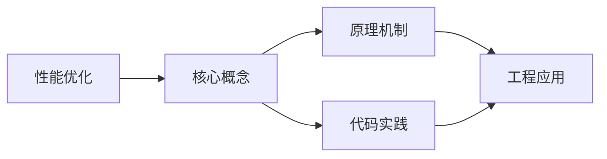
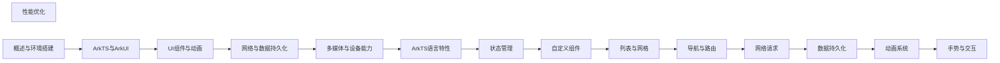

## 1. 学习目标（Bloom 分类）

本节按照布鲁姆教育目标分类学组织学习路径。本文主题为《性能优化》，属于 HarmonyOS 模块，读者可以根据自身阶段选择阅读深度。

记忆层面：能够准确复述本文的核心概念、术语与基本语法或操作步骤，并能够在提问或检索时快速定位对应知识点。能够说出 HarmonyOS 的核心概念、术语与标准写法。

理解层面：能够用自己的语言解释核心原理与工作机制，说明概念之间的因果关系，而不是机械记忆结论。能够解释 HarmonyOS 的工作原理与设计动机。

应用层面：能够在真实项目或练习场景中运用本文知识解决具体问题，写出正确且可维护的实现。能够编写符合 HarmonyOS 规范的完整实现。

分析层面：能够拆解复杂问题，比较本文主题与相邻概念的异同，识别边界条件与例外情况。能够分析 HarmonyOS 与相邻方案的差异与边界。

评价层面：能够根据约束条件（性能、可读性、安全、成本）评价不同方案的优劣，做出有依据的技术决策。能够根据场景评价 HarmonyOS 相关方案的优劣。

创造层面：能够把本文知识与其他模块知识组合，设计出新的解决方案或可复用的工程模式。能够组合 HarmonyOS 与其他技术设计完整方案。

通过本节学习，读者应当能够把《性能优化》纳入自己的知识网络，并与 HarmonyOS 模块的其他主题（ArkTS、ArkUI、分布式能力、应用开发）建立关联。

## 2. 历史动机与发展脉络

《性能优化》是 HarmonyOS 领域的重要主题。要真正理解它，需要先了解它解决的问题与演进过程。

HarmonyOS（鸿蒙）由华为于 2019 年发布，定位面向全场景的分布式操作系统；HarmonyOS NEXT（5.0，2024）去 Android 化，采用自研鸿蒙内核与 ArkTS 语言栈。
开发框架：ArkTS（TS 超集 + 声明式 UI 扩展）、ArkUI（声明式组件）、Stage 模型（应用模型）、方舟编译器。
分布式能力：跨端流转、分布式数据、一次开发多端部署（手机/平板/车机/穿戴）。

回到本文主题：性能优化 的提出与成熟，正是上述技术背景下的必然产物。早期实现往往以简单可用为目标，随着工程规模扩大，社区逐渐沉淀出标准做法与最佳实践；理解这一脉络，可以帮助读者判断“为什么文档中的推荐写法是现在这个样子”，也能在遇到历史遗留代码时准确识别其设计年代与取舍。


## 3. 形式化定义与核心概念精讲

本节把《性能优化》涉及的核心概念以“定义 + 讲解”的形式展开。读者应把定义当作工具，把讲解当作理解路径；两者结合才能形成可迁移的知识。

ArkTS 语法：基于 TypeScript 的类型系统，增加 @Component/@Entry/@State 等装饰器与 UI 描述语法。
ArkUI 组件：Column/Row/Stack 布局容器、Text/Button/Image 基础组件、List/Grid 容器组件；状态管理（@State/@Prop/@Link/@Provide）。
应用模型：Stage 模型以 UIAbility 为页面载体，EntryAbility 入口；module.json5 声明应用配置。

### 3.1 原文章节逐一精讲

原文档把主题拆分为 11 个小节，下面按顺序给出每一节的导读讲解，随后保留原文细节供精读。

#### 原文精读（完整保留）

# 性能优化 语法速查手册

> **符号约定**：`< >` 必填参数 | `[ ]` 可选参数

---

##### 组件复用

```typescript
// 使用 @Reusable 标记可复用组件
@Reusable
@Component
struct ReusableItem {
  @State title: string = ''

  // aboutToReuse 在组件被复用时调用，接收新的数据
  aboutToReuse(params: Record<string, Object): void {
    this.title = params.title as string
  }

  build() {
    Row() {
      Text(this.title).fontSize(16)
    }
    .width('100%')
    .height(60)
  }
}

// 在列表中使用复用组件
@Component
struct ReusableList {
  private dataSource: MyDataSource = new MyDataSource()

  build() {
    List() {
      LazyForEach(this.dataSource, (item: string) => {
        ListItem() {
          // 复用组件，滚动时不会反复创建和销毁
          ReusableItem({ title: item })
        }
      })
    }
    .cachedCount(5)
  }
}
```

##### 条件渲染优化

```typescript
@Component
struct ConditionalRender {
  @State isLoading: boolean = true
  @State data: string[] = []

  build() {
    Column() {
      // 不推荐：使用 if/else 频繁切换（组件会被销毁和重建）
      if (this.isLoading) {
        LoadingProgress()
      } else {
        List() {
          ForEach(this.data, (item: string) => {
            ListItem() { Text(item) }
          })
        }
      }

      // 推荐：使用 visibility 控制显隐（组件不会被销毁）
      LoadingProgress()
        .visibility(this.isLoading ? Visibility.Visible : Visibility.None)

      List() {
        ForEach(this.data, (item: string) => {
          ListItem() { Text(item) }
        })
      }
      .visibility(this.isLoading ? Visibility.None : Visibility.Visible)
    }
  }
}
```

##### 图片优化

```typescript
@Component
struct ImageOptimization {
  build() {
    Column() {
      // 不推荐：加载原始尺寸的大图
      Image('https://example.com/large-image.jpg')
        .width(100).height(100)

      // 推荐：指定解码尺寸，减少内存占用
      Image('https://example.com/large-image.jpg')
        .width(100).height(100)
        .objectFit(ImageFit.Cover)
        .alt($r('app.media.placeholder')) // 加载中显示占位图

      // 推荐：使用本地资源
      Image($r('app.media.icon'))
        .width(48).height(48)
    }
  }
}
```

#### 概述

性能优化是 HarmonyOS 应用开发中不可忽视的环节。一个流畅、响应迅速的应用能显著提升用户体验，而卡顿、耗电的应用则会被用户快速卸载。HarmonyOS 提供了多种性能优化手段，从列表渲染、组件复用到状态管理和内存控制，覆盖了应用开发的各个方面。

为什么需要性能优化？移动设备的计算资源有限，如果应用在列表滚动时掉帧、页面切换时卡顿、后台运行时耗电，用户会直接感受到体验下降。性能问题通常不是单一原因造成的，而是多个小问题叠加的结果，因此需要系统性地排查和优化。

#### 基础概念

**LazyForEach**：懒加载列表组件，只在列表项进入可视区域时才创建和渲染，适合大数据量场景。与 ForEach 不同，ForEach 会一次性创建所有列表项。

**cachedCount**：列表预渲染的缓存项数量。在可视区域外预先渲染若干项，滚动时可以立即显示，减少白屏时间。

**@Reusable**：组件复用装饰器，标记的组件在从组件树上移除后不会被销毁，而是缓存起来供下次复用，减少组件创建和销毁的开销。

**状态管理**：@State、@Prop、@Link 等装饰器管理组件状态。不合理的状态更新会触发不必要的重新渲染，是性能问题的常见来源。

**Profiling**：使用 DevEco Profiler 工具分析应用的 CPU、内存和渲染性能，定位瓶颈。

#### 快速上手

最常见的性能优化场景是列表渲染：

```typescript
// 不推荐：ForEach 一次性渲染所有项
@Component
struct BadList {
  @State items: string[] = Array.from({ length: 10000 }, (_, i) => `项目 ${i}`)

  build() {
    List() {
      ForEach(this.items, (item: string) => {
        ListItem() {
          Text(item).fontSize(16)
        }
      })
    }
  }
}

// 推荐：LazyForEach 懒加载
@Component
struct GoodList {
  // 实现 IDataSource 接口的数据源
  private dataSource: MyDataSource = new MyDataSource()

  build() {
    List() {
      LazyForEach(this.dataSource, (item: string) => {
        ListItem() {
          Text(item).fontSize(16)
        }
      })
    }
    .cachedCount(5) // 预渲染5个缓存项
  }
}

// 实现 IDataSource
class MyDataSource implements IDataSource {
  private data: string[] = Array.from({ length: 10000 }, (_, i) => `项目 ${i}`)
  private listeners: DataChangeListener[] = []

  totalCount(): number {
    return this.data.length
  }

  getData(index: number): string {
    return this.data[index]
  }

  registerDataChangeListener(listener: DataChangeListener): void {
    this.listeners.push(listener)
  }

  unregisterDataChangeListener(listener: DataChangeListener): void {
    this.listeners = this.listeners.filter(l => l !== listener)
  }
}
```

#### 详细用法

##### 减少嵌套层级

```typescript
// 不推荐：深层嵌套
@Component
struct DeepNested {
  build() {
    Column() {
      Column() {
        Row() {
          Column() {
            Text('内容')
          }
        }
      }
    }
  }
}

// 推荐：扁平化布局
@Component
struct FlatLayout {
  build() {
    Column() {
      Text('内容')
    }
    .width('100%')
    .alignItems(HorizontalAlign.Start)
    .justifyContent(FlexAlign.Center)
  }
}
```

##### 状态更新优化

```typescript
@Component
struct StateOptimization {
  @State count: number = 0
  @State list: number[] = []

  // 不推荐：直接修改数组引用（触发整个列表重新渲染）
  addItemBad() {
    this.list = [...this.list, this.count]
  }

  // 推荐：使用数组方法（只更新变化的部分）
  addItemGood() {
    this.list.push(this.count)
  }

  // 不推荐：频繁更新状态
  incrementBad() {
    for (let i = 0; i < 100; i++) {
      this.count += 1 // 每次循环都触发重新渲染
    }
  }

  // 推荐：批量更新
  incrementGood() {
    this.count += 100 // 只触发一次重新渲染
  }

  build() {
    Column() {
      Text(`计数: ${this.count}`)
      Button('增加').onClick(() => this.incrementGood())
    }
  }
}
```

##### 动画性能优化

```typescript
@Component
struct AnimationOptimization {
  @State translateX: number = 0

  build() {
    Column() {
      Row()
        .width(100).height(100)
        .backgroundColor(Color.Blue)
        // 推荐：使用 transform 属性做动画（GPU 加速）
        .translate({ x: this.translateX })
        .animation({
          duration: 300,
          curve: Curve.EaseInOut
        })

      Button('移动').onClick(() => {
        this.translateX = this.translateX === 0 ? 200 : 0
      })
    }
  }
}
```

#### 常见场景

##### 长列表优化完整示例

```typescript
@Reusable
@Component
struct ArticleItem {
  @State title: string = ''
  @State summary: string = ''
  @State imageUrl: string = ''

  aboutToReuse(params: Record<string, Object): void {
    this.title = params.title as string
    this.summary = params.summary as string
    this.imageUrl = params.imageUrl as string
  }

  build() {
    Row() {
      Image(this.imageUrl)
        .width(80).height(80)
        .objectFit(ImageFit.Cover)
        .alt($r('app.media.placeholder'))
      Column() {
        Text(this.title).fontSize(16).fontWeight(FontWeight.Bold)
        Text(this.summary).fontSize(14).fontColor('#666666')
          .maxLines(2).textOverflow({ overflow: TextOverflow.Ellipsis })
      }
      .layoutWeight(1)
      .margin({ left: 12 })
    }
    .width('100%')
    .padding(12)
  }
}

@Component
struct ArticleList {
  private dataSource: ArticleDataSource = new ArticleDataSource()

  build() {
    List({ space: 8 }) {
      LazyForEach(this.dataSource, (item: ArticleData) => {
        ListItem() {
          ArticleItem({
            title: item.title,
            summary: item.summary,
            imageUrl: item.imageUrl
          })
        }
      })
    }
    .cachedCount(3)
    .width('100%')
    .height('100%')
  }
}
```

##### 页面加载优化

```typescript
@Entry
@Component
struct OptimizedPage {
  @State data: string[] = []
  @State isLoading: boolean = true

  // 页面即将显示时加载数据
  aboutToAppear() {
    this.loadData()
  }

  private async loadData() {
    try {
      // 模拟数据加载
      this.data = await fetchData()
    } finally {
      this.isLoading = false
    }
  }

  build() {
    Column() {
      if (this.isLoading) {
        // 加载中状态
        Column() {
          LoadingProgress().width(48).height(48)
          Text('加载中...').margin({ top: 12 })
        }
        .width('100%')
        .height('100%')
        .justifyContent(FlexAlign.Center)
      } else {
        // 内容区域
        List() {
          ForEach(this.data, (item: string) => {
            ListItem() { Text(item).padding(16) }
          })
        }
      }
    }
  }
}
```

#### 注意事项

**避免在 build 方法中创建对象**：build 方法在每次状态更新时都会被调用，在其中创建新对象会导致频繁的垃圾回收。将对象的创建移到组件初始化阶段。

**合理使用 @Watch**：@Watch 装饰器会在状态变化时触发回调，如果回调中又修改了被监听的状态，可能导致无限循环。

**LazyForEach 的 key**：LazyForEach 需要通过 key 来标识列表项的唯一性。确保 key 的生成逻辑稳定且唯一，否则会导致列表渲染异常。

**图片资源大小**：移动设备屏幕有限，加载超过显示尺寸的图片是浪费内存。根据显示尺寸选择合适的图片分辨率。

**内存泄漏**：注意在组件销毁时（aboutToDisappear）清理定时器、取消订阅和释放资源。

#### 进阶用法

##### 使用 DevEco Profiler 分析性能

在 DevEco Studio 中打开 Profiler 工具：

1. 选择 "Run" -> "Profile" 启动性能分析
2. 选择分析类型：CPU、内存、渲染
3. 操作应用复现性能问题
4. 分析热点函数和内存分配

##### 使用 TaskPool 进行耗时计算

```typescript
import taskpool from '@ohos.taskpool'

// 定义耗时任务
@Concurrent
function heavyCalculation(data: number[]): number {
  return data.reduce((sum, val) => sum + val * val, 0)
}

@Component
struct TaskPoolExample {
  @State result: number = 0

  async calculate() {
    const data = Array.from({ length: 1000000 }, (_, i) => i)
    // 在子线程中执行耗时计算
    const task = new taskpool.Task(heavyCalculation, data)
    this.result = await taskpool.execute(task) as number
  }

  build() {
    Column() {
      Text(`结果: ${this.result}`)
      Button('计算').onClick(() => this.calculate())
    }
  }
}
```
#### 构建优化

**基本写法：并行构建**
`hvigorw assembleHap --parallel --daemon`
```bash
# 启用并行构建与守护进程加速
hvigorw --mode module -p module=entry@default assembleHap --parallel --daemon --incremental
```

---

**基本写法：增量构建**
`hvigorw assembleHap --incremental`
```bash
# 仅编译变更部分
hvigorw assembleHap --incremental
```

---

**基本写法：分析构建性能**
`hvigorw assembleHap --analyze=normal`
```bash
# 输出构建分析报告
hvigorw --mode module -p module=entry@default assembleHap --analyze=normal
```

---

#### LazyForEach 懒加载

**基本写法：LazyForEach 替代 ForEach**
`LazyForEach(<数据源>, (<item>) => <组件>, (<item>) => <键>)`
```typescript
// 大数据列表懒加载，仅渲染可视区域
LazyForEach(this.dataSource, (item: string) => {
  ListItem() {
    Text(item).fontSize(16)
  }
}, (item: string) => item)
```

---

**基本写法：实现 IDataSource**
`class <名> implements IDataSource { totalCount(): number { } getData(<index>): <T> { } }`
```typescript
// 自定义懒加载数据源
class MyDataSource implements IDataSource {
  private data: string[] = []
  totalCount(): number { return this.data.length }
  getData(index: number): string { return this.data[index] }
  registerDataChangeListener(listener: DataChangeListener): void { }
  unregisterDataChangeListener(listener: DataChangeListener): void { }
}
```

---

#### 状态管理优化

**基本写法：@ObjectLink 嵌套对象**
`@ObjectLink <var>: <Class>;`
```typescript
// 嵌套对象响应式更新
@Observed
class ItemData {
  name: string = ''
  count: number = 0
}

@Component
struct ItemView {
  @ObjectLink item: ItemData
  build() { Text(`${this.item.name}: ${this.item.count}`) }
}
```

---

**基本写法：@Observed 标记可观察类**
`@Observed class <类名> { }`
```typescript
// 标记类为可观察对象
@Observed
class User {
  name: string
  age: number
  constructor(name: string, age: number) {
    this.name = name
    this.age = age
  }
}
```

---

**基本写法：AppStorage 全局状态**
`AppStorage.setOrCreate('<键>', <值>);`
```typescript
// 全局共享状态，避免逐层传递
AppStorage.setOrCreate('userInfo', { name: 'Tom', age: 18 })
// 获取全局状态
let user = AppStorage.get('userInfo')
```

---

**基本写法：@StorageLink 双向绑定全局状态**
`@StorageLink('<键>') <var>: <类型>;`
```typescript
// 组件内双向绑定 AppStorage
@StorageLink('count') count: number = 0
build() {
  Button(`count: ${this.count}`).onClick(() => this.count++)
}
```

---

#### 任务调度

**基本写法：TaskPool 子线程执行**
`taskpool.execute(<函数>).then(<回调>)`
```typescript
// 将耗时任务放入 TaskPool 子线程
import { taskpool } from '@kit.ArkTS'

@Concurrent
function heavyCompute(input: number): number {
  return input * input
}

taskpool.execute(heavyCompute, 42).then((result) => {
  console.info(`结果: ${result}`)
})
```

---

**基本写法：Worker 子线程**
`const <worker> = new worker.ThreadWorker('<脚本路径>')`
```typescript
// 创建 Worker 线程处理耗时任务
import { worker } from '@kit.ArkTS'

const w = new worker.ThreadWorker('entry/ets/workers/MyWorker.ets')
w.postMessage({ data: 'hello' })
w.onmessage = (e) => { console.info(`收到: ${e.data}`) }
```

---

**基本写法：Worker 发送消息**
`postMessage(<数据>);`
```typescript
// Worker 线程内向主线程发送数据
// MyWorker.ets
const w: worker.ThreadWorker = worker.workerPort
w.onmessage = (e) => {
  w.postMessage(`处理完成: ${e.data}`)
}
```

---


### 3.2 概念关系图

下面用 Mermaid 图表达本文核心概念之间的关系，帮助读者建立整体图景：



图中展示的是本文知识的结构化关系：核心概念是入口，原理机制解释“为什么”，代码实践演示“怎么做”，工程应用回答“何时用”。读者学习时可以把每个小节的内容挂接到对应节点上。

## 4. 理论推导与原理解析

本节深入《性能优化》背后的原理。理论部分不求面面俱到，而是聚焦“能解释现象、能指导实践”的关键推导。

ArkTS 语法：基于 TypeScript 的类型系统，增加 @Component/@Entry/@State 等装饰器与 UI 描述语法。
ArkUI 组件：Column/Row/Stack 布局容器、Text/Button/Image 基础组件、List/Grid 容器组件；状态管理（@State/@Prop/@Link/@Provide）。
应用模型：Stage 模型以 UIAbility 为页面载体，EntryAbility 入口；module.json5 声明应用配置。
生命周期：Ability 的 onCreate/onWindowStageCreate/onForeground/onBackground/onDestroy。

需要强调的是，理论推导与工程实践之间存在翻译层：理论给出的是理想化模型与边界条件，工程代码则必须处理真实环境中的例外。读者在学习时应先掌握理论的“标准情形”，再通过陷阱章节了解“非标准情形”。

## 5. 代码示例与逐行讲解

本节把原文中的代码示例系统整理，并为每个示例补充用途说明与讲解。读者不应只浏览代码，而应逐段对照讲解理解设计意图。

### 5.1 示例：组件复用

该示例来自原文《组件复用》小节，用于演示性能优化相关操作。阅读时请先看代码结构，再看其后的讲解。

```typescript
// 使用 @Reusable 标记可复用组件
@Reusable
@Component
struct ReusableItem {
  @State title: string = ''

  // aboutToReuse 在组件被复用时调用，接收新的数据
  aboutToReuse(params: Record<string, Object): void {
    this.title = params.title as string
  }

  build() {
    Row() {
      Text(this.title).fontSize(16)
    }
    .width('100%')
    .height(60)
  }
}

// 在列表中使用复用组件
@Component
struct ReusableList {
  private dataSource: MyDataSource = new MyDataSource()

  build() {
    List() {
      LazyForEach(this.dataSource, (item: string) => {
        ListItem() {
          // 复用组件，滚动时不会反复创建和销毁
          ReusableItem({ title: item })
        }
      })
    }
    .cachedCount(5)
  }
}
```

讲解：这段代码演示了本节核心知识点。代码中的关键操作可以归纳为三步：准备（定义或初始化）、执行（核心逻辑）、收尾（释放资源或返回结果）。实际项目中，这三步往往被封装为函数或类，以提升复用性与可测试性。

关键点分析：

该示例共 33 行有效代码，结构以数据或配置为主。阅读时应关注：数据字段的含义、配置项的作用，以及它们与运行行为的对应关系。

进阶思考路径：先尝试修改参数观察行为变化，再把示例中的模式迁移到自己的项目中；每次修改都记录预期与实测差异，这是把示例转化为能力的最快方式。

### 5.2 示例：条件渲染优化

该示例来自原文《条件渲染优化》小节，用于演示性能优化相关操作。阅读时请先看代码结构，再看其后的讲解。

```typescript
@Component
struct ConditionalRender {
  @State isLoading: boolean = true
  @State data: string[] = []

  build() {
    Column() {
      // 不推荐：使用 if/else 频繁切换（组件会被销毁和重建）
      if (this.isLoading) {
        LoadingProgress()
      } else {
        List() {
          ForEach(this.data, (item: string) => {
            ListItem() { Text(item) }
          })
        }
      }

      // 推荐：使用 visibility 控制显隐（组件不会被销毁）
      LoadingProgress()
        .visibility(this.isLoading ? Visibility.Visible : Visibility.None)

      List() {
        ForEach(this.data, (item: string) => {
          ListItem() { Text(item) }
        })
      }
      .visibility(this.isLoading ? Visibility.None : Visibility.Visible)
    }
  }
}
```

讲解：这段代码演示了本节核心知识点。代码中的关键操作可以归纳为三步：准备（定义或初始化）、执行（核心逻辑）、收尾（释放资源或返回结果）。实际项目中，这三步往往被封装为函数或类，以提升复用性与可测试性。

关键点分析：

该示例共 28 行有效代码，包含 1 类关键结构（if）。其中：

- 入口与初始化部分负责建立上下文，对应实际项目中的启动或装配逻辑；
- 核心逻辑部分体现本文主题的主要操作，是阅读时最需要对照讲解理解的部分；
- 输出或返回部分把结果交给调用方，注意其类型与边界条件。

进阶思考路径：先尝试修改参数观察行为变化，再把示例中的模式迁移到自己的项目中；每次修改都记录预期与实测差异，这是把示例转化为能力的最快方式。

### 5.3 示例：图片优化

该示例来自原文《图片优化》小节，用于演示性能优化相关操作。阅读时请先看代码结构，再看其后的讲解。

```typescript
@Component
struct ImageOptimization {
  build() {
    Column() {
      // 不推荐：加载原始尺寸的大图
      Image('https://example.com/large-image.jpg')
        .width(100).height(100)

      // 推荐：指定解码尺寸，减少内存占用
      Image('https://example.com/large-image.jpg')
        .width(100).height(100)
        .objectFit(ImageFit.Cover)
        .alt($r('app.media.placeholder')) // 加载中显示占位图

      // 推荐：使用本地资源
      Image($r('app.media.icon'))
        .width(48).height(48)
    }
  }
}
```

讲解：这段代码演示了本节核心知识点。代码中的关键操作可以归纳为三步：准备（定义或初始化）、执行（核心逻辑）、收尾（释放资源或返回结果）。实际项目中，这三步往往被封装为函数或类，以提升复用性与可测试性。

关键点分析：

该示例共 18 行有效代码，结构以数据或配置为主。阅读时应关注：数据字段的含义、配置项的作用，以及它们与运行行为的对应关系。

进阶思考路径：先尝试修改参数观察行为变化，再把示例中的模式迁移到自己的项目中；每次修改都记录预期与实测差异，这是把示例转化为能力的最快方式。

### 5.4 示例：快速上手

该示例来自原文《快速上手》小节，用于演示性能优化相关操作。阅读时请先看代码结构，再看其后的讲解。

```typescript
// 不推荐：ForEach 一次性渲染所有项
@Component
struct BadList {
  @State items: string[] = Array.from({ length: 10000 }, (_, i) => `项目 ${i}`)

  build() {
    List() {
      ForEach(this.items, (item: string) => {
        ListItem() {
          Text(item).fontSize(16)
        }
      })
    }
  }
}

// 推荐：LazyForEach 懒加载
@Component
struct GoodList {
  // 实现 IDataSource 接口的数据源
  private dataSource: MyDataSource = new MyDataSource()

  build() {
    List() {
      LazyForEach(this.dataSource, (item: string) => {
        ListItem() {
          Text(item).fontSize(16)
        }
      })
    }
    .cachedCount(5) // 预渲染5个缓存项
  }
}

// 实现 IDataSource
class MyDataSource implements IDataSource {
  private data: string[] = Array.from({ length: 10000 }, (_, i) => `项目 ${i}`)
  private listeners: DataChangeListener[] = []

  totalCount(): number {
    return this.data.length
  }

  getData(index: number): string {
    return this.data[index]
  }

  registerDataChangeListener(listener: DataChangeListener): void {
    this.listeners.push(listener)
  }

  unregisterDataChangeListener(listener: DataChangeListener): void {
    this.listeners = this.listeners.filter(l => l !== listener)
  }
}
```

讲解：这段代码演示了本节核心知识点。代码中的关键操作可以归纳为三步：准备（定义或初始化）、执行（核心逻辑）、收尾（释放资源或返回结果）。实际项目中，这三步往往被封装为函数或类，以提升复用性与可测试性。

关键点分析：

该示例共 47 行有效代码，包含 2 类关键结构（class、return）。其中：

- 入口与初始化部分负责建立上下文，对应实际项目中的启动或装配逻辑；
- 核心逻辑部分体现本文主题的主要操作，是阅读时最需要对照讲解理解的部分；
- 输出或返回部分把结果交给调用方，注意其类型与边界条件。

进阶思考路径：先尝试修改参数观察行为变化，再把示例中的模式迁移到自己的项目中；每次修改都记录预期与实测差异，这是把示例转化为能力的最快方式。

### 5.5 示例：减少嵌套层级

该示例来自原文《减少嵌套层级》小节，用于演示性能优化相关操作。阅读时请先看代码结构，再看其后的讲解。

```typescript
// 不推荐：深层嵌套
@Component
struct DeepNested {
  build() {
    Column() {
      Column() {
        Row() {
          Column() {
            Text('内容')
          }
        }
      }
    }
  }
}

// 推荐：扁平化布局
@Component
struct FlatLayout {
  build() {
    Column() {
      Text('内容')
    }
    .width('100%')
    .alignItems(HorizontalAlign.Start)
    .justifyContent(FlexAlign.Center)
  }
}
```

讲解：这段代码演示了本节核心知识点。代码中的关键操作可以归纳为三步：准备（定义或初始化）、执行（核心逻辑）、收尾（释放资源或返回结果）。实际项目中，这三步往往被封装为函数或类，以提升复用性与可测试性。

关键点分析：

该示例共 27 行有效代码，结构以数据或配置为主。阅读时应关注：数据字段的含义、配置项的作用，以及它们与运行行为的对应关系。

进阶思考路径：先尝试修改参数观察行为变化，再把示例中的模式迁移到自己的项目中；每次修改都记录预期与实测差异，这是把示例转化为能力的最快方式。

### 5.6 示例：状态更新优化

该示例来自原文《状态更新优化》小节，用于演示性能优化相关操作。阅读时请先看代码结构，再看其后的讲解。

```typescript
@Component
struct StateOptimization {
  @State count: number = 0
  @State list: number[] = []

  // 不推荐：直接修改数组引用（触发整个列表重新渲染）
  addItemBad() {
    this.list = [...this.list, this.count]
  }

  // 推荐：使用数组方法（只更新变化的部分）
  addItemGood() {
    this.list.push(this.count)
  }

  // 不推荐：频繁更新状态
  incrementBad() {
    for (let i = 0; i < 100; i++) {
      this.count += 1 // 每次循环都触发重新渲染
    }
  }

  // 推荐：批量更新
  incrementGood() {
    this.count += 100 // 只触发一次重新渲染
  }

  build() {
    Column() {
      Text(`计数: ${this.count}`)
      Button('增加').onClick(() => this.incrementGood())
    }
  }
}
```

讲解：这段代码演示了本节核心知识点。代码中的关键操作可以归纳为三步：准备（定义或初始化）、执行（核心逻辑）、收尾（释放资源或返回结果）。实际项目中，这三步往往被封装为函数或类，以提升复用性与可测试性。

关键点分析：

该示例共 29 行有效代码，包含 1 类关键结构（for）。其中：

- 入口与初始化部分负责建立上下文，对应实际项目中的启动或装配逻辑；
- 核心逻辑部分体现本文主题的主要操作，是阅读时最需要对照讲解理解的部分；
- 输出或返回部分把结果交给调用方，注意其类型与边界条件。

进阶思考路径：先尝试修改参数观察行为变化，再把示例中的模式迁移到自己的项目中；每次修改都记录预期与实测差异，这是把示例转化为能力的最快方式。

### 5.7 示例：动画性能优化

该示例来自原文《动画性能优化》小节，用于演示性能优化相关操作。阅读时请先看代码结构，再看其后的讲解。

```typescript
@Component
struct AnimationOptimization {
  @State translateX: number = 0

  build() {
    Column() {
      Row()
        .width(100).height(100)
        .backgroundColor(Color.Blue)
        // 推荐：使用 transform 属性做动画（GPU 加速）
        .translate({ x: this.translateX })
        .animation({
          duration: 300,
          curve: Curve.EaseInOut
        })

      Button('移动').onClick(() => {
        this.translateX = this.translateX === 0 ? 200 : 0
      })
    }
  }
}
```

讲解：这段代码演示了本节核心知识点。代码中的关键操作可以归纳为三步：准备（定义或初始化）、执行（核心逻辑）、收尾（释放资源或返回结果）。实际项目中，这三步往往被封装为函数或类，以提升复用性与可测试性。

关键点分析：

该示例共 20 行有效代码，结构以数据或配置为主。阅读时应关注：数据字段的含义、配置项的作用，以及它们与运行行为的对应关系。

进阶思考路径：先尝试修改参数观察行为变化，再把示例中的模式迁移到自己的项目中；每次修改都记录预期与实测差异，这是把示例转化为能力的最快方式。

### 5.8 示例：长列表优化完整示例

该示例来自原文《长列表优化完整示例》小节，用于演示性能优化相关操作。阅读时请先看代码结构，再看其后的讲解。

```typescript
@Reusable
@Component
struct ArticleItem {
  @State title: string = ''
  @State summary: string = ''
  @State imageUrl: string = ''

  aboutToReuse(params: Record<string, Object): void {
    this.title = params.title as string
    this.summary = params.summary as string
    this.imageUrl = params.imageUrl as string
  }

  build() {
    Row() {
      Image(this.imageUrl)
        .width(80).height(80)
        .objectFit(ImageFit.Cover)
        .alt($r('app.media.placeholder'))
      Column() {
        Text(this.title).fontSize(16).fontWeight(FontWeight.Bold)
        Text(this.summary).fontSize(14).fontColor('#666666')
          .maxLines(2).textOverflow({ overflow: TextOverflow.Ellipsis })
      }
      .layoutWeight(1)
      .margin({ left: 12 })
    }
    .width('100%')
    .padding(12)
  }
}

@Component
struct ArticleList {
  private dataSource: ArticleDataSource = new ArticleDataSource()

  build() {
    List({ space: 8 }) {
      LazyForEach(this.dataSource, (item: ArticleData) => {
        ListItem() {
          ArticleItem({
            title: item.title,
            summary: item.summary,
            imageUrl: item.imageUrl
          })
        }
      })
    }
    .cachedCount(3)
    .width('100%')
    .height('100%')
  }
}
```

讲解：这段代码演示了本节核心知识点。代码中的关键操作可以归纳为三步：准备（定义或初始化）、执行（核心逻辑）、收尾（释放资源或返回结果）。实际项目中，这三步往往被封装为函数或类，以提升复用性与可测试性。

关键点分析：

该示例共 49 行有效代码，结构以数据或配置为主。阅读时应关注：数据字段的含义、配置项的作用，以及它们与运行行为的对应关系。

进阶思考路径：先尝试修改参数观察行为变化，再把示例中的模式迁移到自己的项目中；每次修改都记录预期与实测差异，这是把示例转化为能力的最快方式。

### 5.9 示例：页面加载优化

该示例来自原文《页面加载优化》小节，用于演示性能优化相关操作。阅读时请先看代码结构，再看其后的讲解。

```typescript
@Entry
@Component
struct OptimizedPage {
  @State data: string[] = []
  @State isLoading: boolean = true

  // 页面即将显示时加载数据
  aboutToAppear() {
    this.loadData()
  }

  private async loadData() {
    try {
      // 模拟数据加载
      this.data = await fetchData()
    } finally {
      this.isLoading = false
    }
  }

  build() {
    Column() {
      if (this.isLoading) {
        // 加载中状态
        Column() {
          LoadingProgress().width(48).height(48)
          Text('加载中...').margin({ top: 12 })
        }
        .width('100%')
        .height('100%')
        .justifyContent(FlexAlign.Center)
      } else {
        // 内容区域
        List() {
          ForEach(this.data, (item: string) => {
            ListItem() { Text(item).padding(16) }
          })
        }
      }
    }
  }
}
```

讲解：这段代码演示了本节核心知识点。代码中的关键操作可以归纳为三步：准备（定义或初始化）、执行（核心逻辑）、收尾（释放资源或返回结果）。实际项目中，这三步往往被封装为函数或类，以提升复用性与可测试性。

关键点分析：

该示例共 39 行有效代码，包含 1 类关键结构（if）。其中：

- 入口与初始化部分负责建立上下文，对应实际项目中的启动或装配逻辑；
- 核心逻辑部分体现本文主题的主要操作，是阅读时最需要对照讲解理解的部分；
- 输出或返回部分把结果交给调用方，注意其类型与边界条件。

进阶思考路径：先尝试修改参数观察行为变化，再把示例中的模式迁移到自己的项目中；每次修改都记录预期与实测差异，这是把示例转化为能力的最快方式。

### 5.10 示例：使用 TaskPool 进行耗时计算

该示例来自原文《使用 TaskPool 进行耗时计算》小节，用于演示性能优化相关操作。阅读时请先看代码结构，再看其后的讲解。

```typescript
import taskpool from '@ohos.taskpool'

// 定义耗时任务
@Concurrent
function heavyCalculation(data: number[]): number {
  return data.reduce((sum, val) => sum + val * val, 0)
}

@Component
struct TaskPoolExample {
  @State result: number = 0

  async calculate() {
    const data = Array.from({ length: 1000000 }, (_, i) => i)
    // 在子线程中执行耗时计算
    const task = new taskpool.Task(heavyCalculation, data)
    this.result = await taskpool.execute(task) as number
  }

  build() {
    Column() {
      Text(`结果: ${this.result}`)
      Button('计算').onClick(() => this.calculate())
    }
  }
}
```

讲解：这段代码演示了本节核心知识点。代码中的关键操作可以归纳为三步：准备（定义或初始化）、执行（核心逻辑）、收尾（释放资源或返回结果）。实际项目中，这三步往往被封装为函数或类，以提升复用性与可测试性。

关键点分析：

该示例共 22 行有效代码，包含 4 类关键结构（function、import、from、return）。其中：

- 入口与初始化部分负责建立上下文，对应实际项目中的启动或装配逻辑；
- 核心逻辑部分体现本文主题的主要操作，是阅读时最需要对照讲解理解的部分；
- 输出或返回部分把结果交给调用方，注意其类型与边界条件。

进阶思考路径：先尝试修改参数观察行为变化，再把示例中的模式迁移到自己的项目中；每次修改都记录预期与实测差异，这是把示例转化为能力的最快方式。

### 5.11 示例：构建优化

该示例来自原文《构建优化》小节，用于演示性能优化相关操作。阅读时请先看代码结构，再看其后的讲解。

```bash
# 启用并行构建与守护进程加速
hvigorw --mode module -p module=entry@default assembleHap --parallel --daemon --incremental
```

讲解：这段代码演示了本节核心知识点。代码中的关键操作可以归纳为三步：准备（定义或初始化）、执行（核心逻辑）、收尾（释放资源或返回结果）。实际项目中，这三步往往被封装为函数或类，以提升复用性与可测试性。

关键点分析：

该示例共 2 行有效代码，结构以数据或配置为主。阅读时应关注：数据字段的含义、配置项的作用，以及它们与运行行为的对应关系。

进阶思考路径：先尝试修改参数观察行为变化，再把示例中的模式迁移到自己的项目中；每次修改都记录预期与实测差异，这是把示例转化为能力的最快方式。

### 5.12 示例：构建优化

该示例来自原文《构建优化》小节，用于演示性能优化相关操作。阅读时请先看代码结构，再看其后的讲解。

```bash
# 仅编译变更部分
hvigorw assembleHap --incremental
```

讲解：这段代码演示了本节核心知识点。代码中的关键操作可以归纳为三步：准备（定义或初始化）、执行（核心逻辑）、收尾（释放资源或返回结果）。实际项目中，这三步往往被封装为函数或类，以提升复用性与可测试性。

关键点分析：

该示例共 2 行有效代码，结构以数据或配置为主。阅读时应关注：数据字段的含义、配置项的作用，以及它们与运行行为的对应关系。

进阶思考路径：先尝试修改参数观察行为变化，再把示例中的模式迁移到自己的项目中；每次修改都记录预期与实测差异，这是把示例转化为能力的最快方式。

### 5.13 示例：构建优化

该示例来自原文《构建优化》小节，用于演示性能优化相关操作。阅读时请先看代码结构，再看其后的讲解。

```bash
# 输出构建分析报告
hvigorw --mode module -p module=entry@default assembleHap --analyze=normal
```

讲解：这段代码演示了本节核心知识点。代码中的关键操作可以归纳为三步：准备（定义或初始化）、执行（核心逻辑）、收尾（释放资源或返回结果）。实际项目中，这三步往往被封装为函数或类，以提升复用性与可测试性。

关键点分析：

该示例共 2 行有效代码，结构以数据或配置为主。阅读时应关注：数据字段的含义、配置项的作用，以及它们与运行行为的对应关系。

进阶思考路径：先尝试修改参数观察行为变化，再把示例中的模式迁移到自己的项目中；每次修改都记录预期与实测差异，这是把示例转化为能力的最快方式。

### 5.14 示例：LazyForEach 懒加载

该示例来自原文《LazyForEach 懒加载》小节，用于演示性能优化相关操作。阅读时请先看代码结构，再看其后的讲解。

```typescript
// 大数据列表懒加载，仅渲染可视区域
LazyForEach(this.dataSource, (item: string) => {
  ListItem() {
    Text(item).fontSize(16)
  }
}, (item: string) => item)
```

讲解：这段代码演示了本节核心知识点。代码中的关键操作可以归纳为三步：准备（定义或初始化）、执行（核心逻辑）、收尾（释放资源或返回结果）。实际项目中，这三步往往被封装为函数或类，以提升复用性与可测试性。

关键点分析：

该示例共 6 行有效代码，结构以数据或配置为主。阅读时应关注：数据字段的含义、配置项的作用，以及它们与运行行为的对应关系。

进阶思考路径：先尝试修改参数观察行为变化，再把示例中的模式迁移到自己的项目中；每次修改都记录预期与实测差异，这是把示例转化为能力的最快方式。

### 5.15 示例：LazyForEach 懒加载

该示例来自原文《LazyForEach 懒加载》小节，用于演示性能优化相关操作。阅读时请先看代码结构，再看其后的讲解。

```typescript
// 自定义懒加载数据源
class MyDataSource implements IDataSource {
  private data: string[] = []
  totalCount(): number { return this.data.length }
  getData(index: number): string { return this.data[index] }
  registerDataChangeListener(listener: DataChangeListener): void { }
  unregisterDataChangeListener(listener: DataChangeListener): void { }
}
```

讲解：这段代码演示了本节核心知识点。代码中的关键操作可以归纳为三步：准备（定义或初始化）、执行（核心逻辑）、收尾（释放资源或返回结果）。实际项目中，这三步往往被封装为函数或类，以提升复用性与可测试性。

关键点分析：

该示例共 8 行有效代码，包含 2 类关键结构（class、return）。其中：

- 入口与初始化部分负责建立上下文，对应实际项目中的启动或装配逻辑；
- 核心逻辑部分体现本文主题的主要操作，是阅读时最需要对照讲解理解的部分；
- 输出或返回部分把结果交给调用方，注意其类型与边界条件。

进阶思考路径：先尝试修改参数观察行为变化，再把示例中的模式迁移到自己的项目中；每次修改都记录预期与实测差异，这是把示例转化为能力的最快方式。

### 5.16 示例：状态管理优化

该示例来自原文《状态管理优化》小节，用于演示性能优化相关操作。阅读时请先看代码结构，再看其后的讲解。

```typescript
// 嵌套对象响应式更新
@Observed
class ItemData {
  name: string = ''
  count: number = 0
}

@Component
struct ItemView {
  @ObjectLink item: ItemData
  build() { Text(`${this.item.name}: ${this.item.count}`) }
}
```

讲解：这段代码演示了本节核心知识点。代码中的关键操作可以归纳为三步：准备（定义或初始化）、执行（核心逻辑）、收尾（释放资源或返回结果）。实际项目中，这三步往往被封装为函数或类，以提升复用性与可测试性。

关键点分析：

该示例共 11 行有效代码，包含 1 类关键结构（class）。其中：

- 入口与初始化部分负责建立上下文，对应实际项目中的启动或装配逻辑；
- 核心逻辑部分体现本文主题的主要操作，是阅读时最需要对照讲解理解的部分；
- 输出或返回部分把结果交给调用方，注意其类型与边界条件。

进阶思考路径：先尝试修改参数观察行为变化，再把示例中的模式迁移到自己的项目中；每次修改都记录预期与实测差异，这是把示例转化为能力的最快方式。

### 5.17 示例：状态管理优化

该示例来自原文《状态管理优化》小节，用于演示性能优化相关操作。阅读时请先看代码结构，再看其后的讲解。

```typescript
// 标记类为可观察对象
@Observed
class User {
  name: string
  age: number
  constructor(name: string, age: number) {
    this.name = name
    this.age = age
  }
}
```

讲解：这段代码演示了本节核心知识点。代码中的关键操作可以归纳为三步：准备（定义或初始化）、执行（核心逻辑）、收尾（释放资源或返回结果）。实际项目中，这三步往往被封装为函数或类，以提升复用性与可测试性。

关键点分析：

该示例共 10 行有效代码，包含 1 类关键结构（class）。其中：

- 入口与初始化部分负责建立上下文，对应实际项目中的启动或装配逻辑；
- 核心逻辑部分体现本文主题的主要操作，是阅读时最需要对照讲解理解的部分；
- 输出或返回部分把结果交给调用方，注意其类型与边界条件。

进阶思考路径：先尝试修改参数观察行为变化，再把示例中的模式迁移到自己的项目中；每次修改都记录预期与实测差异，这是把示例转化为能力的最快方式。

### 5.18 示例：状态管理优化

该示例来自原文《状态管理优化》小节，用于演示性能优化相关操作。阅读时请先看代码结构，再看其后的讲解。

```typescript
// 全局共享状态，避免逐层传递
AppStorage.setOrCreate('userInfo', { name: 'Tom', age: 18 })
// 获取全局状态
let user = AppStorage.get('userInfo')
```

讲解：这段代码演示了本节核心知识点。代码中的关键操作可以归纳为三步：准备（定义或初始化）、执行（核心逻辑）、收尾（释放资源或返回结果）。实际项目中，这三步往往被封装为函数或类，以提升复用性与可测试性。

关键点分析：

该示例共 4 行有效代码，结构以数据或配置为主。阅读时应关注：数据字段的含义、配置项的作用，以及它们与运行行为的对应关系。

进阶思考路径：先尝试修改参数观察行为变化，再把示例中的模式迁移到自己的项目中；每次修改都记录预期与实测差异，这是把示例转化为能力的最快方式。

### 5.19 示例：状态管理优化

该示例来自原文《状态管理优化》小节，用于演示性能优化相关操作。阅读时请先看代码结构，再看其后的讲解。

```typescript
// 组件内双向绑定 AppStorage
@StorageLink('count') count: number = 0
build() {
  Button(`count: ${this.count}`).onClick(() => this.count++)
}
```

讲解：这段代码演示了本节核心知识点。代码中的关键操作可以归纳为三步：准备（定义或初始化）、执行（核心逻辑）、收尾（释放资源或返回结果）。实际项目中，这三步往往被封装为函数或类，以提升复用性与可测试性。

关键点分析：

该示例共 5 行有效代码，结构以数据或配置为主。阅读时应关注：数据字段的含义、配置项的作用，以及它们与运行行为的对应关系。

进阶思考路径：先尝试修改参数观察行为变化，再把示例中的模式迁移到自己的项目中；每次修改都记录预期与实测差异，这是把示例转化为能力的最快方式。

### 5.20 示例：任务调度

该示例来自原文《任务调度》小节，用于演示性能优化相关操作。阅读时请先看代码结构，再看其后的讲解。

```typescript
// 将耗时任务放入 TaskPool 子线程
import { taskpool } from '@kit.ArkTS'

@Concurrent
function heavyCompute(input: number): number {
  return input * input
}

taskpool.execute(heavyCompute, 42).then((result) => {
  console.info(`结果: ${result}`)
})
```

讲解：这段代码演示了本节核心知识点。代码中的关键操作可以归纳为三步：准备（定义或初始化）、执行（核心逻辑）、收尾（释放资源或返回结果）。实际项目中，这三步往往被封装为函数或类，以提升复用性与可测试性。

关键点分析：

该示例共 9 行有效代码，包含 4 类关键结构（function、import、from、return）。其中：

- 入口与初始化部分负责建立上下文，对应实际项目中的启动或装配逻辑；
- 核心逻辑部分体现本文主题的主要操作，是阅读时最需要对照讲解理解的部分；
- 输出或返回部分把结果交给调用方，注意其类型与边界条件。

进阶思考路径：先尝试修改参数观察行为变化，再把示例中的模式迁移到自己的项目中；每次修改都记录预期与实测差异，这是把示例转化为能力的最快方式。

### 5.21 示例：任务调度

该示例来自原文《任务调度》小节，用于演示性能优化相关操作。阅读时请先看代码结构，再看其后的讲解。

```typescript
// 创建 Worker 线程处理耗时任务
import { worker } from '@kit.ArkTS'

const w = new worker.ThreadWorker('entry/ets/workers/MyWorker.ets')
w.postMessage({ data: 'hello' })
w.onmessage = (e) => { console.info(`收到: ${e.data}`) }
```

讲解：这段代码演示了本节核心知识点。代码中的关键操作可以归纳为三步：准备（定义或初始化）、执行（核心逻辑）、收尾（释放资源或返回结果）。实际项目中，这三步往往被封装为函数或类，以提升复用性与可测试性。

关键点分析：

该示例共 5 行有效代码，包含 2 类关键结构（import、from）。其中：

- 入口与初始化部分负责建立上下文，对应实际项目中的启动或装配逻辑；
- 核心逻辑部分体现本文主题的主要操作，是阅读时最需要对照讲解理解的部分；
- 输出或返回部分把结果交给调用方，注意其类型与边界条件。

进阶思考路径：先尝试修改参数观察行为变化，再把示例中的模式迁移到自己的项目中；每次修改都记录预期与实测差异，这是把示例转化为能力的最快方式。

### 5.22 示例：任务调度

该示例来自原文《任务调度》小节，用于演示性能优化相关操作。阅读时请先看代码结构，再看其后的讲解。

```typescript
// Worker 线程内向主线程发送数据
// MyWorker.ets
const w: worker.ThreadWorker = worker.workerPort
w.onmessage = (e) => {
  w.postMessage(`处理完成: ${e.data}`)
}
```

讲解：这段代码演示了本节核心知识点。代码中的关键操作可以归纳为三步：准备（定义或初始化）、执行（核心逻辑）、收尾（释放资源或返回结果）。实际项目中，这三步往往被封装为函数或类，以提升复用性与可测试性。

关键点分析：

该示例共 6 行有效代码，结构以数据或配置为主。阅读时应关注：数据字段的含义、配置项的作用，以及它们与运行行为的对应关系。

进阶思考路径：先尝试修改参数观察行为变化，再把示例中的模式迁移到自己的项目中；每次修改都记录预期与实测差异，这是把示例转化为能力的最快方式。


综合以上示例，可以总结出本主题的代码实践要点：第一，先定义清晰的输入输出契约；第二，核心逻辑保持单一职责；第三，错误处理与边界条件不可省略；第四，命名与注释表达意图而非复述代码。

## 6. 对比分析

对比是理解《性能优化》定位的最快路径。下面从多个维度与相邻方案进行对比。

ArkTS 与 TypeScript：ArkTS 是 TS 子集扩展（禁部分动态特性），UI 语法不同。
ArkUI 与 Compose/SwiftUI：声明式思想一致，组件与状态机制各有特色。
Stage 与 FA 模型：Stage 是新标准，FA 为早期模型。

对比的目的不是分出绝对优劣，而是建立选择依据：不同约束条件下，最优解不同。读者应把每个对比维度转化为决策检查清单。

## 7. 常见陷阱与最佳实践

本节整理该主题的高频错误与推荐做法。每个陷阱先描述现象，再解释原因，最后给出最佳实践。

### 7.1 状态未响应

普通变量赋值不触发 UI 更新。使用 @State 装饰。

深入讲解：该问题之所以被归类为“常见陷阱”，是因为它在初学者的代码中反复出现，而且往往不在第一时间暴露——错误通常隐藏在特定数据或特定时序下。

从成因上看，状态未响应 一般源于对 HarmonyOS 某个机制的理解偏差：要么误用了默认行为，要么忽略了边界条件，要么把其他语言的思维惯性带了过来。

从影响上看，状态未响应 轻则产生错误结果，重则导致资源泄漏、数据损坏或安全事故；这也是为什么工程评审中会把它列为检查项。

从修复策略上看，处理状态未响应的正确顺序是：先复现（构造最小用例），再定位（确认机制层面的根因），最后修复并补充回归测试。跳过复现直接改代码，往往治标不治本。

### 7.2 组件复用 key

ForEach 缺 key 导致渲染错位。提供稳定键。

深入讲解：该问题之所以被归类为“常见陷阱”，是因为它在初学者的代码中反复出现，而且往往不在第一时间暴露——错误通常隐藏在特定数据或特定时序下。

从成因上看，组件复用 key 一般源于对 HarmonyOS 某个机制的理解偏差：要么误用了默认行为，要么忽略了边界条件，要么把其他语言的思维惯性带了过来。

从影响上看，组件复用 key 轻则产生错误结果，重则导致资源泄漏、数据损坏或安全事故；这也是为什么工程评审中会把它列为检查项。

从修复策略上看，处理组件复用 key的正确顺序是：先复现（构造最小用例），再定位（确认机制层面的根因），最后修复并补充回归测试。跳过复现直接改代码，往往治标不治本。

### 7.3 异步回调更新状态

非 UI 线程直接改状态。使用主线程回调或状态管理 API。

深入讲解：该问题之所以被归类为“常见陷阱”，是因为它在初学者的代码中反复出现，而且往往不在第一时间暴露——错误通常隐藏在特定数据或特定时序下。

从成因上看，异步回调更新状态 一般源于对 HarmonyOS 某个机制的理解偏差：要么误用了默认行为，要么忽略了边界条件，要么把其他语言的思维惯性带了过来。

从影响上看，异步回调更新状态 轻则产生错误结果，重则导致资源泄漏、数据损坏或安全事故；这也是为什么工程评审中会把它列为检查项。

从修复策略上看，处理异步回调更新状态的正确顺序是：先复现（构造最小用例），再定位（确认机制层面的根因），最后修复并补充回归测试。跳过复现直接改代码，往往治标不治本。

### 7.4 资源引用错误

字符串硬编码无法国际化。使用 $r 资源引用。

深入讲解：该问题之所以被归类为“常见陷阱”，是因为它在初学者的代码中反复出现，而且往往不在第一时间暴露——错误通常隐藏在特定数据或特定时序下。

从成因上看，资源引用错误 一般源于对 HarmonyOS 某个机制的理解偏差：要么误用了默认行为，要么忽略了边界条件，要么把其他语言的思维惯性带了过来。

从影响上看，资源引用错误 轻则产生错误结果，重则导致资源泄漏、数据损坏或安全事故；这也是为什么工程评审中会把它列为检查项。

从修复策略上看，处理资源引用错误的正确顺序是：先复现（构造最小用例），再定位（确认机制层面的根因），最后修复并补充回归测试。跳过复现直接改代码，往往治标不治本。

### 7.5 分布式能力误用

跨端能力需权限与用户确认。优先单端能力。

深入讲解：该问题之所以被归类为“常见陷阱”，是因为它在初学者的代码中反复出现，而且往往不在第一时间暴露——错误通常隐藏在特定数据或特定时序下。

从成因上看，分布式能力误用 一般源于对 HarmonyOS 某个机制的理解偏差：要么误用了默认行为，要么忽略了边界条件，要么把其他语言的思维惯性带了过来。

从影响上看，分布式能力误用 轻则产生错误结果，重则导致资源泄漏、数据损坏或安全事故；这也是为什么工程评审中会把它列为检查项。

从修复策略上看，处理分布式能力误用的正确顺序是：先复现（构造最小用例），再定位（确认机制层面的根因），最后修复并补充回归测试。跳过复现直接改代码，往往治标不治本。

### 7.6 内存泄漏

事件监听未移除。onDisappear/onDestroy 清理。

深入讲解：该问题之所以被归类为“常见陷阱”，是因为它在初学者的代码中反复出现，而且往往不在第一时间暴露——错误通常隐藏在特定数据或特定时序下。

从成因上看，内存泄漏 一般源于对 HarmonyOS 某个机制的理解偏差：要么误用了默认行为，要么忽略了边界条件，要么把其他语言的思维惯性带了过来。

从影响上看，内存泄漏 轻则产生错误结果，重则导致资源泄漏、数据损坏或安全事故；这也是为什么工程评审中会把它列为检查项。

从修复策略上看，处理内存泄漏的正确顺序是：先复现（构造最小用例），再定位（确认机制层面的根因），最后修复并补充回归测试。跳过复现直接改代码，往往治标不治本。

### 7.7 版本兼容

新 API 在旧版本不可用。使用 canIUse 或版本判断。

深入讲解：该问题之所以被归类为“常见陷阱”，是因为它在初学者的代码中反复出现，而且往往不在第一时间暴露——错误通常隐藏在特定数据或特定时序下。

从成因上看，版本兼容 一般源于对 HarmonyOS 某个机制的理解偏差：要么误用了默认行为，要么忽略了边界条件，要么把其他语言的思维惯性带了过来。

从影响上看，版本兼容 轻则产生错误结果，重则导致资源泄漏、数据损坏或安全事故；这也是为什么工程评审中会把它列为检查项。

从修复策略上看，处理版本兼容的正确顺序是：先复现（构造最小用例），再定位（确认机制层面的根因），最后修复并补充回归测试。跳过复现直接改代码，往往治标不治本。

### 7.0 最佳实践总览

1. 组件化与状态分层：UI 状态用装饰器，业务状态用 AppStorage/单例。
2. 页面路由：router 或 Navigation 组件；参数传递类型化。
3. 调试：DevEco Studio 预览器、Profiler、日志分级。

把这些最佳实践固化为团队规范与代码评审检查项，是避免同类问题反复出现的关键。

## 8. 工程实践

本节把《性能优化》放入真实工程场景，给出可复用的模式与组织方法。

工程结构：entry 模块（UIAbility）、common 公共能力、resources 资源目录。
测试：HarmonyOS 测试框架 + DevEco 自动化。
发布：HAP 打包、签名、上架华为应用市场。

### 8.1 工程实践的原则拆解

以上工程实践可以归纳为四条原则。第一，配置与代码分离：HarmonyOS 项目中环境差异应通过配置注入，而不是散落在代码分支中；这保证同一份代码可以在开发、测试、生产环境一致运行。

第二，接口稳定优先：对外接口（函数签名、协议、数据格式）一旦被消费方依赖，变更成本极高；设计时应预留扩展点并保持向后兼容。

第三，可观测性内置：日志、指标与追踪应该在功能开发时同步设计，而不是故障发生后补救；没有观测手段的模块等于黑盒。

第四，变更可回滚：任何发布都应有对应的回滚方案；数据库迁移、配置变更与代码发布一样需要版本管理与逆向路径。

### 8.2 实践落地的检查清单

- [ ] 工程结构：对照本节描述，检查当前项目是否已经落实；未落实的项列入技术债并排期处理。
- [ ] 测试：对照本节描述，检查当前项目是否已经落实；未落实的项列入技术债并排期处理。
- [ ] 发布：对照本节描述，检查当前项目是否已经落实；未落实的项列入技术债并排期处理。

工程实践的共性原则：配置与代码分离、接口稳定优先、可观测性内置、变更可回滚。这些原则适用于本主题的所有实现。

## 9. 案例研究

本节通过一个完整案例把《性能优化》的知识串起来。案例按“需求分析、方案设计、实现、验证”四步展开。

需求：实现跨端待办应用首页（手机 + 平板自适应）。
方案：ArkUI 响应式布局（断点）+ @State 列表 + 本地持久化。
要点：ForEach key、删除动画、空态设计。
验证：双端预览、数据持久化、无障碍检查。

### 9.1 案例的扩展讨论

把案例中的方案放大到真实规模，需要额外考虑三个问题：

第一，规模：当数据量或并发量上升一个数量级时，原方案中的数据结构、缓存策略与任务调度是否仍然成立？通常需要引入分层与异步。

第二，团队：多人协作时，模块边界、接口契约与代码所有权必须明确；案例中的实现应拆分为可独立测试的单元，并配合文档说明设计意图。

第三，演进：上线后的需求变化不可避免；方案设计时应预留扩展点（配置化、插件化、事件化），并定期用真实指标验证假设。


案例研究的学习方法：先独立阅读需求，尝试在脑中形成方案，再对照实现与讲解，最后思考“如果约束变化（数据量、并发、团队规模），方案应如何调整”。

## 10. 知识要点总结与深入讲解

本节以讲解形式汇总全文要点，替代传统的习题与自测，读者不需要答题，只需跟随解释建立完整的认知框架。

关于《性能优化》的核心结论：

HarmonyOS 开发以 ArkTS/ArkUI 为核心，声明式 UI 与现代前端心智模型一致。
Stage 模型与生命周期是应用骨架，状态管理决定 UI 响应。
多端与分布式是差异化能力，按场景选用。

原文档各小节的要点回顾：

- 概述：该小节围绕性能优化展开具体细节，阅读时应关注其与核心结论的对应关系；每个小节都是核心结论在某一个侧面的展开。
- 基础概念：该小节围绕性能优化展开具体细节，阅读时应关注其与核心结论的对应关系；每个小节都是核心结论在某一个侧面的展开。
- 快速上手：该小节围绕性能优化展开具体细节，阅读时应关注其与核心结论的对应关系；每个小节都是核心结论在某一个侧面的展开。
- 详细用法：该小节围绕性能优化展开具体细节，阅读时应关注其与核心结论的对应关系；每个小节都是核心结论在某一个侧面的展开。
- 常见场景：该小节围绕性能优化展开具体细节，阅读时应关注其与核心结论的对应关系；每个小节都是核心结论在某一个侧面的展开。
- 注意事项：该小节围绕性能优化展开具体细节，阅读时应关注其与核心结论的对应关系；每个小节都是核心结论在某一个侧面的展开。
- 进阶用法：该小节围绕性能优化展开具体细节，阅读时应关注其与核心结论的对应关系；每个小节都是核心结论在某一个侧面的展开。
- 构建优化：该小节围绕性能优化展开具体细节，阅读时应关注其与核心结论的对应关系；每个小节都是核心结论在某一个侧面的展开。
- LazyForEach 懒加载：该小节围绕性能优化展开具体细节，阅读时应关注其与核心结论的对应关系；每个小节都是核心结论在某一个侧面的展开。
- 状态管理优化：该小节围绕性能优化展开具体细节，阅读时应关注其与核心结论的对应关系；每个小节都是核心结论在某一个侧面的展开。
- 任务调度：该小节围绕性能优化展开具体细节，阅读时应关注其与核心结论的对应关系；每个小节都是核心结论在某一个侧面的展开。

把以上要点与第 3-9 节的内容对照复习，即可完成对本文主题的闭环学习。

## 11. 参考文献


华为开发者联盟 HarmonyOS 文档：https://developer.huawei.com/consumer/cn/harmonyos
ArkTS 语言规范：https://developer.huawei.com/consumer/cn/doc/harmonyos-guides/arkts-overview
ArkUI 组件参考：https://developer.huawei.com/consumer/cn/doc/harmonyos-references/
DevEco Studio：https://developer.huawei.com/consumer/cn/deveco-studio/

## 12. 延伸阅读


TypeScript 基础（ArkTS 语言底座），见 009-typescript 模块。
声明式 UI 概念与 React/Vue 对比，见 011-react/010-vue3 模块。
移动端应用架构，见 018-harmonyos 模块文档。
尚硅谷 Bilibili 空间（https://space.bilibili.com/302417610 ）提供鸿蒙开发课程。

## 14. 模块知识图谱与学习路径

本文属于 HarmonyOS 模块。为了把《性能优化》放入完整的知识网络，下面列出本模块的全部主题并给出相互关联的导读。学习时建议按模块内顺序推进，并在每个文档中留意交叉引用。



上图为模块主题的推荐学习顺序示意图（仅展示前若干主题）。各主题之间存在三类关联：

第一，前置依赖关系：早期主题是后期主题的基础，例如环境与语法先行、进阶主题随后；

第二，横向并列关系：同一层级主题从不同角度覆盖模块能力，学习顺序可以按兴趣调整；

第三，工程组合关系：多个主题在真实项目中组合使用，例如配置、性能与安全主题往往出现在同一系统的不同层面。

### 14.1 模块主题速查表

| 文档 | 主题 | 与本文的关联 |
| --- | --- | --- |
| 概述与环境搭建 | 001-OverviewSetup | 本文的前置基础 |
| ArkTS与ArkUI | 002-ArkTSArkUI | 本文的并列主题 |
| UI组件与动画 | 003-UIComponentAnimation | 本文的并列主题 |
| 网络与数据持久化 | 004-NetworkAndPersistence | 本文的并列主题 |
| 多媒体与设备能力 | 005-MultimediaDeviceCapability | 本文的并列主题 |
| ArkTS语言特性 | 006-ArkTSLanguageFeature | 本文的并列主题 |
| 状态管理 | 007-StateManagement | 本文的并列主题 |
| 自定义组件 | 008-CustomComponent | 本文的并列主题 |
| 列表与网格 | 009-ListGrid | 本文的并列主题 |
| 导航与路由 | 010-NavigationRoute | 本文的并列主题 |
| 网络请求 | 011-NetworkRequest | 本文的并列主题 |
| 数据持久化 | 012-DataPersistence | 本文的并列主题 |
| 动画系统 | 013-AnimationSystem | 本文的并列主题 |
| 手势与交互 | 014-GestureInteraction | 本文的并列主题 |
| 通知与权限 | 015-NotificationPermission | 本文的安全延伸 |
| 多媒体能力 | 016-MultimediaCapability | 本文的并列主题 |
| 传感器与位置 | 017-SensorLocation | 本文的并列主题 |
| 卡片开发 | 018-CardDevelopment | 本文的并列主题 |
| 分布式能力 | 019-DistributedCapability | 本文的并列主题 |
| 性能优化 | 020-PerformanceOptimization | 本文自身 |
| 国际化与无障碍 | 021-I18nAccessibility | 本文的并列主题 |
| 测试与调试 | 022-TestDebug | 本文的并列主题 |
| 应用签名与发布 | 023-AppSignaturePublish | 本文的并列主题 |
| Stage模型与FA模型区别 | 024-StageFAModelDifference | 本文的并列主题 |
| ArkTS与TypeScript差异 | 025-ArkTSTypeScriptDifference | 本文的并列主题 |
| ArkUI声明式语法 | 026-ArkUIDeclarativeSyntax | 本文的并列主题 |
| 组件生命周期详解 | 027-ComponentLifecycleDetailed | 本文的并列主题 |
| 路由跳转与路由栈 | 028-RouteJumpStack | 本文的并列主题 |
| 权限申请 | 029-PermissionRequest | 本文的安全延伸 |
| 分布式数据管理 | 030-DistributedDataManagement | 本文的并列主题 |
| 跨设备调用 | 031-CrossDeviceCall | 本文的并列主题 |
| 元服务开发与发布 | 032-AtomicServiceDevPublish | 本文的并列主题 |
| DevEco-Studio调试器 | 033-DevEcoStudioDebugger | 本文的并列主题 |

速查表的作用是让读者快速判断：哪些文档应在阅读本文前掌握（前置基础），哪些文档应在阅读本文后继续（延伸主题）。本模块的交叉引用体系即以此表为基础。

## 15. 术语表

下表整理《性能优化》及 HarmonyOS 模块中出现的高频术语，给出简明释义。术语按字母序或逻辑序排列，供查阅。

| 术语 | 释义 |
| --- | --- |
| ArkTS 语法 | 基于 TypeScript 的类型系统，增加 @Component/@Entry/@State 等装饰器与 UI 描述语法。 |
| ArkUI 组件 | Column/Row/Stack 布局容器、Text/Button/Image 基础组件、List/Grid 容器组件；状态管理（@State/@Prop/@L |
| 应用模型 | Stage 模型以 UIAbility 为页面载体，EntryAbility 入口；module.json5 声明应用配置。 |
| 生命周期 | Ability 的 onCreate/onWindowStageCreate/onForeground/onBackground/onDestroy。 |
| 状态未响应（易错点） | 参见常见陷阱章节的详细讲解 |
| 组件复用 key（易错点） | 参见常见陷阱章节的详细讲解 |
| 异步回调更新状态（易错点） | 参见常见陷阱章节的详细讲解 |
| 资源引用错误（易错点） | 参见常见陷阱章节的详细讲解 |
| 分布式能力误用（易错点） | 参见常见陷阱章节的详细讲解 |
| 内存泄漏（易错点） | 参见常见陷阱章节的详细讲解 |

术语表与正文配合使用：先通读正文，遇到模糊术语回查本表；长期使用后术语会自然进入工作记忆。
