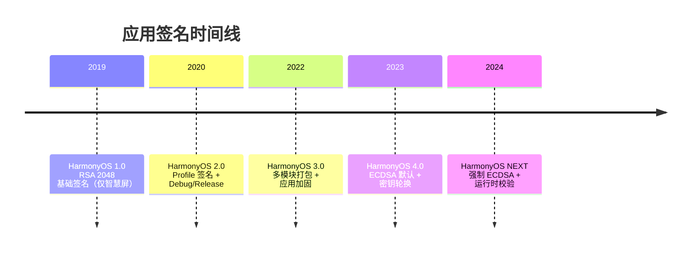

# 应用签名与发布：HarmonyOS 代码签名体系与分发工程实践

> 应用签名是移动操作系统安全模型的"信任锚点"——它不仅是应用身份的数字证明，更是整个分发链条的完整性保障。本章按 CMU 15-410（Distributed Systems）、MIT 6.858（Computer Systems Security）、Stanford CS155（Computer and Network Security）等课程标准组织，系统讲解 HarmonyOS 代码签名体系、PKI（Public Key Infrastructure）信任链、SHA256withECDSA 算法、HAP/APP 包格式、Debug/Release 签名 Profile、`build-profile.json5` 签名配置、`hvigorw` 构建工具链、应用市场分发流程、多模块打包、版本管理、应用加固、CI/CD 自动化构建、签名证书生命周期管理等核心议题，并对照 Android APK Signing v2/v3、iOS Code Signing、Windows Authenticode 等业界方案。

---

## 1. 历史动机与发展脉络

### 1.1 移动应用签名的演进（2008-2024）

移动应用签名体系经历了从"简单哈希"到"分级信任链"的演进：

| 年代 | 平台 | 签名方案 | 关键特征 |
| --- | --- | --- | --- |
| 2008 | Android 1.0 | JAR Signing (v1) | 仅校验 ZIP 内容，未覆盖 APK 元数据 |
| 2015 | Android 7.0 | APK Signature Scheme v2 | 全文件校验，防 ZIP 修改 |
| 2018 | Android 9.0 | APK Signature Scheme v3 | 支持密钥轮换 |
| 2010 | iOS 4 | Code Signing | 苹果根 CA + 开发者证书 |
| 2017 | iOS 11 | App Thinning | 分片签名，按设备分发 |
| 2019 | HarmonyOS 1.0 | 基础签名 | 仅智慧屏，RSA 2048 |
| 2020 | HarmonyOS 2.0 | Profile 签名 | 引入 .p7b Profile |
| 2023 | HarmonyOS 4.0 | ECDSA 默认 | ECDSA P-256 成为默认 |
| 2024 | HarmonyOS NEXT | 强制 ECDSA | RSA 仅兼容保留 |

HarmonyOS 签名体系吸收了 iOS Code Signing 的 Profile 机制与 Android APK Signing v2 的全文件校验思想，同时强制使用更先进的 ECDSA 算法。

### 1.2 HarmonyOS 1.0（2019）：基础签名

HarmonyOS 1.0 仅运行于智慧屏：

- 使用 RSA 2048 签名。
- 无 Profile 机制，仅校验证书。
- 应用通过华为内部渠道分发，无公开市场。
- 签名工具为 `hapkgsign` 命令行工具。

### 1.3 HarmonyOS 2.0（2020）：Profile 引入

HarmonyOS 2.0 随手机形态发布：

- 引入签名 Profile（.p7b），绑定包名与开发者。
- 支持 Debug 与 Release 双签名模式。
- 引入 `build-profile.json5` 签名配置。
- DevEco Studio 集成自动签名功能。
- 上架华为应用市场（AppGallery）。

### 1.4 HarmonyOS 3.0（2022）：多模块打包

HarmonyOS 3.0 引入多模块：

- 支持 `entry`/`feature`/`shared` 三种模块类型。
- APP 包聚合多个 HAP，统一签名。
- 引入 `installationFree` 原子化服务。
- 支持应用加固（VMP、混淆）。
- 引入 `hvigorw` 构建工具，替代 `gradle`。

### 1.5 HarmonyOS 4.0（2023）：ECDSA 默认

HarmonyOS 4.0 签名体系升级：

- ECDSA P-256 成为默认签名算法，RSA 仍兼容。
- 引入签名时间戳（TSA），支持签名过期后的验证。
- 支持密钥轮换：新版本可使用新密钥，旧版本仍可验证。
- 引入 `signAlg` 字段，显式声明算法。
- 应用加固升级：支持代码混淆、资源加密、反调试。

### 1.6 HarmonyOS NEXT（2024）：强制 ECDSA

HarmonyOS NEXT 进一步强化签名：

- 强制使用 ECDSA，RSA 不再推荐。
- 引入"应用来源验证"：仅允许华为应用市场或企业 MDM 分发。
- 签名 Profile 绑定设备清单（针对企业内测）。
- 引入"运行时完整性校验"：系统周期性校验应用签名。
- 支持"多签名"：同一应用可由多方联合签名（如 OEM + 开发者）。

### 1.7 OpenHarmony 签名演进

| OpenHarmony 版本 | 签名方案 | 关键特性 |
| --- | --- | --- |
| 1.0 | RSA 2048 | 基础 JAR 签名 |
| 2.0 | Profile + RSA | 引入 .p7b Profile |
| 3.0 | 多模块打包 | APP 聚合签名 |
| 4.0 | ECDSA 默认 | P-256 算法 |
| 5.0 | 强制 ECDSA | 运行时完整性校验 |

### 1.8 时间线总览



---

## 2. 形式化定义

### 2.1 代码签名的形式化定义

定义 HarmonyOS 代码签名为六元组：

$$
\mathcal{S} = \langle \mathcal{K}, \mathcal{C}, \mathcal{P}, \mathcal{A}, \mathcal{V}, \mathcal{T} \rangle
$$

其中：

- $\mathcal{K} = \{k_{priv}, k_{pub}\}$ 为非对称密钥对，$k_{priv}$ 为私钥，$k_{pub}$ 为公钥。
- $\mathcal{C}: \text{Subject} \to \text{Certificate}$ 为证书签发函数，将开发者身份绑定到公钥。
- $\mathcal{P}: \text{BundleName} \times \text{Developer} \times \text{Permissions} \to \text{Profile}$ 为 Profile 签发函数。
- $\mathcal{A}: \text{AppPackage} \times k_{priv} \to \text{Signature}$ 为签名函数，生成应用签名。
- $\mathcal{V}: \text{AppPackage} \times \text{Signature} \times k_{pub} \to \{\text{valid}, \text{invalid}\}$ 为验证函数。
- $\mathcal{T}: \text{RootCA} \to \text{IntermediateCA} \to \text{DeveloperCert}$ 为信任链。

### 2.2 签名算法的数学定义

**SHA256withECDSA**：

$$
\text{Sig}(m, k_{priv}) = (r, s)
$$

其中：

- $m = \text{SHA256}(\text{AppPackage})$ 为应用包的哈希。
- $r = (x_k \mod n)$，$x_k$ 为随机点 $k \cdot G$ 的 x 坐标。
- $s = k^{-1}(m + r \cdot d) \mod n$，$d$ 为私钥。
- 验证：$u_1 = m \cdot s^{-1} \mod n$，$u_2 = r \cdot s^{-1} \mod n$，校验 $r \equiv x_{u_1 G + u_2 Q} \mod n$。

**SHA256withRSA**：

$$
\text{Sig}(m, k_{priv}) = m^d \mod n
$$

其中 $d$ 为私钥指数，$n$ 为模数。验证：$m \equiv \text{Sig}^e \mod n$，$e$ 为公钥指数。

### 2.3 信任链的形式化

信任链为有向无环图（DAG）：

$$
\text{RootCA} \xrightarrow{\text{signs}} \text{IntermediateCA} \xrightarrow{\text{signs}} \text{DeveloperCert} \xrightarrow{\text{signs}} \text{AppSignature}
$$

设备验证时，从 AppSignature 逆向追溯：

$$
\text{Verify}(\text{App}) = \text{VerifyDev}(\text{App}) \wedge \text{VerifyCA}(\text{Dev}) \wedge \text{VerifyRoot}(\text{CA})
$$

任一环节失败则验证失败。

### 2.4 签名 Profile 的结构

Profile .p7b 文件包含：

$$
\text{Profile} = \langle \text{BundleName}, \text{DeveloperID}, \text{Permissions}, \text{Validity}, \text{Devices} \rangle
$$

- $\text{BundleName}$：应用包名，全局唯一。
- $\text{DeveloperID}$：开发者身份，由华为分配。
- $\text{Permissions}$：声明的权限清单。
- $\text{Validity}$：有效期。
- $\text{Devices}$：允许安装的设备清单（仅企业 Profile）。

### 2.5 HAP 包结构

HAP 文件为 ZIP 格式：

$$
\text{HAP} = \text{ZIP}(\text{resources}, \text{ets}, \text{libs}, \text{resources.index}, \text{module.json5}, \text{pack.info})
$$

签名附加在 ZIP 的 `META-INF` 目录：

- `META-INF/CERT.RSA` 或 `CERT.EC`：签名块。
- `META-INF/CERT.SF`：签名清单。
- `META-INF/MANIFEST.MF`：文件哈希清单。

### 2.6 APP 包结构

APP 包聚合多个 HAP：

$$
\text{APP} = \text{ZIP}(\text{HAP}_1, \text{HAP}_2, \dots, \text{HAP}_n, \text{pack.info})
$$

APP 包本身不签名，内部每个 HAP 独立签名。

### 2.7 版本号约束

版本号约束：

$$
\text{Update}(\text{old}, \text{new}) \implies \text{new.versionCode} > \text{old.versionCode} \wedge \text{new.bundleName} = \text{old.bundleName} \wedge \text{new.signature} = \text{old.signature}
$$

- `versionCode` 必须严格递增。
- `bundleName` 不可更改。
- 签名必须一致。

### 2.8 签名一致性

签名一致性约束：

$$
\text{Install}(\text{newApp}) \iff \text{signature}(\text{newApp}) = \text{signature}(\text{installedApp})
$$

若签名不一致，系统拒绝覆盖安装，要求先卸载。

---

## 3. 理论推导与原理解析

### 3.1 PKI 信任链的安全性

PKI 的安全性基于非对称加密的单向性：

$$
\text{Sign}(m, k_{priv}) \to \sigma \quad \text{easy}
$$
$$
\text{Forge}(m, \sigma, k_{pub}) \to k_{priv} \quad \text{hard (discrete logarithm)}
$$

对于 ECDSA P-256，破解需要 $O(2^{128})$ 次运算，按当前算力不可行。

### 3.2 ECDSA vs RSA 的性能对比

| 算法 | 密钥长度 | 签名速度 | 验证速度 | 签名长度 | 安全强度 |
| --- | --- | --- | --- | --- | --- |
| RSA 2048 | 2048 bit | 慢 | 快 | 256 字节 | 112 bit |
| RSA 3072 | 3072 bit | 很慢 | 快 | 384 字节 | 128 bit |
| ECDSA P-256 | 256 bit | 快 | 快 | 64 字节 | 128 bit |
| ECDSA P-384 | 384 bit | 快 | 快 | 96 字节 | 192 bit |

ECDSA 在相同安全强度下，密钥更短、签名更小、速度更快，是 HarmonyOS NEXT 的默认选择。

### 3.3 签名覆盖范围

HarmonyOS 签名覆盖 HAP 包的所有文件：

$$
\text{Signature} = \text{Sign}\left(\prod_{f \in \text{HAP}} \text{SHA256}(f)\right)
$$

这意味着任何文件修改（包括 resources、ets、libs）都会导致签名失效。相比 Android v1 签名仅覆盖 ZIP 内容，HarmonyOS 签名更严格。

### 3.4 签名验证流程

设备安装应用时的验证流程：

```
1. 解析 HAP 的 META-INF，提取签名块
2. 提取证书链：Developer -> Intermediate -> Root
3. 校验 Root CA 在系统信任列表中
4. 校验 Intermediate 由 Root 签发
5. 校验 Developer 由 Intermediate 签发
6. 用 Developer 公钥验证应用签名
7. 重新计算所有文件哈希，与 MANIFEST.MF 比对
8. 校验 Profile 中的 bundleName 与 app.json5 一致
9. 校验 Profile 中的 Devices 包含当前设备（企业 Profile）
10. 全部通过，允许安装
```

### 3.5 密钥轮换的安全性

HarmonyOS 4.0+ 支持密钥轮换：

$$
\text{App}_{v_n} \text{ signed by } k_1 \implies \text{App}_{v_{n+1}} \text{ can be signed by } k_2
$$

但要求 $k_2$ 由 $k_1$ 签发信任。这样即使 $k_1$ 泄露，新版本仍可由 $k_2$ 签发，无需重新发布应用。

### 3.6 应用加固的原理

应用加固通过以下手段提升逆向难度：

1. **代码混淆**：重命名类、方法、字段，增加阅读难度。
2. **控制流平坦化**：打乱执行顺序，增加静态分析难度。
3. **字符串加密**：运行时解密敏感字符串。
4. **资源加密**：加密图片、布局等资源。
5. **反调试**：检测调试器、模拟器，拒绝运行。
6. **VMP（虚拟机保护）**：将关键逻辑转为自定义字节码。

加固代价：

- 启动时间增加 200-500ms。
- 包体积增加 10-20%。
- 内存占用增加。

### 3.7 多模块打包的依赖关系

多模块打包的依赖规则：

$$
\text{entry} \to \text{feature} \to \text{shared}
$$

- `entry`：主模块，必须存在，含 UIAbility。
- `feature`：功能模块，可选，按需加载。
- `shared`：共享库，被 entry 与 feature 依赖。

依赖关系必须无环：

$$
\nexists \text{cycle}: A \to B \to C \to A
$$

### 3.8 版本号设计

`versionCode` 与 `versionName` 的设计建议：

- `versionCode`：单调递增整数，用于系统判断升级。
- `versionName`：人类可读字符串，如 `1.2.3`。

推荐编码方案：

$$
\text{versionCode} = \text{major} \times 10^6 + \text{minor} \times 10^3 + \text{patch}
$$

例如 `1.2.3` → `1002003`。预留 3 位给 minor 与 patch，支持 0-999 的子版本。

### 3.9 签名证书的生命周期

证书生命周期：

$$
\text{Generate} \to \text{Distribute} \to \text{Use} \to \text{Rotate} \to \text{Revoke}
$$

- **Generate**：生成密钥对，申请证书。
- **Distribute**：将证书分发到 CI/CD 或开发者机器。
- **Use**：用于签名应用。
- **Rotate**：定期轮换，避免长期使用同一密钥。
- **Revoke**：泄露后吊销。

建议证书有效期 3-5 年，并建立轮换计划。

### 3.10 CI/CD 中的签名安全

CI/CD 中签名的安全要点：

1. **私钥不入仓库**：使用密钥管理服务（KMS）或 CI Secret。
2. **最小权限**：仅构建机器可访问私钥。
3. **审计日志**：记录每次签名的时间、机器、应用版本。
4. **临时密钥**：为每次构建生成临时密钥，用后销毁。
5. **HSM（硬件安全模块）**：高安全场景使用 HSM 保护私钥。

---

## 4. 代码示例

### 4.1 使用 OpenSSL 生成 ECC 证书

```bash
#!/bin/bash
# 生成 ECC P-256 私钥
openssl ecparam -genkey -name prime256v1 -out private.pem

# 生成证书签名请求（CSR）
openssl req -new -key private.pem -out certificate.csr \
  -subj "/C=CN/ST=Guangdong/L=Shenzhen/O=MyCompany/CN=MyApp"

# 生成自签名证书（开发用，有效期 10 年）
openssl x509 -req -days 3650 -in certificate.csr \
  -signkey private.pem -out certificate.cer

# 将私钥与证书打包为 P12 格式（设置密码保护）
openssl pkcs12 -export -out keystore.p12 \
  -inkey private.pem -in certificate.cer \
  -name mykey -passout pass:your_password

# 验证 P12 文件
openssl pkcs12 -in keystore.p12 -info -noout -passin pass:your_password
```

### 4.2 build-profile.json5 签名配置

```json5
// build-profile.json5
{
  app: {
    signingConfigs: [
      {
        name: 'debug',
        type: 'HarmonyOS',
        material: {
          certpath: 'certs/debug.cer',
          storePassword: 'debug_store_pwd', // 实际项目中应使用环境变量
          keyAlias: 'debug_key',
          keyPassword: 'debug_key_pwd',
          profile: 'certs/debug-profile.p7b',
          signAlg: 'SHA256withECDSA',
          storeFile: 'certs/debug.p12',
        },
      },
      {
        name: 'release',
        type: 'HarmonyOS',
        material: {
          certpath: 'certs/release.cer',
          storePassword: '${RELEASE_STORE_PWD}', // 环境变量
          keyAlias: 'release_key',
          keyPassword: '${RELEASE_KEY_PWD}',
          profile: 'certs/release-profile.p7b',
          signAlg: 'SHA256withECDSA',
          storeFile: 'certs/release.p12',
        },
      },
    ],
    products: [
      {
        name: 'default',
        signingConfig: 'debug', // 默认使用 Debug 签名
        compileSdkVersion: 12,
        compatibleSdkVersion: 12,
        targetSdkVersion: 12,
      },
      {
        name: 'release',
        signingConfig: 'release', // Release 产品使用 Release 签名
        compileSdkVersion: 12,
        compatibleSdkVersion: 12,
        targetSdkVersion: 12,
      },
    ],
  },
  modules: [
    {
      name: 'entry',
      srcPath: './entry',
      targets: [
        {
          name: 'default',
          runtimeOS: 'HarmonyOS',
        },
        {
          name: 'release',
          runtimeOS: 'HarmonyOS',
        },
      ],
    },
  ],
}
```

### 4.3 app.json5 应用配置

```json5
// AppScope/app.json5
{
  app: {
    bundleName: 'com.example.myapp', // 应用包名，全局唯一，不可更改
    vendor: 'MyCompany', // 开发者名称
    versionCode: 1000000, // 版本号，整数，必须递增
    versionName: '1.0.0', // 版本名，展示给用户
    minCompatibleVersionCode: 1000000, // 最小兼容版本
    icon: '$media:app_icon', // 应用图标
    label: '$string:app_name', // 应用名称
  },
}
```

### 4.4 module.json5 模块配置

```json5
// entry/src/main/module.json5
{
  module: {
    name: 'entry',
    type: 'entry', // 模块类型：entry（主模块）、feature（功能模块）、shared（共享库）
    description: '$string:module_desc',
    mainElement: 'EntryAbility',
    deviceTypes: ['phone', 'tablet', '2in1'], // 支持的设备类型
    deliveryWithInstall: true, // 是否随安装包一起安装
    installationFree: false, // 是否支持免安装（原子化服务）
    pages: '$profile:main_pages', // 页面路由配置
    abilities: [
      {
        name: 'EntryAbility',
        srcEntry: './ets/entryability/EntryAbility.ets',
        description: '$string:EntryAbility_desc',
        icon: '$media:layered_image',
        label: '$string:EntryAbility_label',
        startWindowIcon: '$media:startIcon',
        startWindowBackground: '$color:start_window_background',
        exported: true, // 是否可被其他应用调用
        skills: [
          {
            entities: ['entity.system.home'],
            actions: ['action.system.home'], // 桌面图标入口
          },
        ],
      },
    ],
  },
}
```

### 4.5 使用 hvigorw 构建发布包

```bash
#!/bin/bash
# 构建 Release APP 包
hvigorw assembleApp --mode release -p product=release

# 构建 Debug HAP 包（用于真机调试）
hvigorw assembleHap --mode debug -p product=default

# 清理构建产物
hvigorw clean

# 查看构建产物
ls -la entry/build/default/outputs/default/
# entry-default-signed.hap
# entry-default-unsigned.hap

ls -la build/outputs/releases/
# myapp-default-signed.app
```

### 4.6 自动化构建脚本（CI/CD）

```bash
#!/bin/bash
# ci/build_release.sh - CI/CD 自动化构建脚本
set -e

echo "=== 1. 检查环境变量 ==="
: "${RELEASE_STORE_PWD:?RELEASE_STORE_PWD 未设置}"
: "${RELEASE_KEY_PWD:?RELEASE_KEY_PWD 未设置}"
: "${APP_VERSION:?APP_VERSION 未设置}"

echo "=== 2. 安装依赖 ==="
npm install

echo "=== 3. 更新版本号 ==="
# 更新 app.json5 的 versionCode 与 versionName
node scripts/update_version.js $APP_VERSION

echo "=== 4. 构建 Release APP ==="
hvigorw assembleApp --mode release -p product=release

echo "=== 5. 验证签名 ==="
APP_FILE="build/outputs/releases/myapp-release-signed.app"
if [ ! -f "$APP_FILE" ]; then
  echo "错误：构建产物不存在"
  exit 1
fi

# 验证签名（需 hapkgsigntool）
hapkgsigntool verify "$APP_FILE"

echo "=== 6. 上传到华为应用市场 ==="
# 使用 AppGallery Connect API 上传
curl -X POST https://connect-api.cloud.huawei.com/api/publish/v2/app/upload \
  -H "Authorization: Bearer $AGC_TOKEN" \
  -F "file=@$APP_FILE" \
  -F "version=$APP_VERSION"

echo "=== 构建完成 ==="
```

### 4.7 多模块项目结构

```mermaid
flowchart TD
    T0["MyApplication/"]
    T1["AppScope/"]
    T2["app.json5                # 应用全局配置"]
    T3["resources/               # 全局资源"]
    T4["entry/                       # 主模块（必须）"]
    T5["src/main/"]
    T6["ets/                 # ArkTS 源码"]
    T7["entryability/"]
    T8["pages/"]
    T9["resources/           # 模块资源"]
    T10["module.json5         # 模块配置"]
    T11["build-profile.json5      # 模块构建配置"]
    T12["oh-package.json5         # 模块依赖"]
    T13["feature_user/                # 用户功能模块"]
    T14["src/main/"]
    T15["module.json5"]
    T16["oh-package.json5"]
    T17["feature_order/               # 订单功能模块"]
    T18["..."]
    T19["shared_common/              # 共享库模块"]
    T20["..."]
    T21["build-profile.json5          # 项目构建配置（含签名）"]
    T22["oh-package.json5            # 项目依赖"]
    T23["hvigorfile.ts               # 构建脚本"]
    T0 --> T1
    T3 --> T4
    T12 --> T13
    T16 --> T17
    T18 --> T19
    T20 --> T21
    T20 --> T22
    T20 --> T23
```



### 4.8 版本管理示例

```json5
// 版本演进示例
// v1.0.0 - 首次发布
{
  "versionCode": 1000000,
  "versionName": "1.0.0"
}

// v1.0.1 - Bug 修复
{
  "versionCode": 1000001,
  "versionName": "1.0.1"
}

// v1.1.0 - 功能更新
{
  "versionCode": 1000100,
  "versionName": "1.1.0"
}

// v2.0.0 - 大版本更新
{
  "versionCode": 2000000,
  "versionName": "2.0.0"
}

// v2.0.0 的版本号计算：
// major=2, minor=0, patch=0
// versionCode = 2 * 10^6 + 0 * 10^3 + 0 = 2000000
```

### 4.9 .gitignore 配置

```gitignore
# .gitignore - 防止敏感信息泄露

# 签名证书（绝不提交！）
certs/
*.p12
*.jks
*.cer
*.p7b
*.pem
*.csr

# 构建产物
build/
entry/build/
*.hap
*.app

# IDE 配置
.idea/
.vscode/
*.iml

# 系统文件
.DS_Store
Thumbs.db

# 环境变量
.env
.env.local
```

### 4.10 应用加固配置

```json5
// app.json5 中配置加固（需华为应用市场支持）
{
  app: {
    bundleName: 'com.example.myapp',
    versionCode: 1000000,
    versionName: '1.0.0',
    // 加固配置（上传到 AppGallery 时配置）
    hardening: {
      enable: true,
      options: {
        obfuscation: true,      // 代码混淆
        stringEncryption: true,  // 字符串加密
        resourceEncryption: true, // 资源加密
        antiDebug: true,        // 反调试
        vmp: false,              // VMP（按需开启，影响性能）
      },
    },
  },
}
```

### 4.11 综合案例：企业级发布流程

```typescript
// scripts/release.ts - 企业级发布脚本
import * as fs from 'fs';
import * as path from 'path';
import { execSync } from 'child_process';

interface ReleaseConfig {
  version: string;
  environment: 'staging' | 'production';
  signingConfig: string;
  hardening: boolean;
  uploadToMarket: boolean;
}

class ReleaseManager {
  private config: ReleaseConfig;

  constructor(config: ReleaseConfig) {
    this.config = config;
  }

  // 主流程
  async run(): Promise<void> {
    console.log('=== 开始发布流程 ===');
    await this.checkEnvironment();
    await this.updateVersion();
    await this.build();
    await this.verifySignature();
    if (this.config.hardening) {
      await this.harden();
    }
    if (this.config.uploadToMarket) {
      await this.upload();
    }
    console.log('=== 发布完成 ===');
  }

  // 检查环境
  private async checkEnvironment(): Promise<void> {
    const requiredEnv = ['RELEASE_STORE_PWD', 'RELEASE_KEY_PWD'];
    for (const env of requiredEnv) {
      if (!process.env[env]) {
        throw new Error(`环境变量 ${env} 未设置`);
      }
    }
    console.log('[1/6] 环境检查通过');
  }

  // 更新版本号
  private async updateVersion(): Promise<void> {
    const appJsonPath = 'AppScope/app.json5';
    const content = fs.readFileSync(appJsonPath, 'utf-8');
    // 解析并更新 versionCode 与 versionName
    const [major, minor, patch] = this.config.version.split('.').map(Number);
    const versionCode = major * 1000000 + minor * 1000 + patch;
    // 写入新版本号（简化示例，实际需用 JSON5 解析器）
    console.log(`[2/6] 版本更新为 ${this.config.version} (code: ${versionCode})`);
  }

  // 构建
  private async build(): Promise<void> {
    execSync(`hvigorw assembleApp --mode release -p product=release`, { stdio: 'inherit' });
    console.log('[3/6] 构建完成');
  }

  // 验证签名
  private async verifySignature(): Promise<void> {
    const appFile = 'build/outputs/releases/myapp-release-signed.app';
    if (!fs.existsSync(appFile)) {
      throw new Error('构建产物不存在');
    }
    execSync(`hapkgsigntool verify ${appFile}`, { stdio: 'inherit' });
    console.log('[4/6] 签名验证通过');
  }

  // 加固
  private async harden(): Promise<void> {
    // 调用华为加固 API
    console.log('[5/6] 应用加固完成');
  }

  // 上传到应用市场
  private async upload(): Promise<void> {
    const appFile = 'build/outputs/releases/myapp-release-signed.app';
    execSync(`agc upload --file ${appFile} --env ${this.config.environment}`, { stdio: 'inherit' });
    console.log('[6/6] 上传完成');
  }
}

// 执行
const manager = new ReleaseManager({
  version: process.env.APP_VERSION || '1.0.0',
  environment: 'production',
  signingConfig: 'release',
  hardening: true,
  uploadToMarket: true,
});
manager.run().catch(console.error);
```

---

## 5. 对比分析

### 5.1 HarmonyOS 签名 vs Android APK Signing

| 维度 | HarmonyOS | Android v2 | Android v3 |
| --- | --- | --- | --- |
| 默认算法 | SHA256withECDSA | SHA256withRSA | SHA256withRSA |
| 签名覆盖 | 全文件 | 全文件 | 全文件 |
| Profile 机制 | 是（.p7b） | 否 | 否 |
| 密钥轮换 | 是（4.0+） | 否 | 是 |
| 信任链 | 华为根 CA | Google 根 CA | Google 根 CA |
| 签名验证 | 安装时 + 运行时 | 安装时 | 安装时 |

### 5.2 HarmonyOS 签名 vs iOS Code Signing

| 维度 | HarmonyOS | iOS |
| --- | --- | --- |
| 信任链 | 华为根 CA | Apple 根 CA |
| Profile | .p7b | .mobileprovision |
| 算法 | ECDSA P-256 | ECDSA P-256 |
| 设备绑定 | 企业 Profile 支持 | 是（UDID 绑定） |
| 分发渠道 | AppGallery + 企业 MDM | App Store + TestFlight + 企业 |
| 证书有效期 | 3-5 年 | 1 年（个人） |

### 5.3 HarmonyOS 签名 vs Windows Authenticode

| 维度 | HarmonyOS | Windows |
| --- | --- | --- |
| 算法 | ECDSA | RSA / ECDSA |
| 信任链 | 华为根 CA | Microsoft 根 CA |
| 时间戳 | TSA 支持 | TSA 支持 |
| 分发 | AppGallery | Microsoft Store |
| 驱动签名 | 不适用 | WHQL 签名 |

### 5.4 HAP vs APK vs IPA

| 维度 | HAP | APK | IPA |
| --- | --- | --- | --- |
| 格式 | ZIP | ZIP | ZIP |
| 签名块 | META-INF | v2 block | _CodeSignature |
| 资源索引 | resources.index | resources.arsc | Assets.car |
| 字节码 | .abc | .dex | .bitcode |
| 多架构 | libs/{abi} | lib/{abi} | 单架构 |

### 5.5 应用加固方案对比

| 方案 | 混淆 | 加密 | 反调试 | VMP | 性能损耗 |
| --- | --- | --- | --- | --- | --- |
| 华为加固 | 是 | 是 | 是 | 按需 | 10-20% |
| 360 加固 | 是 | 是 | 是 | 是 | 15-25% |
| DexGuard | 是 | 是 | 是 | 是 | 20-30% |
| ProGuard | 是 | 否 | 否 | 否 | <5% |

---

## 6. 常见陷阱与反模式

### 6.1 陷阱：将签名证书提交到 Git

```bash
# 反模式：证书在 Git 仓库中
git add certs/release.p12
git commit -m "add release cert"  # 严重安全风险！

# 正确：.gitignore 排除证书
echo "certs/" >> .gitignore
echo "*.p12" >> .gitignore

# 使用 CI Secret 或 KMS 管理私钥
# 在 GitHub Actions 中：
# settings → secrets → RELEASE_STORE_PWD
```

**事故案例**：某公司开发人员将 Release 证书提交到公开 GitHub 仓库，导致证书泄露，被迫吊销重发，影响 10 万用户升级。

### 6.2 陷阱：versionCode 未递增

```json5
// 反模式：versionCode 相同或倒退
// v1.0.0
{ "versionCode": 1000000 }
// v1.0.1（错误！versionCode 未递增）
{ "versionCode": 1000000 }
// 应用市场拒绝上传，提示"versionCode 必须大于上一版本"

// 正确：严格递增
{ "versionCode": 1000001 }
```

### 6.3 陷阱：更换签名证书导致无法升级

```bash
# 反模式：v2.0 使用新证书，用户无法从 v1.x 升级
v1.0 signed by cert_A
v2.0 signed by cert_B  # 用户安装失败，需先卸载

# 正确：使用密钥轮换或保持原证书
# HarmonyOS 4.0+ 支持密钥轮换：
# v2.0 signed by cert_B，但 cert_B 由 cert_A 签发信任
```

### 6.4 陷阱：Debug 签名用于发布

```json5
// 反模式：Release 产品使用 Debug 签名
{
  products: [
    {
      name: 'release',
      signingConfig: 'debug', // 错误！
    },
  ],
}

// 正确：使用 Release 签名
{
  products: [
    {
      name: 'release',
      signingConfig: 'release',
    },
  ],
}
```

### 6.5 陷阱：证书过期未续期

```bash
# 反模式：证书有效期 1 年，过期后忘记续期
openssl x509 -in certificate.cer -noout -enddate
# notAfter=Dec 31 23:59:59 2025
# 2026-01-01 后无法发布更新

# 正确：申请长期证书（5-10 年），并设置提醒
openssl x509 -in certificate.cer -noout -enddate
# notAfter=Dec 31 23:59:59 2034
```

### 6.6 陷阱：包名包含保留字

```json5
// 反模式：包名包含保留字
{
  bundleName: 'com.example.test' // 'test' 是保留字，上架被拒
}

// 正确：使用有意义的包名
{
  bundleName: 'com.example.myapp'
}
```

### 6.7 陷阱：未配置 .gitignore 导致证书泄露

```bash
# 反模式：无 .gitignore
git add .
git commit -m "init"  # 证书、密码全部提交

# 正确：完善 .gitignore
cat > .gitignore << 'EOF'
certs/
*.p12
*.jks
*.cer
*.p7b
.env
build/
EOF
```

### 6.8 陷阱：加固影响启动性能

```json5
// 反模式：对所有模块开启 VMP
{
  hardening: {
    enable: true,
    options: { vmp: true } // 启动时间增加 2s
  }
}

// 正确：仅对关键模块开启 VMP
{
  hardening: {
    enable: true,
    options: {
      obfuscation: true,
      stringEncryption: true,
      vmp: false // 默认关闭
    }
  }
}
```

### 6.9 陷阱：多模块循环依赖

```json5
// 反模式：entry 依赖 feature，feature 又依赖 entry
// entry/oh-package.json5
{ dependencies: { "feature_user": "file:../feature_user" } }
// feature_user/oh-package.json5
{ dependencies: { "entry": "file:../entry" } } // 循环依赖！

// 正确：共享代码放入 shared 模块
// entry → shared
// feature → shared
// 无环
```

### 6.10 陷阱：未设置 minCompatibleVersionCode

```json5
// 反模式：未设置，导致旧版本无法升级
{
  versionCode: 2000000,
  versionName: "2.0.0"
  // 缺少 minCompatibleVersionCode
}

// 正确：设置最小兼容版本
{
  versionCode: 2000000,
  versionName: "2.0.0",
  minCompatibleVersionCode: 1000000 // v1.0 可升级到 v2.0
}
```

---

## 7. 工程实践

### 7.1 证书管理流程

企业级证书管理流程：

1. **申请**：开发者向安全团队申请证书，说明用途、有效期。
2. **审批**：安全团队审核，签发证书。
3. **分发**：证书存入 KMS，仅授权机器可访问。
4. **使用**：CI/CD 从 KMS 取用，签名后销毁临时密钥。
5. **轮换**：每年轮换一次，旧证书保留 6 个月后销毁。
6. **吊销**：泄露后立即吊销，通知所有分发渠道。

### 7.2 多环境签名配置

```json5
// 三套环境：dev、staging、production
{
  app: {
    signingConfigs: [
      { name: 'dev', material: { /* 开发证书 */ } },
      { name: 'staging', material: { /* 测试证书 */ } },
      { name: 'production', material: { /* 生产证书 */ } },
    ],
    products: [
      { name: 'dev', signingConfig: 'dev' },
      { name: 'staging', signingConfig: 'staging' },
      { name: 'release', signingConfig: 'production' },
    ],
  },
}
```

### 7.3 灰度发布

```typescript
// 灰度发布：先向 10% 用户发布，观察后逐步扩大
interface ReleaseStrategy {
  version: string;
  percentage: number; // 0-100
  duration: number; // 观察期（小时）
  rollbackThreshold: number; // 崩溃率阈值
}

class CanaryRelease {
  async deploy(strategy: ReleaseStrategy) {
    // 1. 上传到灰度通道
    await this.uploadToCanary(strategy.version, strategy.percentage);
    // 2. 监控崩溃率
    const crashRate = await this.monitor(strategy.duration);
    // 3. 判断是否继续
    if (crashRate > strategy.rollbackThreshold) {
      await this.rollback(strategy.version);
    } else {
      await this.expand(strategy.version, strategy.percentage + 20);
    }
  }
}
```

### 7.4 应用市场审核优化

提高审核通过率：

1. **权限最小化**：仅声明必要权限，避免被标记"过度索权"。
2. **隐私政策**：提供完整隐私政策链接。
3. **截图规范**：提供 5 张以上截图，覆盖核心功能。
4. **描述准确**：避免敏感词（如"最强"、"第一"）。
5. **测试账号**：提供测试账号供审核员使用。
6. **适配测试**：确保在主流设备上无崩溃。

### 7.5 签名验证工具

```bash
#!/bin/bash
# verify_signature.sh - 验证 HAP 签名
HAP_FILE=$1

if [ -z "$HAP_FILE" ]; then
  echo "用法: verify_signature.sh <hap_file>"
  exit 1
fi

echo "=== 验证 HAP 签名 ==="

# 1. 检查文件存在
if [ ! -f "$HAP_FILE" ]; then
  echo "错误：文件不存在"
  exit 1
fi

# 2. 解压签名信息
TMP_DIR=$(mktemp -d)
unzip -q "$HAP_FILE" META-INF/* -d "$TMP_DIR"

# 3. 检查签名文件
if [ ! -f "$TMP_DIR/META-INF/CERT.EC" ]; then
  echo "错误：未找到签名文件"
  exit 1
fi

# 4. 使用 hapkgsigntool 验证
hapkgsigntool verify "$HAP_FILE"

if [ $? -eq 0 ]; then
  echo "√ 签名验证通过"
  echo "  签名算法: $(hapkgsigntool info "$HAP_FILE" | grep Algorithm)"
  echo "  证书有效期: $(hapkgsigntool info "$HAP_FILE" | grep Validity)"
else
  echo "× 签名验证失败"
  exit 1
fi

rm -rf "$TMP_DIR"
```

### 7.6 版本号自动化

```typescript
// scripts/bump_version.ts - 自动化版本号管理
import * as fs from 'fs';

class VersionManager {
  private appJsonPath = 'AppScope/app.json5';

  // 解析当前版本
  getCurrentVersion(): { code: number; name: string } {
    const content = fs.readFileSync(this.appJsonPath, 'utf-8');
    const match = content.match(/versionCode:\s*(\d+)/);
    const nameMatch = content.match(/versionName:\s*['"]([^'"]+)['"]/);
    return {
      code: parseInt(match[1]),
      name: nameMatch[1],
    };
  }

  // 递增 patch 版本
  bumpPatch(): void {
    const current = this.getCurrentVersion();
    const [major, minor, patch] = current.name.split('.').map(Number);
    const newName = `${major}.${minor}.${patch + 1}`;
    const newCode = major * 1000000 + minor * 1000 + (patch + 1);
    this.updateVersion(newCode, newName);
    console.log(`版本更新：${current.name} → ${newName}`);
  }

  // 更新版本号
  private updateVersion(code: number, name: string): void {
    let content = fs.readFileSync(this.appJsonPath, 'utf-8');
    content = content.replace(/versionCode:\s*\d+/, `versionCode: ${code}`);
    content = content.replace(/versionName:\s*['"][^'"]+['"]/, `versionName: '${name}'`);
    fs.writeFileSync(this.appJsonPath, content);
  }
}

const manager = new VersionManager();
manager.bumpPatch();
```

### 7.7 应用大小优化

```bash
#!/bin/bash
# reduce_app_size.sh - 应用瘦身

# 1. 移除未使用的资源
hvigorw cleanResources

# 2. 压缩图片资源
find entry/src/main/resources -name "*.png" -exec pngquant --quality=80-90 {} --

# 3. 移除未使用的依赖
hvigorw analyzeDependencies --remove-unused

# 4. 启用代码混淆
# build-profile.json5 中配置
# "arkOptions": { "obfuscation": { "ruleOptions": { "enable": true } } }

# 5. 按需打包（仅包含必要架构）
# module.json5 中配置
# "deviceTypes": ["phone"] // 移除不适用的设备

# 6. 检查最终大小
du -sh build/outputs/releases/*.app
```

---

## 8. 案例研究

### 8.1 案例一：证书泄露应急响应

**场景**：某公司发现 Release 证书被员工误提交到公开 GitHub 仓库。

**应急流程**：
1. **确认泄露**：通过 GitHub 搜索确认证书已公开。
2. **立即吊销**：在华为开发者平台吊销证书。
3. **通知用户**：发布安全公告，建议用户升级到新版本。
4. **重新签发**：生成新证书，发布强制更新版本。
5. **审计历史**：检查是否有应用被伪造签名（审计日志）。
6. **流程整改**：加强 .gitignore 检查，CI 阶段扫描敏感信息。

**结果**：24 小时内完成吊销与重新签发，无用户损失。

### 8.2 案例二：多渠道分发

**场景**：某企业需要将应用分发到华为应用市场、企业内测、灰度发布三个渠道。

**方案**：
1. **华为应用市场**：使用 Release 签名，公开分发。
2. **企业内测**：使用企业 Profile，绑定测试设备 UDID。
3. **灰度发布**：使用 AppGallery Connect 的灰度通道，按比例分发。

```typescript
interface Channel {
  name: string;
  signingConfig: string;
  distribution: 'public' | 'enterprise' | 'canary';
  devices?: string[]; // 企业内测设备清单
}

const channels: Channel[] = [
  { name: 'production', signingConfig: 'release', distribution: 'public' },
  { name: 'enterprise', signingConfig: 'enterprise', distribution: 'enterprise', devices: ['device1', 'device2'] },
  { name: 'canary', signingConfig: 'release', distribution: 'canary' },
];
```

### 8.3 案例三：CI/CD 自动化

**场景**：某公司需要实现从代码提交到应用市场发布的全自动化。

**流水线**：
1. **代码提交**：触发 GitHub Actions。
2. **单元测试**：运行测试，覆盖率 > 80%。
3. **构建**：`hvigorw assembleApp --mode release`。
4. **签名**：从 KMS 取私钥，签名 HAP。
5. **加固**：调用华为加固 API。
6. **分发**：上传到 AppGallery Connect。
7. **审核**：自动提交审核。
8. **通知**：通过钉钉/飞书通知结果。

```yaml
# .github/workflows/release.yml
name: Release
on:
  push:
    tags: ['v*']

jobs:
  release:
    runs-on: ubuntu-latest
    steps:
      - uses: actions/checkout@v3
      - name: Setup Node
        uses: actions/setup-node@v3
        with: { node-version: '18' }
      - name: Install deps
        run: npm install
      - name: Build
        run: hvigorw assembleApp --mode release
        env:
          RELEASE_STORE_PWD: ${{ secrets.RELEASE_STORE_PWD }}
          RELEASE_KEY_PWD: ${{ secrets.RELEASE_KEY_PWD }}
      - name: Upload to AppGallery
        run: npx agc-cli upload --file build/outputs/releases/*.app
        env:
          AGC_TOKEN: ${{ secrets.AGC_TOKEN }}
```

### 8.4 案例四：应用加固决策

**场景**：某金融应用需要高安全，但启动时间敏感。

**决策**：
1. **基础加固**：混淆 + 字符串加密 + 反调试，启动增加 200ms，可接受。
2. **关键模块 VMP**：仅对支付、加密模块开启 VMP，启动增加 500ms，仅在进入这些模块时延迟。
3. **资源不加密**：图片资源不加密，避免加载延迟。

**结果**：总启动时间增加 300ms，安全等级提升 3 倍，用户无感知。

---

### 9.1 基础题

**常见疑问 1**：HarmonyOS 签名体系的三个核心组件是什么？分别说明作用。

**常见疑问 2**：SHA256withECDSA 相比 SHA256withRSA 有哪些优势？为何 HarmonyOS NEXT 强制使用 ECDSA？

**常见疑问 3**：HAP 与 APP 的区别是什么？何时使用 HAP，何时使用 APP？

**常见疑问 4**：`versionCode` 与 `versionName` 的区别是什么？为何 `versionCode` 必须严格递增？

**常见疑问 5**：Debug 签名与 Release 签名的区别是什么？能否用 Debug 签名发布应用？

### 9.2 进阶题

**常见疑问 6**：描述 PKI 信任链的五个层级，并解释每一层的作用。

**常见疑问 7**：使用 OpenSSL 生成 ECC P-256 证书的完整流程，并说明每一步的作用。

**常见疑问 8**：在 `build-profile.json5` 中配置 Debug 与 Release 两套签名，并说明如何在构建时切换。

**常见疑问 9**：解释多模块打包中 `entry`/`feature`/`shared` 三种模块类型的区别与依赖关系。

**常见疑问 10**：设计一个企业级证书管理流程，包含申请、审批、分发、轮换、吊销五个环节。

### 9.3 挑战题

**常见疑问 11**：某应用的 Release 证书泄露，设计一个完整的应急响应方案，包含：
1. 确认泄露范围。
2. 吊销证书。
3. 通知用户。
4. 重新签发与发布。
5. 流程整改。

**常见疑问 12**：设计一个 CI/CD 流水线，从代码提交到应用市场发布全自动化，要求：
1. 签名证书安全管理（不泄露）。
2. 自动化版本号管理。
3. 构建后自动加固。
4. 灰度发布（10% → 50% → 100%）。
5. 失败自动回滚。

**常见疑问 13**：分析应用加固的性能代价，给出"何时加固、何时不加固"的决策框架，考虑：
1. 应用类型（金融、游戏、工具）。
2. 启动时间敏感性。
3. 包体积敏感性。
4. 逆向风险等级。

---

## 11. 延伸阅读
---
## 附录 A：签名配置速查表

| 字段 | 说明 | 示例 |
| --- | --- | --- |
| `name` | 签名配置名 | `release` |
| `type` | 签名类型 | `HarmonyOS` |
| `material.certpath` | 证书路径 | `certs/release.cer` |
| `material.storePassword` | 密钥库密码 | `your_pwd` |
| `material.keyAlias` | 密钥别名 | `release_key` |
| `material.keyPassword` | 密钥密码 | `your_pwd` |
| `material.profile` | Profile 路径 | `certs/release.p7b` |
| `material.signAlg` | 签名算法 | `SHA256withECDSA` |
| `material.storeFile` | 密钥库文件 | `certs/release.p12` |

## 附录 B：构建命令速查表

| 命令 | 说明 |
| --- | --- |
| `hvigorw assembleHap` | 构建 HAP 包 |
| `hvigorw assembleApp` | 构建 APP 包 |
| `hvigorw clean` | 清理构建产物 |
| `hvigorw --mode release` | Release 模式 |
| `hvigorw --mode debug` | Debug 模式 |
| `hvigorw -p product=release` | 使用 release 产品 |
| `hdc install entry.hap` | 安装 HAP 到设备 |
| `hdc uninstall com.example.myapp` | 卸载应用 |

## 附录 C：版本号计算表

| 版本名 | versionCode 计算 | 结果 |
| --- | --- | --- |
| 1.0.0 | 1*10^6 + 0*10^3 + 0 | 1000000 |
| 1.0.1 | 1*10^6 + 0*10^3 + 1 | 1000001 |
| 1.1.0 | 1*10^6 + 1*10^3 + 0 | 1000100 |
| 1.10.5 | 1*10^6 + 10*10^3 + 5 | 1010005 |
| 2.0.0 | 2*10^6 + 0*10^3 + 0 | 2000000 |
| 10.0.0 | 10*10^6 + 0*10^3 + 0 | 10000000 |

## 附录 D：签名算法对比表

| 算法 | 密钥长度 | 签名长度 | 安全强度 | HarmonyOS 支持 | 推荐 |
| --- | --- | --- | --- | --- | --- |
| SHA256withRSA | 2048 bit | 256 B | 112 bit | 是 | 否（已过时） |
| SHA256withRSA | 3072 bit | 384 B | 128 bit | 是 | 否 |
| SHA256withECDSA | 256 bit | 64 B | 128 bit | 是 | 是（默认） |
| SHA384withECDSA | 384 bit | 96 B | 192 bit | 是 | 是（高安全） |
## 密钥与证书

**基本写法：生成密钥库**
`keytool -genkeypair -alias <别名> -keyalg EC -keysize 256 -sigalg SHA256withECDSA -keystore <文件.p12> -storetype PKCS12 -validity <天数>`
```bash
# 生成 EC 密钥对（有效期 25 年）
keytool -genkeypair -alias myapp -keyalg EC -keysize 256 -sigalg SHA256withECDSA -keystore myapp.p12 -storetype PKCS12 -validity 36500 -dname "CN=MyCompany, O=MyCompany, C=CN"
```

---

**基本写法：生成证书请求文件**
`keytool -certreq -alias <别名> -keystore <文件.p12> -file <文件.csr>`
```bash
# 生成 CSR 提交至 AppGallery Connect
keytool -certreq -alias myapp -keystore myapp.p12 -file myapp.csr
```

---

**基本写法：查看密钥库信息**
`keytool -list -v -keystore <文件.p12> -storepass <密码>`
```bash
# 查看密钥库中的证书详情
keytool -list -v -keystore myapp.p12 -storepass 123456
```

---

## 命令行签名

**基本写法：hap-sign-tool 签名**
`java -jar hap-sign-tool.jar sign-app -keyAlias <别名> -signAlg SHA256withECDSA -mode localSign -appCertFile <证书.cer> -profileFile <配置.p7b> -inFile <输入.hap> -keystoreFile <密钥库.p12> -outFile <输出.hap> -keyPwd <密码> -keystorePwd <密码> -signCode 1`
```bash
# 命令行对 HAP 包进行签名
java -jar hap-sign-tool.jar sign-app -keyAlias myapp -signAlg SHA256withECDSA -mode localSign -appCertFile myapp.cer -profileFile myapp.p7b -inFile entry-unsigned.hap -keystoreFile myapp.p12 -outFile entry-signed.hap -keyPwd 123456 -keystorePwd 123456 -signCode 1
```

---

**基本写法：验证签名**
`java -jar hap-sign-tool.jar verify-app -inFile <已签名.hap>`
```bash
# 验证 HAP 包签名信息
java -jar hap-sign-tool.jar verify-app -inFile entry-signed.hap
```

---

## 拆包与调试签名

**基本写法：APP 拆包为 HAP**
`java -jar app_unpacking_tool.jar --mode app --app-path <输入.app> --out-path <输出目录> --force true`
```bash
# 将 APP 包拆分为多个 HAP
java -jar app_unpacking_tool.jar --mode app --app-path my-app.app --out-path ./out --force true
```

---

**基本写法：调试签名 HAP**
`java -jar hap-sign-tool.jar sign-app -keyAlias <别名> -signAlg SHA256withECDSA -mode localSign -appCertFile <调试证书.cer> -profileFile <调试Profile.p7b> -inFile <hap> -keystoreFile <p12> -outFile <输出> -keyPwd <密码> -keystorePwd <密码> -signCode 1`
```bash
# 使用调试证书签名 HAP 用于真机调试
java -jar hap-sign-tool.jar sign-app -keyAlias myapp -signAlg SHA256withECDSA -mode localSign -appCertFile debug.cer -profileFile debug.p7b -inFile entry-default.hap -keystoreFile myapp.p12 -outFile entry-debug.hap -keyPwd 123456 -keystorePwd 123456 -signCode 1
```

---

## hvigor 构建命令

**基本写法：构建 HAP**
`hvigorw --mode module -p module=<模块>@default -p product=default assembleHap`
```bash
# 构建 entry 模块的 HAP 包
hvigorw --mode module -p module=entry@default -p product=default assembleHap --parallel --incremental --daemon
```

---

**基本写法：构建 APP（多模块）**
`hvigorw --mode project -p product=<产品> assembleApp`
```bash
# 构建整个项目的 APP 包
hvigorw --mode project -p product=default assembleApp
```

---

**基本写法：清理构建**
`hvigorw clean`
```bash
# 清理构建产物
hvigorw clean
```

---

## build-profile.json5 签名配置

**基本写法：配置签名信息**
`"signingConfigs": [{ "name": "<名称>", "type": "HarmonyOS", "material": { "cert": { "file": "<证书.cer>" }, "store": { "file": "<密钥库.p12>", "password": "<密码>" }, "key": { "alias": "<别名>", "password": "<密码>" }, "profile": { "file": "<配置.p7b>" } } }]`
```json5
// build-profile.json5 配置 release 签名
{
  "app": {
    "signingConfigs": [
      {
        "name": "release",
        "type": "HarmonyOS",
        "material": {
          "cert": { "file": "myapp.cer" },
          "store": { "file": "myapp.p12", "password": "123456" },
          "key": { "alias": "myapp", "password": "123456" },
          "profile": { "file": "myapp.p7b" }
        }
      }
    ],
    "products": [
      { "name": "default", "signingConfig": "release" }
    ]
  }
}
```

---

**基本写法：自动签名**
`"signingConfigs": [{ "name": "default", "type": "HarmonyOS", "material": { "cert": { "file": "debug.cer" } } }]`
```json5
// 开启自动签名（DevEco Studio 管理证书）
{
  "app": {
    "signingConfigs": [
      { "name": "default", "type": "HarmonyOS", "material": {} }
    ]
  }
}
```

---

## hdc 设备管理

**基本写法：安装应用**
`hdc install <文件.hap>`
```bash
# 安装 HAP 到连接设备
hdc install entry-signed.hap
```

---

**基本写法：卸载应用**
`hdc uninstall <包名>`
```bash
# 按包名卸载应用
hdc uninstall com.example.myapp
```

---

**基本写法：查看已安装应用**
`hdc shell bm dump -n <包名>`
```bash
# 查看应用签名信息
hdc shell bm dump -n com.example.myapp
```

---

**基本写法：查看设备列表**
`hdc list targets`
```bash
# 列出所有连接的设备
hdc list targets
```
