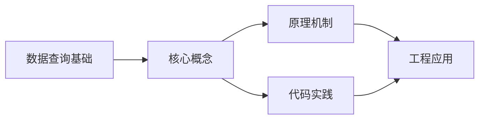
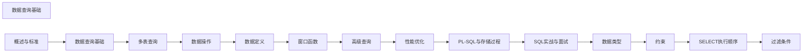

## 1. 学习目标（Bloom 分类）

本节按照布鲁姆教育目标分类学组织学习路径。本文主题为《数据查询基础》，属于 SQL 模块，读者可以根据自身阶段选择阅读深度。

记忆层面：能够准确复述本文的核心概念、术语与基本语法或操作步骤，并能够在提问或检索时快速定位对应知识点。能够说出 SQL 的核心概念、语法与常用对象。

理解层面：能够用自己的语言解释核心原理与工作机制，说明概念之间的因果关系，而不是机械记忆结论。能够解释 SQL 的执行原理与优化机制。

应用层面：能够在真实项目或练习场景中运用本文知识解决具体问题，写出正确且可维护的实现。能够编写正确、高效的 SQL 语句与操作。

分析层面：能够拆解复杂问题，比较本文主题与相邻概念的异同，识别边界条件与例外情况。能够分析 SQL 相关方案在性能与一致性上的权衡。

评价层面：能够根据约束条件（性能、可读性、安全、成本）评价不同方案的优劣，做出有依据的技术决策。能够根据业务场景评价 SQL 技术选型。

创造层面：能够把本文知识与其他模块知识组合，设计出新的解决方案或可复用的工程模式。能够组合 SQL 与其他技术设计数据架构。

通过本节学习，读者应当能够把《数据查询基础》纳入自己的知识网络，并与 SQL 模块的其他主题（DDL/DML、查询、索引、事务）建立关联。

## 2. 历史动机与发展脉络

《数据查询基础》是 SQL 领域的重要主题。要真正理解它，需要先了解它解决的问题与演进过程。

SQL（结构化查询语言）源于 1970 年 Codd 的关系模型，1974 年由 Chamberlin 与 Boyce 设计（SEQUEL），1986 年成为 ANSI 标准；SQL:2023 是当前国际标准。
SQL 分为 DDL（建表）、DML（增删改）、DQL（查询）、DCL（权限）与 TCL（事务）；各大数据库在标准基础上扩展方言。
SQL 是声明式语言：描述“要什么”而非“怎么做”，优化器负责执行计划；这一设计让 SQL 具有跨数据库的表达一致性。

回到本文主题：数据查询基础 的提出与成熟，正是上述技术背景下的必然产物。早期实现往往以简单可用为目标，随着工程规模扩大，社区逐渐沉淀出标准做法与最佳实践；理解这一脉络，可以帮助读者判断“为什么文档中的推荐写法是现在这个样子”，也能在遇到历史遗留代码时准确识别其设计年代与取舍。


## 3. 形式化定义与核心概念精讲

本节把《数据查询基础》涉及的核心概念以“定义 + 讲解”的形式展开。读者应把定义当作工具，把讲解当作理解路径；两者结合才能形成可迁移的知识。

关系模型：表（关系）、行（元组）、列（属性）；主键唯一标识、外键表达关联、范式消除冗余。
查询执行：解析 -> 绑定 -> 优化（基于代价选择计划）-> 执行；索引、统计信息与连接算法决定性能。
事务 ACID：原子性（Atomicity）、一致性（Consistency）、隔离性（Isolation）、持久性（Durability）；隔离级别控制并发行为。

### 3.1 原文章节逐一精讲

原文档把主题拆分为 14 个小节，下面按顺序给出每一节的导读讲解，随后保留原文细节供精读。

#### 原文精读（完整保留）

# 数据查询基础

> **符号约定**：`< >` 必填参数 | `[ ]` 可选参数

---

#### WHERE 条件

**单行写法：AND 组合条件**
`WHERE <条件 1> AND <条件 2>;`
```sql
-- 查询 IT 部门且薪资大于 80000 的员工
SELECT * FROM employees WHERE department = 'IT' AND salary > 80000;
```

**单行写法：OR 组合条件**
`WHERE <条件 1> OR <条件 2>;`
```sql
-- 查询 IT 或 HR 部门的员工
SELECT * FROM employees WHERE department = 'IT' OR department = 'HR';
```

**单行写法：NOT 取反条件**
`WHERE NOT <条件>;`
```sql
-- 查询非 IT 部门的员工
SELECT * FROM employees WHERE NOT department = 'IT';
```

**换行写法：括号组合条件**
`WHERE (<条件 1> OR <条件 2>) AND <条件 3>;`
```sql
-- 查询 IT 或 HR 部门且薪资大于 50000 的员工
SELECT * FROM employees
WHERE (department = 'IT' OR department = 'HR') AND salary > 50000;
```

---

#### LIKE 模式匹配

**单行写法：前缀匹配**
`WHERE <列> LIKE '<前缀>%';`
```sql
-- 查询姓"张"的用户
SELECT * FROM users WHERE name LIKE '张%';
```

**单行写法：后缀匹配**
`WHERE <列> LIKE '%<后缀>';`
```sql
-- 查询 Gmail 邮箱用户
SELECT * FROM users WHERE email LIKE '%@gmail.com';
```

**单行写法：包含匹配**
`WHERE <列> LIKE '%<关键字>%';`
```sql
-- 查询名字包含"华"的用户
SELECT * FROM users WHERE name LIKE '%华%';
```

**单行写法：单字符匹配**
`WHERE <列> LIKE '<前缀>_<后缀>';`
```sql
-- 查询 138 开头 1234 结尾的 11 位手机号
SELECT * FROM users WHERE phone LIKE '138____1234';
```

**单行写法：排除模式**
`WHERE <列> NOT LIKE '<模式>';`
```sql
-- 查询名字不以 admin 开头的用户
SELECT * FROM users WHERE name NOT LIKE 'admin%';
```

---

##### NULL 处理

NULL 是 SQL 中的特殊值，表示"未知"或"不存在"，需要特别对待：

```sql
--  错误：NULL 不能用 = 比较
SELECT * FROM users WHERE phone = NULL;      -- 返回 0 行

--  正确：使用 IS NULL
SELECT * FROM users WHERE phone IS NULL;     -- 没有 phone 的用户
SELECT * FROM users WHERE phone IS NOT NULL; -- 有 phone 的用户

-- NULL 与三值逻辑
-- NULL = NULL  → UNKNOWN（不是 TRUE）
-- NULL <> 1    → UNKNOWN（不是 TRUE）
-- NULL + 1     → NULL
-- NULL AND TRUE → UNKNOWN
-- NULL OR TRUE  → TRUE

-- COALESCE: 返回第一个非 NULL 值
SELECT name, COALESCE(phone, '未填写') AS phone_display FROM users;

-- NULLIF: 如果相等则返回 NULL
SELECT NULLIF(score, 0) AS safe_score FROM results; -- 避免除以零
```

#### ORDER BY 排序

```sql
-- 升序（默认）
SELECT * FROM employees ORDER BY salary ASC;

-- 降序
SELECT * FROM employees ORDER BY salary DESC;

-- 多列排序（优先级从左到右）
SELECT * FROM employees ORDER BY department ASC, salary DESC;

-- 按表达式排序
SELECT * FROM products ORDER BY price * discount DESC;

-- 按列序号排序（不推荐，可读性差）
SELECT name, salary FROM employees ORDER BY 2 DESC;

-- NULL 值排序位置
-- PostgreSQL: NULLS FIRST / NULLS LAST
SELECT * FROM employees ORDER BY bonus DESC NULLS LAST;

-- MySQL: NULL 被视为最小值（ASC 在前，DESC 在后）
-- SQL Server: NULL 被视为最小值
-- Oracle: ASC 时 NULL 在后，DESC 时 NULL 在前
```

#### LIMIT / OFFSET 分页

```sql
-- MySQL / PostgreSQL / SQLite
SELECT * FROM employees ORDER BY id LIMIT 10;           -- 前 10 条
SELECT * FROM employees ORDER BY id LIMIT 10 OFFSET 20; -- 第 21-30 条

-- SQL Server (2012+)
SELECT * FROM employees
ORDER BY id
OFFSET 20 ROWS FETCH NEXT 10 ROWS ONLY;

-- Oracle (12c+)
SELECT * FROM employees
ORDER BY id
OFFSET 20 ROWS FETCH NEXT 10 ROWS ONLY;

-- 计算总页数的技巧（窗口函数）
SELECT *, COUNT(*) OVER() AS total_count
FROM employees
ORDER BY id
LIMIT 10;
```

#### DISTINCT 去重

```sql
-- 单列去重
SELECT DISTINCT department FROM employees;

-- 多列组合去重
SELECT DISTINCT department, job_title FROM employees;

-- DISTINCT 与 NULL：所有 NULL 值被视为相同
SELECT DISTINCT middle_name FROM users;

-- COUNT DISTINCT：统计不同值的数量
SELECT COUNT(DISTINCT department) AS dept_count FROM employees;

-- PostgreSQL: 对多列去重计数
SELECT COUNT(DISTINCT (department, job_title)) FROM employees;

-- MySQL: 使用子查询
SELECT COUNT(*) FROM (
  SELECT DISTINCT department, job_title FROM employees
) AS t;
```

#### 别名

```sql
-- 列别名
SELECT first_name AS 名, salary AS 薪资 FROM employees;
SELECT first_name 名, salary 薪资 FROM employees;  -- 省略 AS

-- 表别名
SELECT e.first_name, d.department_name
FROM employees e
JOIN departments d ON e.dept_id = d.id;

-- 别名在 ORDER BY 中可用
SELECT salary * 12 AS annual_salary
FROM employees
ORDER BY annual_salary DESC;

--  别名在 WHERE 中不可用（逻辑执行顺序原因）
--  错误
SELECT salary * 12 AS annual_salary
FROM employees
WHERE annual_salary > 100000;

--  正确
SELECT salary * 12 AS annual_salary
FROM employees
WHERE salary * 12 > 100000;

-- PostgreSQL / MySQL 扩展：HAVING 中可用别名
SELECT department, COUNT(*) AS cnt
FROM employees
GROUP BY department
HAVING cnt > 5;
```

##### GROUP BY 分组

```sql
-- 基本分组
SELECT department, COUNT(*) AS emp_count, AVG(salary) AS avg_salary
FROM employees
GROUP BY department;

-- 多列分组
SELECT department, job_title, COUNT(*) AS cnt, AVG(salary) AS avg_salary
FROM employees
GROUP BY department, job_title;

-- GROUP BY 与 ORDER BY
SELECT department, AVG(salary) AS avg_salary
FROM employees
GROUP BY department
ORDER BY avg_salary DESC;

-- PostgreSQL: GROUP BY 别名
SELECT department AS dept, COUNT(*) AS cnt
FROM employees
GROUP BY dept;  -- 其他数据库可能不支持
```

##### HAVING 分组过滤

```sql
-- HAVING: 对分组后的结果进行过滤
SELECT department, COUNT(*) AS emp_count, AVG(salary) AS avg_salary
FROM employees
GROUP BY department
HAVING COUNT(*) > 5 AND AVG(salary) > 50000;

-- WHERE vs HAVING
-- WHERE: 分组前过滤（行级）
-- HAVING: 分组后过滤（组级）

-- 示例：先过滤 2024 年入职的员工，再按部门分组，最后筛选人数 > 3 的部门
SELECT department, COUNT(*) AS cnt
FROM employees
WHERE hire_date >= '2024-01-01'
GROUP BY department
HAVING COUNT(*) > 3;
```

#### SELECT 语句

`SELECT` 是 SQL 中最常用的语句，用于从表中检索数据。其基本语法结构：

```sql
SELECT [DISTINCT] 列表达式 [, ...]
FROM 表名
[WHERE 条件]
[GROUP BY 分组列 [, ...]]
[HAVING 分组条件]
[ORDER BY 排序列 [ASC|DESC] [, ...]]
[LIMIT 数量 [OFFSET 偏移]];
```

##### 基本查询

```sql
-- 查询所有列（生产环境慎用 *）
SELECT * FROM employees;

-- 查询指定列
SELECT first_name, last_name, salary FROM employees;

-- 计算列
SELECT first_name, salary, salary * 12 AS annual_salary FROM employees;
```

##### SELECT 执行顺序

理解 SQL 的逻辑执行顺序对编写正确查询至关重要：

```
1. FROM        -- 确定数据源
2. WHERE       -- 行级过滤
3. GROUP BY    -- 分组
4. HAVING      -- 组级过滤
5. SELECT      -- 选择列 / 计算表达式
6. DISTINCT    -- 去重
7. ORDER BY    -- 排序
8. LIMIT       -- 限制行数
```

> **注意**：这是逻辑执行顺序，数据库引擎实际执行时可能根据优化器决策调整。

##### 比较运算符

| 运算符      | 含义                  | 示例                          |
| ----------- | --------------------- | ----------------------------- |
| `=`         | 等于                  | `WHERE age = 25`              |
| `!=` / `<>` | 不等于                | `WHERE status != 'inactive'`  |
| `>` / `<`   | 大于 / 小于           | `WHERE salary > 50000`        |
| `>=` / `<=` | 大于等于 / 小于等于   | `WHERE age >= 18`             |
| `<=>`       | 安全等于（NULL 安全） | `WHERE col <=> NULL`（MySQL） |

##### 逻辑运算符

```sql
-- AND: 两个条件同时满足
SELECT * FROM employees WHERE department = 'IT' AND salary > 80000;

-- OR: 任一条件满足
SELECT * FROM employees WHERE department = 'IT' OR department = 'HR';

-- NOT: 取反
SELECT * FROM employees WHERE NOT department = 'IT';

-- 组合使用（注意优先级：AND > OR）
SELECT * FROM employees
WHERE (department = 'IT' OR department = 'HR') AND salary > 50000;
```

##### BETWEEN 和 IN

```sql
-- BETWEEN: 范围查询（包含边界）
SELECT * FROM products WHERE price BETWEEN 100 AND 500;
-- 等价于: WHERE price >= 100 AND price <= 500

-- IN: 集合匹配
SELECT * FROM employees WHERE department IN ('IT', 'HR', 'Finance');

-- NOT IN: 排除集合
SELECT * FROM employees WHERE department NOT IN ('IT', 'HR');

-- 子查询形式的 IN
SELECT * FROM orders
WHERE customer_id IN (
  SELECT id FROM customers WHERE country = 'China'
);
```

##### 分页性能优化

```sql
--  深分页性能差（OFFSET 需要跳过前面的行）
SELECT * FROM orders ORDER BY id LIMIT 10 OFFSET 1000000;

--  游标分页（Keyset Pagination）—— 利用索引
SELECT * FROM orders WHERE id > 1000000 ORDER BY id LIMIT 10;
```

#### 表达式

##### 算术表达式

```sql
SELECT product_name, price, quantity, price * quantity AS total
FROM order_items;

-- 运算符优先级：* / 高于 + -
SELECT price * quantity - discount AS final_amount FROM order_items;
```

##### 条件表达式 CASE WHEN

```sql
-- 简单 CASE
SELECT
  department,
  CASE department
    WHEN 'IT' THEN '技术部'
    WHEN 'HR' THEN '人力资源部'
    WHEN 'Finance' THEN '财务部'
    ELSE '其他部门'
  END AS dept_name_cn
FROM employees;

-- 搜索 CASE（更灵活，推荐）
SELECT
  name,
  salary,
  CASE
    WHEN salary >= 100000 THEN '高薪'
    WHEN salary >= 60000 THEN '中薪'
    WHEN salary >= 30000 THEN '低薪'
    ELSE '实习'
  END AS salary_level
FROM employees;

-- CASE WHEN 在聚合中
SELECT
  COUNT(*) AS total,
  COUNT(CASE WHEN gender = 'M' THEN 1 END) AS male_count,
  COUNT(CASE WHEN gender = 'F' THEN 1 END) AS female_count,
  SUM(CASE WHEN salary > 50000 THEN salary ELSE 0 END) AS high_salary_total
FROM employees;

-- PostgreSQL 专用简化写法
SELECT
  COUNT(*) FILTER (WHERE gender = 'M') AS male_count,
  COUNT(*) FILTER (WHERE gender = 'F') AS female_count
FROM employees;
```

#### 聚合函数

聚合函数对一组值进行计算，返回单个值。

##### 基本聚合函数

| 函数         | 含义             | 示例                                 |
| ------------ | ---------------- | ------------------------------------ |
| `COUNT(*)`   | 统计行数         | `SELECT COUNT(*) FROM users`         |
| `COUNT(col)` | 统计非 NULL 值数 | `SELECT COUNT(phone) FROM users`     |
| `SUM(col)`   | 求和             | `SELECT SUM(amount) FROM orders`     |
| `AVG(col)`   | 平均值           | `SELECT AVG(salary) FROM employees`  |
| `MAX(col)`   | 最大值           | `SELECT MAX(price) FROM products`    |
| `MIN(col)`   | 最小值           | `SELECT MIN(created_at) FROM orders` |

##### 聚合函数与 NULL

```sql
-- COUNT(*) 统计所有行，包括 NULL
-- COUNT(col) 忽略 NULL 值
SELECT
  COUNT(*) AS total_rows,
  COUNT(bonus) AS bonus_count,    -- 不统计 NULL
  AVG(bonus) AS avg_bonus         -- 忽略 NULL 计算
FROM employees;

-- 如果需要将 NULL 计入 AVG
SELECT AVG(COALESCE(bonus, 0)) AS avg_bonus_incl_null FROM employees;
```

##### 常用统计模式

```sql
-- 1. 占比计算
SELECT
  department,
  COUNT(*) AS emp_count,
  ROUND(COUNT(*) * 100.0 / SUM(COUNT(*)) OVER(), 2) AS pct
FROM employees
GROUP BY department;

-- 2. 累计统计
SELECT
  order_date,
  SUM(amount) AS daily_amount,
  SUM(SUM(amount)) OVER(ORDER BY order_date) AS cumulative_amount
FROM orders
GROUP BY order_date;

-- 3. 中位数（PostgreSQL）
SELECT PERCENTILE_CONT(0.5) WITHIN GROUP(ORDER BY salary) AS median_salary
FROM employees;

-- 4. 众数（PostgreSQL）
SELECT MODE() WITHIN GROUP(ORDER BY department) AS most_common_dept
FROM employees;

-- 5. 标准差与方差
SELECT
  STDDEV(salary) AS salary_stddev,    -- 样本标准差
  VARIANCE(salary) AS salary_variance  -- 样本方差
FROM employees;
```

#### 小结

- `SELECT` 是 SQL 查询的核心，理解逻辑执行顺序是编写正确查询的基础
- `WHERE` 用于行级过滤，`HAVING` 用于组级过滤
- `NULL` 需要使用 `IS NULL` / `IS NOT NULL` 判断，不能使用 `=`
- `CASE WHEN` 是 SQL 中的条件表达式，功能强大且通用
- 聚合函数自动忽略 `NULL`，`COUNT(*)` 除外
- 分页查询中，游标分页（Keyset Pagination）比 `OFFSET` 更高效
#### SELECT 查询

**单行写法：查询所有列**
`SELECT * FROM <表名>;`
```sql
-- 查询员工表中的所有字段
SELECT * FROM employees;
```

**单行写法：查询指定列**
`SELECT <列名 1>, <列名 2> FROM <表名>;`
```sql
-- 查询员工表中的姓名和薪资字段
SELECT first_name, salary FROM employees;
```

**换行写法：查询多列并计算**
`SELECT <列名 1>, <列名 2>, <表达式> AS <别名> FROM <表名>;`
```sql
-- 查询姓名、薪资并计算年薪
SELECT
  first_name,
  salary,
  salary * 12 AS annual_salary
FROM employees;
```

---

#### BETWEEN 范围查询

**单行写法：范围查询（包含边界）**
`WHERE <列> BETWEEN <下界> AND <上界>;`
```sql
-- 查询价格在 100 到 500 之间的商品
SELECT * FROM products WHERE price BETWEEN 100 AND 500;
```

**单行写法：排除范围**
`WHERE <列> NOT BETWEEN <下界> AND <上界>;`
```sql
-- 查询价格不在 100 到 500 之间的商品
SELECT * FROM products WHERE price NOT BETWEEN 100 AND 500;
```

---

#### IN 集合匹配

**单行写法：集合匹配**
`WHERE <列> IN (<值 1>, <值 2>, ...);`
```sql
-- 查询 IT、HR、Finance 部门的员工
SELECT * FROM employees WHERE department IN ('IT', 'HR', 'Finance');
```

**单行写法：排除集合**
`WHERE <列> NOT IN (<值 1>, <值 2>, ...);`
```sql
-- 查询非 IT、HR 部门的员工
SELECT * FROM employees WHERE department NOT IN ('IT', 'HR');
```

**换行写法：子查询形式的 IN**
`WHERE <列> IN (SELECT ...);`
```sql
-- 查询来自中国的客户的订单
SELECT * FROM orders
WHERE customer_id IN (
  SELECT id FROM customers WHERE country = 'China'
);
```

---

#### CASE WHEN 条件表达式

**换行写法：简单 CASE 等值匹配**
`CASE <列> WHEN <值> THEN <结果> [ELSE <结果>] END`
```sql
-- 将部门代码转换为中文名称
SELECT
  department,
  CASE department
    WHEN 'IT' THEN '技术部'
    WHEN 'HR' THEN '人力资源部'
    WHEN 'Finance' THEN '财务部'
    ELSE '其他部门'
  END AS dept_name_cn
FROM employees;
```

**换行写法：搜索 CASE 条件判断**
`CASE WHEN <条件> THEN <结果> [ELSE <结果>] END`
```sql
-- 根据薪资划分等级
SELECT
  name,
  salary,
  CASE
    WHEN salary >= 100000 THEN '高薪'
    WHEN salary >= 60000 THEN '中薪'
    WHEN salary >= 30000 THEN '低薪'
    ELSE '实习'
  END AS salary_level
FROM employees;
```

**换行写法：CASE WHEN 在聚合中使用**
`COUNT(CASE WHEN <条件> THEN 1 END) AS <别名>`
```sql
-- 统计男女员工数量及高薪总额
SELECT
  COUNT(*) AS total,
  COUNT(CASE WHEN gender = 'M' THEN 1 END) AS male_count,
  COUNT(CASE WHEN gender = 'F' THEN 1 END) AS female_count,
  SUM(CASE WHEN salary > 50000 THEN salary ELSE 0 END) AS high_salary_total
FROM employees;
```

---


### 3.2 概念关系图

下面用 Mermaid 图表达本文核心概念之间的关系，帮助读者建立整体图景：



图中展示的是本文知识的结构化关系：核心概念是入口，原理机制解释“为什么”，代码实践演示“怎么做”，工程应用回答“何时用”。读者学习时可以把每个小节的内容挂接到对应节点上。

## 4. 理论推导与原理解析

本节深入《数据查询基础》背后的原理。理论部分不求面面俱到，而是聚焦“能解释现象、能指导实践”的关键推导。

关系模型：表（关系）、行（元组）、列（属性）；主键唯一标识、外键表达关联、范式消除冗余。
查询执行：解析 -> 绑定 -> 优化（基于代价选择计划）-> 执行；索引、统计信息与连接算法决定性能。
事务 ACID：原子性（Atomicity）、一致性（Consistency）、隔离性（Isolation）、持久性（Durability）；隔离级别控制并发行为。
集合语义：SELECT 返回结果集；JOIN 组合关系，GROUP BY 聚合，子查询与 CTE 表达复杂逻辑。

需要强调的是，理论推导与工程实践之间存在翻译层：理论给出的是理想化模型与边界条件，工程代码则必须处理真实环境中的例外。读者在学习时应先掌握理论的“标准情形”，再通过陷阱章节了解“非标准情形”。

## 5. 代码示例与逐行讲解

本节把原文中的代码示例系统整理，并为每个示例补充用途说明与讲解。读者不应只浏览代码，而应逐段对照讲解理解设计意图。

### 5.1 示例：WHERE 条件

该示例来自原文《WHERE 条件》小节，用于演示数据查询基础相关操作。阅读时请先看代码结构，再看其后的讲解。

```sql
-- 查询 IT 部门且薪资大于 80000 的员工
SELECT * FROM employees WHERE department = 'IT' AND salary > 80000;
```

讲解：这段代码演示了本节核心知识点。代码中的关键操作可以归纳为三步：准备（定义或初始化）、执行（核心逻辑）、收尾（释放资源或返回结果）。实际项目中，这三步往往被封装为函数或类，以提升复用性与可测试性。

关键点分析：

该示例共 2 行有效代码，包含 2 类关键结构（SELECT、FROM）。其中：

- 入口与初始化部分负责建立上下文，对应实际项目中的启动或装配逻辑；
- 核心逻辑部分体现本文主题的主要操作，是阅读时最需要对照讲解理解的部分；
- 输出或返回部分把结果交给调用方，注意其类型与边界条件。

进阶思考路径：先尝试修改参数观察行为变化，再把示例中的模式迁移到自己的项目中；每次修改都记录预期与实测差异，这是把示例转化为能力的最快方式。

### 5.2 示例：WHERE 条件

该示例来自原文《WHERE 条件》小节，用于演示数据查询基础相关操作。阅读时请先看代码结构，再看其后的讲解。

```sql
-- 查询 IT 或 HR 部门的员工
SELECT * FROM employees WHERE department = 'IT' OR department = 'HR';
```

讲解：这段代码演示了本节核心知识点。代码中的关键操作可以归纳为三步：准备（定义或初始化）、执行（核心逻辑）、收尾（释放资源或返回结果）。实际项目中，这三步往往被封装为函数或类，以提升复用性与可测试性。

关键点分析：

该示例共 2 行有效代码，包含 2 类关键结构（SELECT、FROM）。其中：

- 入口与初始化部分负责建立上下文，对应实际项目中的启动或装配逻辑；
- 核心逻辑部分体现本文主题的主要操作，是阅读时最需要对照讲解理解的部分；
- 输出或返回部分把结果交给调用方，注意其类型与边界条件。

进阶思考路径：先尝试修改参数观察行为变化，再把示例中的模式迁移到自己的项目中；每次修改都记录预期与实测差异，这是把示例转化为能力的最快方式。

### 5.3 示例：WHERE 条件

该示例来自原文《WHERE 条件》小节，用于演示数据查询基础相关操作。阅读时请先看代码结构，再看其后的讲解。

```sql
-- 查询非 IT 部门的员工
SELECT * FROM employees WHERE NOT department = 'IT';
```

讲解：这段代码演示了本节核心知识点。代码中的关键操作可以归纳为三步：准备（定义或初始化）、执行（核心逻辑）、收尾（释放资源或返回结果）。实际项目中，这三步往往被封装为函数或类，以提升复用性与可测试性。

关键点分析：

该示例共 2 行有效代码，包含 2 类关键结构（SELECT、FROM）。其中：

- 入口与初始化部分负责建立上下文，对应实际项目中的启动或装配逻辑；
- 核心逻辑部分体现本文主题的主要操作，是阅读时最需要对照讲解理解的部分；
- 输出或返回部分把结果交给调用方，注意其类型与边界条件。

进阶思考路径：先尝试修改参数观察行为变化，再把示例中的模式迁移到自己的项目中；每次修改都记录预期与实测差异，这是把示例转化为能力的最快方式。

### 5.4 示例：WHERE 条件

该示例来自原文《WHERE 条件》小节，用于演示数据查询基础相关操作。阅读时请先看代码结构，再看其后的讲解。

```sql
-- 查询 IT 或 HR 部门且薪资大于 50000 的员工
SELECT * FROM employees
WHERE (department = 'IT' OR department = 'HR') AND salary > 50000;
```

讲解：这段代码演示了本节核心知识点。代码中的关键操作可以归纳为三步：准备（定义或初始化）、执行（核心逻辑）、收尾（释放资源或返回结果）。实际项目中，这三步往往被封装为函数或类，以提升复用性与可测试性。

关键点分析：

该示例共 3 行有效代码，包含 2 类关键结构（SELECT、FROM）。其中：

- 入口与初始化部分负责建立上下文，对应实际项目中的启动或装配逻辑；
- 核心逻辑部分体现本文主题的主要操作，是阅读时最需要对照讲解理解的部分；
- 输出或返回部分把结果交给调用方，注意其类型与边界条件。

进阶思考路径：先尝试修改参数观察行为变化，再把示例中的模式迁移到自己的项目中；每次修改都记录预期与实测差异，这是把示例转化为能力的最快方式。

### 5.5 示例：LIKE 模式匹配

该示例来自原文《LIKE 模式匹配》小节，用于演示数据查询基础相关操作。阅读时请先看代码结构，再看其后的讲解。

```sql
-- 查询姓"张"的用户
SELECT * FROM users WHERE name LIKE '张%';
```

讲解：这段代码演示了本节核心知识点。代码中的关键操作可以归纳为三步：准备（定义或初始化）、执行（核心逻辑）、收尾（释放资源或返回结果）。实际项目中，这三步往往被封装为函数或类，以提升复用性与可测试性。

关键点分析：

该示例共 2 行有效代码，包含 2 类关键结构（SELECT、FROM）。其中：

- 入口与初始化部分负责建立上下文，对应实际项目中的启动或装配逻辑；
- 核心逻辑部分体现本文主题的主要操作，是阅读时最需要对照讲解理解的部分；
- 输出或返回部分把结果交给调用方，注意其类型与边界条件。

进阶思考路径：先尝试修改参数观察行为变化，再把示例中的模式迁移到自己的项目中；每次修改都记录预期与实测差异，这是把示例转化为能力的最快方式。

### 5.6 示例：LIKE 模式匹配

该示例来自原文《LIKE 模式匹配》小节，用于演示数据查询基础相关操作。阅读时请先看代码结构，再看其后的讲解。

```sql
-- 查询 Gmail 邮箱用户
SELECT * FROM users WHERE email LIKE '%@gmail.com';
```

讲解：这段代码演示了本节核心知识点。代码中的关键操作可以归纳为三步：准备（定义或初始化）、执行（核心逻辑）、收尾（释放资源或返回结果）。实际项目中，这三步往往被封装为函数或类，以提升复用性与可测试性。

关键点分析：

该示例共 2 行有效代码，包含 2 类关键结构（SELECT、FROM）。其中：

- 入口与初始化部分负责建立上下文，对应实际项目中的启动或装配逻辑；
- 核心逻辑部分体现本文主题的主要操作，是阅读时最需要对照讲解理解的部分；
- 输出或返回部分把结果交给调用方，注意其类型与边界条件。

进阶思考路径：先尝试修改参数观察行为变化，再把示例中的模式迁移到自己的项目中；每次修改都记录预期与实测差异，这是把示例转化为能力的最快方式。

### 5.7 示例：LIKE 模式匹配

该示例来自原文《LIKE 模式匹配》小节，用于演示数据查询基础相关操作。阅读时请先看代码结构，再看其后的讲解。

```sql
-- 查询名字包含"华"的用户
SELECT * FROM users WHERE name LIKE '%华%';
```

讲解：这段代码演示了本节核心知识点。代码中的关键操作可以归纳为三步：准备（定义或初始化）、执行（核心逻辑）、收尾（释放资源或返回结果）。实际项目中，这三步往往被封装为函数或类，以提升复用性与可测试性。

关键点分析：

该示例共 2 行有效代码，包含 2 类关键结构（SELECT、FROM）。其中：

- 入口与初始化部分负责建立上下文，对应实际项目中的启动或装配逻辑；
- 核心逻辑部分体现本文主题的主要操作，是阅读时最需要对照讲解理解的部分；
- 输出或返回部分把结果交给调用方，注意其类型与边界条件。

进阶思考路径：先尝试修改参数观察行为变化，再把示例中的模式迁移到自己的项目中；每次修改都记录预期与实测差异，这是把示例转化为能力的最快方式。

### 5.8 示例：LIKE 模式匹配

该示例来自原文《LIKE 模式匹配》小节，用于演示数据查询基础相关操作。阅读时请先看代码结构，再看其后的讲解。

```sql
-- 查询 138 开头 1234 结尾的 11 位手机号
SELECT * FROM users WHERE phone LIKE '138____1234';
```

讲解：这段代码演示了本节核心知识点。代码中的关键操作可以归纳为三步：准备（定义或初始化）、执行（核心逻辑）、收尾（释放资源或返回结果）。实际项目中，这三步往往被封装为函数或类，以提升复用性与可测试性。

关键点分析：

该示例共 2 行有效代码，包含 2 类关键结构（SELECT、FROM）。其中：

- 入口与初始化部分负责建立上下文，对应实际项目中的启动或装配逻辑；
- 核心逻辑部分体现本文主题的主要操作，是阅读时最需要对照讲解理解的部分；
- 输出或返回部分把结果交给调用方，注意其类型与边界条件。

进阶思考路径：先尝试修改参数观察行为变化，再把示例中的模式迁移到自己的项目中；每次修改都记录预期与实测差异，这是把示例转化为能力的最快方式。

### 5.9 示例：LIKE 模式匹配

该示例来自原文《LIKE 模式匹配》小节，用于演示数据查询基础相关操作。阅读时请先看代码结构，再看其后的讲解。

```sql
-- 查询名字不以 admin 开头的用户
SELECT * FROM users WHERE name NOT LIKE 'admin%';
```

讲解：这段代码演示了本节核心知识点。代码中的关键操作可以归纳为三步：准备（定义或初始化）、执行（核心逻辑）、收尾（释放资源或返回结果）。实际项目中，这三步往往被封装为函数或类，以提升复用性与可测试性。

关键点分析：

该示例共 2 行有效代码，包含 2 类关键结构（SELECT、FROM）。其中：

- 入口与初始化部分负责建立上下文，对应实际项目中的启动或装配逻辑；
- 核心逻辑部分体现本文主题的主要操作，是阅读时最需要对照讲解理解的部分；
- 输出或返回部分把结果交给调用方，注意其类型与边界条件。

进阶思考路径：先尝试修改参数观察行为变化，再把示例中的模式迁移到自己的项目中；每次修改都记录预期与实测差异，这是把示例转化为能力的最快方式。

### 5.10 示例：NULL 处理

该示例来自原文《NULL 处理》小节，用于演示数据查询基础相关操作。阅读时请先看代码结构，再看其后的讲解。

```sql
--  错误：NULL 不能用 = 比较
SELECT * FROM users WHERE phone = NULL;      -- 返回 0 行

--  正确：使用 IS NULL
SELECT * FROM users WHERE phone IS NULL;     -- 没有 phone 的用户
SELECT * FROM users WHERE phone IS NOT NULL; -- 有 phone 的用户

-- NULL 与三值逻辑
-- NULL = NULL  → UNKNOWN（不是 TRUE）
-- NULL <> 1    → UNKNOWN（不是 TRUE）
-- NULL + 1     → NULL
-- NULL AND TRUE → UNKNOWN
-- NULL OR TRUE  → TRUE

-- COALESCE: 返回第一个非 NULL 值
SELECT name, COALESCE(phone, '未填写') AS phone_display FROM users;

-- NULLIF: 如果相等则返回 NULL
SELECT NULLIF(score, 0) AS safe_score FROM results; -- 避免除以零
```

讲解：这段代码演示了本节核心知识点。代码中的关键操作可以归纳为三步：准备（定义或初始化）、执行（核心逻辑）、收尾（释放资源或返回结果）。实际项目中，这三步往往被封装为函数或类，以提升复用性与可测试性。

关键点分析：

该示例共 15 行有效代码，包含 2 类关键结构（SELECT、FROM）。其中：

- 入口与初始化部分负责建立上下文，对应实际项目中的启动或装配逻辑；
- 核心逻辑部分体现本文主题的主要操作，是阅读时最需要对照讲解理解的部分；
- 输出或返回部分把结果交给调用方，注意其类型与边界条件。

进阶思考路径：先尝试修改参数观察行为变化，再把示例中的模式迁移到自己的项目中；每次修改都记录预期与实测差异，这是把示例转化为能力的最快方式。

### 5.11 示例：ORDER BY 排序

该示例来自原文《ORDER BY 排序》小节，用于演示数据查询基础相关操作。阅读时请先看代码结构，再看其后的讲解。

```sql
-- 升序（默认）
SELECT * FROM employees ORDER BY salary ASC;

-- 降序
SELECT * FROM employees ORDER BY salary DESC;

-- 多列排序（优先级从左到右）
SELECT * FROM employees ORDER BY department ASC, salary DESC;

-- 按表达式排序
SELECT * FROM products ORDER BY price * discount DESC;

-- 按列序号排序（不推荐，可读性差）
SELECT name, salary FROM employees ORDER BY 2 DESC;

-- NULL 值排序位置
-- PostgreSQL: NULLS FIRST / NULLS LAST
SELECT * FROM employees ORDER BY bonus DESC NULLS LAST;

-- MySQL: NULL 被视为最小值（ASC 在前，DESC 在后）
-- SQL Server: NULL 被视为最小值
-- Oracle: ASC 时 NULL 在后，DESC 时 NULL 在前
```

讲解：这段代码演示了本节核心知识点。代码中的关键操作可以归纳为三步：准备（定义或初始化）、执行（核心逻辑）、收尾（释放资源或返回结果）。实际项目中，这三步往往被封装为函数或类，以提升复用性与可测试性。

关键点分析：

该示例共 16 行有效代码，包含 2 类关键结构（SELECT、FROM）。其中：

- 入口与初始化部分负责建立上下文，对应实际项目中的启动或装配逻辑；
- 核心逻辑部分体现本文主题的主要操作，是阅读时最需要对照讲解理解的部分；
- 输出或返回部分把结果交给调用方，注意其类型与边界条件。

进阶思考路径：先尝试修改参数观察行为变化，再把示例中的模式迁移到自己的项目中；每次修改都记录预期与实测差异，这是把示例转化为能力的最快方式。

### 5.12 示例：LIMIT / OFFSET 分页

该示例来自原文《LIMIT / OFFSET 分页》小节，用于演示数据查询基础相关操作。阅读时请先看代码结构，再看其后的讲解。

```sql
-- MySQL / PostgreSQL / SQLite
SELECT * FROM employees ORDER BY id LIMIT 10;           -- 前 10 条
SELECT * FROM employees ORDER BY id LIMIT 10 OFFSET 20; -- 第 21-30 条

-- SQL Server (2012+)
SELECT * FROM employees
ORDER BY id
OFFSET 20 ROWS FETCH NEXT 10 ROWS ONLY;

-- Oracle (12c+)
SELECT * FROM employees
ORDER BY id
OFFSET 20 ROWS FETCH NEXT 10 ROWS ONLY;

-- 计算总页数的技巧（窗口函数）
SELECT *, COUNT(*) OVER() AS total_count
FROM employees
ORDER BY id
LIMIT 10;
```

讲解：这段代码演示了本节核心知识点。代码中的关键操作可以归纳为三步：准备（定义或初始化）、执行（核心逻辑）、收尾（释放资源或返回结果）。实际项目中，这三步往往被封装为函数或类，以提升复用性与可测试性。

关键点分析：

该示例共 16 行有效代码，包含 2 类关键结构（SELECT、FROM）。其中：

- 入口与初始化部分负责建立上下文，对应实际项目中的启动或装配逻辑；
- 核心逻辑部分体现本文主题的主要操作，是阅读时最需要对照讲解理解的部分；
- 输出或返回部分把结果交给调用方，注意其类型与边界条件。

进阶思考路径：先尝试修改参数观察行为变化，再把示例中的模式迁移到自己的项目中；每次修改都记录预期与实测差异，这是把示例转化为能力的最快方式。

### 5.13 示例：DISTINCT 去重

该示例来自原文《DISTINCT 去重》小节，用于演示数据查询基础相关操作。阅读时请先看代码结构，再看其后的讲解。

```sql
-- 单列去重
SELECT DISTINCT department FROM employees;

-- 多列组合去重
SELECT DISTINCT department, job_title FROM employees;

-- DISTINCT 与 NULL：所有 NULL 值被视为相同
SELECT DISTINCT middle_name FROM users;

-- COUNT DISTINCT：统计不同值的数量
SELECT COUNT(DISTINCT department) AS dept_count FROM employees;

-- PostgreSQL: 对多列去重计数
SELECT COUNT(DISTINCT (department, job_title)) FROM employees;

-- MySQL: 使用子查询
SELECT COUNT(*) FROM (
  SELECT DISTINCT department, job_title FROM employees
) AS t;
```

讲解：这段代码演示了本节核心知识点。代码中的关键操作可以归纳为三步：准备（定义或初始化）、执行（核心逻辑）、收尾（释放资源或返回结果）。实际项目中，这三步往往被封装为函数或类，以提升复用性与可测试性。

关键点分析：

该示例共 14 行有效代码，包含 2 类关键结构（SELECT、FROM）。其中：

- 入口与初始化部分负责建立上下文，对应实际项目中的启动或装配逻辑；
- 核心逻辑部分体现本文主题的主要操作，是阅读时最需要对照讲解理解的部分；
- 输出或返回部分把结果交给调用方，注意其类型与边界条件。

进阶思考路径：先尝试修改参数观察行为变化，再把示例中的模式迁移到自己的项目中；每次修改都记录预期与实测差异，这是把示例转化为能力的最快方式。

### 5.14 示例：别名

该示例来自原文《别名》小节，用于演示数据查询基础相关操作。阅读时请先看代码结构，再看其后的讲解。

```sql
-- 列别名
SELECT first_name AS 名, salary AS 薪资 FROM employees;
SELECT first_name 名, salary 薪资 FROM employees;  -- 省略 AS

-- 表别名
SELECT e.first_name, d.department_name
FROM employees e
JOIN departments d ON e.dept_id = d.id;

-- 别名在 ORDER BY 中可用
SELECT salary * 12 AS annual_salary
FROM employees
ORDER BY annual_salary DESC;

--  别名在 WHERE 中不可用（逻辑执行顺序原因）
--  错误
SELECT salary * 12 AS annual_salary
FROM employees
WHERE annual_salary > 100000;

--  正确
SELECT salary * 12 AS annual_salary
FROM employees
WHERE salary * 12 > 100000;

-- PostgreSQL / MySQL 扩展：HAVING 中可用别名
SELECT department, COUNT(*) AS cnt
FROM employees
GROUP BY department
HAVING cnt > 5;
```

讲解：这段代码演示了本节核心知识点。代码中的关键操作可以归纳为三步：准备（定义或初始化）、执行（核心逻辑）、收尾（释放资源或返回结果）。实际项目中，这三步往往被封装为函数或类，以提升复用性与可测试性。

关键点分析：

该示例共 25 行有效代码，包含 2 类关键结构（SELECT、FROM）。其中：

- 入口与初始化部分负责建立上下文，对应实际项目中的启动或装配逻辑；
- 核心逻辑部分体现本文主题的主要操作，是阅读时最需要对照讲解理解的部分；
- 输出或返回部分把结果交给调用方，注意其类型与边界条件。

进阶思考路径：先尝试修改参数观察行为变化，再把示例中的模式迁移到自己的项目中；每次修改都记录预期与实测差异，这是把示例转化为能力的最快方式。

### 5.15 示例：GROUP BY 分组

该示例来自原文《GROUP BY 分组》小节，用于演示数据查询基础相关操作。阅读时请先看代码结构，再看其后的讲解。

```sql
-- 基本分组
SELECT department, COUNT(*) AS emp_count, AVG(salary) AS avg_salary
FROM employees
GROUP BY department;

-- 多列分组
SELECT department, job_title, COUNT(*) AS cnt, AVG(salary) AS avg_salary
FROM employees
GROUP BY department, job_title;

-- GROUP BY 与 ORDER BY
SELECT department, AVG(salary) AS avg_salary
FROM employees
GROUP BY department
ORDER BY avg_salary DESC;

-- PostgreSQL: GROUP BY 别名
SELECT department AS dept, COUNT(*) AS cnt
FROM employees
GROUP BY dept;  -- 其他数据库可能不支持
```

讲解：这段代码演示了本节核心知识点。代码中的关键操作可以归纳为三步：准备（定义或初始化）、执行（核心逻辑）、收尾（释放资源或返回结果）。实际项目中，这三步往往被封装为函数或类，以提升复用性与可测试性。

关键点分析：

该示例共 17 行有效代码，包含 2 类关键结构（SELECT、FROM）。其中：

- 入口与初始化部分负责建立上下文，对应实际项目中的启动或装配逻辑；
- 核心逻辑部分体现本文主题的主要操作，是阅读时最需要对照讲解理解的部分；
- 输出或返回部分把结果交给调用方，注意其类型与边界条件。

进阶思考路径：先尝试修改参数观察行为变化，再把示例中的模式迁移到自己的项目中；每次修改都记录预期与实测差异，这是把示例转化为能力的最快方式。

### 5.16 示例：HAVING 分组过滤

该示例来自原文《HAVING 分组过滤》小节，用于演示数据查询基础相关操作。阅读时请先看代码结构，再看其后的讲解。

```sql
-- HAVING: 对分组后的结果进行过滤
SELECT department, COUNT(*) AS emp_count, AVG(salary) AS avg_salary
FROM employees
GROUP BY department
HAVING COUNT(*) > 5 AND AVG(salary) > 50000;

-- WHERE vs HAVING
-- WHERE: 分组前过滤（行级）
-- HAVING: 分组后过滤（组级）

-- 示例：先过滤 2024 年入职的员工，再按部门分组，最后筛选人数 > 3 的部门
SELECT department, COUNT(*) AS cnt
FROM employees
WHERE hire_date >= '2024-01-01'
GROUP BY department
HAVING COUNT(*) > 3;
```

讲解：这段代码演示了本节核心知识点。代码中的关键操作可以归纳为三步：准备（定义或初始化）、执行（核心逻辑）、收尾（释放资源或返回结果）。实际项目中，这三步往往被封装为函数或类，以提升复用性与可测试性。

关键点分析：

该示例共 14 行有效代码，包含 2 类关键结构（SELECT、FROM）。其中：

- 入口与初始化部分负责建立上下文，对应实际项目中的启动或装配逻辑；
- 核心逻辑部分体现本文主题的主要操作，是阅读时最需要对照讲解理解的部分；
- 输出或返回部分把结果交给调用方，注意其类型与边界条件。

进阶思考路径：先尝试修改参数观察行为变化，再把示例中的模式迁移到自己的项目中；每次修改都记录预期与实测差异，这是把示例转化为能力的最快方式。

### 5.17 示例：SELECT 语句

该示例来自原文《SELECT 语句》小节，用于演示数据查询基础相关操作。阅读时请先看代码结构，再看其后的讲解。

```sql
SELECT [DISTINCT] 列表达式 [, ...]
FROM 表名
[WHERE 条件]
[GROUP BY 分组列 [, ...]]
[HAVING 分组条件]
[ORDER BY 排序列 [ASC|DESC] [, ...]]
[LIMIT 数量 [OFFSET 偏移]];
```

讲解：这段代码演示了本节核心知识点。代码中的关键操作可以归纳为三步：准备（定义或初始化）、执行（核心逻辑）、收尾（释放资源或返回结果）。实际项目中，这三步往往被封装为函数或类，以提升复用性与可测试性。

关键点分析：

该示例共 7 行有效代码，包含 2 类关键结构（SELECT、FROM）。其中：

- 入口与初始化部分负责建立上下文，对应实际项目中的启动或装配逻辑；
- 核心逻辑部分体现本文主题的主要操作，是阅读时最需要对照讲解理解的部分；
- 输出或返回部分把结果交给调用方，注意其类型与边界条件。

进阶思考路径：先尝试修改参数观察行为变化，再把示例中的模式迁移到自己的项目中；每次修改都记录预期与实测差异，这是把示例转化为能力的最快方式。

### 5.18 示例：基本查询

该示例来自原文《基本查询》小节，用于演示数据查询基础相关操作。阅读时请先看代码结构，再看其后的讲解。

```sql
-- 查询所有列（生产环境慎用 *）
SELECT * FROM employees;

-- 查询指定列
SELECT first_name, last_name, salary FROM employees;

-- 计算列
SELECT first_name, salary, salary * 12 AS annual_salary FROM employees;
```

讲解：这段代码演示了本节核心知识点。代码中的关键操作可以归纳为三步：准备（定义或初始化）、执行（核心逻辑）、收尾（释放资源或返回结果）。实际项目中，这三步往往被封装为函数或类，以提升复用性与可测试性。

关键点分析：

该示例共 6 行有效代码，包含 2 类关键结构（SELECT、FROM）。其中：

- 入口与初始化部分负责建立上下文，对应实际项目中的启动或装配逻辑；
- 核心逻辑部分体现本文主题的主要操作，是阅读时最需要对照讲解理解的部分；
- 输出或返回部分把结果交给调用方，注意其类型与边界条件。

进阶思考路径：先尝试修改参数观察行为变化，再把示例中的模式迁移到自己的项目中；每次修改都记录预期与实测差异，这是把示例转化为能力的最快方式。

### 5.19 示例：SELECT 执行顺序

该示例来自原文《SELECT 执行顺序》小节，用于演示数据查询基础相关操作。阅读时请先看代码结构，再看其后的讲解。

```text
1. FROM        -- 确定数据源
2. WHERE       -- 行级过滤
3. GROUP BY    -- 分组
4. HAVING      -- 组级过滤
5. SELECT      -- 选择列 / 计算表达式
6. DISTINCT    -- 去重
7. ORDER BY    -- 排序
8. LIMIT       -- 限制行数
```

讲解：这段代码演示了本节核心知识点。代码中的关键操作可以归纳为三步：准备（定义或初始化）、执行（核心逻辑）、收尾（释放资源或返回结果）。实际项目中，这三步往往被封装为函数或类，以提升复用性与可测试性。

关键点分析：

该示例共 8 行有效代码，包含 2 类关键结构（SELECT、FROM）。其中：

- 入口与初始化部分负责建立上下文，对应实际项目中的启动或装配逻辑；
- 核心逻辑部分体现本文主题的主要操作，是阅读时最需要对照讲解理解的部分；
- 输出或返回部分把结果交给调用方，注意其类型与边界条件。

进阶思考路径：先尝试修改参数观察行为变化，再把示例中的模式迁移到自己的项目中；每次修改都记录预期与实测差异，这是把示例转化为能力的最快方式。

### 5.20 示例：逻辑运算符

该示例来自原文《逻辑运算符》小节，用于演示数据查询基础相关操作。阅读时请先看代码结构，再看其后的讲解。

```sql
-- AND: 两个条件同时满足
SELECT * FROM employees WHERE department = 'IT' AND salary > 80000;

-- OR: 任一条件满足
SELECT * FROM employees WHERE department = 'IT' OR department = 'HR';

-- NOT: 取反
SELECT * FROM employees WHERE NOT department = 'IT';

-- 组合使用（注意优先级：AND > OR）
SELECT * FROM employees
WHERE (department = 'IT' OR department = 'HR') AND salary > 50000;
```

讲解：这段代码演示了本节核心知识点。代码中的关键操作可以归纳为三步：准备（定义或初始化）、执行（核心逻辑）、收尾（释放资源或返回结果）。实际项目中，这三步往往被封装为函数或类，以提升复用性与可测试性。

关键点分析：

该示例共 9 行有效代码，包含 2 类关键结构（SELECT、FROM）。其中：

- 入口与初始化部分负责建立上下文，对应实际项目中的启动或装配逻辑；
- 核心逻辑部分体现本文主题的主要操作，是阅读时最需要对照讲解理解的部分；
- 输出或返回部分把结果交给调用方，注意其类型与边界条件。

进阶思考路径：先尝试修改参数观察行为变化，再把示例中的模式迁移到自己的项目中；每次修改都记录预期与实测差异，这是把示例转化为能力的最快方式。

### 5.21 示例：BETWEEN 和 IN

该示例来自原文《BETWEEN 和 IN》小节，用于演示数据查询基础相关操作。阅读时请先看代码结构，再看其后的讲解。

```sql
-- BETWEEN: 范围查询（包含边界）
SELECT * FROM products WHERE price BETWEEN 100 AND 500;
-- 等价于: WHERE price >= 100 AND price <= 500

-- IN: 集合匹配
SELECT * FROM employees WHERE department IN ('IT', 'HR', 'Finance');

-- NOT IN: 排除集合
SELECT * FROM employees WHERE department NOT IN ('IT', 'HR');

-- 子查询形式的 IN
SELECT * FROM orders
WHERE customer_id IN (
  SELECT id FROM customers WHERE country = 'China'
);
```

讲解：这段代码演示了本节核心知识点。代码中的关键操作可以归纳为三步：准备（定义或初始化）、执行（核心逻辑）、收尾（释放资源或返回结果）。实际项目中，这三步往往被封装为函数或类，以提升复用性与可测试性。

关键点分析：

该示例共 12 行有效代码，包含 2 类关键结构（SELECT、FROM）。其中：

- 入口与初始化部分负责建立上下文，对应实际项目中的启动或装配逻辑；
- 核心逻辑部分体现本文主题的主要操作，是阅读时最需要对照讲解理解的部分；
- 输出或返回部分把结果交给调用方，注意其类型与边界条件。

进阶思考路径：先尝试修改参数观察行为变化，再把示例中的模式迁移到自己的项目中；每次修改都记录预期与实测差异，这是把示例转化为能力的最快方式。

### 5.22 示例：分页性能优化

该示例来自原文《分页性能优化》小节，用于演示数据查询基础相关操作。阅读时请先看代码结构，再看其后的讲解。

```sql
--  深分页性能差（OFFSET 需要跳过前面的行）
SELECT * FROM orders ORDER BY id LIMIT 10 OFFSET 1000000;

--  游标分页（Keyset Pagination）—— 利用索引
SELECT * FROM orders WHERE id > 1000000 ORDER BY id LIMIT 10;
```

讲解：这段代码演示了本节核心知识点。代码中的关键操作可以归纳为三步：准备（定义或初始化）、执行（核心逻辑）、收尾（释放资源或返回结果）。实际项目中，这三步往往被封装为函数或类，以提升复用性与可测试性。

关键点分析：

该示例共 4 行有效代码，包含 2 类关键结构（SELECT、FROM）。其中：

- 入口与初始化部分负责建立上下文，对应实际项目中的启动或装配逻辑；
- 核心逻辑部分体现本文主题的主要操作，是阅读时最需要对照讲解理解的部分；
- 输出或返回部分把结果交给调用方，注意其类型与边界条件。

进阶思考路径：先尝试修改参数观察行为变化，再把示例中的模式迁移到自己的项目中；每次修改都记录预期与实测差异，这是把示例转化为能力的最快方式。

### 5.23 示例：算术表达式

该示例来自原文《算术表达式》小节，用于演示数据查询基础相关操作。阅读时请先看代码结构，再看其后的讲解。

```sql
SELECT product_name, price, quantity, price * quantity AS total
FROM order_items;

-- 运算符优先级：* / 高于 + -
SELECT price * quantity - discount AS final_amount FROM order_items;
```

讲解：这段代码演示了本节核心知识点。代码中的关键操作可以归纳为三步：准备（定义或初始化）、执行（核心逻辑）、收尾（释放资源或返回结果）。实际项目中，这三步往往被封装为函数或类，以提升复用性与可测试性。

关键点分析：

该示例共 4 行有效代码，包含 2 类关键结构（SELECT、FROM）。其中：

- 入口与初始化部分负责建立上下文，对应实际项目中的启动或装配逻辑；
- 核心逻辑部分体现本文主题的主要操作，是阅读时最需要对照讲解理解的部分；
- 输出或返回部分把结果交给调用方，注意其类型与边界条件。

进阶思考路径：先尝试修改参数观察行为变化，再把示例中的模式迁移到自己的项目中；每次修改都记录预期与实测差异，这是把示例转化为能力的最快方式。

### 5.24 示例：条件表达式 CASE WHEN

该示例来自原文《条件表达式 CASE WHEN》小节，用于演示数据查询基础相关操作。阅读时请先看代码结构，再看其后的讲解。

```sql
-- 简单 CASE
SELECT
  department,
  CASE department
    WHEN 'IT' THEN '技术部'
    WHEN 'HR' THEN '人力资源部'
    WHEN 'Finance' THEN '财务部'
    ELSE '其他部门'
  END AS dept_name_cn
FROM employees;

-- 搜索 CASE（更灵活，推荐）
SELECT
  name,
  salary,
  CASE
    WHEN salary >= 100000 THEN '高薪'
    WHEN salary >= 60000 THEN '中薪'
    WHEN salary >= 30000 THEN '低薪'
    ELSE '实习'
  END AS salary_level
FROM employees;

-- CASE WHEN 在聚合中
SELECT
  COUNT(*) AS total,
  COUNT(CASE WHEN gender = 'M' THEN 1 END) AS male_count,
  COUNT(CASE WHEN gender = 'F' THEN 1 END) AS female_count,
  SUM(CASE WHEN salary > 50000 THEN salary ELSE 0 END) AS high_salary_total
FROM employees;

-- PostgreSQL 专用简化写法
SELECT
  COUNT(*) FILTER (WHERE gender = 'M') AS male_count,
  COUNT(*) FILTER (WHERE gender = 'F') AS female_count
FROM employees;
```

讲解：这段代码演示了本节核心知识点。代码中的关键操作可以归纳为三步：准备（定义或初始化）、执行（核心逻辑）、收尾（释放资源或返回结果）。实际项目中，这三步往往被封装为函数或类，以提升复用性与可测试性。

关键点分析：

该示例共 33 行有效代码，包含 2 类关键结构（SELECT、FROM）。其中：

- 入口与初始化部分负责建立上下文，对应实际项目中的启动或装配逻辑；
- 核心逻辑部分体现本文主题的主要操作，是阅读时最需要对照讲解理解的部分；
- 输出或返回部分把结果交给调用方，注意其类型与边界条件。

进阶思考路径：先尝试修改参数观察行为变化，再把示例中的模式迁移到自己的项目中；每次修改都记录预期与实测差异，这是把示例转化为能力的最快方式。

### 5.25 示例：聚合函数与 NULL

该示例来自原文《聚合函数与 NULL》小节，用于演示数据查询基础相关操作。阅读时请先看代码结构，再看其后的讲解。

```sql
-- COUNT(*) 统计所有行，包括 NULL
-- COUNT(col) 忽略 NULL 值
SELECT
  COUNT(*) AS total_rows,
  COUNT(bonus) AS bonus_count,    -- 不统计 NULL
  AVG(bonus) AS avg_bonus         -- 忽略 NULL 计算
FROM employees;

-- 如果需要将 NULL 计入 AVG
SELECT AVG(COALESCE(bonus, 0)) AS avg_bonus_incl_null FROM employees;
```

讲解：这段代码演示了本节核心知识点。代码中的关键操作可以归纳为三步：准备（定义或初始化）、执行（核心逻辑）、收尾（释放资源或返回结果）。实际项目中，这三步往往被封装为函数或类，以提升复用性与可测试性。

关键点分析：

该示例共 9 行有效代码，包含 2 类关键结构（SELECT、FROM）。其中：

- 入口与初始化部分负责建立上下文，对应实际项目中的启动或装配逻辑；
- 核心逻辑部分体现本文主题的主要操作，是阅读时最需要对照讲解理解的部分；
- 输出或返回部分把结果交给调用方，注意其类型与边界条件。

进阶思考路径：先尝试修改参数观察行为变化，再把示例中的模式迁移到自己的项目中；每次修改都记录预期与实测差异，这是把示例转化为能力的最快方式。

### 5.26 示例：常用统计模式

该示例来自原文《常用统计模式》小节，用于演示数据查询基础相关操作。阅读时请先看代码结构，再看其后的讲解。

```sql
-- 1. 占比计算
SELECT
  department,
  COUNT(*) AS emp_count,
  ROUND(COUNT(*) * 100.0 / SUM(COUNT(*)) OVER(), 2) AS pct
FROM employees
GROUP BY department;

-- 2. 累计统计
SELECT
  order_date,
  SUM(amount) AS daily_amount,
  SUM(SUM(amount)) OVER(ORDER BY order_date) AS cumulative_amount
FROM orders
GROUP BY order_date;

-- 3. 中位数（PostgreSQL）
SELECT PERCENTILE_CONT(0.5) WITHIN GROUP(ORDER BY salary) AS median_salary
FROM employees;

-- 4. 众数（PostgreSQL）
SELECT MODE() WITHIN GROUP(ORDER BY department) AS most_common_dept
FROM employees;

-- 5. 标准差与方差
SELECT
  STDDEV(salary) AS salary_stddev,    -- 样本标准差
  VARIANCE(salary) AS salary_variance  -- 样本方差
FROM employees;
```

讲解：这段代码演示了本节核心知识点。代码中的关键操作可以归纳为三步：准备（定义或初始化）、执行（核心逻辑）、收尾（释放资源或返回结果）。实际项目中，这三步往往被封装为函数或类，以提升复用性与可测试性。

关键点分析：

该示例共 25 行有效代码，包含 2 类关键结构（SELECT、FROM）。其中：

- 入口与初始化部分负责建立上下文，对应实际项目中的启动或装配逻辑；
- 核心逻辑部分体现本文主题的主要操作，是阅读时最需要对照讲解理解的部分；
- 输出或返回部分把结果交给调用方，注意其类型与边界条件。

进阶思考路径：先尝试修改参数观察行为变化，再把示例中的模式迁移到自己的项目中；每次修改都记录预期与实测差异，这是把示例转化为能力的最快方式。

### 5.27 示例：SELECT 查询

该示例来自原文《SELECT 查询》小节，用于演示数据查询基础相关操作。阅读时请先看代码结构，再看其后的讲解。

```sql
-- 查询员工表中的所有字段
SELECT * FROM employees;
```

讲解：这段代码演示了本节核心知识点。代码中的关键操作可以归纳为三步：准备（定义或初始化）、执行（核心逻辑）、收尾（释放资源或返回结果）。实际项目中，这三步往往被封装为函数或类，以提升复用性与可测试性。

关键点分析：

该示例共 2 行有效代码，包含 2 类关键结构（SELECT、FROM）。其中：

- 入口与初始化部分负责建立上下文，对应实际项目中的启动或装配逻辑；
- 核心逻辑部分体现本文主题的主要操作，是阅读时最需要对照讲解理解的部分；
- 输出或返回部分把结果交给调用方，注意其类型与边界条件。

进阶思考路径：先尝试修改参数观察行为变化，再把示例中的模式迁移到自己的项目中；每次修改都记录预期与实测差异，这是把示例转化为能力的最快方式。

### 5.28 示例：SELECT 查询

该示例来自原文《SELECT 查询》小节，用于演示数据查询基础相关操作。阅读时请先看代码结构，再看其后的讲解。

```sql
-- 查询员工表中的姓名和薪资字段
SELECT first_name, salary FROM employees;
```

讲解：这段代码演示了本节核心知识点。代码中的关键操作可以归纳为三步：准备（定义或初始化）、执行（核心逻辑）、收尾（释放资源或返回结果）。实际项目中，这三步往往被封装为函数或类，以提升复用性与可测试性。

关键点分析：

该示例共 2 行有效代码，包含 2 类关键结构（SELECT、FROM）。其中：

- 入口与初始化部分负责建立上下文，对应实际项目中的启动或装配逻辑；
- 核心逻辑部分体现本文主题的主要操作，是阅读时最需要对照讲解理解的部分；
- 输出或返回部分把结果交给调用方，注意其类型与边界条件。

进阶思考路径：先尝试修改参数观察行为变化，再把示例中的模式迁移到自己的项目中；每次修改都记录预期与实测差异，这是把示例转化为能力的最快方式。

### 5.29 示例：SELECT 查询

该示例来自原文《SELECT 查询》小节，用于演示数据查询基础相关操作。阅读时请先看代码结构，再看其后的讲解。

```sql
-- 查询姓名、薪资并计算年薪
SELECT
  first_name,
  salary,
  salary * 12 AS annual_salary
FROM employees;
```

讲解：这段代码演示了本节核心知识点。代码中的关键操作可以归纳为三步：准备（定义或初始化）、执行（核心逻辑）、收尾（释放资源或返回结果）。实际项目中，这三步往往被封装为函数或类，以提升复用性与可测试性。

关键点分析：

该示例共 6 行有效代码，包含 2 类关键结构（SELECT、FROM）。其中：

- 入口与初始化部分负责建立上下文，对应实际项目中的启动或装配逻辑；
- 核心逻辑部分体现本文主题的主要操作，是阅读时最需要对照讲解理解的部分；
- 输出或返回部分把结果交给调用方，注意其类型与边界条件。

进阶思考路径：先尝试修改参数观察行为变化，再把示例中的模式迁移到自己的项目中；每次修改都记录预期与实测差异，这是把示例转化为能力的最快方式。

### 5.30 示例：BETWEEN 范围查询

该示例来自原文《BETWEEN 范围查询》小节，用于演示数据查询基础相关操作。阅读时请先看代码结构，再看其后的讲解。

```sql
-- 查询价格在 100 到 500 之间的商品
SELECT * FROM products WHERE price BETWEEN 100 AND 500;
```

讲解：这段代码演示了本节核心知识点。代码中的关键操作可以归纳为三步：准备（定义或初始化）、执行（核心逻辑）、收尾（释放资源或返回结果）。实际项目中，这三步往往被封装为函数或类，以提升复用性与可测试性。

关键点分析：

该示例共 2 行有效代码，包含 2 类关键结构（SELECT、FROM）。其中：

- 入口与初始化部分负责建立上下文，对应实际项目中的启动或装配逻辑；
- 核心逻辑部分体现本文主题的主要操作，是阅读时最需要对照讲解理解的部分；
- 输出或返回部分把结果交给调用方，注意其类型与边界条件。

进阶思考路径：先尝试修改参数观察行为变化，再把示例中的模式迁移到自己的项目中；每次修改都记录预期与实测差异，这是把示例转化为能力的最快方式。

### 5.31 示例：BETWEEN 范围查询

该示例来自原文《BETWEEN 范围查询》小节，用于演示数据查询基础相关操作。阅读时请先看代码结构，再看其后的讲解。

```sql
-- 查询价格不在 100 到 500 之间的商品
SELECT * FROM products WHERE price NOT BETWEEN 100 AND 500;
```

讲解：这段代码演示了本节核心知识点。代码中的关键操作可以归纳为三步：准备（定义或初始化）、执行（核心逻辑）、收尾（释放资源或返回结果）。实际项目中，这三步往往被封装为函数或类，以提升复用性与可测试性。

关键点分析：

该示例共 2 行有效代码，包含 2 类关键结构（SELECT、FROM）。其中：

- 入口与初始化部分负责建立上下文，对应实际项目中的启动或装配逻辑；
- 核心逻辑部分体现本文主题的主要操作，是阅读时最需要对照讲解理解的部分；
- 输出或返回部分把结果交给调用方，注意其类型与边界条件。

进阶思考路径：先尝试修改参数观察行为变化，再把示例中的模式迁移到自己的项目中；每次修改都记录预期与实测差异，这是把示例转化为能力的最快方式。

### 5.32 示例：IN 集合匹配

该示例来自原文《IN 集合匹配》小节，用于演示数据查询基础相关操作。阅读时请先看代码结构，再看其后的讲解。

```sql
-- 查询 IT、HR、Finance 部门的员工
SELECT * FROM employees WHERE department IN ('IT', 'HR', 'Finance');
```

讲解：这段代码演示了本节核心知识点。代码中的关键操作可以归纳为三步：准备（定义或初始化）、执行（核心逻辑）、收尾（释放资源或返回结果）。实际项目中，这三步往往被封装为函数或类，以提升复用性与可测试性。

关键点分析：

该示例共 2 行有效代码，包含 2 类关键结构（SELECT、FROM）。其中：

- 入口与初始化部分负责建立上下文，对应实际项目中的启动或装配逻辑；
- 核心逻辑部分体现本文主题的主要操作，是阅读时最需要对照讲解理解的部分；
- 输出或返回部分把结果交给调用方，注意其类型与边界条件。

进阶思考路径：先尝试修改参数观察行为变化，再把示例中的模式迁移到自己的项目中；每次修改都记录预期与实测差异，这是把示例转化为能力的最快方式。

### 5.33 示例：IN 集合匹配

该示例来自原文《IN 集合匹配》小节，用于演示数据查询基础相关操作。阅读时请先看代码结构，再看其后的讲解。

```sql
-- 查询非 IT、HR 部门的员工
SELECT * FROM employees WHERE department NOT IN ('IT', 'HR');
```

讲解：这段代码演示了本节核心知识点。代码中的关键操作可以归纳为三步：准备（定义或初始化）、执行（核心逻辑）、收尾（释放资源或返回结果）。实际项目中，这三步往往被封装为函数或类，以提升复用性与可测试性。

关键点分析：

该示例共 2 行有效代码，包含 2 类关键结构（SELECT、FROM）。其中：

- 入口与初始化部分负责建立上下文，对应实际项目中的启动或装配逻辑；
- 核心逻辑部分体现本文主题的主要操作，是阅读时最需要对照讲解理解的部分；
- 输出或返回部分把结果交给调用方，注意其类型与边界条件。

进阶思考路径：先尝试修改参数观察行为变化，再把示例中的模式迁移到自己的项目中；每次修改都记录预期与实测差异，这是把示例转化为能力的最快方式。

### 5.34 示例：IN 集合匹配

该示例来自原文《IN 集合匹配》小节，用于演示数据查询基础相关操作。阅读时请先看代码结构，再看其后的讲解。

```sql
-- 查询来自中国的客户的订单
SELECT * FROM orders
WHERE customer_id IN (
  SELECT id FROM customers WHERE country = 'China'
);
```

讲解：这段代码演示了本节核心知识点。代码中的关键操作可以归纳为三步：准备（定义或初始化）、执行（核心逻辑）、收尾（释放资源或返回结果）。实际项目中，这三步往往被封装为函数或类，以提升复用性与可测试性。

关键点分析：

该示例共 5 行有效代码，包含 2 类关键结构（SELECT、FROM）。其中：

- 入口与初始化部分负责建立上下文，对应实际项目中的启动或装配逻辑；
- 核心逻辑部分体现本文主题的主要操作，是阅读时最需要对照讲解理解的部分；
- 输出或返回部分把结果交给调用方，注意其类型与边界条件。

进阶思考路径：先尝试修改参数观察行为变化，再把示例中的模式迁移到自己的项目中；每次修改都记录预期与实测差异，这是把示例转化为能力的最快方式。

### 5.35 示例：CASE WHEN 条件表达式

该示例来自原文《CASE WHEN 条件表达式》小节，用于演示数据查询基础相关操作。阅读时请先看代码结构，再看其后的讲解。

```sql
-- 将部门代码转换为中文名称
SELECT
  department,
  CASE department
    WHEN 'IT' THEN '技术部'
    WHEN 'HR' THEN '人力资源部'
    WHEN 'Finance' THEN '财务部'
    ELSE '其他部门'
  END AS dept_name_cn
FROM employees;
```

讲解：这段代码演示了本节核心知识点。代码中的关键操作可以归纳为三步：准备（定义或初始化）、执行（核心逻辑）、收尾（释放资源或返回结果）。实际项目中，这三步往往被封装为函数或类，以提升复用性与可测试性。

关键点分析：

该示例共 10 行有效代码，包含 2 类关键结构（SELECT、FROM）。其中：

- 入口与初始化部分负责建立上下文，对应实际项目中的启动或装配逻辑；
- 核心逻辑部分体现本文主题的主要操作，是阅读时最需要对照讲解理解的部分；
- 输出或返回部分把结果交给调用方，注意其类型与边界条件。

进阶思考路径：先尝试修改参数观察行为变化，再把示例中的模式迁移到自己的项目中；每次修改都记录预期与实测差异，这是把示例转化为能力的最快方式。

### 5.36 示例：CASE WHEN 条件表达式

该示例来自原文《CASE WHEN 条件表达式》小节，用于演示数据查询基础相关操作。阅读时请先看代码结构，再看其后的讲解。

```sql
-- 根据薪资划分等级
SELECT
  name,
  salary,
  CASE
    WHEN salary >= 100000 THEN '高薪'
    WHEN salary >= 60000 THEN '中薪'
    WHEN salary >= 30000 THEN '低薪'
    ELSE '实习'
  END AS salary_level
FROM employees;
```

讲解：这段代码演示了本节核心知识点。代码中的关键操作可以归纳为三步：准备（定义或初始化）、执行（核心逻辑）、收尾（释放资源或返回结果）。实际项目中，这三步往往被封装为函数或类，以提升复用性与可测试性。

关键点分析：

该示例共 11 行有效代码，包含 2 类关键结构（SELECT、FROM）。其中：

- 入口与初始化部分负责建立上下文，对应实际项目中的启动或装配逻辑；
- 核心逻辑部分体现本文主题的主要操作，是阅读时最需要对照讲解理解的部分；
- 输出或返回部分把结果交给调用方，注意其类型与边界条件。

进阶思考路径：先尝试修改参数观察行为变化，再把示例中的模式迁移到自己的项目中；每次修改都记录预期与实测差异，这是把示例转化为能力的最快方式。

### 5.37 示例：CASE WHEN 条件表达式

该示例来自原文《CASE WHEN 条件表达式》小节，用于演示数据查询基础相关操作。阅读时请先看代码结构，再看其后的讲解。

```sql
-- 统计男女员工数量及高薪总额
SELECT
  COUNT(*) AS total,
  COUNT(CASE WHEN gender = 'M' THEN 1 END) AS male_count,
  COUNT(CASE WHEN gender = 'F' THEN 1 END) AS female_count,
  SUM(CASE WHEN salary > 50000 THEN salary ELSE 0 END) AS high_salary_total
FROM employees;
```

讲解：这段代码演示了本节核心知识点。代码中的关键操作可以归纳为三步：准备（定义或初始化）、执行（核心逻辑）、收尾（释放资源或返回结果）。实际项目中，这三步往往被封装为函数或类，以提升复用性与可测试性。

关键点分析：

该示例共 7 行有效代码，包含 2 类关键结构（SELECT、FROM）。其中：

- 入口与初始化部分负责建立上下文，对应实际项目中的启动或装配逻辑；
- 核心逻辑部分体现本文主题的主要操作，是阅读时最需要对照讲解理解的部分；
- 输出或返回部分把结果交给调用方，注意其类型与边界条件。

进阶思考路径：先尝试修改参数观察行为变化，再把示例中的模式迁移到自己的项目中；每次修改都记录预期与实测差异，这是把示例转化为能力的最快方式。


综合以上示例，可以总结出本主题的代码实践要点：第一，先定义清晰的输入输出契约；第二，核心逻辑保持单一职责；第三，错误处理与边界条件不可省略；第四，命名与注释表达意图而非复述代码。

## 6. 对比分析

对比是理解《数据查询基础》定位的最快路径。下面从多个维度与相邻方案进行对比。

SQL 与 NoSQL：SQL 适合关系与事务，NoSQL（文档/键值/宽表）适合弹性扩展与特定模型；混合架构常见。
MySQL 与 PostgreSQL：MySQL 生态普及、复制成熟；PostgreSQL 功能全面（窗口、JSON、扩展）。
存储过程与业务代码：复杂逻辑放应用层更可测试；存储过程适合强封装场景。

对比的目的不是分出绝对优劣，而是建立选择依据：不同约束条件下，最优解不同。读者应把每个对比维度转化为决策检查清单。

## 7. 常见陷阱与最佳实践

本节整理该主题的高频错误与推荐做法。每个陷阱先描述现象，再解释原因，最后给出最佳实践。

### 7.1 SELECT * 滥用

返回多余列浪费带宽且破坏视图依赖。显式列出所需列。

深入讲解：该问题之所以被归类为“常见陷阱”，是因为它在初学者的代码中反复出现，而且往往不在第一时间暴露——错误通常隐藏在特定数据或特定时序下。

从成因上看，SELECT * 滥用 一般源于对 SQL 某个机制的理解偏差：要么误用了默认行为，要么忽略了边界条件，要么把其他语言的思维惯性带了过来。

从影响上看，SELECT * 滥用 轻则产生错误结果，重则导致资源泄漏、数据损坏或安全事故；这也是为什么工程评审中会把它列为检查项。

从修复策略上看，处理SELECT * 滥用的正确顺序是：先复现（构造最小用例），再定位（确认机制层面的根因），最后修复并补充回归测试。跳过复现直接改代码，往往治标不治本。

### 7.2 隐式类型转换

字符串与数字比较走转换，索引失效。保持类型一致。

深入讲解：该问题之所以被归类为“常见陷阱”，是因为它在初学者的代码中反复出现，而且往往不在第一时间暴露——错误通常隐藏在特定数据或特定时序下。

从成因上看，隐式类型转换 一般源于对 SQL 某个机制的理解偏差：要么误用了默认行为，要么忽略了边界条件，要么把其他语言的思维惯性带了过来。

从影响上看，隐式类型转换 轻则产生错误结果，重则导致资源泄漏、数据损坏或安全事故；这也是为什么工程评审中会把它列为检查项。

从修复策略上看，处理隐式类型转换的正确顺序是：先复现（构造最小用例），再定位（确认机制层面的根因），最后修复并补充回归测试。跳过复现直接改代码，往往治标不治本。

### 7.3 函数包裹索引列

WHERE DATE(ts)=... 无法用索引。使用范围条件。

深入讲解：该问题之所以被归类为“常见陷阱”，是因为它在初学者的代码中反复出现，而且往往不在第一时间暴露——错误通常隐藏在特定数据或特定时序下。

从成因上看，函数包裹索引列 一般源于对 SQL 某个机制的理解偏差：要么误用了默认行为，要么忽略了边界条件，要么把其他语言的思维惯性带了过来。

从影响上看，函数包裹索引列 轻则产生错误结果，重则导致资源泄漏、数据损坏或安全事故；这也是为什么工程评审中会把它列为检查项。

从修复策略上看，处理函数包裹索引列的正确顺序是：先复现（构造最小用例），再定位（确认机制层面的根因），最后修复并补充回归测试。跳过复现直接改代码，往往治标不治本。

### 7.4 分页偏移过大

OFFSET 大时扫描大量行。使用游标或键集分页。

深入讲解：该问题之所以被归类为“常见陷阱”，是因为它在初学者的代码中反复出现，而且往往不在第一时间暴露——错误通常隐藏在特定数据或特定时序下。

从成因上看，分页偏移过大 一般源于对 SQL 某个机制的理解偏差：要么误用了默认行为，要么忽略了边界条件，要么把其他语言的思维惯性带了过来。

从影响上看，分页偏移过大 轻则产生错误结果，重则导致资源泄漏、数据损坏或安全事故；这也是为什么工程评审中会把它列为检查项。

从修复策略上看，处理分页偏移过大的正确顺序是：先复现（构造最小用例），再定位（确认机制层面的根因），最后修复并补充回归测试。跳过复现直接改代码，往往治标不治本。

### 7.5 事务内做慢查询

长事务锁资源。事务保持短小。

深入讲解：该问题之所以被归类为“常见陷阱”，是因为它在初学者的代码中反复出现，而且往往不在第一时间暴露——错误通常隐藏在特定数据或特定时序下。

从成因上看，事务内做慢查询 一般源于对 SQL 某个机制的理解偏差：要么误用了默认行为，要么忽略了边界条件，要么把其他语言的思维惯性带了过来。

从影响上看，事务内做慢查询 轻则产生错误结果，重则导致资源泄漏、数据损坏或安全事故；这也是为什么工程评审中会把它列为检查项。

从修复策略上看，处理事务内做慢查询的正确顺序是：先复现（构造最小用例），再定位（确认机制层面的根因），最后修复并补充回归测试。跳过复现直接改代码，往往治标不治本。

### 7.6 N+1 查询

循环查库。使用 JOIN 或批量查询。

深入讲解：该问题之所以被归类为“常见陷阱”，是因为它在初学者的代码中反复出现，而且往往不在第一时间暴露——错误通常隐藏在特定数据或特定时序下。

从成因上看，N+1 查询 一般源于对 SQL 某个机制的理解偏差：要么误用了默认行为，要么忽略了边界条件，要么把其他语言的思维惯性带了过来。

从影响上看，N+1 查询 轻则产生错误结果，重则导致资源泄漏、数据损坏或安全事故；这也是为什么工程评审中会把它列为检查项。

从修复策略上看，处理N+1 查询的正确顺序是：先复现（构造最小用例），再定位（确认机制层面的根因），最后修复并补充回归测试。跳过复现直接改代码，往往治标不治本。

### 7.7 不设外键约束

应用层维护引用完整性易漏。关键关系使用外键。

深入讲解：该问题之所以被归类为“常见陷阱”，是因为它在初学者的代码中反复出现，而且往往不在第一时间暴露——错误通常隐藏在特定数据或特定时序下。

从成因上看，不设外键约束 一般源于对 SQL 某个机制的理解偏差：要么误用了默认行为，要么忽略了边界条件，要么把其他语言的思维惯性带了过来。

从影响上看，不设外键约束 轻则产生错误结果，重则导致资源泄漏、数据损坏或安全事故；这也是为什么工程评审中会把它列为检查项。

从修复策略上看，处理不设外键约束的正确顺序是：先复现（构造最小用例），再定位（确认机制层面的根因），最后修复并补充回归测试。跳过复现直接改代码，往往治标不治本。

### 7.8 忽略执行计划

凭直觉优化。用 EXPLAIN 验证。

深入讲解：该问题之所以被归类为“常见陷阱”，是因为它在初学者的代码中反复出现，而且往往不在第一时间暴露——错误通常隐藏在特定数据或特定时序下。

从成因上看，忽略执行计划 一般源于对 SQL 某个机制的理解偏差：要么误用了默认行为，要么忽略了边界条件，要么把其他语言的思维惯性带了过来。

从影响上看，忽略执行计划 轻则产生错误结果，重则导致资源泄漏、数据损坏或安全事故；这也是为什么工程评审中会把它列为检查项。

从修复策略上看，处理忽略执行计划的正确顺序是：先复现（构造最小用例），再定位（确认机制层面的根因），最后修复并补充回归测试。跳过复现直接改代码，往往治标不治本。

### 7.0 最佳实践总览

1. 命名规范：表名复数或单数统一，列名小写下划线，主键 id。
2. 每个表必须有主键，时间戳列记录变更。
3. 查询先 WHERE 缩小数据量，再 JOIN 与聚合。
4. 迁移脚本版本化，变更可回滚。
5. 生产查询全部过 EXPLAIN 与慢日志检查。

把这些最佳实践固化为团队规范与代码评审检查项，是避免同类问题反复出现的关键。

## 8. 工程实践

本节把《数据查询基础》放入真实工程场景，给出可复用的模式与组织方法。

连接池管理数据库连接；迁移工具（Flyway/Alembic）版本化 schema。
读写分离与分库分表按量级引入；缓存（Redis）承担热数据。
监控：慢查询日志、连接数、QPS、复制延迟。

### 8.1 工程实践的原则拆解

以上工程实践可以归纳为四条原则。第一，配置与代码分离：SQL 项目中环境差异应通过配置注入，而不是散落在代码分支中；这保证同一份代码可以在开发、测试、生产环境一致运行。

第二，接口稳定优先：对外接口（函数签名、协议、数据格式）一旦被消费方依赖，变更成本极高；设计时应预留扩展点并保持向后兼容。

第三，可观测性内置：日志、指标与追踪应该在功能开发时同步设计，而不是故障发生后补救；没有观测手段的模块等于黑盒。

第四，变更可回滚：任何发布都应有对应的回滚方案；数据库迁移、配置变更与代码发布一样需要版本管理与逆向路径。

### 8.2 实践落地的检查清单

- [ ] 实践 1：对照本节描述，检查当前项目是否已经落实；未落实的项列入技术债并排期处理。
- [ ] 实践 2：对照本节描述，检查当前项目是否已经落实；未落实的项列入技术债并排期处理。
- [ ] 监控：对照本节描述，检查当前项目是否已经落实；未落实的项列入技术债并排期处理。

工程实践的共性原则：配置与代码分离、接口稳定优先、可观测性内置、变更可回滚。这些原则适用于本主题的所有实现。

## 9. 案例研究

本节通过一个完整案例把《数据查询基础》的知识串起来。案例按“需求分析、方案设计、实现、验证”四步展开。

需求：为订单系统设计表结构与核心查询。
方案：订单主表 + 明细表 + 用户表；事务保证一致；索引覆盖高频查询。
要点：金额用 decimal；状态用枚举；时间用 UTC；分页用键集。
验证：EXPLAIN 检查索引；并发插入测试唯一约束；压测查询延迟。

### 9.1 案例的扩展讨论

把案例中的方案放大到真实规模，需要额外考虑三个问题：

第一，规模：当数据量或并发量上升一个数量级时，原方案中的数据结构、缓存策略与任务调度是否仍然成立？通常需要引入分层与异步。

第二，团队：多人协作时，模块边界、接口契约与代码所有权必须明确；案例中的实现应拆分为可独立测试的单元，并配合文档说明设计意图。

第三，演进：上线后的需求变化不可避免；方案设计时应预留扩展点（配置化、插件化、事件化），并定期用真实指标验证假设。


案例研究的学习方法：先独立阅读需求，尝试在脑中形成方案，再对照实现与讲解，最后思考“如果约束变化（数据量、并发、团队规模），方案应如何调整”。

## 10. 知识要点总结与深入讲解

本节以讲解形式汇总全文要点，替代传统的习题与自测，读者不需要答题，只需跟随解释建立完整的认知框架。

关于《数据查询基础》的核心结论：

SQL 的声明式表达力建立在关系代数之上，理解集合思维是进阶关键。
索引、执行计划与事务是三大实战主题。
工程化：迁移、连接池、监控与慢查询治理缺一不可。

原文档各小节的要点回顾：

- WHERE 条件：该小节围绕数据查询基础展开具体细节，阅读时应关注其与核心结论的对应关系；每个小节都是核心结论在某一个侧面的展开。
- LIKE 模式匹配：该小节围绕数据查询基础展开具体细节，阅读时应关注其与核心结论的对应关系；每个小节都是核心结论在某一个侧面的展开。
- ORDER BY 排序：该小节围绕数据查询基础展开具体细节，阅读时应关注其与核心结论的对应关系；每个小节都是核心结论在某一个侧面的展开。
- LIMIT / OFFSET 分页：该小节围绕数据查询基础展开具体细节，阅读时应关注其与核心结论的对应关系；每个小节都是核心结论在某一个侧面的展开。
- DISTINCT 去重：该小节围绕数据查询基础展开具体细节，阅读时应关注其与核心结论的对应关系；每个小节都是核心结论在某一个侧面的展开。
- 别名：该小节围绕数据查询基础展开具体细节，阅读时应关注其与核心结论的对应关系；每个小节都是核心结论在某一个侧面的展开。
- SELECT 语句：该小节围绕数据查询基础展开具体细节，阅读时应关注其与核心结论的对应关系；每个小节都是核心结论在某一个侧面的展开。
- 表达式：该小节围绕数据查询基础展开具体细节，阅读时应关注其与核心结论的对应关系；每个小节都是核心结论在某一个侧面的展开。
- 聚合函数：该小节围绕数据查询基础展开具体细节，阅读时应关注其与核心结论的对应关系；每个小节都是核心结论在某一个侧面的展开。
- 小结：该小节围绕数据查询基础展开具体细节，阅读时应关注其与核心结论的对应关系；每个小节都是核心结论在某一个侧面的展开。
- SELECT 查询：该小节围绕数据查询基础展开具体细节，阅读时应关注其与核心结论的对应关系；每个小节都是核心结论在某一个侧面的展开。
- BETWEEN 范围查询：该小节围绕数据查询基础展开具体细节，阅读时应关注其与核心结论的对应关系；每个小节都是核心结论在某一个侧面的展开。
- IN 集合匹配：该小节围绕数据查询基础展开具体细节，阅读时应关注其与核心结论的对应关系；每个小节都是核心结论在某一个侧面的展开。
- CASE WHEN 条件表达式：该小节围绕数据查询基础展开具体细节，阅读时应关注其与核心结论的对应关系；每个小节都是核心结论在某一个侧面的展开。

把以上要点与第 3-9 节的内容对照复习，即可完成对本文主题的闭环学习。

## 11. 参考文献


SQL 标准（ISO/IEC 9075）：https://www.iso.org/standard/76583.html
PostgreSQL 文档（SQL 章节）：https://www.postgresql.org/docs/current/sql.html
MySQL 文档：https://dev.mysql.com/doc/
SQLite 文档：https://www.sqlite.org/docs.html
Use The Index, Luke：https://use-the-index-luke.com/

## 12. 延伸阅读


SQL 连接与子查询，见 019-sql 模块文档。
SQL 自连接与递归，见 019-sql/019-SelfJoin 文档。
MySQL 深入，见 020-mysql 模块。
PostgreSQL 深入，见 021-postgresql 模块。
尚硅谷 Bilibili 空间（https://space.bilibili.com/302417610 ）提供 MySQL 课程。

## 14. 模块知识图谱与学习路径

本文属于 SQL 模块。为了把《数据查询基础》放入完整的知识网络，下面列出本模块的全部主题并给出相互关联的导读。学习时建议按模块内顺序推进，并在每个文档中留意交叉引用。



上图为模块主题的推荐学习顺序示意图（仅展示前若干主题）。各主题之间存在三类关联：

第一，前置依赖关系：早期主题是后期主题的基础，例如环境与语法先行、进阶主题随后；

第二，横向并列关系：同一层级主题从不同角度覆盖模块能力，学习顺序可以按兴趣调整；

第三，工程组合关系：多个主题在真实项目中组合使用，例如配置、性能与安全主题往往出现在同一系统的不同层面。

### 14.1 模块主题速查表

| 文档 | 主题 | 与本文的关联 |
| --- | --- | --- |
| 概述与标准 | 001-OverviewStandard | 本文的前置基础 |
| 数据查询基础 | 002-DataQueryBasics | 本文自身 |
| 多表查询 | 003-MultiTableQuery | 本文的并列主题 |
| 数据操作 | 004-DML | 本文的并列主题 |
| 数据定义 | 005-DDL | 本文的并列主题 |
| 窗口函数 | 006-WindowFunction | 本文的并列主题 |
| 高级查询 | 007-AdvancedQuery | 本文的并列主题 |
| 性能优化 | 008-PerformanceOptimization | 本文的性能延伸 |
| PL-SQL与存储过程 | 009-PLSQLStoredProcedure | 本文的并列主题 |
| SQL实战与面试 | 010-SQLPracticeInterview | 本文的综合应用 |
| 数据类型 | 011-DataType | 本文的并列主题 |
| 约束 | 012-Constraint | 本文的并列主题 |
| SELECT执行顺序 | 013-SelectExecutionOrder | 本文的并列主题 |
| 过滤条件 | 014-FilterCondition | 本文的并列主题 |
| 聚合函数 | 015-AggregateFunction | 本文的并列主题 |
| GROUP BY与分组集 | 016-GROUPBYGroupingSet | 本文的并列主题 |
| 连接查询 | 017-JoinQuery | 本文的并列主题 |
| 自然连接与USING | 018-NaturalJoinUsing | 本文的并列主题 |
| 自连接 | 019-SelfJoin | 本文的并列主题 |
| 半连接与反半连接 | 020-SemiAntiJoin | 本文的并列主题 |
| LATERAL派生表 | 021-LateralDerivedTable | 本文的并列主题 |
| 子查询 | 022-Subquery | 本文的并列主题 |
| CTE | 023-CTE | 本文的并列主题 |
| 递归CTE | 024-RecursiveCTE | 本文的并列主题 |
| PIVOT与UNPIVOT | 025-PivotUnpivot | 本文的并列主题 |
| 集合操作 | 026-SetOperation | 本文的并列主题 |
| DCL | 027-DCL | 本文的并列主题 |
| TCL | 028-TCL | 本文的并列主题 |
| 索引 | 029-Index | 本文的并列主题 |
| 执行计划 | 030-ExecutionPlan | 本文的并列主题 |
| 事务ACID特性 | 031-TransactionACIDProperty | 本文的并列主题 |
| 隔离级别 | 032-IsolationLevel | 本文的并列主题 |
| 脏读不可重复读幻读 | 033-DirtyReadNonRepeatablePhantom | 本文的并列主题 |
| 锁机制 | 034-LockMechanism | 本文的原理深化 |
| MVCC | 035-MVCC | 本文的并列主题 |
| 窗口函数框架 | 036-WindowFunctionFramework | 本文的并列主题 |
| 递归CTE遍历树结构 | 037-RecursiveCTETreeTraversal | 本文的并列主题 |
| 乐观锁与悲观锁 | 038-OptimisticPessimisticLock | 本文的并列主题 |
| 常见SQL反模式 | 039-SQLAntipattern | 本文的并列主题 |
| SQL MERGE / UPSERT 语句语法速查手册 | 040-MergeStatement | 本文的并列主题 |
| SQL EXCEPT / INTERSECT 集合操作语法速查手册 | 041-ExceptIntersect | 本文的并列主题 |
| 类型转换 语法速查手册 | 042-TypeConversion | 本文的并列主题 |

速查表的作用是让读者快速判断：哪些文档应在阅读本文前掌握（前置基础），哪些文档应在阅读本文后继续（延伸主题）。本模块的交叉引用体系即以此表为基础。

## 15. 术语表

下表整理《数据查询基础》及 SQL 模块中出现的高频术语，给出简明释义。术语按字母序或逻辑序排列，供查阅。

| 术语 | 释义 |
| --- | --- |
| 关系模型 | 表（关系）、行（元组）、列（属性）；主键唯一标识、外键表达关联、范式消除冗余。 |
| 查询执行 | 解析 -> 绑定 -> 优化（基于代价选择计划）-> 执行；索引、统计信息与连接算法决定性能。 |
| 事务 ACID | 原子性（Atomicity）、一致性（Consistency）、隔离性（Isolation）、持久性（Durability）；隔离级别控制并发行为。 |
| 集合语义 | SELECT 返回结果集；JOIN 组合关系，GROUP BY 聚合，子查询与 CTE 表达复杂逻辑。 |
| SELECT * 滥用（易错点） | 参见常见陷阱章节的详细讲解 |
| 隐式类型转换（易错点） | 参见常见陷阱章节的详细讲解 |
| 函数包裹索引列（易错点） | 参见常见陷阱章节的详细讲解 |
| 分页偏移过大（易错点） | 参见常见陷阱章节的详细讲解 |
| 事务内做慢查询（易错点） | 参见常见陷阱章节的详细讲解 |
| N+1 查询（易错点） | 参见常见陷阱章节的详细讲解 |

术语表与正文配合使用：先通读正文，遇到模糊术语回查本表；长期使用后术语会自然进入工作记忆。
