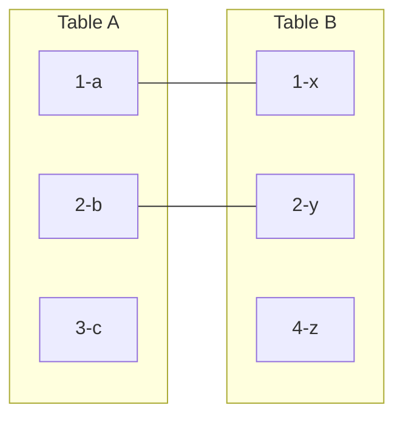
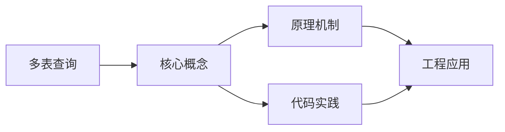
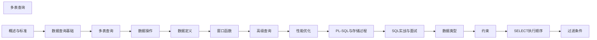

## 1. 学习目标（Bloom 分类）

本节按照布鲁姆教育目标分类学组织学习路径。本文主题为《多表查询》，属于 SQL 模块，读者可以根据自身阶段选择阅读深度。

记忆层面：能够准确复述本文的核心概念、术语与基本语法或操作步骤，并能够在提问或检索时快速定位对应知识点。能够说出 SQL 的核心概念、语法与常用对象。

理解层面：能够用自己的语言解释核心原理与工作机制，说明概念之间的因果关系，而不是机械记忆结论。能够解释 SQL 的执行原理与优化机制。

应用层面：能够在真实项目或练习场景中运用本文知识解决具体问题，写出正确且可维护的实现。能够编写正确、高效的 SQL 语句与操作。

分析层面：能够拆解复杂问题，比较本文主题与相邻概念的异同，识别边界条件与例外情况。能够分析 SQL 相关方案在性能与一致性上的权衡。

评价层面：能够根据约束条件（性能、可读性、安全、成本）评价不同方案的优劣，做出有依据的技术决策。能够根据业务场景评价 SQL 技术选型。

创造层面：能够把本文知识与其他模块知识组合，设计出新的解决方案或可复用的工程模式。能够组合 SQL 与其他技术设计数据架构。

通过本节学习，读者应当能够把《多表查询》纳入自己的知识网络，并与 SQL 模块的其他主题（DDL/DML、查询、索引、事务）建立关联。

## 2. 历史动机与发展脉络

《多表查询》是 SQL 领域的重要主题。要真正理解它，需要先了解它解决的问题与演进过程。

SQL（结构化查询语言）源于 1970 年 Codd 的关系模型，1974 年由 Chamberlin 与 Boyce 设计（SEQUEL），1986 年成为 ANSI 标准；SQL:2023 是当前国际标准。
SQL 分为 DDL（建表）、DML（增删改）、DQL（查询）、DCL（权限）与 TCL（事务）；各大数据库在标准基础上扩展方言。
SQL 是声明式语言：描述“要什么”而非“怎么做”，优化器负责执行计划；这一设计让 SQL 具有跨数据库的表达一致性。

回到本文主题：多表查询 的提出与成熟，正是上述技术背景下的必然产物。早期实现往往以简单可用为目标，随着工程规模扩大，社区逐渐沉淀出标准做法与最佳实践；理解这一脉络，可以帮助读者判断“为什么文档中的推荐写法是现在这个样子”，也能在遇到历史遗留代码时准确识别其设计年代与取舍。


## 3. 形式化定义与核心概念精讲

本节把《多表查询》涉及的核心概念以“定义 + 讲解”的形式展开。读者应把定义当作工具，把讲解当作理解路径；两者结合才能形成可迁移的知识。

关系模型：表（关系）、行（元组）、列（属性）；主键唯一标识、外键表达关联、范式消除冗余。
查询执行：解析 -> 绑定 -> 优化（基于代价选择计划）-> 执行；索引、统计信息与连接算法决定性能。
事务 ACID：原子性（Atomicity）、一致性（Consistency）、隔离性（Isolation）、持久性（Durability）；隔离级别控制并发行为。

### 3.1 原文章节逐一精讲

原文档把主题拆分为 18 个小节，下面按顺序给出每一节的导读讲解，随后保留原文细节供精读。

#### 原文精读（完整保留）

# 多表查询

> **符号约定**：`< >` 必填参数 | `[ ]` 可选参数

---

#### INNER JOIN

**换行写法：基本内连接**
`FROM <表 1> INNER JOIN <表 2> ON <条件>`
```sql
-- 查询员工及其部门名称
SELECT e.name, d.department_name
FROM employees e
INNER JOIN departments d ON e.dept_id = d.id;
```

**换行写法：省略 INNER 的内连接**
`FROM <表 1> JOIN <表 2> ON <条件>`
```sql
-- 省略 INNER 关键字
SELECT e.name, d.department_name
FROM employees e
JOIN departments d ON e.dept_id = d.id;
```

**换行写法：多表连接**
`FROM <表 1> JOIN <表 2> ON ... JOIN <表 3> ON ...`
```sql
-- 连接订单、客户、订单项、商品四张表
SELECT o.order_id, c.name, p.product_name, oi.quantity
FROM orders o
JOIN customers c ON o.customer_id = c.id
JOIN order_items oi ON o.id = oi.order_id
JOIN products p ON oi.product_id = p.id;
```

**换行写法：复合连接条件**
`FROM <表 1> JOIN <表 2> ON <条件 1> AND <条件 2>`
```sql
-- 使用复合条件连接员工和活跃部门
SELECT e.name, d.department_name
FROM employees e
JOIN departments d ON e.dept_id = d.id AND d.is_active = true;
```

---

#### 自连接

自连接：表与自身连接，用于处理层级数据。

```sql
-- 员工与经理关系
SELECT
  e.name AS employee,
  m.name AS manager
FROM employees e
LEFT JOIN employees m ON e.manager_id = m.id;

-- 查找同一部门中薪资相同的员工
SELECT a.name, b.name, a.salary
FROM employees a
JOIN employees b ON a.dept_id = b.dept_id AND a.salary = b.salary AND a.id < b.id;

-- 组织层级查询（固定层级）
SELECT
  e3.name AS level3,
  e2.name AS level2,
  e1.name AS level1
FROM employees e1
LEFT JOIN employees e2 ON e2.manager_id = e1.id
LEFT JOIN employees e3 ON e3.manager_id = e2.id
WHERE e1.manager_id IS NULL;  -- 顶级
```

##### 标量子查询

返回单个值的子查询：

```sql
-- 查询薪资高于平均值的员工
SELECT name, salary
FROM employees
WHERE salary > (SELECT AVG(salary) FROM employees);

-- 在 SELECT 中使用
SELECT
  name,
  salary,
  (SELECT AVG(salary) FROM employees) AS avg_salary,
  salary - (SELECT AVG(salary) FROM employees) AS diff
FROM employees;
```

#### 列子查询

**换行写法：ANY 与子查询任一值比较**
`WHERE <列> <运算符> ANY (SELECT ...)`
```sql
-- 查询薪资高于部门 5 中任一员工的员工
SELECT name, salary FROM employees
WHERE salary > ANY (SELECT salary FROM employees WHERE dept_id = 5);
```

**换行写法：= ANY 等价于 IN**
`WHERE <列> = ANY (SELECT ...)`
```sql
-- 查询东部地区部门的员工
SELECT name, salary FROM employees
WHERE dept_id = ANY (SELECT id FROM departments WHERE region = 'East');
```

**换行写法：ALL 与子查询所有值比较**
`WHERE <列> <运算符> ALL (SELECT ...)`
```sql
-- 查询薪资高于部门 5 中所有员工的员工
SELECT name, salary FROM employees
WHERE salary > ALL (SELECT salary FROM employees WHERE dept_id = 5);
```

---

##### 表子查询

返回多行多列的子查询：

```sql
-- 在 FROM 中使用（派生表）
SELECT dept_name, avg_salary
FROM (
  SELECT department AS dept_name, AVG(salary) AS avg_salary
  FROM employees
  GROUP BY department
) AS dept_stats
WHERE avg_salary > 50000;

-- MySQL 要求派生表必须有别名
-- PostgreSQL 也要求

-- 多列 IN
SELECT * FROM orders
WHERE (customer_id, order_date) IN (
  SELECT customer_id, MAX(order_date)
  FROM orders
  GROUP BY customer_id
);
```

##### 相关子查询

子查询引用外层查询的列：

```sql
-- 查询每个部门薪资最高的员工
SELECT name, department, salary
FROM employees e
WHERE salary = (
  SELECT MAX(salary)
  FROM employees e2
  WHERE e2.department = e.department
);

-- EXISTS 形式（通常更高效）
SELECT name, department, salary
FROM employees e
WHERE EXISTS (
  SELECT 1 FROM employees e2
  WHERE e2.department = e.department AND e2.salary > e.salary
) = false;
```

#### EXISTS 与 IN

```sql
-- EXISTS: 检查子查询是否返回行
-- 适合: 子查询表大、外层表小
SELECT d.department_name
FROM departments d
WHERE EXISTS (
  SELECT 1 FROM employees e
  WHERE e.dept_id = d.id AND e.salary > 100000
);

-- IN: 检查值是否在子查询结果中
-- 适合: 子查询结果集小
SELECT d.department_name
FROM departments d
WHERE d.id IN (
  SELECT dept_id FROM employees WHERE salary > 100000
);

-- NOT EXISTS vs NOT IN
--  NOT IN 遇到 NULL 会返回空结果
--  NOT EXISTS 不受 NULL 影响

--  如果子查询包含 NULL，NOT IN 整体返回空
SELECT name FROM employees
WHERE dept_id NOT IN (SELECT dept_id FROM employees WHERE salary > 100000);
-- 如果有 dept_id 为 NULL 的行，结果为空

--  使用 NOT EXISTS 更安全
SELECT name FROM employees e
WHERE NOT EXISTS (
  SELECT 1 FROM employees e2
  WHERE e2.dept_id = e.dept_id AND e2.salary > 100000
);
```

#### JOIN 性能建议

```sql
-- 1. 小表驱动大表
--  小表在左（逻辑上更清晰）
SELECT * FROM small_table s JOIN big_table b ON s.id = b.small_id;

-- 2. 连接列上建索引
CREATE INDEX idx_orders_customer_id ON orders(customer_id);

-- 3. 避免在 JOIN 条件上使用函数
--
SELECT * FROM users u JOIN orders o ON LOWER(u.email) = LOWER(o.email);
--
SELECT * FROM users u JOIN orders o ON u.email = o.email;

-- 4. 优先使用 EXISTS 替代 IN（大数据量时）
-- 5. 优先使用 CTE 替代嵌套子查询（可读性更好）
-- 6. 限制 JOIN 的表数量（建议不超过 5 张）
```

#### JOIN 类型概览

关系型数据库的核心思想是将数据分散到不同表中，通过外键关联。JOIN 是将这些分散数据重新组合的手段。



- INNER JOIN：1-a-x, 2-b-y（交集）
- LEFT JOIN：1-a-x, 2-b-y, 3-c-∅（A 全部 + 匹配的 B）
- RIGHT JOIN：1-a-x, 2-b-y, ∅-4-z（B 全部 + 匹配的 A）
- FULL JOIN：1-a-x, 2-b-y, 3-c-∅, ∅-4-z（并集）
- CROSS JOIN：3×3 = 9 行（笛卡尔积）

#### LEFT JOIN（左外连接）

左连接：返回左表所有行，右表无匹配时填充 NULL。

```sql
-- 查询所有员工及其部门（包括没有部门的员工）
SELECT e.name, d.department_name
FROM employees e
LEFT JOIN departments d ON e.dept_id = d.id;

-- 找出没有部门的员工（左连接 + IS NULL 过滤）
SELECT e.name
FROM employees e
LEFT JOIN departments d ON e.dept_id = d.id
WHERE d.id IS NULL;

-- 多层左连接
SELECT
  u.name,
  o.order_id,
  p.product_name
FROM users u
LEFT JOIN orders o ON u.id = o.user_id
LEFT JOIN order_items oi ON o.id = oi.order_id
LEFT JOIN products p ON oi.product_id = p.id;
```

#### RIGHT JOIN（右外连接）

右连接：返回右表所有行，左表无匹配时填充 NULL。

```sql
-- 查询所有部门及其员工（包括没有员工的部门）
SELECT e.name, d.department_name
FROM employees e
RIGHT JOIN departments d ON e.dept_id = d.id;

-- 右连接可以改写为左连接（推荐，可读性更好）
SELECT e.name, d.department_name
FROM departments d
LEFT JOIN employees e ON e.dept_id = d.id;
```

#### FULL JOIN（全外连接）

全连接：返回两表所有行，无匹配时填充 NULL。

```sql
-- PostgreSQL / SQL Server / Oracle
SELECT e.name, d.department_name
FROM employees e
FULL JOIN departments d ON e.dept_id = d.id;

-- MySQL 不支持 FULL JOIN，用 UNION 模拟
SELECT e.name, d.department_name
FROM employees e
LEFT JOIN departments d ON e.dept_id = d.id
UNION
SELECT e.name, d.department_name
FROM employees e
RIGHT JOIN departments d ON e.dept_id = d.id;

-- 找出两表不匹配的行
SELECT e.name, d.department_name
FROM employees e
FULL JOIN departments d ON e.dept_id = d.id
WHERE e.id IS NULL OR d.id IS NULL;
```

#### CROSS JOIN（交叉连接）

交叉连接：返回两表的笛卡尔积（每行组合）。

```sql
-- 显式交叉连接
SELECT d.department_name, j.job_level
FROM departments d
CROSS JOIN job_levels j;

-- 隐式交叉连接（不推荐）
SELECT d.department_name, j.job_level
FROM departments d, job_levels j;

-- 实际用途：生成日期维度表
SELECT d.date, h.hour
FROM dates d
CROSS JOIN hours h;
```

#### 自然连接与 USING 子句

```sql
-- NATURAL JOIN: 自动按同名列连接（不推荐，不可控）
SELECT * FROM employees NATURAL JOIN departments;

-- USING 子句: 指定同名列连接（比 ON 更简洁）
SELECT e.name, department_id
FROM employees e
JOIN departments d USING (department_id);

-- USING 与 ON 的区别
-- USING: 连接列只出现一次
-- ON:    连接列可能出现两次（需要指定表别名）
```

#### 子查询

#### CTE（通用表表达式）

CTE（Common Table Expression）使用 `WITH` 子句定义临时结果集，比子查询更清晰。

##### 基本 CTE

```sql
-- 用 CTE 替代派生表
WITH dept_stats AS (
  SELECT department, AVG(salary) AS avg_salary, COUNT(*) AS emp_count
  FROM employees
  GROUP BY department
)
SELECT department, avg_salary
FROM dept_stats
WHERE emp_count > 5
ORDER BY avg_salary DESC;

-- 多个 CTE
WITH
  high_salary AS (
    SELECT * FROM employees WHERE salary > 80000
  ),
  dept_avg AS (
    SELECT department, AVG(salary) AS avg_salary
    FROM employees
    GROUP BY department
  )
SELECT h.name, h.salary, d.avg_salary
FROM high_salary h
JOIN dept_avg d ON h.department = d.department;
```

##### CTE 的优势

```sql
-- 1. 可读性：逻辑分层清晰
WITH
  monthly_sales AS (
    SELECT DATE_TRUNC('month', order_date) AS month, SUM(amount) AS total
    FROM orders
    GROUP BY month
  ),
  growth AS (
    SELECT
      month,
      total,
      LAG(total) OVER(ORDER BY month) AS prev_total
    FROM monthly_sales
  )
SELECT month, total,
  ROUND((total - prev_total) * 100.0 / NULLIF(prev_total, 0), 2) AS growth_pct
FROM growth;

-- 2. 可复用：同一 CTE 可在主查询中多次引用
WITH active_users AS (
  SELECT * FROM users WHERE last_login > CURRENT_DATE - INTERVAL '30 days'
)
SELECT 'total' AS metric, COUNT(*) AS value FROM active_users
UNION ALL
SELECT 'premium', COUNT(*) FROM active_users WHERE plan = 'premium'
UNION ALL
SELECT 'free', COUNT(*) FROM active_users WHERE plan = 'free';

-- 3. 递归查询（见下节）
```

##### 递归 CTE

递归 CTE 用于处理层级或图结构数据：

```sql
-- 基本语法
WITH RECURSIVE cte_name AS (
  -- 锚点查询（非递归部分，起点）
  SELECT ...
  UNION ALL
  -- 递归部分（引用自身）
  SELECT ... FROM cte_name WHERE ...
)
SELECT * FROM cte_name;
```

###### 组织架构层级

```sql
WITH RECURSIVE org_tree AS (
  -- 锚点：顶级经理
  SELECT id, name, manager_id, 1 AS level, CAST(name AS VARCHAR(1000)) AS path
  FROM employees
  WHERE manager_id IS NULL

  UNION ALL

  -- 递归：下属员工
  SELECT e.id, e.name, e.manager_id, ot.level + 1,
    CAST(ot.path || ' > ' || e.name AS VARCHAR(1000))
  FROM employees e
  JOIN org_tree ot ON e.manager_id = ot.id
)
SELECT id, name, level, path FROM org_tree ORDER BY path;
```

###### 数字序列生成

```sql
WITH RECURSIVE nums AS (
  SELECT 1 AS n
  UNION ALL
  SELECT n + 1 FROM nums WHERE n < 100
)
SELECT n FROM nums;

-- PostgreSQL 更简洁的方式
SELECT generate_series(1, 100) AS n;
```

###### 路径查找（图遍历）

```sql
-- 查找从城市 A 到城市 B 的所有路径
WITH RECURSIVE routes AS (
  -- 起点
  SELECT
    from_city,
    to_city,
    CAST(from_city || ' -> ' || to_city AS VARCHAR(1000)) AS route,
    distance AS total_distance,
    1 AS hops
  FROM flights
  WHERE from_city = 'Beijing'

  UNION ALL

  -- 递归：继续飞往下一个城市
  SELECT
    f.from_city,
    f.to_city,
    CAST(r.route || ' -> ' || f.to_city AS VARCHAR(1000)),
    r.total_distance + f.distance,
    r.hops + 1
  FROM flights f
  JOIN routes r ON f.from_city = r.to_city
  WHERE r.hops < 5            -- 限制最大中转次数
    AND r.route NOT LIKE '%>' || f.to_city || '%'  -- 避免环路
)
SELECT route, total_distance, hops
FROM routes
WHERE to_city = 'Shanghai'
ORDER BY total_distance;
```

###### 日期序列

```sql
WITH RECURSIVE date_series AS (
  SELECT DATE '2024-01-01' AS dt
  UNION ALL
  SELECT dt + INTERVAL '1 day' FROM date_series WHERE dt < DATE '2024-12-31'
)
SELECT dt FROM date_series;
```

#### 小结

- `INNER JOIN` 返回交集，`LEFT JOIN` 保留左表全部，`FULL JOIN` 保留两表全部
- 自连接用于层级数据，需注意使用表别名区分
- `EXISTS` 通常比 `IN` 更高效，`NOT EXISTS` 比 `NOT IN` 更安全（不受 NULL 影响）
- CTE 提供了比子查询更好的可读性和可维护性
- 递归 CTE 是处理层级和图结构数据的利器，务必设置终止条件防止无限递归
- JOIN 性能优化的核心：索引、小表驱动、避免函数包裹连接列
#### LEFT JOIN

**换行写法：左外连接返回左表全部行**
`FROM <表 1> LEFT JOIN <表 2> ON <条件>`
```sql
-- 查询所有员工及其部门（包括没有部门的员工）
SELECT e.name, d.department_name
FROM employees e
LEFT JOIN departments d ON e.dept_id = d.id;
```

**换行写法：左连接查找无匹配行**
`FROM <表 1> LEFT JOIN <表 2> ON <条件> WHERE <表 2>.<列> IS NULL`
```sql
-- 找出没有部门的员工
SELECT e.name
FROM employees e
LEFT JOIN departments d ON e.dept_id = d.id
WHERE d.id IS NULL;
```

**换行写法：多层左连接**
`FROM <表 1> LEFT JOIN <表 2> ON ... LEFT JOIN <表 3> ON ...`
```sql
-- 链式左连接用户、订单、订单项、商品
SELECT
  u.name,
  o.order_id,
  p.product_name
FROM users u
LEFT JOIN orders o ON u.id = o.user_id
LEFT JOIN order_items oi ON o.id = oi.order_id
LEFT JOIN products p ON oi.product_id = p.id;
```

---

#### RIGHT JOIN

**换行写法：右外连接返回右表全部行**
`FROM <表 1> RIGHT JOIN <表 2> ON <条件>`
```sql
-- 查询所有部门及其员工（包括没有员工的部门）
SELECT e.name, d.department_name
FROM employees e
RIGHT JOIN departments d ON e.dept_id = d.id;
```

---

#### FULL JOIN

**换行写法：全外连接返回两表所有行**
`FROM <表 1> FULL JOIN <表 2> ON <条件>`
```sql
-- 返回员工和部门的所有行
SELECT e.name, d.department_name
FROM employees e
FULL JOIN departments d ON e.dept_id = d.id;
```

**换行写法：全外连接查找不匹配行**
`FROM <表 1> FULL JOIN <表 2> ON <条件> WHERE <表 1>.<id> IS NULL OR <表 2>.<id> IS NULL`
```sql
-- 查找两表不匹配的行
SELECT e.name, d.department_name
FROM employees e
FULL JOIN departments d ON e.dept_id = d.id
WHERE e.id IS NULL OR d.id IS NULL;
```

**换行写法：MySQL 用 UNION 模拟全外连接**
`LEFT JOIN ... UNION RIGHT JOIN ...`
```sql
-- MySQL 不支持 FULL JOIN，用 UNION 模拟
SELECT e.name, d.department_name
FROM employees e
LEFT JOIN departments d ON e.dept_id = d.id
UNION
SELECT e.name, d.department_name
FROM employees e
RIGHT JOIN departments d ON e.dept_id = d.id;
```

---

#### CROSS JOIN

**换行写法：显式交叉连接**
`FROM <表 1> CROSS JOIN <表 2>`
```sql
-- 生成部门和职级的笛卡尔积
SELECT d.department_name, j.job_level
FROM departments d
CROSS JOIN job_levels j;
```

**换行写法：隐式交叉连接**
`FROM <表 1>, <表 2>`
```sql
-- 使用逗号分隔的隐式交叉连接
SELECT d.department_name, j.job_level
FROM departments d, job_levels j;
```

---


### 3.2 概念关系图

下面用 Mermaid 图表达本文核心概念之间的关系，帮助读者建立整体图景：



图中展示的是本文知识的结构化关系：核心概念是入口，原理机制解释“为什么”，代码实践演示“怎么做”，工程应用回答“何时用”。读者学习时可以把每个小节的内容挂接到对应节点上。

## 4. 理论推导与原理解析

本节深入《多表查询》背后的原理。理论部分不求面面俱到，而是聚焦“能解释现象、能指导实践”的关键推导。

关系模型：表（关系）、行（元组）、列（属性）；主键唯一标识、外键表达关联、范式消除冗余。
查询执行：解析 -> 绑定 -> 优化（基于代价选择计划）-> 执行；索引、统计信息与连接算法决定性能。
事务 ACID：原子性（Atomicity）、一致性（Consistency）、隔离性（Isolation）、持久性（Durability）；隔离级别控制并发行为。
集合语义：SELECT 返回结果集；JOIN 组合关系，GROUP BY 聚合，子查询与 CTE 表达复杂逻辑。

需要强调的是，理论推导与工程实践之间存在翻译层：理论给出的是理想化模型与边界条件，工程代码则必须处理真实环境中的例外。读者在学习时应先掌握理论的“标准情形”，再通过陷阱章节了解“非标准情形”。

## 5. 代码示例与逐行讲解

本节把原文中的代码示例系统整理，并为每个示例补充用途说明与讲解。读者不应只浏览代码，而应逐段对照讲解理解设计意图。

### 5.1 示例：INNER JOIN

该示例来自原文《INNER JOIN》小节，用于演示多表查询相关操作。阅读时请先看代码结构，再看其后的讲解。

```sql
-- 查询员工及其部门名称
SELECT e.name, d.department_name
FROM employees e
INNER JOIN departments d ON e.dept_id = d.id;
```

讲解：这段代码演示了本节核心知识点。代码中的关键操作可以归纳为三步：准备（定义或初始化）、执行（核心逻辑）、收尾（释放资源或返回结果）。实际项目中，这三步往往被封装为函数或类，以提升复用性与可测试性。

关键点分析：

该示例共 4 行有效代码，包含 2 类关键结构（SELECT、FROM）。其中：

- 入口与初始化部分负责建立上下文，对应实际项目中的启动或装配逻辑；
- 核心逻辑部分体现本文主题的主要操作，是阅读时最需要对照讲解理解的部分；
- 输出或返回部分把结果交给调用方，注意其类型与边界条件。

进阶思考路径：先尝试修改参数观察行为变化，再把示例中的模式迁移到自己的项目中；每次修改都记录预期与实测差异，这是把示例转化为能力的最快方式。

### 5.2 示例：INNER JOIN

该示例来自原文《INNER JOIN》小节，用于演示多表查询相关操作。阅读时请先看代码结构，再看其后的讲解。

```sql
-- 省略 INNER 关键字
SELECT e.name, d.department_name
FROM employees e
JOIN departments d ON e.dept_id = d.id;
```

讲解：这段代码演示了本节核心知识点。代码中的关键操作可以归纳为三步：准备（定义或初始化）、执行（核心逻辑）、收尾（释放资源或返回结果）。实际项目中，这三步往往被封装为函数或类，以提升复用性与可测试性。

关键点分析：

该示例共 4 行有效代码，包含 2 类关键结构（SELECT、FROM）。其中：

- 入口与初始化部分负责建立上下文，对应实际项目中的启动或装配逻辑；
- 核心逻辑部分体现本文主题的主要操作，是阅读时最需要对照讲解理解的部分；
- 输出或返回部分把结果交给调用方，注意其类型与边界条件。

进阶思考路径：先尝试修改参数观察行为变化，再把示例中的模式迁移到自己的项目中；每次修改都记录预期与实测差异，这是把示例转化为能力的最快方式。

### 5.3 示例：INNER JOIN

该示例来自原文《INNER JOIN》小节，用于演示多表查询相关操作。阅读时请先看代码结构，再看其后的讲解。

```sql
-- 连接订单、客户、订单项、商品四张表
SELECT o.order_id, c.name, p.product_name, oi.quantity
FROM orders o
JOIN customers c ON o.customer_id = c.id
JOIN order_items oi ON o.id = oi.order_id
JOIN products p ON oi.product_id = p.id;
```

讲解：这段代码演示了本节核心知识点。代码中的关键操作可以归纳为三步：准备（定义或初始化）、执行（核心逻辑）、收尾（释放资源或返回结果）。实际项目中，这三步往往被封装为函数或类，以提升复用性与可测试性。

关键点分析：

该示例共 6 行有效代码，包含 2 类关键结构（SELECT、FROM）。其中：

- 入口与初始化部分负责建立上下文，对应实际项目中的启动或装配逻辑；
- 核心逻辑部分体现本文主题的主要操作，是阅读时最需要对照讲解理解的部分；
- 输出或返回部分把结果交给调用方，注意其类型与边界条件。

进阶思考路径：先尝试修改参数观察行为变化，再把示例中的模式迁移到自己的项目中；每次修改都记录预期与实测差异，这是把示例转化为能力的最快方式。

### 5.4 示例：INNER JOIN

该示例来自原文《INNER JOIN》小节，用于演示多表查询相关操作。阅读时请先看代码结构，再看其后的讲解。

```sql
-- 使用复合条件连接员工和活跃部门
SELECT e.name, d.department_name
FROM employees e
JOIN departments d ON e.dept_id = d.id AND d.is_active = true;
```

讲解：这段代码演示了本节核心知识点。代码中的关键操作可以归纳为三步：准备（定义或初始化）、执行（核心逻辑）、收尾（释放资源或返回结果）。实际项目中，这三步往往被封装为函数或类，以提升复用性与可测试性。

关键点分析：

该示例共 4 行有效代码，包含 2 类关键结构（SELECT、FROM）。其中：

- 入口与初始化部分负责建立上下文，对应实际项目中的启动或装配逻辑；
- 核心逻辑部分体现本文主题的主要操作，是阅读时最需要对照讲解理解的部分；
- 输出或返回部分把结果交给调用方，注意其类型与边界条件。

进阶思考路径：先尝试修改参数观察行为变化，再把示例中的模式迁移到自己的项目中；每次修改都记录预期与实测差异，这是把示例转化为能力的最快方式。

### 5.5 示例：自连接

该示例来自原文《自连接》小节，用于演示多表查询相关操作。阅读时请先看代码结构，再看其后的讲解。

```sql
-- 员工与经理关系
SELECT
  e.name AS employee,
  m.name AS manager
FROM employees e
LEFT JOIN employees m ON e.manager_id = m.id;

-- 查找同一部门中薪资相同的员工
SELECT a.name, b.name, a.salary
FROM employees a
JOIN employees b ON a.dept_id = b.dept_id AND a.salary = b.salary AND a.id < b.id;

-- 组织层级查询（固定层级）
SELECT
  e3.name AS level3,
  e2.name AS level2,
  e1.name AS level1
FROM employees e1
LEFT JOIN employees e2 ON e2.manager_id = e1.id
LEFT JOIN employees e3 ON e3.manager_id = e2.id
WHERE e1.manager_id IS NULL;  -- 顶级
```

讲解：这段代码演示了本节核心知识点。代码中的关键操作可以归纳为三步：准备（定义或初始化）、执行（核心逻辑）、收尾（释放资源或返回结果）。实际项目中，这三步往往被封装为函数或类，以提升复用性与可测试性。

关键点分析：

该示例共 19 行有效代码，包含 2 类关键结构（SELECT、FROM）。其中：

- 入口与初始化部分负责建立上下文，对应实际项目中的启动或装配逻辑；
- 核心逻辑部分体现本文主题的主要操作，是阅读时最需要对照讲解理解的部分；
- 输出或返回部分把结果交给调用方，注意其类型与边界条件。

进阶思考路径：先尝试修改参数观察行为变化，再把示例中的模式迁移到自己的项目中；每次修改都记录预期与实测差异，这是把示例转化为能力的最快方式。

### 5.6 示例：标量子查询

该示例来自原文《标量子查询》小节，用于演示多表查询相关操作。阅读时请先看代码结构，再看其后的讲解。

```sql
-- 查询薪资高于平均值的员工
SELECT name, salary
FROM employees
WHERE salary > (SELECT AVG(salary) FROM employees);

-- 在 SELECT 中使用
SELECT
  name,
  salary,
  (SELECT AVG(salary) FROM employees) AS avg_salary,
  salary - (SELECT AVG(salary) FROM employees) AS diff
FROM employees;
```

讲解：这段代码演示了本节核心知识点。代码中的关键操作可以归纳为三步：准备（定义或初始化）、执行（核心逻辑）、收尾（释放资源或返回结果）。实际项目中，这三步往往被封装为函数或类，以提升复用性与可测试性。

关键点分析：

该示例共 11 行有效代码，包含 2 类关键结构（SELECT、FROM）。其中：

- 入口与初始化部分负责建立上下文，对应实际项目中的启动或装配逻辑；
- 核心逻辑部分体现本文主题的主要操作，是阅读时最需要对照讲解理解的部分；
- 输出或返回部分把结果交给调用方，注意其类型与边界条件。

进阶思考路径：先尝试修改参数观察行为变化，再把示例中的模式迁移到自己的项目中；每次修改都记录预期与实测差异，这是把示例转化为能力的最快方式。

### 5.7 示例：列子查询

该示例来自原文《列子查询》小节，用于演示多表查询相关操作。阅读时请先看代码结构，再看其后的讲解。

```sql
-- 查询薪资高于部门 5 中任一员工的员工
SELECT name, salary FROM employees
WHERE salary > ANY (SELECT salary FROM employees WHERE dept_id = 5);
```

讲解：这段代码演示了本节核心知识点。代码中的关键操作可以归纳为三步：准备（定义或初始化）、执行（核心逻辑）、收尾（释放资源或返回结果）。实际项目中，这三步往往被封装为函数或类，以提升复用性与可测试性。

关键点分析：

该示例共 3 行有效代码，包含 2 类关键结构（SELECT、FROM）。其中：

- 入口与初始化部分负责建立上下文，对应实际项目中的启动或装配逻辑；
- 核心逻辑部分体现本文主题的主要操作，是阅读时最需要对照讲解理解的部分；
- 输出或返回部分把结果交给调用方，注意其类型与边界条件。

进阶思考路径：先尝试修改参数观察行为变化，再把示例中的模式迁移到自己的项目中；每次修改都记录预期与实测差异，这是把示例转化为能力的最快方式。

### 5.8 示例：列子查询

该示例来自原文《列子查询》小节，用于演示多表查询相关操作。阅读时请先看代码结构，再看其后的讲解。

```sql
-- 查询东部地区部门的员工
SELECT name, salary FROM employees
WHERE dept_id = ANY (SELECT id FROM departments WHERE region = 'East');
```

讲解：这段代码演示了本节核心知识点。代码中的关键操作可以归纳为三步：准备（定义或初始化）、执行（核心逻辑）、收尾（释放资源或返回结果）。实际项目中，这三步往往被封装为函数或类，以提升复用性与可测试性。

关键点分析：

该示例共 3 行有效代码，包含 2 类关键结构（SELECT、FROM）。其中：

- 入口与初始化部分负责建立上下文，对应实际项目中的启动或装配逻辑；
- 核心逻辑部分体现本文主题的主要操作，是阅读时最需要对照讲解理解的部分；
- 输出或返回部分把结果交给调用方，注意其类型与边界条件。

进阶思考路径：先尝试修改参数观察行为变化，再把示例中的模式迁移到自己的项目中；每次修改都记录预期与实测差异，这是把示例转化为能力的最快方式。

### 5.9 示例：列子查询

该示例来自原文《列子查询》小节，用于演示多表查询相关操作。阅读时请先看代码结构，再看其后的讲解。

```sql
-- 查询薪资高于部门 5 中所有员工的员工
SELECT name, salary FROM employees
WHERE salary > ALL (SELECT salary FROM employees WHERE dept_id = 5);
```

讲解：这段代码演示了本节核心知识点。代码中的关键操作可以归纳为三步：准备（定义或初始化）、执行（核心逻辑）、收尾（释放资源或返回结果）。实际项目中，这三步往往被封装为函数或类，以提升复用性与可测试性。

关键点分析：

该示例共 3 行有效代码，包含 2 类关键结构（SELECT、FROM）。其中：

- 入口与初始化部分负责建立上下文，对应实际项目中的启动或装配逻辑；
- 核心逻辑部分体现本文主题的主要操作，是阅读时最需要对照讲解理解的部分；
- 输出或返回部分把结果交给调用方，注意其类型与边界条件。

进阶思考路径：先尝试修改参数观察行为变化，再把示例中的模式迁移到自己的项目中；每次修改都记录预期与实测差异，这是把示例转化为能力的最快方式。

### 5.10 示例：表子查询

该示例来自原文《表子查询》小节，用于演示多表查询相关操作。阅读时请先看代码结构，再看其后的讲解。

```sql
-- 在 FROM 中使用（派生表）
SELECT dept_name, avg_salary
FROM (
  SELECT department AS dept_name, AVG(salary) AS avg_salary
  FROM employees
  GROUP BY department
) AS dept_stats
WHERE avg_salary > 50000;

-- MySQL 要求派生表必须有别名
-- PostgreSQL 也要求

-- 多列 IN
SELECT * FROM orders
WHERE (customer_id, order_date) IN (
  SELECT customer_id, MAX(order_date)
  FROM orders
  GROUP BY customer_id
);
```

讲解：这段代码演示了本节核心知识点。代码中的关键操作可以归纳为三步：准备（定义或初始化）、执行（核心逻辑）、收尾（释放资源或返回结果）。实际项目中，这三步往往被封装为函数或类，以提升复用性与可测试性。

关键点分析：

该示例共 17 行有效代码，包含 2 类关键结构（SELECT、FROM）。其中：

- 入口与初始化部分负责建立上下文，对应实际项目中的启动或装配逻辑；
- 核心逻辑部分体现本文主题的主要操作，是阅读时最需要对照讲解理解的部分；
- 输出或返回部分把结果交给调用方，注意其类型与边界条件。

进阶思考路径：先尝试修改参数观察行为变化，再把示例中的模式迁移到自己的项目中；每次修改都记录预期与实测差异，这是把示例转化为能力的最快方式。

### 5.11 示例：相关子查询

该示例来自原文《相关子查询》小节，用于演示多表查询相关操作。阅读时请先看代码结构，再看其后的讲解。

```sql
-- 查询每个部门薪资最高的员工
SELECT name, department, salary
FROM employees e
WHERE salary = (
  SELECT MAX(salary)
  FROM employees e2
  WHERE e2.department = e.department
);

-- EXISTS 形式（通常更高效）
SELECT name, department, salary
FROM employees e
WHERE EXISTS (
  SELECT 1 FROM employees e2
  WHERE e2.department = e.department AND e2.salary > e.salary
) = false;
```

讲解：这段代码演示了本节核心知识点。代码中的关键操作可以归纳为三步：准备（定义或初始化）、执行（核心逻辑）、收尾（释放资源或返回结果）。实际项目中，这三步往往被封装为函数或类，以提升复用性与可测试性。

关键点分析：

该示例共 15 行有效代码，包含 2 类关键结构（SELECT、FROM）。其中：

- 入口与初始化部分负责建立上下文，对应实际项目中的启动或装配逻辑；
- 核心逻辑部分体现本文主题的主要操作，是阅读时最需要对照讲解理解的部分；
- 输出或返回部分把结果交给调用方，注意其类型与边界条件。

进阶思考路径：先尝试修改参数观察行为变化，再把示例中的模式迁移到自己的项目中；每次修改都记录预期与实测差异，这是把示例转化为能力的最快方式。

### 5.12 示例：EXISTS 与 IN

该示例来自原文《EXISTS 与 IN》小节，用于演示多表查询相关操作。阅读时请先看代码结构，再看其后的讲解。

```sql
-- EXISTS: 检查子查询是否返回行
-- 适合: 子查询表大、外层表小
SELECT d.department_name
FROM departments d
WHERE EXISTS (
  SELECT 1 FROM employees e
  WHERE e.dept_id = d.id AND e.salary > 100000
);

-- IN: 检查值是否在子查询结果中
-- 适合: 子查询结果集小
SELECT d.department_name
FROM departments d
WHERE d.id IN (
  SELECT dept_id FROM employees WHERE salary > 100000
);

-- NOT EXISTS vs NOT IN
--  NOT IN 遇到 NULL 会返回空结果
--  NOT EXISTS 不受 NULL 影响

--  如果子查询包含 NULL，NOT IN 整体返回空
SELECT name FROM employees
WHERE dept_id NOT IN (SELECT dept_id FROM employees WHERE salary > 100000);
-- 如果有 dept_id 为 NULL 的行，结果为空

--  使用 NOT EXISTS 更安全
SELECT name FROM employees e
WHERE NOT EXISTS (
  SELECT 1 FROM employees e2
  WHERE e2.dept_id = e.dept_id AND e2.salary > 100000
);
```

讲解：这段代码演示了本节核心知识点。代码中的关键操作可以归纳为三步：准备（定义或初始化）、执行（核心逻辑）、收尾（释放资源或返回结果）。实际项目中，这三步往往被封装为函数或类，以提升复用性与可测试性。

关键点分析：

该示例共 28 行有效代码，包含 2 类关键结构（SELECT、FROM）。其中：

- 入口与初始化部分负责建立上下文，对应实际项目中的启动或装配逻辑；
- 核心逻辑部分体现本文主题的主要操作，是阅读时最需要对照讲解理解的部分；
- 输出或返回部分把结果交给调用方，注意其类型与边界条件。

进阶思考路径：先尝试修改参数观察行为变化，再把示例中的模式迁移到自己的项目中；每次修改都记录预期与实测差异，这是把示例转化为能力的最快方式。

### 5.13 示例：JOIN 性能建议

该示例来自原文《JOIN 性能建议》小节，用于演示多表查询相关操作。阅读时请先看代码结构，再看其后的讲解。

```sql
-- 1. 小表驱动大表
--  小表在左（逻辑上更清晰）
SELECT * FROM small_table s JOIN big_table b ON s.id = b.small_id;

-- 2. 连接列上建索引
CREATE INDEX idx_orders_customer_id ON orders(customer_id);

-- 3. 避免在 JOIN 条件上使用函数
--
SELECT * FROM users u JOIN orders o ON LOWER(u.email) = LOWER(o.email);
--
SELECT * FROM users u JOIN orders o ON u.email = o.email;

-- 4. 优先使用 EXISTS 替代 IN（大数据量时）
-- 5. 优先使用 CTE 替代嵌套子查询（可读性更好）
-- 6. 限制 JOIN 的表数量（建议不超过 5 张）
```

讲解：这段代码演示了本节核心知识点。代码中的关键操作可以归纳为三步：准备（定义或初始化）、执行（核心逻辑）、收尾（释放资源或返回结果）。实际项目中，这三步往往被封装为函数或类，以提升复用性与可测试性。

关键点分析：

该示例共 13 行有效代码，包含 3 类关键结构（SELECT、CREATE、FROM）。其中：

- 入口与初始化部分负责建立上下文，对应实际项目中的启动或装配逻辑；
- 核心逻辑部分体现本文主题的主要操作，是阅读时最需要对照讲解理解的部分；
- 输出或返回部分把结果交给调用方，注意其类型与边界条件。

进阶思考路径：先尝试修改参数观察行为变化，再把示例中的模式迁移到自己的项目中；每次修改都记录预期与实测差异，这是把示例转化为能力的最快方式。

### 5.14 示例：JOIN 类型概览

该示例来自原文《JOIN 类型概览》小节，用于演示多表查询相关操作。阅读时请先看代码结构，再看其后的讲解。


讲解：这段代码演示了本节核心知识点。代码中的关键操作可以归纳为三步：准备（定义或初始化）、执行（核心逻辑）、收尾（释放资源或返回结果）。实际项目中，这三步往往被封装为函数或类，以提升复用性与可测试性。

关键点分析：

该示例共 13 行有效代码，结构以数据或配置为主。阅读时应关注：数据字段的含义、配置项的作用，以及它们与运行行为的对应关系。

进阶思考路径：先尝试修改参数观察行为变化，再把示例中的模式迁移到自己的项目中；每次修改都记录预期与实测差异，这是把示例转化为能力的最快方式。

### 5.15 示例：LEFT JOIN（左外连接）

该示例来自原文《LEFT JOIN（左外连接）》小节，用于演示多表查询相关操作。阅读时请先看代码结构，再看其后的讲解。

```sql
-- 查询所有员工及其部门（包括没有部门的员工）
SELECT e.name, d.department_name
FROM employees e
LEFT JOIN departments d ON e.dept_id = d.id;

-- 找出没有部门的员工（左连接 + IS NULL 过滤）
SELECT e.name
FROM employees e
LEFT JOIN departments d ON e.dept_id = d.id
WHERE d.id IS NULL;

-- 多层左连接
SELECT
  u.name,
  o.order_id,
  p.product_name
FROM users u
LEFT JOIN orders o ON u.id = o.user_id
LEFT JOIN order_items oi ON o.id = oi.order_id
LEFT JOIN products p ON oi.product_id = p.id;
```

讲解：这段代码演示了本节核心知识点。代码中的关键操作可以归纳为三步：准备（定义或初始化）、执行（核心逻辑）、收尾（释放资源或返回结果）。实际项目中，这三步往往被封装为函数或类，以提升复用性与可测试性。

关键点分析：

该示例共 18 行有效代码，包含 2 类关键结构（SELECT、FROM）。其中：

- 入口与初始化部分负责建立上下文，对应实际项目中的启动或装配逻辑；
- 核心逻辑部分体现本文主题的主要操作，是阅读时最需要对照讲解理解的部分；
- 输出或返回部分把结果交给调用方，注意其类型与边界条件。

进阶思考路径：先尝试修改参数观察行为变化，再把示例中的模式迁移到自己的项目中；每次修改都记录预期与实测差异，这是把示例转化为能力的最快方式。

### 5.16 示例：RIGHT JOIN（右外连接）

该示例来自原文《RIGHT JOIN（右外连接）》小节，用于演示多表查询相关操作。阅读时请先看代码结构，再看其后的讲解。

```sql
-- 查询所有部门及其员工（包括没有员工的部门）
SELECT e.name, d.department_name
FROM employees e
RIGHT JOIN departments d ON e.dept_id = d.id;

-- 右连接可以改写为左连接（推荐，可读性更好）
SELECT e.name, d.department_name
FROM departments d
LEFT JOIN employees e ON e.dept_id = d.id;
```

讲解：这段代码演示了本节核心知识点。代码中的关键操作可以归纳为三步：准备（定义或初始化）、执行（核心逻辑）、收尾（释放资源或返回结果）。实际项目中，这三步往往被封装为函数或类，以提升复用性与可测试性。

关键点分析：

该示例共 8 行有效代码，包含 2 类关键结构（SELECT、FROM）。其中：

- 入口与初始化部分负责建立上下文，对应实际项目中的启动或装配逻辑；
- 核心逻辑部分体现本文主题的主要操作，是阅读时最需要对照讲解理解的部分；
- 输出或返回部分把结果交给调用方，注意其类型与边界条件。

进阶思考路径：先尝试修改参数观察行为变化，再把示例中的模式迁移到自己的项目中；每次修改都记录预期与实测差异，这是把示例转化为能力的最快方式。

### 5.17 示例：FULL JOIN（全外连接）

该示例来自原文《FULL JOIN（全外连接）》小节，用于演示多表查询相关操作。阅读时请先看代码结构，再看其后的讲解。

```sql
-- PostgreSQL / SQL Server / Oracle
SELECT e.name, d.department_name
FROM employees e
FULL JOIN departments d ON e.dept_id = d.id;

-- MySQL 不支持 FULL JOIN，用 UNION 模拟
SELECT e.name, d.department_name
FROM employees e
LEFT JOIN departments d ON e.dept_id = d.id
UNION
SELECT e.name, d.department_name
FROM employees e
RIGHT JOIN departments d ON e.dept_id = d.id;

-- 找出两表不匹配的行
SELECT e.name, d.department_name
FROM employees e
FULL JOIN departments d ON e.dept_id = d.id
WHERE e.id IS NULL OR d.id IS NULL;
```

讲解：这段代码演示了本节核心知识点。代码中的关键操作可以归纳为三步：准备（定义或初始化）、执行（核心逻辑）、收尾（释放资源或返回结果）。实际项目中，这三步往往被封装为函数或类，以提升复用性与可测试性。

关键点分析：

该示例共 17 行有效代码，包含 2 类关键结构（SELECT、FROM）。其中：

- 入口与初始化部分负责建立上下文，对应实际项目中的启动或装配逻辑；
- 核心逻辑部分体现本文主题的主要操作，是阅读时最需要对照讲解理解的部分；
- 输出或返回部分把结果交给调用方，注意其类型与边界条件。

进阶思考路径：先尝试修改参数观察行为变化，再把示例中的模式迁移到自己的项目中；每次修改都记录预期与实测差异，这是把示例转化为能力的最快方式。

### 5.18 示例：CROSS JOIN（交叉连接）

该示例来自原文《CROSS JOIN（交叉连接）》小节，用于演示多表查询相关操作。阅读时请先看代码结构，再看其后的讲解。

```sql
-- 显式交叉连接
SELECT d.department_name, j.job_level
FROM departments d
CROSS JOIN job_levels j;

-- 隐式交叉连接（不推荐）
SELECT d.department_name, j.job_level
FROM departments d, job_levels j;

-- 实际用途：生成日期维度表
SELECT d.date, h.hour
FROM dates d
CROSS JOIN hours h;
```

讲解：这段代码演示了本节核心知识点。代码中的关键操作可以归纳为三步：准备（定义或初始化）、执行（核心逻辑）、收尾（释放资源或返回结果）。实际项目中，这三步往往被封装为函数或类，以提升复用性与可测试性。

关键点分析：

该示例共 11 行有效代码，包含 2 类关键结构（SELECT、FROM）。其中：

- 入口与初始化部分负责建立上下文，对应实际项目中的启动或装配逻辑；
- 核心逻辑部分体现本文主题的主要操作，是阅读时最需要对照讲解理解的部分；
- 输出或返回部分把结果交给调用方，注意其类型与边界条件。

进阶思考路径：先尝试修改参数观察行为变化，再把示例中的模式迁移到自己的项目中；每次修改都记录预期与实测差异，这是把示例转化为能力的最快方式。

### 5.19 示例：自然连接与 USING 子句

该示例来自原文《自然连接与 USING 子句》小节，用于演示多表查询相关操作。阅读时请先看代码结构，再看其后的讲解。

```sql
-- NATURAL JOIN: 自动按同名列连接（不推荐，不可控）
SELECT * FROM employees NATURAL JOIN departments;

-- USING 子句: 指定同名列连接（比 ON 更简洁）
SELECT e.name, department_id
FROM employees e
JOIN departments d USING (department_id);

-- USING 与 ON 的区别
-- USING: 连接列只出现一次
-- ON:    连接列可能出现两次（需要指定表别名）
```

讲解：这段代码演示了本节核心知识点。代码中的关键操作可以归纳为三步：准备（定义或初始化）、执行（核心逻辑）、收尾（释放资源或返回结果）。实际项目中，这三步往往被封装为函数或类，以提升复用性与可测试性。

关键点分析：

该示例共 9 行有效代码，包含 2 类关键结构（SELECT、FROM）。其中：

- 入口与初始化部分负责建立上下文，对应实际项目中的启动或装配逻辑；
- 核心逻辑部分体现本文主题的主要操作，是阅读时最需要对照讲解理解的部分；
- 输出或返回部分把结果交给调用方，注意其类型与边界条件。

进阶思考路径：先尝试修改参数观察行为变化，再把示例中的模式迁移到自己的项目中；每次修改都记录预期与实测差异，这是把示例转化为能力的最快方式。

### 5.20 示例：基本 CTE

该示例来自原文《基本 CTE》小节，用于演示多表查询相关操作。阅读时请先看代码结构，再看其后的讲解。

```sql
-- 用 CTE 替代派生表
WITH dept_stats AS (
  SELECT department, AVG(salary) AS avg_salary, COUNT(*) AS emp_count
  FROM employees
  GROUP BY department
)
SELECT department, avg_salary
FROM dept_stats
WHERE emp_count > 5
ORDER BY avg_salary DESC;

-- 多个 CTE
WITH
  high_salary AS (
    SELECT * FROM employees WHERE salary > 80000
  ),
  dept_avg AS (
    SELECT department, AVG(salary) AS avg_salary
    FROM employees
    GROUP BY department
  )
SELECT h.name, h.salary, d.avg_salary
FROM high_salary h
JOIN dept_avg d ON h.department = d.department;
```

讲解：这段代码演示了本节核心知识点。代码中的关键操作可以归纳为三步：准备（定义或初始化）、执行（核心逻辑）、收尾（释放资源或返回结果）。实际项目中，这三步往往被封装为函数或类，以提升复用性与可测试性。

关键点分析：

该示例共 23 行有效代码，包含 2 类关键结构（SELECT、FROM）。其中：

- 入口与初始化部分负责建立上下文，对应实际项目中的启动或装配逻辑；
- 核心逻辑部分体现本文主题的主要操作，是阅读时最需要对照讲解理解的部分；
- 输出或返回部分把结果交给调用方，注意其类型与边界条件。

进阶思考路径：先尝试修改参数观察行为变化，再把示例中的模式迁移到自己的项目中；每次修改都记录预期与实测差异，这是把示例转化为能力的最快方式。

### 5.21 示例：CTE 的优势

该示例来自原文《CTE 的优势》小节，用于演示多表查询相关操作。阅读时请先看代码结构，再看其后的讲解。

```sql
-- 1. 可读性：逻辑分层清晰
WITH
  monthly_sales AS (
    SELECT DATE_TRUNC('month', order_date) AS month, SUM(amount) AS total
    FROM orders
    GROUP BY month
  ),
  growth AS (
    SELECT
      month,
      total,
      LAG(total) OVER(ORDER BY month) AS prev_total
    FROM monthly_sales
  )
SELECT month, total,
  ROUND((total - prev_total) * 100.0 / NULLIF(prev_total, 0), 2) AS growth_pct
FROM growth;

-- 2. 可复用：同一 CTE 可在主查询中多次引用
WITH active_users AS (
  SELECT * FROM users WHERE last_login > CURRENT_DATE - INTERVAL '30 days'
)
SELECT 'total' AS metric, COUNT(*) AS value FROM active_users
UNION ALL
SELECT 'premium', COUNT(*) FROM active_users WHERE plan = 'premium'
UNION ALL
SELECT 'free', COUNT(*) FROM active_users WHERE plan = 'free';

-- 3. 递归查询（见下节）
```

讲解：这段代码演示了本节核心知识点。代码中的关键操作可以归纳为三步：准备（定义或初始化）、执行（核心逻辑）、收尾（释放资源或返回结果）。实际项目中，这三步往往被封装为函数或类，以提升复用性与可测试性。

关键点分析：

该示例共 27 行有效代码，包含 2 类关键结构（SELECT、FROM）。其中：

- 入口与初始化部分负责建立上下文，对应实际项目中的启动或装配逻辑；
- 核心逻辑部分体现本文主题的主要操作，是阅读时最需要对照讲解理解的部分；
- 输出或返回部分把结果交给调用方，注意其类型与边界条件。

进阶思考路径：先尝试修改参数观察行为变化，再把示例中的模式迁移到自己的项目中；每次修改都记录预期与实测差异，这是把示例转化为能力的最快方式。

### 5.22 示例：递归 CTE

该示例来自原文《递归 CTE》小节，用于演示多表查询相关操作。阅读时请先看代码结构，再看其后的讲解。

```sql
-- 基本语法
WITH RECURSIVE cte_name AS (
  -- 锚点查询（非递归部分，起点）
  SELECT ...
  UNION ALL
  -- 递归部分（引用自身）
  SELECT ... FROM cte_name WHERE ...
)
SELECT * FROM cte_name;
```

讲解：这段代码演示了本节核心知识点。代码中的关键操作可以归纳为三步：准备（定义或初始化）、执行（核心逻辑）、收尾（释放资源或返回结果）。实际项目中，这三步往往被封装为函数或类，以提升复用性与可测试性。

关键点分析：

该示例共 9 行有效代码，包含 2 类关键结构（SELECT、FROM）。其中：

- 入口与初始化部分负责建立上下文，对应实际项目中的启动或装配逻辑；
- 核心逻辑部分体现本文主题的主要操作，是阅读时最需要对照讲解理解的部分；
- 输出或返回部分把结果交给调用方，注意其类型与边界条件。

进阶思考路径：先尝试修改参数观察行为变化，再把示例中的模式迁移到自己的项目中；每次修改都记录预期与实测差异，这是把示例转化为能力的最快方式。

### 5.23 示例：组织架构层级

该示例来自原文《组织架构层级》小节，用于演示多表查询相关操作。阅读时请先看代码结构，再看其后的讲解。

```sql
WITH RECURSIVE org_tree AS (
  -- 锚点：顶级经理
  SELECT id, name, manager_id, 1 AS level, CAST(name AS VARCHAR(1000)) AS path
  FROM employees
  WHERE manager_id IS NULL

  UNION ALL

  -- 递归：下属员工
  SELECT e.id, e.name, e.manager_id, ot.level + 1,
    CAST(ot.path || ' > ' || e.name AS VARCHAR(1000))
  FROM employees e
  JOIN org_tree ot ON e.manager_id = ot.id
)
SELECT id, name, level, path FROM org_tree ORDER BY path;
```

讲解：这段代码演示了本节核心知识点。代码中的关键操作可以归纳为三步：准备（定义或初始化）、执行（核心逻辑）、收尾（释放资源或返回结果）。实际项目中，这三步往往被封装为函数或类，以提升复用性与可测试性。

关键点分析：

该示例共 13 行有效代码，包含 2 类关键结构（SELECT、FROM）。其中：

- 入口与初始化部分负责建立上下文，对应实际项目中的启动或装配逻辑；
- 核心逻辑部分体现本文主题的主要操作，是阅读时最需要对照讲解理解的部分；
- 输出或返回部分把结果交给调用方，注意其类型与边界条件。

进阶思考路径：先尝试修改参数观察行为变化，再把示例中的模式迁移到自己的项目中；每次修改都记录预期与实测差异，这是把示例转化为能力的最快方式。

### 5.24 示例：数字序列生成

该示例来自原文《数字序列生成》小节，用于演示多表查询相关操作。阅读时请先看代码结构，再看其后的讲解。

```sql
WITH RECURSIVE nums AS (
  SELECT 1 AS n
  UNION ALL
  SELECT n + 1 FROM nums WHERE n < 100
)
SELECT n FROM nums;

-- PostgreSQL 更简洁的方式
SELECT generate_series(1, 100) AS n;
```

讲解：这段代码演示了本节核心知识点。代码中的关键操作可以归纳为三步：准备（定义或初始化）、执行（核心逻辑）、收尾（释放资源或返回结果）。实际项目中，这三步往往被封装为函数或类，以提升复用性与可测试性。

关键点分析：

该示例共 8 行有效代码，包含 2 类关键结构（SELECT、FROM）。其中：

- 入口与初始化部分负责建立上下文，对应实际项目中的启动或装配逻辑；
- 核心逻辑部分体现本文主题的主要操作，是阅读时最需要对照讲解理解的部分；
- 输出或返回部分把结果交给调用方，注意其类型与边界条件。

进阶思考路径：先尝试修改参数观察行为变化，再把示例中的模式迁移到自己的项目中；每次修改都记录预期与实测差异，这是把示例转化为能力的最快方式。

### 5.25 示例：路径查找（图遍历）

该示例来自原文《路径查找（图遍历）》小节，用于演示多表查询相关操作。阅读时请先看代码结构，再看其后的讲解。

```sql
-- 查找从城市 A 到城市 B 的所有路径
WITH RECURSIVE routes AS (
  -- 起点
  SELECT
    from_city,
    to_city,
    CAST(from_city || ' -> ' || to_city AS VARCHAR(1000)) AS route,
    distance AS total_distance,
    1 AS hops
  FROM flights
  WHERE from_city = 'Beijing'

  UNION ALL

  -- 递归：继续飞往下一个城市
  SELECT
    f.from_city,
    f.to_city,
    CAST(r.route || ' -> ' || f.to_city AS VARCHAR(1000)),
    r.total_distance + f.distance,
    r.hops + 1
  FROM flights f
  JOIN routes r ON f.from_city = r.to_city
  WHERE r.hops < 5            -- 限制最大中转次数
    AND r.route NOT LIKE '%>' || f.to_city || '%'  -- 避免环路
)
SELECT route, total_distance, hops
FROM routes
WHERE to_city = 'Shanghai'
ORDER BY total_distance;
```

讲解：这段代码演示了本节核心知识点。代码中的关键操作可以归纳为三步：准备（定义或初始化）、执行（核心逻辑）、收尾（释放资源或返回结果）。实际项目中，这三步往往被封装为函数或类，以提升复用性与可测试性。

关键点分析：

该示例共 28 行有效代码，包含 2 类关键结构（SELECT、FROM）。其中：

- 入口与初始化部分负责建立上下文，对应实际项目中的启动或装配逻辑；
- 核心逻辑部分体现本文主题的主要操作，是阅读时最需要对照讲解理解的部分；
- 输出或返回部分把结果交给调用方，注意其类型与边界条件。

进阶思考路径：先尝试修改参数观察行为变化，再把示例中的模式迁移到自己的项目中；每次修改都记录预期与实测差异，这是把示例转化为能力的最快方式。

### 5.26 示例：日期序列

该示例来自原文《日期序列》小节，用于演示多表查询相关操作。阅读时请先看代码结构，再看其后的讲解。

```sql
WITH RECURSIVE date_series AS (
  SELECT DATE '2024-01-01' AS dt
  UNION ALL
  SELECT dt + INTERVAL '1 day' FROM date_series WHERE dt < DATE '2024-12-31'
)
SELECT dt FROM date_series;
```

讲解：这段代码演示了本节核心知识点。代码中的关键操作可以归纳为三步：准备（定义或初始化）、执行（核心逻辑）、收尾（释放资源或返回结果）。实际项目中，这三步往往被封装为函数或类，以提升复用性与可测试性。

关键点分析：

该示例共 6 行有效代码，包含 2 类关键结构（SELECT、FROM）。其中：

- 入口与初始化部分负责建立上下文，对应实际项目中的启动或装配逻辑；
- 核心逻辑部分体现本文主题的主要操作，是阅读时最需要对照讲解理解的部分；
- 输出或返回部分把结果交给调用方，注意其类型与边界条件。

进阶思考路径：先尝试修改参数观察行为变化，再把示例中的模式迁移到自己的项目中；每次修改都记录预期与实测差异，这是把示例转化为能力的最快方式。

### 5.27 示例：LEFT JOIN

该示例来自原文《LEFT JOIN》小节，用于演示多表查询相关操作。阅读时请先看代码结构，再看其后的讲解。

```sql
-- 查询所有员工及其部门（包括没有部门的员工）
SELECT e.name, d.department_name
FROM employees e
LEFT JOIN departments d ON e.dept_id = d.id;
```

讲解：这段代码演示了本节核心知识点。代码中的关键操作可以归纳为三步：准备（定义或初始化）、执行（核心逻辑）、收尾（释放资源或返回结果）。实际项目中，这三步往往被封装为函数或类，以提升复用性与可测试性。

关键点分析：

该示例共 4 行有效代码，包含 2 类关键结构（SELECT、FROM）。其中：

- 入口与初始化部分负责建立上下文，对应实际项目中的启动或装配逻辑；
- 核心逻辑部分体现本文主题的主要操作，是阅读时最需要对照讲解理解的部分；
- 输出或返回部分把结果交给调用方，注意其类型与边界条件。

进阶思考路径：先尝试修改参数观察行为变化，再把示例中的模式迁移到自己的项目中；每次修改都记录预期与实测差异，这是把示例转化为能力的最快方式。

### 5.28 示例：LEFT JOIN

该示例来自原文《LEFT JOIN》小节，用于演示多表查询相关操作。阅读时请先看代码结构，再看其后的讲解。

```sql
-- 找出没有部门的员工
SELECT e.name
FROM employees e
LEFT JOIN departments d ON e.dept_id = d.id
WHERE d.id IS NULL;
```

讲解：这段代码演示了本节核心知识点。代码中的关键操作可以归纳为三步：准备（定义或初始化）、执行（核心逻辑）、收尾（释放资源或返回结果）。实际项目中，这三步往往被封装为函数或类，以提升复用性与可测试性。

关键点分析：

该示例共 5 行有效代码，包含 2 类关键结构（SELECT、FROM）。其中：

- 入口与初始化部分负责建立上下文，对应实际项目中的启动或装配逻辑；
- 核心逻辑部分体现本文主题的主要操作，是阅读时最需要对照讲解理解的部分；
- 输出或返回部分把结果交给调用方，注意其类型与边界条件。

进阶思考路径：先尝试修改参数观察行为变化，再把示例中的模式迁移到自己的项目中；每次修改都记录预期与实测差异，这是把示例转化为能力的最快方式。

### 5.29 示例：LEFT JOIN

该示例来自原文《LEFT JOIN》小节，用于演示多表查询相关操作。阅读时请先看代码结构，再看其后的讲解。

```sql
-- 链式左连接用户、订单、订单项、商品
SELECT
  u.name,
  o.order_id,
  p.product_name
FROM users u
LEFT JOIN orders o ON u.id = o.user_id
LEFT JOIN order_items oi ON o.id = oi.order_id
LEFT JOIN products p ON oi.product_id = p.id;
```

讲解：这段代码演示了本节核心知识点。代码中的关键操作可以归纳为三步：准备（定义或初始化）、执行（核心逻辑）、收尾（释放资源或返回结果）。实际项目中，这三步往往被封装为函数或类，以提升复用性与可测试性。

关键点分析：

该示例共 9 行有效代码，包含 2 类关键结构（SELECT、FROM）。其中：

- 入口与初始化部分负责建立上下文，对应实际项目中的启动或装配逻辑；
- 核心逻辑部分体现本文主题的主要操作，是阅读时最需要对照讲解理解的部分；
- 输出或返回部分把结果交给调用方，注意其类型与边界条件。

进阶思考路径：先尝试修改参数观察行为变化，再把示例中的模式迁移到自己的项目中；每次修改都记录预期与实测差异，这是把示例转化为能力的最快方式。

### 5.30 示例：RIGHT JOIN

该示例来自原文《RIGHT JOIN》小节，用于演示多表查询相关操作。阅读时请先看代码结构，再看其后的讲解。

```sql
-- 查询所有部门及其员工（包括没有员工的部门）
SELECT e.name, d.department_name
FROM employees e
RIGHT JOIN departments d ON e.dept_id = d.id;
```

讲解：这段代码演示了本节核心知识点。代码中的关键操作可以归纳为三步：准备（定义或初始化）、执行（核心逻辑）、收尾（释放资源或返回结果）。实际项目中，这三步往往被封装为函数或类，以提升复用性与可测试性。

关键点分析：

该示例共 4 行有效代码，包含 2 类关键结构（SELECT、FROM）。其中：

- 入口与初始化部分负责建立上下文，对应实际项目中的启动或装配逻辑；
- 核心逻辑部分体现本文主题的主要操作，是阅读时最需要对照讲解理解的部分；
- 输出或返回部分把结果交给调用方，注意其类型与边界条件。

进阶思考路径：先尝试修改参数观察行为变化，再把示例中的模式迁移到自己的项目中；每次修改都记录预期与实测差异，这是把示例转化为能力的最快方式。

### 5.31 示例：FULL JOIN

该示例来自原文《FULL JOIN》小节，用于演示多表查询相关操作。阅读时请先看代码结构，再看其后的讲解。

```sql
-- 返回员工和部门的所有行
SELECT e.name, d.department_name
FROM employees e
FULL JOIN departments d ON e.dept_id = d.id;
```

讲解：这段代码演示了本节核心知识点。代码中的关键操作可以归纳为三步：准备（定义或初始化）、执行（核心逻辑）、收尾（释放资源或返回结果）。实际项目中，这三步往往被封装为函数或类，以提升复用性与可测试性。

关键点分析：

该示例共 4 行有效代码，包含 2 类关键结构（SELECT、FROM）。其中：

- 入口与初始化部分负责建立上下文，对应实际项目中的启动或装配逻辑；
- 核心逻辑部分体现本文主题的主要操作，是阅读时最需要对照讲解理解的部分；
- 输出或返回部分把结果交给调用方，注意其类型与边界条件。

进阶思考路径：先尝试修改参数观察行为变化，再把示例中的模式迁移到自己的项目中；每次修改都记录预期与实测差异，这是把示例转化为能力的最快方式。

### 5.32 示例：FULL JOIN

该示例来自原文《FULL JOIN》小节，用于演示多表查询相关操作。阅读时请先看代码结构，再看其后的讲解。

```sql
-- 查找两表不匹配的行
SELECT e.name, d.department_name
FROM employees e
FULL JOIN departments d ON e.dept_id = d.id
WHERE e.id IS NULL OR d.id IS NULL;
```

讲解：这段代码演示了本节核心知识点。代码中的关键操作可以归纳为三步：准备（定义或初始化）、执行（核心逻辑）、收尾（释放资源或返回结果）。实际项目中，这三步往往被封装为函数或类，以提升复用性与可测试性。

关键点分析：

该示例共 5 行有效代码，包含 2 类关键结构（SELECT、FROM）。其中：

- 入口与初始化部分负责建立上下文，对应实际项目中的启动或装配逻辑；
- 核心逻辑部分体现本文主题的主要操作，是阅读时最需要对照讲解理解的部分；
- 输出或返回部分把结果交给调用方，注意其类型与边界条件。

进阶思考路径：先尝试修改参数观察行为变化，再把示例中的模式迁移到自己的项目中；每次修改都记录预期与实测差异，这是把示例转化为能力的最快方式。

### 5.33 示例：FULL JOIN

该示例来自原文《FULL JOIN》小节，用于演示多表查询相关操作。阅读时请先看代码结构，再看其后的讲解。

```sql
-- MySQL 不支持 FULL JOIN，用 UNION 模拟
SELECT e.name, d.department_name
FROM employees e
LEFT JOIN departments d ON e.dept_id = d.id
UNION
SELECT e.name, d.department_name
FROM employees e
RIGHT JOIN departments d ON e.dept_id = d.id;
```

讲解：这段代码演示了本节核心知识点。代码中的关键操作可以归纳为三步：准备（定义或初始化）、执行（核心逻辑）、收尾（释放资源或返回结果）。实际项目中，这三步往往被封装为函数或类，以提升复用性与可测试性。

关键点分析：

该示例共 8 行有效代码，包含 2 类关键结构（SELECT、FROM）。其中：

- 入口与初始化部分负责建立上下文，对应实际项目中的启动或装配逻辑；
- 核心逻辑部分体现本文主题的主要操作，是阅读时最需要对照讲解理解的部分；
- 输出或返回部分把结果交给调用方，注意其类型与边界条件。

进阶思考路径：先尝试修改参数观察行为变化，再把示例中的模式迁移到自己的项目中；每次修改都记录预期与实测差异，这是把示例转化为能力的最快方式。

### 5.34 示例：CROSS JOIN

该示例来自原文《CROSS JOIN》小节，用于演示多表查询相关操作。阅读时请先看代码结构，再看其后的讲解。

```sql
-- 生成部门和职级的笛卡尔积
SELECT d.department_name, j.job_level
FROM departments d
CROSS JOIN job_levels j;
```

讲解：这段代码演示了本节核心知识点。代码中的关键操作可以归纳为三步：准备（定义或初始化）、执行（核心逻辑）、收尾（释放资源或返回结果）。实际项目中，这三步往往被封装为函数或类，以提升复用性与可测试性。

关键点分析：

该示例共 4 行有效代码，包含 2 类关键结构（SELECT、FROM）。其中：

- 入口与初始化部分负责建立上下文，对应实际项目中的启动或装配逻辑；
- 核心逻辑部分体现本文主题的主要操作，是阅读时最需要对照讲解理解的部分；
- 输出或返回部分把结果交给调用方，注意其类型与边界条件。

进阶思考路径：先尝试修改参数观察行为变化，再把示例中的模式迁移到自己的项目中；每次修改都记录预期与实测差异，这是把示例转化为能力的最快方式。

### 5.35 示例：CROSS JOIN

该示例来自原文《CROSS JOIN》小节，用于演示多表查询相关操作。阅读时请先看代码结构，再看其后的讲解。

```sql
-- 使用逗号分隔的隐式交叉连接
SELECT d.department_name, j.job_level
FROM departments d, job_levels j;
```

讲解：这段代码演示了本节核心知识点。代码中的关键操作可以归纳为三步：准备（定义或初始化）、执行（核心逻辑）、收尾（释放资源或返回结果）。实际项目中，这三步往往被封装为函数或类，以提升复用性与可测试性。

关键点分析：

该示例共 3 行有效代码，包含 2 类关键结构（SELECT、FROM）。其中：

- 入口与初始化部分负责建立上下文，对应实际项目中的启动或装配逻辑；
- 核心逻辑部分体现本文主题的主要操作，是阅读时最需要对照讲解理解的部分；
- 输出或返回部分把结果交给调用方，注意其类型与边界条件。

进阶思考路径：先尝试修改参数观察行为变化，再把示例中的模式迁移到自己的项目中；每次修改都记录预期与实测差异，这是把示例转化为能力的最快方式。


综合以上示例，可以总结出本主题的代码实践要点：第一，先定义清晰的输入输出契约；第二，核心逻辑保持单一职责；第三，错误处理与边界条件不可省略；第四，命名与注释表达意图而非复述代码。

## 6. 对比分析

对比是理解《多表查询》定位的最快路径。下面从多个维度与相邻方案进行对比。

SQL 与 NoSQL：SQL 适合关系与事务，NoSQL（文档/键值/宽表）适合弹性扩展与特定模型；混合架构常见。
MySQL 与 PostgreSQL：MySQL 生态普及、复制成熟；PostgreSQL 功能全面（窗口、JSON、扩展）。
存储过程与业务代码：复杂逻辑放应用层更可测试；存储过程适合强封装场景。

对比的目的不是分出绝对优劣，而是建立选择依据：不同约束条件下，最优解不同。读者应把每个对比维度转化为决策检查清单。

## 7. 常见陷阱与最佳实践

本节整理该主题的高频错误与推荐做法。每个陷阱先描述现象，再解释原因，最后给出最佳实践。

### 7.1 SELECT * 滥用

返回多余列浪费带宽且破坏视图依赖。显式列出所需列。

深入讲解：该问题之所以被归类为“常见陷阱”，是因为它在初学者的代码中反复出现，而且往往不在第一时间暴露——错误通常隐藏在特定数据或特定时序下。

从成因上看，SELECT * 滥用 一般源于对 SQL 某个机制的理解偏差：要么误用了默认行为，要么忽略了边界条件，要么把其他语言的思维惯性带了过来。

从影响上看，SELECT * 滥用 轻则产生错误结果，重则导致资源泄漏、数据损坏或安全事故；这也是为什么工程评审中会把它列为检查项。

从修复策略上看，处理SELECT * 滥用的正确顺序是：先复现（构造最小用例），再定位（确认机制层面的根因），最后修复并补充回归测试。跳过复现直接改代码，往往治标不治本。

### 7.2 隐式类型转换

字符串与数字比较走转换，索引失效。保持类型一致。

深入讲解：该问题之所以被归类为“常见陷阱”，是因为它在初学者的代码中反复出现，而且往往不在第一时间暴露——错误通常隐藏在特定数据或特定时序下。

从成因上看，隐式类型转换 一般源于对 SQL 某个机制的理解偏差：要么误用了默认行为，要么忽略了边界条件，要么把其他语言的思维惯性带了过来。

从影响上看，隐式类型转换 轻则产生错误结果，重则导致资源泄漏、数据损坏或安全事故；这也是为什么工程评审中会把它列为检查项。

从修复策略上看，处理隐式类型转换的正确顺序是：先复现（构造最小用例），再定位（确认机制层面的根因），最后修复并补充回归测试。跳过复现直接改代码，往往治标不治本。

### 7.3 函数包裹索引列

WHERE DATE(ts)=... 无法用索引。使用范围条件。

深入讲解：该问题之所以被归类为“常见陷阱”，是因为它在初学者的代码中反复出现，而且往往不在第一时间暴露——错误通常隐藏在特定数据或特定时序下。

从成因上看，函数包裹索引列 一般源于对 SQL 某个机制的理解偏差：要么误用了默认行为，要么忽略了边界条件，要么把其他语言的思维惯性带了过来。

从影响上看，函数包裹索引列 轻则产生错误结果，重则导致资源泄漏、数据损坏或安全事故；这也是为什么工程评审中会把它列为检查项。

从修复策略上看，处理函数包裹索引列的正确顺序是：先复现（构造最小用例），再定位（确认机制层面的根因），最后修复并补充回归测试。跳过复现直接改代码，往往治标不治本。

### 7.4 分页偏移过大

OFFSET 大时扫描大量行。使用游标或键集分页。

深入讲解：该问题之所以被归类为“常见陷阱”，是因为它在初学者的代码中反复出现，而且往往不在第一时间暴露——错误通常隐藏在特定数据或特定时序下。

从成因上看，分页偏移过大 一般源于对 SQL 某个机制的理解偏差：要么误用了默认行为，要么忽略了边界条件，要么把其他语言的思维惯性带了过来。

从影响上看，分页偏移过大 轻则产生错误结果，重则导致资源泄漏、数据损坏或安全事故；这也是为什么工程评审中会把它列为检查项。

从修复策略上看，处理分页偏移过大的正确顺序是：先复现（构造最小用例），再定位（确认机制层面的根因），最后修复并补充回归测试。跳过复现直接改代码，往往治标不治本。

### 7.5 事务内做慢查询

长事务锁资源。事务保持短小。

深入讲解：该问题之所以被归类为“常见陷阱”，是因为它在初学者的代码中反复出现，而且往往不在第一时间暴露——错误通常隐藏在特定数据或特定时序下。

从成因上看，事务内做慢查询 一般源于对 SQL 某个机制的理解偏差：要么误用了默认行为，要么忽略了边界条件，要么把其他语言的思维惯性带了过来。

从影响上看，事务内做慢查询 轻则产生错误结果，重则导致资源泄漏、数据损坏或安全事故；这也是为什么工程评审中会把它列为检查项。

从修复策略上看，处理事务内做慢查询的正确顺序是：先复现（构造最小用例），再定位（确认机制层面的根因），最后修复并补充回归测试。跳过复现直接改代码，往往治标不治本。

### 7.6 N+1 查询

循环查库。使用 JOIN 或批量查询。

深入讲解：该问题之所以被归类为“常见陷阱”，是因为它在初学者的代码中反复出现，而且往往不在第一时间暴露——错误通常隐藏在特定数据或特定时序下。

从成因上看，N+1 查询 一般源于对 SQL 某个机制的理解偏差：要么误用了默认行为，要么忽略了边界条件，要么把其他语言的思维惯性带了过来。

从影响上看，N+1 查询 轻则产生错误结果，重则导致资源泄漏、数据损坏或安全事故；这也是为什么工程评审中会把它列为检查项。

从修复策略上看，处理N+1 查询的正确顺序是：先复现（构造最小用例），再定位（确认机制层面的根因），最后修复并补充回归测试。跳过复现直接改代码，往往治标不治本。

### 7.7 不设外键约束

应用层维护引用完整性易漏。关键关系使用外键。

深入讲解：该问题之所以被归类为“常见陷阱”，是因为它在初学者的代码中反复出现，而且往往不在第一时间暴露——错误通常隐藏在特定数据或特定时序下。

从成因上看，不设外键约束 一般源于对 SQL 某个机制的理解偏差：要么误用了默认行为，要么忽略了边界条件，要么把其他语言的思维惯性带了过来。

从影响上看，不设外键约束 轻则产生错误结果，重则导致资源泄漏、数据损坏或安全事故；这也是为什么工程评审中会把它列为检查项。

从修复策略上看，处理不设外键约束的正确顺序是：先复现（构造最小用例），再定位（确认机制层面的根因），最后修复并补充回归测试。跳过复现直接改代码，往往治标不治本。

### 7.8 忽略执行计划

凭直觉优化。用 EXPLAIN 验证。

深入讲解：该问题之所以被归类为“常见陷阱”，是因为它在初学者的代码中反复出现，而且往往不在第一时间暴露——错误通常隐藏在特定数据或特定时序下。

从成因上看，忽略执行计划 一般源于对 SQL 某个机制的理解偏差：要么误用了默认行为，要么忽略了边界条件，要么把其他语言的思维惯性带了过来。

从影响上看，忽略执行计划 轻则产生错误结果，重则导致资源泄漏、数据损坏或安全事故；这也是为什么工程评审中会把它列为检查项。

从修复策略上看，处理忽略执行计划的正确顺序是：先复现（构造最小用例），再定位（确认机制层面的根因），最后修复并补充回归测试。跳过复现直接改代码，往往治标不治本。

### 7.0 最佳实践总览

1. 命名规范：表名复数或单数统一，列名小写下划线，主键 id。
2. 每个表必须有主键，时间戳列记录变更。
3. 查询先 WHERE 缩小数据量，再 JOIN 与聚合。
4. 迁移脚本版本化，变更可回滚。
5. 生产查询全部过 EXPLAIN 与慢日志检查。

把这些最佳实践固化为团队规范与代码评审检查项，是避免同类问题反复出现的关键。

## 8. 工程实践

本节把《多表查询》放入真实工程场景，给出可复用的模式与组织方法。

连接池管理数据库连接；迁移工具（Flyway/Alembic）版本化 schema。
读写分离与分库分表按量级引入；缓存（Redis）承担热数据。
监控：慢查询日志、连接数、QPS、复制延迟。

### 8.1 工程实践的原则拆解

以上工程实践可以归纳为四条原则。第一，配置与代码分离：SQL 项目中环境差异应通过配置注入，而不是散落在代码分支中；这保证同一份代码可以在开发、测试、生产环境一致运行。

第二，接口稳定优先：对外接口（函数签名、协议、数据格式）一旦被消费方依赖，变更成本极高；设计时应预留扩展点并保持向后兼容。

第三，可观测性内置：日志、指标与追踪应该在功能开发时同步设计，而不是故障发生后补救；没有观测手段的模块等于黑盒。

第四，变更可回滚：任何发布都应有对应的回滚方案；数据库迁移、配置变更与代码发布一样需要版本管理与逆向路径。

### 8.2 实践落地的检查清单

- [ ] 实践 1：对照本节描述，检查当前项目是否已经落实；未落实的项列入技术债并排期处理。
- [ ] 实践 2：对照本节描述，检查当前项目是否已经落实；未落实的项列入技术债并排期处理。
- [ ] 监控：对照本节描述，检查当前项目是否已经落实；未落实的项列入技术债并排期处理。

工程实践的共性原则：配置与代码分离、接口稳定优先、可观测性内置、变更可回滚。这些原则适用于本主题的所有实现。

## 9. 案例研究

本节通过一个完整案例把《多表查询》的知识串起来。案例按“需求分析、方案设计、实现、验证”四步展开。

需求：为订单系统设计表结构与核心查询。
方案：订单主表 + 明细表 + 用户表；事务保证一致；索引覆盖高频查询。
要点：金额用 decimal；状态用枚举；时间用 UTC；分页用键集。
验证：EXPLAIN 检查索引；并发插入测试唯一约束；压测查询延迟。

### 9.1 案例的扩展讨论

把案例中的方案放大到真实规模，需要额外考虑三个问题：

第一，规模：当数据量或并发量上升一个数量级时，原方案中的数据结构、缓存策略与任务调度是否仍然成立？通常需要引入分层与异步。

第二，团队：多人协作时，模块边界、接口契约与代码所有权必须明确；案例中的实现应拆分为可独立测试的单元，并配合文档说明设计意图。

第三，演进：上线后的需求变化不可避免；方案设计时应预留扩展点（配置化、插件化、事件化），并定期用真实指标验证假设。


案例研究的学习方法：先独立阅读需求，尝试在脑中形成方案，再对照实现与讲解，最后思考“如果约束变化（数据量、并发、团队规模），方案应如何调整”。

## 10. 知识要点总结与深入讲解

本节以讲解形式汇总全文要点，替代传统的习题与自测，读者不需要答题，只需跟随解释建立完整的认知框架。

关于《多表查询》的核心结论：

SQL 的声明式表达力建立在关系代数之上，理解集合思维是进阶关键。
索引、执行计划与事务是三大实战主题。
工程化：迁移、连接池、监控与慢查询治理缺一不可。

原文档各小节的要点回顾：

- INNER JOIN：该小节围绕多表查询展开具体细节，阅读时应关注其与核心结论的对应关系；每个小节都是核心结论在某一个侧面的展开。
- 自连接：该小节围绕多表查询展开具体细节，阅读时应关注其与核心结论的对应关系；每个小节都是核心结论在某一个侧面的展开。
- 列子查询：该小节围绕多表查询展开具体细节，阅读时应关注其与核心结论的对应关系；每个小节都是核心结论在某一个侧面的展开。
- EXISTS 与 IN：该小节围绕多表查询展开具体细节，阅读时应关注其与核心结论的对应关系；每个小节都是核心结论在某一个侧面的展开。
- JOIN 性能建议：该小节围绕多表查询展开具体细节，阅读时应关注其与核心结论的对应关系；每个小节都是核心结论在某一个侧面的展开。
- JOIN 类型概览：该小节围绕多表查询展开具体细节，阅读时应关注其与核心结论的对应关系；每个小节都是核心结论在某一个侧面的展开。
- LEFT JOIN（左外连接）：该小节围绕多表查询展开具体细节，阅读时应关注其与核心结论的对应关系；每个小节都是核心结论在某一个侧面的展开。
- RIGHT JOIN（右外连接）：该小节围绕多表查询展开具体细节，阅读时应关注其与核心结论的对应关系；每个小节都是核心结论在某一个侧面的展开。
- FULL JOIN（全外连接）：该小节围绕多表查询展开具体细节，阅读时应关注其与核心结论的对应关系；每个小节都是核心结论在某一个侧面的展开。
- CROSS JOIN（交叉连接）：该小节围绕多表查询展开具体细节，阅读时应关注其与核心结论的对应关系；每个小节都是核心结论在某一个侧面的展开。
- 自然连接与 USING 子句：该小节围绕多表查询展开具体细节，阅读时应关注其与核心结论的对应关系；每个小节都是核心结论在某一个侧面的展开。
- 子查询：该小节围绕多表查询展开具体细节，阅读时应关注其与核心结论的对应关系；每个小节都是核心结论在某一个侧面的展开。
- CTE（通用表表达式）：该小节围绕多表查询展开具体细节，阅读时应关注其与核心结论的对应关系；每个小节都是核心结论在某一个侧面的展开。
- 小结：该小节围绕多表查询展开具体细节，阅读时应关注其与核心结论的对应关系；每个小节都是核心结论在某一个侧面的展开。
- LEFT JOIN：该小节围绕多表查询展开具体细节，阅读时应关注其与核心结论的对应关系；每个小节都是核心结论在某一个侧面的展开。
- RIGHT JOIN：该小节围绕多表查询展开具体细节，阅读时应关注其与核心结论的对应关系；每个小节都是核心结论在某一个侧面的展开。
- FULL JOIN：该小节围绕多表查询展开具体细节，阅读时应关注其与核心结论的对应关系；每个小节都是核心结论在某一个侧面的展开。
- CROSS JOIN：该小节围绕多表查询展开具体细节，阅读时应关注其与核心结论的对应关系；每个小节都是核心结论在某一个侧面的展开。

把以上要点与第 3-9 节的内容对照复习，即可完成对本文主题的闭环学习。

## 11. 参考文献


SQL 标准（ISO/IEC 9075）：https://www.iso.org/standard/76583.html
PostgreSQL 文档（SQL 章节）：https://www.postgresql.org/docs/current/sql.html
MySQL 文档：https://dev.mysql.com/doc/
SQLite 文档：https://www.sqlite.org/docs.html
Use The Index, Luke：https://use-the-index-luke.com/

## 12. 延伸阅读


SQL 连接与子查询，见 019-sql 模块文档。
SQL 自连接与递归，见 019-sql/019-SelfJoin 文档。
MySQL 深入，见 020-mysql 模块。
PostgreSQL 深入，见 021-postgresql 模块。
尚硅谷 Bilibili 空间（https://space.bilibili.com/302417610 ）提供 MySQL 课程。

## 14. 模块知识图谱与学习路径

本文属于 SQL 模块。为了把《多表查询》放入完整的知识网络，下面列出本模块的全部主题并给出相互关联的导读。学习时建议按模块内顺序推进，并在每个文档中留意交叉引用。



上图为模块主题的推荐学习顺序示意图（仅展示前若干主题）。各主题之间存在三类关联：

第一，前置依赖关系：早期主题是后期主题的基础，例如环境与语法先行、进阶主题随后；

第二，横向并列关系：同一层级主题从不同角度覆盖模块能力，学习顺序可以按兴趣调整；

第三，工程组合关系：多个主题在真实项目中组合使用，例如配置、性能与安全主题往往出现在同一系统的不同层面。

### 14.1 模块主题速查表

| 文档 | 主题 | 与本文的关联 |
| --- | --- | --- |
| 概述与标准 | 001-OverviewStandard | 本文的前置基础 |
| 数据查询基础 | 002-DataQueryBasics | 本文的前置基础 |
| 多表查询 | 003-MultiTableQuery | 本文自身 |
| 数据操作 | 004-DML | 本文的并列主题 |
| 数据定义 | 005-DDL | 本文的并列主题 |
| 窗口函数 | 006-WindowFunction | 本文的并列主题 |
| 高级查询 | 007-AdvancedQuery | 本文的并列主题 |
| 性能优化 | 008-PerformanceOptimization | 本文的性能延伸 |
| PL-SQL与存储过程 | 009-PLSQLStoredProcedure | 本文的并列主题 |
| SQL实战与面试 | 010-SQLPracticeInterview | 本文的综合应用 |
| 数据类型 | 011-DataType | 本文的并列主题 |
| 约束 | 012-Constraint | 本文的并列主题 |
| SELECT执行顺序 | 013-SelectExecutionOrder | 本文的并列主题 |
| 过滤条件 | 014-FilterCondition | 本文的并列主题 |
| 聚合函数 | 015-AggregateFunction | 本文的并列主题 |
| GROUP BY与分组集 | 016-GROUPBYGroupingSet | 本文的并列主题 |
| 连接查询 | 017-JoinQuery | 本文的并列主题 |
| 自然连接与USING | 018-NaturalJoinUsing | 本文的并列主题 |
| 自连接 | 019-SelfJoin | 本文的并列主题 |
| 半连接与反半连接 | 020-SemiAntiJoin | 本文的并列主题 |
| LATERAL派生表 | 021-LateralDerivedTable | 本文的并列主题 |
| 子查询 | 022-Subquery | 本文的并列主题 |
| CTE | 023-CTE | 本文的并列主题 |
| 递归CTE | 024-RecursiveCTE | 本文的并列主题 |
| PIVOT与UNPIVOT | 025-PivotUnpivot | 本文的并列主题 |
| 集合操作 | 026-SetOperation | 本文的并列主题 |
| DCL | 027-DCL | 本文的并列主题 |
| TCL | 028-TCL | 本文的并列主题 |
| 索引 | 029-Index | 本文的并列主题 |
| 执行计划 | 030-ExecutionPlan | 本文的并列主题 |
| 事务ACID特性 | 031-TransactionACIDProperty | 本文的并列主题 |
| 隔离级别 | 032-IsolationLevel | 本文的并列主题 |
| 脏读不可重复读幻读 | 033-DirtyReadNonRepeatablePhantom | 本文的并列主题 |
| 锁机制 | 034-LockMechanism | 本文的原理深化 |
| MVCC | 035-MVCC | 本文的并列主题 |
| 窗口函数框架 | 036-WindowFunctionFramework | 本文的并列主题 |
| 递归CTE遍历树结构 | 037-RecursiveCTETreeTraversal | 本文的并列主题 |
| 乐观锁与悲观锁 | 038-OptimisticPessimisticLock | 本文的并列主题 |
| 常见SQL反模式 | 039-SQLAntipattern | 本文的并列主题 |
| SQL MERGE / UPSERT 语句语法速查手册 | 040-MergeStatement | 本文的并列主题 |
| SQL EXCEPT / INTERSECT 集合操作语法速查手册 | 041-ExceptIntersect | 本文的并列主题 |
| 类型转换 语法速查手册 | 042-TypeConversion | 本文的并列主题 |

速查表的作用是让读者快速判断：哪些文档应在阅读本文前掌握（前置基础），哪些文档应在阅读本文后继续（延伸主题）。本模块的交叉引用体系即以此表为基础。

## 15. 术语表

下表整理《多表查询》及 SQL 模块中出现的高频术语，给出简明释义。术语按字母序或逻辑序排列，供查阅。

| 术语 | 释义 |
| --- | --- |
| 关系模型 | 表（关系）、行（元组）、列（属性）；主键唯一标识、外键表达关联、范式消除冗余。 |
| 查询执行 | 解析 -> 绑定 -> 优化（基于代价选择计划）-> 执行；索引、统计信息与连接算法决定性能。 |
| 事务 ACID | 原子性（Atomicity）、一致性（Consistency）、隔离性（Isolation）、持久性（Durability）；隔离级别控制并发行为。 |
| 集合语义 | SELECT 返回结果集；JOIN 组合关系，GROUP BY 聚合，子查询与 CTE 表达复杂逻辑。 |
| SELECT * 滥用（易错点） | 参见常见陷阱章节的详细讲解 |
| 隐式类型转换（易错点） | 参见常见陷阱章节的详细讲解 |
| 函数包裹索引列（易错点） | 参见常见陷阱章节的详细讲解 |
| 分页偏移过大（易错点） | 参见常见陷阱章节的详细讲解 |
| 事务内做慢查询（易错点） | 参见常见陷阱章节的详细讲解 |
| N+1 查询（易错点） | 参见常见陷阱章节的详细讲解 |

术语表与正文配合使用：先通读正文，遇到模糊术语回查本表；长期使用后术语会自然进入工作记忆。
