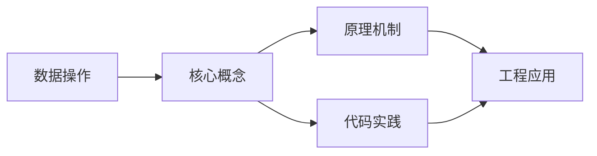
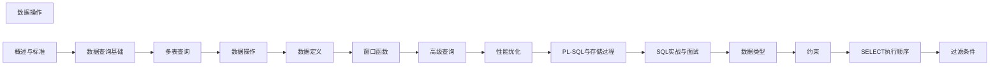

## 1. 学习目标（Bloom 分类）

本节按照布鲁姆教育目标分类学组织学习路径。本文主题为《数据操作》，属于 SQL 模块，读者可以根据自身阶段选择阅读深度。

记忆层面：能够准确复述本文的核心概念、术语与基本语法或操作步骤，并能够在提问或检索时快速定位对应知识点。能够说出 SQL 的核心概念、语法与常用对象。

理解层面：能够用自己的语言解释核心原理与工作机制，说明概念之间的因果关系，而不是机械记忆结论。能够解释 SQL 的执行原理与优化机制。

应用层面：能够在真实项目或练习场景中运用本文知识解决具体问题，写出正确且可维护的实现。能够编写正确、高效的 SQL 语句与操作。

分析层面：能够拆解复杂问题，比较本文主题与相邻概念的异同，识别边界条件与例外情况。能够分析 SQL 相关方案在性能与一致性上的权衡。

评价层面：能够根据约束条件（性能、可读性、安全、成本）评价不同方案的优劣，做出有依据的技术决策。能够根据业务场景评价 SQL 技术选型。

创造层面：能够把本文知识与其他模块知识组合，设计出新的解决方案或可复用的工程模式。能够组合 SQL 与其他技术设计数据架构。

通过本节学习，读者应当能够把《数据操作》纳入自己的知识网络，并与 SQL 模块的其他主题（DDL/DML、查询、索引、事务）建立关联。

## 2. 历史动机与发展脉络

《数据操作》是 SQL 领域的重要主题。要真正理解它，需要先了解它解决的问题与演进过程。

SQL（结构化查询语言）源于 1970 年 Codd 的关系模型，1974 年由 Chamberlin 与 Boyce 设计（SEQUEL），1986 年成为 ANSI 标准；SQL:2023 是当前国际标准。
SQL 分为 DDL（建表）、DML（增删改）、DQL（查询）、DCL（权限）与 TCL（事务）；各大数据库在标准基础上扩展方言。
SQL 是声明式语言：描述“要什么”而非“怎么做”，优化器负责执行计划；这一设计让 SQL 具有跨数据库的表达一致性。

回到本文主题：数据操作 的提出与成熟，正是上述技术背景下的必然产物。早期实现往往以简单可用为目标，随着工程规模扩大，社区逐渐沉淀出标准做法与最佳实践；理解这一脉络，可以帮助读者判断“为什么文档中的推荐写法是现在这个样子”，也能在遇到历史遗留代码时准确识别其设计年代与取舍。


## 3. 形式化定义与核心概念精讲

本节把《数据操作》涉及的核心概念以“定义 + 讲解”的形式展开。读者应把定义当作工具，把讲解当作理解路径；两者结合才能形成可迁移的知识。

关系模型：表（关系）、行（元组）、列（属性）；主键唯一标识、外键表达关联、范式消除冗余。
查询执行：解析 -> 绑定 -> 优化（基于代价选择计划）-> 执行；索引、统计信息与连接算法决定性能。
事务 ACID：原子性（Atomicity）、一致性（Consistency）、隔离性（Isolation）、持久性（Durability）；隔离级别控制并发行为。

### 3.1 原文章节逐一精讲

原文档把主题拆分为 14 个小节，下面按顺序给出每一节的导读讲解，随后保留原文细节供精读。

#### 原文精读（完整保留）

# 数据操作

> **符号约定**：`< >` 必填参数 | `[ ]` 可选参数

---

#### INSERT 插入数据

##### 基本插入

```sql
-- 插入单行
INSERT INTO users (name, email, age)
VALUES ('Alice', 'alice@example.com', 28);

-- 插入多行
INSERT INTO users (name, email, age)
VALUES
  ('Bob', 'bob@example.com', 32),
  ('Charlie', 'charlie@example.com', 25),
  ('Diana', 'diana@example.com', 30);

-- 插入所有列时可省略列名（不推荐）
INSERT INTO users VALUES (1, 'Alice', 'alice@example.com', 28);
```

##### INSERT ... SELECT

从查询结果插入数据：

```sql
-- 将活跃用户复制到归档表
INSERT INTO active_users_archive (id, name, email, archived_at)
SELECT id, name, email, CURRENT_TIMESTAMP
FROM users
WHERE last_login > CURRENT_DATE - INTERVAL '90 days';

-- 跨表同步
INSERT INTO products_backup (id, name, price)
SELECT id, name, price FROM products WHERE updated_at > '2024-01-01';

-- 创建汇总表
INSERT INTO monthly_report (month, total_sales, order_count)
SELECT
  DATE_TRUNC('month', order_date) AS month,
  SUM(amount) AS total_sales,
  COUNT(*) AS order_count
FROM orders
WHERE order_date >= DATE_TRUNC('month', CURRENT_DATE - INTERVAL '1 month')
GROUP BY DATE_TRUNC('month', order_date);
```

##### INSERT 特殊用法

```sql
-- 从 DEFAULT 值插入
INSERT INTO users (name, email) VALUES ('Eve', 'eve@example.com');
-- age 列使用 DEFAULT 值

-- 显式使用 DEFAULT
INSERT INTO users (name, email, age) VALUES ('Eve', 'eve@example.com', DEFAULT);

-- PostgreSQL: INSERT RETURNING（返回插入的行）
INSERT INTO users (name, email) VALUES ('Frank', 'frank@example.com')
RETURNING id, name;

-- MySQL: 获取自增 ID
INSERT INTO users (name, email) VALUES ('Frank', 'frank@example.com');
SELECT LAST_INSERT_ID();

-- SQL Server: OUTPUT 子句
INSERT INTO users (name, email)
OUTPUT INSERTED.id, INSERTED.name
VALUES ('Frank', 'frank@example.com');
```

#### UPDATE 更新数据

##### 基本更新

```sql
-- 更新单列
UPDATE users SET status = 'active' WHERE id = 1;

-- 更新多列
UPDATE users SET name = 'Alice Smith', email = 'alice.smith@example.com' WHERE id = 1;

-- 基于条件批量更新
UPDATE products SET price = price * 1.1 WHERE category = 'electronics';

--  不加 WHERE 会更新全表！
UPDATE users SET status = 'active';  -- 所有用户都变为 active
```

##### 多表更新

```sql
-- MySQL: 多表 UPDATE
UPDATE orders o
JOIN customers c ON o.customer_id = c.id
SET o.discount = 0.1
WHERE c.vip_level = 'gold';

-- PostgreSQL: UPDATE ... FROM
UPDATE orders o
SET discount = 0.1
FROM customers c
WHERE o.customer_id = c.id AND c.vip_level = 'gold';

-- SQL Server: UPDATE ... FROM
UPDATE o
SET discount = 0.1
FROM orders o
JOIN customers c ON o.customer_id = c.id
WHERE c.vip_level = 'gold';
```

##### UPDATE 与子查询

```sql
-- 用子查询更新
UPDATE employees e
SET salary = (
  SELECT AVG(salary) FROM employees WHERE department = e.department
)
WHERE salary < (
  SELECT AVG(salary) FROM employees WHERE department = e.department
) * 0.8;

-- PostgreSQL: UPDATE RETURNING
UPDATE users SET login_count = login_count + 1 WHERE id = 1
RETURNING id, login_count;

-- SQL Server: UPDATE OUTPUT
UPDATE users SET login_count = login_count + 1
OUTPUT INSERTED.id, INSERTED.login_count
WHERE id = 1;
```

##### CASE WHEN 更新

```sql
-- 根据条件更新不同值
UPDATE products
SET price = CASE
  WHEN category = 'electronics' THEN price * 0.9
  WHEN category = 'clothing' THEN price * 0.7
  ELSE price * 0.95
END
WHERE clearance = true;
```

#### DELETE 删除数据

```sql
-- 条件删除
DELETE FROM users WHERE status = 'inactive' AND last_login < '2023-01-01';

-- 删除所有数据（保留表结构，记录日志，可回滚）
DELETE FROM temp_data;

--  不加 WHERE 会删除全表！
DELETE FROM users;  -- 删除所有行

-- TRUNCATE: 更快的清空方式（DDL，不可回滚，重置自增）
TRUNCATE TABLE temp_data;

-- 多表删除（MySQL）
DELETE t1, t2 FROM table1 t1
JOIN table2 t2 ON t1.id = t2.ref_id
WHERE t1.status = 'expired';

-- PostgreSQL: DELETE RETURNING
DELETE FROM users WHERE status = 'inactive'
RETURNING id, name;  -- 返回被删除的行
```

##### DELETE vs TRUNCATE

| 特性     | DELETE         | TRUNCATE                |
| -------- | -------------- | ----------------------- |
| 类型     | DML            | DDL                     |
| 速度     | 逐行删除，较慢 | 释放数据页，极快        |
| WHERE    | 支持           | 不支持                  |
| 事务     | 可回滚         | 通常不可回滚            |
| 触发器   | 触发           | 不触发                  |
| 自增列   | 不重置         | 重置                    |
| 外键引用 | 安全           | 被引用的表不能 TRUNCATE |

#### UPSERT / MERGE

当记录存在时更新，不存在时插入。

##### MySQL: ON DUPLICATE KEY UPDATE

```sql
INSERT INTO users (id, name, email, login_count)
VALUES (1, 'Alice', 'alice@new.com', 1)
ON DUPLICATE KEY UPDATE
  name = VALUES(name),
  email = VALUES(email),
  login_count = login_count + 1;

-- MySQL 8.0.20+ 推荐写法（VALUES() 已弃用）
INSERT INTO users (id, name, email, login_count)
VALUES (1, 'Alice', 'alice@new.com', 1)
AS new_vals
ON DUPLICATE KEY UPDATE
  name = new_vals.name,
  email = new_vals.email,
  login_count = login_count + 1;
```

##### PostgreSQL: ON CONFLICT

```sql
-- 基于主键/唯一约束冲突
INSERT INTO users (id, name, email, login_count)
VALUES (1, 'Alice', 'alice@new.com', 1)
ON CONFLICT (id) DO UPDATE SET
  name = EXCLUDED.name,
  email = EXCLUDED.email,
  login_count = users.login_count + 1;

-- 冲突时什么都不做
INSERT INTO users (id, name, email)
VALUES (1, 'Alice', 'alice@new.com')
ON CONFLICT (id) DO NOTHING;

-- 基于唯一约束冲突
INSERT INTO users (email, name)
VALUES ('alice@example.com', 'Alice')
ON CONFLICT (email) DO UPDATE SET name = EXCLUDED.name;
```

##### SQL:2003 MERGE 语句

```sql
-- SQL Server / Oracle
MERGE INTO users AS target
USING (VALUES (1, 'Alice', 'alice@new.com')) AS source (id, name, email)
ON target.id = source.id
WHEN MATCHED THEN
  UPDATE SET name = source.name, email = source.email
WHEN NOT MATCHED THEN
  INSERT (id, name, email) VALUES (source.id, source.name, source.email);

-- 带条件的 MERGE
MERGE INTO inventory AS target
USING daily_shipments AS source
ON target.product_id = source.product_id
WHEN MATCHED AND target.quantity < source.min_stock THEN
  UPDATE SET quantity = quantity + source.quantity, last_restock = GETDATE()
WHEN MATCHED THEN
  UPDATE SET quantity = quantity + source.quantity
WHEN NOT MATCHED THEN
  INSERT (product_id, quantity) VALUES (source.product_id, source.quantity);
```

#### 批量操作

##### 批量插入优化

```sql
--  多行 INSERT（一次网络往返）
INSERT INTO logs (user_id, action, timestamp) VALUES
  (1, 'login', '2024-01-01 08:00:00'),
  (1, 'view', '2024-01-01 08:05:00'),
  (2, 'login', '2024-01-01 09:00:00');

--  逐行 INSERT（多次网络往返）
INSERT INTO logs (user_id, action, timestamp) VALUES (1, 'login', '2024-01-01 08:00:00');
INSERT INTO logs (user_id, action, timestamp) VALUES (1, 'view', '2024-01-01 08:05:00');

-- PostgreSQL: COPY 命令（最快的大批量导入）
COPY users (name, email) FROM '/data/users.csv' WITH (FORMAT csv, HEADER true);

-- MySQL: LOAD DATA INFILE
LOAD DATA INFILE '/data/users.csv'
INTO TABLE users
FIELDS TERMINATED BY ',' ENCLOSED BY '"'
LINES TERMINATED BY '\n'
IGNORE 1 ROWS;
```

##### 批量更新策略

```sql
-- 使用 CASE WHEN 批量更新
UPDATE products
SET price = CASE id
  WHEN 1 THEN 99.99
  WHEN 2 THEN 149.99
  WHEN 3 THEN 199.99
END
WHERE id IN (1, 2, 3);

-- 使用临时表关联更新
CREATE TEMPORARY TABLE price_updates (product_id INT, new_price DECIMAL(10,2));
INSERT INTO price_updates VALUES (1, 99.99), (2, 149.99), (3, 199.99);

UPDATE products p
SET price = pu.new_price
FROM price_updates pu
WHERE p.id = pu.product_id;
```

#### 事务

事务是数据库操作的逻辑单元，具有 ACID 特性：

| 特性            | 含义                                           |
| --------------- | ---------------------------------------------- |
| **A**tomicity   | 原子性：事务中的操作要么全部成功，要么全部回滚 |
| **C**onsistency | 一致性：事务前后数据库状态一致                 |
| **I**solation   | 隔离性：并发事务互不干扰                       |
| **D**urability  | 持久性：提交后数据永久保存                     |

##### 基本事务操作

```sql
-- 标准事务语法
BEGIN;  -- 或 START TRANSACTION (MySQL)
UPDATE accounts SET balance = balance - 100 WHERE id = 1;
UPDATE accounts SET balance = balance + 100 WHERE id = 2;
COMMIT;  -- 提交

-- 回滚
BEGIN;
UPDATE accounts SET balance = balance - 100 WHERE id = 1;
-- 发现错误...
ROLLBACK;  -- 撤销所有操作

-- 保存点（部分回滚）
BEGIN;
UPDATE accounts SET balance = balance - 100 WHERE id = 1;
SAVEPOINT after_debit;
UPDATE accounts SET balance = balance + 100 WHERE id = 2;
-- 第二步有问题，回滚到保存点
ROLLBACK TO SAVEPOINT after_debit;
-- 可以继续其他操作
UPDATE accounts SET balance = balance + 100 WHERE id = 3;
COMMIT;
```

##### 隔离级别

```sql
-- 设置隔离级别
-- MySQL
SET TRANSACTION ISOLATION LEVEL READ COMMITTED;

-- PostgreSQL
SET TRANSACTION ISOLATION LEVEL READ COMMITTED;

-- 查看当前隔离级别
-- MySQL
SELECT @@transaction_isolation;

-- PostgreSQL
SHOW transaction_isolation;
```

###### 四种隔离级别对比

| 隔离级别         | 脏读 | 不可重复读 | 幻读 | 性能 |
| ---------------- | ---- | ---------- | ---- | ---- |
| READ UNCOMMITTED | 可能 | 可能       | 可能 | 最高 |
| READ COMMITTED   | 不会 | 可能       | 可能 | 高   |
| REPEATABLE READ  | 不会 | 不会       | 可能 | 中   |
| SERIALIZABLE     | 不会 | 不会       | 不会 | 最低 |

```sql
-- 脏读示例（READ UNCOMMITTED）
-- 事务 A
BEGIN;
UPDATE accounts SET balance = balance - 100 WHERE id = 1;  -- 未提交

-- 事务 B（READ UNCOMMITTED）
SELECT balance FROM accounts WHERE id = 1;  -- 看到未提交的修改（脏读）

-- 事务 A
ROLLBACK;  -- 事务 B 读到的数据是无效的

-- 不可重复读示例（READ COMMITTED）
-- 事务 A
BEGIN;
SELECT balance FROM accounts WHERE id = 1;  -- 返回 1000

-- 事务 B
UPDATE accounts SET balance = 900 WHERE id = 1;
COMMIT;

-- 事务 A（同一事务中再次读取）
SELECT balance FROM accounts WHERE id = 1;  -- 返回 900（两次读取不一致）

-- 幻读示例（REPEATABLE READ）
-- 事务 A
BEGIN;
SELECT COUNT(*) FROM accounts WHERE balance > 500;  -- 返回 10

-- 事务 B
INSERT INTO accounts (id, balance) VALUES (99, 600);
COMMIT;

-- 事务 A
SELECT COUNT(*) FROM accounts WHERE balance > 500;  -- 返回 11（幻读）
```

###### 各数据库默认隔离级别

| 数据库         | 默认隔离级别    |
| -------------- | --------------- |
| MySQL (InnoDB) | REPEATABLE READ |
| PostgreSQL     | READ COMMITTED  |
| SQL Server     | READ COMMITTED  |
| Oracle         | READ COMMITTED  |

> **注意**：MySQL InnoDB 在 REPEATABLE READ 下通过 MVCC + Next-Key Lock 在很大程度上避免了幻读，这是其独特之处。

#### 锁机制

##### 锁类型

```sql
-- 共享锁（读锁）
-- MySQL
SELECT * FROM users LOCK IN SHARE MODE;

-- PostgreSQL
SELECT * FROM users FOR SHARE;

-- 排他锁（写锁）
-- MySQL / PostgreSQL
SELECT * FROM users FOR UPDATE;

-- PostgreSQL: 无冲突的排他锁
SELECT * FROM users FOR NO KEY UPDATE;

-- PostgreSQL: 行级共享锁（不阻塞 KEY UPDATE）
SELECT * FROM users FOR KEY SHARE;
```

##### 行锁与表锁

```sql
-- 行级锁（InnoDB 默认）
-- 只锁住匹配的行
UPDATE users SET name = 'Alice' WHERE id = 1;

-- 表级锁
-- MySQL
LOCK TABLES users READ;   -- 读锁
LOCK TABLES users WRITE;  -- 写锁
UNLOCK TABLES;

-- PostgreSQL: 显式表锁
LOCK TABLE users IN SHARE MODE;
LOCK TABLE users IN EXCLUSIVE MODE;

-- 乐观锁（应用层实现）
UPDATE products
SET stock = stock - 1, version = version + 1
WHERE id = 1 AND version = 5;  -- 检查版本号
-- 如果 affected_rows = 0，说明被其他事务修改了
```

##### 死锁

```sql
-- 死锁场景
-- 事务 A
BEGIN;
UPDATE accounts SET balance = balance - 100 WHERE id = 1;  -- 锁住 id=1
UPDATE accounts SET balance = balance + 100 WHERE id = 2;  -- 等待 id=2

-- 事务 B（同时）
BEGIN;
UPDATE accounts SET balance = balance - 50 WHERE id = 2;   -- 锁住 id=2
UPDATE accounts SET balance = balance + 50 WHERE id = 1;   -- 等待 id=1
-- 死锁！数据库会检测并回滚其中一个事务

-- 避免死锁的策略：
-- 1. 按固定顺序访问表和行
-- 2. 保持事务简短
-- 3. 使用低隔离级别
-- 4. 添加合理的索引（避免锁升级）
```

#### 小结

- `INSERT ... SELECT` 适合数据迁移和同步，`RETURNING` 子句可返回操作后的数据
- `UPDATE` 务必带 `WHERE`，多表更新语法因数据库而异
- `DELETE` 逐行删除可回滚，`TRUNCATE` 快速但不可回滚
- `UPSERT` 各数据库语法不同：MySQL 用 `ON DUPLICATE KEY`，PostgreSQL 用 `ON CONFLICT`
- 事务的 ACID 特性是数据一致性的保障，选择合适的隔离级别平衡一致性与性能
- 行锁优于表锁，乐观锁适合低冲突场景，避免死锁需按固定顺序访问资源
#### INSERT

**单行写法：插入单行指定列**
`INSERT INTO <表名> (<列 1>, <列 2>) VALUES (<值 1>, <值 2>);`
```sql
-- 向用户表插入一条记录
INSERT INTO users (name, email) VALUES ('张三', 'zhangsan@example.com');
```

**单行写法：插入单行所有列**
`INSERT INTO <表名> VALUES (<值 1>, <值 2>, ...);`
```sql
-- 向用户表插入一条记录（按列顺序提供所有值）
INSERT INTO users VALUES (1, '张三', 'zhangsan@example.com');
```

**换行写法：插入多行**
`INSERT INTO <表名> (<列>) VALUES (<值 1>), (<值 2>), (<值 3>);`
```sql
-- 向用户表插入多条记录
INSERT INTO users (name, email) VALUES
  ('张三', 'zhangsan@example.com'),
  ('李四', 'lisi@example.com'),
  ('王五', 'wangwu@example.com');
```

**换行写法：INSERT ... SELECT 从查询结果插入**
`INSERT INTO <表名> (<列>) SELECT ...`
```sql
-- 从临时表批量插入数据
INSERT INTO users (name, email)
SELECT name, email FROM temp_users WHERE status = 'active';
```

---

#### UPDATE

**单行写法：更新单列**
`UPDATE <表名> SET <列> = <值> WHERE <条件>;`
```sql
-- 更新用户 1 的邮箱
UPDATE users SET email = 'new@example.com' WHERE id = 1;
```

**换行写法：更新多列**
`UPDATE <表名> SET <列 1> = <值 1>, <列 2> = <值 2> WHERE <条件>;`
```sql
-- 更新用户 1 的邮箱和姓名
UPDATE users
SET email = 'new@example.com', name = '张三丰'
WHERE id = 1;
```

**换行写法：基于子查询更新**
`UPDATE <表名> SET <列> = (SELECT ...) WHERE <条件>;`
```sql
-- 将员工薪资更新为部门平均薪资的 1.1 倍
UPDATE employees e
SET salary = (
  SELECT AVG(salary) * 1.1 FROM employees e2 WHERE e2.dept_id = e.dept_id
)
WHERE e.performance = 'A';
```

**换行写法：基于 JOIN 更新**
`UPDATE <表 1> JOIN <表 2> ON ... SET ...`
```sql
-- 根据部门表更新员工表的部门名称
UPDATE employees e
JOIN departments d ON e.dept_id = d.id
SET e.dept_name = d.dept_name;
```

---

#### DELETE

**单行写法：删除指定行**
`DELETE FROM <表名> WHERE <条件>;`
```sql
-- 删除 ID 为 1 的用户
DELETE FROM users WHERE id = 1;
```

**换行写法：基于子查询删除**
`DELETE FROM <表名> WHERE <列> IN (SELECT ...);`
```sql
-- 删除没有订单的客户
DELETE FROM customers
WHERE id NOT IN (SELECT DISTINCT customer_id FROM orders);
```

**换行写法：基于 JOIN 删除**
`DELETE <表 1> FROM <表 1> JOIN <表 2> ON ...`
```sql
-- 删除没有订单的客户
DELETE c FROM customers c
LEFT JOIN orders o ON c.id = o.customer_id
WHERE o.id IS NULL;
```

---

#### MERGE / UPSERT

**换行写法：MySQL ON DUPLICATE KEY UPDATE**
`INSERT INTO ... ON DUPLICATE KEY UPDATE <列> = VALUES(<列>)`
```sql
-- 插入数据，主键冲突时更新
INSERT INTO users (id, name, email) VALUES (1, '张三', 'zhangsan@example.com')
ON DUPLICATE KEY UPDATE name = VALUES(name), email = VALUES(email);
```

**换行写法：PostgreSQL ON CONFLICT**
`INSERT INTO ... ON CONFLICT (<列>) DO UPDATE SET ...`
```sql
-- 插入数据，冲突时更新
INSERT INTO users (id, name, email) VALUES (1, '张三', 'zhangsan@example.com')
ON CONFLICT (id) DO UPDATE SET name = EXCLUDED.name, email = EXCLUDED.email;
```

**换行写法：PostgreSQL ON CONFLICT DO NOTHING**
`INSERT INTO ... ON CONFLICT (<列>) DO NOTHING`
```sql
-- 插入数据，冲突时忽略
INSERT INTO users (id, name, email) VALUES (1, '张三', 'zhangsan@example.com')
ON CONFLICT (id) DO NOTHING;
```

**换行写法：SQL Server MERGE**
`MERGE INTO <目标表> USING <源表> ON <条件> WHEN MATCHED THEN UPDATE ... WHEN NOT MATCHED THEN INSERT ...`
```sql
-- SQL Server MERGE 实现 UPSERT
MERGE INTO users AS target
USING (VALUES (1, '张三', 'zhangsan@example.com')) AS source (id, name, email)
ON target.id = source.id
WHEN MATCHED THEN UPDATE SET name = source.name, email = source.email
WHEN NOT MATCHED THEN INSERT (id, name, email) VALUES (source.id, source.name, source.email);
```

---

#### RETURNING

**换行写法：PostgreSQL RETURNING 返回插入的行**
`INSERT INTO ... RETURNING <列>`
```sql
-- 插入数据并返回自增 ID
INSERT INTO users (name, email) VALUES ('张三', 'zhangsan@example.com')
RETURNING id;
```

**换行写法：RETURNING 返回更新的行**
`UPDATE ... SET ... RETURNING <列>`
```sql
-- 更新数据并返回更新后的行
UPDATE users SET status = 'inactive' WHERE last_login < '2025-01-01'
RETURNING id, name;
```

**换行写法：RETURNING 返回删除的行**
`DELETE FROM ... WHERE ... RETURNING <列>`
```sql
-- 删除数据并返回被删除的行
DELETE FROM users WHERE status = 'inactive'
RETURNING id, name;
```

---

#### TRUNCATE

**单行写法：清空表数据**
`TRUNCATE TABLE <表名>;`
```sql
-- 清空用户表数据（保留表结构）
TRUNCATE TABLE users;
```

**换行写法：清空表并重置自增 ID**
`TRUNCATE TABLE <表名> RESTART IDENTITY;`
```sql
-- 清空用户表并重置自增 ID
TRUNCATE TABLE users RESTART IDENTITY;
```

**换行写法：级联清空关联表**
`TRUNCATE TABLE <表 1>, <表 2> CASCADE;`
```sql
-- 级联清空用户表和订单表
TRUNCATE TABLE users, orders CASCADE;
```


### 3.2 概念关系图

下面用 Mermaid 图表达本文核心概念之间的关系，帮助读者建立整体图景：



图中展示的是本文知识的结构化关系：核心概念是入口，原理机制解释“为什么”，代码实践演示“怎么做”，工程应用回答“何时用”。读者学习时可以把每个小节的内容挂接到对应节点上。

## 4. 理论推导与原理解析

本节深入《数据操作》背后的原理。理论部分不求面面俱到，而是聚焦“能解释现象、能指导实践”的关键推导。

关系模型：表（关系）、行（元组）、列（属性）；主键唯一标识、外键表达关联、范式消除冗余。
查询执行：解析 -> 绑定 -> 优化（基于代价选择计划）-> 执行；索引、统计信息与连接算法决定性能。
事务 ACID：原子性（Atomicity）、一致性（Consistency）、隔离性（Isolation）、持久性（Durability）；隔离级别控制并发行为。
集合语义：SELECT 返回结果集；JOIN 组合关系，GROUP BY 聚合，子查询与 CTE 表达复杂逻辑。

需要强调的是，理论推导与工程实践之间存在翻译层：理论给出的是理想化模型与边界条件，工程代码则必须处理真实环境中的例外。读者在学习时应先掌握理论的“标准情形”，再通过陷阱章节了解“非标准情形”。

## 5. 代码示例与逐行讲解

本节把原文中的代码示例系统整理，并为每个示例补充用途说明与讲解。读者不应只浏览代码，而应逐段对照讲解理解设计意图。

### 5.1 示例：基本插入

该示例来自原文《基本插入》小节，用于演示数据操作相关操作。阅读时请先看代码结构，再看其后的讲解。

```sql
-- 插入单行
INSERT INTO users (name, email, age)
VALUES ('Alice', 'alice@example.com', 28);

-- 插入多行
INSERT INTO users (name, email, age)
VALUES
  ('Bob', 'bob@example.com', 32),
  ('Charlie', 'charlie@example.com', 25),
  ('Diana', 'diana@example.com', 30);

-- 插入所有列时可省略列名（不推荐）
INSERT INTO users VALUES (1, 'Alice', 'alice@example.com', 28);
```

讲解：这段代码演示了本节核心知识点。代码中的关键操作可以归纳为三步：准备（定义或初始化）、执行（核心逻辑）、收尾（释放资源或返回结果）。实际项目中，这三步往往被封装为函数或类，以提升复用性与可测试性。

关键点分析：

该示例共 11 行有效代码，包含 1 类关键结构（INSERT）。其中：

- 入口与初始化部分负责建立上下文，对应实际项目中的启动或装配逻辑；
- 核心逻辑部分体现本文主题的主要操作，是阅读时最需要对照讲解理解的部分；
- 输出或返回部分把结果交给调用方，注意其类型与边界条件。

进阶思考路径：先尝试修改参数观察行为变化，再把示例中的模式迁移到自己的项目中；每次修改都记录预期与实测差异，这是把示例转化为能力的最快方式。

### 5.2 示例：INSERT ... SELECT

该示例来自原文《INSERT ... SELECT》小节，用于演示数据操作相关操作。阅读时请先看代码结构，再看其后的讲解。

```sql
-- 将活跃用户复制到归档表
INSERT INTO active_users_archive (id, name, email, archived_at)
SELECT id, name, email, CURRENT_TIMESTAMP
FROM users
WHERE last_login > CURRENT_DATE - INTERVAL '90 days';

-- 跨表同步
INSERT INTO products_backup (id, name, price)
SELECT id, name, price FROM products WHERE updated_at > '2024-01-01';

-- 创建汇总表
INSERT INTO monthly_report (month, total_sales, order_count)
SELECT
  DATE_TRUNC('month', order_date) AS month,
  SUM(amount) AS total_sales,
  COUNT(*) AS order_count
FROM orders
WHERE order_date >= DATE_TRUNC('month', CURRENT_DATE - INTERVAL '1 month')
GROUP BY DATE_TRUNC('month', order_date);
```

讲解：这段代码演示了本节核心知识点。代码中的关键操作可以归纳为三步：准备（定义或初始化）、执行（核心逻辑）、收尾（释放资源或返回结果）。实际项目中，这三步往往被封装为函数或类，以提升复用性与可测试性。

关键点分析：

该示例共 17 行有效代码，包含 3 类关键结构（SELECT、INSERT、FROM）。其中：

- 入口与初始化部分负责建立上下文，对应实际项目中的启动或装配逻辑；
- 核心逻辑部分体现本文主题的主要操作，是阅读时最需要对照讲解理解的部分；
- 输出或返回部分把结果交给调用方，注意其类型与边界条件。

进阶思考路径：先尝试修改参数观察行为变化，再把示例中的模式迁移到自己的项目中；每次修改都记录预期与实测差异，这是把示例转化为能力的最快方式。

### 5.3 示例：INSERT 特殊用法

该示例来自原文《INSERT 特殊用法》小节，用于演示数据操作相关操作。阅读时请先看代码结构，再看其后的讲解。

```sql
-- 从 DEFAULT 值插入
INSERT INTO users (name, email) VALUES ('Eve', 'eve@example.com');
-- age 列使用 DEFAULT 值

-- 显式使用 DEFAULT
INSERT INTO users (name, email, age) VALUES ('Eve', 'eve@example.com', DEFAULT);

-- PostgreSQL: INSERT RETURNING（返回插入的行）
INSERT INTO users (name, email) VALUES ('Frank', 'frank@example.com')
RETURNING id, name;

-- MySQL: 获取自增 ID
INSERT INTO users (name, email) VALUES ('Frank', 'frank@example.com');
SELECT LAST_INSERT_ID();

-- SQL Server: OUTPUT 子句
INSERT INTO users (name, email)
OUTPUT INSERTED.id, INSERTED.name
VALUES ('Frank', 'frank@example.com');
```

讲解：这段代码演示了本节核心知识点。代码中的关键操作可以归纳为三步：准备（定义或初始化）、执行（核心逻辑）、收尾（释放资源或返回结果）。实际项目中，这三步往往被封装为函数或类，以提升复用性与可测试性。

关键点分析：

该示例共 15 行有效代码，包含 2 类关键结构（SELECT、INSERT）。其中：

- 入口与初始化部分负责建立上下文，对应实际项目中的启动或装配逻辑；
- 核心逻辑部分体现本文主题的主要操作，是阅读时最需要对照讲解理解的部分；
- 输出或返回部分把结果交给调用方，注意其类型与边界条件。

进阶思考路径：先尝试修改参数观察行为变化，再把示例中的模式迁移到自己的项目中；每次修改都记录预期与实测差异，这是把示例转化为能力的最快方式。

### 5.4 示例：基本更新

该示例来自原文《基本更新》小节，用于演示数据操作相关操作。阅读时请先看代码结构，再看其后的讲解。

```sql
-- 更新单列
UPDATE users SET status = 'active' WHERE id = 1;

-- 更新多列
UPDATE users SET name = 'Alice Smith', email = 'alice.smith@example.com' WHERE id = 1;

-- 基于条件批量更新
UPDATE products SET price = price * 1.1 WHERE category = 'electronics';

--  不加 WHERE 会更新全表！
UPDATE users SET status = 'active';  -- 所有用户都变为 active
```

讲解：这段代码演示了本节核心知识点。代码中的关键操作可以归纳为三步：准备（定义或初始化）、执行（核心逻辑）、收尾（释放资源或返回结果）。实际项目中，这三步往往被封装为函数或类，以提升复用性与可测试性。

关键点分析：

该示例共 8 行有效代码，结构以数据或配置为主。阅读时应关注：数据字段的含义、配置项的作用，以及它们与运行行为的对应关系。

进阶思考路径：先尝试修改参数观察行为变化，再把示例中的模式迁移到自己的项目中；每次修改都记录预期与实测差异，这是把示例转化为能力的最快方式。

### 5.5 示例：多表更新

该示例来自原文《多表更新》小节，用于演示数据操作相关操作。阅读时请先看代码结构，再看其后的讲解。

```sql
-- MySQL: 多表 UPDATE
UPDATE orders o
JOIN customers c ON o.customer_id = c.id
SET o.discount = 0.1
WHERE c.vip_level = 'gold';

-- PostgreSQL: UPDATE ... FROM
UPDATE orders o
SET discount = 0.1
FROM customers c
WHERE o.customer_id = c.id AND c.vip_level = 'gold';

-- SQL Server: UPDATE ... FROM
UPDATE o
SET discount = 0.1
FROM orders o
JOIN customers c ON o.customer_id = c.id
WHERE c.vip_level = 'gold';
```

讲解：这段代码演示了本节核心知识点。代码中的关键操作可以归纳为三步：准备（定义或初始化）、执行（核心逻辑）、收尾（释放资源或返回结果）。实际项目中，这三步往往被封装为函数或类，以提升复用性与可测试性。

关键点分析：

该示例共 16 行有效代码，包含 1 类关键结构（FROM）。其中：

- 入口与初始化部分负责建立上下文，对应实际项目中的启动或装配逻辑；
- 核心逻辑部分体现本文主题的主要操作，是阅读时最需要对照讲解理解的部分；
- 输出或返回部分把结果交给调用方，注意其类型与边界条件。

进阶思考路径：先尝试修改参数观察行为变化，再把示例中的模式迁移到自己的项目中；每次修改都记录预期与实测差异，这是把示例转化为能力的最快方式。

### 5.6 示例：UPDATE 与子查询

该示例来自原文《UPDATE 与子查询》小节，用于演示数据操作相关操作。阅读时请先看代码结构，再看其后的讲解。

```sql
-- 用子查询更新
UPDATE employees e
SET salary = (
  SELECT AVG(salary) FROM employees WHERE department = e.department
)
WHERE salary < (
  SELECT AVG(salary) FROM employees WHERE department = e.department
) * 0.8;

-- PostgreSQL: UPDATE RETURNING
UPDATE users SET login_count = login_count + 1 WHERE id = 1
RETURNING id, login_count;

-- SQL Server: UPDATE OUTPUT
UPDATE users SET login_count = login_count + 1
OUTPUT INSERTED.id, INSERTED.login_count
WHERE id = 1;
```

讲解：这段代码演示了本节核心知识点。代码中的关键操作可以归纳为三步：准备（定义或初始化）、执行（核心逻辑）、收尾（释放资源或返回结果）。实际项目中，这三步往往被封装为函数或类，以提升复用性与可测试性。

关键点分析：

该示例共 15 行有效代码，包含 3 类关键结构（SELECT、INSERT、FROM）。其中：

- 入口与初始化部分负责建立上下文，对应实际项目中的启动或装配逻辑；
- 核心逻辑部分体现本文主题的主要操作，是阅读时最需要对照讲解理解的部分；
- 输出或返回部分把结果交给调用方，注意其类型与边界条件。

进阶思考路径：先尝试修改参数观察行为变化，再把示例中的模式迁移到自己的项目中；每次修改都记录预期与实测差异，这是把示例转化为能力的最快方式。

### 5.7 示例：CASE WHEN 更新

该示例来自原文《CASE WHEN 更新》小节，用于演示数据操作相关操作。阅读时请先看代码结构，再看其后的讲解。

```sql
-- 根据条件更新不同值
UPDATE products
SET price = CASE
  WHEN category = 'electronics' THEN price * 0.9
  WHEN category = 'clothing' THEN price * 0.7
  ELSE price * 0.95
END
WHERE clearance = true;
```

讲解：这段代码演示了本节核心知识点。代码中的关键操作可以归纳为三步：准备（定义或初始化）、执行（核心逻辑）、收尾（释放资源或返回结果）。实际项目中，这三步往往被封装为函数或类，以提升复用性与可测试性。

关键点分析：

该示例共 8 行有效代码，结构以数据或配置为主。阅读时应关注：数据字段的含义、配置项的作用，以及它们与运行行为的对应关系。

进阶思考路径：先尝试修改参数观察行为变化，再把示例中的模式迁移到自己的项目中；每次修改都记录预期与实测差异，这是把示例转化为能力的最快方式。

### 5.8 示例：DELETE 删除数据

该示例来自原文《DELETE 删除数据》小节，用于演示数据操作相关操作。阅读时请先看代码结构，再看其后的讲解。

```sql
-- 条件删除
DELETE FROM users WHERE status = 'inactive' AND last_login < '2023-01-01';

-- 删除所有数据（保留表结构，记录日志，可回滚）
DELETE FROM temp_data;

--  不加 WHERE 会删除全表！
DELETE FROM users;  -- 删除所有行

-- TRUNCATE: 更快的清空方式（DDL，不可回滚，重置自增）
TRUNCATE TABLE temp_data;

-- 多表删除（MySQL）
DELETE t1, t2 FROM table1 t1
JOIN table2 t2 ON t1.id = t2.ref_id
WHERE t1.status = 'expired';

-- PostgreSQL: DELETE RETURNING
DELETE FROM users WHERE status = 'inactive'
RETURNING id, name;  -- 返回被删除的行
```

讲解：这段代码演示了本节核心知识点。代码中的关键操作可以归纳为三步：准备（定义或初始化）、执行（核心逻辑）、收尾（释放资源或返回结果）。实际项目中，这三步往往被封装为函数或类，以提升复用性与可测试性。

关键点分析：

该示例共 15 行有效代码，包含 1 类关键结构（FROM）。其中：

- 入口与初始化部分负责建立上下文，对应实际项目中的启动或装配逻辑；
- 核心逻辑部分体现本文主题的主要操作，是阅读时最需要对照讲解理解的部分；
- 输出或返回部分把结果交给调用方，注意其类型与边界条件。

进阶思考路径：先尝试修改参数观察行为变化，再把示例中的模式迁移到自己的项目中；每次修改都记录预期与实测差异，这是把示例转化为能力的最快方式。

### 5.9 示例：MySQL: ON DUPLICATE KEY UPDATE

该示例来自原文《MySQL: ON DUPLICATE KEY UPDATE》小节，用于演示数据操作相关操作。阅读时请先看代码结构，再看其后的讲解。

```sql
INSERT INTO users (id, name, email, login_count)
VALUES (1, 'Alice', 'alice@new.com', 1)
ON DUPLICATE KEY UPDATE
  name = VALUES(name),
  email = VALUES(email),
  login_count = login_count + 1;

-- MySQL 8.0.20+ 推荐写法（VALUES() 已弃用）
INSERT INTO users (id, name, email, login_count)
VALUES (1, 'Alice', 'alice@new.com', 1)
AS new_vals
ON DUPLICATE KEY UPDATE
  name = new_vals.name,
  email = new_vals.email,
  login_count = login_count + 1;
```

讲解：这段代码演示了本节核心知识点。代码中的关键操作可以归纳为三步：准备（定义或初始化）、执行（核心逻辑）、收尾（释放资源或返回结果）。实际项目中，这三步往往被封装为函数或类，以提升复用性与可测试性。

关键点分析：

该示例共 14 行有效代码，包含 1 类关键结构（INSERT）。其中：

- 入口与初始化部分负责建立上下文，对应实际项目中的启动或装配逻辑；
- 核心逻辑部分体现本文主题的主要操作，是阅读时最需要对照讲解理解的部分；
- 输出或返回部分把结果交给调用方，注意其类型与边界条件。

进阶思考路径：先尝试修改参数观察行为变化，再把示例中的模式迁移到自己的项目中；每次修改都记录预期与实测差异，这是把示例转化为能力的最快方式。

### 5.10 示例：PostgreSQL: ON CONFLICT

该示例来自原文《PostgreSQL: ON CONFLICT》小节，用于演示数据操作相关操作。阅读时请先看代码结构，再看其后的讲解。

```sql
-- 基于主键/唯一约束冲突
INSERT INTO users (id, name, email, login_count)
VALUES (1, 'Alice', 'alice@new.com', 1)
ON CONFLICT (id) DO UPDATE SET
  name = EXCLUDED.name,
  email = EXCLUDED.email,
  login_count = users.login_count + 1;

-- 冲突时什么都不做
INSERT INTO users (id, name, email)
VALUES (1, 'Alice', 'alice@new.com')
ON CONFLICT (id) DO NOTHING;

-- 基于唯一约束冲突
INSERT INTO users (email, name)
VALUES ('alice@example.com', 'Alice')
ON CONFLICT (email) DO UPDATE SET name = EXCLUDED.name;
```

讲解：这段代码演示了本节核心知识点。代码中的关键操作可以归纳为三步：准备（定义或初始化）、执行（核心逻辑）、收尾（释放资源或返回结果）。实际项目中，这三步往往被封装为函数或类，以提升复用性与可测试性。

关键点分析：

该示例共 15 行有效代码，包含 1 类关键结构（INSERT）。其中：

- 入口与初始化部分负责建立上下文，对应实际项目中的启动或装配逻辑；
- 核心逻辑部分体现本文主题的主要操作，是阅读时最需要对照讲解理解的部分；
- 输出或返回部分把结果交给调用方，注意其类型与边界条件。

进阶思考路径：先尝试修改参数观察行为变化，再把示例中的模式迁移到自己的项目中；每次修改都记录预期与实测差异，这是把示例转化为能力的最快方式。

### 5.11 示例：SQL:2003 MERGE 语句

该示例来自原文《SQL:2003 MERGE 语句》小节，用于演示数据操作相关操作。阅读时请先看代码结构，再看其后的讲解。

```sql
-- SQL Server / Oracle
MERGE INTO users AS target
USING (VALUES (1, 'Alice', 'alice@new.com')) AS source (id, name, email)
ON target.id = source.id
WHEN MATCHED THEN
  UPDATE SET name = source.name, email = source.email
WHEN NOT MATCHED THEN
  INSERT (id, name, email) VALUES (source.id, source.name, source.email);

-- 带条件的 MERGE
MERGE INTO inventory AS target
USING daily_shipments AS source
ON target.product_id = source.product_id
WHEN MATCHED AND target.quantity < source.min_stock THEN
  UPDATE SET quantity = quantity + source.quantity, last_restock = GETDATE()
WHEN MATCHED THEN
  UPDATE SET quantity = quantity + source.quantity
WHEN NOT MATCHED THEN
  INSERT (product_id, quantity) VALUES (source.product_id, source.quantity);
```

讲解：这段代码演示了本节核心知识点。代码中的关键操作可以归纳为三步：准备（定义或初始化）、执行（核心逻辑）、收尾（释放资源或返回结果）。实际项目中，这三步往往被封装为函数或类，以提升复用性与可测试性。

关键点分析：

该示例共 18 行有效代码，包含 1 类关键结构（INSERT）。其中：

- 入口与初始化部分负责建立上下文，对应实际项目中的启动或装配逻辑；
- 核心逻辑部分体现本文主题的主要操作，是阅读时最需要对照讲解理解的部分；
- 输出或返回部分把结果交给调用方，注意其类型与边界条件。

进阶思考路径：先尝试修改参数观察行为变化，再把示例中的模式迁移到自己的项目中；每次修改都记录预期与实测差异，这是把示例转化为能力的最快方式。

### 5.12 示例：批量插入优化

该示例来自原文《批量插入优化》小节，用于演示数据操作相关操作。阅读时请先看代码结构，再看其后的讲解。

```sql
--  多行 INSERT（一次网络往返）
INSERT INTO logs (user_id, action, timestamp) VALUES
  (1, 'login', '2024-01-01 08:00:00'),
  (1, 'view', '2024-01-01 08:05:00'),
  (2, 'login', '2024-01-01 09:00:00');

--  逐行 INSERT（多次网络往返）
INSERT INTO logs (user_id, action, timestamp) VALUES (1, 'login', '2024-01-01 08:00:00');
INSERT INTO logs (user_id, action, timestamp) VALUES (1, 'view', '2024-01-01 08:05:00');

-- PostgreSQL: COPY 命令（最快的大批量导入）
COPY users (name, email) FROM '/data/users.csv' WITH (FORMAT csv, HEADER true);

-- MySQL: LOAD DATA INFILE
LOAD DATA INFILE '/data/users.csv'
INTO TABLE users
FIELDS TERMINATED BY ',' ENCLOSED BY '"'
LINES TERMINATED BY '\n'
IGNORE 1 ROWS;
```

讲解：这段代码演示了本节核心知识点。代码中的关键操作可以归纳为三步：准备（定义或初始化）、执行（核心逻辑）、收尾（释放资源或返回结果）。实际项目中，这三步往往被封装为函数或类，以提升复用性与可测试性。

关键点分析：

该示例共 16 行有效代码，包含 2 类关键结构（INSERT、FROM）。其中：

- 入口与初始化部分负责建立上下文，对应实际项目中的启动或装配逻辑；
- 核心逻辑部分体现本文主题的主要操作，是阅读时最需要对照讲解理解的部分；
- 输出或返回部分把结果交给调用方，注意其类型与边界条件。

进阶思考路径：先尝试修改参数观察行为变化，再把示例中的模式迁移到自己的项目中；每次修改都记录预期与实测差异，这是把示例转化为能力的最快方式。

### 5.13 示例：批量更新策略

该示例来自原文《批量更新策略》小节，用于演示数据操作相关操作。阅读时请先看代码结构，再看其后的讲解。

```sql
-- 使用 CASE WHEN 批量更新
UPDATE products
SET price = CASE id
  WHEN 1 THEN 99.99
  WHEN 2 THEN 149.99
  WHEN 3 THEN 199.99
END
WHERE id IN (1, 2, 3);

-- 使用临时表关联更新
CREATE TEMPORARY TABLE price_updates (product_id INT, new_price DECIMAL(10,2));
INSERT INTO price_updates VALUES (1, 99.99), (2, 149.99), (3, 199.99);

UPDATE products p
SET price = pu.new_price
FROM price_updates pu
WHERE p.id = pu.product_id;
```

讲解：这段代码演示了本节核心知识点。代码中的关键操作可以归纳为三步：准备（定义或初始化）、执行（核心逻辑）、收尾（释放资源或返回结果）。实际项目中，这三步往往被封装为函数或类，以提升复用性与可测试性。

关键点分析：

该示例共 15 行有效代码，包含 3 类关键结构（INSERT、CREATE、FROM）。其中：

- 入口与初始化部分负责建立上下文，对应实际项目中的启动或装配逻辑；
- 核心逻辑部分体现本文主题的主要操作，是阅读时最需要对照讲解理解的部分；
- 输出或返回部分把结果交给调用方，注意其类型与边界条件。

进阶思考路径：先尝试修改参数观察行为变化，再把示例中的模式迁移到自己的项目中；每次修改都记录预期与实测差异，这是把示例转化为能力的最快方式。

### 5.14 示例：基本事务操作

该示例来自原文《基本事务操作》小节，用于演示数据操作相关操作。阅读时请先看代码结构，再看其后的讲解。

```sql
-- 标准事务语法
BEGIN;  -- 或 START TRANSACTION (MySQL)
UPDATE accounts SET balance = balance - 100 WHERE id = 1;
UPDATE accounts SET balance = balance + 100 WHERE id = 2;
COMMIT;  -- 提交

-- 回滚
BEGIN;
UPDATE accounts SET balance = balance - 100 WHERE id = 1;
-- 发现错误...
ROLLBACK;  -- 撤销所有操作

-- 保存点（部分回滚）
BEGIN;
UPDATE accounts SET balance = balance - 100 WHERE id = 1;
SAVEPOINT after_debit;
UPDATE accounts SET balance = balance + 100 WHERE id = 2;
-- 第二步有问题，回滚到保存点
ROLLBACK TO SAVEPOINT after_debit;
-- 可以继续其他操作
UPDATE accounts SET balance = balance + 100 WHERE id = 3;
COMMIT;
```

讲解：这段代码演示了本节核心知识点。代码中的关键操作可以归纳为三步：准备（定义或初始化）、执行（核心逻辑）、收尾（释放资源或返回结果）。实际项目中，这三步往往被封装为函数或类，以提升复用性与可测试性。

关键点分析：

该示例共 20 行有效代码，结构以数据或配置为主。阅读时应关注：数据字段的含义、配置项的作用，以及它们与运行行为的对应关系。

进阶思考路径：先尝试修改参数观察行为变化，再把示例中的模式迁移到自己的项目中；每次修改都记录预期与实测差异，这是把示例转化为能力的最快方式。

### 5.15 示例：隔离级别

该示例来自原文《隔离级别》小节，用于演示数据操作相关操作。阅读时请先看代码结构，再看其后的讲解。

```sql
-- 设置隔离级别
-- MySQL
SET TRANSACTION ISOLATION LEVEL READ COMMITTED;

-- PostgreSQL
SET TRANSACTION ISOLATION LEVEL READ COMMITTED;

-- 查看当前隔离级别
-- MySQL
SELECT @@transaction_isolation;

-- PostgreSQL
SHOW transaction_isolation;
```

讲解：这段代码演示了本节核心知识点。代码中的关键操作可以归纳为三步：准备（定义或初始化）、执行（核心逻辑）、收尾（释放资源或返回结果）。实际项目中，这三步往往被封装为函数或类，以提升复用性与可测试性。

关键点分析：

该示例共 10 行有效代码，包含 1 类关键结构（SELECT）。其中：

- 入口与初始化部分负责建立上下文，对应实际项目中的启动或装配逻辑；
- 核心逻辑部分体现本文主题的主要操作，是阅读时最需要对照讲解理解的部分；
- 输出或返回部分把结果交给调用方，注意其类型与边界条件。

进阶思考路径：先尝试修改参数观察行为变化，再把示例中的模式迁移到自己的项目中；每次修改都记录预期与实测差异，这是把示例转化为能力的最快方式。

### 5.16 示例：四种隔离级别对比

该示例来自原文《四种隔离级别对比》小节，用于演示数据操作相关操作。阅读时请先看代码结构，再看其后的讲解。

```sql
-- 脏读示例（READ UNCOMMITTED）
-- 事务 A
BEGIN;
UPDATE accounts SET balance = balance - 100 WHERE id = 1;  -- 未提交

-- 事务 B（READ UNCOMMITTED）
SELECT balance FROM accounts WHERE id = 1;  -- 看到未提交的修改（脏读）

-- 事务 A
ROLLBACK;  -- 事务 B 读到的数据是无效的

-- 不可重复读示例（READ COMMITTED）
-- 事务 A
BEGIN;
SELECT balance FROM accounts WHERE id = 1;  -- 返回 1000

-- 事务 B
UPDATE accounts SET balance = 900 WHERE id = 1;
COMMIT;

-- 事务 A（同一事务中再次读取）
SELECT balance FROM accounts WHERE id = 1;  -- 返回 900（两次读取不一致）

-- 幻读示例（REPEATABLE READ）
-- 事务 A
BEGIN;
SELECT COUNT(*) FROM accounts WHERE balance > 500;  -- 返回 10

-- 事务 B
INSERT INTO accounts (id, balance) VALUES (99, 600);
COMMIT;

-- 事务 A
SELECT COUNT(*) FROM accounts WHERE balance > 500;  -- 返回 11（幻读）
```

讲解：这段代码演示了本节核心知识点。代码中的关键操作可以归纳为三步：准备（定义或初始化）、执行（核心逻辑）、收尾（释放资源或返回结果）。实际项目中，这三步往往被封装为函数或类，以提升复用性与可测试性。

关键点分析：

该示例共 26 行有效代码，包含 3 类关键结构（SELECT、INSERT、FROM）。其中：

- 入口与初始化部分负责建立上下文，对应实际项目中的启动或装配逻辑；
- 核心逻辑部分体现本文主题的主要操作，是阅读时最需要对照讲解理解的部分；
- 输出或返回部分把结果交给调用方，注意其类型与边界条件。

进阶思考路径：先尝试修改参数观察行为变化，再把示例中的模式迁移到自己的项目中；每次修改都记录预期与实测差异，这是把示例转化为能力的最快方式。

### 5.17 示例：锁类型

该示例来自原文《锁类型》小节，用于演示数据操作相关操作。阅读时请先看代码结构，再看其后的讲解。

```sql
-- 共享锁（读锁）
-- MySQL
SELECT * FROM users LOCK IN SHARE MODE;

-- PostgreSQL
SELECT * FROM users FOR SHARE;

-- 排他锁（写锁）
-- MySQL / PostgreSQL
SELECT * FROM users FOR UPDATE;

-- PostgreSQL: 无冲突的排他锁
SELECT * FROM users FOR NO KEY UPDATE;

-- PostgreSQL: 行级共享锁（不阻塞 KEY UPDATE）
SELECT * FROM users FOR KEY SHARE;
```

讲解：这段代码演示了本节核心知识点。代码中的关键操作可以归纳为三步：准备（定义或初始化）、执行（核心逻辑）、收尾（释放资源或返回结果）。实际项目中，这三步往往被封装为函数或类，以提升复用性与可测试性。

关键点分析：

该示例共 12 行有效代码，包含 2 类关键结构（SELECT、FROM）。其中：

- 入口与初始化部分负责建立上下文，对应实际项目中的启动或装配逻辑；
- 核心逻辑部分体现本文主题的主要操作，是阅读时最需要对照讲解理解的部分；
- 输出或返回部分把结果交给调用方，注意其类型与边界条件。

进阶思考路径：先尝试修改参数观察行为变化，再把示例中的模式迁移到自己的项目中；每次修改都记录预期与实测差异，这是把示例转化为能力的最快方式。

### 5.18 示例：行锁与表锁

该示例来自原文《行锁与表锁》小节，用于演示数据操作相关操作。阅读时请先看代码结构，再看其后的讲解。

```sql
-- 行级锁（InnoDB 默认）
-- 只锁住匹配的行
UPDATE users SET name = 'Alice' WHERE id = 1;

-- 表级锁
-- MySQL
LOCK TABLES users READ;   -- 读锁
LOCK TABLES users WRITE;  -- 写锁
UNLOCK TABLES;

-- PostgreSQL: 显式表锁
LOCK TABLE users IN SHARE MODE;
LOCK TABLE users IN EXCLUSIVE MODE;

-- 乐观锁（应用层实现）
UPDATE products
SET stock = stock - 1, version = version + 1
WHERE id = 1 AND version = 5;  -- 检查版本号
-- 如果 affected_rows = 0，说明被其他事务修改了
```

讲解：这段代码演示了本节核心知识点。代码中的关键操作可以归纳为三步：准备（定义或初始化）、执行（核心逻辑）、收尾（释放资源或返回结果）。实际项目中，这三步往往被封装为函数或类，以提升复用性与可测试性。

关键点分析：

该示例共 16 行有效代码，结构以数据或配置为主。阅读时应关注：数据字段的含义、配置项的作用，以及它们与运行行为的对应关系。

进阶思考路径：先尝试修改参数观察行为变化，再把示例中的模式迁移到自己的项目中；每次修改都记录预期与实测差异，这是把示例转化为能力的最快方式。

### 5.19 示例：死锁

该示例来自原文《死锁》小节，用于演示数据操作相关操作。阅读时请先看代码结构，再看其后的讲解。

```sql
-- 死锁场景
-- 事务 A
BEGIN;
UPDATE accounts SET balance = balance - 100 WHERE id = 1;  -- 锁住 id=1
UPDATE accounts SET balance = balance + 100 WHERE id = 2;  -- 等待 id=2

-- 事务 B（同时）
BEGIN;
UPDATE accounts SET balance = balance - 50 WHERE id = 2;   -- 锁住 id=2
UPDATE accounts SET balance = balance + 50 WHERE id = 1;   -- 等待 id=1
-- 死锁！数据库会检测并回滚其中一个事务

-- 避免死锁的策略：
-- 1. 按固定顺序访问表和行
-- 2. 保持事务简短
-- 3. 使用低隔离级别
-- 4. 添加合理的索引（避免锁升级）
```

讲解：这段代码演示了本节核心知识点。代码中的关键操作可以归纳为三步：准备（定义或初始化）、执行（核心逻辑）、收尾（释放资源或返回结果）。实际项目中，这三步往往被封装为函数或类，以提升复用性与可测试性。

关键点分析：

该示例共 15 行有效代码，结构以数据或配置为主。阅读时应关注：数据字段的含义、配置项的作用，以及它们与运行行为的对应关系。

进阶思考路径：先尝试修改参数观察行为变化，再把示例中的模式迁移到自己的项目中；每次修改都记录预期与实测差异，这是把示例转化为能力的最快方式。

### 5.20 示例：INSERT

该示例来自原文《INSERT》小节，用于演示数据操作相关操作。阅读时请先看代码结构，再看其后的讲解。

```sql
-- 向用户表插入一条记录
INSERT INTO users (name, email) VALUES ('张三', 'zhangsan@example.com');
```

讲解：这段代码演示了本节核心知识点。代码中的关键操作可以归纳为三步：准备（定义或初始化）、执行（核心逻辑）、收尾（释放资源或返回结果）。实际项目中，这三步往往被封装为函数或类，以提升复用性与可测试性。

关键点分析：

该示例共 2 行有效代码，包含 1 类关键结构（INSERT）。其中：

- 入口与初始化部分负责建立上下文，对应实际项目中的启动或装配逻辑；
- 核心逻辑部分体现本文主题的主要操作，是阅读时最需要对照讲解理解的部分；
- 输出或返回部分把结果交给调用方，注意其类型与边界条件。

进阶思考路径：先尝试修改参数观察行为变化，再把示例中的模式迁移到自己的项目中；每次修改都记录预期与实测差异，这是把示例转化为能力的最快方式。

### 5.21 示例：INSERT

该示例来自原文《INSERT》小节，用于演示数据操作相关操作。阅读时请先看代码结构，再看其后的讲解。

```sql
-- 向用户表插入一条记录（按列顺序提供所有值）
INSERT INTO users VALUES (1, '张三', 'zhangsan@example.com');
```

讲解：这段代码演示了本节核心知识点。代码中的关键操作可以归纳为三步：准备（定义或初始化）、执行（核心逻辑）、收尾（释放资源或返回结果）。实际项目中，这三步往往被封装为函数或类，以提升复用性与可测试性。

关键点分析：

该示例共 2 行有效代码，包含 1 类关键结构（INSERT）。其中：

- 入口与初始化部分负责建立上下文，对应实际项目中的启动或装配逻辑；
- 核心逻辑部分体现本文主题的主要操作，是阅读时最需要对照讲解理解的部分；
- 输出或返回部分把结果交给调用方，注意其类型与边界条件。

进阶思考路径：先尝试修改参数观察行为变化，再把示例中的模式迁移到自己的项目中；每次修改都记录预期与实测差异，这是把示例转化为能力的最快方式。

### 5.22 示例：INSERT

该示例来自原文《INSERT》小节，用于演示数据操作相关操作。阅读时请先看代码结构，再看其后的讲解。

```sql
-- 向用户表插入多条记录
INSERT INTO users (name, email) VALUES
  ('张三', 'zhangsan@example.com'),
  ('李四', 'lisi@example.com'),
  ('王五', 'wangwu@example.com');
```

讲解：这段代码演示了本节核心知识点。代码中的关键操作可以归纳为三步：准备（定义或初始化）、执行（核心逻辑）、收尾（释放资源或返回结果）。实际项目中，这三步往往被封装为函数或类，以提升复用性与可测试性。

关键点分析：

该示例共 5 行有效代码，包含 1 类关键结构（INSERT）。其中：

- 入口与初始化部分负责建立上下文，对应实际项目中的启动或装配逻辑；
- 核心逻辑部分体现本文主题的主要操作，是阅读时最需要对照讲解理解的部分；
- 输出或返回部分把结果交给调用方，注意其类型与边界条件。

进阶思考路径：先尝试修改参数观察行为变化，再把示例中的模式迁移到自己的项目中；每次修改都记录预期与实测差异，这是把示例转化为能力的最快方式。

### 5.23 示例：INSERT

该示例来自原文《INSERT》小节，用于演示数据操作相关操作。阅读时请先看代码结构，再看其后的讲解。

```sql
-- 从临时表批量插入数据
INSERT INTO users (name, email)
SELECT name, email FROM temp_users WHERE status = 'active';
```

讲解：这段代码演示了本节核心知识点。代码中的关键操作可以归纳为三步：准备（定义或初始化）、执行（核心逻辑）、收尾（释放资源或返回结果）。实际项目中，这三步往往被封装为函数或类，以提升复用性与可测试性。

关键点分析：

该示例共 3 行有效代码，包含 3 类关键结构（SELECT、INSERT、FROM）。其中：

- 入口与初始化部分负责建立上下文，对应实际项目中的启动或装配逻辑；
- 核心逻辑部分体现本文主题的主要操作，是阅读时最需要对照讲解理解的部分；
- 输出或返回部分把结果交给调用方，注意其类型与边界条件。

进阶思考路径：先尝试修改参数观察行为变化，再把示例中的模式迁移到自己的项目中；每次修改都记录预期与实测差异，这是把示例转化为能力的最快方式。

### 5.24 示例：UPDATE

该示例来自原文《UPDATE》小节，用于演示数据操作相关操作。阅读时请先看代码结构，再看其后的讲解。

```sql
-- 更新用户 1 的邮箱
UPDATE users SET email = 'new@example.com' WHERE id = 1;
```

讲解：这段代码演示了本节核心知识点。代码中的关键操作可以归纳为三步：准备（定义或初始化）、执行（核心逻辑）、收尾（释放资源或返回结果）。实际项目中，这三步往往被封装为函数或类，以提升复用性与可测试性。

关键点分析：

该示例共 2 行有效代码，结构以数据或配置为主。阅读时应关注：数据字段的含义、配置项的作用，以及它们与运行行为的对应关系。

进阶思考路径：先尝试修改参数观察行为变化，再把示例中的模式迁移到自己的项目中；每次修改都记录预期与实测差异，这是把示例转化为能力的最快方式。

### 5.25 示例：UPDATE

该示例来自原文《UPDATE》小节，用于演示数据操作相关操作。阅读时请先看代码结构，再看其后的讲解。

```sql
-- 更新用户 1 的邮箱和姓名
UPDATE users
SET email = 'new@example.com', name = '张三丰'
WHERE id = 1;
```

讲解：这段代码演示了本节核心知识点。代码中的关键操作可以归纳为三步：准备（定义或初始化）、执行（核心逻辑）、收尾（释放资源或返回结果）。实际项目中，这三步往往被封装为函数或类，以提升复用性与可测试性。

关键点分析：

该示例共 4 行有效代码，结构以数据或配置为主。阅读时应关注：数据字段的含义、配置项的作用，以及它们与运行行为的对应关系。

进阶思考路径：先尝试修改参数观察行为变化，再把示例中的模式迁移到自己的项目中；每次修改都记录预期与实测差异，这是把示例转化为能力的最快方式。

### 5.26 示例：UPDATE

该示例来自原文《UPDATE》小节，用于演示数据操作相关操作。阅读时请先看代码结构，再看其后的讲解。

```sql
-- 将员工薪资更新为部门平均薪资的 1.1 倍
UPDATE employees e
SET salary = (
  SELECT AVG(salary) * 1.1 FROM employees e2 WHERE e2.dept_id = e.dept_id
)
WHERE e.performance = 'A';
```

讲解：这段代码演示了本节核心知识点。代码中的关键操作可以归纳为三步：准备（定义或初始化）、执行（核心逻辑）、收尾（释放资源或返回结果）。实际项目中，这三步往往被封装为函数或类，以提升复用性与可测试性。

关键点分析：

该示例共 6 行有效代码，包含 2 类关键结构（SELECT、FROM）。其中：

- 入口与初始化部分负责建立上下文，对应实际项目中的启动或装配逻辑；
- 核心逻辑部分体现本文主题的主要操作，是阅读时最需要对照讲解理解的部分；
- 输出或返回部分把结果交给调用方，注意其类型与边界条件。

进阶思考路径：先尝试修改参数观察行为变化，再把示例中的模式迁移到自己的项目中；每次修改都记录预期与实测差异，这是把示例转化为能力的最快方式。

### 5.27 示例：UPDATE

该示例来自原文《UPDATE》小节，用于演示数据操作相关操作。阅读时请先看代码结构，再看其后的讲解。

```sql
-- 根据部门表更新员工表的部门名称
UPDATE employees e
JOIN departments d ON e.dept_id = d.id
SET e.dept_name = d.dept_name;
```

讲解：这段代码演示了本节核心知识点。代码中的关键操作可以归纳为三步：准备（定义或初始化）、执行（核心逻辑）、收尾（释放资源或返回结果）。实际项目中，这三步往往被封装为函数或类，以提升复用性与可测试性。

关键点分析：

该示例共 4 行有效代码，结构以数据或配置为主。阅读时应关注：数据字段的含义、配置项的作用，以及它们与运行行为的对应关系。

进阶思考路径：先尝试修改参数观察行为变化，再把示例中的模式迁移到自己的项目中；每次修改都记录预期与实测差异，这是把示例转化为能力的最快方式。

### 5.28 示例：DELETE

该示例来自原文《DELETE》小节，用于演示数据操作相关操作。阅读时请先看代码结构，再看其后的讲解。

```sql
-- 删除 ID 为 1 的用户
DELETE FROM users WHERE id = 1;
```

讲解：这段代码演示了本节核心知识点。代码中的关键操作可以归纳为三步：准备（定义或初始化）、执行（核心逻辑）、收尾（释放资源或返回结果）。实际项目中，这三步往往被封装为函数或类，以提升复用性与可测试性。

关键点分析：

该示例共 2 行有效代码，包含 1 类关键结构（FROM）。其中：

- 入口与初始化部分负责建立上下文，对应实际项目中的启动或装配逻辑；
- 核心逻辑部分体现本文主题的主要操作，是阅读时最需要对照讲解理解的部分；
- 输出或返回部分把结果交给调用方，注意其类型与边界条件。

进阶思考路径：先尝试修改参数观察行为变化，再把示例中的模式迁移到自己的项目中；每次修改都记录预期与实测差异，这是把示例转化为能力的最快方式。

### 5.29 示例：DELETE

该示例来自原文《DELETE》小节，用于演示数据操作相关操作。阅读时请先看代码结构，再看其后的讲解。

```sql
-- 删除没有订单的客户
DELETE FROM customers
WHERE id NOT IN (SELECT DISTINCT customer_id FROM orders);
```

讲解：这段代码演示了本节核心知识点。代码中的关键操作可以归纳为三步：准备（定义或初始化）、执行（核心逻辑）、收尾（释放资源或返回结果）。实际项目中，这三步往往被封装为函数或类，以提升复用性与可测试性。

关键点分析：

该示例共 3 行有效代码，包含 2 类关键结构（SELECT、FROM）。其中：

- 入口与初始化部分负责建立上下文，对应实际项目中的启动或装配逻辑；
- 核心逻辑部分体现本文主题的主要操作，是阅读时最需要对照讲解理解的部分；
- 输出或返回部分把结果交给调用方，注意其类型与边界条件。

进阶思考路径：先尝试修改参数观察行为变化，再把示例中的模式迁移到自己的项目中；每次修改都记录预期与实测差异，这是把示例转化为能力的最快方式。

### 5.30 示例：DELETE

该示例来自原文《DELETE》小节，用于演示数据操作相关操作。阅读时请先看代码结构，再看其后的讲解。

```sql
-- 删除没有订单的客户
DELETE c FROM customers c
LEFT JOIN orders o ON c.id = o.customer_id
WHERE o.id IS NULL;
```

讲解：这段代码演示了本节核心知识点。代码中的关键操作可以归纳为三步：准备（定义或初始化）、执行（核心逻辑）、收尾（释放资源或返回结果）。实际项目中，这三步往往被封装为函数或类，以提升复用性与可测试性。

关键点分析：

该示例共 4 行有效代码，包含 1 类关键结构（FROM）。其中：

- 入口与初始化部分负责建立上下文，对应实际项目中的启动或装配逻辑；
- 核心逻辑部分体现本文主题的主要操作，是阅读时最需要对照讲解理解的部分；
- 输出或返回部分把结果交给调用方，注意其类型与边界条件。

进阶思考路径：先尝试修改参数观察行为变化，再把示例中的模式迁移到自己的项目中；每次修改都记录预期与实测差异，这是把示例转化为能力的最快方式。

### 5.31 示例：MERGE / UPSERT

该示例来自原文《MERGE / UPSERT》小节，用于演示数据操作相关操作。阅读时请先看代码结构，再看其后的讲解。

```sql
-- 插入数据，主键冲突时更新
INSERT INTO users (id, name, email) VALUES (1, '张三', 'zhangsan@example.com')
ON DUPLICATE KEY UPDATE name = VALUES(name), email = VALUES(email);
```

讲解：这段代码演示了本节核心知识点。代码中的关键操作可以归纳为三步：准备（定义或初始化）、执行（核心逻辑）、收尾（释放资源或返回结果）。实际项目中，这三步往往被封装为函数或类，以提升复用性与可测试性。

关键点分析：

该示例共 3 行有效代码，包含 1 类关键结构（INSERT）。其中：

- 入口与初始化部分负责建立上下文，对应实际项目中的启动或装配逻辑；
- 核心逻辑部分体现本文主题的主要操作，是阅读时最需要对照讲解理解的部分；
- 输出或返回部分把结果交给调用方，注意其类型与边界条件。

进阶思考路径：先尝试修改参数观察行为变化，再把示例中的模式迁移到自己的项目中；每次修改都记录预期与实测差异，这是把示例转化为能力的最快方式。

### 5.32 示例：MERGE / UPSERT

该示例来自原文《MERGE / UPSERT》小节，用于演示数据操作相关操作。阅读时请先看代码结构，再看其后的讲解。

```sql
-- 插入数据，冲突时更新
INSERT INTO users (id, name, email) VALUES (1, '张三', 'zhangsan@example.com')
ON CONFLICT (id) DO UPDATE SET name = EXCLUDED.name, email = EXCLUDED.email;
```

讲解：这段代码演示了本节核心知识点。代码中的关键操作可以归纳为三步：准备（定义或初始化）、执行（核心逻辑）、收尾（释放资源或返回结果）。实际项目中，这三步往往被封装为函数或类，以提升复用性与可测试性。

关键点分析：

该示例共 3 行有效代码，包含 1 类关键结构（INSERT）。其中：

- 入口与初始化部分负责建立上下文，对应实际项目中的启动或装配逻辑；
- 核心逻辑部分体现本文主题的主要操作，是阅读时最需要对照讲解理解的部分；
- 输出或返回部分把结果交给调用方，注意其类型与边界条件。

进阶思考路径：先尝试修改参数观察行为变化，再把示例中的模式迁移到自己的项目中；每次修改都记录预期与实测差异，这是把示例转化为能力的最快方式。

### 5.33 示例：MERGE / UPSERT

该示例来自原文《MERGE / UPSERT》小节，用于演示数据操作相关操作。阅读时请先看代码结构，再看其后的讲解。

```sql
-- 插入数据，冲突时忽略
INSERT INTO users (id, name, email) VALUES (1, '张三', 'zhangsan@example.com')
ON CONFLICT (id) DO NOTHING;
```

讲解：这段代码演示了本节核心知识点。代码中的关键操作可以归纳为三步：准备（定义或初始化）、执行（核心逻辑）、收尾（释放资源或返回结果）。实际项目中，这三步往往被封装为函数或类，以提升复用性与可测试性。

关键点分析：

该示例共 3 行有效代码，包含 1 类关键结构（INSERT）。其中：

- 入口与初始化部分负责建立上下文，对应实际项目中的启动或装配逻辑；
- 核心逻辑部分体现本文主题的主要操作，是阅读时最需要对照讲解理解的部分；
- 输出或返回部分把结果交给调用方，注意其类型与边界条件。

进阶思考路径：先尝试修改参数观察行为变化，再把示例中的模式迁移到自己的项目中；每次修改都记录预期与实测差异，这是把示例转化为能力的最快方式。

### 5.34 示例：MERGE / UPSERT

该示例来自原文《MERGE / UPSERT》小节，用于演示数据操作相关操作。阅读时请先看代码结构，再看其后的讲解。

```sql
-- SQL Server MERGE 实现 UPSERT
MERGE INTO users AS target
USING (VALUES (1, '张三', 'zhangsan@example.com')) AS source (id, name, email)
ON target.id = source.id
WHEN MATCHED THEN UPDATE SET name = source.name, email = source.email
WHEN NOT MATCHED THEN INSERT (id, name, email) VALUES (source.id, source.name, source.email);
```

讲解：这段代码演示了本节核心知识点。代码中的关键操作可以归纳为三步：准备（定义或初始化）、执行（核心逻辑）、收尾（释放资源或返回结果）。实际项目中，这三步往往被封装为函数或类，以提升复用性与可测试性。

关键点分析：

该示例共 6 行有效代码，包含 1 类关键结构（INSERT）。其中：

- 入口与初始化部分负责建立上下文，对应实际项目中的启动或装配逻辑；
- 核心逻辑部分体现本文主题的主要操作，是阅读时最需要对照讲解理解的部分；
- 输出或返回部分把结果交给调用方，注意其类型与边界条件。

进阶思考路径：先尝试修改参数观察行为变化，再把示例中的模式迁移到自己的项目中；每次修改都记录预期与实测差异，这是把示例转化为能力的最快方式。

### 5.35 示例：RETURNING

该示例来自原文《RETURNING》小节，用于演示数据操作相关操作。阅读时请先看代码结构，再看其后的讲解。

```sql
-- 插入数据并返回自增 ID
INSERT INTO users (name, email) VALUES ('张三', 'zhangsan@example.com')
RETURNING id;
```

讲解：这段代码演示了本节核心知识点。代码中的关键操作可以归纳为三步：准备（定义或初始化）、执行（核心逻辑）、收尾（释放资源或返回结果）。实际项目中，这三步往往被封装为函数或类，以提升复用性与可测试性。

关键点分析：

该示例共 3 行有效代码，包含 1 类关键结构（INSERT）。其中：

- 入口与初始化部分负责建立上下文，对应实际项目中的启动或装配逻辑；
- 核心逻辑部分体现本文主题的主要操作，是阅读时最需要对照讲解理解的部分；
- 输出或返回部分把结果交给调用方，注意其类型与边界条件。

进阶思考路径：先尝试修改参数观察行为变化，再把示例中的模式迁移到自己的项目中；每次修改都记录预期与实测差异，这是把示例转化为能力的最快方式。

### 5.36 示例：RETURNING

该示例来自原文《RETURNING》小节，用于演示数据操作相关操作。阅读时请先看代码结构，再看其后的讲解。

```sql
-- 更新数据并返回更新后的行
UPDATE users SET status = 'inactive' WHERE last_login < '2025-01-01'
RETURNING id, name;
```

讲解：这段代码演示了本节核心知识点。代码中的关键操作可以归纳为三步：准备（定义或初始化）、执行（核心逻辑）、收尾（释放资源或返回结果）。实际项目中，这三步往往被封装为函数或类，以提升复用性与可测试性。

关键点分析：

该示例共 3 行有效代码，结构以数据或配置为主。阅读时应关注：数据字段的含义、配置项的作用，以及它们与运行行为的对应关系。

进阶思考路径：先尝试修改参数观察行为变化，再把示例中的模式迁移到自己的项目中；每次修改都记录预期与实测差异，这是把示例转化为能力的最快方式。

### 5.37 示例：RETURNING

该示例来自原文《RETURNING》小节，用于演示数据操作相关操作。阅读时请先看代码结构，再看其后的讲解。

```sql
-- 删除数据并返回被删除的行
DELETE FROM users WHERE status = 'inactive'
RETURNING id, name;
```

讲解：这段代码演示了本节核心知识点。代码中的关键操作可以归纳为三步：准备（定义或初始化）、执行（核心逻辑）、收尾（释放资源或返回结果）。实际项目中，这三步往往被封装为函数或类，以提升复用性与可测试性。

关键点分析：

该示例共 3 行有效代码，包含 1 类关键结构（FROM）。其中：

- 入口与初始化部分负责建立上下文，对应实际项目中的启动或装配逻辑；
- 核心逻辑部分体现本文主题的主要操作，是阅读时最需要对照讲解理解的部分；
- 输出或返回部分把结果交给调用方，注意其类型与边界条件。

进阶思考路径：先尝试修改参数观察行为变化，再把示例中的模式迁移到自己的项目中；每次修改都记录预期与实测差异，这是把示例转化为能力的最快方式。

### 5.38 示例：TRUNCATE

该示例来自原文《TRUNCATE》小节，用于演示数据操作相关操作。阅读时请先看代码结构，再看其后的讲解。

```sql
-- 清空用户表数据（保留表结构）
TRUNCATE TABLE users;
```

讲解：这段代码演示了本节核心知识点。代码中的关键操作可以归纳为三步：准备（定义或初始化）、执行（核心逻辑）、收尾（释放资源或返回结果）。实际项目中，这三步往往被封装为函数或类，以提升复用性与可测试性。

关键点分析：

该示例共 2 行有效代码，结构以数据或配置为主。阅读时应关注：数据字段的含义、配置项的作用，以及它们与运行行为的对应关系。

进阶思考路径：先尝试修改参数观察行为变化，再把示例中的模式迁移到自己的项目中；每次修改都记录预期与实测差异，这是把示例转化为能力的最快方式。

### 5.39 示例：TRUNCATE

该示例来自原文《TRUNCATE》小节，用于演示数据操作相关操作。阅读时请先看代码结构，再看其后的讲解。

```sql
-- 清空用户表并重置自增 ID
TRUNCATE TABLE users RESTART IDENTITY;
```

讲解：这段代码演示了本节核心知识点。代码中的关键操作可以归纳为三步：准备（定义或初始化）、执行（核心逻辑）、收尾（释放资源或返回结果）。实际项目中，这三步往往被封装为函数或类，以提升复用性与可测试性。

关键点分析：

该示例共 2 行有效代码，结构以数据或配置为主。阅读时应关注：数据字段的含义、配置项的作用，以及它们与运行行为的对应关系。

进阶思考路径：先尝试修改参数观察行为变化，再把示例中的模式迁移到自己的项目中；每次修改都记录预期与实测差异，这是把示例转化为能力的最快方式。

### 5.40 示例：TRUNCATE

该示例来自原文《TRUNCATE》小节，用于演示数据操作相关操作。阅读时请先看代码结构，再看其后的讲解。

```sql
-- 级联清空用户表和订单表
TRUNCATE TABLE users, orders CASCADE;
```

讲解：这段代码演示了本节核心知识点。代码中的关键操作可以归纳为三步：准备（定义或初始化）、执行（核心逻辑）、收尾（释放资源或返回结果）。实际项目中，这三步往往被封装为函数或类，以提升复用性与可测试性。

关键点分析：

该示例共 2 行有效代码，结构以数据或配置为主。阅读时应关注：数据字段的含义、配置项的作用，以及它们与运行行为的对应关系。

进阶思考路径：先尝试修改参数观察行为变化，再把示例中的模式迁移到自己的项目中；每次修改都记录预期与实测差异，这是把示例转化为能力的最快方式。


综合以上示例，可以总结出本主题的代码实践要点：第一，先定义清晰的输入输出契约；第二，核心逻辑保持单一职责；第三，错误处理与边界条件不可省略；第四，命名与注释表达意图而非复述代码。

## 6. 对比分析

对比是理解《数据操作》定位的最快路径。下面从多个维度与相邻方案进行对比。

SQL 与 NoSQL：SQL 适合关系与事务，NoSQL（文档/键值/宽表）适合弹性扩展与特定模型；混合架构常见。
MySQL 与 PostgreSQL：MySQL 生态普及、复制成熟；PostgreSQL 功能全面（窗口、JSON、扩展）。
存储过程与业务代码：复杂逻辑放应用层更可测试；存储过程适合强封装场景。

对比的目的不是分出绝对优劣，而是建立选择依据：不同约束条件下，最优解不同。读者应把每个对比维度转化为决策检查清单。

## 7. 常见陷阱与最佳实践

本节整理该主题的高频错误与推荐做法。每个陷阱先描述现象，再解释原因，最后给出最佳实践。

### 7.1 SELECT * 滥用

返回多余列浪费带宽且破坏视图依赖。显式列出所需列。

深入讲解：该问题之所以被归类为“常见陷阱”，是因为它在初学者的代码中反复出现，而且往往不在第一时间暴露——错误通常隐藏在特定数据或特定时序下。

从成因上看，SELECT * 滥用 一般源于对 SQL 某个机制的理解偏差：要么误用了默认行为，要么忽略了边界条件，要么把其他语言的思维惯性带了过来。

从影响上看，SELECT * 滥用 轻则产生错误结果，重则导致资源泄漏、数据损坏或安全事故；这也是为什么工程评审中会把它列为检查项。

从修复策略上看，处理SELECT * 滥用的正确顺序是：先复现（构造最小用例），再定位（确认机制层面的根因），最后修复并补充回归测试。跳过复现直接改代码，往往治标不治本。

### 7.2 隐式类型转换

字符串与数字比较走转换，索引失效。保持类型一致。

深入讲解：该问题之所以被归类为“常见陷阱”，是因为它在初学者的代码中反复出现，而且往往不在第一时间暴露——错误通常隐藏在特定数据或特定时序下。

从成因上看，隐式类型转换 一般源于对 SQL 某个机制的理解偏差：要么误用了默认行为，要么忽略了边界条件，要么把其他语言的思维惯性带了过来。

从影响上看，隐式类型转换 轻则产生错误结果，重则导致资源泄漏、数据损坏或安全事故；这也是为什么工程评审中会把它列为检查项。

从修复策略上看，处理隐式类型转换的正确顺序是：先复现（构造最小用例），再定位（确认机制层面的根因），最后修复并补充回归测试。跳过复现直接改代码，往往治标不治本。

### 7.3 函数包裹索引列

WHERE DATE(ts)=... 无法用索引。使用范围条件。

深入讲解：该问题之所以被归类为“常见陷阱”，是因为它在初学者的代码中反复出现，而且往往不在第一时间暴露——错误通常隐藏在特定数据或特定时序下。

从成因上看，函数包裹索引列 一般源于对 SQL 某个机制的理解偏差：要么误用了默认行为，要么忽略了边界条件，要么把其他语言的思维惯性带了过来。

从影响上看，函数包裹索引列 轻则产生错误结果，重则导致资源泄漏、数据损坏或安全事故；这也是为什么工程评审中会把它列为检查项。

从修复策略上看，处理函数包裹索引列的正确顺序是：先复现（构造最小用例），再定位（确认机制层面的根因），最后修复并补充回归测试。跳过复现直接改代码，往往治标不治本。

### 7.4 分页偏移过大

OFFSET 大时扫描大量行。使用游标或键集分页。

深入讲解：该问题之所以被归类为“常见陷阱”，是因为它在初学者的代码中反复出现，而且往往不在第一时间暴露——错误通常隐藏在特定数据或特定时序下。

从成因上看，分页偏移过大 一般源于对 SQL 某个机制的理解偏差：要么误用了默认行为，要么忽略了边界条件，要么把其他语言的思维惯性带了过来。

从影响上看，分页偏移过大 轻则产生错误结果，重则导致资源泄漏、数据损坏或安全事故；这也是为什么工程评审中会把它列为检查项。

从修复策略上看，处理分页偏移过大的正确顺序是：先复现（构造最小用例），再定位（确认机制层面的根因），最后修复并补充回归测试。跳过复现直接改代码，往往治标不治本。

### 7.5 事务内做慢查询

长事务锁资源。事务保持短小。

深入讲解：该问题之所以被归类为“常见陷阱”，是因为它在初学者的代码中反复出现，而且往往不在第一时间暴露——错误通常隐藏在特定数据或特定时序下。

从成因上看，事务内做慢查询 一般源于对 SQL 某个机制的理解偏差：要么误用了默认行为，要么忽略了边界条件，要么把其他语言的思维惯性带了过来。

从影响上看，事务内做慢查询 轻则产生错误结果，重则导致资源泄漏、数据损坏或安全事故；这也是为什么工程评审中会把它列为检查项。

从修复策略上看，处理事务内做慢查询的正确顺序是：先复现（构造最小用例），再定位（确认机制层面的根因），最后修复并补充回归测试。跳过复现直接改代码，往往治标不治本。

### 7.6 N+1 查询

循环查库。使用 JOIN 或批量查询。

深入讲解：该问题之所以被归类为“常见陷阱”，是因为它在初学者的代码中反复出现，而且往往不在第一时间暴露——错误通常隐藏在特定数据或特定时序下。

从成因上看，N+1 查询 一般源于对 SQL 某个机制的理解偏差：要么误用了默认行为，要么忽略了边界条件，要么把其他语言的思维惯性带了过来。

从影响上看，N+1 查询 轻则产生错误结果，重则导致资源泄漏、数据损坏或安全事故；这也是为什么工程评审中会把它列为检查项。

从修复策略上看，处理N+1 查询的正确顺序是：先复现（构造最小用例），再定位（确认机制层面的根因），最后修复并补充回归测试。跳过复现直接改代码，往往治标不治本。

### 7.7 不设外键约束

应用层维护引用完整性易漏。关键关系使用外键。

深入讲解：该问题之所以被归类为“常见陷阱”，是因为它在初学者的代码中反复出现，而且往往不在第一时间暴露——错误通常隐藏在特定数据或特定时序下。

从成因上看，不设外键约束 一般源于对 SQL 某个机制的理解偏差：要么误用了默认行为，要么忽略了边界条件，要么把其他语言的思维惯性带了过来。

从影响上看，不设外键约束 轻则产生错误结果，重则导致资源泄漏、数据损坏或安全事故；这也是为什么工程评审中会把它列为检查项。

从修复策略上看，处理不设外键约束的正确顺序是：先复现（构造最小用例），再定位（确认机制层面的根因），最后修复并补充回归测试。跳过复现直接改代码，往往治标不治本。

### 7.8 忽略执行计划

凭直觉优化。用 EXPLAIN 验证。

深入讲解：该问题之所以被归类为“常见陷阱”，是因为它在初学者的代码中反复出现，而且往往不在第一时间暴露——错误通常隐藏在特定数据或特定时序下。

从成因上看，忽略执行计划 一般源于对 SQL 某个机制的理解偏差：要么误用了默认行为，要么忽略了边界条件，要么把其他语言的思维惯性带了过来。

从影响上看，忽略执行计划 轻则产生错误结果，重则导致资源泄漏、数据损坏或安全事故；这也是为什么工程评审中会把它列为检查项。

从修复策略上看，处理忽略执行计划的正确顺序是：先复现（构造最小用例），再定位（确认机制层面的根因），最后修复并补充回归测试。跳过复现直接改代码，往往治标不治本。

### 7.0 最佳实践总览

1. 命名规范：表名复数或单数统一，列名小写下划线，主键 id。
2. 每个表必须有主键，时间戳列记录变更。
3. 查询先 WHERE 缩小数据量，再 JOIN 与聚合。
4. 迁移脚本版本化，变更可回滚。
5. 生产查询全部过 EXPLAIN 与慢日志检查。

把这些最佳实践固化为团队规范与代码评审检查项，是避免同类问题反复出现的关键。

## 8. 工程实践

本节把《数据操作》放入真实工程场景，给出可复用的模式与组织方法。

连接池管理数据库连接；迁移工具（Flyway/Alembic）版本化 schema。
读写分离与分库分表按量级引入；缓存（Redis）承担热数据。
监控：慢查询日志、连接数、QPS、复制延迟。

### 8.1 工程实践的原则拆解

以上工程实践可以归纳为四条原则。第一，配置与代码分离：SQL 项目中环境差异应通过配置注入，而不是散落在代码分支中；这保证同一份代码可以在开发、测试、生产环境一致运行。

第二，接口稳定优先：对外接口（函数签名、协议、数据格式）一旦被消费方依赖，变更成本极高；设计时应预留扩展点并保持向后兼容。

第三，可观测性内置：日志、指标与追踪应该在功能开发时同步设计，而不是故障发生后补救；没有观测手段的模块等于黑盒。

第四，变更可回滚：任何发布都应有对应的回滚方案；数据库迁移、配置变更与代码发布一样需要版本管理与逆向路径。

### 8.2 实践落地的检查清单

- [ ] 实践 1：对照本节描述，检查当前项目是否已经落实；未落实的项列入技术债并排期处理。
- [ ] 实践 2：对照本节描述，检查当前项目是否已经落实；未落实的项列入技术债并排期处理。
- [ ] 监控：对照本节描述，检查当前项目是否已经落实；未落实的项列入技术债并排期处理。

工程实践的共性原则：配置与代码分离、接口稳定优先、可观测性内置、变更可回滚。这些原则适用于本主题的所有实现。

## 9. 案例研究

本节通过一个完整案例把《数据操作》的知识串起来。案例按“需求分析、方案设计、实现、验证”四步展开。

需求：为订单系统设计表结构与核心查询。
方案：订单主表 + 明细表 + 用户表；事务保证一致；索引覆盖高频查询。
要点：金额用 decimal；状态用枚举；时间用 UTC；分页用键集。
验证：EXPLAIN 检查索引；并发插入测试唯一约束；压测查询延迟。

### 9.1 案例的扩展讨论

把案例中的方案放大到真实规模，需要额外考虑三个问题：

第一，规模：当数据量或并发量上升一个数量级时，原方案中的数据结构、缓存策略与任务调度是否仍然成立？通常需要引入分层与异步。

第二，团队：多人协作时，模块边界、接口契约与代码所有权必须明确；案例中的实现应拆分为可独立测试的单元，并配合文档说明设计意图。

第三，演进：上线后的需求变化不可避免；方案设计时应预留扩展点（配置化、插件化、事件化），并定期用真实指标验证假设。


案例研究的学习方法：先独立阅读需求，尝试在脑中形成方案，再对照实现与讲解，最后思考“如果约束变化（数据量、并发、团队规模），方案应如何调整”。

## 10. 知识要点总结与深入讲解

本节以讲解形式汇总全文要点，替代传统的习题与自测，读者不需要答题，只需跟随解释建立完整的认知框架。

关于《数据操作》的核心结论：

SQL 的声明式表达力建立在关系代数之上，理解集合思维是进阶关键。
索引、执行计划与事务是三大实战主题。
工程化：迁移、连接池、监控与慢查询治理缺一不可。

原文档各小节的要点回顾：

- INSERT 插入数据：该小节围绕数据操作展开具体细节，阅读时应关注其与核心结论的对应关系；每个小节都是核心结论在某一个侧面的展开。
- UPDATE 更新数据：该小节围绕数据操作展开具体细节，阅读时应关注其与核心结论的对应关系；每个小节都是核心结论在某一个侧面的展开。
- DELETE 删除数据：该小节围绕数据操作展开具体细节，阅读时应关注其与核心结论的对应关系；每个小节都是核心结论在某一个侧面的展开。
- UPSERT / MERGE：该小节围绕数据操作展开具体细节，阅读时应关注其与核心结论的对应关系；每个小节都是核心结论在某一个侧面的展开。
- 批量操作：该小节围绕数据操作展开具体细节，阅读时应关注其与核心结论的对应关系；每个小节都是核心结论在某一个侧面的展开。
- 事务：该小节围绕数据操作展开具体细节，阅读时应关注其与核心结论的对应关系；每个小节都是核心结论在某一个侧面的展开。
- 锁机制：该小节围绕数据操作展开具体细节，阅读时应关注其与核心结论的对应关系；每个小节都是核心结论在某一个侧面的展开。
- 小结：该小节围绕数据操作展开具体细节，阅读时应关注其与核心结论的对应关系；每个小节都是核心结论在某一个侧面的展开。
- INSERT：该小节围绕数据操作展开具体细节，阅读时应关注其与核心结论的对应关系；每个小节都是核心结论在某一个侧面的展开。
- UPDATE：该小节围绕数据操作展开具体细节，阅读时应关注其与核心结论的对应关系；每个小节都是核心结论在某一个侧面的展开。
- DELETE：该小节围绕数据操作展开具体细节，阅读时应关注其与核心结论的对应关系；每个小节都是核心结论在某一个侧面的展开。
- MERGE / UPSERT：该小节围绕数据操作展开具体细节，阅读时应关注其与核心结论的对应关系；每个小节都是核心结论在某一个侧面的展开。
- RETURNING：该小节围绕数据操作展开具体细节，阅读时应关注其与核心结论的对应关系；每个小节都是核心结论在某一个侧面的展开。
- TRUNCATE：该小节围绕数据操作展开具体细节，阅读时应关注其与核心结论的对应关系；每个小节都是核心结论在某一个侧面的展开。

把以上要点与第 3-9 节的内容对照复习，即可完成对本文主题的闭环学习。

## 11. 参考文献


SQL 标准（ISO/IEC 9075）：https://www.iso.org/standard/76583.html
PostgreSQL 文档（SQL 章节）：https://www.postgresql.org/docs/current/sql.html
MySQL 文档：https://dev.mysql.com/doc/
SQLite 文档：https://www.sqlite.org/docs.html
Use The Index, Luke：https://use-the-index-luke.com/

## 12. 延伸阅读


SQL 连接与子查询，见 019-sql 模块文档。
SQL 自连接与递归，见 019-sql/019-SelfJoin 文档。
MySQL 深入，见 020-mysql 模块。
PostgreSQL 深入，见 021-postgresql 模块。
尚硅谷 Bilibili 空间（https://space.bilibili.com/302417610 ）提供 MySQL 课程。

## 14. 模块知识图谱与学习路径

本文属于 SQL 模块。为了把《数据操作》放入完整的知识网络，下面列出本模块的全部主题并给出相互关联的导读。学习时建议按模块内顺序推进，并在每个文档中留意交叉引用。



上图为模块主题的推荐学习顺序示意图（仅展示前若干主题）。各主题之间存在三类关联：

第一，前置依赖关系：早期主题是后期主题的基础，例如环境与语法先行、进阶主题随后；

第二，横向并列关系：同一层级主题从不同角度覆盖模块能力，学习顺序可以按兴趣调整；

第三，工程组合关系：多个主题在真实项目中组合使用，例如配置、性能与安全主题往往出现在同一系统的不同层面。

### 14.1 模块主题速查表

| 文档 | 主题 | 与本文的关联 |
| --- | --- | --- |
| 概述与标准 | 001-OverviewStandard | 本文的前置基础 |
| 数据查询基础 | 002-DataQueryBasics | 本文的前置基础 |
| 多表查询 | 003-MultiTableQuery | 本文的并列主题 |
| 数据操作 | 004-DML | 本文自身 |
| 数据定义 | 005-DDL | 本文的并列主题 |
| 窗口函数 | 006-WindowFunction | 本文的并列主题 |
| 高级查询 | 007-AdvancedQuery | 本文的并列主题 |
| 性能优化 | 008-PerformanceOptimization | 本文的性能延伸 |
| PL-SQL与存储过程 | 009-PLSQLStoredProcedure | 本文的并列主题 |
| SQL实战与面试 | 010-SQLPracticeInterview | 本文的综合应用 |
| 数据类型 | 011-DataType | 本文的并列主题 |
| 约束 | 012-Constraint | 本文的并列主题 |
| SELECT执行顺序 | 013-SelectExecutionOrder | 本文的并列主题 |
| 过滤条件 | 014-FilterCondition | 本文的并列主题 |
| 聚合函数 | 015-AggregateFunction | 本文的并列主题 |
| GROUP BY与分组集 | 016-GROUPBYGroupingSet | 本文的并列主题 |
| 连接查询 | 017-JoinQuery | 本文的并列主题 |
| 自然连接与USING | 018-NaturalJoinUsing | 本文的并列主题 |
| 自连接 | 019-SelfJoin | 本文的并列主题 |
| 半连接与反半连接 | 020-SemiAntiJoin | 本文的并列主题 |
| LATERAL派生表 | 021-LateralDerivedTable | 本文的并列主题 |
| 子查询 | 022-Subquery | 本文的并列主题 |
| CTE | 023-CTE | 本文的并列主题 |
| 递归CTE | 024-RecursiveCTE | 本文的并列主题 |
| PIVOT与UNPIVOT | 025-PivotUnpivot | 本文的并列主题 |
| 集合操作 | 026-SetOperation | 本文的并列主题 |
| DCL | 027-DCL | 本文的并列主题 |
| TCL | 028-TCL | 本文的并列主题 |
| 索引 | 029-Index | 本文的并列主题 |
| 执行计划 | 030-ExecutionPlan | 本文的并列主题 |
| 事务ACID特性 | 031-TransactionACIDProperty | 本文的并列主题 |
| 隔离级别 | 032-IsolationLevel | 本文的并列主题 |
| 脏读不可重复读幻读 | 033-DirtyReadNonRepeatablePhantom | 本文的并列主题 |
| 锁机制 | 034-LockMechanism | 本文的原理深化 |
| MVCC | 035-MVCC | 本文的并列主题 |
| 窗口函数框架 | 036-WindowFunctionFramework | 本文的并列主题 |
| 递归CTE遍历树结构 | 037-RecursiveCTETreeTraversal | 本文的并列主题 |
| 乐观锁与悲观锁 | 038-OptimisticPessimisticLock | 本文的并列主题 |
| 常见SQL反模式 | 039-SQLAntipattern | 本文的并列主题 |
| SQL MERGE / UPSERT 语句语法速查手册 | 040-MergeStatement | 本文的并列主题 |
| SQL EXCEPT / INTERSECT 集合操作语法速查手册 | 041-ExceptIntersect | 本文的并列主题 |
| 类型转换 语法速查手册 | 042-TypeConversion | 本文的并列主题 |

速查表的作用是让读者快速判断：哪些文档应在阅读本文前掌握（前置基础），哪些文档应在阅读本文后继续（延伸主题）。本模块的交叉引用体系即以此表为基础。

## 15. 术语表

下表整理《数据操作》及 SQL 模块中出现的高频术语，给出简明释义。术语按字母序或逻辑序排列，供查阅。

| 术语 | 释义 |
| --- | --- |
| 关系模型 | 表（关系）、行（元组）、列（属性）；主键唯一标识、外键表达关联、范式消除冗余。 |
| 查询执行 | 解析 -> 绑定 -> 优化（基于代价选择计划）-> 执行；索引、统计信息与连接算法决定性能。 |
| 事务 ACID | 原子性（Atomicity）、一致性（Consistency）、隔离性（Isolation）、持久性（Durability）；隔离级别控制并发行为。 |
| 集合语义 | SELECT 返回结果集；JOIN 组合关系，GROUP BY 聚合，子查询与 CTE 表达复杂逻辑。 |
| SELECT * 滥用（易错点） | 参见常见陷阱章节的详细讲解 |
| 隐式类型转换（易错点） | 参见常见陷阱章节的详细讲解 |
| 函数包裹索引列（易错点） | 参见常见陷阱章节的详细讲解 |
| 分页偏移过大（易错点） | 参见常见陷阱章节的详细讲解 |
| 事务内做慢查询（易错点） | 参见常见陷阱章节的详细讲解 |
| N+1 查询（易错点） | 参见常见陷阱章节的详细讲解 |

术语表与正文配合使用：先通读正文，遇到模糊术语回查本表；长期使用后术语会自然进入工作记忆。
