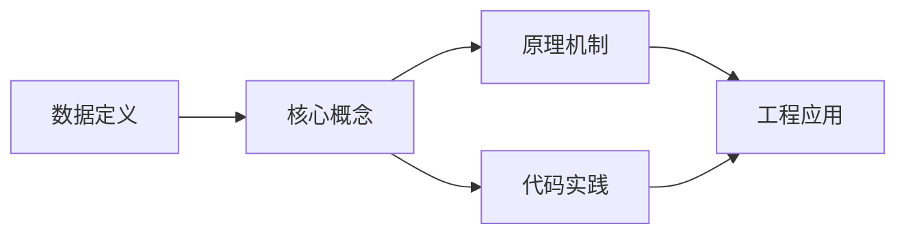
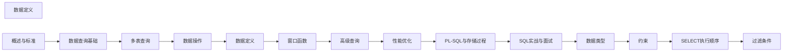

## 1. 学习目标（Bloom 分类）

本节按照布鲁姆教育目标分类学组织学习路径。本文主题为《数据定义》，属于 SQL 模块，读者可以根据自身阶段选择阅读深度。

记忆层面：能够准确复述本文的核心概念、术语与基本语法或操作步骤，并能够在提问或检索时快速定位对应知识点。能够说出 SQL 的核心概念、语法与常用对象。

理解层面：能够用自己的语言解释核心原理与工作机制，说明概念之间的因果关系，而不是机械记忆结论。能够解释 SQL 的执行原理与优化机制。

应用层面：能够在真实项目或练习场景中运用本文知识解决具体问题，写出正确且可维护的实现。能够编写正确、高效的 SQL 语句与操作。

分析层面：能够拆解复杂问题，比较本文主题与相邻概念的异同，识别边界条件与例外情况。能够分析 SQL 相关方案在性能与一致性上的权衡。

评价层面：能够根据约束条件（性能、可读性、安全、成本）评价不同方案的优劣，做出有依据的技术决策。能够根据业务场景评价 SQL 技术选型。

创造层面：能够把本文知识与其他模块知识组合，设计出新的解决方案或可复用的工程模式。能够组合 SQL 与其他技术设计数据架构。

通过本节学习，读者应当能够把《数据定义》纳入自己的知识网络，并与 SQL 模块的其他主题（DDL/DML、查询、索引、事务）建立关联。

## 2. 历史动机与发展脉络

《数据定义》是 SQL 领域的重要主题。要真正理解它，需要先了解它解决的问题与演进过程。

SQL（结构化查询语言）源于 1970 年 Codd 的关系模型，1974 年由 Chamberlin 与 Boyce 设计（SEQUEL），1986 年成为 ANSI 标准；SQL:2023 是当前国际标准。
SQL 分为 DDL（建表）、DML（增删改）、DQL（查询）、DCL（权限）与 TCL（事务）；各大数据库在标准基础上扩展方言。
SQL 是声明式语言：描述“要什么”而非“怎么做”，优化器负责执行计划；这一设计让 SQL 具有跨数据库的表达一致性。

回到本文主题：数据定义 的提出与成熟，正是上述技术背景下的必然产物。早期实现往往以简单可用为目标，随着工程规模扩大，社区逐渐沉淀出标准做法与最佳实践；理解这一脉络，可以帮助读者判断“为什么文档中的推荐写法是现在这个样子”，也能在遇到历史遗留代码时准确识别其设计年代与取舍。


## 3. 形式化定义与核心概念精讲

本节把《数据定义》涉及的核心概念以“定义 + 讲解”的形式展开。读者应把定义当作工具，把讲解当作理解路径；两者结合才能形成可迁移的知识。

关系模型：表（关系）、行（元组）、列（属性）；主键唯一标识、外键表达关联、范式消除冗余。
查询执行：解析 -> 绑定 -> 优化（基于代价选择计划）-> 执行；索引、统计信息与连接算法决定性能。
事务 ACID：原子性（Atomicity）、一致性（Consistency）、隔离性（Isolation）、持久性（Durability）；隔离级别控制并发行为。

### 3.1 原文章节逐一精讲

原文档把主题拆分为 17 个小节，下面按顺序给出每一节的导读讲解，随后保留原文细节供精读。

#### 原文精读（完整保留）

# 数据定义

> **符号约定**：`< >` 必填参数 | `[ ]` 可选参数

---

#### CREATE TABLE

**换行写法：创建表**
`CREATE TABLE <表名> (<列定义>);`
```sql
-- 创建用户表
CREATE TABLE users (
  id INT PRIMARY KEY,
  name VARCHAR(100) NOT NULL,
  email VARCHAR(255) UNIQUE,
  created_at TIMESTAMP DEFAULT CURRENT_TIMESTAMP
);
```

**换行写法：创建表时判断是否已存在**
`CREATE TABLE IF NOT EXISTS <表名> (<列定义>);`
```sql
-- 仅在表不存在时创建
CREATE TABLE IF NOT EXISTS users (
  id INT PRIMARY KEY,
  name VARCHAR(100)
);
```

**换行写法：创建表时指定存储引擎和字符集**
`CREATE TABLE <表名> (<列定义>) ENGINE=<引擎> DEFAULT CHARSET=<字符集>;`
```sql
-- 创建表并指定存储引擎和字符集
CREATE TABLE users (
  id INT PRIMARY KEY,
  name VARCHAR(100)
) ENGINE=InnoDB DEFAULT CHARSET=utf8mb4;
```

---

#### ALTER TABLE

```sql
-- 添加列
ALTER TABLE users ADD COLUMN phone VARCHAR(20);
ALTER TABLE users ADD COLUMN age INT DEFAULT 0;

-- 删除列
ALTER TABLE users DROP COLUMN phone;

-- 修改列类型
-- PostgreSQL
ALTER TABLE users ALTER COLUMN name TYPE VARCHAR(200);
-- MySQL
ALTER TABLE users MODIFY COLUMN name VARCHAR(200);
-- SQL Server
ALTER TABLE users ALTER COLUMN name VARCHAR(200);

-- 重命名列
-- PostgreSQL
ALTER TABLE users RENAME COLUMN name TO full_name;
-- MySQL
ALTER TABLE users CHANGE COLUMN name full_name VARCHAR(100);
-- SQL Server
EXEC sp_rename 'users.name', 'full_name', 'COLUMN';

-- 添加约束
ALTER TABLE users ADD CONSTRAINT uk_users_email UNIQUE (email);
ALTER TABLE orders ADD CONSTRAINT fk_orders_customer
  FOREIGN KEY (customer_id) REFERENCES customers(id);

-- 删除约束
ALTER TABLE users DROP CONSTRAINT uk_users_email;
-- MySQL
ALTER TABLE users DROP INDEX uk_users_email;

-- 重命名表
ALTER TABLE users RENAME TO app_users;
-- SQL Server
EXEC sp_rename 'users', 'app_users';

-- 添加主键
ALTER TABLE users ADD PRIMARY KEY (id);
-- 删除主键
ALTER TABLE users DROP PRIMARY KEY;  -- MySQL
ALTER TABLE users DROP CONSTRAINT users_pkey;  -- PostgreSQL
```

##### 基本建表

```sql
CREATE TABLE employees (
  id          INT           PRIMARY KEY AUTO_INCREMENT,
  name        VARCHAR(100)  NOT NULL,
  email       VARCHAR(255)  UNIQUE,
  department  VARCHAR(50)   DEFAULT 'General',
  salary      DECIMAL(10,2) CHECK (salary > 0),
  hire_date   DATE          NOT NULL,
  is_active   BOOLEAN       DEFAULT true,
  created_at  TIMESTAMP     DEFAULT CURRENT_TIMESTAMP,
  updated_at  TIMESTAMP     DEFAULT CURRENT_TIMESTAMP ON UPDATE CURRENT_TIMESTAMP
);
```

##### 从查询创建表

```sql
-- CTAS: Create Table As Select
CREATE TABLE employees_backup AS
SELECT * FROM employees WHERE hire_date >= '2024-01-01';

-- 只复制结构不复制数据
-- PostgreSQL
CREATE TABLE employees_empty (LIKE employees INCLUDING ALL);

-- MySQL
CREATE TABLE employees_empty LIKE employees;

-- SQL Server
SELECT * INTO employees_empty FROM employees WHERE 1 = 0;
```

##### 临时表

```sql
-- 会话级临时表（连接断开后自动删除）
-- PostgreSQL
CREATE TEMPORARY TABLE temp_results AS
SELECT department, AVG(salary) AS avg_salary
FROM employees GROUP BY department;

-- MySQL
CREATE TEMPORARY TABLE temp_results AS
SELECT department, AVG(salary) AS avg_salary
FROM employees GROUP BY department;

-- SQL Server
CREATE TABLE #temp_results (
  department VARCHAR(50),
  avg_salary DECIMAL(10,2)
);

-- 全局临时表（SQL Server）
CREATE TABLE ##global_temp (
  id INT,
  value VARCHAR(100)
);

-- Oracle
CREATE GLOBAL TEMPORARY TABLE temp_results (
  id NUMBER,
  value VARCHAR2(100)
) ON COMMIT PRESERVE ROWS;  -- 或 ON COMMIT DELETE ROWS
```

#### 数据类型

##### 数值类型

| 类型              | 存储 | 范围           | 说明           |
| ----------------- | ---- | -------------- | -------------- |
| `TINYINT`         | 1B   | -128 ~ 127     | MySQL 特有     |
| `SMALLINT`        | 2B   | -32768 ~ 32767 |                |
| `INT` / `INTEGER` | 4B   | -2³¹ ~ 2³¹-1   | 最常用整数     |
| `BIGINT`          | 8B   | -2⁶³ ~ 2⁶³-1   | 大整数         |
| `DECIMAL(p,s)`    | 变长 | 精确数值       | 金融场景必用   |
| `NUMERIC(p,s)`    | 变长 | 同 DECIMAL     |                |
| `FLOAT`           | 4B   | 近似值         | 不推荐金融使用 |
| `DOUBLE`          | 8B   | 近似值         |                |
| `SERIAL`          | 4B   | 自增整数       | PostgreSQL     |
| `BIGSERIAL`       | 8B   | 自增大整数     | PostgreSQL     |

```sql
-- DECIMAL 精度示例
-- DECIMAL(10,2): 最多 10 位数字，其中 2 位小数
-- 最大值: 99999999.99
CREATE TABLE products (
  price DECIMAL(10,2) NOT NULL,    -- 精确到分
  discount DECIMAL(5,4) NOT NULL   -- 如 0.1500 表示 15%
);

--  浮点数精度问题
SELECT 0.1 + 0.2 = 0.3;  -- 可能返回 false！
--  使用 DECIMAL
SELECT CAST(0.1 AS DECIMAL(10,2)) + CAST(0.2 AS DECIMAL(10,2)) = CAST(0.3 AS DECIMAL(10,2));
```

##### 字符串类型

| 类型          | 说明         | 最大长度   |
| ------------- | ------------ | ---------- |
| `CHAR(n)`     | 定长字符串   | 255/8000   |
| `VARCHAR(n)`  | 变长字符串   | 65535/无限 |
| `TEXT`        | 长文本       | 无限制     |
| `NVARCHAR(n)` | Unicode 变长 | SQL Server |

```sql
-- CHAR vs VARCHAR
-- CHAR(10): 'hello     ' (补空格到 10 位)
-- VARCHAR(10): 'hello' (实际长度 5)

-- PostgreSQL: VARCHAR 无长度限制时等同 TEXT
-- MySQL: VARCHAR 最大 65535 字节
-- SQL Server: VARCHAR(MAX) 可存储 2GB

-- PostgreSQL 特有类型
-- CHAR(n) / VARCHAR(n) / TEXT 都支持 Unicode
CREATE TABLE articles (
  title   VARCHAR(500) NOT NULL,
  content TEXT NOT NULL
);
```

##### 日期时间类型

| 类型        | 格式                | 说明               |
| ----------- | ------------------- | ------------------ |
| `DATE`      | YYYY-MM-DD          | 仅日期             |
| `TIME`      | HH:MM:SS            | 仅时间             |
| `DATETIME`  | YYYY-MM-DD HH:MM:SS | 日期+时间（MySQL） |
| `TIMESTAMP` | 同上                | 时间戳，带时区支持 |
| `INTERVAL`  | -                   | 时间间隔           |

```sql
-- PostgreSQL: TIMESTAMPTZ（带时区）
CREATE TABLE events (
  event_time  TIMESTAMP NOT NULL,           -- 不带时区
  created_at  TIMESTAMPTZ DEFAULT NOW()     -- 带时区
);

-- 时间间隔运算
SELECT
  order_date,
  order_date + INTERVAL '7 days' AS expected_delivery,
  AGE(CURRENT_TIMESTAMP, order_date) AS time_elapsed  -- PostgreSQL
FROM orders;

-- MySQL 日期运算
SELECT
  order_date,
  DATE_ADD(order_date, INTERVAL 7 DAY) AS expected_delivery,
  DATEDIFF(CURRENT_DATE, order_date) AS days_elapsed
FROM orders;
```

##### 特殊类型

```sql
-- PostgreSQL 丰富类型
CREATE TABLE pg_features (
  -- 布尔
  is_active   BOOLEAN DEFAULT true,
  -- 数组
  tags        TEXT[],
  scores      INT[],
  -- JSON
  metadata    JSONB,
  -- UUID
  id          UUID DEFAULT gen_random_uuid(),
  -- 网络
  ip_address  INET,
  mac_address MACADDR,
  -- 几何
  location    POINT,
  area        POLYGON,
  -- 货币
  price       MONEY,
  -- 位串
  flags       BIT(8),
  -- 范围
  age_range   INT4RANGE,
  -- 枚举
  status      status_enum
);

-- MySQL JSON
CREATE TABLE mysql_features (
  id       INT AUTO_INCREMENT PRIMARY KEY,
  metadata JSON,
  -- MySQL 8.0+ 支持 JSON 列的索引（通过生成列）
  metadata_name VARCHAR(100) GENERATED ALWAYS AS (JSON_UNQUOTE(metadata->'$.name')) STORED,
  INDEX idx_metadata_name (metadata_name)
);
```

#### 约束

##### PRIMARY KEY 主键

```sql
-- 单列主键
CREATE TABLE users (
  id INT PRIMARY KEY,
  name VARCHAR(100)
);

-- 自增主键
-- MySQL
id INT AUTO_INCREMENT PRIMARY KEY

-- PostgreSQL
id SERIAL PRIMARY KEY
-- 或
id INT GENERATED ALWAYS AS IDENTITY PRIMARY KEY

-- SQL Server
id INT IDENTITY(1,1) PRIMARY KEY

-- 复合主键
CREATE TABLE order_items (
  order_id   INT,
  product_id INT,
  quantity   INT,
  PRIMARY KEY (order_id, product_id)
);

-- 命名约束（推荐）
CREATE TABLE users (
  id INT,
  CONSTRAINT pk_users_id PRIMARY KEY (id)
);
```

##### FOREIGN KEY 外键

```sql
-- 基本外键
CREATE TABLE orders (
  id INT PRIMARY KEY,
  customer_id INT,
  FOREIGN KEY (customer_id) REFERENCES customers(id)
);

-- 外键动作
CREATE TABLE orders (
  id INT PRIMARY KEY,
  customer_id INT,
  CONSTRAINT fk_orders_customer
    FOREIGN KEY (customer_id) REFERENCES customers(id)
    ON DELETE CASCADE       -- 删除客户时级联删除订单
    ON UPDATE CASCADE       -- 更新客户 ID 时级联更新
);

-- 外键动作选项：
-- ON DELETE/UPDATE:
--   CASCADE:     级联操作
--   SET NULL:    设为 NULL（列必须允许 NULL）
--   SET DEFAULT: 设为默认值
--   RESTRICT:    拒绝操作（默认）
--   NO ACTION:   同 RESTRICT（标准 SQL）

-- 自引用外键
CREATE TABLE employees (
  id INT PRIMARY KEY,
  name VARCHAR(100),
  manager_id INT,
  FOREIGN KEY (manager_id) REFERENCES employees(id)
);
```

##### UNIQUE 唯一约束

```sql
-- 列级唯一约束
CREATE TABLE users (
  id INT PRIMARY KEY,
  email VARCHAR(255) UNIQUE
);

-- 命名唯一约束
CREATE TABLE users (
  id INT PRIMARY KEY,
  email VARCHAR(255),
  CONSTRAINT uk_users_email UNIQUE (email)
);

-- 复合唯一约束
CREATE TABLE user_roles (
  user_id INT,
  role_id INT,
  CONSTRAINT uk_user_role UNIQUE (user_id, role_id)
);

-- 唯一约束与 NULL
-- PostgreSQL: 允许多个 NULL（NULL ≠ NULL）
-- MySQL: 允许多个 NULL（InnoDB）
-- SQL Server: 允许一个 NULL（索引视图除外）
```

##### CHECK 检查约束

```sql
-- 列级 CHECK
CREATE TABLE products (
  id INT PRIMARY KEY,
  price DECIMAL(10,2) CHECK (price > 0),
  discount DECIMAL(5,4) CHECK (discount >= 0 AND discount <= 1),
  stock INT CHECK (stock >= 0)
);

-- 表级 CHECK（可引用多列）
CREATE TABLE orders (
  id INT PRIMARY KEY,
  start_date DATE,
  end_date DATE,
  CONSTRAINT chk_date_range CHECK (end_date >= start_date)
);

-- PostgreSQL: 支持更复杂的 CHECK
CREATE TABLE schedules (
  id INT PRIMARY KEY,
  day_of_week INT CHECK (day_of_week BETWEEN 1 AND 7),
  start_time TIME,
  end_time TIME,
  CONSTRAINT chk_time_range CHECK (end_time > start_time)
);
```

##### DEFAULT 默认值

```sql
CREATE TABLE users (
  id INT PRIMARY KEY,
  name VARCHAR(100),
  status VARCHAR(20) DEFAULT 'active',
  created_at TIMESTAMP DEFAULT CURRENT_TIMESTAMP,
  balance DECIMAL(10,2) DEFAULT 0.00
);

-- PostgreSQL: 动态默认值
CREATE TABLE users (
  id UUID DEFAULT gen_random_uuid(),
  created_at TIMESTAMPTZ DEFAULT NOW()
);

-- MySQL: 动态默认值（8.0+）
CREATE TABLE users (
  id INT AUTO_INCREMENT PRIMARY KEY,
  created_at TIMESTAMP DEFAULT CURRENT_TIMESTAMP,
  updated_at TIMESTAMP DEFAULT CURRENT_TIMESTAMP ON UPDATE CURRENT_TIMESTAMP
);
```

#### DROP

```sql
-- 删除表（表必须存在）
DROP TABLE users;

-- 如果存在则删除（避免报错）
DROP TABLE IF EXISTS users;

-- 级联删除（同时删除依赖对象）
DROP TABLE users CASCADE;  -- PostgreSQL

-- 删除数据库
DROP DATABASE mydb;
DROP DATABASE IF EXISTS mydb;
```

#### 视图

视图是存储的查询定义，不存储实际数据（物化视图除外）。

```sql
-- 创建视图
CREATE VIEW active_users AS
SELECT id, name, email
FROM users
WHERE status = 'active' AND last_login > CURRENT_DATE - INTERVAL '30 days';

-- 使用视图
SELECT * FROM active_users WHERE name LIKE 'A%';

-- 可更新视图（满足条件时可直接 INSERT/UPDATE/DELETE）
-- 条件: 单表、无聚合、无 DISTINCT、无 GROUP BY 等
CREATE VIEW user_emails AS
SELECT id, name, email FROM users;

UPDATE user_emails SET email = 'new@example.com' WHERE id = 1;  --

-- WITH CHECK OPTION: 确保通过视图修改的数据仍满足视图条件
CREATE VIEW active_users AS
SELECT id, name, email, status FROM users WHERE status = 'active'
WITH CHECK OPTION;

-- 以下操作会被拒绝（因为修改后不再满足 status='active'）
UPDATE active_users SET status = 'inactive' WHERE id = 1;  --

-- 替换视图
CREATE OR REPLACE VIEW active_users AS
SELECT id, name, email, status FROM users WHERE status = 'active';

-- 删除视图
DROP VIEW IF EXISTS active_users;
```

#### 索引

##### 创建索引

```sql
-- 基本索引
CREATE INDEX idx_users_email ON users(email);

-- 唯一索引
CREATE UNIQUE INDEX idx_users_email ON users(email);

-- 复合索引（注意列顺序）
CREATE INDEX idx_orders_customer_date ON orders(customer_id, order_date);

-- 降序索引
CREATE INDEX idx_orders_date_desc ON orders(order_date DESC);

-- 部分索引（PostgreSQL）
CREATE INDEX idx_active_users ON users(email) WHERE status = 'active';

-- 表达式索引（PostgreSQL）
CREATE INDEX idx_users_lower_email ON users(LOWER(email));

-- 前缀索引（MySQL，用于长字符串）
CREATE INDEX idx_users_name_prefix ON users(name(20));

-- 函数索引（Oracle / PostgreSQL）
CREATE INDEX idx_orders_month ON orders(EXTRACT(MONTH FROM order_date));
```

##### 索引类型

| 类型     | 适用场景                   | 数据库                         |
| -------- | -------------------------- | ------------------------------ |
| B-Tree   | 等值、范围、排序、前缀匹配 | 所有                           |
| Hash     | 等值查询                   | PostgreSQL, MySQL (Memory引擎) |
| GIN      | 全文搜索、JSONB、数组      | PostgreSQL                     |
| GiST     | 地理空间、范围类型         | PostgreSQL                     |
| BRIN     | 大表有序数据               | PostgreSQL                     |
| 全文索引 | 全文搜索                   | MySQL, SQL Server              |
| 列存储   | 分析查询                   | SQL Server, Oracle             |

```sql
-- PostgreSQL: 指定索引类型
CREATE INDEX idx_users_email_hash ON users USING hash (email);
CREATE INDEX idx_articles_content ON articles USING gin (to_tsvector('english', content));
CREATE INDEX idx_logs_timestamp ON logs USING brin (created_at);

-- MySQL: 全文索引
CREATE FULLTEXT INDEX idx_articles_content ON articles(title, content);
SELECT * FROM articles WHERE MATCH(title, content) AGAINST('database optimization');
```

##### 索引管理

```sql
-- 删除索引
DROP INDEX idx_users_email;
-- PostgreSQL 需要指定表名
DROP INDEX idx_users_email;  -- PostgreSQL
-- MySQL
ALTER TABLE users DROP INDEX idx_users_email;
-- SQL Server
DROP INDEX idx_users_email ON users;

-- 重建索引
-- PostgreSQL
REINDEX INDEX idx_users_email;
REINDEX TABLE users;

-- MySQL
ALTER TABLE users ENGINE=InnoDB;  -- 重建所有索引

-- SQL Server
ALTER INDEX idx_users_email ON users REBUILD;

-- 查看索引
-- PostgreSQL
SELECT indexname, indexdef FROM pg_indexes WHERE tablename = 'users';

-- MySQL
SHOW INDEX FROM users;

-- 并发创建索引（PostgreSQL，不锁表）
CREATE INDEX CONCURRENTLY idx_users_email ON users(email);
```

#### 序列

```sql
-- PostgreSQL: 创建序列
CREATE SEQUENCE order_seq
  START WITH 1000
  INCREMENT BY 1
  NO MAXVALUE
  NO CYCLE
  CACHE 20;

-- 使用序列
INSERT INTO orders (id, customer_id) VALUES (NEXTVAL('order_seq'), 1);

-- 查看当前值（不消耗）
SELECT CURRVAL('order_seq');

-- 设置序列值
SELECT SETVAL('order_seq', 5000);

-- 将序列关联到列
ALTER TABLE orders ALTER COLUMN id SET DEFAULT NEXTVAL('order_seq');

-- MySQL: 使用 AUTO_INCREMENT（无独立序列对象）
-- Oracle: 使用 SEQUENCE + TRIGGER 实现自增
CREATE SEQUENCE order_seq START WITH 1000 INCREMENT BY 1;

CREATE OR REPLACE TRIGGER trg_orders_id
BEFORE INSERT ON orders
FOR EACH ROW
BEGIN
  :NEW.id := order_seq.NEXTVAL;
END;
```

#### 小结

- 选择合适的数据类型：金融用 `DECIMAL`，时间用 `TIMESTAMPTZ`，大文本用 `TEXT`
- 约束是数据完整性的保障：`PRIMARY KEY` 唯一标识、`FOREIGN KEY` 维护关联、`CHECK` 保证域完整性
- 视图简化查询但不存储数据，物化视图（见性能优化章节）缓存查询结果
- 索引是查询性能的关键：B-Tree 通用，GIN 适合 JSON/全文，BRIN 适合大表时序数据
- 序列用于生成唯一标识符，PostgreSQL 原生支持，MySQL 通过 `AUTO_INCREMENT` 实现
#### CREATE DATABASE

**单行写法：创建数据库**
`CREATE DATABASE <数据库名>;`
```sql
-- 创建名为 mydb 的数据库
CREATE DATABASE mydb;
```

**单行写法：创建数据库时指定字符集**
`CREATE DATABASE <数据库名> CHARACTER SET <字符集> COLLATE <排序规则>;`
```sql
-- 创建数据库并指定字符集为 utf8mb4
CREATE DATABASE mydb CHARACTER SET utf8mb4 COLLATE utf8mb4_unicode_ci;
```

**单行写法：创建数据库时判断是否已存在**
`CREATE DATABASE IF NOT EXISTS <数据库名>;`
```sql
-- 仅在数据库不存在时创建
CREATE DATABASE IF NOT EXISTS mydb;
```

---

#### 列定义

**单行写法：定义自增主键列**
`<列名> INT AUTO_INCREMENT PRIMARY KEY`
```sql
-- 定义自增主键列
CREATE TABLE users (
  id INT AUTO_INCREMENT PRIMARY KEY,
  name VARCHAR(100)
);
```

**单行写法：定义带默认值的列**
`<列名> <数据类型> DEFAULT <默认值>`
```sql
-- 定义带默认值的列
CREATE TABLE users (
  id INT PRIMARY KEY,
  status VARCHAR(20) DEFAULT 'active'
);
```

**单行写法：定义非空列**
`<列名> <数据类型> NOT NULL`
```sql
-- 定义非空列
CREATE TABLE users (
  id INT PRIMARY KEY,
  name VARCHAR(100) NOT NULL
);
```

**单行写法：定义唯一约束列**
`<列名> <数据类型> UNIQUE`
```sql
-- 定义唯一约束列
CREATE TABLE users (
  id INT PRIMARY KEY,
  email VARCHAR(255) UNIQUE
);
```

---

#### DROP TABLE

**单行写法：删除表**
`DROP TABLE <表名>;`
```sql
-- 删除用户表
DROP TABLE users;
```

**单行写法：删除表时判断是否存在**
`DROP TABLE IF EXISTS <表名>;`
```sql
-- 仅在表存在时删除
DROP TABLE IF EXISTS users;
```

**换行写法：删除多表**
`DROP TABLE <表 1>, <表 2>;`
```sql
-- 同时删除多个表
DROP TABLE users, orders;
```

---

#### TRUNCATE TABLE

**单行写法：清空表数据**
`TRUNCATE TABLE <表名>;`
```sql
-- 清空用户表数据（保留表结构）
TRUNCATE TABLE users;
```

---

#### CREATE INDEX

**单行写法：创建单列索引**
`CREATE INDEX <索引名> ON <表名>(<列>);`
```sql
-- 在用户表的 email 列上创建索引
CREATE INDEX idx_email ON users(email);
```

**单行写法：创建复合索引**
`CREATE INDEX <索引名> ON <表名>(<列 1>, <列 2>);`
```sql
-- 在用户表的姓和名列上创建复合索引
CREATE INDEX idx_name ON users(last_name, first_name);
```

**单行写法：创建唯一索引**
`CREATE UNIQUE INDEX <索引名> ON <表名>(<列>);`
```sql
-- 在用户表的 email 列上创建唯一索引
CREATE UNIQUE INDEX idx_unique_email ON users(email);
```

---

#### DROP INDEX

**单行写法：删除索引**
`DROP INDEX <索引名> ON <表名>;`
```sql
-- 删除用户表上的 idx_email 索引
DROP INDEX idx_email ON users;
```

**单行写法：PostgreSQL 删除索引**
`DROP INDEX <索引名>;`
```sql
-- PostgreSQL 删除索引
DROP INDEX idx_email;
```

**单行写法：删除索引时判断是否存在**
`DROP INDEX IF EXISTS <索引名>;`
```sql
-- 仅在索引存在时删除
DROP INDEX IF EXISTS idx_email;
```

---

#### CREATE VIEW

**换行写法：创建视图**
`CREATE VIEW <视图名> AS <SELECT 语句>;`
```sql
-- 创建高薪员工视图
CREATE VIEW high_salary_employees AS
SELECT id, name, salary
FROM employees
WHERE salary > 80000;
```

**换行写法：创建或替换视图**
`CREATE OR REPLACE VIEW <视图名> AS <SELECT 语句>;`
```sql
-- 创建或替换高薪员工视图
CREATE OR REPLACE VIEW high_salary_employees AS
SELECT id, name, salary, department
FROM employees
WHERE salary > 80000;
```

---

#### DROP VIEW

**单行写法：删除视图**
`DROP VIEW <视图名>;`
```sql
-- 删除高薪员工视图
DROP VIEW high_salary_employees;
```

**单行写法：删除视图时判断是否存在**
`DROP VIEW IF EXISTS <视图名>;`
```sql
-- 仅在视图存在时删除
DROP VIEW IF EXISTS high_salary_employees;
```


### 3.2 概念关系图

下面用 Mermaid 图表达本文核心概念之间的关系，帮助读者建立整体图景：



图中展示的是本文知识的结构化关系：核心概念是入口，原理机制解释“为什么”，代码实践演示“怎么做”，工程应用回答“何时用”。读者学习时可以把每个小节的内容挂接到对应节点上。

## 4. 理论推导与原理解析

本节深入《数据定义》背后的原理。理论部分不求面面俱到，而是聚焦“能解释现象、能指导实践”的关键推导。

关系模型：表（关系）、行（元组）、列（属性）；主键唯一标识、外键表达关联、范式消除冗余。
查询执行：解析 -> 绑定 -> 优化（基于代价选择计划）-> 执行；索引、统计信息与连接算法决定性能。
事务 ACID：原子性（Atomicity）、一致性（Consistency）、隔离性（Isolation）、持久性（Durability）；隔离级别控制并发行为。
集合语义：SELECT 返回结果集；JOIN 组合关系，GROUP BY 聚合，子查询与 CTE 表达复杂逻辑。

需要强调的是，理论推导与工程实践之间存在翻译层：理论给出的是理想化模型与边界条件，工程代码则必须处理真实环境中的例外。读者在学习时应先掌握理论的“标准情形”，再通过陷阱章节了解“非标准情形”。

## 5. 代码示例与逐行讲解

本节把原文中的代码示例系统整理，并为每个示例补充用途说明与讲解。读者不应只浏览代码，而应逐段对照讲解理解设计意图。

### 5.1 示例：CREATE TABLE

该示例来自原文《CREATE TABLE》小节，用于演示数据定义相关操作。阅读时请先看代码结构，再看其后的讲解。

```sql
-- 创建用户表
CREATE TABLE users (
  id INT PRIMARY KEY,
  name VARCHAR(100) NOT NULL,
  email VARCHAR(255) UNIQUE,
  created_at TIMESTAMP DEFAULT CURRENT_TIMESTAMP
);
```

讲解：这段代码演示了本节核心知识点。代码中的关键操作可以归纳为三步：准备（定义或初始化）、执行（核心逻辑）、收尾（释放资源或返回结果）。实际项目中，这三步往往被封装为函数或类，以提升复用性与可测试性。

关键点分析：

该示例共 7 行有效代码，包含 1 类关键结构（CREATE）。其中：

- 入口与初始化部分负责建立上下文，对应实际项目中的启动或装配逻辑；
- 核心逻辑部分体现本文主题的主要操作，是阅读时最需要对照讲解理解的部分；
- 输出或返回部分把结果交给调用方，注意其类型与边界条件。

进阶思考路径：先尝试修改参数观察行为变化，再把示例中的模式迁移到自己的项目中；每次修改都记录预期与实测差异，这是把示例转化为能力的最快方式。

### 5.2 示例：CREATE TABLE

该示例来自原文《CREATE TABLE》小节，用于演示数据定义相关操作。阅读时请先看代码结构，再看其后的讲解。

```sql
-- 仅在表不存在时创建
CREATE TABLE IF NOT EXISTS users (
  id INT PRIMARY KEY,
  name VARCHAR(100)
);
```

讲解：这段代码演示了本节核心知识点。代码中的关键操作可以归纳为三步：准备（定义或初始化）、执行（核心逻辑）、收尾（释放资源或返回结果）。实际项目中，这三步往往被封装为函数或类，以提升复用性与可测试性。

关键点分析：

该示例共 5 行有效代码，包含 1 类关键结构（CREATE）。其中：

- 入口与初始化部分负责建立上下文，对应实际项目中的启动或装配逻辑；
- 核心逻辑部分体现本文主题的主要操作，是阅读时最需要对照讲解理解的部分；
- 输出或返回部分把结果交给调用方，注意其类型与边界条件。

进阶思考路径：先尝试修改参数观察行为变化，再把示例中的模式迁移到自己的项目中；每次修改都记录预期与实测差异，这是把示例转化为能力的最快方式。

### 5.3 示例：CREATE TABLE

该示例来自原文《CREATE TABLE》小节，用于演示数据定义相关操作。阅读时请先看代码结构，再看其后的讲解。

```sql
-- 创建表并指定存储引擎和字符集
CREATE TABLE users (
  id INT PRIMARY KEY,
  name VARCHAR(100)
) ENGINE=InnoDB DEFAULT CHARSET=utf8mb4;
```

讲解：这段代码演示了本节核心知识点。代码中的关键操作可以归纳为三步：准备（定义或初始化）、执行（核心逻辑）、收尾（释放资源或返回结果）。实际项目中，这三步往往被封装为函数或类，以提升复用性与可测试性。

关键点分析：

该示例共 5 行有效代码，包含 1 类关键结构（CREATE）。其中：

- 入口与初始化部分负责建立上下文，对应实际项目中的启动或装配逻辑；
- 核心逻辑部分体现本文主题的主要操作，是阅读时最需要对照讲解理解的部分；
- 输出或返回部分把结果交给调用方，注意其类型与边界条件。

进阶思考路径：先尝试修改参数观察行为变化，再把示例中的模式迁移到自己的项目中；每次修改都记录预期与实测差异，这是把示例转化为能力的最快方式。

### 5.4 示例：ALTER TABLE

该示例来自原文《ALTER TABLE》小节，用于演示数据定义相关操作。阅读时请先看代码结构，再看其后的讲解。

```sql
-- 添加列
ALTER TABLE users ADD COLUMN phone VARCHAR(20);
ALTER TABLE users ADD COLUMN age INT DEFAULT 0;

-- 删除列
ALTER TABLE users DROP COLUMN phone;

-- 修改列类型
-- PostgreSQL
ALTER TABLE users ALTER COLUMN name TYPE VARCHAR(200);
-- MySQL
ALTER TABLE users MODIFY COLUMN name VARCHAR(200);
-- SQL Server
ALTER TABLE users ALTER COLUMN name VARCHAR(200);

-- 重命名列
-- PostgreSQL
ALTER TABLE users RENAME COLUMN name TO full_name;
-- MySQL
ALTER TABLE users CHANGE COLUMN name full_name VARCHAR(100);
-- SQL Server
EXEC sp_rename 'users.name', 'full_name', 'COLUMN';

-- 添加约束
ALTER TABLE users ADD CONSTRAINT uk_users_email UNIQUE (email);
ALTER TABLE orders ADD CONSTRAINT fk_orders_customer
  FOREIGN KEY (customer_id) REFERENCES customers(id);

-- 删除约束
ALTER TABLE users DROP CONSTRAINT uk_users_email;
-- MySQL
ALTER TABLE users DROP INDEX uk_users_email;

-- 重命名表
ALTER TABLE users RENAME TO app_users;
-- SQL Server
EXEC sp_rename 'users', 'app_users';

-- 添加主键
ALTER TABLE users ADD PRIMARY KEY (id);
-- 删除主键
ALTER TABLE users DROP PRIMARY KEY;  -- MySQL
ALTER TABLE users DROP CONSTRAINT users_pkey;  -- PostgreSQL
```

讲解：这段代码演示了本节核心知识点。代码中的关键操作可以归纳为三步：准备（定义或初始化）、执行（核心逻辑）、收尾（释放资源或返回结果）。实际项目中，这三步往往被封装为函数或类，以提升复用性与可测试性。

关键点分析：

该示例共 36 行有效代码，包含 1 类关键结构（ALTER）。其中：

- 入口与初始化部分负责建立上下文，对应实际项目中的启动或装配逻辑；
- 核心逻辑部分体现本文主题的主要操作，是阅读时最需要对照讲解理解的部分；
- 输出或返回部分把结果交给调用方，注意其类型与边界条件。

进阶思考路径：先尝试修改参数观察行为变化，再把示例中的模式迁移到自己的项目中；每次修改都记录预期与实测差异，这是把示例转化为能力的最快方式。

### 5.5 示例：基本建表

该示例来自原文《基本建表》小节，用于演示数据定义相关操作。阅读时请先看代码结构，再看其后的讲解。

```sql
CREATE TABLE employees (
  id          INT           PRIMARY KEY AUTO_INCREMENT,
  name        VARCHAR(100)  NOT NULL,
  email       VARCHAR(255)  UNIQUE,
  department  VARCHAR(50)   DEFAULT 'General',
  salary      DECIMAL(10,2) CHECK (salary > 0),
  hire_date   DATE          NOT NULL,
  is_active   BOOLEAN       DEFAULT true,
  created_at  TIMESTAMP     DEFAULT CURRENT_TIMESTAMP,
  updated_at  TIMESTAMP     DEFAULT CURRENT_TIMESTAMP ON UPDATE CURRENT_TIMESTAMP
);
```

讲解：这段代码演示了本节核心知识点。代码中的关键操作可以归纳为三步：准备（定义或初始化）、执行（核心逻辑）、收尾（释放资源或返回结果）。实际项目中，这三步往往被封装为函数或类，以提升复用性与可测试性。

关键点分析：

该示例共 11 行有效代码，包含 1 类关键结构（CREATE）。其中：

- 入口与初始化部分负责建立上下文，对应实际项目中的启动或装配逻辑；
- 核心逻辑部分体现本文主题的主要操作，是阅读时最需要对照讲解理解的部分；
- 输出或返回部分把结果交给调用方，注意其类型与边界条件。

进阶思考路径：先尝试修改参数观察行为变化，再把示例中的模式迁移到自己的项目中；每次修改都记录预期与实测差异，这是把示例转化为能力的最快方式。

### 5.6 示例：从查询创建表

该示例来自原文《从查询创建表》小节，用于演示数据定义相关操作。阅读时请先看代码结构，再看其后的讲解。

```sql
-- CTAS: Create Table As Select
CREATE TABLE employees_backup AS
SELECT * FROM employees WHERE hire_date >= '2024-01-01';

-- 只复制结构不复制数据
-- PostgreSQL
CREATE TABLE employees_empty (LIKE employees INCLUDING ALL);

-- MySQL
CREATE TABLE employees_empty LIKE employees;

-- SQL Server
SELECT * INTO employees_empty FROM employees WHERE 1 = 0;
```

讲解：这段代码演示了本节核心知识点。代码中的关键操作可以归纳为三步：准备（定义或初始化）、执行（核心逻辑）、收尾（释放资源或返回结果）。实际项目中，这三步往往被封装为函数或类，以提升复用性与可测试性。

关键点分析：

该示例共 10 行有效代码，包含 3 类关键结构（SELECT、CREATE、FROM）。其中：

- 入口与初始化部分负责建立上下文，对应实际项目中的启动或装配逻辑；
- 核心逻辑部分体现本文主题的主要操作，是阅读时最需要对照讲解理解的部分；
- 输出或返回部分把结果交给调用方，注意其类型与边界条件。

进阶思考路径：先尝试修改参数观察行为变化，再把示例中的模式迁移到自己的项目中；每次修改都记录预期与实测差异，这是把示例转化为能力的最快方式。

### 5.7 示例：临时表

该示例来自原文《临时表》小节，用于演示数据定义相关操作。阅读时请先看代码结构，再看其后的讲解。

```sql
-- 会话级临时表（连接断开后自动删除）
-- PostgreSQL
CREATE TEMPORARY TABLE temp_results AS
SELECT department, AVG(salary) AS avg_salary
FROM employees GROUP BY department;

-- MySQL
CREATE TEMPORARY TABLE temp_results AS
SELECT department, AVG(salary) AS avg_salary
FROM employees GROUP BY department;

-- SQL Server
CREATE TABLE #temp_results (
  department VARCHAR(50),
  avg_salary DECIMAL(10,2)
);

-- 全局临时表（SQL Server）
CREATE TABLE ##global_temp (
  id INT,
  value VARCHAR(100)
);

-- Oracle
CREATE GLOBAL TEMPORARY TABLE temp_results (
  id NUMBER,
  value VARCHAR2(100)
) ON COMMIT PRESERVE ROWS;  -- 或 ON COMMIT DELETE ROWS
```

讲解：这段代码演示了本节核心知识点。代码中的关键操作可以归纳为三步：准备（定义或初始化）、执行（核心逻辑）、收尾（释放资源或返回结果）。实际项目中，这三步往往被封装为函数或类，以提升复用性与可测试性。

关键点分析：

该示例共 24 行有效代码，包含 3 类关键结构（SELECT、CREATE、FROM）。其中：

- 入口与初始化部分负责建立上下文，对应实际项目中的启动或装配逻辑；
- 核心逻辑部分体现本文主题的主要操作，是阅读时最需要对照讲解理解的部分；
- 输出或返回部分把结果交给调用方，注意其类型与边界条件。

进阶思考路径：先尝试修改参数观察行为变化，再把示例中的模式迁移到自己的项目中；每次修改都记录预期与实测差异，这是把示例转化为能力的最快方式。

### 5.8 示例：数值类型

该示例来自原文《数值类型》小节，用于演示数据定义相关操作。阅读时请先看代码结构，再看其后的讲解。

```sql
-- DECIMAL 精度示例
-- DECIMAL(10,2): 最多 10 位数字，其中 2 位小数
-- 最大值: 99999999.99
CREATE TABLE products (
  price DECIMAL(10,2) NOT NULL,    -- 精确到分
  discount DECIMAL(5,4) NOT NULL   -- 如 0.1500 表示 15%
);

--  浮点数精度问题
SELECT 0.1 + 0.2 = 0.3;  -- 可能返回 false！
--  使用 DECIMAL
SELECT CAST(0.1 AS DECIMAL(10,2)) + CAST(0.2 AS DECIMAL(10,2)) = CAST(0.3 AS DECIMAL(10,2));
```

讲解：这段代码演示了本节核心知识点。代码中的关键操作可以归纳为三步：准备（定义或初始化）、执行（核心逻辑）、收尾（释放资源或返回结果）。实际项目中，这三步往往被封装为函数或类，以提升复用性与可测试性。

关键点分析：

该示例共 11 行有效代码，包含 2 类关键结构（SELECT、CREATE）。其中：

- 入口与初始化部分负责建立上下文，对应实际项目中的启动或装配逻辑；
- 核心逻辑部分体现本文主题的主要操作，是阅读时最需要对照讲解理解的部分；
- 输出或返回部分把结果交给调用方，注意其类型与边界条件。

进阶思考路径：先尝试修改参数观察行为变化，再把示例中的模式迁移到自己的项目中；每次修改都记录预期与实测差异，这是把示例转化为能力的最快方式。

### 5.9 示例：字符串类型

该示例来自原文《字符串类型》小节，用于演示数据定义相关操作。阅读时请先看代码结构，再看其后的讲解。

```sql
-- CHAR vs VARCHAR
-- CHAR(10): 'hello     ' (补空格到 10 位)
-- VARCHAR(10): 'hello' (实际长度 5)

-- PostgreSQL: VARCHAR 无长度限制时等同 TEXT
-- MySQL: VARCHAR 最大 65535 字节
-- SQL Server: VARCHAR(MAX) 可存储 2GB

-- PostgreSQL 特有类型
-- CHAR(n) / VARCHAR(n) / TEXT 都支持 Unicode
CREATE TABLE articles (
  title   VARCHAR(500) NOT NULL,
  content TEXT NOT NULL
);
```

讲解：这段代码演示了本节核心知识点。代码中的关键操作可以归纳为三步：准备（定义或初始化）、执行（核心逻辑）、收尾（释放资源或返回结果）。实际项目中，这三步往往被封装为函数或类，以提升复用性与可测试性。

关键点分析：

该示例共 12 行有效代码，包含 1 类关键结构（CREATE）。其中：

- 入口与初始化部分负责建立上下文，对应实际项目中的启动或装配逻辑；
- 核心逻辑部分体现本文主题的主要操作，是阅读时最需要对照讲解理解的部分；
- 输出或返回部分把结果交给调用方，注意其类型与边界条件。

进阶思考路径：先尝试修改参数观察行为变化，再把示例中的模式迁移到自己的项目中；每次修改都记录预期与实测差异，这是把示例转化为能力的最快方式。

### 5.10 示例：日期时间类型

该示例来自原文《日期时间类型》小节，用于演示数据定义相关操作。阅读时请先看代码结构，再看其后的讲解。

```sql
-- PostgreSQL: TIMESTAMPTZ（带时区）
CREATE TABLE events (
  event_time  TIMESTAMP NOT NULL,           -- 不带时区
  created_at  TIMESTAMPTZ DEFAULT NOW()     -- 带时区
);

-- 时间间隔运算
SELECT
  order_date,
  order_date + INTERVAL '7 days' AS expected_delivery,
  AGE(CURRENT_TIMESTAMP, order_date) AS time_elapsed  -- PostgreSQL
FROM orders;

-- MySQL 日期运算
SELECT
  order_date,
  DATE_ADD(order_date, INTERVAL 7 DAY) AS expected_delivery,
  DATEDIFF(CURRENT_DATE, order_date) AS days_elapsed
FROM orders;
```

讲解：这段代码演示了本节核心知识点。代码中的关键操作可以归纳为三步：准备（定义或初始化）、执行（核心逻辑）、收尾（释放资源或返回结果）。实际项目中，这三步往往被封装为函数或类，以提升复用性与可测试性。

关键点分析：

该示例共 17 行有效代码，包含 3 类关键结构（SELECT、CREATE、FROM）。其中：

- 入口与初始化部分负责建立上下文，对应实际项目中的启动或装配逻辑；
- 核心逻辑部分体现本文主题的主要操作，是阅读时最需要对照讲解理解的部分；
- 输出或返回部分把结果交给调用方，注意其类型与边界条件。

进阶思考路径：先尝试修改参数观察行为变化，再把示例中的模式迁移到自己的项目中；每次修改都记录预期与实测差异，这是把示例转化为能力的最快方式。

### 5.11 示例：特殊类型

该示例来自原文《特殊类型》小节，用于演示数据定义相关操作。阅读时请先看代码结构，再看其后的讲解。

```sql
-- PostgreSQL 丰富类型
CREATE TABLE pg_features (
  -- 布尔
  is_active   BOOLEAN DEFAULT true,
  -- 数组
  tags        TEXT[],
  scores      INT[],
  -- JSON
  metadata    JSONB,
  -- UUID
  id          UUID DEFAULT gen_random_uuid(),
  -- 网络
  ip_address  INET,
  mac_address MACADDR,
  -- 几何
  location    POINT,
  area        POLYGON,
  -- 货币
  price       MONEY,
  -- 位串
  flags       BIT(8),
  -- 范围
  age_range   INT4RANGE,
  -- 枚举
  status      status_enum
);

-- MySQL JSON
CREATE TABLE mysql_features (
  id       INT AUTO_INCREMENT PRIMARY KEY,
  metadata JSON,
  -- MySQL 8.0+ 支持 JSON 列的索引（通过生成列）
  metadata_name VARCHAR(100) GENERATED ALWAYS AS (JSON_UNQUOTE(metadata->'$.name')) STORED,
  INDEX idx_metadata_name (metadata_name)
);
```

讲解：这段代码演示了本节核心知识点。代码中的关键操作可以归纳为三步：准备（定义或初始化）、执行（核心逻辑）、收尾（释放资源或返回结果）。实际项目中，这三步往往被封装为函数或类，以提升复用性与可测试性。

关键点分析：

该示例共 34 行有效代码，包含 1 类关键结构（CREATE）。其中：

- 入口与初始化部分负责建立上下文，对应实际项目中的启动或装配逻辑；
- 核心逻辑部分体现本文主题的主要操作，是阅读时最需要对照讲解理解的部分；
- 输出或返回部分把结果交给调用方，注意其类型与边界条件。

进阶思考路径：先尝试修改参数观察行为变化，再把示例中的模式迁移到自己的项目中；每次修改都记录预期与实测差异，这是把示例转化为能力的最快方式。

### 5.12 示例：PRIMARY KEY 主键

该示例来自原文《PRIMARY KEY 主键》小节，用于演示数据定义相关操作。阅读时请先看代码结构，再看其后的讲解。

```sql
-- 单列主键
CREATE TABLE users (
  id INT PRIMARY KEY,
  name VARCHAR(100)
);

-- 自增主键
-- MySQL
id INT AUTO_INCREMENT PRIMARY KEY

-- PostgreSQL
id SERIAL PRIMARY KEY
-- 或
id INT GENERATED ALWAYS AS IDENTITY PRIMARY KEY

-- SQL Server
id INT IDENTITY(1,1) PRIMARY KEY

-- 复合主键
CREATE TABLE order_items (
  order_id   INT,
  product_id INT,
  quantity   INT,
  PRIMARY KEY (order_id, product_id)
);

-- 命名约束（推荐）
CREATE TABLE users (
  id INT,
  CONSTRAINT pk_users_id PRIMARY KEY (id)
);
```

讲解：这段代码演示了本节核心知识点。代码中的关键操作可以归纳为三步：准备（定义或初始化）、执行（核心逻辑）、收尾（释放资源或返回结果）。实际项目中，这三步往往被封装为函数或类，以提升复用性与可测试性。

关键点分析：

该示例共 26 行有效代码，包含 1 类关键结构（CREATE）。其中：

- 入口与初始化部分负责建立上下文，对应实际项目中的启动或装配逻辑；
- 核心逻辑部分体现本文主题的主要操作，是阅读时最需要对照讲解理解的部分；
- 输出或返回部分把结果交给调用方，注意其类型与边界条件。

进阶思考路径：先尝试修改参数观察行为变化，再把示例中的模式迁移到自己的项目中；每次修改都记录预期与实测差异，这是把示例转化为能力的最快方式。

### 5.13 示例：FOREIGN KEY 外键

该示例来自原文《FOREIGN KEY 外键》小节，用于演示数据定义相关操作。阅读时请先看代码结构，再看其后的讲解。

```sql
-- 基本外键
CREATE TABLE orders (
  id INT PRIMARY KEY,
  customer_id INT,
  FOREIGN KEY (customer_id) REFERENCES customers(id)
);

-- 外键动作
CREATE TABLE orders (
  id INT PRIMARY KEY,
  customer_id INT,
  CONSTRAINT fk_orders_customer
    FOREIGN KEY (customer_id) REFERENCES customers(id)
    ON DELETE CASCADE       -- 删除客户时级联删除订单
    ON UPDATE CASCADE       -- 更新客户 ID 时级联更新
);

-- 外键动作选项：
-- ON DELETE/UPDATE:
--   CASCADE:     级联操作
--   SET NULL:    设为 NULL（列必须允许 NULL）
--   SET DEFAULT: 设为默认值
--   RESTRICT:    拒绝操作（默认）
--   NO ACTION:   同 RESTRICT（标准 SQL）

-- 自引用外键
CREATE TABLE employees (
  id INT PRIMARY KEY,
  name VARCHAR(100),
  manager_id INT,
  FOREIGN KEY (manager_id) REFERENCES employees(id)
);
```

讲解：这段代码演示了本节核心知识点。代码中的关键操作可以归纳为三步：准备（定义或初始化）、执行（核心逻辑）、收尾（释放资源或返回结果）。实际项目中，这三步往往被封装为函数或类，以提升复用性与可测试性。

关键点分析：

该示例共 29 行有效代码，包含 1 类关键结构（CREATE）。其中：

- 入口与初始化部分负责建立上下文，对应实际项目中的启动或装配逻辑；
- 核心逻辑部分体现本文主题的主要操作，是阅读时最需要对照讲解理解的部分；
- 输出或返回部分把结果交给调用方，注意其类型与边界条件。

进阶思考路径：先尝试修改参数观察行为变化，再把示例中的模式迁移到自己的项目中；每次修改都记录预期与实测差异，这是把示例转化为能力的最快方式。

### 5.14 示例：UNIQUE 唯一约束

该示例来自原文《UNIQUE 唯一约束》小节，用于演示数据定义相关操作。阅读时请先看代码结构，再看其后的讲解。

```sql
-- 列级唯一约束
CREATE TABLE users (
  id INT PRIMARY KEY,
  email VARCHAR(255) UNIQUE
);

-- 命名唯一约束
CREATE TABLE users (
  id INT PRIMARY KEY,
  email VARCHAR(255),
  CONSTRAINT uk_users_email UNIQUE (email)
);

-- 复合唯一约束
CREATE TABLE user_roles (
  user_id INT,
  role_id INT,
  CONSTRAINT uk_user_role UNIQUE (user_id, role_id)
);

-- 唯一约束与 NULL
-- PostgreSQL: 允许多个 NULL（NULL ≠ NULL）
-- MySQL: 允许多个 NULL（InnoDB）
-- SQL Server: 允许一个 NULL（索引视图除外）
```

讲解：这段代码演示了本节核心知识点。代码中的关键操作可以归纳为三步：准备（定义或初始化）、执行（核心逻辑）、收尾（释放资源或返回结果）。实际项目中，这三步往往被封装为函数或类，以提升复用性与可测试性。

关键点分析：

该示例共 21 行有效代码，包含 1 类关键结构（CREATE）。其中：

- 入口与初始化部分负责建立上下文，对应实际项目中的启动或装配逻辑；
- 核心逻辑部分体现本文主题的主要操作，是阅读时最需要对照讲解理解的部分；
- 输出或返回部分把结果交给调用方，注意其类型与边界条件。

进阶思考路径：先尝试修改参数观察行为变化，再把示例中的模式迁移到自己的项目中；每次修改都记录预期与实测差异，这是把示例转化为能力的最快方式。

### 5.15 示例：CHECK 检查约束

该示例来自原文《CHECK 检查约束》小节，用于演示数据定义相关操作。阅读时请先看代码结构，再看其后的讲解。

```sql
-- 列级 CHECK
CREATE TABLE products (
  id INT PRIMARY KEY,
  price DECIMAL(10,2) CHECK (price > 0),
  discount DECIMAL(5,4) CHECK (discount >= 0 AND discount <= 1),
  stock INT CHECK (stock >= 0)
);

-- 表级 CHECK（可引用多列）
CREATE TABLE orders (
  id INT PRIMARY KEY,
  start_date DATE,
  end_date DATE,
  CONSTRAINT chk_date_range CHECK (end_date >= start_date)
);

-- PostgreSQL: 支持更复杂的 CHECK
CREATE TABLE schedules (
  id INT PRIMARY KEY,
  day_of_week INT CHECK (day_of_week BETWEEN 1 AND 7),
  start_time TIME,
  end_time TIME,
  CONSTRAINT chk_time_range CHECK (end_time > start_time)
);
```

讲解：这段代码演示了本节核心知识点。代码中的关键操作可以归纳为三步：准备（定义或初始化）、执行（核心逻辑）、收尾（释放资源或返回结果）。实际项目中，这三步往往被封装为函数或类，以提升复用性与可测试性。

关键点分析：

该示例共 22 行有效代码，包含 1 类关键结构（CREATE）。其中：

- 入口与初始化部分负责建立上下文，对应实际项目中的启动或装配逻辑；
- 核心逻辑部分体现本文主题的主要操作，是阅读时最需要对照讲解理解的部分；
- 输出或返回部分把结果交给调用方，注意其类型与边界条件。

进阶思考路径：先尝试修改参数观察行为变化，再把示例中的模式迁移到自己的项目中；每次修改都记录预期与实测差异，这是把示例转化为能力的最快方式。

### 5.16 示例：DEFAULT 默认值

该示例来自原文《DEFAULT 默认值》小节，用于演示数据定义相关操作。阅读时请先看代码结构，再看其后的讲解。

```sql
CREATE TABLE users (
  id INT PRIMARY KEY,
  name VARCHAR(100),
  status VARCHAR(20) DEFAULT 'active',
  created_at TIMESTAMP DEFAULT CURRENT_TIMESTAMP,
  balance DECIMAL(10,2) DEFAULT 0.00
);

-- PostgreSQL: 动态默认值
CREATE TABLE users (
  id UUID DEFAULT gen_random_uuid(),
  created_at TIMESTAMPTZ DEFAULT NOW()
);

-- MySQL: 动态默认值（8.0+）
CREATE TABLE users (
  id INT AUTO_INCREMENT PRIMARY KEY,
  created_at TIMESTAMP DEFAULT CURRENT_TIMESTAMP,
  updated_at TIMESTAMP DEFAULT CURRENT_TIMESTAMP ON UPDATE CURRENT_TIMESTAMP
);
```

讲解：这段代码演示了本节核心知识点。代码中的关键操作可以归纳为三步：准备（定义或初始化）、执行（核心逻辑）、收尾（释放资源或返回结果）。实际项目中，这三步往往被封装为函数或类，以提升复用性与可测试性。

关键点分析：

该示例共 18 行有效代码，包含 1 类关键结构（CREATE）。其中：

- 入口与初始化部分负责建立上下文，对应实际项目中的启动或装配逻辑；
- 核心逻辑部分体现本文主题的主要操作，是阅读时最需要对照讲解理解的部分；
- 输出或返回部分把结果交给调用方，注意其类型与边界条件。

进阶思考路径：先尝试修改参数观察行为变化，再把示例中的模式迁移到自己的项目中；每次修改都记录预期与实测差异，这是把示例转化为能力的最快方式。

### 5.17 示例：DROP

该示例来自原文《DROP》小节，用于演示数据定义相关操作。阅读时请先看代码结构，再看其后的讲解。

```sql
-- 删除表（表必须存在）
DROP TABLE users;

-- 如果存在则删除（避免报错）
DROP TABLE IF EXISTS users;

-- 级联删除（同时删除依赖对象）
DROP TABLE users CASCADE;  -- PostgreSQL

-- 删除数据库
DROP DATABASE mydb;
DROP DATABASE IF EXISTS mydb;
```

讲解：这段代码演示了本节核心知识点。代码中的关键操作可以归纳为三步：准备（定义或初始化）、执行（核心逻辑）、收尾（释放资源或返回结果）。实际项目中，这三步往往被封装为函数或类，以提升复用性与可测试性。

关键点分析：

该示例共 9 行有效代码，结构以数据或配置为主。阅读时应关注：数据字段的含义、配置项的作用，以及它们与运行行为的对应关系。

进阶思考路径：先尝试修改参数观察行为变化，再把示例中的模式迁移到自己的项目中；每次修改都记录预期与实测差异，这是把示例转化为能力的最快方式。

### 5.18 示例：视图

该示例来自原文《视图》小节，用于演示数据定义相关操作。阅读时请先看代码结构，再看其后的讲解。

```sql
-- 创建视图
CREATE VIEW active_users AS
SELECT id, name, email
FROM users
WHERE status = 'active' AND last_login > CURRENT_DATE - INTERVAL '30 days';

-- 使用视图
SELECT * FROM active_users WHERE name LIKE 'A%';

-- 可更新视图（满足条件时可直接 INSERT/UPDATE/DELETE）
-- 条件: 单表、无聚合、无 DISTINCT、无 GROUP BY 等
CREATE VIEW user_emails AS
SELECT id, name, email FROM users;

UPDATE user_emails SET email = 'new@example.com' WHERE id = 1;  --

-- WITH CHECK OPTION: 确保通过视图修改的数据仍满足视图条件
CREATE VIEW active_users AS
SELECT id, name, email, status FROM users WHERE status = 'active'
WITH CHECK OPTION;

-- 以下操作会被拒绝（因为修改后不再满足 status='active'）
UPDATE active_users SET status = 'inactive' WHERE id = 1;  --

-- 替换视图
CREATE OR REPLACE VIEW active_users AS
SELECT id, name, email, status FROM users WHERE status = 'active';

-- 删除视图
DROP VIEW IF EXISTS active_users;
```

讲解：这段代码演示了本节核心知识点。代码中的关键操作可以归纳为三步：准备（定义或初始化）、执行（核心逻辑）、收尾（释放资源或返回结果）。实际项目中，这三步往往被封装为函数或类，以提升复用性与可测试性。

关键点分析：

该示例共 23 行有效代码，包含 4 类关键结构（SELECT、INSERT、CREATE、FROM）。其中：

- 入口与初始化部分负责建立上下文，对应实际项目中的启动或装配逻辑；
- 核心逻辑部分体现本文主题的主要操作，是阅读时最需要对照讲解理解的部分；
- 输出或返回部分把结果交给调用方，注意其类型与边界条件。

进阶思考路径：先尝试修改参数观察行为变化，再把示例中的模式迁移到自己的项目中；每次修改都记录预期与实测差异，这是把示例转化为能力的最快方式。

### 5.19 示例：创建索引

该示例来自原文《创建索引》小节，用于演示数据定义相关操作。阅读时请先看代码结构，再看其后的讲解。

```sql
-- 基本索引
CREATE INDEX idx_users_email ON users(email);

-- 唯一索引
CREATE UNIQUE INDEX idx_users_email ON users(email);

-- 复合索引（注意列顺序）
CREATE INDEX idx_orders_customer_date ON orders(customer_id, order_date);

-- 降序索引
CREATE INDEX idx_orders_date_desc ON orders(order_date DESC);

-- 部分索引（PostgreSQL）
CREATE INDEX idx_active_users ON users(email) WHERE status = 'active';

-- 表达式索引（PostgreSQL）
CREATE INDEX idx_users_lower_email ON users(LOWER(email));

-- 前缀索引（MySQL，用于长字符串）
CREATE INDEX idx_users_name_prefix ON users(name(20));

-- 函数索引（Oracle / PostgreSQL）
CREATE INDEX idx_orders_month ON orders(EXTRACT(MONTH FROM order_date));
```

讲解：这段代码演示了本节核心知识点。代码中的关键操作可以归纳为三步：准备（定义或初始化）、执行（核心逻辑）、收尾（释放资源或返回结果）。实际项目中，这三步往往被封装为函数或类，以提升复用性与可测试性。

关键点分析：

该示例共 16 行有效代码，包含 2 类关键结构（CREATE、FROM）。其中：

- 入口与初始化部分负责建立上下文，对应实际项目中的启动或装配逻辑；
- 核心逻辑部分体现本文主题的主要操作，是阅读时最需要对照讲解理解的部分；
- 输出或返回部分把结果交给调用方，注意其类型与边界条件。

进阶思考路径：先尝试修改参数观察行为变化，再把示例中的模式迁移到自己的项目中；每次修改都记录预期与实测差异，这是把示例转化为能力的最快方式。

### 5.20 示例：索引类型

该示例来自原文《索引类型》小节，用于演示数据定义相关操作。阅读时请先看代码结构，再看其后的讲解。

```sql
-- PostgreSQL: 指定索引类型
CREATE INDEX idx_users_email_hash ON users USING hash (email);
CREATE INDEX idx_articles_content ON articles USING gin (to_tsvector('english', content));
CREATE INDEX idx_logs_timestamp ON logs USING brin (created_at);

-- MySQL: 全文索引
CREATE FULLTEXT INDEX idx_articles_content ON articles(title, content);
SELECT * FROM articles WHERE MATCH(title, content) AGAINST('database optimization');
```

讲解：这段代码演示了本节核心知识点。代码中的关键操作可以归纳为三步：准备（定义或初始化）、执行（核心逻辑）、收尾（释放资源或返回结果）。实际项目中，这三步往往被封装为函数或类，以提升复用性与可测试性。

关键点分析：

该示例共 7 行有效代码，包含 3 类关键结构（SELECT、CREATE、FROM）。其中：

- 入口与初始化部分负责建立上下文，对应实际项目中的启动或装配逻辑；
- 核心逻辑部分体现本文主题的主要操作，是阅读时最需要对照讲解理解的部分；
- 输出或返回部分把结果交给调用方，注意其类型与边界条件。

进阶思考路径：先尝试修改参数观察行为变化，再把示例中的模式迁移到自己的项目中；每次修改都记录预期与实测差异，这是把示例转化为能力的最快方式。

### 5.21 示例：索引管理

该示例来自原文《索引管理》小节，用于演示数据定义相关操作。阅读时请先看代码结构，再看其后的讲解。

```sql
-- 删除索引
DROP INDEX idx_users_email;
-- PostgreSQL 需要指定表名
DROP INDEX idx_users_email;  -- PostgreSQL
-- MySQL
ALTER TABLE users DROP INDEX idx_users_email;
-- SQL Server
DROP INDEX idx_users_email ON users;

-- 重建索引
-- PostgreSQL
REINDEX INDEX idx_users_email;
REINDEX TABLE users;

-- MySQL
ALTER TABLE users ENGINE=InnoDB;  -- 重建所有索引

-- SQL Server
ALTER INDEX idx_users_email ON users REBUILD;

-- 查看索引
-- PostgreSQL
SELECT indexname, indexdef FROM pg_indexes WHERE tablename = 'users';

-- MySQL
SHOW INDEX FROM users;

-- 并发创建索引（PostgreSQL，不锁表）
CREATE INDEX CONCURRENTLY idx_users_email ON users(email);
```

讲解：这段代码演示了本节核心知识点。代码中的关键操作可以归纳为三步：准备（定义或初始化）、执行（核心逻辑）、收尾（释放资源或返回结果）。实际项目中，这三步往往被封装为函数或类，以提升复用性与可测试性。

关键点分析：

该示例共 23 行有效代码，包含 5 类关键结构（def、SELECT、CREATE、ALTER、FROM）。其中：

- 入口与初始化部分负责建立上下文，对应实际项目中的启动或装配逻辑；
- 核心逻辑部分体现本文主题的主要操作，是阅读时最需要对照讲解理解的部分；
- 输出或返回部分把结果交给调用方，注意其类型与边界条件。

进阶思考路径：先尝试修改参数观察行为变化，再把示例中的模式迁移到自己的项目中；每次修改都记录预期与实测差异，这是把示例转化为能力的最快方式。

### 5.22 示例：序列

该示例来自原文《序列》小节，用于演示数据定义相关操作。阅读时请先看代码结构，再看其后的讲解。

```sql
-- PostgreSQL: 创建序列
CREATE SEQUENCE order_seq
  START WITH 1000
  INCREMENT BY 1
  NO MAXVALUE
  NO CYCLE
  CACHE 20;

-- 使用序列
INSERT INTO orders (id, customer_id) VALUES (NEXTVAL('order_seq'), 1);

-- 查看当前值（不消耗）
SELECT CURRVAL('order_seq');

-- 设置序列值
SELECT SETVAL('order_seq', 5000);

-- 将序列关联到列
ALTER TABLE orders ALTER COLUMN id SET DEFAULT NEXTVAL('order_seq');

-- MySQL: 使用 AUTO_INCREMENT（无独立序列对象）
-- Oracle: 使用 SEQUENCE + TRIGGER 实现自增
CREATE SEQUENCE order_seq START WITH 1000 INCREMENT BY 1;

CREATE OR REPLACE TRIGGER trg_orders_id
BEFORE INSERT ON orders
FOR EACH ROW
BEGIN
  :NEW.id := order_seq.NEXTVAL;
END;
```

讲解：这段代码演示了本节核心知识点。代码中的关键操作可以归纳为三步：准备（定义或初始化）、执行（核心逻辑）、收尾（释放资源或返回结果）。实际项目中，这三步往往被封装为函数或类，以提升复用性与可测试性。

关键点分析：

该示例共 24 行有效代码，包含 4 类关键结构（SELECT、INSERT、CREATE、ALTER）。其中：

- 入口与初始化部分负责建立上下文，对应实际项目中的启动或装配逻辑；
- 核心逻辑部分体现本文主题的主要操作，是阅读时最需要对照讲解理解的部分；
- 输出或返回部分把结果交给调用方，注意其类型与边界条件。

进阶思考路径：先尝试修改参数观察行为变化，再把示例中的模式迁移到自己的项目中；每次修改都记录预期与实测差异，这是把示例转化为能力的最快方式。

### 5.23 示例：CREATE DATABASE

该示例来自原文《CREATE DATABASE》小节，用于演示数据定义相关操作。阅读时请先看代码结构，再看其后的讲解。

```sql
-- 创建名为 mydb 的数据库
CREATE DATABASE mydb;
```

讲解：这段代码演示了本节核心知识点。代码中的关键操作可以归纳为三步：准备（定义或初始化）、执行（核心逻辑）、收尾（释放资源或返回结果）。实际项目中，这三步往往被封装为函数或类，以提升复用性与可测试性。

关键点分析：

该示例共 2 行有效代码，包含 1 类关键结构（CREATE）。其中：

- 入口与初始化部分负责建立上下文，对应实际项目中的启动或装配逻辑；
- 核心逻辑部分体现本文主题的主要操作，是阅读时最需要对照讲解理解的部分；
- 输出或返回部分把结果交给调用方，注意其类型与边界条件。

进阶思考路径：先尝试修改参数观察行为变化，再把示例中的模式迁移到自己的项目中；每次修改都记录预期与实测差异，这是把示例转化为能力的最快方式。

### 5.24 示例：CREATE DATABASE

该示例来自原文《CREATE DATABASE》小节，用于演示数据定义相关操作。阅读时请先看代码结构，再看其后的讲解。

```sql
-- 创建数据库并指定字符集为 utf8mb4
CREATE DATABASE mydb CHARACTER SET utf8mb4 COLLATE utf8mb4_unicode_ci;
```

讲解：这段代码演示了本节核心知识点。代码中的关键操作可以归纳为三步：准备（定义或初始化）、执行（核心逻辑）、收尾（释放资源或返回结果）。实际项目中，这三步往往被封装为函数或类，以提升复用性与可测试性。

关键点分析：

该示例共 2 行有效代码，包含 1 类关键结构（CREATE）。其中：

- 入口与初始化部分负责建立上下文，对应实际项目中的启动或装配逻辑；
- 核心逻辑部分体现本文主题的主要操作，是阅读时最需要对照讲解理解的部分；
- 输出或返回部分把结果交给调用方，注意其类型与边界条件。

进阶思考路径：先尝试修改参数观察行为变化，再把示例中的模式迁移到自己的项目中；每次修改都记录预期与实测差异，这是把示例转化为能力的最快方式。

### 5.25 示例：CREATE DATABASE

该示例来自原文《CREATE DATABASE》小节，用于演示数据定义相关操作。阅读时请先看代码结构，再看其后的讲解。

```sql
-- 仅在数据库不存在时创建
CREATE DATABASE IF NOT EXISTS mydb;
```

讲解：这段代码演示了本节核心知识点。代码中的关键操作可以归纳为三步：准备（定义或初始化）、执行（核心逻辑）、收尾（释放资源或返回结果）。实际项目中，这三步往往被封装为函数或类，以提升复用性与可测试性。

关键点分析：

该示例共 2 行有效代码，包含 1 类关键结构（CREATE）。其中：

- 入口与初始化部分负责建立上下文，对应实际项目中的启动或装配逻辑；
- 核心逻辑部分体现本文主题的主要操作，是阅读时最需要对照讲解理解的部分；
- 输出或返回部分把结果交给调用方，注意其类型与边界条件。

进阶思考路径：先尝试修改参数观察行为变化，再把示例中的模式迁移到自己的项目中；每次修改都记录预期与实测差异，这是把示例转化为能力的最快方式。

### 5.26 示例：列定义

该示例来自原文《列定义》小节，用于演示数据定义相关操作。阅读时请先看代码结构，再看其后的讲解。

```sql
-- 定义自增主键列
CREATE TABLE users (
  id INT AUTO_INCREMENT PRIMARY KEY,
  name VARCHAR(100)
);
```

讲解：这段代码演示了本节核心知识点。代码中的关键操作可以归纳为三步：准备（定义或初始化）、执行（核心逻辑）、收尾（释放资源或返回结果）。实际项目中，这三步往往被封装为函数或类，以提升复用性与可测试性。

关键点分析：

该示例共 5 行有效代码，包含 1 类关键结构（CREATE）。其中：

- 入口与初始化部分负责建立上下文，对应实际项目中的启动或装配逻辑；
- 核心逻辑部分体现本文主题的主要操作，是阅读时最需要对照讲解理解的部分；
- 输出或返回部分把结果交给调用方，注意其类型与边界条件。

进阶思考路径：先尝试修改参数观察行为变化，再把示例中的模式迁移到自己的项目中；每次修改都记录预期与实测差异，这是把示例转化为能力的最快方式。

### 5.27 示例：列定义

该示例来自原文《列定义》小节，用于演示数据定义相关操作。阅读时请先看代码结构，再看其后的讲解。

```sql
-- 定义带默认值的列
CREATE TABLE users (
  id INT PRIMARY KEY,
  status VARCHAR(20) DEFAULT 'active'
);
```

讲解：这段代码演示了本节核心知识点。代码中的关键操作可以归纳为三步：准备（定义或初始化）、执行（核心逻辑）、收尾（释放资源或返回结果）。实际项目中，这三步往往被封装为函数或类，以提升复用性与可测试性。

关键点分析：

该示例共 5 行有效代码，包含 1 类关键结构（CREATE）。其中：

- 入口与初始化部分负责建立上下文，对应实际项目中的启动或装配逻辑；
- 核心逻辑部分体现本文主题的主要操作，是阅读时最需要对照讲解理解的部分；
- 输出或返回部分把结果交给调用方，注意其类型与边界条件。

进阶思考路径：先尝试修改参数观察行为变化，再把示例中的模式迁移到自己的项目中；每次修改都记录预期与实测差异，这是把示例转化为能力的最快方式。

### 5.28 示例：列定义

该示例来自原文《列定义》小节，用于演示数据定义相关操作。阅读时请先看代码结构，再看其后的讲解。

```sql
-- 定义非空列
CREATE TABLE users (
  id INT PRIMARY KEY,
  name VARCHAR(100) NOT NULL
);
```

讲解：这段代码演示了本节核心知识点。代码中的关键操作可以归纳为三步：准备（定义或初始化）、执行（核心逻辑）、收尾（释放资源或返回结果）。实际项目中，这三步往往被封装为函数或类，以提升复用性与可测试性。

关键点分析：

该示例共 5 行有效代码，包含 1 类关键结构（CREATE）。其中：

- 入口与初始化部分负责建立上下文，对应实际项目中的启动或装配逻辑；
- 核心逻辑部分体现本文主题的主要操作，是阅读时最需要对照讲解理解的部分；
- 输出或返回部分把结果交给调用方，注意其类型与边界条件。

进阶思考路径：先尝试修改参数观察行为变化，再把示例中的模式迁移到自己的项目中；每次修改都记录预期与实测差异，这是把示例转化为能力的最快方式。

### 5.29 示例：列定义

该示例来自原文《列定义》小节，用于演示数据定义相关操作。阅读时请先看代码结构，再看其后的讲解。

```sql
-- 定义唯一约束列
CREATE TABLE users (
  id INT PRIMARY KEY,
  email VARCHAR(255) UNIQUE
);
```

讲解：这段代码演示了本节核心知识点。代码中的关键操作可以归纳为三步：准备（定义或初始化）、执行（核心逻辑）、收尾（释放资源或返回结果）。实际项目中，这三步往往被封装为函数或类，以提升复用性与可测试性。

关键点分析：

该示例共 5 行有效代码，包含 1 类关键结构（CREATE）。其中：

- 入口与初始化部分负责建立上下文，对应实际项目中的启动或装配逻辑；
- 核心逻辑部分体现本文主题的主要操作，是阅读时最需要对照讲解理解的部分；
- 输出或返回部分把结果交给调用方，注意其类型与边界条件。

进阶思考路径：先尝试修改参数观察行为变化，再把示例中的模式迁移到自己的项目中；每次修改都记录预期与实测差异，这是把示例转化为能力的最快方式。

### 5.30 示例：DROP TABLE

该示例来自原文《DROP TABLE》小节，用于演示数据定义相关操作。阅读时请先看代码结构，再看其后的讲解。

```sql
-- 删除用户表
DROP TABLE users;
```

讲解：这段代码演示了本节核心知识点。代码中的关键操作可以归纳为三步：准备（定义或初始化）、执行（核心逻辑）、收尾（释放资源或返回结果）。实际项目中，这三步往往被封装为函数或类，以提升复用性与可测试性。

关键点分析：

该示例共 2 行有效代码，结构以数据或配置为主。阅读时应关注：数据字段的含义、配置项的作用，以及它们与运行行为的对应关系。

进阶思考路径：先尝试修改参数观察行为变化，再把示例中的模式迁移到自己的项目中；每次修改都记录预期与实测差异，这是把示例转化为能力的最快方式。

### 5.31 示例：DROP TABLE

该示例来自原文《DROP TABLE》小节，用于演示数据定义相关操作。阅读时请先看代码结构，再看其后的讲解。

```sql
-- 仅在表存在时删除
DROP TABLE IF EXISTS users;
```

讲解：这段代码演示了本节核心知识点。代码中的关键操作可以归纳为三步：准备（定义或初始化）、执行（核心逻辑）、收尾（释放资源或返回结果）。实际项目中，这三步往往被封装为函数或类，以提升复用性与可测试性。

关键点分析：

该示例共 2 行有效代码，结构以数据或配置为主。阅读时应关注：数据字段的含义、配置项的作用，以及它们与运行行为的对应关系。

进阶思考路径：先尝试修改参数观察行为变化，再把示例中的模式迁移到自己的项目中；每次修改都记录预期与实测差异，这是把示例转化为能力的最快方式。

### 5.32 示例：DROP TABLE

该示例来自原文《DROP TABLE》小节，用于演示数据定义相关操作。阅读时请先看代码结构，再看其后的讲解。

```sql
-- 同时删除多个表
DROP TABLE users, orders;
```

讲解：这段代码演示了本节核心知识点。代码中的关键操作可以归纳为三步：准备（定义或初始化）、执行（核心逻辑）、收尾（释放资源或返回结果）。实际项目中，这三步往往被封装为函数或类，以提升复用性与可测试性。

关键点分析：

该示例共 2 行有效代码，结构以数据或配置为主。阅读时应关注：数据字段的含义、配置项的作用，以及它们与运行行为的对应关系。

进阶思考路径：先尝试修改参数观察行为变化，再把示例中的模式迁移到自己的项目中；每次修改都记录预期与实测差异，这是把示例转化为能力的最快方式。

### 5.33 示例：TRUNCATE TABLE

该示例来自原文《TRUNCATE TABLE》小节，用于演示数据定义相关操作。阅读时请先看代码结构，再看其后的讲解。

```sql
-- 清空用户表数据（保留表结构）
TRUNCATE TABLE users;
```

讲解：这段代码演示了本节核心知识点。代码中的关键操作可以归纳为三步：准备（定义或初始化）、执行（核心逻辑）、收尾（释放资源或返回结果）。实际项目中，这三步往往被封装为函数或类，以提升复用性与可测试性。

关键点分析：

该示例共 2 行有效代码，结构以数据或配置为主。阅读时应关注：数据字段的含义、配置项的作用，以及它们与运行行为的对应关系。

进阶思考路径：先尝试修改参数观察行为变化，再把示例中的模式迁移到自己的项目中；每次修改都记录预期与实测差异，这是把示例转化为能力的最快方式。

### 5.34 示例：CREATE INDEX

该示例来自原文《CREATE INDEX》小节，用于演示数据定义相关操作。阅读时请先看代码结构，再看其后的讲解。

```sql
-- 在用户表的 email 列上创建索引
CREATE INDEX idx_email ON users(email);
```

讲解：这段代码演示了本节核心知识点。代码中的关键操作可以归纳为三步：准备（定义或初始化）、执行（核心逻辑）、收尾（释放资源或返回结果）。实际项目中，这三步往往被封装为函数或类，以提升复用性与可测试性。

关键点分析：

该示例共 2 行有效代码，包含 1 类关键结构（CREATE）。其中：

- 入口与初始化部分负责建立上下文，对应实际项目中的启动或装配逻辑；
- 核心逻辑部分体现本文主题的主要操作，是阅读时最需要对照讲解理解的部分；
- 输出或返回部分把结果交给调用方，注意其类型与边界条件。

进阶思考路径：先尝试修改参数观察行为变化，再把示例中的模式迁移到自己的项目中；每次修改都记录预期与实测差异，这是把示例转化为能力的最快方式。

### 5.35 示例：CREATE INDEX

该示例来自原文《CREATE INDEX》小节，用于演示数据定义相关操作。阅读时请先看代码结构，再看其后的讲解。

```sql
-- 在用户表的姓和名列上创建复合索引
CREATE INDEX idx_name ON users(last_name, first_name);
```

讲解：这段代码演示了本节核心知识点。代码中的关键操作可以归纳为三步：准备（定义或初始化）、执行（核心逻辑）、收尾（释放资源或返回结果）。实际项目中，这三步往往被封装为函数或类，以提升复用性与可测试性。

关键点分析：

该示例共 2 行有效代码，包含 1 类关键结构（CREATE）。其中：

- 入口与初始化部分负责建立上下文，对应实际项目中的启动或装配逻辑；
- 核心逻辑部分体现本文主题的主要操作，是阅读时最需要对照讲解理解的部分；
- 输出或返回部分把结果交给调用方，注意其类型与边界条件。

进阶思考路径：先尝试修改参数观察行为变化，再把示例中的模式迁移到自己的项目中；每次修改都记录预期与实测差异，这是把示例转化为能力的最快方式。

### 5.36 示例：CREATE INDEX

该示例来自原文《CREATE INDEX》小节，用于演示数据定义相关操作。阅读时请先看代码结构，再看其后的讲解。

```sql
-- 在用户表的 email 列上创建唯一索引
CREATE UNIQUE INDEX idx_unique_email ON users(email);
```

讲解：这段代码演示了本节核心知识点。代码中的关键操作可以归纳为三步：准备（定义或初始化）、执行（核心逻辑）、收尾（释放资源或返回结果）。实际项目中，这三步往往被封装为函数或类，以提升复用性与可测试性。

关键点分析：

该示例共 2 行有效代码，包含 1 类关键结构（CREATE）。其中：

- 入口与初始化部分负责建立上下文，对应实际项目中的启动或装配逻辑；
- 核心逻辑部分体现本文主题的主要操作，是阅读时最需要对照讲解理解的部分；
- 输出或返回部分把结果交给调用方，注意其类型与边界条件。

进阶思考路径：先尝试修改参数观察行为变化，再把示例中的模式迁移到自己的项目中；每次修改都记录预期与实测差异，这是把示例转化为能力的最快方式。

### 5.37 示例：DROP INDEX

该示例来自原文《DROP INDEX》小节，用于演示数据定义相关操作。阅读时请先看代码结构，再看其后的讲解。

```sql
-- 删除用户表上的 idx_email 索引
DROP INDEX idx_email ON users;
```

讲解：这段代码演示了本节核心知识点。代码中的关键操作可以归纳为三步：准备（定义或初始化）、执行（核心逻辑）、收尾（释放资源或返回结果）。实际项目中，这三步往往被封装为函数或类，以提升复用性与可测试性。

关键点分析：

该示例共 2 行有效代码，结构以数据或配置为主。阅读时应关注：数据字段的含义、配置项的作用，以及它们与运行行为的对应关系。

进阶思考路径：先尝试修改参数观察行为变化，再把示例中的模式迁移到自己的项目中；每次修改都记录预期与实测差异，这是把示例转化为能力的最快方式。

### 5.38 示例：DROP INDEX

该示例来自原文《DROP INDEX》小节，用于演示数据定义相关操作。阅读时请先看代码结构，再看其后的讲解。

```sql
-- PostgreSQL 删除索引
DROP INDEX idx_email;
```

讲解：这段代码演示了本节核心知识点。代码中的关键操作可以归纳为三步：准备（定义或初始化）、执行（核心逻辑）、收尾（释放资源或返回结果）。实际项目中，这三步往往被封装为函数或类，以提升复用性与可测试性。

关键点分析：

该示例共 2 行有效代码，结构以数据或配置为主。阅读时应关注：数据字段的含义、配置项的作用，以及它们与运行行为的对应关系。

进阶思考路径：先尝试修改参数观察行为变化，再把示例中的模式迁移到自己的项目中；每次修改都记录预期与实测差异，这是把示例转化为能力的最快方式。

### 5.39 示例：DROP INDEX

该示例来自原文《DROP INDEX》小节，用于演示数据定义相关操作。阅读时请先看代码结构，再看其后的讲解。

```sql
-- 仅在索引存在时删除
DROP INDEX IF EXISTS idx_email;
```

讲解：这段代码演示了本节核心知识点。代码中的关键操作可以归纳为三步：准备（定义或初始化）、执行（核心逻辑）、收尾（释放资源或返回结果）。实际项目中，这三步往往被封装为函数或类，以提升复用性与可测试性。

关键点分析：

该示例共 2 行有效代码，结构以数据或配置为主。阅读时应关注：数据字段的含义、配置项的作用，以及它们与运行行为的对应关系。

进阶思考路径：先尝试修改参数观察行为变化，再把示例中的模式迁移到自己的项目中；每次修改都记录预期与实测差异，这是把示例转化为能力的最快方式。

### 5.40 示例：CREATE VIEW

该示例来自原文《CREATE VIEW》小节，用于演示数据定义相关操作。阅读时请先看代码结构，再看其后的讲解。

```sql
-- 创建高薪员工视图
CREATE VIEW high_salary_employees AS
SELECT id, name, salary
FROM employees
WHERE salary > 80000;
```

讲解：这段代码演示了本节核心知识点。代码中的关键操作可以归纳为三步：准备（定义或初始化）、执行（核心逻辑）、收尾（释放资源或返回结果）。实际项目中，这三步往往被封装为函数或类，以提升复用性与可测试性。

关键点分析：

该示例共 5 行有效代码，包含 3 类关键结构（SELECT、CREATE、FROM）。其中：

- 入口与初始化部分负责建立上下文，对应实际项目中的启动或装配逻辑；
- 核心逻辑部分体现本文主题的主要操作，是阅读时最需要对照讲解理解的部分；
- 输出或返回部分把结果交给调用方，注意其类型与边界条件。

进阶思考路径：先尝试修改参数观察行为变化，再把示例中的模式迁移到自己的项目中；每次修改都记录预期与实测差异，这是把示例转化为能力的最快方式。

### 5.41 示例：CREATE VIEW

该示例来自原文《CREATE VIEW》小节，用于演示数据定义相关操作。阅读时请先看代码结构，再看其后的讲解。

```sql
-- 创建或替换高薪员工视图
CREATE OR REPLACE VIEW high_salary_employees AS
SELECT id, name, salary, department
FROM employees
WHERE salary > 80000;
```

讲解：这段代码演示了本节核心知识点。代码中的关键操作可以归纳为三步：准备（定义或初始化）、执行（核心逻辑）、收尾（释放资源或返回结果）。实际项目中，这三步往往被封装为函数或类，以提升复用性与可测试性。

关键点分析：

该示例共 5 行有效代码，包含 3 类关键结构（SELECT、CREATE、FROM）。其中：

- 入口与初始化部分负责建立上下文，对应实际项目中的启动或装配逻辑；
- 核心逻辑部分体现本文主题的主要操作，是阅读时最需要对照讲解理解的部分；
- 输出或返回部分把结果交给调用方，注意其类型与边界条件。

进阶思考路径：先尝试修改参数观察行为变化，再把示例中的模式迁移到自己的项目中；每次修改都记录预期与实测差异，这是把示例转化为能力的最快方式。

### 5.42 示例：DROP VIEW

该示例来自原文《DROP VIEW》小节，用于演示数据定义相关操作。阅读时请先看代码结构，再看其后的讲解。

```sql
-- 删除高薪员工视图
DROP VIEW high_salary_employees;
```

讲解：这段代码演示了本节核心知识点。代码中的关键操作可以归纳为三步：准备（定义或初始化）、执行（核心逻辑）、收尾（释放资源或返回结果）。实际项目中，这三步往往被封装为函数或类，以提升复用性与可测试性。

关键点分析：

该示例共 2 行有效代码，结构以数据或配置为主。阅读时应关注：数据字段的含义、配置项的作用，以及它们与运行行为的对应关系。

进阶思考路径：先尝试修改参数观察行为变化，再把示例中的模式迁移到自己的项目中；每次修改都记录预期与实测差异，这是把示例转化为能力的最快方式。

### 5.43 示例：DROP VIEW

该示例来自原文《DROP VIEW》小节，用于演示数据定义相关操作。阅读时请先看代码结构，再看其后的讲解。

```sql
-- 仅在视图存在时删除
DROP VIEW IF EXISTS high_salary_employees;
```

讲解：这段代码演示了本节核心知识点。代码中的关键操作可以归纳为三步：准备（定义或初始化）、执行（核心逻辑）、收尾（释放资源或返回结果）。实际项目中，这三步往往被封装为函数或类，以提升复用性与可测试性。

关键点分析：

该示例共 2 行有效代码，结构以数据或配置为主。阅读时应关注：数据字段的含义、配置项的作用，以及它们与运行行为的对应关系。

进阶思考路径：先尝试修改参数观察行为变化，再把示例中的模式迁移到自己的项目中；每次修改都记录预期与实测差异，这是把示例转化为能力的最快方式。


综合以上示例，可以总结出本主题的代码实践要点：第一，先定义清晰的输入输出契约；第二，核心逻辑保持单一职责；第三，错误处理与边界条件不可省略；第四，命名与注释表达意图而非复述代码。

## 6. 对比分析

对比是理解《数据定义》定位的最快路径。下面从多个维度与相邻方案进行对比。

SQL 与 NoSQL：SQL 适合关系与事务，NoSQL（文档/键值/宽表）适合弹性扩展与特定模型；混合架构常见。
MySQL 与 PostgreSQL：MySQL 生态普及、复制成熟；PostgreSQL 功能全面（窗口、JSON、扩展）。
存储过程与业务代码：复杂逻辑放应用层更可测试；存储过程适合强封装场景。

对比的目的不是分出绝对优劣，而是建立选择依据：不同约束条件下，最优解不同。读者应把每个对比维度转化为决策检查清单。

## 7. 常见陷阱与最佳实践

本节整理该主题的高频错误与推荐做法。每个陷阱先描述现象，再解释原因，最后给出最佳实践。

### 7.1 SELECT * 滥用

返回多余列浪费带宽且破坏视图依赖。显式列出所需列。

深入讲解：该问题之所以被归类为“常见陷阱”，是因为它在初学者的代码中反复出现，而且往往不在第一时间暴露——错误通常隐藏在特定数据或特定时序下。

从成因上看，SELECT * 滥用 一般源于对 SQL 某个机制的理解偏差：要么误用了默认行为，要么忽略了边界条件，要么把其他语言的思维惯性带了过来。

从影响上看，SELECT * 滥用 轻则产生错误结果，重则导致资源泄漏、数据损坏或安全事故；这也是为什么工程评审中会把它列为检查项。

从修复策略上看，处理SELECT * 滥用的正确顺序是：先复现（构造最小用例），再定位（确认机制层面的根因），最后修复并补充回归测试。跳过复现直接改代码，往往治标不治本。

### 7.2 隐式类型转换

字符串与数字比较走转换，索引失效。保持类型一致。

深入讲解：该问题之所以被归类为“常见陷阱”，是因为它在初学者的代码中反复出现，而且往往不在第一时间暴露——错误通常隐藏在特定数据或特定时序下。

从成因上看，隐式类型转换 一般源于对 SQL 某个机制的理解偏差：要么误用了默认行为，要么忽略了边界条件，要么把其他语言的思维惯性带了过来。

从影响上看，隐式类型转换 轻则产生错误结果，重则导致资源泄漏、数据损坏或安全事故；这也是为什么工程评审中会把它列为检查项。

从修复策略上看，处理隐式类型转换的正确顺序是：先复现（构造最小用例），再定位（确认机制层面的根因），最后修复并补充回归测试。跳过复现直接改代码，往往治标不治本。

### 7.3 函数包裹索引列

WHERE DATE(ts)=... 无法用索引。使用范围条件。

深入讲解：该问题之所以被归类为“常见陷阱”，是因为它在初学者的代码中反复出现，而且往往不在第一时间暴露——错误通常隐藏在特定数据或特定时序下。

从成因上看，函数包裹索引列 一般源于对 SQL 某个机制的理解偏差：要么误用了默认行为，要么忽略了边界条件，要么把其他语言的思维惯性带了过来。

从影响上看，函数包裹索引列 轻则产生错误结果，重则导致资源泄漏、数据损坏或安全事故；这也是为什么工程评审中会把它列为检查项。

从修复策略上看，处理函数包裹索引列的正确顺序是：先复现（构造最小用例），再定位（确认机制层面的根因），最后修复并补充回归测试。跳过复现直接改代码，往往治标不治本。

### 7.4 分页偏移过大

OFFSET 大时扫描大量行。使用游标或键集分页。

深入讲解：该问题之所以被归类为“常见陷阱”，是因为它在初学者的代码中反复出现，而且往往不在第一时间暴露——错误通常隐藏在特定数据或特定时序下。

从成因上看，分页偏移过大 一般源于对 SQL 某个机制的理解偏差：要么误用了默认行为，要么忽略了边界条件，要么把其他语言的思维惯性带了过来。

从影响上看，分页偏移过大 轻则产生错误结果，重则导致资源泄漏、数据损坏或安全事故；这也是为什么工程评审中会把它列为检查项。

从修复策略上看，处理分页偏移过大的正确顺序是：先复现（构造最小用例），再定位（确认机制层面的根因），最后修复并补充回归测试。跳过复现直接改代码，往往治标不治本。

### 7.5 事务内做慢查询

长事务锁资源。事务保持短小。

深入讲解：该问题之所以被归类为“常见陷阱”，是因为它在初学者的代码中反复出现，而且往往不在第一时间暴露——错误通常隐藏在特定数据或特定时序下。

从成因上看，事务内做慢查询 一般源于对 SQL 某个机制的理解偏差：要么误用了默认行为，要么忽略了边界条件，要么把其他语言的思维惯性带了过来。

从影响上看，事务内做慢查询 轻则产生错误结果，重则导致资源泄漏、数据损坏或安全事故；这也是为什么工程评审中会把它列为检查项。

从修复策略上看，处理事务内做慢查询的正确顺序是：先复现（构造最小用例），再定位（确认机制层面的根因），最后修复并补充回归测试。跳过复现直接改代码，往往治标不治本。

### 7.6 N+1 查询

循环查库。使用 JOIN 或批量查询。

深入讲解：该问题之所以被归类为“常见陷阱”，是因为它在初学者的代码中反复出现，而且往往不在第一时间暴露——错误通常隐藏在特定数据或特定时序下。

从成因上看，N+1 查询 一般源于对 SQL 某个机制的理解偏差：要么误用了默认行为，要么忽略了边界条件，要么把其他语言的思维惯性带了过来。

从影响上看，N+1 查询 轻则产生错误结果，重则导致资源泄漏、数据损坏或安全事故；这也是为什么工程评审中会把它列为检查项。

从修复策略上看，处理N+1 查询的正确顺序是：先复现（构造最小用例），再定位（确认机制层面的根因），最后修复并补充回归测试。跳过复现直接改代码，往往治标不治本。

### 7.7 不设外键约束

应用层维护引用完整性易漏。关键关系使用外键。

深入讲解：该问题之所以被归类为“常见陷阱”，是因为它在初学者的代码中反复出现，而且往往不在第一时间暴露——错误通常隐藏在特定数据或特定时序下。

从成因上看，不设外键约束 一般源于对 SQL 某个机制的理解偏差：要么误用了默认行为，要么忽略了边界条件，要么把其他语言的思维惯性带了过来。

从影响上看，不设外键约束 轻则产生错误结果，重则导致资源泄漏、数据损坏或安全事故；这也是为什么工程评审中会把它列为检查项。

从修复策略上看，处理不设外键约束的正确顺序是：先复现（构造最小用例），再定位（确认机制层面的根因），最后修复并补充回归测试。跳过复现直接改代码，往往治标不治本。

### 7.8 忽略执行计划

凭直觉优化。用 EXPLAIN 验证。

深入讲解：该问题之所以被归类为“常见陷阱”，是因为它在初学者的代码中反复出现，而且往往不在第一时间暴露——错误通常隐藏在特定数据或特定时序下。

从成因上看，忽略执行计划 一般源于对 SQL 某个机制的理解偏差：要么误用了默认行为，要么忽略了边界条件，要么把其他语言的思维惯性带了过来。

从影响上看，忽略执行计划 轻则产生错误结果，重则导致资源泄漏、数据损坏或安全事故；这也是为什么工程评审中会把它列为检查项。

从修复策略上看，处理忽略执行计划的正确顺序是：先复现（构造最小用例），再定位（确认机制层面的根因），最后修复并补充回归测试。跳过复现直接改代码，往往治标不治本。

### 7.0 最佳实践总览

1. 命名规范：表名复数或单数统一，列名小写下划线，主键 id。
2. 每个表必须有主键，时间戳列记录变更。
3. 查询先 WHERE 缩小数据量，再 JOIN 与聚合。
4. 迁移脚本版本化，变更可回滚。
5. 生产查询全部过 EXPLAIN 与慢日志检查。

把这些最佳实践固化为团队规范与代码评审检查项，是避免同类问题反复出现的关键。

## 8. 工程实践

本节把《数据定义》放入真实工程场景，给出可复用的模式与组织方法。

连接池管理数据库连接；迁移工具（Flyway/Alembic）版本化 schema。
读写分离与分库分表按量级引入；缓存（Redis）承担热数据。
监控：慢查询日志、连接数、QPS、复制延迟。

### 8.1 工程实践的原则拆解

以上工程实践可以归纳为四条原则。第一，配置与代码分离：SQL 项目中环境差异应通过配置注入，而不是散落在代码分支中；这保证同一份代码可以在开发、测试、生产环境一致运行。

第二，接口稳定优先：对外接口（函数签名、协议、数据格式）一旦被消费方依赖，变更成本极高；设计时应预留扩展点并保持向后兼容。

第三，可观测性内置：日志、指标与追踪应该在功能开发时同步设计，而不是故障发生后补救；没有观测手段的模块等于黑盒。

第四，变更可回滚：任何发布都应有对应的回滚方案；数据库迁移、配置变更与代码发布一样需要版本管理与逆向路径。

### 8.2 实践落地的检查清单

- [ ] 实践 1：对照本节描述，检查当前项目是否已经落实；未落实的项列入技术债并排期处理。
- [ ] 实践 2：对照本节描述，检查当前项目是否已经落实；未落实的项列入技术债并排期处理。
- [ ] 监控：对照本节描述，检查当前项目是否已经落实；未落实的项列入技术债并排期处理。

工程实践的共性原则：配置与代码分离、接口稳定优先、可观测性内置、变更可回滚。这些原则适用于本主题的所有实现。

## 9. 案例研究

本节通过一个完整案例把《数据定义》的知识串起来。案例按“需求分析、方案设计、实现、验证”四步展开。

需求：为订单系统设计表结构与核心查询。
方案：订单主表 + 明细表 + 用户表；事务保证一致；索引覆盖高频查询。
要点：金额用 decimal；状态用枚举；时间用 UTC；分页用键集。
验证：EXPLAIN 检查索引；并发插入测试唯一约束；压测查询延迟。

### 9.1 案例的扩展讨论

把案例中的方案放大到真实规模，需要额外考虑三个问题：

第一，规模：当数据量或并发量上升一个数量级时，原方案中的数据结构、缓存策略与任务调度是否仍然成立？通常需要引入分层与异步。

第二，团队：多人协作时，模块边界、接口契约与代码所有权必须明确；案例中的实现应拆分为可独立测试的单元，并配合文档说明设计意图。

第三，演进：上线后的需求变化不可避免；方案设计时应预留扩展点（配置化、插件化、事件化），并定期用真实指标验证假设。


案例研究的学习方法：先独立阅读需求，尝试在脑中形成方案，再对照实现与讲解，最后思考“如果约束变化（数据量、并发、团队规模），方案应如何调整”。

## 10. 知识要点总结与深入讲解

本节以讲解形式汇总全文要点，替代传统的习题与自测，读者不需要答题，只需跟随解释建立完整的认知框架。

关于《数据定义》的核心结论：

SQL 的声明式表达力建立在关系代数之上，理解集合思维是进阶关键。
索引、执行计划与事务是三大实战主题。
工程化：迁移、连接池、监控与慢查询治理缺一不可。

原文档各小节的要点回顾：

- CREATE TABLE：该小节围绕数据定义展开具体细节，阅读时应关注其与核心结论的对应关系；每个小节都是核心结论在某一个侧面的展开。
- ALTER TABLE：该小节围绕数据定义展开具体细节，阅读时应关注其与核心结论的对应关系；每个小节都是核心结论在某一个侧面的展开。
- 数据类型：该小节围绕数据定义展开具体细节，阅读时应关注其与核心结论的对应关系；每个小节都是核心结论在某一个侧面的展开。
- 约束：该小节围绕数据定义展开具体细节，阅读时应关注其与核心结论的对应关系；每个小节都是核心结论在某一个侧面的展开。
- DROP：该小节围绕数据定义展开具体细节，阅读时应关注其与核心结论的对应关系；每个小节都是核心结论在某一个侧面的展开。
- 视图：该小节围绕数据定义展开具体细节，阅读时应关注其与核心结论的对应关系；每个小节都是核心结论在某一个侧面的展开。
- 索引：该小节围绕数据定义展开具体细节，阅读时应关注其与核心结论的对应关系；每个小节都是核心结论在某一个侧面的展开。
- 序列：该小节围绕数据定义展开具体细节，阅读时应关注其与核心结论的对应关系；每个小节都是核心结论在某一个侧面的展开。
- 小结：该小节围绕数据定义展开具体细节，阅读时应关注其与核心结论的对应关系；每个小节都是核心结论在某一个侧面的展开。
- CREATE DATABASE：该小节围绕数据定义展开具体细节，阅读时应关注其与核心结论的对应关系；每个小节都是核心结论在某一个侧面的展开。
- 列定义：该小节围绕数据定义展开具体细节，阅读时应关注其与核心结论的对应关系；每个小节都是核心结论在某一个侧面的展开。
- DROP TABLE：该小节围绕数据定义展开具体细节，阅读时应关注其与核心结论的对应关系；每个小节都是核心结论在某一个侧面的展开。
- TRUNCATE TABLE：该小节围绕数据定义展开具体细节，阅读时应关注其与核心结论的对应关系；每个小节都是核心结论在某一个侧面的展开。
- CREATE INDEX：该小节围绕数据定义展开具体细节，阅读时应关注其与核心结论的对应关系；每个小节都是核心结论在某一个侧面的展开。
- DROP INDEX：该小节围绕数据定义展开具体细节，阅读时应关注其与核心结论的对应关系；每个小节都是核心结论在某一个侧面的展开。
- CREATE VIEW：该小节围绕数据定义展开具体细节，阅读时应关注其与核心结论的对应关系；每个小节都是核心结论在某一个侧面的展开。
- DROP VIEW：该小节围绕数据定义展开具体细节，阅读时应关注其与核心结论的对应关系；每个小节都是核心结论在某一个侧面的展开。

把以上要点与第 3-9 节的内容对照复习，即可完成对本文主题的闭环学习。

## 11. 参考文献


SQL 标准（ISO/IEC 9075）：https://www.iso.org/standard/76583.html
PostgreSQL 文档（SQL 章节）：https://www.postgresql.org/docs/current/sql.html
MySQL 文档：https://dev.mysql.com/doc/
SQLite 文档：https://www.sqlite.org/docs.html
Use The Index, Luke：https://use-the-index-luke.com/

## 12. 延伸阅读


SQL 连接与子查询，见 019-sql 模块文档。
SQL 自连接与递归，见 019-sql/019-SelfJoin 文档。
MySQL 深入，见 020-mysql 模块。
PostgreSQL 深入，见 021-postgresql 模块。
尚硅谷 Bilibili 空间（https://space.bilibili.com/302417610 ）提供 MySQL 课程。

## 14. 模块知识图谱与学习路径

本文属于 SQL 模块。为了把《数据定义》放入完整的知识网络，下面列出本模块的全部主题并给出相互关联的导读。学习时建议按模块内顺序推进，并在每个文档中留意交叉引用。



上图为模块主题的推荐学习顺序示意图（仅展示前若干主题）。各主题之间存在三类关联：

第一，前置依赖关系：早期主题是后期主题的基础，例如环境与语法先行、进阶主题随后；

第二，横向并列关系：同一层级主题从不同角度覆盖模块能力，学习顺序可以按兴趣调整；

第三，工程组合关系：多个主题在真实项目中组合使用，例如配置、性能与安全主题往往出现在同一系统的不同层面。

### 14.1 模块主题速查表

| 文档 | 主题 | 与本文的关联 |
| --- | --- | --- |
| 概述与标准 | 001-OverviewStandard | 本文的前置基础 |
| 数据查询基础 | 002-DataQueryBasics | 本文的前置基础 |
| 多表查询 | 003-MultiTableQuery | 本文的并列主题 |
| 数据操作 | 004-DML | 本文的并列主题 |
| 数据定义 | 005-DDL | 本文自身 |
| 窗口函数 | 006-WindowFunction | 本文的并列主题 |
| 高级查询 | 007-AdvancedQuery | 本文的并列主题 |
| 性能优化 | 008-PerformanceOptimization | 本文的性能延伸 |
| PL-SQL与存储过程 | 009-PLSQLStoredProcedure | 本文的并列主题 |
| SQL实战与面试 | 010-SQLPracticeInterview | 本文的综合应用 |
| 数据类型 | 011-DataType | 本文的并列主题 |
| 约束 | 012-Constraint | 本文的并列主题 |
| SELECT执行顺序 | 013-SelectExecutionOrder | 本文的并列主题 |
| 过滤条件 | 014-FilterCondition | 本文的并列主题 |
| 聚合函数 | 015-AggregateFunction | 本文的并列主题 |
| GROUP BY与分组集 | 016-GROUPBYGroupingSet | 本文的并列主题 |
| 连接查询 | 017-JoinQuery | 本文的并列主题 |
| 自然连接与USING | 018-NaturalJoinUsing | 本文的并列主题 |
| 自连接 | 019-SelfJoin | 本文的并列主题 |
| 半连接与反半连接 | 020-SemiAntiJoin | 本文的并列主题 |
| LATERAL派生表 | 021-LateralDerivedTable | 本文的并列主题 |
| 子查询 | 022-Subquery | 本文的并列主题 |
| CTE | 023-CTE | 本文的并列主题 |
| 递归CTE | 024-RecursiveCTE | 本文的并列主题 |
| PIVOT与UNPIVOT | 025-PivotUnpivot | 本文的并列主题 |
| 集合操作 | 026-SetOperation | 本文的并列主题 |
| DCL | 027-DCL | 本文的并列主题 |
| TCL | 028-TCL | 本文的并列主题 |
| 索引 | 029-Index | 本文的并列主题 |
| 执行计划 | 030-ExecutionPlan | 本文的并列主题 |
| 事务ACID特性 | 031-TransactionACIDProperty | 本文的并列主题 |
| 隔离级别 | 032-IsolationLevel | 本文的并列主题 |
| 脏读不可重复读幻读 | 033-DirtyReadNonRepeatablePhantom | 本文的并列主题 |
| 锁机制 | 034-LockMechanism | 本文的原理深化 |
| MVCC | 035-MVCC | 本文的并列主题 |
| 窗口函数框架 | 036-WindowFunctionFramework | 本文的并列主题 |
| 递归CTE遍历树结构 | 037-RecursiveCTETreeTraversal | 本文的并列主题 |
| 乐观锁与悲观锁 | 038-OptimisticPessimisticLock | 本文的并列主题 |
| 常见SQL反模式 | 039-SQLAntipattern | 本文的并列主题 |
| SQL MERGE / UPSERT 语句语法速查手册 | 040-MergeStatement | 本文的并列主题 |
| SQL EXCEPT / INTERSECT 集合操作语法速查手册 | 041-ExceptIntersect | 本文的并列主题 |
| 类型转换 语法速查手册 | 042-TypeConversion | 本文的并列主题 |

速查表的作用是让读者快速判断：哪些文档应在阅读本文前掌握（前置基础），哪些文档应在阅读本文后继续（延伸主题）。本模块的交叉引用体系即以此表为基础。

## 15. 术语表

下表整理《数据定义》及 SQL 模块中出现的高频术语，给出简明释义。术语按字母序或逻辑序排列，供查阅。

| 术语 | 释义 |
| --- | --- |
| 关系模型 | 表（关系）、行（元组）、列（属性）；主键唯一标识、外键表达关联、范式消除冗余。 |
| 查询执行 | 解析 -> 绑定 -> 优化（基于代价选择计划）-> 执行；索引、统计信息与连接算法决定性能。 |
| 事务 ACID | 原子性（Atomicity）、一致性（Consistency）、隔离性（Isolation）、持久性（Durability）；隔离级别控制并发行为。 |
| 集合语义 | SELECT 返回结果集；JOIN 组合关系，GROUP BY 聚合，子查询与 CTE 表达复杂逻辑。 |
| SELECT * 滥用（易错点） | 参见常见陷阱章节的详细讲解 |
| 隐式类型转换（易错点） | 参见常见陷阱章节的详细讲解 |
| 函数包裹索引列（易错点） | 参见常见陷阱章节的详细讲解 |
| 分页偏移过大（易错点） | 参见常见陷阱章节的详细讲解 |
| 事务内做慢查询（易错点） | 参见常见陷阱章节的详细讲解 |
| N+1 查询（易错点） | 参见常见陷阱章节的详细讲解 |

术语表与正文配合使用：先通读正文，遇到模糊术语回查本表；长期使用后术语会自然进入工作记忆。
