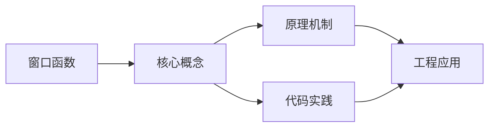
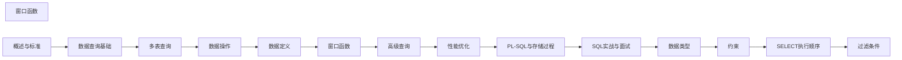

## 1. 学习目标（Bloom 分类）

本节按照布鲁姆教育目标分类学组织学习路径。本文主题为《窗口函数》，属于 SQL 模块，读者可以根据自身阶段选择阅读深度。

记忆层面：能够准确复述本文的核心概念、术语与基本语法或操作步骤，并能够在提问或检索时快速定位对应知识点。能够说出 SQL 的核心概念、语法与常用对象。

理解层面：能够用自己的语言解释核心原理与工作机制，说明概念之间的因果关系，而不是机械记忆结论。能够解释 SQL 的执行原理与优化机制。

应用层面：能够在真实项目或练习场景中运用本文知识解决具体问题，写出正确且可维护的实现。能够编写正确、高效的 SQL 语句与操作。

分析层面：能够拆解复杂问题，比较本文主题与相邻概念的异同，识别边界条件与例外情况。能够分析 SQL 相关方案在性能与一致性上的权衡。

评价层面：能够根据约束条件（性能、可读性、安全、成本）评价不同方案的优劣，做出有依据的技术决策。能够根据业务场景评价 SQL 技术选型。

创造层面：能够把本文知识与其他模块知识组合，设计出新的解决方案或可复用的工程模式。能够组合 SQL 与其他技术设计数据架构。

通过本节学习，读者应当能够把《窗口函数》纳入自己的知识网络，并与 SQL 模块的其他主题（DDL/DML、查询、索引、事务）建立关联。

## 2. 历史动机与发展脉络

《窗口函数》是 SQL 领域的重要主题。要真正理解它，需要先了解它解决的问题与演进过程。

SQL（结构化查询语言）源于 1970 年 Codd 的关系模型，1974 年由 Chamberlin 与 Boyce 设计（SEQUEL），1986 年成为 ANSI 标准；SQL:2023 是当前国际标准。
SQL 分为 DDL（建表）、DML（增删改）、DQL（查询）、DCL（权限）与 TCL（事务）；各大数据库在标准基础上扩展方言。
SQL 是声明式语言：描述“要什么”而非“怎么做”，优化器负责执行计划；这一设计让 SQL 具有跨数据库的表达一致性。

回到本文主题：窗口函数 的提出与成熟，正是上述技术背景下的必然产物。早期实现往往以简单可用为目标，随着工程规模扩大，社区逐渐沉淀出标准做法与最佳实践；理解这一脉络，可以帮助读者判断“为什么文档中的推荐写法是现在这个样子”，也能在遇到历史遗留代码时准确识别其设计年代与取舍。


## 3. 形式化定义与核心概念精讲

本节把《窗口函数》涉及的核心概念以“定义 + 讲解”的形式展开。读者应把定义当作工具，把讲解当作理解路径；两者结合才能形成可迁移的知识。

关系模型：表（关系）、行（元组）、列（属性）；主键唯一标识、外键表达关联、范式消除冗余。
查询执行：解析 -> 绑定 -> 优化（基于代价选择计划）-> 执行；索引、统计信息与连接算法决定性能。
事务 ACID：原子性（Atomicity）、一致性（Consistency）、隔离性（Isolation）、持久性（Durability）；隔离级别控制并发行为。

### 3.1 原文章节逐一精讲

原文档把主题拆分为 25 个小节，下面按顺序给出每一节的导读讲解，随后保留原文细节供精读。

#### 原文精读（完整保留）

# 窗口函数

> **符号约定**：`< >` 必填参数 | `[ ]` 可选参数

---

##### FIRST_VALUE / LAST_VALUE

```sql
-- FIRST_VALUE: 窗口内第一行的值
-- LAST_VALUE: 窗口内最后一行的值（注意帧定义！）
SELECT
  name,
  department,
  salary,
  FIRST_VALUE(salary) OVER(PARTITION BY department ORDER BY salary DESC) AS dept_max,
  LAST_VALUE(salary) OVER(
    PARTITION BY department ORDER BY salary DESC
    ROWS BETWEEN UNBOUNDED PRECEDING AND UNBOUNDED FOLLOWING
  ) AS dept_min
FROM employees;

--  LAST_VALUE 的常见陷阱
-- 默认帧: ROWS BETWEEN UNBOUNDED PRECEDING AND CURRENT ROW
-- 所以 LAST_VALUE 默认返回当前行，不是窗口最后一行！
-- 必须显式指定 ROWS BETWEEN ... AND UNBOUNDED FOLLOWING

-- NTH_VALUE: 窗口内第 N 行的值
SELECT
  name,
  department,
  salary,
  NTH_VALUE(name, 2) OVER(PARTITION BY department ORDER BY salary DESC) AS second_highest
FROM employees;
```

#### 概述

窗口函数（Window Functions）是 SQL:2003 引入的强大特性，它能在不折叠行的情况下执行跨行计算。与聚合函数不同，窗口函数不会将结果分组为单行，而是为每一行返回一个基于"窗口"的计算值。

```sql
-- 聚合函数：每组返回一行
SELECT department, AVG(salary) FROM employees GROUP BY department;

-- 窗口函数：每行都返回，包含组内计算结果
SELECT
  name,
  department,
  salary,
  AVG(salary) OVER(PARTITION BY department) AS dept_avg
FROM employees;
```

##### 语法结构

```sql
函数名() OVER(
  [PARTITION BY 分组列]
  [ORDER BY 排序列]
  [帧定义]
)
```

#### OVER 子句

`OVER` 是窗口函数的标志，定义了函数的"窗口"范围：

```sql
-- 无参数 OVER：整个表作为窗口
SELECT name, salary, AVG(salary) OVER() AS overall_avg
FROM employees;

-- OVER() 等价于聚合子查询
SELECT name, salary,
  (SELECT AVG(salary) FROM employees) AS overall_avg
FROM employees;
```

#### PARTITION BY 分区

`PARTITION BY` 将数据按指定列分区，每个分区独立计算：

```sql
-- 按部门分区计算平均薪资
SELECT
  name,
  department,
  salary,
  AVG(salary) OVER(PARTITION BY department) AS dept_avg,
  salary - AVG(salary) OVER(PARTITION BY department) AS diff_from_avg
FROM employees;

-- 多列分区
SELECT
  order_id,
  customer_id,
  order_date,
  amount,
  SUM(amount) OVER(PARTITION BY customer_id, DATE_TRUNC('month', order_date)) AS monthly_total
FROM orders;

-- 多个窗口函数
SELECT
  name,
  department,
  salary,
  AVG(salary) OVER(PARTITION BY department) AS dept_avg,
  MAX(salary) OVER(PARTITION BY department) AS dept_max,
  MIN(salary) OVER() AS global_min
FROM employees;
```

##### 窗口定义复用（WINDOW 子句）

```sql
SELECT
  name,
  department,
  salary,
  AVG(salary) OVER w AS dept_avg,
  MAX(salary) OVER w AS dept_max,
  RANK() OVER w AS dept_rank
FROM employees
WINDOW w AS (PARTITION BY department ORDER BY salary DESC);
```

#### ORDER BY 与排名函数

##### ROW_NUMBER

为每行分配唯一的连续序号，从 1 开始：

```sql
-- 全局排名
SELECT name, salary, ROW_NUMBER() OVER(ORDER BY salary DESC) AS rn
FROM employees;

-- 分区排名
SELECT
  name,
  department,
  salary,
  ROW_NUMBER() OVER(PARTITION BY department ORDER BY salary DESC) AS dept_rank
FROM employees;

-- Top N per group：每个部门薪资前 3 名
WITH ranked AS (
  SELECT *,
    ROW_NUMBER() OVER(PARTITION BY department ORDER BY salary DESC) AS rn
  FROM employees
)
SELECT * FROM ranked WHERE rn <= 3;

-- 去重：保留每组最新记录
WITH ranked AS (
  SELECT *,
    ROW_NUMBER() OVER(PARTITION BY user_id ORDER BY created_at DESC) AS rn
  FROM user_actions
)
SELECT * FROM ranked WHERE rn = 1;
```

##### RANK 与 DENSE_RANK

```sql
-- RANK: 同值同排名，跳号
-- DENSE_RANK: 同值同排名，不跳号
-- ROW_NUMBER: 同值不同排名，不跳号

SELECT
  name,
  score,
  ROW_NUMBER() OVER(ORDER BY score DESC) AS rn,
  RANK()       OVER(ORDER BY score DESC) AS rnk,
  DENSE_RANK() OVER(ORDER BY score DESC) AS drnk
FROM students;

-- 结果示例:
-- name    score  rn  rnk  drnk
-- Alice   95     1   1    1
-- Bob     95     2   1    1
-- Charlie 90     3   3    2
-- Diana   85     4   4    3
-- Eve     85     5   4    3
-- Frank   80     6   6    4
```

##### NTILE

将行分为 N 个桶：

```sql
-- 将员工按薪资分为 4 个等级
SELECT
  name,
  salary,
  NTILE(4) OVER(ORDER BY salary DESC) AS quartile
FROM employees;

-- 用途: A/B 测试分组、分位数计算
```

##### PERCENT_RANK 与 CUME_DIST

```sql
SELECT
  name,
  score,
  PERCENT_RANK() OVER(ORDER BY score) AS pct_rank,  -- (rank-1)/(total-1)
  CUME_DIST()     OVER(ORDER BY score) AS cume_dist  -- rank/total
FROM students;

-- PERCENT_RANK: 0 ~ 1，表示相对位置
-- CUME_DIST: 0 ~ 1，表示累积分布（小于等于当前值的比例）
```

#### 偏移函数

##### LEAD / LAG

访问当前行之前或之后的行数据：

```sql
-- LAG: 访问前 N 行
-- LEAD: 访问后 N 行
SELECT
  order_date,
  amount,
  LAG(amount) OVER(ORDER BY order_date) AS prev_amount,
  LEAD(amount) OVER(ORDER BY order_date) AS next_amount,
  amount - LAG(amount) OVER(ORDER BY order_date) AS diff
FROM daily_sales;

-- 指定偏移量和默认值
SELECT
  order_date,
  amount,
  LAG(amount, 7, 0) OVER(ORDER BY order_date) AS amount_7_days_ago
FROM daily_sales;

-- 计算环比增长率
SELECT
  month,
  revenue,
  LAG(revenue) OVER(ORDER BY month) AS prev_month,
  ROUND(
    (revenue - LAG(revenue) OVER(ORDER BY month)) * 100.0
    / NULLIF(LAG(revenue) OVER(ORDER BY month), 0),
    2
  ) AS growth_pct
FROM monthly_revenue;
```

#### 帧定义（Frame Specification）

帧定义决定了窗口函数的计算范围。只有配合 `ORDER BY` 时帧才有意义。

##### 帧语法

```sql
{ROWS | RANGE | GROUPS} BETWEEN 帧开始 AND 帧结束

-- 帧开始/结束选项:
-- UNBOUNDED PRECEDING  -- 窗口起点
-- N PRECEDING          -- 当前行之前 N 行
-- CURRENT ROW          -- 当前行
-- N FOLLOWING          -- 当前行之后 N 行
-- UNBOUNDED FOLLOWING  -- 窗口终点
```

##### ROWS vs RANGE

```sql
-- ROWS: 基于物理行偏移
-- RANGE: 基于逻辑值偏移（ORDER BY 列的值）

-- 累计求和（ROWS）
SELECT
  order_date,
  amount,
  SUM(amount) OVER(
    ORDER BY order_date
    ROWS BETWEEN UNBOUNDED PRECEDING AND CURRENT ROW
  ) AS running_total
FROM daily_sales;

-- RANGE: 同值的行一起计算
-- 如果同一天有多笔订单，RANGE 会将同一天的所有行一起包含
SELECT
  order_date,
  amount,
  SUM(amount) OVER(
    ORDER BY order_date
    RANGE BETWEEN UNBOUNDED PRECEDING AND CURRENT ROW
  ) AS running_total
FROM daily_sales;

-- RANGE INTERVAL: 时间范围窗口（PostgreSQL）
SELECT
  order_date,
  amount,
  SUM(amount) OVER(
    ORDER BY order_date
    RANGE BETWEEN INTERVAL '7 days' PRECEDING AND CURRENT ROW
  ) AS rolling_7day_sum
FROM daily_sales;
```

##### 常用帧模式

```sql
-- 1. 累计求和
SUM(col) OVER(ORDER BY sort_col ROWS BETWEEN UNBOUNDED PRECEDING AND CURRENT ROW)

-- 2. 滑动窗口（最近 N 行）
AVG(col) OVER(ORDER BY sort_col ROWS BETWEEN 6 PRECEDING AND CURRENT ROW)  -- 7 行滑动平均

-- 3. 整个分区
SUM(col) OVER(PARTITION BY group_col)  -- 等价于不带 ORDER BY

-- 4. 前后各 N 行
AVG(col) OVER(ORDER BY sort_col ROWS BETWEEN 3 PRECEDING AND 3 FOLLOWING)
```

#### 累计计算

##### 累计求和

```sql
SELECT
  month,
  revenue,
  SUM(revenue) OVER(ORDER BY month) AS cumulative_revenue,
  SUM(revenue) OVER(ORDER BY month ROWS BETWEEN UNBOUNDED PRECEDING AND CURRENT ROW) AS cum_rev_explicit
FROM monthly_revenue;
```

##### 累计计数

```sql
SELECT
  signup_date,
  COUNT(*) OVER(ORDER BY signup_date) AS cumulative_users
FROM (
  SELECT DATE(created_at) AS signup_date, COUNT(*) AS cnt
  FROM users
  GROUP BY DATE(created_at)
) t;
```

##### 移动平均

```sql
-- 7 天移动平均
SELECT
  date,
  daily_sales,
  ROUND(AVG(daily_sales) OVER(
    ORDER BY date
    ROWS BETWEEN 6 PRECEDING AND CURRENT ROW
  ), 2) AS ma_7day
FROM daily_sales;

-- 30 天移动平均
SELECT
  date,
  daily_sales,
  ROUND(AVG(daily_sales) OVER(
    ORDER BY date
    RANGE BETWEEN INTERVAL '29 days' PRECEDING AND CURRENT ROW
  ), 2) AS ma_30day
FROM daily_sales;
```

##### 占比计算

```sql
-- 每行占分区总和的比例
SELECT
  department,
  salary,
  salary * 1.0 / SUM(salary) OVER(PARTITION BY department) AS pct_of_dept,
  salary * 1.0 / SUM(salary) OVER() AS pct_of_total
FROM employees;

-- 累计占比（帕累托分析）
SELECT
  product_name,
  revenue,
  SUM(revenue) OVER(ORDER BY revenue DESC) AS cumulative_revenue,
  SUM(revenue) OVER() AS total_revenue,
  ROUND(
    SUM(revenue) OVER(ORDER BY revenue DESC) * 100.0
    / SUM(revenue) OVER(),
    2
  ) AS cumulative_pct
FROM product_revenue
ORDER BY revenue DESC;
```

#### 实战案例

##### 连续登录天数

```sql
-- 核心思路: 登录日期 - ROW_NUMBER() = 分组标识
WITH daily_logins AS (
  SELECT DISTINCT user_id, DATE(login_time) AS login_date
  FROM user_logins
),
grouped AS (
  SELECT
    user_id,
    login_date,
    login_date - (ROW_NUMBER() OVER(PARTITION BY user_id ORDER BY login_date))::INT AS grp
  FROM daily_logins
)
SELECT
  user_id,
  MIN(login_date) AS streak_start,
  MAX(login_date) AS streak_end,
  COUNT(*) AS streak_days
FROM grouped
GROUP BY user_id, grp
HAVING COUNT(*) >= 7  -- 至少连续 7 天
ORDER BY streak_days DESC;
```

##### 同比/环比分析

```sql
WITH monthly AS (
  SELECT
    DATE_TRUNC('month', order_date) AS month,
    SUM(amount) AS revenue
  FROM orders
  GROUP BY month
)
SELECT
  month,
  revenue,
  -- 环比（上月）
  LAG(revenue, 1) OVER(ORDER BY month) AS prev_month,
  ROUND(
    (revenue - LAG(revenue, 1) OVER(ORDER BY month)) * 100.0
    / NULLIF(LAG(revenue, 1) OVER(ORDER BY month), 0), 2
  ) AS mom_growth,
  -- 同比（去年同月）
  LAG(revenue, 12) OVER(ORDER BY month) AS same_month_last_year,
  ROUND(
    (revenue - LAG(revenue, 12) OVER(ORDER BY month)) * 100.0
    / NULLIF(LAG(revenue, 12) OVER(ORDER BY month), 0), 2
  ) AS yoy_growth
FROM monthly;
```

##### 去重取最新

```sql
-- 方法一：ROW_NUMBER（通用）
WITH ranked AS (
  SELECT *,
    ROW_NUMBER() OVER(PARTITION BY user_id ORDER BY updated_at DESC) AS rn
  FROM user_profiles
)
SELECT * FROM ranked WHERE rn = 1;

-- 方法二：DISTINCT ON（PostgreSQL 专用，更简洁）
SELECT DISTINCT ON (user_id) *
FROM user_profiles
ORDER BY user_id, updated_at DESC;
```

#### 小结

- 窗口函数是 SQL 最强大的分析工具，不折叠行即可执行跨行计算
- `ROW_NUMBER` 用于去重和 Top N，`RANK`/`DENSE_RANK` 用于排名
- `LAG`/`LEAD` 用于访问前后行，是计算环比/同比的基础
- `LAST_VALUE` 默认帧只到当前行，必须显式指定 `UNBOUNDED FOLLOWING`
- `ROWS` 基于物理行偏移，`RANGE` 基于逻辑值偏移，`RANGE INTERVAL` 适合时间窗口
- 累计求和、移动平均、占比计算是窗口函数的经典应用场景
#### 基本语法

**换行写法：OVER 子句定义窗口框架**
`<窗口函数>() OVER ([PARTITION BY <列>] [ORDER BY <列>] [frame_clause])`
```sql
-- 使用 OVER 子句定义窗口
SELECT
  column1,
  column2,
  window_function() OVER (
    PARTITION BY partition_column
    ORDER BY sort_column
  ) AS alias
FROM table_name;
```

---

#### ROW_NUMBER 行号

**换行写法：全局行号**
`ROW_NUMBER() OVER (ORDER BY <列>)`
```sql
-- 按薪资降序生成全局行号
SELECT
  name,
  salary,
  ROW_NUMBER() OVER (ORDER BY salary DESC) AS row_num
FROM employees;
```

**换行写法：分部门行号**
`ROW_NUMBER() OVER (PARTITION BY <列> ORDER BY <列>)`
```sql
-- 按部门分组后按薪资降序生成行号
SELECT
  name,
  department,
  salary,
  ROW_NUMBER() OVER (PARTITION BY department ORDER BY salary DESC) AS dept_rank
FROM employees;
```

---

#### RANK 排名

**换行写法：允许并列跳号排名**
`RANK() OVER (ORDER BY <列>)`
```sql
-- 按薪资降序排名（允许并列，跳号：1, 2, 2, 4, 5）
SELECT
  name,
  salary,
  RANK() OVER (ORDER BY salary DESC) AS rank_num
FROM employees;
```

---

#### DENSE_RANK 密集排名

**换行写法：允许并列不跳号排名**
`DENSE_RANK() OVER (ORDER BY <列>)`
```sql
-- 按薪资降序密集排名（允许并列，不跳号：1, 2, 2, 3, 4）
SELECT
  name,
  salary,
  DENSE_RANK() OVER (ORDER BY salary DESC) AS dense_rank_num
FROM employees;
```

---

#### NTILE 分桶

**换行写法：将数据分为 N 个桶**
`NTILE(<N>) OVER (ORDER BY <列>)`
```sql
-- 按薪资降序分为 4 个桶（四分位数）
SELECT
  name,
  salary,
  NTILE(4) OVER (ORDER BY salary DESC) AS quartile
FROM employees;
```

---

#### SUM OVER 累计求和

**换行写法：全局累计求和**
`SUM(<列>) OVER (ORDER BY <列>)`
```sql
-- 按日期累计求和
SELECT
  order_date,
  amount,
  SUM(amount) OVER (ORDER BY order_date) AS running_total
FROM orders;
```

**换行写法：分组累计求和**
`SUM(<列>) OVER (PARTITION BY <列> ORDER BY <列>)`
```sql
-- 按部门分组后按入职日期累计求和
SELECT
  department,
  name,
  salary,
  SUM(salary) OVER (PARTITION BY department ORDER BY hire_date) AS dept_running_total
FROM employees;
```

---

#### AVG OVER 移动平均

**换行写法：3 天移动平均**
`AVG(<列>) OVER (ORDER BY <列> ROWS BETWEEN 2 PRECEDING AND CURRENT ROW)`
```sql
-- 计算 3 天移动平均价格
SELECT
  date,
  price,
  AVG(price) OVER (
    ORDER BY date
    ROWS BETWEEN 2 PRECEDING AND CURRENT ROW
  ) AS moving_avg_3day
FROM stock_prices;
```

---

#### LAG 偏移函数

**换行写法：访问前 1 行的值**
`LAG(<列>, 1) OVER (ORDER BY <列>)`
```sql
-- 查询前一天的价格及价格变化
SELECT
  date,
  price,
  LAG(price, 1) OVER (ORDER BY date) AS prev_price,
  price - LAG(price, 1) OVER (ORDER BY date) AS price_change
FROM stock_prices;
```

**换行写法：指定偏移量和默认值**
`LAG(<列>, <offset>, <default>) OVER (ORDER BY <列>)`
```sql
-- 查询 7 天前的价格，无值时返回 0
SELECT
  date,
  price,
  LAG(price, 7, 0) OVER (ORDER BY date) AS price_7_days_ago
FROM stock_prices;
```

---

#### LEAD 偏移函数

**换行写法：访问后 1 行的值**
`LEAD(<列>, 1) OVER (ORDER BY <列>)`
```sql
-- 查询后一天的价格
SELECT
  date,
  price,
  LEAD(price, 1) OVER (ORDER BY date) AS next_price
FROM stock_prices;
```

---

#### CUME_DIST 累积分布

**换行写法：累积分布（0 到 1）**
`CUME_DIST() OVER (ORDER BY <列>)`
```sql
-- 计算薪资的累积分布
SELECT
  name,
  salary,
  CUME_DIST() OVER (ORDER BY salary) AS cume_dist
FROM employees;
```

---

#### PERCENT_RANK 百分位排名

**换行写法：百分位排名（0 到 1）**
`PERCENT_RANK() OVER (ORDER BY <列>)`
```sql
-- 计算薪资的百分位排名
SELECT
  name,
  salary,
  PERCENT_RANK() OVER (ORDER BY salary) AS percent_rank
FROM employees;
```

---

#### ROWS BETWEEN 行范围

**换行写法：从第一行到当前行**
`ROWS BETWEEN UNBOUNDED PRECEDING AND CURRENT ROW`
```sql
-- 累计求和（从第一行到当前行）
SUM(amount) OVER (
  ORDER BY date
  ROWS BETWEEN UNBOUNDED PRECEDING AND CURRENT ROW
)
```

**换行写法：前 2 行到后 2 行**
`ROWS BETWEEN 2 PRECEDING AND 2 FOLLOWING`
```sql
-- 计算 5 天移动平均（前 2 行到后 2 行）
AVG(price) OVER (
  ORDER BY date
  ROWS BETWEEN 2 PRECEDING AND 2 FOLLOWING
)
```

---

#### RANGE BETWEEN 值范围

**换行写法：按逻辑值范围累计求和**
`RANGE BETWEEN UNBOUNDED PRECEDING AND CURRENT ROW`
```sql
-- 同一薪资值的行被视为一组进行累计求和
SELECT
  name,
  salary,
  SUM(salary) OVER (
    ORDER BY salary
    RANGE BETWEEN UNBOUNDED PRECEDING AND CURRENT ROW
  ) AS running_total
FROM employees;
```

---

#### NTH_VALUE

**换行写法：窗口第 N 行的值**
`NTH_VALUE(<列>, <N>) OVER (...)`
```sql
-- 查询每个部门薪资第 3 高的员工
SELECT
  name,
  department,
  salary,
  NTH_VALUE(salary, 3) OVER (
    PARTITION BY department
    ORDER BY salary DESC
    ROWS BETWEEN UNBOUNDED PRECEDING AND UNBOUNDED FOLLOWING
  ) AS third_highest
FROM employees;
```

---

#### Top-N 查询

**换行写法：ROW_NUMBER 实现 Top-N**
`ROW_NUMBER() OVER (PARTITION BY <列> ORDER BY <列>)`
```sql
-- 查询每个部门薪资前 3 名
SELECT * FROM (
  SELECT
    name,
    department,
    salary,
    ROW_NUMBER() OVER (PARTITION BY department ORDER BY salary DESC) AS rn
  FROM employees
) ranked
WHERE rn <= 3;
```

---

#### 去重

**换行写法：DISTINCT 与窗口函数去重**
`SELECT DISTINCT ... FROM (SELECT ... ROW_NUMBER() OVER (...))`
```sql
-- 去重保留每个用户的最新记录
SELECT DISTINCT user_id, latest_action
FROM (
  SELECT
    user_id,
    action AS latest_action,
    ROW_NUMBER() OVER (PARTITION BY user_id ORDER BY created_at DESC) AS rn
  FROM user_actions
) t
WHERE rn = 1;
```


### 3.2 概念关系图

下面用 Mermaid 图表达本文核心概念之间的关系，帮助读者建立整体图景：



图中展示的是本文知识的结构化关系：核心概念是入口，原理机制解释“为什么”，代码实践演示“怎么做”，工程应用回答“何时用”。读者学习时可以把每个小节的内容挂接到对应节点上。

## 4. 理论推导与原理解析

本节深入《窗口函数》背后的原理。理论部分不求面面俱到，而是聚焦“能解释现象、能指导实践”的关键推导。

关系模型：表（关系）、行（元组）、列（属性）；主键唯一标识、外键表达关联、范式消除冗余。
查询执行：解析 -> 绑定 -> 优化（基于代价选择计划）-> 执行；索引、统计信息与连接算法决定性能。
事务 ACID：原子性（Atomicity）、一致性（Consistency）、隔离性（Isolation）、持久性（Durability）；隔离级别控制并发行为。
集合语义：SELECT 返回结果集；JOIN 组合关系，GROUP BY 聚合，子查询与 CTE 表达复杂逻辑。

需要强调的是，理论推导与工程实践之间存在翻译层：理论给出的是理想化模型与边界条件，工程代码则必须处理真实环境中的例外。读者在学习时应先掌握理论的“标准情形”，再通过陷阱章节了解“非标准情形”。

## 5. 代码示例与逐行讲解

本节把原文中的代码示例系统整理，并为每个示例补充用途说明与讲解。读者不应只浏览代码，而应逐段对照讲解理解设计意图。

### 5.1 示例：FIRST_VALUE / LAST_VALUE

该示例来自原文《FIRST_VALUE / LAST_VALUE》小节，用于演示窗口函数相关操作。阅读时请先看代码结构，再看其后的讲解。

```sql
-- FIRST_VALUE: 窗口内第一行的值
-- LAST_VALUE: 窗口内最后一行的值（注意帧定义！）
SELECT
  name,
  department,
  salary,
  FIRST_VALUE(salary) OVER(PARTITION BY department ORDER BY salary DESC) AS dept_max,
  LAST_VALUE(salary) OVER(
    PARTITION BY department ORDER BY salary DESC
    ROWS BETWEEN UNBOUNDED PRECEDING AND UNBOUNDED FOLLOWING
  ) AS dept_min
FROM employees;

--  LAST_VALUE 的常见陷阱
-- 默认帧: ROWS BETWEEN UNBOUNDED PRECEDING AND CURRENT ROW
-- 所以 LAST_VALUE 默认返回当前行，不是窗口最后一行！
-- 必须显式指定 ROWS BETWEEN ... AND UNBOUNDED FOLLOWING

-- NTH_VALUE: 窗口内第 N 行的值
SELECT
  name,
  department,
  salary,
  NTH_VALUE(name, 2) OVER(PARTITION BY department ORDER BY salary DESC) AS second_highest
FROM employees;
```

讲解：这段代码演示了本节核心知识点。代码中的关键操作可以归纳为三步：准备（定义或初始化）、执行（核心逻辑）、收尾（释放资源或返回结果）。实际项目中，这三步往往被封装为函数或类，以提升复用性与可测试性。

关键点分析：

该示例共 23 行有效代码，包含 2 类关键结构（SELECT、FROM）。其中：

- 入口与初始化部分负责建立上下文，对应实际项目中的启动或装配逻辑；
- 核心逻辑部分体现本文主题的主要操作，是阅读时最需要对照讲解理解的部分；
- 输出或返回部分把结果交给调用方，注意其类型与边界条件。

进阶思考路径：先尝试修改参数观察行为变化，再把示例中的模式迁移到自己的项目中；每次修改都记录预期与实测差异，这是把示例转化为能力的最快方式。

### 5.2 示例：概述

该示例来自原文《概述》小节，用于演示窗口函数相关操作。阅读时请先看代码结构，再看其后的讲解。

```sql
-- 聚合函数：每组返回一行
SELECT department, AVG(salary) FROM employees GROUP BY department;

-- 窗口函数：每行都返回，包含组内计算结果
SELECT
  name,
  department,
  salary,
  AVG(salary) OVER(PARTITION BY department) AS dept_avg
FROM employees;
```

讲解：这段代码演示了本节核心知识点。代码中的关键操作可以归纳为三步：准备（定义或初始化）、执行（核心逻辑）、收尾（释放资源或返回结果）。实际项目中，这三步往往被封装为函数或类，以提升复用性与可测试性。

关键点分析：

该示例共 9 行有效代码，包含 2 类关键结构（SELECT、FROM）。其中：

- 入口与初始化部分负责建立上下文，对应实际项目中的启动或装配逻辑；
- 核心逻辑部分体现本文主题的主要操作，是阅读时最需要对照讲解理解的部分；
- 输出或返回部分把结果交给调用方，注意其类型与边界条件。

进阶思考路径：先尝试修改参数观察行为变化，再把示例中的模式迁移到自己的项目中；每次修改都记录预期与实测差异，这是把示例转化为能力的最快方式。

### 5.3 示例：语法结构

该示例来自原文《语法结构》小节，用于演示窗口函数相关操作。阅读时请先看代码结构，再看其后的讲解。

```sql
函数名() OVER(
  [PARTITION BY 分组列]
  [ORDER BY 排序列]
  [帧定义]
)
```

讲解：这段代码演示了本节核心知识点。代码中的关键操作可以归纳为三步：准备（定义或初始化）、执行（核心逻辑）、收尾（释放资源或返回结果）。实际项目中，这三步往往被封装为函数或类，以提升复用性与可测试性。

关键点分析：

该示例共 5 行有效代码，结构以数据或配置为主。阅读时应关注：数据字段的含义、配置项的作用，以及它们与运行行为的对应关系。

进阶思考路径：先尝试修改参数观察行为变化，再把示例中的模式迁移到自己的项目中；每次修改都记录预期与实测差异，这是把示例转化为能力的最快方式。

### 5.4 示例：OVER 子句

该示例来自原文《OVER 子句》小节，用于演示窗口函数相关操作。阅读时请先看代码结构，再看其后的讲解。

```sql
-- 无参数 OVER：整个表作为窗口
SELECT name, salary, AVG(salary) OVER() AS overall_avg
FROM employees;

-- OVER() 等价于聚合子查询
SELECT name, salary,
  (SELECT AVG(salary) FROM employees) AS overall_avg
FROM employees;
```

讲解：这段代码演示了本节核心知识点。代码中的关键操作可以归纳为三步：准备（定义或初始化）、执行（核心逻辑）、收尾（释放资源或返回结果）。实际项目中，这三步往往被封装为函数或类，以提升复用性与可测试性。

关键点分析：

该示例共 7 行有效代码，包含 2 类关键结构（SELECT、FROM）。其中：

- 入口与初始化部分负责建立上下文，对应实际项目中的启动或装配逻辑；
- 核心逻辑部分体现本文主题的主要操作，是阅读时最需要对照讲解理解的部分；
- 输出或返回部分把结果交给调用方，注意其类型与边界条件。

进阶思考路径：先尝试修改参数观察行为变化，再把示例中的模式迁移到自己的项目中；每次修改都记录预期与实测差异，这是把示例转化为能力的最快方式。

### 5.5 示例：PARTITION BY 分区

该示例来自原文《PARTITION BY 分区》小节，用于演示窗口函数相关操作。阅读时请先看代码结构，再看其后的讲解。

```sql
-- 按部门分区计算平均薪资
SELECT
  name,
  department,
  salary,
  AVG(salary) OVER(PARTITION BY department) AS dept_avg,
  salary - AVG(salary) OVER(PARTITION BY department) AS diff_from_avg
FROM employees;

-- 多列分区
SELECT
  order_id,
  customer_id,
  order_date,
  amount,
  SUM(amount) OVER(PARTITION BY customer_id, DATE_TRUNC('month', order_date)) AS monthly_total
FROM orders;

-- 多个窗口函数
SELECT
  name,
  department,
  salary,
  AVG(salary) OVER(PARTITION BY department) AS dept_avg,
  MAX(salary) OVER(PARTITION BY department) AS dept_max,
  MIN(salary) OVER() AS global_min
FROM employees;
```

讲解：这段代码演示了本节核心知识点。代码中的关键操作可以归纳为三步：准备（定义或初始化）、执行（核心逻辑）、收尾（释放资源或返回结果）。实际项目中，这三步往往被封装为函数或类，以提升复用性与可测试性。

关键点分析：

该示例共 25 行有效代码，包含 2 类关键结构（SELECT、FROM）。其中：

- 入口与初始化部分负责建立上下文，对应实际项目中的启动或装配逻辑；
- 核心逻辑部分体现本文主题的主要操作，是阅读时最需要对照讲解理解的部分；
- 输出或返回部分把结果交给调用方，注意其类型与边界条件。

进阶思考路径：先尝试修改参数观察行为变化，再把示例中的模式迁移到自己的项目中；每次修改都记录预期与实测差异，这是把示例转化为能力的最快方式。

### 5.6 示例：窗口定义复用（WINDOW 子句）

该示例来自原文《窗口定义复用（WINDOW 子句）》小节，用于演示窗口函数相关操作。阅读时请先看代码结构，再看其后的讲解。

```sql
SELECT
  name,
  department,
  salary,
  AVG(salary) OVER w AS dept_avg,
  MAX(salary) OVER w AS dept_max,
  RANK() OVER w AS dept_rank
FROM employees
WINDOW w AS (PARTITION BY department ORDER BY salary DESC);
```

讲解：这段代码演示了本节核心知识点。代码中的关键操作可以归纳为三步：准备（定义或初始化）、执行（核心逻辑）、收尾（释放资源或返回结果）。实际项目中，这三步往往被封装为函数或类，以提升复用性与可测试性。

关键点分析：

该示例共 9 行有效代码，包含 2 类关键结构（SELECT、FROM）。其中：

- 入口与初始化部分负责建立上下文，对应实际项目中的启动或装配逻辑；
- 核心逻辑部分体现本文主题的主要操作，是阅读时最需要对照讲解理解的部分；
- 输出或返回部分把结果交给调用方，注意其类型与边界条件。

进阶思考路径：先尝试修改参数观察行为变化，再把示例中的模式迁移到自己的项目中；每次修改都记录预期与实测差异，这是把示例转化为能力的最快方式。

### 5.7 示例：ROW_NUMBER

该示例来自原文《ROW_NUMBER》小节，用于演示窗口函数相关操作。阅读时请先看代码结构，再看其后的讲解。

```sql
-- 全局排名
SELECT name, salary, ROW_NUMBER() OVER(ORDER BY salary DESC) AS rn
FROM employees;

-- 分区排名
SELECT
  name,
  department,
  salary,
  ROW_NUMBER() OVER(PARTITION BY department ORDER BY salary DESC) AS dept_rank
FROM employees;

-- Top N per group：每个部门薪资前 3 名
WITH ranked AS (
  SELECT *,
    ROW_NUMBER() OVER(PARTITION BY department ORDER BY salary DESC) AS rn
  FROM employees
)
SELECT * FROM ranked WHERE rn <= 3;

-- 去重：保留每组最新记录
WITH ranked AS (
  SELECT *,
    ROW_NUMBER() OVER(PARTITION BY user_id ORDER BY created_at DESC) AS rn
  FROM user_actions
)
SELECT * FROM ranked WHERE rn = 1;
```

讲解：这段代码演示了本节核心知识点。代码中的关键操作可以归纳为三步：准备（定义或初始化）、执行（核心逻辑）、收尾（释放资源或返回结果）。实际项目中，这三步往往被封装为函数或类，以提升复用性与可测试性。

关键点分析：

该示例共 24 行有效代码，包含 2 类关键结构（SELECT、FROM）。其中：

- 入口与初始化部分负责建立上下文，对应实际项目中的启动或装配逻辑；
- 核心逻辑部分体现本文主题的主要操作，是阅读时最需要对照讲解理解的部分；
- 输出或返回部分把结果交给调用方，注意其类型与边界条件。

进阶思考路径：先尝试修改参数观察行为变化，再把示例中的模式迁移到自己的项目中；每次修改都记录预期与实测差异，这是把示例转化为能力的最快方式。

### 5.8 示例：RANK 与 DENSE_RANK

该示例来自原文《RANK 与 DENSE_RANK》小节，用于演示窗口函数相关操作。阅读时请先看代码结构，再看其后的讲解。

```sql
-- RANK: 同值同排名，跳号
-- DENSE_RANK: 同值同排名，不跳号
-- ROW_NUMBER: 同值不同排名，不跳号

SELECT
  name,
  score,
  ROW_NUMBER() OVER(ORDER BY score DESC) AS rn,
  RANK()       OVER(ORDER BY score DESC) AS rnk,
  DENSE_RANK() OVER(ORDER BY score DESC) AS drnk
FROM students;

-- 结果示例:
-- name    score  rn  rnk  drnk
-- Alice   95     1   1    1
-- Bob     95     2   1    1
-- Charlie 90     3   3    2
-- Diana   85     4   4    3
-- Eve     85     5   4    3
-- Frank   80     6   6    4
```

讲解：这段代码演示了本节核心知识点。代码中的关键操作可以归纳为三步：准备（定义或初始化）、执行（核心逻辑）、收尾（释放资源或返回结果）。实际项目中，这三步往往被封装为函数或类，以提升复用性与可测试性。

关键点分析：

该示例共 18 行有效代码，包含 2 类关键结构（SELECT、FROM）。其中：

- 入口与初始化部分负责建立上下文，对应实际项目中的启动或装配逻辑；
- 核心逻辑部分体现本文主题的主要操作，是阅读时最需要对照讲解理解的部分；
- 输出或返回部分把结果交给调用方，注意其类型与边界条件。

进阶思考路径：先尝试修改参数观察行为变化，再把示例中的模式迁移到自己的项目中；每次修改都记录预期与实测差异，这是把示例转化为能力的最快方式。

### 5.9 示例：NTILE

该示例来自原文《NTILE》小节，用于演示窗口函数相关操作。阅读时请先看代码结构，再看其后的讲解。

```sql
-- 将员工按薪资分为 4 个等级
SELECT
  name,
  salary,
  NTILE(4) OVER(ORDER BY salary DESC) AS quartile
FROM employees;

-- 用途: A/B 测试分组、分位数计算
```

讲解：这段代码演示了本节核心知识点。代码中的关键操作可以归纳为三步：准备（定义或初始化）、执行（核心逻辑）、收尾（释放资源或返回结果）。实际项目中，这三步往往被封装为函数或类，以提升复用性与可测试性。

关键点分析：

该示例共 7 行有效代码，包含 2 类关键结构（SELECT、FROM）。其中：

- 入口与初始化部分负责建立上下文，对应实际项目中的启动或装配逻辑；
- 核心逻辑部分体现本文主题的主要操作，是阅读时最需要对照讲解理解的部分；
- 输出或返回部分把结果交给调用方，注意其类型与边界条件。

进阶思考路径：先尝试修改参数观察行为变化，再把示例中的模式迁移到自己的项目中；每次修改都记录预期与实测差异，这是把示例转化为能力的最快方式。

### 5.10 示例：PERCENT_RANK 与 CUME_DIST

该示例来自原文《PERCENT_RANK 与 CUME_DIST》小节，用于演示窗口函数相关操作。阅读时请先看代码结构，再看其后的讲解。

```sql
SELECT
  name,
  score,
  PERCENT_RANK() OVER(ORDER BY score) AS pct_rank,  -- (rank-1)/(total-1)
  CUME_DIST()     OVER(ORDER BY score) AS cume_dist  -- rank/total
FROM students;

-- PERCENT_RANK: 0 ~ 1，表示相对位置
-- CUME_DIST: 0 ~ 1，表示累积分布（小于等于当前值的比例）
```

讲解：这段代码演示了本节核心知识点。代码中的关键操作可以归纳为三步：准备（定义或初始化）、执行（核心逻辑）、收尾（释放资源或返回结果）。实际项目中，这三步往往被封装为函数或类，以提升复用性与可测试性。

关键点分析：

该示例共 8 行有效代码，包含 2 类关键结构（SELECT、FROM）。其中：

- 入口与初始化部分负责建立上下文，对应实际项目中的启动或装配逻辑；
- 核心逻辑部分体现本文主题的主要操作，是阅读时最需要对照讲解理解的部分；
- 输出或返回部分把结果交给调用方，注意其类型与边界条件。

进阶思考路径：先尝试修改参数观察行为变化，再把示例中的模式迁移到自己的项目中；每次修改都记录预期与实测差异，这是把示例转化为能力的最快方式。

### 5.11 示例：LEAD / LAG

该示例来自原文《LEAD / LAG》小节，用于演示窗口函数相关操作。阅读时请先看代码结构，再看其后的讲解。

```sql
-- LAG: 访问前 N 行
-- LEAD: 访问后 N 行
SELECT
  order_date,
  amount,
  LAG(amount) OVER(ORDER BY order_date) AS prev_amount,
  LEAD(amount) OVER(ORDER BY order_date) AS next_amount,
  amount - LAG(amount) OVER(ORDER BY order_date) AS diff
FROM daily_sales;

-- 指定偏移量和默认值
SELECT
  order_date,
  amount,
  LAG(amount, 7, 0) OVER(ORDER BY order_date) AS amount_7_days_ago
FROM daily_sales;

-- 计算环比增长率
SELECT
  month,
  revenue,
  LAG(revenue) OVER(ORDER BY month) AS prev_month,
  ROUND(
    (revenue - LAG(revenue) OVER(ORDER BY month)) * 100.0
    / NULLIF(LAG(revenue) OVER(ORDER BY month), 0),
    2
  ) AS growth_pct
FROM monthly_revenue;
```

讲解：这段代码演示了本节核心知识点。代码中的关键操作可以归纳为三步：准备（定义或初始化）、执行（核心逻辑）、收尾（释放资源或返回结果）。实际项目中，这三步往往被封装为函数或类，以提升复用性与可测试性。

关键点分析：

该示例共 26 行有效代码，包含 2 类关键结构（SELECT、FROM）。其中：

- 入口与初始化部分负责建立上下文，对应实际项目中的启动或装配逻辑；
- 核心逻辑部分体现本文主题的主要操作，是阅读时最需要对照讲解理解的部分；
- 输出或返回部分把结果交给调用方，注意其类型与边界条件。

进阶思考路径：先尝试修改参数观察行为变化，再把示例中的模式迁移到自己的项目中；每次修改都记录预期与实测差异，这是把示例转化为能力的最快方式。

### 5.12 示例：帧语法

该示例来自原文《帧语法》小节，用于演示窗口函数相关操作。阅读时请先看代码结构，再看其后的讲解。

```sql
{ROWS | RANGE | GROUPS} BETWEEN 帧开始 AND 帧结束

-- 帧开始/结束选项:
-- UNBOUNDED PRECEDING  -- 窗口起点
-- N PRECEDING          -- 当前行之前 N 行
-- CURRENT ROW          -- 当前行
-- N FOLLOWING          -- 当前行之后 N 行
-- UNBOUNDED FOLLOWING  -- 窗口终点
```

讲解：这段代码演示了本节核心知识点。代码中的关键操作可以归纳为三步：准备（定义或初始化）、执行（核心逻辑）、收尾（释放资源或返回结果）。实际项目中，这三步往往被封装为函数或类，以提升复用性与可测试性。

关键点分析：

该示例共 7 行有效代码，结构以数据或配置为主。阅读时应关注：数据字段的含义、配置项的作用，以及它们与运行行为的对应关系。

进阶思考路径：先尝试修改参数观察行为变化，再把示例中的模式迁移到自己的项目中；每次修改都记录预期与实测差异，这是把示例转化为能力的最快方式。

### 5.13 示例：ROWS vs RANGE

该示例来自原文《ROWS vs RANGE》小节，用于演示窗口函数相关操作。阅读时请先看代码结构，再看其后的讲解。

```sql
-- ROWS: 基于物理行偏移
-- RANGE: 基于逻辑值偏移（ORDER BY 列的值）

-- 累计求和（ROWS）
SELECT
  order_date,
  amount,
  SUM(amount) OVER(
    ORDER BY order_date
    ROWS BETWEEN UNBOUNDED PRECEDING AND CURRENT ROW
  ) AS running_total
FROM daily_sales;

-- RANGE: 同值的行一起计算
-- 如果同一天有多笔订单，RANGE 会将同一天的所有行一起包含
SELECT
  order_date,
  amount,
  SUM(amount) OVER(
    ORDER BY order_date
    RANGE BETWEEN UNBOUNDED PRECEDING AND CURRENT ROW
  ) AS running_total
FROM daily_sales;

-- RANGE INTERVAL: 时间范围窗口（PostgreSQL）
SELECT
  order_date,
  amount,
  SUM(amount) OVER(
    ORDER BY order_date
    RANGE BETWEEN INTERVAL '7 days' PRECEDING AND CURRENT ROW
  ) AS rolling_7day_sum
FROM daily_sales;
```

讲解：这段代码演示了本节核心知识点。代码中的关键操作可以归纳为三步：准备（定义或初始化）、执行（核心逻辑）、收尾（释放资源或返回结果）。实际项目中，这三步往往被封装为函数或类，以提升复用性与可测试性。

关键点分析：

该示例共 30 行有效代码，包含 2 类关键结构（SELECT、FROM）。其中：

- 入口与初始化部分负责建立上下文，对应实际项目中的启动或装配逻辑；
- 核心逻辑部分体现本文主题的主要操作，是阅读时最需要对照讲解理解的部分；
- 输出或返回部分把结果交给调用方，注意其类型与边界条件。

进阶思考路径：先尝试修改参数观察行为变化，再把示例中的模式迁移到自己的项目中；每次修改都记录预期与实测差异，这是把示例转化为能力的最快方式。

### 5.14 示例：常用帧模式

该示例来自原文《常用帧模式》小节，用于演示窗口函数相关操作。阅读时请先看代码结构，再看其后的讲解。

```sql
-- 1. 累计求和
SUM(col) OVER(ORDER BY sort_col ROWS BETWEEN UNBOUNDED PRECEDING AND CURRENT ROW)

-- 2. 滑动窗口（最近 N 行）
AVG(col) OVER(ORDER BY sort_col ROWS BETWEEN 6 PRECEDING AND CURRENT ROW)  -- 7 行滑动平均

-- 3. 整个分区
SUM(col) OVER(PARTITION BY group_col)  -- 等价于不带 ORDER BY

-- 4. 前后各 N 行
AVG(col) OVER(ORDER BY sort_col ROWS BETWEEN 3 PRECEDING AND 3 FOLLOWING)
```

讲解：这段代码演示了本节核心知识点。代码中的关键操作可以归纳为三步：准备（定义或初始化）、执行（核心逻辑）、收尾（释放资源或返回结果）。实际项目中，这三步往往被封装为函数或类，以提升复用性与可测试性。

关键点分析：

该示例共 8 行有效代码，结构以数据或配置为主。阅读时应关注：数据字段的含义、配置项的作用，以及它们与运行行为的对应关系。

进阶思考路径：先尝试修改参数观察行为变化，再把示例中的模式迁移到自己的项目中；每次修改都记录预期与实测差异，这是把示例转化为能力的最快方式。

### 5.15 示例：累计求和

该示例来自原文《累计求和》小节，用于演示窗口函数相关操作。阅读时请先看代码结构，再看其后的讲解。

```sql
SELECT
  month,
  revenue,
  SUM(revenue) OVER(ORDER BY month) AS cumulative_revenue,
  SUM(revenue) OVER(ORDER BY month ROWS BETWEEN UNBOUNDED PRECEDING AND CURRENT ROW) AS cum_rev_explicit
FROM monthly_revenue;
```

讲解：这段代码演示了本节核心知识点。代码中的关键操作可以归纳为三步：准备（定义或初始化）、执行（核心逻辑）、收尾（释放资源或返回结果）。实际项目中，这三步往往被封装为函数或类，以提升复用性与可测试性。

关键点分析：

该示例共 6 行有效代码，包含 2 类关键结构（SELECT、FROM）。其中：

- 入口与初始化部分负责建立上下文，对应实际项目中的启动或装配逻辑；
- 核心逻辑部分体现本文主题的主要操作，是阅读时最需要对照讲解理解的部分；
- 输出或返回部分把结果交给调用方，注意其类型与边界条件。

进阶思考路径：先尝试修改参数观察行为变化，再把示例中的模式迁移到自己的项目中；每次修改都记录预期与实测差异，这是把示例转化为能力的最快方式。

### 5.16 示例：累计计数

该示例来自原文《累计计数》小节，用于演示窗口函数相关操作。阅读时请先看代码结构，再看其后的讲解。

```sql
SELECT
  signup_date,
  COUNT(*) OVER(ORDER BY signup_date) AS cumulative_users
FROM (
  SELECT DATE(created_at) AS signup_date, COUNT(*) AS cnt
  FROM users
  GROUP BY DATE(created_at)
) t;
```

讲解：这段代码演示了本节核心知识点。代码中的关键操作可以归纳为三步：准备（定义或初始化）、执行（核心逻辑）、收尾（释放资源或返回结果）。实际项目中，这三步往往被封装为函数或类，以提升复用性与可测试性。

关键点分析：

该示例共 8 行有效代码，包含 2 类关键结构（SELECT、FROM）。其中：

- 入口与初始化部分负责建立上下文，对应实际项目中的启动或装配逻辑；
- 核心逻辑部分体现本文主题的主要操作，是阅读时最需要对照讲解理解的部分；
- 输出或返回部分把结果交给调用方，注意其类型与边界条件。

进阶思考路径：先尝试修改参数观察行为变化，再把示例中的模式迁移到自己的项目中；每次修改都记录预期与实测差异，这是把示例转化为能力的最快方式。

### 5.17 示例：移动平均

该示例来自原文《移动平均》小节，用于演示窗口函数相关操作。阅读时请先看代码结构，再看其后的讲解。

```sql
-- 7 天移动平均
SELECT
  date,
  daily_sales,
  ROUND(AVG(daily_sales) OVER(
    ORDER BY date
    ROWS BETWEEN 6 PRECEDING AND CURRENT ROW
  ), 2) AS ma_7day
FROM daily_sales;

-- 30 天移动平均
SELECT
  date,
  daily_sales,
  ROUND(AVG(daily_sales) OVER(
    ORDER BY date
    RANGE BETWEEN INTERVAL '29 days' PRECEDING AND CURRENT ROW
  ), 2) AS ma_30day
FROM daily_sales;
```

讲解：这段代码演示了本节核心知识点。代码中的关键操作可以归纳为三步：准备（定义或初始化）、执行（核心逻辑）、收尾（释放资源或返回结果）。实际项目中，这三步往往被封装为函数或类，以提升复用性与可测试性。

关键点分析：

该示例共 18 行有效代码，包含 2 类关键结构（SELECT、FROM）。其中：

- 入口与初始化部分负责建立上下文，对应实际项目中的启动或装配逻辑；
- 核心逻辑部分体现本文主题的主要操作，是阅读时最需要对照讲解理解的部分；
- 输出或返回部分把结果交给调用方，注意其类型与边界条件。

进阶思考路径：先尝试修改参数观察行为变化，再把示例中的模式迁移到自己的项目中；每次修改都记录预期与实测差异，这是把示例转化为能力的最快方式。

### 5.18 示例：占比计算

该示例来自原文《占比计算》小节，用于演示窗口函数相关操作。阅读时请先看代码结构，再看其后的讲解。

```sql
-- 每行占分区总和的比例
SELECT
  department,
  salary,
  salary * 1.0 / SUM(salary) OVER(PARTITION BY department) AS pct_of_dept,
  salary * 1.0 / SUM(salary) OVER() AS pct_of_total
FROM employees;

-- 累计占比（帕累托分析）
SELECT
  product_name,
  revenue,
  SUM(revenue) OVER(ORDER BY revenue DESC) AS cumulative_revenue,
  SUM(revenue) OVER() AS total_revenue,
  ROUND(
    SUM(revenue) OVER(ORDER BY revenue DESC) * 100.0
    / SUM(revenue) OVER(),
    2
  ) AS cumulative_pct
FROM product_revenue
ORDER BY revenue DESC;
```

讲解：这段代码演示了本节核心知识点。代码中的关键操作可以归纳为三步：准备（定义或初始化）、执行（核心逻辑）、收尾（释放资源或返回结果）。实际项目中，这三步往往被封装为函数或类，以提升复用性与可测试性。

关键点分析：

该示例共 20 行有效代码，包含 2 类关键结构（SELECT、FROM）。其中：

- 入口与初始化部分负责建立上下文，对应实际项目中的启动或装配逻辑；
- 核心逻辑部分体现本文主题的主要操作，是阅读时最需要对照讲解理解的部分；
- 输出或返回部分把结果交给调用方，注意其类型与边界条件。

进阶思考路径：先尝试修改参数观察行为变化，再把示例中的模式迁移到自己的项目中；每次修改都记录预期与实测差异，这是把示例转化为能力的最快方式。

### 5.19 示例：连续登录天数

该示例来自原文《连续登录天数》小节，用于演示窗口函数相关操作。阅读时请先看代码结构，再看其后的讲解。

```sql
-- 核心思路: 登录日期 - ROW_NUMBER() = 分组标识
WITH daily_logins AS (
  SELECT DISTINCT user_id, DATE(login_time) AS login_date
  FROM user_logins
),
grouped AS (
  SELECT
    user_id,
    login_date,
    login_date - (ROW_NUMBER() OVER(PARTITION BY user_id ORDER BY login_date))::INT AS grp
  FROM daily_logins
)
SELECT
  user_id,
  MIN(login_date) AS streak_start,
  MAX(login_date) AS streak_end,
  COUNT(*) AS streak_days
FROM grouped
GROUP BY user_id, grp
HAVING COUNT(*) >= 7  -- 至少连续 7 天
ORDER BY streak_days DESC;
```

讲解：这段代码演示了本节核心知识点。代码中的关键操作可以归纳为三步：准备（定义或初始化）、执行（核心逻辑）、收尾（释放资源或返回结果）。实际项目中，这三步往往被封装为函数或类，以提升复用性与可测试性。

关键点分析：

该示例共 21 行有效代码，包含 2 类关键结构（SELECT、FROM）。其中：

- 入口与初始化部分负责建立上下文，对应实际项目中的启动或装配逻辑；
- 核心逻辑部分体现本文主题的主要操作，是阅读时最需要对照讲解理解的部分；
- 输出或返回部分把结果交给调用方，注意其类型与边界条件。

进阶思考路径：先尝试修改参数观察行为变化，再把示例中的模式迁移到自己的项目中；每次修改都记录预期与实测差异，这是把示例转化为能力的最快方式。

### 5.20 示例：同比/环比分析

该示例来自原文《同比/环比分析》小节，用于演示窗口函数相关操作。阅读时请先看代码结构，再看其后的讲解。

```sql
WITH monthly AS (
  SELECT
    DATE_TRUNC('month', order_date) AS month,
    SUM(amount) AS revenue
  FROM orders
  GROUP BY month
)
SELECT
  month,
  revenue,
  -- 环比（上月）
  LAG(revenue, 1) OVER(ORDER BY month) AS prev_month,
  ROUND(
    (revenue - LAG(revenue, 1) OVER(ORDER BY month)) * 100.0
    / NULLIF(LAG(revenue, 1) OVER(ORDER BY month), 0), 2
  ) AS mom_growth,
  -- 同比（去年同月）
  LAG(revenue, 12) OVER(ORDER BY month) AS same_month_last_year,
  ROUND(
    (revenue - LAG(revenue, 12) OVER(ORDER BY month)) * 100.0
    / NULLIF(LAG(revenue, 12) OVER(ORDER BY month), 0), 2
  ) AS yoy_growth
FROM monthly;
```

讲解：这段代码演示了本节核心知识点。代码中的关键操作可以归纳为三步：准备（定义或初始化）、执行（核心逻辑）、收尾（释放资源或返回结果）。实际项目中，这三步往往被封装为函数或类，以提升复用性与可测试性。

关键点分析：

该示例共 23 行有效代码，包含 2 类关键结构（SELECT、FROM）。其中：

- 入口与初始化部分负责建立上下文，对应实际项目中的启动或装配逻辑；
- 核心逻辑部分体现本文主题的主要操作，是阅读时最需要对照讲解理解的部分；
- 输出或返回部分把结果交给调用方，注意其类型与边界条件。

进阶思考路径：先尝试修改参数观察行为变化，再把示例中的模式迁移到自己的项目中；每次修改都记录预期与实测差异，这是把示例转化为能力的最快方式。

### 5.21 示例：去重取最新

该示例来自原文《去重取最新》小节，用于演示窗口函数相关操作。阅读时请先看代码结构，再看其后的讲解。

```sql
-- 方法一：ROW_NUMBER（通用）
WITH ranked AS (
  SELECT *,
    ROW_NUMBER() OVER(PARTITION BY user_id ORDER BY updated_at DESC) AS rn
  FROM user_profiles
)
SELECT * FROM ranked WHERE rn = 1;

-- 方法二：DISTINCT ON（PostgreSQL 专用，更简洁）
SELECT DISTINCT ON (user_id) *
FROM user_profiles
ORDER BY user_id, updated_at DESC;
```

讲解：这段代码演示了本节核心知识点。代码中的关键操作可以归纳为三步：准备（定义或初始化）、执行（核心逻辑）、收尾（释放资源或返回结果）。实际项目中，这三步往往被封装为函数或类，以提升复用性与可测试性。

关键点分析：

该示例共 11 行有效代码，包含 2 类关键结构（SELECT、FROM）。其中：

- 入口与初始化部分负责建立上下文，对应实际项目中的启动或装配逻辑；
- 核心逻辑部分体现本文主题的主要操作，是阅读时最需要对照讲解理解的部分；
- 输出或返回部分把结果交给调用方，注意其类型与边界条件。

进阶思考路径：先尝试修改参数观察行为变化，再把示例中的模式迁移到自己的项目中；每次修改都记录预期与实测差异，这是把示例转化为能力的最快方式。

### 5.22 示例：基本语法

该示例来自原文《基本语法》小节，用于演示窗口函数相关操作。阅读时请先看代码结构，再看其后的讲解。

```sql
-- 使用 OVER 子句定义窗口
SELECT
  column1,
  column2,
  window_function() OVER (
    PARTITION BY partition_column
    ORDER BY sort_column
  ) AS alias
FROM table_name;
```

讲解：这段代码演示了本节核心知识点。代码中的关键操作可以归纳为三步：准备（定义或初始化）、执行（核心逻辑）、收尾（释放资源或返回结果）。实际项目中，这三步往往被封装为函数或类，以提升复用性与可测试性。

关键点分析：

该示例共 9 行有效代码，包含 3 类关键结构（function、SELECT、FROM）。其中：

- 入口与初始化部分负责建立上下文，对应实际项目中的启动或装配逻辑；
- 核心逻辑部分体现本文主题的主要操作，是阅读时最需要对照讲解理解的部分；
- 输出或返回部分把结果交给调用方，注意其类型与边界条件。

进阶思考路径：先尝试修改参数观察行为变化，再把示例中的模式迁移到自己的项目中；每次修改都记录预期与实测差异，这是把示例转化为能力的最快方式。

### 5.23 示例：ROW_NUMBER 行号

该示例来自原文《ROW_NUMBER 行号》小节，用于演示窗口函数相关操作。阅读时请先看代码结构，再看其后的讲解。

```sql
-- 按薪资降序生成全局行号
SELECT
  name,
  salary,
  ROW_NUMBER() OVER (ORDER BY salary DESC) AS row_num
FROM employees;
```

讲解：这段代码演示了本节核心知识点。代码中的关键操作可以归纳为三步：准备（定义或初始化）、执行（核心逻辑）、收尾（释放资源或返回结果）。实际项目中，这三步往往被封装为函数或类，以提升复用性与可测试性。

关键点分析：

该示例共 6 行有效代码，包含 2 类关键结构（SELECT、FROM）。其中：

- 入口与初始化部分负责建立上下文，对应实际项目中的启动或装配逻辑；
- 核心逻辑部分体现本文主题的主要操作，是阅读时最需要对照讲解理解的部分；
- 输出或返回部分把结果交给调用方，注意其类型与边界条件。

进阶思考路径：先尝试修改参数观察行为变化，再把示例中的模式迁移到自己的项目中；每次修改都记录预期与实测差异，这是把示例转化为能力的最快方式。

### 5.24 示例：ROW_NUMBER 行号

该示例来自原文《ROW_NUMBER 行号》小节，用于演示窗口函数相关操作。阅读时请先看代码结构，再看其后的讲解。

```sql
-- 按部门分组后按薪资降序生成行号
SELECT
  name,
  department,
  salary,
  ROW_NUMBER() OVER (PARTITION BY department ORDER BY salary DESC) AS dept_rank
FROM employees;
```

讲解：这段代码演示了本节核心知识点。代码中的关键操作可以归纳为三步：准备（定义或初始化）、执行（核心逻辑）、收尾（释放资源或返回结果）。实际项目中，这三步往往被封装为函数或类，以提升复用性与可测试性。

关键点分析：

该示例共 7 行有效代码，包含 2 类关键结构（SELECT、FROM）。其中：

- 入口与初始化部分负责建立上下文，对应实际项目中的启动或装配逻辑；
- 核心逻辑部分体现本文主题的主要操作，是阅读时最需要对照讲解理解的部分；
- 输出或返回部分把结果交给调用方，注意其类型与边界条件。

进阶思考路径：先尝试修改参数观察行为变化，再把示例中的模式迁移到自己的项目中；每次修改都记录预期与实测差异，这是把示例转化为能力的最快方式。

### 5.25 示例：RANK 排名

该示例来自原文《RANK 排名》小节，用于演示窗口函数相关操作。阅读时请先看代码结构，再看其后的讲解。

```sql
-- 按薪资降序排名（允许并列，跳号：1, 2, 2, 4, 5）
SELECT
  name,
  salary,
  RANK() OVER (ORDER BY salary DESC) AS rank_num
FROM employees;
```

讲解：这段代码演示了本节核心知识点。代码中的关键操作可以归纳为三步：准备（定义或初始化）、执行（核心逻辑）、收尾（释放资源或返回结果）。实际项目中，这三步往往被封装为函数或类，以提升复用性与可测试性。

关键点分析：

该示例共 6 行有效代码，包含 2 类关键结构（SELECT、FROM）。其中：

- 入口与初始化部分负责建立上下文，对应实际项目中的启动或装配逻辑；
- 核心逻辑部分体现本文主题的主要操作，是阅读时最需要对照讲解理解的部分；
- 输出或返回部分把结果交给调用方，注意其类型与边界条件。

进阶思考路径：先尝试修改参数观察行为变化，再把示例中的模式迁移到自己的项目中；每次修改都记录预期与实测差异，这是把示例转化为能力的最快方式。

### 5.26 示例：DENSE_RANK 密集排名

该示例来自原文《DENSE_RANK 密集排名》小节，用于演示窗口函数相关操作。阅读时请先看代码结构，再看其后的讲解。

```sql
-- 按薪资降序密集排名（允许并列，不跳号：1, 2, 2, 3, 4）
SELECT
  name,
  salary,
  DENSE_RANK() OVER (ORDER BY salary DESC) AS dense_rank_num
FROM employees;
```

讲解：这段代码演示了本节核心知识点。代码中的关键操作可以归纳为三步：准备（定义或初始化）、执行（核心逻辑）、收尾（释放资源或返回结果）。实际项目中，这三步往往被封装为函数或类，以提升复用性与可测试性。

关键点分析：

该示例共 6 行有效代码，包含 2 类关键结构（SELECT、FROM）。其中：

- 入口与初始化部分负责建立上下文，对应实际项目中的启动或装配逻辑；
- 核心逻辑部分体现本文主题的主要操作，是阅读时最需要对照讲解理解的部分；
- 输出或返回部分把结果交给调用方，注意其类型与边界条件。

进阶思考路径：先尝试修改参数观察行为变化，再把示例中的模式迁移到自己的项目中；每次修改都记录预期与实测差异，这是把示例转化为能力的最快方式。

### 5.27 示例：NTILE 分桶

该示例来自原文《NTILE 分桶》小节，用于演示窗口函数相关操作。阅读时请先看代码结构，再看其后的讲解。

```sql
-- 按薪资降序分为 4 个桶（四分位数）
SELECT
  name,
  salary,
  NTILE(4) OVER (ORDER BY salary DESC) AS quartile
FROM employees;
```

讲解：这段代码演示了本节核心知识点。代码中的关键操作可以归纳为三步：准备（定义或初始化）、执行（核心逻辑）、收尾（释放资源或返回结果）。实际项目中，这三步往往被封装为函数或类，以提升复用性与可测试性。

关键点分析：

该示例共 6 行有效代码，包含 2 类关键结构（SELECT、FROM）。其中：

- 入口与初始化部分负责建立上下文，对应实际项目中的启动或装配逻辑；
- 核心逻辑部分体现本文主题的主要操作，是阅读时最需要对照讲解理解的部分；
- 输出或返回部分把结果交给调用方，注意其类型与边界条件。

进阶思考路径：先尝试修改参数观察行为变化，再把示例中的模式迁移到自己的项目中；每次修改都记录预期与实测差异，这是把示例转化为能力的最快方式。

### 5.28 示例：SUM OVER 累计求和

该示例来自原文《SUM OVER 累计求和》小节，用于演示窗口函数相关操作。阅读时请先看代码结构，再看其后的讲解。

```sql
-- 按日期累计求和
SELECT
  order_date,
  amount,
  SUM(amount) OVER (ORDER BY order_date) AS running_total
FROM orders;
```

讲解：这段代码演示了本节核心知识点。代码中的关键操作可以归纳为三步：准备（定义或初始化）、执行（核心逻辑）、收尾（释放资源或返回结果）。实际项目中，这三步往往被封装为函数或类，以提升复用性与可测试性。

关键点分析：

该示例共 6 行有效代码，包含 2 类关键结构（SELECT、FROM）。其中：

- 入口与初始化部分负责建立上下文，对应实际项目中的启动或装配逻辑；
- 核心逻辑部分体现本文主题的主要操作，是阅读时最需要对照讲解理解的部分；
- 输出或返回部分把结果交给调用方，注意其类型与边界条件。

进阶思考路径：先尝试修改参数观察行为变化，再把示例中的模式迁移到自己的项目中；每次修改都记录预期与实测差异，这是把示例转化为能力的最快方式。

### 5.29 示例：SUM OVER 累计求和

该示例来自原文《SUM OVER 累计求和》小节，用于演示窗口函数相关操作。阅读时请先看代码结构，再看其后的讲解。

```sql
-- 按部门分组后按入职日期累计求和
SELECT
  department,
  name,
  salary,
  SUM(salary) OVER (PARTITION BY department ORDER BY hire_date) AS dept_running_total
FROM employees;
```

讲解：这段代码演示了本节核心知识点。代码中的关键操作可以归纳为三步：准备（定义或初始化）、执行（核心逻辑）、收尾（释放资源或返回结果）。实际项目中，这三步往往被封装为函数或类，以提升复用性与可测试性。

关键点分析：

该示例共 7 行有效代码，包含 2 类关键结构（SELECT、FROM）。其中：

- 入口与初始化部分负责建立上下文，对应实际项目中的启动或装配逻辑；
- 核心逻辑部分体现本文主题的主要操作，是阅读时最需要对照讲解理解的部分；
- 输出或返回部分把结果交给调用方，注意其类型与边界条件。

进阶思考路径：先尝试修改参数观察行为变化，再把示例中的模式迁移到自己的项目中；每次修改都记录预期与实测差异，这是把示例转化为能力的最快方式。

### 5.30 示例：AVG OVER 移动平均

该示例来自原文《AVG OVER 移动平均》小节，用于演示窗口函数相关操作。阅读时请先看代码结构，再看其后的讲解。

```sql
-- 计算 3 天移动平均价格
SELECT
  date,
  price,
  AVG(price) OVER (
    ORDER BY date
    ROWS BETWEEN 2 PRECEDING AND CURRENT ROW
  ) AS moving_avg_3day
FROM stock_prices;
```

讲解：这段代码演示了本节核心知识点。代码中的关键操作可以归纳为三步：准备（定义或初始化）、执行（核心逻辑）、收尾（释放资源或返回结果）。实际项目中，这三步往往被封装为函数或类，以提升复用性与可测试性。

关键点分析：

该示例共 9 行有效代码，包含 2 类关键结构（SELECT、FROM）。其中：

- 入口与初始化部分负责建立上下文，对应实际项目中的启动或装配逻辑；
- 核心逻辑部分体现本文主题的主要操作，是阅读时最需要对照讲解理解的部分；
- 输出或返回部分把结果交给调用方，注意其类型与边界条件。

进阶思考路径：先尝试修改参数观察行为变化，再把示例中的模式迁移到自己的项目中；每次修改都记录预期与实测差异，这是把示例转化为能力的最快方式。

### 5.31 示例：LAG 偏移函数

该示例来自原文《LAG 偏移函数》小节，用于演示窗口函数相关操作。阅读时请先看代码结构，再看其后的讲解。

```sql
-- 查询前一天的价格及价格变化
SELECT
  date,
  price,
  LAG(price, 1) OVER (ORDER BY date) AS prev_price,
  price - LAG(price, 1) OVER (ORDER BY date) AS price_change
FROM stock_prices;
```

讲解：这段代码演示了本节核心知识点。代码中的关键操作可以归纳为三步：准备（定义或初始化）、执行（核心逻辑）、收尾（释放资源或返回结果）。实际项目中，这三步往往被封装为函数或类，以提升复用性与可测试性。

关键点分析：

该示例共 7 行有效代码，包含 2 类关键结构（SELECT、FROM）。其中：

- 入口与初始化部分负责建立上下文，对应实际项目中的启动或装配逻辑；
- 核心逻辑部分体现本文主题的主要操作，是阅读时最需要对照讲解理解的部分；
- 输出或返回部分把结果交给调用方，注意其类型与边界条件。

进阶思考路径：先尝试修改参数观察行为变化，再把示例中的模式迁移到自己的项目中；每次修改都记录预期与实测差异，这是把示例转化为能力的最快方式。

### 5.32 示例：LAG 偏移函数

该示例来自原文《LAG 偏移函数》小节，用于演示窗口函数相关操作。阅读时请先看代码结构，再看其后的讲解。

```sql
-- 查询 7 天前的价格，无值时返回 0
SELECT
  date,
  price,
  LAG(price, 7, 0) OVER (ORDER BY date) AS price_7_days_ago
FROM stock_prices;
```

讲解：这段代码演示了本节核心知识点。代码中的关键操作可以归纳为三步：准备（定义或初始化）、执行（核心逻辑）、收尾（释放资源或返回结果）。实际项目中，这三步往往被封装为函数或类，以提升复用性与可测试性。

关键点分析：

该示例共 6 行有效代码，包含 2 类关键结构（SELECT、FROM）。其中：

- 入口与初始化部分负责建立上下文，对应实际项目中的启动或装配逻辑；
- 核心逻辑部分体现本文主题的主要操作，是阅读时最需要对照讲解理解的部分；
- 输出或返回部分把结果交给调用方，注意其类型与边界条件。

进阶思考路径：先尝试修改参数观察行为变化，再把示例中的模式迁移到自己的项目中；每次修改都记录预期与实测差异，这是把示例转化为能力的最快方式。

### 5.33 示例：LEAD 偏移函数

该示例来自原文《LEAD 偏移函数》小节，用于演示窗口函数相关操作。阅读时请先看代码结构，再看其后的讲解。

```sql
-- 查询后一天的价格
SELECT
  date,
  price,
  LEAD(price, 1) OVER (ORDER BY date) AS next_price
FROM stock_prices;
```

讲解：这段代码演示了本节核心知识点。代码中的关键操作可以归纳为三步：准备（定义或初始化）、执行（核心逻辑）、收尾（释放资源或返回结果）。实际项目中，这三步往往被封装为函数或类，以提升复用性与可测试性。

关键点分析：

该示例共 6 行有效代码，包含 2 类关键结构（SELECT、FROM）。其中：

- 入口与初始化部分负责建立上下文，对应实际项目中的启动或装配逻辑；
- 核心逻辑部分体现本文主题的主要操作，是阅读时最需要对照讲解理解的部分；
- 输出或返回部分把结果交给调用方，注意其类型与边界条件。

进阶思考路径：先尝试修改参数观察行为变化，再把示例中的模式迁移到自己的项目中；每次修改都记录预期与实测差异，这是把示例转化为能力的最快方式。

### 5.34 示例：CUME_DIST 累积分布

该示例来自原文《CUME_DIST 累积分布》小节，用于演示窗口函数相关操作。阅读时请先看代码结构，再看其后的讲解。

```sql
-- 计算薪资的累积分布
SELECT
  name,
  salary,
  CUME_DIST() OVER (ORDER BY salary) AS cume_dist
FROM employees;
```

讲解：这段代码演示了本节核心知识点。代码中的关键操作可以归纳为三步：准备（定义或初始化）、执行（核心逻辑）、收尾（释放资源或返回结果）。实际项目中，这三步往往被封装为函数或类，以提升复用性与可测试性。

关键点分析：

该示例共 6 行有效代码，包含 2 类关键结构（SELECT、FROM）。其中：

- 入口与初始化部分负责建立上下文，对应实际项目中的启动或装配逻辑；
- 核心逻辑部分体现本文主题的主要操作，是阅读时最需要对照讲解理解的部分；
- 输出或返回部分把结果交给调用方，注意其类型与边界条件。

进阶思考路径：先尝试修改参数观察行为变化，再把示例中的模式迁移到自己的项目中；每次修改都记录预期与实测差异，这是把示例转化为能力的最快方式。

### 5.35 示例：PERCENT_RANK 百分位排名

该示例来自原文《PERCENT_RANK 百分位排名》小节，用于演示窗口函数相关操作。阅读时请先看代码结构，再看其后的讲解。

```sql
-- 计算薪资的百分位排名
SELECT
  name,
  salary,
  PERCENT_RANK() OVER (ORDER BY salary) AS percent_rank
FROM employees;
```

讲解：这段代码演示了本节核心知识点。代码中的关键操作可以归纳为三步：准备（定义或初始化）、执行（核心逻辑）、收尾（释放资源或返回结果）。实际项目中，这三步往往被封装为函数或类，以提升复用性与可测试性。

关键点分析：

该示例共 6 行有效代码，包含 2 类关键结构（SELECT、FROM）。其中：

- 入口与初始化部分负责建立上下文，对应实际项目中的启动或装配逻辑；
- 核心逻辑部分体现本文主题的主要操作，是阅读时最需要对照讲解理解的部分；
- 输出或返回部分把结果交给调用方，注意其类型与边界条件。

进阶思考路径：先尝试修改参数观察行为变化，再把示例中的模式迁移到自己的项目中；每次修改都记录预期与实测差异，这是把示例转化为能力的最快方式。

### 5.36 示例：ROWS BETWEEN 行范围

该示例来自原文《ROWS BETWEEN 行范围》小节，用于演示窗口函数相关操作。阅读时请先看代码结构，再看其后的讲解。

```sql
-- 累计求和（从第一行到当前行）
SUM(amount) OVER (
  ORDER BY date
  ROWS BETWEEN UNBOUNDED PRECEDING AND CURRENT ROW
)
```

讲解：这段代码演示了本节核心知识点。代码中的关键操作可以归纳为三步：准备（定义或初始化）、执行（核心逻辑）、收尾（释放资源或返回结果）。实际项目中，这三步往往被封装为函数或类，以提升复用性与可测试性。

关键点分析：

该示例共 5 行有效代码，结构以数据或配置为主。阅读时应关注：数据字段的含义、配置项的作用，以及它们与运行行为的对应关系。

进阶思考路径：先尝试修改参数观察行为变化，再把示例中的模式迁移到自己的项目中；每次修改都记录预期与实测差异，这是把示例转化为能力的最快方式。

### 5.37 示例：ROWS BETWEEN 行范围

该示例来自原文《ROWS BETWEEN 行范围》小节，用于演示窗口函数相关操作。阅读时请先看代码结构，再看其后的讲解。

```sql
-- 计算 5 天移动平均（前 2 行到后 2 行）
AVG(price) OVER (
  ORDER BY date
  ROWS BETWEEN 2 PRECEDING AND 2 FOLLOWING
)
```

讲解：这段代码演示了本节核心知识点。代码中的关键操作可以归纳为三步：准备（定义或初始化）、执行（核心逻辑）、收尾（释放资源或返回结果）。实际项目中，这三步往往被封装为函数或类，以提升复用性与可测试性。

关键点分析：

该示例共 5 行有效代码，结构以数据或配置为主。阅读时应关注：数据字段的含义、配置项的作用，以及它们与运行行为的对应关系。

进阶思考路径：先尝试修改参数观察行为变化，再把示例中的模式迁移到自己的项目中；每次修改都记录预期与实测差异，这是把示例转化为能力的最快方式。

### 5.38 示例：RANGE BETWEEN 值范围

该示例来自原文《RANGE BETWEEN 值范围》小节，用于演示窗口函数相关操作。阅读时请先看代码结构，再看其后的讲解。

```sql
-- 同一薪资值的行被视为一组进行累计求和
SELECT
  name,
  salary,
  SUM(salary) OVER (
    ORDER BY salary
    RANGE BETWEEN UNBOUNDED PRECEDING AND CURRENT ROW
  ) AS running_total
FROM employees;
```

讲解：这段代码演示了本节核心知识点。代码中的关键操作可以归纳为三步：准备（定义或初始化）、执行（核心逻辑）、收尾（释放资源或返回结果）。实际项目中，这三步往往被封装为函数或类，以提升复用性与可测试性。

关键点分析：

该示例共 9 行有效代码，包含 2 类关键结构（SELECT、FROM）。其中：

- 入口与初始化部分负责建立上下文，对应实际项目中的启动或装配逻辑；
- 核心逻辑部分体现本文主题的主要操作，是阅读时最需要对照讲解理解的部分；
- 输出或返回部分把结果交给调用方，注意其类型与边界条件。

进阶思考路径：先尝试修改参数观察行为变化，再把示例中的模式迁移到自己的项目中；每次修改都记录预期与实测差异，这是把示例转化为能力的最快方式。

### 5.39 示例：NTH_VALUE

该示例来自原文《NTH_VALUE》小节，用于演示窗口函数相关操作。阅读时请先看代码结构，再看其后的讲解。

```sql
-- 查询每个部门薪资第 3 高的员工
SELECT
  name,
  department,
  salary,
  NTH_VALUE(salary, 3) OVER (
    PARTITION BY department
    ORDER BY salary DESC
    ROWS BETWEEN UNBOUNDED PRECEDING AND UNBOUNDED FOLLOWING
  ) AS third_highest
FROM employees;
```

讲解：这段代码演示了本节核心知识点。代码中的关键操作可以归纳为三步：准备（定义或初始化）、执行（核心逻辑）、收尾（释放资源或返回结果）。实际项目中，这三步往往被封装为函数或类，以提升复用性与可测试性。

关键点分析：

该示例共 11 行有效代码，包含 2 类关键结构（SELECT、FROM）。其中：

- 入口与初始化部分负责建立上下文，对应实际项目中的启动或装配逻辑；
- 核心逻辑部分体现本文主题的主要操作，是阅读时最需要对照讲解理解的部分；
- 输出或返回部分把结果交给调用方，注意其类型与边界条件。

进阶思考路径：先尝试修改参数观察行为变化，再把示例中的模式迁移到自己的项目中；每次修改都记录预期与实测差异，这是把示例转化为能力的最快方式。

### 5.40 示例：Top-N 查询

该示例来自原文《Top-N 查询》小节，用于演示窗口函数相关操作。阅读时请先看代码结构，再看其后的讲解。

```sql
-- 查询每个部门薪资前 3 名
SELECT * FROM (
  SELECT
    name,
    department,
    salary,
    ROW_NUMBER() OVER (PARTITION BY department ORDER BY salary DESC) AS rn
  FROM employees
) ranked
WHERE rn <= 3;
```

讲解：这段代码演示了本节核心知识点。代码中的关键操作可以归纳为三步：准备（定义或初始化）、执行（核心逻辑）、收尾（释放资源或返回结果）。实际项目中，这三步往往被封装为函数或类，以提升复用性与可测试性。

关键点分析：

该示例共 10 行有效代码，包含 2 类关键结构（SELECT、FROM）。其中：

- 入口与初始化部分负责建立上下文，对应实际项目中的启动或装配逻辑；
- 核心逻辑部分体现本文主题的主要操作，是阅读时最需要对照讲解理解的部分；
- 输出或返回部分把结果交给调用方，注意其类型与边界条件。

进阶思考路径：先尝试修改参数观察行为变化，再把示例中的模式迁移到自己的项目中；每次修改都记录预期与实测差异，这是把示例转化为能力的最快方式。

### 5.41 示例：去重

该示例来自原文《去重》小节，用于演示窗口函数相关操作。阅读时请先看代码结构，再看其后的讲解。

```sql
-- 去重保留每个用户的最新记录
SELECT DISTINCT user_id, latest_action
FROM (
  SELECT
    user_id,
    action AS latest_action,
    ROW_NUMBER() OVER (PARTITION BY user_id ORDER BY created_at DESC) AS rn
  FROM user_actions
) t
WHERE rn = 1;
```

讲解：这段代码演示了本节核心知识点。代码中的关键操作可以归纳为三步：准备（定义或初始化）、执行（核心逻辑）、收尾（释放资源或返回结果）。实际项目中，这三步往往被封装为函数或类，以提升复用性与可测试性。

关键点分析：

该示例共 10 行有效代码，包含 2 类关键结构（SELECT、FROM）。其中：

- 入口与初始化部分负责建立上下文，对应实际项目中的启动或装配逻辑；
- 核心逻辑部分体现本文主题的主要操作，是阅读时最需要对照讲解理解的部分；
- 输出或返回部分把结果交给调用方，注意其类型与边界条件。

进阶思考路径：先尝试修改参数观察行为变化，再把示例中的模式迁移到自己的项目中；每次修改都记录预期与实测差异，这是把示例转化为能力的最快方式。


综合以上示例，可以总结出本主题的代码实践要点：第一，先定义清晰的输入输出契约；第二，核心逻辑保持单一职责；第三，错误处理与边界条件不可省略；第四，命名与注释表达意图而非复述代码。

## 6. 对比分析

对比是理解《窗口函数》定位的最快路径。下面从多个维度与相邻方案进行对比。

SQL 与 NoSQL：SQL 适合关系与事务，NoSQL（文档/键值/宽表）适合弹性扩展与特定模型；混合架构常见。
MySQL 与 PostgreSQL：MySQL 生态普及、复制成熟；PostgreSQL 功能全面（窗口、JSON、扩展）。
存储过程与业务代码：复杂逻辑放应用层更可测试；存储过程适合强封装场景。

对比的目的不是分出绝对优劣，而是建立选择依据：不同约束条件下，最优解不同。读者应把每个对比维度转化为决策检查清单。

## 7. 常见陷阱与最佳实践

本节整理该主题的高频错误与推荐做法。每个陷阱先描述现象，再解释原因，最后给出最佳实践。

### 7.1 SELECT * 滥用

返回多余列浪费带宽且破坏视图依赖。显式列出所需列。

深入讲解：该问题之所以被归类为“常见陷阱”，是因为它在初学者的代码中反复出现，而且往往不在第一时间暴露——错误通常隐藏在特定数据或特定时序下。

从成因上看，SELECT * 滥用 一般源于对 SQL 某个机制的理解偏差：要么误用了默认行为，要么忽略了边界条件，要么把其他语言的思维惯性带了过来。

从影响上看，SELECT * 滥用 轻则产生错误结果，重则导致资源泄漏、数据损坏或安全事故；这也是为什么工程评审中会把它列为检查项。

从修复策略上看，处理SELECT * 滥用的正确顺序是：先复现（构造最小用例），再定位（确认机制层面的根因），最后修复并补充回归测试。跳过复现直接改代码，往往治标不治本。

### 7.2 隐式类型转换

字符串与数字比较走转换，索引失效。保持类型一致。

深入讲解：该问题之所以被归类为“常见陷阱”，是因为它在初学者的代码中反复出现，而且往往不在第一时间暴露——错误通常隐藏在特定数据或特定时序下。

从成因上看，隐式类型转换 一般源于对 SQL 某个机制的理解偏差：要么误用了默认行为，要么忽略了边界条件，要么把其他语言的思维惯性带了过来。

从影响上看，隐式类型转换 轻则产生错误结果，重则导致资源泄漏、数据损坏或安全事故；这也是为什么工程评审中会把它列为检查项。

从修复策略上看，处理隐式类型转换的正确顺序是：先复现（构造最小用例），再定位（确认机制层面的根因），最后修复并补充回归测试。跳过复现直接改代码，往往治标不治本。

### 7.3 函数包裹索引列

WHERE DATE(ts)=... 无法用索引。使用范围条件。

深入讲解：该问题之所以被归类为“常见陷阱”，是因为它在初学者的代码中反复出现，而且往往不在第一时间暴露——错误通常隐藏在特定数据或特定时序下。

从成因上看，函数包裹索引列 一般源于对 SQL 某个机制的理解偏差：要么误用了默认行为，要么忽略了边界条件，要么把其他语言的思维惯性带了过来。

从影响上看，函数包裹索引列 轻则产生错误结果，重则导致资源泄漏、数据损坏或安全事故；这也是为什么工程评审中会把它列为检查项。

从修复策略上看，处理函数包裹索引列的正确顺序是：先复现（构造最小用例），再定位（确认机制层面的根因），最后修复并补充回归测试。跳过复现直接改代码，往往治标不治本。

### 7.4 分页偏移过大

OFFSET 大时扫描大量行。使用游标或键集分页。

深入讲解：该问题之所以被归类为“常见陷阱”，是因为它在初学者的代码中反复出现，而且往往不在第一时间暴露——错误通常隐藏在特定数据或特定时序下。

从成因上看，分页偏移过大 一般源于对 SQL 某个机制的理解偏差：要么误用了默认行为，要么忽略了边界条件，要么把其他语言的思维惯性带了过来。

从影响上看，分页偏移过大 轻则产生错误结果，重则导致资源泄漏、数据损坏或安全事故；这也是为什么工程评审中会把它列为检查项。

从修复策略上看，处理分页偏移过大的正确顺序是：先复现（构造最小用例），再定位（确认机制层面的根因），最后修复并补充回归测试。跳过复现直接改代码，往往治标不治本。

### 7.5 事务内做慢查询

长事务锁资源。事务保持短小。

深入讲解：该问题之所以被归类为“常见陷阱”，是因为它在初学者的代码中反复出现，而且往往不在第一时间暴露——错误通常隐藏在特定数据或特定时序下。

从成因上看，事务内做慢查询 一般源于对 SQL 某个机制的理解偏差：要么误用了默认行为，要么忽略了边界条件，要么把其他语言的思维惯性带了过来。

从影响上看，事务内做慢查询 轻则产生错误结果，重则导致资源泄漏、数据损坏或安全事故；这也是为什么工程评审中会把它列为检查项。

从修复策略上看，处理事务内做慢查询的正确顺序是：先复现（构造最小用例），再定位（确认机制层面的根因），最后修复并补充回归测试。跳过复现直接改代码，往往治标不治本。

### 7.6 N+1 查询

循环查库。使用 JOIN 或批量查询。

深入讲解：该问题之所以被归类为“常见陷阱”，是因为它在初学者的代码中反复出现，而且往往不在第一时间暴露——错误通常隐藏在特定数据或特定时序下。

从成因上看，N+1 查询 一般源于对 SQL 某个机制的理解偏差：要么误用了默认行为，要么忽略了边界条件，要么把其他语言的思维惯性带了过来。

从影响上看，N+1 查询 轻则产生错误结果，重则导致资源泄漏、数据损坏或安全事故；这也是为什么工程评审中会把它列为检查项。

从修复策略上看，处理N+1 查询的正确顺序是：先复现（构造最小用例），再定位（确认机制层面的根因），最后修复并补充回归测试。跳过复现直接改代码，往往治标不治本。

### 7.7 不设外键约束

应用层维护引用完整性易漏。关键关系使用外键。

深入讲解：该问题之所以被归类为“常见陷阱”，是因为它在初学者的代码中反复出现，而且往往不在第一时间暴露——错误通常隐藏在特定数据或特定时序下。

从成因上看，不设外键约束 一般源于对 SQL 某个机制的理解偏差：要么误用了默认行为，要么忽略了边界条件，要么把其他语言的思维惯性带了过来。

从影响上看，不设外键约束 轻则产生错误结果，重则导致资源泄漏、数据损坏或安全事故；这也是为什么工程评审中会把它列为检查项。

从修复策略上看，处理不设外键约束的正确顺序是：先复现（构造最小用例），再定位（确认机制层面的根因），最后修复并补充回归测试。跳过复现直接改代码，往往治标不治本。

### 7.8 忽略执行计划

凭直觉优化。用 EXPLAIN 验证。

深入讲解：该问题之所以被归类为“常见陷阱”，是因为它在初学者的代码中反复出现，而且往往不在第一时间暴露——错误通常隐藏在特定数据或特定时序下。

从成因上看，忽略执行计划 一般源于对 SQL 某个机制的理解偏差：要么误用了默认行为，要么忽略了边界条件，要么把其他语言的思维惯性带了过来。

从影响上看，忽略执行计划 轻则产生错误结果，重则导致资源泄漏、数据损坏或安全事故；这也是为什么工程评审中会把它列为检查项。

从修复策略上看，处理忽略执行计划的正确顺序是：先复现（构造最小用例），再定位（确认机制层面的根因），最后修复并补充回归测试。跳过复现直接改代码，往往治标不治本。

### 7.0 最佳实践总览

1. 命名规范：表名复数或单数统一，列名小写下划线，主键 id。
2. 每个表必须有主键，时间戳列记录变更。
3. 查询先 WHERE 缩小数据量，再 JOIN 与聚合。
4. 迁移脚本版本化，变更可回滚。
5. 生产查询全部过 EXPLAIN 与慢日志检查。

把这些最佳实践固化为团队规范与代码评审检查项，是避免同类问题反复出现的关键。

## 8. 工程实践

本节把《窗口函数》放入真实工程场景，给出可复用的模式与组织方法。

连接池管理数据库连接；迁移工具（Flyway/Alembic）版本化 schema。
读写分离与分库分表按量级引入；缓存（Redis）承担热数据。
监控：慢查询日志、连接数、QPS、复制延迟。

### 8.1 工程实践的原则拆解

以上工程实践可以归纳为四条原则。第一，配置与代码分离：SQL 项目中环境差异应通过配置注入，而不是散落在代码分支中；这保证同一份代码可以在开发、测试、生产环境一致运行。

第二，接口稳定优先：对外接口（函数签名、协议、数据格式）一旦被消费方依赖，变更成本极高；设计时应预留扩展点并保持向后兼容。

第三，可观测性内置：日志、指标与追踪应该在功能开发时同步设计，而不是故障发生后补救；没有观测手段的模块等于黑盒。

第四，变更可回滚：任何发布都应有对应的回滚方案；数据库迁移、配置变更与代码发布一样需要版本管理与逆向路径。

### 8.2 实践落地的检查清单

- [ ] 实践 1：对照本节描述，检查当前项目是否已经落实；未落实的项列入技术债并排期处理。
- [ ] 实践 2：对照本节描述，检查当前项目是否已经落实；未落实的项列入技术债并排期处理。
- [ ] 监控：对照本节描述，检查当前项目是否已经落实；未落实的项列入技术债并排期处理。

工程实践的共性原则：配置与代码分离、接口稳定优先、可观测性内置、变更可回滚。这些原则适用于本主题的所有实现。

## 9. 案例研究

本节通过一个完整案例把《窗口函数》的知识串起来。案例按“需求分析、方案设计、实现、验证”四步展开。

需求：为订单系统设计表结构与核心查询。
方案：订单主表 + 明细表 + 用户表；事务保证一致；索引覆盖高频查询。
要点：金额用 decimal；状态用枚举；时间用 UTC；分页用键集。
验证：EXPLAIN 检查索引；并发插入测试唯一约束；压测查询延迟。

### 9.1 案例的扩展讨论

把案例中的方案放大到真实规模，需要额外考虑三个问题：

第一，规模：当数据量或并发量上升一个数量级时，原方案中的数据结构、缓存策略与任务调度是否仍然成立？通常需要引入分层与异步。

第二，团队：多人协作时，模块边界、接口契约与代码所有权必须明确；案例中的实现应拆分为可独立测试的单元，并配合文档说明设计意图。

第三，演进：上线后的需求变化不可避免；方案设计时应预留扩展点（配置化、插件化、事件化），并定期用真实指标验证假设。


案例研究的学习方法：先独立阅读需求，尝试在脑中形成方案，再对照实现与讲解，最后思考“如果约束变化（数据量、并发、团队规模），方案应如何调整”。

## 10. 知识要点总结与深入讲解

本节以讲解形式汇总全文要点，替代传统的习题与自测，读者不需要答题，只需跟随解释建立完整的认知框架。

关于《窗口函数》的核心结论：

SQL 的声明式表达力建立在关系代数之上，理解集合思维是进阶关键。
索引、执行计划与事务是三大实战主题。
工程化：迁移、连接池、监控与慢查询治理缺一不可。

原文档各小节的要点回顾：

- 概述：该小节围绕窗口函数展开具体细节，阅读时应关注其与核心结论的对应关系；每个小节都是核心结论在某一个侧面的展开。
- OVER 子句：该小节围绕窗口函数展开具体细节，阅读时应关注其与核心结论的对应关系；每个小节都是核心结论在某一个侧面的展开。
- PARTITION BY 分区：该小节围绕窗口函数展开具体细节，阅读时应关注其与核心结论的对应关系；每个小节都是核心结论在某一个侧面的展开。
- ORDER BY 与排名函数：该小节围绕窗口函数展开具体细节，阅读时应关注其与核心结论的对应关系；每个小节都是核心结论在某一个侧面的展开。
- 偏移函数：该小节围绕窗口函数展开具体细节，阅读时应关注其与核心结论的对应关系；每个小节都是核心结论在某一个侧面的展开。
- 帧定义（Frame Specification）：该小节围绕窗口函数展开具体细节，阅读时应关注其与核心结论的对应关系；每个小节都是核心结论在某一个侧面的展开。
- 累计计算：该小节围绕窗口函数展开具体细节，阅读时应关注其与核心结论的对应关系；每个小节都是核心结论在某一个侧面的展开。
- 实战案例：该小节围绕窗口函数展开具体细节，阅读时应关注其与核心结论的对应关系；每个小节都是核心结论在某一个侧面的展开。
- 小结：该小节围绕窗口函数展开具体细节，阅读时应关注其与核心结论的对应关系；每个小节都是核心结论在某一个侧面的展开。
- 基本语法：该小节围绕窗口函数展开具体细节，阅读时应关注其与核心结论的对应关系；每个小节都是核心结论在某一个侧面的展开。
- ROW_NUMBER 行号：该小节围绕窗口函数展开具体细节，阅读时应关注其与核心结论的对应关系；每个小节都是核心结论在某一个侧面的展开。
- RANK 排名：该小节围绕窗口函数展开具体细节，阅读时应关注其与核心结论的对应关系；每个小节都是核心结论在某一个侧面的展开。
- DENSE_RANK 密集排名：该小节围绕窗口函数展开具体细节，阅读时应关注其与核心结论的对应关系；每个小节都是核心结论在某一个侧面的展开。
- NTILE 分桶：该小节围绕窗口函数展开具体细节，阅读时应关注其与核心结论的对应关系；每个小节都是核心结论在某一个侧面的展开。
- SUM OVER 累计求和：该小节围绕窗口函数展开具体细节，阅读时应关注其与核心结论的对应关系；每个小节都是核心结论在某一个侧面的展开。
- AVG OVER 移动平均：该小节围绕窗口函数展开具体细节，阅读时应关注其与核心结论的对应关系；每个小节都是核心结论在某一个侧面的展开。
- LAG 偏移函数：该小节围绕窗口函数展开具体细节，阅读时应关注其与核心结论的对应关系；每个小节都是核心结论在某一个侧面的展开。
- LEAD 偏移函数：该小节围绕窗口函数展开具体细节，阅读时应关注其与核心结论的对应关系；每个小节都是核心结论在某一个侧面的展开。
- CUME_DIST 累积分布：该小节围绕窗口函数展开具体细节，阅读时应关注其与核心结论的对应关系；每个小节都是核心结论在某一个侧面的展开。
- PERCENT_RANK 百分位排名：该小节围绕窗口函数展开具体细节，阅读时应关注其与核心结论的对应关系；每个小节都是核心结论在某一个侧面的展开。
- ROWS BETWEEN 行范围：该小节围绕窗口函数展开具体细节，阅读时应关注其与核心结论的对应关系；每个小节都是核心结论在某一个侧面的展开。
- RANGE BETWEEN 值范围：该小节围绕窗口函数展开具体细节，阅读时应关注其与核心结论的对应关系；每个小节都是核心结论在某一个侧面的展开。
- NTH_VALUE：该小节围绕窗口函数展开具体细节，阅读时应关注其与核心结论的对应关系；每个小节都是核心结论在某一个侧面的展开。
- Top-N 查询：该小节围绕窗口函数展开具体细节，阅读时应关注其与核心结论的对应关系；每个小节都是核心结论在某一个侧面的展开。
- 去重：该小节围绕窗口函数展开具体细节，阅读时应关注其与核心结论的对应关系；每个小节都是核心结论在某一个侧面的展开。

把以上要点与第 3-9 节的内容对照复习，即可完成对本文主题的闭环学习。

## 11. 参考文献


SQL 标准（ISO/IEC 9075）：https://www.iso.org/standard/76583.html
PostgreSQL 文档（SQL 章节）：https://www.postgresql.org/docs/current/sql.html
MySQL 文档：https://dev.mysql.com/doc/
SQLite 文档：https://www.sqlite.org/docs.html
Use The Index, Luke：https://use-the-index-luke.com/

## 12. 延伸阅读


SQL 连接与子查询，见 019-sql 模块文档。
SQL 自连接与递归，见 019-sql/019-SelfJoin 文档。
MySQL 深入，见 020-mysql 模块。
PostgreSQL 深入，见 021-postgresql 模块。
尚硅谷 Bilibili 空间（https://space.bilibili.com/302417610 ）提供 MySQL 课程。

## 14. 模块知识图谱与学习路径

本文属于 SQL 模块。为了把《窗口函数》放入完整的知识网络，下面列出本模块的全部主题并给出相互关联的导读。学习时建议按模块内顺序推进，并在每个文档中留意交叉引用。



上图为模块主题的推荐学习顺序示意图（仅展示前若干主题）。各主题之间存在三类关联：

第一，前置依赖关系：早期主题是后期主题的基础，例如环境与语法先行、进阶主题随后；

第二，横向并列关系：同一层级主题从不同角度覆盖模块能力，学习顺序可以按兴趣调整；

第三，工程组合关系：多个主题在真实项目中组合使用，例如配置、性能与安全主题往往出现在同一系统的不同层面。

### 14.1 模块主题速查表

| 文档 | 主题 | 与本文的关联 |
| --- | --- | --- |
| 概述与标准 | 001-OverviewStandard | 本文的前置基础 |
| 数据查询基础 | 002-DataQueryBasics | 本文的前置基础 |
| 多表查询 | 003-MultiTableQuery | 本文的并列主题 |
| 数据操作 | 004-DML | 本文的并列主题 |
| 数据定义 | 005-DDL | 本文的并列主题 |
| 窗口函数 | 006-WindowFunction | 本文自身 |
| 高级查询 | 007-AdvancedQuery | 本文的并列主题 |
| 性能优化 | 008-PerformanceOptimization | 本文的性能延伸 |
| PL-SQL与存储过程 | 009-PLSQLStoredProcedure | 本文的并列主题 |
| SQL实战与面试 | 010-SQLPracticeInterview | 本文的综合应用 |
| 数据类型 | 011-DataType | 本文的并列主题 |
| 约束 | 012-Constraint | 本文的并列主题 |
| SELECT执行顺序 | 013-SelectExecutionOrder | 本文的并列主题 |
| 过滤条件 | 014-FilterCondition | 本文的并列主题 |
| 聚合函数 | 015-AggregateFunction | 本文的并列主题 |
| GROUP BY与分组集 | 016-GROUPBYGroupingSet | 本文的并列主题 |
| 连接查询 | 017-JoinQuery | 本文的并列主题 |
| 自然连接与USING | 018-NaturalJoinUsing | 本文的并列主题 |
| 自连接 | 019-SelfJoin | 本文的并列主题 |
| 半连接与反半连接 | 020-SemiAntiJoin | 本文的并列主题 |
| LATERAL派生表 | 021-LateralDerivedTable | 本文的并列主题 |
| 子查询 | 022-Subquery | 本文的并列主题 |
| CTE | 023-CTE | 本文的并列主题 |
| 递归CTE | 024-RecursiveCTE | 本文的并列主题 |
| PIVOT与UNPIVOT | 025-PivotUnpivot | 本文的并列主题 |
| 集合操作 | 026-SetOperation | 本文的并列主题 |
| DCL | 027-DCL | 本文的并列主题 |
| TCL | 028-TCL | 本文的并列主题 |
| 索引 | 029-Index | 本文的并列主题 |
| 执行计划 | 030-ExecutionPlan | 本文的并列主题 |
| 事务ACID特性 | 031-TransactionACIDProperty | 本文的并列主题 |
| 隔离级别 | 032-IsolationLevel | 本文的并列主题 |
| 脏读不可重复读幻读 | 033-DirtyReadNonRepeatablePhantom | 本文的并列主题 |
| 锁机制 | 034-LockMechanism | 本文的原理深化 |
| MVCC | 035-MVCC | 本文的并列主题 |
| 窗口函数框架 | 036-WindowFunctionFramework | 本文的并列主题 |
| 递归CTE遍历树结构 | 037-RecursiveCTETreeTraversal | 本文的并列主题 |
| 乐观锁与悲观锁 | 038-OptimisticPessimisticLock | 本文的并列主题 |
| 常见SQL反模式 | 039-SQLAntipattern | 本文的并列主题 |
| SQL MERGE / UPSERT 语句语法速查手册 | 040-MergeStatement | 本文的并列主题 |
| SQL EXCEPT / INTERSECT 集合操作语法速查手册 | 041-ExceptIntersect | 本文的并列主题 |
| 类型转换 语法速查手册 | 042-TypeConversion | 本文的并列主题 |

速查表的作用是让读者快速判断：哪些文档应在阅读本文前掌握（前置基础），哪些文档应在阅读本文后继续（延伸主题）。本模块的交叉引用体系即以此表为基础。

## 15. 术语表

下表整理《窗口函数》及 SQL 模块中出现的高频术语，给出简明释义。术语按字母序或逻辑序排列，供查阅。

| 术语 | 释义 |
| --- | --- |
| 关系模型 | 表（关系）、行（元组）、列（属性）；主键唯一标识、外键表达关联、范式消除冗余。 |
| 查询执行 | 解析 -> 绑定 -> 优化（基于代价选择计划）-> 执行；索引、统计信息与连接算法决定性能。 |
| 事务 ACID | 原子性（Atomicity）、一致性（Consistency）、隔离性（Isolation）、持久性（Durability）；隔离级别控制并发行为。 |
| 集合语义 | SELECT 返回结果集；JOIN 组合关系，GROUP BY 聚合，子查询与 CTE 表达复杂逻辑。 |
| SELECT * 滥用（易错点） | 参见常见陷阱章节的详细讲解 |
| 隐式类型转换（易错点） | 参见常见陷阱章节的详细讲解 |
| 函数包裹索引列（易错点） | 参见常见陷阱章节的详细讲解 |
| 分页偏移过大（易错点） | 参见常见陷阱章节的详细讲解 |
| 事务内做慢查询（易错点） | 参见常见陷阱章节的详细讲解 |
| N+1 查询（易错点） | 参见常见陷阱章节的详细讲解 |

术语表与正文配合使用：先通读正文，遇到模糊术语回查本表；长期使用后术语会自然进入工作记忆。
