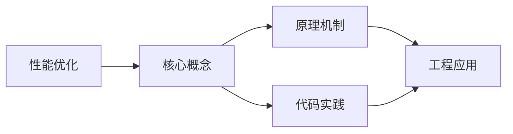
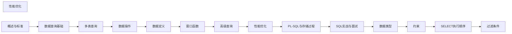

## 1. 学习目标（Bloom 分类）

本节按照布鲁姆教育目标分类学组织学习路径。本文主题为《性能优化》，属于 SQL 模块，读者可以根据自身阶段选择阅读深度。

记忆层面：能够准确复述本文的核心概念、术语与基本语法或操作步骤，并能够在提问或检索时快速定位对应知识点。能够说出 SQL 的核心概念、语法与常用对象。

理解层面：能够用自己的语言解释核心原理与工作机制，说明概念之间的因果关系，而不是机械记忆结论。能够解释 SQL 的执行原理与优化机制。

应用层面：能够在真实项目或练习场景中运用本文知识解决具体问题，写出正确且可维护的实现。能够编写正确、高效的 SQL 语句与操作。

分析层面：能够拆解复杂问题，比较本文主题与相邻概念的异同，识别边界条件与例外情况。能够分析 SQL 相关方案在性能与一致性上的权衡。

评价层面：能够根据约束条件（性能、可读性、安全、成本）评价不同方案的优劣，做出有依据的技术决策。能够根据业务场景评价 SQL 技术选型。

创造层面：能够把本文知识与其他模块知识组合，设计出新的解决方案或可复用的工程模式。能够组合 SQL 与其他技术设计数据架构。

通过本节学习，读者应当能够把《性能优化》纳入自己的知识网络，并与 SQL 模块的其他主题（DDL/DML、查询、索引、事务）建立关联。

## 2. 历史动机与发展脉络

《性能优化》是 SQL 领域的重要主题。要真正理解它，需要先了解它解决的问题与演进过程。

SQL（结构化查询语言）源于 1970 年 Codd 的关系模型，1974 年由 Chamberlin 与 Boyce 设计（SEQUEL），1986 年成为 ANSI 标准；SQL:2023 是当前国际标准。
SQL 分为 DDL（建表）、DML（增删改）、DQL（查询）、DCL（权限）与 TCL（事务）；各大数据库在标准基础上扩展方言。
SQL 是声明式语言：描述“要什么”而非“怎么做”，优化器负责执行计划；这一设计让 SQL 具有跨数据库的表达一致性。

回到本文主题：性能优化 的提出与成熟，正是上述技术背景下的必然产物。早期实现往往以简单可用为目标，随着工程规模扩大，社区逐渐沉淀出标准做法与最佳实践；理解这一脉络，可以帮助读者判断“为什么文档中的推荐写法是现在这个样子”，也能在遇到历史遗留代码时准确识别其设计年代与取舍。


## 3. 形式化定义与核心概念精讲

本节把《性能优化》涉及的核心概念以“定义 + 讲解”的形式展开。读者应把定义当作工具，把讲解当作理解路径；两者结合才能形成可迁移的知识。

关系模型：表（关系）、行（元组）、列（属性）；主键唯一标识、外键表达关联、范式消除冗余。
查询执行：解析 -> 绑定 -> 优化（基于代价选择计划）-> 执行；索引、统计信息与连接算法决定性能。
事务 ACID：原子性（Atomicity）、一致性（Consistency）、隔离性（Isolation）、持久性（Durability）；隔离级别控制并发行为。

### 3.1 原文章节逐一精讲

原文档把主题拆分为 15 个小节，下面按顺序给出每一节的导读讲解，随后保留原文细节供精读。

#### 原文精读（完整保留）

# SQL 性能优化 语法速查手册

> **符号约定**：`< >` 必填参数 | `[ ]` 可选参数

---

#### 执行计划

执行计划是数据库查询优化器选择的执行路径，是性能优化的核心工具。

##### EXPLAIN 基本用法

```sql
-- PostgreSQL
EXPLAIN SELECT * FROM users WHERE email = 'alice@example.com';

-- 带实际执行时间和行数
EXPLAIN ANALYZE SELECT * FROM users WHERE email = 'alice@example.com';

-- 更详细的输出
EXPLAIN (ANALYZE, BUFFERS, FORMAT TEXT)
SELECT * FROM users WHERE email = 'alice@example.com';

-- MySQL
EXPLAIN SELECT * FROM users WHERE email = 'alice@example.com';

-- MySQL 8.0: JSON 格式（更详细）
EXPLAIN FORMAT=JSON SELECT * FROM users WHERE email = 'alice@example.com';

-- SQL Server
SET SHOWPLAN_TEXT ON;
GO
SELECT * FROM users WHERE email = 'alice@example.com';
GO

-- 实际执行计划
SET STATISTICS IO ON;
SET STATISTICS TIME ON;
SELECT * FROM users WHERE email = 'alice@example.com';
```

##### PostgreSQL 执行计划解读

```
EXPLAIN ANALYZE SELECT u.name, COUNT(o.id)
FROM users u
JOIN orders o ON u.id = o.user_id
WHERE u.created_at > '2024-01-01'
GROUP BY u.name;

-- 输出示例:
-- HashAggregate  (cost=1250.00..1300.00 rows=1000 width=36) (actual time=15.2..16.8 rows=950 loops=1)
--   ->  Hash Join  (cost=450.00..1100.00 rows=5000 width=36) (actual time=5.1..12.3 rows=5200 loops=1)
--         Hash Cond: (o.user_id = u.id)
--         ->  Seq Scan on orders o  (cost=0.00..400.00 rows=20000 width=8) (actual time=0.01..3.5 rows=20000 loops=1)
--         ->  Hash  (cost=300.00..300.00 rows=5000 width=36) (actual time=4.8..4.8 rows=5000 loops=1)
--               ->  Seq Scan on users u  (cost=0.00..300.00 rows=5000 width=36) (actual time=0.01..2.8 rows=5000 loops=1)
--                     Filter: (created_at > '2024-01-01')
```

##### 关键指标

| 指标          | 含义                     | 关注点                                |
| ------------- | ------------------------ | ------------------------------------- |
| `cost`        | 估算成本（启动..总成本） | 总成本越低越好                        |
| `rows`        | 估算行数                 | 与 actual rows 差距大说明统计信息不准 |
| `actual time` | 实际耗时（ms）           | 真实性能指标                          |
| `loops`       | 执行次数                 | 嵌套循环中内层循环次数                |
| `buffers`     | 缓冲区命中/读取          | shared hit 高说明缓存命中好           |

##### 常见扫描类型

```sql
-- Seq Scan（顺序扫描）: 全表扫描
-- 适合: 小表、没有合适索引、返回大部分行
Seq Scan on users  (cost=0.00..300.00 rows=10000)

-- Index Scan（索引扫描）: 通过索引定位行
-- 适合: 返回少量行、有精确匹配条件
Index Scan using idx_users_email on users  (cost=0.29..8.31 rows=1)

-- Index Only Scan（仅索引扫描）: 只读索引不回表
-- 适合: 查询列都在索引中
Index Only Scan using idx_users_email on users  (cost=0.29..4.31 rows=1)

-- Bitmap Scan（位图扫描）: 先收集索引位图，再批量取行
-- 适合: 返回较多行、多条件组合
Bitmap Heap Scan on users  (cost=100.00..500.00 rows=5000)
  ->  Bitmap Index Scan on idx_users_status  (cost=0.00..50.00 rows=5000)
```

##### 常见 Join 策略

```
-- Nested Loop（嵌套循环）: 适合小表驱动大表
-- 外层每行扫描内层一次
Nested Loop  (cost=0.58..33.65 rows=10)
  ->  Index Scan on users  (cost=0.29..8.31 rows=1)
  ->  Index Scan on orders  (cost=0.29..25.34 rows=10)

-- Hash Join（哈希连接）: 适合等值连接、大表
-- 内表构建哈希表，外表探测
Hash Join  (cost=450.00..1100.00 rows=5000)
  ->  Seq Scan on orders  (cost=0.00..400.00 rows=20000)
  ->  Hash  (cost=300.00..300.00 rows=5000)
        ->  Seq Scan on users  (cost=0.00..300.00 rows=5000)

-- Merge Join（归并连接）: 适合已排序数据、大表
-- 两边按连接键排序后归并
Merge Join  (cost=0.86..55.00 rows=100)
  ->  Index Scan on users  (cost=0.29..25.00 rows=1000)
  ->  Index Scan on orders  (cost=0.29..25.00 rows=1000)
```

#### 索引策略

##### B-Tree 索引最佳实践

```sql
-- 1. 选择性高的列优先
--  email 选择性高（几乎唯一）
CREATE INDEX idx_users_email ON users(email);
--  gender 选择性低（只有 M/F）
-- 不建议单独为 gender 建索引

-- 2. 复合索引的列顺序（最左前缀原则）
-- 查询模式: WHERE a = ? AND b = ? AND c = ?
CREATE INDEX idx_t_abc ON t(a, b, c);
-- 支持: (a), (a,b), (a,b,c)
-- 不支持: (b), (c), (b,c)

-- 3. 覆盖索引（避免回表）
-- 查询: SELECT name, email FROM users WHERE department = ?
CREATE INDEX idx_users_dept_name_email ON users(department, name, email);
-- Index Only Scan: 不需要回表取数据

-- 4. 排序优化
-- 查询: SELECT * FROM orders ORDER BY created_at DESC LIMIT 10
CREATE INDEX idx_orders_created_desc ON orders(created_at DESC);
-- 索引本身有序，避免排序操作
```

##### 特殊索引类型

```sql
-- PostgreSQL GIN 索引（JSONB / 数组 / 全文搜索）
CREATE INDEX idx_products_attrs ON products USING gin(attrs jsonb_path_ops);
CREATE INDEX idx_articles_tags ON articles USING gin(tags);
CREATE INDEX idx_articles_fts ON articles USING gin(to_tsvector('english', content));

-- PostgreSQL BRIN 索引（大表时序数据）
-- 块级索引，体积极小，适合自然排序的数据
CREATE INDEX idx_logs_created ON logs USING brin(created_at) WITH (pages_per_range = 32);

-- PostgreSQL 部分索引
CREATE INDEX idx_active_users_email ON users(email) WHERE is_active = true;

-- PostgreSQL 表达式索引
CREATE INDEX idx_users_lower_email ON users(LOWER(email));

-- MySQL 前缀索引
CREATE INDEX idx_articles_title ON articles(title(50));

-- MySQL 函数索引（8.0+）
CREATE INDEX idx_users_lower_email ON users((LOWER(email)));
```

##### 索引失效场景

```sql
-- 1. 对索引列使用函数
--
SELECT * FROM users WHERE LOWER(email) = 'alice@example.com';
--
SELECT * FROM users WHERE email = LOWER('Alice@Example.com');
-- 或创建表达式索引

-- 2. 隐式类型转换
--  (email 是 VARCHAR，传入整数会隐式转换)
SELECT * FROM users WHERE email = 12345;
--
SELECT * FROM users WHERE email = '12345';

-- 3. LIKE 前缀通配符
--
SELECT * FROM users WHERE name LIKE '%alice';
--
SELECT * FROM users WHERE name LIKE 'alice%';

-- 4. OR 条件
--  (如果两列分别有索引，OR 可能不走索引)
SELECT * FROM users WHERE email = 'a@b.com' OR phone = '123456';
--  使用 UNION
SELECT * FROM users WHERE email = 'a@b.com'
UNION
SELECT * FROM users WHERE phone = '123456';

-- 5. 不等于
--  大部分数据都不等于某值时，全表扫描更快
SELECT * FROM users WHERE status != 'inactive';

-- 6. IS NULL（部分数据库）
-- PostgreSQL: B-Tree 索引支持 IS NULL
-- MySQL: 索引支持 IS NULL
```

#### 查询重写

##### 避免SELECT \*

```sql
--  返回不需要的列，浪费 I/O 和网络
SELECT * FROM users WHERE id = 1;

--  只查需要的列
SELECT name, email FROM users WHERE id = 1;
```

##### 子查询改写为 JOIN

```sql
--  相关子查询（每行执行一次子查询）
SELECT u.name,
  (SELECT COUNT(*) FROM orders o WHERE o.user_id = u.id) AS order_count
FROM users u;

--  LEFT JOIN + GROUP BY（更高效）
SELECT u.name, COALESCE(o.cnt, 0) AS order_count
FROM users u
LEFT JOIN (SELECT user_id, COUNT(*) AS cnt FROM orders GROUP BY user_id) o
ON u.id = o.user_id;
```

##### UNION 优化

```sql
--  UNION 会去重（排序操作）
SELECT name FROM customers WHERE region = 'North'
UNION
SELECT name FROM suppliers WHERE region = 'North';

--  如果确定无重复，用 UNION ALL
SELECT name FROM customers WHERE region = 'North'
UNION ALL
SELECT name FROM suppliers WHERE region = 'North';
```

##### 分页优化

```sql
--  深分页：OFFSET 需要跳过前面所有行
SELECT * FROM orders ORDER BY id LIMIT 10 OFFSET 1000000;

--  游标分页（Keyset Pagination）
SELECT * FROM orders WHERE id > 1000000 ORDER BY id LIMIT 10;

--  延迟关联（先查 ID 再关联）
SELECT o.* FROM orders o
JOIN (SELECT id FROM orders ORDER BY id LIMIT 10 OFFSET 1000000) t
ON o.id = t.id;
```

##### EXISTS 替代 IN

```sql
--  IN 子查询可能生成临时表
SELECT * FROM orders
WHERE customer_id IN (SELECT id FROM customers WHERE vip = true);

--  EXISTS 通常更高效（短路求值）
SELECT * FROM orders o
WHERE EXISTS (SELECT 1 FROM customers c WHERE c.id = o.customer_id AND c.vip = true);

--  JOIN 也可以（如果不需要去重）
SELECT DISTINCT o.* FROM orders o
JOIN customers c ON o.customer_id = c.id AND c.vip = true;
```

#### 统计信息

统计信息是查询优化器决策的基础，过时的统计信息会导致错误的执行计划。

```sql
-- PostgreSQL: 查看统计信息
SELECT * FROM pg_stats WHERE tablename = 'users';

-- 手动更新统计信息
ANALYZE users;                    -- 单表
ANALYZE users(email, status);     -- 指定列
VACUUM ANALYZE;                   -- 清理 + 分析全库

-- MySQL: 更新统计信息
ANALYZE TABLE users;

-- SQL Server
UPDATE STATISTICS users;

-- 增加统计信息采样率（PostgreSQL）
ALTER TABLE users ALTER COLUMN email SET STATISTICS 500;
ANALYZE users;

-- 查看表的行数估算
-- PostgreSQL
SELECT reltuples::bigint AS estimate FROM pg_class WHERE relname = 'users';
-- 精确行数
SELECT COUNT(*) FROM users;
```

#### 参数化查询

```sql
--  SQL 注入风险 + 无法利用预编译缓存
-- 应用层拼接 SQL:
-- "SELECT * FROM users WHERE name = '" + userName + "'"

--  参数化查询
-- PostgreSQL (libpq)
PREPARE get_user(TEXT) AS
  SELECT * FROM users WHERE name = $1;
EXECUTE get_user('Alice');

-- MySQL (Prepared Statement)
PREPARE stmt FROM 'SELECT * FROM users WHERE name = ?';
SET @name = 'Alice';
EXECUTE stmt USING @name;
DEALLOCATE PREPARE stmt;

-- 应用层（以 Python 为例）
--  参数化
cursor.execute("SELECT * FROM users WHERE name = %s", (user_name,))
--  字符串拼接
cursor.execute(f"SELECT * FROM users WHERE name = '{user_name}'")
```

#### 分区表

##### PostgreSQL 分区

```sql
-- 范围分区（按日期）
CREATE TABLE orders (
  id BIGINT,
  order_date DATE,
  amount DECIMAL(10,2),
  customer_id INT
) PARTITION BY RANGE (order_date);

-- 创建分区
CREATE TABLE orders_2024_q1 PARTITION OF orders
  FOR VALUES FROM ('2024-01-01') TO ('2024-04-01');
CREATE TABLE orders_2024_q2 PARTITION OF orders
  FOR VALUES FROM ('2024-04-01') TO ('2024-07-01');
CREATE TABLE orders_2024_q3 PARTITION OF orders
  FOR VALUES FROM ('2024-07-01') TO ('2024-10-01');
CREATE TABLE orders_2024_q4 PARTITION OF orders
  FOR VALUES FROM ('2024-10-01') TO ('2025-01-01');

-- 默认分区（兜底）
CREATE TABLE orders_default PARTITION OF orders DEFAULT;

-- 列表分区
CREATE TABLE users_by_region PARTITION BY LIST (region);
CREATE TABLE users_asia PARTITION OF users_by_region
  FOR VALUES IN ('China', 'Japan', 'Korea');
CREATE TABLE users_europe PARTITION OF users_by_region
  FOR VALUES IN ('UK', 'France', 'Germany');

-- 哈希分区
CREATE TABLE logs PARTITION BY HASH (id);
CREATE TABLE logs_p0 PARTITION OF logs FOR VALUES WITH (MODULUS 4, REMAINDER 0);
CREATE TABLE logs_p1 PARTITION OF logs FOR VALUES WITH (MODULUS 4, REMAINDER 1);
CREATE TABLE logs_p2 PARTITION OF logs FOR VALUES WITH (MODULUS 4, REMAINDER 2);
CREATE TABLE logs_p3 PARTITION OF logs FOR VALUES WITH (MODULUS 4, REMAINDER 3);

-- 分区裁剪（自动优化）
EXPLAIN SELECT * FROM orders WHERE order_date >= '2024-04-01';
-- 只会扫描 orders_2024_q2, orders_2024_q3, orders_2024_q4

-- 快速删除旧分区
DROP TABLE orders_2022_q1;  -- 比DELETE快得多
```

##### MySQL 分区

```sql
-- 范围分区
CREATE TABLE orders (
  id BIGINT AUTO_INCREMENT,
  order_date DATE,
  amount DECIMAL(10,2),
  PRIMARY KEY (id, order_date)
) PARTITION BY RANGE (YEAR(order_date)) (
  PARTITION p2023 VALUES LESS THAN (2024),
  PARTITION p2024 VALUES LESS THAN (2025),
  PARTITION pmax VALUES LESS THAN MAXVALUE
);

-- 添加分区
ALTER TABLE orders ADD PARTITION (PARTITION p2025 VALUES LESS THAN (2026));

-- 删除分区
ALTER TABLE orders DROP PARTITION p2023;
```

#### 物化视图

物化视图将查询结果物理存储，适合昂贵的聚合查询。

##### PostgreSQL 物化视图

```sql
-- 创建物化视图
CREATE MATERIALIZED VIEW mv_daily_sales AS
SELECT
  DATE(order_date) AS sale_date,
  COUNT(*) AS order_count,
  SUM(amount) AS total_amount,
  AVG(amount) AS avg_amount
FROM orders
GROUP BY DATE(order_date);

-- 查询物化视图（直接读缓存数据）
SELECT * FROM mv_daily_sales WHERE sale_date >= '2024-01-01';

-- 刷新物化视图
REFRESH MATERIALIZED VIEW mv_daily_sales;              -- 阻塞读取
REFRESH MATERIALIZED VIEW CONCURRENTLY mv_daily_sales;  -- 不阻塞读取（需唯一索引）

-- 为物化视图创建索引
CREATE UNIQUE INDEX idx_mv_daily_sales_date ON mv_daily_sales(sale_date);

-- 删除物化视图
DROP MATERIALIZED VIEW mv_daily_sales;
```

##### Oracle 物化视图

```sql
-- 创建带自动刷新的物化视图
CREATE MATERIALIZED VIEW mv_daily_sales
REFRESH COMPLETE ON COMMIT  -- 提交时刷新
-- REFRESH FAST ON COMMIT   -- 增量刷新（需物化视图日志）
-- REFRESH COMPLETE ON DEMAND -- 手动刷新
AS
SELECT
  TRUNC(order_date) AS sale_date,
  COUNT(*) AS order_count,
  SUM(amount) AS total_amount
FROM orders
GROUP BY TRUNC(order_date);

-- 手动刷新
EXEC DBMS_MVIEW.REFRESH('mv_daily_sales', 'C');  -- C=COMPLETE, F=FAST
```

##### SQL Server 索引视图

```sql
-- 创建带 SCHEMABINDING 的视图
CREATE VIEW mv_daily_sales
WITH SCHEMABINDING
AS
SELECT
  CONVERT(DATE, order_date) AS sale_date,
  COUNT_BIG(*) AS order_count,
  SUM(ISNULL(amount, 0)) AS total_amount
FROM dbo.orders
GROUP BY CONVERT(DATE, order_date);

-- 创建聚集索引（使视图物化）
CREATE UNIQUE CLUSTERED INDEX idx_mv_daily_sales
ON mv_daily_sales(sale_date);
```

#### 小结

- `EXPLAIN ANALYZE` 是性能优化的起点，关注估算行数与实际行数的偏差
- B-Tree 索引适合等值和范围查询，GIN 适合 JSON/全文，BRIN 适合时序大表
- 复合索引遵循最左前缀原则，覆盖索引可避免回表
- 避免索引列使用函数、隐式类型转换、前缀通配符等导致索引失效
- 深分页使用游标分页，子查询优先改写为 JOIN
- 分区表将大表拆分为小表，分区裁剪自动优化查询
- 物化视图缓存聚合结果，适合报表和仪表盘场景
#### 索引优化

**基本写法：创建合适索引**
`CREATE INDEX <索引名> ON <表>(<列>)`
```sql
-- 为 WHERE 条件列创建索引
CREATE INDEX idx_user_id ON orders(user_id);
-- 为 JOIN 条件列创建索引
CREATE INDEX idx_dept_id ON employees(dept_id);
```

---

**基本写法：复合索引**
`CREATE INDEX <索引名> ON <表>(<列1>, <列2>)`
```sql
-- 多条件查询使用复合索引
CREATE INDEX idx_user_status_date ON orders(user_id, status, create_date);
-- 查询：WHERE user_id=1 AND status='paid'
-- 查询：WHERE user_id=1 AND status='paid' AND create_date > '2026-01-01'
-- 都能命中索引
```

---

**基本写法：覆盖索引**
`-- 索引包含查询所需的所有列`
```sql
-- 查询只需要索引列时，无需回表
CREATE INDEX idx_cover ON employees(dept_id, name, salary);

SELECT name, salary FROM employees WHERE dept_id = 5;
-- Extra: Using index（覆盖索引，性能最优）
```

---

**基本写法：前缀索引**
`CREATE INDEX <索引名> ON <表>(<列>(<前缀长度>))`
```sql
-- 长字符串列使用前缀索引节省空间
CREATE INDEX idx_email ON users(email(10));
-- 仅索引前 10 个字符
```

---

**基本写法：函数索引（MySQL 5.7+）**
`CREATE INDEX <索引名> ON <表>((<表达式>))`
```sql
-- 为函数表达式创建索引
CREATE INDEX idx_lower_email ON users((LOWER(email)));
-- 查询 WHERE LOWER(email) = 'test@example.com' 可用索引

-- PostgreSQL
CREATE INDEX idx_upper_name ON employees(UPPER(name));
```

---

**基本写法：删除无用索引**
`DROP INDEX <索引名> ON <表>`
```sql
-- 索引会降低写入性能，删除不使用的索引
DROP INDEX idx_unused ON users;
```

---

#### 查询优化

**基本写法：只查询需要的列**
`SELECT <列1>, <列2> FROM <表>`
```sql
-- 避免 SELECT *
SELECT id, name, email FROM users WHERE active = 1;
```

---

**基本写法：LIMIT 分页**
`SELECT * FROM <表> LIMIT <数量> OFFSET <偏移>`
```sql
-- 深度分页优化：避免大 OFFSET
-- 反模式：OFFSET 1000000（扫描 100 万行）
-- SELECT * FROM orders ORDER BY id LIMIT 10 OFFSET 1000000;

-- 正确：使用游标分页
SELECT * FROM orders
WHERE id > 1000000
ORDER BY id
LIMIT 10;
```

---

**基本写法：JOIN 优化小表驱动大表**
`SELECT * FROM <小表> JOIN <大表> ON <条件>`
```sql
-- 小表驱动大表（小表在外层）
SELECT * FROM small_table s
JOIN large_table l ON l.small_id = s.id
WHERE s.status = 'active';
```

---

**基本写法：子查询优化为 JOIN**
`SELECT ... FROM <表1> JOIN <表2> ON <条件>`
```sql
-- IN 子查询改为 JOIN
-- 反模式
-- SELECT * FROM orders WHERE user_id IN (SELECT id FROM users WHERE vip=1);

-- 优化为 JOIN
SELECT o.* FROM orders o
JOIN users u ON o.user_id = u.id
WHERE u.vip = 1;
```

---

**基本写法：批量插入**
`INSERT INTO <表> (<列>) VALUES (<值1>), (<值2>), ...`
```sql
-- 批量插入比逐条快
INSERT INTO users (name, email) VALUES
  ('Alice', 'a@test.com'),
  ('Bob', 'b@test.com'),
  ('Charlie', 'c@test.com');
```

---

**基本写法：INSERT ... ON DUPLICATE KEY UPDATE**
`INSERT INTO <表> (<列>) VALUES (<值>) ON DUPLICATE KEY UPDATE <列>=<值>`
```sql
-- MySQL UPSERT 避免先查后插
INSERT INTO counters (id, count) VALUES (1, 1)
ON DUPLICATE KEY UPDATE count = count + 1;
```

---

**基本写法：PostgreSQL UPSERT**
`INSERT INTO <表> (<列>) VALUES (<值>) ON CONFLICT (<列>) DO UPDATE SET <列>=<值>`
```sql
-- PostgreSQL UPSERT
INSERT INTO counters (id, count) VALUES (1, 1)
ON CONFLICT (id) DO UPDATE SET count = counters.count + 1;
```

---

#### 执行计划分析

**基本写法：检查 type 字段**
`EXPLAIN SELECT ...`
```sql
-- type 从好到差：
-- const > eq_ref > ref > range > index > ALL
-- ALL 表示全表扫描，必须优化
EXPLAIN SELECT * FROM users WHERE email = 'test@test.com';
-- 确保 type 为 ref 或更好
```

---

**基本写法：检查 Extra 字段**
`-- 关注 Using filesort 和 Using temporary`
```sql
-- Using filesort: 额外排序，考虑加索引
-- Using temporary: 使用临时表，需优化
-- Using index: 覆盖索引，性能好

EXPLAIN SELECT dept, COUNT(*) FROM employees GROUP BY dept;
-- 如果出现 Using temporary; Using filesort
-- 考虑为 dept 加索引
```

---

#### 表结构优化

**基本写法：选择合适数据类型**
`-- 使用最小够用的类型`
```sql
-- 优先使用精确类型
-- TINYINT(1)  代替  INT      节省 3 字节
-- SMALLINT    代替  INT      节省 2 字节
-- VARCHAR(N)  代替  CHAR(N) 变长节省空间
-- DATETIME    代替  VARCHAR 存日期

CREATE TABLE users (
  id INT UNSIGNED AUTO_INCREMENT PRIMARY KEY,
  status TINYINT DEFAULT 0,       -- 而非 INT
  name VARCHAR(50),                -- 而非 CHAR(255)
  email VARCHAR(100)
);
```

---

**基本写法：避免过度规范化**
`-- 高频关联的表可适当冗余`
```sql
-- 订单表冗余商品名称（减少 JOIN）
CREATE TABLE orders (
  id INT PRIMARY KEY,
  product_id INT,
  product_name VARCHAR(100),  -- 冗余字段
  qty INT,
  price DECIMAL(10,2)
);
-- 查询时无需 JOIN products 表
```

---

**基本写法：分区表**
`PARTITION BY <方式>(<列>)`
```sql
-- MySQL 按范围分区
CREATE TABLE logs (
  id BIGINT AUTO_INCREMENT,
  create_time DATETIME,
  level VARCHAR(10),
  message TEXT,
  PRIMARY KEY (id, create_time)
)
PARTITION BY RANGE (TO_DAYS(create_time)) (
  PARTITION p202601 VALUES LESS THAN (TO_DAYS('2026-02-01')),
  PARTITION p202602 VALUES LESS THAN (TO_DAYS('2026-03-01')),
  PARTITION pmax VALUES LESS THAN MAXVALUE
);
```

---

#### 缓存优化

**基本写法：使用 SQL_CACHE**
`SELECT SQL_CACHE * FROM <表>`
```sql
-- MySQL 查询缓存（8.0 已移除，仅旧版本）
SELECT SQL_CACHE * FROM users WHERE id = 1;
```

---

**基本写法：应用层缓存**
`-- 高频查询结果缓存到 Redis`
```sql
-- 数据库层面：减少重复查询
-- 对于不变的配置数据，应用层缓存
-- SELECT * FROM config;  -- 每次启动加载一次，缓存到内存
```

---

#### 配置优化

**基本写法：InnoDB 缓冲池**
`SET GLOBAL innodb_buffer_pool_size = <字节>`
```sql
-- 设置 InnoDB 缓冲池大小（建议物理内存的 70-80%）
SET GLOBAL innodb_buffer_pool_size = 4294967296;  -- 4GB
```

---

**基本写法：连接池配置**
`SET GLOBAL max_connections = <数量>`
```sql
-- MySQL 最大连接数
SET GLOBAL max_connections = 200;
-- 查看当前连接数
SHOW STATUS LIKE 'Threads_connected';
```

---

**基本写法：PostgreSQL 配置**
`-- 修改 postgresql.conf`
```ini
# postgresql.conf 关键参数
shared_buffers = 2GB          # 内存 25%
effective_cache_size = 6GB     # 内存 75%
work_mem = 16MB
maintenance_work_mem = 256MB
max_connections = 100
```

---

#### 慢查询排查

**基本写法：开启慢查询日志**
`SET GLOBAL slow_query_log = ON;`
```sql
-- 开启慢查询日志
SET GLOBAL slow_query_log = ON;
SET GLOBAL long_query_time = 1;  -- 超过 1 秒
```

---

**基本写法：分析慢查询日志**
`-- 使用 mysqldumpslow 分析`
```bash
# 统计慢查询 Top 10
mysqldumpslow -s t -t 10 /var/log/mysql/slow.log

# 按返回行数排序
mysqldumpslow -s r -t 10 /var/log/mysql/slow.log
```

---

**基本写法：实时查看正在执行的查询**
`SHOW PROCESSLIST;`
```sql
-- 查看当前正在执行的查询
SHOW FULL PROCESSLIST;

-- PostgreSQL
SELECT * FROM pg_stat_activity
WHERE state = 'active';
```


### 3.2 概念关系图

下面用 Mermaid 图表达本文核心概念之间的关系，帮助读者建立整体图景：



图中展示的是本文知识的结构化关系：核心概念是入口，原理机制解释“为什么”，代码实践演示“怎么做”，工程应用回答“何时用”。读者学习时可以把每个小节的内容挂接到对应节点上。

## 4. 理论推导与原理解析

本节深入《性能优化》背后的原理。理论部分不求面面俱到，而是聚焦“能解释现象、能指导实践”的关键推导。

关系模型：表（关系）、行（元组）、列（属性）；主键唯一标识、外键表达关联、范式消除冗余。
查询执行：解析 -> 绑定 -> 优化（基于代价选择计划）-> 执行；索引、统计信息与连接算法决定性能。
事务 ACID：原子性（Atomicity）、一致性（Consistency）、隔离性（Isolation）、持久性（Durability）；隔离级别控制并发行为。
集合语义：SELECT 返回结果集；JOIN 组合关系，GROUP BY 聚合，子查询与 CTE 表达复杂逻辑。

需要强调的是，理论推导与工程实践之间存在翻译层：理论给出的是理想化模型与边界条件，工程代码则必须处理真实环境中的例外。读者在学习时应先掌握理论的“标准情形”，再通过陷阱章节了解“非标准情形”。

## 5. 代码示例与逐行讲解

本节把原文中的代码示例系统整理，并为每个示例补充用途说明与讲解。读者不应只浏览代码，而应逐段对照讲解理解设计意图。

### 5.1 示例：EXPLAIN 基本用法

该示例来自原文《EXPLAIN 基本用法》小节，用于演示性能优化相关操作。阅读时请先看代码结构，再看其后的讲解。

```sql
-- PostgreSQL
EXPLAIN SELECT * FROM users WHERE email = 'alice@example.com';

-- 带实际执行时间和行数
EXPLAIN ANALYZE SELECT * FROM users WHERE email = 'alice@example.com';

-- 更详细的输出
EXPLAIN (ANALYZE, BUFFERS, FORMAT TEXT)
SELECT * FROM users WHERE email = 'alice@example.com';

-- MySQL
EXPLAIN SELECT * FROM users WHERE email = 'alice@example.com';

-- MySQL 8.0: JSON 格式（更详细）
EXPLAIN FORMAT=JSON SELECT * FROM users WHERE email = 'alice@example.com';

-- SQL Server
SET SHOWPLAN_TEXT ON;
GO
SELECT * FROM users WHERE email = 'alice@example.com';
GO

-- 实际执行计划
SET STATISTICS IO ON;
SET STATISTICS TIME ON;
SELECT * FROM users WHERE email = 'alice@example.com';
```

讲解：这段代码演示了本节核心知识点。代码中的关键操作可以归纳为三步：准备（定义或初始化）、执行（核心逻辑）、收尾（释放资源或返回结果）。实际项目中，这三步往往被封装为函数或类，以提升复用性与可测试性。

关键点分析：

该示例共 20 行有效代码，包含 2 类关键结构（SELECT、FROM）。其中：

- 入口与初始化部分负责建立上下文，对应实际项目中的启动或装配逻辑；
- 核心逻辑部分体现本文主题的主要操作，是阅读时最需要对照讲解理解的部分；
- 输出或返回部分把结果交给调用方，注意其类型与边界条件。

进阶思考路径：先尝试修改参数观察行为变化，再把示例中的模式迁移到自己的项目中；每次修改都记录预期与实测差异，这是把示例转化为能力的最快方式。

### 5.2 示例：PostgreSQL 执行计划解读

该示例来自原文《PostgreSQL 执行计划解读》小节，用于演示性能优化相关操作。阅读时请先看代码结构，再看其后的讲解。

```text
EXPLAIN ANALYZE SELECT u.name, COUNT(o.id)
FROM users u
JOIN orders o ON u.id = o.user_id
WHERE u.created_at > '2024-01-01'
GROUP BY u.name;

-- 输出示例:
-- HashAggregate  (cost=1250.00..1300.00 rows=1000 width=36) (actual time=15.2..16.8 rows=950 loops=1)
--   ->  Hash Join  (cost=450.00..1100.00 rows=5000 width=36) (actual time=5.1..12.3 rows=5200 loops=1)
--         Hash Cond: (o.user_id = u.id)
--         ->  Seq Scan on orders o  (cost=0.00..400.00 rows=20000 width=8) (actual time=0.01..3.5 rows=20000 loops=1)
--         ->  Hash  (cost=300.00..300.00 rows=5000 width=36) (actual time=4.8..4.8 rows=5000 loops=1)
--               ->  Seq Scan on users u  (cost=0.00..300.00 rows=5000 width=36) (actual time=0.01..2.8 rows=5000 loops=1)
--                     Filter: (created_at > '2024-01-01')
```

讲解：这段代码演示了本节核心知识点。代码中的关键操作可以归纳为三步：准备（定义或初始化）、执行（核心逻辑）、收尾（释放资源或返回结果）。实际项目中，这三步往往被封装为函数或类，以提升复用性与可测试性。

关键点分析：

该示例共 13 行有效代码，包含 2 类关键结构（SELECT、FROM）。其中：

- 入口与初始化部分负责建立上下文，对应实际项目中的启动或装配逻辑；
- 核心逻辑部分体现本文主题的主要操作，是阅读时最需要对照讲解理解的部分；
- 输出或返回部分把结果交给调用方，注意其类型与边界条件。

进阶思考路径：先尝试修改参数观察行为变化，再把示例中的模式迁移到自己的项目中；每次修改都记录预期与实测差异，这是把示例转化为能力的最快方式。

### 5.3 示例：常见扫描类型

该示例来自原文《常见扫描类型》小节，用于演示性能优化相关操作。阅读时请先看代码结构，再看其后的讲解。

```sql
-- Seq Scan（顺序扫描）: 全表扫描
-- 适合: 小表、没有合适索引、返回大部分行
Seq Scan on users  (cost=0.00..300.00 rows=10000)

-- Index Scan（索引扫描）: 通过索引定位行
-- 适合: 返回少量行、有精确匹配条件
Index Scan using idx_users_email on users  (cost=0.29..8.31 rows=1)

-- Index Only Scan（仅索引扫描）: 只读索引不回表
-- 适合: 查询列都在索引中
Index Only Scan using idx_users_email on users  (cost=0.29..4.31 rows=1)

-- Bitmap Scan（位图扫描）: 先收集索引位图，再批量取行
-- 适合: 返回较多行、多条件组合
Bitmap Heap Scan on users  (cost=100.00..500.00 rows=5000)
  ->  Bitmap Index Scan on idx_users_status  (cost=0.00..50.00 rows=5000)
```

讲解：这段代码演示了本节核心知识点。代码中的关键操作可以归纳为三步：准备（定义或初始化）、执行（核心逻辑）、收尾（释放资源或返回结果）。实际项目中，这三步往往被封装为函数或类，以提升复用性与可测试性。

关键点分析：

该示例共 13 行有效代码，结构以数据或配置为主。阅读时应关注：数据字段的含义、配置项的作用，以及它们与运行行为的对应关系。

进阶思考路径：先尝试修改参数观察行为变化，再把示例中的模式迁移到自己的项目中；每次修改都记录预期与实测差异，这是把示例转化为能力的最快方式。

### 5.4 示例：常见 Join 策略

该示例来自原文《常见 Join 策略》小节，用于演示性能优化相关操作。阅读时请先看代码结构，再看其后的讲解。

```text
-- Nested Loop（嵌套循环）: 适合小表驱动大表
-- 外层每行扫描内层一次
Nested Loop  (cost=0.58..33.65 rows=10)
  ->  Index Scan on users  (cost=0.29..8.31 rows=1)
  ->  Index Scan on orders  (cost=0.29..25.34 rows=10)

-- Hash Join（哈希连接）: 适合等值连接、大表
-- 内表构建哈希表，外表探测
Hash Join  (cost=450.00..1100.00 rows=5000)
  ->  Seq Scan on orders  (cost=0.00..400.00 rows=20000)
  ->  Hash  (cost=300.00..300.00 rows=5000)
        ->  Seq Scan on users  (cost=0.00..300.00 rows=5000)

-- Merge Join（归并连接）: 适合已排序数据、大表
-- 两边按连接键排序后归并
Merge Join  (cost=0.86..55.00 rows=100)
  ->  Index Scan on users  (cost=0.29..25.00 rows=1000)
  ->  Index Scan on orders  (cost=0.29..25.00 rows=1000)
```

讲解：这段代码演示了本节核心知识点。代码中的关键操作可以归纳为三步：准备（定义或初始化）、执行（核心逻辑）、收尾（释放资源或返回结果）。实际项目中，这三步往往被封装为函数或类，以提升复用性与可测试性。

关键点分析：

该示例共 16 行有效代码，结构以数据或配置为主。阅读时应关注：数据字段的含义、配置项的作用，以及它们与运行行为的对应关系。

进阶思考路径：先尝试修改参数观察行为变化，再把示例中的模式迁移到自己的项目中；每次修改都记录预期与实测差异，这是把示例转化为能力的最快方式。

### 5.5 示例：B-Tree 索引最佳实践

该示例来自原文《B-Tree 索引最佳实践》小节，用于演示性能优化相关操作。阅读时请先看代码结构，再看其后的讲解。

```sql
-- 1. 选择性高的列优先
--  email 选择性高（几乎唯一）
CREATE INDEX idx_users_email ON users(email);
--  gender 选择性低（只有 M/F）
-- 不建议单独为 gender 建索引

-- 2. 复合索引的列顺序（最左前缀原则）
-- 查询模式: WHERE a = ? AND b = ? AND c = ?
CREATE INDEX idx_t_abc ON t(a, b, c);
-- 支持: (a), (a,b), (a,b,c)
-- 不支持: (b), (c), (b,c)

-- 3. 覆盖索引（避免回表）
-- 查询: SELECT name, email FROM users WHERE department = ?
CREATE INDEX idx_users_dept_name_email ON users(department, name, email);
-- Index Only Scan: 不需要回表取数据

-- 4. 排序优化
-- 查询: SELECT * FROM orders ORDER BY created_at DESC LIMIT 10
CREATE INDEX idx_orders_created_desc ON orders(created_at DESC);
-- 索引本身有序，避免排序操作
```

讲解：这段代码演示了本节核心知识点。代码中的关键操作可以归纳为三步：准备（定义或初始化）、执行（核心逻辑）、收尾（释放资源或返回结果）。实际项目中，这三步往往被封装为函数或类，以提升复用性与可测试性。

关键点分析：

该示例共 18 行有效代码，包含 3 类关键结构（SELECT、CREATE、FROM）。其中：

- 入口与初始化部分负责建立上下文，对应实际项目中的启动或装配逻辑；
- 核心逻辑部分体现本文主题的主要操作，是阅读时最需要对照讲解理解的部分；
- 输出或返回部分把结果交给调用方，注意其类型与边界条件。

进阶思考路径：先尝试修改参数观察行为变化，再把示例中的模式迁移到自己的项目中；每次修改都记录预期与实测差异，这是把示例转化为能力的最快方式。

### 5.6 示例：特殊索引类型

该示例来自原文《特殊索引类型》小节，用于演示性能优化相关操作。阅读时请先看代码结构，再看其后的讲解。

```sql
-- PostgreSQL GIN 索引（JSONB / 数组 / 全文搜索）
CREATE INDEX idx_products_attrs ON products USING gin(attrs jsonb_path_ops);
CREATE INDEX idx_articles_tags ON articles USING gin(tags);
CREATE INDEX idx_articles_fts ON articles USING gin(to_tsvector('english', content));

-- PostgreSQL BRIN 索引（大表时序数据）
-- 块级索引，体积极小，适合自然排序的数据
CREATE INDEX idx_logs_created ON logs USING brin(created_at) WITH (pages_per_range = 32);

-- PostgreSQL 部分索引
CREATE INDEX idx_active_users_email ON users(email) WHERE is_active = true;

-- PostgreSQL 表达式索引
CREATE INDEX idx_users_lower_email ON users(LOWER(email));

-- MySQL 前缀索引
CREATE INDEX idx_articles_title ON articles(title(50));

-- MySQL 函数索引（8.0+）
CREATE INDEX idx_users_lower_email ON users((LOWER(email)));
```

讲解：这段代码演示了本节核心知识点。代码中的关键操作可以归纳为三步：准备（定义或初始化）、执行（核心逻辑）、收尾（释放资源或返回结果）。实际项目中，这三步往往被封装为函数或类，以提升复用性与可测试性。

关键点分析：

该示例共 15 行有效代码，包含 1 类关键结构（CREATE）。其中：

- 入口与初始化部分负责建立上下文，对应实际项目中的启动或装配逻辑；
- 核心逻辑部分体现本文主题的主要操作，是阅读时最需要对照讲解理解的部分；
- 输出或返回部分把结果交给调用方，注意其类型与边界条件。

进阶思考路径：先尝试修改参数观察行为变化，再把示例中的模式迁移到自己的项目中；每次修改都记录预期与实测差异，这是把示例转化为能力的最快方式。

### 5.7 示例：索引失效场景

该示例来自原文《索引失效场景》小节，用于演示性能优化相关操作。阅读时请先看代码结构，再看其后的讲解。

```sql
-- 1. 对索引列使用函数
--
SELECT * FROM users WHERE LOWER(email) = 'alice@example.com';
--
SELECT * FROM users WHERE email = LOWER('Alice@Example.com');
-- 或创建表达式索引

-- 2. 隐式类型转换
--  (email 是 VARCHAR，传入整数会隐式转换)
SELECT * FROM users WHERE email = 12345;
--
SELECT * FROM users WHERE email = '12345';

-- 3. LIKE 前缀通配符
--
SELECT * FROM users WHERE name LIKE '%alice';
--
SELECT * FROM users WHERE name LIKE 'alice%';

-- 4. OR 条件
--  (如果两列分别有索引，OR 可能不走索引)
SELECT * FROM users WHERE email = 'a@b.com' OR phone = '123456';
--  使用 UNION
SELECT * FROM users WHERE email = 'a@b.com'
UNION
SELECT * FROM users WHERE phone = '123456';

-- 5. 不等于
--  大部分数据都不等于某值时，全表扫描更快
SELECT * FROM users WHERE status != 'inactive';

-- 6. IS NULL（部分数据库）
-- PostgreSQL: B-Tree 索引支持 IS NULL
-- MySQL: 索引支持 IS NULL
```

讲解：这段代码演示了本节核心知识点。代码中的关键操作可以归纳为三步：准备（定义或初始化）、执行（核心逻辑）、收尾（释放资源或返回结果）。实际项目中，这三步往往被封装为函数或类，以提升复用性与可测试性。

关键点分析：

该示例共 29 行有效代码，包含 2 类关键结构（SELECT、FROM）。其中：

- 入口与初始化部分负责建立上下文，对应实际项目中的启动或装配逻辑；
- 核心逻辑部分体现本文主题的主要操作，是阅读时最需要对照讲解理解的部分；
- 输出或返回部分把结果交给调用方，注意其类型与边界条件。

进阶思考路径：先尝试修改参数观察行为变化，再把示例中的模式迁移到自己的项目中；每次修改都记录预期与实测差异，这是把示例转化为能力的最快方式。

### 5.8 示例：避免SELECT \*

该示例来自原文《避免SELECT \*》小节，用于演示性能优化相关操作。阅读时请先看代码结构，再看其后的讲解。

```sql
--  返回不需要的列，浪费 I/O 和网络
SELECT * FROM users WHERE id = 1;

--  只查需要的列
SELECT name, email FROM users WHERE id = 1;
```

讲解：这段代码演示了本节核心知识点。代码中的关键操作可以归纳为三步：准备（定义或初始化）、执行（核心逻辑）、收尾（释放资源或返回结果）。实际项目中，这三步往往被封装为函数或类，以提升复用性与可测试性。

关键点分析：

该示例共 4 行有效代码，包含 2 类关键结构（SELECT、FROM）。其中：

- 入口与初始化部分负责建立上下文，对应实际项目中的启动或装配逻辑；
- 核心逻辑部分体现本文主题的主要操作，是阅读时最需要对照讲解理解的部分；
- 输出或返回部分把结果交给调用方，注意其类型与边界条件。

进阶思考路径：先尝试修改参数观察行为变化，再把示例中的模式迁移到自己的项目中；每次修改都记录预期与实测差异，这是把示例转化为能力的最快方式。

### 5.9 示例：子查询改写为 JOIN

该示例来自原文《子查询改写为 JOIN》小节，用于演示性能优化相关操作。阅读时请先看代码结构，再看其后的讲解。

```sql
--  相关子查询（每行执行一次子查询）
SELECT u.name,
  (SELECT COUNT(*) FROM orders o WHERE o.user_id = u.id) AS order_count
FROM users u;

--  LEFT JOIN + GROUP BY（更高效）
SELECT u.name, COALESCE(o.cnt, 0) AS order_count
FROM users u
LEFT JOIN (SELECT user_id, COUNT(*) AS cnt FROM orders GROUP BY user_id) o
ON u.id = o.user_id;
```

讲解：这段代码演示了本节核心知识点。代码中的关键操作可以归纳为三步：准备（定义或初始化）、执行（核心逻辑）、收尾（释放资源或返回结果）。实际项目中，这三步往往被封装为函数或类，以提升复用性与可测试性。

关键点分析：

该示例共 9 行有效代码，包含 2 类关键结构（SELECT、FROM）。其中：

- 入口与初始化部分负责建立上下文，对应实际项目中的启动或装配逻辑；
- 核心逻辑部分体现本文主题的主要操作，是阅读时最需要对照讲解理解的部分；
- 输出或返回部分把结果交给调用方，注意其类型与边界条件。

进阶思考路径：先尝试修改参数观察行为变化，再把示例中的模式迁移到自己的项目中；每次修改都记录预期与实测差异，这是把示例转化为能力的最快方式。

### 5.10 示例：UNION 优化

该示例来自原文《UNION 优化》小节，用于演示性能优化相关操作。阅读时请先看代码结构，再看其后的讲解。

```sql
--  UNION 会去重（排序操作）
SELECT name FROM customers WHERE region = 'North'
UNION
SELECT name FROM suppliers WHERE region = 'North';

--  如果确定无重复，用 UNION ALL
SELECT name FROM customers WHERE region = 'North'
UNION ALL
SELECT name FROM suppliers WHERE region = 'North';
```

讲解：这段代码演示了本节核心知识点。代码中的关键操作可以归纳为三步：准备（定义或初始化）、执行（核心逻辑）、收尾（释放资源或返回结果）。实际项目中，这三步往往被封装为函数或类，以提升复用性与可测试性。

关键点分析：

该示例共 8 行有效代码，包含 2 类关键结构（SELECT、FROM）。其中：

- 入口与初始化部分负责建立上下文，对应实际项目中的启动或装配逻辑；
- 核心逻辑部分体现本文主题的主要操作，是阅读时最需要对照讲解理解的部分；
- 输出或返回部分把结果交给调用方，注意其类型与边界条件。

进阶思考路径：先尝试修改参数观察行为变化，再把示例中的模式迁移到自己的项目中；每次修改都记录预期与实测差异，这是把示例转化为能力的最快方式。

### 5.11 示例：分页优化

该示例来自原文《分页优化》小节，用于演示性能优化相关操作。阅读时请先看代码结构，再看其后的讲解。

```sql
--  深分页：OFFSET 需要跳过前面所有行
SELECT * FROM orders ORDER BY id LIMIT 10 OFFSET 1000000;

--  游标分页（Keyset Pagination）
SELECT * FROM orders WHERE id > 1000000 ORDER BY id LIMIT 10;

--  延迟关联（先查 ID 再关联）
SELECT o.* FROM orders o
JOIN (SELECT id FROM orders ORDER BY id LIMIT 10 OFFSET 1000000) t
ON o.id = t.id;
```

讲解：这段代码演示了本节核心知识点。代码中的关键操作可以归纳为三步：准备（定义或初始化）、执行（核心逻辑）、收尾（释放资源或返回结果）。实际项目中，这三步往往被封装为函数或类，以提升复用性与可测试性。

关键点分析：

该示例共 8 行有效代码，包含 2 类关键结构（SELECT、FROM）。其中：

- 入口与初始化部分负责建立上下文，对应实际项目中的启动或装配逻辑；
- 核心逻辑部分体现本文主题的主要操作，是阅读时最需要对照讲解理解的部分；
- 输出或返回部分把结果交给调用方，注意其类型与边界条件。

进阶思考路径：先尝试修改参数观察行为变化，再把示例中的模式迁移到自己的项目中；每次修改都记录预期与实测差异，这是把示例转化为能力的最快方式。

### 5.12 示例：EXISTS 替代 IN

该示例来自原文《EXISTS 替代 IN》小节，用于演示性能优化相关操作。阅读时请先看代码结构，再看其后的讲解。

```sql
--  IN 子查询可能生成临时表
SELECT * FROM orders
WHERE customer_id IN (SELECT id FROM customers WHERE vip = true);

--  EXISTS 通常更高效（短路求值）
SELECT * FROM orders o
WHERE EXISTS (SELECT 1 FROM customers c WHERE c.id = o.customer_id AND c.vip = true);

--  JOIN 也可以（如果不需要去重）
SELECT DISTINCT o.* FROM orders o
JOIN customers c ON o.customer_id = c.id AND c.vip = true;
```

讲解：这段代码演示了本节核心知识点。代码中的关键操作可以归纳为三步：准备（定义或初始化）、执行（核心逻辑）、收尾（释放资源或返回结果）。实际项目中，这三步往往被封装为函数或类，以提升复用性与可测试性。

关键点分析：

该示例共 9 行有效代码，包含 2 类关键结构（SELECT、FROM）。其中：

- 入口与初始化部分负责建立上下文，对应实际项目中的启动或装配逻辑；
- 核心逻辑部分体现本文主题的主要操作，是阅读时最需要对照讲解理解的部分；
- 输出或返回部分把结果交给调用方，注意其类型与边界条件。

进阶思考路径：先尝试修改参数观察行为变化，再把示例中的模式迁移到自己的项目中；每次修改都记录预期与实测差异，这是把示例转化为能力的最快方式。

### 5.13 示例：统计信息

该示例来自原文《统计信息》小节，用于演示性能优化相关操作。阅读时请先看代码结构，再看其后的讲解。

```sql
-- PostgreSQL: 查看统计信息
SELECT * FROM pg_stats WHERE tablename = 'users';

-- 手动更新统计信息
ANALYZE users;                    -- 单表
ANALYZE users(email, status);     -- 指定列
VACUUM ANALYZE;                   -- 清理 + 分析全库

-- MySQL: 更新统计信息
ANALYZE TABLE users;

-- SQL Server
UPDATE STATISTICS users;

-- 增加统计信息采样率（PostgreSQL）
ALTER TABLE users ALTER COLUMN email SET STATISTICS 500;
ANALYZE users;

-- 查看表的行数估算
-- PostgreSQL
SELECT reltuples::bigint AS estimate FROM pg_class WHERE relname = 'users';
-- 精确行数
SELECT COUNT(*) FROM users;
```

讲解：这段代码演示了本节核心知识点。代码中的关键操作可以归纳为三步：准备（定义或初始化）、执行（核心逻辑）、收尾（释放资源或返回结果）。实际项目中，这三步往往被封装为函数或类，以提升复用性与可测试性。

关键点分析：

该示例共 18 行有效代码，包含 4 类关键结构（class、SELECT、ALTER、FROM）。其中：

- 入口与初始化部分负责建立上下文，对应实际项目中的启动或装配逻辑；
- 核心逻辑部分体现本文主题的主要操作，是阅读时最需要对照讲解理解的部分；
- 输出或返回部分把结果交给调用方，注意其类型与边界条件。

进阶思考路径：先尝试修改参数观察行为变化，再把示例中的模式迁移到自己的项目中；每次修改都记录预期与实测差异，这是把示例转化为能力的最快方式。

### 5.14 示例：参数化查询

该示例来自原文《参数化查询》小节，用于演示性能优化相关操作。阅读时请先看代码结构，再看其后的讲解。

```sql
--  SQL 注入风险 + 无法利用预编译缓存
-- 应用层拼接 SQL:
-- "SELECT * FROM users WHERE name = '" + userName + "'"

--  参数化查询
-- PostgreSQL (libpq)
PREPARE get_user(TEXT) AS
  SELECT * FROM users WHERE name = $1;
EXECUTE get_user('Alice');

-- MySQL (Prepared Statement)
PREPARE stmt FROM 'SELECT * FROM users WHERE name = ?';
SET @name = 'Alice';
EXECUTE stmt USING @name;
DEALLOCATE PREPARE stmt;

-- 应用层（以 Python 为例）
--  参数化
cursor.execute("SELECT * FROM users WHERE name = %s", (user_name,))
--  字符串拼接
cursor.execute(f"SELECT * FROM users WHERE name = '{user_name}'")
```

讲解：这段代码演示了本节核心知识点。代码中的关键操作可以归纳为三步：准备（定义或初始化）、执行（核心逻辑）、收尾（释放资源或返回结果）。实际项目中，这三步往往被封装为函数或类，以提升复用性与可测试性。

关键点分析：

该示例共 18 行有效代码，包含 2 类关键结构（SELECT、FROM）。其中：

- 入口与初始化部分负责建立上下文，对应实际项目中的启动或装配逻辑；
- 核心逻辑部分体现本文主题的主要操作，是阅读时最需要对照讲解理解的部分；
- 输出或返回部分把结果交给调用方，注意其类型与边界条件。

进阶思考路径：先尝试修改参数观察行为变化，再把示例中的模式迁移到自己的项目中；每次修改都记录预期与实测差异，这是把示例转化为能力的最快方式。

### 5.15 示例：PostgreSQL 分区

该示例来自原文《PostgreSQL 分区》小节，用于演示性能优化相关操作。阅读时请先看代码结构，再看其后的讲解。

```sql
-- 范围分区（按日期）
CREATE TABLE orders (
  id BIGINT,
  order_date DATE,
  amount DECIMAL(10,2),
  customer_id INT
) PARTITION BY RANGE (order_date);

-- 创建分区
CREATE TABLE orders_2024_q1 PARTITION OF orders
  FOR VALUES FROM ('2024-01-01') TO ('2024-04-01');
CREATE TABLE orders_2024_q2 PARTITION OF orders
  FOR VALUES FROM ('2024-04-01') TO ('2024-07-01');
CREATE TABLE orders_2024_q3 PARTITION OF orders
  FOR VALUES FROM ('2024-07-01') TO ('2024-10-01');
CREATE TABLE orders_2024_q4 PARTITION OF orders
  FOR VALUES FROM ('2024-10-01') TO ('2025-01-01');

-- 默认分区（兜底）
CREATE TABLE orders_default PARTITION OF orders DEFAULT;

-- 列表分区
CREATE TABLE users_by_region PARTITION BY LIST (region);
CREATE TABLE users_asia PARTITION OF users_by_region
  FOR VALUES IN ('China', 'Japan', 'Korea');
CREATE TABLE users_europe PARTITION OF users_by_region
  FOR VALUES IN ('UK', 'France', 'Germany');

-- 哈希分区
CREATE TABLE logs PARTITION BY HASH (id);
CREATE TABLE logs_p0 PARTITION OF logs FOR VALUES WITH (MODULUS 4, REMAINDER 0);
CREATE TABLE logs_p1 PARTITION OF logs FOR VALUES WITH (MODULUS 4, REMAINDER 1);
CREATE TABLE logs_p2 PARTITION OF logs FOR VALUES WITH (MODULUS 4, REMAINDER 2);
CREATE TABLE logs_p3 PARTITION OF logs FOR VALUES WITH (MODULUS 4, REMAINDER 3);

-- 分区裁剪（自动优化）
EXPLAIN SELECT * FROM orders WHERE order_date >= '2024-04-01';
-- 只会扫描 orders_2024_q2, orders_2024_q3, orders_2024_q4

-- 快速删除旧分区
DROP TABLE orders_2022_q1;  -- 比DELETE快得多
```

讲解：这段代码演示了本节核心知识点。代码中的关键操作可以归纳为三步：准备（定义或初始化）、执行（核心逻辑）、收尾（释放资源或返回结果）。实际项目中，这三步往往被封装为函数或类，以提升复用性与可测试性。

关键点分析：

该示例共 35 行有效代码，包含 3 类关键结构（SELECT、CREATE、FROM）。其中：

- 入口与初始化部分负责建立上下文，对应实际项目中的启动或装配逻辑；
- 核心逻辑部分体现本文主题的主要操作，是阅读时最需要对照讲解理解的部分；
- 输出或返回部分把结果交给调用方，注意其类型与边界条件。

进阶思考路径：先尝试修改参数观察行为变化，再把示例中的模式迁移到自己的项目中；每次修改都记录预期与实测差异，这是把示例转化为能力的最快方式。

### 5.16 示例：MySQL 分区

该示例来自原文《MySQL 分区》小节，用于演示性能优化相关操作。阅读时请先看代码结构，再看其后的讲解。

```sql
-- 范围分区
CREATE TABLE orders (
  id BIGINT AUTO_INCREMENT,
  order_date DATE,
  amount DECIMAL(10,2),
  PRIMARY KEY (id, order_date)
) PARTITION BY RANGE (YEAR(order_date)) (
  PARTITION p2023 VALUES LESS THAN (2024),
  PARTITION p2024 VALUES LESS THAN (2025),
  PARTITION pmax VALUES LESS THAN MAXVALUE
);

-- 添加分区
ALTER TABLE orders ADD PARTITION (PARTITION p2025 VALUES LESS THAN (2026));

-- 删除分区
ALTER TABLE orders DROP PARTITION p2023;
```

讲解：这段代码演示了本节核心知识点。代码中的关键操作可以归纳为三步：准备（定义或初始化）、执行（核心逻辑）、收尾（释放资源或返回结果）。实际项目中，这三步往往被封装为函数或类，以提升复用性与可测试性。

关键点分析：

该示例共 15 行有效代码，包含 2 类关键结构（CREATE、ALTER）。其中：

- 入口与初始化部分负责建立上下文，对应实际项目中的启动或装配逻辑；
- 核心逻辑部分体现本文主题的主要操作，是阅读时最需要对照讲解理解的部分；
- 输出或返回部分把结果交给调用方，注意其类型与边界条件。

进阶思考路径：先尝试修改参数观察行为变化，再把示例中的模式迁移到自己的项目中；每次修改都记录预期与实测差异，这是把示例转化为能力的最快方式。

### 5.17 示例：PostgreSQL 物化视图

该示例来自原文《PostgreSQL 物化视图》小节，用于演示性能优化相关操作。阅读时请先看代码结构，再看其后的讲解。

```sql
-- 创建物化视图
CREATE MATERIALIZED VIEW mv_daily_sales AS
SELECT
  DATE(order_date) AS sale_date,
  COUNT(*) AS order_count,
  SUM(amount) AS total_amount,
  AVG(amount) AS avg_amount
FROM orders
GROUP BY DATE(order_date);

-- 查询物化视图（直接读缓存数据）
SELECT * FROM mv_daily_sales WHERE sale_date >= '2024-01-01';

-- 刷新物化视图
REFRESH MATERIALIZED VIEW mv_daily_sales;              -- 阻塞读取
REFRESH MATERIALIZED VIEW CONCURRENTLY mv_daily_sales;  -- 不阻塞读取（需唯一索引）

-- 为物化视图创建索引
CREATE UNIQUE INDEX idx_mv_daily_sales_date ON mv_daily_sales(sale_date);

-- 删除物化视图
DROP MATERIALIZED VIEW mv_daily_sales;
```

讲解：这段代码演示了本节核心知识点。代码中的关键操作可以归纳为三步：准备（定义或初始化）、执行（核心逻辑）、收尾（释放资源或返回结果）。实际项目中，这三步往往被封装为函数或类，以提升复用性与可测试性。

关键点分析：

该示例共 18 行有效代码，包含 3 类关键结构（SELECT、CREATE、FROM）。其中：

- 入口与初始化部分负责建立上下文，对应实际项目中的启动或装配逻辑；
- 核心逻辑部分体现本文主题的主要操作，是阅读时最需要对照讲解理解的部分；
- 输出或返回部分把结果交给调用方，注意其类型与边界条件。

进阶思考路径：先尝试修改参数观察行为变化，再把示例中的模式迁移到自己的项目中；每次修改都记录预期与实测差异，这是把示例转化为能力的最快方式。

### 5.18 示例：Oracle 物化视图

该示例来自原文《Oracle 物化视图》小节，用于演示性能优化相关操作。阅读时请先看代码结构，再看其后的讲解。

```sql
-- 创建带自动刷新的物化视图
CREATE MATERIALIZED VIEW mv_daily_sales
REFRESH COMPLETE ON COMMIT  -- 提交时刷新
-- REFRESH FAST ON COMMIT   -- 增量刷新（需物化视图日志）
-- REFRESH COMPLETE ON DEMAND -- 手动刷新
AS
SELECT
  TRUNC(order_date) AS sale_date,
  COUNT(*) AS order_count,
  SUM(amount) AS total_amount
FROM orders
GROUP BY TRUNC(order_date);

-- 手动刷新
EXEC DBMS_MVIEW.REFRESH('mv_daily_sales', 'C');  -- C=COMPLETE, F=FAST
```

讲解：这段代码演示了本节核心知识点。代码中的关键操作可以归纳为三步：准备（定义或初始化）、执行（核心逻辑）、收尾（释放资源或返回结果）。实际项目中，这三步往往被封装为函数或类，以提升复用性与可测试性。

关键点分析：

该示例共 14 行有效代码，包含 3 类关键结构（SELECT、CREATE、FROM）。其中：

- 入口与初始化部分负责建立上下文，对应实际项目中的启动或装配逻辑；
- 核心逻辑部分体现本文主题的主要操作，是阅读时最需要对照讲解理解的部分；
- 输出或返回部分把结果交给调用方，注意其类型与边界条件。

进阶思考路径：先尝试修改参数观察行为变化，再把示例中的模式迁移到自己的项目中；每次修改都记录预期与实测差异，这是把示例转化为能力的最快方式。

### 5.19 示例：SQL Server 索引视图

该示例来自原文《SQL Server 索引视图》小节，用于演示性能优化相关操作。阅读时请先看代码结构，再看其后的讲解。

```sql
-- 创建带 SCHEMABINDING 的视图
CREATE VIEW mv_daily_sales
WITH SCHEMABINDING
AS
SELECT
  CONVERT(DATE, order_date) AS sale_date,
  COUNT_BIG(*) AS order_count,
  SUM(ISNULL(amount, 0)) AS total_amount
FROM dbo.orders
GROUP BY CONVERT(DATE, order_date);

-- 创建聚集索引（使视图物化）
CREATE UNIQUE CLUSTERED INDEX idx_mv_daily_sales
ON mv_daily_sales(sale_date);
```

讲解：这段代码演示了本节核心知识点。代码中的关键操作可以归纳为三步：准备（定义或初始化）、执行（核心逻辑）、收尾（释放资源或返回结果）。实际项目中，这三步往往被封装为函数或类，以提升复用性与可测试性。

关键点分析：

该示例共 13 行有效代码，包含 3 类关键结构（SELECT、CREATE、FROM）。其中：

- 入口与初始化部分负责建立上下文，对应实际项目中的启动或装配逻辑；
- 核心逻辑部分体现本文主题的主要操作，是阅读时最需要对照讲解理解的部分；
- 输出或返回部分把结果交给调用方，注意其类型与边界条件。

进阶思考路径：先尝试修改参数观察行为变化，再把示例中的模式迁移到自己的项目中；每次修改都记录预期与实测差异，这是把示例转化为能力的最快方式。

### 5.20 示例：索引优化

该示例来自原文《索引优化》小节，用于演示性能优化相关操作。阅读时请先看代码结构，再看其后的讲解。

```sql
-- 为 WHERE 条件列创建索引
CREATE INDEX idx_user_id ON orders(user_id);
-- 为 JOIN 条件列创建索引
CREATE INDEX idx_dept_id ON employees(dept_id);
```

讲解：这段代码演示了本节核心知识点。代码中的关键操作可以归纳为三步：准备（定义或初始化）、执行（核心逻辑）、收尾（释放资源或返回结果）。实际项目中，这三步往往被封装为函数或类，以提升复用性与可测试性。

关键点分析：

该示例共 4 行有效代码，包含 1 类关键结构（CREATE）。其中：

- 入口与初始化部分负责建立上下文，对应实际项目中的启动或装配逻辑；
- 核心逻辑部分体现本文主题的主要操作，是阅读时最需要对照讲解理解的部分；
- 输出或返回部分把结果交给调用方，注意其类型与边界条件。

进阶思考路径：先尝试修改参数观察行为变化，再把示例中的模式迁移到自己的项目中；每次修改都记录预期与实测差异，这是把示例转化为能力的最快方式。

### 5.21 示例：索引优化

该示例来自原文《索引优化》小节，用于演示性能优化相关操作。阅读时请先看代码结构，再看其后的讲解。

```sql
-- 多条件查询使用复合索引
CREATE INDEX idx_user_status_date ON orders(user_id, status, create_date);
-- 查询：WHERE user_id=1 AND status='paid'
-- 查询：WHERE user_id=1 AND status='paid' AND create_date > '2026-01-01'
-- 都能命中索引
```

讲解：这段代码演示了本节核心知识点。代码中的关键操作可以归纳为三步：准备（定义或初始化）、执行（核心逻辑）、收尾（释放资源或返回结果）。实际项目中，这三步往往被封装为函数或类，以提升复用性与可测试性。

关键点分析：

该示例共 5 行有效代码，包含 1 类关键结构（CREATE）。其中：

- 入口与初始化部分负责建立上下文，对应实际项目中的启动或装配逻辑；
- 核心逻辑部分体现本文主题的主要操作，是阅读时最需要对照讲解理解的部分；
- 输出或返回部分把结果交给调用方，注意其类型与边界条件。

进阶思考路径：先尝试修改参数观察行为变化，再把示例中的模式迁移到自己的项目中；每次修改都记录预期与实测差异，这是把示例转化为能力的最快方式。

### 5.22 示例：索引优化

该示例来自原文《索引优化》小节，用于演示性能优化相关操作。阅读时请先看代码结构，再看其后的讲解。

```sql
-- 查询只需要索引列时，无需回表
CREATE INDEX idx_cover ON employees(dept_id, name, salary);

SELECT name, salary FROM employees WHERE dept_id = 5;
-- Extra: Using index（覆盖索引，性能最优）
```

讲解：这段代码演示了本节核心知识点。代码中的关键操作可以归纳为三步：准备（定义或初始化）、执行（核心逻辑）、收尾（释放资源或返回结果）。实际项目中，这三步往往被封装为函数或类，以提升复用性与可测试性。

关键点分析：

该示例共 4 行有效代码，包含 3 类关键结构（SELECT、CREATE、FROM）。其中：

- 入口与初始化部分负责建立上下文，对应实际项目中的启动或装配逻辑；
- 核心逻辑部分体现本文主题的主要操作，是阅读时最需要对照讲解理解的部分；
- 输出或返回部分把结果交给调用方，注意其类型与边界条件。

进阶思考路径：先尝试修改参数观察行为变化，再把示例中的模式迁移到自己的项目中；每次修改都记录预期与实测差异，这是把示例转化为能力的最快方式。

### 5.23 示例：索引优化

该示例来自原文《索引优化》小节，用于演示性能优化相关操作。阅读时请先看代码结构，再看其后的讲解。

```sql
-- 长字符串列使用前缀索引节省空间
CREATE INDEX idx_email ON users(email(10));
-- 仅索引前 10 个字符
```

讲解：这段代码演示了本节核心知识点。代码中的关键操作可以归纳为三步：准备（定义或初始化）、执行（核心逻辑）、收尾（释放资源或返回结果）。实际项目中，这三步往往被封装为函数或类，以提升复用性与可测试性。

关键点分析：

该示例共 3 行有效代码，包含 1 类关键结构（CREATE）。其中：

- 入口与初始化部分负责建立上下文，对应实际项目中的启动或装配逻辑；
- 核心逻辑部分体现本文主题的主要操作，是阅读时最需要对照讲解理解的部分；
- 输出或返回部分把结果交给调用方，注意其类型与边界条件。

进阶思考路径：先尝试修改参数观察行为变化，再把示例中的模式迁移到自己的项目中；每次修改都记录预期与实测差异，这是把示例转化为能力的最快方式。

### 5.24 示例：索引优化

该示例来自原文《索引优化》小节，用于演示性能优化相关操作。阅读时请先看代码结构，再看其后的讲解。

```sql
-- 为函数表达式创建索引
CREATE INDEX idx_lower_email ON users((LOWER(email)));
-- 查询 WHERE LOWER(email) = 'test@example.com' 可用索引

-- PostgreSQL
CREATE INDEX idx_upper_name ON employees(UPPER(name));
```

讲解：这段代码演示了本节核心知识点。代码中的关键操作可以归纳为三步：准备（定义或初始化）、执行（核心逻辑）、收尾（释放资源或返回结果）。实际项目中，这三步往往被封装为函数或类，以提升复用性与可测试性。

关键点分析：

该示例共 5 行有效代码，包含 1 类关键结构（CREATE）。其中：

- 入口与初始化部分负责建立上下文，对应实际项目中的启动或装配逻辑；
- 核心逻辑部分体现本文主题的主要操作，是阅读时最需要对照讲解理解的部分；
- 输出或返回部分把结果交给调用方，注意其类型与边界条件。

进阶思考路径：先尝试修改参数观察行为变化，再把示例中的模式迁移到自己的项目中；每次修改都记录预期与实测差异，这是把示例转化为能力的最快方式。

### 5.25 示例：索引优化

该示例来自原文《索引优化》小节，用于演示性能优化相关操作。阅读时请先看代码结构，再看其后的讲解。

```sql
-- 索引会降低写入性能，删除不使用的索引
DROP INDEX idx_unused ON users;
```

讲解：这段代码演示了本节核心知识点。代码中的关键操作可以归纳为三步：准备（定义或初始化）、执行（核心逻辑）、收尾（释放资源或返回结果）。实际项目中，这三步往往被封装为函数或类，以提升复用性与可测试性。

关键点分析：

该示例共 2 行有效代码，结构以数据或配置为主。阅读时应关注：数据字段的含义、配置项的作用，以及它们与运行行为的对应关系。

进阶思考路径：先尝试修改参数观察行为变化，再把示例中的模式迁移到自己的项目中；每次修改都记录预期与实测差异，这是把示例转化为能力的最快方式。

### 5.26 示例：查询优化

该示例来自原文《查询优化》小节，用于演示性能优化相关操作。阅读时请先看代码结构，再看其后的讲解。

```sql
-- 避免 SELECT *
SELECT id, name, email FROM users WHERE active = 1;
```

讲解：这段代码演示了本节核心知识点。代码中的关键操作可以归纳为三步：准备（定义或初始化）、执行（核心逻辑）、收尾（释放资源或返回结果）。实际项目中，这三步往往被封装为函数或类，以提升复用性与可测试性。

关键点分析：

该示例共 2 行有效代码，包含 2 类关键结构（SELECT、FROM）。其中：

- 入口与初始化部分负责建立上下文，对应实际项目中的启动或装配逻辑；
- 核心逻辑部分体现本文主题的主要操作，是阅读时最需要对照讲解理解的部分；
- 输出或返回部分把结果交给调用方，注意其类型与边界条件。

进阶思考路径：先尝试修改参数观察行为变化，再把示例中的模式迁移到自己的项目中；每次修改都记录预期与实测差异，这是把示例转化为能力的最快方式。

### 5.27 示例：查询优化

该示例来自原文《查询优化》小节，用于演示性能优化相关操作。阅读时请先看代码结构，再看其后的讲解。

```sql
-- 深度分页优化：避免大 OFFSET
-- 反模式：OFFSET 1000000（扫描 100 万行）
-- SELECT * FROM orders ORDER BY id LIMIT 10 OFFSET 1000000;

-- 正确：使用游标分页
SELECT * FROM orders
WHERE id > 1000000
ORDER BY id
LIMIT 10;
```

讲解：这段代码演示了本节核心知识点。代码中的关键操作可以归纳为三步：准备（定义或初始化）、执行（核心逻辑）、收尾（释放资源或返回结果）。实际项目中，这三步往往被封装为函数或类，以提升复用性与可测试性。

关键点分析：

该示例共 8 行有效代码，包含 2 类关键结构（SELECT、FROM）。其中：

- 入口与初始化部分负责建立上下文，对应实际项目中的启动或装配逻辑；
- 核心逻辑部分体现本文主题的主要操作，是阅读时最需要对照讲解理解的部分；
- 输出或返回部分把结果交给调用方，注意其类型与边界条件。

进阶思考路径：先尝试修改参数观察行为变化，再把示例中的模式迁移到自己的项目中；每次修改都记录预期与实测差异，这是把示例转化为能力的最快方式。

### 5.28 示例：查询优化

该示例来自原文《查询优化》小节，用于演示性能优化相关操作。阅读时请先看代码结构，再看其后的讲解。

```sql
-- 小表驱动大表（小表在外层）
SELECT * FROM small_table s
JOIN large_table l ON l.small_id = s.id
WHERE s.status = 'active';
```

讲解：这段代码演示了本节核心知识点。代码中的关键操作可以归纳为三步：准备（定义或初始化）、执行（核心逻辑）、收尾（释放资源或返回结果）。实际项目中，这三步往往被封装为函数或类，以提升复用性与可测试性。

关键点分析：

该示例共 4 行有效代码，包含 2 类关键结构（SELECT、FROM）。其中：

- 入口与初始化部分负责建立上下文，对应实际项目中的启动或装配逻辑；
- 核心逻辑部分体现本文主题的主要操作，是阅读时最需要对照讲解理解的部分；
- 输出或返回部分把结果交给调用方，注意其类型与边界条件。

进阶思考路径：先尝试修改参数观察行为变化，再把示例中的模式迁移到自己的项目中；每次修改都记录预期与实测差异，这是把示例转化为能力的最快方式。

### 5.29 示例：查询优化

该示例来自原文《查询优化》小节，用于演示性能优化相关操作。阅读时请先看代码结构，再看其后的讲解。

```sql
-- IN 子查询改为 JOIN
-- 反模式
-- SELECT * FROM orders WHERE user_id IN (SELECT id FROM users WHERE vip=1);

-- 优化为 JOIN
SELECT o.* FROM orders o
JOIN users u ON o.user_id = u.id
WHERE u.vip = 1;
```

讲解：这段代码演示了本节核心知识点。代码中的关键操作可以归纳为三步：准备（定义或初始化）、执行（核心逻辑）、收尾（释放资源或返回结果）。实际项目中，这三步往往被封装为函数或类，以提升复用性与可测试性。

关键点分析：

该示例共 7 行有效代码，包含 2 类关键结构（SELECT、FROM）。其中：

- 入口与初始化部分负责建立上下文，对应实际项目中的启动或装配逻辑；
- 核心逻辑部分体现本文主题的主要操作，是阅读时最需要对照讲解理解的部分；
- 输出或返回部分把结果交给调用方，注意其类型与边界条件。

进阶思考路径：先尝试修改参数观察行为变化，再把示例中的模式迁移到自己的项目中；每次修改都记录预期与实测差异，这是把示例转化为能力的最快方式。

### 5.30 示例：查询优化

该示例来自原文《查询优化》小节，用于演示性能优化相关操作。阅读时请先看代码结构，再看其后的讲解。

```sql
-- 批量插入比逐条快
INSERT INTO users (name, email) VALUES
  ('Alice', 'a@test.com'),
  ('Bob', 'b@test.com'),
  ('Charlie', 'c@test.com');
```

讲解：这段代码演示了本节核心知识点。代码中的关键操作可以归纳为三步：准备（定义或初始化）、执行（核心逻辑）、收尾（释放资源或返回结果）。实际项目中，这三步往往被封装为函数或类，以提升复用性与可测试性。

关键点分析：

该示例共 5 行有效代码，包含 1 类关键结构（INSERT）。其中：

- 入口与初始化部分负责建立上下文，对应实际项目中的启动或装配逻辑；
- 核心逻辑部分体现本文主题的主要操作，是阅读时最需要对照讲解理解的部分；
- 输出或返回部分把结果交给调用方，注意其类型与边界条件。

进阶思考路径：先尝试修改参数观察行为变化，再把示例中的模式迁移到自己的项目中；每次修改都记录预期与实测差异，这是把示例转化为能力的最快方式。

### 5.31 示例：查询优化

该示例来自原文《查询优化》小节，用于演示性能优化相关操作。阅读时请先看代码结构，再看其后的讲解。

```sql
-- MySQL UPSERT 避免先查后插
INSERT INTO counters (id, count) VALUES (1, 1)
ON DUPLICATE KEY UPDATE count = count + 1;
```

讲解：这段代码演示了本节核心知识点。代码中的关键操作可以归纳为三步：准备（定义或初始化）、执行（核心逻辑）、收尾（释放资源或返回结果）。实际项目中，这三步往往被封装为函数或类，以提升复用性与可测试性。

关键点分析：

该示例共 3 行有效代码，包含 1 类关键结构（INSERT）。其中：

- 入口与初始化部分负责建立上下文，对应实际项目中的启动或装配逻辑；
- 核心逻辑部分体现本文主题的主要操作，是阅读时最需要对照讲解理解的部分；
- 输出或返回部分把结果交给调用方，注意其类型与边界条件。

进阶思考路径：先尝试修改参数观察行为变化，再把示例中的模式迁移到自己的项目中；每次修改都记录预期与实测差异，这是把示例转化为能力的最快方式。

### 5.32 示例：查询优化

该示例来自原文《查询优化》小节，用于演示性能优化相关操作。阅读时请先看代码结构，再看其后的讲解。

```sql
-- PostgreSQL UPSERT
INSERT INTO counters (id, count) VALUES (1, 1)
ON CONFLICT (id) DO UPDATE SET count = counters.count + 1;
```

讲解：这段代码演示了本节核心知识点。代码中的关键操作可以归纳为三步：准备（定义或初始化）、执行（核心逻辑）、收尾（释放资源或返回结果）。实际项目中，这三步往往被封装为函数或类，以提升复用性与可测试性。

关键点分析：

该示例共 3 行有效代码，包含 1 类关键结构（INSERT）。其中：

- 入口与初始化部分负责建立上下文，对应实际项目中的启动或装配逻辑；
- 核心逻辑部分体现本文主题的主要操作，是阅读时最需要对照讲解理解的部分；
- 输出或返回部分把结果交给调用方，注意其类型与边界条件。

进阶思考路径：先尝试修改参数观察行为变化，再把示例中的模式迁移到自己的项目中；每次修改都记录预期与实测差异，这是把示例转化为能力的最快方式。

### 5.33 示例：执行计划分析

该示例来自原文《执行计划分析》小节，用于演示性能优化相关操作。阅读时请先看代码结构，再看其后的讲解。

```sql
-- type 从好到差：
-- const > eq_ref > ref > range > index > ALL
-- ALL 表示全表扫描，必须优化
EXPLAIN SELECT * FROM users WHERE email = 'test@test.com';
-- 确保 type 为 ref 或更好
```

讲解：这段代码演示了本节核心知识点。代码中的关键操作可以归纳为三步：准备（定义或初始化）、执行（核心逻辑）、收尾（释放资源或返回结果）。实际项目中，这三步往往被封装为函数或类，以提升复用性与可测试性。

关键点分析：

该示例共 5 行有效代码，包含 2 类关键结构（SELECT、FROM）。其中：

- 入口与初始化部分负责建立上下文，对应实际项目中的启动或装配逻辑；
- 核心逻辑部分体现本文主题的主要操作，是阅读时最需要对照讲解理解的部分；
- 输出或返回部分把结果交给调用方，注意其类型与边界条件。

进阶思考路径：先尝试修改参数观察行为变化，再把示例中的模式迁移到自己的项目中；每次修改都记录预期与实测差异，这是把示例转化为能力的最快方式。

### 5.34 示例：执行计划分析

该示例来自原文《执行计划分析》小节，用于演示性能优化相关操作。阅读时请先看代码结构，再看其后的讲解。

```sql
-- Using filesort: 额外排序，考虑加索引
-- Using temporary: 使用临时表，需优化
-- Using index: 覆盖索引，性能好

EXPLAIN SELECT dept, COUNT(*) FROM employees GROUP BY dept;
-- 如果出现 Using temporary; Using filesort
-- 考虑为 dept 加索引
```

讲解：这段代码演示了本节核心知识点。代码中的关键操作可以归纳为三步：准备（定义或初始化）、执行（核心逻辑）、收尾（释放资源或返回结果）。实际项目中，这三步往往被封装为函数或类，以提升复用性与可测试性。

关键点分析：

该示例共 6 行有效代码，包含 2 类关键结构（SELECT、FROM）。其中：

- 入口与初始化部分负责建立上下文，对应实际项目中的启动或装配逻辑；
- 核心逻辑部分体现本文主题的主要操作，是阅读时最需要对照讲解理解的部分；
- 输出或返回部分把结果交给调用方，注意其类型与边界条件。

进阶思考路径：先尝试修改参数观察行为变化，再把示例中的模式迁移到自己的项目中；每次修改都记录预期与实测差异，这是把示例转化为能力的最快方式。

### 5.35 示例：表结构优化

该示例来自原文《表结构优化》小节，用于演示性能优化相关操作。阅读时请先看代码结构，再看其后的讲解。

```sql
-- 优先使用精确类型
-- TINYINT(1)  代替  INT      节省 3 字节
-- SMALLINT    代替  INT      节省 2 字节
-- VARCHAR(N)  代替  CHAR(N) 变长节省空间
-- DATETIME    代替  VARCHAR 存日期

CREATE TABLE users (
  id INT UNSIGNED AUTO_INCREMENT PRIMARY KEY,
  status TINYINT DEFAULT 0,       -- 而非 INT
  name VARCHAR(50),                -- 而非 CHAR(255)
  email VARCHAR(100)
);
```

讲解：这段代码演示了本节核心知识点。代码中的关键操作可以归纳为三步：准备（定义或初始化）、执行（核心逻辑）、收尾（释放资源或返回结果）。实际项目中，这三步往往被封装为函数或类，以提升复用性与可测试性。

关键点分析：

该示例共 11 行有效代码，包含 1 类关键结构（CREATE）。其中：

- 入口与初始化部分负责建立上下文，对应实际项目中的启动或装配逻辑；
- 核心逻辑部分体现本文主题的主要操作，是阅读时最需要对照讲解理解的部分；
- 输出或返回部分把结果交给调用方，注意其类型与边界条件。

进阶思考路径：先尝试修改参数观察行为变化，再把示例中的模式迁移到自己的项目中；每次修改都记录预期与实测差异，这是把示例转化为能力的最快方式。

### 5.36 示例：表结构优化

该示例来自原文《表结构优化》小节，用于演示性能优化相关操作。阅读时请先看代码结构，再看其后的讲解。

```sql
-- 订单表冗余商品名称（减少 JOIN）
CREATE TABLE orders (
  id INT PRIMARY KEY,
  product_id INT,
  product_name VARCHAR(100),  -- 冗余字段
  qty INT,
  price DECIMAL(10,2)
);
-- 查询时无需 JOIN products 表
```

讲解：这段代码演示了本节核心知识点。代码中的关键操作可以归纳为三步：准备（定义或初始化）、执行（核心逻辑）、收尾（释放资源或返回结果）。实际项目中，这三步往往被封装为函数或类，以提升复用性与可测试性。

关键点分析：

该示例共 9 行有效代码，包含 1 类关键结构（CREATE）。其中：

- 入口与初始化部分负责建立上下文，对应实际项目中的启动或装配逻辑；
- 核心逻辑部分体现本文主题的主要操作，是阅读时最需要对照讲解理解的部分；
- 输出或返回部分把结果交给调用方，注意其类型与边界条件。

进阶思考路径：先尝试修改参数观察行为变化，再把示例中的模式迁移到自己的项目中；每次修改都记录预期与实测差异，这是把示例转化为能力的最快方式。

### 5.37 示例：表结构优化

该示例来自原文《表结构优化》小节，用于演示性能优化相关操作。阅读时请先看代码结构，再看其后的讲解。

```sql
-- MySQL 按范围分区
CREATE TABLE logs (
  id BIGINT AUTO_INCREMENT,
  create_time DATETIME,
  level VARCHAR(10),
  message TEXT,
  PRIMARY KEY (id, create_time)
)
PARTITION BY RANGE (TO_DAYS(create_time)) (
  PARTITION p202601 VALUES LESS THAN (TO_DAYS('2026-02-01')),
  PARTITION p202602 VALUES LESS THAN (TO_DAYS('2026-03-01')),
  PARTITION pmax VALUES LESS THAN MAXVALUE
);
```

讲解：这段代码演示了本节核心知识点。代码中的关键操作可以归纳为三步：准备（定义或初始化）、执行（核心逻辑）、收尾（释放资源或返回结果）。实际项目中，这三步往往被封装为函数或类，以提升复用性与可测试性。

关键点分析：

该示例共 13 行有效代码，包含 1 类关键结构（CREATE）。其中：

- 入口与初始化部分负责建立上下文，对应实际项目中的启动或装配逻辑；
- 核心逻辑部分体现本文主题的主要操作，是阅读时最需要对照讲解理解的部分；
- 输出或返回部分把结果交给调用方，注意其类型与边界条件。

进阶思考路径：先尝试修改参数观察行为变化，再把示例中的模式迁移到自己的项目中；每次修改都记录预期与实测差异，这是把示例转化为能力的最快方式。

### 5.38 示例：缓存优化

该示例来自原文《缓存优化》小节，用于演示性能优化相关操作。阅读时请先看代码结构，再看其后的讲解。

```sql
-- MySQL 查询缓存（8.0 已移除，仅旧版本）
SELECT SQL_CACHE * FROM users WHERE id = 1;
```

讲解：这段代码演示了本节核心知识点。代码中的关键操作可以归纳为三步：准备（定义或初始化）、执行（核心逻辑）、收尾（释放资源或返回结果）。实际项目中，这三步往往被封装为函数或类，以提升复用性与可测试性。

关键点分析：

该示例共 2 行有效代码，包含 2 类关键结构（SELECT、FROM）。其中：

- 入口与初始化部分负责建立上下文，对应实际项目中的启动或装配逻辑；
- 核心逻辑部分体现本文主题的主要操作，是阅读时最需要对照讲解理解的部分；
- 输出或返回部分把结果交给调用方，注意其类型与边界条件。

进阶思考路径：先尝试修改参数观察行为变化，再把示例中的模式迁移到自己的项目中；每次修改都记录预期与实测差异，这是把示例转化为能力的最快方式。

### 5.39 示例：缓存优化

该示例来自原文《缓存优化》小节，用于演示性能优化相关操作。阅读时请先看代码结构，再看其后的讲解。

```sql
-- 数据库层面：减少重复查询
-- 对于不变的配置数据，应用层缓存
-- SELECT * FROM config;  -- 每次启动加载一次，缓存到内存
```

讲解：这段代码演示了本节核心知识点。代码中的关键操作可以归纳为三步：准备（定义或初始化）、执行（核心逻辑）、收尾（释放资源或返回结果）。实际项目中，这三步往往被封装为函数或类，以提升复用性与可测试性。

关键点分析：

该示例共 3 行有效代码，包含 2 类关键结构（SELECT、FROM）。其中：

- 入口与初始化部分负责建立上下文，对应实际项目中的启动或装配逻辑；
- 核心逻辑部分体现本文主题的主要操作，是阅读时最需要对照讲解理解的部分；
- 输出或返回部分把结果交给调用方，注意其类型与边界条件。

进阶思考路径：先尝试修改参数观察行为变化，再把示例中的模式迁移到自己的项目中；每次修改都记录预期与实测差异，这是把示例转化为能力的最快方式。

### 5.40 示例：配置优化

该示例来自原文《配置优化》小节，用于演示性能优化相关操作。阅读时请先看代码结构，再看其后的讲解。

```sql
-- 设置 InnoDB 缓冲池大小（建议物理内存的 70-80%）
SET GLOBAL innodb_buffer_pool_size = 4294967296;  -- 4GB
```

讲解：这段代码演示了本节核心知识点。代码中的关键操作可以归纳为三步：准备（定义或初始化）、执行（核心逻辑）、收尾（释放资源或返回结果）。实际项目中，这三步往往被封装为函数或类，以提升复用性与可测试性。

关键点分析：

该示例共 2 行有效代码，结构以数据或配置为主。阅读时应关注：数据字段的含义、配置项的作用，以及它们与运行行为的对应关系。

进阶思考路径：先尝试修改参数观察行为变化，再把示例中的模式迁移到自己的项目中；每次修改都记录预期与实测差异，这是把示例转化为能力的最快方式。

### 5.41 示例：配置优化

该示例来自原文《配置优化》小节，用于演示性能优化相关操作。阅读时请先看代码结构，再看其后的讲解。

```sql
-- MySQL 最大连接数
SET GLOBAL max_connections = 200;
-- 查看当前连接数
SHOW STATUS LIKE 'Threads_connected';
```

讲解：这段代码演示了本节核心知识点。代码中的关键操作可以归纳为三步：准备（定义或初始化）、执行（核心逻辑）、收尾（释放资源或返回结果）。实际项目中，这三步往往被封装为函数或类，以提升复用性与可测试性。

关键点分析：

该示例共 4 行有效代码，结构以数据或配置为主。阅读时应关注：数据字段的含义、配置项的作用，以及它们与运行行为的对应关系。

进阶思考路径：先尝试修改参数观察行为变化，再把示例中的模式迁移到自己的项目中；每次修改都记录预期与实测差异，这是把示例转化为能力的最快方式。

### 5.42 示例：配置优化

该示例来自原文《配置优化》小节，用于演示性能优化相关操作。阅读时请先看代码结构，再看其后的讲解。

```ini
# postgresql.conf 关键参数
shared_buffers = 2GB          # 内存 25%
effective_cache_size = 6GB     # 内存 75%
work_mem = 16MB
maintenance_work_mem = 256MB
max_connections = 100
```

讲解：这段代码演示了本节核心知识点。代码中的关键操作可以归纳为三步：准备（定义或初始化）、执行（核心逻辑）、收尾（释放资源或返回结果）。实际项目中，这三步往往被封装为函数或类，以提升复用性与可测试性。

关键点分析：

该示例共 6 行有效代码，结构以数据或配置为主。阅读时应关注：数据字段的含义、配置项的作用，以及它们与运行行为的对应关系。

进阶思考路径：先尝试修改参数观察行为变化，再把示例中的模式迁移到自己的项目中；每次修改都记录预期与实测差异，这是把示例转化为能力的最快方式。

### 5.43 示例：慢查询排查

该示例来自原文《慢查询排查》小节，用于演示性能优化相关操作。阅读时请先看代码结构，再看其后的讲解。

```sql
-- 开启慢查询日志
SET GLOBAL slow_query_log = ON;
SET GLOBAL long_query_time = 1;  -- 超过 1 秒
```

讲解：这段代码演示了本节核心知识点。代码中的关键操作可以归纳为三步：准备（定义或初始化）、执行（核心逻辑）、收尾（释放资源或返回结果）。实际项目中，这三步往往被封装为函数或类，以提升复用性与可测试性。

关键点分析：

该示例共 3 行有效代码，结构以数据或配置为主。阅读时应关注：数据字段的含义、配置项的作用，以及它们与运行行为的对应关系。

进阶思考路径：先尝试修改参数观察行为变化，再把示例中的模式迁移到自己的项目中；每次修改都记录预期与实测差异，这是把示例转化为能力的最快方式。

### 5.44 示例：慢查询排查

该示例来自原文《慢查询排查》小节，用于演示性能优化相关操作。阅读时请先看代码结构，再看其后的讲解。

```bash
# 统计慢查询 Top 10
mysqldumpslow -s t -t 10 /var/log/mysql/slow.log

# 按返回行数排序
mysqldumpslow -s r -t 10 /var/log/mysql/slow.log
```

讲解：这段代码演示了本节核心知识点。代码中的关键操作可以归纳为三步：准备（定义或初始化）、执行（核心逻辑）、收尾（释放资源或返回结果）。实际项目中，这三步往往被封装为函数或类，以提升复用性与可测试性。

关键点分析：

该示例共 4 行有效代码，结构以数据或配置为主。阅读时应关注：数据字段的含义、配置项的作用，以及它们与运行行为的对应关系。

进阶思考路径：先尝试修改参数观察行为变化，再把示例中的模式迁移到自己的项目中；每次修改都记录预期与实测差异，这是把示例转化为能力的最快方式。

### 5.45 示例：慢查询排查

该示例来自原文《慢查询排查》小节，用于演示性能优化相关操作。阅读时请先看代码结构，再看其后的讲解。

```sql
-- 查看当前正在执行的查询
SHOW FULL PROCESSLIST;

-- PostgreSQL
SELECT * FROM pg_stat_activity
WHERE state = 'active';
```

讲解：这段代码演示了本节核心知识点。代码中的关键操作可以归纳为三步：准备（定义或初始化）、执行（核心逻辑）、收尾（释放资源或返回结果）。实际项目中，这三步往往被封装为函数或类，以提升复用性与可测试性。

关键点分析：

该示例共 5 行有效代码，包含 2 类关键结构（SELECT、FROM）。其中：

- 入口与初始化部分负责建立上下文，对应实际项目中的启动或装配逻辑；
- 核心逻辑部分体现本文主题的主要操作，是阅读时最需要对照讲解理解的部分；
- 输出或返回部分把结果交给调用方，注意其类型与边界条件。

进阶思考路径：先尝试修改参数观察行为变化，再把示例中的模式迁移到自己的项目中；每次修改都记录预期与实测差异，这是把示例转化为能力的最快方式。


综合以上示例，可以总结出本主题的代码实践要点：第一，先定义清晰的输入输出契约；第二，核心逻辑保持单一职责；第三，错误处理与边界条件不可省略；第四，命名与注释表达意图而非复述代码。

## 6. 对比分析

对比是理解《性能优化》定位的最快路径。下面从多个维度与相邻方案进行对比。

SQL 与 NoSQL：SQL 适合关系与事务，NoSQL（文档/键值/宽表）适合弹性扩展与特定模型；混合架构常见。
MySQL 与 PostgreSQL：MySQL 生态普及、复制成熟；PostgreSQL 功能全面（窗口、JSON、扩展）。
存储过程与业务代码：复杂逻辑放应用层更可测试；存储过程适合强封装场景。

对比的目的不是分出绝对优劣，而是建立选择依据：不同约束条件下，最优解不同。读者应把每个对比维度转化为决策检查清单。

## 7. 常见陷阱与最佳实践

本节整理该主题的高频错误与推荐做法。每个陷阱先描述现象，再解释原因，最后给出最佳实践。

### 7.1 SELECT * 滥用

返回多余列浪费带宽且破坏视图依赖。显式列出所需列。

深入讲解：该问题之所以被归类为“常见陷阱”，是因为它在初学者的代码中反复出现，而且往往不在第一时间暴露——错误通常隐藏在特定数据或特定时序下。

从成因上看，SELECT * 滥用 一般源于对 SQL 某个机制的理解偏差：要么误用了默认行为，要么忽略了边界条件，要么把其他语言的思维惯性带了过来。

从影响上看，SELECT * 滥用 轻则产生错误结果，重则导致资源泄漏、数据损坏或安全事故；这也是为什么工程评审中会把它列为检查项。

从修复策略上看，处理SELECT * 滥用的正确顺序是：先复现（构造最小用例），再定位（确认机制层面的根因），最后修复并补充回归测试。跳过复现直接改代码，往往治标不治本。

### 7.2 隐式类型转换

字符串与数字比较走转换，索引失效。保持类型一致。

深入讲解：该问题之所以被归类为“常见陷阱”，是因为它在初学者的代码中反复出现，而且往往不在第一时间暴露——错误通常隐藏在特定数据或特定时序下。

从成因上看，隐式类型转换 一般源于对 SQL 某个机制的理解偏差：要么误用了默认行为，要么忽略了边界条件，要么把其他语言的思维惯性带了过来。

从影响上看，隐式类型转换 轻则产生错误结果，重则导致资源泄漏、数据损坏或安全事故；这也是为什么工程评审中会把它列为检查项。

从修复策略上看，处理隐式类型转换的正确顺序是：先复现（构造最小用例），再定位（确认机制层面的根因），最后修复并补充回归测试。跳过复现直接改代码，往往治标不治本。

### 7.3 函数包裹索引列

WHERE DATE(ts)=... 无法用索引。使用范围条件。

深入讲解：该问题之所以被归类为“常见陷阱”，是因为它在初学者的代码中反复出现，而且往往不在第一时间暴露——错误通常隐藏在特定数据或特定时序下。

从成因上看，函数包裹索引列 一般源于对 SQL 某个机制的理解偏差：要么误用了默认行为，要么忽略了边界条件，要么把其他语言的思维惯性带了过来。

从影响上看，函数包裹索引列 轻则产生错误结果，重则导致资源泄漏、数据损坏或安全事故；这也是为什么工程评审中会把它列为检查项。

从修复策略上看，处理函数包裹索引列的正确顺序是：先复现（构造最小用例），再定位（确认机制层面的根因），最后修复并补充回归测试。跳过复现直接改代码，往往治标不治本。

### 7.4 分页偏移过大

OFFSET 大时扫描大量行。使用游标或键集分页。

深入讲解：该问题之所以被归类为“常见陷阱”，是因为它在初学者的代码中反复出现，而且往往不在第一时间暴露——错误通常隐藏在特定数据或特定时序下。

从成因上看，分页偏移过大 一般源于对 SQL 某个机制的理解偏差：要么误用了默认行为，要么忽略了边界条件，要么把其他语言的思维惯性带了过来。

从影响上看，分页偏移过大 轻则产生错误结果，重则导致资源泄漏、数据损坏或安全事故；这也是为什么工程评审中会把它列为检查项。

从修复策略上看，处理分页偏移过大的正确顺序是：先复现（构造最小用例），再定位（确认机制层面的根因），最后修复并补充回归测试。跳过复现直接改代码，往往治标不治本。

### 7.5 事务内做慢查询

长事务锁资源。事务保持短小。

深入讲解：该问题之所以被归类为“常见陷阱”，是因为它在初学者的代码中反复出现，而且往往不在第一时间暴露——错误通常隐藏在特定数据或特定时序下。

从成因上看，事务内做慢查询 一般源于对 SQL 某个机制的理解偏差：要么误用了默认行为，要么忽略了边界条件，要么把其他语言的思维惯性带了过来。

从影响上看，事务内做慢查询 轻则产生错误结果，重则导致资源泄漏、数据损坏或安全事故；这也是为什么工程评审中会把它列为检查项。

从修复策略上看，处理事务内做慢查询的正确顺序是：先复现（构造最小用例），再定位（确认机制层面的根因），最后修复并补充回归测试。跳过复现直接改代码，往往治标不治本。

### 7.6 N+1 查询

循环查库。使用 JOIN 或批量查询。

深入讲解：该问题之所以被归类为“常见陷阱”，是因为它在初学者的代码中反复出现，而且往往不在第一时间暴露——错误通常隐藏在特定数据或特定时序下。

从成因上看，N+1 查询 一般源于对 SQL 某个机制的理解偏差：要么误用了默认行为，要么忽略了边界条件，要么把其他语言的思维惯性带了过来。

从影响上看，N+1 查询 轻则产生错误结果，重则导致资源泄漏、数据损坏或安全事故；这也是为什么工程评审中会把它列为检查项。

从修复策略上看，处理N+1 查询的正确顺序是：先复现（构造最小用例），再定位（确认机制层面的根因），最后修复并补充回归测试。跳过复现直接改代码，往往治标不治本。

### 7.7 不设外键约束

应用层维护引用完整性易漏。关键关系使用外键。

深入讲解：该问题之所以被归类为“常见陷阱”，是因为它在初学者的代码中反复出现，而且往往不在第一时间暴露——错误通常隐藏在特定数据或特定时序下。

从成因上看，不设外键约束 一般源于对 SQL 某个机制的理解偏差：要么误用了默认行为，要么忽略了边界条件，要么把其他语言的思维惯性带了过来。

从影响上看，不设外键约束 轻则产生错误结果，重则导致资源泄漏、数据损坏或安全事故；这也是为什么工程评审中会把它列为检查项。

从修复策略上看，处理不设外键约束的正确顺序是：先复现（构造最小用例），再定位（确认机制层面的根因），最后修复并补充回归测试。跳过复现直接改代码，往往治标不治本。

### 7.8 忽略执行计划

凭直觉优化。用 EXPLAIN 验证。

深入讲解：该问题之所以被归类为“常见陷阱”，是因为它在初学者的代码中反复出现，而且往往不在第一时间暴露——错误通常隐藏在特定数据或特定时序下。

从成因上看，忽略执行计划 一般源于对 SQL 某个机制的理解偏差：要么误用了默认行为，要么忽略了边界条件，要么把其他语言的思维惯性带了过来。

从影响上看，忽略执行计划 轻则产生错误结果，重则导致资源泄漏、数据损坏或安全事故；这也是为什么工程评审中会把它列为检查项。

从修复策略上看，处理忽略执行计划的正确顺序是：先复现（构造最小用例），再定位（确认机制层面的根因），最后修复并补充回归测试。跳过复现直接改代码，往往治标不治本。

### 7.0 最佳实践总览

1. 命名规范：表名复数或单数统一，列名小写下划线，主键 id。
2. 每个表必须有主键，时间戳列记录变更。
3. 查询先 WHERE 缩小数据量，再 JOIN 与聚合。
4. 迁移脚本版本化，变更可回滚。
5. 生产查询全部过 EXPLAIN 与慢日志检查。

把这些最佳实践固化为团队规范与代码评审检查项，是避免同类问题反复出现的关键。

## 8. 工程实践

本节把《性能优化》放入真实工程场景，给出可复用的模式与组织方法。

连接池管理数据库连接；迁移工具（Flyway/Alembic）版本化 schema。
读写分离与分库分表按量级引入；缓存（Redis）承担热数据。
监控：慢查询日志、连接数、QPS、复制延迟。

### 8.1 工程实践的原则拆解

以上工程实践可以归纳为四条原则。第一，配置与代码分离：SQL 项目中环境差异应通过配置注入，而不是散落在代码分支中；这保证同一份代码可以在开发、测试、生产环境一致运行。

第二，接口稳定优先：对外接口（函数签名、协议、数据格式）一旦被消费方依赖，变更成本极高；设计时应预留扩展点并保持向后兼容。

第三，可观测性内置：日志、指标与追踪应该在功能开发时同步设计，而不是故障发生后补救；没有观测手段的模块等于黑盒。

第四，变更可回滚：任何发布都应有对应的回滚方案；数据库迁移、配置变更与代码发布一样需要版本管理与逆向路径。

### 8.2 实践落地的检查清单

- [ ] 实践 1：对照本节描述，检查当前项目是否已经落实；未落实的项列入技术债并排期处理。
- [ ] 实践 2：对照本节描述，检查当前项目是否已经落实；未落实的项列入技术债并排期处理。
- [ ] 监控：对照本节描述，检查当前项目是否已经落实；未落实的项列入技术债并排期处理。

工程实践的共性原则：配置与代码分离、接口稳定优先、可观测性内置、变更可回滚。这些原则适用于本主题的所有实现。

## 9. 案例研究

本节通过一个完整案例把《性能优化》的知识串起来。案例按“需求分析、方案设计、实现、验证”四步展开。

需求：为订单系统设计表结构与核心查询。
方案：订单主表 + 明细表 + 用户表；事务保证一致；索引覆盖高频查询。
要点：金额用 decimal；状态用枚举；时间用 UTC；分页用键集。
验证：EXPLAIN 检查索引；并发插入测试唯一约束；压测查询延迟。

### 9.1 案例的扩展讨论

把案例中的方案放大到真实规模，需要额外考虑三个问题：

第一，规模：当数据量或并发量上升一个数量级时，原方案中的数据结构、缓存策略与任务调度是否仍然成立？通常需要引入分层与异步。

第二，团队：多人协作时，模块边界、接口契约与代码所有权必须明确；案例中的实现应拆分为可独立测试的单元，并配合文档说明设计意图。

第三，演进：上线后的需求变化不可避免；方案设计时应预留扩展点（配置化、插件化、事件化），并定期用真实指标验证假设。


案例研究的学习方法：先独立阅读需求，尝试在脑中形成方案，再对照实现与讲解，最后思考“如果约束变化（数据量、并发、团队规模），方案应如何调整”。

## 10. 知识要点总结与深入讲解

本节以讲解形式汇总全文要点，替代传统的习题与自测，读者不需要答题，只需跟随解释建立完整的认知框架。

关于《性能优化》的核心结论：

SQL 的声明式表达力建立在关系代数之上，理解集合思维是进阶关键。
索引、执行计划与事务是三大实战主题。
工程化：迁移、连接池、监控与慢查询治理缺一不可。

原文档各小节的要点回顾：

- 执行计划：该小节围绕性能优化展开具体细节，阅读时应关注其与核心结论的对应关系；每个小节都是核心结论在某一个侧面的展开。
- 索引策略：该小节围绕性能优化展开具体细节，阅读时应关注其与核心结论的对应关系；每个小节都是核心结论在某一个侧面的展开。
- 查询重写：该小节围绕性能优化展开具体细节，阅读时应关注其与核心结论的对应关系；每个小节都是核心结论在某一个侧面的展开。
- 统计信息：该小节围绕性能优化展开具体细节，阅读时应关注其与核心结论的对应关系；每个小节都是核心结论在某一个侧面的展开。
- 参数化查询：该小节围绕性能优化展开具体细节，阅读时应关注其与核心结论的对应关系；每个小节都是核心结论在某一个侧面的展开。
- 分区表：该小节围绕性能优化展开具体细节，阅读时应关注其与核心结论的对应关系；每个小节都是核心结论在某一个侧面的展开。
- 物化视图：该小节围绕性能优化展开具体细节，阅读时应关注其与核心结论的对应关系；每个小节都是核心结论在某一个侧面的展开。
- 小结：该小节围绕性能优化展开具体细节，阅读时应关注其与核心结论的对应关系；每个小节都是核心结论在某一个侧面的展开。
- 索引优化：该小节围绕性能优化展开具体细节，阅读时应关注其与核心结论的对应关系；每个小节都是核心结论在某一个侧面的展开。
- 查询优化：该小节围绕性能优化展开具体细节，阅读时应关注其与核心结论的对应关系；每个小节都是核心结论在某一个侧面的展开。
- 执行计划分析：该小节围绕性能优化展开具体细节，阅读时应关注其与核心结论的对应关系；每个小节都是核心结论在某一个侧面的展开。
- 表结构优化：该小节围绕性能优化展开具体细节，阅读时应关注其与核心结论的对应关系；每个小节都是核心结论在某一个侧面的展开。
- 缓存优化：该小节围绕性能优化展开具体细节，阅读时应关注其与核心结论的对应关系；每个小节都是核心结论在某一个侧面的展开。
- 配置优化：该小节围绕性能优化展开具体细节，阅读时应关注其与核心结论的对应关系；每个小节都是核心结论在某一个侧面的展开。
- 慢查询排查：该小节围绕性能优化展开具体细节，阅读时应关注其与核心结论的对应关系；每个小节都是核心结论在某一个侧面的展开。

把以上要点与第 3-9 节的内容对照复习，即可完成对本文主题的闭环学习。

## 11. 参考文献


SQL 标准（ISO/IEC 9075）：https://www.iso.org/standard/76583.html
PostgreSQL 文档（SQL 章节）：https://www.postgresql.org/docs/current/sql.html
MySQL 文档：https://dev.mysql.com/doc/
SQLite 文档：https://www.sqlite.org/docs.html
Use The Index, Luke：https://use-the-index-luke.com/

## 12. 延伸阅读


SQL 连接与子查询，见 019-sql 模块文档。
SQL 自连接与递归，见 019-sql/019-SelfJoin 文档。
MySQL 深入，见 020-mysql 模块。
PostgreSQL 深入，见 021-postgresql 模块。
尚硅谷 Bilibili 空间（https://space.bilibili.com/302417610 ）提供 MySQL 课程。

## 14. 模块知识图谱与学习路径

本文属于 SQL 模块。为了把《性能优化》放入完整的知识网络，下面列出本模块的全部主题并给出相互关联的导读。学习时建议按模块内顺序推进，并在每个文档中留意交叉引用。



上图为模块主题的推荐学习顺序示意图（仅展示前若干主题）。各主题之间存在三类关联：

第一，前置依赖关系：早期主题是后期主题的基础，例如环境与语法先行、进阶主题随后；

第二，横向并列关系：同一层级主题从不同角度覆盖模块能力，学习顺序可以按兴趣调整；

第三，工程组合关系：多个主题在真实项目中组合使用，例如配置、性能与安全主题往往出现在同一系统的不同层面。

### 14.1 模块主题速查表

| 文档 | 主题 | 与本文的关联 |
| --- | --- | --- |
| 概述与标准 | 001-OverviewStandard | 本文的前置基础 |
| 数据查询基础 | 002-DataQueryBasics | 本文的前置基础 |
| 多表查询 | 003-MultiTableQuery | 本文的并列主题 |
| 数据操作 | 004-DML | 本文的并列主题 |
| 数据定义 | 005-DDL | 本文的并列主题 |
| 窗口函数 | 006-WindowFunction | 本文的并列主题 |
| 高级查询 | 007-AdvancedQuery | 本文的并列主题 |
| 性能优化 | 008-PerformanceOptimization | 本文自身 |
| PL-SQL与存储过程 | 009-PLSQLStoredProcedure | 本文的并列主题 |
| SQL实战与面试 | 010-SQLPracticeInterview | 本文的综合应用 |
| 数据类型 | 011-DataType | 本文的并列主题 |
| 约束 | 012-Constraint | 本文的并列主题 |
| SELECT执行顺序 | 013-SelectExecutionOrder | 本文的并列主题 |
| 过滤条件 | 014-FilterCondition | 本文的并列主题 |
| 聚合函数 | 015-AggregateFunction | 本文的并列主题 |
| GROUP BY与分组集 | 016-GROUPBYGroupingSet | 本文的并列主题 |
| 连接查询 | 017-JoinQuery | 本文的并列主题 |
| 自然连接与USING | 018-NaturalJoinUsing | 本文的并列主题 |
| 自连接 | 019-SelfJoin | 本文的并列主题 |
| 半连接与反半连接 | 020-SemiAntiJoin | 本文的并列主题 |
| LATERAL派生表 | 021-LateralDerivedTable | 本文的并列主题 |
| 子查询 | 022-Subquery | 本文的并列主题 |
| CTE | 023-CTE | 本文的并列主题 |
| 递归CTE | 024-RecursiveCTE | 本文的并列主题 |
| PIVOT与UNPIVOT | 025-PivotUnpivot | 本文的并列主题 |
| 集合操作 | 026-SetOperation | 本文的并列主题 |
| DCL | 027-DCL | 本文的并列主题 |
| TCL | 028-TCL | 本文的并列主题 |
| 索引 | 029-Index | 本文的并列主题 |
| 执行计划 | 030-ExecutionPlan | 本文的并列主题 |
| 事务ACID特性 | 031-TransactionACIDProperty | 本文的并列主题 |
| 隔离级别 | 032-IsolationLevel | 本文的并列主题 |
| 脏读不可重复读幻读 | 033-DirtyReadNonRepeatablePhantom | 本文的并列主题 |
| 锁机制 | 034-LockMechanism | 本文的原理深化 |
| MVCC | 035-MVCC | 本文的并列主题 |
| 窗口函数框架 | 036-WindowFunctionFramework | 本文的并列主题 |
| 递归CTE遍历树结构 | 037-RecursiveCTETreeTraversal | 本文的并列主题 |
| 乐观锁与悲观锁 | 038-OptimisticPessimisticLock | 本文的并列主题 |
| 常见SQL反模式 | 039-SQLAntipattern | 本文的并列主题 |
| SQL MERGE / UPSERT 语句语法速查手册 | 040-MergeStatement | 本文的并列主题 |
| SQL EXCEPT / INTERSECT 集合操作语法速查手册 | 041-ExceptIntersect | 本文的并列主题 |
| 类型转换 语法速查手册 | 042-TypeConversion | 本文的并列主题 |

速查表的作用是让读者快速判断：哪些文档应在阅读本文前掌握（前置基础），哪些文档应在阅读本文后继续（延伸主题）。本模块的交叉引用体系即以此表为基础。

## 15. 术语表

下表整理《性能优化》及 SQL 模块中出现的高频术语，给出简明释义。术语按字母序或逻辑序排列，供查阅。

| 术语 | 释义 |
| --- | --- |
| 关系模型 | 表（关系）、行（元组）、列（属性）；主键唯一标识、外键表达关联、范式消除冗余。 |
| 查询执行 | 解析 -> 绑定 -> 优化（基于代价选择计划）-> 执行；索引、统计信息与连接算法决定性能。 |
| 事务 ACID | 原子性（Atomicity）、一致性（Consistency）、隔离性（Isolation）、持久性（Durability）；隔离级别控制并发行为。 |
| 集合语义 | SELECT 返回结果集；JOIN 组合关系，GROUP BY 聚合，子查询与 CTE 表达复杂逻辑。 |
| SELECT * 滥用（易错点） | 参见常见陷阱章节的详细讲解 |
| 隐式类型转换（易错点） | 参见常见陷阱章节的详细讲解 |
| 函数包裹索引列（易错点） | 参见常见陷阱章节的详细讲解 |
| 分页偏移过大（易错点） | 参见常见陷阱章节的详细讲解 |
| 事务内做慢查询（易错点） | 参见常见陷阱章节的详细讲解 |
| N+1 查询（易错点） | 参见常见陷阱章节的详细讲解 |

术语表与正文配合使用：先通读正文，遇到模糊术语回查本表；长期使用后术语会自然进入工作记忆。
