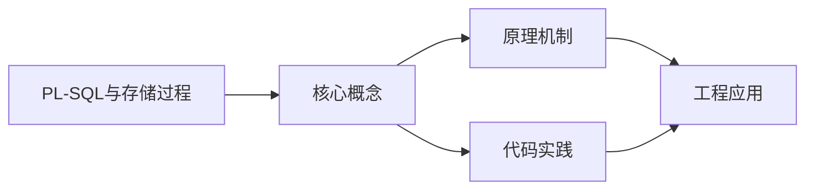
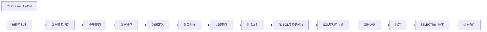

## 1. 学习目标（Bloom 分类）

本节按照布鲁姆教育目标分类学组织学习路径。本文主题为《PL-SQL与存储过程》，属于 SQL 模块，读者可以根据自身阶段选择阅读深度。

记忆层面：能够准确复述本文的核心概念、术语与基本语法或操作步骤，并能够在提问或检索时快速定位对应知识点。能够说出 SQL 的核心概念、语法与常用对象。

理解层面：能够用自己的语言解释核心原理与工作机制，说明概念之间的因果关系，而不是机械记忆结论。能够解释 SQL 的执行原理与优化机制。

应用层面：能够在真实项目或练习场景中运用本文知识解决具体问题，写出正确且可维护的实现。能够编写正确、高效的 SQL 语句与操作。

分析层面：能够拆解复杂问题，比较本文主题与相邻概念的异同，识别边界条件与例外情况。能够分析 SQL 相关方案在性能与一致性上的权衡。

评价层面：能够根据约束条件（性能、可读性、安全、成本）评价不同方案的优劣，做出有依据的技术决策。能够根据业务场景评价 SQL 技术选型。

创造层面：能够把本文知识与其他模块知识组合，设计出新的解决方案或可复用的工程模式。能够组合 SQL 与其他技术设计数据架构。

通过本节学习，读者应当能够把《PL-SQL与存储过程》纳入自己的知识网络，并与 SQL 模块的其他主题（DDL/DML、查询、索引、事务）建立关联。

## 2. 历史动机与发展脉络

《PL-SQL与存储过程》是 SQL 领域的重要主题。要真正理解它，需要先了解它解决的问题与演进过程。

SQL（结构化查询语言）源于 1970 年 Codd 的关系模型，1974 年由 Chamberlin 与 Boyce 设计（SEQUEL），1986 年成为 ANSI 标准；SQL:2023 是当前国际标准。
SQL 分为 DDL（建表）、DML（增删改）、DQL（查询）、DCL（权限）与 TCL（事务）；各大数据库在标准基础上扩展方言。
SQL 是声明式语言：描述“要什么”而非“怎么做”，优化器负责执行计划；这一设计让 SQL 具有跨数据库的表达一致性。

回到本文主题：PL-SQL与存储过程 的提出与成熟，正是上述技术背景下的必然产物。早期实现往往以简单可用为目标，随着工程规模扩大，社区逐渐沉淀出标准做法与最佳实践；理解这一脉络，可以帮助读者判断“为什么文档中的推荐写法是现在这个样子”，也能在遇到历史遗留代码时准确识别其设计年代与取舍。


## 3. 形式化定义与核心概念精讲

本节把《PL-SQL与存储过程》涉及的核心概念以“定义 + 讲解”的形式展开。读者应把定义当作工具，把讲解当作理解路径；两者结合才能形成可迁移的知识。

关系模型：表（关系）、行（元组）、列（属性）；主键唯一标识、外键表达关联、范式消除冗余。
查询执行：解析 -> 绑定 -> 优化（基于代价选择计划）-> 执行；索引、统计信息与连接算法决定性能。
事务 ACID：原子性（Atomicity）、一致性（Consistency）、隔离性（Isolation）、持久性（Durability）；隔离级别控制并发行为。

### 3.1 原文章节逐一精讲

原文档把主题拆分为 10 个小节，下面按顺序给出每一节的导读讲解，随后保留原文细节供精读。

#### 原文精读（完整保留）

# SQL 存储过程与 PL/SQL 语法速查手册

> **符号约定**：`< >` 必填参数 | `[ ]` 可选参数

---

#### 游标

**基本写法：声明游标**
`DECLARE <游标名> CURSOR FOR <SELECT语句>`
```sql
-- MySQL 游标
DELIMITER //
CREATE PROCEDURE process_employees()
BEGIN
  DECLARE done INT DEFAULT FALSE;
  DECLARE v_name VARCHAR(50);
  DECLARE v_salary DECIMAL(10,2);
  
  DECLARE emp_cursor CURSOR FOR
    SELECT name, salary FROM employees WHERE active = 1;
  
  DECLARE CONTINUE HANDLER FOR NOT FOUND SET done = TRUE;
  
  OPEN emp_cursor;
  read_loop: LOOP
    FETCH emp_cursor INTO v_name, v_salary;
    IF done THEN LEAVE read_loop;
    END IF;
    -- 处理每行数据
    INSERT INTO salary_log (name, salary) VALUES (v_name, v_salary);
  END LOOP;
  CLOSE emp_cursor;
END //
DELIMITER ;
```

---

**基本写法：PostgreSQL 游标**
`FOR <变量> IN SELECT <语句> LOOP <处理> END LOOP`
```sql
-- PostgreSQL FOR-IN 循环游标
CREATE OR REPLACE FUNCTION log_salaries()
RETURNS VOID AS $$
DECLARE
  emp_record RECORD;
BEGIN
  FOR emp_record IN SELECT name, salary FROM employees LOOP
    INSERT INTO salary_log (name, salary)
    VALUES (emp_record.name, emp_record.salary);
  END LOOP;
END;
$$ LANGUAGE plpgsql;
```

---

#### 异常处理

**基本写法：MySQL 异常处理**
`DECLARE <CONTINUE|EXIT> HANDLER FOR <条件> <处理语句>`
```sql
-- 异常处理
DELIMITER //
CREATE PROCEDURE safe_insert(IN p_name VARCHAR(50))
BEGIN
  DECLARE EXIT HANDLER FOR SQLEXCEPTION
  BEGIN
    ROLLBACK;
    SELECT '插入失败' AS result;
  END;
  
  START TRANSACTION;
  INSERT INTO users (name) VALUES (p_name);
  INSERT INTO logs (action) VALUES (CONCAT('user_created: ', p_name));
  COMMIT;
END //
DELIMITER ;
```

---

**基本写法：PostgreSQL 异常处理**
`BEGIN <语句> EXCEPTION WHEN <异常> THEN <处理> END`
```sql
-- PostgreSQL 异常处理
CREATE OR REPLACE FUNCTION safe_divide(a NUMERIC, b NUMERIC)
RETURNS NUMERIC AS $$
BEGIN
  RETURN a / b;
EXCEPTION
  WHEN division_by_zero THEN
    RETURN NULL;
  WHEN OTHERS THEN
    RAISE NOTICE '未知错误: %', SQLERRM;
    RETURN NULL;
END;
$$ LANGUAGE plpgsql;
```

---

#### 触发器

**基本写法：创建触发器**
`CREATE TRIGGER <名称> <BEFORE|AFTER> <INSERT|UPDATE|DELETE> ON <表> FOR EACH ROW <动作>`
```sql
-- MySQL 触发器
DELIMITER //
CREATE TRIGGER before_insert_employee
BEFORE INSERT ON employees
FOR EACH ROW
BEGIN
  SET NEW.created_at = NOW();
  IF NEW.salary IS NULL THEN
    SET NEW.salary = 0;
  END IF;
END //
DELIMITER ;
```

---

**基本写法：PostgreSQL 触发器函数**
`CREATE FUNCTION <名>() RETURNS TRIGGER AS $$ BEGIN <动作>; RETURN NEW; END; $$ LANGUAGE plpgsql`
```sql
-- PostgreSQL 触发器（需要先创建函数）
CREATE OR REPLACE FUNCTION update_modified_time()
RETURNS TRIGGER AS $$
BEGIN
  NEW.updated_at = NOW();
  RETURN NEW;
END;
$$ LANGUAGE plpgsql;

CREATE TRIGGER trg_update_time
BEFORE UPDATE ON employees
FOR EACH ROW
EXECUTE FUNCTION update_modified_time();
```

---

#### 存储过程

存储过程是预编译并存储在数据库中的 SQL 程序，可被多次调用。

##### PostgreSQL 存储过程

```sql
-- 创建存储过程（PostgreSQL 11+ 支持 PROCEDURE）
CREATE PROCEDURE transfer_funds(
  p_from INT,
  p_to INT,
  p_amount DECIMAL(10,2)
)
LANGUAGE plpgsql
AS $$
BEGIN
  UPDATE accounts SET balance = balance - p_amount WHERE id = p_from;
  UPDATE accounts SET balance = balance + p_amount WHERE id = p_to;
  COMMIT;
END;
$$;

-- 调用
CALL transfer_funds(1, 2, 100.00);

-- 创建函数（返回值）
CREATE FUNCTION get_dept_avg_salary(p_dept VARCHAR)
RETURNS DECIMAL(10,2)
LANGUAGE plpgsql
AS $$
DECLARE
  v_avg DECIMAL(10,2);
BEGIN
  SELECT AVG(salary) INTO v_avg
  FROM employees
  WHERE department = p_dept;
  RETURN v_avg;
END;
$$;

-- 调用函数
SELECT get_dept_avg_salary('IT');

-- 返回表的函数
CREATE FUNCTION get_employees_by_dept(p_dept VARCHAR)
RETURNS TABLE(name VARCHAR, salary DECIMAL(10,2))
LANGUAGE plpgsql
AS $$
BEGIN
  RETURN QUERY
  SELECT e.name, e.salary
  FROM employees e
  WHERE e.department = p_dept
  ORDER BY e.salary DESC;
END;
$$;

SELECT * FROM get_employees_by_dept('IT');
```

##### MySQL 存储过程

```sql
-- 创建存储过程
DELIMITER //
CREATE PROCEDURE transfer_funds(
  IN p_from INT,
  IN p_to INT,
  IN p_amount DECIMAL(10,2)
)
BEGIN
  UPDATE accounts SET balance = balance - p_amount WHERE id = p_from;
  UPDATE accounts SET balance = balance + p_amount WHERE id = p_to;
  COMMIT;
END //
DELIMITER ;

-- 调用
CALL transfer_funds(1, 2, 100.00);

-- 带输出参数
DELIMITER //
CREATE PROCEDURE get_user_stats(
  IN p_user_id INT,
  OUT p_order_count INT,
  OUT p_total_amount DECIMAL(10,2)
)
BEGIN
  SELECT COUNT(*), COALESCE(SUM(amount), 0)
  INTO p_order_count, p_total_amount
  FROM orders
  WHERE user_id = p_user_id;
END //
DELIMITER ;

CALL get_user_stats(1, @count, @total);
SELECT @count, @total;

-- 创建函数
DELIMITER //
CREATE FUNCTION get_dept_avg_salary(p_dept VARCHAR(50))
RETURNS DECIMAL(10,2)
DETERMINISTIC
READS SQL DATA
BEGIN
  DECLARE v_avg DECIMAL(10,2);
  SELECT AVG(salary) INTO v_avg
  FROM employees
  WHERE department = p_dept;
  RETURN v_avg;
END //
DELIMITER ;
```

##### SQL Server 存储过程

```sql
-- 创建存储过程
CREATE PROCEDURE transfer_funds
  @from INT,
  @to INT,
  @amount DECIMAL(10,2)
AS
BEGIN
  SET NOCOUNT ON;
  UPDATE accounts SET balance = balance - @amount WHERE id = @from;
  UPDATE accounts SET balance = balance + @amount WHERE id = @to;
  COMMIT;
END;

-- 调用
EXEC transfer_funds @from = 1, @to = 2, @amount = 100.00;

-- 返回结果集
CREATE PROCEDURE get_employees_by_dept
  @dept VARCHAR(50)
AS
BEGIN
  SELECT name, salary
  FROM employees
  WHERE department = @dept
  ORDER BY salary DESC;
END;

EXEC get_employees_by_dept @dept = 'IT';
```

##### PostgreSQL 触发器

```sql
-- 创建触发器函数
CREATE OR REPLACE FUNCTION update_modified_at()
RETURNS TRIGGER AS $$
BEGIN
  NEW.updated_at = CURRENT_TIMESTAMP;
  RETURN NEW;
END;
$$ LANGUAGE plpgsql;

-- 创建触发器
CREATE TRIGGER trg_users_updated_at
  BEFORE UPDATE ON users
  FOR EACH ROW
  EXECUTE FUNCTION update_modified_at();

-- 审计触发器
CREATE OR REPLACE FUNCTION audit_changes()
RETURNS TRIGGER AS $$
BEGIN
  IF TG_OP = 'INSERT' THEN
    INSERT INTO audit_log(table_name, operation, new_data, changed_at)
    VALUES(TG_TABLE_NAME, 'INSERT', to_jsonb(NEW), CURRENT_TIMESTAMP);
    RETURN NEW;
  ELSIF TG_OP = 'UPDATE' THEN
    INSERT INTO audit_log(table_name, operation, old_data, new_data, changed_at)
    VALUES(TG_TABLE_NAME, 'UPDATE', to_jsonb(OLD), to_jsonb(NEW), CURRENT_TIMESTAMP);
    RETURN NEW;
  ELSIF TG_OP = 'DELETE' THEN
    INSERT INTO audit_log(table_name, operation, old_data, changed_at)
    VALUES(TG_TABLE_NAME, 'DELETE', to_jsonb(OLD), CURRENT_TIMESTAMP);
    RETURN OLD;
  END IF;
END;
$$ LANGUAGE plpgsql;

CREATE TRIGGER trg_users_audit
  AFTER INSERT OR UPDATE OR DELETE ON users
  FOR EACH ROW
  EXECUTE FUNCTION audit_changes();

-- 语句级触发器（每条 SQL 触发一次）
CREATE TRIGGER trg_orders_after_batch
  AFTER UPDATE ON orders
  FOR EACH STATEMENT
  EXECUTE FUNCTION refresh_materialized_view();
```

##### MySQL 触发器

```sql
-- BEFORE INSERT 触发器
DELIMITER //
CREATE TRIGGER trg_users_before_insert
BEFORE INSERT ON users
FOR EACH ROW
BEGIN
  SET NEW.created_at = CURRENT_TIMESTAMP;
  SET NEW.updated_at = CURRENT_TIMESTAMP;
END //
DELIMITER ;

-- AFTER UPDATE 触发器
DELIMITER //
CREATE TRIGGER trg_orders_after_update
AFTER UPDATE ON orders
FOR EACH ROW
BEGIN
  IF OLD.status != NEW.status THEN
    INSERT INTO order_status_log(order_id, old_status, new_status, changed_at)
    VALUES(NEW.id, OLD.status, NEW.status, CURRENT_TIMESTAMP);
  END IF;
END //
DELIMITER ;
```

##### PostgreSQL 游标

```sql
CREATE FUNCTION process_orders()
RETURNS VOID
LANGUAGE plpgsql
AS $$
DECLARE
  order_cursor CURSOR FOR
    SELECT id, customer_id, amount FROM orders WHERE status = 'pending';
  v_id INT;
  v_customer_id INT;
  v_amount DECIMAL(10,2);
BEGIN
  OPEN order_cursor;
  LOOP
    FETCH order_cursor INTO v_id, v_customer_id, v_amount;
    EXIT WHEN NOT FOUND;

    -- 处理每笔订单
    UPDATE orders SET status = 'processing' WHERE id = v_id;
    INSERT INTO order_log(order_id, action, created_at)
    VALUES(v_id, 'processing_started', CURRENT_TIMESTAMP);

    -- 模拟业务逻辑
    IF v_amount > 10000 THEN
      UPDATE orders SET priority = 'high' WHERE id = v_id;
    END IF;
  END LOOP;
  CLOSE order_cursor;
END;
$$;

-- FOR 循环游标（更简洁）
CREATE FUNCTION batch_update_prices()
RETURNS INT
LANGUAGE plpgsql
AS $$
DECLARE
  v_count INT := 0;
BEGIN
  FOR rec IN
    SELECT id, price FROM products WHERE category = 'electronics'
  LOOP
    UPDATE products SET price = rec.price * 1.1 WHERE id = rec.id;
    v_count := v_count + 1;
  END LOOP;
  RETURN v_count;
END;
$$;
```

##### SQL Server 游标

```sql
CREATE PROCEDURE process_orders
AS
BEGIN
  DECLARE @id INT, @customer_id INT, @amount DECIMAL(10,2);

  DECLARE order_cursor CURSOR FOR
    SELECT id, customer_id, amount FROM orders WHERE status = 'pending';

  OPEN order_cursor;
  FETCH NEXT FROM order_cursor INTO @id, @customer_id, @amount;

  WHILE @@FETCH_STATUS = 0
  BEGIN
    UPDATE orders SET status = 'processing' WHERE id = @id;
    FETCH NEXT FROM order_cursor INTO @id, @customer_id, @amount;
  END

  CLOSE order_cursor;
  DEALLOCATE order_cursor;
END;
```

> **注意**：游标性能较差，应尽量用集合操作替代。只在必须逐行处理时才使用游标。

##### PostgreSQL 异常处理

```sql
CREATE FUNCTION safe_transfer(
  p_from INT,
  p_to INT,
  p_amount DECIMAL(10,2)
)
RETURNS BOOLEAN
LANGUAGE plpgsql
AS $$
DECLARE
  v_balance DECIMAL(10,2);
BEGIN
  -- 检查余额
  SELECT balance INTO v_balance FROM accounts WHERE id = p_from FOR UPDATE;

  IF v_balance < p_amount THEN
    RAISE EXCEPTION '余额不足: 当前 %, 需要 %', v_balance, p_amount;
  END IF;

  -- 执行转账
  UPDATE accounts SET balance = balance - p_amount WHERE id = p_from;
  UPDATE accounts SET balance = balance + p_amount WHERE id = p_to;

  RETURN true;

EXCEPTION
  WHEN NO_DATA_FOUND THEN
    RAISE NOTICE '账户不存在: %', p_from;
    RETURN false;
  WHEN OTHERS THEN
    RAISE NOTICE '转账失败: %', SQLERRM;
    RETURN false;
END;
$$;

-- 自定义异常
CREATE FUNCTION validate_order(p_order_id INT)
RETURNS VOID
LANGUAGE plpgsql
AS $$
BEGIN
  IF NOT EXISTS (SELECT 1 FROM orders WHERE id = p_order_id) THEN
    RAISE EXCEPTION '订单 % 不存在', p_order_id USING ERRCODE = 'P0001';
  END IF;

  IF EXISTS (SELECT 1 FROM orders WHERE id = p_order_id AND status = 'cancelled') THEN
    RAISE EXCEPTION '订单 % 已取消', p_order_id USING ERRCODE = 'P0002';
  END IF;
END;
$$;
```

##### MySQL 异常处理

```sql
DELIMITER //
CREATE PROCEDURE safe_transfer(
  IN p_from INT,
  IN p_to INT,
  IN p_amount DECIMAL(10,2),
  OUT p_success BOOLEAN
)
BEGIN
  DECLARE EXIT HANDLER FOR SQLEXCEPTION
  BEGIN
    ROLLBACK;
    SET p_success = FALSE;
  END;

  START TRANSACTION;

  UPDATE accounts SET balance = balance - p_amount WHERE id = p_from;
  UPDATE accounts SET balance = balance + p_amount WHERE id = p_to;

  COMMIT;
  SET p_success = TRUE;
END //
DELIMITER ;

-- 条件处理
DELIMITER //
CREATE PROCEDURE insert_user(
  IN p_name VARCHAR(100),
  IN p_email VARCHAR(255)
)
BEGIN
  DECLARE CONTINUE HANDLER FOR 1062  -- Duplicate entry
  BEGIN
    SELECT '邮箱已存在' AS message;
  END;

  INSERT INTO users (name, email) VALUES (p_name, p_email);
END //
DELIMITER ;
```

#### 动态 SQL

##### PostgreSQL 动态 SQL

```sql
CREATE FUNCTION dynamic_query(
  p_table TEXT,
  p_column TEXT,
  p_value TEXT
)
RETURNS SETOF RECORD
LANGUAGE plpgsql
AS $$
BEGIN
  RETURN QUERY EXECUTE format(
    'SELECT * FROM %I WHERE %I = $1',
    p_table, p_column
  ) USING p_value;
END;
$$;

-- 调用（需指定列类型）
SELECT * FROM dynamic_query('users', 'email', 'alice@example.com')
  AS (id INT, name VARCHAR, email VARCHAR);

-- 更安全的动态 SQL
CREATE FUNCTION search_orders(p_conditions JSONB)
RETURNS TABLE(id INT, amount DECIMAL, order_date DATE)
LANGUAGE plpgsql
AS $$
DECLARE
  v_sql TEXT;
  v_where TEXT := '';
BEGIN
  v_sql := 'SELECT id, amount, order_date FROM orders WHERE 1=1';

  IF p_conditions ? 'status' THEN
    v_where := v_where || ' AND status = $1';
  END IF;

  IF p_conditions ? 'min_amount' THEN
    v_where := v_where || ' AND amount >= $2';
  END IF;

  v_sql := v_sql || v_where;

  RETURN QUERY EXECUTE v_sql
    USING p_conditions->>'status',
          (p_conditions->>'min_amount')::DECIMAL;
END;
$$;
```

##### SQL Server 动态 SQL

```sql
CREATE PROCEDURE search_orders
  @status VARCHAR(20) = NULL,
  @min_amount DECIMAL(10,2) = NULL
AS
BEGIN
  DECLARE @sql NVARCHAR(MAX);
  DECLARE @params NVARCHAR(MAX);

  SET @sql = N'SELECT id, amount, order_date FROM orders WHERE 1=1';
  SET @params = N'@status VARCHAR(20), @min_amount DECIMAL(10,2)';

  IF @status IS NOT NULL
    SET @sql = @sql + N' AND status = @status';

  IF @min_amount IS NOT NULL
    SET @sql = @sql + N' AND amount >= @min_amount';

  EXEC sp_executesql @sql, @params, @status, @min_amount;
END;
```

#### 方言对比

##### 变量声明

```sql
-- PostgreSQL (PL/pgSQL)
DECLARE
  v_name VARCHAR(100) := 'default';
  v_count INT DEFAULT 0;
  v_data RECORD;

-- MySQL
DECLARE v_name VARCHAR(100) DEFAULT 'default';
DECLARE v_count INT DEFAULT 0;

-- SQL Server (T-SQL)
DECLARE @name VARCHAR(100) = 'default';
DECLARE @count INT = 0;

-- Oracle (PL/SQL)
v_name VARCHAR2(100) := 'default';
v_count NUMBER := 0;
```

##### 控制流

```sql
-- IF 语句
-- PostgreSQL
IF v_score >= 90 THEN
  v_grade := 'A';
ELSIF v_score >= 80 THEN
  v_grade := 'B';
ELSE
  v_grade := 'C';
END IF;

-- MySQL
IF v_score >= 90 THEN
  SET v_grade = 'A';
ELSEIF v_score >= 80 THEN
  SET v_grade = 'B';
ELSE
  SET v_grade = 'C';
END IF;

-- SQL Server
IF @score >= 90
  SET @grade = 'A';
ELSE IF @score >= 80
  SET @grade = 'B';
ELSE
  SET @grade = 'C';

-- LOOP 语句
-- PostgreSQL
LOOP
  v_count := v_count + 1;
  EXIT WHEN v_count > 10;
END LOOP;

-- WHILE
WHILE v_count <= 10 LOOP
  v_count := v_count + 1;
END LOOP;

-- SQL Server
WHILE @count <= 10
BEGIN
  SET @count = @count + 1;
END

-- FOR 循环
-- PostgreSQL
FOR i IN 1..10 LOOP
  -- ...
END LOOP;

-- Oracle
FOR i IN 1..10 LOOP
  -- ...
END LOOP;
```

##### 完整方言对比表

| 特性       | PL/pgSQL     | MySQL           | T-SQL         | PL/SQL            |
| ---------- | ------------ | --------------- | ------------- | ----------------- |
| 变量前缀   | 无           | 无              | @             | 无                |
| 赋值       | `:=` 或 `=`  | `SET var =`     | `SET @var =`  | `:=`              |
| IF         | ELSIF        | ELSEIF          | ELSE IF       | ELSIF             |
| 字符串拼接 | `\|\|`       | CONCAT()        | +             | `\|\|`            |
| 异常处理   | EXCEPTION块  | HANDLER         | TRY/CATCH     | EXCEPTION块       |
| 游标循环   | FOR rec IN   | FETCH + WHILE   | FETCH + WHILE | FOR rec IN        |
| 动态SQL    | EXECUTE      | PREPARE/EXECUTE | sp_executesql | EXECUTE IMMEDIATE |
| 返回结果集 | RETURN QUERY | SELECT          | SELECT        | PIPELINED         |
| 数组支持   |              |                 |               | (VARRAY)          |
| 事务控制   |              |                 |               |                   |

#### 小结

- 存储过程适合封装复杂业务逻辑，函数适合计算并返回值
- 触发器用于自动化操作（审计日志、数据同步），但应避免过度使用
- 游标逐行处理性能差，优先使用集合操作
- 异常处理保证程序健壮性，PostgreSQL 用 `EXCEPTION` 块，MySQL 用 `HANDLER`
- 动态 SQL 注意 SQL 注入风险，使用参数化方式（`EXECUTE ... USING`）
- 四种方言在语法上差异较大，但核心概念相通
#### 存储过程创建

**基本写法：MySQL 存储过程**
`CREATE PROCEDURE <名称>([<参数>]) BEGIN <SQL语句> END`
```sql
-- MySQL 创建存储过程
DELIMITER //
CREATE PROCEDURE get_employee_count(OUT count INT)
BEGIN
  SELECT COUNT(*) INTO count FROM employees;
END //
DELIMITER ;

-- 调用
CALL get_employee_count(@total);
SELECT @total;
```

---

**基本写法：PostgreSQL 函数**
`CREATE OR REPLACE FUNCTION <名称>(<参数>) RETURNS <类型> AS $$ BEGIN <SQL> END; $$ LANGUAGE plpgsql`
```sql
-- PostgreSQL PL/pgSQL 函数
CREATE OR REPLACE FUNCTION get_dept_count(p_dept VARCHAR)
RETURNS INTEGER AS $$
DECLARE
  v_count INTEGER;
BEGIN
  SELECT COUNT(*) INTO v_count FROM employees WHERE dept = p_dept;
  RETURN v_count;
END;
$$ LANGUAGE plpgsql;

-- 调用
SELECT get_dept_count('IT');
```

---

**基本写法：带 IN 参数**
`CREATE PROCEDURE <名>(IN <参数> <类型>)`
```sql
-- MySQL 带输入参数
DELIMITER //
CREATE PROCEDURE get_by_salary(IN min_sal DECIMAL(10,2))
BEGIN
  SELECT name, salary FROM employees WHERE salary >= min_sal;
END //
DELIMITER ;

CALL get_by_salary(50000);
```

---

**基本写法：带 OUT 参数**
`CREATE PROCEDURE <名>(OUT <参数> <类型>)`
```sql
-- MySQL 带输出参数
DELIMITER //
CREATE PROCEDURE get_avg_salary(OUT avg_sal DECIMAL(10,2))
BEGIN
  SELECT AVG(salary) INTO avg_sal FROM employees;
END //
DELIMITER ;

CALL get_avg_salary(@avg);
SELECT @avg;
```

---

**基本写法：带 INOUT 参数**
`CREATE PROCEDURE <名>(INOUT <参数> <类型>)`
```sql
-- INOUT 参数可读可写
DELIMITER //
CREATE PROCEDURE double_value(INOUT val INT)
BEGIN
  SET val = val * 2;
END //
DELIMITER ;

SET @x = 10;
CALL double_value(@x);
SELECT @x;  -- 20
```

---

#### 变量与控制流

**基本写法：声明变量**
`DECLARE <变量名> <类型> [DEFAULT <默认值>];`
```sql
-- MySQL 存储过程中声明变量
DELIMITER //
CREATE PROCEDURE demo_vars()
BEGIN
  DECLARE v_name VARCHAR(50) DEFAULT 'unknown';
  DECLARE v_count INT DEFAULT 0;
  DECLARE v_active BOOLEAN DEFAULT TRUE;
  
  SET v_name = 'Alice';
  SELECT COUNT(*) INTO v_count FROM employees;
  
  SELECT v_name, v_count, v_active;
END //
DELIMITER ;
```

---

**基本写法：IF 条件**
`IF <条件> THEN <语句> ELSEIF <条件> THEN <语句> ELSE <语句> END IF`
```sql
-- IF/ELSEIF/ELSE
DELIMITER //
CREATE PROCEDURE get_salary_level(IN sal DECIMAL(10,2), OUT level VARCHAR(20))
BEGIN
  IF sal >= 100000 THEN
    SET level = '高薪';
  ELSEIF sal >= 50000 THEN
    SET level = '中薪';
  ELSE
    SET level = '普通';
  END IF;
END //
DELIMITER ;
```

---

**基本写法：CASE 语句**
`CASE WHEN <条件> THEN <值> ... ELSE <值> END CASE`
```sql
-- CASE WHEN 控制流
DELIMITER //
CREATE PROCEDURE get_grade(IN score INT, OUT grade CHAR(1))
BEGIN
  CASE
    WHEN score >= 90 THEN SET grade = 'A';
    WHEN score >= 80 THEN SET grade = 'B';
    WHEN score >= 70 THEN SET grade = 'C';
    WHEN score >= 60 THEN SET grade = 'D';
    ELSE SET grade = 'F';
  END CASE;
END //
DELIMITER ;
```

---

**基本写法：WHILE 循环**
`WHILE <条件> DO <语句> END WHILE`
```sql
-- WHILE 循环
DELIMITER //
CREATE PROCEDURE fill_numbers(IN max_n INT)
BEGIN
  DECLARE i INT DEFAULT 1;
  WHILE i <= max_n DO
    INSERT INTO numbers (value) VALUES (i);
    SET i = i + 1;
  END WHILE;
END //
DELIMITER ;
```

---

**基本写法：LOOP 循环**
`<标签>: LOOP <语句> IF <条件> THEN LEAVE <标签>; END IF; END LOOP`
```sql
-- LOOP + LEAVE
DELIMITER //
CREATE PROCEDURE process_loop(IN max_count INT)
BEGIN
  DECLARE i INT DEFAULT 0;
  loop1: LOOP
    SET i = i + 1;
    IF i > max_count THEN
      LEAVE loop1;
    END IF;
    -- 处理逻辑
  END LOOP loop1;
END //
DELIMITER ;
```

---

**基本写法：REPEAT 循环**
`REPEAT <语句> UNTIL <条件> END REPEAT`
```sql
-- REPEAT UNTIL（先执行后判断）
DELIMITER //
CREATE PROCEDURE repeat_demo(IN max_n INT)
BEGIN
  DECLARE i INT DEFAULT 0;
  REPEAT
    SET i = i + 1;
  UNTIL i >= max_n
  END REPEAT;
END //
DELIMITER ;
```

---

#### 删除与查看

**基本写法：删除存储过程**
`DROP PROCEDURE [IF EXISTS] <名称>`
```sql
-- 删除存储过程
DROP PROCEDURE IF EXISTS get_employee_count;
```

---

**基本写法：查看存储过程**
`SHOW CREATE PROCEDURE <名称>`
```sql
-- MySQL 查看存储过程定义
SHOW CREATE PROCEDURE get_employee_count;

-- 查看所有存储过程
SELECT routine_name, routine_type
FROM information_schema.routines
WHERE routine_schema = 'mydb';
```

---

**基本写法：PostgreSQL 查看函数**
`SELECT proname FROM pg_proc WHERE proname LIKE '<模式>';`
```sql
-- PostgreSQL 查看函数
SELECT proname, prosrc FROM pg_proc
WHERE proname = 'get_dept_count';
```


### 3.2 概念关系图

下面用 Mermaid 图表达本文核心概念之间的关系，帮助读者建立整体图景：



图中展示的是本文知识的结构化关系：核心概念是入口，原理机制解释“为什么”，代码实践演示“怎么做”，工程应用回答“何时用”。读者学习时可以把每个小节的内容挂接到对应节点上。

## 4. 理论推导与原理解析

本节深入《PL-SQL与存储过程》背后的原理。理论部分不求面面俱到，而是聚焦“能解释现象、能指导实践”的关键推导。

关系模型：表（关系）、行（元组）、列（属性）；主键唯一标识、外键表达关联、范式消除冗余。
查询执行：解析 -> 绑定 -> 优化（基于代价选择计划）-> 执行；索引、统计信息与连接算法决定性能。
事务 ACID：原子性（Atomicity）、一致性（Consistency）、隔离性（Isolation）、持久性（Durability）；隔离级别控制并发行为。
集合语义：SELECT 返回结果集；JOIN 组合关系，GROUP BY 聚合，子查询与 CTE 表达复杂逻辑。

需要强调的是，理论推导与工程实践之间存在翻译层：理论给出的是理想化模型与边界条件，工程代码则必须处理真实环境中的例外。读者在学习时应先掌握理论的“标准情形”，再通过陷阱章节了解“非标准情形”。

## 5. 代码示例与逐行讲解

本节把原文中的代码示例系统整理，并为每个示例补充用途说明与讲解。读者不应只浏览代码，而应逐段对照讲解理解设计意图。

### 5.1 示例：游标

该示例来自原文《游标》小节，用于演示PL-SQL与存储过程相关操作。阅读时请先看代码结构，再看其后的讲解。

```sql
-- MySQL 游标
DELIMITER //
CREATE PROCEDURE process_employees()
BEGIN
  DECLARE done INT DEFAULT FALSE;
  DECLARE v_name VARCHAR(50);
  DECLARE v_salary DECIMAL(10,2);
  
  DECLARE emp_cursor CURSOR FOR
    SELECT name, salary FROM employees WHERE active = 1;
  
  DECLARE CONTINUE HANDLER FOR NOT FOUND SET done = TRUE;
  
  OPEN emp_cursor;
  read_loop: LOOP
    FETCH emp_cursor INTO v_name, v_salary;
    IF done THEN LEAVE read_loop;
    END IF;
    -- 处理每行数据
    INSERT INTO salary_log (name, salary) VALUES (v_name, v_salary);
  END LOOP;
  CLOSE emp_cursor;
END //
DELIMITER ;
```

讲解：这段代码演示了本节核心知识点。代码中的关键操作可以归纳为三步：准备（定义或初始化）、执行（核心逻辑）、收尾（释放资源或返回结果）。实际项目中，这三步往往被封装为函数或类，以提升复用性与可测试性。

关键点分析：

该示例共 21 行有效代码，包含 4 类关键结构（SELECT、INSERT、CREATE、FROM）。其中：

- 入口与初始化部分负责建立上下文，对应实际项目中的启动或装配逻辑；
- 核心逻辑部分体现本文主题的主要操作，是阅读时最需要对照讲解理解的部分；
- 输出或返回部分把结果交给调用方，注意其类型与边界条件。

进阶思考路径：先尝试修改参数观察行为变化，再把示例中的模式迁移到自己的项目中；每次修改都记录预期与实测差异，这是把示例转化为能力的最快方式。

### 5.2 示例：游标

该示例来自原文《游标》小节，用于演示PL-SQL与存储过程相关操作。阅读时请先看代码结构，再看其后的讲解。

```sql
-- PostgreSQL FOR-IN 循环游标
CREATE OR REPLACE FUNCTION log_salaries()
RETURNS VOID AS $$
DECLARE
  emp_record RECORD;
BEGIN
  FOR emp_record IN SELECT name, salary FROM employees LOOP
    INSERT INTO salary_log (name, salary)
    VALUES (emp_record.name, emp_record.salary);
  END LOOP;
END;
$$ LANGUAGE plpgsql;
```

讲解：这段代码演示了本节核心知识点。代码中的关键操作可以归纳为三步：准备（定义或初始化）、执行（核心逻辑）、收尾（释放资源或返回结果）。实际项目中，这三步往往被封装为函数或类，以提升复用性与可测试性。

关键点分析：

该示例共 12 行有效代码，包含 4 类关键结构（SELECT、INSERT、CREATE、FROM）。其中：

- 入口与初始化部分负责建立上下文，对应实际项目中的启动或装配逻辑；
- 核心逻辑部分体现本文主题的主要操作，是阅读时最需要对照讲解理解的部分；
- 输出或返回部分把结果交给调用方，注意其类型与边界条件。

进阶思考路径：先尝试修改参数观察行为变化，再把示例中的模式迁移到自己的项目中；每次修改都记录预期与实测差异，这是把示例转化为能力的最快方式。

### 5.3 示例：异常处理

该示例来自原文《异常处理》小节，用于演示PL-SQL与存储过程相关操作。阅读时请先看代码结构，再看其后的讲解。

```sql
-- 异常处理
DELIMITER //
CREATE PROCEDURE safe_insert(IN p_name VARCHAR(50))
BEGIN
  DECLARE EXIT HANDLER FOR SQLEXCEPTION
  BEGIN
    ROLLBACK;
    SELECT '插入失败' AS result;
  END;
  
  START TRANSACTION;
  INSERT INTO users (name) VALUES (p_name);
  INSERT INTO logs (action) VALUES (CONCAT('user_created: ', p_name));
  COMMIT;
END //
DELIMITER ;
```

讲解：这段代码演示了本节核心知识点。代码中的关键操作可以归纳为三步：准备（定义或初始化）、执行（核心逻辑）、收尾（释放资源或返回结果）。实际项目中，这三步往往被封装为函数或类，以提升复用性与可测试性。

关键点分析：

该示例共 15 行有效代码，包含 3 类关键结构（SELECT、INSERT、CREATE）。其中：

- 入口与初始化部分负责建立上下文，对应实际项目中的启动或装配逻辑；
- 核心逻辑部分体现本文主题的主要操作，是阅读时最需要对照讲解理解的部分；
- 输出或返回部分把结果交给调用方，注意其类型与边界条件。

进阶思考路径：先尝试修改参数观察行为变化，再把示例中的模式迁移到自己的项目中；每次修改都记录预期与实测差异，这是把示例转化为能力的最快方式。

### 5.4 示例：异常处理

该示例来自原文《异常处理》小节，用于演示PL-SQL与存储过程相关操作。阅读时请先看代码结构，再看其后的讲解。

```sql
-- PostgreSQL 异常处理
CREATE OR REPLACE FUNCTION safe_divide(a NUMERIC, b NUMERIC)
RETURNS NUMERIC AS $$
BEGIN
  RETURN a / b;
EXCEPTION
  WHEN division_by_zero THEN
    RETURN NULL;
  WHEN OTHERS THEN
    RAISE NOTICE '未知错误: %', SQLERRM;
    RETURN NULL;
END;
$$ LANGUAGE plpgsql;
```

讲解：这段代码演示了本节核心知识点。代码中的关键操作可以归纳为三步：准备（定义或初始化）、执行（核心逻辑）、收尾（释放资源或返回结果）。实际项目中，这三步往往被封装为函数或类，以提升复用性与可测试性。

关键点分析：

该示例共 13 行有效代码，包含 1 类关键结构（CREATE）。其中：

- 入口与初始化部分负责建立上下文，对应实际项目中的启动或装配逻辑；
- 核心逻辑部分体现本文主题的主要操作，是阅读时最需要对照讲解理解的部分；
- 输出或返回部分把结果交给调用方，注意其类型与边界条件。

进阶思考路径：先尝试修改参数观察行为变化，再把示例中的模式迁移到自己的项目中；每次修改都记录预期与实测差异，这是把示例转化为能力的最快方式。

### 5.5 示例：触发器

该示例来自原文《触发器》小节，用于演示PL-SQL与存储过程相关操作。阅读时请先看代码结构，再看其后的讲解。

```sql
-- MySQL 触发器
DELIMITER //
CREATE TRIGGER before_insert_employee
BEFORE INSERT ON employees
FOR EACH ROW
BEGIN
  SET NEW.created_at = NOW();
  IF NEW.salary IS NULL THEN
    SET NEW.salary = 0;
  END IF;
END //
DELIMITER ;
```

讲解：这段代码演示了本节核心知识点。代码中的关键操作可以归纳为三步：准备（定义或初始化）、执行（核心逻辑）、收尾（释放资源或返回结果）。实际项目中，这三步往往被封装为函数或类，以提升复用性与可测试性。

关键点分析：

该示例共 12 行有效代码，包含 2 类关键结构（INSERT、CREATE）。其中：

- 入口与初始化部分负责建立上下文，对应实际项目中的启动或装配逻辑；
- 核心逻辑部分体现本文主题的主要操作，是阅读时最需要对照讲解理解的部分；
- 输出或返回部分把结果交给调用方，注意其类型与边界条件。

进阶思考路径：先尝试修改参数观察行为变化，再把示例中的模式迁移到自己的项目中；每次修改都记录预期与实测差异，这是把示例转化为能力的最快方式。

### 5.6 示例：触发器

该示例来自原文《触发器》小节，用于演示PL-SQL与存储过程相关操作。阅读时请先看代码结构，再看其后的讲解。

```sql
-- PostgreSQL 触发器（需要先创建函数）
CREATE OR REPLACE FUNCTION update_modified_time()
RETURNS TRIGGER AS $$
BEGIN
  NEW.updated_at = NOW();
  RETURN NEW;
END;
$$ LANGUAGE plpgsql;

CREATE TRIGGER trg_update_time
BEFORE UPDATE ON employees
FOR EACH ROW
EXECUTE FUNCTION update_modified_time();
```

讲解：这段代码演示了本节核心知识点。代码中的关键操作可以归纳为三步：准备（定义或初始化）、执行（核心逻辑）、收尾（释放资源或返回结果）。实际项目中，这三步往往被封装为函数或类，以提升复用性与可测试性。

关键点分析：

该示例共 12 行有效代码，包含 1 类关键结构（CREATE）。其中：

- 入口与初始化部分负责建立上下文，对应实际项目中的启动或装配逻辑；
- 核心逻辑部分体现本文主题的主要操作，是阅读时最需要对照讲解理解的部分；
- 输出或返回部分把结果交给调用方，注意其类型与边界条件。

进阶思考路径：先尝试修改参数观察行为变化，再把示例中的模式迁移到自己的项目中；每次修改都记录预期与实测差异，这是把示例转化为能力的最快方式。

### 5.7 示例：PostgreSQL 存储过程

该示例来自原文《PostgreSQL 存储过程》小节，用于演示PL-SQL与存储过程相关操作。阅读时请先看代码结构，再看其后的讲解。

```sql
-- 创建存储过程（PostgreSQL 11+ 支持 PROCEDURE）
CREATE PROCEDURE transfer_funds(
  p_from INT,
  p_to INT,
  p_amount DECIMAL(10,2)
)
LANGUAGE plpgsql
AS $$
BEGIN
  UPDATE accounts SET balance = balance - p_amount WHERE id = p_from;
  UPDATE accounts SET balance = balance + p_amount WHERE id = p_to;
  COMMIT;
END;
$$;

-- 调用
CALL transfer_funds(1, 2, 100.00);

-- 创建函数（返回值）
CREATE FUNCTION get_dept_avg_salary(p_dept VARCHAR)
RETURNS DECIMAL(10,2)
LANGUAGE plpgsql
AS $$
DECLARE
  v_avg DECIMAL(10,2);
BEGIN
  SELECT AVG(salary) INTO v_avg
  FROM employees
  WHERE department = p_dept;
  RETURN v_avg;
END;
$$;

-- 调用函数
SELECT get_dept_avg_salary('IT');

-- 返回表的函数
CREATE FUNCTION get_employees_by_dept(p_dept VARCHAR)
RETURNS TABLE(name VARCHAR, salary DECIMAL(10,2))
LANGUAGE plpgsql
AS $$
BEGIN
  RETURN QUERY
  SELECT e.name, e.salary
  FROM employees e
  WHERE e.department = p_dept
  ORDER BY e.salary DESC;
END;
$$;

SELECT * FROM get_employees_by_dept('IT');
```

讲解：这段代码演示了本节核心知识点。代码中的关键操作可以归纳为三步：准备（定义或初始化）、执行（核心逻辑）、收尾（释放资源或返回结果）。实际项目中，这三步往往被封装为函数或类，以提升复用性与可测试性。

关键点分析：

该示例共 46 行有效代码，包含 4 类关键结构（from、SELECT、CREATE、FROM）。其中：

- 入口与初始化部分负责建立上下文，对应实际项目中的启动或装配逻辑；
- 核心逻辑部分体现本文主题的主要操作，是阅读时最需要对照讲解理解的部分；
- 输出或返回部分把结果交给调用方，注意其类型与边界条件。

进阶思考路径：先尝试修改参数观察行为变化，再把示例中的模式迁移到自己的项目中；每次修改都记录预期与实测差异，这是把示例转化为能力的最快方式。

### 5.8 示例：MySQL 存储过程

该示例来自原文《MySQL 存储过程》小节，用于演示PL-SQL与存储过程相关操作。阅读时请先看代码结构，再看其后的讲解。

```sql
-- 创建存储过程
DELIMITER //
CREATE PROCEDURE transfer_funds(
  IN p_from INT,
  IN p_to INT,
  IN p_amount DECIMAL(10,2)
)
BEGIN
  UPDATE accounts SET balance = balance - p_amount WHERE id = p_from;
  UPDATE accounts SET balance = balance + p_amount WHERE id = p_to;
  COMMIT;
END //
DELIMITER ;

-- 调用
CALL transfer_funds(1, 2, 100.00);

-- 带输出参数
DELIMITER //
CREATE PROCEDURE get_user_stats(
  IN p_user_id INT,
  OUT p_order_count INT,
  OUT p_total_amount DECIMAL(10,2)
)
BEGIN
  SELECT COUNT(*), COALESCE(SUM(amount), 0)
  INTO p_order_count, p_total_amount
  FROM orders
  WHERE user_id = p_user_id;
END //
DELIMITER ;

CALL get_user_stats(1, @count, @total);
SELECT @count, @total;

-- 创建函数
DELIMITER //
CREATE FUNCTION get_dept_avg_salary(p_dept VARCHAR(50))
RETURNS DECIMAL(10,2)
DETERMINISTIC
READS SQL DATA
BEGIN
  DECLARE v_avg DECIMAL(10,2);
  SELECT AVG(salary) INTO v_avg
  FROM employees
  WHERE department = p_dept;
  RETURN v_avg;
END //
DELIMITER ;
```

讲解：这段代码演示了本节核心知识点。代码中的关键操作可以归纳为三步：准备（定义或初始化）、执行（核心逻辑）、收尾（释放资源或返回结果）。实际项目中，这三步往往被封装为函数或类，以提升复用性与可测试性。

关键点分析：

该示例共 45 行有效代码，包含 4 类关键结构（from、SELECT、CREATE、FROM）。其中：

- 入口与初始化部分负责建立上下文，对应实际项目中的启动或装配逻辑；
- 核心逻辑部分体现本文主题的主要操作，是阅读时最需要对照讲解理解的部分；
- 输出或返回部分把结果交给调用方，注意其类型与边界条件。

进阶思考路径：先尝试修改参数观察行为变化，再把示例中的模式迁移到自己的项目中；每次修改都记录预期与实测差异，这是把示例转化为能力的最快方式。

### 5.9 示例：SQL Server 存储过程

该示例来自原文《SQL Server 存储过程》小节，用于演示PL-SQL与存储过程相关操作。阅读时请先看代码结构，再看其后的讲解。

```sql
-- 创建存储过程
CREATE PROCEDURE transfer_funds
  @from INT,
  @to INT,
  @amount DECIMAL(10,2)
AS
BEGIN
  SET NOCOUNT ON;
  UPDATE accounts SET balance = balance - @amount WHERE id = @from;
  UPDATE accounts SET balance = balance + @amount WHERE id = @to;
  COMMIT;
END;

-- 调用
EXEC transfer_funds @from = 1, @to = 2, @amount = 100.00;

-- 返回结果集
CREATE PROCEDURE get_employees_by_dept
  @dept VARCHAR(50)
AS
BEGIN
  SELECT name, salary
  FROM employees
  WHERE department = @dept
  ORDER BY salary DESC;
END;

EXEC get_employees_by_dept @dept = 'IT';
```

讲解：这段代码演示了本节核心知识点。代码中的关键操作可以归纳为三步：准备（定义或初始化）、执行（核心逻辑）、收尾（释放资源或返回结果）。实际项目中，这三步往往被封装为函数或类，以提升复用性与可测试性。

关键点分析：

该示例共 25 行有效代码，包含 4 类关键结构（from、SELECT、CREATE、FROM）。其中：

- 入口与初始化部分负责建立上下文，对应实际项目中的启动或装配逻辑；
- 核心逻辑部分体现本文主题的主要操作，是阅读时最需要对照讲解理解的部分；
- 输出或返回部分把结果交给调用方，注意其类型与边界条件。

进阶思考路径：先尝试修改参数观察行为变化，再把示例中的模式迁移到自己的项目中；每次修改都记录预期与实测差异，这是把示例转化为能力的最快方式。

### 5.10 示例：PostgreSQL 触发器

该示例来自原文《PostgreSQL 触发器》小节，用于演示PL-SQL与存储过程相关操作。阅读时请先看代码结构，再看其后的讲解。

```sql
-- 创建触发器函数
CREATE OR REPLACE FUNCTION update_modified_at()
RETURNS TRIGGER AS $$
BEGIN
  NEW.updated_at = CURRENT_TIMESTAMP;
  RETURN NEW;
END;
$$ LANGUAGE plpgsql;

-- 创建触发器
CREATE TRIGGER trg_users_updated_at
  BEFORE UPDATE ON users
  FOR EACH ROW
  EXECUTE FUNCTION update_modified_at();

-- 审计触发器
CREATE OR REPLACE FUNCTION audit_changes()
RETURNS TRIGGER AS $$
BEGIN
  IF TG_OP = 'INSERT' THEN
    INSERT INTO audit_log(table_name, operation, new_data, changed_at)
    VALUES(TG_TABLE_NAME, 'INSERT', to_jsonb(NEW), CURRENT_TIMESTAMP);
    RETURN NEW;
  ELSIF TG_OP = 'UPDATE' THEN
    INSERT INTO audit_log(table_name, operation, old_data, new_data, changed_at)
    VALUES(TG_TABLE_NAME, 'UPDATE', to_jsonb(OLD), to_jsonb(NEW), CURRENT_TIMESTAMP);
    RETURN NEW;
  ELSIF TG_OP = 'DELETE' THEN
    INSERT INTO audit_log(table_name, operation, old_data, changed_at)
    VALUES(TG_TABLE_NAME, 'DELETE', to_jsonb(OLD), CURRENT_TIMESTAMP);
    RETURN OLD;
  END IF;
END;
$$ LANGUAGE plpgsql;

CREATE TRIGGER trg_users_audit
  AFTER INSERT OR UPDATE OR DELETE ON users
  FOR EACH ROW
  EXECUTE FUNCTION audit_changes();

-- 语句级触发器（每条 SQL 触发一次）
CREATE TRIGGER trg_orders_after_batch
  AFTER UPDATE ON orders
  FOR EACH STATEMENT
  EXECUTE FUNCTION refresh_materialized_view();
```

讲解：这段代码演示了本节核心知识点。代码中的关键操作可以归纳为三步：准备（定义或初始化）、执行（核心逻辑）、收尾（释放资源或返回结果）。实际项目中，这三步往往被封装为函数或类，以提升复用性与可测试性。

关键点分析：

该示例共 41 行有效代码，包含 2 类关键结构（INSERT、CREATE）。其中：

- 入口与初始化部分负责建立上下文，对应实际项目中的启动或装配逻辑；
- 核心逻辑部分体现本文主题的主要操作，是阅读时最需要对照讲解理解的部分；
- 输出或返回部分把结果交给调用方，注意其类型与边界条件。

进阶思考路径：先尝试修改参数观察行为变化，再把示例中的模式迁移到自己的项目中；每次修改都记录预期与实测差异，这是把示例转化为能力的最快方式。

### 5.11 示例：MySQL 触发器

该示例来自原文《MySQL 触发器》小节，用于演示PL-SQL与存储过程相关操作。阅读时请先看代码结构，再看其后的讲解。

```sql
-- BEFORE INSERT 触发器
DELIMITER //
CREATE TRIGGER trg_users_before_insert
BEFORE INSERT ON users
FOR EACH ROW
BEGIN
  SET NEW.created_at = CURRENT_TIMESTAMP;
  SET NEW.updated_at = CURRENT_TIMESTAMP;
END //
DELIMITER ;

-- AFTER UPDATE 触发器
DELIMITER //
CREATE TRIGGER trg_orders_after_update
AFTER UPDATE ON orders
FOR EACH ROW
BEGIN
  IF OLD.status != NEW.status THEN
    INSERT INTO order_status_log(order_id, old_status, new_status, changed_at)
    VALUES(NEW.id, OLD.status, NEW.status, CURRENT_TIMESTAMP);
  END IF;
END //
DELIMITER ;
```

讲解：这段代码演示了本节核心知识点。代码中的关键操作可以归纳为三步：准备（定义或初始化）、执行（核心逻辑）、收尾（释放资源或返回结果）。实际项目中，这三步往往被封装为函数或类，以提升复用性与可测试性。

关键点分析：

该示例共 22 行有效代码，包含 2 类关键结构（INSERT、CREATE）。其中：

- 入口与初始化部分负责建立上下文，对应实际项目中的启动或装配逻辑；
- 核心逻辑部分体现本文主题的主要操作，是阅读时最需要对照讲解理解的部分；
- 输出或返回部分把结果交给调用方，注意其类型与边界条件。

进阶思考路径：先尝试修改参数观察行为变化，再把示例中的模式迁移到自己的项目中；每次修改都记录预期与实测差异，这是把示例转化为能力的最快方式。

### 5.12 示例：PostgreSQL 游标

该示例来自原文《PostgreSQL 游标》小节，用于演示PL-SQL与存储过程相关操作。阅读时请先看代码结构，再看其后的讲解。

```sql
CREATE FUNCTION process_orders()
RETURNS VOID
LANGUAGE plpgsql
AS $$
DECLARE
  order_cursor CURSOR FOR
    SELECT id, customer_id, amount FROM orders WHERE status = 'pending';
  v_id INT;
  v_customer_id INT;
  v_amount DECIMAL(10,2);
BEGIN
  OPEN order_cursor;
  LOOP
    FETCH order_cursor INTO v_id, v_customer_id, v_amount;
    EXIT WHEN NOT FOUND;

    -- 处理每笔订单
    UPDATE orders SET status = 'processing' WHERE id = v_id;
    INSERT INTO order_log(order_id, action, created_at)
    VALUES(v_id, 'processing_started', CURRENT_TIMESTAMP);

    -- 模拟业务逻辑
    IF v_amount > 10000 THEN
      UPDATE orders SET priority = 'high' WHERE id = v_id;
    END IF;
  END LOOP;
  CLOSE order_cursor;
END;
$$;

-- FOR 循环游标（更简洁）
CREATE FUNCTION batch_update_prices()
RETURNS INT
LANGUAGE plpgsql
AS $$
DECLARE
  v_count INT := 0;
BEGIN
  FOR rec IN
    SELECT id, price FROM products WHERE category = 'electronics'
  LOOP
    UPDATE products SET price = rec.price * 1.1 WHERE id = rec.id;
    v_count := v_count + 1;
  END LOOP;
  RETURN v_count;
END;
$$;
```

讲解：这段代码演示了本节核心知识点。代码中的关键操作可以归纳为三步：准备（定义或初始化）、执行（核心逻辑）、收尾（释放资源或返回结果）。实际项目中，这三步往往被封装为函数或类，以提升复用性与可测试性。

关键点分析：

该示例共 44 行有效代码，包含 4 类关键结构（SELECT、INSERT、CREATE、FROM）。其中：

- 入口与初始化部分负责建立上下文，对应实际项目中的启动或装配逻辑；
- 核心逻辑部分体现本文主题的主要操作，是阅读时最需要对照讲解理解的部分；
- 输出或返回部分把结果交给调用方，注意其类型与边界条件。

进阶思考路径：先尝试修改参数观察行为变化，再把示例中的模式迁移到自己的项目中；每次修改都记录预期与实测差异，这是把示例转化为能力的最快方式。

### 5.13 示例：SQL Server 游标

该示例来自原文《SQL Server 游标》小节，用于演示PL-SQL与存储过程相关操作。阅读时请先看代码结构，再看其后的讲解。

```sql
CREATE PROCEDURE process_orders
AS
BEGIN
  DECLARE @id INT, @customer_id INT, @amount DECIMAL(10,2);

  DECLARE order_cursor CURSOR FOR
    SELECT id, customer_id, amount FROM orders WHERE status = 'pending';

  OPEN order_cursor;
  FETCH NEXT FROM order_cursor INTO @id, @customer_id, @amount;

  WHILE @@FETCH_STATUS = 0
  BEGIN
    UPDATE orders SET status = 'processing' WHERE id = @id;
    FETCH NEXT FROM order_cursor INTO @id, @customer_id, @amount;
  END

  CLOSE order_cursor;
  DEALLOCATE order_cursor;
END;
```

讲解：这段代码演示了本节核心知识点。代码中的关键操作可以归纳为三步：准备（定义或初始化）、执行（核心逻辑）、收尾（释放资源或返回结果）。实际项目中，这三步往往被封装为函数或类，以提升复用性与可测试性。

关键点分析：

该示例共 16 行有效代码，包含 3 类关键结构（SELECT、CREATE、FROM）。其中：

- 入口与初始化部分负责建立上下文，对应实际项目中的启动或装配逻辑；
- 核心逻辑部分体现本文主题的主要操作，是阅读时最需要对照讲解理解的部分；
- 输出或返回部分把结果交给调用方，注意其类型与边界条件。

进阶思考路径：先尝试修改参数观察行为变化，再把示例中的模式迁移到自己的项目中；每次修改都记录预期与实测差异，这是把示例转化为能力的最快方式。

### 5.14 示例：PostgreSQL 异常处理

该示例来自原文《PostgreSQL 异常处理》小节，用于演示PL-SQL与存储过程相关操作。阅读时请先看代码结构，再看其后的讲解。

```sql
CREATE FUNCTION safe_transfer(
  p_from INT,
  p_to INT,
  p_amount DECIMAL(10,2)
)
RETURNS BOOLEAN
LANGUAGE plpgsql
AS $$
DECLARE
  v_balance DECIMAL(10,2);
BEGIN
  -- 检查余额
  SELECT balance INTO v_balance FROM accounts WHERE id = p_from FOR UPDATE;

  IF v_balance < p_amount THEN
    RAISE EXCEPTION '余额不足: 当前 %, 需要 %', v_balance, p_amount;
  END IF;

  -- 执行转账
  UPDATE accounts SET balance = balance - p_amount WHERE id = p_from;
  UPDATE accounts SET balance = balance + p_amount WHERE id = p_to;

  RETURN true;

EXCEPTION
  WHEN NO_DATA_FOUND THEN
    RAISE NOTICE '账户不存在: %', p_from;
    RETURN false;
  WHEN OTHERS THEN
    RAISE NOTICE '转账失败: %', SQLERRM;
    RETURN false;
END;
$$;

-- 自定义异常
CREATE FUNCTION validate_order(p_order_id INT)
RETURNS VOID
LANGUAGE plpgsql
AS $$
BEGIN
  IF NOT EXISTS (SELECT 1 FROM orders WHERE id = p_order_id) THEN
    RAISE EXCEPTION '订单 % 不存在', p_order_id USING ERRCODE = 'P0001';
  END IF;

  IF EXISTS (SELECT 1 FROM orders WHERE id = p_order_id AND status = 'cancelled') THEN
    RAISE EXCEPTION '订单 % 已取消', p_order_id USING ERRCODE = 'P0002';
  END IF;
END;
$$;
```

讲解：这段代码演示了本节核心知识点。代码中的关键操作可以归纳为三步：准备（定义或初始化）、执行（核心逻辑）、收尾（释放资源或返回结果）。实际项目中，这三步往往被封装为函数或类，以提升复用性与可测试性。

关键点分析：

该示例共 43 行有效代码，包含 4 类关键结构（from、SELECT、CREATE、FROM）。其中：

- 入口与初始化部分负责建立上下文，对应实际项目中的启动或装配逻辑；
- 核心逻辑部分体现本文主题的主要操作，是阅读时最需要对照讲解理解的部分；
- 输出或返回部分把结果交给调用方，注意其类型与边界条件。

进阶思考路径：先尝试修改参数观察行为变化，再把示例中的模式迁移到自己的项目中；每次修改都记录预期与实测差异，这是把示例转化为能力的最快方式。

### 5.15 示例：MySQL 异常处理

该示例来自原文《MySQL 异常处理》小节，用于演示PL-SQL与存储过程相关操作。阅读时请先看代码结构，再看其后的讲解。

```sql
DELIMITER //
CREATE PROCEDURE safe_transfer(
  IN p_from INT,
  IN p_to INT,
  IN p_amount DECIMAL(10,2),
  OUT p_success BOOLEAN
)
BEGIN
  DECLARE EXIT HANDLER FOR SQLEXCEPTION
  BEGIN
    ROLLBACK;
    SET p_success = FALSE;
  END;

  START TRANSACTION;

  UPDATE accounts SET balance = balance - p_amount WHERE id = p_from;
  UPDATE accounts SET balance = balance + p_amount WHERE id = p_to;

  COMMIT;
  SET p_success = TRUE;
END //
DELIMITER ;

-- 条件处理
DELIMITER //
CREATE PROCEDURE insert_user(
  IN p_name VARCHAR(100),
  IN p_email VARCHAR(255)
)
BEGIN
  DECLARE CONTINUE HANDLER FOR 1062  -- Duplicate entry
  BEGIN
    SELECT '邮箱已存在' AS message;
  END;

  INSERT INTO users (name, email) VALUES (p_name, p_email);
END //
DELIMITER ;
```

讲解：这段代码演示了本节核心知识点。代码中的关键操作可以归纳为三步：准备（定义或初始化）、执行（核心逻辑）、收尾（释放资源或返回结果）。实际项目中，这三步往往被封装为函数或类，以提升复用性与可测试性。

关键点分析：

该示例共 34 行有效代码，包含 4 类关键结构（from、SELECT、INSERT、CREATE）。其中：

- 入口与初始化部分负责建立上下文，对应实际项目中的启动或装配逻辑；
- 核心逻辑部分体现本文主题的主要操作，是阅读时最需要对照讲解理解的部分；
- 输出或返回部分把结果交给调用方，注意其类型与边界条件。

进阶思考路径：先尝试修改参数观察行为变化，再把示例中的模式迁移到自己的项目中；每次修改都记录预期与实测差异，这是把示例转化为能力的最快方式。

### 5.16 示例：PostgreSQL 动态 SQL

该示例来自原文《PostgreSQL 动态 SQL》小节，用于演示PL-SQL与存储过程相关操作。阅读时请先看代码结构，再看其后的讲解。

```sql
CREATE FUNCTION dynamic_query(
  p_table TEXT,
  p_column TEXT,
  p_value TEXT
)
RETURNS SETOF RECORD
LANGUAGE plpgsql
AS $$
BEGIN
  RETURN QUERY EXECUTE format(
    'SELECT * FROM %I WHERE %I = $1',
    p_table, p_column
  ) USING p_value;
END;
$$;

-- 调用（需指定列类型）
SELECT * FROM dynamic_query('users', 'email', 'alice@example.com')
  AS (id INT, name VARCHAR, email VARCHAR);

-- 更安全的动态 SQL
CREATE FUNCTION search_orders(p_conditions JSONB)
RETURNS TABLE(id INT, amount DECIMAL, order_date DATE)
LANGUAGE plpgsql
AS $$
DECLARE
  v_sql TEXT;
  v_where TEXT := '';
BEGIN
  v_sql := 'SELECT id, amount, order_date FROM orders WHERE 1=1';

  IF p_conditions ? 'status' THEN
    v_where := v_where || ' AND status = $1';
  END IF;

  IF p_conditions ? 'min_amount' THEN
    v_where := v_where || ' AND amount >= $2';
  END IF;

  v_sql := v_sql || v_where;

  RETURN QUERY EXECUTE v_sql
    USING p_conditions->>'status',
          (p_conditions->>'min_amount')::DECIMAL;
END;
$$;
```

讲解：这段代码演示了本节核心知识点。代码中的关键操作可以归纳为三步：准备（定义或初始化）、执行（核心逻辑）、收尾（释放资源或返回结果）。实际项目中，这三步往往被封装为函数或类，以提升复用性与可测试性。

关键点分析：

该示例共 40 行有效代码，包含 3 类关键结构（SELECT、CREATE、FROM）。其中：

- 入口与初始化部分负责建立上下文，对应实际项目中的启动或装配逻辑；
- 核心逻辑部分体现本文主题的主要操作，是阅读时最需要对照讲解理解的部分；
- 输出或返回部分把结果交给调用方，注意其类型与边界条件。

进阶思考路径：先尝试修改参数观察行为变化，再把示例中的模式迁移到自己的项目中；每次修改都记录预期与实测差异，这是把示例转化为能力的最快方式。

### 5.17 示例：SQL Server 动态 SQL

该示例来自原文《SQL Server 动态 SQL》小节，用于演示PL-SQL与存储过程相关操作。阅读时请先看代码结构，再看其后的讲解。

```sql
CREATE PROCEDURE search_orders
  @status VARCHAR(20) = NULL,
  @min_amount DECIMAL(10,2) = NULL
AS
BEGIN
  DECLARE @sql NVARCHAR(MAX);
  DECLARE @params NVARCHAR(MAX);

  SET @sql = N'SELECT id, amount, order_date FROM orders WHERE 1=1';
  SET @params = N'@status VARCHAR(20), @min_amount DECIMAL(10,2)';

  IF @status IS NOT NULL
    SET @sql = @sql + N' AND status = @status';

  IF @min_amount IS NOT NULL
    SET @sql = @sql + N' AND amount >= @min_amount';

  EXEC sp_executesql @sql, @params, @status, @min_amount;
END;
```

讲解：这段代码演示了本节核心知识点。代码中的关键操作可以归纳为三步：准备（定义或初始化）、执行（核心逻辑）、收尾（释放资源或返回结果）。实际项目中，这三步往往被封装为函数或类，以提升复用性与可测试性。

关键点分析：

该示例共 15 行有效代码，包含 3 类关键结构（SELECT、CREATE、FROM）。其中：

- 入口与初始化部分负责建立上下文，对应实际项目中的启动或装配逻辑；
- 核心逻辑部分体现本文主题的主要操作，是阅读时最需要对照讲解理解的部分；
- 输出或返回部分把结果交给调用方，注意其类型与边界条件。

进阶思考路径：先尝试修改参数观察行为变化，再把示例中的模式迁移到自己的项目中；每次修改都记录预期与实测差异，这是把示例转化为能力的最快方式。

### 5.18 示例：变量声明

该示例来自原文《变量声明》小节，用于演示PL-SQL与存储过程相关操作。阅读时请先看代码结构，再看其后的讲解。

```sql
-- PostgreSQL (PL/pgSQL)
DECLARE
  v_name VARCHAR(100) := 'default';
  v_count INT DEFAULT 0;
  v_data RECORD;

-- MySQL
DECLARE v_name VARCHAR(100) DEFAULT 'default';
DECLARE v_count INT DEFAULT 0;

-- SQL Server (T-SQL)
DECLARE @name VARCHAR(100) = 'default';
DECLARE @count INT = 0;

-- Oracle (PL/SQL)
v_name VARCHAR2(100) := 'default';
v_count NUMBER := 0;
```

讲解：这段代码演示了本节核心知识点。代码中的关键操作可以归纳为三步：准备（定义或初始化）、执行（核心逻辑）、收尾（释放资源或返回结果）。实际项目中，这三步往往被封装为函数或类，以提升复用性与可测试性。

关键点分析：

该示例共 14 行有效代码，结构以数据或配置为主。阅读时应关注：数据字段的含义、配置项的作用，以及它们与运行行为的对应关系。

进阶思考路径：先尝试修改参数观察行为变化，再把示例中的模式迁移到自己的项目中；每次修改都记录预期与实测差异，这是把示例转化为能力的最快方式。

### 5.19 示例：控制流

该示例来自原文《控制流》小节，用于演示PL-SQL与存储过程相关操作。阅读时请先看代码结构，再看其后的讲解。

```sql
-- IF 语句
-- PostgreSQL
IF v_score >= 90 THEN
  v_grade := 'A';
ELSIF v_score >= 80 THEN
  v_grade := 'B';
ELSE
  v_grade := 'C';
END IF;

-- MySQL
IF v_score >= 90 THEN
  SET v_grade = 'A';
ELSEIF v_score >= 80 THEN
  SET v_grade = 'B';
ELSE
  SET v_grade = 'C';
END IF;

-- SQL Server
IF @score >= 90
  SET @grade = 'A';
ELSE IF @score >= 80
  SET @grade = 'B';
ELSE
  SET @grade = 'C';

-- LOOP 语句
-- PostgreSQL
LOOP
  v_count := v_count + 1;
  EXIT WHEN v_count > 10;
END LOOP;

-- WHILE
WHILE v_count <= 10 LOOP
  v_count := v_count + 1;
END LOOP;

-- SQL Server
WHILE @count <= 10
BEGIN
  SET @count = @count + 1;
END

-- FOR 循环
-- PostgreSQL
FOR i IN 1..10 LOOP
  -- ...
END LOOP;

-- Oracle
FOR i IN 1..10 LOOP
  -- ...
END LOOP;
```

讲解：这段代码演示了本节核心知识点。代码中的关键操作可以归纳为三步：准备（定义或初始化）、执行（核心逻辑）、收尾（释放资源或返回结果）。实际项目中，这三步往往被封装为函数或类，以提升复用性与可测试性。

关键点分析：

该示例共 48 行有效代码，结构以数据或配置为主。阅读时应关注：数据字段的含义、配置项的作用，以及它们与运行行为的对应关系。

进阶思考路径：先尝试修改参数观察行为变化，再把示例中的模式迁移到自己的项目中；每次修改都记录预期与实测差异，这是把示例转化为能力的最快方式。

### 5.20 示例：存储过程创建

该示例来自原文《存储过程创建》小节，用于演示PL-SQL与存储过程相关操作。阅读时请先看代码结构，再看其后的讲解。

```sql
-- MySQL 创建存储过程
DELIMITER //
CREATE PROCEDURE get_employee_count(OUT count INT)
BEGIN
  SELECT COUNT(*) INTO count FROM employees;
END //
DELIMITER ;

-- 调用
CALL get_employee_count(@total);
SELECT @total;
```

讲解：这段代码演示了本节核心知识点。代码中的关键操作可以归纳为三步：准备（定义或初始化）、执行（核心逻辑）、收尾（释放资源或返回结果）。实际项目中，这三步往往被封装为函数或类，以提升复用性与可测试性。

关键点分析：

该示例共 10 行有效代码，包含 3 类关键结构（SELECT、CREATE、FROM）。其中：

- 入口与初始化部分负责建立上下文，对应实际项目中的启动或装配逻辑；
- 核心逻辑部分体现本文主题的主要操作，是阅读时最需要对照讲解理解的部分；
- 输出或返回部分把结果交给调用方，注意其类型与边界条件。

进阶思考路径：先尝试修改参数观察行为变化，再把示例中的模式迁移到自己的项目中；每次修改都记录预期与实测差异，这是把示例转化为能力的最快方式。

### 5.21 示例：存储过程创建

该示例来自原文《存储过程创建》小节，用于演示PL-SQL与存储过程相关操作。阅读时请先看代码结构，再看其后的讲解。

```sql
-- PostgreSQL PL/pgSQL 函数
CREATE OR REPLACE FUNCTION get_dept_count(p_dept VARCHAR)
RETURNS INTEGER AS $$
DECLARE
  v_count INTEGER;
BEGIN
  SELECT COUNT(*) INTO v_count FROM employees WHERE dept = p_dept;
  RETURN v_count;
END;
$$ LANGUAGE plpgsql;

-- 调用
SELECT get_dept_count('IT');
```

讲解：这段代码演示了本节核心知识点。代码中的关键操作可以归纳为三步：准备（定义或初始化）、执行（核心逻辑）、收尾（释放资源或返回结果）。实际项目中，这三步往往被封装为函数或类，以提升复用性与可测试性。

关键点分析：

该示例共 12 行有效代码，包含 3 类关键结构（SELECT、CREATE、FROM）。其中：

- 入口与初始化部分负责建立上下文，对应实际项目中的启动或装配逻辑；
- 核心逻辑部分体现本文主题的主要操作，是阅读时最需要对照讲解理解的部分；
- 输出或返回部分把结果交给调用方，注意其类型与边界条件。

进阶思考路径：先尝试修改参数观察行为变化，再把示例中的模式迁移到自己的项目中；每次修改都记录预期与实测差异，这是把示例转化为能力的最快方式。

### 5.22 示例：存储过程创建

该示例来自原文《存储过程创建》小节，用于演示PL-SQL与存储过程相关操作。阅读时请先看代码结构，再看其后的讲解。

```sql
-- MySQL 带输入参数
DELIMITER //
CREATE PROCEDURE get_by_salary(IN min_sal DECIMAL(10,2))
BEGIN
  SELECT name, salary FROM employees WHERE salary >= min_sal;
END //
DELIMITER ;

CALL get_by_salary(50000);
```

讲解：这段代码演示了本节核心知识点。代码中的关键操作可以归纳为三步：准备（定义或初始化）、执行（核心逻辑）、收尾（释放资源或返回结果）。实际项目中，这三步往往被封装为函数或类，以提升复用性与可测试性。

关键点分析：

该示例共 8 行有效代码，包含 3 类关键结构（SELECT、CREATE、FROM）。其中：

- 入口与初始化部分负责建立上下文，对应实际项目中的启动或装配逻辑；
- 核心逻辑部分体现本文主题的主要操作，是阅读时最需要对照讲解理解的部分；
- 输出或返回部分把结果交给调用方，注意其类型与边界条件。

进阶思考路径：先尝试修改参数观察行为变化，再把示例中的模式迁移到自己的项目中；每次修改都记录预期与实测差异，这是把示例转化为能力的最快方式。

### 5.23 示例：存储过程创建

该示例来自原文《存储过程创建》小节，用于演示PL-SQL与存储过程相关操作。阅读时请先看代码结构，再看其后的讲解。

```sql
-- MySQL 带输出参数
DELIMITER //
CREATE PROCEDURE get_avg_salary(OUT avg_sal DECIMAL(10,2))
BEGIN
  SELECT AVG(salary) INTO avg_sal FROM employees;
END //
DELIMITER ;

CALL get_avg_salary(@avg);
SELECT @avg;
```

讲解：这段代码演示了本节核心知识点。代码中的关键操作可以归纳为三步：准备（定义或初始化）、执行（核心逻辑）、收尾（释放资源或返回结果）。实际项目中，这三步往往被封装为函数或类，以提升复用性与可测试性。

关键点分析：

该示例共 9 行有效代码，包含 3 类关键结构（SELECT、CREATE、FROM）。其中：

- 入口与初始化部分负责建立上下文，对应实际项目中的启动或装配逻辑；
- 核心逻辑部分体现本文主题的主要操作，是阅读时最需要对照讲解理解的部分；
- 输出或返回部分把结果交给调用方，注意其类型与边界条件。

进阶思考路径：先尝试修改参数观察行为变化，再把示例中的模式迁移到自己的项目中；每次修改都记录预期与实测差异，这是把示例转化为能力的最快方式。

### 5.24 示例：存储过程创建

该示例来自原文《存储过程创建》小节，用于演示PL-SQL与存储过程相关操作。阅读时请先看代码结构，再看其后的讲解。

```sql
-- INOUT 参数可读可写
DELIMITER //
CREATE PROCEDURE double_value(INOUT val INT)
BEGIN
  SET val = val * 2;
END //
DELIMITER ;

SET @x = 10;
CALL double_value(@x);
SELECT @x;  -- 20
```

讲解：这段代码演示了本节核心知识点。代码中的关键操作可以归纳为三步：准备（定义或初始化）、执行（核心逻辑）、收尾（释放资源或返回结果）。实际项目中，这三步往往被封装为函数或类，以提升复用性与可测试性。

关键点分析：

该示例共 10 行有效代码，包含 2 类关键结构（SELECT、CREATE）。其中：

- 入口与初始化部分负责建立上下文，对应实际项目中的启动或装配逻辑；
- 核心逻辑部分体现本文主题的主要操作，是阅读时最需要对照讲解理解的部分；
- 输出或返回部分把结果交给调用方，注意其类型与边界条件。

进阶思考路径：先尝试修改参数观察行为变化，再把示例中的模式迁移到自己的项目中；每次修改都记录预期与实测差异，这是把示例转化为能力的最快方式。

### 5.25 示例：变量与控制流

该示例来自原文《变量与控制流》小节，用于演示PL-SQL与存储过程相关操作。阅读时请先看代码结构，再看其后的讲解。

```sql
-- MySQL 存储过程中声明变量
DELIMITER //
CREATE PROCEDURE demo_vars()
BEGIN
  DECLARE v_name VARCHAR(50) DEFAULT 'unknown';
  DECLARE v_count INT DEFAULT 0;
  DECLARE v_active BOOLEAN DEFAULT TRUE;
  
  SET v_name = 'Alice';
  SELECT COUNT(*) INTO v_count FROM employees;
  
  SELECT v_name, v_count, v_active;
END //
DELIMITER ;
```

讲解：这段代码演示了本节核心知识点。代码中的关键操作可以归纳为三步：准备（定义或初始化）、执行（核心逻辑）、收尾（释放资源或返回结果）。实际项目中，这三步往往被封装为函数或类，以提升复用性与可测试性。

关键点分析：

该示例共 12 行有效代码，包含 3 类关键结构（SELECT、CREATE、FROM）。其中：

- 入口与初始化部分负责建立上下文，对应实际项目中的启动或装配逻辑；
- 核心逻辑部分体现本文主题的主要操作，是阅读时最需要对照讲解理解的部分；
- 输出或返回部分把结果交给调用方，注意其类型与边界条件。

进阶思考路径：先尝试修改参数观察行为变化，再把示例中的模式迁移到自己的项目中；每次修改都记录预期与实测差异，这是把示例转化为能力的最快方式。

### 5.26 示例：变量与控制流

该示例来自原文《变量与控制流》小节，用于演示PL-SQL与存储过程相关操作。阅读时请先看代码结构，再看其后的讲解。

```sql
-- IF/ELSEIF/ELSE
DELIMITER //
CREATE PROCEDURE get_salary_level(IN sal DECIMAL(10,2), OUT level VARCHAR(20))
BEGIN
  IF sal >= 100000 THEN
    SET level = '高薪';
  ELSEIF sal >= 50000 THEN
    SET level = '中薪';
  ELSE
    SET level = '普通';
  END IF;
END //
DELIMITER ;
```

讲解：这段代码演示了本节核心知识点。代码中的关键操作可以归纳为三步：准备（定义或初始化）、执行（核心逻辑）、收尾（释放资源或返回结果）。实际项目中，这三步往往被封装为函数或类，以提升复用性与可测试性。

关键点分析：

该示例共 13 行有效代码，包含 1 类关键结构（CREATE）。其中：

- 入口与初始化部分负责建立上下文，对应实际项目中的启动或装配逻辑；
- 核心逻辑部分体现本文主题的主要操作，是阅读时最需要对照讲解理解的部分；
- 输出或返回部分把结果交给调用方，注意其类型与边界条件。

进阶思考路径：先尝试修改参数观察行为变化，再把示例中的模式迁移到自己的项目中；每次修改都记录预期与实测差异，这是把示例转化为能力的最快方式。

### 5.27 示例：变量与控制流

该示例来自原文《变量与控制流》小节，用于演示PL-SQL与存储过程相关操作。阅读时请先看代码结构，再看其后的讲解。

```sql
-- CASE WHEN 控制流
DELIMITER //
CREATE PROCEDURE get_grade(IN score INT, OUT grade CHAR(1))
BEGIN
  CASE
    WHEN score >= 90 THEN SET grade = 'A';
    WHEN score >= 80 THEN SET grade = 'B';
    WHEN score >= 70 THEN SET grade = 'C';
    WHEN score >= 60 THEN SET grade = 'D';
    ELSE SET grade = 'F';
  END CASE;
END //
DELIMITER ;
```

讲解：这段代码演示了本节核心知识点。代码中的关键操作可以归纳为三步：准备（定义或初始化）、执行（核心逻辑）、收尾（释放资源或返回结果）。实际项目中，这三步往往被封装为函数或类，以提升复用性与可测试性。

关键点分析：

该示例共 13 行有效代码，包含 1 类关键结构（CREATE）。其中：

- 入口与初始化部分负责建立上下文，对应实际项目中的启动或装配逻辑；
- 核心逻辑部分体现本文主题的主要操作，是阅读时最需要对照讲解理解的部分；
- 输出或返回部分把结果交给调用方，注意其类型与边界条件。

进阶思考路径：先尝试修改参数观察行为变化，再把示例中的模式迁移到自己的项目中；每次修改都记录预期与实测差异，这是把示例转化为能力的最快方式。

### 5.28 示例：变量与控制流

该示例来自原文《变量与控制流》小节，用于演示PL-SQL与存储过程相关操作。阅读时请先看代码结构，再看其后的讲解。

```sql
-- WHILE 循环
DELIMITER //
CREATE PROCEDURE fill_numbers(IN max_n INT)
BEGIN
  DECLARE i INT DEFAULT 1;
  WHILE i <= max_n DO
    INSERT INTO numbers (value) VALUES (i);
    SET i = i + 1;
  END WHILE;
END //
DELIMITER ;
```

讲解：这段代码演示了本节核心知识点。代码中的关键操作可以归纳为三步：准备（定义或初始化）、执行（核心逻辑）、收尾（释放资源或返回结果）。实际项目中，这三步往往被封装为函数或类，以提升复用性与可测试性。

关键点分析：

该示例共 11 行有效代码，包含 2 类关键结构（INSERT、CREATE）。其中：

- 入口与初始化部分负责建立上下文，对应实际项目中的启动或装配逻辑；
- 核心逻辑部分体现本文主题的主要操作，是阅读时最需要对照讲解理解的部分；
- 输出或返回部分把结果交给调用方，注意其类型与边界条件。

进阶思考路径：先尝试修改参数观察行为变化，再把示例中的模式迁移到自己的项目中；每次修改都记录预期与实测差异，这是把示例转化为能力的最快方式。

### 5.29 示例：变量与控制流

该示例来自原文《变量与控制流》小节，用于演示PL-SQL与存储过程相关操作。阅读时请先看代码结构，再看其后的讲解。

```sql
-- LOOP + LEAVE
DELIMITER //
CREATE PROCEDURE process_loop(IN max_count INT)
BEGIN
  DECLARE i INT DEFAULT 0;
  loop1: LOOP
    SET i = i + 1;
    IF i > max_count THEN
      LEAVE loop1;
    END IF;
    -- 处理逻辑
  END LOOP loop1;
END //
DELIMITER ;
```

讲解：这段代码演示了本节核心知识点。代码中的关键操作可以归纳为三步：准备（定义或初始化）、执行（核心逻辑）、收尾（释放资源或返回结果）。实际项目中，这三步往往被封装为函数或类，以提升复用性与可测试性。

关键点分析：

该示例共 14 行有效代码，包含 1 类关键结构（CREATE）。其中：

- 入口与初始化部分负责建立上下文，对应实际项目中的启动或装配逻辑；
- 核心逻辑部分体现本文主题的主要操作，是阅读时最需要对照讲解理解的部分；
- 输出或返回部分把结果交给调用方，注意其类型与边界条件。

进阶思考路径：先尝试修改参数观察行为变化，再把示例中的模式迁移到自己的项目中；每次修改都记录预期与实测差异，这是把示例转化为能力的最快方式。

### 5.30 示例：变量与控制流

该示例来自原文《变量与控制流》小节，用于演示PL-SQL与存储过程相关操作。阅读时请先看代码结构，再看其后的讲解。

```sql
-- REPEAT UNTIL（先执行后判断）
DELIMITER //
CREATE PROCEDURE repeat_demo(IN max_n INT)
BEGIN
  DECLARE i INT DEFAULT 0;
  REPEAT
    SET i = i + 1;
  UNTIL i >= max_n
  END REPEAT;
END //
DELIMITER ;
```

讲解：这段代码演示了本节核心知识点。代码中的关键操作可以归纳为三步：准备（定义或初始化）、执行（核心逻辑）、收尾（释放资源或返回结果）。实际项目中，这三步往往被封装为函数或类，以提升复用性与可测试性。

关键点分析：

该示例共 11 行有效代码，包含 1 类关键结构（CREATE）。其中：

- 入口与初始化部分负责建立上下文，对应实际项目中的启动或装配逻辑；
- 核心逻辑部分体现本文主题的主要操作，是阅读时最需要对照讲解理解的部分；
- 输出或返回部分把结果交给调用方，注意其类型与边界条件。

进阶思考路径：先尝试修改参数观察行为变化，再把示例中的模式迁移到自己的项目中；每次修改都记录预期与实测差异，这是把示例转化为能力的最快方式。

### 5.31 示例：删除与查看

该示例来自原文《删除与查看》小节，用于演示PL-SQL与存储过程相关操作。阅读时请先看代码结构，再看其后的讲解。

```sql
-- 删除存储过程
DROP PROCEDURE IF EXISTS get_employee_count;
```

讲解：这段代码演示了本节核心知识点。代码中的关键操作可以归纳为三步：准备（定义或初始化）、执行（核心逻辑）、收尾（释放资源或返回结果）。实际项目中，这三步往往被封装为函数或类，以提升复用性与可测试性。

关键点分析：

该示例共 2 行有效代码，结构以数据或配置为主。阅读时应关注：数据字段的含义、配置项的作用，以及它们与运行行为的对应关系。

进阶思考路径：先尝试修改参数观察行为变化，再把示例中的模式迁移到自己的项目中；每次修改都记录预期与实测差异，这是把示例转化为能力的最快方式。

### 5.32 示例：删除与查看

该示例来自原文《删除与查看》小节，用于演示PL-SQL与存储过程相关操作。阅读时请先看代码结构，再看其后的讲解。

```sql
-- MySQL 查看存储过程定义
SHOW CREATE PROCEDURE get_employee_count;

-- 查看所有存储过程
SELECT routine_name, routine_type
FROM information_schema.routines
WHERE routine_schema = 'mydb';
```

讲解：这段代码演示了本节核心知识点。代码中的关键操作可以归纳为三步：准备（定义或初始化）、执行（核心逻辑）、收尾（释放资源或返回结果）。实际项目中，这三步往往被封装为函数或类，以提升复用性与可测试性。

关键点分析：

该示例共 6 行有效代码，包含 3 类关键结构（SELECT、CREATE、FROM）。其中：

- 入口与初始化部分负责建立上下文，对应实际项目中的启动或装配逻辑；
- 核心逻辑部分体现本文主题的主要操作，是阅读时最需要对照讲解理解的部分；
- 输出或返回部分把结果交给调用方，注意其类型与边界条件。

进阶思考路径：先尝试修改参数观察行为变化，再把示例中的模式迁移到自己的项目中；每次修改都记录预期与实测差异，这是把示例转化为能力的最快方式。

### 5.33 示例：删除与查看

该示例来自原文《删除与查看》小节，用于演示PL-SQL与存储过程相关操作。阅读时请先看代码结构，再看其后的讲解。

```sql
-- PostgreSQL 查看函数
SELECT proname, prosrc FROM pg_proc
WHERE proname = 'get_dept_count';
```

讲解：这段代码演示了本节核心知识点。代码中的关键操作可以归纳为三步：准备（定义或初始化）、执行（核心逻辑）、收尾（释放资源或返回结果）。实际项目中，这三步往往被封装为函数或类，以提升复用性与可测试性。

关键点分析：

该示例共 3 行有效代码，包含 2 类关键结构（SELECT、FROM）。其中：

- 入口与初始化部分负责建立上下文，对应实际项目中的启动或装配逻辑；
- 核心逻辑部分体现本文主题的主要操作，是阅读时最需要对照讲解理解的部分；
- 输出或返回部分把结果交给调用方，注意其类型与边界条件。

进阶思考路径：先尝试修改参数观察行为变化，再把示例中的模式迁移到自己的项目中；每次修改都记录预期与实测差异，这是把示例转化为能力的最快方式。


综合以上示例，可以总结出本主题的代码实践要点：第一，先定义清晰的输入输出契约；第二，核心逻辑保持单一职责；第三，错误处理与边界条件不可省略；第四，命名与注释表达意图而非复述代码。

## 6. 对比分析

对比是理解《PL-SQL与存储过程》定位的最快路径。下面从多个维度与相邻方案进行对比。

SQL 与 NoSQL：SQL 适合关系与事务，NoSQL（文档/键值/宽表）适合弹性扩展与特定模型；混合架构常见。
MySQL 与 PostgreSQL：MySQL 生态普及、复制成熟；PostgreSQL 功能全面（窗口、JSON、扩展）。
存储过程与业务代码：复杂逻辑放应用层更可测试；存储过程适合强封装场景。

对比的目的不是分出绝对优劣，而是建立选择依据：不同约束条件下，最优解不同。读者应把每个对比维度转化为决策检查清单。

## 7. 常见陷阱与最佳实践

本节整理该主题的高频错误与推荐做法。每个陷阱先描述现象，再解释原因，最后给出最佳实践。

### 7.1 SELECT * 滥用

返回多余列浪费带宽且破坏视图依赖。显式列出所需列。

深入讲解：该问题之所以被归类为“常见陷阱”，是因为它在初学者的代码中反复出现，而且往往不在第一时间暴露——错误通常隐藏在特定数据或特定时序下。

从成因上看，SELECT * 滥用 一般源于对 SQL 某个机制的理解偏差：要么误用了默认行为，要么忽略了边界条件，要么把其他语言的思维惯性带了过来。

从影响上看，SELECT * 滥用 轻则产生错误结果，重则导致资源泄漏、数据损坏或安全事故；这也是为什么工程评审中会把它列为检查项。

从修复策略上看，处理SELECT * 滥用的正确顺序是：先复现（构造最小用例），再定位（确认机制层面的根因），最后修复并补充回归测试。跳过复现直接改代码，往往治标不治本。

### 7.2 隐式类型转换

字符串与数字比较走转换，索引失效。保持类型一致。

深入讲解：该问题之所以被归类为“常见陷阱”，是因为它在初学者的代码中反复出现，而且往往不在第一时间暴露——错误通常隐藏在特定数据或特定时序下。

从成因上看，隐式类型转换 一般源于对 SQL 某个机制的理解偏差：要么误用了默认行为，要么忽略了边界条件，要么把其他语言的思维惯性带了过来。

从影响上看，隐式类型转换 轻则产生错误结果，重则导致资源泄漏、数据损坏或安全事故；这也是为什么工程评审中会把它列为检查项。

从修复策略上看，处理隐式类型转换的正确顺序是：先复现（构造最小用例），再定位（确认机制层面的根因），最后修复并补充回归测试。跳过复现直接改代码，往往治标不治本。

### 7.3 函数包裹索引列

WHERE DATE(ts)=... 无法用索引。使用范围条件。

深入讲解：该问题之所以被归类为“常见陷阱”，是因为它在初学者的代码中反复出现，而且往往不在第一时间暴露——错误通常隐藏在特定数据或特定时序下。

从成因上看，函数包裹索引列 一般源于对 SQL 某个机制的理解偏差：要么误用了默认行为，要么忽略了边界条件，要么把其他语言的思维惯性带了过来。

从影响上看，函数包裹索引列 轻则产生错误结果，重则导致资源泄漏、数据损坏或安全事故；这也是为什么工程评审中会把它列为检查项。

从修复策略上看，处理函数包裹索引列的正确顺序是：先复现（构造最小用例），再定位（确认机制层面的根因），最后修复并补充回归测试。跳过复现直接改代码，往往治标不治本。

### 7.4 分页偏移过大

OFFSET 大时扫描大量行。使用游标或键集分页。

深入讲解：该问题之所以被归类为“常见陷阱”，是因为它在初学者的代码中反复出现，而且往往不在第一时间暴露——错误通常隐藏在特定数据或特定时序下。

从成因上看，分页偏移过大 一般源于对 SQL 某个机制的理解偏差：要么误用了默认行为，要么忽略了边界条件，要么把其他语言的思维惯性带了过来。

从影响上看，分页偏移过大 轻则产生错误结果，重则导致资源泄漏、数据损坏或安全事故；这也是为什么工程评审中会把它列为检查项。

从修复策略上看，处理分页偏移过大的正确顺序是：先复现（构造最小用例），再定位（确认机制层面的根因），最后修复并补充回归测试。跳过复现直接改代码，往往治标不治本。

### 7.5 事务内做慢查询

长事务锁资源。事务保持短小。

深入讲解：该问题之所以被归类为“常见陷阱”，是因为它在初学者的代码中反复出现，而且往往不在第一时间暴露——错误通常隐藏在特定数据或特定时序下。

从成因上看，事务内做慢查询 一般源于对 SQL 某个机制的理解偏差：要么误用了默认行为，要么忽略了边界条件，要么把其他语言的思维惯性带了过来。

从影响上看，事务内做慢查询 轻则产生错误结果，重则导致资源泄漏、数据损坏或安全事故；这也是为什么工程评审中会把它列为检查项。

从修复策略上看，处理事务内做慢查询的正确顺序是：先复现（构造最小用例），再定位（确认机制层面的根因），最后修复并补充回归测试。跳过复现直接改代码，往往治标不治本。

### 7.6 N+1 查询

循环查库。使用 JOIN 或批量查询。

深入讲解：该问题之所以被归类为“常见陷阱”，是因为它在初学者的代码中反复出现，而且往往不在第一时间暴露——错误通常隐藏在特定数据或特定时序下。

从成因上看，N+1 查询 一般源于对 SQL 某个机制的理解偏差：要么误用了默认行为，要么忽略了边界条件，要么把其他语言的思维惯性带了过来。

从影响上看，N+1 查询 轻则产生错误结果，重则导致资源泄漏、数据损坏或安全事故；这也是为什么工程评审中会把它列为检查项。

从修复策略上看，处理N+1 查询的正确顺序是：先复现（构造最小用例），再定位（确认机制层面的根因），最后修复并补充回归测试。跳过复现直接改代码，往往治标不治本。

### 7.7 不设外键约束

应用层维护引用完整性易漏。关键关系使用外键。

深入讲解：该问题之所以被归类为“常见陷阱”，是因为它在初学者的代码中反复出现，而且往往不在第一时间暴露——错误通常隐藏在特定数据或特定时序下。

从成因上看，不设外键约束 一般源于对 SQL 某个机制的理解偏差：要么误用了默认行为，要么忽略了边界条件，要么把其他语言的思维惯性带了过来。

从影响上看，不设外键约束 轻则产生错误结果，重则导致资源泄漏、数据损坏或安全事故；这也是为什么工程评审中会把它列为检查项。

从修复策略上看，处理不设外键约束的正确顺序是：先复现（构造最小用例），再定位（确认机制层面的根因），最后修复并补充回归测试。跳过复现直接改代码，往往治标不治本。

### 7.8 忽略执行计划

凭直觉优化。用 EXPLAIN 验证。

深入讲解：该问题之所以被归类为“常见陷阱”，是因为它在初学者的代码中反复出现，而且往往不在第一时间暴露——错误通常隐藏在特定数据或特定时序下。

从成因上看，忽略执行计划 一般源于对 SQL 某个机制的理解偏差：要么误用了默认行为，要么忽略了边界条件，要么把其他语言的思维惯性带了过来。

从影响上看，忽略执行计划 轻则产生错误结果，重则导致资源泄漏、数据损坏或安全事故；这也是为什么工程评审中会把它列为检查项。

从修复策略上看，处理忽略执行计划的正确顺序是：先复现（构造最小用例），再定位（确认机制层面的根因），最后修复并补充回归测试。跳过复现直接改代码，往往治标不治本。

### 7.0 最佳实践总览

1. 命名规范：表名复数或单数统一，列名小写下划线，主键 id。
2. 每个表必须有主键，时间戳列记录变更。
3. 查询先 WHERE 缩小数据量，再 JOIN 与聚合。
4. 迁移脚本版本化，变更可回滚。
5. 生产查询全部过 EXPLAIN 与慢日志检查。

把这些最佳实践固化为团队规范与代码评审检查项，是避免同类问题反复出现的关键。

## 8. 工程实践

本节把《PL-SQL与存储过程》放入真实工程场景，给出可复用的模式与组织方法。

连接池管理数据库连接；迁移工具（Flyway/Alembic）版本化 schema。
读写分离与分库分表按量级引入；缓存（Redis）承担热数据。
监控：慢查询日志、连接数、QPS、复制延迟。

### 8.1 工程实践的原则拆解

以上工程实践可以归纳为四条原则。第一，配置与代码分离：SQL 项目中环境差异应通过配置注入，而不是散落在代码分支中；这保证同一份代码可以在开发、测试、生产环境一致运行。

第二，接口稳定优先：对外接口（函数签名、协议、数据格式）一旦被消费方依赖，变更成本极高；设计时应预留扩展点并保持向后兼容。

第三，可观测性内置：日志、指标与追踪应该在功能开发时同步设计，而不是故障发生后补救；没有观测手段的模块等于黑盒。

第四，变更可回滚：任何发布都应有对应的回滚方案；数据库迁移、配置变更与代码发布一样需要版本管理与逆向路径。

### 8.2 实践落地的检查清单

- [ ] 实践 1：对照本节描述，检查当前项目是否已经落实；未落实的项列入技术债并排期处理。
- [ ] 实践 2：对照本节描述，检查当前项目是否已经落实；未落实的项列入技术债并排期处理。
- [ ] 监控：对照本节描述，检查当前项目是否已经落实；未落实的项列入技术债并排期处理。

工程实践的共性原则：配置与代码分离、接口稳定优先、可观测性内置、变更可回滚。这些原则适用于本主题的所有实现。

## 9. 案例研究

本节通过一个完整案例把《PL-SQL与存储过程》的知识串起来。案例按“需求分析、方案设计、实现、验证”四步展开。

需求：为订单系统设计表结构与核心查询。
方案：订单主表 + 明细表 + 用户表；事务保证一致；索引覆盖高频查询。
要点：金额用 decimal；状态用枚举；时间用 UTC；分页用键集。
验证：EXPLAIN 检查索引；并发插入测试唯一约束；压测查询延迟。

### 9.1 案例的扩展讨论

把案例中的方案放大到真实规模，需要额外考虑三个问题：

第一，规模：当数据量或并发量上升一个数量级时，原方案中的数据结构、缓存策略与任务调度是否仍然成立？通常需要引入分层与异步。

第二，团队：多人协作时，模块边界、接口契约与代码所有权必须明确；案例中的实现应拆分为可独立测试的单元，并配合文档说明设计意图。

第三，演进：上线后的需求变化不可避免；方案设计时应预留扩展点（配置化、插件化、事件化），并定期用真实指标验证假设。


案例研究的学习方法：先独立阅读需求，尝试在脑中形成方案，再对照实现与讲解，最后思考“如果约束变化（数据量、并发、团队规模），方案应如何调整”。

## 10. 知识要点总结与深入讲解

本节以讲解形式汇总全文要点，替代传统的习题与自测，读者不需要答题，只需跟随解释建立完整的认知框架。

关于《PL-SQL与存储过程》的核心结论：

SQL 的声明式表达力建立在关系代数之上，理解集合思维是进阶关键。
索引、执行计划与事务是三大实战主题。
工程化：迁移、连接池、监控与慢查询治理缺一不可。

原文档各小节的要点回顾：

- 游标：该小节围绕PL-SQL与存储过程展开具体细节，阅读时应关注其与核心结论的对应关系；每个小节都是核心结论在某一个侧面的展开。
- 异常处理：该小节围绕PL-SQL与存储过程展开具体细节，阅读时应关注其与核心结论的对应关系；每个小节都是核心结论在某一个侧面的展开。
- 触发器：该小节围绕PL-SQL与存储过程展开具体细节，阅读时应关注其与核心结论的对应关系；每个小节都是核心结论在某一个侧面的展开。
- 存储过程：该小节围绕PL-SQL与存储过程展开具体细节，阅读时应关注其与核心结论的对应关系；每个小节都是核心结论在某一个侧面的展开。
- 动态 SQL：该小节围绕PL-SQL与存储过程展开具体细节，阅读时应关注其与核心结论的对应关系；每个小节都是核心结论在某一个侧面的展开。
- 方言对比：该小节围绕PL-SQL与存储过程展开具体细节，阅读时应关注其与核心结论的对应关系；每个小节都是核心结论在某一个侧面的展开。
- 小结：该小节围绕PL-SQL与存储过程展开具体细节，阅读时应关注其与核心结论的对应关系；每个小节都是核心结论在某一个侧面的展开。
- 存储过程创建：该小节围绕PL-SQL与存储过程展开具体细节，阅读时应关注其与核心结论的对应关系；每个小节都是核心结论在某一个侧面的展开。
- 变量与控制流：该小节围绕PL-SQL与存储过程展开具体细节，阅读时应关注其与核心结论的对应关系；每个小节都是核心结论在某一个侧面的展开。
- 删除与查看：该小节围绕PL-SQL与存储过程展开具体细节，阅读时应关注其与核心结论的对应关系；每个小节都是核心结论在某一个侧面的展开。

把以上要点与第 3-9 节的内容对照复习，即可完成对本文主题的闭环学习。

## 11. 参考文献


SQL 标准（ISO/IEC 9075）：https://www.iso.org/standard/76583.html
PostgreSQL 文档（SQL 章节）：https://www.postgresql.org/docs/current/sql.html
MySQL 文档：https://dev.mysql.com/doc/
SQLite 文档：https://www.sqlite.org/docs.html
Use The Index, Luke：https://use-the-index-luke.com/

## 12. 延伸阅读


SQL 连接与子查询，见 019-sql 模块文档。
SQL 自连接与递归，见 019-sql/019-SelfJoin 文档。
MySQL 深入，见 020-mysql 模块。
PostgreSQL 深入，见 021-postgresql 模块。
尚硅谷 Bilibili 空间（https://space.bilibili.com/302417610 ）提供 MySQL 课程。

## 14. 模块知识图谱与学习路径

本文属于 SQL 模块。为了把《PL-SQL与存储过程》放入完整的知识网络，下面列出本模块的全部主题并给出相互关联的导读。学习时建议按模块内顺序推进，并在每个文档中留意交叉引用。



上图为模块主题的推荐学习顺序示意图（仅展示前若干主题）。各主题之间存在三类关联：

第一，前置依赖关系：早期主题是后期主题的基础，例如环境与语法先行、进阶主题随后；

第二，横向并列关系：同一层级主题从不同角度覆盖模块能力，学习顺序可以按兴趣调整；

第三，工程组合关系：多个主题在真实项目中组合使用，例如配置、性能与安全主题往往出现在同一系统的不同层面。

### 14.1 模块主题速查表

| 文档 | 主题 | 与本文的关联 |
| --- | --- | --- |
| 概述与标准 | 001-OverviewStandard | 本文的前置基础 |
| 数据查询基础 | 002-DataQueryBasics | 本文的前置基础 |
| 多表查询 | 003-MultiTableQuery | 本文的并列主题 |
| 数据操作 | 004-DML | 本文的并列主题 |
| 数据定义 | 005-DDL | 本文的并列主题 |
| 窗口函数 | 006-WindowFunction | 本文的并列主题 |
| 高级查询 | 007-AdvancedQuery | 本文的并列主题 |
| 性能优化 | 008-PerformanceOptimization | 本文的性能延伸 |
| PL-SQL与存储过程 | 009-PLSQLStoredProcedure | 本文自身 |
| SQL实战与面试 | 010-SQLPracticeInterview | 本文的综合应用 |
| 数据类型 | 011-DataType | 本文的并列主题 |
| 约束 | 012-Constraint | 本文的并列主题 |
| SELECT执行顺序 | 013-SelectExecutionOrder | 本文的并列主题 |
| 过滤条件 | 014-FilterCondition | 本文的并列主题 |
| 聚合函数 | 015-AggregateFunction | 本文的并列主题 |
| GROUP BY与分组集 | 016-GROUPBYGroupingSet | 本文的并列主题 |
| 连接查询 | 017-JoinQuery | 本文的并列主题 |
| 自然连接与USING | 018-NaturalJoinUsing | 本文的并列主题 |
| 自连接 | 019-SelfJoin | 本文的并列主题 |
| 半连接与反半连接 | 020-SemiAntiJoin | 本文的并列主题 |
| LATERAL派生表 | 021-LateralDerivedTable | 本文的并列主题 |
| 子查询 | 022-Subquery | 本文的并列主题 |
| CTE | 023-CTE | 本文的并列主题 |
| 递归CTE | 024-RecursiveCTE | 本文的并列主题 |
| PIVOT与UNPIVOT | 025-PivotUnpivot | 本文的并列主题 |
| 集合操作 | 026-SetOperation | 本文的并列主题 |
| DCL | 027-DCL | 本文的并列主题 |
| TCL | 028-TCL | 本文的并列主题 |
| 索引 | 029-Index | 本文的并列主题 |
| 执行计划 | 030-ExecutionPlan | 本文的并列主题 |
| 事务ACID特性 | 031-TransactionACIDProperty | 本文的并列主题 |
| 隔离级别 | 032-IsolationLevel | 本文的并列主题 |
| 脏读不可重复读幻读 | 033-DirtyReadNonRepeatablePhantom | 本文的并列主题 |
| 锁机制 | 034-LockMechanism | 本文的原理深化 |
| MVCC | 035-MVCC | 本文的并列主题 |
| 窗口函数框架 | 036-WindowFunctionFramework | 本文的并列主题 |
| 递归CTE遍历树结构 | 037-RecursiveCTETreeTraversal | 本文的并列主题 |
| 乐观锁与悲观锁 | 038-OptimisticPessimisticLock | 本文的并列主题 |
| 常见SQL反模式 | 039-SQLAntipattern | 本文的并列主题 |
| SQL MERGE / UPSERT 语句语法速查手册 | 040-MergeStatement | 本文的并列主题 |
| SQL EXCEPT / INTERSECT 集合操作语法速查手册 | 041-ExceptIntersect | 本文的并列主题 |
| 类型转换 语法速查手册 | 042-TypeConversion | 本文的并列主题 |

速查表的作用是让读者快速判断：哪些文档应在阅读本文前掌握（前置基础），哪些文档应在阅读本文后继续（延伸主题）。本模块的交叉引用体系即以此表为基础。

## 15. 术语表

下表整理《PL-SQL与存储过程》及 SQL 模块中出现的高频术语，给出简明释义。术语按字母序或逻辑序排列，供查阅。

| 术语 | 释义 |
| --- | --- |
| 关系模型 | 表（关系）、行（元组）、列（属性）；主键唯一标识、外键表达关联、范式消除冗余。 |
| 查询执行 | 解析 -> 绑定 -> 优化（基于代价选择计划）-> 执行；索引、统计信息与连接算法决定性能。 |
| 事务 ACID | 原子性（Atomicity）、一致性（Consistency）、隔离性（Isolation）、持久性（Durability）；隔离级别控制并发行为。 |
| 集合语义 | SELECT 返回结果集；JOIN 组合关系，GROUP BY 聚合，子查询与 CTE 表达复杂逻辑。 |
| SELECT * 滥用（易错点） | 参见常见陷阱章节的详细讲解 |
| 隐式类型转换（易错点） | 参见常见陷阱章节的详细讲解 |
| 函数包裹索引列（易错点） | 参见常见陷阱章节的详细讲解 |
| 分页偏移过大（易错点） | 参见常见陷阱章节的详细讲解 |
| 事务内做慢查询（易错点） | 参见常见陷阱章节的详细讲解 |
| N+1 查询（易错点） | 参见常见陷阱章节的详细讲解 |

术语表与正文配合使用：先通读正文，遇到模糊术语回查本表；长期使用后术语会自然进入工作记忆。
