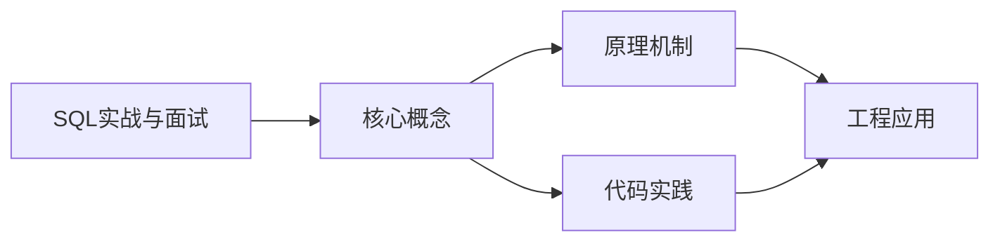
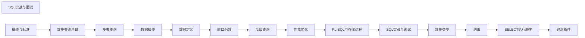

## 1. 学习目标（Bloom 分类）

本节按照布鲁姆教育目标分类学组织学习路径。本文主题为《SQL实战与面试》，属于 SQL 模块，读者可以根据自身阶段选择阅读深度。

记忆层面：能够准确复述本文的核心概念、术语与基本语法或操作步骤，并能够在提问或检索时快速定位对应知识点。能够说出 SQL 的核心概念、语法与常用对象。

理解层面：能够用自己的语言解释核心原理与工作机制，说明概念之间的因果关系，而不是机械记忆结论。能够解释 SQL 的执行原理与优化机制。

应用层面：能够在真实项目或练习场景中运用本文知识解决具体问题，写出正确且可维护的实现。能够编写正确、高效的 SQL 语句与操作。

分析层面：能够拆解复杂问题，比较本文主题与相邻概念的异同，识别边界条件与例外情况。能够分析 SQL 相关方案在性能与一致性上的权衡。

评价层面：能够根据约束条件（性能、可读性、安全、成本）评价不同方案的优劣，做出有依据的技术决策。能够根据业务场景评价 SQL 技术选型。

创造层面：能够把本文知识与其他模块知识组合，设计出新的解决方案或可复用的工程模式。能够组合 SQL 与其他技术设计数据架构。

通过本节学习，读者应当能够把《SQL实战与面试》纳入自己的知识网络，并与 SQL 模块的其他主题（DDL/DML、查询、索引、事务）建立关联。

## 2. 历史动机与发展脉络

《SQL实战与面试》是 SQL 领域的重要主题。要真正理解它，需要先了解它解决的问题与演进过程。

SQL（结构化查询语言）源于 1970 年 Codd 的关系模型，1974 年由 Chamberlin 与 Boyce 设计（SEQUEL），1986 年成为 ANSI 标准；SQL:2023 是当前国际标准。
SQL 分为 DDL（建表）、DML（增删改）、DQL（查询）、DCL（权限）与 TCL（事务）；各大数据库在标准基础上扩展方言。
SQL 是声明式语言：描述“要什么”而非“怎么做”，优化器负责执行计划；这一设计让 SQL 具有跨数据库的表达一致性。

回到本文主题：SQL实战与面试 的提出与成熟，正是上述技术背景下的必然产物。早期实现往往以简单可用为目标，随着工程规模扩大，社区逐渐沉淀出标准做法与最佳实践；理解这一脉络，可以帮助读者判断“为什么文档中的推荐写法是现在这个样子”，也能在遇到历史遗留代码时准确识别其设计年代与取舍。


## 3. 形式化定义与核心概念精讲

本节把《SQL实战与面试》涉及的核心概念以“定义 + 讲解”的形式展开。读者应把定义当作工具，把讲解当作理解路径；两者结合才能形成可迁移的知识。

关系模型：表（关系）、行（元组）、列（属性）；主键唯一标识、外键表达关联、范式消除冗余。
查询执行：解析 -> 绑定 -> 优化（基于代价选择计划）-> 执行；索引、统计信息与连接算法决定性能。
事务 ACID：原子性（Atomicity）、一致性（Consistency）、隔离性（Isolation）、持久性（Durability）；隔离级别控制并发行为。

### 3.1 原文章节逐一精讲

原文档把主题拆分为 6 个小节，下面按顺序给出每一节的导读讲解，随后保留原文细节供精读。

#### 原文精读（完整保留）


# SQL实战与面试

#### 经典面试题

##### 1. Top N 问题

**题目**：查询每个部门薪资排名前 3 的员工。

```sql
-- 方法一：窗口函数（推荐）
WITH ranked AS (
  SELECT
    name,
    department,
    salary,
    DENSE_RANK() OVER(PARTITION BY department ORDER BY salary DESC) AS rnk
  FROM employees
)
SELECT name, department, salary
FROM ranked
WHERE rnk <= 3;

-- 方法二：相关子查询（通用但性能差）
SELECT e1.name, e1.department, e1.salary
FROM employees e1
WHERE (
  SELECT COUNT(DISTINCT e2.salary)
  FROM employees e2
  WHERE e2.department = e1.department AND e2.salary > e1.salary
) < 3;

-- 方法三：PostgreSQL DISTINCT ON（取每组第一条）
SELECT DISTINCT ON (department) name, department, salary
FROM employees
ORDER BY department, salary DESC;
```

##### 2. 连续登录问题

**题目**：找出连续登录 3 天及以上的用户。

```sql
-- 方法一：日期减 ROW_NUMBER（经典解法）
WITH daily_logins AS (
  SELECT DISTINCT user_id, DATE(login_time) AS login_date
  FROM user_logins
),
grouped AS (
  SELECT
    user_id,
    login_date,
    login_date - (ROW_NUMBER() OVER(PARTITION BY user_id ORDER BY login_date))::INT AS grp
  FROM daily_logins
)
SELECT
  user_id,
  MIN(login_date) AS start_date,
  MAX(login_date) AS end_date,
  COUNT(*) AS consecutive_days
FROM grouped
GROUP BY user_id, grp
HAVING COUNT(*) >= 3;

-- 方法二：LEAD 偏移法
WITH daily_logins AS (
  SELECT DISTINCT user_id, DATE(login_time) AS login_date
  FROM user_logins
),
with_next AS (
  SELECT
    user_id,
    login_date,
    LEAD(login_date, 2) OVER(PARTITION BY user_id ORDER BY login_date) AS date_2_days_later
  FROM daily_logins
)
SELECT DISTINCT user_id
FROM with_next
WHERE date_2_days_later = login_date + INTERVAL '2 days';
```

##### 3. 行列转换

**题目**：将学生成绩从行格式转为列格式。

```sql
-- 原始数据
-- student | subject | score
-- Alice   | Math    | 90
-- Alice   | English | 85
-- Bob     | Math    | 78

-- 目标
-- student | Math | English
-- Alice   | 90   | 85
-- Bob     | 78   | NULL

-- 方法一：CASE WHEN（通用）
SELECT
  student,
  MAX(CASE WHEN subject = 'Math' THEN score END) AS Math,
  MAX(CASE WHEN subject = 'English' THEN score END) AS English,
  MAX(CASE WHEN subject = 'Science' THEN score END) AS Science
FROM scores
GROUP BY student;

-- 方法二：SQL Server PIVOT
SELECT student, [Math], [English], [Science]
FROM scores
PIVOT (MAX(score) FOR subject IN ([Math], [English], [Science])) p;

-- 反向：列转行
SELECT student, 'Math' AS subject, Math AS score FROM wide_scores WHERE Math IS NOT NULL
UNION ALL
SELECT student, 'English', English FROM wide_scores WHERE English IS NOT NULL
UNION ALL
SELECT student, 'Science', Science FROM wide_scores WHERE Science IS NOT NULL;
```

##### 4. 中位数

**题目**：计算每个部门的薪资中位数。

```sql
-- 方法一：PERCENTILE_CONT（PostgreSQL / SQL Server / Oracle）
SELECT
  department,
  PERCENTILE_CONT(0.5) WITHIN GROUP(ORDER BY salary) AS median_salary
FROM employees
GROUP BY department;

-- 方法二：窗口函数（通用）
WITH ranked AS (
  SELECT
    department,
    salary,
    ROW_NUMBER() OVER(PARTITION BY department ORDER BY salary) AS rn,
    COUNT(*) OVER(PARTITION BY department) AS cnt
  FROM employees
)
SELECT
  department,
  AVG(salary) AS median_salary
FROM ranked
WHERE rn IN (FLOOR((cnt + 1) / 2.0), CEIL((cnt + 1) / 2.0))
GROUP BY department;
```

##### 5. 留存分析

**题目**：计算用户的次日、7日、30日留存率。

```sql
WITH first_login AS (
  -- 每个用户的首次登录日期
  SELECT user_id, MIN(DATE(login_time)) AS first_date
  FROM user_logins
  GROUP BY user_id
),
login_dates AS (
  -- 每个用户每天的登录记录
  SELECT DISTINCT user_id, DATE(login_time) AS login_date
  FROM user_logins
),
retention AS (
  -- 计算留存
  SELECT
    f.first_date AS cohort_date,
    l.login_date,
    l.login_date - f.first_date AS day_diff
  FROM first_login f
  JOIN login_dates l ON f.user_id = l.user_id
)
SELECT
  cohort_date,
  COUNT(DISTINCT CASE WHEN day_diff = 0 THEN user_id END) AS day_0,
  COUNT(DISTINCT CASE WHEN day_diff = 1 THEN user_id END) AS day_1,
  COUNT(DISTINCT CASE WHEN day_diff = 7 THEN user_id END) AS day_7,
  COUNT(DISTINCT CASE WHEN day_diff = 30 THEN user_id END) AS day_30,
  ROUND(
    COUNT(DISTINCT CASE WHEN day_diff = 1 THEN user_id END) * 100.0
    / COUNT(DISTINCT CASE WHEN day_diff = 0 THEN user_id END),
    2
  ) AS day1_rate,
  ROUND(
    COUNT(DISTINCT CASE WHEN day_diff = 7 THEN user_id END) * 100.0
    / COUNT(DISTINCT CASE WHEN day_diff = 0 THEN user_id END),
    2
  ) AS day7_rate
FROM retention
GROUP BY cohort_date
ORDER BY cohort_date;
```

##### 6. 去重问题

**题目**：删除表中重复记录，只保留 id 最小的一条。

```sql
-- 方法一：窗口函数
WITH duplicates AS (
  SELECT id,
    ROW_NUMBER() OVER(PARTITION BY email ORDER BY id) AS rn
  FROM users
)
DELETE FROM users WHERE id IN (
  SELECT id FROM duplicates WHERE rn > 1
);

-- 方法二：自连接（MySQL）
DELETE u1 FROM users u1
JOIN users u2 ON u1.email = u2.email AND u1.id > u2.id;

-- 方法三：NOT IN
DELETE FROM users
WHERE id NOT IN (
  SELECT MIN(id) FROM users GROUP BY email
);
```

##### 7. 累计求和与分组求和

**题目**：计算每月累计销售额，以及每月占全年的比例。

```sql
SELECT
  month,
  monthly_sales,
  SUM(monthly_sales) OVER(ORDER BY month) AS cumulative_sales,
  SUM(monthly_sales) OVER() AS yearly_total,
  ROUND(
    monthly_sales * 100.0 / SUM(monthly_sales) OVER(),
    2
  ) AS pct_of_year,
  ROUND(
    SUM(monthly_sales) OVER(ORDER BY month) * 100.0
    / SUM(monthly_sales) OVER(),
    2
  ) AS cumulative_pct
FROM monthly_sales_data;
```

#### 业务场景 SQL

##### 电商场景

```sql
-- 1. RFM 分析（最近购买时间、购买频率、消费金额）
WITH rfm AS (
  SELECT
    customer_id,
    CURRENT_DATE - MAX(order_date) AS recency,
    COUNT(*) AS frequency,
    SUM(amount) AS monetary
  FROM orders
  WHERE status = 'completed'
  GROUP BY customer_id
)
SELECT
  customer_id,
  NTILE(5) OVER(ORDER BY recency DESC) AS r_score,
  NTILE(5) OVER(ORDER BY frequency) AS f_score,
  NTILE(5) OVER(ORDER BY monetary) AS m_score
FROM rfm;

-- 2. 购物篮分析（频繁项集）
SELECT
  a.product_id AS product_a,
  b.product_id AS product_b,
  COUNT(*) AS pair_count
FROM order_items a
JOIN order_items b ON a.order_id = b.order_id AND a.product_id < b.product_id
GROUP BY a.product_id, b.product_id
HAVING COUNT(*) > 10
ORDER BY pair_count DESC;

-- 3. 用户漏斗分析
SELECT
  '访问' AS step,
  COUNT(DISTINCT user_id) AS users
FROM page_views
WHERE page = 'home'
UNION ALL
SELECT
  '搜索',
  COUNT(DISTINCT user_id)
FROM page_views
WHERE page = 'search'
UNION ALL
SELECT
  '加购',
  COUNT(DISTINCT user_id)
FROM cart_adds
UNION ALL
SELECT
  '下单',
  COUNT(DISTINCT user_id)
FROM orders
WHERE created_at >= CURRENT_DATE - INTERVAL '30 days';
```

##### SaaS 场景

```sql
-- 1. MRR（月度经常性收入）
SELECT
  DATE_TRUNC('month', date) AS month,
  SUM(CASE WHEN action = 'new' THEN amount
           WHEN action = 'upgrade' THEN amount_diff
           WHEN action = 'downgrade' THEN amount_diff
           WHEN action = 'churn' THEN -amount
           ELSE 0 END) AS mrr_change,
  SUM(SUM(CASE WHEN action = 'new' THEN amount
              WHEN action = 'upgrade' THEN amount_diff
              WHEN action = 'downgrade' THEN amount_diff
              WHEN action = 'churn' THEN -amount
              ELSE 0 END)) OVER(ORDER BY DATE_TRUNC('month', date)) AS mrr
FROM subscription_changes
GROUP BY month
ORDER BY month;

-- 2. 用户活跃度分层
WITH user_activity AS (
  SELECT
    user_id,
    COUNT(DISTINCT DATE(activity_time)) AS active_days
  FROM user_activities
  WHERE activity_time >= CURRENT_DATE - INTERVAL '30 days'
  GROUP BY user_id
)
SELECT
  CASE
    WHEN active_days >= 20 THEN '高活跃'
    WHEN active_days >= 10 THEN '中活跃'
    WHEN active_days >= 3 THEN '低活跃'
    ELSE '沉默'
  END AS activity_level,
  COUNT(*) AS user_count
FROM user_activity
GROUP BY activity_level;
```

#### 数据仓库 SQL

##### 星型模型查询

```sql
-- 事实表: fact_sales
-- 维度表: dim_date, dim_product, dim_store, dim_customer

-- 多维分析：按时间、产品类别、地区统计销售额
SELECT
  d.year,
  d.quarter,
  p.category,
  s.region,
  COUNT(f.sale_id) AS sale_count,
  SUM(f.amount) AS total_amount,
  AVG(f.amount) AS avg_amount
FROM fact_sales f
JOIN dim_date d ON f.date_id = d.id
JOIN dim_product p ON f.product_id = p.id
JOIN dim_store s ON f.store_id = s.id
WHERE d.year = 2024
GROUP BY d.year, d.quarter, p.category, s.region;

-- SCD Type 2 维度查询（历史版本追踪）
SELECT
  p.product_name,
  p.category,
  f.amount,
  p.valid_from,
  p.valid_to
FROM fact_sales f
JOIN dim_product p ON f.product_id = p.id
  AND f.sale_date BETWEEN p.valid_from AND COALESCE(p.valid_to, '9999-12-31')
WHERE f.sale_date = '2024-06-01';
```

##### ETL 常用模式

```sql
-- 1. 缓慢变化维度（SCD Type 2）更新
-- 关闭旧记录
UPDATE dim_customer
SET valid_to = CURRENT_DATE, is_current = false
WHERE natural_key = :customer_id AND is_current = true;

-- 插入新记录
INSERT INTO dim_customer (natural_key, name, email, valid_from, is_current)
VALUES (:customer_id, :name, :email, CURRENT_DATE, true);

-- 2. 增量加载（MERGE）
MERGE INTO fact_sales_daily target
USING staging_sales source
ON target.sale_id = source.sale_id
WHEN MATCHED AND source.updated_at > target.updated_at THEN
  UPDATE SET amount = source.amount, updated_at = source.updated_at
WHEN NOT MATCHED THEN
  INSERT (sale_id, date_id, product_id, amount, updated_at)
  VALUES (source.sale_id, source.date_id, source.product_id, source.amount, source.updated_at);

-- 3. 事实表分区交换（快速加载）
-- PostgreSQL
CREATE TABLE fact_sales_new (LIKE fact_sales INCLUDING INDEXES);
-- 加载数据到 fact_sales_new ...
ALTER TABLE fact_sales EXCHANGE PARTITION p202406 WITH TABLE fact_sales_new;
```

#### SQL 编码规范

##### 命名规范

```sql
--  推荐
SELECT
  user_id,
  order_date,
  total_amount
FROM orders
WHERE order_status = 'completed';

--  不推荐
SELECT UserID, OrderDate, TotalAmount FROM ORDERS WHERE OrderStatus = 'completed';

-- 表名：小写，下划线分隔，复数形式
-- users, order_items, product_categories

-- 列名：小写，下划线分隔
-- user_id, created_at, is_active

-- 索引名：idx_表名_列名
-- idx_users_email, idx_orders_customer_id_date

-- 约束名：类型缩写_表名_列名
-- pk_users_id, fk_orders_customer_id, uk_users_email, chk_orders_amount
```

##### 格式规范

```sql
--  关键字大写，合理缩进
SELECT
  u.name,
  u.email,
  COUNT(o.id) AS order_count,
  SUM(o.amount) AS total_amount
FROM users u
LEFT JOIN orders o ON u.id = o.user_id
WHERE u.status = 'active'
  AND u.created_at >= '2024-01-01'
GROUP BY
  u.name,
  u.email
HAVING COUNT(o.id) > 0
ORDER BY total_amount DESC
LIMIT 100;

--  子查询使用 CTE
WITH active_users AS (
  SELECT id, name, email
  FROM users
  WHERE status = 'active'
  AND last_login >= CURRENT_DATE - INTERVAL '30 days'
)
SELECT
  au.name,
  COUNT(o.id) AS order_count
FROM active_users au
LEFT JOIN orders o ON au.id = o.user_id
GROUP BY au.name;

--  复杂条件换行
SELECT *
FROM orders
WHERE
  (status = 'pending' AND created_at < CURRENT_DATE - INTERVAL '7 days')
  OR
  (status = 'processing' AND created_at < CURRENT_DATE - INTERVAL '3 days')
  OR
  (status = 'shipped' AND created_at < CURRENT_DATE - INTERVAL '30 days');
```

##### 性能规范

```sql
-- 1. 避免 SELECT *
--
SELECT * FROM users;
--
SELECT id, name, email FROM users;

-- 2. 谨慎使用 DISTINCT
--  可能掩盖数据问题
SELECT DISTINCT user_id FROM orders;
--  理解为什么有重复
SELECT user_id FROM orders GROUP BY user_id;

-- 3. 大表操作分批进行
--  锁表时间过长
DELETE FROM logs WHERE created_at < '2023-01-01';
--  分批删除
DELETE FROM logs WHERE created_at < '2023-01-01' LIMIT 10000;
-- 或使用游标循环

-- 4. 使用 EXISTS 替代 IN（大数据量）
-- 5. LIKE 避免前缀通配符
-- 6. 合理使用索引提示（最后手段）

-- 7. 事务保持简短
--  事务中包含耗时操作
BEGIN;
SELECT * FROM large_table WHERE ...;  -- 耗时查询
UPDATE accounts SET ...;
COMMIT;

--  事务只包含必要的操作
-- 先查询，再开事务更新
BEGIN;
UPDATE accounts SET balance = balance - 100 WHERE id = 1;
UPDATE accounts SET balance = balance + 100 WHERE id = 2;
COMMIT;
```

##### 安全规范

```sql
-- 1. 永远使用参数化查询
--  SQL 注入
-- "SELECT * FROM users WHERE name = '" + input + "'"
--
-- cursor.execute("SELECT * FROM users WHERE name = %s", (input,))

-- 2. 最小权限原则
-- 应用账号只授予必要权限
GRANT SELECT, INSERT, UPDATE ON orders TO app_user;
-- 不授予 DDL 权限
-- REVOKE CREATE, DROP, ALTER ON * FROM app_user;

-- 3. 敏感数据加密
-- 密码使用 bcrypt/argon2 哈希
-- 身份证号、手机号加密存储
-- 日志中脱敏处理

-- 4. 避免动态 SQL 拼接
--
-- EXECUTE 'SELECT * FROM ' || table_name;
--  使用白名单校验
IF table_name NOT IN ('users', 'orders', 'products') THEN
  RAISE EXCEPTION '非法表名';
END IF;
```

#### 面试准备清单

##### 必会知识点

| 类别         | 知识点                                                 |
| ------------ | ------------------------------------------------------ |
| **基础**     | SELECT 执行顺序、JOIN 类型、WHERE vs HAVING、NULL 处理 |
| **窗口函数** | ROW_NUMBER/RANK/DENSE_RANK、LAG/LEAD、累计求和         |
| **多表**     | 子查询 vs JOIN、EXISTS vs IN、CTE                      |
| **数据操作** | 事务 ACID、隔离级别、UPSERT                            |
| **性能**     | EXPLAIN 解读、索引类型、索引失效场景                   |
| **实战**     | Top N、连续登录、行列转换、留存分析                    |

##### 高频面试题速查

```
1. SQL 执行顺序？        → FROM → WHERE → GROUP BY → HAVING → SELECT → ORDER BY → LIMIT
2. LEFT JOIN vs INNER JOIN？ → 左连接保留左表全部，内连接只返回匹配行
3. WHERE vs HAVING？     → WHERE 分组前过滤行，HAVING 分组后过滤组
4. UNION vs UNION ALL？  → UNION 去重排序，UNION ALL 不去重更快
5. EXISTS vs IN？        → EXISTS 短路求值适合大子查询，IN 适合小子查询
6. 如何去重？            → DISTINCT / GROUP BY / ROW_NUMBER
7. 如何取分组 Top N？    → ROW_NUMBER() OVER(PARTITION BY ... ORDER BY ...)
8. 索引什么时候失效？    → 函数、隐式转换、前缀通配符、不等于、OR
9. 事务隔离级别？        → 读未提交、读已提交、可重复读、串行化
10. 什么是 MVCC？        → 多版本并发控制，读写不阻塞
```

#### 小结

- Top N 问题首选窗口函数 `DENSE_RANK`，连续登录问题用日期减 `ROW_NUMBER`
- 行列转换用 `CASE WHEN`，中位数用 `PERCENTILE_CONT`
- 留存分析是数据岗位的核心考点，理解 cohort 概念是关键
- 业务 SQL 注重理解需求，数据仓库 SQL 注重理解模型
- 编码规范提升可读性和可维护性，安全规范防止 SQL 注入
- 面试准备要兼顾理论深度和实战能力，窗口函数和执行计划是重点


### 3.2 概念关系图

下面用 Mermaid 图表达本文核心概念之间的关系，帮助读者建立整体图景：



图中展示的是本文知识的结构化关系：核心概念是入口，原理机制解释“为什么”，代码实践演示“怎么做”，工程应用回答“何时用”。读者学习时可以把每个小节的内容挂接到对应节点上。

## 4. 理论推导与原理解析

本节深入《SQL实战与面试》背后的原理。理论部分不求面面俱到，而是聚焦“能解释现象、能指导实践”的关键推导。

关系模型：表（关系）、行（元组）、列（属性）；主键唯一标识、外键表达关联、范式消除冗余。
查询执行：解析 -> 绑定 -> 优化（基于代价选择计划）-> 执行；索引、统计信息与连接算法决定性能。
事务 ACID：原子性（Atomicity）、一致性（Consistency）、隔离性（Isolation）、持久性（Durability）；隔离级别控制并发行为。
集合语义：SELECT 返回结果集；JOIN 组合关系，GROUP BY 聚合，子查询与 CTE 表达复杂逻辑。

需要强调的是，理论推导与工程实践之间存在翻译层：理论给出的是理想化模型与边界条件，工程代码则必须处理真实环境中的例外。读者在学习时应先掌握理论的“标准情形”，再通过陷阱章节了解“非标准情形”。

## 5. 代码示例与逐行讲解

本节把原文中的代码示例系统整理，并为每个示例补充用途说明与讲解。读者不应只浏览代码，而应逐段对照讲解理解设计意图。

### 5.1 示例：1. Top N 问题

该示例来自原文《1. Top N 问题》小节，用于演示SQL实战与面试相关操作。阅读时请先看代码结构，再看其后的讲解。

```sql
-- 方法一：窗口函数（推荐）
WITH ranked AS (
  SELECT
    name,
    department,
    salary,
    DENSE_RANK() OVER(PARTITION BY department ORDER BY salary DESC) AS rnk
  FROM employees
)
SELECT name, department, salary
FROM ranked
WHERE rnk <= 3;

-- 方法二：相关子查询（通用但性能差）
SELECT e1.name, e1.department, e1.salary
FROM employees e1
WHERE (
  SELECT COUNT(DISTINCT e2.salary)
  FROM employees e2
  WHERE e2.department = e1.department AND e2.salary > e1.salary
) < 3;

-- 方法三：PostgreSQL DISTINCT ON（取每组第一条）
SELECT DISTINCT ON (department) name, department, salary
FROM employees
ORDER BY department, salary DESC;
```

讲解：这段代码演示了本节核心知识点。代码中的关键操作可以归纳为三步：准备（定义或初始化）、执行（核心逻辑）、收尾（释放资源或返回结果）。实际项目中，这三步往往被封装为函数或类，以提升复用性与可测试性。

关键点分析：

该示例共 24 行有效代码，包含 2 类关键结构（SELECT、FROM）。其中：

- 入口与初始化部分负责建立上下文，对应实际项目中的启动或装配逻辑；
- 核心逻辑部分体现本文主题的主要操作，是阅读时最需要对照讲解理解的部分；
- 输出或返回部分把结果交给调用方，注意其类型与边界条件。

进阶思考路径：先尝试修改参数观察行为变化，再把示例中的模式迁移到自己的项目中；每次修改都记录预期与实测差异，这是把示例转化为能力的最快方式。

### 5.2 示例：2. 连续登录问题

该示例来自原文《2. 连续登录问题》小节，用于演示SQL实战与面试相关操作。阅读时请先看代码结构，再看其后的讲解。

```sql
-- 方法一：日期减 ROW_NUMBER（经典解法）
WITH daily_logins AS (
  SELECT DISTINCT user_id, DATE(login_time) AS login_date
  FROM user_logins
),
grouped AS (
  SELECT
    user_id,
    login_date,
    login_date - (ROW_NUMBER() OVER(PARTITION BY user_id ORDER BY login_date))::INT AS grp
  FROM daily_logins
)
SELECT
  user_id,
  MIN(login_date) AS start_date,
  MAX(login_date) AS end_date,
  COUNT(*) AS consecutive_days
FROM grouped
GROUP BY user_id, grp
HAVING COUNT(*) >= 3;

-- 方法二：LEAD 偏移法
WITH daily_logins AS (
  SELECT DISTINCT user_id, DATE(login_time) AS login_date
  FROM user_logins
),
with_next AS (
  SELECT
    user_id,
    login_date,
    LEAD(login_date, 2) OVER(PARTITION BY user_id ORDER BY login_date) AS date_2_days_later
  FROM daily_logins
)
SELECT DISTINCT user_id
FROM with_next
WHERE date_2_days_later = login_date + INTERVAL '2 days';
```

讲解：这段代码演示了本节核心知识点。代码中的关键操作可以归纳为三步：准备（定义或初始化）、执行（核心逻辑）、收尾（释放资源或返回结果）。实际项目中，这三步往往被封装为函数或类，以提升复用性与可测试性。

关键点分析：

该示例共 35 行有效代码，包含 2 类关键结构（SELECT、FROM）。其中：

- 入口与初始化部分负责建立上下文，对应实际项目中的启动或装配逻辑；
- 核心逻辑部分体现本文主题的主要操作，是阅读时最需要对照讲解理解的部分；
- 输出或返回部分把结果交给调用方，注意其类型与边界条件。

进阶思考路径：先尝试修改参数观察行为变化，再把示例中的模式迁移到自己的项目中；每次修改都记录预期与实测差异，这是把示例转化为能力的最快方式。

### 5.3 示例：3. 行列转换

该示例来自原文《3. 行列转换》小节，用于演示SQL实战与面试相关操作。阅读时请先看代码结构，再看其后的讲解。

```sql
-- 原始数据
-- student | subject | score
-- Alice   | Math    | 90
-- Alice   | English | 85
-- Bob     | Math    | 78

-- 目标
-- student | Math | English
-- Alice   | 90   | 85
-- Bob     | 78   | NULL

-- 方法一：CASE WHEN（通用）
SELECT
  student,
  MAX(CASE WHEN subject = 'Math' THEN score END) AS Math,
  MAX(CASE WHEN subject = 'English' THEN score END) AS English,
  MAX(CASE WHEN subject = 'Science' THEN score END) AS Science
FROM scores
GROUP BY student;

-- 方法二：SQL Server PIVOT
SELECT student, [Math], [English], [Science]
FROM scores
PIVOT (MAX(score) FOR subject IN ([Math], [English], [Science])) p;

-- 反向：列转行
SELECT student, 'Math' AS subject, Math AS score FROM wide_scores WHERE Math IS NOT NULL
UNION ALL
SELECT student, 'English', English FROM wide_scores WHERE English IS NOT NULL
UNION ALL
SELECT student, 'Science', Science FROM wide_scores WHERE Science IS NOT NULL;
```

讲解：这段代码演示了本节核心知识点。代码中的关键操作可以归纳为三步：准备（定义或初始化）、执行（核心逻辑）、收尾（释放资源或返回结果）。实际项目中，这三步往往被封装为函数或类，以提升复用性与可测试性。

关键点分析：

该示例共 27 行有效代码，包含 2 类关键结构（SELECT、FROM）。其中：

- 入口与初始化部分负责建立上下文，对应实际项目中的启动或装配逻辑；
- 核心逻辑部分体现本文主题的主要操作，是阅读时最需要对照讲解理解的部分；
- 输出或返回部分把结果交给调用方，注意其类型与边界条件。

进阶思考路径：先尝试修改参数观察行为变化，再把示例中的模式迁移到自己的项目中；每次修改都记录预期与实测差异，这是把示例转化为能力的最快方式。

### 5.4 示例：4. 中位数

该示例来自原文《4. 中位数》小节，用于演示SQL实战与面试相关操作。阅读时请先看代码结构，再看其后的讲解。

```sql
-- 方法一：PERCENTILE_CONT（PostgreSQL / SQL Server / Oracle）
SELECT
  department,
  PERCENTILE_CONT(0.5) WITHIN GROUP(ORDER BY salary) AS median_salary
FROM employees
GROUP BY department;

-- 方法二：窗口函数（通用）
WITH ranked AS (
  SELECT
    department,
    salary,
    ROW_NUMBER() OVER(PARTITION BY department ORDER BY salary) AS rn,
    COUNT(*) OVER(PARTITION BY department) AS cnt
  FROM employees
)
SELECT
  department,
  AVG(salary) AS median_salary
FROM ranked
WHERE rn IN (FLOOR((cnt + 1) / 2.0), CEIL((cnt + 1) / 2.0))
GROUP BY department;
```

讲解：这段代码演示了本节核心知识点。代码中的关键操作可以归纳为三步：准备（定义或初始化）、执行（核心逻辑）、收尾（释放资源或返回结果）。实际项目中，这三步往往被封装为函数或类，以提升复用性与可测试性。

关键点分析：

该示例共 21 行有效代码，包含 2 类关键结构（SELECT、FROM）。其中：

- 入口与初始化部分负责建立上下文，对应实际项目中的启动或装配逻辑；
- 核心逻辑部分体现本文主题的主要操作，是阅读时最需要对照讲解理解的部分；
- 输出或返回部分把结果交给调用方，注意其类型与边界条件。

进阶思考路径：先尝试修改参数观察行为变化，再把示例中的模式迁移到自己的项目中；每次修改都记录预期与实测差异，这是把示例转化为能力的最快方式。

### 5.5 示例：5. 留存分析

该示例来自原文《5. 留存分析》小节，用于演示SQL实战与面试相关操作。阅读时请先看代码结构，再看其后的讲解。

```sql
WITH first_login AS (
  -- 每个用户的首次登录日期
  SELECT user_id, MIN(DATE(login_time)) AS first_date
  FROM user_logins
  GROUP BY user_id
),
login_dates AS (
  -- 每个用户每天的登录记录
  SELECT DISTINCT user_id, DATE(login_time) AS login_date
  FROM user_logins
),
retention AS (
  -- 计算留存
  SELECT
    f.first_date AS cohort_date,
    l.login_date,
    l.login_date - f.first_date AS day_diff
  FROM first_login f
  JOIN login_dates l ON f.user_id = l.user_id
)
SELECT
  cohort_date,
  COUNT(DISTINCT CASE WHEN day_diff = 0 THEN user_id END) AS day_0,
  COUNT(DISTINCT CASE WHEN day_diff = 1 THEN user_id END) AS day_1,
  COUNT(DISTINCT CASE WHEN day_diff = 7 THEN user_id END) AS day_7,
  COUNT(DISTINCT CASE WHEN day_diff = 30 THEN user_id END) AS day_30,
  ROUND(
    COUNT(DISTINCT CASE WHEN day_diff = 1 THEN user_id END) * 100.0
    / COUNT(DISTINCT CASE WHEN day_diff = 0 THEN user_id END),
    2
  ) AS day1_rate,
  ROUND(
    COUNT(DISTINCT CASE WHEN day_diff = 7 THEN user_id END) * 100.0
    / COUNT(DISTINCT CASE WHEN day_diff = 0 THEN user_id END),
    2
  ) AS day7_rate
FROM retention
GROUP BY cohort_date
ORDER BY cohort_date;
```

讲解：这段代码演示了本节核心知识点。代码中的关键操作可以归纳为三步：准备（定义或初始化）、执行（核心逻辑）、收尾（释放资源或返回结果）。实际项目中，这三步往往被封装为函数或类，以提升复用性与可测试性。

关键点分析：

该示例共 39 行有效代码，包含 2 类关键结构（SELECT、FROM）。其中：

- 入口与初始化部分负责建立上下文，对应实际项目中的启动或装配逻辑；
- 核心逻辑部分体现本文主题的主要操作，是阅读时最需要对照讲解理解的部分；
- 输出或返回部分把结果交给调用方，注意其类型与边界条件。

进阶思考路径：先尝试修改参数观察行为变化，再把示例中的模式迁移到自己的项目中；每次修改都记录预期与实测差异，这是把示例转化为能力的最快方式。

### 5.6 示例：6. 去重问题

该示例来自原文《6. 去重问题》小节，用于演示SQL实战与面试相关操作。阅读时请先看代码结构，再看其后的讲解。

```sql
-- 方法一：窗口函数
WITH duplicates AS (
  SELECT id,
    ROW_NUMBER() OVER(PARTITION BY email ORDER BY id) AS rn
  FROM users
)
DELETE FROM users WHERE id IN (
  SELECT id FROM duplicates WHERE rn > 1
);

-- 方法二：自连接（MySQL）
DELETE u1 FROM users u1
JOIN users u2 ON u1.email = u2.email AND u1.id > u2.id;

-- 方法三：NOT IN
DELETE FROM users
WHERE id NOT IN (
  SELECT MIN(id) FROM users GROUP BY email
);
```

讲解：这段代码演示了本节核心知识点。代码中的关键操作可以归纳为三步：准备（定义或初始化）、执行（核心逻辑）、收尾（释放资源或返回结果）。实际项目中，这三步往往被封装为函数或类，以提升复用性与可测试性。

关键点分析：

该示例共 17 行有效代码，包含 2 类关键结构（SELECT、FROM）。其中：

- 入口与初始化部分负责建立上下文，对应实际项目中的启动或装配逻辑；
- 核心逻辑部分体现本文主题的主要操作，是阅读时最需要对照讲解理解的部分；
- 输出或返回部分把结果交给调用方，注意其类型与边界条件。

进阶思考路径：先尝试修改参数观察行为变化，再把示例中的模式迁移到自己的项目中；每次修改都记录预期与实测差异，这是把示例转化为能力的最快方式。

### 5.7 示例：7. 累计求和与分组求和

该示例来自原文《7. 累计求和与分组求和》小节，用于演示SQL实战与面试相关操作。阅读时请先看代码结构，再看其后的讲解。

```sql
SELECT
  month,
  monthly_sales,
  SUM(monthly_sales) OVER(ORDER BY month) AS cumulative_sales,
  SUM(monthly_sales) OVER() AS yearly_total,
  ROUND(
    monthly_sales * 100.0 / SUM(monthly_sales) OVER(),
    2
  ) AS pct_of_year,
  ROUND(
    SUM(monthly_sales) OVER(ORDER BY month) * 100.0
    / SUM(monthly_sales) OVER(),
    2
  ) AS cumulative_pct
FROM monthly_sales_data;
```

讲解：这段代码演示了本节核心知识点。代码中的关键操作可以归纳为三步：准备（定义或初始化）、执行（核心逻辑）、收尾（释放资源或返回结果）。实际项目中，这三步往往被封装为函数或类，以提升复用性与可测试性。

关键点分析：

该示例共 15 行有效代码，包含 2 类关键结构（SELECT、FROM）。其中：

- 入口与初始化部分负责建立上下文，对应实际项目中的启动或装配逻辑；
- 核心逻辑部分体现本文主题的主要操作，是阅读时最需要对照讲解理解的部分；
- 输出或返回部分把结果交给调用方，注意其类型与边界条件。

进阶思考路径：先尝试修改参数观察行为变化，再把示例中的模式迁移到自己的项目中；每次修改都记录预期与实测差异，这是把示例转化为能力的最快方式。

### 5.8 示例：电商场景

该示例来自原文《电商场景》小节，用于演示SQL实战与面试相关操作。阅读时请先看代码结构，再看其后的讲解。

```sql
-- 1. RFM 分析（最近购买时间、购买频率、消费金额）
WITH rfm AS (
  SELECT
    customer_id,
    CURRENT_DATE - MAX(order_date) AS recency,
    COUNT(*) AS frequency,
    SUM(amount) AS monetary
  FROM orders
  WHERE status = 'completed'
  GROUP BY customer_id
)
SELECT
  customer_id,
  NTILE(5) OVER(ORDER BY recency DESC) AS r_score,
  NTILE(5) OVER(ORDER BY frequency) AS f_score,
  NTILE(5) OVER(ORDER BY monetary) AS m_score
FROM rfm;

-- 2. 购物篮分析（频繁项集）
SELECT
  a.product_id AS product_a,
  b.product_id AS product_b,
  COUNT(*) AS pair_count
FROM order_items a
JOIN order_items b ON a.order_id = b.order_id AND a.product_id < b.product_id
GROUP BY a.product_id, b.product_id
HAVING COUNT(*) > 10
ORDER BY pair_count DESC;

-- 3. 用户漏斗分析
SELECT
  '访问' AS step,
  COUNT(DISTINCT user_id) AS users
FROM page_views
WHERE page = 'home'
UNION ALL
SELECT
  '搜索',
  COUNT(DISTINCT user_id)
FROM page_views
WHERE page = 'search'
UNION ALL
SELECT
  '加购',
  COUNT(DISTINCT user_id)
FROM cart_adds
UNION ALL
SELECT
  '下单',
  COUNT(DISTINCT user_id)
FROM orders
WHERE created_at >= CURRENT_DATE - INTERVAL '30 days';
```

讲解：这段代码演示了本节核心知识点。代码中的关键操作可以归纳为三步：准备（定义或初始化）、执行（核心逻辑）、收尾（释放资源或返回结果）。实际项目中，这三步往往被封装为函数或类，以提升复用性与可测试性。

关键点分析：

该示例共 50 行有效代码，包含 2 类关键结构（SELECT、FROM）。其中：

- 入口与初始化部分负责建立上下文，对应实际项目中的启动或装配逻辑；
- 核心逻辑部分体现本文主题的主要操作，是阅读时最需要对照讲解理解的部分；
- 输出或返回部分把结果交给调用方，注意其类型与边界条件。

进阶思考路径：先尝试修改参数观察行为变化，再把示例中的模式迁移到自己的项目中；每次修改都记录预期与实测差异，这是把示例转化为能力的最快方式。

### 5.9 示例：SaaS 场景

该示例来自原文《SaaS 场景》小节，用于演示SQL实战与面试相关操作。阅读时请先看代码结构，再看其后的讲解。

```sql
-- 1. MRR（月度经常性收入）
SELECT
  DATE_TRUNC('month', date) AS month,
  SUM(CASE WHEN action = 'new' THEN amount
           WHEN action = 'upgrade' THEN amount_diff
           WHEN action = 'downgrade' THEN amount_diff
           WHEN action = 'churn' THEN -amount
           ELSE 0 END) AS mrr_change,
  SUM(SUM(CASE WHEN action = 'new' THEN amount
              WHEN action = 'upgrade' THEN amount_diff
              WHEN action = 'downgrade' THEN amount_diff
              WHEN action = 'churn' THEN -amount
              ELSE 0 END)) OVER(ORDER BY DATE_TRUNC('month', date)) AS mrr
FROM subscription_changes
GROUP BY month
ORDER BY month;

-- 2. 用户活跃度分层
WITH user_activity AS (
  SELECT
    user_id,
    COUNT(DISTINCT DATE(activity_time)) AS active_days
  FROM user_activities
  WHERE activity_time >= CURRENT_DATE - INTERVAL '30 days'
  GROUP BY user_id
)
SELECT
  CASE
    WHEN active_days >= 20 THEN '高活跃'
    WHEN active_days >= 10 THEN '中活跃'
    WHEN active_days >= 3 THEN '低活跃'
    ELSE '沉默'
  END AS activity_level,
  COUNT(*) AS user_count
FROM user_activity
GROUP BY activity_level;
```

讲解：这段代码演示了本节核心知识点。代码中的关键操作可以归纳为三步：准备（定义或初始化）、执行（核心逻辑）、收尾（释放资源或返回结果）。实际项目中，这三步往往被封装为函数或类，以提升复用性与可测试性。

关键点分析：

该示例共 35 行有效代码，包含 2 类关键结构（SELECT、FROM）。其中：

- 入口与初始化部分负责建立上下文，对应实际项目中的启动或装配逻辑；
- 核心逻辑部分体现本文主题的主要操作，是阅读时最需要对照讲解理解的部分；
- 输出或返回部分把结果交给调用方，注意其类型与边界条件。

进阶思考路径：先尝试修改参数观察行为变化，再把示例中的模式迁移到自己的项目中；每次修改都记录预期与实测差异，这是把示例转化为能力的最快方式。

### 5.10 示例：星型模型查询

该示例来自原文《星型模型查询》小节，用于演示SQL实战与面试相关操作。阅读时请先看代码结构，再看其后的讲解。

```sql
-- 事实表: fact_sales
-- 维度表: dim_date, dim_product, dim_store, dim_customer

-- 多维分析：按时间、产品类别、地区统计销售额
SELECT
  d.year,
  d.quarter,
  p.category,
  s.region,
  COUNT(f.sale_id) AS sale_count,
  SUM(f.amount) AS total_amount,
  AVG(f.amount) AS avg_amount
FROM fact_sales f
JOIN dim_date d ON f.date_id = d.id
JOIN dim_product p ON f.product_id = p.id
JOIN dim_store s ON f.store_id = s.id
WHERE d.year = 2024
GROUP BY d.year, d.quarter, p.category, s.region;

-- SCD Type 2 维度查询（历史版本追踪）
SELECT
  p.product_name,
  p.category,
  f.amount,
  p.valid_from,
  p.valid_to
FROM fact_sales f
JOIN dim_product p ON f.product_id = p.id
  AND f.sale_date BETWEEN p.valid_from AND COALESCE(p.valid_to, '9999-12-31')
WHERE f.sale_date = '2024-06-01';
```

讲解：这段代码演示了本节核心知识点。代码中的关键操作可以归纳为三步：准备（定义或初始化）、执行（核心逻辑）、收尾（释放资源或返回结果）。实际项目中，这三步往往被封装为函数或类，以提升复用性与可测试性。

关键点分析：

该示例共 28 行有效代码，包含 3 类关键结构（from、SELECT、FROM）。其中：

- 入口与初始化部分负责建立上下文，对应实际项目中的启动或装配逻辑；
- 核心逻辑部分体现本文主题的主要操作，是阅读时最需要对照讲解理解的部分；
- 输出或返回部分把结果交给调用方，注意其类型与边界条件。

进阶思考路径：先尝试修改参数观察行为变化，再把示例中的模式迁移到自己的项目中；每次修改都记录预期与实测差异，这是把示例转化为能力的最快方式。

### 5.11 示例：ETL 常用模式

该示例来自原文《ETL 常用模式》小节，用于演示SQL实战与面试相关操作。阅读时请先看代码结构，再看其后的讲解。

```sql
-- 1. 缓慢变化维度（SCD Type 2）更新
-- 关闭旧记录
UPDATE dim_customer
SET valid_to = CURRENT_DATE, is_current = false
WHERE natural_key = :customer_id AND is_current = true;

-- 插入新记录
INSERT INTO dim_customer (natural_key, name, email, valid_from, is_current)
VALUES (:customer_id, :name, :email, CURRENT_DATE, true);

-- 2. 增量加载（MERGE）
MERGE INTO fact_sales_daily target
USING staging_sales source
ON target.sale_id = source.sale_id
WHEN MATCHED AND source.updated_at > target.updated_at THEN
  UPDATE SET amount = source.amount, updated_at = source.updated_at
WHEN NOT MATCHED THEN
  INSERT (sale_id, date_id, product_id, amount, updated_at)
  VALUES (source.sale_id, source.date_id, source.product_id, source.amount, source.updated_at);

-- 3. 事实表分区交换（快速加载）
-- PostgreSQL
CREATE TABLE fact_sales_new (LIKE fact_sales INCLUDING INDEXES);
-- 加载数据到 fact_sales_new ...
ALTER TABLE fact_sales EXCHANGE PARTITION p202406 WITH TABLE fact_sales_new;
```

讲解：这段代码演示了本节核心知识点。代码中的关键操作可以归纳为三步：准备（定义或初始化）、执行（核心逻辑）、收尾（释放资源或返回结果）。实际项目中，这三步往往被封装为函数或类，以提升复用性与可测试性。

关键点分析：

该示例共 22 行有效代码，包含 3 类关键结构（INSERT、CREATE、ALTER）。其中：

- 入口与初始化部分负责建立上下文，对应实际项目中的启动或装配逻辑；
- 核心逻辑部分体现本文主题的主要操作，是阅读时最需要对照讲解理解的部分；
- 输出或返回部分把结果交给调用方，注意其类型与边界条件。

进阶思考路径：先尝试修改参数观察行为变化，再把示例中的模式迁移到自己的项目中；每次修改都记录预期与实测差异，这是把示例转化为能力的最快方式。

### 5.12 示例：命名规范

该示例来自原文《命名规范》小节，用于演示SQL实战与面试相关操作。阅读时请先看代码结构，再看其后的讲解。

```sql
--  推荐
SELECT
  user_id,
  order_date,
  total_amount
FROM orders
WHERE order_status = 'completed';

--  不推荐
SELECT UserID, OrderDate, TotalAmount FROM ORDERS WHERE OrderStatus = 'completed';

-- 表名：小写，下划线分隔，复数形式
-- users, order_items, product_categories

-- 列名：小写，下划线分隔
-- user_id, created_at, is_active

-- 索引名：idx_表名_列名
-- idx_users_email, idx_orders_customer_id_date

-- 约束名：类型缩写_表名_列名
-- pk_users_id, fk_orders_customer_id, uk_users_email, chk_orders_amount
```

讲解：这段代码演示了本节核心知识点。代码中的关键操作可以归纳为三步：准备（定义或初始化）、执行（核心逻辑）、收尾（释放资源或返回结果）。实际项目中，这三步往往被封装为函数或类，以提升复用性与可测试性。

关键点分析：

该示例共 17 行有效代码，包含 2 类关键结构（SELECT、FROM）。其中：

- 入口与初始化部分负责建立上下文，对应实际项目中的启动或装配逻辑；
- 核心逻辑部分体现本文主题的主要操作，是阅读时最需要对照讲解理解的部分；
- 输出或返回部分把结果交给调用方，注意其类型与边界条件。

进阶思考路径：先尝试修改参数观察行为变化，再把示例中的模式迁移到自己的项目中；每次修改都记录预期与实测差异，这是把示例转化为能力的最快方式。

### 5.13 示例：格式规范

该示例来自原文《格式规范》小节，用于演示SQL实战与面试相关操作。阅读时请先看代码结构，再看其后的讲解。

```sql
--  关键字大写，合理缩进
SELECT
  u.name,
  u.email,
  COUNT(o.id) AS order_count,
  SUM(o.amount) AS total_amount
FROM users u
LEFT JOIN orders o ON u.id = o.user_id
WHERE u.status = 'active'
  AND u.created_at >= '2024-01-01'
GROUP BY
  u.name,
  u.email
HAVING COUNT(o.id) > 0
ORDER BY total_amount DESC
LIMIT 100;

--  子查询使用 CTE
WITH active_users AS (
  SELECT id, name, email
  FROM users
  WHERE status = 'active'
  AND last_login >= CURRENT_DATE - INTERVAL '30 days'
)
SELECT
  au.name,
  COUNT(o.id) AS order_count
FROM active_users au
LEFT JOIN orders o ON au.id = o.user_id
GROUP BY au.name;

--  复杂条件换行
SELECT *
FROM orders
WHERE
  (status = 'pending' AND created_at < CURRENT_DATE - INTERVAL '7 days')
  OR
  (status = 'processing' AND created_at < CURRENT_DATE - INTERVAL '3 days')
  OR
  (status = 'shipped' AND created_at < CURRENT_DATE - INTERVAL '30 days');
```

讲解：这段代码演示了本节核心知识点。代码中的关键操作可以归纳为三步：准备（定义或初始化）、执行（核心逻辑）、收尾（释放资源或返回结果）。实际项目中，这三步往往被封装为函数或类，以提升复用性与可测试性。

关键点分析：

该示例共 38 行有效代码，包含 2 类关键结构（SELECT、FROM）。其中：

- 入口与初始化部分负责建立上下文，对应实际项目中的启动或装配逻辑；
- 核心逻辑部分体现本文主题的主要操作，是阅读时最需要对照讲解理解的部分；
- 输出或返回部分把结果交给调用方，注意其类型与边界条件。

进阶思考路径：先尝试修改参数观察行为变化，再把示例中的模式迁移到自己的项目中；每次修改都记录预期与实测差异，这是把示例转化为能力的最快方式。

### 5.14 示例：性能规范

该示例来自原文《性能规范》小节，用于演示SQL实战与面试相关操作。阅读时请先看代码结构，再看其后的讲解。

```sql
-- 1. 避免 SELECT *
--
SELECT * FROM users;
--
SELECT id, name, email FROM users;

-- 2. 谨慎使用 DISTINCT
--  可能掩盖数据问题
SELECT DISTINCT user_id FROM orders;
--  理解为什么有重复
SELECT user_id FROM orders GROUP BY user_id;

-- 3. 大表操作分批进行
--  锁表时间过长
DELETE FROM logs WHERE created_at < '2023-01-01';
--  分批删除
DELETE FROM logs WHERE created_at < '2023-01-01' LIMIT 10000;
-- 或使用游标循环

-- 4. 使用 EXISTS 替代 IN（大数据量）
-- 5. LIKE 避免前缀通配符
-- 6. 合理使用索引提示（最后手段）

-- 7. 事务保持简短
--  事务中包含耗时操作
BEGIN;
SELECT * FROM large_table WHERE ...;  -- 耗时查询
UPDATE accounts SET ...;
COMMIT;

--  事务只包含必要的操作
-- 先查询，再开事务更新
BEGIN;
UPDATE accounts SET balance = balance - 100 WHERE id = 1;
UPDATE accounts SET balance = balance + 100 WHERE id = 2;
COMMIT;
```

讲解：这段代码演示了本节核心知识点。代码中的关键操作可以归纳为三步：准备（定义或初始化）、执行（核心逻辑）、收尾（释放资源或返回结果）。实际项目中，这三步往往被封装为函数或类，以提升复用性与可测试性。

关键点分析：

该示例共 31 行有效代码，包含 2 类关键结构（SELECT、FROM）。其中：

- 入口与初始化部分负责建立上下文，对应实际项目中的启动或装配逻辑；
- 核心逻辑部分体现本文主题的主要操作，是阅读时最需要对照讲解理解的部分；
- 输出或返回部分把结果交给调用方，注意其类型与边界条件。

进阶思考路径：先尝试修改参数观察行为变化，再把示例中的模式迁移到自己的项目中；每次修改都记录预期与实测差异，这是把示例转化为能力的最快方式。

### 5.15 示例：安全规范

该示例来自原文《安全规范》小节，用于演示SQL实战与面试相关操作。阅读时请先看代码结构，再看其后的讲解。

```sql
-- 1. 永远使用参数化查询
--  SQL 注入
-- "SELECT * FROM users WHERE name = '" + input + "'"
--
-- cursor.execute("SELECT * FROM users WHERE name = %s", (input,))

-- 2. 最小权限原则
-- 应用账号只授予必要权限
GRANT SELECT, INSERT, UPDATE ON orders TO app_user;
-- 不授予 DDL 权限
-- REVOKE CREATE, DROP, ALTER ON * FROM app_user;

-- 3. 敏感数据加密
-- 密码使用 bcrypt/argon2 哈希
-- 身份证号、手机号加密存储
-- 日志中脱敏处理

-- 4. 避免动态 SQL 拼接
--
-- EXECUTE 'SELECT * FROM ' || table_name;
--  使用白名单校验
IF table_name NOT IN ('users', 'orders', 'products') THEN
  RAISE EXCEPTION '非法表名';
END IF;
```

讲解：这段代码演示了本节核心知识点。代码中的关键操作可以归纳为三步：准备（定义或初始化）、执行（核心逻辑）、收尾（释放资源或返回结果）。实际项目中，这三步往往被封装为函数或类，以提升复用性与可测试性。

关键点分析：

该示例共 21 行有效代码，包含 5 类关键结构（SELECT、INSERT、CREATE、ALTER、FROM）。其中：

- 入口与初始化部分负责建立上下文，对应实际项目中的启动或装配逻辑；
- 核心逻辑部分体现本文主题的主要操作，是阅读时最需要对照讲解理解的部分；
- 输出或返回部分把结果交给调用方，注意其类型与边界条件。

进阶思考路径：先尝试修改参数观察行为变化，再把示例中的模式迁移到自己的项目中；每次修改都记录预期与实测差异，这是把示例转化为能力的最快方式。

### 5.16 示例：高频面试题速查

该示例来自原文《高频面试题速查》小节，用于演示SQL实战与面试相关操作。阅读时请先看代码结构，再看其后的讲解。

```text
1. SQL 执行顺序？        → FROM → WHERE → GROUP BY → HAVING → SELECT → ORDER BY → LIMIT
2. LEFT JOIN vs INNER JOIN？ → 左连接保留左表全部，内连接只返回匹配行
3. WHERE vs HAVING？     → WHERE 分组前过滤行，HAVING 分组后过滤组
4. UNION vs UNION ALL？  → UNION 去重排序，UNION ALL 不去重更快
5. EXISTS vs IN？        → EXISTS 短路求值适合大子查询，IN 适合小子查询
6. 如何去重？            → DISTINCT / GROUP BY / ROW_NUMBER
7. 如何取分组 Top N？    → ROW_NUMBER() OVER(PARTITION BY ... ORDER BY ...)
8. 索引什么时候失效？    → 函数、隐式转换、前缀通配符、不等于、OR
9. 事务隔离级别？        → 读未提交、读已提交、可重复读、串行化
10. 什么是 MVCC？        → 多版本并发控制，读写不阻塞
```

讲解：这段代码演示了本节核心知识点。代码中的关键操作可以归纳为三步：准备（定义或初始化）、执行（核心逻辑）、收尾（释放资源或返回结果）。实际项目中，这三步往往被封装为函数或类，以提升复用性与可测试性。

关键点分析：

该示例共 10 行有效代码，包含 2 类关键结构（SELECT、FROM）。其中：

- 入口与初始化部分负责建立上下文，对应实际项目中的启动或装配逻辑；
- 核心逻辑部分体现本文主题的主要操作，是阅读时最需要对照讲解理解的部分；
- 输出或返回部分把结果交给调用方，注意其类型与边界条件。

进阶思考路径：先尝试修改参数观察行为变化，再把示例中的模式迁移到自己的项目中；每次修改都记录预期与实测差异，这是把示例转化为能力的最快方式。


综合以上示例，可以总结出本主题的代码实践要点：第一，先定义清晰的输入输出契约；第二，核心逻辑保持单一职责；第三，错误处理与边界条件不可省略；第四，命名与注释表达意图而非复述代码。

## 6. 对比分析

对比是理解《SQL实战与面试》定位的最快路径。下面从多个维度与相邻方案进行对比。

SQL 与 NoSQL：SQL 适合关系与事务，NoSQL（文档/键值/宽表）适合弹性扩展与特定模型；混合架构常见。
MySQL 与 PostgreSQL：MySQL 生态普及、复制成熟；PostgreSQL 功能全面（窗口、JSON、扩展）。
存储过程与业务代码：复杂逻辑放应用层更可测试；存储过程适合强封装场景。

对比的目的不是分出绝对优劣，而是建立选择依据：不同约束条件下，最优解不同。读者应把每个对比维度转化为决策检查清单。

## 7. 常见陷阱与最佳实践

本节整理该主题的高频错误与推荐做法。每个陷阱先描述现象，再解释原因，最后给出最佳实践。

### 7.1 SELECT * 滥用

返回多余列浪费带宽且破坏视图依赖。显式列出所需列。

深入讲解：该问题之所以被归类为“常见陷阱”，是因为它在初学者的代码中反复出现，而且往往不在第一时间暴露——错误通常隐藏在特定数据或特定时序下。

从成因上看，SELECT * 滥用 一般源于对 SQL 某个机制的理解偏差：要么误用了默认行为，要么忽略了边界条件，要么把其他语言的思维惯性带了过来。

从影响上看，SELECT * 滥用 轻则产生错误结果，重则导致资源泄漏、数据损坏或安全事故；这也是为什么工程评审中会把它列为检查项。

从修复策略上看，处理SELECT * 滥用的正确顺序是：先复现（构造最小用例），再定位（确认机制层面的根因），最后修复并补充回归测试。跳过复现直接改代码，往往治标不治本。

### 7.2 隐式类型转换

字符串与数字比较走转换，索引失效。保持类型一致。

深入讲解：该问题之所以被归类为“常见陷阱”，是因为它在初学者的代码中反复出现，而且往往不在第一时间暴露——错误通常隐藏在特定数据或特定时序下。

从成因上看，隐式类型转换 一般源于对 SQL 某个机制的理解偏差：要么误用了默认行为，要么忽略了边界条件，要么把其他语言的思维惯性带了过来。

从影响上看，隐式类型转换 轻则产生错误结果，重则导致资源泄漏、数据损坏或安全事故；这也是为什么工程评审中会把它列为检查项。

从修复策略上看，处理隐式类型转换的正确顺序是：先复现（构造最小用例），再定位（确认机制层面的根因），最后修复并补充回归测试。跳过复现直接改代码，往往治标不治本。

### 7.3 函数包裹索引列

WHERE DATE(ts)=... 无法用索引。使用范围条件。

深入讲解：该问题之所以被归类为“常见陷阱”，是因为它在初学者的代码中反复出现，而且往往不在第一时间暴露——错误通常隐藏在特定数据或特定时序下。

从成因上看，函数包裹索引列 一般源于对 SQL 某个机制的理解偏差：要么误用了默认行为，要么忽略了边界条件，要么把其他语言的思维惯性带了过来。

从影响上看，函数包裹索引列 轻则产生错误结果，重则导致资源泄漏、数据损坏或安全事故；这也是为什么工程评审中会把它列为检查项。

从修复策略上看，处理函数包裹索引列的正确顺序是：先复现（构造最小用例），再定位（确认机制层面的根因），最后修复并补充回归测试。跳过复现直接改代码，往往治标不治本。

### 7.4 分页偏移过大

OFFSET 大时扫描大量行。使用游标或键集分页。

深入讲解：该问题之所以被归类为“常见陷阱”，是因为它在初学者的代码中反复出现，而且往往不在第一时间暴露——错误通常隐藏在特定数据或特定时序下。

从成因上看，分页偏移过大 一般源于对 SQL 某个机制的理解偏差：要么误用了默认行为，要么忽略了边界条件，要么把其他语言的思维惯性带了过来。

从影响上看，分页偏移过大 轻则产生错误结果，重则导致资源泄漏、数据损坏或安全事故；这也是为什么工程评审中会把它列为检查项。

从修复策略上看，处理分页偏移过大的正确顺序是：先复现（构造最小用例），再定位（确认机制层面的根因），最后修复并补充回归测试。跳过复现直接改代码，往往治标不治本。

### 7.5 事务内做慢查询

长事务锁资源。事务保持短小。

深入讲解：该问题之所以被归类为“常见陷阱”，是因为它在初学者的代码中反复出现，而且往往不在第一时间暴露——错误通常隐藏在特定数据或特定时序下。

从成因上看，事务内做慢查询 一般源于对 SQL 某个机制的理解偏差：要么误用了默认行为，要么忽略了边界条件，要么把其他语言的思维惯性带了过来。

从影响上看，事务内做慢查询 轻则产生错误结果，重则导致资源泄漏、数据损坏或安全事故；这也是为什么工程评审中会把它列为检查项。

从修复策略上看，处理事务内做慢查询的正确顺序是：先复现（构造最小用例），再定位（确认机制层面的根因），最后修复并补充回归测试。跳过复现直接改代码，往往治标不治本。

### 7.6 N+1 查询

循环查库。使用 JOIN 或批量查询。

深入讲解：该问题之所以被归类为“常见陷阱”，是因为它在初学者的代码中反复出现，而且往往不在第一时间暴露——错误通常隐藏在特定数据或特定时序下。

从成因上看，N+1 查询 一般源于对 SQL 某个机制的理解偏差：要么误用了默认行为，要么忽略了边界条件，要么把其他语言的思维惯性带了过来。

从影响上看，N+1 查询 轻则产生错误结果，重则导致资源泄漏、数据损坏或安全事故；这也是为什么工程评审中会把它列为检查项。

从修复策略上看，处理N+1 查询的正确顺序是：先复现（构造最小用例），再定位（确认机制层面的根因），最后修复并补充回归测试。跳过复现直接改代码，往往治标不治本。

### 7.7 不设外键约束

应用层维护引用完整性易漏。关键关系使用外键。

深入讲解：该问题之所以被归类为“常见陷阱”，是因为它在初学者的代码中反复出现，而且往往不在第一时间暴露——错误通常隐藏在特定数据或特定时序下。

从成因上看，不设外键约束 一般源于对 SQL 某个机制的理解偏差：要么误用了默认行为，要么忽略了边界条件，要么把其他语言的思维惯性带了过来。

从影响上看，不设外键约束 轻则产生错误结果，重则导致资源泄漏、数据损坏或安全事故；这也是为什么工程评审中会把它列为检查项。

从修复策略上看，处理不设外键约束的正确顺序是：先复现（构造最小用例），再定位（确认机制层面的根因），最后修复并补充回归测试。跳过复现直接改代码，往往治标不治本。

### 7.8 忽略执行计划

凭直觉优化。用 EXPLAIN 验证。

深入讲解：该问题之所以被归类为“常见陷阱”，是因为它在初学者的代码中反复出现，而且往往不在第一时间暴露——错误通常隐藏在特定数据或特定时序下。

从成因上看，忽略执行计划 一般源于对 SQL 某个机制的理解偏差：要么误用了默认行为，要么忽略了边界条件，要么把其他语言的思维惯性带了过来。

从影响上看，忽略执行计划 轻则产生错误结果，重则导致资源泄漏、数据损坏或安全事故；这也是为什么工程评审中会把它列为检查项。

从修复策略上看，处理忽略执行计划的正确顺序是：先复现（构造最小用例），再定位（确认机制层面的根因），最后修复并补充回归测试。跳过复现直接改代码，往往治标不治本。

### 7.0 最佳实践总览

1. 命名规范：表名复数或单数统一，列名小写下划线，主键 id。
2. 每个表必须有主键，时间戳列记录变更。
3. 查询先 WHERE 缩小数据量，再 JOIN 与聚合。
4. 迁移脚本版本化，变更可回滚。
5. 生产查询全部过 EXPLAIN 与慢日志检查。

把这些最佳实践固化为团队规范与代码评审检查项，是避免同类问题反复出现的关键。

## 8. 工程实践

本节把《SQL实战与面试》放入真实工程场景，给出可复用的模式与组织方法。

连接池管理数据库连接；迁移工具（Flyway/Alembic）版本化 schema。
读写分离与分库分表按量级引入；缓存（Redis）承担热数据。
监控：慢查询日志、连接数、QPS、复制延迟。

### 8.1 工程实践的原则拆解

以上工程实践可以归纳为四条原则。第一，配置与代码分离：SQL 项目中环境差异应通过配置注入，而不是散落在代码分支中；这保证同一份代码可以在开发、测试、生产环境一致运行。

第二，接口稳定优先：对外接口（函数签名、协议、数据格式）一旦被消费方依赖，变更成本极高；设计时应预留扩展点并保持向后兼容。

第三，可观测性内置：日志、指标与追踪应该在功能开发时同步设计，而不是故障发生后补救；没有观测手段的模块等于黑盒。

第四，变更可回滚：任何发布都应有对应的回滚方案；数据库迁移、配置变更与代码发布一样需要版本管理与逆向路径。

### 8.2 实践落地的检查清单

- [ ] 实践 1：对照本节描述，检查当前项目是否已经落实；未落实的项列入技术债并排期处理。
- [ ] 实践 2：对照本节描述，检查当前项目是否已经落实；未落实的项列入技术债并排期处理。
- [ ] 监控：对照本节描述，检查当前项目是否已经落实；未落实的项列入技术债并排期处理。

工程实践的共性原则：配置与代码分离、接口稳定优先、可观测性内置、变更可回滚。这些原则适用于本主题的所有实现。

## 9. 案例研究

本节通过一个完整案例把《SQL实战与面试》的知识串起来。案例按“需求分析、方案设计、实现、验证”四步展开。

需求：为订单系统设计表结构与核心查询。
方案：订单主表 + 明细表 + 用户表；事务保证一致；索引覆盖高频查询。
要点：金额用 decimal；状态用枚举；时间用 UTC；分页用键集。
验证：EXPLAIN 检查索引；并发插入测试唯一约束；压测查询延迟。

### 9.1 案例的扩展讨论

把案例中的方案放大到真实规模，需要额外考虑三个问题：

第一，规模：当数据量或并发量上升一个数量级时，原方案中的数据结构、缓存策略与任务调度是否仍然成立？通常需要引入分层与异步。

第二，团队：多人协作时，模块边界、接口契约与代码所有权必须明确；案例中的实现应拆分为可独立测试的单元，并配合文档说明设计意图。

第三，演进：上线后的需求变化不可避免；方案设计时应预留扩展点（配置化、插件化、事件化），并定期用真实指标验证假设。


案例研究的学习方法：先独立阅读需求，尝试在脑中形成方案，再对照实现与讲解，最后思考“如果约束变化（数据量、并发、团队规模），方案应如何调整”。

## 10. 知识要点总结与深入讲解

本节以讲解形式汇总全文要点，替代传统的习题与自测，读者不需要答题，只需跟随解释建立完整的认知框架。

关于《SQL实战与面试》的核心结论：

SQL 的声明式表达力建立在关系代数之上，理解集合思维是进阶关键。
索引、执行计划与事务是三大实战主题。
工程化：迁移、连接池、监控与慢查询治理缺一不可。

原文档各小节的要点回顾：

- 经典面试题：该小节围绕SQL实战与面试展开具体细节，阅读时应关注其与核心结论的对应关系；每个小节都是核心结论在某一个侧面的展开。
- 业务场景 SQL：该小节围绕SQL实战与面试展开具体细节，阅读时应关注其与核心结论的对应关系；每个小节都是核心结论在某一个侧面的展开。
- 数据仓库 SQL：该小节围绕SQL实战与面试展开具体细节，阅读时应关注其与核心结论的对应关系；每个小节都是核心结论在某一个侧面的展开。
- SQL 编码规范：该小节围绕SQL实战与面试展开具体细节，阅读时应关注其与核心结论的对应关系；每个小节都是核心结论在某一个侧面的展开。
- 面试准备清单：该小节围绕SQL实战与面试展开具体细节，阅读时应关注其与核心结论的对应关系；每个小节都是核心结论在某一个侧面的展开。
- 小结：该小节围绕SQL实战与面试展开具体细节，阅读时应关注其与核心结论的对应关系；每个小节都是核心结论在某一个侧面的展开。

把以上要点与第 3-9 节的内容对照复习，即可完成对本文主题的闭环学习。

## 11. 参考文献


SQL 标准（ISO/IEC 9075）：https://www.iso.org/standard/76583.html
PostgreSQL 文档（SQL 章节）：https://www.postgresql.org/docs/current/sql.html
MySQL 文档：https://dev.mysql.com/doc/
SQLite 文档：https://www.sqlite.org/docs.html
Use The Index, Luke：https://use-the-index-luke.com/

## 12. 延伸阅读


SQL 连接与子查询，见 019-sql 模块文档。
SQL 自连接与递归，见 019-sql/019-SelfJoin 文档。
MySQL 深入，见 020-mysql 模块。
PostgreSQL 深入，见 021-postgresql 模块。
尚硅谷 Bilibili 空间（https://space.bilibili.com/302417610 ）提供 MySQL 课程。

## 14. 模块知识图谱与学习路径

本文属于 SQL 模块。为了把《SQL实战与面试》放入完整的知识网络，下面列出本模块的全部主题并给出相互关联的导读。学习时建议按模块内顺序推进，并在每个文档中留意交叉引用。



上图为模块主题的推荐学习顺序示意图（仅展示前若干主题）。各主题之间存在三类关联：

第一，前置依赖关系：早期主题是后期主题的基础，例如环境与语法先行、进阶主题随后；

第二，横向并列关系：同一层级主题从不同角度覆盖模块能力，学习顺序可以按兴趣调整；

第三，工程组合关系：多个主题在真实项目中组合使用，例如配置、性能与安全主题往往出现在同一系统的不同层面。

### 14.1 模块主题速查表

| 文档 | 主题 | 与本文的关联 |
| --- | --- | --- |
| 概述与标准 | 001-OverviewStandard | 本文的前置基础 |
| 数据查询基础 | 002-DataQueryBasics | 本文的前置基础 |
| 多表查询 | 003-MultiTableQuery | 本文的并列主题 |
| 数据操作 | 004-DML | 本文的并列主题 |
| 数据定义 | 005-DDL | 本文的并列主题 |
| 窗口函数 | 006-WindowFunction | 本文的并列主题 |
| 高级查询 | 007-AdvancedQuery | 本文的并列主题 |
| 性能优化 | 008-PerformanceOptimization | 本文的性能延伸 |
| PL-SQL与存储过程 | 009-PLSQLStoredProcedure | 本文的并列主题 |
| SQL实战与面试 | 010-SQLPracticeInterview | 本文自身 |
| 数据类型 | 011-DataType | 本文的并列主题 |
| 约束 | 012-Constraint | 本文的并列主题 |
| SELECT执行顺序 | 013-SelectExecutionOrder | 本文的并列主题 |
| 过滤条件 | 014-FilterCondition | 本文的并列主题 |
| 聚合函数 | 015-AggregateFunction | 本文的并列主题 |
| GROUP BY与分组集 | 016-GROUPBYGroupingSet | 本文的并列主题 |
| 连接查询 | 017-JoinQuery | 本文的并列主题 |
| 自然连接与USING | 018-NaturalJoinUsing | 本文的并列主题 |
| 自连接 | 019-SelfJoin | 本文的并列主题 |
| 半连接与反半连接 | 020-SemiAntiJoin | 本文的并列主题 |
| LATERAL派生表 | 021-LateralDerivedTable | 本文的并列主题 |
| 子查询 | 022-Subquery | 本文的并列主题 |
| CTE | 023-CTE | 本文的并列主题 |
| 递归CTE | 024-RecursiveCTE | 本文的并列主题 |
| PIVOT与UNPIVOT | 025-PivotUnpivot | 本文的并列主题 |
| 集合操作 | 026-SetOperation | 本文的并列主题 |
| DCL | 027-DCL | 本文的并列主题 |
| TCL | 028-TCL | 本文的并列主题 |
| 索引 | 029-Index | 本文的并列主题 |
| 执行计划 | 030-ExecutionPlan | 本文的并列主题 |
| 事务ACID特性 | 031-TransactionACIDProperty | 本文的并列主题 |
| 隔离级别 | 032-IsolationLevel | 本文的并列主题 |
| 脏读不可重复读幻读 | 033-DirtyReadNonRepeatablePhantom | 本文的并列主题 |
| 锁机制 | 034-LockMechanism | 本文的原理深化 |
| MVCC | 035-MVCC | 本文的并列主题 |
| 窗口函数框架 | 036-WindowFunctionFramework | 本文的并列主题 |
| 递归CTE遍历树结构 | 037-RecursiveCTETreeTraversal | 本文的并列主题 |
| 乐观锁与悲观锁 | 038-OptimisticPessimisticLock | 本文的并列主题 |
| 常见SQL反模式 | 039-SQLAntipattern | 本文的并列主题 |
| SQL MERGE / UPSERT 语句语法速查手册 | 040-MergeStatement | 本文的并列主题 |
| SQL EXCEPT / INTERSECT 集合操作语法速查手册 | 041-ExceptIntersect | 本文的并列主题 |
| 类型转换 语法速查手册 | 042-TypeConversion | 本文的并列主题 |

速查表的作用是让读者快速判断：哪些文档应在阅读本文前掌握（前置基础），哪些文档应在阅读本文后继续（延伸主题）。本模块的交叉引用体系即以此表为基础。

## 15. 术语表

下表整理《SQL实战与面试》及 SQL 模块中出现的高频术语，给出简明释义。术语按字母序或逻辑序排列，供查阅。

| 术语 | 释义 |
| --- | --- |
| 关系模型 | 表（关系）、行（元组）、列（属性）；主键唯一标识、外键表达关联、范式消除冗余。 |
| 查询执行 | 解析 -> 绑定 -> 优化（基于代价选择计划）-> 执行；索引、统计信息与连接算法决定性能。 |
| 事务 ACID | 原子性（Atomicity）、一致性（Consistency）、隔离性（Isolation）、持久性（Durability）；隔离级别控制并发行为。 |
| 集合语义 | SELECT 返回结果集；JOIN 组合关系，GROUP BY 聚合，子查询与 CTE 表达复杂逻辑。 |
| SELECT * 滥用（易错点） | 参见常见陷阱章节的详细讲解 |
| 隐式类型转换（易错点） | 参见常见陷阱章节的详细讲解 |
| 函数包裹索引列（易错点） | 参见常见陷阱章节的详细讲解 |
| 分页偏移过大（易错点） | 参见常见陷阱章节的详细讲解 |
| 事务内做慢查询（易错点） | 参见常见陷阱章节的详细讲解 |
| N+1 查询（易错点） | 参见常见陷阱章节的详细讲解 |

术语表与正文配合使用：先通读正文，遇到模糊术语回查本表；长期使用后术语会自然进入工作记忆。
